# 「代码随想录」二叉树专题精讲（v2.0）

「代码随想录」⼆叉树专题精讲
 
作者：程序员Carl
关于代码随想录
 
代码随想录官⽹：www.programmercarl.com
代码随想录开源项⽬Github：https://github.com/youngyangyang04/leetcode-
master 
代码随想录算法公开课 ，代码随想录的全部内容将由我（程序员Carl）视频讲解
并开免费开放给⼤家。
《代码随想录》纸质版 已经出版。
代码随想录知识星球 上万录友在这⾥学习
代码随想录算法训练营 帮助录友⾼效刷完代码随想录。
PDF背景
 
该pdf是由公众号「代码随想录」⼆叉树专题的⽂章整理⽽来，共7万字，40多张⼆叉树分
析图，33篇⼆叉树精品⽂章，详细讲解了40余道leetcode⼆叉树经典题⽬，由浅⼊深，⼀
⽓呵成，这是全⽹最全的⼆叉树专题讲解！
⽬前已经发布了，⼆叉树PDF、回溯算法PDF、贪⼼算法PDF、动态规划PDF，程序员求职
攻略PDF 都⼴受获评，⼤家可以关注微信公众号：代码随想录，后台回复：666，就可以获
取全部专题PDF了。
本PDF统⼀使⽤C++进⾏讲解，题解对应的其他语⾔版本，可以在代码随想录刷题⽹
站：www.programmercarl.com上查看，⽀持C++、Java，Python，Go，JavaScript等多
语⾔版本。
PDF难免会有笔误，或者⼩问题，所以内容会不断进⾏修正，其更新顺序为：Github > 公众
号 > ⽹站 > PDF。最新版本的PDF会⾸先在公众号⾥发布，不要错过咯。
如何使⽤这本PDF？

---

就是按顺序刷就可以了！
题⽬顺序都编排好了，按照pdf⾥排好的题⽬顺序来刷效果最好，这份刷题顺序已经陪伴上
万录友（代码随想录的朋友们）。
本PDF覆盖的⼆叉树题⽬⼤纲如下：
（部分gif动画在pdf上看不了，还是需要在⽹站www.programmercarl.com上观看）
⼆叉树理论基础篇
 
我们要开启新的征程了，⼤家跟上！
说道⼆叉树，⼤家对于⼆叉树其实都很熟悉了，本⽂呢我也不想教科书式的把⼆叉树的基础
内容在啰嗦⼀遍，所以⼀下我讲的都是⼀些⽐较重点的内容。
相信只要耐⼼看完，都会有所收获。

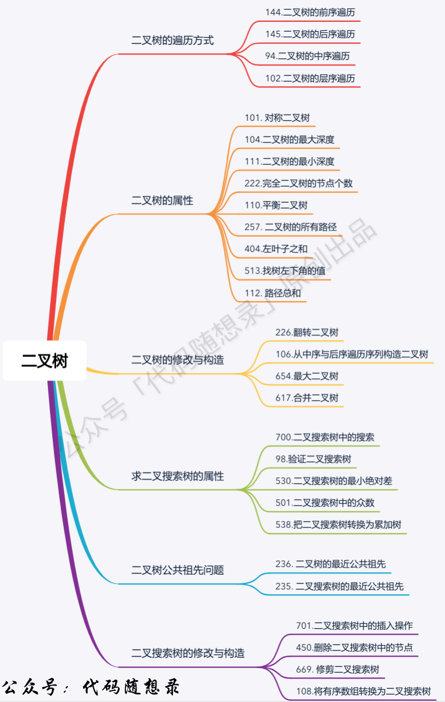

---

⼆叉树的种类
 
在我们解题过程中⼆叉树有两种主要的形式：满⼆叉树和完全⼆叉树。
满⼆叉树
 
满⼆叉树：如果⼀棵⼆叉树只有度为0的结点和度为2的结点，并且度为0的结点在同⼀层
上，则这棵⼆叉树为满⼆叉树。
如图所⽰：
这棵⼆叉树为满⼆叉树，也可以说深度为k，有2^k-1个节点的⼆叉树。

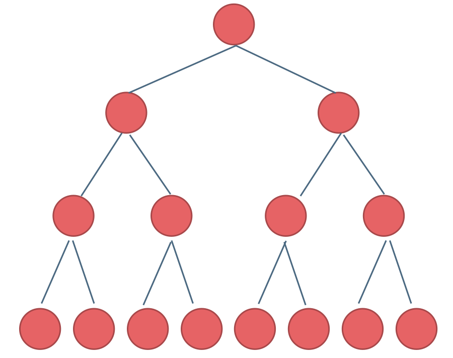

---

完全⼆叉树
 
什么是完全⼆叉树？
完全⼆叉树的定义如下：在完全⼆叉树中，除了最底层节点可能没填满外，其余每层节点数
都达到最⼤值，并且最下⾯⼀层的节点都集中在该层最左边的若⼲位置。若最底层为第 h 
层，则该层包含 1~ 2^h -1  个节点。
⼤家要⾃⼰看完全⼆叉树的定义，很多同学对完全⼆叉树其实不是真正的懂了。
我来举⼀个典型的例⼦如题：
相信不少同学最后⼀个⼆叉树是不是完全⼆叉树都中招了。
之前我们刚刚讲过优先级队列其实是⼀个堆，堆就是⼀棵完全⼆叉树，同时保证⽗⼦节点的
顺序关系。
⼆叉搜索树
 
前⾯介绍的书，都没有数值的，⽽⼆叉搜索树是有数值的了，⼆叉搜索树是⼀个有序树。
若它的左⼦树不空，则左⼦树上所有结点的值均⼩于它的根结点的值；
若它的右⼦树不空，则右⼦树上所有结点的值均⼤于它的根结点的值；
它的左、右⼦树也分别为⼆叉排序树

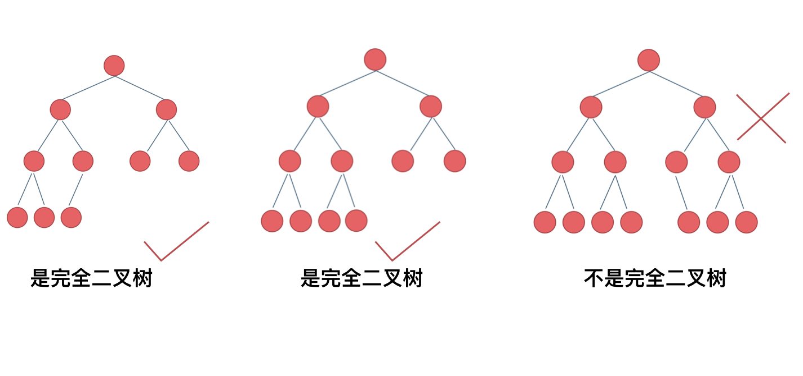

---

下⾯这两棵树都是搜索树
平衡⼆叉搜索树
 
平衡⼆叉搜索树：又被称为AVL（Adelson-Velsky and Landis）树，且具有以下性质：它是
⼀棵空树或它的左右两个⼦树的⾼度差的绝对值不超过1，并且左右两个⼦树都是⼀棵平衡
⼆叉树。
如图：
最后⼀棵 不是平衡⼆叉树，因为它的左右两个⼦树的⾼度差的绝对值超过了1。
C++中map、set、multimap，multiset的底层实现都是平衡⼆叉搜索树，所以map、set
的增删操作时间时间复杂度是logn，注意我这⾥没有说unordered_map、unordered_set，
unordered_map、unordered_map底层实现是哈希表。
所以⼤家使⽤⾃⼰熟悉的编程语⾔写算法，⼀定要知道常⽤的容器底层都是如何实现的，最
基本的就是map、set等等，否则⾃⼰写的代码，⾃⼰对其性能分析都分析不清楚！

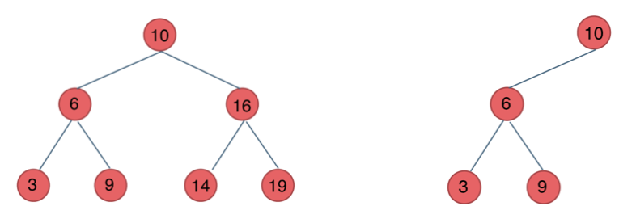

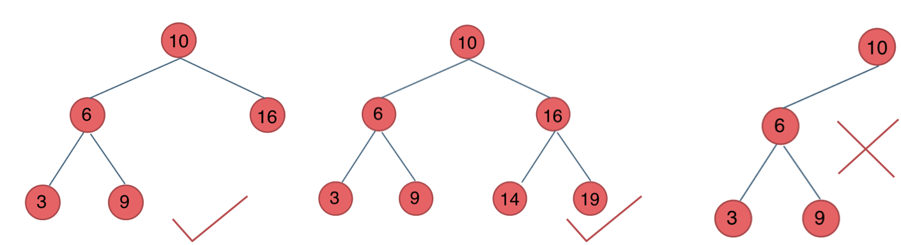

---

⼆叉树的存储⽅式
 
⼆叉树可以链式存储，也可以顺序存储。
那么链式存储⽅式就⽤指针， 顺序存储的⽅式就是⽤数组。
顾名思义就是顺序存储的元素在内存是连续分布的，⽽链式存储则是通过指针把分布在散落
在各个地址的节点串联⼀起。
链式存储如图：
链式存储是⼤家很熟悉的⼀种⽅式，那么我们来看看如何顺序存储呢？
其实就是⽤数组来存储⼆叉树，顺序存储的⽅式如图：

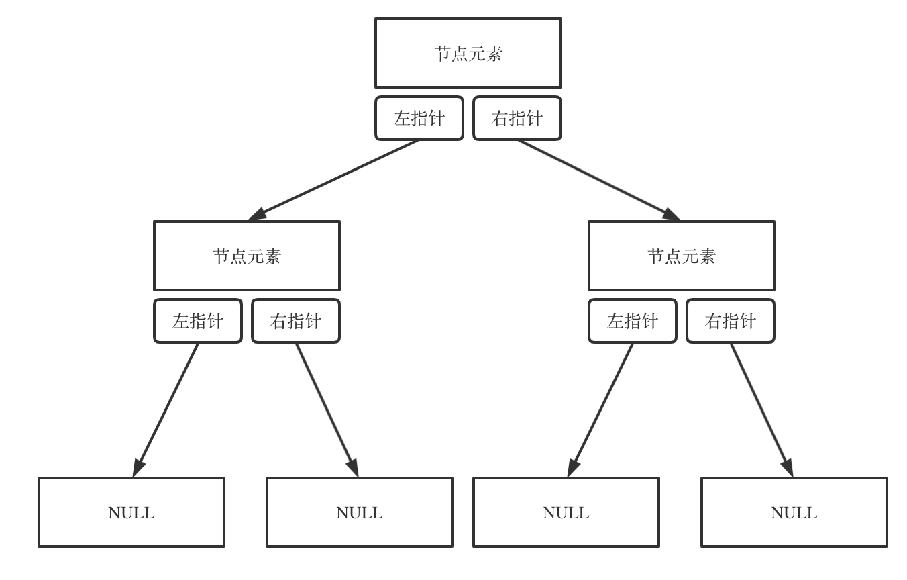

---

⽤数组来存储⼆叉树如何遍历的呢？
如果⽗节点的数组下表是i，那么它的左孩⼦就是i * 2 + 1，右孩⼦就是 i * 2 + 2。
但是⽤链式表⽰的⼆叉树，更有利于我们理解，所以⼀般我们都是⽤链式存储⼆叉树。
所以⼤家要了解，⽤数组依然可以表⽰⼆叉树。
⼆叉树的遍历⽅式
 
关于⼆叉树的遍历⽅式，要知道⼆叉树遍历的基本⽅式都有哪些。
⼀些同学⽤做了很多⼆叉树的题⽬了，可能知道前中后序遍历，可能知道层序遍历，但是却
没有框架。

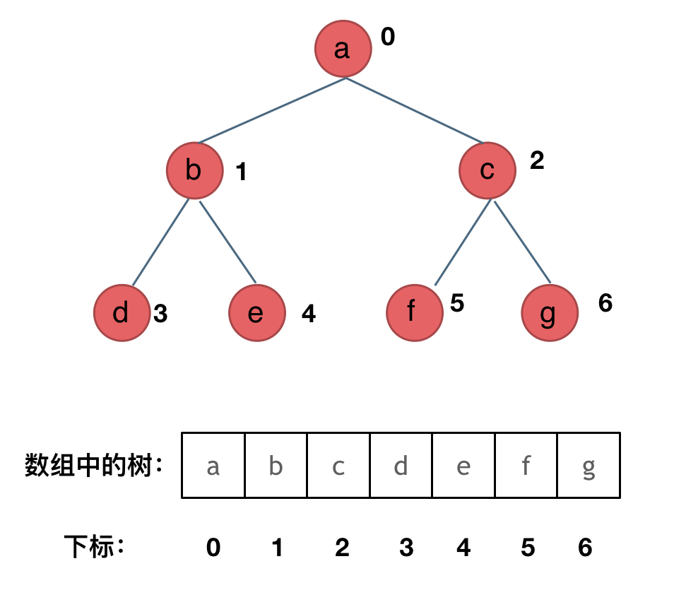

---

我这⾥把⼆叉树的⼏种遍历⽅式列出来，⼤家就可以⼀⼀串起来了。
⼆叉树主要有两种遍历⽅式：
1. 深度优先遍历：先往深⾛，遇到叶⼦节点再往回⾛。
2. ⼴度优先遍历：⼀层⼀层的去遍历。
这两种遍历是图论中最基本的两种遍历⽅式，后⾯在介绍图论的时候 还会介绍到。
那么从深度优先遍历和⼴度优先遍历进⼀步拓展，才有如下遍历⽅式：
深度优先遍历
前序遍历（递归法，迭代法）
中序遍历（递归法，迭代法）
后序遍历（递归法，迭代法）
⼴度优先遍历
层次遍历（迭代法）
在深度优先遍历中：有三个顺序，前中后序遍历， 有同学总分不清这三个顺序，经常搞
混，我这⾥教⼤家⼀个技巧。
这⾥前中后，其实指的就是中间节点的遍历顺序，只要⼤家记住 前中后序指的就是中间节
点的位置就可以了。
看如下中间节点的顺序，就可以发现，中间节点的顺序就是所谓的遍历⽅式
前序遍历：中左右
中序遍历：左中右
后序遍历：左右中
⼤家可以对着如下图，看看⾃⼰理解的前后中序有没有问题。

---

最后再说⼀说⼆叉树中深度优先和⼴度优先遍历实现⽅式，我们做⼆叉树相关题⽬，经常会
使⽤递归的⽅式来实现深度优先遍历，也就是实现前中后序遍历，使⽤递归是⽐较⽅便的。
之前我们讲栈与队列的时候，就说过栈其实就是递归的⼀种是实现结构，也就说前中后序遍
历的逻辑其实都是可以借助栈使⽤⾮递归的⽅式来实现的。
⽽⼴度优先遍历的实现⼀般使⽤队列来实现，这也是队列先进先出的特点所决定的，因为需
要先进先出的结构，才能⼀层⼀层的来遍历⼆叉树。
这⾥其实我们又了解了栈与队列的⼀个应⽤场景了。
具体的实现我们后⾯都会讲的，这⾥⼤家先要清楚这些理论基础。
⼆叉树的定义
 
刚刚我们说过了⼆叉树有两种存储⽅式顺序存储，和链式存储，顺序存储就是⽤数组来存，
这个定义没啥可说的，我们来看看链式存储的⼆叉树节点的定义⽅式。
C++代码如下：
struct TreeNode {
    int val;
    TreeNode *left;
    TreeNode *right;
    TreeNode(int x) : val(x), left(NULL), right(NULL) {}
};

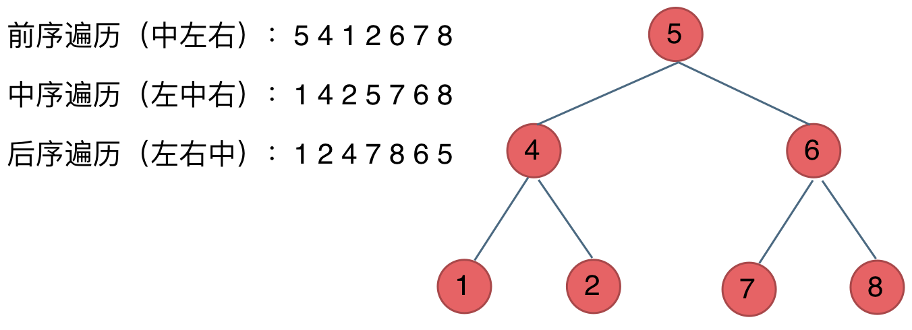

---

⼤家会发现⼆叉树的定义 和链表是差不多的，相对于链表 ，⼆叉树的节点⾥多了⼀个指
针， 有两个指针，指向左右孩⼦.
这⾥要提醒⼤家要注意⼆叉树节点定义的书写⽅式。
在现场⾯试的时候 ⾯试官可能要求⼿写代码，所以数据结构的定义以及简单逻辑的代码⼀
定要锻炼⽩纸写出来。
因为我们在刷leetcode的时候，节点的定义默认都定义好了，真到⾯试的时候，需要⾃⼰写
节点定义的时候，有时候会⼀脸懵逼！
总结
 
⼆叉树是⼀种基础数据结构，在算法⾯试中都是常客，也是众多数据结构的基⽯。
本篇我们介绍了⼆叉树的种类、存储⽅式、遍历⽅式以及定义，⽐较全⾯的介绍了⼆叉树各
个⽅⾯的重点，帮助⼤家扫⼀遍基础。
说道⼆叉树，就不得不说递归，很多同学对递归都是又熟悉又陌⽣，递归的代码⼀般很简
短，但每次都是⼀看就会，⼀写就废。
 
 
⼆叉树的递归遍历
 
⼀看就会，⼀写就废！
这次我们要好好谈⼀谈递归，为什么很多同学看递归算法都是“⼀看就会，⼀写就废”。
主要是对递归不成体系，没有⽅法论，每次写递归算法 ，都是靠⽞学来写代码，代码能不
能编过都靠运⽓。

---

本篇将介绍前后中序的递归写法，⼀些同学可能会感觉很简单，其实不然，我们要通过简单
题⽬把⽅法论确定下来，有了⽅法论，后⾯才能应付复杂的递归。
这⾥帮助⼤家确定下来递归算法的三个要素。每次写递归，都按照这三要素来写，可以保证
⼤家写出正确的递归算法！
1. 确定递归函数的参数和返回值：
确定哪些参数是递归的过程中需要处理的，那么就在递归函数⾥加上这个参数， 
并且还要明确每次递归的返回值是什么进⽽确定递归函数的返回类型。
2. 确定终⽌条件：
写完了递归算法,  运⾏的时候，经常会遇到栈溢出的错误，就是没写终⽌条件或者
终⽌条件写的不对，操作系统也是⽤⼀个栈的结构来保存每⼀层递归的信息，如果
递归没有终⽌，操作系统的内存栈必然就会溢出。
3. 确定单层递归的逻辑：
确定每⼀层递归需要处理的信息。在这⾥也就会重复调⽤⾃⼰来实现递归的过程。
好了，我们确认了递归的三要素，接下来就来练练⼿：
以下以前序遍历为例：
1. 确定递归函数的参数和返回值：因为要打印出前序遍历节点的数值，所以参数⾥需
要传⼊vector在放节点的数值，除了这⼀点就不需要在处理什么数据了也不需要有
返回值，所以递归函数返回类型就是void，代码如下：
2. 确定终⽌条件：在递归的过程中，如何算是递归结束了呢，当然是当前遍历的节点
是空了，那么本层递归就要要结束了，所以如果当前遍历的这个节点是空，就直接
return，代码如下：
3. 确定单层递归的逻辑：前序遍历是中左右的循序，所以在单层递归的逻辑，是要先
取中节点的数值，代码如下：
void traversal(TreeNode* cur, vector<int>& vec)
if (cur == NULL) return;

---

单层递归的逻辑就是按照中左右的顺序来处理的，这样⼆叉树的前序遍历，基本就写完了，
在看⼀下完整代码：
前序遍历：
那么前序遍历写出来之后，中序和后序遍历就不难理解了，代码如下：
中序遍历：
后序遍历：
vec.push_back(cur->val);    // 中
traversal(cur->left, vec);  // 左
traversal(cur->right, vec); // 右
class Solution {
public:
    void traversal(TreeNode* cur, vector<int>& vec) {
        if (cur == NULL) return;
        vec.push_back(cur->val);    // 中
        traversal(cur->left, vec);  // 左
        traversal(cur->right, vec); // 右
    }
    vector<int> preorderTraversal(TreeNode* root) {
        vector<int> result;
        traversal(root, result);
        return result;
    }
};
void traversal(TreeNode* cur, vector<int>& vec) {
    if (cur == NULL) return;
    traversal(cur->left, vec);  // 左
    vec.push_back(cur->val);    // 中
    traversal(cur->right, vec); // 右
}

---

此时⼤家可以做⼀做leetcode上三道题⽬，分别是：
144.⼆叉树的前序遍历
145.⼆叉树的后序遍历
94.⼆叉树的中序遍历
可能有同学感觉前后中序遍历的递归太简单了，要打迭代法（⾮递归），别急，我们明天打
迭代法，打个通透！
 
 
⼆叉树的迭代遍历
 
听说还可以⽤⾮递归的⽅式
看完本篇⼤家可以使⽤迭代法，再重新解决如下三道leetcode上的题⽬：
144.⼆叉树的前序遍历
94.⼆叉树的中序遍历
145.⼆叉树的后序遍历
为什么可以⽤迭代法（⾮递归的⽅式）来实现⼆叉树的前后中序遍历呢？
我们在栈与队列：匹配问题都是栈的强项中提到了，递归的实现就是：每⼀次递归调⽤都会
把函数的局部变量、参数值和返回地址等压⼊调⽤栈中，然后递归返回的时候，从栈顶弹出
上⼀次递归的各项参数，所以这就是递归为什么可以返回上⼀层位置的原因。
void traversal(TreeNode* cur, vector<int>& vec) {
    if (cur == NULL) return;
    traversal(cur->left, vec);  // 左
    traversal(cur->right, vec); // 右
    vec.push_back(cur->val);    // 中
}

---

此时⼤家应该知道我们⽤栈也可以是实现⼆叉树的前后中序遍历了。
前序遍历（迭代法）
 
我们先看⼀下前序遍历。
前序遍历是中左右，每次先处理的是中间节点，那么先将跟节点放⼊栈中，然后将右孩⼦加
⼊栈，再加⼊左孩⼦。
为什么要先加⼊ 右孩⼦，再加⼊左孩⼦呢？ 因为这样出栈的时候才是中左右的顺序。
不难写出如下代码: （注意代码中空节点不⼊栈）
此时会发现貌似使⽤迭代法写出前序遍历并不难，确实不难。
此时是不是想改⼀点前序遍历代码顺序就把中序遍历搞出来了？
class Solution {
public:
    vector<int> preorderTraversal(TreeNode* root) {
        stack<TreeNode*> st;
        vector<int> result;
        if (root == NULL) return result;
        st.push(root);
        while (!st.empty()) {
            TreeNode* node = st.top();                       // 中
            st.pop();
            result.push_back(node->val);
            if (node->right) st.push(node->right);           // 右（空
节点不⼊栈）
            if (node->left) st.push(node->left);             // 左（空
节点不⼊栈）
        }
        return result;
    }
};

---

其实还真不⾏！
但接下来，再⽤迭代法写中序遍历的时候，会发现套路又不⼀样了，⽬前的前序遍历的逻辑
⽆法直接应⽤到中序遍历上。
中序遍历（迭代法）
 
为了解释清楚，我说明⼀下 刚刚在迭代的过程中，其实我们有两个操作：
1. 处理：将元素放进result数组中
2. 访问：遍历节点
分析⼀下为什么刚刚写的前序遍历的代码，不能和中序遍历通⽤呢，因为前序遍历的顺序是
中左右，先访问的元素是中间节点，要处理的元素也是中间节点，所以刚刚才能写出相对简
洁的代码，因为要访问的元素和要处理的元素顺序是⼀致的，都是中间节点。
那么再看看中序遍历，中序遍历是左中右，先访问的是⼆叉树顶部的节点，然后⼀层⼀层向
下访问，直到到达树左⾯的最底部，再开始处理节点（也就是在把节点的数值放进result数
组中），这就造成了处理顺序和访问顺序是不⼀致的。
那么在使⽤迭代法写中序遍历，就需要借⽤指针的遍历来帮助访问节点，栈则⽤来处理节点
上的元素。
动画如下：

---

中序遍历，可以写出如下代码：
class Solution {
public:
    vector<int> inorderTraversal(TreeNode* root) {
        vector<int> result;
        stack<TreeNode*> st;
        TreeNode* cur = root;
        while (cur != NULL || !st.empty()) {
            if (cur != NULL) { // 指针来访问节点，访问到最底层
                st.push(cur); // 将访问的节点放进栈
                cur = cur->left;                // 左
            } else {
                cur = st.top(); // 从栈⾥弹出的数据，就是要处理的数据（放进
result数组⾥的数据）
                st.pop();
                result.push_back(cur->val);     // 中
                cur = cur->right;               // 右

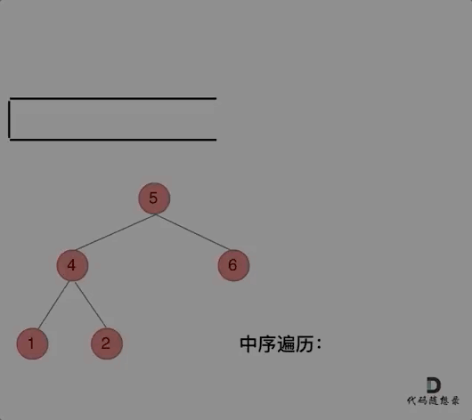

---

后序遍历（迭代法）
 
再来看后序遍历，先序遍历是中左右，后续遍历是左右中，那么我们只需要调整⼀下先序遍
历的代码顺序，就变成中右左的遍历顺序，然后在反转result数组，输出的结果顺序就是左
右中了，如下图：
所以后序遍历只需要前序遍历的代码稍作修改就可以了，代码如下：
            }
        }
        return result;
    }
};
class Solution {
public:
    vector<int> postorderTraversal(TreeNode* root) {
        stack<TreeNode*> st;
        vector<int> result;
        if (root == NULL) return result;
        st.push(root);
        while (!st.empty()) {
            TreeNode* node = st.top();
            st.pop();
            result.push_back(node->val);
            if (node->left) st.push(node->left); // 相对于前序遍历，这更
改⼀下⼊栈顺序 （空节点不⼊栈）
            if (node->right) st.push(node->right); // 空节点不⼊栈
        }

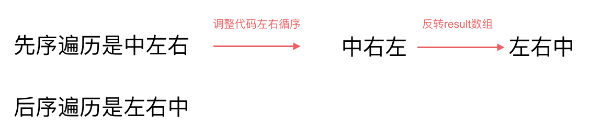

---

总结
 
此时我们⽤迭代法写出了⼆叉树的前后中序遍历，⼤家可以看出前序和中序是完全两种代码
风格，并不想递归写法那样代码稍做调整，就可以实现前后中序。
这是因为前序遍历中访问节点（遍历节点）和处理节点（将元素放进result数组中）可以同
步处理，但是中序就⽆法做到同步！
上⾯这句话，可能⼀些同学不太理解，建议⾃⼰亲⼿⽤迭代法，先写出来前序，再试试能不
能写出中序，就能理解了。
那么问题又来了，难道 ⼆叉树前后中序遍历的迭代法实现，就不能风格统⼀么（即前序遍
历 改变代码顺序就可以实现中序 和 后序）？
当然可以，这种写法，还不是很好理解，我们将在下⼀篇⽂章⾥重点讲解，敬请期待！
代码随想录官⽹：www.programmercarl.com
代码随想录开源项⽬Github：https://github.com/youngyangyang04/leetcode-
master
代码随想录算法公开课 ，代码随想录的全部内容将由我（程序员Carl）视频讲解
并开免费开放给⼤家。
《代码随想录》纸质版 已经出版。
代码随想录知识星球 上万录友在这⾥学习
代码随想录算法训练营 帮助录友⾼效刷完代码随想录。
如果感觉PDF对你有帮助，微信搜索：代码随想录，你会发现相见恨晚！
        reverse(result.begin(), result.end()); // 将结果反转之后就是左右
中的顺序了
        return result;
    }
};

---

⼆叉树的统⼀迭代法
 
统⼀写法是⼀种什么感觉
此时我们在⼆叉树：⼀⼊递归深似海，从此offer是路⼈中⽤递归的⽅式，实现了⼆叉树前
中后序的遍历。
在⼆叉树：听说递归能做的，栈也能做！中⽤栈实现了⼆叉树前后中序的迭代遍历（⾮递
归）。
之后我们发现迭代法实现的先中后序，其实风格也不是那么统⼀，除了先序和后序，有关
联，中序完全就是另⼀个风格了，⼀会⽤栈遍历，⼀会又⽤指针来遍历。
实践过的同学，也会发现使⽤迭代法实现先中后序遍历，很难写出统⼀的代码，不像是递归
法，实现了其中的⼀种遍历⽅式，其他两种只要稍稍改⼀下节点顺序就可以了。
其实针对三种遍历⽅式，使⽤迭代法是可以写出统⼀风格的代码！
重头戏来了，接下来介绍⼀下统⼀写法。

---

我们以中序遍历为例，在⼆叉树：听说递归能做的，栈也能做！中提到说使⽤栈的话，⽆法
同时解决访问节点（遍历节点）和处理节点（将元素放进结果集）不⼀致的情况。
那我们就将访问的节点放⼊栈中，把要处理的节点也放⼊栈中但是要做标记。
如何标记呢，就是要处理的节点放⼊栈之后，紧接着放⼊⼀个空指针作为标记。 这种⽅法
也可以叫做标记法。
迭代法中序遍历
 
中序遍历代码如下：（详细注释）
class Solution {
public:
    vector<int> inorderTraversal(TreeNode* root) {
        vector<int> result;
        stack<TreeNode*> st;
        if (root != NULL) st.push(root);
        while (!st.empty()) {
            TreeNode* node = st.top();
            if (node != NULL) {
                st.pop(); // 将该节点弹出，避免重复操作，下⾯再将右中左节点添
加到栈中
                if (node->right) st.push(node->right);  // 添加右节点
（空节点不⼊栈）
                st.push(node);                          // 添加中节点
                st.push(NULL); // 中节点访问过，但是还没有处理，加⼊空节点做
为标记。
                if (node->left) st.push(node->left);    // 添加左节点
（空节点不⼊栈）
            } else { // 只有遇到空节点的时候，才将下⼀个节点放进结果集
                st.pop();           // 将空节点弹出
                node = st.top();    // 重新取出栈中元素
                st.pop();
                result.push_back(node->val); // 加⼊到结果集
            }

---

看代码有点抽象我们来看⼀下动画(中序遍历)：
动画中，result数组就是最终结果集。
可以看出我们将访问的节点直接加⼊到栈中，但如果是处理的节点则后⾯放⼊⼀个空节点， 
这样只有空节点弹出的时候，才将下⼀个节点放进结果集。
此时我们再来看前序遍历代码。
迭代法前序遍历
 
迭代法前序遍历代码如下： (注意此时我们和中序遍历相⽐仅仅改变了两⾏代码的顺序)
        }
        return result;
    }
};
class Solution {
public:
    vector<int> preorderTraversal(TreeNode* root) {
        vector<int> result;

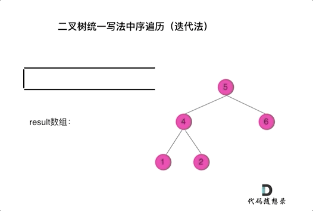

---

迭代法后序遍历
 
后续遍历代码如下： (注意此时我们和中序遍历相⽐仅仅改变了两⾏代码的顺序)
        stack<TreeNode*> st;
        if (root != NULL) st.push(root);
        while (!st.empty()) {
            TreeNode* node = st.top();
            if (node != NULL) {
                st.pop();
                if (node->right) st.push(node->right);  // 右
                if (node->left) st.push(node->left);    // 左
                st.push(node);                          // 中
                st.push(NULL);
            } else {
                st.pop();
                node = st.top();
                st.pop();
                result.push_back(node->val);
            }
        }
        return result;
    }
};
class Solution {
public:
    vector<int> postorderTraversal(TreeNode* root) {
        vector<int> result;
        stack<TreeNode*> st;
        if (root != NULL) st.push(root);
        while (!st.empty()) {
            TreeNode* node = st.top();
            if (node != NULL) {
                st.pop();
                st.push(node);                          // 中
                st.push(NULL);

---

总结
 
此时我们写出了统⼀风格的迭代法，不⽤在纠结于前序写出来了，中序写不出来的情况了。
但是统⼀风格的迭代法并不好理解，⽽且想在⾯试直接写出来还有难度的。
所以⼤家根据⾃⼰的个⼈喜好，对于⼆叉树的前中后序遍历，选择⼀种⾃⼰容易理解的递归
和迭代法。
 
⼆叉树的层序遍历
 
看完这篇⽂章虽然不能打⼗个，但是可以迅速打⼋个！⽽且够快！
学会⼆叉树的层序遍历，可以⼀⼜⽓撸完leetcode上⼋道题⽬：
102.⼆叉树的层序遍历
107.⼆叉树的层次遍历II
199.⼆叉树的右视图
                if (node->right) st.push(node->right);  // 右
                if (node->left) st.push(node->left);    // 左
            } else {
                st.pop();
                node = st.top();
                st.pop();
                result.push_back(node->val);
            }
        }
        return result;
    }
};

---

637.⼆叉树的层平均值
429.N叉树的前序遍历
515.在每个树⾏中找最⼤值
dl. 填充每个节点的下⼀个右侧节点指针
117.填充每个节点的下⼀个右侧节点指针II
102.⼆叉树的层序遍历
 
题⽬地址：https://leetcode-cn.com/problems/binary-tree-level-order-traversal/
给你⼀个⼆叉树，请你返回其按 层序遍历 得到的节点值。 （即逐层地，从左到右访问所有
节点）。

---

思路：
我们之前讲过了三篇关于⼆叉树的深度优先遍历的⽂章：
⼆叉树：前中后序递归法
⼆叉树：前中后序迭代法
⼆叉树：前中后序迭代⽅式统⼀写法
接下来我们再来介绍⼆叉树的另⼀种遍历⽅式：层序遍历。

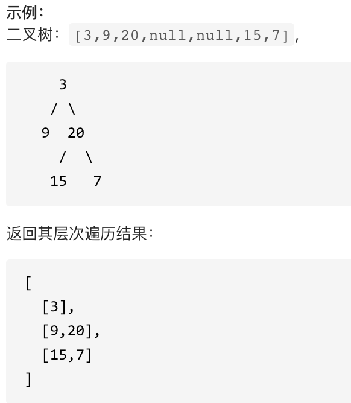

---

层序遍历⼀个⼆叉树。就是从左到右⼀层⼀层的去遍历⼆叉树。这种遍历的⽅式和我们之前
讲过的都不太⼀样。
需要借⽤⼀个辅助数据结构即队列来实现，队列先进先出，符合⼀层⼀层遍历的逻辑，⽽是
⽤栈先进后出适合模拟深度优先遍历也就是递归的逻辑。
⽽这种层序遍历⽅式就是图论中的⼴度优先遍历，只不过我们应⽤在⼆叉树上。
使⽤队列实现⼆叉树⼴度优先遍历，动画如下：
这样就实现了层序从左到右遍历⼆叉树。
代码如下：这份代码也可以作为⼆叉树层序遍历的模板，以后再打七个就靠它了。
C++代码：
class Solution {
public:
    vector<vector<int>> levelOrder(TreeNode* root) {
        queue<TreeNode*> que;

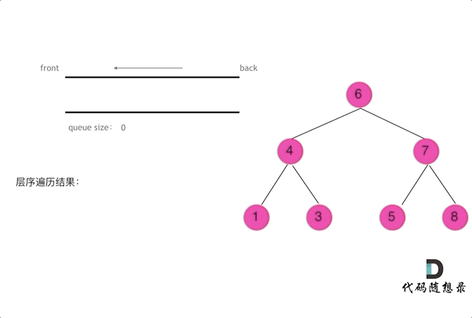

---

此时我们就掌握了⼆叉树的层序遍历了，那么如下五道leetcode上的题⽬，只需要修改模
板的⼀两⾏代码（不能再多了），便可打倒！
107.⼆叉树的层次遍历 II
 
题⽬链接：https://leetcode-cn.com/problems/binary-tree-level-order-traversal-ii/
给定⼀个⼆叉树，返回其节点值⾃底向上的层次遍历。 （即按从叶⼦节点所在层到根节点
所在的层，逐层从左向右遍历）
        if (root != NULL) que.push(root);
        vector<vector<int>> result;
        while (!que.empty()) {
            int size = que.size();
            vector<int> vec;
            // 这⾥⼀定要使⽤固定⼤⼩size，不要使⽤que.size()，因为que.size
是不断变化的
            for (int i = 0; i < size; i++) {
                TreeNode* node = que.front();
                que.pop();
                vec.push_back(node->val);
                if (node->left) que.push(node->left);
                if (node->right) que.push(node->right);
            }
            result.push_back(vec);
        }
        return result;
    }
};

---

思路：
相对于102.⼆叉树的层序遍历，就是最后把result数组反转⼀下就可以了。
C++代码：
class Solution {
public:
    vector<vector<int>> levelOrderBottom(TreeNode* root) {
        queue<TreeNode*> que;

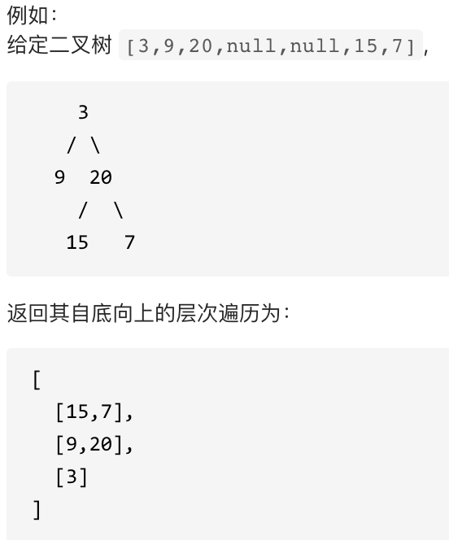

---

199.⼆叉树的右视图
 
题⽬链接：https://leetcode-cn.com/problems/binary-tree-right-side-view/
给定⼀棵⼆叉树，想象⾃⼰站在它的右侧，按照从顶部到底部的顺序，返回从右侧所能看到
的节点值。
        if (root != NULL) que.push(root);
        vector<vector<int>> result;
        while (!que.empty()) {
            int size = que.size();
            vector<int> vec;
            for (int i = 0; i < size; i++) {
                TreeNode* node = que.front();
                que.pop();
                vec.push_back(node->val);
                if (node->left) que.push(node->left);
                if (node->right) que.push(node->right);
            }
            result.push_back(vec);
        }
        reverse(result.begin(), result.end()); // 在这⾥反转⼀下数组即可
        return result;
    }
};

---

思路：
层序遍历的时候，判断是否遍历到单层的最后⾯的元素，如果是，就放进result数组中，随
后返回result就可以了。
C++代码：
class Solution {
public:
    vector<int> rightSideView(TreeNode* root) {
        queue<TreeNode*> que;
        if (root != NULL) que.push(root);
        vector<int> result;
        while (!que.empty()) {
            int size = que.size();
            for (int i = 0; i < size; i++) {
                TreeNode* node = que.front();
                que.pop();

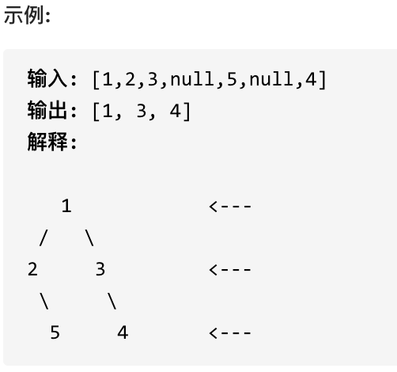

---

637.⼆叉树的层平均值
 
题⽬链接：https://leetcode-cn.com/problems/average-of-levels-in-binary-tree/
给定⼀个⾮空⼆叉树, 返回⼀个由每层节点平均值组成的数组。
思路:
本题就是层序遍历的时候把⼀层求个总和在取⼀个均值。
C++代码:
                if (i == (size - 1)) result.push_back(node->val); // 
将每⼀层的最后元素放⼊result数组中
                if (node->left) que.push(node->left);
                if (node->right) que.push(node->right);
            }
        }
        return result;
    }
};
class Solution {

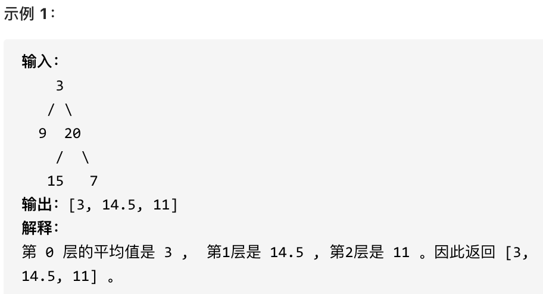

---

429.N叉树的层序遍历
 
题⽬链接：https://leetcode-cn.com/problems/n-ary-tree-level-order-traversal/
给定⼀个 N 叉树，返回其节点值的层序遍历。 (即从左到右，逐层遍历)。
例如，给定⼀个 3叉树 :
public:
    vector<double> averageOfLevels(TreeNode* root) {
        queue<TreeNode*> que;
        if (root != NULL) que.push(root);
        vector<double> result;
        while (!que.empty()) {
            int size = que.size();
            double sum = 0; // 统计每⼀层的和
            for (int i = 0; i < size; i++) {
                TreeNode* node = que.front();
                que.pop();
                sum += node->val;
                if (node->left) que.push(node->left);
                if (node->right) que.push(node->right);
            }
            result.push_back(sum / size); // 将每⼀层均值放进结果集
        }
        return result;
    }
};

---

返回其层序遍历:
[
     [1],
     [3,2,4],
     [5,6]
]
思路:
这道题依旧是模板题，只不过⼀个节点有多个孩⼦了
C++代码:
class Solution {
public:
    vector<vector<int>> levelOrder(Node* root) {
        queue<Node*> que;
        if (root != NULL) que.push(root);
        vector<vector<int>> result;
        while (!que.empty()) {

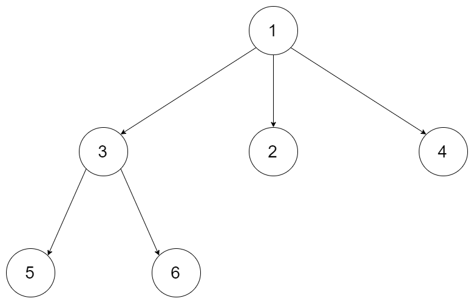

---

515.在每个树⾏中找最⼤值
 
题⽬链接：https://leetcode-cn.com/problems/find-largest-value-in-each-tree-row/
您需要在⼆叉树的每⼀⾏中找到最⼤的值。
            int size = que.size();
            vector<int> vec;
            for (int i = 0; i < size; i++) {
                Node* node = que.front();
                que.pop();
                vec.push_back(node->val);
                for (int i = 0; i < node->children.size(); i++) { // 
将节点孩⼦加⼊队列
                    if (node->children[i]) que.push(node-
>children[i]);
                }
            }
            result.push_back(vec);
        }
        return result;
    }
};

---

思路：
层序遍历，取每⼀层的最⼤值
C++代码：
class Solution {
public:
    vector<int> largestValues(TreeNode* root) {
        queue<TreeNode*> que;
        if (root != NULL) que.push(root);
        vector<int> result;
        while (!que.empty()) {
            int size = que.size();
            int maxValue = INT_MIN; // 取每⼀层的最⼤值
            for (int i = 0; i < size; i++) {
                TreeNode* node = que.front();
                que.pop();

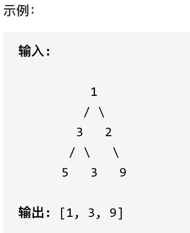

---

116.填充每个节点的下⼀个右侧节点指针
 
题⽬链接：https://leetcode-cn.com/problems/populating-next-right-pointers-in-each-no
de/
给定⼀个完美⼆叉树，其所有叶⼦节点都在同⼀层，每个⽗节点都有两个⼦节点。⼆叉树定
义如下：
填充它的每个 next 指针，让这个指针指向其下⼀个右侧节点。如果找不到下⼀个右侧节
点，则将 next 指针设置为 NULL。
初始状态下，所有 next 指针都被设置为 NULL。
                maxValue = node->val > maxValue ? node->val : 
maxValue;
                if (node->left) que.push(node->left);
                if (node->right) que.push(node->right);
            }
            result.push_back(maxValue); // 把最⼤值放进数组
        }
        return result;
    }
};
struct Node {
  int val;
  Node *left;
  Node *right;
  Node *next;
}

---

思路:
本题依然是层序遍历，只不过在单层遍历的时候记录⼀下本层的头部节点，然后在遍历的时
候让前⼀个节点指向本节点就可以了
C++代码：
class Solution {
public:
    Node* connect(Node* root) {
        queue<Node*> que;
        if (root != NULL) que.push(root);
        while (!que.empty()) {
            int size = que.size();
            vector<int> vec;
            Node* nodePre;
            Node* node;
            for (int i = 0; i < size; i++) {
                if (i == 0) {

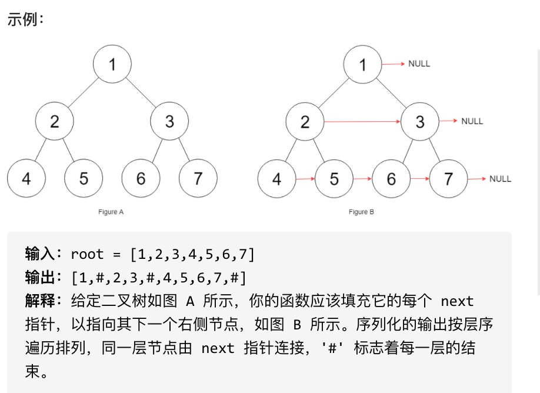

---

117.填充每个节点的下⼀个右侧节点指针II
 
题⽬地址：https://leetcode-cn.com/problems/populating-next-right-pointers-in-each-no
de-ii/
思路：
这道题⽬说是⼆叉树，但116题⽬说是完整⼆叉树，其实没有任何差别，⼀样的代码⼀样的
逻辑⼀样的味道
C++代码：
                    nodePre = que.front(); // 取出⼀层的头结点
                    que.pop();
                    node = nodePre;
                } else {
                    node = que.front();
                    que.pop();
                    nodePre->next = node; // 本层前⼀个节点next指向本节点
                    nodePre = nodePre->next;
                }
                if (node->left) que.push(node->left);
                if (node->right) que.push(node->right);
            }
            nodePre->next = NULL; // 本层最后⼀个节点指向NULL
        }
        return root;
    }
};
class Solution {
public:
    Node* connect(Node* root) {
        queue<Node*> que;
        if (root != NULL) que.push(root);
        while (!que.empty()) {
            int size = que.size();

---

总结
 
⼆叉树的层序遍历，就是图论中的⼴度优先搜索在⼆叉树中的应⽤，需要借助队列来实现
（此时是不是又发现队列的应⽤了）。
虽然不能⼀⼜⽓打⼗个，打⼋个也还⾏。
102.⼆叉树的层序遍历
107.⼆叉树的层次遍历II
199.⼆叉树的右视图
637.⼆叉树的层平均值
429.N叉树的前序遍历
515.在每个树⾏中找最⼤值
            vector<int> vec;
            Node* nodePre;
            Node* node;
            for (int i = 0; i < size; i++) {
                if (i == 0) {
                    nodePre = que.front(); // 取出⼀层的头结点
                    que.pop();
                    node = nodePre;
                } else {
                    node = que.front();
                    que.pop();
                    nodePre->next = node; // 本层前⼀个节点next指向本节点
                    nodePre = nodePre->next;
                }
                if (node->left) que.push(node->left);
                if (node->right) que.push(node->right);
            }
            nodePre->next = NULL; // 本层最后⼀个节点指向NULL
        }
        return root;
    }
};

---

dl. 填充每个节点的下⼀个右侧节点指针
117.填充每个节点的下⼀个右侧节点指针II
如果⾮要打⼗个，还得找叶师傅！
 
 
翻转⼆叉树
 
226.翻转⼆叉树
 
题⽬地址：https://leetcode-cn.com/problems/invert-binary-tree/
翻转⼀棵⼆叉树。

---

这道题⽬背后有⼀个让程序员⼼酸的故事，听说 Homebrew的作者Max Howell，就是因为
没在⽩板上写出翻转⼆叉树，最后被Google拒绝了。（真假不做判断，权当⼀个乐⼦哈）
题外话
 
这道题⽬是⾮常经典的题⽬，也是⽐较简单的题⽬（⾄少⼀看就会）。
但正是因为这道题太简单，⼀看就会，⼀些同学都没有抓住起本质，稀⾥糊涂的就把这道题
⽬过了。

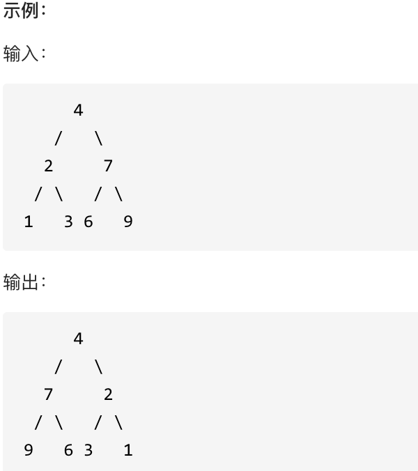

---

如果做过这道题的同学也建议认真看完，相信⼀定有所收获！
思路
 
我们之前介绍的都是各种⽅式遍历⼆叉树，这次要翻转了，感觉还是有点懵逼。
这得怎么翻转呢？
如果要从整个树来看，翻转还真的挺复杂，整个树以中间分割线进⾏翻转，如图：
可以发现想要翻转它，其实就把每⼀个节点的左右孩⼦交换⼀下就可以了。
关键在于遍历顺序，前中后序应该选哪⼀种遍历顺序？ （⼀些同学这道题都过了，但是不
知道⾃⼰⽤的是什么顺序）
遍历的过程中去翻转每⼀个节点的左右孩⼦就可以达到整体翻转的效果。
注意只要把每⼀个节点的左右孩⼦翻转⼀下，就可以达到整体翻转的效果

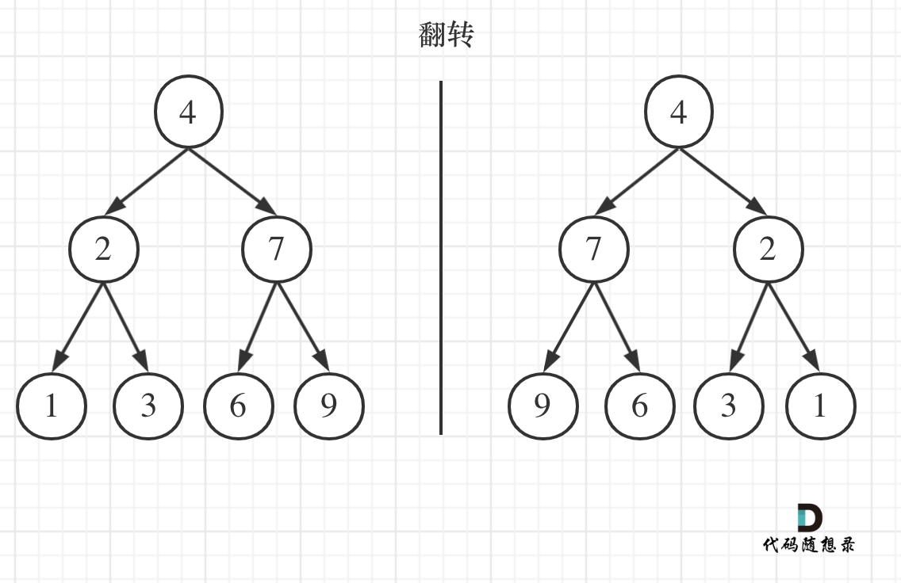

---

这道题⽬使⽤前序遍历和后序遍历都可以，唯独中序遍历不⾏，因为中序遍历会把某些节点
的左右孩⼦翻转了两次！建议拿纸画⼀画，就理解了
那么层序遍历可以不可以呢？依然可以的！只要把每⼀个节点的左右孩⼦翻转⼀下的遍历⽅
式都是可以的！
递归法
 
对于⼆叉树的递归法的前中后序遍历，已经在⼆叉树：前中后序递归遍历详细讲解了。
我们下⽂以前序遍历为例，通过动画来看⼀下翻转的过程:
我们来看⼀下递归三部曲：
1. 确定递归函数的参数和返回值
参数就是要传⼊节点的指针，不需要其他参数了，通常此时定下来主要参数，如果在写递归
的逻辑中发现还需要其他参数的时候，随时补充。
返回值的话其实也不需要，但是题⽬中给出的要返回root节点的指针，可以直接使⽤题⽬定
义好的函数，所以就函数的返回类型为TreeNode*。
TreeNode* invertTree(TreeNode* root)

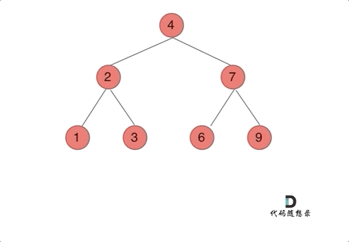

---

2. 确定终⽌条件
当前节点为空的时候，就返回
3. 确定单层递归的逻辑
因为是先前序遍历，所以先进⾏交换左右孩⼦节点，然后反转左⼦树，反转右⼦树。
基于这递归三步法，代码基本写完，C++代码如下：
迭代法
 
深度优先遍历
 
⼆叉树：听说递归能做的，栈也能做！中给出了前中后序迭代⽅式的写法，所以本地可以很
轻松的切出如下迭代法的代码：
C++代码迭代法（前序遍历）
if (root == NULL) return root;
swap(root->left, root->right);
invertTree(root->left);
invertTree(root->right);
class Solution {
public:
    TreeNode* invertTree(TreeNode* root) {
        if (root == NULL) return root;
        swap(root->left, root->right);  // 中
        invertTree(root->left);         // 左
        invertTree(root->right);        // 右
        return root;
    }
};

---

如果这个代码看不懂的话可以在回顾⼀下⼆叉树：听说递归能做的，栈也能做！。
我们在⼆叉树：前中后序迭代⽅式的统⼀写法中介绍了统⼀的写法，所以，本题也只需将⽂
中的代码少做修改便可。
C++代码如下迭代法（前序遍历）
class Solution {
public:
    TreeNode* invertTree(TreeNode* root) {
        if (root == NULL) return root;
        stack<TreeNode*> st;
        st.push(root);
        while(!st.empty()) {
            TreeNode* node = st.top();              // 中
            st.pop();
            swap(node->left, node->right);
            if(node->right) st.push(node->right);   // 右
            if(node->left) st.push(node->left);     // 左
        }
        return root;
    }
};
class Solution {
public:
    TreeNode* invertTree(TreeNode* root) {
        stack<TreeNode*> st;
        if (root != NULL) st.push(root);
        while (!st.empty()) {
            TreeNode* node = st.top();
            if (node != NULL) {
                st.pop();
                if (node->right) st.push(node->right);  // 右
                if (node->left) st.push(node->left);    // 左
                st.push(node);                          // 中
                st.push(NULL);
            } else {

---

如果上⾯这个代码看不懂，回顾⼀下⽂章⼆叉树：前中后序迭代⽅式的统⼀写法。
⼴度优先遍历
 
也就是层序遍历，层数遍历也是可以翻转这棵树的，因为层序遍历也可以把每个节点的左右
孩⼦都翻转⼀遍，代码如下：
                st.pop();
                node = st.top();
                st.pop();
                swap(node->left, node->right);          // 节点处理逻辑
            }
        }
        return root;
    }
};
class Solution {
public:
    TreeNode* invertTree(TreeNode* root) {
        queue<TreeNode*> que;
        if (root != NULL) que.push(root);
        while (!que.empty()) {
            int size = que.size();
            for (int i = 0; i < size; i++) {
                TreeNode* node = que.front();
                que.pop();
                swap(node->left, node->right); // 节点处理
                if (node->left) que.push(node->left);
                if (node->right) que.push(node->right);
            }
        }
        return root;
    }
};

---

如果对以上代码不理解，或者不清楚⼆叉树的层序遍历，可以看这篇⼆叉树：层序遍历登
场！
总结
 
针对⼆叉树的问题，解题之前⼀定要想清楚究竟是前中后序遍历，还是层序遍历。
⼆叉树解题的⼤忌就是⾃⼰稀⾥糊涂的过了（因为这道题相对简单），但是也不知道⾃⼰是
怎么遍历的。
这也是造成了⼆叉树的题⽬“⼀看就会，⼀写就废”的原因。
针对翻转⼆叉树，我给出了⼀种递归，三种迭代（两种模拟深度优先遍历，⼀种层序遍历）
的写法，都是之前我们讲过的写法，融汇贯通⼀下⽽已。
⼤家⼀定也有⾃⼰的解法，但⼀定要成⽅法论，这样才能通⽤，才能举⼀反三！
 
本周⼩结！（⼆叉树）
 
以后每周加上⼀个本周⼩结怎么样？
发现⼤家周末的时候貌似都不在学习状态，周末的⽂章浏览量和打卡情况照⼯作⽇差很多
呀，可能是本周⽇是⼯作⽇了，周六得好好放松放松，哈哈，理解理解，但我还不能不更
啊，还有同学要看呢。
所以呢，周⽇我做⼀个针对本周的打卡留⾔疑问以及在刷题群⾥的讨论内容做⼀下梳理
吧。，这样也有助于⼤家补⼀补本周的内容，消化消化。
注意这个周末总结和系列总结还是不⼀样的（⼆叉树还远没有结束），这个总结是针对留⾔
疑问以及刷题群⾥讨论内容的归纳。

---

周⼀
 
本周我们开始讲解了⼆叉树，在关于⼆叉树，你该了解这些！中讲解了⼆叉树的理论基础。
有同学会把红⿊树和⼆叉平衡搜索树弄分开了，其实红⿊树就是⼀种⼆叉平衡搜索树，这两
个树不是独⽴的，所以C++中map、multimap、set、multiset的底层实现机制是⼆叉平衡
搜索树，再具体⼀点是红⿊树。
对于⼆叉树节点的定义，C++代码如下：
对于这个定义中TreeNode(int x) : val(x), left(NULL), right(NULL) {} 有同学不清
楚⼲什么的。
这是构造函数，这么说吧C语⾔中的结构体是C++中类的祖先，所以C++结构体也可以有构
造函数。
构造函数也可以不写，但是new⼀个新的节点的时候就⽐较⿇烦。
例如有构造函数，定义初始值为9的节点：
没有构造函数的话就要这么写：
struct TreeNode {
    int val;
    TreeNode *left;
    TreeNode *right;
    TreeNode(int x) : val(x), left(NULL), right(NULL) {}
};
TreeNode* a = new TreeNode(9);
TreeNode* a = new TreeNode();
a->val = 9;
a->left = NULL;
a->right = NULL;

---

在介绍前中后序遍历的时候，有递归和迭代（⾮递归），还有⼀种⽜逼的遍历⽅式：morris
遍历。
morris遍历是⼆叉树遍历算法的超强进阶算法，morris遍历可以将⾮递归遍历中的空间复杂
度降为O(1)，感兴趣⼤家就去查⼀查学习学习，⽐较⼩众，⾯试⼏乎不会考。我其实也没有
研究过，就不做过多介绍了。
周⼆
 
在⼆叉树：⼀⼊递归深似海，从此offer是路⼈中讲到了递归三要素，以及前中后序的递归
写法。
⽂章中我给出了leetcode上三道⼆叉树的前中后序题⽬，但是看完⼆叉树：⼀⼊递归深似
海，从此offer是路⼈，依然可以解决n叉树的前后序遍历，在leetcode上分别是
vq. N叉树的前序遍历
vr. N叉树的后序遍历
⼤家可以再去把这两道题⽬做了。
周三
 
在⼆叉树：听说递归能做的，栈也能做！中我们开始⽤栈来实现递归的写法，也就是所谓的
迭代法。
细⼼的同学发现⽂中前后序遍历空节点是⼊栈的，其实空节点⼊不⼊栈都差不多，但感觉空
节点不⼊栈确实清晰⼀些，符合⽂中动画的演⽰。
前序遍历空节点不⼊栈的代码：（注意注释部分，和⽂章中的区别）
class Solution {
public:
    vector<int> preorderTraversal(TreeNode* root) {
        stack<TreeNode*> st;
        vector<int> result;
        if (root == NULL) return result;
        st.push(root);
        while (!st.empty()) {

---

后序遍历空节点不⼊栈的代码：（注意注释部分，和⽂章中的区别）
            TreeNode* node = st.top();                       // 中
            st.pop();
            result.push_back(node->val);
            if (node->right) st.push(node->right);           // 右（空
节点不⼊栈）
            if (node->left) st.push(node->left);             // 左（空
节点不⼊栈）
        }
        return result;
    }
};
class Solution {
public:
    vector<int> postorderTraversal(TreeNode* root) {
        stack<TreeNode*> st;
        vector<int> result;
        if (root == NULL) return result;
        st.push(root);
        while (!st.empty()) {
            TreeNode* node = st.top();
            st.pop();
            result.push_back(node->val);
            if (node->left) st.push(node->left); // 相对于前序遍历，这更
改⼀下⼊栈顺序 （空节点不⼊栈）
            if (node->right) st.push(node->right); // 空节点不⼊栈
        }
        reverse(result.begin(), result.end()); // 将结果反转之后就是左右
中的顺序了
        return result;
    }
};

---

在实现迭代法的过程中，有同学问了：递归与迭代究竟谁优谁劣呢？
从时间复杂度上其实迭代法和递归法差不多（在不考虑函数调⽤开销和函数调⽤产⽣的堆栈
开销），但是空间复杂度上，递归开销会⼤⼀些，因为递归需要系统堆栈存参数返回值等
等。
递归更容易让程序员理解，但收敛不好，容易栈溢出。
这么说吧，递归是⽅便了程序员，难为了机器（各种保存参数，各种进栈出栈）。
在实际项⽬开发的过程中我们是要尽量避免递归！因为项⽬代码参数、调⽤关系都⽐较复
杂，不容易控制递归深度，甚⾄会栈溢出。
周四
 
在⼆叉树：前中后序迭代⽅式的写法就不能统⼀⼀下么？中我们使⽤空节点作为标记，给出
了统⼀的前中后序迭代法。
此时又多了⼀种前中后序的迭代写法，那么有同学问了：前中后序迭代法是不是⼀定要统⼀
来写，这样才算是规范。
其实没必要，还是⾃⼰感觉哪⼀种更好记就⽤哪种。
但是⼀定要掌握前中后序⼀种迭代的写法，并不因为某种场景的题⽬⼀定要⽤迭代，⽽是现
场⾯试的时候，⾯试官看你顺畅的写出了递归，⼀般会进⼀步考察能不能写出相应的迭代。
周五
 
在⼆叉树：层序遍历登场！中我们介绍了⼆叉树的另⼀种遍历⽅式（图论中⼴度优先搜索在
⼆叉树上的应⽤）即：层序遍历。
看完这篇⽂章，去leetcode上怒刷五题，⽂章中 编号107题⽬的样例图放错了（原谅我匆忙
之间总是⼿抖），但不影响⼤家理解。
只有同学发现leetcode上“515. 在每个树⾏中找最⼤值”，也是层序遍历的应⽤，依然可以分
分钟解决，所以就是⼀⿎作⽓解决六道了，哈哈。

---

层序遍历遍历相对容易⼀些，只要掌握基本写法（也就是框架模板），剩下的就是在⼆叉树
每⼀⾏遍历的时候做做逻辑修改。
周六
 
在⼆叉树：你真的会翻转⼆叉树么？中我们把翻转⼆叉树这么⼀道简单又经典的问题，充分
的剖析了⼀波，相信就算做过这道题⽬的同学，看完本篇之后依然有所收获！
⽂中我指的是递归的中序遍历是不⾏的，因为使⽤递归的中序遍历，某些节点的左右孩⼦会
翻转两次。
如果⾮要使⽤递归中序的⽅式写，也可以，如下代码就可以避免节点左右孩⼦翻转两次的情
况：
代码虽然可以，但这毕竟不是真正的递归中序遍历了。
但使⽤迭代⽅式统⼀写法的中序是可以的。
代码如下：
class Solution {
public:
    TreeNode* invertTree(TreeNode* root) {
        if (root == NULL) return root;
        invertTree(root->left);         // 左
        swap(root->left, root->right);  // 中
        invertTree(root->left);         // 注意 这⾥依然要遍历左孩⼦，因为
中间节点已经翻转了
        return root;
    }
};
class Solution {
public:
    TreeNode* invertTree(TreeNode* root) {
        stack<TreeNode*> st;
        if (root != NULL) st.push(root);

---

为什么这个中序就是可以的呢，因为这是⽤栈来遍历，⽽不是靠指针来遍历，避免了递归法
中翻转了两次的情况，⼤家可以画图理解⼀下，这⾥有点意思的。
总结
 
本周我们都是讲解了⼆叉树，从理论基础到遍历⽅式，从递归到迭代，从深度遍历到⼴度遍
历，最后再⽤了⼀个翻转⼆叉树的题⽬把我们之前讲过的遍历⽅式都串了起来。
下周依然是⼆叉树，⼤家加油！
 
代码随想录官⽹：www.programmercarl.com
代码随想录开源项⽬Github：https://github.com/youngyangyang04/leetcode-
master
        while (!st.empty()) {
            TreeNode* node = st.top();
            if (node != NULL) {
                st.pop();
                if (node->right) st.push(node->right);  // 右
                st.push(node);                          // 中
                st.push(NULL);
                if (node->left) st.push(node->left);    // 左
            } else {
                st.pop();
                node = st.top();
                st.pop();
                swap(node->left, node->right);          // 节点处理逻辑
            }
        }
        return root;
    }
};

---

代码随想录算法公开课 ，代码随想录的全部内容将由我（程序员Carl）视频讲解
并开免费开放给⼤家。
《代码随想录》纸质版 已经出版。
代码随想录知识星球 上万录友在这⾥学习
代码随想录算法训练营 帮助录友⾼效刷完代码随想录。
如果感觉PDF对你有帮助，微信搜索：代码随想录，你会发现相见恨晚！
对称⼆叉树
 
101. 对称⼆叉树
 
题⽬地址：https://leetcode-cn.com/problems/symmetric-tree/
给定⼀个⼆叉树，检查它是否是镜像对称的。

---

思路
 
⾸先想清楚，判断对称⼆叉树要⽐较的是哪两个节点，要⽐较的可不是左右节点！
对于⼆叉树是否对称，要⽐较的是根节点的左⼦树与右⼦树是不是相互翻转的，理解这⼀点
就知道了其实我们要⽐较的是两个树（这两个树是根节点的左右⼦树），所以在递归遍历的
过程中，也是要同时遍历两棵树。
那么如果⽐较呢？
⽐较的是两个⼦树的⾥侧和外侧的元素是否相等。如图所⽰：

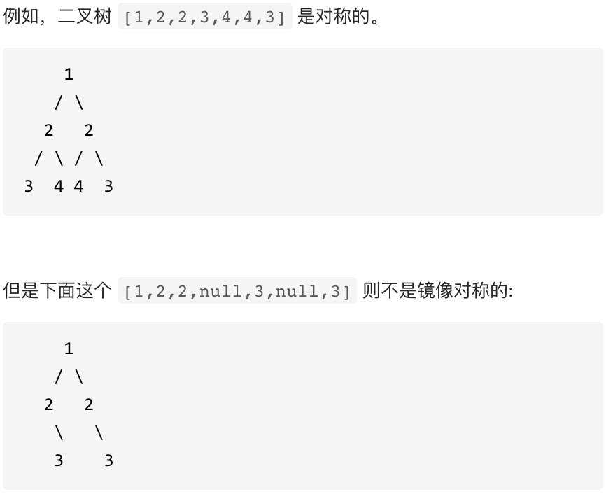

---

那么遍历的顺序应该是什么样的呢？
本题遍历只能是“后序遍历”，因为我们要通过递归函数的返回值来判断两个⼦树的内侧节点
和外侧节点是否相等。
正是因为要遍历两棵树⽽且要⽐较内侧和外侧节点，所以准确的来说是⼀个树的遍历顺序是
左右中，⼀个树的遍历顺序是右左中。
但都可以理解算是后序遍历，尽管已经不是严格上在⼀个树上进⾏遍历的后序遍历了。
其实后序也可以理解为是⼀种回溯，当然这是题外话，讲回溯的时候会重点讲的。
说到这⼤家可能感觉我有点啰嗦，哪有这么多道理，上来就⼲就完事了。别急，我说的这些
在下⾯的代码讲解中都有⾝影。
那么我们先来看看递归法的代码应该怎么写。

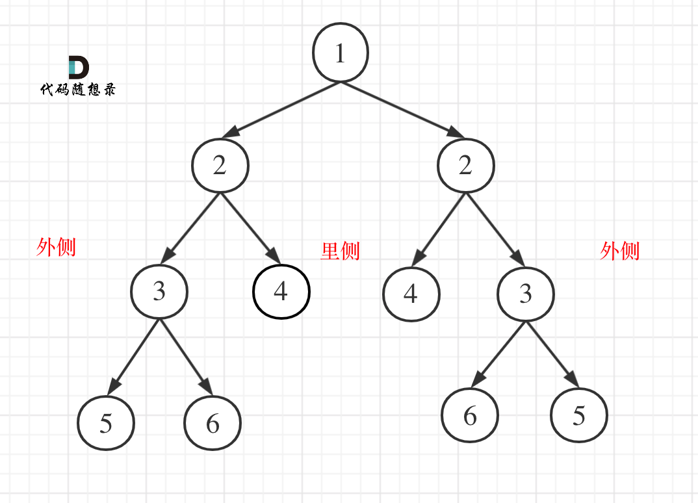

---

递归法
 
递归三部曲
1. 确定递归函数的参数和返回值
因为我们要⽐较的是根节点的两个⼦树是否是相互翻转的，进⽽判断这个树是不是对称树，
所以要⽐较的是两个树，参数⾃然也是左⼦树节点和右⼦树节点。
返回值⾃然是bool类型。
代码如下：
2. 确定终⽌条件
要⽐较两个节点数值相不相同，⾸先要把两个节点为空的情况弄清楚！否则后⾯⽐较数值的
时候就会操作空指针了。
节点为空的情况有：（注意我们⽐较的其实不是左孩⼦和右孩⼦，所以如下我称之为左节点
右节点）
左节点为空，右节点不为空，不对称，return false
左不为空，右为空，不对称 return  false
左右都为空，对称，返回true
此时已经排除掉了节点为空的情况，那么剩下的就是左右节点不为空：
左右都不为空，⽐较节点数值，不相同就return false
此时左右节点不为空，且数值也不相同的情况我们也处理了。
代码如下：
bool compare(TreeNode* left, TreeNode* right)

---

注意上⾯最后⼀种情况，我没有使⽤else，⽽是elseif， 因为我们把以上情况都排除之后，
剩下的就是 左右节点都不为空，且数值相同的情况。
3. 确定单层递归的逻辑
此时才进⼊单层递归的逻辑，单层递归的逻辑就是处理 右节点都不为空，且数值相同的情
况。
⽐较⼆叉树外侧是否对称：传⼊的是左节点的左孩⼦，右节点的右孩⼦。
⽐较内测是否对称，传⼊左节点的右孩⼦，右节点的左孩⼦。
如果左右都对称就返回true ，有⼀侧不对称就返回false 。
代码如下：
如上代码中，我们可以看出使⽤的遍历⽅式，左⼦树左右中，右⼦树右左中，所以我把这个
遍历顺序也称之为“后序遍历”（尽管不是严格的后序遍历）。
最后递归的C++整体代码如下：
if (left == NULL && right != NULL) return false;
else if (left != NULL && right == NULL) return false;
else if (left == NULL && right == NULL) return true;
else if (left->val != right->val) return false; // 注意这⾥我没有使⽤
else
bool outside = compare(left->left, right->right);   // 左⼦树：左、 右⼦
树：右
bool inside = compare(left->right, right->left);    // 左⼦树：右、 右⼦
树：左
bool isSame = outside && inside;                    // 左⼦树：中、 右⼦
树：中（逻辑处理）
return isSame;
class Solution {
public:
    bool compare(TreeNode* left, TreeNode* right) {
        // ⾸先排除空节点的情况

---

我给出的代码并不简洁，但是把每⼀步判断的逻辑都清楚的描绘出来了。
如果上来就看⽹上各种简洁的代码，看起来真的很简单，但是很多逻辑都掩盖掉了，⽽题解
可能也没有把掩盖掉的逻辑说清楚。
盲⽬的照着抄，结果就是：发现这是⼀道“简单题”，稀⾥糊涂的就过了，但是真正的每⼀
步判断逻辑未必想到清楚。
当然我可以把如上代码整理如下：
        if (left == NULL && right != NULL) return false;
        else if (left != NULL && right == NULL) return false;
        else if (left == NULL && right == NULL) return true;
        // 排除了空节点，再排除数值不相同的情况
        else if (left->val != right->val) return false;
        // 此时就是：左右节点都不为空，且数值相同的情况
        // 此时才做递归，做下⼀层的判断
        bool outside = compare(left->left, right->right);   // 左⼦树：
左、 右⼦树：右
        bool inside = compare(left->right, right->left);    // 左⼦树：
右、 右⼦树：左
        bool isSame = outside && inside;                    // 左⼦树：
中、 右⼦树：中 （逻辑处理）
        return isSame;
    }
    bool isSymmetric(TreeNode* root) {
        if (root == NULL) return true;
        return compare(root->left, root->right);
    }
};
class Solution {
public:
    bool compare(TreeNode* left, TreeNode* right) {
        if (left == NULL && right != NULL) return false;
        else if (left != NULL && right == NULL) return false;

---

如下的条件判断和递归的逻辑是⼀样的。
代码如下：
这个代码就很简洁了，但隐藏了很多逻辑，条理不清晰，⽽且递归三部曲，在这⾥完全体现
不出来。
所以建议⼤家做题的时候，⼀定要想清楚逻辑，每⼀步做什么。把道题⽬所有情况想到位，
相应的代码写出来之后，再去追求简洁代码的效果。
迭代法
 
这道题⽬我们也可以使⽤迭代法，但要注意，这⾥的迭代法可不是前中后序的迭代写法，因
为本题的本质是判断两个树是否是相互翻转的，其实已经不是所谓⼆叉树遍历的前中后序的
关系了。
这⾥我们可以使⽤队列来⽐较两个树（根节点的左右⼦树）是否相互翻转，（注意这不是层
序遍历）
使⽤队列
 
通过队列来判断根节点的左⼦树和右⼦树的内侧和外侧是否相等，如动画所⽰：
        else if (left == NULL && right == NULL) return true;
        else if (left->val != right->val) return false;
        else return compare(left->left, right->right) && 
compare(left->right, right->left);
    }
    bool isSymmetric(TreeNode* root) {
        if (root == NULL) return true;
        return compare(root->left, root->right);
    }
};
class Solution {
public:

---

使⽤栈
细⼼的话，其实可以发现，这个迭代法，其实是把左右两个⼦树要⽐较的元素顺序放进⼀个
容器，然后成对成对的取出来进⾏⽐较，那么其实使⽤栈也是可以的。
只要把队列原封不动的改成栈就可以了，我下⾯也给出了代码。
 
    bool isSymmetric(TreeNode* root) {
        if (root == NULL) return true;
        queue<TreeNode*> que;
        que.push(root->left);   // 将左⼦树头结点加⼊队列
        que.push(root->right);  // 将右⼦树头结点加⼊队列
        while (!que.empty()) {  // 接下来就要判断这这两个树是否相互翻转
            TreeNode* leftNode = que.front(); que.pop();
            TreeNode* rightNode = que.front(); que.pop();
            if (!leftNode && !rightNode) {  // 左节点为空、右节点为空，此时
说明是对称的
                continue;
            }
            // 左右⼀个节点不为空，或者都不为空但数值不相同，返回false
            if ((!leftNode || !rightNode || (leftNode->val != 
rightNode->val))) {
                return false;
            }
            que.push(leftNode->left);   // 加⼊左节点左孩⼦
            que.push(rightNode->right); // 加⼊右节点右孩⼦
            que.push(leftNode->right);  // 加⼊左节点右孩⼦
            que.push(rightNode->left);  // 加⼊右节点左孩⼦
        }
        return true;
    }
};
class Solution {
public:
    bool isSymmetric(TreeNode* root) {
        if (root == NULL) return true;

---

总结
这次我们又深度剖析了⼀道⼆叉树的“简单题”，⼤家会发现，真正的把题⽬搞清楚其实并不
简单，leetcode上accept了和真正掌握了还是有距离的。
我们介绍了递归法和迭代法，递归依然通过递归三部曲来解决了这道题⽬，如果只看精简的
代码根本看不出来递归三部曲是如果解题的。
在迭代法中我们使⽤了队列，需要注意的是这不是层序遍历，⽽且仅仅通过⼀个容器来成对
的存放我们要⽐较的元素，知道这⼀本质之后就发现，⽤队列，⽤栈，甚⾄⽤数组，都是可
以的。
如果已经做过这道题⽬的同学，读完⽂章可以再去看看这道题⽬，思考⼀下，会有不⼀样的
发现！
 
 
        stack<TreeNode*> st; // 这⾥改成了栈
        st.push(root->left);
        st.push(root->right);
        while (!st.empty()) {
            TreeNode* leftNode = st.top(); st.pop();
            TreeNode* rightNode = st.top(); st.pop();
            if (!leftNode && !rightNode) {
                continue;
            }
            if ((!leftNode || !rightNode || (leftNode->val != 
rightNode->val))) {
                return false;
            }
            st.push(leftNode->left);
            st.push(rightNode->right);
            st.push(leftNode->right);
            st.push(rightNode->left);
        }
        return true;
    }
};

---

⼆叉树的最⼤深度
看完本篇可以⼀起做了如下两道题⽬：
104.⼆叉树的最⼤深度
题⽬地址：https://leetcode-cn.com/problems/maximum-depth-of-binary-tree/
给定⼀个⼆叉树，找出其最⼤深度。
⼆叉树的深度为根节点到最远叶⼦节点的最长路径上的节点数。
说明: 叶⼦节点是指没有⼦节点的节点。
⽰例：
给定⼆叉树 [3,9,20,null,null,15,7]，
返回它的最⼤深度 3 。
 
104.⼆叉树的最⼤深度
559.N叉树的最⼤深度

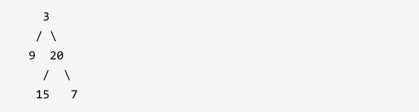

---

递归法
本题其实也要后序遍历（左右中），依然是因为要通过递归函数的返回值做计算树的⾼度。
按照递归三部曲，来看看如何来写。
代码如下：
代码如下：
代码如下：
所以整体C++代码如下：
 
1. 确定递归函数的参数和返回值：参数就是传⼊树的根节点，返回就返回这棵树的深
度，所以返回值为int类型。
2. 确定终⽌条件：如果为空节点的话，就返回0，表⽰⾼度为0。
3. 确定单层递归的逻辑：先求它的左⼦树的深度，再求的右⼦树的深度，最后取左右
深度最⼤的数值 再+1 （加1是因为算上当前中间节点）就是⽬前节点为根节点的树
的深度。
int getDepth(TreeNode* node)
if (node == NULL) return 0;
int leftDepth = getDepth(node->left);       // 左
int rightDepth = getDepth(node->right);     // 右
int depth = 1 + max(leftDepth, rightDepth); // 中
return depth;

---

代码精简之后C++代码如下：
精简之后的代码根本看不出是哪种遍历⽅式，也看不出递归三部曲的步骤，所以如果对⼆叉
树的操作还不熟练，尽量不要直接照着精简代码来学。
迭代法
使⽤迭代法的话，使⽤层序遍历是最为合适的，因为最⼤的深度就是⼆叉树的层数，和层序
遍历的⽅式极其吻合。
在⼆叉树中，⼀层⼀层的来遍历⼆叉树，记录⼀下遍历的层数就是⼆叉树的深度，如图所
⽰：
 
class Solution {
public:
    int getDepth(TreeNode* node) {
        if (node == NULL) return 0;
        int leftDepth = getDepth(node->left);       // 左
        int rightDepth = getDepth(node->right);     // 右
        int depth = 1 + max(leftDepth, rightDepth); // 中
        return depth;
    }
    int maxDepth(TreeNode* root) {
        return getDepth(root);
    }
};
class Solution {
public:
    int maxDepth(TreeNode* root) {
        if (root == NULL) return 0;
        return 1 + max(maxDepth(root->left), maxDepth(root->right));
    }
};

---

所以这道题的迭代法就是⼀道模板题，可以使⽤⼆叉树层序遍历的模板来解决的。
如果对层序遍历还不清楚的话，可以看这篇：⼆叉树：层序遍历登场！
C++代码如下：
class Solution {
public:
    int maxDepth(TreeNode* root) {
        if (root == NULL) return 0;
        int depth = 0;
        queue<TreeNode*> que;
        que.push(root);
        while(!que.empty()) {
            int size = que.size();
            depth++; // 记录深度
            for (int i = 0; i < size; i++) {
                TreeNode* node = que.front();

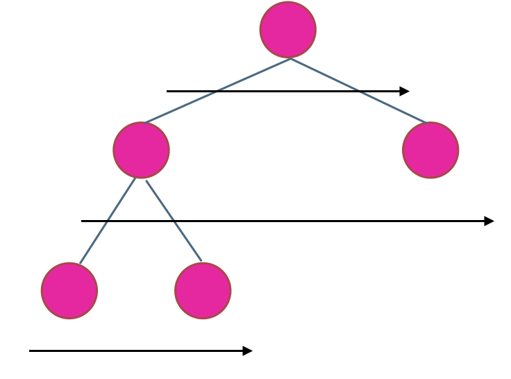

---

那么我们可以顺便解决⼀下N叉树的最⼤深度问题
559.N叉树的最⼤深度
题⽬地址：https://leetcode-cn.com/problems/maximum-depth-of-n-ary-tree/
给定⼀个 N 叉树，找到其最⼤深度。
最⼤深度是指从根节点到最远叶⼦节点的最长路径上的节点总数。
例如，给定⼀个 3叉树 :
 
                que.pop();
                if (node->left) que.push(node->left);
                if (node->right) que.push(node->right);
            }
        }
        return depth;
    }
};

---

我们应返回其最⼤深度，3。
思路：
依然可以提供递归法和迭代法，来解决这个问题，思路是和⼆叉树思路⼀样的，直接给出代
码如下：
递归法
C++代码：

---

迭代法
依然是层序遍历，代码如下：
 
class Solution {
public:
    int maxDepth(Node* root) {
        if (root == 0) return 0;
        int depth = 0;
        for (int i = 0; i < root->children.size(); i++) {
            depth = max (depth, maxDepth(root->children[i]));
        }
        return depth + 1;
    }
};
class Solution {
public:
    int maxDepth(Node* root) {
        queue<Node*> que;
        if (root != NULL) que.push(root);
        int depth = 0;
        while (!que.empty()) {
            int size = que.size();
            depth++; // 记录深度
            for (int i = 0; i < size; i++) {
                Node* node = que.front();
                que.pop();
                for (int j = 0; j < node->children.size(); j++) {
                    if (node->children[j]) que.push(node->children[j]);
                }
            }
        }
        return depth;
    }
};

---

使⽤栈来模拟后序遍历依然可以
 
⼆叉树的最⼩深度
 
class Solution {
public:
    int maxDepth(TreeNode* root) {
        stack<TreeNode*> st;
        if (root != NULL) st.push(root);
        int depth = 0;
        int result = 0;
        while (!st.empty()) {
            TreeNode* node = st.top();
            if (node != NULL) {
                st.pop();
                st.push(node);                          // 中
                st.push(NULL);
                depth++;
                if (node->right) st.push(node->right);  // 右
                if (node->left) st.push(node->left);    // 左
            } else {
                st.pop();
                node = st.top();
                st.pop();
                depth--;
            }
            result = result > depth ? result : depth;
        }
        return result;
    }
};

---

和求最⼤深度⼀个套路？
111.⼆叉树的最⼩深度
题⽬地址：https://leetcode-cn.com/problems/minimum-depth-of-binary-tree/
给定⼀个⼆叉树，找出其最⼩深度。
最⼩深度是从根节点到最近叶⼦节点的最短路径上的节点数量。
说明: 叶⼦节点是指没有⼦节点的节点。
⽰例:
给定⼆叉树 [3,9,20,null,null,15,7],
返回它的最⼩深度  2.
思路
看完了这篇⼆叉树：看看这些树的最⼤深度，再来看看如何求最⼩深度。
直觉上好像和求最⼤深度差不多，其实还是差不少的。
遍历顺序上依然是后序遍历（因为要⽐较递归返回之后的结果），但在处理中间节点的逻辑
上，最⼤深度很容易理解，最⼩深度可有⼀个误区，如图：

---

这就重新审题了，题⽬中说的是：最⼩深度是从根节点到最近叶⼦节点的最短路径上的节点
数量。，注意是叶⼦节点。
什么是叶⼦节点，左右孩⼦都为空的节点才是叶⼦节点！
递归法
来来来，⼀起递归三部曲：
参数为要传⼊的⼆叉树根节点，返回的是int类型的深度。
代码如下：
 
1. 确定递归函数的参数和返回值
int getDepth(TreeNode* node)

---

终⽌条件也是遇到空节点返回0，表⽰当前节点的⾼度为0。
代码如下：
这块和求最⼤深度可就不⼀样了，⼀些同学可能会写如下代码：
这个代码就犯了此图中的误区：
2. 确定终⽌条件
3. 确定单层递归的逻辑
if (node == NULL) return 0;
int leftDepth = getDepth(node->left);
int rightDepth = getDepth(node->right);
int result = 1 + min(leftDepth, rightDepth);
return result;

---

如果这么求的话，没有左孩⼦的分⽀会算为最短深度。
所以，如果左⼦树为空，右⼦树不为空，说明最⼩深度是 1 + 右⼦树的深度。
反之，右⼦树为空，左⼦树不为空，最⼩深度是 1 + 左⼦树的深度。 最后如果左右⼦树都不
为空，返回左右⼦树深度最⼩值 + 1 。
代码如下：

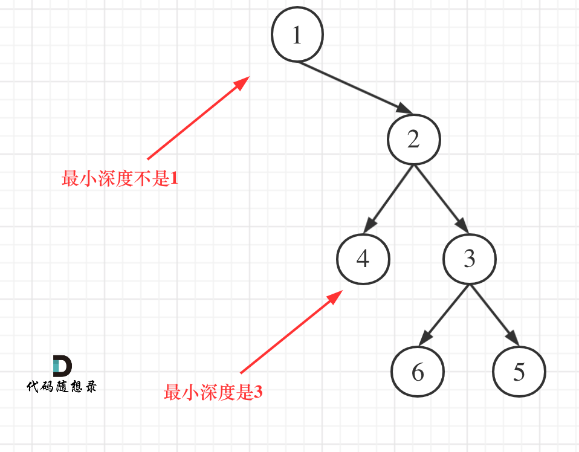

---

遍历的顺序为后序（左右中），可以看出：求⼆叉树的最⼩深度和求⼆叉树的最⼤深度的差
别主要在于处理左右孩⼦不为空的逻辑。
整体递归代码如下：
int leftDepth = getDepth(node->left);           // 左
int rightDepth = getDepth(node->right);         // 右
                                                // 中
// 当⼀个左⼦树为空，右不为空，这时并不是最低点
if (node->left == NULL && node->right != NULL) { 
    return 1 + rightDepth;
}   
// 当⼀个右⼦树为空，左不为空，这时并不是最低点
if (node->left != NULL && node->right == NULL) { 
    return 1 + leftDepth;
}
int result = 1 + min(leftDepth, rightDepth);
return result;
class Solution {
public:
    int getDepth(TreeNode* node) {
        if (node == NULL) return 0;
        int leftDepth = getDepth(node->left);           // 左
        int rightDepth = getDepth(node->right);         // 右
                                                        // 中
        // 当⼀个左⼦树为空，右不为空，这时并不是最低点
        if (node->left == NULL && node->right != NULL) { 
            return 1 + rightDepth;
        }   
        // 当⼀个右⼦树为空，左不为空，这时并不是最低点
        if (node->left != NULL && node->right == NULL) { 
            return 1 + leftDepth;
        }
        int result = 1 + min(leftDepth, rightDepth);
        return result;
    }

---

精简之后代码如下：
精简之后的代码根本看不出是哪种遍历⽅式，所以依然还要强调⼀波：如果对⼆叉树的操作
还不熟练，尽量不要直接照着精简代码来学。
迭代法
相对于⼆叉树：看看这些树的最⼤深度，本题还可以使⽤层序遍历的⽅式来解决，思路是⼀
样的。
如果对层序遍历还不清楚的话，可以看这篇：⼆叉树：层序遍历登场！
需要注意的是，只有当左右孩⼦都为空的时候，才说明遍历的最低点了。如果其中⼀个孩⼦
为空则不是最低点
代码如下：（详细注释）
 
    int minDepth(TreeNode* root) {
        return getDepth(root);
    }
};
class Solution {
public:
    int minDepth(TreeNode* root) {
        if (root == NULL) return 0;
        if (root->left == NULL && root->right != NULL) {
            return 1 + minDepth(root->right);
        }
        if (root->left != NULL && root->right == NULL) {
            return 1 + minDepth(root->left);
        }
        return 1 + min(minDepth(root->left), minDepth(root->right));
    }
};
class Solution {

---

如果感觉PDF对你有帮助，微信搜索：代码随想录，你会发现相见恨晚！
代码随想录官⽹：www.programmercarl.com
代码随想录开源项⽬Github：https://github.com/youngyangyang04/leetcode-
master
代码随想录算法公开课 ，代码随想录的全部内容将由我（程序员Carl）视频讲解并
开免费开放给⼤家。
《代码随想录》纸质版 已经出版。
代码随想录知识星球 上万录友在这⾥学习
代码随想录算法训练营 帮助录友⾼效刷完代码随想录。
public:
    int minDepth(TreeNode* root) {
        if (root == NULL) return 0;
        int depth = 0;
        queue<TreeNode*> que;
        que.push(root);
        while(!que.empty()) {
            int size = que.size();
            depth++; // 记录最⼩深度
            for (int i = 0; i < size; i++) {
                TreeNode* node = que.front();
                que.pop();
                if (node->left) que.push(node->left);
                if (node->right) que.push(node->right);
                if (!node->left && !node->right) { // 当左右孩⼦都为空的时
候，说明是最低点的⼀层了，退出
                    return depth;
                }
            }
        }
        return depth;
    }
};

---

完全⼆叉树的节点个数
222.完全⼆叉树的节点个数
题⽬地址：https://leetcode-cn.com/problems/count-complete-tree-nodes/
给出⼀个完全⼆叉树，求出该树的节点个数。
⽰例:
⽰例 1：
输⼊：root = [1,2,3,4,5,6]
输出：6
⽰例 2：
输⼊：root = []
输出：0

---

⽰例 3：
输⼊：root = [1]
输出：1
提⽰：
思路
本篇给出按照普通⼆叉树的求法以及利⽤完全⼆叉树性质的求法。
普通⼆叉树
⾸先按照普通⼆叉树的逻辑来求。
这道题⽬的递归法和求⼆叉树的深度写法类似， ⽽迭代法，⼆叉树：层序遍历登场！遍历模
板稍稍修改⼀下，记录遍历的节点数量就可以了。
递归遍历的顺序依然是后序（左右中）。
递归
如果对求⼆叉树深度还不熟悉的话，看这篇：⼆叉树：看看这些树的最⼤深度。
代码如下：
树中节点的数⽬范围是[0, 5 * 10^4]
0 <= Node.val <= 5 * 10^4
题⽬数据保证输⼊的树是 完全⼆叉树
 
 
 
1. 确定递归函数的参数和返回值：参数就是传⼊树的根节点，返回就返回以该节点为
根节点⼆叉树的节点数量，所以返回值为int类型。
2. 确定终⽌条件：如果为空节点的话，就返回0，表⽰节点数为0。
int getNodesNum(TreeNode* cur) {

---

代码如下：
代码如下：
所以整体C++代码如下：
代码精简之后C++代码如下：
3. 确定单层递归的逻辑：先求它的左⼦树的节点数量，再求的右⼦树的节点数量，最
后取总和再加⼀ （加1是因为算上当前中间节点）就是⽬前节点为根节点的节点数
量。
if (cur == NULL) return 0;
int leftNum = getNodesNum(cur->left);      // 左
int rightNum = getNodesNum(cur->right);    // 右
int treeNum = leftNum + rightNum + 1;      // 中
return treeNum;
// 版本⼀
class Solution {
private:
    int getNodesNum(TreeNode* cur) {
        if (cur == 0) return 0;
        int leftNum = getNodesNum(cur->left);      // 左
        int rightNum = getNodesNum(cur->right);    // 右
        int treeNum = leftNum + rightNum + 1;      // 中
        return treeNum;
    }
public:
    int countNodes(TreeNode* root) {
        return getNodesNum(root);
    }
};

---

时间复杂度：O(n)
空间复杂度：O(logn)，算上了递归系统栈占⽤的空间
⽹上基本都是这个精简的代码版本，其实不建议⼤家照着这个来写，代码确实精简，但隐藏
了⼀些内容，连遍历的顺序都看不出来，所以初学者建议学习版本⼀的代码，稳稳的打基
础。
迭代法
如果对求⼆叉树层序遍历还不熟悉的话，看这篇：⼆叉树：层序遍历登场！。
那么只要模板少做改动，加⼀个变量result，统计节点数量就可以了
 
// 版本⼆
class Solution {
public:
    int countNodes(TreeNode* root) {
        if (root == NULL) return 0;
        return 1 + countNodes(root->left) + countNodes(root->right);
    }
};
class Solution {
public:
    int countNodes(TreeNode* root) {
        queue<TreeNode*> que;
        if (root != NULL) que.push(root);
        int result = 0;
        while (!que.empty()) {
            int size = que.size();
            for (int i = 0; i < size; i++) {
                TreeNode* node = que.front();
                que.pop();
                result++;   // 记录节点数量
                if (node->left) que.push(node->left);
                if (node->right) que.push(node->right);
            }

---

时间复杂度：O(n)
空间复杂度：O(n)
完全⼆叉树
以上⽅法都是按照普通⼆叉树来做的，对于完全⼆叉树特性不了解的同学可以看这篇 关于⼆
叉树，你该了解这些！，这篇详细介绍了各种⼆叉树的特性。
完全⼆叉树只有两种情况，情况⼀：就是满⼆叉树，情况⼆：最后⼀层叶⼦节点没有满。
对于情况⼀，可以直接⽤ 2^树深度 - 1 来计算，注意这⾥根节点深度为1。
对于情况⼆，分别递归左孩⼦，和右孩⼦，递归到某⼀深度⼀定会有左孩⼦或者右孩⼦为满
⼆叉树，然后依然可以按照情况1来计算。
 
        }
        return result;
    }
};

---

完全⼆叉树（⼀）如图：

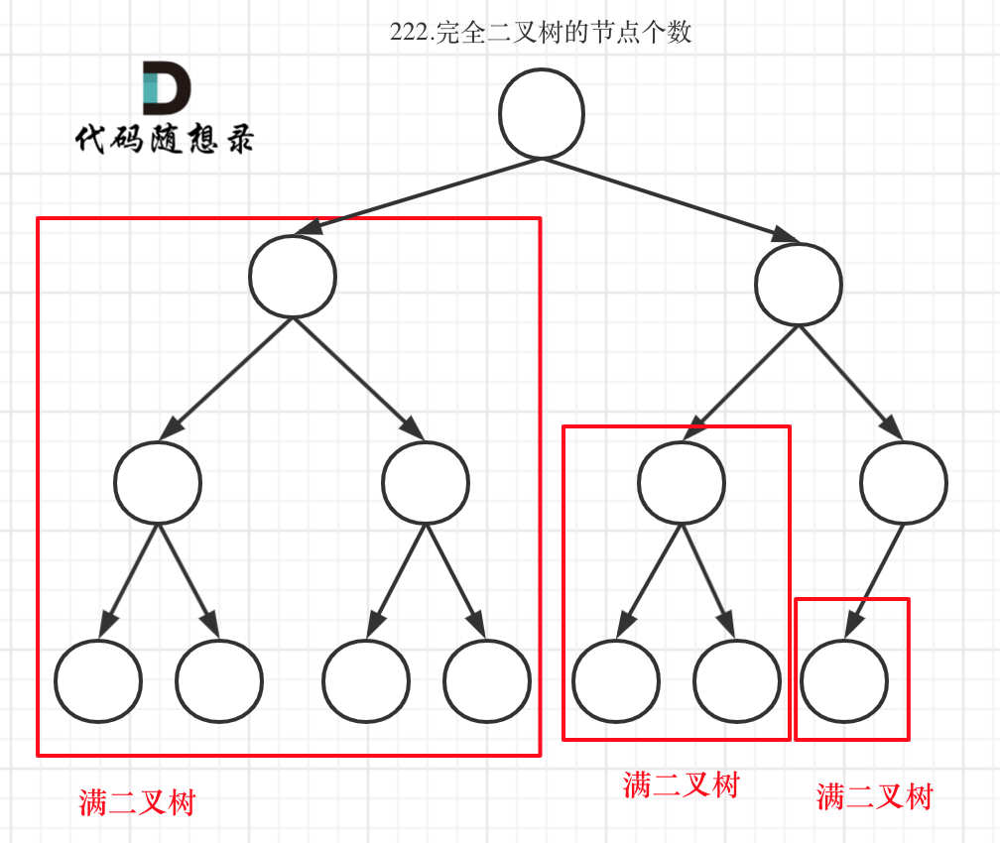

---

完全⼆叉树（⼆）如图：
可以看出如果整个树不是满⼆叉树，就递归其左右孩⼦，直到遇到满⼆叉树为⽌，⽤公式计
算这个⼦树（满⼆叉树）的节点数量。
C++代码如下：
class Solution {
public:
    int countNodes(TreeNode* root) {
        if (root == nullptr) return 0;
        TreeNode* left = root->left;
        TreeNode* right = root->right;
        int leftHeight = 0, rightHeight = 0; // 这⾥初始为0是有⽬的的，为了
下⾯求指数⽅便
        while (left) {  // 求左⼦树深度
            left = left->left;

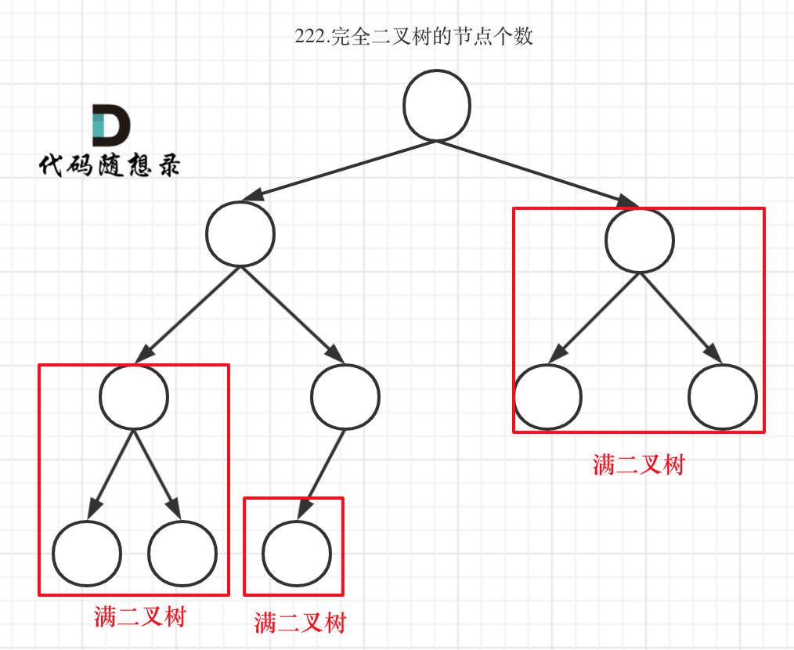

---

时间复杂度：O(logn * logn)
空间复杂度：O(logn)
平衡⼆叉树
求⾼度还是求深度，你搞懂了不？
110.平衡⼆叉树
题⽬地址：https://leetcode-cn.com/problems/balanced-binary-tree/
给定⼀个⼆叉树，判断它是否是⾼度平衡的⼆叉树。
本题中，⼀棵⾼度平衡⼆叉树定义为：⼀个⼆叉树每个节点 的左右两个⼦树的⾼度差的绝对
值不超过1。
⽰例 1:
给定⼆叉树 [3,9,20,null,null,15,7]
 
 
            leftHeight++;
        }
        while (right) { // 求右⼦树深度
            right = right->right;
            rightHeight++;
        }
        if (leftHeight == rightHeight) {
            return (2 << leftHeight) - 1; // 注意(2<<1) 相当于2^2，所以
leftHeight初始为0
        }
        return countNodes(root->left) + countNodes(root->right) + 1;
    }
};

---

返回 true 。
⽰例 2:
给定⼆叉树 [1,2,2,3,3,null,null,4,4]
返回 false 。
题外话
咋眼⼀看这道题⽬和⼆叉树：看看这些树的最⼤深度很像，其实有很⼤区别。
这⾥强调⼀波概念：
但leetcode中强调的深度和⾼度很明显是按照节点来计算的，如图：
 
⼆叉树节点的深度：指从根节点到该节点的最长简单路径边的条数。
⼆叉树节点的⾼度：指从该节点到叶⼦节点的最长简单路径边的条数。

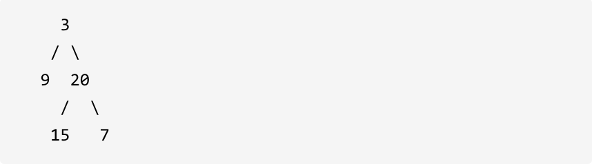

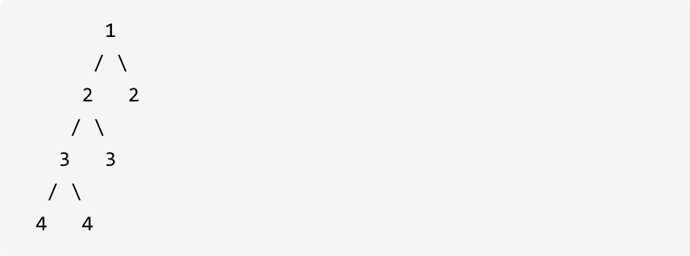

---

关于根节点的深度究竟是1 还是 0，不同的地⽅有不⼀样的标准，leetcode的题⽬中都是以节
点为⼀度，即根节点深度是1。但维基百科上定义⽤边为⼀度，即根节点的深度是0，我们暂
时以leetcode为准（毕竟要在这上⾯刷题）。
因为求深度可以从上到下去查 所以需要前序遍历（中左右），⽽⾼度只能从下到上去查，所
以只能后序遍历（左右中）
有的同学⼀定疑惑，为什么⼆叉树：看看这些树的最⼤深度中求的是⼆叉树的最⼤深度，也
⽤的是后序遍历。
那是因为代码的逻辑其实是求的根节点的⾼度，⽽根节点的⾼度就是这颗树的最⼤深度，所
以才可以使⽤后序遍历。
在⼆叉树：看看这些树的最⼤深度中，如果真正求取⼆叉树的最⼤深度，代码应该写成如
下：（前序遍历）
class Solution {
public:
    int result;

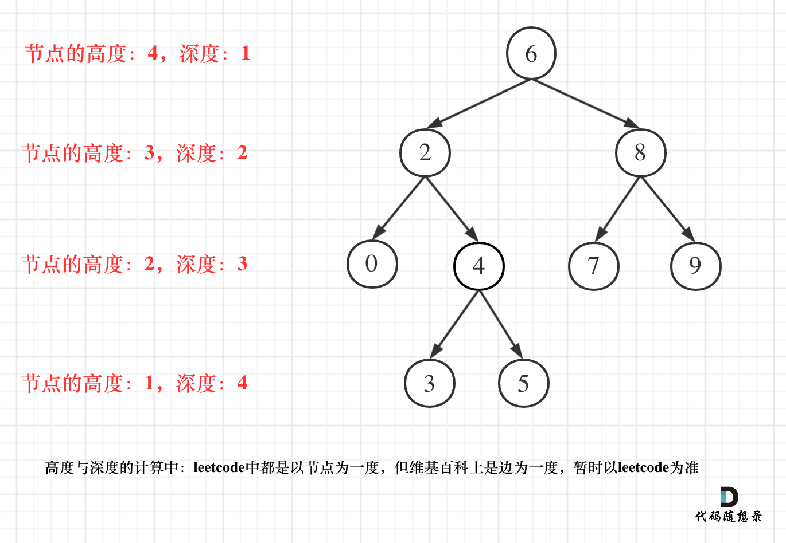

---

可以看出使⽤了前序（中左右）的遍历顺序，这才是真正求深度的逻辑！
注意以上代码是为了把细节体现出来，简化⼀下代码如下：
    void getDepth(TreeNode* node, int depth) {
        result = depth > result ? depth : result; // 中
        if (node->left == NULL && node->right == NULL) return ;
        if (node->left) { // 左
            depth++;    // 深度+1
            getDepth(node->left, depth);
            depth--;    // 回溯，深度-1
        }
        if (node->right) { // 右
            depth++;    // 深度+1
            getDepth(node->right, depth);
            depth--;    // 回溯，深度-1
        }
        return ;
    }
    int maxDepth(TreeNode* root) {
        result = 0;
        if (root == 0) return result;
        getDepth(root, 1);
        return result;
    }
};
class Solution {
public:
    int result;
    void getDepth(TreeNode* node, int depth) {
        result = depth > result ? depth : result; // 中
        if (node->left == NULL && node->right == NULL) return ;
        if (node->left) { // 左
            getDepth(node->left, depth + 1);
        }

---

本题思路
递归
此时⼤家应该明⽩了既然要求⽐较⾼度，必然是要后序遍历。
递归三步曲分析：
参数的话为传⼊的节点指针，就没有其他参数需要传递了，返回值要返回传⼊节点为根节点
树的深度。
那么如何标记左右⼦树是否差值⼤于1呢。
如果当前传⼊节点为根节点的⼆叉树已经不是⼆叉平衡树了，还返回⾼度的话就没有意义
了。
所以如果已经不是⼆叉平衡树了，可以返回-1 来标记已经不符合平衡树的规则了。
代码如下：
 
 
1. 明确递归函数的参数和返回值
        if (node->right) { // 右
            getDepth(node->right, depth + 1);
        }
        return ;
    }
    int maxDepth(TreeNode* root) {
        result = 0;
        if (root == 0) return result;
        getDepth(root, 1);
        return result;
    }
};
// -1 表示已经不是平衡⼆叉树了，否则返回值是以该节点为根节点树的⾼度
int getDepth(TreeNode* node)

---

递归的过程中依然是遇到空节点了为终⽌，返回0，表⽰当前节点为根节点的书⾼度为0
代码如下：
如何判断当前传⼊节点为根节点的⼆叉树是否是平衡⼆叉树呢，当然是左⼦树⾼度和右⼦树
⾼度相差。
分别求出左右⼦树的⾼度，然后如果差值⼩于等于1，则返回当前⼆叉树的⾼度，否则则返
回-1，表⽰已经不是⼆叉树了。
代码如下：
代码精简之后如下：
2. 明确终⽌条件
3. 明确单层递归的逻辑
if (node == NULL) {
    return 0;
}
int leftDepth = depth(node->left); // 左
if (leftDepth == -1) return -1;
int rightDepth = depth(node->right); // 右
if (rightDepth == -1) return -1;
int result;
if (abs(leftDepth - rightDepth) > 1) {  // 中
    result = -1;
} else {
    result = 1 + max(leftDepth, rightDepth); // 以当前节点为根节点的最⼤⾼度
}
return result;

---

此时递归的函数就已经写出来了，这个递归的函数传⼊节点指针，返回以该节点为根节点的
⼆叉树的⾼度，如果不是⼆叉平衡树，则返回-1。
getDepth整体代码如下：
最后本题整体递归代码如下：
int leftDepth = getDepth(node->left);
if (leftDepth == -1) return -1;
int rightDepth = getDepth(node->right);
if (rightDepth == -1) return -1;
return abs(leftDepth - rightDepth) > 1 ? -1 : 1 + max(leftDepth, 
rightDepth);
int getDepth(TreeNode* node) {
    if (node == NULL) {
        return 0;
    }
    int leftDepth = getDepth(node->left);
    if (leftDepth == -1) return -1;
    int rightDepth = getDepth(node->right);
    if (rightDepth == -1) return -1;
    return abs(leftDepth - rightDepth) > 1 ? -1 : 1 + max(leftDepth, 
rightDepth);
}
class Solution {
public:
    // 返回以该节点为根节点的⼆叉树的⾼度，如果不是⼆叉搜索树了则返回-1
    int getDepth(TreeNode* node) {
        if (node == NULL) {
            return 0;
        }
        int leftDepth = getDepth(node->left);
        if (leftDepth == -1) return -1; // 说明左⼦树已经不是⼆叉平衡树
        int rightDepth = getDepth(node->right);
        if (rightDepth == -1) return -1; // 说明右⼦树已经不是⼆叉平衡树

---

迭代
在⼆叉树：看看这些树的最⼤深度中我们可以使⽤层序遍历来求深度，但是就不能直接⽤层
序遍历来求⾼度了，这就体现出求⾼度和求深度的不同。
本题的迭代⽅式可以先定义⼀个函数，专门⽤来求⾼度。
这个函数通过栈模拟的后序遍历找每⼀个节点的⾼度（其实是通过求传⼊节点为根节点的最
⼤深度来求的⾼度）
代码如下：
 
        return abs(leftDepth - rightDepth) > 1 ? -1 : 1 + 
max(leftDepth, rightDepth);
    }
    bool isBalanced(TreeNode* root) {
        return getDepth(root) == -1 ? false : true;
    }
};
// cur节点的最⼤深度，就是cur的⾼度
int getDepth(TreeNode* cur) {
    stack<TreeNode*> st;
    if (cur != NULL) st.push(cur);
    int depth = 0; // 记录深度
    int result = 0;
    while (!st.empty()) {
        TreeNode* node = st.top();
        if (node != NULL) {
            st.pop();
            st.push(node);                          // 中
            st.push(NULL);
            depth++;
            if (node->right) st.push(node->right);  // 右
            if (node->left) st.push(node->left);    // 左
        } else {
            st.pop();

---

然后再⽤栈来模拟前序遍历，遍历每⼀个节点的时候，再去判断左右孩⼦的⾼度是否符合，
代码如下：
整体代码如下：
            node = st.top();
            st.pop();
            depth--;
        }
        result = result > depth ? result : depth;
    }
    return result;
}
bool isBalanced(TreeNode* root) {
    stack<TreeNode*> st;
    if (root == NULL) return true;
    st.push(root);
    while (!st.empty()) {
        TreeNode* node = st.top();                       // 中
        st.pop();
        if (abs(getDepth(node->left) - getDepth(node->right)) > 1) { // 
判断左右孩⼦⾼度是否符合
            return false;
        }
        if (node->right) st.push(node->right);           // 右（空节点不
⼊栈）
        if (node->left) st.push(node->left);             // 左（空节点不
⼊栈）
    }
    return true;
}
class Solution {
private:
    int getDepth(TreeNode* cur) {
        stack<TreeNode*> st;

---

if (cur != NULL) st.push(cur);
        int depth = 0; // 记录深度
        int result = 0;
        while (!st.empty()) {
            TreeNode* node = st.top();
            if (node != NULL) {
                st.pop();
                st.push(node);                          // 中
                st.push(NULL);
                depth++;
                if (node->right) st.push(node->right);  // 右
                if (node->left) st.push(node->left);    // 左
            } else {
                st.pop();
                node = st.top();
                st.pop();
                depth--;
            }
            result = result > depth ? result : depth;
        }
        return result;
    }
public:
    bool isBalanced(TreeNode* root) {
        stack<TreeNode*> st;
        if (root == NULL) return true;
        st.push(root);
        while (!st.empty()) {
            TreeNode* node = st.top();                       // 中
            st.pop();
            if (abs(getDepth(node->left) - getDepth(node->right)) > 1) 
{
                return false;
            }
            if (node->right) st.push(node->right);           // 右（空节
点不⼊栈）

---

当然此题⽤迭代法，其实效率很低，因为没有很好的模拟回溯的过程，所以迭代法有很多重
复的计算。
虽然理论上所有的递归都可以⽤迭代来实现，但是有的场景难度可能⽐较⼤。
例如：都知道回溯法其实就是递归，但是很少⼈⽤迭代的⽅式去实现回溯算法！
因为对于回溯算法已经是⾮常复杂的递归了，如果在⽤迭代的话，就是⾃⼰给⾃⼰找⿇烦，
效率也并不⼀定⾼。
总结
通过本题可以了解求⼆叉树深度 和 ⼆叉树⾼度的差异，求深度适合⽤前序遍历，⽽求⾼度适
合⽤后序遍历。
本题迭代法其实有点复杂，⼤家可以有⼀个思路，也不⼀定说⾮要写出来。
但是递归⽅式是⼀定要掌握的！
 
⼆叉树的所有路径
以为只⽤了递归，其实还⽤了回溯
 
 
            if (node->left) st.push(node->left);             // 左（空节
点不⼊栈）
        }
        return true;
    }
};

---

257. ⼆叉树的所有路径
题⽬地址：https://leetcode-cn.com/problems/binary-tree-paths/
给定⼀个⼆叉树，返回所有从根节点到叶⼦节点的路径。
说明: 叶⼦节点是指没有⼦节点的节点。
⽰例:
思路
这道题⽬要求从根节点到叶⼦的路径，所以需要前序遍历，这样才⽅便让⽗节点指向孩⼦节
点，找到对应的路径。
在这道题⽬中将第⼀次涉及到回溯，因为我们要把路径记录下来，需要回溯来回退⼀⼀个路
径在进⼊另⼀个路径。
前序遍历以及回溯的过程如图：

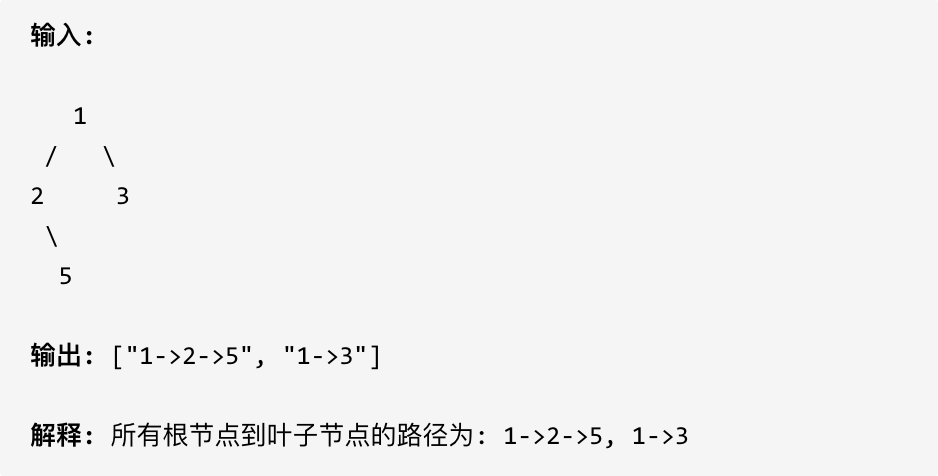

---

我们先使⽤递归的⽅式，来做前序遍历。要知道递归和回溯就是⼀家的，本题也需要回溯。
递归
要传⼊根节点，记录每⼀条路径的path，和存放结果集的result，这⾥递归不需要返回值，代
码如下：
 
1. 递归函数函数参数以及返回值
2. 确定递归终⽌条件
void traversal(TreeNode* cur, vector<int>& path, vector<string>& 
result)

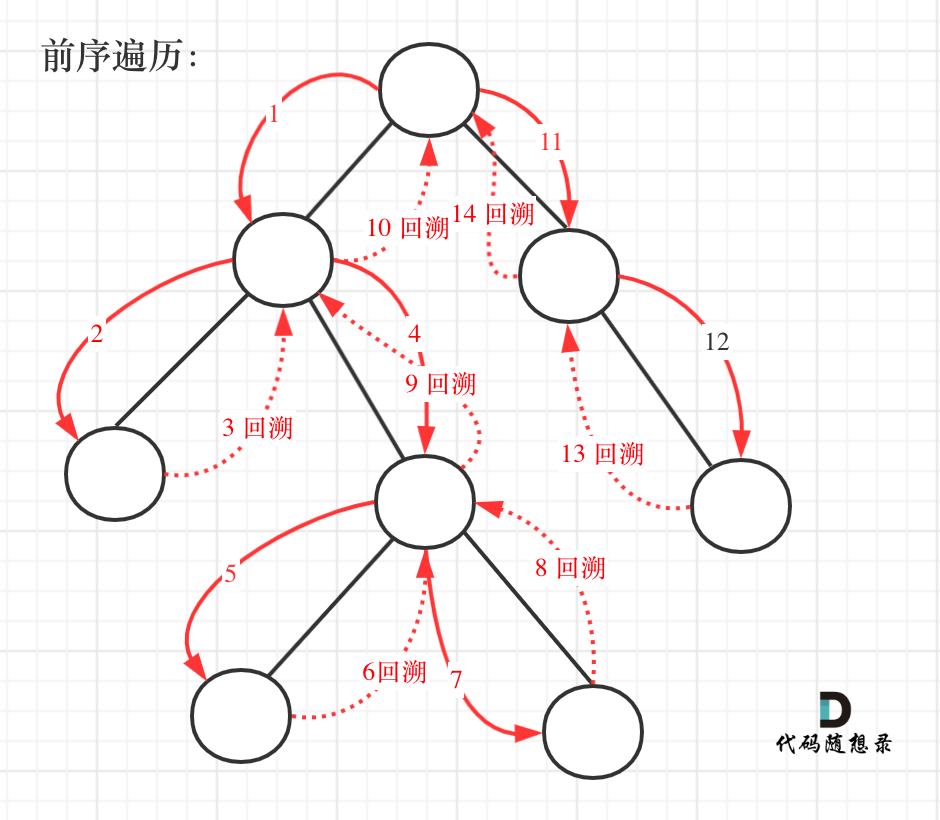

---

再写递归的时候都习惯了这么写：
但是本题的终⽌条件这样写会很⿇烦，因为本题要找到叶⼦节点，就开始结束的处理逻辑了
（把路径放进result⾥）。
那么什么时候算是找到了叶⼦节点？ 是当 cur不为空，其左右孩⼦都为空的时候，就找到叶⼦
节点。
所以本题的终⽌条件是：
为什么没有判断cur是否为空呢，因为下⾯的逻辑可以控制空节点不⼊循环。
再来看⼀下终⽌处理的逻辑。
这⾥使⽤vector 结构path来记录路径，所以要把vector 结构的path转为string格式，在把这个
string 放进 result⾥。
那么为什么使⽤了vector 结构来记录路径呢？  因为在下⾯处理单层递归逻辑的时候，要做回
溯，使⽤vector⽅便来做回溯。
可能有的同学问了，我看有些⼈的代码也没有回溯啊。
其实是有回溯的，只不过隐藏在函数调⽤时的参数赋值⾥，下⽂我还会提到。
这⾥我们先使⽤vector结构的path容器来记录路径，那么终⽌处理逻辑如下：
if (cur == NULL) {
    终⽌处理逻辑
}
if (cur->left == NULL && cur->right == NULL) {
    终⽌处理逻辑
}

---

因为是前序遍历，需要先处理中间节点，中间节点就是我们要记录路径上的节点，先放进
path中。
path.push_back(cur->val);
然后是递归和回溯的过程，上⾯说过没有判断cur是否为空，那么在这⾥递归的时候，如果为
空就不进⾏下⼀层递归了。
所以递归前要加上判断语句，下⾯要递归的节点是否为空，如下
此时还没完，递归完，要做回溯啊，因为path 不能⼀直加⼊节点，它还要删节点，然后才能
加⼊新的节点。
那么回溯要怎么回溯呢，⼀些同学会这么写，如下：
3. 确定单层递归逻辑
if (cur->left == NULL && cur->right == NULL) { // 遇到叶⼦节点
    string sPath;
    for (int i = 0; i < path.size() - 1; i++) { // 将path⾥记录的路径转为
string格式
        sPath += to_string(path[i]);
        sPath += "->";
    }
    sPath += to_string(path[path.size() - 1]); // 记录最后⼀个节点（叶⼦节
点）
    result.push_back(sPath); // 收集⼀个路径
    return;
}
if (cur->left) {
    traversal(cur->left, path, result);
}
if (cur->right) {
    traversal(cur->right, path, result);
}

---

这个回溯就要很⼤的问题，我们知道，回溯和递归是⼀⼀对应的，有⼀个递归，就要有⼀个
回溯，这么写的话相当于把递归和回溯拆开了， ⼀个在花括号⾥，⼀个在花括号外。
所以回溯要和递归永远在⼀起，世界上最遥远的距离是你在花括号⾥，⽽我在花括号外！
那么代码应该这么写：
那么本题整体代码如下：
if (cur->left) {
    traversal(cur->left, path, result);
}
if (cur->right) {
    traversal(cur->right, path, result);
}
path.pop_back();
if (cur->left) {
    traversal(cur->left, path, result);
    path.pop_back(); // 回溯
}
if (cur->right) {
    traversal(cur->right, path, result);
    path.pop_back(); // 回溯
}
class Solution {
private:
    void traversal(TreeNode* cur, vector<int>& path, vector<string>& 
result) {
        path.push_back(cur->val);
        // 这才到了叶⼦节点
        if (cur->left == NULL && cur->right == NULL) {
            string sPath;
            for (int i = 0; i < path.size() - 1; i++) {
                sPath += to_string(path[i]);

---

如上的C++代码充分体现了回溯。
那么如上代码可以精简成如下代码：
                sPath += "->";
            }
            sPath += to_string(path[path.size() - 1]);
            result.push_back(sPath);
            return;
        }
        if (cur->left) {
            traversal(cur->left, path, result);
            path.pop_back(); // 回溯
        }
        if (cur->right) {
            traversal(cur->right, path, result);
            path.pop_back(); // 回溯
        }
    }
public:
    vector<string> binaryTreePaths(TreeNode* root) {
        vector<string> result;
        vector<int> path;
        if (root == NULL) return result;
        traversal(root, path, result);
        return result;
    }
};
class Solution {
private:
    void traversal(TreeNode* cur, string path, vector<string>& result) 
{
        path += to_string(cur->val); // 中
        if (cur->left == NULL && cur->right == NULL) {
            result.push_back(path);

---

如上代码精简了不少，也隐藏了不少东西。
注意在函数定义的时候void traversal(TreeNode* cur, string path, vector<string>& 
result) ，定义的是string path，每次都是复制赋值，不⽤使⽤引⽤，否则就⽆法做到回
溯的效果。
那么在如上代码中，貌似没有看到回溯的逻辑，其实不然，回溯就隐藏在traversal(cur-
>left, path + "->", result);中的 path + "->"。  每次函数调⽤完，path依然是没有加
上"->" 的，这就是回溯了。
如果这⾥还不理解的话，可以看这篇⼆叉树：以为使⽤了递归，其实还隐藏着回溯，我这这
篇中详细的解释了递归中如何隐藏着回溯。 
 
综合以上，第⼆种递归的代码虽然精简但把很多重要的点隐藏在了代码细节⾥，第⼀种递归
写法虽然代码多⼀些，但是把每⼀个逻辑处理都完整的展现了出来了。
 
            return;
        }
        if (cur->left) traversal(cur->left, path + "->", result); // 左
        if (cur->right) traversal(cur->right, path + "->", result); // 
右
    }
public:
    vector<string> binaryTreePaths(TreeNode* root) {
        vector<string> result;
        string path;
        if (root == NULL) return result;
        traversal(root, path, result);
        return result;
    }
};

---

迭代法
⾄于⾮递归的⽅式，我们可以依然可以使⽤前序遍历的迭代⽅式来模拟遍历路径的过程，对
该迭代⽅式不了解的同学，可以看⽂章⼆叉树：听说递归能做的，栈也能做！和⼆叉树：前
中后序迭代⽅式的写法就不能统⼀⼀下么？。
这⾥除了模拟递归需要⼀个栈，同时还需要⼀个栈来存放对应的遍历路径。
C++代码如下：
 
class Solution {
public:
    vector<string> binaryTreePaths(TreeNode* root) {
        stack<TreeNode*> treeSt;// 保存树的遍历节点
        stack<string> pathSt;   // 保存遍历路径的节点
        vector<string> result;  // 保存最终路径集合
        if (root == NULL) return result;
        treeSt.push(root);
        pathSt.push(to_string(root->val));
        while (!treeSt.empty()) {
            TreeNode* node = treeSt.top(); treeSt.pop(); // 取出节点 中
            string path = pathSt.top();pathSt.pop();    // 取出该节点对应
的路径
            if (node->left == NULL && node->right == NULL) { // 遇到叶⼦
节点
                result.push_back(path);
            }
            if (node->right) { // 右
                treeSt.push(node->right);
                pathSt.push(path + "->" + to_string(node->right->val));
            }
            if (node->left) { // 左
                treeSt.push(node->left);
                pathSt.push(path + "->" + to_string(node->left->val));
            }
        }
        return result;
    }
};

---

当然，使⽤java的同学，可以直接定义⼀个成员变量为object的栈Stack<Object> stack = 
new Stack<>();，这样就不⽤定义两个栈了，都放到⼀个栈⾥就可以了。
总结
本⽂我们开始初步涉及到了回溯，很多同学过了这道题⽬，可能都不知道⾃⼰其实使⽤了回
溯，回溯和递归都是相伴相⽣的。
我在第⼀版递归代码中，把递归与回溯的细节都充分的展现了出来，⼤家可以⾃⼰感受⼀
下。
第⼆版递归代码对于初学者其实⾮常不友好，代码看上去简单，但是隐藏细节于⽆形。
最后我依然给出了迭代法。
对于本地充分了解递归与回溯的过程之后，有精⼒的同学可以在去实现迭代法。
如果感觉PDF对你有帮助，微信搜索：代码随想录，你会发现相见恨晚！
 
代码随想录官⽹：www.programmercarl.com
代码随想录开源项⽬Github：https://github.com/youngyangyang04/leetcode-
master
代码随想录算法公开课 ，代码随想录的全部内容将由我（程序员Carl）视频讲解并
开免费开放给⼤家。
《代码随想录》纸质版 已经出版。
代码随想录知识星球 上万录友在这⾥学习
代码随想录算法训练营 帮助录友⾼效刷完代码随想录。

---

本周⼩结！（⼆叉树系列⼆）
本周赶上了⼗⼀国庆，估计⼤家已经对本周末没什么概念了，但是我们该做总结还是要做总
结的。
本周的主题其实是简单但并不简单，本周所选的题⽬⼤多是看⼀下就会的题⽬，但是⼤家看
完本周的⽂章估计也发现了，⼆叉树的简答题⽬其实⾥⾯都藏了很多细节。 这些细节我都给
⼤家展现了出来。
周⼀
本周刚开始我们讲解了判断⼆叉树是否对称的写法， ⼆叉树：我对称么？。
这道题⽬的本质是要⽐较两个树（这两个树是根节点的左右⼦树），遍历两棵树⽽且要⽐较
内侧和外侧节点，所以准确的来说是⼀个树的遍历顺序是左右中，⼀个树的遍历顺序是右左
中。

---

⽽本题的迭代法中我们使⽤了队列，需要注意的是这不是层序遍历，⽽且仅仅通过⼀个容器
来成对的存放我们要⽐较的元素，认识到这⼀点之后就发现：⽤队列，⽤栈，甚⾄⽤数组，
都是可以的。
那么做完本题之后，在看如下两个题⽬。
⼆叉树：我对称么？中的递归法和迭代法只需要稍作修改其中⼀个树的遍历顺序，便可刷了
100.相同的树。
100.相同的树的递归代码如下：
100.相同的树
572.另⼀个树的⼦树
class Solution {
public:
    bool compare(TreeNode* left, TreeNode* right) {
        // ⾸先排除空节点的情况
        if (left == NULL && right != NULL) return false;
        else if (left != NULL && right == NULL) return false;
        else if (left == NULL && right == NULL) return true;
        // 排除了空节点，再排除数值不相同的情况
        else if (left->val != right->val) return false;
        // 此时就是：左右节点都不为空，且数值相同的情况
        // 此时才做递归，做下⼀层的判断
        bool outside = compare(left->left, right->right);   // 左⼦树：
左、 右⼦树：左 （相对于求对称⼆叉树，只需改⼀下这⾥的顺序）
        bool inside = compare(left->right, right->left);    // 左⼦树：
右、 右⼦树：右
        bool isSame = outside && inside;                    // 左⼦树：
中、 右⼦树：中 （逻辑处理）
        return isSame;
    }
    bool isSymmetric(TreeNode* root) {
        if (root == NULL) return true;
        return compare(root->left, root->right);
    }

---

100.相同的树，精简之后代码如下：
100.相同的树，迭代法代码如下：
};
class Solution {
public:
    bool compare(TreeNode* left, TreeNode* right) {
        if (left == NULL && right != NULL) return false;
        else if (left != NULL && right == NULL) return false;
        else if (left == NULL && right == NULL) return true;
        else if (left->val != right->val) return false;
        else return compare(left->left, right->left) && compare(left-
>right, right->right);
    }
    bool isSameTree(TreeNode* p, TreeNode* q) {
        return compare(p, q);
    }
};
class Solution {
public:
    bool isSameTree(TreeNode* p, TreeNode* q) {
        if (p == NULL && q == NULL) return true;
        if (p == NULL || q == NULL) return false;
        queue<TreeNode*> que;
        que.push(p);
        que.push(q);
        while (!que.empty()) {
            TreeNode* leftNode = que.front(); que.pop();
            TreeNode* rightNode = que.front(); que.pop();
            if (!leftNode && !rightNode) {
                continue;
            }

---

⽽572.另⼀个树的⼦树，则和 100.相同的树⼏乎⼀样的了，⼤家可以直接AC了。
周⼆
在⼆叉树：看看这些树的最⼤深度中，我们讲解了如何求⼆叉树的最⼤深度。
本题可以使⽤前序，也可以使⽤后序遍历（左右中），使⽤前序求的就是深度，使⽤后序呢
求的是⾼度。
⽽根节点的⾼度就是⼆叉树的最⼤深度，所以本题中我们通过后序求的根节点⾼度来求的⼆
叉树最⼤深度，所以⼆叉树：看看这些树的最⼤深度中使⽤的是后序遍历。
本题当然也可以使⽤前序，代码如下：(充分表现出求深度回溯的过程)
 
            if ((!leftNode || !rightNode || (leftNode->val != 
rightNode->val))) {
                return false;
            }
            // 相对于求对称⼆叉树，这⾥两个树都要保持⼀样的遍历顺序
            que.push(leftNode->left);
            que.push(rightNode->left);
            que.push(leftNode->right);
            que.push(rightNode->right);
        }
        return true;
    }
};
class Solution {
public:
    int result;
    void getDepth(TreeNode* node, int depth) {
        result = depth > result ? depth : result; // 中
        if (node->left == NULL && node->right == NULL) return ;

---

可以看出使⽤了前序（中左右）的遍历顺序，这才是真正求深度的逻辑！
注意以上代码是为了把细节体现出来，简化⼀下代码如下：
        if (node->left) { // 左
            depth++;    // 深度+1
            getDepth(node->left, depth);
            depth--;    // 回溯，深度-1
        }
        if (node->right) { // 右
            depth++;    // 深度+1
            getDepth(node->right, depth);
            depth--;    // 回溯，深度-1
        }
        return ;
    }
    int maxDepth(TreeNode* root) {
        result = 0;
        if (root == 0) return result;
        getDepth(root, 1);
        return result;
    }
};
class Solution {
public:
    int result;
    void getDepth(TreeNode* node, int depth) {
        result = depth > result ? depth : result; // 中
        if (node->left == NULL && node->right == NULL) return ;
        if (node->left) { // 左
            getDepth(node->left, depth + 1);
        }
        if (node->right) { // 右
            getDepth(node->right, depth + 1);
        }
        return ;
    }

---

周三
在⼆叉树：看看这些树的最⼩深度中，我们讲解如何求⼆叉树的最⼩深度， 这道题⽬要是稍
不留⼼很容易犯错。
注意这⾥最⼩深度是从根节点到最近叶⼦节点的最短路径上的节点数量。注意是叶⼦节点。
什么是叶⼦节点，左右孩⼦都为空的节点才是叶⼦节点！
求⼆叉树的最⼩深度和求⼆叉树的最⼤深度的差别主要在于处理左右孩⼦不为空的逻辑。
注意到这⼀点之后 递归法和迭代法 都可以参照⼆叉树：看看这些树的最⼤深度写出来。
周四
我们在⼆叉树：我有多少个节点？中，讲解了如何求⼆叉树的节点数量。
这⼀天是⼗⼀长假的第⼀天，又是双节，所以简单⼀些，只要把之前两篇⼆叉树：看看这些
树的最⼤深度， ⼆叉树：看看这些树的最⼩深度都认真看了的话，这道题⽬可以分分钟刷掉
了。
估计此时⼤家对这⼀类求⼆叉树节点数量以及求深度应该⾮常熟练了。
周五
在⼆叉树：我平衡么？中讲解了如何判断⼆叉树是否是平衡⼆叉树
今天讲解⼀道判断平衡⼆叉树的题⽬，其实 ⽅法上我们之前讲解深度的时候都讲过了，但是
这次我们通过这道题⽬彻底搞清楚⼆叉树⾼度与深度的问题，以及对应的遍历⽅式。
 
 
 
    int maxDepth(TreeNode* root) {
        result = 0;
        if (root == 0) return result;
        getDepth(root, 1);
        return result;
    }
};

---

⼆叉树节点的深度：指从根节点到该节点的最长简单路径边的条数。
⼆叉树节点的⾼度：指从该节点到叶⼦节点的最长简单路径边的条数。
但leetcode中强调的深度和⾼度很明显是按照节点来计算的。
关于根节点的深度究竟是1 还是 0，不同的地⽅有不⼀样的标准，leetcode的题⽬中都是以节
点为⼀度，即根节点深度是1。但维基百科上定义⽤边为⼀度，即根节点的深度是0，我们暂
时以leetcode为准（毕竟要在这上⾯刷题）。
当然此题⽤迭代法，其实效率很低，因为没有很好的模拟回溯的过程，所以迭代法有很多重
复的计算。
虽然理论上所有的递归都可以⽤迭代来实现，但是有的场景难度可能⽐较⼤。
例如：都知道回溯法其实就是递归，但是很少⼈⽤迭代的⽅式去实现回溯算法！
讲了这么多⼆叉树题⽬的迭代法，有的同学会疑惑，迭代法中究竟什么时候⽤队列，什么时
候⽤栈？
如果是模拟前中后序遍历就⽤栈，如果是适合层序遍历就⽤队列，当然还是其他情况，那么
就是 先⽤队列试试⾏不⾏，不⾏就⽤栈。
周六
在⼆叉树：找我的所有路径？中正式涉及到了回溯，很多同学过了这道题⽬，可能都不知道
⾃⼰使⽤了回溯，其实回溯和递归都是相伴相⽣的。最后我依然给出了迭代法的版本。
我在题解中第⼀个版本的代码会把回溯的过程充分体现出来，如果⼤家直接看简洁的代码版
本，很可能就会忽略的回溯的存在。
我在⽂中也强调了这⼀点。
有的同学还不理解 ，⽂中精简之后的递归代码，回溯究竟隐藏在哪⾥了。
⽂中我明确的说了：回溯就隐藏在traversal(cur->left, path + "->", result);中的 path + "-
>"。 每次函数调⽤完，path依然是没有加上"->" 的，这就是回溯了。
如果还不理解的话，可以把

---

改成
看看还⾏不⾏了，答案是这么写就不⾏了，因为没有回溯了。
总结
⼆叉树的题⽬，我都是使⽤了递归三部曲⼀步⼀步的把整个过程分析出来，⽽不是上来就给
出简洁的代码。
⼀些同学可能上来就能写出代码，⼤体上也知道是为啥，可以⾃圆其说，但往细节⼀扣，就
不知道了。
所以刚接触⼆叉树的同学，建议按照⽂章分析的步骤⼀步⼀步来，不要上来就照着精简的代
码写（那样写完了也很容易忘的，知其然不知其所以然）。
简短的代码看不出遍历的顺序，也看不出分析的逻辑，还会把必要的回溯的逻辑隐藏了，所
以尽量按照原理分析⼀步⼀步来，写出来之后，再去优化代码。
⼤家加个油！！
 
⼆叉树：以为使⽤了递归，其实还隐藏着回溯
补充⼀波
昨天的总结篇中还在玩耍的你，该总结啦！（本周⼩结之⼆叉树），有两处问题需要说明⼀
波。
 
 
traversal(cur->left, path + "->", result);
string tmp = path + "->";
traversal(cur->left, tmp, result);

---

求相同的树
还在玩耍的你，该总结啦！（本周⼩结之⼆叉树）中求100.相同的树的代码中，我笔误贴出了 
求对称树的代码了，细⼼的同学应该都发现了。
那么如下我再给出求100. 相同的树 的代码，如下：
以上的代码相对于：⼆叉树：我对称么？ 仅仅修改了变量的名字（为了符合判断相同树的语
境）和 遍历的顺序。
⼤家应该会体会到：认清判断对称树本质之后， 对称树的代码 稍作修改 就可以直接⽤来AC 
100.相同的树。
 
class Solution {
public:
    bool compare(TreeNode* tree1, TreeNode* tree2) {
        if (tree1 == NULL && tree2 != NULL) return false;
        else if (tree1 != NULL && tree2 == NULL) return false;
        else if (tree1 == NULL && tree2 == NULL) return true;
        else if (tree1->val != tree2->val) return false; // 注意这⾥我没
有使⽤else
        // 此时就是：左右节点都不为空，且数值相同的情况
        // 此时才做递归，做下⼀层的判断
        bool compareLeft = compare(tree1->left, tree2->left);       // 
左⼦树：左、 右⼦树：左
        bool compareRight = compare(tree1->right, tree2->right);    // 
左⼦树：右、 右⼦树：右
        bool isSame = compareLeft && compareRight;                  // 
左⼦树：中、 右⼦树：中（逻辑处理）
        return isSame;
    }
    bool isSameTree(TreeNode* p, TreeNode* q) {
        return compare(p, q);
    }
};

---

递归中隐藏着回溯
在⼆叉树：找我的所有路径？中我强调了本题其实是⽤到了回溯的，并且给出了第⼀个版本
的代码，把回溯的过程充分的提现了出来。
如下的代码充分的体现出回溯：(257. ⼆叉树的所有路径)
 
class Solution {
private:
    void traversal(TreeNode* cur, vector<int>& path, vector<string>& 
result) {
        path.push_back(cur->val);
        // 这才到了叶⼦节点
        if (cur->left == NULL && cur->right == NULL) {
            string sPath;
            for (int i = 0; i < path.size() - 1; i++) {
                sPath += to_string(path[i]);
                sPath += "->";
            }
            sPath += to_string(path[path.size() - 1]);
            result.push_back(sPath);
            return;
        }
        if (cur->left) {
            traversal(cur->left, path, result);
            path.pop_back(); // 回溯
        }
        if (cur->right) {
            traversal(cur->right, path, result);
            path.pop_back(); // 回溯
        }
    }
public:
    vector<string> binaryTreePaths(TreeNode* root) {
        vector<string> result;
        vector<int> path;
        if (root == NULL) return result;

---

如下为精简之后的递归代码：(257. ⼆叉树的所有路径)
上⾯的代码，⼤家貌似感受不到回溯了，其实回溯就隐藏在traversal(cur->left, path + "->", 
result);中的 path + "->"。  每次函数调⽤完，path依然是没有加上"->" 的，这就是回溯了。
为了把这份精简代码的回溯过程展现出来，⼤家可以试⼀试把：
        traversal(root, path, result);
        return result;
    }
};
class Solution {
private:
    void traversal(TreeNode* cur, string path, vector<string>& result) 
{
        path += to_string(cur->val); // 中
        if (cur->left == NULL && cur->right == NULL) {
            result.push_back(path);
            return;
        }
        if (cur->left) traversal(cur->left, path + "->", result); // 左  
回溯就隐藏在这⾥
        if (cur->right) traversal(cur->right, path + "->", result); // 
右 回溯就隐藏在这⾥
    }
public:
    vector<string> binaryTreePaths(TreeNode* root) {
        vector<string> result;
        string path;
        if (root == NULL) return result;
        traversal(root, path, result);
        return result;
    }
};

---

改成如下代码：
即：
此时就没有回溯了，这个代码就是通过不了的了。
如果想把回溯加上，就要 在上⾯代码的基础上，加上回溯，就可以AC了。
if (cur->left) traversal(cur->left, path + "->", result); // 左  回溯就隐
藏在这⾥
path += "->";
traversal(cur->left, path, result); // 左
if (cur->left) {
    path += "->";
    traversal(cur->left, path, result); // 左
}
if (cur->right) {
    path += "->";
    traversal(cur->right, path, result); // 右
}
if (cur->left) {
    path += "->";
    traversal(cur->left, path, result); // 左
    path.pop_back(); // 回溯
    path.pop_back();
}
if (cur->right) {
    path += "->";
    traversal(cur->right, path, result); // 右
    path.pop_back(); // 回溯
    path.pop_back();
}

---

⼤家应该可以感受出来，如果把 path + "->"作为函数参数就是可以的，因为并有没有改变
path的数值，执⾏完递归函数之后，path依然是之前的数值（相当于回溯了）
如果有点遗忘了，建议把这篇⼆叉树：找我的所有路径？在仔细看⼀下，然后再看这⾥的总
结，相信会豁然开朗。
这⾥我尽量把逻辑的每⼀个细节都抠出来展现了，希望对⼤家有所帮助！
 
如果感觉PDF对你有帮助，微信搜索：代码随想录，你会发现相见恨晚！
代码随想录官⽹：www.programmercarl.com
代码随想录开源项⽬Github：https://github.com/youngyangyang04/leetcode-
master
代码随想录算法公开课 ，代码随想录的全部内容将由我（程序员Carl）视频讲解并
开免费开放给⼤家。
《代码随想录》纸质版 已经出版。
代码随想录知识星球 上万录友在这⾥学习
代码随想录算法训练营 帮助录友⾼效刷完代码随想录。

---

左叶⼦之和
404.左叶⼦之和
题⽬地址：https://leetcode-cn.com/problems/sum-of-left-leaves/
计算给定⼆叉树的所有左叶⼦之和。
⽰例：
思路
⾸先要注意是判断左叶⼦，不是⼆叉树左侧节点，所以不要上来想着层序遍历。
因为题⽬中其实没有说清楚左叶⼦究竟是什么节点，那么我来给出左叶⼦的明确定义：如果
左节点不为空，且左节点没有左右孩⼦，那么这个节点就是左叶⼦
⼤家思考⼀下如下图中⼆叉树，左叶⼦之和究竟是多少？

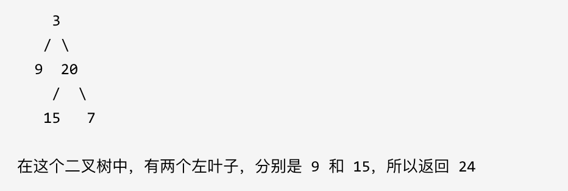

---

其实是0，因为这棵树根本没有左叶⼦！
那么判断当前节点是不是左叶⼦是⽆法判断的，必须要通过节点的⽗节点来判断其左孩⼦是
不是左叶⼦。
如果该节点的左节点不为空，该节点的左节点的左节点为空，该节点的左节点的右节点为
空，则找到了⼀个左叶⼦，判断代码如下：
if (node->left != NULL && node->left->left == NULL && node->left->right 
== NULL) {
    左叶⼦节点处理逻辑
}

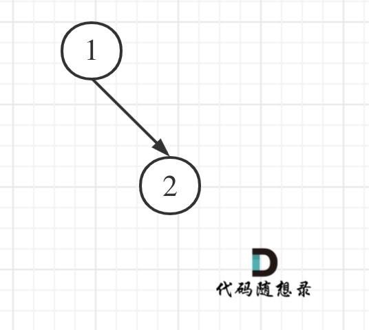

---

递归法
递归的遍历顺序为后序遍历（左右中），是因为要通过递归函数的返回值来累加求取左叶⼦
数值之和。。
递归三部曲：
判断⼀个树的左叶⼦节点之和，那么⼀定要传⼊树的根节点，递归函数的返回值为数值之
和，所以为int
使⽤题⽬中给出的函数就可以了。
依然是
当遇到左叶⼦节点的时候，记录数值，然后通过递归求取左⼦树左叶⼦之和，和 右⼦树左叶
⼦之和，相加便是整个树的左叶⼦之和。
代码如下：
 
1. 确定递归函数的参数和返回值
2. 确定终⽌条件
3. 确定单层递归的逻辑
if (root == NULL) return 0;
int leftValue = sumOfLeftLeaves(root->left);    // 左
int rightValue = sumOfLeftLeaves(root->right);  // 右
                                                // 中
int midValue = 0;
if (root->left && !root->left->left && !root->left->right) {
    midValue = root->left->val;
}
int sum = midValue + leftValue + rightValue;
return sum;

---

整体递归代码如下：
以上代码精简之后如下：
class Solution {
public:
    int sumOfLeftLeaves(TreeNode* root) {
        if (root == NULL) return 0;
        int leftValue = sumOfLeftLeaves(root->left);    // 左
        int rightValue = sumOfLeftLeaves(root->right);  // 右
                                                        // 中
        int midValue = 0;
        if (root->left && !root->left->left && !root->left->right) { // 
中
            midValue = root->left->val;
        }
        int sum = midValue + leftValue + rightValue;
        return sum;
    }
};
class Solution {
public:
    int sumOfLeftLeaves(TreeNode* root) {
        if (root == NULL) return 0;
        int midValue = 0;
        if (root->left != NULL && root->left->left == NULL && root-
>left->right == NULL) {
            midValue = root->left->val;
        }
        return midValue + sumOfLeftLeaves(root->left) + 
sumOfLeftLeaves(root->right);
    }
};

---

迭代法
本题迭代法使⽤前中后序都是可以的，只要把左叶⼦节点统计出来，就可以了，那么参考⽂
章 ⼆叉树：听说递归能做的，栈也能做！和⼆叉树：前中后序迭代⽅式的写法就不能统⼀⼀
下么？中的写法，可以写出⼀个前序遍历的迭代法。
判断条件都是⼀样的，代码如下：
总结
这道题⽬要求左叶⼦之和，其实是⽐较绕的，因为不能判断本节点是不是左叶⼦节点。
此时就要通过节点的⽗节点来判断其左孩⼦是不是左叶⼦了。
平时我们解⼆叉树的题⽬时，已经习惯了通过节点的左右孩⼦判断本节点的属性，⽽本题我
们要通过节点的⽗节点判断本节点的属性。
 
 
class Solution {
public:
    int sumOfLeftLeaves(TreeNode* root) {
        stack<TreeNode*> st;
        if (root == NULL) return 0;
        st.push(root);
        int result = 0;
        while (!st.empty()) {
            TreeNode* node = st.top();
            st.pop();
            if (node->left != NULL && node->left->left == NULL && node-
>left->right == NULL) {
                result += node->left->val;
            }
            if (node->right) st.push(node->right);
            if (node->left) st.push(node->left);
        }
        return result;
    }
};

---

希望通过这道题⽬，可以扩展⼤家对⼆叉树的解题思路。
 
树左下⾓的值
513.找树左下⾓的值
给定⼀个⼆叉树，在树的最后⼀⾏找到最左边的值。
⽰例 1:
⽰例 2:

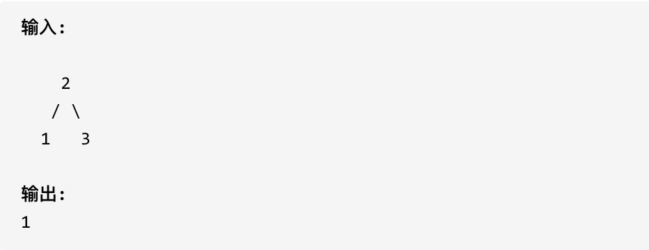

---

思路
本地要找出树的最后⼀⾏找到最左边的值。此时⼤家应该想起⽤层序遍历是⾮常简单的了，
反⽽⽤递归的话会⽐较难⼀点。
我们依然还是先介绍递归法。
递归
咋眼⼀看，这道题⽬⽤递归的话就就⼀直向左遍历，最后⼀个就是答案呗？
没有这么简单，⼀直向左遍历到最后⼀个，它未必是最后⼀⾏啊。
我们来分析⼀下题⽬：在树的最后⼀⾏找到最左边的值。
⾸先要是最后⼀⾏，然后是最左边的值。
如果使⽤递归法，如何判断是最后⼀⾏呢，其实就是深度最⼤的叶⼦节点⼀定是最后⼀⾏。
如果对⼆叉树深度和⾼度还有点疑惑的话，请看：⼆叉树：我平衡么？。
所以要找深度最⼤的叶⼦节点。

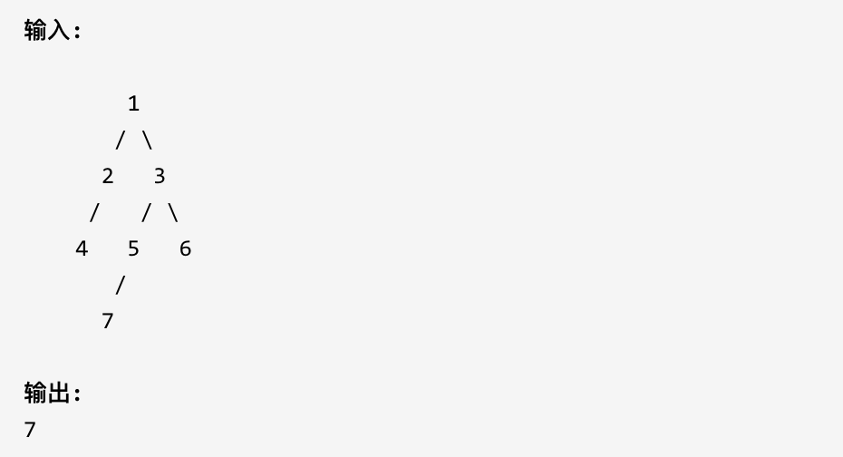

---

那么如果找最左边的呢？可以使⽤前序遍历，这样才先优先左边搜索，然后记录深度最⼤的
叶⼦节点，此时就是树的最后⼀⾏最左边的值。
递归三部曲：
参数必须有要遍历的树的根节点，还有就是⼀个int型的变量⽤来记录最长深度。 这⾥就不需
要返回值了，所以递归函数的返回类型为void。
本题还需要类⾥的两个全局变量，maxLen⽤来记录最⼤深度，maxleftValue记录最⼤深度最
左节点的数值。
代码如下：
有的同学可能疑惑，为啥不能递归函数的返回值返回最长深度呢？
其实很多同学都对递归函数什么时候要有返回值，什么时候不能有返回值很迷茫。
如果需要遍历整颗树，递归函数就不能有返回值。如果需要遍历某⼀条固定路线，递归函数
就⼀定要有返回值！
初学者可能对这个结论不太理解，别急，后⾯我会安排⼀道题⽬专门讲递归函数的返回值问
题。这⾥⼤家暂时先了解⼀下。
本题我们是要遍历整个树找到最深的叶⼦节点，需要遍历整颗树，所以递归函数没有返回
值。
当遇到叶⼦节点的时候，就需要统计⼀下最⼤的深度了，所以需要遇到叶⼦节点来更新最⼤
深度。
代码如下：
1. 确定递归函数的参数和返回值
2. 确定终⽌条件
int maxLen = INT_MIN;   // 全局变量 记录最⼤深度
int maxleftValue;       // 全局变量 最⼤深度最左节点的数值
void traversal(TreeNode* root, int leftLen)

---

在找最⼤深度的时候，递归的过程中依然要使⽤回溯，代码如下：
完整代码如下：
3. 确定单层递归的逻辑
if (root->left == NULL && root->right == NULL) {
    if (leftLen > maxLen) {
        maxLen = leftLen;           // 更新最⼤深度
        maxleftValue = root->val;   // 最⼤深度最左⾯的数值
    }
    return;
}
                    // 中
if (root->left) {   // 左
    leftLen++; // 深度加⼀
    traversal(root->left, leftLen);
    leftLen--; // 回溯，深度减⼀
}
if (root->right) { // 右
    leftLen++; // 深度加⼀
    traversal(root->right, leftLen);
    leftLen--; // 回溯，深度减⼀
}
return;
class Solution {
public:
    int maxLen = INT_MIN;
    int maxleftValue;
    void traversal(TreeNode* root, int leftLen) {
        if (root->left == NULL && root->right == NULL) {
            if (leftLen > maxLen) {
                maxLen = leftLen;
                maxleftValue = root->val;
            }

---

当然回溯的地⽅可以精简，精简代码如下：
            return;
        }
        if (root->left) {
            leftLen++;
            traversal(root->left, leftLen);
            leftLen--; // 回溯
        }
        if (root->right) {
            leftLen++;
            traversal(root->right, leftLen);
            leftLen--; // 回溯
        }
        return;
    }
    int findBottomLeftValue(TreeNode* root) {
        traversal(root, 0);
        return maxleftValue;
    }
};
class Solution {
public:
    int maxLen = INT_MIN;
    int maxleftValue;
    void traversal(TreeNode* root, int leftLen) {
        if (root->left == NULL && root->right == NULL) {
            if (leftLen > maxLen) {
                maxLen = leftLen;
                maxleftValue = root->val;
            }
            return;
        }
        if (root->left) {
            traversal(root->left, leftLen + 1); // 隐藏着回溯
        }
        if (root->right) {

---

如果对回溯部分精简的代码 不理解的话，可以看这篇⼆叉树：找我的所有路径？和⼆叉树：
以为使⽤了递归，其实还隐藏着回溯 。这两篇⽂章详细分析了回溯隐藏在了哪⾥。
迭代法
本题使⽤层序遍历再合适不过了，⽐递归要好理解的多！
只需要记录最后⼀⾏第⼀个节点的数值就可以了。
如果对层序遍历不了解，看这篇⼆叉树：层序遍历登场！，这篇⾥也给出了层序遍历的模
板，稍作修改就⼀过刷了这道题了。
代码如下：
 
            traversal(root->right, leftLen + 1); // 隐藏着回溯
        }
        return;
    }
    int findBottomLeftValue(TreeNode* root) {
        traversal(root, 0);
        return maxleftValue;
    }
};
class Solution {
public:
    int findBottomLeftValue(TreeNode* root) {
        queue<TreeNode*> que;
        if (root != NULL) que.push(root);
        int result = 0;
        while (!que.empty()) {
            int size = que.size();
            for (int i = 0; i < size; i++) {
                TreeNode* node = que.front();
                que.pop();
                if (i == 0) result = node->val; // 记录最后⼀⾏第⼀个元素
                if (node->left) que.push(node->left);

---

总结
本题涉及如下⼏点：
 
路径总和
递归函数什么时候需要返回值
相信很多同学都会疑惑，递归函数什么时候要有返回值，什么时候没有返回值，特别是有的
时候递归函数返回类型为bool类型。那么
接下来我通过详细讲解如下两道题，来回答这个问题：
 
递归求深度的写法，我们在⼆叉树：我平衡么？中详细的分析了深度应该怎么求，
⾼度应该怎么求。
递归中其实隐藏了回溯，在⼆叉树：以为使⽤了递归，其实还隐藏着回溯中讲解了
究竟哪⾥使⽤了回溯，哪⾥隐藏了回溯。
层次遍历，在⼆叉树：层序遍历登场！深度讲解了⼆叉树层次遍历。
所以本题涉及到的点，我们之前都讲解过，这些知识点需要同学们灵活运⽤，这样
就举⼀反三了。
 
dh. 路径总和
di. 路径总和II
                if (node->right) que.push(node->right);
            }
        }
        return result;
    }
};

---

112. 路径总和
题⽬地址：https://leetcode-cn.com/problems/path-sum/
给定⼀个⼆叉树和⼀个⽬标和，判断该树中是否存在根节点到叶⼦节点的路径，这条路径上
所有节点值相加等于⽬标和。
说明: 叶⼦节点是指没有⼦节点的节点。
⽰例: 
给定如下⼆叉树，以及⽬标和 sum = 22，
返回 true, 因为存在⽬标和为 22 的根节点到叶⼦节点的路径 5->4->11->2。
思路
这道题我们要遍历从根节点到叶⼦节点的的路径看看总和是不是⽬标和。
递归
可以使⽤深度优先遍历的⽅式（本题前中后序都可以，⽆所谓，因为中节点也没有处理逻
辑）来遍历⼆叉树
参数：需要⼆叉树的根节点，还需要⼀个计数器，这个计数器⽤来计算⼆叉树的⼀条边之和
是否正好是⽬标和，计数器为int型。
 
 
 
1. 确定递归函数的参数和返回类型

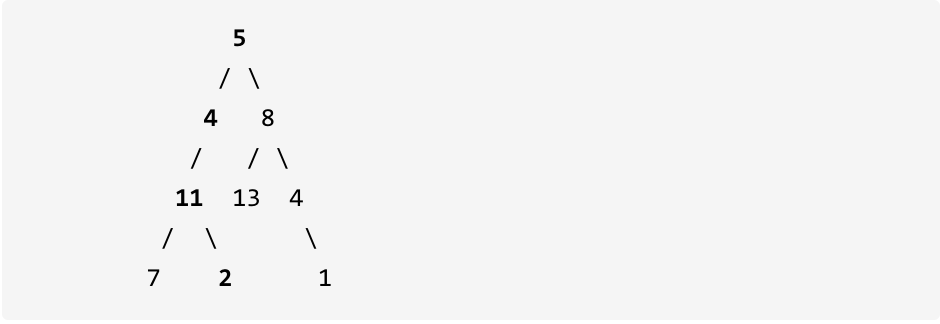

---

再来看返回值，递归函数什么时候需要返回值？什么时候不需要返回值？
在⽂章⼆叉树：我的左下⾓的值是多少？中，我给出了⼀个结论：
如果需要搜索整颗⼆叉树，那么递归函数就不要返回值，如果要搜索其中⼀条符合条件的路
径，递归函数就需要返回值，因为遇到符合条件的路径了就要及时返回。
在⼆叉树：我的左下⾓的值是多少？中，因为要遍历树的所有路径，找出深度最深的叶⼦节
点，所以递归函数不要返回值。
⽽本题我们要找⼀条符合条件的路径，所以递归函数需要返回值，及时返回，那么返回类型
是什么呢？
如图所⽰：

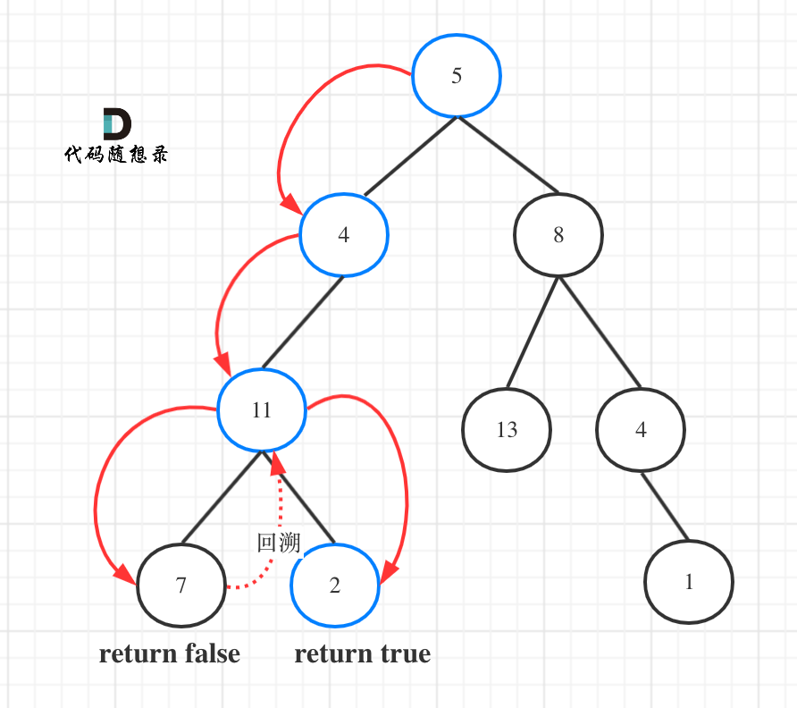

---

图中可以看出，遍历的路线，并不要遍历整棵树，所以递归函数需要返回值，可以⽤bool类
型表⽰。
所以代码如下：
⾸先计数器如何统计这⼀条路径的和呢？
不要去累加然后判断是否等于⽬标和，那么代码⽐较⿇烦，可以⽤递减，让计数器count初始
为⽬标和，然后每次减去遍历路径节点上的数值。
如果最后count == 0，同时到了叶⼦节点的话，说明找到了⽬标和。
如果遍历到了叶⼦节点，count不为0，就是没找到。
递归终⽌条件代码如下：
因为终⽌条件是判断叶⼦节点，所以递归的过程中就不要让空节点进⼊递归了。
递归函数是有返回值的，如果递归函数返回true，说明找到了合适的路径，应该⽴刻返回。
代码如下：
2. 确定终⽌条件
3. 确定单层递归的逻辑
bool traversal(TreeNode* cur, int count)   // 注意函数的返回类型
if (!cur->left && !cur->right && count == 0) return true; // 遇到叶⼦节
点，并且计数为0
if (!cur->left && !cur->right) return false; // 遇到叶⼦节点⽽没有找到合适的
边，直接返回

---

以上代码中是包含着回溯的，没有回溯，如何后撤重新找另⼀条路径呢。
回溯隐藏在traversal(cur->left, count - cur->left->val)这⾥， 因为把count - 
cur->left->val 直接作为参数传进去，函数结束，count的数值没有改变。
为了把回溯的过程体现出来，可以改为如下代码：
整体代码如下：
if (cur->left) { // 左 （空节点不遍历）
    // 遇到叶⼦节点返回true，则直接返回true
    if (traversal(cur->left, count - cur->left->val)) return true; // 
注意这⾥有回溯的逻辑
}
if (cur->right) { // 右 （空节点不遍历）
    // 遇到叶⼦节点返回true，则直接返回true
    if (traversal(cur->right, count - cur->right->val)) return true; // 
注意这⾥有回溯的逻辑
}
return false;
if (cur->left) { // 左
    count -= cur->left->val; // 递归，处理节点;
    if (traversal(cur->left, count)) return true;
    count += cur->left->val; // 回溯，撤销处理结果
}
if (cur->right) { // 右
    count -= cur->right->val;
    if (traversal(cur->right, count - cur->right->val)) return true;
    count += cur->right->val;
}
return false;
class Solution {
private:
    bool traversal(TreeNode* cur, int count) {

---

以上代码精简之后如下：
        if (!cur->left && !cur->right && count == 0) return true; // 遇
到叶⼦节点，并且计数为0
        if (!cur->left && !cur->right) return false; // 遇到叶⼦节点直接返
回
        if (cur->left) { // 左
            count -= cur->left->val; // 递归，处理节点;
            if (traversal(cur->left, count)) return true;
            count += cur->left->val; // 回溯，撤销处理结果
        }
        if (cur->right) { // 右
            count -= cur->right->val; // 递归，处理节点;
            if (traversal(cur->right, count)) return true;
            count += cur->right->val; // 回溯，撤销处理结果
        }
        return false;
    }
public:
    bool hasPathSum(TreeNode* root, int sum) {
        if (root == NULL) return false;
        return traversal(root, sum - root->val);
    }
};
class Solution {
public:
    bool hasPathSum(TreeNode* root, int sum) {
        if (root == NULL) return false;
        if (!root->left && !root->right && sum == root->val) {
            return true;
        }
        return hasPathSum(root->left, sum - root->val) || 
hasPathSum(root->right, sum - root->val);
    }
};

---

是不是发现精简之后的代码，已经完全看不出分析的过程了，所以我们要把题⽬分析清楚之
后，在追求代码精简。 这⼀点我已经强调很多次了！
迭代
如果使⽤栈模拟递归的话，那么如果做回溯呢？
此时栈⾥⼀个元素不仅要记录该节点指针，还要记录从头结点到该节点的路径数值总和。
C++就我们⽤pair结构来存放这个栈⾥的元素。
定义为：pair<TreeNode*, int> pair<节点指针，路径数值>
这个为栈⾥的⼀个元素。
如下代码是使⽤栈模拟的前序遍历，如下：（详细注释）
 
class Solution {
public:
    bool hasPathSum(TreeNode* root, int sum) {
        if (root == NULL) return false;
        // 此时栈⾥要放的是pair<节点指针，路径数值>
        stack<pair<TreeNode*, int>> st;
        st.push(pair<TreeNode*, int>(root, root->val));
        while (!st.empty()) {
            pair<TreeNode*, int> node = st.top();
            st.pop();
            // 如果该节点是叶⼦节点了，同时该节点的路径数值等于sum，那么就返回
true
            if (!node.first->left && !node.first->right && sum == 
node.second) return true;
            // 右节点，压进去⼀个节点的时候，将该节点的路径数值也记录下来
            if (node.first->right) {
                st.push(pair<TreeNode*, int>(node.first->right, 
node.second + node.first->right->val));
            }

---

如果⼤家完全理解了本地的递归⽅法之后，就可以顺便把leetcode上113. 路径总和II做了。
113. 路径总和II
题⽬地址：https://leetcode-cn.com/problems/path-sum-ii/
给定⼀个⼆叉树和⼀个⽬标和，找到所有从根节点到叶⼦节点路径总和等于给定⽬标和的路
径。
说明: 叶⼦节点是指没有⼦节点的节点。
⽰例:
给定如下⼆叉树，以及⽬标和 sum = 22，
 
            // 左节点，压进去⼀个节点的时候，将该节点的路径数值也记录下来
            if (node.first->left) {
                st.push(pair<TreeNode*, int>(node.first->left, 
node.second + node.first->left->val));
            }
        }
        return false;
    }
};

---

思路
113.路径总和II要遍历整个树，找到所有路径，所以递归函数不要返回值！
如图：

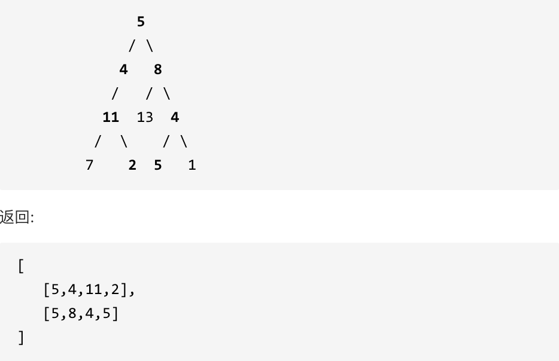

---

为了尽可能的把细节体现出来，我写出如下代码（这份代码并不简洁，但是逻辑⾮常清晰）
class Solution {
private:
    vector<vector<int>> result;
    vector<int> path;
    // 递归函数不需要返回值，因为我们要遍历整个树
    void traversal(TreeNode* cur, int count) {
        if (!cur->left && !cur->right && count == 0) { // 遇到了叶⼦节点切
找到了和为sum的路径
            result.push_back(path);
            return;
        }

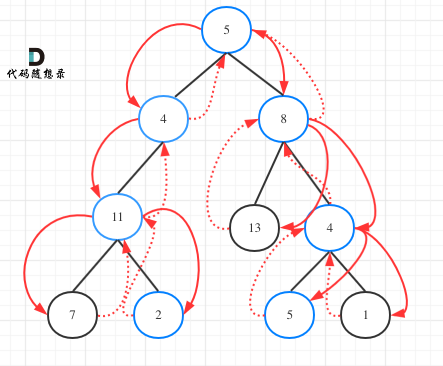

---

⾄于113. 路径总和II 的迭代法我并没有写，⽤迭代⽅式记录所有路径⽐较⿇烦，也没有必
要，如果⼤家感兴趣的话，可以再深⼊研究研究。
        if (!cur->left && !cur->right) return ; // 遇到叶⼦节点⽽没有找到合
适的边，直接返回
        if (cur->left) { // 左 （空节点不遍历）
            path.push_back(cur->left->val);
            count -= cur->left->val;
            traversal(cur->left, count);    // 递归
            count += cur->left->val;        // 回溯
            path.pop_back();                // 回溯
        }
        if (cur->right) { // 右 （空节点不遍历）
            path.push_back(cur->right->val);
            count -= cur->right->val;
            traversal(cur->right, count);   // 递归
            count += cur->right->val;       // 回溯
            path.pop_back();                // 回溯
        }
        return ;
    }
public:
    vector<vector<int>> pathSum(TreeNode* root, int sum) {
        result.clear();
        path.clear();
        if (root == NULL) return result;
        path.push_back(root->val); // 把根节点放进路径
        traversal(root, sum - root->val);
        return result;
    }
};

---

总结
本篇通过leetcode上112. 路径总和 和 113. 路径总和II 详细的讲解了 递归函数什么时候需要返
回值，什么不需要返回值。
这两道题⽬是掌握这⼀知识点⾮常好的题⽬，⼤家看完本篇⽂章再去做题，就会感受到搜索
整棵树和搜索某⼀路径的差别。
对于112. 路径总和，我依然给出了递归法和迭代法，这种题⽬其实⽤迭代法会复杂⼀些，能
掌握递归⽅式就够了！
 
如果感觉PDF对你有帮助，微信搜索：代码随想录，你会发现相见恨晚！
 
代码随想录官⽹：www.programmercarl.com
代码随想录开源项⽬Github：https://github.com/youngyangyang04/leetcode-
master
代码随想录算法公开课 ，代码随想录的全部内容将由我（程序员Carl）视频讲解并
开免费开放给⼤家。
《代码随想录》纸质版 已经出版。
代码随想录知识星球 上万录友在这⾥学习
代码随想录算法训练营 帮助录友⾼效刷完代码随想录。

---

构造⼆叉树登场
看完本⽂，可以⼀起解决如下两道题⽬
106.从中序与后序遍历序列构造⼆叉树
题⽬地址：https://leetcode-cn.com/problems/construct-binary-tree-from-inorder-and-post
order-traversal/
根据⼀棵树的中序遍历与后序遍历构造⼆叉树。
注意:
你可以假设树中没有重复的元素。
例如，给出
中序遍历 inorder = [9,3,15,20,7]
后序遍历 postorder = [9,15,7,20,3]
返回如下的⼆叉树：
 
106.从中序与后序遍历序列构造⼆叉树
105.从前序与中序遍历序列构造⼆叉树

---

思路
⾸先回忆⼀下如何根据两个顺序构造⼀个唯⼀的⼆叉树，相信理论知识⼤家应该都清楚，就
是以 后序数组的最后⼀个元素为切割点，先切中序数组，根据中序数组，反过来在切后序数
组。⼀层⼀层切下去，每次后序数组最后⼀个元素就是节点元素。
如果让我们⾁眼看两个序列，画⼀颗⼆叉树的话，应该分分钟都可以画出来。
流程如图：
那么代码应该怎么写呢？
说到⼀层⼀层切割，就应该想到了递归。
来看⼀下⼀共分⼏步：
 
第⼀步：如果数组⼤⼩为零的话，说明是空节点了。
第⼆步：如果不为空，那么取后序数组最后⼀个元素作为节点元素。
第三步：找到后序数组最后⼀个元素在中序数组的位置，作为切割点
第四步：切割中序数组，切成中序左数组和中序右数组 （顺序别搞反了，⼀定是先
切中序数组）
第五步：切割后序数组，切成后序左数组和后序右数组

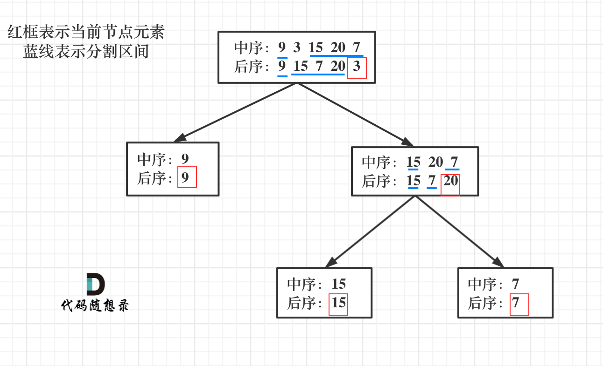

---

不难写出如下代码：（先把框架写出来）
难点⼤家应该发现了，就是如何切割，以及边界值找不好很容易乱套。
此时应该注意确定切割的标准，是左闭右开，还有左开又闭，还是左闭又闭，这个就是不变
量，要在递归中保持这个不变量。
第六步：递归处理左区间和右区间
TreeNode* traversal (vector<int>& inorder, vector<int>& postorder) {
    // 第⼀步
    if (postorder.size() == 0) return NULL;
    // 第⼆步：后序遍历数组最后⼀个元素，就是当前的中间节点
    int rootValue = postorder[postorder.size() - 1];
    TreeNode* root = new TreeNode(rootValue);
    // 叶⼦节点
    if (postorder.size() == 1) return root;
    // 第三步：找切割点
    int delimiterIndex;
    for (delimiterIndex = 0; delimiterIndex < inorder.size(); 
delimiterIndex++) {
        if (inorder[delimiterIndex] == rootValue) break;
    }
    // 第四步：切割中序数组，得到 中序左数组和中序右数组
    // 第五步：切割后序数组，得到 后序左数组和后序右数组
    // 第六步
    root->left = traversal(中序左数组, 后序左数组);
    root->right = traversal(中序右数组, 后序右数组);
    return root;
}

---

在切割的过程中会产⽣四个区间，把握不好不变量的话，⼀会左闭右开，⼀会左闭又闭，必
然乱套！
我在数组：每次遇到⼆分法，都是⼀看就会，⼀写就废和数组：这个循环可以转懵很多⼈！
中都强调过循环不变量的重要性，在⼆分查找以及螺旋矩阵的求解中，坚持循环不变量⾮常
重要，本题也是。
⾸先要切割中序数组，为什么先切割中序数组呢？
切割点在后序数组的最后⼀个元素，就是⽤这个元素来切割中序数组的，所以必要先切割中
序数组。
中序数组相对⽐较好切，找到切割点（后序数组的最后⼀个元素）在中序数组的位置，然后
切割，如下代码中我坚持左闭右开的原则：
接下来就要切割后序数组了。
⾸先后序数组的最后⼀个元素指定不能要了，这是切割点 也是 当前⼆叉树中间节点的元素，
已经⽤了。
后序数组的切割点怎么找？
后序数组没有明确的切割元素来进⾏左右切割，不像中序数组有明确的切割点，切割点左右
分开就可以了。
// 找到中序遍历的切割点
int delimiterIndex;
for (delimiterIndex = 0; delimiterIndex < inorder.size(); 
delimiterIndex++) {
    if (inorder[delimiterIndex] == rootValue) break;
}
// 左闭右开区间：[0, delimiterIndex)
vector<int> leftInorder(inorder.begin(), inorder.begin() + 
delimiterIndex);
// [delimiterIndex + 1, end)
vector<int> rightInorder(inorder.begin() + delimiterIndex + 1, 
inorder.end() );

---

此时有⼀个很重的点，就是中序数组⼤⼩⼀定是和后序数组的⼤⼩相同的（这是必然）。
中序数组我们都切成了左中序数组和右中序数组了，那么后序数组就可以按照左中序数组的
⼤⼩来切割，切成左后序数组和右后序数组。
代码如下：
此时，中序数组切成了左中序数组和右中序数组，后序数组切割成左后序数组和右后序数
组。
接下来可以递归了，代码如下：
完整代码如下：
C++完整代码
 
// postorder 舍弃末尾元素，因为这个元素就是中间节点，已经⽤过了
postorder.resize(postorder.size() - 1);
// 左闭右开，注意这⾥使⽤了左中序数组⼤⼩作为切割点：[0, leftInorder.size)
vector<int> leftPostorder(postorder.begin(), postorder.begin() + 
leftInorder.size());
// [leftInorder.size(), end)
vector<int> rightPostorder(postorder.begin() + leftInorder.size(), 
postorder.end());
root->left = traversal(leftInorder, leftPostorder);
root->right = traversal(rightInorder, rightPostorder);
class Solution {
private:
    TreeNode* traversal (vector<int>& inorder, vector<int>& postorder) 
{
        if (postorder.size() == 0) return NULL;
        // 后序遍历数组最后⼀个元素，就是当前的中间节点
        int rootValue = postorder[postorder.size() - 1];

---

TreeNode* root = new TreeNode(rootValue);
        // 叶⼦节点
        if (postorder.size() == 1) return root;
        // 找到中序遍历的切割点
        int delimiterIndex;
        for (delimiterIndex = 0; delimiterIndex < inorder.size(); 
delimiterIndex++) {
            if (inorder[delimiterIndex] == rootValue) break;
        }
        // 切割中序数组
        // 左闭右开区间：[0, delimiterIndex)
        vector<int> leftInorder(inorder.begin(), inorder.begin() + 
delimiterIndex);
        // [delimiterIndex + 1, end)
        vector<int> rightInorder(inorder.begin() + delimiterIndex + 1, 
inorder.end() );
        // postorder 舍弃末尾元素
        postorder.resize(postorder.size() - 1);
        // 切割后序数组
        // 依然左闭右开，注意这⾥使⽤了左中序数组⼤⼩作为切割点
        // [0, leftInorder.size)
        vector<int> leftPostorder(postorder.begin(), postorder.begin() 
+ leftInorder.size());
        // [leftInorder.size(), end)
        vector<int> rightPostorder(postorder.begin() + 
leftInorder.size(), postorder.end());
        root->left = traversal(leftInorder, leftPostorder);
        root->right = traversal(rightInorder, rightPostorder);
        return root;
    }
public:
    TreeNode* buildTree(vector<int>& inorder, vector<int>& postorder) {

---

相信⼤家⾃⼰就算是思路清晰， 代码写出来⼀定是各种问题，所以⼀定要加⽇志来调试，看
看是不是按照⾃⼰思路来切割的，不要⼤脑模拟，那样越想越糊涂。
加了⽇志的代码如下：（加了⽇志的代码不要在leetcode上提交，容易超时）
        if (inorder.size() == 0 || postorder.size() == 0) return NULL;
        return traversal(inorder, postorder);
    }
};
class Solution {
private:
    TreeNode* traversal (vector<int>& inorder, vector<int>& postorder) 
{
        if (postorder.size() == 0) return NULL;
        int rootValue = postorder[postorder.size() - 1];
        TreeNode* root = new TreeNode(rootValue);
        if (postorder.size() == 1) return root;
        int delimiterIndex;
        for (delimiterIndex = 0; delimiterIndex < inorder.size(); 
delimiterIndex++) {
            if (inorder[delimiterIndex] == rootValue) break;
        }
        vector<int> leftInorder(inorder.begin(), inorder.begin() + 
delimiterIndex);
        vector<int> rightInorder(inorder.begin() + delimiterIndex + 1, 
inorder.end() );
        postorder.resize(postorder.size() - 1);
        vector<int> leftPostorder(postorder.begin(), postorder.begin() 
+ leftInorder.size());

---

vector<int> rightPostorder(postorder.begin() + 
leftInorder.size(), postorder.end());
        // ⼀下为⽇志
        cout << "----------" << endl;
        cout << "leftInorder :";
        for (int i : leftInorder) {
            cout << i << " ";
        }
        cout << endl;
        cout << "rightInorder :";
        for (int i : rightInorder) {
            cout << i << " ";
        }
        cout << endl;
        cout << "leftPostorder :";
        for (int i : leftPostorder) {
            cout << i << " ";
        }
        cout << endl;
         cout << "rightPostorder :";
        for (int i : rightPostorder) {
            cout << i << " ";
        }
        cout << endl;
        root->left = traversal(leftInorder, leftPostorder);
        root->right = traversal(rightInorder, rightPostorder);
        return root;
    }
public:
    TreeNode* buildTree(vector<int>& inorder, vector<int>& postorder) {
        if (inorder.size() == 0 || postorder.size() == 0) return NULL;
        return traversal(inorder, postorder);
    }

---

此时应该发现了，如上的代码性能并不好，应为每层递归定定义了新的vector（就是数
组），既耗时又耗空间，但上⾯的代码是最好理解的，为了⽅便读者理解，所以⽤如上的代
码来讲解。
下⾯给出⽤下表索引写出的代码版本：（思路是⼀样的，只不过不⽤重复定义vector了，每次
⽤下表索引来分割）
C++优化版本
 
};
class Solution {
private:
    // 中序区间：[inorderBegin, inorderEnd)，后序区间[postorderBegin, 
postorderEnd)
    TreeNode* traversal (vector<int>& inorder, int inorderBegin, int 
inorderEnd, vector<int>& postorder, int postorderBegin, int 
postorderEnd) {
        if (postorderBegin == postorderEnd) return NULL;
        int rootValue = postorder[postorderEnd - 1];
        TreeNode* root = new TreeNode(rootValue);
        if (postorderEnd - postorderBegin == 1) return root;
        int delimiterIndex;
        for (delimiterIndex = inorderBegin; delimiterIndex < 
inorderEnd; delimiterIndex++) {
            if (inorder[delimiterIndex] == rootValue) break;
        }
        // 切割中序数组
        // 左中序区间，左闭右开[leftInorderBegin, leftInorderEnd)
        int leftInorderBegin = inorderBegin;
        int leftInorderEnd = delimiterIndex;
        // 右中序区间，左闭右开[rightInorderBegin, rightInorderEnd)
        int rightInorderBegin = delimiterIndex + 1;
        int rightInorderEnd = inorderEnd;

---

那么这个版本写出来依然要打⽇志进⾏调试，打⽇志的版本如下：（该版本不要在leetcode
上提交，容易超时）
        // 切割后序数组
        // 左后序区间，左闭右开[leftPostorderBegin, leftPostorderEnd)
        int leftPostorderBegin =  postorderBegin;
        int leftPostorderEnd = postorderBegin + delimiterIndex - 
inorderBegin; // 终⽌位置是 需要加上 中序区间的⼤⼩size
        // 右后序区间，左闭右开[rightPostorderBegin, rightPostorderEnd)
        int rightPostorderBegin = postorderBegin + (delimiterIndex - 
inorderBegin);
        int rightPostorderEnd = postorderEnd - 1; // 排除最后⼀个元素，已经
作为节点了
        root->left = traversal(inorder, leftInorderBegin, 
leftInorderEnd,  postorder, leftPostorderBegin, leftPostorderEnd);
        root->right = traversal(inorder, rightInorderBegin, 
rightInorderEnd, postorder, rightPostorderBegin, rightPostorderEnd);
        return root;
    }
public:
    TreeNode* buildTree(vector<int>& inorder, vector<int>& postorder) {
        if (inorder.size() == 0 || postorder.size() == 0) return NULL;
        // 左闭右开的原则
        return traversal(inorder, 0, inorder.size(), postorder, 0, 
postorder.size());
    }
};
class Solution {
private:
    TreeNode* traversal (vector<int>& inorder, int inorderBegin, int 
inorderEnd, vector<int>& postorder, int postorderBegin, int 
postorderEnd) {
        if (postorderBegin == postorderEnd) return NULL;
        int rootValue = postorder[postorderEnd - 1];

---

TreeNode* root = new TreeNode(rootValue);
        if (postorderEnd - postorderBegin == 1) return root;
        int delimiterIndex;
        for (delimiterIndex = inorderBegin; delimiterIndex < 
inorderEnd; delimiterIndex++) {
            if (inorder[delimiterIndex] == rootValue) break;
        }
        // 切割中序数组
        // 左中序区间，左闭右开[leftInorderBegin, leftInorderEnd)
        int leftInorderBegin = inorderBegin;
        int leftInorderEnd = delimiterIndex;
        // 右中序区间，左闭右开[rightInorderBegin, rightInorderEnd)
        int rightInorderBegin = delimiterIndex + 1;
        int rightInorderEnd = inorderEnd;
        // 切割后序数组
        // 左后序区间，左闭右开[leftPostorderBegin, leftPostorderEnd)
        int leftPostorderBegin =  postorderBegin;
        int leftPostorderEnd = postorderBegin + delimiterIndex - 
inorderBegin; // 终⽌位置是 需要加上 中序区间的⼤⼩size
        // 右后序区间，左闭右开[rightPostorderBegin, rightPostorderEnd)
        int rightPostorderBegin = postorderBegin + (delimiterIndex - 
inorderBegin);
        int rightPostorderEnd = postorderEnd - 1; // 排除最后⼀个元素，已经
作为节点了
        cout << "----------" << endl;
        cout << "leftInorder :";
        for (int i = leftInorderBegin; i < leftInorderEnd; i++) {
            cout << inorder[i] << " ";
        }
        cout << endl;
        cout << "rightInorder :";
        for (int i = rightInorderBegin; i < rightInorderEnd; i++) {
            cout << inorder[i] << " ";
        }

---

105.从前序与中序遍历序列构造⼆叉树
题⽬地址：https://leetcode-cn.com/problems/construct-binary-tree-from-preorder-and-ino
rder-traversal/
根据⼀棵树的前序遍历与中序遍历构造⼆叉树。
注意:
你可以假设树中没有重复的元素。
 
        cout << endl;
        cout << "leftpostorder :";
        for (int i = leftPostorderBegin; i < leftPostorderEnd; i++) {
            cout << postorder[i] << " ";
        }
        cout << endl;
        cout << "rightpostorder :";
        for (int i = rightPostorderBegin; i < rightPostorderEnd; i++) {
            cout << postorder[i] << " ";
        }
        cout << endl;
        root->left = traversal(inorder, leftInorderBegin, 
leftInorderEnd,  postorder, leftPostorderBegin, leftPostorderEnd);
        root->right = traversal(inorder, rightInorderBegin, 
rightInorderEnd, postorder, rightPostorderBegin, rightPostorderEnd);
        return root;
    }
public:
    TreeNode* buildTree(vector<int>& inorder, vector<int>& postorder) {
        if (inorder.size() == 0 || postorder.size() == 0) return NULL;
        return traversal(inorder, 0, inorder.size(), postorder, 0, 
postorder.size());
    }
};

---

例如，给出
前序遍历 preorder = [3,9,20,15,7]
中序遍历 inorder = [9,3,15,20,7]
返回如下的⼆叉树：
思路
本题和106是⼀样的道理。
我就直接给出代码了。
带⽇志的版本C++代码如下： （带⽇志的版本仅⽤于调试，不要在leetcode上提交，会超
时）
 
class Solution {
private:
        TreeNode* traversal (vector<int>& inorder, int inorderBegin, 
int inorderEnd, vector<int>& preorder, int preorderBegin, int 
preorderEnd) {
        if (preorderBegin == preorderEnd) return NULL;
        int rootValue = preorder[preorderBegin]; // 注意⽤preorderBegin 
不要⽤0
        TreeNode* root = new TreeNode(rootValue);
        if (preorderEnd - preorderBegin == 1) return root;
        int delimiterIndex;
        for (delimiterIndex = inorderBegin; delimiterIndex < 
inorderEnd; delimiterIndex++) {

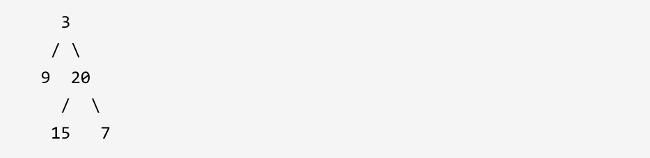

---

if (inorder[delimiterIndex] == rootValue) break;
        }
        // 切割中序数组
        // 中序左区间，左闭右开[leftInorderBegin, leftInorderEnd)
        int leftInorderBegin = inorderBegin;
        int leftInorderEnd = delimiterIndex;
        // 中序右区间，左闭右开[rightInorderBegin, rightInorderEnd)
        int rightInorderBegin = delimiterIndex + 1;
        int rightInorderEnd = inorderEnd;
        // 切割前序数组
        // 前序左区间，左闭右开[leftPreorderBegin, leftPreorderEnd)
        int leftPreorderBegin =  preorderBegin + 1;
        int leftPreorderEnd = preorderBegin + 1 + delimiterIndex - 
inorderBegin; // 终⽌位置是起始位置加上中序左区间的⼤⼩size
        // 前序右区间, 左闭右开[rightPreorderBegin, rightPreorderEnd)
        int rightPreorderBegin = preorderBegin + 1 + (delimiterIndex - 
inorderBegin);
        int rightPreorderEnd = preorderEnd;
        cout << "----------" << endl;
        cout << "leftInorder :";
        for (int i = leftInorderBegin; i < leftInorderEnd; i++) {
            cout << inorder[i] << " ";
        }
        cout << endl;
        cout << "rightInorder :";
        for (int i = rightInorderBegin; i < rightInorderEnd; i++) {
            cout << inorder[i] << " ";
        }
        cout << endl;
        cout << "leftPreorder :";
        for (int i = leftPreorderBegin; i < leftPreorderEnd; i++) {
            cout << preorder[i] << " ";
        }
        cout << endl;

---

105.从前序与中序遍历序列构造⼆叉树，最后版本，C++代码：
        cout << "rightPreorder :";
        for (int i = rightPreorderBegin; i < rightPreorderEnd; i++) {
            cout << preorder[i] << " ";
        }
        cout << endl;
        root->left = traversal(inorder, leftInorderBegin, 
leftInorderEnd,  preorder, leftPreorderBegin, leftPreorderEnd);
        root->right = traversal(inorder, rightInorderBegin, 
rightInorderEnd, preorder, rightPreorderBegin, rightPreorderEnd);
        return root;
    }
public:
    TreeNode* buildTree(vector<int>& preorder, vector<int>& inorder) {
        if (inorder.size() == 0 || preorder.size() == 0) return NULL;
        return traversal(inorder, 0, inorder.size(), preorder, 0, 
preorder.size());
    }
};
class Solution {
private:
        TreeNode* traversal (vector<int>& inorder, int inorderBegin, 
int inorderEnd, vector<int>& preorder, int preorderBegin, int 
preorderEnd) {
        if (preorderBegin == preorderEnd) return NULL;
        int rootValue = preorder[preorderBegin]; // 注意⽤preorderBegin 
不要⽤0
        TreeNode* root = new TreeNode(rootValue);
        if (preorderEnd - preorderBegin == 1) return root;

---

int delimiterIndex;
        for (delimiterIndex = inorderBegin; delimiterIndex < 
inorderEnd; delimiterIndex++) {
            if (inorder[delimiterIndex] == rootValue) break;
        }
        // 切割中序数组
        // 中序左区间，左闭右开[leftInorderBegin, leftInorderEnd)
        int leftInorderBegin = inorderBegin;
        int leftInorderEnd = delimiterIndex;
        // 中序右区间，左闭右开[rightInorderBegin, rightInorderEnd)
        int rightInorderBegin = delimiterIndex + 1;
        int rightInorderEnd = inorderEnd;
        // 切割前序数组
        // 前序左区间，左闭右开[leftPreorderBegin, leftPreorderEnd)
        int leftPreorderBegin =  preorderBegin + 1;
        int leftPreorderEnd = preorderBegin + 1 + delimiterIndex - 
inorderBegin; // 终⽌位置是起始位置加上中序左区间的⼤⼩size
        // 前序右区间, 左闭右开[rightPreorderBegin, rightPreorderEnd)
        int rightPreorderBegin = preorderBegin + 1 + (delimiterIndex - 
inorderBegin);
        int rightPreorderEnd = preorderEnd;
        root->left = traversal(inorder, leftInorderBegin, 
leftInorderEnd,  preorder, leftPreorderBegin, leftPreorderEnd);
        root->right = traversal(inorder, rightInorderBegin, 
rightInorderEnd, preorder, rightPreorderBegin, rightPreorderEnd);
        return root;
    }
public:
    TreeNode* buildTree(vector<int>& preorder, vector<int>& inorder) {
        if (inorder.size() == 0 || preorder.size() == 0) return NULL;
        // 参数坚持左闭右开的原则
        return traversal(inorder, 0, inorder.size(), preorder, 0, 
preorder.size());

---

思考题
前序和中序可以唯⼀确定⼀颗⼆叉树。
后序和中序可以唯⼀确定⼀颗⼆叉树。
那么前序和后序可不可以唯⼀确定⼀颗⼆叉树呢？
前序和后序不能唯⼀确定⼀颗⼆叉树！，因为没有中序遍历⽆法确定左右部分，也就是⽆法
分割。
举⼀个例⼦：
tree1 的前序遍历是[1 2 3]， 后序遍历是[3 2 1]。
tree2 的前序遍历是[1 2 3]， 后序遍历是[3 2 1]。
 
    }
};

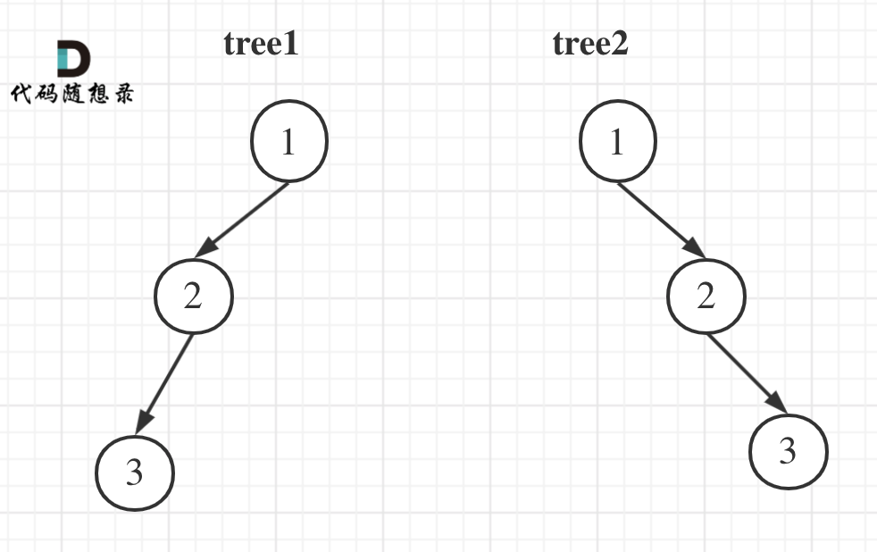

---

那么tree1 和 tree2 的前序和后序完全相同，这是⼀棵树么，很明显是两棵树！
所以前序和后序不能唯⼀确定⼀颗⼆叉树！
总结
之前我们讲的⼆叉树题⽬都是各种遍历⼆叉树，这次开始构造⼆叉树了，思路其实⽐较简
单，但是真正代码实现出来并不容易。
所以要避免眼⾼⼿低，踏实的把代码写出来。
我同时给出了添加⽇志的代码版本，因为这种题⽬是不太容易写出来调⼀调就能过的，所以
⼀定要把流程⽇志打出来，看看符不符合⾃⼰的思路。
⼤家遇到这种题⽬的时候，也要学会打⽇志来调试（如何打⽇志有时候也是个技术活），不
要脑动模拟，脑动模拟很容易越想越乱。
最后我还给出了为什么前序和中序可以唯⼀确定⼀颗⼆叉树，后序和中序可以唯⼀确定⼀颗
⼆叉树，⽽前序和后序却不⾏。
认真研究完本篇，相信⼤家对⼆叉树的构造会清晰很多。
 
 
构造⼀棵最⼤的⼆叉树
654.最⼤⼆叉树
题⽬地址：https://leetcode-cn.com/problems/maximum-binary-tree/
给定⼀个不含重复元素的整数数组。⼀个以此数组构建的最⼤⼆叉树定义如下：

---

通过给定的数组构建最⼤⼆叉树，并且输出这个树的根节点。
⽰例 ：
提⽰：
给定的数组的⼤⼩在 [1, 1000] 之间。
思路
最⼤⼆叉树的构建过程如下：
⼆叉树的根是数组中的最⼤元素。
左⼦树是通过数组中最⼤值左边部分构造出的最⼤⼆叉树。
右⼦树是通过数组中最⼤值右边部分构造出的最⼤⼆叉树。

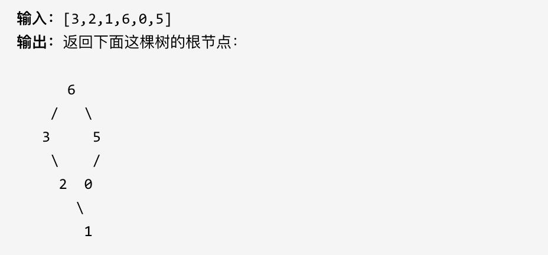

---

构造树⼀般采⽤的是前序遍历，因为先构造中间节点，然后递归构造左⼦树和右⼦树。
参数就是传⼊的是存放元素的数组，返回该数组构造的⼆叉树的头结点，返回类型是指向节
点的指针。
代码如下：
题⽬中说了输⼊的数组⼤⼩⼀定是⼤于等于1的，所以我们不⽤考虑⼩于1的情况，那么当递
归遍历的时候，如果传⼊的数组⼤⼩为1，说明遍历到了叶⼦节点了。
那么应该定义⼀个新的节点，并把这个数组的数值赋给新的节点，然后返回这个节点。 这表
⽰⼀个数组⼤⼩是1的时候，构造了⼀个新的节点，并返回。
代码如下：
确定递归函数的参数和返回值
确定终⽌条件
TreeNode* constructMaximumBinaryTree(vector<int>& nums)

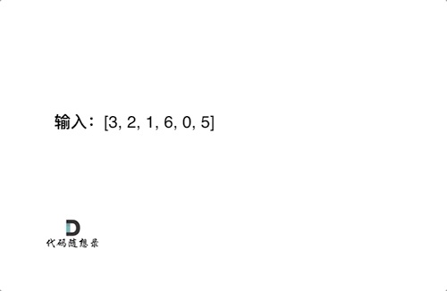

---

这⾥有三步⼯作
代码如下：
这⾥要判断maxValueIndex > 0，因为要保证左区间⾄少有⼀个数值。
代码如下：
确定单层递归的逻辑
1. 先要找到数组中最⼤的值和对应的下表， 最⼤的值构造根节点，下表⽤来下⼀步分
割数组。
2. 最⼤值所在的下表左区间 构造左⼦树
TreeNode* node = new TreeNode(0);
if (nums.size() == 1) {
    node->val = nums[0];
    return node;
}
int maxValue = 0;
int maxValueIndex = 0;
for (int i = 0; i < nums.size(); i++) {
    if (nums[i] > maxValue) {
        maxValue = nums[i];
        maxValueIndex = i;
    }
}
TreeNode* node = new TreeNode(0);
node->val = maxValue;
if (maxValueIndex > 0) {
    vector<int> newVec(nums.begin(), nums.begin() + maxValueIndex);
    node->left = constructMaximumBinaryTree(newVec);
}

---

判断maxValueIndex < (nums.size() - 1)，确保右区间⾄少有⼀个数值。
代码如下：
这样我们就分析完了，整体代码如下：（详细注释）
3. 最⼤值所在的下表右区间 构造右⼦树
if (maxValueIndex < (nums.size() - 1)) {
    vector<int> newVec(nums.begin() + maxValueIndex + 1, nums.end());
    node->right = constructMaximumBinaryTree(newVec);
}
class Solution {
public:
    TreeNode* constructMaximumBinaryTree(vector<int>& nums) {
        TreeNode* node = new TreeNode(0);
        if (nums.size() == 1) {
            node->val = nums[0];
            return node;
        }
        // 找到数组中最⼤的值和对应的下表
        int maxValue = 0;
        int maxValueIndex = 0;
        for (int i = 0; i < nums.size(); i++) {
            if (nums[i] > maxValue) {
                maxValue = nums[i];
                maxValueIndex = i;
            }
        }
        node->val = maxValue;
        // 最⼤值所在的下表左区间 构造左⼦树
        if (maxValueIndex > 0) {
            vector<int> newVec(nums.begin(), nums.begin() + 
maxValueIndex);
            node->left = constructMaximumBinaryTree(newVec);
        }
        // 最⼤值所在的下表右区间 构造右⼦树

---

以上代码⽐较冗余，效率也不⾼，每次还要切割的时候每次都要定义新的vector（也就是数
组），但逻辑⽐较清晰。
和⽂章⼆叉树：构造⼆叉树登场！中⼀样的优化思路，就是每次分隔不⽤定义新的数组，⽽
是通过下表索引直接在原数组上操作。
优化后代码如下：
        if (maxValueIndex < (nums.size() - 1)) {
            vector<int> newVec(nums.begin() + maxValueIndex + 1, 
nums.end());
            node->right = constructMaximumBinaryTree(newVec);
        }
        return node;
    }
};
class Solution {
private:
    // 在左闭右开区间[left, right)，构造⼆叉树
    TreeNode* traversal(vector<int>& nums, int left, int right) {
        if (left >= right) return nullptr;
        // 分割点下表：maxValueIndex
        int maxValueIndex = left;
        for (int i = left + 1; i < right; ++i) {
            if (nums[i] > nums[maxValueIndex]) maxValueIndex = i;
        }
        TreeNode* root = new TreeNode(nums[maxValueIndex]);
        // 左闭右开：[left, maxValueIndex)
        root->left = traversal(nums, left, maxValueIndex);
        // 左闭右开：[maxValueIndex + 1, right)
        root->right = traversal(nums, maxValueIndex + 1, right);
        return root;

---

拓展
可以发现上⾯的代码看上去简洁⼀些，主要是因为第⼆版其实是允许空节点进⼊递归，所以
不⽤在递归的时候加判断节点是否为空
第⼀版递归过程：（加了if判断，为了不让空节点进⼊递归）
第⼆版递归过程： （如下代码就没有加if判断）
第⼆版代码是允许空节点进⼊递归，所以没有加if判断，当然终⽌条件也要有相应的改变。
第⼀版终⽌条件，是遇到叶⼦节点就终⽌，因为空节点不会进⼊递归。
第⼆版相应的终⽌条件，是遇到空节点，也就是数组区间为0，就终⽌了。
 
    }
public:
    TreeNode* constructMaximumBinaryTree(vector<int>& nums) {
        return traversal(nums, 0, nums.size());
    }
};
if (maxValueIndex > 0) { // 这⾥加了判断是为了不让空节点进⼊递归
    vector<int> newVec(nums.begin(), nums.begin() + maxValueIndex);
    node->left = constructMaximumBinaryTree(newVec);
}
if (maxValueIndex < (nums.size() - 1)) { // 这⾥加了判断是为了不让空节点进⼊
递归
    vector<int> newVec(nums.begin() + maxValueIndex + 1, nums.end());
    node->right = constructMaximumBinaryTree(newVec);
}
root->left = traversal(nums, left, maxValueIndex);
root->right = traversal(nums, maxValueIndex + 1, right);

---

总结
这道题⽬其实和 ⼆叉树：构造⼆叉树登场！ 是⼀个思路，⽐⼆叉树：构造⼆叉树登场！ 还简
单⼀些。
注意类似⽤数组构造⼆叉树的题⽬，每次分隔尽量不要定义新的数组，⽽是通过下表索引直
接在原数组上操作，这样可以节约时间和空间上的开销。
⼀些同学也会疑惑，什么时候递归函数前⾯加if，什么时候不加if，这个问题我在最后也给出
了解释。
其实就是不同代码风格的实现，⼀般情况来说：如果让空节点（空指针）进⼊递归，就不加
if，如果不让空节点进⼊递归，就加if限制⼀下， 终⽌条件也会相应的调整。
 
 
本周⼩结！（⼆叉树系列三）
是不是感觉这周过的⾮常快，好像刚刚做完本周⼩结，又要做本周⼩结了，果然假期让⼈感
觉时光飞逝，哈哈。
周⼀
在⼆叉树：以为使⽤了递归，其实还隐藏着回溯中，通过leetcode 257.⼆叉树的所有路径这道
题⽬，讲解了递归如何隐藏着回溯，⼀些代码会把回溯的过程都隐藏了起来了，甚⾄刷过这
道题的同学可能都不知道⾃⼰⽤了回溯。
⽂章中第⼀版代码把每⼀个细节都展⽰了输出来了，⼤家可以清晰的看到回溯的过程。
然后给出了第⼆版优化后的代码，分析了其回溯隐藏在了哪⾥，如果要把这个回溯扣出来的
话，在第⼆版的基础上应该怎么改。
主要需要理解：回溯隐藏在traversal(cur->left, path + "->", result);中的 path + "->"。 每
次函数调⽤完，path依然是没有加上"->" 的，这就是回溯了。

---

周⼆
在⽂章⼆叉树：做了这么多题⽬了，我的左叶⼦之和是多少？ 中提供了另⼀个判断节点属性
的思路，平时我们习惯了使⽤通过节点的左右孩⼦判断本节点的属性，但发现使⽤这个思路
⽆法判断左叶⼦。
此时需要相连的三层之间构成的约束条件，也就是要通过节点的⽗节点以及孩⼦节点来判断
本节点的属性。
这道题⽬可以扩展⼤家对⼆叉树的解题思路。
周三
在⼆叉树：我的左下⾓的值是多少？中的题⽬如果使⽤递归的写法还是有点难度的，层次遍
历反⽽很简单。
题⽬其实就是要在树的最后⼀⾏找到最左边的值。
如何判断是最后⼀⾏呢，其实就是深度最⼤的叶⼦节点⼀定是最后⼀⾏。
在这篇⽂章中，我们使⽤递归算法实实在在的求了⼀次深度，然后使⽤靠左的遍历，保证求
得靠左的最⼤深度，⽽且又⼀次使⽤了回溯。
如果对⼆叉树的⾼度与深度又有点模糊了，在看这⾥⼆叉树：我平衡么？，回忆⼀下吧。
⼆叉树：我的左下⾓的值是多少？中把我们之前讲过的内容都过了⼀遍，此外，还⽤前序遍
历的技巧求得了靠左的最⼤深度。
求⼆叉树的各种最值，就想应该采⽤什么样的遍历顺序，确定了遍历循序，其实就和数组求
最值⼀样容易了。
周四
在⼆叉树：递归函数究竟什么时候需要返回值，什么时候不要返回值？中通过两道题⽬，彻
底说清楚递归函数的返回值问题。
⼀般情况下：如果需要搜索整颗⼆叉树，那么递归函数就不要返回值，如果要搜索其中⼀条
符合条件的路径，递归函数就需要返回值，因为遇到符合条件的路径了就要及时返回。

---

特别是有些时候 递归函数的返回值是bool类型，⼀些同学会疑惑为啥要加这个，其实就是为
了找到⼀条边⽴刻返回。
其实还有⼀种就是后序遍历需要根据左右递归的返回值推出中间节点的状态，这种需要有返
回值，例如222.完全⼆叉树，110.平衡⼆叉树，这⼏道我们之前也讲过。
周五
之前都是讲解遍历⼆叉树，这次该构造⼆叉树了，在⼆叉树：构造⼆叉树登场！中，我们通
过前序和中序，后序和中序，构造了唯⼀的⼀颗⼆叉树。
构造⼆叉树有三个注意的点：
这道题⽬代码实现并不简单，⼤家啃下来之后，⼆叉树的构造应该不是问题了。
最后我还给出了为什么前序和后序不能唯⼀构成⼀棵⼆叉树，因为没有中序遍历就⽆法确定
左右部分，也就⽆法分割。
周六
知道了如何构造⼆叉树，那么使⽤⼀个套路就可以解决⽂章⼆叉树：构造⼀棵最⼤的⼆叉树
中的问题。
注意类似⽤数组构造⼆叉树的题⽬，每次分隔尽量不要定义新的数组，⽽是通过下表索引直
接在原数组上操作，这样可以节约时间和空间上的开销。
⽂章中我还给出了递归函数什么时候加if，什么时候不加if，其实就是控制空节点（空指针）
是否进⼊递归，是不同的代码实现⽅式，都是可以的。
⼀般情况来说：如果让空节点（空指针）进⼊递归，就不加if，如果不让空节点进⼊递归，就
加if限制⼀下， 终⽌条件也会相应的调整。
 
分割时候，坚持区间不变量原则，左闭右开，或者左闭又闭。
分割的时候，注意后序 或者 前序已经有⼀个节点作为中间节点了，不能继续使⽤
了。
如何使⽤切割后的后序数组来切合中序数组？利⽤中序数组⼤⼩⼀定是和后序数组
的⼤⼩相同这⼀特点来进⾏切割。

---

总结
本周我们深度讲解了如下知识点：
如果⼤家⼀路跟下来，⼀定收获满满，如果周末不做这个总结，⼤家可能都不知道⾃⼰收获
满满，啊哈！
 
合并两个⼆叉树
617.合并⼆叉树
题⽬地址：https://leetcode-cn.com/problems/merge-two-binary-trees/
给定两个⼆叉树，想象当你将它们中的⼀个覆盖到另⼀个上时，两个⼆叉树的⼀些节点便会
重叠。
你需要将他们合并为⼀个新的⼆叉树。合并的规则是如果两个节点重叠，那么将他们的值相
加作为节点合并后的新值，否则不为 NULL 的节点将直接作为新⼆叉树的节点。
⽰例 1:
 
1. 递归中如何隐藏着回溯
2. 如何通过三层关系确定左叶⼦
3. 如何通过⼆叉树深度来判断左下⾓的值
4. 递归函数究竟什么时候需要返回值，什么时候不要返回值？
5. 前序和中序，后序和中序构造唯⼀⼆叉树
6. 使⽤数组构造某⼀特性的⼆叉树

---

注意: 合并必须从两个树的根节点开始。
思路
相信这道题⽬很多同学疑惑的点是如何同时遍历两个⼆叉树呢？
其实和遍历⼀个树逻辑是⼀样的，只不过传⼊两个树的节点，同时操作。
递归
⼆叉树使⽤递归，就要想使⽤前中后哪种遍历⽅式？
本题使⽤哪种遍历都是可以的！
我们下⾯以前序遍历为例。
动画如下：

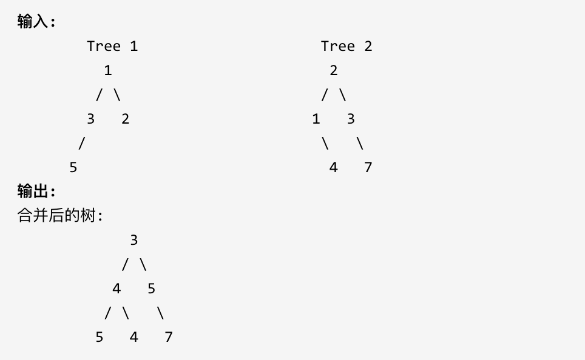

---

那么我们来按照递归三部曲来解决：
⾸先那么要合⼊两个⼆叉树，那么参数⾄少是要传⼊两个⼆叉树的根节点，返回值就是合并
之后⼆叉树的根节点。
代码如下：
因为是传⼊了两个树，那么就有两个树遍历的节点t1 和 t2，如果t1 == NULL 了，两个树合并
就应该是 t2 了啊（如果t2也为NULL也⽆所谓，合并之后就是NULL）。
反过来如果t2 == NULL，那么两个数合并就是t1（如果t1也为NULL也⽆所谓，合并之后就是
NULL）。
1. 确定递归函数的参数和返回值：
2. 确定终⽌条件：
TreeNode* mergeTrees(TreeNode* t1, TreeNode* t2) {

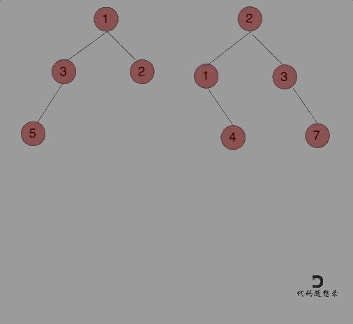

---

代码如下：
单层递归的逻辑就⽐较好些了，这⾥我们⽤重复利⽤⼀下t1这个树，t1就是合并之后树的根节
点（就是修改了原来树的结构）。
那么单层递归中，就要把两棵树的元素加到⼀起。
接下来t1 的左⼦树是：合并 t1左⼦树 t2左⼦树之后的左⼦树。
t1 的右⼦树：是 合并 t1右⼦树 t2右⼦树之后的右⼦树。
最终t1就是合并之后的根节点。
代码如下：
此时前序遍历，完整代码就写出来了，如下：
3. 确定单层递归的逻辑：
if (t1 == NULL) return t2; // 如果t1为空，合并之后就应该是t2
if (t2 == NULL) return t1; // 如果t2为空，合并之后就应该是t1
t1->val += t2->val;
t1->left = mergeTrees(t1->left, t2->left);
t1->right = mergeTrees(t1->right, t2->right);
return t1;

---

那么中序遍历也是可以的，代码如下：
后序遍历依然可以，代码如下：
class Solution {
public:
    TreeNode* mergeTrees(TreeNode* t1, TreeNode* t2) {
        if (t1 == NULL) return t2; // 如果t1为空，合并之后就应该是t2
        if (t2 == NULL) return t1; // 如果t2为空，合并之后就应该是t1
        // 修改了t1的数值和结构
        t1->val += t2->val;                             // 中
        t1->left = mergeTrees(t1->left, t2->left);      // 左
        t1->right = mergeTrees(t1->right, t2->right);   // 右
        return t1;
    }
};
class Solution {
public:
    TreeNode* mergeTrees(TreeNode* t1, TreeNode* t2) {
        if (t1 == NULL) return t2; // 如果t1为空，合并之后就应该是t2
        if (t2 == NULL) return t1; // 如果t2为空，合并之后就应该是t1
        // 修改了t1的数值和结构
        t1->left = mergeTrees(t1->left, t2->left);      // 左
        t1->val += t2->val;                             // 中
        t1->right = mergeTrees(t1->right, t2->right);   // 右
        return t1;
    }
};

---

但是前序遍历是最好理解的，我建议⼤家⽤前序遍历来做就OK。
如上的⽅法修改了t1的结构，当然也可以不修改t1和t2的结构，重新定⼀个树。
不修改输⼊树的结构，前序遍历，代码如下：
class Solution {
public:
    TreeNode* mergeTrees(TreeNode* t1, TreeNode* t2) {
        if (t1 == NULL) return t2; // 如果t1为空，合并之后就应该是t2
        if (t2 == NULL) return t1; // 如果t2为空，合并之后就应该是t1
        // 修改了t1的数值和结构
        t1->left = mergeTrees(t1->left, t2->left);      // 左
        t1->right = mergeTrees(t1->right, t2->right);   // 右
        t1->val += t2->val;                             // 中
        return t1;
    }
};
class Solution {
public:
    TreeNode* mergeTrees(TreeNode* t1, TreeNode* t2) {
        if (t1 == NULL) return t2;
        if (t2 == NULL) return t1;
        // 重新定义新的节点，不修改原有两个树的结构
        TreeNode* root = new TreeNode(0);
        root->val = t1->val + t2->val;
        root->left = mergeTrees(t1->left, t2->left);
        root->right = mergeTrees(t1->right, t2->right);
        return root;
    }
};

---

迭代法
使⽤迭代法，如何同时处理两棵树呢？
思路我们在⼆叉树：我对称么？中的迭代法已经讲过⼀次了，求⼆叉树对称的时候就是把两
个树的节点同时加⼊队列进⾏⽐较。
本题我们也使⽤队列，模拟的层序遍历，代码如下：
 
class Solution {
public:
    TreeNode* mergeTrees(TreeNode* t1, TreeNode* t2) {
        if (t1 == NULL) return t2;
        if (t2 == NULL) return t1;
        queue<TreeNode*> que;
        que.push(t1);
        que.push(t2);
        while(!que.empty()) {
            TreeNode* node1 = que.front(); que.pop();
            TreeNode* node2 = que.front(); que.pop();
            // 此时两个节点⼀定不为空，val相加
            node1->val += node2->val;
            // 如果两棵树左节点都不为空，加⼊队列
            if (node1->left != NULL && node2->left != NULL) {
                que.push(node1->left);
                que.push(node2->left);
            }
            // 如果两棵树右节点都不为空，加⼊队列
            if (node1->right != NULL && node2->right != NULL) {
                que.push(node1->right);
                que.push(node2->right);
            }
            // 当t1的左节点 为空 t2左节点不为空，就赋值过去
            if (node1->left == NULL && node2->left != NULL) {
                node1->left = node2->left;
            }
            // 当t1的右节点 为空 t2右节点不为空，就赋值过去

---

拓展
当然也可以秀⼀波指针的操作，这是我写的野路⼦，⼤家就随便看看就⾏了，以防带跑遍
了。
如下代码中，想要更改⼆叉树的值，应该传⼊指向指针的指针。
代码如下：（前序遍历）
 
            if (node1->right == NULL && node2->right != NULL) {
                node1->right = node2->right;
            }
        }
        return t1;
    }
};
class Solution {
public:
    void process(TreeNode** t1, TreeNode** t2) {
        if ((*t1) == NULL && (*t2) == NULL) return;
        if ((*t1) != NULL && (*t2) != NULL) {
            (*t1)->val += (*t2)->val;
        }
        if ((*t1) == NULL && (*t2) != NULL) {
            *t1 = *t2;
            return;
        }
        if ((*t1) != NULL && (*t2) == NULL) {
            return;
        }
        process(&((*t1)->left), &((*t2)->left));
        process(&((*t1)->right), &((*t2)->right));
    }
    TreeNode* mergeTrees(TreeNode* t1, TreeNode* t2) {
        process(&t1, &t2);
        return t1;
    }

---

总结
合并⼆叉树，也是⼆叉树操作的经典题⽬，如果没有接触过的话，其实并不简单，因为我们
习惯了操作⼀个⼆叉树，⼀起操作两个⼆叉树，还会有点懵懵的。
这不是我们第⼀次操作两颗⼆叉树了，在⼆叉树：我对称么？中也⼀起操作了两棵⼆叉树。
迭代法中，⼀般⼀起操作两个树都是使⽤队列模拟类似层序遍历，同时处理两个树的节点，
这种⽅式最好理解，如果⽤模拟递归的思路的话，要复杂⼀些。
最后拓展中，我给了⼀个操作指针的野路⼦，⼤家随便看看就⾏了，如果学习C++的话，可以
在去研究研究。
如果感觉PDF对你有帮助，微信搜索：代码随想录，你会发现相见恨晚！
 
代码随想录官⽹：www.programmercarl.com
代码随想录开源项⽬Github：https://github.com/youngyangyang04/leetcode-
master
代码随想录算法公开课 ，代码随想录的全部内容将由我（程序员Carl）视频讲解并
开免费开放给⼤家。
《代码随想录》纸质版 已经出版。
代码随想录知识星球 上万录友在这⾥学习
代码随想录算法训练营 帮助录友⾼效刷完代码随想录。
};

---

⼆叉搜索树中的搜索
700.⼆叉搜索树中的搜索
题⽬地址：https://leetcode-cn.com/problems/search-in-a-binary-search-tree/
给定⼆叉搜索树（BST）的根节点和⼀个值。 你需要在BST中找到节点值等于给定值的节点。 
返回以该节点为根的⼦树。 如果节点不存在，则返回 NULL。
例如，

---

在上述⽰例中，如果要找的值是 5，但因为没有节点值为 5，我们应该返回 NULL。
思路
之前我们讲了都是普通⼆叉树，那么接下来看看⼆叉搜索树。
在关于⼆叉树，你该了解这些！中，我们已经讲过了⼆叉搜索树。
⼆叉搜索树是⼀个有序树：
这就决定了，⼆叉搜索树，递归遍历和迭代遍历和普通⼆叉树都不⼀样。
本题，其实就是在⼆叉搜索树中搜索⼀个节点。那么我们来看看应该如何遍历。
 
若它的左⼦树不空，则左⼦树上所有结点的值均⼩于它的根结点的值；
若它的右⼦树不空，则右⼦树上所有结点的值均⼤于它的根结点的值；
它的左、右⼦树也分别为⼆叉搜索树

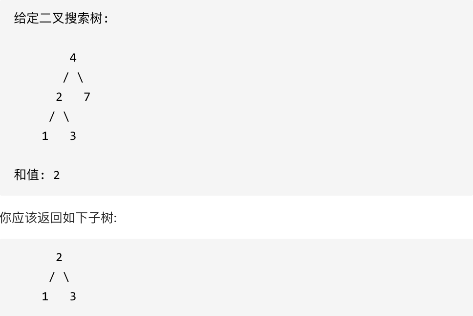

---

递归法
递归函数的参数传⼊的就是根节点和要搜索的数值，返回的就是以这个搜索数值所在的节
点。
代码如下：
如果root为空，或者找到这个数值了，就返回root节点。
看看⼆叉搜索树的单层递归逻辑有何不同。
因为⼆叉搜索树的节点是有序的，所以可以有⽅向的去搜索。
如果root->val > val，搜索左⼦树，如果root->val < val，就搜索右⼦树，最后如果都没有搜索
到，就返回NULL。
代码如下：
这⾥可能会疑惑，在递归遍历的时候，什么时候直接return 递归函数的返回值，什么时候不
⽤加这个 return呢。
 
1. 确定递归函数的参数和返回值
2. 确定终⽌条件
3. 确定单层递归的逻辑
TreeNode* searchBST(TreeNode* root, int val)
if (root == NULL || root->val == val) return root;
if (root->val > val) return searchBST(root->left, val); // 注意这⾥加了
return
if (root->val < val) return searchBST(root->right, val);
return NULL;

---

我们在⼆叉树：递归函数究竟什么时候需要返回值，什么时候不要返回值？中讲了，如果要
搜索⼀条边，递归函数就要加返回值，这⾥也是⼀样的道理。
因为搜索到⽬标节点了，就要⽴即return了，这样才是找到节点就返回（搜索某⼀条边），
如果不加return，就是遍历整棵树了。
整体代码如下：
迭代法
⼀提到⼆叉树遍历的迭代法，可能⽴刻想起使⽤栈来模拟深度遍历，使⽤队列来模拟⼴度遍
历。
对于⼆叉搜索树可就不⼀样了，因为⼆叉搜索树的特殊性，也就是节点的有序性，可以不使
⽤辅助栈或者队列就可以写出迭代法。
对于⼀般⼆叉树，递归过程中还有回溯的过程，例如⾛⼀个左⽅向的分⽀⾛到头了，那么要
调头，在⾛右分⽀。
⽽对于⼆叉搜索树，不需要回溯的过程，因为节点的有序性就帮我们确定了搜索的⽅向。
例如要搜索元素为3的节点，我们不需要搜索其他节点，也不需要做回溯，查找的路径已经规
划好了。
中间节点如果⼤于3就向左⾛，如果⼩于3就向右⾛，如图：
 
class Solution {
public:
    TreeNode* searchBST(TreeNode* root, int val) {
        if (root == NULL || root->val == val) return root;
        if (root->val > val) return searchBST(root->left, val);
        if (root->val < val) return searchBST(root->right, val);
        return NULL;
    }
};

---

所以迭代法代码如下：
第⼀次看到了如此简单的迭代法，是不是感动的痛哭流涕，哭⼀会~
class Solution {
public:
    TreeNode* searchBST(TreeNode* root, int val) {
        while (root != NULL) {
            if (root->val > val) root = root->left;
            else if (root->val < val) root = root->right;
            else return root;
        }
        return NULL;
    }
};

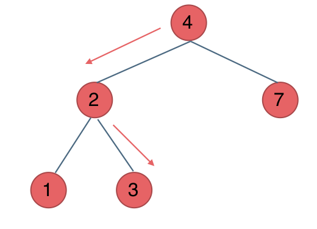

---

总结
本篇我们介绍了⼆叉搜索树的遍历⽅式，因为⼆叉搜索树的有序性，遍历的时候要⽐普通⼆
叉树简单很多。
但是⼀些同学很容易忽略⼆叉搜索树的特性，所以写出遍历的代码就未必真的简单了。
所以针对⼆叉搜索树的题⽬，⼀样要利⽤其特性。
⽂中我依然给出递归和迭代两种⽅式，可以看出写法都⾮常简单，就是利⽤了⼆叉搜索树有
序的特点。
 
 
验证⼆叉搜索树
98.验证⼆叉搜索树
题⽬地址：https://leetcode-cn.com/problems/validate-binary-search-tree/
给定⼀个⼆叉树，判断其是否是⼀个有效的⼆叉搜索树。
假设⼀个⼆叉搜索树具有如下特征：
 
 
 
节点的左⼦树只包含⼩于当前节点的数。
节点的右⼦树只包含⼤于当前节点的数。
所有左⼦树和右⼦树⾃⾝必须也是⼆叉搜索树。

---

思路
要知道中序遍历下，输出的⼆叉搜索树节点的数值是有序序列。
有了这个特性，验证⼆叉搜索树，就相当于变成了判断⼀个序列是不是递增的了。
递归法
可以递归中序遍历将⼆叉搜索树转变成⼀个数组，代码如下：

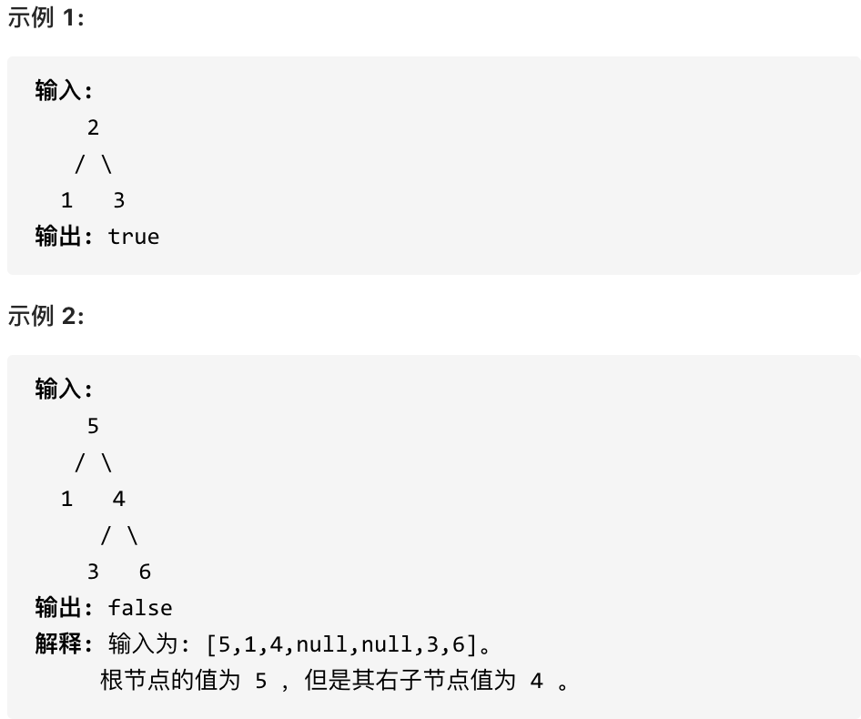

---

然后只要⽐较⼀下，这个数组是否是有序的，注意⼆叉搜索树中不能有重复元素。
整体代码如下：
vector<int> vec;
void traversal(TreeNode* root) {
    if (root == NULL) return;
    traversal(root->left);
    vec.push_back(root->val); // 将⼆叉搜索树转换为有序数组
    traversal(root->right);
}
traversal(root);
for (int i = 1; i < vec.size(); i++) {
    // 注意要⼩于等于，搜索树⾥不能有相同元素
    if (vec[i] <= vec[i - 1]) return false;
}
return true;
class Solution {
private:
    vector<int> vec;
    void traversal(TreeNode* root) {
        if (root == NULL) return;
        traversal(root->left);
        vec.push_back(root->val); // 将⼆叉搜索树转换为有序数组
        traversal(root->right);
    }
public:
    bool isValidBST(TreeNode* root) {
        vec.clear(); // 不加这句在leetcode上也可以过，但最好加上
        traversal(root);
        for (int i = 1; i < vec.size(); i++) {
            // 注意要⼩于等于，搜索树⾥不能有相同元素
            if (vec[i] <= vec[i - 1]) return false;
        }
        return true;

---

以上代码中，我们把⼆叉树转变为数组来判断，是最直观的，但其实不⽤转变成数组，可以
在递归遍历的过程中直接判断是否有序。
这道题⽬⽐较容易陷⼊两个陷阱：
不能单纯的⽐较左节点⼩于中间节点，右节点⼤于中间节点就完事了。
写出了类似这样的代码：
我们要⽐较的是 左⼦树所有节点⼩于中间节点，右⼦树所有节点⼤于中间节点。所以以上代
码的判断逻辑是错误的。
例如： [10,5,15,null,null,6,20] 这个case：
陷阱1
    }
};
if (root->val > root->left->val && root->val < root->right->val) {
    return true;
} else {
    return false;
}

---

节点10⼩于左节点5，⼤于右节点15，但右⼦树⾥出现了⼀个6 这就不符合了！
样例中最⼩节点 可能是int的最⼩值，如果这样使⽤最⼩的int来⽐较也是不⾏的。
此时可以初始化⽐较元素为longlong的最⼩值。
问题可以进⼀步演进：如果样例中根节点的val 可能是longlong的最⼩值 又要怎么办呢？⽂中
会解答。
了解这些陷阱之后我们来看⼀下代码应该怎么写：
递归三部曲：
要定义⼀个longlong的全局变量，⽤来⽐较遍历的节点是否有序，因为后台测试数据中有int
最⼩值，所以定义为longlong的类型，初始化为longlong最⼩值。
注意递归函数要有bool类型的返回值， 我们在⼆叉树：递归函数究竟什么时候需要返回值，
什么时候不要返回值？ 中讲了，只有寻找某⼀条边（或者⼀个节点）的时候，递归函数会有
bool类型的返回值。
陷阱2
确定递归函数，返回值以及参数

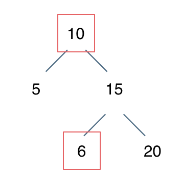

---

其实本题是同样的道理，我们在寻找⼀个不符合条件的节点，如果没有找到这个节点就遍历
了整个树，如果找到不符合的节点了，⽴刻返回。
代码如下：
如果是空节点 是不是⼆叉搜索树呢？
是的，⼆叉搜索树也可以为空！
代码如下：
中序遍历，⼀直更新maxVal，⼀旦发现maxVal >= root->val，就返回false，注意元素相同时
候也要返回false。
代码如下：
整体代码如下：
确定终⽌条件
确定单层递归的逻辑
long long maxVal = LONG_MIN; // 因为后台测试数据中有int最⼩值
bool isValidBST(TreeNode* root)
if (root == NULL) return true;
bool left = isValidBST(root->left);         // 左
// 中序遍历，验证遍历的元素是不是从⼩到⼤
if (maxVal < root->val) maxVal = root->val; // 中
else return false;
bool right = isValidBST(root->right);       // 右
return left && right;
class Solution {

---

以上代码是因为后台数据有int最⼩值测试⽤例，所以都把maxVal改成了longlong最⼩值。
如果测试数据中有 longlong的最⼩值，怎么办？
不可能在初始化⼀个更⼩的值了吧。 建议避免 初始化最⼩值，如下⽅法取到最左⾯节点的数
值来⽐较。
代码如下：
public:
    long long maxVal = LONG_MIN; // 因为后台测试数据中有int最⼩值
    bool isValidBST(TreeNode* root) {
        if (root == NULL) return true;
        bool left = isValidBST(root->left);
        // 中序遍历，验证遍历的元素是不是从⼩到⼤
        if (maxVal < root->val) maxVal = root->val;
        else return false;
        bool right = isValidBST(root->right);
        return left && right;
    }
};
class Solution {
public:
    TreeNode* pre = NULL; // ⽤来记录前⼀个节点
    bool isValidBST(TreeNode* root) {
        if (root == NULL) return true;
        bool left = isValidBST(root->left);
        if (pre != NULL && pre->val >= root->val) return false;
        pre = root; // 记录前⼀个节点
        bool right = isValidBST(root->right);
        return left && right;
    }
};

---

最后这份代码看上去整洁⼀些，思路也清晰。
迭代法
可以⽤迭代法模拟⼆叉树中序遍历，对前中后序迭代法⽣疏的同学可以看这两篇⼆叉树：听
说递归能做的，栈也能做！，⼆叉树：前中后序迭代⽅式统⼀写法
迭代法中序遍历稍加改动就可以了，代码如下：
在⼆叉树：⼆叉搜索树登场！中我们分明写出了痛哭流涕的简洁迭代法，怎么在这⾥不⾏了
呢，因为本题是要验证⼆叉搜索树啊。
 
class Solution {
public:
    bool isValidBST(TreeNode* root) {
        stack<TreeNode*> st;
        TreeNode* cur = root;
        TreeNode* pre = NULL; // 记录前⼀个节点
        while (cur != NULL || !st.empty()) {
            if (cur != NULL) {
                st.push(cur);
                cur = cur->left;                // 左
            } else {
                cur = st.top();                 // 中
                st.pop();
                if (pre != NULL && cur->val <= pre->val)
                return false;
                pre = cur; //保存前⼀个访问的结点
                cur = cur->right;               // 右
            }
        }
        return true;
    }
};

---

总结
这道题⽬是⼀个简单题，但对于没接触过的同学还是有难度的。
所以初学者刚开始学习算法的时候，看到简单题⽬没有思路很正常，千万别怀疑⾃⼰智商，
学习过程都是这样的，⼤家智商都差不多，哈哈。
只要把基本类型的题⽬都做过，总结过之后，思路⾃然就开阔了。
就酱，学到了的话，就转发给⾝边需要的同学吧！
 
⼆叉搜索树的最⼩绝对差
利⽤⼆叉搜索树的特性搞起！
530.⼆叉搜索树的最⼩绝对差
题⽬地址：https://leetcode-cn.com/problems/minimum-absolute-difference-in-bst/
给你⼀棵所有节点为⾮负值的⼆叉搜索树，请你计算树中任意两节点的差的绝对值的最⼩
值。
⽰例：

---

提⽰：树中⾄少有 2 个节点。
思路
题⽬中要求在⼆叉搜索树上任意两节点的差的绝对值的最⼩值。
注意是⼆叉搜索树，⼆叉搜索树可是有序的。
遇到在⼆叉搜索树上求什么最值啊，差值之类的，就把它想成在⼀个有序数组上求最值，求
差值，这样就简单多了。
递归
那么⼆叉搜索树采⽤中序遍历，其实就是⼀个有序数组。
在⼀个有序数组上求两个数最⼩差值，这是不是就是⼀道送分题了。
最直观的想法，就是把⼆叉搜索树转换成有序数组，然后遍历⼀遍数组，就统计出来最⼩差
值了。

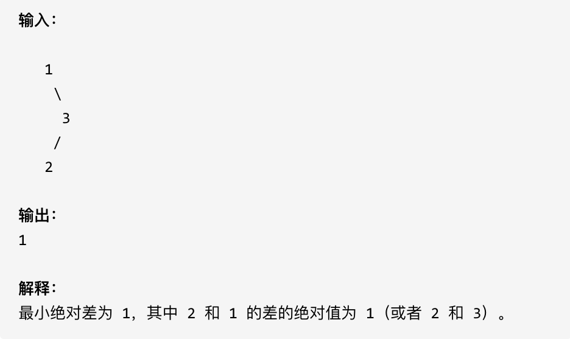

---

代码如下：
以上代码是把⼆叉搜索树转化为有序数组了，其实在⼆叉搜素树中序遍历的过程中，我们就
可以直接计算了。
需要⽤⼀个pre节点记录⼀下cur节点的前⼀个节点。
如图：
class Solution {
private:
vector<int> vec;
void traversal(TreeNode* root) {
    if (root == NULL) return;
    traversal(root->left);
    vec.push_back(root->val); // 将⼆叉搜索树转换为有序数组
    traversal(root->right);
}
public:
    int getMinimumDifference(TreeNode* root) {
        vec.clear();
        traversal(root);
        if (vec.size() < 2) return 0;
        int result = INT_MAX;
        for (int i = 1; i < vec.size(); i++) { // 统计有序数组的最⼩差值
            result = min(result, vec[i] - vec[i-1]);
        }
        return result;
    }
};

---

⼀些同学不知道在递归中如何记录前⼀个节点的指针，其实实现起来是很简单的，⼤家只要
看过⼀次，写过⼀次，就掌握了。
代码如下：
class Solution {
private:
int result = INT_MAX;
TreeNode* pre;
void traversal(TreeNode* cur) {
    if (cur == NULL) return;
    traversal(cur->left);   // 左
    if (pre != NULL){       // 中
        result = min(result, cur->val - pre->val);
    }
    pre = cur; // 记录前⼀个
    traversal(cur->right);  // 右
}
public:
    int getMinimumDifference(TreeNode* root) {

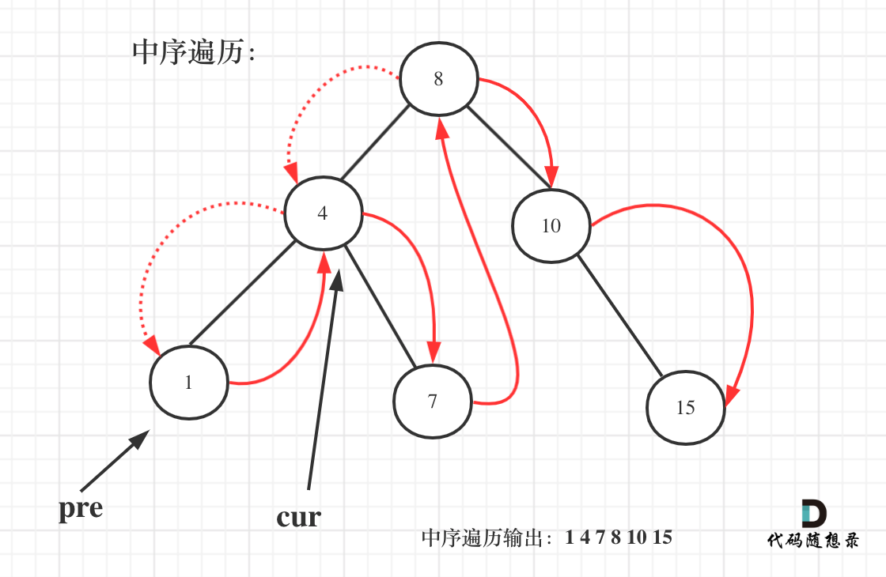

---

是不是看上去也并不复杂！
迭代
看过这两篇⼆叉树：听说递归能做的，栈也能做！，⼆叉树：前中后序迭代⽅式的写法就不
能统⼀⼀下么？⽂章之后，不难写出两种中序遍历的迭代法。
下⾯我给出其中的⼀种中序遍历的迭代法，代码如下：
 
        traversal(root);
        return result;
    }
};
class Solution {
public:
    int getMinimumDifference(TreeNode* root) {
        stack<TreeNode*> st;
        TreeNode* cur = root;
        TreeNode* pre = NULL;
        int result = INT_MAX;
        while (cur != NULL || !st.empty()) {
            if (cur != NULL) { // 指针来访问节点，访问到最底层
                st.push(cur); // 将访问的节点放进栈
                cur = cur->left;                // 左
            } else {
                cur = st.top();
                st.pop();
                if (pre != NULL) {              // 中
                    result = min(result, cur->val - pre->val);
                }
                pre = cur;
                cur = cur->right;               // 右
            }
        }
        return result;
    }

---

总结
遇到在⼆叉搜索树上求什么最值，求差值之类的，都要思考⼀下⼆叉搜索树可是有序的，要
利⽤好这⼀特点。
同时要学会在递归遍历的过程中如何记录前后两个指针，这也是⼀个⼩技巧，学会了还是很
受⽤的。
后⾯我将继续介绍⼀系列利⽤⼆叉搜索树特性的题⽬。
就酱，感觉学到了，就转发给⾝边需要的同学吧
如果感觉PDF对你有帮助，微信搜索：代码随想录，你会发现相见恨晚！
 
代码随想录官⽹：www.programmercarl.com
代码随想录开源项⽬Github：https://github.com/youngyangyang04/leetcode-
master
代码随想录算法公开课 ，代码随想录的全部内容将由我（程序员Carl）视频讲解并
开免费开放给⼤家。
《代码随想录》纸质版 已经出版。
代码随想录知识星球 上万录友在这⾥学习
代码随想录算法训练营 帮助录友⾼效刷完代码随想录。
};

---

⼆叉搜索树中的众数
⼆叉树上应该怎么求，⼆叉搜索树上又应该怎么求？
501.⼆叉搜索树中的众数
题⽬地址：https://leetcode-cn.com/problems/find-mode-in-binary-search-tree/solution/
给定⼀个有相同值的⼆叉搜索树（BST），找出 BST 中的所有众数（出现频率最⾼的元
素）。
假定 BST 有如下定义：
例如：
给定 BST [1,null,2,2],
返回[2].
提⽰：如果众数超过1个，不需考虑输出顺序
进阶：你可以不使⽤额外的空间吗？（假设由递归产⽣的隐式调⽤栈的开销不被计算在内）
 
 
结点左⼦树中所含结点的值⼩于等于当前结点的值
结点右⼦树中所含结点的值⼤于等于当前结点的值
左⼦树和右⼦树都是⼆叉搜索树

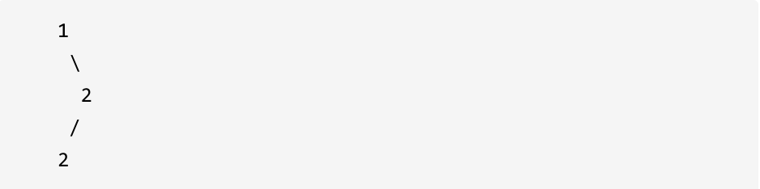

---

思路
这道题⽬呢，递归法我从两个维度来讲。
⾸先如果不是⼆叉搜索树的话，应该怎么解题，是⼆叉搜索树，又应该如何解题，两种⽅式
做⼀个⽐较，可以加深⼤家对⼆叉树的理解。
递归法
如果不是⼆叉搜索树
如果不是⼆叉搜索树，最直观的⽅法⼀定是把这个树都遍历了，⽤map统计频率，把频率排个
序，最后取前⾯⾼频的元素的集合。
具体步骤如下：
⾄于⽤前中后序那种遍历也不重要，因为就是要全遍历⼀遍，怎么个遍历法都⾏，层序遍历
都没⽑病！
这⾥采⽤前序遍历，代码如下：
有的同学可能可以想直接对map中的value排序，还真做不到，C++中如果使⽤std::map或者
std::multimap可以对key排序，但不能对value排序。
 
 
 
1. 这个树都遍历了，⽤map统计频率
2. 把统计的出来的出现频率（即map中的value）排个序
// map<int, int> key:元素，value:出现频率
void searchBST(TreeNode* cur, unordered_map<int, int>& map) { // 前序遍
历
    if (cur == NULL) return ;
    map[cur->val]++; // 统计元素频率
    searchBST(cur->left, map);
    searchBST(cur->right, map);
    return ;
}

---

所以要把map转化数组即vector，再进⾏排序，当然vector⾥⾯放的也是pair<int, int>类
型的数据，第⼀个int为元素，第⼆个int为出现频率。
代码如下：
此时数组vector中已经是存放着按照频率排好序的pair，那么把前⾯⾼频的元素取出来就可以
了。
代码如下：
整体C++代码如下：
3. 取前⾯⾼频的元素
bool static cmp (const pair<int, int>& a, const pair<int, int>& b) {
    return a.second > b.second; // 按照频率从⼤到⼩排序
}
vector<pair<int, int>> vec(map.begin(), map.end());
sort(vec.begin(), vec.end(), cmp); // 给频率排个序
result.push_back(vec[0].first);
for (int i = 1; i < vec.size(); i++) {
    // 取最⾼的放到result数组中
    if (vec[i].second == vec[0].second) result.push_back(vec[i].first);
    else break;
}
return result;
class Solution {
private:
void searchBST(TreeNode* cur, unordered_map<int, int>& map) { // 前序遍
历
    if (cur == NULL) return ;
    map[cur->val]++; // 统计元素频率
    searchBST(cur->left, map);

---

所以如果本题没有说是⼆叉搜索树的话，那么就按照上⾯的思路写！
是⼆叉搜索树
既然是搜索树，它中序遍历就是有序的。
如图：
 
    searchBST(cur->right, map);
    return ;
}
bool static cmp (const pair<int, int>& a, const pair<int, int>& b) {
    return a.second > b.second;
}
public:
    vector<int> findMode(TreeNode* root) {
        unordered_map<int, int> map; // key:元素，value:出现频率
        vector<int> result;
        if (root == NULL) return result;
        searchBST(root, map);
        vector<pair<int, int>> vec(map.begin(), map.end());
        sort(vec.begin(), vec.end(), cmp); // 给频率排个序
        result.push_back(vec[0].first);
        for (int i = 1; i < vec.size(); i++) {
            // 取最⾼的放到result数组中
            if (vec[i].second == vec[0].second) 
result.push_back(vec[i].first);
            else break;
        }
        return result;
    }
};

---

中序遍历代码如下：
遍历有序数组的元素出现频率，从头遍历，那么⼀定是相邻两个元素作⽐较，然后就把出现
频率最⾼的元素输出就可以了。
关键是在有序数组上的话，好搞，在树上怎么搞呢？
void searchBST(TreeNode* cur) {
    if (cur == NULL) return ;
    searchBST(cur->left);       // 左
    （处理节点）                // 中
    searchBST(cur->right);      // 右
    return ;
}

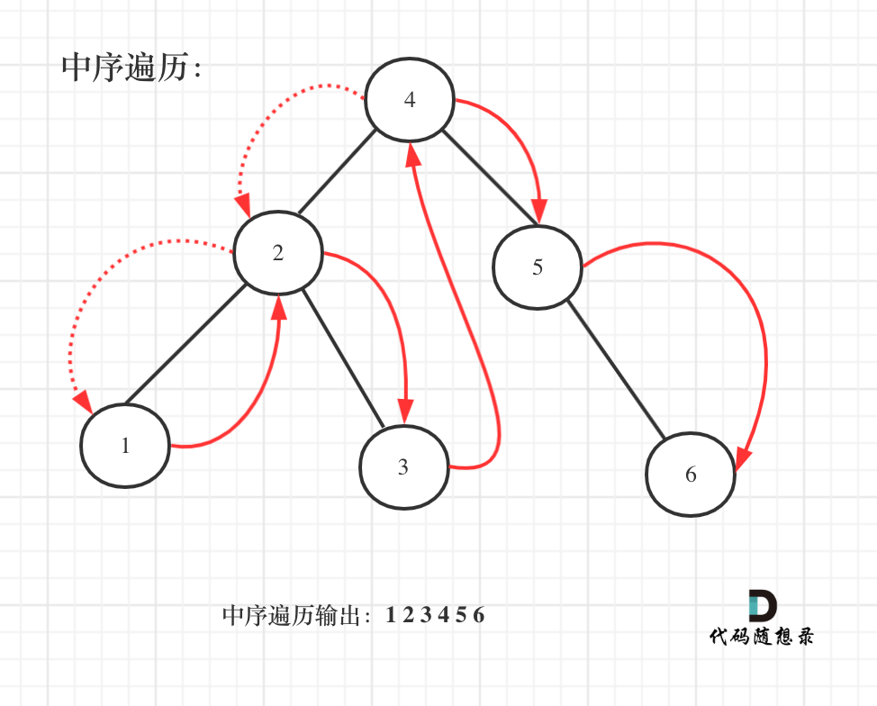

---

这就考察对树的操作了。
在⼆叉树：搜索树的最⼩绝对差中我们就使⽤了pre指针和cur指针的技巧，这次又⽤上了。
弄⼀个指针指向前⼀个节点，这样每次cur（当前节点）才能和pre（前⼀个节点）作⽐较。
⽽且初始化的时候pre = NULL，这样当pre为NULL时候，我们就知道这是⽐较的第⼀个元素。
代码如下：
此时又有问题了，因为要求最⼤频率的元素集合（注意是集合，不是⼀个元素，可以有多个
众数），如果是数组上⼤家⼀般怎么办？
应该是先遍历⼀遍数组，找出最⼤频率（maxCount），然后再重新遍历⼀遍数组把出现频率
为maxCount的元素放进集合。（因为众数有多个）
这种⽅式遍历了两遍数组。
那么我们遍历两遍⼆叉搜索树，把众数集合算出来也是可以的。
但这⾥其实只需要遍历⼀次就可以找到所有的众数。
那么如何只遍历⼀遍呢？
如果 频率count 等于 maxCount（最⼤频率），当然要把这个元素加⼊到结果集中（以下代码
为result数组），代码如下：
if (pre == NULL) { // 第⼀个节点
    count = 1; // 频率为1
} else if (pre->val == cur->val) { // 与前⼀个节点数值相同
    count++;
} else { // 与前⼀个节点数值不同
    count = 1;
}
pre = cur; // 更新上⼀个节点

---

是不是感觉这⾥有问题，result怎么能轻易就把元素放进去了呢，万⼀，这个maxCount此时
还不是真正最⼤频率呢。
所以下⾯要做如下操作：
频率count ⼤于 maxCount的时候，不仅要更新maxCount，⽽且要清空结果集（以下代码为
result数组），因为结果集之前的元素都失效了。
关键代码都讲完了，完整代码如下：（只需要遍历⼀遍⼆叉搜索树，就求出了众数的集合）
if (count == maxCount) { // 如果和最⼤值相同，放进result中
    result.push_back(cur->val);
}
if (count > maxCount) { // 如果计数⼤于最⼤值
    maxCount = count;   // 更新最⼤频率
    result.clear();     // 很关键的⼀步，不要忘记清空result，之前result⾥的元
素都失效了
    result.push_back(cur->val);
}
class Solution {
private:
    int maxCount; // 最⼤频率
    int count; // 统计频率
    TreeNode* pre;
    vector<int> result;
    void searchBST(TreeNode* cur) {
        if (cur == NULL) return ;
        searchBST(cur->left);       // 左
                                    // 中
        if (pre == NULL) { // 第⼀个节点
            count = 1;
        } else if (pre->val == cur->val) { // 与前⼀个节点数值相同
            count++;
        } else { // 与前⼀个节点数值不同

---

迭代法
只要把中序遍历转成迭代，中间节点的处理逻辑完全⼀样。
⼆叉树前中后序转迭代，传送门：
 
⼆叉树：前中后序迭代法
            count = 1;
        }
        pre = cur; // 更新上⼀个节点
        if (count == maxCount) { // 如果和最⼤值相同，放进result中
            result.push_back(cur->val);
        }
        if (count > maxCount) { // 如果计数⼤于最⼤值频率
            maxCount = count;   // 更新最⼤频率
            result.clear();     // 很关键的⼀步，不要忘记清空result，之前
result⾥的元素都失效了
            result.push_back(cur->val);
        }
        searchBST(cur->right);      // 右
        return ;
    }
public:
    vector<int> findMode(TreeNode* root) {
        count = 0;
        maxCount = 0;
        TreeNode* pre = NULL; // 记录前⼀个节点
        result.clear();
        searchBST(root);
        return result;
    }
};

---

下⾯我给出其中的⼀种中序遍历的迭代法，其中间处理逻辑⼀点都没有变（我从递归法直接
粘过来的代码，连注释都没改，哈哈）
代码如下：
⼆叉树：前中后序统⼀风格的迭代⽅式
class Solution {
public:
    vector<int> findMode(TreeNode* root) {
        stack<TreeNode*> st;
        TreeNode* cur = root;
        TreeNode* pre = NULL;
        int maxCount = 0; // 最⼤频率
        int count = 0; // 统计频率
        vector<int> result;
        while (cur != NULL || !st.empty()) {
            if (cur != NULL) { // 指针来访问节点，访问到最底层
                st.push(cur); // 将访问的节点放进栈
                cur = cur->left;                // 左
            } else {
                cur = st.top();
                st.pop();                       // 中
                if (pre == NULL) { // 第⼀个节点
                    count = 1;
                } else if (pre->val == cur->val) { // 与前⼀个节点数值相同
                    count++;
                } else { // 与前⼀个节点数值不同
                    count = 1;
                }
                if (count == maxCount) { // 如果和最⼤值相同，放进result中
                    result.push_back(cur->val);
                }
                if (count > maxCount) { // 如果计数⼤于最⼤值频率
                    maxCount = count;   // 更新最⼤频率
                    result.clear();     // 很关键的⼀步，不要忘记清空
result，之前result⾥的元素都失效了
                    result.push_back(cur->val);

---

总结
本题在递归法中，我给出了如果是普通⼆叉树，应该怎么求众数。
知道了普通⼆叉树的做法时候，我再进⼀步给出⼆叉搜索树又应该怎么求众数，这样鲜明的
对⽐，相信会对⼆叉树又有更深层次的理解了。
在递归遍历⼆叉搜索树的过程中，我还介绍了⼀个统计最⾼出现频率元素集合的技巧， 要不
然就要遍历两次⼆叉搜索树才能把这个最⾼出现频率元素的集合求出来。
为什么没有这个技巧⼀定要遍历两次呢？ 因为要求的是集合，会有多个众数，如果规定只有
⼀个众数，那么就遍历⼀次稳稳的了。
最后我依然给出对应的迭代法，其实就是迭代法中序遍历的模板加上递归法中中间节点的处
理逻辑，分分钟就可以写出来，中间逻辑的代码我都是从递归法中直接粘过来的。
求⼆叉搜索树中的众数其实是⼀道简单题，但⼤家可以发现我写了这么⼀⼤篇幅的⽂章来讲
解，主要是为了尽量从各个⾓度对本题进剖析，帮助⼤家更快更深⼊理解⼆叉树。
需要强调的是 leetcode上的耗时统计是⾮常不准确的，看个⼤概就⾏，⼀样的代码耗
时可以差百分之50以上，所以leetcode的耗时统计别太当回事，知道理论上的效率优劣
就⾏了。
 
⼆叉树的最近公共祖先
 
 
                }
                pre = cur;
                cur = cur->right;               // 右
            }
        }
        return result;
    }
};

---

本来是打算将⼆叉树和⼆叉搜索树的公共祖先问题⼀起讲，后来发现篇幅过长了，只
能先说⼀说⼆叉树的公共祖先问题。
236. ⼆叉树的最近公共祖先
题⽬链接：https://leetcode-cn.com/problems/lowest-common-ancestor-of-a-binary-tree/
给定⼀个⼆叉树, 找到该树中两个指定节点的最近公共祖先。
百度百科中最近公共祖先的定义为：“对于有根树 T 的两个结点 p、q，最近公共祖先表⽰为⼀
个结点 x，满⾜ x 是 p、q 的祖先且 x 的深度尽可能⼤（⼀个节点也可以是它⾃⼰的祖先）。”
例如，给定如下⼆叉树:  root = [3,5,1,6,2,0,8,null,null,7,4]
⽰例 1:
输⼊: root = [3,5,1,6,2,0,8,null,null,7,4], p = 5, q = 1
输出: 3
解释: 节点 5 和节点 1 的最近公共祖先是节点 3。
⽰例 2:
输⼊: root = [3,5,1,6,2,0,8,null,null,7,4], p = 5, q = 4
输出: 5
解释: 节点 5 和节点 4 的最近公共祖先是节点 5。因为根据定义最近公共祖先节点可以为节点
本⾝。

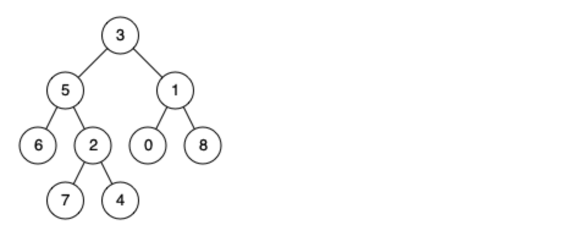

---

说明:
思路
遇到这个题⽬⾸先想的是要是能⾃底向上查找就好了，这样就可以找到公共祖先了。
那么⼆叉树如何可以⾃底向上查找呢？
回溯啊，⼆叉树回溯的过程就是从低到上。
后序遍历就是天然的回溯过程，最先处理的⼀定是叶⼦节点。
接下来就看如何判断⼀个节点是节点q和节点p的公共公共祖先呢。
如果找到⼀个节点，发现左⼦树出现结点p，右⼦树出现节点q，或者 左⼦树出现结点q，右
⼦树出现节点p，那么该节点就是节点p和q的最近公共祖先。
使⽤后序遍历，回溯的过程，就是从低向上遍历节点，⼀旦发现如何这个条件的节点，就是
最近公共节点了。
递归三部曲：
需要递归函数返回值，来告诉我们是否找到节点q或者p，那么返回值为bool类型就可以了。
但我们还要返回最近公共节点，可以利⽤上题⽬中返回值是TreeNode * ，那么如果遇到p或者
q，就把q或者p返回，返回值不为空，就说明找到了q或者p。
代码如下：
所有节点的值都是唯⼀的。
p、q 为不同节点且均存在于给定的⼆叉树中。
 
确定递归函数返回值以及参数
TreeNode* lowestCommonAncestor(TreeNode* root, TreeNode* p, TreeNode* 
q)

---

如果找到了 节点p或者q，或者遇到空节点，就返回。
代码如下：
值得注意的是 本题函数有返回值，是因为回溯的过程需要递归函数的返回值做判断，但本题
我们依然要遍历树的所有节点。
我们在⼆叉树：递归函数究竟什么时候需要返回值，什么时候不要返回值？中说了 递归函数
有返回值就是要遍历某⼀条边，但有返回值也要看如何处理返回值！
如果递归函数有返回值，如何区分要搜索⼀条边，还是搜索整个树呢？
搜索⼀条边的写法：
搜索整个树写法：
看出区别了没？
在递归函数有返回值的情况下：如果要搜索⼀条边，递归函数返回值不为空的时候，⽴刻返
回，如果搜索整个树，直接⽤⼀个变量left、right接住返回值，这个left、right后序还有逻
辑处理的需要，也就是后序遍历中处理中间节点的逻辑（也是回溯）。
那么为什么要遍历整颗树呢？直观上来看，找到最近公共祖先，直接⼀路返回就可以了。
确定终⽌条件
确定单层递归逻辑
if (root == q || root == p || root == NULL) return root;
if (递归函数(root->left)) return ;
if (递归函数(root->right)) return ;
left = 递归函数(root->left);
right = 递归函数(root->right);
left与right的逻辑处理;

---

如图：
就像图中⼀样直接返回7，多美滋滋。
但事实上还要遍历根节点右⼦树（即使此时已经找到了⽬标节点了），也就是图中的节点4、
15、20。
因为在如下代码的后序遍历中，如果想利⽤left和right做逻辑处理， 不能⽴刻返回，⽽是要等
left与right逻辑处理完之后才能返回。
所以此时⼤家要知道我们要遍历整棵树。知道这⼀点，对本题就有⼀定深度的理解了。
left = 递归函数(root->left);
right = 递归函数(root->right);
left与right的逻辑处理;

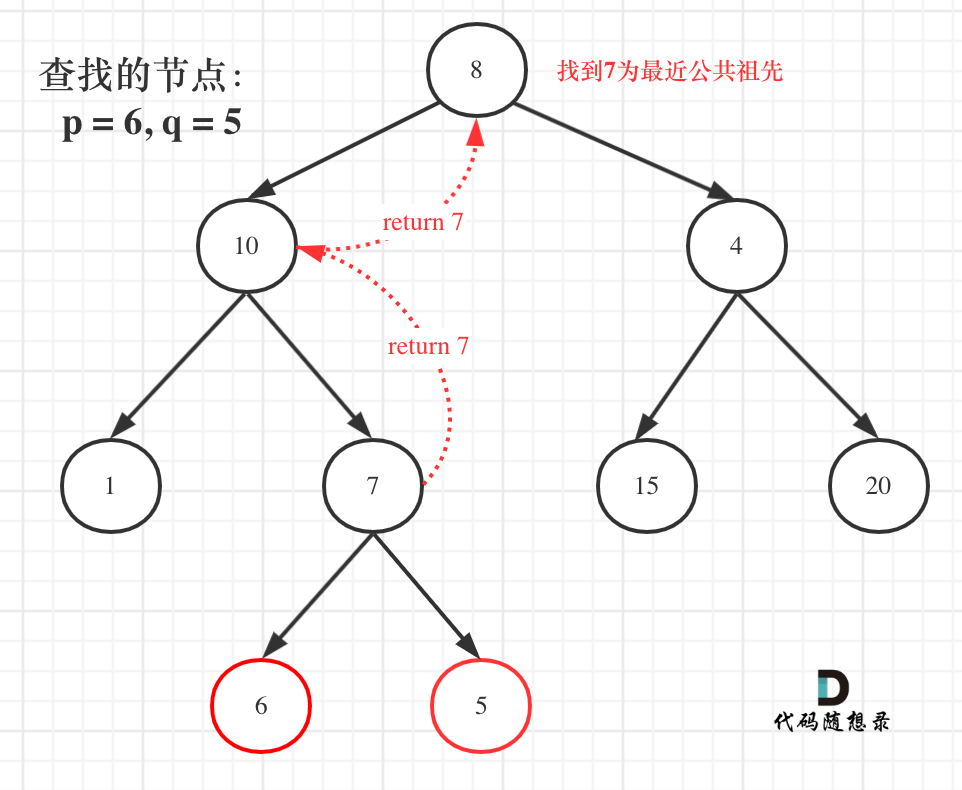

---

那么先⽤left和right接住左⼦树和右⼦树的返回值，代码如下：
如果left 和 right都不为空，说明此时root就是最近公共节点。这个⽐较好理解
如果left为空，right不为空，就返回right，说明⽬标节点是通过right返回的，反之依然。
这⾥有的同学就理解不了了，为什么left为空，right不为空，⽬标节点通过right返回呢？
如图：
图中节点10的左⼦树返回null，右⼦树返回⽬标值7，那么此时节点10的处理逻辑就是把右⼦
树的返回值（最近公共祖先7）返回上去！
TreeNode* left = lowestCommonAncestor(root->left, p, q);
TreeNode* right = lowestCommonAncestor(root->right, p, q);

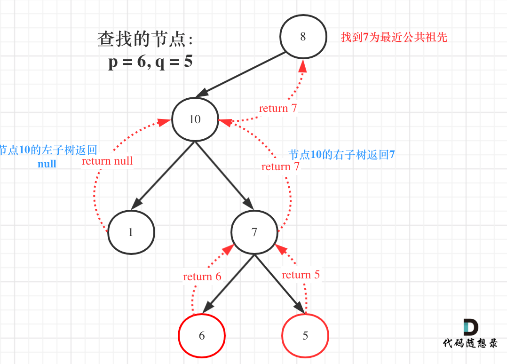

---

这⾥点也很重要，可能刷过这道题⽬的同学，都不清楚结果究竟是如何从底层⼀层⼀层传到
头结点的。
那么如果left和right都为空，则返回left或者right都是可以的，也就是返回空。
代码如下：
那么寻找最⼩公共祖先，完整流程图如下：
从图中，⼤家可以看到，我们是如何回溯遍历整颗⼆叉树，将结果返回给头结点的！
if (left == NULL && right != NULL) return right;
else if (left != NULL && right == NULL) return left;
else  { //  (left == NULL && right == NULL)
    return NULL;
}

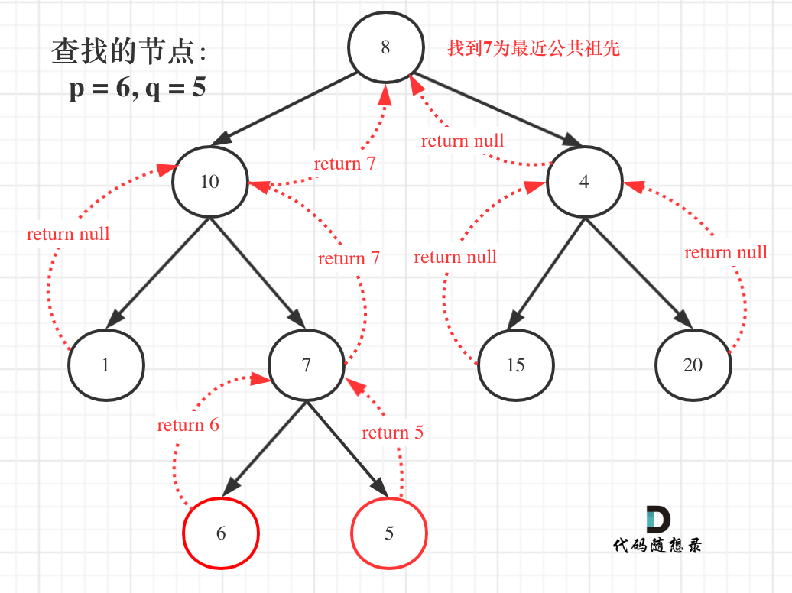

---

整体代码如下：
稍加精简，代码如下：
class Solution {
public:
    TreeNode* lowestCommonAncestor(TreeNode* root, TreeNode* p, 
TreeNode* q) {
        if (root == q || root == p || root == NULL) return root;
        TreeNode* left = lowestCommonAncestor(root->left, p, q);
        TreeNode* right = lowestCommonAncestor(root->right, p, q);
        if (left != NULL && right != NULL) return root;
        if (left == NULL && right != NULL) return right;
        else if (left != NULL && right == NULL) return left;
        else  { //  (left == NULL && right == NULL)
            return NULL;
        }
    }
};
class Solution {
public:
    TreeNode* lowestCommonAncestor(TreeNode* root, TreeNode* p, 
TreeNode* q) {
        if (root == q || root == p || root == NULL) return root;
        TreeNode* left = lowestCommonAncestor(root->left, p, q);
        TreeNode* right = lowestCommonAncestor(root->right, p, q);
        if (left != NULL && right != NULL) return root;
        if (left == NULL) return right;
        return left;
    }
};

---

总结
这道题⽬刷过的同学未必真正了解这⾥⾯回溯的过程，以及结果是如何⼀层⼀层传上去的。
那么我给⼤家归纳如下三点：
可以说这⾥每⼀步，都是有难度的，都需要对⼆叉树，递归和回溯有⼀定的理解。
本题没有给出迭代法，因为迭代法不适合模拟回溯的过程。理解递归的解法就够了。
本周⼩结！（⼆叉树系列四）
这已经是⼆叉树的第四周总结了，⼆叉树是⾮常重要的数据结构，也是⾯试中的常
客，所以有必要⼀步⼀步帮助⼤家彻底掌握⼆叉树！
周⼀
在⼆叉树：合并两个⼆叉树中讲解了如何合并两个⼆叉树，平时我们都习惯了操作⼀个⼆叉
树，⼀起操作两个树可能还有点陌⽣。
其实套路是⼀样，只不过⼀起操作两个树的指针，我们之前讲过求 ⼆叉树：我对称么？的时
候，已经初步涉及到了 ⼀起遍历两颗⼆叉树了。
迭代法中，⼀般⼀起操作两个树都是使⽤队列模拟类似层序遍历，同时处理两个树的节点，
这种⽅式最好理解，如果⽤模拟递归的思路的话，要复杂⼀些。
 
1. 求最⼩公共祖先，需要从底向上遍历，那么⼆叉树，只能通过后序遍历（即：回
溯）实现从低向上的遍历⽅式。
2. 在回溯的过程中，必然要遍历整颗⼆叉树，即使已经找到结果了，依然要把其他节
点遍历完，因为要使⽤递归函数的返回值（也就是代码中的left和right）做逻辑判
断。
3. 要理解如果返回值left为空，right不为空为什么要返回right，为什么可以⽤返回
right传给上⼀层结果。

---

周⼆
周⼆开始讲解⼀个新的树，⼆叉搜索树，开始要换⼀个思路了，如果没有利⽤好⼆叉搜索树
的特性，就容易把简单题做成了难题了。
学习⼆叉搜索树的特性，还是⽐较容易的。
⼤多是⼆叉搜索树的题⽬，其实都离不开中序遍历，因为这样就是有序的。
⾄于迭代法，相信⼤家看到⽂章中如此简单的迭代法的时候，都会感动的痛哭流涕。
周三
了解了⼆搜索树的特性之后， 开始验证⼀颗⼆叉树是不是⼆叉搜索树。
⾸先在此强调⼀下⼆叉搜索树的特性：
那么我们在验证⼆叉搜索树的时候，有两个陷阱：
不能单纯的⽐较左节点⼩于中间节点，右节点⼤于中间节点就完事了，⽽是左⼦树都⼩于中
间节点，右⼦树都⼤于中间节点。
在⼀个有序序列求最值的时候，不要定义⼀个全局遍历，然后遍历序列更新全局变量求最
值。因为最值可能就是int 或者 longlong的最⼩值。
推荐要通过前⼀个数值（pre）和后⼀个数值⽐较（cur），得出最值。
在⼆叉树中通过两个前后指针作⽐较，会经常⽤到。
本⽂⼆叉树：我是不是⼀棵⼆叉搜索树中迭代法中为什么没有周⼀那篇那么简洁了呢，因为
本篇是验证⼆叉搜索树，前提默认它是⼀棵普通⼆叉树，所以还是要回归之前⽼办法。
 
 
节点的左⼦树只包含⼩于当前节点的数。
节点的右⼦树只包含⼤于当前节点的数。
所有左⼦树和右⼦树⾃⾝必须也是⼆叉搜索树。
陷阱⼀
陷阱⼆

---

周四
了解了⼆叉搜索树，并且知道如何判断⼆叉搜索树，本篇就很简单了。
要知道⼆叉搜索树和中序遍历是好朋友！
在⼆叉树：搜索树的最⼩绝对差中强调了要利⽤搜索树的特性，把这道题⽬想象成在⼀个有
序数组上求两个数最⼩差值，这就是⼀道送分题了。
需要明确：在有序数组求任意两数最⼩值差等价于相邻两数的最⼩值差。
同样本题也需要⽤pre节点记录cur节点的前⼀个节点。（这种写法⼀定要掌握）
周五
此时⼤家应该知道遇到⼆叉搜索树，就想是有序数组，那么在⼆叉搜索树中求⼆叉搜索树众
数就很简单了。
在⼆叉树：我的众数是多少？中我给出了如果是普通⼆叉树，应该如何求众数的集合，然后
进⼀步讲解了⼆叉搜索树应该如何求众数集合。
在求众数集合的时候有⼀个技巧，因为题⽬中众数是可以有多个的，所以⼀般的⽅法需要遍
历两遍才能求出众数的集合。
但可以遍历⼀遍就可以求众数集合，使⽤了适时清空结果集的⽅法，这个⽅法还是很巧妙
的。相信仔细读了⽂章的同学会惊呼其巧妙！
所以⼤家不要看题⽬简单了，就不动⼿做了，我选的题⽬，⼀般不会简单到不⽤动⼿的程
度，哈哈。
周六
在⼆叉树：公共祖先问题中，我们开始讲解如何在⼆叉树中求公共祖先的问题，本来是打算
和⼆叉搜索树⼀起讲的，但发现篇幅过长，所以先讲⼆叉树的公共祖先问题。
如果找到⼀个节点，发现左⼦树出现结点p，右⼦树出现节点q，或者 左⼦树出现结点q，右
⼦树出现节点p，那么该节点就是节点p和q的最近公共祖先。

---

这道题⽬的看代码⽐较简单，⽽且好像也挺好理解的，但是如果把每⼀个细节理解到位，还
是不容易的。
主要思考如下⼏点：
这些问题都需要弄清楚，上来直接看代码的话，是可能想不到这些细节的。
公共祖先问题，还是有难度的，初学者还是需要慢慢消化！
总结
本周我们讲了如何合并两个⼆叉树，了解了如何操作两个⼆叉树。
然后开始另⼀种树：⼆叉搜索树，了解⼆叉搜索树的特性，然后判断⼀棵⼆叉树是不是⼆叉
搜索树。
了解以上知识之后，就开始利⽤其特性，做⼀些⼆叉搜索树上的题⽬，求最⼩绝对差，求众
数集合。
接下来，开始求⼆叉树与⼆叉搜索树的公共祖先问题，单篇篇幅原因，先单独介绍普通⼆叉
树如何求最近公共祖先。
现在已经讲过了⼏种⼆叉树了，⼆叉树，⼆叉平衡树，完全⼆叉树，⼆叉搜索树，后⾯还会
有平衡⼆叉搜索树。 那么⼀些同学难免会有混乱了，我针对如下三个问题，帮⼤家在捋顺⼀
遍：
是的，是⼆叉搜索树和平衡⼆叉树的结合。
是的，完全⼆叉树底层必须是从左到右连续的，且次底层是满的。
如何从底向上遍历？
遍历整棵树，还是遍历局部树？
如何把结果传到根节点的？
 
1. 平衡⼆叉搜索数是不是⼆叉搜索树和平衡⼆叉树的结合？
2. 平衡⼆叉树与完全⼆叉树的区别在于底层节点的位置？

---

堆是⼀棵完全⼆叉树，同时保证⽗⼦节点的顺序关系（有序）。 但完全⼆叉树⼀定是平衡⼆
叉树，堆的排序是⽗节点⼤于⼦节点，⽽搜索树是⽗节点⼤于左孩⼦，⼩于右孩⼦，所以堆
不是平衡⼆叉搜索树。
⼤家如果每天坚持跟下来，会发现又是充实的⼀周！[机智]
 
⼆叉搜索树的最近公共祖先
235. ⼆叉搜索树的最近公共祖先
链接：https://leetcode-cn.com/problems/lowest-common-ancestor-of-a-binary-search-tree
/
给定⼀个⼆叉搜索树, 找到该树中两个指定节点的最近公共祖先。
百度百科中最近公共祖先的定义为：“对于有根树 T 的两个结点 p、q，最近公共祖先表⽰为⼀
个结点 x，满⾜ x 是 p、q 的祖先且 x 的深度尽可能⼤（⼀个节点也可以是它⾃⼰的祖先）。”
例如，给定如下⼆叉搜索树:  root = [6,2,8,0,4,7,9,null,null,3,5]
3. 堆是完全⼆叉树和排序的结合，⽽不是平衡⼆叉搜索树？

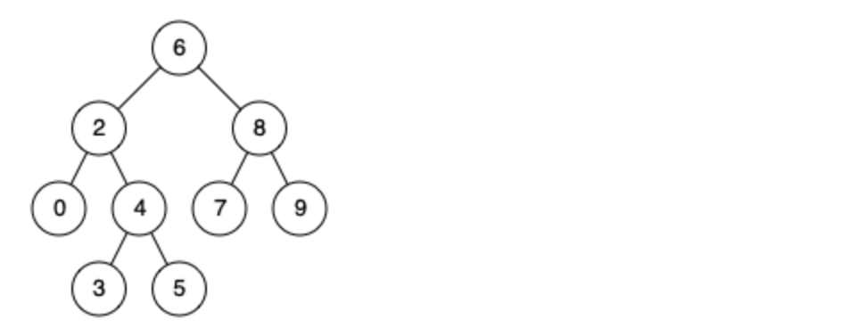

---

⽰例 1:
输⼊: root = [6,2,8,0,4,7,9,null,null,3,5], p = 2, q = 8
输出: 6
解释: 节点 2 和节点 8 的最近公共祖先是 6。
⽰例 2:
输⼊: root = [6,2,8,0,4,7,9,null,null,3,5], p = 2, q = 4
输出: 2
解释: 节点 2 和节点 4 的最近公共祖先是 2, 因为根据定义最近公共祖先节点可以为节点本⾝。
说明:
思路
做过⼆叉树：公共祖先问题题⽬的同学应该知道，利⽤回溯从底向上搜索，遇到⼀个节点的
左⼦树⾥有p，右⼦树⾥有q，那么当前节点就是最近公共祖先。
那么本题是⼆叉搜索树，⼆叉搜索树是有序的，那得好好利⽤⼀下这个特点。
在有序树⾥，如果判断⼀个节点的左⼦树⾥有p，右⼦树⾥有q呢？
其实只要从上到下遍历的时候，cur节点是数值在[p, q]区间中则说明该节点cur就是最近公共
祖先了。
理解这⼀点，本题就很好解了。
和⼆叉树：公共祖先问题不同，普通⼆叉树求最近公共祖先需要使⽤回溯，从底向上来查
找，⼆叉搜索树就不⽤了，因为搜索树有序（相当于⾃带⽅向），那么只要从上向下遍历就
可以了。
那么我们可以采⽤前序遍历（其实这⾥没有中节点的处理逻辑，遍历顺序⽆所谓了）。
如图所⽰：p为节点3，q为节点5
所有节点的值都是唯⼀的。
p、q 为不同节点且均存在于给定的⼆叉搜索树中。

---

可以看出直接按照指定的⽅向，就可以找到节点4，为最近公共祖先，⽽且不需要遍历整棵
树，找到结果直接返回！
递归三部曲如下：
参数就是当前节点，以及两个结点 p、q。
返回值是要返回最近公共祖先，所以是TreeNode *  。
代码如下：
确定递归函数返回值以及参数

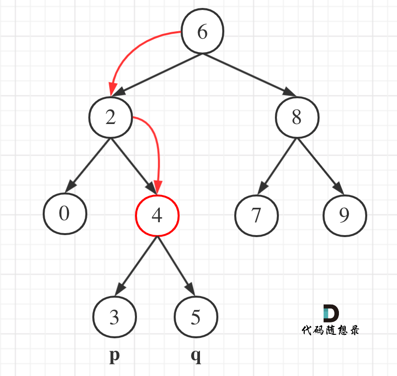

---

遇到空返回就可以了，代码如下：
其实都不需要这个终⽌条件，因为题⽬中说了p、q 为不同节点且均存在于给定的⼆叉搜索树
中。也就是说⼀定会找到公共祖先的，所以并不存在遇到空的情况。
在遍历⼆叉搜索树的时候就是寻找区间[p->val, q->val]（注意这⾥是左闭又闭）
那么如果 cur->val ⼤于 p->val，同时 cur->val ⼤于q->val，那么就应该向左遍历（说明⽬标
区间在左⼦树上）。
需要注意的是此时不知道p和q谁⼤，所以两个都要判断
代码如下：
细⼼的同学会发现，在这⾥调⽤递归函数的地⽅，把递归函数的返回值left，直接return。
在⼆叉树：公共祖先问题中，如果递归函数有返回值，如何区分要搜索⼀条边，还是搜索整
个树。
搜索⼀条边的写法：
确定终⽌条件
确定单层递归的逻辑
TreeNode* traversal(TreeNode* cur, TreeNode* p, TreeNode* q)
if (cur == NULL) return cur;
if (cur->val > p->val && cur->val > q->val) {
    TreeNode* left = traversal(cur->left, p, q);
    if (left != NULL) {
        return left;
    }
}

---

搜索整个树写法：
本题就是标准的搜索⼀条边的写法，遇到递归函数的返回值，如果不为空，⽴刻返回。
如果 cur->val ⼩于 p->val，同时 cur->val ⼩于 q->val，那么就应该向右遍历（⽬标区间在右
⼦树）。
剩下的情况，就是cur节点在区间（p->val <=  cur->val && cur->val <= q->val）或者 （q-
>val <=  cur->val && cur->val <= p->val）中，那么cur就是最近公共祖先了，直接返回cur。
代码如下：
那么整体递归代码如下:
if (递归函数(root->left)) return ;
if (递归函数(root->right)) return ;
left = 递归函数(root->left);
right = 递归函数(root->right);
left与right的逻辑处理;
if (cur->val < p->val && cur->val < q->val) {
    TreeNode* right = traversal(cur->right, p, q);
    if (right != NULL) {
        return right;
    }
}
return cur;
class Solution {
private:
    TreeNode* traversal(TreeNode* cur, TreeNode* p, TreeNode* q) {
        if (cur == NULL) return cur;

---

精简后代码如下：
                                                        // 中
        if (cur->val > p->val && cur->val > q->val) {   // 左
            TreeNode* left = traversal(cur->left, p, q);
            if (left != NULL) {
                return left;
            }
        }
        if (cur->val < p->val && cur->val < q->val) {   // 右
            TreeNode* right = traversal(cur->right, p, q);
            if (right != NULL) {
                return right;
            }
        }
        return cur;
    }
public:
    TreeNode* lowestCommonAncestor(TreeNode* root, TreeNode* p, 
TreeNode* q) {
        return traversal(root, p, q);
    }
};
class Solution {
public:
    TreeNode* lowestCommonAncestor(TreeNode* root, TreeNode* p, 
TreeNode* q) {
        if (root->val > p->val && root->val > q->val) {
            return lowestCommonAncestor(root->left, p, q);
        } else if (root->val < p->val && root->val < q->val) {
            return lowestCommonAncestor(root->right, p, q);
        } else return root;
    }
};

---

迭代法
对于⼆叉搜索树的迭代法，⼤家应该在⼆叉树：⼆叉搜索树登场！就了解了。
利⽤其有序性，迭代的⽅式还是⽐较简单的，解题思路在递归中已经分析了。
迭代代码如下：
灵魂拷问：是不是又被简单的迭代法感动到痛哭流涕？
总结
对于⼆叉搜索树的最近祖先问题，其实要⽐普通⼆叉树公共祖先问题简单的多。
不⽤使⽤回溯，⼆叉搜索树⾃带⽅向性，可以⽅便的从上向下查找⽬标区间，遇到⽬标区间
内的节点，直接返回。
最后给出了对应的迭代法，⼆叉搜索树的迭代法甚⾄⽐递归更容易理解，也是因为其有序性
（⾃带⽅向性），按照⽬标区间找就⾏了。
 
 
 
class Solution {
public:
    TreeNode* lowestCommonAncestor(TreeNode* root, TreeNode* p, 
TreeNode* q) {
        while(root) {
            if (root->val > p->val && root->val > q->val) {
                root = root->left;
            } else if (root->val < p->val && root->val < q->val) {
                root = root->right;
            } else return root;
        }
        return NULL;
    }
};

---

如果感觉PDF对你有帮助，微信搜索：代码随想录，你会发现相见恨晚！
 
⼆叉搜索树中的插⼊操作
701.⼆叉搜索树中的插⼊操作
链接：https://leetcode-cn.com/problems/insert-into-a-binary-search-tree/
代码随想录官⽹：www.programmercarl.com
代码随想录开源项⽬Github：https://github.com/youngyangyang04/leetcode-
master
代码随想录算法公开课 ，代码随想录的全部内容将由我（程序员Carl）视频讲解并
开免费开放给⼤家。
《代码随想录》纸质版 已经出版。
代码随想录知识星球 上万录友在这⾥学习
代码随想录算法训练营 帮助录友⾼效刷完代码随想录。

---

给定⼆叉搜索树（BST）的根节点和要插⼊树中的值，将值插⼊⼆叉搜索树。 返回插⼊后⼆
叉搜索树的根节点。 输⼊数据保证，新值和原始⼆叉搜索树中的任意节点值都不同。
注意，可能存在多种有效的插⼊⽅式，只要树在插⼊后仍保持为⼆叉搜索树即可。 你可以返
回任意有效的结果。

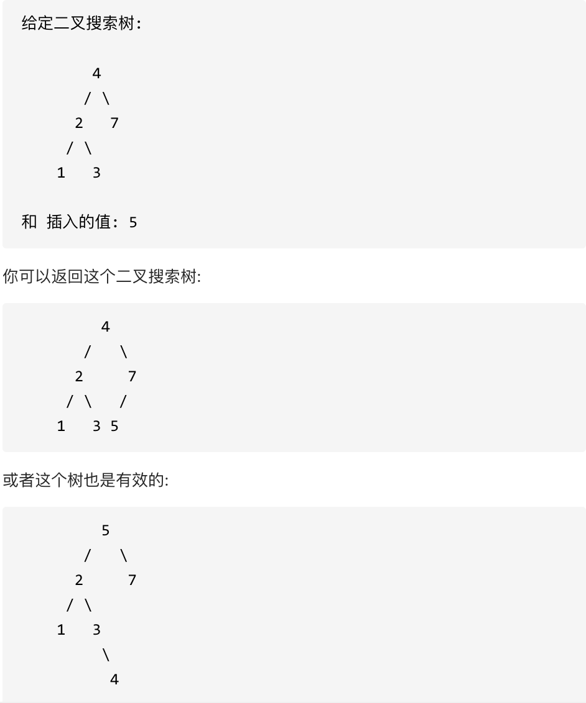

---

提⽰：
思路
其实这道题⽬其实是⼀道简单题⽬，但是题⽬中的提⽰：有多种有效的插⼊⽅式，还可以重
构⼆叉搜索树，⼀下⼦吓退了不少⼈，瞬间感觉题⽬复杂了很多。
其实可以不考虑题⽬中提⽰所说的改变树的结构的插⼊⽅式。
如下演⽰视频中可以看出：只要按照⼆叉搜索树的规则去遍历，遇到空节点就插⼊节点就可
以了。
例如插⼊元素10 ，需要找到末尾节点插⼊便可，⼀样的道理来插⼊元素15，插⼊元素0，插⼊
元素6，需要调整⼆叉树的结构么？ 并不需要。。
只要遍历⼆叉搜索树，找到空节点 插⼊元素就可以了，那么这道题其实就简单了。
接下来就是遍历⼆叉搜索树的过程了。
给定的树上的节点数介于 0 和 10^4 之间
每个节点都有⼀个唯⼀整数值，取值范围从 0 到 10^8
-10^8 <= val <= 10^8
新值和原始⼆叉搜索树中的任意节点值都不同

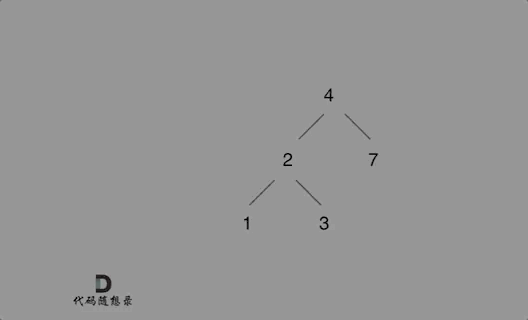

---

递归
递归三部曲：
参数就是根节点指针，以及要插⼊元素，这⾥递归函数要不要有返回值呢？
可以有，也可以没有，但递归函数如果没有返回值的话，实现是⽐较⿇烦的，下⾯也会给出
其具体实现代码。
有返回值的话，可以利⽤返回值完成新加⼊的节点与其⽗节点的赋值操作。（下⾯会进⼀步
解释）
递归函数的返回类型为节点类型TreeNode * 。
代码如下：
终⽌条件就是找到遍历的节点为null的时候，就是要插⼊节点的位置了，并把插⼊的节点返
回。
代码如下：
这⾥把添加的节点返回给上⼀层，就完成了⽗⼦节点的赋值操作了，详细再往下看。
此时要明确，需要遍历整棵树么？
 
确定递归函数参数以及返回值
确定终⽌条件
确定单层递归的逻辑
TreeNode* insertIntoBST(TreeNode* root, int val)
if (root == NULL) {
    TreeNode* node = new TreeNode(val);
    return node;
}

---

别忘了这是搜索树，遍历整颗搜索树简直是对搜索树的侮辱，哈哈。
搜索树是有⽅向了，可以根据插⼊元素的数值，决定递归⽅向。
代码如下：
到这⾥，⼤家应该能感受到，如何通过递归函数返回值完成了新加⼊节点的⽗⼦关系赋值操
作了，下⼀层将加⼊节点返回，本层⽤root->left或者root->right将其接住。
整体代码如下：
可以看出代码并不复杂。
刚刚说了递归函数不⽤返回值也可以，找到插⼊的节点位置，直接让其⽗节点指向插⼊节
点，结束递归，也是可以的。
那么递归函数定义如下：
if (root->val > val) root->left = insertIntoBST(root->left, val);
if (root->val < val) root->right = insertIntoBST(root->right, val);
return root;
class Solution {
public:
    TreeNode* insertIntoBST(TreeNode* root, int val) {
        if (root == NULL) {
            TreeNode* node = new TreeNode(val);
            return node;
        }
        if (root->val > val) root->left = insertIntoBST(root->left, 
val);
        if (root->val < val) root->right = insertIntoBST(root->right, 
val);
        return root;
    }
};

---

没有返回值，需要记录上⼀个节点（parent），遇到空节点了，就让parent左孩⼦或者右孩⼦
指向新插⼊的节点。然后结束递归。
代码如下：
可以看出还是⿇烦⼀些的。
TreeNode* parent; // 记录遍历节点的⽗节点
void traversal(TreeNode* cur, int val)
class Solution {
private:
    TreeNode* parent;
    void traversal(TreeNode* cur, int val) {
        if (cur == NULL) {
            TreeNode* node = new TreeNode(val);
            if (val > parent->val) parent->right = node;
            else parent->left = node;
            return;
        }
        parent = cur;
        if (cur->val > val) traversal(cur->left, val);
        if (cur->val < val) traversal(cur->right, val);
        return;
    }
public:
    TreeNode* insertIntoBST(TreeNode* root, int val) {
        parent = new TreeNode(0);
        if (root == NULL) {
            root = new TreeNode(val);
        }
        traversal(root, val);
        return root;
    }
};

---

我之所以举这个例⼦，是想说明通过递归函数的返回值完成⽗⼦节点的赋值是可以带来便利
的。
⽹上千变⼀律的代码，可能会误导⼤家认为通过递归函数返回节点 这样的写法是天经地义，
其实这⾥是有优化的！
迭代
再来看看迭代法，对⼆叉搜索树迭代写法不熟悉，可以看这篇：⼆叉树：⼆叉搜索树登场！
在迭代法遍历的过程中，需要记录⼀下当前遍历的节点的⽗节点，这样才能做插⼊节点的操
作。
在⼆叉树：搜索树的最⼩绝对差和⼆叉树：我的众数是多少？中，都是⽤了记录pre和cur两个
指针的技巧，本题也是⼀样的。
代码如下：
 
class Solution {
public:
    TreeNode* insertIntoBST(TreeNode* root, int val) {
        if (root == NULL) {
            TreeNode* node = new TreeNode(val);
            return node;
        }
        TreeNode* cur = root;
        TreeNode* parent = root; // 这个很重要，需要记录上⼀个节点，否则⽆法赋
值新节点
        while (cur != NULL) {
            parent = cur;
            if (cur->val > val) cur = cur->left;
            else cur = cur->right;
        }
        TreeNode* node = new TreeNode(val);
        if (val < parent->val) parent->left = node;// 此时是⽤parent节点
的进⾏赋值
        else parent->right = node;
        return root;

---

总结
⾸先在⼆叉搜索树中的插⼊操作，⼤家不⽤恐惧其重构搜索树，其实根本不⽤重构。
然后在递归中，我们重点讲了如果通过递归函数的返回值完成新加⼊节点和其⽗节点的赋值
操作，并强调了搜索树的有序性。
最后依然给出了迭代的⽅法，迭代的⽅法就需要记录当前遍历节点的⽗节点了，这个和没有
返回值的递归函数实现的代码逻辑是⼀样的。
 
删除⼆叉搜索树中的节点
⼆叉搜索树删除节点就涉及到结构调整了
450.删除⼆叉搜索树中的节点
题⽬链接： https://leetcode-cn.com/problems/delete-node-in-a-bst/
给定⼀个⼆叉搜索树的根节点 root 和⼀个值 key，删除⼆叉搜索树中的 key 对应的节点，并
保证⼆叉搜索树的性质不变。返回⼆叉搜索树（有可能被更新）的根节点的引⽤。
⼀般来说，删除节点可分为两个步骤：
⾸先找到需要删除的节点；
如果找到了，删除它。
说明： 要求算法时间复杂度为 O(h)，h 为树的⾼度。
⽰例:
 
 
 
    }
};

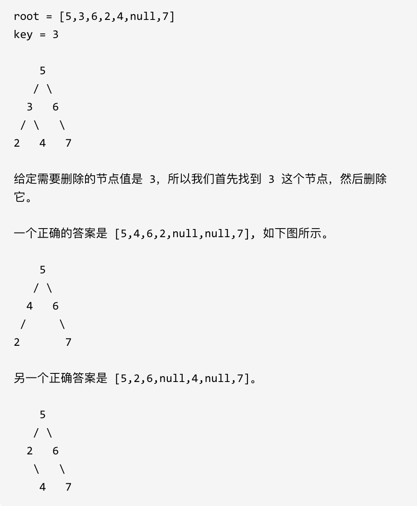

---

思路
搜索树的节点删除要⽐节点增加复杂的多，有很多情况需要考虑，做好⼼⾥准备。
递归
递归三部曲：
说道递归函数的返回值，在⼆叉树：搜索树中的插⼊操作中通过递归返回值来加⼊新节点， 
这⾥也可以通过递归返回值删除节点。
代码如下：
遇到空返回，其实这也说明没找到删除的节点，遍历到空节点直接返回了
这⾥就把平衡⼆叉树中删除节点遇到的情况都搞清楚。
有以下五种情况：
 
 
确定递归函数参数以及返回值
确定终⽌条件
确定单层递归的逻辑
第⼀种情况：没找到删除的节点，遍历到空节点直接返回了
找到删除的节点
第⼆种情况：左右孩⼦都为空（叶⼦节点），直接删除节点， 返回NULL为
根节点
第三种情况：删除节点的左孩⼦为空，右孩⼦不为空，删除节点，右孩⼦
补位，返回右孩⼦为根节点
第四种情况：删除节点的右孩⼦为空，左孩⼦不为空，删除节点，左孩⼦
TreeNode* deleteNode(TreeNode* root, int key)
if (root == nullptr) return root;

---

第五种情况有点难以理解，看下⾯动画：
动画中颗⼆叉搜索树中，删除元素7， 那么删除节点（元素7）的左孩⼦就是5，删除节点（元
素7）的右⼦树的最左⾯节点是元素8。
将删除节点（元素7）的左孩⼦放到删除节点（元素7）的右⼦树的最左⾯节点（元素8）的左
孩⼦上，就是把5为根节点的⼦树移到了8的左孩⼦的位置。
要删除的节点（元素7）的右孩⼦（元素9）为新的根节点。.
这样就完成删除元素7的逻辑，最好动⼿画⼀个图，尝试删除⼀个节点试试。
代码如下：
补位，返回左孩⼦为根节点
第五种情况：左右孩⼦节点都不为空，则将删除节点的左⼦树头结点（左
孩⼦）放到删除节点的右⼦树的最左⾯节点的左孩⼦上，返回删除节点右
孩⼦为新的根节点。
if (root->val == key) {
    // 第⼆种情况：左右孩⼦都为空（叶⼦节点），直接删除节点， 返回NULL为根节点

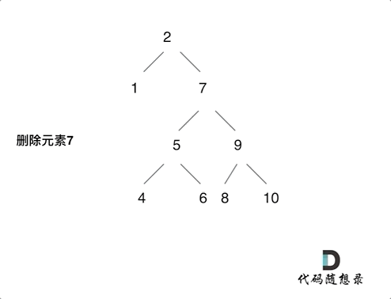

---

这⾥相当于把新的节点返回给上⼀层，上⼀层就要⽤ root->left 或者 root->right接住，代码
如下：
整体代码如下：（注释中：情况1，2，3，4，5和上⾯分析严格对应）
    // 第三种情况：其左孩⼦为空，右孩⼦不为空，删除节点，右孩⼦补位 ，返回右孩⼦为根
节点
    if (root->left == nullptr) return root->right;
    // 第四种情况：其右孩⼦为空，左孩⼦不为空，删除节点，左孩⼦补位，返回左孩⼦为根
节点
    else if (root->right == nullptr) return root->left;
    // 第五种情况：左右孩⼦节点都不为空，则将删除节点的左⼦树放到删除节点的右⼦树的
最左⾯节点的左孩⼦的位置
    // 并返回删除节点右孩⼦为新的根节点。
    else {
        TreeNode* cur = root->right; // 找右⼦树最左⾯的节点
        while(cur->left != nullptr) {
            cur = cur->left;
        }
        cur->left = root->left; // 把要删除的节点（root）左⼦树放在cur的左孩
⼦的位置
        TreeNode* tmp = root;   // 把root节点保存⼀下，下⾯来删除
        root = root->right;     // 返回旧root的右孩⼦作为新root
        delete tmp;             // 释放节点内存（这⾥不写也可以，但C++最好⼿动
释放⼀下吧）
        return root;
    }
}
if (root->val > key) root->left = deleteNode(root->left, key);
if (root->val < key) root->right = deleteNode(root->right, key);
return root;
class Solution {
public:
    TreeNode* deleteNode(TreeNode* root, int key) {

---

if (root == nullptr) return root; // 第⼀种情况：没找到删除的节点，
遍历到空节点直接返回了
        if (root->val == key) {
            // 第⼆种情况：左右孩⼦都为空（叶⼦节点），直接删除节点， 返回NULL为
根节点
            // 第三种情况：其左孩⼦为空，右孩⼦不为空，删除节点，右孩⼦补位 ，返回
右孩⼦为根节点
            if (root->left == nullptr) return root->right;
            // 第四种情况：其右孩⼦为空，左孩⼦不为空，删除节点，左孩⼦补位，返回
左孩⼦为根节点
            else if (root->right == nullptr) return root->left;
            // 第五种情况：左右孩⼦节点都不为空，则将删除节点的左⼦树放到删除节点
的右⼦树的最左⾯节点的左孩⼦的位置
            // 并返回删除节点右孩⼦为新的根节点。
            else {
                TreeNode* cur = root->right; // 找右⼦树最左⾯的节点
                while(cur->left != nullptr) {
                    cur = cur->left;
                }
                cur->left = root->left; // 把要删除的节点（root）左⼦树放在
cur的左孩⼦的位置
                TreeNode* tmp = root;   // 把root节点保存⼀下，下⾯来删除
                root = root->right;     // 返回旧root的右孩⼦作为新root
                delete tmp;             // 释放节点内存（这⾥不写也可以，但
C++最好⼿动释放⼀下吧）
                return root;
            }
        }
        if (root->val > key) root->left = deleteNode(root->left, key);
        if (root->val < key) root->right = deleteNode(root->right, 
key);
        return root;
    }
};

---

普通⼆叉树的删除⽅式
这⾥我在介绍⼀种通⽤的删除，普通⼆叉树的删除⽅式（没有使⽤搜索树的特性，遍历整棵
树），⽤交换值的操作来删除⽬标节点。
代码中⽬标节点（要删除的节点）被操作了两次：
思路有点绕，感兴趣的同学可以画图⾃⼰理解⼀下。
代码如下：（关键部分已经注释）
这个代码是简短⼀些，思路也巧妙，但是不太好想，实操性不强，推荐第⼀种写法！
 
第⼀次是和⽬标节点的右⼦树最左⾯节点交换。
第⼆次直接被NULL覆盖了。
class Solution {
public:
    TreeNode* deleteNode(TreeNode* root, int key) {
        if (root == nullptr) return root;
        if (root->val == key) {
            if (root->right == nullptr) { // 这⾥第⼆次操作⽬标值：最终删除
的作⽤
                return root->left;
            }
            TreeNode *cur = root->right;
            while (cur->left) {
                cur = cur->left;
            }
            swap(root->val, cur->val); // 这⾥第⼀次操作⽬标值：交换⽬标值其
右⼦树最左⾯节点。
        }
        root->left = deleteNode(root->left, key);
        root->right = deleteNode(root->right, key);
        return root;
    }
};

---

迭代法
删除节点的迭代法还是复杂⼀些的，但其本质我在递归法⾥都介绍了，最关键就是删除节点
的操作（动画模拟的过程）
代码如下：
 
class Solution {
private:
    // 将⽬标节点（删除节点）的左⼦树放到 ⽬标节点的右⼦树的最左⾯节点的左孩⼦位置上
    // 并返回⽬标节点右孩⼦为新的根节点
    // 是动画⾥模拟的过程
    TreeNode* deleteOneNode(TreeNode* target) {
        if (target == nullptr) return target;
        if (target->right == nullptr) return target->left;
        TreeNode* cur = target->right;
        while (cur->left) {
            cur = cur->left;
        }
        cur->left = target->left;
        return target->right;
    }
public:
    TreeNode* deleteNode(TreeNode* root, int key) {
        if (root == nullptr) return root;
        TreeNode* cur = root;
        TreeNode* pre = nullptr; // 记录cur的⽗节点，⽤来删除cur
        while (cur) {
            if (cur->val == key) break;
            pre = cur;
            if (cur->val > key) cur = cur->left;
            else cur = cur->right;
        }
        if (pre == nullptr) { // 如果搜索树只有头结点
            return deleteOneNode(cur);
        }
        // pre 要知道是删左孩⼦还是右孩⼦
        if (pre->left && pre->left->val == key) {
            pre->left = deleteOneNode(cur);

---

总结
读完本篇，⼤家会发现⼆叉搜索树删除节点⽐增加节点复杂的多。
因为⼆叉搜索树添加节点只需要在叶⼦上添加就可以的，不涉及到结构的调整，⽽删除节点
操作涉及到结构的调整。
这⾥我们依然使⽤递归函数的返回值来完成把节点从⼆叉树中移除的操作。
这⾥最关键的逻辑就是第五种情况（删除⼀个左右孩⼦都不为空的节点），这种情况⼀定要
想清楚。
⽽且就算想清楚了，对应的代码也未必可以写出来，所以这道题⽬即考察思维逻辑，也考察
代码能⼒。
递归中我给出了两种写法，推荐⼤家学会第⼀种（利⽤搜索树的特性）就可以了，第⼆种递
归写法其实是⽐较绕的。
最后我也给出了相应的迭代法，就是模拟递归法中的逻辑来删除节点，但需要⼀个pre记录cur
的⽗节点，⽅便做删除操作。
迭代法其实不太容易写出来，所以如果是初学者的话，彻底掌握第⼀种递归写法就够了。
 
代码随想录官⽹：www.programmercarl.com
代码随想录开源项⽬Github：https://github.com/youngyangyang04/leetcode-
master
代码随想录算法公开课 ，代码随想录的全部内容将由我（程序员Carl）视频讲解并
开免费开放给⼤家。
《代码随想录》纸质版 已经出版。
代码随想录知识星球 上万录友在这⾥学习
        }
        if (pre->right && pre->right->val == key) {
            pre->right = deleteOneNode(cur);
        }
        return root;
    }
};

---

如果感觉PDF对你有帮助，微信搜索：代码随想录，你会发现相见恨晚！
 
修剪⼆叉搜索树
如果不对递归有深刻的理解，本题有点难
单纯移除⼀个节点那还不够，要修剪！
669. 修剪⼆叉搜索树
题⽬链接：https://leetcode-cn.com/problems/trim-a-binary-search-tree/
给定⼀个⼆叉搜索树，同时给定最⼩边界L 和最⼤边界 R。通过修剪⼆叉搜索树，使得所有节
点的值在[L, R]中 (R>=L) 。你可能需要改变树的根节点，所以结果应当返回修剪好的⼆叉搜索
树的新的根节点。
代码随想录算法训练营 帮助录友⾼效刷完代码随想录。

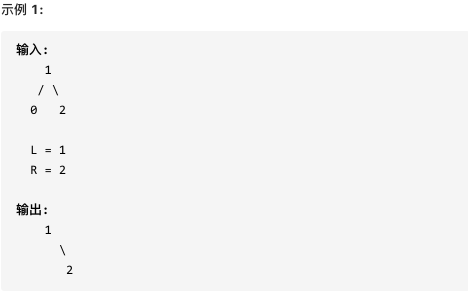

---

思路
相信看到这道题⽬⼤家都感觉是⼀道简单题（事实上leetcode上也标明是简单）。
但还真的不简单！
递归法
直接想法就是：递归处理，然后遇到 root->val < low || root->val > high 的时候直接
return NULL，⼀波修改，赶紧利落。
不难写出如下代码：

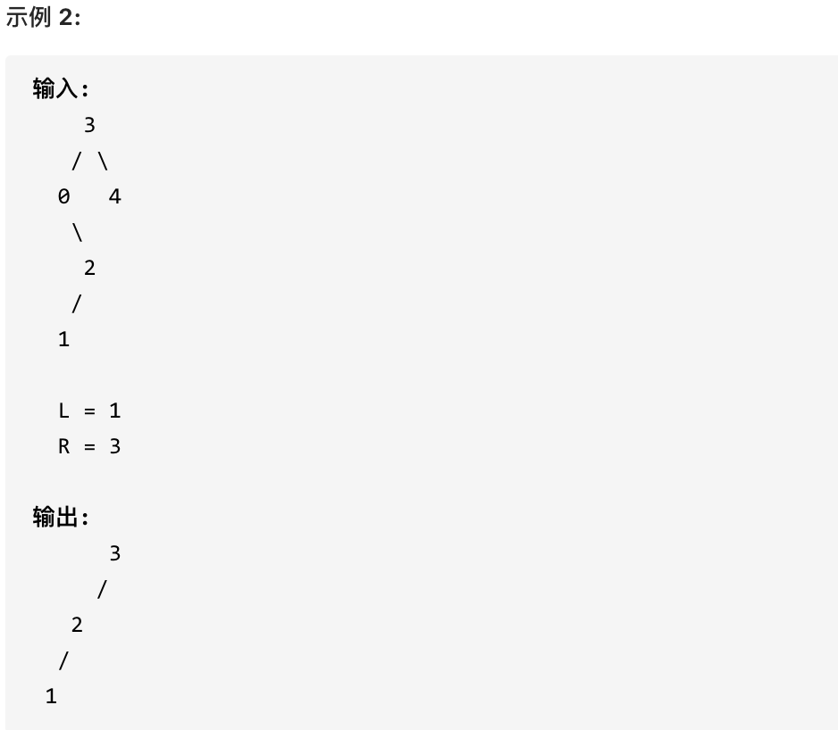

---

然⽽[1, 3]区间在⼆叉搜索树的中可不是单纯的节点3和左孩⼦节点0就决定的，还要考虑节点
0的右⼦树。
我们在重新关注⼀下第⼆个⽰例，如图：
所以以上的代码是不可⾏的！
从图中可以看出需要重构⼆叉树，想想是不是本题就有点复杂了。
class Solution {
public:
    TreeNode* trimBST(TreeNode* root, int low, int high) {
        if (root == nullptr || root->val < low || root->val > high) 
return nullptr;
        root->left = trimBST(root->left, low, high);
        root->right = trimBST(root->right, low, high);
        return root;
    }
};

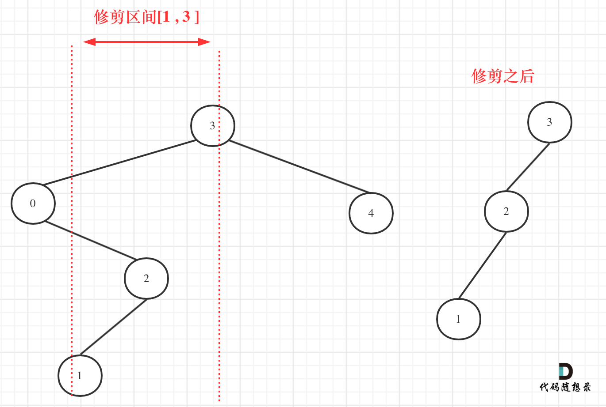

---

其实不⽤重构那么复杂。
在上图中我们发现节点0并不符合区间要求，那么将节点0的右孩⼦ 节点2 直接赋给 节点3的左
孩⼦就可以了（就是把节点0从⼆叉树中移除），如图：
理解了最关键部分了我们在递归三部曲：
这⾥我们为什么需要返回值呢？
因为是要遍历整棵树，做修改，其实不需要返回值也可以，我们也可以完成修剪（其实就是
从⼆叉树中移除节点）的操作。
确定递归函数的参数以及返回值

---

但是有返回值，更⽅便，可以通过递归函数的返回值来移除节点。
这样的做法在⼆叉树：搜索树中的插⼊操作和⼆叉树：搜索树中的删除操作中⼤家已经了解
过了。
代码如下：
修剪的操作并不是在终⽌条件上进⾏的，所以就是遇到空节点返回就可以了。
如果root（当前节点）的元素⼩于low的数值，那么应该递归右⼦树，并返回右⼦树符合条件
的头结点。
代码如下：
如果root(当前节点)的元素⼤于high的，那么应该递归左⼦树，并返回左⼦树符合条件的头结
点。
代码如下：
确定终⽌条件
确定单层递归的逻辑
TreeNode* trimBST(TreeNode* root, int low, int high)
if (root == nullptr ) return nullptr;
if (root->val < low) {
    TreeNode* right = trimBST(root->right, low, high); // 寻找符合区间
[low, high]的节点
    return right;
}

---

接下来要将下⼀层处理完左⼦树的结果赋给root->left，处理完右⼦树的结果赋给root-
>right。
最后返回root节点，代码如下：
此时⼤家是不是还没发现这多余的节点究竟是如何从⼆叉树中移除的呢？
在回顾⼀下上⾯的代码，针对下图中⼆叉树的情况：
if (root->val > high) {
    TreeNode* left = trimBST(root->left, low, high); // 寻找符合区间[low, 
high]的节点
    return left;
}
root->left = trimBST(root->left, low, high); // root->left接⼊符合条件的左
孩⼦
root->right = trimBST(root->right, low, high); // root->right接⼊符合条件
的右孩⼦
return root;

---

如下代码相当于把节点0的右孩⼦（节点2）返回给上⼀层，
然后如下代码相当于⽤节点3的左孩⼦ 把下⼀层返回的 节点0的右孩⼦（节点2） 接住。
此时节点3的右孩⼦就变成了节点2，将节点0从⼆叉树中移除了。
if (root->val < low) {
    TreeNode* right = trimBST(root->right, low, high); // 寻找符合区间
[low, high]的节点
    return right;
}
root->left = trimBST(root->left, low, high);

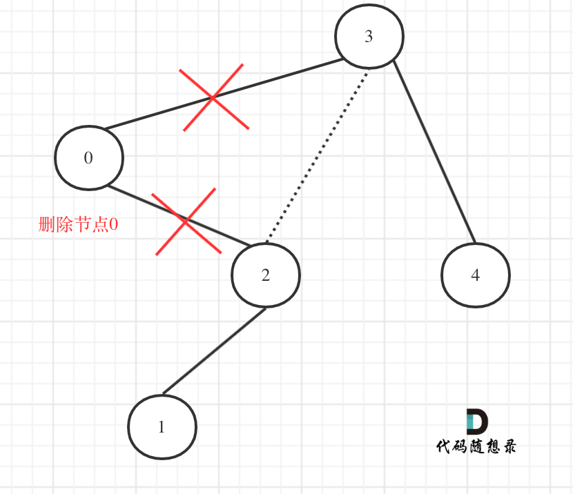

---

最后整体代码如下：
精简之后代码如下：
class Solution {
public:
    TreeNode* trimBST(TreeNode* root, int low, int high) {
        if (root == nullptr ) return nullptr;
        if (root->val < low) {
            TreeNode* right = trimBST(root->right, low, high); // 寻找符
合区间[low, high]的节点
            return right;
        }
        if (root->val > high) {
            TreeNode* left = trimBST(root->left, low, high); // 寻找符合
区间[low, high]的节点
            return left;
        }
        root->left = trimBST(root->left, low, high); // root->left接⼊符
合条件的左孩⼦
        root->right = trimBST(root->right, low, high); // root->right接
⼊符合条件的右孩⼦
        return root;
    }
};
class Solution {
public:
    TreeNode* trimBST(TreeNode* root, int low, int high) {
        if (root == nullptr) return nullptr;
        if (root->val < low) return trimBST(root->right, low, high);
        if (root->val > high) return trimBST(root->left, low, high);
        root->left = trimBST(root->left, low, high);
        root->right = trimBST(root->right, low, high);
        return root;
    }
};

---

只看代码，其实不太好理解节点是符合移除的，这⼀块⼤家可以⾃⼰在模拟模拟！
迭代法
因为⼆叉搜索树的有序性，不需要使⽤栈模拟递归的过程。
在剪枝的时候，可以分为三步：
代码如下：
 
将root移动到[L, R] 范围内，注意是左闭右闭区间
剪枝左⼦树
剪枝右⼦树
class Solution {
public:
    TreeNode* trimBST(TreeNode* root, int L, int R) {
        if (!root) return nullptr;
        // 处理头结点，让root移动到[L, R] 范围内，注意是左闭右闭
        while (root->val < L || root->val > R) {
            if (root->val < L) root = root->right; // ⼩于L往右⾛
            else root = root->left; // ⼤于R往左⾛
        }
        TreeNode *cur = root;
        // 此时root已经在[L, R] 范围内，处理左孩⼦元素⼩于L的情况
        while (cur != nullptr) {
            while (cur->left && cur->left->val < L) {
                cur->left = cur->left->right;
            }
            cur = cur->left;
        }
        cur = root;
        // 此时root已经在[L, R] 范围内，处理右孩⼦⼤于R的情况
        while (cur != nullptr) {
            while (cur->right && cur->right->val > R) {
                cur->right = cur->right->left;

---

总结
修剪⼆叉搜索树其实并不难，但在递归法中⼤家可看出我费了很⼤的功夫来讲解如何删除节
点的，这个思路其实是⽐较绕的。
最终的代码倒是很简洁。
如果不对递归有深刻的理解，这道题⽬还是有难度的！
本题我依然给出递归法和迭代法，初学者掌握递归就可以了，如果想进⼀步学习，就把迭代
法也写⼀写。
 
构造⼀棵⼆叉搜索树
构造⼆叉搜索树，⼀不⼩⼼就平衡了
108.将有序数组转换为⼆叉搜索树
题⽬链接：https://leetcode-cn.com/problems/convert-sorted-array-to-binary-search-tree/
将⼀个按照升序排列的有序数组，转换为⼀棵⾼度平衡⼆叉搜索树。
本题中，⼀个⾼度平衡⼆叉树是指⼀个⼆叉树每个节点 的左右两个⼦树的⾼度差的绝对值不
超过 1。
⽰例:
 
 
 
            }
            cur = cur->right;
        }
        return root;
    }
};

---

思路
做这道题⽬之前⼤家可以了解⼀下这⼏道：
进⼊正题：
题⽬中说要转换为⼀棵⾼度平衡⼆叉搜索树。这和转换为⼀棵普通⼆叉搜索树有什么差别
呢？
其实这⾥不⽤强调平衡⼆叉搜索树，数组构造⼆叉树，构成平衡树是⾃然⽽然的事情，因为
⼤家默认都是从数组中间位置取值作为节点元素，⼀般不会随机取，所以想构成不平衡的⼆
叉树是⾃找⿇烦。
在⼆叉树：构造⼆叉树登场！和⼆叉树：构造⼀棵最⼤的⼆叉树中其实已经讲过了，如果根
据数组构造⼀颗⼆叉树。
本质就是寻找分割点，分割点作为当前节点，然后递归左区间和右区间。
 
106.从中序与后序遍历序列构造⼆叉树
654.最⼤⼆叉树中其实已经讲过了，如果根据数组构造⼀颗⼆叉树。
701.⼆叉搜索树中的插⼊操作
450.删除⼆叉搜索树中的节点

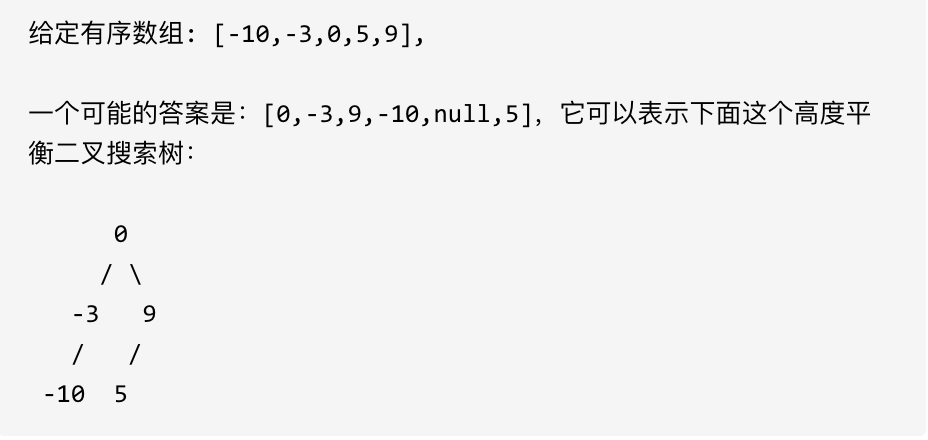

---

本题其实要⽐⼆叉树：构造⼆叉树登场！ 和 ⼆叉树：构造⼀棵最⼤的⼆叉树简单⼀些，因为
有序数组构造⼆叉搜索树，寻找分割点就⽐较容易了。
分割点就是数组中间位置的节点。
那么为问题来了，如果数组长度为偶数，中间节点有两个，取哪⼀个？
取哪⼀个都可以，只不过构成了不同的平衡⼆叉搜索树。
例如：输⼊：[-10,-3,0,5,9]
如下两棵树，都是这个数组的平衡⼆叉搜索树：
如果要分割的数组长度为偶数的时候，中间元素为两个，是取左边元素  就是树1，取右边元
素就是树2。
这也是题⽬中强调答案不是唯⼀的原因。 理解这⼀点，这道题⽬算是理解到位了。
递归
递归三部曲：
删除⼆叉树节点，增加⼆叉树节点，都是⽤递归函数的返回值来完成，这样是⽐较⽅便的。
相信⼤家如果仔细看了⼆叉树：搜索树中的插⼊操作和⼆叉树：搜索树中的删除操作，⼀定
会对递归函数返回值的作⽤深有感触。
那么本题要构造⼆叉树，依然⽤递归函数的返回值来构造中节点的左右孩⼦。
再来看参数，⾸先是传⼊数组，然后就是左下表left和右下表right，我们在⼆叉树：构造⼆叉
树登场！中提过，在构造⼆叉树的时候尽量不要重新定义左右区间数组，⽽是⽤下表来操作
原数组。
所以代码如下：
 
确定递归函数返回值及其参数

---

这⾥注意，我这⾥定义的是左闭右闭区间，在不断分割的过程中，也会坚持左闭右闭的区
间，这又涉及到我们讲过的循环不变量。
在⼆叉树：构造⼆叉树登场！，35.搜索插⼊位置 和59.螺旋矩阵II都详细讲过循环不变量。
这⾥定义的是左闭右闭的区间，所以当区间 left > right的时候，就是空节点了。
代码如下：
⾸先取数组中间元素的位置，不难写出int mid = (left + right) / 2;，这么写其实有⼀
个问题，就是数值越界，例如left和right都是最⼤int，这么操作就越界了，在⼆分法中尤其
需要注意！
所以可以这么写：int mid = left + ((right - left) / 2);
但本题leetcode的测试数据并不会越界，所以怎么写都可以。但需要有这个意识！
取了中间位置，就开始以中间位置的元素构造节点，代码：TreeNode* root = new 
TreeNode(nums[mid]);。
接着划分区间，root的左孩⼦接住下⼀层左区间的构造节点，右孩⼦接住下⼀层右区间构造的
节点。
最后返回root节点，单层递归整体代码如下：
确定递归终⽌条件
确定单层递归的逻辑
// 左闭右闭区间[left, right]
TreeNode* traversal(vector<int>& nums, int left, int right)
if (left > right) return nullptr;

---

这⾥int mid = left + ((right - left) / 2);的写法相当于是如果数组长度为偶数，中
间位置有两个元素，取靠左边的。
注意：在调⽤traversal的时候为什么传⼊的left和right为什么是0和nums.size() - 1，因为定
义的区间为左闭右闭。
迭代法
迭代法可以通过三个队列来模拟，⼀个队列放遍历的节点，⼀个队列放左区间下表，⼀个队
列放右区间下表。
模拟的就是不断分割的过程，C++代码如下：（我已经详细注释）
递归整体代码如下：
 
int mid = left + ((right - left) / 2);
TreeNode* root = new TreeNode(nums[mid]);
root->left = traversal(nums, left, mid - 1);
root->right = traversal(nums, mid + 1, right);
return root;
class Solution {
private:
    TreeNode* traversal(vector<int>& nums, int left, int right) {
        if (left > right) return nullptr;
        int mid = left + ((right - left) / 2);
        TreeNode* root = new TreeNode(nums[mid]);
        root->left = traversal(nums, left, mid - 1);
        root->right = traversal(nums, mid + 1, right);
        return root;
    }
public:
    TreeNode* sortedArrayToBST(vector<int>& nums) {
        TreeNode* root = traversal(nums, 0, nums.size() - 1);
        return root;
    }
};

---

class Solution {
public:
    TreeNode* sortedArrayToBST(vector<int>& nums) {
        if (nums.size() == 0) return nullptr;
        TreeNode* root = new TreeNode(0);   // 初始根节点
        queue<TreeNode*> nodeQue;           // 放遍历的节点
        queue<int> leftQue;                 // 保存左区间下表
        queue<int> rightQue;                // 保存右区间下表
        nodeQue.push(root);                 // 根节点⼊队列
        leftQue.push(0);                    // 0为左区间下表初始位置
        rightQue.push(nums.size() - 1);     // nums.size() - 1为右区间下
表初始位置
        while (!nodeQue.empty()) {
            TreeNode* curNode = nodeQue.front();
            nodeQue.pop();
            int left = leftQue.front(); leftQue.pop();
            int right = rightQue.front(); rightQue.pop();
            int mid = left + ((right - left) / 2);
            curNode->val = nums[mid];       // 将mid对应的元素给中间节点
            if (left <= mid - 1) {          // 处理左区间
                curNode->left = new TreeNode(0);
                nodeQue.push(curNode->left);
                leftQue.push(left);
                rightQue.push(mid - 1);
            }
            if (right >= mid + 1) {         // 处理右区间
                curNode->right = new TreeNode(0);
                nodeQue.push(curNode->right);
                leftQue.push(mid + 1);
                rightQue.push(right);
            }
        }
        return root;
    }

---

总结
在⼆叉树：构造⼆叉树登场！ 和 ⼆叉树：构造⼀棵最⼤的⼆叉树之后，我们顺理成章的应该
构造⼀下⼆叉搜索树了，⼀不⼩⼼还是⼀棵平衡⼆叉搜索树。
其实思路也是⼀样的，不断中间分割，然后递归处理左区间，右区间，也可以说是分治。
此时相信⼤家应该对通过递归函数的返回值来增删⼆叉树很熟悉了，这也是常规操作。
在定义区间的过程中我们又⼀次强调了循环不变量的重要性。
最后依然给出迭代的⽅法，其实就是模拟取中间元素，然后不断分割去构造⼆叉树的过程。
如果感觉PDF对你有帮助，微信搜索：代码随想录，你会发现相见恨晚！
 
代码随想录官⽹：www.programmercarl.com
代码随想录开源项⽬Github：https://github.com/youngyangyang04/leetcode-
master
代码随想录算法公开课 ，代码随想录的全部内容将由我（程序员Carl）视频讲解并
开免费开放给⼤家。
《代码随想录》纸质版 已经出版。
代码随想录知识星球 上万录友在这⾥学习
代码随想录算法训练营 帮助录友⾼效刷完代码随想录。
};

---

把⼆叉搜索树转换为累加树
538.把⼆叉搜索树转换为累加树
题⽬链接：https://leetcode-cn.com/problems/convert-bst-to-greater-tree/
给出⼆叉 搜索 树的根节点，该树的节点值各不相同，请你将其转换为累加树（Greater Sum 
Tree），使每个节点 node 的新值等于原树中⼤于或等于 node.val 的值之和。
提醒⼀下，⼆叉搜索树满⾜下列约束条件：
节点的左⼦树仅包含键 ⼩于 节点键的节点。
节点的右⼦树仅包含键 ⼤于 节点键的节点。
左右⼦树也必须是⼆叉搜索树。
⽰例 1：

---

输⼊：[4,1,6,0,2,5,7,null,null,null,3,null,null,null,8]
输出：[30,36,21,36,35,26,15,null,null,null,33,null,null,null,8]
⽰例 2：
输⼊：root = [0,null,1]
输出：[1,null,1]
⽰例 3：
输⼊：root = [1,0,2]
输出：[3,3,2]
⽰例 4：
输⼊：root = [3,2,4,1]
输出：[7,9,4,10]
提⽰：
树中的节点数介于 0 和 104 之间。
每个节点的值介于 -104 和 104 之间。
树中的所有值 互不相同 。

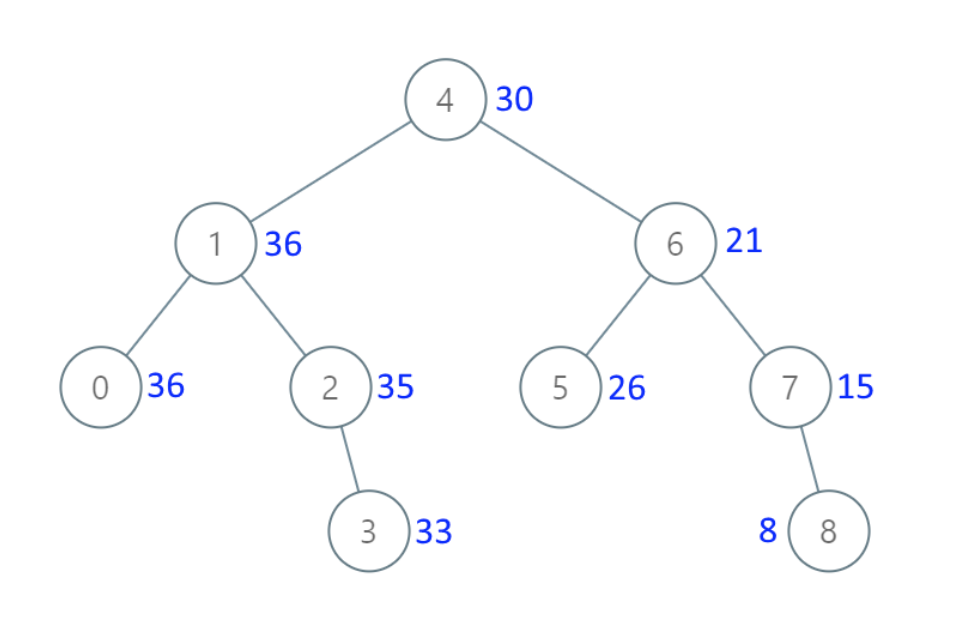

---

思路
⼀看到累加树，相信很多⼩伙伴都会疑惑：如何累加？遇到⼀个节点，然后在遍历其他节点
累加？怎么⼀想这么⿇烦呢。
然后再发现这是⼀颗⼆叉搜索树，⼆叉搜索树啊，这是有序的啊。
那么有序的元素如果求累加呢？
其实这就是⼀棵树，⼤家可能看起来有点别扭，换⼀个⾓度来看，这就是⼀个有序数组[2, 5, 
13]，求从后到前的累加数组，也就是[20, 18, 13]，是不是感觉这就简单了。
为什么变成数组就是感觉简单了呢？
因为数组⼤家都知道怎么遍历啊，从后向前，挨个累加就完事了，这换成了⼆叉搜索树，看
起来就别扭了⼀些是不是。
那么知道如何遍历这个⼆叉树，也就迎刃⽽解了，从树中可以看出累加的顺序是右中左，所
以我们需要反中序遍历这个⼆叉树，然后顺序累加就可以了。
递归
遍历顺序如图所⽰：
给定的树为⼆叉搜索树。

---

本题依然需要⼀个pre指针记录当前遍历节点cur的前⼀个节点，这样才⽅便做累加。
pre指针的使⽤技巧，我们在⼆叉树：搜索树的最⼩绝对差和⼆叉树：我的众数是多少？都提
到了，这是常⽤的操作⼿段。
这⾥很明确了，不需要递归函数的返回值做什么操作了，要遍历整棵树。
同时需要定义⼀个全局变量pre，⽤来保存cur节点的前⼀个节点的数值，定义为int型就可以
了。
代码如下：
遇空就终⽌。
递归函数参数以及返回值
确定终⽌条件
int pre; // 记录前⼀个节点的数值
void traversal(TreeNode* cur)

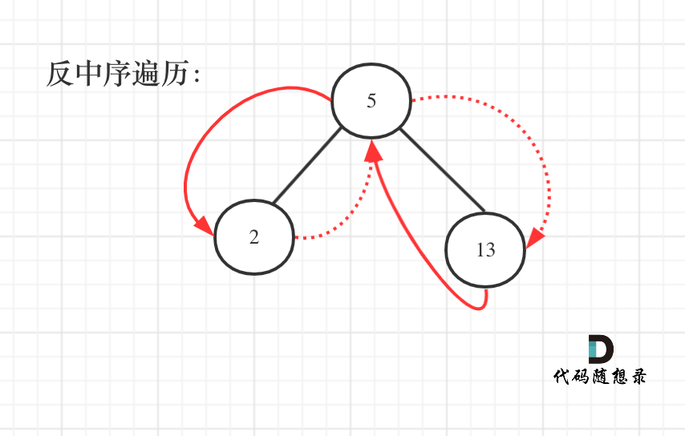

---

注意要右中左来遍历⼆叉树， 中节点的处理逻辑就是让cur的数值加上前⼀个节点的数值。
代码如下：
递归法整体代码如下：
确定单层递归的逻辑
if (cur == NULL) return;
traversal(cur->right);  // 右
cur->val += pre;        // 中
pre = cur->val;
traversal(cur->left);   // 左
class Solution {
private:
    int pre; // 记录前⼀个节点的数值
    void traversal(TreeNode* cur) { // 右中左遍历
        if (cur == NULL) return;
        traversal(cur->right);
        cur->val += pre;
        pre = cur->val;
        traversal(cur->left);
    }
public:
    TreeNode* convertBST(TreeNode* root) {
        pre = 0;
        traversal(root);
        return root;
    }
};

---

迭代法
迭代法其实就是中序模板题了，在⼆叉树：前中后序迭代法和⼆叉树：前中后序统⼀⽅式迭
代法可以选⼀种⾃⼰习惯的写法。
这⾥我给出其中的⼀种，代码如下：
 
class Solution {
private:
    int pre; // 记录前⼀个节点的数值
    void traversal(TreeNode* root) {
        stack<TreeNode*> st;
        TreeNode* cur = root;
        while (cur != NULL || !st.empty()) {
            if (cur != NULL) {
                st.push(cur);
                cur = cur->right;   // 右
            } else {
                cur = st.top();     // 中
                st.pop();
                cur->val += pre;
                pre = cur->val;
                cur = cur->left;    // 左
            }
        }
    }
public:
    TreeNode* convertBST(TreeNode* root) {
        pre = 0;
        traversal(root);
        return root;
    }
};

---

总结
经历了前⾯各种⼆叉树增删改查的洗礼之后，这道题⽬应该⽐较简单了。
好了，⼆叉树已经接近尾声了，接下来就是要对⼆叉树来⼀个⼤总结了。
 
 
⼆叉树：总结篇！（需要掌握的⼆叉树技能都在
这⾥了）
⼒扣⼆叉树⼤总结！
不知不觉⼆叉树已经和我们度过了三⼗三天，「代码随想录」⾥已经发了三⼗三篇⼆叉树的
⽂章，详细讲解了30+⼆叉树经典题⽬，⼀直坚持下来的录友们⼀定会⼆叉树有深刻理解了。
在每⼀道⼆叉树的题⽬中，我都使⽤了递归三部曲来分析题⽬，相信⼤家以后看到⼆叉树，
看到递归，都会想：返回值、参数是什么？终⽌条件是什么？单层逻辑是什么？
⽽且⼏乎每⼀道题⽬我都给出对应的迭代法，可以⽤来进⼀步提⾼⾃⼰。
下⾯Carl把分析过的题⽬分门别类，可以帮助新录友循序渐进学习⼆叉树，也⽅便⽼录友⾯试
前快速复习，看到⼀个标题，就回想⼀下对应的解题思路，这样很快就可以系统性的复习⼀
遍⼆叉树了。
公众号的发⽂顺序，就是循序渐进的，所以如下分类基本就是按照⽂章发⽂顺序来的，我再
做⼀个系统性的分类。
⼆叉树的理论基础
 
 
 
关于⼆叉树，你该了解这些！：⼆叉树的种类、存储⽅式、遍历⽅式、定义⽅式

---

⼆叉树的遍历⽅式
求⼆叉树的属性
 
深度优先遍历
⼆叉树：前中后序递归法：递归三部曲初次亮相
⼆叉树：前中后序迭代法（⼀）：通过栈模拟递归
⼆叉树：前中后序迭代法（⼆）统⼀风格
⼴度优先遍历
⼆叉树的层序遍历：通过队列模拟
 
⼆叉树：是否对称
递归：后序，⽐较的是根节点的左⼦树与右⼦树是不是相互翻转
迭代：使⽤队列/栈将两个节点顺序放⼊容器中进⾏⽐较
⼆叉树：求最⼤深度
递归：后序，求根节点最⼤⾼度就是最⼤深度，通过递归函数的返回值做
计算树的⾼度
迭代：层序遍历
⼆叉树：求最⼩深度
递归：后序，求根节点最⼩⾼度就是最⼩深度，注意最⼩深度的定义
迭代：层序遍历
⼆叉树：求有多少个节点
递归：后序，通过递归函数的返回值计算节点数量
迭代：层序遍历
⼆叉树：是否平衡
递归：后序，注意后序求⾼度和前序求深度，递归过程判断⾼度差
迭代：效率很低，不推荐
⼆叉树：找所有路径
递归：前序，⽅便让⽗节点指向⼦节点，涉及回溯处理根节点到叶⼦的所
有路径
迭代：⼀个栈模拟递归，⼀个栈来存放对应的遍历路径
⼆叉树：递归中如何隐藏着回溯
详解⼆叉树：找所有路径中递归如何隐藏着回溯
⼆叉树：求左叶⼦之和
递归：后序，必须三层约束条件，才能判断是否是左叶⼦。

---

⼆叉树的修改与构造
求⼆叉搜索树的属性
迭代：直接模拟后序遍历
⼆叉树：求左下⾓的值
递归：顺序⽆所谓，优先左孩⼦搜索，同时找深度最⼤的叶⼦节点。
迭代：层序遍历找最后⼀⾏最左边
⼆叉树：求路径总和
递归：顺序⽆所谓，递归函数返回值为bool类型是为了搜索⼀条边，没有
返回值是搜索整棵树。
迭代：栈⾥元素不仅要记录节点指针，还要记录从头结点到该节点的路径
数值总和
 
翻转⼆叉树
递归：前序，交换左右孩⼦
迭代：直接模拟前序遍历
构造⼆叉树
递归：前序，重点在于找分割点，分左右区间构造
迭代：⽐较复杂，意义不⼤
构造最⼤的⼆叉树
递归：前序，分割点为数组最⼤值，分左右区间构造
迭代：⽐较复杂，意义不⼤
合并两个⼆叉树
递归：前序，同时操作两个树的节点，注意合并的规则
迭代：使⽤队列，类似层序遍历
 
⼆叉搜索树中的搜索
递归：⼆叉搜索树的递归是有⽅向的
迭代：因为有⽅向，所以迭代法很简单
是不是⼆叉搜索树
递归：中序，相当于变成了判断⼀个序列是不是递增的
迭代：模拟中序，逻辑相同
求⼆叉搜索树的最⼩绝对差
递归：中序，双指针操作

---

⼆叉树公共祖先问题
⼆叉搜索树的修改与构造
迭代：模拟中序，逻辑相同
求⼆叉搜索树的众数
递归：中序，清空结果集的技巧，遍历⼀遍便可求众数集合
迭代：模拟中序，逻辑相同
⼆叉搜索树转成累加树
递归：中序，双指针操作累加
迭代：模拟中序，逻辑相同
 
⼆叉树的公共祖先问题
递归：后序，回溯，找到左⼦树出现⽬标值，右⼦树节点⽬标值的节点。
迭代：不适合模拟回溯
⼆叉搜索树的公共祖先问题
递归：顺序⽆所谓，如果节点的数值在⽬标区间就是最近公共祖先
迭代：按序遍历
 
⼆叉搜索树中的插⼊操作
递归：顺序⽆所谓，通过递归函数返回值添加节点
迭代：按序遍历，需要记录插⼊⽗节点，这样才能做插⼊操作
⼆叉搜索树中的删除操作
递归：前序，想清楚删除⾮叶⼦节点的情况
迭代：有序遍历，较复杂
修剪⼆叉搜索树
递归：前序，通过递归函数返回值删除节点
迭代：有序遍历，较复杂
构造⼆叉搜索树
递归：前序，数组中间节点分割
迭代：较复杂，通过三个队列来模拟

---

阶段总结
⼤家以上题⽬都做过了，也⼀定要看如下阶段⼩结。
每周⼩结都会对⼤家的疑问做统⼀解答，并且对每周的内容进⾏拓展和补充，所以⼀定要
看，将细碎知识点⼀⽹打尽！
最后总结
在⼆叉树题⽬选择什么遍历顺序是不少同学头疼的事情，我们做了这么多⼆叉树的题⽬了，
Carl给⼤家⼤体分分类。
注意在普通⼆叉树的属性中，我⽤的是⼀般为后序，例如单纯求深度就⽤前序， ⼆叉树：找
所有路径也⽤了前序，这是为了⽅便让⽗节点指向⼦节点。
所以求普通⼆叉树的属性还是要具体问题具体分析。
⼆叉树系列就这么完美结束了，估计这应该是最长的系列了，感谢⼤家33天的坚持与陪伴，
接下来我们又要开始新的系列了「回溯算法」！
 
 
本周⼩结！（⼆叉树系列⼀）
本周⼩结！（⼆叉树系列⼆）
本周⼩结！（⼆叉树系列三）
本周⼩结！（⼆叉树系列四）
 
涉及到⼆叉树的构造，⽆论普通⼆叉树还是⼆叉搜索树⼀定前序，都是先构造中节
点。
求普通⼆叉树的属性，⼀般是后序，⼀般要通过递归函数的返回值做计算。
求⼆叉搜索树的属性，⼀定是中序了，要不⽩瞎了有序性了。