# 「代码随想录」动态规划专题精讲（v2.0）

「代码随想录」动态规划专题精讲
 
作者：程序员Carl
关于代码随想录
 
代码随想录官⽹：www.programmercarl.com
代码随想录开源项⽬Github：https://github.com/youngyangyang04/leetcode-
master
代码随想录算法公开课 ，代码随想录的全部内容将由我（程序员Carl）视频讲解
并开免费开放给⼤家。
《代码随想录》纸质版 已经出版。
代码随想录知识星球 上万录友在这⾥学习
代码随想录算法训练营 帮助录友⾼效刷完代码随想录。
PDF背景
 
该pdf是公众号「代码随想录」动态规划专题的⽂章整理⽽来。
⽬前已经发布了，⼆叉树PDF、回溯算法PDF、贪⼼算法PDF、动态规划PDF，程序员求职
攻略PDF 都⼴受获评，⼤家可以关注微信公众号：代码随想录，后台回复：666，就可以获
取全部专题PDF了。
但⼤家都知道算法⾥的桂冠是动态规划，⽆论是学习还是⾯试，动态规划都是最重要的。所
以这本动态规划PDF备受期待，那么Carl也不会让⼤家们失望！
这次发布的动态规划PDF共8万字，50多张分析图，50篇精品⽂章，共200页！，详细讲解
了40多道⼒扣（Leetcode）动态规划经典题⽬
依旧保持「代码随想录」严谨缜密的风格，这是全⽹对动规最深刻的讲解系列了。
其实⼤家去⽹上搜⼀搜也可以发现，能把动态规划讲清楚的资料挺少的，因为动规确实很
难！要给别⼈讲清楚更难！

---

《剑指offer》上 动规的题⽬很少，属于蜻蜓点⽔，很多细节都没有讲透彻，经典的算法书
籍《算法4》 没有讲 动规，⽽《算法导论》讲的动规基本属于劝退级别的。
讲清楚⼀道题容易，讲清楚两道题也容易，但把整个动态规划的各个分⽀讲清楚，每道题⽬
讲通透，并⽤⼀套⽅法论把整个动规贯彻始终就⾮常难了。
所以Carl花费的这么⼤精⼒，把⾃⼰对动规算法理解 ⼀五⼀⼗的全部分享出来，帮助⼤家
少⾛弯路！
相信只要⼤家认真学完这本PDF，不会让你失望的！！ 
本PDF统⼀使⽤C++进⾏讲解，对于使⽤其他语⾔的同学，也不会影响⼤家对算法思维的理
解。
代码随想录刷题⽹站已经上线了：www.programmercarl.com，同时⽀持C++、Java，
Python，Go，JavaScript版本，去看看吧，⼀个只要你发现 就会收藏的硬核算法学习⽹
站！
Github同步：https://github.com/youngyangyang04/leetcode-master
同时我也在B站上讲解算法，点击这⾥直达B站。
PDF难免会有笔误，或者⼩问题，所以内容会不断进⾏修正，其更新顺序为：Github > 公众
号 > ⽹站 > PDF。最新版本的PDF会⾸先在公众号⾥发布，不要错过咯。
那么如何使⽤这本PDF？ 
就是按顺序刷就可以了！
题⽬顺序都编排好了，按照pdf⾥排好的题⽬顺序来刷效果最好，这份刷题顺序已经陪伴上
万录友（代码随想录的朋友们）。
本PDF题⽬⼤纲如下：

---

做动规题⽬的时候，很多同学会陷⼊⼀个误区，就是以为把状态转移公式背下来，照葫芦画
瓢改改，就开始写代码，甚⾄把题⽬AC之后，都不太清楚dp[i]表⽰的是什么。
这就是⼀种朦胧的状态，然后就把题给过了，遇到稍稍难⼀点的，可能直接就不会了，然后
看题解，然后继续照葫芦画瓢陷⼊这种恶性循环中。
状态转移公式（递推公式）是很重要，但动规不仅仅只有递推公式。
对于动态规划问题，我将拆解为如下五步曲，这五步都搞清楚了，才能说把动态规划真的掌
握了！
1. 确定dp数组（dp table）以及下标的含义
2. 确定递推公式
3. dp数组如何初始化
4. 确定遍历顺序
5. 举例推导dp数组
动规专题刚开始的时候，讲的题⽬⽐较简单，不少录友和我反应：这么简单的题⽬ 讲的复
杂了，不⽤那么多步骤分析，想出递推公式直接就AC这道题⽬了。
Carl的观点⼀直都是 简单题是⽤来 巩固⽅法论的。 简单题⽬是可以靠感觉，但后⾯稍稍难
⼀点的题⽬，估计感觉就不好使了。
在动规专题讲解中，也充分体现出，这动规五部曲的重要性。
还有不少录友对动规的理解是：递推公式是才是最难最重要的，只要想出递归公式，其他都
好办。
其实这么想的同学基本对动规理解的不到位的。
动规五部曲⾥，哪⼀部没想清楚，这道题⽬基本就做不出来，即使做出来了也没有想清楚，
⽽是朦朦胧胧的就把题⽬过了。
如果想不清楚dp数组的具体含义，递归公式从何谈起，甚⾄初始化的时候就写错
了。
例如动态规划：不同路径还不够，要有障碍！ 在这道题⽬中，初始化才是重头戏
如果看过背包系列，特别是0-1背包，完全背包，那么两层for循环先后顺序绝对可
以搞懵很多⼈，反⽽递归公式是简单的。
⾄于推导dp数组的重要性，动规专题⾥⼏乎每篇Carl都反复强调，当程序结果不对

---

的时候，⼀定要⾃⼰推导公式，看看和程序打印的⽇志是否⼀样。
动态规划理论基础
 
什么是动态规划
 
动态规划，英⽂：Dynamic Programming，简称DP，如果某⼀问题有很多重叠⼦问题，使
⽤动态规划是最有效的。
所以动态规划中每⼀个状态⼀定是由上⼀个状态推导出来的，这⼀点就区分于贪⼼，贪⼼没
有状态推导，⽽是从局部直接选最优的，
在关于贪⼼算法，你该了解这些！中我举了⼀个背包问题的例⼦。
例如：有N件物品和⼀个最多能背重量为W 的背包。第i件物品的重量是weight[i]，得到的
价值是value[i] 。每件物品只能⽤⼀次，求解将哪些物品装⼊背包⾥物品价值总和最⼤。
动态规划中dp[j]是由dp[j-weight[i]]推导出来的，然后取max(dp[j], dp[j - weight[i]] + 
value[i])。
但如果是贪⼼呢，每次拿物品选⼀个最⼤的或者最⼩的就完事了，和上⼀个状态没有关系。

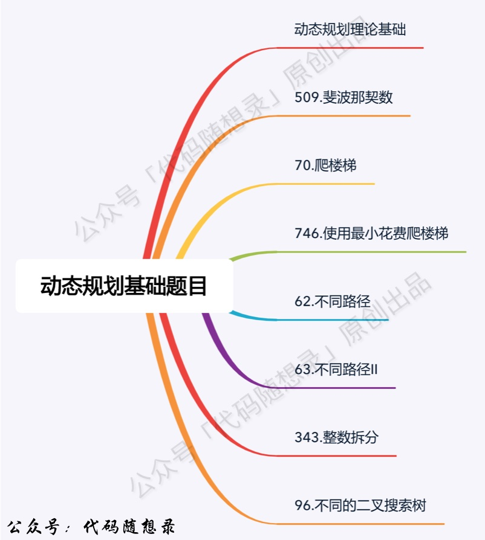

---

所以贪⼼解决不了动态规划的问题。
其实⼤家也不⽤死扣动规和贪⼼的理论区别，后⾯做做题⽬⾃然就知道了。
⽽且很多讲解动态规划的⽂章都会讲最优⼦结构啊和重叠⼦问题啊这些，这些东西都是教科
书的上定义，晦涩难懂⽽且不实⽤。
⼤家知道动规是由前⼀个状态推导出来的，⽽贪⼼是局部直接选最优的，对于刷题来说就够
⽤了。
上述提到的背包问题，后序会详细讲解。
动态规划的解题步骤
 
做动规题⽬的时候，很多同学会陷⼊⼀个误区，就是以为把状态转移公式背下来，照葫芦画
瓢改改，就开始写代码，甚⾄把题⽬AC之后，都不太清楚dp[i]表⽰的是什么。
这就是⼀种朦胧的状态，然后就把题给过了，遇到稍稍难⼀点的，可能直接就不会了，然后
看题解，然后继续照葫芦画瓢陷⼊这种恶性循环中。
状态转移公式（递推公式）是很重要，但动规不仅仅只有递推公式。
对于动态规划问题，我将拆解为如下五步曲，这五步都搞清楚了，才能说把动态规划真的掌
握了！
1. 确定dp数组（dp table）以及下标的含义
2. 确定递推公式
3. dp数组如何初始化
4. 确定遍历顺序
5. 举例推导dp数组
⼀些同学可能想为什么要先确定递推公式，然后在考虑初始化呢？
因为⼀些情况是递推公式决定了dp数组要如何初始化！
后⾯的讲解中我都是围绕着这五点来进⾏讲解。

---

可能刷过动态规划题⽬的同学可能都知道递推公式的重要性，感觉确定了递推公式这道题⽬
就解出来了。
其实 确定递推公式 仅仅是解题⾥的⼀步⽽已！
⼀些同学知道递推公式，但搞不清楚dp数组应该如何初始化，或者正确的遍历顺序，以⾄
于记下来公式，但写的程序怎么改都通过不了。
后序的讲解的⼤家就会慢慢感受到这五步的重要性了。
动态规划应该如何debug
 
相信动规的题⽬，很⼤部分同学都是这样做的。
看⼀下题解，感觉看懂了，然后照葫芦画瓢，如果能正好画对了，万事⼤吉，⼀旦要是没通
过，就怎么改都通过不了，对 dp数组的初始化，递推公式，遍历顺序，处于⼀种⿊盒的理
解状态。
写动规题⽬，代码出问题很正常！
找问题的最好⽅式就是把dp数组打印出来，看看究竟是不是按照⾃⼰思路推导的！
⼀些同学对于dp的学习是⿊盒的状态，就是不清楚dp数组的含义，不懂为什么这么初始
化，递推公式背下来了，遍历顺序靠习惯就是这么写的，然后⼀⿎作⽓写出代码，如果代码
能通过万事⼤吉，通过不了的话就凭感觉改⼀改。
这是⼀个很不好的习惯！
做动规的题⽬，写代码之前⼀定要把状态转移在dp数组的上具体情况模拟⼀遍，⼼中有
数，确定最后推出的是想要的结果。
然后再写代码，如果代码没通过就打印dp数组，看看是不是和⾃⼰预先推导的哪⾥不⼀
样。
如果打印出来和⾃⼰预先模拟推导是⼀样的，那么就是⾃⼰的递归公式、初始化或者遍历顺
序有问题了。
如果和⾃⼰预先模拟推导的不⼀样，那么就是代码实现细节有问题。

---

这样才是⼀个完整的思考过程，⽽不是⼀旦代码出问题，就毫⽆头绪的东改改西改改，最后
过不了，或者说是稀⾥糊涂的过了。
这也是我为什么在动规五步曲⾥强调推导dp数组的重要性。
举个例⼦哈：在「代码随想录」刷题⼩分队微信群⾥，⼀些录友可能代码通过不了，会把代
码抛到讨论群⾥问：我这⾥代码都已经和题解⼀模⼀样了，为什么通过不了呢？
发出这样的问题之前，其实可以⾃⼰先思考这三个问题：
这道题⽬我举例推导状态转移公式了么？
我打印dp数组的⽇志了么？
打印出来了dp数组和我想的⼀样么？
如果这灵魂三问⾃⼰都做到了，基本上这道题⽬也就解决了，或者更清晰的知道⾃⼰究竟是
哪⼀点不明⽩，是状态转移不明⽩，还是实现代码不知道该怎么写，还是不理解遍历dp数
组的顺序。
然后在问问题，⽬的性就很强了，群⾥的⼩伙伴也可以快速知道提问者的疑惑了。
注意这⾥不是说不让⼤家问问题哈， ⽽是说问问题之前要有⾃⼰的思考，问题要问到点⼦
上！
⼤家⼯作之后就会发现，特别是⼤⼚，问问题是⼀个专业活，是的，问问题也要体现出专
业！
如果问同事很不专业的问题，同事们会懒的回答，领导也会认为你缺乏思考能⼒，这对职场
发展是很不利的。
所以⼤家在刷题的时候，就锻炼⾃⼰养成专业提问的好习惯。
总结
 
这⼀篇是动态规划的整体概述，讲解了什么是动态规划，动态规划的解题步骤，以及如何
debug。
动态规划是⼀个很⼤的领域，今天这⼀篇讲解的内容是整个动态规划系列中都会使⽤到的⼀
些理论基础。

---

在后序讲解中针对某⼀具体问题，还会讲解其对应的理论基础，例如背包问题中的01背
包，leetcode上的题⽬都是01背包的应⽤，⽽没有纯01背包的问题，那么就需要在把对应的
理论知识讲解⼀下。
⼤家会发现，我讲解的理论基础并不是教科书上各种动态规划的定义，错综复杂的公式。
这⾥理论基础篇已经是⾮常偏实⽤的了，每个知识点都是在解题实战中⾮常有⽤的内容，⼤
家要重视起来哈。
今天我们开始新的征程了，你准备好了么？
 
斐波那契数
 
509. 斐波那契数
 
⼒扣题⽬链接
斐波那契数，通常⽤ F(n) 表⽰，形成的序列称为 斐波那契数列 。该数列由 0 和 1 开始，后
⾯的每⼀项数字都是前⾯两项数字的和。也就是：
F(0) = 0，F(1) = 1
F(n) = F(n - 1) + F(n - 2)，其中 n > 1
给你n ，请计算 F(n) 。
⽰例 1：
输⼊：2
输出：1
解释：F(2) = F(1) + F(0) = 1 + 0 = 1
⽰例 2：
输⼊：3
输出：2

---

解释：F(3) = F(2) + F(1) = 1 + 1 = 2
⽰例 3：
输⼊：4
输出：3
解释：F(4) = F(3) + F(2) = 2 + 1 = 3
提⽰：
0 <= n <= 30
思路
 
斐波那契数列⼤家应该⾮常熟悉不过了，⾮常适合作为动规第⼀道题⽬来练练⼿。
因为这道题⽬⽐较简单，可能⼀些同学并不需要做什么分析，直接顺⼿⼀写就过了。
但「代码随想录」的风格是：简单题⽬是⽤来加深对解题⽅法论的理解的。
通过这道题⽬让⼤家可以初步认识到，按照动规五部曲是如何解题的。
对于动规，如果没有⽅法论的话，可能简单题⽬可以顺⼿⼀写就过，难⼀点就不知道如何下
⼿了。
所以我总结的动规五部曲，是要⽤来贯穿整个动态规划系列的，就像之前讲过⼆叉树系列的
递归三部曲，回溯法系列的回溯三部曲⼀样。后⾯慢慢⼤家就会体会到，动规五部曲⽅法的
重要性。
动态规划
 
动规五部曲：
这⾥我们要⽤⼀个⼀维dp数组来保存递归的结果
1. 确定dp数组以及下标的含义
dp[i]的定义为：第i个数的斐波那契数值是dp[i]

---

2. 确定递推公式
为什么这是⼀道⾮常简单的⼊门题⽬呢？
因为题⽬已经把递推公式直接给我们了：状态转移⽅程 dp[i] = dp[i - 1] + dp[i - 2];
3. dp数组如何初始化
题⽬中把如何初始化也直接给我们了，如下：
4. 确定遍历顺序
从递归公式dp[i] = dp[i - 1] + dp[i - 2];中可以看出，dp[i]是依赖 dp[i - 1] 和 dp[i - 2]，那么遍
历的顺序⼀定是从前到后遍历的
5. 举例推导dp数组
按照这个递推公式dp[i] = dp[i - 1] + dp[i - 2]，我们来推导⼀下，当N为10的时候，dp数组应
该是如下的数列：
0 1 1 2 3 5 8 13 21 34 55
如果代码写出来，发现结果不对，就把dp数组打印出来看看和我们推导的数列是不是⼀致
的。
以上我们⽤动规的⽅法分析完了，C++代码如下：
dp[0] = 0;
dp[1] = 1;

---

时间复杂度：$O(n)$
空间复杂度：$O(n)$
当然可以发现，我们只需要维护两个数值就可以了，不需要记录整个序列。
代码如下：
class Solution {
public:
    int fib(int N) {
        if (N <= 1) return N;
        vector<int> dp(N + 1);
        dp[0] = 0;
        dp[1] = 1;
        for (int i = 2; i <= N; i++) {
            dp[i] = dp[i - 1] + dp[i - 2];
        }
        return dp[N];
    }
};
class Solution {
public:
    int fib(int N) {
        if (N <= 1) return N;
        int dp[2];
        dp[0] = 0;
        dp[1] = 1;
        for (int i = 2; i <= N; i++) {
            int sum = dp[0] + dp[1];
            dp[0] = dp[1];
            dp[1] = sum;
        }
        return dp[1];
    }
};

---

时间复杂度：$O(n)$
空间复杂度：$O(1)$
递归解法
 
本题还可以使⽤递归解法来做
代码如下：
时间复杂度：$O(2^n)$
空间复杂度：$O(n)$，算上了编程语⾔中实现递归的系统栈所占空间
这个递归的时间复杂度⼤家画⼀下树形图就知道了，如果不清晰的同学，可以看这篇：通过
⼀道⾯试题⽬，讲⼀讲递归算法的时间复杂度！
总结
 
斐波那契数列这道题⽬是⾮常基础的题⽬，我在后⾯的动态规划的讲解中将会多次提到斐波
那契数列！
这⾥我严格按照关于动态规划，你该了解这些！中的动规五部曲来分析了这道题⽬，⼀些分
析步骤可能同学感觉没有必要搞的这么复杂，代码其实上来就可以撸出来。
但我还是强调⼀下，简单题是⽤来掌握⽅法论的，动规五部曲将在接下来的动态规划讲解中
发挥重要作⽤，敬请期待！
代码随想录官⽹：www.programmercarl.com
代码随想录开源项⽬Github：https://github.com/youngyangyang04/leetcode-
class Solution {
public:
    int fib(int N) {
        if (N < 2) return N;
        return fib(N - 1) + fib(N - 2);
    }
};

---

master
代码随想录算法公开课 ，代码随想录的全部内容将由我（程序员Carl）视频讲解
并开免费开放给⼤家。
《代码随想录》纸质版 已经出版。
代码随想录知识星球 上万录友在这⾥学习
代码随想录算法训练营 帮助录友⾼效刷完代码随想录。
爬楼梯
 
⼒扣题⽬链接
假设你正在爬楼梯。需要 n 阶你才能到达楼顶。
每次你可以爬 1 或 2 个台阶。你有多少种不同的⽅法可以爬到楼顶呢？
注意：给定 n 是⼀个正整数。
⽰例 1：
输⼊： 2
输出： 2
解释： 有两种⽅法可以爬到楼顶。
1 阶 + 1 阶
2 阶
⽰例 2：
输⼊： 3
输出： 3
解释： 有三种⽅法可以爬到楼顶。
1 阶 + 1 阶 + 1 阶
1 阶 + 2 阶
2 阶 + 1 阶

---

思路
 
本题⼤家如果没有接触过的话，会感觉⽐较难，多举⼏个例⼦，就可以发现其规律。
爬到第⼀层楼梯有⼀种⽅法，爬到⼆层楼梯有两种⽅法。
那么第⼀层楼梯再跨两步就到第三层 ，第⼆层楼梯再跨⼀步就到第三层。
所以到第三层楼梯的状态可以由第⼆层楼梯 和 到第⼀层楼梯状态推导出来，那么就可以想
到动态规划了。
我们来分析⼀下，动规五部曲：
定义⼀个⼀维数组来记录不同楼层的状态
1. 确定dp数组以及下标的含义
dp[i]： 爬到第i层楼梯，有dp[i]种⽅法
2. 确定递推公式
如果可以推出dp[i]呢？
从dp[i]的定义可以看出，dp[i] 可以有两个⽅向推出来。
⾸先是dp[i - 1]，上i-1层楼梯，有dp[i - 1]种⽅法，那么再⼀步跳⼀个台阶不就是dp[i]了
么。
还有就是dp[i - 2]，上i-2层楼梯，有dp[i - 2]种⽅法，那么再⼀步跳两个台阶不就是dp[i]了
么。
那么dp[i]就是 dp[i - 1]与dp[i - 2]之和！
所以dp[i] = dp[i - 1] + dp[i - 2] 。
在推导dp[i]的时候，⼀定要时刻想着dp[i]的定义，否则容易跑偏。
这体现出确定dp数组以及下标的含义的重要性！

---

3. dp数组如何初始化
在回顾⼀下dp[i]的定义：爬到第i层楼梯，有dp[i]中⽅法。
那么i为0，dp[i]应该是多少呢，这个可以有很多解释，但都基本是直接奔着答案去解释的。
例如强⾏安慰⾃⼰爬到第0层，也有⼀种⽅法，什么都不做也就是⼀种⽅法即：dp[0] = 1，
相当于直接站在楼顶。
但总有点牵强的成分。
那还这么理解呢：我就认为跑到第0层，⽅法就是0啊，⼀步只能⾛⼀个台阶或者两个台
阶，然⽽楼层是0，直接站楼顶上了，就是不⽤⽅法，dp[0]就应该是0.
其实这么争论下去没有意义，⼤部分解释说dp[0]应该为1的理由其实是因为dp[0]=1的话在
递推的过程中i从2开始遍历本题就能过，然后就往结果上靠去解释dp[0] = 1。
从dp数组定义的⾓度上来说，dp[0] = 0 也能说得通。
需要注意的是：题⽬中说了n是⼀个正整数，题⽬根本就没说n有为0的情况。
所以本题其实就不应该讨论dp[0]的初始化！
我相信dp[1] = 1，dp[2] = 2，这个初始化⼤家应该都没有争议的。
所以我的原则是：不考虑dp[0]如果初始化，只初始化dp[1] = 1，dp[2] = 2，然后从i = 3开始
递推，这样才符合dp[i]的定义。
4. 确定遍历顺序
从递推公式dp[i] = dp[i - 1] + dp[i - 2];中可以看出，遍历顺序⼀定是从前向后遍历的
5. 举例推导dp数组
举例当n为5的时候，dp table（dp数组）应该是这样的

---

如果代码出问题了，就把dp table 打印出来，看看究竟是不是和⾃⼰推导的⼀样。
此时⼤家应该发现了，这不就是斐波那契数列么！
唯⼀的区别是，没有讨论dp[0]应该是什么，因为dp[0]在本题没有意义！
以上五部分析完之后，C++代码如下：
// 版本⼀
class Solution {
public:
    int climbStairs(int n) {
        if (n <= 1) return n; // 因为下⾯直接对dp[2]操作了，防⽌空指针
        vector<int> dp(n + 1);
        dp[1] = 1;
        dp[2] = 2;
        for (int i = 3; i <= n; i++) { // 注意i是从3开始的
            dp[i] = dp[i - 1] + dp[i - 2];
        }
        return dp[n];
    }
};

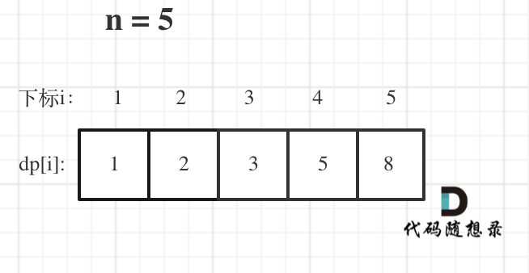

---

时间复杂度：$O(n)$
空间复杂度：$O(n)$
当然依然也可以，优化⼀下空间复杂度，代码如下：
时间复杂度：$O(n)$
空间复杂度：$O(1)$
后⾯将讲解的很多动规的题⽬其实都是当前状态依赖前两个，或者前三个状态，都可以做空
间上的优化，但我个⼈认为⾯试中能写出版本⼀就够了哈，清晰明了，如果⾯试官要求进⼀
步优化空间的话，我们再去优化。
因为版本⼀才能体现出动规的思想精髓，递推的状态变化。
拓展
 
这道题⽬还可以继续深化，就是⼀步⼀个台阶，两个台阶，三个台阶，直到 m个台阶，有
多少种⽅法爬到n阶楼顶。
// 版本⼆
class Solution {
public:
    int climbStairs(int n) {
        if (n <= 1) return n;
        int dp[3];
        dp[1] = 1;
        dp[2] = 2;
        for (int i = 3; i <= n; i++) {
            int sum = dp[1] + dp[2];
            dp[1] = dp[2];
            dp[2] = sum;
        }
        return dp[2];
    }
};

---

这又有难度了，这其实是⼀个完全背包问题，但⼒扣上没有这种题⽬，所以后续我在讲解背
包问题的时候，今天这道题还会拿从背包问题的⾓度上来再讲⼀遍。
这⾥我先给出我的实现代码：
代码中m表⽰最多可以爬m个台阶。
以上代码不能运⾏哈，我主要是为了体现只要把m换成2，粘过去，就可以AC爬楼梯这道
题，不信你就粘⼀下试试，哈哈。
此时我就发现⼀个绝佳的⼤⼚⾯试题，第⼀道题就是单纯的爬楼梯，然后看候选⼈的代码实
现，如果把dp[0]的定义成1了，就可以发难了，为什么dp[0]⼀定要初始化为1，此时可能候
选⼈就要强⾏给dp[0]应该是1找各种理由。那这就是⼀个考察点了，对dp[i]的定义理解的不
深⼊。
然后可以继续发难，如果⼀步⼀个台阶，两个台阶，三个台阶，直到 m个台阶，有多少种
⽅法爬到n阶楼顶。这道题⽬leetcode上并没有原题，绝对是考察候选⼈算法能⼒的绝佳好
题。
这⼀连套问下来，候选⼈算法能⼒如何，⾯试官⼼⾥就有数了。
其实⼤⼚⾯试最喜欢问题的就是这种简单题，然后慢慢变化，在⼩细节上考察候选⼈。
class Solution {
public:
    int climbStairs(int n) {
        vector<int> dp(n + 1, 0);
        dp[0] = 1;
        for (int i = 1; i <= n; i++) {
            for (int j = 1; j <= m; j++) { // 把m换成2，就可以AC爬楼梯这
道题
                if (i - j >= 0) dp[i] += dp[i - j];
            }
        }
        return dp[n];
    }
};

---

总结
 
这道题⽬和动态规划：斐波那契数题⽬基本是⼀样的，但是会发现本题相⽐动态规划：斐波
那契数难多了，为什么呢？
关键是 动态规划：斐波那契数 题⽬描述就已经把动规五部曲⾥的递归公式和如何初始化都
给出来了，剩下⼏部曲也⾃然⽽然的推出来了。
⽽本题，就需要逐个分析了，⼤家现在应该初步感受出关于动态规划，你该了解这些！⾥给
出的动规五部曲了。
简单题是⽤来掌握⽅法论的，例如昨天斐波那契的题⽬够简单了吧，但昨天和今天可以使⽤
⼀套⽅法分析出来的，这就是⽅法论！
所以不要轻视简单题，那种凭感觉就刷过去了，其实和没掌握区别不⼤，只有掌握⽅法论并
说清⼀⼆三，才能触类旁通，举⼀反三哈！
使⽤最⼩花费爬楼梯
 
746. 使⽤最⼩花费爬楼梯
 
题⽬链接：https://leetcode-cn.com/problems/min-cost-climbing-stairs/
数组的每个下标作为⼀个阶梯，第 i 个阶梯对应着⼀个⾮负数的体⼒花费值 cost[i]（下标从 
0 开始）。
每当你爬上⼀个阶梯你都要花费对应的体⼒值，⼀旦⽀付了相应的体⼒值，你就可以选择向
上爬⼀个阶梯或者爬两个阶梯。
请你找出达到楼层顶部的最低花费。在开始时，你可以选择从下标为 0 或 1 的元素作为初
始阶梯。

---

⽰例 1：
输⼊：cost = [10, 15, 20]
输出：15
解释：最低花费是从 cost[1] 开始，然后⾛两步即可到阶梯顶，⼀共花费 15 。
 ⽰例 2：
输⼊：cost = [1, 100, 1, 1, 1, 100, 1, 1, 100, 1]
输出：6
解释：最低花费⽅式是从 cost[0] 开始，逐个经过那些 1 ，跳过 cost[3] ，⼀共花费 6 。
提⽰：
cost 的长度范围是 [2, 1000]。
cost[i] 将会是⼀个整型数据，范围为 [0, 999] 。
思路
 
这道题⽬可以说是昨天动态规划：爬楼梯的花费版本。
注意题⽬描述：每当你爬上⼀个阶梯你都要花费对应的体⼒值，⼀旦⽀付了相应的体⼒值，
你就可以选择向上爬⼀个阶梯或者爬两个阶梯
所以⽰例1中只花费⼀个15 就可以到阶梯顶，最后⼀步可以理解为 不⽤花费。
读完题⼤家应该知道指定需要动态规划的，贪⼼是不可能了。
1. 确定dp数组以及下标的含义
使⽤动态规划，就要有⼀个数组来记录状态，本题只需要⼀个⼀维数组dp[i]就可以了。
dp[i]的定义：到达第i个台阶所花费的最少体⼒为dp[i]。（注意这⾥认为是第⼀步⼀定是要
花费）
对于dp数组的定义，⼤家⼀定要清晰！
2. 确定递推公式

---

可以有两个途径得到dp[i]，⼀个是dp[i-1] ⼀个是dp[i-2]。
那么究竟是选dp[i-1]还是dp[i-2]呢？
⼀定是选最⼩的，所以dp[i] = min(dp[i - 1], dp[i - 2]) + cost[i];
注意这⾥为什么是加cost[i]，⽽不是cost[i-1],cost[i-2]之类的，因为题⽬中说了：每当你爬
上⼀个阶梯你都要花费对应的体⼒值
3. dp数组如何初始化
根据dp数组的定义，dp数组初始化其实是⽐较难的，因为不可能初始化为第i台阶所花费的
最少体⼒。
那么看⼀下递归公式，dp[i]由dp[i-1]，dp[i-2]推出，既然初始化所有的dp[i]是不可能的，
那么只初始化dp[0]和dp[1]就够了，其他的最终都是dp[0]dp[1]推出。
所以初始化代码为：
4. 确定遍历顺序
最后⼀步，递归公式有了，初始化有了，如何遍历呢？
本题的遍历顺序其实⽐较简单，简单到很多同学都忽略了思考这⼀步直接就把代码写出来
了。
因为是模拟台阶，⽽且dp[i]又dp[i-1]dp[i-2]推出，所以是从前到后遍历cost数组就可以了。
但是稍稍有点难度的动态规划，其遍历顺序并不容易确定下来。
例如：01背包，都知道两个for循环，⼀个for遍历物品嵌套⼀个for遍历背包容量，那么为什
么不是⼀个for遍历背包容量嵌套⼀个for遍历物品呢？ 以及在使⽤⼀维dp数组的时候遍历背
包容量为什么要倒叙呢？
vector<int> dp(cost.size());
dp[0] = cost[0];
dp[1] = cost[1];

---

这些都是遍历顺序息息相关。当然背包问题后续「代码随想录」都会重点讲解的！
5. 举例推导dp数组
拿⽰例2：cost = [1, 100, 1, 1, 1, 100, 1, 1, 100, 1] ，来模拟⼀下dp数组的状态变化，如下：
如果⼤家代码写出来有问题，就把dp数组打印出来，看看和如上推导的是不是⼀样的。
以上分析完毕，整体C++代码如下：
时间复杂度：O(n)
空间复杂度：O(n)
// 版本⼀
class Solution {
public:
    int minCostClimbingStairs(vector<int>& cost) {
        vector<int> dp(cost.size());
        dp[0] = cost[0];
        dp[1] = cost[1];
        for (int i = 2; i < cost.size(); i++) {
            dp[i] = min(dp[i - 1], dp[i - 2]) + cost[i];
        }
        // 注意最后⼀步可以理解为不⽤花费，所以取倒数第⼀步，第⼆步的最少值
        return min(dp[cost.size() - 1], dp[cost.size() - 2]);
    }
};

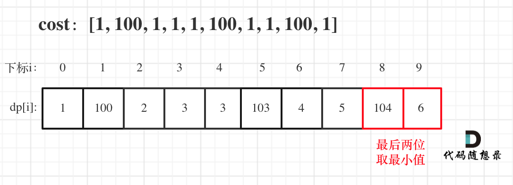

---

还可以优化空间复杂度，因为dp[i]就是由前两位推出来的，那么也不⽤dp数组了，C++代码
如下：
时间复杂度：O(n)
空间复杂度：O(1)
当然我不建议这么写，能写出版本⼀就可以了，直观简洁！
在后序的讲解中，可能我会忽略这种版本⼆的写法，⼤家只要知道有这么个写法就可以了
哈。
拓展
 
这道题描述也确实有点魔幻。
题⽬描述为：每当你爬上⼀个阶梯你都要花费对应的体⼒值，⼀旦⽀付了相应的体⼒值，你
就可以选择向上爬⼀个阶梯或者爬两个阶梯。
⽰例1：
// 版本⼆
class Solution {
public:
    int minCostClimbingStairs(vector<int>& cost) {
        int dp0 = cost[0];
        int dp1 = cost[1];
        for (int i = 2; i < cost.size(); i++) {
            int dpi = min(dp0, dp1) + cost[i];
            dp0 = dp1; // 记录⼀下前两位
            dp1 = dpi;
        }
        return min(dp0, dp1);
    }
};

---

输⼊：cost = [10, 15, 20]
输出：15
从题⽬描述可以看出：要不是第⼀步不需要花费体⼒，要不就是第最后⼀步不需要花费体
⼒，我个⼈理解：题意说的其实是第⼀步是要⽀付费⽤的！。因为是当你爬上⼀个台阶就要
花费对应的体⼒值！
所以我定义的dp[i]意思是也是第⼀步是要花费体⼒的，最后⼀步不⽤花费体⼒了，因为已
经⽀付了。
当然也可以样，定义dp[i]为:第⼀步是不花费体⼒，最后⼀步是花费体⼒的。
所以代码这么写：
这么写看上去⽐较顺，但是就是感觉和题⽬描述的不太符。哈哈，也没有必要这么细扣题意
了，⼤家只要知道，题⽬的意思反正就是要不是第⼀步不花费，要不是最后⼀步不花费，都
可以。
总结
 
⼤家可以发现这道题⽬相对于 昨天的动态规划：爬楼梯有难了⼀点，但整体思路是⼀样。
class Solution {
public:
    int minCostClimbingStairs(vector<int>& cost) {
        vector<int> dp(cost.size() + 1);
        dp[0] = 0; // 默认第⼀步都是不花费体⼒的
        dp[1] = 0;
        for (int i = 2; i <= cost.size(); i++) {
            dp[i] = min(dp[i - 1] + cost[i - 1], dp[i - 2] + cost[i - 
2]);
        }
        return dp[cost.size()];
    }
};

---

从动态规划：斐波那契数到 动态规划：爬楼梯再到今天这道题⽬，录友们感受到循序渐进
的梯度了嘛。
每个系列开始的时候，都有录友和我反馈说题⽬太简单了，赶紧上难度，但也有录友和我说
有点难了，快跟不上了。
其实我选的题⽬都是有⽬的性的，就算是简单题，也是为了练习⽅法论，然后难度都是梯度
上来的，⼀环扣⼀环。
但我也可以随便选来⼀道难题讲呗，这其实是最省事的，不⽤管什么题⽬顺序，看⼼情找⼀
道就讲。
难的是把题⽬按梯度排好，循序渐进，再按照统⼀⽅法论把这些都串起来，哈哈，所以⼤家
不要催我哈，按照我的节奏⼀步⼀步来就⾏啦。
 
不同路径
 
62.不同路径
 
题⽬链接：https://leetcode-cn.com/problems/unique-paths/
⼀个机器⼈位于⼀个 m x n ⽹格的左上⾓ （起始点在下图中标记为 “Start” ）。
机器⼈每次只能向下或者向右移动⼀步。机器⼈试图达到⽹格的右下⾓（在下图中标记为 
“Finish” ）。
问总共有多少条不同的路径？
⽰例 1：

---

输⼊：m = 3, n = 7
输出：28
⽰例 2：
输⼊：m = 2, n = 3
输出：3
解释：
从左上⾓开始，总共有 3 条路径可以到达右下⾓。
1. 向右 -> 向右 -> 向下
2. 向右 -> 向下 -> 向右
3. 向下 -> 向右 -> 向右
⽰例 3：
输⼊：m = 7, n = 3
输出：28
⽰例 4：
输⼊：m = 3, n = 3
输出：6
提⽰：
1 <= m, n <= 100
题⽬数据保证答案⼩于等于 2 * 10^9

---

思路
 
深搜
 
这道题⽬，刚⼀看最直观的想法就是⽤图论⾥的深搜，来枚举出来有多少种路径。
注意题⽬中说机器⼈每次只能向下或者向右移动⼀步，那么其实机器⼈⾛过的路径可以抽象
为⼀颗⼆叉树，⽽叶⼦节点就是终点！
如图举例：
此时问题就可以转化为求⼆叉树叶⼦节点的个数，代码如下：

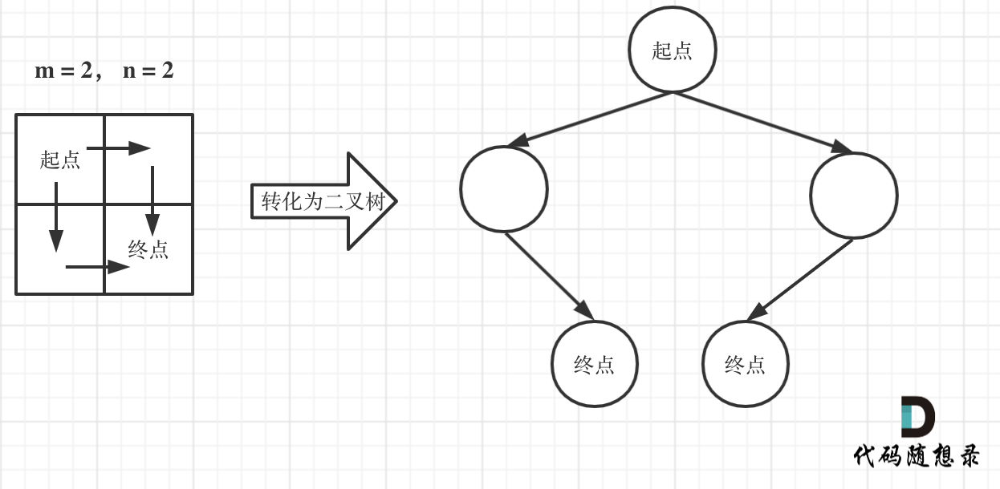

---

⼤家如果提交了代码就会发现超时了！
来分析⼀下时间复杂度，这个深搜的算法，其实就是要遍历整个⼆叉树。
这颗树的深度其实就是m+n-1（深度按从1开始计算）。
那⼆叉树的节点个数就是 2^(m + n - 1) - 1。可以理解深搜的算法就是遍历了整个满⼆叉树
（其实没有遍历整个满⼆叉树，只是近似⽽已）
所以上⾯深搜代码的时间复杂度为O(2^(m + n - 1) - 1)，可以看出，这是指数级别的时间复
杂度，是⾮常⼤的。
动态规划
 
机器⼈从(0 , 0) 位置触发，到(m - 1, n - 1)终点。
按照动规五部曲来分析：
1. 确定dp数组（dp table）以及下标的含义
dp[i][j] ：表⽰从（0 ，0）出发，到(i, j) 有dp[i][j]条不同的路径。
2. 确定递推公式
class Solution {
private:
    int dfs(int i, int j, int m, int n) {
        if (i > m || j > n) return 0; // 越界了
        if (i == m && j == n) return 1; // 找到⼀种⽅法，相当于找到了叶⼦节
点
        return dfs(i + 1, j, m, n) + dfs(i, j + 1, m, n);
    }
public:
    int uniquePaths(int m, int n) {
        return dfs(1, 1, m, n);
    }
};

---

想要求dp[i][j]，只能有两个⽅向来推导出来，即dp[i - 1][j] 和 dp[i][j - 1]。
此时在回顾⼀下 dp[i - 1][j] 表⽰啥，是从(0, 0)的位置到(i - 1, j)有⼏条路径，dp[i][j - 1]同
理。
那么很⾃然，dp[i][j] =  dp[i - 1][j] + dp[i][j - 1]，因为dp[i][j]只有这两个⽅向过来。
3. dp数组的初始化
如何初始化呢，⾸先dp[i][0]⼀定都是1，因为从(0, 0)的位置到(i, 0)的路径只有⼀条，那么
dp[0][j]也同理。
所以初始化代码为：
4. 确定遍历顺序
这⾥要看⼀下递归公式dp[i][j] =  dp[i - 1][j] + dp[i][j - 1]，dp[i][j]都是从其上⽅和左⽅推导⽽
来，那么从左到右⼀层⼀层遍历就可以了。
这样就可以保证推导dp[i][j]的时候，dp[i - 1][j] 和 dp[i][j - 1]⼀定是有数值的。
5. 举例推导dp数组
如图所⽰：
for (int i = 0; i < m; i++) dp[i][0] = 1;
for (int j = 0; j < n; j++) dp[0][j] = 1;

---

以上动规五部曲分析完毕，C++代码如下：
时间复杂度：O(m * n)
空间复杂度：O(m * n)
其实⽤⼀个⼀维数组（也可以理解是滚动数组）就可以了，但是不利于理解，可以优化点空
间，建议先理解了⼆维，在理解⼀维，C++代码如下：
class Solution {
public:
    int uniquePaths(int m, int n) {
        vector<vector<int>> dp(m, vector<int>(n, 0));
        for (int i = 0; i < m; i++) dp[i][0] = 1;
        for (int j = 0; j < n; j++) dp[0][j] = 1;
        for (int i = 1; i < m; i++) {
            for (int j = 1; j < n; j++) {
                dp[i][j] = dp[i - 1][j] + dp[i][j - 1];
            }
        }
        return dp[m - 1][n - 1];
    }
};

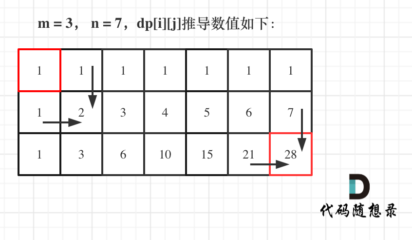

---

时间复杂度：O(m * n)
空间复杂度：O(n)
数论⽅法
 
在这个图中，可以看出⼀共m，n的话，⽆论怎么⾛，⾛到终点都需要 m + n - 2 步。
在这m + n - 2 步中，⼀定有 m - 1 步是要向下⾛的，不⽤管什么时候向下⾛。
class Solution {
public:
    int uniquePaths(int m, int n) {
        vector<int> dp(n);
        for (int i = 0; i < n; i++) dp[i] = 1;
        for (int j = 1; j < m; j++) {
            for (int i = 1; i < n; i++) {
                dp[i] += dp[i - 1];
            }
        }
        return dp[n - 1];
    }
};

---

那么有⼏种⾛法呢？ 可以转化为，给你m + n - 2个不同的数，随便取m - 1个数，有⼏种取
法。
那么这就是⼀个组合问题了。
那么答案，如图所⽰：
求组合的时候，要防⽌两个int相乘溢出！ 所以不能把算式的分⼦都算出来，分母都算出来
再做除法。
例如如下代码是不⾏的。

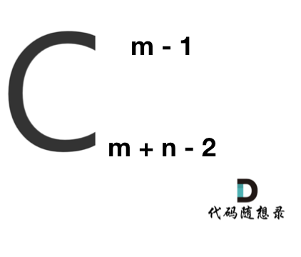

---

需要在计算分⼦的时候，不断除以分母，代码如下：
时间复杂度：O(m)
空间复杂度：O(1)
class Solution {
public:
    int uniquePaths(int m, int n) {
        int numerator = 1, denominator = 1;
        int count = m - 1;
        int t = m + n - 2;
        while (count--) numerator *= (t--); // 计算分⼦，此时分⼦就会溢出
        for (int i = 1; i <= m - 1; i++) denominator *= i; // 计算分⺟
        return numerator / denominator;
    }
};
class Solution {
public:
    int uniquePaths(int m, int n) {
        long long numerator = 1; // 分⼦
        int denominator = m - 1; // 分⺟
        int count = m - 1;
        int t = m + n - 2;
        while (count--) {
            numerator *= (t--);
            while (denominator != 0 && numerator % denominator == 0) 
{
                numerator /= denominator;
                denominator--;
            }
        }
        return numerator;
    }
};

---

计算组合问题的代码还是有难度的，特别是处理溢出的情况！
总结
 
本⽂分别给出了深搜，动规，数论三种⽅法。
深搜当然是超时了，顺便分析了⼀下使⽤深搜的时间复杂度，就可以看出为什么超时了。
然后在给出动规的⽅法，依然是使⽤动规五部曲，这次我们就要考虑如何正确的初始化了，
初始化和遍历顺序其实也很重要！
不同路径 II
 
63. 不同路径 II
 
题⽬链接：https://leetcode-cn.com/problems/unique-paths-ii/
⼀个机器⼈位于⼀个 m x n ⽹格的左上⾓ （起始点在下图中标记为“Start” ）。
机器⼈每次只能向下或者向右移动⼀步。机器⼈试图达到⽹格的右下⾓（在下图中标记为
“Finish”）。
现在考虑⽹格中有障碍物。那么从左上⾓到右下⾓将会有多少条不同的路径？

---

⽹格中的障碍物和空位置分别⽤ 1 和 0 来表⽰。
⽰例 1：
输⼊：obstacleGrid = [[0,0,0],[0,1,0],[0,0,0]]
输出：2
解释：
3x3 ⽹格的正中间有⼀个障碍物。
从左上⾓到右下⾓⼀共有 2 条不同的路径：
1. 向右 -> 向右 -> 向下 -> 向下

---

2. 向下 -> 向下 -> 向右 -> 向右
⽰例 2：
输⼊：obstacleGrid = [[0,1],[0,0]]
输出：1
提⽰：
m == obstacleGrid.length
n == obstacleGrid[i].length
1 <= m, n <= 100
obstacleGrid[i][j] 为 0 或 1
思路
 
这道题相对于62.不同路径 就是有了障碍。
第⼀次接触这种题⽬的同学可能会有点懵，这有障碍了，应该怎么算呢？
62.不同路径中我们已经详细分析了没有障碍的情况，有障碍的话，其实就是标记对应的dp 
table（dp数组）保持初始值(0)就可以了。
动规五部曲：
1. 确定dp数组（dp table）以及下标的含义

---

dp[i][j] ：表⽰从（0 ，0）出发，到(i, j) 有dp[i][j]条不同的路径。
2. 确定递推公式
递推公式和62.不同路径⼀样，dp[i][j] =  dp[i - 1][j] + dp[i][j - 1]。
但这⾥需要注意⼀点，因为有了障碍，(i, j)如果就是障碍的话应该就保持初始状态（初始状
态为0）。
所以代码为：
3. dp数组如何初始化
在62.不同路径不同路径中我们给出如下的初始化：
因为从(0, 0)的位置到(i, 0)的路径只有⼀条，所以dp[i][0]⼀定为1，dp[0][j]也同理。
但如果(i, 0) 这条边有了障碍之后，障碍之后（包括障碍）都是⾛不到的位置了，所以障碍
之后的dp[i][0]应该还是初始值0。
如图：
if (obstacleGrid[i][j] == 0) { // 当(i, j)没有障碍的时候，再推导dp[i][j]
    dp[i][j] = dp[i - 1][j] + dp[i][j - 1];
}
vector<vector<int>> dp(m, vector<int>(n, 0)); // 初始值为0
for (int i = 0; i < m; i++) dp[i][0] = 1;
for (int j = 0; j < n; j++) dp[0][j] = 1;

---

下标(0, j)的初始化情况同理。
所以本题初始化代码为：
注意代码⾥for循环的终⽌条件，⼀旦遇到obstacleGrid[i][0] == 1的情况就停⽌dp[i][0]的
赋值1的操作，dp[0][j]同理
4. 确定遍历顺序
从递归公式dp[i][j] =  dp[i - 1][j] + dp[i][j - 1] 中可以看出，⼀定是从左到右⼀层⼀层遍历，
这样保证推导dp[i][j]的时候，dp[i - 1][j] 和 dp[i][j - 1]⼀定是有数值。
代码如下：
vector<vector<int>> dp(m, vector<int>(n, 0));
for (int i = 0; i < m && obstacleGrid[i][0] == 0; i++) dp[i][0] = 1;
for (int j = 0; j < n && obstacleGrid[0][j] == 0; j++) dp[0][j] = 1;
for (int i = 1; i < m; i++) {
    for (int j = 1; j < n; j++) {
        if (obstacleGrid[i][j] == 1) continue;
        dp[i][j] = dp[i - 1][j] + dp[i][j - 1];
    }
}

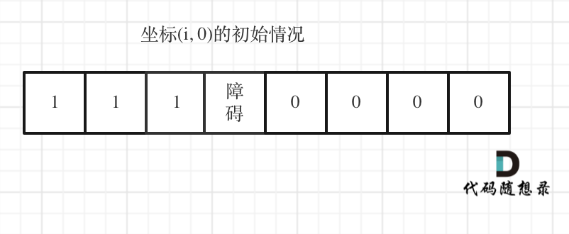

---

5. 举例推导dp数组
拿⽰例1来举例如题：
对应的dp table 如图：

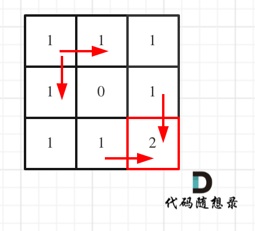

---

如果这个图看不同，建议在理解⼀下递归公式，然后照着⽂章中说的遍历顺序，⾃⼰推导⼀
下 ！ 
动规五部分分析完毕，对应C++代码如下：
时间复杂度O(n * m) n m 分别为obstacleGrid 长度和宽度
空间复杂度O(n * m)
⾄于能不能优化空间降为⼀维dp数组，我感觉不太⾏，因为要考虑障碍，如果把这些障碍
压缩到⼀⾏，结果⼀定就不⼀样了。
总结
 
本题是62.不同路径的障碍版，整体思路⼤体⼀致。
但就算是做过62.不同路径，在做本题也会有感觉遇到障碍⽆从下⼿。
class Solution {
public:
    int uniquePathsWithObstacles(vector<vector<int>>& obstacleGrid) {
        int m = obstacleGrid.size();
        int n = obstacleGrid[0].size();
        vector<vector<int>> dp(m, vector<int>(n, 0));
        for (int i = 0; i < m && obstacleGrid[i][0] == 0; i++) dp[i]
[0] = 1;
        for (int j = 0; j < n && obstacleGrid[0][j] == 0; j++) dp[0]
[j] = 1;
        for (int i = 1; i < m; i++) {
            for (int j = 1; j < n; j++) {
                if (obstacleGrid[i][j] == 1) continue;
                dp[i][j] = dp[i - 1][j] + dp[i][j - 1];
            }
        }
        return dp[m - 1][n - 1];
    }
};

---

其实只要考虑到，遇到障碍dp[i][j]保持0就可以了。
也有⼀些⼩细节，例如：初始化的部分，很容易忽略了障碍之后应该都是0的情况。
代码随想录官⽹：www.programmercarl.com
代码随想录开源项⽬Github：https://github.com/youngyangyang04/leetcode-
master
代码随想录算法公开课 ，代码随想录的全部内容将由我（程序员Carl）视频讲解
并开免费开放给⼤家。
《代码随想录》纸质版 已经出版。
代码随想录知识星球 上万录友在这⾥学习
代码随想录算法训练营 帮助录友⾼效刷完代码随想录。
如果感觉PDF对你有帮助，微信搜索：代码随想录，关注我吧，你会发现相见恨晚！
整数拆分

---

343. 整数拆分
 
给定⼀个正整数 n，将其拆分为⾄少两个正整数的和，并使这些整数的乘积最⼤化。 返回
你可以获得的最⼤乘积。
⽰例 1:
输⼊: 2
输出: 1
解释: 2 = 1 + 1, 1 × 1 = 1。
⽰例 2:
输⼊: 10
输出: 36
解释: 10 = 3 + 3 + 4, 3 × 3 × 4 = 36。
说明: 你可以假设 n 不⼩于 2 且不⼤于 58。
思路
 
看到这道题⽬，都会想拆成两个呢，还是三个呢，还是四个....
我们来看⼀下如何使⽤动规来解决。
动态规划
 
动规五部曲，分析如下：
1. 确定dp数组（dp table）以及下标的含义
dp[i]：分拆数字i，可以得到的最⼤乘积为dp[i]。
dp[i]的定义讲贯彻整个解题过程，下⾯哪⼀步想不懂了，就想想dp[i]究竟表⽰的是啥！
2. 确定递推公式
可以想 dp[i]最⼤乘积是怎么得到的呢？
其实可以从1遍历j，然后有两种渠道得到dp[i].

---

⼀个是j * (i - j) 直接相乘。
⼀个是j * dp[i - j]，相当于是拆分(i - j)，对这个拆分不理解的话，可以回想dp数组的定义。
那有同学问了，j怎么就不拆分呢？
j是从1开始遍历，拆分j的情况，在遍历j的过程中其实都计算过了。
那么从1遍历j，⽐较(i - j) * j和dp[i - j] * j 取最⼤的。
递推公式：dp[i] = max(dp[i], max((i - j) * j, dp[i - j] * j));
3. dp的初始化
不少同学应该疑惑，dp[0] dp[1]应该初始化多少呢？
有的题解⾥会给出dp[0] = 1，dp[1] = 1的初始化，但解释⽐较牵强，主要还是因为这么初始
化可以把题⽬过了。
严格从dp[i]的定义来说，dp[0] dp[1] 就不应该初始化，也就是没有意义的数值。
拆分0和拆分1的最⼤乘积是多少？
这是⽆解的。
这⾥我只初始化dp[2] = 1，从dp[i]的定义来说，拆分数字2，得到的最⼤乘积是1，这个没有
任何异议！
4. 确定遍历顺序
确定遍历顺序，先来看看递归公式：dp[i] = max(dp[i], max((i - j) * j, dp[i - j] * j));
dp[i] 是依靠 dp[i - j]的状态，所以遍历i⼀定是从前向后遍历，先有dp[i - j]再有dp[i]。
枚举j的时候，是从1开始的。i是从3开始，这样dp[i - j]就是dp[2]正好可以通过我们初始化
的数值求出来。
所以遍历顺序为：

---

5. 举例推导dp数组
举例当n为10 的时候，dp数组⾥的数值，如下：
以上动规五部曲分析完毕，C++代码如下：
for (int i = 3; i <= n ; i++) {
    for (int j = 1; j < i - 1; j++) {
        dp[i] = max(dp[i], max((i - j) * j, dp[i - j] * j));
    }
}
class Solution {
public:
    int integerBreak(int n) {
        vector<int> dp(n + 1);
        dp[2] = 1;
        for (int i = 3; i <= n ; i++) {
            for (int j = 1; j < i - 1; j++) {
                dp[i] = max(dp[i], max((i - j) * j, dp[i - j] * j));
            }
        }
        return dp[n];
    }
};

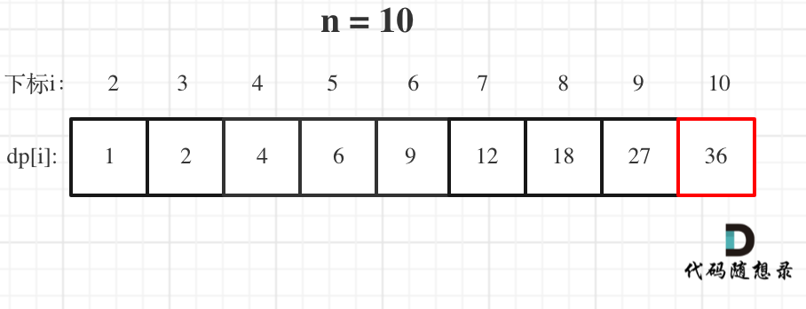

---

时间复杂度：O(n^2)
空间复杂度：O(n)
贪⼼
 
本题也可以⽤贪⼼，每次拆成n个3，如果剩下是4，则保留4，然后相乘，但是这个结论需
要数学证明其合理性！
我没有证明，⽽是直接⽤了结论。感兴趣的同学可以⾃⼰再去研究研究数学证明哈。
给出我的C++代码如下：
时间复杂度O(n)
空间复杂度O(1)
总结
 
本题掌握其动规的⽅法，就可以了，贪⼼的解法确实简单，但需要有数学证明，如果能⾃圆
其说也是可以的。
class Solution {
public:
    int integerBreak(int n) {
        if (n == 2) return 1;
        if (n == 3) return 2;
        if (n == 4) return 4;
        int result = 1;
        while (n > 4) {
            result *= 3;
            n -= 3;
        }
        result *= n;
        return result;
    }
};

---

其实这道题⽬的递推公式并不好想，⽽且初始化的地⽅也很有讲究，我在写本题的时候⼀开
始写的代码是这样的：
这个代码也是可以过的！
在解释递推公式的时候，也可以解释通，dp[i] 就等于 拆解i - j的最⼤乘积 * 拆解j的最⼤乘
积。 看起来没⽑病！
但是在解释初始化的时候，就发现⾃相⽭盾了，dp[1]为什么⼀定是1呢？根据dp[i]的定义，
dp[2]也不应该是2啊。
但如果递归公式是 dp[i] = max(dp[i], dp[i - j] * dp[j]);，就⼀定要这么初始化。递推公式没⽑
病，但初始化解释不通！
虽然代码在初始位置有⼀个判断if (n <= 3) return 1 * (n - 1);，保证n<=3 结果是正确的，但
代码后⾯又要给dp[1]赋值1 和 dp[2] 赋值 2，这其实就是⾃相⽭盾的代码，违背了dp[i]的定
义！
我举这个例⼦，其实就说做题的严谨性，上⾯这个代码也可以AC，⼤体上⼀看好像也没有
⽑病，递推公式也说得过去，但是仅仅是恰巧过了⽽已。
class Solution {
public:
    int integerBreak(int n) {
        if (n <= 3) return 1 * (n - 1);
        vector<int> dp(n + 1, 0);
        dp[1] = 1;
        dp[2] = 2;
        dp[3] = 3;
        for (int i = 4; i <= n ; i++) {
            for (int j = 1; j < i - 1; j++) {
                dp[i] = max(dp[i], dp[i - j] * dp[j]);
            }
        }
        return dp[n];
    }
};

---

不同的⼆叉搜索树
 
96.不同的⼆叉搜索树
 
题⽬链接：https://leetcode-cn.com/problems/unique-binary-search-trees/
给定⼀个整数 n，求以 1 ... n 为节点组成的⼆叉搜索树有多少种？
⽰例:
思路
 
这道题⽬描述很简短，但估计⼤部分同学看完都是懵懵的状态，这得怎么统计呢？
关于什么是⼆叉搜索树，我们之前在讲解⼆叉树专题的时候已经详细讲解过了，也可以看看
这篇⼆叉树：⼆叉搜索树登场！在回顾⼀波。
了解了⼆叉搜索树之后，我们应该先举⼏个例⼦，画画图，看看有没有什么规律，如图：

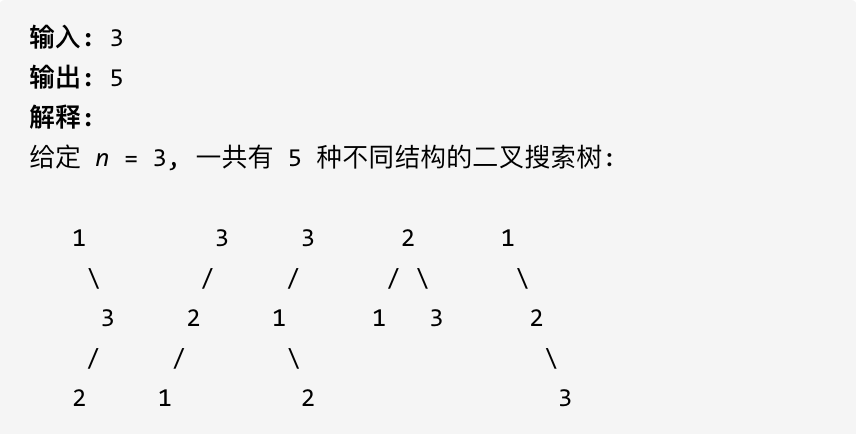

---

n为1的时候有⼀棵树，n为2有两棵树，这个是很直观的。
来看看n为3的时候，有哪⼏种情况。
当1为头结点的时候，其右⼦树有两个节点，看这两个节点的布局，是不是和 n 为2的时候
两棵树的布局是⼀样的啊！
（可能有同学问了，这布局不⼀样啊，节点数值都不⼀样。别忘了我们就是求不同树的数
量，并不⽤把搜索树都列出来，所以不⽤关⼼其具体数值的差异）
当3为头结点的时候，其左⼦树有两个节点，看这两个节点的布局，是不是和n为2的时候两
棵树的布局也是⼀样的啊！

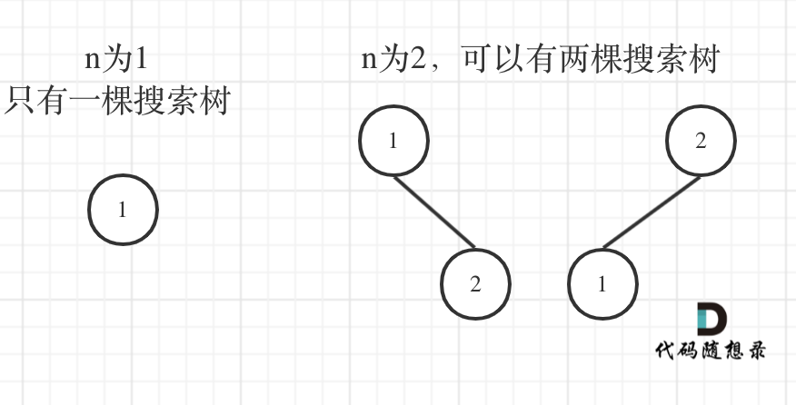

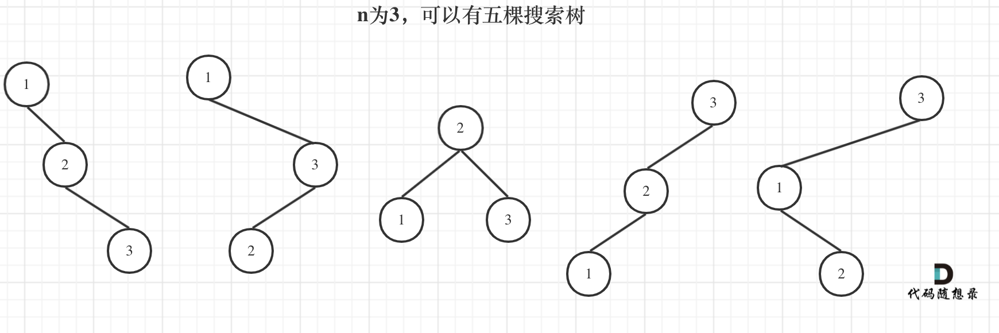

---

当2位头结点的时候，其左右⼦树都只有⼀个节点，布局是不是和n为1的时候只有⼀棵树的
布局也是⼀样的啊！
发现到这⾥，其实我们就找到的重叠⼦问题了，其实也就是发现可以通过dp[1] 和 dp[2] 来
推导出来dp[3]的某种⽅式。
思考到这⾥，这道题⽬就有眉⽬了。
dp[3]，就是 元素1为头结点搜索树的数量 + 元素2为头结点搜索树的数量 + 元素3为头结点
搜索树的数量
元素1为头结点搜索树的数量 = 右⼦树有2个元素的搜索树数量 * 左⼦树有0个元素的搜索树
数量
元素2为头结点搜索树的数量 = 右⼦树有1个元素的搜索树数量 * 左⼦树有1个元素的搜索树
数量
元素3为头结点搜索树的数量 = 右⼦树有0个元素的搜索树数量 * 左⼦树有2个元素的搜索树
数量
有2个元素的搜索树数量就是dp[2]。
有1个元素的搜索树数量就是dp[1]。
有0个元素的搜索树数量就是dp[0]。
所以dp[3] = dp[2] * dp[0] + dp[1] * dp[1] + dp[0] * dp[2]
如图所⽰：

---

此时我们已经找到的递推关系了，那么可以⽤动规五部曲在系统分析⼀遍。
1. 确定dp数组（dp table）以及下标的含义
dp[i] ： 1到i为节点组成的⼆叉搜索树的个数为dp[i]。
也可以理解是i的不同元素节点组成的⼆叉搜索树的个数为dp[i] ，都是⼀样的。
以下分析如果想不清楚，就来回想⼀下dp[i]的定义
2. 确定递推公式
在上⾯的分析中，其实已经看出其递推关系， dp[i] += dp[以j为头结点左⼦树节点数量] * 
dp[以j为头结点右⼦树节点数量]
j相当于是头结点的元素，从1遍历到i为⽌。
所以递推公式：dp[i] += dp[j - 1] * dp[i - j]; ，j-1 为j为头结点左⼦树节点数量，i-j 为以j为
头结点右⼦树节点数量
3. dp数组如何初始化
初始化，只需要初始化dp[0]就可以了，推导的基础，都是dp[0]。

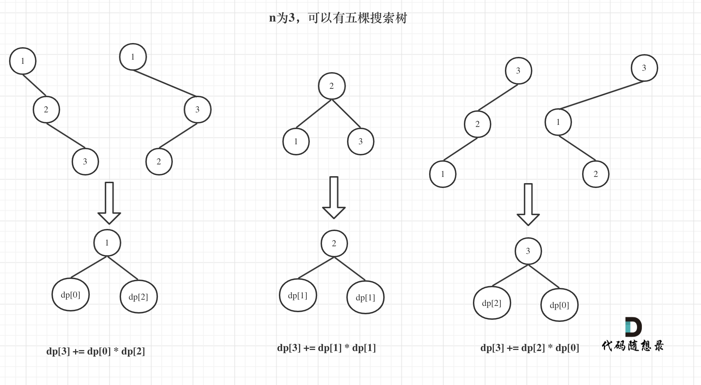

---

那么dp[0]应该是多少呢？
从定义上来讲，空节点也是⼀颗⼆叉树，也是⼀颗⼆叉搜索树，这是可以说得通的。
从递归公式上来讲，dp[以j为头结点左⼦树节点数量] * dp[以j为头结点右⼦树节点数量] 中
以j为头结点左⼦树节点数量为0，也需要dp[以j为头结点左⼦树节点数量] = 1， 否则乘法的
结果就都变成0了。
所以初始化dp[0] = 1
4. 确定遍历顺序
⾸先⼀定是遍历节点数，从递归公式：dp[i] += dp[j - 1] * dp[i - j]可以看出，节点数为i的状
态是依靠 i之前节点数的状态。
那么遍历i⾥⾯每⼀个数作为头结点的状态，⽤j来遍历。
代码如下：
5. 举例推导dp数组
n为5时候的dp数组状态如图：
for (int i = 1; i <= n; i++) {
    for (int j = 1; j <= i; j++) {
        dp[i] += dp[j - 1] * dp[i - j];
    }
}

---

当然如果⾃⼰画图举例的话，基本举例到n为3就可以了，n为4的时候，画图已经⽐较⿇烦
了。
我这⾥列到了n为5的情况，是为了⽅便⼤家 debug代码的时候，把dp数组打出来，看看哪
⾥有问题。
综上分析完毕，C++代码如下：
class Solution {
public:
    int numTrees(int n) {
        vector<int> dp(n + 1);
        dp[0] = 1;
        for (int i = 1; i <= n; i++) {
            for (int j = 1; j <= i; j++) {
                dp[i] += dp[j - 1] * dp[i - j];
            }
        }
        return dp[n];
    }
};

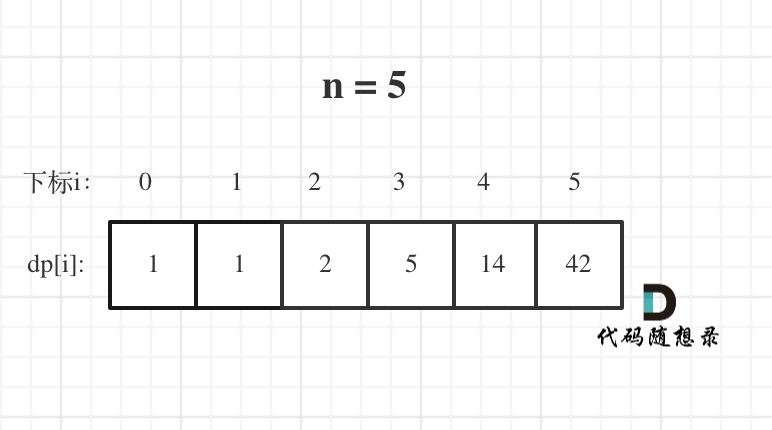

---

时间复杂度O(n^2)
空间复杂度O(n)
⼤家应该发现了，我们分析了这么多，最后代码却如此简单！
总结
 
这道题⽬虽然在⼒扣上标记是中等难度，但可以算是困难了！
⾸先这道题想到⽤动规的⽅法来解决，就不太好想，需要举例，画图，分析，才能找到递推
的关系。
然后难点就是确定递推公式了，如果把递推公式想清楚了，遍历顺序和初始化，就是⾃然⽽
然的事情了。
可以看出我依然还是⽤动规五部曲来进⾏分析，会把题⽬的⽅⽅⾯⾯都覆盖到！
⽽且具体这五部分析是我⾃⼰平时总结的经验，找不出来第⼆个的，可能过⼀阵⼦ 其他题
解也会有动规五部曲了，哈哈。
当时我在⽤动规五部曲讲解斐波那契的时候，⼀些录友和我反应，感觉讲复杂了。
其实当时我⼀直强调简单题是⽤来练习⽅法论的，并不能因为简单我就代码⼀甩，简单解释
⼀下就完事了。
可能当时⼀些同学不理解，现在⼤家应该感受⽅法论的重要性了，加油!

---

01背包理论基础
 
这周我们正式开始讲解背包问题！
背包问题的经典资料当然是：背包九讲。在公众号「代码随想录」后台回复：背包九讲，就
可以获得背包九讲的PDF。
但说实话，背包九讲对于⼩⽩来说确实不太友好，看起来还是有点费劲的，⽽且都是伪代码
理解起来也吃⼒。
对于⾯试的话，其实掌握01背包，和完全背包，就够⽤了，最多可以再来⼀个多重背包。

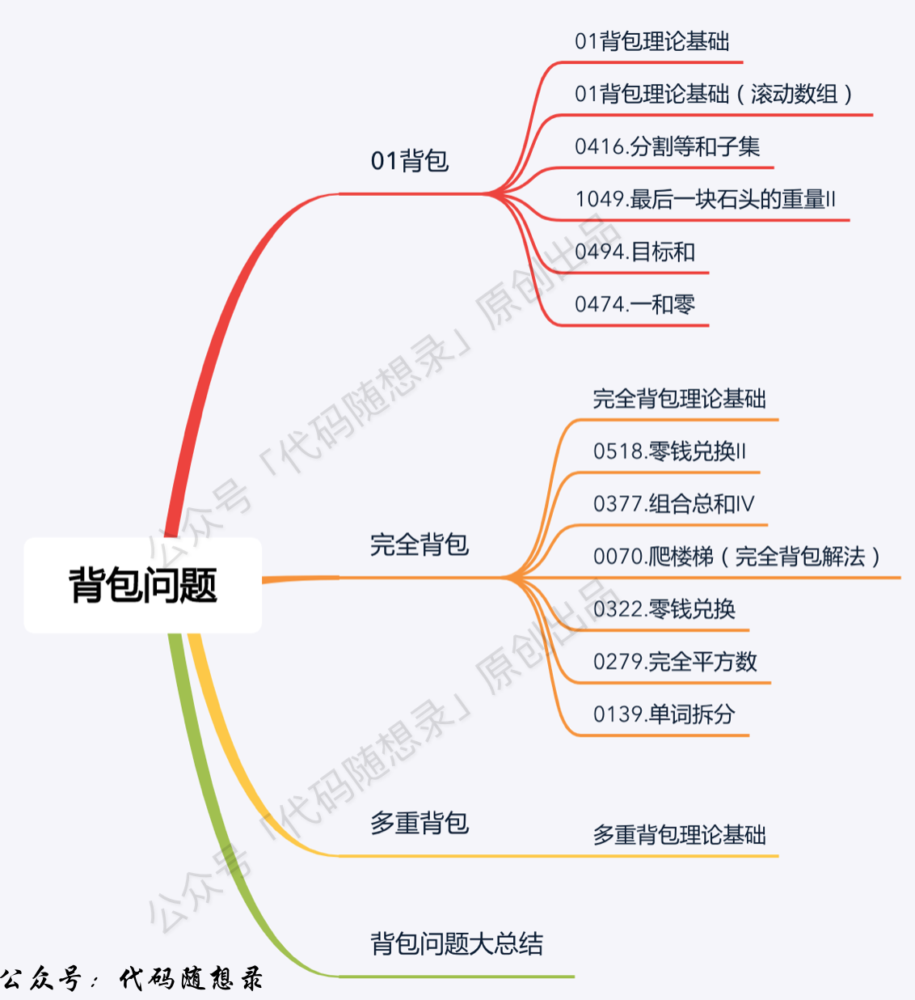

---

如果这⼏种背包，分不清，我这⾥画了⼀个图，如下：
⾄于背包九讲其其他背包，⾯试⼏乎不会问，都是竞赛级别的了，leetcode上连多重背包的
题⽬都没有，所以题库也告诉我们，01背包和完全背包就够⽤了。
⽽完全背包又是也是01背包稍作变化⽽来，即：完全背包的物品数量是⽆限的。
所以背包问题的理论基础重中之重是01背包，⼀定要理解透！
leetcode上没有纯01背包的问题，都是01背包应⽤⽅⾯的题⽬，也就是需要转化为01背包问
题。
所以我先通过纯01背包问题，把01背包原理讲清楚，后续再讲解leetcode题⽬的时候，重
点就是讲解如何转化为01背包问题了。
之前可能有些录友已经可以熟练写出背包了，但只要把这个⽂章仔细看完，相信你会意外收
获！
01 背包
 
有N件物品和⼀个最多能被重量为W 的背包。第i件物品的重量是weight[i]，得到的价值是
value[i] 。每件物品只能⽤⼀次，求解将哪些物品装⼊背包⾥物品价值总和最⼤。

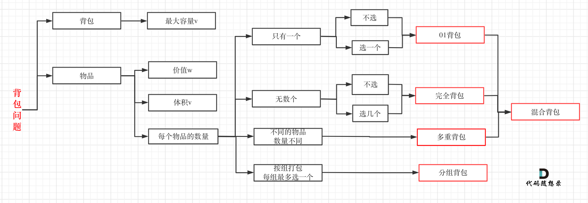

---

这是标准的背包问题，以⾄于很多同学看了这个⾃然就会想到背包，甚⾄都不知道暴⼒的解
法应该怎么解了。
这样其实是没有从底向上去思考，⽽是习惯性想到了背包，那么暴⼒的解法应该是怎么样的
呢？
每⼀件物品其实只有两个状态，取或者不取，所以可以使⽤回溯法搜索出所有的情况，那么
时间复杂度就是O(2^n)，这⾥的n表⽰物品数量。
所以暴⼒的解法是指数级别的时间复杂度。进⽽才需要动态规划的解法来进⾏优化！
在下⾯的讲解中，我举⼀个例⼦：
背包最⼤重量为4。

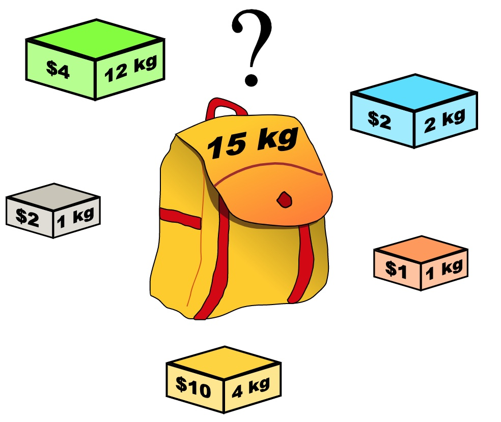

---

重量
价值
物品0
1
15
物品1
3
20
物品2
4
30
物品为：
问背包能背的物品最⼤价值是多少？
以下讲解和图⽰中出现的数字都是以这个例⼦为例。
⼆维dp数组01背包
 
依然动规五部曲分析⼀波。
1. 确定dp数组以及下标的含义
对于背包问题，有⼀种写法， 是使⽤⼆维数组，即dp[i][j] 表⽰从下标为[0-i]的物品⾥任意
取，放进容量为j的背包，价值总和最⼤是多少。
只看这个⼆维数组的定义，⼤家⼀定会有点懵，看下⾯这个图：

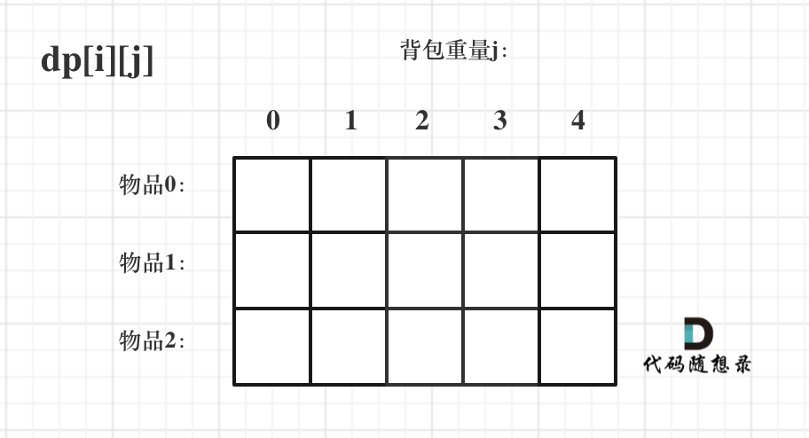

---

要时刻记着这个dp数组的含义，下⾯的⼀些步骤都围绕这dp数组的含义进⾏的，如果哪⾥
看懵了，就来回顾⼀下i代表什么，j又代表什么。
2. 确定递推公式
再回顾⼀下dp[i][j]的含义：从下标为[0-i]的物品⾥任意取，放进容量为j的背包，价值总和
最⼤是多少。
那么可以有两个⽅向推出来dp[i][j]，
由dp[i - 1][j]推出，即背包容量为j，⾥⾯不放物品i的最⼤价值，此时dp[i][j]就是
dp[i - 1][j]
由dp[i - 1][j - weight[i]]推出，dp[i - 1][j - weight[i]] 为背包容量为j - weight[i]的时
候不放物品i的最⼤价值，那么dp[i - 1][j - weight[i]] + value[i] （物品i的价值），
就是背包放物品i得到的最⼤价值
所以递归公式： dp[i][j] = max(dp[i - 1][j], dp[i - 1][j - weight[i]] + value[i]);
3. dp数组如何初始化
关于初始化，⼀定要和dp数组的定义吻合，否则到递推公式的时候就会越来越乱。
⾸先从dp[i][j]的定义出发，如果背包容量j为0的话，即dp[i][0]，⽆论是选取哪些物品，背包
价值总和⼀定为0。如图：

---

在看其他情况。
状态转移⽅程 dp[i][j] = max(dp[i - 1][j], dp[i - 1][j - weight[i]] + value[i]); 可以看出i 是由 i-1 
推导出来，那么i为0的时候就⼀定要初始化。
dp[0][j]，即：i为0，存放编号0的物品的时候，各个容量的背包所能存放的最⼤价值。
那么很明显当 j < weight[0]的时候，dp[0][j] 应该是 0，因为背包容量⽐编号0的物品重量还
⼩。
当j >= weight[0]是，dp[0][j] 应该是value[0]，因为背包容量放⾜够放编号0物品。
代码初始化如下：
for (int j = 0 ; j < weight[0]; j++) {  // 当然这⼀步，如果把dp数组预先初
始化为0了，这⼀步就可以省略，但很多同学应该没有想清楚这⼀点。
    dp[0][j] = 0;
}
// 正序遍历
for (int j = weight[0]; j <= bagWeight; j++) {
    dp[0][j] = value[0];
}

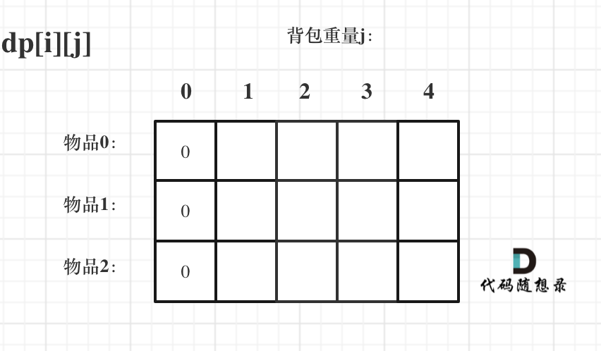

---

此时dp数组初始化情况如图所⽰：
dp[0][j] 和 dp[i][0] 都已经初始化了，那么其他下标应该初始化多少呢？
其实从递归公式： dp[i][j] = max(dp[i - 1][j], dp[i - 1][j - weight[i]] + value[i]); 可以看出dp[i]
[j]  是又左上⽅数值推导出来了，那么 其他下标初始为什么数值都可以，因为都会被覆盖。
初始-1，初始-2，初始100，都可以！
但只不过⼀开始就统⼀把dp数组统⼀初始为0，更⽅便⼀些。
如图：

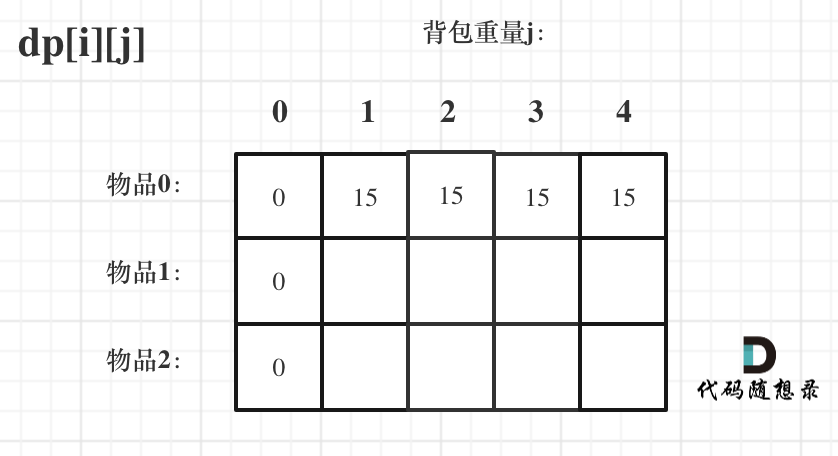

---

最后初始化代码如下：
费了这么⼤的功夫，才把如何初始化讲清楚，相信不少同学平时初始化dp数组是凭感觉来
的，但有时候感觉是不靠谱的。
4. 确定遍历顺序
在如下图中，可以看出，有两个遍历的维度：物品与背包重量
// 初始化 dp
vector<vector<int>> dp(weight.size() + 1, vector<int>(bagWeight + 1, 
0));
for (int j = weight[0]; j <= bagWeight; j++) {
    dp[0][j] = value[0];
}

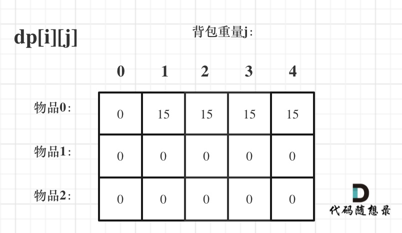

---

那么问题来了，先遍历 物品还是先遍历背包重量呢？
其实都可以！！ 但是先遍历物品更好理解。
那么我先给出先遍历物品，然后遍历背包重量的代码。
先遍历背包，再遍历物品，也是可以的！（注意我这⾥使⽤的⼆维dp数组）
例如这样：
// weight数组的⼤⼩ 就是物品个数
for(int i = 1; i < weight.size(); i++) { // 遍历物品
    for(int j = 0; j <= bagWeight; j++) { // 遍历背包容量
        if (j < weight[i]) dp[i][j] = dp[i - 1][j]; // 这个是为了展现dp
数组⾥元素的变化
        else dp[i][j] = max(dp[i - 1][j], dp[i - 1][j - weight[i]] + 
value[i]);
    }
}

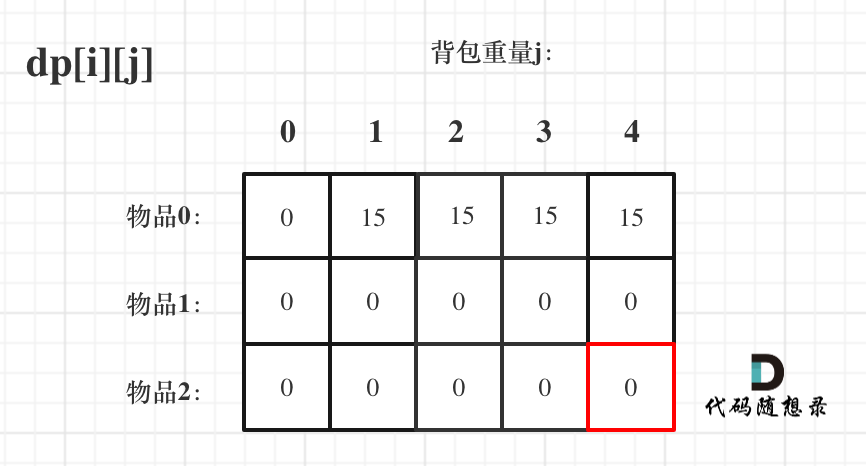

---

为什么也是可以的呢？
要理解递归的本质和递推的⽅向。
dp[i][j] = max(dp[i - 1][j], dp[i - 1][j - weight[i]] + value[i]); 递归公式中可以看出dp[i][j]是靠
dp[i-1][j]和dp[i - 1][j - weight[i]]推导出来的。
dp[i-1][j]和dp[i - 1][j - weight[i]] 都在dp[i][j]的左上⾓⽅向（包括正左和正上两个⽅向），
那么先遍历物品，再遍历背包的过程如图所⽰：
再来看看先遍历背包，再遍历物品呢，如图：
// weight数组的⼤⼩ 就是物品个数
for(int j = 0; j <= bagWeight; j++) { // 遍历背包容量
    for(int i = 1; i < weight.size(); i++) { // 遍历物品
        if (j < weight[i]) dp[i][j] = dp[i - 1][j];
        else dp[i][j] = max(dp[i - 1][j], dp[i - 1][j - weight[i]] + 
value[i]);
    }
}

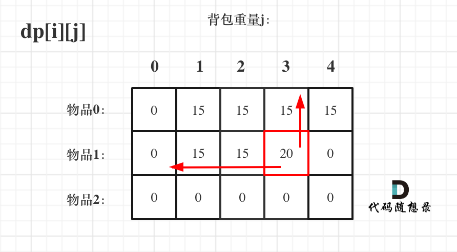

---

⼤家可以看出，虽然两个for循环遍历的次序不同，但是dp[i][j]所需要的数据就是左上⾓，
根本不影响dp[i][j]公式的推导！
但先遍历物品再遍历背包这个顺序更好理解。
其实背包问题⾥，两个for循环的先后循序是⾮常有讲究的，理解遍历顺序其实⽐理解推导
公式难多了。
5. 举例推导dp数组
来看⼀下对应的dp数组的数值，如图：

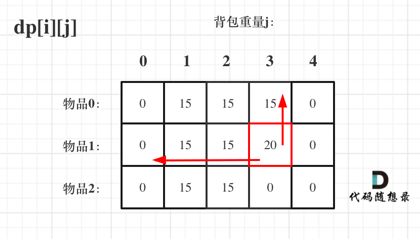

---

最终结果就是dp[2][4]。
建议⼤家此时⾃⼰在纸上推导⼀遍，看看dp数组⾥每⼀个数值是不是这样的。
做动态规划的题⽬，最好的过程就是⾃⼰在纸上举⼀个例⼦把对应的dp数组的数值推导⼀
下，然后在动⼿写代码！
很多同学做dp题⽬，遇到各种问题，然后凭感觉东改改西改改，怎么改都不对，或者稀⾥
糊涂就改过了。
主要就是⾃⼰没有动⼿推导⼀下dp数组的演变过程，如果推导明⽩了，代码写出来就算有
问题，只要把dp数组打印出来，对⽐⼀下和⾃⼰推导的有什么差异，很快就可以发现问题
了。
完整C++测试代码
 
void test_2_wei_bag_problem1() {
    vector<int> weight = {1, 3, 4};
    vector<int> value = {15, 20, 30};
    int bagWeight = 4;
    // ⼆维数组

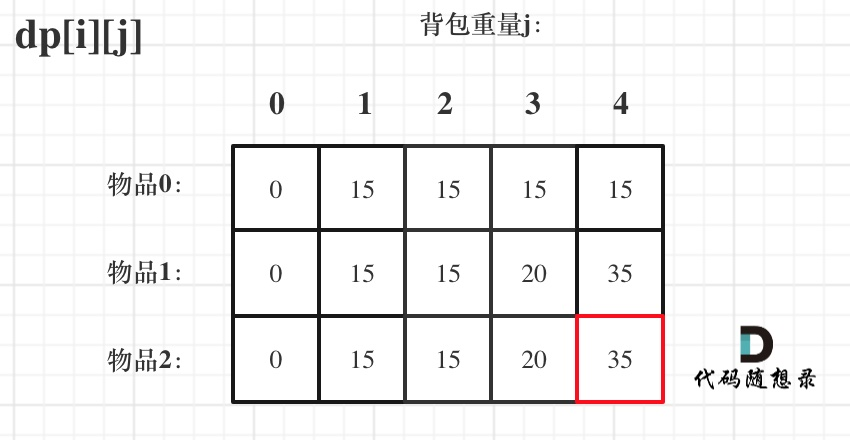

---

以上遍历的过程也可以这么写：
    vector<vector<int>> dp(weight.size() + 1, vector<int>(bagWeight + 
1, 0));
    // 初始化
    for (int j = bagWeight; j >= weight[0]; j--) {
        dp[0][j] = dp[0][j - weight[0]] + value[0];
    }
    // weight数组的⼤⼩ 就是物品个数
    for(int i = 1; i < weight.size(); i++) { // 遍历物品
        for(int j = 0; j <= bagWeight; j++) { // 遍历背包容量
            if (j < weight[i]) dp[i][j] = dp[i - 1][j];
            else dp[i][j] = max(dp[i - 1][j], dp[i - 1][j - 
weight[i]] + value[i]);
        }
    }
    cout << dp[weight.size() - 1][bagWeight] << endl;
}
int main() {
    test_2_wei_bag_problem1();
}
// 遍历过程
for(int i = 1; i < weight.size(); i++) { // 遍历物品
    for(int j = 0; j <= bagWeight; j++) { // 遍历背包容量
        if (j - weight[i] >= 0) {
            dp[i][j] = max(dp[i - 1][j], dp[i - 1][j - weight[i]] + 
value[i]);
        }
    }
}

---

这么写打印出来的dp数据这就是这样：
空出来的0其实是⽤不上的，版本⼀ 能把完整的dp数组打印出来，出来我⽤版本⼀来讲解。
总结
 
讲了这么多才刚刚把⼆维dp的01背包讲完，这⾥⼤家其实可以发现最简单的是推导公式
了，推导公式估计看⼀遍就记下来了，但难就难在如何初始化和遍历顺序上。
可能有的同学并没有注意到初始化 和 遍历顺序的重要性，我们后⾯做⼒扣上背包⾯试题⽬
的时候，⼤家就会感受出来了。
下⼀篇 还是理论基础，我们再来讲⼀维dp数组实现的01背包（滚动数组），分析⼀下和⼆
维有什么区别，在初始化和遍历顺序上又有什么差异，敬请期待！
 
01背包理论基础（滚动数组）

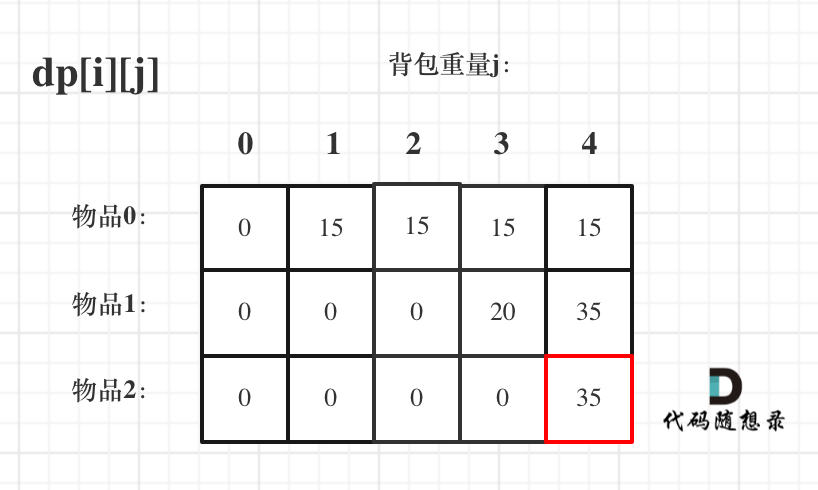

---

重量
价值
物品0
1
15
物品1
3
20
物品2
4
30
昨天动态规划：关于01背包问题，你该了解这些！中是⽤⼆维dp数组来讲解01背包。
今天我们就来说⼀说滚动数组，其实在前⾯的题⽬中我们已经⽤到过滚动数组了，就是把⼆
维dp降为⼀维dp，⼀些录友当时还表⽰⽐较困惑。
那么我们通过01背包，来彻底讲⼀讲滚动数组！
接下来还是⽤如下这个例⼦来进⾏讲解
背包最⼤重量为4。
物品为：
问背包能背的物品最⼤价值是多少？
⼀维dp数组（滚动数组）
 
对于背包问题其实状态都是可以压缩的。
在使⽤⼆维数组的时候，递推公式：dp[i][j] = max(dp[i - 1][j], dp[i - 1][j - weight[i]] + 
value[i]);
其实可以发现如果把dp[i - 1]那⼀层拷贝到dp[i]上，表达式完全可以是：dp[i][j] = 
max(dp[i][j], dp[i][j - weight[i]] + value[i]);
于其把dp[i - 1]这⼀层拷贝到dp[i]上，不如只⽤⼀个⼀维数组了，只⽤dp[j]（⼀维数组，也
可以理解是⼀个滚动数组）。
这就是滚动数组的由来，需要满⾜的条件是上⼀层可以重复利⽤，直接拷贝到当前层。
读到这⾥估计⼤家都忘了 dp[i][j]⾥的i和j表达的是什么了，i是物品，j是背包容量。

---

dp[i][j] 表⽰从下标为[0-i]的物品⾥任意取，放进容量为j的背包，价值总和最⼤是多少。
⼀定要时刻记住这⾥i和j的含义，要不然很容易看懵了。
动规五部曲分析如下：
1. 确定dp数组的定义
在⼀维dp数组中，dp[j]表⽰：容量为j的背包，所背的物品价值可以最⼤为dp[j]。
2. ⼀维dp数组的递推公式
dp[j]为 容量为j的背包所背的最⼤价值，那么如何推导dp[j]呢？
dp[j]可以通过dp[j - weight[j]]推导出来，dp[j - weight[i]]表⽰容量为j - weight[i]的背包所背
的最⼤价值。
dp[j - weight[i]] + value[i] 表⽰ 容量为 j - 物品i重量 的背包 加上 物品i的价值。（也就是容
量为j的背包，放⼊物品i了之后的价值即：dp[j]）
此时dp[j]有两个选择，⼀个是取⾃⼰dp[j]，⼀个是取dp[j - weight[i]] + value[i]，指定是取
最⼤的，毕竟是求最⼤价值，
所以递归公式为：
可以看出相对于⼆维dp数组的写法，就是把dp[i][j]中i的维度去掉了。
3. ⼀维dp数组如何初始化
关于初始化，⼀定要和dp数组的定义吻合，否则到递推公式的时候就会越来越乱。
dp[j]表⽰：容量为j的背包，所背的物品价值可以最⼤为dp[j]，那么dp[0]就应该是0，因为
背包容量为0所背的物品的最⼤价值就是0。
那么dp数组除了下标0的位置，初始为0，其他下标应该初始化多少呢？
dp[j] = max(dp[j], dp[j - weight[i]] + value[i]);

---

看⼀下递归公式：dp[j] = max(dp[j], dp[j - weight[i]] + value[i]);
dp数组在推导的时候⼀定是取价值最⼤的数，如果题⽬给的价值都是正整数那么⾮0下标都
初始化为0就可以了，如果题⽬给的价值有负数，那么⾮0下标就要初始化为负⽆穷。
这样才能让dp数组在递归公式的过程中取的最⼤的价值，⽽不是被初始值覆盖了。
那么我假设物品价值都是⼤于0的，所以dp数组初始化的时候，都初始为0就可以了。
4. ⼀维dp数组遍历顺序
代码如下：
这⾥⼤家发现和⼆维dp的写法中，遍历背包的顺序是不⼀样的！
⼆维dp遍历的时候，背包容量是从⼩到⼤，⽽⼀维dp遍历的时候，背包是从⼤到⼩。
为什么呢？
倒叙遍历是为了保证物品i只被放⼊⼀次！，在动态规划：关于01背包问题，你该了解这
些！中讲解⼆维dp数组初始化dp[0][j]时候已经讲解到过⼀次。
举⼀个例⼦：物品0的重量weight[0] = 1，价值value[0] = 15
如果正序遍历
dp[1] = dp[1 - weight[0]] + value[0] = 15
dp[2] = dp[2 - weight[0]] + value[0] = 30
此时dp[2]就已经是30了，意味着物品0，被放⼊了两次，所以不能正序遍历。
for(int i = 0; i < weight.size(); i++) { // 遍历物品
    for(int j = bagWeight; j >= weight[i]; j--) { // 遍历背包容量
        dp[j] = max(dp[j], dp[j - weight[i]] + value[i]);
    }
}

---

为什么倒叙遍历，就可以保证物品只放⼊⼀次呢？
倒叙就是先算dp[2]
dp[2] = dp[2 - weight[0]] + value[0] = 15  （dp数组已经都初始化为0）
dp[1] = dp[1 - weight[0]] + value[0] = 15
所以从后往前循环，每次取得状态不会和之前取得状态重合，这样每种物品就只取⼀次了。
那么问题又来了，为什么⼆维dp数组历的时候不⽤倒叙呢？
因为对于⼆维dp，dp[i][j]都是通过上⼀层即dp[i - 1][j]计算⽽来，本层的dp[i][j]并不会被覆
盖！
（如何这⾥读不懂，⼤家就要动⼿试⼀试了，空想还是不靠谱的，实践出真知！）
再来看看两个嵌套for循环的顺序，代码中是先遍历物品嵌套遍历背包容量，那可不可以先
遍历背包容量嵌套遍历物品呢？
不可以！
因为⼀维dp的写法，背包容量⼀定是要倒序遍历（原因上⾯已经讲了），如果遍历背包容
量放在上⼀层，那么每个dp[j]就只会放⼊⼀个物品，即：背包⾥只放⼊了⼀个物品。
（这⾥如果读不懂，就在回想⼀下dp[j]的定义，或者就把两个for循环顺序颠倒⼀下试
试！）
所以⼀维dp数组的背包在遍历顺序上和⼆维其实是有很⼤差异的！，这⼀点⼤家⼀定要注
意。
5. 举例推导dp数组
⼀维dp，分别⽤物品0，物品1，物品2 来遍历背包，最终得到结果如下：

---

⼀维dp01背包完整C++测试代码
 
void test_1_wei_bag_problem() {
    vector<int> weight = {1, 3, 4};
    vector<int> value = {15, 20, 30};
    int bagWeight = 4;
    // 初始化
    vector<int> dp(bagWeight + 1, 0);
    for(int i = 0; i < weight.size(); i++) { // 遍历物品
        for(int j = bagWeight; j >= weight[i]; j--) { // 遍历背包容量
            dp[j] = max(dp[j], dp[j - weight[i]] + value[i]);
        }
    }
    cout << dp[bagWeight] << endl;
}
int main() {
    test_1_wei_bag_problem();
}

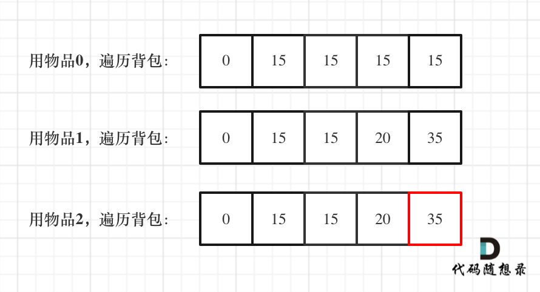

---

可以看出，⼀维dp 的01背包，要⽐⼆维简洁的多！ 初始化 和 遍历顺序相对简单了。
所以我倾向于使⽤⼀维dp数组的写法，⽐较直观简洁，⽽且空间复杂度还降了⼀个数量
级！
在后⾯背包问题的讲解中，我都直接使⽤⼀维dp数组来进⾏推导。
总结
 
以上的讲解可以开发⼀道⾯试题⽬（毕竟⼒扣上没原题）。
就是本⽂中的题⽬，要求先实现⼀个纯⼆维的01背包，如果写出来了，然后再问为什么两
个for循环的嵌套顺序这么写？反过来写⾏不⾏？再讲⼀讲初始化的逻辑。
然后要求实现⼀个⼀维数组的01背包，最后再问，⼀维数组的01背包，两个for循环的顺序
反过来写⾏不⾏？为什么？
注意以上问题都是在候选⼈把代码写出来的情况下才问的。
就是纯01背包的题⽬，都不⽤考01背包应⽤类的题⽬就可以看出候选⼈对算法的理解程度
了。
相信⼤家读完这篇⽂章，应该对以上问题都有了答案！
此时01背包理论基础就讲完了，我⽤了两篇⽂章把01背包的dp数组定义、递推公式、初始
化、遍历顺序从⼆维数组到⼀维数组统统深度剖析了⼀遍，没有放过任何难点。
⼤家可以发现其实信息量还是挺⼤的。
如果把动态规划：关于01背包问题，你该了解这些！和本篇的内容都理解了，后⾯我们在
做01背包的题⽬，就会发现⾮常简单了。
不⽤再凭感觉或者记忆去写背包，⽽是有⾃⼰的思考，了解其本质，代码的⽅⽅⾯⾯都在⾃
⼰的掌控之中。
即使代码没有通过，也会有⾃⼰的逻辑去debug，这样就思维清晰了。

---

接下来就要开始⽤这两天的理论基础去做⼒扣上的背包⾯试题⽬了，录友们握紧扶⼿，我们
要上⾼速啦！
分割等和⼦集
 
416. 分割等和⼦集
 
题⽬链接：https://leetcode-cn.com/problems/partition-equal-subset-sum/
题⽬难易：中等
给定⼀个只包含正整数的⾮空数组。是否可以将这个数组分割成两个⼦集，使得两个⼦集的
元素和相等。
注意:
每个数组中的元素不会超过 100
数组的⼤⼩不会超过 200
⽰例 1:
输⼊: [1, 5, 11, 5]
输出: true
解释: 数组可以分割成 [1, 5, 5] 和 [11].
⽰例 2:
输⼊: [1, 2, 3, 5]
输出: false
解释: 数组不能分割成两个元素和相等的⼦集.
思路
 
这道题⽬初步看，是如下两题⼏乎是⼀样的，⼤家可以⽤回溯法，解决如下两题
698.划分为k个相等的⼦集
473.⽕柴拼正⽅形

---

这道题⽬是要找是否可以将这个数组分割成两个⼦集，使得两个⼦集的元素和相等。
那么只要找到集合⾥能够出现 sum / 2 的⼦集总和，就算是可以分割成两个相同元素和⼦集
了。
本题是可以⽤回溯暴⼒搜索出所有答案的，但最后超时了，也不想再优化了，放弃回溯，直
接上01背包吧。
如果对01背包不够了解，建议仔细看完如下两篇：
动态规划：关于01背包问题，你该了解这些！
动态规划：关于01背包问题，你该了解这些！（滚动数组）
01背包问题
 
背包问题，⼤家都知道，有N件物品和⼀个最多能被重量为W 的背包。第i件物品的重量是
weight[i]，得到的价值是value[i] 。每件物品只能⽤⼀次，求解将哪些物品装⼊背包⾥物品
价值总和最⼤。
背包问题有多种背包⽅式，常见的有：01背包、完全背包、多重背包、分组背包和混合背
包等等。
要注意题⽬描述中商品是不是可以重复放⼊。
即⼀个商品如果可以重复多次放⼊是完全背包，⽽只能放⼊⼀次是01背包，写法还是不⼀
样的。
要明确本题中我们要使⽤的是01背包，因为元素我们只能⽤⼀次。
回归主题：⾸先，本题要求集合⾥能否出现总和为 sum / 2 的⼦集。
那么来⼀⼀对应⼀下本题，看看背包问题如果来解决。
只有确定了如下四点，才能把01背包问题套到本题上来。
背包的体积为sum / 2
背包要放⼊的商品（集合⾥的元素）重量为 元素的数值，价值也为元素的数值
背包如何正好装满，说明找到了总和为 sum / 2 的⼦集。

---

背包中每⼀个元素是不可重复放⼊。
以上分析完，我们就可以套⽤01背包，来解决这个问题了。
动规五部曲分析如下：
1. 确定dp数组以及下标的含义
01背包中，dp[i] 表⽰： 容量为j的背包，所背的物品价值可以最⼤为dp[j]。
套到本题，dp[i]表⽰ 背包总容量是i，最⼤可以凑成i的⼦集总和为dp[i]。
2. 确定递推公式
01背包的递推公式为：dp[j] = max(dp[j], dp[j - weight[i]] + value[i]);
本题，相当于背包⾥放⼊数值，那么物品i的重量是nums[i]，其价值也是nums[i]。
所以递推公式：dp[j] = max(dp[j], dp[j - nums[i]] + nums[i]);
3. dp数组如何初始化
在01背包，⼀维dp如何初始化，已经讲过，
从dp[j]的定义来看，⾸先dp[0]⼀定是0。
如果如果题⽬给的价值都是正整数那么⾮0下标都初始化为0就可以了，如果题⽬给的价值
有负数，那么⾮0下标就要初始化为负⽆穷。
这样才能让dp数组在递归公式的过程中取的最⼤的价值，⽽不是被初始值覆盖了。
本题题⽬中 只包含正整数的⾮空数组，所以⾮0下标的元素初始化为0就可以了。
代码如下：
// 题⽬中说：每个数组中的元素不会超过 100，数组的⼤⼩不会超过 200
// 总和不会⼤于20000，背包最⼤只需要其中⼀半，所以10001⼤⼩就可以了
vector<int> dp(10001, 0);

---

4. 确定遍历顺序
在动态规划：关于01背包问题，你该了解这些！（滚动数组）中就已经说明：如果使⽤⼀
维dp数组，物品遍历的for循环放在外层，遍历背包的for循环放在内层，且内层for循环倒叙
遍历！
代码如下：
5. 举例推导dp数组
dp[i]的数值⼀定是⼩于等于i的。
如果dp[i] == i 说明，集合中的⼦集总和正好可以凑成总和i，理解这⼀点很重要。
⽤例1，输⼊[1,5,11,5] 为例，如图：
最后dp[11] == 11，说明可以将这个数组分割成两个⼦集，使得两个⼦集的元素和相等。
综上分析完毕，C++代码如下：
// 开始 01背包
for(int i = 0; i < nums.size(); i++) {
    for(int j = target; j >= nums[i]; j--) { // 每⼀个元素⼀定是不可重复放
⼊，所以从⼤到⼩遍历
        dp[j] = max(dp[j], dp[j - nums[i]] + nums[i]);
    }
}

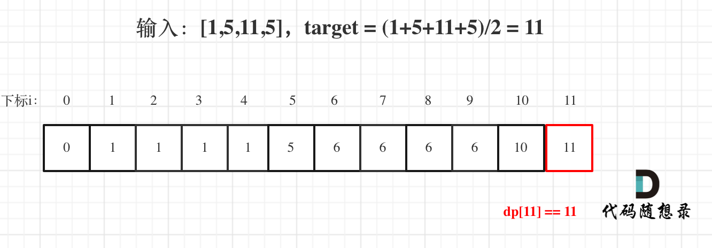

---

时间复杂度：O(n^2)
空间复杂度：O(n)，虽然dp数组⼤⼩为⼀个常数，但是⼤常数
总结
 
这道题⽬就是⼀道01背包应⽤类的题⽬，需要我们拆解题⽬，然后套⼊01背包的场景。
01背包相对于本题，主要要理解，题⽬中物品是nums[i]，重量是nums[i]i，价值也是
nums[i]，背包体积是sum/2。
class Solution {
public:
    bool canPartition(vector<int>& nums) {
        int sum = 0;
        // dp[i]中的i表示背包内总和
        // 题⽬中说：每个数组中的元素不会超过 100，数组的⼤⼩不会超过 200
        // 总和不会⼤于20000，背包最⼤只需要其中⼀半，所以10001⼤⼩就可以了
        vector<int> dp(10001, 0);
        for (int i = 0; i < nums.size(); i++) {
            sum += nums[i];
        }
        if (sum % 2 == 1) return false;
        int target = sum / 2;
        // 开始 01背包
        for(int i = 0; i < nums.size(); i++) {
            for(int j = target; j >= nums[i]; j--) { // 每⼀个元素⼀定是
不可重复放⼊，所以从⼤到⼩遍历
                dp[j] = max(dp[j], dp[j - nums[i]] + nums[i]);
            }
        }
        // 集合中的元素正好可以凑成总和target
        if (dp[target] == target) return true;
        return false;
    }
};

---

看代码的话，就可以发现，基本就是按照01背包的写法来的。
代码随想录官⽹：www.programmercarl.com
代码随想录开源项⽬Github：https://github.com/youngyangyang04/leetcode-
master
代码随想录算法公开课 ，代码随想录的全部内容将由我（程序员Carl）视频讲解
并开免费开放给⼤家。
《代码随想录》纸质版 已经出版。
代码随想录知识星球 上万录友在这⾥学习
代码随想录算法训练营 帮助录友⾼效刷完代码随想录。
如果感觉PDF对你有帮助，微信搜索：代码随想录，关注我吧，你会发现相见恨晚！
最后⼀块⽯头的重量II

---

1049. 最后⼀块⽯头的重量 II
 
题⽬链接：https://leetcode-cn.com/problems/last-stone-weight-ii/
题⽬难度：中等
有⼀堆⽯头，每块⽯头的重量都是正整数。
每⼀回合，从中选出任意两块⽯头，然后将它们⼀起粉碎。假设⽯头的重量分别为 x 和 y，
且 x <= y。那么粉碎的可能结果如下：
如果 x == y，那么两块⽯头都会被完全粉碎；
如果 x != y，那么重量为 x 的⽯头将会完全粉碎，⽽重量为 y 的⽯头新重量为 y-x。
最后，最多只会剩下⼀块⽯头。返回此⽯头最⼩的可能重量。如果没有⽯头剩下，就返回 
0。
⽰例：
输⼊：[2,7,4,1,8,1]
输出：1
解释：
组合 2 和 4，得到 2，所以数组转化为 [2,7,1,8,1]，
组合 7 和 8，得到 1，所以数组转化为 [2,1,1,1]，
组合 2 和 1，得到 1，所以数组转化为 [1,1,1]，
组合 1 和 1，得到 0，所以数组转化为 [1]，这就是最优值。
提⽰：
1 <= stones.length <= 30
1 <= stones[i] <= 1000
思路
 
如果对背包问题不都熟悉先看这两篇：
动态规划：关于01背包问题，你该了解这些！
动态规划：关于01背包问题，你该了解这些！（滚动数组）
本题其实就是尽量让⽯头分成重量相同的两堆，相撞之后剩下的⽯头最⼩，这样就化解成
01背包问题了。

---

是不是感觉和昨天讲解的416. 分割等和⼦集⾮常像了。
本题物品的重量为store[i]，物品的价值也为store[i]。
对应着01背包⾥的物品重量weight[i]和 物品价值value[i]。
接下来进⾏动规五步曲：
1. 确定dp数组以及下标的含义
dp[j]表⽰容量（这⾥说容量更形象，其实就是重量）为j的背包，最多可以背dp[j]这么重的
⽯头。
2. 确定递推公式
01背包的递推公式为：dp[j] = max(dp[j], dp[j - weight[i]] + value[i]);
本题则是：dp[j] = max(dp[j], dp[j - stones[i]] + stones[i]);
⼀些同学可能看到这dp[j - stones[i]] + stones[i]中 又有- stones[i] 又有+stones[i]，看着有点
晕乎。
还是要牢记dp[j]的含义，要知道dp[j - stones[i]]为 容量为j - stones[i]的背包最⼤所背重量。
3. dp数组如何初始化
既然 dp[j]中的j表⽰容量，那么最⼤容量（重量）是多少呢，就是所有⽯头的重量和。
因为提⽰中给出1 <= stones.length <= 30，1 <= stones[i] <= 1000，所以最⼤重量就是30 * 
1000 。
⽽我们要求的target其实只是最⼤重量的⼀半，所以dp数组开到15000⼤⼩就可以了。
当然也可以把⽯头遍历⼀遍，计算出⽯头总重量 然后除2，得到dp数组的⼤⼩。
我这⾥就直接⽤15000了。
接下来就是如何初始化dp[j]呢，因为重量都不会是负数，所以dp[j]都初始化为0就可以了，
这样在递归公式dp[j] = max(dp[j], dp[j - stones[i]] + stones[i]);中dp[j]才不会初始值所覆盖。

---

代码为：
4. 确定遍历顺序
在动态规划：关于01背包问题，你该了解这些！（滚动数组）中就已经说明：如果使⽤⼀
维dp数组，物品遍历的for循环放在外层，遍历背包的for循环放在内层，且内层for循环倒叙
遍历！
代码如下：
5. 举例推导dp数组
举例，输⼊：[2,4,1,1]，此时target = (2 + 4 + 1 + 1)/2 = 4 ，dp数组状态图如下：
vector<int> dp(15001, 0);
for (int i = 0; i < stones.size(); i++) { // 遍历物品
    for (int j = target; j >= stones[i]; j--) { // 遍历背包
        dp[j] = max(dp[j], dp[j - stones[i]] + stones[i]);
    }
}

---

最后dp[target]⾥是容量为target的背包所能背的最⼤重量。
那么分成两堆⽯头，⼀堆⽯头的总重量是dp[target]，另⼀堆就是sum - dp[target]。
在计算target的时候，target = sum / 2 因为是向下取整，所以sum - dp[target] ⼀定是⼤
于等于dp[target]的。
那么相撞之后剩下的最⼩⽯头重量就是 (sum - dp[target]) - dp[target]。
以上分析完毕，C++代码如下：
class Solution {
public:
    int lastStoneWeightII(vector<int>& stones) {
        vector<int> dp(15001, 0);
        int sum = 0;
        for (int i = 0; i < stones.size(); i++) sum += stones[i];

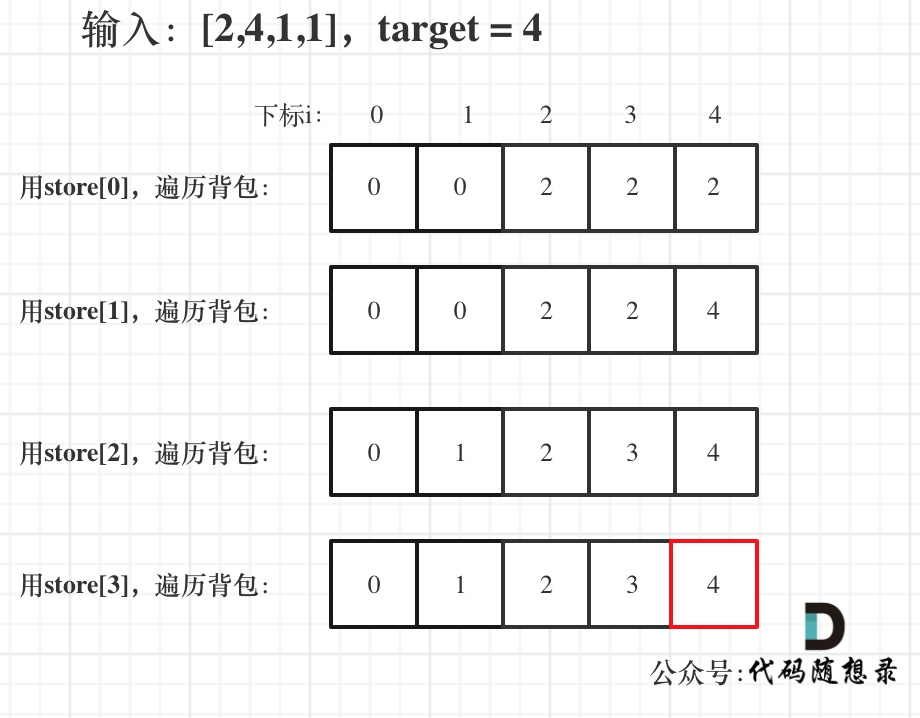

---

时间复杂度：O(m * n) , m是⽯头总重量（准确的说是总重量的⼀半），n为⽯头块
数
空间复杂度：O(m)
总结
 
本题其实和416. 分割等和⼦集⼏乎是⼀样的，只是最后对dp[target]的处理⽅式不同。
416. 分割等和⼦集相当于是求背包是否正好装满，⽽本题是求背包最多能装多少。
 
 
⽬标和
 
494. ⽬标和
 
题⽬链接：https://leetcode-cn.com/problems/target-sum/
难度：中等
        int target = sum / 2;
        for (int i = 0; i < stones.size(); i++) { // 遍历物品
            for (int j = target; j >= stones[i]; j--) { // 遍历背包
                dp[j] = max(dp[j], dp[j - stones[i]] + stones[i]);
            }
        }
        return sum - dp[target] - dp[target];
    }
};

---

给定⼀个⾮负整数数组，a1, a2, ..., an, 和⼀个⽬标数，S。现在你有两个符号 + 和 -。对于
数组中的任意⼀个整数，你都可以从 + 或 -中选择⼀个符号添加在前⾯。
返回可以使最终数组和为⽬标数 S 的所有添加符号的⽅法数。
⽰例：
输⼊：nums: [1, 1, 1, 1, 1], S: 3
输出：5
解释：
-1+1+1+1+1 = 3
+1-1+1+1+1 = 3
+1+1-1+1+1 = 3
+1+1+1-1+1 = 3
+1+1+1+1-1 = 3
⼀共有5种⽅法让最终⽬标和为3。
提⽰：
数组⾮空，且长度不会超过 20 。
初始的数组的和不会超过 1000 。
保证返回的最终结果能被 32 位整数存下。
思路
 
如果跟着「代码随想录」⼀起学过回溯算法系列的录友，看到这道题，应该有⼀种直觉，就
是感觉好像回溯法可以爆搜出来。
事实确实如此，下⾯我也会给出相应的代码，只不过会超时，哈哈。
这道题⽬咋眼⼀看和动态规划背包啥的也没啥关系。
本题要如何使表达式结果为target，
既然为target，那么就⼀定有 left组合 - right组合 = target。

---

left + right等于sum，⽽sum是固定的。
公式来了， left - (sum - left) = target ->  left = (target + sum)/2 。
target是固定的，sum是固定的，left就可以求出来。
此时问题就是在集合nums中找出和为left的组合。
回溯算法
 
在回溯算法系列中，⼀起学过这道题⽬回溯算法：39. 组合总和的录友应该感觉很熟悉，这
不就是组合总和问题么？
此时可以套组合总和的回溯法代码，⼏乎不⽤改动。
当然，也可以转变成序列区间选+ 或者 -，使⽤回溯法，那就是另⼀个解法。
我也把代码给出来吧，⼤家可以了解⼀下，回溯的解法，以下是本题转变为组合总和问题的
回溯法代码：
class Solution {
private:
    vector<vector<int>> result;
    vector<int> path;
    void backtracking(vector<int>& candidates, int target, int sum, 
int startIndex) {
        if (sum == target) {
            result.push_back(path);
        }
        // 如果 sum + candidates[i] > target 就终⽌遍历
        for (int i = startIndex; i < candidates.size() && sum + 
candidates[i] <= target; i++) {
            sum += candidates[i];
            path.push_back(candidates[i]);
            backtracking(candidates, target, sum, i + 1);
            sum -= candidates[i];
            path.pop_back();

---

当然以上代码超时了。
也可以使⽤记忆化回溯，但这⾥我就不在回溯上下功夫了，直接看动规吧
动态规划
 
如何转化为01背包问题呢。
假设加法的总和为x，那么减法对应的总和就是sum - x。
所以我们要求的是 x - (sum - x) = S
x = (S + sum) / 2
此时问题就转化为，装满容量为x背包，有⼏种⽅法。
        }
    }
public:
    int findTargetSumWays(vector<int>& nums, int S) {
        int sum = 0;
        for (int i = 0; i < nums.size(); i++) sum += nums[i];
        if (S > sum) return 0; // 此时没有⽅案
        if ((S + sum) % 2) return 0; // 此时没有⽅案，两个int相加的时候要各
位⼩⼼数值溢出的问题
        int bagSize = (S + sum) / 2; // 转变为组合总和问题，bagsize就是要
求的和
        // 以下为回溯法代码
        result.clear();
        path.clear();
        sort(nums.begin(), nums.end()); // 需要排序
        backtracking(nums, bagSize, 0, 0);
        return result.size();
    }
};

---

⼤家看到(S + sum) / 2 应该担⼼计算的过程中向下取整有没有影响。
这么担⼼就对了，例如sum 是5，S是2的话其实就是⽆解的，所以：
看到这种表达式，应该本能的反应，两个int相加数值可能溢出的问题，当然本题并没有溢
出。
再回归到01背包问题，为什么是01背包呢？
因为每个物品（题⽬中的1）只⽤⼀次！
这次和之前遇到的背包问题不⼀样了，之前都是求容量为j的背包，最多能装多少。
本题则是装满有⼏种⽅法。其实这就是⼀个组合问题了。
1. 确定dp数组以及下标的含义
dp[j] 表⽰：填满j（包括j）这么⼤容积的包，有dp[i]种⽅法
其实也可以使⽤⼆维dp数组来求解本题，dp[i][j]：使⽤ 下标为[0, i]的nums[i]能够凑满j（包
括j）这么⼤容量的包，有dp[i][j]种⽅法。
下⾯我都是统⼀使⽤⼀维数组进⾏讲解， ⼆维降为⼀维（滚动数组），其实就是上⼀层拷
贝下来，这个我在动态规划：关于01背包问题，你该了解这些！（滚动数组）也有介绍。
2. 确定递推公式
有哪些来源可以推出dp[j]呢？
不考虑nums[i]的情况下，填满容量为j - nums[i]的背包，有dp[j - nums[i]]中⽅法。
那么只要搞到nums[i]的话，凑成dp[j]就有dp[j - nums[i]] 种⽅法。
举⼀个例⼦,nums[i] = 2： dp[3]，填满背包容量为3的话，有dp[3]种⽅法。
if ((S + sum) % 2 == 1) return 0; // 此时没有⽅案

---

那么只需要搞到⼀个2（nums[i]），有dp[3]⽅法可以凑齐容量为3的背包，相应的就有多少
种⽅法可以凑齐容量为5的背包。
那么需要把 这些⽅法累加起来就可以了，dp[i] += dp[j - nums[i]]
所以求组合类问题的公式，都是类似这种：
这个公式在后⾯在讲解背包解决排列组合问题的时候还会⽤到！
3. dp数组如何初始化
从递归公式可以看出，在初始化的时候dp[0] ⼀定要初始化为1，因为dp[0]是在公式中⼀切
递推结果的起源，如果dp[0]是0的话，递归结果将都是0。
dp[0] = 1，理论上也很好解释，装满容量为0的背包，有1种⽅法，就是装0件物品。
dp[j]其他下标对应的数值应该初始化为0，从递归公式也可以看出，dp[j]要保证是0的初始
值，才能正确的由dp[j - nums[i]]推导出来。
4. 确定遍历顺序
在动态规划：关于01背包问题，你该了解这些！（滚动数组）中，我们讲过对于01背包问
题⼀维dp的遍历，nums放在外循环，target在内循环，且内循环倒序。
5. 举例推导dp数组
输⼊：nums: [1, 1, 1, 1, 1], S: 3
bagSize = (S + sum) / 2 =   (3 + 5) / 2 = 4
dp数组状态变化如下：
dp[j] += dp[j - nums[i]]

---

C++代码如下：
class Solution {
public:
    int findTargetSumWays(vector<int>& nums, int S) {
        int sum = 0;
        for (int i = 0; i < nums.size(); i++) sum += nums[i];
        if (S > sum) return 0; // 此时没有⽅案
        if ((S + sum) % 2 == 1) return 0; // 此时没有⽅案
        int bagSize = (S + sum) / 2;
        vector<int> dp(bagSize + 1, 0);
        dp[0] = 1;
        for (int i = 0; i < nums.size(); i++) {
            for (int j = bagSize; j >= nums[i]; j--) {

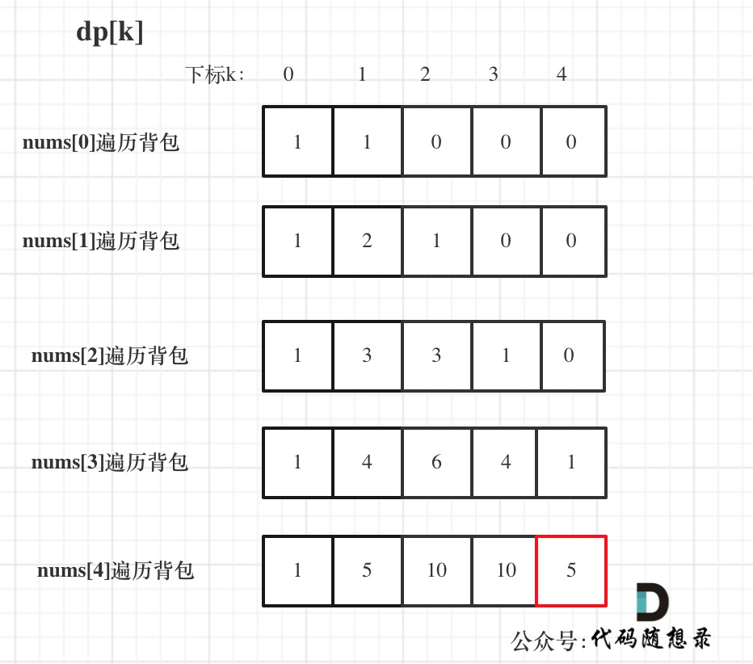

---

时间复杂度O(n * m)，n为正数个数，m为背包容量
空间复杂度：O(m) m为背包容量
总结
 
此时 ⼤家应该不仅想起，我们之前讲过的回溯算法：39. 组合总和是不是应该也可以⽤dp来
做啊？
是的，如果仅仅是求个数的话，就可以⽤dp，但回溯算法：39. 组合总和要求的是把所有组
合列出来，还是要使⽤回溯法爆搜的。
本地还是有点难度，⼤家也可以记住，在求装满背包有⼏种⽅法的情况下，递推公式⼀般
为：
后⾯我们在讲解完全背包的时候，还会⽤到这个递推公式！
 
⼀和零
 
                dp[j] += dp[j - nums[i]];
            }
        }
        return dp[bagSize];
    }
};
dp[j] += dp[j - nums[i]];

---

474.⼀和零
 
题⽬链接：https://leetcode-cn.com/problems/ones-and-zeroes/
给你⼀个⼆进制字符串数组 strs 和两个整数 m 和 n 。
请你找出并返回 strs 的最⼤⼦集的⼤⼩，该⼦集中 最多 有 m 个 0 和 n 个 1 。
如果 x 的所有元素也是 y 的元素，集合 x 是集合 y 的 ⼦集 。
⽰例 1：
输⼊：strs = ["10", "0001", "111001", "1", "0"], m = 5, n = 3
输出：4
解释：最多有 5 个 0 和 3 个 1 的最⼤⼦集是 {"10","0001","1","0"} ，因此答案是 4 。
其他满⾜题意但较⼩的⼦集包括 {"0001","1"} 和 {"10","1","0"} 。{"111001"} 不满⾜题意，因
为它含 4 个 1 ，⼤于 n 的值 3 。
⽰例 2：
输⼊：strs = ["10", "0", "1"], m = 1, n = 1
输出：2
解释：最⼤的⼦集是 {"0", "1"} ，所以答案是 2 。
提⽰：
1 <= strs.length <= 600
1 <= strs[i].length <= 100
strs[i] 仅由 '0' 和 '1' 组成
1 <= m, n <= 100
思路
 
这道题⽬，还是⽐较难的，也有点像程序员⾃⼰给⾃⼰出个脑筋急转弯，程序员何苦为难程
序员呢哈哈。
来说题，本题不少同学会认为是多重背包，⼀些题解也是这么写的。
其实本题并不是多重背包，再来看⼀下这个图，捋清⼏种背包的关系

---

多重背包是每个物品，数量不同的情况。
本题中strs 数组⾥的元素就是物品，每个物品都是⼀个！
⽽m 和 n相当于是⼀个背包，两个维度的背包。
理解成多重背包的同学主要是把m和n混淆为物品了，感觉这是不同数量的物品，所以以为
是多重背包。
但本题其实是01背包问题！
这不过这个背包有两个维度，⼀个是m ⼀个是n，⽽不同长度的字符串就是不同⼤⼩的待装
物品。
开始动规五部曲：
1. 确定dp数组（dp table）以及下标的含义
dp[i][j]：最多有i个0和j个1的strs的最⼤⼦集的⼤⼩为dp[i][j]。
2. 确定递推公式
dp[i][j] 可以由前⼀个strs⾥的字符串推导出来，strs⾥的字符串有zeroNum个0，oneNum个
1。
dp[i][j] 就可以是 dp[i - zeroNum][j - oneNum] + 1。
然后我们在遍历的过程中，取dp[i][j]的最⼤值。

---

所以递推公式：dp[i][j] = max(dp[i][j], dp[i - zeroNum][j - oneNum] + 1);
此时⼤家可以回想⼀下01背包的递推公式：dp[j] = max(dp[j], dp[j - weight[i]] + value[i]);
对⽐⼀下就会发现，字符串的zeroNum和oneNum相当于物品的重量（weight[i]），字符串
本⾝的个数相当于物品的价值（value[i]）。
这就是⼀个典型的01背包！ 只不过物品的重量有了两个维度⽽已。
3. dp数组如何初始化
在动态规划：关于01背包问题，你该了解这些！（滚动数组）中已经讲解了，01背包的dp
数组初始化为0就可以。
因为物品价值不会是负数，初始为0，保证递推的时候dp[i][j]不会被初始值覆盖。
4. 确定遍历顺序
在动态规划：关于01背包问题，你该了解这些！（滚动数组）中，我们讲到了01背包为什
么⼀定是外层for循环遍历物品，内层for循环遍历背包容量且从后向前遍历！
那么本题也是，物品就是strs⾥的字符串，背包容量就是题⽬描述中的m和n。
代码如下：
for (string str : strs) { // 遍历物品
    int oneNum = 0, zeroNum = 0;
    for (char c : str) {
        if (c == '0') zeroNum++;
        else oneNum++;
    }
    for (int i = m; i >= zeroNum; i--) { // 遍历背包容量且从后向前遍历！
        for (int j = n; j >= oneNum; j--) {
            dp[i][j] = max(dp[i][j], dp[i - zeroNum][j - oneNum] + 
1);
        }
    }
}

---

有同学可能想，那个遍历背包容量的两层for循环先后循序有没有什么讲究？
没讲究，都是物品重量的⼀个维度，先遍历那个都⾏！
5. 举例推导dp数组
以输⼊：["10","0001","111001","1","0"]，m = 3，n = 3为例
最后dp数组的状态如下所⽰：
以上动规五部曲分析完毕，C++代码如下：
class Solution {
public:
    int findMaxForm(vector<string>& strs, int m, int n) {

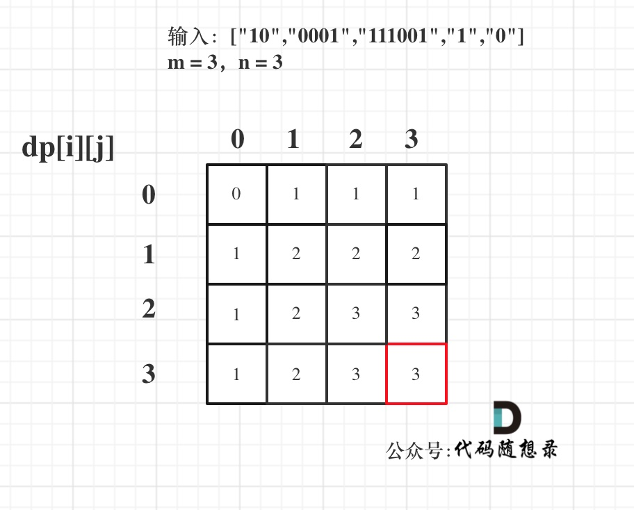

---

总结
 
不少同学刷过这道提，可能没有总结这究竟是什么背包。
这道题的本质是有两个维度的01背包，如果⼤家认识到这⼀点，对这道题的理解就⽐较深
⼊了。
 
完全背包理论基础
 
        vector<vector<int>> dp(m + 1, vector<int> (n + 1, 0)); // 默认
初始化0
        for (string str : strs) { // 遍历物品
            int oneNum = 0, zeroNum = 0;
            for (char c : str) {
                if (c == '0') zeroNum++;
                else oneNum++;
            }
            for (int i = m; i >= zeroNum; i--) { // 遍历背包容量且从后向
前遍历！
                for (int j = n; j >= oneNum; j--) {
                    dp[i][j] = max(dp[i][j], dp[i - zeroNum][j - 
oneNum] + 1);
                }
            }
        }
        return dp[m][n];
    }
};

---

重量
价值
物品0
1
15
物品1
3
20
物品2
4
30
完全背包
 
有N件物品和⼀个最多能背重量为W的背包。第i件物品的重量是weight[i]，得到的价值是
value[i] 。每件物品都有⽆限个（也就是可以放⼊背包多次），求解将哪些物品装⼊背包⾥
物品价值总和最⼤。
完全背包和01背包问题唯⼀不同的地⽅就是，每种物品有⽆限件。
同样leetcode上没有纯完全背包问题，都是需要完全背包的各种应⽤，需要转化成完全背包
问题，所以我这⾥还是以纯完全背包问题进⾏讲解理论和原理。
在下⾯的讲解中，我依然举这个例⼦：
背包最⼤重量为4。
物品为：
每件商品都有⽆限个！
问背包能背的物品最⼤价值是多少？
01背包和完全背包唯⼀不同就是体现在遍历顺序上，所以本⽂就不去做动规五部曲了，我
们直接针对遍历顺序经⾏分析！
关于01背包我如下两篇已经进⾏深⼊分析了：
动态规划：关于01背包问题，你该了解这些！
动态规划：关于01背包问题，你该了解这些！（滚动数组）
⾸先在回顾⼀下01背包的核⼼代码

---

我们知道01背包内嵌的循环是从⼤到⼩遍历，为了保证每个物品仅被添加⼀次。
⽽完全背包的物品是可以添加多次的，所以要从⼩到⼤去遍历，即：
⾄于为什么，我在动态规划：关于01背包问题，你该了解这些！（滚动数组）中也做了讲
解。
dp状态图如下：
for(int i = 0; i < weight.size(); i++) { // 遍历物品
    for(int j = bagWeight; j >= weight[i]; j--) { // 遍历背包容量
        dp[j] = max(dp[j], dp[j - weight[i]] + value[i]);
    }
}
// 先遍历物品，再遍历背包
for(int i = 0; i < weight.size(); i++) { // 遍历物品
    for(int j = weight[i]; j < bagWeight ; j++) { // 遍历背包容量
        dp[j] = max(dp[j], dp[j - weight[i]] + value[i]);
    }
}

---

相信很多同学看⽹上的⽂章，关于完全背包介绍基本就到为⽌了。
其实还有⼀个很重要的问题，为什么遍历物品在外层循环，遍历背包容量在内层循环？
这个问题很多题解关于这⾥都是轻描淡写就略过了，⼤家都默认 遍历物品在外层，遍历背
包容量在内层，好像本应该如此⼀样，那么为什么呢？
难道就不能遍历背包容量在外层，遍历物品在内层？
看过这两篇的话：
动态规划：关于01背包问题，你该了解这些！
动态规划：关于01背包问题，你该了解这些！（滚动数组）
就知道了，01背包中⼆维dp数组的两个for遍历的先后循序是可以颠倒了，⼀位dp数组的两
个for循环先后循序⼀定是先遍历物品，再遍历背包容量。
在完全背包中，对于⼀维dp数组来说，其实两个for循环嵌套顺序同样⽆所谓！
因为dp[j] 是根据 下标j之前所对应的dp[j]计算出来的。 只要保证下标j之前的dp[j]都是经过
计算的就可以了。

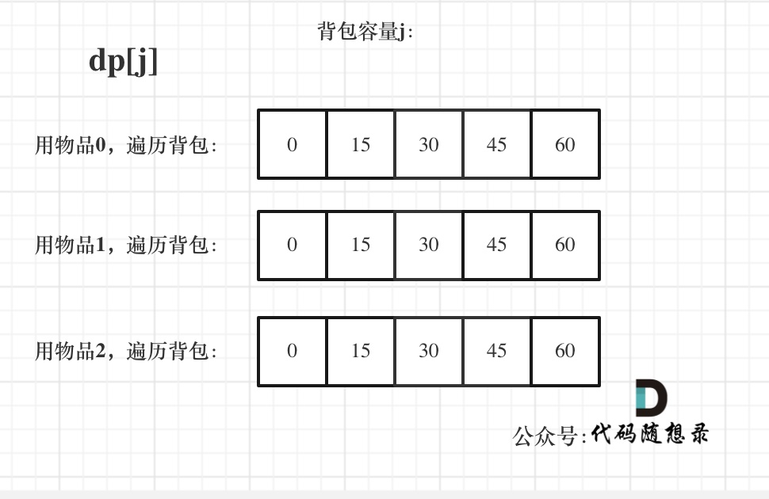

---

遍历物品在外层循环，遍历背包容量在内层循环，状态如图：
遍历背包容量在外层循环，遍历物品在内层循环，状态如图：
看了这两个图，⼤家就会理解，完全背包中，两个for循环的先后循序，都不影响计算dp[j]
所需要的值（这个值就是下标j之前所对应的dp[j]）。
先遍历被背包在遍历物品，代码如下：
// 先遍历背包，再遍历物品
for(int j = 0; j <= bagWeight; j++) { // 遍历背包容量
    for(int i = 0; i < weight.size(); i++) { // 遍历物品
        if (j - weight[i] >= 0) dp[j] = max(dp[j], dp[j - weight[i]] 
+ value[i]);
    }
    cout << endl;
}

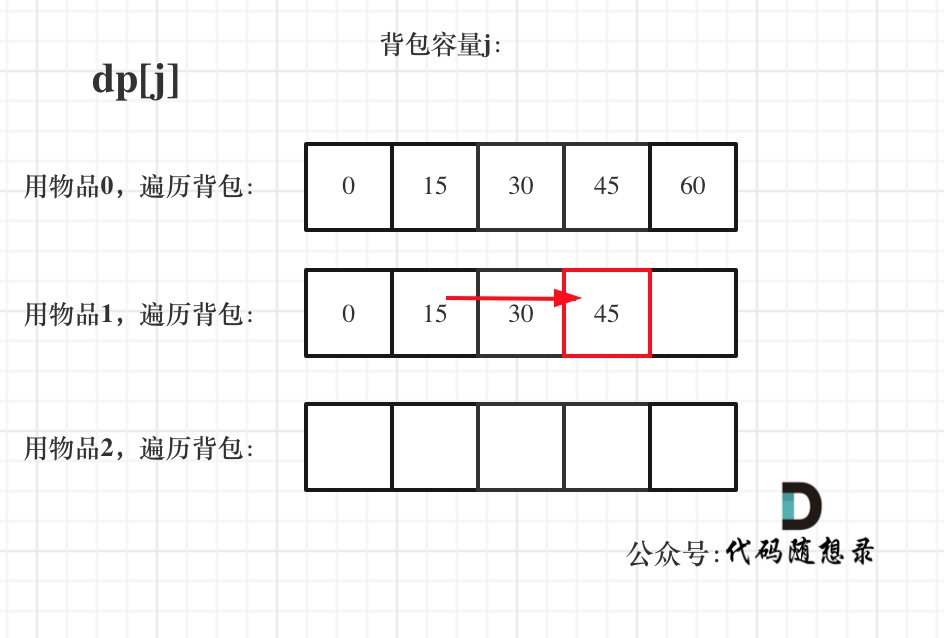

---

C++测试代码
 
完整的C++测试代码如下：
// 先遍历物品，在遍历背包
void test_CompletePack() {
    vector<int> weight = {1, 3, 4};
    vector<int> value = {15, 20, 30};
    int bagWeight = 4;
    vector<int> dp(bagWeight + 1, 0);
    for(int i = 0; i < weight.size(); i++) { // 遍历物品
        for(int j = weight[i]; j <= bagWeight; j++) { // 遍历背包容量
            dp[j] = max(dp[j], dp[j - weight[i]] + value[i]);
        }
    }
    cout << dp[bagWeight] << endl;
}
int main() {
    test_CompletePack();
}
// 先遍历背包，再遍历物品
void test_CompletePack() {
    vector<int> weight = {1, 3, 4};
    vector<int> value = {15, 20, 30};
    int bagWeight = 4;
    vector<int> dp(bagWeight + 1, 0);
    for(int j = 0; j <= bagWeight; j++) { // 遍历背包容量
        for(int i = 0; i < weight.size(); i++) { // 遍历物品
            if (j - weight[i] >= 0) dp[j] = max(dp[j], dp[j - 
weight[i]] + value[i]);
        }
    }
    cout << dp[bagWeight] << endl;

---

总结
 
细⼼的同学可能发现，全⽂我说的都是对于纯完全背包问题，其for循环的先后循环是可以
颠倒的！
但如果题⽬稍稍有点变化，就会体现在遍历顺序上。
如果问装满背包有⼏种⽅式的话？ 那么两个for循环的先后顺序就有很⼤区别了，⽽
leetcode上的题⽬都是这种稍有变化的类型。
这个区别，我将在后⾯讲解具体leetcode题⽬中给⼤家介绍，因为这块如果不结合具题⽬，
单纯的介绍原理估计很多同学会越看越懵！
别急，下⼀篇就是了！哈哈
最后，又可以出⼀道⾯试题了，就是纯完全背包，要求先⽤⼆维dp数组实现，然后再⽤⼀
维dp数组实现，最后在问，两个for循环的先后是否可以颠倒？为什么？
这个简单的完全背包问题，估计就可以难住不少候选⼈了。
 
零钱兑换 II
 
518. 零钱兑换 II
 
链接：https://leetcode-cn.com/problems/coin-change-2/
难度：中等
}
int main() {
    test_CompletePack();
}

---

给定不同⾯额的硬币和⼀个总⾦额。写出函数来计算可以凑成总⾦额的硬币组合数。假设每
⼀种⾯额的硬币有⽆限个。 
⽰例 1:
输⼊: amount = 5, coins = [1, 2, 5]
输出: 4
解释: 有四种⽅式可以凑成总⾦额:
5=5
5=2+2+1
5=2+1+1+1
5=1+1+1+1+1
⽰例 2:
输⼊: amount = 3, coins = [2]
输出: 0
解释: 只⽤⾯额2的硬币不能凑成总⾦额3。
⽰例 3:
输⼊: amount = 10, coins = [10]
输出: 1
注意，你可以假设：
0 <= amount (总⾦额) <= 5000
1 <= coin (硬币⾯额) <= 5000
硬币种类不超过 500 种
结果符合 32 位符号整数
思路
 
这是⼀道典型的背包问题，⼀看到钱币数量不限，就知道这是⼀个完全背包。
对完全背包还不了解的同学，可以看这篇：动态规划：关于完全背包，你该了解这些！
但本题和纯完全背包不⼀样，纯完全背包是能否凑成总⾦额，⽽本题是要求凑成总⾦额的个
数！

---

注意题⽬描述中是凑成总⾦额的硬币组合数，为什么强调是组合数呢？
例如⽰例⼀：
5 = 2 + 2 + 1
5 = 2 + 1 + 2
这是⼀种组合，都是 2 2 1。
如果问的是排列数，那么上⾯就是两种排列了。
组合不强调元素之间的顺序，排列强调元素之间的顺序。 其实这⼀点我们在讲解回溯算法
专题的时候就讲过了哈。
那我为什么要介绍这些呢，因为这和下⽂讲解遍历顺序息息相关!
回归本题，动规五步曲来分析如下：
1. 确定dp数组以及下标的含义
dp[j]：凑成总⾦额j的货币组合数为dp[j]
2. 确定递推公式
dp[j] （考虑coins[i]的组合总和） 就是所有的dp[j - coins[i]]（不考虑coins[i]）相加。
所以递推公式：dp[j] += dp[j - coins[i]];
这个递推公式⼤家应该不陌⽣了，我在讲解01背包题⽬的时候在这篇动态规划：⽬标和！
中就讲解了，求装满背包有⼏种⽅法，⼀般公式都是：dp[j] += dp[j - nums[i]];
3. dp数组如何初始化
⾸先dp[0]⼀定要为1，dp[0] = 1是 递归公式的基础。
从dp[i]的含义上来讲就是，凑成总⾦额0的货币组合数为1。
下标⾮0的dp[j]初始化为0，这样累计加dp[j - coins[i]]的时候才不会影响真正的dp[j]

---

4. 确定遍历顺序
本题中我们是外层for循环遍历物品（钱币），内层for遍历背包（⾦钱总额），还是外层for
遍历背包（⾦钱总额），内层for循环遍历物品（钱币）呢？
我在动态规划：关于完全背包，你该了解这些！中讲解了完全背包的两个for循环的先后顺
序都是可以的。
但本题就不⾏了！
因为纯完全背包求得是能否凑成总和，和凑成总和的元素有没有顺序没关系，即：有顺序也
⾏，没有顺序也⾏！
⽽本题要求凑成总和的组合数，元素之间要求没有顺序。
所以纯完全背包是能凑成总结就⾏，不⽤管怎么凑的。
本题是求凑出来的⽅案个数，且每个⽅案个数是为组合数。
那么本题，两个for循环的先后顺序可就有说法了。
我们先来看 外层for循环遍历物品（钱币），内层for遍历背包（⾦钱总额）的情况。
代码如下：
假设：coins[0] = 1，coins[1] = 5。
那么就是先把1加⼊计算，然后再把5加⼊计算，得到的⽅法数量只有{1, 5}这种情况。⽽不
会出现{5, 1}的情况。
所以这种遍历顺序中dp[j]⾥计算的是组合数！
for (int i = 0; i < coins.size(); i++) { // 遍历物品
    for (int j = coins[i]; j <= amount; j++) { // 遍历背包容量
        dp[j] += dp[j - coins[i]];
    }
}

---

如果把两个for交换顺序，代码如下：
背包容量的每⼀个值，都是经过 1 和 5 的计算，包含了{1, 5} 和 {5, 1}两种情况。
此时dp[j]⾥算出来的就是排列数！
可能这⾥很多同学还不是很理解，建议动⼿把这两种⽅案的dp数组数值变化打印出来，对
⽐看⼀看！（实践出真知）
5. 举例推导dp数组
输⼊: amount = 5, coins = [1, 2, 5] ，dp状态图如下：
最后红⾊框dp[amount]为最终结果。
for (int j = 0; j <= amount; j++) { // 遍历背包容量
    for (int i = 0; i < coins.size(); i++) { // 遍历物品
        if (j - coins[i] >= 0) dp[j] += dp[j - coins[i]];
    }
}

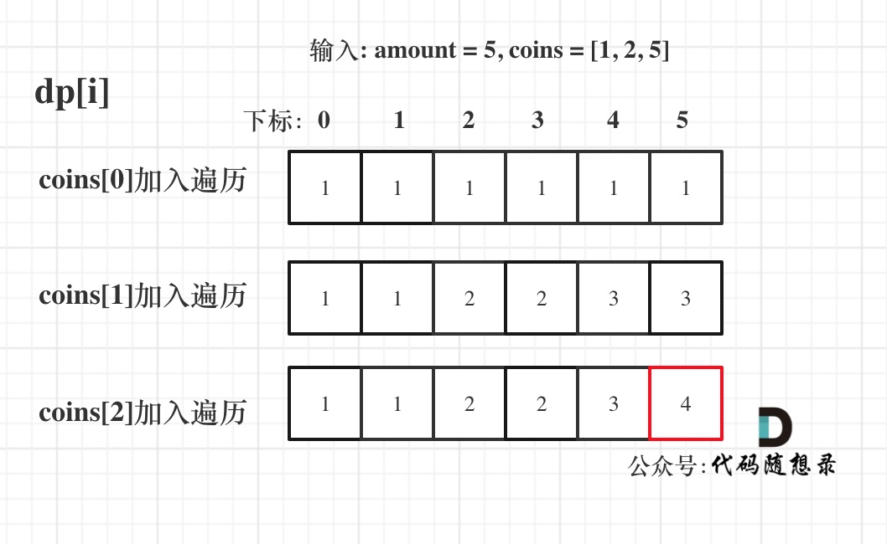

---

以上分析完毕，C++代码如下：
是不是发现代码如此精简，哈哈
总结
 
本题的递推公式，其实我们在动态规划：⽬标和！中就已经讲过了，⽽难点在于遍历顺序！
在求装满背包有⼏种⽅案的时候，认清遍历顺序是⾮常关键的。
如果求组合数就是外层for循环遍历物品，内层for遍历背包。
如果求排列数就是外层for遍历背包，内层for循环遍历物品。
可能说到排列数录友们已经有点懵了，后⾯Carl还会安排求排列数的题⽬，到时候在对⽐⼀
下，⼤家就会发现神奇所在！
代码随想录官⽹：www.programmercarl.com
代码随想录开源项⽬Github：https://github.com/youngyangyang04/leetcode-
master
代码随想录算法公开课 ，代码随想录的全部内容将由我（程序员Carl）视频讲解
并开免费开放给⼤家。
《代码随想录》纸质版 已经出版。
class Solution {
public:
    int change(int amount, vector<int>& coins) {
        vector<int> dp(amount + 1, 0);
        dp[0] = 1;
        for (int i = 0; i < coins.size(); i++) { // 遍历物品
            for (int j = coins[i]; j <= amount; j++) { // 遍历背包
                dp[j] += dp[j - coins[i]];
            }
        }
        return dp[amount];
    }
};

---

代码随想录知识星球 上万录友在这⾥学习
代码随想录算法训练营 帮助录友⾼效刷完代码随想录。
 
如果感觉PDF对你有帮助，微信搜索：代码随想录，关注我吧，你会发现相见恨晚！
Carl称它为排列总和
 
377. 组合总和 Ⅳ
 
题⽬链接：https://leetcode-cn.com/problems/combination-sum-iv/
难度：中等
给定⼀个由正整数组成且不存在重复数字的数组，找出和为给定⽬标正整数的组合的个数。
⽰例:

---

nums = [1, 2, 3]
target = 4
所有可能的组合为：
(1, 1, 1, 1)
(1, 1, 2)
(1, 2, 1)
(1, 3)
(2, 1, 1)
(2, 2)
(3, 1)
请注意，顺序不同的序列被视作不同的组合。
因此输出为 7。
思路
 
本题题⽬描述说是求组合，但又说是可以元素相同顺序不同的组合算两个组合，其实就是求
排列！
弄清什么是组合，什么是排列很重要。
组合不强调顺序，(1,5)和(5,1)是同⼀个组合。
排列强调顺序，(1,5)和(5,1)是两个不同的排列。
⼤家在公众号⾥学习回溯算法专题的时候，⼀定做过这两道题⽬回溯算法：39.组合总和和
回溯算法：40.组合总和II会感觉这两题和本题很像！
但其本质是本题求的是排列总和，⽽且仅仅是求排列总和的个数，并不是把所有的排列都列
出来。
如果本题要把排列都列出来的话，只能使⽤回溯算法爆搜。
动规五部曲分析如下：
1. 确定dp数组以及下标的含义

---

dp[i]: 凑成⽬标正整数为i的排列个数为dp[i]
2. 确定递推公式
dp[i]（考虑nums[j]）可以由 dp[i - nums[j]]（不考虑nums[j]） 推导出来。
因为只要得到nums[j]，排列个数dp[i - nums[j]]，就是dp[i]的⼀部分。
在动态规划：494.⽬标和 和 动态规划：518.零钱兑换II中我们已经讲过了，求装满背包有⼏
种⽅法，递推公式⼀般都是dp[i] += dp[i - nums[j]];
本题也⼀样。
3. dp数组如何初始化
因为递推公式dp[i] += dp[i - nums[j]]的缘故，dp[0]要初始化为1，这样递归其他dp[i]的时候
才会有数值基础。
⾄于dp[0] = 1 有没有意义呢？
其实没有意义，所以我也不去强⾏解释它的意义了，因为题⽬中也说了：给定⽬标值是正整
数！ 所以dp[0] = 1是没有意义的，仅仅是为了推导递推公式。
⾄于⾮0下标的dp[i]应该初始为多少呢？
初始化为0，这样才不会影响dp[i]累加所有的dp[i - nums[j]]。
4. 确定遍历顺序
个数可以不限使⽤，说明这是⼀个完全背包。
得到的集合是排列，说明需要考虑元素之间的顺序。
本题要求的是排列，那么这个for循环嵌套的顺序可以有说法了。
在动态规划：518.零钱兑换II 中就已经讲过了。
如果求组合数就是外层for循环遍历物品，内层for遍历背包。

---

如果求排列数就是外层for遍历背包，内层for循环遍历物品。
如果把遍历nums（物品）放在外循环，遍历target的作为内循环的话，举⼀个例⼦：计算
dp[4]的时候，结果集只有 {1,3} 这样的集合，不会有{3,1}这样的集合，因为nums遍历放在
外层，3只能出现在1后⾯！
所以本题遍历顺序最终遍历顺序：target（背包）放在外循环，将nums（物品）放在内循
环，内循环从前到后遍历。
5. 举例来推导dp数组
我们再来⽤⽰例中的例⼦推导⼀下：
如果代码运⾏处的结果不是想要的结果，就把dp[i]都打出来，看看和我们推导的⼀不⼀
样。
以上分析完毕，C++代码如下：
class Solution {
public:
    int combinationSum4(vector<int>& nums, int target) {
        vector<int> dp(target + 1, 0);
        dp[0] = 1;

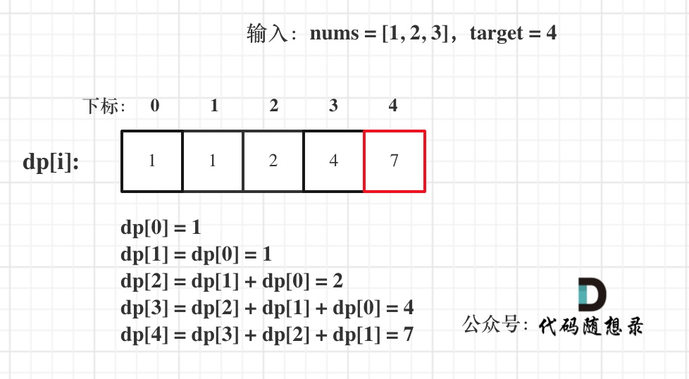

---

C++测试⽤例有超过两个树相加超过int的数据，所以需要在if⾥加上dp[i] < INT_MAX - dp[i 
- num]。
但java就不⽤考虑这个限制，java⾥的int也是四个字节吧，也有可能leetcode后台对不同语
⾔的测试数据不⼀样。
总结
 
求装满背包有⼏种⽅法，递归公式都是⼀样的，没有什么差别，但关键在于遍历顺序！
本题与动态规划：518.零钱兑换II就是⼀个鲜明的对⽐，⼀个是求排列，⼀个是求组合，遍
历顺序完全不同。
如果对遍历顺序没有深度理解的话，做这种完全背包的题⽬会很懵逼，即使题⽬刷过了可能
也不太清楚具体是怎么过的。
此时⼤家应该对动态规划中的遍历顺序又有更深的理解了。
 
再爬⼀次楼梯
 
        for (int i = 0; i <= target; i++) { // 遍历背包
            for (int j = 0; j < nums.size(); j++) { // 遍历物品
                if (i - nums[j] >= 0 && dp[i] < INT_MAX - dp[i - 
nums[j]]) {
                    dp[i] += dp[i - nums[j]];
                }
            }
        }
        return dp[target];
    }
};

---

之前讲这道题⽬的时候，因为还没有讲背包问题，所以就只是讲了⼀下爬楼梯最直接的动规
⽅法（斐波那契）。
这次终于讲到了背包问题，我选择带录友们再爬⼀次楼梯！
70. 爬楼梯
 
链接：https://leetcode-cn.com/problems/climbing-stairs/
假设你正在爬楼梯。需要 n 阶你才能到达楼顶。
每次你可以爬 1 或 2 个台阶。你有多少种不同的⽅法可以爬到楼顶呢？
注意：给定 n 是⼀个正整数。
⽰例 1：
输⼊： 2
输出： 2
解释： 有两种⽅法可以爬到楼顶。
1. 1 阶 + 1 阶
2. 2 阶
⽰例 2：
输⼊： 3
输出： 3
解释： 有三种⽅法可以爬到楼顶。
1. 1 阶 + 1 阶 + 1 阶
2. 1 阶 + 2 阶
3. 2 阶 + 1 阶
思路
 
这道题⽬ 我们在动态规划：爬楼梯 中已经讲过⼀次了，原题其实是⼀道简单动规的题⽬。
既然这么简单为什么还要讲呢，其实本题稍加改动就是⼀道⾯试好题。

---

改为：⼀步⼀个台阶，两个台阶，三个台阶，.......，直到 m个台阶。问有多少种不同的⽅
法可以爬到楼顶呢？
1阶，2阶，.... m阶就是物品，楼顶就是背包。
每⼀阶可以重复使⽤，例如跳了1阶，还可以继续跳1阶。
问跳到楼顶有⼏种⽅法其实就是问装满背包有⼏种⽅法。
此时⼤家应该发现这就是⼀个完全背包问题了！
和昨天的题⽬动态规划：377. 组合总和 Ⅳ基本就是⼀道题了。
动规五部曲分析如下：
1. 确定dp数组以及下标的含义
dp[i]：爬到有i个台阶的楼顶，有dp[i]种⽅法。
2. 确定递推公式
在动态规划：494.⽬标和 、 动态规划：518.零钱兑换II、动态规划：377. 组合总和 Ⅳ中我
们都讲过了，求装满背包有⼏种⽅法，递推公式⼀般都是dp[i] += dp[i - nums[j]];
本题呢，dp[i]有⼏种来源，dp[i - 1]，dp[i - 2]，dp[i - 3] 等等，即：dp[i - j]
那么递推公式为：dp[i] += dp[i - j]
3. dp数组如何初始化
既然递归公式是 dp[i] += dp[i - j]，那么dp[0] ⼀定为1，dp[0]是递归中⼀切数值的基础所
在，如果dp[0]是0的话，其他数值都是0了。
下标⾮0的dp[i]初始化为0，因为dp[i]是靠dp[i-j]累计上来的，dp[i]本⾝为0这样才不会影响
结果
4. 确定遍历顺序

---

这是背包⾥求排列问题，即：1、2 步  和 2、1 步都是上三个台阶，但是这两种⽅法不⼀
样！
所以需将target放在外循环，将nums放在内循环。
每⼀步可以⾛多次，这是完全背包，内循环需要从前向后遍历。
5. 举例来推导dp数组
介于本题和动态规划：377. 组合总和 Ⅳ⼏乎是⼀样的，这⾥我就不再重复举例了。
以上分析完毕，C++代码如下：
代码中m表⽰最多可以爬m个台阶，代码中把m改成2就是本题70.爬楼梯可以AC的代码了。
总结
 
本题看起来是⼀道简单题⽬，稍稍进阶⼀下其实就是⼀个完全背包！
如果我来⾯试的话，我就会先给候选⼈出⼀个 本题原题，看其表现，如果顺利写出来，进
⽽在要求每次可以爬[1 - m]个台阶应该怎么写。
顺便再考察⼀下两个for循环的嵌套顺序，为什么target放外⾯，nums放⾥⾯。
class Solution {
public:
    int climbStairs(int n) {
        vector<int> dp(n + 1, 0);
        dp[0] = 1;
        for (int i = 1; i <= n; i++) { // 遍历背包
            for (int j = 1; j <= m; j++) { // 遍历物品
                if (i - j >= 0) dp[i] += dp[i - j];
            }
        }
        return dp[n];
    }
};

---

这就能考察对背包问题本质的掌握程度，候选⼈是不是刷题背公式，⼀眼就看出来了。
这么⼀连套下来，如果候选⼈都能答出来，相信任何⼀位⾯试官都是⾮常满意的。
本题代码不长，题⽬也很普通，但稍稍⼀进阶就可以考察完全背包，⽽且题⽬进阶的内容在
leetcode上并没有原题，⼀定程度上就可以排除掉刷题党了，简直是⾯试题⽬的绝佳选
择！
 
再兑换⼀次零钱
 
322. 零钱兑换
 
题⽬链接：https://leetcode-cn.com/problems/coin-change/
给定不同⾯额的硬币 coins 和⼀个总⾦额 amount。编写⼀个函数来计算可以凑成总⾦额所
需的最少的硬币个数。如果没有任何⼀种硬币组合能组成总⾦额，返回 -1。
你可以认为每种硬币的数量是⽆限的。
⽰例 1：
输⼊：coins = [1, 2, 5], amount = 11
输出：3
解释：11 = 5 + 5 + 1
⽰例 2：
输⼊：coins = [2], amount = 3
输出：-1
⽰例 3：
输⼊：coins = [1], amount = 0
输出：0

---

⽰例 4：
输⼊：coins = [1], amount = 1
输出：1
⽰例 5：
输⼊：coins = [1], amount = 2
输出：2
提⽰：
1 <= coins.length <= 12
1 <= coins[i] <= 2^31 - 1
0 <= amount <= 10^4
思路
 
在动态规划：518.零钱兑换II中我们已经兑换⼀次零钱了，这次又要兑换，套路不⼀样！
题⽬中说每种硬币的数量是⽆限的，可以看出是典型的完全背包问题。
动规五部曲分析如下：
1. 确定dp数组以及下标的含义
dp[j]：凑⾜总额为j所需钱币的最少个数为dp[j]
2. 确定递推公式
得到dp[j]（考虑coins[i]），只有⼀个来源，dp[j - coins[i]]（没有考虑coins[i]）。
凑⾜总额为j - coins[i]的最少个数为dp[j - coins[i]]，那么只需要加上⼀个钱币coins[i]即dp[j 
- coins[i]] + 1就是dp[j]（考虑coins[i]）
所以dp[j] 要取所有 dp[j - coins[i]] + 1 中最⼩的。
递推公式：dp[j] =  min(dp[j - coins[i]] + 1, dp[j]);
3. dp数组如何初始化

---

⾸先凑⾜总⾦额为0所需钱币的个数⼀定是0，那么dp[0] = 0;
其他下标对应的数值呢？
考虑到递推公式的特性，dp[j]必须初始化为⼀个最⼤的数，否则就会在min(dp[j - coins[i]] 
+ 1, dp[j])⽐较的过程中被初始值覆盖。
所以下标⾮0的元素都是应该是最⼤值。
代码如下：
4. 确定遍历顺序
本题求钱币最⼩个数，那么钱币有顺序和没有顺序都可以，都不影响钱币的最⼩个数。。
所以本题并不强调集合是组合还是排列。
如果求组合数就是外层for循环遍历物品，内层for遍历背包。
如果求排列数就是外层for遍历背包，内层for循环遍历物品。
在动态规划专题我们讲过了求组合数是动态规划：518.零钱兑换II，求排列数是动态规划：
377. 组合总和 Ⅳ。
所以本题的两个for循环的关系是：外层for循环遍历物品，内层for遍历背包或者外层for遍
历背包，内层for循环遍历物品都是可以的！
那么我采⽤coins放在外循环，target在内循环的⽅式。
本题钱币数量可以⽆限使⽤，那么是完全背包。所以遍历的内循环是正序
综上所述，遍历顺序为：coins（物品）放在外循环，target（背包）在内循环。且内循环
正序。
5. 举例推导dp数组
vector<int> dp(amount + 1, INT_MAX);
dp[0] = 0;

---

以输⼊：coins = [1, 2, 5], amount = 5为例
dp[amount]为最终结果。
以上分析完毕，C++ 代码如下：
// 版本⼀
class Solution {
public:
    int coinChange(vector<int>& coins, int amount) {
        vector<int> dp(amount + 1, INT_MAX);
        dp[0] = 0;
        for (int i = 0; i < coins.size(); i++) { // 遍历物品
            for (int j = coins[i]; j <= amount; j++) { // 遍历背包
                if (dp[j - coins[i]] != INT_MAX) { // 如果dp[j - 
coins[i]]是初始值则跳过
                    dp[j] = min(dp[j - coins[i]] + 1, dp[j]);
                }
            }
        }
        if (dp[amount] == INT_MAX) return -1;

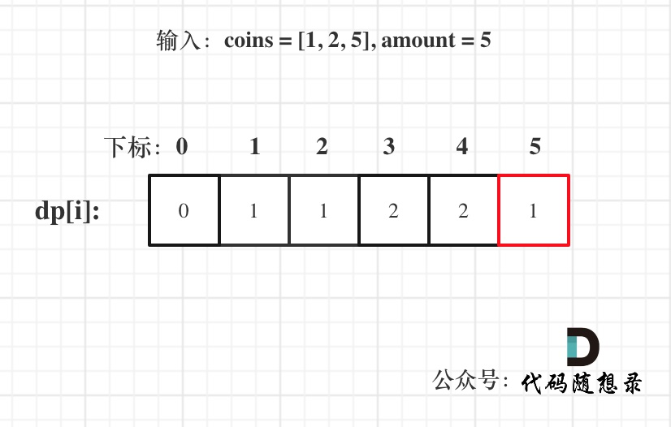

---

对于遍历⽅式遍历背包放在外循环，遍历物品放在内循环也是可以的，我就直接给出代码了
总结
 
细⼼的同学看⽹上的题解，可能看⼀篇是遍历背包的for循环放外⾯，看⼀篇又是遍历背包
的for循环放⾥⾯，看多了都看晕了，到底两个for循环应该是什么先后关系。
能把遍历顺序讲明⽩的⽂章⼏乎找不到！
这也是⼤多数同学学习动态规划的苦恼所在，有的时候递推公式很简单，难在遍历顺序上！
但最终又可以稀⾥糊涂的把题⽬过了，也不知道为什么这样可以过，反正就是过了，哈哈
那么这篇⽂章就把遍历顺序分析的清清楚楚。
        return dp[amount];
    }
};
// 版本⼆
class Solution {
public:
    int coinChange(vector<int>& coins, int amount) {
        vector<int> dp(amount + 1, INT_MAX);
        dp[0] = 0;
        for (int i = 1; i <= amount; i++) {  // 遍历背包
            for (int j = 0; j < coins.size(); j++) { // 遍历物品
                if (i - coins[j] >= 0 && dp[i - coins[j]] != INT_MAX 
) {
                    dp[i] = min(dp[i - coins[j]] + 1, dp[i]);
                }
            }
        }
        if (dp[amount] == INT_MAX) return -1;
        return dp[amount];
    }
};

---

动态规划：518.零钱兑换II中求的是组合数，动态规划：377. 组合总和 Ⅳ中求的是排列数。
⽽本题是要求最少硬币数量，硬币是组合数还是排列数都⽆所谓！所以两个for循环先后顺
序怎样都可以！
这也是我为什么要先讲518.零钱兑换II 然后再讲本题即：322.零钱兑换，这是Carl的良苦⽤
⼼那。
相信⼤家看完之后，对背包问题中的遍历顺序又了更深的理解了。
完全平⽅数
 
279.完全平⽅数
 
题⽬地址：https://leetcode-cn.com/problems/perfect-squares/
给定正整数 n，找到若⼲个完全平⽅数（⽐如 1, 4, 9, 16, ...）使得它们的和等于 n。你需要
让组成和的完全平⽅数的个数最少。
给你⼀个整数 n ，返回和为 n 的完全平⽅数的 最少数量 。
完全平⽅数 是⼀个整数，其值等于另⼀个整数的平⽅；换句话说，其值等于⼀个整数⾃乘
的积。例如，1、4、9 和 16 都是完全平⽅数，⽽ 3 和 11 不是。
⽰例 1：
输⼊：n = 12
输出：3
解释：12 = 4 + 4 + 4
⽰例 2：
输⼊：n = 13
输出：2
解释：13 = 4 + 9
提⽰：

---

1 <= n <= 10^4
思路
 
可能刚看这种题感觉没啥思路，又平⽅和的，又最⼩数的。
我来把题⽬翻译⼀下：完全平⽅数就是物品（可以⽆限件使⽤），凑个正整数n就是背包，
问凑满这个背包最少有多少物品？
感受出来了没，这么浓厚的完全背包氛围，⽽且和昨天的题⽬动态规划：322. 零钱兑换就
是⼀样⼀样的！
动规五部曲分析如下：
1. 确定dp数组（dp table）以及下标的含义
dp[i]：和为i的完全平⽅数的最少数量为dp[i]
2. 确定递推公式
dp[j] 可以由dp[j - i * i]推出， dp[j - i * i] + 1 便可以凑成dp[j]。
此时我们要选择最⼩的dp[j]，所以递推公式：dp[j] = min(dp[j - i * i] + 1, dp[j]);
3. dp数组如何初始化
dp[0]表⽰ 和为0的完全平⽅数的最⼩数量，那么dp[0]⼀定是0。
有同学问题，那0 * 0 也算是⼀种啊，为啥dp[0] 就是 0呢？
看题⽬描述，找到若⼲个完全平⽅数（⽐如 1, 4, 9, 16, ...），题⽬描述中可没说要从0开
始，dp[0]=0完全是为了递推公式。
⾮0下标的dp[j]应该是多少呢？
从递归公式dp[j] = min(dp[j - i * i] + 1, dp[j]);中可以看出每次dp[j]都要选最⼩的，所以⾮0下
标的dp[i]⼀定要初始为最⼤值，这样dp[j]在递推的时候才不会被初始值覆盖。

---

4. 确定遍历顺序
我们知道这是完全背包，
如果求组合数就是外层for循环遍历物品，内层for遍历背包。
如果求排列数就是外层for遍历背包，内层for循环遍历物品。
在动态规划：322. 零钱兑换中我们就深⼊探讨了这个问题，本题也是⼀样的，是求最⼩
数！
所以本题外层for遍历背包，⾥层for遍历物品，还是外层for遍历物品，内层for遍历背包，
都是可以的！
我这⾥先给出外层遍历背包，⾥层遍历物品的代码：
5. 举例推导dp数组
已输⼊n为5例，dp状态图如下：
vector<int> dp(n + 1, INT_MAX);
dp[0] = 0;
for (int i = 0; i <= n; i++) { // 遍历背包
    for (int j = 1; j * j <= i; j++) { // 遍历物品
        dp[i] = min(dp[i - j * j] + 1, dp[i]);
    }
}

---

dp[0] = 0
dp[1] = min(dp[0] + 1) = 1
dp[2] = min(dp[1] + 1) = 2
dp[3] = min(dp[2] + 1) = 3
dp[4] = min(dp[3] + 1, dp[0] + 1) = 1
dp[5] = min(dp[4] + 1, dp[1] + 1) = 2
最后的dp[n]为最终结果。
以上动规五部曲分析完毕C++代码如下：
// 版本⼀
class Solution {
public:
    int numSquares(int n) {
        vector<int> dp(n + 1, INT_MAX);
        dp[0] = 0;
        for (int i = 0; i <= n; i++) { // 遍历背包
            for (int j = 1; j * j <= i; j++) { // 遍历物品
                dp[i] = min(dp[i - j * j] + 1, dp[i]);
            }

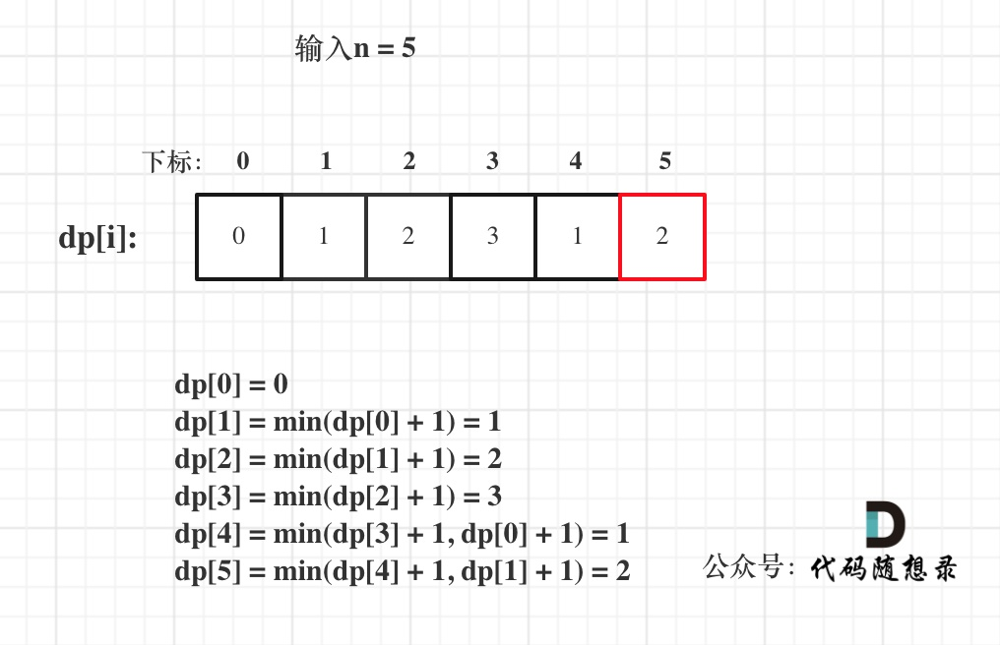

---

同样我在给出先遍历物品，在遍历背包的代码，⼀样的可以AC的。
总结
 
如果⼤家认真做了昨天的题⽬动态规划：322. 零钱兑换，今天这道就⾮常简单了，⼀样的
套路⼀样的味道。
但如果没有按照「代码随想录」的题⽬顺序来做的话，做动态规划或者做背包问题，上来就
做这道题，那还是挺难的！
经过前⾯的训练这道题已经是简单题了，哈哈哈
 
代码随想录官⽹：www.programmercarl.com
        }
        return dp[n];
    }
};
// 版本⼆
class Solution {
public:
    int numSquares(int n) {
        vector<int> dp(n + 1, INT_MAX);
        dp[0] = 0;
        for (int i = 1; i * i <= n; i++) { // 遍历物品
            for (int j = 1; j <= n; j++) { // 遍历背包
                if (j - i * i >= 0) {
                    dp[j] = min(dp[j - i * i] + 1, dp[j]);
                }
            }
        }
        return dp[n];
    }
};

---

代码随想录开源项⽬Github：https://github.com/youngyangyang04/leetcode-
master
代码随想录算法公开课 ，代码随想录的全部内容将由我（程序员Carl）视频讲解
并开免费开放给⼤家。
《代码随想录》纸质版 已经出版。
代码随想录知识星球 上万录友在这⾥学习
代码随想录算法训练营 帮助录友⾼效刷完代码随想录。
 
如果感觉PDF对你有帮助，微信搜索：代码随想录，关注我吧，你会发现相见恨晚！
单词拆分
 
139.单词拆分
 
题⽬链接：https://leetcode-cn.com/problems/word-break/
给定⼀个⾮空字符串 s 和⼀个包含⾮空单词的列表 wordDict，判定 s 是否可以被空格拆分
为⼀个或多个在字典中出现的单词。

---

说明：
拆分时可以重复使⽤字典中的单词。
你可以假设字典中没有重复的单词。
⽰例 1：
输⼊: s = "leetcode", wordDict = ["leet", "code"]
输出: true
解释: 返回 true 因为 "leetcode" 可以被拆分成 "leet code"。
⽰例 2：
输⼊: s = "applepenapple", wordDict = ["apple", "pen"]
输出: true
解释: 返回 true 因为 "applepenapple" 可以被拆分成 "apple pen apple"。
     注意你可以重复使⽤字典中的单词。
⽰例 3：
输⼊: s = "catsandog", wordDict = ["cats", "dog", "sand", "and", "cat"]
输出: false
思路
 
看到这道题⽬的时候，⼤家应该回想起我们之前讲解回溯法专题的时候，讲过的⼀道题⽬回
溯算法：分割回⽂串，就是枚举字符串的所有分割情况。
回溯算法：分割回⽂串：是枚举分割后的所有⼦串，判断是否回⽂。
本道是枚举分割所有字符串，判断是否在字典⾥出现过。
那么这⾥我也给出回溯法C++代码：
class Solution {
private:
    bool backtracking (const string& s, const unordered_set<string>& 
wordSet, int startIndex) {
        if (startIndex >= s.size()) {
            return true;

---

时间复杂度：O(2^n)，因为每⼀个单词都有两个状态，切割和不切割
空间复杂度：O(n)，算法递归系统调⽤栈的空间
那么以上代码很明显要超时了，超时的数据如下：
递归的过程中有很多重复计算，可以使⽤数组保存⼀下递归过程中计算的结果。
这个叫做记忆化递归，这种⽅法我们之前已经提过很多次了。
使⽤memory数组保存每次计算的以startIndex起始的计算结果，如果memory[startIndex]
⾥已经被赋值了，直接⽤memory[startIndex]的结果。
C++代码如下：
        }
        for (int i = startIndex; i < s.size(); i++) {
            string word = s.substr(startIndex, i - startIndex + 1);
            if (wordSet.find(word) != wordSet.end() && 
backtracking(s, wordSet, i + 1)) {
                return true;
            }
        }
        return false;
    }
public:
    bool wordBreak(string s, vector<string>& wordDict) {
        unordered_set<string> wordSet(wordDict.begin(), 
wordDict.end());
        return backtracking(s, wordSet, 0);
    }
};
"aaaaaaaaaaaaaaaaaaaaaaaaaaaaaaaaaaaaaaaaaaaaaaaaaaaaaaaaaaaaaaaaaaaa
aaaaaaaaaaaaaaaaaaaaaaaaaaaaaaaaaaaaaaaaaaaaaaaaaaaaaaaaaaaaaaaaaaaaa
aaaaaaaaaaaaab"
["a","aa","aaa","aaaa","aaaaa","aaaaaa","aaaaaaa","aaaaaaaa","aaaaaaa
aa","aaaaaaaaaa"]

---

这个时间复杂度其实也是：O(2^n)。只不过对于上⾯那个超时测试⽤例优化效果特别明
显。
这个代码就可以AC了，当然回溯算法不是本题的主菜，背包才是！
class Solution {
private:
    bool backtracking (const string& s,
            const unordered_set<string>& wordSet,
            vector<int>& memory,
            int startIndex) {
        if (startIndex >= s.size()) {
            return true;
        }
        // 如果memory[startIndex]不是初始值了，直接使⽤memory[startIndex]
的结果
        if (memory[startIndex] != -1) return memory[startIndex];
        for (int i = startIndex; i < s.size(); i++) {
            string word = s.substr(startIndex, i - startIndex + 1);
            if (wordSet.find(word) != wordSet.end() && 
backtracking(s, wordSet, memory, i + 1)) {
                memory[startIndex] = 1; // 记录以startIndex开始的⼦串是可
以被拆分的
                return true;
            }
        }
        memory[startIndex] = 0; // 记录以startIndex开始的⼦串是不可以被拆
分的
        return false;
    }
public:
    bool wordBreak(string s, vector<string>& wordDict) {
        unordered_set<string> wordSet(wordDict.begin(), 
wordDict.end());
        vector<int> memory(s.size(), -1); // -1 表示初始化状态
        return backtracking(s, wordSet, memory, 0);
    }
};

---

背包问题
 
单词就是物品，字符串s就是背包，单词能否组成字符串s，就是问物品能不能把背包装满。
拆分时可以重复使⽤字典中的单词，说明就是⼀个完全背包！
动规五部曲分析如下：
1. 确定dp数组以及下标的含义
dp[i] : 字符串长度为i的话，dp[i]为true，表⽰可以拆分为⼀个或多个在字典中出现的单
词。
2. 确定递推公式
如果确定dp[j] 是true，且 [j, i] 这个区间的⼦串出现在字典⾥，那么dp[i]⼀定是true。（j < i 
）。
所以递推公式是 if([j, i] 这个区间的⼦串出现在字典⾥ && dp[j]是true) 那么 dp[i] = true。
3. dp数组如何初始化
从递归公式中可以看出，dp[i] 的状态依靠 dp[j]是否为true，那么dp[0]就是递归的根基，
dp[0]⼀定要为true，否则递归下去后⾯都都是false了。
那么dp[0]有没有意义呢？
dp[0]表⽰如果字符串为空的话，说明出现在字典⾥。
但题⽬中说了“给定⼀个⾮空字符串 s” 所以测试数据中不会出现i为0的情况，那么dp[0]初始
为true完全就是为了推导公式。
下标⾮0的dp[i]初始化为false，只要没有被覆盖说明都是不可拆分为⼀个或多个在字典中出
现的单词。
4. 确定遍历顺序
题⽬中说是拆分为⼀个或多个在字典中出现的单词，所以这是完全背包。

---

还要讨论两层for循环的前后循序。
如果求组合数就是外层for循环遍历物品，内层for遍历背包。
如果求排列数就是外层for遍历背包，内层for循环遍历物品。
对这个结论还有疑问的同学可以看这篇本周⼩结！（动态规划系列五），这篇本周⼩节中，
我做了如下总结：
求组合数：动态规划：518.零钱兑换II
求排列数：动态规划：377. 组合总和 Ⅳ、动态规划：70. 爬楼梯进阶版（完全背包）
求最⼩数：动态规划：322. 零钱兑换、动态规划：279.完全平⽅数
本题最终要求的是是否都出现过，所以对出现单词集合⾥的元素是组合还是排列，并不在
意！
那么本题使⽤求排列的⽅式，还是求组合的⽅式都可以。
即：外层for循环遍历物品，内层for遍历背包 或者 外层for遍历背包，内层for循环遍历物品 
都是可以的。
但本题还有特殊性，因为是要求⼦串，最好是遍历背包放在外循环，将遍历物品放在内循
环。
如果要是外层for循环遍历物品，内层for遍历背包，就需要把所有的⼦串都预先放在⼀个容
器⾥。（如果不理解的话，可以⾃⼰尝试这么写⼀写就理解了）
所以最终我选择的遍历顺序为：遍历背包放在外循环，将遍历物品放在内循环。内循环从前
到后。
5. 举例推导dp[i]
以输⼊: s = "leetcode", wordDict = ["leet", "code"]为例，dp状态如图：

---

dp[s.size()]就是最终结果。
动规五部曲分析完毕，C++代码如下：
class Solution {
public:
    bool wordBreak(string s, vector<string>& wordDict) {
        unordered_set<string> wordSet(wordDict.begin(), 
wordDict.end());
        vector<bool> dp(s.size() + 1, false);
        dp[0] = true;
        for (int i = 1; i <= s.size(); i++) {   // 遍历背包
            for (int j = 0; j < i; j++) {       // 遍历物品
                string word = s.substr(j, i - j); //substr(起始位置，截
取的个数)
                if (wordSet.find(word) != wordSet.end() && dp[j]) {
                    dp[i] = true;
                }
            }
        }
        return dp[s.size()];
    }
};

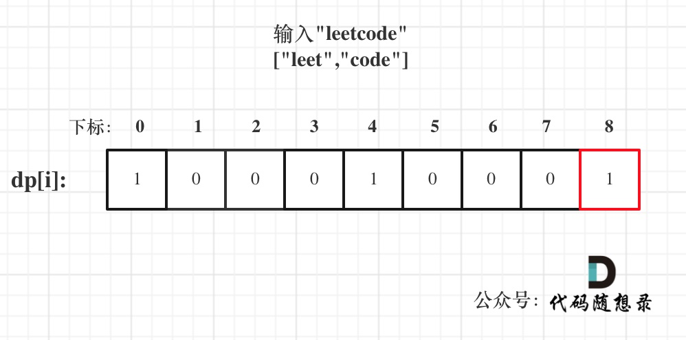

---

时间复杂度：O(n^3)，因为substr返回⼦串的副本是O(n)的复杂度（这⾥的n是
substring的长度）
空间复杂度：O(n)
总结
 
本题和我们之前讲解回溯专题的回溯算法：分割回⽂串⾮常像，所以我也给出了对应的回溯
解法。
稍加分析，便可知道本题是完全背包，⽽且是求能否组成背包，所以遍历顺序理论上来讲 
两层for循环谁先谁后都可以！
但因为分割⼦串的特殊性，遍历背包放在外循环，将遍历物品放在内循环更⽅便⼀些。
本题其实递推公式都不是重点，遍历顺序才是重点，如果我直接把代码贴出来，估计同学们
也会想两个for循环的顺序理所当然就是这样，甚⾄都不会想为什么遍历背包的for循环为什
么在外层。
不分析透彻不是Carl的风格啊，哈哈
多重背包理论基础
 
之前我们已经体统的讲解了01背包和完全背包，如果没有看过的录友，建议先把如下三篇
⽂章仔细阅读⼀波。
动态规划：关于01背包问题，你该了解这些！
动态规划：关于01背包问题，你该了解这些！（滚动数组）
动态规划：关于完全背包，你该了解这些！
这次我们再来说⼀说多重背包

---

重量
价值
数量
物品0
1
15
2
物品1
3
20
3
物品2
4
30
2
多重背包
 
对于多重背包，我在⼒扣上还没发现对应的题⽬，所以这⾥就做⼀下简单介绍，⼤家⼤概了
解⼀下。
有N种物品和⼀个容量为V 的背包。第i种物品最多有Mi件可⽤，每件耗费的空间是Ci ，价
值是Wi 。求解将哪些物品装⼊背包可使这些物品的耗费的空间 总和不超过背包容量，且价
值总和最⼤。
多重背包和01背包是⾮常像的， 为什么和01背包像呢？
每件物品最多有Mi件可⽤，把Mi件摊开，其实就是⼀个01背包问题了。
例如：
背包最⼤重量为10。
物品为：
问背包能背的物品最⼤价值是多少？
和如下情况有区别么？

---

重量
价值
数量
物品0
1
15
1
物品0
1
15
1
物品1
3
20
1
物品1
3
20
1
物品1
3
20
1
物品2
4
30
1
物品2
4
30
1
毫⽆区别，这就转成了⼀个01背包问题了，且每个物品只⽤⼀次。
这种⽅式来实现多重背包的代码如下：
void test_multi_pack() {
    vector<int> weight = {1, 3, 4};
    vector<int> value = {15, 20, 30};
    vector<int> nums = {2, 3, 2};
    int bagWeight = 10;
    for (int i = 0; i < nums.size(); i++) {
        while (nums[i] > 1) { // nums[i]保留到1，把其他物品都展开
            weight.push_back(weight[i]);
            value.push_back(value[i]);
            nums[i]--;
        }
    }
    vector<int> dp(bagWeight + 1, 0);
    for(int i = 0; i < weight.size(); i++) { // 遍历物品
        for(int j = bagWeight; j >= weight[i]; j--) { // 遍历背包容量
            dp[j] = max(dp[j], dp[j - weight[i]] + value[i]);
        }
        for (int j = 0; j <= bagWeight; j++) {
            cout << dp[j] << " ";
        }
        cout << endl;
    }

---

时间复杂度：O(m * n * k)  m：物品种类个数，n背包容量，k单类物品数量
也有另⼀种实现⽅式，就是把每种商品遍历的个数放在01背包⾥⾯在遍历⼀遍。
代码如下：（详看注释）
    cout << dp[bagWeight] << endl;
}
int main() {
    test_multi_pack();
}
void test_multi_pack() {
    vector<int> weight = {1, 3, 4};
    vector<int> value = {15, 20, 30};
    vector<int> nums = {2, 3, 2};
    int bagWeight = 10;
    vector<int> dp(bagWeight + 1, 0);
    for(int i = 0; i < weight.size(); i++) { // 遍历物品
        for(int j = bagWeight; j >= weight[i]; j--) { // 遍历背包容量
            // 以上为01背包，然后加⼀个遍历个数
            for (int k = 1; k <= nums[i] && (j - k * weight[i]) >= 0; 
k++) { // 遍历个数
                dp[j] = max(dp[j], dp[j - k * weight[i]] + k * 
value[i]);
            }
        }
        // 打印⼀下dp数组
        for (int j = 0; j <= bagWeight; j++) {
            cout << dp[j] << " ";
        }
        cout << endl;
    }
    cout << dp[bagWeight] << endl;

---

时间复杂度：O(m * n * k)  m：物品种类个数，n背包容量，k单类物品数量
从代码⾥可以看出是01背包⾥⾯在加⼀个for循环遍历⼀个每种商品的数量。 和01背包还是
如出⼀辙的。
当然还有那种⼆进制优化的⽅法，其实就是把每种物品的数量，打包成⼀个个独⽴的包。
和以上在循环遍历上有所不同，因为是分拆为各个包最后可以组成⼀个完整背包，具体原理
我就不做过多解释了，⼤家了解⼀下就⾏，⾯试的话基本不会考完这个深度了，感兴趣可以
⾃⼰深⼊研究⼀波。
总结
 
多重背包在⾯试中基本不会出现，⼒扣上也没有对应的题⽬，⼤家对多重背包的掌握程度知
道它是⼀种01背包，并能在01背包的基础上写出对应代码就可以了。
⾄于背包九讲⾥⾯还有混合背包，⼆维费⽤背包，分组背包等等这些，⼤家感兴趣可以⾃⼰
去学习学习，这⾥也不做介绍了，⾯试也不会考。
 
背包问题总结篇
 
年前我们已经把背包问题都讲完了，那么现在我们要对背包问题进⾏总结⼀番。
背包问题是动态规划⾥的⾮常重要的⼀部分，所以我把背包问题单独总结⼀下，等动态规划
专题更新完之后，我们还会在整体总结⼀波动态规划。
关于这⼏种常见的背包，其关系如下：
}
int main() {
    test_multi_pack();
}

---

通过这个图，可以很清晰分清这⼏种常见背包之间的关系。
在讲解背包问题的时候，我们都是按照如下五部来逐步分析，相信⼤家也体会到，把这五部
都搞透了，算是对动规来理解深⼊了。
1. 确定dp数组（dp table）以及下标的含义
2. 确定递推公式
3. dp数组如何初始化
4. 确定遍历顺序
5. 举例推导dp数组
其实这五部⾥哪⼀步都很关键，但确定递推公式和确定遍历顺序都具有规律性和代表性，所
以下⾯我从这两点来对背包问题做⼀做总结。
背包递推公式
 
问能否能装满背包（或者最多装多少）：dp[j] = max(dp[j], dp[j - nums[i]] + nums[i]); ，对
应题⽬如下：
动态规划：416.分割等和⼦集
动态规划：1049.最后⼀块⽯头的重量 II
问装满背包有⼏种⽅法：dp[j] += dp[j - nums[i]] ，对应题⽬如下：
动态规划：494.⽬标和
动态规划：518. 零钱兑换 II
动态规划：377.组合总和Ⅳ
动态规划：70. 爬楼梯进阶版（完全背包）

---

问背包装满最⼤价值：dp[j] = max(dp[j], dp[j - weight[i]] + value[i]); ，对应题⽬如下：
动态规划：474.⼀和零
问装满背包所有物品的最⼩个数：dp[j] =  min(dp[j - coins[i]] + 1, dp[j]); ，对应题⽬如下：
动态规划：322.零钱兑换
动态规划：279.完全平⽅数
遍历顺序
 
01背包
 
在动态规划：关于01背包问题，你该了解这些！中我们讲解⼆维dp数组01背包先遍历物品
还是先遍历背包都是可以的，且第⼆层for循环是从⼩到⼤遍历。
和动态规划：关于01背包问题，你该了解这些！（滚动数组）中，我们讲解⼀维dp数组01
背包只能先遍历物品再遍历背包容量，且第⼆层for循环是从⼤到⼩遍历。
⼀维dp数组的背包在遍历顺序上和⼆维dp数组实现的01背包其实是有很⼤差异的，⼤家需
要注意！
完全背包
 
说完01背包，再看看完全背包。
在动态规划：关于完全背包，你该了解这些！中，讲解了纯完全背包的⼀维dp数组实现，
先遍历物品还是先遍历背包都是可以的，且第⼆层for循环是从⼩到⼤遍历。
但是仅仅是纯完全背包的遍历顺序是这样的，题⽬稍有变化，两个for循环的先后顺序就不
⼀样了。
如果求组合数就是外层for循环遍历物品，内层for遍历背包。
如果求排列数就是外层for遍历背包，内层for循环遍历物品。
相关题⽬如下：

---

求组合数：动态规划：518.零钱兑换II
求排列数：动态规划：377. 组合总和 Ⅳ、动态规划：70. 爬楼梯进阶版（完全背
包）
如果求最⼩数，那么两层for循环的先后顺序就⽆所谓了，相关题⽬如下：
求最⼩数：动态规划：322. 零钱兑换、动态规划：279.完全平⽅数
对于背包问题，其实递推公式算是容易的，难是难在遍历顺序上，如果把遍历顺序搞透，才
算是真正理解了。
总结
 
这篇背包问题总结篇是对背包问题的⾼度概括，讲最关键的两部：递推公式和遍历顺序，结
合⼒扣上的题⽬全都抽象出来了。
⽽且每⼀个点，我都给出了对应的⼒扣题⽬。
最后如果你想了解多重背包，可以看这篇动态规划：关于多重背包，你该了解这些！，⼒扣
上还没有多重背包的题⽬，也不是⾯试考察的重点。
如果把我本篇总结出来的内容都掌握的话，可以说对背包问题理解的就很深刻了，⽤来对付
⾯试中的背包问题绰绰有余！
 
 
打家劫舍

---

198.打家劫舍
 
题⽬链接：https://leetcode-cn.com/problems/house-robber/
你是⼀个专业的⼩偷，计划偷窃沿街的房屋。每间房内都藏有⼀定的现⾦，影响你偷窃的唯
⼀制约因素就是相邻的房屋装有相互连通的防盗系统，如果两间相邻的房屋在同⼀晚上被⼩
偷闯⼊，系统会⾃动报警。
给定⼀个代表每个房屋存放⾦额的⾮负整数数组，计算你 不触动警报装置的情况下 ，⼀夜
之内能够偷窃到的最⾼⾦额。
⽰例 1：
输⼊：[1,2,3,1]
输出：4
解释：偷窃 1 号房屋 (⾦额 = 1) ，然后偷窃 3 号房屋 (⾦额 = 3)。
     偷窃到的最⾼⾦额 = 1 + 3 = 4 。
⽰例 2：
输⼊：[2,7,9,3,1]
输出：12
解释：偷窃 1 号房屋 (⾦额 = 2), 偷窃 3 号房屋 (⾦额 = 9)，接着偷窃 5 号房屋 (⾦额 = 1)。
     偷窃到的最⾼⾦额 = 2 + 9 + 1 = 12 。
提⽰：
0 <= nums.length <= 100
0 <= nums[i] <= 400
思路
 
打家劫舍是dp解决的经典问题，动规五部曲分析如下：
1. 确定dp数组（dp table）以及下标的含义
dp[i]：考虑下标i（包括i）以内的房屋，最多可以偷窃的⾦额为dp[i]。
2. 确定递推公式
决定dp[i]的因素就是第i房间偷还是不偷。

---

如果偷第i房间，那么dp[i] = dp[i - 2] + nums[i] ，即：第i-1房⼀定是不考虑的，找出 下标i-
2（包括i-2）以内的房屋，最多可以偷窃的⾦额为dp[i-2] 加上第i房间偷到的钱。
如果不偷第i房间，那么dp[i] = dp[i - 1]，即考虑i-1房，（注意这⾥是考虑，并不是⼀定要
偷i-1房，这是很多同学容易混淆的点）
然后dp[i]取最⼤值，即dp[i] = max(dp[i - 2] + nums[i], dp[i - 1]);
3. dp数组如何初始化
从递推公式dp[i] = max(dp[i - 2] + nums[i], dp[i - 1]);可以看出，递推公式的基础就是dp[0] 
和 dp[1]
从dp[i]的定义上来讲，dp[0] ⼀定是 nums[0]，dp[1]就是nums[0]和nums[1]的最⼤值即：
dp[1] = max(nums[0], nums[1]);
代码如下：
4. 确定遍历顺序
dp[i] 是根据dp[i - 2] 和 dp[i - 1] 推导出来的，那么⼀定是从前到后遍历！
代码如下：
5. 举例推导dp数组
以⽰例⼆，输⼊[2,7,9,3,1]为例。
vector<int> dp(nums.size());
dp[0] = nums[0];
dp[1] = max(nums[0], nums[1]);
for (int i = 2; i < nums.size(); i++) {
    dp[i] = max(dp[i - 2] + nums[i], dp[i - 1]);
}

---

红框dp[nums.size() - 1]为结果。
以上分析完毕，C++代码如下：
class Solution {
public:
    int rob(vector<int>& nums) {
        if (nums.size() == 0) return 0;
        if (nums.size() == 1) return nums[0];
        vector<int> dp(nums.size());
        dp[0] = nums[0];
        dp[1] = max(nums[0], nums[1]);
        for (int i = 2; i < nums.size(); i++) {
            dp[i] = max(dp[i - 2] + nums[i], dp[i - 1]);
        }
        return dp[nums.size() - 1];
    }
};

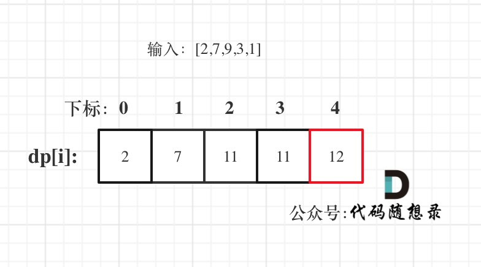

---

总结
 
打家劫舍是DP解决的经典题⽬，这道题也是打家劫舍⼊门级题⽬，后⾯我们还会变种⽅式
来打劫的。
代码随想录官⽹：www.programmercarl.com
代码随想录开源项⽬Github：https://github.com/youngyangyang04/leetcode-
master
代码随想录算法公开课 ，代码随想录的全部内容将由我（程序员Carl）视频讲解
并开免费开放给⼤家。
《代码随想录》纸质版 已经出版。
代码随想录知识星球 上万录友在这⾥学习
代码随想录算法训练营 帮助录友⾼效刷完代码随想录。
 
如果感觉PDF对你有帮助，微信搜索：代码随想录，关注我吧，你会发现相见恨晚！
打家劫舍II

---

213.打家劫舍II
 
题⽬链接：https://leetcode-cn.com/problems/house-robber-ii/
你是⼀个专业的⼩偷，计划偷窃沿街的房屋，每间房内都藏有⼀定的现⾦。这个地⽅所有的
房屋都 围成⼀圈 ，这意味着第⼀个房屋和最后⼀个房屋是紧挨着的。同时，相邻的房屋装
有相互连通的防盗系统，如果两间相邻的房屋在同⼀晚上被⼩偷闯⼊，系统会⾃动报警 。
给定⼀个代表每个房屋存放⾦额的⾮负整数数组，计算你 在不触动警报装置的情况下 ，能
够偷窃到的最⾼⾦额。
⽰例 1：
输⼊：nums = [2,3,2]
输出：3
解释：你不能先偷窃 1 号房屋（⾦额 = 2），然后偷窃 3 号房屋（⾦额 = 2）, 因为他们是相
邻的。
⽰例 2：
输⼊：nums = [1,2,3,1]
输出：4
解释：你可以先偷窃 1 号房屋（⾦额 = 1），然后偷窃 3 号房屋（⾦额 = 3）。偷窃到的最
⾼⾦额 = 1 + 3 = 4 。
⽰例 3：
输⼊：nums = [0]
输出：0
提⽰：
1 <= nums.length <= 100
0 <= nums[i] <= 1000
思路
 
这道题⽬和198.打家劫舍是差不多的，唯⼀区别就是成环了。
对于⼀个数组，成环的话主要有如下三种情况：

---

情况⼀：考虑不包含⾸尾元素
情况⼆：考虑包含⾸元素，不包含尾元素
情况三：考虑包含尾元素，不包含⾸元素

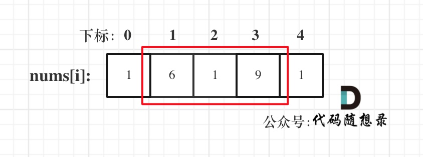

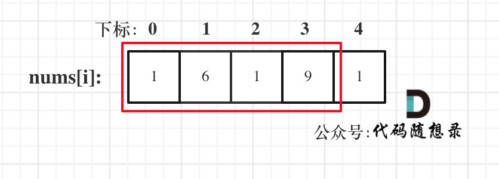

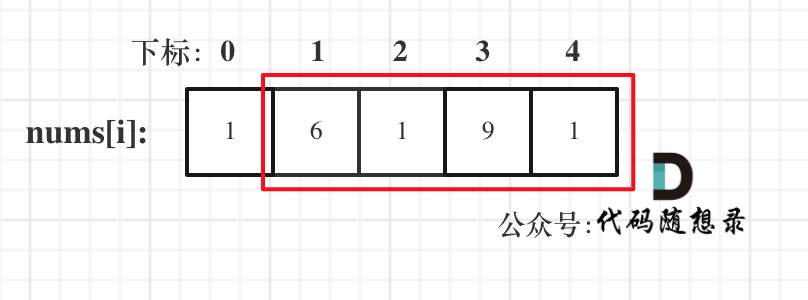

---

注意我这⾥⽤的是"考虑"，例如情况三，虽然是考虑包含尾元素，但不⼀定要选尾部元素！ 
对于情况三，取nums[1] 和 nums[3]就是最⼤的。
⽽情况⼆ 和 情况三 都包含了情况⼀了，所以只考虑情况⼆和情况三就可以了。
分析到这⾥，本题其实⽐较简单了。 剩下的和198.打家劫舍就是⼀样的了。
代码如下：
总结
 
成环之后还是难了⼀些的， 不少题解没有把“考虑房间”和“偷房间”说清楚。
这就导致⼤家会有这样的困惑：情况三怎么就包含了情况⼀了呢？ 本⽂图中最后⼀间房不
能偷啊，偷了⼀定不是最优结果。
// 注意注释中的情况⼆情况三，以及把198.打家劫舍的代码抽离出来了
class Solution {
public:
    int rob(vector<int>& nums) {
        if (nums.size() == 0) return 0;
        if (nums.size() == 1) return nums[0];
        int result1 = robRange(nums, 0, nums.size() - 2); // 情况⼆
        int result2 = robRange(nums, 1, nums.size() - 1); // 情况三
        return max(result1, result2);
    }
    // 198.打家劫舍的逻辑
    int robRange(vector<int>& nums, int start, int end) {
        if (end == start) return nums[start];
        vector<int> dp(nums.size());
        dp[start] = nums[start];
        dp[start + 1] = max(nums[start], nums[start + 1]);
        for (int i = start + 2; i <= end; i++) {
            dp[i] = max(dp[i - 2] + nums[i], dp[i - 1]);
        }
        return dp[end];
    }
};

---

所以我在本⽂重点强调了情况⼀⼆三是“考虑”的范围，⽽具体房间偷与不偷交给递推公式去
抉择。
这样⼤家就不难理解情况⼆和情况三包含了情况⼀了。
 
打家劫舍III
 
337.打家劫舍 III
 
题⽬链接：https://leetcode-cn.com/problems/house-robber-iii/
在上次打劫完⼀条街道之后和⼀圈房屋后，⼩偷又发现了⼀个新的可⾏窃的地区。这个地区
只有⼀个⼊⼜，我们称之为“根”。 除了“根”之外，每栋房⼦有且只有⼀个“⽗“房⼦与之相
连。⼀番侦察之后，聪明的⼩偷意识到“这个地⽅的所有房屋的排列类似于⼀棵⼆叉树”。 
如果两个直接相连的房⼦在同⼀天晚上被打劫，房屋将⾃动报警。
计算在不触动警报的情况下，⼩偷⼀晚能够盗取的最⾼⾦额。

---

思路
 
这道题⽬和 198.打家劫舍，213.打家劫舍II也是如出⼀辙，只不过这个换成了树。
如果对树的遍历不够熟悉的话，那本题就有难度了。

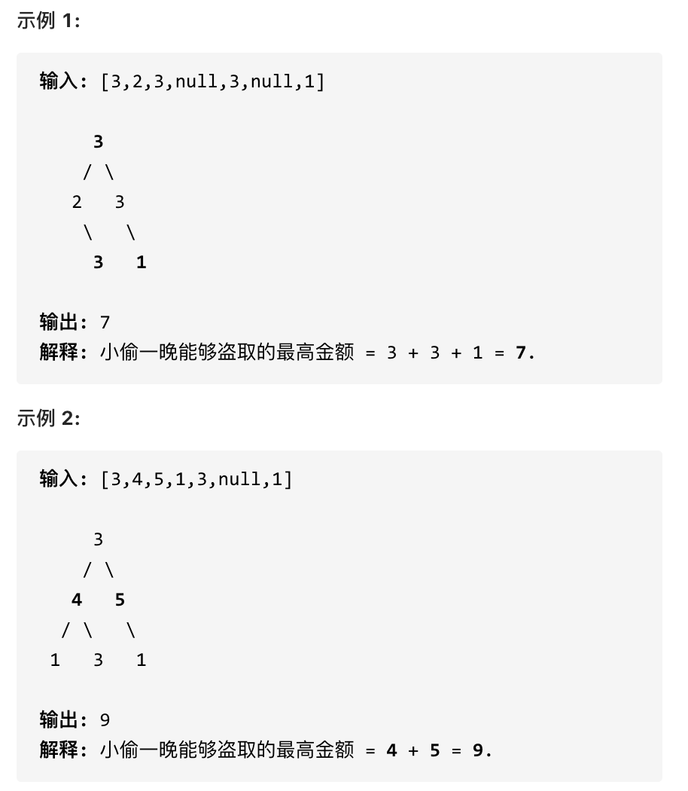

---

对于树的话，⾸先就要想到遍历⽅式，前中后序（深度优先搜索）还是层序遍历（⼴度优先
搜索）。
本题⼀定是要后序遍历，因为通过递归函数的返回值来做下⼀步计算。
与198.打家劫舍，213.打家劫舍II⼀样，关键是要讨论当前节点抢还是不抢。
如果抢了当前节点，两个孩⼦就不是动，如果没抢当前节点，就可以考虑抢左右孩⼦（注意
这⾥说的是“考虑”）
暴⼒递归
 
代码如下：
时间复杂度：O(n^2) 这个时间复杂度不太标准，也不容易准确化，例如越往下的
节点重复计算次数就越多
空间复杂度：O(logn) 算上递推系统栈的空间
class Solution {
public:
    int rob(TreeNode* root) {
        if (root == NULL) return 0;
        if (root->left == NULL && root->right == NULL) return root-
>val;
        // 偷⽗节点
        int val1 = root->val;
        if (root->left) val1 += rob(root->left->left) + rob(root-
>left->right); // 跳过root->left，相当于不考虑左孩⼦了
        if (root->right) val1 += rob(root->right->left) + rob(root-
>right->right); // 跳过root->right，相当于不考虑右孩⼦了
        // 不偷⽗节点
        int val2 = rob(root->left) + rob(root->right); // 考虑root的左
右孩⼦
        return max(val1, val2);
    }
};

---

当然以上代码超时了，这个递归的过程中其实是有重复计算了。
我们计算了root的四个孙⼦（左右孩⼦的孩⼦）为头结点的⼦树的情况，又计算了root的左
右孩⼦为头结点的⼦树的情况，计算左右孩⼦的时候其实又把孙⼦计算了⼀遍。
记忆化递推
 
所以可以使⽤⼀个map把计算过的结果保存⼀下，这样如果计算过孙⼦了，那么计算孩⼦的
时候可以复⽤孙⼦节点的结果。
代码如下：
时间复杂度：O(n)
class Solution {
public:
    unordered_map<TreeNode* , int> umap; // 记录计算过的结果
    int rob(TreeNode* root) {
        if (root == NULL) return 0;
        if (root->left == NULL && root->right == NULL) return root-
>val;
        if (umap[root]) return umap[root]; // 如果umap⾥已经有记录则直接
返回
        // 偷⽗节点
        int val1 = root->val;
        if (root->left) val1 += rob(root->left->left) + rob(root-
>left->right); // 跳过root->left
        if (root->right) val1 += rob(root->right->left) + rob(root-
>right->right); // 跳过root->right
        // 不偷⽗节点
        int val2 = rob(root->left) + rob(root->right); // 考虑root的左
右孩⼦
        umap[root] = max(val1, val2); // umap记录⼀下结果
        return max(val1, val2);
    }
};

---

空间复杂度：O(logn) 算上递推系统栈的空间
动态规划
 
在上⾯两种⽅法，其实对⼀个节点 投与不投得到的最⼤⾦钱都没有做记录，⽽是需要实时
计算。
⽽动态规划其实就是使⽤状态转移容器来记录状态的变化，这⾥可以使⽤⼀个长度为2的数
组，记录当前节点偷与不偷所得到的的最⼤⾦钱。
这道题⽬算是树形dp的⼊门题⽬，因为是在树上进⾏状态转移，我们在讲解⼆叉树的时候
说过递归三部曲，那么下⾯我以递归三部曲为框架，其中融合动规五部曲的内容来进⾏讲
解。
1. 确定递归函数的参数和返回值
这⾥我们要求⼀个节点 偷与不偷的两个状态所得到的⾦钱，那么返回值就是⼀个长度为2的
数组。
参数为当前节点，代码如下：
其实这⾥的返回数组就是dp数组。
所以dp数组（dp table）以及下标的含义：下标为0记录不偷该节点所得到的的最⼤⾦钱，
下标为1记录偷该节点所得到的的最⼤⾦钱。
所以本题dp数组就是⼀个长度为2的数组！
那么有同学可能疑惑，长度为2的数组怎么标记树中每个节点的状态呢？
别忘了在递归的过程中，系统栈会保存每⼀层递归的参数。
如果还不理解的话，就接着往下看，看到代码就理解了哈。
2. 确定终⽌条件
vector<int> robTree(TreeNode* cur) {

---

在遍历的过程中，如果遇到空间点的话，很明显，⽆论偷还是不偷都是0，所以就返回
这也相当于dp数组的初始化
3. 确定遍历顺序
⾸先明确的是使⽤后序遍历。 因为通过递归函数的返回值来做下⼀步计算。
通过递归左节点，得到左节点偷与不偷的⾦钱。
通过递归右节点，得到右节点偷与不偷的⾦钱。
代码如下：
4. 确定单层递归的逻辑
如果是偷当前节点，那么左右孩⼦就不能偷，val1 = cur->val + left[0] + right[0];  （如果对
下标含义不理解就在回顾⼀下dp数组的含义）
如果不偷当前节点，那么左右孩⼦就可以偷，⾄于到底偷不偷⼀定是选⼀个最⼤的，所以：
val2 = max(left[0], left[1]) + max(right[0], right[1]);
最后当前节点的状态就是{val2, val1}; 即：{不偷当前节点得到的最⼤⾦钱，偷当前节点得到
的最⼤⾦钱}
代码如下：
if (cur == NULL) return vector<int>{0, 0};
// 下标0：不偷，下标1：偷
vector<int> left = robTree(cur->left); // 左
vector<int> right = robTree(cur->right); // 右
// 中

---

5. 举例推导dp数组
以⽰例1为例，dp数组状态如下：（注意⽤后序遍历的⽅式推导）
vector<int> left = robTree(cur->left); // 左
vector<int> right = robTree(cur->right); // 右
// 偷cur
int val1 = cur->val + left[0] + right[0];
// 不偷cur
int val2 = max(left[0], left[1]) + max(right[0], right[1]);
return {val2, val1};

---

最后头结点就是 取下标0 和 下标1的最⼤值就是偷得的最⼤⾦钱。
递归三部曲与动规五部曲分析完毕，C++代码如下：
class Solution {
public:
    int rob(TreeNode* root) {
        vector<int> result = robTree(root);
        return max(result[0], result[1]);
    }
    // ⻓度为2的数组，0：不偷，1：偷
    vector<int> robTree(TreeNode* cur) {
        if (cur == NULL) return vector<int>{0, 0};
        vector<int> left = robTree(cur->left);

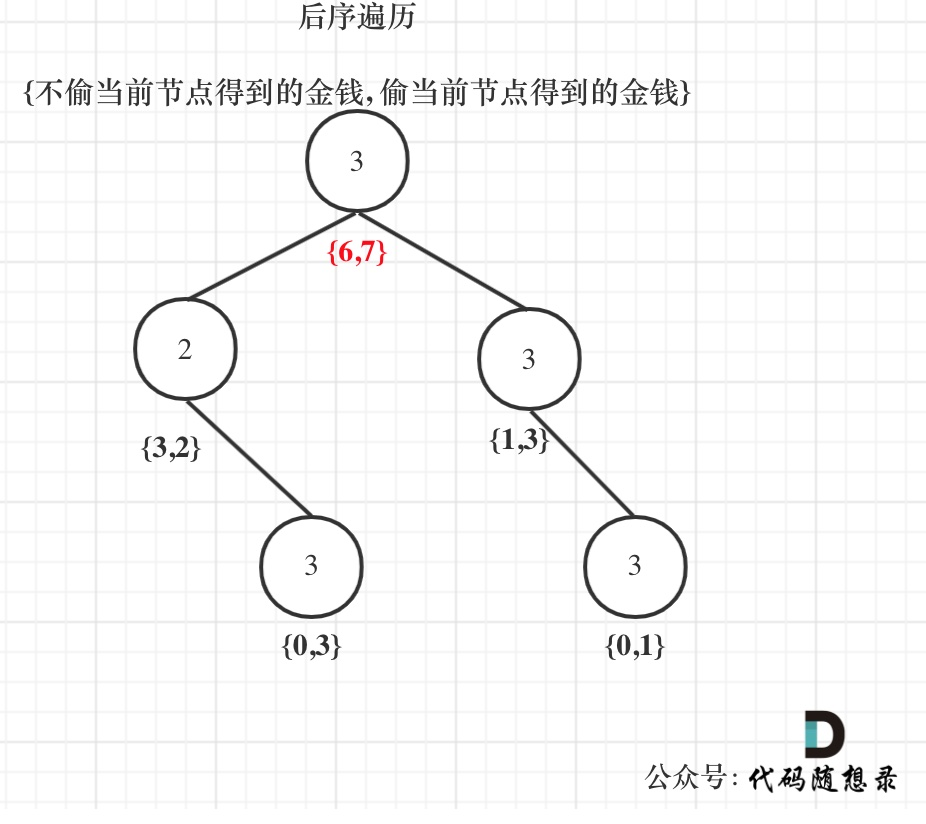

---

时间复杂度：O(n) 每个节点只遍历了⼀次
空间复杂度：O(logn) 算上递推系统栈的空间
总结
 
这道题是树形DP的⼊门题⽬，通过这道题⽬⼤家应该也了解了，所谓树形DP就是在树上进
⾏递归公式的推导。
所以树形DP也没有那么神秘！
只不过平时我们习惯了在⼀维数组或者⼆维数组上推导公式，⼀下⼦换成了树，就需要对树
的遍历⽅式⾜够了解！
⼤家还记不记得我在讲解贪⼼专题的时候，讲到这道题⽬：贪⼼算法：我要监控⼆叉树！，
这也是贪⼼算法在树上的应⽤。那我也可以把这个算法起⼀个名字，叫做树形贪⼼，哈哈哈
“树形贪⼼”词汇从此诞⽣，来⾃「代码随想录」
        vector<int> right = robTree(cur->right);
        // 偷cur
        int val1 = cur->val + left[0] + right[0];
        // 不偷cur
        int val2 = max(left[0], left[1]) + max(right[0], right[1]);
        return {val2, val1};
    }
};

---

代码随想录官⽹：www.programmercarl.com
代码随想录开源项⽬Github：https://github.com/youngyangyang04/leetcode-
master
代码随想录算法公开课 ，代码随想录的全部内容将由我（程序员Carl）视频讲解
并开免费开放给⼤家。
《代码随想录》纸质版 已经出版。
代码随想录知识星球 上万录友在这⾥学习
代码随想录算法训练营 帮助录友⾼效刷完代码随想录。
 
如果感觉PDF对你有帮助，微信搜索：代码随想录，关注我吧，你会发现相见恨晚！

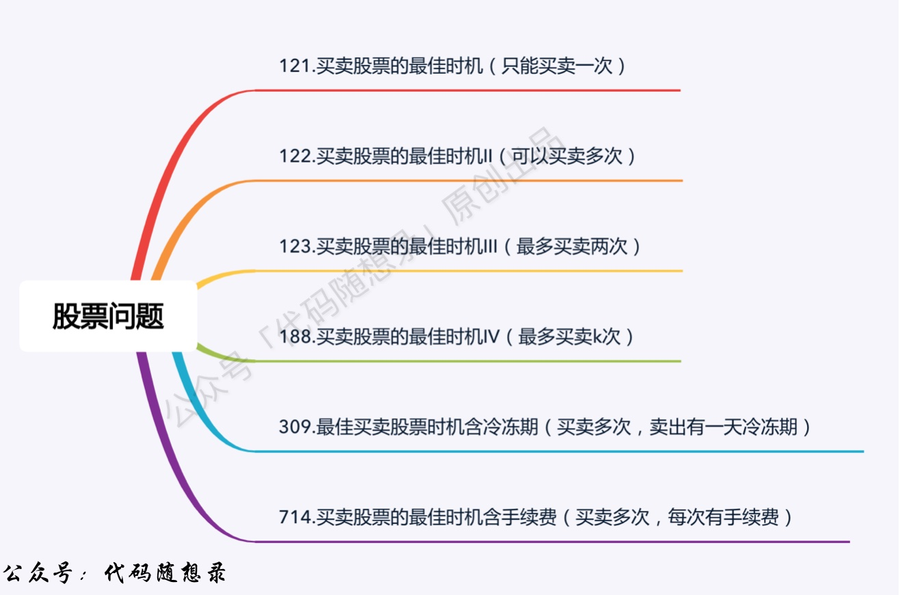

---

买卖股票的最佳时机
 
121. 买卖股票的最佳时机
 
题⽬链接：https://leetcode-cn.com/problems/best-time-to-buy-and-sell-stock/
给定⼀个数组 prices ，它的第 i 个元素 prices[i] 表⽰⼀⽀给定股票第 i 天的价格。
你只能选择 某⼀天 买⼊这只股票，并选择在 未来的某⼀个不同的⽇⼦ 卖出该股票。设计⼀
个算法来计算你所能获取的最⼤利润。
返回你可以从这笔交易中获取的最⼤利润。如果你不能获取任何利润，返回 0 。
⽰例 1：
输⼊：[7,1,5,3,6,4]
输出：5
解释：在第 2 天（股票价格 = 1）的时候买⼊，在第 5 天（股票价格 = 6）的时候卖出，最
⼤利润 = 6-1 = 5 。注意利润不能是 7-1 = 6, 因为卖出价格需要⼤于买⼊价格；同时，你不
能在买⼊前卖出股票。

---

⽰例 2：
输⼊：prices = [7,6,4,3,1]
输出：0
解释：在这种情况下, 没有交易完成, 所以最⼤利润为 0。
思路
 
暴⼒
 
这道题⽬最直观的想法，就是暴⼒，找最优间距了。
时间复杂度：O(n^2)
空间复杂度：O(1)
当然该⽅法超时了。
贪⼼
 
因为股票就买卖⼀次，那么贪⼼的想法很⾃然就是取最左最⼩值，取最右最⼤值，那么得到
的差值就是最⼤利润。
C++代码如下：
class Solution {
public:
    int maxProfit(vector<int>& prices) {
        int result = 0;
        for (int i = 0; i < prices.size(); i++) {
            for (int j = i + 1; j < prices.size(); j++){
                result = max(result, prices[j] - prices[i]);
            }
        }
        return result;
    }
};

---

时间复杂度：O(n)
空间复杂度：O(1)
动态规划
 
动规五部曲分析如下：
1. 确定dp数组（dp table）以及下标的含义
dp[i][0] 表⽰第i天持有股票所得最多现⾦ ，这⾥可能有同学疑惑，本题中只能买卖⼀次，持
有股票之后哪还有现⾦呢？
其实⼀开始现⾦是0，那么加⼊第i天买⼊股票现⾦就是 -prices[i]， 这是⼀个负数。
dp[i][1] 表⽰第i天不持有股票所得最多现⾦
注意这⾥说的是“持有”，“持有”不代表就是当天“买⼊”！也有可能是昨天就买⼊了，今天
保持持有的状态
很多同学把“持有”和“买⼊”没分区分清楚。
在下⾯递推公式分析中，我会进⼀步讲解。
2. 确定递推公式
class Solution {
public:
    int maxProfit(vector<int>& prices) {
        int low = INT_MAX;
        int result = 0;
        for (int i = 0; i < prices.size(); i++) {
            low = min(low, prices[i]);  // 取最左最⼩价格
            result = max(result, prices[i] - low); // 直接取最⼤区间利润
        }
        return result;
    }
};

---

如果第i天持有股票即dp[i][0]， 那么可以由两个状态推出来
第i-1天就持有股票，那么就保持现状，所得现⾦就是昨天持有股票的所得现⾦ 
即：dp[i - 1][0]
第i天买⼊股票，所得现⾦就是买⼊今天的股票后所得现⾦即：-prices[i]
那么dp[i][0]应该选所得现⾦最⼤的，所以dp[i][0] = max(dp[i - 1][0], -prices[i]);
如果第i天不持有股票即dp[i][1]， 也可以由两个状态推出来
第i-1天就不持有股票，那么就保持现状，所得现⾦就是昨天不持有股票的所得现
⾦ 即：dp[i - 1][1]
第i天卖出股票，所得现⾦就是按照今天股票佳价格卖出后所得现⾦即：prices[i] + 
dp[i - 1][0]
同样dp[i][1]取最⼤的，dp[i][1] = max(dp[i - 1][1], prices[i] + dp[i - 1][0]);
这样递归公式我们就分析完了
3. dp数组如何初始化
由递推公式 dp[i][0] = max(dp[i - 1][0], -prices[i]); 和 dp[i][1] = max(dp[i - 1][1], prices[i] + 
dp[i - 1][0]);可以看出
其基础都是要从dp[0][0]和dp[0][1]推导出来。
那么dp[0][0]表⽰第0天持有股票，此时的持有股票就⼀定是买⼊股票了，因为不可能有前⼀
天推出来，所以dp[0][0] -= prices[0];
dp[0][1]表⽰第0天不持有股票，不持有股票那么现⾦就是0，所以dp[0][1] = 0;
4. 确定遍历顺序
从递推公式可以看出dp[i]都是有dp[i - 1]推导出来的，那么⼀定是从前向后遍历。
5. 举例推导dp数组
以⽰例1，输⼊：[7,1,5,3,6,4]为例，dp数组状态如下：

---

dp[5][1]就是最终结果。
为什么不是dp[5][0]呢？
因为本题中不持有股票状态所得⾦钱⼀定⽐持有股票状态得到的多！
以上分析完毕，C++代码如下：
// 版本⼀
class Solution {
public:
    int maxProfit(vector<int>& prices) {

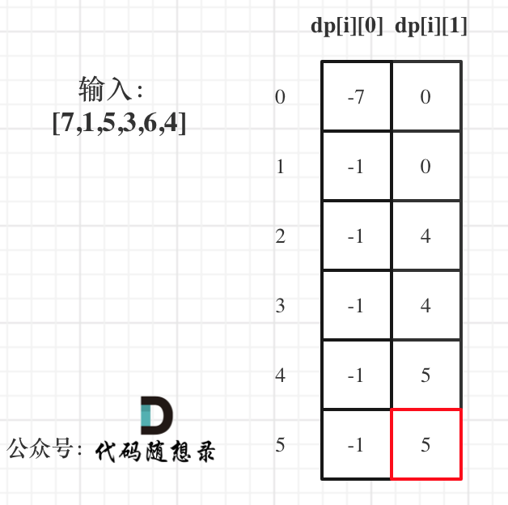

---

时间复杂度：O(n)
空间复杂度：O(n)
从递推公式可以看出，dp[i]只是依赖于dp[i - 1]的状态。
那么我们只需要记录 当前天的dp状态和前⼀天的dp状态就可以了，可以使⽤滚动数组来节
省空间，代码如下：
        int len = prices.size();
        if (len == 0) return 0;
        vector<vector<int>> dp(len, vector<int>(2));
        dp[0][0] -= prices[0];
        dp[0][1] = 0;
        for (int i = 1; i < len; i++) {
            dp[i][0] = max(dp[i - 1][0], -prices[i]);
            dp[i][1] = max(dp[i - 1][1], prices[i] + dp[i - 1][0]);
        }
        return dp[len - 1][1];
    }
};
dp[i][0] = max(dp[i - 1][0], -prices[i]);
dp[i][1] = max(dp[i - 1][1], prices[i] + dp[i - 1][0]);
// 版本⼆
class Solution {
public:
    int maxProfit(vector<int>& prices) {
        int len = prices.size();
        vector<vector<int>> dp(2, vector<int>(2)); // 注意这⾥只开辟了⼀
个2 * 2⼤⼩的⼆维数组
        dp[0][0] -= prices[0];
        dp[0][1] = 0;
        for (int i = 1; i < len; i++) {
            dp[i % 2][0] = max(dp[(i - 1) % 2][0], -prices[i]);
            dp[i % 2][1] = max(dp[(i - 1) % 2][1], prices[i] + dp[(i 
- 1) % 2][0]);

---

时间复杂度：O(n)
空间复杂度：O(1)
这⾥能写出版本⼀就可以了，版本⼆虽然原理都⼀样，但是想直接写出版本⼆还是有点⿇
烦，容易⾃⼰给⾃⼰找bug。
所以建议是先写出版本⼀，然后在版本⼀的基础上优化成版本⼆，⽽不是直接就写出版本
⼆。
 
买卖股票的最佳时机II
 
122.买卖股票的最佳时机II
 
题⽬链接：https://leetcode-cn.com/problems/best-time-to-buy-and-sell-stock-ii/
给定⼀个数组，它的第 i 个元素是⼀⽀给定股票第 i 天的价格。
设计⼀个算法来计算你所能获取的最⼤利润。你可以尽可能地完成更多的交易（多次买卖⼀
⽀股票）。
注意：你不能同时参与多笔交易（你必须在再次购买前出售掉之前的股票）。
⽰例 1:
输⼊: [7,1,5,3,6,4]
输出: 7
解释: 在第 2 天（股票价格 = 1）的时候买⼊，在第 3 天（股票价格 = 5）的时候卖出, 这笔
交易所能获得利润 = 5-1 = 4。随后，在第 4 天（股票价格 = 3）的时候买⼊，在第 5 天（股
        }
        return dp[(len - 1) % 2][1];
    }
};

---

票价格 = 6）的时候卖出, 这笔交易所能获得利润 = 6-3 = 3 。
⽰例 2:
输⼊: [1,2,3,4,5]
输出: 4
解释: 在第 1 天（股票价格 = 1）的时候买⼊，在第 5 天 （股票价格 = 5）的时候卖出, 这笔
交易所能获得利润 = 5-1 = 4 。注意你不能在第 1 天和第 2 天接连购买股票，之后再将它们
卖出。因为这样属于同时参与了多笔交易，你必须在再次购买前出售掉之前的股票。
⽰例 3:
输⼊: [7,6,4,3,1]
输出: 0
解释: 在这种情况下, 没有交易完成, 所以最⼤利润为 0。
提⽰：
1 <= prices.length <= 3 * 10 ^ 4
0 <= prices[i] <= 10 ^ 4
思路
 
本题我们在讲解贪⼼专题的时候就已经讲解过了贪⼼算法：买卖股票的最佳时机II，只不过
没有深⼊讲解动态规划的解法，那么这次我们再好好分析⼀下动规的解法。
本题和121. 买卖股票的最佳时机的唯⼀区别本题股票可以买卖多次了（注意只有⼀只股
票，所以再次购买前要出售掉之前的股票）
在动规五部曲中，这个区别主要是体现在递推公式上，其他都和121. 买卖股票的最佳时机
⼀样⼀样的。
所以我们重点讲⼀讲递推公式。
这⾥重申⼀下dp数组的含义：
dp[i][0] 表⽰第i天持有股票所得现⾦。
dp[i][1] 表⽰第i天不持有股票所得最多现⾦
如果第i天持有股票即dp[i][0]， 那么可以由两个状态推出来

---

第i-1天就持有股票，那么就保持现状，所得现⾦就是昨天持有股票的所得现⾦ 
即：dp[i - 1][0]
第i天买⼊股票，所得现⾦就是昨天不持有股票的所得现⾦减去 今天的股票价格 
即：dp[i - 1][1] - prices[i]
注意这⾥和121. 买卖股票的最佳时机唯⼀不同的地⽅，就是推导dp[i][0]的时候，第i天买⼊
股票的情况。
在121. 买卖股票的最佳时机中，因为股票全程只能买卖⼀次，所以如果买⼊股票，那么第i
天持有股票即dp[i][0]⼀定就是 -prices[i]。
⽽本题，因为⼀只股票可以买卖多次，所以当第i天买⼊股票的时候，所持有的现⾦可能有
之前买卖过的利润。
那么第i天持有股票即dp[i][0]，如果是第i天买⼊股票，所得现⾦就是昨天不持有股票的所得
现⾦ 减去 今天的股票价格 即：dp[i - 1][1] - prices[i]。
在来看看如果第i天不持有股票即dp[i][1]的情况， 依然可以由两个状态推出来
第i-1天就不持有股票，那么就保持现状，所得现⾦就是昨天不持有股票的所得现
⾦ 即：dp[i - 1][1]
第i天卖出股票，所得现⾦就是按照今天股票佳价格卖出后所得现⾦即：prices[i] + 
dp[i - 1][0]
注意这⾥和121. 买卖股票的最佳时机就是⼀样的逻辑，卖出股票收获利润（可能是负值）
天经地义！
代码如下：（注意代码中的注释，标记了和121.买卖股票的最佳时机唯⼀不同的地⽅）
class Solution {
public:
    int maxProfit(vector<int>& prices) {
        int len = prices.size();
        vector<vector<int>> dp(len, vector<int>(2, 0));
        dp[0][0] -= prices[0];
        dp[0][1] = 0;
        for (int i = 1; i < len; i++) {
            dp[i][0] = max(dp[i - 1][0], dp[i - 1][1] - prices[i]); 
// 注意这⾥是和121. 买卖股票的最佳时机唯⼀不同的地⽅。

---

时间复杂度：O(n)
空间复杂度：O(n)
⼤家可以本题和121. 买卖股票的最佳时机的代码⼏乎⼀样，唯⼀的区别在：
这正是因为本题的股票可以买卖多次！ 所以买⼊股票的时候，可能会有之前买卖的利润
即：dp[i - 1][1]，所以dp[i - 1][1] - prices[i]。
想到到这⼀点，对这两道题理解的⽐较深刻了。
这⾥我依然给出滚动数组的版本，C++代码如下：
            dp[i][1] = max(dp[i - 1][1], dp[i - 1][0] + prices[i]);
        }
        return dp[len - 1][1];
    }
};
dp[i][0] = max(dp[i - 1][0], dp[i - 1][1] - prices[i]);
// 版本⼆
class Solution {
public:
    int maxProfit(vector<int>& prices) {
        int len = prices.size();
        vector<vector<int>> dp(2, vector<int>(2)); // 注意这⾥只开辟了⼀
个2 * 2⼤⼩的⼆维数组
        dp[0][0] -= prices[0];
        dp[0][1] = 0;
        for (int i = 1; i < len; i++) {
            dp[i % 2][0] = max(dp[(i - 1) % 2][0], dp[(i - 1) % 2][1] 
- prices[i]);
            dp[i % 2][1] = max(dp[(i - 1) % 2][1], prices[i] + dp[(i 
- 1) % 2][0]);
        }
        return dp[(len - 1) % 2][1];
    }

---

时间复杂度：O(n)
空间复杂度：O(1)
 
 
买卖股票的最佳时机III
 
123.买卖股票的最佳时机III
 
题⽬链接：https://leetcode-cn.com/problems/best-time-to-buy-and-sell-stock-iii/
给定⼀个数组，它的第 i 个元素是⼀⽀给定的股票在第 i 天的价格。
设计⼀个算法来计算你所能获取的最⼤利润。你最多可以完成 两笔 交易。
注意：你不能同时参与多笔交易（你必须在再次购买前出售掉之前的股票）。
⽰例 1:
输⼊：prices = [3,3,5,0,0,3,1,4]
输出：6
解释：在第 4 天（股票价格 = 0）的时候买⼊，在第 6 天（股票价格 = 3）的时候卖出，这
笔交易所能获得利润 = 3-0 = 3 。随后，在第 7 天（股票价格 = 1）的时候买⼊，在第 8 天 
（股票价格 = 4）的时候卖出，这笔交易所能获得利润 = 4-1 = 3。
⽰例 2：
输⼊：prices = [1,2,3,4,5]
输出：4
解释：在第 1 天（股票价格 = 1）的时候买⼊，在第 5 天 （股票价格 = 5）的时候卖出, 这笔
交易所能获得利润 = 5-1 = 4。注意你不能在第 1 天和第 2 天接连购买股票，之后再将它们
卖出。因为这样属于同时参与了多笔交易，你必须在再次购买前出售掉之前的股票。
};

---

⽰例 3：
输⼊：prices = [7,6,4,3,1]
输出：0
解释：在这个情况下, 没有交易完成, 所以最⼤利润为0。
⽰例 4：
输⼊：prices = [1]
输出：0
提⽰：
1 <= prices.length <= 10^5
0 <= prices[i] <= 10^5
思路
 
这道题⽬相对 121.买卖股票的最佳时机 和 122.买卖股票的最佳时机II 难了不少。
关键在于⾄多买卖两次，这意味着可以买卖⼀次，可以买卖两次，也可以不买卖。
接来下我⽤动态规划五部曲详细分析⼀下：
1. 确定dp数组以及下标的含义
⼀天⼀共就有五个状态，
0. 没有操作
1. 第⼀次买⼊
2. 第⼀次卖出
3. 第⼆次买⼊
4. 第⼆次卖出
dp[i][j]中 i表⽰第i天，j为 [0 - 4] 五个状态，dp[i][j]表⽰第i天状态j所剩最⼤现⾦。
2. 确定递推公式
需要注意：dp[i][1]，表⽰的是第i天，买⼊股票的状态，并不是说⼀定要第i天买⼊股票，这
是很多同学容易陷⼊的误区。

---

达到dp[i][1]状态，有两个具体操作：
操作⼀：第i天买⼊股票了，那么dp[i][1] = dp[i-1][0] - prices[i]
操作⼆：第i天没有操作，⽽是沿⽤前⼀天买⼊的状态，即：dp[i][1] = dp[i - 1][1]
那么dp[i][1]究竟选 dp[i-1][0] - prices[i]，还是dp[i - 1][1]呢？
⼀定是选最⼤的，所以 dp[i][1] = max(dp[i-1][0] - prices[i], dp[i - 1][1]);
同理dp[i][2]也有两个操作：
操作⼀：第i天卖出股票了，那么dp[i][2] = dp[i - 1][1] + prices[i]
操作⼆：第i天没有操作，沿⽤前⼀天卖出股票的状态，即：dp[i][2] = dp[i - 1][2]
所以dp[i][2] = max(dp[i - 1][1] + prices[i], dp[i - 1][2])
同理可推出剩下状态部分：
dp[i][3] = max(dp[i - 1][3], dp[i - 1][2] - prices[i]);
dp[i][4] = max(dp[i - 1][4], dp[i - 1][3] + prices[i]);
3. dp数组如何初始化
第0天没有操作，这个最容易想到，就是0，即：dp[0][0] = 0;
第0天做第⼀次买⼊的操作，dp[0][1] = -prices[0];
第0天做第⼀次卖出的操作，这个初始值应该是多少呢？
⾸先卖出的操作⼀定是收获利润，整个股票买卖最差情况也就是没有盈利即全程⽆操作现⾦
为0，
从递推公式中可以看出每次是取最⼤值，那么既然是收获利润如果⽐0还⼩了就没有必要收
获这个利润了。
所以dp[0][2] = 0;
第0天第⼆次买⼊操作，初始值应该是多少呢？

---

不⽤管第⼏次，现在⼿头上没有现⾦，只要买⼊，现⾦就做相应的减少。
所以第⼆次买⼊操作，初始化为：dp[0][3] = -prices[0];
同理第⼆次卖出初始化dp[0][4] = 0;
4. 确定遍历顺序
从递归公式其实已经可以看出，⼀定是从前向后遍历，因为dp[i]，依靠dp[i - 1]的数值。
5. 举例推导dp数组
以输⼊[1,2,3,4,5]为例
⼤家可以看到红⾊框为最后两次卖出的状态。

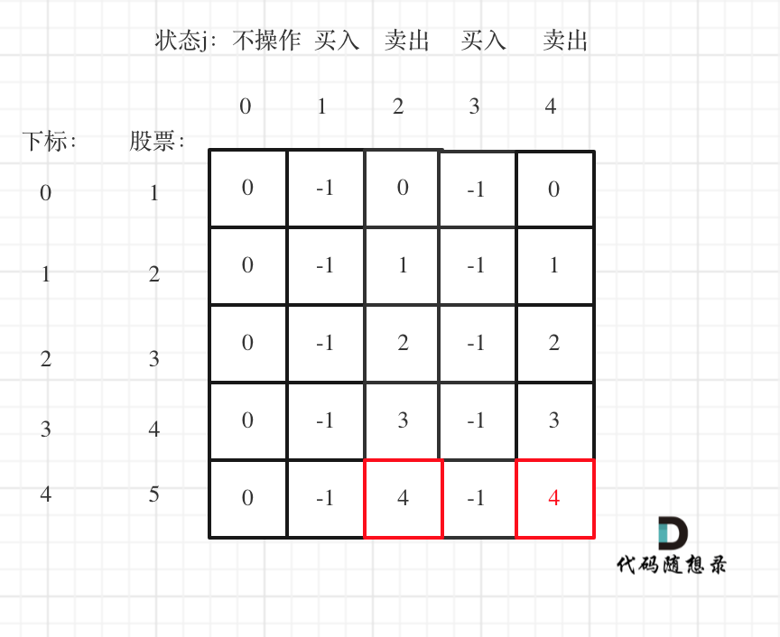

---

现在最⼤的时候⼀定是卖出的状态，⽽两次卖出的状态现⾦最⼤⼀定是最后⼀次卖出。
所以最终最⼤利润是dp[4][4]
以上五部都分析完了，不难写出如下代码：
时间复杂度：O(n)
空间复杂度：O(n * 5)
当然，⼤家可以看到⼒扣官⽅题解⾥的⼀种优化空间写法，我这⾥给出对应的C++版本：
// 版本⼀
class Solution {
public:
    int maxProfit(vector<int>& prices) {
        if (prices.size() == 0) return 0;
        vector<vector<int>> dp(prices.size(), vector<int>(5, 0));
        dp[0][1] = -prices[0];
        dp[0][3] = -prices[0];
        for (int i = 1; i < prices.size(); i++) {
            dp[i][0] = dp[i - 1][0];
            dp[i][1] = max(dp[i - 1][1], dp[i - 1][0] - prices[i]);
            dp[i][2] = max(dp[i - 1][2], dp[i - 1][1] + prices[i]);
            dp[i][3] = max(dp[i - 1][3], dp[i - 1][2] - prices[i]);
            dp[i][4] = max(dp[i - 1][4], dp[i - 1][3] + prices[i]);
        }
        return dp[prices.size() - 1][4];
    }
};
// 版本⼆
class Solution {
public:
    int maxProfit(vector<int>& prices) {
        if (prices.size() == 0) return 0;
        vector<int> dp(5, 0);
        dp[1] = -prices[0];
        dp[3] = -prices[0];

---

时间复杂度：O(n)
空间复杂度：O(1)
⼤家会发现dp[2]利⽤的是当天的dp[1]。 但结果也是对的。
我来简单解释⼀下：
dp[1] = max(dp[1], dp[0] - prices[i]); 如果dp[1]取dp[1]，即保持买⼊股票的状态，那么 dp[2] 
= max(dp[2], dp[1] + prices[i]);中dp[1] + prices[i] 就是今天卖出。
如果dp[1]取dp[0] - prices[i]，今天买⼊股票，那么dp[2] = max(dp[2], dp[1] + prices[i]);中的
dp[1] + prices[i]相当于是尽在再卖出股票，⼀买⼀卖收益为0，对所得现⾦没有影响。相当
于今天买⼊股票又卖出股票，等于没有操作，保持昨天卖出股票的状态了。
这种写法看上去简单，其实思路很绕，不建议⼤家这么写，这么思考，很容易把⾃⼰绕进
去！
对于本题，把版本⼀的写法研究明⽩，⾜以！
 
买卖股票的最佳时机IV
 
        for (int i = 1; i < prices.size(); i++) {
            dp[1] = max(dp[1], dp[0] - prices[i]);
            dp[2] = max(dp[2], dp[1] + prices[i]);
            dp[3] = max(dp[3], dp[2] - prices[i]);
            dp[4] = max(dp[4], dp[3] + prices[i]);
        }
        return dp[4];
    }
};

---

188.买卖股票的最佳时机IV
 
题⽬链接：https://leetcode-cn.com/problems/best-time-to-buy-and-sell-stock-iv/
给定⼀个整数数组 prices ，它的第 i 个元素 prices[i] 是⼀⽀给定的股票在第 i 天的价格。
设计⼀个算法来计算你所能获取的最⼤利润。你最多可以完成 k 笔交易。
注意：你不能同时参与多笔交易（你必须在再次购买前出售掉之前的股票）。
⽰例 1：
输⼊：k = 2, prices = [2,4,1]
输出：2
解释：在第 1 天 (股票价格 = 2) 的时候买⼊，在第 2 天 (股票价格 = 4) 的时候卖出，这笔交
易所能获得利润 = 4-2 = 2。
⽰例 2：
输⼊：k = 2, prices = [3,2,6,5,0,3]
输出：7
解释：在第 2 天 (股票价格 = 2) 的时候买⼊，在第 3 天 (股票价格 = 6) 的时候卖出, 这笔交易
所能获得利润 = 6-2 = 4。随后，在第 5 天 (股票价格 = 0) 的时候买⼊，在第 6 天 (股票价格 
= 3) 的时候卖出, 这笔交易所能获得利润 = 3-0 = 3 。
提⽰：
0 <= k <= 100
0 <= prices.length <= 1000
0 <= prices[i] <= 1000
思路
 
这道题⽬可以说是动态规划：123.买卖股票的最佳时机III的进阶版，这⾥要求⾄多有k次交
易。
动规五部曲，分析如下：
1. 确定dp数组以及下标的含义

---

在动态规划：123.买卖股票的最佳时机III中，我是定义了⼀个⼆维dp数组，本题其实依然
可以⽤⼀个⼆维dp数组。
使⽤⼆维数组 dp[i][j] ：第i天的状态为j，所剩下的最⼤现⾦是dp[i][j]
j的状态表⽰为：
0 表⽰不操作
1 第⼀次买⼊
2 第⼀次卖出
3 第⼆次买⼊
4 第⼆次卖出
.....
⼤家应该发现规律了吧 ，除了0以外，偶数就是卖出，奇数就是买⼊。
题⽬要求是⾄多有K笔交易，那么j的范围就定义为 2 * k + 1 就可以了。
所以⼆维dp数组的C++定义为：
2. 确定递推公式
还要强调⼀下：dp[i][1]，表⽰的是第i天，买⼊股票的状态，并不是说⼀定要第i天买⼊股
票，这是很多同学容易陷⼊的误区。
达到dp[i][1]状态，有两个具体操作：
操作⼀：第i天买⼊股票了，那么dp[i][1] = dp[i - 1][0] - prices[i]
操作⼆：第i天没有操作，⽽是沿⽤前⼀天买⼊的状态，即：dp[i][1] = dp[i - 1][1]
选最⼤的，所以 dp[i][1] = max(dp[i - 1][0] - prices[i], dp[i - 1][0]);
同理dp[i][2]也有两个操作：
操作⼀：第i天卖出股票了，那么dp[i][2] = dp[i - 1][1] + prices[i]
操作⼆：第i天没有操作，沿⽤前⼀天卖出股票的状态，即：dp[i][2] = dp[i - 1][2]
vector<vector<int>> dp(prices.size(), vector<int>(2 * k + 1, 0));

---

所以dp[i][2] = max(dp[i - 1][i] + prices[i], dp[i][2])
同理可以类⽐剩下的状态，代码如下：
本题和动态规划：123.买卖股票的最佳时机III最⼤的区别就是这⾥要类⽐j为奇数是买，偶
数是卖剩的状态。
3. dp数组如何初始化
第0天没有操作，这个最容易想到，就是0，即：dp[0][0] = 0;
第0天做第⼀次买⼊的操作，dp[0][1] = -prices[0];
第0天做第⼀次卖出的操作，这个初始值应该是多少呢？
⾸先卖出的操作⼀定是收获利润，整个股票买卖最差情况也就是没有盈利即全程⽆操作现⾦
为0，
从递推公式中可以看出每次是取最⼤值，那么既然是收获利润如果⽐0还⼩了就没有必要收
获这个利润了。
所以dp[0][2] = 0;
第0天第⼆次买⼊操作，初始值应该是多少呢？
不⽤管第⼏次，现在⼿头上没有现⾦，只要买⼊，现⾦就做相应的减少。
第⼆次买⼊操作，初始化为：dp[0][3] = -prices[0];
所以同理可以推出dp[0][j]当j为奇数的时候都初始化为 -prices[0]
代码如下：
for (int j = 0; j < 2 * k - 1; j += 2) {
    dp[i][j + 1] = max(dp[i - 1][j + 1], dp[i - 1][j] - prices[i]);
    dp[i][j + 2] = max(dp[i - 1][j + 2], dp[i - 1][j + 1] + 
prices[i]);
}

---

在初始化的地⽅同样要类⽐j为偶数是买、奇数是卖的状态。
4. 确定遍历顺序
从递归公式其实已经可以看出，⼀定是从前向后遍历，因为dp[i]，依靠dp[i - 1]的数值。
5. 举例推导dp数组
以输⼊[1,2,3,4,5]，k=2为例。
最后⼀次卖出，⼀定是利润最⼤的，dp[prices.size() - 1][2 * k]即红⾊部分就是最后求解。
for (int j = 1; j < 2 * k; j += 2) {
    dp[0][j] = -prices[0];
}

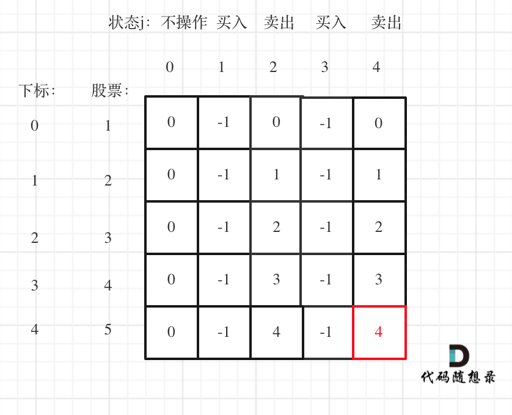

---

以上分析完毕，C++代码如下：
当然有的解法是定义⼀个三维数组dp[i][j][k]，第i天，第j次买卖，k表⽰买还是卖的状态，
从定义上来讲是⽐较直观。
但感觉三维数组操作起来有些⿇烦，我是直接⽤⼆维数组来模拟三位数组的情况，代码看起
来也清爽⼀些。
 
代码随想录官⽹：www.programmercarl.com
代码随想录开源项⽬Github：https://github.com/youngyangyang04/leetcode-
master
代码随想录算法公开课 ，代码随想录的全部内容将由我（程序员Carl）视频讲解
并开免费开放给⼤家。
《代码随想录》纸质版 已经出版。
class Solution {
public:
    int maxProfit(int k, vector<int>& prices) {
        if (prices.size() == 0) return 0;
        vector<vector<int>> dp(prices.size(), vector<int>(2 * k + 1, 
0));
        for (int j = 1; j < 2 * k; j += 2) {
            dp[0][j] = -prices[0];
        }
        for (int i = 1;i < prices.size(); i++) {
            for (int j = 0; j < 2 * k - 1; j += 2) {
                dp[i][j + 1] = max(dp[i - 1][j + 1], dp[i - 1][j] - 
prices[i]);
                dp[i][j + 2] = max(dp[i - 1][j + 2], dp[i - 1][j + 1] 
+ prices[i]);
            }
        }
        return dp[prices.size() - 1][2 * k];
    }
};

---

代码随想录知识星球 上万录友在这⾥学习
代码随想录算法训练营 帮助录友⾼效刷完代码随想录。
 
如果感觉PDF对你有帮助，微信搜索：代码随想录，关注我吧，你会发现相见恨晚！
最佳买卖股票时机含冷冻期
 
309.最佳买卖股票时机含冷冻期
 
题⽬链接：https://leetcode-cn.com/problems/best-time-to-buy-and-sell-stock-with-cool
down/
给定⼀个整数数组，其中第 i 个元素代表了第 i 天的股票价格 。 
设计⼀个算法计算出最⼤利润。在满⾜以下约束条件下，你可以尽可能地完成更多的交易
（多次买卖⼀⽀股票）:
你不能同时参与多笔交易（你必须在再次购买前出售掉之前的股票）。

---

卖出股票后，你⽆法在第⼆天买⼊股票 (即冷冻期为 1 天)。
⽰例:
输⼊: [1,2,3,0,2]
输出: 3
解释: 对应的交易状态为: [买⼊, 卖出, 冷冻期, 买⼊, 卖出]
思路
 
之前我们在动态规划：最佳买卖股票时机含冷冻期讲过⼀次这道题⽬，讲解的过程
感觉不是很严谨，和录友们也聊过这个问题，本着对⼤家负责的态度，有问题的地
⽅我都会及时纠正，所以重新发⽂讲解⼀下。
相对于动态规划：122.买卖股票的最佳时机II，本题加上了⼀个冷冻期
在动态规划：122.买卖股票的最佳时机II 中有两个状态，持有股票后的最多现⾦，和不持有
股票的最多现⾦。
动规五部曲，分析如下：
1. 确定dp数组以及下标的含义
dp[i][j]，第i天状态为j，所剩的最多现⾦为dp[i][j]。
其实本题很多同学搞的⽐较懵，是因为出现冷冻期之后，状态其实是⽐较复杂度，例如今天
买⼊股票、今天卖出股票、今天是冷冻期，都是不能操作股票的。
具体可以区分出如下四个状态：
状态⼀：买⼊股票状态（今天买⼊股票，或者是之前就买⼊了股票然后没有操作）
卖出股票状态，这⾥就有两种卖出股票状态
状态⼆：两天前就卖出了股票，度过了冷冻期，⼀直没操作，今天保持卖
出股票状态
状态三：今天卖出了股票
状态四：今天为冷冻期状态，但冷冻期状态不可持续，只有⼀天！
j的状态为：
0：状态⼀

---

1：状态⼆
2：状态三
3：状态四
很多题解为什么讲的⽐较模糊，是因为把这四个状态合并成三个状态了，其实就是把状态⼆
和状态四合并在⼀起了。
从代码上来看确实可以合并，但从逻辑上分析合并之后就很难理解了，所以我下⾯的讲解是
按照这四个状态来的，把每⼀个状态分析清楚。
注意这⾥的每⼀个状态，例如状态⼀，是买⼊股票状态并不是说今天已经就买⼊股票，⽽是
说保存买⼊股票的状态即：可能是前⼏天买⼊的，之后⼀直没操作，所以保持买⼊股票的状
态。
2. 确定递推公式
达到买⼊股票状态（状态⼀）即：dp[i][0]，有两个具体操作：
操作⼀：前⼀天就是持有股票状态（状态⼀），dp[i][0] = dp[i - 1][0]
操作⼆：今天买⼊了，有两种情况
前⼀天是冷冻期（状态四），dp[i - 1][3] - prices[i]
前⼀天是保持卖出股票状态（状态⼆），dp[i - 1][1] - prices[i]
所以操作⼆取最⼤值，即：max(dp[i - 1][3], dp[i - 1][1]) - prices[i]
那么dp[i][0] = max(dp[i - 1][0], max(dp[i - 1][3], dp[i - 1][1]) - prices[i]);
达到保持卖出股票状态（状态⼆）即：dp[i][1]，有两个具体操作：
操作⼀：前⼀天就是状态⼆
操作⼆：前⼀天是冷冻期（状态四）
dp[i][1] = max(dp[i - 1][1], dp[i - 1][3]);
达到今天就卖出股票状态（状态三），即：dp[i][2] ，只有⼀个操作：
操作⼀：昨天⼀定是买⼊股票状态（状态⼀），今天卖出

---

即：dp[i][2] = dp[i - 1][0] + prices[i];
达到冷冻期状态（状态四），即：dp[i][3]，只有⼀个操作：
操作⼀：昨天卖出了股票（状态三）
p[i][3] = dp[i - 1][2];
综上分析，递推代码如下：
3. dp数组如何初始化
这⾥主要讨论⼀下第0天如何初始化。
如果是持有股票状态（状态⼀）那么：dp[0][0] = -prices[0]，买⼊股票所省现⾦为负数。
保持卖出股票状态（状态⼆），第0天没有卖出dp[0][1]初始化为0就⾏，
今天卖出了股票（状态三），同样dp[0][2]初始化为0，因为最少收益就是0，绝不会是负
数。
同理dp[0][3]也初始为0。
4. 确定遍历顺序
从递归公式上可以看出，dp[i] 依赖于 dp[i-1]，所以是从前向后遍历。
5. 举例推导dp数组
以 [1,2,3,0,2] 为例，dp数组如下：
dp[i][0] = max(dp[i - 1][0], max(dp[i - 1][3], dp[i - 1][1]) - 
prices[i];
dp[i][1] = max(dp[i - 1][1], dp[i - 1][3]);
dp[i][2] = dp[i - 1][0] + prices[i];
dp[i][3] = dp[i - 1][2];

---

最后结果去是 状态⼆，状态三，和状态四的最⼤值，不少同学会把状态四忘了，状态四是
冷冻期，最后⼀天如果是冷冻期也可能是最⼤值。
代码如下：
class Solution {
public:
    int maxProfit(vector<int>& prices) {
        int n = prices.size();
        if (n == 0) return 0;
        vector<vector<int>> dp(n, vector<int>(4, 0));
        dp[0][0] -= prices[0]; // 持股票
        for (int i = 1; i < n; i++) {
            dp[i][0] = max(dp[i - 1][0], max(dp[i - 1][3], dp[i - 1]
[1]) - prices[i]);
            dp[i][1] = max(dp[i - 1][1], dp[i - 1][3]);
            dp[i][2] = dp[i - 1][0] + prices[i];
            dp[i][3] = dp[i - 1][2];
        }
        return max(dp[n - 1][3],max(dp[n - 1][1], dp[n - 1][2]));

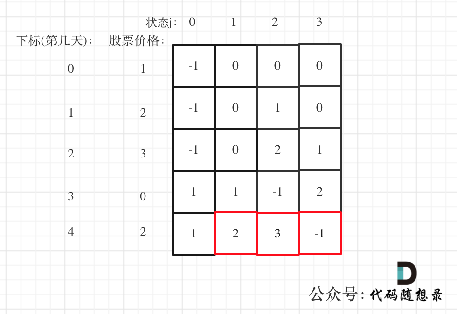

---

时间复杂度：O(n)
空间复杂度：O(n)
当然，空间复杂度可以优化，定义⼀个dp[2][4]⼤⼩的数组就可以了，就保存前⼀天的当前
的状态，感兴趣的同学可以⾃⼰去写⼀写，思路是⼀样的。
总结
 
这次把冷冻期这道题⽬，讲的很透彻了，细分为四个状态，其状态转移也⼗分清晰，建议⼤
家都按照四个状态来分析，如果只划分三个状态确实很容易给⾃⼰绕进去。
 
买卖股票的最佳时机含⼿续费
 
714.买卖股票的最佳时机含⼿续费
 
题⽬链接：https://leetcode-cn.com/problems/best-time-to-buy-and-sell-stock-with-tran
saction-fee/
给定⼀个整数数组 prices，其中第 i 个元素代表了第 i 天的股票价格 ；⾮负整数 fee 代表了
交易股票的⼿续费⽤。
你可以⽆限次地完成交易，但是你每笔交易都需要付⼿续费。如果你已经购买了⼀个股票，
在卖出它之前你就不能再继续购买股票了。
返回获得利润的最⼤值。
注意：这⾥的⼀笔交易指买⼊持有并卖出股票的整个过程，每笔交易你只需要为⽀付⼀次⼿
续费。
    }
};

---

⽰例 1:
输⼊: prices = [1, 3, 2, 8, 4, 9], fee = 2
输出: 8
解释: 能够达到的最⼤利润:
在此处买⼊ prices[0] = 1
在此处卖出 prices[3] = 8
在此处买⼊ prices[4] = 4
在此处卖出 prices[5] = 9
总利润: ((8 - 1) - 2) + ((9 - 4) - 2) = 8.
注意:
0 < prices.length <= 50000.
0 < prices[i] < 50000.
0 <= fee < 50000.
思路
 
在讲解贪⼼专题的时候，我们已经讲过本题了贪⼼算法：买卖股票的最佳时机含⼿续费
使⽤贪⼼算法，的性能是：
时间复杂度：O(n)
空间复杂度：O(1)
那么我们再来看看是使⽤动规的⽅法如何解题。
相对于动态规划：122.买卖股票的最佳时机II，本题只需要在计算卖出操作的时候减去⼿续
费就可以了，代码⼏乎是⼀样的。
唯⼀差别在于递推公式部分，所以本篇也就不按照动规五部曲详细讲解了，主要讲解⼀下递
推公式部分。
这⾥重申⼀下dp数组的含义：
dp[i][0] 表⽰第i天持有股票所省最多现⾦。
dp[i][1] 表⽰第i天不持有股票所得最多现⾦

---

如果第i天持有股票即dp[i][0]， 那么可以由两个状态推出来
第i-1天就持有股票，那么就保持现状，所得现⾦就是昨天持有股票的所得现⾦ 
即：dp[i - 1][0]
第i天买⼊股票，所得现⾦就是昨天不持有股票的所得现⾦减去 今天的股票价格 
即：dp[i - 1][1] - prices[i]
所以：dp[i][0] = max(dp[i - 1][0], dp[i - 1][1] - prices[i]);
在来看看如果第i天不持有股票即dp[i][1]的情况， 依然可以由两个状态推出来
第i-1天就不持有股票，那么就保持现状，所得现⾦就是昨天不持有股票的所得现
⾦ 即：dp[i - 1][1]
第i天卖出股票，所得现⾦就是按照今天股票价格卖出后所得现⾦，注意这⾥需要
有⼿续费了即：dp[i - 1][0] + prices[i] - fee
所以：dp[i][1] = max(dp[i - 1][1], dp[i - 1][0] + prices[i] - fee);
本题和动态规划：122.买卖股票的最佳时机II的区别就是这⾥需要多⼀个减去⼿续费的操
作。
以上分析完毕，C++代码如下：
class Solution {
public:
    int maxProfit(vector<int>& prices, int fee) {
        int n = prices.size();
        vector<vector<int>> dp(n, vector<int>(2, 0));
        dp[0][0] -= prices[0]; // 持股票
        for (int i = 1; i < n; i++) {
            dp[i][0] = max(dp[i - 1][0], dp[i - 1][1] - prices[i]);
            dp[i][1] = max(dp[i - 1][1], dp[i - 1][0] + prices[i] - 
fee);
        }
        return max(dp[n - 1][0], dp[n - 1][1]);
    }
};

---

时间复杂度：O(n)
空间复杂度：O(n)
 
股票问题总结篇
 
之前我们已经把⼒扣上股票系列的题⽬都讲过的，但没有来⼀篇股票总结，来帮⼤家⾼屋建
瓴，所以总结篇这就来了！
动态规划：121.买卖股票的最佳时机
动态规划：122.买卖股票的最佳时机II
动态规划：123.买卖股票的最佳时机III
动态规划：188.买卖股票的最佳时机IV
动态规划：309.最佳买卖股票时机含冷冻期
动态规划：714.买卖股票的最佳时机含⼿续费

---

卖股票的最佳时机
 
动态规划：121.买卖股票的最佳时机，股票只能买卖⼀次，问最⼤利润。
【贪⼼解法】
取最左最⼩值，取最右最⼤值，那么得到的差值就是最⼤利润，代码如下：
【动态规划】
dp[i][0] 表⽰第i天持有股票所得现⾦。
dp[i][1] 表⽰第i天不持有股票所得现⾦。
如果第i天持有股票即dp[i][0]， 那么可以由两个状态推出来
第i-1天就持有股票，那么就保持现状，所得现⾦就是昨天持有股票的所得现⾦ 
即：dp[i - 1][0]
第i天买⼊股票，所得现⾦就是买⼊今天的股票后所得现⾦即：-prices[i]
所以dp[i][0] = max(dp[i - 1][0], -prices[i]);
如果第i天不持有股票即dp[i][1]， 也可以由两个状态推出来
第i-1天就不持有股票，那么就保持现状，所得现⾦就是昨天不持有股票的所得现
⾦ 即：dp[i - 1][1]
第i天卖出股票，所得现⾦就是按照今天股票佳价格卖出后所得现⾦即：prices[i] + 
class Solution {
public:
    int maxProfit(vector<int>& prices) {
        int low = INT_MAX;
        int result = 0;
        for (int i = 0; i < prices.size(); i++) {
            low = min(low, prices[i]);  // 取最左最⼩价格
            result = max(result, prices[i] - low); // 直接取最⼤区间利润
        }
        return result;
    }
};

---

dp[i - 1][0]
所以dp[i][1] = max(dp[i - 1][1], prices[i] + dp[i - 1][0]);
代码如下：
时间复杂度：O(n)
空间复杂度：O(n)
使⽤滚动数组，代码如下：
// 版本⼀
class Solution {
public:
    int maxProfit(vector<int>& prices) {
        int len = prices.size();
        if (len == 0) return 0;
        vector<vector<int>> dp(len, vector<int>(2));
        dp[0][0] -= prices[0];
        dp[0][1] = 0;
        for (int i = 1; i < len; i++) {
            dp[i][0] = max(dp[i - 1][0], -prices[i]);
            dp[i][1] = max(dp[i - 1][1], prices[i] + dp[i - 1][0]);
        }
        return dp[len - 1][1];
    }
};
// 版本⼆
class Solution {
public:
    int maxProfit(vector<int>& prices) {
        int len = prices.size();
        vector<vector<int>> dp(2, vector<int>(2)); // 注意这⾥只开辟了⼀
个2 * 2⼤⼩的⼆维数组
        dp[0][0] -= prices[0];
        dp[0][1] = 0;
        for (int i = 1; i < len; i++) {
            dp[i % 2][0] = max(dp[(i - 1) % 2][0], -prices[i]);

---

时间复杂度：O(n)
空间复杂度：O(1)
买卖股票的最佳时机II
 
动态规划：122.买卖股票的最佳时机II可以多次买卖股票，问最⼤收益。
【贪⼼解法】
收集每天的正利润便可，代码如下：
时间复杂度O(n)
空间复杂度O(1)
【动态规划】
dp数组定义：
dp[i][0] 表⽰第i天持有股票所得现⾦
            dp[i % 2][1] = max(dp[(i - 1) % 2][1], prices[i] + dp[(i 
- 1) % 2][0]);
        }
        return dp[(len - 1) % 2][1];
    }
};
class Solution {
public:
    int maxProfit(vector<int>& prices) {
        int result = 0;
        for (int i = 1; i < prices.size(); i++) {
            result += max(prices[i] - prices[i - 1], 0);
        }
        return result;
    }
};

---

dp[i][1] 表⽰第i天不持有股票所得最多现⾦
如果第i天持有股票即dp[i][0]， 那么可以由两个状态推出来
第i-1天就持有股票，那么就保持现状，所得现⾦就是昨天持有股票的所得现⾦ 
即：dp[i - 1][0]
第i天买⼊股票，所得现⾦就是昨天不持有股票的所得现⾦减去 今天的股票价格 
即：dp[i - 1][1] - prices[i]
注意这⾥和121. 买卖股票的最佳时机唯⼀不同的地⽅，就是推导dp[i][0]的时候，第i天买⼊
股票的情况。
在121. 买卖股票的最佳时机中，因为股票全程只能买卖⼀次，所以如果买⼊股票，那么第i
天持有股票即dp[i][0]⼀定就是 -prices[i]。
⽽本题，因为⼀只股票可以买卖多次，所以当第i天买⼊股票的时候，所持有的现⾦可能有
之前买卖过的利润。
代码如下：（注意代码中的注释，标记了和121.买卖股票的最佳时机唯⼀不同的地⽅）
时间复杂度：O(n)
空间复杂度：O(n)
class Solution {
public:
    int maxProfit(vector<int>& prices) {
        int len = prices.size();
        vector<vector<int>> dp(len, vector<int>(2, 0));
        dp[0][0] -= prices[0];
        dp[0][1] = 0;
        for (int i = 1; i < len; i++) {
            dp[i][0] = max(dp[i - 1][0], dp[i - 1][1] - prices[i]); 
// 注意这⾥是和121. 买卖股票的最佳时机唯⼀不同的地⽅。
            dp[i][1] = max(dp[i - 1][1], dp[i - 1][0] + prices[i]);
        }
        return dp[len - 1][1];
    }
};

---

买卖股票的最佳时机III
 
动态规划：123.买卖股票的最佳时机III最多买卖两次，问最⼤收益。
【动态规划】
⼀天⼀共就有五个状态，
0. 没有操作
1. 第⼀次买⼊
2. 第⼀次卖出
3. 第⼆次买⼊
4. 第⼆次卖出
dp[i][j]中 i表⽰第i天，j为 [0 - 4] 五个状态，dp[i][j]表⽰第i天状态j所剩最⼤现⾦。
达到dp[i][1]状态，有两个具体操作：
操作⼀：第i天买⼊股票了，那么dp[i][1] = dp[i-1][0] - prices[i]
操作⼆：第i天没有操作，⽽是沿⽤前⼀天买⼊的状态，即：dp[i][1] = dp[i - 1][1]
dp[i][1] = max(dp[i-1][0] - prices[i], dp[i - 1][1]);
同理dp[i][2]也有两个操作：
操作⼀：第i天卖出股票了，那么dp[i][2] = dp[i - 1][1] + prices[i]
操作⼆：第i天没有操作，沿⽤前⼀天卖出股票的状态，即：dp[i][2] = dp[i - 1][2]
所以dp[i][2] = max(dp[i - 1][1] + prices[i], dp[i - 1][2])
同理可推出剩下状态部分：
dp[i][3] = max(dp[i - 1][3], dp[i - 1][2] - prices[i]);
dp[i][4] = max(dp[i - 1][4], dp[i - 1][3] + prices[i]);
代码如下：
// 版本⼀
class Solution {

---

时间复杂度：O(n)
空间复杂度：O(n * 5)
当然，⼤家可以看到⼒扣官⽅题解⾥的⼀种优化空间写法，我这⾥给出对应的C++版本：
public:
    int maxProfit(vector<int>& prices) {
        if (prices.size() == 0) return 0;
        vector<vector<int>> dp(prices.size(), vector<int>(5, 0));
        dp[0][1] = -prices[0];
        dp[0][3] = -prices[0];
        for (int i = 1; i < prices.size(); i++) {
            dp[i][0] = dp[i - 1][0];
            dp[i][1] = max(dp[i - 1][1], dp[i - 1][0] - prices[i]);
            dp[i][2] = max(dp[i - 1][2], dp[i - 1][1] + prices[i]);
            dp[i][3] = max(dp[i - 1][3], dp[i - 1][2] - prices[i]);
            dp[i][4] = max(dp[i - 1][4], dp[i - 1][3] + prices[i]);
        }
        return dp[prices.size() - 1][4];
    }
};
// 版本⼆
class Solution {
public:
    int maxProfit(vector<int>& prices) {
        if (prices.size() == 0) return 0;
        vector<int> dp(5, 0);
        dp[1] = -prices[0];
        dp[3] = -prices[0];
        for (int i = 1; i < prices.size(); i++) {
            dp[1] = max(dp[1], dp[0] - prices[i]);
            dp[2] = max(dp[2], dp[1] + prices[i]);
            dp[3] = max(dp[3], dp[2] - prices[i]);
            dp[4] = max(dp[4], dp[3] + prices[i]);
        }
        return dp[4];
    }

---

时间复杂度：O(n)
空间复杂度：O(1)
这种写法看上去简单，其实思路很绕，不建议⼤家这么写，这么思考，很容易把⾃⼰绕进
去！ 对于本题，把版本⼀的写法研究明⽩，⾜以！
买卖股票的最佳时机IV
 
动态规划：188.买卖股票的最佳时机IV 最多买卖k笔交易，问最⼤收益。
使⽤⼆维数组 dp[i][j] ：第i天的状态为j，所剩下的最⼤现⾦是dp[i][j]
j的状态表⽰为：
0 表⽰不操作
1 第⼀次买⼊
2 第⼀次卖出
3 第⼆次买⼊
4 第⼆次卖出
.....
除了0以外，偶数就是卖出，奇数就是买⼊。
2. 确定递推公式
达到dp[i][1]状态，有两个具体操作：
操作⼀：第i天买⼊股票了，那么dp[i][1] = dp[i - 1][0] - prices[i]
操作⼆：第i天没有操作，⽽是沿⽤前⼀天买⼊的状态，即：dp[i][1] = dp[i - 1][1]
dp[i][1] = max(dp[i - 1][0] - prices[i], dp[i - 1][0]);
同理dp[i][2]也有两个操作：
操作⼀：第i天卖出股票了，那么dp[i][2] = dp[i - 1][1] + prices[i]
};

---

操作⼆：第i天没有操作，沿⽤前⼀天卖出股票的状态，即：dp[i][2] = dp[i - 1][2]
dp[i][2] = max(dp[i - 1][i] + prices[i], dp[i][2])
同理可以类⽐剩下的状态，代码如下：
整体代码如下：
for (int j = 0; j < 2 * k - 1; j += 2) {
    dp[i][j + 1] = max(dp[i - 1][j + 1], dp[i - 1][j] - prices[i]);
    dp[i][j + 2] = max(dp[i - 1][j + 2], dp[i - 1][j + 1] + 
prices[i]);
}
class Solution {
public:
    int maxProfit(int k, vector<int>& prices) {
        if (prices.size() == 0) return 0;
        vector<vector<int>> dp(prices.size(), vector<int>(2 * k + 1, 
0));
        for (int j = 1; j < 2 * k; j += 2) {
            dp[0][j] = -prices[0];
        }
        for (int i = 1;i < prices.size(); i++) {
            for (int j = 0; j < 2 * k - 1; j += 2) {
                dp[i][j + 1] = max(dp[i - 1][j + 1], dp[i - 1][j] - 
prices[i]);
                dp[i][j + 2] = max(dp[i - 1][j + 2], dp[i - 1][j + 1] 
+ prices[i]);
            }
        }
        return dp[prices.size() - 1][2 * k];
    }
};

---

当然有的解法是定义⼀个三维数组dp[i][j][k]，第i天，第j次买卖，k表⽰买还是卖的状态，
从定义上来讲是⽐较直观。但感觉三维数组操作起来有些⿇烦，直接⽤⼆维数组来模拟三位
数组的情况，代码看起来也清爽⼀些。
最佳买卖股票时机含冷冻期
 
动态规划：309.最佳买卖股票时机含冷冻期 可以多次买卖但每次卖出有冷冻期1天。
相对于动态规划：122.买卖股票的最佳时机II，本题加上了⼀个冷冻期。
在动态规划：122.买卖股票的最佳时机II 中有两个状态，持有股票后的最多现⾦，和不持有
股票的最多现⾦。本题则可以花费为四个状态
dp[i][j]：第i天状态为j，所剩的最多现⾦为dp[i][j]。
具体可以区分出如下四个状态：
状态⼀：买⼊股票状态（今天买⼊股票，或者是之前就买⼊了股票然后没有操作）
卖出股票状态，这⾥就有两种卖出股票状态
状态⼆：两天前就卖出了股票，度过了冷冻期，⼀直没操作，今天保持卖
出股票状态
状态三：今天卖出了股票
状态四：今天为冷冻期状态，但冷冻期状态不可持续，只有⼀天！
达到买⼊股票状态（状态⼀）即：dp[i][0]，有两个具体操作：
操作⼀：前⼀天就是持有股票状态（状态⼀），dp[i][0] = dp[i - 1][0]
操作⼆：今天买⼊了，有两种情况
前⼀天是冷冻期（状态四），dp[i - 1][3] - prices[i]
前⼀天是保持卖出股票状态（状态⼆），dp[i - 1][1] - prices[i]
所以操作⼆取最⼤值，即：max(dp[i - 1][3], dp[i - 1][1]) - prices[i]
那么dp[i][0] = max(dp[i - 1][0], max(dp[i - 1][3], dp[i - 1][1]) - prices[i]);
达到保持卖出股票状态（状态⼆）即：dp[i][1]，有两个具体操作：

---

操作⼀：前⼀天就是状态⼆
操作⼆：前⼀天是冷冻期（状态四）
dp[i][1] = max(dp[i - 1][1], dp[i - 1][3]);
达到今天就卖出股票状态（状态三），即：dp[i][2] ，只有⼀个操作：
操作⼀：昨天⼀定是买⼊股票状态（状态⼀），今天卖出
即：dp[i][2] = dp[i - 1][0] + prices[i];
达到冷冻期状态（状态四），即：dp[i][3]，只有⼀个操作：
操作⼀：昨天卖出了股票（状态三）
p[i][3] = dp[i - 1][2];
综上分析，递推代码如下：
整体代码如下：
dp[i][0] = max(dp[i - 1][0], max(dp[i - 1][3], dp[i - 1][1]) - 
prices[i];
dp[i][1] = max(dp[i - 1][1], dp[i - 1][3]);
dp[i][2] = dp[i - 1][0] + prices[i];
dp[i][3] = dp[i - 1][2];
class Solution {
public:
    int maxProfit(vector<int>& prices) {
        int n = prices.size();
        if (n == 0) return 0;
        vector<vector<int>> dp(n, vector<int>(4, 0));
        dp[0][0] -= prices[0]; // 持股票
        for (int i = 1; i < n; i++) {
            dp[i][0] = max(dp[i - 1][0], max(dp[i - 1][3], dp[i - 1]
[1]) - prices[i]);
            dp[i][1] = max(dp[i - 1][1], dp[i - 1][3]);

---

时间复杂度：O(n)
空间复杂度：O(n)
买卖股票的最佳时机含⼿续费
 
动态规划：714.买卖股票的最佳时机含⼿续费 可以多次买卖，但每次有⼿续费。
相对于动态规划：122.买卖股票的最佳时机II，本题只需要在计算卖出操作的时候减去⼿续
费就可以了，代码⼏乎是⼀样的。
唯⼀差别在于递推公式部分，所以本篇也就不按照动规五部曲详细讲解了，主要讲解⼀下递
推公式部分。
这⾥重申⼀下dp数组的含义：
dp[i][0] 表⽰第i天持有股票所省最多现⾦。
dp[i][1] 表⽰第i天不持有股票所得最多现⾦
如果第i天持有股票即dp[i][0]， 那么可以由两个状态推出来
第i-1天就持有股票，那么就保持现状，所得现⾦就是昨天持有股票的所得现⾦ 
即：dp[i - 1][0]
第i天买⼊股票，所得现⾦就是昨天不持有股票的所得现⾦减去 今天的股票价格 
即：dp[i - 1][1] - prices[i]
所以：dp[i][0] = max(dp[i - 1][0], dp[i - 1][1] - prices[i]);
在来看看如果第i天不持有股票即dp[i][1]的情况， 依然可以由两个状态推出来
第i-1天就不持有股票，那么就保持现状，所得现⾦就是昨天不持有股票的所得现
            dp[i][2] = dp[i - 1][0] + prices[i];
            dp[i][3] = dp[i - 1][2];
        }
        return max(dp[n - 1][3],max(dp[n - 1][1], dp[n - 1][2]));
    }
};

---

⾦ 即：dp[i - 1][1]
第i天卖出股票，所得现⾦就是按照今天股票价格卖出后所得现⾦，注意这⾥需要
有⼿续费了即：dp[i - 1][0] + prices[i] - fee
所以：dp[i][1] = max(dp[i - 1][1], dp[i - 1][0] + prices[i] - fee);
本题和动态规划：122.买卖股票的最佳时机II的区别就是这⾥需要多⼀个减去⼿续费的操
作。
以上分析完毕，代码如下：
时间复杂度：O(n)
空间复杂度：O(n)
总结
 
⾄此，股票系列正式剧终，全部讲解完毕！
从买买⼀次到买卖多次，从最多买卖两次到最多买卖k次，从冷冻期再到⼿续费，最后再来
⼀个股票⼤总结，可以说对股票系列完美收官了。
「代码随想录」值得推荐给⾝边每⼀位学习算法的朋友同学们，关注后都会发现相见恨晚！
class Solution {
public:
    int maxProfit(vector<int>& prices, int fee) {
        int n = prices.size();
        vector<vector<int>> dp(n, vector<int>(2, 0));
        dp[0][0] -= prices[0]; // 持股票
        for (int i = 1; i < n; i++) {
            dp[i][0] = max(dp[i - 1][0], dp[i - 1][1] - prices[i]);
            dp[i][1] = max(dp[i - 1][1], dp[i - 1][0] + prices[i] - 
fee);
        }
        return max(dp[n - 1][0], dp[n - 1][1]);
    }
};

---

最长递增⼦序列
 
300.最长递增⼦序列
 
题⽬链接：https://leetcode-cn.com/problems/longest-increasing-subsequence/
给你⼀个整数数组 nums ，找到其中最长严格递增⼦序列的长度。
⼦序列是由数组派⽣⽽来的序列，删除（或不删除）数组中的元素⽽不改变其余元素的顺
序。例如，[3,6,2,7] 是数组 [0,3,1,6,2,2,7] 的⼦序列。
⽰例 1：
输⼊：nums = [10,9,2,5,3,7,101,18]
输出：4
解释：最长递增⼦序列是 [2,3,7,101]，因此长度为 4 。

---

⽰例 2：
输⼊：nums = [0,1,0,3,2,3]
输出：4
⽰例 3：
输⼊：nums = [7,7,7,7,7,7,7]
输出：1
提⽰：
1 <= nums.length <= 2500
-10^4 <= nums[i] <= 104
思路
 
最长上升⼦序列是动规的经典题⽬，这⾥dp[i]是可以根据dp[j] （j < i）推导出来的，那么依
然⽤动规五部曲来分析详细⼀波：
1. dp[i]的定义
dp[i]表⽰i之前包括i的最长上升⼦序列。
2. 状态转移⽅程
位置i的最长升序⼦序列等于j从0到i-1各个位置的最长升序⼦序列 + 1 的最⼤值。
所以：if (nums[i] > nums[j]) dp[i] = max(dp[i], dp[j] + 1);
注意这⾥不是要dp[i] 与 dp[j] + 1进⾏⽐较，⽽是我们要取dp[j] + 1的最⼤值。
3. dp[i]的初始化
每⼀个i，对应的dp[i]（即最长上升⼦序列）起始⼤⼩⾄少都是是1.
4. 确定遍历顺序
dp[i] 是有0到i-1各个位置的最长升序⼦序列 推导⽽来，那么遍历i⼀定是从前向后遍历。

---

j其实就是0到i-1，遍历i的循环⾥外层，遍历j则在内层，代码如下：
5. 举例推导dp数组
输⼊：[0,1,0,3,2]，dp数组的变化如下：
如果代码写出来，但⼀直AC不了，那么就把dp数组打印出来，看看对不对！
for (int i = 1; i < nums.size(); i++) {
    for (int j = 0; j < i; j++) {
        if (nums[i] > nums[j]) dp[i] = max(dp[i], dp[j] + 1);
    }
    if (dp[i] > result) result = dp[i]; // 取⻓的⼦序列
}

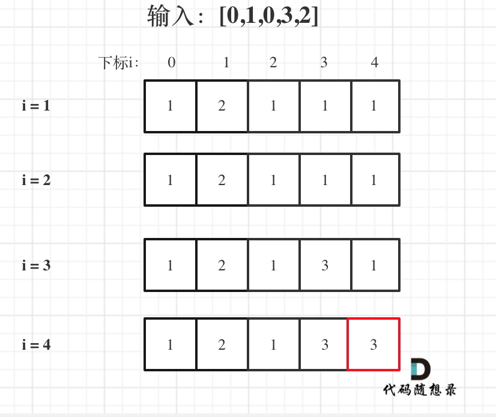

---

以上五部分析完毕，C++代码如下：
杨⽼师的这个专栏很不错，他本⾝也是Oracle ⾸席⼯程师，对Java有极其深刻的理解，讲的
内容很硬核，适合使⽤Java语⾔的录友们⽤来进阶！作为⾯试突击⼿册⾮常合适， 所以推
荐给⼤家！现在下单输⼊⼜令：javahexin，可以省40元那[机智]
总结
 
本题最关键的是要想到dp[i]由哪些状态可以推出来，并取最⼤值，那么很⾃然就能想到递
推公式：dp[i] = max(dp[i], dp[j] + 1);
⼦序列问题是动态规划的⼀个重要系列，本题算是⼊门题⽬，好戏刚刚开始！
 
代码随想录官⽹：www.programmercarl.com
代码随想录开源项⽬Github：https://github.com/youngyangyang04/leetcode-
master
代码随想录算法公开课 ，代码随想录的全部内容将由我（程序员Carl）视频讲解
并开免费开放给⼤家。
《代码随想录》纸质版 已经出版。
class Solution {
public:
    int lengthOfLIS(vector<int>& nums) {
        if (nums.size() <= 1) return nums.size();
        vector<int> dp(nums.size(), 1);
        int result = 0;
        for (int i = 1; i < nums.size(); i++) {
            for (int j = 0; j < i; j++) {
                if (nums[i] > nums[j]) dp[i] = max(dp[i], dp[j] + 1);
            }
            if (dp[i] > result) result = dp[i]; // 取⻓的⼦序列
        }
        return result;
    }
};

---

代码随想录知识星球 上万录友在这⾥学习
代码随想录算法训练营 帮助录友⾼效刷完代码随想录。
 
如果感觉PDF对你有帮助，微信搜索：代码随想录，关注我吧，你会发现相见恨晚！
最长连续递增序列
 
674. 最长连续递增序列
 
题⽬链接：https://leetcode-cn.com/problems/longest-continuous-increasing-subsequenc
e/
给定⼀个未经排序的整数数组，找到最长且 连续递增的⼦序列，并返回该序列的长度。
连续递增的⼦序列 可以由两个下标 l 和 r（l < r）确定，如果对于每个 l <= i < r，都有 
nums[i] < nums[i + 1] ，那么⼦序列 [nums[l], nums[l + 1], ..., nums[r - 1], nums[r]] 就是连
续递增⼦序列。

---

⽰例 1：
输⼊：nums = [1,3,5,4,7]
输出：3
解释：最长连续递增序列是 [1,3,5], 长度为3。
尽管 [1,3,5,7] 也是升序的⼦序列, 但它不是连续的，因为 5 和 7 在原数组⾥被 4 隔开。
⽰例 2：
输⼊：nums = [2,2,2,2,2]
输出：1
解释：最长连续递增序列是 [2], 长度为1。
提⽰：
0 <= nums.length <= 10^4
-10^9 <= nums[i] <= 10^9
思路
 
本题相对于昨天的动态规划：300.最长递增⼦序列最⼤的区别在于“连续”。
本题要求的是最长连续递增序列
动态规划
 
动规五部曲分析如下：
1. 确定dp数组（dp table）以及下标的含义
dp[i]：以下标i为结尾的数组的连续递增的⼦序列长度为dp[i]。
注意这⾥的定义，⼀定是以下标i为结尾，并不是说⼀定以下标0为起始位置。
2. 确定递推公式
如果 nums[i + 1] > nums[i]，那么以 i+1 为结尾的数组的连续递增的⼦序列长度 ⼀定等于 以
i为结尾的数组的连续递增的⼦序列长度 + 1 。
即：dp[i + 1] = dp[i] + 1;

---

注意这⾥就体现出和动态规划：300.最长递增⼦序列的区别！
因为本题要求连续递增⼦序列，所以就必要⽐较nums[i + 1]与nums[i]，⽽不⽤去⽐较
nums[j]与nums[i] （j是在0到i之间遍历）。
既然不⽤j了，那么也不⽤两层for循环，本题⼀层for循环就⾏，⽐较nums[i + 1] 和 
nums[i]。
这⾥⼤家要好好体会⼀下！
3. dp数组如何初始化
以下标i为结尾的数组的连续递增的⼦序列长度最少也应该是1，即就是nums[i]这⼀个元
素。
所以dp[i]应该初始1;
4. 确定遍历顺序
从递推公式上可以看出， dp[i + 1]依赖dp[i]，所以⼀定是从前向后遍历。
本⽂在确定递推公式的时候也说明了为什么本题只需要⼀层for循环，代码如下：
5. 举例推导dp数组
已输⼊nums = [1,3,5,4,7]为例，dp数组状态如下：
for (int i = 0; i < nums.size() - 1; i++) {
    if (nums[i + 1] > nums[i]) { // 连续记录
        dp[i + 1] = dp[i] + 1; // 递推公式
    }
}

---

注意这⾥要取dp[i]⾥的最⼤值，所以dp[2]才是结果！
以上分析完毕，C++代码如下：
时间复杂度：O(n)
空间复杂度：O(n)
class Solution {
public:
    int findLengthOfLCIS(vector<int>& nums) {
        if (nums.size() == 0) return 0;
        int result = 1;
        vector<int> dp(nums.size() ,1);
        for (int i = 0; i < nums.size() - 1; i++) {
            if (nums[i + 1] > nums[i]) { // 连续记录
                dp[i + 1] = dp[i] + 1;
            }
            if (dp[i + 1] > result) result = dp[i + 1];
        }
        return result;
    }
};

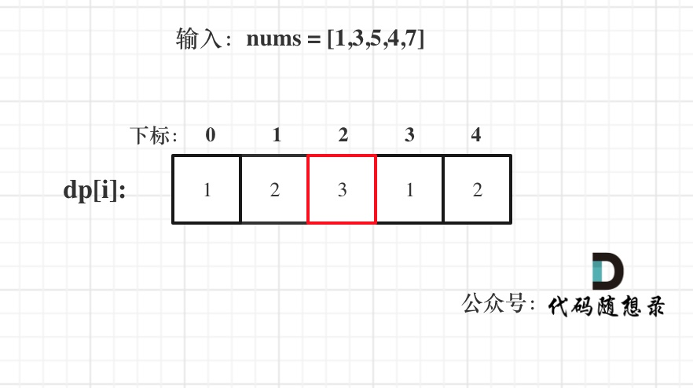

---

贪⼼
 
这道题⽬也可以⽤贪⼼来做，也就是遇到nums[i + 1] > nums[i]的情况，count就++，否则
count为1，记录count的最⼤值就可以了。
代码如下：
时间复杂度：O(n)
空间复杂度：O(1)
总结
 
本题也是动规⾥⼦序列问题的经典题⽬，但也可以⽤贪⼼来做，⼤家也会发现贪⼼好像更简
单⼀点，⽽且空间复杂度仅是O(1)。
在动规分析中，关键是要理解和动态规划：300.最长递增⼦序列的区别。
要联动起来，才能理解递增⼦序列怎么求，递增连续⼦序列又要怎么求。
class Solution {
public:
    int findLengthOfLCIS(vector<int>& nums) {
        if (nums.size() == 0) return 0;
        int result = 1; // 连续⼦序列最少也是1
        int count = 1;
        for (int i = 0; i < nums.size() - 1; i++) {
            if (nums[i + 1] > nums[i]) { // 连续记录
                count++;
            } else { // 不连续，count从头开始
                count = 1;
            }
            if (count > result) result = count;
        }
        return result;
    }
};

---

概括来说：不连续递增⼦序列的跟前0-i 个状态有关，连续递增的⼦序列只跟前⼀个状态有
关
本篇我也把区别所在之处重点介绍了，关键在递推公式和遍历⽅法上，⼤家可以仔细体会⼀
波！
最长重复⼦数组
 
718. 最长重复⼦数组
 
题⽬链接：https://leetcode-cn.com/problems/maximum-length-of-repeated-subarray/
给两个整数数组 A 和 B ，返回两个数组中公共的、长度最长的⼦数组的长度。
⽰例：
输⼊：
A: [1,2,3,2,1]
B: [3,2,1,4,7]
输出：3
解释：
长度最长的公共⼦数组是 [3, 2, 1] 。
提⽰：
1 <= len(A), len(B) <= 1000
0 <= A[i], B[i] < 100
思路
 
注意题⽬中说的⼦数组，其实就是连续⼦序列。这种问题动规最拿⼿，动规五部曲分析如
下：
1. 确定dp数组（dp table）以及下标的含义

---

dp[i][j] ：以下标i - 1为结尾的A，和以下标j - 1为结尾的B，最长重复⼦数组长度为dp[i][j]。
此时细⼼的同学应该发现，那dp[0][0]是什么含义呢？总不能是以下标-1为结尾的A数组
吧。
其实dp[i][j]的定义也就决定着，我们在遍历dp[i][j]的时候i 和 j都要从1开始。
那有同学问了，我就定义dp[i][j]为 以下标i为结尾的A，和以下标j 为结尾的B，最长重复⼦
数组长度。不⾏么？
⾏倒是⾏！ 但实现起来就⿇烦⼀点，⼤家看下⾯的dp数组状态图就明⽩了。
2. 确定递推公式
根据dp[i][j]的定义，dp[i][j]的状态只能由dp[i - 1][j - 1]推导出来。
即当A[i - 1] 和B[j - 1]相等的时候，dp[i][j] = dp[i - 1][j - 1] + 1;
根据递推公式可以看出，遍历i 和 j 要从1开始！
3. dp数组如何初始化
根据dp[i][j]的定义，dp[i][0] 和dp[0][j]其实都是没有意义的！
但dp[i][0] 和dp[0][j]要初始值，因为 为了⽅便递归公式dp[i][j] = dp[i - 1][j - 1] + 1;
所以dp[i][0] 和dp[0][j]初始化为0。
举个例⼦A[0]如果和B[0]相同的话，dp[1][1] = dp[0][0] + 1，只有dp[0][0]初始为0，正好符合
递推公式逐步累加起来。
4. 确定遍历顺序
外层for循环遍历A，内层for循环遍历B。
那又有同学问了，外层for循环遍历B，内层for循环遍历A。不⾏么？
也⾏，⼀样的，我这⾥就⽤外层for循环遍历A，内层for循环遍历B了。

---

同时题⽬要求长度最长的⼦数组的长度。所以在遍历的时候顺便把dp[i][j]的最⼤值记录下
来。
代码如下：
5. 举例推导dp数组
拿⽰例1中，A: [1,2,3,2,1]，B: [3,2,1,4,7]为例，画⼀个dp数组的状态变化，如下：
for (int i = 1; i <= A.size(); i++) {
    for (int j = 1; j <= B.size(); j++) {
        if (A[i - 1] == B[j - 1]) {
            dp[i][j] = dp[i - 1][j - 1] + 1;
        }
        if (dp[i][j] > result) result = dp[i][j];
    }
}

---

以上五部曲分析完毕，C++代码如下：
class Solution {
public:
    int findLength(vector<int>& A, vector<int>& B) {
        vector<vector<int>> dp (A.size() + 1, vector<int>(B.size() + 
1, 0));
        int result = 0;
        for (int i = 1; i <= A.size(); i++) {
            for (int j = 1; j <= B.size(); j++) {
                if (A[i - 1] == B[j - 1]) {
                    dp[i][j] = dp[i - 1][j - 1] + 1;
                }
                if (dp[i][j] > result) result = dp[i][j];
            }
        }

---

时间复杂度O(n * m) n 为A长度，m为B长度
空间复杂度O(n * m)
滚动数组
 
在如下图中：
我们可以看出dp[i][j]都是由dp[i - 1][j - 1]推出。那么压缩为⼀维数组，也就是dp[j]都是由
dp[j - 1]推出。
也就是相当于可以把上⼀层dp[i - 1][j]拷贝到下⼀层dp[i][j]来继续⽤。
        return result;
    }
};

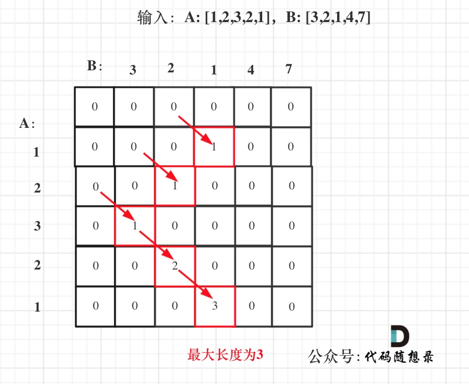

---

此时遍历B数组的时候，就要从后向前遍历，这样避免重复覆盖。
时间复杂度O(n * m) n 为A长度，m为B长度
空间复杂度O(m)
 
代码随想录官⽹：www.programmercarl.com
代码随想录开源项⽬Github：https://github.com/youngyangyang04/leetcode-
master
代码随想录算法公开课 ，代码随想录的全部内容将由我（程序员Carl）视频讲解
并开免费开放给⼤家。
《代码随想录》纸质版 已经出版。
代码随想录知识星球 上万录友在这⾥学习
代码随想录算法训练营 帮助录友⾼效刷完代码随想录。
 
如果感觉PDF对你有帮助，微信搜索：代码随想录，关注我吧，你会发现相见恨晚！
class Solution {
public:
    int findLength(vector<int>& A, vector<int>& B) {
        vector<int> dp(vector<int>(B.size() + 1, 0));
        int result = 0;
        for (int i = 1; i <= A.size(); i++) {
            for (int j = B.size(); j > 0; j--) {
                if (A[i - 1] == B[j - 1]) {
                    dp[j] = dp[j - 1] + 1;
                } else dp[j] = 0; // 注意这⾥不相等的时候要有赋0的操作
                if (dp[j] > result) result = dp[j];
            }
        }
        return result;
    }
};

---

最长公共⼦序列
 
1143.最长公共⼦序列
 
给定两个字符串 text1 和 text2，返回这两个字符串的最长公共⼦序列的长度。
⼀个字符串的 ⼦序列 是指这样⼀个新的字符串：它是由原字符串在不改变字符的相对顺序
的情况下删除某些字符（也可以不删除任何字符）后组成的新字符串。
例如，"ace" 是 "abcde" 的⼦序列，但 "aec" 不是 "abcde" 的⼦序列。两个字符串的「公共⼦
序列」是这两个字符串所共同拥有的⼦序列。
若这两个字符串没有公共⼦序列，则返回 0。
⽰例 1:
输⼊：text1 = "abcde", text2 = "ace"
输出：3
解释：最长公共⼦序列是 "ace"，它的长度为 3。

---

⽰例 2:
输⼊：text1 = "abc", text2 = "abc"
输出：3
解释：最长公共⼦序列是 "abc"，它的长度为 3。
⽰例 3:
输⼊：text1 = "abc", text2 = "def"
输出：0
解释：两个字符串没有公共⼦序列，返回 0。
提⽰:
1 <= text1.length <= 1000
1 <= text2.length <= 1000
输⼊的字符串只含有⼩写英⽂字符。
思路
 
本题和动态规划：718. 最长重复⼦数组区别在于这⾥不要求是连续的了，但要有相对顺
序，即："ace" 是 "abcde" 的⼦序列，但 "aec" 不是 "abcde" 的⼦序列。
继续动规五部曲分析如下：
1. 确定dp数组（dp table）以及下标的含义
dp[i][j]：长度为[0, i - 1]的字符串text1与长度为[0, j - 1]的字符串text2的最长公共⼦序列为
dp[i][j]
有同学会问：为什么要定义长度为[0, i - 1]的字符串text1，定义为长度为[0, i]的字符串text1
不⾹么？
这样定义是为了后⾯代码实现⽅便，如果⾮要定义为为长度为[0, i]的字符串text1也可以，
⼤家可以试⼀试！
2. 确定递推公式
主要就是两⼤情况： text1[i - 1] 与 text2[j - 1]相同，text1[i - 1] 与 text2[j - 1]不相同

---

如果text1[i - 1] 与 text2[j - 1]相同，那么找到了⼀个公共元素，所以dp[i][j] = dp[i - 1][j - 1] 
+ 1;
如果text1[i - 1] 与 text2[j - 1]不相同，那就看看text1[0, i - 2]与text2[0, j - 1]的最长公共⼦序
列 和 text1[0, i - 1]与text2[0, j - 2]的最长公共⼦序列，取最⼤的。
即：dp[i][j] = max(dp[i - 1][j], dp[i][j - 1]);
代码如下：
3. dp数组如何初始化
先看看dp[i][0]应该是多少呢？
test1[0, i-1]和空串的最长公共⼦序列⾃然是0，所以dp[i][0] = 0;
同理dp[0][j]也是0。
其他下标都是随着递推公式逐步覆盖，初始为多少都可以，那么就统⼀初始为0。
代码：
4. 确定遍历顺序
从递推公式，可以看出，有三个⽅向可以推出dp[i][j]，如图：
if (text1[i - 1] == text2[j - 1]) {
    dp[i][j] = dp[i - 1][j - 1] + 1;
} else {
    dp[i][j] = max(dp[i - 1][j], dp[i][j - 1]);
}
vector<vector<int>> dp(text1.size() + 1, vector<int>(text2.size() + 
1, 0));

---

那么为了在递推的过程中，这三个⽅向都是经过计算的数值，所以要从前向后，从上到下来
遍历这个矩阵。
5. 举例推导dp数组
以输⼊：text1 = "abcde", text2 = "ace" 为例，dp状态如图：

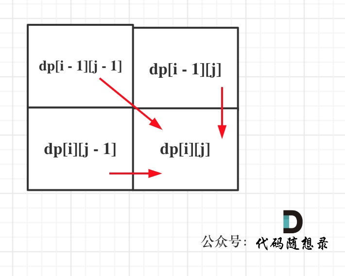

---

最后红框dp[text1.size()][text2.size()]为最终结果
以上分析完毕，C++代码如下：
class Solution {
public:
    int longestCommonSubsequence(string text1, string text2) {
        vector<vector<int>> dp(text1.size() + 1, vector<int>
(text2.size() + 1, 0));
        for (int i = 1; i <= text1.size(); i++) {
            for (int j = 1; j <= text2.size(); j++) {
                if (text1[i - 1] == text2[j - 1]) {

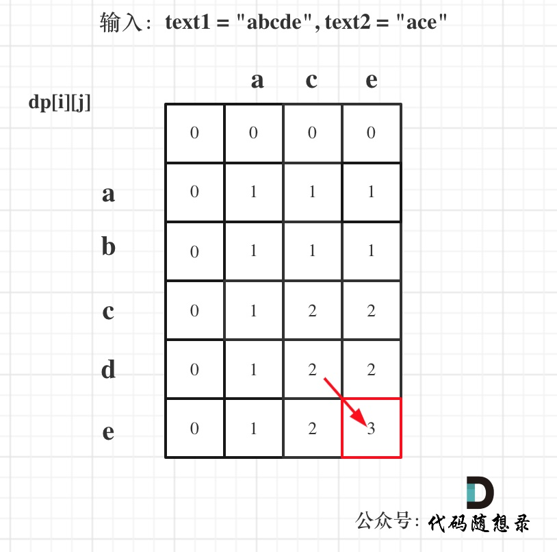

---

不相交的线
 
1035.不相交的线
 
我们在两条独⽴的⽔平线上按给定的顺序写下 A 和 B 中的整数。
现在，我们可以绘制⼀些连接两个数字 A[i] 和 B[j] 的直线，只要 A[i] == B[j]，且我们绘制的
直线不与任何其他连线（⾮⽔平线）相交。
以这种⽅法绘制线条，并返回我们可以绘制的最⼤连线数。
                    dp[i][j] = dp[i - 1][j - 1] + 1;
                } else {
                    dp[i][j] = max(dp[i - 1][j], dp[i][j - 1]);
                }
            }
        }
        return dp[text1.size()][text2.size()];
    }
};

---

思路
 
相信不少录友看到这道题⽬都没啥思路，我们来逐步分析⼀下。
绘制⼀些连接两个数字 A[i] 和 B[j] 的直线，只要 A[i] == B[j]，且直线不能相交！
直线不能相交，这就是说明在字符串A中 找到⼀个与字符串B相同的⼦序列，且这个⼦序列
不能改变相对顺序，只要相对顺序不改变，链接相同数字的直线就不会相交。
拿⽰例⼀A = [1,4,2], B = [1,2,4]为例，相交情况如图：

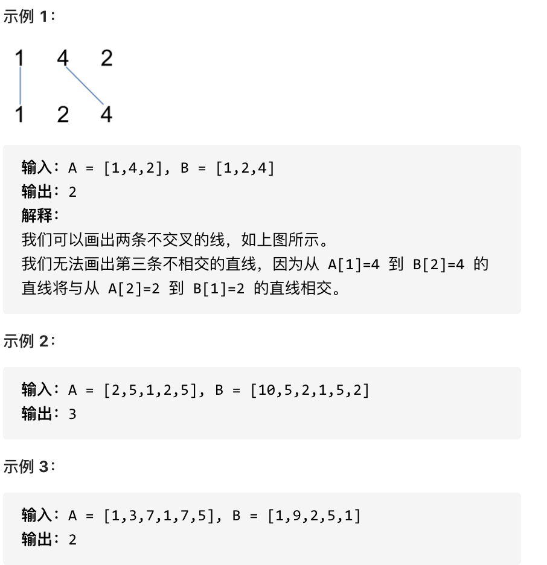

---

其实也就是说A和B的最长公共⼦序列是[1,4]，长度为2。 这个公共⼦序列指的是相对顺序
不变（即数字4在字符串A中数字1的后⾯，那么数字4也应该在字符串B数字1的后⾯）
这么分析完之后，⼤家可以发现：本题说是求绘制的最⼤连线数，其实就是求两个字符串的
最长公共⼦序列的长度！
那么本题就和我们刚刚讲过的这道题⽬动态规划：1143.最长公共⼦序列就是⼀样⼀样的
了。
⼀样到什么程度呢？ 把字符串名字改⼀下，其他代码都不⽤改，直接copy过来就⾏了。
其实本题就是求最长公共⼦序列的长度，介于我们刚刚讲过动态规划：1143.最长公共⼦序
列，所以本题我就不再做动规五部曲分析了。
如果⼤家有点遗忘了最长公共⼦序列，就再看⼀下这篇：动态规划：1143.最长公共⼦序列
本题代码如下：
class Solution {
public:
    int maxUncrossedLines(vector<int>& A, vector<int>& B) {
        vector<vector<int>> dp(A.size() + 1, vector<int>(B.size() + 
1, 0));
        for (int i = 1; i <= A.size(); i++) {
            for (int j = 1; j <= B.size(); j++) {
                if (A[i - 1] == B[j - 1]) {
                    dp[i][j] = dp[i - 1][j - 1] + 1;
                } else {
                    dp[i][j] = max(dp[i - 1][j], dp[i][j - 1]);
                }
            }
        }
        return dp[A.size()][B.size()];

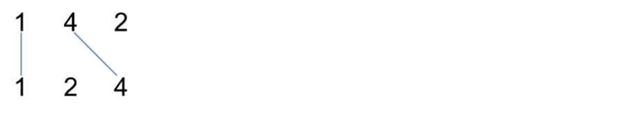

---

总结
 
看到代码⼤家也可以发现其实就是求两个字符串的最长公共⼦序列，但如果没有做过1143.
最长公共⼦序列，本题其实还有很有难度的。
这是Carl为什么要先讲1143.最长公共⼦序列再讲本题，⼤家会发现⼀个正确的刷题顺序对
算法学习是⾮常重要的！
这也是Carl做了很多题⽬（包括ACM和⼒扣）才总结出来的规律，⼤家仔细体会⼀下哈。
 
代码随想录官⽹：www.programmercarl.com
代码随想录开源项⽬Github：https://github.com/youngyangyang04/leetcode-
master
代码随想录算法公开课 ，代码随想录的全部内容将由我（程序员Carl）视频讲解
并开免费开放给⼤家。
《代码随想录》纸质版 已经出版。
代码随想录知识星球 上万录友在这⾥学习
代码随想录算法训练营 帮助录友⾼效刷完代码随想录。
 
如果感觉PDF对你有帮助，微信搜索：代码随想录，关注我吧，你会发现相见恨晚！
    }
};

---

最⼤⼦序和
 
53. 最⼤⼦序和
 
题⽬地址：https://leetcode-cn.com/problems/maximum-subarray/
给定⼀个整数数组 nums ，找到⼀个具有最⼤和的连续⼦数组（⼦数组最少包含⼀个元
素），返回其最⼤和。
⽰例:
输⼊: [-2,1,-3,4,-1,2,1,-5,4]
输出: 6
解释: 连续⼦数组 [4,-1,2,1] 的和最⼤，为 6。
思路
 
这道题之前我们在讲解贪⼼专题的时候⽤贪⼼算法解决过⼀次，贪⼼算法：最⼤⼦序和。
这次我们⽤动态规划的思路再来分析⼀次。

---

动规五部曲如下：
1. 确定dp数组（dp table）以及下标的含义
dp[i]：包括下标i之前的最⼤连续⼦序列和为dp[i]。
2. 确定递推公式
dp[i]只有两个⽅向可以推出来：
dp[i - 1] + nums[i]，即：nums[i]加⼊当前连续⼦序列和
nums[i]，即：从头开始计算当前连续⼦序列和
⼀定是取最⼤的，所以dp[i] = max(dp[i - 1] + nums[i], nums[i]);
3. dp数组如何初始化
从递推公式可以看出来dp[i]是依赖于dp[i - 1]的状态，dp[0]就是递推公式的基础。
dp[0]应该是多少呢?
更具dp[i]的定义，很明显dp[0]因为为nums[0]即dp[0] = nums[0]。
4. 确定遍历顺序
递推公式中dp[i]依赖于dp[i - 1]的状态，需要从前向后遍历。
5. 举例推导dp数组

---

以⽰例⼀为例，输⼊：nums = [-2,1,-3,4,-1,2,1,-5,4]，对应的dp状态如下：
注意最后的结果可不是dp[nums.size() - 1]！ ，⽽是dp[6]。
在回顾⼀下dp[i]的定义：包括下标i之前的最⼤连续⼦序列和为dp[i]。
那么我们要找最⼤的连续⼦序列，就应该找每⼀个i为终点的连续最⼤⼦序列。
所以在递推公式的时候，可以直接选出最⼤的dp[i]。
以上动规五部曲分析完毕，完整代码如下：
class Solution {
public:
    int maxSubArray(vector<int>& nums) {
        if (nums.size() == 0) return 0;
        vector<int> dp(nums.size());
        dp[0] = nums[0];
        int result = dp[0];
        for (int i = 1; i < nums.size(); i++) {
            dp[i] = max(dp[i - 1] + nums[i], nums[i]); // 状态转移公式
            if (dp[i] > result) result = dp[i]; // result 保存dp[i]的最
⼤值
        }
        return result;

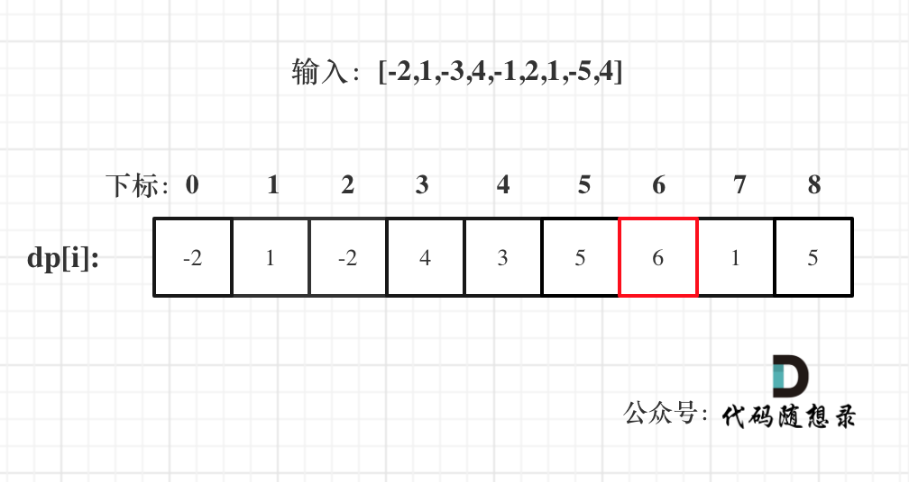

---

时间复杂度：O(n)
空间复杂度：O(n)
总结
 
这道题⽬⽤贪⼼也很巧妙，但有⼀点绕，需要仔细想⼀想，如果想回顾⼀下贪⼼就看这⾥
吧：贪⼼算法：最⼤⼦序和
动规的解法还是很直接的。
 
判断⼦序列
 
392.判断⼦序列
 
题⽬链接：https://leetcode-cn.com/problems/is-subsequence/
给定字符串 s 和 t ，判断 s 是否为 t 的⼦序列。
字符串的⼀个⼦序列是原始字符串删除⼀些（也可以不删除）字符⽽不改变剩余字符相对位
置形成的新字符串。（例如，"ace"是"abcde"的⼀个⼦序列，⽽"aec"不是）。
⽰例 1：
输⼊：s = "abc", t = "ahbgdc"
输出：true
⽰例 2：
输⼊：s = "axc", t = "ahbgdc"
输出：false
    }
};

---

提⽰：
0 <= s.length <= 100
0 <= t.length <= 10^4
两个字符串都只由⼩写字符组成。
思路
 
（这道题可以⽤双指针的思路来实现，时间复杂度就是O(n)）
这道题应该算是编辑距离的⼊门题⽬，因为从题意中我们也可以发现，只需要计算删除的情
况，不⽤考虑增加和替换的情况。
所以掌握本题也是对后⾯要讲解的编辑距离的题⽬打下基础。
动态规划五部曲分析如下：
1. 确定dp数组（dp table）以及下标的含义
dp[i][j] 表⽰以下标i-1为结尾的字符串s，和以下标j-1为结尾的字符串t，相同⼦序列的长度
为dp[i][j]。
注意这⾥是判断s是否为t的⼦序列。即t的长度是⼤于等于s的。
有同学问了，为啥要表⽰下标i-1为结尾的字符串呢，为啥不表⽰下标i为结尾的字符串呢？
⽤i来表⽰也可以！
但我统⼀以下标i-1为结尾的字符串来计算，这样在下⾯的递归公式中会容易理解⼀些，如
果还有疑惑，可以继续往下看。
2. 确定递推公式
在确定递推公式的时候，⾸先要考虑如下两种操作，整理如下：
if (s[i - 1] == t[j - 1])
t中找到了⼀个字符在s中也出现了

---

if (s[i - 1] != t[j - 1])
相当于t要删除元素，继续匹配
if (s[i - 1] == t[j - 1])，那么dp[i][j] = dp[i - 1][j - 1] + 1;，因为找到了⼀个相同的字符，相同
⼦序列长度⾃然要在dp[i-1][j-1]的基础上加1（如果不理解，在回看⼀下dp[i][j]的定义）
if (s[i - 1] != t[j - 1])，此时相当于t要删除元素，t如果把当前元素t[j - 1]删除，那么dp[i][j] 的
数值就是 看s[i - 1]与 t[j - 2]的⽐较结果了，即：dp[i][j] = dp[i][j - 1];
3. dp数组如何初始化
从递推公式可以看出dp[i][j]都是依赖于dp[i - 1][j - 1] 和 dp[i][j - 1]，所以dp[0][0]和dp[i][0]
是⼀定要初始化的。
这⾥⼤家已经可以发现，在定义dp[i][j]含义的时候为什么要表⽰以下标i-1为结尾的字符串
s，和以下标j-1为结尾的字符串t，相同⼦序列的长度为dp[i][j]。
因为这样的定义在dp⼆维矩阵中可以留出初始化的区间，如图：
如果要是定义的dp[i][j]是以下标i为结尾的字符串s和以下标j为结尾的字符串t，初始化就⽐
较⿇烦了。
这⾥dp[i][0]和dp[0][j]是没有含义的，仅仅是为了给递推公式做前期铺垫，所以初始化为0。

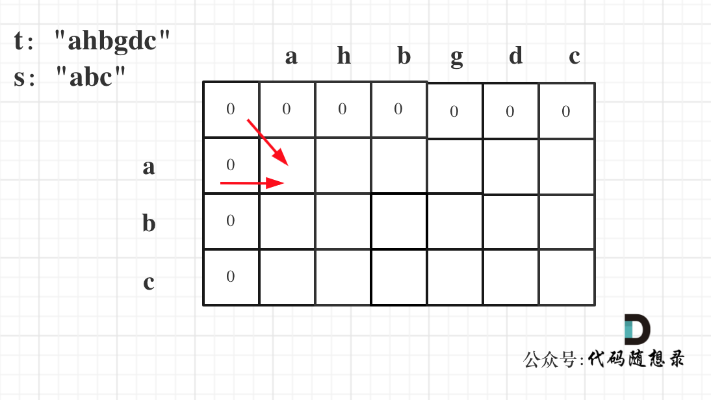

---

其实这⾥只初始化dp[i][0]就够了，但⼀起初始化也⽅便，所以就⼀起操作了，代码如下：
4. 确定遍历顺序
同理从从递推公式可以看出dp[i][j]都是依赖于dp[i - 1][j - 1] 和 dp[i][j - 1]，那么遍历顺序也
应该是从上到下，从左到右
如图所⽰：
5. 举例推导dp数组
以⽰例⼀为例，输⼊：s = "abc", t = "ahbgdc"，dp状态转移图如下：
vector<vector<int>> dp(s.size() + 1, vector<int>(t.size() + 1, 0));

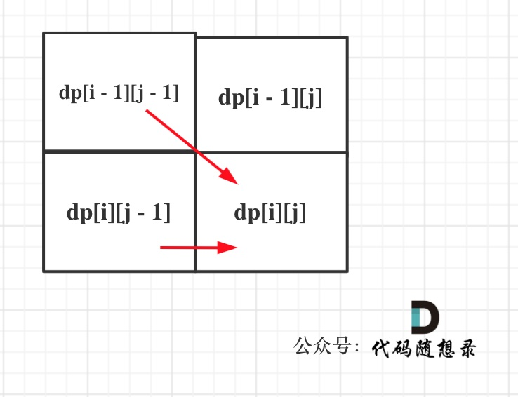

---

dp[i][j]表⽰以下标i-1为结尾的字符串s和以下标j-1为结尾的字符串t 相同⼦序列的长度，所
以如果dp[s.size()][t.size()] 与 字符串s的长度相同说明：s与t的最长相同⼦序列就是s，那么
s 就是 t 的⼦序列。
图中dp[s.size()][t.size()] = 3， ⽽s.size() 也为3。所以s是t 的⼦序列，返回true。
动规五部曲分析完毕，C++代码如下：
class Solution {
public:
    bool isSubsequence(string s, string t) {
        vector<vector<int>> dp(s.size() + 1, vector<int>(t.size() + 
1, 0));
        for (int i = 1; i <= s.size(); i++) {
            for (int j = 1; j <= t.size(); j++) {
                if (s[i - 1] == t[j - 1]) dp[i][j] = dp[i - 1][j - 1] 
+ 1;
                else dp[i][j] = dp[i][j - 1];
            }
        }
        if (dp[s.size()][t.size()] == s.size()) return true;
        return false;
    }

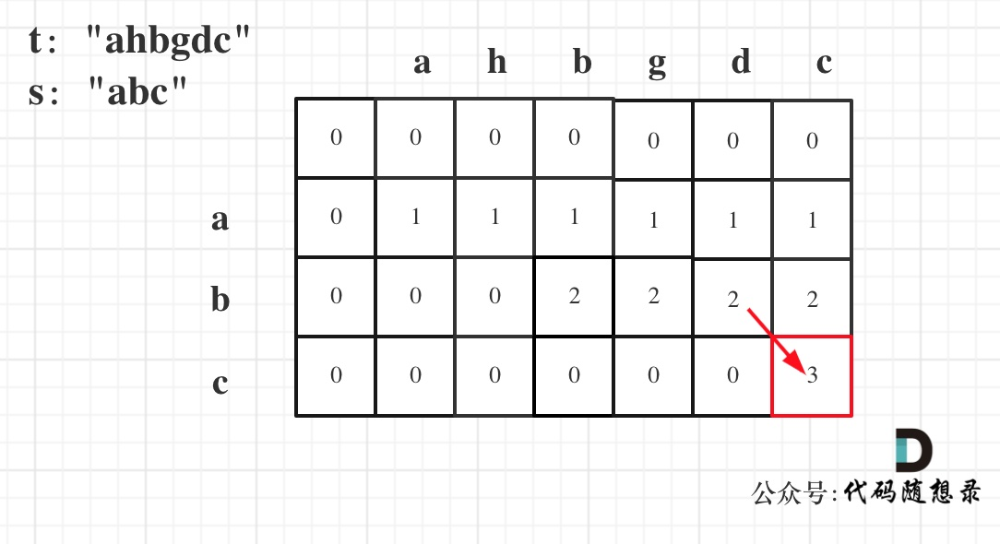

---

时间复杂度：O(n * m)
空间复杂度：O(n * m)
总结
 
这道题⽬算是编辑距离的⼊门题⽬（毕竟这⾥只是涉及到减法），也是动态规划解决的经典
题型。
这⼀类题都是题⽬读上去感觉很复杂，模拟⼀下也发现很复杂，⽤动规分析完了也感觉很复
杂，但是最终代码却很简短。
编辑距离的题⽬最能体现出动规精髓和巧妙之处，⼤家可以好好体会⼀下。
 
不同的⼦序列
 
115.不同的⼦序列
 
题⽬链接：https://leetcode-cn.com/problems/distinct-subsequences/
给定⼀个字符串 s 和⼀个字符串 t ，计算在 s 的⼦序列中 t 出现的个数。
字符串的⼀个 ⼦序列 是指，通过删除⼀些（也可以不删除）字符且不⼲扰剩余字符相对位
置所组成的新字符串。（例如，"ACE" 是 "ABCDE" 的⼀个⼦序列，⽽ "AEC" 不是）
题⽬数据保证答案符合 32 位带符号整数范围。
};

---

提⽰：

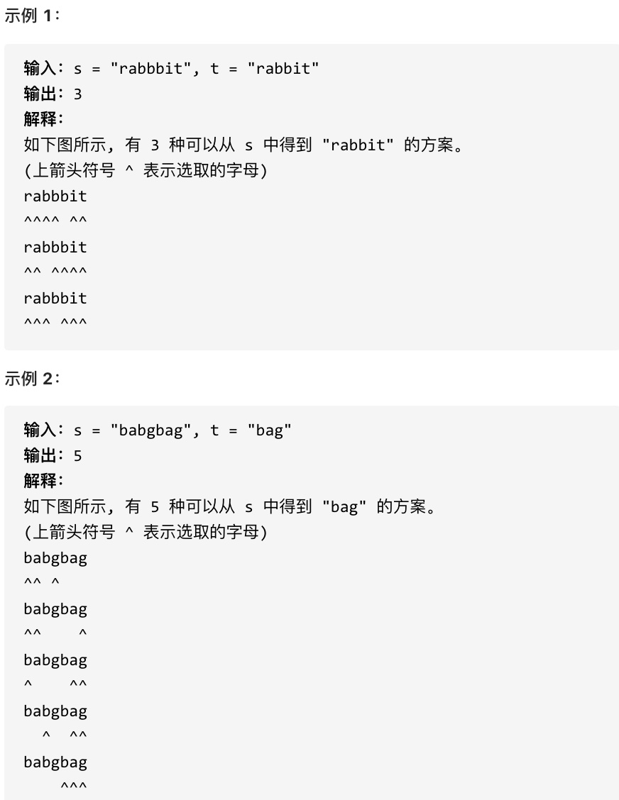

---

0 <= s.length, t.length <= 1000
s 和 t 由英⽂字母组成
思路
 
这道题⽬如果不是⼦序列，⽽是要求连续序列的，那就可以考虑⽤KMP。
这道题⽬相对于72. 编辑距离，简单了不少，因为本题相当于只有删除操作，不⽤考虑替换
增加之类的。
但相对于刚讲过的动态规划：392.判断⼦序列就有难度了，这道题⽬双指针法可就做不了
了，来看看动规五部曲分析如下：
1. 确定dp数组（dp table）以及下标的含义
dp[i][j]：以i-1为结尾的s⼦序列中出现以j-1为结尾的t的个数为dp[i][j]。
2. 确定递推公式
这⼀类问题，基本是要分析两种情况
s[i - 1] 与 t[j - 1]相等
s[i - 1] 与 t[j - 1] 不相等
当s[i - 1] 与 t[j - 1]相等时，dp[i][j]可以有两部分组成。
⼀部分是⽤s[i - 1]来匹配，那么个数为dp[i - 1][j - 1]。
⼀部分是不⽤s[i - 1]来匹配，个数为dp[i - 1][j]。
这⾥可能有同学不明⽩了，为什么还要考虑 不⽤s[i - 1]来匹配，都相同了指定要匹配啊。
例如： s：bagg 和 t：bag ，s[3] 和 t[2]是相同的，但是字符串s也可以不⽤s[3]来匹配，即
⽤s[0]s[1]s[2]组成的bag。
当然也可以⽤s[3]来匹配，即：s[0]s[1]s[3]组成的bag。
所以当s[i - 1] 与 t[j - 1]相等时，dp[i][j] = dp[i - 1][j - 1] + dp[i - 1][j];

---

当s[i - 1] 与 t[j - 1]不相等时，dp[i][j]只有⼀部分组成，不⽤s[i - 1]来匹配，即：dp[i - 1][j]
所以递推公式为：dp[i][j] = dp[i - 1][j];
3. dp数组如何初始化
从递推公式dp[i][j] = dp[i - 1][j - 1] + dp[i - 1][j]; 和 dp[i][j] = dp[i - 1][j]; 中可以看出dp[i][0] 
和dp[0][j]是⼀定要初始化的。
每次当初始化的时候，都要回顾⼀下dp[i][j]的定义，不要凭感觉初始化。
dp[i][0]表⽰什么呢？
dp[i][0] 表⽰：以i-1为结尾的s可以随便删除元素，出现空字符串的个数。
那么dp[i][0]⼀定都是1，因为也就是把以i-1为结尾的s，删除所有元素，出现空字符串的个
数就是1。
再来看dp[0][j]，dp[0][j]：空字符串s可以随便删除元素，出现以j-1为结尾的字符串t的个
数。
那么dp[0][j]⼀定都是0，s如论如何也变成不了t。
最后就要看⼀个特殊位置了，即：dp[0][0] 应该是多少。
dp[0][0]应该是1，空字符串s，可以删除0个元素，变成空字符串t。
初始化分析完毕，代码如下：
4. 确定遍历顺序
vector<vector<long long>> dp(s.size() + 1, vector<long long>(t.size() 
+ 1));
for (int i = 0; i <= s.size(); i++) dp[i][0] = 1;
for (int j = 1; j <= t.size(); j++) dp[0][j] = 0; // 其实这⾏代码可以和
dp数组初始化的时候放在⼀起，但我为了凸显初始化的逻辑，所以还是加上了。

---

从递推公式dp[i][j] = dp[i - 1][j - 1] + dp[i - 1][j]; 和 dp[i][j] = dp[i - 1][j]; 中可以看出dp[i][j]都
是根据左上⽅和正上⽅推出来的。
所以遍历的时候⼀定是从上到下，从左到右，这样保证dp[i][j]可以根据之前计算出来的数值
进⾏计算。
代码如下：
5. 举例推导dp数组
以s："baegg"，t："bag"为例，推导dp数组状态如下：
for (int i = 1; i <= s.size(); i++) {
    for (int j = 1; j <= t.size(); j++) {
        if (s[i - 1] == t[j - 1]) {
            dp[i][j] = dp[i - 1][j - 1] + dp[i - 1][j];
        } else {
            dp[i][j] = dp[i - 1][j];
        }
    }
}

---

如果写出来的代码怎么改都通过不了，不妨把dp数组打印出来，看⼀看，是不是这样的。
动规五部曲分析完毕，代码如下：
class Solution {
public:
    int numDistinct(string s, string t) {
        vector<vector<uint64_t>> dp(s.size() + 1, vector<uint64_t>
(t.size() + 1));
        for (int i = 0; i < s.size(); i++) dp[i][0] = 1;
        for (int j = 1; j < t.size(); j++) dp[0][j] = 0;
        for (int i = 1; i <= s.size(); i++) {
            for (int j = 1; j <= t.size(); j++) {
                if (s[i - 1] == t[j - 1]) {
                    dp[i][j] = dp[i - 1][j - 1] + dp[i - 1][j];

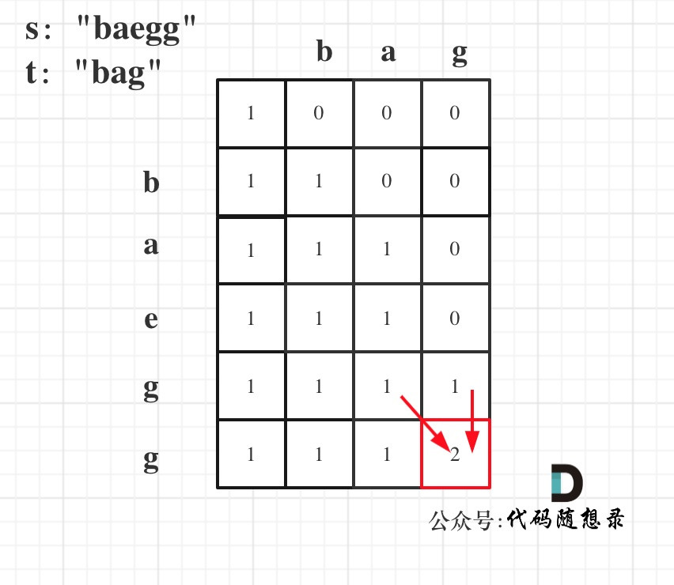

---

两个字符串的删除操作
 
583. 两个字符串的删除操作
 
题⽬链接：https://leetcode-cn.com/problems/delete-operation-for-two-strings/
给定两个单词 word1 和 word2，找到使得 word1 和 word2 相同所需的最⼩步数，每步可以
删除任意⼀个字符串中的⼀个字符。
⽰例：
输⼊: "sea", "eat"
输出: 2
解释: 第⼀步将"sea"变为"ea"，第⼆步将"eat"变为"ea"
思路
 
本题和动态规划：115.不同的⼦序列相⽐，其实就是两个字符串可以都可以删除了，情况虽
说复杂⼀些，但整体思路是不变的。
这次是两个字符串可以相互删了，这种题⽬也知道⽤动态规划的思路来解，动规五部曲，分
析如下：
                } else {
                    dp[i][j] = dp[i - 1][j];
                }
            }
        }
        return dp[s.size()][t.size()];
    }
};

---

1. 确定dp数组（dp table）以及下标的含义
dp[i][j]：以i-1为结尾的字符串word1，和以j-1位结尾的字符串word2，想要达到相等，所需
要删除元素的最少次数。
这⾥dp数组的定义有点点绕，⼤家要撸清思路。
2. 确定递推公式
当word1[i - 1] 与 word2[j - 1]相同的时候
当word1[i - 1] 与 word2[j - 1]不相同的时候
当word1[i - 1] 与 word2[j - 1]相同的时候，dp[i][j] = dp[i - 1][j - 1];
当word1[i - 1] 与 word2[j - 1]不相同的时候，有三种情况：
情况⼀：删word1[i - 1]，最少操作次数为dp[i - 1][j] + 1
情况⼆：删word2[j - 1]，最少操作次数为dp[i][j - 1] + 1
情况三：同时删word1[i - 1]和word2[j - 1]，操作的最少次数为dp[i - 1][j - 1] + 2
那最后当然是取最⼩值，所以当word1[i - 1] 与 word2[j - 1]不相同的时候，递推公式：dp[i]
[j] = min({dp[i - 1][j - 1] + 2, dp[i - 1][j] + 1, dp[i][j - 1] + 1});
3. dp数组如何初始化
从递推公式中，可以看出来，dp[i][0] 和 dp[0][j]是⼀定要初始化的。
dp[i][0]：word2为空字符串，以i-1为结尾的字符串word2要删除多少个元素，才能和word1
相同呢，很明显dp[i][0] = i。
dp[0][j]的话同理，所以代码如下：
vector<vector<int>> dp(word1.size() + 1, vector<int>(word2.size() + 
1));
for (int i = 0; i <= word1.size(); i++) dp[i][0] = i;
for (int j = 0; j <= word2.size(); j++) dp[0][j] = j;

---

4. 确定遍历顺序
从递推公式 dp[i][j] = min(dp[i - 1][j - 1] + 2, min(dp[i - 1][j], dp[i][j - 1]) + 1); 和dp[i][j] = dp[i 
- 1][j - 1]可以看出dp[i][j]都是根据左上⽅、正上⽅、正左⽅推出来的。
所以遍历的时候⼀定是从上到下，从左到右，这样保证dp[i][j]可以根据之前计算出来的数值
进⾏计算。
5. 举例推导dp数组
以word1:"sea"，word2:"eat"为例，推导dp数组状态图如下：
以上分析完毕，代码如下：
class Solution {
public:

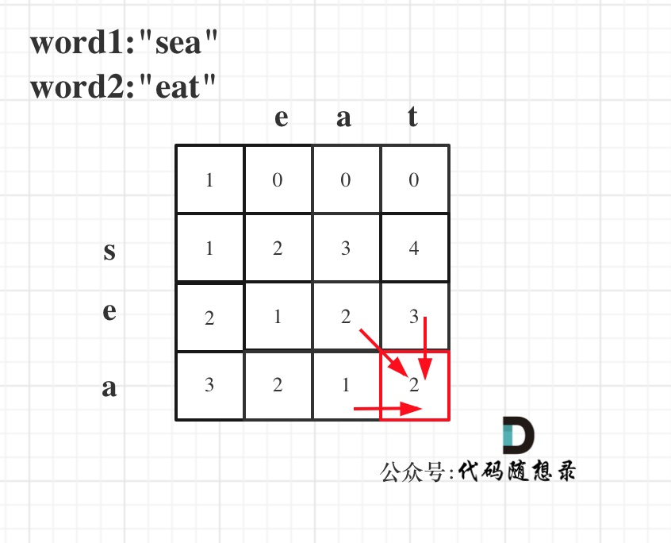

---

代码随想录官⽹：www.programmercarl.com
代码随想录开源项⽬Github：https://github.com/youngyangyang04/leetcode-
master
代码随想录算法公开课 ，代码随想录的全部内容将由我（程序员Carl）视频讲解
并开免费开放给⼤家。
《代码随想录》纸质版 已经出版。
代码随想录知识星球 上万录友在这⾥学习
代码随想录算法训练营 帮助录友⾼效刷完代码随想录。
 
如果感觉PDF对你有帮助，微信搜索：代码随想录，关注我吧，你会发现相见恨晚！
    int minDistance(string word1, string word2) {
        vector<vector<int>> dp(word1.size() + 1, vector<int>
(word2.size() + 1));
        for (int i = 0; i <= word1.size(); i++) dp[i][0] = i;
        for (int j = 0; j <= word2.size(); j++) dp[0][j] = j;
        for (int i = 1; i <= word1.size(); i++) {
            for (int j = 1; j <= word2.size(); j++) {
                if (word1[i - 1] == word2[j - 1]) {
                    dp[i][j] = dp[i - 1][j - 1];
                } else {
                    dp[i][j] = min({dp[i - 1][j - 1] + 2, dp[i - 1]
[j] + 1, dp[i][j - 1] + 1});
                }
            }
        }
        return dp[word1.size()][word2.size()];
    }
};

---

编辑距离
 
72. 编辑距离
 
给你两个单词 word1 和 word2，请你计算出将 word1 转换成 word2 所使⽤的最少操作数 。
你可以对⼀个单词进⾏如下三种操作：
插⼊⼀个字符
删除⼀个字符
替换⼀个字符
⽰例 1：
输⼊：word1 = "horse", word2 = "ros"
输出：3
解释：
horse -> rorse (将 'h' 替换为 'r')
rorse -> rose (删除 'r')
rose -> ros (删除 'e')

---

⽰例 2：
输⼊：word1 = "intention", word2 = "execution"
输出：5
解释：
intention -> inention (删除 't')
inention -> enention (将 'i' 替换为 'e')
enention -> exention (将 'n' 替换为 'x')
exention -> exection (将 'n' 替换为 'c')
exection -> execution (插⼊ 'u')
提⽰：
0 <= word1.length, word2.length <= 500
word1 和 word2 由⼩写英⽂字母组成
思路
 
编辑距离终于来了，这道题⽬如果⼤家没有了解动态规划的话，会感觉超级复杂。
编辑距离是⽤动规来解决的经典题⽬，这道题⽬看上去好像很复杂，但⽤动规可以很巧妙的
算出最少编辑距离。
接下来我依然使⽤动规五部曲，对本题做⼀个详细的分析：
1. 确定dp数组（dp table）以及下标的含义
dp[i][j] 表⽰以下标i-1为结尾的字符串word1，和以下标j-1为结尾的字符串word2，最近编
辑距离为dp[i][j]。
这⾥在强调⼀下：为啥要表⽰下标i-1为结尾的字符串呢，为啥不表⽰下标i为结尾的字符串
呢？
⽤i来表⽰也可以！ 但我统⼀以下标i-1为结尾的字符串，在下⾯的递归公式中会容易理解⼀
点。
2. 确定递推公式
在确定递推公式的时候，⾸先要考虑清楚编辑的⼏种操作，整理如下：

---

也就是如上4种情况。
if (word1[i - 1] == word2[j - 1]) 那么说明不⽤任何编辑，dp[i][j] 就应该是 dp[i 
- 1][j - 1]，即dp[i][j] = dp[i - 1][j - 1];
此时可能有同学有点不明⽩，为啥要即dp[i][j] = dp[i - 1][j - 1]呢？
那么就在回顾上⾯讲过的dp[i][j]的定义，word1[i - 1] 与 word2[j - 1]相等了，那
么就不⽤编辑了，以下标i-2为结尾的字符串word1和以下标j-2为结尾的字符串word2的最
近编辑距离dp[i - 1][j - 1]就是 dp[i][j]了。
在下⾯的讲解中，如果哪⾥看不懂，就回想⼀下dp[i][j]的定义，就明⽩了。
在整个动规的过程中，最为关键就是正确理解dp[i][j]的定义！
if (word1[i - 1] != word2[j - 1])，此时就需要编辑了，如何编辑呢？
操作⼀：word1删除⼀个元素，那么就是以下标i - 2为结尾的word1 与 j-1为结尾的
word2的最近编辑距离 再加上⼀个操作。
即 dp[i][j] = dp[i - 1][j] + 1;
操作⼆：word2删除⼀个元素，那么就是以下标i - 1为结尾的word1 与 j-2为结尾的
word2的最近编辑距离 再加上⼀个操作。
即 dp[i][j] = dp[i][j - 1] + 1;
这⾥有同学发现了，怎么都是删除元素，添加元素去哪了。
if (word1[i - 1] == word2[j - 1])
    不操作
if (word1[i - 1] != word2[j - 1])
    增
    删
    换

---

word2添加⼀个元素，相当于word1删除⼀个元素，例如 word1 = "ad" ，word2 = 
"a"，word1删除元素'd' 和 word2添加⼀个元素'd'，变成word1="a", word2="ad"， 
最终的操作数是⼀样！ dp数组如下图所⽰意的：
操作三：替换元素，word1替换word1[i - 1]，使其与word2[j - 1]相同，此时不⽤增加
元素，那么以下标i-2为结尾的word1 与 j-2为结尾的word2的最近编辑距离 加上⼀个替
换元素的操作。
即 dp[i][j] = dp[i - 1][j - 1] + 1;
综上，当 if (word1[i - 1] != word2[j - 1]) 时取最⼩的，即：dp[i][j] = 
min({dp[i - 1][j - 1], dp[i - 1][j], dp[i][j - 1]}) + 1;
递归公式代码如下：
3. dp数组如何初始化
在回顾⼀下dp[i][j]的定义。
            a                         a     d
   +-----+-----+             +-----+-----+-----+
   |  0  |  1  |             |  0  |  1  |  2  |
   +-----+-----+   ===>      +-----+-----+-----+
 a |  1  |  0  |           a |  1  |  0  |  1  |
   +-----+-----+             +-----+-----+-----+
 d |  2  |  1  |
   +-----+-----+
if (word1[i - 1] == word2[j - 1]) {
    dp[i][j] = dp[i - 1][j - 1];
}
else {
    dp[i][j] = min({dp[i - 1][j - 1], dp[i - 1][j], dp[i][j - 1]}) + 
1;
}

---

dp[i][j] 表⽰以下标i-1为结尾的字符串word1，和以下标j-1为结尾的字符串word2，最近编
辑距离为dp[i][j]。
那么dp[i][0] 和 dp[0][j] 表⽰什么呢？
dp[i][0] ：以下标i-1为结尾的字符串word1，和空字符串word2，最近编辑距离为dp[i][0]。
那么dp[i][0]就应该是i，对word1⾥的元素全部做删除操作，即：dp[i][0] = i;
同理dp[0][j] = j;
所以C++代码如下：
4. 确定遍历顺序
从如下四个递推公式：
dp[i][j] = dp[i - 1][j - 1]
dp[i][j] = dp[i - 1][j - 1] + 1
dp[i][j] = dp[i][j - 1] + 1
dp[i][j] = dp[i - 1][j] + 1
可以看出dp[i][j]是依赖左⽅，上⽅和左上⽅元素的，如图：
for (int i = 0; i <= word1.size(); i++) dp[i][0] = i;
for (int j = 0; j <= word2.size(); j++) dp[0][j] = j;

---

所以在dp矩阵中⼀定是从左到右从上到下去遍历。
代码如下：
5. 举例推导dp数组
for (int i = 1; i <= word1.size(); i++) {
    for (int j = 1; j <= word2.size(); j++) {
        if (word1[i - 1] == word2[j - 1]) {
            dp[i][j] = dp[i - 1][j - 1];
        }
        else {
            dp[i][j] = min({dp[i - 1][j - 1], dp[i - 1][j], dp[i][j - 
1]}) + 1;
        }
    }
}

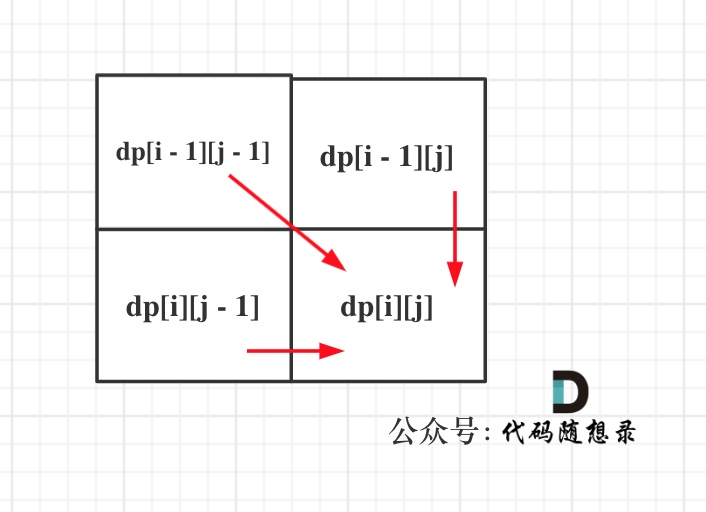

---

以⽰例1，输⼊：word1 = "horse", word2 = "ros"为例，dp矩阵状态图如下：
以上动规五部分析完毕，C++代码如下：
class Solution {
public:
    int minDistance(string word1, string word2) {
        vector<vector<int>> dp(word1.size() + 1, vector<int>
(word2.size() + 1, 0));
        for (int i = 0; i <= word1.size(); i++) dp[i][0] = i;
        for (int j = 0; j <= word2.size(); j++) dp[0][j] = j;

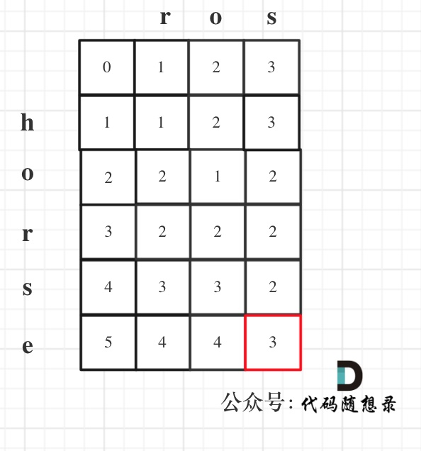

---

编辑距离总结篇
 
本周我们讲了动态规划之终极绝杀：编辑距离，为什么叫做终极绝杀呢？
细⼼的录友应该知道，我们在前三篇动态规划的⽂章就⼀直为 编辑距离 这道题⽬做铺垫。
判断⼦序列
 
动态规划：392.判断⼦序列 给定字符串 s 和 t ，判断 s 是否为 t 的⼦序列。
这道题⽬ 其实是可以⽤双指针或者贪⼼的的，但是我在开篇的时候就说了这是编辑距离的
⼊门题⽬，因为从题意中我们也可以发现，只需要计算删除的情况，不⽤考虑增加和替换的
情况。
if (s[i - 1] == t[j - 1])
t中找到了⼀个字符在s中也出现了
if (s[i - 1] != t[j - 1])
        for (int i = 1; i <= word1.size(); i++) {
            for (int j = 1; j <= word2.size(); j++) {
                if (word1[i - 1] == word2[j - 1]) {
                    dp[i][j] = dp[i - 1][j - 1];
                }
                else {
                    dp[i][j] = min({dp[i - 1][j - 1], dp[i - 1][j], 
dp[i][j - 1]}) + 1;
                }
            }
        }
        return dp[word1.size()][word2.size()];
    }
};

---

相当于t要删除元素，继续匹配
状态转移⽅程：
不同的⼦序列
 
动态规划：115.不同的⼦序列 给定⼀个字符串 s 和⼀个字符串 t ，计算在 s 的⼦序列中 t 出
现的个数。
本题虽然也只有删除操作，不⽤考虑替换增加之类的，但相对于动态规划：392.判断⼦序列
就有难度了，这道题⽬双指针法可就做不了。
当s[i - 1] 与 t[j - 1]相等时，dp[i][j]可以有两部分组成。
⼀部分是⽤s[i - 1]来匹配，那么个数为dp[i - 1][j - 1]。
⼀部分是不⽤s[i - 1]来匹配，个数为dp[i - 1][j]。
这⾥可能有同学不明⽩了，为什么还要考虑 不⽤s[i - 1]来匹配，都相同了指定要匹配啊。
例如： s：bagg 和 t：bag ，s[3] 和 t[2]是相同的，但是字符串s也可以不⽤s[3]来匹配，即
⽤s[0]s[1]s[2]组成的bag。
当然也可以⽤s[3]来匹配，即：s[0]s[1]s[3]组成的bag。
所以当s[i - 1] 与 t[j - 1]相等时，dp[i][j] = dp[i - 1][j - 1] + dp[i - 1][j];
当s[i - 1] 与 t[j - 1]不相等时，dp[i][j]只有⼀部分组成，不⽤s[i - 1]来匹配，即：dp[i - 1][j]
所以递推公式为：dp[i][j] = dp[i - 1][j];
状态转移⽅程：
if (s[i - 1] == t[j - 1]) dp[i][j] = dp[i - 1][j - 1] + 1;
else dp[i][j] = dp[i][j - 1];

---

两个字符串的删除操作
 
动态规划：583.两个字符串的删除操作给定两个单词 word1 和 word2，找到使得 word1 和 
word2 相同所需的最⼩步数，每步可以删除任意⼀个字符串中的⼀个字符。
本题和动态规划：115.不同的⼦序列相⽐，其实就是两个字符串可以都可以删除了，情况虽
说复杂⼀些，但整体思路是不变的。
当word1[i - 1] 与 word2[j - 1]相同的时候
当word1[i - 1] 与 word2[j - 1]不相同的时候
当word1[i - 1] 与 word2[j - 1]相同的时候，dp[i][j] = dp[i - 1][j - 1];
当word1[i - 1] 与 word2[j - 1]不相同的时候，有三种情况：
情况⼀：删word1[i - 1]，最少操作次数为dp[i - 1][j] + 1
情况⼆：删word2[j - 1]，最少操作次数为dp[i][j - 1] + 1
情况三：同时删word1[i - 1]和word2[j - 1]，操作的最少次数为dp[i - 1][j - 1] + 2
那最后当然是取最⼩值，所以当word1[i - 1] 与 word2[j - 1]不相同的时候，递推公式：dp[i]
[j] = min({dp[i - 1][j - 1] + 2, dp[i - 1][j] + 1, dp[i][j - 1] + 1});
状态转移⽅程：
if (s[i - 1] == t[j - 1]) {
    dp[i][j] = dp[i - 1][j - 1] + dp[i - 1][j];
} else {
    dp[i][j] = dp[i - 1][j];
}
if (word1[i - 1] == word2[j - 1]) {
    dp[i][j] = dp[i - 1][j - 1];
} else {
    dp[i][j] = min({dp[i - 1][j - 1] + 2, dp[i - 1][j] + 1, dp[i][j - 
1] + 1});
}

---

编辑距离
 
动态规划：72.编辑距离 给你两个单词 word1 和 word2，请你计算出将 word1 转换成 
word2 所使⽤的最少操作数 。
编辑距离终于来了，有了前⾯三道题⽬的铺垫，应该有思路了，本题是两个字符串可以增删
改，⽐ 动态规划：判断⼦序列，动态规划：不同的⼦序列，动态规划：两个字符串的删除
操作都要复杂的多。
在确定递推公式的时候，⾸先要考虑清楚编辑的⼏种操作，整理如下：
if (word1[i - 1] == word2[j - 1])
不操作
if (word1[i - 1] != word2[j - 1])
增
删
换
也就是如上四种情况。
if (word1[i - 1] == word2[j - 1]) 那么说明不⽤任何编辑，dp[i][j] 就应该是 dp[i - 1][j - 1]，即
dp[i][j] = dp[i - 1][j - 1];
此时可能有同学有点不明⽩，为啥要即dp[i][j] = dp[i - 1][j - 1]呢？
那么就在回顾上⾯讲过的dp[i][j]的定义，word1[i - 1] 与 word2[j - 1]相等了，那么就不⽤编
辑了，以下标i-2为结尾的字符串word1和以下标j-2为结尾的字符串word2的最近编辑距离
dp[i - 1][j - 1] 就是 dp[i][j]了。
在下⾯的讲解中，如果哪⾥看不懂，就回想⼀下dp[i][j]的定义，就明⽩了。
在整个动规的过程中，最为关键就是正确理解dp[i][j]的定义！
if (word1[i - 1] != word2[j - 1])，此时就需要编辑了，如何编辑呢？
操作⼀：word1增加⼀个元素，使其word1[i - 1]与word2[j - 1]相同，那么就是以下标i-2为
结尾的word1 与 i-1为结尾的word2的最近编辑距离 加上⼀个增加元素的操作。
即 dp[i][j] = dp[i - 1][j] + 1;

---

操作⼆：word2添加⼀个元素，使其word1[i - 1]与word2[j - 1]相同，那么就是以下标i-1为
结尾的word1 与 j-2为结尾的word2的最近编辑距离 加上⼀个增加元素的操作。
即 dp[i][j] = dp[i][j - 1] + 1;
这⾥有同学发现了，怎么都是添加元素，删除元素去哪了。
word2添加⼀个元素，相当于word1删除⼀个元素，例如 word1 = "ad" ，word2 = "a"，
word2添加⼀个元素d，也就是相当于word1删除⼀个元素d，操作数是⼀样！
操作三：替换元素，word1替换word1[i - 1]，使其与word2[j - 1]相同，此时不⽤增加元素，
那么以下标i-2为结尾的word1 与 j-2为结尾的word2的最近编辑距离 加上⼀个替换元素的操
作。
即 dp[i][j] = dp[i - 1][j - 1] + 1;
综上，当 if (word1[i - 1] != word2[j - 1]) 时取最⼩的，即：dp[i][j] = min({dp[i - 1][j - 1], dp[i 
- 1][j], dp[i][j - 1]}) + 1;
递归公式代码如下：
总结
 
⼼思的录友应该会发现我⽤了三道题做铺垫，才最后引出了动态规划：72.编辑距离 ，Carl
的良苦⽤⼼呀，你们体会到了嘛！
if (word1[i - 1] == word2[j - 1]) {
    dp[i][j] = dp[i - 1][j - 1];
}
else {
    dp[i][j] = min({dp[i - 1][j - 1], dp[i - 1][j], dp[i][j - 1]}) + 
1;
}

---

回⽂⼦串
 
647. 回⽂⼦串
 
题⽬链接：https://leetcode-cn.com/problems/palindromic-substrings/
给定⼀个字符串，你的任务是计算这个字符串中有多少个回⽂⼦串。
具有不同开始位置或结束位置的⼦串，即使是由相同的字符组成，也会被视作不同的⼦串。
⽰例 1：
输⼊："abc"
输出：3
解释：三个回⽂⼦串: "a", "b", "c"
⽰例 2：
输⼊："aaa"
输出：6
解释：6个回⽂⼦串: "a", "a", "a", "aa", "aa", "aaa"
提⽰：
输⼊的字符串长度不会超过 1000 。
暴⼒解法
 
两层for循环，遍历区间起始位置和终⽌位置，然后判断这个区间是不是回⽂。
时间复杂度：O(n^3)

---

动态规划
 
动规五部曲：
1. 确定dp数组（dp table）以及下标的含义
布尔类型的dp[i][j]：表⽰区间范围[i,j] （注意是左闭右闭）的⼦串是否是回⽂⼦串，如果是
dp[i][j]为true，否则为false。
2. 确定递推公式
在确定递推公式时，就要分析如下⼏种情况。
整体上是两种，就是s[i]与s[j]相等，s[i]与s[j]不相等这两种。
当s[i]与s[j]不相等，那没啥好说的了，dp[i][j]⼀定是false。
当s[i]与s[j]相等时，这就复杂⼀些了，有如下三种情况
情况⼀：下标i 与 j相同，同⼀个字符例如a，当然是回⽂⼦串
情况⼆：下标i 与 j相差为1，例如aa，也是⽂⼦串
情况三：下标：i 与 j相差⼤于1的时候，例如cabac，此时s[i]与s[j]已经相同了，我
们看i到j区间是不是回⽂⼦串就看aba是不是回⽂就可以了，那么aba的区间就是 
i+1 与 j-1区间，这个区间是不是回⽂就看dp[i + 1][j - 1]是否为true。
以上三种情况分析完了，那么递归公式如下：
result就是统计回⽂⼦串的数量。
if (s[i] == s[j]) {
    if (j - i <= 1) { // 情况⼀ 和 情况⼆
        result++;
        dp[i][j] = true;
    } else if (dp[i + 1][j - 1]) { // 情况三
        result++;
        dp[i][j] = true;
    }
}

---

注意这⾥我没有列出当s[i]与s[j]不相等的时候，因为在下⾯dp[i][j]初始化的时候，就初始为
false。
3. dp数组如何初始化
dp[i][j]可以初始化为true么？ 当然不⾏，怎能刚开始就全都匹配上了。
所以dp[i][j]初始化为false。
4. 确定遍历顺序
遍历顺序可有有点讲究了。
⾸先从递推公式中可以看出，情况三是根据dp[i + 1][j - 1]是否为true，在对dp[i][j]进⾏赋值
true的。
dp[i + 1][j - 1] 在 dp[i][j]的左下⾓，如图：

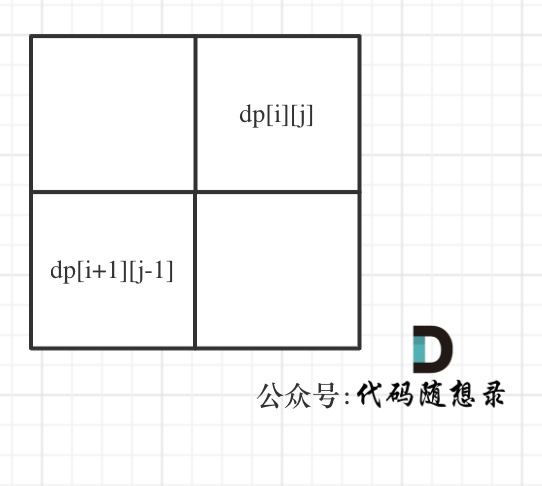

---

如果这矩阵是从上到下，从左到右遍历，那么会⽤到没有计算过的dp[i + 1][j - 1]，也就是根
据不确定是不是回⽂的区间[i+1,j-1]，来判断了[i,j]是不是回⽂，那结果⼀定是不对的。
所以⼀定要从下到上，从左到右遍历，这样保证dp[i + 1][j - 1]都是经过计算的。
有的代码实现是优先遍历列，然后遍历⾏，其实也是⼀个道理，都是为了保证dp[i + 1][j - 1]
都是经过计算的。
代码如下：
5. 举例推导dp数组
举例，输⼊："aaa"，dp[i][j]状态如下：
for (int i = s.size() - 1; i >= 0; i--) {  // 注意遍历顺序
    for (int j = i; j < s.size(); j++) {
        if (s[i] == s[j]) {
            if (j - i <= 1) { // 情况⼀ 和 情况⼆
                result++;
                dp[i][j] = true;
            } else if (dp[i + 1][j - 1]) { // 情况三
                result++;
                dp[i][j] = true;
            }
        }
    }
}

---

图中有6个true，所以就是有6个回⽂⼦串。
注意因为dp[i][j]的定义，所以j⼀定是⼤于等于i的，那么在填充dp[i][j]的时候⼀定是只填充
右上半部分。
以上分析完毕，C++代码如下：
class Solution {
public:
    int countSubstrings(string s) {
        vector<vector<bool>> dp(s.size(), vector<bool>(s.size(), 
false));
        int result = 0;
        for (int i = s.size() - 1; i >= 0; i--) {  // 注意遍历顺序
            for (int j = i; j < s.size(); j++) {
                if (s[i] == s[j]) {
                    if (j - i <= 1) { // 情况⼀ 和 情况⼆
                        result++;

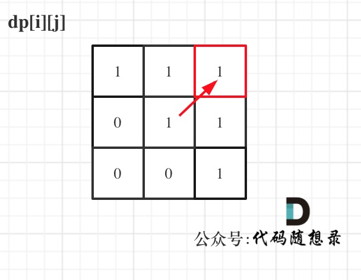

---

以上代码是为了凸显情况⼀⼆三，当然是可以简洁⼀下的，如下：
时间复杂度：O(n^2)
空间复杂度：O(n^2)
                        dp[i][j] = true;
                    } else if (dp[i + 1][j - 1]) { // 情况三
                        result++;
                        dp[i][j] = true;
                    }
                }
            }
        }
        return result;
    }
};
class Solution {
public:
    int countSubstrings(string s) {
        vector<vector<bool>> dp(s.size(), vector<bool>(s.size(), 
false));
        int result = 0;
        for (int i = s.size() - 1; i >= 0; i--) {
            for (int j = i; j < s.size(); j++) {
                if (s[i] == s[j] && (j - i <= 1 || dp[i + 1][j - 1])) 
{
                    result++;
                    dp[i][j] = true;
                }
            }
        }
        return result;
    }
};

---

双指针法
 
动态规划的空间复杂度是偏⾼的，我们再看⼀下双指针法。
⾸先确定回⽂串，就是找中⼼然后想两边扩散看是不是对称的就可以了。
在遍历中⼼点的时候，要注意中⼼点有两种情况。
⼀个元素可以作为中⼼点，两个元素也可以作为中⼼点。
那么有⼈同学问了，三个元素还可以做中⼼点呢。其实三个元素就可以由⼀个元素左右添加
元素得到，四个元素则可以由两个元素左右添加元素得到。
所以我们在计算的时候，要注意⼀个元素为中⼼点和两个元素为中⼼点的情况。
这两种情况可以放在⼀起计算，但分别计算思路更清晰，我倾向于分别计算，代码如下：
class Solution {
public:
    int countSubstrings(string s) {
        int result = 0;
        for (int i = 0; i < s.size(); i++) {
            result += extend(s, i, i, s.size()); // 以i为中⼼
            result += extend(s, i, i + 1, s.size()); // 以i和i+1为中⼼
        }
        return result;
    }
    int extend(const string& s, int i, int j, int n) {
        int res = 0;
        while (i >= 0 && j < n && s[i] == s[j]) {
            i--;
            j++;
            res++;
        }
        return res;
    }
};

---

时间复杂度：O(n^2)
空间复杂度：O(1)
 
最长回⽂⼦序列
 
516.最长回⽂⼦序列
 
题⽬链接：https://leetcode-cn.com/problems/longest-palindromic-subsequence/
给定⼀个字符串 s ，找到其中最长的回⽂⼦序列，并返回该序列的长度。可以假设 s 的最⼤
长度为 1000 。
⽰例 1:
输⼊: "bbbab"
输出: 4
⼀个可能的最长回⽂⼦序列为 "bbbb"。
⽰例 2:
输⼊:"cbbd"
输出: 2
⼀个可能的最长回⽂⼦序列为 "bb"。
提⽰：
1 <= s.length <= 1000
s 只包含⼩写英⽂字母
思路
 
我们刚刚做过了 动态规划：回⽂⼦串，求的是回⽂⼦串，⽽本题要求的是回⽂⼦序列， 要
搞清楚这两者之间的区别。

---

回⽂⼦串是要连续的，回⽂⼦序列可不是连续的！ 回⽂⼦串，回⽂⼦序列都是动态规划经
典题⽬。
回⽂⼦串，可以做这两题：
647.回⽂⼦串
5.最长回⽂⼦串
思路其实是差不多的，但本题要⽐求回⽂⼦串简单⼀点，因为情况少了⼀点。
动规五部曲分析如下：
1. 确定dp数组（dp table）以及下标的含义
dp[i][j]：字符串s在[i, j]范围内最长的回⽂⼦序列的长度为dp[i][j]。
2. 确定递推公式
在判断回⽂⼦串的题⽬中，关键逻辑就是看s[i]与s[j]是否相同。
如果s[i]与s[j]相同，那么dp[i][j] = dp[i + 1][j - 1] + 2;
如图：
（如果这⾥看不懂，回忆⼀下dp[i][j]的定义）

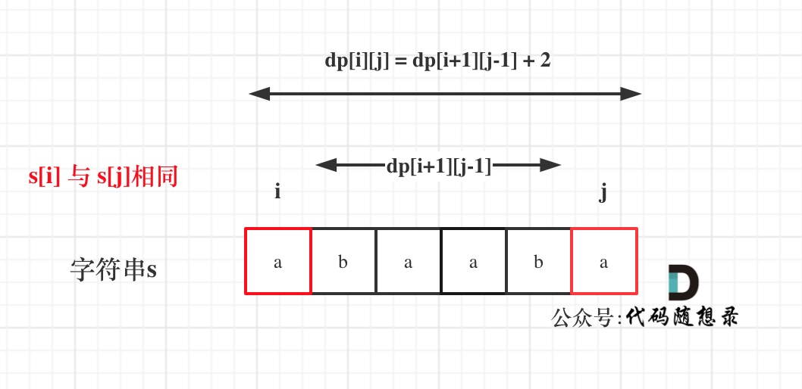

---

如果s[i]与s[j]不相同，说明s[i]和s[j]的同时加⼊ 并不能增加[i,j]区间回⽂⼦串的长度，那么
分别加⼊s[i]、s[j]看看哪⼀个可以组成最长的回⽂⼦序列。
加⼊s[j]的回⽂⼦序列长度为dp[i + 1][j]。
加⼊s[i]的回⽂⼦序列长度为dp[i][j - 1]。
那么dp[i][j]⼀定是取最⼤的，即：dp[i][j] = max(dp[i + 1][j], dp[i][j - 1]);
代码如下：
3. dp数组如何初始化
⾸先要考虑当i 和j 相同的情况，从递推公式：dp[i][j] = dp[i + 1][j - 1] + 2; 可以看出 递推公
式是计算不到 i 和j相同时候的情况。
if (s[i] == s[j]) {
    dp[i][j] = dp[i + 1][j - 1] + 2;
} else {
    dp[i][j] = max(dp[i + 1][j], dp[i][j - 1]);
}

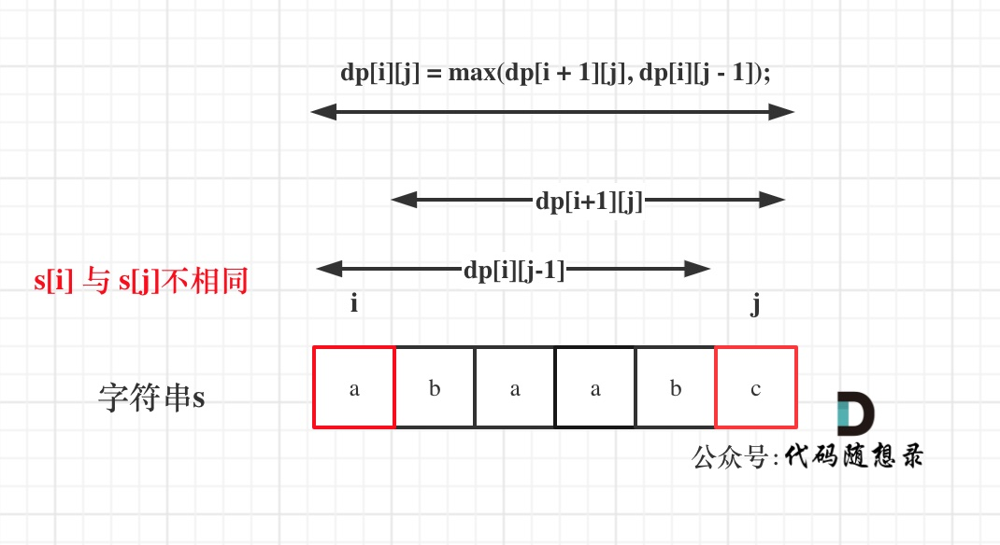

---

所以需要⼿动初始化⼀下，当i与j相同，那么dp[i][j]⼀定是等于1的，即：⼀个字符的回⽂
⼦序列长度就是1。
其他情况dp[i][j]初始为0就⾏，这样递推公式：dp[i][j] = max(dp[i + 1][j], dp[i][j - 1]); 中dp[i]
[j]才不会被初始值覆盖。
4. 确定遍历顺序
从递推公式dp[i][j] = dp[i + 1][j - 1] + 2 和 dp[i][j] = max(dp[i + 1][j], dp[i][j - 1]) 可以看出，
dp[i][j]是依赖于dp[i + 1][j - 1] 和 dp[i + 1][j]，
也就是从矩阵的⾓度来说，dp[i][j] 下⼀⾏的数据。 所以遍历i的时候⼀定要从下到上遍历，
这样才能保证，下⼀⾏的数据是经过计算的。
递推公式：dp[i][j] = dp[i + 1][j - 1] + 2，dp[i][j] = max(dp[i + 1][j], dp[i][j - 1]) 分别对应着下
图中的红⾊箭头⽅向，如图：
vector<vector<int>> dp(s.size(), vector<int>(s.size(), 0));
for (int i = 0; i < s.size(); i++) dp[i][i] = 1;

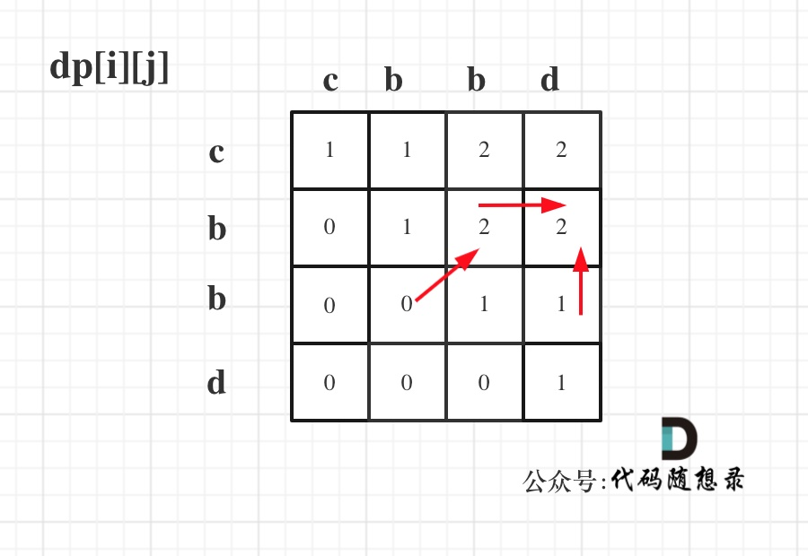

---

代码如下：
5. 举例推导dp数组
输⼊s:"cbbd" 为例，dp数组状态如图：
红⾊框即：dp[0][s.size() - 1]; 为最终结果。
for (int i = s.size() - 1; i >= 0; i--) {
    for (int j = i + 1; j < s.size(); j++) {
        if (s[i] == s[j]) {
            dp[i][j] = dp[i + 1][j - 1] + 2;
        } else {
            dp[i][j] = max(dp[i + 1][j], dp[i][j - 1]);
        }
    }
}

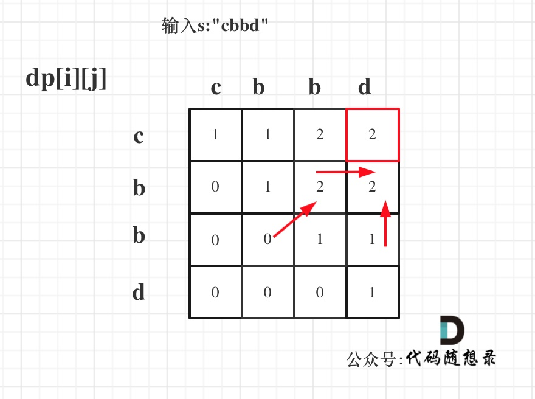

---

以上分析完毕，C++代码如下：
 
动态规划总结篇
 
如今动态规划已经讲解了42道经典题⽬，共50篇⽂章，是时候做⼀篇总结了。
关于动态规划，在专题第⼀篇关于动态规划，你该了解这些！就说了动规五部曲，⽽且强调
了五部对解动规题⽬⾄关重要！
这是Carl做过⼀百多道动规题⽬总结出来的经验结晶啊，如果⼤家跟着「代码随想哦」刷过
动规专题，⼀定会对这动规五部曲的作⽤感受极其深刻。
动规五部曲分别为：
1. 确定dp数组（dp table）以及下标的含义
class Solution {
public:
    int longestPalindromeSubseq(string s) {
        vector<vector<int>> dp(s.size(), vector<int>(s.size(), 0));
        for (int i = 0; i < s.size(); i++) dp[i][i] = 1;
        for (int i = s.size() - 1; i >= 0; i--) {
            for (int j = i + 1; j < s.size(); j++) {
                if (s[i] == s[j]) {
                    dp[i][j] = dp[i + 1][j - 1] + 2;
                } else {
                    dp[i][j] = max(dp[i + 1][j], dp[i][j - 1]);
                }
            }
        }
        return dp[0][s.size() - 1];
    }
};

---

2. 确定递推公式
3. dp数组如何初始化
4. 确定遍历顺序
5. 举例推导dp数组
动规专题刚开始的时候，讲的题⽬⽐较简单，不少录友和我反应：这么简单的题⽬ 讲的复
杂了，不⽤那么多步骤分析，想出递推公式直接就AC这道题⽬了。
Carl的观点⼀直都是 简单题是⽤来 巩固⽅法论的。 简单题⽬是可以靠感觉，但后⾯稍稍难
⼀点的题⽬，估计感觉就不好使了。
在动规专题讲解中，也充分体现出，这动规五部曲的重要性。
还有不少录友对动规的理解是：递推公式是才是最难最重要的，只要想出递归公式，其他都
好办。
其实这么想的同学基本对动规理解的不到位的。
动规五部曲⾥，哪⼀部没想清楚，这道题⽬基本就做不出来，即使做出来了也没有想清楚，
⽽是朦朦胧胧的就把题⽬过了。
如果想不清楚dp数组的具体含义，递归公式从何谈起，甚⾄初始化的时候就写错
了。
例如动态规划：不同路径还不够，要有障碍！ 在这道题⽬中，初始化才是重头戏
如果看过背包系列，特别是完全背包，那么两层for循环先后顺序绝对可以搞懵很
多⼈，反⽽递归公式是简单的。
⾄于推导dp数组的重要性，动规专题⾥⼏乎每篇Carl都反复强调，当程序结果不对
的时候，⼀定要⾃⼰推导公式，看看和程序打印的⽇志是否⼀样。
好啦，我们再⼀起回顾⼀下，动态规划专题中我们都讲了哪些内容。
动划基础

---

关于动态规划，你该了解这些！
动态规划：斐波那契数
动态规划：爬楼梯
动态规划：使⽤最⼩花费爬楼梯
动态规划：不同路径
动态规划：不同路径还不够，要有障碍！
动态规划：整数拆分，你要怎么拆？
动态规划：不同的⼆叉搜索树

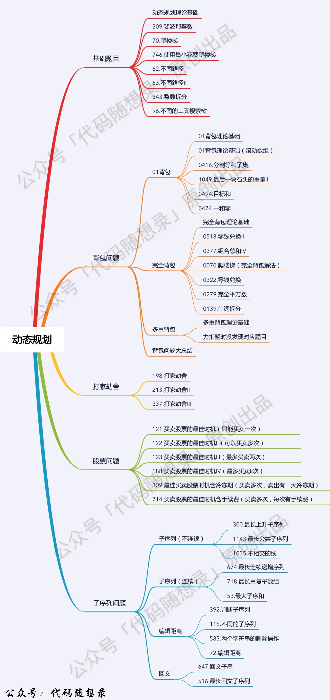

---

背包问题系列
打家劫舍系列
 
动态规划：关于01背包问题，你该了解这些！
动态规划：关于01背包问题，你该了解这些！（滚动数组）
动态规划：分割等和⼦集可以⽤01背包！
动态规划：最后⼀块⽯头的重量 II
动态规划：⽬标和！
动态规划：⼀和零！
动态规划：关于完全背包，你该了解这些！
动态规划：给你⼀些零钱，你要怎么凑？
动态规划：Carl称它为排列总和！
动态规划：以前我没得选，现在我选择再爬⼀次！
动态规划： 给我个机会，我再兑换⼀次零钱
动态规划：⼀样的套路，再求⼀次完全平⽅数
动态规划：单词拆分
动态规划：关于多重背包，你该了解这些！
听说背包问题很难？ 这篇总结篇来拯救你了
 
动态规划：开始打家劫舍！
动态规划：继续打家劫舍！
动态规划：还要打家劫舍！

---

股票系列
⼦序列系列
 
动态规划：买卖股票的最佳时机
动态规划：本周我们都讲了这些（系列六）
动态规划：买卖股票的最佳时机II
动态规划：买卖股票的最佳时机III
动态规划：买卖股票的最佳时机IV
动态规划：最佳买卖股票时机含冷冻期
动态规划：本周我们都讲了这些（系列七）
动态规划：买卖股票的最佳时机含⼿续费
动态规划：股票系列总结篇
 
动态规划：最长递增⼦序列
动态规划：最长连续递增序列
动态规划：最长重复⼦数组
动态规划：最长公共⼦序列

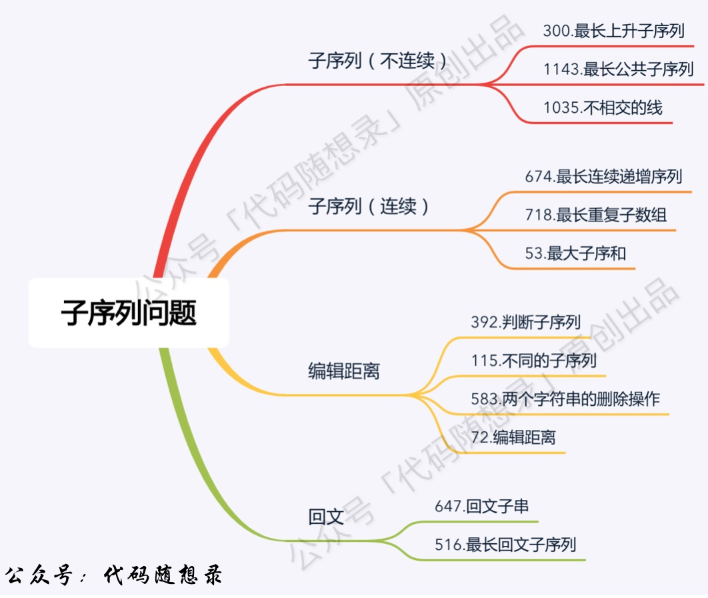

---

动规结束语
关于动规，还有 树形DP（打家劫舍系列⾥有⼀道），数位DP，区间DP ，概率型DP，博弈型
DP，状态压缩dp等等等，这些我就不去做讲解了，⾯试中出现的概率⾮常低。
能把本篇中列举的题⽬都研究通透的话，你的动规⽔平就已经⾮常⾼了。 对付⾯试已经⾜
够！
这已经是全⽹对动规最深刻的讲解系列了。
其实⼤家去⽹上搜⼀搜也可以发现，能把动态规划讲清楚的资料挺少的，因为动规确实很
难！要给别⼈讲清楚更难！
《剑指offer》上 动规的题⽬很少，经典的算法书籍《算法4》 没有讲 动规，⽽《算法导论》
讲的动规基本属于劝退级别的。
讲清楚⼀道题容易，讲清楚两道题也容易，但把整个动态规划的各个分⽀讲清楚，每道题⽬
讲通透，并⽤⼀套⽅法论把整个动规贯彻始终就⾮常难了。
所以Carl花费的这么⼤精⼒，把⾃⼰对动规算法理解 ⼀五⼀⼗的全部分享给了录友们，帮助
⼤家少⾛弯路！
⾄于动态规划PDF，即将在公众号「代码随想录」全⽹⾸发！
感谢录友们的⼀路⽀持，Carl才有继续更下去的动⼒[玫瑰]，[撒花]
 
动态规划：不相交的线
动态规划：最⼤⼦序和
动态规划：判断⼦序列
动态规划：不同的⼦序列
动态规划：两个字符串的删除操作
动态规划：编辑距离
为了绝杀编辑距离，我做了三步铺垫，你都知道么？
动态规划：回⽂⼦串
动态规划：最长回⽂⼦序列