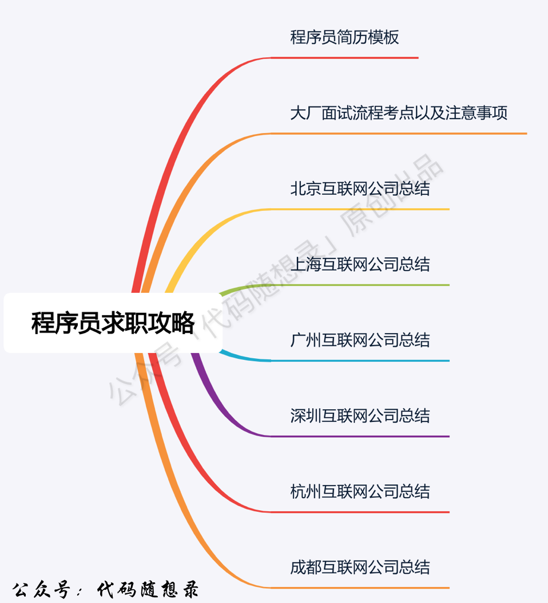
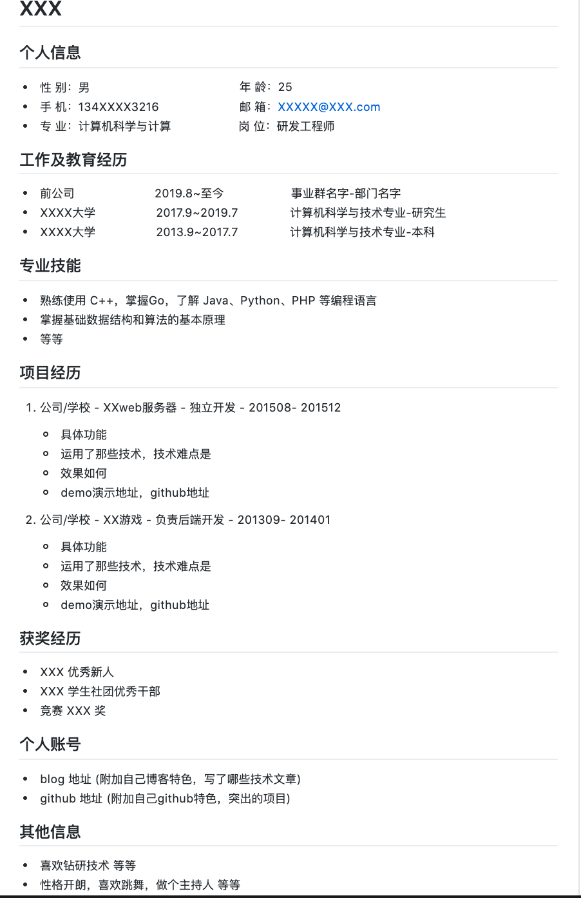

# 「代码随想录」程序员求职攻略（v2.0）

「代码随想录」程序员求职攻略
 
关于代码随想录
 
代码随想录官⽹：www.programmercarl.com
代码随想录开源项⽬Github：https://github.com/youngyangyang04/leetcode-
master
代码随想录算法公开课 ，代码随想录的全部内容将由我（程序员Carl）视频讲解
并开免费开放给⼤家。
《代码随想录》纸质版 已经出版。
代码随想录知识星球 上万录友在这⾥学习
代码随想录算法训练营 帮助录友⾼效刷完代码随想录。
PDF背景
 
这本pdf是由公众号「代码随想录」程序员求职专题的⽂章整理⽽来。
⽬前已经发布了，⼆叉树PDF、回溯算法PDF、贪⼼算法PDF、动态规划PDF，程序员求职
攻略PDF 都⼴受获评，⼤家可以关注微信公众号：代码随想录，后台回复：666，就可以获
取全部专题PDF了。
PDF难免会有笔误，或者⼩问题，所以内容会不断进⾏修正，其更新顺序为：Github > 公众
号 > ⽹站 > PDF。最新版本的PDF会⾸先在公众号⾥发布，不要错过咯。
这份刷题攻略包含程序员应该如何写简历，⼀线互联⽹⾯试流程已经注意事项（超详细）以
及各个重点城市互联⽹公司总结（2021最新版）。

---

共1.2w字，可以说把国内整个互联⽹蓝图都帮⼤家整理出来了，⽆论是应届⽣就职还是跳
槽，这份求职攻略都可以⽤来参考！
程序员的简历应该这么写！！（附简历模板）
 
Carl校招社招都拿过⼤⼚的offer，同时也看过很多应聘者的简历，这⾥把⾃⼰总结的简历技
巧以及常见问题给⼤家梳理⼀下。
简历篇幅
 
⾸先程序员的简历⼒求简洁明了，不⽤设计上要过于复杂。
对于校招⽣，⼀页简历就够了，社招的话两页简历便可。
有的校招⽣说⾃⼰的经历太多了，简历要写出两三页，实际上基本是⽆关内容太多或者描述
太啰唆，例如多过的校园活动，学⽣会经历等等。
既然是⾯试技术岗位，其他的⽅⾯⼀笔带过就好。

---

谨慎使⽤“精通”两字
 
应届⽣或者刚毕业的程序员在写简历的时候 切记不要写精通某某语⾔，如果真的学的很
好，推荐写“熟悉”或者“掌握”。
但是有的同学可能仅仅使⽤⼀些语⾔例如go或者python写了⼀些⼩东西，或者了解⼀些语
⾔的语法，就直接写上熟悉C++、JAVA、GO、PYTHON ，这也是⼤忌，如果C++更了解的
话，建议写熟悉C++，了解JAVA、GO、PYTHON。
词语的强烈程度：精通 > 熟悉（推荐使⽤）> 掌握（推荐使⽤）> 了解（推荐使⽤）
还有做好⼼理准备，⼀旦我们写了熟悉某某语⾔，这门语⾔就⼀定是⾯试中重点考察的⼀个
点。
例如写了熟悉C++， 那么继承、多态、封装、虚函数、C++11的⼀些特性、STL就⼀定会被
问道。
所以简历上写着熟悉哪⼀门语⾔，在准备⾯试的时候重点准备，其他语⾔⼏乎可以不⽤看
了，⾯试官在⾯试中通常只会考察⼀门编程语⾔。
拿不准的绝对不要写在简历上
 
不要为了简历上看上去很丰富，就写很多内容上去，内容越多，⾯试中考点就越多。
简历中突出⾃⼰技能的⼏个点，⽽不是⾯⾯俱到。
想想看，⾯试官⼀定是拿着你的简历开始问问题的，如果因为仅仅想展⽰⾃⼰多会⼀点点的
东西就都写在简历上，等于给⾃⼰挖了⼀个“⼤坑”。
例如仅仅部署过nginx服务器，就在简历上写熟悉nginx，那⾯试官可能上来就围绕着nginx
问很多问题，同学们如果招架不住，然后说：“我仅仅部署过，底层实现我都不了解。这样
就是让⾯试官有些失望”。
同时尽量不要写代码⾏数10万+ 在简历上，这就相当于提⾼了⾯试官的期望。
⾸先就是代码⾏数10W+ ⽆从考证，⽽且这⽆疑⼤⼤提⾼的⾯试官的期望和⾯试官问问题的
范围，这相当于告诉⾯试官“我写代码没问题，你就尽管问吧”。

---

如果简历上再没有侧重点的话，⾯试官就开始铺天盖地问起来，恐怕⼤家回答的效果也不会
太好。
项⽬经验应该如何写
 
项⽬经验中要突出⾃⼰的贡献，不要描述⼀遍项⽬就完事，要突出⾃⼰的贡献，是添加了哪
些功能，还是优化了那些性能指数，最后再说说受益怎么样。
例如这个功能被多少⼈使⽤，例如性能提升了多少倍。
其实很多同学的⼀个通病就是在⾯试中说不出⾃⼰项⽬的难点，项⽬经历写了⼀⼤堆，各种
框架数据库的使⽤都写上了，却答不出⾃⼰项⽬中的难点。
有的同学可能⼼⾥会想：“⾃⼰的项⽬没有什么难点，就是按照功能来做，遇到不会配置的
不会调节的，就百度⼀下”。
其实⼤多数⼈做项⽬的时候都是这样的，不是每个项⽬都有什么难点，可是为什么⼀样的项
⽬经验，别⼈就可以在难点上说出⼀⼆三来呢？
这⾥还是有⼀些技巧的，⾸先是做项⽬的时候时刻保持着对难点的敏感程度，很多我们费尽
周折解决了⼀个问题，然后⾃⼰也不做记录，就忘掉了，此时如果及时将⾃⼰的思考过程记
录下来，就是⾯试中的重要素材，养成这样的习惯⾮常重要。
很多同学埋怨⾃⼰的项⽬没难点，其实不然，找到项⽬中的⼀点，深挖下去就会遇到难点，
解决它，这种经历就可以拿来在⾯试中来说了。
例如使⽤java完成的项⽬，在深挖⼀下Java内存管理，看看是不是可以减少⼀些虚拟机上内
存的压⼒。
所以很多时候 不是⾃⼰的项⽬没有难点，⽽是⾃⼰准备的不充分。
项⽬经验是⾯试官⼀定会问的，那么不是每⼀个⾯试都是主动问项⽬中有哪些亮点或者难
点，这时候就需要我们⾃⼰主动去说⾃⼰项⽬中的难点。

---

变被动为主动
 
再说⼀个⾯试中如何变被动为主动的技巧，例如⾃⼰的项⽬是⼀套分布式系统，我们在介绍
项⽬的时候主动说：“项⽬中的难点就是分布式数据⼀致性的问题。”。
此时就应该知道⾯试官定会问：“你是如何解决数据⼀致性的？”。
如果你对数据⼀致性协议的使⽤和原理⾜够的了解的话，就可以和⾯试官侃侃⽽谈了。
我们在简历中突出项⽬的难点在于数据⼀致性，并且我们之前就精⼼准备⼀致性协议，数据
⼀致性相关的知识，就等着⾯试官来问，这样准备⾯试更有效率，这些写出来的简历也才是
好的简历，⽽不是简历上泛泛⽽谈什么都说⼀些，最后都不太了解。
⾯试⼀共就三⼗分钟或者⼀个⼩时，说两个两个项⽬中的难点，既凸显出⾃⼰技术上的深
度，同时项⽬中的难点是最好被我们⾃⼰掌控的，因为这块是⾯试官必问的，就是我们可以
变被动为主动的关键。
真正好的简历是 当同学们把⾃⼰的简历递给⾯试官的时候，基本都知道⾯试官看着简历都
会问什么问题，然后将⾯试官的引导到⾃⼰最熟悉的领域，这样⼤家才会占有主动权。
博客的重要性
 
简历上可以放上⾃⼰的博客地址、Github地址甚⾄微博（如果发了很多关于技术的内
容），通过博客和github ⾯试官就可以快速判断同学们对技术的热情，以及学习的态度，
可以让⾯试官快速的了解同学们的技术⽔平。
如果有很多⾼质量博客和漂亮的github的话，即使⾯试现场发挥的不好，⾯试官通过博客也
会知道这位同学基础还是很扎实，只是发挥的不好⽽已。
可以看出记录和总结的重要性。
写博客，不⼀定⾮要是技术⼤⽜才写博客，⼤家都可以写博客来记录⾃⼰的收获，每⼀个知
识点⼤家都可以写⼀篇技术博客，这⽅⾯要切忌懒惰！
我是欢迎录友们参考我的⽂章写博客来记录⾃⼰收获的，但⼀定要注明来⾃公众号「代码随
想录」呀！
同时⼤家对github不要畏惧，可以很容易找到⼀些⼩的项⽬来练⼿。

---

这⾥贴出我的Github，上⾯有⼀些我⾃⼰写的⼩项⽬，⼤家可以参考：https://github.com/
youngyangyang04
⾯试只有短短的30分钟或者⼀个⼩时，如何把⾃⼰掌握的技术更好的展现给⾯试官呢，博
客、github都是很好的选择，如果把这些放在简历上，⾯试官⼀定会看的，这都是加分项。
简历模板
 
最后福利，把我的简历模板贡献出来！如下图所⽰。

---

这⾥是简历模板中Markdown的代码：https://github.com/youngyangyang04/Markdown-R
esume-Template ，可以fork到⾃⼰Github仓库上，按照这个模板来修改⾃⼰的简历。
Word版本的简历，⼤家可以在公众号「代码随想录」后台回复：简历模板，就可以获取！
总结
 
好的简历是敲门砖，同时也不要在简历上花费过多的精⼒，好的简历以及⾯试技巧都是锦上
添花，真的求得⼼得的offer靠的还是真才实学。
如何真才实学呢？ 跟着「代码随想录」⼀起刷题呀，哈哈
⼤家此时可以再重审⼀遍⾃⼰的简历，如果发现哪⾥的不⾜，⾯试前要多准备多练习。
 
代码随想录官⽹：www.programmercarl.com
代码随想录开源项⽬Github：https://github.com/youngyangyang04/leetcode-
master
代码随想录算法公开课 ，代码随想录的全部内容将由我（程序员Carl）视频讲解
并开免费开放给⼤家。
《代码随想录》纸质版 已经出版。
代码随想录知识星球 上万录友在这⾥学习
代码随想录算法训练营 帮助录友⾼效刷完代码随想录。

---

如果感觉PDF对你有帮助，微信搜索：代码随想录，你会发现相见恨晚！
 
 
⼀线互联⽹公司技术⾯试流程和注意事项
 
⼤型互联⽹企业⼀般通过⼏轮技术⾯试来考察⼤家的各项能⼒，⼀般流程如下：
⼀⾯机试：⼀般会考选择题和编程题
⼆⾯基础算法⾯：就是基础的算法都是该专栏要讲的
三⾯综合技术⾯：会考察编程语⾔，计算机基础知识 ，以及了解项⽬经历等等
四⾯技术boss⾯：会问⼀些⽐较范范的内容，考察⼤家解决问题和快速学习的能⼒
最后hr⾯：主要了解⾯试者与企业⽂化相不相符，⾯试者的职业发展，offer的选
择以及介绍⼀下企业提供的薪资待遇等等
并不是说⼀定是这五轮⾯试，不同的公司情况都不⼀样，甚⾄同⼀个公司不同事业群⾯试的
流程都是不⼀样的

---

可能 ⼀⾯和⼆⾯放到⼀起，可能三⾯和四⾯放到⼀起，这⾥尽量将各个维度拆开，让同学
们了解 技术⾯试需要做哪⽅⾯的准备。
我们来逐⼀展开分析各个⾯试环节⾯试官是从哪些维度来考察⼤家的
⼀⾯ 机试
 
⼀⾯的话通常是 选择题 + 编程题，还有些公司机试都是编程题。
选择题：计算机基础知识涉及计算机⽹络，操作系统，数据库，编程语⾔等等
编程题：⼀般是代码量⽐较⼤的题⽬
⼀⾯机试，通常校招⽣的话，BAT的级别的企业 都会提前发笔试题，发到邮箱⾥然后指定
时间内做完，⼀定要慎重对待，机试没有过，后⾯就没有⾯试机会了
机试通常是 选择题 + 编程题，还有些公司机试都是编程题
选择题则是计算机基础知识涉及计算机⽹络，操作系统，数据库，编程语⾔等等，这⾥如果
有些同学对计算机基础⼼⾥没有底的话，可以去⽜客⽹上找⼀找 历年各⼤公司的机试题⽬
找找感觉。
编程题则⼀般是代码量⽐较⼤的题⽬，图、复杂数据结构或者⼀些模拟类的题⽬，编程题⽬
都是我们这门课程会讲述的重点
所以也给同学们也推荐⼀个编程学习的⽹站，也就是leetcode
leetcode是专门针对算法练习的题库，leetcode现在也推出了中⽂⽹站，所以更⽅⾯中国的
算法爱好者在上⾯刷题。 这门课程也是主要在leetcode上选择经典题⽬。
⽜客⽹上涉及到程序员⾯试的各个环节，有很多国内互联⽹公司历年⾯试的题⽬还是很不错
的。
建议学习计算机基础知识可以在⽜客⽹上，刷算法题可以选择leetcode。

---

⼆⾯ 基础算法⾯
 
更注意考察的是思维⽅式
 
这⼀块和机试对算法的考察又不⼀样，机试仅仅就是要⼀个结果，对了就是对了不对就是不
对，
⽽⼆⾯的算法⾯试⾯试官更想看到同学们的思考过程，⽽不仅仅是⼀个答案。
通常⼀⾯机试的题⽬是代码量⽐较⼤的题⽬，⽽⼆⾯⽽是⼀些基础算法
⾯试官会让⾯试者在⽩纸上写代码或者给⾯试者⼀台电脑来写代码，
⼀般⾯试官倾向于使⽤⽩纸，这样更好看到同学们的思考⽅式
应该⽤什么语⾔写算法题呢？
 
应该⽤什么语⾔写算法题呢？ ⽤⾃⼰最熟悉什么语⾔，但最好是JAVA或者C++
如果不会JAVA或C++的话，那更建议通过做算法题，顺便学习⼀下。
如果想在编程的路上⾛得更远，掌握⼀门重语⾔是⼗分重要的，学好了C++或者Java在学脚
本语⾔会⾮常的快，相当于降维打击
反⽽如果只会脚本语⾔，⼯作之后在学习⾼级语⾔会很困难，很多东西回不理解。
所以这⾥建议特别是应届⽣，⼤家有时间就要打好语⾔的基础， 不要太迷信⽤10⾏代码调
⽤⼀个包解决100⾏代码的事，
因为这样也不会清楚省略掉的90⾏做了哪些⼯作。
这⾥建议⼤家 在打基础的时候 最好不要上来就⾛捷径。
简单代码⼀定要可以⼿写出来，不要过于依赖IDE的⾃动补全 。
例如写⼀个翻转⼆叉树的函数， 很多同学在刷了很多leetcode 上⾯的题⽬

---

但是leetcode上⼀般都把⼆叉树的结构已经定义好了，所以可以上来直接写函数的实现
但是⾯试的时候要在⽩纸上写代码，⼀些同学⼀下⼦不知道⼆叉树的定义应该如何写，不是
结构体定义的不对，就是忘了如何写指针。
总之，错漏百出。 所以基本结构的定义以及代码⼀定要训练在⽩纸上写出来
后⾯我在讲解各个知识点的时候 会在给同学们在强调⼀遍哪些代码是⼀定要⼿写出来的
三⾯ 综合技术⾯
 
综合技术⾯ ⼀般从如下三点考察⼤家。
编程语⾔
 
编程语⾔，这⾥是⾯试官考察编程语⾔掌握程度，如果是C++的话， 会问STL，继承，多
态，指针等等 这⾥还可以问很多问题。
计算机基础知识
 
考察计算机⽅⾯的综合知识，这⾥不同⽅向考察的侧重点不⼀样，如果是后台开发，Linux 
, TCP, 进程线程这些是⼀定要问的。
项⽬经验
 
在项⽬经验中 ⾯试官想考察什么呢
项⽬经验主要从这三⽅⾯进⾏考察 技术原理、 技术深度、应变能⼒
考察技术原理, 做了⼀个项⽬，是不是仅仅调⼀调接⼜就完事，之后接⼜背后做了些什么
么？ 这些还是要了解的
考察技术深度，如果是后台开发的话，可以从系统的扩容、缓存、数据存储等多⽅⾯进⾏考
察

---

考察应变能⼒，如果⾯试官针对项⽬问同学们⼀个场景，最为忌讳的回答是什么？“我没考
虑过这种情况”。 这会让⾯试官对同学们的印象⼤打折扣。
这个时候，⾯试官最欣赏的候选⼈，就是尽管没考虑过，但也会思考出⼀个⽅案，然后跟⾯
试官进⾏讨论。
最终讨论出⼀个可⾏的⽅案，这个会让⾯试官对同学们的好感倍增。
通常应届⽣没有什么项⽬经验，特备是本科⽣，其实可以⾃⼰做⼀些的⼩项⽬。
例如做⼀个 可以联机的五⼦棋游戏，这⾥就涉及到了⽹络知识，可以结合着⾃⼰⽹络知识
来介绍⾃⼰的项⽬。
已经⼯作的⼈，就要找出⾃⼰⼯作项⽬的亮点，其实⼀个项⽬不是每⼀个⼈都有机会参与核
⼼的开发。
也不是每个⼈都有解决难题的机会，这也是我们在⼯作中 遇到难点，要勇往直前的动⼒，
因为这个就是⾃⼰项⽬经验最值钱的⼀部分。
四⾯ boss⾯
 
技术leader⾯试主要考察⾯试者两个能⼒， 解决问题的能⼒和快速学习的能⼒
考察解决问题的能⼒
 
⾯试官最喜欢问的相关问题:
在项⽬中遇到的最⼤的技术挑战是什么，⽽你是如果解决的
给出⼀个项⽬问题来让⾯试者分析
如果你是学⽣，就会问在你学习中遇到哪些挑战， 这些都是⾯试官经常问的问题。
⾯试官可能还会给出⼀个具体的项⽬场景，问同学们如何去解决。
例如微信朋友圈的后台设计，如果是你应该怎么设计，这种问题⼤家也不必惊慌
因为⾯试官也知道你没有设计过，所以⼤家只要⼤胆说出⾃⼰的设计⽅案就好

---

⾯试官会在进⼀步指引你的⽅案可能那⾥有问题，最终讨论出⼀个看似合理的结果。
这⾥⾯试官考察的主要是针对项⽬问题，同学们是如何思考的，如何解决的。
考察快速学习的能⼒
 
⾯试官最喜欢问的相关问题:
快速学习的能⼒  如果快速学习⼀门新的技术或者语⾔?
读研之后发现⾃⼰和本科毕业有什么差别？
在具体⼀点 ⾯试官会问，如果有个项⽬这两天就要启动，⽽这个项⽬使⽤了你没有⽤过的
语⾔或者技术，你将怎么完成这个项⽬？
换句话说，⾯试官会问：你如果快速学习⼀门新的编程语⾔或技术，这⾥同学们就要好好总
结⼀下⾃⼰学习的技巧
如果你是研究⽣，⾯试官还喜欢问： 读研之后发现⾃⼰和本科毕业有什么差别？
这⾥要体现出⾃⼰思维⽅式和学习⽅法上的进步，⽽不是⽤了两三年的时间有多学了那些技
术，因为互联⽹是不断变化的。
⾯试官更喜欢考察是同学们的快速学习的能⼒。
五⾯ hr⾯
 
终于到了HR⾯了，⼤家是不是感觉完事万事⼤吉了，这⾥万万不可⼤意，否则到⼿的offer
就飞掉了。
要知道HR那⾥如果有⼗个名额，技术⾯留给通常留给HR的⼈数是⼤于⼗个的，也就是HR
有选择权，HR会选择符合公司⽂化的价值观的候选⼈。
这⾥呢给⼤家列举⼀些关键问题

---

为什么选择我们公司？
 
这个⼤家⼀定要有所准备，不能被问到了之后⼀脸茫然，然后说 就是想找个⼯作，那基本
就没戏了
要从技术氛围，职业发展，公司潜⼒等等⽅⾯来说⾃⼰为什么选择这家公司
有没有职业规划？
 
其实如果刚刚毕业并没有明确的职业规划，这⾥建议⼤家不要说 ⾃⼰想⼯作⼏年想做项⽬
经理，⼯作⼏年想做产品经理的
这样会被HR认为 职业规划不清晰，尽量从技术的⾓度规划⾃⼰。
是否接受加班？
 
虽然⼤家都不喜欢加班，但是这个问题 我还是建议如果⼿头没有offer的话，⼤家尽量选择
接受了
除⾮是超级⼤⽜⼿头N多⾼新offer，可以直接说不接受，然后起⾝潇洒离去
坚持最长的⼀件事情是什么？
 
这⾥⼤家最好之前就想好，有⼀些同学可能印象⾥⾃⼰没有坚持很长的事情，也没有好好想
过这个问题，在HR⾯的时候被问到的时候，⼀脸茫然
憋了半天说出⼀个不痛不痒的事情。这就是⼀个减分项了
如果校招，直接会问：期望薪资XXX是否接受？
 
这⾥⼤家如果感觉⾃⼰表现的很好 给⾯试官留下的很好的印象，可以在这⾥争取 special 
offer，或者ssp offer
这都是可以的，但是要真的对⾃⼰信⼼⼗⾜。

---

如果社招，则会了解前⼀家⽬前公司薪⽔多少 ？
 
这⾥⼤家切记不要虚报⼯资，因为⼊职前是要查流⽔的，这个是⽐较严肃的问题。
其实HR也不会只聊很严肃的话题， 也会聊⼀聊家常之类的，问⼀问 家在哪⾥？在介绍⼀下
公司薪酬福利待遇，这些就⽐较放松了
总结
 
这⾥⾯试流程就是这样了， 还是那句话 不是所有公司都按照这个流程来⾯试，但是如果是
⼀线互联⽹公司，⼀般都会从我说的这⼏⽅⾯来考察⼤家
⼤家加油！
 
代码随想录官⽹：www.programmercarl.com
代码随想录开源项⽬Github：https://github.com/youngyangyang04/leetcode-
master
代码随想录算法公开课 ，代码随想录的全部内容将由我（程序员Carl）视频讲解
并开免费开放给⼤家。
《代码随想录》纸质版 已经出版。
代码随想录知识星球 上万录友在这⾥学习
代码随想录算法训练营 帮助录友⾼效刷完代码随想录。
如果感觉PDF对你有帮助，微信搜索：代码随想录，你会发现相见恨晚！

---

北京互联⽹公司总结
 
个⼈总结难免有所疏忽，欢迎⼤家补充，公司好坏没有排名哈！
如果要在北京找⼯作，这份list可以作为⼀个⼤纲，寻找⾃⼰合适的公司。
⼀线互联⽹
 
百度（总部）
阿⾥（北京）
腾讯（北京）
字节跳动（总部）

---

外企
 
微软（北京）微软中国主要就是北京和苏州
Hulu（北京）美国的视频⽹站，听说福利待遇超级棒
Airbnb（北京）房屋租赁平台
Grab（北京）东南亚第⼀⼤出⾏ App
印象笔记（北京）evernote在中国的独⽴品牌
FreeWheel（北京）美国最⼤的视频⼴告管理和投放平台
amazon（北京）全球最⼤的电商平台
⼆线互联⽹
 
美团点评（总部）
京东（总部）
⽹易（北京）
滴滴出⾏（总部）
新浪（总部）
快⼿（总部）
搜狐（总部）
搜狗（总部）
360（总部）
硬件巨头 (有软件/互联⽹业务)
 
华为（北京）
联想（总部）
⼩⽶（总部）后序要搬到武汉，互联⽹业务也是⼩⽶重头
三线互联⽹
 
爱奇艺（总部）
去哪⼉⽹（总部）
知乎（总部）
⾖瓣（总部）
当当⽹（总部）
完美世界（总部）游戏公司
昆仑万维（总部）游戏公司

---

58同城（总部）
陌陌（总部）
⾦⼭软件（北京）包括⾦⼭办公软件
⽤友⽹络科技（总部）企业服务ERP提供商
映客直播（总部）
猎豹移动（总部）
⼀点资讯（总部）
国双（总部）企业级⼤数据和⼈⼯智能解决⽅案提供商
明星创业公司
 
可以发现北京⼀堆在线教育的公司，可能教育要紧盯了政策变化，所以都要在北京吧
好未来（总部）在线教育
猿辅导（总部）在线教育
跟谁学（总部）在线教育
作业帮（总部）在线教育
VIPKID（总部）在线教育
雪球（总部）股市资讯
唱吧（总部）
每⽇优鲜（总部）让每个⼈随时随地享受⾷物的美好
微店（总部）
罗辑思维（总部）得到APP
值得买科技（总部）让每⼀次消费产⽣幸福感
拉勾⽹（总部）互联⽹招聘
AI独⾓兽公司
 
商汤科技（总部）专注于计算机视觉和深度学习
旷视科技（总部）⼈⼯智能产品和解决⽅案公司
第四范式（总部）⼈⼯智能技术与服务提供商
地平线机器⼈（总部）边缘⼈⼯智能芯⽚的全球领导者
寒武纪（总部）全球智能芯⽚领域的先⾏者

---

互联⽹媒体
 
央视⽹
搜房⽹
易车⽹
链家⽹
⾃如⽹
汽车之家
总结
 
可能是我写总结写习惯了，什么⽂章都要有⼀个总结，哈哈，那么我就总结⼀下。
北京的互联⽹氛围绝对是最好的（暂不讨论户⼜和房价问题），⼤家如果看了深圳原来有这
么多互联⽹公司，你都知道么？这篇之后，会发现北京互联⽹外企和⼆线互联⽹公司数量多
的优势，在深圳的互联⽹公司断档⽐较严重，如果去不了为数不多的⼀线公司，可选择的余
地就⾮常少了，⽽北京选择的余地就很多！
相对来说，深圳的硬件企业更多⼀些，因为珠三⾓制造业配套⽐较完善。⽽⼤多数互联⽹公
司其实就是媒体公司，当然要靠近政治⽂化中⼼，这也是有原因的。
就酱，我也会陆续整理其他城市的互联⽹公司，希望对⼤家有所帮助。
 
上海互联⽹公司总结
 
个⼈总结难免有所疏忽，欢迎⼤家补充，公司好坏没有排名哈！
⼀线互联⽹
 
百度（上海）
阿⾥（上海）
腾讯（上海）
字节跳动（上海）

---

蚂蚁⾦服（上海）
外企IT/互联⽹/硬件
 
互联⽹
Google（上海）
微软（上海）
LeetCode/⼒扣（上海）
unity（上海）游戏引擎
SAP（上海）主要产品是ERP
PayPal（上海）在线⽀付⿐祖
eBay（上海）电⼦商务公司
偏硬件
IBM（上海）
Tesla（上海）特斯拉
Cisco（上海）思科
Intel（上海）
AMD（上海）半导体产品领域
EMC（上海）易安信是美国信息存储资讯科技公司
NVIDIA（上海）英伟达是GPU(图形处理器)的发明者，⼈⼯智能计算的
引领者
⼆线互联⽹
 
拼多多（总部）
饿了么（总部）阿⾥旗下。
哈啰出⾏（总部）阿⾥旗下
盒马（总部）阿⾥旗下
哔哩哔哩（总部）
阅⽂集团（总部）腾讯旗下
爱奇艺（上海）百度旗下
携程（总部）
京东（上海）
⽹易（上海）
美团点评（上海）
唯品会（上海）

---

硬件巨头 (有软件/互联⽹业务)
 
华为（上海）
三线互联⽹
 
PPTV（总部）
微盟（总部）企业云端商业及营销解决⽅案提供商
喜马拉雅（总部）
陆⾦所（总部）全球领先的线上财富管理平台
⼜碑（上海）阿⾥旗下。
三七互娱（上海）
趣头条（总部）
巨⼈⽹络（总部）游戏公司
盛⼤⽹络（总部）游戏公司
UCloud（总部）云服务提供商
达达集团（总部）本地即时零售与配送平台
众安保险（总部）在线财产保险
触宝（总部）触宝输⼊法等多款APP
平安系列
明星创业公司
 
⼩红书（总部）
叮咚买菜（总部）
蔚来汽车（总部）
七⽜云（总部）
得物App（总部）品潮流尖货装备交易、球鞋潮品鉴别查验、互动潮流社区
收钱吧（总部）开创了中国移动⽀付市场“⼀站式收款”
蜻蜓FM（总部）⾳频内容聚合平台
流利说（总部）在线教育
Soul（总部）社交软件
美味不⽤等（总部）智慧餐饮服务商
微鲸科技（总部）专注于智能家居领域
途虎养车（总部）
⽶哈游（总部）游戏公司
莉莉丝游戏（总部）游戏公司
樊登读书（总部）在线教育

---

AI独⾓兽公司
 
依图科技（总部）和旷视，商汤对标，都是做安防视觉
深兰科技（总部）致⼒于⼈⼯智能基础研究和应⽤开发
其他⾏业，涉及互联⽹
 
花旗、摩根⼤通等⼀些列⾦融巨头
百姓⽹
找钢⽹
安居客
前程⽆忧
东⽅财富
三⼤电信运营商：中国移动、中国电信、中国联通
沪江英语
各⼤银⾏
通知：很多同学感觉⾃⼰基础还⽐较薄弱，想循序渐进的从头学⼀遍数据结构与算法，那你
来对地⽅了。在公众号左下⾓「算法汇总」⾥已经按照各个系列难易程度排好顺序了，⼤家
跟着⽂章顺序打卡学习就可以了，留⾔区有很多录友都在从头打卡！「算法汇总」会持续更
新，⼤家快去看看吧！
总结
 
⼤家如果看了北京有这些互联⽹公司，你都知道么？和深圳原来有这么多互联⽹公司，你都
知道么？就可以看出中国互联⽹氛围最浓的当然是北京，其次就是上海！
很多⼈说深圳才是第⼆，上海没有产⽣BAT之类的企业。
那么来看看上海在垂直领域上是如何独领风骚的，视频领域B站，电商领域拼多多⼩红书，
⽣活周边有饿了么，⼤众点评（现与美团合并），互联⽹⾦融有蚂蚁⾦服和陆⾦所，出⾏领
域有⾏业⽼⼤携程，⽽且BAT在上海都有部门还是很⼤的团队，再加上上海众多的外企，以
及⾦融公司（有互联⽹业务）。
此时就能感受出来，上海的互联⽹氛围要⽐深圳强很多！
好了，希望这份list可以帮助到想在上海发展的录友们。

---

相对于北京和上海，深圳互联⽹公司断层很明显，腾讯⼀家独⼤，⼆线三线垂直⾏业的公司
很少，所以说深圳腾讯的员⼯流动性相对是较低的，因为基本没得选。
⼴州互联⽹公司总结
 
个⼈总结难免有所疏忽，欢迎⼤家补充，公司好坏没有排名哈！
⼀线互联⽹
 
微信（总部） 有点难进！
⼆线
 
⽹易（总部）主要是游戏
三线
 
唯品会（总部）
欢聚时代（总部）旗下YY，虎⽛，YY最近被浑⽔做空，不知百度还要不要收购了
酷狗⾳乐（总部）
UC浏览器（总部）现在⾪属阿⾥创始⼈何⼩鹏现在搞⼩鹏汽车
荔枝FM（总部）⽤户可以在⼿机上开设⾃⼰的电台和录制节⽬
映客直播（总部）股票已经跌成渣了
爱范⼉（总部）
三七互娱（总部）游戏公司
君海游戏（总部）游戏公司
4399游戏（总部）游戏公司
多益⽹络（总部）游戏公司

---

硬件巨头 (有软件/互联⽹业务)
 
⼩鹏汽车（总部）新能源汽车⼩霸王
创业公司
 
妈妈⽹（总部）母婴⾏业互联⽹公司
云徙科技（总部）数字商业云服务提供商
Fordeal（总部）中东领先跨境电商平台
Mobvista（总部）移动数字营销
久邦GOMO（总部）游戏
深海游戏（总部）游戏
国企
 
中国电信⼴州研发（听说没有996）
总结
 
同在⼴东省，难免不了要和深圳对⽐，⼤家如果看了这篇：深圳原来有这么多互联⽹公司，
你都知道么？就能感受到鲜明的对⽐了。
⼴州⼤⼚⾼端岗位其实⽐较少，本⼟只有微信和⽹易，微信呢毕竟还是腾讯的分部，⽽⽹易
被很多⼈认为是杭州企业，其实⽹易总部在⼴州。
⼴州是唯⼀⼀个⼀线城市没有⾃⼰本⼟互联⽹巨头的城市，所以⽹易选择在⼴州扎根还是很
正确的，毕竟杭州是阿⾥的天下，⼴州也应该扶持⼀把本⼟的互联⽹公司。
虽然对于互联⽹从业⼈员来说，⼴州的岗位要⽐深圳少很多，但是！！⼴州的房价整体要⽐
深圳低30%左右，⽽且⼴州的教育，医疗，公共资源完全碾压深圳。
教育⽅⾯：⼤学⼴州有两个985，四个211，深圳这⽅⾯就不⽤说了，⼤家懂得。
基础教育⽅⾯深圳的⼩学初中⾼中学校数量远远不够⽤，⼩孩上学竞争很激烈，我也是经常
听同事们说，⽿濡⽬染了。
⽽医疗上基本深圳看不了的病都要往⼴州跑，深圳的医院数量也不够⽤。

---

在⽣活节奏上，⼴州更慢⼀些，更有⽣活的⽓息，⽽深圳⽣存下去的⽓息更浓烈⼀些。
所以很多在深圳打拼多年的IT从业者选择去⼴州安家也是有原因的。
但也有很多从⼴州跑到深圳的，深圳发展的机会更多，⽽⼴州教育医疗更丰富，房价不⾼
（相对深圳）。
 
代码随想录官⽹：www.programmercarl.com
代码随想录开源项⽬Github：https://github.com/youngyangyang04/leetcode-
master
代码随想录算法公开课 ，代码随想录的全部内容将由我（程序员Carl）视频讲解
并开免费开放给⼤家。
《代码随想录》纸质版 已经出版。
代码随想录知识星球 上万录友在这⾥学习
代码随想录算法训练营 帮助录友⾼效刷完代码随想录。
如果感觉PDF对你有帮助，微信搜索：代码随想录，你会发现相见恨晚！

---

深圳互联⽹公司总结
 
个⼈总结难免有所疏忽，欢迎⼤家补充，公司好坏没有排名哈！
⼀线互联⽹
 
腾讯（总部深圳）
百度（深圳）
阿⾥（深圳）
字节跳动（深圳）
硬件巨头 (有软件/互联⽹业务)
 
华为（总部深圳）
中兴（总部深圳）
海能达（总部深圳）
oppo（总部深圳）
vivo（总部深圳）
深信服（总部深圳）
⼤疆（总部深圳，⽆⼈机巨头）
⼀加⼿机（总部深圳）
⼆线⼤⼚
 
快⼿（深圳）
京东（深圳）
顺丰（总部深圳）
三线⼤⼚
 
富途证券（2020年成功赴美上市，主要经营港股美股）
微众银⾏（总部深圳）
招银科技（总部深圳）
平安系列（平安科技、平安寿险、平安产险、平安⾦融、平安好医⽣等）
Shopee（东南亚最⼤的电商平台，最近发展势头⾮常强劲）

---

有赞（深圳）
迅雷（总部深圳）
⾦蝶（总部深圳）
随⼿记（总部深圳）
AI独⾓兽公司
 
商汤科技（⼈⼯智能领域的独⾓兽）
追⼀科技（⼀家企业级智能服务AI公司）
超多维科技 （计算机视觉、裸眼3D）
优必选科技 （智能机器⼈、⼈脸识别）
明星创业公司
 
丰巢科技（让⽣活更简单）
⼈⼈都是产品经理（全球领先的产品经理和运营⼈ 学习、交流、分享平台）
⼤丰收（综合农业互联⽹服务平台）
⼩鹅通（专注新教育的技术服务商）
货拉拉（拉货就找货拉拉）
编程猫（少⼉编程教育头部企业）
HelloTalk（全球最⼤的语⾔学习社交社区）
⼤宇⽆限（ 拥有SnapTube, Lark Player 等多款⼴受海外新兴市场⽤户欢迎的产
品）
知识星球（深圳⼤成天下公司出品）
XMind（⾪属深圳市爱思软件技术有限公司，思维导图软件）
⼩赢科技（以技术重塑⼈类的⾦融体验）
其他⾏业（有软件/互联⽹业务）
 
三⼤电信运营商：中国移动、中国电信、中国联通
房产企业：恒⼤、万科
中信深圳
⼴发证券，深交所
珍爱⽹（珍爱⽹是国内知名的婚恋服务⽹站之⼀）
最后腾讯、百度、字节跳动、shopee 这些公司的求职内推都可以通过公众号来找我，直接
⾛内推渠道，更快⼀步！

---

杭州互联⽹公司总结
 
个⼈总结难免有所疏忽，欢迎⼤家补充，公司好坏没有排名哈！
⼀线互联⽹
 
阿⾥巴巴（总部）
蚂蚁⾦服（总部）阿⾥旗下
阿⾥云（总部）阿⾥旗下
⽹易（杭州） ⽹易云⾳乐
字节跳动（杭州）抖⾳分部
外企
 
ZOOM （杭州研发中⼼）全球知名云视频会议服务提供商
infosys（杭州）印度公司，据说⼯资相对不⾼
思科（杭州）
⼆线互联⽹
 
滴滴（杭州）
快⼿（杭州）
硬件巨头 (有软件/互联⽹业务)
 
海康威视（总部）安防三巨头
浙江⼤华（总部）安防三巨头
杭州宇视（总部） 安防三巨头
萤⽯
华为（杭州）
vivo（杭州）
oppo（杭州）
魅族（杭州）

---

三线互联⽹
 
蘑菇街（总部）⼥性消费者的电⼦商务⽹站
有赞（总部）帮助商家进⾏⽹上开店、社交营销
菜鸟⽹络（杭州）
花瓣⽹（总部）图⽚素材领导者
兑吧（总部）⽤户运营服务平台
同花顺（总部）⽹上股票证券交易分析软件
51信⽤卡（总部）信⽤卡管理
虾⽶（总部）已被阿⾥收购
曹操出⾏（总部）
⼜碑⽹ （总部）
AI独⾓兽公司
 
旷视科技（杭州）
商汤（杭州）
创业公司
 
e签宝（总部）做电⼦签名
婚礼纪（总部）好多结婚的朋友都⽤
⼤搜车（总部）中国领先的汽车交易服务供应商
⼆更（总部）⾃媒体
丁⾹园（总部）
总结
 
杭州距离上海⾮常近，难免不了和上海做对⽐，上海是⾦融之都，如果看了上海有这些互联
⽹公司，你都知道么？就会发现上海互联⽹也是仅次于北京的。
⽽杭州是阿⾥的⼤本营，到处都有阿⾥的影⼦，虽然有⽹易在，但是也基本是盖过去了，很
多中⼩公司也都是阿⾥某某⾼管出来创业的。
杭州的阿⾥带动了杭州的电⼦商务领域热度⾮常⾼，如果你想做电商想做直播带货想做互联
⽹营销，杭州都是圣地！

---

如果要是写代码的话，每年各种节⽇促销，加班996应该是常态，电商公司基本都是这样，
当然如果赶上⼀个好领导的话，回报也是很丰厚的。
「代码随想录」⼀直都是⼲活满满，值得介绍给每⼀位学习算法的同学！
成都互联⽹公司总结
 
排名不分先后，个⼈总结难免有所疏漏，欢迎补充！
⼀线互联⽹
 
腾讯（成都） 游戏，王者荣耀就在成都！
阿⾥（成都）
蚂蚁⾦服（成都）
字节跳动（成都）
硬件巨头 (有软件/互联⽹业务)
 
华为（成都）
OPPO（成都）
⼆线互联⽹
 
京东（成都）
美团（成都）
滴滴（成都）
三线互联⽹
 
完美世界 （成都）游戏
聚美优品 （成都）
陌陌 （成都）
爱奇艺（成都）

---

外企互联⽹
 
NAVER China （成都）搜索引擎公司，主要针对韩国市场
创业公司
 
tap4fun（总部）游戏
趣乐多（总部）游戏
天上友嘉（总部）游戏
三七互娱（成都）游戏
咕咚（总部）智能运动
百词斩（总部）在线教育
晓多科技（总部）AI⽅向
萌想科技（总部）实习僧
Camera360（总部）移动影像社区
医联 （总部）医疗解决⽅案提供商
⼩明太极 （总部）原创漫画⽂娱内容⽹站以及相关APP
⼩鸡叫叫（总部）致⼒于⼉童教育的智慧解决⽅案
AI独⾓兽公司
 
科⼤讯飞（成都）
商汤（成都）
总结
 
可以看出成都相对⼀线城市的互联⽹氛围确实差了很多。但是！成都已经是在内陆城市中甚
⾄⼆线城市中的佼佼者了！
从公司的情况上也可以看出：成都互联⽹⾏业⽬前的名⽚是“游戏”，腾讯、完美世界等⼤
⼚，还有⽆数⼩⼚都在成都搞游戏，可能成都的天然属性就是娱乐，这⾥是游戏的沃⼟吧。
相信⼤家如果在⼀些招聘平台上去搜，其实很多公司都在成都，但都是把客服之类的⼯作安
排在成都，⽽我在列举的时候尽量把研发相关在成都的公司列出来，这样对⼤家更有帮助。
代码随想录官⽹：www.programmercarl.com

---

代码随想录开源项⽬Github：https://github.com/youngyangyang04/leetcode-
master
代码随想录算法公开课 ，代码随想录的全部内容将由我（程序员Carl）视频讲解
并开免费开放给⼤家。
《代码随想录》纸质版 已经出版。
代码随想录知识星球 上万录友在这⾥学习
代码随想录算法训练营 帮助录友⾼效刷完代码随想录。