# 「代码随想录」贪心算法专题精讲（v2.0）

「代码随想录」贪⼼算法专题精讲
 
关于代码随想录
 
代码随想录官⽹：www.programmercarl.com
代码随想录开源项⽬Github：https://github.com/youngyangyang04/leetcode-
master
代码随想录算法公开课 ，代码随想录的全部内容将由我（程序员Carl）视频讲解
并开免费开放给⼤家。
《代码随想录》纸质版 已经出版。
代码随想录知识星球 上万录友在这⾥学习
代码随想录算法训练营 帮助录友⾼效刷完代码随想录。
PDF背景
 
该pdf是微信公众号「代码随想录」，贪⼼算法专题的⽂章整理⽽来。
共4万字，20多张分析图，25篇精品⽂章，详细讲解了18道leetcode贪⼼算法经典题⽬
依旧保持「代码随想录」严谨缜密的风格，这是全⽹最全最详细的贪⼼算法专题讲解！
⽬前已经发布了，⼆叉树PDF、回溯算法PDF、贪⼼算法PDF、动态规划PDF，程序员求职
攻略PDF 都⼴受获评，⼤家可以关注微信公众号：代码随想录，后台回复：666，就可以获
取全部专题PDF了。
PDF难免会有笔误，或者⼩问题，所以内容会不断进⾏修正，其更新顺序为：Github > 公众
号 > ⽹站 > PDF。最新版本的PDF会⾸先在公众号⾥发布，不要错过咯。
如何使⽤这本PDF？ 
就是按顺序刷就可以了！

---

题⽬顺序都编排好了，按照pdf⾥排好的题⽬顺序来刷效果最好，这份刷题顺序已经陪伴上
万录友（代码随想录的朋友们）。
本PDF题⽬⼤纲如下：
Carl在讲解贪⼼专题的时候就说了：贪⼼专题并不打算严格的从简单到困难这么个顺序来讲
解。
因为贪⼼的简单题可能往往过于简单甚⾄感觉不到贪⼼，如果我连续⼏天讲解简单的贪⼼，
估计录友们⼀定会不耐烦了，会感觉贪⼼有啥好学的。
但贪⼼的难题又真的有点难，所以我是简单困难交错着讲的，这样⼤家就感觉难度适中，⽽
且贪⼼也没有什么框架和套路，所以对刷题顺序要求没有那么⾼。
在贪⼼专题中，Carl列举的题⽬难度会整体呈现⼀个阶梯状上升，细⼼的录友们应该有所体
会。
贪⼼专题又和回溯专题不同，⼤家可以发现我是严格按照框架难度顺序循序渐进讲解的，和
贪⼼又不⼀样，因为回溯法如果题⽬顺序没选好，刷题效果会⾮常差！
同样回溯系列也不允许简单困难交替着来，因为前后题⽬都是有因果关系的，相信跟着刷过
回溯专题的录友们都会明⽩我的良苦⽤⼼，哈哈。

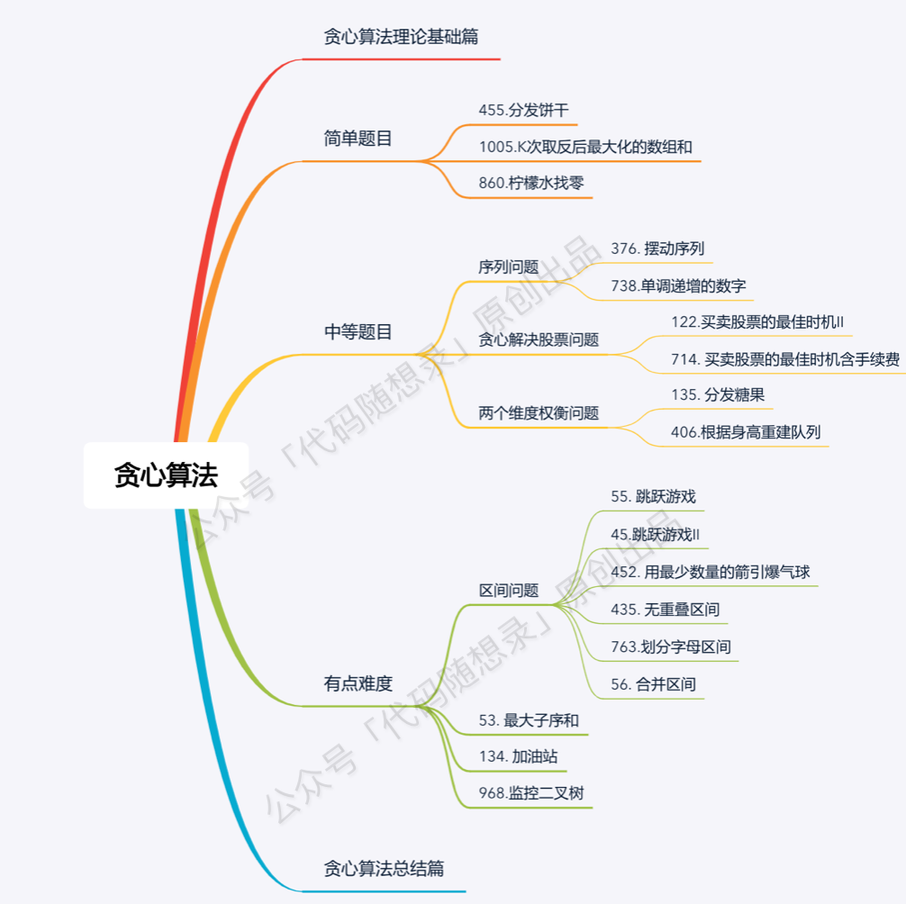

---

我在PDF中也详细讲解了⼤家对贪⼼常有的疑惑，例如：
1. 贪⼼很简单，就是常识？
跟着⼀起刷题的录友们就会发现，贪⼼思路往往很巧妙，并不简单。
2. 贪⼼有没有固定的套路？
贪⼼⽆套路，也没有框架之类的，需要多看多练培养感觉才能想到贪⼼的思路。
3. 究竟什么题⽬是贪⼼呢？
Carl个⼈认为：如果找出局部最优并可以推出全局最优，就是贪⼼，如果局部最优都没找出
来，就不是贪⼼，可能是单纯的模拟。（并不是权威解读，⼀家之辞哈）
但我们也不⽤过于强调什么题⽬是贪⼼，什么不是贪⼼，那就太学术了，毕竟学会解题就⾏
了。
4. 如何知道局部最优推出全局最优，有数学证明么？没有数学证明感觉不靠谱？
在做贪⼼题的过程中，如果再来⼀个数据证明，其实没有必要！⼿动模拟⼀下，如果找不出
反例，就试试贪⼼。⾯试中，代码写出来跑过测试⽤例即可，或者⾃⼰能⾃圆其说理由就⾏
了。
在对于贪⼼问题，很多同学是两个极端：左极端，右极端。
左极端：就是遇到问题就要数学证明，没有数学证明就感觉不靠谱，但⾃⼰最终花费了⼤量
的时间还是证明不出来。
右极端：贪⼼很简单，就是常识，很⾃然就是这么做，但⼀些题⽬⼀旦超出常识的思考范围
了，就毫⽆思路了。
⽽Carl在讲解贪⼼的时候，既有简单适当的证明（每篇⽂章都⽤了反证法），也把常识性的
知识理论化，系统化（局部最优、全局最优的分析）。
说了这么多，还是眼见为⽌，⼤家开始学习贪⼼算法吧！

---

关于贪⼼算法，你该了解这些！
 
什么是贪⼼
 
贪⼼的本质是选择每⼀阶段的局部最优，从⽽达到全局最优。
这么说有点抽象，来举⼀个例⼦：
例如，有⼀堆钞票，你可以拿⾛⼗张，如果想达到最⼤的⾦额，你要怎么拿？
指定每次拿最⼤的，最终结果就是拿⾛最⼤数额的钱。
每次拿最⼤的就是局部最优，最后拿⾛最⼤数额的钱就是推出全局最优。
再举⼀个例⼦如果是 有⼀堆盒⼦，你有⼀个背包体积为n，如何把背包尽可能装满，如果还
每次选最⼤的盒⼦，就不⾏了。这时候就需要动态规划。动态规划的问题在下⼀个系列会详
细讲解。
贪⼼的套路（什么时候⽤贪⼼）
 
很多同学做贪⼼的题⽬的时候，想不出来是贪⼼，想知道有没有什么套路可以⼀看就看出来
是贪⼼。
说实话贪⼼算法并没有固定的套路。
所以唯⼀的难点就是如何通过局部最优，推出整体最优。
那么如何能看出局部最优是否能推出整体最优呢？有没有什么固定策略或者套路呢？
不好意思，也没有！ 靠⾃⼰⼿动模拟，如果模拟可⾏，就可以试⼀试贪⼼策略，如果不可
⾏，可能需要动态规划。
有同学问了如何验证可不可以⽤贪⼼算法呢？
最好⽤的策略就是举反例，如果想不到反例，那么就试⼀试贪⼼吧。

---

可有有同学认为⼿动模拟，举例⼦得出的结论不靠谱，想要严格的数学证明。
⼀般数学证明有如下两种⽅法：
数学归纳法
反证法
看教课书上讲解贪⼼可以是⼀堆公式，估计⼤家连看都不想看，所以数学证明就不在我要讲
解的范围内了，⼤家感兴趣可以⾃⾏查找资料。
⾯试中基本不会让⾯试者现场证明贪⼼的合理性，代码写出来跑过测试⽤例即可，或者⾃⼰
能⾃圆其说理由就⾏了。
举⼀个不太恰当的例⼦：我要⽤⼀下1+1 = 2，但我要先证明1+1 为什么等于2。严谨是严谨
了，但没必要。
虽然这个例⼦很极端，但可以表达这么个意思：刷题或者⾯试的时候，⼿动模拟⼀下感觉可
以局部最优推出整体最优，⽽且想不到反例，那么就试⼀试贪⼼。
例如刚刚举的拿钞票的例⼦，就是模拟⼀下每次拿做⼤的，最后就能拿到最多的钱，这还要
数学证明的话，其实就不在算法⾯试的范围内了，可以看看专业的数学书籍！
所以这也是为什么很多同学通过（accept）了贪⼼的题⽬，但都不知道⾃⼰⽤了贪⼼算法，
因为贪⼼有时候就是常识性的推导，所以会认为本应该就这么做！
那么刷题的时候什么时候真的需要数学推导呢？
例如这道题⽬：链表：环找到了，那⼊⼜呢？，这道题不⽤数学推导⼀下，就找不出环的起
始位置，想试⼀下就不知道怎么试，这种题⽬确实需要数学简单推导⼀下。
贪⼼⼀般解题步骤
 
贪⼼算法⼀般分为如下四步：
将问题分解为若⼲个⼦问题
找出适合的贪⼼策略
求解每⼀个⼦问题的最优解
将局部最优解堆叠成全局最优解

---

其实这个分的有点细了，真正做题的时候很难分出这么详细的解题步骤，可能就是因为贪⼼
的题⽬往往还和其他⽅⾯的知识混在⼀起。
总结
 
本篇给出了什么是贪⼼以及⼤家关⼼的贪⼼算法固定套路。
不好意思了，贪⼼没有套路，说⽩了就是常识性推导加上举反例。
最后给出贪⼼的⼀般解题步骤，⼤家可以发现这个解题步骤也是⽐较抽象的，不像是⼆叉
树，回溯算法，给出了那么具体的解题套路和模板。
本篇没有配图，其实可以找⼀些动漫周边或者搞笑的图配⼀配（符合⼤多数公众号⽂章的作
风），但这不是我的风格，所以本篇⽂字描述⾜以！
代码随想录官⽹：www.programmercarl.com
代码随想录开源项⽬Github：https://github.com/youngyangyang04/leetcode-
master
代码随想录算法公开课 ，代码随想录的全部内容将由我（程序员Carl）视频讲解
并开免费开放给⼤家。
《代码随想录》纸质版 已经出版。
代码随想录知识星球 上万录友在这⾥学习
代码随想录算法训练营 帮助录友⾼效刷完代码随想录。
如果感觉PDF对你有帮助，微信搜索：代码随想录，你会发现相见恨晚！

---

贪⼼算法：分发饼⼲
 
455.分发饼⼲
 
题⽬链接：https://leetcode-cn.com/problems/assign-cookies/
假设你是⼀位很棒的家长，想要给你的孩⼦们⼀些⼩饼⼲。但是，每个孩⼦最多只能给⼀块
饼⼲。
对每个孩⼦ i，都有⼀个胃⼜值 g[i]，这是能让孩⼦们满⾜胃⼜的饼⼲的最⼩尺⼨；并且每
块饼⼲ j，都有⼀个尺⼨ s[j] 。如果 s[j] >= g[i]，我们可以将这个饼⼲ j 分配给孩⼦ i ，这个
孩⼦会得到满⾜。你的⽬标是尽可能满⾜越多数量的孩⼦，并输出这个最⼤数值。
⽰例 1:
输⼊: g = [1,2,3], s = [1,1]
输出: 1
解释:
你有三个孩⼦和两块⼩饼⼲，3个孩⼦的胃⼜值分别是：1,2,3。

---

虽然你有两块⼩饼⼲，由于他们的尺⼨都是1，你只能让胃⼜值是1的孩⼦满⾜。
所以你应该输出1。
⽰例 2:
输⼊: g = [1,2], s = [1,2,3]
输出: 2
解释:
你有两个孩⼦和三块⼩饼⼲，2个孩⼦的胃⼜值分别是1,2。
你拥有的饼⼲数量和尺⼨都⾜以让所有孩⼦满⾜。
所以你应该输出2.
提⽰：
1 <= g.length <= 3 * 10^4
0 <= s.length <= 3 * 10^4
1 <= g[i], s[j] <= 2^31 - 1
思路
 
为了了满⾜更多的⼩孩，就不要造成饼⼲尺⼨的浪费。
⼤尺⼨的饼⼲既可以满⾜胃⼜⼤的孩⼦也可以满⾜胃⼜⼩的孩⼦，那么就应该优先满⾜胃⼜
⼤的。
这⾥的局部最优就是⼤饼⼲喂给胃⼜⼤的，充分利⽤饼⼲尺⼨喂饱⼀个，全局最优就是喂饱
尽可能多的⼩孩。
可以尝试使⽤贪⼼策略，先将饼⼲数组和⼩孩数组排序。
然后从后向前遍历⼩孩数组，⽤⼤饼⼲优先满⾜胃⼜⼤的，并统计满⾜⼩孩数量。
如图：

---

这个例⼦可以看出饼⼲9只有喂给胃⼜为7的⼩孩，这样才是整体最优解，并想不出反例，
那么就可以撸代码了。
C++代码整体如下：
// 时间复杂度：O(nlogn)
// 空间复杂度：O(1)
class Solution {
public:
    int findContentChildren(vector<int>& g, vector<int>& s) {
        sort(g.begin(), g.end());
        sort(s.begin(), s.end());
        int index = s.size() - 1; // 饼⼲数组的下表
        int result = 0;
        for (int i = g.size() - 1; i >= 0; i--) {
            if (index >= 0 && s[index] >= g[i]) {
                result++;
                index--;
            }
        }
        return result;
    }
};

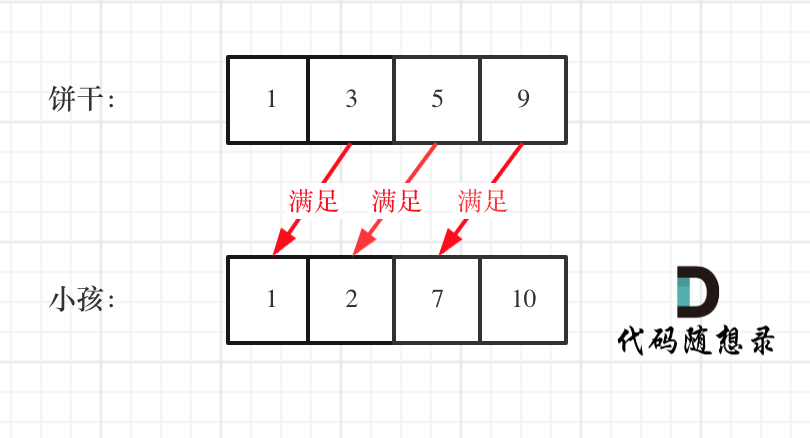

---

从代码中可以看出我⽤了⼀个index来控制饼⼲数组的遍历，遍历饼⼲并没有再起⼀个for循
环，⽽是采⽤⾃减的⽅式，这也是常⽤的技巧。
有的同学看到要遍历两个数组，就想到⽤两个for循环，那样逻辑其实就复杂了。
也可以换⼀个思路，⼩饼⼲先喂饱⼩胃⼜
代码如下：
总结
 
这道题是贪⼼很好的⼀道⼊门题⽬，思路还是⽐较容易想到的。
⽂中详细介绍了思考的过程，想清楚局部最优，想清楚全局最优，感觉局部最优是可以推出
全局最优，并想不出反例，那么就试⼀试贪⼼。
 
贪⼼算法：摆动序列
 
class Solution {
public:
    int findContentChildren(vector<int>& g, vector<int>& s) {
        sort(g.begin(),g.end());
        sort(s.begin(),s.end());
        int index = 0;
        for(int i = 0;i < s.size();++i){
            if(index < g.size() && g[index] <= s[i]){
                index++;
            }
        }
        return index;
    }
};

---

本周讲解了贪⼼理论基础，以及第⼀道贪⼼的题⽬：贪⼼算法：分发饼⼲，可能会
给⼤家⼀种贪⼼算法⽐较简单的错觉，好了，接下来⼏天的题⽬难度要上来了，哈
哈。
376. 摆动序列
 
题⽬链接：https://leetcode-cn.com/problems/wiggle-subsequence/
如果连续数字之间的差严格地在正数和负数之间交替，则数字序列称为摆动序列。第⼀个差
（如果存在的话）可能是正数或负数。少于两个元素的序列也是摆动序列。
例如， [1,7,4,9,2,5] 是⼀个摆动序列，因为差值 (6,-3,5,-7,3) 是正负交替出现的。相反, 
[1,4,7,2,5] 和 [1,7,4,5,5] 不是摆动序列，第⼀个序列是因为它的前两个差值都是正数，第⼆
个序列是因为它的最后⼀个差值为零。
给定⼀个整数序列，返回作为摆动序列的最长⼦序列的长度。 通过从原始序列中删除⼀些
（也可以不删除）元素来获得⼦序列，剩下的元素保持其原始顺序。
⽰例 1:
输⼊: [1,7,4,9,2,5]
输出: 6
解释: 整个序列均为摆动序列。
⽰例 2:
输⼊: [1,17,5,10,13,15,10,5,16,8]
输出: 7
解释: 这个序列包含⼏个长度为 7 摆动序列，其中⼀个可为[1,17,10,13,10,16,8]。
⽰例 3:
输⼊: [1,2,3,4,5,6,7,8,9]
输出: 2
思路
 
本题要求通过从原始序列中删除⼀些（也可以不删除）元素来获得⼦序列，剩下的元素保持
其原始顺序。
相信这么⼀说吓退不少同学，这要求最⼤摆动序列又可以修改数组，这得如何修改呢？

---

来分析⼀下，要求删除元素使其达到最⼤摆动序列，应该删除什么元素呢？
⽤⽰例⼆来举例，如图所⽰：
局部最优：删除单调坡度上的节点（不包括单调坡度两端的节点），那么这个坡度就可以有
两个局部峰值。
整体最优：整个序列有最多的局部峰值，从⽽达到最长摆动序列。
局部最优推出全局最优，并举不出反例，那么试试贪⼼！
（为⽅便表述，以下说的峰值都是指局部峰值）
实际操作上，其实连删除的操作都不⽤做，因为题⽬要求的是最长摆动⼦序列的长度，所以
只需要统计数组的峰值数量就可以了（相当于是删除单⼀坡度上的节点，然后统计长度）
这就是贪⼼所贪的地⽅，让峰值尽可能的保持峰值，然后删除单⼀坡度上的节点。
本题代码实现中，还有⼀些技巧，例如统计峰值的时候，数组最左⾯和最右⾯是最不好统计
的。
例如序列[2,5]，它的峰值数量是2，如果靠统计差值来计算峰值个数就需要考虑数组最左⾯
和最右⾯的特殊情况。
所以可以针对序列[2,5]，可以假设为[2,2,5]，这样它就有坡度了即preDiff = 0，如图：

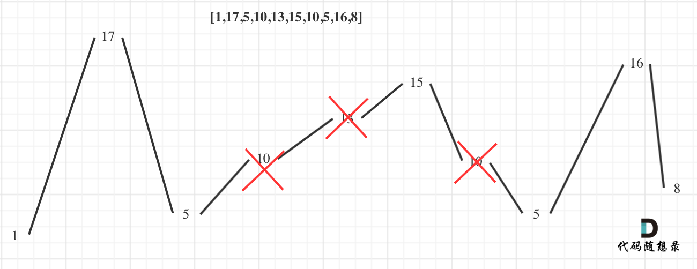

---

针对以上情形，result初始为1（默认最右⾯有⼀个峰值），此时curDiff > 0 && preDiff <= 
0，那么result++（计算了左⾯的峰值），最后得到的result就是2（峰值个数为2即摆动序列
长度为2）
C++代码如下（和上图是对应的逻辑）：
class Solution {
public:
    int wiggleMaxLength(vector<int>& nums) {
        if (nums.size() <= 1) return nums.size();
        int curDiff = 0; // 当前⼀对差值
        int preDiff = 0; // 前⼀对差值
        int result = 1;  // 记录峰值个数，序列默认序列最右边有⼀个峰值
        for (int i = 0; i < nums.size() - 1; i++) {
            curDiff = nums[i + 1] - nums[i];
            // 出现峰值
            if ((curDiff > 0 && preDiff <= 0) || (preDiff >= 0 && 
curDiff < 0)) {
                result++;
                preDiff = curDiff;
            }
        }
        return result;

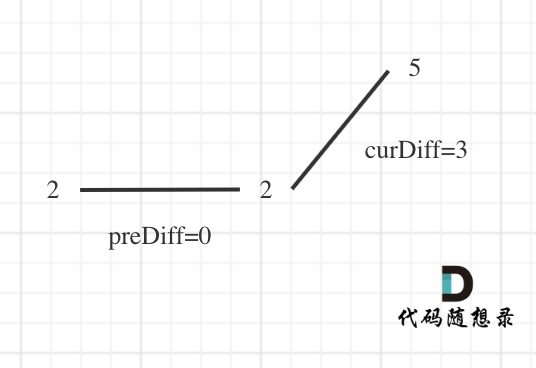

---

时间复杂度O(n)
空间复杂度O(1)
总结
 
贪⼼的题⽬说简单有的时候就是常识，说难就难在都不知道该怎么⽤贪⼼。
本题⼤家如果要去模拟删除元素达到最长摆动⼦序列的过程，那指定绕⾥⾯去了，⼀时半会
拔不出来。
⽽这道题⽬有什么技巧说⼀下⼦能想到贪⼼么？
其实也没有，类似的题⽬做过了就会想到。
此时⼤家就应该了解了：保持区间波动，只需要把单调区间上的元素移除就可以了。
代码随想录官⽹：www.programmercarl.com
代码随想录开源项⽬Github：https://github.com/youngyangyang04/leetcode-
master
代码随想录算法公开课 ，代码随想录的全部内容将由我（程序员Carl）视频讲解
并开免费开放给⼤家。
《代码随想录》纸质版 已经出版。
代码随想录知识星球 上万录友在这⾥学习
代码随想录算法训练营 帮助录友⾼效刷完代码随想录。
如果感觉PDF对你有帮助，微信搜索：代码随想录，你会发现相见恨晚！
    }
};

---

贪⼼算法：最⼤⼦序和
 
53. 最⼤⼦序和
 
题⽬地址：https://leetcode-cn.com/problems/maximum-subarray/
给定⼀个整数数组 nums ，找到⼀个具有最⼤和的连续⼦数组（⼦数组最少包含⼀个元
素），返回其最⼤和。
⽰例:
输⼊: [-2,1,-3,4,-1,2,1,-5,4]
输出: 6
解释: 连续⼦数组 [4,-1,2,1] 的和最⼤，为 6。

---

暴⼒解法
 
暴⼒解法的思路，第⼀层for 就是设置起始位置，第⼆层for循环遍历数组寻找最⼤值
时间复杂度：O(n^2)
空间复杂度：O(1)
以上暴⼒的解法C++勉强可以过，其他语⾔就不确定了。
贪⼼解法
 
贪⼼贪的是哪⾥呢？
如果 -2 1 在⼀起，计算起点的时候，⼀定是从1开始计算，因为负数只会拉低总和，这就是
贪⼼贪的地⽅！
局部最优：当前“连续和”为负数的时候⽴刻放弃，从下⼀个元素重新计算“连续和”，因为负
数加上下⼀个元素 “连续和”只会越来越⼩。
全局最优：选取最⼤“连续和”
class Solution {
public:
    int maxSubArray(vector<int>& nums) {
        int result = INT32_MIN;
        int count = 0;
        for (int i = 0; i < nums.size(); i++) { // 设置起始位置
            count = 0;
            for (int j = i; j < nums.size(); j++) { // 每次从起始位置i开
始遍历寻找最⼤值
                count += nums[j];
                result = count > result ? count : result;
            }
        }
        return result;
    }
};

---

局部最优的情况下，并记录最⼤的“连续和”，可以推出全局最优。
从代码⾓度上来讲：遍历nums，从头开始⽤count累积，如果count⼀旦加上nums[i]变为负
数，那么就应该从nums[i+1]开始从0累积count了，因为已经变为负数的count，只会拖累
总和。
这相当于是暴⼒解法中的不断调整最⼤⼦序和区间的起始位置。
那有同学问了，区间终⽌位置不⽤调整么？ 如何才能得到最⼤“连续和”呢？
区间的终⽌位置，其实就是如果count取到最⼤值了，及时记录下来了。例如如下代码：
这样相当于是⽤result记录最⼤⼦序和区间和（变相的算是调整了终⽌位置）。
如动画所⽰：
if (count > result) result = count;

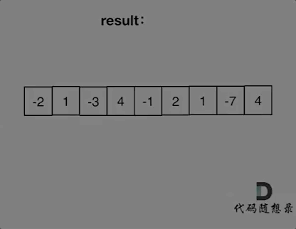

---

红⾊的起始位置就是贪⼼每次取count为正数的时候，开始⼀个区间的统计。
那么不难写出如下C++代码（关键地⽅已经注释）
时间复杂度：O(n)
空间复杂度：O(1)
当然题⽬没有说如果数组为空，应该返回什么，所以数组为空的话返回啥都可以了。
动态规划
当然本题还可以⽤动态规划来做，当前「代码随想录」主要讲解贪⼼系列，后续到动态规划
系列的时候会详细讲解本题的dp⽅法。
那么先给出我的dp代码如下，有时间的录友可以提前做⼀做：
 
class Solution {
public:
    int maxSubArray(vector<int>& nums) {
        int result = INT32_MIN;
        int count = 0;
        for (int i = 0; i < nums.size(); i++) {
            count += nums[i];
            if (count > result) { // 取区间累计的最⼤值（相当于不断确定最⼤⼦
序终⽌位置）
                result = count;
            }
            if (count <= 0) count = 0; // 相当于重置最⼤⼦序起始位置，因为遇
到负数⼀定是拉低总和
        }
        return result;
    }
};
class Solution {
public:
    int maxSubArray(vector<int>& nums) {

---

时间复杂度：O(n)
空间复杂度：O(n)
总结
本题的贪⼼思路其实并不好想，这也进⼀步验证了，别看贪⼼理论很直⽩，有时候看似是常
识，但贪⼼的题⽬⼀点都不简单！
后续将介绍的贪⼼题⽬都挺难的，哈哈，所以贪⼼很有意思，别⼩看贪⼼！
 
本周⼩结！（贪⼼算法系列⼀）
周⼀
本周正式开始了贪⼼算法，在关于贪⼼算法，你该了解这些！中，我们介绍了什么是贪⼼以
及贪⼼的套路。
贪⼼的本质是选择每⼀阶段的局部最优，从⽽达到全局最优。
 
 
 
        if (nums.size() == 0) return 0;
        vector<int> dp(nums.size(), 0); // dp[i]表示包括i之前的最⼤连续⼦序
列和
        dp[0] = nums[0];
        int result = dp[0];
        for (int i = 1; i < nums.size(); i++) {
            dp[i] = max(dp[i - 1] + nums[i], nums[i]); // 状态转移公式
            if (dp[i] > result) result = dp[i]; // result 保存dp[i]的最⼤
值
        }
        return result;
    }
};

---

有没有啥套路呢？
不好意思，贪⼼没套路，就刷题⽽⾔，如果感觉好像局部最优可以推出全局最优，然后想不
到反例，那就试⼀试贪⼼吧！
⽽严格的数据证明⼀般有如下两种：
数学就不在讲解范围内了，感兴趣的同学可以⾃⼰去查⼀查资料。
正式因为贪⼼算法有时候会感觉这是常识，本就应该这么做！ 所以⼤家经常看到⽹上有⼈说
这是⼀道贪⼼题⽬，有⼈是这不是。
这⾥说⼀下我的依据：如果找到局部最优，然后推出整体最优，那么就是贪⼼，⼤家可以参
考哈。
周⼆
在贪⼼算法：分发饼⼲中讲解了贪⼼算法的第⼀道题⽬。
这道题⽬很明显能看出来是⽤贪⼼，也是⼊门好题。
我在⽂中给出局部最优：⼤饼⼲喂给胃⼜⼤的，充分利⽤饼⼲尺⼨喂饱⼀个，全局最优：喂
饱尽可能多的⼩孩。
很多录友都是⽤⼩饼⼲优先先喂饱⼩胃⼜的。
后来我想⼀想，虽然结果是⼀样的，但是⼤家的这个思考⽅式更好⼀些。
因为⽤⼩饼⼲优先喂饱⼩胃⼜的 这样可以尽量保证最后省下来的是⼤饼⼲（虽然题⽬没有这
个要求）！
所有还是⼩饼⼲优先先喂饱⼩胃⼜更好⼀些，也⽐较直观。
⼀些录友不清楚贪⼼算法：分发饼⼲中时间复杂度是怎么来的？
数学归纳法
反证法

---

就是快排O(nlogn)，遍历O(n)，加⼀起就是还是O(nlogn)。
周三
接下来就要上⼀点难度了，要不然⼤家会误以为贪⼼算法就是常识判断⼀下就⾏了。
在贪⼼算法：摆动序列中，需要计算最长摇摆序列。
其实就是让序列有尽可能多的局部峰值。
局部最优：删除单调坡度上的节点（不包括单调坡度两端的节点），那么这个坡度就可以有
两个局部峰值。
整体最优：整个序列有最多的局部峰值，从⽽达到最长摆动序列。
在计算峰值的时候，还是有⼀些代码技巧的，例如序列两端的峰值如何处理。
这些技巧，其实还是要多看多⽤才会掌握。
周四
在贪⼼算法：最⼤⼦序和中，详细讲解了⽤贪⼼的⽅式来求最⼤⼦序列和，其实这道题⽬是
⼀道动态规划的题⽬。
贪⼼的思路为局部最优：当前“连续和”为负数的时候⽴刻放弃，从下⼀个元素重新计算“连续
和”，因为负数加上下⼀个元素 “连续和”只会越来越⼩。从⽽推出全局最优：选取最⼤“连续
和”
代码很简单，但是思路却⽐较难。还需要反复琢磨。
针对贪⼼算法：最⼤⼦序和⽂章中给出的贪⼼代码如下；
 
 
class Solution {
public:
    int maxSubArray(vector<int>& nums) {
        int result = INT32_MIN;
        int count = 0;
        for (int i = 0; i < nums.size(); i++) {

---

不少同学都来问，如果数组全是负数这个代码就有问题了，如果数组⾥有int最⼩值这个代码
就有问题了。
⼤家不要脑洞模拟哈，可以亲⾃构造⼀些测试数据试⼀试，就发现其实没有问题。
数组都为负数，result记录的就是最⼩的负数，如果数组⾥有int最⼩值，那么最终result就是
int最⼩值。
总结
本周我们讲解了贪⼼算法的理论基础，了解了贪⼼本质：局部最优推出全局最优。
然后讲解了第⼀道题⽬分发饼⼲，还是⽐较基础的，可能会给⼤家⼀种贪⼼算法⽐较简单的
错觉，因为贪⼼有时候接近于常识。
其实我还准备⼀些简单的贪⼼题⽬，甚⾄⽹上很多都质疑这些题⽬是不是贪⼼算法。这些题
⽬我没有⽴刻发出来，因为真的会让⼤家感觉贪⼼过于简单，⽽忽略了贪⼼的本质：局部最
优和全局最优两个关键点。
所以我在贪⼼系列难度会有所交替，难的题⽬在于拓展思路，简单的题⽬在于分析清楚其贪
⼼的本质，后续我还会发⼀些简单的题⽬来做贪⼼的分析。
在摆动序列中⼤家就初步感受到贪⼼没那么简单了。
 
            count += nums[i];
            if (count > result) { // 取区间累计的最⼤值（相当于不断确定最⼤⼦
序终⽌位置）
                result = count;
            }
            if (count <= 0) count = 0; // 相当于重置最⼤⼦序起始位置，因为遇
到负数⼀定是拉低总和
        }
        return result;
    }
};

---

本周最后是最⼤⼦序和，这道题⽬要⽤贪⼼的⽅式做出来，就⽐较有难度，都知道负数加上
正数之后会变⼩，但是这道题⽬依然会让很多⼈搞混淆，其关键在于：不能让“连续和”为负
数的时候加上下⼀个元素，⽽不是 不让“连续和”加上⼀个负数。这块真的需要仔细体会！
 
贪⼼算法：买卖股票的最佳时机II
122.买卖股票的最佳时机II
题⽬链接：https://leetcode-cn.com/problems/best-time-to-buy-and-sell-stock-ii/
给定⼀个数组，它的第 i 个元素是⼀⽀给定股票第 i 天的价格。
设计⼀个算法来计算你所能获取的最⼤利润。你可以尽可能地完成更多的交易（多次买卖⼀
⽀股票）。
注意：你不能同时参与多笔交易（你必须在再次购买前出售掉之前的股票）。
⽰例 1:
输⼊: [7,1,5,3,6,4]
输出: 7
解释: 在第 2 天（股票价格 = 1）的时候买⼊，在第 3 天（股票价格 = 5）的时候卖出, 这笔交
易所能获得利润 = 5-1 = 4。随后，在第 4 天（股票价格 = 3）的时候买⼊，在第 5 天（股票价
格 = 6）的时候卖出, 这笔交易所能获得利润 = 6-3 = 3 。
⽰例 2:
输⼊: [1,2,3,4,5]
输出: 4
解释: 在第 1 天（股票价格 = 1）的时候买⼊，在第 5 天 （股票价格 = 5）的时候卖出, 这笔交
易所能获得利润 = 5-1 = 4 。注意你不能在第 1 天和第 2 天接连购买股票，之后再将它们卖
出。因为这样属于同时参与了多笔交易，你必须在再次购买前出售掉之前的股票。

---

⽰例 3:
输⼊: [7,6,4,3,1]
输出: 0
解释: 在这种情况下, 没有交易完成, 所以最⼤利润为 0。
提⽰：
思路
本题⾸先要清楚两点：
想获得利润⾄少要两天为⼀个交易单元。
贪⼼算法
这道题⽬可能我们只会想，选⼀个低的买⼊，在选个⾼的卖，在选⼀个低的买⼊.....循环反
复。
如果想到其实最终利润是可以分解的，那么本题就很容易了！
如果分解呢？
假如第0天买⼊，第3天卖出，那么利润为：prices[3] - prices[0]。
相当于(prices[3] - prices[2]) + (prices[2] - prices[1]) + (prices[1] - prices[0])。
此时就是把利润分解为每天为单位的维度，⽽不是从0天到第3天整体去考虑！
那么根据prices可以得到每天的利润序列：(prices[i] - prices[i - 1]).....(prices[1] - prices[0])。
如图：
1 <= prices.length <= 3 * 10 ^ 4
0 <= prices[i] <= 10 ^ 4
 
只有⼀只股票！
当前只有买股票或者买股票的操作

---

⼀些同学陷⼊：第⼀天怎么就没有利润呢，第⼀天到底算不算的困惑中。
第⼀天当然没有利润，⾄少要第⼆天才会有利润，所以利润的序列⽐股票序列少⼀天！
从图中可以发现，其实我们需要收集每天的正利润就可以，收集正利润的区间，就是股票买
卖的区间，⽽我们只需要关注最终利润，不需要记录区间。
那么只收集正利润就是贪⼼所贪的地⽅！
局部最优：收集每天的正利润，全局最优：求得最⼤利润。
局部最优可以推出全局最优，找不出反例，试⼀试贪⼼！
对应C++代码如下：

---

动态规划
动态规划将在下⼀个系列详细讲解，本题解先给出我的C++代码（带详细注释），感兴趣的同
学可以⾃⼰先学习⼀下。
时间复杂度O(n)
空间复杂度O(1)
 
class Solution {
public:
    int maxProfit(vector<int>& prices) {
        int result = 0;
        for (int i = 1; i < prices.size(); i++) {
            result += max(prices[i] - prices[i - 1], 0);
        }
        return result;
    }
};
class Solution {
public:
    int maxProfit(vector<int>& prices) {
        // dp[i][1]第i天持有的最多现⾦
        // dp[i][0]第i天持有股票后的最多现⾦
        int n = prices.size();
        vector<vector<int>> dp(n, vector<int>(2, 0));
        dp[0][0] -= prices[0]; // 持股票
        for (int i = 1; i < n; i++) {
            // 第i天持股票所剩最多现⾦ = max(第i-1天持股票所剩现⾦, 第i-1天持现
⾦-买第i天的股票)
            dp[i][0] = max(dp[i - 1][0], dp[i - 1][1] - prices[i]);
            // 第i天持有最多现⾦ = max(第i-1天持有的最多现⾦，第i-1天持有股票的
最多现⾦+第i天卖出股票)
            dp[i][1] = max(dp[i - 1][1], dp[i - 1][0] + prices[i]);
        }
        return max(dp[n - 1][0], dp[n - 1][1]);
    }

---

总结
股票问题其实是⼀个系列的，属于动态规划的范畴，因为⽬前在讲解贪⼼系列，所以股票问
题会在之后的动态规划系列中详细讲解。
可以看出有时候，贪⼼往往⽐动态规划更巧妙，更好⽤，所以别⼩看了贪⼼算法。
本题中理解利润拆分是关键点！ 不要整块的去看，⽽是把整体利润拆为每天的利润。
⼀旦想到这⾥了，很⾃然就会想到贪⼼了，即：只收集每天的正利润，最后稳稳的就是最⼤
利润了。
贪⼼算法：跳跃游戏
55. 跳跃游戏
题⽬链接：https://leetcode-cn.com/problems/jump-game/
给定⼀个⾮负整数数组，你最初位于数组的第⼀个位置。
数组中的每个元素代表你在该位置可以跳跃的最⼤长度。
判断你是否能够到达最后⼀个位置。
⽰例 1:
输⼊: [2,3,1,1,4]
输出: true
解释: 我们可以先跳 1 步，从位置 0 到达 位置 1, 然后再从位置 1 跳 3 步到达最后⼀个位置。
时间复杂度O(n)
空间复杂度O(n)
 
 
 
};

---

⽰例 2:
输⼊: [3,2,1,0,4]
输出: false
解释: ⽆论怎样，你总会到达索引为 3 的位置。但该位置的最⼤跳跃长度是 0 ， 所以你永远不
可能到达最后⼀个位置。
思路
刚看到本题⼀开始可能想：当前位置元素如果是3，我究竟是跳⼀步呢，还是两步呢，还是三
步呢，究竟跳⼏步才是最优呢？
其实跳⼏步⽆所谓，关键在于可跳的覆盖范围！
不⼀定⾮要明确⼀次究竟跳⼏步，每次取最⼤的跳跃步数，这个就是可以跳跃的覆盖范围。
这个范围内，别管是怎么跳的，反正⼀定可以跳过来。
那么这个问题就转化为跳跃覆盖范围究竟可不可以覆盖到终点！
每次移动取最⼤跳跃步数（得到最⼤的覆盖范围），每移动⼀个单位，就更新最⼤覆盖范
围。
贪⼼算法局部最优解：每次取最⼤跳跃步数（取最⼤覆盖范围），整体最优解：最后得到整
体最⼤覆盖范围，看是否能到终点。
局部最优推出全局最优，找不出反例，试试贪⼼！
如图：

---

i每次移动只能在cover的范围内移动，每移动⼀个元素，cover得到该元素数值（新的覆盖范
围）的补充，让i继续移动下去。
⽽cover每次只取 max(该元素数值补充后的范围, cover本⾝范围)。
如果cover⼤于等于了终点下标，直接return true就可以了。
C++代码如下：
class Solution {
public:
    bool canJump(vector<int>& nums) {
        int cover = 0;
        if (nums.size() == 1) return true; // 只有⼀个元素，就是能达到
        for (int i = 0; i <= cover; i++) { // 注意这⾥是⼩于等于cover
            cover = max(i + nums[i], cover);
            if (cover >= nums.size() - 1) return true; // 说明可以覆盖到终
点了
        }
        return false;
    }
};

---

总结
这道题⽬关键点在于：不⽤拘泥于每次究竟跳跳⼏步，⽽是看覆盖范围，覆盖范围内⼀定是
可以跳过来的，不⽤管是怎么跳的。
⼤家可以看出思路想出来了，代码还是⾮常简单的。
⼀些同学可能感觉，我在讲贪⼼系列的时候，题⽬和题⽬之间貌似没有什么联系？
是真的就是没什么联系，因为贪⼼⽆套路！没有个整体的贪⼼框架解决⼀些列问题，只能是
接触各种类型的题⽬锻炼⾃⼰的贪⼼思维！
如果感觉PDF对你有帮助，微信搜索：代码随想录，你会发现相见恨晚！
 
 
代码随想录官⽹：www.programmercarl.com
代码随想录开源项⽬Github：https://github.com/youngyangyang04/leetcode-
master
代码随想录算法公开课 ，代码随想录的全部内容将由我（程序员Carl）视频讲解并
开免费开放给⼤家。
《代码随想录》纸质版 已经出版。
代码随想录知识星球 上万录友在这⾥学习
代码随想录算法训练营 帮助录友⾼效刷完代码随想录。

---

贪⼼算法：跳跃游戏II
相对于贪⼼算法：跳跃游戏难了不少，做好⼼⾥准备！
45.跳跃游戏II
题⽬地址：https://leetcode-cn.com/problems/jump-game-ii/
给定⼀个⾮负整数数组，你最初位于数组的第⼀个位置。
数组中的每个元素代表你在该位置可以跳跃的最⼤长度。
你的⽬标是使⽤最少的跳跃次数到达数组的最后⼀个位置。
⽰例:
输⼊: [2,3,1,1,4]
输出: 2
解释: 跳到最后⼀个位置的最⼩跳跃数是 2。从下标为 0 跳到下标为 1 的位置，跳 1 步，然后
跳 3 步到达数组的最后⼀个位置。
说明:
假设你总是可以到达数组的最后⼀个位置。
思路
本题相对于贪⼼算法：跳跃游戏还是难了不少。
但思路是相似的，还是要看最⼤覆盖范围。
本题要计算最⼩步数，那么就要想清楚什么时候步数才⼀定要加⼀呢？
贪⼼的思路，局部最优：当前可移动距离尽可能多⾛，如果还没到终点，步数再加⼀。整体
最优：⼀步尽可能多⾛，从⽽达到最⼩步数。
思路虽然是这样，但在写代码的时候还不能真的就能跳多远跳远，那样就不知道下⼀步最远
能跳到哪⾥了。

---

所以真正解题的时候，要从覆盖范围出发，不管怎么跳，覆盖范围内⼀定是可以跳到的，以
最⼩的步数增加覆盖范围，覆盖范围⼀旦覆盖了终点，得到的就是最⼩步数！
这⾥需要统计两个覆盖范围，当前这⼀步的最⼤覆盖和下⼀步最⼤覆盖。
如果移动下标达到了当前这⼀步的最⼤覆盖最远距离了，还没有到终点的话，那么就必须再
⾛⼀步来增加覆盖范围，直到覆盖范围覆盖了终点。
如图：

---

图中覆盖范围的意义在于，只要红⾊的区域，最多两步⼀定可以到！（不⽤管具体怎么跳，
反正⼀定可以跳到）
⽅法⼀
从图中可以看出来，就是移动下标达到了当前覆盖的最远距离下标时，步数就要加⼀，来增
加覆盖距离。最后的步数就是最少步数。
这⾥还是有个特殊情况需要考虑，当移动下标达到了当前覆盖的最远距离下标时
C++代码如下：（详细注释）
 
如果当前覆盖最远距离下标不是是集合终点，步数就加⼀，还需要继续⾛。
如果当前覆盖最远距离下标就是是集合终点，步数不⽤加⼀，因为不能再往后⾛
了。
// 版本⼀
class Solution {
public:
    int jump(vector<int>& nums) {
        if (nums.size() == 1) return 0;
        int curDistance = 0;    // 当前覆盖最远距离下标
        int ans = 0;            // 记录⾛的最⼤步数
        int nextDistance = 0;   // 下⼀步覆盖最远距离下标
        for (int i = 0; i < nums.size(); i++) {
            nextDistance = max(nums[i] + i, nextDistance);  // 更新下⼀步
覆盖最远距离下标
            if (i == curDistance) {                         // 遇到当前覆
盖最远距离下标
                if (curDistance != nums.size() - 1) {       // 如果当前覆
盖最远距离下标不是终点
                    ans++;                                  // 需要⾛下⼀
步
                    curDistance = nextDistance;             // 更新当前覆
盖最远距离下标（相当于加油了）
                    if (nextDistance >= nums.size() - 1) break; // 下⼀
步的覆盖范围已经可以达到终点，结束循环

---

⽅法⼆
依然是贪⼼，思路和⽅法⼀差不多，代码可以简洁⼀些。
针对于⽅法⼀的特殊情况，可以统⼀处理，即：移动下标只要遇到当前覆盖最远距离的下
标，直接步数加⼀，不考虑是不是终点的情况。
想要达到这样的效果，只要让移动下标，最⼤只能移动到nums.size - 2的地⽅就可以了。
因为当移动下标指向nums.size - 2时：
 
如果移动下标等于当前覆盖最⼤距离下标， 需要再⾛⼀步（即ans++），因为最后⼀
步⼀定是可以到的终点。（题⽬假设总是可以到达数组的最后⼀个位置），如图：
                } else break;                               // 当前覆盖最
远距离下标是集合终点，不⽤做ans++操作了，直接结束
            }
        }
        return ans;
    }
};

---

如果移动下标不等于当前覆盖最⼤距离下标，说明当前覆盖最远距离就可以直接达
到终点了，不需要再⾛⼀步。如图：

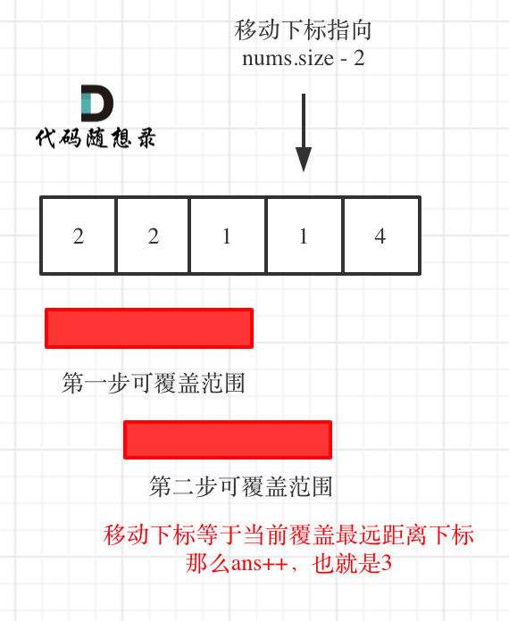

---

代码如下：
// 版本⼆
class Solution {
public:
    int jump(vector<int>& nums) {
        int curDistance = 0;    // 当前覆盖的最远距离下标
        int ans = 0;            // 记录⾛的最⼤步数

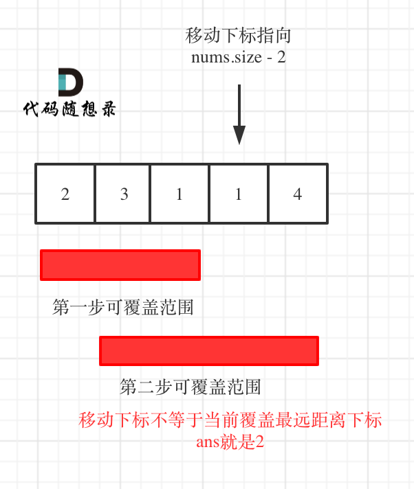

---

可以看出版本⼆的代码相对于版本⼀简化了不少！
其精髓在于控制移动下标i只移动到nums.size() - 2的位置，所以移动下标只要遇到当前覆盖最
远距离的下标，直接步数加⼀，不⽤考虑别的了。
总结
相信⼤家可以发现，这道题⽬相当于贪⼼算法：跳跃游戏难了不⽌⼀点。
但代码又⼗分简单，贪⼼就是这么巧妙。
理解本题的关键在于：以最⼩的步数增加最⼤的覆盖范围，直到覆盖范围覆盖了终点，这个
范围内最⼩步数⼀定可以跳到，不⽤管具体是怎么跳的，不纠结于⼀步究竟跳⼀个单位还是
两个单位。
 
贪⼼算法：K次取反后最⼤化的数组和
 
 
        int nextDistance = 0;   // 下⼀步覆盖的最远距离下标
        for (int i = 0; i < nums.size() - 1; i++) { // 注意这⾥是⼩于
nums.size() - 1，这是关键所在
            nextDistance = max(nums[i] + i, nextDistance); // 更新下⼀步
覆盖的最远距离下标
            if (i == curDistance) {                 // 遇到当前覆盖的最远
距离下标
                curDistance = nextDistance;         // 更新当前覆盖的最远
距离下标
                ans++;
            }
        }
        return ans;
    }
};

---

1005.K次取反后最⼤化的数组和
题⽬地址：https://leetcode-cn.com/problems/maximize-sum-of-array-after-k-negations/
给定⼀个整数数组 A，我们只能⽤以下⽅法修改该数组：我们选择某个索引 i 并将 A[i] 替换为 
-A[i]，然后总共重复这个过程 K 次。（我们可以多次选择同⼀个索引 i。）
以这种⽅式修改数组后，返回数组可能的最⼤和。
⽰例 1：
输⼊：A = [4,2,3], K = 1
输出：5
解释：选择索引 (1,) ，然后 A 变为 [4,-2,3]。
⽰例 2：
输⼊：A = [3,-1,0,2], K = 3
输出：6
解释：选择索引 (1, 2, 2) ，然后 A 变为 [3,1,0,2]。
⽰例 3：
输⼊：A = [2,-3,-1,5,-4], K = 2
输出：13
解释：选择索引 (1, 4) ，然后 A 变为 [2,3,-1,5,4]。
提⽰：
思路
本题思路其实⽐较好想了，如何可以让数组和最⼤呢？
贪⼼的思路，局部最优：让绝对值⼤的负数变为正数，当前数值达到最⼤，整体最优：整个
数组和达到最⼤。
局部最优可以推出全局最优。
 
1 <= A.length <= 10000
1 <= K <= 10000
-100 <= A[i] <= 100

---

那么如果将负数都转变为正数了，K依然⼤于0，此时的问题是⼀个有序正整数序列，如何转
变K次正负，让 数组和 达到最⼤。
那么又是⼀个贪⼼：局部最优：只找数值最⼩的正整数进⾏反转，当前数值可以达到最⼤
（例如正整数数组{5, 3, 1}，反转1 得到-1 ⽐ 反转5得到的-5 ⼤多了），全局最优：整个 数组
和 达到最⼤。
虽然这道题⽬⼤家做的时候，可能都不会去想什么贪⼼算法，⼀⿎作⽓，就AC了。
我这⾥其实是为了给⼤家展现出来 经常被⼤家忽略的贪⼼思路，这么⼀道简单题，就⽤了两
次贪⼼！
那么本题的解题步骤为：
对应C++代码如下：
第⼀步：将数组按照绝对值⼤⼩从⼤到⼩排序，注意要按照绝对值的⼤⼩
第⼆步：从前向后遍历，遇到负数将其变为正数，同时K--
第三步：如果K还⼤于0，那么反复转变数值最⼩的元素，将K⽤完
第四步：求和
class Solution {
static bool cmp(int a, int b) {
    return abs(a) > abs(b);
}
public:
    int largestSumAfterKNegations(vector<int>& A, int K) {
        sort(A.begin(), A.end(), cmp);       // 第⼀步
        for (int i = 0; i < A.size(); i++) { // 第⼆步
            if (A[i] < 0 && K > 0) {
                A[i] *= -1;
                K--;
            }
        }
        if (K % 2 == 1) A[A.size() - 1] *= -1; // 第三步
        int result = 0;
        for (int a : A) result += a;        // 第四步
        return result;
    }

---

总结
贪⼼的题⽬如果简单起来，会让⼈简单到开始怀疑：本来不就应该这么做么？这也算是算
法？我认为这不是贪⼼？
本题其实很简单，不会贪⼼算法的同学都可以做出来，但是我还是全程⽤贪⼼的思路来讲
解。
因为贪⼼的思考⽅式⼀定要有！
如果没有贪⼼的思考⽅式（局部最优，全局最优），很容易陷⼊贪⼼简单题凭感觉做，贪⼼
难题直接不会做，其实这样就锻炼不了贪⼼的思考⽅式了。
所以明知道是贪⼼简单题，也要靠贪⼼的思考⽅式来解题，这样对培养解题感觉很有帮助。
如果感觉PDF对你有帮助，微信搜索：代码随想录，你会发现相见恨晚！
 
代码随想录官⽹：www.programmercarl.com
代码随想录开源项⽬Github：https://github.com/youngyangyang04/leetcode-
master
代码随想录算法公开课 ，代码随想录的全部内容将由我（程序员Carl）视频讲解并
开免费开放给⼤家。
《代码随想录》纸质版 已经出版。
代码随想录知识星球 上万录友在这⾥学习
代码随想录算法训练营 帮助录友⾼效刷完代码随想录。
};

---

本周⼩结！（贪⼼算法系列⼆）
周⼀
⼀说到股票问题，⼀般都会想到动态规划，其实有时候贪⼼更有效！
在贪⼼算法：买卖股票的最佳时机II中，讲到只能多次买卖⼀⽀股票，如何获取最⼤利润。
这道题⽬理解利润拆分是关键点！ 不要整块的去看，⽽是把整体利润拆为每天的利润，就很
容易想到贪⼼了。
局部最优：只收集每天的正利润，全局最优：得到最⼤利润。
如果正利润连续上了，相当于连续持有股票，⽽本题并不需要计算具体的区间。
如图：

---

周⼆
在贪⼼算法：跳跃游戏中是给你⼀个数组看能否跳到终点。
本题贪⼼的关键是：不⽤拘泥于每次究竟跳⼏步，⽽是看覆盖范围，覆盖范围内⼀定是可以
跳过来的，不⽤管是怎么跳的。
那么这个问题就转化为跳跃覆盖范围究竟可不可以覆盖到终点！
贪⼼算法局部最优解：移动下标每次取最⼤跳跃步数（取最⼤覆盖范围），整体最优解：最
后得到整体最⼤覆盖范围，看是否能到终点
如果覆盖范围覆盖到了终点，就表⽰⼀定可以跳过去。
如图：

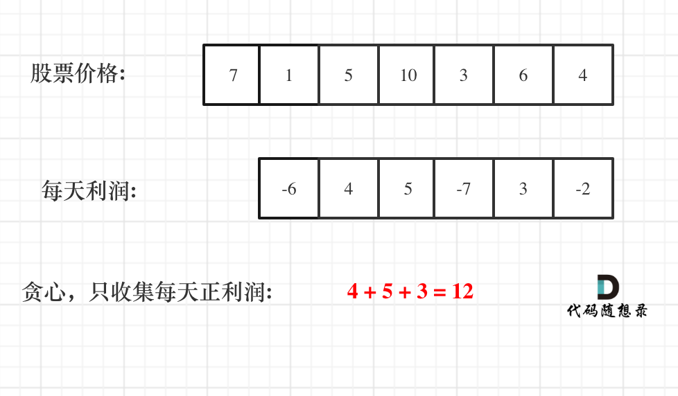

---

周三
这道题⽬：贪⼼算法：跳跃游戏II可就有点难了。
本题解题关键在于：以最⼩的步数增加最⼤的覆盖范围，直到覆盖范围覆盖了终点。
那么局部最优：求当前这步的最⼤覆盖，那么尽可能多⾛，到达覆盖范围的终点，只需要⼀
步。整体最优：达到终点，步数最少。
如图：

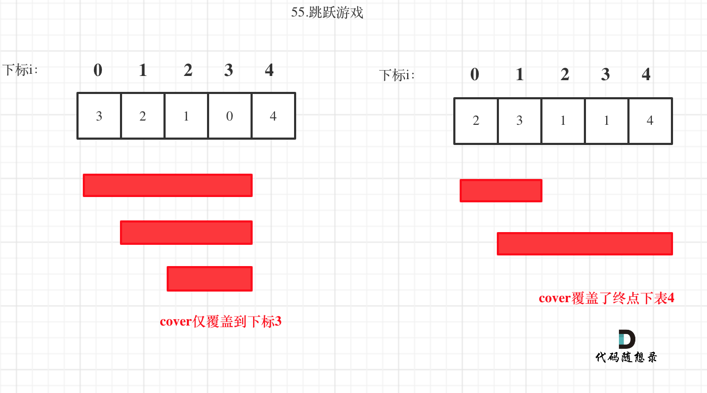

---

注意：图中的移动下标是到当前这步覆盖的最远距离（下标2的位置），此时没有到终点，只
能增加第⼆步来扩⼤覆盖范围。
在贪⼼算法：跳跃游戏II中我给出了两个版本的代码。
其实本质都是超过当前覆盖范围，步数就加⼀，但版本⼀需要考虑当前覆盖最远距离下标是
不是数组终点的情况。
⽽版本⼆就⽐较统⼀的，超过范围，步数就加⼀，但在移动下标的范围了做了⽂章。

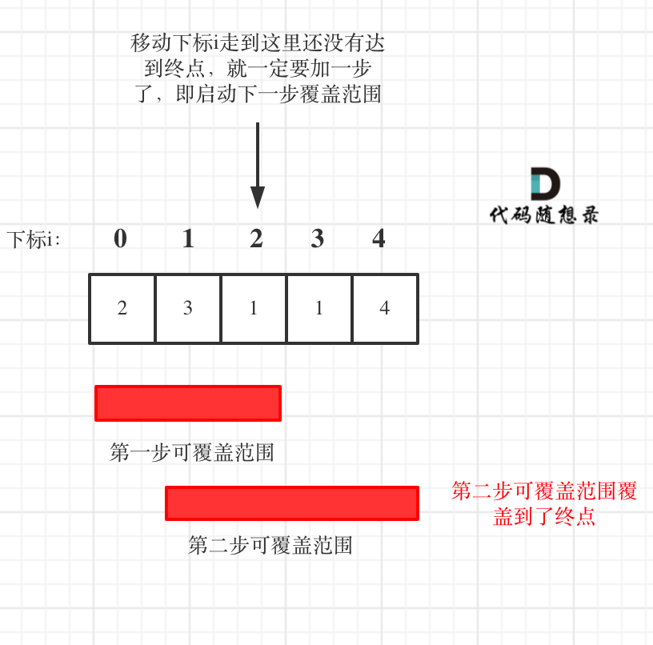

---

即如果覆盖最远距离下标是倒数第⼆点：直接加⼀就⾏，默认⼀定可以到终点。如图：

---

如果覆盖最远距离下标不是倒数第⼆点，说明本次覆盖已经到终点了。如图：
有的录友认为版本⼀好理解，有的录友认为版本⼆好理解，其实掌握⼀种就可以了，也不⽤
⾮要⽐拼⼀下代码的简洁性，简洁程度都差不多了。
我个⼈倾向于版本⼀的写法，思路清晰⼀点，版本⼆会有点绕。

---

周四
这道题⽬：贪⼼算法：K次取反后最⼤化的数组和就⽐较简单了，哈哈，⽤简单题来讲⼀讲贪
⼼的思想。
这⾥其实⽤了两次贪⼼！
第⼀次贪⼼：局部最优：让绝对值⼤的负数变为正数，当前数值达到最⼤，整体最优：整个
数组和达到最⼤。
处理之后，如果K依然⼤于0，此时的问题是⼀个有序正整数序列，如何转变K次正负，让 数
组和 达到最⼤。
第⼆次贪⼼：局部最优：只找数值最⼩的正整数进⾏反转，当前数值可以达到最⼤（例如正
整数数组{5, 3, 1}，反转1 得到-1 ⽐ 反转5得到的-5 ⼤多了），全局最优：整个 数组和 达到最
⼤。
贪⼼算法：K次取反后最⼤化的数组和中的代码，最后while处理K的时候，其实直接判断奇偶
数就可以了，⽂中给出的⽅式太粗暴了，哈哈，Carl⼤意了。
例外⼀位录友留⾔给出⼀个很好的建议，因为⽂中是使⽤快排，仔细看题，题⽬中限定了数
据范围是正负⼀百，所以可以使⽤桶排序，这样时间复杂度就可以优化为O(n)了。但可能代
码要复杂⼀些了。
总结
⼤家会发现本周的代码其实都简单，但思路却很巧妙，并不容易写出来。
如果是第⼀次接触的话，其实很难想出来，就是接触过之后就会了，所以⼤家不⽤感觉⾃⼰
想不出来⽽烦躁，哈哈。
相信此时⼤家现在对贪⼼算法又有⼀个新的认识了，加油!

---

贪⼼算法：加油站
134. 加油站
题⽬链接：https://leetcode-cn.com/problems/gas-station/
在⼀条环路上有 N 个加油站，其中第 i 个加油站有汽油 gas[i] 升。
你有⼀辆油箱容量⽆限的的汽车，从第 i 个加油站开往第 i+1 个加油站需要消耗汽
油 cost[i] 升。你从其中的⼀个加油站出发，开始时油箱为空。
如果你可以绕环路⾏驶⼀周，则返回出发时加油站的编号，否则返回 -1。
说明: 
⽰例 1:
输⼊:
gas  = [1,2,3,4,5]
cost = [3,4,5,1,2]
输出: 3
解释:
从 3 号加油站(索引为 3 处)出发，可获得 4 升汽油。此时油箱有 = 0 + 4 = 4 升汽油
开往 4 号加油站，此时油箱有 4 - 1 + 5 = 8 升汽油
开往 0 号加油站，此时油箱有 8 - 2 + 1 = 7 升汽油
开往 1 号加油站，此时油箱有 7 - 3 + 2 = 6 升汽油
开往 2 号加油站，此时油箱有 6 - 4 + 3 = 5 升汽油
开往 3 号加油站，你需要消耗 5 升汽油，正好⾜够你返回到 3 号加油站。
因此，3 可为起始索引。
 
 
如果题⽬有解，该答案即为唯⼀答案。
输⼊数组均为⾮空数组，且长度相同。
输⼊数组中的元素均为⾮负数。

---

⽰例 2:
输⼊:
gas  = [2,3,4]
cost = [3,4,3]
输出: -1
解释:
你不能从 0 号或 1 号加油站出发，因为没有⾜够的汽油可以让你⾏驶到下⼀个加油站。
我们从 2 号加油站出发，可以获得 4 升汽油。 此时油箱有 = 0 + 4 = 4 升汽油
开往 0 号加油站，此时油箱有 4 - 3 + 2 = 3 升汽油
开往 1 号加油站，此时油箱有 3 - 3 + 3 = 3 升汽油
你⽆法返回 2 号加油站，因为返程需要消耗 4 升汽油，但是你的油箱只有 3 升汽油。
因此，⽆论怎样，你都不可能绕环路⾏驶⼀周。
暴⼒⽅法
暴⼒的⽅法很明显就是O(n^2)的，遍历每⼀个加油站为起点的情况，模拟⼀圈。
如果跑了⼀圈，中途没有断油，⽽且最后油量⼤于等于0，说明这个起点是ok的。
暴⼒的⽅法思路⽐较简单，但代码写起来也不是很容易，关键是要模拟跑⼀圈的过程。
for循环适合模拟从头到尾的遍历，⽽while循环适合模拟环形遍历，要善于使⽤while！
C++代码如下：
 
class Solution {
public:
    int canCompleteCircuit(vector<int>& gas, vector<int>& cost) {
        for (int i = 0; i < cost.size(); i++) {
            int rest = gas[i] - cost[i]; // 记录剩余油量
            int index = (i + 1) % cost.size();
            while (rest > 0 && index != i) { // 模拟以i为起点⾏驶⼀圈
                rest += gas[index] - cost[index];
                index = (index + 1) % cost.size();
            }
            // 如果以i为起点跑⼀圈，剩余油量>=0，返回该起始位置
            if (rest >= 0 && index == i) return i;

---

C++暴⼒解法在leetcode上提交也可以过。
贪⼼算法（⽅法⼀）
直接从全局进⾏贪⼼选择，情况如下：
C++代码如下：
时间复杂度O(n^2)
空间复杂度O(n)
 
情况⼀：如果gas的总和⼩于cost总和，那么⽆论从哪⾥出发，⼀定是跑不了⼀圈的
情况⼆：rest[i] = gas[i]-cost[i]为⼀天剩下的油，i从0开始计算累加到最后⼀站，如
果累加没有出现负数，说明从0出发，油就没有断过，那么0就是起点。
情况三：如果累加的最⼩值是负数，汽车就要从⾮0节点出发，从后向前，看哪个节
点能这个负数填平，能把这个负数填平的节点就是出发节点。
        }
        return -1;
    }
};
class Solution {
public:
    int canCompleteCircuit(vector<int>& gas, vector<int>& cost) {
        int curSum = 0;
        int min = INT_MAX; // 从起点出发，油箱⾥的油量最⼩值
        for (int i = 0; i < gas.size(); i++) {
            int rest = gas[i] - cost[i];
            curSum += rest;
            if (curSum < min) {
                min = curSum;
            }
        }
        if (curSum < 0) return -1;  // 情况1
        if (min >= 0) return 0;     // 情况2
                                    // 情况3

---

其实我不认为这种⽅式是贪⼼算法，因为没有找出局部最优，⽽是直接从全局最优的⾓度上
思考问题。
但这种解法又说不出是什么⽅法，这就是⼀个从全局⾓度选取最优解的模拟操作。
所以对于本解法是贪⼼，我持保留意见！
但不管怎么说，解法毕竟还是巧妙的，不⽤过于执着于其名字称呼。
贪⼼算法（⽅法⼆）
可以换⼀个思路，⾸先如果总油量减去总消耗⼤于等于零那么⼀定可以跑完⼀圈，说明 各个
站点的加油站 剩油量rest[i]相加⼀定是⼤于等于零的。
每个加油站的剩余量rest[i]为gas[i] - cost[i]。
i从0开始累加rest[i]，和记为curSum，⼀旦curSum⼩于零，说明[0, i]区间都不能作为起始位
置，起始位置从i+1算起，再从0计算curSum。
时间复杂度：O(n)
空间复杂度：O(1)
 
        for (int i = gas.size() - 1; i >= 0; i--) {
            int rest = gas[i] - cost[i];
            min += rest;
            if (min >= 0) {
                return i;
            }
        }
        return -1;
    }
};

---

如图：
那么为什么⼀旦[i，j] 区间和为负数，起始位置就可以是j+1呢，j+1后⾯就不会出现更⼤的负
数？
如果出现更⼤的负数，就是更新j，那么起始位置又变成新的j+1了。
⽽且j之前出现了多少负数，j后⾯就会出现多少正数，因为耗油总和是⼤于零的（前提我们已
经确定了⼀定可以跑完全程）。
那么局部最优：当前累加rest[j]的和curSum⼀旦⼩于0，起始位置⾄少要是j+1，因为从j开始
⼀定不⾏。全局最优：找到可以跑⼀圈的起始位置。
局部最优可以推出全局最优，找不出反例，试试贪⼼！
C++代码如下：

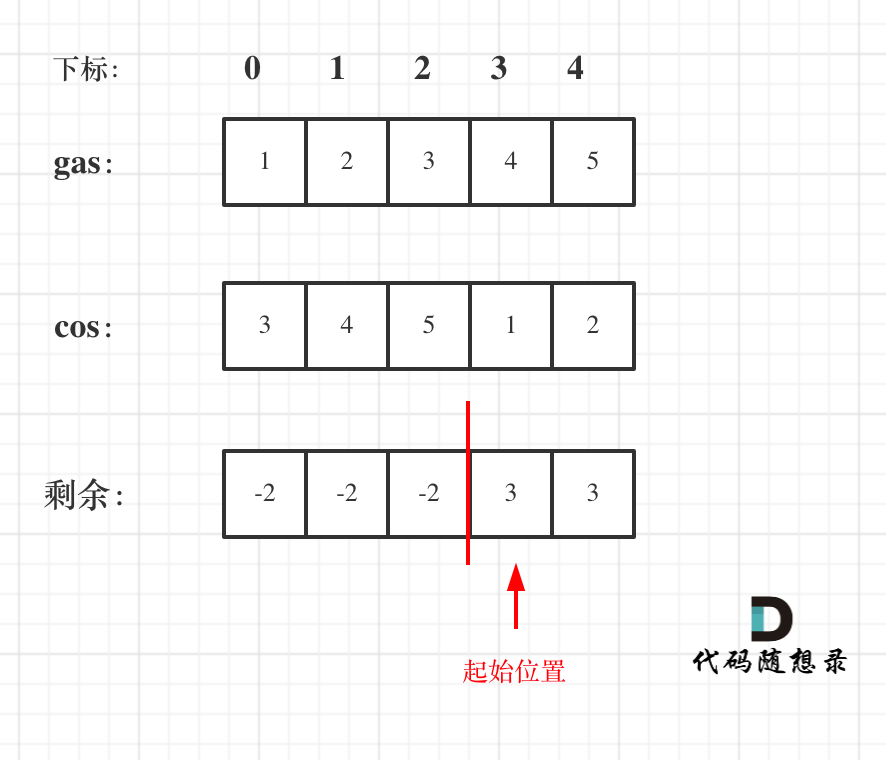

---

说这种解法为贪⼼算法，才是是有理有据的，因为全局最优解是根据局部最优推导出来的。
总结
对于本题⾸先给出了暴⼒解法，暴⼒解法模拟跑⼀圈的过程其实⽐较考验代码技巧的，要对
while使⽤的很熟练。
然后给出了两种贪⼼算法，对于第⼀种贪⼼⽅法，其实我认为就是⼀种直接从全局选取最优
的模拟操作，思路还是好巧妙的，值得学习⼀下。
对于第⼆种贪⼼⽅法，才真正体现出贪⼼的精髓，⽤局部最优可以推出全局最优，进⽽求得
起始位置。
就酱，「代码随想录」值得推荐给⾝边每⼀位学习算法的同学朋友，很多录友关注后都感觉
相见恨晚！
时间复杂度：O(n)
空间复杂度：O(1)
 
class Solution {
public:
    int canCompleteCircuit(vector<int>& gas, vector<int>& cost) {
        int curSum = 0;
        int totalSum = 0;
        int start = 0;
        for (int i = 0; i < gas.size(); i++) {
            curSum += gas[i] - cost[i];
            totalSum += gas[i] - cost[i];
            if (curSum < 0) {   // 当前累加rest[i]和 curSum⼀旦⼩于0
                start = i + 1;  // 起始位置更新为i+1
                curSum = 0;     // curSum从0开始
            }
        }
        if (totalSum < 0) return -1; // 说明怎么⾛都不可能跑⼀圈了
        return start;
    }
};

---

贪⼼算法：分发糖果
135. 分发糖果
链接：https://leetcode-cn.com/problems/candy/
⽼师想给孩⼦们分发糖果，有 N 个孩⼦站成了⼀条直线，⽼师会根据每个孩⼦的表现，预先
给他们评分。
你需要按照以下要求，帮助⽼师给这些孩⼦分发糖果：
那么这样下来，⽼师⾄少需要准备多少颗糖果呢？
⽰例 1:
输⼊: [1,0,2]
输出: 5
解释: 你可以分别给这三个孩⼦分发 2、1、2 颗糖果。
⽰例 2:
输⼊: [1,2,2]
输出: 4
解释: 你可以分别给这三个孩⼦分发 1、2、1 颗糖果。
第三个孩⼦只得到 1 颗糖果，这已满⾜上述两个条件。
 
 
每个孩⼦⾄少分配到 1 个糖果。
相邻的孩⼦中，评分⾼的孩⼦必须获得更多的糖果。

---

思路
这道题⽬⼀定是要确定⼀边之后，再确定另⼀边，例如⽐较每⼀个孩⼦的左边，然后再⽐较
右边，如果两边⼀起考虑⼀定会顾此失彼。
先确定右边评分⼤于左边的情况（也就是从前向后遍历）
此时局部最优：只要右边评分⽐左边⼤，右边的孩⼦就多⼀个糖果，全局最优：相邻的孩⼦
中，评分⾼的右孩⼦获得⽐左边孩⼦更多的糖果
局部最优可以推出全局最优。
如果ratings[i] > ratings[i - 1] 那么[i]的糖 ⼀定要⽐[i - 1]的糖多⼀个，所以贪⼼：candyVec[i] 
= candyVec[i - 1] + 1
代码如下：
如图：
再确定左孩⼦⼤于右孩⼦的情况（从后向前遍历）
遍历顺序这⾥有同学可能会有疑问，为什么不能从前向后遍历呢？
 
// 从前向后
for (int i = 1; i < ratings.size(); i++) {
    if (ratings[i] > ratings[i - 1]) candyVec[i] = candyVec[i - 1] + 1;
}

---

因为如果从前向后遍历，根据 ratings[i + 1] 来确定 ratings[i] 对应的糖果，那么每次都不能利
⽤上前⼀次的⽐较结果了。
所以确定左孩⼦⼤于右孩⼦的情况⼀定要从后向前遍历！
如果 ratings[i] > ratings[i + 1]，此时candyVec[i]（第i个⼩孩的糖果数量）就有两个选择了，
⼀个是candyVec[i + 1] + 1（从右边这个加1得到的糖果数量），⼀个是candyVec[i]（之前⽐较
右孩⼦⼤于左孩⼦得到的糖果数量）。
那么又要贪⼼了，局部最优：取candyVec[i + 1] + 1 和 candyVec[i] 最⼤的糖果数量，保证第i
个⼩孩的糖果数量即⼤于左边的也⼤于右边的。全局最优：相邻的孩⼦中，评分⾼的孩⼦获
得更多的糖果。
局部最优可以推出全局最优。
所以就取candyVec[i + 1] + 1 和 candyVec[i] 最⼤的糖果数量，candyVec[i]只有取最⼤的才能
既保持对左边candyVec[i - 1]的糖果多，也⽐右边candyVec[i + 1]的糖果多。
如图：

---

所以该过程代码如下：
整体代码如下：
// 从后向前
for (int i = ratings.size() - 2; i >= 0; i--) {
    if (ratings[i] > ratings[i + 1] ) {
        candyVec[i] = max(candyVec[i], candyVec[i + 1] + 1);
    }
}
class Solution {
public:
    int candy(vector<int>& ratings) {
        vector<int> candyVec(ratings.size(), 1);

---

总结
这在leetcode上是⼀道困难的题⽬，其难点就在于贪⼼的策略，如果在考虑局部的时候想两边
兼顾，就会顾此失彼。
那么本题我采⽤了两次贪⼼的策略：
这样从局部最优推出了全局最优，即：相邻的孩⼦中，评分⾼的孩⼦获得更多的糖果。
就酱，如果感觉「代码随想录」⼲货满满，就推荐给⾝边的朋友同学们吧，关注后就会发现
相见恨晚！
 
 
⼀次是从左到右遍历，只⽐较右边孩⼦评分⽐左边⼤的情况。
⼀次是从右到左遍历，只⽐较左边孩⼦评分⽐右边⼤的情况。
        // 从前向后
        for (int i = 1; i < ratings.size(); i++) {
            if (ratings[i] > ratings[i - 1]) candyVec[i] = candyVec[i - 
1] + 1;
        }
        // 从后向前
        for (int i = ratings.size() - 2; i >= 0; i--) {
            if (ratings[i] > ratings[i + 1] ) {
                candyVec[i] = max(candyVec[i], candyVec[i + 1] + 1);
            }
        }
        // 统计结果
        int result = 0;
        for (int i = 0; i < candyVec.size(); i++) result += 
candyVec[i];
        return result;
    }
};

---

贪⼼算法：柠檬⽔找零
860.柠檬⽔找零
题⽬链接：https://leetcode-cn.com/problems/lemonade-change/
在柠檬⽔摊上，每⼀杯柠檬⽔的售价为 5 美元。
顾客排队购买你的产品，（按账单 bills ⽀付的顺序）⼀次购买⼀杯。
每位顾客只买⼀杯柠檬⽔，然后向你付 5 美元、10 美元或 20 美元。你必须给每个顾客正确找
零，也就是说净交易是每位顾客向你⽀付 5 美元。
注意，⼀开始你⼿头没有任何零钱。
如果你能给每位顾客正确找零，返回 true ，否则返回 false 。
⽰例 1：
输⼊：[5,5,5,10,20]
输出：true
解释：
前 3 位顾客那⾥，我们按顺序收取 3 张 5 美元的钞票。
第 4 位顾客那⾥，我们收取⼀张 10 美元的钞票，并返还 5 美元。
第 5 位顾客那⾥，我们找还⼀张 10 美元的钞票和⼀张 5 美元的钞票。
由于所有客户都得到了正确的找零，所以我们输出 true。
⽰例 2：
输⼊：[5,5,10]
输出：true
⽰例 3：
输⼊：[10,10]
输出：false

---

⽰例 4：
输⼊：[5,5,10,10,20]
输出：false
解释：
前 2 位顾客那⾥，我们按顺序收取 2 张 5 美元的钞票。
对于接下来的 2 位顾客，我们收取⼀张 10 美元的钞票，然后返还 5 美元。
对于最后⼀位顾客，我们⽆法退回 15 美元，因为我们现在只有两张 10 美元的钞票。
由于不是每位顾客都得到了正确的找零，所以答案是 false。
提⽰：
思路
这是前⼏天的leetcode每⽇⼀题，感觉不错，给⼤家讲⼀下。
这道题⽬刚⼀看，可能会有点懵，这要怎么找零才能保证完整全部账单的找零呢？
但仔细⼀琢磨就会发现，可供我们做判断的空间⾮常少！
只需要维护三种⾦额的数量，5，10和20。
有如下三种情况：
此时⼤家就发现 情况⼀，情况⼆，都是固定策略，都不⽤我们来做分析了，⽽唯⼀不确定的
其实在情况三。
⽽情况三逻辑也不复杂甚⾄感觉纯模拟就可以了，其实情况三这⾥是有贪⼼的。
账单是20的情况，为什么要优先消耗⼀个10和⼀个5呢？
因为美元10只能给账单20找零，⽽美元5可以给账单10和账单20找零，美元5更万能！
0 <= bills.length <= 10000
bills[i] 不是 5 就是 10 或是 20 
 
情况⼀：账单是5，直接收下。
情况⼆：账单是10，消耗⼀个5，增加⼀个10
情况三：账单是20，优先消耗⼀个10和⼀个5，如果不够，再消耗三个5

---

所以局部最优：遇到账单20，优先消耗美元10，完成本次找零。全局最优：完成全部账单的
找零。
局部最优可以推出全局最优，并找不出反例，那么就试试贪⼼算法！
C++代码如下：
class Solution {
public:
    bool lemonadeChange(vector<int>& bills) {
        int five = 0, ten = 0, twenty = 0;
        for (int bill : bills) {
            // 情况⼀
            if (bill == 5) five++;
            // 情况⼆
            if (bill == 10) {
                if (five <= 0) return false;
                ten++;
                five--;
            }
            // 情况三
            if (bill == 20) {
                // 优先消耗10美元，因为5美元的找零⽤处更⼤，能多留着就多留着
                if (five > 0 && ten > 0) {
                    five--;
                    ten--;
                    twenty++; // 其实这⾏代码可以删了，因为记录20已经没有意义
了，不会⽤20来找零
                } else if (five >= 3) {
                    five -= 3;
                    twenty++; // 同理，这⾏代码也可以删了
                } else return false;
            }
        }
        return true;
    }
};

---

总结
咋眼⼀看好像很复杂，分析清楚之后，会发现逻辑其实⾮常固定。
这道题⽬可以告诉⼤家，遇到感觉没有思路的题⽬，可以静下⼼来把能遇到的情况分析⼀
下，只要分析到具体情况了，⼀下⼦就豁然开朗了。
如果⼀直陷⼊想从整体上寻找找零⽅案，就会把⾃⼰陷进去，各种情况⼀交叉，只会越想越
复杂了。
如果感觉PDF对你有帮助，微信搜索：代码随想录，你会发现相见恨晚！
 
 
 
代码随想录官⽹：www.programmercarl.com
代码随想录开源项⽬Github：https://github.com/youngyangyang04/leetcode-
master
代码随想录算法公开课 ，代码随想录的全部内容将由我（程序员Carl）视频讲解并
开免费开放给⼤家。
《代码随想录》纸质版 已经出版。
代码随想录知识星球 上万录友在这⾥学习
代码随想录算法训练营 帮助录友⾼效刷完代码随想录。

---

贪⼼算法：根据⾝⾼重建队列
406.根据⾝⾼重建队列
题⽬链接：https://leetcode-cn.com/problems/queue-reconstruction-by-height/
假设有打乱顺序的⼀群⼈站成⼀个队列，数组 people 表⽰队列中⼀些⼈的属性（不⼀定按顺
序）。每个 people[i] = [hi, ki] 表⽰第 i 个⼈的⾝⾼为 hi ，前⾯ 正好 有 ki 个⾝⾼⼤于或等于 
hi 的⼈。
请你重新构造并返回输⼊数组 people 所表⽰的队列。返回的队列应该格式化为数组 queue ，
其中 queue[j] = [hj, kj] 是队列中第 j 个⼈的属性（queue[0] 是排在队列前⾯的⼈）。
⽰例 1：
输⼊：people = [[7,0],[4,4],[7,1],[5,0],[6,1],[5,2]]
输出：[[5,0],[7,0],[5,2],[6,1],[4,4],[7,1]]
解释：
编号为 0 的⼈⾝⾼为 5 ，没有⾝⾼更⾼或者相同的⼈排在他前⾯。
编号为 1 的⼈⾝⾼为 7 ，没有⾝⾼更⾼或者相同的⼈排在他前⾯。
编号为 2 的⼈⾝⾼为 5 ，有 2 个⾝⾼更⾼或者相同的⼈排在他前⾯，即编号为 0 和 1 的⼈。
编号为 3 的⼈⾝⾼为 6 ，有 1 个⾝⾼更⾼或者相同的⼈排在他前⾯，即编号为 1 的⼈。
编号为 4 的⼈⾝⾼为 4 ，有 4 个⾝⾼更⾼或者相同的⼈排在他前⾯，即编号为 0、1、2、3 的
⼈。
编号为 5 的⼈⾝⾼为 7 ，有 1 个⾝⾼更⾼或者相同的⼈排在他前⾯，即编号为 1 的⼈。
因此 [[5,0],[7,0],[5,2],[6,1],[4,4],[7,1]] 是重新构造后的队列。
⽰例 2：
输⼊：people = [[6,0],[5,0],[4,0],[3,2],[2,2],[1,4]]
输出：[[4,0],[5,0],[2,2],[3,2],[1,4],[6,0]]
提⽰：
题⽬数据确保队列可以被重建
 
 
1 <= people.length <= 2000
0 <= hi <= 10^6
0 <= ki < people.length

---

思路
本题有两个维度，h和k，看到这种题⽬⼀定要想如何确定⼀个维度，然后在按照另⼀个维度
重新排列。
其实如果⼤家认真做了贪⼼算法：分发糖果，就会发现和此题有点点的像。
在贪⼼算法：分发糖果我就强调过⼀次，遇到两个维度权衡的时候，⼀定要先确定⼀个维
度，再确定另⼀个维度。
如果两个维度⼀起考虑⼀定会顾此失彼。
对于本题相信⼤家困惑的点是先确定k还是先确定h呢，也就是究竟先按h排序呢，还先按照k
排序呢？
如果按照k来从⼩到⼤排序，排完之后，会发现k的排列并不符合条件，⾝⾼也不符合条件，
两个维度哪⼀个都没确定下来。
那么按照⾝⾼h来排序呢，⾝⾼⼀定是从⼤到⼩排（⾝⾼相同的话则k⼩的站前⾯），让⾼个
⼦在前⾯。
此时我们可以确定⼀个维度了，就是⾝⾼，前⾯的节点⼀定都⽐本节点⾼！
那么只需要按照k为下标重新插⼊队列就可以了，为什么呢？
以图中{5,2} 为例：

---

按照⾝⾼排序之后，优先按⾝⾼⾼的people的k来插⼊，后序插⼊节点也不会影响前⾯已经插
⼊的节点，最终按照k的规则完成了队列。
所以在按照⾝⾼从⼤到⼩排序后：
局部最优：优先按⾝⾼⾼的people的k来插⼊。插⼊操作过后的people满⾜队列属性
全局最优：最后都做完插⼊操作，整个队列满⾜题⽬队列属性
局部最优可推出全局最优，找不出反例，那就试试贪⼼。
⼀些同学可能也会疑惑，你怎么知道局部最优就可以推出全局最优呢？ 有数学证明么？
在贪⼼系列开篇词关于贪⼼算法，你该了解这些！中，我已经讲过了这个问题了。
刷题或者⾯试的时候，⼿动模拟⼀下感觉可以局部最优推出整体最优，⽽且想不到反例，那
么就试⼀试贪⼼，⾄于严格的数学证明，就不在讨论范围内了。
如果没有读过关于贪⼼算法，你该了解这些！的同学建议读⼀下，相信对贪⼼就有初步的了
解了。

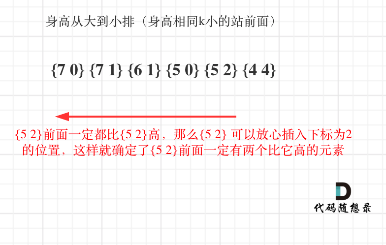

---

回归本题，整个插⼊过程如下：
排序完的people：
[[7,0], [7,1], [6,1], [5,0], [5,2]，[4,4]]
插⼊的过程：
插⼊[7,0]：[[7,0]]
插⼊[7,1]：[[7,0],[7,1]]
插⼊[6,1]：[[7,0],[6,1],[7,1]]
插⼊[5,0]：[[5,0],[7,0],[6,1],[7,1]]
插⼊[5,2]：[[5,0],[7,0],[5,2],[6,1],[7,1]]
插⼊[4,4]：[[5,0],[7,0],[5,2],[6,1],[4,4],[7,1]]
此时就按照题⽬的要求完成了重新排列。
C++代码如下：
时间复杂度O(nlogn + n^2)
空间复杂度O(n)
// 版本⼀
class Solution {
public:
    static bool cmp(const vector<int> a, const vector<int> b) {
        if (a[0] == b[0]) return a[1] < b[1];
        return a[0] > b[0];
    }
    vector<vector<int>> reconstructQueue(vector<vector<int>>& people) {
        sort (people.begin(), people.end(), cmp);
        vector<vector<int>> que;
        for (int i = 0; i < people.size(); i++) {
            int position = people[i][1];
            que.insert(que.begin() + position, people[i]);
        }
        return que;
    }
};

---

但使⽤vector是⾮常费时的，C++中vector（可以理解是⼀个动态数组，底层是普通数组实现
的）如果插⼊元素⼤于预先普通数组⼤⼩，vector底部会有⼀个扩容的操作，即申请两倍于原
先普通数组的⼤⼩，然后把数据拷贝到另⼀个更⼤的数组上。
所以使⽤vector（动态数组）来insert，是费时的，插⼊再拷贝的话，单纯⼀个插⼊的操作就
是O(n^2)了，甚⾄可能拷贝好⼏次，就不⽌O(n^2)了。
改成链表之后，C++代码如下：
⼤家可以把两个版本的代码提交⼀下试试，就可以发现其差别了！
时间复杂度O(nlogn + n^2)
空间复杂度O(n)
// 版本⼆
class Solution {
public:
    // 身⾼从⼤到⼩排（身⾼相同k⼩的站前⾯）
    static bool cmp(const vector<int> a, const vector<int> b) {
        if (a[0] == b[0]) return a[1] < b[1];
        return a[0] > b[0];
    }
    vector<vector<int>> reconstructQueue(vector<vector<int>>& people) {
        sort (people.begin(), people.end(), cmp);
        list<vector<int>> que; // list底层是链表实现，插⼊效率⽐vector⾼的多
        for (int i = 0; i < people.size(); i++) {
            int position = people[i][1]; // 插⼊到下标为position的位置
            std::list<vector<int>>::iterator it = que.begin();
            while (position--) { // 寻找在插⼊位置
                it++;
            }
            que.insert(it, people[i]);
        }
        return vector<vector<int>>(que.begin(), que.end());
    }
};

---

关于本题使⽤数组还是使⽤链表的性能差异，我在贪⼼算法：根据⾝⾼重建队列（续集）中
详细讲解了⼀波
总结
关于出现两个维度⼀起考虑的情况，我们已经做过两道题⽬了，另⼀道就是贪⼼算法：分发
糖果。
其技巧都是确定⼀边然后贪⼼另⼀边，两边⼀起考虑，就会顾此失彼。
这道题⽬可以说⽐贪⼼算法：分发糖果难不少，其贪⼼的策略也是⽐较巧妙。
最后我给出了两个版本的代码，可以明显看是使⽤C++中的list（底层链表实现）⽐vector（数
组）效率⾼得多。
对使⽤某⼀种语⾔容器的使⽤，特性的选择都会不同程度上影响效率。
所以很多⼈都说写算法题⽤什么语⾔都可以，主要体现在算法思维上，其实我是同意的但也
不同意。
对于看别⼈题解的同学，题解⽤什么语⾔其实影响不⼤，只要题解把所使⽤语⾔特性优化的
点讲出来，⼤家都可以看懂，并使⽤⾃⼰语⾔的时候注意⼀下。
对于写题解的同学，刷题⽤什么语⾔影响就⾮常⼤，如果⾃⼰语⾔没有学好⽽强调算法和编
程语⾔没关系，其实是会误伤别⼈的。
这也是我为什么统⼀使⽤C++写题解的原因，其实⽤其他语⾔java、python、php、go啥的，
我也能写，我的Github上也有⽤这些语⾔写的⼩项⽬，但写题解的话，我就不能保证把语⾔
特性这块讲清楚，所以我始终坚持使⽤最熟悉的C++写题解。
⽽且我在写题解的时候涉及语⾔特性，⼀般都会后⾯加上括号说明⼀下。没办法，认真负责
就是我，哈哈。

---

本周⼩结！（贪⼼算法系列三）
对于贪⼼，⼤多数同学都会感觉，不就是常识嘛，这算啥算法，那么本周的题⽬就可以带⼤
家初步领略⼀下贪⼼的巧妙，贪⼼算法往往妙的出其不意。
周⼀
在贪⼼算法：加油站中给出每⼀个加油站的汽油和开到这个加油站的消耗，问汽车能不能开
⼀圈。
这道题⽬咋眼⼀看，感觉是⼀道模拟题，模拟⼀下汽车从每⼀个节点出发看看能不能开⼀
圈，时间复杂度是O(n^2)。
即使⽤模拟这种情况，也挺考察代码技巧的。
for循环适合模拟从头到尾的遍历，⽽while循环适合模拟环形遍历，对于本题的场景要善于
使⽤while！
如果代码功⼒不到位，就模拟这种情况，可能写的也会很费劲。
本题的贪⼼解法，我给出两种解法。
对于解法⼀，其实我并不认为这是贪⼼，因为没有找出局部最优，⽽是直接从全局最优的⾓
度上思考问题，但思路很巧妙，值得学习⼀下。
对于解法⼆，贪⼼的局部最优：当前累加rest[j]的和curSum⼀旦⼩于0，起始位置⾄少要是
j+1，因为从j开始⼀定不⾏。全局最优：找到可以跑⼀圈的起始位置。
这⾥是可以从局部最优推出全局最优的，想不出反例，那就试试贪⼼。
解法⼆就体现出贪⼼的精髓，同时⼤家也会发现，虽然贪⼼是常识，有些常识并不容易，甚
⾄很难！

---

周⼆
在贪⼼算法：分发糖果中我们第⼀次接触了需要考虑两个维度的情况。
例如这道题，是先考虑左边呢，还是考虑右边呢？
先考虑哪⼀边都可以！ 就别两边⼀起考虑，那样就把⾃⼰陷进去了。
先贪⼼⼀边，局部最优：只要右边评分⽐左边⼤，右边的孩⼦就多⼀个糖果，全局最优：相
邻的孩⼦中，评分⾼的右孩⼦获得⽐左边孩⼦更多的糖果
如图：
接着在贪⼼另⼀边，左孩⼦⼤于右孩⼦，左孩⼦的糖果就要⽐右孩⼦多。
此时candyVec[i]（第i个⼩孩的糖果数量，左孩⼦）就有两个选择了，⼀个是candyVec[i + 1] + 
1（从右孩⼦这个加1得到的糖果数量），⼀个是candyVec[i]（之前⽐较右孩⼦⼤于左孩⼦得
到的糖果数量）。
那么第⼆次贪⼼的局部最优：取candyVec[i + 1] + 1 和 candyVec[i] 最⼤的糖果数量，保证第i
个⼩孩的糖果数量即⼤于左边的也⼤于右边的。全局最优：相邻的孩⼦中，评分⾼的孩⼦获
得更多的糖果。
局部最优可以推出全局最优。

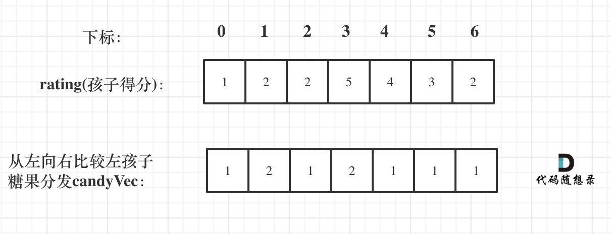

---

如图：
周三
在贪⼼算法：柠檬⽔找零中我们模拟了买柠檬⽔找零的过程。
这道题⽬刚⼀看，可能会有点懵，这要怎么找零才能保证完整全部账单的找零呢？
但仔细⼀琢磨就会发现，可供我们做判断的空间⾮常少！
美元10只能给账单20找零，⽽美元5可以给账单10和账单20找零，美元5更万能！
局部最优：遇到账单20，优先消耗美元10，完成本次找零。全局最优：完成全部账单的找
零。
局部最优可以推出全局最优。

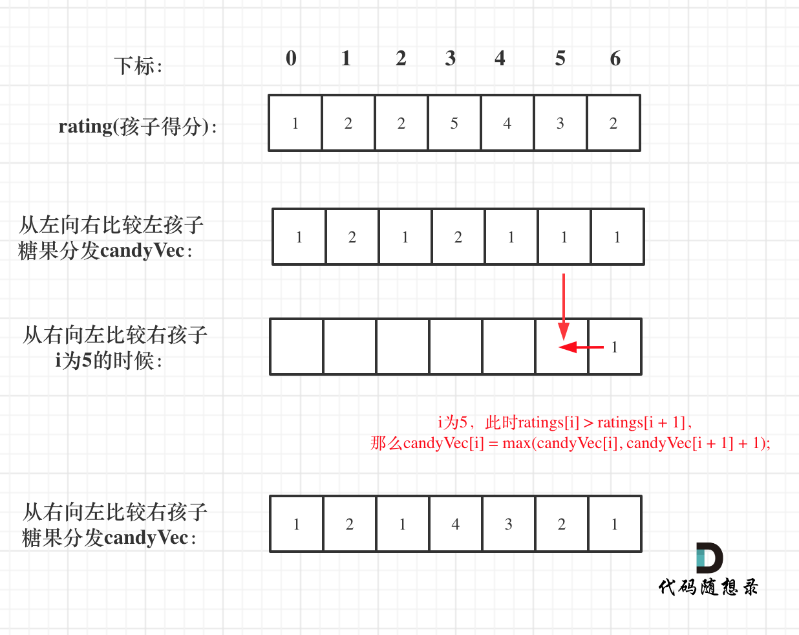

---

所以把能遇到的情况分析⼀下，只要分析到具体情况了，⼀下⼦就豁然开朗了。
这道题⽬其实是⼀道简单题，但如果⼀开始就想从整体上寻找找零⽅案，就会把⾃⼰陷进
去，各种情况⼀交叉，只会越想越复杂了。
周四
在贪⼼算法：根据⾝⾼重建队列中，我们再⼀次遇到了需要考虑两个维度的情况。
之前我们已经做过⼀道类似的了就是贪⼼算法：分发糖果，但本题⽐分发糖果难不少！
贪⼼算法：根据⾝⾼重建队列中依然是要确定⼀边，然后在考虑另⼀边，两边⼀起考虑⼀定
会蒙圈。
那么本题先确定k还是先确定h呢，也就是究竟先按h排序呢，还先按照k排序呢？
这⾥其实很考察⼤家的思考过程，如果按照k来从⼩到⼤排序，排完之后，会发现k的排列并
不符合条件，⾝⾼也不符合条件，两个维度哪⼀个都没确定下来。
所以先从⼤到⼩按照h排个序，再来贪⼼k。
此时局部最优：优先按⾝⾼⾼的people的k来插⼊。插⼊操作过后的people满⾜队列属性。全
局最优：最后都做完插⼊操作，整个队列满⾜题⽬队列属性。
局部最优可以推出全局最优，找不出反例，那么就来贪⼼。
总结
「代码随想录」⾥已经讲了⼗⼀道贪⼼题⽬了，⼤家可以发现在每⼀道题⽬的讲解中，我都
是把什么是局部最优，和什么是全局最优说清楚。
虽然有时候感觉贪⼼就是常识，但如果真正是常识性的题⽬，其实是模拟题，就不是贪⼼算
法了！例如贪⼼算法：加油站中的贪⼼⽅法⼀，其实我就认为不是贪⼼算法，⽽是直接从全
局最优的⾓度上来模拟，因为⽅法⾥没有体现局部最优的过程。
⽽且⼤家也会发现，贪⼼并没有想象中的那么简单，贪⼼往往妙的出其不意，触不及防！哈
哈

---

如果感觉PDF对你有帮助，微信搜索：代码随想录，你会发现相见恨晚！
 
贪⼼算法：根据⾝⾼重建队列（续集）
在讲解贪⼼算法：根据⾝⾼重建队列中，我们提到了使⽤vector（C++中的动态数组）来进⾏
insert操作是费时的。
但是在解释的过程中有不恰当的地⽅，所以来专门写⼀篇⽂章来详细说⼀说这个问题。
使⽤vector的代码如下：
代码随想录官⽹：www.programmercarl.com
代码随想录开源项⽬Github：https://github.com/youngyangyang04/leetcode-
master
代码随想录算法公开课 ，代码随想录的全部内容将由我（程序员Carl）视频讲解并
开免费开放给⼤家。
《代码随想录》纸质版 已经出版。
代码随想录知识星球 上万录友在这⾥学习
代码随想录算法训练营 帮助录友⾼效刷完代码随想录。

---

耗时如下：
其直观上来看数组的insert操作是O(n)的，整体代码的时间复杂度是O(n^2)。
这么⼀分析好像和版本⼆链表实现的时间复杂度是⼀样的啊，为什么提交之后效率会差距这
么⼤呢？
// 版本⼀，使⽤vector（动态数组）
class Solution {
public:
    static bool cmp(const vector<int> a, const vector<int> b) {
        if (a[0] == b[0]) return a[1] < b[1];
        return a[0] > b[0];
    }
    vector<vector<int>> reconstructQueue(vector<vector<int>>& people) {
        sort (people.begin(), people.end(), cmp);
        vector<vector<int>> que;
        for (int i = 0; i < people.size(); i++) {
            int position = people[i][1];
            que.insert(que.begin() + position, people[i]);
        }
        return que;
    }
};
// 版本⼆，使⽤list（链表）
class Solution {
public:
    // 身⾼从⼤到⼩排（身⾼相同k⼩的站前⾯）
    static bool cmp(const vector<int> a, const vector<int> b) {
        if (a[0] == b[0]) return a[1] < b[1];

---

耗时如下：
⼤家都知道对于普通数组，⼀旦定义了⼤⼩就不能改变，例如int a[10];，这个数组a⾄多只能
放10个元素，改不了的。
对于动态数组，就是可以不⽤关⼼初始时候的⼤⼩，可以随意往⾥放数据，那么耗时的原因
就在于动态数组的底层实现。
动态数组为什么可以不受初始⼤⼩的限制，可以随意push_back数据呢？
⾸先vector的底层实现也是普通数组。
        return a[0] > b[0];
    }
    vector<vector<int>> reconstructQueue(vector<vector<int>>& people) {
        sort (people.begin(), people.end(), cmp);
        list<vector<int>> que; // list底层是链表实现，插⼊效率⽐vector⾼的多
        for (int i = 0; i < people.size(); i++) {
            int position = people[i][1]; // 插⼊到下标为position的位置
            std::list<vector<int>>::iterator it = que.begin();
            while (position--) { // 寻找在插⼊位置
                it++;
            }
            que.insert(it, people[i]);
        }
        return vector<vector<int>>(que.begin(), que.end());
    }
};

---

vector的⼤⼩有两个维度⼀个是size⼀个是capicity，size就是我们平时⽤来遍历vector时候⽤
的，例如：
⽽capicity是vector底层数组（就是普通数组）的⼤⼩，capicity可不⼀定就是size。
当insert数据的时候，如果已经⼤于capicity，capicity会成倍扩容，但对外暴漏的size其实仅
仅是+1。
那么既然vector底层实现是普通数组，怎么扩容的？
就是重新申请⼀个⼆倍于原数组⼤⼩的数组，然后把数据都拷贝过去，并释放原数组内存。
（对，就是这么原始粗暴的⽅法！）
举⼀个例⼦，如图：
原vector中的size和capicity相同都是3，初始化为1 2 3，此时要push_back⼀个元素4。
那么底层其实就要申请⼀个⼤⼩为6的普通数组，并且把原元素拷贝过去，释放原数组内存，
注意图中底层数组的内存起始地址已经变了。
同时也注意此时capicity和size的变化，关键的地⽅我都标红了。
for (int i = 0; i < vec.size(); i++) {
}

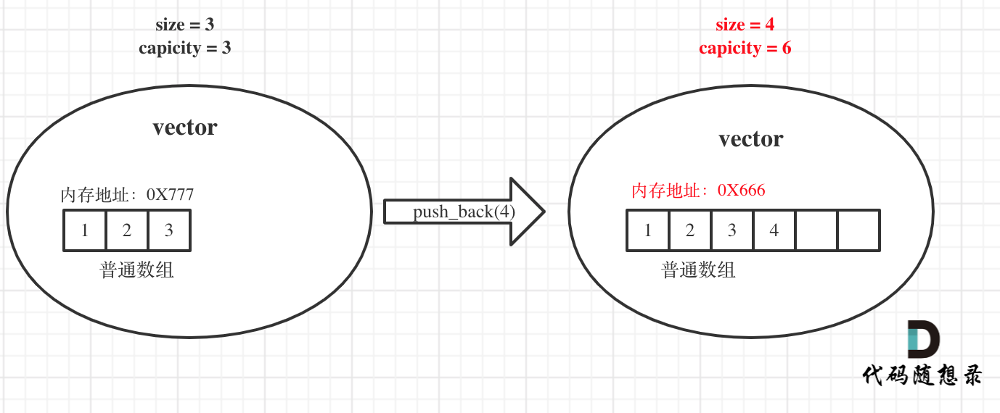

---

⽽在贪⼼算法：根据⾝⾼重建队列中，我们使⽤vector来做insert的操作，此时⼤家可会发
现，虽然表⾯上复杂度是O(n^2)，但是其底层都不知道额外做了多少次全量拷贝了，所以算
上vector的底层拷贝，整体时间复杂度可以认为是O(n^2 + t * n)级别的，t是底层拷贝的次
数。
那么是不是可以直接确定好vector的⼤⼩，不让它在动态扩容了，例如在贪⼼算法：根据⾝⾼
重建队列中已经给出了有people.size这么多的⼈，可以定义好⼀个固定⼤⼩的vector，这样我
们就可以控制vector，不让它底层动态扩容。
这种⽅法需要⾃⼰模拟插⼊的操作，不仅没有直接调⽤insert接⼜那么⽅便，需要⼿动模拟插
⼊操作，⽽且效率也不⾼！
⼿动模拟的过程其实不是很简单的，需要很多细节，我粗略写了⼀个版本，如下：
// 版本三
// 使⽤vector，但不让它动态扩容
class Solution {
public:
    static bool cmp(const vector<int> a, const vector<int> b) {
        if (a[0] == b[0]) return a[1] < b[1];
        return a[0] > b[0];
    }
    vector<vector<int>> reconstructQueue(vector<vector<int>>& people) {
        sort (people.begin(), people.end(), cmp);
        vector<vector<int>> que(people.size(), vector<int>(2, -1));
        for (int i = 0; i < people.size(); i++) {
            int position = people[i][1];
            if (position == que.size() - 1) que[position] = people[i];
            else { // 将插⼊位置后⾯的元素整体向后移
                for (int j = que.size() - 2; j >= position; j--) que[j 
+ 1] = que[j];
                que[position] = people[i];
            }
        }
        return que;
    }
};

---

耗时如下：
这份代码就是不让vector动态扩容，全程我们⾃⼰模拟insert的操作，⼤家也可以直观的看出
是⼀个O(n^2)的⽅法了。
但这份代码在leetcode上统计的耗时甚⾄⽐版本⼀的还⾼，我们都不让它动态扩容了，为什么
耗时更⾼了呢？
⼀⽅⾯是leetcode的耗时统计本来就不太准，忽⾼忽低的，只能测个⼤概。
另⼀⽅⾯：可能是就算避免的vector的底层扩容，但这个固定⼤⼩的数组，每次向后移动元素
赋值的次数⽐⽅法⼀中移动赋值的次数要多很多。
因为⽅法⼀中⼀开始数组是很⼩的，插⼊操作，向后移动元素次数⽐较少，即使有偶尔的扩
容操作。⽽⽅法三每次都是按照最⼤数组规模向后移动元素的。
所以对于两种使⽤数组的⽅法⼀和⽅法三，也不好确定谁优，但⼀定都没有使⽤⽅法⼆链表
的效率⾼！
⼀波分析之后，对于贪⼼算法：根据⾝⾼重建队列 ，⼤家就安⼼使⽤链表吧！别折腾了，哈
哈，相当于我替⼤家折腾了⼀下。

---

总结
⼤家应该发现了，编程语⾔中⼀个普通容器的insert，delete的使⽤，都可能对写出来的算法
的有很⼤影响！
如果抛开语⾔谈算法，除⾮从来不⽤代码写算法纯分析，否则的话，语⾔功底不到位O(n)的
算法可以写出O(n^2)的性能，哈哈。
相信在这⾥学习算法的录友们，都是想在软件⾏业长远发展的，都是要从事编程的⼯作，那
么⼀定要深耕好⼀门编程语⾔，这个⾮常重要！
 
贪⼼算法：⽤最少数量的箭引爆⽓球
452. ⽤最少数量的箭引爆⽓球
题⽬链接：https://leetcode-cn.com/problems/minimum-number-of-arrows-to-burst-balloo
ns/
在⼆维空间中有许多球形的⽓球。对于每个⽓球，提供的输⼊是⽔平⽅向上，⽓球直径的开
始和结束坐标。由于它是⽔平的，所以纵坐标并不重要，因此只要知道开始和结束的横坐标
就⾜够了。开始坐标总是⼩于结束坐标。
⼀⽀⼸箭可以沿着 x 轴从不同点完全垂直地射出。在坐标 x 处射出⼀⽀箭，若有⼀个⽓球的
直径的开始和结束坐标为 xstart，xend， 且满⾜  xstart ≤ x ≤ xend，则该⽓球会被引爆。可
以射出的⼸箭的数量没有限制。 ⼸箭⼀旦被射出之后，可以⽆限地前进。我们想找到使得所
有⽓球全部被引爆，所需的⼸箭的最⼩数量。
给你⼀个数组 points ，其中 points [i] = [xstart,xend] ，返回引爆所有⽓球所必须射出的最⼩
⼸箭数。
⽰例 1：
输⼊：points = [[10,16],[2,8],[1,6],[7,12]]

---

输出：2
解释：对于该样例，x = 6 可以射爆 [2,8],[1,6] 两个⽓球，以及 x = 11 射爆另外两个⽓球
⽰例 2：
输⼊：points = [[1,2],[3,4],[5,6],[7,8]]
输出：4
⽰例 3：
输⼊：points = [[1,2],[2,3],[3,4],[4,5]]
输出：2
⽰例 4：
输⼊：points = [[1,2]]
输出：1
⽰例 5：
输⼊：points = [[2,3],[2,3]]
输出：1
提⽰：
思路
如何使⽤最少的⼸箭呢？
直觉上来看，貌似只射重叠最多的⽓球，⽤的⼸箭⼀定最少，那么有没有当前重叠了三个⽓
球，我射两个，留下⼀个和后⾯的⼀起射这样⼸箭⽤的更少的情况呢？
尝试⼀下举反例，发现没有这种情况。
那么就试⼀试贪⼼吧！局部最优：当⽓球出现重叠，⼀起射，所⽤⼸箭最少。全局最优：把
所有⽓球射爆所⽤⼸箭最少。
算法确定下来了，那么如何模拟⽓球射爆的过程呢？是在数组中移除元素还是做标记呢？
0 <= points.length <= 10^4
points[i].length == 2
-2^31 <= xstart < xend <= 2^31 - 1

---

如果真实的模拟射⽓球的过程，应该射⼀个，⽓球数组就remove⼀个元素，这样最直观，毕
竟⽓球被射了。
但仔细思考⼀下就发现：如果把⽓球排序之后，从前到后遍历⽓球，被射过的⽓球仅仅跳过
就⾏了，没有必要让⽓球数组remote⽓球，只要记录⼀下箭的数量就可以了。
以上为思考过程，已经确定下来使⽤贪⼼了，那么开始解题。
为了让⽓球尽可能的重叠，需要对数组进⾏排序。
那么按照⽓球起始位置排序，还是按照⽓球终⽌位置排序呢？
其实都可以！只不过对应的遍历顺序不同，我就按照⽓球的起始位置排序了。
既然按照其实位置排序，那么就从前向后遍历⽓球数组，靠左尽可能让⽓球重复。
从前向后遍历遇到重叠的⽓球了怎么办？
如果⽓球重叠了，重叠⽓球中右边边界的最⼩值 之前的区间⼀定需要⼀个⼸箭。
以题⽬⽰例： [[10,16],[2,8],[1,6],[7,12]]为例，如图：（⽅便起见，已经排序）

---

可以看出⾸先第⼀组重叠⽓球，⼀定是需要⼀个箭，⽓球3，的左边界⼤于了 第⼀组重叠⽓球
的最⼩右边界，所以再需要⼀⽀箭来射⽓球3了。
C++代码如下：
可以看出代码并不复杂。
时间复杂度O(nlogn)，因为有⼀个快排
空间复杂度O(1)
class Solution {
private:
    static bool cmp(const vector<int>& a, const vector<int>& b) {
        return a[0] < b[0];
    }
public:
    int findMinArrowShots(vector<vector<int>>& points) {
        if (points.size() == 0) return 0;
        sort(points.begin(), points.end(), cmp);
        int result = 1; // points 不为空⾄少需要⼀⽀箭
        for (int i = 1; i < points.size(); i++) {
            if (points[i][0] > points[i - 1][1]) {  // ⽓球i和⽓球i-1不挨
着，注意这⾥不是>=
                result++; // 需要⼀⽀箭
            }
            else {  // ⽓球i和⽓球i-1挨着
                points[i][1] = min(points[i - 1][1], points[i][1]); // 
更新重叠⽓球最⼩右边界
            }
        }
        return result;
    }
};

---

注意事项
注意题⽬中说的是：满⾜  xstart ≤ x ≤ xend，则该⽓球会被引爆。那么说明两个⽓球挨在⼀起
不重叠也可以⼀起射爆，
所以代码中 if (points[i][0] > points[i - 1][1])  不能是>=
总结
这道题⽬贪⼼的思路很简单也很直接，就是重复的⼀起射了，但本题我认为是有难度的。
就算思路都想好了，模拟射⽓球的过程，很多同学真的要去模拟了，实时把⽓球从数组中移
⾛，这么写的话就复杂了。
⽽且寻找重复的⽓球，寻找重叠⽓球最⼩右边界，其实都有代码技巧。
贪⼼题⽬有时候就是这样，看起来很简单，思路很直接，但是⼀写代码就感觉贼复杂⽆从下
⼿。
这⾥其实是需要代码功底的，那代码功底怎么练？
多看多写多总结！
 
贪⼼算法：⽆重叠区间
435. ⽆重叠区间
题⽬链接：https://leetcode-cn.com/problems/non-overlapping-intervals/
给定⼀个区间的集合，找到需要移除区间的最⼩数量，使剩余区间互不重叠。

---

注意:
可以认为区间的终点总是⼤于它的起点。
区间 [1,2] 和 [2,3] 的边界相互“接触”，但没有相互重叠。
⽰例 1:
输⼊: [ [1,2], [2,3], [3,4], [1,3] ]
输出: 1
解释: 移除 [1,3] 后，剩下的区间没有重叠。
⽰例 2:
输⼊: [ [1,2], [1,2], [1,2] ]
输出: 2
解释: 你需要移除两个 [1,2] 来使剩下的区间没有重叠。
⽰例 3:
输⼊: [ [1,2], [2,3] ]
输出: 0
解释: 你不需要移除任何区间，因为它们已经是⽆重叠的了。
思路
相信很多同学看到这道题⽬都冥冥之中感觉要排序，但是究竟是按照右边界排序，还是按照
左边界排序呢？
这其实是⼀个难点！
按照右边界排序，就要从左向右遍历，因为右边界越⼩越好，只要右边界越⼩，留给下⼀个
区间的空间就越⼤，所以从左向右遍历，优先选右边界⼩的。
按照左边界排序，就要从右向左遍历，因为左边界数值越⼤越好（越靠右），这样就给前⼀
个区间的空间就越⼤，所以可以从右向左遍历。
如果按照左边界排序，还从左向右遍历的话，其实也可以，逻辑会有所不同。
⼀些同学做这道题⽬可能真的去模拟去重复区间的⾏为，这是⽐较⿇烦的，还要去删除区
间。
题⽬只是要求移除区间的个数，没有必要去真实的模拟删除区间！

---

我来按照右边界排序，从左向右记录⾮交叉区间的个数。最后⽤区间总数减去⾮交叉区间的
个数就是需要移除的区间个数了。
此时问题就是要求⾮交叉区间的最⼤个数。
右边界排序之后，局部最优：优先选右边界⼩的区间，所以从左向右遍历，留给下⼀个区间
的空间⼤⼀些，从⽽尽量避免交叉。全局最优：选取最多的⾮交叉区间。
局部最优推出全局最优，试试贪⼼！
这⾥记录⾮交叉区间的个数还是有技巧的，如图：
区间，1，2，3，4，5，6都按照右边界排好序。
每次取⾮交叉区间的时候，都是可右边界最⼩的来做分割点（这样留给下⼀个区间的空间就
越⼤），所以第⼀条分割线就是区间1结束的位置。
接下来就是找⼤于区间1结束位置的区间，是从区间4开始。那有同学问了为什么不从区间5开
始？别忘已经是按照右边界排序的了。
区间4结束之后，在找到区间6，所以⼀共记录⾮交叉区间的个数是三个。

---

总共区间个数为6，减去⾮交叉区间的个数3。移除区间的最⼩数量就是3。
C++代码如下：
⼤家此时会发现如此复杂的⼀个问题，代码实现却这么简单！
总结
本题我认为难度级别可以算是hard级别的！
总结如下难点：
时间复杂度：O(nlogn) ，有⼀个快排
空间复杂度：O(1)
 
难点⼀：⼀看题就有感觉需要排序，但究竟怎么排序，按左边界排还是右边界排。
class Solution {
public:
    // 按照区间右边界排序
    static bool cmp (const vector<int>& a, const vector<int>& b) {
        return a[1] < b[1];
    }
    int eraseOverlapIntervals(vector<vector<int>>& intervals) {
        if (intervals.size() == 0) return 0;
        sort(intervals.begin(), intervals.end(), cmp);
        int count = 1; // 记录⾮交叉区间的个数
        int end = intervals[0][1]; // 记录区间分割点
        for (int i = 1; i < intervals.size(); i++) {
            if (end <= intervals[i][0]) {
                end = intervals[i][1];
                count++;
            }
        }
        return intervals.size() - count;
    }
};

---

这四个难点都不好想，但任何⼀个没想到位，这道题就解不了。
⼀些录友可能看⽹上的题解代码很简单，照葫芦画瓢稀⾥糊涂的就过了，但是其题解可能并
没有把问题难点讲清楚，然后⾃⼰再没有钻研的话，那么⼀道贪⼼经典区间问题就这么浪费
掉了。
贪⼼就是这样，代码有时候很简单（不是指代码短，⽽是逻辑简单），但想法是真的难！
这和动态规划还不⼀样，动规的代码有个递推公式，可能就看不懂了，⽽贪⼼往往是直⽩的
代码，但想法读不懂，哈哈。
所以我把本题的难点也⼀⼀列出，帮⼤家不仅代码看的懂，想法也理解的透彻！
补充
本题其实和贪⼼算法：⽤最少数量的箭引爆⽓球⾮常像，⼸箭的数量就相当于是⾮交叉区间
的数量，只要把⼸箭那道题⽬代码⾥射爆⽓球的判断条件加个等号（认为[0，1][1，2]不是相
邻区间），然后⽤总区间数减去⼸箭数量 就是要移除的区间数量了。
把贪⼼算法：⽤最少数量的箭引爆⽓球代码稍做修改，就可以AC本题。
难点⼆：排完序之后如何遍历，如果没有分析好遍历顺序，那么排序就没有意义
了。
难点三：直接求重复的区间是复杂的，转⽽求最⼤⾮重复区间个数。
难点四：求最⼤⾮重复区间个数时，需要⼀个分割点来做标记。
 
class Solution {
public:
    // 按照区间右边界排序
    static bool cmp (const vector<int>& a, const vector<int>& b) {
        return a[1] < b[1];
    }
    int eraseOverlapIntervals(vector<vector<int>>& intervals) {
        if (intervals.size() == 0) return 0;
        sort(intervals.begin(), intervals.end(), cmp);
        int result = 1; // points 不为空⾄少需要⼀⽀箭
        for (int i = 1; i < intervals.size(); i++) {

---

这⾥按照 左区间遍历，或者按照右边界遍历，都可以AC，具体原因我还没有仔细看，后⾯有
空再补充。
            if (intervals[i][0] >= intervals[i - 1][1]) {
                result++; // 需要⼀⽀箭
            }
            else {  // ⽓球i和⽓球i-1挨着
                intervals[i][1] = min(intervals[i - 1][1], intervals[i]
[1]); // 更新重叠⽓球最⼩右边界
            }
        }
        return intervals.size() - result;
    }
};
class Solution {
public:
    // 按照区间左边界排序
    static bool cmp (const vector<int>& a, const vector<int>& b) {
        return a[0] < b[0];
    }
    int eraseOverlapIntervals(vector<vector<int>>& intervals) {
        if (intervals.size() == 0) return 0;
        sort(intervals.begin(), intervals.end(), cmp);
        int result = 1; // points 不为空⾄少需要⼀⽀箭
        for (int i = 1; i < intervals.size(); i++) {
            if (intervals[i][0] >= intervals[i - 1][1]) {
                result++; // 需要⼀⽀箭
            }
            else {  // ⽓球i和⽓球i-1挨着
                intervals[i][1] = min(intervals[i - 1][1], intervals[i]
[1]); // 更新重叠⽓球最⼩右边界
            }
        }
        return intervals.size() - result;
    }
};

---

贪⼼算法：划分字母区间
763.划分字母区间
题⽬链接： https://leetcode-cn.com/problems/partition-labels/
字符串 S 由⼩写字母组成。我们要把这个字符串划分为尽可能多的⽚段，同⼀字母最多出现
在⼀个⽚段中。返回⼀个表⽰每个字符串⽚段的长度的列表。
⽰例：
输⼊：S = "ababcbacadefegdehijhklij"
输出：[9,7,8]
解释：
划分结果为 "ababcbaca", "defegde", "hijhklij"。
每个字母最多出现在⼀个⽚段中。
像 "ababcbacadefegde", "hijhklij" 的划分是错误的，因为划分的⽚段数较少。
提⽰：
思路
⼀想到分割字符串就想到了回溯，但本题其实不⽤回溯去暴⼒搜索。
题⽬要求同⼀字母最多出现在⼀个⽚段中，那么如何把同⼀个字母的都圈在同⼀个区间⾥
呢？
如果没有接触过这种题⽬的话，还挺有难度的。
 
 
S的长度在[1, 500]之间。
S只包含⼩写字母 'a' 到 'z' 。

---

在遍历的过程中相当于是要找每⼀个字母的边界，如果找到之前遍历过的所有字母的最远边
界，说明这个边界就是分割点了。此时前⾯出现过所有字母，最远也就到这个边界了。
可以分为如下两步：
如图：
明⽩原理之后，代码并不复杂，如下：
统计每⼀个字符最后出现的位置
从头遍历字符，并更新字符的最远出现下标，如果找到字符最远出现位置下标和当
前下标相等了，则找到了分割点
class Solution {
public:
    vector<int> partitionLabels(string S) {
        int hash[27] = {0}; // i为字符，hash[i]为字符出现的最后位置
        for (int i = 0; i < S.size(); i++) { // 统计每⼀个字符最后出现的位置
            hash[S[i] - 'a'] = i;
        }
        vector<int> result;
        int left = 0;
        int right = 0;
        for (int i = 0; i < S.size(); i++) {
            right = max(right, hash[S[i] - 'a']); // 找到字符出现的最远边界
            if (i == right) {
                result.push_back(right - left + 1);

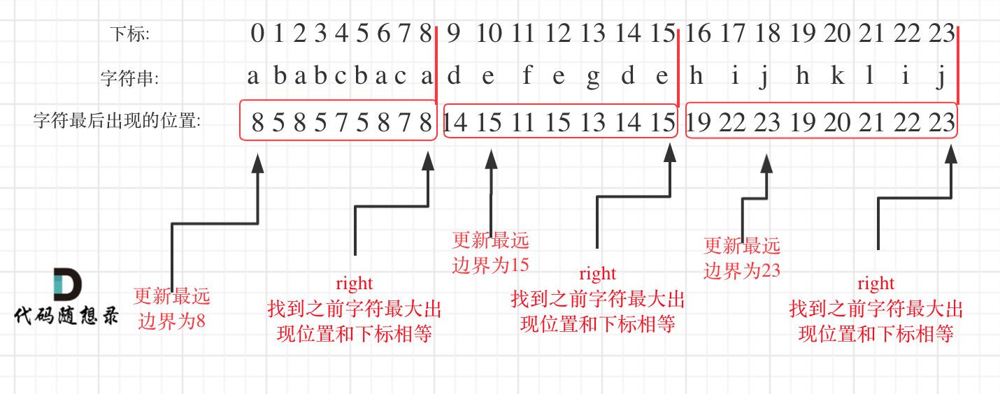

---

总结
这道题⽬leetcode标记为贪⼼算法，说实话，我没有感受到贪⼼，找不出局部最优推出全局最
优的过程。就是⽤最远出现距离模拟了圈字符的⾏为。
但这道题⽬的思路是很巧妙的，所以有必要介绍给⼤家做⼀做，感受⼀下。
如果感觉PDF对你有帮助，微信搜索：代码随想录，你会发现相见恨晚！
时间复杂度：O(n)
空间复杂度：O(1) 使⽤的hash数组是固定⼤⼩
 
代码随想录官⽹：www.programmercarl.com
代码随想录开源项⽬Github：https://github.com/youngyangyang04/leetcode-
master
代码随想录算法公开课 ，代码随想录的全部内容将由我（程序员Carl）视频讲解并
开免费开放给⼤家。
《代码随想录》纸质版 已经出版。
代码随想录知识星球 上万录友在这⾥学习
代码随想录算法训练营 帮助录友⾼效刷完代码随想录。
                left = i + 1;
            }
        }
        return result;
    }
};

---

贪⼼算法：合并区间
56. 合并区间
题⽬链接：https://leetcode-cn.com/problems/merge-intervals/
给出⼀个区间的集合，请合并所有重叠的区间。
⽰例 1:
输⼊: intervals = [[1,3],[2,6],[8,10],[15,18]]
输出: [[1,6],[8,10],[15,18]]
解释: 区间 [1,3] 和 [2,6] 重叠, 将它们合并为 [1,6].

---

⽰例 2:
输⼊: intervals = [[1,4],[4,5]]
输出: [[1,5]]
解释: 区间 [1,4] 和 [4,5] 可被视为重叠区间。
注意：输⼊类型已于2019年4⽉15⽇更改。 请重置默认代码定义以获取新⽅法签名。
提⽰：
思路
⼤家应该都感觉到了，此题⼀定要排序，那么按照左边界排序，还是右边界排序呢？
都可以！
那么我按照左边界排序，排序之后局部最优：每次合并都取最⼤的右边界，这样就可以合并
更多的区间了，整体最优：合并所有重叠的区间。
局部最优可以推出全局最优，找不出反例，试试贪⼼。
那有同学问了，本来不就应该合并最⼤右边界么，这和贪⼼有啥关系？
有时候贪⼼就是常识！哈哈
按照左边界从⼩到⼤排序之后，如果 intervals[i][0] < intervals[i - 1][1] 即
intervals[i]左边界 < intervals[i - 1]右边界，则⼀定有重复，因为intervals[i]的左边界⼀定是⼤
于等于intervals[i - 1]的左边界。
即：intervals[i]的左边界在intervals[i - 1]左边界和右边界的范围内，那么⼀定有重复！
这么说有点抽象，看图：（注意图中区间都是按照左边界排序之后了）
intervals[i][0] <= intervals[i][1]

---

知道如何判断重复之后，剩下的就是合并了，如何去模拟合并区间呢？
其实就是⽤合并区间后左边界和右边界，作为⼀个新的区间，加⼊到result数组⾥就可以了。
如果没有合并就把原区间加⼊到result数组。
C++代码如下：
class Solution {
public:
    // 按照区间左边界从⼩到⼤排序
    static bool cmp (const vector<int>& a, const vector<int>& b) {
        return a[0] < b[0];
    }
    vector<vector<int>> merge(vector<vector<int>>& intervals) {
        vector<vector<int>> result;
        if (intervals.size() == 0) return result;
        sort(intervals.begin(), intervals.end(), cmp);
        bool flag = false; // 标记最后⼀个区间有没有合并

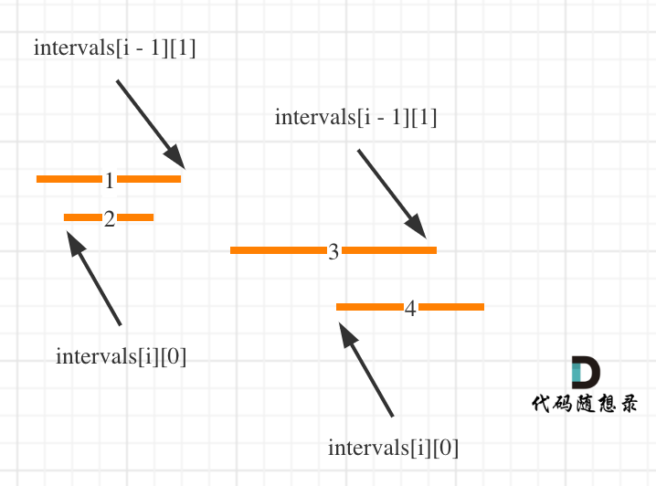

---

当然以上代码有冗余⼀些，可以优化⼀下，如下：（思路是⼀样的）
        int length = intervals.size();
        for (int i = 1; i < length; i++) {
            int start = intervals[i - 1][0];    // 初始为i-1区间的左边界
            int end = intervals[i - 1][1];      // 初始i-1区间的右边界
            while (i < length && intervals[i][0] <= end) { // 合并区间
                end = max(end, intervals[i][1]);    // 不断更新右区间
                if (i == length - 1) flag = true;   // 最后⼀个区间也合并
了
                i++;                                // 继续合并下⼀个区间
            }
            // start和end是表示intervals[i - 1]的左边界右边界，所以最优
intervals[i]区间是否合并了要标记⼀下
            result.push_back({start, end});
        }
        // 如果最后⼀个区间没有合并，将其加⼊result
        if (flag == false) {
            result.push_back({intervals[length - 1][0], 
intervals[length - 1][1]});
        }
        return result;
    }
};
class Solution {
public:
    vector<vector<int>> merge(vector<vector<int>>& intervals) {
        vector<vector<int>> result;
        if (intervals.size() == 0) return result;
        // 排序的参数使⽤了lamda表达式
        sort(intervals.begin(), intervals.end(), {return a[0] < b[0];});
        result.push_back(intervals[0]);
        for (int i = 1; i < intervals.size(); i++) {
            if (result.back()[1] >= intervals[i][0]) { // 合并区间

---

总结
对于贪⼼算法，很多同学都是：如果能凭常识直接做出来，就会感觉不到⾃⼰⽤了贪⼼, ⼀旦
第⼀直觉想不出来, 可能就⼀直想不出来了。
跟着「代码随想录」刷题的录友应该感受过，贪⼼难起来，真的难。
那应该怎么办呢？
正如我贪⼼系列开篇词关于贪⼼算法，你该了解这些！中讲解的⼀样，贪⼼本来就没有套
路，也没有框架，所以各种常规解法需要多接触多练习，⾃然⽽然才会想到。
「代码随想录」会把贪⼼常见的经典题⽬覆盖到，⼤家只要认真学习打卡就可以了。
 
本周⼩结！（贪⼼算法系列四）
时间复杂度：O(nlogn) ，有⼀个快排
空间复杂度：O(1)，我没有算result数组（返回值所需容器占的空间）
 
 
                result.back()[1] = max(result.back()[1], intervals[i]
[1]);
            } else {
                result.push_back(intervals[i]);
            }
        }
        return result;
    }
};

---

周⼀
在贪⼼算法：⽤最少数量的箭引爆⽓球中，我们开始讲解了重叠区间问题，⽤最少的⼸箭射
爆所有⽓球，其本质就是找到最⼤的重叠区间。
按照左边界经⾏排序后，如果⽓球重叠了，重叠⽓球中右边边界的最⼩值 之前的区间⼀定需
要⼀个⼸箭
如图：
模拟射⽓球的过程，很多同学真的要去模拟了，实时把⽓球从数组中移⾛，这么写的话就复
杂了，从前向后遍历重复的只要跳过就可以的。
周⼆
在贪⼼算法：⽆重叠区间中要去掉最少的区间，来让所有区间没有重叠。
我来按照右边界排序，从左向右记录⾮交叉区间的个数。最后⽤区间总数减去⾮交叉区间的
个数就是需要移除的区间个数了。

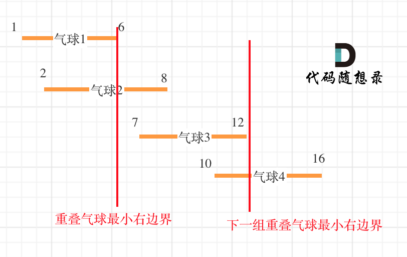

---

如图：
细⼼的同学就发现了，此题和 贪⼼算法：⽤最少数量的箭引爆⽓球⾮常像。
⼸箭的数量就相当于是⾮交叉区间的数量，只要把⼸箭那道题⽬代码⾥射爆⽓球的判断条件
加个等号（认为[0，1][1，2]不是相邻区间），然后⽤总区间数减去⼸箭数量 就是要移除的区
间数量了。
把贪⼼算法：⽤最少数量的箭引爆⽓球代码稍做修改，别可以AC本题。
修改后的C++代码如下：
class Solution {
public:
    // 按照区间左边界从⼤到⼩排序
    static bool cmp (const vector<int>& a, const vector<int>& b) {
        return a[0] < b[0];
    }
    int eraseOverlapIntervals(vector<vector<int>>& intervals) {
        if (intervals.size() == 0) return 0;
        sort(intervals.begin(), intervals.end(), cmp);

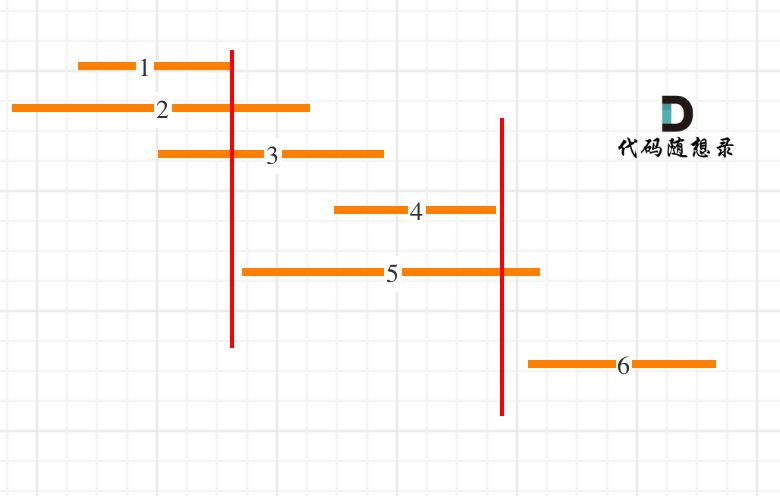

---

周三
贪⼼算法：划分字母区间中我们要把这个字符串划分为尽可能多的⽚段，同⼀字母最多出现
在⼀个⽚段中。
这道题⽬leetcode上标的是贪⼼，其实我不认识是贪⼼，因为没感受到局部最优和全局最优的
关系。
但不影响这是⼀道好题，思路很不错，通过字符出现最远距离取并集的⽅法，把出现过的字
符都圈到⼀个区间⾥。
解题过程分如下两步：
如图：
 
统计每⼀个字符最后出现的位置
从头遍历字符，并更新字符的最远出现下标，如果找到字符最远出现位置下标和当
前下标相等了，则找到了分割点
        int result = 1;
        for (int i = 1; i < intervals.size(); i++) {
            if (intervals[i][0] >= intervals[i - 1][1]) { // 需要要把> 改
成 >= 就可以了
                result++; // 需要⼀⽀箭
            }
            else {
                intervals[i][1] = min(intervals[i - 1][1], intervals[i]
[1]); // 更新重叠⽓球最⼩右边界
            }
        }
        return intervals.size() - result;
    }
};

---

周四
贪⼼算法：合并区间中要合并所有重叠的区间。
相信如果录友们前⼏天区间问题的题⽬认真练习了，今天题⽬就应该算简单⼀些了。
按照左边界排序，排序之后局部最优：每次合并都取最⼤的右边界，这样就可以合并更多的
区间了，整体最优：合并所有重叠的区间。
具体操作：按照左边界从⼩到⼤排序之后，如果 intervals[i][0] < intervals[i - 1][1] 即
intervals[i]左边界 < intervals[i - 1]右边界，则⼀定有重复，因为intervals[i]的左边界⼀定是⼤
于等于intervals[i - 1]的左边界。
如图：

---

总结
本周的主题就是⽤贪⼼算法来解决区间问题，进过本周的学习，⼤家应该对区间的各种合并
分割有⼀定程度的了解了。
其实很多区间的合并操作看起来都是常识，其实贪⼼算法有时候就是常识，哈哈，但也别⼩
看了贪⼼算法。
在贪⼼算法：合并区间中就说过，对于贪⼼算法，很多同学都是：「如果能凭常识直接做出
来，就会感觉不到⾃⼰⽤了贪⼼, ⼀旦第⼀直觉想不出来, 可能就⼀直想不出来了」。
所以还是要多看多做多练习！
「代码随想录」⾥总结的都是经典题⽬，⼤家跟着练就节省了不少选择题⽬的时间了。
 
代码随想录官⽹：www.programmercarl.com
代码随想录开源项⽬Github：https://github.com/youngyangyang04/leetcode-

---

如果感觉PDF对你有帮助，微信搜索：代码随想录，你会发现相见恨晚！
 
master
代码随想录算法公开课 ，代码随想录的全部内容将由我（程序员Carl）视频讲解并
开免费开放给⼤家。
《代码随想录》纸质版 已经出版。
代码随想录知识星球 上万录友在这⾥学习
代码随想录算法训练营 帮助录友⾼效刷完代码随想录。

---

贪⼼算法：单调递增的数字
738.单调递增的数字
给定⼀个⾮负整数 N，找出⼩于或等于 N 的最⼤的整数，同时这个整数需要满⾜其各个位数
上的数字是单调递增。
（当且仅当每个相邻位数上的数字 x 和 y 满⾜ x <= y 时，我们称这个整数是单调递增的。）
⽰例 1:
输⼊: N = 10
输出: 9
⽰例 2:
输⼊: N = 1234
输出: 1234
⽰例 3:
输⼊: N = 332
输出: 299
说明: N 是在 [0, 10^9] 范围内的⼀个整数。
暴⼒解法
题意很简单，那么⾸先想的就是暴⼒解法了，来我提⼤家暴⼒⼀波，结果⾃然是超时！
代码如下：
 
 
 
class Solution {
private:
    bool checkNum(int num) {

---

贪⼼算法
题⽬要求⼩于等于N的最⼤单调递增的整数，那么拿⼀个两位的数字来举例。
例如：98，⼀旦出现strNum[i - 1] > strNum[i]的情况（⾮单调递增），⾸先想让strNum[i - 
1]--，然后strNum[i]给为9，这样这个整数就是89，即⼩于98的最⼤的单调递增整数。
这⼀点如果想清楚了，这道题就好办了。
局部最优：遇到strNum[i - 1] > strNum[i]的情况，让strNum[i - 1]--，然后strNum[i]给为
9，可以保证这两位变成最⼤单调递增整数。
全局最优：得到⼩于等于N的最⼤单调递增的整数。
但这⾥局部最优推出全局最优，还需要其他条件，即遍历顺序，和标记从哪⼀位开始统⼀改
成9。
时间复杂度：O(n * m) m为n的数字长度
空间复杂度：O(1)
 
        int max = 10;
        while (num) {
            int t = num % 10;
            if (max >= t) max = t;
            else return false;
            num = num / 10;
        }
        return true;
    }
public:
    int monotoneIncreasingDigits(int N) {
        for (int i = N; i > 0; i--) {
            if (checkNum(i)) return i;
        }
        return 0;
    }
};

---

此时是从前向后遍历还是从后向前遍历呢？
从前向后遍历的话，遇到strNum[i - 1] > strNum[i]的情况，让strNum[i - 1]减⼀，但此时如果
strNum[i - 1]减⼀了，可能又⼩于strNum[i - 2]。
这么说有点抽象，举个例⼦，数字：332，从前向后遍历的话，那么就把变成了329，此时2又
⼩于了第⼀位的3了，真正的结果应该是299。
所以从前后向遍历会改变已经遍历过的结果！
那么从后向前遍历，就可以重复利⽤上次⽐较得出的结果了，从后向前遍历332的数值变化
为：332 -> 329 -> 299
确定了遍历顺序之后，那么此时局部最优就可以推出全局，找不出反例，试试贪⼼。
C++代码如下：
class Solution {
public:
    int monotoneIncreasingDigits(int N) {
        string strNum = to_string(N);
        // flag⽤来标记赋值9从哪⾥开始
        // 设置为这个默认值，为了防⽌第⼆个for循环在flag没有被赋值的情况下执⾏
        int flag = strNum.size();
        for (int i = strNum.size() - 1; i > 0; i--) {
            if (strNum[i - 1] > strNum[i] ) {
                flag = i;
                strNum[i - 1]--;
            }
        }
        for (int i = flag; i < strNum.size(); i++) {
            strNum[i] = '9';
        }
        return stoi(strNum);
    }
};

---

总结
本题只要想清楚个例，例如98，⼀旦出现strNum[i - 1] > strNum[i]的情况（⾮单调递增），
⾸先想让strNum[i - 1]减⼀，strNum[i]赋值9，这样这个整数就是89。就可以很⾃然想到对应
的贪⼼解法了。
想到了贪⼼，还要考虑遍历顺序，只有从后向前遍历才能重复利⽤上次⽐较的结果。
最后代码实现的时候，也需要⼀些技巧，例如⽤⼀个flag来标记从哪⾥开始赋值9。
贪⼼算法：买卖股票的最佳时机含⼿续费
714. 买卖股票的最佳时机含⼿续费
题⽬链接：https://leetcode-cn.com/problems/best-time-to-buy-and-sell-stock-with-transa
ction-fee/
给定⼀个整数数组 prices，其中第 i 个元素代表了第 i 天的股票价格 ；⾮负整数 fee 代表了交
易股票的⼿续费⽤。
你可以⽆限次地完成交易，但是你每笔交易都需要付⼿续费。如果你已经购买了⼀个股票，
在卖出它之前你就不能再继续购买股票了。
返回获得利润的最⼤值。
注意：这⾥的⼀笔交易指买⼊持有并卖出股票的整个过程，每笔交易你只需要为⽀付⼀次⼿
续费。
⽰例 1:
输⼊: prices = [1, 3, 2, 8, 4, 9], fee = 2
输出: 8
时间复杂度：O(n) n 为数字长度
空间复杂度：O(n) 需要⼀个字符串，转化为字符串操作更⽅便

---

解释: 能够达到的最⼤利润:
在此处买⼊ prices[0] = 1
在此处卖出 prices[3] = 8
在此处买⼊ prices[4] = 4
在此处卖出 prices[5] = 9
总利润: ((8 - 1) - 2) + ((9 - 4) - 2) = 8.
注意:
思路
本题相对于贪⼼算法：122.买卖股票的最佳时机II，多添加了⼀个条件就是⼿续费。
贪⼼算法
在贪⼼算法：122.买卖股票的最佳时机II中使⽤贪⼼策略不⽤关⼼具体什么时候买卖，只要收
集每天的正利润，最后稳稳的就是最⼤利润了。
⽽本题有了⼿续费，就要关系什么时候买卖了，因为计算所获得利润，需要考虑买卖利润可
能不⾜以⼿续费的情况。
如果使⽤贪⼼策略，就是最低值买，最⾼值（如果算上⼿续费还盈利）就卖。
此时⽆⾮就是要找到两个点，买⼊⽇期，和卖出⽇期。
所以我们在做收获利润操作的时候其实有三种情况：
0 < prices.length <= 50000.
0 < prices[i] < 50000.
0 <= fee < 50000.
 
 
买⼊⽇期：其实很好想，遇到更低点就记录⼀下。
卖出⽇期：这个就不好算了，但也没有必要算出准确的卖出⽇期，只要当前价格⼤
于（最低价格+⼿续费），就可以收获利润，⾄于准确的卖出⽇期，就是连续收获利
润区间⾥的最后⼀天（并不需要计算是具体哪⼀天）。
情况⼀：收获利润的这⼀天并不是收获利润区间⾥的最后⼀天（不是真正的卖出，
相当于持有股票），所以后⾯要继续收获利润。

---

贪⼼算法C++代码如下：
从代码中可以看出对情况⼀的操作，因为如果还在收获利润的区间⾥，表⽰并不是真正的卖
出，⽽计算利润每次都要减去⼿续费，所以要让minPrice = prices[i] - fee;，这样在明天收
获利润的时候，才不会多减⼀次⼿续费！
情况⼆：前⼀天是收获利润区间⾥的最后⼀天（相当于真正的卖出了），今天要重
新记录最⼩价格了。
情况三：不作操作，保持原有状态（买⼊，卖出，不买不卖）
时间复杂度：O(n)
空间复杂度：O(1)
class Solution {
public:
    int maxProfit(vector<int>& prices, int fee) {
        int result = 0;
        int minPrice = prices[0]; // 记录最低价格
        for (int i = 1; i < prices.size(); i++) {
            // 情况⼆：相当于买⼊
            if (prices[i] < minPrice) minPrice = prices[i];
            // 情况三：保持原有状态（因为此时买则不便宜，卖则亏本）
            if (prices[i] >= minPrice && prices[i] <= minPrice + fee) {
                continue;
            }
            // 计算利润，可能有多次计算利润，最后⼀次计算利润才是真正意义的卖出
            if (prices[i] > minPrice + fee) {
                result += prices[i] - minPrice - fee;
                minPrice = prices[i] - fee; // 情况⼀，这⼀步很关键
            }
        }
        return result;
    }
};

---

⼤家也可以发现，情况三，那块代码是可以删掉的，我是为了让代码表达清晰，所以没有精
简。
动态规划
我在公众号「代码随想录」⾥将在下⼀个系列详细讲解动态规划，所以本题解先给出我的
C++代码（带详细注释），感兴趣的同学可以⾃⼰先学习⼀下。
相对于贪⼼算法：122.买卖股票的最佳时机II的动态规划解法中，只需要在计算卖出操作的时
候减去⼿续费就可以了，代码⼏乎是⼀样的。
C++代码如下：
当然可以对空间经⾏优化，因为当前状态只是依赖前⼀个状态。
C++ 代码如下：
 
时间复杂度：O(n)
空间复杂度：O(n)
class Solution {
public:
    int maxProfit(vector<int>& prices, int fee) {
        // dp[i][1]第i天持有的最多现⾦
        // dp[i][0]第i天持有股票所剩的最多现⾦
        int n = prices.size();
        vector<vector<int>> dp(n, vector<int>(2, 0));
        dp[0][0] -= prices[0]; // 持股票
        for (int i = 1; i < n; i++) {
            dp[i][0] = max(dp[i - 1][0], dp[i - 1][1] - prices[i]);
            dp[i][1] = max(dp[i - 1][1], dp[i - 1][0] + prices[i] - 
fee);
        }
        return max(dp[n - 1][0], dp[n - 1][1]);
    }
};

---

总结
本题贪⼼的思路其实是⽐较难的，动态规划才是常规做法，但也算是给⼤家拓展⼀下思路，
感受⼀下贪⼼的魅⼒。
后期我们在讲解 股票问题系列的时候，会⽤动规的⽅式把股票问题穿个线。
 
贪⼼算法：我要监控⼆叉树！
时间复杂度：O(n)
空间复杂度：O(1)
 
 
class Solution {
public:
    int maxProfit(vector<int>& prices, int fee) {
        int n = prices.size();
        int holdStock = (-1) * prices[0]; // 持股票
        int saleStock = 0; // 卖出股票
        for (int i = 1; i < n; i++) {
            int previousHoldStock = holdStock;
            holdStock = max(holdStock, saleStock - prices[i]);
            saleStock = max(saleStock, previousHoldStock + prices[i] - 
fee);
        }
        return saleStock;
    }
};

---

968.监控⼆叉树
题⽬地址 : https://leetcode-cn.com/problems/binary-tree-cameras/
给定⼀个⼆叉树，我们在树的节点上安装摄像头。
节点上的每个摄影头都可以监视其⽗对象、⾃⾝及其直接⼦对象。
计算监控树的所有节点所需的最⼩摄像头数量。
⽰例 1：
输⼊：[0,0,null,0,0]
输出：1
解释：如图所⽰，⼀台摄像头⾜以监控所有节点。
⽰例 2：

---

输⼊：[0,0,null,0,null,0,null,null,0]
输出：2
解释：需要⾄少两个摄像头来监视树的所有节点。 上图显⽰了摄像头放置的有效位置之⼀。
提⽰：
思路
这道题⽬⾸先要想，如何放置，才能让摄像头最⼩的呢？
从题⽬中⽰例，其实可以得到启发，我们发现题⽬⽰例中的摄像头都没有放在叶⼦节点上！
这是很重要的⼀个线索，摄像头可以覆盖上中下三层，如果把摄像头放在叶⼦节点上，就浪
费的⼀层的覆盖。
给定树的节点数的范围是 [1, 1000]。
每个节点的值都是 0。

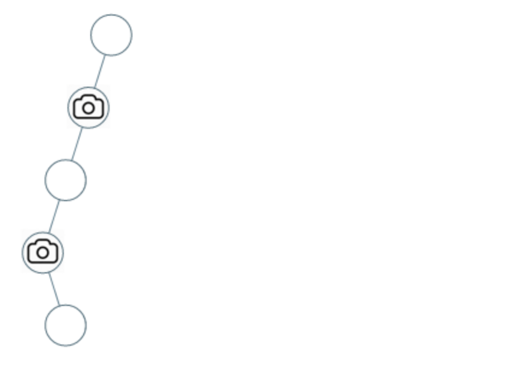

---

所以把摄像头放在叶⼦节点的⽗节点位置，才能充分利⽤摄像头的覆盖⾯积。
那么有同学可能问了，为什么不从头结点开始看起呢，为啥要从叶⼦节点看呢？
因为头结点放不放摄像头也就省下⼀个摄像头， 叶⼦节点放不放摄像头省下了的摄像头数量
是指数阶别的。
所以我们要从下往上看，局部最优：让叶⼦节点的⽗节点安摄像头，所⽤摄像头最少，整体
最优：全部摄像头数量所⽤最少！
局部最优推出全局最优，找不出反例，那么就按照贪⼼来！
此时，⼤体思路就是从低到上，先给叶⼦节点⽗节点放个摄像头，然后隔两个节点放⼀个摄
像头，直⾄到⼆叉树头结点。
此时这道题⽬还有两个难点：
确定遍历顺序
在⼆叉树中如何从低向上推导呢？
可以使⽤后序遍历也就是左右中的顺序，这样就可以在回溯的过程中从下到上进⾏推导了。
后序遍历代码如下：
1. ⼆叉树的遍历
2. 如何隔两个节点放⼀个摄像头

---

注意在以上代码中我们取了左孩⼦的返回值，右孩⼦的返回值，即left 和 right， 以后推导中
间节点的状态
如何隔两个节点放⼀个摄像头
此时需要状态转移的公式，⼤家不要和动态的状态转移公式混到⼀起，本题状态转移没有择
优的过程，就是单纯的状态转移！
来看看这个状态应该如何转移，先来看看每个节点可能有⼏种状态：
有如下三种：
我们分别有三个数字来表⽰：
⼤家应该找不出第四个节点的状态了。
 
该节点⽆覆盖
本节点有摄像头
本节点有覆盖
0：该节点⽆覆盖
1：本节点有摄像头
2：本节点有覆盖
    int traversal(TreeNode* cur) {
        // 空节点，该节点有覆盖
        if (终⽌条件) return ;
        int left = traversal(cur->left);    // 左
        int right = traversal(cur->right);  // 右
        逻辑处理                            // 中
        return ;
    }

---

⼀些同学可能会想有没有第四种状态：本节点⽆摄像头，其实⽆摄像头就是 ⽆覆盖 或者 有覆
盖的状态，所以⼀共还是三个状态。
因为在遍历树的过程中，就会遇到空节点，那么问题来了，空节点究竟是哪⼀种状态呢？ 空
节点表⽰⽆覆盖？ 表⽰有摄像头？还是有覆盖呢？
回归本质，为了让摄像头数量最少，我们要尽量让叶⼦节点的⽗节点安装摄像头，这样才能
摄像头的数量最少。
那么空节点不能是⽆覆盖的状态，这样叶⼦节点就要放摄像头了，空节点也不能是有摄像头
的状态，这样叶⼦节点的⽗节点就没有必要放摄像头了，⽽是可以把摄像头放在叶⼦节点的
爷爷节点上。
所以空节点的状态只能是有覆盖，这样就可以在叶⼦节点的⽗节点放摄像头了
接下来就是递推关系。
那么递归的终⽌条件应该是遇到了空节点，此时应该返回2（有覆盖），原因上⾯已经解释过
了。
代码如下：
递归的函数，以及终⽌条件已经确定了，再来看单层逻辑处理。
主要有如下四类情况：
左孩⼦有覆盖，右孩⼦有覆盖，那么此时中间节点应该就是⽆覆盖的状态了。
如图：
情况1：左右节点都有覆盖
// 空节点，该节点有覆盖
if (cur == NULL) return 2;

---

代码如下：
如果是以下情况，则中间节点（⽗节点）应该放摄像头：
left == 0 && right == 0 左右节点⽆覆盖
left == 1 && right == 0 左节点有摄像头，右节点⽆覆盖
left == 0 && right == 1 左节点有⽆覆盖，右节点摄像头
left == 0 && right == 2 左节点⽆覆盖，右节点覆盖
left == 2 && right == 0 左节点覆盖，右节点⽆覆盖
情况2：左右节点⾄少有⼀个⽆覆盖的情况
// 左右节点都有覆盖
if (left == 2 && right == 2) return 0;

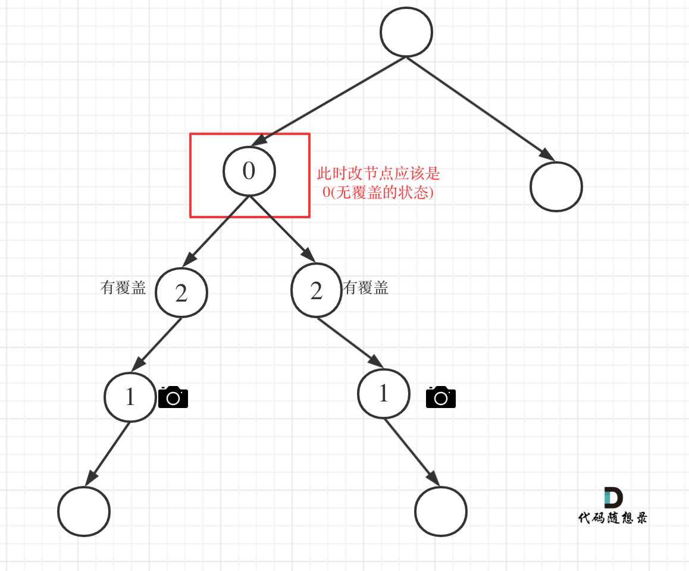

---

这个不难理解，毕竟有⼀个孩⼦没有覆盖，⽗节点就应该放摄像头。
此时摄像头的数量要加⼀，并且return 1，代表中间节点放摄像头。
代码如下：
如果是以下情况，其实就是 左右孩⼦节点有⼀个有摄像头了，那么其⽗节点就应该是2（覆盖
的状态）
left == 1 && right == 2 左节点有摄像头，右节点有覆盖
left == 2 && right == 1 左节点有覆盖，右节点有摄像头
left == 1 && right == 1 左右节点都有摄像头
代码如下：
从这个代码中，可以看出，如果left == 1, right == 0 怎么办？其实这种条件在情况2中已经判
断过了，如图：
情况3：左右节点⾄少有⼀个有摄像头
if (left == 0 || right == 0) {
    result++;
    return 1;
}
if (left == 1 || right == 1) return 2;

---

这种情况也是⼤多数同学容易迷惑的情况。
以上都处理完了，递归结束之后，可能头结点 还有⼀个⽆覆盖的情况，如图：
4. 情况4：头结点没有覆盖

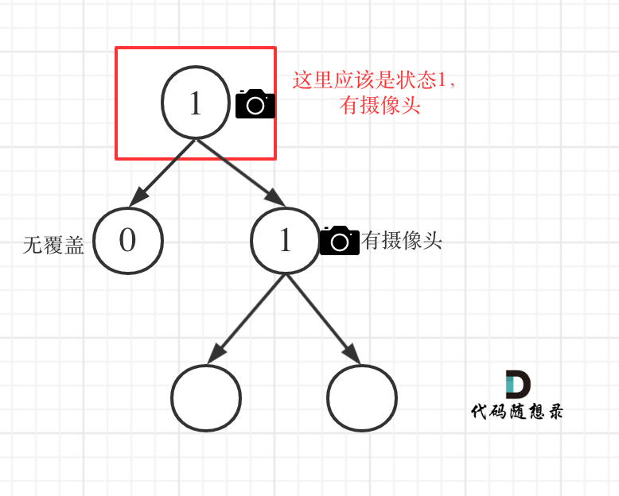

---

所以递归结束之后，还要判断根节点，如果没有覆盖，result++，代码如下：
以上四种情况我们分析完了，代码也差不多了，整体代码如下：
（以下我的代码注释很详细，为了把情况说清楚，特别把每种情况列出来。）
int minCameraCover(TreeNode* root) {
    result = 0;
    if (traversal(root) == 0) { // root ⽆覆盖
        result++;
    }
    return result;
}

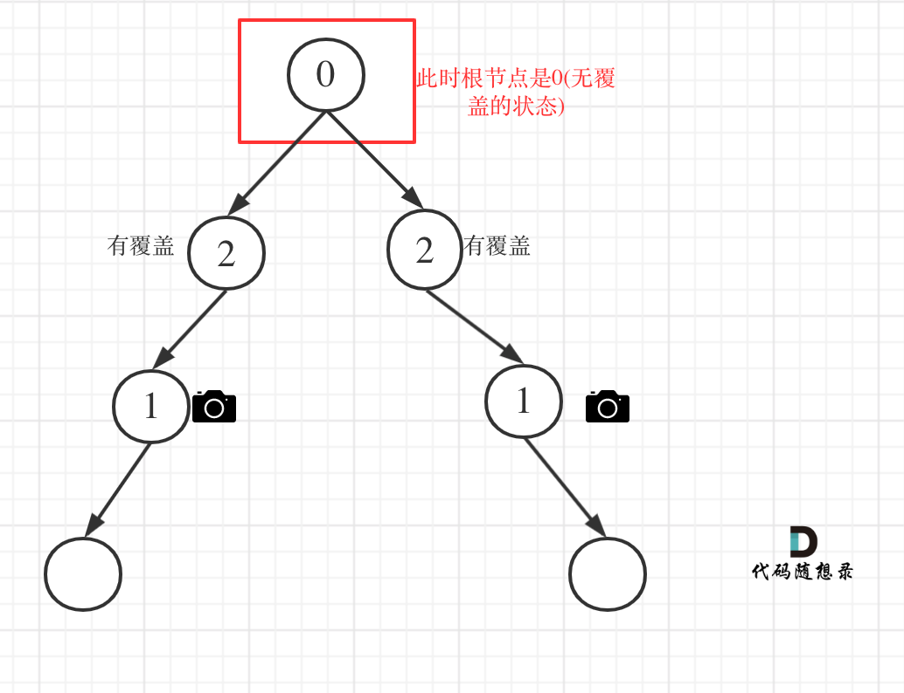

---

C++代码
 
// 版本⼀
class Solution {
private:
    int result;
    int traversal(TreeNode* cur) {
        // 空节点，该节点有覆盖
        if (cur == NULL) return 2;
        int left = traversal(cur->left);    // 左
        int right = traversal(cur->right);  // 右
        // 情况1
        // 左右节点都有覆盖
        if (left == 2 && right == 2) return 0;
        // 情况2
        // left == 0 && right == 0 左右节点⽆覆盖
        // left == 1 && right == 0 左节点有摄像头，右节点⽆覆盖
        // left == 0 && right == 1 左节点有⽆覆盖，右节点摄像头
        // left == 0 && right == 2 左节点⽆覆盖，右节点覆盖
        // left == 2 && right == 0 左节点覆盖，右节点⽆覆盖
        if (left == 0 || right == 0) {
            result++;
            return 1;
        }
        // 情况3
        // left == 1 && right == 2 左节点有摄像头，右节点有覆盖
        // left == 2 && right == 1 左节点有覆盖，右节点有摄像头
        // left == 1 && right == 1 左右节点都有摄像头
        // 其他情况前段代码均已覆盖
        if (left == 1 || right == 1) return 2;
        // 以上代码我没有使⽤else，主要是为了把各个分⽀条件展现出来，这样代码有助
于读者理解
        // 这个 return -1 逻辑不会⾛到这⾥。

---

在以上代码的基础上，再进⾏精简，代码如下：
        return -1;
    }
public:
    int minCameraCover(TreeNode* root) {
        result = 0;
        // 情况4
        if (traversal(root) == 0) { // root ⽆覆盖
            result++;
        }
        return result;
    }
};
// 版本⼆
class Solution {
private:
    int result;
    int traversal(TreeNode* cur) {
        if (cur == NULL) return 2;
        int left = traversal(cur->left);    // 左
        int right = traversal(cur->right);  // 右
        if (left == 2 && right == 2) return 0;
        else if (left == 0 || right == 0) {
            result++;
            return 1;
        } else return 2;
    }
public:
    int minCameraCover(TreeNode* root) {
        result = 0;
        if (traversal(root) == 0) { // root ⽆覆盖
            result++;
        }
        return result;
    }

---

⼤家可能会惊讶，居然可以这么简短，其实就是在版本⼀的基础上，使⽤else把⼀些情况直接
覆盖掉了。
在⽹上关于这道题解可以搜到很多这种神级别的代码，但都没讲不清楚，如果直接看代码的
话，指定越看越晕，所以建议⼤家对着版本⼀的代码⼀步⼀步来哈，版本⼆中看不中⽤！。
总结
本题的难点⾸先是要想到贪⼼的思路，然后就是遍历和状态推导。
在⼆叉树上进⾏状态推导，其实难度就上了⼀个台阶了，需要对⼆叉树的操作⾮常娴熟。
这道题⽬是名副其实的hard，⼤家感受感受，哈哈。
贪⼼算法：总结篇！（每逢总结必经典）
我刚刚开始讲解贪⼼系列的时候就说了，贪⼼系列并不打算严格的从简单到困难这么个顺序
来讲解。
因为贪⼼的简单题可能往往过于简单甚⾄感觉不到贪⼼，如果我连续⼏天讲解简单的贪⼼，
估计录友们⼀定会不耐烦了，会感觉贪⼼有啥好学的。
但贪⼼的难题又真的有点难，所以我是简单困难交错着讲的，这样⼤家就感觉难度适中，⽽
且贪⼼也没有什么框架和套路，所以对刷题顺序要求没有那么⾼。
但在贪⼼系列，我发的题⽬难度会整体呈现⼀个阶梯状上升，细⼼的录友们应该有所体会。
在刚刚讲过的回溯系列中，⼤家可以发现我是严格按照框架难度顺序循序渐进讲解的，和贪
⼼又不⼀样，因为回溯法如果题⽬顺序没选好，刷题效果会⾮常差！
 
 
};

---

同样回溯系列也不允许简单困难交替着来，因为前后题⽬都是有因果关系的，相信跟着刷过
回溯系列的录友们都会明⽩我的良苦⽤⼼，哈哈。
每个系列都有每个系列的特点，我都会根据特点有所调整，⼤家看我每天的推送的题⽬，都
不是随便找⼀个到就推送的，都是先有整体规划，然后反复斟酌具体题⽬的结果。
那么在贪⼼总结篇⾥，我按难易程度以及题⽬类型⼤体归个类。
贪⼼⼤总结正式开始：
贪⼼理论基础
在贪⼼系列开篇词关于贪⼼算法，你该了解这些！中，我们就讲解了⼤家对贪⼼的普遍疑
惑。
跟着⼀起刷题的录友们就会发现，贪⼼思路往往很巧妙，并不简单。
贪⼼⽆套路，也没有框架之类的，需要多看多练培养感觉才能想到贪⼼的思路。
Carl个⼈认为：如果找出局部最优并可以推出全局最优，就是贪⼼，如果局部最优都没找出
来，就不是贪⼼，可能是单纯的模拟。（并不是权威解读，⼀家之辞哈）
但我们也不⽤过于强调什么题⽬是贪⼼，什么不是贪⼼，那就太学术了，毕竟学会解题就⾏
了。
在做贪⼼题的过程中，如果再来⼀个数据证明，其实没有必要，⼿动模拟⼀下，如果找不出
反例，就试试贪⼼。⾯试中，代码写出来跑过测试⽤例即可，或者⾃⼰能⾃圆其说理由就⾏
了
 
1. 贪⼼很简单，就是常识？
2. 贪⼼有没有固定的套路？
3. 究竟什么题⽬是贪⼼呢？
4. 如何知道局部最优推出全局最优，有数学证明么？

---

就像是 要⽤⼀下 1 + 1 = 2，没有必要再证明⼀下 1 + 1 究竟为什么等于 2。（例⼦极端了点，
但是这个道理）
相信⼤家读完关于贪⼼算法，你该了解这些！，就对贪⼼有了⼀个基本的认识了。
贪⼼简单题
以下三道题⽬就是简单题，⼤家会发现贪⼼感觉就是常识。是的，如下三道题⽬，就是靠常
识，但我都具体分析了局部最优是什么，全局最优是什么，贪⼼也要贪的有理有据！
贪⼼中等题
贪⼼中等题，靠常识可能就有点想不出来了。开始初现贪⼼算法的难度与巧妙之处。
贪⼼解决股票问题
⼤家都知道股票系列问题是动规的专长，其实⽤贪⼼也可以解决，⽽且还不⽌就这两道题
⽬，但这两道⽐较典型，我就拿来单独说⼀说
两个维度权衡问题
在出现两个维度相互影响的情况时，两边⼀起考虑⼀定会顾此失彼，要先确定⼀个维度，再
确定另⼀个⼀个维度。
 
贪⼼算法：分发饼⼲
贪⼼算法：K次取反后最⼤化的数组和
贪⼼算法：柠檬⽔找零
 
贪⼼算法：摆动序列
贪⼼算法：单调递增的数字
 
贪⼼算法：买卖股票的最佳时机II
贪⼼算法：买卖股票的最佳时机含⼿续费
 
贪⼼算法：分发糖果
贪⼼算法：根据⾝⾼重建队列

---

在讲解本题的过程中，还强调了编程语⾔的重要性，模拟插队的时候，使⽤C++中的list（链
表）替代了vector(动态数组)，效率会⾼很多。
所以在贪⼼算法：根据⾝⾼重建队列（续集）详细讲解了，为什么⽤list（链表）更快！
⼤家也要掌握⾃⼰所有的编程语⾔，理解其内部实现机制，这样才能写出⾼效的算法！
贪⼼难题
这⾥的题⽬如果没有接触过，其实是很难想到的，甚⾄接触过，也⼀时想不出来，所以题⽬
不要做⼀遍，要多练！
贪⼼解决区间问题
关于区间问题，⼤家应该印象深刻，有⼀周我们专门讲解的区间问题，各种覆盖各种去重。
其他难题
贪⼼算法：最⼤⼦序和 其实是动态规划的题⽬，但贪⼼性能更优，很多同学也是第⼀次发现
贪⼼能⽐动规更优的题⽬。
贪⼼算法：加油站可能以为是⼀道模拟题，但就算模拟其实也不简单，需要把while⽤的很娴
熟。但其实是可以使⽤贪⼼给时间复杂度降低⼀个数量级。
最后贪⼼系列压轴题⽬贪⼼算法：我要监控⼆叉树！，不仅贪⼼的思路不好想，⽽且需要对
⼆叉树的操作特别娴熟，这就是典型的交叉类难题了。
 
 
贪⼼算法：跳跃游戏
贪⼼算法：跳跃游戏II
贪⼼算法：⽤最少数量的箭引爆⽓球
贪⼼算法：⽆重叠区间
贪⼼算法：划分字母区间
贪⼼算法：合并区间

---

贪⼼每周总结
周总结⾥会对每周的题⽬中⼤家的疑问、相关难点或者笔误之类的进⾏复盘和总结。
如果⼤家发现⽂章哪⾥有问题，那么在周总结⾥或者⽂章评论区⼀定进⾏了修正，保证不会
因为我的笔误或者理解问题⽽误导⼤家，哈哈。
所以周总结⼀定要看！
总结
很多没有接触过贪⼼的同学都会感觉贪⼼有啥可学的，但只要跟着「代码随想录」坚持下来
之后，就会发现，贪⼼是⼀种很重要的算法思维⽽且并不简单，贪⼼往往妙的出其不意，触
不及防！
回想⼀下我们刚刚开始讲解贪⼼的时候，⼤家会发现⾃⼰在坚持中进步了很多！
这也是「代码随想录」的初衷，只要⼀路坚持下来，不仅基础扎实，⽽且进步也是飞速的。
在这⼗⼋道贪⼼经典题⽬中，⼤家可以发现在每⼀道题⽬的讲解中，我都是把什么是局部最
优，和什么是全局最优说清楚。
这也是我认为判断这是⼀道贪⼼题⽬的依据，如果找不出局部最优，那可能就是⼀道模拟
题。
不知不觉又⼀个系列结束了，同时也是2020年的结束。
⼀个系列的结束，又是⼀个新系列的开始，我们将在明年第⼀个⼯作⽇正式开始动态规划，
来不及解释了，录友们上车别掉队，我们又要开始新的征程！
最后也欢迎⼤家加⼊「代码随想录」知识星球（学习社区），点击这⾥加⼊吧！
 
本周⼩结！（贪⼼算法系列⼀）
本周⼩结！（贪⼼算法系列⼆）
本周⼩结！（贪⼼算法系列三）
本周⼩结！（贪⼼算法系列四）

