# 1.670道

Java基础（珊珊老师，海阳老师）
Java概述 
何为编程 
什么是Java 
jdk1.5之后的三大版本 
JVM、JRE和JDK的关系 
什么是跨平台性？原理是什么
Java语言有哪些特点 
什么是字节码？采用字节码的大好处是什么 
什么是Java程序的主类？应用程序和小程序的主类有何不同？
Java应用程序与小程序之间有那些差别？ 
Java和C++的区别 
Oracle JDK 和 OpenJDK 的对比
基础语法 
数据类型
Java有哪些数据类型
switch 是否能作用在 byte 上，是否能作用在 long 上，是否 能作用在 String 上
用最有效率的方法计算 2 乘以 8 
Math.round(11.5) 等于多少？Math.round(-11.5) 等于多少 
loat f=3.4;是否正确 
short s1 = 1; s1 = s1 + 1;有错吗?short s1 = 1; s1 += 1;有错吗 
编码
Java语言采用何种编码方案？有何特点？
注释 
什么Java注释
定义：用于解释说明程序的文字 
分类 
作用 
访问修饰符 public,private,protected,以及不写（默认）时的 区别
运算符
&和&&的区别 
关键字 
Java 有没有 goto 
final 有什么用？
final finally finalize区别
this关键字的用法
super关键字的用法
this与super的区别
static存在的主要意义
static的独特之处
static应用场景
static注意事项
流程控制语句
break ,continue ,return 的区别及作用
在 Java 中，如何跳出当前的多重嵌套循环
面向对象
面向对象概述
面向对象和面向过程的区别
面向过程：
面向对象：
面向对象三大特性
面向对象的特征有哪些方面
什么是多态机制？Java语言是如何实现多态的？
面向对象五大基本原则是什么（可选）
类与接口

---

抽象类和接口的对比
普通类和抽象类有哪些区别？ 
抽象类能使用 final 修饰吗？ 
创建一个对象用什么关键字？对象实例与对象引用有何不同？ 
变量与方法 
成员变量与局部变量的区别有哪些 
作用域 
存储位置 
生命周期 
初始值 
在Java中定义一个不做事且没有参数的构造方法的作用 
在调用子类构造方法之前会先调用父类没有参数的构造方法，其 目的是？ 
一个类的构造方法的作用是什么？若一个类没有声明构造方法， 改程序能正确执行吗？为什么？ 
构造方法有哪些特性？ 
静态变量和实例变量区别 
静态变量与普通变量区别 
静态方法和实例方法有何不同？
在一个静态方法内调用一个非静态成员为什么是非法的？ 
什么是方法的返回值？返回值的作用是什么？
内部类 
什么是内部类？
内部类的分类有哪些 
静态内部类 
成员内部类 
局部内部类
匿名内部类
匿名内部类创建方式：
内部类的优点 
内部类有哪些应用场景 
局部内部类和匿名内部类访问局部变量的时候，为什么变量必须 要加上final？ 
内部类相关，看程序说出运行结果
重写与重载
构造器（constructor）是否可被重写（override） 
重载（Overload）和重写（Override）的区别。重载的方法能 否根据返回类型进行区分？
对象相等判断
== 和 equals 的区别是什么 
hashCode 与 equals (重要) 
hashCode()介绍 
为什么要有 hashCode 
我们以“HashSet 如何检查重复”为例子来说明为什么要有 hashCode： 
hashCode()与equals()的相关规定 
因此，equals 方法被覆盖过，则 hashCode 方法也必须被覆盖 
对象的相等与指向他们的引用相等，两者有什么不同？ 
值传递 
当一个对象被当作参数传递到一个方法后，此方法可改变这个对 象的属性，并可返回变化后的结果，那么
这里到底是值传递还是 引用传递 
为什么 Java 中只有值传递 
值传递和引用传递有什么区别
Java包 
JDK 中常用的包有哪些 
import java和javax有什么区别 
IO流 
java 中 IO 流分为几种? 
BIO,NIO,AIO 有什么区别?
Files的常用方法都有哪些？ 
反射
什么是反射机制？
反射机制优缺点

---

反射机制的应用场景有哪些？
Java获取反射的三种方法
常用API
String相关
字符型常量和字符串常量的区别
什么是字符串常量池？
String 是最基本的数据类型吗
String有哪些特性
String为什么是不可变的吗？
String真的是不可变的吗？
是否可以继承 String 类
数组有没有 length()方法？String 有没有 length()方法
String 类的常用方法都有那些？
在使用 HashMap 的时候，用 String 做 key 有什么好处？
String和StringBuffer、StringBuilder的区别是什么？String 为什么是不可变的
Date相关
包装类相关
拆箱：将包装类型转换为基本数据类型； int 和 Integer 有什么区别
Integer a= 127 与 Integer b = 127相等吗
集合容器概述
什么是集合 
集合的特点 
集合和数组的区别 
使用集合框架的好处 
常用的集合类有哪些？ 
List，Set，Map三者的区别？List、Set、Map 是否继 承自 Collection 接口？List、Map、Set 三个接口存
取 元素时，各有什么特点？
集合框架底层数据结构 
哪些集合类是线程安全的？ 
Java集合的快速失败机制 “fail-fast”？ 
怎么确保一个集合不能被修改？ 
Collection接口
List接口
迭代器 Iterator 是什么？
Iterator 怎么使用？有什么特点？
如何边遍历边移除 Collection 中的元素？
Iterator 和 ListIterator 有什么区别？
遍历一个 List 有哪些不同的方式？每种方法的实现原理是什 么？Java 中 List 遍历的最佳实践是什么？ 
遍历方式有以下几种：
说一下 ArrayList 的优缺点
如何实现数组和 List 之间的转换？
ArrayList 和 LinkedList 的区别是什么？
ArrayList 和 Vector 的区别是什么？
插入数据时，ArrayList、LinkedList、Vector谁速度较快？阐述 ArrayList、Vector、LinkedList 的存
储性能和特性？
多线程场景下如何使用 ArrayList？
为什么 ArrayList 的 elementData 加上 transient 修饰？ ArrayList 中的数组定义如下：
List 和 Set 的区别
Set接口
说一下 HashSet 的实现原理？
HashSet如何检查重复？HashSet是如何保证数据不可重复的？
HashSet与HashMap的区别
Queue
BlockingQueue是什么？
Map接口
说一下 HashMap 的实现原理？
HashMap在JDK1.7和JDK1.8中有哪些不同？ HashMap的底层实现
JDK1.8之前

---

JDK1.8之后
JDK1.7 VS JDK1.8 比较
HashMap的put方法的具体流程？
HashMap的扩容操作是怎么实现的？
HashMap是怎么解决哈希冲突的？
什么是哈希冲突？
HashMap的数据结构
JDK1.8新增红黑树
能否使用任何类作为 Map 的 key？
为什么HashMap中String、Integer这样的包装类适合作为K？
如果使用Object作为HashMap的Key，应该怎么办呢？
HashMap为什么不直接使用hashCode()处理后的哈希 值直接作为table的下标？
HashMap 的长度为什么是2的幂次方
HashMap 与 HashTable 有什么区别？
如何决定使用 HashMap 还是TreeMap？
HashMap 和 ConcurrentHashMap 的区别
ConcurrentHashMap 和 Hashtable 的区别？
ConcurrentHashMap 底层具体实现知道吗？实现原理是什么？
辅助工具类
Array 和 ArrayList 有何区别？
如何实现 Array 和 List 之间的转换？
comparable 和 comparator的区别？
Collection 和 Collections 有什么区别？
TreeMap 和 TreeSet 在排序时如何比较元素？ Collections 工具类中的 sort()方法如何比较元素？
Vector,ArrayList, LinkedList的区别是什么？
HashTable, HashMap，TreeMap区别？
HashMap的数据结构
HashMap的扩容因子
多线程修改HashMap
说说你知道的几个Java集合类：list、set、queue、map实现类
Java中的队列都有哪些，有什么区别
反射中，Class.forName和classloader的区别
讲讲IO里面的常见类，字节流、字符流、接口、实现类、方法阻塞
Java IO流详解（二）——IO流的框架体系
一、IO流的概念
二、IO流的分类
1.输入流和输出流
2.字节流和字符流
3.节点流和处理流
三、IO流的四大基类
1.InputStream
2.Reader
3.OutputStream
4.Writer
讲讲NIO
NIO技术概览                                    
IO模型的分类
两种IO多路复用方案：Reactor和Proactor
传统BIO模型
NIO的实现原理
Reactor模型
Reactor单线程模型
Reactor多线程模型
主从Reactor多线程模型
AIO
select和epoll的区别
NIO与epoll
Zero Copy

---

传统的数据传输方式
Zero Copy的数据传输方式
NIO存在的问题
总结
三个channel使用 ServerSocketChannel||SocketChannel||FileChannel
Java NIO系列教程 FileChannel
打开FileChannel
从FileChannel读取数据
向FileChannel写数据
关闭FileChannel
FileChannel的position方法
FileChannel的size方法
FileChannel的truncate方法
FileChannel的force方法
Java NIO系列教程 SocketChannel
打开 SocketChannel
关闭 SocketChannel
从 SocketChannel 读取数据
写入 SocketChannel
非阻塞模式
connect()
write()
read()
非阻塞模式与选择器
Java NIO系列教程 ServerSocketChannel
打开 ServerSocketChannel
关闭 ServerSocketChannel
监听新进来的连接
非阻塞模式
String 编码UTF-8 和GBK的区别
什么时候使用字节流、什么时候使用字符流
什么时候使用字节流、什么时候使用字符流，二者的区别
递归读取文件夹下的文件，代码怎么实现
SynchronousQueue实现原理
前言
SynchronousQueue简单使用
SynchronousQueue实现原理
公平模式下的模型：
非公平模式下的模型：
总结
自定义类加载器
面向对象和面向过程的区别
面向过程
面向对象
Java 语言有哪些特点 
关于 JVM JDK 和 JRE 最详细通俗的解答 
JVM 
JDK 和 JRE 
Oracle JDK 和 OpenJDK 的对比 
Java 和 C++的区别 
什么是 Java 程序的主类 应用程序和小程序的主类有何不同 
Java 应用程序与小程序之间有那些差别 
字符型常量和字符串常量的区别 
构造器 Constructor 是否可被 override 
重载和重写的区别 
Java 面向对象编程三大特性: 封装 继承 多态 
封装 
继承

---

多态 
String StringBuffer 和 StringBuilder 的区别是什么 String 为什么是不可变的 
自动装箱与拆箱 
在一个静态方法内调用一个非静态成员为什么是非法的 
在 Java 中定义一个不做事且没有参数的构造方法的作用 
import java 和 javax 有什么区别 
接口和抽象类的区别是什么 
成员变量与局部变量的区别有那些 
创建一个对象用什么运算符?对象实体与对象引用有何不同? 
什么是方法的返回值?返回值在类的方法里的作用是什么? 
一个类的构造方法的作用是什么 若一个类没有声明构造方法,该程序能正确执行吗 ?为什么? 
构造方法有哪些特性 
静态方法和实例方法有何不同 
对象的相等与指向他们的引用相等，两者有什么不同？ 
在调用子类构造方法之前会先调用父类没有参数的构造方法，其目的是? 
== 与 equals(重要) 
hashCode 与 equals（重要） 
hashCode（）介绍 
为什么要有 hashCode 
hashCode（）与 equals（）的相关规定 
关于final关键字的一些总结
Java 中的异常处理 
Java 异常类层次结构图 
Throwable 类常用方法 
异常处理总结 
Java 序列化中如果有些字段不想进行序列化 怎么办 
获取用键盘输入常用的的两种方法 
接口继承关系和实现 
List 
Set 
Map
TreeSet 和 TreeMap 的关系
TreeMap 的添加节点
图 1. 排序二叉树
TreeMap 的删除节点
图 2. 被删除节点只有左子树
图 3. 被删除节点只有右子树
图 4. 被删除节点既有左子树，又有右子树
图 5. 被删除节点既有左子树，又有右子树
红黑树
图 6. Java 红黑树的示意
添加节点后的修复
图 7. 插入节点后进行颜色调换
图 8. 插入节点后的树旋转
图 9. 插入节点后的颜色调整、树旋转
删除节点后的修复
检索节点
JAVA 异常分类及处理 
JAVA 反射 
JAVA 注解 
JAVA 内部类 
JAVA 泛型 
JAVA 序列化(创建可复用的 Java 对象) 
JAVA 复制 
Java9比Java8改进了什么； 
JAVA8 十大新特性详解
一、接口的默认方法
二、Lambda 表达式

---

三、函数式接口
四、方法与构造函数引用
五、Lambda 作用域
六、访问局部变量
七、访问对象字段与静态变量
八、访问接口的默认方法
九、Date API
十、Annotation 注解
Java 9 逆天的十大新特性
HashMap内部的数据结构是什么？底层是怎么实现的？ 
延伸考察ConcurrentHashMap与HashMap、HashTable等，考察 对技术细节的深入了解程度；
老生常谈，HashMap的死循环
问题
原因分析
实现
案例分析
总结
ConcurrentHashMap在jdk1.8中的改进
谈谈ConcurrentHashMap1.7和1.8的不同实现
ConcurrentHashMap
JDK1.7
JDK1.8
深入分析ConcurrentHashMap1.8的扩容实现
什么情况会触发扩容
transfer实现
深入浅出ConcurrentHashMap1.8
前言
JDK1.7分析
JDK1.8分析
重要概念
实例初始化
table初始化
table扩容
红黑树构造
get操作
总结
ConcurrentHashMap的红黑树实现分析
红黑树
ConcurrentHashMap红黑树实现
红黑树构造过程
说说反射的用途及实现，反射是不是很慢，我们在项目中是否要避免使 用反射； 
一、用途 反射被广泛地用于那些需要在运行时检测或修改程序行为的程序中。
二、实现方式 Foo foo = new Foo(); 
三、缺点 
说说自定义注解的场景及实现； 
List 和 Map 区别 
一、概述 
二、明细 
List 
Map 
Set（问题扩展） 
三、场景（问题扩展）
List、Set、Map的区别
1.面试题：你说说collection里面有什么子类。
（其实面试的时候听到这个问题的时候，你要知道，面试官是想考察List，Set）
正如图一，list和set是实现了collection接口的。
List：1.可以允许重复的对象。
2.可以插入多个null元素。

---

3.是一个有序容器，保持了每个元素的插入顺序，输出的顺序就是插入的顺序。
4.常用的实现类有 ArrayList、LinkedList 和 Vector。ArrayList 最为流行，它提供了使用索引的随意
访问，而 LinkedList 则对于经常需要从 List 中添加或删除元素的场合更为合适。
Set：1.不允许重复对象
2. 无序容器，你无法保证每个元素的存储顺序，TreeSet通过 Comparator  或者 Comparable 维护了
一个排序顺序。
3. 只允许一个 null 元素
4.Set 接口最流行的几个实现类是 HashSet、LinkedHashSet 以及 TreeSet。最流行的是基于 
HashMap 实现的 HashSet；TreeSet 还实现了 SortedSet 接口，因此 TreeSet 是一个根据其 
compare() 和 compareTo() 的定义进行排序的有序容器。
1.Map不是collection的子接口或者实现类。Map是一个接口。
3. TreeMap 也通过 Comparator  或者 Comparable 维护了一个排序顺序。
4. Map 里你可以拥有随意个 null 值但最多只能有一个 null 键。
5.Map 接口最流行的几个实现类是 HashMap、LinkedHashMap、Hashtable 和 TreeMap。
（HashMap、TreeMap最常用）
2.面试题：什么场景下使用list，set，map呢？
（或者会问为什么这里要用list、或者set、map，这里回答它们的优缺点就可以了）
答：
大家可以跟着下面的步骤一起尝试一下。
1.我们知道了列表要实现排序，需要重写comparable接口的compareTo的方法。
但是是我不知道comparaTo里面要怎么写呢，它有传入参数吗？它有返回值吗？如果有事什么类型的
呢？ok，下面一起来做一下。先把这个链接的帮助文档下载下来。下载完之后，打开帮助文档，
Arraylist 与 LinkedList 区别，ArrayList 与 Vector 区别； 
Java异常架构与异常关键字
Java异常简介
Java异常架构
1. Throwable
2. Error（错误）
3. Exception（异常）
运行时异常
编译时异常
4. 受检异常与非受检异常
受检异常
非受检异常
Java异常关键字
Java异常处理
声明异常
抛出异常
捕获异常
常见异常处理方式直接抛出异常
封装异常再抛出
捕获异常
自定义异常
try-catch-finally
try-with-resource
Java异常常见面试题
1. Error 和 Exception 区别是什么？
2. 运行时异常和一般异常(受检异常)区别是什么？ 
3. JVM 是如何处理异常的？ 
4. throw 和 throws 的区别是什么？
5. final、finally、finalize 有什么区别？ 
6. NoClassDefFoundError 和  ClassNotFoundException 区别？ 
7. try-catch-finally 中哪个部分可以省略？ 
8. try-catch-finally 中，如果 catch 中 return 了， finally 还会执行吗？ 
9. 类 ExampleA 继承 Exception，类 ExampleB 继承 ExampleA。
10. 常见的 RuntimeException 有哪些？ 
11. Java常见异常有哪些
Java异常处理最佳实践

---

1. 在 finally 块中清理资源或者使用 try-with-resource 语句
1.1 使用 finally 代码块
1.2 Java 7 的 try-with-resource 语法
2. 优先明确的异常
3. 对异常进行文档说明
4. 使用描述性消息抛出异常
5. 优先捕获最具体的异常
6. 不要捕获 Throwable 类
7. 不要忽略异常
8. 不要记录并抛出异常
9. 包装异常时不要抛弃原始的异常
10. 不要使用异常控制程序的流程
11. 使用标准异常
12. 异常会影响性能
13. 总结
异常处理-阿里巴巴Java开发手册
Tomcat是什么？ 
Tomcat的缺省端口是多少，怎么修改 
tomcat 有哪几种Connector 运行模式(优化)？ 
Tomcat有几种部署方式？ 
tomcat容器是如何创建servlet类实例？用到了什么 原理？ 
Tomcat工作模式 
Tomcat顶层架构 
Connector和Container的微妙关系
Container架构分析
Container如何处理请求的
JVM（马老师，黄老师）
说一下 JVM 的主要组成部分及其作用？
说一下 JVM 运行时数据区 
深拷贝和浅拷贝
说一下堆栈的区别？ 
队列和栈是什么？有什么区别？ 
对象的创建
为对象分配内存 
处理并发安全问题 
对象的访问定位 
句柄访问
直接指针 
内存溢出异常 Java会存在内存泄漏吗？请简单描述 
内存溢出异常
JVM内存模型，GC机制和原理； 
GC分哪两种，Minor GC 和Full GC有什么区别？什么时候会触发Full GC？分别采用什么算法？
JVM里的有几种classloader，为什么会有多种？ 
什么是双亲委派机制？介绍一些运作过程，双亲委派模型的好处； 
常见的JVM调优方法有哪些？可以具体到调整哪个参数，调成什么值？ 
JVM虚拟机内存划分、类加载器、垃圾收集算法、垃圾收集器、class 文件结构是如何解析的； 
类（class）文件结构
User user = new User()  做了什么操作，申请了哪些内存？
Java的内存模型以及GC算法
JVM内存模型与GC算法
1.JVM内存模型
1.1程序计数器
1.2 Java虚拟机栈
1.3 本地方法栈
1.4 Java堆
1.5 方法区
1.6 运行时常量池
1.7 直接内存

---

2.GC算法
2.1 标记-清除算法
2.2 复制算法
2.3 标记-整理算法
3. 总结
jvm性能调优都做了什么
JVM性能调优
java classload 机制 详解
类加载器基本概念 
java.lang.ClassLoader 类介绍 
类加载器的树状组织结构 
jvm 如何分配直接内存， new 对象如何不分配在堆而是栈上，常量池解析
JVM直接内存
浅谈HotSpot逃逸分析
JIT
逃逸分析
同步消除
标量替换
栈上分配
编译阈值
触摸java常量池
数组多大放在 JVM 老年代（不只是设置 PretenureSizeThreshold ，问通常多大，没做过一问便知）
深入理解JVM : Java对象内存分配策略
1. 对象优先在Eden分配
2. 大对象直接进入老年代
3. 长期存活的对象将进入老年代
4. 动态对象年龄判定
5. 空间分配担保
老年代中数组的访问方式
GC算法，永久代对象如何GC，GC有环怎么处理
谁会被GC，什么时候GC
Java JVM：垃圾回收（GC 在什么时候，对什么东西，做了什么事情）
如果想在 GC 中生存 1 次怎么办
分析System.gc()方法
JVM源码分析之SystemGC完全解读
概述
JDK里的System.gc的实现
Hotspot里System.gc的实现
如何找到native里的实现
DisableExplicitGC参数
ExplicitGCInvokesConcurrent参数
并行Full GC相对正常的Full GC效率高在哪里
stop the world
CMS GC
正常的Full GC
并行的Full GC
堆外内存常配合使用System GC
JVM 选项 -XX:+UseCompressedOops 有什么作用？为什么要使用？
写代码分别使得JVM的堆、栈和持久代发生内存溢出(栈溢出)
JVM内存溢出详解（栈溢出，堆溢出，持久代溢出以及无法创建本地线程）
写在前面
内存溢出和内存泄漏的区别：
全文简短总结，具体内容可以看下文。
栈溢出(StackOverflowError)
堆溢出(OutOfMemoryError:java heap space)
持久带溢出(OutOfMemoryError: PermGen space)
OutOfMemoryError:unable to create native thread
为什么jdk8用metaspace数据结构用来替代perm？

---

元空间（Metaspace）：
PermGen 空间的状况
Metaspace 内存分配模型
（最大区别）大部分类元数据都在本地内存中分配。
Metaspace 容量
Metaspace 垃圾回收
Java 堆内存的影响
Metaspace 监控
参数设置
更新原因
简单谈谈堆外内存以及你的理解和认识
JVM源码分析之堆外内存完全解读
概述
广义的堆外内存
狭义的堆外内存
JDK/JVM里DirectByteBuffer的实现
堆外内存默认是多大
为什么要主动调用System.gc
为什么要使用堆外内存
为什么不能大面积使用堆外内存
threadlocal使用场景及注意事项
JVM老年代和新生代的比例？
JVM-堆学习之新生代老年代持久带的使用关系
1.设置JVM启动参数
测试类
栈是运行时的单位，而堆是存储的单位。
为什么要把堆和栈区分出来呢？栈中不是也可以存储数据吗？
为什么不把基本类型放堆中呢？
堆中存什么？栈中存什么？
Java中的参数传递时传值呢？还是传引用？
java中四种引用类型（对象的强、软、弱和虚引用）
讲一讲内存分代及生命周期。
管中窥豹——从对象的生命周期梳理JVM内存结构、GC、类加载、AOP编程及性能监控
Java对象的创建
class文件载入过程
加载
连接
拓展：双亲委派机制与AOP面向切面编程原理
对象创建及方法调用
内存集中管理(模型及GC机制)
回收算法
回收器
新生代收集器
老年代收集器
G1收集器
调优
命令行工具(以Linux场景进行详解)
图形化工具jvisualvm.exe
优化策略使用
什么情况下触发垃圾回收？
Java JVM 8：垃圾回收（GC 在什么时候，对什么东西，做了什么事情）
如何选择合适的垃圾收集算法？
深入理解垃圾收集器和收集器的选择策略
StringTable
探索StringTable提升YGC性能
验证问题
String.intern() 250w个String对象：
String.intern() 500w个String对象：

---

PrintStringTableStatistics结果解读：
String.intern() 250w个String对象&-XX:StringTableSize=2500000：
String.intern() 500w个String对象&-XX:StringTableSize=5000000：
PrintStringTableStatistics&StringTableSize结果解读：
引申问题
结论
JVM源码分析之String.intern()导致的YGC不断变长
概述
Demo
String.intern方法
StringTable为什么会影响YGC
YGC过程扫描StringTable对CPU影响大吗
StringTable什么时候清理
JVM中最大堆大小有没有限制？
JVM调优常用参数配置
堆配置
收集器设置：
垃圾回收统计信息
并行收集器设置
典型配置举例
堆大小设置
回收器的选择
调优总结：
调优方法
如何调优
内存泄露检查
如何进行JVM调优？有哪些方法？
如何合理的规划一次jvm性能调优
一、性能调优的层次
二、jvm调优流程
1、性能定义
2、性能调优原则
3、性能调优流程
三、确定内存占用
1、运行阶段
2、jvm内存分配&参数
3、计算活跃数据大小
四、延迟调优
1、系统延迟需求
2、优化新生代的大小
3、优化老年代的大小
对象提升率
五、吞吐量调优
六、最后
内存模型以及分区，需要详细到每个区放什么。
堆里面的分区：Eden，survival （from+ to），老年代，各自的特点。
对象创建方法，对象的内存分配，对象的访问定位。
GC 的两种判定方法：
SafePoint 是什么
GC 的三种收集方法：标记清除、标记整理、复制算法的原理与特点，分别用在什么地方，如果让你优化收集方
法，有什么思路？
GC 收集器有哪些？CMS 收集器与 G1 收集器的特点。
Minor GC 与 Full GC 分别在什么时候发生？
几种常用的内存调试工具：jmap、jstack、jconsole、jhat jstack 
类加载的几个过程：
JVM 内存分哪几个区，每个区的作用是什么? 
如和判断一个对象是否存活?(或者 GC 对象的判定方法)
简述 java 垃圾回收机制?

---

java 中垃圾收集的方法有哪些?
java 内存模型 
java 类加载过程?
简述 java 类加载机制?
类加载器双亲委派模型机制？
什么是类加载器，类加载器有哪些?
简述 java 内存分配与回收策率以及 Minor GC 和Major GC
JVM 
JVM 内存区域 
程序计数器(线程私有) 
虚拟机栈(线程私有) 
本地方法区(线程私有) 
堆（Heap-线程共享）-运行时数据区 
方法区/永久代（线程共享） 
JVM 运行时内存 
新生代 
老年代
永久代 
JAVA8与元数据 
垃圾回收与算法
如何确定垃圾 
标记清除算法（Mark-Sweep） 
JAVA四中引用类型 
GC 分代收集算法 VS 分区收集算法 
GC垃圾收集器 
G1 收集器 
JAVA IO/NIO 
JAVA IO 包 
JAVA NIO
JVM 类加载机制
类加载器 
双亲委派 
动态改变构造 
多线程（马老师，黄老师）
简述线程，程序、进程的基本概念。以及他们之间关系是什么 
线程有哪些基本状态? 
如何理解内存泄漏问题？有哪些情况会导致内存泄露？如何解决？
详解java内存泄露和如何避免内存泄漏
线程池的原理，为什么要创建线程池？创建线程池的方式;
原理:
线程池的优点
线程池的创建
线程池的实现原理
RejetedExecutionHandler：饱和策略
Executor框架的两级调度模型
Callable、Future、FutureTash详解
Callable与FutureTask
Callable与Future
创建线程池的几种方式:
线程的生命周期，什么时候会出现僵死进程；
说说线程安全问题，什么是线程安全，如何实现线程安全；
Java 多线程安全机制
1.互斥同步锁（悲观锁）
2.非阻塞同步锁 
3.无同步方案
创建线程池有哪几个核心参数？ 如何合理配置线程池的大小？ 
关于线程池的执行原则及配置参数详解
线程池的好处

---

创建线程池
具体参数介绍
线程池工作原则
任务队列 BlockingQueue
任务拒绝类型
java线程池如何合理的设置大小
volatile、ThreadLocal的使用场景和原理；
volatile的适用场景
模式 #1：状态标志 
模式 #2：一次性安全发布（one-time safe publication） 
模式 #3：独立观察（independent observation） 
模式 #4：“volatile bean” 模式
模式 #5：开销较低的“读－写锁”策略
正确使用 Volatile 变量
Volatile 变量
正确使用 volatile 变量的条件
清单 1. 非线程安全的数值范围类
性能考虑
正确使用 volatile 的模式
模式 #1：状态标志
清单 2. 将 volatile 变量作为状态标志使用
模式 #2：一次性安全发布（one-time safe publication）
清单 3. 将 volatile 变量用于一次性安全发布
模式 #3：独立观察（independent observation）
清单 4. 将 volatile 变量用于多个独立观察结果的发布
模式 #4：“volatile bean” 模式
清单 5. 遵守 volatile bean 模式的 Person 对象
volatile 的高级模式
模式 #5：开销较低的读－写锁策略
清单 6. 结合使用 volatile 和 synchronized 实现 “开销较低的读－写锁” 
结束语
ThreadLocal什么时候会出现OOM的情况？为什么？   
ThreadLocal全部方法和内部类
ThreadLocal源码分析
ThreadLocal的set方法
ThreadLocal的get方法
ThreadLocal的内存回收
ThreadLocal可能引起的OOM内存溢出问题简要分析
总结
synchronized、volatile区别 
synchronized和volatile区别
synchronized锁粒度、模拟死锁场景； 
三大性质总结
1. 三大性质简介
2. 原子性
3. 有序性
4. 可见性
5. 总结
基于synchronized的对象锁，类锁以及死锁模拟
Java并发和并行
怎么提高并发量，请列举你所知道的方案？
高并发解决方案——提升高并发量服务器性能解决思路
系统的用户量有多少？多用户并发访问时如何解决？
大型网站是怎样解决多用户高并发访问的
说说阻塞队列的实现：可以参考ArrayBlockingQueue的底层实现（锁和同步都行）
Java阻塞队列ArrayBlockingQueue和LinkedBlockingQueue实现原理分析
进程通讯的方式：消息队列，共享内存，信号量，socket通讯等
Linux进程间通信方式--信号，管道，消息队列，信号量，共享内存

---

1、概述 
2、信号
3、管道
4、消息队列
5、共享内存
6、信号量
为什么要用线程池
线程池的基础概念
自带线程池的各种坑
volatile关键字的用法：使多线程中的变量可见
Java并发编程：volatile关键字解析
一.内存模型的相关概念
二.并发编程中的三个概念
三.Java内存模型
四.深入剖析volatile关键字
五.使用volatile关键字的场景
线程的几种状态
常用的线程池模式以及不同线程池的使用场景
java线程池与五种常用线程池策略使用与解析
一.线程池
二.可选择的阻塞队列BlockingQueue详解
2.1 无界队列
2.2 有界队列
2.3 同步移交
2.4 几种BlockingQueue的具体实现原理
三.可选择的饱和策略RejectedExecutionHandler详解
3.1 AbortPolicy中止策略
3.2 DiscardPolicy抛弃策略
3.3 DiscardOldestPolicy抛弃旧任务策略
3.4 CallerRunsPolicy调用者运行
四.java提供的四种常用线程池解析
4.1 newCachedThreadPool
4.2 newFixedThreadPool 创建一个定长线程池，可控制线程最大并发数，超出的线程会在队列
中等待。
4.3 newScheduledThreadPool 创建一个定长线程池，支持定时及周期性任务执行。
4.4 newSingleThreadExecutor 创建一个单线程化的线程池，它只会用唯一的工作线程来执行任
务，保证所有任务按照指定顺序(FIFO, LIFO, 优先级)执行。
4.5 newWorkStealingPool创建一个拥有多个任务队列（以便减少连接数）的线程池。
线程间通信，wait和notify
wait和notify的理解与使用
java线程池主线程等待子线程执行完成
Java如何等待子线程执行结束
进程和线程的区别
什么叫线程安全？举例说明
并发、同步的接口或方法
Java并发编程的类、接口和方法
HashMap 是否线程安全，为何不安全。 ConcurrentHashMap，线程安全，为何安全。底层实现是怎么样
的。
深入浅出ConcurrentHashMap1.8
前言
JDK1.7分析
JDK1.8分析
重要概念
实例初始化
table初始化
table扩容
红黑树构造
get操作

---

总结
谈谈ConcurrentHashMap1.7和1.8的不同实现
ConcurrentHashMap
JDK1.7
数据结构
put实现
size实现
JDK1.8
数据结构
put实现
size实现
ConcurrentHashMap的红黑树实现分析
红黑树
ConcurrentHashMap红黑树实现
红黑树构造过程
深入分析ConcurrentHashMap1.8的扩容实现
什么情况会触发扩容
transfer实现
老生常谈，HashMap的死循环
问题
原因分析
实现
案例分析
总结
volatile的理解
volatile特性
volatile的使用场景
如何保证内存可见性？
线程 
JAVA 多线程并发
JAVA 线程实现/创建方式 
4种线程池 
线程生命周期(状态)
终止线程 4 种方式
leep 与 wait 区别
start 与 run 区别
JAVA 后台线程 
JAVA 锁 
乐观锁 
悲观锁 
自旋锁 
Synchronized 同步锁 
java 中的锁 -- 偏向锁、轻量级锁、自旋锁、重量级锁
理解锁的基础知识
基础知识之一：锁的类型
基础知识之二：java线程阻塞的代价
基础知识之三：markword
小结
java中的锁
自旋锁
重量级锁Synchronized
偏向锁
轻量级锁
总结
锁优化
减少锁的时间
减少锁的粒度
ConcurrentHashMap

---

LongAdder
LinkedBlockingQueue
锁粗化
使用读写锁
读写分离
使用cas
消除缓存行的伪共享
ReentrantLock 
ReentrantLock 与synchronized 
Condition 类和Object 类锁方法区别区别 
tryLock和lock和lockInterruptibly 的区别 
Semaphore 信号量 
AtomicInteger 
可重入锁（递归锁）
公平锁与非公平锁 
ReadWriteLock 读写锁 
共享锁和独占锁 java 
重量级锁（Mutex Lock） 
轻量级锁 
偏向锁 
分段锁 
锁优化 
线程基本方法 
线程上下文切换 
同步锁与死锁 
线程池原理 
JAVA 阻塞队列原理 
CyclicBarrier、CountDownLatch、Semaphore 的用法 
volatile 关键字的作用（变量可见性、禁止重排序） 
如何在两个线程之间共享数据 
ThreadLocalMap（线程的一个属性） 
synchronized 和 ReentrantLock 的区别 
ConcurrentHashMap 并发 
Java 中用到的线程调度 
进程调度算法 
什么是 CAS（比较并交换-乐观锁机制-锁自旋） 
什么是 AQS（抽象的队列同步器） 
NIO是什么？适用于何种场景？ 
NIO技术概览                                    
IO模型的分类
两种IO多路复用方案：Reactor和Proactor
传统BIO模型
NIO的实现原理
Reactor模型
Reactor单线程模型
Reactor多线程模型
主从Reactor多线程模型
AIO
select和epoll的区别
NIO与epoll
Zero Copy
传统的数据传输方式
Zero Copy的数据传输方式
NIO存在的问题
总结

---

Java基础（珊珊老师，海阳老师）
 
 
 
Java概述
 
何为编程
 
编程就是让计算机为解决某个问题而使用某种程序设计语言编写程序代码，并 终得到结果的过程。 
为了使计算机能够理解人的意图，人类就必须要将需解决的问题的思路、方法、 和手段通过计算机能够
理解的形式告诉计算机，使得计算机能够根据人的指令一 步一步去工作，完成某种特定的任务。这种人
和计算机之间交流的过程就是编 程。 
什么是Java
 
Java是一门面向对象编程语言，不仅吸收了C++语言的各种优点，还摒弃了 C++里难以理解的多继承、
指针等概念，因此Java语言具有功能强大和简单易 用两个特征。Java语言作为静态面向对象编程语言的
代表，极好地实现了面向对 象理论，允许程序员以优雅的思维方式进行复杂的编程 。 
jdk1.5之后的三大版本
 
Java SE（J2SE，Java 2 Platform Standard Edition，标准版） Java SE 以前称为 J2SE。它允许开发
和部署在桌面、服务器、嵌入式环境和实时环境中使 用的 Java 应用程序。Java SE 包含了支持 Java 
Web 服务开发的类，并为Java EE和Java  ME提供基础。 
Java EE（J2EE，Java 2 Platform Enterprise Edition，企业版） Java EE 以前称为 J2EE。企业版本
帮助开发和部署可移植、健壮、可伸缩且安全的服务器 端Java 应用程序。Java EE 是在 Java SE 的
基础上构建的，它提供 Web 服务、组件模型、 管理和通信 API，可以用来实现企业级的面向服务
体系结构（service-oriented  architecture，SOA）和 Web2.0应用程序。2018年2月，Eclipse 宣
布正式将 JavaEE 更名 为 JakartaEE 
Java ME（J2ME，Java 2 Platform Micro Edition，微型版） Java ME 以前称为 J2ME。Java ME 为
在移动设备和嵌入式设备（比如手机、PDA、电视 机顶盒和打印机）上运行的应用程序提供一个健
壮且灵活的环境。Java ME 包括灵活的用 户界面、健壮的安全模型、许多内置的网络协议以及对可
以动态下载的连网和离线应用程序 的丰富支持。基于 Java ME 规范的应用程序只需编写一次，就
可以用于许多设备，而且可 以利用每个设备的本机功能。 
JVM、JRE和JDK的关系
 
JVM 
Java Virtual Machine是Java虚拟机，Java程序需要运行在虚拟机上，不同的平 台有自己的虚拟机，因此
Java语言可以实现跨平台。 
JRE 
Java Runtime Environment包括Java虚拟机和Java程序所需的核心类库等。核 心类库主要是java.lang
包：包含了运行Java程序必不可少的系统类，如基本数 据类型、基本数学函数、字符串处理、线程、异
常处理类等，系统缺省加载这个包
 如果想要运行一个开发好的Java程序，计算机中只需要安装JRE即可。
JDK
Java Development Kit是提供给Java开发人员使用的，其中包含了Java的开发 工具，也包括了JRE。所以
安装了JDK，就无需再单独安装JRE了。其中的开发工 具：编译工具(javac.exe)，打包工具(jar.exe)等

---

什么是跨平台性？原理是什么
 
所谓跨平台性，是指java语言编写的程序，一次编译后，可以在多个系统平台上 运行。 
实现原理：Java程序是通过java虚拟机在系统平台上运行的，只要该系统可以安 装相应的java虚拟机，
该系统就可以运行java程序。
Java语言有哪些特点
 
简单易学（Java语言的语法与C语言和C++语言很接近） 
面向对象（封装，继承，多态） 
平台无关性（Java虚拟机实现平台无关性） 
支持网络编程并且很方便（Java语言诞生本身就是为简化网络编程设计的） 
支持多线程（多线程机制使应用程序在同一时间并行执行多项任） 
健壮性（Java语言的强类型机制、异常处理、垃圾的自动收集等） 
安全性
什么是字节码？采用字节码的大好处是什么
 
字节码：Java源代码经过虚拟机编译器编译后产生的文件（即扩展为.class的文 件），它不面向任何特
定的处理器，只面向虚拟机。 
采用字节码的好处： 
Java语言通过字节码的方式，在一定程度上解决了传统解释型语言执行效率低的 问题，同时又保留了解
释型语言可移植的特点。所以Java程序运行时比较高效， 而且，由于字节码并不专对一种特定的机器，
因此，Java程序无须重新编译便可 在多种不同的计算机上运行。
先看下java中的编译器和解释器： 
Java中引入了虚拟机的概念，即在机器和编译程序之间加入了一层抽象的虚拟机 器。这台虚拟的机器在
任何平台上都提供给编译程序一个的共同的接口。编译程 序只需要面向虚拟机，生成虚拟机能够理解的
代码，然后由解释器来将虚拟机代 码转换为特定系统的机器码执行。在Java中，这种供虚拟机理解的代
码叫做字节 码（即扩展为.class的文件），它不面向任何特定的处理器，只面向虚拟机。每 一种平台的

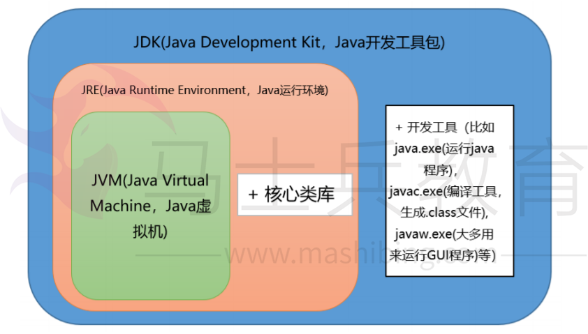

---

解释器是不同的，但是实现的虚拟机是相同的。Java源程序经过编译 器编译后变成字节码，字节码由虚
拟机解释执行，虚拟机将每一条要执行的字节 码送给解释器，解释器将其翻译成特定机器上的机器码，
然后在特定的机器上运 行，这就是上面提到的Java的特点的编译与解释并存的解释。 
什么是Java程序的主类？应用程序和小程序的主类有何不同？
 
一个程序中可以有多个类，但只能有一个类是主类。在Java应用程序中，这个主 类是指包含main()方法
的类。而在Java小程序中，这个主类是一个继承自系统 类JApplet或Applet的子类。应用程序的主类不一
定要求是public类，但小程序 的主类要求必须是public类。主类是Java程序执行的入口点。
Java应用程序与小程序之间有那些差别？
 
简单说应用程序是从主线程启动(也就是main()方法)。applet小程序没有main 方法，主要是嵌在浏览器
页面上运行(调用init()线程或者run()来启动)，嵌入浏 览器这点跟flash的小游戏类似。
Java和C++的区别
 
我知道很多人没学过C++，但是面试官就是没事喜欢拿咱们Java和C++比呀！ 没办法！！！就算没学过
C++，也要记下来！ 
都是面向对象的语言，都支持封装、继承和多态 
Java不提供指针来直接访问内存，程序内存更加安全 
Java的类是单继承的，C++支持多重继承；虽然Java的类不可以多继承，但是 接口可以多继承。 
Java有自动内存管理机制，不需要程序员手动释放无用内存
Oracle JDK 和 OpenJDK 的对比
 
1. Oracle JDK版本将每三年发布一次，而OpenJDK版本每三个月发布一 次； 
2. OpenJDK 是一个参考模型并且是完全开源的，而Oracle JDK是 OpenJDK的一个实现，并不是完全
开源的； 
3. Oracle JDK 比 OpenJDK 更稳定。OpenJDK和Oracle JDK的代码几乎 相同，但Oracle JDK有更多的
类和一些错误修复。因此，如果您想开发企 业/商业软件，我建议您选择Oracle JDK，因为它经过
了彻底的测试和稳 定。某些情况下，有些人提到在使用OpenJDK 可能会遇到了许多应用程 序崩溃
的问题，但是，只需切换到Oracle JDK就可以解决问题； 
4. 在响应性和JVM性能方面，Oracle JDK与OpenJDK相比提供了更好的 性能； 
5. Oracle JDK不会为即将发布的版本提供长期支持，用户每次都必须通过 更新到最新版本获得支持来
获取最新版本； 
6. Oracle JDK根据二进制代码许可协议获得许可，而OpenJDK根据GPL v2许可获得许可。
基础语法
 
数据类型
 
Java有哪些数据类型
 
定义：Java语言是强类型语言，对于每一种数据都定义了明确的具体的数据类 型，在内存中分配了不同
大小的内存空间。 
分类：
基本数据类型 
Java源代码---->编译器---->jvm可执行的Java字节码(即虚拟指令)---->jvm---->jvm中 解释器----->
机器可执行的二进制机器码---->程序运行。

---

数值型 
  整数类型(byte,short,int,long) 
  浮点类型(float,double) 
字符型(char) 
布尔型(boolean) 
引用数据类型 
类(class) 
接口(interface) 
数组([]) 
Java基本数据类型图
switch 是否能作用在 byte 上，是否能作用在 long 上，是否 能作用在 String 上 
在 Java 5 以前，switch(expr)中，expr 只能是 byte、short、char、int。从  Java5 开始，Java 中引入
了枚举类型，expr 也可以是 enum 类型，从 Java 7  开始，expr 还可以是字符串（String），但是长整
型（long）在目前所有的版 本中都是不可以的
用最有效率的方法计算 2 乘以 8
 
2 << 3（左移 3 位相当于乘以 2 的 3 次方，右移 3 位相当于除以 2 的 3 次 方）。
Math.round(11.5) 等于多少？Math.round(-11.5) 等于多少
 
Math.round(11.5)的返回值是 12，Math.round(-11.5)的返回值是-11。四舍 五入的原理是在参数上加 
0.5 然后进行下取整。 
loat f=3.4;是否正确
 
不正确。3.4 是双精度数，将双精度型（double）赋值给浮点型（float）属于 下转型（down-casting，
也称为窄化）会造成精度损失，因此需要强制类型转 换float f =(float)3.4; 或者写成 float f =3.4F;。
short s1 = 1; s1 = s1 + 1;有错吗?short s1 = 1; s1 += 1;有错吗
 
对于 short s1 = 1; s1 = s1 + 1;由于 1 是 int 类型，因此 s1+1 运算结果也是  int型，需要强制转换类型才
能赋值给 short 型。 而 short s1 = 1; s1 += 1;可以正确编译，因为 s1+= 1;相当于 s1 = (short(s1  + 1);其
中有隐含的强制类型转换。 
编码

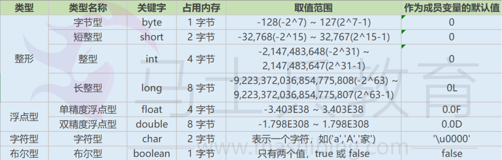

---

Java语言采用何种编码方案？有何特点？
 
Java语言采用Unicode编码标准，Unicode（标准码），它为每个字符制订了一 个唯一的数值，因此在
任何的语言，平台，程序都可以放心的使用。
注释
 
什么Java注释
 
定义：用于解释说明程序的文字
 
分类
 
单行注释 格式： // 注释文字 
多行注释 格式： /* 注释文字 */ 
文档注释 格式：/** 注释文字 */ 
作用
 
在程序中，尤其是复杂的程序中，适当地加入注释可以增加程序的可读性，有利 于程序的修改、调试和
交流。注释的内容在程序编译的时候会被忽视，不会产生 目标代码，注释的部分不会对程序的执行结果
产生任何影响。 注意事项：多行和文档注释都不能嵌套使用。 访问修饰符
访问修饰符 public,private,protected,以及不写（默认）时的 区别
 
定义：Java中，可以使用访问修饰符来保护对类、变量、方法和构造方法的访 问。Java 支持 4 种不同的
访问权限。 
分类：
private : 在同一类内可见。使用对象：变量、方法。 注意：不能修饰类（外部 类） 
default (即缺省，什么也不写，不使用任何关键字）: 在同一包内可见，不使用 任何修饰符。使用
对象：类、接口、变量、方法。 
protected : 对同一包内的类和所有子类可见。使用对象：变量、方法。 注意： 不能修饰类（外部
类）。 
public : 对所有类可见。使用对象：类、接口、变量、方法 
访问修饰符图
运算符
 
&和&&的区别
 
&运算符有两种用法：(1)按位与；(2)逻辑与。 
&&运算符是短路与运算。逻辑与跟短路与的差别是非常巨大的，虽然二者都要 求运算符左右两端的布
尔值都是true 整个表达式的值才是 true。&&之所以称
为短路运算，是因为如果&&左边的表达式的值是 false，右边的表达式会被直 接短路掉，不会进行运
算。

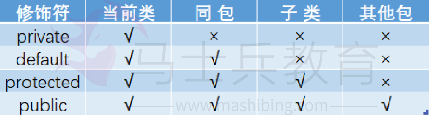

---

注意：逻辑或运算符（|）和短路或运算符（||）的差别也是如此。 
关键字
 
Java 有没有 goto
 
goto 是 Java 中的保留字，在目前版本的 Java 中没有使用。
final 有什么用？
 
用于修饰类、属性和方法；
被final修饰的类不可以被继承
被final修饰的方法不可以被重写
被final修饰的变量不可以被改变，被final修饰不可变的是变量的引用，而不是引用指向的内容，引
用指向的内容是可以改变的
final finally finalize区别
 
final可以修饰类、变量、方法，修饰类表示该类不能被继承、修饰方法表示该方法不能被重写、修
饰变量表示该变量是一个常量不能被重新赋值。
finally一般作用在try-catch代码块中，在处理异常的时候，通常我们将一定要执行的代码方法
finally代码块中，表示不管是否出现异常，该代码块都会执行，一般用来存放一些关闭资源的代
码。
finalize是一个方法，属于Object类的一个方法，而Object类是所有类的父类，该方法一般由垃圾
回收器来调用，当我们调用System.gc() 方法的时候，由垃圾回收器调用finalize()，回收垃圾，一
个对象是否可回收的最后判断。
this关键字的用法
 
this是自身的一个对象，代表对象本身，可以理解为：指向对象本身的一个指
针。
this的用法在java中大体可以分为3种：
1.普通的直接引用，this相当于是指向当前对象本身。
2.形参与成员名字重名，用this来区分：
3.引用本类的构造函数
1 public Person(String name, int age) {
2 this.name = name;
3 this.age = age;
4 }
1 class Person{
2 private String name;
3 private int age;
4
5 public Person() {
6 }
7
8 public Person(String name) {
9 this.name = name;
10 }
11 public Person(String name, int age) {

---

super关键字的用法
 
super可以理解为是指向自己超（父）类对象的一个指针，而这个超类指的是离
自己最近的一个父类。
super也有三种用法：
1.普通的直接引用
与this类似，super相当于是指向当前对象的父类的引用，这样就可以用
super.xxx来引用父类的成员。
2.子类中的成员变量或方法与父类中的成员变量或方法同名时，用super进行区
分
3.引用父类构造函数
super（参数）：调用父类中的某一个构造函数（应该为构造函数中的第一条语句）。
this（参数）：调用本类中另一种形式的构造函数（应该为构造函数中的第一条语句）。
12 this(name);
13 this.age = age;
14 }
15 }
1 class Person{
2 protected String name;
3
4 public Person(String name) {
5 this.name = name;
6 }
7
8 }
9
10 class Student extends Person{
11 private String name;
12
13 public Student(String name, String name1) {
14 super(name);
15 this.name = name1;
16 }
17
18 public void getInfo(){
19 System.out.println(this.name); //Child
20 System.out.println(super.name); //Father
21 }
22
23 }
24
25 public class Test {
26 public static void main(String[] args) {
27 Student s1 = new Student("Father","Child");
28 s1.getInfo();
29
30 }
31 }

---

this与super的区别
 
super: 它引用当前对象的直接父类中的成员（用来访问直接父类中被隐藏的父类中成员数据或函
数，基类与派生类中有相同成员定义时如：super.变量名 super.成员函数据名（实参）
this：它代表当前对象名（在程序中易产生二义性之处，应使用this来指明当前对象；如果函数的
形参与类中的成员数据同名，这时需用this来指明成员变量名）
super()和this()类似,区别是，super()在子类中调用父类的构造方法，this()在本类内调用本类的其
它构造方法。
super()和this()均需放在构造方法内第一行。
尽管可以用this调用一个构造器，但却不能调用两个。
this和super不能同时出现在一个构造函数里面，因为this必然会调用其它的构造函数，其它的构造
函数必然也会有super语句的存在，所以在同一个构造函数里面有相同的语句，就失去了语句的意
义，编译器也不会通过。
this()和super()都指的是对象，所以，均不可以在static环境中使用。包括：
static变量,static方法，static语句块。
从本质上讲，this是一个指向本对象的指针, 然而super是一个Java关键字。
static存在的主要意义
 
static的主要意义是在于创建独立于具体对象的域变量或者方法。以致于即使没有创建对象，也能使用属
性和调用方法！
static关键字还有一个比较关键的作用就是 用来形成静态代码块以优化程序性能。static块可以置于类中
的任何地方，类中可以有多个static块。在类初次被加载的时候，会按照static块的顺序来执行每个static
块，并且只会执行一次。为什么说static块可以用来优化程序性能，是因为它的特性:只会在类加载的时
候
执行一次。因此，很多时候会将一些只需要进行一次的初始化操作都放在static代码块中进行。
static的独特之处
 
1、被static修饰的变量或者方法是独立于该类的任何对象，也就是说，这些变量和方法不属于任何一个
实例对象，而是被类的实例对象所共享。
怎么理解 “被类的实例对象所共享” 这句话呢？就是说，一个类的静态成员，它是属于大伙的【大
伙指的是这个类的多个对象实例，我们都知道一个类可以创建多个实例！】，所有的类对象共享
的，不像成员变量是自个的【自个指的是这个类的单个实例对象】…我觉得我已经讲的很通俗了，
你明白了咩？
2、在该类被第一次加载的时候，就会去加载被static修饰的部分，而且只在类第一次使用时加载并进行
初始化，注意这是第一次用就要初始化，后面根据需要是可以再次赋值的。
3、static变量值在类加载的时候分配空间，以后创建类对象的时候不会重新分配。赋值的话，是可以任
意赋值的！
4、被static修饰的变量或者方法是优先于对象存在的，也就是说当一个类加载完毕之后，即便没有创建
对象，也可以去访问。
static应用场景
 
因为static是被类的实例对象所共享，因此如果某个成员变量是被所有对象所共享的，那么这个成员变量
就应该定义为静态变量。
因此比较常见的static应用场景有：

---

1、修饰成员变量 
2、修饰成员方法 
3、静态代码块 
4、修饰类【只能修饰内部类也就是静态内部类】 
5、静态导包
static注意事项
 
1、静态只能访问静态。 2、非静态既可以访问非静态的，也可以访问静态的。
流程控制语句
 
break ,continue ,return 的区别及作用
 
break 跳出总上一层循环，不再执行循环(结束当前的循环体)continue 跳出本次循环，继续执行下次循
环(结束正在执行的循环 进入下一个循环条件)
return 程序返回，不再执行下面的代码(结束当前的方法 直接返回)
在 Java 中，如何跳出当前的多重嵌套循环
 
在Java中，要想跳出多重循环，可以在外面的循环语句前定义一个标号，然后在里层循环体的代码中使
用带有标号的break 语句，即可跳出外层循环。例如：
面向对象
 
面向对象概述
 
面向对象和面向过程的区别
 
面向过程：
 
优点：性能比面向对象高，因为类调用时需要实例化，开销比较大，比较消耗资源;比如单片机、嵌入式
开发、Linux/Unix等一般采用面向过程开发，能是最重要的因素。
缺点：没有面向对象易维护、易复用、易扩展
面向对象：
 
优点：易维护、易复用、易扩展，由于面向对象有封装、继承、多态性的特性，可以设计出低耦合的系
统，使系统更加灵活、更加易于维护
缺点：性能比面向过程低
面向过程是具体化的，流程化的，解决一个问题，你需要一步一步的分析，一步
一步的实现。
1 public static void main(String[] args) {
2 ok:
3 for (int i = 0; i < 10; i++) {
4 for (int j = 0; j < 10; j++) {
5 System.out.println("i=" + i + ",j=" + j);
6 if (j == 5) {
7 break ok;
8 }
9
10 }
11 }
12 }

---

面向对象是模型化的，你只需抽象出一个类，这是一个封闭的盒子，在这里你拥有数据也拥有解决问题
的方法。需要什么功能直接使用就可以了，不必去一步一步的实现，至于这个功能是如何实现的，管我
们什么事？我们会用就可以了。
面向对象的底层其实还是面向过程，把面向过程抽象成类，然后封装，方便我们使用的就是面向对象
了。
面向对象三大特性
 
面向对象的特征有哪些方面
 
面向对象的特征主要有以下几个方面： 
抽象：抽象是将一类对象的共同特征总结出来构造类的过程，包括数据抽象和行 为抽象两方面。抽象只
关注对象有哪些属性和行为，并不关注这些行为的细节是 什么。 
封装 : 封装把一个对象的属性私有化，同时提供一些可以被外界访问的属性的方法，如 果属性不想
被外界访问，我们大可不必提供方法给外界访问。但是如果一个类没 有提供给外界访问的方法，那
么这个类也没有什么意义了。 
继承 : 继承是使用已存在的类的定义作为基础建立新类的技术，新类的定义可以增加新 的数据或新
的功能，也可以用父类的功能，但不能选择性地继承父类。通过使用 继承我们能够非常方便地复用
以前的代码。
关于继承如下 3 点请记住：
   1.子类拥有父类非 private 的属性和方法。
   2.子类可以拥有自己属性和方法，即子类可以对父类进行扩展。 
   3.子类可以用自己的方式实现父类的方法。 
多态 : 所谓多态就是指程序中定义的引用变量所指向的具体类型和通过该引用变量发出 的方法调用
在编程时并不确定，而是在程序运行期间才确定，即一个引用变量到 底会指向哪个类的实例对象，
该引用变量发出的方法调用到底是哪个类中实现的 方法，必须在由程序运行期间才能决定。
在Java中有两种形式可以实现多态：继承（多个子类对同一方法的重写）和接口 （实现接口并覆盖
接口中同一方法）。 
其中Java 面向对象编程三大特性：封装 继承 多态
封装：隐藏对象的属性和实现细节，仅对外提供公共访问方式，将变化隔离，便 于使用，提高复用性和
安全性。 
继承：继承是使用已存在的类的定义作为基础建立新类的技术，新类的定义可以 增加新的数据或新的功
能，也可以用父类的功能，但不能选择性地继承父类。通 过使用继承可以提高代码复用性。继承是多态
的前提。 
关于继承如下 3 点请记住： 
1. 子类拥有父类非 private 的属性和方法。 
2. 子类可以拥有自己属性和方法，即子类可以对父类进行扩展。 
3. 子类可以用自己的方式实现父类的方法。 
多态性：父类或接口定义的引用变量可以指向子类或具体实现类的实例对象。提 高了程序的拓展性。
在Java中有两种形式可以实现多态：继承（多个子类对同一方法的重写）和接口 （实现接口并覆盖接口
中同一方法）。
方法重载（overload）实现的是编译时的多态性（也称为前绑定），而方法重 写（override）实现的是
运行时的多态性（也称为后绑定）。

---

一个引用变量到底会指向哪个类的实例对象，该引用变量发出的方法调用到底是 哪个类中实现的方法，
必须在由程序运行期间才能决定。运行时的多态是面向对 象精髓的东西，要实现多态需要做两件事： 
方法重写（子类继承父类并重写父类中已有的或抽象的方法）；
对象造型（用父类型引用子类型对象，这样同样的引用调用同样的方法就会根据 子类对象的不同而
表现出不同的行为）。 
什么是多态机制？Java语言是如何实现多态的？
 
所谓多态就是指程序中定义的引用变量所指向的具体类型和通过该引用变量发出 的方法调用在编程时并
不确定，而是在程序运行期间才确定，即一个引用变量倒 底会指向哪个类的实例对象，该引用变量发出
的方法调用到底是哪个类中实现的 方法，必须在由程序运行期间才能决定。因为在程序运行时才确定具
体的类，这 样，不用修改源程序代码，就可以让引用变量绑定到各种不同的类实现上，从而 导致该引用
调用的具体方法随之改变，即不修改程序代码就可以改变程序运行时 所绑定的具体代码，让程序可以选
择多个运行状态，这就是多态性。 多态分为编译时多态和运行时多态。其中编辑时多态是静态的，主要
是指方法的 重载，它是根据参数列表的不同来区分不同的函数，通过编辑之后会变成两个不 同的函数，
在运行时谈不上多态。而运行时多态是动态的，它是通过动态绑定来 实现的，也就是我们所说的多态性
多态的实现 
Java实现多态有三个必要条件：继承、重写、向上转型。 
继承：在多态中必须存在有继承关系的子类和父类。 
重写：子类对父类中某些方法进行重新定义，在调用这些方法时就会调用子类的 方法。 
向上转型：在多态中需要将子类的引用赋给父类对象，只有这样该引用才能够具 备技能调用父类的方法
和子类的方法。 
只有满足了上述三个条件，我们才能够在同一个继承结构中使用统一的逻辑实现 代码处理不同的对象，
从而达到执行不同的行为。 
对于Java而言，它多态的实现机制遵循一个原则：当超类对象引用变量引用子类 对象时，被引用对象的
类型而不是引用变量的类型决定了调用谁的成员方法，但 是这个被调用的方法必须是在超类中定义过
的，也就是说被子类覆盖的方法。 
面向对象五大基本原则是什么（可选）
 
单一职责原则SRP(Single Responsibility Principle)类的功能要单一，不能包罗万象，跟杂货铺似
的。
开放封闭原则OCP(Open－Close Principle)
一个模块对于拓展是开放的，对于修改是封闭的，想要增加功能热烈欢迎，想要修改，哼，
一万个不乐意。
里式替换原则LSP(the Liskov Substitution Principle LSP)子类可以替换父类出现在父类能够出现的
任何地方。比如你能代表你爸去你姥姥家干活。哈哈~~
依赖倒置原则DIP(the Dependency Inversion Principle DIP)高层次的模块不应该依赖于低层次的
模块，他们都应该依赖于抽象。抽象不应该依赖于具体实现，具体实现应该依赖于抽象。就是你出
国要说你是中国人，而不能说你是哪个村子的。比如说中国人是抽象的，下面有具体的xx省，xx
市，xx县。你要依赖的抽象是中国人，而不是你是xx村的。
接口分离原则ISP(the Interface Segregation Principle ISP)
设计时采用多个与特定客户类有关的接口比采用一个通用的接口要好。就比如一个手机拥有
打电话，看视频，玩游戏等功能，把这几个功能拆分成不同的接口，比在一个接口里要好的
多。
类与接口

---

参
数
抽象类
接口
声
明
抽象类使用abstract关键字声明
接口使用interface关键字声明
实
现
子类使用extends关键字来继承抽象类。如果子类
不是抽象类的话，它需要提供抽象类中所有声明
的方法的实现
子类使用implements关键字来实现
接口。它需要提供接口中所有声明的
方法的实现
构
造
器
抽象类可以有构造器
接口不能有构造器
访
问
修
饰
符
抽象类中的方法可以是任意访问修饰符
接口方法默认修饰符是public。并且
不允许定义为 private 或者
protected
多
继
承
一个类最多只能继承一个抽象类
一个类可以实现多个接口
字
段
声
明
抽象类的字段声明可以是任意的
接口的字段默认都是 static 和 final
的
抽象类和接口的对比
 
抽象类是用来捕捉子类的通用特性的。接口是抽象方法的集合。
从设计层面来说，抽象类是对类的抽象，是一种模板设计，接口是行为的抽象，是一种行为的规范。
相同点
接口和抽象类都不能实例化
都位于继承的顶端，用于被其他实现或继承
都包含抽象方法，其子类都必须覆写这些抽象方法
不同点
备注：Java8中接口中引入默认方法和静态方法，以此来减少抽象类和接口之间 的差异。 
现在，我们可以为接口提供默认实现的方法了，并且不用强制子类来实现它。 接口和抽象类各有优缺
点，在接口和抽象类的选择上，必须遵守这样一个原则： 
行为模型应该总是通过接口而不是抽象类定义，所以通常是优先选用接口，尽量 少用抽象类。 
选择抽象类的时候通常是如下情况：需要定义子类的行为，又要为子类提供通用 的功能。
普通类和抽象类有哪些区别？
 
普通类不能包含抽象方法，抽象类可以包含抽象方法。 
抽象类不能直接实例化，普通类可以直接实例化。

---

抽象类能使用 final 修饰吗？
 
不能，定义抽象类就是让其他类继承的，如果定义为 final 该类就不能被继承， 这样彼此就会产生矛
盾，所以 final 不能修饰抽象类
创建一个对象用什么关键字？对象实例与对象引用有何不同？
 
new关键字，new创建对象实例（对象实例在堆内存中），对象引用指向对象实 例（对象引用存放在栈
内存中）。一个对象引用可以指向0个或1个对象（一根 绳子可以不系气球，也可以系一个气球）;一个
对象可以有n个引用指向它（可以 用n条绳子系住一个气球）
变量与方法
 
成员变量与局部变量的区别有哪些
 
变量：在程序执行的过程中，在某个范围内其值可以发生改变的量。从本质上 讲，变量其实是内存中的
一小块区域 成员变量：方法外部，类内部定义的变量 局部变量：类的方法中的变量。 成员变量和局部
变量的区别
作用域
 
成员变量：针对整个类有效。 
局部变量：只在某个范围内有效。(一般指的就是方法,语句体内)
存储位置
 
成员变量：随着对象的创建而存在，随着对象的消失而消失，存储在堆内存中。 
局部变量：在方法被调用，或者语句被执行的时候存在，存储在栈内存中。当方法调用完，或者语句结
束后，就自动释放。
生命周期
 
成员变量：随着对象的创建而存在，随着对象的消失而消失 
局部变量：当方法调用完，或者语句结束后，就自动释放。
初始值
 
成员变量：有默认初始值。 
局部变量：没有默认初始值，使用前必须赋值。 
使用原则 
在使用变量时需要遵循的原则为：就近原则 首先在局部范围找，有就使用；接着在成员位置找。
在Java中定义一个不做事且没有参数的构造方法的作用
 
Java程序在执行子类的构造方法之前，如果没有用super()来调用父类特定的构 造方法，则会调用父类中
“没有参数的构造方法”。因此，如果父类中只定义了 有参数的构造方法，而在子类的构造方法中又没有
用super()来调用父类中特定 的构造方法，则编译时将发生错误，因为Java程序在父类中找不到没有参数
的构 造方法可供执行。解决办法是在父类里加上一个不做事且没有参数的构造方法。

---

在调用子类构造方法之前会先调用父类没有参数的构造方法，其 目的
是？
 
帮助子类做初始化工作。
一个类的构造方法的作用是什么？若一个类没有声明构造方法， 改程
序能正确执行吗？为什么？
 
主要作用是完成对类对象的初始化工作。可以执行。因为一个类即使没有声明构 造方法也会有默认的不
带参数的构造方法。
构造方法有哪些特性？
 
名字与类名相同； 
没有返回值，但不能用void声明构造函数； 
生成类的对象时自动执行，无需调用。
静态变量和实例变量区别
 
静态变量： 静态变量由于不属于任何实例对象，属于类的，所以在内存中只会 有一份，在类的加载过程
中，JVM只为静态变量分配一次内存空间。 
实例变量： 每次创建对象，都会为每个对象分配成员变量内存空间，实例变量 是属于实例对象的，在内
存中，创建几次对象，就有几份成员变量。
静态变量与普通变量区别
 
static变量也称作静态变量，静态变量和非静态变量的区别是：静态变量被所有 的对象所共享，在内存
中只有一个副本，它当且仅当在类初次加载时会被初始 化。而非静态变量是对象所拥有的，在创建对象
的时候被初始化，存在多个副 本，各个对象拥有的副本互不影响。
 还有一点就是static成员变量的初始化顺序按照定义的顺序进行初始化。
静态方法和实例方法有何不同？
 
静态方法和实例方法的区别主要体现在两个方面： 
1. 在外部调用静态方法时，可以使用"类名.方法名"的方式，也可以使 用"对象名.方法名"的方式。而
实例方法只有后面这种方式。也就是说，调 用静态方法可以无需创建对象。 
2. 静态方法在访问本类的成员时，只允许访问静态成员（即静态成员变量 和静态方法），而不允许访
问实例成员变量和实例方法；实例方法则无此 限制
在一个静态方法内调用一个非静态成员为什么是非法的？
 
由于静态方法可以不通过对象进行调用，因此在静态方法里，不能调用其他非静 态变量，也不可以访问
非静态变量成员。
什么是方法的返回值？返回值的作用是什么？
 
方法的返回值是指我们获取到的某个方法体中的代码执行后产生的结果！（前提 是该方法可能产生结
果）。返回值的作用:接收出结果，使得它可以用于其他的 操作！
内部类

---

什么是内部类？
 
在Java中，可以将一个类的定义放在另外一个类的定义内部，这就是内部类。内 部类本身就是类的一个
属性，与其他属性定义方式一致。 
内部类的分类有哪些
 
内部类可以分为四种：成员内部类、局部内部类、匿名内部类和静态内部类。 
静态内部类
 
定义在类内部的静态类，就是静态内部类。
静态内部类可以访问外部类所有的静态变量，而不可访问外部类的非静态变量； 静态内部类的创建方
式，new 外部类.静态内部类()，如下：
成员内部类
 
定义在类内部，成员位置上的非静态类，就是成员内部类。
成员内部类可以访问外部类所有的变量和方法，包括静态和非静态，私有和公 有。成员内部类依赖于外
部类的实例，它的创建方式外部类实例.new 内部类()，如 下：
1 public class Outer {
2
3 private static int radius = 1;
4
5 static class StaticInner {
6 public void visit() {
7 System.out.println("visit outer static variable:" + radius);
8 }
9 }
10 }
1 Outer.StaticInner inner = new Outer.StaticInner();
2 inner.visit
1 public class Outer {
2
3 private static int radius = 1;
4 private int count =2;
5
6 class Inner {
7 public void visit() {
8 System.out.println("visit outer static variable:" + radius);
9 System.out.println("visit outer variable:" + count);
10 }
11 }
12 }
1 Outer outer = new Outer();
2 Outer.Inner inner = outer.new Inner();
3 inner.visit();

---

局部内部类
 
定义在方法中的内部类，就是局部内部类
定义在实例方法中的局部类可以访问外部类的所有变量和方法，定义在静态方法 中的局部类只能访问外
部类的静态变量和方法。局部内部类的创建方式，在对应 方法内，new 内部类()，如下：
匿名内部类
 
匿名内部类就是没有名字的内部类，日常开发中使用的比较多。
1 public class Outer {
2
3 private int out_a = 1;
4 private static int STATIC_b = 2;
5
6 public void testFunctionClass(){
7 int inner_c =3;
8 class Inner {
9 private void fun(){
10 System.out.println(out_a);
11 System.out.println(STATIC_b);
12 System.out.println(inner_c);
13 }
14 }
15 Inner inner = new Inner();
16 inner.fun();
17 }
18 public static void testStaticFunctionClass(){
19 int d =3;
20 class Inner {
21 private void fun(){
22 // System.out.println(out_a); 编译错误，定义在静态方法中的局部类不可以访问外
部类的实例变量
23 System.out.println(STATIC_b);
24 System.out.println(d);
25 }
26 }
27 Inner inner = new Inner();
28 inner.fun();
29 }
30 }
1 public static void testStaticFunctionClass(){
2 class Inner {
3 }
4 Inner inner = new Inner();
5 }
1 public class Outer {
2
3 private void test(final int i) {
4 new Service() {
5 public void method() {
6 for (int j = 0; j < i; j++) {
7 System.out.println("匿名内部类" );

---

除了没有名字，匿名内部类还有以下特点： 
匿名内部类必须继承一个抽象类或者实现一个接口。 
匿名内部类不能定义任何静态成员和静态方法。 
当所在的方法的形参需要被匿名内部类使用时，必须声明为 final。 
匿名内部类不能是抽象的，它必须要实现继承的类或者实现的接口的所有抽象方 法。 
匿名内部类创建方式：
 
内部类的优点
 
我们为什么要使用内部类呢？因为它有以下优点： 
一个内部类对象可以访问创建它的外部类对象的内容，包括私有数据！ 
内部类不为同一包的其他类所见，具有很好的封装性； 
内部类有效实现了“多重继承”，优化 java 单继承的缺陷。 
匿名内部类可以很方便的定义回调。 
内部类有哪些应用场景
 
1. 一些多算法场合 
2. 解决一些非面向对象的语句块。 
3. 适当使用内部类，使得代码更加灵活和富有扩展性。 
4. 当某个类除了它的外部类，不再被其他的类使用时。
局部内部类和匿名内部类访问局部变量的时候，为什么变量必须 要加
上final？
 
局部内部类和匿名内部类访问局部变量的时候，为什么变量必须要加上final呢？ 它内部原理是什么呢？ 
先看这段代码：
8 }
9 }
10 }.method();
11 }
12 }
13 //匿名内部类必须继承或实现一个已有的接口
14 interface Service{
15 void method();
16 }
1 new 类/接口{
2 //匿名内部类实现部分
3 }

---

以上例子，为什么要加final呢？是因为生命周期不一致， 局部变量直接存储在 栈中，当方法执行结束
后，非final的局部变量就被销毁。而局部内部类对局部变 量的引用依然存在，如果局部内部类要调用局
部变量时，就会出错。加了final， 可以确保局部内部类使用的变量与外层的局部变量区分开，解决了这
个问题。 
内部类相关，看程序说出运行结果
 
运行结果：
重写与重载
 
构造器（constructor）是否可被重写（override）
 
构造器不能被继承，因此不能被重写，但可以被重载。 
1 public class Outer {
2
3 void outMethod(){
4 final int a =10;
5 class Inner {
6 void innerMethod(){
7 System.out.println(a);
8 }
9
10 }
11 }
12 }
1 public class Outer {
2 private int age = 12;
3
4 class Inner {
5 private int age = 13;
6 public void print() {
7 int age = 14;
8 System.out.println("局部变量：" + age);
9 System.out.println("内部类变量：" + this.age);
10 System.out.println("外部类变量：" + Outer.this.age);
11 }
12 }
13
14 public static void main(String[] args) {
15 Outer.Inner in = new Outer().new Inner();
16 in.print();
17 }
18
19 }
1 局部变量：14
2 内部类变量：13
3 外部类变量：12

---

重载（Overload）和重写（Override）的区别。重载的方法能 否根
据返回类型进行区分？
 
方法的重载和重写都是实现多态的方式，区别在于前者实现的是编译时的多态 性，而后者实现的是运行
时的多态性。 
重载：发生在同一个类中，方法名相同参数列表不同（参数类型不同、个数不 同、顺序不同），与方法
返回值和访问修饰符无关，即重载的方法不能根据返回 类型进行区分 
重写：发生在父子类中，方法名、参数列表必须相同，返回值小于等于父类，抛 出的异常小于等于父
类，访问修饰符大于等于父类（里氏代换原则）；如果父类 方法访问修饰符为private则子类中就不是重
写。
对象相等判断
 
== 和 equals 的区别是什么
 
== : 它的作用是判断两个对象的地址是不是相等。即，判断两个对象是不是同 一个对象。(基本数据类型 
== 比较的是值，引用数据类型 == 比较的是内存地址) 
equals() : 它的作用也是判断两个对象是否相等。但它一般有两种使用情况： 情况1：类没有覆盖 
equals() 方法。则通过 equals() 比较该类的两个对象时， 等价于通过“==”比较这两个对象。 
情况2：类覆盖了 equals() 方法。一般，我们都覆盖 equals() 方法来两个对象 的内容相等；若它们的内
容相等，则返回 true (即，认为这两个对象相等)。 
举个例子：
说明： 
String中的equals方法是被重写过的，因为object的equals方法是比较的对象的 内存地址，而
String的equals方法比较的是对象的值。 
当创建String类型的对象时，虚拟机会在常量池中查找有没有已经存在的值和要 创建的值相同的对
象，如果有就把它赋给当前引用。如果没有就在常量池中重新创建 一个String对象。
1 public class test1 {
2 public static void main(String[] args) {
3 String a = new String("ab"); // a 为一个引用
4 String b = new String("ab"); // b为另一个引用,对象的内容一样
5 String aa = "ab"; // 放在常量池中
6 String bb = "ab"; // 从常量池中查找
7 if (aa == bb) // true
8 System.out.println("aa==bb");
9 if (a == b) // false，非同一对象
10 System.out.println("a==b");
11 if (a.equals(b)) // true
12 System.out.println("aEQb");
13 if (42 == 42.0) { // true
14 System.out.println("true");
15 }
16 }
17 }

---

hashCode 与 equals (重要)
 
HashSet如何检查重复 
两个对象的 hashCode() 相同，则 equals() 也一定为 true，对吗？ 
hashCode和equals方法的关系 
面试官可能会问你：“你重写过 hashcode 和 equals 么，为什么重写equals时 必须重写hashCode方
法？”
hashCode()介绍
 
hashCode() 的作用是获取哈希码，也称为散列码；它实际上是返回一个int整 数。这个哈希码的作用是
确定该对象在哈希表中的索引位置。hashCode() 定义 在JDK的Object.java中，这就意味着Java中的任何
类都包含有hashCode()函数。 
散列表存储的是键值对(key-value)，它的特点是：能根据“键”快速的检索出 对应的“值”。这其中就利用
到了散列码！（可以快速找到所需要的对象）
为什么要有 hashCode
 
我们以“HashSet 如何检查重复”为例子来说明为什么要有 hashCode：
 
当你把对象加入 HashSet 时，HashSet 会先计算对象的 hashcode 值来判断对 象加入的位置，同时也
会与其他已经加入的对象的 hashcode 值作比较，如果 没有相符的hashcode，HashSet会假设对象没
有重复出现。但是如果发现有相 同 hashcode 值的对象，这时会调用 equals()方法来检查 hashcode 相
等的对 象是否真的相同。如果两者相同，HashSet 就不会让其加入操作成功。如果不 同的话，就会重
新散列到其他位置。（摘自我的Java启蒙书《Head first java》 第二版）。这样我们就大大减少了 
equals 的次数，相应就大大提高了执行速 度。
hashCode()与equals()的相关规定
 
如果两个对象相等，则hashcode一定也是相同的 两个对象相等，对两个对象分别调用equals方法都返
回true 两个对象有相同的hashcode值，它们也不一定是相等的
因此，equals 方法被覆盖过，则 hashCode 方法也必须被覆盖
 
hashCode() 的默认行为是对堆上的对象产生独特值。如果没有重写 
hashCode()，则该 class 的两个对象无论如何都不会相等（即使这两个对象指 向相同的数据）
对象的相等与指向他们的引用相等，两者有什么不同？
 
对象的相等 比的是内存中存放的内容是否相等而 引用相等 比较的是他们指向的 内存地址是否相等。
值传递
 
 
当一个对象被当作参数传递到一个方法后，此方法可改变这个对 象的
属性，并可返回变化后的结果，那么这里到底是值传递还是 引用传递
 
是值传递。Java 语言的方法调用只支持参数的值传递。当一个对象实例作为一 个参数被传递到方法中
时，参数的值就是对该对象的引用。对象的属性可以在被 调用过程中被改变，但对对象引用的改变是不
会影响到调用者的

---

为什么 Java 中只有值传递
 
首先回顾一下在程序设计语言中有关将参数传递给方法（或函数）的一些专业术 语。按值调用(call by 
value)表示方法接收的是调用者提供的值，而按引用调用 （call by reference)表示方法接收的是调用
者提供的变量地址。一个方法可以 修改传递引用所对应的变量值，而不能修改传递值调用所对应的变量
值。 它用 来描述各种程序设计语言（不只是Java)中方法参数传递方式。
 Java程序设计语言总是采用按值调用。也就是说，方法得到的是所有参数值的 一个拷贝，也就是说，
方法不能修改传递给它的任何参数变量的内容。 
下面通过 3 个例子来给大家说明
example 1
结果：
解析：
1 public static void main(String[] args) {
2 int num1 = 10;
3 int num2 = 20;
4
5 swap(num1, num2);
6
7 System.out.println("num1 = " + num1);
8 System.out.println("num2 = " + num2);
9 }
10
11 public static void swap(int a, int b) {
12 int temp = a;
13 a = b;
14 b = temp;
15
16 System.out.println("a = " + a);
17 System.out.println("b = " + b);
18 }
1 a = 20
2 b = 10
3 num1 = 10
4 num2 = 20

---

在swap方法中，a、b的值进行交换，并不会影响到 num1、num2。因为，a、 b中的值，只是从 
num1、num2 的复制过来的。也就是说，a、b相当于 num1、num2 的副本，副本的内容无论怎么修
改，都不会影响到原件本身。 
通过上面例子，我们已经知道了一个方法不能修改一个基本数据类型的参数，而 对象引用作为参数就不
一样，请看 example2.
example 2
结果：
解析：
1 public static void main(String[] args) {
2 int[] arr = { 1, 2, 3, 4, 5 };
3 System.out.println(arr[0]);
4 change(arr);
5 System.out.println(arr[0]);
6 }
7
8 public static void change(int[] array) {
9 // 将数组的第一个元素变为0
10 array[0] = 0;
11 }
1 1
2 0

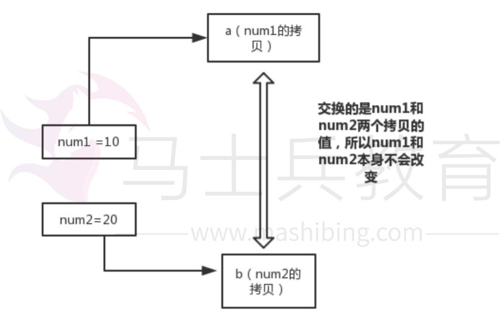

---

array 被初始化 arr 的拷贝也就是一个对象的引用，也就是说 array 和 arr 指向 的时同一个数组对象。 
因此，外部对引用对象的改变会反映到所对应的对象 上。 
通过 example2 我们已经看到，实现一个改变对象参数状态的方法并不是一件 难事。理由很简单，方法
得到的是对象引用的拷贝，对象引用及其他的拷贝同时 引用同一个对象。
很多程序设计语言（特别是，C++和Pascal)提供了两种参数传递的方式：值调 用和引用调用。有些程序
员（甚至本书的作者）认为Java程序设计语言对对象 采用的是引用调用，实际上，这种理解是不对的。
由于这种误解具有一定的普遍 性，所以下面给出一个反例来详细地阐述一下这个问题。
example 3
结果：
解析： 
交换之前：
1 public class Test {
2
3 public static void main(String[] args) {
4 // TODO Auto-generated method stub
5 Student s1 = new Student("小张");
6 Student s2 = new Student("小李");
7 Test.swap(s1, s2);
8 System.out.println("s1:" + s1.getName());
9 System.out.println("s2:" + s2.getName());
10 }
11
12 public static void swap(Student x, Student y) {
13 Student temp = x;
14 x = y;
15 y = temp;
16 System.out.println("x:" + x.getName());
17 System.out.println("y:" + y.getName());
18 }
19 }
1 x:小李
2 y:小张
3 s1:小张
4 s2:小李

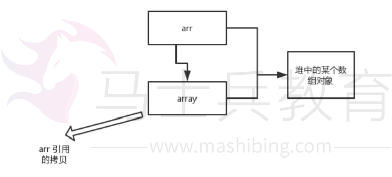

---

交换之后：
通过上面两张图可以很清晰的看出： 方法并没有改变存储在变量 s1 和 s2 中的 对象引用。swap方法的
参数x和y被初始化为两个对象引用的拷贝，这个方法交 换的是这两个拷贝
总结
Java程序设计语言对对象采用的不是引用调用，实际上，对象引用是按值传递的。 
下面再总结一下Java中方法参数的使用情况： 
一个方法不能修改一个基本数据类型的参数（即数值型或布尔型》 
一个方法可以改变一个对象参数的状态。 
一个方法不能让对象参数引用一个新的对象。
值传递和引用传递有什么区别
 
值传递：指的是在方法调用时，传递的参数是按值的拷贝传递，传递的是值的拷 贝，也就是说传递后就
互不相关了。 引用传递：指的是在方法调用时，传递的参数是按引用进行传递，其实传递的引 用的地
址，也就是变量所对应的内存空间的地址。传递的是值的引用，也就是说 传递前和传递后都指向同一个
引用（也就是同一个内存空间）。
Java包

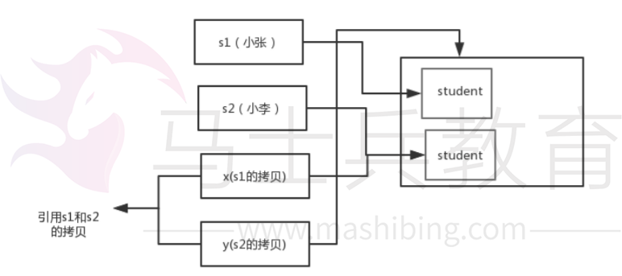

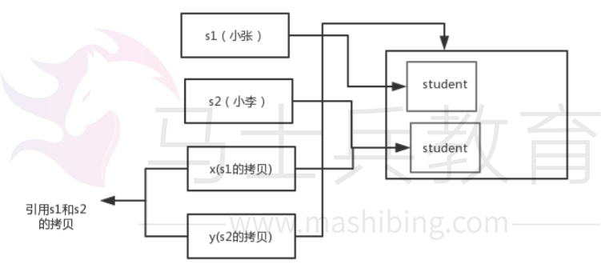

---

JDK 中常用的包有哪些
 
java.lang：这个是系统的基础类； 
java.io：这里面是所有输入输出有关的类，比如文件操作等； 
java.nio：为了完善 io 包中的功能，提高 io 包中性能而写的一个新包； 
java.net：这里面是与网络有关的类； 
java.util：这个是系统辅助类，特别是集合类； 
java.sql：这个是数据库操作的类。
import java和javax有什么区别
 
刚开始的时候 JavaAPI 所必需的包是 java 开头的包，javax 当时只是扩展 API 包来说使用。然而随着时
间的推移，javax 逐渐的扩展成为 Java API 的组成部 分。但是，将扩展从 javax 包移动到 java 包将是太
麻烦了，最终会破坏一堆现 有的代码。因此，最终决定 javax 包将成为标准API的一部分。 所以，实际
上java和javax没有区别。这都是一个名字。
IO流
 
java 中 IO 流分为几种?
 
按照流的流向分，可以分为输入流和输出流； 按照操作单元划分，可以划分为字节流和字符流； 按照流
的角色划分为节点流和处理流。 Java Io流共涉及40多个类，这些类看上去很杂乱，但实际上很有规则，
而且彼 此之间存在非常紧密的联系， Java I0流的40多个类都是从如下4个抽象类基类 中派生出来的。
InputStream/Reader: 所有的输入流的基类，前者是字节输入流，后者是字符 输入流。 
OutputStream/Writer: 所有输出流的基类，前者是字节输出流，后者是字符输 出流。 
按操作方式分类结构图：

---

IO 操作方式分类按操作对象分类结构图：

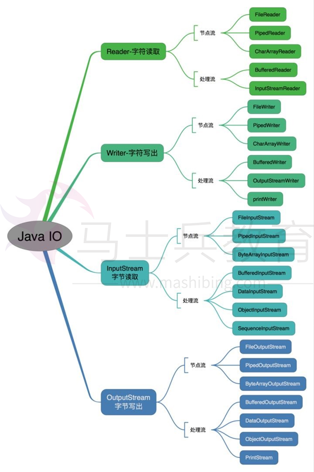

---

BIO,NIO,AIO 有什么区别?
 
简答
BIO：Block IO 同步阻塞式 IO，就是我们平常使用的传统 IO，它的特点是模式简单使用方便，并
发处理能力低。
NIO：Non IO 同步非阻塞 IO，是传统 IO 的升级，客户端和服务器端通过 
Channel（通道）通讯，实现了多路复用。
AIO：Asynchronous IO 是 NIO 的升级，也叫 NIO2，实现了异步非堵塞 IO 
，异步 IO 的操作基于事件和回调机制。
详细回答
BIO (Blocking I/O): 同步阻塞I/O模式，数据的读取写入必须阻塞在一个线程内等待其完成。在活动
连接数不是特别高（小于单机1000）的情况下，这种模型是比较不错的，可以让每一个连接专注于
自己的 I/O 并且编程模型简单，也不用过多考虑系统的过载、限流等问题。线程池本身就是一个天
然的漏斗，可以缓冲一些系统处理不了的连接或请求。但是，当面对十万甚至百万级连接的时候，
传统的 BIO 模型是无能为力的。因此，我们需要一种更高效的 I/O 处理模型来应对更高的并发量。
NIO (New I/O): NIO是一种同步非阻塞的I/O模型，在Java 1.4 中引入了NIO框架，对应 java.nio 
包，提供了 Channel , Selector，Buffer等抽象。NIO中的 N可以理解为Non-blocking，不单纯是
New。它支持面向缓冲的，基于通道的I/O操作方法。 NIO提供了与传统BIO模型中的 Socket 和 
ServerSocket 相对应的 SocketChannel 和 ServerSocketChannel 两种不同的套接字通道实现,两
种通道都支持阻塞和非阻塞两种模式。阻塞模式使用就像传统中的支持一样，比较简单，但是性能
和可靠性都不好；非阻塞模式正好与之相反。对于低负载、低并发的应用程序，可以使用同步阻塞
I/O来提升开发速率和更好的维护性；对于高负载、高并发的（网络）应用，应使用 NIO 的非阻塞
模式来开发
AIO (Asynchronous I/O): AIO 也就是 NIO 2。在 Java 7 中引入了 NIO 的改进版 NIO 2,它是异步非
阻塞的IO模型。异步 IO 是基于事件和回调机制实现的，也就是应用操作之后会直接返回，不会堵
塞在那里，当后台处理完成，操作系统会通知相应的线程进行后续的操作。AIO 是异步IO的缩写，
虽然 NIO 在网络操作中，提供了非阻塞的方法，但是 NIO 的 IO 行为还是同步的。对于 NIO 来
说，我们的业务线程是在 IO 操作准备好时，得到通知，接着就由这个线程自行进行 IO 操作，IO操

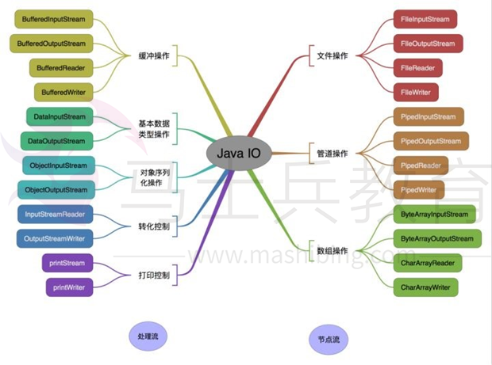

---

作本身是同步的。查阅网上相关资料，我发现就目前来说 AIO 的应用还不是很广泛，Netty 之前也
尝试使用过 AIO，不过又放弃了。
Files的常用方法都有哪些？
 
Files. exists()：检测文件路径是否存在。 
Files. createFile()：创建文件。 
Files. createDirectory()：创建文件夹。 
Files. delete()：删除一个文件或目录。 
Files. copy()：复制文件。 
Files. move()：移动文件。 
Files. size()：查看文件个数。 
Files. read()：读取文件。 
Files. write()：写入文件。 
反射
 
什么是反射机制？
 
JAVA反射机制是在运行状态中，对于任意一个类，都能够知道这个类的所有属性和方法；对于任意一个
对象，都能够调用它的任意一个方法和属性；这种动态获取的信息以及动态调用对象的方法的功能称为
java语言的反射机制。
静态编译和动态编译
静态编译：在编译时确定类型，绑定对象
动态编译：运行时确定类型，绑定对象
反射机制优缺点
 
优点： 运行期类型的判断，动态加载类，提高代码灵活度。
缺点： 性能瓶颈：反射相当于一系列解释操作，通知 JVM 要做的事情，性能
比直接的java代码要慢很多。
反射机制的应用场景有哪些？
 
反射是框架设计的灵魂。
在我们平时的项目开发过程中，基本上很少会直接使用到反射机制，但这不能说明反射机制没有用，实
际上有很多设计、开发都与反射机制有关，例如模块化的开发，通过反射去调用对应的字节码；动态代
理设计模式也采用了反射机制，还有我们日常使用的 Spring／Hibernate 等框架也大量使用到了反射机
制。
举例：①我们在使用JDBC连接数据库时使用Class.forName()通过反射加载数据库的驱动程序；
②Spring框架也用到很多反射机制， 经典的就是xml的配置模式。Spring 通过 XML 配置模式装载 Bean 
的过程：1) 将程序内所有 XML 或 Properties 配置文件加载入内存中; 2)Java类里面解析xml或
properties里面的内容，得到对应实体类的字节码字符串以及相关的属性信息; 3)使用反射机制，根据这
个字符串获得某个类的Class实例; 4)动态配置实例的属性

---

Java获取反射的三种方法
 
1.通过new对象实现反射机制 
2.通过路径实现反射机制 
3.通过类名实现反射机制
 
常用API
 
String相关
 
字符型常量和字符串常量的区别
 
1. 形式上: 字符常量是单引号引起的一个字符 字符串常量是双引号引起的若干个字符
2. 含义上: 字符常量相当于一个整形值(ASCII值),可以参加表达式运算 字符串常量代表一个地址值(该字
符串在内存中存放位置)
3. 占内存大小 字符常量只占一个字节 字符串常量占若干个字节(至少一个字符结束标志)
什么是字符串常量池？
 
字符串常量池位于堆内存中，专门用来存储字符串常量，可以提高内存的使用率，避免开辟多块空间存
储相同的字符串，在创建字符串时 JVM 会首先检查字符串常量池，如果该字符串已经存在池中，则返回
它的引用，如果不存在，则实例化一个字符串放到池中，并返回其引用。
String 是最基本的数据类型吗
 
不是。Java 中的基本数据类型只有 8 个 ：byte、short、int、long、float、 double、char、
boolean；除了基本类型（primitive type），剩下的都是引用类型（referencetype），Java 5 以后引
入的枚举类型也算是一种比较特殊的引用类型。
1  public class Student {
2  private int id;
3  String name;
4  protected boolean sex;
5  public float score;
6  }
1   public class Get {
2   //获取反射机制三种方式
3   public static void main(String[] args) throws ClassNotFoundException {
4   //方式一(通过建立对象)
5   Student stu = new Student();
6   Class classobj1 = stu.getClass();
7   System.out.println(classobj1.getName());
8   //方式二（所在通过路径-相对路径）
9   Class classobj2 = Class.forName("fanshe.Student");
10  System.out.println(classobj2.getName());
11  //方式三（通过类名）
12  Class classobj3 = Student.class;
13  System.out.println(classobj3.getName());
14  }
15  }

---

这是很基础的东西，但是很多初学者却容易忽视，Java 的 8 种基本数据类型中不包括 String，基本数据
类型中用来描述文本数据的是 char，但是它只能表示单个字符，比如 ‘a’,‘好’ 之类的，如果要描述一段文
本，就需要用多个 
char 类型的变量，也就是一个 char 类型数组，比如“你好” 就是长度为2的数组 char[] chars = {‘你’,‘好’};
但是使用数组过于麻烦，所以就有了 String，String 底层就是一个 char 类型的数组，只是使用的时候开
发者不需要直接操作底层数组，用更加简便的方式即可完成对字符串的使用。
String有哪些特性
 
不变性：String 是只读字符串，是一个典型的 immutable 对象，对它进行任何操作，其实都是创
建一个新的对象，再把引用指向该对象。不变模式的主要作用在于当一个对象需要被多线程共享并
频繁访问时，可以保证数据的一致性。
常量池优化：String 对象创建之后，会在字符串常量池中进行缓存，如果下次创建同样的对象时，
会直接返回缓存的引用。
final：使用 final 来定义 String 类，表示 String 类不能被继承，提高了系统的安全性。
String为什么是不可变的吗？
 
简单来说就是String类利用了final修饰的char类型数组存储字符，源码如下图所以：
String真的是不可变的吗？
 
我觉得如果别人问这个问题的话，回答不可变就可以了。 下面只是给大家看两个有代表性的例子：
1) String不可变但不代表引用不可以变
结果：
解析：
实际上，原来String的内容是不变的，只是str由原来指向"Hello"的内存地址转为指向"Hello World"的内
存地址而已，也就是说多开辟了一块内存区域给"Hello World"字符串。
2) 通过反射是可以修改所谓的“不可变”对象
1  /** The value is used for character storage. */
2  private final char value[];
1  String str = "Hello";
2  str = str + " World";
3  System.out.println("str=" + str);
1 str=Hello World
1  // 创建字符串"Hello World"， 并赋给引用s
2  String s = "Hello World";
3
4 System.out.println("s = " + s); // Hello World

---

结果：
解析：
用反射可以访问私有成员， 然后反射出String对象中的value属性， 进而改变通过获得的value引用改变
数组的结构。但是一般我们不会这么做，这里只是简单提一下有这个东西。
是否可以继承 String 类
 
String 类是 final 类，不可以被继承。
String str="i"与 String str=new String(“i”)一样吗？不一样，因为内存的分配方式不一样。String 
str="i"的方式，java 虚拟机会将其分配到常量池中；而 String str=new String(“i”) 则会被分到堆内存
中。 String s = new String(“xyz”);创建了几个字符串对象两个对象，一个是静态区的"xyz"，一个是用
new创建在堆上的对象。
5
6  // 获取String类中的value字段
7  Field valueFieldOfString = String.class.getDeclaredField("value");
8
9  // 改变value属性的访问权限
10  valueFieldOfString.setAccessible(true);
11
12  // 获取s对象上的value属性的值
13  char[] value = (char[]) valueFieldOfString.get(s);
14
15  // 改变value所引用的数组中的第5个字符
16  value[5] = '_';
17
18 System.out.println("s = " + s); // Hello_World
1  s = Hello World
2  s = Hello_World

---

如何将字符串反转？使用 StringBuilder 或者 stringBuffer 的 reverse() 方法。示例代码：
数组有没有 length()方法？String 有没有 length()方法
 
数组没有 length()方法 ，有 length 的属性。String 有 length()方法。 JavaScript中，获得字符串的长度
是通过 length 属性得到的，这一点容易和 Java 混淆。
String 类的常用方法都有那些？
 
indexOf()：返回指定字符的索引。 
charAt()：返回指定索引处的字符。
replace()：字符串替换。 
trim()：去除字符串两端空白。
split()：分割字符串，返回一个分割后的字符串数组。
getBytes()：返回字符串的 byte 类型数组。
length()：返回字符串长度。 
toLowerCase()：将字符串转成小写字母。 
toUpperCase()：将字符串转成大写字符。 
substring()：截取字符串。 
equals()：字符串比较。
在使用 HashMap 的时候，用 String 做 key 有什么好处？
 
HashMap 内部实现是通过 key 的 hashcode 来确定 value 的存储位置，因为字符串是不可变的，所以
当创建字符串时，它的 hashcode 被缓存下来，不需要再次计算，所以相比于其他对象更快。
String和StringBuffer、StringBuilder的区别是什么？String 为什么是不可变的 
可变性
String类中使用字符数组保存字符串，private final char value[]，所以 string对象是不可变的。
StringBuilder与StringBuffer都继承自
1   String str1 = "hello"; //str1指向静态区
2   String str2 = new String("hello"); //str2指向堆上的对象
3   String str3 = "hello";
4   String str4 = new String("hello");
5   System.out.println(str1.equals(str2)); //true
6   System.out.println(str2.equals(str4)); //true
7   System.out.println(str1 == str3); //true
8   System.out.println(str1 == str2); //false
9   System.out.println(str2 == str4); //false
10  System.out.println(str2 == "hello"); //false
11  str2 = str1;
12  System.out.println(str2 == "hello"); //true
1   // StringBuffer reverse
2   StringBuffer stringBuffer = new StringBuffer();
3   stringBuffer. append("abcdefg");
4   System. out. println(stringBuffer. reverse()); // gfedcba
5   // StringBuilder reverse
6   StringBuilder stringBuilder = new StringBuilder();
7   stringBuilder. append("abcdefg");
8   System. out. println(stringBuilder. reverse()); // gfedcba

---

AbstractStringBuilder类，在AbstractStringBuilder中也是使用字符数组保存字符串，char[] value，这
两种对象都是可变的。线程安全性
String中的对象是不可变的，也就可以理解为常量，线程安全。
AbstractStringBuilder是StringBuilder与StringBuffer的公共父类，定义了一些字符串的基本操作，如
expandCapacity、append、insert、indexOf等公共方法。StringBuffer对方法加了同步锁或者对调用
的方法加了同步锁，所以是线程安全的。StringBuilder并没有对方法进行加同步锁，所以是非线程安全
的。
性能
每次对String 类型进行改变的时候，都会生成一个新的String对象，然后将指针指向新的String 对象。
StringBuffer每次都会对StringBuffer对象本身进行操
作，而不是生成新的对象并改变对象引用。相同情况下使用StirngBuilder 相比使用StringBuffer 仅能获
得10%~15% 左右的性能提升，但却要冒多线程不安全的风险。
对于三者使用的总结
如果要操作少量的数据用 = String 单线程操作字符串缓冲区 下操作大量数据 = StringBuilder 多线程操
作字符串缓冲区 下操作大量数据 = StringBuffer
Date相关
 
包装类相关
 
自动装箱与拆箱
装箱：将基本类型用它们对应的引用类型包装起来；
拆箱：将包装类型转换为基本数据类型； int 和 Integer 有什么区别
 
Java 是一个近乎纯洁的面向对象编程语言，但是为了编程的方便还是引入了基本数据类型，但是为了能
够将这些基本数据类型当成对象操作，Java 为每一个基本数据类型都引入了对应的包装类型（wrapper 
class），int 的包装类就是 Integer，从 Java 5 开始引入了自动装箱/拆箱机制，使得二者可以相互转
换。
Java 为每个原始类型提供了包装类型：
原始类型: boolean，char，byte，short，int，long，float，double 包装类型：Boolean，
Character，Byte，Short，Integer，Long，Float，
Double
Integer a= 127 与 Integer b = 127相等吗
 
对于对象引用类型：==比较的是对象的内存地址。
对于基本数据类型：==比较的是值。如果整型字面量的值在-128到127之间，那么自动装箱时不会new
新的Integer 对象，而是直接引用常量池中的Integer对象，超过范围 a1==b1的结果是false
1   public static void main(String[] args) {
2   Integer a = new Integer(3);
3   Integer b = 3; // 将3自动装箱成Integer类型
4   int c = 3;
5   System.out.println(a == b); // false 两个引用没有引用同一对象
6   System.out.println(a == c); // true a自动拆箱成int类型再和c比较
7   System.out.println(b == c); // true
8

---

集合容器概述
 
什么是集合
 
集合框架：用于存储数据的容器。 
集合框架是为表示和操作集合而规定的一种统一的标准的体系结构。 任何集合框架都包含三大块内容：
对外的接口、接口的实现和对集合运算的算 法。 
接口：表示集合的抽象数据类型。接口允许我们操作集合时不必关注具体实现， 从而达到“多态”。在面
向对象编程语言中，接口通常用来形成规范。 
实现：集合接口的具体实现，是重用性很高的数据结构。
算法：在一个实现了某个集合框架中的接口的对象身上完成某种有用的计算的方 法，例如查找、排序
等。这些算法通常是多态的，因为相同的方法可以在同一个 接口被多个类实现时有不同的表现。事实
上，算法是可复用的函数。 它减少了程序设计的辛劳。 
集合框架通过提供有用的数据结构和算法使你能集中注意力于你的程序的重要部 分上，而不是为了让程
序能正常运转而将注意力于底层设计上。 
通过这些在无关API之间的简易的互用性，使你免除了为改编对象或转换代码以 便联合这些API而去写大
量的代码。 它提高了程序速度和质量。 
集合的特点
 
集合的特点主要有如下两点： 
对象封装数据，对象多了也需要存储。集合用于存储对象。 
对象的个数确定可以使用数组，对象的个数不确定的可以用集合。因 为集合是可变长度的。 
集合和数组的区别
 
数组是固定长度的；集合可变长度的。 
数组可以存储基本数据类型，也可以存储引用数据类型；集合只能存 储引用数据类型。 
数组存储的元素必须是同一个数据类型；集合存储的对象可以是不同 数据类型。 
数据结构：就是容器中存储数据的方式。 
对于集合容器，有很多种。因为每一个容器的自身特点不同，其实原理在于每个 容器的内部数据结构不
同。 
集合容器在不断向上抽取过程中，出现了集合体系。在使用一个体系的原则：参 阅顶层内容。建立底层
对象。 
9   Integer a1 = 128;
10  Integer b1 = 128;
11  System.out.println(a1 == b1); // false
12
13  Integer a2 = 127;
14  Integer b2 = 127;
15  System.out.println(a2 == b2); // true
16  }

---

使用集合框架的好处
 
1. 容量自增长； 
2. 提供了高性能的数据结构和算法，使编码更轻松，提高了程序速度和质量； 
3. 允许不同 API 之间的互操作，API之间可以来回传递集合；
4. 可以方便地扩展或改写集合，提高代码复用性和可操作性。 
5. 通过使用JDK自带的集合类，可以降低代码维护和学习新API成本。 
常用的集合类有哪些？
 
Map接口和Collection接口是所有集合框架的父接口： 
1. Collection接口的子接口包括：Set接口和List接口 
2. Map接口的实现类主要有：HashMap、TreeMap、Hashtable、 ConcurrentHashMap以及
Properties等 
3. Set接口的实现类主要有：HashSet、TreeSet、LinkedHashSet等
4. List接口的实现类主要有：ArrayList、LinkedList、Stack以及Vector等 
List，Set，Map三者的区别？List、Set、Map 是否继 承自
Collection 接口？List、Map、Set 三个接口存取 元素时，各有什么
特点？
 
Java 容器分为 Collection 和 Map 两大类，Collection集合的子接口有Set、 List、Queue三种子接口。
我们比较常用的是Set、List，Map接口不是 collection的子接口。 
Collection集合主要有List和Set两大接口 
List：一个有序（元素存入集合的顺序和取出的顺序一致）容器，元素可以重 复，可以插入多个
null元素，元素都有索引。常用的实现类有 ArrayList、LinkedList  和 Vector。 
Set：一个无序（存入和取出顺序有可能不一致）容器，不可以存储重复元素， 只允许存入一个
null元素，必须保证元素唯一性。Set 接口常用实现类是 HashSet、 LinkedHashSet 以及 
TreeSet。

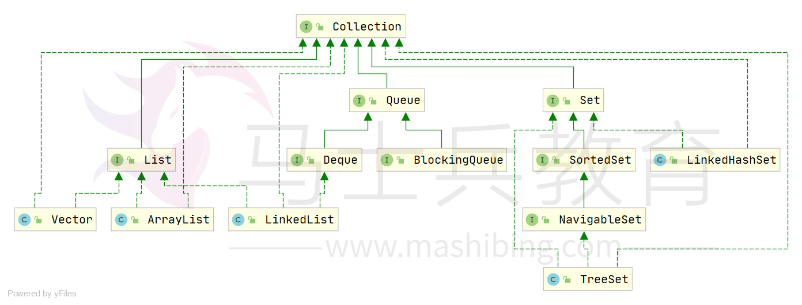

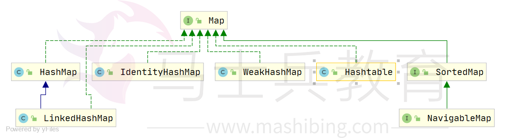

---

Map是一个键值对集合，存储键、值和之间的映射。 Key无序，唯一；value 不 要求有序，允许重复。
Map没有继承于Collection接口，从Map集合中检索元 素时，只要给出键对象，就会返回对应的值对
象。 
Map 的常用实现类：HashMap、TreeMap、HashTable、LinkedHashMap、 ConcurrentHashMap
集合框架底层数据结构
 
Collection 
List 
Arraylist： Object数组 
Vector： Object数组 
LinkedList： 双向循环链表  
Set 
HashSet（无序，唯一）：基于 HashMap 实现的，底层采用 HashMap 来保存元素
LinkedHashSet： LinkedHashSet 继承与 HashSet，并且其内部是通过  LinkedHashMap 来实现
的。有点类似于我们之前说的LinkedHashMap 其内部是基 于 Hashmap 实现一样，不过还是有一
点点区别的。 
TreeSet（有序，唯一）： 红黑树(自平衡的排序二叉树。) Map 
HashMap： JDK1.8之前HashMap由数组+链表组成的，数组是HashMap的主 体，链表则是主要
为了解决哈希冲突而存在的（“拉链法”解决冲突）.JDK1.8以后
在解决哈希冲突时有了较大的变化，当链表长度大于阈值（默认为8）时，将链表转 化为红黑树，
以减少搜索时间 
LinkedHashMap：LinkedHashMap 继承自 HashMap，所以它的底层仍然是 基于拉链式散列结
构即由数组和链表或红黑树组成。另外，LinkedHashMap 在上面 结构的基础上，增加了一条双向
链表，使得上面的结构可以保持键值对的插入顺序。 同时通过对链表进行相应的操作，实现了访问
顺序相关逻辑。 
HashTable： 数组+链表组成的，数组是 HashMap 的主体，链表则是主要为 了解决哈希冲突而存
在的 
TreeMap： 红黑树（自平衡的排序二叉树） 
哪些集合类是线程安全的？
 
vector：就比arraylist多了个同步化机制（线程安全），因为效率较低，现在已 经不太建议使用。
在web应用中，特别是前台页面，往往效率（页面响应速度）是优 先考虑的。 
statck：堆栈类，先进后出。 
hashtable：就比hashmap多了个线程安全。 
enumeration：枚举，相当于迭代器。 
Java集合的快速失败机制 “fail-fast”？
 
是java集合的一种错误检测机制，当多个线程对集合进行结构上的改变的操作 时，有可能会产生 fail-
fast 机制。 
例如：假设存在两个线程（线程1、线程2），线程1通过Iterator在遍历集合A中 的元素，在某个时候线
程2修改了集合A的结构（是结构上面的修改，而不是简 单的修改集合元素的内容），那么这个时候程序
就会抛出ConcurrentModificationException 异常，从而产生fail-fast机制。 
原因：迭代器在遍历时直接访问集合中的内容，并且在遍历过程中使用一个  modCount 变量。集合在
被遍历期间如果内容发生变化，就会改变modCount 的值。每当迭代器使用hashNext()/next()遍历下一
个元素之前，都会检测 modCount变量是否为expectedmodCount值，是的话就返回遍历；否则抛出 
异常，终止遍历。

---

解决办法： 
1. 在遍历过程中，所有涉及到改变modCount值得地方全部加上 synchronized。 
2. 使用CopyOnWriteArrayList来替换ArrayList
怎么确保一个集合不能被修改？
 
可以使用 Collections. unmodifiableCollection(Collection c) 方法来创建一个 只读集合，这样改变集合
的任何操作都会抛出 Java. lang.  UnsupportedOperationException 异常。 示例代码如下： 
Collection接口
 
List接口
 
迭代器 Iterator 是什么？
 
Iterator 接口提供遍历任何 Collection 的接口。我们可以从一个 Collection 中使用迭代器方法来获取迭
代器实例。迭代器取代了 Java 集合框架中的 Enumeration，迭代器允许调用者在迭代过程中移除元
素。
Iterator 怎么使用？有什么特点？
 
Iterator 使用代码如下：
Iterator 的特点是只能单向遍历，但是更加安全，因为它可以确保，在当前遍历
的集合元素被更改的时候，就会抛出 ConcurrentModificationException 异常。
如何边遍历边移除 Collection 中的元素？
 
边遍历边修改 Collection 的唯一正确方式是使用 Iterator.remove() 方法，如下：
一种  常见的错误代码如下：
 List<String> list = new ArrayList<>(); 
 list. add("x"); 
 Collection<String> clist = Collections. unmodifiableCollection(list); 
 clist. add("y"); // 运行时此行报错 
 System. out. println(list. size()); 
1   List<String> list = new ArrayList
2   Iterator<String> it = list. iterator
3   while(it. hasNext()){
4   String obj = it. next();
5   System. out. println(obj);
6   }
1   Iterator<Integer> it = list.iterator();
2   while(it.hasNext()){
3   *// do something*
4   it.remove();5   }
1   for(Integer i : list){
2   list.remove(i)
3   }

---

运行以上错误代码会报 ConcurrentModificationException 异常。这是因为当使用 foreach(for(Integer 
i : list)) 语句时，会自动生成一个iterator 来遍历该 list，但同时该 list 正在被 Iterator.remove() 修改。
Java 一般不允许一个线程在遍历 Collection 时另一个线程修改它。
Iterator 和 ListIterator 有什么区别？
 
Iterator 可以遍历 Set 和 List 集合，而 ListIterator 只能遍历 List。
Iterator 只能单向遍历，而 ListIterator 可以双向遍历（向前/后遍历）。
ListIterator 实现 Iterator 接口，然后添加了一些额外的功能，比如添加一个元 素、替换一个元
素、获取前面或后面元素的索引位置。
遍历一个 List 有哪些不同的方式？每种方法的实现原理是什 么？Java 中 List 遍历
的最佳实践是什么？
 
遍历方式有以下几种：
 
1. for 循环遍历，基于计数器。在集合外部维护一个计数器，然后依次读 取每一个位置的元素，当读
取到后一个元素后停止。 
2. 迭代器遍历，Iterator。Iterator 是面向对象的一个设计模式，目的是屏 蔽不同数据集合的特点，
统一遍历集合的接口。Java 在 Collections 中支 持了 Iterator 模式。 
3. foreach 循环遍历。foreach 内部也是采用了 Iterator 的方式实现，使 用时不需要显式声明 
Iterator 或计数器。优点是代码简洁，不易出错；缺 点是只能做简单的遍历，不能在遍历过程中操
作数据集合，例如删除、替 换。 
最佳实践：Java Collections 框架中提供了一个 RandomAccess 接口，用来标 记 List 实现是否支持 
Random Access。
如果一个数据集合实现了该接口，就意味着它支持 Random Access，按位置读 取元素的平均时间
复杂度为 O(1)，如ArrayList。 
如果没有实现该接口，表示不支持 Random Access，如LinkedList。 推荐的做法就是，支持 
Random Access 的列表可用 for 循环遍历，否则建议 用 Iterator 或 foreach 遍历。
说一下 ArrayList 的优缺点
 
ArrayList的优点如下：
ArrayList 底层以数组实现，是一种随机访问模式。ArrayList 实现了 RandomAccess 接口，因此查
找的时候非常快。
ArrayList 在顺序添加一个元素的时候非常方便。
ArrayList 的缺点如下：
删除元素的时候，需要做一次元素复制操作。如果要复制的元素很多，那么就会比较耗费性能。         
插入元素的时候，也需要做一次元素复制操作，缺点同上。
ArrayList 比较适合顺序添加、随机访问的场景。
如何实现数组和 List 之间的转换？
 
数组转 List：使用 Arrays. asList(array) 进行转换。
List 转数组：使用 List 自带的 toArray() 方法。代码示例：

---

ArrayList 和 LinkedList 的区别是什么？
 
数据结构实现：ArrayList 是动态数组的数据结构实现，而 LinkedList 是双向链表的数据结构实
现。
随机访问效率：ArrayList 比 LinkedList 在随机访问的时候效率要高，因为 LinkedList 是线性的数
据存储方式，所以需要移动指针从前往后依次查找。 
增加和删除效率：在非首尾的增加和删除操作，LinkedList 要比 ArrayList 效率要高，因为 
ArrayList 增删操作要影响数组内的其他数据的下标。
内存空间占用：LinkedList 比 ArrayList 更占内存，因为 LinkedList 的节点除了存储数据，还存储
了两个引用，一个指向前一个元素，一个指向后一个元素。
线程安全：ArrayList 和 LinkedList 都是不同步的，也就是不保证线程安全；
综合来说，在需要频繁读取集合中的元素时，更推荐使用 ArrayList，而在插入和删除操作较多时，更推
荐使用 LinkedList。
补充：数据结构基础之双向链表
双向链表也叫双链表，是链表的一种，它的每个数据结点中都有两个指针，分别指向直接后继和直接前
驱。所以，从双向链表中的任意一个结点开始，都可以很方便地访问它的前驱结点和后继结点。
ArrayList 和 Vector 的区别是什么？
 
这两个类都实现了 List 接口（List 接口继承了 Collection 接口），他们都是有序集合
ArrayList 是非线程安全的。
性能：ArrayList 在性能方面要优于 Vector。
扩容：ArrayList 和 Vector 都会根据实际的需要动态的调整容量，只不过在 
Vector 扩容每次会增加 1 倍，而 ArrayList 只会增加 50%。
Vector类的所有方法都是同步的。可以由两个线程安全地访问一个Vector对
象、但是一个线程访问Vector的话代码要在同步操作上耗费大量的时间。
Arraylist不是同步的，所以在不需要保证线程安全时时建议使用Arraylist。
插入数据时，ArrayList、LinkedList、Vector谁速度较快？阐述 ArrayList、
Vector、LinkedList 的存储性能和特性？
 
ArrayList、LinkedList、Vector 底层的实现都是使用数组方式存储数据。数组
元素数大于实际存储的数据以便增加和插入元素，它们都允许直接按序号索引元素，但是插入元素要涉
及数组元素移动等内存操作，所以索引数据快而插入数据慢。
Vector 中的方法由于加了 synchronized 修饰，因此 Vector是线程安全容器，但性能上较ArrayList差。
1   // list to array
2   List<String> list = new ArrayList<String>();
3   list.add("123");
4   list.add("456");
5   list.toArray();
6
7   // array to list
8   String[] array = new String[]{"123","456"};
9   Arrays.asList(array);
      线程安全：Vector 使用了 Synchronized 来实现线程同步，是线程安全的，而

---

LinkedList 使用双向链表实现存储，按序号索引数据需要进行前向或后向遍历，但插入数据时只需要记
录当前项的前后项即可，所以 LinkedList插入速度较快。
多线程场景下如何使用 ArrayList？
 
ArrayList 不是线程安全的，如果遇到多线程场景，可以通过 Collections 的 
synchronizedList 方法将其转换成线程安全的容器后再使用。例如像下面这样：
为什么 ArrayList 的 elementData 加上 transient 修饰？ ArrayList 中的数组定
义如下：
 
再看一下 ArrayList 的定义：
可以看到 ArrayList 实现了 Serializable 接口，这意味着 ArrayList 支持序列
化。transient 的作用是说不希望 elementData 数组被序列化，重写了 writeObject 实现：
每次序列化时，先调用 defaultWriteObject() 方法序列化 ArrayList 中的非transient 元素，然后遍历 
elementData，只序列化已存入的元素，这样既加快了序列化的速度，又减小了序列化之后的文件大
小。
List 和 Set 的区别
 
List , Set 都是继承自Collection 接口
List 特点：一个有序（元素存入集合的顺序和取出的顺序一致）容器，元素可以重复，可以插入多个null
元素，元素都有索引。常用的实现类有 ArrayList、
1   List<String> synchronizedList = Collections.synchronizedList(list);
2   synchronizedList.add("aaa");
3   synchronizedList.add("bbb");
4
5   for (int i = 0; i < synchronizedList.size(); i++) {
6   System.out.println(synchronizedList.get(i));
7   }
1 private transient Object[] elementData;
1   public class ArrayList<E> extends AbstractList<E>
2   implements List<E>, RandomAccess, Cloneable, java.io.Serializable
1 private void writeObject(java.io.ObjectOutputStream s) throws java.io.IOE 
xception{ 
2  *// Write out element count, and any hidden stuff* 
3  int expectedModCount = modCount; 
4  s.defaultWriteObject(); 
5  *// Write out array length* 
6  s.writeInt(elementData.length); 
7  *// Write out all elements in the proper order.* 
8  for (int i=0; i<size; i++) 
9  s.writeObject(elementData[i]); 
10  if (modCount != expectedModCount) { 
11  throw new ConcurrentModificationException();
12 }

---

LinkedList 和 Vector。
Set 特点：一个无序（存入和取出顺序有可能不一致）容器，不可以存储重复元素，只允许存入一个null
元素，必须保证元素唯一性。Set 接口常用实现类是 
HashSet、LinkedHashSet 以及 TreeSet。
另外 List 支持for循环，也就是通过下标来遍历，也可以用迭代器，但是set只能用迭代，因为他无序，
无法用下标来取得想要的值。
Set和List对比
Set：检索元素效率低下，删除和插入效率高，插入和删除不会引起元素位置改变。
List：和数组类似，List可以动态增长，查找元素效率高，插入删除元素效率低，因为会引起其他元素位
置改变
Set接口
 
说一下 HashSet 的实现原理？
 
HashSet 是基于 HashMap 实现的，HashSet的值存放于HashMap的key上，HashMap的value统一为
PRESENT，因此 HashSet 的实现比较简单，相关 HashSet 的操作，基本上都是直接调用底层 
HashMap 的相关方法来完成，HashSet 不允许重复的值。
HashSet如何检查重复？HashSet是如何保证数据不可重复的？
 
向HashSet 中add ()元素时，判断元素是否存在的依据，不仅要比较hash值，同时还要结合equles 方法
比较。
HashSet 中的add ()方法会使用HashMap 的put()方法。
HashMap 的 key 是唯一的，由源码可以看出 HashSet 添加进去的值就是作为 HashMap 的key，并且
在HashMap中如果K/V相同时，会用新的V覆盖掉旧的V，然后返回旧的V。所以不会重复（ HashMap 
比较key是否相等是先比较 hashcode 再比较equals ）。
以下是HashSet 部分源码：
hashCode（）与equals（）的相关规定：
1. 如果两个对象相等，则hashcode一定也是相同的
2. 两个对象相等,对两个equals方法返回true
3. 两个对象有相同的hashcode值，它们也不一定是相等的
4. 综上，equals方法被覆盖过，则hashCode方法也必须被覆盖
5. hashCode()的默认行为是对堆上的对象产生独特值。如果没有重写hashCode()，则该class的两个
对象无论如何都不会相等（即使这两个对象指向相同的数据）。
1   private static final Object PRESENT = new Object();
2   private transient HashMap<E,Object> map;
3
4   public HashSet() {
<>
5   map = new HashMap ();
6   }
7
8   public boolean add(E e) {
9   // 调用HashMap的put方法,PRESENT是一个至始至终都相同的虚值
10  return map.put(e, PRESENT)==null;
11  }

---

HashMap
HashSet
实现了Map接口
实现了Set接口
存储键值对
仅存储对象
调用 put（）向 map中
添加元素
调用 add（） 方法向Set 中添加元素
HashMap 使用键
（Key）计算 Hashcode
HashSet 使用成员对象来计 算 hashcode 值，对于两个对象 来说
hashcode 可能相 同，所以 equals()方法用来判断对象的相等性，如
果两个对象不同的话，那 么返回 false
HashMap 相对于
HashSet 较快，因为它
是使用唯一的键获取对
象
HashSet 较 HashMap 来说比较慢
==与equals的区别
1. ==是判断两个变量或实例是不是指向同一个内存空间 equals是判断两个变量或实例所指向的内存
空间的值是不是相同
2. ==是指对内存地址进行比较 equals()是对字符串的内容进行比较3.== 指引用是否相同 equals()指的
是值是否相同
HashSet与HashMap的区别
 
Queue
 
BlockingQueue是什么？
 
Java.util.concurrent.BlockingQueue是一个队列，在进行检索或移除一个元素的时候，它会等待队列变
为非空；当在添加一个元素时，它会等待队列中的可用空间。BlockingQueue接口是Java集合框架的一
部分，主要用于实现生产者-消费者模式。我们不需要担心等待生产者有可用的空间，或消费者有可用的
对象，因为它都在BlockingQueue的实现类中被处理了。Java提供了集中 BlockingQueue的实现，比如
ArrayBlockingQueue、
LinkedBlockingQueue、PriorityBlockingQueue,、SynchronousQueue等。在 Queue 中 poll()和 
remove()有什么区别？
相同点：都是返回第一个元素，并在队列中删除返回的对象。
不同点：如果没有元素 poll()会返回 null，而 remove()会直接抛出 NoSuchElementException 异
常。
代码示例：
Map接口
 
1   Queue<String> queue = new LinkedList<String>();
2   queue. offer("string"); // add
3   System. out. println(queue. poll());
4   System. out. println(queue. remove());
5   System. out. println(queue. size());

---

说一下 HashMap 的实现原理？
 
HashMap概述： HashMap是基于哈希表的Map接口的非同步实现。此实现提供所有可选的映射操作，
并允许使用null值和null键。此类不保证映射的顺序，特别是它不保证该顺序恒久不变。
HashMap的数据结构： 在Java编程语言中， 基本的结构就是两种，一个是数组，另外一个是模拟指针
（引用），所有的数据结构都可以用这两个基本结构来构造的，HashMap也不例外。HashMap实际上
是一个“链表散列”的数据结构，即数组和链表的结合体。
HashMap 基于 Hash 算法实现的
1. 当我们往Hashmap中put元素时，利用key的hashCode重新hash计算出当前对象的元素在数组中
的下标
2. 存储时，如果出现hash值相同的key，此时有两种情况。(1)如果key相
同，则覆盖原始值；(2)如果key不同（出现冲突），则将当前的key-value 放入链表中
3. 获取时，直接找到hash值对应的下标，在进一步判断key是否相同，从而找到对应值。
4. 理解了以上过程就不难明白HashMap是如何解决hash冲突的问题，核心就是使用了数组的存储方
式，然后将冲突的key的对象放入链表中，一旦发现冲突就在链表中做进一步的对比。
需要注意Jdk 1.8中对HashMap的实现做了优化，当链表中的节点数据超过八个
之后，该链表会转为红黑树来提高查询效率，从原来的O(n)到O(logn)
HashMap在JDK1.7和JDK1.8中有哪些不同？ HashMap的底层实现
 
在Java中，保存数据有两种比较简单的数据结构：数组和链表。数组的特点是：寻址容易，插入和删除
困难；链表的特点是：寻址困难，但插入和删除容易；所以我们将数组和链表结合在一起，发挥两者各
自的优势，使用一种叫做拉链法的方式可以解决哈希冲突。
JDK1.8之前
 
JDK1.8之前采用的是拉链法。拉链法：将链表和数组相结合。也就是说创建一个链表数组，数组中每一
格就是一个链表。若遇到哈希冲突，则将冲突的值加到链表中即可。
 
JDK1.8之后
 
相比于之前的版本，jdk1.8在解决哈希冲突时有了较大的变化，当链表长度大于阈值（默认为8）时，将
链表转化为红黑树，以减少搜索时间。
 
JDK1.7 VS JDK1.8 比较
 
JDK1.8主要解决或优化了一下问题：
1. resize 扩容优化
2. 引入了红黑树，目的是避免单条链表过长而影响查询效率，红黑树算法请参考
3. 解决了多线程死循环问题，但仍是非线程安全的，多线程时可能会造成数据丢失问题。

---

不同
JDK 1.7
JDK 1.8
存储结构
数组 + 链表
数组 + 链表 + 红黑树
初始化方
式
单独函数： inflateTab le()
直接集成到了扩容 函数 resize()中
hash值计
算方式
扰动处理 = 9次扰动 = 4次位运算
+ 5次异或运算
扰动处理 = 2次扰动 = 1次位运算 + 1次异或
运算
存放数据
的规则
无冲突 时，存放 数组；冲 突时，
存 放链表
无冲突时，存放 数组；冲 突 & 链表 长度 <
8：存放单 链表；冲 突 & 链表 长度 > 8：树
化并 存放红黑 树
插入数据
方式
头插法 （先讲原 位置的数 据移到
后1 位，再插 入数据到 该位置）
尾插法 （直接插 入到链表 尾部/红黑 树）
扩容后存
储位置的
计算方式
全部按照 原来方法 进行计算 （即
hashCode ->> 扰动 函数 ->>
(h&lengt h-1)）
按照扩容 后的规律 计算（即 扩容后的 位置=
原位 置 or 原位 置 + 旧容 量）
HashMap的put方法的具体流程？
 
当我们put的时候，首先计算 key的hash值，这里调用了 hash方法，hash方法实际是让key.hashCode()
与key.hashCode()>>>16进行异或操作，高16bit补0，一个数和0异或不变，所以 hash 函数大概的作用
就是：高16bit不变，低16bit和高
16bit做了一个异或，目的是减少碰撞。按照函数注释，因为bucket数组大小是
2的幂，计算下标index = (table.length - 1) & hash，如果不做 hash 处理，相当于散列生效的只有几个
低 bit 位，为了减少散列的碰撞，设计者综合考虑了速度、作用、质量之后，使用高16bit和低16bit异或
来简单处理减少碰撞，而且
JDK8中用了复杂度 O（logn）的树结构来提升碰撞下的性能。
putVal方法执行流程图

---

1 public V put(K key, V value) {
2 return putVal(hash(key), key, value, false, true);
3 }
4
5 static final int hash(Object key) {
6 int h;
7 return (key == null) ? 0 : (h = key.hashCode()) ^ (h >>> 16);
8 }
9
10 //实现Map.put和相关方法
11 final V putVal(int hash, K key, V value, boolean onlyIfAbsent,
12 boolean evict) {
13 Node<K,V>[] tab; Node<K,V> p; int n, i;
14 // 步骤①：tab为空则创建
15 // table未初始化或者长度为0，进行扩容
16 if ((tab = table) == null || (n = tab.length) == 0)
17 n = (tab = resize()).length;
18 // 步骤②：计算index，并对null做处理
19 // (n - 1) & hash 确定元素存放在哪个桶中，桶为空，新生成结点放入桶中(此时，这
个结点是放在数组中)
20 if ((p = tab[i = (n - 1) & hash]) == null)
21 tab[i] = newNode(hash, key, value, null);
22 // 桶中已经存在元素
23 else {
24 Node<K,V> e; K k;
25 // 步骤③：节点key存在，直接覆盖value
26 // 比较桶中第一个元素(数组中的结点)的hash值相等，key相等
27 if (p.hash == hash &&
28 ((k = p.key) == key || (key != null && key.equals(k))))
29 // 将第一个元素赋值给e，用e来记录
30 e = p;
31 // 步骤④：判断该链为红黑树
32 // hash值不相等，即key不相等；为红黑树结点
33 // 如果当前元素类型为TreeNode，表示为红黑树，putTreeVal返回待存放的node, e可

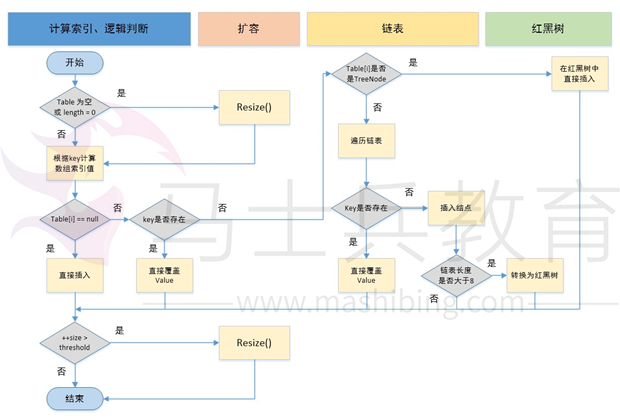

---

能为null
34 else if (p instanceof TreeNode)
35 // 放入树中
36 e = ((TreeNode<K,V>)p).putTreeVal(this, tab, hash, key, value);
37 // 步骤⑤：该链为链表
38 // 为链表结点
39 else {
40 // 在链表最末插入结点
41 for (int binCount = 0; ; ++binCount) {
42 // 到达链表的尾部
43
44 //判断该链表尾部指针是不是空的
45 if ((e = p.next) == null) {
46 // 在尾部插入新结点
47 p.next = newNode(hash, key, value, null);
48 //判断链表的长度是否达到转化红黑树的临界值，临界值为8
49 if (binCount >= TREEIFY_THRESHOLD - 1) // -1 for 1st
50 //链表结构转树形结构
51 treeifyBin(tab, hash);
52 // 跳出循环
53 break;
54 }
55 // 判断链表中结点的key值与插入的元素的key值是否相等
56 if (e.hash == hash &&
57 ((k = e.key) == key || (key != null && key.equals(k))))
58 // 相等，跳出循环
59 break;
60 // 用于遍历桶中的链表，与前面的e = p.next组合，可以遍历链表
61 p = e;
62 }
63 }
64 //判断当前的key已经存在的情况下，再来一个相同的hash值、key值时，返回新来的val
ue这个值
65 if (e != null) {
66 // 记录e的value
67 V oldValue = e.value;
68 // onlyIfAbsent为false或者旧值为null
69 if (!onlyIfAbsent || oldValue == null)
70 //用新值替换旧值
71 e.value = value;
72 // 访问后回调
73 afterNodeAccess(e);
74 // 返回旧值
75 return oldValue;
76 }
77 }
78 // 结构性修改
79 ++modCount;
80 // 步骤⑥：超过最大容量就扩容
81 // 实际大小大于阈值则扩容
82 if (++size > threshold)
83 resize();
84 // 插入后回调
85 afterNodeInsertion(evict);
86 return null;
87 }

---

①.判断键值对数组table[i]是否为空或为null，否则执行resize()进行扩容； 
②.根据键值key计算hash值得到插入的数组索引i，如果table[i]==null，直接新建节点添加，转向⑥，如
果table[i]不为空，转向③；
③.判断table[i]的首个元素是否和key一样，如果相同直接覆盖value，否则转向
④，这里的相同指的是hashCode以及equals；
④.判断table[i] 是否为treeNode，即table[i] 是否是红黑树，如果是红黑树，则直接在树中插入键值
对，否则转向⑤； 
⑤.遍历table[i]，判断链表长度是否大于8，大于8的话把链表转换为红黑树，在红黑树中执行插入操
作，否则进行链表的插入操作；遍历过程中若发现key已经存在直接覆盖value即可；
⑥.插入成功后，判断实际存在的键值对数量size是否超多了 大容量threshold，如果超过，进行扩容。
HashMap的扩容操作是怎么实现的？
 
①.在jdk1.8中，resize方法是在hashmap中的键值对大于阀值时或者初始化时，就调用resize方法进行
扩容；
②.每次扩展的时候，都是扩展2倍；
③.扩展后Node对象的位置要么在原位置，要么移动到原偏移量两倍的位置。在putVal()中，我们看到在
这个函数里面使用到了2次resize()方法，resize()方法表示的在进行第一次初始化时会对其进行扩容，或
者当该数组的实际大小大于其临界值值(第一次为12),这个时候在扩容的同时也会伴随的桶上面的元素进
行重新分发，这也是JDK1.8版本的一个优化的地方，在1.7中，扩容之后需要重新去计算其Hash值，根
据Hash值对其进行分发，但在1.8版本中，则是根据在同一个桶的位置中进行判断(e.hash & oldCap)是
否为0，重新进行hash分配后，该元素的位置要么停留在原始位置，要么移动到原始位置+增加的数组大
小这个位置上
1 final Node<K,V>[] resize() {
2 Node<K,V>[] oldTab = table;//oldTab指向hash桶数组
3 int oldCap = (oldTab == null) ? 0 : oldTab.length;
4 int oldThr = threshold;
5 int newCap, newThr = 0;
6 if (oldCap > 0) {//如果oldCap不为空的话，就是hash桶数组不为空
7 if (oldCap >= MAXIMUM_CAPACITY) {//如果大于最大容量了，就赋值为整数最大的阀
值
8 threshold = Integer.MAX_VALUE;
9 return oldTab;//返回
10 }//如果当前hash桶数组的长度在扩容后仍然小于最大容量 并且oldCap大于默认值16
11 else if ((newCap = oldCap << 1) < MAXIMUM_CAPACITY &&
12 oldCap >= DEFAULT_INITIAL_CAPACITY)
13 newThr = oldThr << 1; // double threshold 双倍扩容阀值threshold
14 }
15 // 旧的容量为0，但threshold大于零，代表有参构造有cap传入，threshold已经被初
始化成最小2的n次幂
16 // 直接将该值赋给新的容量
17 else if (oldThr > 0) // initial capacity was placed in threshold
18 newCap = oldThr;
19 // 无参构造创建的map，给出默认容量和threshold 16, 16*0.75
20 else { // zero initial threshold signifies using defaults
21 newCap = DEFAULT_INITIAL_CAPACITY;
22 newThr = (int)(DEFAULT_LOAD_FACTOR * DEFAULT_INITIAL_CAPACITY);
23 }
24 // 新的threshold = 新的cap * 0.75
25 if (newThr == 0) {

---

26 float ft = (float)newCap * loadFactor;
27 newThr = (newCap < MAXIMUM_CAPACITY && ft < (float)MAXIMUM_CAPACITY ?
28 (int)ft : Integer.MAX_VALUE);
29 }
30 threshold = newThr;
31 // 计算出新的数组长度后赋给当前成员变量table
32 @SuppressWarnings({"rawtypes","unchecked"})
33 Node<K,V>[] newTab = (Node<K,V>[])new Node[newCap];//新建hash桶数组
34 table = newTab;//将新数组的值复制给旧的hash桶数组
35 // 如果原先的数组没有初始化，那么resize的初始化工作到此结束，否则进入扩容元素
重排逻辑，使其均匀的分散
36 if (oldTab != null) {
37 // 遍历新数组的所有桶下标
38 for (int j = 0; j < oldCap; ++j) {
39 Node<K,V> e;
40 if ((e = oldTab[j]) != null) {
41 // 旧数组的桶下标赋给临时变量e，并且解除旧数组中的引用，否则就数组无法被GC回收
42 oldTab[j] = null;
43 // 如果e.next==null，代表桶中就一个元素，不存在链表或者红黑树
44 if (e.next == null)
45 // 用同样的hash映射算法把该元素加入新的数组
46 newTab[e.hash & (newCap - 1)] = e;
47 // 如果e是TreeNode并且e.next!=null，那么处理树中元素的重排
48 else if (e instanceof TreeNode)
49 ((TreeNode<K,V>)e).split(this, newTab, j, oldCap);
50 // e是链表的头并且e.next!=null，那么处理链表中元素重排
51 else { // preserve order
52 // loHead,loTail 代表扩容后不用变换下标，见注1
53 Node<K,V> loHead = null, loTail = null;
54 // hiHead,hiTail 代表扩容后变换下标，见注1
55 Node<K,V> hiHead = null, hiTail = null;
56 Node<K,V> next;
57 // 遍历链表
58 do {
59 next = e.next;
60 if ((e.hash & oldCap) == 0) {
61 if (loTail == null)
62 // 初始化head指向链表当前元素e，e不一定是链表的第一个元素，初始化后loHead
63 // 代表下标保持不变的链表的头元素
64 loHead = e;
65 else
66 // loTail.next指向当前e
67 loTail.next = e;
68 // loTail指向当前的元素e
69 // 初始化后，loTail和loHead指向相同的内存，所以当loTail.next指向下一个元素
时，
70 // 底层数组中的元素的next引用也相应发生变化，造成lowHead.next.next.....
71 // 跟随loTail同步，使得lowHead可以链接到所有属于该链表的元素。
72 loTail = e;
73 }
74 else {
75 if (hiTail == null)
76 // 初始化head指向链表当前元素e, 初始化后hiHead代表下标更改的链表头元素
77 hiHead = e;
78 else
79 hiTail.next = e;
80 hiTail = e;
81 }

---

HashMap是怎么解决哈希冲突的？
 
答：在解决这个问题之前，我们首先需要知道什么是哈希冲突，而在了解哈希冲突之前我们还要知道什
么是哈希才行；什么是哈希？
Hash，一般翻译为“散列”，也有直接音译为“哈希”的，这就是把任意长度的输入通过散列算法，变换成
固定长度的输出，该输出就是散列值（哈希值）；这种转换是一种压缩映射，也就是，散列值的空间通
常远小于输入的空间，不同的输入可能会散列成相同的输出，所以不可能从散列值来唯一的确定输入
值。简单的说就是一种将任意长度的消息压缩到某一固定长度的消息摘要的函数。
所有散列函数都有如下一个基本特性：根据同一散列函数计算出的散列值如果不同，那么输入值肯定也
不同。但是，根据同一散列函数计算出的散列值如果相同，输入值不一定相同。
什么是哈希冲突？
 
当两个不同的输入值，根据同一散列函数计算出相同的散列值的现象，我们就把它叫做碰撞（哈希碰
撞）。
HashMap的数据结构
 
在Java中，保存数据有两种比较简单的数据结构：数组和链表。数组的特点是：寻址容易，插入和删除
困难；链表的特点是：寻址困难，但插入和删除容易；所以我们将数组和链表结合在一起，发挥两者各
自的优势，使用一种叫做链地址法的方式可以解决哈希冲突：
82 } while ((e = next) != null);
83 // 遍历结束, 将tail指向null，并把链表头放入新数组的相应下标，形成新的映射。
84 if (loTail != null) {
85 loTail.next = null;
86 newTab[j] = loHead;
87 }
88 if (hiTail != null) {
89 hiTail.next = null;
90 newTab[j + oldCap] = hiHead;
91 }
92 }
93 }
94 }
95 }
96 return newTab;
97 }

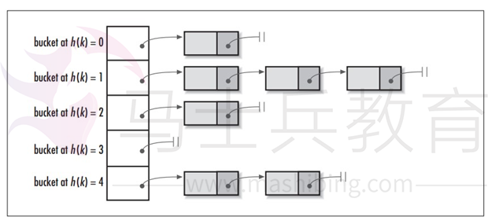

---

这样我们就可以将拥有相同哈希值的对象(img)组织成一个链表放在hash值所对应的 bucket下，但相比
于hashCode返回的int类型，我们HashMap初始的容量大小DEFAULT_INITIAL_CAPACITY = 1 << 4（即
2的四次方16）要远小于int类型的范围，所以我们如果只是单纯的用hashCode取余来获取对应的
bucket这将会大大增加哈希碰撞的概率，并且最坏情况下还会将HashMap变成一个单链表，所以我们还
需要对hashCode作一定的优化 hash()函数
上面提到的问题，主要是因为如果使用hashCode取余，那么相当于参与运算的只有hashCode的低位，
高位是没有起到任何作用的，所以我们的思路就是让 hashCode取值出的高位也参与运算，进一步降低
hash碰撞的概率，使得数据分布更平均，我们把这样的操作称为扰动，在JDK 1.8中的hash()函数如下：
这比在JDK 1.7中，更为简洁，相比在1.7中的4次位运算，5次异或运算（9次扰动），在1.8中，只进行
了1次位运算和1次异或运算（2次扰动）；
JDK1.8新增红黑树
 
通过上面的链地址法（使用散列表）和扰(img)动函数我们成功让我们的数据分布更平均，哈希碰撞减
少，但是当我们的HashMap中存在大量数据时，加入我们某个 bucket下对应的链表有n个元素，那么遍
历时间复杂度就为O(n)，为了针对这个问题，JDK1.8在HashMap中新增了红黑树的数据结构，进一步使
得遍历复杂度降低至O(logn)；总结
简单总结一下HashMap是使用了哪些方法来有效解决哈希冲突的：
1. 使用链地址法（使用散列表）来链接拥有相同hash值的数据；
2. 使用2次扰动函数（hash函数）来降低哈希冲突的概率，使得数据分布更平均；
3. 引入红黑树进一步降低遍历的时间复杂度，使得遍历更快；
1   static final int hash(Object key) {
2   int h;
3   return (key == null) ? 0 : (h = key.hashCode()) ^ (h >>> 16);// 与自己右移16位
进行异或运算（高低位异或）
4   }

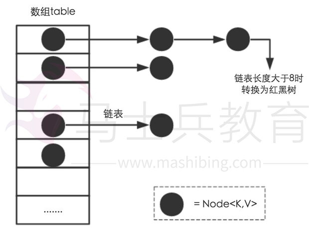

---

能否使用任何类作为 Map 的 key？
 
可以使用任何类作为 Map 的 key，然而在使用之前，需要考虑以下几点：  如果类重写了 equals() 方
法，也应该重写 hashCode() 方法。类的所有实例需要遵循与 equals() 和 hashCode() 相关的规则。
如果一个类没有使用 equals()，不应该在 hashCode() 中使用它。
用户自定义 Key 类 佳实践是使之为不可变的，这样 hashCode() 值可以被缓存起来，拥有更好的性能。
不可变的类也可以确保 hashCode() 和 equals() 在未来不会改变，这样就会解决与可变相关的问题了。
为什么HashMap中String、Integer这样的包装类适合作为K？
 
答：String、Integer等包装类的特性能够保证Hash值的不可更改性和计算准确性，能够有效的减少
Hash碰撞的几率
1. 都是final类型，即不可变性，保证key的不可更改性，不会存在获取 hash值不同的情况
内部已重写了equals()、hashCode()等方法，遵守了HashMap内部的规范（不清楚可以去上面看看
putValue的过程），不容易出现Hash值计算错误的情况
如果使用Object作为HashMap的Key，应该怎么办呢？
 
答：重写hashCode()和equals()方法
1. 重写hashCode()是因为需要计算存储数据的存储位置，需要注意不要试图从散列码计算中排除掉一
个对象的关键部分来提高性能，这样虽然能更快但可能会导致更多的Hash碰撞；
2. 重写equals()方法，需要遵守自反性、对称性、传递性、一致性以及对
于任何非null的引用值x，x.equals(null)必须返回false的这几个特性，目的是为了保证key在哈希表中的
唯一性
HashMap为什么不直接使用hashCode()处理后的哈希 值直接作为table的下标？ 
答：hashCode()方法返回的是int整数类型，其范围为-(2 ^ 31)~(2 ^ 31 - 1)，约有40亿个映射空间，而
HashMap的容量范围是在16（初始化默认值）~2 ^ 30，HashMap通常情况下是取不到 大值的，并且
设备上也难以提供这么多的存储空间，从而导致通过hashCode()计算出的哈希值可能不在数组大小范围
内，进而无法匹配存储位置；
那怎么解决呢？
1. HashMap自己实现了自己的hash()方法，通过两次扰动使得它自己的哈希值高低位自行进行异或运
算，降低哈希碰撞概率也使得数据分布更平均；
2. 在保证数组长度为2的幂次方的时候，使用hash()运算之后的值与运算
（&）（数组长度 - 1）来获取数组下标的方式进行存储，这样一来是比取
余操作更加有效率，二来也是因为只有当数组长度为2的幂次方时，h&
(length-1)才等价于h%length，三来解决了“哈希值与数组大小范围不匹配"的问题
HashMap 的长度为什么是2的幂次方
 
为了能让 HashMap 存取高效，尽量较少碰撞，也就是要尽量把数据分配均匀，每个链表/红黑树长度大
致相同。这个实现就是把数据存到哪个链表/红黑树中的算法。
这个算法应该如何设计呢？我们首先可能会想到采用%取余的操作来实现。但是，重点来了：“取余(%)操
作中如果除数是2的幂次则等价于与其除数减一的与(&)操作（也就是说 
hash%length==hash&(length-1)的前提是 length 是2的 n 次方；）。” 并且 采用二进制位操作 &，相对
于%能够提高运算效率，这就解释了 HashMap 的长度为什么是2的幂次方。

---

那为什么是两次扰动呢？答：这样就是加大哈希值低位的随机性，使得分布更均匀，从而提高对应数组
存储下标位置的随机性&均匀性，  终减少Hash冲突，两次就够了，已经达到了高位低位同时参与运算
的目的
HashMap 与 HashTable 有什么区别？
 
1. 线程安全： HashMap 是非线程安全的，HashTable 是线程安全的；
HashTable 内部的方法基本都经过 synchronized 修饰。（如果你要保证线程安全的话就使用 
ConcurrentHashMap 吧！）；
2. 效率： 因为线程安全的问题，HashMap 要比 HashTable 效率高一点。另外，HashTable 基本被
淘汰，不要在代码中使用它；
3. 对Null key 和Null value的支持： HashMap 中，null 可以作为键，这样的键只有一个，可以有一
个或多个键所对应的值为 null。但是在 
HashTable 中 put 进的键值只要有一个 null，直接抛
NullPointerException。
4. 初始容量大小和每次扩充容量大小的不同 ： ①创建时如果不指定容量初始值，Hashtable 默认的
初始大小为11，之后每次扩充，容量变为原来的2n+1。HashMap 默认的初始化大小为16。之后
每次扩充，容量变为原来的2倍。②创建时如果给定了容量初始值，那么 Hashtable 会直接使用你
给定的大小，而 HashMap 会将其扩充为2的幂次方大小。也就是说 HashMap 总是使用2的幂作为
哈希表的大小，后面会介绍到为什么是2 的幂次方。
5. 底层数据结构： JDK1.8 以后的 HashMap 在解决哈希冲突时有了较大的变化，当链表长度大于阈
值（默认为8）时，将链表转化为红黑树，以减少搜索时间。Hashtable 没有这样的机制。
6. 推荐使用：在 Hashtable 的类注释可以看到，Hashtable 是保留类不建议使用，推荐在单线程环境
下使用 HashMap 替代，如果需要多线程使用则用 ConcurrentHashMap 替代。
 
如何决定使用 HashMap 还是TreeMap？
 
对于在Map中插入、删除和定位元素这类操作，HashMap是 好的选择。然
而，假如你需要对一个有序的key集合进行遍历，TreeMap是更好的选择。基于你的collection的大小，
也许向HashMap中添加元素会更快，将map换为TreeMap进行有序key的遍历
HashMap 和 ConcurrentHashMap 的区别
 
1. ConcurrentHashMap对整个桶数组进行了分割分段(Segment)，然后在每一个分段上都用lock锁进
行保护，相对于HashTable的synchronized 锁的粒度更精细了一些，并发性能更好，而HashMap
没有锁机制，不是线程安全的。（JDK1.8之后ConcurrentHashMap启了一种全新的方式实现,利用
CAS算法。）
2. HashMap的键值对允许有null，但是ConCurrentHashMap都不允许。
ConcurrentHashMap 和 Hashtable 的区别？
 
ConcurrentHashMap 和 Hashtable 的区别主要体现在实现线程安全的方式上不同。
 底层数据结构： JDK1.7的 ConcurrentHashMap 底层采用 分段的数组
+链表 实现，JDK1.8 采用的数据结构跟HashMap1.8的结构一样，数组+链表/红黑
二叉树。Hashtable 和 JDK1.8 之前的 HashMap 的底层数据结构类似都是采用 数组+链表 的形式，数组
是 HashMap 的主体，链表则是主要为了解决哈希冲突而存在的；
       实现线程安全的方式（重要）： ① 在JDK1.7的时候，

---

ConcurrentHashMap（分段锁） 对整个桶数组进行了分割分段(Segment)，每一把锁只锁容器其中一
部分数据，多线程访问容器里不同数据段的数据，就不会存在锁竞争，提高并发访问率。（默认分配16
个Segment，比Hashtable效率提高16
倍。） 到了 JDK1.8 的时候已经摒弃了Segment的概念，而是直接用 
Node 数组+链表+红黑树的数据结构来实现，并发控制使用 
synchronized 和 CAS 来操作。（JDK1.6以后 对 synchronized锁做了很多优化） 整个看起来就像是优
化过且线程安全的 HashMap，虽然在JDK1.8中还
能看到 Segment 的数据结构，但是已经简化了属性，只是为了兼容旧版本；② 
Hashtable(同一把锁) :使用 synchronized 来保证线程安全，效率非常低下。当一个线程访问同步方法
时，其他线程也访问同步方法，可能会进入阻塞或轮询状态，如使用 put 添加元素，另一个线程不能使
用 put 添加元素，也不能使用 get，竞争会越来越激烈效率越低。
两者的对比图：
HashTable:
JDK1.7的ConcurrentHashMap：

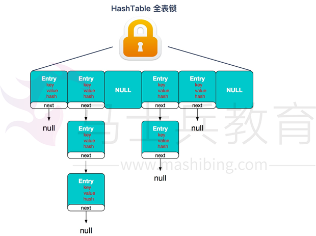

---

JDK1.8的ConcurrentHashMap（TreeBi(img)n: 红黑二叉树节点 Node: 链表节点）：
答：ConcurrentHashMap 结合了 Hash(img)Map 和 HashTable 二者的优势。 HashMap 没有考虑同
步，HashTable 考虑了同步的问题。但是 HashTable 在每次同步执行时都要锁住整个结构。 
ConcurrentHashMap 锁的方式是稍微细粒度的。
ConcurrentHashMap 底层具体实现知道吗？实现原理是什么？
 
JDK1.7
首先将数据分为一段一段的存储，然后给每一段数据配一把锁，当一个线程占用锁访问其中一个段数据
时，其他段的数据也能被其他线程访问。
在JDK1.7中，ConcurrentHashMap采用Segment + HashEntry的方式进行实
现，结构如下：
一个 ConcurrentHashMap 里包含一个 Segment 数组。Segment 的结构和 HashMap类似，是一种数
组和链表结构，一个 Segment 包含一个 HashEntry 数组，每个 HashEntry 是一个链表结构的元素，每
个 Segment 守护着一个 HashEntry数组里的元素，当对 HashEntry 数组的数据进行修改时，必须首先
获得对应的 Segment的锁。

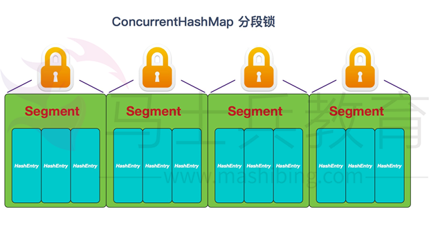

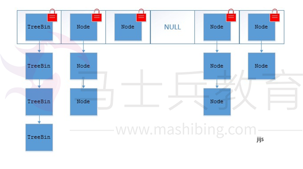

---

1. 该类包含两个静态内部类 HashE(img)ntry 和 Segment ；前者用来封装映射表的键值对，后者用来
充当锁的角色；
2. Segment 是一种可重入的锁 ReentrantLock，每个 Segment 守护一个HashEntry 数组里得元素，
当对 HashEntry 数组的数据进行修改时，必须首先获得对应的 Segment 锁。
JDK1.8
在JDK1.8中，放弃了Segment臃肿的设计，取而代之的是采用Node + CAS + Synchronized来保证并发
安全进行实现，synchronized只锁定当前链表或红黑二叉树的首节点，这样只要hash不冲突，就不会产
生并发，效率又提升N 倍。
结构如下：
看插入元素过程（建议去看看源码）：
如果相应位置的Node还没有初始化，则调用CAS插入相应的数据；
如果相应位置的Node不为空，且当前该节点不处于移动状态，则对该节点加
synchronized锁，如果该节点的hash不小于0，则遍历链表更新节点或插入新节点；
1   else if ((f = tabAt(tab, i = (n - 1) & hash)) == null) {
2   if (casTabAt(tab, i, null, new Node<K,V>(hash, key, value, null)))
3   break; // no lock when adding to empty bin
4   }
1 if (fh >= 0) {

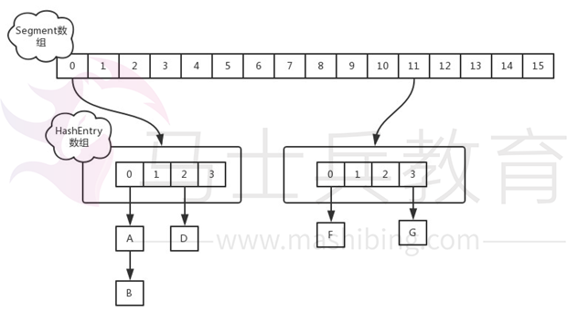

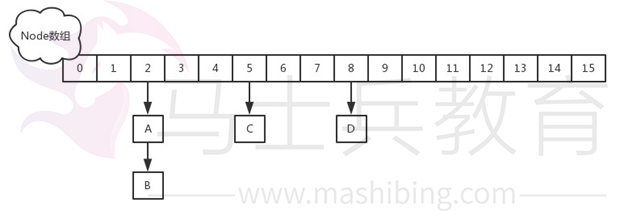

---

1. 如果该节点是TreeBin类型的节点，说明是红黑树结构，则通过 putTreeVal方法往红黑树中插入节
点；如果binCount不为0，说明put操作对数据产生了影响，如果当前链表的个数达到8个，则通过
treeifyBin方法转化为红黑树，如果oldVal不为空，说明是一次更新操作，没有对元素个数产生影
响，则直接返回旧值；
2. 如果插入的是一个新节点，则执行addCount()方法尝试更新元素个数 baseCount；
辅助工具类
 
Array 和 ArrayList 有何区别？
 
Array 可以存储基本数据类型和对象，ArrayList 只能存储对象。
Array 是指定固定大小的，而 ArrayList 大小是自动扩展的。
Array 内置方法没有 ArrayList 多，比如 addAll、removeAll、iteration 等方法只有 ArrayList 有。
对于基本类型数据，集合使用自动装箱来减少编码工作量。但是，当处理固定大小的基本数据类型的时
候，这种方式相对比较慢。
如何实现 Array 和 List 之间的转换？
 
Array 转 List： Arrays. asList(array) ；
List 转 Array：List 的 toArray() 方法。
comparable 和 comparator的区别？
 
comparable接口实际上是出自java.lang包，它有一个 compareTo(Object obj)方法用来排序
comparator接口实际上是出自 java.util 包，它有一个compare(Object obj1, Object obj2)方法用
来排序
一般我们需要对一个集合使用自定义排序时，我们就要重写compareTo方法或 compare方法，当我们
需要对某一个集合实现两种排序方式，比如一个song对象中的歌名和歌手名分别采用一种排序方法的
话，我们可以重写compareTo方法和使用自制的Comparator方法或者以两个Comparator来实现歌名
排序和歌星名排序，第二种代表我们只能使用两个参数版的Collections.sort().
2 binCount = 1;
3   for (Node<K,V> e = f;; ++binCount) {
4   K ek;
5   if (e.hash == hash &&
6   ((ek = e.key) == key ||
7   (ek != null && key.equals(ek)))) {
8   oldVal = e.val;
9   if (!onlyIfAbsent)
10  e.val = value;
11  break;
12  }
13  Node<K,V> pred = e;
14  if ((e = e.next) == null) {
15  pred.next = new Node<K,V>(hash, key, value, null);
16  break;
17  }
18  }
19  }

---

Collection 和 Collections 有什么区别？
 
java.util.Collection 是一个集合接口（集合类的一个顶级接口）。它提供了对集合对象进行基本操
作的通用接口方法。Collection接口在Java 类库中有很多具体的实现。Collection接口的意义是为
各种具体的集合提供了 大化的统一操作方式，其直接继承接口有List与Set。
Collections则是集合类的一个工具类/帮助类，其中提供了一系列静态方法，用于对集合中元素进
行排序、搜索以及线程安全等各种操作。
TreeMap 和 TreeSet 在排序时如何比较元素？ Collections 工具类中的 sort()方
法如何比较元素？
 
TreeSet 要求存放的对象所属的类必须实现 Comparable 接口，该接口提供了比较元素的 compareTo()
方法，当插入元素时会回调该方法比较元素的大小。
TreeMap 要求存放的键值对映射的键必须实现 Comparable 接口从而根据键对元素进 行排 序。
Collections 工具类的 sort 方法有两种重载的形式，
第一种要求传入的待排序容器中存放的对象比较实现 Comparable 接口以实现元素的比较；
第二种不强制性的要求容器中的元素必须可比较，但是要求传入第二个参数，参数是Comparator 接口
的子类型（需要重写 compare 方法实现元素的比较），相当于一个临时定义的排序规则，其实就是通
过接口注入比较元素大小的算法，也是对回调模式的应用（Java 中对函数式编程的支持）。
 
 
Vector,ArrayList, LinkedList的区别是什么？
 
答：
1. Vector、ArrayList都是以类似数组的形式存储在内存中，LinkedList则以链表的形式进行存储。
2. List中的元素有序、允许有重复的元素，Set中的元素无序、不允许有重复元素。
3. Vector线程同步，ArrayList、LinkedList线程不同步。
4. LinkedList适合指定位置插入、删除操作，不适合查找；ArrayList、Vector适合查找，不适合指定
位置的插入、删除操作。
5. ArrayList在元素填满容器时会自动扩充容器大小的50%，而Vector则是100%，因此ArrayList更节
省空间。
HashTable, HashMap，TreeMap区别？
 
答：
1. HashTable线程同步，HashMap非线程同步。
2. HashTable不允许<键,值>有空值，HashMap允许<键,值>有空值。
3. HashTable使用Enumeration，HashMap使用Iterator。
4. HashTable中hash数组的默认大小是11，增加方式的old*2+1，HashMap中hash数组的默认大小
是16，增长方式一定是2的指数倍。
5. TreeMap能够把它保存的记录根据键排序，默认是按升序排序。
HashMap的数据结构
 
jdk1.8之前list + 链表
 jdk1.8之后list + 链表（当链表长度到8时，转化为红黑树）
HashMap的扩容因子

---

默认0.75，也就是会浪费1/4的空间，达到扩容因子时，会将list扩容一倍，0.75 是时间与空间一个平衡
值；
多线程修改HashMap
 
多线程同时写入，同时执行扩容操作，多线程扩容可能死锁、丢数据；可以对HashMap 加入同步锁
Collections.synchronizedMap(hashMap)，但是效率很低，因为该锁是互斥锁，同一时刻只能有一个线
程执行读写操作，这时候应该使用ConcurrentHashMap
注意：在使用Iterator遍历的时候，LinkedHashMap会产生
java.util.ConcurrentModificationException 。
扩展HashMap增加双向链表的实现，号称是最占内存的数据结构。支持iterator()时按Entry的插入
顺序来排序(但是更新不算， 如果设置accessOrder属性为true，则所有读写访问都算)。实现上是
在Entry上再增加属性before/after指针，插入时把自己加到Header Entry的前面去。如果所有读
写访问都要排序，还要把前后Entry的before/after拼接起来以在链表中删除掉自己。
说说你知道的几个Java集合类：list、set、queue、map
实现类
 
Java中的队列都有哪些，有什么区别
 
1. ArrayDeque, （数组双端队列）
2. PriorityQueue, （优先级队列）
3. ConcurrentLinkedQueue, （基于链表的并发队列）
4. DelayQueue, （延期阻塞队列）（阻塞队列实现了BlockingQueue接口）
5. ArrayBlockingQueue, （基于数组的并发阻塞队列）
6. LinkedBlockingQueue, （基于链表的FIFO阻塞队列）
7. LinkedBlockingDeque, （基于链表的FIFO双端阻塞队列）
8. PriorityBlockingQueue, （带优先级的无界阻塞队列）
9. SynchronousQueue （并发同步阻塞队列）
反射中，Class.forName和classloader的区别
 
java中class.forName()和classLoader都可用来对类进行加载。
class.forName()前者除了将类的.class文件加载到jvm中之外，还会对类进行解释，执行类中的static
块。
而classLoader只干一件事情，就是将.class文件加载到jvm中，不会执行static中的内容,只有在
newInstance才会去执行static块。
Class.forName(name, initialize, loader)带参函数也可控制是否加载static块。并且只有调用了
newInstance()方法采用调用构造函数，创建类的对象
看下Class.forName()源码
    //Class.forName(String className)  这是1.8的源码
    public static Class<?> forName(String className) throws 
ClassNotFoundException {
        Class<?> caller = Reflection.getCallerClass();
        return forName0(className, true, ClassLoader.getClassLoader(caller), 
caller);
    }
    //注意第二个参数，是指Class被loading后是不是必须被初始化。 不初始化就是不执行static的代
码即静态代码

---

然后就是，测试代码证明上面的结论是OK的，如下：
 
 
 
package com.lxk.Reflect;
/**
 * Created by lxk on 2017/2/21
 */
public class Line {
    static {
        System.out.println("静态代码块执行：loading line");
    }
}
package com.lxk.Reflect;
/**
 * Created by lxk on 2017/2/21
 */
public class Point {
    static {
        System.out.println("静态代码块执行：loading point");
    }
}
package com.lxk.Reflect;
 
/**
 * Class.forName和classloader的区别
 * 

 * Created by lxk on 2017/2/21
 */
public class ClassloaderAndForNameTest {
    public static void main(String[] args) {
        String wholeNameLine = "com.lxk.Reflect.Line";
        String wholeNamePoint = "com.lxk.Reflect.Point";
        System.out.println("下面是测试Classloader的效果");
        testClassloader(wholeNameLine, wholeNamePoint);
        System.out.println("----------------------------------");
        System.out.println("下面是测试Class.forName的效果");
        testForName(wholeNameLine, wholeNamePoint);
    }
 
    /**
     * classloader
     */
    private static void testClassloader(String wholeNameLine, String 
wholeNamePoint) {
        Class<?> line;

---

执行结果如下：
        Class<?> point;
        ClassLoader loader = ClassLoader.getSystemClassLoader();
        try {
            line = loader.loadClass(wholeNameLine);
            point = loader.loadClass(wholeNamePoint);
            //demo = 
ClassloaderAndForNameTest.class.getClassLoader().loadClass(wholeNamePoint);//这个
也是可以的
            System.out.println("line   " + line.getName());
            System.out.println("point   " + point.getName());
        } catch (ClassNotFoundException e) {
            e.printStackTrace();
        }
    }
 
    /**
     * Class.forName
     */
    private static void testForName(String wholeNameLine, String wholeNamePoint) 
{
 
        try {
            Class line = Class.forName(wholeNameLine);
            Class point = Class.forName(wholeNamePoint);
            System.out.println("line   " + line.getName());
            System.out.println("point   " + point.getName());
        } catch (Exception e) {
            e.printStackTrace();
        }
    }
 
 
}

---

备注：
根据运行结果，可以看到，classloader并没有执行静态代码块，如开头的理论所说。
而下面的Class.forName则是夹在完之后，就里面执行了静态代码块，可以看到，2个类，line和point的
静态代码块执行结果是一起的，然后才是各自的打印结果。
也说明上面理论是OK的。
*更新于2017/06/20*
因为看到有小伙伴有疑问，我就把自己以前的代码拿出来再次测试一遍，发现结果仍然是相同的。
但是，因为我的Javabean model又经历了其他的测试，所以，两个model内部的代码稍有变化，
然后，还真就测试出来了不一样的地方。
这估计是其他理论所没有的。具体看下面的代码吧。
只是修改了Line的代码，添加了几个静态的方法和变量。
package com.lxk.reflect;
 
/**
 * Created by lxk on 2017/2/21
 */
public class Line {
    static {
        System.out.println("静态代码块执行：loading line");
    }
 
    public static String s = getString();
 
    private static String getString() {
        System.out.println("给静态变量赋值的静态方法执行：loading line");

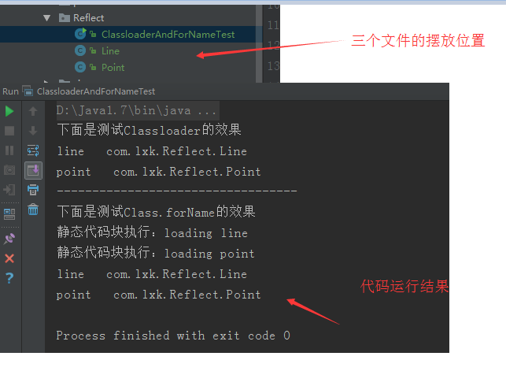

---

可以看到，除了原来的简单的一个静态代码块以外，我又添加了构造方法，静态方法，以及静态变量，
且，静态变量被一个静态方法赋值。
 
然后，看执行结果。
稍有不同。
除了，静态代码块的执行外，竟然还有一个静态方法被执行，就是给静态变量赋值的静态方法被执行
了。
这个估计是以前没人发现的吧。
所以
上面的结论，就可以进一步的修改啦。
也许，这个执行的也叫，static块呢。
 
 
        return "ss";
    }
 
    public static void test() {
        System.out.println("普通静态方法执行：loading line");
    }
 
    {
        System.out.println("要是普通的代码块呢？");
    }
 
    public Line() {
        System.out.println("构造方法执行");
    }
}

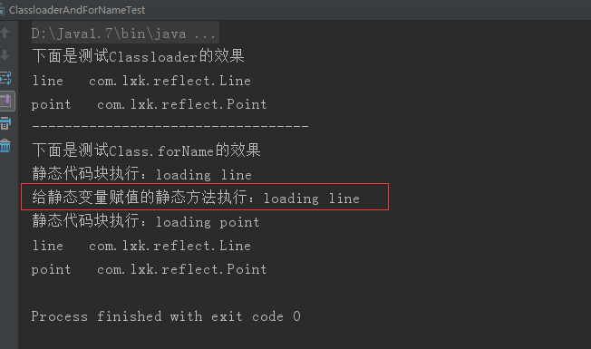

---

讲讲IO里面的常见类，字节流、字符流、接口、实现类、
方法阻塞
 
 
Java IO流详解（二）——IO流的框架体系
 
一、IO流的概念
 
Java的IO流是实现输入/输出的基础，它可以方便地实现数据的输入/输出操作，在Java中把不同的输入/
输出源抽象表述为"流"。流是一组有顺序的，有起点和终点的字节集合，是对数据传输的总称或抽象。
即数据在两设备间的传输称为流，流的本质是数据传输，根据数据传输特性将流抽象为各种类，方便更
直观的进行数据操作。
 流有输入和输出，输入时是流从数据源流向程序。输出时是流从程序传向数据源，而数据源可以是内
存，文件，网络或程序等。
二、IO流的分类
 
1.输入流和输出流
 
根据数据流向不同分为：输入流和输出流。
输入流:只能从中读取数据，而不能向其写入数据。
输出流：只能向其写入数据，而不能从中读取数据。
如下如所示：对程序而言，向右的箭头，表示输入，向左的箭头，表示输出。
 
2.字节流和字符流
 
字节流和字符流和用法几乎完全一样，区别在于字节流和字符流所操作的数据单元不同。
 字符流的由来： 因为数据编码的不同，而有了对字符进行高效操作的流对象。本质其实就是基于字节流
读取时，去查了指定的码表。字节流和字符流的区别：
 （1）读写单位不同：字节流以字节（8bit）为单位，字符流以字符为单位，根据码表映射字符，一次
可能读多个字节。

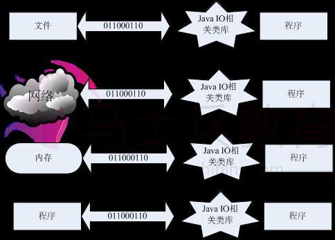

---

（2）处理对象不同：字节流能处理所有类型的数据（如图片、avi等），而字符流只能处理字符类型的
数据。
只要是处理纯文本数据，就优先考虑使用字符流。 除此之外都使用字节流。
3.节点流和处理流
 
按照流的角色来分，可以分为节点流和处理流。
 可以从/向一个特定的IO设备（如磁盘、网络）读/写数据的流，称为节点流，节点流也被成为低级流。
 处理流是对一个已存在的流进行连接或封装，通过封装后的流来实现数据读/写功能，处理流也被称为
高级流。
 
 
当使用处理流进行输入/输出时，程序并不会直接连接到实际的数据源，没有和实际的输入/输出节点连
接。使用处理流的一个明显好处是，只要使用相同的处理流，程序就可以采用完全相同的输入/输出代码
来访问不同的数据源，随着处理流所包装节点流的变化，程序实际所访问的数据源也相应地发生变化。
 实际上，Java使用处理流来包装节点流是一种典型的装饰器设计模式，通过使用处理流来包装不同的节
点流，既可以消除不同节点流的实现差异，也可以提供更方便的方法来完成输入/输出功能。
三、IO流的四大基类
 
根据流的流向以及操作的数据单元不同，将流分为了四种类型，每种类型对应一种抽象基类。这四种抽
象基类分别为：InputStream,Reader,OutputStream以及Writer。四种基类下，对应不同的实现类，具
有不同的特性。在这些实现类中，又可以分为节点流和处理流。下面就是整个由着四大基类支撑下，整
个IO流的框架图。
 
//节点流，直接传入的参数是IO设备
FileInputStream fis = new FileInputStream("test.txt");
//处理流，直接传入的参数是流对象
BufferedInputStream bis = new BufferedInputStream(fis);

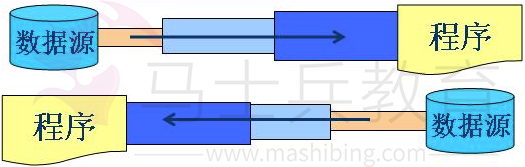

---

InputStream,Reader,OutputStream以及Writer，这四大抽象基类，本身并不能创建实例来执行输入/输
出，但它们将成为所有输入/输出流的模版，所以它们的方法是所有输入/输出流都可以使用的方法。类
似于集合中的Collection接口。
1.InputStream
 
InputStream 是所有的输入字节流的父类，它是一个抽象类，主要包含三个方法：
 
//读取一个字节并以整数的形式返回(0~255),如果返回-1已到输入流的末尾。 
int read() ； 
//读取一系列字节并存储到一个数组buffer，返回实际读取的字节数，如果读取前已到输入流的末尾返
回-1。 
int read(byte[] buffer) ； 
//读取length个字节并存储到一个字节数组buffer，从off位置开始存,最多len， 返回实际读取的字节
数，如果读取前以到输入流的末尾返回-1。 
int read(byte[] buffer, int off, int len) ；

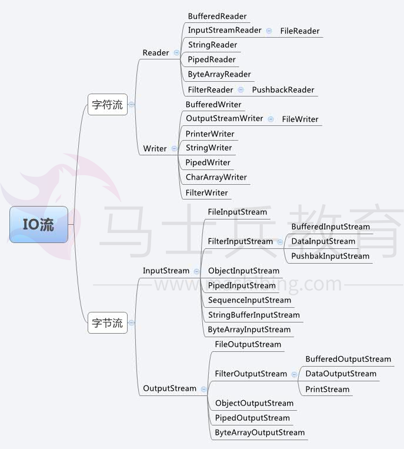

---

2.Reader
 
Reader 是所有的输入字符流的父类，它是一个抽象类，主要包含三个方法：
 
对比InputStream和Reader所提供的方法，就不难发现两个基类的功能基本一样的，只不过读取的数据
单元不同。
在执行完流操作后，要调用close() 方法来关系输入流，因为程序里打开的IO资源不属于内存资源，垃
圾回收机制无法回收该资源，所以应该显式关闭文件IO资源。
除此之外，InputStream和Reader还支持如下方法来移动流中的指针位置：
 
3.OutputStream
 
OutputStream 是所有的输出字节流的父类，它是一个抽象类，主要包含如下四个方法：
 
4.Writer
 
Writer 是所有的输出字符流的父类，它是一个抽象类,主要包含如下六个方法：
 
//读取一个字符并以整数的形式返回(0~255),如果返回-1已到输入流的末尾。 
int read() ； 
//读取一系列字符并存储到一个数组buffer，返回实际读取的字符数，如果读取前已到输入流的末尾返
回-1。 
int read(char[] cbuf) ； 
//读取length个字符,并存储到一个数组buffer，从off位置开始存,最多读取len，返回实际读取的字符
数，如果读取前以到输入流的末尾返回-1。 
int read(char[] cbuf, int off, int len) 
//在此输入流中标记当前的位置
//readlimit - 在标记位置失效前可以读取字节的最大限制。
void mark(int readlimit)
// 测试此输入流是否支持 mark 方法
boolean markSupported()
// 跳过和丢弃此输入流中数据的 n 个字节/字符
long skip(long n)
//将此流重新定位到最后一次对此输入流调用 mark 方法时的位置
void reset()
//向输出流中写入一个字节数据,该字节数据为参数b的低8位。 
void write(int b) ; 
//将一个字节类型的数组中的数据写入输出流。 
void write(byte[] b); 
//将一个字节类型的数组中的从指定位置（off）开始的,len个字节写入到输出流。 
void write(byte[] b, int off, int len); 
//将输出流中缓冲的数据全部写出到目的地。 
void flush();

---

可以看出，Writer比OutputStream多出两个方法，主要是支持写入字符和字符串类型的数据。
使用Java的IO流执行输出时，不要忘记关闭输出流，关闭输出流除了可以保证流的物理资源被回收之
外，还能将输出流缓冲区的数据flush到物理节点里（因为在执行close()方法之前，自动执行输出流的
flush()方法）
以上内容就是整个IO流的框架介绍。
 
讲讲NIO
 
 
NIO技术概览
 
NIO（Non-blocking I/O，在Java领域，也称为New I/O），是一种同步非阻塞的I/O模型，也是I/O多路
复用的基础，已经被越来越多地应用到大型应用服务器，成为解决高并发与大量连接、I/O处理问题的有
效方式。
IO模型的分类
 
按照《Unix网络编程》的划分，I/O模型可以分为：阻塞I/O模型、非阻塞I/O模型、I/O复用模型、信号
驱动式I/O模型和异步I/O模型，按照POSIX标准来划分只分为两类：同步I/O和异步I/O。
如何区分呢？首先一个I/O操作其实分成了两个步骤：发起IO请求和实际的IO操作。同步I/O和异步I/O的
区别就在于第二个步骤是否阻塞，如果实际的I/O读写阻塞请求进程，那么就是同步I/O，因此阻塞I/O、
非阻塞I/O、I/O复用、信号驱动I/O都是同步I/O，如果不阻塞，而是操作系统帮你做完I/O操作再将结果
返回给你，那么就是异步I/O。
阻塞I/O和非阻塞I/O的区别在于第一步，发起I/O请求是否会被阻塞，如果阻塞直到完成那么就是传统的
阻塞I/O，如果不阻塞，那么就是非阻塞I/O。
 
阻塞I/O模型 ：在linux中，默认情况下所有的socket都是blocking，一个典型的读操作流程大概是
这样：
//向输出流中写入一个字符数据,该字节数据为参数b的低16位。 
void write(int c); 
//将一个字符类型的数组中的数据写入输出流， 
void write(char[] cbuf) 
//将一个字符类型的数组中的从指定位置（offset）开始的,length个字符写入到输出流。 
void write(char[] cbuf, int offset, int length); 
//将一个字符串中的字符写入到输出流。 
void write(String string); 
//将一个字符串从offset开始的length个字符写入到输出流。 
void write(String string, int offset, int length); 
//将输出流中缓冲的数据全部写出到目的地。 
void flush()

---

非阻塞I/O模型：linux下，可以通过设置socket使其变为non-blocking。当对一个non-blocking 
socket执行读操作时，流程是这个样子：
I/O复用模型：我们可以调用select 或poll ，阻塞在这两个系统调用中的某一个之上，而不是真
正的IO系统调用上：

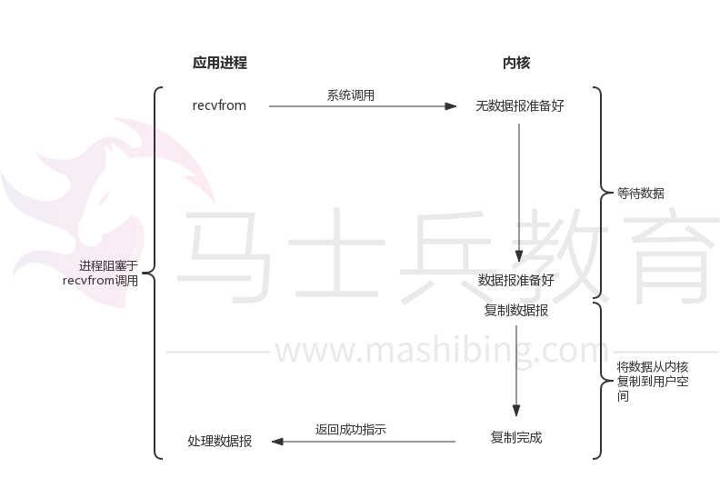

---

信号驱动式I/O模型：我们可以用信号，让内核在描述符就绪时发送SIGIO信号通知我们：
异步I/O模型：用户进程发起read操作之后，立刻就可以开始去做其它的事。而另一方面，从内核
的角度，当它受到一个asynchronousread之后，首先它会立刻返回，所以不会对用户进程产生任
何block。然后，内核会等待数据准备完成，然后将数据拷贝到用户内存，当这一切都完成之后，
内核会给用户进程发送一个signal，告诉它read操作完成了：

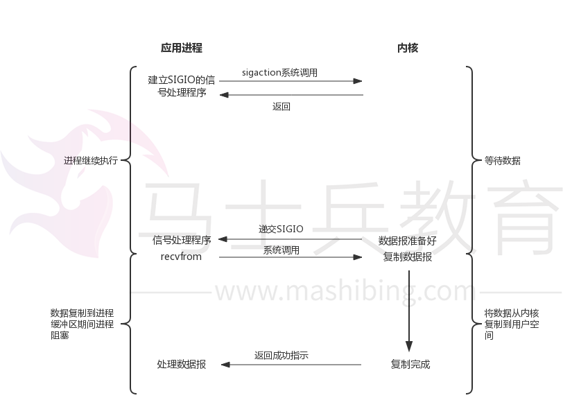

---

以上参考自：《UNIX网络编程》
从前面 I/O 模型的分类中，我们可以看出 AIO 的动机。阻塞模型需要在 I/O 操作开始时阻塞应用程序。
这意味着不可能同时重叠进行处理和 I/O 操作。非阻塞模型允许处理和 I/O 操作重叠进行，但是这需要
应用程序来检查 I/O 操作的状态。对于异步I/O ，它允许处理和 I/O 操作重叠进行，包括 I/O 操作完成的
通知。除了需要阻塞之外，select 函数所提供的功能（异步阻塞 I/O）与 AIO 类似。不过，它是对通知
事件进行阻塞，而不是对 I/O 调用进行阻塞。
参考下知乎上的回答：
同步与异步：同步和异步关注的是消息通信机制 (synchronous communication/ 
asynchronous communication)。所谓同步，就是在发出一个调用时，在没有得到结果之
前，该调用就不返回。但是一旦调用返回，就得到返回值了。换句话说，就是由调用者主动
等待这个调用的结果；
阻塞与非阻塞：阻塞和非阻塞关注的是程序在等待调用结果（消息，返回值）时的状态。阻
塞调用是指调用结果返回之前，当前线程会被挂起。调用线程只有在得到结果之后才会返
回；而非阻塞调用指在不能立刻得到结果之前，该调用不会阻塞当前线程。
两种IO多路复用方案：Reactor和Proactor
 
一般地，I/O多路复用机制都依赖于一个事件多路分离器(Event Demultiplexer)。分离器对象可将来自
事件源的I/O事件分离出来，并分发到对应的read/write事件处理器(Event Handler)。开发人员预先注
册需要处理的事件及其事件处理器（或回调函数）；事件分离器负责将请求事件传递给事件处理器。
两个与事件分离器有关的模式是Reactor和Proactor。Reactor模式采用同步I/O，而Proactor采用异步
I/O。在Reactor中，事件分离器负责等待文件描述符或socket为读写操作准备就绪，然后将就绪事件传
递给对应的处理器，最后由处理器负责完成实际的读写工作。
而在Proactor模式中，处理器或者兼任处理器的事件分离器，只负责发起异步读写操作。I/O操作本身由
操作系统来完成。传递给操作系统的参数需要包括用户定义的数据缓冲区地址和数据大小，操作系统才
能从中得到写出操作所需数据，或写入从socket读到的数据。事件分离器捕获I/O操作完成事件，然后将
事件传递给对应处理器。比如，在windows上，处理器发起一个异步I/O操作，再由事件分离器等待

---

IOCompletion事件。典型的异步模式实现，都建立在操作系统支持异步API的基础之上，我们将这种实
现称为“系统级”异步或“真”异步，因为应用程序完全依赖操作系统执行真正的I/O工作。
举个例子，将有助于理解Reactor与Proactor二者的差异，以读操作为例（写操作类似）。
在Reactor中实现读：
注册读就绪事件和相应的事件处理器；
事件分离器等待事件；
事件到来，激活分离器，分离器调用事件对应的处理器；
事件处理器完成实际的读操作，处理读到的数据，注册新的事件，然后返还控制权。
在Proactor中实现读：
处理器发起异步读操作（注意：操作系统必须支持异步I/O）。在这种情况下，处理器无视I/O就绪
事件，它关注的是完成事件；
事件分离器等待操作完成事件;
在分离器等待过程中，操作系统利用并行的内核线程执行实际的读操作，并将结果数据存入用户自
定义缓冲区，最后通知事件分离器读操作完成；
事件分离器呼唤处理器；
事件处理器处理用户自定义缓冲区中的数据，然后启动一个新的异步操作，并将控制权返回事件分
离器。
可以看出，两个模式的相同点，都是对某个I/O事件的事件通知（即告诉某个模块，这个I/O操作可以进
行或已经完成）。在结构上，两者的相同点和不同点如下：
相同点：demultiplexor负责提交I/O操作（异步）、查询设备是否可操作（同步），然后当条件满
足时，就回调handler；
不同点：异步情况下（Proactor），当回调handler时，表示I/O操作已经完成；同步情况下
（Reactor），回调handler时，表示I/O设备可以进行某个操作（can read or can write）。
传统BIO模型
 
BIO是同步阻塞式IO，通常在while循环中服务端会调用accept方法等待接收客户端的连接请求，一旦接
收到一个连接请求，就可以建立通信套接字在这个通信套接字上进行读写操作，此时不能再接收其他客
户端连接请求，只能等待同当前连接的客户端的操作执行完成。
如果BIO要能够同时处理多个客户端请求，就必须使用多线程，即每次accept阻塞等待来自客户端请
求，一旦受到连接请求就建立通信套接字同时开启一个新的线程来处理这个套接字的数据读写请求，然
后立刻又继续accept等待其他客户端连接请求，即为每一个客户端连接请求都创建一个线程来单独处
理。
我们看下传统的BIO方式下的编程模型大致如下：
public class BIODemo {

---

这里之所以使用多线程，是因为socket.accept()、inputStream.read()、outputStream.write()都是同步
阻塞的，当一个连接在处理I/O的时候，系统是阻塞的，如果是单线程的话在阻塞的期间不能接受任何请
求。所以，使用多线程，就可以让CPU去处理更多的事情。其实这也是所有使用多线程的本质：
利用多核。
    public static void main(String[] args) throws IOException {
        ExecutorService executor = Executors.newFixedThreadPool(128);
        ServerSocket serverSocket = new ServerSocket();
        serverSocket.bind(new InetSocketAddress(1234));
        // 循环等待新连接
        while (true) {
            Socket socket = serverSocket.accept();
            // 为新的连接创建线程执行任务
            executor.submit(new ConnectionTask(socket));
        }
    }
}
class ConnectionTask extends Thread {
    private Socket socket;
    public ConnectionTask(Socket socket) {
        this.socket = socket;
    }
    public void run() {
        while (true) {
            InputStream inputStream = null;
            OutputStream outputStream = null;
            try {
                inputStream = socket.getInputStream();
                
                // read from socket...
                
                inputStream.read();
                
                outputStream = socket.getOutputStream();
                // write to socket...
                outputStream.write();
            } catch (IOException e) {
                e.printStackTrace();
            } finally {
                // 关闭资源...
            }
        }
    }
}

---

当I/O阻塞系统，但CPU空闲的时候，可以利用多线程使用CPU资源。
使用线程池能够让线程的创建和回收成本相对较低。在活动连接数不是特别高（小于单机1000）的情况
下，这种模型是比较不错的，可以让每一个连接专注于自己的I/O并且编程模型简单，也不用过多考虑系
统的过载、限流等问题。线程池可以缓冲一些过多的连接或请求。
但这个模型最本质的问题在于，严重依赖于线程。但线程是很”贵”的资源，主要表现在：
1. 线程的创建和销毁成本很高，在Linux这样的操作系统中，线程本质上就是一个进程。创建和销毁
都是重量级的系统函数；
2. 线程本身占用较大内存，像Java的线程栈，一般至少分配512K～1M的空间，如果系统中的线程数
过千，恐怕整个JVM的内存都会被吃掉一半；
3. 线程的切换成本是很高的。操作系统发生线程切换的时候，需要保留线程的上下文，然后执行系统
调用。如果线程数过高，可能执行线程切换的时间甚至会大于线程执行的时间，这时候带来的表现
往往是系统load偏高、CPU sy使用率特别高（超过20%以上)，导致系统几乎陷入不可用的状态；
4. 容易造成锯齿状的系统负载。因为系统负载是用活动线程数或CPU核心数，一旦线程数量高但外部
网络环境不是很稳定，就很容易造成大量请求的结果同时返回，激活大量阻塞线程从而使系统负载
压力过大。
所以，当面对十万甚至百万级连接的时候，传统的BIO模型是无能为力的。随着移动端应用的兴起和各
种网络游戏的盛行，百万级长连接日趋普遍，此时，必然需要一种更高效的I/O处理模型。
NIO的实现原理
 
NIO本身是基于事件驱动思想来完成的，其主要想解决的是BIO的大并发问题，即在使用同步I/O的网络
应用中，如果要同时处理多个客户端请求，或是在客户端要同时和多个服务器进行通讯，就必须使用多
线程来处理。也就是说，将每一个客户端请求分配给一个线程来单独处理。这样做虽然可以达到我们的
要求，但同时又会带来另外一个问题。由于每创建一个线程，就要为这个线程分配一定的内存空间（也
叫工作存储器），而且操作系统本身也对线程的总数有一定的限制。如果客户端的请求过多，服务端程
序可能会因为不堪重负而拒绝客户端的请求，甚至服务器可能会因此而瘫痪。
NIO基于Reactor，当socket有流可读或可写入socket时，操作系统会相应的通知应用程序进行处理，应
用再将流读取到缓冲区或写入操作系统。
也就是说，这个时候，已经不是一个连接就要对应一个处理线程了，而是有效的请求，对应一个线程，
当连接没有数据时，是没有工作线程来处理的。
下面看下代码的实现：
NIO服务端代码（新建连接）：
NIO服务端代码（监听）：
//获取一个ServerSocket通道
ServerSocketChannel serverChannel = ServerSocketChannel.open();
serverChannel.configureBlocking(false);
serverChannel.socket().bind(new InetSocketAddress(port));
//获取通道管理器
selector = Selector.open();
//将通道管理器与通道绑定，并为该通道注册SelectionKey.OP_ACCEPT事件，
serverChannel.register(selector, SelectionKey.OP_ACCEPT);
while(true){
    //当有注册的事件到达时，方法返回，否则阻塞。
   selector.select();
   for(SelectionKey key : selector.selectedKeys()){
       if(key.isAcceptable()){

---

NIO模型示例如下：
Acceptor注册Selector，监听accept事件；
当客户端连接后，触发accept事件；
服务器构建对应的Channel，并在其上注册Selector，监听读写事件；
当发生读写事件后，进行相应的读写处理。
Reactor模型
 
有关Reactor模型结构，可以参考Doug Lea在 Scalable IO in Java中的介绍。这里简单介绍一下Reactor
模式的典型实现：
Reactor单线程模型
 
这是最简单的单Reactor单线程模型。Reactor线程负责多路分离套接字、accept新连接，并分派请求到
处理器链中。该模型适用于处理器链中业务处理组件能快速完成的场景。不过，这种单线程模型不能充
分利用多核资源，所以实际使用的不多。
这个模型和上面的NIO流程很类似，只是将消息相关处理独立到了Handler中去了。
代码实现如下：
           ServerSocketChannel server =
                (ServerSocketChannel)key.channel();
           SocketChannel channel = server.accept();
           channel.write(ByteBuffer.wrap(
            new String("send message to client").getBytes()));
           //在与客户端连接成功后，为客户端通道注册SelectionKey.OP_READ事件。
           channel.register(selector, SelectionKey.OP_READ);
       }else if(key.isReadable()){//有可读数据事件
           SocketChannel channel = (SocketChannel)key.channel();
           ByteBuffer buffer = ByteBuffer.allocate(10);
           int read = channel.read(buffer);
           byte[] data = buffer.array();
           String message = new String(data);
           System.out.println("receive message from client, size:"
               + buffer.position() + " msg: " + message);
       }
   }
}

---

public class Reactor implements Runnable {
    final Selector selector;
    final ServerSocketChannel serverSocketChannel;
    public static void main(String[] args) throws IOException {
        new Thread(new Reactor(1234)).start();
    }
    public Reactor(int port) throws IOException {
        selector = Selector.open();
        serverSocketChannel = ServerSocketChannel.open();
        serverSocketChannel.socket().bind(new InetSocketAddress(port));
        serverSocketChannel.configureBlocking(false);
        SelectionKey key = serverSocketChannel.register(selector, 
SelectionKey.OP_ACCEPT);
        key.attach(new Acceptor());
    }
    @Override
    public void run() {
        while (!Thread.interrupted()) {
            try {
                selector.select();
                Set<SelectionKey> selectionKeys = selector.selectedKeys();
                for (SelectionKey selectionKey : selectionKeys) {
                    dispatch(selectionKey);
                }
                selectionKeys.clear();
            } catch (IOException e) {
                e.printStackTrace();
            }
        }
    }
    private void dispatch(SelectionKey selectionKey) {
        Runnable run = (Runnable) selectionKey.attachment();
        if (run != null) {
            run.run();
        }
    }
    class Acceptor implements Runnable {
        @Override
        public void run() {
            try {
                SocketChannel channel = serverSocketChannel.accept();
                if (channel != null) {
                    new Handler(selector, channel);
                }
            } catch (IOException e) {
                e.printStackTrace();
            }

---

}
    }
}
class Handler implements Runnable {
    private final static int DEFAULT_SIZE = 1024;
    private final SocketChannel socketChannel;
    private final SelectionKey seletionKey;
    private static final int READING = 0;
    private static final int SENDING = 1;
    private int state = READING;
    ByteBuffer inputBuffer = ByteBuffer.allocate(DEFAULT_SIZE);
    ByteBuffer outputBuffer = ByteBuffer.allocate(DEFAULT_SIZE);
    public Handler(Selector selector, SocketChannel channel) throws IOException 
{
        this.socketChannel = channel;
        socketChannel.configureBlocking(false);
        this.seletionKey = socketChannel.register(selector, 0);
        seletionKey.attach(this);
        seletionKey.interestOps(SelectionKey.OP_READ);
        selector.wakeup();
    }
    @Override
    public void run() {
        if (state == READING) {
            read();
        } else if (state == SENDING) {
            write();
        }
    }
    class Sender implements Runnable {
        @Override
        public void run() {
            try {
                socketChannel.write(outputBuffer);
            } catch (IOException e) {
                e.printStackTrace();
            }
            if (outIsComplete()) {
                seletionKey.cancel();
            }
        }

---

虽然上面说到NIO一个线程就可以支持所有的IO处理。但是瓶颈也是显而易见的。我们看一个客户端的
情况，如果这个客户端多次进行请求，如果在Handler中的处理速度较慢，那么后续的客户端请求都会
被积压，导致响应变慢！所以引入了Reactor多线程模型。
    }
    private void write() {
        try {
            socketChannel.write(outputBuffer);
        } catch (IOException e) {
            e.printStackTrace();
        }
        while (outIsComplete()) {
            seletionKey.cancel();
        }
    }
    private void read() {
        try {
            socketChannel.read(inputBuffer);
            if (inputIsComplete()) {
                process();
                System.out.println("接收到来自客户端（" + 
socketChannel.socket().getInetAddress().getHostAddress()
                        + "）的消息：" + new String(inputBuffer.array()));
                seletionKey.attach(new Sender());
                seletionKey.interestOps(SelectionKey.OP_WRITE);
                seletionKey.selector().wakeup();
            }
        } catch (IOException e) {
            e.printStackTrace();
        }
    }
    public boolean inputIsComplete() {
        return true;
    }
    public boolean outIsComplete() {
        return true;
    }
    public void process() {
        // do something...
    }
}

---

Reactor多线程模型
 
相比上一种模型，该模型在处理器链部分采用了多线程（线程池）：
Reactor多线程模型就是将Handler中的IO操作和非IO操作分开，操作IO的线程称为IO线程，非IO操作的
线程称为工作线程。这样的话，客户端的请求会直接被丢到线程池中，客户端发送请求就不会堵塞。
可以将Handler做如下修改：
class Handler implements Runnable {
    private final static int DEFAULT_SIZE = 1024;
    private final SocketChannel socketChannel;
    private final SelectionKey seletionKey;
    private static final int READING = 0;
    private static final int SENDING = 1;
    private int state = READING;
    ByteBuffer inputBuffer = ByteBuffer.allocate(DEFAULT_SIZE);
    ByteBuffer outputBuffer = ByteBuffer.allocate(DEFAULT_SIZE);
    
    private Selector selector;
    private static ExecutorService executorService = 
Executors.newFixedThreadPool(Runtime.getRuntime()
            .availableProcessors());
    private static final int PROCESSING = 3;
    public Handler(Selector selector, SocketChannel channel) throws IOException 
{
        this.selector = selector;
        this.socketChannel = channel;
        socketChannel.configureBlocking(false);
        this.seletionKey = socketChannel.register(selector, 0);
        seletionKey.attach(this);
        seletionKey.interestOps(SelectionKey.OP_READ);
        selector.wakeup();
    }
    @Override
    public void run() {
        if (state == READING) {

---

read();
        } else if (state == SENDING) {
            write();
        }
    }
    class Sender implements Runnable {
        @Override
        public void run() {
            try {
                socketChannel.write(outputBuffer);
            } catch (IOException e) {
                e.printStackTrace();
            }
            if (outIsComplete()) {
                seletionKey.cancel();
            }
        }
    }
    private void write() {
        try {
            socketChannel.write(outputBuffer);
        } catch (IOException e) {
            e.printStackTrace();
        }
        if (outIsComplete()) {
            seletionKey.cancel();
        }
    }
    private void read() {
        try {
            socketChannel.read(inputBuffer);
            if (inputIsComplete()) {
                process();
                executorService.execute(new Processer());
            }
        } catch (IOException e) {
            e.printStackTrace();
        }
    }
    public boolean inputIsComplete() {
        return true;
    }
    public boolean outIsComplete() {
        return true;
    }

---

但是当用户进一步增加的时候，Reactor会出现瓶颈！因为Reactor既要处理IO操作请求，又要响应连接
请求。为了分担Reactor的负担，所以引入了主从Reactor模型。
主从Reactor多线程模型
 
主从Reactor多线程模型是将Reactor分成两部分，mainReactor负责监听server socket，accept新连
接，并将建立的socket分派给subReactor。subReactor负责多路分离已连接的socket，读写网络数据，
对业务处理功能，其扔给worker线程池完成。通常，subReactor个数上可与CPU个数等同：
这时可以把Reactor做如下修改：
    public void process() {
    }
    synchronized void processAndHandOff() {
        process();
        state = SENDING; // or rebind attachment
        seletionKey.interestOps(SelectionKey.OP_WRITE);
        selector.wakeup();
    }
    class Processer implements Runnable {
        public void run() {
            processAndHandOff();
        }
    }
}
public class Reactor {
    final ServerSocketChannel serverSocketChannel;
    Selector[] selectors; // also create threads
    AtomicInteger next = new AtomicInteger(0);
    ExecutorService sunReactors = 
Executors.newFixedThreadPool(Runtime.getRuntime().availableProcessors());
    public static void main(String[] args) throws IOException {
        new Reactor(1234);
    }
    public Reactor(int port) throws IOException {
        serverSocketChannel = ServerSocketChannel.open();
        serverSocketChannel.socket().bind(new InetSocketAddress(port));
        serverSocketChannel.configureBlocking(false);
        selectors = new Selector[4];
        for (int i = 0; i < 4; i++) {

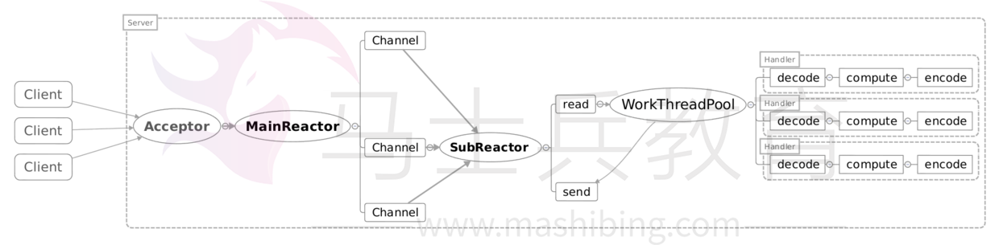

---

可见，主Reactor用于响应连接请求，从Reactor用于处理IO操作请求。
            Selector selector = Selector.open();
            selectors[i] = selector;
            SelectionKey key = serverSocketChannel.register(selector, 
SelectionKey.OP_ACCEPT);
            key.attach(new Acceptor());
            new Thread(() -> {
                while (!Thread.interrupted()) {
                    try {
                        selector.select();
                        Set<SelectionKey> selectionKeys = 
selector.selectedKeys();
                        for (SelectionKey selectionKey : selectionKeys) {
                            dispatch(selectionKey);
                        }
                        selectionKeys.clear();
                    } catch (IOException e) {
                        e.printStackTrace();
                    }
                }
            }).start();
        }
    }
    private void dispatch(SelectionKey selectionKey) {
        Runnable run = (Runnable) selectionKey.attachment();
        if (run != null) {
            run.run();
        }
    }
    class Acceptor implements Runnable {
        @Override
        public void run() {
            try {
                SocketChannel connection = serverSocketChannel.accept();
                if (connection != null)
                    sunReactors.execute(new 
Handler(selectors[next.getAndIncrement() % selectors.length], connection));
            } catch (IOException e) {
                e.printStackTrace();
            }
        }
    }
}

---

AIO
 
与NIO不同，当进行读写操作时，只须直接调用API的read或write方法即可。这两种方法均为异步的，
对于读操作而言，当有流可读取时，操作系统会将可读的流传入read方法的缓冲区，并通知应用程序；
对于写操作而言，当操作系统将write方法传递的流写入完毕时，操作系统主动通知应用程序。
即可以理解为，read/write方法都是异步的，完成后会主动调用回调函数。
在JDK1.7中，这部分内容被称作NIO.2，主要在java.nio.channels包下增加了下面四个异步通道：
AsynchronousSocketChannel
AsynchronousServerSocketChannel
AsynchronousFileChannel
AsynchronousDatagramChannel
我们看一下AsynchronousSocketChannel中的几个方法：
其中的read/write方法，有的会返回一个Future 对象，有的需要传入一个CompletionHandler 对象，
该对象的作用是当执行完读取/写入操作后，直接该对象当中的方法进行回调。
public abstract class AsynchronousSocketChannel
    implements AsynchronousByteChannel, NetworkChannel
{
    public abstract Future<Integer> read(ByteBuffer dst);
    
    public abstract <A> void read(ByteBuffer[] dsts,
                                  int offset,
                                  int length,
                                  long timeout,
                                  TimeUnit unit,
                                  A attachment,
                                  CompletionHandler<Long,? super A> handler);
    public abstract <A> void write(ByteBuffer src,
                                   long timeout,
                                   TimeUnit unit,
                                   A attachment,
                                   CompletionHandler<Integer,? super A> 
handler);
    public final <A> void write(ByteBuffer src,
                                A attachment,
                                CompletionHandler<Integer,? super A> handler)
    {
        write(src, 0L, TimeUnit.MILLISECONDS, attachment, handler);
    }
    public abstract Future<Integer> write(ByteBuffer src);
    public abstract <A> void write(ByteBuffer[] srcs,
                                   int offset,
                                   int length,
                                   long timeout,
                                   TimeUnit unit,
                                   A attachment,
                                   CompletionHandler<Long,? super A> handler);
}

---

对于AsynchronousSocketChannel 而言，在windows和linux上的实现类是不一样的。
在windows上，AIO的实现是通过IOCP来完成的，实现类是：
实现的接口是：
而在linux上，实现类是：
实现的接口是：
AIO是一种接口标准，各家操作系统可以实现也可以不实现。在不同操作系统上在高并发情况下最好都
采用操作系统推荐的方式。Linux上还没有真正实现网络方式的AIO。
select和epoll的区别
 
当需要读两个以上的I/O的时候，如果使用阻塞式的I/O，那么可能长时间的阻塞在一个描述符上面，另
外的描述符虽然有数据但是不能读出来，这样实时性不能满足要求，大概的解决方案有以下几种：
1. 使用多进程或者多线程，但是这种方法会造成程序的复杂，而且对与进程与线程的创建维护也需要
很多的开销（Apache服务器是用的子进程的方式，优点可以隔离用户）；
2. 用一个进程，但是使用非阻塞的I/O读取数据，当一个I/O不可读的时候立刻返回，检查下一个是否
可读，这种形式的循环为轮询（polling），这种方法比较浪费CPU时间，因为大多数时间是不可
读，但是仍花费时间不断反复执行read系统调用；
3. 异步I/O，当一个描述符准备好的时候用一个信号告诉进程，但是由于信号个数有限，多个描述符
时不适用；
4. 一种较好的方式为I/O多路复用，先构造一张有关描述符的列表（epoll中为队列），然后调用一个
函数，直到这些描述符中的一个准备好时才返回，返回时告诉进程哪些I/O就绪。select和epoll这
两个机制都是多路I/O机制的解决方案，select为POSIX标准中的，而epoll为Linux所特有的。
它们的区别主要有三点：
1. select的句柄数目受限，在linux/posix_types.h头文件有这样的声明：#define __FD_SETSIZE 
1024 表示select最多同时监听1024个fd。而epoll没有，它的限制是最大的打开文件句柄数目；
2. epoll的最大好处是不会随着FD的数目增长而降低效率，在selec中采用轮询处理，其中的数据结构
类似一个数组的数据结构，而epoll是维护一个队列，直接看队列是不是空就可以了。epoll只会对”
活跃”的socket进行操作—这是因为在内核实现中epoll是根据每个fd上面的callback函数实现的。那
么，只有”活跃”的socket才会主动的去调用 callback函数（把这个句柄加入队列），其他idle状态
句柄则不会，在这点上，epoll实现了一个”伪”AIO。但是如果绝大部分的I/O都是“活跃的”，每个I/O
端口使用率很高的话，epoll效率不一定比select高（可能是要维护队列复杂）；
3. 使用mmap加速内核与用户空间的消息传递。无论是select,poll还是epoll都需要内核把FD消息通知
给用户空间，如何避免不必要的内存拷贝就很重要，在这点上，epoll是通过内核于用户空间
mmap同一块内存实现的。
WindowsAsynchronousSocketChannelImpl
Iocp.OverlappedChannel
UnixAsynchronousSocketChannelImpl
Port.PollableChannel

---

NIO与epoll
 
上文说到了select与epoll的区别，再总结一下Java NIO与select和epoll：
Linux2.6之后支持epoll
windows支持select而不支持epoll
不同系统下nio的实现是不一样的，包括Sunos linux 和windows
select的复杂度为O(N)
select有最大fd限制，默认为1024
修改sys/select.h可以改变select的fd数量限制
epoll的事件模型，无fd数量限制，复杂度O(1),不需要遍历fd
以下代码基于Java 8。
下面看下在NIO中Selector的open方法：
这里使用了SelectorProvider去创建一个Selector，看下provider方法的实现：
看下sun.nio.ch.DefaultSelectorProvider.create() 方法，该方法在不同的操作系统中的代码是
不同的，在windows中的实现如下：
在Mac OS中的实现如下：
在linux中的实现如下：
public static Selector open() throws IOException {
    return SelectorProvider.provider().openSelector();
}
public static SelectorProvider provider() {
    synchronized (lock) {
        if (provider != null)
            return provider;
        return AccessController.doPrivileged(
            new PrivilegedAction<SelectorProvider>() {
                public SelectorProvider run() {
                        if (loadProviderFromProperty())
                            return provider;
                        if (loadProviderAsService())
                            return provider;
                        provider = sun.nio.ch.DefaultSelectorProvider.create();
                        return provider;
                    }
                });
    }
}
public static SelectorProvider create() {
    return new WindowsSelectorProvider();
}
public static SelectorProvider create() {
    return new KQueueSelectorProvider();
}

---

我们看到create方法中是通过区分操作系统来返回不同的Provider的。其中SunOs就是Solaris返回的是
DevPollSelectorProvider，对于Linux，返回的Provder是EPollSelectorProvider，其余操作系统，返回
的是PollSelectorProvider。
Zero Copy
 
许多web应用都会向用户提供大量的静态内容，这意味着有很多数据从硬盘读出之后，会原封不动的通
过socket传输给用户。
这种操作看起来可能不会怎么消耗CPU，但是实际上它是低效的：
1. kernel把从disk读数据；
2. 将数据传输给application；
3. application再次把同样的内容再传回给处于kernel级的socket。
这种场景下，application实际上只是作为一种低效的中间介质，用来把磁盘文件的数据传给socket。
数据每次传输都会经过user和kernel空间都会被copy，这会消耗cpu，并且占用RAM的带宽。
传统的数据传输方式
 
像这种从文件读取数据然后将数据通过网络传输给其他的程序的方式其核心操作就是如下两个调用：
其上操作看上去只有两个简单的调用，但是其内部过程却要经历四次用户态和内核态的切换以及四次的
数据复制操作：
public static SelectorProvider create() {
    String str = (String)AccessController.doPrivileged(new 
GetPropertyAction("os.name"));
    
    if (str.equals("SunOS"))
        return createProvider("sun.nio.ch.DevPollSelectorProvider");
    if (str.equals("Linux"))
        return createProvider("sun.nio.ch.EPollSelectorProvider");
    return new PollSelectorProvider();
}
File.read(fileDesc,buf,len);
Socket.send(socket,buf,len);

---

上图展示了数据从文件到socket的内部流程。
下面看下用户态和内核态的切换过程：
 
步骤如下：
1. read()的调用引起了从用户态到内核态的切换（看图二），内部是通过sys_read()（或者类似的方
法）发起对文件数据的读取。数据的第一次复制是通过DMA（直接内存访问）将磁盘上的数据复制
到内核空间的缓冲区中；
2. 数据从内核空间的缓冲区复制到用户空间的缓冲区后，read()方法也就返回了。此时内核态又切换
回用户态，现在数据也已经复制到了用户地址空间的缓存中；
3. socket的send()方法的调用又会引起用户态到内核的切换，第三次数据复制又将数据从用户空间缓
冲区复制到了内核空间的缓冲区，这次数据被放在了不同于之前的内核缓冲区中，这个缓冲区与数
据将要被传输到的socket关联；
4. send()系统调用返回后，就产生了第四次用户态和内核态的切换。随着DMA单独异步的将数据从内
核态的缓冲区中传输到协议引擎发送到网络上，有了第四次数据复制。

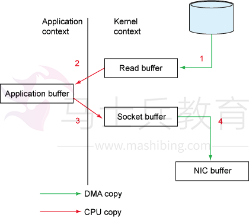

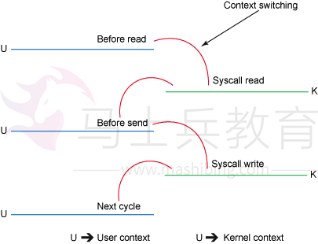

---

Zero Copy的数据传输方式
 
java.nio.channels.FileChannel 中定义了两个方法：transferTo( )和 transferFrom( )。
transferTo( )和 transferFrom( )方法允许将一个通道交叉连接到另一个通道，而不需要通过一个中间缓
冲区来传递数据。只有 FileChannel 类有这两个方法，因此 channel-to-channel 传输中通道之一必须
是 FileChannel。您不能在 socket 通道之间直接传输数据，不过 socket 通道实现 
WritableByteChannel  和 ReadableByteChannel  接口，因此文件的内容可以用 transferTo( )  方
法传输给一个 socket 通道，或者也可以用 transferFrom( )方法将数据从一个 socket 通道直接读取到一
个文件中。
下面根据transferTo()  方法来说明。
根据上文可知，transferTo()  方法可以把bytes直接从调用它的channel传输到另一个
WritableByteChannel，中间不经过应用程序。
下面看下该方法的定义：
下图展示了通过transferTo实现数据传输的路径：
下图展示了内核态、用户态的切换情况：
使用transferTo()方式所经历的步骤：
1. transferTo调用会引起DMA将文件内容复制到读缓冲区(内核空间的缓冲区)，然后数据从这个缓冲
区复制到另一个与socket输出相关的内核缓冲区中；
public abstract long transferTo(long position, long count,
                                    WritableByteChannel target)
        throws IOException;

---

2. 第三次数据复制就是DMA把socket关联的缓冲区中的数据复制到协议引擎上发送到网络上。
这次改善，我们是通过将内核、用户态切换的次数从四次减少到两次，将数据的复制次数从四次减少到
三次(只有一次用到cpu资源)。但这并没有达到我们零复制的目标。如果底层网络适配器支持收集操作的
话，我们可以进一步减少内核对数据的复制次数。在内核为2.4或者以上版本的linux系统上，socket缓
冲区描述符将被用来满足这个需求。这个方式不仅减少了内核用户态间的切换，而且也省去了那次需要
cpu参与的复制过程。从用户角度来看依旧是调用transferTo()方法，但是其本质发生了变化：
1. 调用transferTo方法后数据被DMA从文件复制到了内核的一个缓冲区中；
2. 数据不再被复制到socket关联的缓冲区中了，仅仅是将一个描述符（包含了数据的位置和长度等信
息）追加到socket关联的缓冲区中。DMA直接将内核中的缓冲区中的数据传输给协议引擎，消除了
仅剩的一次需要cpu周期的数据复制。
NIO存在的问题
 
使用NIO != 高性能，当连接数<1000，并发程度不高或者局域网环境下NIO并没有显著的性能优势。
NIO并没有完全屏蔽平台差异，它仍然是基于各个操作系统的I/O系统实现的，差异仍然存在。使用NIO
做网络编程构建事件驱动模型并不容易，陷阱重重。
推荐大家使用成熟的NIO框架，如Netty，MINA等。解决了很多NIO的陷阱，并屏蔽了操作系统的差
异，有较好的性能和编程模型。
总结
 
最后总结一下NIO有哪些优势：
事件驱动模型
避免多线程
单线程处理多任务
非阻塞I/O，I/O读写不再阻塞
基于block的传输，通常比基于流的传输更高效
更高级的IO函数，Zero Copy
I/O多路复用大大提高了Java网络应用的可伸缩性和实用性

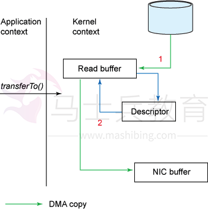

---

三个channel使用
ServerSocketChannel||SocketChannel||FileChanne
l
 
 
Java NIO系列教程 FileChannel
 
 
Java NIO中的FileChannel是一个连接到文件的通道。可以通过文件通道读写文件。
FileChannel无法设置为非阻塞模式，它总是运行在阻塞模式下。
 
打开FileChannel
 
在使用FileChannel之前，必须先打开它。但是，我们无法直接打开一个FileChannel，需要通过使用一
个InputStream、OutputStream或RandomAccessFile来获取一个FileChannel实例。下面是通过
RandomAccessFile打开FileChannel的示例：
从FileChannel读取数据
 
调用多个read()方法之一从FileChannel中读取数据。如：
首先，分配一个Buffer。从FileChannel中读取的数据将被读到Buffer中。
然后，调用FileChannel.read()方法。该方法将数据从FileChannel读取到Buffer中。read()方法返回的
int值表示了有多少字节被读到了Buffer中。如果返回-1，表示到了文件末尾。
向FileChannel写数据
 
使用FileChannel.write()方法向FileChannel写数据，该方法的参数是一个Buffer。如：
注意FileChannel.write()是在while循环中调用的。因为无法保证write()方法一次能向FileChannel写入多
少字节，因此需要重复调用write()方法，直到Buffer中已经没有尚未写入通道的字节。
RandomAccessFile aFile = new RandomAccessFile("data/nio-data.txt", "rw");
FileChannel inChannel = aFile.getChannel();
ByteBuffer buf = ByteBuffer.allocate(48);
int bytesRead = inChannel.read(buf);
String newData = "New String to write to file..." + System.currentTimeMillis();
ByteBuffer buf = ByteBuffer.allocate(48);
buf.clear();
buf.put(newData.getBytes());
buf.flip();
while(buf.hasRemaining()) {
    channel.write(buf);
}

---

关闭FileChannel
 
用完FileChannel后必须将其关闭。如：
channel.close();
FileChannel的position方法
 
有时可能需要在FileChannel的某个特定位置进行数据的读/写操作。可以通过调用position()方法获取
FileChannel的当前位置。
也可以通过调用position(long pos)方法设置FileChannel的当前位置。
这里有两个例子:
 
如果将位置设置在文件结束符之后，然后试图从文件通道中读取数据，读方法将返回-1 —— 文件结束标
志。
如果将位置设置在文件结束符之后，然后向通道中写数据，文件将撑大到当前位置并写入数据。这可能
导致“文件空洞”，磁盘上物理文件中写入的数据间有空隙。
FileChannel的size方法
 
FileChannel实例的size()方法将返回该实例所关联文件的大小。如:
long  fileSize = channel.size();
FileChannel的truncate方法
 
可以使用FileChannel.truncate()方法截取一个文件。截取文件时，文件将中指定长度后面的部分将被删
除。如：
channel.truncate(``1024``);
这个例子截取文件的前1024个字节。
FileChannel的force方法
 
FileChannel.force()方法将通道里尚未写入磁盘的数据强制写到磁盘上。出于性能方面的考虑，操作系
统会将数据缓存在内存中，所以无法保证写入到FileChannel里的数据一定会即时写到磁盘上。要保证这
一点，需要调用force()方法。
force()方法有一个boolean类型的参数，指明是否同时将文件元数据（权限信息等）写到磁盘上。
下面的例子同时将文件数据和元数据强制写到磁盘上：
channel.force(``true``);
 
long pos = channel.position();
channel.position(pos +123);

---

Java NIO系列教程 SocketChannel
 
 
Java NIO中的SocketChannel是一个连接到TCP网络套接字的通道。可以通过以下2种方式创建
SocketChannel：
1. 打开一个SocketChannel并连接到互联网上的某台服务器。
2. 一个新连接到达ServerSocketChannel时，会创建一个SocketChannel。
 
打开 SocketChannel
 
下面是SocketChannel的打开方式：
SocketChannel socketChannel = SocketChannel.open();
socketChannel.connect(``new  InetSocketAddress(``"http://jenkov.com"``, ``80``));
关闭 SocketChannel
 
当用完SocketChannel之后调用SocketChannel.close()关闭SocketChannel：
socketChannel.close();
从 SocketChannel 读取数据
 
要从SocketChannel中读取数据，调用一个read()的方法之一。以下是例子：
首先，分配一个Buffer。从SocketChannel读取到的数据将会放到这个Buffer中。
然后，调用SocketChannel.read()。该方法将数据从SocketChannel 读到Buffer中。read()方法返回的
int值表示读了多少字节进Buffer里。如果返回的是-1，表示已经读到了流的末尾（连接关闭了）。
写入 SocketChannel
 
写数据到SocketChannel用的是SocketChannel.write()方法，该方法以一个Buffer作为参数。示例如
下：
注意SocketChannel.write()方法的调用是在一个while循环中的。Write()方法无法保证能写多少字节到
SocketChannel。所以，我们重复调用write()直到Buffer没有要写的字节为止。
ByteBuffer buf = ByteBuffer.allocate(48);
int bytesRead = socketChannel.read(buf);
String newData = "New String to write to file..." +System.currentTimeMillis();
ByteBuffer buf = ByteBuffer.allocate(48);
buf.clear();
buf.put(newData.getBytes());
buf.flip();
while(buf.hasRemaining()) {
    channel.write(buf);
}

---

非阻塞模式
 
可以设置 SocketChannel 为非阻塞模式（non-blocking mode）.设置之后，就可以在异步模式下调用
connect(), read() 和write()了。
connect()
 
如果SocketChannel在非阻塞模式下，此时调用connect()，该方法可能在连接建立之前就返回了。为了
确定连接是否建立，可以调用finishConnect()的方法。像这样：
write()
 
非阻塞模式下，write()方法在尚未写出任何内容时可能就返回了。所以需要在循环中调用write()。前面
已经有例子了，这里就不赘述了。
read()
 
非阻塞模式下,read()方法在尚未读取到任何数据时可能就返回了。所以需要关注它的int返回值，它会告
诉你读取了多少字节。
非阻塞模式与选择器
 
非阻塞模式与选择器搭配会工作的更好，通过将一或多个SocketChannel注册到Selector，可以询问选
择器哪个通道已经准备好了读取，写入等。Selector与SocketChannel的搭配使用会在后面详讲。
 
 
 
Java NIO系列教程 ServerSocketChannel
 
Java NIO中的 ServerSocketChannel 是一个可以监听新进来的TCP连接的通道, 就像标准IO中的
ServerSocket一样。ServerSocketChannel类在 java.nio.channels包中。
这里有个例子：
socketChannel.configureBlocking(false);
socketChannel.connect(new InetSocketAddress("http://jenkov.com", 80));
    while(! socketChannel.finishConnect() ){
        //wait, or do something else...
    }
ServerSocketChannel serverSocketChannel = ServerSocketChannel.open();
serverSocketChannel.socket().bind(new InetSocketAddress(9999));
while(true){
  SocketChannel socketChannel =
        serverSocketChannel.accept();
        
  //do something with socketChannel...
}

---

打开 ServerSocketChannel
 
通过调用 ServerSocketChannel.open() 方法来打开ServerSocketChannel.如：
ServerSocketChannel serverSocketChannel = ServerSocketChannel.open();
关闭 ServerSocketChannel
 
通过调用ServerSocketChannel.close() 方法来关闭ServerSocketChannel. 如：
serverSocketChannel.close();
监听新进来的连接
 
通过 ServerSocketChannel.accept() 方法监听新进来的连接。当 accept()方法返回的时候,它返回一个包
含新进来的连接的 SocketChannel。因此, accept()方法会一直阻塞到有新连接到达。
通常不会仅仅只监听一个连接,在while循环中调用 accept()方法. 如下面的例子：
当然,也可以在while循环中使用除了true以外的其它退出准则。
非阻塞模式
 
ServerSocketChannel可以设置成非阻塞模式。在非阻塞模式下，accept() 方法会立刻返回，如果还没
有新进来的连接,返回的将是null。 因此，需要检查返回的SocketChannel是否是null.如：
 
 
String 编码UTF-8 和GBK的区别
 
GBK编码：是指中国的中文字符，其实它包含了简体中文与繁体中文字符，另外还有一种字符
“gb2312”，这种字符仅能存储简体中文字符。
UTF-8编码：它是一种全国家通过的一种编码，如果你的网站涉及到多个国家的语言，那么建议你
选择UTF-8编码。
GBK和UTF8有什么区别？
while(true){
  SocketChannel socketChannel =
        serverSocketChannel.accept();
        
  //do something with socketChannel...
}
ServerSocketChannel serverSocketChannel = ServerSocketChannel.open();
serverSocketChannel.socket().bind(new InetSocketAddress(9999));
serverSocketChannel.configureBlocking(false);
while(true){
    SocketChannel socketChannel =
        serverSocketChannel.accept();
    if(socketChannel != null){
        //do something with socketChannel...
    }
}

---

UTF8编码格式很强大，支持所有国家的语言，正是因为它的强大，才会导致它占用的空间大小要比GBK
大，对于网站打开速度而言，也是有一定影响的。
 GBK编码格式，它的功能少，仅限于中文字符，当然它所占用的空间大小会随着它的功能而减少，打开
网页的速度比较快。
什么时候使用字节流、什么时候使用字符流
 
 
什么时候使用字节流、什么时候使用字符流，二者的区别
 
先来看一下流的概念：
在程序中所有的数据都是以流的方式进行传输或保存的，程序需要数据的时候要使用输入流读取数据，
而当程序需要将一些数据保存起来的时候，就要使用输出流完成。
InputStream 和OutputStream,两个是为字节流设计的,主要用来处理字节或二进制对象,
Reader和 Writer.两个是为字符流（一个字符占两个字节）设计的,主要用来处理字符或字符串.
字符流处理的单元为2个字节的Unicode字符，操作字符、字符数组或字符串，
字节流处理单元为1个字节，操作字节和字节数组。
所以字符流是由Java虚拟机将字节转化为2个字节的Unicode字符为单位的字符而成的，
所以它对多国语言支持性比较好！
如果是音频文件、图片、歌曲，就用字节流好点，
如果是关系到中文（文本）的，用字符流好点
所有文件的储存是都是字节（byte）的储存，在磁盘上保留的并不是文件的字符而是先把字符编码成字
节，再储存这些字节到磁盘。在读取文件（特别是文本文件）时，也是一个字节一个字节地读取以形成
字节序列
字节流可用于任何类型的对象，包括二进制对象，而字符流只能处理字符或者字符串；
字节流提供了处理任何类型的IO操作的功能，但它不能直接处理Unicode字符，而字符流就可以
字节流是最基本的，所有的InputStrem和OutputStream的子类都是,主要用在处理二进制数据，它是按
字节来处理的 
但实际中很多的数据是文本，
又提出了字符流的概念，
它是按虚拟机的encode来处理，也就是要进行字符集的转化 
这两个之间通过 InputStreamReader,OutputStreamWriter来关联，
实际上是通过byte[]和String来关联 
在实际开发中出现的汉字问题实际上都是在字符流和字节流之间转化不统一而造成的 
Reader类的read()方法返回类型为int ：作为整数读取的字符（占两个字节共16位），范围在 0 到 
65535 之间 (0x00-0xffff)，如果已到达流的末尾，则返回 -1
inputStream的read()虽然也返回int，但由于此类是面向字节流的，一个字节占8个位，所以返回 0 到 
255 范围内的 int 字节值。如果因为已经到达流末尾而没有可用的字节，则返回值 -1。因此对于不能用
0-255来表示的值就得用字符流来读取！比如说汉字.
 
 
字节流和字符流的主要区别是什么呢？
 
  **一.字节流在操作时不会用到缓冲区（内存），是直接对文件本身进行操作的。而字符流在操作时使用了
缓冲区，通过缓冲区再操作文件。**

---

上面两点能说明什么呢？
 
递归读取文件夹下的文件，代码怎么实现
 
 
  **二.在硬盘上的所有文件都是以字节形式存在的（图片，声音，视频），而字符值在内存中才会形成。**
针对第一点，
我们知道，如果一个程序频繁对一个资源进行IO操作，效率会非常低。此时，通过缓冲区，先把需要操作的数
据暂时放入内存中，以后直接从内存中读取数据，则可以避免多次的IO操作，提高效率
针对第二点，
真正存储和传输数据时都是以字节为单位的，字符只是存在与内存当中的，所以，字节流适用范围更为宽广
/** 
 * 递归读取文件夹下的 所有文件 
 * 
 * @param testFileDir 文件名或目录名 
 */  
private static void testLoopOutAllFileName(String testFileDir) {  
    if (testFileDir == null) {  
        //因为new File(null)会空指针异常,所以要判断下  
        return;  
    }  
    File[] testFile = new File(testFileDir).listFiles();  
    if (testFile == null) {  
        return;  
    }  
    for (File file : testFile) {  
        if (file.isFile()) {  
            System.out.println(file.getName());  
        } else if (file.isDirectory()) {  
            System.out.println("-------this is a directory, and its files are as 
follows:-------");  
            testLoopOutAllFileName(file.getPath());  
        } else {  
            System.out.println("文件读入有误！");  
        }  
    }

---

SynchronousQueue实现原理
 
前言
 
SynchronousQueue是一个比较特别的队列，由于在线程池方面有所应用，为了更好的理解线程池的实
现原理，笔者花了些时间学习了一下该队列源码(JDK1.8)，此队列源码中充斥着大量的CAS语句，理解起
来是有些难度的，为了方便日后回顾，本篇文章会以简洁的图形化方式展示该队列底层的实现原理。
 
SynchronousQueue简单使用
 
经典的生产者-消费者模式，操作流程是这样的：
有多个生产者，可以并发生产产品，把产品置入队列中，如果队列满了，生产者就会阻塞；
有多个消费者，并发从队列中获取产品，如果队列空了，消费者就会阻塞；
如下面的示意图所示：
 
 
SynchronousQueue
也是一个队列来的，但它的特别之处在于它内部没有容器，一个生产线程，当它生产产品（即put的时
候），如果当前没有人想要消费产品(即当前没有线程执行take)，此生产线程必须阻塞，等待一个消费线
程调用take操作，take操作将会唤醒该生产线程，同时消费线程会获取生产线程的产品（即数据传
递），这样的一个过程称为一次配对过程(当然也可以先take后put,原理是一样的)。
我们用一个简单的代码来验证一下，如下所示：
} 
package com.concurrent;

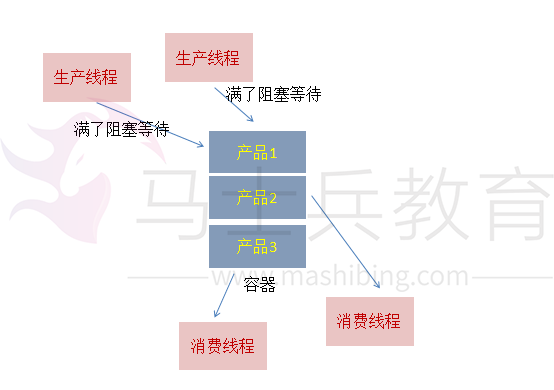

---

一种输出结果如下:
 
从结果可以看出，put线程执行queue.put(1) 后就被阻塞了，只有take线程进行了消费，put线程才可以
返回。可以认为这是一种线程与线程间一对一传递消息的模型。
 
import java.util.concurrent.SynchronousQueue;
public class SynchronousQueueDemo {
    public static void main(String[] args) throws InterruptedException {
        final SynchronousQueue<Integer> queue = new SynchronousQueue<Integer>();
        Thread putThread = new Thread(new Runnable() {
            @Override
            public void run() {
                System.out.println("put thread start");
                try {
                    queue.put(1);
                } catch (InterruptedException e) {
                }
                System.out.println("put thread end");
            }
        });
        Thread takeThread = new Thread(new Runnable() {
            @Override
            public void run() {
                System.out.println("take thread start");
                try {
                    System.out.println("take from putThread: " + queue.take());
                } catch (InterruptedException e) {
                }
                System.out.println("take thread end");
            }
        });
        putThread.start();
        Thread.sleep(1000);
        takeThread.start();
    }
}
put thread start
take thread start
take from putThread: 1
put thread end
take thread end

---

SynchronousQueue实现原理
 
不像ArrayBlockingQueue、LinkedBlockingDeque之类的阻塞队列依赖AQS实现并发操作，
SynchronousQueue直接使用CAS实现线程的安全访问。由于源码中充斥着大量的CAS代码，不易于理
解，所以按照笔者的风格，接下来会使用简单的示例来描述背后的实现模型。
队列的实现策略通常分为公平模式和非公平模式，接下来将分别进行说明。
 
公平模式下的模型：
 
公平模式下，底层实现使用的是TransferQueue这个内部队列，它有一个head和tail指针，用于指向当
前正在等待匹配的线程节点。
初始化时，TransferQueue的状态如下：
 
 
接着我们进行一些操作：
1、线程put1执行 put(1)操作，由于当前没有配对的消费线程，所以put1线程入队列，自旋一小会后睡
眠等待，这时队列状态如下：
 
 
2、接着，线程put2执行了put(2)操作，跟前面一样，put2线程入队列，自旋一小会后睡眠等待，这时队
列状态如下：

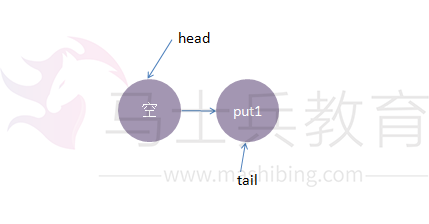

---

3、这时候，来了一个线程take1，执行了
take操作，由于tail指向put2线程，put2线程跟take1线程配对了(一put一take)，这时take1线程不需要
入队，但是请注意了，这时候，要唤醒的线程并不是put2，而是put1。为何？
大家应该知道我们现在讲的是公平策略，所谓公平就是谁先入队了，谁就优先被唤醒，我们的例子明显
是put1应该优先被唤醒。至于读者可能会有一个疑问，明明是take1线程跟put2线程匹配上了，结果是
put1线程被唤醒消费，怎么确保take1线程一定可以和次首节点(head.next)也是匹配的呢？其实大家可
以拿个纸画一画，就会发现真的就是这样的。
公平策略总结下来就是：队尾匹配队头出队。
执行后put1线程被唤醒，take1线程的 take()方法返回了1(put1线程的数据)，这样就实现了线程间的一
对一通信，这时候内部状态如下：
 
 
4、最后，再来一个线程take2，执行take操作，这时候只有put2线程在等候，而且两个线程匹配上了，
线程put2被唤醒，
take2线程take操作返回了2(线程put2的数据)，这时候队列又回到了起点，如下所示：

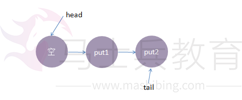

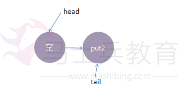

---

以上便是公平模式下，SynchronousQueue的实现模型。总结下来就是：队尾匹配队头出队，先进先
出，体现公平原则。
 
非公平模式下的模型：
 
我们还是使用跟公平模式下一样的操作流程，对比两种策略下有何不同。非公平模式底层的实现使用的
是TransferStack，
一个栈，实现中用head指针指向栈顶，接着我们看看它的实现模型:
1、线程put1执行 put(1)操作，由于当前没有配对的消费线程，所以put1线程入栈，自旋一小会后睡眠
等待，这时栈状态如下：
 
2、接着，线程put2再次执行了put(2)操作，跟前面一样，put2线程入栈，自旋一小会后睡眠等待，这时
栈状态如下：

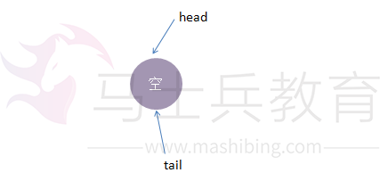

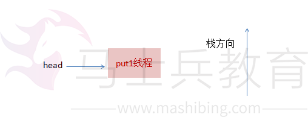

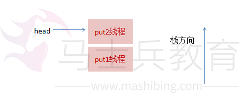

---

3、这时候，来了一个线程take1，执行了take操作，这时候发现栈顶为put2线程，匹配成功，但是实现
会先把take1线程入栈，然后take1线程循环执行匹配put2线程逻辑，一旦发现没有并发冲突，就会把栈
顶指针直接指向 put1线程
 
4、最后，再来一个线程take2，执行take操作，这跟步骤3的逻辑基本是一致的，take2线程入栈，然后
在循环中匹配put1线程，最终全部匹配完毕，栈变为空，恢复初始状态，如下图所示：
 
可以从上面流程看出，虽然put1线程先入栈了，但是却是后匹配，这就是非公平的由来。
总结
 
SynchronousQueue由于其独有的线程一一配对通信机制，在大部分平常开发中，可能都不太会用到，
但线程池技术中会有所使用，由于内部没有使用AQS，而是直接使用CAS，所以代码理解起来会比较困
难，但这并不妨碍我们理解底层的实现模型，在理解了模型的基础上，有兴趣的话再查阅源码，就会有
方向感，看起来也会比较容易，希望本文有所借鉴意义。
 
 
自定义类加载器

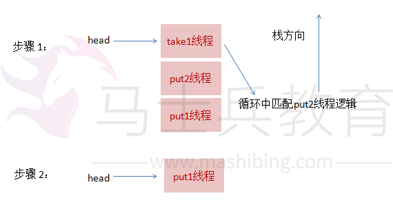

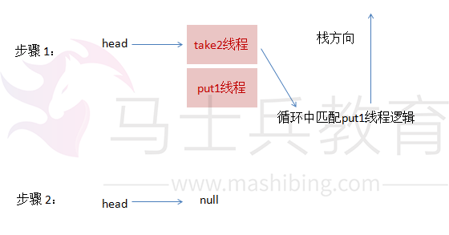

---

为什么需要自定义类加载器 
网上的大部分自定义类加载器文章，几乎都是贴一段实现代码，然后分析一两句自定义ClassLoader的
原理。但是我觉得首先得把为什么需要自定义加载器这个问题搞清楚，因为如果不明白它的作用的情况
下，还要去学习它显然是很让人困惑的。
首先介绍自定义类的应用场景：
（1）加密：Java代码可以轻易的被反编译，如果你需要把自己的代码进行加密以防止反编译，可以先将
编译后的代码用某种加密算法加密，类加密后就不能再用Java的ClassLoader去加载类了，这时就需要自
定义ClassLoader在加载类的时候先解密类，然后再加载。
（2）从非标准的来源加载代码：如果你的字节码是放在数据库、甚至是在云端，就可以自定义类加载
器，从指定的来源加载类。
（3）以上两种情况在实际中的综合运用：比如你的应用需要通过网络来传输 Java 类的字节码，为了安
全性，这些字节码经过了加密处理。这个时候你就需要自定义类加载器来从某个网络地址上读取加密后
的字节代码，接着进行解密和验证，最后定义出在Java虚拟机中运行的类。
 
1. 双亲委派模型
在实现自己的ClassLoader之前，我们先了解一下系统是如何加载类的，那么就不得不介绍双亲委派模
型的实现过程。
//双亲委派模型的工作过程源码
protected synchronized Class<?> loadClass(String name, boolean resolve) throws 
ClassNotFoundException{
    // First, check if the class has already been loaded
    Class c = findLoadedClass(name);
    if (c == null) {
        try {
            if (parent != null) {
                c = parent.loadClass(name, false);
            } else {
                c = findBootstrapClassOrNull(name);
            }
        } 
        catch (ClassNotFoundException e) {
            // ClassNotFoundException thrown if class not found
            // from the non-null parent class loader
            //父类加载器无法完成类加载请求
        }
 
        if (c == null) {
            // If still not found, then invoke findClass in order to find the 
class
            //子加载器进行类加载 
            c = findClass(name);
        }
    }
 
    if (resolve) {
        //判断是否需要链接过程，参数传入
        resolveClass(c);
    }

---

双亲委派模型的工作过程如下：
（1）当前类加载器从自己已经加载的类中查询是否此类已经加载，如果已经加载则直接返回原来已经加
载的类。
（2）如果没有找到，就去委托父类加载器去加载（如代码c = parent.loadClass(name, false)所示）。
父类加载器也会采用同样的策略，查看自己已经加载过的类中是否包含这个类，有就返回，没有就委托
父类的父类去加载，一直到启动类加载器。因为如果父加载器为空了，就代表使用启动类加载器作为父
加载器去加载。
（3）如果启动类加载器加载失败（例如在$JAVA_HOME/jre/lib里未查找到该class），则会抛出一个异
常ClassNotFoundException，然后再调用当前加载器的findClass()方法进行加载。 
 
双亲委派模型的好处：
（1）主要是为了安全性，避免用户自己编写的类动态替换 Java的一些核心类，比如 String。
（2）同时也避免了类的重复加载，因为 JVM中区分不同类，不仅仅是根据类名，相同的 class文件被不
同的 ClassLoader加载就是不同的两个类。
 
2. 自定义类加载器
（1）从上面源码看出，调用loadClass时会先根据委派模型在父加载器中加载，如果加载失败，则会调
用当前加载器的findClass来完成加载。
（2）因此我们自定义的类加载器只需要继承ClassLoader，并覆盖findClass方法，下面是一个实际例
子，在该例中我们用自定义的类加载器去加载我们事先准备好的class文件。
 
2.1自定义一个People.java类做例子
 
    return c;
}
public class People {
//该类写在记事本里，在用javac命令行编译成class文件，放在d盘根目录下
    private String name;
 
    public People() {}
 
    public People(String name) {
        this.name = name;
    }
 
    public String getName() {
        return name;
    }
 
    public void setName(String name) {
        this.name = name;
    }
 
    public String toString() {
        return "I am a people, my name is " + name;

---

2.2自定义类加载器
自定义一个类加载器，需要继承ClassLoader类，并实现findClass方法。其中defineClass方法可以把二
进制流字节组成的文件转换为一个java.lang.Class（只要二进制字节流的内容符合Class文件规范）。
    }
 
}
import java.io.ByteArrayOutputStream;
import java.io.File;
import java.io.FileInputStream;
import java.nio.ByteBuffer;
import java.nio.channels.Channels;
import java.nio.channels.FileChannel;
import java.nio.channels.WritableByteChannel;
 
public class MyClassLoader extends ClassLoader
{
    public MyClassLoader()
    {
       
    }
    
    public MyClassLoader(ClassLoader parent)
    {
        super(parent);
    }
    
    protected Class<?> findClass(String name) throws ClassNotFoundException
    {
        File file = new File("D:/People.class");
        try{
            byte[] bytes = getClassBytes(file);
            //defineClass方法可以把二进制流字节组成的文件转换为一个java.lang.Class
            Class<?> c = this.defineClass(name, bytes, 0, bytes.length);
            return c;
        } 
        catch (Exception e)
        {
            e.printStackTrace();
        }
        
        return super.findClass(name);
    }
    
    private byte[] getClassBytes(File file) throws Exception
    {
        // 这里要读入.class的字节，因此要使用字节流
        FileInputStream fis = new FileInputStream(file);
        FileChannel fc = fis.getChannel();
        ByteArrayOutputStream baos = new ByteArrayOutputStream();
        WritableByteChannel wbc = Channels.newChannel(baos);
        ByteBuffer by = ByteBuffer.allocate(1024);
        
        while (true){

---

2.3在主函数里使用
 
2.4运行结果
至此关于自定义ClassLoader的内容总结完毕。
 
 
 
面向对象和面向过程的区别
 
面向过程
 
优点： 性能比面向对象高，因为类调用时需要实例化，开销比较大，比较消耗
资源;比如单片机、嵌入式开发、Linux/Unix 等一般采用面向过程开发，性能是最重要的因素。 
缺点： 没有面向对象易维护、易复用、易扩展 
面向对象
 
优点： 易维护、易复用、易扩展，由于面向对象有封装、继承、多态性的特性，可以设计出低耦合的系
统，使系统更加灵活、更加易于维护 
缺点： 性能比面向过程低 
Java 语言有哪些特点
 
            int i = fc.read(by);
            if (i == 0 || i == -1)
            break;
            by.flip();
            wbc.write(by);
            by.clear();
        }
        fis.close();
        return baos.toByteArray();
    }
}
MyClassLoader mcl = new MyClassLoader(); 
Class<?> clazz = Class.forName("People", true, mcl); 
Object obj = clazz.newInstance();
System.out.println(obj);
System.out.println(obj.getClass().getClassLoader());//打印出我们的自定义类加载器

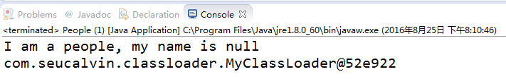

---

1. 简单易学； 
2. 面向对象（封装，继承，多态）； 
3. 平台无关性（ Java 虚拟机实现平台无关性）； 
4. 可靠性； 
5. 安全性； 
6. 支持多线程（ C++ 语言没有内置的多线程机制，因此必须调用操作系
统的多线程功能来进行多线程程序设计，而 Java 语言却提供了多线程支持）； 
7. 支持网络编程并且很方便（ Java 语言诞生本身就是为简化网络编程设
计的，因此 Java 语言不仅支持网络编程而且很方便）； 
8. 编译与解释并存； 
关于 JVM JDK 和 JRE 最详细通俗的解答
 
JVM
 
Java 虚拟机（JVM）是运行 Java 字节码的虚拟机。JVM 有针对不同系统的特
定实现（Windows，Linux，macOS），目的是使用相同的字节码，它们都会给出相同的结果。 
什么是字节码?采用字节码的好处是什么? 
在 Java 中，JVM 可以理解的代码就叫做字节码（即扩展名为 .class 的文
件），它不面向任何特定的处理器，只面向虚拟机。Java 语言通过字节码的方式，在一定程度上解决了
传统解释型语言执行效率低的问题，同时又保留了解释型语言可移植的特点。所以 Java 程序运行时比较
高效，而且，由于字节码
并不专对一种特定的机器，因此，Java 程序无须重新编译便可在多种不同的计算机上运行。 
Java 程序从源代码到运行一般有下面 3 步： 
我们需要格外注意的是 .class->机器码 这一步。在这一步 jvm 类加载器首先加载字节码文件，然后通过
解释器逐行解释执行，这种方式的执行速度会相对比较慢。而且，有些方法和代码块是经常需要被调用
的，也就是所谓的热点代码，所以后面引进了 JIT 编译器，JIT 属于运行时编译。当 JIT 编译器完成第一
次编译后，其会将字节码对应的机器码保存下来，下次可以直接使用。而我们知道，机器码的运行效率
肯定是高于 Java 解释器的。这也解释了我们为什
么经常会说 Java 是编译与解释共存的语言。 
HotSpot 采用了惰性评估(Lazy Evaluation)的做法，根据二八定律，消耗大部分系统资源的只有那一小
部分的代码（热点代码），而这也就是 JIT 所需要编译
的部分。JVM 会根据代码每次被执行的情况收集信息并相应地做出一些优化，
因此执行的次数越多，它的速度就越快。JDK 9 引入了一种新的编译模式
AOT(Ahead of Time Compilation)，它是直接将字节码编译成机器码，这样就
避免了 JIT 预热等各方面的开销。JDK 支持分层编译和 AOT 协作使用。但是 ，
AOT 编译器的编译质量是肯定比不上 JIT 编译器的。 
总结：Java 虚拟机（JVM）是运行 Java 字节码的虚拟机。JVM 有针对不同系
统的特定实现（Windows，Linux，macOS），目的是使用相同的字节码，它们
都会给出相同的结果。字节码和不同系统的 JVM 实现是 Java 语言“一次编译，随处可以运行”的关键所
在。

---

JDK 和 JRE
 
JDK 是 Java Development Kit，它是功能齐全的 Java SDK。它拥有 JRE 所拥有
的一切，还有编译器（javac）和工具（如 javadoc 和 jdb）。它能够创建和编译程序。 
JRE 是 Java 运行时环境。它是运行已编译 Java 程序所需的所有内容的集合，
包括 Java 虚拟机（JVM），Java 类库，java 命令和其他的一些基础构件。但是，它不能用于创建新程
序。 
如果你只是为了运行一下 Java 程序的话，那么你只需要安装 JRE 就可以了。
如果你需要进行一些 Java 编程方面的工作，那么你就需要安装 JDK 了。但是，这不是绝对的。有时，即
使您不打算在计算机上进行任何 Java 开发，仍然需要安装 JDK。例如，如果要使用 JSP 部署 Web 应用
程序，那么从技术上讲，您只是在应用程序服务器中运行 Java 程序。那你为什么需要 JDK 呢？因为应用
程序服务器会将 JSP 转换为 Java servlet，并且需要使用 JDK 来编译 
servlet。 
Oracle JDK 和 OpenJDK 的对比
 
 
可能在看这个问题之前很多人和我一样并没有接触和使用过 OpenJDK 。那么
Oracle 和 OpenJDK 之间是否存在重大差异？下面通过我通过我收集到一些资料对你解答这个被很多人
忽视的问题。 
对于 Java 7，没什么关键的地方。OpenJDK 项目主要基于 Sun 捐赠的 HotSpot
源代码。此外，OpenJDK 被选为 Java 7 的参考实现，由 Oracle 工程师维护。
关于 JVM，JDK，JRE 和 OpenJDK 之间的区别，Oracle 博客帖子在 2012 年有一个更详细的答案： 
问：OpenJDK 存储库中的源代码与用于构建 Oracle JDK 的代码之间有什么区别？ 
答：非常接近 - 我们的 Oracle JDK 版本构建过程基于 OpenJDK 7 构建，只添
加了几个部分，例如部署代码，其中包括 Oracle 的 Java 插件和 Java WebStart 的实现，以及一些封闭
的源代码派对组件，如图形光栅化器，一些开源的第三方组件，如 Rhino，以及一些零碎的东西，如附
加文档或第三方字体。展望未
来，我们的目的是开源 Oracle JDK 的所有部分，除了我们考虑商业功能的部
分。 
总结： 
1. Oracle JDK 版本将每三年发布一次，而 OpenJDK 版本每三个月发布一
次； 
2. OpenJDK 是一个参考模型并且是完全开源的，而 Oracle JDK 是
OpenJDK 的一个实现，并不是完全开源的； 
3. Oracle JDK 比 OpenJDK 更稳定。OpenJDK 和 Oracle JDK 的代码几乎相同，但 Oracle JDK 有更多
的类和一些错误修复。因此，如果您想开发
企业/商业软件，我建议您选择 Oracle JDK，因为它经过了彻底的测试和稳定。某些情况下，有些人提到
在使用 OpenJDK 可能会遇到了许多应用程序崩溃的问题，但是，只需切换到 Oracle JDK 就可以解决问
题；

---

4. 顶级公司正在使用 Oracle JDK，例如 Android Studio，Minecraft 和
IntelliJ IDEA 开发工具，其中 Open JDK 不太受欢迎； 
5. 在响应性和 JVM 性能方面，Oracle JDK 与 OpenJDK 相比提供了更好的性能； 
6. Oracle JDK 不会为即将发布的版本提供长期支持，用户每次都必须通过更新到最新版本获得支持来
获取最新版本； 
7. Oracle JDK 根据二进制代码许可协议获得许可，而 OpenJDK 根据 GPL v2 许可获得许可。 
Java 和 C++的区别
 
 
我知道很多人没学过 C++，但是面试官就是没事喜欢拿咱们 Java 和 C++ 比呀！没办法！！！就算没学
过 C++，也要记下来！ 
•    都是面向对象的语言，都支持封装、继承和多态 
•    Java 不提供指针来直接访问内存，程序内存更加安全 
•    Java 的类是单继承的，C++ 支持多重继承；虽然 Java 的类不可以多
继承，但是接口可以多继承。 
•    Java 有自动内存管理机制，不需要程序员手动释放无用内存 
什么是 Java 程序的主类 应用程序和小程序的主类有何不同 
一个程序中可以有多个类，但只能有一个类是主类。在 Java 应用程序中，这
个主类是指包含 main（）方法的类。而在 Java 小程序中，这个主类是一个继
承自系统类 JApplet 或 Applet 的子类。应用程序的主类不一定要求是 public 
类，但小程序的主类要求必须是 public 类。主类是 Java 程序执行的入口点。 
Java 应用程序与小程序之间有那些差别
 
简单说应用程序是从主线程启动(也就是 main() 方法)。applet 小程序没有
main 方法，主要是嵌在浏览器页面上运行(调用 init()线程或者 run()来启动)，嵌
入浏览器这点跟 flash 的小游戏类似。 
字符型常量和字符串常量的区别
 
 
1. 形式上: 字符常量是单引号引起的一个字符 字符串常量是双引号引起的
若干个字符 
2. 含义上: 字符常量相当于一个整形值( ASCII 值),可以参加表达式运算 字符串常量代表一个地址值(该
字符串在内存中存放位置) 
3. 占内存大小 字符常量只占 2 个字节 字符串常量占若干个字节(至少一个
字符结束标志) (注意： char 在 Java 中占两个字节) 
java 编程思想第四版：2.2.2 节

---

构造器 Constructor 是否可被 override
 
在讲继承的时候我们就知道父类的私有属性和构造方法并不能被继承，所以 
Constructor 也就不能被 override（重写）,但是可以 overload（重载）,所以你可以看到一个类中有多
个构造函数的情况。 
重载和重写的区别
 
重载： 发生在同一个类中，方法名必须相同，参数类型不同、个数不同、顺序不同，方法返回值和访问
修饰符可以不同，发生在编译时。    
重写： 发生在父子类中，方法名、参数列表必须相同，返回值范围小于等于父类，抛出的异常范围小于
等于父类，访问修饰符范围大于等于父类；如果父类方法访问修饰符为 private 则子类就不能重写该方
法。 
Java 面向对象编程三大特性: 封装 继承 多态
 
封装
 
封装把一个对象的属性私有化，同时提供一些可以被外界访问的属性的方法，如果属性不想被外界访
问，我们大可不必提供方法给外界访问。但是如果一个类没有提供给外界访问的方法，那么这个类也没
有什么意义了。 
继承
 
继承是使用已存在的类的定义作为基础建立新类的技术，新类的定义可以增加新的数据或新的功能，也
可以用父类的功能，但不能选择性地继承父类。通过使用继承我们能够非常方便地复用以前的代码。关
于继承如下 3 点请记住： 
1. 子类拥有父类非 private 的属性和方法。 
2. 子类可以拥有自己属性和方法，即子类可以对父类进行扩展。 
3. 子类可以用自己的方式实现父类的方法。（以后介绍）。

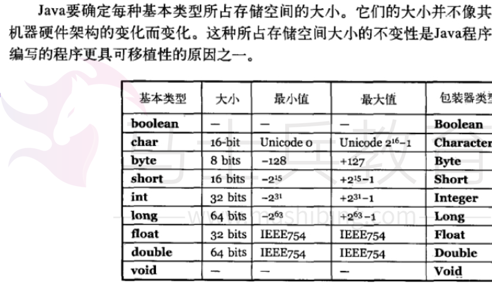

---

多态
 
所谓多态就是指程序中定义的引用变量所指向的具体类型和通过该引用变量发出的方法调用在编程时并
不确定，而是在程序运行期间才确定，即一个引用变量倒底会指向哪个类的实例对象，该引用变量发出
的方法调用到底是哪个类中实现的方法，必须在由程序运行期间才能决定。 
在 Java 中有两种形式可以实现多态：继承（多个子类对同一方法的重写）和接口（实现接口并覆盖接口
中同一方法）。 
String StringBuffer 和 StringBuilder 的区别是什么
String 为什么是不可变的
 
可变性   
简单的来说：String 类中使用 final 关键字字符数组保存字符串，private 
final char value[]，所以 String 对象是不可变的。而 StringBuilder 与 
StringBuffer 都继承自 AbstractStringBuilder 类，在 AbstractStringBuilder 中
也是使用字符数组保存字符串char[]value 但是没有用 final 关键字修饰，所以这两种对象都是可变的。 
StringBuilder 与 StringBuffer 的构造方法都是调用父类构造方法也就是 AbstractStringBuilder 实现
的，大家可以自行查阅源码。 
AbstractStringBuilder.java 
线程安全性 
String 中的对象是不可变的，也就可以理解为常量，线程安全。
AbstractStringBuilder 是 StringBuilder 与 StringBuffer 的公共父类，定义了一些字符串的基本操作，
如 expandCapacity、append、insert、indexOf 等公共方法。StringBuffer 对方法加了同步锁或者对
调用的方法加了同步锁，所以是线程安全的。StringBuilder 并没有对方法进行加同步锁，所以是非线程
安全的。   性能 
每次对 String 类型进行改变的时候，都会生成一个新的 String 对象，然后将指针指向新的 String 对
象。StringBuffer 每次都会对 StringBuffer 对象本身进行操作，而不是生成新的对象并改变对象引用。
相同情况下使用 
StringBuilder 相比使用 StringBuffer 仅能获得 10%~15% 左右的性能提升，但却要冒多线程不安全的风
险。对于三者使用的总结： 
1. 操作少量的数据 = String 
2. 单线程操作字符串缓冲区下操作大量数据 = StringBuilder 
3. 多线程操作字符串缓冲区下操作大量数据 = StringBuffer 
自动装箱与拆箱
 
abstract class AbstractStringBuilder implements Appendable, CharSequence {     
char[] value;     
    int count; 
    AbstractStringBuilder() { 
    } 
    AbstractStringBuilder(int capacity) {         
    value = new char[capacity]; 
    }

---

装箱：将基本类型用它们对应的引用类型包装起来；拆箱：将包装类型转换为基本数据类型； 
在一个静态方法内调用一个非静态成员为什么是非法的
 
由于静态方法可以不通过对象进行调用，因此在静态方法里，不能调用其他非静态变量，也不可以访问
非静态变量成员。 
在 Java 中定义一个不做事且没有参数的构造方法的作用
 
 Java 程序在执行子类的构造方法之前，如果没有用 super() 来调用父类特定的构造方法，则会调用父
类中“没有参数的构造方法”。因此，如果父类中只定义了有参数的构造方法，而在子类的构造方法中又
没有用 super() 来调用父类
中特定的构造方法，则编译时将发生错误，因为 Java 程序在父类中找不到没有参数的构造方法可供执
行。解决办法是在父类里加上一个不做事且没有参数的构造方法。   
import java 和 javax 有什么区别
 
刚开始的时候 JavaAPI 所必需的包是 java 开头的包，javax 当时只是扩展 
API 包来说使用。然而随着时间的推移，javax 逐渐的扩展成为 Java API 的组
成部分。但是，将扩展从 javax 包移动到 java 包将是太麻烦了，最终会破坏
一堆现有的代码。因此，最终决定 javax 包将成为标准 API 的一部分。 
所以，实际上 java 和 javax 没有区别。这都是一个名字。 
接口和抽象类的区别是什么
 
1. 接口的方法默认是 public，所有方法在接口中不能有实现(Java 8 开始
接口方法可以有默认实现），抽象类可以有非抽象的方法 
2. 接口中的实例变量默认是 final 类型的，而抽象类中则不一定 
3. 一个类可以实现多个接口，但最多只能实现一个抽象类 
4. 一个类实现接口的话要实现接口的所有方法，而抽象类不一定 
5. 接口不能用 new 实例化，但可以声明，但是必须引用一个实现该接口的对象 从设计层面来说，抽
象是对类的抽象，是一种模板设计，接口是行为的抽象，是一种行为的规范。 
成员变量与局部变量的区别有那些
 
1. 从语法形式上，看成员变量是属于类的，而局部变量是在方法中定义的变量或是方法的参数；成员
变量可以被 public,private,static 等修饰符所
修饰，而局部变量不能被访问控制修饰符及 static 所修饰；但是，成员
变量和局部变量都能被 final 所修饰； 
2. 从变量在内存中的存储方式来看，成员变量是对象的一部分，而对象存在于堆内存，局部变量存在
于栈内存 
3. 从变量在内存中的生存时间上看，成员变量是对象的一部分，它随着对象的创建而存在，而局部变
量随着方法的调用而自动消失。 
4. 成员变量如果没有被赋初值，则会自动以类型的默认值而赋值（一种情况例外被 final 修饰的成员
变量也必须显示地赋值）；而局部变量则不
会自动赋值。 
创建一个对象用什么运算符?对象实体与对象引用有何不同?

---

new 运算符，new 创建对象实例（对象实例在堆内存中），对象引用指向对象实例（对象引用存放在栈
内存中）。一个对象引用可以指向 0 个或 [1] 个对象
（一根绳子可以不系气球，也可以系一个气球）;一个对象可以有 n 个引用指向
它（可以用 n 条绳子系住一个气球）。 
 
1 . 名字与类名相同； 
什么是方法的返回值?返回值在类的方法里的作用是什么?
 
方法的返回值是指我们获取到的某个方法体中的代码执行后产生的结果！（前提是该方法可能产生结
果）。返回值的作用:接收出结果，使得它可以用于其他的操作！ 
一个类的构造方法的作用是什么 若一个类没有声明构造方
法,该程序能正确执行吗 ?为什么?
 
主要作用是完成对类对象的初始化工作。可以执行。因为一个类即使没有声明构造方法也会有默认的不
带参数的构造方法。 
构造方法有哪些特性
 
1. 名字与类名相同
2. 没有返回值，但不能用 void 声明构造函数； 
3. 生成类的对象时自动执行，无需调用。 
静态方法和实例方法有何不同
 
1. 在外部调用静态方法时，可以使用"类名.方法名"的方式，也可以使用"对
象名.方法名"的方式。而实例方法只有后面这种方式。也就是说，调用
静态方法可以无需创建对象。 
2. 静态方法在访问本类的成员时，只允许访问静态成员（即静态成员变量和静态方法），而不允许访
问实例成员变量和实例方法；实例方法则无此限制. 
对象的相等与指向他们的引用相等，两者有什么不同？
 
对象的相等，比的是内存中存放的内容是否相等。而引用相等，比较的是他们指向的内存地址是否相
等。 
在调用子类构造方法之前会先调用父类没有参数的构造方
法，其目的是?
 
帮助子类做初始化工作。 
== 与 equals(重要)
 
== : 它的作用是判断两个对象的地址是不是相等。即，判断两个对象是不是同
一个对象。(基本数据类型==比较的是值，引用数据类型==比较的是内存地址) 
equals() : 它的作用也是判断两个对象是否相等。但它一般有两种使用情况： 
•    情况 1：类没有覆盖 equals() 方法。则通过 equals() 比较该类的两个

---

对象时，等价于通过“==”比较这两个对象。 
•    情况 2：类覆盖了 equals() 方法。一般，我们都覆盖 equals() 方法来
两个对象的内容相等；若它们的内容相等，则返回 true (即，认为这两
个对象相等)。 
举个例子： 
说明： 
•    String 中的 equals 方法是被重写过的，因为 object 的 equals 方法是
比较的对象的内存地址，而 String 的 equals 方法比较的是对象的值。 
•    当创建 String 类型的对象时，虚拟机会在常量池中查找有没有已经存
在的值和要创建的值相同的对象，如果有就把它赋给当前引用。如果没有就在常量池中重新创建一个 
String 对象。 
hashCode 与 equals（重要）
 
面试官可能会问你：“你重写过 hashcode 和 equals 么，为什么重写 equals
时必须重写 hashCode 方法？” 
hashCode（）介绍
 
hashCode() 的作用是获取哈希码，也称为散列码；它实际上是返回一个 int 整数。这个哈希码的作用是
确定该对象在哈希表中的索引位置。hashCode() 定义
在 JDK 的 Object.java 中，这就意味着 Java 中的任何类都包含有 hashCode() 函数。 
散列表存储的是键值对(key-value)，它的特点是：能根据“键”快速的检索出对应的“值”。这其中就利用到
了散列码！（可以快速找到所需要的对象） 
public class test1 { 
    public static void main(String[] args) {     
    String a = new String("ab"); // a 为一个引用 
        String b = new String("ab"); // b为另一个引用,对象的内容一样 
        String aa = "ab"; // 放在常量池中        
        String bb = "ab"; // 从常量池中查找       
        if (aa == bb) // true 
            System.out.println("aa==bb");       
            if (a == b) // false，非同一对象   
            System.out.println("a==b");      
            if (a.equals(b)) // true      
            System.out.println("aEQb");        
            if (42 == 42.0) { // true      
            System.out.println("true"); 
        } 
    } 
}

---

为什么要有 hashCode
 
我们以“HashSet 如何检查重复”为例子来说明为什么要有 hashCode： 
当你把对象加入 HashSet 时，HashSet 会先计算对象的 hashcode 值来判断
对象加入的位置，同时也会与其他已经加入的对象的 hashcode 值作比较，如
果没有相符的 hashcode，HashSet 会假设对象没有重复出现。但是如果发现有
相同 hashcode 值的对象，这时会调用 equals（）方法来检查 hashcode 相等的对象是否真的相同。如
果两者相同，HashSet 就不会让其加入操作成功。
如果不同的话，就会重新散列到其他位置。（摘自我的 Java 启蒙书《Head 
first java》第二版）。这样我们就大大减少了 equals 的次数，相应就大大提高了执行速度。 
hashCode（）与 equals（）的相关规定
 
1. 如果两个对象相等，则 hashcode 一定也是相同的 
2. 两个对象相等,对两个对象分别调用 equals 方法都返回 true 
3. 两个对象有相同的 hashcode 值，它们也不一定是相等的 
4. 因此，equals 方法被覆盖过，则 hashCode 方法也必须被覆盖 
5. hashCode() 的默认行为是对堆上的对象产生独特值。如果没有重写 hashCode()，则该 class 的两
个对象无论如何都不会相等（即使这两个对象指向相同的数据） 
关于final关键字的一些总结
 
final 关键字主要用在三个地方：变量、方法、类。 
1. 对于一个 final 变量，如果是基本数据类型的变量，则其数值一旦在初始化之后便不能更改；如果
是引用类型的变量，则在对其初始化之后便不能再让其指向另一个对象。 
2. 当用 final 修饰一个类时，表明这个类不能被继承。final 类中的所有成员方法都会被隐式地指定为 
final 方法。 
3. 使用 final 方法的原因有两个。第一个原因是把方法锁定，以防任何继承类修改它的含义；第二个
原因是效率。在早期的 Java 实现版本中，会将final 方法转为内嵌调用。但是如果方法过于庞大，
可能看不到内嵌调用带来的任何性能提升（现在的 Java 版本已经不需要使用 final 方法进行这些优
化了）。类中所有的 private 方法都隐式地指定为 final。 
Java 中的异常处理
 
Java 异常类层次结构图

---

在 Java 中，所有的异常都有一个共同的祖先 java.lang 包中的 Throwable类。Throwable： 有两个重
要的子类：Exception（异常） 和 Error（错误） ，二者都是 Java 异常处理的重要子类，各自都包含大
量子类。 
Error（错误）:是程序无法处理的错误，表示运行应用程序中较严重问题。大多数错误与代码编写者执
行的操作无关，而表示代码运行时 JVM（Java 虚拟机）出现的问题。例如，Java 虚拟机运行错误
（Virtual MachineError），当 JVM 不再有继续执行操作所需的内存资源时，将出现 
OutOfMemoryError。这些异常发生时，Java 虚拟机（JVM）一般会选择线程终止。 
这些错误表示故障发生于虚拟机自身、或者发生在虚拟机试图执行应用时，如Java 虚拟机运行错误
（Virtual MachineError）、类定义错误（NoClassDefFoundError）等。这些错误是不可查的，因为它
们在应用程序的控制和处理能力之 外，而且绝大多数是程序运行时不允许出现的状况。对于设计合理的
应用程序来说，即使确实发生了错误，本质上也不应该试图去处理它所引起的异常状况。在 Java 中，错
误通过 Error 的子类描述。 
Exception（异常）:是程序本身可以处理的异常。Exception 类有一个重要的子类
RuntimeException。RuntimeException 异常由 Java 虚拟机抛出。
NullPointerException（要访问的变量没有引用任何对象时，抛出该异常）、
ArithmeticException（算术运算异常，一个整数除以 0 时，抛出该异常）和 
ArrayIndexOutOfBoundsException （下标越界异常）。 
注意：异常和错误的区别：异常能被程序本身可以处理，错误是无法处理。 
Throwable 类常用方法
 
•    public string getMessage():返回异常发生时的详细信息 
•    public string toString():返回异常发生时的简要描述 
•    public string getLocalizedMessage():返回异常对象的本地化信息。使用 Throwable 的子类覆盖
这个方法，可以声称本地化信息。如果子类没有覆盖该方法，则该方法返回的信息与 getMessage（）
返回的结果相同 
•    public void printStackTrace():在控制台上打印 Throwable 对象封装的异常信息

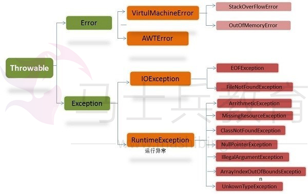

---

异常处理总结
 
•    try 块：用于捕获异常。其后可接零个或多个 catch 块，如果没有 catch
块，则必须跟一个 finally 块。 
•    catch 块：用于处理 try 捕获到的异常。 
•    finally 块：无论是否捕获或处理异常，finally 块里的语句都会被执行。
当在 try 块或 catch 块中遇到 return 语句时，finally 语句块将在方法返回之前被执行。在以下 4 种特殊
情况下，finally 块不会被执行： 
1. 在 finally 语句块中发生了异常。 
2. 在前面的代码中用了 System.exit()退出程序。 
3. 程序所在的线程死亡。 
4. 关闭 CPU。 
Java 序列化中如果有些字段不想进行序列化 怎么办
 
对于不想进行序列化的变量，使用 transient 关键字修饰。 
transient 关键字的作用是：阻止实例中那些用此关键字修饰的的变量序列化；当对象被反序列化时，被 
transient 修饰的变量值不会被持久化和恢复。 transient 只能修饰变量，不能修饰类和方法。 
获取用键盘输入常用的的两种方法
 
方法 1：通过 Scanner 
Scanner input = new Scanner(System.in);
 String s = input.nextLine(); input.close();
方法 2：通过 BufferedReader 
BufferedReader input = new BufferedReader(new InputStreamReader(System.in));
  String s = input.readLine();
 
 
接口继承关系和实现
 
集合类存放于 Java.util 包中，主要有 3 种：set(集）、list(列表包含 Queue）和 map(映射)。
1. Collection：Collection 是集合 List、Set、Queue 的最基本的接口。 
2. Iterator：迭代器，可以通过迭代器遍历集合中的数据
3. Map：是映射表的基础接口

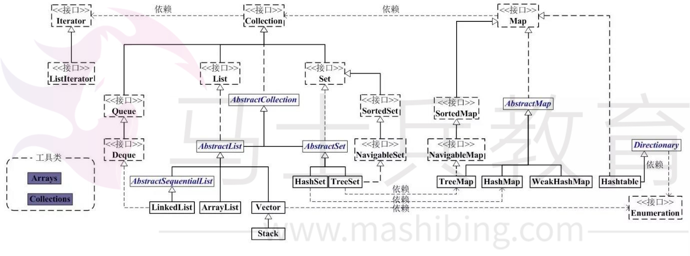

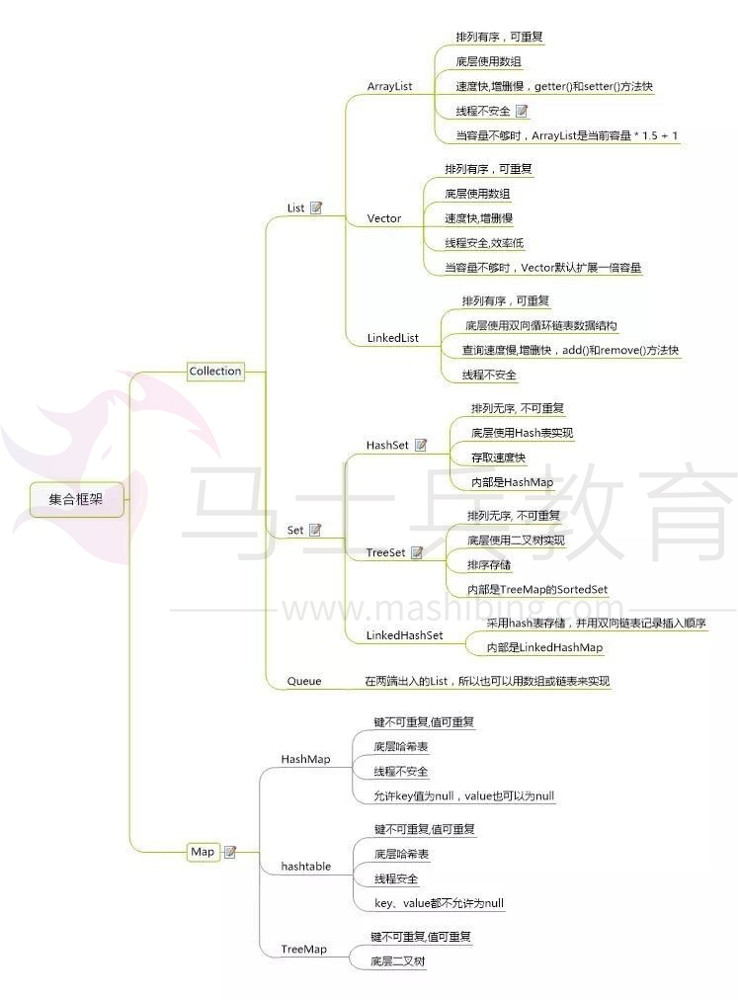

---

List
 
Java 的 List 是非常常用的数据类型。List 是有序的 Collection。Java List 一共三个实现类：分别是 
ArrayList、Vector 和 LinkedList。 
ArrayList（数组） 
ArrayList 是最常用的 List 实现类，内部是通过数组实现的，它允许对元素进行快速随机访问。数组的缺
点是每个元素之间不能有间隔，当数组大小不满足时需要增加存储能力，就要将已经有数组的数据复制
到新的存储空间中。当从 ArrayList 的中间位置插入或者删除元素时，需要对数组进行复制、移动、代
价比较高。因此，它适合随机查找和遍历，不适合插入和删除。 
Vector（数组实现、线程同步） 
Vector 与 ArrayList 一样，也是通过数组实现的，不同的是它支持线程的同步，即某一时刻只有一
个线程能够写 Vector，避免多线程同时写而引起的不一致性，但实现同步需要很高的花费，因此，访问
它比访问 ArrayList 慢。 
LinkList（链表） 
LinkedList 是用链表结构存储数据的，很适合数据的动态插入和删除，随机访问和遍历速度比较慢。另
外，他还提供了 List 接口中没有定义的方法，专门用于操作表头和表尾元素，可以当作堆栈、队列和双
向队列使用。 
Set
 
Set 注重独一无二的性质,该体系集合用于存储无序(存入和取出的顺序不一定相同)元素，值不能重复。对
象的相等性本质是对象 hashCode 值（java 是依据对象的内存地址计算出的此序号）判断的，如果想要
让两个不同的对象视为相等的，就必须覆盖 Object 的 hashCode 方法和 equals 方法。

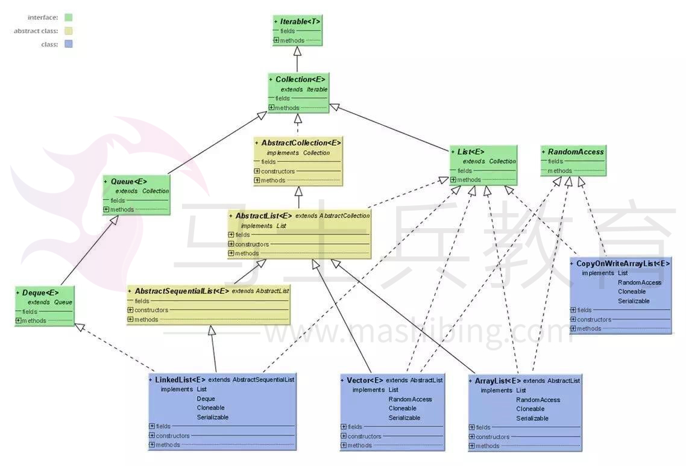

---

HashSet（Hash 表） 
哈希表边存放的是哈希值。HashSet 存储元素的顺序并不是按照存入时的顺序（和 List 显然不同） 而是
按照哈希值来存的所以取数据也是按照哈希值取得。元素的哈希值是通过元素的hashcode 方法来获取
的, HashSet 首先判断两个元素的哈希值，如果哈希值一样，接着会比较equals 方法 如果 equls 结果为 
true ，HashSet 就视为同一个元素。如果 equals 为 false 就不是同一个元素。 
哈希值相同 equals 为 false 的元素是怎么存储呢,就是在同样的哈希值下顺延（可以认为哈希值相同的元
素放在一个哈希桶中）。也就是哈希一样的存一列。如图 1 表示 hashCode 值不相同的情况；图 2 表示 
hashCode 值相同，但 equals 不相同的情况。 
 
HashSet 通过 hashCode 值来确定元素在内存中的位置。一个 hashCode 位置上可以存放多个元素。 
TreeSet（二叉树） 
1. TreeSet()是使用二叉树的原理对新 add()的对象按照指定的顺序排序（升序、降序），每增加一个
对象都会进行排序，将对象插入的二叉树指定的位置。 
2. Integer 和 String 对象都可以进行默认的 TreeSet 排序，而自定义类的对象是不可以的，自己定义
的类必须实现 Comparable 接口，并且覆写相应的 compareTo()函数，才可以正常使用。 
3. 在覆写 compare()函数时，要返回相应的值才能使 TreeSet 按照一定的规则来排序
4. 比较此对象与指定对象的顺序。如果该对象小于、等于或大于指定对象，则分别返回负整数、零或
正整数。
LinkHashSet（HashSet+LinkedHashMap）

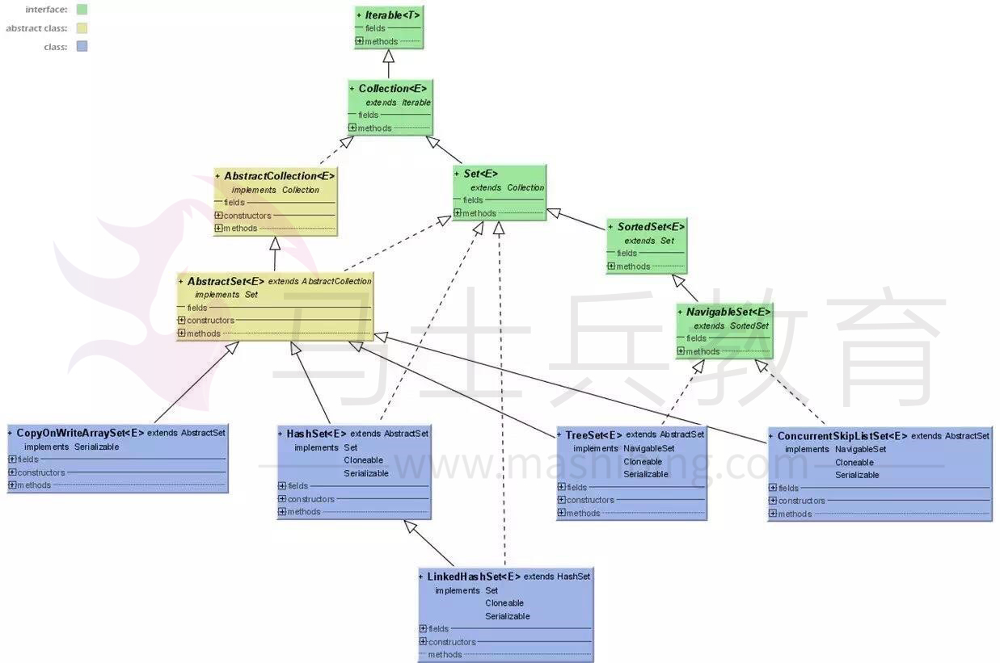

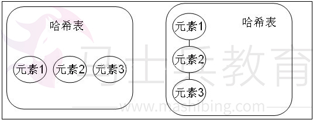

---

对于 LinkedHashSet 而言，它继承与 HashSet、又基于 LinkedHashMap 来实现的。
LinkedHashSet 底层使用 LinkedHashMap 来保存所有元素，它继承与 HashSet，其所有的方法操作上
又与 HashSet 相同，因此 LinkedHashSet 的实现上非常简单，只提供了四个构造方法，并通过传递一
个标识参数，调用父类的构造器，底层构造一个 LinkedHashMap 来实现，在相关操作上与父类 
HashSet 的操作相同，直接调用父类 HashSet 的方法即可。 
Map
 
HashMap（数组+链表+红黑树） 
HashMap 根据键的 hashCode 值存储数据，大多数情况下可以直接定位到它的值，因而具有很快的访
问速度，但遍历顺序却是不确定的。 HashMap最多只允许一条记录的键为null，允许多条记录的值为 
null。HashMap 非线程安全，即任一时刻可以有多个线程同时写 HashMap，可能会导致数据的不一
致。如果需要满足线程安全，可以用 Collections 的 synchronizedMap 方法使 HashMap 具有线程安全
的能力，或者使用 ConcurrentHashMap。我们用下面这张图来介绍
HashMap 的结构。
JAVA7 实现 
大方向上，HashMap 里面是一个数组，然后数组中每个元素是一个单向链表。上图中，每个绿色
的实体是嵌套类 Entry 的实例，Entry 包含四个属性：key, value, hash 值和用于单向链表的 next。 
1. capacity：当前数组容量，始终保持 2^n，可以扩容，扩容后数组大小为当前的 2 倍。 
2. loadFactor：负载因子，默认为 0.75。

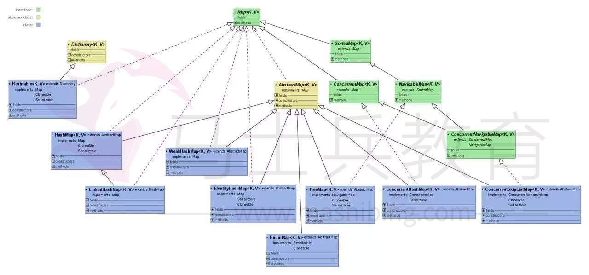

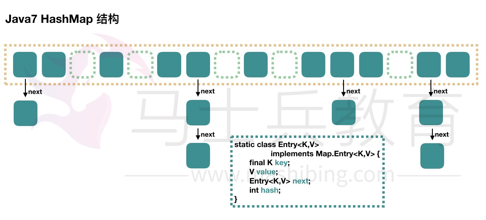

---

3. threshold：扩容的阈值，等于 capacity * loadFactor 
JAVA8实现 
Java8 对 HashMap 进行了一些修改，最大的不同就是利用了红黑树，所以其由 数组+链表+红黑树 组
成。 
根据 Java7 HashMap 的介绍，我们知道，查找的时候，根据 hash 值我们能够快速定位到数组的具体下
标，但是之后的话，需要顺着链表一个个比较下去才能找到我们需要的，时间复杂度取决
于链表的长度，为 O(n)。为了降低这部分的开销，在 Java8 中，当链表中的元素超过了 8 个以后，会将
链表转换为红黑树，在这些位置进行查找的时候可以降低时间复杂度为 O(logN)。 
ConcurrentHashMap
Segment 段 
ConcurrentHashMap 和 HashMap 思路是差不多的，但是因为它支持并发操作，所以要复杂一些。整
个 ConcurrentHashMap 由一个个 Segment 组成，Segment 代表”部分“或”一段“的意思，所以很多地
方都会将其描述为分段锁。注意，行文中，我很多地方用了“槽”来代表一个 segment。
线程安全（Segment 继承 ReentrantLock 加锁）
简单理解就是，ConcurrentHashMap 是一个 Segment 数组，Segment 通过继承 ReentrantLock 来进
行加锁，所以每次需要加锁的操作锁住的是一个 segment，这样只要保证每个 Segment 是线程安全
的，也就实现了全局的线程安全。

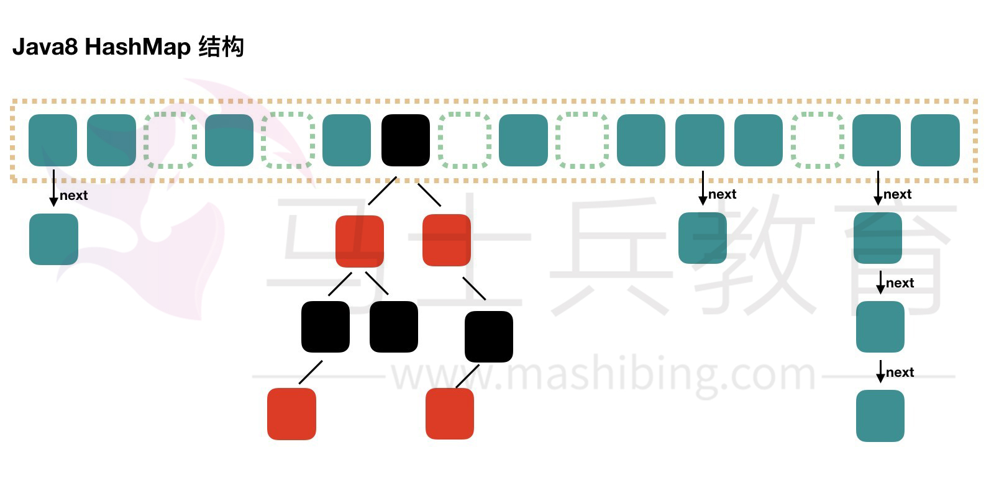

---

并行度 concurrencyLevel：并行级别、并发数、Segment 数，怎么翻译不重要，理解它。默认是 16，
也就是说 ConcurrentHashMap 有 16 个 Segments，所以理论上，这个时候，最多可以同时支持 16 个
线程并发写，只要它们的操作分别分布在不同的 Segment 上。这个值可以在初始化的时候设置为其他
值，但是一旦初始化以后，它是不可以扩容的。再具体到每个 Segment 内部，其实每个 Segment 很像
之前介绍的 HashMap，不过它要保证线程安全，所以处理起来要麻烦些。
Java8 实现 （引入了红黑树） 
Java8 对 ConcurrentHashMap 进行了比较大的改动,Java8 也引入了红黑树。 
Java8实现(../../../../../0马士兵/新建文件夹/BAT面试突击资料(1)/整理/BAT面试突击资料/06-JAVA面试
核心知识点整理(时间较多的同学全面复习).assets/Java8实现(引入了红黑树).jpg)
HashTable（线程安全） 
Hashtable 是遗留类，很多映射的常用功能与 HashMap 类似，不同的是它承自 Dictionary 类，并且是
线程安全的，任一时间只有一个线程能写 Hashtable，并发性不如 ConcurrentHashMap，因为 
ConcurrentHashMap 引入了分段锁。Hashtable 不建议在新代码中使用，不需要线程安全的场合可以
用 HashMap 替换，需要线程安全的场合可以用 ConcurrentHashMap 替换。 
3.4.4. TreeMap（可排序） 
TreeMap 实现 SortedMap 接口，能够把它保存的记录根据键排序，默认是按键值的升序排序，也可以
指定排序的比较器，当用 Iterator 遍历 TreeMap 时，得到的记录是排过序的。如果使用排序的映射，
建议使用 TreeMap。 
在使用 TreeMap 时，key 必须实现 Comparable 接口或者在构造 TreeMap 传入自定义的
Comparator，否则会在运行时抛出 java.lang.ClassCastException 类型的异常。 
LinkHashMap（记录插入顺序） 
LinkedHashMap 是 HashMap 的一个子类，保存了记录的插入顺序，在用 Iterator 遍历 
LinkedHashMap 时，先得到的记录肯定是先插入的，也可以在构造时带参数，按照访问次序排序。

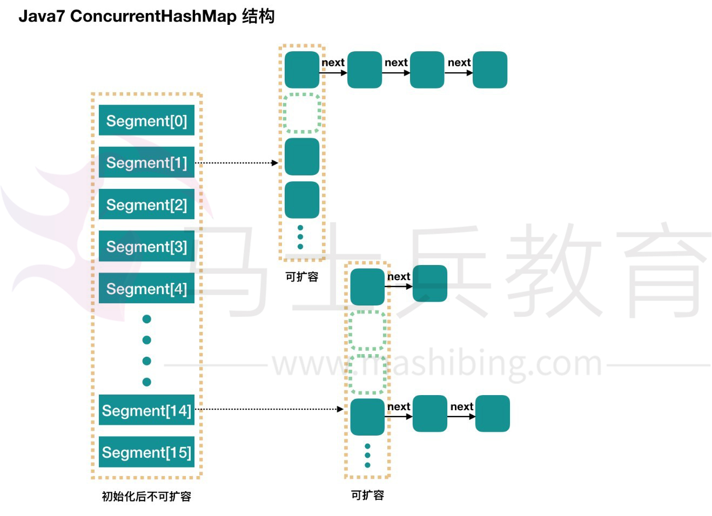

---

TreeMap 的实现就是红黑树数据结构，也就说是一棵自平衡的排序二叉树，这样就可以保证当需要快速
检索指定节点。
TreeSet 和 TreeMap 的关系
 
为了让大家了解 TreeMap 和 TreeSet 之间的关系，下面先看 TreeSet 类的部分源代码：
public class TreeSet<E> extends AbstractSet<E>
    implements NavigableSet<E>, Cloneable, java.io.Serializable
 {
    // 使用 NavigableMap 的 key 来保存 Set 集合的元素
    private transient NavigableMap<E,Object> m;
    // 使用一个 PRESENT 作为 Map 集合的所有 value。
    private static final Object PRESENT = new Object();
    // 包访问权限的构造器，以指定的 NavigableMap 对象创建 Set 集合
    TreeSet(NavigableMap<E,Object> m)
    {
        this.m = m;
    }
    public TreeSet()                                      // ①
    {
        // 以自然排序方式创建一个新的 TreeMap，
        // 根据该 TreeSet 创建一个 TreeSet，
        // 使用该 TreeMap 的 key 来保存 Set 集合的元素
        this(new TreeMap<E,Object>());
    }
    public TreeSet(Comparator<? super E> comparator)     // ②
    {
        // 以定制排序方式创建一个新的 TreeMap，
        // 根据该 TreeSet 创建一个 TreeSet，
        // 使用该 TreeMap 的 key 来保存 Set 集合的元素
        this(new TreeMap<E,Object>(comparator));
    }
    public TreeSet(Collection<? extends E> c)
    {
        // 调用①号构造器创建一个 TreeSet，底层以 TreeMap 保存集合元素
        this();
        // 向 TreeSet 中添加 Collection 集合 c 里的所有元素
        addAll(c);
    }
    public TreeSet(SortedSet<E> s)
    {
        // 调用②号构造器创建一个 TreeSet，底层以 TreeMap 保存集合元素
        this(s.comparator());
        // 向 TreeSet 中添加 SortedSet 集合 s 里的所有元素
        addAll(s);
    }
    //TreeSet 的其他方法都只是直接调用 TreeMap 的方法来提供实现
    ...
    public boolean addAll(Collection<? extends E> c)
    {
        if (m.size() == 0 && c.size() > 0 &&
            c instanceof SortedSet &&
            m instanceof TreeMap)
        {

---

显示更多
从上面代码可以看出，TreeSet 的 ① 号、② 号构造器的都是新建一个 TreeMap 作为实际存储 Set 元素
的容器，而另外 2 个构造器则分别依赖于 ① 号和 ② 号构造器，由此可见，TreeSet 底层实际使用的存
储容器就是 TreeMap。
与 HashSet 完全类似的是，TreeSet 里绝大部分方法都是直接调用 TreeMap 的方法来实现的，这一点
读者可以自行参阅 TreeSet 的源代码，此处就不再给出了。
对于 TreeMap 而言，它采用一种被称为”红黑树”的排序二叉树来保存 Map 中每个 Entry —— 每个 
Entry 都被当成”红黑树”的一个节点对待。例如对于如下程序而言：
显示更多
当程序执行 map.put(“ccc” , 89.0); 时，系统将直接把 “ccc”-89.0 这个 Entry 放入 Map 中，这个 Entry 
就是该”红黑树”的根节点。接着程序执行 map.put(“aaa” , 80.0); 时，程序会将 “aaa”-80.0 作为新节点添
加到已有的红黑树中。
以后每向 TreeMap 中放入一个 key-value 对，系统都需要将该 Entry 当成一个新节点，添加成已有红黑
树中，通过这种方式就可保证 TreeMap 中所有 key 总是由小到大地排列。例如我们输出上面程序，将
看到如下结果（所有 key 由小到大地排列）：
            // 把 c 集合强制转换为 SortedSet 集合
            SortedSet<? extends E> set = (SortedSet<? extends E>) c;
            // 把 m 集合强制转换为 TreeMap 集合
            TreeMap<E,Object> map = (TreeMap<E, Object>) m;
            Comparator<? super E> cc = (Comparator<? super E>) set.comparator();
            Comparator<? super E> mc = map.comparator();
            // 如果 cc 和 mc 两个 Comparator 相等
            if (cc == mc || (cc != null && cc.equals(mc)))
            {
                // 把 Collection 中所有元素添加成 TreeMap 集合的 key
                map.addAllForTreeSet(set, PRESENT);
                return true;
            }
        }
        // 直接调用父类的 addAll() 方法来实现
        return super.addAll(c);
    }
    ...
 }
public class TreeMapTest
 {
    public static void main(String[] args)
    {
        TreeMap<String , Double> map =
            new TreeMap<String , Double>();
        map.put("ccc" , 89.0);
        map.put("aaa" , 80.0);
        map.put("zzz" , 80.0);
        map.put("bbb" , 89.0);
        System.out.println(map);
    }
 }
{aaa=80.0, bbb=89.0, ccc=89.0, zzz=80.0}

---

显示更多
TreeMap 的添加节点
 
对于 TreeMap 而言，由于它底层采用一棵”红黑树”来保存集合中的 Entry，这意味这 TreeMap 添加元
素、取出元素的性能都比 HashMap 低：当 TreeMap 添加元素时，需要通过循环找到新增 Entry 的插入
位置，因此比较耗性能；当从 TreeMap 中取出元素时，需要通过循环才能找到合适的 Entry，也比较耗
性能。但 TreeMap、TreeSet 比 HashMap、HashSet 的优势在于：TreeMap 中的所有 Entry 总是按 
key 根据指定排序规则保持有序状态，TreeSet 中所有元素总是根据指定排序规则保持有序状态。
红黑树
 
红黑树是一种自平衡排序二叉树，树中每个节点的值，都大于或等于在它的左子树中的所有节点的
值，并且小于或等于在它的右子树中的所有节点的值，这确保红黑树运行时可以快速地在树中查找
和定位的所需节点。
为了理解 TreeMap 的底层实现，必须先介绍排序二叉树和红黑树这两种数据结构。其中红黑树又是一
种特殊的排序二叉树。
排序二叉树是一种特殊结构的二叉树，可以非常方便地对树中所有节点进行排序和检索。
排序二叉树要么是一棵空二叉树，要么是具有下列性质的二叉树：
若它的左子树不空，则左子树上所有节点的值均小于它的根节点的值；
若它的右子树不空，则右子树上所有节点的值均大于它的根节点的值；
它的左、右子树也分别为排序二叉树。
图 1 显示了一棵排序二叉树：
图 1. 排序二叉树

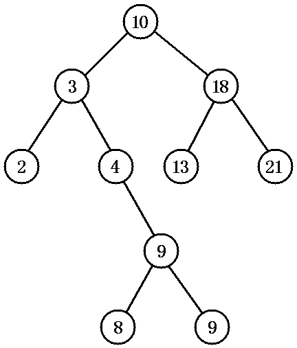

---

对排序二叉树，若按中序遍历就可以得到由小到大的有序序列。如图 1 所示二叉树，中序遍历得：
创建排序二叉树的步骤，也就是不断地向排序二叉树添加节点的过程，向排序二叉树添加节点的步骤如
下：
1. 以根节点当前节点开始搜索。
2. 拿新节点的值和当前节点的值比较。
3. 如果新节点的值更大，则以当前节点的右子节点作为新的当前节点；如果新节点的值更小，则以当
前节点的左子节点作为新的当前节点。
4. 重复 2、3 两个步骤，直到搜索到合适的叶子节点为止。
5. 将新节点添加为第 4 步找到的叶子节点的子节点；如果新节点更大，则添加为右子节点；否则添加
为左子节点。
掌握上面理论之后，下面我们来分析 TreeMap 添加节点（TreeMap 中使用 Entry 内部类代表节点）的
实现，TreeMap 集合的 put(K key, V value) 方法实现了将 Entry 放入排序二叉树中，下面是该方法的源
代码：
{2，3，4，8，9，9，10，13，15，18}
public V put(K key, V value)
 {
    // 先以 t 保存链表的 root 节点
    Entry<K,V> t = root;
    // 如果 t==null，表明是一个空链表，即该 TreeMap 里没有任何 Entry
    if (t == null)
    {
        // 将新的 key-value 创建一个 Entry，并将该 Entry 作为 root
        root = new Entry<K,V>(key, value, null);
        // 设置该 Map 集合的 size 为 1，代表包含一个 Entry
        size = 1;
        // 记录修改次数为 1
        modCount++;
        return null;
    }
    int cmp;
    Entry<K,V> parent;
    Comparator<? super K> cpr = comparator;
    // 如果比较器 cpr 不为 null，即表明采用定制排序
    if (cpr != null)
    {
        do {
            // 使用 parent 上次循环后的 t 所引用的 Entry
            parent = t;
            // 拿新插入 key 和 t 的 key 进行比较
            cmp = cpr.compare(key, t.key);
            // 如果新插入的 key 小于 t 的 key，t 等于 t 的左边节点
            if (cmp < 0)
                t = t.left;
            // 如果新插入的 key 大于 t 的 key，t 等于 t 的右边节点
            else if (cmp > 0)
                t = t.right;
            // 如果两个 key 相等，新的 value 覆盖原有的 value，
            // 并返回原有的 value
            else
                return t.setValue(value);
        } while (t != null);

---

显示更多
上面程序中粗体字代码就是实现”排序二叉树”的关键算法，每当程序希望添加新节点时：系统总是从树
的根节点开始比较 —— 即将根节点当成当前节点，如果新增节点大于当前节点、并且当前节点的右子节
点存在，则以右子节点作为当前节点；如果新增节点小于当前节点、并且当前节点的左子节点存在，则
以左子节点作为当前节点；如果新增节点等于当前节点，则用新增节点覆盖当前节点，并结束循环 —— 
直到找到某个节点的左、右子节点不存在，将新节点添加该节点的子节点 —— 如果新节点比该节点大，
则添加为右子节点；如果新节点比该节点小，则添加为左子节点。
TreeMap 的删除节点
 
当程序从排序二叉树中删除一个节点之后，为了让它依然保持为排序二叉树，程序必须对该排序二叉树
进行维护。维护可分为如下几种情况：
（1）被删除的节点是叶子节点，则只需将它从其父节点中删除即可。
（2）被删除节点 p 只有左子树，将 p 的左子树 pL 添加成 p 的父节点的左子树即可；被删除节点 p 只
有右子树，将 p 的右子树 pR 添加成 p 的父节点的右子树即可。
（3）若被删除节点 p 的左、右子树均非空，有两种做法：
    }
    else
    {
        if (key == null)
            throw new NullPointerException();
        Comparable<? super K> k = (Comparable<? super K>) key;
        do {
            // 使用 parent 上次循环后的 t 所引用的 Entry
            parent = t;
            // 拿新插入 key 和 t 的 key 进行比较
            cmp = k.compareTo(t.key);
            // 如果新插入的 key 小于 t 的 key，t 等于 t 的左边节点
            if (cmp < 0)
                t = t.left;
            // 如果新插入的 key 大于 t 的 key，t 等于 t 的右边节点
            else if (cmp > 0)
                t = t.right;
            // 如果两个 key 相等，新的 value 覆盖原有的 value，
            // 并返回原有的 value
            else
                return t.setValue(value);
        } while (t != null);
    }
    // 将新插入的节点作为 parent 节点的子节点
    Entry<K,V> e = new Entry<K,V>(key, value, parent);
    // 如果新插入 key 小于 parent 的 key，则 e 作为 parent 的左子节点
    if (cmp < 0)
        parent.left = e;
    // 如果新插入 key 小于 parent 的 key，则 e 作为 parent 的右子节点
    else
        parent.right = e;
    // 修复红黑树
    fixAfterInsertion(e);                               // ①
    size++;
    modCount++;
    return null;
 }

---

将 pL 设为 p 的父节点 q 的左或右子节点（取决于 p 是其父节点 q 的左、右子节点），将 pR 设为 
p 节点的中序前趋节点 s 的右子节点（s 是 pL 最右下的节点，也就是 pL 子树中最大的节点）。
以 p 节点的中序前趋或后继替代 p 所指节点，然后再从原排序二叉树中删去中序前趋或后继节点即
可。（也就是用大于 p 的最小节点或小于 p 的最大节点代替 p 节点即可）。
图 2 显示了被删除节点只有左子树的示意图：
图 2. 被删除节点只有左子树
 
图 3 显示了被删除节点只有右子树的示意图：
图 3. 被删除节点只有右子树
 
图 4 显示了被删除节点既有左子节点，又有右子节点的情形，此时我们采用到是第一种方式进行维护：
图 4. 被删除节点既有左子树，又有右子树
 
图 5 显示了被删除节点既有左子树，又有右子树的情形，此时我们采用到是第二种方式进行维护：

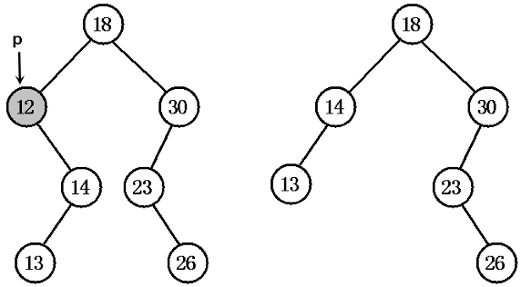

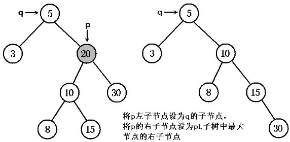

---

图 5. 被删除节点既有左子树，又有右子树
 
TreeMap 删除节点采用图 5 所示右边的情形进行维护——也就是用被删除节点的右子树中最小节点与被
删节点交换的方式进行维护。
TreeMap 删除节点的方法由如下方法实现：
private void deleteEntry(Entry<K,V> p)
 {
    modCount++;
    size--;
    // 如果被删除节点的左子树、右子树都不为空
    if (p.left != null && p.right != null)
    {
        // 用 p 节点的中序后继节点代替 p 节点
        Entry<K,V> s = successor (p);
        p.key = s.key;
        p.value = s.value;
        p = s;
    }
    // 如果 p 节点的左节点存在，replacement 代表左节点；否则代表右节点。
    Entry<K,V> replacement = (p.left != null ? p.left : p.right);
    if (replacement != null)
    {
        replacement.parent = p.parent;
        // 如果 p 没有父节点，则 replacemment 变成父节点
        if (p.parent == null)
            root = replacement;
        // 如果 p 节点是其父节点的左子节点
        else if (p == p.parent.left)
            p.parent.left  = replacement;
        // 如果 p 节点是其父节点的右子节点
        else
            p.parent.right = replacement;
        p.left = p.right = p.parent = null;
        // 修复红黑树
        if (p.color == BLACK)
            fixAfterDeletion(replacement);       // ①
    }
    // 如果 p 节点没有父节点

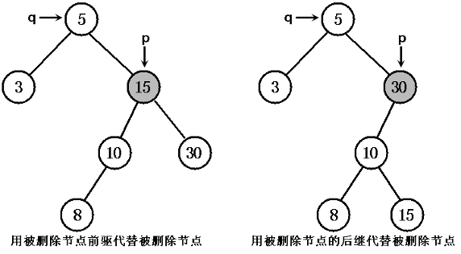

---

显示更多
红黑树
 
排序二叉树虽然可以快速检索，但在最坏的情况下：如果插入的节点集本身就是有序的，要么是由小到
大排列，要么是由大到小排列，那么最后得到的排序二叉树将变成链表：所有节点只有左节点（如果插
入节点集本身是大到小排列）；或所有节点只有右节点（如果插入节点集本身是小到大排列）。在这种
情况下，排序二叉树就变成了普通链表，其检索效率就会很差。
为了改变排序二叉树存在的不足，Rudolf Bayer 与 1972 年发明了另一种改进后的排序二叉树：红黑
树，他将这种排序二叉树称为”对称二叉 B 树”，而红黑树这个名字则由 Leo J. Guibas 和 Robert 
Sedgewick 于 1978 年首次提出。
红黑树是一个更高效的检索二叉树，因此常常用来实现关联数组。典型地，JDK 提供的集合类 TreeMap 
本身就是一个红黑树的实现。
红黑树在原有的排序二叉树增加了如下几个要求：
性质 1：每个节点要么是红色，要么是黑色。
性质 2：根节点永远是黑色的。
性质 3：所有的叶节点都是空节点（即 null），并且是黑色的。
性质 4：每个红色节点的两个子节点都是黑色。（从每个叶子到根的路径上不会有两个连续的红色
节点）
性质 5：从任一节点到其子树中每个叶子节点的路径都包含相同数量的黑色节点。
Java 实现的红黑树
 
上面的性质 3 中指定红黑树的每个叶子节点都是空节点，而且并叶子节点都是黑色。但 Java 实现
的红黑树将使用 null 来代表空节点，因此遍历红黑树时将看不到黑色的叶子节点，反而看到每个
叶子节点都是红色的。
Java 中实现的红黑树可能有如图 6 所示结构：
    else if (p.parent == null)
    {
        root = null;
    }
    else
    {
        if (p.color == BLACK)
            // 修复红黑树
            fixAfterDeletion(p);                 // ②
        if (p.parent != null)
        {
            // 如果 p 是其父节点的左子节点
            if (p == p.parent.left)
                p.parent.left = null;
            // 如果 p 是其父节点的右子节点
            else if (p == p.parent.right)
                p.parent.right = null;
            p.parent = null;
        }
    }
 }

---

图 6. Java 红黑树的示意
 
备注：本文中所有关于红黑树中的示意图采用白色代表红色。黑色节点还是采用了黑色表示。
根据性质 5：红黑树从根节点到每个叶子节点的路径都包含相同数量的黑色节点，因此从根节点到叶子
节点的路径中包含的黑色节点数被称为树的”黑色高度（black-height）”。
性质 4 则保证了从根节点到叶子节点的最长路径的长度不会超过任何其他路径的两倍。假如有一棵黑色
高度为 3 的红黑树：从根节点到叶节点的最短路径长度是 2，该路径上全是黑色节点（黑节点 – 黑节点 
– 黑节点）。最长路径也只可能为 4，在每个黑色节点之间插入一个红色节点（黑节点 – 红节点 – 黑节
点 – 红节点 – 黑节点），性质 4 保证绝不可能插入更多的红色节点。由此可见，红黑树中最长路径就是
一条红黑交替的路径。
由此我们可以得出结论：对于给定的黑色高度为 N 的红黑树，从根到叶子节点的最短路径长度为 N-1，
最长路径长度为 2 * (N-1)。
提示：排序二叉树的深度直接影响了检索的性能，正如前面指出，当插入节点本身就是由小到大排列
时，排序二叉树将变成一个链表，这种排序二叉树的检索性能最低：N 个节点的二叉树深度就是 N-1。
红黑树和平衡二叉树
 
红黑树并不是真正的平衡二叉树，但在实际应用中，红黑树的统计性能要高于平衡二叉树，但极端
性能略差。
红黑树通过上面这种限制来保证它大致是平衡的——因为红黑树的高度不会无限增高，这样保证红黑树
在最坏情况下都是高效的，不会出现普通排序二叉树的情况。
由于红黑树只是一个特殊的排序二叉树，因此对红黑树上的只读操作与普通排序二叉树上的只读操作完
全相同，只是红黑树保持了大致平衡，因此检索性能比排序二叉树要好很多。
但在红黑树上进行插入操作和删除操作会导致树不再符合红黑树的特征，因此插入操作和删除操作都需
要进行一定的维护，以保证插入节点、删除节点后的树依然是红黑树。
添加节点后的修复
 
上面 put(K key, V value) 方法中① 号代码处使用 fixAfterInsertion(e) 方法来修复红黑树——因此每
次插入节点后必须进行简单修复，使该排序二叉树满足红黑树的要求。
插入后的修复
 
在插入操作中，红黑树的性质 1 和性质 3 两个永远不会发生改变，因此无需考虑红黑树的这两个
特性。
插入操作按如下步骤进行：
1. 以排序二叉树的方法插入新节点，并将它设为红色。
2. 进行颜色调换和树旋转。

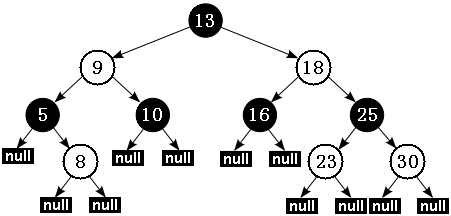

---

这种颜色调用和树旋转就比较复杂了，下面将分情况进行介绍。在介绍中，我们把新插入的节点定义为 
N 节点，N 节点的父节点定义为 P 节点，P 节点的兄弟节点定义为 U 节点，P 节点父节点定义为 G 节
点。
下面分成不同情形来分析插入操作
情形 1：新节点 N 是树的根节点，没有父节点
在这种情形下，直接将它设置为黑色以满足性质 2。
情形 2：新节点的父节点 P 是黑色
在这种情况下，新插入的节点是红色的，因此依然满足性质 4。而且因为新节点 N 有两个黑色叶子节
点；但是由于新节点 N 是红色，通过它的每个子节点的路径依然保持相同的黑色节点数，因此依然满足
性质 5。
情形 3：如果父节点 P 和父节点的兄弟节点 U 都是红色
在这种情况下，程序应该将 P 节点、U 节点都设置为黑色，并将 P 节点的父节点设为红色（用来保持性
质 5）。现在新节点 N 有了一个黑色的父节点 P。由于从 P 节点、U 节点到根节点的任何路径都必须通
过 G 节点，在这些路径上的黑节点数目没有改变（原来有叶子和 G 节点两个黑色节点，现在有叶子和 P 
两个黑色节点）。
经过上面处理后，红色的 G 节点的父节点也有可能是红色的，这就违反了性质 4，因此还需要对 G 节点
递归地进行整个过程（把 G 当成是新插入的节点进行处理即可）。
图 7 显示了这种处理过程：
图 7. 插入节点后进行颜色调换
 
备注：虽然图 11.28 绘制的是新节点 N 作为父节点 P 左子节点的情形，其实新节点 N 作为父节点 P 右
子节点的情况与图 11.28 完全相同。
情形 4：父节点 P 是红色、而其兄弟节点 U 是黑色或缺少；且新节点 N 是父节点 P 的右子节点，而父
节点 P 又是其父节点 G 的左子节点。
在这种情形下，我们进行一次左旋转对新节点和其父节点进行，接着按情形 5 处理以前的父节点 P（也
就是把 P 当成新插入的节点即可）。这导致某些路径通过它们以前不通过的新节点 N 或父节点 P 的其中
之一，但是这两个节点都是红色的，因此不会影响性质 5。
图 8 显示了对情形 4 的处理：

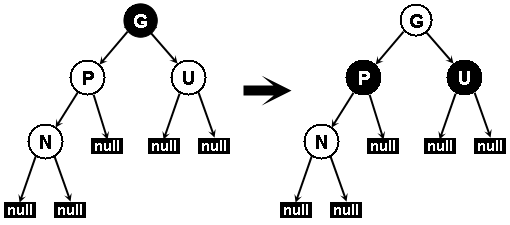

---

图 8. 插入节点后的树旋转
 
备注：图 11.29 中 P 节点是 G 节点的左子节点，如果 P 节点是其父节点 G 节点的右子节点，那么上 面
的处理情况应该左、右对调一下。
情形 5：父节点 P 是红色、而其兄弟节点 U 是黑色或缺少；且新节点 N 是其父节点的左子节点，而父节
点 P 又是其父节点 G 的左子节点。
在这种情形下，需要对节点 G 的一次右旋转，在旋转产生的树中，以前的父节点 P 现在是新节点 N 和
节点 G 的父节点。由于以前的节点 G 是黑色，否则父节点 P 就不可能是红色，我们切换以前的父节点 P 
和节点 G 的颜色，使之满足性质 4，性质 5 也仍然保持满足，因为通过这三个节点中任何一个的所有路
径以前都通过节点 G，现在它们都通过以前的父节点 P。在各自的情形下，这都是三个节点中唯一的黑
色节点。
图 9 显示了情形 5 的处理过程：
图 9. 插入节点后的颜色调整、树旋转
 
备注：图 11.30 中 P 节点是 G 节点的左子节点，如果 P 节点是其父节点 G 节点的右子节点，那么上面
的处理情况应该左、右对调一下。
TreeMap 为插入节点后的修复操作由 fixAfterInsertion(Entry<k,v> x) 方法提供，该方法的源代码如
下：
// 插入节点后修复红黑树
 private void fixAfterInsertion(Entry<K,V> x)
 {
    x.color = RED;
    // 直到 x 节点的父节点不是根，且 x 的父节点不是红色
    while (x != null && x != root
        && x.parent.color == RED)

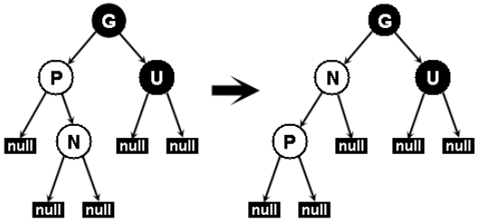

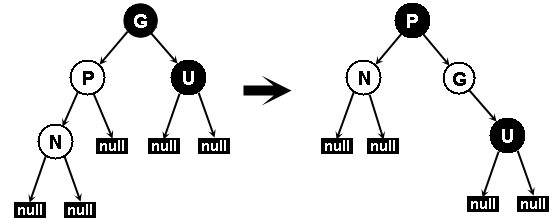

---

{
        // 如果 x 的父节点是其父节点的左子节点
        if (parentOf(x) == leftOf(parentOf(parentOf(x))))
        {
            // 获取 x 的父节点的兄弟节点
            Entry<K,V> y = rightOf(parentOf(parentOf(x)));
            // 如果 x 的父节点的兄弟节点是红色
            if (colorOf(y) == RED)
            {
                // 将 x 的父节点设为黑色
                setColor(parentOf(x), BLACK);
                // 将 x 的父节点的兄弟节点设为黑色
                setColor(y, BLACK);
                // 将 x 的父节点的父节点设为红色
                setColor(parentOf(parentOf(x)), RED);
                x = parentOf(parentOf(x));
            }
            // 如果 x 的父节点的兄弟节点是黑色
            else
            {
                // 如果 x 是其父节点的右子节点
                if (x == rightOf(parentOf(x)))
                {
                    // 将 x 的父节点设为 x
                    x = parentOf(x);
                    rotateLeft(x);
                }
                // 把 x 的父节点设为黑色
                setColor(parentOf(x), BLACK);
                // 把 x 的父节点的父节点设为红色
                setColor(parentOf(parentOf(x)), RED);
                rotateRight(parentOf(parentOf(x)));
            }
        }
        // 如果 x 的父节点是其父节点的右子节点
        else
        {
            // 获取 x 的父节点的兄弟节点
            Entry<K,V> y = leftOf(parentOf(parentOf(x)));
            // 如果 x 的父节点的兄弟节点是红色
            if (colorOf(y) == RED)
            {
                // 将 x 的父节点设为黑色。
                setColor(parentOf(x), BLACK);
                // 将 x 的父节点的兄弟节点设为黑色
                setColor(y, BLACK);
                // 将 x 的父节点的父节点设为红色
                setColor(parentOf(parentOf(x)), RED);
                // 将 x 设为 x 的父节点的节点
                x = parentOf(parentOf(x));
            }
            // 如果 x 的父节点的兄弟节点是黑色
            else
            {
                // 如果 x 是其父节点的左子节点
                if (x == leftOf(parentOf(x)))
                {
                    // 将 x 的父节点设为 x

---

显示较少
删除节点后的修复
 
与添加节点之后的修复类似的是，TreeMap 删除节点之后也需要进行类似的修复操作，通过这种修复来
保证该排序二叉树依然满足红黑树特征。大家可以参考插入节点之后的修复来分析删除之后的修复。
TreeMap 在删除之后的修复操作由 fixAfterDeletion(Entry<k,v> x) 方法提供，该方法源代码如下：
                    x = parentOf(x);
                    rotateRight(x);
                }
                // 把 x 的父节点设为黑色
                setColor(parentOf(x), BLACK);
                // 把 x 的父节点的父节点设为红色
                setColor(parentOf(parentOf(x)), RED);
                rotateLeft(parentOf(parentOf(x)));
            }
        }
    }
    // 将根节点设为黑色
    root.color = BLACK;
 }
// 删除节点后修复红黑树
 private void fixAfterDeletion(Entry<K,V> x)
 {
    // 直到 x 不是根节点，且 x 的颜色是黑色
    while (x != root && colorOf(x) == BLACK)
    {
        // 如果 x 是其父节点的左子节点
        if (x == leftOf(parentOf(x)))
        {
            // 获取 x 节点的兄弟节点
            Entry<K,V> sib = rightOf(parentOf(x));
            // 如果 sib 节点是红色
            if (colorOf(sib) == RED)
            {
                // 将 sib 节点设为黑色
                setColor(sib, BLACK);
                // 将 x 的父节点设为红色
                setColor(parentOf(x), RED);
                rotateLeft(parentOf(x));
                // 再次将 sib 设为 x 的父节点的右子节点
                sib = rightOf(parentOf(x));
            }
            // 如果 sib 的两个子节点都是黑色
            if (colorOf(leftOf(sib)) == BLACK
                && colorOf(rightOf(sib)) == BLACK)
            {
                // 将 sib 设为红色
                setColor(sib, RED);
                // 让 x 等于 x 的父节点
                x = parentOf(x);
            }
            else
            {
                // 如果 sib 的只有右子节点是黑色

---

if (colorOf(rightOf(sib)) == BLACK)
                {
                    // 将 sib 的左子节点也设为黑色
                    setColor(leftOf(sib), BLACK);
                    // 将 sib 设为红色
                    setColor(sib, RED);
                    rotateRight(sib);
                    sib = rightOf(parentOf(x));
                }
                // 设置 sib 的颜色与 x 的父节点的颜色相同
                setColor(sib, colorOf(parentOf(x)));
                // 将 x 的父节点设为黑色
                setColor(parentOf(x), BLACK);
                // 将 sib 的右子节点设为黑色
                setColor(rightOf(sib), BLACK);
                rotateLeft(parentOf(x));
                x = root;
            }
        }
        // 如果 x 是其父节点的右子节点
        else
        {
            // 获取 x 节点的兄弟节点
            Entry<K,V> sib = leftOf(parentOf(x));
            // 如果 sib 的颜色是红色
            if (colorOf(sib) == RED)
            {
                // 将 sib 的颜色设为黑色
                setColor(sib, BLACK);
                // 将 sib 的父节点设为红色
                setColor(parentOf(x), RED);
                rotateRight(parentOf(x));
                sib = leftOf(parentOf(x));
            }
            // 如果 sib 的两个子节点都是黑色
            if (colorOf(rightOf(sib)) == BLACK
                && colorOf(leftOf(sib)) == BLACK)
            {
                // 将 sib 设为红色
                setColor(sib, RED);
                // 让 x 等于 x 的父节点
                x = parentOf(x);
            }
            else
            {
                // 如果 sib 只有左子节点是黑色
                if (colorOf(leftOf(sib)) == BLACK)
                {
                    // 将 sib 的右子节点也设为黑色
                    setColor(rightOf(sib), BLACK);
                    // 将 sib 设为红色
                    setColor(sib, RED);
                    rotateLeft(sib);
                    sib = leftOf(parentOf(x));
                }
                // 将 sib 的颜色设为与 x 的父节点颜色相同
                setColor(sib, colorOf(parentOf(x)));
                // 将 x 的父节点设为黑色

---

检索节点
 
当 TreeMap 根据 key 来取出 value 时，TreeMap 对应的方法如下：
显示较少
从上面程序的粗体字代码可以看出，get(Object key) 方法实质是由于 getEntry() 方法实现的，这个 
getEntry() 方法的代码如下：
                setColor(parentOf(x), BLACK);
                // 将 sib 的左子节点设为黑色
                setColor(leftOf(sib), BLACK);
                rotateRight(parentOf(x));
                x = root;
            }
        }
    }
    setColor(x, BLACK);
 }
public V get(Object key)
 {
    // 根据指定 key 取出对应的 Entry
    Entry>K,V< p = getEntry(key);
    // 返回该 Entry 所包含的 value
    return (p==null ? null : p.value);
 }
final Entry<K,V> getEntry(Object key)
 {
    // 如果 comparator 不为 null，表明程序采用定制排序
    if (comparator != null)
        // 调用 getEntryUsingComparator 方法来取出对应的 key
        return getEntryUsingComparator(key);
    // 如果 key 形参的值为 null，抛出 NullPointerException 异常
    if (key == null)
        throw new NullPointerException();
    // 将 key 强制类型转换为 Comparable 实例
    Comparable<? super K> k = (Comparable<? super K>) key;
    // 从树的根节点开始
    Entry<K,V> p = root;
    while (p != null)
    {
        // 拿 key 与当前节点的 key 进行比较
        int cmp = k.compareTo(p.key);
        // 如果 key 小于当前节点的 key，向"左子树”搜索
        if (cmp < 0)
            p = p.left;
        // 如果 key 大于当前节点的 key，向"右子树”搜索
        else if (cmp > 0)
            p = p.right;
        // 不大于、不小于，就是找到了目标 Entry
        else
            return p;
    }
    return null;

---

显示较少
上面的 getEntry(Object obj) 方法也是充分利用排序二叉树的特征来搜索目标 Entry，程序依然从二叉树
的根节点开始，如果被搜索节点大于当前节点，程序向”右子树”搜索；如果被搜索节点小于当前节点，
程序向”左子树”搜索；如果相等，那就是找到了指定节点。
当 TreeMap 里的 comparator != null 即表明该 TreeMap 采用了定制排序，在采用定制排序的方式下，
TreeMap 采用 getEntryUsingComparator(key) 方法来根据 key 获取 Entry。下面是该方法的代码：
显示较少
其实 getEntry、getEntryUsingComparator 两个方法的实现思路完全类似，只是前者对自然排序的 
TreeMap 获取有效，后者对定制排序的 TreeMap 有效。
通过上面源代码的分析不难看出，TreeMap 这个工具类的实现其实很简单。或者说：从内部结构来看，
TreeMap 本质上就是一棵”红黑树”，而 TreeMap 的每个 Entry 就是该红黑树的一个节点。
 
 
 
JAVA 异常分类及处理
 
 概念 
 }
final Entry<K,V> getEntryUsingComparator(Object key)
 {
    K k = (K) key;
    // 获取该 TreeMap 的 comparator
    Comparator<? super K> cpr = comparator;
    if (cpr != null)
    {
        // 从根节点开始
        Entry<K,V> p = root;
        while (p != null)
        {
            // 拿 key 与当前节点的 key 进行比较
            int cmp = cpr.compare(k, p.key);
            // 如果 key 小于当前节点的 key，向"左子树”搜索
            if (cmp < 0)
                p = p.left;
            // 如果 key 大于当前节点的 key，向"右子树”搜索
            else if (cmp > 0)
                p = p.right;
            // 不大于、不小于，就是找到了目标 Entry
            else
                return p;
        }
    }
    return null;
 }

---

如果某个方法不能按照正常的途径完成任务，就可以通过另一种路径退出方法。在这种情况下会抛出一
个封装了错误信息的对象。此时，这个方法会立刻退出同时不返回任何值。另外，调用这个方法的其他
代码也无法继续执行，异常处理机制会将代码执行交给异常处理器。
异常分类 
Throwable 是 Java 语言中所有错误或异常的超类。下一层分为 Error 和 Exception 
Error 
1. Error 类是指 java 运行时系统的内部错误和资源耗尽错误。应用程序不会抛出该类对象。如果出现
了这样的错误，除了告知用户，剩下的就是尽力使程序安全的终止。 
Exception（RuntimeException、CheckedException） 
2. Exception 又有两个分支，一个是运行时异常 RuntimeException ， 一个是 ckedException。 
RuntimeException 如 ： NullPointerException 、 ClassCastException ； 一 个 是 检 查 异 常 
CheckedException，如 I/O 错误导致的 IOException、SQLException。 RuntimeException 是那些可
能在 Java 虚拟机正常运行期间抛出的异常的超类。 如果出现 RuntimeException，那么一定是程序员的
错误. 
检查异常 CheckedException：一般是外部错误，这种异常都发生在编译阶段，Java 编译器会强制程序
去捕获此类异常，即会出现要求你把这段可能出现异常的程序进行 try catch，该类异常一般包括几个方
面： 
1. 试图在文件尾部读取数据 
2. 试图打开一个错误格式的 URL 
3. 试图根据给定的字符串查找 class 对象，而这个字符串表示的类并不存在 
异常的处理方式 
遇到问题不进行具体处理，而是继续抛给调用者 （throw,throws）抛出异常有三种形式，一是 throw,
一个 throws，还有一种系统自动抛异常。

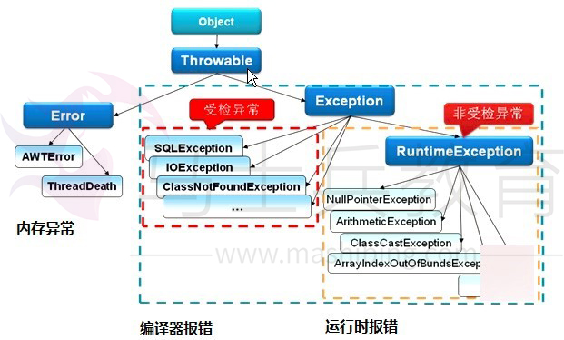

---

try catch 捕获异常针对性处理方式 
Throw和 throws 的区别： 
位置不同 
1. throws 用在函数上，后面跟的是异常类，可以跟多个；而 throw 用在函数内，后面跟的是异常对
象。 
功能不同： 
2. throws 用来声明异常，让调用者只知道该功能可能出现的问题，可以给出预先的处理方式；throw
抛出具体的问题对象，执行到throw，功能就已经结束了，跳转到调用者，并将具体的问题对象抛
给调用者。也就是说 throw 语句独立存在时，下面不要定义其他语句，因为执行不到。 
3. throws 表示出现异常的一种可能性，并不一定会发生这些异常；throw 则是抛出了异常，执行 
throw 则一定抛出了某种异常对象。 
4. 两者都是消极处理异常的方式，只是抛出或者可能抛出异常，但是不会由函数去处理异常，真正的
处理异常由函数的上层调用处理。
JAVA 反射
 
动态语言 
动态语言，是指程序在运行时可以改变其结构：新的函数可以引进，已有的函数可以被删除等结
构上的变化。比如常见的 JavaScript 就是动态语言，除此之外 Ruby,Python 等也属于动态语言，而 C、
C++则不属于动态语言。从反射角度说 JAVA 属于半动态语言。 
反射机制概念 （运行状态中知道类所有的属性和方法） 
在 Java 中的反射机制是指在运行状态中，对于任意一个类都能够知道这个类所有的属性和方法；并且对
于任意一个对象，都能够调用它的任意一个方法；这种动态获取信息以及动态调用对象方法的功能成为 
Java 语言的反射机制。 
反射的应用场合 
public static void main(String[] args) {     
String s = "abc";    
if(s.equals("abc")) {   
throw new NumberFormatException();  
    } else {  
      System.out.println(s);  
    }  
}  
int div(int a,int b) throws Exception{ return a/b;}

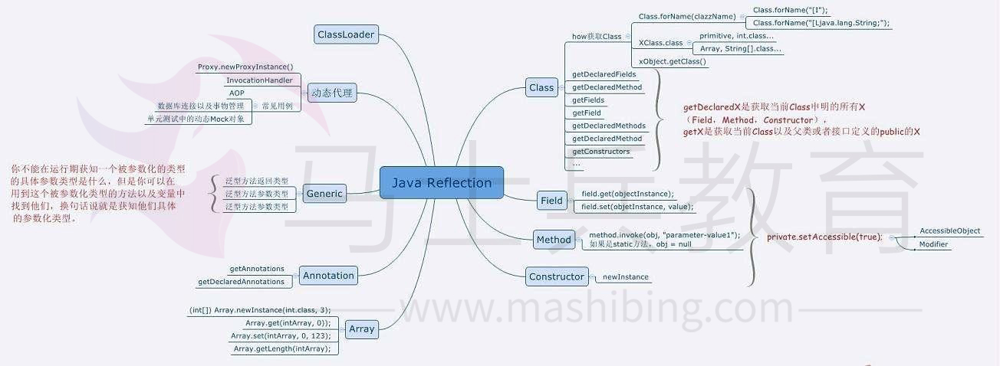

---

编译时类型和运行时类型 
在 Java 程序中许多对象在运行是都会出现两种类型：编译时类型和运行时类型。 编译时的类型由声明
对象时实用的类型来决定，运行时的类型由实际赋值给对象的类型决定 。如： 
Person p=new Student(); 其中编译时类型为 Person，运行时类型为 Student。 
的编译时类型无法获取具体方法 
程序在运行时还可能接收到外部传入的对象，该对象的编译时类型为 Object,但是程序有需要调用该对象
的运行时类型的方法。为了解决这些问题，程序需要在运行时发现对象和类的真实信息。然而，如果编
译时根本无法预知该对象和类属于哪些类，程序只能依靠运行时信息来发现该对象和类的真实信息，此
时就必须使用到反射了。
 Java反射 API 
反射API用来生成JVM中的类、接口或则对象的信息。 
1. Class 类：反射的核心类，可以获取类的属性，方法等信息。 
2. Field 类：Java.lang.reflec 包中的类，表示类的成员变量，可以用来获取和设置类之中的属性值。 
3. Method 类： Java.lang.reflec 包中的类，表示类的方法，它可以用来获取类中的方法信息或者执
行方法。 
4. Constructor 类： Java.lang.reflec 包中的类，表示类的构造方法。 
反射使用步骤（获取 Class 对象、调用对象方法） 
1. 获取想要操作的类的 Class 对象，他是反射的核心，通过 Class 对象我们可以任意调用类的方法。
2. 调用 Class 类中的方法，既就是反射的使用阶段。 
3. 使用反射 API 来操作这些信息。 
获取 Class 对象的 3 种方法
 
调用某个对象的getClass()方法 
Person p=new Person(); 
Class clazz=p.getClass(); 
调用某个类的class属性来获取该类对应的Class对象 
Class clazz=Person.class; 
使用Class类中的forName()静态方法(最安全/性能最好)
Class clazz=Class.forName("类的全路径"); (最常用) 
当我们获得了想要操作的类的 Class 对象后，可以通过 Class 类中的方法获取并查看该类中的方法和属
性。  
  //获取 Person 类的 Class 对象 
            Class clazz=Class.forName("reflection.Person"); 
               //获取 Person 类的所有方法信息 
                  Method[] method=clazz.getDeclaredMethods();             
for(Method m:method){ 
                System.out.println(m.toString()); 
            } 
            //获取 Person 类的所有成员属性信息 
            Field[] field=clazz.getDeclaredFields();             for(Field 
f:field){ 
                System.out.println(f.toString());

---

创建对象的两种方法 
Class对象的newInstance() 
1. 使用 Class 对象的 newInstance()方法来创建该 Class 对象对应类的实例，但是这种方法要求该 
Class 对象对应的类有默认的空构造器。
调用Constructor 对象的newInstance() 
2. 先使用 Class 对象获取指定的 Constructor 对象，再调用 Constructor 对象的 newInstance() 方法
来创建 Class 对象对应类的实例,通过这种方法可以选定构造方法创建实例。 
JAVA 注解
 
概念 
Annotation（注解）是 Java 提供的一种对元程序中元素关联信息和元数据（metadata）的途径和方
法。Annatation(注解)是一个接口，程序可以通过反射来获取指定程序中元素的 Annotation 对象，然后
通过该 Annotation 对象来获取注解中的元数据信息。
4 种标准元注解 
元注解的作用是负责注解其他注解。 Java5.0 定义了 4 个标准的 meta-annotation 类型，它们被用来提
供对其它 annotation 类型作说明。 
@Target 修饰的对象范围 
@Target说明了Annotation所修饰的对象范围： Annotation可被用于 packages、types（类、接口、枚
举、Annotation 类型）、类型成员（方法、构造方法、成员变量、枚举值）、方法参数和本地变量（如
循环变量、catch 参数）。在 Annotation 类型的声明中使用了 target 可更加明晰其修饰的目标 
@Retention 定义 被保留的时间长短 
Retention 定义了该 Annotation 被保留的时间长短：表示需要在什么级别保存注解信息，用于描述注解
的生命周期（即：被描述的注解在什么范围内有效），取值（RetentionPoicy）由： 
n SOURCE:在源文件中有效（即源文件保留）
n CLASS:在 class 文件中有效（即 class 保留） 
n RUNTIME:在运行时有效（即运行时保留）
            } 
            //获取 Person 类的所有构造方法信息 
            Constructor[] constructor=clazz.getDeclaredConstructors();           
  for(Constructor c:constructor){ 
                System.out.println(c.toString()); 
            } 
  //获取 Person 类的 Class 对象 
            Class clazz=Class.forName("reflection.Person");  
            //使用.newInstane 方法创建对象 
            Person p=(Person) clazz.newInstance(); 
      //获取构造方法并创建对象 
            Constructor 
c=clazz.getDeclaredConstructor(String.class,String.class,int.class); 
            //创建对象并设置属性 
  Person p1=(Person) c.newInstance("李四","男",20);

---

@Documented 描述-javadoc 
@ Documented 用于描述其它类型的 annotation 应该被作为被标注的程序成员的公共 API，因此可以
被例如 javadoc 此类的工具文档化。 
@Inherited 阐述了某个被标注的类型是被继承的 
@Inherited 元注解是一个标记注解，@Inherited 阐述了某个被标注的类型是被继承的。如果一个使用
了@Inherited 修饰的 annotation 类型被用于一个 class，则这个 annotation 将被用于该 class 的子
类。 
注解处理器 
如果没有用来读取注解的方法和工作，那么注解也就不会比注释更有用处了。使用注解的过程中，很重
要的一部分就是创建于使用注解处理器。Java SE5扩展了反射机制的API，以帮助程序员快速的构造自定
义注解处理器。下面实现一个注解处理器。
 /1：** 定义注解*/ 
@Target(ElementType.FIELD) 
@Retention(RetentionPolicy.RUNTIME) 
@Documented 
public @interface FruitProvider { 
    /**供应商编号*/ 
public int id() default -1; 
/** 供应商名称*/ 
    public String name() default ""

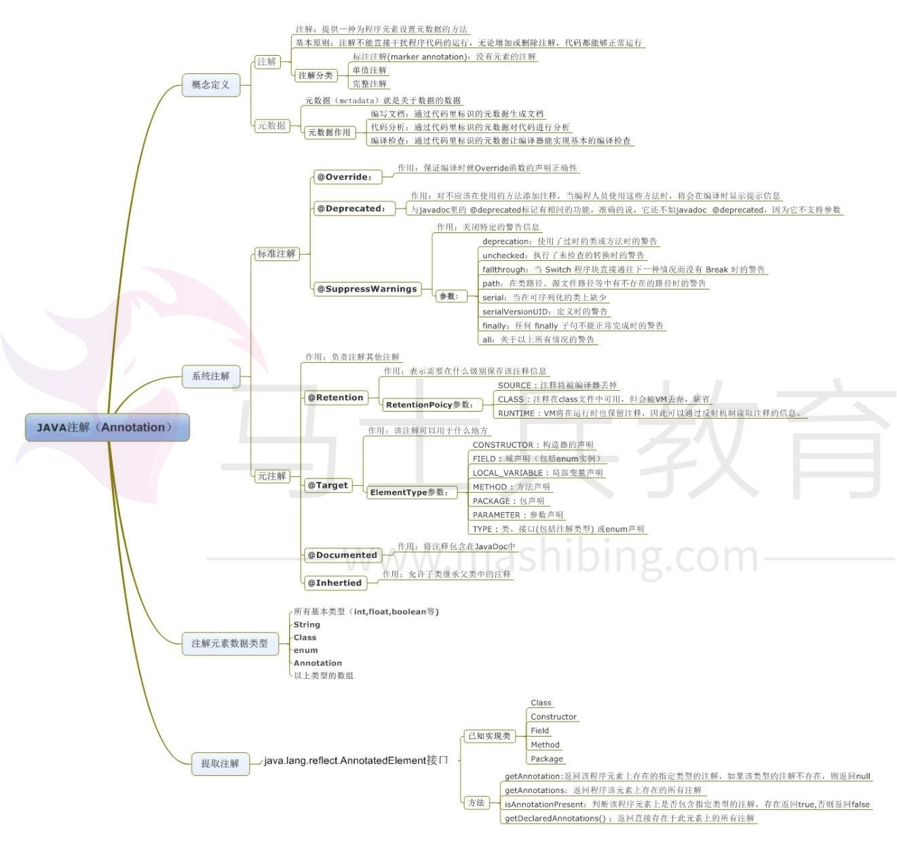

---

JAVA 内部类
 
Java 类中不仅可以定义变量和方法，还可以定义类，这样定义在类内部的类就被称为内部类。根据定义
的方式不同，内部类分为静态内部类，成员内部类，局部内部类，匿名内部类四种。
静态内部类 
定义在类内部的静态类，就是静态内部类。 
1. 静态内部类可以访问外部类所有的静态变量和方法，即使是 private 的也一样。 
   /** * 供应商地址*/ 
    public String address() default ""; 
} 
//2：注解使用 
public class Apple { 
    @FruitProvider(id = 1, name = "陕西红富士集团", address = "陕西省西安市延安路") 
    private String appleProvider;     public void setAppleProvider(String 
appleProvider) {         this.appleProvider = appleProvider; 
    } 
    public String getAppleProvider() {         return appleProvider; 
    } 
} 
/3：******** 注解处理器 **********/ 
public class FruitInfoUtil {     public static void getFruitInfo(Class<?> clazz) 
{ 
        String strFruitProvicer = "供应商信息："; 
        Field[] fields = clazz.getDeclaredFields();//通过反射获取处理注解 
        for (Field field : fields) {              if 
(field.isAnnotationPresent(FruitProvider.class)) { 
       FruitProvider fruitProvider = (FruitProvider) 
field.getAnnotation(FruitProvider.class); 
 //注解信息的处理地方        
strFruitProvicer = " 供应商编号：" + fruitProvider.id() + " 供应商名称：" 
                        + fruitProvider.name() + " 供应商地址："+ 
fruitProvider.address();                 System.out.println(strFruitProvicer); 
            } 
        } 
    } 
} 
public class FruitRun {     public static void main(String[] args) { 
        FruitInfoUtil.getFruitInfo(Apple.class); 
    /********输出结果**********/ 
// 供应商编号：1 供应商名称：陕西红富士集团 供应商地址：陕西省西安市延 
    } 
} 
 public class Out {   
 private static int a;   
 private int b;   
 public static class Inner {      
 public void print() { 
            System.out.println(a); 
        } 
    } }

---

2. 静态内部类和一般类一致，可以定义静态变量、方法，构造方法等。
3. 其它类使用静态内部类需要使用“外部类.静态内部类”方式，如下所示：Out.Inner inner = new 
Out.Inner();inner.print(); 
4. Java集合类HashMap内部就有一个静态内部类Entry。Entry是HashMap存放元素的抽象， 
HashMap 内部维护 Entry 数组用了存放元素，但是 Entry 对使用者是透明的。像这种和外部类关
系密切的，且不依赖外部类实例的，都可以使用静态内部类。 
成员内部类 
 
定义在类内部的非静态类，就是成员内部类。成员内部类不能定义静态方法和变量（final 修饰的除
外）。这是因为成员内部类是非静态的，类初始化的时候先初始化静态成员，如果允许成员内部类定义
静态变量，那么成员内部类的静态变量初始化顺序是有歧义的。 
局部内部类（定义在方法中的类） 
定义在方法中的类，就是局部类。如果一个类只在某个方法中使用，则可以考虑使用局部类。 
匿名内部类（要继承一个父类或者实现一个接口、直接使用 new 来生成一个对象的引用） 
匿名内部类我们必须要继承一个父类或者实现一个接口，当然也仅能只继承一个父类或者实现一个接
口。同时它也是没有class关键字，这是因为匿名内部类是直接使用new来生成一个对象的引用。
 public class Out {  
 private static int a;  
 private int b;   
 public class Inner {     
 public void print() {        
 System.out.println(a); 
            System.out.println(b); 
        } 
    } 
} 
 public class Out {     
 private static int a;   
 private int b;    
 public void test(final int c) {   
 final int d = 1;     
 class Inner {          
 public void print() { 
                       System.out.println(c); 
                } 
        } 
    } 
} 
  public abstract class Bird {   
  private String name;    
  public String getName() {   
  return name; 
    } 
     public void setName(String name) {   
     this.name = name;

---

JAVA 泛型
 
泛型提供了编译时类型安全检测机制，该机制允许程序员在编译时检测到非法的类型。泛型的本质是参
数化类型，也就是说所操作的数据类型被指定为一个参数。比如我们要写一个排序方法，能够对整型数
组、字符串数组甚至其他任何类型的数组进行排序，我们就可以使用 Java 泛型。 
泛型方法（） 
你可以写一个泛型方法，该方法在调用时可以接收不同类型的参数。根据传递给泛型方法的参数类型，
编译器适当地处理每一个方法调用。
1. <? extends T>表示该通配符所代表的类型是 T 类型的子类。 
2. <? super T>表示该通配符所代表的类型是 T 类型的父类。 
泛型类 
泛型类的声明和非泛型类的声明类似，除了在类名后面添加了类型参数声明部分。和泛型方法一样，泛
型类的类型参数声明部分也包含一个或多个类型参数，参数间用逗号隔开。一个泛型参数，也被称为一
个类型变量，是用于指定一个泛型类型名称的标识符。因为他们接受一个或多个参数，这些类被称为参
数化的类或参数化的类型。
    } 
     public abstract int fly(); 
} 
 public class Test {   
 public void test(Bird bird){ 
        System.out.println(bird.getName() + "能够飞 " + bird.fly() + "米"); 
    } 
     public static void main(String[] args) {    
     Test test = new Test();    
     test.test(new Bird() {             
     public int fly() {           
     return 10000; 
            } 
             public String getName() {           
             return "大雁"; 
            } 
        }); 
    } 
} 
 // 泛型方法 printArray                          
   public static < E > void printArray( E[] inputArray ) 
   {          
         for ( E element : inputArray ){         
            System.out.printf( "%s ", element ); 
         } 
        }

---

类型通配符?
类 型 通 配 符 一 般 是 使 用 ? 代 替 具 体 的 类 型 参 数 。 例 如 List<?> 在 逻 辑 上 是
List,List 等所有 List<具体类型实参>的父类。 
类型擦除 
Java 中的泛型基本上都是在编译器这个层次来实现的。在生成的 Java 字节代码中是不包含泛型中的类型
信息的。使用泛型的时候加上的类型参数，会被编译器在编译的时候去掉。这个过程就称为类型擦除。
如在代码中定义的 List和 List等类型，在编译之后都会变成 List。JVM 看到的只是 List，而由泛型附加的
类型信息对 JVM 来说是不可见的。 
类型擦除的基本过程也比较简单，首先是找到用来替换类型参数的具体类。这个具体类一般是 Object。
如果指定了类型参数的上界的话，则使用这个上界。把代码中的类型参数都替换成具体的类。 
JAVA 序列化(创建可复用的 Java 对象)
 
保存(持久化)对象及其状态到内存或者磁盘 
Java 平台允许我们在内存中创建可复用的 Java 对象，但一般情况下，只有当 JVM 处于运行时，这些对
象才可能存在，即，这些对象的生命周期不会比 JVM 的生命周期更长。但在现实应用中，就可能要求在
JVM停止运行之后能够保存(持久化)指定的对象，并在将来重新读取被保存的对象。
Java 对象序列化就能够帮助我们实现该功能。 
序列化对象以字节数组保持-静态成员不保存 
使用 Java 对象序列化，在保存对象时，会把其状态保存为一组字节，在未来，再将这些字节组装成对
象。必须注意地是，对象序列化保存的是对象的”状态”，即它的成员变量。由此可知，对象序列化不会
关注类中的静态变量。
序列化用户远程对象传输 
除了在持久化对象时会用到对象序列化之外，当使用 RMI(远程方法调用)，或在网络中传递对象时，都
会用到对象序列化。Java序列化API为处理对象序列化提供了一个标准机制，该API简单易用。 
Serializable 实现序列化 
在 Java 中，只要一个类实现了 java.io.Serializable 接口，那么它就可以被序列化。
ObjectOutputStream 和ObjectInputStream 对对象进行序列化及反序列化 
通过 ObjectOutputStream 和 ObjectInputStream 对对象进行序列化及反序列化。 
writeObject 和 readObject 自定义序列化策略 
在类中增加 writeObject 和 readObject 方法可以实现自定义序列化策略。 
序列化 ID 
public class Box<T> { 
  private T t; 
   public void add(T t) {     
   this.t = t; 
  } 
   public T get() {  
   return t; 
  }

---

虚拟机是否允许反序列化，不仅取决于类路径和功能代码是否一致，一个非常重要的一点是两个类的序
列化 ID 是否一致（就是 private static final long serialVersionUID） 
序列化并不保存静态变量序列化子父类说明 
要想将父类对象也序列化，就需要让父类也实现 Serializable 接口。
Transient 关键字阻止该变量被序列化到文件中 
1. 在变量声明前加上 Transient 关键字，可以阻止该变量被序列化到文件中，在被反序列化后，
transient 变量的值被设为初始值，如 int 型的是 0，对象型的是 null。 
2. 服务器端给客户端发送序列化对象数据，对象中有一些数据是敏感的，比如密码字符串等，希望对
该密码字段在序列化时，进行加密，而客户端如果拥有解密的密钥，只有在客户端进行反序列化
时，才可以对密码进行读取，这样可以一定程度保证序列化对象的数据安全。
JAVA 复制
 
将一个对象的引用复制给另外一个对象，一共有三种方式。第一种方式是直接赋值，第二种方式是浅拷
贝，第三种是深拷贝。所以大家知道了哈，这三种概念实际上都是为了拷贝对象。
直接赋值复制 
直接赋值。在 Java 中，A a1 = a2，我们需要理解的是这实际上复制的是引用，也就是说 a1 和 a2 指向
的是同一个对象。因此，当 a1 变化的时候，a2 里面的成员变量也会跟着变化。 
浅复制（复制引用但不复制引用的对象） 
创建一个新对象，然后将当前对象的非静态字段复制到该新对象，如果字段是值类型的，那么对该字段
执行复制；如果该字段是引用类型的话，则复制引用但不复制引用的对象。
因此，原始对象及其副本引用同一个对象。 
深复制（复制对象和其应用对象） 
深拷贝不仅复制对象本身，而且复制对象包含的引用指向的所有对象。 
 class Resume  implements Cloneable{   
     public Object clone() {   
        try {   
            return (Resume)super.clone();   
        } catch (Exception e) {       
        e.printStackTrace();          
        return null;   
        }   
    }   
}   
 class Student implements Cloneable {  
 String name;    
 int age; 
    Professor p; 
    Student(String name, int age, Professor p) {   
    this.name = name;        
    this.age = age;      
    this.p = p; 
    } 
     public Object clone() {    
     Student o = null;

---

序列化（深 clone 一中实现） 
 在Java 语言里深复制一个对象，常常可以先使对象实现 Serializable 接口，然后把对象（实际上只是对
象的一个拷贝）写到一个流里，再从流里读出来，便可以重建对象。 
 
 
 
Java9比Java8改进了什么；
 
1）引入了模块系统，采用模块化系统的应用程序只需要这些应用程序所需的那部分JDK模块， 而非是整
个JDK框架了，减少了内存的开销。
2）引入了一个新的package:java.net.http，里面提供了对Http访问很好的支持，不仅支持 Http1.1而且
还支持HTTP2。
3）引入了jshell这个交互性工具，让Java也可以像脚本语言一样来运行，可以从控制台启动  jshell ，在 
jshell 中直接输入表达式并查看其执行结果。
4）增加了List.of()、Set.of()、Map.of()和Map.ofEntries()等工厂方法来创建不可变集合
5）HTML5风格的Java帮助文档
6）多版本兼容 JAR 功能，能让你创建仅在特定版本的 Java 环境中运行库程序时选择使用的  class 版
本。
7）统一 JVM 日志
可以使用新的命令行选项-Xlog 来控制JVM 上 所有组件的日志记录。该日志记录系统可以设置 输出的日
志消息的标签、级别、修饰符和输出目标等。
8）垃圾收集机制 Java 9 移除了在 Java 8 中 被废弃的垃圾回收器配置组合，同时把G1设为默认的垃圾回
收器实 现.因为相对于Parallel来说，G1会在应用线程上做更多的事情，而Parallel几乎没有在应用线程 
上做任何事情，它基本上完全依赖GC线程完成所有的内存管理。这意味着切换到G1将会为应用 线程带
来额外的工作，从而直接影响到应用的性能
9）I/O 流新特性 java.io.InputStream 中增加了新的方法来读取和复制 InputStream 中包含的数据。 
readAllBytes：读取 InputStream 中的所有剩余字节。 readNBytes： 从 InputStream 中读取指定数量
的字节到数组中。 transferTo：读取 InputStream 中的全部字节并写入到指定的 OutputStream 中 。 
 
 
        try { 
            o = (Student) super.clone(); 
        } catch (CloneNotSupportedException e) { 
            System.out.println(e.toString()); 
        } 
        o.p = (Professor) p.clone();   
        return o; 
    } 
}

---

JAVA8 十大新特性详解
 
                    
本教程将Java8的新特新逐一列出，并将使用简单的代码示例来指导你如何使用默认接口方法，lambda
表达式，方法引用以及多重Annotation，之后你将会学到最新的API上的改进，比如流，函数式接口，
Map以及全新的日期API
“Java is still not dead—and people are starting to figure that out.”
本教程将用带注释的简单代码来描述新特性，你将看不到大片吓人的文字。
一、接口的默认方法
 
Java 8允许我们给接口添加一个非抽象的方法实现，只需要使用 default关键字即可，这个特征又叫做扩
展方法，示例如下：
 代码如下:
interface Formula {
  double calculate(int a);
 
  default double sqrt(int a) {
    return Math.sqrt(a);
  }
}
Formula接口在拥有calculate方法之外同时还定义了sqrt方法，实现了Formula接口的子类只需要实现
一个calculate方法，默认方法sqrt将在子类上可以直接使用。
 代码如下:
Formula formula = new Formula() {
  @Override
  public double calculate(int a) {
    return sqrt(a * 100);
  }
};
 
formula.calculate(100);   // 100.0
formula.sqrt(16);      // 4.0
文中的formula被实现为一个匿名类的实例，该代码非常容易理解，6行代码实现了计算 sqrt(a * 100)。
在下一节中，我们将会看到实现单方法接口的更简单的做法。
 
译者注： 在Java中只有单继承，如果要让一个类赋予新的特性，通常是使用接口来实现，在C++中支持
多继承，允许一个子类同时具有多个父类的接口与功能，在其他语言中，让一个类同时具有其他的可复
用代码的方法叫做mixin。新的Java 8 的这个特新在编译器实现的角度上来说更加接近Scala的trait。 在
C#中也有名为扩展方法的概念，允许给已存在的类型扩展方法，和Java 8的这个在语义上有差别。

---

二、Lambda 表达式
 
首先看看在老版本的Java中是如何排列字符串的：
 代码如下:
List names = Arrays.asList("peterF", "anna", "mike", "xenia");
 
Collections.sort(names, new Comparator() {
  @Override
  public int compare(String a, String b) {
    return b.compareTo(a);
  }
});
只需要给静态方法 Collections.sort 传入一个List对象以及一个比较器来按指定顺序排列。通常做法都是
创建一个匿名的比较器对象然后将其传递给sort方法。
 
在Java 8 中你就没必要使用这种传统的匿名对象的方式了，Java 8提供了更简洁的语法，lambda表达
式：
 代码如下:
Collections.sort(names, (String a, String b) -> {
  return b.compareTo(a);
});
看到了吧，代码变得更段且更具有可读性，但是实际上还可以写得更短：
 代码如下:
Collections.sort(names, (String a, String b) -> b.compareTo(a));
对于函数体只有一行代码的，你可以去掉大括号{}以及return关键字，但是你还可以写得更短点：
 代码如下:
Collections.sort(names, (a, b) -> b.compareTo(a));
Java编译器可以自动推导出参数类型，所以你可以不用再写一次类型。接下来我们看看lambda表达式还
能作出什么更方便的东西来：
三、函数式接口
 
Lambda表达式是如何在java的类型系统中表示的呢？每一个lambda表达式都对应一个类型，通常是接
口类型。而“函数式接口”是指仅仅只包含一个抽象方法的接口，每一个该类型的lambda表达式都会被匹
配到这个抽象方法。因为 默认方法 不算抽象方法，所以你也可以给你的函数式接口添加默认方法。
 
我们可以将lambda表达式当作任意只包含一个抽象方法的接口类型，确保你的接口一定达到这个要求，
你只需要给你的接口添加 @FunctionalInterface 注解，编译器如果发现你标注了这个注解的接口有多于
一个抽象方法的时候会报错的。
示例如下：
 代码如下:

---

@FunctionalInterface
interface Converter<F, T> {
  T convert(F from);
}
Converter<String, Integer> converter = (from) -> Integer.valueOf(from);
Integer converted = converter.convert("123");
System.out.println(converted);  // 123
需要注意如果@FunctionalInterface如果没有指定，上面的代码也是对的。
 
译者注 将lambda表达式映射到一个单方法的接口上，这种做法在Java 8之前就有别的语言实现，比如
Rhino JavaScript解释器，如果一个函数参数接收一个单方法的接口而你传递的是一个function，Rhino 
解释器会自动做一个单接口的实例到function的适配器，典型的应用场景有 
org.w3c.dom.events.EventTarget 的addEventListener 第二个参数 EventListener。
四、方法与构造函数引用
 
前一节中的代码还可以通过静态方法引用来表示：
 代码如下:
Converter<String, Integer> converter = Integer::valueOf;
Integer converted = converter.convert("123");
System.out.println(converted);  // 123
Java 8 允许你使用 :: 关键字来传递方法或者构造函数引用，上面的代码展示了如何引用一个静态方法，
我们也可以引用一个对象的方法：
 代码如下:
 converter = something::startsWith;
String converted = converter.convert("Java");
System.out.println(converted);  // "J"
接下来看看构造函数是如何使用::关键字来引用的，首先我们定义一个包含多个构造函数的简单类：
 代码如下:
class Person {
  String firstName;
  String lastName;
 
  Person() {}
  Person(String firstName, String lastName) {
    this.firstName = firstName;
    this.lastName = lastName;
  }
}
接下来我们指定一个用来创建Person对象的对象工厂接口：
 代码如下:
interface PersonFactory

---

{
  P create(String firstName, String lastName);
}
这里我们使用构造函数引用来将他们关联起来，而不是实现一个完整的工厂：
 代码如下:
PersonFactory personFactory = Person::new;
Person person = personFactory.create("Peter", "Parker");
我们只需要使用 Person::new 来获取Person类构造函数的引用，Java编译器会自动根据
PersonFactory.create方法的签名来选择合适的构造函数。
 
五、Lambda 作用域
 
在lambda表达式中访问外层作用域和老版本的匿名对象中的方式很相似。你可以直接访问标记了final的
外层局部变量，或者实例的字段以及静态变量。
六、访问局部变量
 
我们可以直接在lambda表达式中访问外层的局部变量：
 代码如下:
final int num = 1;
Converter<Integer, String> stringConverter =
    (from) -> String.valueOf(from + num);
 
stringConverter.convert(2);   // 3
但是和匿名对象不同的是，这里的变量num可以不用声明为final，该代码同样正确：
 代码如下:
int num = 1;
Converter<Integer, String> stringConverter =
    (from) -> String.valueOf(from + num);
 
stringConverter.convert(2);   // 3
不过这里的num必须不可被后面的代码修改（即隐性的具有final的语义），例如下面的就无法编译：
 代码如下:
int num = 1;
Converter<Integer, String> stringConverter =
    (from) -> String.valueOf(from + num);
num = 3;
在lambda表达式中试图修改num同样是不允许的。

---

七、访问对象字段与静态变量
 
 
和本地变量不同的是，lambda内部对于实例的字段以及静态变量是即可读又可写。该行为和匿名对象是
一致的：
 代码如下:
class Lambda4 {
  static int outerStaticNum;
  int outerNum;
 
  void testScopes() {
    Converter<Integer, String> stringConverter1 = (from) -> {
      outerNum = 23;
      return String.valueOf(from);
    };
  }
}
 
八、访问接口的默认方法
 
还记得第一节中的formula例子么，接口Formula定义了一个默认方法sqrt可以直接被formula的实例包
括匿名对象访问到，但是在lambda表达式中这个是不行的。
Lambda表达式中是无法访问到默认方法的，以下代码将无法编译：
 代码如下:
Formula formula = (a) -> sqrt( a * 100);
Built-in Functional Interfaces
JDK 1.8 API包含了很多内建的函数式接口，在老Java中常用到的比如Comparator或者Runnable接口，
这些接口都增加了@FunctionalInterface注解以便能用在lambda上。
Java 8 API同样还提供了很多全新的函数式接口来让工作更加方便，有一些接口是来自Google Guava库
里的，即便你对这些很熟悉了，还是有必要看看这些是如何扩展到lambda上使用的。
Predicate接口
 
Predicate 接口只有一个参数，返回boolean类型。该接口包含多种默认方法来将Predicate组合成其他
复杂的逻辑（比如：与，或，非）：
 代码如下:
Predicate predicate = (s) -> s.length() > 0;
 
Converter<Integer, String> stringConverter2 = (from) -> {
  outerStaticNum = 72;
  return String.valueOf(from);
};

---

predicate.test("foo");       // true
predicate.negate().test("foo");   // false
Predicate nonNull = Objects::nonNull;
Predicate isNull = Objects::isNull;
Predicate isEmpty = String::isEmpty;
Predicate isNotEmpty = isEmpty.negate();
 
Function 接口
 
Function 接口有一个参数并且返回一个结果，并附带了一些可以和其他函数组合的默认方法
（compose, andThen）：
 代码如下:
Function<String, Integer> toInteger = Integer::valueOf;
Function<String, String> backToString = toInteger.andThen(String::valueOf);
 
backToString.apply("123");   // "123"
 
**Supplier 接口
**
Supplier 接口返回一个任意范型的值，和Function接口不同的是该接口没有任何参数
 代码如下:
Supplier personSupplier = Person::new;
personSupplier.get();  // new Person
 
**Consumer 接口
**
Consumer 接口表示执行在单个参数上的操作。
 代码如下:
Consumer greeter = (p) -> System.out.println("Hello, " + p.firstName);
greeter.accept(new Person("Luke", "Skywalker"));
 
**Comparator 接口
**
Comparator 是老Java中的经典接口， Java 8在此之上添加了多种默认方法：
 代码如下:
Comparator comparator = (p1, p2) -> p1.firstName.compareTo(p2.firstName);

---

Person p1 = new Person("John", "Doe");
Person p2 = new Person("Alice", "Wonderland");
comparator.compare(p1, p2);       // > 0
comparator.reversed().compare(p1, p2); // < 0
 
Optional 接口
 
Optional 不是函数是接口，这是个用来防止NullPointerException异常的辅助类型，这是下一届中将要
用到的重要概念，现在先简单的看看这个接口能干什么：
Optional 被定义为一个简单的容器，其值可能是null或者不是null。在Java 8之前一般某个函数应该返回
非空对象但是偶尔却可能返回了null，而在Java 8中，不推荐你返回null而是返回Optional。
 代码如下:
Optional optional = Optional.of("bam");
 
optional.isPresent();      // true
optional.get();         // "bam"
optional.orElse("fallback");  // "bam"
optional.ifPresent((s) -> System.out.println(s.charAt(0)));   // "b"
 
Stream 接口
 
java.util.Stream 表示能应用在一组元素上一次执行的操作序列。Stream 操作分为中间操作或者最终操
作两种，最终操作返回一特定类型的计算结果，而中间操作返回Stream本身，这样你就可以将多个操作
依次串起来。Stream 的创建需要指定一个数据源，比如 java.util.Collection的子类，List或者Set， 
Map不支持。Stream的操作可以串行执行或者并行执行。
首先看看Stream是怎么用，首先创建实例代码的用到的数据List：
 代码如下:
List stringCollection = new ArrayList<>();
stringCollection.add("ddd2");
stringCollection.add("aaa2");
stringCollection.add("bbb1");
stringCollection.add("aaa1");
stringCollection.add("bbb3");
stringCollection.add("ccc");
stringCollection.add("bbb2");
stringCollection.add("ddd1");
Java 8扩展了集合类，可以通过 Collection.stream() 或者 Collection.parallelStream() 来创建一个
Stream。下面几节将详细解释常用的Stream操作：
 
Filter 过滤

---

过滤通过一个predicate接口来过滤并只保留符合条件的元素，该操作属于中间操作，所以我们可以在过
滤后的结果来应用其他Stream操作（比如forEach）。forEach需要一个函数来对过滤后的元素依次执
行。forEach是一个最终操作，所以我们不能在forEach之后来执行其他Stream操作。
 代码如下:
stringCollection
  .stream()
  .filter((s) -> s.startsWith("a"))
  .forEach(System.out::println);
 
// "aaa2", "aaa1"
 
Sort 排序
 
排序是一个中间操作，返回的是排序好后的Stream。如果你不指定一个自定义的Comparator则会使用
默认排序。
 代码如下:
stringCollection
  .stream()
  .sorted()
  .filter((s) -> s.startsWith("a"))
  .forEach(System.out::println);
 
// "aaa1", "aaa2"
需要注意的是，排序只创建了一个排列好后的Stream，而不会影响原有的数据源，排序之后原数据
stringCollection是不会被修改的：
 代码如下:
System.out.println(stringCollection);
// ddd2, aaa2, bbb1, aaa1, bbb3, ccc, bbb2, ddd1
 
**Map 映射
**
中间操作map会将元素根据指定的Function接口来依次将元素转成另外的对象，下面的示例展示了将字
符串转换为大写字符串。你也可以通过map来讲对象转换成其他类型，map返回的Stream类型是根据你
map传递进去的函数的返回值决定的。
 代码如下:
stringCollection
  .stream()
  .map(String::toUpperCase)
  .sorted((a, b) -> b.compareTo(a))
  .forEach(System.out::println);

---

// "DDD2", "DDD1", "CCC", "BBB3", "BBB2", "AAA2", "AAA1"
 
Match 匹配
 
Stream提供了多种匹配操作，允许检测指定的Predicate是否匹配整个Stream。所有的匹配操作都是最
终操作，并返回一个boolean类型的值。
 代码如下:
boolean anyStartsWithA = 
  stringCollection
    .stream()
    .anyMatch((s) -> s.startsWith("a"));
 
System.out.println(anyStartsWithA);   // true
boolean allStartsWithA = 
  stringCollection
    .stream()
    .allMatch((s) -> s.startsWith("a"));
System.out.println(allStartsWithA);   // false
boolean noneStartsWithZ = 
  stringCollection
    .stream()
    .noneMatch((s) -> s.startsWith("z"));
System.out.println(noneStartsWithZ);   // true
 
**Count 计数
**
计数是一个最终操作，返回Stream中元素的个数，返回值类型是long。
 代码如下:
long startsWithB = 
  stringCollection
    .stream()
    .filter((s) -> s.startsWith("b"))
    .count();
 
System.out.println(startsWithB);  // 3
 
Reduce 规约
 
这是一个最终操作，允许通过指定的函数来讲stream中的多个元素规约为一个元素，规越后的结果是通
过Optional接口表示的：

---

代码如下:
Optional reduced =
  stringCollection
    .stream()
    .sorted()
    .reduce((s1, s2) -> s1 + "#" + s2);
 
reduced.ifPresent(System.out::println);
// "aaa1#aaa2#bbb1#bbb2#bbb3#ccc#ddd1#ddd2"
 
并行Streams
 
前面提到过Stream有串行和并行两种，串行Stream上的操作是在一个线程中依次完成，而并行Stream
则是在多个线程上同时执行。
下面的例子展示了是如何通过并行Stream来提升性能：
首先我们创建一个没有重复元素的大表：
 代码如下:
int max = 1000000;
List values = new ArrayList<>(max);
for (int i = 0; i < max; i++) {
  UUID uuid = UUID.randomUUID();
  values.add(uuid.toString());
}
然后我们计算一下排序这个Stream要耗时多久，
串行排序：
 代码如下:
long t0 = System.nanoTime();
 
long count = values.stream().sorted().count();
System.out.println(count);
long t1 = System.nanoTime();
long millis = TimeUnit.NANOSECONDS.toMillis(t1 - t0);
System.out.println(String.format("sequential sort took: %d ms", millis));
 
// 串行耗时: 899 ms
并行排序：
 代码如下:
long t0 = System.nanoTime();

---

long count = values.parallelStream().sorted().count();
System.out.println(count);
long t1 = System.nanoTime();
long millis = TimeUnit.NANOSECONDS.toMillis(t1 - t0);
System.out.println(String.format("parallel sort took: %d ms", millis));
 
// 并行排序耗时: 472 ms
上面两个代码几乎是一样的，但是并行版的快了50%之多，唯一需要做的改动就是将stream()改为
parallelStream()。
Map
前面提到过，Map类型不支持stream，不过Map提供了一些新的有用的方法来处理一些日常任务。
 代码如下:
Map<Integer, String> map = new HashMap<>();
 
for (int i = 0; i < 10; i++) {
  map.putIfAbsent(i, "val" + i);
}
 
map.forEach((id, val) -> System.out.println(val));
以上代码很容易理解， putIfAbsent 不需要我们做额外的存在性检查，而forEach则接收一个Consumer
接口来对map里的每一个键值对进行操作。
下面的例子展示了map上的其他有用的函数：
 代码如下:
map.computeIfPresent(3, (num, val) -> val + num);
map.get(3);       // val33
 
map.computeIfPresent(9, (num, val) -> null);
map.containsKey(9);   // false
map.computeIfAbsent(23, num -> "val" + num);
map.containsKey(23);  // true
map.computeIfAbsent(3, num -> "bam");
map.get(3);       // val33
接下来展示如何在Map里删除一个键值全都匹配的项：
 代码如下:
map.remove(3, "val3");
map.get(3);       // val33
 
map.remove(3, "val33");
map.get(3);       // null

---

另外一个有用的方法：
 代码如下:
map.getOrDefault(42, "not found"); // not found
对Map的元素做合并也变得很容易了：
 代码如下:
map.merge(9, "val9", (value, newValue) -> value.concat(newValue));
map.get(9);       // val9
 
map.merge(9, "concat", (value, newValue) -> value.concat(newValue));
map.get(9);       // val9concat
Merge做的事情是如果键名不存在则插入，否则则对原键对应的值做合并操作并重新插入到map中。
 
九、Date API
 
Java 8 在包java.time下包含了一组全新的时间日期API。新的日期API和开源的Joda-Time库差不多，但
又不完全一样，下面的例子展示了这组新API里最重要的一些部分：
Clock 时钟
Clock类提供了访问当前日期和时间的方法，Clock是时区敏感的，可以用来取代 
System.currentTimeMillis() 来获取当前的微秒数。某一个特定的时间点也可以使用Instant类来表示，
Instant类也可以用来创建老的java.util.Date对象。
 代码如下:
Clock clock = Clock.systemDefaultZone();
long millis = clock.millis();
 
Instant instant = clock.instant();
Date legacyDate = Date.from(instant);  // legacy java.util.Date
 
Timezones 时区
 
在新API中时区使用ZoneId来表示。时区可以很方便的使用静态方法of来获取到。 时区定义了到UTS时
间的时间差，在Instant时间点对象到本地日期对象之间转换的时候是极其重要的。
 代码如下:
System.out.println(ZoneId.getAvailableZoneIds());
// prints all available timezone ids
 
ZoneId zone1 = ZoneId.of("Europe/Berlin");
ZoneId zone2 = ZoneId.of("Brazil/East");
System.out.println(zone1.getRules());
System.out.println(zone2.getRules());

---

// ZoneRules[currentStandardOffset=+01:00]
// ZoneRules[currentStandardOffset=-03:00]
 
LocalTime 本地时间
 
LocalTime 定义了一个没有时区信息的时间，例如 晚上10点，或者 17:30:15。下面的例子使用前面代码
创建的时区创建了两个本地时间。之后比较时间并以小时和分钟为单位计算两个时间的时间差：
 代码如下:
LocalTime now1 = LocalTime.now(zone1);
LocalTime now2 = LocalTime.now(zone2);
 
System.out.println(now1.isBefore(now2)); // false
long hoursBetween = ChronoUnit.HOURS.between(now1, now2);
long minutesBetween = ChronoUnit.MINUTES.between(now1, now2);
System.out.println(hoursBetween);    // -3
System.out.println(minutesBetween);   // -239
LocalTime 提供了多种工厂方法来简化对象的创建，包括解析时间字符串。
 代码如下:
LocalTime late = LocalTime.of(23, 59, 59);
System.out.println(late);    // 23:59:59
 
DateTimeFormatter germanFormatter =
  DateTimeFormatter
    .ofLocalizedTime(FormatStyle.SHORT)
    .withLocale(Locale.GERMAN);
LocalTime leetTime = LocalTime.parse("13:37", germanFormatter);
System.out.println(leetTime);  // 13:37
 
LocalDate 本地日期
LocalDate 表示了一个确切的日期，比如 2014-03-11。该对象值是不可变的，用起来和LocalTime基本
一致。下面的例子展示了如何给Date对象加减天/月/年。另外要注意的是这些对象是不可变的，操作返
回的总是一个新实例。
 代码如下:
LocalDate today = LocalDate.now();
LocalDate tomorrow = today.plus(1, ChronoUnit.DAYS);
LocalDate yesterday = tomorrow.minusDays(2);
 
LocalDate independenceDay = LocalDate.of(2014, Month.JULY, 4);
DayOfWeek dayOfWeek = independenceDay.getDayOfWeek();

---

System.out.println(dayOfWeek);  // FRIDAY
从字符串解析一个LocalDate类型和解析LocalTime一样简单：
 代码如下:
DateTimeFormatter germanFormatter =
  DateTimeFormatter
    .ofLocalizedDate(FormatStyle.MEDIUM)
    .withLocale(Locale.GERMAN);
 
LocalDate xmas = LocalDate.parse("24.12.2014", germanFormatter);
System.out.println(xmas);  // 2014-12-24
 
LocalDateTime 本地日期时间
 
LocalDateTime 同时表示了时间和日期，相当于前两节内容合并到一个对象上了。LocalDateTime和
LocalTime还有LocalDate一样，都是不可变的。LocalDateTime提供了一些能访问具体字段的方法。
 代码如下:
LocalDateTime sylvester = LocalDateTime.of(2014, Month.DECEMBER, 31, 23, 59, 59);
 
DayOfWeek dayOfWeek = sylvester.getDayOfWeek();
System.out.println(dayOfWeek);   // WEDNESDAY
Month month = sylvester.getMonth();
System.out.println(month);     // DECEMBER
long minuteOfDay = sylvester.getLong(ChronoField.MINUTE_OF_DAY);
System.out.println(minuteOfDay);  // 1439
只要附加上时区信息，就可以将其转换为一个时间点Instant对象，Instant时间点对象可以很容易的转换
为老式的java.util.Date。
 代码如下:
Instant instant = sylvester
    .atZone(ZoneId.systemDefault())
    .toInstant();
 
Date legacyDate = Date.from(instant);
System.out.println(legacyDate);   // Wed Dec 31 23:59:59 CET 2014
格式化LocalDateTime和格式化时间和日期一样的，除了使用预定义好的格式外，我们也可以自己定义
格式：
 代码如下:
DateTimeFormatter formatter =
  DateTimeFormatter
    .ofPattern("MMM dd, yyyy - HH:mm");

---

LocalDateTime parsed = LocalDateTime.parse("Nov 03, 2014 - 07:13", formatter);
String string = formatter.format(parsed);
System.out.println(string);   // Nov 03, 2014 - 07:13
和java.text.NumberFormat不一样的是新版的DateTimeFormatter是不可变的，所以它是线程安全
的。
 
十、Annotation 注解
 
在Java 8中支持多重注解了，先看个例子来理解一下是什么意思。
首先定义一个包装类Hints注解用来放置一组具体的Hint注解：
代码如下:
@interface Hints {
  Hint[] value();
}
 
@Repeatable(Hints.class)
@interface Hint {
  String value();
}
Java 8允许我们把同一个类型的注解使用多次，只需要给该注解标注一下@Repeatable即可。
 
例 1: 使用包装类当容器来存多个注解（老方法）
 代码如下:
@Hints({@Hint("hint1"), @Hint("hint2")})
class Person {}
例 2：使用多重注解（新方法）
 代码如下:
@Hint("hint1")
@Hint("hint2")
class Person {}
第二个例子里java编译器会隐性的帮你定义好@Hints注解，了解这一点有助于你用反射来获取这些信
息：
 代码如下:
Hint hint = Person.class.getAnnotation(Hint.class);
System.out.println(hint);          // null
 
Hints hints1 = Person.class.getAnnotation(Hints.class);
System.out.println(hints1.value().length); // 2
Hint[] hints2 = Person.class.getAnnotationsByType(Hint.class);
System.out.println(hints2.length);     // 2

---

即便我们没有在Person类上定义@Hints注解，我们还是可以通过 getAnnotation(Hints.class) 来获取 
@Hints注解，更加方便的方法是使用 getAnnotationsByType 可以直接获取到所有的@Hint注解。
另外Java 8的注解还增加到两种新的target上了：
 代码如下:
@Target({ElementType.TYPE_PARAMETER, ElementType.TYPE_USE})
@interface MyAnnotation {}
关于Java 8的新特性就写到这了，肯定还有更多的特性等待发掘。JDK 1.8里还有很多很有用的东西，比
如Arrays.parallelSort, StampedLock和CompletableFuture等等。
 
 
Java 9 逆天的十大新特性
 
在介绍java9之前，我们先来看看java成立到现在的所有版本。
  1990年初，最初被命名为Oak；
   1995年5月23日，Java语言诞生；
   1996年1月，第一个JDK-JDK1.0诞生；
   1996年4月，10个最主要的操作系统供应商申明将在其产品中嵌入Java技术；
   1996年9月，约8.3万个网页应用了Java技术来制作；
   1997年2月18日，JDK1.1发布；
   1997年4月2日，JavaOne会议召开，参与者逾一万人，创当时全球同类会议纪录；
   1997年9月，JavaDeveloperConnection社区成员超过十万；
   1998年2月，JDK1.1被下载超过2,000,000次；
   1998年12月8日，Java 2企业平台J2EE发布； 
  1999年6月，SUN公司发布Java三个版本：标准版（J2SE）、企业版（J2EE）和微型版（J2ME）； 
  2000年5月8日，JDK1.3发布； 
  2000年5月29日，JDK1.4发布； 
  2001年6月5日，Nokia宣布到2003年将出售1亿部支持Java的手机； 
  2001年9月24日，J2EE1.3发布； 
  2002年2月26日，J2SE1.4发布，此后Java的计算能力有了大幅提升； 
  2004年9月30日，J2SE1.5发布，成为Java语言发展史上的又一里程碑。为了表示该版本的重要性，
J2SE1.5更名为Java SE 5.0； 
  2005年6月，JavaOne大会召开，SUN公司公开Java SE 6。此时，Java的各种版本已经更名，以取消其
中的数字“2”：J2EE更名为Java EE，J2SE更名为Java SE，J2ME更名为Java ME； 
  2006年12月，SUN公司发布JRE6.0； 
  2009年4月20日，甲骨文以74亿美元的价格购SUN公司，取得java的版权，业界传闻说这对Java程序员
是个坏消息（其实恰恰相反）； 
  2010年11月，由于甲骨文对Java社区的不友善，因此Apache扬言将退出JCP；

---

2011年7月28日，甲骨文发布Java SE 7； 
  2014年3月18日，甲骨文发表Java SE 8；
  2017年7月，甲骨文发表Java SE 9。
写在前面
**modularity System 模块系统
 
Java 9中主要的变化是已经实现的模块化系统。
 
Modularity提供了类似于OSGI框架的功能，模块之间存在相互的依赖关系，可以导出一个公共的API，
并且隐藏实现的细节，Java提供该功能的主要的动机在于，减少内存的开销，在JVM启动的时候，至少
会有30～60MB的内存加载，主要原因是JVM需要加载rt.jar，不管其中的类是否被classloader加载，第
一步整个jar都会被JVM加载到内存当中去，模块化可以根据模块的需要加载程序运行需要的class。
 
在引入了模块系统之后，JDK 被重新组织成 94 个模块。Java 应用可以通过新增的 jlink 工具，创建出只
包含所依赖的 JDK 模块的自定义运行时镜像。这样可以极大的减少 Java 运行时环境的大小。使得JDK可
以在更小的设备中使用。采用模块化系统的应用程序只需要这些应用程序所需的那部分JDK模块，而非是
整个JDK框架了。
 
HTTP/2
 
JDK9之前提供HttpURLConnection API来实现Http访问功能，但是这个类基本很少使用，一般都会选择
Apache的Http Client，此次在Java 9的版本中引入了一个新的package:java.net.http，里面提供了对
Http访问很好的支持，不仅支持Http1.1而且还支持HTTP2，以及WebSocket，据说性能特别好。

---

注意：新的 HttpClient API 在 Java 9 中以所谓的孵化器模块交付。也就是说，这套 API 不能保证 100% 
完成。
JShell
 
用过Python的童鞋都知道，Python 中的读取-求值-打印循环（ Read-Evaluation-Print Loop ）很方
便。它的目的在于以即时结果和反馈的形式。
 
java9引入了jshell这个交互性工具，让Java也可以像脚本语言一样来运行，可以从控制台启动 jshell ，
在 jshell 中直接输入表达式并查看其执行结果。当需要测试一个方法的运行效果，或是快速的对表达式
进行求值时，jshell 都非常实用。
 
除了表达式之外，还可以创建 Java 类和方法。jshell 也有基本的代码完成功能。我们在教人们如何编写 
Java 的过程中，不再需要解释 “public static void main（String [] args）” 这句废话。

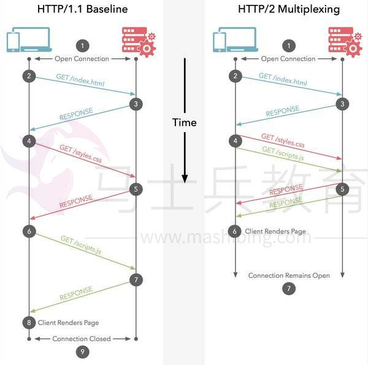

---

不可变集合工厂方法
 
Java 9增加了List.of()、Set.of()、Map.of()和Map.ofEntries()等工厂方法来创建不可变集合。
 
  List strs = List.of("Hello", "World");
  List strs List.of(1, 2, 3);
  Set strs = Set.of("Hello", "World");
  Set ints = Set.of(1, 2, 3);
  Map maps = Map.of("Hello", 1, "World", 2);
 
除了更短和更好阅读之外，这些方法也可以避免您选择特定的集合实现。在创建后，继续添加元素到这
些集合会导致 “UnsupportedOperationException” 。
 
私有接口方法
 
Java 8 为我们提供了接口的默认方法和静态方法，接口也可以包含行为，而不仅仅是方法定义。
默认方法和静态方法可以共享接口中的私有方法，因此避免了代码冗余，这也使代码更加清晰。如果私
有方法是静态的，那这个方法就属于这个接口的。并且没有静态的私有方法只能被在接口中的实例调
用。
 
interface InterfaceWithPrivateMethods {
  private static String staticPrivate() {
  }
  private String instancePrivate() {
return "static private";

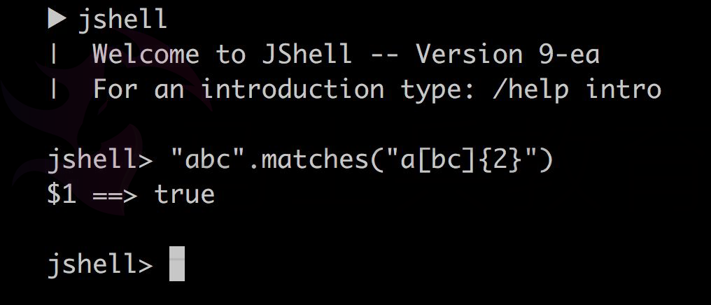

---

}
  default void check() {  
  }
}
 
HTML5风格的Java帮助文档
 
Java 8之前的版本生成的Java帮助文档是在HTML 4中。在Java 9中，Javadoc 的输出现在符合兼容 
HTML5 标准。现在HTML 4是默认的输出标记语言，但是在之后发布的JDK中，HTML 5将会是默认的输
出标记语言。
 
Java帮助文档还是由三个框架组成的结构构成，这是不会变的，并且以HTML 5输出的Java帮助文档也保
持相同的结构。每个 Javadoc 页面都包含有关 JDK 模块类或接口来源的信息。
 
多版本兼容 JAR
 
当一个新版本的 Java 出现的时候，你的库用户要花费很长时间才会切换到这个新的版本。这就意味着库
要去向后兼容你想要支持的最老的 Java 版本 (许多情况下就是 Java 6 或者 7)。这实际上意味着未来的很
长一段时间，你都不能在库中运用 Java 9 所提供的新特性。幸运的是，多版本兼容 JAR 功能能让你创建
仅在特定版本的 Java 环境中运行库程序时选择使用的 class 版本：
return "instance private";
String result = staticPrivate();
InterfaceWithPrivateMethods pvt = new InterfaceWithPrivateMethods() {
  // anonymous class 匿名类
};
result = pvt.instancePrivate();

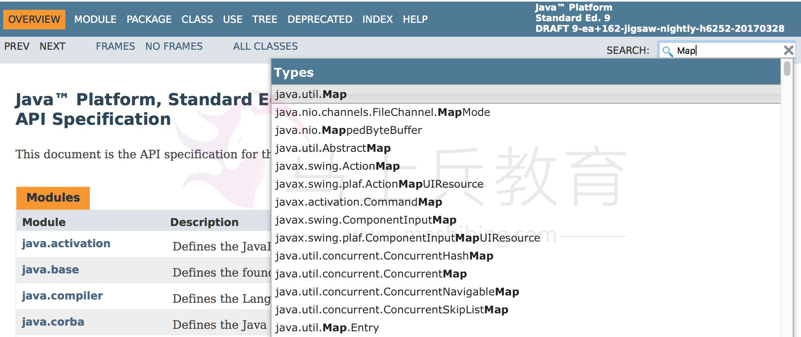

---

multirelease.jar
├── META-INF
│  └── versions
│    └── 9
│      └── multirelease
│        └── Helper.class
├── multirelease
├── Helper.class
└── Main.class
 
在上述场景中， multirelease.jar 可以在 Java 9 中使用, 不过 Helper 这个类使用的不是顶层的 
multirelease.Helper 这个 class, 而是处在“META-INF/versions/9”下面的这个。这是特别为 Java 9 准备
的 class 版本，可以运用 Java 9 所提供的特性和库。同时，在早期的 Java 诸版本中使用这个 JAR 也是能
运行的，因为较老版本的 Java 只会看到顶层的这个 Helper 类。
 
统一 JVM 日志
 
Java 9 中 ，JVM 有了统一的日志记录系统，可以使用新的命令行选项-Xlog 来控制 JVM 上 所有组件的日
志记录。该日志记录系统可以设置输出的日志消息的标签、级别、修饰符和输出目标等。
 
java9的垃圾收集机制
 
Java 9 移除了在 Java 8 中 被废弃的垃圾回收器配置组合，同时把G1设为默认的垃圾回收器实现。替代
了之前默认使用的Parallel GC，对于这个改变，evens的评论是酱紫的：这项变更是很重要的，因为相
对于Parallel来说，G1会在应用线程上做更多的事情，而Parallel几乎没有在应用线程上做任何事情，它
基本上完全依赖GC线程完成所有的内存管理。这意味着切换到G1将会为应用线程带来额外的工作，从
而直接影响到应用的性能
 
I/O 流新特性
 
java.io.InputStream 中增加了新的方法来读取和复制 InputStream 中包含的数据。
  readAllBytes：读取 InputStream 中的所有剩余字节。
  readNBytes： 从 InputStream 中读取指定数量的字节到数组中。
  transferTo：读取 InputStream 中的全部字节并写入到指定的 OutputStream 中 。
 
除了上面这些以外，还有以下这么多的新特性，不再一一介绍。

---

102: Process API Updates
  110: HTTP 2 Client
  143: Improve Contended Locking
  158: Unified JVM Logging
  165: Compiler Control
  193: Variable Handles
  197: Segmented Code Cache
  199: Smart Java Compilation, Phase Two
  200: The Modular JDK
  201: Modular Source Code
  211: Elide Deprecation Warnings on Import Statements
  212: Resolve Lint and Doclint Warnings
  213: Milling Project Coin
  214: Remove GC Combinations Deprecated in JDK 8
  215: Tiered Attribution for javac
  216: Process Import Statements Correctly
  217: Annotations Pipeline 2.0
  219: Datagram Transport Layer Security (DTLS)
  220: Modular Run-Time Images
  221: Simplified Doclet API
  222: jshell: The Java Shell (Read-Eval-Print Loop)
  223: New Version-String Scheme
  224: HTML5 Javadoc
  225: Javadoc Search
  226: UTF-8 Property Files
  227: Unicode 7.0
  228: Add More Diagnostic Commands
  229: Create PKCS12 Keystores by Default
  231: Remove Launch-Time JRE Version Selection
  232: Improve Secure Application Performance
  233: Generate Run-Time Compiler Tests Automatically
  235: Test Class-File Attributes Generated by javac
  236: Parser API for Nashorn

---

237: Linux/AArch64 Port
  238: Multi-Release JAR Files
  240: Remove the JVM TI hprof Agent
  241: Remove the jhat Tool
  243: Java-Level JVM Compiler Interface
  244: TLS Application-Layer Protocol Negotiation Extension
  245: Validate JVM Command-Line Flag Arguments
  246: Leverage CPU Instructions for GHASH and RSA
  247: Compile for Older Platform Versions
  248: Make G1 the Default Garbage Collector
  249: OCSP Stapling for TLS
  250: Store Interned Strings in CDS Archives
  251: Multi-Resolution Images
  252: Use CLDR Locale Data by Default  
  253: Prepare JavaFX UI Controls & CSS APIs for Modularization
  254: Compact Strings
  255: Merge Selected Xerces 2.11.0 Updates into JAXP
  256: BeanInfo Annotations
  257: Update JavaFX/Media to Newer Version of GStreamer
  258: HarfBuzz Font-Layout Engine
  259: Stack-Walking API
  260: Encapsulate Most Internal APIs
  261: Module System
  262: TIFF Image I/O
  263: HiDPI Graphics on Windows and Linux
  264: Platform Logging API and Service
  265: Marlin Graphics Renderer
  266: More Concurrency Updates
  267: Unicode 8.0
  268: XML Catalogs
  269: Convenience Factory Methods for Collections
  270: Reserved Stack Areas for Critical Sections
  271: Unified GC Logging
  272: Platform-Specific Desktop Features

---

273: DRBG-Based SecureRandom Implementations
  274: Enhanced Method Handles
  275: Modular Java Application Packaging
  276: Dynamic Linking of Language-Defined Object Models
  277: Enhanced Deprecation
  278: Additional Tests for Humongous Objects in G1
  279: Improve Test-Failure Troubleshooting    
  280: Indify String Concatenation
  281: HotSpot C++ Unit-Test Framework
  282: jlink: The Java Linker
  283: Enable GTK 3 on Linux
  284: New HotSpot Build System
  285: Spin-Wait Hints
  287: SHA-3 Hash Algorithms
  288: Disable SHA-1 Certificates
  289: Deprecate the Applet API  
  290: Filter Incoming Serialization Data
  292: Implement Selected ECMAScript 6 Features in Nashorn
  294: Linux/s390x Port
  295: Ahead-of-Time Compilation
 
HashMap内部的数据结构是什么？底层是怎么实现的？
 
HashMap内部结构 
jdk8以前：数组+链表 
jdk8以后：数组+链表 （当链表长度到8时，转化为红黑树）
在并发的情况，发生扩容时，可能会产生循环链表，在执行get的时候，会触发死循环，引起 CPU的
100%问题，所以一定要避免在并发环境下使用HashMap。

---

延伸考察ConcurrentHashMap与HashMap、
HashTable等，考察 对技术细节的深入了解程度；
 
 
老生常谈，HashMap的死循环
 
 
问题
 
最近的几次面试中，我都问了是否了解HashMap在并发使用时可能发生死循环，导致cpu100%，结果
让我很意外，都表示不知道有这样的问题，让我意外的是面试者的工作年限都不短。
由于HashMap并非是线程安全的，所以在高并发的情况下必然会出现问题，这是一个普遍的问题，虽然
网上分析的文章很多，还是觉得有必须写一篇文章，让关注我公众号的同学能够意识到这个问题，并了
解这个死循环是如何产生的。
如果是在单线程下使用HashMap，自然是没有问题的，如果后期由于代码优化，这段逻辑引入了多线程
并发执行，在一个未知的时间点，会发现CPU占用100%，居高不下，通过查看堆栈，你会惊讶的发现，
线程都Hang在hashMap的get()方法上，服务重启之后，问题消失，过段时间可能又复现了。
这是为什么？
原因分析
 
在了解来龙去脉之前，我们先看看HashMap的数据结构。
在内部，HashMap使用一个Entry数组保存key、value数据，当一对key、value被加入时，会通过一个
hash算法得到数组的下标index，算法很简单，根据key的hash值，对数组的大小取模 hash & (length-
1)，并把结果插入数组该位置，如果该位置上已经有元素了，就说明存在hash冲突，这样会在index位
置生成链表。
如果存在hash冲突，最惨的情况，就是所有元素都定位到同一个位置，形成一个长长的链表，这样get
一个值时，最坏情况需要遍历所有节点，性能变成了O(n)，所以元素的hash值算法和HashMap的初始
化大小很重要。

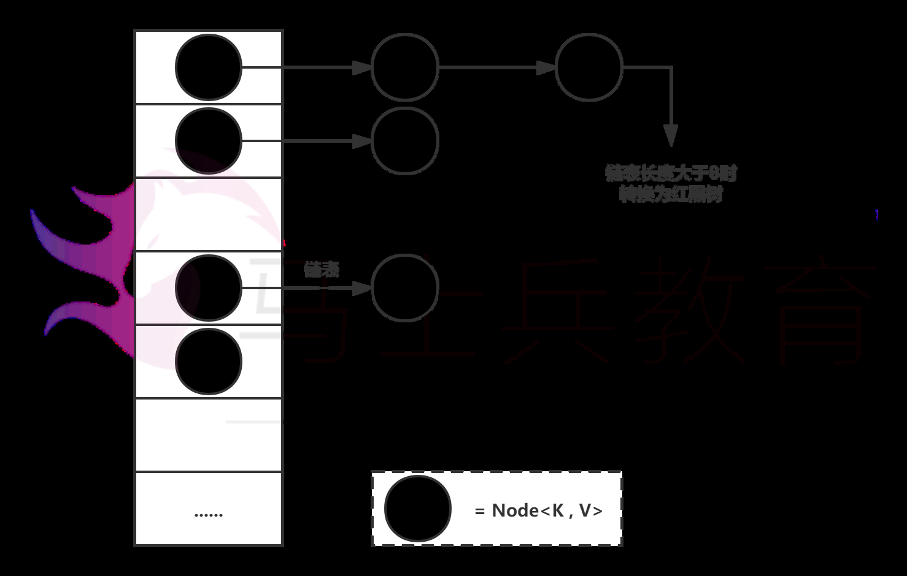

---

当插入一个新的节点时，如果不存在相同的key，则会判断当前内部元素是否已经达到阈值（默认是数组
大小的0.75），如果已经达到阈值，会对数组进行扩容，也会对链表中的元素进行rehash。
实现
 
HashMap的put方法实现：
1、判断key是否已经存在
 
2、检查容量是否达到阈值threshold
 
如果元素个数已经达到阈值，则扩容，并把原来的元素移动过去。
3、扩容实现
 
public V put(K key, V value) {
    if (key == null)
        return putForNullKey(value);
    int hash = hash(key);
    int i = indexFor(hash, table.length);
    // 如果key已经存在，则替换value，并返回旧值
    for (Entry<K,V> e = table[i]; e != null; e = e.next) {
        Object k;
        if (e.hash == hash && ((k = e.key) == key || key.equals(k))) {
            V oldValue = e.value;
            e.value = value;
            e.recordAccess(this);
            return oldValue;
        }
    }
    modCount++;
    // key不存在，则插入新的元素
    addEntry(hash, key, value, i);
    return null;
}
void addEntry(int hash, K key, V value, int bucketIndex) {
    if ((size >= threshold) && (null != table[bucketIndex])) {
        resize(2 * table.length);
        hash = (null != key) ? hash(key) : 0;
        bucketIndex = indexFor(hash, table.length);
    }
    createEntry(hash, key, value, bucketIndex);
}

---

这里会新建一个更大的数组，并通过transfer方法，移动元素。
 
移动的逻辑也很清晰，遍历原来table中每个位置的链表，并对每个元素进行重新hash，在新的
newTable找到归宿，并插入。
案例分析
 
假设HashMap初始化大小为4，插入个3节点，不巧的是，这3个节点都hash到同一个位置，如果按照默
认的负载因子的话，插入第3个节点就会扩容，为了验证效果，假设负载因子是1.
 
void resize(int newCapacity) {
    Entry[] oldTable = table;
    int oldCapacity = oldTable.length;
    ...
    Entry[] newTable = new Entry[newCapacity];
    ...
    transfer(newTable, rehash);
    table = newTable;
    threshold = (int)Math.min(newCapacity * loadFactor, MAXIMUM_CAPACITY + 1);
}
void transfer(Entry[] newTable, boolean rehash) {
    int newCapacity = newTable.length;
    for (Entry<K,V> e : table) {
        while(null != e) {
            Entry<K,V> next = e.next;
            if (rehash) {
                e.hash = null == e.key ? 0 : hash(e.key);
            }
            int i = indexFor(e.hash, newCapacity);
            e.next = newTable[i];
            newTable[i] = e;
            e = next;
        }
    }
}
void transfer(Entry[] newTable, boolean rehash) {
    int newCapacity = newTable.length;
    for (Entry<K,V> e : table) {
        while(null != e) {
            Entry<K,V> next = e.next;
            if (rehash) {
                e.hash = null == e.key ? 0 : hash(e.key);
            }
            int i = indexFor(e.hash, newCapacity);
            e.next = newTable[i];
            newTable[i] = e;
            e = next;
        }
    }

---

以上是节点移动的相关逻辑。
插入第4个节点时，发生rehash，假设现在有两个线程同时进行，线程1和线程2，两个线程都会新建新
的数组。
假设 线程2 在执行到Entry<K,V> next = e.next; 之后，cpu时间片用完了，这时变量e指向节点a，
变量next指向节点b。
线程1继续执行，很不巧，a、b、c节点rehash之后又是在同一个位置7，开始移动节点
第一步，移动节点a
}

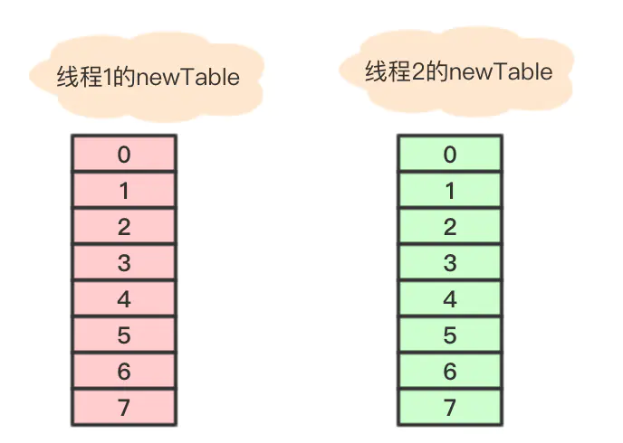

---

第二步，移动节点b
注意，这里的顺序是反过来的，继续移动节点c

---

这个时候 线程1 的时间片用完，内部的table还没有设置成新的newTable， 线程2 开始执行，这时内部
的引用关系如下：

---

这时，在 线程2 中，变量e指向节点a，变量next指向节点b，开始执行循环体的剩余逻辑。
 
执行之后的引用关系如下图
执行后，变量e指向节点b，因为e不是null，则继续执行循环体，执行后的引用关系
Entry<K,V> next = e.next;
int i = indexFor(e.hash, newCapacity);
e.next = newTable[i];
newTable[i] = e;
e = next;

---

变量e又重新指回节点a，只能继续执行循环体，这里仔细分析下：
1、执行完Entry<K,V> next = e.next; ，目前节点a没有next，所以变量next指向null；
2、e.next = newTable[i];  其中 newTable[i] 指向节点b，那就是把a的next指向了节点b，这样a和b
就相互引用了，形成了一个环；
3、newTable[i] = e  把节点a放到了数组i位置；
4、e = next;  把变量e赋值为null，因为第一步中变量next就是指向null；
所以最终的引用关系是这样的：

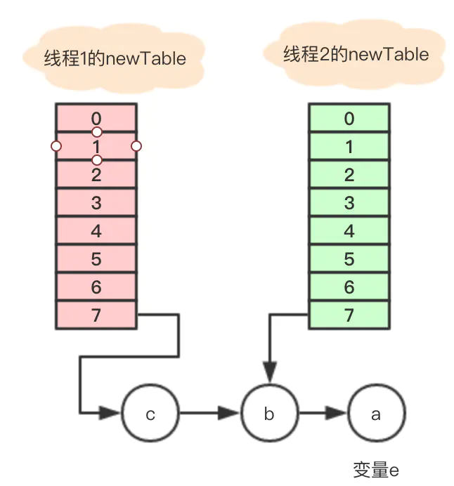

---

节点a和b互相引用，形成了一个环，当在数组该位置get寻找对应的key时，就发生了死循环。
另外，如果线程2把newTable设置成到内部的table，节点c的数据就丢了，看来还有数据遗失的问题。
总结
 
所以在并发的情况，发生扩容时，可能会产生循环链表，在执行get的时候，会触发死循环，引起CPU的
100%问题，所以一定要避免在并发环境下使用HashMap。
曾经有人把这个问题报给了Sun，不过Sun不认为这是一个bug，因为在HashMap本来就不支持多线程
使用，要并发就用ConcurrentHashmap。
 
ConcurrentHashMap在jdk1.8中的改进
 
 
一、简单回顾ConcurrentHashMap在jdk1.7中的设计
  先简单看下ConcurrentHashMap类在jdk1.7中的设计，其基本结构如图所示：

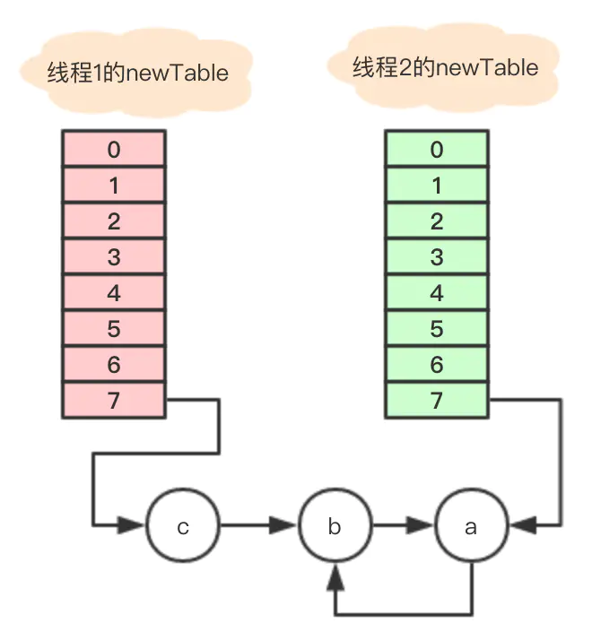

---

每一个segment都是一个HashEntry<K,V>[] table， table中的每一个元素本质上都是一个HashEntry的
单向队列。比如table[3]为首节点，table[3]->next为节点1，之后为节点2，依次类推。
 
二、在jdk1.8中主要做了2方面的改进
改进一：取消segments字段，直接采用transient volatile HashEntry<K,V>[] table保存数据，采用
table数组元素作为锁，从而实现了对每一行数据进行加锁，进一步减少并发冲突的概率。
public class ConcurrentHashMap<K, V> extends AbstractMap<K, V>
        implements ConcurrentMap<K, V>, Serializable {
    // 将整个hashmap分成几个小的map，每个segment都是一个锁；与hashtable相比，这么设计的目
的是对于put, remove等操作，可以减少并发冲突，对
    // 不属于同一个片段的节点可以并发操作，大大提高了性能
    final Segment<K,V>[] segments;
    // 本质上Segment类就是一个小的hashmap，里面table数组存储了各个节点的数据，继承了
ReentrantLock, 可以作为互拆锁使用
    static final class Segment<K,V> extends ReentrantLock implements Serializable 
{
        transient volatile HashEntry<K,V>[] table;
        transient int count;
    }
    // 基本节点，存储Key， Value值
    static final class HashEntry<K,V> {
        final int hash;
        final K key;
        volatile V value;
        volatile HashEntry<K,V> next;
    }
}

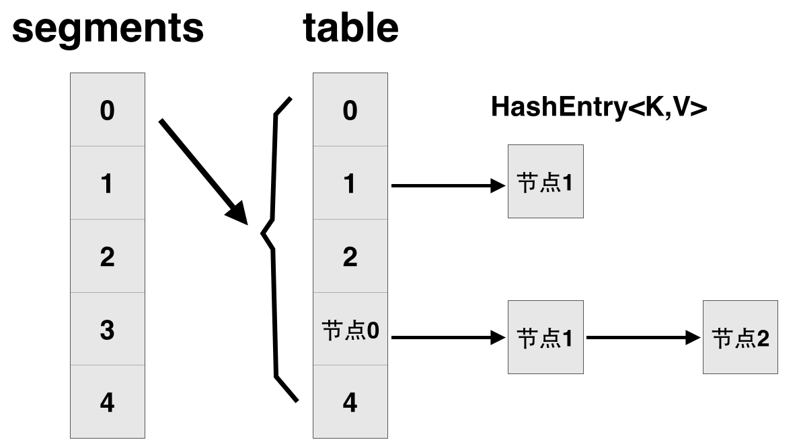

---

改进二：将原先table数组＋单向链表的数据结构，变更为table数组＋单向链表＋红黑树的结构。对于
hash表来说，最核心的能力在于将key hash之后能均匀的分布在数组中。如果hash之后散列的很均
匀，那么table数组中的每个队列长度主要为0或者1。但实际情况并非总是如此理想，虽然
ConcurrentHashMap类默认的加载因子为0.75，但是在数据量过大或者运气不佳的情况下，还是会存
在一些队列长度过长的情况，如果还是采用单向列表方式，那么查询某个节点的时间复杂度为O(n)；因
此，对于个数超过8(默认值)的列表，jdk1.8中采用了红黑树的结构，那么查询的时间复杂度可以降低到
O(logN)，可以改进性能。
为了说明以上2个改动，看一下put操作是如何实现的。
 
final V putVal(K key, V value, boolean onlyIfAbsent) {
    if (key == null || value == null) throw new NullPointerException();
    int hash = spread(key.hashCode());
    int binCount = 0;
    for (Node<K,V>[] tab = table;;) {
        Node<K,V> f; int n, i, fh;
        // 如果table为空，初始化；否则，根据hash值计算得到数组索引i，如果tab[i]为空，直接新
建节点Node即可。注：tab[i]实质为链表或者红黑树的首节点。
        if (tab == null || (n = tab.length) == 0)
            tab = initTable();
        else if ((f = tabAt(tab, i = (n - 1) & hash)) == null) {
            if (casTabAt(tab, i, null,
                         new Node<K,V>(hash, key, value, null)))
                break;                   // no lock when adding to empty bin
        }
        // 如果tab[i]不为空并且hash值为MOVED，说明该链表正在进行transfer操作，返回扩容完成
后的table。
        else if ((fh = f.hash) == MOVED)
            tab = helpTransfer(tab, f);
        else {
            V oldVal = null;
            // 针对首个节点进行加锁操作，而不是segment，进一步减少线程冲突
            synchronized (f) {
                if (tabAt(tab, i) == f) {
                    if (fh >= 0) {
                        binCount = 1;
                        for (Node<K,V> e = f;; ++binCount) {
                            K ek;
                            // 如果在链表中找到值为key的节点e，直接设置e.val = value即
可。
                            if (e.hash == hash &&
                                ((ek = e.key) == key ||
                                 (ek != null && key.equals(ek)))) {
                                oldVal = e.val;
                                if (!onlyIfAbsent)
                                    e.val = value;
                                break;
                            }
                            // 如果没有找到值为key的节点，直接新建Node并加入链表即可。
                            Node<K,V> pred = e;
                            if ((e = e.next) == null) {
                                pred.next = new Node<K,V>(hash, key,
                                                          value, null);
                                break;
                            }

---

另外，在其他方面也有一些小的改进，比如新增字段 transient volatile CounterCell[] counterCells; 可
方便的计算hashmap中所有元素的个数，性能大大优于jdk1.7中的size()方法。
 
三、ConcurrentHashMap jdk1.7、jdk1.8性能比较
测试程序如下：
 
                        }
                    }
                    // 如果首节点为TreeBin类型，说明为红黑树结构，执行putTreeVal操作。
                    else if (f instanceof TreeBin) {
                        Node<K,V> p;
                        binCount = 2;
                        if ((p = ((TreeBin<K,V>)f).putTreeVal(hash, key,
                                                       value)) != null) {
                            oldVal = p.val;
                            if (!onlyIfAbsent)
                                p.val = value;
                        }
                    }
                }
            }
            if (binCount != 0) {
                // 如果节点数>＝8，那么转换链表结构为红黑树结构。
                if (binCount >= TREEIFY_THRESHOLD)
                    treeifyBin(tab, i);
                if (oldVal != null)
                    return oldVal;
                break;
            }
        }
    }
    // 计数增加1，有可能触发transfer操作(扩容)。
    addCount(1L, binCount);
    return null;
}
public class CompareConcurrentHashMap {
    private static ConcurrentHashMap<String, Integer> map = new 
ConcurrentHashMap<String, Integer>(40000);
    public static void putPerformance(int index, int num) {
        for (int i = index; i < (num + index) ; i++)
            map.put(String.valueOf(i), i);
    }
public static void getPerformance2() {
        long start = System.currentTimeMillis();
        for (int i = 0; i < 400000; i++)
            map.get(String.valueOf(i));
        long end = System.currentTimeMillis();
        System.out.println("get: it costs " + (end - start) + " ms");
    }

---

程序运行多次后取平均值，结果如下：
 
四、Collections.synchronizedList和CopyOnWriteArrayList性能分析
CopyOnWriteArrayList在线程对其进行变更操作的时候，会拷贝一个新的数组以存放新的字段，因此写
操作性能很差；而Collections.synchronizedList读操作采用了synchronized，因此读性能较差。以下为
测试程序：
 
    public static void main(String[] args) throws InterruptedException {
        long start = System.currentTimeMillis();
        final CountDownLatch cdLatch = new CountDownLatch(4);
        for (int i = 0; i < 4; i++) {
            final int finalI = i;
            new Thread(new Runnable() {
                public void run() {
                    CompareConcurrentHashMap.putPerformance(100000 * finalI, 
100000);
                    cdLatch.countDown();
                }
            }).start();
        }
        cdLatch.await();
        long end = System.currentTimeMillis();
        System.out.println("put: it costs " + (end - start) + " ms");
        CompareConcurrentHashMap.getPerformance2();
    }
}
public class App {
    private static List<String> arrayList = Collections.synchronizedList(new 
ArrayList<String>());
    private static List<String> copyOnWriteArrayList = new 
CopyOnWriteArrayList<String>();
    private static CountDownLatch cdl1 = new CountDownLatch(2);
    private static CountDownLatch cdl2 = new CountDownLatch(2);
    private static CountDownLatch cdl3 = new CountDownLatch(2);
    private static CountDownLatch cdl4 = new CountDownLatch(2);
    static class Thread1 extends Thread {
        @Override
        public void run() {
            for (int i = 0; i < 10000; i++)

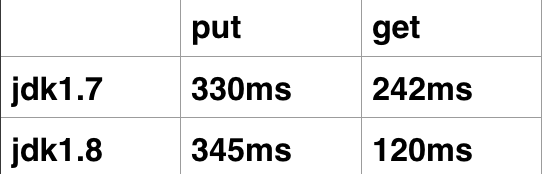

---

arrayList.add(String.valueOf(i));
            cdl1.countDown();
        }
    }
    static class Thread2 extends Thread {
        @Override
        public void run() {
            for (int i = 0; i < 10000; i++)
                copyOnWriteArrayList.add(String.valueOf(i));
            cdl2.countDown();
        }
    }
    static class Thread3 extends Thread1 {
        @Override
        public void run() {
            int size = arrayList.size();
            for (int i = 0; i < size; i++)
                arrayList.get(i);
            cdl3.countDown();
        }
    }
    static class Thread4 extends Thread1 {
        @Override
        public void run() {
            int size = copyOnWriteArrayList.size();
            for (int i = 0; i < size; i++)
                copyOnWriteArrayList.get(i);
            cdl4.countDown();
        }
    }
    public static void main(String[] args) throws InterruptedException {
        long start1 = System.currentTimeMillis();
        new Thread1().start();
        new Thread1().start();
        cdl1.await();
        System.out.println("arrayList add: " + (System.currentTimeMillis() - 
start1));
        long start2 = System.currentTimeMillis();
        new Thread2().start();
        new Thread2().start();
        cdl2.await();
        System.out.println("copyOnWriteArrayList add: " + 
(System.currentTimeMillis() - start2));
        long start3 = System.currentTimeMillis();
        new Thread3().start();
        new Thread3().start();
        cdl3.await();
        System.out.println("arrayList get: " + (System.currentTimeMillis() - 
start3));
        long start4 = System.currentTimeMillis();
        new Thread4().start();

---

结果如下：
 
 
谈谈ConcurrentHashMap1.7和1.8的不同实现
 
 
ConcurrentHashMap
 
在多线程环境下，使用HashMap 进行put 操作时存在丢失数据的情况，为了避免这种bug的隐患，强烈
建议使用ConcurrentHashMap 代替HashMap ，为了对更深入的了解，本文将对JDK1.7和1.8的不同实现
进行分析。
JDK1.7
 
数据结构
jdk1.7中采用Segment  + HashEntry 的方式进行实现，结构如下：
ConcurrentHashMap 初始化时，计算出Segment 数组的大小ssize 和每个Segment 中HashEntry 数
组的大小cap ，并初始化Segment 数组的第一个元素；其中ssize 大小为2的幂次方，默认为16，cap
大小也是2的幂次方，最小值为2，最终结果根据根据初始化容量initialCapacity 进行计算，计算过
程如下：
        new Thread4().start();
        cdl4.await();
        System.out.println("copyOnWriteArrayList get: " + 
(System.currentTimeMillis() - start4));
    }
}

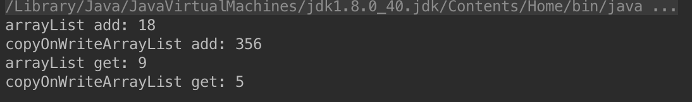

---

其中Segment 在实现上继承了ReentrantLock ，这样就自带了锁的功能。
put实现
当执行put 方法插入数据时，根据key的hash值，在Segment 数组中找到相应的位置，如果相应位置的
Segment 还未初始化，则通过CAS进行赋值，接着执行Segment 对象的put 方法通过加锁机制插入数
据，实现如下：
场景：线程A和线程B同时执行相同Segment 对象的put 方法
1、线程A执行tryLock() 方法成功获取锁，则把HashEntry 对象插入到相应的位置；
2、线程B获取锁失败，则执行scanAndLockForPut() 方法，在scanAndLockForPut 方法中，会通过
重复执行tryLock() 方法尝试获取锁，在多处理器环境下，重复次数为64，单处理器重复次数为1，当
执行tryLock() 方法的次数超过上限时，则执行lock() 方法挂起线程B；
3、当线程A执行完插入操作时，会通过unlock() 方法释放锁，接着唤醒线程B继续执行；
size实现
因为ConcurrentHashMap 是可以并发插入数据的，所以在准确计算元素时存在一定的难度，一般的思
路是统计每个Segment 对象中的元素个数，然后进行累加，但是这种方式计算出来的结果并不一样的准
确的，因为在计算后面几个Segment 的元素个数时，已经计算过的Segment 同时可能有数据的插入或则
删除，在1.7的实现中，采用了如下方式：
 
if (c * ssize < initialCapacity)
    ++c;
int cap = MIN_SEGMENT_TABLE_CAPACITY;
while (cap < c)
    cap <<= 1;
try {
    for (;;) {
        if (retries++ == RETRIES_BEFORE_LOCK) {
            for (int j = 0; j < segments.length; ++j)
                ensureSegment(j).lock(); // force creation
        }
        sum = 0L;
        size = 0;
        overflow = false;
        for (int j = 0; j < segments.length; ++j) {
            Segment<K,V> seg = segmentAt(segments, j);
            if (seg != null) {
                sum += seg.modCount;
                int c = seg.count;
                if (c < 0 || (size += c) < 0)
                    overflow = true;
            }
        }
        if (sum == last)
            break;
        last = sum;
    }
} finally {
    if (retries > RETRIES_BEFORE_LOCK) {

---

先采用不加锁的方式，连续计算元素的个数，最多计算3次：
1、如果前后两次计算结果相同，则说明计算出来的元素个数是准确的；
2、如果前后两次计算结果都不同，则给每个Segment 进行加锁，再计算一次元素的个数；
JDK1.8
 
数据结构
1.8中放弃了Segment 臃肿的设计，取而代之的是采用Node  + CAS  + Synchronized 来保证并发安全进
行实现，结构如下：
只有在执行第一次put 方法时才会调用initTable() 初始化Node 数组，实现如下：
 
put实现
当执行put 方法插入数据时，根据key的hash值，在Node 数组中找到相应的位置，实现如下：
        for (int j = 0; j < segments.length; ++j)
            segmentAt(segments, j).unlock();
    }
}
private final Node<K,V>[] initTable() {
    Node<K,V>[] tab; int sc;
    while ((tab = table) == null || tab.length == 0) {
        if ((sc = sizeCtl) < 0)
            Thread.yield(); // lost initialization race; just spin
        else if (U.compareAndSwapInt(this, SIZECTL, sc, -1)) {
            try {
                if ((tab = table) == null || tab.length == 0) {
                    int n = (sc > 0) ? sc : DEFAULT_CAPACITY;
                    @SuppressWarnings("unchecked")
                    Node<K,V>[] nt = (Node<K,V>[])new Node<?,?>[n];
                    table = tab = nt;
                    sc = n - (n >>> 2);
                }
            } finally {
                sizeCtl = sc;
            }
            break;
        }
    }
    return tab;
}

---

1、如果相应位置的Node 还未初始化，则通过CAS插入相应的数据；
 
2、如果相应位置的Node 不为空，且当前该节点不处于移动状态，则对该节点加synchronized 锁，如
果该节点的hash 不小于0，则遍历链表更新节点或插入新节点；
 
3、如果该节点是TreeBin 类型的节点，说明是红黑树结构，则通过putTreeVal 方法往红黑树中插入
节点；
 
4、如果binCount 不为0，说明put 操作对数据产生了影响，如果当前链表的个数达到8个，则通过
treeifyBin 方法转化为红黑树，如果oldVal 不为空，说明是一次更新操作，没有对元素个数产生影
响，则直接返回旧值；
 
else if ((f = tabAt(tab, i = (n - 1) & hash)) == null) {
    if (casTabAt(tab, i, null, new Node<K,V>(hash, key, value, null)))
        break;                   // no lock when adding to empty bin
}
if (fh >= 0) {
    binCount = 1;
    for (Node<K,V> e = f;; ++binCount) {
        K ek;
        if (e.hash == hash &&
            ((ek = e.key) == key ||
             (ek != null && key.equals(ek)))) {
            oldVal = e.val;
            if (!onlyIfAbsent)
                e.val = value;
            break;
        }
        Node<K,V> pred = e;
        if ((e = e.next) == null) {
            pred.next = new Node<K,V>(hash, key, value, null);
            break;
        }
    }
}
else if (f instanceof TreeBin) {
    Node<K,V> p;
    binCount = 2;
    if ((p = ((TreeBin<K,V>)f).putTreeVal(hash, key, value)) != null) {
        oldVal = p.val;
        if (!onlyIfAbsent)
            p.val = value;
    }
}

---

5、如果插入的是一个新节点，则执行addCount() 方法尝试更新元素个数baseCount ；
size实现
1.8中使用一个volatile 类型的变量baseCount 记录元素的个数，当插入新数据或则删除数据时，会通
过addCount() 方法更新baseCount ，实现如下：
 
1、初始化时counterCells 为空，在并发量很高时，如果存在两个线程同时执行CAS 修改baseCount
值，则失败的线程会继续执行方法体中的逻辑，使用CounterCell 记录元素个数的变化；
2、如果CounterCell 数组counterCells 为空，调用fullAddCount() 方法进行初始化，并插入对应
的记录数，通过CAS 设置cellsBusy字段，只有设置成功的线程才能初始化CounterCell 数组，实现如
下：
 
if (binCount != 0) {
    if (binCount >= TREEIFY_THRESHOLD)
        treeifyBin(tab, i);
    if (oldVal != null)
        return oldVal;
    break;
}   
if ((as = counterCells) != null ||
    !U.compareAndSwapLong(this, BASECOUNT, b = baseCount, s = b + x)) {
    CounterCell a; long v; int m;
    boolean uncontended = true;
    if (as == null || (m = as.length - 1) < 0 ||
        (a = as[ThreadLocalRandom.getProbe() & m]) == null ||
        !(uncontended =
          U.compareAndSwapLong(a, CELLVALUE, v = a.value, v + x))) {
        fullAddCount(x, uncontended);
        return;
    }
    if (check <= 1)
        return;
    s = sumCount();
}
else if (cellsBusy == 0 && counterCells == as &&
         U.compareAndSwapInt(this, CELLSBUSY, 0, 1)) {
    boolean init = false;
    try {                           // Initialize table
        if (counterCells == as) {
            CounterCell[] rs = new CounterCell[2];
            rs[h & 1] = new CounterCell(x);
            counterCells = rs;
            init = true;
        }
    } finally {
        cellsBusy = 0;
    }
    if (init)
        break;

---

3、如果通过CAS 设置cellsBusy字段失败的话，则继续尝试通过CAS 修改baseCount 字段，如果修改
baseCount 字段成功的话，就退出循环，否则继续循环插入CounterCell 对象；
 
所以在1.8中的size 实现比1.7简单多，因为元素个数保存baseCount 中，部分元素的变化个数保存在
CounterCell 数组中，实现如下：
 
通过累加baseCount 和CounterCell 数组中的数量，即可得到元素的总个数；
 
 
深入分析ConcurrentHashMap1.8的扩容实现
 
 
ConcurrentHashMap相关的文章写了不少，有个遗留问题一直没有分析，也被好多人请教过，被搁置
在一旁，即如何在并发的情况下实现数组的扩容。
什么情况会触发扩容
 
当往hashMap中成功插入一个key/value节点时，有可能触发扩容动作：
1、如果新增节点之后，所在链表的元素个数达到了阈值 8，则会调用treeifyBin 方法把链表转换成红
黑树，不过在结构转换之前，会对数组长度进行判断，实现如下：
}
else if (U.compareAndSwapLong(this, BASECOUNT, v = baseCount, v + x))
    break; 
public int size() {
    long n = sumCount();
    return ((n < 0L) ? 0 :
            (n > (long)Integer.MAX_VALUE) ? Integer.MAX_VALUE :
            (int)n);
}
final long sumCount() {
    CounterCell[] as = counterCells; CounterCell a;
    long sum = baseCount;
    if (as != null) {
        for (int i = 0; i < as.length; ++i) {
            if ((a = as[i]) != null)
                sum += a.value;
        }
    }
    return sum;
}

---

如果数组长度n小于阈值MIN_TREEIFY_CAPACITY ，默认是64，则会调用tryPresize 方法把数组长度
扩大到原来的两倍，并触发transfer 方法，重新调整节点的位置。
2、新增节点之后，会调用addCount 方法记录元素个数，并检查是否需要进行扩容，当数组元素个数达
到阈值时，会触发transfer 方法，重新调整节点的位置。

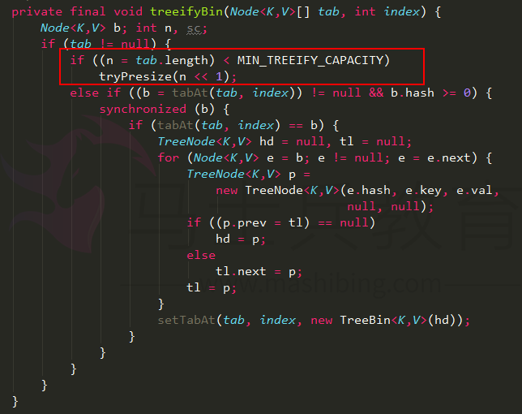

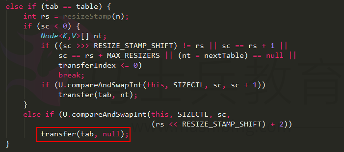

---

transfer实现
 
transfer 方法实现了在并发的情况下，高效的从原始组数往新数组中移动元素，假设扩容之前节点的
分布如下，这里区分蓝色节点和红色节点，是为了后续更好的分析：
在上图中，第14个槽位插入新节点之后，链表元素个数已经达到了8，且数组长度为16，优先通过扩容
来缓解链表过长的问题，实现如下：
1、根据当前数组长度n，新建一个两倍长度的数组nextTable ；

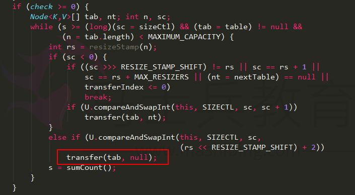

---

2、初始化ForwardingNode 节点，其中保存了新数组nextTable 的引用，在处理完每个槽位的节点之
后当做占位节点，表示该槽位已经处理过了；
3、通过for 自循环处理每个槽位中的链表元素，默认advace 为真，通过CAS设置transferIndex 属
性值，并初始化i 和bound 值，i 指当前处理的槽位序号，bound 指需要处理的槽位边界，先处理槽位
15的节点；
4、在当前假设条件下，槽位15中没有节点，则通过CAS插入在第二步中初始化的ForwardingNode 节
点，用于告诉其它线程该槽位已经处理过了；
5、如果槽位15已经被线程A处理了，那么线程B处理到这个节点时，取到该节点的hash值应该为
MOVED ，值为-1 ，则直接跳过，继续处理下一个槽位14的节点；

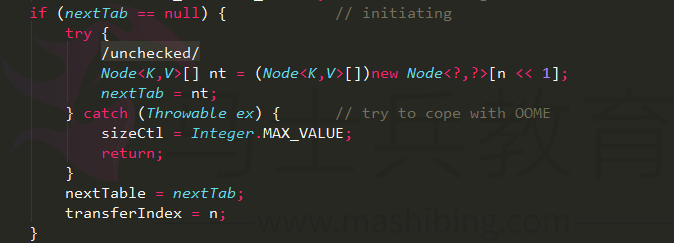

---

6、处理槽位14的节点，是一个链表结构，先定义两个变量节点ln 和hn ，按我的理解应该是lowNode
和highNode ，分别保存hash值的第X位为0和1的节点，具体实现如下：
使用fn&n 可以快速把链表中的元素区分成两类，A类是hash值的第X位为0，B类是hash值的第X位为
1，并通过lastRun 记录最后需要处理的节点，A类和B类节点可以分散到新数组的槽位14和30中，在原
数组的槽位14中，蓝色节点第X为0，红色节点第X为1，把链表拉平显示如下：
 
1、通过遍历链表，记录runBit 和lastRun ，分别为1和节点6，所以设置hn 为节点6，ln 为null；
2、重新遍历链表，以lastRun 节点为终止条件，根据第X位的值分别构造ln链表和hn链表：
ln链：和原来链表相比，顺序已经不一样了

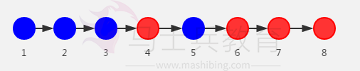

---

hn链：
 
通过CAS把ln链表设置到新数组的i位置，hn链表设置到i+n的位置；
7、如果该槽位是红黑树结构，则构造树节点lo 和hi ，遍历红黑树中的节点，同样根据hash&n 算法，
把节点分为两类，分别插入到lo 和hi 为头的链表中，根据lo 和hi 链表中的元素个数分别生成ln 和
hn 节点，其中ln 节点的生成逻辑如下：
（1）如果lo 链表的元素个数小于等于UNTREEIFY_THRESHOLD ，默认为6，则通过untreeify 方法把
树节点链表转化成普通节点链表；
（2）否则判断hi 链表中的元素个数是否等于0：如果等于0，表示lo 链表中包含了所有原始节点，则
设置原始红黑树给ln ，否则根据lo 链表重新构造红黑树。
最后，同样的通过CAS把ln 设置到新数组的i 位置，hn 设置到i+n 位置。

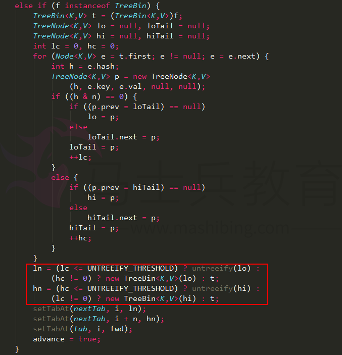

---

深入浅出ConcurrentHashMap1.8
 
 
前言
 
HashMap是我们平时开发过程中用的比较多的集合，但它是非线程安全的，在涉及到多线程并发的情
况，进行get操作有可能会引起死循环，导致CPU利用率接近100%。
 
解决方案有Hashtable和Collections.synchronizedMap(hashMap)，不过这两个方案基本上是对读写进
行加锁操作，一个线程在读写元素，其余线程必须等待，性能可想而知。
所以，Doug Lea给我们带来了并发安全的ConcurrentHashMap，它的实现是依赖于 Java 内存模型，所
以我们在了解 ConcurrentHashMap 的之前必须了解一些底层的知识：
1. java内存模型
2. java中的Unsafe
3. java中的CAS
4. 深入浅出java同步器
5. 深入浅出ReentrantLock
本文源码是JDK8的版本，与之前的版本有较大差异。
JDK1.7分析
 
ConcurrentHashMap采用 分段锁的机制，实现并发的更新操作，底层采用数组+链表的存储结构。
其包含两个核心静态内部类 Segment和HashEntry。
1. Segment继承ReentrantLock用来充当锁的角色，每个 Segment 对象守护每个散列映射表的若干
个桶。
2. HashEntry 用来封装映射表的键 / 值对；
3. 每个桶是由若干个 HashEntry 对象链接起来的链表。
一个 ConcurrentHashMap 实例中包含由若干个 Segment 对象组成的数组，下面我们通过一个图来演
示一下 ConcurrentHashMap 的结构：
final HashMap<String, String> map = new HashMap<String, String>(2);
for (int i = 0; i < 10000; i++) {
    new Thread(new Runnable() {
        @Override
        public void run() {
            map.put(UUID.randomUUID().toString(), "");
        }
    }).start();
}

---

JDK1.8分析
 
1.8的实现已经抛弃了Segment分段锁机制，利用CAS+Synchronized来保证并发更新的安全，底层采用
数组+链表+红黑树的存储结构。

---

重要概念
 
在开始之前，有些重要的概念需要介绍一下：
1. table：默认为null，初始化发生在第一次插入操作，默认大小为16的数组，用来存储Node节点数
据，扩容时大小总是2的幂次方。
2. nextTable：默认为null，扩容时新生成的数组，其大小为原数组的两倍。
sizeCtl ：默认为0，用来控制table的初始化和扩容操作，具体应用在后续会体现出来。
-1 代表table正在初始化
-N 表示有N-1个线程正在进行扩容操作
其余情况：
1、如果table未初始化，表示table需要初始化的大小。
2、如果table初始化完成，表示table的容量，默认是table大小的0.75倍，居然用这个公式算
0.75（n - (n >>> 2)）。
Node：保存key，value及key的hash值的数据结构。
 
其中value和next都用volatile修饰，保证并发的可见性。
ForwardingNode：一个特殊的Node节点，hash值为-1，其中存储nextTable的引用。
 
只有table发生扩容的时候，ForwardingNode才会发挥作用，作为一个占位符放在table中表示当前节点
为null或则已经被移动。
实例初始化
 
实例化ConcurrentHashMap时带参数时，会根据参数调整table的大小，假设参数为100，最终会调整
成256，确保table的大小总是2的幂次方，算法如下：
 
class Node<K,V> implements Map.Entry<K,V> {
    final int hash;
    final K key;
    volatile V val;
    volatile Node<K,V> next;
    ... 省略部分代码
}
final class ForwardingNode<K,V> extends Node<K,V> {
    final Node<K,V>[] nextTable;
    ForwardingNode(Node<K,V>[] tab) {
        super(MOVED, null, null, null);
        this.nextTable = tab;
    }
}

---

注意，ConcurrentHashMap在构造函数中只会初始化sizeCtl值，并不会直接初始化table，而是延缓到
第一次put操作。
table初始化
 
前面已经提到过，table初始化操作会延缓到第一次put行为。但是put是可以并发执行的，Doug Lea是
如何实现table只初始化一次的？让我们来看看源码的实现。
 
sizeCtl默认为0，如果ConcurrentHashMap实例化时有传参数，sizeCtl会是一个2的幂次方的值。所以
执行第一次put操作的线程会执行Unsafe.compareAndSwapInt方法修改sizeCtl为-1，有且只有一个线
程能够修改成功，其它线程通过Thread.yield()让出CPU时间片等待table初始化完成。
put操作
假设table已经初始化完成，put操作采用CAS+synchronized实现并发插入或更新操作，具体实现如下。
 
ConcurrentHashMap<String, String> hashMap = new ConcurrentHashMap<>(100);
private static final int tableSizeFor(int c) {
    int n = c - 1;
    n |= n >>> 1;
    n |= n >>> 2;
    n |= n >>> 4;
    n |= n >>> 8;
    n |= n >>> 16;
    return (n < 0) ? 1 : (n >= MAXIMUM_CAPACITY) ? MAXIMUM_CAPACITY : n + 1;
}
private final Node<K,V>[] initTable() {
    Node<K,V>[] tab; int sc;
    while ((tab = table) == null || tab.length == 0) {
//如果一个线程发现sizeCtl<0，意味着另外的线程执行CAS操作成功，当前线程只需要让出cpu时间片
        if ((sc = sizeCtl) < 0) 
            Thread.yield(); // lost initialization race; just spin
        else if (U.compareAndSwapInt(this, SIZECTL, sc, -1)) {
            try {
                if ((tab = table) == null || tab.length == 0) {
                    int n = (sc > 0) ? sc : DEFAULT_CAPACITY;
                    @SuppressWarnings("unchecked")
                    Node<K,V>[] nt = (Node<K,V>[])new Node<?,?>[n];
                    table = tab = nt;
                    sc = n - (n >>> 2);
                }
            } finally {
                sizeCtl = sc;
            }
            break;
        }
    }
    return tab;
}
final V putVal(K key, V value, boolean onlyIfAbsent) {
    if (key == null || value == null) throw new NullPointerException();

---

1. hash算法
 
1. table中定位索引位置，n是table的大小
 
1. 获取table中对应索引的元素f。
Doug Lea采用Unsafe.getObjectVolatile来获取，也许有人质疑，直接table[index]不可以么，为
什么要这么复杂？
在java内存模型中，我们已经知道每个线程都有一个工作内存，里面存储着table的副本，虽然
table是volatile修饰的，但不能保证线程每次都拿到table中的最新元素，
Unsafe.getObjectVolatile可以直接获取指定内存的数据，保证了每次拿到数据都是最新的。
2. 如果f为null，说明table中这个位置第一次插入元素，利用Unsafe.compareAndSwapObject方法
插入Node节点。
如果CAS成功，说明Node节点已经插入，随后addCount(1L, binCount)方法会检查当前容量是否
需要进行扩容。
如果CAS失败，说明有其它线程提前插入了节点，自旋重新尝试在这个位置插入节点。
1. 如果f的hash值为-1，说明当前f是ForwardingNode节点，意味有其它线程正在扩容，则一起进行
扩容操作。
2. 其余情况把新的Node节点按链表或红黑树的方式插入到合适的位置，这个过程采用同步内置锁实
现并发，代码如下:
 
    int hash = spread(key.hashCode());
    int binCount = 0;
    for (Node<K,V>[] tab = table;;) {
        Node<K,V> f; int n, i, fh;
        if (tab == null || (n = tab.length) == 0)
            tab = initTable();
        else if ((f = tabAt(tab, i = (n - 1) & hash)) == null) {
            if (casTabAt(tab, i, null, new Node<K,V>(hash, key, value, null)))
                break;                   // no lock when adding to empty bin
        }
        else if ((fh = f.hash) == MOVED)
            tab = helpTransfer(tab, f);
        ...省略部分代码
    }
    addCount(1L, binCount);
    return null;
}
static final int spread(int h) {return (h ^ (h >>> 16)) & HASH_BITS;}
int index = (n - 1) & hash
synchronized (f) {
    if (tabAt(tab, i) == f) {
        if (fh >= 0) {
            binCount = 1;
            for (Node<K,V> e = f;; ++binCount) {
                K ek;

---

在节点f上进行同步，节点插入之前，再次利用tabAt(tab, i) == f判断，防止被其它线程修改。
1. 如果f.hash >= 0，说明f是链表结构的头结点，遍历链表，如果找到对应的node节点，则修改
value，否则在链表尾部加入节点。
2. 如果f是TreeBin类型节点，说明f是红黑树根节点，则在树结构上遍历元素，更新或增加节点。
3. 如果链表中节点数binCount >= TREEIFY_THRESHOLD(默认是8)，则把链表转化为红黑树结构。
table扩容
 
当table容量不足的时候，即table的元素数量达到容量阈值sizeCtl，需要对table进行扩容。
整个扩容分为两部分：
1. 构建一个nextTable，大小为table的两倍。
2. 把table的数据复制到nextTable中。
这两个过程在单线程下实现很简单，但是ConcurrentHashMap是支持并发插入的，扩容操作自然也会
有并发的出现，这种情况下，第二步可以支持节点的并发复制，这样性能自然提升不少，但实现的复杂
度也上升了一个台阶。
先看第一步，构建nextTable，毫无疑问，这个过程只能只有单个线程进行nextTable的初始化，具体实
现如下：
 
                if (e.hash == hash &&
                    ((ek = e.key) == key ||
                     (ek != null && key.equals(ek)))) {
                    oldVal = e.val;
                    if (!onlyIfAbsent)
                        e.val = value;
                    break;
                }
                Node<K,V> pred = e;
                if ((e = e.next) == null) {
                    pred.next = new Node<K,V>(hash, key,
                                              value, null);
                    break;
                }
            }
        }
        else if (f instanceof TreeBin) {
            Node<K,V> p;
            binCount = 2;
            if ((p = ((TreeBin<K,V>)f).putTreeVal(hash, key,
                                           value)) != null) {
                oldVal = p.val;
                if (!onlyIfAbsent)
                    p.val = value;
            }
        }
    }
}
private final void addCount(long x, int check) {
    ... 省略部分代码
    if (check >= 0) {
        Node<K,V>[] tab, nt; int n, sc;
        while (s >= (long)(sc = sizeCtl) && (tab = table) != null &&

---

通过Unsafe.compareAndSwapInt修改sizeCtl值，保证只有一个线程能够初始化nextTable，扩容后的
数组长度为原来的两倍，但是容量是原来的1.5。
节点从table移动到nextTable，大体思想是遍历、复制的过程。
1. 首先根据运算得到需要遍历的次数i，然后利用tabAt方法获得i位置的元素f，初始化一个
forwardNode实例fwd。
2. 如果f == null，则在table中的i位置放入fwd，这个过程是采用Unsafe.compareAndSwapObjectf
方法实现的，很巧妙的实现了节点的并发移动。
3. 如果f是链表的头节点，就构造一个反序链表，把他们分别放在nextTable的i和i+n的位置上，移动
完成，采用Unsafe.putObjectVolatile方法给table原位置赋值fwd。
4. 如果f是TreeBin节点，也做一个反序处理，并判断是否需要untreeify，把处理的结果分别放在
nextTable的i和i+n的位置上，移动完成，同样采用Unsafe.putObjectVolatile方法给table原位置赋
值fwd。
遍历过所有的节点以后就完成了复制工作，把table指向nextTable，并更新sizeCtl为新数组大小的0.75
倍 ，扩容完成。
红黑树构造
 
注意：如果链表结构中元素超过TREEIFY_THRESHOLD阈值，默认为8个，则把链表转化为红黑树，提高
遍历查询效率。
 
接下来我们看看如何构造树结构，代码如下：
 
               (n = tab.length) < MAXIMUM_CAPACITY) {
            int rs = resizeStamp(n);
            if (sc < 0) {
                if ((sc >>> RESIZE_STAMP_SHIFT) != rs || sc == rs + 1 ||
                    sc == rs + MAX_RESIZERS || (nt = nextTable) == null ||
                    transferIndex <= 0)
                    break;
                if (U.compareAndSwapInt(this, SIZECTL, sc, sc + 1))
                    transfer(tab, nt);
            }
            else if (U.compareAndSwapInt(this, SIZECTL, sc,
                                         (rs << RESIZE_STAMP_SHIFT) + 2))
                transfer(tab, null);
            s = sumCount();
        }
    }
}
if (binCount != 0) {
    if (binCount >= TREEIFY_THRESHOLD)
        treeifyBin(tab, i);
    if (oldVal != null)
        return oldVal;
    break;
}
private final void treeifyBin(Node<K,V>[] tab, int index) {
    Node<K,V> b; int n, sc;

---

可以看出，生成树节点的代码块是同步的，进入同步代码块之后，再次验证table中index位置元素是否
被修改过。
1、根据table中index位置Node链表，重新生成一个hd为头结点的TreeNode链表。
2、根据hd头结点，生成TreeBin树结构，并把树结构的root节点写到table的index位置的内存中，具体
实现如下：
 
    if (tab != null) {
        if ((n = tab.length) < MIN_TREEIFY_CAPACITY)
            tryPresize(n << 1);
        else if ((b = tabAt(tab, index)) != null && b.hash >= 0) {
            synchronized (b) {
                if (tabAt(tab, index) == b) {
                    TreeNode<K,V> hd = null, tl = null;
                    for (Node<K,V> e = b; e != null; e = e.next) {
                        TreeNode<K,V> p =
                            new TreeNode<K,V>(e.hash, e.key, e.val,
                                              null, null);
                        if ((p.prev = tl) == null)
                            hd = p;
                        else
                            tl.next = p;
                        tl = p;
                    }
                    setTabAt(tab, index, new TreeBin<K,V>(hd));
                }
            }
        }
    }
}
TreeBin(TreeNode<K,V> b) {
    super(TREEBIN, null, null, null);
    this.first = b;
    TreeNode<K,V> r = null;
    for (TreeNode<K,V> x = b, next; x != null; x = next) {
        next = (TreeNode<K,V>)x.next;
        x.left = x.right = null;
        if (r == null) {
            x.parent = null;
            x.red = false;
            r = x;
        }
        else {
            K k = x.key;
            int h = x.hash;
            Class<?> kc = null;
            for (TreeNode<K,V> p = r;;) {
                int dir, ph;
                K pk = p.key;
                if ((ph = p.hash) > h)
                    dir = -1;
                else if (ph < h)
                    dir = 1;
                else if ((kc == null &&
                          (kc = comparableClassFor(k)) == null) ||

---

主要根据Node节点的hash值大小构建二叉树。这个红黑树的构造过程实在有点复杂，感兴趣的同学可
以看看源码。
get操作
 
get操作和put操作相比，显得简单了许多。
 
1. 判断table是否为空，如果为空，直接返回null。
2. 计算key的hash值，并获取指定table中指定位置的Node节点，通过遍历链表或则树结构找到对应
的节点，返回value值。
                         (dir = compareComparables(kc, k, pk)) == 0)
                    dir = tieBreakOrder(k, pk);
                    TreeNode<K,V> xp = p;
                if ((p = (dir <= 0) ? p.left : p.right) == null) {
                    x.parent = xp;
                    if (dir <= 0)
                        xp.left = x;
                    else
                        xp.right = x;
                    r = balanceInsertion(r, x);
                    break;
                }
            }
        }
    }
    this.root = r;
    assert checkInvariants(root);
}
public V get(Object key) {
    Node<K,V>[] tab; Node<K,V> e, p; int n, eh; K ek;
    int h = spread(key.hashCode());
    if ((tab = table) != null && (n = tab.length) > 0 &&
        (e = tabAt(tab, (n - 1) & h)) != null) {
        if ((eh = e.hash) == h) {
            if ((ek = e.key) == key || (ek != null && key.equals(ek)))
                return e.val;
        }
        else if (eh < 0)
            return (p = e.find(h, key)) != null ? p.val : null;
        while ((e = e.next) != null) {
            if (e.hash == h &&
                ((ek = e.key) == key || (ek != null && key.equals(ek))))
                return e.val;
        }
    }
    return null;
}

---

总结
 
ConcurrentHashMap 是一个并发散列映射表的实现，它允许完全并发的读取，并且支持给定数量的并
发更新。相比于 HashTable 和同步包装器包装的 HashMap，使用一个全局的锁来同步不同线程间的并
发访问，同一时间点，只能有一个线程持有锁，也就是说在同一时间点，只能有一个线程能访问容器，
这虽然保证多线程间的安全并发访问，但同时也导致对容器的访问变成串行化的了。
1.6中采用ReentrantLock 分段锁的方式，使多个线程在不同的segment上进行写操作不会发现阻塞行
为;1.8中直接采用了内置锁synchronized，难道是因为1.8的虚拟机对内置锁已经优化的足够快了？
ConcurrentHashMap的红黑树实现分析
 
 
红黑树
 
红黑树是一种特殊的二叉树，主要用它存储有序的数据，提供高效的数据检索，时间复杂度为O(lgn)，
每个节点都有一个标识位表示颜色，红色或黑色，有如下5种特性：
1、每个节点要么红色，要么是黑色；
2、根节点一定是黑色的；
3、每个空叶子节点必须是黑色的；
4、如果一个节点是红色的，那么它的子节点必须是黑色的；
5、从一个节点到该节点的子孙节点的所有路径包含相同个数的黑色节点；
结构示意图
只要满足以上5个特性的二叉树都是红黑树，当有新的节点加入时，有可能会破坏其中一些特性，需要通
过左旋或右旋操作调整树结构，重新着色，使之重新满足所有特性。
ConcurrentHashMap红黑树实现
 
谈谈ConcurrentHashMap1.7和1.8的不同实现中已经提到，在1.8的实现中，当一个链表中的元素达到8
个时，会调用treeifyBin() 方法把链表结构转化成红黑树结构，实现如下：
 
/**
 * Replaces all linked nodes in bin at given index unless table is
 * too small, in which case resizes instead.
 */

---

从上述实现可以看出：并非一开始就创建红黑树结构，如果当前Node 数组长度小于阈值
MIN_TREEIFY_CAPACITY ，默认为64，先通过扩大数组容量为原来的两倍以缓解单个链表元素过大的性
能问题。
红黑树构造过程
 
下面对红黑树的构造过程进行分析：
1、通过遍历Node 链表，生成对应的TreeNode 链表，其中TreeNode 在实现上继承了Node 类；
 
假设TreeNode 链表如下，其中节点中的数值代表hash 值：
2、根据TreeNode 链表初始化TreeBin 类对象，TreeBin 在实现上同样继承了Node 类，所以初始化完
成的TreeBin 类对象可以保持在Node 数组中；
 
private final void treeifyBin(Node<K,V>[] tab, int index) {
    Node<K,V> b; int n, sc;
    if (tab != null) {
        if ((n = tab.length) < MIN_TREEIFY_CAPACITY)
            tryPresize(n << 1);
        else if ((b = tabAt(tab, index)) != null && b.hash >= 0) {
            synchronized (b) {
                if (tabAt(tab, index) == b) {
                    TreeNode<K,V> hd = null, tl = null;
                    for (Node<K,V> e = b; e != null; e = e.next) {
                        TreeNode<K,V> p =
                            new TreeNode<K,V>(e.hash, e.key, e.val,
                                              null, null);
                        if ((p.prev = tl) == null)
                            hd = p;
                        else
                            tl.next = p;
                        tl = p;
                    }
                    setTabAt(tab, index, new TreeBin<K,V>(hd));
                }
            }
        }
    }
}
class TreeNode<K,V> extends Node<K,V> {
    TreeNode<K,V> parent;  // red-black tree links
    TreeNode<K,V> left;
    TreeNode<K,V> right;
    TreeNode<K,V> prev;    
    // needed to unlink next upon deletion
    boolean red;
}

---

3、遍历TreeNode 链表生成红黑树，一开始二叉树的根节点root 为空，则设置链表中的第一个节点80
为root ，并设置其red 属性为false ，因为在红黑树的特性1中，明确规定根节点必须是黑色的；
 
二叉树结构：
4、加入节点60，如果root 不为空，则通过比较节点hash 值的大小将新节点插入到指定位置，实现如
下：
 
class TreeBin<K,V> extends Node<K,V> {
    TreeNode<K,V> root;
    volatile TreeNode<K,V> first;
    volatile Thread waiter;
    volatile int lockState;
    // values for lockState
    // set while holding write lock
    static final int WRITER = 1;
    // set when waiting for write lock
    static final int WAITER = 2; 
    // increment value for setting read lock
    static final int READER = 4; 
}
for (TreeNode<K,V> x = b, next; x != null; x = next) {
    next = (TreeNode<K,V>)x.next;
    x.left = x.right = null;
    if (r == null) {
        x.parent = null;
        x.red = false;
        r = x;
    }
    ...
K k = x.key;
int h = x.hash;
Class<?> kc = null;
for (TreeNode<K,V> p = r;;) {
    int dir, ph;
    K pk = p.key;
    if ((ph = p.hash) > h)
        dir = -1;
    else if (ph < h)
        dir = 1;
    else if ((kc == null &&
              (kc = comparableClassFor(k)) == null) ||
             (dir = compareComparables(kc, k, pk)) == 0)
        dir = tieBreakOrder(k, pk);

---

其中x 代表即将插入到红黑树的节点，p 指向红黑树中当前遍历到的节点，从根节点开始递归遍历，x
的插入过程如下：
1)、如果x 的hash 值小于p 的hash 值，则判断p 的左节点是否为空，如果不为空，则把p 指向其左节
点，并继续和p 进行比较，如果p 的左节点为空，则把x 指向的节点插入到该位置；
2)、如果x 的hash 值大于p 的hash 值，则判断p 的右节点是否为空，如果不为空，则把p 指向其右节
点，并继续和p 进行比较，如果p 的右节点为空，则把x 指向的节点插入到该位置；
3)、如果x 的hash 值和p 的hash 值相等，怎么办？
解决：首先判断节点中的key 对象的类是否实现了Comparable 接口，如果实现Comparable 接口，则
调用compareTo 方法比较两者key 的大小，但是如果key 对象没有实现Comparable 接口，或则
compareTo 方法返回了0，则继续调用tieBreakOrder 方法计算dir 值，tieBreakOrder 方法实现如
下：
 
最终比较key 对象的默认hashCode() 方法的返回值，因为System.identityHashCode(a) 调用的是对
象a 默认的hashCode() ；
插入节点60之后的二叉树：
        TreeNode<K,V> xp = p;
    if ((p = (dir <= 0) ? p.left : p.right) == null) {
        x.parent = xp;
        if (dir <= 0)
            xp.left = x;
        else
            xp.right = x;
        r = balanceInsertion(r, x);
        break;
    }
}
static int tieBreakOrder(Object a, Object b) {
    int d;
    if (a == null || b == null ||
        (d = a.getClass().getName().
         compareTo(b.getClass().getName())) == 0)
        d = (System.identityHashCode(a) <= System.identityHashCode(b) ?
             -1 : 1);
    return d;
}

---

5、当有新节点加入时，可能会破坏红黑树的特性，需要执行balanceInsertion() 方法调整二叉树，
使之重新满足特性，方法中的变量xp 指向x 的父节点，xpp 指向xp 父节点，xppl 和xppr 分别指向
xpp 的左右子节点，balanceInsertion() 方法首先会把新加入的节点设置成红色。
①、加入节点60之后，此时xp 指向节点80，其父节点为空，直接返回。
 
调整之后的二叉树：
②、加入节点50，二叉树如下：
继续执行balanceInsertion() 方法调整二叉树，此时节点50的父节点60是左儿子，走如下逻辑：
 
if ((xp = x.parent) == null) {
    x.red = false;
    return x;
}
else if (!xp.red || (xpp = xp.parent) == null)
    return root;
if (xp == (xppl = xpp.left)) {
    if ((xppr = xpp.right) != null && xppr.red) {
        xppr.red = false;
        xp.red = false;
        xpp.red = true;
        x = xpp;
    }

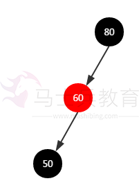

---

根据上述逻辑，把节点60设置成黑色，把节点80设置成红色，并对节点80执行右旋操作，右旋实现如
下：
 
右旋之后的红黑树如下：
③、加入节点70，二叉树如下：
    else {
        if (x == xp.right) {
            root = rotateLeft(root, x = xp);
            xpp = (xp = x.parent) == null ? null : xp.parent;
        }
        if (xp != null) {
            xp.red = false;
            if (xpp != null) {
                xpp.red = true;
                root = rotateRight(root, xpp);
            }
        }
    }
}
static <K,V> TreeNode<K,V> rotateRight(TreeNode<K,V> root,
                                       TreeNode<K,V> p) {
    TreeNode<K,V> l, pp, lr;
    if (p != null && (l = p.left) != null) {
        if ((lr = p.left = l.right) != null)
            lr.parent = p;
        if ((pp = l.parent = p.parent) == null)
            (root = l).red = false;
        else if (pp.right == p)
            pp.right = l;
        else
            pp.left = l;
        l.right = p;
        p.parent = l;
    }
    return root;
}

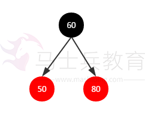

---

继续执行balanceInsertion() 方法调整二叉树，此时父节点80是个右儿子，节点70是左儿子，且叔节
点50不为空，且是红色的，则执行如下逻辑：
 
此时二叉树如下：
此时x 指向xpp ，即节点60，继续循环处理x ，设置其颜色为黑色，最终二叉树如下：
if (xppl != null && xppl.red) {
    xppl.red = false;
    xp.red = false;
    xpp.red = true;
    x = xpp;
}

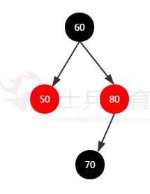

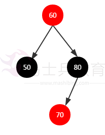

---

④、加入节点20，二叉树变化如下：
因为节点20的父节点50是一个黑色的节点，不需要进行调整；
⑤、加入节点65，二叉树变化如下：

---

对节点80进行右旋操作。
⑥、加入节点40，二叉树变化如下：
1、对节点20执行左旋操作；
2、对节点50执行右旋操作；
最后加入节点10，二叉树变化如下：
重新对节点进行着色，到此为止，红黑树已经构造完成；

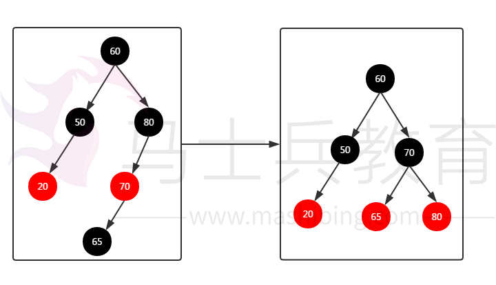

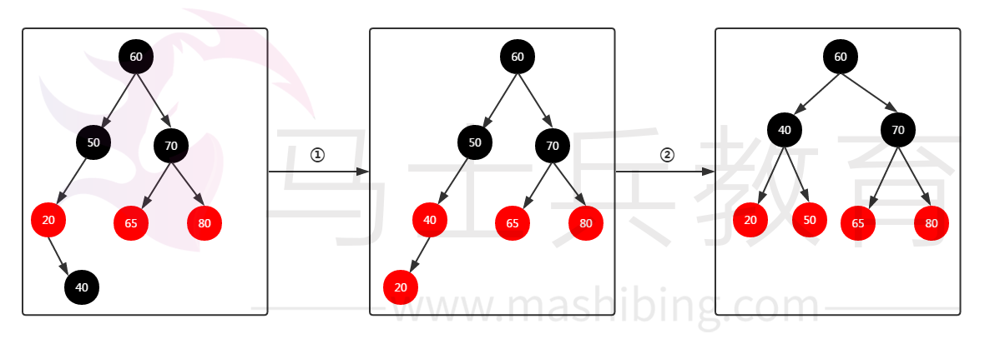

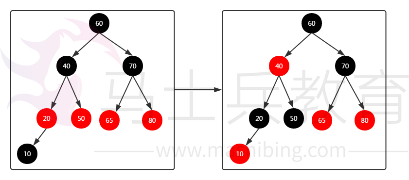

---

说说反射的用途及实现，反射是不是很慢，我们在项目中是
否要避免使 用反射；
 
一、用途 反射被广泛地用于那些需要在运行时检测或修改程序行为的
程序中。
 
二、实现方式 Foo foo = new Foo();
 
第一种：通过Object类的getClass方法 Class cla = foo.getClass(); 
第二种：通过对象实例方法获取对象 Class cla = foo.class; 
第三种：通过Class.forName方式 Class cla = Class.forName("xx.xx.Foo");
三、缺点
 
1）影响性能 反射包括了一些动态类型，所以 JVM 无法对这些代码进行优化。因此，反射操作的效  率
要比那些非反射操作低得多。我们应该避免在经常被执行的代码或对性能要求很高的程  序中使用反射。
2）安全限制 使用反射技术要求程序必须在一个没有安全限制的环境中运行。
3）内部暴露 由于反射允许代码执行一些在正常情况下不被允许的操作（比如访问私有的属性和方 
法），所以 使用反射可能会导致意料之外的副作用－－代码有功能上的错误，降低可移植性。 反射代码
破坏 了抽象性，因此当平台发生改变的时候，代码的行为就有可能也随着变化。 
说说自定义注解的场景及实现；
 
利用自定义注解,结合SpringAOP可以完成权限控制、日志记录、统一异常处理、数字签名、数 据加解密
等功能。
实现场景（API接口数据加解密）
1）自定义一个注解，在需要加解密的方法上添加该注解 
2）配置SringAOP环绕通知 
3）截获方法入参并进行解密 
4）截获方法返回值并进行加密 
List 和 Map 区别
 
一、概述
 
List是存储单列数据的集合，Map是存储键和值这样的双列数据的集合， List中存储的数据是有顺序，并
且允许重复，值允许有多个null； Map中存储的数据是没有顺序的，键不能重复，值是可以有重复的，
key最多有一个null。
二、明细
 
List
 
1）可以允许重复的对象。 
2）可以插入多个null元素。 
3）是一个有序容器，保持了每个元素的插入顺序，输出的顺序就是插入的顺序。

---

4）常用的实现类有 ArrayList、LinkedList 和 Vector。ArrayList 最为流行，它提供了使用索引 的随意
访问，而 LinkedList 则对于经常需要从 List 中添加或删除元素的场合更为合适。
Map
 
1）Map不是collection的子接口或者实现类。Map是一个接口。 
2）Map 的 每个 Entry 都持有两个对象，也就是一个键一个值，Map 可能会持有相同的值对象 但键对
象必须是唯一的。 
3）TreeMap 也通过 Comparator  或者 Comparable 维护了一个排序顺序。 
4）Map 里你可以拥有随意个 null 值但最多只能有一个 null 键。 
5）Map 接口最流行的几个实现类是 HashMap、LinkedHashMap、Hashtable 和 TreeMap。 
（HashMap、TreeMap最常用）
Set（问题扩展）
 
1）不允许重复对象 
2）无序容器，你无法保证每个元素的存储顺序，TreeSet通过 Comparator  或Comparable 维 护了一
个排序顺序。 
3）只允许一个 null 元素 
4）Set 接口最流行的几个实现类是 HashSet、LinkedHashSet 以及 TreeSet。最流行的是基于  
HashMap 实现的 HashSet；TreeSet 还实现了 SortedSet 接口，因此 TreeSet 是一个根据其  
compare() 和 compareTo() 的定义进行排序的有序容器。   
三、场景（问题扩展）
 
1）如果你经常会使用索引来对容器中的元素进行访问，那么 List 是你的正确的选择。如果你已 经知道
索引了的话，那么 List 的实现类比如 ArrayList 可以提供更快速的访问,如果经常添加删除 元素的，那么
肯定要选择LinkedList。 
2）如果你想容器中的元素能够按照它们插入的次序进行有序存储，那么还是 List，因为 List 是 一个有
序容器，它按照插入顺序进行存储。 
3）如果你想保证插入元素的唯一性，也就是你不想有重复值的出现，那么可以选择一个 Set 的 实现
类，比如 HashSet、LinkedHashSet 或者 TreeSet。所有 Set 的实现类都遵循了统一约束 比如唯一性，
而且还提供了额外的特性比如 TreeSet 还是一个 SortedSet，所有存储于 TreeSet  中的元素可以使用 
Java 里的 Comparator 或者 Comparable 进行排序。LinkedHashSet 也按 照元素的插入顺序对它们进
行存储。 
4）如果你以键和值的形式进行数据存储那么 Map 是你正确的选择。你可以根据你的后续需要 从 
Hashtable、HashMap、TreeMap 中进行选择。
List、Set、Map的区别

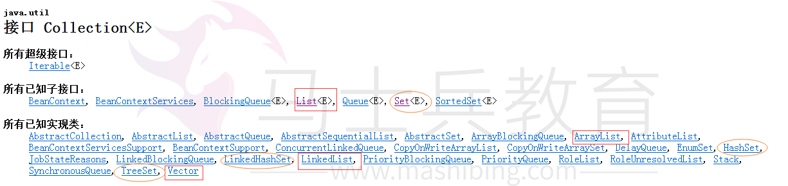

---

（图一）
1.面试题：你说说collection里面有什么子类。
 
（其实面试的时候听到这个问题的时候，你要知道，面试官是想考察List，Set）
 
正如图一，list和set是实现了collection接口的。
 
 
（图二）
List：1.可以允许重复的对象。
 
2.可以插入多个null元素。
 
3.是一个有序容器，保持了每个元素的插入顺序，输出的顺序就是插入的顺序。
 
4.常用的实现类有 ArrayList、LinkedList 和 Vector。ArrayList 最为流行，它提
供了使用索引的随意访问，而 LinkedList 则对于经常需要从 List 中添加或删除元
素的场合更为合适。

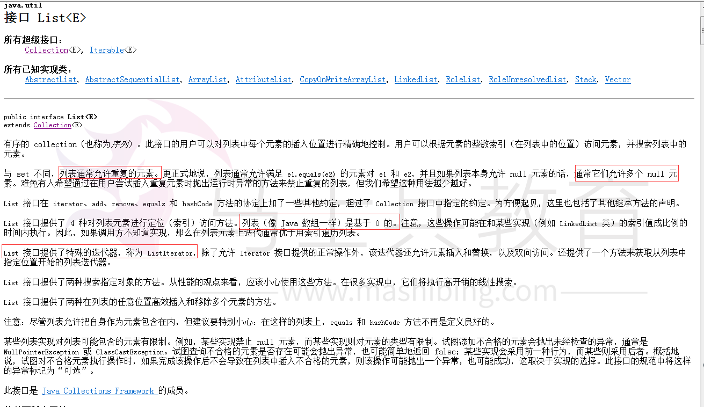

---

（图三）
Set：1.不允许重复对象
 
2. 无序容器，你无法保证每个元素的存储顺序，TreeSet通过 Comparator 或者
Comparable 维护了一个排序顺序。
 
3. 只允许一个 null 元素
 
4.Set 接口最流行的几个实现类是 HashSet、LinkedHashSet 以及 TreeSet。最
流行的是基于 HashMap 实现的 HashSet；TreeSet 还实现了 SortedSet 接口，
因此 TreeSet 是一个根据其 compare() 和 compareTo() 的定义进行排序的有序
容器。
 
 
（图四）

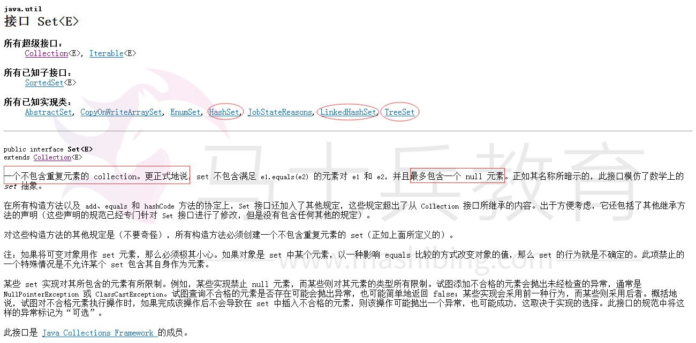

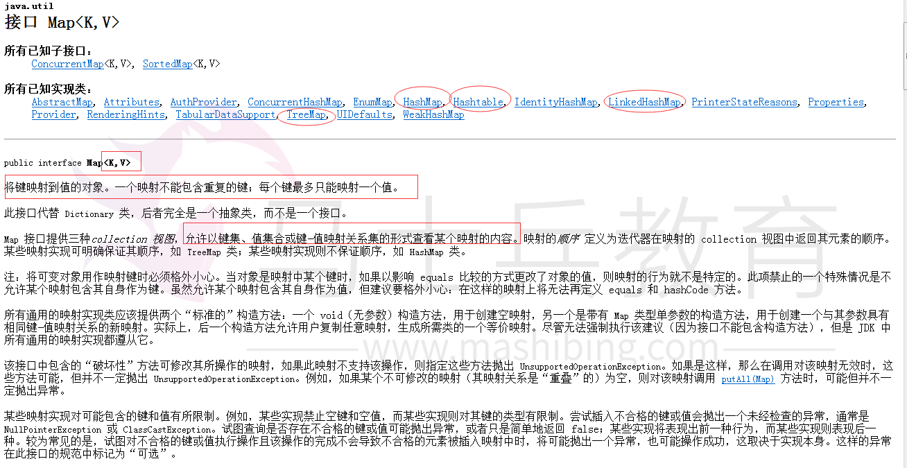

---

1.Map不是collection的子接口或者实现类。Map是一个接口。
 
2.Map 的 每个 Entry 都持有两个对象，也就是一个键一个值，Map 可能会持有相同的值对象但键对象
必须是唯一的。
3. TreeMap 也通过 Comparator 或者 Comparable 维护了一个排序顺序。
 
4. Map 里你可以拥有随意个 null 值但最多只能有一个 null 键。
 
5.Map 接口最流行的几个实现类是 HashMap、LinkedHashMap、Hashtable
和 TreeMap。（HashMap、TreeMap最常用）
 
 
 
2.面试题：什么场景下使用list，set，map呢？
 
（或者会问为什么这里要用list、或者set、map，这里回答它们的优缺点就可以
了）
 
答：
 
1. 如果你经常会使用索引来对容器中的元素进行访问，那么 List 是你的正确的选
择。如果你已经知道索引了的话，那么 List 的实现类比如 ArrayList 可以提供
更快速的访问,如果经常添加删除元素的，那么肯定要选择LinkedList。
 
2. 如果你想容器中的元素能够按照它们插入的次序进行有序存储，那么还是 
List，因为 List 是一个有序容器，它按照插入顺序进行存储。
 
3. 如果你想保证插入元素的唯一性，也就是你不想有重复值的出现，那么可以选
择一个 Set 的实现类，比如 HashSet、LinkedHashSet 或者 TreeSet。所有 
Set 的实现类都遵循了统一约束比如唯一性，而且还提供了额外的特性比如 
TreeSet 还是一个 SortedSet，所有存储于 TreeSet 中的元素可以使用 Java 
里的 Comparator 或者 Comparable 进行排序。LinkedHashSet 也按照元
素的插入顺序对它们进行存储。
 
4. 如果你以键和值的形式进行数据存储那么 Map 是你正确的选择。你可以根据
你的后续需要从 Hashtable、HashMap、TreeMap 中进行选择。

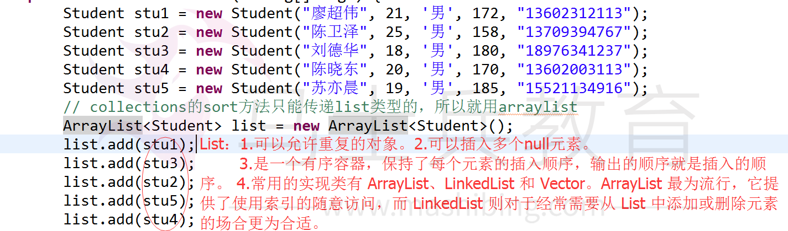

---

大家可以跟着下面的步骤一起尝试一下。
 
1.我们知道了列表要实现排序，需要重写comparable接口的compareTo的方法。 
但是是我不知道comparaTo里面要怎么写呢，它有传入参数吗？它有返回值吗？
如果有事什么类型的呢？ok，下面一起来做一下。先把这个链接的帮助文档下载下
来。下载完之后，打开帮助文档，

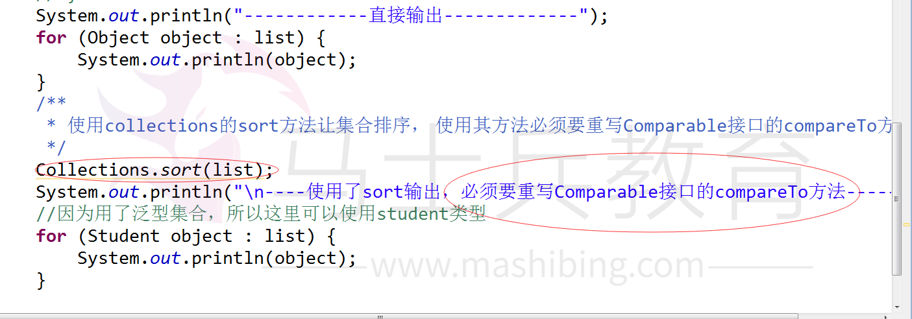

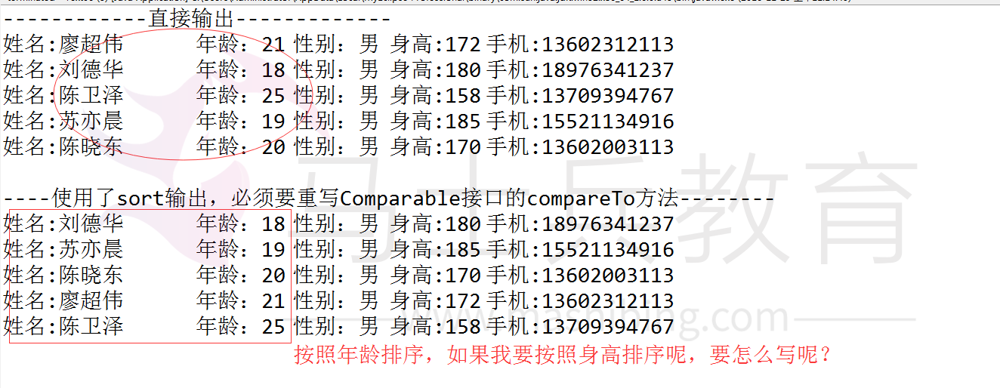

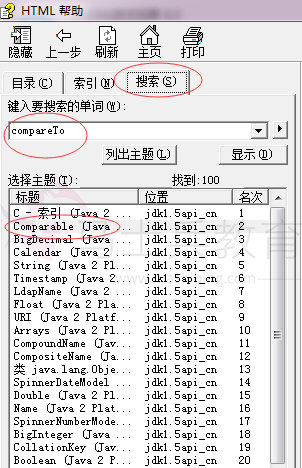

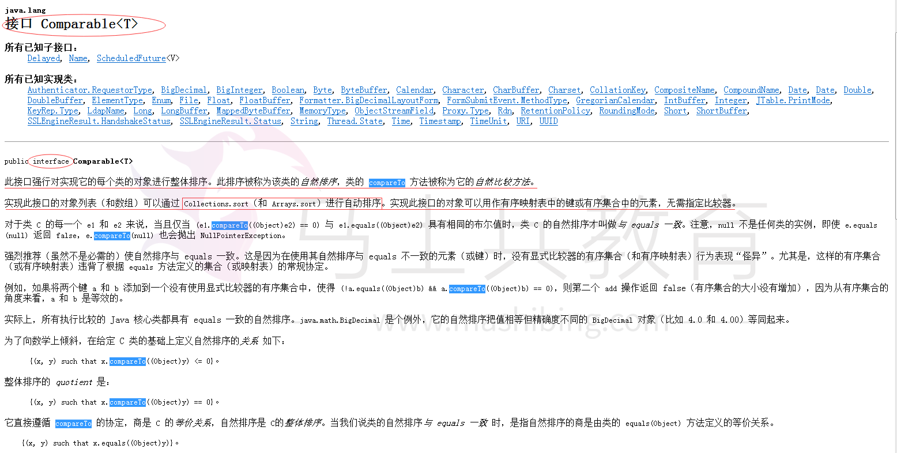

---

2.看完了帮助文档是不是心里稍微有点底气了呢，那现在打开eclipse我们一起来写一写吧。
首先我们要比较对象的哪个属性呢。年龄？身高？还是体重？刚刚看帮助文档已经知道了，所以下面大
家一起来写一下。
 如果大家也是像上图这种写法，那么再想一想有没有更好的办法。(我这样吻是肯定有的，好好看看帮助
文档，你就知道了，我知道你只要用心想想，肯定想出来的！)
好了，写完年龄，不去继续花几分钟把按照身高来排序也写一下吧。
 
Arraylist 与 LinkedList 区别，ArrayList 与 Vector 区
别；
 
1）数据结构 Vector、ArrayList内部使用数组，而LinkedList内部使用双向链表，由数组和链表的特性
知： LinkedList适合指定位置插入、删除操作，不适合查找； ArrayList、Vector适合查找，不适合指定
位置的插入删除操作。 但是ArrayList越靠近尾部的元素进行增删时，其实效率比LinkedList要高
2)线程安全 Vector线程安全，ArrayList、LinkedList线程不安全。
3）空间 ArrayList在元素填满容器时会自动扩充容器大小的50%，而Vector则是100%，因此ArrayList更 
节省空间。

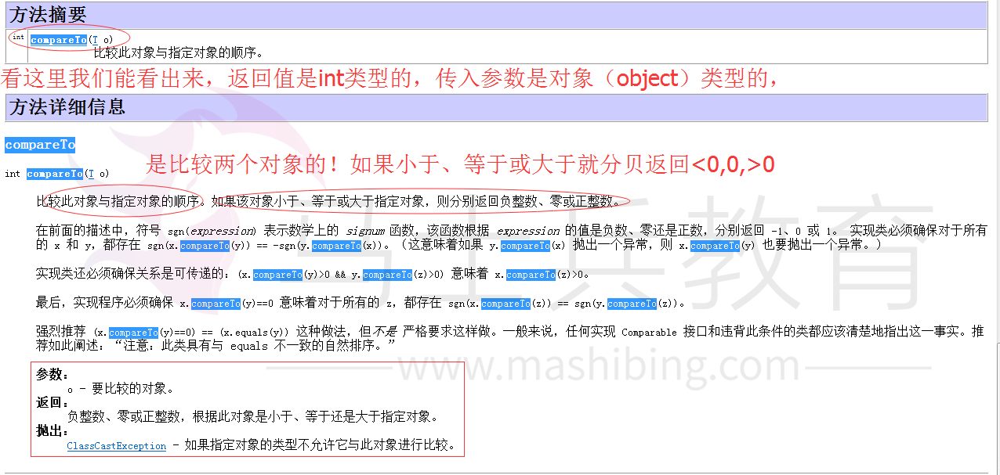

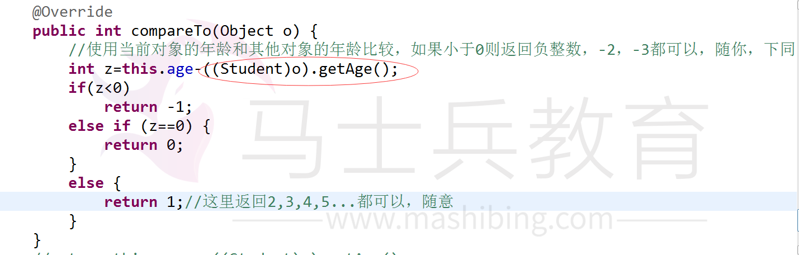

---

Java异常架构与异常关键字
 
Java异常简介
 
Java异常是Java提供的一种识别及响应错误的一致性机制。
Java异常机制可以使程序中异常处理代码和正常业务代码分离，保证程序代码更加优雅，并提高程序健
壮性。在有效使用异常的情况下，异常能清晰的回答 what, where, why这3个问题：异常类型回答了“什
么”被抛出，异常堆栈跟踪回答了“在哪”抛出，异常信息回答了“为什么”会抛出。
Java异常架构
 
1. Throwable
 
Throwable 是 Java 语言中所有错误与异常的超类。
Throwable 包含两个子类：Error（错误）和 Exception（异常），它们通常用于指示发生了异常情况。
Throwable 包含了其线程创建时线程执行堆栈的快照，它提供了 printStackTrace() 等接口用于获取堆栈
跟踪数据等信息。
2. Error（错误）
 
定义：Error 类及其子类。程序中无法处理的错误，表示运行应用程序中出现了严重的错误。
特点：此类错误一般表示代码运行时 JVM 出现问题。通常有 Virtual 
MachineError（虚拟机运行错误）、NoClassDefFoundError（类定义错误）
等。比如 OutOfMemoryError：内存不足错误；StackOverflowError：栈溢出错误。此类错误发生时，
JVM 将终止线程。这些错误是不受检异常，非代码性错误。因此，当此类错误发生时，应用程序不
应该去处理此类错误。按照Java惯例，我们是不应该实现任何新的Error子类的！

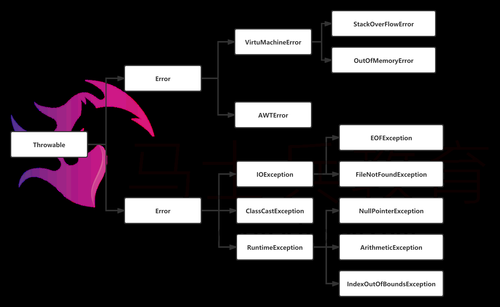

---

3. Exception（异常）
 
程序本身可以捕获并且可以处理的异常。Exception 这种异常又分为两类：运行时异常和编译时异常。
运行时异常
 
定义：RuntimeException 类及其子类，表示 JVM 在运行期间可能出现的异常。
特点：Java 编译器不会检查它。也就是说，当程序中可能出现这类异常时，倘若既"没有通过throws声
明抛出它"，也"没有用try-catch语句捕获它"，还是会编译通过。比如NullPointerException空指针异
常、
ArrayIndexOutBoundException数组下标越界异常、ClassCastException类型转换异常、
ArithmeticExecption算术异常。此类异常属于不受检异常，一般是由程序逻辑错误引起的，在程序中可
以选择捕获处理，也可以不处理。虽然 Java 编译器不会检查运行时异常，但是我们也可以通过 throws 
进行声明抛
出，也可以通过 try-catch 对它进行捕获处理。如果产生运行时异常，则需要通过修改代码来进行避免。
例如，若会发生除数为零的情况，则需要通过代码避免该情况的发生！
RuntimeException 异常会由 Java 虚拟机自动抛出并自动捕获（就算我们没写异常捕获语句运行时也会
抛出错误！！），此类异常的出现绝大数情况是代码本身有问题应该从逻辑上去解决并改进代码。
编译时异常
 
定义: Exception 中除 RuntimeException 及其子类之外的异常。
特点: Java 编译器会检查它。如果程序中出现此类异常，比如 
ClassNotFoundException（没有找到指定的类异常），IOException（IO流异常），要么通过throws进
行声明抛出，要么通过try-catch进行捕获处理，否则不能通过编译。在程序中，通常不会自定义该类异
常，而是直接使用系统提供的异常类。该异常我们必须手动在代码里添加捕获语句来处理该异常。
4. 受检异常与非受检异常
 
Java 的所有异常可以分为受检异常（checked exception）和非受检异常
（unchecked exception）。
受检异常
 
编译器要求必须处理的异常。正确的程序在运行过程中，经常容易出现的、符合
预期的异常情况。一旦发生此类异常，就必须采用某种方式进行处理。除 
RuntimeException 及其子类外，其他的 Exception 异常都属于受检异常。编译器会检查此类异常，也
就是说当编译器检查到应用中的某处可能会此类异常时，将会提示你处理本异常——要么使用try-catch
捕获，要么使用方法签名中用 throws 关键字抛出，否则编译不通过。
非受检异常
 
编译器不会进行检查并且不要求必须处理的异常，也就说当程序中出现此类异常时，即使我们没有try-
catch捕获它，也没有使用throws抛出该异常，编译也会正常通过。该类异常包括运行时异常
（RuntimeException极其子类）和错误(Error)

---

Java异常关键字
 
• try – 用于监听。将要被监听的代码(可能抛出异常的代码)放在try语句块之内，当try语句块内发生异常
时，异常就被抛出。
• catch – 用于捕获异常。catch用来捕获try语句块中发生的异常。
• finally – finally语句块总是会被执行。它主要用于回收在try块里打开的物力资源(如数据库连接、网络
连接和磁盘文件)。只有finally块，执行完成之后，才会回来执行try或者catch块中的return或者throw语
句，如果finally中使用了 return或者throw等终止方法的语句，则就不会跳回执行，直接停止。
• throw – 用于抛出异常。
• throws – 用在方法签名中，用于声明该方法可能抛出的异常。
Java异常处理
 
Java 通过面向对象的方法进行异常处理，一旦方法抛出异常，系统自动根据该异常对象寻找合适异常处
理器（Exception Handler）来处理该异常，把各种不同的异常进行分类，并提供了良好的接口。在 
Java 中，每个异常都是一个对
象，它是 Throwable 类或其子类的实例。当一个方法出现异常后便抛出一个异常对象，该对象中包含有
异常信息，调用这个对象的方法可以捕获到这个异常并可以对其进行处理。Java 的异常处理是通过 5 个
关键词来实现的：try、 catch、throw、throws 和 finally。
在Java应用中，异常的处理机制分为声明异常，抛出异常和捕获异常。
声明异常
 
通常，应该捕获那些知道如何处理的异常，将不知道如何处理的异常继续传递下
去。传递异常可以在方法签名处使用 throws 关键字声明可能会抛出的异常。注意
非检查异常（Error、RuntimeException 或它们的子类）不可使用 throws 关键字来声明要抛出的异
常。
      
一个方法出现编译时异常，就需要 try-catch/ throws 处理，否则会导致编译错误

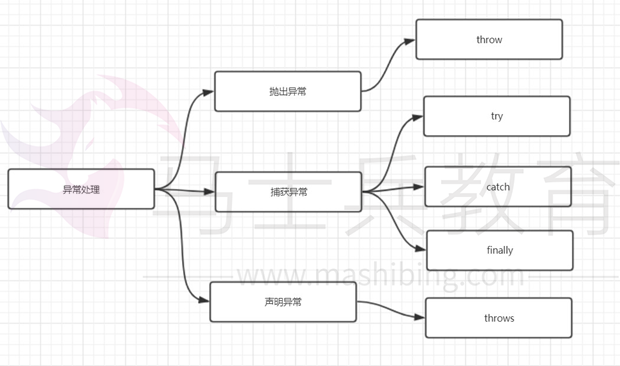

---

抛出异常
 
如果你觉得解决不了某些异常问题，且不需要调用者处理，那么你可以抛出异常。 throw关键字作用是
在方法内部抛出一个Throwable类型的异常。任何Java代码都可以通过throw语句抛出异常。
捕获异常
 
程序通常在运行之前不报错，但是运行后可能会出现某些未知的错误，但是还不想直接抛出到上一级，
那么就需要通过try…catch…的形式进行异常捕获，之后根据不同的异常情况来进行相应的处理。如何选
择异常类型
可以根据下图来选择是捕获异常，声明异常还是抛出异常
常见异常处理方式直接抛出异常
 
通常，应该捕获那些知道如何处理的异常，将不知道如何处理的异常继续传递下去。传递异常可以在方
法签名处使用 throws 关键字声明可能会抛出的异常。
封装异常再抛出
 
有时我们会从 catch 中抛出一个异常，目的是为了改变异常的类型。多用于在多系统集成时，当某个子
系统故障，异常类型可能有多种，可以用统一的异常类型向外暴露，不需暴露太多内部异常细节。
1 private static void readFile(String filePath) throws IOException { 
2 File file = new File(filePath);
3 String result; 
4 BufferedReader reader = new BufferedReader(new FileReader(file)); 
5 while((result = reader.readLine())!=null) { 
6 System.out.println(result);
7   }
8   reader.close();
9   }

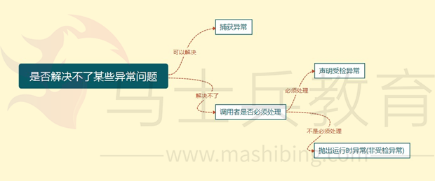

---

捕获异常
 
在一个 try-catch 语句块中可以捕获多个异常类型，并对不同类型的异常做出不同的处理
同一个 catch 也可以捕获多种类型异常，用 | 隔开
自定义异常
 
习惯上，定义一个异常类应包含两个构造函数，一个无参构造函数和一个带有详
细描述信息的构造函数（Throwable 的 toString 方法会打印这些详细信息，调试时很有用）
1 private static void readFile(String filePath) throws MyException {
2   try {
3   // code
4 } catch (IOException e) {
5   MyException ex = new MyException("read file failed.");
6   ex.initCause(e);
7   throw ex;
8   }
9   }
1   private static void readFile(String filePath) {
2   try {
3   // code
4   } catch (FileNotFoundException e) {
5   // handle FileNotFoundException
6 } catch (IOException e){
7   // handle IOException
8   }
9   }
1   private static void readFile(String filePath) {
2   try {
3   // code
4   } catch (FileNotFoundException | UnknownHostException e) {
5   // handle FileNotFoundException or UnknownHostException
6 } catch (IOException e){
7   // handle IOException
8   }
9   }
1   public class MyException extends Exception {
2   public MyException(){ }
3   public MyException(String msg){
4   super(msg);
5   }
6   // ...
7   }

---

try-catch-finally
 
当方法中发生异常，异常处之后的代码不会再执行，如果之前获取了一些本地资源需要释放，则需要在
方法正常结束时和 catch 语句中都调用释放本地资源的代码，显得代码比较繁琐，finally 语句可以解决
这个问题。
调用该方法时，读取文件时若发生异常，代码会进入 catch 代码块，之后进入  finally 代码块；若读取文
件时未发生异常，则会跳过 catch 代码块直接进入  finally 代码块。所以无论代码中是否发生异常，
fianlly 中的代码都会执行。 若 catch 代码块中包含 return 语句，finally 中的代码还会执行吗？将以上
代码 中的 catch 子句修改如下： 
调用 readFile 方法，观察当 catch 子句中调用 return 语句时，finally 子句是 否执行
可见，即使 catch 中包含了 return 语句，finally 子句依然会执行。若 finally 中也包含 return 语句，
finally 中的 return 会覆盖前面的 return.
1 private static void readFile(String filePath) throws MyException { 
2  File file = new File(filePath); 
3  String result;
4  BufferedReader reader = null; 
5  try { 
6  reader = new BufferedReader(new FileReader(file)); 
7  while((result = reader.readLine())!=null) {
8  System.out.println(result); 
9  } 
10  } catch (IOException e) {
11  System.out.println("readFile method catch block."); 
12  MyException ex = new MyException("read file failed."); 
13  ex.initCause(e);
14  throw ex; 
15  } finally { 
16  System.out.println("readFile method finally block.");
17  if (null != reader) { 
18  try {
19  reader.close(); 
20  } catch (IOException e) {
21  e.printStackTrace(); 
22  } 
23  }
24  } 
25 }
1 catch (IOException e) { 
2  System.out.println("readFile method catch block.");
3  return; 
4 }
1 readFile method catch block. 
2 readFile method finally block.

---

try-with-resource
 
上面例子中，finally 中的 close 方法也可能抛出 IOException, 从而覆盖了原始异常。JAVA 7 提供了更优
雅的方式来实现资源的自动释放，自动释放的资源需要是实现了 AutoCloseable 接口的类。
try 代码块退出时，会自动调用 scanner.close 方法，和把 scanner.close 方法放在 finally 代码块中不同
的是，若 scanner.close 抛出异常，则会被抑制，抛出的仍然为原始异常。被抑制的异常会由 
addSusppressed 方法添加到原来的异常，如果想要获取被抑制的异常列表，可以调用 getSuppressed 
方法来获取。
Java异常常见面试题
 
1. Error 和 Exception 区别是什么？
 
Error 类型的错误通常为虚拟机相关错误，如系统崩溃，内存不足，堆栈溢出 等，编译器不会对这类错
误进行检测，JAVA 应用程序也不应对这类错误进行捕 获，一旦这类错误发生，通常应用程序会被终
止，仅靠应用程序本身无法恢复； 
Exception 类的错误是可以在应用程序中进行捕获并处理的，通常遇到这种错 误，应对其进行处理，使
应用程序可以继续正常运行。 
2. 运行时异常和一般异常(受检异常)区别是什么？
 
运行时异常包括 RuntimeException 类及其子类，表示 JVM 在运行期间可能出 现的异常。 Java 编译器
不会检查运行时异常。 
受检异常是Exception 中除 RuntimeException 及其子类之外的异常。 Java 编 译器会检查受检异常。 
RuntimeException异常和受检异常之间的区别：是否强制要求调用者必须处 理此异常，如果强制要求
调用者必须进行处理，那么就使用受检异常，否则就选择非受检异常(RuntimeException)。一般来讲，
如果没有特殊的要求，我们建 议使用RuntimeException异常。 
3. JVM 是如何处理异常的？
 
在一个方法中如果发生异常，这个方法会创建一个异常对象，并转交给 JVM， 该异常对象包含异常名
称，异常描述以及异常发生时应用程序的状态。创建异常 对象并转交给 JVM 的过程称为抛出异常。可能
有一系列的方法调用，终才进 入抛出异常的方法，这一系列方法调用的有序列表叫做调用栈。
JVM 会顺着调用栈去查找看是否有可以处理异常的代码，如果有，则调用异常 处理代码。当 JVM 发现可
以处理异常的代码时，会把发生的异常传递给它。如 果 JVM 没有找到可以处理该异常的代码块，JVM 就
会将该异常转交给默认的异 常处理器（默认处理器为 JVM 的一部分），默认异常处理器打印出异常信息
并 终止应用程序。 
1   private static void tryWithResourceTest(){
2   try (Scanner scanner = new Scanner(new FileInputStream("c:/abc"),"UTF8")){
3   // code
4 } catch (IOException e){
5   // handle exception
6   }
7   }

---

4. throw 和 throws 的区别是什么？
 
Java 中的异常处理除了包括捕获异常和处理异常之外，还包括声明异常和拋出 异常，可以通过 throws 
关键字在方法上声明该方法要拋出的异常，或者在方法 内部通过 throw 拋出异常对象。 
throws 关键字和 throw 关键字在使用上的几点区别如下： 
throw 关键字用在方法内部，只能用于抛出一种异常，用来抛出方法或代码块中 的异常，受查异常
和非受查异常都可以被抛出。 
throws 关键字用在方法声明上，可以抛出多个异常，用来标识该方法可能抛出 的异常列表。一个
方法用 throws 标识了可能抛出的异常列表，调用该方法的方法中 必须包含可处理异常的代码，否
则也要在方法签名中用 throws 关键字声明相应的异 常。  
5. final、finally、finalize 有什么区别？
 
final可以修饰类、变量、方法，修饰类表示该类不能被继承、修饰方法表示该方 法不能被重写、修
饰变量表示该变量是一个常量不能被重新赋值。 
finally一般作用在try-catch代码块中，在处理异常的时候，通常我们将一定要执 行的代码方法
finally代码块中，表示不管是否出现异常，该代码块都会执行，一般用 来存放一些关闭资源的代
码。 
finalize是一个方法，属于Object类的一个方法，而Object类是所有类的父类， Java 中允许使用 
finalize()方法在垃圾收集器将对象从内存中清除出去之前做必要的 清理工作。 
6. NoClassDefFoundError 和 ClassNotFoundException 区别？ 
NoClassDefFoundError 是一个 Error 类型的异常，是由 JVM 引起的，不应该 尝试捕获这个异常。 
引起该异常的原因是 JVM 或 ClassLoader 尝试加载某类时在内存中找不到该类 的定义，该动作发生在
运行期间，即编译时该类存在，但是在运行时却找不到 了，可能是变异后被删除了等原因导致； 
ClassNotFoundException 是一个受查异常，需要显式地使用 try-catch 对其 进行捕获和处理，或在方
法签名中用 throws 关键字进行声明。当使用  Class.forName, ClassLoader.loadClass 或 
ClassLoader.findSystemClass 动 态加载类到内存的时候，通过传入的类路径参数没有找到该类，就会
抛出该异常；另一种抛出该异常的可能原因是某个类已经由一个类加载器加载至内存中， 另一个加载器
又尝试去加载它。 
7. try-catch-finally 中哪个部分可以省略？
 
答：catch 可以省略 
原因 
更为严格的说法其实是：try只适合处理运行时异常，try+catch适合处理运行时 异常+普通异常。也就是
说，如果你只用try去处理普通异常却不加以catch处 理，编译是通不过的，因为编译器硬性规定，普通
异常如果选择捕获，则必须用 catch显示声明以便进一步处理。而运行时异常在编译时没有如此规定，
所以 catch可以省略，你加上catch编译器也觉得无可厚非。 
理论上，编译器看任何代码都不顺眼，都觉得可能有潜在的问题，所以你即使对 所有代码加上try，代码
在运行期时也只不过是在正常运行的基础上加一层皮。 但是你一旦对一段代码加上try，就等于显示地承
诺编译器，对这段代码可能抛 出的异常进行捕获而非向上抛出处理。如果是普通异常，编译器要求必须
用 catch捕获以便进一步处理；如果运行时异常，捕获然后丢弃并且+finally扫尾 处理，或者加上catch
捕获以便进一步处理。 
至于加上finally，则是在不管有没捕获异常，都要进行的“扫尾”处理。

---

8. try-catch-finally 中，如果 catch 中 return 了， finally 还会执
行吗？
 
答：会执行，在 return 前执行。 
注意：在 finally 中改变返回值的做法是不好的，因为如果存在 finally 代码块， try中的 return 语句不会
立马返回调用者，而是记录下返回值待 finally 代码块 执行完毕之后再向调用者返回其值，然后如果在 
finally 中修改了返回值，就会 返回修改后的值。显然，在 finally 中返回或者修改返回值会对程序造成很
大的 困扰，C#中直接用编译错误的方式来阻止程序员干这种龌龊的事情，Java 中也 可以通过提升编译
器的语法检查级别来产生警告或错误。 
代码示例1： 
执行结果：30 
代码示例2： 
执行结果：40  
1 public static int getInt() { 
2  int a = 10; 
3  try {
4  System.out.println(a / 0); 
5  a = 20; 
6  } catch (ArithmeticException e) { 
7  a = 30; 
8  return a; 
9  /* 
10  * return a 在程序执行到这一步的时候，这里不是return a 而是 return 30；这个返 回路径就
形成了 
11  * 但是呢，它发现后面还有finally，所以继续执行finally的内容，a=40 
12  * 再次回到以前的路径,继续走return 30，形成返回路径之后，这里的a就不是a变量 了，而是常量30 
13  */ 
14  } finally { 
15  a = 40; 
16  } 
17  return a; 
18 } 
1 public static int getInt() { 
2  int a = 10; 
3  try { 
4  System.out.println(a / 0); 
5  a = 20; 
6  } catch (ArithmeticException e) { 
7  a = 30; 
8  return a; 
9  } finally { 
10  a = 40; 
11  //如果这样，就又重新形成了一条返回路径，由于只能通过1个return返回，所以这里直 接返回40 
12  return a; 
13  }
14 
15 }

---

9. 类 ExampleA 继承 Exception，类 ExampleB 继承 ExampleA。 
有如下代码片断： 
请问执行此段代码的输出是什么？ 
答： 
输出：ExampleA。（根据里氏代换原则[能使用父类型的地方一定能使用子类 型]，抓取 ExampleA 类
型异常的 catch 块能够抓住 try 块中抛出的 ExampleB  类型的异常） 
面试题 - 说出下面代码的运行结果。（此题的出处是《Java 编程思想》一书） 
 结果
1 try { 
2  throw new ExampleB("b") 
3 } catch（ExampleA e）{ 
4  System.out.println("ExampleA"); 
5 } catch（Exception e）{ 
6  System.out.println("Exception"); 
7 } 
1 class Annoyance extends Exception { 
2 } 
3 class Sneeze extends Annoyance { 
4 } 
5 class Human { 
6  public static void main(String[] args) 
7  throws Exception { 
8  try { 
9  try { 
10  throw new Sneeze(); 
11  } catch ( Annoyance a ) { 
12  System.out.println("Caught Annoyance"); 
13  throw a; 
14  } 
15  } catch ( Sneeze s ) { 
16  System.out.println("Caught Sneeze"); 
17  return ; 
18  } finally { 
19  System.out.println("Hello World!"); 
20  } 
21  } 
22 }
1 Caught Annoyance 
2 Caught Sneeze 
3 Hello World!

---

10. 常见的 RuntimeException 有哪些？
 
ClassCastException(类转换异常) 
IndexOutOfBoundsException(数组越界) 
NullPointerException(空指针) 
ArrayStoreException(数据存储异常，操作数组时类型不一致) 
还有IO操作的BufferOverflowException异常 
11. Java常见异常有哪些
 
java.lang.IllegalAccessError：违法访问错误。当一个应用试图访问、修改某个类的域（Field）或者调
用其方法，但是又违反域或方法的可见性声明，则抛出该异常。
java.lang.InstantiationError：实例化错误。当一个应用试图通过Java的new操作符构造一个抽象类或者
接口时抛出该异常.
java.lang.OutOfMemoryError：内存不足错误。当可用内存不足以让Java虚拟机分配给一个对象时抛出
该错误。
java.lang.StackOverflowError：堆栈溢出错误。当一个应用递归调用的层次太深而导致堆栈溢出或者陷
入死循环时抛出该错误。
java.lang.ClassCastException：类造型异常。假设有类A和B（A不是B的父类或子类），O是A的实例，
那么当强制将O构造为类B的实例时抛出该异常。该异常经常被称为强制类型转换异常。
java.lang.ClassNotFoundException：找不到类异常。当应用试图根据字符串形式的类名构造类，而在
遍历CLASSPAH之后找不到对应名称的class文件时，抛出该异常。 java.lang.ArithmeticException：算
术条件异常。譬如：整数除零等。
java.lang.ArrayIndexOutOfBoundsException：数组索引越界异常。当对数组的索引值为负数或大于等
于数组大小时抛出。
java.lang.IndexOutOfBoundsException：索引越界异常。当访问某个序列的索引值小于0或大于等于序
列大小时，抛出该异常。 java.lang.InstantiationException：实例化异常。当试图通过newInstance()方
法创建某个类的实例，而该类是一个抽象类或接口时，抛出该异常。
java.lang.NoSuchFieldException：属性不存在异常。当访问某个类的不存在的属性时抛出该异常。
java.lang.NoSuchMethodException：方法不存在异常。当访问某个类的不存在的方法时抛出该异常。
java.lang.NullPointerException：空指针异常。当应用试图在要求使用对象的地方使用了null时，抛出
该异常。譬如：调用null对象的实例方法、访问null对象的属性、计算null对象的长度、使用throw语句
抛出null等等。
java.lang.NumberFormatException：数字格式异常。当试图将一个String转换为指定的数字类型，而
该字符串确不满足数字类型要求的格式时，抛出该异常。
java.lang.StringIndexOutOfBoundsException：字符串索引越界异常。当使用索引值访问某个字符串
中的字符，而该索引值小于0或大于等于序列大小时,抛出该异常
Java异常处理最佳实践
 
在 Java 中处理异常并不是一个简单的事情。不仅仅初学者很难理解，即使一些有经验的开发者也需要花
费很多时间来思考如何处理异常，包括需要处理哪些异常，怎样处理等等。这也是绝大多数开发团队都
会制定一些规则来规范进行异常处理的原因。而团队之间的这些规范往往是截然不同的。本文给出几个
被很多团队使用的异常处理 佳实践。

---

1. 在 finally 块中清理资源或者使用 try-with-resource 语句
 
当使用类似InputStream这种需要使用后关闭的资源时，一个常见的错误就是在 try块的 后关闭资源。
问题就是，只有没有异常抛出的时候，这段代码才可以正常工作。try 代码块内代码会正常执行，并且资
源可以正常关闭。但是，使用 try 代码块是有原因的，一般调用一个或多个可能抛出异常的方法，而
且，你自己也可能会抛出一个异常，这意味着代码可能不会执行到 try 代码块的  后部分。结果就是，你
并没有关闭资源。
所以，你应该把清理工作的代码放到 finally 里去，或者使用 try-with-resource 特性。
1.1 使用 finally 代码块
 
与前面几行 try 代码块不同，finally 代码块总是会被执行。不管 try 代码块成功
执行之后还是你在 catch 代码块中处理完异常后都会执行。因此，你可以确保你清理了所有打开的资
源。
1   public void doNotCloseResourceInTry() {
2   FileInputStream inputStream = null;
3   try {
4   File file = new File("./tmp.txt");
5   inputStream = new FileInputStream(file);
6   // use the inputStream to read a file
7   // do NOT do this
8   inputStream.close();
9   } catch (FileNotFoundException e) {
10  log.error(e);
11  } catch (IOException e) {
12  log.error(e);
13  }
14  }
1 public void closeResourceInFinally() { 
2  FileInputStream inputStream = null; 
3  try { 
4  File file = new File("./tmp.txt");
5  inputStream = new FileInputStream(file); 
6  // use the inputStream to read a file
7  } catch (FileNotFoundException e) {
8  log.error(e);
9  } finally {
10  if (inputStream != null) { 
11  try { 
12  inputStream.close(); 
13  } catch (IOException e) { 
14  log.error(e); 
15  } 
16  } 
17  }
18 }

---

1.2 Java 7 的 try-with-resource 语法
 
如果你的资源实现了 AutoCloseable 接口，你可以使用这个语法。大多数的 Java 标准资源都继承了这
个接口。当你在 try 子句中打开资源，资源会在 try 代码块执行后或异常处理后自动关闭。
2. 优先明确的异常
 
你抛出的异常越明确越好，永远记住，你的同事或者几个月之后的你，将会调用你的方法并且处理异
常。
因此需要保证提供给他们尽可能多的信息。这样你的 API 更容易被理解。你的方法的调用者能够更好的
处理异常并且避免额外的检查。因此，总是尝试寻找 适合你的异常事件的类，例如，抛出一个 
NumberFormatException 来替换一个 IllegalArgumentException 。避免抛出一个不明确的异常。
3. 对异常进行文档说明
 
当在方法上声明抛出异常时，也需要进行文档说明。目的是为了给调用者提供尽可能多的信息，从而可
以更好地避免或处理异常。
在 Javadoc 添加 @throws 声明，并且描述抛出异常的场景。
4. 使用描述性消息抛出异常
 
在抛出异常时，需要尽可能精确地描述问题和相关信息，这样无论是打印到日志中还是在监控工具中，
都能够更容易被人阅读，从而可以更好地定位具体错误信息、错误的严重程度等。
但这里并不是说要对错误信息长篇大论，因为本来 Exception 的类名就能够反映错误的原因，因此只需
要用一到两句话描述即可。
1   public void automaticallyCloseResource() {
2   File file = new File("./tmp.txt");
3   try (FileInputStream inputStream = new FileInputStream(file);) {
4   // use the inputStream to read a file
5   } catch (FileNotFoundException e) {
6   log.error(e);
7 } catch (IOException e) {
8   log.error(e);
9   }
10  }
11
1 public void doNotDoThis() throws Exception {
2 ...
3   }
4   public void doThis() throws NumberFormatException { 
5 ...
6 }
7
1 public void doSomething(String input) throws MyBusinessException { 
2 ...
3 }

---

如果抛出一个特定的异常，它的类名很可能已经描述了这种错误。所以，你不需要提供很多额外的信
息。一个很好的例子是 NumberFormatException 。当你以错误的格式提供 String 时，它将被 
java.lang.Long 类的构造函数抛出。
5. 优先捕获最具体的异常
 
大多数 IDE 都可以帮助你实现这个  佳实践。当你尝试首先捕获较不具体的异常时，它们会报告无法访问
的代码块。
但问题在于，只有匹配异常的第一个 catch 块会被执行。 因此，如果首先捕获
IllegalArgumentException ，则永远不会到达应该处理更具体的 NumberFormatException 的 catch 
块，因为它是 IllegalArgumentException 的子类。总是优先捕获  具体的异常类，并将不太具体的 
catch 块添加到列表的末尾。你可以在下面的代码片断中看到这样一个 try-catch 语句的例子。 第一个 
catch 块处理所有 NumberFormatException 异常，第二个处理所有非
NumberFormatException 异常的IllegalArgumentException 异常。
6. 不要捕获 Throwable 类
 
Throwable 是所有异常和错误的超类。你可以在 catch 子句中使用它，但是你
永远不应该这样做！
如果在 catch 子句中使用 Throwable ，它不仅会捕获所有异常，也将捕获所有的错误。JVM 抛出错误，
指出不应该由应用程序处理的严重问题。 典型的例子是 OutOfMemoryError 或者 StackOverflowError 
。两者都是由应用程序控制之外的情况引起的，无法处理。
所以， 好不要捕获 Throwable ，除非你确定自己处于一种特殊的情况下能够处理错误。
1   try {
2   new Long("xyz");
3 } catch (NumberFormatException e) {
4   log.error(e);
5   }
1 public void catchMostSpecificExceptionFirst() { 
2  try {
3  doSomething("A message");
4   } catch (NumberFormatException e) {
5   log.error(e);
6   } catch (IllegalArgumentException e) {
7   log.error(e)
8   }
9   }
1   public void doNotCatchThrowable() {
2   try {
3   // do something
4   } catch (Throwable t) {
5 // don't do this!
6   }
7   }

---

7. 不要忽略异常
 
很多时候，开发者很有自信不会抛出异常，因此写了一个catch块，但是没有做任何处理或者记录日志。
但现实是经常会出现无法预料的异常，或者无法确定这里的代码未来是不是会改动(删除了阻止异常抛出
的代码)，而此时由于异常被捕获，使得无法拿到足够的错误信息来定位问题。合理的做法是至少要记录
异常的信息。
8. 不要记录并抛出异常
 
这可能是本文中 常被忽略的  佳实践。可以发现很多代码甚至类库中都会有捕获异常、记录日志并再次
抛出的逻辑。如下：
这个处理逻辑看着是合理的。但这经常会给同一个异常输出多条日志。如下：
如上所示，后面的日志也没有附加更有用的信息。如果想要提供更加有用的信息，那么可以将异常包装
为自定义异常。
1   public void doNotIgnoreExceptions() {
2   try {
3   // do something
4 } catch (NumberFormatException e) {
5   // this will never happen
6   }
7   }
1   public void logAnException() {
2   try {
3   // do something
4 } catch (NumberFormatException e) {
5   log.error("This should never happen: " + e);
6   }
7   }
1   try {
2   new Long("xyz");
3 } catch (NumberFormatException e) {
4   log.error(e);
5   throw e;
6   }
1 17:44:28,945 ERROR TestExceptionHandling:65 - java.lang.NumberFormatExcep tion: 
For input string: "xyz" 
2 Exception in thread "main" java.lang.NumberFormatException: For input str ing: 
"xyz" 
3 at java.lang.NumberFormatException.forInputString(NumberFormatException.j 
ava:65)
4 at java.lang.Long.parseLong(Long.java:589) 
5 at java.lang.Long.(Long.java:965) 
6 at com.stackify.example.TestExceptionHandling.logAndThrowException(TestEx 
ceptionHandling.java:63) 
7 at 
com.stackify.example.TestExceptionHandling.main(TestExceptionHandling.java:5
8)

---

因此，仅仅当想要处理异常时才去捕获，否则只需要在方法签名中声明让调用者去处理。
9. 包装异常时不要抛弃原始的异常
 
捕获标准异常并包装为自定义异常是一个很常见的做法。这样可以添加更为具体的异常信息并能够做针
对的异常处理。
在你这样做时，请确保将原始异常设置为原因（注：参考下方代码 
NumberFormatException e 中的原始异常 e ）。Exception 类提供了特殊的
构造函数方法，它接受一个 Throwable 作为参数。否则，你将会丢失堆栈跟踪和原始异常的消息，这将
会使分析导致异常的异常事件变得困难。
10. 不要使用异常控制程序的流程
 
不应该使用异常控制应用的执行流程，例如，本应该使用if语句进行条件判断的情况下，你却使用异常处
理，这是非常不好的习惯，会严重影响应用的性能。
11. 使用标准异常
 
如果使用内建的异常可以解决问题，就不要定义自己的异常。Java API 提供了上百种针对不同情况的异
常类型，在开发中首先尽可能使用 Java API 提供的异常，如果标准的异常不能满足你的要求，这时候创
建自己的定制异常。尽可能得使用标准异常有利于新加入的开发者看懂项目代码。
12. 异常会影响性能
 
异常处理的性能成本非常高，每个 Java 程序员在开发时都应牢记这句话。创建一个异常非常慢，抛出一
个异常又会消耗1~5ms，当一个异常在应用的多个层级之间传递时，会拖累整个应用的性能。
仅在异常情况下使用异常；
在可恢复的异常情况下使用异常；尽管使用异常有利于 Java 开发，但是在应用中  好不要捕获太多
的调用栈，因为在很多情况下都不需要打印调用栈就知道哪里出错了。因此，异常消息应该提供恰
到好处的信息。
 public void wrapException(String input) throws MyBusinessException {
3   // do something
4   } catch (NumberFormatException e) {
5   throw new MyBusinessException("A message that describes the error.", e);
6   }
7   }
1 public void wrapException(String input) throws MyBusinessException {
2   try {
3   // do something
4 } catch (NumberFormatException e) {
5   throw new MyBusinessException("A message that describes the error.", e);
6   }
7   }
8

---

13. 总结
 
综上所述，当你抛出或捕获异常的时候，有很多不同的情况需要考虑，而且大部分事情都是为了改善代
码的可读性或者 API 的可用性。
异常不仅仅是一个错误控制机制，也是一个通信媒介。因此，为了和同事更好的合作，一个团队必须要
制定出一个 佳实践和规则，只有这样，团队成员才能理解这些通用概念，同时在工作中使用它。
异常处理-阿里巴巴Java开发手册
 
1. 【强制】Java 类库中定义的可以通过预检查方式规避的
RuntimeException异常不应该通过catch 的方式来处理，比如：
NullPointerException，IndexOutOfBoundsException等等。 说明：无法通过预检查的异常除外，比
如，在解析字符串形式的数字时，可能存在数字格式错误，不得不通过catch NumberFormatException
来实现。 正例：if (obj != null) {…} 反例：try { obj.method(); } catch 
(NullPointerException e) {…}
2. 【强制】异常不要用来做流程控制，条件控制。 说明：异常设计的初衷是解决程序运行中的各种意
外情况，且异常的处理效率比条件判断方式要低很多。
3. 【强制】catch时请分清稳定代码和非稳定代码，稳定代码指的是无论如何不会出错的代码。对于
非稳定代码的catch尽可能进行区分异常类型，
再做对应的异常处理。 说明：对大段代码进行try-catch，使程序无法根据不同的异常做出正确的应激反
应，也不利于定位问题，这是一种不负责任的表现。 正例：用户注册的场景中，如果用户输入非法字
符，或用户名称已存在，或用户输入密码过于简单，在程序上作出分门别类的判断，并提示给用户。
4. 【强制】捕获异常是为了处理它，不要捕获了却什么都不处理而抛弃之，如果不想处理它，请将该
异常抛给它的调用者。 外层的业务使用者，必须处理异常，将其转化为用户可以理解的内容。
5. 【强制】有try块放到了事务代码中，catch异常后，如果需要回滚事务，一定要注意手动回滚事
务。
6. 【强制】finally块必须对资源对象、流对象进行关闭，有异常也要做 try-catch。 说明：如果JDK7
及以上，可以使用try-with-resources方式。
7. 【强制】不要在finally块中使用return。 说明：try块中的return语句执行成功后，并不马上返回，
而是继续执行finally块中的语句，如果此处存在return语句，则在此直接返回，无情丢弃掉try块中
的返回点。 反例：
1. 【强制】捕获异常与抛异常，必须是完全匹配，或者捕获异常是抛异常的父类。 说明：如果预期对
方抛的是绣球，实际接到的是铅球，就会产生意外情况。
2. 【强制】在调用RPC、二方包、或动态生成类的相关方法时，捕捉异常必须使用Throwable类来进
行拦截。 说明：通过反射机制来调用方法，如果找不到方法，抛出NoSuchMethodException。什
么情况会抛出
1   private int x = 0;
2   public int checkReturn() {
3   try {
4   // x等于1，此处不返回
5   return ++x;
6   } finally {
7   // 返回的结果是2
8   return ++x;
9   }
10  }

---

NoSuchMethodError呢？二方包在类冲突时，仲裁机制可能导致引入非预期的版本使类的方法签名不
匹配，或者在字节码修改框架（比如：
ASM）动态创建或修改类时，修改了相应的方法签名。这些情况，即使代码编译期是正确的，但在代码
运行期时，会抛出NoSuchMethodError。
3. 【推荐】方法的返回值可以为null，不强制返回空集合，或者空对象等，必须添加注释充分说明什
么情况下会返回null值。 说明：本手册明确防止NPE是调用者的责任。即使被调用方法返回空集合
或者空对象，对调用者来说，也并非高枕无忧，必须考虑到远程调用失败、序列化失败、运行时异
常等场景返回null的情况。
4. 【推荐】防止NPE，是程序员的基本修养，注意NPE产生的场景： 1） 返回类型为基本数据类型，
return包装数据类型的对象时，自动拆箱有可能产生NPE。 反例：public int f() { return Integer对
象}， 如果为null，自动解箱抛NPE。 2） 数据库的查询结果可能为null。 3） 集合里的元素即使
isNotEmpty，取出的数据元素也可能为null。 4） 远程调用返回对象时，一律要求进行空指针判
断，防止NPE。 5） 对于Session中获取的数据，建议进行NPE检查，避免空指针。 6） 级联调用
obj.getA().getB().getC()；一连串调用，易产生NPE。
正例：使用JDK8的Optional类来防止NPE问题。
5. 【推荐】定义时区分unchecked / checked 异常，避免直接抛出new 
RuntimeException()，更不允许抛出Exception或者Throwable，应使用有业务含义的自定义异常。推荐
业界已定义过的自定义异常，如：
DAOException / ServiceException等。
6. 【参考】对于公司外的http/api开放接口必须使用“错误码”；而应用内部推荐异常抛出；跨应用间
RPC调用优先考虑使用Result方式，封装 isSuccess()方法、“错误码”、“错误简短信息”。 说明：关
于RPC方法返回方式使用Result方式的理由： 1）使用抛异常返回方式，调用方如果没有捕获到就
会产生运行时错误。 2）如果不加栈信息，只是new自定义异常，加入自己的理解的error 
message，对于调用端解决问题的帮助不会太多。如果加了栈信息，在频繁调用出错的情况下，数
据序列化和传输的性能损耗也是问题。
7. 【参考】避免出现重复的代码（Don’t Repeat Yourself），即DRY原则。 说明：随意复制和粘贴代
码，必然会导致代码的重复，在以后需要修改时，需要修改所有的副本，容易遗漏。必要时抽取共
性方法，或者抽象公共类，甚至是组件化。 正例：一个类中有多个public方法，都需要进行数行相
同的参数校验操作，这个时候请抽取： private boolean checkParam(DTO dto) {…}
 
 
 
Tomcat是什么？
 
Tomcat 服务器Apache软件基金会项目中的一个核心项目，是一个免费的开放 源代码的Web 应用服务
器，属于轻量级应用服务器，在中小型系统和并发访问 用户不是很多的场合下被普遍使用，是开发和调
试JSP 程序的首选。 
Tomcat的缺省端口是多少，怎么修改
 
找到Tomcat目录下的conf文件夹 
进入conf文件夹里面找到server.xml文件 
打开server.xml文件 
在server.xml文件里面找到下列信息

---

把Connector标签的8080端口改成你想要的端口 
tomcat 有哪几种Connector 运行模式(优化)？
 
下面，我们先大致了解Tomcat Connector的三种运行模式。 
BIO：同步并阻塞 一个线程处理一个请求。缺点：并发量高时，线程数较 多，浪费资源。
Tomcat7或以下，在Linux系统中默认使用这种方式。  
配制项：protocol=”HTTP/1.1” 
NIO：同步非阻塞IO 利用Java的异步IO处理，可以通过少量的线程处理大量的请求，可以复用同一 
个线程处理多个connection(多路复用)。 
Tomcat8在Linux系统中默认使用这种方式。 
Tomcat7必须修改Connector配置来启动。 
配制项：protocol=”org.apache.coyote.http11.Http11NioProtocol” 
备注：我们常用的Jetty，Mina，ZooKeeper等都是基于java nio实现. 
APR：即Apache Portable Runtime，从操作系统层面解决io阻塞问 题。AIO方式，异步非阻塞
IO(Java NIO2又叫AIO) 主要与NIO的区别 主要是操作系统的底层区别.可以做个比喻:比作快递，
NIO就是网购后要自 己到官网查下快递是否已经到了(可能是多次)，然后自己去取快递；AIO就 是
快递员送货上门了(不用关注快递进度)。 
配制项：protocol=”org.apache.coyote.http11.Http11AprProtocol” 
备注：需在本地服务器安装APR库。Tomcat7或Tomcat8在Win7或以上的系统 中启动默认使用这
种方式。Linux如果安装了apr和native，Tomcat直接启动就 支持apr。 
Tomcat有几种部署方式？
 
在Tomcat中部署Web应用的方式主要有如下几种： 
利用Tomcat的自动部署。 
把web应用拷贝到webapps目录。Tomcat在启动时会加载目录下的应用，并将 编译后的结果放入
work目录下。 
使用Manager App控制台部署。 
在tomcat主页点击“Manager App” 进入应用管理控制台，可以指定一个 web应用的路径或war文
件。
修改conf/server.xml文件部署。 
修改conf/server.xml文件，增加Context节点可以部署应用。 
增加自定义的Web部署文件。
在conf/Catalina/localhost/ 路径下增加 xyz.xml文件，内容是Context节点， 可以部署应用
tomcat容器是如何创建servlet类实例？用到了什么 原
理？
 
1. 当容器启动时，会读取在webapps目录下所有的web应用中的web.xml 文件，然后对 xml文件进
行解析，并读取servlet注册信息。然后，将每个 应用中注册的servlet类都进行加载，并通过 反射
的方式实例化。（有时候 也是在第一次请求时实例化） 
2. 在servlet注册时加上1如果为正数，则在一开始就实例化，如果不写或 为负数，则第一次请求实例
化。 
Tomcat工作模式
 
1 <Service name="Catalina"> 
2 <Connector port="8080" protocol="HTTP/1.1" 
3  connectionTimeout="20000" 
4  redirectPort="8443" />

---

Tomcat作为servlet容器，有三种工作模式： 
1. 独立的servlet容器，servlet容器是web服务器的一部分； 
2. 进程内的servlet容器，servlet容器是作为web服务器的插件和java容器的实 现，web服务器插件在
内部地址空间打开一个jvm使得java容器在内部得以运行。反 应速度快但伸缩性不足； 
3. 进程外的servlet容器，servlet容器运行于web服务器之外的地址空间，并作 为web服务器的插件
和java容器实现的结合。反应时间不如进程内但伸缩性和稳定性 比进程内优； 进入Tomcat的请求
可以根据Tomcat的工作模式分为如下两类： 
Tomcat作为应用程序服务器：请求来自于前端的web服务器，这可能是 Apache, IIS, Nginx等； 
Tomcat作为独立服务器：请求来自于web浏览器； 
面试时问到Tomcat相关问题的几率并不高，正式因为如此，很多人忽略了对 Tomcat相关技能的掌握，
下面这一篇文章整理了Tomcat相关的系统架构，介 绍了Server、Service、Connector、Container之间
的关系，各个模块的功 能，可以说把这几个掌握住了，Tomcat相关的面试题你就不会有任何问题了！
另外，在面试的时候你还要有意识无意识的往Tomcat这个地方引，就比如说常 见的Spring MVC的执行
流程，一个URL的完整调用链路，这些相关的题目你是 可以往Tomcat处理请求的这个过程去说的！掌握
了Tomcat这些技能，面试官 一定会佩服你的！ 
学了本章之后你应该明白的是：
Server、Service、Connector、Container四大组件之间的关系和联系，以及他 们的主要功能点； 
Tomcat执行的整体架构，请求是如何被一步步处理的； 
Engine、Host、Context、Wrapper相关的概念关系； 
Container是如何处理请求的； 
Tomcat用到的相关设计模式；
Tomcat顶层架构
 
俗话说，站在巨人的肩膀上看世界，一般学习的时候也是先总览一下整体，然后 逐个部分个个击破，最
后形成思路，了解具体细节，Tomcat的结构很复杂，但 是 Tomcat 非常的模块化，找到了 Tomcat 最
核心的模块，问题才可以游刃而 解，了解了 Tomcat 的整体架构对以后深入了解 Tomcat 来说至关重
要！ 先上一张Tomcat的顶层结构图（图A），如下：
Tomcat中最顶层的容器是Server，代表着整个服务器，从上图中可以看出，一 个Server可以包含至少
一个Service，即可以包含多个Service，用于具体提供服 务。

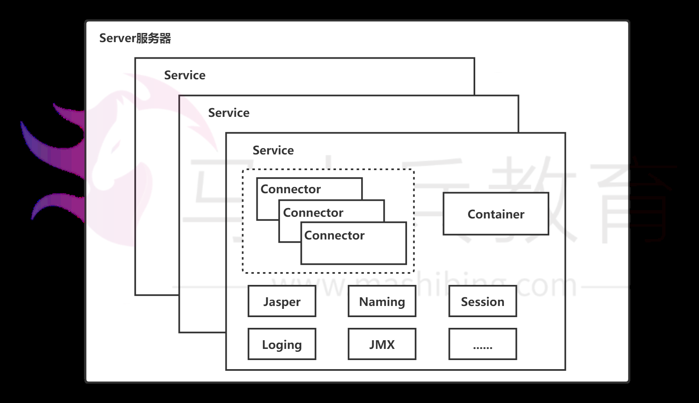

---

Service主要包含两个部分：Connector和Container。从上图中可以看出  Tomcat 的心脏就是这两个组
件，他们的作用如下： 
Connector用于处理连接相关的事情，并提供Socket与Request请求和 Response响应相关的转化; 
Container用于封装和管理Servlet，以及具体处理Request请求； 
一个Tomcat中只有一个Server，一个Server可以包含多个Service，一个 Service只有一个Container，
但是可以有多个Connectors，这是因为一个服务 可以有多个连接，如同时提供Http和Https链接，也可
以提供向相同协议不同端 口的连接，示意图如下（Engine、Host、Context下面会说到）：
多个 Connector 和一个 Container 就形成了一个 Service，有了 Service 就可 以对外提供服务了，但是 
Service 还要一个生存的环境，必须要有人能够给她生 命、掌握其生死大权，那就非 Server 莫属了！所
以整个 Tomcat 的生命周期由  Server 控制。 
另外，上述的包含关系或者说是父子关系，都可以在tomcat的conf目录下的 server.xml配置文件中看
出，下图是删除了注释内容之后的一个完整的 server.xml配置文件（Tomcat版本为8.0）
详细的配置文件内容可以到Tomcat官网查看：Tomcat配置文件

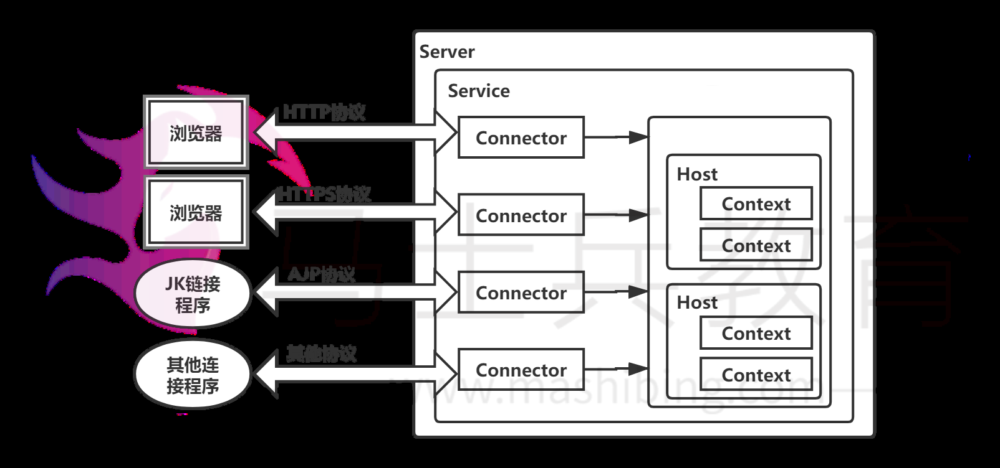

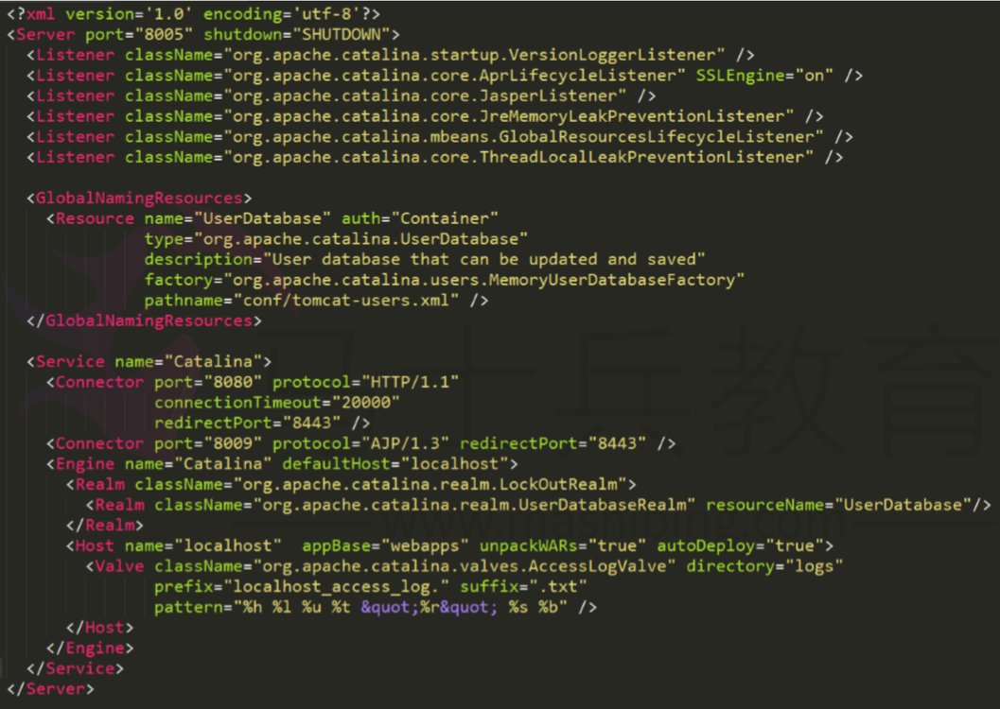

---

上边的配置文件，还可以通过下边的一张结构图更清楚的理解：
Server标签设置的端口号为8005，shutdown=”SHUTDOWN” ，表示在 8005端口监听“SHUTDOWN”命
令，如果接收到了就会关闭Tomcat。一个 Server有一个Service，当然还可以进行配置，一个Service有
多个Connector， Service左边的内容都属于Container的，Service下边是Connector。
Tomcat顶层架构小结 
1. Tomcat中只有一个Server，一个Server可以有多个Service，一个 Service可以有多个Connector和
一个Container； 
2. Server掌管着整个Tomcat的生死大权；
3. Service 是对外提供服务的； 
4. Connector用于接受请求并将请求封装成Request和Response来具体 处理； 
5. Container用于封装和管理Servlet，以及具体处理request请求； 
知道了整个Tomcat顶层的分层架构和各个组件之间的关系以及作用，对于绝大 多数的开发人员来说
Server和Service对我们来说确实很远，而我们开发中绝大 部分进行配置的内容是属于Connector和
Container的，所以接下来介绍一下 Connector和Container。 
 
 
Connector和Container的微妙关系
 
由上述内容我们大致可以知道一个请求发送到Tomcat之后，首先经过Service然 后会交给我们的
Connector，Connector用于接收请求并将接收的请求封装为 Request和Response来具体处理，
Request和Response封装完之后再交由 Container进行处理，Container处理完请求之后再返回给
Connector，最后在 由Connector通过Socket将处理的结果返回给客户端，这样整个请求的就处理 完
了！ 
Connector最底层使用的是Socket来进行连接的，Request和Response是按照 HTTP协议来封装的，所
以Connector同时需要实现TCP/IP协议和HTTP协议！ 
Tomcat既然需要处理请求，那么肯定需要先接收到这个请求，接收请求这个东 西我们首先就需要看一
下Connector！ 
Connector架构分析 
Connector用于接受请求并将请求封装成Request和Response，然后交给 Container进行处理，
Container处理完之后在交给Connector返回给客户端。 因此，我们可以把Connector分为四个方面进行
理解： 
1. Connector如何接受请求的？ 
2. 如何将请求封装成Request和Response的？ 
3. 封装完之后的Request和Response如何交给Container进行处理的？

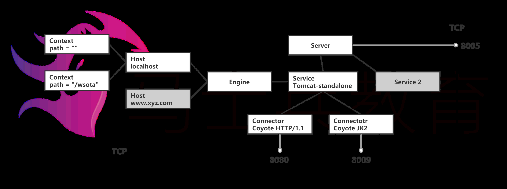

---

4. Container处理完之后如何交给Connector并返回给客户端的？ 首先看一下Connector的结构图，
如下所示：
Connector就是使用ProtocolHandler来处理请求的，不同的ProtocolHandler 代表不同的连接类型，比
如：Http11Protocol使用的是普通Socket来连接的， Http11NioProtocol使用的是NioSocket来连接
的。 
其中ProtocolHandler由包含了三个部件：Endpoint、Processor、Adapter。 
1. Endpoint用来处理底层Socket的网络连接，Processor用于将 Endpoint接收到的Socket封装成
Request，Adapter用于将Request交给 Container进行具体的处理。 
2. Endpoint由于是处理底层的Socket网络连接，因此Endpoint是用来实 现TCP/IP协议的，而
Processor用来实现HTTP协议的，Adapter将请求适 配到Servlet容器进行具体的处理。 
3. Endpoint的抽象实现AbstractEndpoint里面定义的Acceptor和 AsyncTimeout两个内部类和一个
Handler接口。Acceptor用于监听请 求，AsyncTimeout用于检查异步Request的超时，Handler用
于处理接收 到的Socket，在内部调用Processor进行处理。
至此，我们应该很轻松的回答1，2，3的问题了，但是4还是不知道，那么我们 就来看一下Container是
如何进行处理的以及处理完之后是如何将处理完的结果 返回给Connector的？
Container架构分析
 
Container用于封装和管理Servlet，以及具体处理Request请求，在Container 内部包含了4个子容器，
结构图如下：

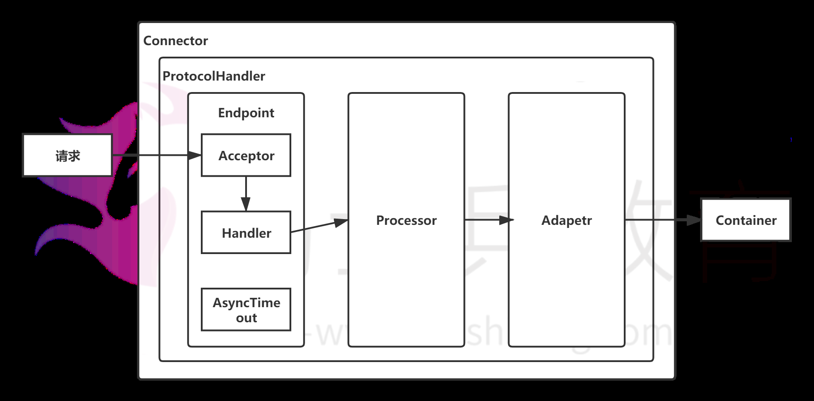

---

4个子容器的作用分别是： 
1. Engine：引擎，用来管理多个站点，一个Service最多只能有一个 Engine； 
2. Host：代表一个站点，也可以叫虚拟主机，通过配置Host就可以添加 站点； 
3. Context：代表一个应用程序，对应着平时开发的一套程序，或者一个 WEB-INF目录以及下面的
web.xml文件； 
4. Wrapper：每一Wrapper封装着一个Servlet； 下面找一个Tomcat的文件目录对照一下，如下图所
示：

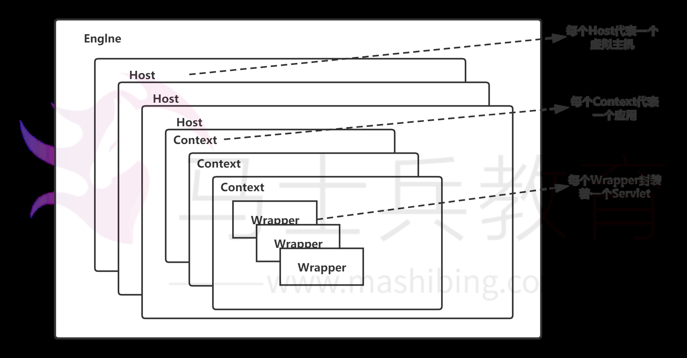

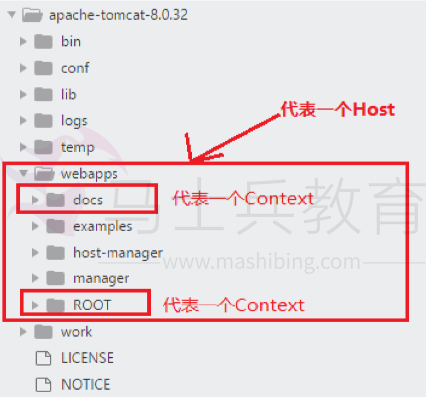

---

Context和Host的区别是Context表示一个应用，我们的Tomcat中默认的配置 下webapps下的每一个文
件夹目录都是一个Context，其中ROOT目录中存放着 主应用，其他目录存放着子应用，而整个
webapps就是一个Host站点。 
我们访问应用Context的时候，如果是ROOT下的则直接使用域名就可以访问， 例如：
www.baidu.com，如果是Host（webapps）下的其他应用，则可以使 用www.baidu.com/docs进行访
问，当然默认指定的根应用（ROOT）是可以 进行设定的，只不过Host站点下默认的主应用是ROOT目
录下的。 
看到这里我们知道Container是什么，但是还是不知道Container是如何进行请 求处理的以及处理完之后
是如何将处理完的结果返回给Connector的？别急！下 边就开始探讨一下Container是如何进行处理
的！
Container如何处理请求的
 
Container处理请求是使用Pipeline-Valve管道来处理的！（Valve是阀门之 意） 
Pipeline-Valve是责任链模式，责任链模式是指在一个请求处理的过程中有很多 处理者依次对请求进行
处理，每个处理者负责做自己相应的处理，处理完之后将 处理后的结果返回，再让下一个处理者继续处
理。
但是！Pipeline-Valve使用的责任链模式和普通的责任链模式有些不同！区别主 要有以下两点： 
每个Pipeline都有特定的Valve，而且是在管道的最后一个执行，这个 Valve叫做BaseValve，BaseValve
是不可删除的； 
在上层容器的管道的BaseValve中会调用下层容器的管道。 
我们知道Container包含四个子容器，而这四个子容器对应的BaseValve分别 
在：StandardEngineValve、StandardHostValve、StandardContextValve、 
StandardWrapperValve。 
Pipeline的处理流程图如下：

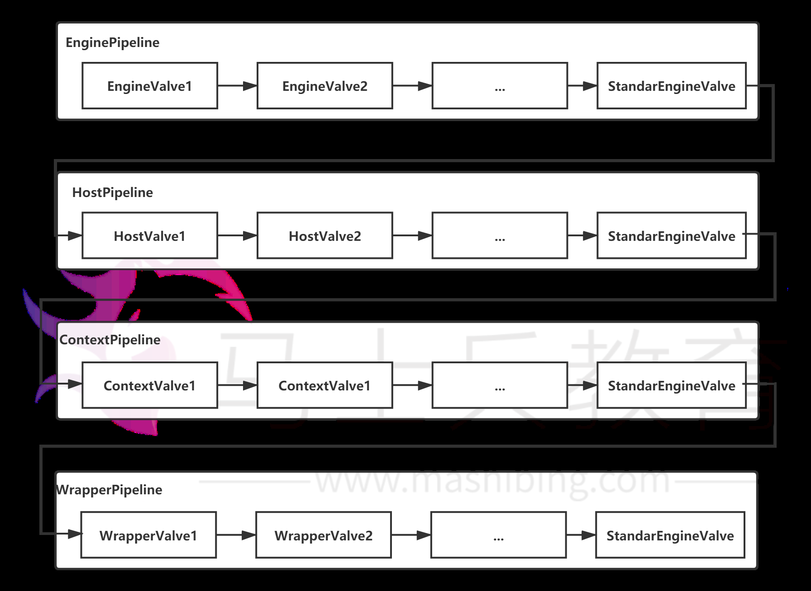

---

Connector在接收到请求后会首先调用最顶层容器的Pipeline来处 理，这里的最顶层容器的
Pipeline就是EnginePipeline（Engine的管 道）； 
在Engine的管道中依次会执行EngineValve1、EngineValve2等等， 最后会执行
StandardEngineValve，在StandardEngineValve中会调用 Host管道，然后再依次执行Host的
HostValve1、HostValve2等，最后在 执行StandardHostValve，然后再依次调用Context的管道和
Wrapper的 管道，最后执行到StandardWrapperValve。 
当执行到StandardWrapperValve的时候，会在 StandardWrapperValve中创建FilterChain，并调
用其doFilter方法来处 理请求，这个FilterChain包含着我们配置的与请求相匹配的Filter和 
Servlet，其doFilter方法会依次调用所有的Filter的doFilter方法和Servlet 的service方法，这样请
求就得到了处理！ 
当所有的Pipeline-Valve都执行完之后，并且处理完了具体的请求， 这个时候就可以将返回的结果
交给Connector了，Connector在通过 Socket的方式将结果返回给客户端。
 
 
 
 
 
JVM（马老师，黄老师）
 
 
 
 
说一下 JVM 的主要组成部分及其作用？
 
JVM包含两个子系统和两个组件，两个子系统为Class loader(类装载)、 Execution engine(执行引擎)；
两个组件为Runtime data area(运行时数据 区)、Native Interface(本地接口)。 
Class loader(类装载)：根据给定的全限定名类名(如： java.lang.Object)来装载class文件到
Runtime data area中的method area。

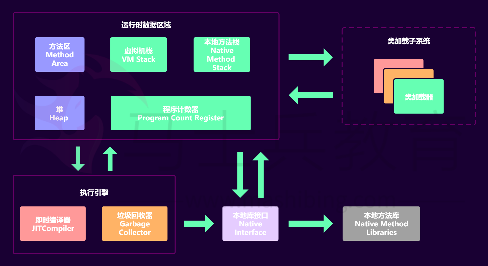

---

Execution engine（执行引擎）：执行classes中的指令。 
Native Interface(本地接口)：与native libraries交互，是其它编程语 言交互的接口。 
Runtime data area(运行时数据区域)：这就是我们常说的JVM的内 存。 
作用 ：首先通过编译器把 Java 代码转换成字节码，类加载器（ClassLoader） 再把字节码加载到内存
中，将其放在运行时数据区（Runtime data area）的方 法区内，而字节码文件只是 JVM 的一套指令集
规范，并不能直接交给底层操作 系统去执行，因此需要特定的命令解析器执行引擎（Execution 
Engine），将 字节码翻译成底层系统指令，再交由 CPU 去执行，而这个过程中需要调用其他 语言的本
地库接口（Native Interface）来实现整个程序的功能。 
下面是Java程序运行机制详细说明 
Java程序运行机制步骤 
首先利用IDE集成开发工具编写Java源代码，源文件的后缀为.java； 
再利用编译器(javac命令)将源代码编译成字节码文件，字节码文件的后缀名 为.class； 
运行字节码的工作是由解释器(java命令)来完成的。
从上图可以看，java文件通过编译器变成了.class文件，接下来类加载器又将这 些.class文件加载到JVM
中。 
其实可以一句话来解释：类的加载指的是将类的.class文件中的二进制数据读入 到内存中，将其放在运
行时数据区的方法区内，然后在堆区创建一个  java.lang.Class对象，用来封装类在方法区内的数据结
构。 
说一下 JVM 运行时数据区
 
Java 虚拟机在执行 Java 程序的过程中会把它所管理的内存区域划分为若干个 不同的数据区域。这些区
域都有各自的用途，以及创建和销毁的时间，有些区域 随着虚拟机进程的启动而存在，有些区域则是依
赖线程的启动和结束而建立和销 毁。Java 虚拟机所管理的内存被划分为如下几个区域：

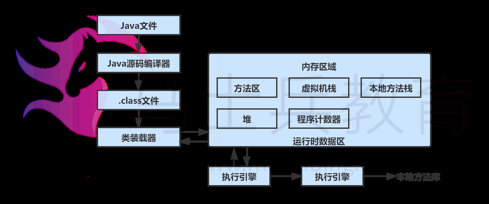

---

不同虚拟机的运行时数据区可能略微有所不同，但都会遵从 Java 虚拟机规范，  Java 虚拟机规范规定的
区域分为以下 5 个部分： 
程序计数器（Program Counter Register）：当前线程所执行的字节码的行号 指示器，字节码解
析器的工作是通过改变这个计数器的值，来选取下一条需要执行的 字节码指令，分支、循环、跳
转、异常处理、线程恢复等基础功能，都需要依赖这个 计数器来完成；
Java 虚拟机栈（Java Virtual Machine Stacks）：用于存储局部变量表、操作 数栈、动态链接、方
法出口等信息； 
本地方法栈（Native Method Stack）：与虚拟机栈的作用是一样的，只不过虚 拟机栈是服务 Java 
方法的，而本地方法栈是为虚拟机调用 Native 方法服务的； 
Java 堆（Java Heap）：Java 虚拟机中内存大的一块，是被所有线程共享 的，几乎所有的对象实例
都在这里分配内存； 
方法区（Methed Area）：用于存储已被虚拟机加载的类信息、常量、静态变 量、即时编译后的代
码等数据。 
深拷贝和浅拷贝
 
浅拷贝（shallowCopy）只是增加了一个指针指向已存在的内存地址， 
深拷贝（deepCopy）是增加了一个指针并且申请了一个新的内存，使这个增加 的指针指向这个新的内
存， 
使用深拷贝的情况下，释放内存的时候不会因为出现浅拷贝时释放同一个内存的 错误。 
浅复制：仅仅是指向被复制的内存地址，如果原地址发生改变，那么浅复制出来 的对象也会相应的改
变。 
深复制：在计算机中开辟一块新的内存地址用于存放复制的对象。 
说一下堆栈的区别？
 
物理地址 
堆的物理地址分配对对象是不连续的。因此性能慢些。在GC的时候也要考虑到 不连续的分配，所以有
各种算法。比如，标记-消除，复制，标记-压缩，分代 （即新生代使用复制算法，老年代使用标记——
压缩） 栈使用的是数据结构中的栈，先进后出的原则，物理地址分配是连续的。所以性 能快。

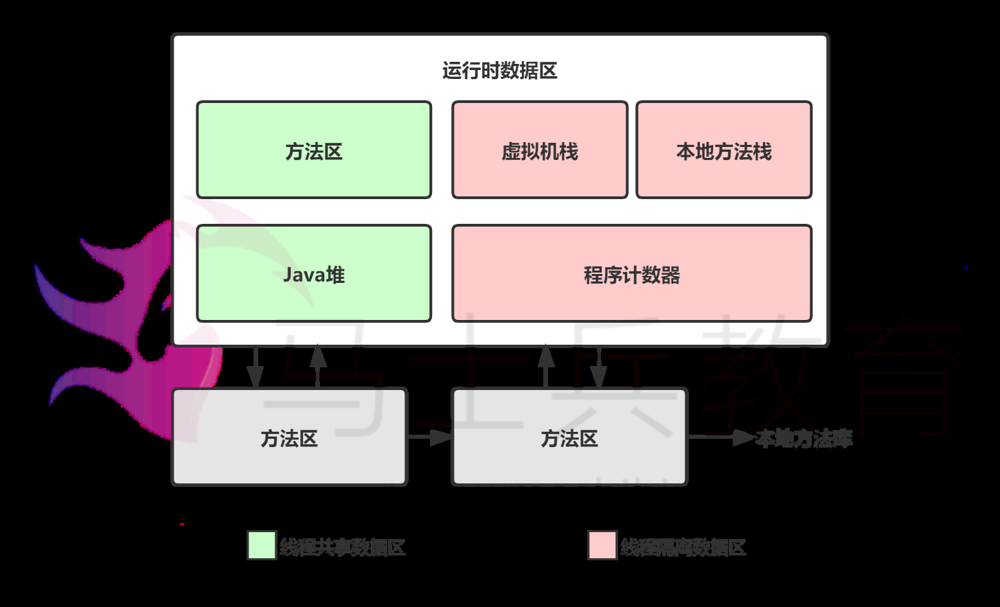

---

Header
解释
使用new关键字
调用了构造函数
使用Class的newInstance方法
调用了构造函数
使用Constructor类的newInstance方法
调用了构造函数
使用clone方法
没有调用构造函数
使用反序列化
没有调用构造函数
内存分别 
堆因为是不连续的，所以分配的内存是在运行期确认的，因此大小不固定。一般 堆大小远远大于栈。 
栈是连续的，所以分配的内存大小要在编译期就确认，大小是固定的。 
存放的内容 
堆存放的是对象的实例和数组。因此该区更关注的是数据的存储 
栈存放：局部变量，操作数栈，返回结果。该区更关注的是程序方法的执行。
PS：
1. 静态变量放在方法区 
2. 静态的对象还是放在堆。 
程序的可见度 
堆对于整个应用程序都是共享、可见的。 
栈只对于线程是可见的。所以也是线程私有。他的生命周期和线程相同。
队列和栈是什么？有什么区别？
 
队列和栈都是被用来预存储数据的。 
操作的名称不同。队列的插入称为入队，队列的删除称为出队。栈的插入称为进 栈，栈的删除称为
出栈。 
可操作的方式不同。队列是在队尾入队，队头出队，即两边都可操作。而栈的进 栈和出栈都是在栈
顶进行的，无法对栈底直接进行操作。 
操作的方法不同。队列是先进先出（FIFO），即队列的修改是依先进先出的原 则进行的。新来的
成员总是加入队尾（不能从中间插入），每次离开的成员总是队列 头上（不允许中途离队）。而栈
为后进先出（LIFO）,即每次删除（出栈）的总是当 前栈中新的元素，即后插入（进栈）的元素，
而先插入的被放在栈的底部，要到后才能删除。 
对象的创建
 
 说到对象的创建，首先让我们看看 Java 中提供的几种对象创建方式：
下面是对象创建的主要流程:

---

虚拟机遇到一条new指令时，先检查常量池是否已经加载相应的类，如果没有， 必须先执行相应的类加
载。类加载通过后，接下来分配内存。若Java堆中内存是 绝对规整的，使用“指针碰撞“方式分配内存；
如果不是规整的，就从空闲列表 中分配，叫做”空闲列表“方式。划分内存时还需要考虑一个问题-并发，
也有 两种方式: CAS同步处理，或者本地线程分配缓冲(Thread Local Allocation  Buffer, TLAB)。然后内
存空间初始化操作，接着是做一些必要的对象设置(元信 息、哈希码…)，后执行方法。 
为对象分配内存
 
类加载完成后，接着会在Java堆中划分一块内存分配给对象。内存分配根据Java 堆是否规整，有两种方
式： 
指针碰撞：如果Java堆的内存是规整，即所有用过的内存放在一边，而空闲的的 放在另一边。分配
内存时将位于中间的指针指示器向空闲的内存移动一段与对象大小 相等的距离，这样便完成分配内
存工作。 
空闲列表：如果Java堆的内存不是规整的，则需要由虚拟机维护一个列表来记录 那些内存是可用
的，这样在分配的时候可以从列表中查询到足够大的内存分配给对 象，并在分配后更新列表记录。 
选择哪种分配方式是由 Java 堆是否规整来决定的，而 Java 堆是否规整又由所 采用的垃圾收集器是否带
有压缩整理功能决定。
处理并发安全问题
 
对象的创建在虚拟机中是一个非常频繁的行为，哪怕只是修改一个指针所指向的 位置，在并发情况下也
是不安全的，可能出现正在给对象 A 分配内存，指针还 没来得及修改，对象 B 又同时使用了原来的指针
来分配内存的情况。解决这个 问题有两种方案： 
对分配内存空间的动作进行同步处理（采用 CAS + 失败重试来保障更新操作的 原子性）； 
把内存分配的动作按照线程划分在不同的空间之中进行，即每个线程在 Java 堆 中预先分配一小块内
存，称为本地线程分配缓冲（Thread Local Allocation Buffer,  TLAB）。哪个线程要分配内存，就在哪
个线程的 TLAB 上分配。只有 TLAB 用完并 分配新的 TLAB 时，才需要同步锁。通过-XX:+/-UserTLAB参
数来设定虚拟机是否使 用TLAB。

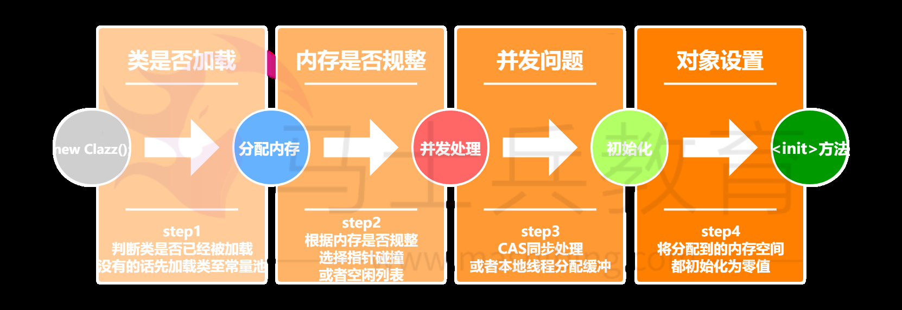

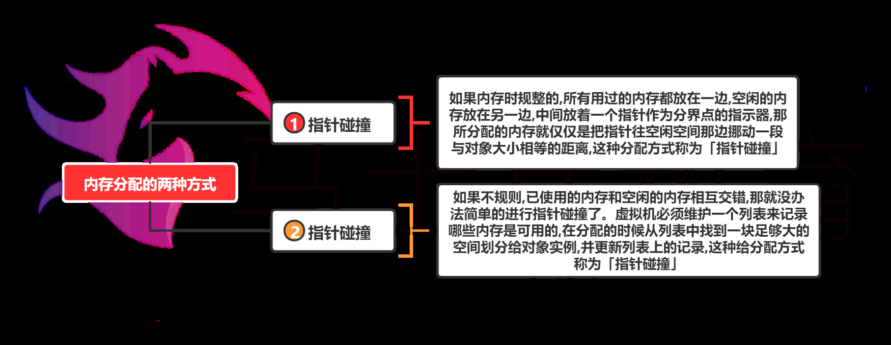

---

对象的访问定位
 
Java程序需要通过 JVM 栈上的引用访问堆中的具体对象。对象的访问方式取决 于 JVM 虚拟机的实现。
目前主流的访问方式有 句柄 和 直接指针 两种方式。 
指针： 指向对象，代表一个对象在内存中的起始地址。 
句柄： 可以理解为指向指针的指针，维护着对象的指针。句柄不直接指向对象，而是 指向对象的指针
（句柄不发生变化，指向固定内存地址），再由对象的指针指向对象的 真实内存地址。 
句柄访问
 
Java堆中划分出一块内存来作为句柄池，引用中存储对象的句柄地址，而句柄中 包含了对象实例数据与
对象类型数据各自的具体地址信息，具体构造如下图所 示：
 
优势：引用中存储的是稳定的句柄地址，在对象被移动（垃圾收集时移动对象是 非常普遍的行为）时只
会改变句柄中的实例数据指针，而引用本身不需要修改。 
直接指针
 
如果使用直接指针访问，引用 中存储的直接就是对象地址，那么Java堆对象内 部的布局中就必须考虑如
何放置访问类型数据的相关信息。

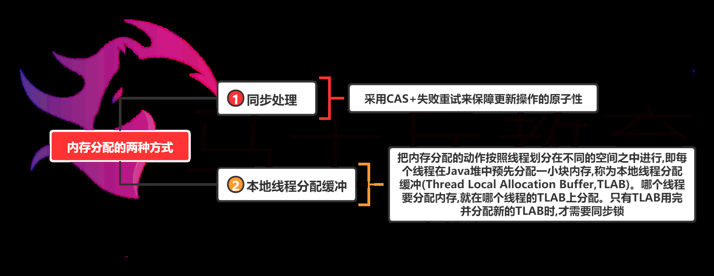

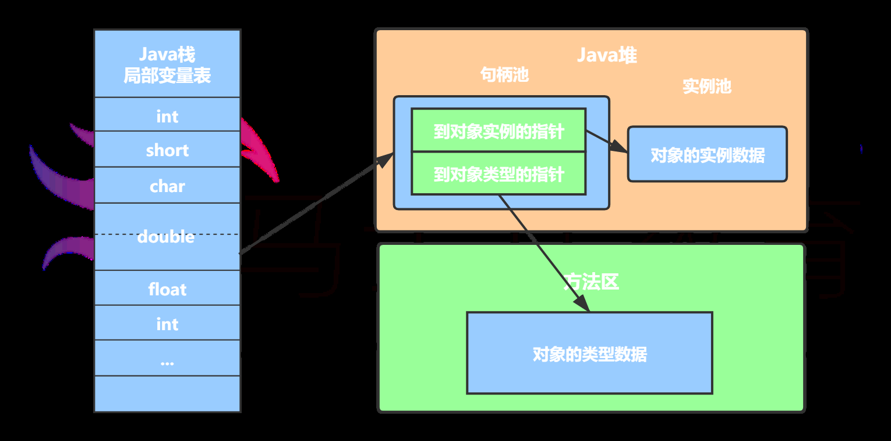

---

优势：速度更快，节省了一次指针定位的时间开销。由于对象的访问在Java中非 常频繁，因此这类开销
积少成多后也是非常可观的执行成本。HotSpot 中采用 的就是这种方式。 
内存溢出异常 Java会存在内存泄漏吗？请简单描述
 
内存泄漏是指不再被使用的对象或者变量一直被占据在内存中。理论上来说， Java是有GC垃圾回收机制
的，也就是说，不再被使用的对象，会被GC自动回收 掉，自动从内存中清除。 
但是， 即使这样，Java也还是存在着内存泄漏的情况，java导致内存泄露的原因 很明确：长生命周期的
对象持有短生命周期对象的引用就很可能发生内存泄露， 尽管短生命周期对象已经不再需要，但是因为
长生命周期对象持有它的引用而导 致不能被回收，这就是java中内存泄露的发生场景。
内存溢出异常
 
Java会存在内存泄漏吗？请简单描述
内存泄漏是指不再被使用的对象或者变量一直被占据在内存中。理论上来说， Java是有GC垃圾回收机制
的，也就是说，不再被使用的对象，会被GC自动回收 掉，自动从内存中清除。
但是，即使这样，Java也还是存在着内存泄漏的情况，java导致内存泄露的原因 很明确：长生命周期的
对象持有短生命周期对象的引用就很可能发生内存泄露， 尽管短生命周期对象已经不再需要，但是因为
长生命周期对象持有它的引用而导 致不能被回收，这就是java中内存泄露的发生场景。
垃圾收集器
简述Java垃圾回收机制
在java中，程序员是不需要显示的去释放一个对象的内存的，而是由虚拟机自行 执行。在JVM中，有一
个垃圾回收线程，它是低优先级的，在正常情况下是不会 执行的，只有在虚拟机空闲或者当前堆内存不
足时，才会触发执行，扫面那些没 有被任何引用的对象，并将它们添加到要回收的集合中，进行回收。
GC是什么？为什么要GC
GC 是垃圾收集的意思（Gabage Collection）,内存处理是编程人员容易出现问 题的地方，忘记或者错误
的内存
回收会导致程序或系统的不稳定甚至崩溃，Java 提供的 GC 功能可以自动监测 对象是否超过作用域从而
达到自动
回收内存的目的，Java 语言没有提供释放已分配内存的显示操作方法。
垃圾回收的优点和原理。并考虑2种回收机制

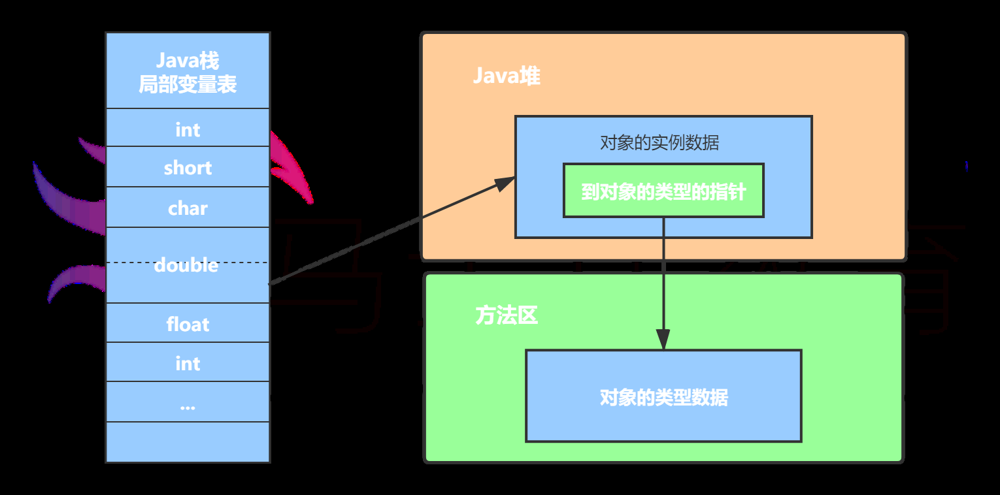

---

java语言最显著的特点就是引入了垃圾回收机制，它使java程序员在编写程序时 不再考虑内存管理的问
题。
由于有这个垃圾回收机制，java中的对象不再有“作用域”的概念，只有引用的 对象才有“作用域”。
垃圾回收机制有效的防止了内存泄露，可以有效的使用可使用的内存。
垃圾回收器通常作为一个单独的低级别的线程运行，在不可预知的情况下对内存 堆中已经死亡的或很长
时间没有用过的对象进行清除和回收。
程序员不能实时的对某个对象或所有对象调用垃圾回收器进行垃圾回收。 垃圾回收有分代复制垃圾回
收、标记垃圾回收、增量垃圾回收。
垃圾回收器的基本原理是什么？垃圾回收器可以马上回收 内存吗？有什么办法主动通知虚拟机进行垃圾
回收？ 对于GC来说，当程序员创建对象时，GC就开始监控这个对象的地址、大小以及 使用情况。
通常，GC采用有向图的方式记录和管理堆(heap)中的所有对象。通过这种方式 确定哪些对象是"可达
的"，哪些对象是"不可达的"。当GC确定一些对象为"不可 达"时，GC就有责任回收这些内存空间。
可以。程序员可以手动执行System.gc()，通知GC运行，但是Java语言规范并不 保证GC一定会执行。
Java 中都有哪些引用类型？
强引用：发生 gc 的时候不会被回收。
软引用：有用但不是必须的对象，在发生内存溢出之前会被回收。
弱引用：有用但不是必须的对象，在下一次GC时会被回收。
虚引用（幽灵引用/幻影引用）：无法通过虚引用获得对象，用 
PhantomReference 实现虚引用，虚引用的用途是在 gc 时返回一个通知。
怎么判断对象是否可以被回收？
垃圾收集器在做垃圾回收的时候，首先需要判定的就是哪些内存是需要被回收 的，哪些对象是「存活」
的，是不可以被回收的；哪些对象已经「死掉」了，需 要被回收。
一般有两种方法来判断：
引用计数器法：为每个对象创建一个引用计数，有对象引用时计数器 +1，引用 被释放时计数 -1，
当计数器为 0 时就可以被回收。它有一个缺点不能解决循环引用 的问题；
可达性分析算法：从 GC Roots 开始向下搜索，搜索所走过的路径称为引用链。 当一个对象到 GC 
Roots 没有任何引用链相连时，则证明此对象是可以被回收的。
在Java中，对象什么时候可以被垃圾回收
当对象对当前使用这个对象的应用程序变得不可触及的时候，这个对象就可以被 回收了。
垃圾回收不会发生在永久代，如果永久代满了或者是超过了临界值，会触发完全 垃圾回收(Full GC)。如
果你仔细查看垃圾收集器的输出信息，就会发现永久代 也是被回收的。这就是为什么正确的永久代大小
对避免Full GC是非常重要的原 因。
JVM中的永久代中会发生垃圾回收吗**
垃圾回收不会发生在永久代，如果永久代满了或者是超过了临界值，会触发完全 垃圾回收(Full GC)。如
果你仔细查看垃圾收集器的输出信息，就会发现永久代 也是被回收的。这就是为什么正确的永久代大小
对避免Full GC是非常重要的原 因。请参考下Java8：从永久代到元数据区
(译者注：Java8中已经移除了永久代，新加了一个叫做元数据区的native内存 区)
说一下 JVM 有哪些垃圾回收算法？
标记-清除算法：标记无用对象，然后进行清除回收。缺点：效率不高，无法清 除垃圾碎片。

---

复制算法：按照容量划分二个大小相等的内存区域，当一块用完的时候将活着的 对象复制到另一块
上，然后再把已使用的内存空间一次清理掉。缺点：内存使用率不 高，只有原来的一半。
标记-整理算法：标记无用对象，让所有存活的对象都向一端移动，然后直接清 除掉端边界以外的
内存。
分代算法：根据对象存活周期的不同将内存划分为几块，一般是新生代和老年 代，新生代基本采用
复制算法，老年代采用标记整理算法。
标记-清除算法**
标记无用对象，然后进行清除回收。
标记-清除算法（Mark-Sweep）是一种常见的基础垃圾收集算法，它将垃圾收 集分为两个阶段：
标记阶段：标记出可以回收的对象。
清除阶段：回收被标记的对象所占用的空间。
标记-清除算法之所以是基础的，是因为后面讲到的垃圾收集算法都是在此算法 的基础上进行改进的。
优点**：实现简单，不需要对象进行移动。
缺点**：标记、清除过程效率低，产生大量不连续的内存碎片，提高了垃圾回收的 频率。
标记-清除算法的执行的过程如下图所示
复制算法**
为了解决标记-清除算法的效率不高的问题，产生了复制算法。它把内存空间划 为两个相等的区域，每次
只使用其中一个区域。垃圾收集时，遍历当前使用的区 域，把存活对象复制到另外一个区域中，最后将
当前使用的区域的可回收的对象 进行回收。
优点：按顺序分配内存即可，实现简单、运行高效，不用考虑内存碎片。 缺点：可用的内存大小缩小为
原来的一半，对象存活率高时会频繁进行复制。 复制算法的执行过程如下图所示

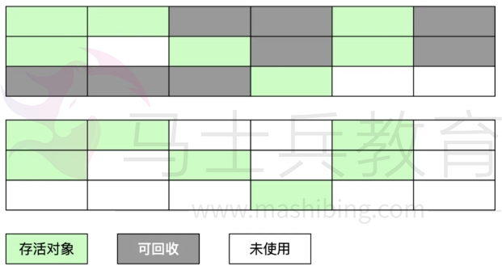

---

标记-整理算法**
在新生代中可以使用复制算法，但是在老年代就不能选择复制算法了，因为老年 代的对象存活率会较
高，这样会有较多的复制操作，导致效率变低。标记-清除 算法可以应用在老年代中，但是它效率不高，
在内存回收后容易产生大量内存碎 片。因此就出现了一种标记-整理算法（Mark-Compact）算法，与标
记-整理 算法不同的是，在标记可回收的对象后将所有存活的对象压缩到内存的一端，使 他们紧凑的排
列在一起，然后对端边界以外的内存进行回收。回收后，已用和未 用的内存都各自一边。
优点：解决了标记-清理算法存在的内存碎片问题。
缺点：仍需要进行局部对象移动，一定程度上降低了效率。
标记-整理算法的执行过程如下图所示
分代收集算法
当前商业虚拟机都采用分代收集的垃圾收集算法。分代收集算法，顾名思义是根 据对象的存活周期将内
存划分为几块。一般包括年轻代、老年代 和 永久代，如 图所示：

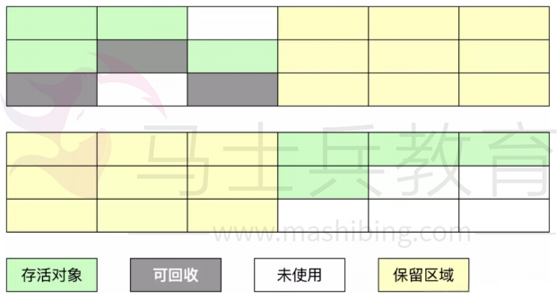

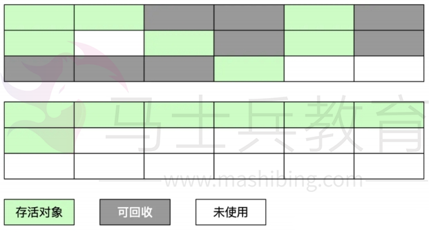

---

说一下 JVM 有哪些垃圾回收器？
如果说垃圾收集算法是内存回收的方法论，那么垃圾收集器就是内存回收的具体 实现。下图展示了7种
作用于不同分代的收集器，其中用于回收新生代的收集器 包括Serial、PraNew、Parallel Scavenge，回
收老年代的收集器包括Serial Old、Parallel Old、CMS，还有用于回收整个Java堆的G1收集器。不同收
集器 之间的连线表示它们可以搭配使用。
Serial收集器（复制算法): 新生代单线程收集器，标记和清理都是单线程，优点 是简单高效；
ParNew收集器 (复制算法): 新生代收并行集器，实际上是Serial收集器的多线程 版本，在多核CPU
环境下有着比Serial更好的表现；
Parallel Scavenge收集器 (复制算法): 新生代并行收集器，追求高吞吐量，高效 利用 CPU。吞吐量 
= 用户线程时间/(用户线程时间+GC线程时间)，高吞吐量可以高 效率的利用CPU时间，尽快完成程
序的运算任务，适合后台应用等对交互相应要求不 高的场景；
Serial Old收集器 (标记-整理算法): 老年代单线程收集器，Serial收集器的老年 代版本；
Parallel Old收集器 (标记-整理算法)： 老年代并行收集器，吞吐量优先， Parallel Scavenge收集器
的老年代版本；
CMS(Concurrent Mark Sweep)收集器（标记-清除算法）： 老年代并行收集 器，以获取最短回收
停顿时间为目标的收集器，具有高并发、低停顿的特点，追求最 短GC回收停顿时间。
G1(Garbage First)收集器 (标记-整理算法)： Java堆并行收集器，G1收集器是 JDK1.7提供的一个新
收集器，G1收集器基于“标记-整理”算法实现，也就是说不会 产生内存碎片。此外，G1收集器不同
于之前的收集器的一个重要特点是：G1回收的范围是整个Java堆(包括新生代，老年代)，而前六种
收集器回收的范围仅限于新生代 或老年代。

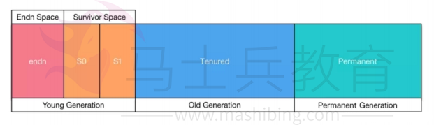

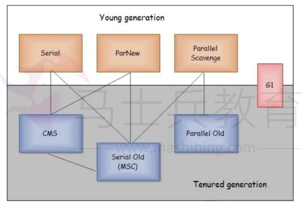

---

详细介绍一下 CMS 垃圾回收器？
CMS 是英文 Concurrent Mark-Sweep 的简称，是以牺牲吞吐量为代价来获得 最短回收停顿时间的垃圾
回收器。对于要求服务器响应速度的应用上，这种垃圾 回收器非常适合。在启动 JVM 的参数加上“- 
XX:+UseConcMarkSweepGC”来指定使用 CMS 垃圾回收器。 CMS 使用的是标记-清除的算法实现的，
所以在 gc的时候回产生大量的内存碎 片，当剩余内存不能满足程序运行要求时，系统将会出现 
Concurrent Mode Failure，临时 CMS 会采用 Serial Old 回收器进行垃圾清除，此时的性能将会 被降
低。
新生代垃圾回收器和老年代垃圾回收器都有哪些？有什么 区别？
新生代回收器：Serial、ParNew、Parallel Scavenge
老年代回收器：Serial Old、Parallel Old、CMS
整堆回收器：G1
新生代垃圾回收器一般采用的是复制算法，复制算法的优点是效率高，缺点是内 存利用率低；老年代回
收器一般采用的是标记-整理的算法进行垃圾回收。
简述分代垃圾回收器是怎么工作的？
分代回收器有两个分区：老生代和新生代，新生代默认的空间占比总空间的 1/3，老生代的默认占比是 
2/3。
新生代使用的是复制算法，新生代里有 3 个分区：Eden、To Survivor、From Survivor，它们的默认占
比是 8:1:1，它的执行流程如下：
把 Eden + From Survivor 存活的对象放入 To Survivor 区；
清空 Eden 和 From Survivor 分区；
From Survivor 和 To Survivor 分区交换，From Survivor 变 To Survivor，To Survivor 变 From 
Survivor。
每次在 From Survivor 到 To Survivor 移动时都存活的对象，年龄就 +1，当年 龄到达 15（默认配置是 
15）时，升级为老生代。大对象也会直接进入老生代。
老生代当空间占用到达某个值之后就会触发全局垃圾收回，一般使用标记整理的 执行算法。以上这些循
环往复就构成了整个分代垃圾回收的整体执行流程。
内存分配策略**
简述java内存分配与回收策率以及Minor GC和Major GC
所谓自动内存管理，最终要解决的也就是内存分配和内存回收两个问题。前面我 们介绍了内存回收，这
里我们再来聊聊内存分配。
对象的内存分配通常是在 Java 堆上分配（随着虚拟机优化技术的诞生，某些场 景下也会在栈上分配，
后面会详细介绍），对象主要分配在新生代的 Eden 区， 如果启动了本地线程缓冲，将按照线程优先在 
TLAB 上分配。少数情况下也会直 接在老年代上分配。总的来说分配规则不是百分百固定的，其细节取
决于哪一种 垃圾收集器组合以及虚拟机相关参数有关，但是虚拟机对于内存的分配还是会遵 循以下几种
「普世」规则：
对象优先在 Eden 区分配
多数情况，对象都在新生代 Eden 区分配。当 Eden 区分配没有足够的空间进行 分配时，虚拟机将会发
起一次 Minor GC。如果本次 GC后还是没有足够的空 间，则将启用分配担保机制在老年代中分配内存。
这里我们提到 Minor GC，如果你仔细观察过 GC 日常，通常我们还能从日志中 发现 Major GC/Full 
GC。
Minor GC 是指发生在新生代的 GC，因为 Java 对象大多都是朝生夕死，所 有 Minor GC 非常频
繁，一般回收速度也非常快；

---

Major GC/Full GC 是指发生在老年代的 GC，出现了 Major GC 通常会伴 随至少一次 Minor GC。
Major GC 的速度通常会比 Minor GC 慢 10 倍以上。
大对象直接进入老年代
所谓大对象是指需要大量连续内存空间的对象，频繁出现大对象是致命的，会导 致在内存还有不少空间
的情况下提前触发 GC 以获取足够的连续空间来安置新对 象。
前面我们介绍过新生代使用的是标记-清除算法来处理垃圾回收的，如果大对象 直接在新生代分配就会导
致 Eden 区和两个 Survivor 区之间发生大量的内存复制。因此对于大对象都会直接在老年代进行分配。
长期存活对象将进入老年代
虚拟机采用分代收集的思想来管理内存，那么内存回收时就必须判断哪些对象应 该放在新生代，哪些对
象应该放在老年代。因此虚拟机给每个对象定义了一个对 象年龄的计数器，如果对象在 Eden 区出生，
并且能够被 Survivor 容纳，将被 移动到 Survivor 空间中，这时设置对象年龄为 1。对象在 Survivor 区
中每「熬 过」一次 Minor GC 年龄就加 1，当年龄达到一定程度（默认 15） 就会被晋升 到老年代。
虚拟机类加载机制**
简述java类加载机制?
虚拟机把描述类的数据从Class文件加载到内存，并对数据进行校验，解析和初 始化，最终形成可以被
虚拟机直接使用的java类型。
描述一下JVM加载Class文件的原理机制
Java中的所有类，都需要由类加载器装载到JVM中才能运行。类加载器本身也 是一个类，而它的工作就
是把class文件从硬盘读取到内存中。在写程序的时 候，我们几乎不需要关心类的加载，因为这些都是隐
式装载的，除非我们有特殊 的用法，像是反射，就需要显式的加载所需要的类。
类装载方式，有两种 ：
1.隐式装载， 程序在运行过程中当碰到通过new 等方式生成对象时，隐式调用 类装载器加载对应的类到
jvm中，
2.显式装载， 通过class.forname() 等方法，显式加载需要的类
Java类的加载是动态的，它并不会一次性将所有类全部加载后再运行，而是保证 程序运行的基础类(像是
基类)完全加载到jvm中，至于其他类，则在需要的时候 才加载。这当然就是为了节省内存开销。
什么是类加载器，类加载器有哪些?
实现通过类的权限定名获取该类的二进制字节流的代码块叫做类加载器。 主要有一下四种类加载器:
1. 启动类加载器(Bootstrap ClassLoader)用来加载java核心类库，无法被 java程序直接引用。
2. 扩展类加载器(extensions class loader): 它用来加载 Java 的扩展库。 Java 虚拟机的实现会提供一
个扩展库目录。该类加载器在此目录里面查找 并加载 Java 类。
3. 系统类加载器（system class loader ）：它根据 Java 应用的类路径 （CLASSPATH ）来加载 Java 
类。一般来说，Java 应用的类都是由它来 完成加载的。可以通过 
ClassLoader.getSystemClassLoader()来获取 它。
4. 用户自定义类加载器，通过继承 java.lang.ClassLoader类的方式实
现。
说一下类装载的执行过程？
类装载分为以下 5个步骤：
加载：根据查找路径找到相应的 class 文件然后导入；
验证：检查加载的 class 文件的正确性；

---

准备：给类中的静态变量分配内存空间；
解析：虚拟机将常量池中的符号引用替换成直接引用的过程。符号引用就理解为 一个标示，而在直接引
用直接指向内存中的地址；
初始化：对静态变量和静态代码块执行初始化工作。
什么是双亲委派模型？
在介绍双亲委派模型之前先说下类加载器。对于任意一个类，都需要由加载它的 类加载器和这个类本身
一同确立在 JVM 中的唯一性，每一个类加载器，都有一 个独立的类名称空间。类加载器就是根据指定全
限定名称将 class 文件加载到 JVM 内存，然后再转化为 class 对象。
类加载器分类：
启动类加载器（Bootstrap ClassLoader），是虚拟机自身的一部分，用来加载 Java_HOME/lib/目
录中的，或者被 -Xbootclasspath 参数所指定的路径中并且被虚 拟机识别的类库；
其他类加载器：
扩展类加载器（Extension ClassLoader）：负责加载\lib\ext目录或Java. ext. dirs系统变量指
定的路径中的所有类库；
应用程序类加载器（Application ClassLoader）。负责加载用户类路径 （classpath）上的指
定类库，我们可以直接使用这个类加载器。一般情况，如果我 们没有自定义类加载器默认就
是用这个加载器。
双亲委派模型：如果一个类加载器收到了类加载的请求，它首先不会自己去加载 这个类，而是把这个请
求委派给父类加载器去完成，每一层的类加载器都是如 此，这样所有的加载请求都会被传送到顶层的启
动类加载器中，只有当父加载无 法完成加载请求（它的搜索范围中没找到所需的类）时，子加载器才会
尝试去加 载类。

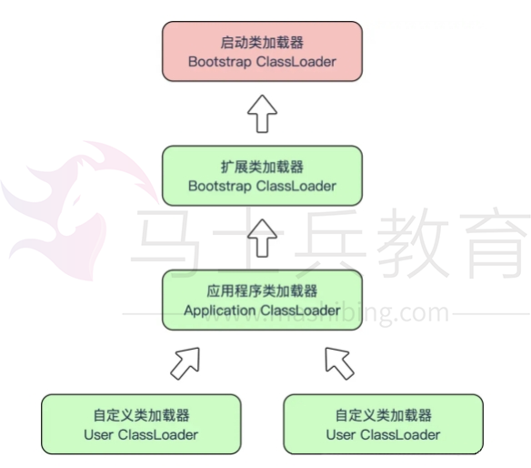

---

当一个类收到了类加载请求时，不会自己先去加载这个类，而是将其委派给父 类，由父类去加载，如果
此时父类不能加载，反馈给子类，由子类去完成类的加 载。
JVM调优
说一下 JVM 调优的工具？
JDK 自带了很多监控工具，都位于 JDK 的 bin 目录下，其中最常用的是 jconsole 和 jvisualvm 这两款视
图监控工具。
jconsole：用于对 JVM 中的内存、线程和类等进行监控；
jvisualvm：JDK 自带的全能分析工具，可以分析：内存快照、线程快照、程序 死锁、监控内存的
变化、gc 变化等。
常用的 JVM 调优的参数都有哪些？
-Xms2g：初始化推大小为 2g；
-Xmx2g：堆最大内存为 2g；
-XX:NewRatio=4：设置年轻的和老年代的内存比例为 1:4； -XX:SurvivorRatio=8：设置新生代 
Eden 和 Survivor 比例为 8:2； –XX:+UseParNewGC：指定使用 ParNew + Serial Old 垃圾回收器
组合； -XX:+UseParallelOldGC：指定使用 ParNew + ParNew Old 垃圾回收器组
合；
-XX:+UseConcMarkSweepGC：指定使用 CMS + Serial Old 垃圾回收器组 合；
-XX:+PrintGC：开启打印 gc 信息；
-XX:+PrintGCDetails：打印 gc 详细信息。
 
 
JVM内存模型，GC机制和原理；
 
内存模型 
Jdk1.6及之前：有永久代, 常量池在方法区 
Jdk1.7：有永久代，但已经逐步“去永久代”，常量池在堆 
Jdk1.8及之后： 无永久代，常量池在元空间

---

GC分哪两种，Minor GC 和Full GC有什么区别？什么时候
会触发Full GC？分别采用什么算法？

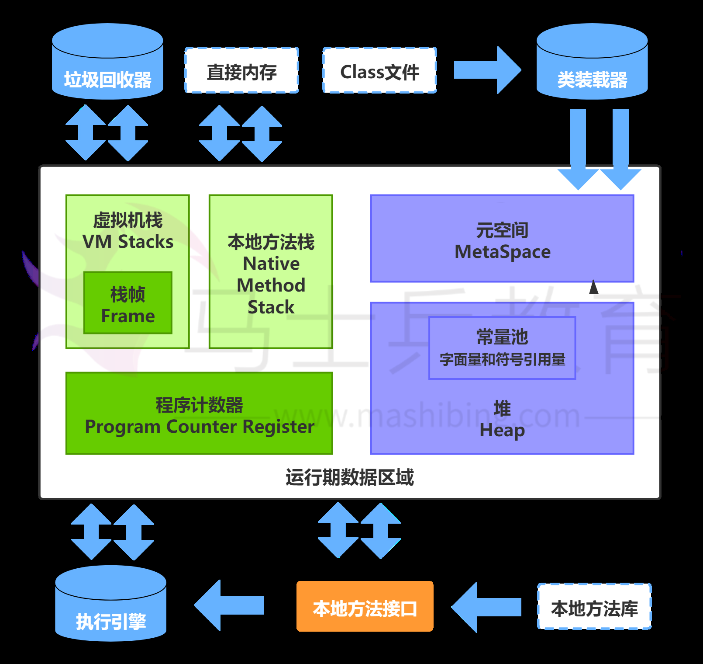

---

对象从新生代区域消失的过程，我们称之为 "minor GC" 
对象从老年代区域消失的过程，我们称之为 "major GC" 
Minor GC 
清理整个YouGen的过程，eden的清理，S0\S1的清理都会由于MinorGC Allocation Failure(YoungGen
区内存不足），而触发minorGC 
Major GC 
OldGen区内存不足，触发Major GC 
Full GC 
Full GC 是清理整个堆空间—包括年轻代和永久代 
Full GC 触发的场景 
1）System.gc 
2）promotion failed (年代晋升失败,比如eden区的存活对象晋升到S区放不下，又尝试直接晋 升到Old
区又放不下，那么Promotion Failed,会触发FullGC) 
3）CMS的Concurrent-Mode-Failure 由于CMS回收过程中主要分为四步: 
1.CMS initial mark 
2.CMS Concurrent mark 
3.CMS remark 
4.CMS Concurrent sweep。在2中gc线程与用户线程同时执行，那么用户线程依旧可 能同时产生垃圾， 
如果这个垃圾较多无法放入预留的空间就会产生CMS-Mode-Failure， 切换 为SerialOld单线程做mark-
sweep-compact。 
4）新生代晋升的平均大小大于老年代的剩余空间 （为了避免新生代晋升到老年代失败） 当使用
G1,CMS 时，FullGC发生的时候 是 Serial+SerialOld。 当使用ParalOld时，FullGC发生的时候是 
ParallNew +ParallOld.

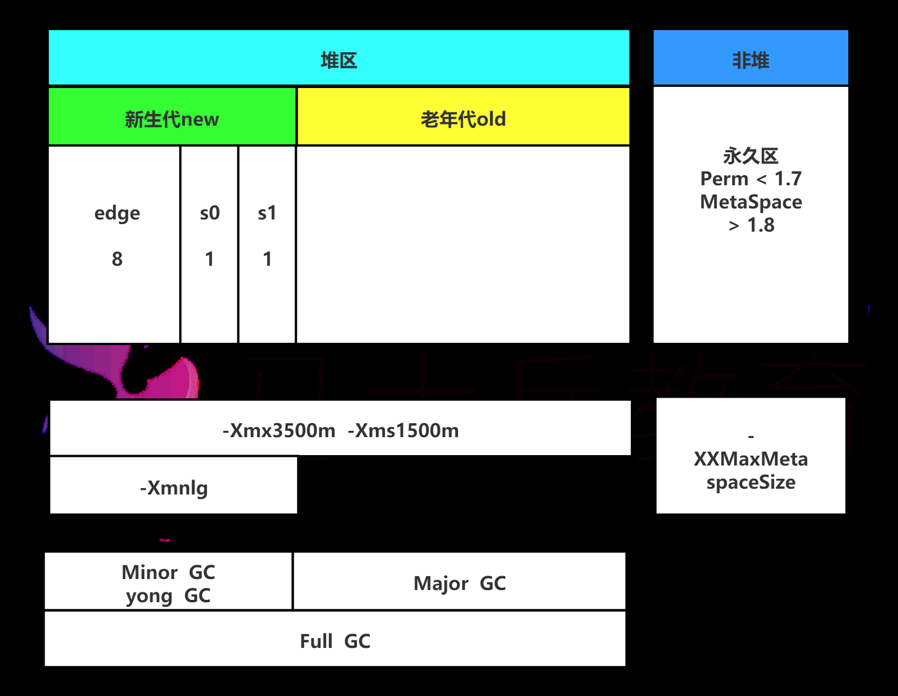

---

JVM里的有几种classloader，为什么会有多种？
 
启动类加载器：负责加载JRE的核心类库，如jre目标下的rt.jar,charsets.jar等 
扩展类加载器：负责加载JRE扩展目录ext中JAR类包 
系统类加载器：负责加载ClassPath路径下的类包 
用户自定义加载器：负责加载用户自定义路径下的类包 
为什么会有多种： 
1）分工，各自负责各自的区块 
2）为了实现委托模型 
什么是双亲委派机制？介绍一些运作过程，双亲委派模型的
好处；
 
如果一个类加载器收到了类加载请求，它并不会自己先去加载，而是把这个请求委托给父类的 加载器去
执行，如果父类加载器还存在其父类加载器，则进一步向上委托，依次递归，请求最终 将到达顶层的启
动类加载器，如果父类加载器可以完成类加载任务，就成功返回，倘若父类加载 器无法完成此加载任
务，子加载器才会尝试自己去加载，这就是双亲委派模式，即每个儿子都不 愿意干活，每次有活就丢给
父亲去干，直到父亲说这件事我也干不了时，儿子自己想办法去完 成，这不就是传说中的双亲委派模
式。
好处 
沙箱安全机制：自己写的String.class类不会被加载，这样便可以防止核心API库被随意篡改 避免类的重
复加载：当父亲已经加载了该类时，就没有必要子ClassLoader再加载一次 
常见的JVM调优方法有哪些？可以具体到调整哪个参数，调
成什么值？
 
调优工具 
console，jProfile，VisualVM

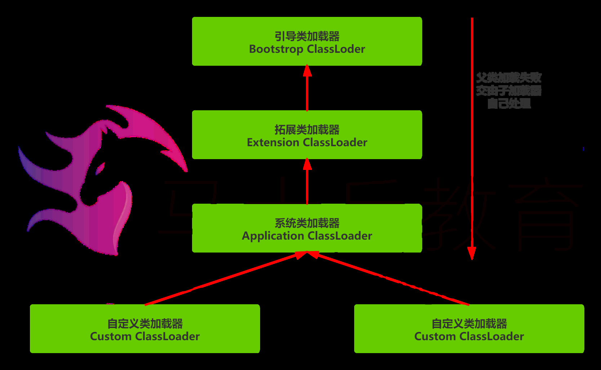

---

Dump线程详细信息：查看线程内部运行情况 
死锁检查 
查看堆内类、对象信息查看：数量、类型等 
线程监控 
线程信息监控：系统线程数量。 
线程状态监控：各个线程都处在什么样的状态下 
热点分析 
CPU热点：检查系统哪些方法占用的大量CPU时间 
内存热点：检查哪些对象在系统中数量最大（一定时间内存活对象和销毁对象一起统计） 
内存泄漏检查 
JVM虚拟机内存划分、类加载器、垃圾收集算法、垃圾收集
器、class 文件结构是如何解析的；
 
JVM虚拟机内存划分（重复） 
类加载器（重复） 
垃圾收集算法：标记-清除算法、复制算法、标记-整理算法、分代收集算法 
垃圾收集器： Serial收集器、ParNew收集器、Parallel Scavenge收集器、Serial Old收集器、 Parallel 
Old收集器、CMS收集器、G1收集器、Z垃圾收集器 
class文件结构是如何解析的

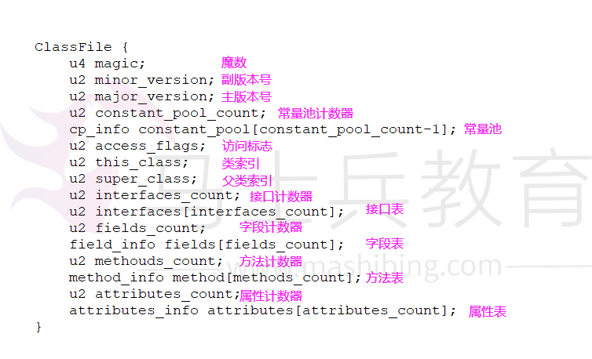

---

类（class）文件结构
 
前面的内容我们了解到jvm的内存结构。所有java文件必须经过“编译”转成class文件之后才会被jvm所识
别和运用。那么我们开始了解一下类文件也就是class文件的结构。也就是我们写的java文件最终会被编
译成什么样？那种格式？
本文讲解内容借鉴了《Java 虚拟机规范（Java SE 7 版）》第四章。如果有兴趣可以自行阅读
1、类文件介绍
每一个 Class 文件都对应着唯一一个类或接口的定义信息，但是相对地，类或接口并不一定都得定义在
文件里（譬如类或接口也可以通过类加载器直接生成）。
本节中，我们只是通俗地将任意一个有效的类或接口所应当满足的格式称为“Class 文件格式”，即使它不
一定以磁盘文件的形式存在。
每个 Class 文件都是由 8 字节为单位的字节流组成，所有的 16 位、32 位和 64 位长度的数据将被构造
成 2 个、4 个和 8 个 8 字节单位来表示。多字节数据项总是按照 Big-Endian  的顺序进行存储。
注意：Big-Endian 顺序是指按高位字节在地址最低位，最低字节在地址最高位来存储数据，它是 
SPARC、PowerPC等处理器的默认多字节存储顺序，而x86等处理器则是使用了相反的Little-Endian顺
序来存储数据。为了保证 Class 文件在不同硬件上具备同样的含义，因此在 Java 虚拟机规范中是有必要
严格规定了数据存储顺序的。
在 Java SDK 中，访问这种格式的数据可以使用 java.io.DataInput、java.io.DataOutput 等接口和 
java.io.DataInputStream 和java.io.DataOutputStream 等类来实现。
本节内容，还定义了一组私有数据类型来表示 Class 文件的内容，它们包括 u1，u2 和 u4，分别代表了 
1、2 和 4 个字节的无符号数。
在 Java SDK 中这些类型的数据可以通过实现接口java.io.DataInput 中的 readUnsignedByte、
readUnsignedShort 和 readInt 方法进行读取。
本节将采用类似 C 语言结构体的伪结构来描述 Class 文件格式。为了避免与类的字段、类的实例等概念
产生混淆，在此把用于描述类结构格式的内容定义为项（Item）。
在 Class 文件中，各项按照严格顺序连续存放的，它们之间没有任何填充或对齐作为各项间的分隔符
号。
表（Table）是由任意数量的可变长度的项组成，用于表示 Class 文件内容的一系列复合结构。尽管我们
采用类似 C 语言的数组语法来表示表中的项，但是读者应当清楚意识到，表是由可变长数据组成的复合
结构（表中每项的长度不固定），因此无法直接将字节偏移量来作为索引对表进行访问。
而我们描述一个数据结构为数组（Array）时，就意味着它含有零至多个长度固定的项组成，这个时候则
可以采用数组索引的方式来访问它 。
注意：虽然原文中在此定义了“表”和“数组”的关系，但在后文中依然存在表和数组混用的情况。译文中作
了一些修正，把各个数据项结构不一致的数据集合用“表”那表示，譬如“constant_pool 表”、 “attributes
表”，而把数据项结构一致的数据集合用“数组”来表示，譬如“code[]数组“、“fields[]数组”。
2、ClassFile 结构
每一个 Class 文件对应于一个如下所示的 ClassFile 结构体。

---

ClassFile 结构体中，各项的含义描述如下：
1，无符号数，以u1、u2、u4、u8分别代表1个字节、2个字节、4个字节、8个字节的无符号数
2，表是由多个无符号数或者其它表作为数据项构成的复合数据类型，所以表都以“_info”结尾，由多个无
符号数或其它表构成的复合数据类型
每个部分出现的次数和数量见下表(Class文件格式)：

---

类 型
名 称
数 量
u4
magic
1
u2
minor_version
1
u2
major_version
1
u2
constant_pool_count
1
cp_info
constant_pool
constant_pool_count-1
u2
access_flags
1
u2
this_class
1
u2
super_class
1
u2
interfaces_count
1
u2
interfaces
interfaces_count
u2
fields_count
1
field_info
fileds
fields_count
u2
methods_count
1
method_info
methods
methods_count
u2
attributes_count
1
attribute_info
attributes
attributes_count
magic
    魔数，魔数的唯一作用是确定这个文件是否为一个能被虚拟机所接受的 Class 文件。魔数值固定为 
0xCAFEBABE，不会改变。
 minor_version、major_version
    副版本号和主版本号，minor_version 和 major_version 的值分别表示 Class 文件的副、主版本。它
们共同构成了 Class 文件的格式版本号。譬如某个 Class 文件的主版本号为 M，副版本号为 m，那么这
个 Class 文件的格式版本号就确定为 M.m。Class 文件格式版本号大小的顺序为：1.5 < 2.0 < 2.1。
 一个 Java 虚拟机实例只能支持特定范围内的主版本号（Mi 至 Mj）和 0 至特定范围内（0 至 m）的副版
本号。假设一个 Class 文件的格式版本号为 V，仅当 Mi.0 ≤ v ≤ Mj.m
 成立时，这个 Class 文件才可以被此 Java 虚拟机支持。不同版本的 Java 虚拟机实现支持的版本号也不
同，高版本号的 Java 虚拟机实现可以支持低版本号的 Class 文件，反之则不成立 。
注意：Oracle 的 JDK 在 1.0.2 版本时，支持的 Class 格式版本号范围是 45.0 至 45.3；JDK 版本在 1.1.x
时，支持的 Class 格式版本号范围扩展至 45.0 至 45.65535；JDK 版本为 1. k 时（k ≥2）时，对应的 
Class文件格式版本号的范围是 45.0 至 44+k.0
下表列举了Class文件版本号

---

编译器版本
-target参数
十六进制版本号
十进制版本号
JDK 1.1.8
不能带 target 参数
00 03 00 2D
45.3
JDK 1.2.2
不带 (默认为 -target 1.1 )
00 03 00 2D
45.3
JDK 1.2.2
-target 1.2
00 00 00 2E
46.0
JDK 1.3.1_19
不带 (默认为 -target 1.1 )
00 03 00 2D
45.3
JDK 1.3.1_19
-target 1.3
00 00 00 2F
47.0
JDK 1.4.2_10
不带 (默认为 -target 1.2 )
00 00 00 2E
46.0
JDK 1.4.2_10
-target 1.4
00 00 00 30
48.0
JDK 1.5.0_11
不带 (默认为 -target 1.5 )
00 00 00 31
49.0
JDK 1.5.0_11
-target 1.2 -source 1.4
00 00 00 30
48.0
JDK 1.6.0_01
不带 (默认为 -target 1.6)
00 00 00 32
50.0
JDK 1.6.0_01
-target 1.5
00 00 00 31
49.0
JDK 1.6.0_01
-target 1.4 -source 1.4
00 00 00 30
48.0
JDK 1.7.0
不带 (默认为 -target 1.7 )
00 00 00 33
51.0
JDK 1.7.0
-target 1.6
00 00 00 32
50.0
JDK 1.7.0
-target 1.4 -source 1.4
00 00 00 30
48.0
onstant_pool_count
 常量池计数器，constant_pool_count的值等于constant_pool表中的成员数加1。constant_pool 表的
索引值只有在大于 0 且小于 constant_pool_count 时才会被
 认为是有效的 ，对于 long 和 double 类型有例外情况，后续在讲解。
注意：虽然值为 0 的 constant_pool 索引是无效的，但其他用到常量池的数据结构可以使用索引 0 来表
示“不引用任何一个常量池项”的意思。
 constant_pool[ ]
 常量池，constant_pool 是一种表结构（这里需要列举一下表就会明白，这个在下面的例子中会有讲解
这个结构，返回来在读就会明白），它包含 Class 文件结构及其子结构中引用的所有字符串常量、类或
接口名、字段名和其它常量。常量池中的每一项都具备相同的格式特征——第一个字节作为类型标记用
于识别该项是哪种类型的常量，称为“tagbyte”。常量池的索引范围是 1 至 constant_pool_count−1。
1常量池的项目类型

---

类 型
标 志
描 述
CONSTANT_Utf8_info
1
UTF-8编码的字符串
CONSTANT_Integer_info
3
整型字面量
CONSTANT_Float_info
4
浮点型字面量
CONSTANT_Long_info
5
长整型字面量
CONSTANT_Double_info
6
双精度浮点型字面量
CONSTANT_Class_info
7
类或接口的符号引用
CONSTANT_String_info
8
字符串类型字面量
CONSTANT_Fieldre_info
9
字段的符号引用
CONSTANT_Methodref_info
10
类中方法的符号引用
CONSTANT_IngerfaceMethodref_info
11
接口中方法的符号引用
CONSTANT_NameAndType_info
12
字段或方法的部分符号引用
CONSTANT_MethodHandle_info
15
表示方法句柄
CONSTANT_MethodType_info
16
标识方法类型
CONSTANT_InvokeDynamic_info
18
表示一个动态方法调用点
类 型
名 称
数 量
u1
tag
1
u2
name_index
1
2每一种类型的格式特征：这里用CONSTANT_Class_info举个例子：
常量池主要存放两大类常量：字面量（literal）和符号引用。字面量比较接近java语言层面的常量概念，
比如文本字符串、声明的final的常量值等。符号引用属于编译原理方面概念。包括下面三类常量：类和
接口的全局限定名。字段的名称和描述符。方法的名称和描述符。这三类稍后在详细讲解。
访问标志，access_flags 是一种掩码标志，用于表示某个类或者接口的访问权限及基础属性。
access_flags 的取值范围和相应含义见表(访问和修饰符标志)所示。
access_flags

---

标记名
值
含义
ACC_PUBLIC
0x0001
可以被包的类外访问
ACC_FINAL
0x0010
不允许有子类
ACC_SUPER
0x0020
当用到invokespecial指令时,需要特殊处理的父类方法
ACC_INTERFACE
0x0200
标识定义的是接口而不是类
ACC_ABSTRACT
0x0400
不能被实例化
ACC_SYNTHETIC
0x1000
标识并非Java源码生成的代码
ACC_ANNOTATION
0x2000
标识注解类型
ACC_ENUM
0x4000
标识枚举类型
带有 ACC_SYNTHETIC 标志的类，意味着它是由编译器自己产生的而不是由程序员编写的源代码生成
的。
带有 ACC_ENUM 标志的类，意味着它或它的父类被声明为枚举类型。
带有 ACC_INTERFACE 标志的类，意味着它是接口而不是类，反之是类而不是接口。如果一个 Class 文
件被设置了 ACC_INTERFACE 标志，那么同时也得设置ACC_ABSTRACT 标志（JLS §9.1.1.1）。同时它不
能再设置 ACC_FINAL、ACC_SUPER 和 ACC_ENUM 标志。
注解类型必定带有 ACC_ANNOTATION 标记，如果设置了 ANNOTATION 标记，ACC_INTERFACE 也必
须被同时设置。如果没有同时设置 ACC_INTERFACE 标记，那么这个Class文件可以具有表4.1中的除
ACC_ANNOTATION外的所有其它标记。当然 ACC_FINAL 和 ACC_ABSTRACT 这类互斥的标记除外（JLS 
§8.1.1.2）。
ACC_SUPER 标志用于确定该 Class 文件里面的 invokespecial 指令使用的是哪一种执行语义。目前 Java 
虚拟机的编译器都应当设置这个标志。ACC_SUPER 标记是为了向后兼容旧编译器编译的 Class 文件而存
在的，在 JDK1.0.2 版本以前的编译器产生的 Class 文件中，access_flag 里面没有 ACC_SUPER 标志。
同时，JDK1.0.2 前的 Java 虚拟机遇到 ACC_SUPER 标记会自动忽略它。
在表 4.1 中没有使用的 access_flags 标志位是为未来扩充而预留的，这些预留的标志为在编译器中会被
设置为 0， Java 虚拟机实现也会自动忽略它们。
this_class
 类索引，this_class 的值必须是对 constant_pool 表中项目的一个有效索引值。constant_pool 表在这
个索引处的项必须为 CONSTANT_Class_info 类型常量，表示这个 Class 文件所定义的类或接口。
 
super_class
 父类索引，对于类来说，super_class 的值必须为 0 或者是对 constant_pool 表中项目的一个有效索引
值。如果它的值不为 0，那 constant_pool 表在这个索引处的项
 必须为 CONSTANT_Class_info 类型常量（§4.4.1），表示这个 Class 文件所定义的类的直接父类。当
前类的直接父类，以及它所有间接父类的 access_flag 中都不能带有 ACC_FINAL 标记。对于接口来说，
它的 Class 文件的 super_class 项的值必须是对 constant_pool 表中项目的一个有效索引值。
constant_pool 表在这个索引处的
 项必须为代表 java.lang.Object 的 CONSTANT_Class_info 类型常量（§4.4.1）。如果 Class 文件的 
super_class 的值为 0，那这个 Class 文件只可能是定义的是
 java.lang.Object 类，只有它是唯一没有父类的类。

---

interfaces_count
 接口计数器，interfaces_count 的值表示当前类或接口的直接父接口数量。
 
  interfaces[]
接口表，interfaces[]数组中的每个成员的值必须是一个对 constant_pool 表中项目的一个有效索引值，
它的长度为 interfaces_count。每个成员 interfaces[i] 必须为 CONSTANT_Class_info 类型常量
（§4.4.1），其中 0 ≤ i <interfaces_count。在 interfaces[]数组中，成员所表示的接口顺序和对应的源
代码中给定的接口顺序（从左至右）一样，即 interfaces[0]对应的是源代码中最左边的接口。
 
 fields_count
字段计数器，fields_count 的值表示当前 Class 文件 fields[]数组的成员个数。fields[]数组中每一项都是
一个 field_info 结构（§4.5）的数据项，它用于表示该类或接口声明的类字段或者实例字段 。
 注意：：类字段即被声明为 static 的字段，也称为类变量或者类属性，同样，实例字段是指未被声明为
static 的字段。由于《Java 虚拟机规范》中，“Variable”和“Attribute”出现频率很高且在大多数场景中具
备其他含义，所以译文中统一把“Field”翻译为“字段”，即“类字段”、“实例字段”。
 
 fields[]
字段表，fields[]数组中的每个成员都必须是一个 fields_info 结构（§4.5）的数据项，用于表示当前类或
接口中某个字段的完整描述。fields[]数组描述当前类或接口
 声明的所有字段，但不包括从父类或父接口继承的部分。
 
  methods_count
 方法计数器，methods_count 的值表示当前 Class 文件 methods[]数组的成员个数。Methods[]数组中
每一项都是一个 method_info 结构（§4.5）的数据项。
 
 methods[]
 方法表，methods[]数组中的每个成员都必须是一个 method_info 结构（§4.6）的数据项，用于表示当
前类或接口中某个方法的完整描述。如果某个 method_info 结构
 的 access_flags 项既没有设置 ACC_NATIVE 标志也没有设置 ACC_ABSTRACT 标志，那么它所对应的方
法体就应当可以被 Java 虚拟机直接从当前类加载，而不需要引用其它类。method_info 结构可以表示类
和接口中定义的所有方法，包括实例方法、类方法、实例初始化方法方法（§2.9）和类或接口初始化方
法方法（§2.9）。methods[]数组
 只描述当前类或接口中声明的方法，不包括从父类或父接口继承的方法。
 
 attributes_count
属性计数器，attributes_count 的值表示当前 Class 文件 attributes 表的成员个数。attributes 表中每
一项都是一个 attribute_info 结构（§4.7）的数据项。
 
 attributes[]

---

属性表，attributes 表的每个项的值必须是 attribute_info 结构（§4.7）。在本规范里，Class 文件结构
中的 attributes 表的项包括下列定义的属性：
 InnerClasses（§4.7.6）、EnclosingMethod（§4.7.7）、Synthetic（§4.7.8）、
Signature（§4.7.9）、SourceFile（§4.7.10），SourceDebugExtension（§4.7.11）、
Deprecated（§4.7.15）、RuntimeVisibleAnnotations（§4.7.16）、
RuntimeInvisibleAnnotations（§4.7.17）以及BootstrapMethods（§4.7.21）属性。对于支持 Class 
文件格式版本号为 49.0 或更高的 Java 虚拟机实现，必须正确识别并读取 attributes 表中的 
Signature（§4.7.9）、RuntimeVisibleAnnotations（§4.7.16）和
RuntimeInvisibleAnnotations（§4.7.17）属性。对于支持 Class 文件格式版本号为 51.0 或更高的 Java 
虚拟机实现，必须正确识别并读取 attributes 表中的
 BootstrapMethods（§4.7.21）属性。本规范要求任一 Java 虚拟机实现可以自动忽略 Class 文件的 
attributes 表中的若干（甚至全部）它不可识别的属性项。任何本规范未定义的属性不能影响 Class 文
件的语义，只能提供附加的描述信息（§4.7.1）。
这16个部分需要在实际应用中仔细研究一下。
列如下面代码：
经过编译之后class文件用WinHex编辑器打开你会发现
解读：
 1>前4个字节16进制表示0xCAFEBABE 固定不变的魔数。
2>看到第5字节和6字节表示副版本号0x0000和主版本号0x0033也就是十进制51。查找class版本号可知
这个class文件可以被JDK1.7.0 或者以上的虚拟机执行的class文件。
3>常量池计数器是从1开始计数，即上图中的偏移地址（0x00000008）即数字16那，换做十进制为
22，也就是常量池中有21个常量。索引值范围1~21，
这里注意:将索引值设置为0时有特殊含义，不引用任何一个常量池项目的含义。Class文件中只有常量池
的容量是从1计数开始。其它一般从0开始
1. package com.clazz;
2.  
3. public class TestClass {
4.  
5.  private int m;
6.  public int inc(){
7.      return m+1;
8.  }
9. }

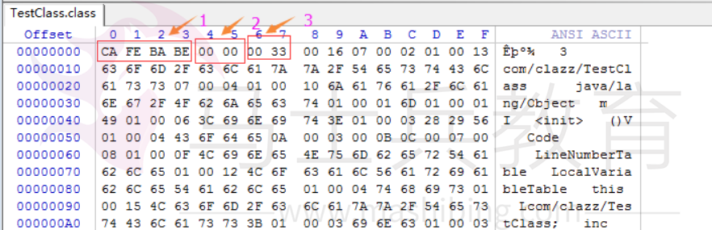

---

4>常量池：常量池第一项，（偏移地址0x0000000A）是0x07，查看表6-3的标志发现它属于
CONSTANT_Class_info类型。此类型的结构如上面的常量池的6-4图，其中tag是标志位已经说过了用于
区分常量类型，name_index是一个索引值，它指向常量池中一个CONSTANT_Utf8_info类型的常量，这
里name_index的值（偏移地址0x0000000B）为0x0002也指向了常量池的第二项。然后依次继续查
找。。。
分析了TestClass.class常量池中的两个，其余19个常量也可以继续计算出来。这里我们可以借助jdk的计
算器帮我们完成。在JDK的bin目录中有一个专门分析class文件的字节码工具：javap，使用命令 javap -
verbose TestClass  参数输出文件字节码内容。如下：
5>常量池结束后，紧接着的两个字节代表访问标识（access_flags）偏移量（0x000000DC）为
0x0021=0x0001 
 
F:\Java\jdk\jdk1.7.0_60\bin>javap -verbose TestClass.class
Classfile /F:/Java/jdk/jdk1.7.0_60/bin/TestClass.class
  Last modified 2017-10-16; size 373 bytes
  MD5 checksum 7d19b6fe8101f913758048f3529eaee4
  Compiled from "TestClass.java"
public class com.clazz.TestClass
  SourceFile: "TestClass.java"
  minor version: 0
  major version: 51
  flags: ACC_PUBLIC, ACC_SUPER
Constant pool:
   #1 = Class              #2             //  com/clazz/TestClass
   #2 = Utf8               com/clazz/TestClass
   #3 = Class              #4             //  java/lang/Object
   #4 = Utf8               java/lang/Object
   #5 = Utf8               m
   #6 = Utf8               I
   #7 = Utf8               <init>
   #8 = Utf8               ()V
   #9 = Utf8               Code
  #10 = Methodref          #3.#11         //  java/lang/Object."<init>":()V
  #11 = NameAndType        #7:#8          //  "<init>":()V
  #12 = Utf8               LineNumberTable
  #13 = Utf8               LocalVariableTable
  #14 = Utf8               this
  #15 = Utf8               Lcom/clazz/TestClass;
  #16 = Utf8               inc
  #17 = Utf8               ()I
  #18 = Fieldref           #1.#19         //  com/clazz/TestClass.m:I
  #19 = NameAndType        #5:#6          //  m:I
  #20 = Utf8               SourceFile
  #21 = Utf8               TestClass.java
{
  public com.clazz.TestClass();
    flags: ACC_PUBLIC
    Code:
      stack=1, locals=1, args_size=1
         0: aload_0
         1: invokespecial #10                 // Method java/lang/Object."<init>
":()V
         4: return

---

User user = new User() 做了什么操作，申请了哪些内
存？
 
1. new User();  创建一个User对象，内存分配在堆上
2. User user;   创建一个引用，内存分配在栈上
3. =            将User对象地址赋值给引用
 
Java的内存模型以及GC算法
 
JVM内存模型与GC算法
 
1.JVM内存模型
 
JVM内存模型如上图，需要声明一点，这是《Java虚拟机规范（Java SE 7版）》规定的内容，实际区域
由各JVM自己实现，所以可能略有不同。以下对各区域进行简短说明。
1.1程序计数器
 
 程序计数器是众多编程语言都共有的一部分，作用是标示下一条需要执行的指令的位置，分支、循环、
跳转、异常处理、线程恢复等基础功能都是依赖程序计数器完成的。
 对于Java的多线程程序而言，不同的线程都是通过轮流获得cpu的时间片运行的，这符合计算机组成原
理的基本概念，因此不同的线程之间需要不停的获得运行，挂起等待运行，所以各线程之间的计数器互
不影响，独立存储。这些数据区属于线程私有的内存。

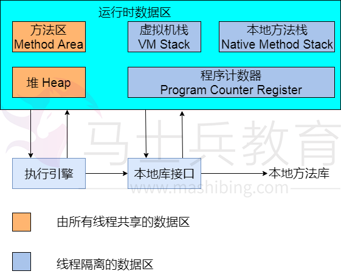

---

1.2 Java虚拟机栈
 
 VM虚拟机栈也是线程私有的，生命周期与线程相同。虚拟机栈描述的是Java方法执行的内存模型：每
个方法在执行的同时都会创建一个栈帧(Stack Frame)用于存储局部变量表、操作数栈、动态链接、方法
出口等信息。每一个方法调用直至执行完的过程，就对应着一个栈帧在虚拟机栈中入栈到出栈的过程。
 有人将java内存区域划分为栈与堆两部分，在这种粗略的划分下，栈标示的就是当前讲的虚拟机栈，或
者是虚拟机栈对应的局部变量表。之所以说这种划分比较粗略是角度不同，这种划分方法关心的是新申
请内存的存在空间，而我们目前谈论的是JVM整体的内存划分，由于角度不同，所以划分的方法不同，
没有对与错。
 局部变量表存放了编译期可知的各种基本类型，对象引用，和returnAddress。其中64位长的long和
double占用了2个局部变量空间(slot)，其他类型都占用1个。这也从存储的角度上说明了long与double
本质上的非原子性。局部变量表所需的内存在编译期间完成分配，当进入一个方法时，这个方法在栈帧
中分配多大的局部变量空间是完全确定的，在方法运行期间不会改变局部变量表大小。
 由于栈帧的进出栈，显而易见的带来了空间分配上的问题。如果线程请求的栈深度大于虚拟机所允许的
深度，将抛出StackOverFlowError异常；如果虚拟机栈可以扩展，扩展时无法申请到足够的内存，将会
抛出OutOfMemoryError。显然，这种情况大多数是由于循环调用与递归带来的。
1.3 本地方法栈
 
 本地方法栈与虚拟机栈的作用十分类似，不过本地方法是为native方法服务的。部分虚拟机（比如 Sun 
HotSpot虚拟机）直接将本地方法栈与虚拟机栈合二为一。与虚拟机栈一样，本地方法栈也会抛出
StactOverFlowError与OutOfMemoryError异常。
 至此，线程私有数据区域结束，下面开始线程共享数据区。
1.4 Java堆
 
 Java堆是虚拟机所管理的内存中最大的一块，在虚拟机启动时创建，此块内存的唯一目的就是存放对象
实例，几乎所有的对象实例都在对上分配内存。JVM规范中的描述是：所有的对象实例以及数据都要在
堆上分配。但是随着JIT编译器的发展与逃逸分析技术的逐渐成熟，栈上分配(对象只存在于某方法中，不
会逃逸出去，因此方法出栈后就会销毁，此时对象可以在栈上分配，方便销毁)，标量替换(新对象拥有的
属性可以由现有对象替换拼凑而成，就没必要真正生成这个对象)等优化技术带来了一些变化，目前并非
所有的对象都在堆上分配了。
 当java堆上没有内存完成实例分配，并且堆大小也无法扩展是，将会抛出OutOfMemoryError异常。
Java堆是垃圾收集器管理的主要区域。
1.5 方法区
 
 方法区与java堆一样，是线程共享的数据区，用于存储被虚拟机加载的类信息、常量、静态变量、即时
编译的代码。JVM规范将方法与堆区分开，但是HotSpot将方法区作为永久代(Permanent Generation)
实现。这样方便将GC分代手机方法扩展至方法区，HotSpot的垃圾收集器可以像管理Java堆一样管理方
法区。但是这种方向已经逐步在被HotSpot替换中，在JDK1.7的版本中，已经把原本存放在方法区的字
符串常量区移出。
 至此，JVM规范所声明的内存模型已经分析完毕，下面将分析一些经常提到的与内存相关的区域。
1.6 运行时常量池
 
 运行时常量池是方法区的一部分。Class文件中除了有类的版本、字段、方法、接口等信息外，还有一
项信息是常量池(Constant Poll Table)用于存放编译期生成的各种字面量和符号引用，这部分内容将在类
加载后进入方法区的运行时常量池存放。
 其中字符串常量池属于运行时常量池的一部分，不过在HotSpot虚拟机中，JDK1.7将字符串常量池移到
了java堆中，通过下面的实验可以很容易看到。

---

在jdk1.6中，字符串常量区是在Perm Space中的，所以可以将Perm Spacce设置的小一些，
XX:MaxPermSize=10M可以很快抛出异常：java.lang.OutOfMemoryError:Perm Space。
 在jdk1.7以上，字符串常量区已经移到了Java堆中，设置-Xms:64m -Xmx:64m，很快就可以抛出异常
java.lang.OutOfMemoryError:java.heap.space。
1.7 直接内存
 
 直接内存不是JVM运行时的数据区的一部分，也不是Java虚拟机规范中定义的内存区域。在JDK1.4中引
入了NIO(New Input/Output)类，引入了一种基于通道(Chanel)与缓冲区(Buffer)的I/O方式，他可以使
用Native函数库直接分配堆外内存，然后通过一个存储在Java中的DirectByteBuffer对象作为对这块内存
的引用进行操作。这样能在一些场景中显著提高性能，因为避免了在Java对和Native对中来回复制数
据。
2.GC算法
 
2.1 标记-清除算法
 
 最基础的垃圾收集算法是“标记-清除”(Mark Sweep)算法，正如名字一样，算法分为2个阶段：1.标记处
需要回收的对象，2.回收被标记的对象。标记算法分为两种:1.引用计数算法(Reference Counting) 2.可
达性分析算法(Reachability Analysis)。由于引用技术算法无法解决循环引用的问题，所以这里使用的标
记算法均为可达性分析算法。
import java.util.ArrayList;
import java.util.List;
/**
 * Created by shining.cui on 2017/7/23.
 */
public class RunTimeContantPoolOOM {
    public static void main(String[] args) {
        List list = new ArrayList();
        int i = 0;
        while(true){
            list.add(String.valueOf(i++).intern());
        }
    }
}

---

如图所示，当进行过标记清除算法之后，出现了大量的非连续内存。当java堆需要分配一段连续的内存
给一个新对象时，发现虽然内存清理出了很多的空闲，但是仍然需要继续清理以满足“连续空间”的要
求。所以说，这种方法比较基础，效率也比较低下。
2.2 复制算法
 
 为了解决效率与内存碎片问题，复制(Copying)算法出现了，它将内存划分为两块相等的大小，每次使用
一块，当这一块用完了，就讲还存活的对象复制到另外一块内存区域中，然后将当前内存空间一次性清
理掉。这样的对整个半区进行回收，分配时按照顺序从内存顶端依次分配，这种实现简单，运行高效。
不过这种算法将原有的内存空间减少为实际的一半，代价比较高。

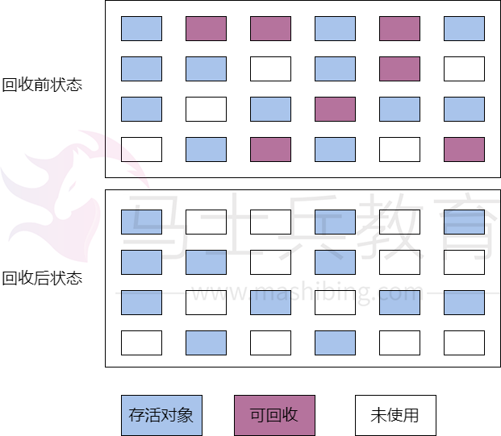

---

从图中可以看出，整理后的内存十分规整，但是白白浪费一般的内存成本太高。然而这其实是很重要的
一个收集算法，因为现在的商业虚拟机都采用这种算法来回收新生代。IBM公司的专门研究表明，新生
代中的对象98%都是“朝生夕死”的，所以不需要按照1:1的比例来划分内存。HotSpot虚拟机将Java堆划
分为年轻代(Young Generation)、老年代(Tenured Generation），其中年轻代又分为一块Eden和两块
Survivor。
 所有的新建对象都放在年轻代中，年轻代使用的GC算法就是复制算法。其中Eden与Survivor的内存大
小比例为8:2，其中Eden由1大块组成，Survivor由2小块组成。每次使用内存为1Eden+1Survivor，即
90%的内存。由于年轻代中的对象生命周期往往很短，所以当需要进行GC的时候就将当前90%中存活的
对象复制到另外一块Survivor中，原来的Eden与Survivor将被清空。但是这就有一个问题，我们无法保
证每次年轻代GC后存活的对象都不高于10%。所以在当活下来的对象高于10%的时候，这部分对象将由
Tenured进行担保，即无法复制到Survivor中的对象将移动到老年代。

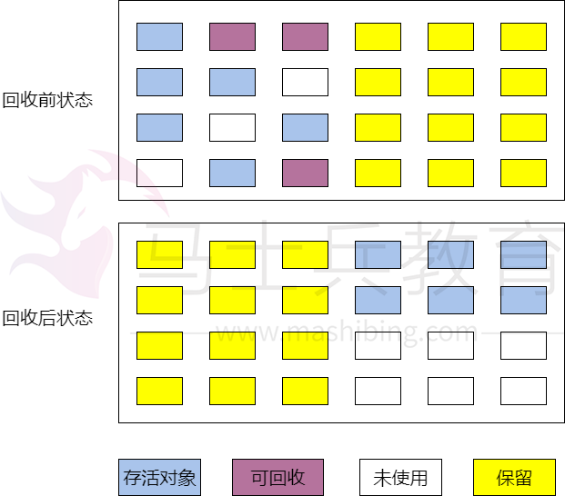

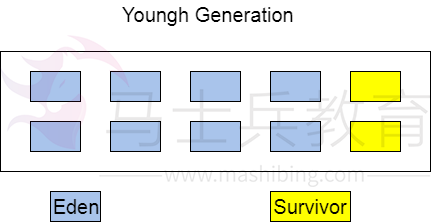

---

2.3 标记-整理算法
 
 复制算法在极端情况下(存活对象较多)效率变得很低，并且需要有额外的空间进行分配担保。所以在老
年代中这种情况一般是不适合的。
 所以就出现了标记-整理(Mark-Compact)算法。与标记清除算法一样，首先是标记对象，然而第二步是
将存货的对象向内存一段移动，整理出一块较大的连续内存空间。
3. 总结
 
1. Java虚拟机规范中规定了对内存的分配，其中程序计数器、本地方法栈、虚拟机栈属于线程私有数
据区，Java堆与方法区属于线程共享数据。
2. Jdk从1.7开始将字符串常量区由方法区(永久代)移动到了Java堆中。
3. Java从NIO开始允许直接操纵系统的直接内存，在部分场景中效率很高，因为避免了在Java堆与
Native堆中来回复制数据。
4. Java堆分为年轻代有年老代，其中年轻代分为1个Eden与2个Survior，同时只有1个Eden与1个
Survior处于使用中状态，又有年轻代的对象生存时间为往往很短，因此使用复制算法进行垃圾回
收。
5. 年老代由于对象存活期比较长，并且没有可担保的数据区，所以往往使用标记-清除与标记-整理算
法进行垃圾回收。
 
 
jvm性能调优都做了什么

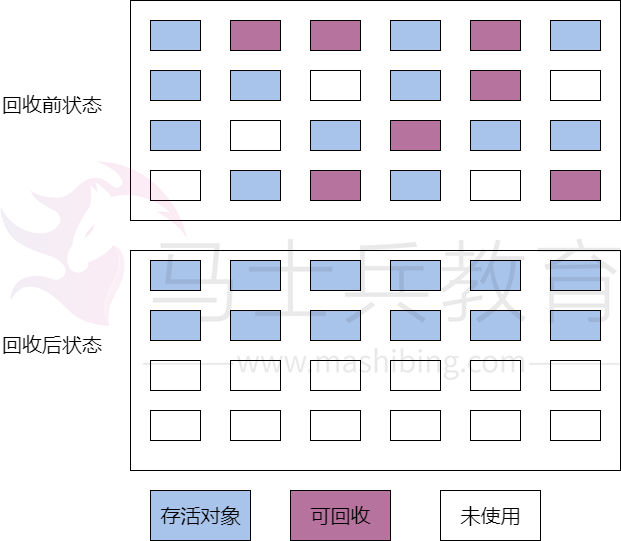

---

JVM性能调优
 
 
一、JVM内存模型及垃圾收集算法
 1.根据Java虚拟机规范，JVM将内存划分为：
New（年轻代）
Tenured（年老代）
永久代（Perm）
 其中New和Tenured属于堆内存，堆内存会从JVM启动参数（-Xmx:3G）指定的内存中分配，Perm不属
于堆内存，有虚拟机直接分配，但可以通过-XX:PermSize -XX:MaxPermSize 等参数调整其大小。
 
年轻代（New）：年轻代用来存放JVM刚分配的Java对象
年老代（Tenured)：年轻代中经过垃圾回收没有回收掉的对象将被Copy到年老代
永久代（Perm）：永久代存放Class、Method元信息，其大小跟项目的规模、类、方法的量有
关，一般设置为128M就足够，设置原则是预留30%的空间。
New又分为几个部分：
Eden：Eden用来存放JVM刚分配的对象
Survivor1
Survivro2：两个Survivor空间一样大，当Eden中的对象经过垃圾回收没有被回收掉时，会在两个
Survivor之间来回Copy，当满足某个条件，比如Copy次数，就会被Copy到Tenured。显然，
Survivor只是增加了对象在年轻代中的逗留时间，增加了被垃圾回收的可能性。
 2.垃圾回收算法
 垃圾回收算法可以分为三类，都基于标记-清除（复制）算法：
Serial算法（单线程）
并行算法
并发算法
 JVM会根据机器的硬件配置对每个内存代选择适合的回收算法，比如，如果机器多于1个核，会对年轻代
选择并行算法，关于选择细节请参考JVM调优文档。
 稍微解释下的是，并行算法是用多线程进行垃圾回收，回收期间会暂停程序的执行，而并发算法，也是
多线程回收，但期间不停止应用执行。所以，并发算法适用于交互性高的一些程序。经过观察，并发算
法会减少年轻代的大小，其实就是使用了一个大的年老代，这反过来跟并行算法相比吞吐量相对较低。
 
 还有一个问题是，垃圾回收动作何时执行？
当年轻代内存满时，会引发一次普通GC，该GC仅回收年轻代。需要强调的时，年轻代满是指Eden
代满，Survivor满不会引发GC
当年老代满时会引发Full GC，Full GC将会同时回收年轻代、年老代
当永久代满时也会引发Full GC，会导致Class、Method元信息的卸载
 另一个问题是，何时会抛出OutOfMemoryException，并不是内存被耗空的时候才抛出
JVM98%的时间都花费在内存回收
每次回收的内存小于2%
 满足这两个条件将触发OutOfMemoryException，这将会留给系统一个微小的间隙以做一些Down之前
的操作，比如手动打印Heap Dump。

---

二、内存泄漏及解决方法
 1.系统崩溃前的一些现象：
每次垃圾回收的时间越来越长，由之前的10ms延长到50ms左右，FullGC的时间也有之前的0.5s延
长到4、5s
FullGC的次数越来越多，最频繁时隔不到1分钟就进行一次FullGC
年老代的内存越来越大并且每次FullGC后年老代没有内存被释放
 之后系统会无法响应新的请求，逐渐到达OutOfMemoryError的临界值。
 
 2.生成堆的dump文件
 通过JMX的MBean生成当前的Heap信息，大小为一个3G（整个堆的大小）的hprof文件，如果没有启
动JMX可以通过Java的jmap命令来生成该文件。
 
 3.分析dump文件
 下面要考虑的是如何打开这个3G的堆信息文件，显然一般的Window系统没有这么大的内存，必须借助
高配置的Linux。当然我们可以借助X-Window把Linux上的图形导入到Window。我们考虑用下面几种工
具打开该文件：
1. Visual VM
2. IBM HeapAnalyzer
3. JDK 自带的Hprof工具
 使用这些工具时为了确保加载速度，建议设置最大内存为6G。使用后发现，这些工具都无法直观地观察
到内存泄漏，Visual VM虽能观察到对象大小，但看不到调用堆栈；HeapAnalyzer虽然能看到调用堆
栈，却无法正确打开一个3G的文件。因此，我们又选用了Eclipse专门的静态内存分析工具：Mat。
 
 4.分析内存泄漏
 通过Mat我们能清楚地看到，哪些对象被怀疑为内存泄漏，哪些对象占的空间最大及对象的调用关系。
针对本案，在ThreadLocal中有很多的JbpmContext实例，经过调查是JBPM的Context没有关闭所致。
 另，通过Mat或JMX我们还可以分析线程状态，可以观察到线程被阻塞在哪个对象上，从而判断系统的
瓶颈。
 
 5.回归问题
  Q：为什么崩溃前垃圾回收的时间越来越长？
  A:根据内存模型和垃圾回收算法，垃圾回收分两部分：内存标记、清除（复制），标记部分只要内存大
小固定时间是不变的，变的是复制部分，因为每次垃圾回收都有一些回收不掉的内存，所以增加了复制
量，导致时间延长。所以，垃圾回收的时间也可以作为判断内存泄漏的依据
  Q：为什么Full GC的次数越来越多？
  A：因此内存的积累，逐渐耗尽了年老代的内存，导致新对象分配没有更多的空间，从而导致频繁的垃
圾回收
  Q:为什么年老代占用的内存越来越大？

---

A:因为年轻代的内存无法被回收，越来越多地被Copy到年老代
 
三、性能调优
 除了上述内存泄漏外，我们还发现CPU长期不足3%，系统吞吐量不够，针对8core×16G、64bit的Linux
服务器来说，是严重的资源浪费。
 在CPU负载不足的同时，偶尔会有用户反映请求的时间过长，我们意识到必须对程序及JVM进行调优。
从以下几个方面进行：
线程池：解决用户响应时间长的问题
连接池
JVM启动参数：调整各代的内存比例和垃圾回收算法，提高吞吐量
程序算法：改进程序逻辑算法提高性能
 1.Java线程池（java.util.concurrent.ThreadPoolExecutor）
  大多数JVM6上的应用采用的线程池都是JDK自带的线程池，之所以把成熟的Java线程池进行罗嗦说明，
是因为该线程池的行为与我们想象的有点出入。Java线程池有几个重要的配置参数：
corePoolSize：核心线程数（最新线程数）
maximumPoolSize：最大线程数，超过这个数量的任务会被拒绝，用户可以通过
RejectedExecutionHandler接口自定义处理方式
keepAliveTime：线程保持活动的时间
workQueue：工作队列，存放执行的任务
Java线程池需要传入一个Queue参数（workQueue）用来存放执行的任务，而对Queue的不同选
择，线程池有完全不同的行为：
SynchronousQueue： ``一个无容量的等待队列，一个线程的insert操作必须等待另一线程的remove操
作，采用这个Queue线程池将会为每个任务分配一个新线程
LinkedBlockingQueue ： 无界队列，采用该Queue，线程池将忽略 maximumPoolSize参数，仅用
corePoolSize的线程处理所有的任务，未处理的任务便在LinkedBlockingQueue中排队
ArrayBlockingQueue： 有界队列，在有界队列和 maximumPoolSize的作用下，程序将很难被调
优：更大的Queue和小的maximumPoolSize将导致CPU的低负载；小的Queue和大的池，Queue
就没起动应有的作用。
其实我们的要求很简单，希望线程池能跟连接池一样，能设置最小线程数、最大线程数，当最小数
<任务<最大数时，应该分配新的线程处理；当任务>最大数时，应该等待有空闲线程再处理该任
务。
但线程池的设计思路是，任务应该放到Queue中，当Queue放不下时再考虑用新线程处理，如果
Queue满且无法派生新线程，就拒绝该任务。设计导致“先放等执行”、“放不下再执行”、“拒绝不等
待”。所以，根据不同的Queue参数，要提高吞吐量不能一味地增大maximumPoolSize。
当然，要达到我们的目标，必须对线程池进行一定的封装，幸运的是ThreadPoolExecutor中留了
足够的自定义接口以帮助我们达到目标。我们封装的方式是：
以SynchronousQueue作为参数，使maximumPoolSize发挥作用，以防止线程被无限制的分配，
同时可以通过提高maximumPoolSize来提高系统吞吐量
自定义一个RejectedExecutionHandler，当线程数超过maximumPoolSize时进行处理，处理方式
为隔一段时间检查线程池是否可以执行新Task，如果可以把拒绝的Task重新放入到线程池，检查的
时间依赖keepAliveTime的大小。
 2.连接池（org.apache.commons.dbcp.BasicDataSource）

---

在使用org.apache.commons.dbcp.BasicDataSource的时候，因为之前采用了默认配置，所以当访问
量大时，通过JMX观察到很多Tomcat线程都阻塞在BasicDataSource使用的Apache ObjectPool的锁
上，直接原因当时是因为BasicDataSource连接池的最大连接数设置的太小，默认的BasicDataSource
配置，仅使用8个最大连接。
  我还观察到一个问题，当较长的时间不访问系统，比如2天，DB上的Mysql会断掉所以的连接，导致连
接池中缓存的连接不能用。为了解决这些问题，我们充分研究了BasicDataSource，发现了一些优化的
点：
Mysql默认支持100个链接，所以每个连接池的配置要根据集群中的机器数进行，如有2台服务器，
可每个设置为60
initialSize：参数是一直打开的连接数
minEvictableIdleTimeMillis：该参数设置每个连接的空闲时间，超过这个时间连接将被关闭
timeBetweenEvictionRunsMillis：后台线程的运行周期，用来检测过期连接
maxActive：最大能分配的连接数
maxIdle：最大空闲数，当连接使用完毕后发现连接数大于maxIdle，连接将被直接关闭。只有
initialSize < x < maxIdle的连接将被定期检测是否超期。这个参数主要用来在峰值访问时提高吞吐
量。
initialSize是如何保持的？经过研究代码发现，BasicDataSource会关闭所有超期的连接，然后再打
开initialSize数量的连接，这个特性与minEvictableIdleTimeMillis、
timeBetweenEvictionRunsMillis一起保证了所有超期的initialSize连接都会被重新连接，从而避免
了Mysql长时间无动作会断掉连接的问题。
 3.JVM参数
  在JVM启动参数中，可以设置跟内存、垃圾回收相关的一些参数设置，默认情况不做任何设置JVM会工
作的很好，但对一些配置很好的Server和具体的应用必须仔细调优才能获得最佳性能。通过设置我们希
望达到一些目标：
GC的时间足够的小
GC的次数足够的少
发生Full GC的周期足够的长
 前两个目前是相悖的，要想GC时间小必须要一个更小的堆，要保证GC次数足够少，必须保证一个更大
的堆，我们只能取其平衡。
  （1）针对JVM堆的设置，一般可以通过-Xms -Xmx限定其最小、最大值，为了防止垃圾收集器在最
小、最大之间收缩堆而产生额外的时间，我们通常把最大、最小设置为相同的值
  （2）年轻代和年老代将根据默认的比例（1：2）分配堆内存，可以通过调整二者之间的比率
NewRadio来调整二者之间的大小，也可以针对回收代，比如年轻代，通过 -XX:newSize -
XX:MaxNewSize来设置其绝对大小。同样，为了防止年轻代的堆收缩，我们通常会把-XX:newSize -
XX:MaxNewSize设置为同样大小
  （3）年轻代和年老代设置多大才算合理？这个我问题毫无疑问是没有答案的，否则也就不会有调优。
我们观察一下二者大小变化有哪些影响
更大的年轻代必然导致更小的年老代，大的年轻代会延长普通GC的周期，但会增加每次GC的时
间；小的年老代会导致更频繁的Full GC
更小的年轻代必然导致更大年老代，小的年轻代会导致普通GC很频繁，但每次的GC时间会更短；
大的年老代会减少Full GC的频率
如何选择应该依赖应用程序对象生命周期的分布情况：如果应用存在大量的临时对象，应该选择更
大的年轻代；如果存在相对较多的持久对象，年老代应该适当增大。但很多应用都没有这样明显的
特性，在抉择时应该根据以下两点：（A）本着Full GC尽量少的原则，让年老代尽量缓存常用对
象，JVM的默认比例1：2也是这个道理 （B）通过观察应用一段时间，看其他在峰值时年老代会占
多少内存，在不影响Full GC的前提下，根据实际情况加大年轻代，比如可以把比例控制在1：1。
但应该给年老代至少预留1/3的增长空间

---

（4）在配置较好的机器上（比如多核、大内存），可以为年老代选择并行收集算法： -
XX:+UseParallelOldGC ，默认为Serial收集
 （5）线程堆栈的设置：每个线程默认会开启1M的堆栈，用于存放栈帧、调用参数、局部变量等，对大
多数应用而言这个默认值太了，一般256K就足用。理论上，在内存不变的情况下，减少每个线程的堆
栈，可以产生更多的线程，但这实际上还受限于操作系统。
 （4）可以通过下面的参数打Heap Dump信息
-XX:HeapDumpPath
-XX:+PrintGCDetails
-XX:+PrintGCTimeStamps
-Xloggc:/usr/aaa/dump/heap_trace.txt
通过下面参数可以控制OutOfMemoryError时打印堆的信息
-XX:+HeapDumpOnOutOfMemoryError
 请看一下一个时间的Java参数配置：（服务器：Linux 64Bit，8Core×16G）
 
 JAVA_OPTS="$JAVA_OPTS -server -Xms3G -Xmx3G -Xss256k -XX:PermSize=128m -
XX:MaxPermSize=128m -XX:+UseParallelOldGC -XX:+HeapDumpOnOutOfMemoryError -
XX:HeapDumpPath=/usr/aaa/dump -XX:+PrintGCDetails -XX:+PrintGCTimeStamps -
Xloggc:/usr/aaa/dump/heap_trace.txt -XX:NewSize=1G -XX:MaxNewSize=1G"
经过观察该配置非常稳定，每次普通GC的时间在10ms左右，Full GC基本不发生，或隔很长很长的时间
才发生一次
通过分析dump文件可以发现，每个1小时都会发生一次Full GC，经过多方求证，只要在JVM中开启了
JMX服务，JMX将会1小时执行一次Full GC以清除引用，关于这点请参考附件文档。
 4.程序算法调优
 
===============================================================================
========
调优方法
一切都是为了这一步，调优，在调优之前，我们需要记住下面的原则：
 
1、多数的Java应用不需要在服务器上进行GC优化；
2、多数导致GC问题的Java应用，都不是因为我们参数设置错误，而是代码问题；
3、在应用上线之前，先考虑将机器的JVM参数设置到最优（最适合）；
4、减少创建对象的数量；
5、减少使用全局变量和大对象；
6、GC优化是到最后不得已才采用的手段；
7、在实际使用中，分析GC情况优化代码比优化GC参数要多得多；
 
GC优化的目的有两个：

---

1、将转移到老年代的对象数量降低到最小；
2、减少full GC的执行时间；
 
为了达到上面的目的，一般地，你需要做的事情有：
1、减少使用全局变量和大对象；
2、调整新生代的大小到最合适；
3、设置老年代的大小为最合适；
4、选择合适的GC收集器；
 
在上面的4条方法中，用了几个“合适”，那究竟什么才算合适，一般的，请参考上面“收集器搭配”和“启动
内存分配”两节中的建议。但这些建议不是万能的，需要根据您的机器和应用情况进行发展和变化，实际
操作中，可以将两台机器分别设置成不同的GC参数，并且进行对比，选用那些确实提高了性能或减少了
GC时间的参数。
 
真正熟练的使用GC调优，是建立在多次进行GC监控和调优的实战经验上的，进行监控和调优的一般步
骤为：
1，监控GC的状态
使用各种JVM工具，查看当前日志，分析当前JVM参数设置，并且分析当前堆内存快照和gc日志，根据实
际的各区域内存划分和GC执行时间，觉得是否进行优化；
 
2，分析结果，判断是否需要优化
如果各项参数设置合理，系统没有超时日志出现，GC频率不高，GC耗时不高，那么没有必要进行GC优
化；如果GC时间超过1-3秒，或者频繁GC，则必须优化；
注：如果满足下面的指标，则一般不需要进行GC：
  Minor GC执行时间不到50ms；
  Minor GC执行不频繁，约10秒一次；
  Full GC执行时间不到1s；
  Full GC执行频率不算频繁，不低于10分钟1次；
 
3，调整GC类型和内存分配
如果内存分配过大或过小，或者采用的GC收集器比较慢，则应该优先调整这些参数，并且先找1台或几
台机器进行beta，然后比较优化过的机器和没有优化的机器的性能对比，并有针对性的做出最后选择；
4，不断的分析和调整
通过不断的试验和试错，分析并找到最合适的参数
5，全面应用参数
如果找到了最合适的参数，则将这些参数应用到所有服务器，并进行后续跟踪。

---

调优实例
上面的内容都是纸上谈兵，下面我们以一些真实例子来进行说明：
实例1：
笔者昨日发现部分开发测试机器出现异常：java.lang.OutOfMemoryError: GC overhead limit 
exceeded，这个异常代表：
GC为了释放很小的空间却耗费了太多的时间，其原因一般有两个：1，堆太小，2，有死循环或大对象；
笔者首先排除了第2个原因，因为这个应用同时是在线上运行的，如果有问题，早就挂了。所以怀疑是这
台机器中堆设置太小；
使用ps -ef |grep "java"查看，发现：
 
 
该应用的堆区设置只有768m，而机器内存有2g，机器上只跑这一个java应用，没有其他需要占用内存
的地方。另外，这个应用比较大，需要占用的内存也比较多；
笔者通过上面的情况判断，只需要改变堆中各区域的大小设置即可，于是改成下面的情况：
 
 
跟踪运行情况发现，相关异常没有再出现；
 
实例2：
一个服务系统，经常出现卡顿，分析原因，发现Full GC时间太长：
jstat -gcutil:
S0   S1   E   O    P     YGC YGCT FGC FGCT  GCT
12.16 0.00 5.18 63.78 20.32  54  2.047 5   6.946  8.993 
分析上面的数据，发现Young GC执行了54次，耗时2.047秒，每次Young GC耗时37ms，在正常范围，
而Full GC执行了5次，耗时6.946秒，每次平均1.389s，数据显示出来的问题是：Full GC耗时较长，分
析该系统的是指发现，NewRatio=9，也就是说，新生代和老生代大小之比为1:9，这就是问题的原因：
1，新生代太小，导致对象提前进入老年代，触发老年代发生Full GC；
2，老年代较大，进行Full GC时耗时较大；
优化的方法是调整NewRatio的值，调整到4，发现Full GC没有再发生，只有Young GC在执行。这就是
把对象控制在新生代就清理掉，没有进入老年代（这种做法对一些应用是很有用的，但并不是对所有应
用都要这么做）
 
实例3：
一应用在性能测试过程中，发现内存占用率很高，Full GC频繁，使用sudo -u admin -H  jmap -
dump:format=b,file=文件名.hprof pid 来dump内存，生成dump文件，并使用Eclipse下的mat差距进
行分析，发现：

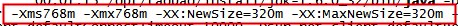

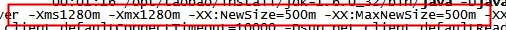

---

从图中可以看出，这个线程存在问题，队列LinkedBlockingQueue所引用的大量对象并未释放，导致整
个线程占用内存高达378m，此时通知开发人员进行代码优化，将相关对象释放掉即可。
 
 
java classload 机制 详解
 
 
类加载器是 Java 语言的一个创新，也是 Java 语言流行的重要原因之一。它使得 Java 类可以被动态加载
到 Java 虚拟机中并执行。类加载器从 JDK 1.0 就出现了，最初是为了满足 Java Applet 的需要而开发出
来的。Java Applet 需要从远程下载 Java 类文件到浏览器中并执行。现在类加载器在 Web 容器和 OSGi 
中得到了广泛的使用。一般来说，Java 应用的开发人员不需要直接同类加载器进行交互。Java 虚拟机默
认的行为就已经足够满足大多数情况的需求了。不过如果遇到了需要与类加载器进行交互的情况，而对
类加载器的机制又不是很了解的话，就很容易花大量的时间去调试 
ClassNotFoundException 和 NoClassDefFoundError 等异常。本文将详细介绍 Java 的类加载器，帮助
读者深刻理解 Java 语言中的这个重要概念。下面首先介绍一些相关的基本概念。 
类加载器基本概念
 
   类加载器（class loader）用来加载 Java 类到 Java 虚拟机中。一般来说，Java 虚拟机使用 Java 类的方
式如下：Java 源程序（.java 文件）在经过 Java 编译器编译之后就被转换成 Java 字节代码（.class 文
件）。类加载器负责读取 Java 字节代码，并转换成 java.lang.Class 类的一个实例。每个这样的实例用
来表示一个 Java 类。通过此实例的 newInstance()方法就可以创建出该类的一个对象。实际的情况可能
更加复杂，比如 Java 字节代码可能是通过工具动态生成的，也可能是通过网络下载的。 基本上所有的
类加载器都是 java.lang.ClassLoader 类的一个实例。下面详细介绍这个 Java 类。 
java.lang.ClassLoader 类介绍
 
   java.lang.ClassLoader 类的基本职责就是根据一个指定的类的名称，找到或者生成其对应的字节代
码，然后从这些字节代码中定义出一个ava 类，即 java.lang.Class 类的一个实例。除此之外，
ClassLoader 还负责加载 Java 
应用所需的资源，如图像文件和配置文件等。不过本文只讨论其加载类的功能。为了完成加载类的这个
职责，ClassLoader 提供了一系列的方法，比较重要的方法如 表 1 所示。关于这些方法的细节会在下面
进行介绍。

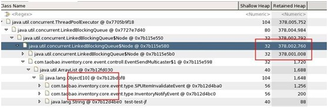

---

方法
说明
getParent()
返回该类加载器的父类加载器
loadClass(String name)
加载名称为 name 的类，返回的结果是 java.lang.Class 类的实
例
findClass(String name)
查找名称为 name 的类，返回的结果是 java.lang.Class 类的实
例
findLoadedClass(String
name)
查找名称为 name 的已经被加载过的类，返回的结果是
java.lang.Class 类的实例。
defineClass(String name,
byte[] b, int off, int len)
把字节数组 b 中的内容转换成 Java 类，返回的结果是
java.lang.Class 类的实例。这个方法被声明为 final 的
resolveClass(Class<?> c)
链接指定的 Java 类
   对于 表 1 中给出的方法，表示类名称的 name 参数的值是类的二进制名称。需要注意的是内部类的表
示，如 
com.example.Sample$1 和 com.example.Sample$Inner 等表示方式。这些方法会在下面介绍类加载
器的工作机制时，做进一步的说明。下面介绍类加载器的树状组织结构。 
 
类加载器的树状组织结构
 
   Java 中的类加载器大致可以分成两类，一类是系统提供的，另外一类则是由 Java 应用开发人员编写
的。系统提供的类加载器主要有下面三个： 
引导类加载器（bootstrap class loader）：它用来加载 Java 的核心库，是用原生代码来实现
的，并不继承自 
java.lang.ClassLoader。 
扩展类加载器（extensions class loader）：它用来加载 Java 的扩展库。Java 虚拟机的实现会提
供一个扩展库目录。该类加载器在此目录里面查找并加载 Java 类。 
系统类加载器（system class loader/App classloader）：它根据 Java 应用的类路径
（CLASSPATH）来加载 Java 类。一般来说，Java 应用的类都是由它来完成加载的。可以通过 
ClassLoader.getSystemClassLoader() 来获取它。 
除了系统提供的类加载器以外，开发人员可以通过继承 java.lang.ClassLoader 类的方式实现自己
的类加载器，以满足一些特殊的需求。 
除了引导类加载器之外，*所有的类加载器都有一个父类加载器。通过 表 1 中给出的 getParent()* 
*方法可以得到*。对于系统提供的类加载器来说，system classloader的父类加载器是extensions 
cloassloader，而extensions cloassloader的父类加载器是bootstrap classloader；对于开发人员
编写的类加载器来说，其父类加载器是加载此类加载器 Java 类的类加载器。因为类加载器 Java 类
如同其它的 Java 类一样，也是要由类加载器来加载的。一般来说，开发人员编写的类加载器的父
类加载器是system classloader。类加载器通过这种方式组织起来，形成树状结构。树的根节点就
是bootstrap classloader。图 1 中给出了一个典型的类加载器树状组织结构示意图，其中的箭头指
向的是父类加载器。 
表 1. ClassLoader 中与加载类相关的方法

---

代码清单 1 演示了类加载器的树状组织结构。

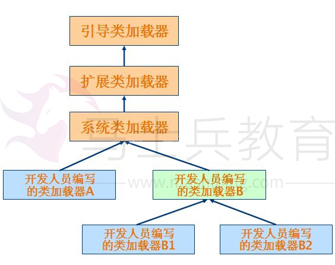

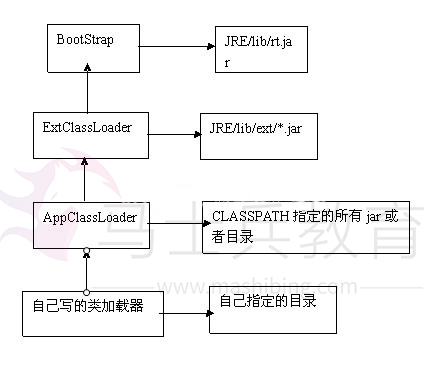

---

输出结果：
 
第一个输出的是 ClassLoaderTree  类的类加载器，即系统类加载器。它是 
sun.misc.Launcher$AppClassLoader  类的实例；第二个输出的是扩展类加载器，是 
sun.misc.Launcher$ExtClassLoader  类的实例。需要注意的是这里并没有输出引导类加载器，这是
由于有些 JDK 的实现对于父类加载器是引导类加载器的情况， getParent()  方法返回 null  。 
 
   类加载器的代理模式 
   在了解了类加载器的树状组织结构之后，下面介绍类加载器的代理模式。
   类加载器在尝试自己去查找某个类的字节代码并定义它时，会先代理给其父类加载器，由父类加载器
先去尝试加载这个类，依次类推。在介绍代理模式背后的动机之前，首先需要说明一下 Java 虚拟机是如
何判定两个 Java 类是相同的。*Java* *虚拟机不仅要看类的全名是否相同，还要看加载此类的类加载器
是否一样。只有两者都相同的情况，才认为两个类是相同的。即便是同样的字节代码，被不同的类加载
器加载之后所得到的类，也是不同的。*比如一个 Java 类com.tao.test. ClassTest，编译之后生成了
字节代码文件ClassTest.class 。两个不同的类加载器ClassLoaderA 和 ClassLoaderB 分别读取了
这个ClassTest.class 文件，并定义出两个java.lang.Class 类的实例来表示这个类。这两个实例是
不相同的。对于 Java 虚拟机来说，它们是不同的类。试图对这两个类的对象进行相互赋值，会抛出运行
时异常ClassCastException 。下面通过上面一讲的示例来具体比较
 
public class ClassLoaderTree { 
    public static void main(String[] args) { 
        ClassLoader loader = ClassLoaderTree.class.getClassLoader(); 
        while (loader != null) { 
            System.out.println(loader.getClass().getName()); 
            loader = loader.getParent(); 
        } 
        System.out.println(loader);//最后当loader=null的时候。这个时候loader代表的是引
导类加载器BootStrap
    } 
 }
sun.misc.Launcher$AppClassLoader
sun.misc.Launcher$ExtClassLoader
null
public class Test {
    public static void main(String[] args) throws ClassNotFoundException, 
InstantiationException, IllegalAccessException {
        Class clazz1=new MyClassLoader().loadClass("com.tao.test.ClassTest");
        Class clazz2=new MyClassLoader().loadClass("com.tao.test.ClassTest");
        //这是由不同的类加载器加载的类生成的对象
        InterfaceTest classTest1=(InterfaceTest) clazz1.newInstance();
        InterfaceTest classTest2=(InterfaceTest) clazz2.newInstance();
        //这是Date对象，是由同一个类加载器加载的
        Date date1=new Date();
        Date date2=new Date();
        //比较他们是否是同一个Class类的实例

---

运行结果：
类加载器是怎么进行委托的呢，我们可以查看下ClassLoader的源码分析下。
因为，在加载一个类的时候，都是调用loadClass()方法，所以具体看下loadClass()方法。
        System.out.println(date1.getClass().equals(date2.getClass())); 
System.out.println(classTest1.getClass().equals(classTest2.getClass()));
    }
}
true
false
//有两个loadClass()方法，不过最终都是调用第二个方法
public Class<?> loadClass(String name) throws ClassNotFoundException {
        return loadClass(name, false);
    }
//最终调用的loadClass()方法 
protected Class<?> loadClass(String name, boolean resolve)
        throws ClassNotFoundException
    {
        //异步保护，防止重复加载一个相同的类
        synchronized (getClassLoadingLock(name)) {
            // 检测这个类是否被加载了
            Class c = findLoadedClass(name);
            //如果没有被加载，首先让父类去加载
            if (c == null) {
                long t0 = System.nanoTime();
                try {
                    if (parent != null) {//父类加载器不是null，也就是说不是BootStrap加
载器
                        c = parent.loadClass(name, false);
                    } else {//父类加载器是BootStrap加载器
                        c = findBootstrapClassOrNull(name);
                    }
                } catch (ClassNotFoundException e) {
                    // ClassNotFoundException thrown if class not found
                    // from the non-null parent class loader
                }
                 //如果经过父类加载器之后，还是null，也就是说父类无法加载，那么再由自己完成
加载
                  if (c == null) {
                    // If still not found, then invoke findClass in order
                    // to find the class.
                    long t1 = System.nanoTime();
                    c = findClass(name);//调用自己的findClass()方法
 
                    // this is the defining class loader; record the stats
                    sun.misc.PerfCounter.getParentDelegationTime().addTime(t1 - 
t0);
                   
 sun.misc.PerfCounter.getFindClassTime().addElapsedTimeFrom(t1);
                    sun.misc.PerfCounter.getFindClasses().increment();
                }
            }

---

所以，可以很清楚的看到，加载一个类的过程，它是层层的像父类委托，然后在层层的向下加载。用这
样的一种委托机制，到底有什么好处呢？为什么要这样做呢？
原因如下：
1、节约系统资源。只要，这个类已经被加载过了，就不会在次加载。
2、保证 Java 核心库的类型安全。所有 Java 应用都至少需要引用 java.lang.Object 类，也就是说在
运行的时候，java.lang.Object 这个类需要被加载到 Java 虚拟机中。如果这个加载过程由 Java 应用
自己的类加载器来完成的话，很可能就存在多个版本的 java.lang.Object 类，而且这些类之间是不兼
容的。通过代理模式，对于 Java 核心库的类的加载工作由引导类加载器来统一完成，保证了 Java 应用
所使用的都是同一个版本的 Java 核心库的类，是互相兼容的。
   线程上下文类加载器 
   线程上下文类加载器（context class loader）是从 JDK 1.2 开始引入的。类 java.lang.Thread 中的方
法 getContextClassLoader() 和 setContextClassLoader(ClassLoader cl) 用来获取和设置线程的上下文
类加载器。如果没有通过 setContextClassLoader(ClassLoader cl)方法进行设置的话，线程将继承其父
线程的上下文类加载器。Java 应用运行的初始线程的上下文类加载器是系统类加载器。在线程中运行的
代码可以通过此类加载器来加载类和资源。 
   前面提到的类加载器的代理模式并不能解决 Java 应用开发中会遇到的类加载器的全部问题。Java 提供
了很多服务提供者接口（Service Provider Interface，SPI），允许第三方为这些接口提供实现。常见的 
SPI 有 JDBC、JCE、JNDI、JAXP 和 JBI 等。这些 SPI 的接口由 Java 核心库来提供，如 JAXP 的 SPI 接口
定义包含在 javax.xml.parsers 包中。这些 SPI 的实现代码很可能是作为 Java 应用所依赖的 jar 包被包
含进来，可以通过类路径（CLASSPATH）来找到，如实现了 JAXP SPI 的 Apache Xerces 所包含的 jar 
包。SPI 接口中的代码经常需要加载具体的实现类。如 JAXP 中的 
javax.xml.parsers.DocumentBuilderFactory 类中的 newInstance() 方法用来生成一个新的 
DocumentBuilderFactory 的实例。这里的实例的真正的类是继承自 
javax.xml.parsers.DocumentBuilderFactory，由 SPI 的实现所提供的。如在 Apache Xerces 中，实现
的类是 org.apache.xerces.jaxp.DocumentBuilderFactoryImpl。而问题在于，SPI 的接口是 
Java 核心库的一部分，是由引导类加载器(extension classloader)来加载的；SPI 实现的 Java 类一般是
由系统类加载器(system classloader)来加载的。引导类加载器是无法找到 SPI 的实现类的，因为它只加
载 Java 的核心库。它也不能代理给系统类加载器，因为它是系统类加载器的祖先类加载器。也就是说，
类加载器的代理模式无法解决这个问题。 线程上下文类加载器正好解决了这个问题。如果不做任何的设
置，Java 应用的线程的上下文类加载器默认就是系统上下文类加载器。在 SPI 接口的代码中使用线程上
下文类加载器，就可以成功的加载到 SPI 实现的类。线程上下文类加载器在很多 SPI 的实现中都会用
到。 
   下面介绍另外一种加载类的方法：Class.forName。 
   Class.forName 
   Class.forName 是一个静态方法，同样可以用来加载类。该方法有两种形式：
   Class.forName(String name, boolean initialize, ClassLoader loader) 
   Class.forName(String className)。
            if (resolve) {
                resolveClass(c);
            }
            return c;
        }
    }
下面讨论另外一种类加载器：线程上下文类加载器。

---

第一种形式的参数 name 表示的是类的全名；initialize 表示是否初始化类；loader表示加载时使用的
类加载器。第二种形式则相当于设置了参数 initialize 的值为 true，loader 的值为当前类的类加载器。
Class.forName 的一个很常见的用法是在加载数据库驱动的时候。如 
Class.forName("org.apache.derby.jdbc.EmbeddedDriver").newInstance() 用来加载 Apache Derby 
数据库的驱动。 
   在介绍完类加载器相关的基本概念之后，下面介绍如何开发自己的类加载器。 
   开发自己的类加载器 
   虽然在绝大多数情况下，系统默认提供的类加载器实现已经可以满足需求。但是在某些情况下，您还
是需要为应用开发出自己的类加载器。比如您的应用通过网络来传输 Java 
类的字节代码，为了保证安全性，这些字节代码经过了加密处理。这个时候您就需要自己的类加载器来
从某个网络地址上读取加密后的字节代码，接着进行解密和验证，最后定义出要在 Java 虚拟机中运行的
类来。下面将通过两个具体的实例来说明类加载器的开发。 
 
下面，详细的介绍自定义一个类加载器的过程。
一、首先，写出一个接口，然后用一个类实现该接口，该类作为测试类，即我们自定义ClassLoader要
加载的类。
接口：
 
测试类：
二、自定义一个加密类，用来加密测试类的字节码文件。
到我们要加密的.class文件的位置：
E:\workspace.fu\ClassLoaderTest\bin\com\tao\test\ClassTest.class
加密后的.class文件要存储的位置，这里将它直接放到E盘根目录：E:\ClassTest.class
/**
 * 要加载类的接口，加载该接口的子类时，可以用接口引用，而不需要利用反射来实现。
 */
public interface InterfaceTest {
    public void name();
    public void age();
}
/**
 * 测试类，自定义类加载器去加载该类
 */
public class ClassTest implements InterfaceTest{
    @Override
    public void name() {
        System.out.println("tao");
    }
 
    @Override
    public void age() {
        System.out.println("21");
    }
 
}

---

运行该类，那么，我们就已经对ClassTest.class文件加密成功，打开E盘，可以发现根目录下已经有了一
个ClassTest.class文件。
 
可以将E:\workspace.fu\ClassLoaderTest\bin\com\tao\test的ClassTest.class文件删除，并且删除
ClassTest.java文件和加密类ClassEncrypt.java。
三、编写我们自己的类加载器，必须继承ClassLoader，然后覆盖findClass()方法。
ClassLoader超类的loadClass方法用于将类的加载操作委托给父类加载器去进行，只有该类尚未加载并
且父类加载器也无法加载该类时，才调用findClass()方法。
如果要实现该方法，必须做到以下几点：
（1）、为来自本地文件系统或者其他来源的类加载其字节码
（2）、调用ClassLoader超类的defineClass()方法，向虚拟机提供字节码
/**
 * 用加密算法生成要隐藏的字节码文件
 */
public class ClassEncrypt extends MyClassLoader{
    public static void main(String[] args) throws IOException {
        //要加密的字节码.class文件
        String 
srcPath="E:/workspace.fu/ClassLoaderTest/bin/com/tao/test/ClassTest.class";
        //加密之后输出的字节码.class文件的位置
        String destPath="E:/ClassTest.class";
        FileInputStream fis=new FileInputStream(srcPath);
        FileOutputStream ofs=new FileOutputStream(destPath);
        cypher(fis, ofs);//加密
        fis.close();
        ofs.close();
    }
    
    //简单的加密，用于测试。将所有二进制位取反，即0变成1，1变成0
    private static void cypher(InputStream in,OutputStream out) throws 
IOException{
        int b=-1;
        while((b=in.read())!=-1){
            out.write(b^0xff);
        }
    }
}
/**
 * 自定义的类加载器
 */
public class MyClassLoader extends ClassLoader{
    
    /**
     * 因为类加载器是基于委托机制，所以我们只需要重写findClass方法。
     * 它会自动向父类加载器委托，如果父类没有找到，就会再去调用我们重写的findClass方法加载
     */
    @Override
    protected Class<?> findClass(String name) throws ClassNotFoundException {

---

四、最后写一个测试类，测试我们的类加载器
    对于运行在 Java EE? 容器中的 Web 应用来说，类加载器的实现方式与一般的 Java 应用有所不同。
不同的 Web 容器的实现方式也会有所不同。以 Apache Tomcat 来说，每个 Web 
应用都有一个对应的类加载器实例。该类加载器也使用代理模式，所不同的是它是首先尝试去加载某个
类，如果找不到再代理给父类加载器。这与一般类加载器的顺序是相反的。这是 *Java Servlet 规范中
的推荐做法，其目的是使得 Web 应用自己的类的优先级高于 Web 容器提供的类。这种代理模式的一个
例外是：Java* *核心库的类是不在查找范围之内的。这也是为了保证 Java 核心库的类型安全。* 绝大
多数情况下，Web 应用的开发人员不需要考虑与类加载器相关的细节。下面给出几条简单的原则： 
每个 Web 应用自己的 Java 类文件和使用的库的 jar 包，分别放在 WEB-INF/classes 和 WEB-
INF/lib 目录下面。 
        try {
            //需要加载的.class字节码的位置
            String classPath="E:/ClassTest.class";
            
            FileInputStream fis=new FileInputStream(classPath);
            ByteArrayOutputStream bos=new ByteArrayOutputStream();
            cypher(fis, bos);
            fis.close();
            byte[] bytes=bos.toByteArray();
            return defineClass(bytes, 0, bytes.length);
        } catch (FileNotFoundException e) {
            e.printStackTrace();
        } catch (IOException e) {
            e.printStackTrace();
        }
        return super.findClass(name);
    }
    
    //相应的字节码解密类，在加载E盘根目录下的被加密过的ClassTest.class字节码的时候，进行相应
的解密。
    private static void cypher(InputStream in,OutputStream out) throws 
IOException{
        int b=-1;
        while((b=in.read())!=-1){
            out.write(b^0xff);
        }
    }
}
public class Test {
    public static void main(String[] args) throws ClassNotFoundException, 
InstantiationException, IllegalAccessException {
        Class clazz=new MyClassLoader().loadClass("com.tao.test.ClassTest");
            //这就是我们接口的作用。如果没有接口，就需要利用反射来实现了。
            InterfaceTest classTest=(InterfaceTest) clazz.newInstance();
        classTest.name();
        classTest.age();
    }
}
在介绍完如何开发自己的类加载器之后，下面说明类加载器和 Web 容器的关系。 
**类加载器与 Web 容器**

---

多个应用共享的 Java 类文件和 jar 包，分别放在 Web 容器指定的由所有 Web 应用共享的目录下
面。 
当出现找不到类的错误时，检查当前类的类加载器和当前线程的上下文类加载器是否正确。 
在介绍完类加载器与 Web 容器的关系之后，下面介绍它与 OSGi 的关系。 
类加载器与 OSGi 
OSGi 是 Java 上的动态模块系统。它为开发人员提供了面向服务和基于组件的运行环境，并提供标
准的方式用来管理软件的生命周期。OSGi 已经被实现和部署在很多产品上，在开源社区也得到了
广泛的支持。Eclipse 就是基于 OSGi 技术来构建的。 
OSGi 中的每个模块（bundle）都包含 Java 包和类。模块可以声明它所依赖的需要导入
（import）的其它模块的 Java 包和类（通过 Import-Package），也可以声明导出（export）自己
的包和类，供其它模块使用（通过 Export-Package）。也就是说需要能够隐藏和共享一个模块中
的某些 Java 包和类。这是通过 OSGi 特有的类加载器机制来实现的*。OSGi 中的每个模块都有对应
的一个类加载器。它负责加载模块自己包含的 Java 包和类。当它需要加载 Java*  **核心库的类时
（以 java 开头的包和类），它会代理给父类加载器（通常是启动类加载器）来完成。当它需要加
载所导入的 Java 类时，它会代理给导出此** **Java 类的模块来完成加载。模块也可以显式的声
明某些 Java 包和类，必须由父类加载器来加载。只需要设置系统属性** 
**org.osgi.framework.bootdelegation 的值即可。**** 
假设有两个模块 bundleA 和 bundleB，它们都有自己对应的类加载器 classLoaderA 和 
classLoaderB。在 bundleA 中包含类 com.bundleA.Sample，并且该类被声明为导出的，也就是
说可以被其它模块所使用的。bundleB 声明了导入  bundleA 提供的类 com.bundleA.Sample，并
包含一个类 com.bundleB.NewSample 继承自 com.bundleA.Sample。在 bundleB 启动的时候，
其类加载器 classLoaderB 需要加载类 com.bundleB.NewSample，进而需要加载类 
com.bundleA.Sample。由于 bundleB 声明了类 com.bundleA.Sample 是导入的，classLoaderB 
把加载类 com.bundleA.Sample 的工作代理给导出该类的  bundleA 的类加载器 classLoaderA。
classLoaderA 在其模块内部查找类 com.bundleA.Sample 并定义它，所得到的类 
com.bundleA.Sample 实例就可以被所有声明导入了此类的模块使用。对于以 java 开头的类，都
是由父类加载器来加载的。如果声明了系统属性 
org.osgi.framework.bootdelegation=com.example.core.*，那么对于包 com.example.core 中
的类，都是由父类加载器来完成的。 
OSGi 模块的这种类加载器结构，使得一个类的不同版本可以共存在 Java 虚拟机中，带来了很大的
灵活性。不过它的这种不同，也会给开发人员带来一些麻烦，尤其当模块需要使用第三方提供的库
的时候。下面提供几条比较好的建议： 
如果一个类库只有一个模块使用，把该类库的 jar 包放在模块中，在 Bundle-ClassPath 中指明即
可。 
如果一个类库被多个模块共用，可以为这个类库单独的创建一个模块，把其它模块需要用到的 Java 
包声明为导出的。其它模块声明导入这些类。
如果类库提供了 SPI 接口，并且利用线程上下文类加载器来加载 SPI 实现的 Java 类，有可能会找不
到 Java 类。如果出现了  NoClassDefFoundError 异常，首先检查当前线程的上下文类加载器是否
正确。通过 Thread.currentThread().getContextClassLoader() 就可以得到该类加载器。该类加载
器应该是该模块对应的类加载器。如果不是的话，可以首先通过 class.getClassLoader() 
来得到模块对应的类加载器，再通过 Thread.currentThread().setContextClassLoader()  来设置当
前线程的上下文类加载器。 
    *总结* 
    类加载器是 Java 语言的一个创新。它使得动态安装和更新软件组件成为可能。本文详细介绍了
类加载器的相关话题，包括基本概念、代理模式、线程上下文类加载器、与 Web 容器和 OSGi 的
关系等。开发人员在遇到 ClassNotFoundException 和 NoClassDefFoundError  等异常的时候，
应该检查抛出异常的类的类加载器和当前线程的上下文类加载器，从中可以发现问题的所在。在开
发自己的类加载器的时候，需要注意与已有的类加载器组织结构的协调。

---

jvm 如何分配直接内存， new 对象如何不分配在堆而是栈
上，常量池解析
 
 
JVM直接内存
 
概述
直接内存并不是虚拟机运行时数据区的一部分，也不是Java 虚拟机规范中农定义的内存区域。在JDK1.4 
中新加入了NIO(New Input/Output)类，引入了一种基于通道(Channel)与缓冲区（Buffer）的I/O 方
式，它可以使用native 函数库直接分配堆外内存，然后通脱一个存储在Java堆中的DirectByteBuffer 对
象作为这块内存的引用进行操作。这样能在一些场景中显著提高性能，因为避免了在Java堆和Native堆
中来回复制数据。
本机直接内存的分配不会受到Java 堆大小的限制，受到本机总内存大小限制
配置虚拟机参数时，不要忽略直接内存 防止出现OutOfMemoryError异常
直接内存（堆外内存）与堆内存比较
1. 直接内存申请空间耗费更高的性能，当频繁申请到一定量时尤为明显
2. 直接内存IO读写的性能要优于普通的堆内存，在多次读写操作的情况下差异明显
代码验证：
package com.xnccs.cn.share;
import java.nio.ByteBuffer;
/**
 * 直接内存 与  堆内存的比较
 */
public class ByteBufferCompare {
    public static void main(String[] args) {
        allocateCompare();   //分配比较
        operateCompare();    //读写比较
    }
    /**
     * 直接内存 和 堆内存的 分配空间比较
     * 
     * 结论： 在数据量提升时，直接内存相比非直接内的申请，有很严重的性能问题
     * 
     */
    public static void allocateCompare(){
        int time = 10000000;    //操作次数                           
        long st = System.currentTimeMillis();
        for (int i = 0; i < time; i++) {
            //ByteBuffer.allocate(int capacity)   分配一个新的字节缓冲区。

---

ByteBuffer buffer = ByteBuffer.allocate(2);      //非直接内存分配申请   
  
        }
        long et = System.currentTimeMillis();
        System.out.println("在进行"+time+"次分配操作时，堆内存 分配耗时:" + (et-st) 
+"ms" );
        long st_heap = System.currentTimeMillis();
        for (int i = 0; i < time; i++) {
            //ByteBuffer.allocateDirect(int capacity) 分配新的直接字节缓冲区。
            ByteBuffer buffer = ByteBuffer.allocateDirect(2); //直接内存分配申请
        }
        long et_direct = System.currentTimeMillis();
        System.out.println("在进行"+time+"次分配操作时，直接内存 分配耗时:" + 
(et_direct-st_heap) +"ms" );
    }
    /**
     * 直接内存 和 堆内存的 读写性能比较
     * 
     * 结论：直接内存在直接的IO 操作上，在频繁的读写时 会有显著的性能提升
     * 
     */
    public static void operateCompare(){
        int time = 1000000000;
        ByteBuffer buffer = ByteBuffer.allocate(2*time);  
        long st = System.currentTimeMillis();
        for (int i = 0; i < time; i++) {
            //  putChar(char value) 用来写入 char 值的相对 put 方法
            buffer.putChar('a');
        }
        buffer.flip();
        for (int i = 0; i < time; i++) {
            buffer.getChar();
        }
        long et = System.currentTimeMillis();
        System.out.println("在进行"+time+"次读写操作时，非直接内存读写耗时：" + (et-st) 
+"ms");
        ByteBuffer buffer_d = ByteBuffer.allocateDirect(2*time);
        long st_direct = System.currentTimeMillis();
        for (int i = 0; i < time; i++) {
            //  putChar(char value) 用来写入 char 值的相对 put 方法
            buffer_d.putChar('a');
        }
        buffer_d.flip();
        for (int i = 0; i < time; i++) {
            buffer_d.getChar();
        }
        long et_direct = System.currentTimeMillis();

---

输出：
在进行10000000次分配操作时，堆内存 分配耗时:12ms
在进行10000000次分配操作时，直接内存 分配耗时:8233ms
在进行1000000000次读写操作时，非直接内存读写耗时：4055ms
在进行1000000000次读写操作时，直接内存读写耗时:745ms
可以自己设置不同的time 值进行比较
分析
从数据流的角度，来看
非直接内存作用链:
本地IO –>直接内存–>非直接内存–>直接内存–>本地IO
直接内存作用链:
本地IO–>直接内存–>本地IO
直接内存使用场景
有很大的数据需要存储，它的生命周期很长
适合频繁的IO操作，例如网络并发场景
 
浅谈HotSpot逃逸分析
 
 
JIT
 
即时编译（Just-in-time Compilation，JIT）是一种通过在运行时将字节码翻译为机器码，从而改善字节
码编译语言性能的技术。在HotSpot实现中有多种选择：C1、C2和C1+C2，分别对应client、server和
分层编译。
 1、C1编译速度快，优化方式比较保守；
 2、C2编译速度慢，优化方式比较激进；
 3、C1+C2在开始阶段采用C1编译，当代码运行到一定热度之后采用G2重新编译；
 在1.8之前，分层编译默认是关闭的，可以添加-server -XX:+TieredCompilation 参数进行开启。
逃逸分析
 
逃逸分析并不是直接的优化手段，而是一个代码分析，通过动态分析对象的作用域，为其它优化手段如
栈上分配、标量替换和同步消除等提供依据，发生逃逸行为的情况有两种：方法逃逸和线程逃逸。
 1、方法逃逸：当一个对象在方法中定义之后，作为参数传递到其它方法中；
 2、线程逃逸：如类变量或实例变量，可能被其它线程访问到；
如果不存在逃逸行为，则可以对该对象进行如下优化：同步消除、标量替换和栈上分配。
同步消除
 
线程同步本身比较耗，如果确定一个对象不会逃逸出线程，无法被其它线程访问到，那该对象的读写就
不会存在竞争，则可以消除对该对象的同步锁，通过-XX:+EliminateLocks 可以开启同步消除。
        System.out.println("在进行"+time+"次读写操作时，直接内存读写耗时:" + (et_direct 
- st_direct) +"ms");
    }
}

---

标量替换
 
1、标量是指不可分割的量，如java中基本数据类型和reference类型，相对的一个数据可以继续分解，
称为聚合量；
 2、如果把一个对象拆散，将其成员变量恢复到基本类型来访问就叫做标量替换；
 3、如果逃逸分析发现一个对象不会被外部访问，并且该对象可以被拆散，那么经过优化之后，并不直
接生成该对象，而是在栈上创建若干个成员变量；
 通过-XX:+EliminateAllocations 可以开启标量替换， -XX:+PrintEliminateAllocations 查看标
量替换情况。
栈上分配
 
故名思议就是在栈上分配对象，其实目前Hotspot并没有实现真正意义上的栈上分配，实际上是标量替
换。
 
User对象的作用域局限在方法fn中，可以使用标量替换的优化手段在栈上分配对象的成员变量，这样就
不会生成User对象，大大减轻GC的压力，下面通过例子看看逃逸分析的影响。
 
  private static int fn(int age) {
        User user = new User(age);
        int i = user.getAge();
        return i;
    }
public class JVM {
    public static void main(String[] args) throws Exception {
        int sum = 0;
        int count = 1000000;
        //warm up
        for (int i = 0; i < count ; i++) {
            sum += fn(i);
        }
        Thread.sleep(500);
        for (int i = 0; i < count ; i++) {
            sum += fn(i);
        }
        System.out.println(sum);
        System.in.read();
    }
    private static int fn(int age) {
        User user = new User(age);
        int i = user.getAge();
        return i;
    }
}
class User {
    private final int age;

---

分层编译和逃逸分析在1.8中是默认是开启的，例子中fn方法被执行了200w次，按理说应该在Java堆生
成200w个User对象。
1、通过java -cp . -Xmx3G -Xmn2G -server -XX:-DoEscapeAnalysis JVM 运行代码，-XX:-
DoEscapeAnalysis 关闭逃逸分析，通过jps 查看java进程的PID，接着通过jmap -histo [pid] 查看
java堆上的对象分布情况，结果如下：
 可以发现：关闭逃逸分析之后，User对象一个不少的都在堆上进行分配。
 
2、通过java -cp . -Xmx3G -Xmn2G -server JVM 运行代码，结果如下：
    public User(int age) {
        this.age = age;
    }
    public int getAge() {
        return age;
    }
}

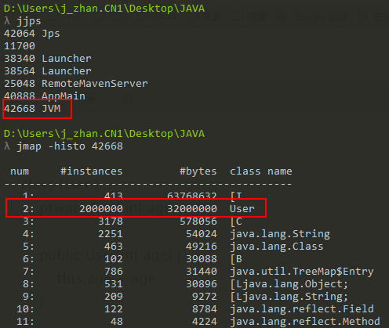

---

可以发现：开启逃逸分析之后，只有41w左右的User对象在Java堆上分配，其余的对象已经通过标量替
换优化了。
 
3、通过java -cp . -Xmx3G -Xmn2G -server -XX:-TieredCompilation 运行代码，关闭分层编译，结
果如下：
 可以发现：关闭了分层编译之后，在Java堆上分配的User对象降低到1w多个，分层编译对逃逸分析还
是有影响的。

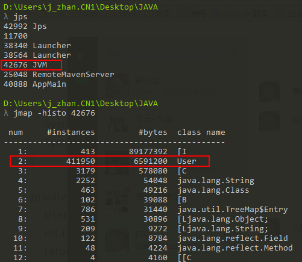

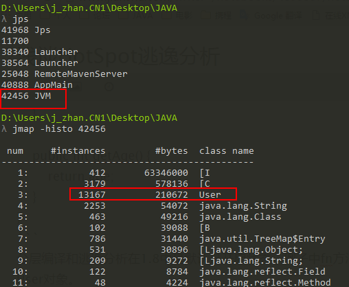

---

编译阈值
 
即时编译JIT只在代码段执行足够次数才会进行优化，在执行过程中不断收集各种数据，作为优化的决
策，所以在优化完成之前，例子中的User对象还是在堆上进行分配。
那么一段代码需要执行多少次才会触发JIT优化呢？通常这个值由-XX:CompileThreshold 参数进行设
置：
 1、使用client编译器时，默认为1500；
 2、使用server编译器时，默认为10000；
 意味着如果方法调用次数或循环次数达到这个阈值就会触发标准编译，更改CompileThreshold标志的
值，将使编译器提早（或延迟）编译。
除了标准编译，还有一个叫做OSR（On Stack Replacement）栈上替换的编译，如上述例子中的main
方法，只执行一次，远远达不到阈值，但是方法体中执行了多次循环，OSR编译就是只编译该循环代
码，然后将其替换，下次循环时就执行编译好的代码，不过触发OSR编译也需要一个阈值，可以通过以
下公式得到。
 
其中trigger即为OSR编译的阈值。
那么如果把CompileThreshold设置适当小一点，是不是可以提早触发编译行为，减少在堆上生成User
对象？我们可以进行通过不同参数验证一下：
 1、-XX:CompileThreshold = 5000 ，结果如下：
2、-XX:CompileThreshold = 2500 ，结果如下：
 
-XX:CompileThreshold = 10000 
-XX:OnStackReplacePercentage = 140
-XX:InterpreterProfilePercentage = 33
OSR trigger = (CompileThreshold * (OnStackReplacePercentage - 
InterpreterProfilePercentage)) / 100 = 10700

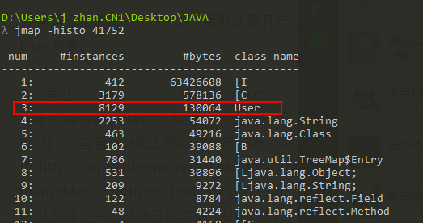

---

3、-XX:CompileThreshold = 2000 ，结果如下：
 
4、-XX:CompileThreshold = 1500 ，结果如下：
 
在我的机器中，当设置到1500时，在堆上生成的User对象反而升到4w个，目前还不清楚原因是啥...

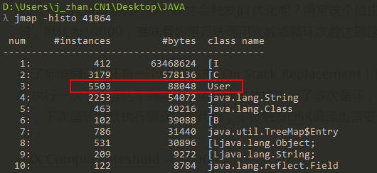

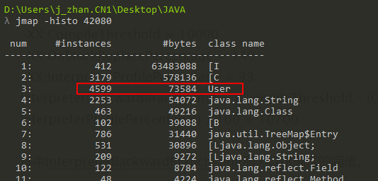

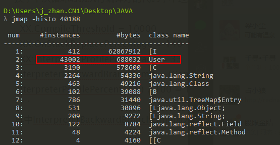

---

JIT编译在默认情况是异步进行的，当触发某方法或某代码块的优化时，先将其放入编译队列，然后由编
译线程进行编译，编译之后的代码放在CodeCache中，CodeCache的大小也是有限的，通过-XX:-
BackgroundCompilation 参数可以关闭异步编译，我们可以通过执行java -cp . -Xmx3G -Xmn2G -
server -XX:CompileThreshold=1 -XX:-TieredCompilation -XX:-BackgroundCompilation JVM 命
令看看同步编译的效果：在java堆上只生成了2个对象。
当然了，这是为了好玩而进行的测试，生产环境不要随意修改这些参数：
 1、热点代码的编译过程是有成本的，如果逻辑复杂，编程成本更高；
 2、编译后的代码会被存放在有大小限制的CodeCache中，如果CompileThreshold设置的太低，JIT会
将一大堆执行不那么频繁的代码进行编译，并放入CodeCache，导致之后真正执行频繁的代码没有足够
的空间存放；
 
 
触摸java常量池
 
 
 java常量池是一个经久不衰的话题，也是面试官的最爱，题目花样百出，这次好好总结一下。
理论
   小菜先拙劣的表达一下jvm虚拟内存分布：
 
   程序计数器是jvm执行程序的流水线，存放一些跳转指令，这个太高深，小菜不懂。
   本地方法栈是jvm调用操作系统方法所使用的栈。
   虚拟机栈是jvm执行java代码所使用的栈。

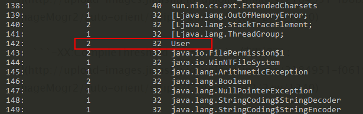

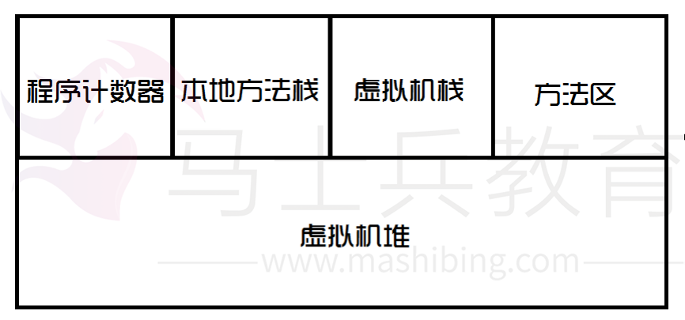

---

方法区存放了一些常量、静态变量、类信息等，可以理解成class文件在内存中的存放位置。
   虚拟机堆是jvm执行java代码所使用的堆。
   Java中的常量池，实际上分为两种形态：静态常量池和运行时常量池。
   所谓静态常量池，即*.class文件中的常量池，class文件中的常量池不仅仅包含字符串(数字)字面量，
还包含类、方法的信息，占用class文件绝大部分空间。
   而运行时常量池，则是jvm虚拟机在完成类装载操作后，将class文件中的常量池载入到内存中，并保
存在方法区中，我们常说的常量池，就是指方法区中的运行时常量池。
   接下来我们引用一些网络上流行的常量池例子，然后借以讲解。
 
 
   首先说明一点，在java 中，直接使用==操作符，比较的是两个字符串的引用地址，并不是比较内容，
比较内容请用String.equals()。
   s1 == s2这个非常好理解，s1、s2在赋值时，均使用的字符串字面量，说白话点，就是直接把字符串
写死，在编译期间，这种字面量会直接放入class文件的常量池中，从而实现复用，载入运行时常量池
后，s1、s2指向的是同一个内存地址，所以相等。
   s1 == s3这个地方有个坑，s3虽然是动态拼接出来的字符串，但是所有参与拼接的部分都是已知的字面
量，在编译期间，这种拼接会被优化，编译器直接帮你拼好，因此String s3 = "Hel" + "lo";在class文件
中被优化成String s3 = "Hello";，所以s1 == s3成立。
   s1 == s4当然不相等，s4虽然也是拼接出来的，但new String("lo")这部分不是已知字面量，是一个不
可预料的部分，编译器不会优化，必须等到运行时才可以确定结果，结合字符串不变定理，鬼知道s4被
分配到哪去了，所以地址肯定不同。配上一张简图理清思路：
 1 String s1 = "Hello";
 2 String s2 = "Hello";
 3 String s3 = "Hel" + "lo";
 4 String s4 = "Hel" + new String("lo");
 5 String s5 = new String("Hello");
 6 String s6 = s5.intern();
 7 String s7 = "H";
 8 String s8 = "ello";
 9 String s9 = s7 + s8;
10           
11 System.out.println(s1 == s2);  // true
12 System.out.println(s1 == s3);  // true
13 System.out.println(s1 == s4);  // false
14 System.out.println(s1 == s9);  // false
15 System.out.println(s4 == s5);  // false
16 System.out.println(s1 == s6);  // true

---

s1 == s9也不相等，道理差不多，虽然s7、s8在赋值的时候使用的字符串字面量，但是拼接成s9的时
候，s7、s8作为两个变量，都是不可预料的，编译器毕竟是编译器，不可能当解释器用，所以不做优
化，等到运行时，s7、s8拼接成的新字符串，在堆中地址不确定，不可能与方法区常量池中的s1地址相
同。
   s4 == s5已经不用解释了，绝对不相等，二者都在堆中，但地址不同。
   s1 == s6这两个相等完全归功于intern方法，s5在堆中，内容为Hello ，intern方法会尝试将Hello字符
串添加到常量池中，并返回其在常量池中的地址，因为常量池中已经有了Hello字符串，所以intern方法
直接返回地址；而s1在编译期就已经指向常量池了，因此s1和s6指向同一地址，相等。
   至此，我们可以得出三个非常重要的结论：
 
 
   以上所讲仅涉及字符串常量池，实际上还有整型常量池、浮点型常量池等等，但都大同小异，只不过
数值类型的常量池不可以手动添加常量，程序启动时常量池中的常量就已经确定了，比如整型常量池中
的常量范围：-128~127，只有这个范围的数字可以用到常量池。
  **必须要关注编译期的行为，才能更好的理解常量池。**
  **运行时常量池中的常量，基本来源于各个class文件中的常量池。**
  **程序运行时，除非手动向常量池中添加常量(比如调用intern方法)，否则jvm不会自动添加常量到常量
池。**

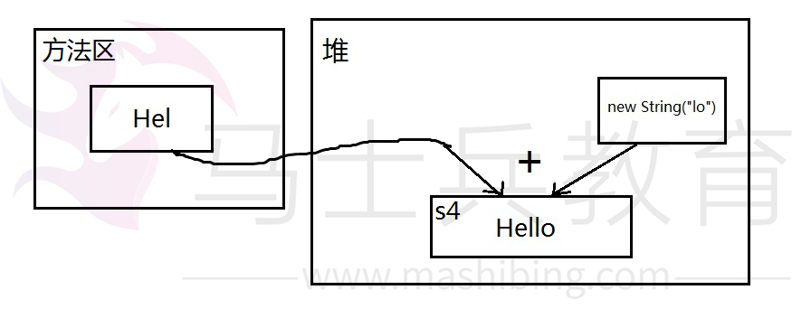

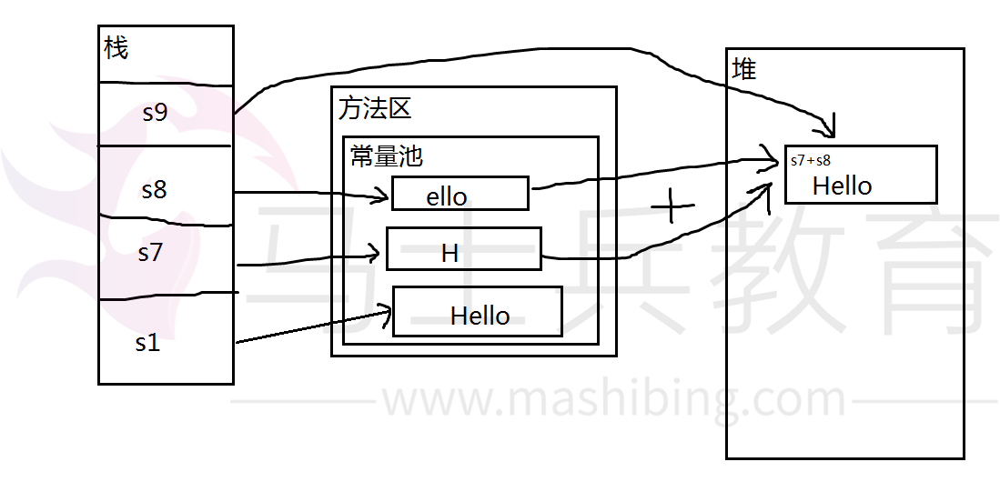

---

实践
  说了这么多理论，接下来让我们触摸一下真正的常量池。
   前文提到过，class文件中存在一个静态常量池，这个常量池是由编译器生成的，用来存储java源文件
中的字面量(本文仅仅关注字面量)，假设我们有如下java代码：
 
 
   为了方便起见，就这么简单，没错！将代码编译成class文件后，用winhex打开二进制格式的class文
件。如图：
 
   简单讲解一下class文件的结构，开头的4个字节是class文件魔数，用来标识这是一个class文件，说白
话点就是文件头，既：CA FE BA BE。
   紧接着4个字节是java的版本号，这里的版本号是34，因为笔者是用jdk8编译的，版本号的高低和jdk
版本的高低相对应，高版本可以兼容低版本，但低版本无法执行高版本。所以，如果哪天读者想知道别
人的class文件是用什么jdk版本编译的，就可以看这4个字节。
   接下来就是常量池入口，入口处用2个字节标识常量池常量数量，本例中数值为00 1A，翻译成十进制
是26，也就是有25个常量，其中第0个常量是特殊值，所以只有25个常量。
   常量池中存放了各种类型的常量，他们都有自己的类型，并且都有自己的存储规范，本文只关注字符
串常量，字符串常量以01开头(1个字节)，接着用2个字节记录字符串长度，然后就是字符串实际内容。
本例中为：01 00 02 68 69。
1 String s = "hi";

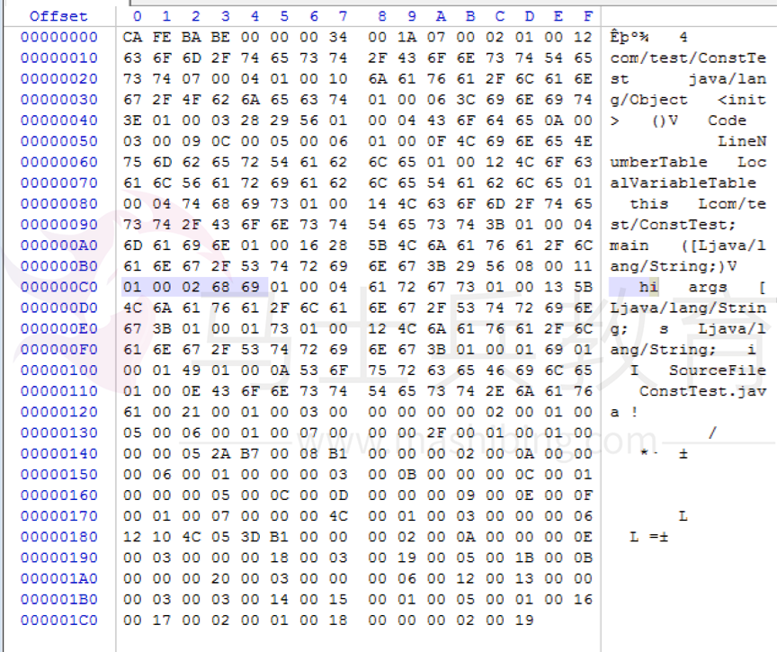

---

接下来再说说运行时常量池，由于运行时常量池在方法区中，我们可以通过jvm参数：-
XX:PermSize、-XX:MaxPermSize来设置方法区大小，从而间接限制常量池大小。
   假设jvm启动参数为：-XX:PermSize＝2M -XX:MaxPermSize＝2M，然后运行如下代码：
 
 
   程序立刻会抛出：Exception in thread "main" java.lang.outOfMemoryError: PermGen space异
常。PermGen space正是方法区，足以说明常量池在方法区中。
   在jdk8中，移除了方法区，转而用Metaspace区域替代，所以我们需要使用新的jvm参数：-
XX:MaxMetaspaceSize=2M，依然运行如上代码，抛出：java.lang.OutOfMemoryError: Metaspace异
常。同理说明运行时常量池是划分在Metaspace区域中。具体关于Metaspace区域的知识，请读者自行
搜索。
   本文所有代码均在jdk7、jdk8下测试通过，其他版本jdk可能会略有差异，请读者自行探索。
 
 
数组多大放在 JVM 老年代（不只是设置
PretenureSizeThreshold ，问通常多大，没做过一问便
知）
 
注意:PretenureSizeThreshold参数只对Serial和ParNew两款收集器有效，Parallel Scavenge收集
器不认识这个参数，Parallel Scavenge收集器一般并不需要设置。
如果遇到必须使用此参数的场合，可以考虑ParNew加CMS的收集器组合。
 
深入理解JVM : Java对象内存分配策略
 
 
Java技术体系中所提倡的自动内存管理最终可以归结为自动化地解决了两个问题：给对象分配内存以及
回收分配给对象的内存。
 对象的内存分配，往大方向讲，就是在堆上分配，对象主要分配在新生代的Eden区上，如果启动了本地
线程分配缓冲，将按线程优先在TLAB上分配。少数情况下也可能会直接分配在老年代中，分配的规则并
不是百分之百固定的，其细节取决于当前使用的是哪一种垃圾收集器组合，还有虚拟机中与内存相关的
参数的设置。
本文中的内存分配策略指的是Serial / Serial Old收集器下（ParNew / Serial Old收集器组合的规则也基
本一致）的内存分配和回收的策略。
1 //保持引用，防止自动垃圾回收
2 List<String> list = new ArrayList<String>();
3         
4 int i = 0;
5         
6 while(true){
7     //通过intern方法向常量池中手动添加常量
8     list.add(String.valueOf(i++).intern());
9 }

---

1. 对象优先在Eden分配
 
大多数情况下，对象在新生代Eden区中分配。当Eden区没有足够空间进行分配时，虚拟机将发起一次
Minor GC。
代码示例：
 
运行结果：
 
代码的testAllocation() 方法中，尝试分配3个2MB大小和1个4MB大小的对象，在运行时通过-
Xms20M、 -Xmx20M、 -Xmn10M这3个参数限制了Java堆大小为20MB，不可扩展，其中10MB分配给
新生代，剩下的10MB分配给老年代。-XX:SurvivorRatio=8 决定了新生代中Eden区与一个Survivor区
的空间比例是8∶1，从输出的结果也可以清晰地看到eden space 8192K、from space 1024K、to 
space 1024K 的信息，新生代总可用空间为9216KB（Eden区+1个Survivor区的总容量）。
执行testAllocation() 中分配allocation4对象的语句时会发生一次Minor GC，这次GC的结果是新生
代6651KB变为148KB，而总内存占用量则几乎没有减少（因为allocation1、allocation2、allocation3
三个对象都是存活的，虚拟机几乎没有找到可回收的对象）。这次GC发生的原因是给allocation4分配内
存的时候，发现Eden已经被占用了6MB，剩余空间已不足以分配allocation4所需的4MB内存，因此发
生Minor GC。GC期间虚拟机又发现已有的3个2MB大小的对象全部无法放入Survivor空间（Survivor空
间只有1MB大小），所以只好通过分配担保机制提前转移到老年代去。
private static final int _1MB = 1024 * 1024;  
/**  
 * VM参数：-verbose:gc -Xms20M -Xmx20M -Xmn10M -XX:+PrintGCDetails -
XX:SurvivorRatio=8 
  */  
public static void testAllocation() {  
     byte[] allocation1, allocation2, allocation3, allocation4;  
     allocation1 = new byte[2 * _1MB];  
     allocation2 = new byte[2 * _1MB];  
     allocation3 = new byte[2 * _1MB];  
     allocation4 = new byte[4 * _1MB];  // 出现一次Minor GC  
 } 
[GC [DefNew: 6651K->148K(9216K), 0.0070106 secs] 6651K->6292K(19456K), 0.0070426 
secs] [Times: user=0.00 sys=0.00, real=0.00 secs]   
Heap  
 def new generation   total 9216K, used 4326K [0x029d0000, 0x033d0000, 
0x033d0000)  
  eden space 8192K,  51% used [0x029d0000, 0x02de4828, 0x031d0000)  
  from space 1024K,  14% used [0x032d0000, 0x032f5370, 0x033d0000)  
  to   space 1024K,   0% used [0x031d0000, 0x031d0000, 0x032d0000)  
 tenured generation   total 10240K, used 6144K [0x033d0000, 0x03dd0000, 
0x03dd0000)  
   the space 10240K,  60% used [0x033d0000, 0x039d0030, 0x039d0200, 0x03dd0000) 
 
 compacting perm gen  total 12288K, used 2114K [0x03dd0000, 0x049d0000, 
0x07dd0000)  
   the space 12288K,  17% used [0x03dd0000, 0x03fe0998, 0x03fe0a00, 0x049d0000) 
 
No shared spaces configured.

---

这次GC结束后，4MB的allocation4对象顺利分配在Eden中，因此程序执行完的结果是Eden占用
4MB（被allocation4占用），Survivor空闲，老年代被占用6MB（被allocation1、allocation2、
allocation3占用）。通过GC日志可以证实这一点。
2. 大对象直接进入老年代
 
所谓的大对象是指，需要大量连续内存空间的Java对象，最典型的大对象就是那种很长的字符串以及数
组。
大对象对虚拟机的内存分配来说就是一个坏消息（比遇到一个大对象更加坏的消息就是遇到一群“朝生夕
灭”的“短命大对象”，写程序的时候应当避免），经常出现大对象容易导致内存还有不少空间时就提前触
发垃圾收集以获取足够的连续空间来“安置”它们。
虚拟机提供了一个-XX:PretenureSizeThreshold 参数，令大于这个设置值的对象直接在老年代分配。
这样做的目的是避免在Eden区及两个Survivor区之间发生大量的内存复制（复习一下：新生代采用复制
算法收集内存）。
代码示例：
 
运行结果：
执行代码中的testPretenureSizeThreshold() 方法后，我们看到Eden空间几乎没有被使用，而老年
代的10MB空间被使用了40%，也就是4MB的allocation对象直接就分配在老年代中，这是因为
PretenureSizeThreshold 被设置为3MB（就是3145728，这个参数不能像-Xmx之类的参数一样直接
写3MB），因此超过3MB的对象都会直接在老年代进行分配。
注意: PretenureSizeThreshold 参数只对Serial和ParNew两款收集器有效，Parallel Scavenge收集器
不认识这个参数，Parallel Scavenge收集器一般并不需要设置。
 如果遇到必须使用此参数的场合，可以考虑ParNew加CMS的收集器组合。
private static final int _1MB = 1024 * 1024;   
/**  
 * VM参数：-verbose:gc -Xms20M -Xmx20M -Xmn10M -XX:+PrintGCDetails -
XX:SurvivorRatio=8 
 * -XX:PretenureSizeThreshold=3145728 
 */  
public static void testPretenureSizeThreshold() {  
  byte[] allocation;  
  allocation = new byte[4 * _1MB];  //直接分配在老年代中  
} 
1.Heap  
2.def new generation   total 9216K, used 671K [0x029d0000, 0x033d0000, 
0x033d0000)  
3.eden space 8192K,   8% used [0x029d0000, 0x02a77e98, 0x031d0000)  
4.from space 1024K,   0% used [0x031d0000, 0x031d0000, 0x032d0000)  
5.to   space 1024K,   0% used [0x032d0000, 0x032d0000, 0x033d0000)  
6.tenured generation   total 10240K, used 4096K [0x033d0000, 0x03dd0000, 
0x03dd0000)  
7.the space 10240K,  40% used [0x033d0000, 0x037d0010, 0x037d0200, 0x03dd0000)  
8.compacting perm gen  total 12288K, used 2107K [0x03dd0000, 0x049d0000, 
0x07dd0000)  
9.the space 12288K,  17% used [0x03dd0000, 0x03fdefd0, 0x03fdf000, 0x049d0000)  
10.No shared spaces configured.

---

3. 长期存活的对象将进入老年代
 
为了在内存回收时能识别哪些对象应放在新生代，哪些对象应放在老年代中。虚拟机给每个对象定义了
一个对象年龄（Age）计数器。
对象年龄的判定：
如果对象在Eden出生并经过第一次Minor GC后仍然存活，并且能被Survivor容纳的话，将被移动
到Survivor空间中，并且对象年龄设为1。
对象在Survivor区中每“熬过”一次Minor GC，年龄就增加1岁，当它的年龄增加到一定程度（默认
为15岁），就将会被晋升到老年代中。
对象晋升老年代的年龄阈值，可以通过参数-XX:MaxTenuringThreshold 设置。
代码示例：
以MaxTenuringThreshold=1参数来运行的结果：
private static final int _1MB = 1024 * 1024;  
/**  
 * VM参数：-verbose:gc -Xms20M -Xmx20M -Xmn10M -XX:+PrintGCDetails -
XX:SurvivorRatio=8 -XX:MaxTenuringThreshold=1 
 * -XX:+PrintTenuringDistribution  
 */  
@SuppressWarnings("unused")  
public static void testTenuringThreshold() {  
  byte[] allocation1, allocation2, allocation3;  
  allocation1 = new byte[_1MB / 4];    
   // 什么时候进入老年代取决于XX:MaxTenuringThreshold设置  
  allocation2 = new byte[4 * _1MB];  
  allocation3 = new byte[4 * _1MB];  
  allocation3 = null;  
  allocation3 = new byte[4 * _1MB];  
} 
1.[GC [DefNew  
2.Desired Survivor size 524288 bytes, new threshold 1 (max 1)  
3.- age   1:     414664 bytes,     414664 total  
4.: 4859K->404K(9216K), 0.0065012 secs] 4859K->4500K(19456K), 0.0065283 secs] 
[Times: user=0.02 sys=0.00, real=0.02 secs]   
5.[GC [DefNew  
6.Desired Survivor size 524288 bytes, new threshold 1 (max 1)  
7.: 4500K->0K(9216K), 0.0009253 secs] 8596K->4500K(19456K), 0.0009458 secs] 
[Times: user=0.00 sys=0.00, real=0.00 secs]   
8.Heap  
9.def new generation   total 9216K, used 4178K [0x029d0000, 0x033d0000, 
0x033d0000)  
10.eden space 8192K,  51% used [0x029d0000, 0x02de4828, 0x031d0000)  
11.from space 1024K,   0% used [0x031d0000, 0x031d0000, 0x032d0000)  
12.to   space 1024K,   0% used [0x032d0000, 0x032d0000, 0x033d0000)  
13.to   space 1024K,   0% used [0x032d0000, 0x032d0000, 0x033d0000)  
14.to   space 1024K,   0% used [0x032d0000, 0x032d0000, 0x033d0000)  
15.to   space 1024K,   0% used [0x032d0000, 0x032d0000, 0x033d0000)  
16.tenured generation   total 10240K, used 4500K [0x033d0000, 0x03dd0000, 
0x03dd0000)  
17.the space 10240K,  43% used [0x033d0000, 0x03835348, 0x03835400, 0x03dd0000) 
 
18.compacting perm gen  total 12288K, used 2114K [0x03dd0000, 0x049d0000, 
0x07dd0000)

---

以MaxTenuringThreshold=15参数来运行的结果：
 
分别以-XX:MaxTenuringThreshold=1 和-XX:MaxTenuringThreshold=15 两种设置来执行代码清单3-
7中的testTenuringThreshold() 方法，此方法中的allocation1对象需要256KB内存，Survivor空间可
以容纳。当MaxTenuringThreshold=1时，allocation1对象在第二次GC发生时进入老年代，新生代已使
用的内存GC后非常干净地变成0KB。而MaxTenuringThreshold=15时，第二次GC发生后，allocation1
对象则还留在新生代Survivor空间，这时新生代仍然有404KB被占用。
4. 动态对象年龄判定
 
为了能更好地适应不同程序的内存状况，虚拟机并不是永远地要求对象的年龄必须达到了
MaxTenuringThreshold才能晋升老年代.
动态对象年龄判定
如果在Survivor空间中相同年龄所有对象大小的总和大于Survivor空间的一半，年龄大于或等于该
年龄的对象就可以直接进入老年代，无须等到MaxTenuringThreshold 中要求的年龄。
代码示例
 
19.the space 12288K,  17% used [0x03dd0000, 0x03fe0998, 0x03fe0a00, 0x049d0000) 
 
20.No shared spaces configured. 
1.[GC [DefNew  
2.Desired Survivor size 524288 bytes, new threshold 15 (max 15)  
3.- age   1:     414664 bytes,     414664 total  
4.: 4859K->404K(9216K), 0.0049637 secs] 4859K->4500K(19456K), 0.0049932 secs] 
[Times: user=0.00 sys=0.00, real=0.00 secs]   
5.[GC [DefNew  
6.Desired Survivor size 524288 bytes, new threshold 15 (max 15)  
7.- age   2:     414520 bytes,     414520 total  
8.: 4500K->404K(9216K), 0.0008091 secs] 8596K->4500K(19456K), 0.0008305 secs] 
[Times: user=0.00 sys=0.00, real=0.00 secs]   
9.Heap  
10.def new generation   total 9216K, used 4582K [0x029d0000, 0x033d0000, 
0x033d0000)  
11.eden space 8192K,  51% used [0x029d0000, 0x02de4828, 0x031d0000)  
12.from space 1024K,  39% used [0x031d0000, 0x03235338, 0x032d0000)  
13.to   space 1024K,   0% used [0x032d0000, 0x032d0000, 0x033d0000)  
14.tenured generation   total 10240K, used 4096K [0x033d0000, 0x03dd0000, 
0x03dd0000)  
15.the space 10240K,  40% used [0x033d0000, 0x037d0010, 0x037d0200, 0x03dd0000) 
 
16.compacting perm gen  total 12288K, used 2114K [0x03dd0000, 0x049d0000, 
0x07dd0000)  
17.the space 12288K,  17% used [0x03dd0000, 0x03fe0998, 0x03fe0a00, 0x049d0000) 
 
18.No shared spaces configured.  
private static final int _1MB = 1024 * 1024;  
/**  
 * VM参数：-verbose:gc -Xms20M -Xmx20M -Xmn10M -XX:+PrintGCDetails -
XX:SurvivorRatio=8 -XX:MaxTenuringThreshold=15

---

执行代码中的testTenuringThreshold2() 方法，并设置-XX:MaxTenuringThreshold=15 ，会发现运
行结果中Survivor的空间占用仍然为0%，而老年代比预期增加了6%，也就是说，allocation1、
allocation2对象都直接进入了老年代，而没有等到15岁的临界年龄。因为这两个对象加起来已经到达了
512KB，并且它们是同年的，满足同年对象达到Survivor空间的一半规则。我们只要注释掉其中一个对
象new操作，就会发现另外一个就不会晋升到老年代中去了。
5. 空间分配担保
 
在发生Minor GC之前，虚拟机会先检查老年代最大可用的连续空间是否大于新生代所有对象总空间，如
果这个条件成立，那么Minor GC可以确保是安全的。如果不成立，则虚拟机会查看
HandlePromotionFailure设置值是否允许担保失败。如果允许，那么会继续检查老年代最大可用的连续
空间是否大于历次晋升到老年代对象的平均大小，如果大于，将尝试着进行一次Minor GC，尽管这次
Minor GC是有风险的；如果小于，或者HandlePromotionFailure设置不允许冒险，那这时也要改为进
行一次Full GC。
 * -XX:+PrintTenuringDistribution  
 */  
@SuppressWarnings("unused")  
public static void testTenuringThreshold2() { 
  byte[] allocation1, allocation2, allocation3, allocation4;  
  allocation1 = new byte[_1MB / 4];   
    // allocation1+allocation2大于survivo空间一半  
  allocation2 = new byte[_1MB / 4];    
  allocation3 = new byte[4 * _1MB];  
  allocation4 = new byte[4 * _1MB];  
  allocation4 = null;  
  allocation4 = new byte[4 * _1MB];  
} 
1.[GC [DefNew  
2.Desired Survivor size 524288 bytes, new threshold 1 (max 15)  
3.- age   1:     676824 bytes,     676824 total  
4.: 5115K->660K(9216K), 0.0050136 secs] 5115K->4756K(19456K), 0.0050443 secs] 
[Times: user=0.00 sys=0.01, real=0.01 secs]   
5.[GC [DefNew  
6.Desired Survivor size 524288 bytes, new threshold 15 (max 15)  
7.: 4756K->0K(9216K), 0.0010571 secs] 8852K->4756K(19456K), 0.0011009 secs] 
[Times: user=0.00 sys=0.00, real=0.00 secs]   
8.Heap  
9.def new generation   total 9216K, used 4178K [0x029d0000, 0x033d0000, 
0x033d0000)  
10.eden space 8192K,  51% used [0x029d0000, 0x02de4828, 0x031d0000)  
11.from space 1024K,   0% used [0x031d0000, 0x031d0000, 0x032d0000)  
12.to   space 1024K,   0% used [0x032d0000, 0x032d0000, 0x033d0000)  
13.tenured generation   total 10240K, used 4756K [0x033d0000, 0x03dd0000, 
0x03dd0000)  
14.the space 10240K,  46% used [0x033d0000, 0x038753e8, 0x03875400, 0x03dd0000) 
 
15.compacting perm gen  total 12288K, used 2114K [0x03dd0000, 0x049d0000, 
0x07dd0000)  
16.the space 12288K,  17% used [0x03dd0000, 0x03fe09a0, 0x03fe0a00, 0x049d0000) 
 
17.No shared spaces configured.

---

下面解释一下“冒险”是冒了什么风险，前面提到过，新生代使用复制收集算法，但为了内存利用率，只
使用其中一个Survivor空间来作为轮换备份，因此当出现大量对象在Minor GC后仍然存活的情况（最极
端的情况就是内存回收后新生代中所有对象都存活），就需要老年代进行分配担保，把Survivor无法容
纳的对象直接进入老年代。与生活中的贷款担保类似，老年代要进行这样的担保，前提是老年代本身还
有容纳这些对象的剩余空间，一共有多少对象会活下来在实际完成内存回收之前是无法明确知道的，所
以只好取之前每一次回收晋升到老年代对象容量的平均大小值作为经验值，与老年代的剩余空间进行比
较，决定是否进行Full GC来让老年代腾出更多空间。
取平均值进行比较其实仍然是一种动态概率的手段，也就是说，如果某次Minor GC存活后的对象突增，
远远高于平均值的话，依然会导致担保失败（Handle Promotion Failure）。如果出现了
HandlePromotionFailure失败，那就只好在失败后重新发起一次Full GC。虽然担保失败时绕的圈子是
最大的，但大部分情况下都还是会将HandlePromotionFailure开关打开，避免Full GC过于频繁.
 
 
老年代中数组的访问方式
 
GC算法，永久代对象如何GC，GC有环怎么处理
 
永久代GC的原因：
永久代空间已经满了
调用了System.gc()
注意： 这种GC是full GC 堆空间也会一并被GC一次
GC有环怎么处理
1. 根搜索算法
什么是根搜索算法
垃圾回收器从被称为GC Roots的点开始遍历遍历对象，凡是可以达到的点都会标记为存活，堆中不
可到达的对象都会标记成垃圾，然后被清理掉。
GC Roots有哪些
类，由系统类加载器加载的类。这些类从不会被卸载，它们可以通过静态属性的方式持有对象
的引用。
注意，一般情况下由自定义的类加载器加载的类不能成为GC Roots
线程，存活的线程
Java方法栈中的局部变量或者参数
JNI方法栈中的局部变量或者参数
JNI全局引用
用做同步监控的对象
被JVM持有的对象，这些对象由于特殊的目的不被GC回收。这些对象可能是系统的类加载
器，一些重要的异常处理类，一些为处理异常预留的对象，以及一些正在执行类加载的自定义
的类加载器。但是具体有哪些前面提到的对象依赖于具体的JVM实现。
2. 如何处理
基于引用对象遍历的垃圾回收器可以处理循环引用，只要是涉及到的对象不能从GC Roots强引用可
到达，垃圾回收器都会进行清理来释放内存。
谁会被GC，什么时候GC

---

Java JVM：垃圾回收（GC 在什么时候，对什么东西，做了什么事
情）
 
 
在什么时候：
首先需要知道，GC又分为minor GC 和 Full GC（major GC）。Java堆内存分为新生代和老年代，新生
代
中又分为1个eden区和两个Survior区域。
 
一般情况下，新创建的对象都会被分配到eden区，这些对象经过一个minor gc后仍然存活将会被移动到
Survior区域中，对象在Survior中没熬过一个Minor GC，年龄就会增加一岁，当他的年龄到达一定程度
时，
就会被移动到老年代中。
 
当eden区满时，还存活的对象将被复制到survior区，当一个survior区满时，此区域的存活对象将被复
制到另外一个
survior区，当另外一个也满了的时候，从前一个Survior区复制过来的并且此时还存活的对象，将可能被
复制到老年代
 
因为年轻代中的对象基本都是朝生夕死（80%以上），所以年轻代的垃圾回收算法使用的是复制算法，
复制算法的基本思想是将内存分为两块，每次只有其中一块，当这一块内存使用完，就将还活着的对象
复制到
另一块上面。复制算法不会产生内存碎片。
在GC开始的时候，对象只会存在于eden区，和名为“From”的Survior区，Survior区“to”是空的。紧接着
GC
eden区中所有存活的对象都会被复制到“To”,而在from区中，仍存活的对象会根据他们的年龄值来决定
去向，
年龄到达一定只的对象会被复制到老年代,没有到达的对象会被复制到to survior中，经过这次gc后，
eden区和from
survior区已经被清空。这个时候，from和to会交换他们的角色，也就是新的to就是上次GC前的from
 
Minor GC：从年轻代回收内存
当jvm无法为一个新的对象分配空间时会触发Minor GC，比如当Eden区满了。
当内存池被填满的时候，其中的内容全部会被复制，指针会从0开始跟踪空闲内存。Eden和Survior区不
存在内存碎片
写指针总是停留在所使用内存池的顶部。执行minor操作时不会影响到永久代，从永久带到年轻代的引
用被当成
GC roots，从年轻代到永久代的引用在标记阶段被直接忽略掉（永久代用来存放java的类信息）。如果
eden区域中大部分

---

对象被认为是垃圾，永远也不会复制到Survior区域或者老年代空间。如果正好相反，eden区域大部分
新生对象不符合GC
条件，Minor GC执行时暂停的线程时间将会长很多。Minor may call "stop the world";
 
Full GC：是清理整个堆空间包括年轻代和老年代。
 
那么对于Minor GC的触发条件：大多数情况下，直接在eden区中进行分配。如果eden区域没有足够的
空间，
那么就会发起一次Minor GC;对于FullGC的触发条件：如果老年代没有足够的空间，那么就会进行一次
FullGC
 
在发生MinorGC之前，虚拟机会先检查老年代最大可利用的连续空间是否大于新生代所有对象的总空
间。
如果大于则进行Minor GC，如果小于则看HandlePromotionFailure设置是否是允许担保失败（不允许
则直接FullGC）
如果允许，那么会继续检查老年代最大可利用的连续空间是否大于历次晋升到老年代对象的平均大小，
如果大于
则尝试minor gc （如果尝试失败也会触发Full GC），如果小于则进行Full GC。
 
但是，具体什么时候执行，这个是由系统来进行决定的，是无法预测的。
 
对什么东西：
主要根据可达性分析算法，如果一个对象不可达,那么就是可以回收的，如果一个对象可达，那么这个对
象就不可以回收，
对于可达性分析算法，它是通过一系列称为“GC Roots”的对象最为起始点，当一个对象GC Roots没有任
何引用链相接的时候，
那么这个对象就是不可达，就可以被回收。
 
做了什么事情：
主要做了清理对象，整理内存的工作。Java堆分为新生代和老年代，采用了不同的回收方式。
例如新生代采用了复制算法，老年代采用了标记整理法。在新生代中，分为一个ede区域和两个Survior
区域，真正使用的是一个eden区域，和一个Survior区域，GC的时候，会把存活的对象放入到另一个
Survior区域中，
然后再把这个eden区域和Survior区域清除。那么对于老年代，采用的是标记整理发，首先标记出存活
对象，
然后在移动到一段。这样有利于减少内存碎片。
标记：标记的过程其实就是，遍历所有gc root 然后将所有gc root 可达的对象标记为存活对象
清除：清除的过程中将遍历堆中所有的对象，将没有标记的对象全部清除掉

---

主要缺点：标记和清除过程效率不高，标记清除之后会产生大量不连续的内存碎片
 但是，老年代中因为对象存活率高，没有额外空间对他进行分配担保，就必须使用标记整理算法
标记整理算法  标记操作和“标记-清除”算法一致，后续操作不只是直接清理对象，而是在清理
无用对象完成后让所有存活的对象都向一段移动，并更新其引用对象的指针
主要缺点：在标记清除的基础上还需要进行对象的移动，成本相对比较高，成本相对较高，好处是不会
产生内存碎片。
 
如果想在 GC 中生存 1 次怎么办
 
生存一次，释放掉对象的引用，但是在对象的finalize方法中重新建立引用，但是此方法只会被调用一
次，所以能在GC中生存一次。
分析System.gc()方法
 
JVM源码分析之SystemGC完全解读
 
 
概述
 
JVM的GC一般情况下是JVM本身根据一定的条件触发的，不过我们还是可以做一些人为的触发，比如通
过jvmti做强制GC，通过System.gc触发，还可以通过jmap来触发等，针对每个场景其实我们都可以写
篇文章来做一个介绍，本文重点介绍下System.gc的原理
或许大家已经知道如下相关的知识
system.gc其实是做一次full gc
system.gc会暂停整个进程
system.gc一般情况下我们要禁掉，使用-XX:+DisableExplicitGC
system.gc在cms gc下我们通过-XX:+ExplicitGCInvokesConcurrent来做一次稍微高效点的GC(效果
比Full GC要好些)
system.gc最常见的场景是RMI/NIO下的堆外内存分配等
如果你已经知道上面这些了其实也说明你对System.gc有过一定的了解，至少踩过一些坑，但是你是否
更深层次地了解过它，比如
为什么CMS GC下-XX:+ExplicitGCInvokesConcurrent这个参数加了之后会比真正的Full GC好？
它如何做到暂停整个进程？
堆外内存分配为什么有时候要配合System.gc？
如果你上面这些疑惑也都知道，那说明你很懂System.gc了，那么接下来的文字你可以不用看啦
JDK里的System.gc的实现
 
先贴段代码吧（java.lang.System）
 
    /**
     * Runs the garbage collector.
     * 

     * Calling the <code>gc</code> method suggests that the Java Virtual
     * Machine expend effort toward recycling unused objects in order to

---

发现主要调用的是Runtime里的gc方法（java.lang.Runtime）
 
这里看到gc方法是native的，在java层面只能到此结束了，代码只有这么多，要了解更多，可以看方法
上面的注释，不过我们需要更深层次地来了解其实现，那还是准备好进入到jvm里去看看
Hotspot里System.gc的实现
 
如何找到native里的实现
 
上面提到了Runtime.gc是一个本地方法，那需要先在jvm里找到对应的实现，这里稍微提一下jvm里
native方法最常见的也是最简单的查找，jdk里一般含有native方法的类，一般都会有一个对应的c文件，
比如上面的java.lang.Runtime这个类，会有一个Runtime.c的文件和它对应，native方法的具体实现都
在里面了，如果你有source，可能会猜到和下面的方法对应
 
     * make the memory they currently occupy available for quick reuse.
     * When control returns from the method call, the Java Virtual
     * Machine has made a best effort to reclaim space from all discarded
     * objects.
     * 

     * The call <code>System.gc()</code> is effectively equivalent to the
     * call:
     * <blockquote><pre>
     * Runtime.getRuntime().gc()
     * </pre></blockquote>
     *
     * @see     java.lang.Runtime#gc()
     */
    public static void gc() {
        Runtime.getRuntime().gc();
    }
    /**
     * Runs the garbage collector.
     * Calling this method suggests that the Java virtual machine expend
     * effort toward recycling unused objects in order to make the memory
     * they currently occupy available for quick reuse. When control
     * returns from the method call, the virtual machine has made
     * its best effort to recycle all discarded objects.
     * 

     * The name <code>gc</code> stands for "garbage
     * collector". The virtual machine performs this recycling
     * process automatically as needed, in a separate thread, even if the
     * <code>gc</code> method is not invoked explicitly.
     * 

     * The method {@link System#gc()} is the conventional and convenient
     * means of invoking this method.
     */
    public native void gc();

---

其实没错的，就是这个方法，jvm要查找到这个native方法其实很简单的，看方法名可能也猜到规则了，
Java_pkgName_className_methodName，其中pkgName里的"."替换成"_"，这样就能找到了，当然
规则不仅仅只有这么一个，还有其他的，这里不细说了，有机会写篇文章详细介绍下其中细节
DisableExplicitGC参数
 
上面的方法里是调用JVM_GC()，实现如下
 
看到这里我们已经解释其中一个疑惑了，就是DisableExplicitGC 这个参数是在哪里生效的，起的什
么作用，如果这个参数设置为true的话，那么将直接跳过下面的逻辑，我们通过-XX:+ DisableExplicitGC
就是将这个属性设置为true，而这个属性默认情况下是true还是false呢
 
ExplicitGCInvokesConcurrent参数
 
这里主要针对CMSGC下来做分析，所以我们上面看到调用了heap的collect方法，我们找到对应的逻辑
 
JNIEXPORT void JNICALL
Java_java_lang_Runtime_gc(JNIEnv *env, jobject this)
{
    JVM_GC();
}
JVM_ENTRY_NO_ENV(void, JVM_GC(void))
  JVMWrapper("JVM_GC");
  if (!DisableExplicitGC) {
    Universe::heap()->collect(GCCause::_java_lang_system_gc);
  }
JVM_END
product(bool, DisableExplicitGC, false,                                   
          "Tells whether calling System.gc() does a full GC")    
void GenCollectedHeap::collect(GCCause::Cause cause) {
  if (should_do_concurrent_full_gc(cause)) {
#ifndef SERIALGC
    // mostly concurrent full collection
    collect_mostly_concurrent(cause);
#else  // SERIALGC
    ShouldNotReachHere();
#endif // SERIALGC
  } else {
#ifdef ASSERT
    if (cause == GCCause::_scavenge_alot) {
      // minor collection only
      collect(cause, 0);
    } else {
      // Stop-the-world full collection
      collect(cause, n_gens() - 1);
    }
#else

---

collect里一开头就有个判断，如果should_do_concurrent_full_gc返回true，那会执行
collect_mostly_concurrent做并行的回收
其中should_do_concurrent_full_gc中的逻辑是如果使用CMS GC，并且是system gc且
ExplicitGCInvokesConcurrent==true，那就做并行full gc，当我们设置-XX:+ 
ExplicitGCInvokesConcurrent的时候，就意味着应该做并行Full GC了，不过要注意千万不要设置-
XX:+DisableExplicitGC，不然走不到这个逻辑里来了
并行Full GC相对正常的Full GC效率高在哪里
 
stop the world
 
说到GC，这里要先提到VMThread，在jvm里有这么一个线程不断轮询它的队列，这个队列里主要是存
一些VM_operation的动作，比如最常见的就是内存分配失败要求做GC操作的请求等，在对gc这些操作
执行的时候会先将其他业务线程都进入到安全点，也就是这些线程从此不再执行任何字节码指令，只有
当出了安全点的时候才让他们继续执行原来的指令，因此这其实就是我们说的stop the world(STW)，整
个进程相当于静止了
CMS GC
 
这里必须提到CMS GC，因为这是解释并行Full GC和正常Full GC的关键所在，CMS GC我们分为两种模
式background和foreground，其中background顾名思义是在后台做的，也就是可以不影响正常的业务
线程跑，触发条件比如说old的内存占比超过多少的时候就可能触发一次background式的cms gc，这个
过程会经历CMS GC的所有阶段，该暂停的暂停，该并行的并行，效率相对来说还比较高，毕竟有和业
务线程并行的gc阶段；而foreground则不然，它发生的场景比如业务线程请求分配内存，但是内存不够
了，于是可能触发一次cms gc，这个过程就必须是要等内存分配到了线程才能继续往下面走的，因此整
个过程必须是STW的，因此CMS GC整个过程都是暂停应用的，但是为了提高效率，它并不是每个阶段
都会走的，只走其中一些阶段，这些省下来的阶段主要是并行阶段，Precleaning、
AbortablePreclean，Resizing这几个阶段都不会经历，其中sweep阶段是同步的，但不管怎么说如果走
了类似foreground的cms gc，那么整个过程业务线程都是不可用的，效率会影响挺大。CMS GC具体的
过程后面再写文章详细说，其过程确实非常复杂的
正常的Full GC
 
正常的Full GC其实是整个gc过程包括ygc和cms gc(这里说的是真正意义上的Full GC，还有些场景虽然调
用Full GC的接口，但是并不会都做，有些时候只做ygc，有些时候只做cms gc)都是由VMThread来执行
的，因此整个时间是ygc+cms gc的时间之和，其中CMS GC是上面提到的foreground式的，因此整个过
程会比较长，也是我们要避免的
    // Stop-the-world full collection
    collect(cause, n_gens() - 1);
#endif
  }
}
bool GenCollectedHeap::should_do_concurrent_full_gc(GCCause::Cause cause) {
  return UseConcMarkSweepGC &&
         ((cause == GCCause::_gc_locker && GCLockerInvokesConcurrent) ||
          (cause == GCCause::_java_lang_system_gc && 
ExplicitGCInvokesConcurrent));
}

---

并行的Full GC
 
并行Full GC也通样会做YGC和CMS GC，但是效率高就搞在CMS GC是走的background的，整个暂停的
过程主要是YGC+CMS_initMark+CMS_remark几个阶段
堆外内存常配合使用System GC
 
这里说的堆外内存主要针对java.nio.DirectByteBuffer，这些对象的创建过程会通过Unsafe接口直接通
过os::malloc来分配内存，然后将内存的起始地址和大小存到java.nio.DirectByteBuffer对象里，这样就
可以直接操作这些内存。这些内存只有在DirectByteBuffer回收掉之后才有机会被回收，因此如果这些
对象大部分都移到了old，但是一直没有触发CMS GC或者Full GC，那么悲剧将会发生，因为你的物理内
存被他们耗尽了，因此为了避免这种悲剧的发生，通过-XX:MaxDirectMemorySize来指定最大的堆外内
存大小，当使用达到了阈值的时候将调用System.gc来做一次full gc，以此来回收掉没有被使用的堆外内
存，具体堆外内存是如何回收的，其原理机制又是怎样的，还是后面写篇详细的文章吧
 
 
JVM 选项 -XX:+UseCompressedOops 有什么作用？为什
么要使用？
 
当你将你的应用从 32 位的 JVM 迁移到 64 位的 JVM 时，由于对象的指针从 32 位增加到了 64 位，因此
堆内存会突然增加，差不多要翻倍。这也会对 CPU 缓存（容量比内存小很多）的数据产生不利的影响。
因为，迁移到 64 位的 JVM 主要动机在于可以指定最大堆大小，通过压缩 OOP 可以节省一定的内存。
通过 -XX:+UseCompressedOops 选项，JVM 会使用 32 位的 OOP，而不是 64 位的 OOP。
 
 
写代码分别使得JVM的堆、栈和持久代发生内存溢出(栈溢
出)
 
JVM内存溢出详解（栈溢出，堆溢出，持久代溢出以及无法创建本地
线程）
 
 
写在前面
 
内存溢出和内存泄漏的区别：
 
内存溢出 out of memory，是指程序在申请内存时，没有足够的内存空间供其使用，出现out of 
memory；比如申请了一个integer,但给它存了long才能存下的数，那就是内存溢出。
内存泄露 memory leak，是指程序在申请内存后，无法释放已申请的内存空间，一次内存泄露危害可以
忽略，但内存泄露堆积后果很严重，无论多少内存,迟早会被占光。
memory leak会最终会导致out of memory
内存溢出就是你要求分配的内存超出了系统能给你的，系统不能满足需求，于是产生溢出。
内存泄漏是指你向系统申请分配内存进行使用(new)，可是使用完了以后却不归还(delete)，结果你申请
到的那块内存你自己也不能再访问（也许你把它的地址给弄丢了），而系统也不能再次将它分配给需要
的程序。一个盘子用尽各种方法只能装4个果子，你装了5个，结果掉倒地上不能吃了。这就是溢出！比
方说栈，栈满时再做进栈必定产生空间溢出，叫上溢，栈空时再做退栈也产生空间溢出，称为下溢。就

---

是分配的内存不足以放下数据项序列,称为内存溢出.
全文简短总结，具体内容可以看下文。
 
栈内存溢出(StackOverflowError)：
程序所要求的栈深度过大导致，可以写一个死递归程序触发。
堆内存溢出(OutOfMemoryError:java heap space)
分清内存溢出还是内存泄漏
泄露则看对象如何被 GC Root 引用。
溢出则通过 调大 -Xms，-Xmx参数。
持久带内存溢出(OutOfMemoryError: PermGen space)
持久带中包含方法区，方法区包含常量池
因此持久带溢出有可能是运行时常量池溢出，也有可能是方法区中保存的class对象没有被及时回收
掉或者class信息占用的内存超过了我们配置
用String.intern()触发常量池溢出
Class对象未被释放，Class对象占用信息过多，有过多的Class对象。可以导致持久带内存溢出
无法创建本地线程
总容量不变，堆内存，非堆内存设置过大，会导致能给线程的内存不足。
以下是详细内容
栈溢出(StackOverflowError)
 
栈溢出抛出StackOverflowError错误，出现此种情况是因为方法运行的时候栈的深度超过了虚拟机容许
的最大深度所致。出现这种情况，一般情况下是程序错误所致的，比如写了一个死递归，就有可能造成
此种情况。 下面我们通过一段代码来模拟一下此种情况的内存溢出。
运行上面的代码，会抛出如下的异常：
 
对于栈内存溢出，根据《Java 虚拟机规范》中文版：
如果线程请求的栈容量超过栈允许的最大容量的话，Java 虚拟机将抛出一个StackOverflow异常；
如果Java虚拟机栈可以动态扩展，并且扩展的动作已经尝试过，但是无法申请到足够的内存去完成
扩展，或者在新建立线程的时候没有足够的内存去创建对应的虚拟机栈，那么Java虚拟机将抛出一
个OutOfMemory 异常。
import java.util.*;    
import java.lang.*;    
public class OOMTest{     
    public void stackOverFlowMethod(){    
        stackOverFlowMethod();    
    }    
    public static void main(String... args){    
        OOMTest oom = new OOMTest();    
        oom.stackOverFlowMethod();    
    }    
}
Exception in thread "main" java.lang.StackOverflowError    
        at OOMTest.stackOverFlowMethod(OOMTest.java:6)

---

堆溢出(OutOfMemoryError:java heap space)
 
堆内存溢出的时候，虚拟机会抛出java.lang.OutOfMemoryError:java heap space,出现此种情况的时
候，我们需要根据内存溢出的时候产生的dump文件来具体分析（需要增加-
XX:+HeapDumpOnOutOfMemoryErrorjvm启动参数）。出现此种问题的时候有可能是内存泄露，也有
可能是内存溢出了。
如果内存泄露，我们要找出泄露的对象是怎么被GC ROOT引用起来，然后通过引用链来具体分析
泄露的原因。
如果出现了内存溢出问题，这往往是程序本生需要的内存大于了我们给虚拟机配置的内存，这种情
况下，我们可以采用调大-Xmx来解决这种问题。下面我们通过如下的代码来演示一下此种情况的
溢出：
我们通过如下的命令运行上面的代码：
 
程序输出如下的信息：
 
从运行结果可以看出，JVM进行了一次Minor gc和两次的Major gc，从Major gc的输出可以看出，gc以
后old区使用率为134K，而字节数组为10M，加起来大于了old generation的空间，所以抛出了异常，
如果调整-Xms21M,-Xmx21M,那么就不会触发gc操作也不会出现异常了。
通过上面的实验其实也从侧面验证了一个结论：对象大于新生代剩余内存的时候，将直接放入老年代，
当老年代剩余内存还是无法放下的时候，触发垃圾收集，收集后还是不能放下就会抛出内存溢出异常
了。
持久带溢出(OutOfMemoryError: PermGen space)
 
我们知道Hotspot jvm通过持久带实现了Java虚拟机规范中的方法区，而运行时的常量池就是保存在方法
区中的，因此持久带溢出有可能是运行时常量池溢出，也有可能是方法区中保存的class对象没有被及时
回收掉或者class信息占用的内存超过了我们配置。
当持久带溢出的时候抛出java.lang.OutOfMemoryError: PermGen space。可能在如下几种场景下出
现：
import java.util.*;    
import java.lang.*;    
public class OOMTest{    
        public static void main(String... args){    
                List<byte[]> buffer = new ArrayList<byte[]>();    
                buffer.add(new byte[10*1024*1024]);    
        }    
}
java -verbose:gc -Xmn10M -Xms20M -Xmx20M -XX:+PrintGC OOMTest
[GC 1180K->366K(19456K), 0.0037311 secs]    
[Full GC 366K->330K(19456K), 0.0098740 secs]    
[Full GC 330K->292K(19456K), 0.0090244 secs]    
Exception in thread "main" java.lang.OutOfMemoryError: Java heap space    
        at OOMTest.main(OOMTest.java:7)

---

1. 使用一些应用服务器的热部署的时候，我们就会遇到热部署几次以后发现内存溢出了，这种情况就
是因为每次热部署的后，原来的class没有被卸载掉。
2. 如果应用程序本身比较大，涉及的类库比较多，但是我们分配给持久带的内存（通过-XX:PermSize
和-XX:MaxPermSize来设置）比较小的时候也可能出现此种问题。
3. 一些第三方框架，比如spring,hibernate都通过字节码生成技术（比如CGLib）来实现一些增强的
功能，这种情况可能需要更大的方法区来存储动态生成的Class文件。
我们知道Java中字符串常量是放在常量池中的，String.intern()这个方法运行的时候，会检查常量池
中是否存和本字符串相等的对象，如果存在直接返回对常量池中对象的引用，不存在的话，先把此
字符串加入常量池，然后再返回字符串的引用。那么我们就可以通过String.intern方法来模拟一下
运行时常量区的溢出.下面我们通过如下的代码来模拟此种情况：
我们通过如下的命令运行上面代码：
 
运行后的输入如下图所示:
 
通过上面的代码，我们成功模拟了运行时常量池溢出的情况，从输出中的PermGen space可以看出确实
是持久带发生了溢出，这也验证了，我们前面说的Hotspot jvm通过持久带来实现方法区的说法。
OutOfMemoryError:unable to create native thread
 
最后我们在来看看java.lang.OutOfMemoryError:unable to create natvie thread这种错误。 出现这种
情况的时候，一般是下面两种情况导致的：
1. 程序创建的线程数超过了操作系统的限制。对于Linux系统，我们可以通过ulimit -u来查看此限
制。
2. 给虚拟机分配的内存过大，导致创建线程的时候需要的native内存太少。
我们都知道操作系统对每个进程的内存是有限制的，我们启动Jvm,相当于启动了一个进程，假如我们一
个进程占用了4G的内存，那么通过下面的公式计算出来的剩余内存就是建立线程栈的时候可以用的内
存。线程栈总可用内存=4G-（-Xmx的值）- （-XX:MaxPermSize的值）- 程序计数器占用的内存
通过上面的公式我们可以看出，-Xmx 和 MaxPermSize的值越大，那么留给线程栈可用的空间就越小，
在-Xss参数配置的栈容量不变的情况下，可以创建的线程数也就越小。因此如果是因为这种情况导致的
unable to create native thread,那么要么我们增大进程所占用的总内存，或者减少-Xmx或者-Xss来达到
创建更多线程的目的。
import java.util.*;    
import java.lang.*;    
public class OOMTest{    
        public static void main(String... args){    
                List<String> list = new ArrayList<String>();    
                while(true){    
                        list.add(UUID.randomUUID().toString().intern());    
                }    
        }        
}
java -verbose:gc -Xmn5M -Xms10M -Xmx10M -XX:MaxPermSize=1M -XX:+PrintGC OOMTest
Exception in thread "main" java.lang.OutOfMemoryError: PermGen space    
        at java.lang.String.intern(Native Method)    
        at OOMTest.main(OOMTest.java:8)

---

为什么jdk8用metaspace数据结构用来替代perm？
 
 
元空间（Metaspace）：
 
一种新的内存空间的诞生。JDK8 HotSpot JVM 使用本地内存来存储类元数据信息并称之为：元空间
（Metaspace）；这与Oracle JRockit 和IBM JVM’s很相似。这将是一个好消息：意味着不会再有
java.lang.OutOfMemoryError: PermGen问题，也不再需要你进行调优及监控内存空间的使用，但是新
特性不能消除类和类加载器导致的内存泄漏。你需要使用不同的方法以及遵守新的命名约定来追踪这些
问题。
PermGen 空间的状况
 
这部分内存空间将全部移除。
JVM的参数：PermSize 和 MaxPermSize 会被忽略并给出警告（如果在启用时设置了这两个参数）。
Metaspace 内存分配模型
 
（最大区别）大部分类元数据都在本地内存中分配。
 
用于描述类元数据的“klasses”已经被移除。
Metaspace 容量
 
默认情况下，类元数据只受可用的本地内存限制（容量取决于是32位或是64位操作系统的可用虚拟内存
大小）。
新参数（MaxMetaspaceSize）用于限制本地内存分配给类元数据的大小。如果没有指定这个参数，元
空间会在运行时根据需要动态调整。
Metaspace 垃圾回收
 
对于僵死的类及类加载器的垃圾回收将在元数据使用达到“MaxMetaspaceSize”参数的设定值时进行。
适时地监控和调整元空间对于减小垃圾回收频率和减少延时是很有必要的。持续的元空间垃圾回收说
明，可能存在类、类加载器导致的内存泄漏或是大小设置不合适。
Java 堆内存的影响
 
一些杂项数据已经移到Java堆空间中。升级到JDK8之后，会发现Java堆 空间有所增长。
Metaspace 监控
 
元空间的使用情况可以从HotSpot1.8的详细GC日志输出中得到。
Jstat 和 JVisualVM两个工具，在我们使用b75版本进行测试时，已经更新了，但是还是能看到老的
PermGen空间的出现。

---

参数设置
 
默认情况下，元空间的大小仅受本地内存限制，但可以通过以下参数来指定元空间的大小：
-XX:MetaspaceSize，初始空间大小，达到该值就会触发垃圾收集进行类型卸载，同时GC会对该值进行
调整：如果释放了大量的空间，就适当降低该值；如果释放了很少的空间，那么在不超过
MaxMetaspaceSize时，适当提高该值。
-XX:MaxMetaspaceSize，最大空间，默认是没有限制的。
除了上面两个指定大小的选项以外，还有两个与 GC 相关的属性：
-XX:MinMetaspaceFreeRatio，在GC之后，最小的Metaspace剩余空间容量的百分比，减少为分配空间
所导致的垃圾收集
-XX:MaxMetaspaceFreeRatio，在GC之后，最大的Metaspace剩余空间容量的百分比，减少为释放空
间所导致的垃圾收集
更新原因
 
  1、字符串存在永久代中，容易出现性能问题和内存溢出。
  2、类及方法的信息等比较难确定其大小，因此对于永久代的大小指定比较困难，太小容易出现永久
代溢出，太大则容易导致老年代溢出。
  3、永久代会为 GC 带来不必要的复杂度，并且回收效率偏低。
  4、Oracle 可能会将HotSpot 与 JRockit 合二为一。
 
 
简单谈谈堆外内存以及你的理解和认识
 
JVM源码分析之堆外内存完全解读
 
 
概述
 
广义的堆外内存
 
说到堆外内存，那大家肯定想到堆内内存，这也是我们大家接触最多的，我们在jvm参数里通常设置-
Xmx来指定我们的堆的最大值，不过这还不是我们理解的Java堆，-Xmx的值是新生代和老生代的和的最
大值，我们在jvm参数里通常还会加一个参数-XX:MaxPermSize来指定持久代的最大值，那么我们认识
的Java堆的最大值其实是-Xmx和-XX:MaxPermSize的总和，在分代算法下，新生代，老生代和持久代是
连续的虚拟地址，因为它们是一起分配的，那么剩下的都可以认为是堆外内存(广义的)了，这些包括了
jvm本身在运行过程中分配的内存，codecache，jni里分配的内存，DirectByteBuffer分配的内存等等
狭义的堆外内存
 
而作为java开发者，我们常说的堆外内存溢出了，其实是狭义的堆外内存，这个主要是指
java.nio.DirectByteBuffer在创建的时候分配内存，我们这篇文章里也主要是讲狭义的堆外内存，因为
它和我们平时碰到的问题比较密切

---

JDK/JVM里DirectByteBuffer的实现
 
DirectByteBuffer通常用在通信过程中做缓冲池，在mina，netty等nio框架中屡见不鲜，先来看看JDK里
的实现：
通过上面的构造函数我们知道，真正的内存分配是使用的Bits.reserveMemory方法
    DirectByteBuffer(int cap) {                   // package-private
        super(-1, 0, cap, cap);
        boolean pa = VM.isDirectMemoryPageAligned();
        int ps = Bits.pageSize();
        long size = Math.max(1L, (long)cap + (pa ? ps : 0));
        Bits.reserveMemory(size, cap);
        long base = 0;
        try {
            base = unsafe.allocateMemory(size);
        } catch (OutOfMemoryError x) {
            Bits.unreserveMemory(size, cap);
            throw x;
        }
        unsafe.setMemory(base, size, (byte) 0);
        if (pa && (base % ps != 0)) {
            // Round up to page boundary
            address = base + ps - (base & (ps - 1));
        } else {
            address = base;
        }
        cleaner = Cleaner.create(this, new Deallocator(base, size, cap));
        att = null;
    }
    static void reserveMemory(long size, int cap) {
        synchronized (Bits.class) {
            if (!memoryLimitSet && VM.isBooted()) {
                maxMemory = VM.maxDirectMemory();
                memoryLimitSet = true;
            }
            // -XX:MaxDirectMemorySize limits the total capacity rather than the
            // actual memory usage, which will differ when buffers are page
            // aligned.
            if (cap <= maxMemory - totalCapacity) {
                reservedMemory += size;
                totalCapacity += cap;
                count++;
                return;
            }
        }
        System.gc();
        try {
            Thread.sleep(100);

---

通过上面的代码我们知道可以通过-XX:MaxDirectMemorySize来指定最大的堆外内存，那么我们首先引
入两个问题
堆外内存默认是多大
为什么要主动调用System.gc()
堆外内存默认是多大
 
如果我们没有通过-XX:MaxDirectMemorySize来指定最大的堆外内存，那么默认的最大堆外内存是多少
呢，我们还是通过代码来分析
上面的代码里我们看到调用了sun.misc.VM.maxDirectMemory()
看到上面的代码之后是不是误以为默认的最大值是64M？其实不是的，说到这个值得从
java.lang.System这个类的初始化说起
        } catch (InterruptedException x) {
            // Restore interrupt status
            Thread.currentThread().interrupt();
        }
        synchronized (Bits.class) {
            if (totalCapacity + cap > maxMemory)
                throw new OutOfMemoryError("Direct buffer memory");
            reservedMemory += size;
            totalCapacity += cap;
            count++;
        }
    }
 private static long directMemory = 64 * 1024 * 1024;
    // Returns the maximum amount of allocatable direct buffer memory.
    // The directMemory variable is initialized during system initialization
    // in the saveAndRemoveProperties method.
    //
    public static long maxDirectMemory() {
        return directMemory;
    }
 /**
     * Initialize the system class.  Called after thread initialization.
     */
    private static void initializeSystemClass() {
        // VM might invoke JNU_NewStringPlatform() to set those encoding
        // sensitive properties (user.home, user.name, boot.class.path, etc.)
        // during "props" initialization, in which it may need access, via
        // System.getProperty(), to the related system encoding property that
        // have been initialized (put into "props") at early stage of the
        // initialization. So make sure the "props" is available at the
        // very beginning of the initialization and all system properties to
        // be put into it directly.
        props = new Properties();
        initProperties(props);  // initialized by the VM
        // There are certain system configurations that may be controlled by

---

上面这个方法在jvm启动的时候对System这个类做初始化的时候执行的，因此执行时间非常早，我们看
到里面调用了sun.misc.VM.saveAndRemoveProperties(props) :
        // VM options such as the maximum amount of direct memory and
        // Integer cache size used to support the object identity semantics
        // of autoboxing.  Typically, the library will obtain these values
        // from the properties set by the VM.  If the properties are for
        // internal implementation use only, these properties should be
        // removed from the system properties.
        //
        // See java.lang.Integer.IntegerCache and the
        // sun.misc.VM.saveAndRemoveProperties method for example.
        //
        // Save a private copy of the system properties object that
        // can only be accessed by the internal implementation.  Remove
        // certain system properties that are not intended for public access.
        sun.misc.VM.saveAndRemoveProperties(props);
         ......
        sun.misc.VM.booted();
    }
    public static void saveAndRemoveProperties(Properties props) {
        if (booted)
            throw new IllegalStateException("System initialization has 
completed");
        savedProps.putAll(props);
        // Set the maximum amount of direct memory.  This value is controlled
        // by the vm option -XX:MaxDirectMemorySize=<size>.
        // The maximum amount of allocatable direct buffer memory (in bytes)
        // from the system property sun.nio.MaxDirectMemorySize set by the VM.
        // The system property will be removed.
        String s = (String)props.remove("sun.nio.MaxDirectMemorySize");
        if (s != null) {
            if (s.equals("-1")) {
                // -XX:MaxDirectMemorySize not given, take default
                directMemory = Runtime.getRuntime().maxMemory();
            } else {
                long l = Long.parseLong(s);
                if (l > -1)
                    directMemory = l;
            }
        }
        // Check if direct buffers should be page aligned
        s = (String)props.remove("sun.nio.PageAlignDirectMemory");
        if ("true".equals(s))
            pageAlignDirectMemory = true;
        // Set a boolean to determine whether ClassLoader.loadClass accepts
        // array syntax.  This value is controlled by the system property
        // "sun.lang.ClassLoader.allowArraySyntax".
        s = props.getProperty("sun.lang.ClassLoader.allowArraySyntax");
        allowArraySyntax = (s == null

---

如果我们通过-Dsun.nio.MaxDirectMemorySize指定了这个属性，只要它不等于-1，那效果和加了-
XX:MaxDirectMemorySize一样的，如果两个参数都没指定，那么最大堆外内存的值来自于
directMemory = Runtime.getRuntime().maxMemory() ，这是一个native方法
其中在我们使用CMS GC的情况下的实现如下，其实是新生代的最大值-一个survivor的大小+老生代的最
大值，也就是我们设置的-Xmx的值里除去一个survivor的大小就是默认的堆外内存的大小了
                               ? defaultAllowArraySyntax
                               : Boolean.parseBoolean(s));
        // Remove other private system properties
        // used by java.lang.Integer.IntegerCache
        props.remove("java.lang.Integer.IntegerCache.high");
        // used by java.util.zip.ZipFile
        props.remove("sun.zip.disableMemoryMapping");
        // used by sun.launcher.LauncherHelper
        props.remove("sun.java.launcher.diag");
    }
JNIEXPORT jlong JNICALL
Java_java_lang_Runtime_maxMemory(JNIEnv *env, jobject this)
{
    return JVM_MaxMemory();
}
JVM_ENTRY_NO_ENV(jlong, JVM_MaxMemory(void))
  JVMWrapper("JVM_MaxMemory");
  size_t n = Universe::heap()->max_capacity();
  return convert_size_t_to_jlong(n);
JVM_END
size_t GenCollectedHeap::max_capacity() const {
  size_t res = 0;
  for (int i = 0; i < _n_gens; i++) {
    res += _gens[i]->max_capacity();
  }
  return res;
}
size_t DefNewGeneration::max_capacity() const {
  const size_t alignment = GenCollectedHeap::heap()->collector_policy()-
>min_alignment();
  const size_t reserved_bytes = reserved().byte_size();
  return reserved_bytes - compute_survivor_size(reserved_bytes, alignment);
}
size_t Generation::max_capacity() const {
  return reserved().byte_size();
}

---

为什么要主动调用System.gc
 
既然要调用System.gc，那肯定是想通过触发一次gc操作来回收堆外内存，不过我想先说的是堆外内存
不会对gc造成什么影响(这里的System.gc除外)，但是堆外内存的回收其实依赖于我们的gc机制，首先我
们要知道在java层面和我们在堆外分配的这块内存关联的只有与之关联的DirectByteBuffer对象了，它
记录了这块内存的基地址以及大小，那么既然和gc也有关，那就是gc能通过操作DirectByteBuffer对象
来间接操作对应的堆外内存了。DirectByteBuffer对象在创建的时候关联了一个PhantomReference，
说到PhantomReference它其实主要是用来跟踪对象何时被回收的，它不能影响gc决策，但是gc过程中
如果发现某个对象除了只有PhantomReference引用它之外，并没有其他的地方引用它了，那将会把这
个引用放到java.lang.ref.Reference.pending队列里，在gc完毕的时候通知ReferenceHandler这个守护
线程去执行一些后置处理，而DirectByteBuffer关联的PhantomReference是PhantomReference的一
个子类，在最终的处理里会通过Unsafe的free接口来释放DirectByteBuffer对应的堆外内存块
JDK里ReferenceHandler的实现：
可见如果pending为空的时候，会通过lock.wait()一直等在那里，其中唤醒的动作是在jvm里做的，当gc
完成之后会调用如下的方法VM_GC_Operation::doit_epilogue()，在方法末尾会调用lock的notify操作，
至于pending队列什么时候将引用放进去的，其实是在gc的引用处理逻辑中放进去的，针对引用的处理
后面可以专门写篇文章来介绍
 private static class ReferenceHandler extends Thread {
        ReferenceHandler(ThreadGroup g, String name) {
            super(g, name);
        }
        public void run() {
            for (;;) {
                Reference r;
                synchronized (lock) {
                    if (pending != null) {
                        r = pending;
                        Reference rn = r.next;
                        pending = (rn == r) ? null : rn;
                        r.next = r;
                    } else {
                        try {
                            lock.wait();
                        } catch (InterruptedException x) { }
                        continue;
                    }
                }
                // Fast path for cleaners
                if (r instanceof Cleaner) {
                    ((Cleaner)r).clean();
                    continue;
                }
                ReferenceQueue q = r.queue;
                if (q != ReferenceQueue.NULL) q.enqueue(r);
            }
        }
    }

---

对于System.gc的实现，它会对新生代的老生代都会进行内存回收，这样会比较彻底地回收
DirectByteBuffer对象以及他们关联的堆外内存，我们dump内存发现DirectByteBuffer对象本身其实是
很小的，但是它后面可能关联了一个非常大的堆外内存，因此我们通常称之为『冰山对象』，我们做ygc
的时候会将新生代里的不可达的DirectByteBuffer对象及其堆外内存回收了，但是无法对old里的
DirectByteBuffer对象及其堆外内存进行回收，这也是我们通常碰到的最大的问题，如果有大量的
DirectByteBuffer对象移到了old，但是又一直没有做cms gc或者full gc，而只进行ygc，那么我们的物
理内存可能被慢慢耗光，但是我们还不知道发生了什么，因为heap明明剩余的内存还很多(前提是我们
禁用了System.gc)。
为什么要使用堆外内存
 
DirectByteBuffer在创建的时候会通过Unsafe的native方法来直接使用malloc分配一块内存，这块内存
是heap之外的，那么自然也不会对gc造成什么影响(System.gc除外)，因为gc耗时的操作主要是操作
heap之内的对象，对这块内存的操作也是直接通过Unsafe的native方法来操作的，相当于
DirectByteBuffer仅仅是一个壳，还有我们通信过程中如果数据是在Heap里的，最终也还是会copy一份
到堆外，然后再进行发送，所以为什么不直接使用堆外内存呢。对于需要频繁操作的内存，并且仅仅是
临时存在一会的，都建议使用堆外内存，并且做成缓冲池，不断循环利用这块内存。
为什么不能大面积使用堆外内存
 
如果我们大面积使用堆外内存并且没有限制，那迟早会导致内存溢出，毕竟程序是跑在一台资源受限的
机器上，因为这块内存的回收不是你直接能控制的，当然你可以通过别的一些途径，比如反射，直接使
用Unsafe接口等，但是这些务必给你带来了一些烦恼，Java与生俱来的优势被你完全抛弃了---开发不需
要关注内存的回收，由gc算法自动去实现。另外上面的gc机制与堆外内存的关系也说了，如果一直触发
不了cms gc或者full gc，那么后果可能很严重。
 
 
threadlocal使用场景及注意事项
 
 
想必很多朋友对ThreadLocal并不陌生，今天我们就来一起探讨下ThreadLocal的使用方法和实现原理。
首先，本文先谈一下对ThreadLocal的理解，然后根据ThreadLocal类的源码分析了其实现原理和使用需
要注意的地方，最后给出了两个应用场景。
一.对ThreadLocal的理解
void VM_GC_Operation::doit_epilogue() {
  assert(Thread::current()->is_Java_thread(), "just checking");
  // Release the Heap_lock first.
  SharedHeap* sh = SharedHeap::heap();
  if (sh != NULL) sh->_thread_holds_heap_lock_for_gc = false;
  Heap_lock->unlock();
  release_and_notify_pending_list_lock();
}
void VM_GC_Operation::release_and_notify_pending_list_lock() {
instanceRefKlass::release_and_notify_pending_list_lock(&_pending_list_basic_lock
);
}

---

Java代码 
 
假设有这样一个数据库链接管理类，这段代码在单线程中使用是没有任何问题的，但是如果在多线程中
使用呢？很显然，在多线程中使用会存在线程安全问题：第一，这里面的2个方法都没有进行同步，很可
能在openConnection方法中会多次创建connect；第二，由于connect是共享变量，那么必然在调用
connect的地方需要使用到同步来保障线程安全，因为很可能一个线程在使用connect进行数据库操作，
而另外一个线程调用closeConnection关闭链接。
所以出于线程安全的考虑，必须将这段代码的两个方法进行同步处理，并且在调用connect的地方需要
进行同步处理。
这样将会大大影响程序执行效率，因为一个线程在使用connect进行数据库操作的时候，其他线程只有
等待。
那么大家来仔细分析一下这个问题，这地方到底需不需要将connect变量进行共享？事实上，是不需要
的。假如每个线程中都有一个connect变量，各个线程之间对connect变量的访问实际上是没有依赖关系
的，即一个线程不需要关心其他线程是否对这个connect进行了修改的。
到这里，可能会有朋友想到，既然不需要在线程之间共享这个变量，可以直接这样处理，在每个需要使
用数据库连接的方法中具体使用时才创建数据库链接，然后在方法调用完毕再释放这个连接。比如下面
这样：
Java代码 
ThreadLocal，很多地方叫做线程本地变量，也有些地方叫做线程本地存储，其实意思差不多。可能很多朋友
都知道ThreadLocal为变量在每个线程中都创建了一个副本，那么每个线程可以访问自己内部的副本变量。
这句话从字面上看起来很容易理解，但是真正理解并不是那么容易。
我们还是先来看一个例子：
1. **class** ConnectionManager { 
2. 
3. **private** **static** Connection connect = **null**; 
4. 
5. **public** **static** Connection openConnection() { 
6. **if**(connect == **null**){ 
7. connect = DriverManager.getConnection(); 
8. } 
9. **return** connect; 
10. } 
11. 
12. **public** **static** **void** closeConnection() { 
13. **if**(connect!=**null**) 
14. connect.close(); 
15. } 
16. } 
1. **class** ConnectionManager { 
2. 
3. **private** Connection connect = **null**; 
4. 
5. **public** Connection openConnection() { 
6. **if**(connect == **null**){ 
7. connect = DriverManager.getConnection();

---

这样处理确实也没有任何问题，由于每次都是在方法内部创建的连接，那么线程之间自然不存在线程安
全问题。但是这样会有一个致命的影响：导致服务器压力非常大，并且严重影响程序执行性能。由于在
方法中需要频繁地开启和关闭数据库连接，这样不仅严重影响程序执行效率，还可能导致服务器压力巨
大。
那么这种情况下使用ThreadLocal是再适合不过的了，因为ThreadLocal在每个线程中对该变量会创建一
个副本，即每个线程内部都会有一个该变量，且在线程内部任何地方都可以使用，线程之间互不影响，
这样一来就不存在线程安全问题，也不会严重影响程序执行性能。
但是要注意，虽然ThreadLocal能够解决上面说的问题，但是由于在每个线程中都创建了副本，所以要
考虑它对资源的消耗，比如内存的占用会比不使用ThreadLocal要大。
 
二.深入解析ThreadLocal类
Java代码 
1. public T get() { } 
2. public void set(T value) { } 
3. public void remove() { } 
4. protected T initialValue() { } 
get()方法是用来获取ThreadLocal在当前线程中保存的变量副本，set()用来设置当前线程中变量的副
本，remove()用来移除当前线程中变量的副本，initialValue()是一个protected方法，一般是用来在使用
时进行重写的，它是一个延迟加载方法，下面会详细说明。
首先我们来看一下ThreadLocal类是如何为每个线程创建一个变量的副本的。
先看下get方法的实现：
8. } 
9. **return** connect; 
10. } 
11. 
12. **public** **void** closeConnection() { 
13. **if**(connect!=**null**) 
14. connect.close(); 
15. } 
16. } 
17. 
18. **class** Dao{ 
19. **public** **void** insert() { 
20. ConnectionManager connectionManager = **new** ConnectionManager(); 
21. Connection connection = connectionManager.openConnection(); 
22. 
23. //使用connection进行操作 
24. 
25. connectionManager.closeConnection(); 
26. } 
27. } 
在上面谈到了对ThreadLocal的一些理解，那我们下面来看一下具体ThreadLocal是如何实现的。
先了解一下ThreadLocal类提供的几个方法：

---

第一句是取得当前线程，然后通过getMap(t)方法获取到一个map，map的类型为ThreadLocalMap。
然后接着下面获取到<key,value>键值对，注意这里获取键值对传进去的是 this，而不是当前线程t。
    可能大家没有想到的是，在getMap中，是调用当期线程t，返回当前线程t中的一个成员变量
threadLocals。
如果获取成功，则返回value值。
如果map为空，则调用setInitialValue方法返回value。
我们上面的每一句来仔细分析：
首先看一下getMap方法中做了什么：
那么我们继续取Thread类中取看一下成员变量threadLocals是什么：

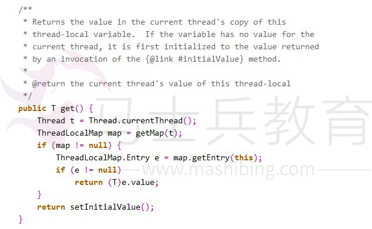

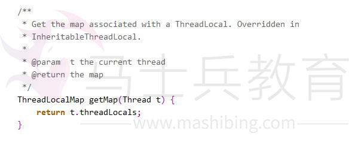

---

实际上就是一个ThreadLocalMap，这个类型是ThreadLocal类的一个内部类，我们继续取看
ThreadLocalMap的实现：
    可以看到ThreadLocalMap的Entry继承了WeakReference，并且使用ThreadLocal作为键值。
    很容易了解，就是如果map不为空，就设置键值对，为空，再创建Map，看一下createMap的实现：
然后再继续看setInitialValue方法的具体实现：

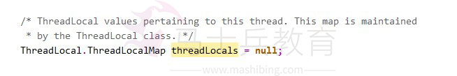

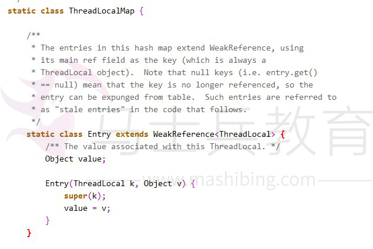

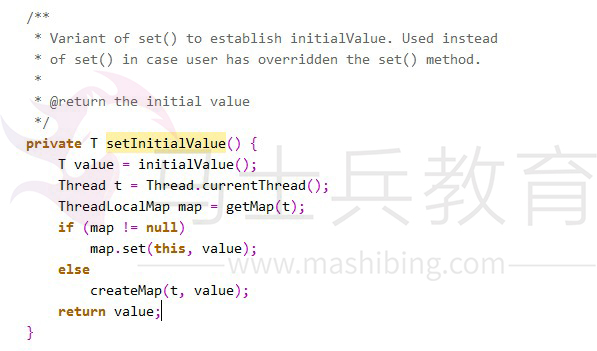

---

Java代码 
至此，可能大部分朋友已经明白了ThreadLocal是如何为每个线程创建变量的副本的：
首先，在每个线程Thread内部有一个ThreadLocal.ThreadLocalMap类型的成员变量threadLocals，这
个threadLocals就是用来存储实际的变量副本的，键值为当前ThreadLocal变量，value为变量副本（即T
类型的变量）。
初始时，在Thread里面，threadLocals为空，当通过ThreadLocal变量调用get()方法或者set()方法，
就会对Thread类中的threadLocals进行初始化，并且以当前ThreadLocal变量为键值，以ThreadLocal
要保存的副本变量为value，存到threadLocals。
然后在当前线程里面，如果要使用副本变量，就可以通过get方法在threadLocals里面查找。
下面通过一个例子来证明通过ThreadLocal能达到在每个线程中创建变量副本的效果：
1. **package** com.bijian.study; 
2. 
3. **public** **class** Test { 
4. 
5. ThreadLocal<Long> longLocal = **new** ThreadLocal<Long>(); 
6. ThreadLocal<String> stringLocal = **new** ThreadLocal<String>(); 
7. 
8. **public** **void** set() { 
9. longLocal.set(Thread.currentThread().getId()); 
10. stringLocal.set(Thread.currentThread().getName()); 
11. } 
12. 
13. **public** **long** getLong() { 
14. **return** longLocal.get(); 
15. } 
16. 
17. **public** String getString() { 
18. **return** stringLocal.get(); 
19. } 
20. 
21. **public** **static** **void** main(String[] args) **throws** 
InterruptedException { 
22. **final** Test test = **new** Test(); 
23. 
24. test.set(); 
25. System.out.println(test.getLong());

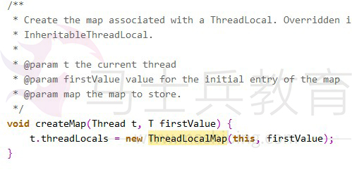

---

运行结果：
Text代码 
 
从这段代码的输出结果可以看出，在main线程中和thread1线程中，longLocal保存的副本值和
stringLocal保存的副本值都不一样。最后一次在main线程再次打印副本值是为了证明在main线程中和
thread1线程中的副本值确实是不同的。
总结一下：
1）实际的通过ThreadLocal创建的副本是存储在每个线程自己的threadLocals中的；
2）为何threadLocals的类型ThreadLocalMap的键值为ThreadLocal对象，因为每个线程中可有多个
threadLocal变量，就像上面代码中的longLocal和stringLocal；
3）在进行get之前，必须先set，否则会报空指针异常；
如果想在get之前不需要调用set就能正常访问的话，必须重写initialValue()方法。
因为在上面的代码分析过程中，我们发现如果没有先set的话，即在map中查找不到对应的存储，则会通
过调用setInitialValue方法返回i，而在setInitialValue方法中，有一个语句是T value = initialValue()， 
而默认情况下，initialValue方法返回的是null。
26. System.out.println(test.getString()); 
27. 
28. Thread thread1 = **new** Thread() { 
29. **public** **void** run() { 
30. test.set(); 
31. System.out.println(test.getLong()); 
32. System.out.println(test.getString()); 
33. }; 
34. }; 
35. thread1.start(); 
36. thread1.join(); 
37. 
38. System.out.println(test.getLong()); 
39. System.out.println(test.getString()); 
40. } 
41. } 
1. 1 
2. main 
3. 11 
4. Thread-0 
5. 1 
6. main

---

看下面这个例子：
Java代码 
1. **package** com.bijian.study; 
2. 
3. **public** **class** Test02 { 
4. 
5. ThreadLocal<Long> longLocal = **new** ThreadLocal<Long>(); 
6. ThreadLocal<String> stringLocal = **new** ThreadLocal<String>(); 
7. 
8. **public** **void** set() { 
9. longLocal.set(Thread.currentThread().getId()); 
10. stringLocal.set(Thread.currentThread().getName()); 
11. } 
12. 
13. **public** **long** getLong() { 
14. **return** longLocal.get(); 
15. } 
16. 
17. **public** String getString() { 
18. **return** stringLocal.get(); 
19. } 
20. 
21. **public** **static** **void** main(String[] args) **throws** 
InterruptedException { 
22. **final** Test02 test = **new** Test02();

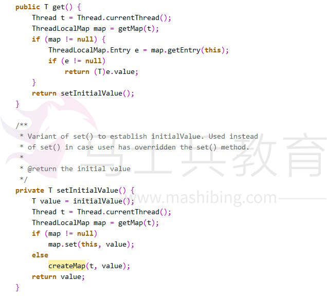

---

在main线程中，没有先set，直接get的话，运行时会报空指针异常。
但是如果改成下面这段代码，即重写了initialValue方法：
Java代码 
23. 
24. System.out.println(test.getLong()); 
25. System.out.println(test.getString()); 
26. 
27. Thread thread1 = **new** Thread() { 
28. **public** **void** run() { 
29. test.set(); 
30. System.out.println(test.getLong()); 
31. System.out.println(test.getString()); 
32. }; 
33. }; 
34. thread1.start(); 
35. thread1.join(); 
36. 
37. System.out.println(test.getLong()); 
38. System.out.println(test.getString()); 
39. } 
40. } 
运行结果：
Text代码 
1. Exception in thread "main" java.lang.NullPointerException 
2. at com.bijian.study.Test02.getLong(Test02.java:14) 
3. at com.bijian.study.Test02.main(Test02.java:24) 
1. **package** com.bijian.study; 
2. 
3. **public** **class** Test03 { 
4. 
5. ThreadLocal<Long> longLocal = **new** ThreadLocal<Long>() { 
6. **protected** Long initialValue() { 
7. **return** Thread.currentThread().getId(); 
8. }; 
9. }; 
10. 
11. ThreadLocal<String> stringLocal = **new** ThreadLocal<String>() { 
12. **protected** String initialValue() { 
13. **return** Thread.currentThread().getName(); 
14. }; 
15. }; 
16. 
17. **public** **void** set() { 
18. longLocal.set(Thread.currentThread().getId()); 
19. stringLocal.set(Thread.currentThread().getName()); 
20. } 
21. 
22. **public** **long** getLong() { 
23. **return** longLocal.get(); 
24. }

---

就可以直接不用先set而直接调用get了。
 
三.ThreadLocal的应用场景
Java代码 
25. 
26. **public** String getString() { 
27. **return** stringLocal.get(); 
28. } 
29. 
30. **public** **static** **void** main(String[] args) **throws** 
InterruptedException { 
31. **final** Test03 test = **new** Test03(); 
32. 
33. //test.set(); 
34. System.out.println(test.getLong()); 
35. System.out.println(test.getString()); 
36. 
37. Thread thread1 = **new** Thread() { 
38. **public** **void** run() { 
39. //test.set(); 
40. System.out.println(test.getLong()); 
41. System.out.println(test.getString()); 
42. }; 
43. }; 
44. thread1.start(); 
45. thread1.join(); 
46. 
47. System.out.println(test.getLong()); 
48. System.out.println(test.getString()); 
49. } 
50. } 
运行结果：
Text代码 
1. 1 
2. main 
3. 8 
4. Thread-0 
5. 1 
6. main 
   
最常见的ThreadLocal使用场景为 用来解决数据库连接、Session管理等。如：
数据库连接：

---

JVM老年代和新生代的比例？
 
JVM-堆学习之新生代老年代持久带的使用关系
 
 
之前被问到一个问题，大意是这样的：假如jvm参数中，最大堆内存分配了800M，Eden区分配了
200M，s0、s1各分配50M，持久带分配了100M，老年代分配了400M，问现在启动应用程序后，可使
用的最大内存有多少？
1. **private** **static** ThreadLocal<Connection> connectionHolder = **new** 
ThreadLocal<Connection>() { 
2. **public** Connection initialValue() { 
3. **return** DriverManager.getConnection(DB_URL); 
4. } 
5. }; 
6. 
7. **public** **static** Connection getConnection() { 
8. **return** connectionHolder.get(); 
9. } 
   Session管理：
Java代码
1. **private** **static** **final** ThreadLocal threadSession = **new** 
ThreadLocal(); 
2. 
3. **public** **static** Session getSession() **throws** InfrastructureException 
{ 
4. Session s = (Session) threadSession.get(); 
5. **try** { 
6. **if** (s == **null**) { 
7. s = getSessionFactory().openSession(); 
8. threadSession.set(s); 
9. } 
10. } **catch** (HibernateException ex) { 
11. **throw** **new** InfrastructureException(ex); 
12. } 
13. **return** s; 
14. }

---

这个问题的问本质其实是想考我们对JVM堆内存的GC回收原理的理解，我当时回答说是650M，我这样
回答，当时是这样考虑的：持久带100M 是用来存放静态类、方法或者变量的，程序启动后，这部分内
存不会再分配给新创建的对象，s0和S1总不能同时是满的，即总有一个是空的或者非满状态，所以减去
这两部分剩下的部分就是可用的，即800-100-50 =650. 后来下面仔细看了看GC分代回收算法，我这个
答案可能是错的。为了弄清楚这个问题，自己简单写个测试类，结合Jconsole，来进行分析，思路是这
样的：
创建一个测试类，静态代码块中初始化一个List，观察持久带使用情况
创建临时对象，调整对象个数，分别观察Eden、s0、S1内存交换情况
塞满新生代，观察Eden区 s0、s1、old区的情况
*手动执行GC，观察分析gc回收日志
以上每一个步骤执行完系统挂起，观察jconsole，进行分析
1.设置JVM启动参数
 
这里为了方便跑程序，设置的参数较小
参数分析如下
总结推理：堆最大110M 持久带10M 新生代Eden=16M,S0=2M,s1=2M 老年代old区最大不超过80M，
Eden区域到达16M时候触发幸存区复制，新生代达到20M的时候，触发YGC，old区域满的时候出发
FGC，下面我们来验证这个理论。
测试类
 
 -Xms50M -Xmx110M -Xmn20M -XX:PermSize=10M -XX:MaxPermSize=10M -
XX:SurvivorRatio=8 -XX:NewRatio=4 -XX:+PrintGCDetails1
 * -Xms50M:初始堆大小 50M
 * -Xmx100M: 最大堆大小 100M
 * -Xmn20M: 新生代 20M （Eden + survivor0 + survivor1 ）
 * -XX:PermSize=10M :初始持久带10M
 * -XX:SurvivorRatio=8 : Eden区与Survivor区的大小比值=8,表示两个
   Survivor区之和与一个Eden区的比值为2:8,一个Survivor区占整个年轻代
   的1/10即Eden = 16M ,s0 = 2M ,s1=2M
 * -XX:NewRatio=4：表示新生代与年老代所占比值为1:4,新生代占整个堆栈的
   1/5,（110-10）*0.2 =20M，老年代占整个堆的4/5,(最大100*0.8=80M)
12345678910111213
/**
 * Created by zhugh on 17/6/16.
 */
public class JvmTest {
 List<DataObject> list = new ArrayList();
    static {
        //模拟持久带存储
        int index = 0;
        while(index < 10000){
            DataObject object = new DataObject();
            object.setAge(index + 30);
            object.setName("李四"+index);

---

list.add(object);
            index ++;
        }
        System.out.println("生成持久带数据：" + list.size() + "条");
        System.out.println("[1]:生成持久带数据，请观察jconsole堆内存情况");
    }
    //模拟新生代存储
    public static void main(String[] agrs){
        try {
            System.out.print("请输入任意键开始给Eden区塞对象");
            System.in.read(); //模拟挂起，观察jconsole
            System.out.print("开始往Eden灌数据");
            List<DataObject> tempList = new ArrayList();
            int i = 100000;
            while(i > 0){
                DataObject object = new DataObject();
                object.setAge(i + 20);
                object.setName("张三"+i);
                i --;
                tempList.add(object);
            }
            System.out.println("生成新生代数据：" + tempList.size() + "条");
            System.out.println("[2]:生成新生代数据完成，请观察jconsole堆内存情况");
            System.in.read();
            System.out.println("输入任意键执行GC回收：");
            System.gc();
            System.out.println("[3]:GC回收完成，请观察jconsole堆内存情况");
            System.in.read();
            System.exit(0);
        } catch (IOException e) {
            e.printStackTrace();
        }
    }
    static class DataObject{
        private String name;
        private int age;
        public String getName() {
            return name;
        }
        public void setName(String name) {
            this.name = name;
        }
        public int getAge() {
            return age;
        }
        public void setAge(int age) {
            this.age = age;
        }
        @Override
        public String toString() {

---

[1]持久代先灌10000条记录，观察jconsole持久带占用情况如图1，使用不到8M：
我们在观察Eden区使用的情况如下图2：
看到Eden区域已经使用了约12m，这是应为类加载过程中会创建一些对象，这些对象是非用户定义的。
我们开始给Eden区域第一次灌对象，之后效果如下图3:
            return "DataObject{" +
                    "name='" + name + '\'' +
                    ", age=" + age +
                    '}';
        }
    }
}

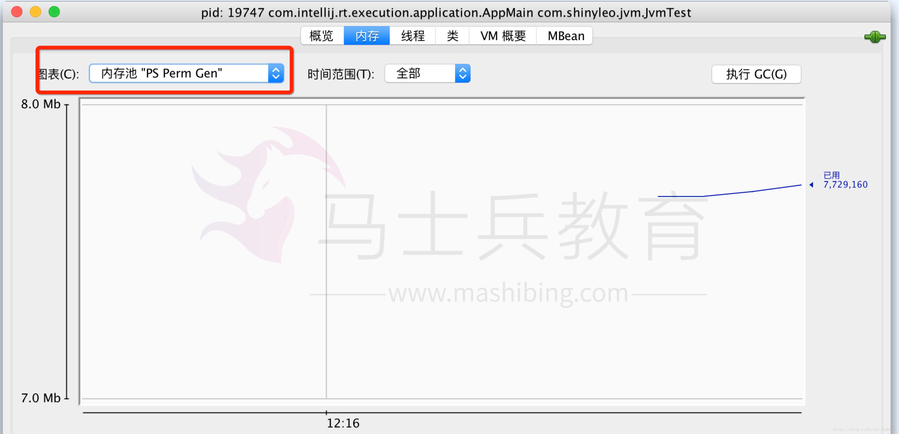

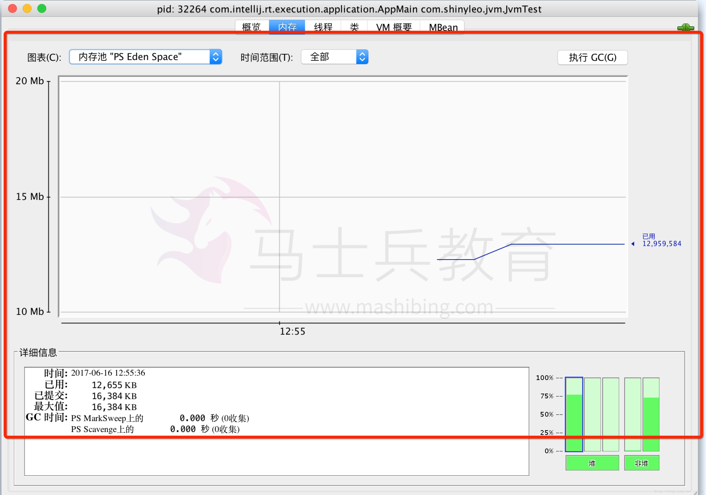

---

我们可以看到上图，Eden区域使用到16M的时候进行了一次从Eden区域往幸存区的复制，从Eden区复
制了2M数据到了幸存区域。
再来看看幸存区的情况，如下图4：
上图分析：由于触发了一次幸存区复制，所以幸存区使用了2M，目前为止符合我的推测。
我们再来看看old区现在的情况 图5：

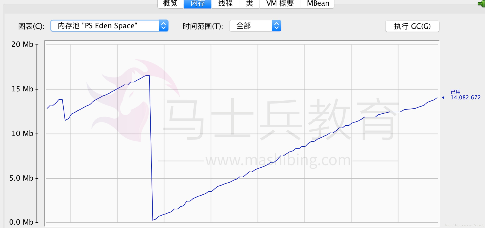

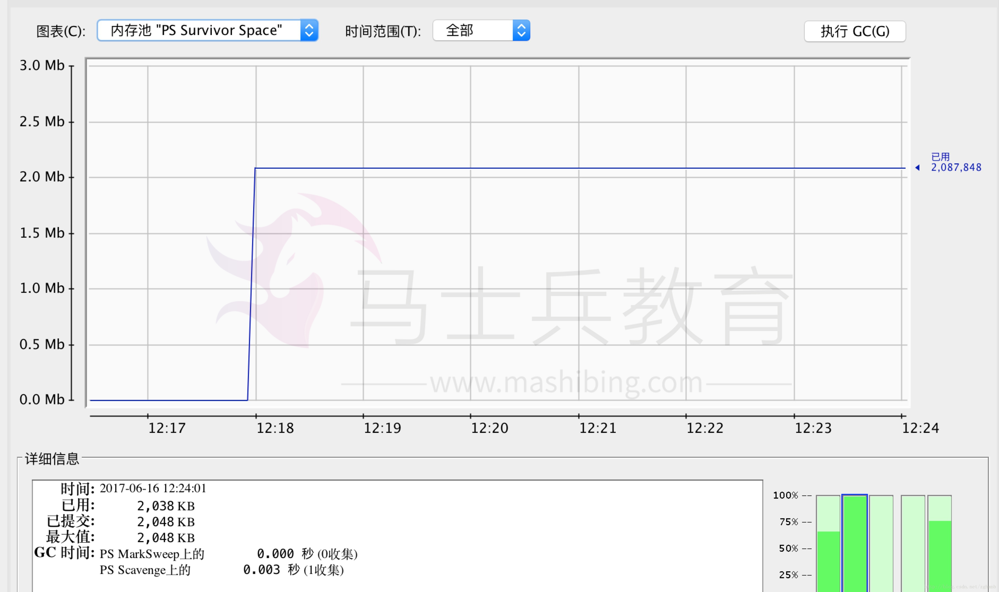

---

分析，由于现在还未触发YGC，old区域使用300Kb,这是程序无关外的其他额外内存占用，可以忽略，基
本上还是满存状态。
现在我们把挂起的程序继续向下执行，继续往新生代灌注数据，再次触发Eden区域往幸存区的复制，看
看此时持久带的情况如下图6：
分析：持久带几乎没有变，这验证了临时对象的生成不占用持久带内存是正确的。

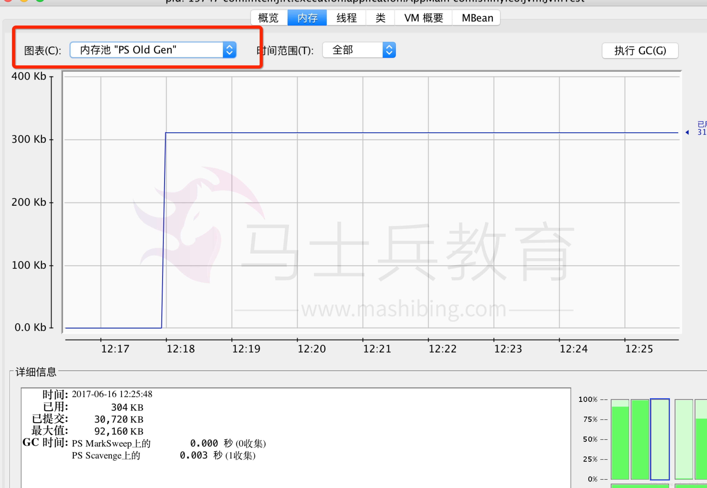

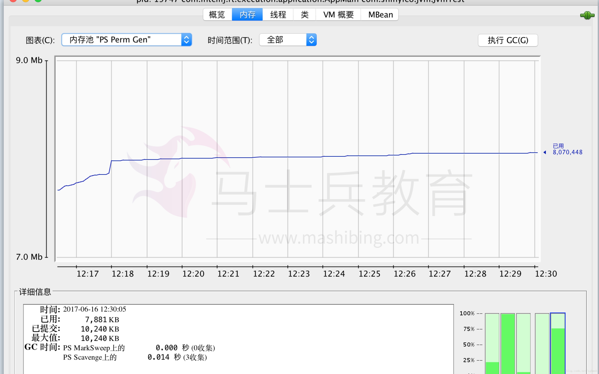

---

再来观察此时Eden区的情况图7：
分析，此时Eden区第二次被灌满16M，部分数据复制到了s0或者s1区域，又触发了一次复制。
我们再来看看s0和s1的情况图8：
分析，果然，幸存区又一次进行了复制，至此幸存区已经占满，触发YGC。

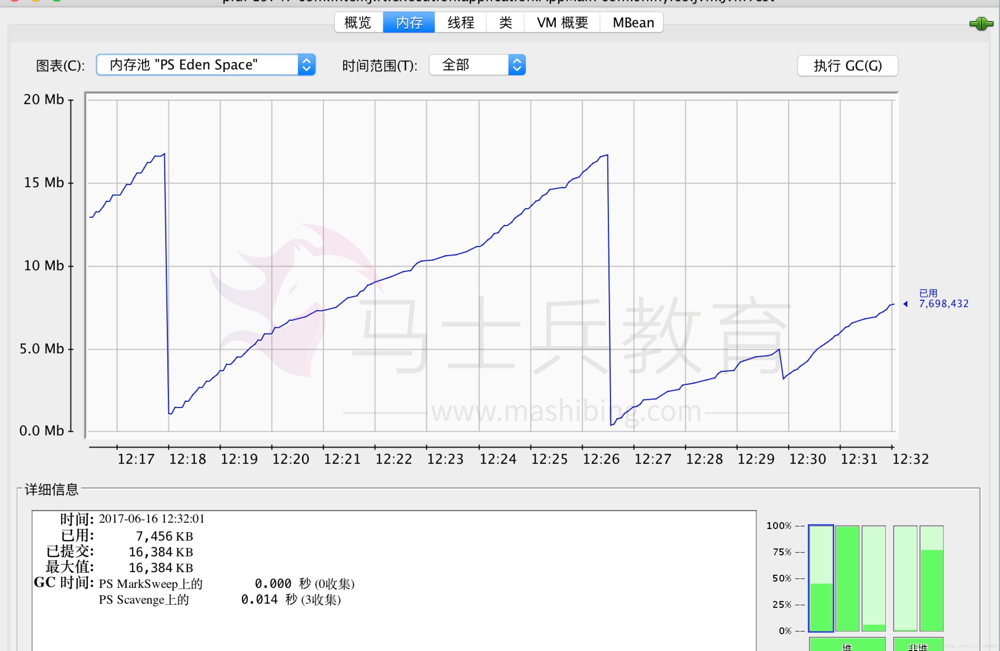

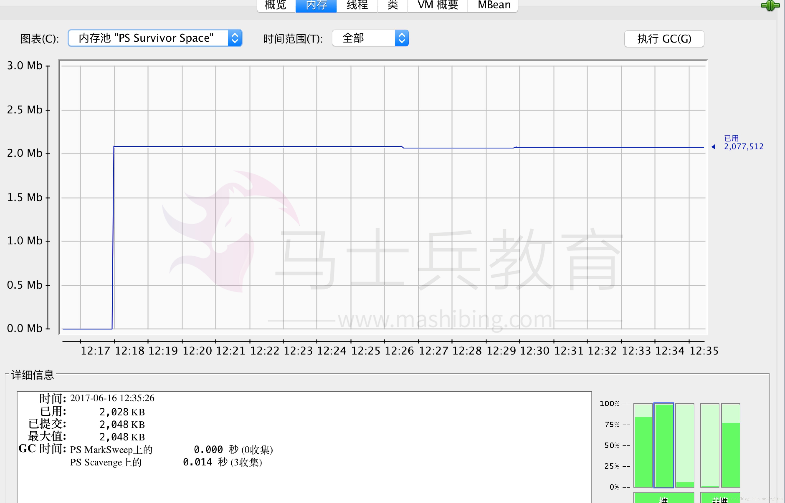

---

再来看看此时老年代的情况图9：
分析，如图，老年代此时已经使用了6M内存，说明此时已经触发了YGC，
那么这6M是哪里来的呢？看到这里如果明白的人，就会懂了，让我们来一起来分析一下：
第二次往Eden区域灌数据的时候，如图7，触发第二次幸存区复制后，Eden区域剩余约8M数据，说明
有另外8M被进行复制回收了，那么这8M回收到哪里去了呢？由于第二次触发幸存区复制时，幸存区s0
或者s1还有2M可以用（第一次Eden往幸存区复制后已经使用了2M），所以这8m有2M复制到了幸存
区，此时幸存区已4M满，剩下6M被复制到老年区，所以老年区的6M = Eden区被回收的8M-新生代承
担的2M。当然这里有一个概念我需要强调下，老年区的数据并不是直接从Eden区进行复制，而是先从
Eden区倒腾到幸存区，再从幸存区倒腾到old区。
程序运行结束，敢看GC回收日志如下
从GC汇总日志上看，新生代总共占用约20M，Eden占用约16M，s0、s1各2M，老年代总共30M左右，
使用了6%，为什么现在是6%了？是因为代码中有人工进行GC回收的动作，老年代的6M，被回收释放
了，剩余约1.8M，持久带约10M，使用了7M多点，占用约75%。
  Heap
 PSYoungGen      total 18432K, used 375K [0x00000007fec00000, 0x0000000800000000, 
0x0000000800000000)
  eden space 16384K, 2% used 
[0x00000007fec00000,0x00000007fec5dc38,0x00000007ffc00000)
  from space 2048K, 0% used 
[0x00000007ffe00000,0x00000007ffe00000,0x0000000800000000)
  to   space 2048K, 0% used 
[0x00000007ffc00000,0x00000007ffc00000,0x00000007ffe00000)
 ParOldGen       total 30720K, used 1947K [0x00000007f9200000, 
0x00000007fb000000, 0x00000007fec00000)
  object space 30720K, 6% used 
[0x00000007f9200000,0x00000007f93e6d80,0x00000007fb000000)
 PSPermGen       total 10240K, used 7762K [0x00000007f8800000, 
0x00000007f9200000, 0x00000007f9200000)
  object space 10240K, 75% used 
[0x00000007f8800000,0x00000007f8f94ab0,0x00000007f9200000)123456789

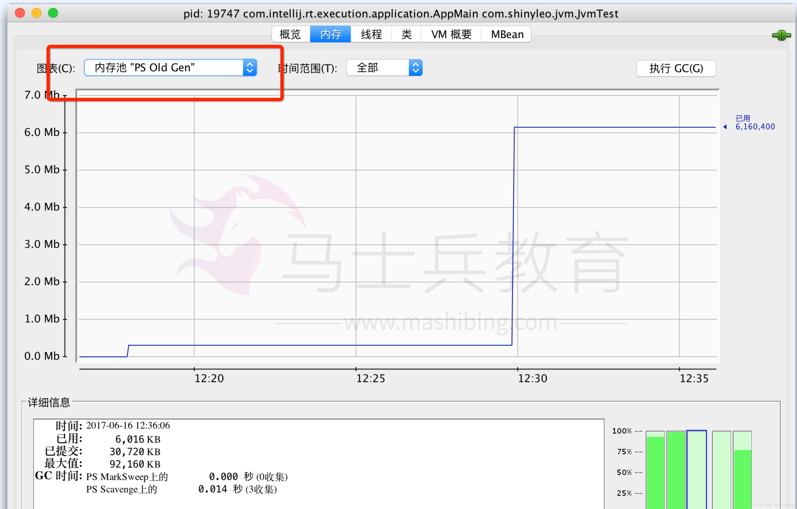

---

问题，和之前的结论大体一致，只有老年代为什么才30M，和预期的80M差这么多？我理解为老年代并
不是初始化的时候就开辟80M的空间，而是当不断触发YGC往老年代复制数据的时候，一旦超过30M，
会在开辟更多空间，最大不超过80M，只是推论，也希望同志们能够进行验证。
剩下如果想验证FGC的情况，需要继续往内存中灌数据，直到把old区域灌满，触发FGC，此时可以观察
老年代的内存大小，这部分内容，就留给各位自己去验证吧。
 
 
栈是运行时的单位，而堆是存储的单位。
 
栈解决程序的运行问题，即程序如何执行，或者说如何处理数据；堆解决的是数据存储的问题，即数据
怎么放、放在哪儿。
在Java中一个线程就会相应有一个线程栈与之对应，这点很容易理解，因为不同的线程执行逻辑有所不
同，因此需要一个独立的线程栈。而堆则是所有线程共享的。栈因为是运行单位，因此里面存储的信息
都是跟当前线程（或程序）相关信息的。包括局部变量、程序运行状态、方法返回值等等；而堆只负责
存储对象信息。
为什么要把堆和栈区分出来呢？栈中不是也可以存储数据
吗？
 
1. 从软件设计的角度看，栈代表了处理逻辑，而堆代表了数据。这样分开，使得处理逻辑更为清晰。
分而治之的思想。这种隔离、模块化的思想在软件设计的方方面面都有体现。
2. 堆与栈的分离，使得堆中的内容可以被多个栈共享（也可以理解为多个线程访问同一个对象）。这
种共享的收益是很多的。一方面这种共享提供了一种有效的数据交互方式(如：共享内存)，另一方
面，堆中的共享常量和缓存可以被所有栈访问，节省了空间。
3. 栈因为运行时的需要，比如保存系统运行的上下文，需要进行地址段的划分。由于栈只能向上增
长，因此就会限制住栈存储内容的能力。而堆不同，堆中的对象是可以根据需要动态增长的，因此
栈和堆的拆分，使得动态增长成为可能，相应栈中只需记录堆中的一个地址即可。
4. 面向对象就是堆和栈的完美结合。其实，面向对象方式的程序与以前结构化的程序在执行上没有任
何区别。但是，面向对象的引入，使得对待问题的思考方式发生了改变，而更接近于自然方式的思
考。当我们把对象拆开，你会发现，对象的属性其实就是数据，存放在堆中；而对象的行为（方
法），就是运行逻辑，放在栈中。我们在编写对象的时候，其实即编写了数据结构，也编写的处理
数据的逻辑。不得不承认，面向对象的设计，确实很美。
为什么不把基本类型放堆中呢？
 
因为其占用的空间一般是1~8个字节——需要空间比较少，而且因为是基本类型，所以不会出现动态增
长的情况——长度固定，因此栈中存储就够了，如果把他存在堆中是没有什么意义的（还会浪费空间，
后面说明）。可以这么说，基本类型和对象的引用都是存放在栈中，而且都是几个字节的一个数，因此
在程序运行时，他们的处理方式是统一的。但是基本类型、对象引用和对象本身就有所区别了，因为一
个是栈中的数据一个是堆中的数据。最常见的一个问题就是，Java中参数传递时的问题。
堆中存什么？栈中存什么？
 
堆中存的是对象。栈中存的是基本数据类型和堆中对象的引用。一个对象的大小是不可估计的，或者说
是可以动态变化的，但是在栈中，一个对象只对应了一个4btye的引用（堆栈分离的好处：））。
为什么不把基本类型放堆中呢？因为其占用的空间一般是1~8个字节——需要空间比较少，而且因为是
基本类型，所以不会出现动态增长的情况——长度固定，因此栈中存储就够了，如果把他存在堆中是没
有什么意义的（还会浪费空间，后面说明）。可以这么说，基本类型和对象的引用都是存放在栈中，而
且都是几个字节的一个数，因此在程序运行时，他们的处理方式是统一的。但是基本类型、对象引用和

---

对象本身就有所区别了，因为一个是栈中的数据一个是堆中的数据。最常见的一个问题就是，Java中参
数传递时的问题。
Java中的参数传递时传值呢？还是传引用？
 
要说明这个问题，先要明确两点：
1. 不要试图与C进行类比，Java中没有指针的概念
2. 程序运行永远都是在栈中进行的，因而参数传递时，只存在传递基本类型和对象引用的问题。不会
直接传对象本身。
明确以上两点后。Java在方法调用传递参数时，因为没有指针，所以它都是进行传值调用（这点可以参
考C的传值调用）。因此，很多书里面都说Java是进行传值调用，这点没有问题，而且也简化的C中复杂
性。
但是传引用的错觉是如何造成的呢？在运行栈中，基本类型和引用的处理是一样的，都是传值，所以，
如果是传引用的方法调用，也同时可以理解为“传引用值”的传值调用，即引用的处理跟基本类型是完全
一样的。但是当进入被调用方法时，被传递的这个引用的值，被程序解释（或者查找）到堆中的对象，
这个时候才对应到真正的对象。如果此时进行修改，修改的是引用对应的对象，而不是引用本身，即：
修改的是堆中的数据。所以这个修改是可以保持的了。
对象，从某种意义上说，是由基本类型组成的。可以把一个对象看作为一棵树，对象的属性如果还是对
象，则还是一颗树（即非叶子节点），基本类型则为树的叶子节点。程序参数传递时，被传递的值本身
都是不能进行修改的，但是，如果这个值是一个非叶子节点（即一个对象引用），则可以修改这个节点
下面的所有内容。
堆和栈中，栈是程序运行最根本的东西。程序运行可以没有堆，但是不能没有栈。而堆是为栈进行数据
存储服务，说白了堆就是一块共享的内存。不过，正是因为堆和栈的分离的思想，才使得Java的垃圾回
收成为可能。
Java中，栈的大小通过-Xss来设置，当栈中存储数据比较多时，需要适当调大这个值，否则会出现
java.lang.StackOverflowError异常。常见的出现这个异常的是无法返回的递归，因为此时栈中保存的信
息都是方法返回的记录点
 
 
java中四种引用类型（对象的强、软、弱和虚引用）
 
对象的强、软、弱和虚引用
在JDK 1.2以前的版本中，若一个对象不被任何变量引用，那么程序就无法再使用这个对象。也就是说，
只有对象处于可触及（reachable）状态，程序才能使用它。从JDK 1.2版本开始，把对象的引用分为4种
级别，从而使程序能更加灵活地控制对象的生命周期。这4种级别由高到低依次为：强引用、软引用、弱
引用和虚引用。
 
⑴强引用（StrongReference）
强引用是使用最普遍的引用。如果一个对象具有强引用，那垃圾回收器绝不会回收它。当内存空间不
足，Java虚拟机宁愿抛出OutOfMemoryError错误，使程序异常终止，也不会靠随意回收具有强引用的
对象来解决内存不足的问题。 ps：强引用其实也就是我们平时A a = new A()这个意思。
⑵软引用（SoftReference）
如果一个对象只具有软引用，则内存空间足够，垃圾回收器就不会回收它；如果内存空间不足了，就会
回收这些对象的内存。只要垃圾回收器没有回收它，该对象就可以被程序使用。软引用可用来实现内存
敏感的高速缓存（下文给出示例）。

---

软引用可以和一个引用队列（ReferenceQueue）联合使用，如果软引用所引用的对象被垃圾回收器回
收，Java虚拟机就会把这个软引用加入到与之关联的引用队列中。
⑶弱引用（WeakReference）
弱引用与软引用的区别在于：只具有弱引用的对象拥有更短暂的生命周期。在垃圾回收器线程扫描它所
管辖的内存区域的过程中，一旦发现了只具有弱引用的对象，不管当前内存空间足够与否，都会回收它
的内存。不过，由于垃圾回收器是一个优先级很低的线程，因此不一定会很快发现那些只具有弱引用的
对象。
弱引用可以和一个引用队列（ReferenceQueue）联合使用，如果弱引用所引用的对象被垃圾回收，
Java虚拟机就会把这个弱引用加入到与之关联的引用队列中。
⑷虚引用（PhantomReference）
“虚引用”顾名思义，就是形同虚设，与其他几种引用都不同，虚引用并不会决定对象的生命周期。如果
一个对象仅持有虚引用，那么它就和没有任何引用一样，在任何时候都可能被垃圾回收器回收。
虚引用主要用来跟踪对象被垃圾回收器回收的活动。虚引用与软引用和弱引用的一个区别在于：虚引用
必须和引用队列 （ReferenceQueue）联合使用。当垃圾回收器准备回收一个对象时，如果发现它还有
虚引用，就会在回收对象的内存之前，把这个虚引用加入到与之 关联的引用队列中。
ReferenceQueue queue = new ReferenceQueue ();
PhantomReference pr = new PhantomReference (object, queue); 
程序可以通过判断引用队列中是否已经加入了虚引用，来了解被引用的对象是否将要被垃圾回收。如果
程序发现某个虚引用已经被加入到引用队列，那么就可以在所引用的对象的内存被回收之前采取必要的
行动。
使用软引用构建敏感数据的缓存
1 为什么需要使用软引用
   首先，我们看一个雇员信息查询系统的实例。我们将使用一个Java语言实现的雇员信息查询系统查询
存储在磁盘文件或者数据库中的雇员人事档案信息。作为一个用户，我们完全有可能需要回头去查看几
分钟甚至几秒钟前查看过的雇员档案信息(同样，我们在浏览WEB页面的时候也经常会使用“后退”按钮)。
这时我们通常会有两种程序实现方式:一种是把过去查看过的雇员信息保存在内存中，每一个存储了雇员
档案信息的Java对象的生命周期贯穿整个应用程序始终;另一种是当用户开始查看其他雇员的档案信息的
时候，把存储了当前所查看的雇员档案信息的Java对象结束引用，使得垃圾收集线程可以回收其所占用
的内存空间，当用户再次需要浏览该雇员的档案信息的时候，重新构建该雇员的信息。很显然，第一种
实现方法将造成大量的内存浪费，而第二种实现的缺陷在于即使垃圾收集线程还没有进行垃圾收集，包
含雇员档案信息的对象仍然完好地保存在内存中，应用程序也要重新构建一个对象。我们知道，访问磁
盘文件、访问网络资源、查询数据库等操作都是影响应用程序执行性能的重要因素，如果能重新获取那
些尚未被回收的Java对象的引用，必将减少不必要的访问，大大提高程序的运行速度。
2 如果使用软引用
   SoftReference的特点是它的一个实例保存对一个Java对象的软引用，该软引用的存在不妨碍垃圾收集
线程对该Java对象的回收。也就是说，一旦SoftReference保存了对一个Java对象的软引用后，在垃圾线
程对这个Java对象回收前，SoftReference类所提供的get()方法返回Java对象的强引用。另外，一旦垃圾
线程回收该Java对象之后，get()方法将返回null。
看下面代码:
MyObject aRef = new MyObject();
SoftReference aSoftRef = new SoftReference(aRef); 
此时，对于这个MyObject对象，有两个引用路径，一个是来自SoftReference对象的软引用，一个来自
变量aReference的强引用，所以这个MyObject对象是强可及对象。
随即，我们可以结束aReference对这个MyObject实例的强引用:
 
aRef = null;

---

此后，这个MyObject对象成为了软可及对象。如果垃圾收集线程进行内存垃圾收集，并不会因为有一个
SoftReference对该对象的引用而始终保留该对象。Java虚拟机的垃圾收集线程对软可及对象和其他一般
Java对象进行了区别对待:软可及对象的清理是由垃圾收集线程根据其特定算法按照内存需求决定的。也
就是说，垃圾收集线程会在虚拟机抛出OutOfMemoryError之前回收软可及对象，而且虚拟机会尽可能
优先回收长时间闲置不用的软可及对象，对那些刚刚构建的或刚刚使用过的“新”软可反对象会被虚拟机
尽可能保留。在回收这些对象之前，我们可以通过:
MyObject anotherRef=(MyObject)aSoftRef.get(); 
重新获得对该实例的强引用。而回收之后，调用get()方法就只能得到null了。
3 使用ReferenceQueue清除失去了软引用对象的SoftReference
    作为一个Java对象，SoftReference对象除了具有保存软引用的特殊性之外，也具有Java对象的一般
性。所以，当软可及对象被回收之后，虽然这个SoftReference对象的get()方法返回null,但这个
SoftReference对象已经不再具有存在的价值，需要一个适当的清除机制，避免大量SoftReference对象
带来的内存泄漏。在java.lang.ref包里还提供了ReferenceQueue。如果在创建SoftReference对象的时
候，使用了一个ReferenceQueue对象作为参数提供给SoftReference的构造方法，如:
 
ReferenceQueue queue = new ReferenceQueue();
SoftReference ref = new
SoftReference(aMyObject, queue); 
那么当这个SoftReference所软引用的aMyOhject被垃圾收集器回收的同时，ref所强引用的
SoftReference对象被列入ReferenceQueue。也就是说，ReferenceQueue中保存的对象是Reference
对象，而且是已经失去了它所软引用的对象的Reference对象。另外从ReferenceQueue这个名字也可以
看出，它是一个队列，当我们调用它的poll()方法的时候，如果这个队列中不是空队列，那么将返回队列
前面的那个Reference对象。
在任何时候，我们都可以调用ReferenceQueue的poll()方法来检查是否有它所关心的非强可及对象被回
收。如果队列为空，将返回一个null,否则该方法返回队列中前面的一个Reference对象。利用这个方
法，我们可以检查哪个SoftReference所软引用的对象已经被回收。于是我们可以把这些失去所软引用的
对象的SoftReference对象清除掉。常用的方式为:
SoftReference ref = null;
while ((ref = (EmployeeRef) q.poll()) != null) {
// 清除ref
}
完整代码：
ReferenceQueue q = new ReferenceQueue();
// 获取数据并缓存
Object obj = new Object();
SoftReference sr = new SoftReference(obj, q);
// 下次使用时
Object obj = (Object)sr.get();
if (obj == null){
  // 当软引用被回收后才重新获取
  obj = new Object();
}
// 清理被收回后剩下来的软引用对象

---

疑问：
 那现在问题来了，若一个对象的引用类型有多个，那到底如何判断它的可达性呢？其实规则如下：
   我们假设图2中引用①和③为强引用，⑤为软引用，⑦为弱引用，对于对象5按照这两个判断原则，路
径①-⑤取最弱的引用⑤，因此该路径对对象5的引用为软引用。同样，③-⑦为弱引用。在这两条路径之
间取最强的引用，于是对象5是一个软可及对象（当将要发生OOM时则会被回收掉）。
 软引用、弱引用和虚引用均为抽象类 java.lang.ref.Reference 的子类，而与引用队列和GC相关的操作
大多在抽象类Reference中实现。
 
 
讲一讲内存分代及生命周期。
 
管中窥豹——从对象的生命周期梳理JVM内存结构、GC、类加载、
AOP编程及性能监控
 
 
如题，本文的宗旨既是透过对象的生命周期，来梳理JVM内存结构及GC相关知识，并辅以AOP及双亲委
派机制原理，学习不仅仅是海绵式的吸收学习，还需要自己去分析why，加深对技术的理解和认知，祝
大家早日走上自己的“成金之路”。
SoftReference ref = null;
while((ref = q.poll()) != null){
  // 清理工作
}
   1. 单条引用链的可达性以最弱的一个引用类型来决定；
      2. 多条引用链的可达性以最强的一个引用类型来决定；

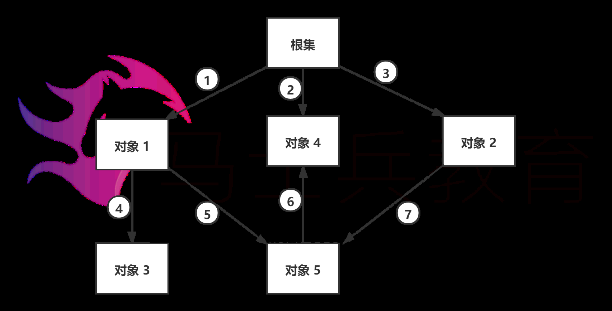

---

Java对象的创建
 
本部分，从攻城狮编写.java文件入手，详解了编译、载入、AOP原理。
读过《程序员的自我修养》的朋友，对程序的编译及执行会有一个很清晰的认识：编译其实就是将人类
能理解的代码文件转译为机器/CPU能执行的文件(包括数据段、代码段)，而执行的过程，则是根据文件
头部字节的标识(简称魔数)，映射为对应的文件结构体，找到程序入口，当获取到CPU执行权限时，将方
法压栈，执行对应的指令码，完成相应的逻辑操作。
而对应.java文件，则先需要使用javac进行编译，编译后的.class文件，此文件将java程序能读懂的数据
段和代码段，之后用java执行文件，既是载入.class文件，找到程序入口，并根据要执行的方法，不停的
压栈、出栈，进行逻辑处理。
class文件载入过程
 
加载
 
在加载阶段，虚拟机需要完成以下三件事情：
通过一个类的全限定名来获取其定义的二进制字节流。
将这个字节流所代表的静态存储结构转化为方法区的运行时数据结构。
在Java堆中生成一个代表这个类的java.lang.Class对象，作为对方法区中这些数据的访问入
口。
即相当于在内存中将代码段和数据段关联起来，组织好Class对象的内存空间，作为对象成员和方法的引
入入口，并将.class及方法载入Perm内存区。相对于类加载的其他阶段而言，加载阶段（准确地说，是
加载阶段获取类的二进制字节流的动作）是可控性最强的阶段，因为开发人员既可以使用系统提供的类
加载器来完成加载，也可以自定义自己的类加载器来完成加载。
连接
 
分为四个阶段：
第一阶段是验证，确保被加载的类的正确性。
这一阶段的目的是为了确保Class文件的字节流中包含的信息符合当前虚拟机的要求，并且不会危
害虚拟机自身的安全。验证阶段大致会完成4个阶段的检验动作：
文件格式验证验证字节流是否符合Class文件格式的规范；例如：是否以0xCAFEBABE开头、主次
版本号是否在当前虚拟机的处理范围之内、常量池中的常量是否有不被支持的类型。
元数据验证对字节码描述的信息进行语义分析（注意：对比javac编译阶段的语义分析），以保证
其描述的信息符合Java语言规范的要求；例如：这个类是否有父类，除了java.lang.Object之外。
字节码验证通过数据流和控制流分析，确定程序语义是合法的、符合逻辑的。
符号引用验证确保解析动作能正确执行。
验证阶段是非常重要的，但不是必须的，它对程序运行期没有影响，如果所引用的类经过反复验
证，那么可以考虑采用-Xverifynone参数来关闭大部分的类验证措施，以缩短虚拟机类加载的时
间。
第二阶段是准备：为类的静态变量分配内存，并将其初始化为默认值
准备阶段是正式为类变量分配内存并设置类变量初始值的阶段，这些内存都将在方法区中分配。对
于该阶段有以下几点需要注意：
1、这时候进行内存分配的仅包括类变量（static），而不包括实例变量，实例变量会在对象实例
化时随着对象一块分配在Java堆中。
2、这里所设置的初始值通常情况下是数据类型默认的零值（如0、0L、null、false等），而不是
被在Java代码中被显式地赋予的值。如public static int value = 3；那么变量value在准备阶段过后
的初始值为0，而不是3，因为这时候尚未开始执行任何Java方法，而把value赋值为3的putstatic
指令是在程序编译后，存放于类构造器()方法之中的，所以把value赋值为3的动作将在初始化阶段
才会执行。这里还需要注意如下几点：

---

i.对基本数据类型来说，对于类变量（static）和全局变量，如果不显式地对其赋值而直接使用，则
系统会为其赋予默认的零值，而对于局部变量来说，在使用前必须显式地为其赋值，否则编译时不
通过。
ii.对于同时被static和final修饰的常量，必须在声明的时候就为其显式地赋值，否则编译时不通
过；而只被final修饰的常量则既可以在声明时显式地为其赋值，也可以在类初始化时显式地为其
赋值，总之，在使用前必须为其显式地赋值，系统不会为final修饰的常量赋予默认零值。
iii.对于引用数据类型 reference来说，如数组引用、对象引用等，如果没有对其进行显式地赋值而
直接使用，系统都会为其赋予默认的零值，即null。
iv.如果在数组初始化时没有对数组中的各元素赋值，那么其中的元素将根据对应的数据类型而被
赋予默认的零值。
3、如果类字段的字段属性表中存在ConstantValue属性，即同时被final和static修饰，那么在准备
阶段变量value就会被初始化为ConstValue属性所指定的值。如public static final int value = 3；
编译时Javac将会为value生成ConstantValue属性，在准备阶段虚拟机就会根据ConstantValue的
设置将value赋值为3。
第三阶段是解析:把类中的符号引用转换为直接引用
解析阶段是虚拟机将常量池内的符号引用替换为直接引用的过程，解析动作主要针对类或接口、字
段、类方法、接口方法、方法类型、方法句柄和调用点限定符7类符号引用进行。符号引用就是一
组符号来描述目标，可以是任何字面量。
直接引用就是直接指向目标的指针、相对偏移量或一个间接定位到目标的句柄。
这个阶段的主要目的将编译后的虚拟地址(类似动态库，库数据段都是0x00开始，载入内存后需要与实际
分配的地址关联起来)与实际运行的地址关联起来。
第四阶段是初始化，为类的静态变量赋予正确的初始值，JVM负责对类进行初始化，主要对类变量
进行初始化，包括给声明类变量指定初始值，和为类static变量指定静态代码块地址。
1、假如这个类还没有被加载和连接，则程序先加载并连接该类
2、假如该类的直接父类还没有被初始化，则先初始化其直接父类
3、假如类中有初始化语句，则系统依次执行这些初始化语句
类初始化时机：只有当对类的主动使用的时候才会导致类的初始化，类的主动使用包括以下六种：
– 创建类的实例，也就是new的方式
– 访问某个类或接口的静态变量，或者对该静态变量赋值
– 调用类的静态方法
– 反射（如Class.forName(“com.xxx.Test”)）
– 初始化某个类的子类，则其父类也会被初始化
– Java虚拟机启动时被标明为启动类的类（Java Test），直接使用java.exe命令来运行某个主类。
拓展：双亲委派机制与AOP面向切面编程原理
 
JVM最底层的载入是BootstrapClassLoader，为C语言编写，从Java中引用不到，其上是
ExtClassLoader，然后是AppClassLoader，普通类中getContextClassLoader()得到的是
AppClassLoader，getContextClassLoader().getParent()得到的是ExtClassLoader，而再往上
getParent()为null，即引用不到BootstrapLoader。
启动类加载器：BootstrapClassLoader，负责加载存放在JDK\jre\lib(JDK代表JDK的安装目录，下
同)下，或被-Xbootclasspath参数指定的路径中的，并且能被虚拟机识别的类库（如rt.jar，所有的
java.*开头的类均被BootstrapClassLoader加载）。启动类加载器是无法被Java程序直接引用的。
扩展类加载器：ExtensionClassLoader，该加载器由sun.misc.Launcher$ExtClassLoader实现，
它负责加载DK\jre\lib\ext目录中，或者由java.ext.dirs系统变量指定的路径中的所有类库（如
javax.*开头的类），开发者可以直接使用扩展类加载器。

---

应用程序类加载器：ApplicationClassLoader，该类加载器由
sun.misc.Launcher$AppClassLoader来实现，它负责加载用户类路径（ClassPath）所指定的
类，开发者可以直接使用该类加载器，如果应用程序中没有自定义过自己的类加载器，一般情况下
这个就是程序中默认的类加载器。
应用程序都是由这三种类加载器互相配合进行加载的，如果有必要，我们还可以加入自定义的类加
载器。因为JVM自带的ClassLoader只是懂得从本地文件系统加载标准的java class文件，因此如果
编写了自己的ClassLoader，便可以做到如下几点：
1）在执行非置信代码之前，自动验证数字签名。
2）动态地创建符合用户特定需要的定制化构建类。
3）从特定的场所取得java class，例如数据库中和网络中。
双亲委派机制
简单来说既是先拿父类加载器加载class，父类加载失败后再使用本类加载器加载。当
AppClassLoader加载一个class时，它首先不会自己去尝试加载这个类，而是把类加载请求委派给
父类加载器ExtClassLoader去完成。当ExtClassLoader加载一个class时，它首先也不会自己去尝
试加载这个类，而是把类加载请求委派给BootStrapClassLoader去完成。如果
BootStrapClassLoader加载失败（例如在$JAVA_HOME/jre/lib里未查找到该class），会使用
ExtClassLoader来尝试加载；若ExtClassLoader也加载失败，则会使用AppClassLoader来加载，
如果AppClassLoader也加载失败，则会报出异常ClassNotFoundException。
其它相关点
1.全盘负责，当一个类加载器负责加载某个Class时，该Class所依赖的和引用的其他Class也将由
该类加载器负责载入，除非显示使用另外一个类加载器来载入。
2.父类委托，先让父类加载器试图加载该类，只有在父类加载器无法加载该类时，才使用本类加载
器从自己的类路径中加载该类。
3.缓存机制，缓存机制将会保证所有加载过的Class都会被缓存，当程序中需要使用某个Class时，
类加载器先从缓存区寻找该Class，只有缓存区不存在，系统才会读取该类对应的二进制数据，并
将其转换成Class对象，存入缓存区。这就是为什么修改了Class后，必须重启JVM，程序的修改才
会生效。
--
AOP面向切面编程
AOP 专门用于处理系统中分布于各个模块（不同方法）中的交叉关注点的问题，在 Java EE 应用
中，常常通过AOP来处理一些具有横切性质的系统级服务，如事务管理、安全检查、缓存、对象
池管理等，在不改变已有代码的情况下，静态/动态的插入代码。
将AOP放到这里的主要原因是因为AOP改变的class文件，达到嵌入方法的目的，静态模式使用
AspectJ进行由.java到.class文件编译。而动态模式时使用CGLIB载入使用javac编译的.class文件
后，使用动态代理的方式，将要执行的方法嵌入到原有class方法中，完成在内存中对class对象的
构造，这也就是所谓动态代理技术的内在原理。同时静态方式在载入前已经修好完.class文件，而
动态方式在.class载入时需要做额外的处理，导致性能受到一定影响，但其优势是无须使用额外的
编译器。总体的技术的切入点在于在修改机器执行码，达到增加执行方法的目的。
对象创建及方法调用
 
数据分类：基本类型与引用类型
基本类型包括：byte,short,int,long,char,float,double,boolean,returnAddress
引用类型包括：类类型，接口类型和数组。
数据存储：使用堆存储对象信息

---

方法调用：使用栈来解决方法嵌套调用，而栈内部由一个个栈帧构成，调用一个方法时，在当前栈上压
入一个栈帧，此栈帧包含局部变量表，操作栈等子项，每一个方法被调用直至执行完成的过程，就对应
着一个栈帧在虚拟机栈中从入栈到出栈的过程。表面上代码在运行时，是通过程序计数器不断执行下一
条指令；而实际指令运算等操作是通过控制操作栈的操作数入栈和出栈，将操作数在局部变量表和操作
栈之间转移。
这里对内存的分配做个深入的扩展，解释下基础类型的自动装箱 boxing
以"Object obj = new Object();"为例，一个空Object对象占用8byte空间，而obj引用占用4byte，
此条语句执行后共占用12byte；而Java中对象大小是8的整数倍，则Boolean b = new 
Boolean(true)至少需要20byte(16byte+4byte)，而如果直接使用基本数据类型boolean b = true
则仅仅需要1byte，在栈帧中存储；为优化此问题，JVM提出了基本类型的自动装载技术，来自动
化进行基本类型与基本类型对象间的转换，来降低内存的使用量。
内存集中管理(模型及GC机制)
 
JVM内存模型图如下
内存结构主要有三大块：堆内存、方法区和栈。
1.堆内存是JVM中最大的一块由Young Generation(年轻代、新生代)和Old Generation(年老代)组
成，而Young Generation内存又被分成三部分，Eden空间、From Survivor空间、To Survivor空
间，默认情况下年轻代按照8:1:1的比例来分配。
2.方法区存储类信息、常量、静态变量等数据，是线程共享的区域，为与Java堆区分，方法区还有
一个别名Non-Heap(非堆)。
3.栈又分为java虚拟机栈(方法执行的内存区，每个方法执行时会在虚拟机栈中创建栈帧)和本地方
法栈(虚拟机的Native方法执行的内存区)主要用于方法的执行。
4.内存设置参数：
-Xms设置堆的最小空间大小。
-Xmx设置堆的最大空间大小。
-XX:NewSize设置新生代最小空间大小。
-XX:MaxNewSize设置新生代最大空间大小。
-XX:PermSize设置永久代最小空间大小。
-XX:MaxPermSize设置永久代最大空间大小。
-Xss设置每个线程的堆栈大小。
-XX:SurvivorRatio=x #Eden区与Survivor区的大小比值，默认为8(Eden:From-Survivor=8:1)
-XX:NewRatio=x #年轻代(包括Eden和两个Survivor区)与年老代的比值(除去持久代)默认值为2，
即年轻代:年老代=1:2(这里与数学的比值有差异)
Minor GC
对象分配先从Eden空间与From Survivor空间获取内存，当两者中空间不足时，进行Minor GC，将
Eden与From Survivor空间存活的对象，Copy到To Survivor空间，然后清空Eden与From Survivor空
间，之后将To Survivor空间对象年龄加1，并将To Survivor空间设置为From Survivor空间，保证Minor 
GC时To Survivor空间始终为空；而当对象年龄为15后(默认是 15，可以通过参数-
XX:MaxTenuringThreshold 来设定)，将存活对象放入老年代。
例外情况：
1.对于一些较大的对象(即需要分配一块较大的连续内存空间)则是直接进入到老年代。虚拟机提供了一
个-XX:PretenureSizeThreshold参数，令大于这个设置值的对象直接在老年代分配。避免在新生代采用
复制算法收集内存时，在Eden区及两个Survivor区之间发生大量的内存复制。
2.为了更好的适应不同的程序，虚拟机并不是永远地要求对象的年龄必须达到了
MaxTenuringThreshold才能晋升老年代，如果在Survivor空间中相同年龄所有对象大小的总和大于
Survivor空间的一半，年龄大于或等于该年龄的对象可以直接进入Old Generation，无需等到
MaxTenuringThreshold中要求的年龄。

---

这里的疑问，按照默认的8:1:1设置，一个To Survivor空间占10%空间，每次Minor GC能保证To 
Survivor空间够用吗？IBM的研究表明，98%的对象都是很快消亡的，大部分的对象在创建后很快
就不再使用。这里可以根据GC detail来查看和分析比例设置是否合理。
Full GC
工作：同时回收年轻代、年老代，按照配置的不同算法进行回收。
时机：在Minor GC触发时，会检测之前每次晋升到老年代的平均大小是否大于老年代的剩余空间，如果
大于，改为直接进行一次Full GC；如果小于则查看HandlePromotionFailure设置(是否允许担保，使用
Old Gerneration空间担保)，如果允许，那仍然进行Minor GC，如果不允许，则也要改为进行一次Full 
GC。
取平均值进行比较其实仍然是一种动态概率的手段，也就是说如果某次Minor GC存活后的对象突增，大
大高于平均值的话，依然会导致担保失败，这样就只好在失败后重新进行一次Full GC。
回收算法
 
首先判断对象是否存活，一般有两种方式：
引用计数：每个对象有一个引用计数属性，新增一个引用时计数加1，引用释放时计数减1，
计数为0时可以回收。此方法简单，无法解决对象相互循环引用的问题。
可达性分析（Reachability Analysis）：从GC Roots开始向下搜索，搜索所走过的路径称为
引用链。当一个对象到GC Roots没有任何引用链相连时，则证明此对象是不可用的、不可达
对象。
在Java语言中，GC Roots包括：
--虚拟机栈中引用的对象。
--方法区中类静态属性实体引用的对象。
--方法区中常量引用的对象。
--本地方法栈中JNI引用的对象。
标记-清除算法:首先标记出所有需要回收的对象，在标记完成后统一回收掉所有被标记的对象。之所以说
它是最基础的收集算法，是因为后续的收集算法都是基于这种思路并对其缺点进行改进而得到的。
缺点：一个是效率问题，标记和清除过程的效率都不高；另外一个是空间问题，标记清除之后会产生大
量不连续的内存碎片，空间碎片太多可能会导致，当程序在以后的运行过程中需要分配较大对象时无法
找到足够的连续内存而不得不提前触发另一次垃圾收集动作。
复制算法：对空间问题的改进，它将可用内存按容量划分为大小相等的两块，每次只使用其中的一块。
当这一块的内存用完了，就将还存活着的对象复制到另外一块上面，然后再把已使用过的内存空间一次
清理掉。
缺点是这种算法的代价是将内存缩小为原来的一半，持续复制长生存期的对象则导致效率降低。如果不
想浪费50%的空间，就需要有额外的空间进行分配担保(HandlePromotionFailure设置为true)，以应对
被使用的内存中所有对象都100%存活的极端情况，所以在老年代一般不能直接选用这种算法。
标记-压缩/整理算法：对复制算法在老年代上的改进，标记过程仍然与“标记-清除”算法一样，但后续步
骤不是直接对可回收对象进行清理，而是让所有存活的对象都向一端移动，然后直接清理掉端边界以外
的内存。
分代收集算法：把Java堆分为新生代和老年代，这样就可以根据各个年代的特点采用最适当的收集算
法。
在新生代中，每次垃圾收集时都发现有大批对象死去，只有少量存活，那就选用复制算法，只需要付出
少量存活对象的复制成本就可以完成收集。
而老年代中，因为对象存活率高、没有额外空间对它进行分配担保，就必须使用“标记-清理”或“标记-整
理”算法来进行回收。

---

回收器
 
新生代收集器
 
Serial收集器
串行收集器是最古老，最稳定以及效率高的收集器，使用停止复制方法，只使用一个线程去串行回
收；垃圾收集的过程中会Stop The World（服务暂停）；
参数控制：使用-XX:+UseSerialGC可以使用Serial+Serial Old模式运行进行内存回收（这也是虚拟
机在Client模式下运行的默认值）
缺点是串行效率较低
ParNew收集器
ParNew收集器其实就是Serial收集器的多线程版本，使用停止复制方法。新生代并行，其它工作
线程暂停。
参数控制：使用-XX:+UseParNewGC开关来控制使用ParNew+Serial Old收集器组合收集内存；使
用-XX:ParallelGCThreads来设置执行内存回收的线程数。
Parallel收集器
Parallel Scavenge收集器类似ParNew收集器，Parallel收集器更关注CPU吞吐量，即运行用户代
码的时间/总时间，使用停止复制算法。可以通过参数来打开自适应调节策略，虚拟机会根据当前
系统的运行情况收集性能监控信息，动态调整这些参数以提供最合适的停顿时间或最大的吞吐量；
也可以通过参数控制GC的时间不大于多少毫秒或者比例。
参数控制：使用-XX:+UseParallelGC开关控制使用Parallel Scavenge+Serial Old收集器组合回收
垃圾（这也是在Server模式下的默认值）；使用-XX:GCTimeRatio来设置用户执行时间占总时间的
比例，默认99，即1%的时间用来进行垃圾回收。使用-XX:MaxGCPauseMillis设置GC的最大停顿
时间（这个参数只对Parallel Scavenge有效），用开关参数-XX:+UseAdaptiveSizePolicy可以进行
动态控制，如自动调整Eden/Survivor比例，老年代对象年龄，新生代大小等，这个参数在
ParNew下没有。
老年代收集器
 
Serial Old收集器：老年代收集器，单线程收集器，串行，使用"标记-整理"算法（整理的方法是
Sweep（清理）和Compact（压缩），
Parallel Old 收集器
多线程机制与Parallel Scavenge差不错，使用标记整理（与Serial Old不同，这里的整理是
Summary（汇总）和Compact（压缩），汇总的意思就是将幸存的对象复制到预先准备好的区
域，而不是像Sweep（清理）那样清理废弃的对象）算法，在Parallel Old执行时，仍然需要暂停
其它线程。Parallel Old在多核计算中很有用。这个收集器是在JDK 1.6中，与Parallel Scavenge配
合有很好的效果。
参数控制： 使用-XX:+UseParallelOldGC开关控制使用Parallel Scavenge +Parallel Old组合收集
器进行收集。
CMS收集器：老年代收集器（新生代使用ParNew）
CMS（Concurrent Mark Sweep）收集器是一种以获取最短回收停顿时间为目标的收集器。目前
很大一部分的Java应用都集中在互联网站或B/S系统的服务端上，这类应用尤其重视服务的响应速
度，希望系统停顿时间最短，以给用户带来较好的体验。
从名字（包含“Mark Sweep”）上就可以看出CMS收集器是基于“标记-清除”算法实现的，它的运作
过程相对于前面几种收集器来说要更复杂一些，整个过程分为6个步骤，其中初始标记、重新标记
这两个步骤仍然需要“Stop The World”，包括：
1. 初始标记(CMS-initial-mark)：为了收集应用程序的对象引用需要暂停应用程序线程，该阶段完成
后，应用程序线程再次启动。

---

2. 并发标记(CMS-concurrent-mark)：从第一阶段收集到的对象引用开始，遍历所有其他的对象引
用，此阶段会打印2条日志：CMS-concurrent-mark-start，CMS-concurrent-mark。
3. 并发预清理(CMS-concurrent-preclean)：改变当运行第二阶段时，由应用程序线程产生的对象引
用，以更新第二阶段的结果。 此阶段会打印2条日志：CMS-concurrent-preclean-start，CMS-
concurrent-preclean。
4. 下一阶段是CMS-concurrent-abortable-preclean阶段，加入此阶段的目的是使cms gc更加可控一
些，作用也是执行一些预清理，以减少Rescan阶段造成应用暂停的时间.
通过两个参数来来控制是否进行下一阶段：
-XX:CMSScheduleRemarkEdenSizeThreshold（默认2M）：即当eden使用小于此值时；
-XX:CMSScheduleRemarkEdenPenetratio（默认50%）：当Eden区占用比例此比例时
在concurrent preclean阶段之后，如果Eden占用率高于
CMSScheduleRemarkEdenSizeThreshold，开启'concurrent abortable preclean'，并且持续的
precleanig直到Eden占比超过CMSScheduleRemarkEdenPenetratio，之后，开启remark阶段，
另外，-XX:CMSMaxAbortablePrecleanTime：当abortable-preclean阶段执行达到这个时间时会
结束进入下一阶段。
5. 重标记CMS-concurrent-remark：由于上面三阶段是并发的，对象引用可能会发生进一步改变。因
此，应用程序线程会再一次被暂停以更新这些变化，并且在进行实际的清理之前确保一个正确的对
象引用视图。这一阶段十分重要，因为必须避免收集到仍被引用的对象。
6. 并发清理CMS-concurrent-sweep：所有不再被应用的对象将从堆里清除掉。
7. 并发重置CMS-concurrent-reset：收集器做一些收尾的工作，以便下一次GC周期能有一个干净的
状态。
尽管CMS收集器为老年代垃圾回收提供了几乎完全并发的解决方案，然而年轻代仍然通过“stop-
the-world”方法来进行收集。对于交互式应用，停顿也是可接受的，背后的原理是年轻带的垃圾回
收时间通常是相当短的。
优点：并发收集、低停顿
缺点：产生大量空间碎片、并发阶段会降低吞吐量
堆碎片：CMS收集器并没有任何碎片整理的机制，可能出现总的堆大小远没有耗尽，但因为
没有足够连续的空间却不能分配对象，只能触发Full GC来解决，造成应用停顿。
对象分配率高：如果获取对象实例的频率高于收集器清除堆里死对象的频率，并发算法将再次失
败，从某种程度上说，老年代将没有足够的可用空间来容纳一个从年轻代提升过来的对象。经常被
证实是老年代有大量不必要的对象。一个可行的办法就是增加年轻代的堆大小，以防止年轻代短生
命的对象提前进入老年代。另一个办法就似乎利用分析器，快照运行系统的堆转储，并且分析过度
的对象分配，找出这些对象，最终减少这些对象的申请。
参数控制
-XX:+UseConcMarkSweepGC 使用CMS收集器
当使用-XX：+UseConcMarkSweepGC时，-XX：UseParNewGC会自动开启。因此，如果年轻代
的并行GC不想开启，可以通过设置-XX：-UseParNewGC来关掉
-XX:+CMSClassUnloadingEnabled相对于并行收集器，CMS收集器默认不会对永久代进行垃圾回
收。
-XX:+CMSConcurrentMTEnabled当该标志被启用时，并发的CMS阶段将以多线程执行(因此，多
个GC线程会与所有的应用程序线程并行工作)。该标志已经默认开启，如果顺序执行更好，这取决
于所使用的硬件，多线程执行可以通过-XX:-CMSConcurremntMTEnabled禁用(注意是-号)。
-XX:+UseCMSCompactAtFullCollection Full GC后，进行一次碎片整理；整理过程是独占的，会
引起停顿时间变长
-XX:+CMSFullGCsBeforeCompaction 设置进行几次Full GC后，进行一次碎片整理
-XX:ParallelCMSThreads 设定CMS的线程数量（一般情况约等于可用CPU数量）
-XX:CMSMaxAbortablePrecleanTime：当abortable-preclean阶段执行达到这个时间时才会结束

---

-XX:CMSInitiatingOccupancyFraction，-XX:+UseCMSInitiatingOccupancyOnly来决定什么时间
开始垃圾收集；如果设置了-XX:+UseCMSInitiatingOccupancyOnly，那么只有当old代占用确实
达到了-XX:CMSInitiatingOccupancyFraction参数所设定的比例时才会触发cms gc；如果没有设
置-XX:+UseCMSInitiatingOccupancyOnly，那么系统会根据统计数据自行决定什么时候触发cms 
gc；因此有时会遇到设置了80%比例才cms gc，但是50%时就已经触发了，就是因为这个参数没
有设置的原因.
G1收集器
 
G1 GC是Jdk7的新特性之一、Jdk7+版本都可以自主配置G1作为JVM GC选项；作为JVM GC算法的一次重
大升级、DK7u后G1已相对稳定、且未来计划替代CMS。
不同于其他的分代回收算法、G1将堆空间划分成了互相独立的区块。每块区域既有可能属于O区、也有
可能是Y区，且每类区域空间可以是不连续的（对比CMS的O区和Y区都必须是连续的）。区别如下：
1. G1在压缩空间方面有优势
1. G1通过将内存空间分成区域（Region）的方式避免内存碎片问题
2. Eden, Survivor, Old区不再固定、在内存使用效率上来说更灵活
3. G1可以通过设置预期停顿时间（Pause Time）来控制垃圾收集时间避免应用雪崩现象
4. G1在回收内存后会马上同时做合并空闲内存的工作、而CMS默认是在STW（stop the world）的时
候做
5. G1会在Young GC中使用、而CMS只能在O区使用
就目前而言、CMS还是默认首选的GC策略、可能在以下场景下G1更适合：
1. 大量内存的系统提供一个保证GC低延迟的解决方案，也就是说堆内存在6GB及以上，稳定和
可预测的暂停时间小于0.5秒。
1. Full GC 次数太频繁或者消耗时间太长
2. 应用在运行过程中会产生大量内存碎片、需要经常压缩空间
3. 想要更可控、可预期的GC停顿周期；防止高并发下应用雪崩现象
4. 对象分配的频率或代数提升(promotion)显著变化
5. 受够了太长的垃圾回收或内存整理时间(超过0.5~1秒)
注意: 如果正在使用CMS或ParallelOldGC，而应用程序的垃圾收集停顿时间并不长，那么建议继续
使用现在的垃圾收集器。使用最新的JDK时，并不要求切换到G1收集器。
内存模型：
G1堆由多个区（region）组成，每个区大小1M~32M，逻辑上区有3种类型，包括（Eden、
Survivor、Old），按分代划分包括：年轻代（Young Generation）和老年代（Old 
Generation）。
如果从 ParallelOldGC 或者 CMS收集器迁移到 G1，可能会看到JVM进程占用更多的内存(a larger 
JVM process size)。 这在很大程度上与 “accounting” 数据结构有关，如 Remembered Sets 和 
Collection Sets。
Remembered Sets 简称 RSets。跟踪指向某个heap区内的对象引用。 堆内存中的每个区都有一
个 RSet。 RSet 使heap区能并行独立地进行垃圾集合。 RSets的总体影响小于5%。
Collection Sets 简称 CSets。收集集合, 在一次GC中将执行垃圾回收的heap区。GC时在CSet中的
所有存活数据(live data)都会被转移(复制/移动)。集合中的heap区可以是 Eden, survivor, 和/或 
old generation。CSets所占用的JVM内存小于1%。
Young GC
Young GC是stop-the-world活动，会导致整个应用线程的停止。其过程如下：
1. 新对象进入Eden区
2. 存活对象拷贝到Survivor区；

---

3. 存活时间达到年龄阈值时，对象晋升到Old区。
young gc是多线程并行执行的。
Old GC阶段描述为：
1. 初始化标记(stop_the_world事件)：这是一个stop_the_world的过程，是随着年轻代GC做
的，标记survivor区域(根区域),这些区域可能含有对老年代对象的引用。
1. 根区域扫描：扫描survivor区域中对老年代的引用，这个过程和应用程序一起执行的，这个阶段必
须在年轻代GC发生之前完成。
2. 并发标记：查找整个堆中存活的对象，这也是和应用程序一起执行的。这个阶段可以被年轻代的垃
圾收集打断。
3. 重新标记(stop-the-world事件)：完成堆内存活对象的标记。使用了一个叫开始前快照snapshot-
at-the-beginning (SATB)的算法，这个会比CMS collector使用的算法快。
4. 清理(stop-the-world事件，并且是并发的)：对存活的对象和完全空的区域进行统计(stop-the-
world)、刷新Remembered Sets(stop-the-world)、重置空的区域，把他们放到free列表(并发)(译
者注：大体意思就是统计下哪些区域又空了，可以拿去重新分配了)
5. 复制(stop-the-world事件)：这个stop-the-world的阶段是来移动和复制存活对象到一个未被使用
的区域，这个可以是年轻代区域,打日志的话就标记为 [GC pause (young)]。或者老年代和年轻代
都用到了，打日志就会标记为[GC Pause (mixed)]。
 
参数分析
-XX:+UseG1GC使用G1 GC
-XX:MaxGCPauseMillis=n设置一个暂停时间期望目标，这是一个软目标，JVM会近可能的保证这
个目标
-XX:InitiatingHeapOccupancyPercent=n内存占用达到整个堆百分之多少的时候开启一个GC周
期，G1 GC会根据整个栈的占用，而不是某个代的占用情况去触发一个并发GC周期，0表示一直在
GC，默认值是45
-XX:NewRatio=n年轻代和老年代大小的比例，默认是2
-XX:SurvivorRatio=n eden和survivor区域空间大小的比例，默认是8
-XX:MaxTenuringThreshold=n晋升的阈值，默认是15（译者注：一个存活对象经历多少次GC周
期之后晋升到老年代)
-XX:ParallelGCThreads=n GC在并行处理阶段试验多少个线程，默认值和平台有关。（译者注：
和程序一起跑的时候，使用多少个线程)
-XX:ConcGCThreads=n并发收集的时候使用多少个线程，默认值和平台有关。（译者注:stop-the-
world的时候，并发处理的时候使用多少个线程)
-XX:G1ReservePercent=n预留多少内存，防止晋升失败的情况，默认值是10
-XX:G1HeapRegionSize=n G1 GC的堆内存会分割成均匀大小的区域，这个值设置每个划分区域的
大小，这个值的默认值是根据堆的大小决定的。最小值是1Mb，最大值是32Mb

---

调优
 
命令行工具(以Linux场景进行详解)
 
GC监控：
./jstat -gc pid 3s对pid GC每隔3s进行监控
谁动了我的CPU
 
1. top查看CPU使用情况，或通过CPU使用率收集，找到CPU占用率高Java进程，假设其进程编号为
pid；
2. 使用top -Hp pid(或ps -Lfp pid或者ps -mp pid -o THREAD,tid,time)查看pid进程中占用CPU较高的
线程，假设其编号为tid；
3. 使用Linux命令，将tid转换为16进制数，printf '%0x\n' tid，假设得到值txid；
4. 使用jstack pid | grep txid查看线程CPU占用代码，然后根据得到的对象信息，去追踪代码，定位
问题。
死锁
另外，jstack -l long listings，会打印出额外的锁信息，在发生死锁时可以用jstack -l pid来观察锁
持有情况。
Memory
1. 查看java 堆（heap）使用情况jmap -J-d64 -heap pid，其中-J-d64为64位机器标识，启动
2. 查看堆内存(histogram)中的对象数量及大小jmap -J-d64 -histo pid；而查看存活对象-histo:live，
这个命令执行，JVM会先触发gc，然后再统计信息。
如果有大量对象在持续被引用，并没有被释放掉，那就产生了内存泄露，就要结合代码，把不用的
对象释放掉。
其中class name中B 代表 byte，C 代表 char，D 代表 double，F 代表 float，I 代表 int，J 代表 
long，Z 代表 boolean，前边有 [ 代表数组， [I 就相当于 int[]，对象用 [L+ 类名表示
3. 程序内存不足或者频繁GC，很可能存在内存泄露将内存使用的详细情况输出到文件，执行命令：
jmap -J-d64 -dump:format=b,file=heapDump pid；然后用jhat命令可以参看 jhat -port 5000 
heapDump

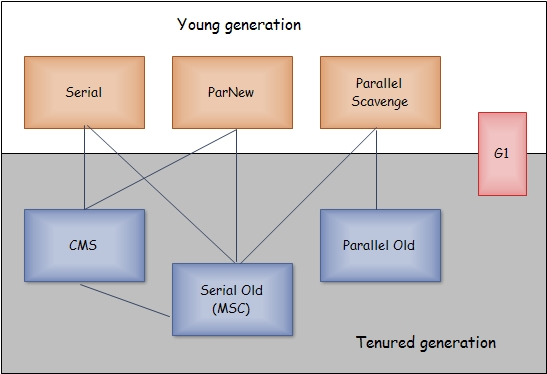

---

--
内存泄漏OOM，通常做法：
方法1. 首先配置JVM启动参数，让JVM在遇到OutOfMemoryError时自动生成Dump文件-
XX:+HeapDumpOnOutOfMemoryError -XX:HeapDumpPath=/path
方法2. 使用上面第3步进行进行分析；
方法3. 使用eclipse的MAT分析工具对dump文件进行分析
1. 发现问题
使用uptime命令查看CPU的Load情况，Load越高说明问题越严重；
使用jstat查看FGC发生的频率及FGC所花费的时间，FGC发生的频率越快、花费的时间越高，问题
越严重；
1. 使用jmap -head 观察老年代大小，当快达到配置的阀值CMSInitiatingOccupancyFraction时，将
对象导出进行分析；
2. 对head中对象进行命令行排序分析：./jmap -J-d64 -histo pid | grep java | sort -k 3 -n -r | more
按照bytes大小进行排序；数量最多排序将-k 3换成-k 2即可
图形化工具jvisualvm.exe
 
一般结合JMX分析，分析远程tomcat状态
tomcat配置
修改远程tomcat的catalina.sh配置文件，在其中增加(不走权限校验。只是打开jmx端口)：
JAVA_OPTS="$JAVA_OPTS -Djava.rmi.server.hostname=192.168.122.128 -
Dcom.sun.management.jmxremote.port=18999 -
Dcom.sun.management.jmxremote.ssl=false
-Dcom.sun.management.jmxremote.authenticate=false"
--
如果连接的是公网上的Tomcat，那么就要注意安全性了，接下来看看使用用户名和密码连接
JAVA_OPTS='-Xms128m -Xmx256m -XX:MaxPermSize=128m -
Djava.rmi.server.hostname=10.10.23.10
-Dcom.sun.management.jmxremote.port=9999
-Dcom.sun.management.jmxremote.ssl=false
-Dcom.sun.management.jmxremote.authenticate=true
-Dcom.sun.management.jmxremote.password.file=/path/to/passwd/jmxremote.password
-Dcom.sun.management.jmxremote.access.file=/path/to/passwd/jmxremote.access'
以下分别编辑jmxremote.password与jmxremote.access两个文件
jmxremote.password
monitorRole 123456
controlRole 123456789
jmxremote.access
monitorRole readonly
controlRole readwrite
完成这两个文件后修改jmxremote.password的权限chmod 600 jmxremote.password
工具使用
配置后重启tomcat，然后从本机上使用jvisualvm.exe，按照配置输入远程地址、用户名密码，即
可进行监控，包括CPU、Head、Thread、Objects等分析

---

优化策略使用
 
本质上是减少Full GC的次数(Minor GC很快基本不会有影响)
第一个问题既是目前年轻代、年老代分别使用什么收集器；
针对不同的收集器，进行优化：串行改并行、针对目前的Head对象情况，根据实际场景设置
SurvivorRatio与NewRatio；
根据对象回收情况，判断是否需要压缩，减小碎片化。
如果是频繁创建对象的应用，可以适当增加新生代大小。常量较多可以增加持久代大小。对于单例
较多的对象可以增加老生代大小。比如spring应用中。
GC选择，在JDK5.0以后，JVM会根据当前系统配置进行判断。一般执行-Server命令便可以。gc包括三种
策略：串行，并行，并发(使用CMS收集器老年代)。
吞吐量大的应用，一般采用并行收集，开启多个线程，加快gc的速率。
响应速度高的应用，一般采用并发收集，比如应用服务器。
年老代建议配置为并发收集器，由于并发收集器不会压缩和整理磁盘碎片，因此建议配置：
-XX:+UseConcMarkSweepGC #并发收集年老代
-XX:CMSInitiatingOccupancyFraction=80 # 表示年老代空间到80%时就开始执行CMS
-XX:+UseCMSInitiatingOccupancyOnly #是阀值生效
-XX:+UseCMSCompactAtFullCollection#打开对年老代的压缩。可能会影响性能，但是可以消除
内存碎片。
-XX:CMSFullGCsBeforeCompaction=10 # 由于并发收集器不对内存空间进行压缩、整理，所以运
行一段时间以后会产生“碎片”，使得运行效率降低。此参数设置运行次FullGC以后对内存空间进行
压缩、整理。
 
 
什么情况下触发垃圾回收？
 
Java JVM 8：垃圾回收（GC 在什么时候，对什么东西，做了什么事
情）
 
 
在什么时候
首先需要知道，GC又分为 minor GC 和 Full GC (也称为 Major GC )。Java 堆内存分为新生代和老年
代，新生代中又分为1个 Eden 区域 和两个 Survivor 区域。
那么对于 Minor GC 的触发条件：大多数情况下，直接在 Eden 区中进行分配。如果 Eden区域没有足够
的空间，那么就会发起一次 Minor GC；对于 Full GC（Major GC）的触发条件：也是如果老年代没有足
够空间的话，那么就会进行一次 Full GC。
Ps：上面所说的只是一般情况下，实际上，需要考虑一个空间分配担保的问题：
在发生Minor GC之前，虚拟机会先检查老年代最大可用的连续空间是否大于新生代所有对象的总空间。
如果大于则进行Minor GC，如果小于则看HandlePromotionFailure设置是否允许担保失败（不允许则
直接Full GC）。如果允许，那么会继续检查老年代最大可用的连续空间是否大于历次晋升到老年代对象
的平均大小，如果大于则尝试Minor GC（如果尝试失败也会触发Full GC），如果小于则进行Full GC。
但是，具体到什么时刻执行，这个是由系统来进行决定，是无法预测的。
对什么东西

---

主要根据可达性分析算法，如果一个对象不可达，那么就是可以回收的；如果一个对象可达，那么这个
对象就不可以回收。对于可达性分析算法，它是通过一系列称为“GC Roots” 的对象作为起始点，当一个
对象到 GC Roots 没有任何引用链相接的时候，那么这个对象就是不可达，就可以被回收。如下图:
这个GC Root 对象可以是一些静态的对象，Java方法的local变量或参数， native 方法引用的对象，活着
的线程。
做了什么事情
主要做了清理对象，整理内存的工作。Java堆分为新生代和老年代，采用了不同的回收方式。例如新生
代采用了复制算法，老年代采用了标记整理法。在新生代中，分为一个Eden 区域和两个Survivor区域，
真正使用的是一个Eden区域和一个Survivor区域，GC的时候，会把存活的对象放入到另外一个Survivor
区域中，然后再把这个Eden区域和Survivor区域清除。那么对于老年代，采用的是标记整理法，首先标
记出存活的对象，然后再移动到一端。这样也有利于减少内存碎片。
 
 
如何选择合适的垃圾收集算法？
 
JVM给了三种选择：串行收集器、并行收集器、并发收集器 ，但是串行收集器只适用于小数据量的情
况，所以这里的选择主要针对并行收集器和并发收集器。默认情况下，JDK5.0以前都是使用串行收集
器，如果想使用其他收集器需要在启动时加入相应参数。JDK5.0以后，JVM会根据当前系统配置 进行判
断。
吞吐量优先的并行收集器
如上文所述，并行收集器主要以到达一定的吞吐量为目标，适用于科学技术和后台处理等。
典型配置 ：

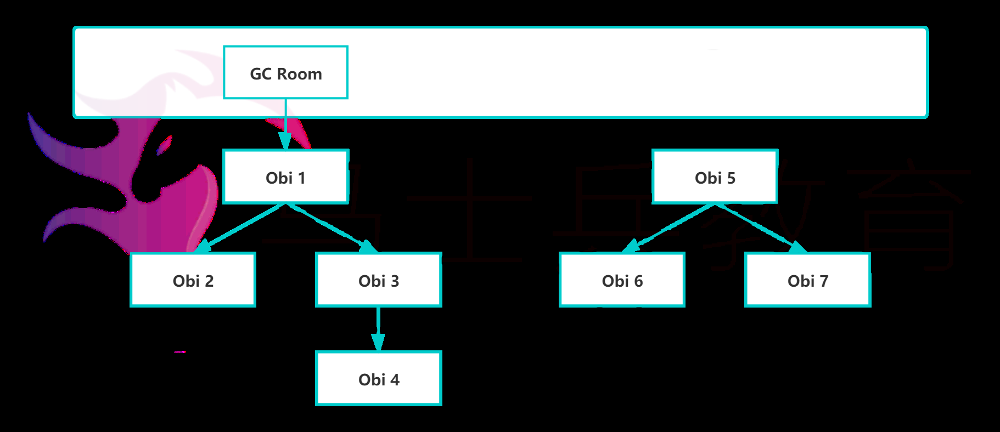

---

响应时间优先的并发收集器
如上文所述，并发收集器主要是保证系统的响应时间，减少垃圾收集时的停顿时间。适用于应用服务
器、电信领域等。
典型配置 ：
 
 
深入理解垃圾收集器和收集器的选择策略
 
 
前言：新生代的收集器有：Serial,ParNew,Parallel Scavenge等。老年代有：CMS,SerialOld,Paraller 
Old等。接下来将深入理解各个垃圾收集器的原理，以及它们如何在不同场景下进行搭配使用。
同时，先解释几个名次：
1，并行（Parallel）：多个垃圾收集线程并行工作，此时用户线程处于等待状态
2，并发（Concurrent）：用户线程和垃圾收集线程同时执行
3，吞吐量：运行用户代码时间／（运行用户代码时间＋垃圾回收时间）
(一) 新生代的收集器们
(1) ParNew
这是Serial收集器的多线程版本，使用多线程对垃圾收集，采用复制算法，同时需要暂时所有用户线程。
除了使用多线程其他与Serial收集器相比并没有什么创新。但是为什么还要学习它，那是因为除了Serial
java -Xmx3800m -Xms3800m -Xmn2g -Xss128k -XX:+UseParallelGC -
XX:ParallelGCThreads=20
-XX:+UseParallelGC ：选择垃圾收集器为并行收集器。 此配置仅对年轻代有效。即上述配置下，年轻代
使用并发收集，而年老代仍旧使用串行收集。
-XX:ParallelGCThreads=20 ：配置并行收集器的线程数，即：同时多少个线程一起进行垃圾回收。此值
最好配置与处理器数目相等。
java -Xmx3550m -Xms3550m -Xmn2g -Xss128k -XX:+UseParallelGC -
XX:ParallelGCThreads=20 -XX:+UseParallelOldGC
-XX:+UseParallelOldGC ：配置年老代垃圾收集方式为并行收集。JDK6.0支持对年老代并行收集。
java -Xmx3550m -Xms3550m -Xmn2g -Xss128k -XX:+UseParallelGC -
XX:MaxGCPauseMillis=100
-XX:MaxGCPauseMillis=100 : 设置每次年轻代垃圾回收的最长时间，如果无法满足此时间，JVM会自动
调整年轻代大小，以满足此值。
java -Xmx3550m -Xms3550m -Xmn2g -Xss128k -XX:+UseParallelGC -
XX:MaxGCPauseMillis=100 -XX:+UseAdaptiveSizePolicy
-XX:+UseAdaptiveSizePolicy ：设置此选项后，并行收集器会自动选择年轻代区大小和相应的
Survivor区比例，以达到目标系统规定的最低相应时间或者收集频率等，此值建议使用并行收集器时，一直
打开。
java -Xmx3550m -Xms3550m -Xmn2g -Xss128k -XX:ParallelGCThreads=20 -
XX:+UseConcMarkSweepGC -XX:+UseParNewGC
-XX:+UseConcMarkSweepGC ：设置年老代为并发收集。测试中配置这个以后，-XX:NewRatio=4的配置
失效了，原因不明。所以，此时年轻代大小最好用-Xmn设置。
-XX:+UseParNewGC :设置年轻代为并行收集。可与CMS收集同时使用。JDK5.0以上，JVM会根据系统配置
自行设置，所以无需再设置此值。
java -Xmx3550m -Xms3550m -Xmn2g -Xss128k -XX:+UseConcMarkSweepGC -
XX:CMSFullGCsBeforeCompaction=5 -XX:+UseCMSCompactAtFullCollection
-XX:CMSFullGCsBeforeCompaction ：由于并发收集器不对内存空间进行压缩、整理，所以运行一段时间
以后会产生“碎片”，使得运行效率降低。此值设置运行多少次GC以后对内存空间进行压缩、整理。
-XX:+UseCMSCompactAtFullCollection ：打开对年老代的压缩。可能会影响性能，但是可以消除碎片

---

收集器，目前只有它能与CMS收集器配合工作。因此我们在Server中虚拟机首选项的新生代收集器还是
它。可以使用的控制参数有：-XX:SurvivorRatio,-XX:PretenureSizeThreshold,-
XX:HandlerPromotionFailure等（详情见官方手册）。
(2) Parallel Scavenge收集器
使用复制算法，同时也是并行收集器，相比ParNew，它更关注于达到一个可控制的吞吐量。高吞吐量
可以高效率地利用CPU时间，尽快完成计算任务。所以这个收集器适合在后台运算而不需要很多交互的
任务。接下来看看两个用于准备控制吞吐量的参数
1，-XX:MaxGCPauseMills（控制最大垃圾收集的时间）
设置一个大于0的毫秒数，收集器尽可能地保证内存回收不超过设定值。但是并不是设置地越小就越快。
GC停顿时间缩短是以缩短吞吐量和新生代空间来换取的。
2，-XX:GCTimeRatio（设置吞吐量大小）
设置一个0－100的整数，也就是垃圾收集时间占总时间的比率，相当于吞吐量的倒数。
(二) 老年队的收集器们
(1) Serial Old
是Serial收集器的老年队版本，也是一个单线程收集器，使用标记－整理算法。这个收集器主要在于给
Client模式下的虚拟机使用。如果在Server中，主要用途是：1，在JDK1.5前和Parallel Scavenge搭配使
用。2，作为Concurrent Mode Failure时候使用。
(2)Parallel Old
这是Paraller Scanvenge收集器的老年队收集器，使用标记－整理方式。在这个方式没有产生之前，
Parallel Scavenge只能选择Serial Old。由于被拖了后腿，那么Parallel Scavenge并不能在整体上获取
吞吐量最大化的效果。甚至比不上CMS+ParNew的吞吐量。
(3)CMS收集器
这是一个以获取最短回收停顿时间为目标的并发收集器。对于重视服务响应时间，希望系统停顿时间尽
可能短的，那么CMS就非常符合了。CMS收集器采用标记－清除实现。包括了四个步骤
1，初始标记：简单标记下GC Roots能直接关联到的对象，需要“Stop The World“
2，并发标记：进行GC Roots Tracing
3，重新标记：修正并发标记期间用户程序继续运行而导致标记发生变动那一部分对 象标记记录，需要
“Stop The World“
4，并发清除
缺点：
1，无法处理浮动垃圾。由于并发清理阶段用户线程还在运行，程序自然会有新的垃圾产生，那么CMS
将无法在这次收集中处理掉它们。只能等待下次GC再清理。由于垃圾回收阶段用户线程还需要运行。那
么就需要预留足够的内存空间给用户线程使用，所以CMS不能等待老年队几乎完全快满了再进行收集。
需要预留一部分空间提供并发收集时候的程序使用。如果运行期间预留的内存无法满足程序需要，那么
就会出现“Concurrent Mode Failure“，这时候就启用Serial Old收集器进行老年代的收集。
2，对CPU资源敏感。在并发阶段虽然不会导致用户线程停顿，但是会因为占用一部分线程（或者说CPU
资源）而导致应用程序变慢，吞吐量降低，默认是启动（CPU数量＋3）／4的线程数。
3，会产生大量的空间碎片。CMS是基于标记－清除算法实现的，那么收集结束时候会有大量空间碎片
产生。这个时候就会给大对象分配带来麻烦，因为无法找到足够大的连续空间来分配当前对象，不得不
提前触发一次Full GC。那么我们可以使用:-XX:+UseCMSCompactAtFullCollection,在CMS收集器顶不住
要进行FullGC时候开启内存碎片的合并整理过程，但是会加长停顿时间。还有一个参数 -
XX:CMSFullGCsBeforeCompaction,表示用于设置执行多少次不压缩的Full GC后，跟着来一次带压缩
的。
(三) 垃圾收集器选择的策略
(1) 吞吐量优先的并行收集器
参数配置：
1, -Xmx4g -Xms4g -Xmn2g -Xss200k -XX:+UseParallelGC -XX:ParallelGCThreads=8
说明：选择Parallel Scavenge收集器，然后配置多少个线程进行回收，最好与处理器数目相等。

---

2，-Xmx4g -Xms4g -Xmn2g -Xss200k -XX:+UseParallelGC -XX:ParallelGCThreads=8 -
XX:+UseParallelOldGC
说明：配置老年代使用Parallel Old
3，-Xmx4g -Xms4g -Xmn2g -Xss200k -XX:+UseParallelGC -XX:MaxGCPauseMills=100
说明：设置每次年轻代垃圾回收的最长时间。如何不能满足，那么就会调整年轻代大小，满足这个设置
4，-Xmx4g -Xms4g -Xmn2g -Xss200k -XX:+UseParallelGC -XX:MaxGCPauseMills=100 -
XX:+UseAdaptiveSizePolicy
说明：并行收集器会自动选择年轻代区大小和Survivor区的比例。
(2)响应时间优先的并发收集器
1， -Xmx4g -Xms4g -Xmn2g -Xss200k -XX:+UseConcMarkSweepGC -XX:+UseParNewGC
说明：设置老年代的收集器是CMS，年轻代是ParNew
2，-Xmx4g -Xms4g -Xmn2g -Xss200k -XX:+UseConcMarkSweepGC -
XX:CMSFullGCsBeforeCompaction=5 -XX:+UseCMSCompactAtFullCollection
说明：首先设置运行多少次GC后对内存空间进行压缩，整理。同时打开对年老代的压缩（会影响性能）
 
 
StringTable
 
探索StringTable提升YGC性能
 
 
很久很久以前看过笨神的一篇文章JVM源码分析之String.intern()导致的YGC不断变长，其原因是YGC过
程需要对StringTable做扫描，而String.intern()就是在StringTable中保存这个对象的引用，如果
String.intern()添加越来越多不同的对象，那么StringTable就越大，扫描StringTable的时间就越长，从
而导致YGC耗时越长；那么如何确定YGC耗时越来越长是StringTable变大引起的呢？
介绍一个参数-XX:+PrintStringTableStatistics ，看名字就知道这个参数的作用了：打印出
StringTable的统计信息；再详细一点描述：在JVM进程退出时，打印出StringTable的统计信息到标准日志
输出目录中。
JDK版本要求：JDK 7u6 +
验证问题
 
验证代码如下：
 
import java.util.UUID;
/**
 * @author afei
 * @version 1.0.0
 * @since 2017年08月16日
 */
public class StringInternTest {
    public static void main(String[] args) throws Exception {
        for (int i=0; i<Integer.MAX_VALUE; i++){
            UUID.randomUUID().toString().intern();
            if (i>=100000 && i%100000==0){

---

执行命令如下：
 
从gc日志可以看出YGC时间越来越长：
 
String.intern() 250w个String对象：
 
执行命令：
java -verbose:gc -XX:+PrintGC -XX:+UseConcMarkSweepGC -XX:+UseParNewGC  -
XX:CMSInitiatingOccupancyFraction=75 -XX:+UseCMSInitiatingOccupancyOnly -
XX:+PrintStringTableStatistics -Xmx1g -Xms1g -Xmn64m  StringInternTest
当i=2500000，即往StringTable添加了250w个引用时，kill调这个进程，能够看到
PrintStringTableStatistics 这个参数作用下输出的StringTable相关信息（输出信息中还有
SymbolTable ，这篇文章不做讨论）：
 
                System.out.println("i="+i);
            }
        }
    }
}
java -verbose:gc -XX:+PrintGC -XX:+UseConcMarkSweepGC -XX:+UseParNewGC  -
XX:CMSInitiatingOccupancyFraction=75 -XX:+UseCMSInitiatingOccupancyOnly -
XX:+PrintStringTableStatistics -Xmx1g -Xms1g -Xmn64m StringInternTest
[GC (Allocation Failure)  52480K->5691K(1042048K), 0.0109821 secs]
i=100000
[GC (Allocation Failure)  65261K->19731K(1042048K), 0.0233471 secs]
i=200000
[GC (Allocation Failure)  72211K->26796K(1042048K), 0.0266068 secs]
i=300000
[GC (Allocation Failure)  79276K->33860K(1042048K), 0.0262006 secs]
[GC (Allocation Failure)  86340K->40924K(1042048K), 0.0295842 secs]
... ...
[GC (Allocation Failure)  192868K->147456K(1042048K), 0.0661785 secs]
i=1400000
[GC (Allocation Failure)  199936K->154521K(1042048K), 0.0685919 secs]
[GC (Allocation Failure)  207001K->161585K(1042048K), 0.0707886 secs]
i=1500000
[GC (Allocation Failure)  214065K->168649K(1042048K), 0.0744149 secs]
[GC (Allocation Failure)  221129K->175714K(1042048K), 0.0766862 secs]
i=1600000
[GC (Allocation Failure)  228194K->182778K(1042048K), 0.0802783 secs]

---

且这时候的YGC时间达到了0.12s：
 i=2500000
 [GC (Allocation Failure)  320041K->274625K(1042048K), 0.1268211 secs]
 [GC (Allocation Failure)  327105K->281693K(1042048K), 0.1236515 secs]
String.intern() 500w个String对象：
 
执行命令：
java -verbose:gc -XX:+PrintGC -XX:+UseConcMarkSweepGC -XX:+UseParNewGC  -
XX:CMSInitiatingOccupancyFraction=75 -XX:+UseCMSInitiatingOccupancyOnly -
XX:+PrintStringTableStatistics -Xmx1g -Xms1g -Xmn64m  StringInternTest
当i=5000000，即往StringTable添加了500w个引用时，kill调这个进程，输出结果如下：
 
YGC时间达到了0.24s：
 i=5000000
 [GC (Allocation Failure)  595600K->550184K(1042048K), 0.2425553 secs]
PrintStringTableStatistics结果解读：
 
从PrintStringTableStatistics输出信息可以看出StringTable的bucket数量默认为60013 ，且每个bucket
占用8个字节（说明：如果是32位系统，那么每个bucket占用4个字节）；Number of entries即
Hashtable的entry数量为2568786，因为我们String.intern( )了250w个不同的String对象；Average 
bucket size表示表示bucket中LinkedList的平均size，Maximum bucket size 表示bucket中
LinkedList最大的size，Average bucket size越大，说明Hashtable碰撞越严重，由于bucket数量固定为
60013，随着StringTable添加的引用越来越多，碰撞越来越严重，YGC时间越来越长。
String.intern() 250w个String对象&-XX:StringTableSize=2500000：
 
执行命令：
java -verbose:gc -XX:+PrintGC -XX:+UseConcMarkSweepGC -XX:+UseParNewGC  -
XX:CMSInitiatingOccupancyFraction=75 -XX:+UseCMSInitiatingOccupancyOnly -
XX:+PrintStringTableStatistics -Xmx1g -Xms1g -Xmn64m -XX:StringTableSize=2500000 
StringInternTest
StringTable statistics:
Number of buckets       :     60013 =    480104 bytes, avg   8.000
Number of entries       :   2568786 =  61650864 bytes, avg  24.000
Number of literals      :   2568786 = 287662080 bytes, avg 111.984
Total footprint         :           = 349793048 bytes
Average bucket size     :    42.804
Variance of bucket size :    43.104
Std. dev. of bucket size:     6.565
Maximum bucket size     :        82
StringTable statistics:
Number of buckets       :     60013 =    480104 bytes, avg   8.000
Number of entries       :   5082093 = 121970232 bytes, avg  24.000
Number of literals      :   5082093 = 569152512 bytes, avg 111.992
Total footprint         :           = 691602848 bytes
Average bucket size     :    84.683
Variance of bucket size :    85.084
Std. dev. of bucket size:     9.224
Maximum bucket size     :       123

---

当i=2500000，kill调这个进程，输出结果如下：
 
YGC时间从0.12s下降到了0.09s：
 i=2500000
 [GC (Allocation Failure)  320216K->274800K(1042048K), 0.0890073 secs]
 [GC (Allocation Failure)  327280K->281865K(1042048K), 0.0926348 secs]
String.intern() 500w个String对象&-XX:StringTableSize=5000000：
 
执行命令：
java -verbose:gc -XX:+PrintGC -XX:+UseConcMarkSweepGC -XX:+UseParNewGC  -
XX:CMSInitiatingOccupancyFraction=75 -XX:+UseCMSInitiatingOccupancyOnly -
XX:+PrintStringTableStatistics -Xmx1g -Xms1g -Xmn64m -XX:StringTableSize=5000000 
StringInternTest
当i=5000000，即往StringTable添加了500w个引用时，kill调这个进程，输出结果如下：
 
YGC时间从0.24s降到了0.17s：
 i=5000000
 [GC (Allocation Failure)  595645K->550229K(1042048K), 0.1685862 secs]
 [GC (Allocation Failure)  602709K->557293K(1042048K), 0.1706642 secs]
PrintStringTableStatistics&StringTableSize结果解读：
 
设置StringTableSize一个合适的值，即bucket数量为期望的数量后，碰撞的概率明显降低，由Average 
bucket size和Maximum bucket size的值明显小于未配置StringTableSize参数时的值可知，且YGC时
间也明显降低。另外, 最好通过BTrace分析是哪里频繁调用String.intern(), 确实String.intern()没有滥用
的前提下, 再增大StringTableSize的值。
StringTable statistics:
Number of buckets       :   2500000 =  20000000 bytes, avg   8.000
Number of entries       :   2573556 =  61765344 bytes, avg  24.000
Number of literals      :   2573556 = 288196288 bytes, avg 111.984
Total footprint         :           = 369961632 bytes
Average bucket size     :     1.029
Variance of bucket size :     1.028
Std. dev. of bucket size:     1.014
Maximum bucket size     :        10
StringTable statistics:
Number of buckets       :   5000000 =  40000000 bytes, avg   8.000
Number of entries       :   5151776 = 123642624 bytes, avg  24.000
Number of literals      :   5151776 = 576957008 bytes, avg 111.992
Total footprint         :           = 740599632 bytes
Average bucket size     :     1.030
Variance of bucket size :     1.030
Std. dev. of bucket size:     1.015
Maximum bucket size     :         9

---

引申问题
 
既然StringTable是Hashtable数据结构，那为什么不能自己通过rehash扩大bucket数量来提高性能呢？
JVM中StringTable的rehash有点不一样, JVM中StringTable的rehash不会扩大bucket数量，而是在
bucket不变的前提下，通过一个新的seed尝试摊平每个bucket中LinkedList的长度（想想也是，如果
StringTable能通过rehash扩大bucket数量，那还要StringTableSize干嘛），rehash大概是一个如下
图所示的过程，rehash前后bucket数量不变，这是重点：
 假设reash前数据分布（23,4,8,2,1,5）：
StringTable rehash前.png
 reash后可能数据分布（6,8,8,9,5,7）：
StringTable rehash后.png
 
对应的源码在hashtable.cpp中--第一行代码就是初始化一个新的_seed 用于后面的hash值计算：

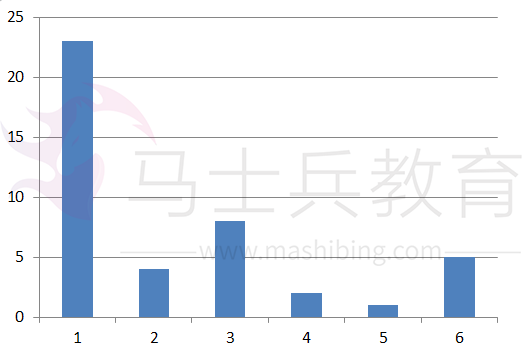

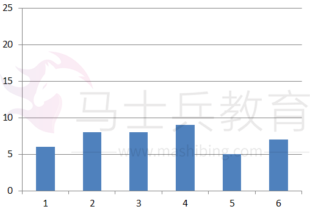

---

结论
 
YGC耗时的问题确实比较难排查，遍历StringTable只是其中一部分，通过PrintStringTableStatistics参
数可以了解我们应用的StringTable相关统计信息，且可以通过设置合理的StringTableSize值降低碰撞从
而减少YGC时间。另一方面，增大StringTableSize的值有什么影响呢？需要多消耗一点内存，因为每一
个bucket需要8个byte（64位系统）。与它带来的YGC性能提升相比，这点内存消耗还是非常值得的。
// Create a new table and using alternate hash code, populate the new table
// with the existing elements.   This can be used to change the hash code
// and could in the future change the size of the table.
template <class T, MEMFLAGS F> void Hashtable<T, F>::move_to(Hashtable<T, F>* 
new_table) {
  // Initialize the global seed for hashing.
  _seed = AltHashing::compute_seed();
  assert(seed() != 0, "shouldn't be zero");
  int saved_entry_count = this->number_of_entries();
  // Iterate through the table and create a new entry for the new table
  for (int i = 0; i < new_table->table_size(); ++i) {
    for (HashtableEntry<T, F>* p = bucket(i); p != NULL; ) {
      HashtableEntry<T, F>* next = p->next();
      T string = p->literal();
      // Use alternate hashing algorithm on the symbol in the first table
      unsigned int hashValue = string->new_hash(seed());
      // Get a new index relative to the new table (can also change size)
      int index = new_table->hash_to_index(hashValue);
      p->set_hash(hashValue);
      // Keep the shared bit in the Hashtable entry to indicate that this entry
      // can't be deleted.   The shared bit is the LSB in the _next field so
      // walking the hashtable past these entries requires
      // BasicHashtableEntry::make_ptr() call.
      bool keep_shared = p->is_shared();
      this->unlink_entry(p);
      new_table->add_entry(index, p);
      if (keep_shared) {
        p->set_shared();
      }
      p = next;
    }
  }
  // give the new table the free list as well
  new_table->copy_freelist(this);
  assert(new_table->number_of_entries() == saved_entry_count, "lost entry on 
dictionary copy?");
  // Destroy memory used by the buckets in the hashtable.  The memory
  // for the elements has been used in a new table and is not
  // destroyed.  The memory reuse will benefit resizing the SystemDictionary
  // to avoid a memory allocation spike at safepoint.
  BasicHashtable<F>::free_buckets();
}

---

然而StringTable的统计信息需要在JVM退出时才输出，不得不说是一个遗憾
 
 
JVM源码分析之String.intern()导致的YGC不断变长
 
 
概述
 
之所以想写这篇文章，是因为YGC过程对我们来说太过于黑盒，如果对YGC过程不是很熟悉，这类问题
基本很难定位，我们就算开了GC日志，也最多能看到类似下面的日志
只知道耗了多长时间，但是具体耗在了哪个阶段，是基本看不出来的，所以要么就是靠经验来定位，要
么就是对代码相当熟悉，脑袋里过一遍整个过程，看哪个阶段最可能，今天要讲的这个大家可以当做今
后排查这类问题的一个经验来使，这个当然不是唯一导致YGC过长的一个原因，但却是最近我帮忙定位
碰到的发生相对来说比较多的一个场景
具体的定位是通过在JVM代码里进行了日志埋点确定的，这个问题其实最早的时候，是帮助毕玄毕大师
定位到这块的问题，他也在公众号里对这个问题写了相关的一篇文章YGC越来越慢，为什么，大家可以
关注下毕大师的公众号HelloJava ，经常会发一些在公司碰到的诡异问题的排查，相信会让你涨姿势的
Demo
 
先上一个demo，来描述下问题的情况，代码很简单，就是不断创建UUID，其实就是一个字符串，并将
这个字符串调用下intern方法
我们使用的JVM参数如下：
这里特意将新生代设置比较小，老生代设置比较大，让代码在执行过程中更容易突出问题来，大量做
ygc，期间不做CMS GC，于是我们得到的输出结果类似下面的
                   [GC (Allocation Failure) [ParNew: 91807K->10240K(92160K), 
0.0538384 secs] 91807K->21262K(2086912K), 0.0538680 secs] [Times: user=0.16 
sys=0.06, real=0.06 secs]  
import java.util.UUID; 
public class StringTableTest { 
    public static void main(String args[]) {   
        for (int i = 0; i < 10000000; i++) {    
            uuid();   
        }
    } 
    public static void uuid() {    
        UUID.randomUUID().toString().intern();
    } 
}
-XX:+UseConcMarkSweepGC -XX:+PrintGCDetails -Xmx2G -Xms2G -Xmn100M
[GC (Allocation Failure) [ParNew: 81920K->9887K(92160K), 0.0096027 secs] 81920K-
>9887K(2086912K), 0.0096428 secs] [Times: user=0.06 sys=0.01, real=0.01 secs]

---

[GC (Allocation Failure) [ParNew: 91807K->10240K(92160K), 0.0538384 secs] 91807K-
>21262K(2086912K), 0.0538680 secs] [Times: user=0.16 sys=0.06, real=0.06 secs]   
       
[GC (Allocation Failure) [ParNew: 92160K->10240K(92160K), 0.0190535 secs] 
103182K->32655K(2086912K), 0.0190965 secs] [Times: user=0.12 sys=0.01, real=0.02 
secs]            
[GC (Allocation Failure) [ParNew: 92160K->10240K(92160K), 0.0198259 secs] 
114575K->44124K(2086912K), 0.0198558 secs] [Times: user=0.13 sys=0.01, real=0.02 
secs]  
[GC (Allocation Failure) [ParNew: 92160K->10240K(92160K), 0.0213643 secs] 
126044K->55592K(2086912K), 0.0213930 secs] [Times: user=0.14 sys=0.01, real=0.02 
secs]                
[GC (Allocation Failure) [ParNew: 92160K->10240K(92160K), 0.0234291 secs] 
137512K->67061K(2086912K), 0.0234625 secs] [Times: user=0.16 sys=0.01, real=0.03 
secs]                 
[GC (Allocation Failure) [ParNew: 92160K->10238K(92160K), 0.0243691 secs] 
148981K->78548K(2086912K), 0.0244041 secs] [Times: user=0.15 sys=0.01, real=0.03 
secs]                
[GC (Allocation Failure) [ParNew: 92158K->10240K(92160K), 0.0235310 secs] 
160468K->89998K(2086912K), 0.0235587 secs] [Times: user=0.17 sys=0.01, real=0.02 
secs]               
[GC (Allocation Failure) [ParNew: 92160K->10240K(92160K), 0.0255960 secs] 
171918K->101466K(2086912K), 0.0256264 secs] [Times: user=0.18 sys=0.01, real=0.03 
secs]               
[GC (Allocation Failure) [ParNew: 92160K->10238K(92160K), 0.0287876 secs] 
183386K->113770K(2086912K), 0.0288188 secs] [Times: user=0.20 sys=0.01, real=0.03 
secs]               
[GC (Allocation Failure) [ParNew: 92158K->10238K(92160K), 0.0298405 secs] 
195690K->125267K(2086912K), 0.0
298823 secs] [Times: user=0.20 sys=0.01, real=0.03 secs]                  [GC 
(Allocation Failure) [ParNew: 92158K->10240K(92160K), 0.0310182 secs] 207187K-
>136742K(2086912K), 0.0311156 secs] [Times: user=0.22 sys=0.01, real=0.03 secs]   
             
[GC (Allocation Failure) [ParNew: 92160K->10239K(92160K), 0.0321647 secs] 
218662K->148210K(2086912K), 0.0321938 secs] [Times: user=0.22 sys=0.01, real=0.03 
secs]                  
[GC (Allocation Failure) [ParNew: 92159K->10238K(92160K), 0.0338090 secs] 
230130K->159686K(2086912K), 0.0338446 secs] [Times: user=0.24 sys=0.01, real=0.03 
secs]                   
[GC (Allocation Failure) [ParNew: 92158K->10238K(92160K), 0.0326612 secs] 
241606K->171159K(2086912K), 0.0326912 secs] [Times: user=0.23 sys=0.01, real=0.03 
secs]                   
[GC (Allocation Failure) [ParNew: 92158K->10238K(92160K), 0.0350578 secs] 
253079K->182627K(2086912K), 0.0351077 secs] [Times: user=0.26 sys=0.01, real=0.04 
secs]               
[GC (Allocation Failure) [ParNew: 92158K->10240K(92160K), 0.0346946 secs] 
264547K->194096K(2086912K), 0.0347274 secs] [Times: user=0.25 sys=0.01, real=0.04 
secs]                 
[GC (Allocation Failure) [ParNew: 92160K->10239K(92160K), 0.0384091 secs] 
276016K->205567K(2086912K), 0.0384401 secs] [Times: user=0.27 sys=0.01, real=0.04 
secs]             
[GC (Allocation Failure) [ParNew: 92159K->10238K(92160K), 0.0394017 secs] 
287487K->217035K(2086912K), 0.0394312 secs] [Times: user=0.29 sys=0.01, real=0.04 
secs]                   
[GC (Allocation Failure) [ParNew: 92158K->10238K(92160K), 0.0411447 secs] 
298955K->228504K(2086912K), 0.0411748 secs] [Times: user=0.30 sys=0.01, real=0.04 
secs]

---

[GC (Allocation Failure) [ParNew: 92158K->10238K(92160K), 0.0393449 secs] 
310424K->239972K(2086912K), 0.0393743 secs] [Times: user=0.29 sys=0.01, real=0.04 
secs]               
[GC (Allocation Failure) [ParNew: 92158K->10240K(92160K), 0.0444541 secs] 
321892K->251441K(2086912K), 0.0444887 secs] [Times: user=0.32 sys=0.01, real=0.05 
secs]               
[GC (Allocation Failure) [ParNew: 92160K->10239K(92160K), 0.0449196 secs] 
333361K->262910K(2086912K), 0.0449557 secs] [Times: user=0.33 sys=0.01, real=0.05 
secs]               
[GC (Allocation Failure) [ParNew: 92159K->10238K(92160K), 0.0497517 secs] 
344830K->274382K(2086912K), 0.0497946 secs] [Times: user=0.34 sys=0.01, real=0.05 
secs]                
[GC (Allocation Failure) [ParNew: 92158K->10238K(92160K), 0.0475741 secs] 
356302K->285851K(2086912K), 0.0476130 secs] [Times: user=0.35 sys=0.01, real=0.04 
secs]             
[GC (Allocation Failure) [ParNew: 92158K->10238K(92160K), 0.0461098 secs] 
367771K->297320K(2086912K), 0.0461421 secs] [Times: user=0.34 sys=0.01, real=0.05 
secs]               
[GC (Allocation Failure) [ParNew: 92158K->10240K(92160K), 0.0508071 secs] 
379240K->308788K(2086912K), 0.0508428 secs] [Times: user=0.38 sys=0.01, real=0.05 
secs]              
[GC (Allocation Failure) [ParNew: 92160K->10239K(92160K), 0.0494472 secs] 
390708K->320257K(2086912K), 0.0494938 secs] [Times: user=0.36 sys=0.01, real=0.05 
secs]               
[GC (Allocation Failure) [ParNew: 92159K->10238K(92160K), 0.0531527 secs] 
402177K->331725K(2086912K), 0.0531845 secs] [Times: user=0.39 sys=0.01, real=0.05 
secs]             
[GC (Allocation Failure) [ParNew: 92158K->10238K(92160K), 0.0543701 secs] 
413645K->343194K(2086912K), 0.0544025 secs] [Times: user=0.41 sys=0.01, real=0.05 
secs]                
[GC (Allocation Failure) [ParNew: 92158K->10240K(92160K), 0.0528003 secs] 
425114K->354663K(2086912K), 0.0528283 secs] [Times: user=0.39 sys=0.01, real=0.06 
secs]                  
[GC (Allocation Failure) [ParNew: 92160K->10239K(92160K), 0.0565080 secs] 
436583K->366131K(2086912K), 0.0565394 secs] [Times: user=0.42 sys=0.01, real=0.06 
secs]               
[GC (Allocation Failure) [ParNew: 92159K->10238K(92160K), 0.0597181 secs] 
448051K->377600K(2086912K), 0.0597653 secs] [Times: user=0.44 sys=0.01, real=0.06 
secs]              
[GC (Allocation Failure) [ParNew: 92158K->10238K(92160K), 0.0606671 secs] 
459520K->389068K(2086912K), 0.0607423 secs] [Times: user=0.46 sys=0.01, real=0.06 
secs]                 
[GC (Allocation Failure) [ParNew: 92158K->10238K(92160K), 0.0590389 secs] 
470988K->400539K(2086912K), 0.0590679 secs] [Times: user=0.43 sys=0.01, real=0.05 
secs]                  
[GC (Allocation Failure) [ParNew: 92158K->10240K(92160K), 0.0600462 secs] 
482459K->412008K(2086912K), 0.0600757 secs] [Times: user=0.44 sys=0.01, real=0.06 
secs]                
[GC (Allocation Failure) [ParNew: 92160K->10239K(92160K), 0.0608772 secs] 
493928K->423476K(2086912K), 0.0609170 secs] [Times: user=0.45 sys=0.01, real=0.06 
secs]               
[GC (Allocation Failure) [ParNew: 92159K->10238K(92160K), 0.0622107 secs] 
505396K->434945K(2086912K), 0.0622391 secs] [Times: user=0.46 sys=0.00, real=0.06 
secs]                 
[GC (Allocation Failure) [ParNew: 92158K->10238K(92160K), 0.0626555 secs] 
516865K->446413K(2086912K), 0.0626872 secs] [Times: user=0.47 sys=0.01, real=0.07 
secs]

---

[GC (Allocation Failure) [ParNew: 92158K->10238K(92160K), 0.0647713 secs] 
528333K->457882K(2086912K), 0.0648013 secs] [Times: user=0.47 sys=0.00, real=0.07 
secs]                 
[GC (Allocation Failure) [ParNew: 92158K->10240K(92160K), 0.0747113 secs] 
539802K->469353K(2086912K), 0.0747446 secs] [Times: user=0.51 sys=0.01, real=0.07 
secs]                   
[GC (Allocation Failure) [ParNew: 92160K->10239K(92160K), 0.0727498 secs] 
551273K->480832K(2086912K), 0.0727899 secs] [Times: user=0.52 sys=0.01, real=0.07 
secs]                
[GC (Allocation Failure) [ParNew: 92159K->10238K(92160K), 0.0734084 secs] 
562752K->492300K(2086912K), 0.0734402 secs] [Times: user=0.54 sys=0.01, real=0.08 
secs]         
[GC (Allocation Failure) [ParNew: 92158K->10238K(92160K), 0.0766368 secs] 
574220K->503769K(2086912K), 0.0766673 secs] [Times: user=0.55 sys=0.01, real=0.07 
secs]                    
[GC (Allocation Failure) [ParNew: 92158K->10238K(92160K), 0.0778940 secs] 
585689K->515237K(2086912K), 0.0779250 secs] [Times: user=0.56 sys=0.01, real=0.08 
secs]                
[GC (Allocation Failure) [ParNew: 92158K->10240K(92160K), 0.0815513 secs] 
597157K->526712K(2086912K), 0.0815824 secs] [Times: user=0.57 sys=0.01, real=0.08 
secs]                 
[GC (Allocation Failure) [ParNew: 92160K->10239K(92160K), 0.0812080 secs] 
608632K->538181K(2086912K), 0.0812406 secs] [Times: user=0.58 sys=0.01, real=0.08 
secs]                
[GC (Allocation Failure) [ParNew: 92159K->10238K(92160K), 0.0818790 secs] 
620101K->549651K(2086912K), 0.0819155 secs] [Times: user=0.60 sys=0.01, real=0.08 
secs]                
[GC (Allocation Failure) [ParNew: 92158K->10238K(92160K), 0.0840677 secs] 
631571K->561122K(2086912K), 0.0841000 secs] [Times: user=0.61 sys=0.01, real=0.08 
secs]            
[GC (Allocation Failure) [ParNew: 92158K->10238K(92160K), 0.0842462 secs] 
643042K->572593K(2086912K), 0.0842785 secs] [Times: user=0.61 sys=0.01, real=0.08 
secs]             
[GC (Allocation Failure) [ParNew: 92158K->10240K(92160K), 0.0875011 secs] 
654513K->584076K(2086912K), 0.0875416 secs] [Times: user=0.62 sys=0.01, real=0.08 
secs]                   
[GC (Allocation Failure) [ParNew: 92160K->10240K(92160K), 0.0887645 secs] 
665996K->595532K(2086912K), 0.0887956 secs] [Times: user=0.64 sys=0.01, real=0.09 
secs]           
[GC (Allocation Failure) [ParNew: 92160K->10240K(92160K), 0.0921844 secs] 
677452K->607001K(2086912K), 0.0922153 secs] [Times: user=0.65 sys=0.01, real=0.09 
secs]           
[GC (Allocation Failure) [ParNew: 92160K->10238K(92160K), 0.0930053 secs] 
688921K->618471K(2086912K), 0.0930380 secs] [Times: user=0.67 sys=0.01, real=0.10 
secs]        
[GC (Allocation Failure) [ParNew: 92158K->10238K(92160K), 0.0955379 secs] 
700391K->629942K(2086912K), 0.0955873 secs] [Times: user=0.69 sys=0.01, real=0.10 
secs]             
[GC (Allocation Failure) [ParNew: 92158K->10238K(92160K), 0.0919127 secs] 
711862K->641411K(2086912K), 0.0919528 secs] [Times: user=0.68 sys=0.01, real=0.09 
secs]             
[GC (Allocation Failure) [ParNew: 92158K->10240K(92160K), 0.0942291 secs] 
723331K->652879K(2086912K), 0.0942611 secs] [Times: user=0.70 sys=0.00, real=0.09 
secs]             
[GC (Allocation Failure) [ParNew: 92160K->10239K(92160K), 0.0951904 secs] 
734799K->664348K(2086912K), 0.0952265 secs] [Times: user=0.71 sys=0.00, real=0.10 
secs]

---

有没有发现YGC不断发生，并且发生的时间不断在增长，从10ms慢慢增长到了100ms，甚至还会继续涨
下去
String.intern方法
 
从上面的demo我们能挖掘到的可能就是intern这个方法了，那我们先来了解下intern方法的实现，这是
String提供的一个方法，jvm提供这个方法的目的是希望对于某个同名字符串使用非常多的场景，在jvm
里只保留一份，比如我们不断new String(“a”)，其实在java heap里会有多个String的对象，并且值都是
a，如果我们只希望内存里只保留一个a，或者希望我接下来用到的地方都返回同一个a，那就可以用
String.intern这个方法了，用法如下
这样b和a都是指向内存里的同一个String对象，那JVM里到底怎么做到的呢？
我们看到intern这个方法其实是一个native方法，具体对应到JVM里的逻辑是
[GC (Allocation Failure) [ParNew: 92159K->10238K(92160K), 0.0963585 secs] 
746268K->675816K(2086912K), 0.0963909 secs] [Times: user=0.72 sys=0.01, real=0.10 
secs]             
[GC (Allocation Failure) [ParNew: 92158K->10238K(92160K), 0.0969504 secs] 
757736K->687285K(2086912K), 0.0969843 secs] [Times: user=0.72 sys=0.01, real=0.09 
secs]               
[GC (Allocation Failure) [ParNew: 92158K->10238K(92160K), 0.0999066 secs] 
769205K->698753K(2086912K), 0.0999376 secs] [Times: user=0.75 sys=0.01, real=0.10 
secs]                 
[GC (Allocation Failure) [ParNew: 92158K->10240K(92160K), 0.0998371 secs] 
780673K->710222K(2086912K), 0.0998835 secs] [Times: user=0.75 sys=0.00, real=0.10 
secs]                   
[GC (Allocation Failure) [ParNew: 92160K->10239K(92160K), 0.1024616 secs] 
792142K->721691K(2086912K), 0.1024927 secs] [Times: user=0.77 sys=0.01, real=0.10 
secs]              
[GC (Allocation Failure) [ParNew: 92159K->10238K(92160K), 0.1015041 secs] 
803611K->733159K(2086912K), 0.1015378 secs] [Times: user=0.76 sys=0.01, real=0.10 
secs]               
[GC (Allocation Failure) [ParNew: 92158K->10238K(92160K), 0.1058214 secs] 
815079K->744628K(2086912K), 0.1058532 secs] [Times: user=0.80 sys=0.01, real=0.10 
secs]                   
[GC (Allocation Failure) [ParNew: 92158K->10238K(92160K), 0.1061273 secs] 
826548K->756096K(2086912K), 0.1061620 secs] [Times: user=0.80 sys=0.01, real=0.10 
secs] 
String a = "a".intern(); ... String b = a.intern(); 
oop StringTable::intern(oop string, TRAPS) 
{ 
    if (string == NULL) return NULL; 
    ResourceMark rm(THREAD);  
    int length; 
    Handle h_string (THREAD, string);  
    jchar* chars = java_lang_String::as_unicode_string(string, length); 
    oop result = intern(h_string, chars, length, CHECK_NULL); 
    return result;
}
oop StringTable::intern(Handle string_or_null, jchar* name,               
                    int len, TRAPS) { 
    unsigned int hashValue = hash_string(name, len);

---

也就是说是其实在JVM里存在一个叫做StringTable的数据结构，这个数据结构是一个Hashtable，在我
们调用String.intern的时候其实就是先去这个StringTable里查找是否存在一个同名的项，如果存在就直
接返回对应的对象，否则就往这个table里插入一项，指向这个String对象，那么再下次通过intern再来
访问同名的String对象的时候，就会返回上次插入的这一项指向的String对象
至此大家应该知道其原理了，另外我这里还想说个题外话，记得几年前tomcat里爆发的一个HashMap
导致的hash碰撞的问题，这里其实也是一个Hashtable，所以也还是存在类似的风险，不过JVM里提供
一个参数专门来控制这个table的size，-XX:StringTableSize ，这个参数的默认值如下
另外JVM还会根据hash碰撞的情况来决定是否做rehash，比如你从这个StringTable里查找某个字符串是
否存在，如果对其对应的桶挨个遍历，超过了100个还是没有找到对应的同名的项，那就会设置一个
flag，让下次进入到safepoint的时候做一次rehash动作，尽量减少碰撞的发生，但是当恶化到一定程度
的时候，其实也没啥办法啦，因为你的数据量实在太大，桶子数就那么多，那每个桶再怎么均匀也会带
着一个很长的链表，所以此时我们通过修改上面的StringTableSize将桶数变大，可能会一定程度上缓
解，但是如果是java代码的问题导致泄露，那就只能定位到具体的代码进行改造了。
StringTable为什么会影响YGC
 
YGC的过程我不打算再这篇文章里细说，因为我希望尽量保持每篇文章的内容不过于臃肿，有机会可以
单独写篇文章来介绍，我这里将列出ygc过程里StringTable这块的具体代码
    int index = the_table()->hash_to_index(hashValue);  
    oop found_string = the_table()->lookup(index, name, len, hashValue);  
    // Found  
    if (found_string != NULL) return found_string;   
    
    debug_only(StableMemoryChecker smc(name, len * sizeof(name[0])));       
assert(!Universe::heap()->is_in_reserved(name) || GC_locker::is_active(),       
 
     "proposed name of symbol must be stable"); 
Handle string;  
// try to reuse the string if possible 
if (!string_or_null.is_null() && (!JavaObjectsInPerm || string_or_null()-
>is_perm())) {  
    string = string_or_null; 
} else {   
    string = java_lang_String::create_tenured_from_unicode(name, len, 
CHECK_NULL);  
}   
    // Grab the StringTable_lock before getting the_table() because it could 
    // change at safepoint.  MutexLocker ml(StringTable_lock, THREAD);   
    
    // Otherwise, add to symbol to table  
    return the_table()->basic_add(index, string, name, len,                       
         hashValue, CHECK_NULL); 
}
product(uintx, StringTableSize, NOT_LP64(1009) LP64_ONLY(60013),                 
   "Number of buckets in the interned String table")

---

因为YGC过程不涉及到对perm做回收，因此collecting_perm_gen 是false，而JavaObjectsInPerm
默认情况下也是false，表示String.intern返回的字符串是不是在perm里分配，如果是false，表示是在
heap里分配的，因此StringTable指向的字符串是在heap里分配的，所以ygc过程需要对StringTable做
扫描，以保证处于新生代的String代码不会被回收掉
至此大家应该明白了为什么YGC过程会对StringTable扫描
有了这一层意思之后，YGC的时间长短和扫描StringTable有关也可以理解了，设想一下如果StringTable
非常庞大，那是不是意味着YGC过程扫描的时间也会变长呢
YGC过程扫描StringTable对CPU影响大吗
 
这个问题其实是我写这文章的时候突然问自己的一个问题，于是稍微想了下来跟大家解释下，因为大家
也可能会问这么个问题
要回答这个问题我首先得问你们的机器到底有多少个核，如果核数很多的话，其实影响不是很大，因为
这个扫描的过程是单个GC线程来做的，所以最多消耗一个核，因此看起来对于核数很多的情况，基本不
算什么
StringTable什么时候清理
 
YGC过程不会对StringTable做清理，这也就是我们demo里的情况会让Stringtable越来越大，因为到目
前为止还只看到YGC过程，但是在Full GC或者CMS GC过程会对StringTable做清理，具体验证很简单，
执行下jmap -histo:live <pid> ，你将会发现YGC的时候又降下去了
 
 
JVM中最大堆大小有没有限制？
 
JVM调优常用参数配置
 
 
堆配置
 
 
    if (!_process_strong_tasks->is_task_claimed(SH_PS_StringTable_oops_do)) {  
    if (so & SO_Strings || (!collecting_perm_gen && !JavaObjectsInPerm)) {      
StringTable::oops_do(roots);   
    }   
    if (JavaObjectsInPerm) {     
        // Verify the string table contents are in the perm gen      
        NOT_PRODUCT(StringTable::oops_do(&assert_is_perm_closure));  
    } 
}
-Xms:初始堆大小
-Xms：最大堆大小
-XX:NewSize=n:设置年轻代大小
-XX:NewRatio=n:设置年轻代和年老代的比值。如：为3表示年轻代和年老代比值为1：3，年轻代占整个年
轻代年老代和的1/4
-XX:SurvivorRatio=n:年轻代中Eden区与两个Survivor区的比值。注意Survivor区有两个。如3表示
Eden： 3 Survivor：2，一个Survivor区占整个年轻代的1/5
-XX:MaxPermSize=n:设置持久代大小

---

说明：
1、一般初始堆和最大堆设置一样，因为：现在内存不是什么稀缺的资源，但是如果不一样，从初
始堆到最大堆的过程会有一定的性能开销，所以一般设置为初始堆和最大堆一样。64位系统理论
上可以设置为无限大，但是一般设置为4G,因为如果再大，JVM进行垃圾回收出现的暂停时间会比
较长，这样全GC过长，影响JVM对外提供服务，所以不能太大。一般设置为4G。
2、-XX:NewRaio和-XX:SurvivorRatio这两个参数，都是设置年轻代和年老代的大小的，设置一个
即可，第一是设置年轻代的大小，第二个是设置比值，理论上设置一个既可以满足需求
收集器设置：
 
 
垃圾回收统计信息
 
打印GC回收的过程日志信息
 
并行收集器设置
 
 
典型配置举例
 
以下配置主要针对分代收集回收算法而言
堆大小设置
 
年轻代的设置很关键
 JVM中最大堆大小有三方面限制：相关操作系统的数据模型(32bit还是64bit)限制：系统的可用虚拟内存
限制；系统的可用物理内存限制。32位系统下，一般限制在1.5G-2G;64位操作系统对内存没有限制。在
Windows Server 2003系统，3.5G物理内存，JDK5.0下测试，最大设置为1478m。
典型设置：
 
 -XX:+UseSerialGC:设置串行收集器
 -XX:+UseParallelGC:设置并行收集器
 -XX:+UseParalledlOldGC:设置并行年老代收集器
 -XX:+UseConcMarkSweepGC:设置并发收集器
-XX:+PrintGC 
-XX:+PrintGCDetails
-XX:+PrintGCTimeStamps
-Xloggc:filename
-XX:ParallelGCThreads=n:设置并行收集器收集时使用的CPU数。并行收集线程数
-XX:MaxGCPauseMillis=n:设置并行收集最大的暂停时间（如果到这个时间了，垃圾回收器依然没有回收
完，也会停止回收）
-XX:GCTimeRatio=n:设置垃圾回收时间占程序运行时间的百分比。公式为：1/(1+n)
-XX:+CMSIncrementalMode:设置为增量模式。适用于单CPU情况
-XX:ParallelGCThreads=n:设置并发收集器年轻代手机方式为并行收集时，使用的CPU数。并行收集线程
数

---

回收器的选择
 
JVM给了三种选择：串行收集器，并行收集器，并发收集器，但是串行收集器只适用于小数据量的情
况，一般不考虑使用了，所以这里只针对并行收集器和并发收集器。默认情况下，JDK5.0以前是使用的
串行收集器，如果想使用其他收集器需要在启动时加入相应的参数，JDK5.0以后，JVM会根据系统当前
的配置进行判断
吞吐量优先的并行收集器
 并行收集器主要以到达一定的吞吐量为目标，适用于后台处理
 
响应时间优先的并发收集器
 并发收集器主要是保证系统的响应时间，减少垃圾收集时的停顿时间。适用于应用服务器、电信领域
等。
 
java-Xmx3550m -Xms3550m-Xmn2g -Xss128k
-Xmx3550m:设置JVM最大可用内存为3550m
-Xms3550m:设置JVM初始内存为3550m，此值可以设置-Xmx相同，以避免每次垃圾回收完成以后JVM重新分
配内存
-Xmn2g:设置年轻代大小为2G。整个堆大小=年轻代大小+年老代大小+持久代大小。持久代一般固定为64M,所
以增大年轻代后，将会减少年老代大小，此值对系统性能影响比较大，Sun官方推荐配置为整个堆的3/8
-Xss128k:设置每个线程的堆栈大小。JDK5.0以后每个线程栈大小为1M，以前每个线程堆栈大小为256k。根
据应用的线程所需要内存大小进行调整。在相同物理内存下，减少这个值能够生成更多的线程。但是操作系统
对一个进程内的线程还是有限制的，不能无限生成，经验值在3000-5000左右。
java -Xmx3550m-Xms3550m-Xss128k-XX:NewRatio=4-XX:SurvivorRatio=4
-XX:MaxPermSize=16m-XX:MaxTenuringThreshold=0
-XX:NewRatio=4:设置年轻代（包括Eden和两个Survivor区）与年老代的比值（除去持久代）。设置为
4，则年轻代和年老代所占比值为1：4，年轻代占整个堆栈的1/5
-XX:SurvivorRatio=4:设置年轻代中Eden区与Survivor区的大小比值。设置为4，则两个Survivor区与
一个Eden区的比值为2:4,一个Survivor区占整个年轻代的1/6
-XX:MaxPermSize=16m:设置持久代大小为16m
-XX：MaxTenuringThreshold=0：设置垃圾最大年龄。如果设置为0，则年轻代对象不经过Survivor区，
直接进入年老代。对于年老代比较多的应用，提高效率，如果将此值设置为一个较大值，则年轻代对象会在
Survivor区进行多次复制，这样可以增加对象在年轻代的存活时间。
java -Xmx3550m-Xms3550m-Xss128k-XX:+UseParallelGC
-XX:ParallelGCThreads=20
-XX:+UseParallelGC:选择垃圾收集器为并行收集器。次配置仅对年轻代有效。即上述配置下，年轻代使用
并行收集，而年老代仍旧使用串行收集。
-XX：PARALLELgcThreads=20:配置并行收集器的线程数，即：同时多少个线程一起进行垃圾回收。此值最
好配置与处理器数目相同。
-XX:+UseParallelOldGC:配置年老代来及收集方式为并行收集，JDK6.0支持对年老代并行收集
-XX:MaxGCPauseMillis=100:设置每次年轻代垃圾回收的最长时间，如果无法满足此时间，JVM会自动调
整年轻代大小，以满足此值
-XX:+UseAdaptiveSizePolicy:设置此选项以后，并行收集器会自动选择年轻代区大小和相应的
Survivor区比例，以达到目标系统规定的最低响应时间或者收集频率等，此值建议使用并行收集器时，一直
打开

---

调优总结：
 
年轻代大小选择
 响应时间优先的应用：尽可能设置大，直到接近系统的最低响应时间限制（根据实际情况选择）。在此
种情况下，年轻代收集发生的频率也是最小的。同时减少到达年老代的对象。
 吞吐量优先的应用：尽可能的设置大，可能到达Gbit的成都，因为对响应时间没有要求，垃圾收集可以
并行进行，一般适合8核CPU以上应用。
年老代大小选择
 响应时间优先的应用：年老代使用并发收集器，所以其大小需要小心设置，一般要考虑并发会话率和会
话持续时间等一些参数。如果堆设置小了，可能会造成内存碎片、高回收频率以及应用暂停而使用传统
的标记清除方式；如果堆大了，则需要较长的收集时间。最优化的方案，一般需要参考一下数据获得：
 1、并发垃圾收集信息
 2、持久代并发收集次数
 3、传统GC信息
 4、花在年轻代和年老代回收上的时间比例减少年轻代和年老代花费的时间，一般会提高应用的效率
吞吐量优先的应用
 一般吞吐量优先的应用都有一个很大的年轻代和一个较小的年老代。原因是，这样可以尽可能回收掉大
部分短期对象，减少中期对象，而年老代尽存放长期存活的对象
较小堆引起的碎片问题
 因为年老代的并发收集器使用标记、清除算法，所以不会对堆进行压缩。当收集器回收时，他会把相邻
的空间进行合并，这样可以分配给较大的对象。但是当堆空间较小时，运行一段时间以后，就会出现“碎
片”，如果并发收集器找不到足够的空间，那么并发收集器将会停止，然后使用传统的标记、清除方式进
行回收。如果出现“碎片”，可能需要进行如下配置：
 
调优方法
 
调优工具
Jconsole,jProfile,VisualVM
Jconsole:jdk自带， 功能简单，但是可以再系统有一定负荷的情况下使用，对垃圾回收算法有很详细的
跟踪。
 JProfiler：商业软件，需要付费，但是功能强大
 VisualVM:JDK自带，功能强大，与Jprofiler类似，推荐
如何调优
 
观察内存释放情况、集合类检查，对象树
 上面这些调优工具都提供了强大的功能，但是总的来说一般分为以下几类功能：
-XX:CMSFullGCsBeforeCompaction=5
-XX:+UseCMSCompactAtFullCollection
-XX:CMSFullGCsBeforeCompaction:由于并发收集器不对内存空间进行压缩、整理、所以运行一段时间以
后会产生“碎片”，使得运行效率降低。此值设置运行多少次GC以后对内存空间进行压缩、整理
-XX:+UseCMSCompactAtFullCollection：打开对年老代的压缩。可能会影响性能，但是可以消除碎片
-XX:+UseCMSCompactAtFullCollection:使用并发收集器时，开启对年老代的压缩
-XX:CMSFullGCsBeforeCompaction=0:上面配置开启的情况下，这里设置多少次FullGc后，对年老代进
行压缩

---

1、堆的信息查看（年轻代、年老代、持久代分配）
2、提供即时的垃圾回收功能呢
3、垃圾监控，长时间监控
内存泄露检查
 
一般就是根据垃圾回收前后情况对比，同时根据对象引用情况（常见的集合对象引用）分析，基本都可
以找到泄漏点。
持久代沾满处理：
 1、-XX:MaxPermSize=16m
 2、换JDK比如：JRocket
系统内存被沾满：
 一般是因为没有足够的资源产生线程造成的，系统创建线程时，除了要在Java堆中分配内存外，操作系
统本身也需要分配资源来创建线程。因此，当线程数量大的一定程度以后，堆中或许还有空间，但是操
作系统分配不出资源来了，出现异常。
 分配给Java虚拟机的内存越多，系统剩余的资源就越少，因此，当系统内存固定时，分配给Java虚拟机
的内存越多，那么，系统总共能够产生的线程也就越少，两者成反比。同事，可以通过修改-Xss来减少
分配给单个线程的空间，也可以增加系统总共生产的线程数。
java程序内存问题的诊断方法：
1、jstat可以查看垃圾回收情况：jstat -gcutil pid
2、jmap可以将java内存dump出来
3、jstack -l 进程id
4、eclipse插件MAT可以有效的分析内存占用情况
 
查看jmap的命令参数，帮助查看堆信息
jmap -h

---

最大线程数，一般的机器300-500不错了，淘宝曾经调优过1500，不过不清楚是如何调的。
 
 
如何进行JVM调优？有哪些方法？
 
如何合理的规划一次jvm性能调优
 
 
JVM性能调优涉及到方方面面的取舍，往往是牵一发而动全身，需要全盘考虑各方面的影响。但也有一
些基础的理论和原则，理解这些理论并遵循这些原则会让你的性能调优任务将会更加轻松。为了更好的
理解本篇所介绍的内容。你需要已经了解和遵循以下内容:
1、已了解jvm 垃圾收集器
2、已了解jvm 性能监控常用工具
3、能够读懂gc日志
4、确信不为了调优而调优，jvm调优不能解决一切性能问题
 
这些内容在之前的两篇文章已经介绍过了，如果有不了解的可以去点击上述连接进行回顾，如果对这些
不了解不建议读本篇文章。
 
本篇文章基于jvm性能调优，结合jvm的各项参数对应用程序调优，主要内容有以下几个方面：

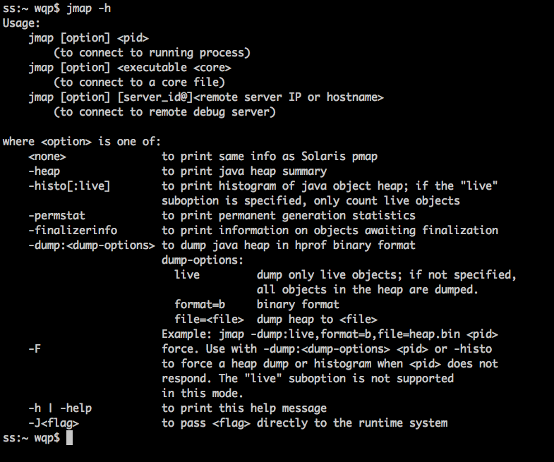

---

1、jvm调优的一般流程
2、jvm调优所要关注的几个性能指标
3、jvm调优需要掌握的一些原则
4、调优策略&示例
 
 
一、性能调优的层次
 
为了提升系统性能，我们需要对系统的各个角度和层次来进行优化，以下是需要优化的几个层次。
从上面我们可以看到，除了jvm调优以外，还有其他几个层面需要来处理，所以针对系统的调优不是只
有jvm调优一项，而是需要针对系统来整体调优，才能提升系统的性能。本篇只针对jvm调优来讲解，其
他几个方面，后续再介绍。
在进行jvm调优之前，我们假设项目的架构调优和代码调优已经进行过或者是针对当前项目是最优的。
这两个是jvm调优的基础，并且架构调优是对系统影响最大的 ，我们不能指望一个系统架构有缺陷或者
代码层次优化没有穷尽的应用，通过jvm调优令其达到一个质的飞跃，这是不可能的。
另外，在调优之前，必须得有明确的性能优化目标， 然后找到其性能瓶颈。之后针对瓶颈的优化，还需
要对应用进行压力和基准测试，通过各种监控和统计工具，确认调优后的应用是否已经达到相关目标。
 
 
二、jvm调优流程
 
调优的最终目的都是为了令应用程序使用最小的硬件消耗来承载更大的吞吐。jvm的调优也不例外，jvm
调优主要是针对垃圾收集器的收集性能优化，令运行在虚拟机上的应用能够使用更少的内存以及延迟获
取更大的吞吐量。当然这里的最少是最优的选择，而不是越少越好。

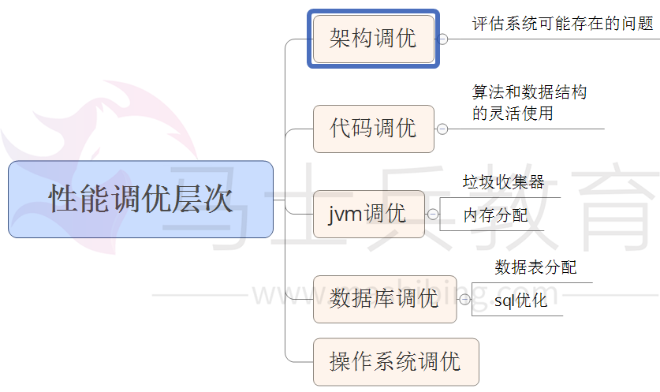

---

1、性能定义
 
要查找和评估器性能瓶颈，首先要知道性能定义，对于jvm调优来说，我们需要知道以下三个定义属
性，依作为评估基础:
吞吐量：重要指标之一，是指不考虑垃圾收集引起的停顿时间或内存消耗，垃圾收集器能支
撑应用达到的最高性能指标。
延迟：其度量标准是缩短由于垃圾啊收集引起的停顿时间或者完全消除因垃圾收集所引起的
停顿，避免应用运行时发生抖动。
内存占用：垃圾收集器流畅运行所需要 的内存数量。
这三个属性中，其中一个任何一个属性性能的提高，几乎都是以另外一个或者两个属性性能的损失作代
价，不可兼得，具体某一个属性或者两个属性的性能对应用来说比较重要，要基于应用的业务需求来确
定。
 
2、性能调优原则
 
在调优过程中，我们应该谨记以下3个原则，以便帮助我们更轻松的完成垃圾收集的调优，从而达到应用
程序的性能要求。
1. MinorGC回收原则： 每次minor GC 都要尽可能多的收集垃圾对象。以减少应用程序发生
Full GC的频率。
2. GC内存最大化原则：处理吞吐量和延迟问题时候，垃圾处理器能使用的内存越大，垃圾收集
的效果越好，应用程序也会越来越流畅。
3. GC调优3选2原则: 在性能属性里面，吞吐量、延迟、内存占用，我们只能选择其中两个进行
调优，不可三者兼得。
 
3、性能调优流程

---

以上就是对应用程序进行jvm调优的基本流程，我们可以看到，jvm调优是根据性能测试结果不断优化配
置而多次迭代的过程。在达到每一个系统需求指标之前，之前的每个步骤都有可能经历多次迭代。有时
候为了达到某一方面的指标，有可能需要对之前的参数进行多次调整，进而需要把之前的所有步骤重新
测试一遍。

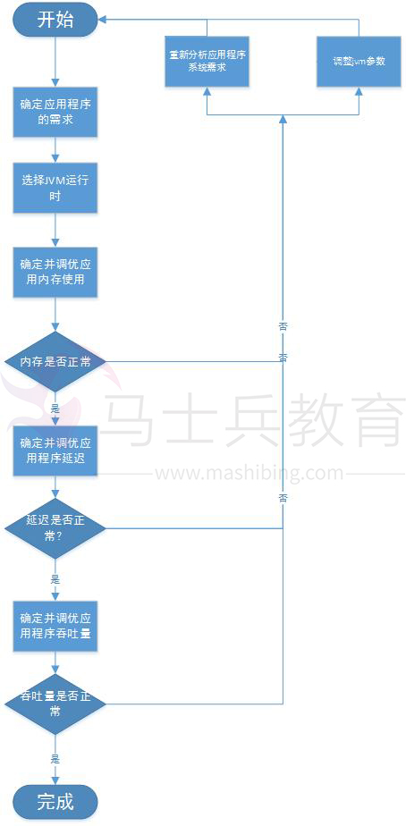

---

另外调优一般是从满足程序的内存使用需求开始的，之后是时间延迟的要求，最后才是吞吐量的要求，
要基于这个步骤来不断优化，每一个步骤都是进行下一步的基础，不可逆行之。以下我们针对每个步骤
进行详细的示例讲解。
在JVM的运行模式方面，我们直接选择server模式，这也是jdk1.6以后官方推荐的模式。
在垃圾收集器方面，我们直接采用了jdk1.6-1.8 中默认的parallel收集器（新生代采用parallelGC,老生代
采用parallelOldGC）。
 
 
三、确定内存占用
 
在确定内存占用之前，我们需要知道两个知识点：
1. 应用程序的运行阶段
2. jvm内存分配
 
 
1、运行阶段
 
应用程序的运行阶段，我可以划分为以下三个阶段:
1、初始化阶段 : jvm加载应用程序，初始化应用程序的主要模块和数据。
2、稳定阶段:应用在此时运行了大多数时间，经历过压力测试的之后，各项性能参数呈稳定状态。
核心函数被执行，已经被jit编译预热过。
3、总结阶段:最后的总结阶段，进行一些基准测试，生成响应的策报告。这个阶段我们可以不关
注。
确定内存占用以及活跃数据的大小，我们应该是在程序的稳定阶段来进行确定，而不是在项目起初阶段
来进行确定，如何确定，我们先看以下jvm的内存分配。
 
 
2、jvm内存分配&参数
 
jvm堆中主要的空间，就是以上新生代、老生代、永久代组成,整个堆大小=新生代大小 + 老生代大小 + 
永久代大小。 具体的对象提升方式，这里不再过多介绍了，我们看下一些jvm命令参数，对堆大小的指
定。如果不采用以下参数进行指定的话，虚拟机会自动选择合适的值，同时也会基于系统的开销自动调
整。

---

分
代
参数
描述
堆
大
小
-Xms
初始堆大小，默认为物理内存的1/64(<1GB)
 
-Xmx
最大堆大小，默认(MaxHeapFreeRatio参数可以调整)空余堆
内存大于70%时，JVM会减少堆直到 -Xms的最小限制
新
生
代
-XX:NewSize
新生代空间大小初始值
 
-XX:MaxNewSize
新生代空间大小最大值
 
-Xmn
新生代空间大小，此处的大小是(eden+2 survivor space)
永
久
代
-XX:PermSize
永久代空间的初始值&最小值
 
-XX：MaxPermSize
永久代空间的最大值
老
年
代
老年代的空间大小会根
据新生代的大小隐式设
定
 
 
初始值=-Xmx减去-
XX:NewSize的值
 
 
最小值=-Xmx值减去-
XX:MaxNewSize的值
 
在设置的时候，如果关注性能开销的话，应尽量把永久代的初始值与最大值设置为同一值，因为永久代
的大小调整需要进行FullGC 才能实现。
 
 
3、计算活跃数据大小
 
计算活跃数据大小应该遵循以下流程:

---

如前所述，活跃数据应该是基于应用程序稳定阶段时，观察长期存活与对象在java堆中占用的空间大
小。
计算活跃数据时应该确保以下条件发生：
1.测试时，启动参数采用jvm默认参数，不人为设置。
2.确保Full GC 发生时，应用程序正处于稳定阶段。
采用jvm默认参数启动，是为了观察应用程序在稳定阶段的所需要的内存使用。
 
如何才算稳定阶段？
一定得需要产生足够的压力，找到应用程序和生产环境高峰符合状态类似的负荷，在此之后达到峰值之
后，保持一个稳定的状态，才算是一个稳定阶段。所以要达到稳定阶段，压力测试是必不可少的，具体
如何如何对应用压力测试，本篇不过多说明,后期会有专门介绍的篇幅。
 
在确定了应用出于稳定阶段的时候，要注意观察应用的GC日志，特别是Full GC 日志。
GC日志指令: -XX:+PrintGCTimeStamps -XX:+PrintGCDetails -Xloggc:
GC日志是收集调优所需信息的最好途径，即便是在生产环境，也可以开启GC日志来定位问题，开
启GC日志对性能的影响极小，却可以提供丰富数据。
 
必须得有FullGC 日志，如果没有的话，可以采用监控工具强制调用一次，或者采用以下命令，亦可以触
发

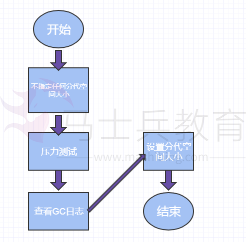

---

空间
命令参数
建议扩大倍数
java heap
-Xms和-Xmx
3-4倍FullGC后的老年代空间占用
永久代
-XX:PermSize-XX:MaxPermSize
1.2-1.5倍FullGc后的永久带空间占用
新生代
-Xmn
1-1.5倍FullGC之后的老年代空间占用
老年代
 
2-3倍FullGC后的老年代空间占用
jmap -histo:live pid
 
在稳定阶段触发了FullGC我们一般会拿到如下信息:
从以上gc日志中，我们大概可以分析到，在发生fullGC之时，整个应用的堆占用以及GC时间，当然了，
为了更加精确，应该多收集几次，获取一个平均值。或者是采用耗时最长的一次FullGC来进行估算。
 
在上图中，fullGC之后，老年代空间占用在93168kb（约93MB），我们以此定为老年代空间的活跃数
据。
其他堆空间的分配，基于以下规则来进行。
基于以上规则和上图中的FullGC信息，我们现在可以规划的该应用堆空间为：
java 堆空间: 373Mb (=老年代空间93168kb*4)
新生代空间:140Mb(=老年代空间93168kb*1.5)
永久代空间:5Mb(=永久代空间3135kb*1.5)
老年代空间: 233Mb=堆空间-新生代看空间=373Mb-140Mb
对应的应用启动参数应该为:
 
java -Xms373m -Xmx373m -Xmn140m -XX:PermSize=5m -XX:MaxPermSize=5m

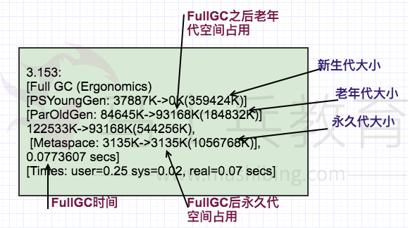

---

四、延迟调优
 
在确定了应用程序的活跃数据大小之后，我们需要再进行延迟性调优，因为对于此时堆内存大小，延迟
性需求无法达到应用的需要，需要基于应用的情况来进行调试。
在这一步进行期间，我们可能会再次优化堆大小的配置，评估GC的持续时间和频率、以及是否需要切换
到不同的垃圾收集器上。
 
 
1、系统延迟需求
 
在调优之前，我们需要知道系统的延迟需求是那些，以及对应的延迟可调优指标是那些。
应用程序可接受的平均停滞时间: 此时间与测量的Minor GC持续时间进行比较。
可接受的Minor GC频率：Minor GC的频率与可容忍的值进行比较。
可接受的最大停顿时间: 最大停顿时间与最差情况下FullGC的持续时间进行比较。
可接受的最大停顿发生的频率：基本就是FullGC的频率。
以上中，平均停滞时间和最大停顿时间，对用户体验最为重要，可以多关注。
基于以上的要求，我们需要统计以下数据:
MinorGC的持续时间；
统计MinorGC的次数；
FullGC的最差持续时间；
最差情况下，FullGC的频率；
 
 
2、优化新生代的大小
 
 
比如如上的gc日志中，我们可以看到Minor GC的平均持续时间=0.069秒，MinorGC 的频率为0.389秒一
次。
如果，我们系统的设置的平均停滞时间为50ms，当前的69ms明显是太长了，就需要调整。

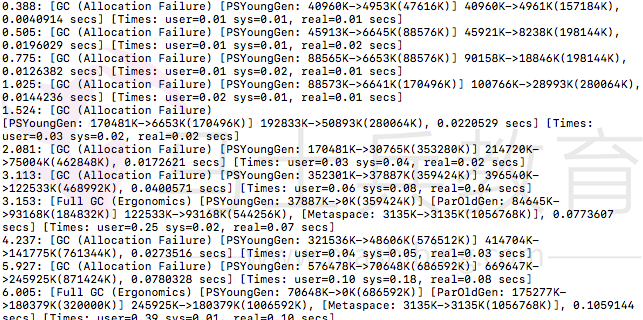

---

我们知道新生代空间越大，Minor GC的GC时间越长，频率越低。
如果想减少其持续时长，就需要减少其空间大小。
如果想减小其频率，就需要加大其空间大小。
 
为了降低改变新生代的大小对其他区域的最小影响。在改变新生代空间大小的时候，尽量保持老年代空
间的大小。
比如此次减少了新生代空间10%的大小，应该保持老年代和持代的大小不变化，第一步调优后的参数如
下变化:
 
 
3、优化老年代的大小
 
同上一步一样，在优化之前，也需要采集gc日志的数据。此次我们关注的是FullGC的持续时间和频率。
 
上图中，我们可以看到
 
如果没有FullGC的日志，有办法可以评估么？
我们可以通过对象提升率进行计算。
 
 
java -Xms359m -Xmx359m -Xmn126m -XX:PermSize=5m -XX:MaxPermSize=5m
新生代的大小有140m变为126，堆大小顺应变化，此时老年代是没有变化的。
FullGC 平均频率 =5.8s
FullGC 平均持续时间=0.14s
(以上为了测试，真实项目的fullGC 没有这么快)

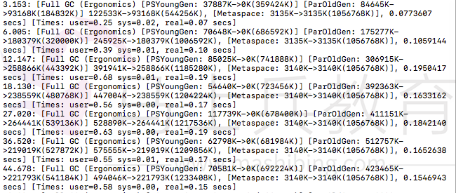

---

对象提升率
 
比如上述中启动参数中，我们的老年代大小=233Mb。
那么需要多久才能填满老年代中这233Mb的空闲空间取决于新生代到老年代的提升率。
每次提升老年代占用量=每次MinorGC 之后 java堆占用情况 减去 MinorGC后新生代的空间占用
对象提升率=平均值（每次提升老年代占用量) 除以 老年代空间
有了对象提升率，我们就可以算出填充满老年代空间需要多少次minorGC，大概一次fullGC的时间就可
以计算出来了。
 
比如:
上图中:
老年代每次minorGC提升率
我们可以测算出：
第一次minor GC 之后，老年代空间:13740kb - 13732kb =8kb
第二次minor GC 之后，老年代空间:22394kb - 17905kb =4489kb
第三次minor GC 之后，老年代空间:34739kb - 17917kb =16822kb
第四次minor GC 之后，老年代空间:48143kb - 17913kb =30230kb
第五次minor GC 之后，老年代空间:62112kb - 17917kb =44195kb
4481kb 第二次和第一次minorGC之间
12333kb 第3次和第2次minorGC之间
13408kb 第4次和第3次minorGC之间
13965kb 第5次和第4次minorGC之间

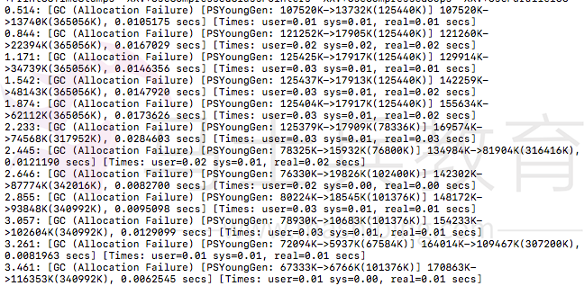

---

FullGC的预期最差频率时长可以通过以上两种方式估算出来，可以调整老年代的大小来调整FullGC的频
率，当然了，如果FullGC持续时间过长，无法达到应用程序的最差延迟要求，就需要切换垃圾处理器
了。具体如何切换，下篇再讲，比如切换为CMS，针对CMS的调优方式又有会细微的差别。
 
 
五、吞吐量调优
 
 
经过上述漫长 调优过程，最终来到了调优的最后一步，这一步对上述的结果进行吞吐量测试，并进行微
调。
吞吐量调优主要是基于应用程序的吞吐量要求而来的，应用程序应该有一个综合的吞吐指标，这个指标
基于真个应用的需求和测试而衍生出来的。当有应用程序的吞吐量达到或者超过预期的吞吐目标，整个
调优过程就可以圆满结束了。
如果出现调优后依然无法达到应用程序的吞吐目标，需要重新回顾吞吐要求，评估当前吞吐量和目标差
距是否巨大，如果在20%左右，可以修改参数，加大内存，再次从头调试，如果巨大就需要从整个应用
层面来考虑，设计以及目标是否一致了，重新评估吞吐目标。
对于垃圾收集器来说，提升吞吐量的性能调优的目标就是就是尽可能避免或者很少发生FullGC 或者
Stop-The-World压缩式垃圾收集（CMS），因为这两种方式都会造成应用程序吞吐降低。尽量在
MinorGC 阶段回收更多的对象，避免对象提升过快到老年代。
 
每次minorGC 的平均提升为12211kb,约为12Mb
上图中，平均minorGC的频率为 213ms/次
提升率=12211kb/213ms=57kb/ms
老年代空间233Mb ,占满大概需要233*1024/57=4185ms 约为4.185s。

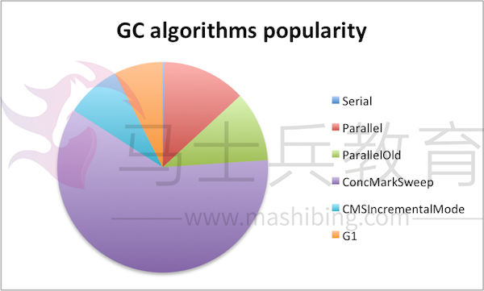

---

六、最后
 
据Plumbr公司对特定垃圾收集器使用情况进行了一次调查研究，研究数据使用了84936个案例。在明确
指定垃圾收集器的13%的案例中，并发收集器（CMS）使用次数最多；但大多数案例没有选择最佳垃圾
收集器。这个比例占用在87%左右。
 
JVM调优是一个系统而又复杂的工作，目前jvm下的自动调整已经做的比较优秀，基本的一些初始参数都
可以保证一般的应用跑的比较稳定了，对部分团队来说，程序性能可能优先级不高，默认垃圾收集器已
经够用了。调优要基于自己的情况而来。
 
 
 
 
内存模型以及分区，需要详细到每个区放什么。
 
JVM 分为堆区和栈区，还有方法区，初始化的对象放在堆里面，引用放在栈里面，
class 类信息常量池（static 常量和 static 变量）等放在方法区new:
·   方法区：主要是存储类信息，常量池（static 常量和 static 变量），编译后的代码（字
节码）等数据
·   堆：初始化的对象，成员变量 （那种非 static 的变量），所有的对象实例和数组都要
在堆上分配
·   栈：栈的结构是栈帧组成的，调用一个方法就压入一帧，帧上面存储局部变量表，操
作数栈，方法出口等信息，局部变量表存放的是 8 大基础类型加上一个应用类型，所以还是一个指向地
址的指针
·   本地方法栈：主要为 Native 方法服务
·   程序计数器：记录当前线程执行的行号
堆里面的分区：Eden，survival （from+ to），老年代，
各自的特点。
 
堆里面分为新生代和老生代（java8 取消了永久代，采用了 Metaspace），新生代包含 Eden+Survivor 
区，survivor 区里面分为 from 和 to 区，内存回收时，如果用的是复制算法，从 from 复制到 to，当经
过一次或者多次 GC 之后，存活下来的对象会被移动到老年区，当 JVM 内存不够用的时候，会触发 Full 
GC，清理 JVM 老年区
当新生区满了之后会触发 YGC,先把存活的对象放到其中一个 Survice
区，然后进行垃圾清理。因为如果仅仅清理需要删除的对象，这样会导致内存碎
片，因此一般会把 Eden 进行完全的清理，然后整理内存。那么下次 GC 的时候，就会使用下一个 
Survive，这样循环使用。如果有特别大的对象，新生代放不下，就会使用老年代的担保，直接放到老年
代里面。因为 JVM 认为，一般大对象的存活时间一般比较久远。

---

对象创建方法，对象的内存分配，对象的访问定位。
 
new 一个对象
GC 的两种判定方法：
 
引用计数法：指的是如果某个地方引用了这个对象就+1，如果失效了就-1，当为 0 就会回收但是 JVM 没
有用这种方式，因为无法判定相互循环引用（A 引用 B,B 引用 A）的情况
引用链法： 通过一种 GC ROOT 的对象（方法区中静态变量引用的对象等-static 变量）来判断，如果有
一条链能够到达 GC ROOT 就说明，不能到达 GC ROOT 就说明可以回收
SafePoint 是什么
 
比如 GC 的时候必须要等到 Java 线程都进入到 safepoint 的时候 VMThread 才能开始
执行 GC，
1. 循环的末尾 (防止大循环的时候一直不进入 safepoint，而其他线程在等待它进入
safepoint)
2. 方法返回前
3. 调用方法的 call 之后
4. 抛出异常的位置
GC 的三种收集方法：标记清除、标记整理、复制算法的原
理与特点，分别用在什么地方，如果让你优化收集方法，有
什么思路？
 
先标记，标记完毕之后再清除，效率不高，会产生碎片
复制算法：分为 8：1 的 Eden 区和 survivor 区，就是上面谈到的 YGC
标记整理：标记完毕之后，让所有存活的对象向一端移动
GC 收集器有哪些？CMS 收集器与 G1 收集器的特点。
 
并行收集器：串行收集器使用一个单独的线程进行收集，GC 时服务有停顿时间串行收集器：次要回收
中使用多线程来执行
CMS 收集器是基于“标记—清除”算法实现的，经过多次标记才会被清除
G1 从整体来看是基于“标记—整理”算法实现的收集器，从局部（两个 Region 之间）
上来看是基于“复制”算法实现的
Minor GC 与 Full GC 分别在什么时候发生？
 
新生代内存不够用时候发生 MGC 也叫 YGC，JVM 内存不够的时候发生 FGC
几种常用的内存调试工具：jmap、jstack、jconsole、
jhat jstack
 
可以看当前栈的情况，jmap 查看内存，jhat 进行 dump 堆的信息mat（eclipse 的也要了解一下）
类加载的几个过程：

---

加载、验证、准备、解析、初始化。然后是使用和卸载了
通过全限定名来加载生成 class 对象到内存中，然后进行验证这个 class 文件，包括文件格式校验、元数
据验证，字节码校验等。准备是对这个对象分配内存。解析是将符号引用转化为直接引用（指针引
用），初始化就是开始执行构造器的代码
JVM 内存分哪几个区，每个区的作用是什么?
 
java 虚拟机主要分为以下一个区:方法区：
1. 有时候也成为永久代，在该区内很少发生垃圾回收，但是并不代表不发生 GC，在这里进行的 GC 
主要是对方法区里的常量池和对类型的卸载
2. 方法区主要用来存储已被虚拟机加载的类的信息、常量、静态变量和即时编译器编译后 
的代码等数据。
3. 该区域是被线程共享的。
4. 方法区里有一个运行时常量池，用于存放静态编译产生的字面量和符号引用。该常量池具有动态
性，也就是说常量并不一定是编译时确定，运行时生成的常量也会存在这个常量池中。
虚拟机栈:
1. 虚拟机栈也就是我们平常所称的栈内存,它为 java 方法服务，每个方法在执行的时候都
会创建一个栈帧，用于存储局部变量表、操作数栈、动态链接和方法出口等信息。
2. 虚拟机栈是线程私有的，它的生命周期与线程相同。
3. 局部变量表里存储的是基本数据类型、returnAddress 类型（指向一条字节码指令的地址）和对象
引用，这个对象引用有可能是指向对象起始地址的一个指针，也有可能是代表对象的句柄或者与对
象相关联的位置。局部变量所需的内存空间在编译器间确定
4. 操作数栈的作用主要用来存储运算结果以及运算的操作数，它不同于局部变量表通过索引来访问，
而是压栈和出栈的方式
5. 每个栈帧都包含一个指向运行时常量池中该栈帧所属方法的引用，持有这个引用是为了支持方法调
用过程中的动态连接.动态链接就是将常量池中的符号引用在运行期转化为直接引用。
本地方法栈
 
本地方法栈和虚拟机栈类似，只不过本地方法栈为 Native 方法服务。
堆
java 堆是所有线程所共享的一块内存，在虚拟机启动时创建，几乎所有的对象实例都在这里创建，因此
该区域经常发生垃圾回收操作。
程序计数器
内存空间小，字节码解释器工作时通过改变这个计数值可以选取下一条需要执行的字节码指令，分支、
循环、跳转、异常处理和线程恢复等功能都需要依赖这个计数器完成。该内存区域是唯一一个 java 虚拟
机规范没有规定任何 OOM 情况的区域。
如和判断一个对象是否存活?(或者 GC 对象的判定方法)
 
判断一个对象是否存活有两种方法: 
1. 引用计数法
所谓引用计数法就是给每一个对象设置一个引用计数器，每当有一个地方引用这个对象时，就将计数器
加一，引用失效时，计数器就减一。当一个对象的引用计数器为零时，说明此对象没有被引用，也就是
“死对象”,将会被垃圾回收.

---

引用计数法有一个缺陷就是无法解决循环引用问题，也就是说当对象 A 引用对象 B，对象B 又引用者对
象 A，那么此时 A,B 对象的引用计数器都不为零，也就造成无法完成垃圾回收，所以主流的虚拟机都没
有采用这种算法。
2. 可达性算法(引用链法)
 该算法的思想是：从一个被称为 GC Roots 的对象开始向下搜索，如果一个对象到 GC Roots 没有任何
引用链相连时，则说明此对象不可用。
在 java 中可以作为 GC Roots 的对象有以下几种: 
·   虚拟机栈中引用的对象 
·   方法区类静态属性引用的对象 
·   方法区常量池引用的对象 
·   本地方法栈 JNI 引用的对象
虽然这些算法可以判定一个对象是否能被回收，但是当满足上述条件时，一个对象比不一定会被回收。
当一个对象不可达 GC Root 时，这个对象并
不会立马被回收，而是出于一个死缓的阶段，若要被真正的回收需要经历两次标记
如果对象在可达性分析中没有与 GC Root 的引用链，那么此时就会被第一次标记并且进行一次筛选，筛
选的条件是是否有必要执行 finalize()方法。当对象没有覆盖 finalize()方法或者已被虚拟机调用过，那么
就认为是没必要的。
如果该对象有必要执行 finalize()方法，那么这个对象将会放在一个称为 F-Queue 的对队列中，虚拟机
会触发一个 Finalize()线程去执行，此线程是低优先级的，并且虚拟机不会承诺一直等待它运行完，这是
因为如果 finalize()执行缓慢或者发生了死锁，那么就会造成 F- Queue 队列一直等待，造成了内存回收
系统的崩溃。GC 对处于 F-Queue 中的对象进行
第二次被标记，这时，该对象将被移除”即将回收”集合，等待回收。
简述 java 垃圾回收机制?
 
在 java 中，程序员是不需要显示的去释放一个对象的内存的，而是由虚拟机自行执行。在JVM 中，有一
个垃圾回收线程，它是低优先级的，在正常情况下是不会执行的，只有在虚拟机空闲或者当前堆内存不
足时，才会触发执行，扫面那些没有被任何引用的对象，并将它们添加到要回收的集合中，进行回收。
java 中垃圾收集的方法有哪些?
 
1. 标记-清除:
这是垃圾收集算法中最基础的，根据名字就可以知道，它的思想就是标记哪些要被回收的对象，然后统
一回收。这种方法很简单，但是会有两个主要问题：1.效率不高，标记和清除的效率都很低；2.会产生
大量不连续的内存碎片，导致以后程序在分配较大的对象时，由于没有充足的连续内存而提前触发一次 
GC 动作 
2. 复制算法:**
为了解决效率问题，复制算法将可用内存按容量划分为相等的两部分，然后每次只使用其中的一块，当
一块内存用完时，就将还存活的对象复制到第二块内存上，然后一次性清楚完第一块内存，再将第二块
上的对象复制到第一块。但是这种方式，
内存的代价太高，每次基本上都要浪费一般的内存。

---

于是将该算法进行了改进，内存区域不再是按照 1：1 去划分，而是将内存划分为8:1:1 三部分，较大那
份内存交 Eden 区，其余是两块较小的内存区叫 Survior 区。每次都会优先使用 Eden 区，若 Eden 区
满，就将对象复制到第二块内存区上，然后清除 Eden 区，如果此时存活的对象太多，以至于 Survivor 
不够时，会将这些对象通过分配担保机制复制到老年代中。(java 堆又分为新生代和老年代)
3. 标记-整理
该算法主要是为了解决标记-清除，产生大量内存碎片的问题；当对象存活率较高时，也解决了复制算法
的效率问题。它的不同之处就是在清除对象的时候现将可回收对象移动到一端，然后清除掉端边界以外
的对象，这样就不会产生内存碎片了 
4. 分代收集
现在的虚拟机垃圾收集大多采用这种方式，它根据对象的生存周期，将堆分为新生代和老年代。在新生
代中，由于对象生存期短，每次回收都会有大量对象死去，那么这时就采用复制算法。老年代里的对象
存活率较高，没有额外的空间进行分配担保，所以可以使用标记-整理 或者 标记-清除。
java 内存模型
 
java 内存模型(JMM)是线程间通信的控制机制.JMM 定义了主内存和线程之间抽象关系。线程之间的共享
变量存储在主内存（main memory）中，每个线程都有一个私有的本地内存（local memory），本地
内存中存储了该线程以读/写共享变量的副本。本地内存是JMM 的一个抽象概念，并不真实存在。它涵
盖了缓存，写缓冲区，寄存器以及其他的硬件和编译器优化。Java 内存模型的抽象示意图如下：
从上图来看，线程 A 与线程 B 之间如要通信的话，必须要经历下面 2 个步骤：
1. 首先，线程 A 把本地内存 A 中更新过的共享变量刷新到主内存中去。
2. 然后，线程 B 到主内存中去读取线程 A 之前已更新过的共享变量。
java 类加载过程?
 
java 类加载需要经历一下 7 个过程：
加载
加载时类加载的第一个过程，在这个阶段，将完成一下三件事情：
1. 通过一个类的全限定名获取该类的二进制流。
2. 将该二进制流中的静态存储结构转化为方法去运行时数据结构。
3. 在内存中生成该类的 Class 对象，作为该类的数据访问入口。
验证
验证的目的是为了确保 Class 文件的字节流中的信息不回危害到虚拟机.在该阶段主要完成
以下四钟验证:
1. 文件格式验证：验证字节流是否符合 Class 文件的规范，如主次版本号是否在当前虚拟机范围内，
常量池中的常量是否有不被支持的类型.
2. 元数据验证:对字节码描述的信息进行语义分析，如这个类是否有父类，是否集成了不被继承的类
等。
3. 字节码验证：是整个验证过程中最复杂的一个阶段，通过验证数据流和控制流的分析，确定程序语
义是否正确，主要针对方法体的验证。如：方法中的类型转换是否正确，跳转指令是否正确等。
4. 符号引用验证：这个动作在后面的解析过程中发生，主要是为了确保解析动作能正确执行。
准备
准备阶段是为类的静态变量分配内存并将其初始化为默认值，这些内存都将在方法区中进行分配。准备
阶段不分配类中的实例变量的内存，实例变量将会在对象实例化时随着对象一起分配在 Java 堆中。

---

public static int value=123;//在准备阶段value初始值为0。在初始化阶段才会变为123**。
 
 
解析
该阶段主要完成符号引用到直接引用的转换动作。解析动作并不一定在初始化动作完成之前，也有可能
在初始化之后。
初始化
初始化时类加载的最后一步，前面的类加载过程，除了在加载阶段用户应用程序可以通过自定义类加载
器参与之外，其余动作完全由虚拟机主导和控制。到了初始化阶段，才真正开始执行类中定义的 Java 程
序代码。
简述 java 类加载机制?
 
虚拟机把描述类的数据从 Class 文件加载到内存，并对数据进行校验，解析和初始化，最终形成可以被
虚拟机直接使用的 java 类型。
类加载器双亲委派模型机制？
 
当一个类收到了类加载请求时，不会自己先去加载这个类，而是将其委派给父类，由父类 
去加载，如果此时父类不能加载，反馈给子类，由子类去完成类的加载。
什么是类加载器，类加载器有哪些?
 
实现通过类的权限定名获取该类的二进制字节流的代码块叫做类加载器。
主要有一下四种类加载器:
1. 启动类加载器(Bootstrap ClassLoader)用来加载 java 核心类库，无法被 java 程序直接引用。
2. 扩展类加载器(extensions class loader):它用来加载 Java 的扩展库。Java 虚拟机的实现会提供一个
扩展库目录。该类加载器在此目录里面查找并加载 Java 类。
3. 系统类加载器（system class loader）：它根据 Java 应用的类路径（CLASSPATH）来加载 Java 
类。一般来说，Java 应用的类都是由它来完成加载的。可以通过
ClassLoader.getSystemClassLoader()来获取它。
4. 用户自定义类加载器，通过继承 java.lang.ClassLoader 类的方式实现。 
简述 java 内存分配与回收策率以及 Minor GC 和Major
GC
 
1. 对象优先在堆的 Eden 区分配。
2. 大对象直接进入老年代.
3. 长期存活的对象将直接进入老年代.
当 Eden 区没有足够的空间进行分配时，虚拟机会执行一次 Minor GC.Minor Gc 通常发生在新生代
的 Eden 区，在这个区的对象生存期短，往往发生 Gc 的频率较高，回收速度比较快;Full Gc/Major 
GC 发生在老年代，一般情况下，触发老年代 GC的时候不会触发 Minor GC,但是通过配置，可以在 
Full GC 之前进行一次 Minor GC 这样可以加快老年代的回收速度。
 
 
JVM

---

(1) 基本概念：
   JVM是可运行Java代码的假想计算机 ，包括一套字节码指令集、一组寄存器、一个栈、一个垃圾回
收，堆 和 一个存储方法域。JVM 是运行在操作系统之上的，它与硬件没有直接的交互。 
(2) 运行过程：
   我们都知道 Java 源文件，通过编译器，能够生产相应的.Class 文件，也就是字节码文件，而字节码文
件又通过 Java 虚拟机中的解释器，编译成特定机器上的机器码 。 
也就是如下： 
① Java 源文件—->编译器—->字节码文件 
② 字节码文件—->JVM—->机器码

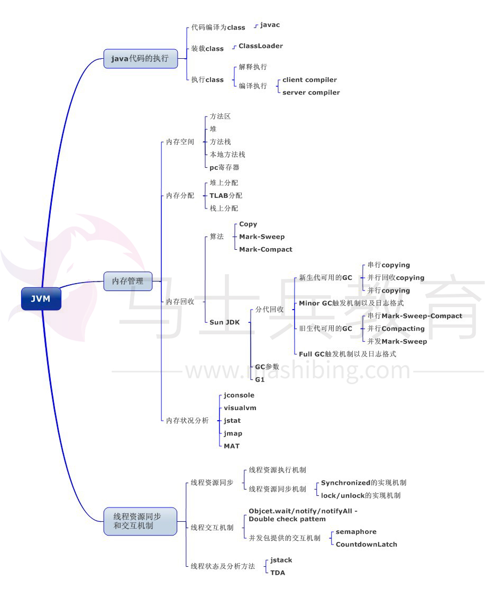

---

每一种平台的解释器是不同的，但是实现的虚拟机是相同的，这也就是 Java 为什么能够跨平台的原因
了 ，当一个程序从开始运行，这时虚拟机就开始实例化了，多个程序启动就会存在多个虚拟机实例。程
序退出或者关闭，则虚拟机实例消亡，多个虚拟机实例之间数据不能共享。 
 
 
 
JVM 内存区域

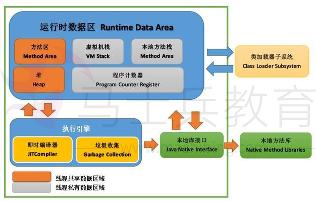

---

JVM 内存区域主要分为线程私有区域【程序计数器、虚拟机栈、本地方法区】、线程共享区域【JAVA 
堆、方法区】、直接内存。 
线程私有数据区域生命周期与线程相同, 依赖用户线程的启动/结束 而 创建/销毁(在 Hotspot VM 内, 每个
线程都与操作系统的本地线程直接映射, 因此这部分内存区域的存/否跟随本地线程的生/死对应)。 
线程共享区域随虚拟机的启动/关闭而创建/销毁。 
直接内存并不是 JVM 运行时数据区的一部分, 但也会被频繁的使用: 在 JDK 1.4 引入的 NIO 提供了基于 
Channel 与 Buffer 的 IO 方式, 它可以使用 Native 函数库直接分配堆外内存, 然后使用 
DirectByteBuffer 对象作为这块内存的引用进行操作(详见:Java I/O 扩展, 这样就避免了在 Java 堆和 
Native 堆中来回复制数据, 因此在一些场景中可以显著提高性能。

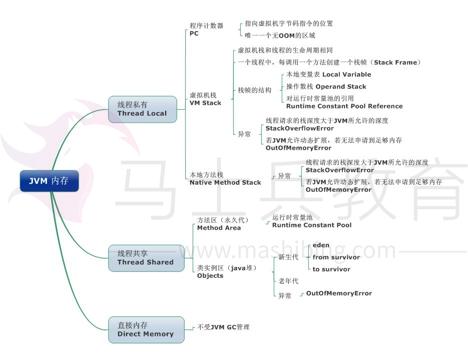

---

程序计数器(线程私有)
 
一块较小的内存空间, 是当前线程所执行的字节码的行号指示器，每条线程都要有一个独立的程序计数
器，这类内存也称为“线程私有”的内存。 
正在执行 java 方法的话，计数器记录的是虚拟机字节码指令的地址（当前指令的地址）。如果还是 
Native 方法，则为空。 
这个内存区域是唯一一个在虚拟机中没有规定任何 OutOfMemoryError 情况的区域。
虚拟机栈(线程私有)
 
是描述java方法执行的内存模型，每个方法在执行的同时都会创建一个栈帧（Stack Frame）用于存储局
部变量表、操作数栈、动态链接、方法出口等信息。每一个方法从调用直至执行完成的过程，就对应着
一个栈帧在虚拟机栈中入栈到出栈的过程。 
栈帧（ Frame）是用来存储数据和部分过程结果的数据结构，同时也被用来处理动态链接

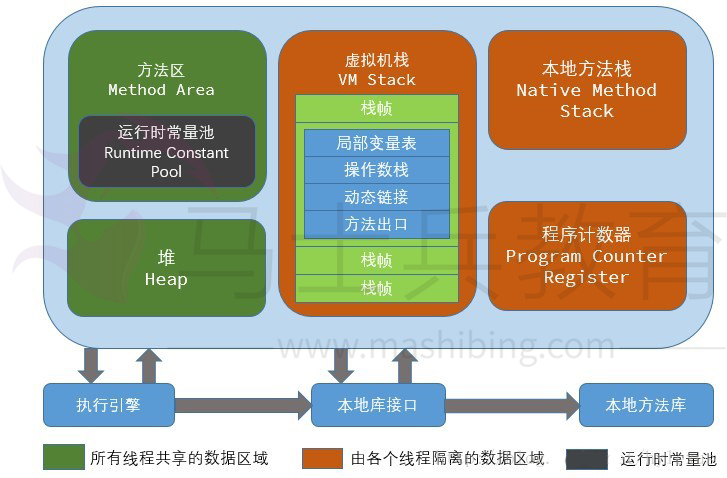

---

(Dynamic Linking)、 方法返回值和异常分派（ Dispatch Exception）。栈帧随着方法调用而创建，随
着方法结束而销毁——无论方法是正常完成还是异常完成（抛出了在方法内未被捕获的异常）都算作方
法结束。
本地方法区(线程私有)
 
本地方法区和 Java Stack 作用类似, 区别是虚拟机栈为执行 Java 方法服务, 而本地方法栈则为 Native 方
法服务, 如果一个 VM 实现使用 C-linkage 模型来支持 Native 调用, 那么该栈将会是一个
C 栈，但 HotSpot VM 直接就把本地方法栈和虚拟机栈合二为一。
堆（Heap-线程共享）-运行时数据区
 
是被线程共享的一块内存区域，创建的对象和数组都保存在 Java 堆内存中，也是垃圾收集器进行垃圾收
集的最重要的内存区域。由于现代 VM 采用分代收集算法, 因此 Java 堆从 GC 的角度还可以细分为: 新生
代(Eden区、From Survivor区和To Survivor区)和老年代。 
方法区/永久代（线程共享）
 
即我们常说的永久代(Permanent Generation), 用于存储被 JVM 加载的类信息、常量、静态变量、即
时编译器编译后的代码等数据. HotSpot VM把GC分代收集扩展至方法区, 即使用Java 堆的永久代来实现
方法区, 这样 HotSpot 的垃圾收集器就可以像管理 Java 堆一样管理这部分内存, 而不必为方法区开发专
门的内存管理器(永久带的内存回收的主要目标是针对常量池的回收和类型的卸载, 因此收益一般很小)。 
运行时常量池（Runtime Constant Pool）是方法区的一部分。Class 文件中除了有类的版本、字段、方
法、接口等描述等信息外，还有一项信息是常量池
（Constant Pool Table），用于存放编译期生成的各种字面量和符号引用，这部分内容将在类加载后存
放到方法区的运行时常量池中。 Java 虚拟机对 Class 文件的每一部分（自然也包括常量池）的格式都有
严格的规定，每一个字节用于存储哪种数据都必须符合规范上的要求，这样才会被虚拟机认可、装载和
执行。
JVM 运行时内存
 
Java 堆从 GC 的角度还可以细分为: 新生代(Eden区、From Survivor区和To Survivor区)和老年代。

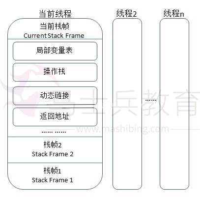

---

新生代
 
是用来存放新生的对象。一般占据堆的1/3空间。由于频繁创建对象，所以新生代会频繁触发
MinorGC 进行垃圾回收。新生代又分为 Eden 区、ServivorFrom、ServivorTo 三个区。 
1. Eden 区
Java新对象的出生地（如果新创建的对象占用内存很大，则直接分配到老年代）。当Eden区内存不够的
时候就会触发MinorGC，对新生代区进行一次垃圾回收。
2. ServivorFrom
上一次 GC 的幸存者，作为这一次 GC 的被扫描者。 
3. ServivorTo 
保留了一次 MinorGC 过程中的幸存者。 
4. MinorGC 的过程（复制->清空->互换） 
MinorGC 采用复制算法。 
1：eden、servicorFrom 复制到ServicorTo，年龄+1 
首先，把Eden和ServivorFrom区域中存活的对象复制到ServicorTo区域（如果有对象的年龄以及达到了
老年的标准，则赋值到老年代区），同时把这些对象的年龄+1（如果 ServicorTo 不够位置了就放到老年
区）； 
2：清空eden、servicorFrom
然后，清空 Eden 和 ServicorFrom 中的对象； 
3：ServicorTo 和ServicorFrom 互换 
最后，ServicorTo 和 ServicorFrom 互换，原 ServicorTo 成为下一次 GC 时的 ServicorFrom 区。 
老年代
 
主要存放应用程序中生命周期长的内存对象。 
  老年代的对象比较稳定，所以 MajorGC 不会频繁执行。在进行 MajorGC 前一般都先进行了一次 
MinorGC，使得有新生代的对象晋身入老年代，导致空间不够用时才触发。当无法找到足够大的连续空
间分配给新创建的较大对象时也会提前触发一次 MajorGC 进行垃圾回收腾出空间。 
  MajorGC 采用标记清除算法：首先扫描一次所有老年代，标记出存活的对象，然后回收没有标记的对
象。MajorGC 的耗时比较长，因为要扫描再回收。MajorGC 会产生内存碎片，为了减少内存损耗，我
们一般需要进行合并或者标记出来方便下次直接分配。当老年代也满了装不下的时候，就会抛出 
OOM（Out of Memory）异常。

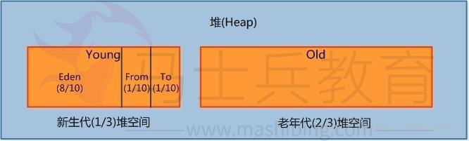

---

永久代
 
指内存的永久保存区域，主要存放 Class 和 Meta（元数据）的信息,Class 在被加载的时候被放入永久区
域，它和和存放实例的区域不同,GC 不会在主程序运行期对永久区域进行清理。所以这也导致了永久代
的区域会随着加载的 Class 的增多而胀满，最终抛出 OOM 异常。 
JAVA8与元数据
 
在Java8中，永久代已经被移除，被一个称为“元数据区”（元空间）的区域所取代。元空间的本质和永久
代类似，元空间与永久代之间最大的区别在于：元空间并不在虚拟机中，而是使用本地内存。因此，默
认情况下，元空间的大小仅受本地内存限制。类的元数据放入 native memory, 字符串池和类的静态变
量放入 java 堆中，这样可以加载多少类的元数据就不再由MaxPermSize 控制, 而由系统的实际可用空间
来控制。 
垃圾回收与算法
 
如何确定垃圾
 
引用计数法 
在 Java 中，引用和对象是有关联的。如果要操作对象则必须用引用进行。因此，很显然一个简单的办法
是通过引用计数来判断一个对象是否可以回收。简单说，即一个对象如果没有任何与之关联的引用，即
他们的引用计数都不为 0，则说明对象不太可能再被用到，那么这个对象就是可回收对象。

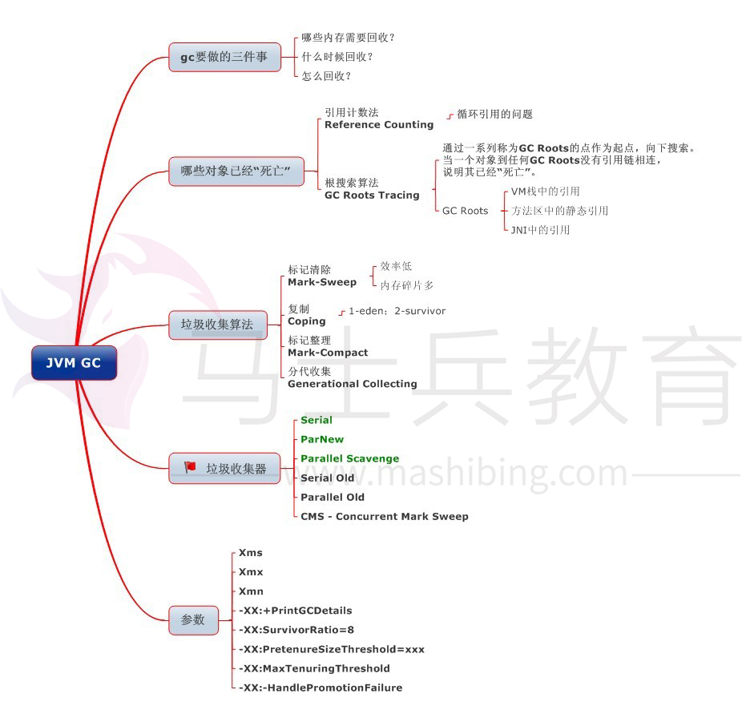

---

可达性分析 
为了解决引用计数法的循环引用问题，Java 使用了可达性分析的方法。通过一系列的“GC roots” 对象作
为起点搜索。如果在“GC roots”和一个对象之间没有可达路径，则称该对象是不可达的。要注意的是，
不可达对象不等价于可回收对象，不可达对象变为可回收对象至少要经过两次标记过程。两次标记后仍
然是可回收对象，则将面临回收。 
标记清除算法（Mark-Sweep）
 
最基础的垃圾回收算法，分为两个阶段，标注和清除。标记阶段标记出所有需要回收的对象，清除阶段
回收被标记的对象所占用的空间。如图
我们就可以发现，该算法最大的问题是内存碎片化严重，后续可能发生大对象不能找到可利用空间的问
题。 
复制算法（copying） 
为了解决 Mark-Sweep 算法内存碎片化的缺陷而被提出的算法。按内存容量将内存划分为等大小的两
块。每次只使用其中一块，当这一块内存满后将尚存活的对象复制到另一块上去，把已使用的内存清
掉，如图：

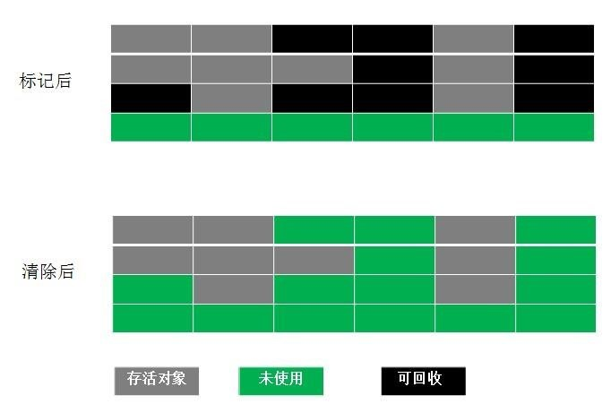

---

算法虽然实现简单，内存效率高，不易产生碎片，但是最大的问题是可用内存被压缩到了原本的一半。
且存活对象增多的话，Copying 算法的效率会大大降低。 
 标记整理算法(Mark-Compact) 
结合了以上两个算法，为了避免缺陷而提出。标记阶段和 Mark-Sweep 算法相同，标记后不是清理对
象，而是将存活对象移向内存的一端。然后清除端边界外的对象。如图：
分代收集算法 
分代收集法是目前大部分 JVM 所采用的方法，其核心思想是根据对象存活的不同生命周期将内存划分为
不同的域，一般情况下将 GC 堆划分为老生代(Tenured/Old Generation)和新生代(Young 
Generation)。老生代的特点是每次垃圾回收时只有少量对象需要被回收，新生代的特点是每次垃圾回收
时都有大量垃圾需要被回收，因此可以根据不同区域选择不同的算法。
新生代与复制算法

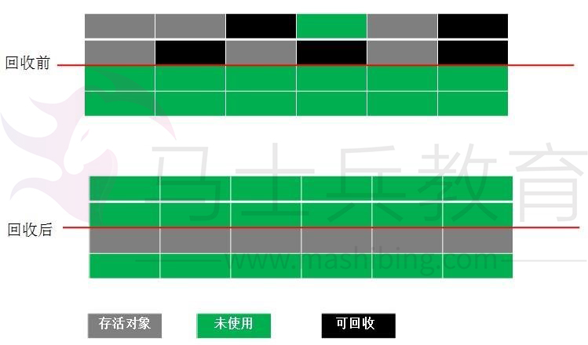

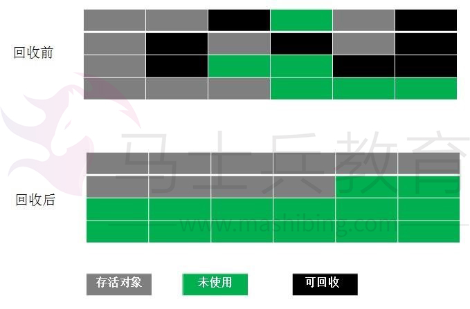

---

目前大部分 JVM 的 GC 对于新生代都采取 Copying 算法，因为新生代中每次垃圾回收都要回收大部分对
象，即要复制的操作比较少，但通常并不是按照 1：1 来划分新生代。一般将新生代划分为一块较大的 
Eden 空间和两个较小的 Survivor 空间(From Space, To Space)，每次使用
Eden 空间和其中的一块 Survivor 空间，当进行回收时，将该两块空间中还存活的对象复制到另一块 
Survivor 空间中。 
老年代与标记复制算法
而老年代因为每次只回收少量对象，因而采用 Mark-Compact 算法。
1. JAVA 虚拟机提到过的处于方法区的永生代(Permanet Generation)，它用来存储 class 类，常量，
方法描述等。对永生代的回收主要包括废弃常量和无用的类。
2. 对象的内存分配主要在新生代的 Eden Space 和 Survivor Space 的 From Space(Survivor 目前存
放对象的那一块)，少数情况会直接分配到老生代。
3. 当新生代的 Eden Space 和 From Space 空间不足时就会发生一次 GC，进行 GC 后，Eden Space 
和 From Space 区的存活对象会被挪到 To Space，然后将 Eden Space 和 From Space 进行清理。
4. 如果 To Space 无法足够存储某个对象，则将这个对象存储到老生代。
5. 在进行 GC 后，使用的便是 Eden Space 和 To Space 了，如此反复循环。
6. 当对象在 Survivor 区躲过一次 GC 后，其年龄就会+1。默认情况下年龄到达 15 的对象会被移到老
生代中。
JAVA四中引用类型
 
 强引用 
在 Java 中最常见的就是强引用，把一个对象赋给一个引用变量，这个引用变量就是一个强引用。当一个
对象被强引用变量引用时，它处于可达状态，它是不可能被垃圾回收机制回收的，即使该对象以后永远
都不会被用到 JVM 也不会回收。因此强引用是造成 Java 内存泄漏的主要原因之一。
软引用 
软引用需要用 SoftReference 类来实现，对于只有软引用的对象来说，当系统内存足够时它不会被回
收，当系统内存空间不足时它会被回收。软引用通常用在对内存敏感的程序中。
弱引用 
弱引用需要用 WeakReference 类来实现，它比软引用的生存期更短，对于只有弱引用的对象来说，只
要垃圾回收机制一运行，不管 JVM 的内存空间是否足够，总会回收该对象占用的内存。 
虚引用 
虚引用需要 PhantomReference 类来实现，它不能单独使用，必须和引用队列联合使用。虚引用的主要
作用是跟踪对象被垃圾回收的状态。 
 
GC 分代收集算法 VS 分区收集算法
 
1. 分代收集算法

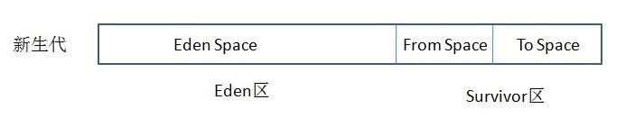

---

当前主流 VM 垃圾收集都采用”分代收集”(Generational Collection)算法, 这种算法会根据对象存活周期
的不同将内存划分为几块, 如 JVM 中的 新生代、老年代、永久代，这样就可以根据各年代特点分别采用
最适当的 GC 算法 
1.1.   在新生代-复制算法 
 每次垃圾收集都能发现大批对象已死, 只有少量存活. 因此选用复制算法, 只需要付出少量存活对象的复
制成本就可以完成收集. 
1.2.   在老年代-标记整理算法 
 因为对象存活率高、没有额外空间对它进行分配担保, 就必须采用“标记—清理”或“标记—整理”算法来进
行回收, 不必进行内存复制, 且直接腾出空闲内存. 
2. 分区收集算法 
分区算法则将整个堆空间划分为连续的不同小区间, 每个小区间独立使用, 独立回收. 这样做的好处是可以
控制一次回收多少个小区间 , 根据目标停顿时间, 每次合理地回收若干个小区间(而不是整个堆), 从而减少
一次 GC 所产生的停顿。 
 
GC垃圾收集器
 
Java 堆内存被划分为新生代和年老代两部分，新生代主要使用复制和标记-清除垃圾回收算法年老代主要
使用标记-整理垃圾回收算法，因此 java 虚拟中针对新生代和年老代分别提供了多种不同的垃圾收集
器，JDK1.6 中 Sun HotSpot 虚拟机的垃圾收集器如下： 
 
Serial 垃圾收集器（单线程、复制算法） 
Serial（英文连续）是最基本垃圾收集器，使用复制算法，曾经是JDK1.3.1之前新生代唯一的垃圾收集
器。Serial 是一个单线程的收集器，它不但只会使用一个 CPU 或一条线程去完成垃圾收集工作，并且在
进行垃圾收集的同时，必须暂停其他所有的工作线程，直到垃圾收集结束。 
Serial 垃圾收集器虽然在收集垃圾过程中需要暂停所有其他的工作线程，但是它简单高效，对于限定单
个 CPU 环境来说，没有线程交互的开销，可以获得最高的单线程垃圾收集效率，因此 Serial 垃圾收集器
依然是 java 虚拟机运行在 Client 模式下默认的新生代垃圾收集器。

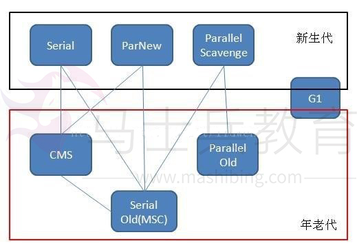

---

ParNew 垃圾收集器（Serial+多线程） 
ParNew 垃圾收集器其实是 Serial 收集器的多线程版本，也使用复制算法，除了使用多线程进行垃圾收
集之外，其余的行为和 Serial 收集器完全一样，ParNew垃圾收集器在垃圾收集过程中同样也要暂停所
有其他的工作线程。
ParNew 收集器默认开启和 CPU 数目相同的线程数，可以通过-XX:ParallelGCThreads 参数来限制垃圾
收集器的线程数。【Parallel：平行的】 
ParNew虽然是除了多线程外和Serial收集器几乎完全一样，但是ParNew垃圾收集器是很多java
虚拟机运行在 Server 模式下新生代的默认垃圾收集器。 
 
Parallel Scavenge 收集器（多线程复制算法、高效） 
Parallel Scavenge 收集器也是一个新生代垃圾收集器，同样使用复制算法，也是一个多线程的垃圾收集
器，它重点关注的是程序达到一个可控制的吞吐量（Thoughput，CPU 用于运行用户代码的时间/CPU 
总消耗时间，即吞吐量=运行用户代码时间/(运行用户代码时间+垃圾收集时间)），高吞吐量可以最高效
率地利用 CPU 时间，尽快地完成程序的运算任务，主要适用于在后台运算而不需要太多交互的任务。自
适应调节策略也是 ParallelScavenge 收集器与 ParNew 收集器的一个重要区别。 
 
Serial Old 收集器（单线程标记整理算法 ） 
Serial Old 是 Serial 垃圾收集器年老代版本，它同样是个单线程的收集器，使用标记-整理算法，这个收
集器也主要是运行在 Client 默认的 java 虚拟机默认的年老代垃圾收集器。 
在 Server 模式下，主要有两个用途： 
1. 在 JDK1.5 之前版本中与新生代的 Parallel Scavenge 收集器搭配使用。
2. 作为年老代中使用 CMS 收集器的后备垃圾收集方案。新生代 Serial 与年老代 Serial Old 搭配垃圾
收集过程图： 
代 Parallel Scavenge 收集器与 ParNew 收集器工作原理类似，都是多线程的收集器，都使
用的是复制算法，在垃圾收集过程中都需要暂停所有的工作线程。新生代 Parallel Scavenge/ParNew 与
年老代 Serial Old 搭配垃圾收集过程图：

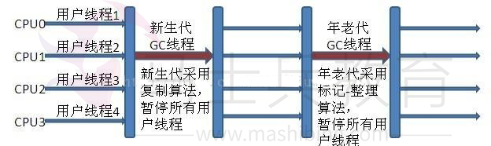

---

CMS 收集器（多线程标记清除算法） 
Concurrent mark sweep(CMS)收集器是一种年老代垃圾收集器，其最主要目标是获取最短垃圾回收停
顿时间，和其他年老代使用标记-整理算法不同，它使用多线程的标记-清除算法。 
最短的垃圾收集停顿时间可以为交互比较高的程序提高用户体验。 
CMS 工作机制相比其他的垃圾收集器来说更复杂，整个过程分为以下 4 个阶段： 
1. 初始标记 
只是标记一下 GC Roots 能直接关联的对象，速度很快，仍然需要暂停所有的工作线程。
2. 并发标记 
进行 GC Roots 跟踪的过程，和用户线程一起工作，不需要暂停工作线程。
3. 重新标记 
为了修正在并发标记期间，因用户程序继续运行而导致标记产生变动的那一部分对象的标记记录，仍然
需要暂停所有的工作线程。
4. 并发清除 
清除 GC Roots 不可达对象，和用户线程一起工作，不需要暂停工作线程。由于耗时最长的并发标记和
并发清除过程中，垃圾收集线程可以和用户现在一起并发工作，所以总体上来看
CMS 收集器的内存回收和用户线程是一起并发地执行。 
CMS 收集器工作过程：

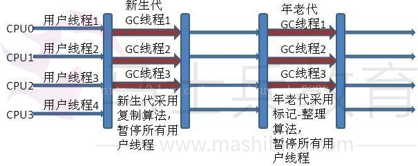

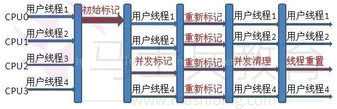

---

G1 收集器
 
Garbage first 垃圾收集器是目前垃圾收集器理论发展的最前沿成果，相比与 CMS 收集器，G1 收集器两
个最突出的改进是： 
1. 基于标记-整理算法，不产生内存碎片。 
2. 可以非常精确控制停顿时间，在不牺牲吞吐量前提下，实现低停顿垃圾回收。
G1 收集器避免全区域垃圾收集，它把堆内存划分为大小固定的几个独立区域，并且跟踪这些区域的垃圾
收集进度，同时在后台维护一个优先级列表，每次根据所允许的收集时间，优先回收垃圾最多的区域。
区域划分和优先级区域回收机制，确保 G1 收集器可以在有限时间获得最高的垃圾收集效率。
 
JAVA IO/NIO
 
1. 阻塞 IO 模型 
最传统的一种 IO 模型，即在读写数据过程中会发生阻塞现象。当用户线程发出 IO 请求之后，内核会去
查看数据是否就绪，如果没有就绪就会等待数据就绪，而用户线程就会处于阻塞状态，用户线程交出 
CPU。当数据就绪之后，内核会将数据拷贝到用户线程，并返回结果给用户线程，用户线程才解除 
block 状态。典型的阻塞 IO 模型的例子为：data = socket.read();如果数据没有就绪，就会一直阻塞在 
read 方法。 
2. 非阻塞 IO 模型 
当用户线程发起一个 read 操作后，并不需要等待，而是马上就得到了一个结果。如果结果是一个 error 
时，它就知道数据还没有准备好，于是它可以再次发送 read 操作。一旦内核中的数据准备好了，并且
又再次收到了用户线程的请求，那么它马上就将数据拷贝到了用户线程，然后返回。
所以事实上，在非阻塞 IO 模型中，用户线程需要不断地询问内核数据是否就绪，也就说非阻塞 IO 不会
交出 CPU，而会一直占用 CPU。典型的非阻塞 IO 模型一般如下： 
但是对于非阻塞 IO 就有一个非常严重的问题，在 while 循环中需要不断地去询问内核数据是否就绪，这
样会导致 CPU 占用率非常高，因此一般情况下很少使用 while 循环这种方式来读取数据。
3. 多路复用 IO 模型 
多路复用 IO 模型是目前使用得比较多的模型。Java NIO 实际上就是多路复用 IO。在多路复用 IO 模型
中，会有一个线程不断去轮询多个 socket 的状态，只有当 socket 真正有读写事件时，才真正调用实际
的 IO 读写操作。因为在多路复用 IO 模型中，只需要使用一个线程就可以管理多个 socket，系统不需要
建立新的进程或者线程，也不必维护这些线程和进程，并且只有在真正有socket 读写事件进行时，才会
使用 IO 资源，所以它大大减少了资源占用。在 Java NIO 中，是通过 selector.select()去查询每个通道是
否有到达事件，如果没有事件，则一直阻塞在那里，因此这种方式会导致用户线程的阻塞。多路复用 IO 
模式，通过一个线程就可以管理多个 socket，只有当 socket 真正有读写事件发生才会占用资源来进行
实际的读写操作。因此，多路复用 IO 比较适合连接数比较多的情况。 
另外多路复用 IO 为何比非阻塞 IO 模型的效率高是因为在非阻塞 IO 中，不断地询问 socket 状态时通过
用户线程去进行的，而在多路复用 IO 中，轮询每个 socket 状态是内核在进行的，这个效率要比用户线
程要高的多。
while(true){
data = socket.read();
if(data!= error){处理数据
break;
}
}

---

不过要注意的是，多路复用 IO 模型是通过轮询的方式来检测是否有事件到达，并且对到达的事件逐一进
行响应。因此对于多路复用 IO 模型来说，一旦事件响应体很大，那么就会导致后续的事件迟迟得不到处
理，并且会影响新的事件轮询。 
4. 信号驱动 IO 模型 
在信号驱动 IO 模型中，当用户线程发起一个 IO 请求操作，会给对应的 socket 注册一个信号函数，然
后用户线程会继续执行，当内核数据就绪时会发送一个信号给用户线程，用户线程接收到信号之后，便
在信号函数中调用 IO 读写操作来进行实际的 IO 请求操作。 
5. 异步 IO 模型 
异步 IO 模型才是最理想的 IO 模型，在异步 IO 模型中，当用户线程发起 read 操作之后，立刻就可以开
始去做其它的事。而另一方面，从内核的角度，当它受到一个 asynchronous read 之后，它会立刻返
回，说明 read 请求已经成功发起了，因此不会对用户线程产生任何 block。然后，内核会等待数据准备
完成，然后将数据拷贝到用户线程，当这一切都完成之后，内核会给用户线程发送一个信号，告诉它 
read 操作完成了。也就说用户线程完全不需要实际的整个 IO 操作是如何进行的，只需要先发起一个请
求，当接收内核返回的成功信号时表示 IO 操作已经完成，可以直接去使用数据了。
也就说在异步 IO 模型中，IO 操作的两个阶段都不会阻塞用户线程，这两个阶段都是由内核自动完成，
然后发送一个信号告知用户线程操作已完成。用户线程中不需要再次调用 IO 函数进行具体的读写。这点
是和信号驱动模型有所不同的，在信号驱动模型中，当用户线程接收到信号表示数据已经就绪，然后需
要用户线程调用 IO 函数进行实际的读写操作；而在异步 IO 模型中，收到信号表示 IO 操作已经完成，
不需要再在用户线程中调用 IO 函数进行实际的读写操作。
注意，异步 IO 是需要操作系统的底层支持，在 Java 7 中，提供了 Asynchronous IO。 
 
JAVA IO 包

---

JAVA NIO
 
NIO 主要有三大核心部分：Channel(通道)，Buffer(缓冲区), Selector。传统 IO 基于字节流和字符流进
行操作，而 NIO 基于 Channel 和 Buffer(缓冲区)进行操作，数据总是从通道读取到缓冲区中，或者从缓
冲区写入到通道中。Selector(选择区)用于监听多个通道的事件（比如：连接打开，数据到达）。因此，
单个线程可以监听多个数据通道。

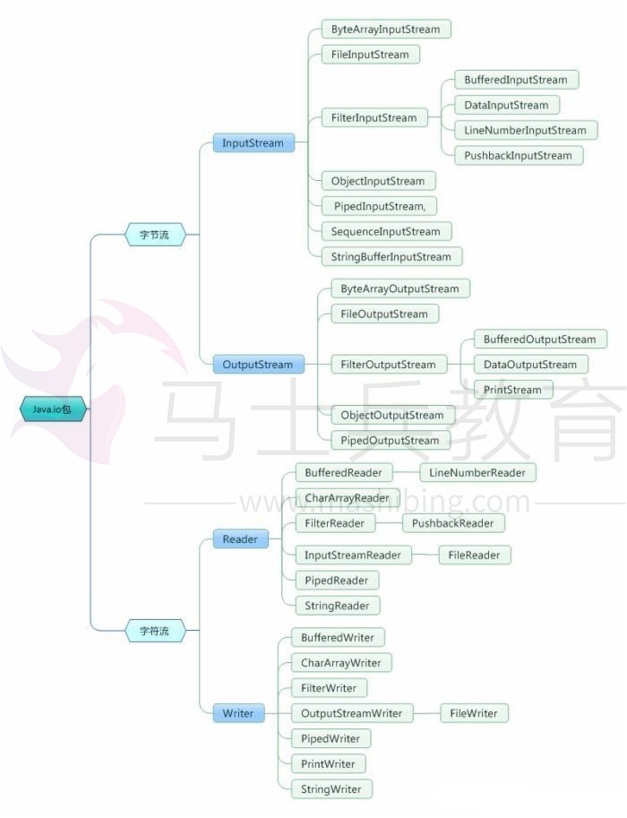

---

NIO 和传统 IO 之间第一个最大的区别是，IO 是面向流的，NIO 是面向缓冲区的。
NIO 的缓冲区
 Java IO 面向流意味着每次从流中读一个或多个字节，直至读取所有字节，它们没有被缓存在任何地
方。此外，它不能前后移动流中的数据。如果需要前后移动从流中读取的数据，需要先将它缓存到一个
缓冲区。NIO 的缓冲导向方法不同。数据读取到一个它稍后处理的缓冲区，需要时可在缓冲区中前后移
动。这就增加了处理过程中的灵活性。但是，还需要检查是否该缓冲区中包含所有您需要处理的数据。
而且，需确保当更多的数据读入缓冲区时，不要覆盖缓冲区里尚未处理的数据。
NIO 的非阻塞
IO 的各种流是阻塞的。这意味着，当一个线程调用 read() 或 write()时，该线程被阻塞，直到有一些数
据被读取，或数据完全写入。该线程在此期间不能再干任何事情了。 NIO 的非阻塞模式，使一个线程从
某通道发送请求读取数据，但是它仅能得到目前可用的数据，如果目前没有数据可用时，就什么都不会
获取。而不是保持线程阻塞，所以直至数据变的可以读取之前，该线程可以继续做其他的事情。 非阻塞
写也是如此。一个线程请求写入一些数据到某通道，但不需要等待它完全写入，这个线程同时可以去做
别的事情。 线程通常将非阻塞 IO 的空闲时间用于在其它通道上执行 IO 操作，所以一个单独的线程现在
可以管理多个输入和输出通道（channel）。

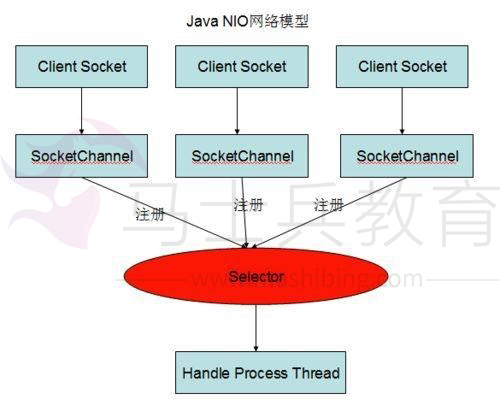

---

Channel

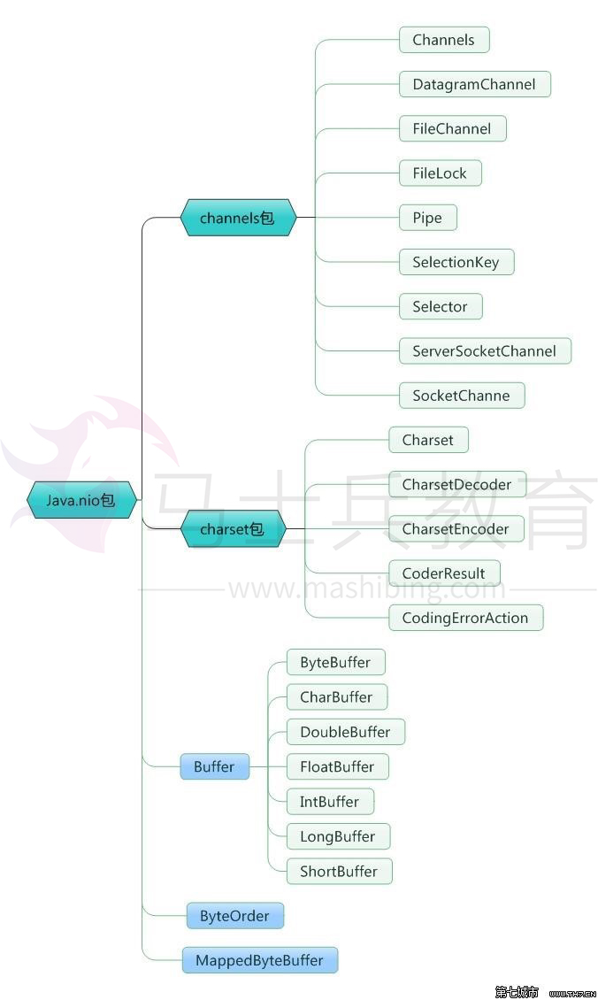

---

首先说一下 Channel，国内大多翻译成“通道”。Channel 和 IO 中的 Stream(流)是差不多一个
等级的。只不过 Stream 是单向的，譬如：InputStream, OutputStream，而 Channel 是双向的，既可
以用来进行读操作，又可以用来进行写操作。 
NIO 中的 Channel 的主要实现有：
1. FileChannel
2. DatagramChannel
3. SocketChannel
4. ServerSocketChannel
这里看名字就可以猜出个所以然来：分别可以对应文件 IO、UDP 和 TCP（Server 和 Client）。
下面演示的案例基本上就是围绕这 4 个类型的 Channel 进行陈述的。 
Buffer
Buffer，故名思意，缓冲区，实际上是一个容器，是一个连续数组。Channel 提供从文件、网络读取数
据的渠道，但是读取或写入的数据都必须经由 Buffer。
上面的图描述了从一个客户端向服务端发送数据，然后服务端接收数据的过程。客户端发送数据时，必
须先将数据存入 Buffer 中，然后将 Buffer 中的内容写入通道。服务端这边接收数据必须通过 Channel 
将数据读入到 Buffer 中，然后再从 Buffer 中取出数据来处理。 
在 NIO 中，Buffer 是一个顶层父类，它是一个抽象类，常用的 Buffer 的子类有： ByteBuffer、
IntBuffer、 CharBuffer、 LongBuffer、 DoubleBuffer、FloatBuffer、
ShortBuffer 
Selector
 Selector 类是 NIO 的核心类，Selector 能够检测多个注册的通道上是否有事件发生，如果有事件发
生，便获取事件然后针对每个事件进行相应的响应处理。这样一来，只是用一个单线程就可以管理多个
通道，也就是管理多个连接。这样使得只有在连接真正有读写事件发生时，才会调用函数来进行读写，
就大大地减少了系统开销，并且不必为每个连接都创建一个线程，不用去维护多个线程，并且避免了多
线程之间的上下文切换导致的开销。
JVM 类加载机制
 
JVM 类加载机制分为五个部分：加载，验证，准备，解析，初始化，下面我们就分别来看一下这五个过
程。

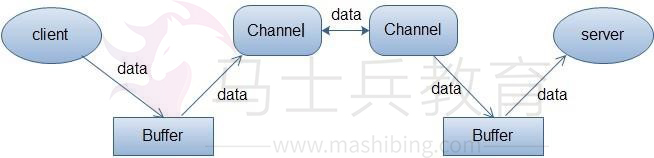

---

加载 
加载是类加载过程中的一个阶段，这个阶段会在内存中生成一个代表这个类的 java.lang.Class 对象，作
为方法区这个类的各种数据的入口。注意这里不一定非得要从一个 Class 文件获取，这里既可以从 ZIP 
包中读取（比如从 jar 包和 war 包中读取），也可以在运行时计算生成（动态代理），也可以由其它文
件生成（比如将 JSP 文件转换成对应的 Class 类）。 
验证 
这一阶段的主要目的是为了确保 Class 文件的字节流中包含的信息是否符合当前虚拟机的要求，并且不
会危害虚拟机自身的安全。
准备 
准备阶段是正式为类变量分配内存并设置类变量的初始值阶段，即在方法区中分配这些变量所使用的内
存空间。注意这里所说的初始值概念，比如一个类变量定义为： 
public static int v = 8080;
实际上变量 v 在准备阶段过后的初始值为 0 而不是 8080，将 v 赋值为 8080 的 put static 指令是程序被
编译后，存放于类构造器方法之中。
但是注意如果声明为：
public static final int v = 8080;
在编译阶段会为 v 生成 ConstantValue 属性，在准备阶段虚拟机会根据 ConstantValue 属性将 v 赋值
为 8080。
解析 
解析阶段是指虚拟机将常量池中的符号引用替换为直接引用的过程。符号引用就是 class 文件中的： 
符号引用 
n 符号引用与虚拟机实现的布局无关，引用的目标并不一定要已经加载到内存中。各种虚拟机实现的内
存布局可以各不相同，但是它们能接受的符号引用必须是一致的，因为符号引用的字面量形式明确定义
在 Java 虚拟机规范的 Class 文件格式中。 
直接引用 
n 直接引用可以是指向目标的指针，相对偏移量或是一个能间接定位到目标的句柄。如果有了直接引
用，那引用的目标必定已经在内存中存在。 
初始化 
1.  CONSTANT_Class_info 
2.  CONSTANT_Field_info 
3.  CONSTANT_Method_info 等类型的常量。

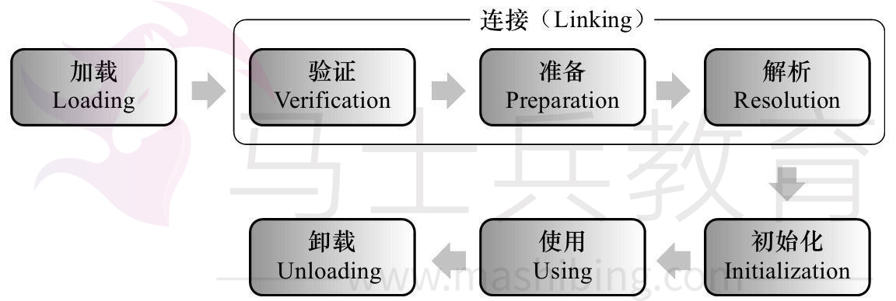

---

初始化阶段是类加载最后一个阶段，前面的类加载阶段之后，除了在加载阶段可以自定义类加载器以
外，其它操作都由 JVM 主导。到了初始阶段，才开始真正执行类中定义的 Java 程序代码。
类构造器 
初始化阶段是执行类构造器方法的过程。方法是由编译器自动收集类中的类变量的赋值操作和静态语句
块中的语句合并而成的。虚拟机会保证子方法执行之前，父类的方法已经执行完毕，如果一个类中没有
对静态变量赋值也没有静态语句块，那么编译器可以不为这个类生成()方法。 
注意以下几种情况不会执行类初始化： 
1. 通过子类引用父类的静态字段，只会触发父类的初始化，而不会触发子类的初始化。
2. 定义对象数组，不会触发该类的初始化。
3. 常量在编译期间会存入调用类的常量池中，本质上并没有直接引用定义常量的类，不会触发定义常
量所在的类。
4. 通过类名获取 Class 对象，不会触发类的初始化。 
5. 通过 Class.forName 加载指定类时，如果指定参数 initialize 为 false 时，也不会触发类初始化，
其实这个参数是告诉虚拟机，是否要对类进行初始化。 
6. 通过 ClassLoader 默认的 loadClass 方法，也不会触发初始化动作。
类加载器
 
虚拟机设计团队把加载动作放到 JVM 外部实现，以便让应用程序决定如何获取所需的类，JVM 提供了 3 
种类加载器： 
 
启动类加载器(Bootstrap ClassLoader) 
1. 负责加载 JAVA_HOME\lib 目录中的，或通过-Xbootclasspath 参数指定路径中的，且被虚拟机认可
（按文件名识别，如 rt.jar）的类。 
扩展类加载器(Extension ClassLoader) 
2. 负责加载 JAVA_HOME\lib\ext 目录中的，或通过 java.ext.dirs 系统变量指定路径中的类库。 
应用程序类加载器(Application ClassLoader)：
3. 负责加载用户路径（classpath）上的类库。 
JVM 通过双亲委派模型进行类的加载，当然我们也可以通过继承 java.lang.ClassLoader 实现自定义的类
加载器。

---

双亲委派
 
当一个类收到了类加载请求，他首先不会尝试自己去加载这个类，而是把这个请求委派给父类去完成，
每一个层次类加载器都是如此，因此所有的加载请求都应该传送到启动类加载其中，只有当父类加载器
反馈自己无法完成这个请求的时候（在它的加载路径下没有找到所需加载的
Class），子类加载器才会尝试自己去加载。 
采用双亲委派的一个好处是比如加载位于 rt.jar 包中的类 java.lang.Object，不管是哪个加载器加载这个
类，最终都是委托给顶层的启动类加载器进行加载，这样就保证了使用不同的类加载器最终得到的都是
同样一个 Object 对象。 
OSGI（动态模型系统**） 
OSGi(Open Service Gateway Initiative)，是面向 Java 的动态模型系统，是 Java 动态化模块化系统的一
系列规范。

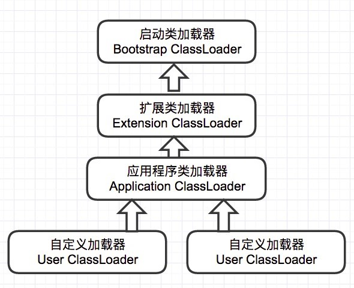

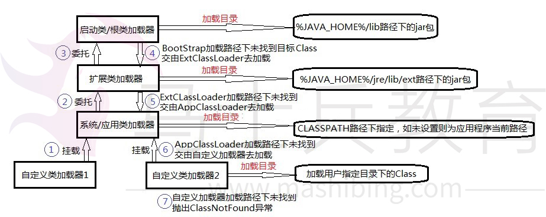

---

动态改变构造
 
OSGi 服务平台提供在多种网络设备上无需重启的动态改变构造的功能。为了最小化耦合度和促使这些耦
合度可管理，OSGi 技术提供一种面向服务的架构，它能使这些组件动态地发现对方。 
模块化编程与热插拔 
OSGi 旨在为实现 Java 程序的模块化编程提供基础条件，基于 OSGi 的程序很可能可以实现模块级的热
插拔功能，当程序升级更新时，可以只停用、重新安装然后启动程序的其中一部分，这对企业级程序开
发来说是非常具有诱惑力的特性。 
OSGi 描绘了一个很美好的模块化开发目标，而且定义了实现这个目标的所需要服务与架构，同时也有成
熟的框架进行实现支持。但并非所有的应用都适合采用 OSGi 作为基础架构，它在提供强大功能同时，
也引入了额外的复杂度，因为它不遵守了类加载的双亲委托模型。 
 
 
 
 
 
 
 
多线程（马老师，黄老师）
 
 
简述线程，程序、进程的基本概念。以及他们之间关系是什
么
 
线程与进程相似，但线程是一个比进程更小的执行单位。一个进程在其执行的过程中可以产生多个线
程。与进程不同的是同类的多个线程共享同一块内存空间和一组系统资源，所以系统在产生一个线程，
或是在各个线程之间作切换工作时，负担要比进程小得多，也正因为如此，线程也被称为轻量级进程。 
程序是含有指令和数据的文件，被存储在磁盘或其他的数据存储设备中，也就是说程序是静态的代码。 
进程是程序的一次执行过程，是系统运行程序的基本单位，因此进程是动态的。系统运行一个程序即是
一个进程从创建，运行到消亡的过程。简单来说，一个进程就是一个执行中的程序，它在计算机中一个
指令接着一个指令地执行着，同时，每个进程还占有某些系统资源如 CPU 时间，内存空间，文件，文
件，输入输出设备的使用权等等。换句话说，当程序在执行时，将会被操作系统载入内存中。 线程是进
程划分成的更小的运行单位。线程和进程最大的不同在于基本上各进程是独立的，而各线程则不一定，
因为同一进程中的线程极有可能会相互影响。从另一角度来说，进程属于操作系统的范畴，主要是同一
段时间内，可以同时执行一个以上的程序，而线程则是在同一程序内几乎同时执行一个以上的程序段。 
线程有哪些基本状态?
 
Java 线程在运行的生命周期中的指定时刻只可能处于下面 6 种不同状态的其中一个状态。 
线程在生命周期中并不是固定处于某一个状态而是随着代码的执行在不同状态之间切换。Java 线程状态
变迁如下图所示：

---

如何理解内存泄漏问题？有哪些情况会导致内存泄露？如何
解决？
 
详解java内存泄露和如何避免内存泄漏
 
 
一直以来java都占据着语言排行榜的头把交椅。这是与java的设计密不可分的，其中最令大家喜欢的不
是面向对象，而是垃圾回收机制。你只需要简单的创建对象而不需要负责释放空间，因为Java的垃圾回
收器会负责内存的回收。然而，情况并不是这样简单，内存泄露还是经常会在Java应用程序中出现。
下面我们将详细的学习什么是内存泄露，为什么会发生，以及怎样阻止内存泄露。
什么是内存泄露
内存泄露的定义：对于应用程序来说，当对象已经不再被使用，但是Java的垃圾回收器不能回收它们的
时候，就产生了内存泄露。
要理解这个定义，我们需要理解对象在内存中的状态。如下图所示，展示了哪些对象是无用对象，哪些
是未被引用的对象；

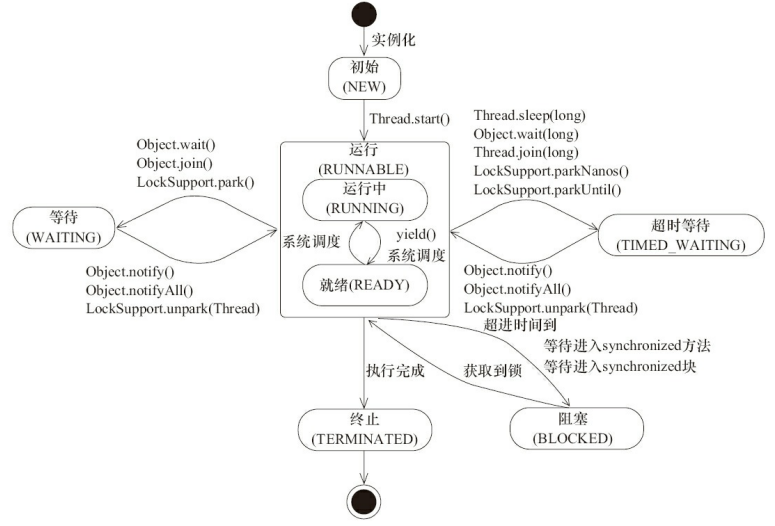

---

上图中包含了未引用对象和引用对象。未引用对象将会被垃圾回收器回收，而引用对象却不会。未引用
对象很显然是无用的对象。然而，无用的对象并不都是未引用对象，有一些无用对象也有可能是引用对
象，这部分对象正是内存泄露的来源。
为什么内存泄露会发生
让我们用下面的例子来看看为什么会发生内存泄露。如下图所示，对象A引用对象B，A的生命周期（t1-
t4）比B的生命周期（t2-t3）要长，当B在程序中不再被使用的时候，A仍然引用着B。在这种情况下，
垃圾回收器是不会回收B对象的，这就可能造成了内存不足问题，因为A可能不止引用着B对象，还可能
引用其它生命周期比A短的对象，这就造成了大量无用对象不能被回收，且占据了昂贵的内存资源。

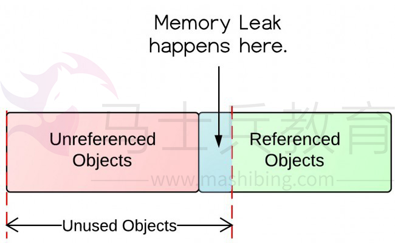

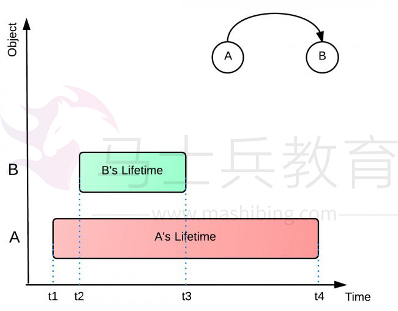

---

同样的，B对象也可能引用着一大堆对象，这些被B对象引用着的对象也不能被垃圾回收器回收，所有的
这些无用对象消耗了大量内存资源。
怎样阻止内存泄露
1.使用List、Map等集合时，在使用完成后赋值为null
2.使用大对象时，在用完后赋值为null
3.目前已知的jdk1.6的substring()方法会导致内存泄露
4.避免一些死循环等重复创建或对集合添加元素，撑爆内存
5.简洁数据结构、少用静态集合等
6.及时的关闭打开的文件，socket句柄等
7.多关注事件监听(listeners)和回调(callbacks)，比如注册了一个listener，当它不再被使用的时候，忘
了注销该listener，可能就会产生内存泄露
 
 
 
 
 
线程池的原理，为什么要创建线程池？创建线程池的方式;  
原理:
 
线程池的优点
 
1、线程是稀缺资源，使用线程池可以减少创建和销毁线程的次数，每个工作线程都可以重复使用。
2、可以根据系统的承受能力，调整线程池中工作线程的数量，防止因为消耗过多内存导致服务器崩溃。
 
线程池的创建
 
corePoolSize：线程池核心线程数量
maximumPoolSize:线程池最大线程数量
keepAliverTime：当活跃线程数大于核心线程数时，空闲的多余线程最大存活时间
unit：存活时间的单位
workQueue：存放任务的队列
handler：超出线程范围和队列容量的任务的处理程序
 
public ThreadPoolExecutor(int corePoolSize,
                               int maximumPoolSize,
                               long keepAliveTime,
                               TimeUnit unit,
                               BlockingQueue<Runnable> workQueue,
                               RejectedExecutionHandler handler)

---

线程池的实现原理
 
 
提交一个任务到线程池中，线程池的处理流程如下：
1、判断线程池里的核心线程是否都在执行任务，如果不是（核心线程空闲或者还有核心线程没有被创
建）则创建一个新的工作线程来执行任务。如果核心线程都在执行任务，则进入下个流程。
2、线程池判断工作队列是否已满，如果工作队列没有满，则将新提交的任务存储在这个工作队列里。如
果工作队列满了，则进入下个流程。
3、判断线程池里的线程是否都处于工作状态，如果没有，则创建一个新的工作线程来执行任务。如果已
经满了，则交给饱和策略来处理这个任务。
线程池的源码解读
 
1、ThreadPoolExecutor的execute()方法
2、创建线程的方法：addIfUnderCorePoolSize(command)
 1 public void execute(Runnable command) {
 2         if (command == null)
 3             throw new NullPointerException();       //如果线程数大于等于基本线
程数或者线程创建失败，将任务加入队列
 4         if (poolSize >= corePoolSize || !addIfUnderCorePoolSize(command)) 
{          //线程池处于运行状态并且加入队列成功
 5             if (runState == RUNNING && workQueue.offer(command)) {
 6                 if (runState != RUNNING || poolSize == 0)
 7                     ensureQueuedTaskHandled(command);
 8             }         //线程池不处于运行状态或者加入队列失败，则创建线程（创建的
是非核心线程）
 9             else if (!addIfUnderMaximumPoolSize(command))           //
创建线程失败，则采取阻塞处理的方式
10                 reject(command); // is shutdown or saturated
11         }
12     }
 1 private boolean addIfUnderCorePoolSize(Runnable firstTask) {

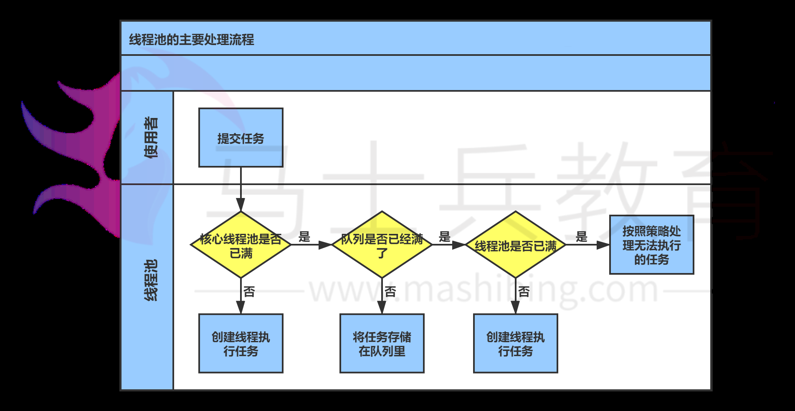

---

我们重点来看第7行：
这里将线程封装成工作线程worker，并放入工作线程组里，worker类的方法run方法：
worker在执行完任务后，还会通过getTask方法循环获取工作队里里的任务来执行。
我们通过一个程序来观察线程池的工作原理：
1、创建一个线程
 2         Thread t = null;
 3         final ReentrantLock mainLock = this.mainLock;
 4         mainLock.lock();
 5         try {
 6             if (poolSize < corePoolSize && runState == RUNNING)
 7                 t = addThread(firstTask);
 8         } finally {
 9             mainLock.unlock();
10         }
11         if (t == null)
12             return false;
13         t.start();
14         return true;
15     }
 1 private Thread addThread(Runnable firstTask) {
 2         Worker w = new Worker(firstTask);
 3         Thread t = threadFactory.newThread(w);
 4         if (t != null) {
 5             w.thread = t;
 6             workers.add(w);
 7             int nt = ++poolSize;
 8             if (nt > largestPoolSize)
 9                 largestPoolSize = nt;
10         }
11         return t;
12     }
 public void run() {
            try {
                Runnable task = firstTask;
                firstTask = null;
                while (task != null || (task = getTask()) != null) {
                    runTask(task);
                    task = null;
                }
            } finally {
                workerDone(this);
            }
        }
 1 public class ThreadPoolTest implements Runnable
 2 {
 3     @Override
 4     public void run()
 5     {

---

2、线程池循环运行16个线程：
执行结果：
 6         try
 7         {
 8             Thread.sleep(300);
 9         }
10         catch (InterruptedException e)
11         {
12             e.printStackTrace();
13         }
14     }
15 }
 1 public static void main(String[] args)
 2     {
 3         LinkedBlockingQueue<Runnable> queue =
 4             new LinkedBlockingQueue<Runnable>(5);
 5         ThreadPoolExecutor threadPool = new ThreadPoolExecutor(5, 10, 60, 
TimeUnit.SECONDS, queue);
 6         for (int i = 0; i < 16 ; i++)
 7         {
 8             threadPool.execute(
 9                 new Thread(new ThreadPoolTest(), "Thread".concat(i + "")));
10             System.out.println("线程池中活跃的线程数： " + 
threadPool.getPoolSize());
11             if (queue.size() > 0)
12             {
13                 System.out.println("----------------队列中阻塞的线程数" + 
queue.size());
14             }
15         }
16         threadPool.shutdown();
17     }
线程池中活跃的线程数： 1
线程池中活跃的线程数： 2
线程池中活跃的线程数： 3
线程池中活跃的线程数： 4
线程池中活跃的线程数： 5
线程池中活跃的线程数： 5
----------------队列中阻塞的线程数1
线程池中活跃的线程数： 5
----------------队列中阻塞的线程数2
线程池中活跃的线程数： 5
----------------队列中阻塞的线程数3
线程池中活跃的线程数： 5
----------------队列中阻塞的线程数4
线程池中活跃的线程数： 5
----------------队列中阻塞的线程数5
线程池中活跃的线程数： 6
----------------队列中阻塞的线程数5
线程池中活跃的线程数： 7
----------------队列中阻塞的线程数5

---

从结果可以观察出：
1、创建的线程池具体配置为：核心线程数量为5个；全部线程数量为10个；工作队列的长度为5。
2、我们通过queue.size()的方法来获取工作队列中的任务数。
3、运行原理：
   刚开始都是在创建新的线程，达到核心线程数量5个后，新的任务进来后不再创建新的线程，而是将任
务加入工作队列，任务队列到达上线5个后，新的任务又会创建新的普通线程，直到达到线程池最大的线
程数量10个，后面的任务则根据配置的饱和策略来处理。我们这里没有具体配置，使用的是默认的配置
AbortPolicy:直接抛出异常。
  当然，为了达到我需要的效果，上述线程处理的任务都是利用休眠导致线程没有释放！！！
RejetedExecutionHandler：饱和策略
 
当队列和线程池都满了，说明线程池处于饱和状态，那么必须对新提交的任务采用一种特殊的策略来进
行处理。这个策略默认配置是AbortPolicy，表示无法处理新的任务而抛出异常。JAVA提供了4中策略：
1、AbortPolicy：直接抛出异常
2、CallerRunsPolicy：只用调用所在的线程运行任务
3、DiscardOldestPolicy：丢弃队列里最近的一个任务，并执行当前任务。
4、DiscardPolicy：不处理，丢弃掉。
我们现在用第四种策略来处理上面的程序：
线程池中活跃的线程数： 8
----------------队列中阻塞的线程数5
线程池中活跃的线程数： 9
----------------队列中阻塞的线程数5
线程池中活跃的线程数： 10
----------------队列中阻塞的线程数5
Exception in thread "main" java.util.concurrent.RejectedExecutionException: Task 
Thread[Thread15,5,main] rejected from 
java.util.concurrent.ThreadPoolExecutor@232204a1[Running, pool size = 10, active 
threads = 10, queued tasks = 5, completed tasks = 0]
    at 
java.util.concurrent.ThreadPoolExecutor$AbortPolicy.rejectedExecution(ThreadPool
Executor.java:2047)
    at 
java.util.concurrent.ThreadPoolExecutor.reject(ThreadPoolExecutor.java:823)
    at 
java.util.concurrent.ThreadPoolExecutor.execute(ThreadPoolExecutor.java:1369)
    at test.ThreadTest.main(ThreadTest.java:17)
 1 public static void main(String[] args)
 2     {
 3         LinkedBlockingQueue<Runnable> queue =
 4             new LinkedBlockingQueue<Runnable>(3);
 5         RejectedExecutionHandler handler = new 
ThreadPoolExecutor.DiscardPolicy();
 6 
 7         ThreadPoolExecutor threadPool = new ThreadPoolExecutor(2, 5, 60, 
TimeUnit.SECONDS, queue,handler);
 8         for (int i = 0; i < 9 ; i++)
 9         {

---

执行结果：
这里采用了丢弃策略后，就没有再抛出异常，而是直接丢弃。在某些重要的场景下，可以采用记录日志
或者存储到数据库中，而不应该直接丢弃。
设置策略有两种方式：
1、
2、
 
 JAVA线程池原理详解二                
            
            
10             threadPool.execute(
11                 new Thread(new ThreadPoolTest(), "Thread".concat(i + "")));
12             System.out.println("线程池中活跃的线程数： " + 
threadPool.getPoolSize());
13             if (queue.size() > 0)
14             {
15                 System.out.println("----------------队列中阻塞的线程数" + 
queue.size());
16             }
17         }
18         threadPool.shutdown();
19     }
线程池中活跃的线程数： 1
线程池中活跃的线程数： 2
线程池中活跃的线程数： 2
----------------队列中阻塞的线程数1
线程池中活跃的线程数： 2
----------------队列中阻塞的线程数2
线程池中活跃的线程数： 2
----------------队列中阻塞的线程数3
线程池中活跃的线程数： 3
----------------队列中阻塞的线程数3
线程池中活跃的线程数： 4
----------------队列中阻塞的线程数3
线程池中活跃的线程数： 5
----------------队列中阻塞的线程数3
线程池中活跃的线程数： 5
----------------队列中阻塞的线程数3
 RejectedExecutionHandler handler = new ThreadPoolExecutor.DiscardPolicy();
 ThreadPoolExecutor threadPool = new ThreadPoolExecutor(2, 5, 60, 
TimeUnit.SECONDS, queue,handler);
  ThreadPoolExecutor threadPool = new ThreadPoolExecutor(2, 5, 60, 
TimeUnit.SECONDS, queue);
  threadPool.setRejectedExecutionHandler(new ThreadPoolExecutor.AbortPolicy());

---

Executor框架的两级调度模型
 
在HotSpot VM的模型中，JAVA线程被一对一映射为本地操作系统线程。JAVA线程启动时会创建一个本
地操作系统线程，当JAVA线程终止时，对应的操作系统线程也被销毁回收，而操作系统会调度所有线程
并将它们分配给可用的CPU。
在上层，JAVA程序会将应用分解为多个任务，然后使用应用级的调度器（Executor）将这些任务映射成
固定数量的线程；在底层，操作系统内核将这些线程映射到硬件处理器上。
Executor框架类图
在前面介绍的JAVA线程既是工作单元，也是执行机制。而在Executor框架中，我们将工作单元与执行
机制分离开来。Runnable和Callable是工作单元（也就是俗称的任务），而执行机制由Executor来提
供。这样一来Executor是基于生产者消费者模式的，提交任务的操作相当于生成者，执行任务的线程相
当于消费者。
1、从类图上看，Executor接口是异步任务执行框架的基础，该框架能够支持多种不同类型的任务执行
策略。
Executor接口就提供了一个执行方法，任务是Runnbale类型，不支持Callable类型。
2、ExecutorService接口实现了Executor接口，主要提供了关闭线程池和submit方法：
public interface Executor {
    void execute(Runnable command);
}

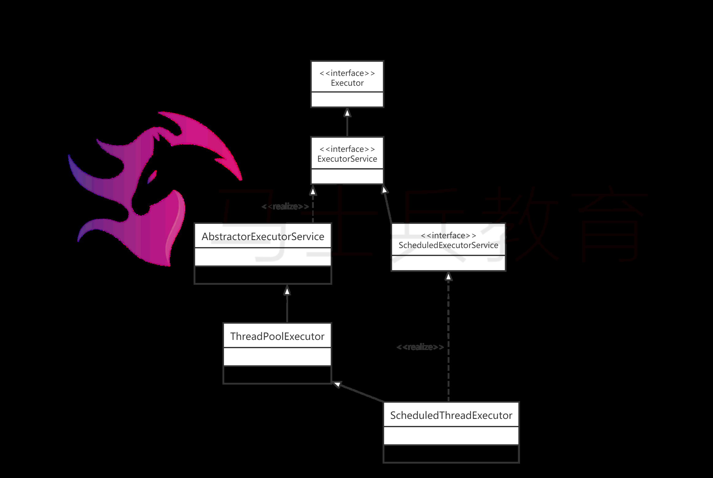

---

另外该接口有两个重要的实现类：ThreadPoolExecutor与ScheduledThreadPoolExecutor。
其中ThreadPoolExecutor是线程池的核心实现类，用来执行被提交的任务；而
ScheduledThreadPoolExecutor是一个实现类，可以在给定的延迟后运行任务，或者定期执行命令。
在上一篇文章中，我是使用ThreadPoolExecutor来通过给定不同的参数从而创建自己所需的线程池，但
是在后面的工作中不建议这种方式，推荐使用Exectuors工厂方法来创建线程池
这里先来区别线程池和线程组（ThreadGroup与ThreadPoolExecutor）这两个概念：
a、线程组就表示一个线程的集合。
b、线程池是为线程的生命周期开销问题和资源不足问题提供解决方案，主要是用来管理线程。
Executors可以创建3种类型的ThreadPoolExecutor：SingleThreadExecutor、FixedThreadExecutor
和CachedThreadPool
a、SingleThreadExecutor：单线程线程池
我们从源码来看可以知道，单线程线程池的创建也是通过ThreadPoolExecutor，里面的核心线程数和线
程数都是1，并且工作队列使用的是无界队列。由于是单线程工作，每次只能处理一个任务，所以后面所
有的任务都被阻塞在工作队列中，只能一个个任务执行。
b、FixedThreadExecutor：固定大小线程池
这个与单线程类似，只是创建了固定大小的线程数量。
c、CachedThreadPool:无界线程池
public interface ExecutorService extends Executor {
    List<Runnable> shutdownNow();
    boolean isTerminated();
    <T> Future<T> submit(Callable<T> task);
 }
ExecutorService threadPool = Executors.newSingleThreadExecutor();
public static ExecutorService newSingleThreadExecutor() {
        return new FinalizableDelegatedExecutorService
            (new ThreadPoolExecutor(1, 1,
                                    0L, TimeUnit.MILLISECONDS,
                                    new LinkedBlockingQueue<Runnable>()));
    }
ExecutorService threadPool = Executors.newFixedThreadPool(5);
public static ExecutorService newFixedThreadPool(int nThreads) {
        return new ThreadPoolExecutor(nThreads, nThreads,
                                      0L, TimeUnit.MILLISECONDS,
                                      new LinkedBlockingQueue<Runnable>());
    }

---

无界线程池意味着没有工作队列，任务进来就执行，线程数量不够就创建，与前面两个的区别是：空闲
的线程会被回收掉，空闲的时间是60s。这个适用于执行很多短期异步的小程序或者负载较轻的服务
器。
Callable、Future、FutureTash详解
 
Callable与Future是在JAVA的后续版本中引入进来的，Callable类似于Runnable接口，实现Callable接
口的类与实现Runnable的类都是可以被线程执行的任务。
三者之间的关系：
Callable是Runnable封装的异步运算任务。
Future用来保存Callable异步运算的结果
FutureTask封装Future的实体类
1、Callable与Runnbale的区别
a、Callable定义的方法是call，而Runnable定义的方法是run。
b、call方法有返回值，而run方法是没有返回值的。
c、call方法可以抛出异常，而run方法不能抛出异常。
2、Future
Future表示异步计算的结果，提供了以下方法，主要是判断任务是否完成、中断任务、获取任务执行结
果
3、FutureTask
可取消的异步计算，此类提供了对Future的基本实现，仅在计算完成时才能获取结果，如果计算尚未完
成，则阻塞get方法。
ExecutorService threadPool = Executors.newCachedThreadPool();
public static ExecutorService newCachedThreadPool() {
        return new ThreadPoolExecutor(0, Integer.MAX_VALUE,
                                      60L, TimeUnit.SECONDS,
                                      new SynchronousQueue<Runnable>());
    }
 1 public interface Future<V> {
 2 
 3     boolean cancel(boolean mayInterruptIfRunning);
 4 
 5     boolean isCancelled();
 6 
 7     boolean isDone();
 8 
 9     V get() throws InterruptedException, ExecutionException;
10 
11     V get(long timeout, TimeUnit unit)
12         throws InterruptedException, ExecutionException, TimeoutException;
13 }
public class FutureTask<V> implements RunnableFuture<V>
public interface RunnableFuture<V> extends Runnable, Future<V>

---

FutureTask不仅实现了Future接口，还实现了Runnable接口，所以不仅可以将FutureTask当成一个
任务交给Executor来执行，还可以通过Thread来创建一个线程。
Callable与FutureTask
 
定义一个callable的任务：
执行结果：
 1 public class MyCallableTask implements Callable<Integer>
 2 {
 3     @Override
 4     public Integer call()
 5         throws Exception
 6     {
 7         System.out.println("callable do somothing");
 8         Thread.sleep(5000);
 9         return new Random().nextInt(100);
10     }
11 }
 1 public class CallableTest
 2 {
 3     public static void main(String[] args) throws Exception
 4     {
 5         Callable<Integer> callable = new MyCallableTask();
 6         FutureTask<Integer> future = new FutureTask<Integer>(callable);
 7         Thread thread = new Thread(future);
 8         thread.start();
 9         Thread.sleep(100);
10         //尝试取消对此任务的执行
11         future.cancel(true);
12         //判断是否在任务正常完成前取消
13         System.out.println("future is cancel:" + future.isCancelled());
14         if(!future.isCancelled())
15         {
16             System.out.println("future is cancelled");
17         }
18         //判断任务是否已完成
19         System.out.println("future is done:" + future.isDone());
20         if(!future.isDone())
21         {
22             System.out.println("future get=" + future.get());
23         }
24         else
25         {
26             //任务已完成
27             System.out.println("task is done");
28         }
29     }
30 }
callable do somothing
future is cancel:true
future is done:true
task is done

---

这个DEMO主要是通过调用FutureTask的状态设置的方法，演示了状态的变迁。
a、第11行，尝试取消对任务的执行，该方法如果由于任务已完成、已取消则返回false，如果能够取消
还未完成的任务，则返回true，该DEMO中由于任务还在休眠状态，所以可以取消成功。
b、第13行，判断任务取消是否成功：如果在任务正常完成前将其取消，则返回true
c、第19行，判断任务是否完成：如果任务完成，则返回true，以下几种情况都属于任务完成：正常终
止、异常或者取消而完成。
  我们的DEMO中，任务是由于取消而导致完成。
d、在第22行，获取异步线程执行的结果，我这个DEMO中没有执行到这里，需要注意的是，
future.get方法会阻塞当前线程， 直到任务执行完成返回结果为止。
Callable与Future
 
执行结果：
future.cancel(true);
System.out.println("future is cancel:" + future.isCancelled());
 System.out.println("future is done:" + future.isDone());
System.out.println("future get=" + future.get());
public class CallableThread implements Callable<String>
{
    @Override
    public String call()
        throws Exception
    {
        System.out.println("进入Call方法，开始休眠，休眠时间为：" + 
System.currentTimeMillis());
        Thread.sleep(10000);
        return "今天停电";
    }
    
    public static void main(String[] args) throws Exception
    {
        ExecutorService es = Executors.newSingleThreadExecutor();
        Callable<String> call = new CallableThread();
        Future<String> fu = es.submit(call);
        es.shutdown();
        Thread.sleep(5000);
        System.out.println("主线程休眠5秒，当前时间" + System.currentTimeMillis());
        String str = fu.get();
        System.out.println("Future已拿到数据，str=" + str + ";当前时间为：" + 
System.currentTimeMillis());
    }
}

---

这里的future是直接扔到线程池里面去执行的。由于要打印任务的执行结果，所以从执行结果来看，主
线程虽然休眠了5s，但是从Call方法执行到拿到任务的结果，这中间的时间差正好是10s，说明get方法
会阻塞当前线程直到任务完成。
**通过FutureTask也可以达到同样的效果：
以上的组合可以给我们带来这样的一些变化：
如有一种场景中，方法A返回一个数据需要10s,A方法后面的代码运行需要20s，但是这20s的执行过程
中，只有后面10s依赖于方法A执行的结果。如果与以往一样采用同步的方式，势必会有10s的时间被浪
费，如果采用前面两种组合，则效率会提高：
1、先把A方法的内容放到Callable实现类的call()方法中
2、在主线程中通过线程池执行A任务
3、执行后面方法中10秒不依赖方法A运行结果的代码
4、获取方法A的运行结果，执行后面方法中10秒依赖方法A运行结果的代码
这样代码执行效率一下子就提高了，程序不必卡在A方法处。
创建线程池的几种方式:
 
ThreadPoolExecutor、ThreadScheduledExecutor、ForkJoinPool
线程的生命周期，什么时候会出现僵死进程；
 
进入Call方法，开始休眠，休眠时间为：1478606602676
主线程休眠5秒，当前时间1478606608676
Future已拿到数据，str=今天停电;当前时间为：1478606612677
public static void main(String[] args) throws Exception
    {
      ExecutorService es = Executors.newSingleThreadExecutor();
      Callable<String> call = new CallableThread();
      FutureTask<String> task = new FutureTask<String>(call);
      es.submit(task);
      es.shutdown();
      Thread.sleep(5000);
      System.out.println("主线程等待5秒，当前时间为：" + System.currentTimeMillis());
      String str = task.get();
      System.out.println("Future已拿到数据，str=" + str + ";当前时间为：" + 
System.currentTimeMillis());
    }

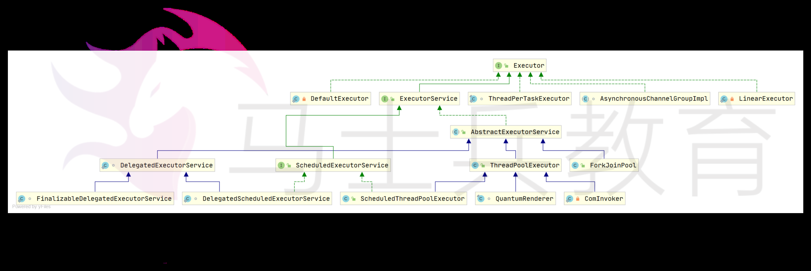

---

僵死进程是指子进程退出时，父进程并未对其发出的SIGCHLD信号进行适当处理，导致子 进程停留在僵
死状态等待其父进程为其收尸，这个状态下的子进程就是僵死进程。
说说线程安全问题，什么是线程安全，如何实现线程安全； 
线程安全 - 如果线程执行过程中不会产生共享资源的冲突，则线程安全。 
线程不安全 - 如果有多个线程同时在操作主内存中的变量，则线程不安全
 
实现线程安全的三种方式
1）互斥同步
  临界区：syncronized、ReentrantLock  
  信号量 semaphore   
  互斥量 mutex
2）非阻塞同步   
3）无同步方案    
 
    CAS（Compare And Swap）
    可重入代码   
    使用Threadlocal 类来包装共享变量，做到每个线程有自己的copy    
    线程本地存储

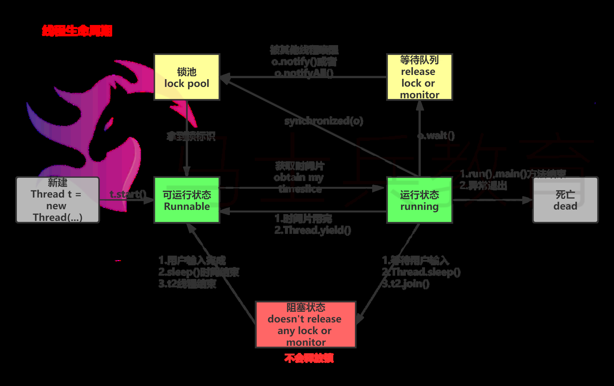

---

Java 多线程安全机制
 
 
在开始讨论java多线程安全机制之前，首先从内存模型来了解一下什么是多线程的安全性。
我们都知道java的内存模型中有主内存和线程的工作内存之分，主内存上存放的是线程共享的变量（实
例字段，静态字段和构成数组的元素），线程的工作内存是线程私有的空间，存放的是线程私有的变量
（方法参数与局部变量）。线程在工作的时候如果要操作主内存上的共享变量，为了获得更好的执行性
能并不是直接去修改主内存而是会在线程私有的工作内存中创建一份变量的拷贝（缓存），在工作内存
上对变量的拷贝修改之后再把修改的值刷回到主内存的变量中去，JVM提供了8中原子操作来完成这一过
程：lock, unlock, read, load, use, assign, store, write。深入理解java虚拟机-jvm最高特性与实践这本
书中有一个图很好的表示了线程，主内存和工作内存之间的关系：
如果只有一个线程当然不会有什么问题，但是如果有多个线程同时在操作主内存中的变量，因为8种操作
的非连续性和线程抢占cpu执行的机制就会带来冲突的问题，也就是多线程的安全问题。线程安全的定
义就是：如果线程执行过程中不会产生共享资源的冲突就是线程安全的。
Java里面一般用以下几种机制保证线程安全：
1.互斥同步锁（悲观锁）
 
1）Synchorized
2）ReentrantLock
互斥同步锁也叫做阻塞同步锁，特征是会对没有获取锁的线程进行阻塞。
要理解互斥同步锁，首选要明白什么是互斥什么是同步。简单的说互斥就是非你即我，同步就是顺序访
问。互斥同步锁就是以互斥的手段达到顺序访问的目的。操作系统提供了很多互斥机制比如信号量，互
斥量，临界区资源等来控制在某一个时刻只能有一个或者一组线程访问同一个资源。
Java里面的互斥同步锁就是Synchorized和ReentrantLock，前者是由语言级别实现的互斥同步锁，理解
和写法简单但是机制笨拙，在JDK6之后性能优化大幅提升，即使在竞争激烈的情况下也能保持一个和
ReentrantLock相差不多的性能，所以JDK6之后的程序选择不应该再因为性能问题而放弃synchorized。
ReentrantLock是API层面的互斥同步锁，需要程序自己打开并在finally中关闭锁，和synchorized相比
更加的灵活，体现在三个方面：等待可中断，公平锁以及绑定多个条件。但是如果程序猿对
ReentrantLock理解不够深刻，或者忘记释放lock，那么不仅不会提升性能反而会带来额外的问题。另
外synchorized是JVM实现的，可以通过监控工具来监控锁的状态，遇到异常JVM会自动释放掉锁。而
ReentrantLock必须由程序主动的释放锁。
互斥同步锁都是可重入锁，好处是可以保证不会死锁。但是因为涉及到核心态和用户态的切换，因此比
较消耗性能。JVM开发团队在JDK5-JDK6升级过程中采用了很多锁优化机制来优化同步无竞争情况下锁的
性能。比如：自旋锁和适应性自旋锁，轻量级锁，偏向锁，锁粗化和锁消除。

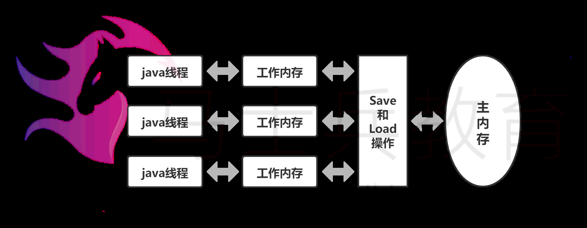

---

2.非阻塞同步锁
 
1) 原子类（CAS）
非阻塞同步锁也叫乐观锁，相比悲观锁来说，它会先进行资源在工作内存中的更新，然后根据与主存中
旧值的对比来确定在此期间是否有其他线程对共享资源进行了更新，如果旧值与期望值相同，就认为没
有更新，可以把新值写回内存，否则就一直重试直到成功。它的实现方式依赖于处理器的机器指令：
CAS（Compare And Swap）
JUC中提供了几个Automic类以及每个类上的原子操作就是乐观锁机制 
不激烈情况下，性能比synchronized略逊，而激烈的时候，也能维持常态。激烈的时候，Atomic的性能
会优于ReentrantLock一倍左右。但是其有一个缺点，就是只能同步一个值，一段代码中只能出现一个
Atomic的变量，多于一个同步无效。因为他不能在多个Atomic之间同步。 
非阻塞锁是不可重入的，否则会造成死锁。
3.无同步方案
 
1）可重入代码
在执行的任何时刻都可以中断-重入执行而不会产生冲突。特点就是不会依赖堆上的共享资源
2）ThreadLocal/Volaitile
线程本地的变量，每个线程获取一份共享变量的拷贝，单独进行处理。 
3)  线程本地存储
如果一个共享资源一定要被多线程共享，可以尽量让一个线程完成所有的处理操作，比如生产者消费者
模式中，一般会让一个消费者完成对队列上资源的消费。典型的应用是基于请求-应答模式的web服务器
的设计
创建线程池有哪几个核心参数？ 如何合理配置线程池的大
小？
 
1）核心参数 
 
 
2) 核心说明 
1. 当线程池中线程数量小于 corePoolSize 则创建线程，并处理请求。 
2. 当线程池中线程数量大于等于 corePoolSize 时，则把请求放入 workQueue 中,随着线程池 中的核
心线程们不断执行任务，只要线程池中有空闲的核心线程，线程池就从 workQueue 中取 任务并处
理。 
public ThreadPoolExecutor(int corePoolSize,  // 核心线程数量大小   
            int maximumPoolSize, // 线程池最大容纳线程数
            long keepAliveTime, // 线程空闲后的存活时长
            TimeUnit unit,
            //缓存异步任务的队列 //用来构造线程池里的worker线程
            BlockingQueue<Runnable> workQueue,
            ThreadFactory threadFactory,
            //线程池任务满载后采取的任务拒绝策略 
            RejectedExecutionHandler handler)

---

3. 当 workQueue 已存满，放不下新任务时则新建非核心线程入池，并处理请求直到线程数目 达到 
maximumPoolSize（最大线程数量设置值）。 
4. 如果线程池中线程数大于 maximumPoolSize 则使用 RejectedExecutionHandler 来进行任 务拒绝
处理。 
 
3)线程池大小分配    
线程池究竟设置多大要看你的线程池执行的什么任务了，CPU密集型、IO密集型、混合型，任 务类型不
同，设置的方式也不一样。    
任务一般分为：CPU密集型、IO密集型、混合型，对于不同类型的任务需要分配不同大小的线 程池。
3.1）CPU密集型    
尽量使用较小的线程池，一般Cpu核心数+1 
3.2）IO密集型    
方法一：可以使用较大的线程池，一般CPU核心数 * 2    
方法二：（线程等待时间与线程CPU时间之比 + 1）* CPU数目 
3.3）混合型    可以将任务分为CPU密集型和IO密集型，然后分别使用不同的线程池去处理，按情况而定 
 
 
关于线程池的执行原则及配置参数详解
 
在软件开发中，池一直都是一种非常优秀的设计思想，通过建立池可以有效的利用系统资源，节约系统
性能。Java 中的线程池就是一种非常好的实现，从 JDK 1.5 开始 Java 提供了一个线程工厂 Executors 用
来生成线程池，通过 Executors 可以方便的生成不同类型的线程池。但是要更好的理解使用线程池，就
需要了解线程池的配置参数意义以及线程池的具体工作机制。
下面先介绍一下线程池的好处以及创建方式，接着会着重介绍关于线程池的执行原则以及构造方法的参
数详解。
线程池的好处
 
降低资源消耗。通过重复利用已创建的线程降低线程创建和销毁造成的消耗。
提高响应速度。当任务到达时，任务可以不需要等到线程创建就能立即执行。
提高线程的可管理性。线程是稀缺资源，如果无限制的创建，不仅会消耗系统资源，还会降低系统
的稳定性，使用线程池可以进行统一的分配，调优和监控。
创建线程池
 
//参数初始化
private static final int CPU_COUNT = Runtime.getRuntime().availableProcessors();
//核心线程数量大小
private static final int corePoolSize = Math.max(2, Math.min(CPU_COUNT - 1, 4));
//线程池最大容纳线程数
private static final int maximumPoolSize = CPU_COUNT * 2 + 1;
//线程空闲后的存活时长
private static final int keepAliveTime = 30;
//任务过多后，存储任务的一个阻塞队列
BlockingQueue<Runnable>  workQueue = new SynchronousQueue<>();

---

具体参数介绍
 
corePoolSize
线程池的核心线程数。在没有设置 allowCoreThreadTimeOut 为 true 的情况下，核心线程会在线
程池中一直存活，即使处于闲置状态。
 maximumPoolSize
线程池所能容纳的最大线程数。当活动线程(核心线程+非核心线程)达到这个数值后，后续任务将
会根据 RejectedExecutionHandler 来进行拒绝策略处理。
keepAliveTime
非核心线程闲置时的超时时长。超过该时长，非核心线程就会被回收。若线程池通设置核心线程也
允许 timeOut，即 allowCoreThreadTimeOut 为 true，则该时长同样会作用于核心线程，在超过 
aliveTime 时，核心线程也会被回收，AsyncTask 配置的线程池就是这样设置的。
unit
keepAliveTime 时长对应的单位。
workQueue
线程池中的任务队列，通过线程池的 execute() 方法提交的 Runnable 对象会存储在该队列中。
ThreadFactory
线程工厂，功能很简单，就是为线程池提供创建新线程的功能。这是一个接口，可以通过自定义，
做一些自定义线程名的操作。
RejectedExecutionHandler
当任务无法被执行时(超过线程最大容量 maximum 并且 workQueue 已经被排满了)的处理策略，
这里有四种任务拒绝类型。
//线程的创建工厂
ThreadFactory threadFactory = new ThreadFactory() {
    private final AtomicInteger mCount = new AtomicInteger(1);
    public Thread newThread(Runnable r) {
        return new Thread(r, "AdvacnedAsyncTask #" + mCount.getAndIncrement());
    }
};
//线程池任务满载后采取的任务拒绝策略
RejectedExecutionHandler rejectHandler = new 
ThreadPoolExecutor.DiscardOldestPolicy();
//线程池对象，创建线程
ThreadPoolExecutor mExecute = new ThreadPoolExecutor(
        corePoolSize, 
        maximumPoolSize,
        keepAliveTime,
        TimeUnit.SECONDS,
        workQueue,
        threadFactory, 
        rejectHandler
);

---

线程池工作原则
 
1、当线程池中线程数量小于 corePoolSize 则创建线程，并处理请求。
2、当线程池中线程数量大于等于 corePoolSize 时，则把请求放入 workQueue 中,随着线程池中的
核心线程们不断执行任务，只要线程池中有空闲的核心线程，线程池就从 workQueue 中取任务并
处理。
3 、当 workQueue 已存满，放不下新任务时则新建非核心线程入池，并处理请求直到线程数目达
到 maximumPoolSize（最大线程数量设置值）。
4、如果线程池中线程数大于 maximumPoolSize 则使用 RejectedExecutionHandler 来进行任务
拒绝处理。
任务队列 BlockingQueue
 
任务队列 workQueue 是用于存放不能被及时处理掉的任务的一个队列，它是 一个 BlockingQueue 类
型。
关于 BlockingQueue，虽然它是 Queue 的子接口，但是它的主要作用并不是容器，而是作为线程
同步的工具，他有一个特征，当生产者试图向 BlockingQueue 放入(put)元素，如果队列已满，则
该线程被阻塞；当消费者试图从 BlockingQueue 取出(take)元素，如果队列已空，则该线程被阻
塞。(From 疯狂Java讲义)
任务拒绝类型
 
ThreadPoolExecutor.AbortPolicy:
当线程池中的数量等于最大线程数时抛 java.util.concurrent.RejectedExecutionException 异常，
涉及到该异常的任务也不会被执行，线程池默认的拒绝策略就是该策略。
ThreadPoolExecutor.DiscardPolicy():
当线程池中的数量等于最大线程数时,默默丢弃不能执行的新加任务，不报任何异常。
ThreadPoolExecutor.CallerRunsPolicy():
当线程池中的数量等于最大线程数时，重试添加当前的任务；它会自动重复调用execute()方法。
ThreadPoolExecutor.DiscardOldestPolicy():
当线程池中的数量等于最大线程数时,抛弃线程池中工作队列头部的任务(即等待时间最久的任务)，
并执行新传入的任务。
 
java线程池如何合理的设置大小
 
线程池究竟设置多大要看你的线程池执行的什么任务了，CPU密集型、IO密集型、混合型，任务类型不
同，设置的方式也不一样
任务一般分为：CPU密集型、IO密集型、混合型，对于不同类型的任务需要分配不同大小的线程池
1、CPU密集型
尽量使用较小的线程池，一般Cpu核心数+1
因为CPU密集型任务CPU的使用率很高，若开过多的线程，只能增加线程上下文的切换次数，带来额外
的开销
2、IO密集型
方法一：可以使用较大的线程池，一般CPU核心数 * 2

---

IO密集型CPU使用率不高，可以让CPU等待IO的时候处理别的任务，充分利用cpu时间
方法二：线程等待时间所占比例越高，需要越多线程。线程CPU时间所占比例越高，需要越少线程。
下面举个例子：
比如平均每个线程CPU运行时间为0.5s，而线程等待时间（非CPU运行时间，比如IO）为1.5s，CPU核
心数为8，那么根据上面这个公式估算得到：((0.5+1.5)/0.5)*8=32。这个公式进一步转化为：
最佳线程数目 = （线程等待时间与线程CPU时间之比 + 1）* CPU数目
3、混合型
可以将任务分为CPU密集型和IO密集型，然后分别使用不同的线程池去处理，按情况而定
volatile、ThreadLocal的使用场景和原理；
 
volatile原理     
volatile变量进行写操作时，JVM 会向处理器发送一条 Lock 前缀的指令，将这个变量所在缓 存行的数据
写会到系统内存。     
Lock 前缀指令实际上相当于一个内存屏障（也成内存栅栏），它确保指令重排序时不会把其 后面的指
令排到内存屏障之前的位置，也不会把前面的指令排到内存屏障的后面；即在执行到内 存屏障这句指令
时，在它前面的操作已经全部完成。
volatile的适用场景 
1）状态标志,如：初始化或请求停机 
2）一次性安全发布，如：单列模式 
3）独立观察，如：定期更新某个值 
4）“volatile bean” 模式 
5) 开销较低的“读－写锁”策略，如：计数器 
 
ThreadLocal原理

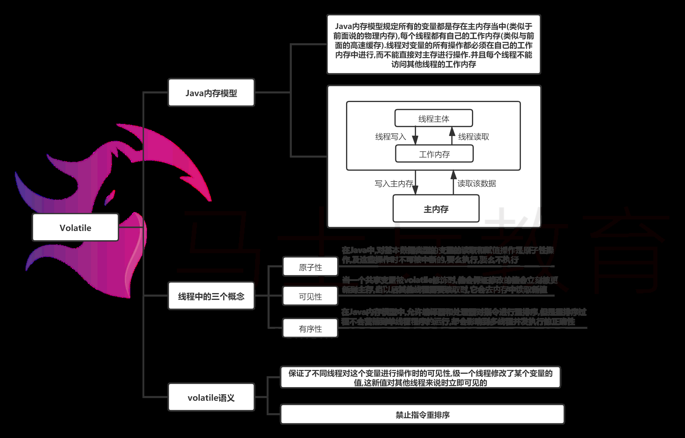

---

ThreadLocal是用来维护本线程的变量的，并不能解决共享变量的并发问题。ThreadLocal是 各线程将
值存入该线程的map中，以ThreadLocal自身作为key，需要用时获得的是该线程之前 存入的值。如果
存入的是共享变量，那取出的也是共享变量，并发问题还是存在的。 
ThreadLocal的适用场景 
场景：数据库连接、Session管理
 
volatile的适用场景
 
模式 #1：状态标志
 
也许实现 volatile 变量的规范使用仅仅是使用一个布尔状态标志，用于指示发生了一个重要的一次性事
件，例如完成初始化或请求停机。

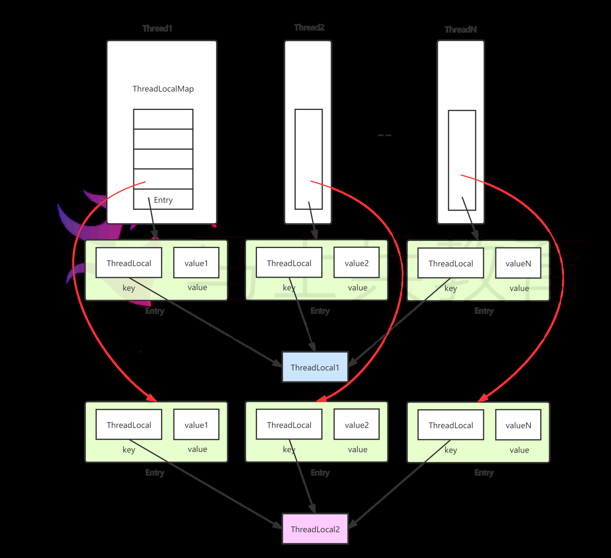

---

线程1执行doWork()的过程中，可能有另外的线程2调用了shutdown，所以boolean变量必须是
volatile。
而如果使用 synchronized  块编写循环要比使用 volatile 状态标志编写麻烦很多。由于 volatile 简化了
编码，并且状态标志并不依赖于程序内任何其他状态，因此此处非常适合使用 volatile。
 
这种类型的状态标记的一个公共特性是：通常只有一种状态转换；shutdownRequested  标志从false  
转换为true ，然后程序停止。这种模式可以扩展到来回转换的状态标志，但是只有在转换周期不被察
觉的情况下才能扩展（从false  到true ，再转换到false ）。此外，还需要某些原子状态转换机制，
例如原子变量。
 
模式 #2：一次性安全发布（one-time safe publication）
 
在缺乏同步的情况下，可能会遇到某个对象引用的更新值（由另一个线程写入）和该对象状态的旧值同
时存在。
这就是造成著名的双重检查锁定（double-checked-locking）问题的根源，其中对象引用在没有同步的
情况下进行读操作，产生的问题是您可能会看到一个更新的引用，但是仍然会通过该引用看到不完全构
造的对象。
如果不用volatile，则因为内存模型允许所谓的“无序写入”，可能导致失败。——某个线程可能会获得一
个未完全初始化的实例。
1. volatile boolean shutdownRequested; 
2.  
3. ... 
4.  
5. public void shutdown() {  
6.   shutdownRequested = true;  
7. } 
8.  
9. public void doWork() {  
10.   while (!shutdownRequested) {  
11.     // do stuff 
12.   } 
13. } 
1. //注意volatile！！！！！！！！！！！！！！！！！  
2. private volatile static Singleton instace;   
3.   
4. public static Singleton getInstance(){   
5.   //第一次null检查    
6.   if(instance == null){       
7.     synchronized(Singleton.class) {  //1    
8.       //第二次null检查     
9.       if(instance == null){     //2  
10.         instance = new Singleton();//3  
11.       }  
12.     }       
13.   }  
14.   return instance;

---

考察上述代码中的 //3 行。此行代码创建了一个 Singleton 对象并初始化变量 instance 来引用此对象。
这行代码的问题是：在Singleton 构造函数体执行之前，变量instance 可能成为非 null 的！
什么？这一说法可能让您始料未及，但事实确实如此。
在解释这个现象如何发生前，请先暂时接受这一事实，我们先来考察一下双重检查锁定是如何被破坏
的。假设上述代码执行以下事件序列：
1. 线程 1 进入 getInstance() 方法。
2. 由于 instance 为 null，线程 1 在 //1 处进入synchronized 块。
3. 线程 1 前进到 //3 处，但在构造函数执行之前，使实例成为非null。
4. 线程 1 被线程 2 预占。
5. 线程 2 检查实例是否为 null。因为实例不为 null，线程 2 将instance 引用返回，返回一个构造完
整但部分初始化了的Singleton 对象。
6. 线程 2 被线程 1 预占。
7. 线程 1 通过运行 Singleton 对象的构造函数并将引用返回给它，来完成对该对象的初始化。
 
模式 #3：独立观察（independent observation）
 
安全使用 volatile 的另一种简单模式是：定期 “发布” 观察结果供程序内部使用。【例如】假设有一种环
境传感器能够感觉环境温度。一个后台线程可能会每隔几秒读取一次该传感器，并更新包含当前文档的 
volatile 变量。然后，其他线程可以读取这个变量，从而随时能够看到最新的温度值。
使用该模式的另一种应用程序就是收集程序的统计信息。【例】如下代码展示了身份验证机制如何记忆
最近一次登录的用户的名字。将反复使用lastUser  引用来发布值，以供程序的其他部分使用。
模式 #4：“volatile bean” 模式
 
volatile bean 模式的基本原理是：很多框架为易变数据的持有者（例如 HttpSession ）提供了容器，
但是放入这些容器中的对象必须是线程安全的。
在 volatile bean 模式中，JavaBean 的所有数据成员都是 volatile 类型的，并且 getter 和 setter 方法必
须非常普通——即不包含约束！
1. public class UserManager { 
2.   public volatile String lastUser; //发布的信息 
3.  
4.   public boolean authenticate(String user, String password) { 
5.     boolean valid = passwordIsValid(user, password); 
6.     if (valid) { 
7.       User u = new User(); 
8.       activeUsers.add(u); 
9.       lastUser = user; 
10.     } 
11.     return valid; 
12.   } 
13. }  
1. @ThreadSafe 
2. public class Person { 
3.   private volatile String firstName; 
4.   private volatile String lastName; 
5.   private volatile int age; 
6.  
7.   public String getFirstName() { return firstName; } 
8.   public String getLastName() { return lastName; }

---

模式 #5：开销较低的“读－写锁”策略
 
如果读操作远远超过写操作，您可以结合使用内部锁和 volatile 变量来减少公共代码路径的开销。
如下显示的线程安全的计数器，使用 synchronized  确保增量操作是原子的，并使用 volatile  保证
当前结果的可见性。如果更新不频繁的话，该方法可实现更好的性能，因为读路径的开销仅仅涉及 
volatile 读操作，这通常要优于一个无竞争的锁获取的开销。
使用锁进行所有变化的操作，使用 volatile 进行只读操作。 
其中，锁一次只允许一个线程访问值，volatile 允许多个线程执行读操作 
 
 
正确使用 Volatile 变量
 
volatile 变量使用指南 
Java 语言中的 volatile 变量可以被看作是一种 “程度较轻的 synchronized ”；与 synchronized  块相
比，volatile 变量所需的编码较少，并且运行时开销也较少，但是它所能实现的功能也仅是 
synchronized  的一部分。本文介绍了几种有效使用 volatile 变量的模式，并强调了几种不适合使用 
volatile 变量的情形。 
9.   public int getAge() { return age; } 
10.  
11.   public void setFirstName(String firstName) {  
12.     this.firstName = firstName; 
13.   } 
14.  
15.   public void setLastName(String lastName) {  
16.     this.lastName = lastName; 
17.   } 
18.  
19.   public void setAge(int age) {  
20.     this.age = age; 
21.   } 
22. } 
1. @ThreadSafe 
2. public class CheesyCounter { 
3.   // Employs the cheap read-write lock trick 
4.   // All mutative operations MUST be done with the 'this' lock held 
5.   @GuardedBy("this") private volatile int value; 
6.  
7.   //读操作，没有synchronized，提高性能 
8.   public int getValue() {  
9.     return value;  
10.   }  
11.  
12.   //写操作，必须synchronized。因为x++不是原子操作 
13.   public synchronized int increment() { 
14.     return value++; 
15.   }

---

锁提供了两种主要特性：互斥（mutual exclusion） 和可见性（visibility）。互斥即一次只允许一个线程
持有某个特定的锁，因此可使用该特性实现对共享数据的协调访问协议，这样，一次就只有一个线程能
够使用该共享数据。可见性要更加复杂一些，它必须确保释放锁之前对共享数据做出的更改对于随后获
得该锁的另一个线程是可见的 —— 如果没有同步机制提供的这种可见性保证，线程看到的共享变量可能
是修改前的值或不一致的值，这将引发许多严重问题。 
Volatile 变量
 
Volatile 变量具有 synchronized  的可见性特性，但是不具备原子特性。这就是说线程能够自动发现 
volatile 变量的最新值。Volatile 变量可用于提供线程安全，但是只能应用于非常有限的一组用例：多个
变量之间或者某个变量的当前值与修改后值之间没有约束。因此，单独使用 volatile 还不足以实现计数
器、互斥锁或任何具有与多个变量相关的不变式（Invariants）的类（例如 “start <=end”）。 
出于简易性或可伸缩性的考虑，您可能倾向于使用 volatile 变量而不是锁。当使用 volatile 变量而非锁
时，某些习惯用法（idiom）更加易于编码和阅读。此外，volatile 变量不会像锁那样造成线程阻塞，因
此也很少造成可伸缩性问题。在某些情况下，如果读操作远远大于写操作，volatile 变量还可以提供优于
锁的性能优势。 
正确使用 volatile 变量的条件
 
您只能在有限的一些情形下使用 volatile 变量替代锁。要使 volatile 变量提供理想的线程安全，必须同
时满足下面两个条件：
对变量的写操作不依赖于当前值。
该变量没有包含在具有其他变量的不变式中。
实际上，这些条件表明，可以被写入 volatile 变量的这些有效值独立于任何程序的状态，包括变量的当
前状态。 
第一个条件的限制使 volatile 变量不能用作线程安全计数器。虽然增量操作（x++ ）看上去类似一个单
独操作，实际上它是一个由读取－修改－写入操作序列组成的组合操作，必须以原子方式执行，而 
volatile 不能提供必须的原子特性。实现正确的操作需要使 x  的值在操作期间保持不变，而 volatile 变
量无法实现这点。（然而，如果将值调整为只从单个线程写入，那么可以忽略第一个条件。） 
大多数编程情形都会与这两个条件的其中之一冲突，使得 volatile 变量不能像 synchronized  那样普遍
适用于实现线程安全。清单 1 显示了一个非线程安全的数值范围类。它包含了一个不变式 —— 下界总是
小于或等于上界。 
清单 1. 非线程安全的数值范围类
 
@NotThreadSafe  
public class NumberRange {    
    private int lower, upper;
    
    public int getLower() { return lower; }    
    public int getUpper() { return upper; } 
    
    public void setLower(int value) {       
        if (value > upper)         
            throw new IllegalArgumentException(...);      
        lower = value;    
    }   
    
    public void setUpper(int value) {       
        if (value < lower)         
            throw new IllegalArgumentException(...);      
        upper = value;

---

这种方式限制了范围的状态变量，因此将 lower  和 upper 字段定义为 volatile 类型不能够充分实现类
的线程安全；从而仍然需要使用同步。否则，如果凑巧两个线程在同一时间使用不一致的值执行 
setLower  和 setUpper  的话，则会使范围处于不一致的状态。例如，如果初始状态是 (0, 5) ，同一
时间内，线程 A 调用 setLower(4)  并且线程 B 调用 setUpper(3) ，显然这两个操作交叉存入的值是
不符合条件的，那么两个线程都会通过用于保护不变式的检查，使得最后的范围值是 (4, 3)  —— 一个
无效值。至于针对范围的其他操作，我们需要使 setLower()  和 setUpper()  操作原子化 —— 而将字
段定义为 volatile 类型是无法实现这一目的的。 
性能考虑
 
使用 volatile 变量的主要原因是其简易性：在某些情形下，使用 volatile 变量要比使用相应的锁简单得
多。使用 volatile 变量次要原因是其性能：某些情况下，volatile 变量同步机制的性能要优于锁。 
很难做出准确、全面的评价，例如 “X 总是比 Y 快”，尤其是对 JVM 内在的操作而言。（例如，某些情况
下 VM 也许能够完全删除锁机制，这使得我们难以抽象地比较 volatile  和 synchronized  的开
销。）就是说，在目前大多数的处理器架构上，volatile 读操作开销非常低 —— 几乎和非 volatile 读操
作一样。而 volatile 写操作的开销要比非 volatile 写操作多很多，因为要保证可见性需要实现内存界定
（Memory Fence），即便如此，volatile 的总开销仍然要比锁获取低。 
volatile 操作不会像锁一样造成阻塞，因此，在能够安全使用 volatile 的情况下，volatile 可以提供一些
优于锁的可伸缩特性。如果读操作的次数要远远超过写操作，与锁相比，volatile 变量通常能够减少同步
的性能开销。 
正确使用 volatile 的模式
 
很多并发性专家事实上往往引导用户远离 volatile 变量，因为使用它们要比使用锁更加容易出错。然
而，如果谨慎地遵循一些良好定义的模式，就能够在很多场合内安全地使用 volatile 变量。要始终牢记
使用 volatile 的限制 —— 只有在状态真正独立于程序内其他内容时才能使用 volatile —— 这条规则能够
避免将这些模式扩展到不安全的用例。 
模式 #1：状态标志
 
也许实现 volatile 变量的规范使用仅仅是使用一个布尔状态标志，用于指示发生了一个重要的一次性事
件，例如完成初始化或请求停机。 
很多应用程序包含了一种控制结构，形式为 “在还没有准备好停止程序时再执行一些工作”，如清单 2 所
示： 
清单 2. 将 volatile 变量作为状态标志使用
 
    } 
}
volatile boolean shutdownRequested;  
...  
public void shutdown() { shutdownRequested = true; }  
public void doWork() {     
    while (!shutdownRequested) {       
        // do stuff    
    } 
}

---

很可能会从循环外部调用  shutdown()  方法 —— 即在另一个线程中 —— 因此，需要执行某种同步来
确保正确实现 shutdownRequested  变量的可见性。（可能会从 JMX 侦听程序、GUI 事件线程中的操作
侦听程序、通过 RMI 、通过一个 Web 服务等调用）。然而，使用  synchronized  块编写循环要比使
用清单 2 所示的 volatile 状态标志编写麻烦很多。由于  volatile 简化了编码，并且状态标志并不依赖于
程序内任何其他状态，因此此处非常适合使用 volatile。 
这种类型的状态标记的一个公共特性是：通常只有一种状态转换；shutdownRequested  标志从 false  
转换为 true ，然后程序停止。这种模式可以扩展到来回转换的状态标志，但是只有在转换周期不被察
觉的情况下才能扩展（从 false  到 true ，再转换到 false ）。此外，还需要某些原子状态转换机
制，例如原子变量。 
模式 #2：一次性安全发布（one-time safe publication）
 
缺乏同步会导致无法实现可见性，这使得确定何时写入对象引用而不是原语值变得更加困难。在缺乏同
步的情况下，可能会遇到某个对象引用的更新值（由另一个线程写入）和该对象状态的旧值同时存在。
（这就是造成著名的双重检查锁定（double-checked-locking）问题的根源，其中对象引用在没有同步
的情况下进行读操作，产生的问题是您可能会看到一个更新的引用，但是仍然会通过该引用看到不完全
构造的对象）。 
实现安全发布对象的一种技术就是将对象引用定义为 volatile 类型。清单 3 展示了一个示例，其中后台
线程在启动阶段从数据库加载一些数据。其他代码在能够利用这些数据时，在使用之前将检查这些数据
是否曾经发布过。 
清单 3. 将 volatile 变量用于一次性安全发布
 
如果 theFlooble  引用不是 volatile 类型，doWork()  中的代码在解除对 theFlooble  的引用时，将
会得到一个不完全构造的 Flooble 。 
该模式的一个必要条件是：被发布的对象必须是线程安全的，或者是有效的不可变对象（有效不可变意
味着对象的状态在发布之后永远不会被修改）。volatile 类型的引用可以确保对象的发布形式的可见性，
但是如果对象的状态在发布后将发生更改，那么就需要额外的同步。 
public class BackgroundFloobleLoader {    
    public volatile Flooble theFlooble;     
    public void initInBackground() {      
        // do lots of stuff      
        theFlooble = new Flooble(); // this is the only write to theFlooble 
    } 
}  
public class SomeOtherClass {    
    public void doWork() {      
        while (true) {         
            // do some stuff...        
            // use the Flooble, but only if it is ready        
            if (floobleLoader.theFlooble != null)                                 
doSomething(floobleLoader.theFlooble);      
        }    
    } 
}

---

模式 #3：独立观察（independent observation）
 
安全使用 volatile 的另一种简单模式是：定期 “发布” 观察结果供程序内部使用。例如，假设有一种环境
传感器能够感觉环境温度。一个后台线程可能会每隔几秒读取一次该传感器，并更新包含当前文档的 
volatile 变量。然后，其他线程可以读取这个变量，从而随时能够看到最新的温度值。 
使用该模式的另一种应用程序就是收集程序的统计信息。清单 4 展示了身份验证机制如何记忆最近一次
登录的用户的名字。将反复使用 lastUser  引用来发布值，以供程序的其他部分使用。 
清单 4. 将 volatile 变量用于多个独立观察结果的发布
 
该模式是前面模式的扩展；将某个值发布以在程序内的其他地方使用，但是与一次性事件的发布不同，
这是一系列独立事件。这个模式要求被发布的值是有效不可变的 —— 即值的状态在发布后不会更改。使
用该值的代码需要清楚该值可能随时发生变化。 
模式 #4：“volatile bean” 模式
 
volatile bean 模式适用于将 JavaBeans 作为“荣誉结构”使用的框架。在 volatile bean 模式中，
JavaBean 被用作一组具有 getter 和/或 setter 方法 的独立属性的容器。volatile bean 模式的基本原理
是：很多框架为易变数据的持有者（例如 HttpSession ）提供了容器，但是放入这些容器中的对象必
须是线程安全的。 
在 volatile bean 模式中，JavaBean 的所有数据成员都是 volatile 类型的，并且 getter 和 setter 方法必
须非常普通 —— 除了获取或设置相应的属性外，不能包含任何逻辑。此外，对于对象引用的数据成员，
引用的对象必须是有效不可变的。（这将禁止具有数组值的属性，因为当数组引用被声明为 volatile  
时，只有引用而不是数组本身具有 volatile 语义）。对于任何 volatile 变量，不变式或约束都不能包含 
JavaBean 属性。清单 5 中的示例展示了遵守 volatile bean 模式的 JavaBean： 
清单 5. 遵守 volatile bean 模式的 Person 对象
 
public class UserManager {    
    public volatile String lastUser;     
    
    public boolean authenticate(String user, String password) {      
        boolean valid = passwordIsValid(user, password);      
        if (valid) {        
            User u = new User();        
            activeUsers.add(u);        
            lastUser = user;      
        }      
        return valid;    
    } 
}
@ThreadSafe 
public class Person {    
    private volatile String firstName;    
    private volatile String lastName;    
    private volatile int age;     
    public String getFirstName() { return firstName; }    
    public String getLastName() { return lastName; }    
    public int getAge() { return age; }     
    public void setFirstName(String firstName) {       
        this.firstName = firstName;

---

volatile 的高级模式
 
前面几节介绍的模式涵盖了大部分的基本用例，在这些模式中使用 volatile 非常有用并且简单。这一节
将介绍一种更加高级的模式，在该模式中，volatile 将提供性能或可伸缩性优势。 
volatile 应用的的高级模式非常脆弱。因此，必须对假设的条件仔细证明，并且这些模式被严格地封装了
起来，因为即使非常小的更改也会损坏您的代码！同样，使用更高级的 volatile 用例的原因是它能够提
升性能，确保在开始应用高级模式之前，真正确定需要实现这种性能获益。需要对这些模式进行权衡，
放弃可读性或可维护性来换取可能的性能收益 —— 如果您不需要提升性能（或者不能够通过一个严格的
测试程序证明您需要它），那么这很可能是一次糟糕的交易，因为您很可能会得不偿失，换来的东西要
比放弃的东西价值更低。 
模式 #5：开销较低的读－写锁策略
 
目前为止，您应该了解了 volatile 的功能还不足以实现计数器。因为 ++x  实际上是三种操作（读、添
加、存储）的简单组合，如果多个线程凑巧试图同时对 volatile 计数器执行增量操作，那么它的更新值
有可能会丢失。 
然而，如果读操作远远超过写操作，您可以结合使用内部锁和 volatile 变量来减少公共代码路径的开
销。清单 6 中显示的线程安全的计数器使用  synchronized  确保增量操作是原子的，并使用 
volatile  保证当前结果的可见性。如果更新不频繁的话，该方法可实现更好的性能，因为读路径的开
销仅仅涉及 volatile 读操作，这通常要优于一个无竞争的锁获取的开销。 
清单 6. 结合使用 volatile 和 synchronized 实现 “开销较低的读－写锁”
 
之所以将这种技术称之为 “开销较低的读－写锁” 是因为您使用了不同的同步机制进行读写操作。因为本
例中的写操作违反了使用 volatile 的第一个条件，因此不能使用 volatile 安全地实现计数器 —— 您必须
使用锁。然而，您可以在读操作中使用 volatile 确保当前值的可见性，因此可以使用锁进行所有变化的
操作，使用 volatile 进行只读操作。其中，锁一次只允许一个线程访问值，volatile 允许多个线程执行读
操作，因此当使用 volatile 保证读代码路径时，要比使用锁执行全部代码路径获得更高的共享度 —— 就
像读－写操作一样。然而，要随时牢记这种模式的弱点：如果超越了该模式的最基本应用，结合这两个
竞争的同步机制将变得非常困难。 
    }     
    public void setLastName(String lastName) {       
        this.lastName = lastName;    
    }     
    public void setAge(int age) {       
        this.age = age;    
    } 
}
@ThreadSafe 
public class CheesyCounter {    
    // Employs the cheap read-write lock trick    
    // All mutative operations MUST be done with the 'this' lock held           
@GuardedBy("this") private volatile int value;     
    public int getValue() { return value; }     
    public synchronized int increment() {      
        return value++;    
    } 
}

---

结束语
 
与锁相比，Volatile 变量是一种非常简单但同时又非常脆弱的同步机制，它在某些情况下将提供优于锁
的性能和伸缩性。如果严格遵循 volatile 的使用条件 —— 即变量真正独立于其他变量和自己以前的值 
—— 在某些情况下可以使用 volatile  代替 synchronized  来简化代码。然而，使用 volatile  的代
码往往比使用锁的代码更加容易出错。本文介绍的模式涵盖了可以使用 volatile  代替 synchronized  
的最常见的一些用例。遵循这些模式（注意使用时不要超过各自的限制）可以帮助您安全地实现大多数
用例，使用 volatile 变量获得更佳性能。 
ThreadLocal什么时候会出现OOM的情况？为什么？
 
ThreadLocal变量是维护在Thread内部的，这样的话只要我们的线程不退出，对象的引用就会 一直存
在。当线程退出时，Thread类会进行一些清理工作，其中就包含ThreadLocalMap， Thread调用exit方
法如下： 
ThreadLocal在没有线程池使用的情况下，正常情况下不会存在内存泄露，但是如果使用了线程 池的
话，就依赖于线程池的实现，如果线程池不销毁线程的话，那么就会存在内存泄露。 
 
ThreadLocal可以说是笔试面试的常客，每逢面试基本都会问到，关于ThreadLocal的原理以及不正当的
使用造成的OOM内存溢出的问题，值得花时间仔细研究一下其原理。这一篇主要学习一下ThreadLocal
的原理，在下一篇会深入理解一下OOM内存溢出的原理和最佳实践。
ThreadLocal很容易让人望文生义，想当然地认为是一个“本地线程”。其实，ThreadLocal并不是一个
Thread，而是Thread的一个局部变量，也许把它命名为ThreadLocalVariable 更容易让人理解一些。
当使用ThreadLocal维护变量时，ThreadLocal为每个使用该变量的线程提供独立的变量副本，所以每一
个线程都可以独立地改变自己的副本，而不会影响其它线程所对应的副本。
ThreadLocal 的作用是提供线程内的局部变量，这种变量在线程的生命周期内起作用，减少同一个线程
内多个函数或者组件之间一些公共变量的传递的复杂度。
从线程的角度看，目标变量就像是线程的本地变量，这也是类名中“Local”所要表达的意思。

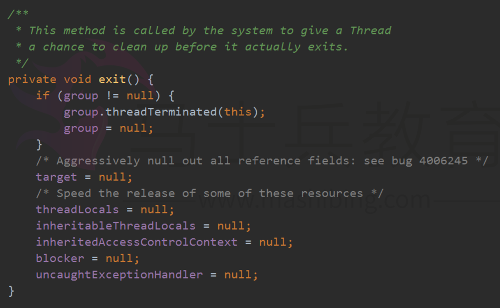

---

ThreadLocal全部方法和内部类
 
ThreadLocal全部方法和内部类结构如下：
ThreadLocal公有的方法就四个，分别为：get、set、remove、intiValue:

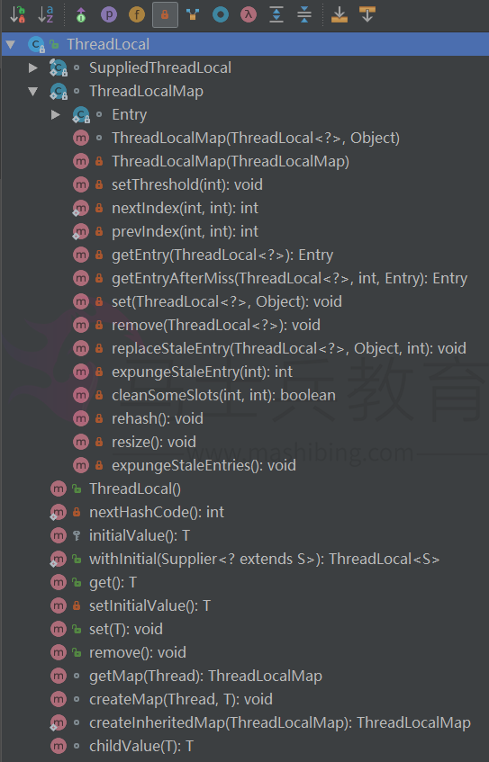

---

也就是说我们平时使用的时候关心的是这四个方法。
ThreadLocal是如何做到为每一个线程维护变量的副本的呢？
其实实现的思路很简单：在ThreadLocal类中有一个static声明的Map，用于存储每一个线程的变量副
本，Map中元素的键为线程对象，而值对应线程的变量副本。我们自己就可以提供一个简单的实现版
本：
public class SimpleThreadLocal<T> {
    /**
     * Key为线程对象，Value为传入的值对象
     */
    private static Map<Thread, T> valueMap = Collections.synchronizedMap(new 
HashMap<Thread, T>());
    /**
     * 设值
     * @param value Map键值对的value
     */
    public void set(T value) {
        valueMap.put(Thread.currentThread(), value);
    }
    /**
     * 取值
     * @return
     */
    public T get() {
        Thread currentThread = Thread.currentThread();
        //返回当前线程对应的变量
        T t = valueMap.get(currentThread);
        //如果当前线程在Map中不存在，则将当前线程存储到Map中
        if (t == null && !valueMap.containsKey(currentThread)) {
            t = initialValue();
            valueMap.put(currentThread, t);
        }
        return t;
    }
    public void remove() {
        valueMap.remove(Thread.currentThread());
    }
    public T initialValue() {

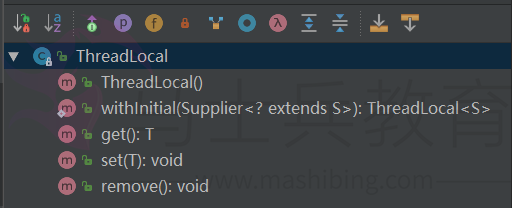

---

运行结果：
虽然上面的代码清单中的这个ThreadLocal实现版本显得比较简单粗，但其目的主要在与呈现JDK中所提
供的ThreadLocal类在实现上的思路。
ThreadLocal源码分析
 
1、线程局部变量在Thread中的位置
既然是线程局部变量，那么理所当然就应该存储在自己的线程对象中，我们可以从 Thread 的源码中找
到线程局部变量存储的地方：
        return null;
    }
    public static void main(String[] args) {
        SimpleThreadLocal<List<String>> threadLocal = new SimpleThreadLocal<>();
        new Thread(() -> {
            List<String> params = new ArrayList<>(3);
            params.add("张三");
            params.add("李四");
            params.add("王五");
            threadLocal.set(params);
            System.out.println(Thread.currentThread().getName());
            threadLocal.get().forEach(param -> System.out.println(param));
        }).start();
        new Thread(() -> {
            try {
                Thread.sleep(1000);
                List<String> params = new ArrayList<>(2);
                params.add("Chinese");
                params.add("English");
                threadLocal.set(params);
                System.out.println(Thread.currentThread().getName());
                threadLocal.get().forEach(param -> System.out.println(param));
            } catch (InterruptedException e) {
                e.printStackTrace();
            }
        }).start();
    }
} 
public class Thread implements Runnable {

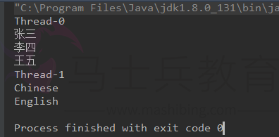

---

我们可以看到线程局部变量是存储在Thread对象的 threadLocals  属性中，而 threadLocals  属性是
一个 ThreadLocal.ThreadLocalMap  对象。
ThreadLocalMap为ThreadLocal的静态内部类，如下图所示：
2、Thread和ThreadLocalMap的关系
Thread和ThreadLocalMap的关系，先看下边这个简单的图，可以看出Thread中的threadLocals 就是
ThreadLocal中的ThreadLocalMap：
    /* Make sure registerNatives is the first thing <clinit> does. */
    private static native void registerNatives();
    static {
        registerNatives();
    }
    //省略其他代码
    /* ThreadLocal values pertaining to this thread. This map is maintained
     * by the ThreadLocal class. */
    ThreadLocal.ThreadLocalMap threadLocals = null;
    /*
     * InheritableThreadLocal values pertaining to this thread. This map is
     * maintained by the InheritableThreadLocal class.
     */
    ThreadLocal.ThreadLocalMap inheritableThreadLocals = null;
}12345678910111213141516171819

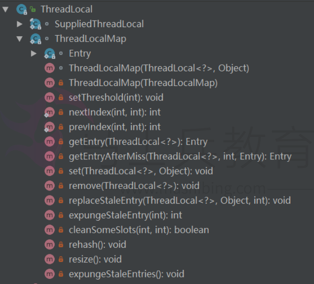

---

到这里应该大致能够感受到上述三者之间微妙的关系，再看一个复杂点的图：
可以看出每个thread 实例都有一个ThreadLocalMap 。在上图中的一个Thread的这个
ThreadLocalMap中分别存放了3个Entry，默认一个ThreadLocalMap初始化了16个Entry，每一个Entry
对象存放的是一个ThreadLocal变量对象。
再简单一点的说就是：一个Thread中只有一个ThreadLocalMap，一个ThreadLocalMap中可以有多个
ThreadLocal对象，其中一个ThreadLocal对象对应一个ThreadLocalMap中的一个Entry（也就是说：
一个Thread可以依附有多个ThreadLocal对象）。
再看一张图片，应该可以更好的理解，如下图：

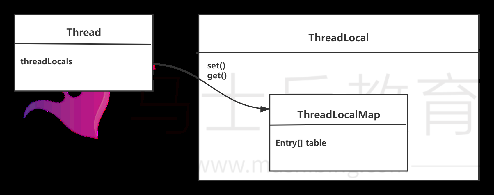

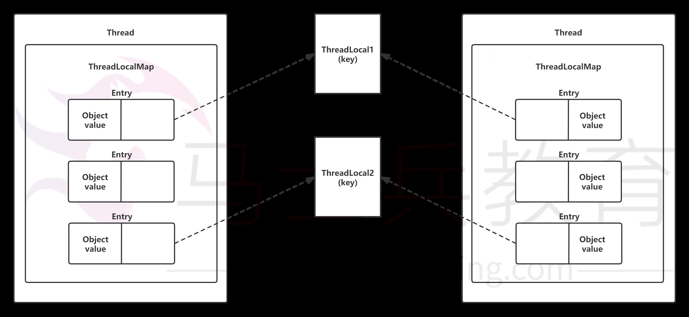

---

这里的Map其实是ThreadLocalMap。
3、ThreadLocalMap与WeakReference
ThreadLocalMap 从字面上就可以看出这是一个保存ThreadLocal 对象的map(其实是以它为Key)，不
过是经过了两层包装的ThreadLocal对象：
（1）第一层包装是使用 WeakReference<ThreadLocal<?>>  将ThreadLocal 对象变成一个弱引用的
对象；
（2）第二层包装是定义了一个专门的类 Entry 来扩展 WeakReference<ThreadLocal<?>> ：

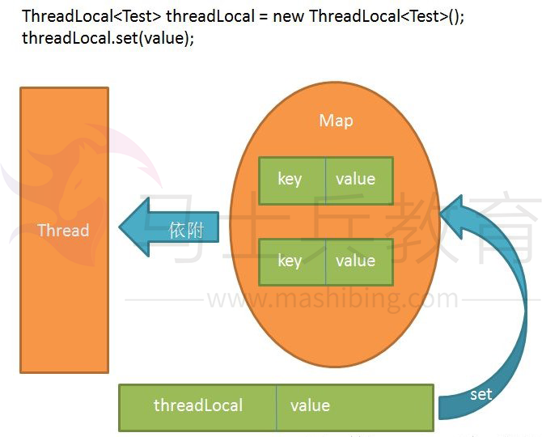

---

类 Entry 很显然是一个保存map键值对的实体，ThreadLocal<?> 为key, 要保存的线程局部变量的值为
value 。super(k) 调用的WeakReference 的构造函数，表示将ThreadLocal<?> 对象转换成弱引用对
象，用做key。
4、ThreadLocalMap 的构造函数
可以看出，ThreadLocalMap这个map的实现是使用一个数组 private Entry[] table  来保存键值对
的实体，初始大小为16，ThreadLocalMap 自己实现了如何从 key  到 value 的映射：
使用一个 static  的原子属性 AtomicInteger nextHashCode ，通过每次增加 HASH_INCREMENT = 
0x61c88647  ，然后 & (INITIAL_CAPACITY - 1)  取得在数组 private Entry[] table  中的索引。
int i = firstKey.threadLocalHashCode & (INITIAL_CAPACITY - 1);1
public class ThreadLocal<T> {
    /**
     * ThreadLocals rely on per-thread linear-probe hash maps attached
     * to each thread (Thread.threadLocals and
     * inheritableThreadLocals).  The ThreadLocal objects act as keys,
     * searched via threadLocalHashCode.  This is a custom hash code
     * (useful only within ThreadLocalMaps) that eliminates collisions

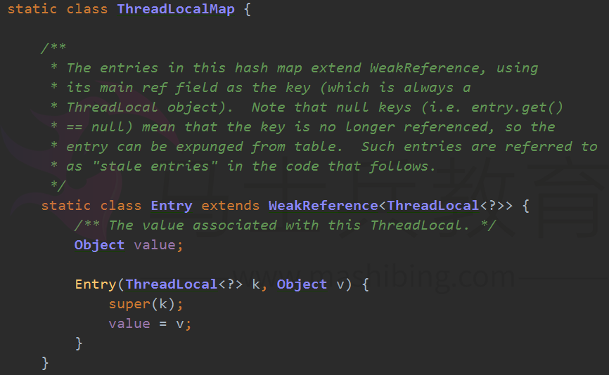

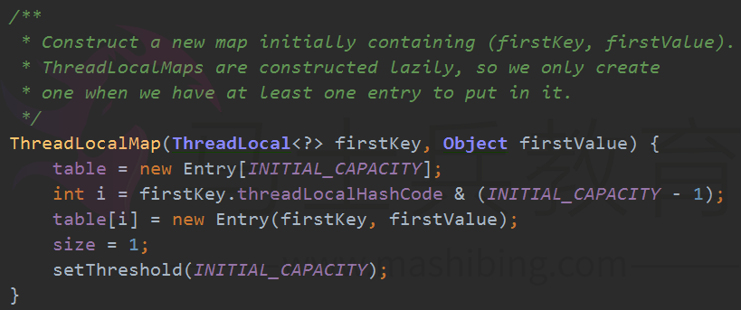

---

总的来说，ThreadLocalMap是一个类似HashMap的集合，只不过自己实现了寻址，也没有HashMap
中的put方法，而是set方法等区别。
ThreadLocal的set方法
 
由于每个thread实例都有一个ThreadLocalMap，所以在进行set的时候，首先根据
Thread.currentThread（）获取当前线程，然后根据当前线程t，调用getMap(t)获取ThreadLocalMap
对象，
如果是第一次设置值，ThreadLocalMap对象是空值，所以会进行初始化操作，即调用
     * in the common case where consecutively constructed ThreadLocals
     * are used by the same threads, while remaining well-behaved in
     * less common cases.
     */
    private final int threadLocalHashCode = nextHashCode();
    /**
     * The next hash code to be given out. Updated atomically. Starts at
     * zero.
     */
    private static AtomicInteger nextHashCode =
        new AtomicInteger();
    /**
     * The difference between successively generated hash codes - turns
     * implicit sequential thread-local IDs into near-optimally spread
     * multiplicative hash values for power-of-two-sized tables.
     */
    private static final int HASH_INCREMENT = 0x61c88647;
    /**
     * Returns the next hash code.
     */
    private static int nextHashCode() {
        return nextHashCode.getAndAdd(HASH_INCREMENT);
    }
    //省略其它代码
}

---

createMap(t,value) 方法：
即是调用上述的构造方法进行构造，这里仅仅是初始化了16个元素的引用数组，并没有初始化16个 
Entry 对象。而是一个线程中有多少个线程局部对象要保存，那么就初始化多少个 Entry 对象来保存它
们。
到了这里，我们可以思考一下，为什么要这样实现了。
1、为什么要用 ThreadLocalMap 来保存线程局部对象呢？
原因是一个线程拥有的的局部对象可能有很多，这样实现的话，那么不管你一个线程拥有多少个局部变
量，都是使用同一个 ThreadLocalMap 来保存的，ThreadLocalMap 中 private Entry[] table  的
初始大小是16。超过容量的2/3时，会扩容。
然后在回到如果map不为空的情况，会调用map.set(this, value); 方法，我们看到是以当前 thread 
的引用为 key, 获得 ThreadLocalMap  ，然后调用 map.set(this, value);  保存进 private 
Entry[] table  :
    private void set(ThreadLocal<?> key, Object value) {

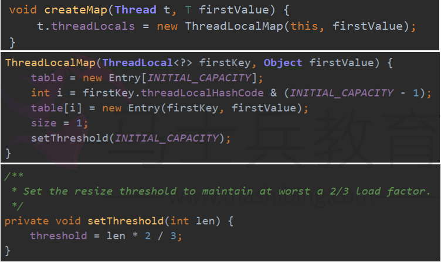

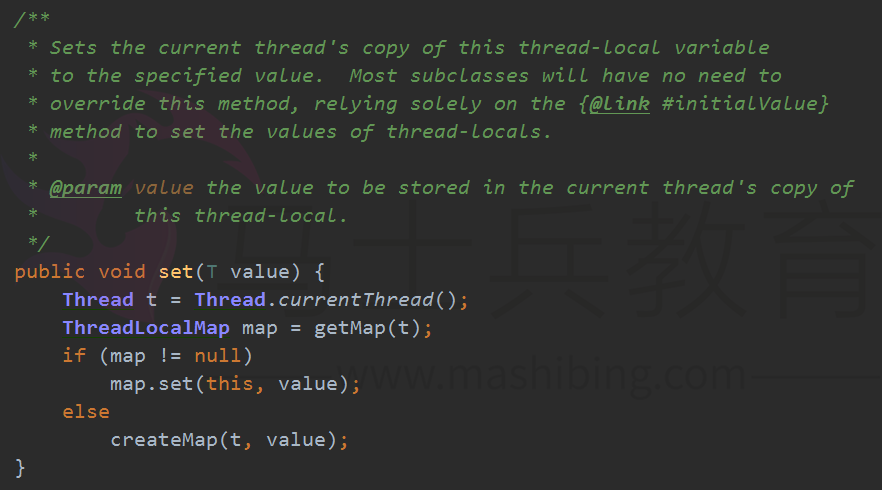

---

可以看到，set(T value) 方法为每个Thread对象都创建了一个ThreadLocalMap，并且将value放入
ThreadLocalMap中，ThreadLocalMap作为Thread对象的成员变量保存。那么可以用下图来表示
ThreadLocal在存储value时的关系。
        // We don't use a fast path as with get() because it is at
        // least as common to use set() to create new entries as
        // it is to replace existing ones, in which case, a fast
        // path would fail more often than not.
        Entry[] tab = table;
        int len = tab.length;
        int i = key.threadLocalHashCode & (len - 1);
        for (Entry e = tab[i];
             e != null;
             e = tab[i = nextIndex(i, len)]) {
            ThreadLocal<?> k = e.get();
            if (k == key) {
                e.value = value;
                return;
            }
            if (k == null) {
                replaceStaleEntry(key, value, i);
                return;
            }
        }
        tab[i] = new Entry(key, value);
        int sz = ++size;
        if (!cleanSomeSlots(i, sz) && sz >= threshold)
            rehash();
    }

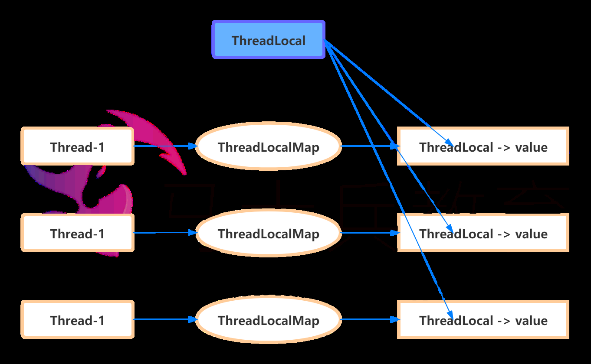

---

2、了解了set方法的大致原理之后，我们在研究一段程序如下：
这样的话就相当于一个线程依附了三个ThreadLocal对象,执行完最后一个set方法之后，调试过程如
下：
/**
  * 三个ThreadLocal
  */
private static ThreadLocal<String> threadLocal1 = new ThreadLocal<>();
private static ThreadLocal<String> threadLocal2 = new ThreadLocal<>();
private static ThreadLocal<String> threadLocal3 = new ThreadLocal<>();
//线程池变量指定一个线程
ExecutorService executorService = Executors.newFixedThreadPool(1);
executorService.execute(() -> {
    threadLocal1.set("123");
    threadLocal2.set("234");
    threadLocal3.set("345");
    Thread t = Thread.currentThread();
    System.out.println(Thread.currentThread().getName());
});
123456789101112131415161718

---

可以看到table（Entry集合）中有三个对象，对象的值就是我们设置的三个threadLocal的对象值；
3、如果在修改一下代码，修改为两个线程：
private static final int THREAD_LOOP_SIZE = 2;
private static ThreadLocal<String> threadLocal1 = new ThreadLocal<>();
private static ThreadLocal<String> threadLocal2 = new ThreadLocal<>();
private static ThreadLocal<String> threadLocal3 = new ThreadLocal<>();
ExecutorService executorService = 
Executors.newFixedThreadPool(THREAD_LOOP_SIZE);
for (int i = 0; i < THREAD_LOOP_SIZE; i++) {
    executorService.execute(() -> {
        threadLocal1.set("123");
        threadLocal2.set("234");

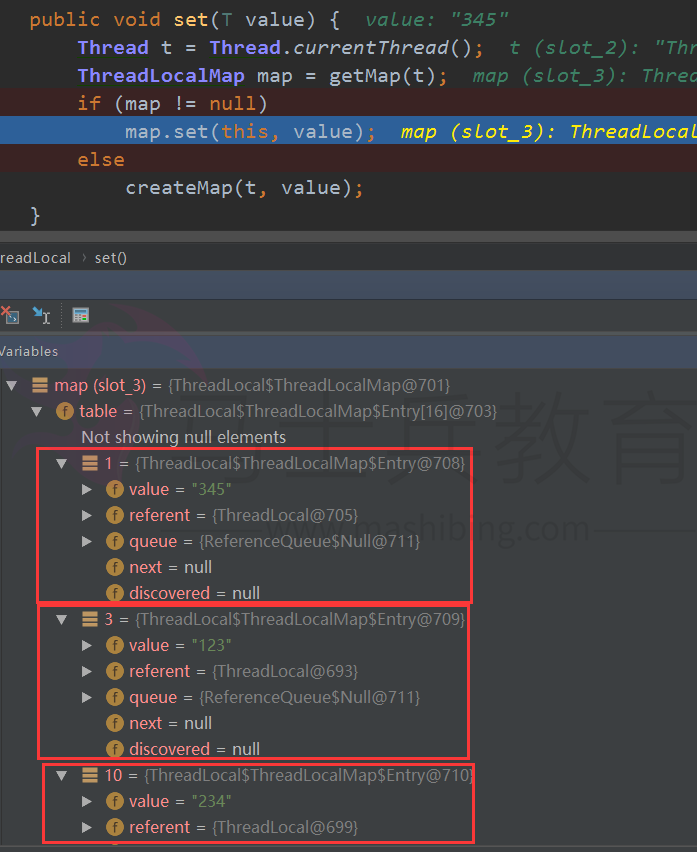

---

这样的话，可以看到运行调试图如下：
然后更改到Thread2，查看，由于多线程，线程1运行到上图情况，线程2运行到下图情况，也可以看出
他们是不同的ThreadLocalMap：
那如果多个线程，只设置一个ThreadLocal变量那，结果可想而知，这里不再赘述！
另外，有一点需要提示一下，代码如下：
        threadLocal3.set("345");
    });
}

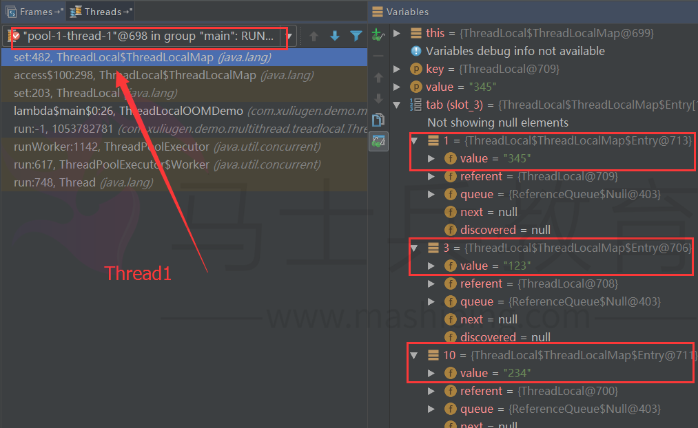

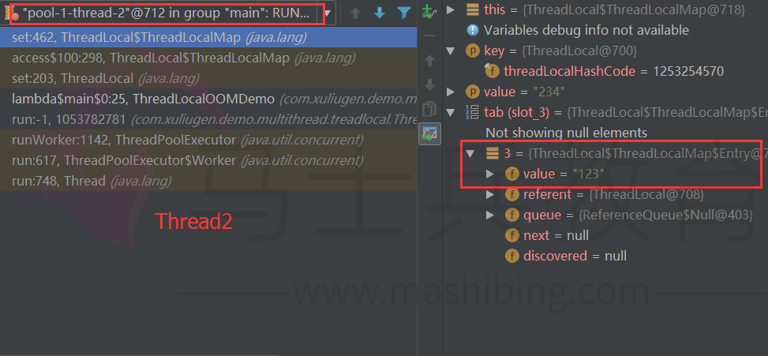

---

运行结果：
可以看到，在这个线程中的ThreadLocal变量的值始终是只有一个的，即以前的值被覆盖了的！这里是
因为Entry对象是以该ThreadLocal变量的引用为key的，所以多次赋值以前的值会被覆盖，特此注意！
到这里应该可以清楚了的了解Thread、ThreadLocal和ThreadLocalMap之间的关系了！
private static final int THREAD_LOOP_SIZE = 1;
private static final int MOCK_DIB_DATA_LOOP_SIZE = 1000;
private static ThreadLocal<String> threadLocal = new ThreadLocal<>();
ExecutorService executorService = 
Executors.newFixedThreadPool(THREAD_LOOP_SIZE);
for (int i = 0; i < THREAD_LOOP_SIZE; i++) {
    for (int j = 0; j < MOCK_DIB_DATA_LOOP_SIZE; j++) {
        executorService.execute(() -> threadLocal.set(("123" + 
index).toString()));
    }
}1234567891011

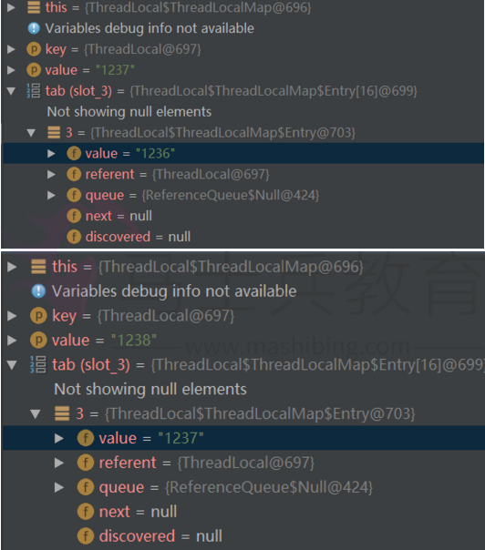

---

ThreadLocal的get方法
 
经过上述set方法的分析，对于get方法应该理解起来轻松了许多，首先获取ThreadLocalMap对象，由
于ThreadLocalMap使用的当前的ThreadLocal作为key，所以传入的参数为this，然后调用
getEntry（）方法，通过这个key构造索引，根据索引去table（Entry数组）中去查找线程本地变量，
根据下边找到Entry对象，然后判断Entry对象e不为空并且e的引用与传入的key一样则直接返回，如果找
不到则调用getEntryAfterMiss（）方法。调用getEntryAfterMiss 表示直接散列到的位置没找到，
那么顺着hash表递增（循环）地往下找，从i开始，一直往下找，直到出现空的槽为止。

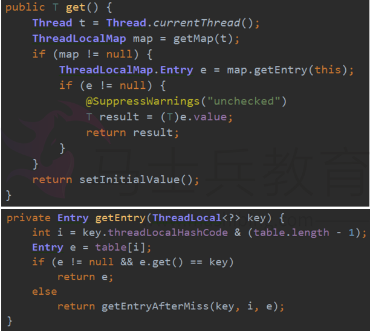

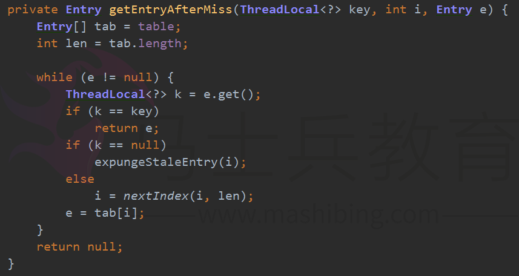

---

ThreadLocal的内存回收
 
ThreadLocal 涉及到的两个层面的内存自动回收：
1）在 ThreadLocal 层面的内存回收：
当线程死亡时，那么所有的保存在的线程局部变量就会被回收，其实这里是指线程Thread对象中的 
ThreadLocal.ThreadLocalMap threadLocals  会被回收，这是显然的。
2）ThreadLocalMap 层面的内存回收：
如果线程可以活很长的时间，并且该线程保存的线程局部变量有很多(也就是 Entry 对象很多)，那么就涉
及到在线程的生命期内如何回收 ThreadLocalMap 的内存了，不然的话，Entry对象越多，那么
ThreadLocalMap 就会越来越大，占用的内存就会越来越多，所以对于已经不需要了的线程局部变量，
就应该清理掉其对应的Entry对象。
使用的方式是，Entry对象的key是WeakReference 的包装，当ThreadLocalMap 的 private Entry[] 
table ，已经被占用达到了三分之二时 threshold = 2/3 (也就是线程拥有的局部变量超过了10个) ，
就会尝试回收 Entry 对象，我们可以看到 ThreadLocalMap.set（）方法中有下面的代码：
cleanSomeSlots 就是进行回收内存：
if (!cleanSomeSlots(i, sz) && sz >= threshold)
       rehash();12

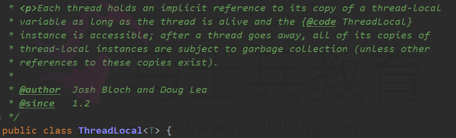

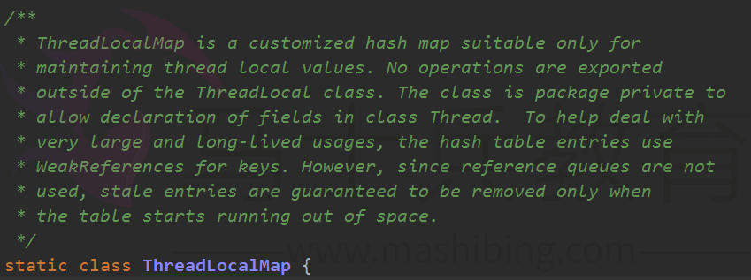

---

ThreadLocal可能引起的OOM内存溢出问题简要分析
 
我们知道ThreadLocal变量是维护在Thread内部的，这样的话只要我们的线程不退出，对象的引用就会
一直存在。当线程退出时，Thread类会进行一些清理工作，其中就包含ThreadLocalMap，Thread调用
exit方法如下：
但是，当我们使用线程池的时候，就意味着当前线程未必会退出（比如固定大小的线程池，线程总是存
在的）。如果这样的话，将一些很大的对象设置到ThreadLocal中（这个很大的对象实际保存在Thread
的threadLocals属性中），这样的话就可能会出现内存溢出的情况。
一种场景就是说如果使用了线程池并且设置了固定的线程，处理一次业务的时候存放到
ThreadLocalMap中一个大对象，处理另一个业务的时候，又一个线程存放到ThreadLocalMap中一个大
对象，但是这个线程由于是线程池创建的他会一直存在，不会被销毁，这样的话，以前执行业务的时候
存放到ThreadLocalMap中的对象可能不会被再次使用，但是由于线程不会被关闭，因此无法释放

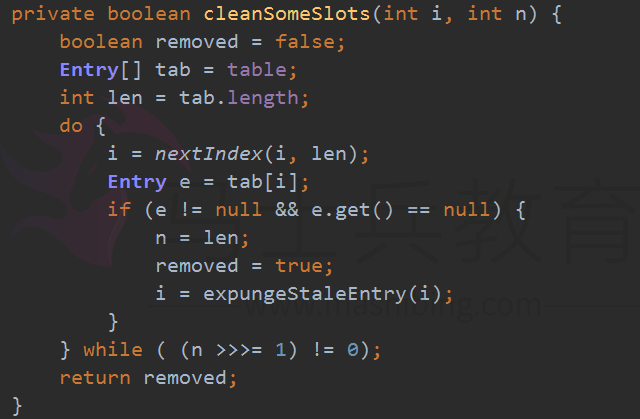

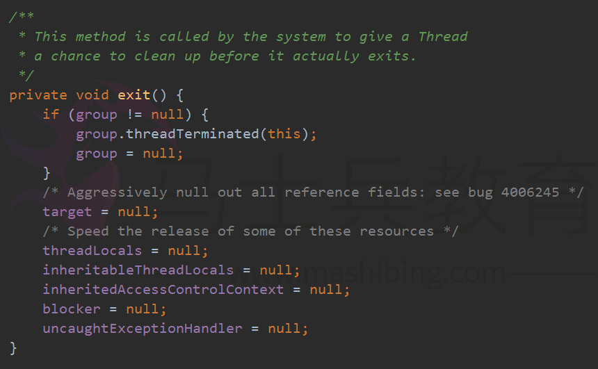

---

Thread 中的ThreadLocalMap对象，造成内存溢出。
也就是说，ThreadLocal在没有线程池使用的情况下，正常情况下不会存在内存泄露，但是如果使用了
线程池的话，就依赖于线程池的实现，如果线程池不销毁线程的话，那么就会存在内存泄露。所以我们
在使用线程池的时候，使用ThreadLocal要格外小心！
总结
 
通过源代码可以看到每个线程都可以独立修改属于自己的副本而不会互相影响，从而隔离了线程和线程.
避免了线程访问实例变量发生安全问题. 同时我们也能得出下面的结论：
（1）ThreadLocal只是操作Thread中的ThreadLocalMap对象的集合；
（2）ThreadLocalMap变量属于线程的内部属性，不同的线程拥有完全不同的ThreadLocalMap变量；
（3）线程中的ThreadLocalMap变量的值是在ThreadLocal对象进行set或者get操作时创建的；
（4）使用当前线程的ThreadLocalMap的关键在于使用当前的ThreadLocal的实例作为key来存储value
值；
（5） ThreadLocal模式至少从两个方面完成了数据访问隔离，即纵向隔离(线程与线程之间的
ThreadLocalMap不同)和横向隔离(不同的ThreadLocal实例之间的互相隔离)；
（6）一个线程中的所有的局部变量其实存储在该线程自己的同一个map属性中；
（7）线程死亡时，线程局部变量会自动回收内存；
（8）线程局部变量时通过一个 Entry 保存在map中，该Entry 的key是一个 WeakReference包装的
ThreadLocal, value为线程局部变量，key 到 value 的映射是通过：
ThreadLocal.threadLocalHashCode & (INITIAL_CAPACITY - 1)  来完成的；
（9）当线程拥有的局部变量超过了容量的2/3(没有扩大容量时是10个)，会涉及到ThreadLocalMap中
Entry的回收；
对于多线程资源共享的问题，同步机制采用了“以时间换空间”的方式，而ThreadLocal采用了“以空间换
时间”的方式。前者仅提供一份变量，让不同的线程排队访问，而后者为每一个线程都提供了一份变量，
因此可以同时访问而互不影响。
 
synchronized、volatile区别
 
1) volatile主要应用在多个线程对实例变量更改的场合，刷新主内存共享变量的值从而使得各个 线程可
以获得最新的值，线程读取变量的值需要从主存中读取；synchronized则是锁定当前变 量，只有当前线
程可以访问该变量，其他线程被阻塞住。另外，synchronized还会创建一个内 存屏障，内存屏障指令保
证了所有CPU操作结果都会直接刷到主存中（即释放锁前），从而保证 了操作的内存可见性，同时也使
得先获得这个锁的线程的所有操作
2) volatile仅能使用在变量级别；synchronized则可以使用在变量、方法、和类级别的。 volatile不会造
成线程的阻塞；synchronized可能会造成线程的阻塞，比如多个线程争抢 synchronized锁对象时，会
出现阻塞。
3) volatile仅能实现变量的修改可见性，不能保证原子性；而synchronized则可以保证变量的 修改可见
性和原子性，因为线程获得锁才能进入临界区，从而保证临界区中的所有语句全部得到 执行。
4) volatile标记的变量不会被编译器优化，可以禁止进行指令重排；synchronized标记的变量 可以被编
译器优化。

---

synchronized和volatile区别
 
 
个人理解JMM：Java Memory Model(Java内存模型)，根据并发过程中如何处理、可见性、原子性和有
序性这三个特性而建立的模型。
可见性：JMM提供了volatile变量定义、final、synchronized块来保证可见性。
原子性：个人理解是如果执行，就执行完，synchronized块来保证。
有序性：觉得有序是相对性的，根据从哪个线程观察，volatile和synchronized保证线程之间操作的有序
性。
指令重排：处理器为了提高程序运行效率，可能会对输入代码进行优化，它不保证各个语句的执行顺序
同代码中的顺序一致，但是它会保证程序最终执行结果和代码顺序执行的结果是一致的。指令重排序不
会影响单个线程的执行，但是会影响到线程并发执行的正确性。
JMM处理过程：JMM是通过禁止特定类型的编译器重排序和处理器重排序来为程序员提供一致的内存可
见性保证。例如A线程具体什么时候刷新共享数据到主内存是不确定的，假设我们使用了同步原语
(synchronized，volatile和final),那么刷新的时间是确定的。
每个线程都有一个自己的本地内存空间–虚拟机栈线程空间。线程执行时，先把变量从主内存读取
到线程自己的本地内存空间，然后再对该变量进行操作
对该变量操作完后，在某个时间再把变量刷新回主内存，所以线程A释放锁后会同步到主内存，线
程B获取锁后会同步主内存数据，即“A线程释放锁–B线程获取锁”可以实现A，B线程之间的通信

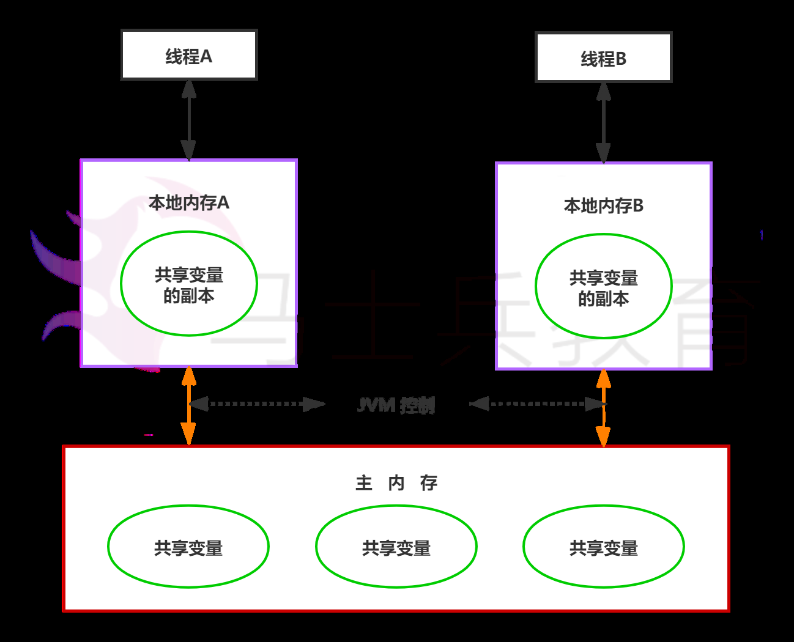

---

稍微解释下：
假设本地内存A和B有主内存中共享变量x的副本，初始时这三个内存中的x值都为0。线程A在执行
时，把更新后的x值（假设值为1）临时存放在自己的本地内存A中。当线程A和线程B需要通信时，
线程A首先会把自己本地内存中修改后的x值刷新到主内存中，此时主内存中的x值变为了1。然后，
线程B到主内存中去读取线程A更新后的x值，此时线程B的本地内存的x值也变为了1。
建议了解下线程的生命状态，这里就不多做解释，面试的时候很有可能会被问到。
重点：
1. volatile主要应用在多个线程对实例变量更改的场合，刷新主内存共享变量的值从而使得各个线程
可以获得最新的值，线程读取变量的值需要从主存中读取；synchronized则是锁定当前变量，只有
当前线程可以访问该变量，其他线程被阻塞住。另外，synchronized还会创建一个内存屏障，内存
屏障指令保证了所有CPU操作结果都会直接刷到主存中（即释放锁前），从而保证了操作的内存可
见性，同时也使得先获得这个锁的线程的所有操作
2. volatile仅能使用在变量级别；synchronized则可以使用在变量、方法、和类级别的。
3. volatile不会造成线程的阻塞；synchronized可能会造成线程的阻塞，比如多个线程争抢
synchronized锁对象时，会出现阻塞。
4. volatile仅能实现变量的修改可见性，不能保证原子性；而synchronized则可以保证变量的修改可
见性和原子性，因为线程获得锁才能进入临界区，从而保证临界区中的所有语句全部得到执行。

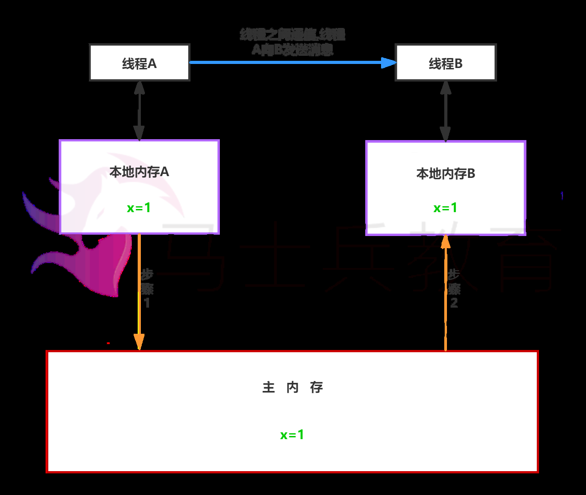

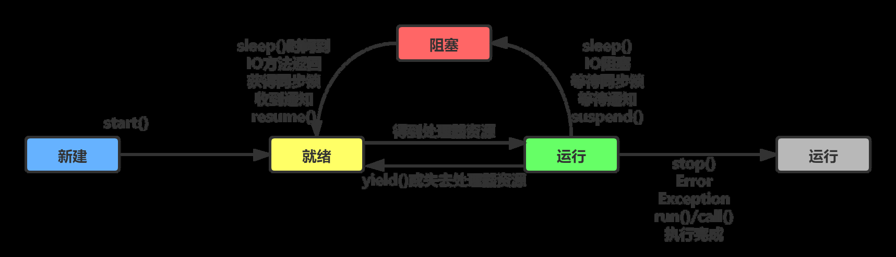

---

5. volatile标记的变量不会被编译器优化，可以禁止进行指令重排；synchronized标记的变量可以被
编译器优化。
 
synchronized锁粒度、模拟死锁场景；
 
synchronized：具有原子性，有序性和可见性 
粒度：对象锁、类锁
 
三大性质总结
 
1. 三大性质简介
 
在并发编程中分析线程安全的问题时往往需要切入点，那就是两大核心：JMM抽象内存模型以及
happens-before规则，三条性质：原子性，有序性和可见性。关于synchronized和volatile已经讨论过
了，就想着将并发编程中这两大神器在 原子性，有序性和可见性上做一个比较，当然这也是面试中的高
频考点，值得注意。
2. 原子性
 
原子性是指一个操作是不可中断的，要么全部执行成功要么全部执行失败，有着“同生共死”的感觉。及
时在多个线程一起执行的时候，一个操作一旦开始，就不会被其他线程所干扰。我们先来看看哪些是原
子操作，哪些不是原子操作，有一个直观的印象：
int a = 10;  //1
a++;  //2
int b=a; //3
a = a+1; //4
上面这四个语句中只有第1个语句是原子操作，将10赋值给线程工作内存的变量a,而语句2（a++），实
际上包含了三个操作：1. 读取变量a的值；2：对a进行加一的操作；3.将计算后的值再赋值给变量a，而
这三个操作无法构成原子操作。对语句3,4的分析同理可得这两条语句不具备原子性。当然，java内存模
型中定义了8中操作都是原子的，不可再分的。
1. lock(锁定)：作用于主内存中的变量，它把一个变量标识为一个线程独占的状态；
2. unlock(解锁):作用于主内存中的变量，它把一个处于锁定状态的变量释放出来，释放后的变量才可
以被其他线程锁定
3. read（读取）：作用于主内存的变量，它把一个变量的值从主内存传输到线程的工作内存中，以便
后面的load动作使用；
4. load（载入）：作用于工作内存中的变量，它把read操作从主内存中得到的变量值放入工作内存中
的变量副本
5. use（使用）：作用于工作内存中的变量，它把工作内存中一个变量的值传递给执行引擎，每当虚
拟机遇到一个需要使用到变量的值的字节码指令时将会执行这个操作；
6. assign（赋值）：作用于工作内存中的变量，它把一个从执行引擎接收到的值赋给工作内存的变
量，每当虚拟机遇到一个给变量赋值的字节码指令时执行这个操作；
7. store（存储）：作用于工作内存的变量，它把工作内存中一个变量的值传送给主内存中以便随后
的write操作使用；
8. write（操作）：作用于主内存的变量，它把store操作从工作内存中得到的变量的值放入主内存的
变量中。

---

上面的这些指令操作是相当底层的，可以作为扩展知识面掌握下。那么如何理解这些指令了?比如，把一
个变量从主内存中复制到工作内存中就需要执行read,load操作，将工作内存同步到主内存中就需要执行
store,write操作。注意的是：java内存模型只是要求上述两个操作是顺序执行的并不是连续执行的。也
就是说read和load之间可以插入其他指令，store和writer可以插入其他指令。比如对主内存中的a,b进
行访问就可以出现这样的操作顺序：read a,read b, load b,load a。
由原子性变量操作read,load,use,assign,store,write，可以大致认为基本数据类型的访问读写具备原子
性（例外就是long和double的非原子性协定）
synchronized
上面一共有八条原子操作，其中六条可以满足基本数据类型的访问读写具备原子性，还剩下lock和
unlock两条原子操作。如果我们需要更大范围的原子性操作就可以使用lock和unlock原子操作。尽管
jvm没有把lock和unlock开放给我们使用，但jvm以更高层次的指令monitorenter和monitorexit指令开
放给我们使用，反应到java代码中就是---synchronized关键字，也就是说synchronized满足原子性。
volatile
我们先来看这样一个例子：
 
开启10个线程，每个线程都自加10000次，如果不出现线程安全的问题最终的结果应该就是：10*10000 
= 100000;可是运行多次都是小于100000的结果，问题在于 volatile并不能保证原子性，在前面说过
counter++这并不是一个原子操作，包含了三个步骤：1.读取变量counter的值；2.对counter加一；3.将
新值赋值给变量counter。如果线程A读取counter到工作内存后，其他线程对这个值已经做了自增操作
后，那么线程A的这个值自然而然就是一个过期的值，因此，总结果必然会是小于100000的。
如果让volatile保证原子性，必须符合以下两条规则：
1. 运算结果并不依赖于变量的当前值，或者能够确保只有一个线程修改变量的值；
2. 变量不需要与其他的状态变量共同参与不变约束
public class VolatileExample {
    private static volatile int counter = 0;
    public static void main(String[] args) {
        for (int i = 0; i < 10; i++) {
            Thread thread = new Thread(new Runnable() {
                @Override
                public void run() {
                    for (int i = 0; i < 10000; i++)
                        counter++;
                }
            });
            thread.start();
        }
        try {
            Thread.sleep(1000);
        } catch (InterruptedException e) {
            e.printStackTrace();
        }
        System.out.println(counter);
    }
}

---

3. 有序性
 
synchronized
synchronized语义表示锁在同一时刻只能由一个线程进行获取，当锁被占用后，其他线程只能等待。因
此，synchronized语义就要求线程在访问读写共享变量时只能“串行”执行，因此synchronized具有有序
性。
volatile
在java内存模型中说过，为了性能优化，编译器和处理器会进行指令重排序；也就是说java程序天然的
有序性可以总结为：如果在本线程内观察，所有的操作都是有序的；如果在一个线程观察另一个线程，
所有的操作都是无序的。在单例模式的实现上有一种双重检验锁定的方式（Double-checked 
Locking）。代码如下：
 
这里为什么要加volatile了？我们先来分析一下不加volatile的情况，有问题的语句是这条：
instance = new Singleton();
这条语句实际上包含了三个操作：1.分配对象的内存空间；2.初始化对象；3.设置instance指向刚分配的
内存地址。但由于存在重排序的问题，可能有以下的执行顺序：
public class Singleton {
    private Singleton() { }
    private volatile static Singleton instance;
    public Singleton getInstance(){
        if(instance==null){
            synchronized (Singleton.class){
                if(instance==null){
                    instance = new Singleton();
                }
            }
        }
        return instance;
    }
}

---

如果2和3进行了重排序的话，线程B进行判断if(instance==null)时就会为true，而实际上这个instance并
没有初始化成功，显而易见对线程B来说之后的操作就会是错得。而用volatile修饰的话就可以禁止2和3
操作重排序，从而避免这种情况。volatile包含禁止指令重排序的语义，其具有有序性。
4. 可见性
 
可见性是指当一个线程修改了共享变量后，其他线程能够立即得知这个修改。通过之前对synchronzed
内存语义进行了分析，当线程获取锁时会从主内存中获取共享变量的最新值，释放锁的时候会将共享变
量同步到主内存中。从而，synchronized具有可见性。同样的在volatile分析中，会通过在指令中添加
lock指令，以实现内存可见性。因此, volatile具有可见性
5. 总结
 
通过这篇文章，主要是比较了synchronized和volatile在三条性质：原子性，可见性，以及有序性的情
况，归纳如下：
synchronized: 具有原子性，有序性和可见性；
volatile：具有有序性和可见性
 
基于synchronized的对象锁，类锁以及死锁模拟
 
 
分为对象锁和类锁
public class T {
    public void test1() throws Exception{
     synchronized(this){ //对象锁
         System.out.println(Thread.currentThread().getName()+"---test1  Doing");
         Thread.currentThread().sleep(2000);

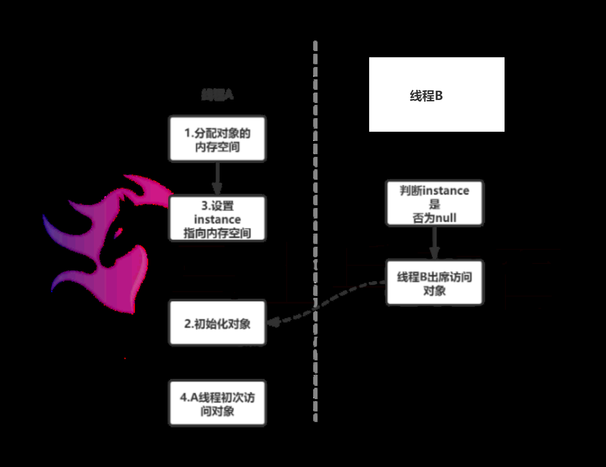

---

不同对象 访问类锁测试：
         test2();
     };
    }
    
    public synchronized void test2() throws Exception{ //同test1方法
        System.out.println(Thread.currentThread().getName()+"--- test2 Doing");
        Thread.currentThread().sleep(2000);
        test1();
    }
    public void testclass1() throws Exception{
         synchronized(T.class){//类锁
             System.out.println(Thread.currentThread().getName()+"---testclass1  
Doing");
             Thread.currentThread().sleep(2000);
         };
    }
    public static synchronized void testclass2() throws Exception{ //同testclass1
方法
         System.out.println(Thread.currentThread().getName()+"---testclass2  
Doing");
         Thread.currentThread().sleep(2000);
         testclass3();
    }
    public static synchronized void testclass3() throws Exception{ //同testclass1
方法
      System.out.println(Thread.currentThread().getName()+"---testclass3  
Doing");
      Thread.currentThread().sleep(2000);
      testclass2();
    }
}
public class clent {
    public static void main(String[] args) throws Exception {
        final CountDownLatch c=new CountDownLatch(1);
        new Thread(new Runnable(){
            @Override
            public void run() {
                T t1=new T();
                try {
                    System.out.println(Thread.currentThread().getName()+"启动");
                    c.await();
                    t1.testclass3();
                } catch (Exception e) {
                    e.printStackTrace();
                }
            }
        }).start();
       new Thread(new Runnable(){

---

不同对象访问对象锁测试：
                    @Override
                    public void run() {
                        T t1=new T();
                        try {                                           
                           
System.out.println(Thread.currentThread().getName()+"启动");
                            c.await();
                            t1.testclass2();
                        } catch (Exception e) {
                            e.printStackTrace();
                        }
                    }
                }).start();
       c.countDown();
       /* 可以发现 类的synchronized一个线程获得不释放，其他线程就不能访问 通过Jconsole可以
看到Thread0 一直在等待Thread1
       Thread-1启动
       Thread-1---testclass2  Doing
       Thread-0启动
       Thread-1---testclass3  Doing
       Thread-1---testclass2  Doing
       Thread-1---testclass2  Doing
       Thread-1---testclass3  Doing*/
    }
public class clent1 {
    public static void main(String[] args) {
        final CountDownLatch c=new CountDownLatch(1);
        new Thread(new Runnable(){
            @Override
            public void run() {
                T t1=new T();
                try {
                    System.out.println(Thread.currentThread().getName()+"启动");
                    c.await();
                    t1.test1();
                } catch (Exception e) {
                    e.printStackTrace();
                }
            }
        }).start();
       new Thread(new Runnable(){
                    @Override
                    public void run() {
                        T t1=new T();
                        try {
                            
System.out.println(Thread.currentThread().getName()+"启动");
                            c.await();
                            t1.test2();
                        } catch (Exception e) {
                            e.printStackTrace();
                        }

---

同一个对象，多个线程访问对象锁测试：
                    }
                }).start();
       c.countDown();
      /* Thread-0启动
       Thread-0---test1  Doing
       Thread-1启动
       Thread-1--- test2 Doing
      */
    }
public class client2 {
    public static void main(String[] args) {
        final CountDownLatch c=new CountDownLatch(1);
        final T t1=new T();
        new Thread(new Runnable(){
            @Override
            public void run() {
                
                try {
                    System.out.println(Thread.currentThread().getName()+"启动");
                    c.await();
                    t1.test1();
                } catch (Exception e) {
                    e.printStackTrace();
                }
            }
        }).start();
       new Thread(new Runnable(){
                    @Override
                    public void run() {     
                        try {
                            
System.out.println(Thread.currentThread().getName()+"启动");
                            c.await();
                            t1.test2();
                        } catch (Exception e) {
                            e.printStackTrace();
                        }
                    }
                }).start();
       c.countDown();
    }
    /*结果 同一个对象，当其中一个线程没有释放锁时，另一个会一直等待。
    Thread-1启动
    Thread-1--- test2 Doing
    Thread-0启动
    Thread-1---test1  Doing
    Thread-1--- test2 Doing
    Thread-1---test1  Doing
    Thread-1--- test2 Doing*/

---

以上演示的是阻塞等待，下面演示死锁。
 
}
public class E {
    public static synchronized void testclass() throws Exception{ 
     System.out.println(Thread.currentThread().getName()+"---E.method  Doing");
     Thread.currentThread().sleep(2000);
     E1.testclass();
    }
}
public class E1 {
    public static synchronized void testclass() throws Exception{ 
         System.out.println(Thread.currentThread().getName()+"---E1.method  
Doing");
        Thread.currentThread().sleep(1000);
         E.testclass();
        }
}
public class SiSuo {
    public static void main(String[] args) {
        final CountDownLatch c=new CountDownLatch(1);
        new Thread(new Runnable(){
            @Override
            public void run() {
                try {
                    c.await();
                    E.testclass();
                    E1.testclass();
                } catch (Exception e) {
                    // TODO Auto-generated catch block
                    e.printStackTrace();
                }
            }
        }).start();
        new Thread(new Runnable(){
            @Override
            public void run() {
                try {
                    c.await();
                    E1.testclass();
                    E.testclass();
                } catch (Exception e) {
                    // TODO Auto-generated catch block
                    e.printStackTrace();
                }
            }

---

Java并发和并行
 
并发 : 是指两个或多个事件在同一时间间隔发生,在一台处理器上“同时”处理多个任务;
并行 : 是指两个或者多个事件在同一时刻发生,在多台处理器上同时处理多个任务。
怎么提高并发量，请列举你所知道的方案？
 
高并发解决方案——提升高并发量服务器性能解决思路
 
一个小型的网站，可以使用最简单的html静态页面就实现了，配合一些图片达到美化效果，所有的页面
均存放在一个目录下，这样的网站对系统架构、性能的要求都很简单。随着互联网业务的不断丰富，网
站相关的技术经过这些年的发展，已经细分到很细的方方面面，尤其对于大型网站来说，所采用的技术
更是涉及面非常广，从硬件到软件、编程语言、数据库、WebServer、防火墙等各个领域都有了很高的
要求，已经不是原来简单的html静态网站所能比拟的。
  大型网站，比如门户网站，在面对大量用户访问、高并发请求方面，基本的解决方案集中在这样几
个环节：使用高性能的服务器、高性能的数据库、高效率的编程语言、还有高性能的Web容器。这几个
解决思路在一定程度上意味着更大的投入。
1、HTML静态化
  其实大家都知道，效率最高、消耗最小的就是纯静态化的html页面，所以我们尽可能使我们的网站
上的页面采用静态页面来实现，这个最简单的方法其实也是最有效的方法。但是对于大量内容并且频繁
更新的网站，我们无法全部手动去挨个实现，于是出现了我们常见的信息发布系统CMS，像我们常访问
的各个门户站点的新闻频道，甚至他们的其他频道，都是通过信息发布系统来管理和实现的，信息发布
系统可以实现最简单的信息录入自动生成静态页面，还能具备频道管理、权限管理、自动抓取等功能，
对于一个大型网站来说，拥有一套高效、可管理的CMS是必不可少的。
  除了门户和信息发布类型的网站，对于交互性要求很高的社区类型网站来说，尽可能的静态化也是
提高性能的必要手段，将社区内的帖子、文章进行实时的静态化、有更新的时候再重新静态化也是大量
使用的策略，像Mop的大杂烩就是使用了这样的策略，网易社区等也是如此。
  同时，html静态化也是某些缓存策略使用的手段，对于系统中频繁使用数据库查询但是内容更新很
小的应用，可以考虑使用html静态化来实现。比如论坛中论坛的公用设置信息，这些信息目前的主流论
坛都可以进行后台管理并且存储在数据库中，这些信息其实大量被前台程序调用，但是更新频率很小，
可以考虑将这部分内容进行后台更新的时候进行静态化，这样避免了大量的数据库访问请求。
2、图片服务器分离
  大家知道，对于Web服务器来说，不管是Apache、IIS还是其他容器，图片是最消耗资源的，于是
我们有必要将图片与页面进行分离，这是基本上大型网站都会采用的策略，他们都有独立的、甚至很多
台的图片服务器。这样的架构可以降低提供页面访问请求的服务器系统压力，并且可以保证系统不会因
为图片问题而崩溃。
        
        }).start();
        c.countDown();
    }
    /*执行结果，一直等待
    Thread-1---E1.method  Doing
    Thread-0---E.method  Doing*/
    
}

---

在应用服务器和图片服务器上，可以进行不同的配置优化，比如apache在配置ContentType的时候
可以尽量少支持、尽可能少的LoadModule，保证更高的系统消耗和执行效率。
3、数据库集群、库表散列
  大型网站都有复杂的应用，这些应用必须使用数据库，那么在面对大量访问的时候，数据库的瓶颈
很快就能显现出来，这时一台数据库将很快无法满足应用，于是我们需要使用数据库集群或者库表散
列。
  在数据库集群方面，很多数据库都有自己的解决方案，Oracle、Sybase等都有很好的方案，常用的
MySQL提供的Master/Slave也是类似的方案，您使用了什么样的DB，就参考相应的解决方案来实施即
可。
  上面提到的数据库集群由于在架构、成本、扩张性方面都会受到所采用DB类型的限制，于是我们需
要从应用程序的角度来考虑改善系统架构，库表散列是常用并且最有效的解决方案。
  我们在应用程序中安装业务和应用或者功能模块将数据库进行分离，不同的模块对应不同的数据库
或者表，再按照一定的策略对某个页面或者功能进行更小的数据库散列，比如用户表，按照用户ID进行
表散列，这样就能够低成本的提升系统的性能并且有很好的扩展性。
  sohu的论坛就是采用了这样的架构，将论坛的用户、设置、帖子等信息进行数据库分离，然后对帖
子、用户按照板块和ID进行散列数据库和表，最终可以在配置文件中进行简单的配置便能让系统随时增
加一台低成本的数据库进来补充系统性能。
4、缓存
  缓存一词搞技术的都接触过，很多地方用到缓存。网站架构和网站开发中的缓存也是非常重要。这
里先讲述最基本的两种缓存。高级和分布式的缓存在后面讲述。
  架构方面的缓存，对Apache比较熟悉的人都能知道Apache提供了自己的缓存模块，也可以使用外
加的Squid模块进行缓存，这两种方式均可以有效的提高Apache的访问响应能力。
  网站程序开发方面的缓存，Linux上提供的Memory Cache是常用的缓存接口，可以在web开发中使
用，比如用Java开发的时候就可以调用MemoryCache对一些数据进行缓存和通讯共享，一些大型社区
使用了这样的架构。另外，在使用web语言开发的时候，各种语言基本都有自己的缓存模块和方法，
PHP有Pear的Cache模块，Java就更多了，.net不是很熟悉，相信也肯定有。
5、镜像
  镜像是大型网站常采用的提高性能和数据安全性的方式，镜像的技术可以解决不同网络接入商和地
域带来的用户访问速度差异，比如ChinaNet和EduNet之间的差异就促使了很多网站在教育网内搭建镜
像站点，数据进行定时更新或者实时更新。在镜像的细节技术方面，这里不阐述太深，有很多专业的现
成的解决架构和产品可选。也有廉价的通过软件实现的思路，比如Linux上的rsync等工具。
6、负载均衡
  负载均衡将是大型网站解决高负荷访问和大量并发请求采用的高端解决办法。
  负载均衡技术发展了多年，有很多专业的服务提供商和产品可以选择，我个人接触过一些解决方
法，其中有两个架构可以给大家做参考。
（1）、硬件四层交换
  第四层交换使用第三层和第四层信息包的报头信息，根据应用区间识别业务流，将整个区间段的业
务流分配到合适的应用服务器进行处理。
  第四层交换功能就像是虚IP，指向物理服务器。它传输的业务服从的协议多种多样，有HTTP、
FTP、NFS、Telnet或其他协议。这些业务在物理服务器基础上，需要复杂的载量平衡算法。在IP世界，
业务类型由终端TCP或UDP端口地址来决定，在第四层交换中的应用区间则由源端和终端IP地址、TCP和
UDP端口共同决定。

---

在硬件四层交换产品领域，有一些知名的产品可以选择，比如Alteon、F5等，这些产品很昂贵，但
是物有所值，能够提供非常优秀的性能和很灵活的管理能力。“Yahoo中国”当初接近2000台服务器，只
使用了三、四台Alteon就搞定了。
(2)、软件四层交换
  大家知道了硬件四层交换机的原理后，基于OSI模型来实现的软件四层交换也就应运而生，这样的解
决方案实现的原理一致，不过性能稍差。但是满足一定量的压力还是游刃有余的，有人说软件实现方式
其实更灵活，处理能力完全看你配置的熟悉能力。
  软件四层交换我们可以使用Linux上常用的LVS来解决，LVS就是Linux Virtual Server，他提供了基
于心跳线heartbeat的实时灾难应对解决方案，提高系统的强壮性，同时可供了灵活的虚拟VIP配置和管
理功能，可以同时满足多种应用需求，这对于分布式的系统来说必不可少。
  一个典型的使用负载均衡的策略就是，在软件或者硬件四层交换的基础上搭建squid集群，这种思路
在很多大型网站包括搜索引擎上被采用，这样的架构低成本、高性能还有很强的扩张性，随时往架构里
面增减节点都非常容易。
  对于大型网站来说，前面提到的每个方法可能都会被同时使用到，这里介绍得比较浅显，具体实现
过程中很多细节还需要大家慢慢熟悉和体会。有时一个很小的squid参数或者apache参数设置，对于系
统性能的影响就会很大。
7、最新：CDN加速技术
什么是CDN？
   CDN的全称是内容分发网络。其目的是通过在现有的Internet中增加一层新的网络架构，将网站的
内容发布到最接近用户的网络“边缘”，使用户可以就近取得所需的内容，提高用户访问网站的响应速
度。
  CDN有别于镜像，因为它比镜像更智能，或者可以做这样一个比喻：CDN=更智能的镜像+缓存+流
量导流。因而，CDN可以明显提高Internet网络中信息流动的效率。从技术上全面解决由于网络带宽
小、用户访问量大、网点分布不均等问题，提高用户访问网站的响应速度。
CDN的类型特点
   CDN的实现分为三类：镜像、高速缓存、专线。
  镜像站点（Mirror Site），是最常见的，它让内容直接发布，适用于静态和准动态的数据同步。但
是购买和维护新服务器的费用较高，还必须在各个地区设置镜像服务器，配备专业技术人员进行管理与
维护。对于大型网站来说，更新所用的带宽成本也大大提高了。
  高速缓存，成本较低，适用于静态内容。Internet的统计表明，超过80%的用户经常访问的是20%
的网站的内容，在这个规律下，缓存服务器可以处理大部分客户的静态请求，而原始的服务器只需处理
约20%左右的非缓存请求和动态请求，于是大大加快了客户请求的响应时间，并降低了原始服务器的负
载。
  CDN服务一般会在全国范围内的关键节点上放置缓存服务器。
  专线，让用户直接访问数据源，可以实现数据的动态同步。
CDN的实例
  举个例子来说，当某用户访问网站时，网站会利用全球负载均衡技术，将用户的访问指向到距离用
户最近的正常工作的缓存服务器上，直接响应用户的请求。
  当用户访问已经使用了CDN服务的网站时，其解析过程与传统解析方式的最大区别就在于网站的授
权域名服务器不是以传统的轮询方式来响应本地DNS的解析请求，而是充分考虑用户发起请求的地点和
当时网络的情况，来决定把用户的请求定向到离用户最近同时负载相对较轻的节点缓存服务器上。

---

通过用户定位算法和服务器健康检测算法综合后的数据，可以将用户的请求就近定向到分布在网络
“边缘”的缓存服务器上，保证用户的访问能得到更及时可靠的响应。
  由于大量的用户访问都由分布在网络边缘的CDN节点缓存服务器直接响应了，这就不仅提高了用户
的访问质量，同时有效地降低了源服务器的负载压力。
附：某CDN服务商的服务说明
 
采用GCDN加速方式
  采用了GCDN加速方式以后，系统会在浏览用户和您的服务器之间增加一台GCDN服务器。浏览用
户访问您的服务器时，一般静态数据，如图片、多媒体资料等数据将直接从GCDN服务器读取，使得从
主服务器上读取静态数据的交换量大大减少。
  为VIP型虚拟主机而特加的VPN高速压缩通道，使用高速压缩的电信<==>网通、电信<==>国际
（HK）、网通<==>国际（HK）等跨网专线通道，智能多线，自动获取最快路径，极速的动态实时并发
响应速度，实现了网站的动态脚本实时同步，对动态网站有一个更加明显的加速效果。
  每个网络运营商（电信、网通、铁通、教育网）均有您服务器的GCDN服务器，无论浏览用户是来
自何处，GCDN都能让您的服务器展现最快的速度！另外，我们将对您的数据进行实时备份，让您的数
据更安全！
 
系统的用户量有多少？多用户并发访问时如何解决？
 
 
大型网站是怎样解决多用户高并发访问的
 
分布式是以缩短单个任务的执行时间来提升效率的，而集群则是通过提高单位时间内执行的任务数来提
升效率。
 
集群主要分为：高可用集群(High Availability Cluster)，负载均衡集群(Load Balance Cluster，nginx即
可实现)，科学计算集群(High Performance Computing Cluster)。
分布式是指将不同的业务分布在不同的地方；而集群指的是将几台服务器集中在一起，实现同一业务。
分布式中的每一个节点，都可以做集群。 而集群并不一定就是分布式的。
 
为了解决大型网站的访问量大、并发量高、海量数据的问题，我们一般会考虑业务拆分和分布式部署。
我们可以把那些关联不太大的业务独立出来，部署到不同的机器上，从而实现大规模的分布式系统。但
这之中也有一个问题，那就是用户如何选择相应的机器的问题，这也被称为访问统一入口问题，而解决
的方法是我们可以在集群机器的前面增加负载均衡设备，实现流量分发（总图如下）。
这里得先解释一下何为“负载均衡”，负载均衡就是将负载（工作任务、访问请求等）进行平衡、分摊到
多个操作单元（服务器、组件等）上进行执行，是解决高性能，单点故障（高可用，如果你是单机版网
络，一旦服务器挂掉了，那么用户就无法请求了，但对于集群来说，一台服务器挂掉了，负载均衡器会
把用户的请求发送给其他的服务器进行处理），扩展性（这里主要是指水平伸缩）的终极解决方案。

---

在这里，本人主要讨论负载均衡设备为Nginx(至于为啥不讲讲F5，因为人家太贵了，不过人家比较稳
定)，这是一款轻量级的Web服务器/反向代理服务器及电子邮件（IMAP/POP3）代理服务器，具有占用
内存少、并发能力强等，中国大陆使用nginx网站用户有：百度、网易、新浪、腾讯等（该介绍来自百
科）。
nginx大家可以上其 官网 去下载最新版，解压后复制到部署目录，对于Nginx的配置网上的资料很多，
这里就不再赘述了，只总结一下Nginx使用的注意事项：
1.nginx的负载均衡配置中默认是采用轮询的方式，这种方式中，每个请求按时间顺序逐一分配到不同的
后端服务器，如果后端服务器down掉，能自动剔除，但存在各个服务器的session共享问题。
2.另外一种方式是ip_hash:每个请求按访问的ip的hash结果分配，如果访问的IP是固定的，那么在正常
情况下，该用户的请求都会分配到后台的同一台服务器去处理，但是如果用户每次请求的IP都不同呢？
所以这种方式也同1的方式一样都存在这么一个问题：session在各个服务器上的共享问题。
3.，如果集群中的服务器的性能不一，可以通过配置各个服务器的权值来实现资源利用率的最大化，即
性能好的优先选择
也许你会问，既然IP可能变化，那么用户用页面请求时的cookie的ID应该是确定的吧！那么我们可以用
cookie_id来进行hash，然后在通过负载均衡器分发到对应的服务器上，这样就可以解决session问题
了，其实当初本人也有想到这个方案，但最后本人也放弃这个方案了，因为是根据cookid_id确实可以把
该用户的请求唯一的分发到那台独一无二的服务器上，那如果这台服务器挂掉了，那么根据这种分发策
略，岂不是在这服务器上请求资源的用户都不能访问了，你说是不是呢？
解决服务器共享session问题：使用redis来共享各个服务器的session，并同时通过redis来缓存一些常用
的资源，加快用户获得请求资源的速度（个人比较喜欢redis，当然你们也可以使用memcache来实现，
不过，memcache不能做到持久化，这样这台服务器一挂掉，那么所有的资源也都没有了......）。
不过，本人觉得这样进行集群部署，最好配上数据库的主从部署，因为如果在集群中只分配一个数据库
服务器，那么这个系统的瓶颈将会出现在数据库的操作上，虽然redis能减轻这种负担，但对于数据量大
的还是有一定影响的，而且数据库的主从部署也可以防止因某个数据库服务器的挂掉而丢失用户的信
息。
 
 
说说阻塞队列的实现：可以参考ArrayBlockingQueue的
底层实现（锁和同步都行）

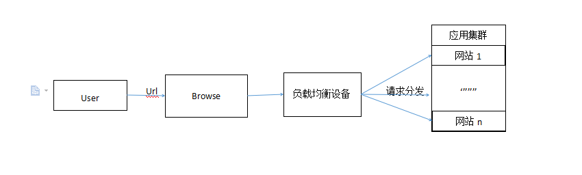

---

Java阻塞队列ArrayBlockingQueue和LinkedBlockingQueue实现
原理分析
 
Java中的阻塞队列接口BlockingQueue继承自Queue接口。
BlockingQueue接口提供了3个添加元素方法。
add：添加元素到队列里，添加成功返回true，由于容量满了添加失败会抛出IllegalStateException异常
offer：添加元素到队列里，添加成功返回true，添加失败返回false
put：添加元素到队列里，如果容量满了会阻塞直到容量不满
3个删除方法。
poll：删除队列头部元素，如果队列为空，返回null。否则返回元素。
remove：基于对象找到对应的元素，并删除。删除成功返回true，否则返回false
take：删除队列头部元素，如果队列为空，一直阻塞到队列有元素并删除
常用的阻塞队列具体类有ArrayBlockingQueue、LinkedBlockingQueue、PriorityBlockingQueue、
LinkedBlockingDeque等。
本文以ArrayBlockingQueue和LinkedBlockingQueue为例，分析它们的实现原理。
ArrayBlockingQueue
ArrayBlockingQueue的原理就是使用一个可重入锁和这个锁生成的两个条件对象进行并发控制(classic 
two-condition algorithm)。
ArrayBlockingQueue是一个带有长度的阻塞队列，初始化的时候必须要指定队列长度，且指定长度之后
不允许进行修改。
它带有的属性如下：
数据的添加
ArrayBlockingQueue有不同的几个数据添加方法，add、offer、put方法。
add方法：
// 存储队列元素的数组，是个循环数组
final Object[] items;
// 拿数据的索引，用于take，poll，peek，remove方法
int takeIndex;
// 放数据的索引，用于put，offer，add方法
int putIndex;
// 元素个数
int count;
// 可重入锁
final ReentrantLock lock;
// notEmpty条件对象，由lock创建
private final Condition notEmpty;
// notFull条件对象，由lock创建
private final Condition notFull;

---

add方法内部调用offer方法如下：
insert方法如下：
put方法：
ArrayBlockingQueue的添加数据方法有add，put，offer这3个方法，总结如下：
add方法内部调用offer方法，如果队列满了，抛出IllegalStateException异常，否则返回true
public boolean add(E e) {
    if (offer(e))
        return true;
    else
        throw new IllegalStateException("Queue full");
}
public boolean offer(E e) {
    checkNotNull(e); // 不允许元素为空
    final ReentrantLock lock = this.lock;
    lock.lock(); // 加锁，保证调用offer方法的时候只有1个线程
    try {
        if (count == items.length) // 如果队列已满
            return false; // 直接返回false，添加失败
        else {
            insert(e); // 数组没满的话调用insert方法
            return true; // 返回true，添加成功
        }
    } finally {
        lock.unlock(); // 释放锁，让其他线程可以调用offer方法
    }
}
private void insert(E x) {
    items[putIndex] = x; // 元素添加到数组里
    putIndex = inc(putIndex); // 放数据索引+1，当索引满了变成0
    ++count; // 元素个数+1
    notEmpty.signal(); // 使用条件对象notEmpty通知，比如使用take方法的时候队列里没有数
据，被阻塞。这个时候队列insert了一条数据，需要调用signal进行通知
}
public void put(E e) throws InterruptedException {
    checkNotNull(e); // 不允许元素为空
    final ReentrantLock lock = this.lock;
    lock.lockInterruptibly(); // 加锁，保证调用put方法的时候只有1个线程
    try {
        while (count == items.length) // 如果队列满了，阻塞当前线程，并加入到条件对象
notFull的等待队列里
            notFull.await(); // 线程阻塞并被挂起，同时释放锁
        insert(e); // 调用insert方法
    } finally {
        lock.unlock(); // 释放锁，让其他线程可以调用put方法
    }
}

---

offer方法如果队列满了，返回false，否则返回true
add方法和offer方法不会阻塞线程，put方法如果队列满了会阻塞线程，直到有线程消费了队列里的数据
才有可能被唤醒。
这3个方法内部都会使用可重入锁保证原子性。
数据的删除
ArrayBlockingQueue有不同的几个数据删除方法，poll、take、remove方法。
poll方法：
poll方法内部调用extract方法：
take方法：
remove方法：
public E poll() {
    final ReentrantLock lock = this.lock;
    lock.lock(); // 加锁，保证调用poll方法的时候只有1个线程
    try {
        return (count == 0) ? null : extract(); // 如果队列里没元素了，返回null，否则
调用extract方法
    } finally {
        lock.unlock(); // 释放锁，让其他线程可以调用poll方法
    }
}
private E extract() {
    final Object[] items = this.items;
    E x = this.<E>cast(items[takeIndex]); // 得到取索引位置上的元素
    items[takeIndex] = null; // 对应取索引上的数据清空
    takeIndex = inc(takeIndex); // 取数据索引+1，当索引满了变成0
    --count; // 元素个数-1
    notFull.signal(); // 使用条件对象notFull通知，比如使用put方法放数据的时候队列已满，被
阻塞。这个时候消费了一条数据，队列没满了，就需要调用signal进行通知
    return x; // 返回元素
}
public E take() throws InterruptedException {
    final ReentrantLock lock = this.lock;
    lock.lockInterruptibly(); // 加锁，保证调用take方法的时候只有1个线程
    try {
        while (count == 0) // 如果队列空，阻塞当前线程，并加入到条件对象notEmpty的等待队
列里
            notEmpty.await(); // 线程阻塞并被挂起，同时释放锁
        return extract(); // 调用extract方法
    } finally {
        lock.unlock(); // 释放锁，让其他线程可以调用take方法
    }
}
public boolean remove(Object o) {
    if (o == null) return false;
    final Object[] items = this.items;

---

removeAt方法：
ArrayBlockingQueue的删除数据方法有poll，take，remove这3个方法，总结如下：
poll方法对于队列为空的情况，返回null，否则返回队列头部元素。
remove方法取的元素是基于对象的下标值，删除成功返回true，否则返回false。
poll方法和remove方法不会阻塞线程。
take方法对于队列为空的情况，会阻塞并挂起当前线程，直到有数据加入到队列中。
这3个方法内部都会调用notFull.signal方法通知正在等待队列满情况下的阻塞线程。
LinkedBlockingQueue
LinkedBlockingQueue是一个使用链表完成队列操作的阻塞队列。链表是单向链表，而不是双向链表。
内部使用放锁和拿锁，这两个锁实现阻塞(“two lock queue” algorithm)。
    final ReentrantLock lock = this.lock;
    lock.lock(); // 加锁，保证调用remove方法的时候只有1个线程
    try {
        for (int i = takeIndex, k = count; k > 0; i = inc(i), k--) { // 遍历元素
            if (o.equals(items[i])) { // 两个对象相等的话
                removeAt(i); // 调用removeAt方法
                return true; // 删除成功，返回true
            }
        }
        return false; // 删除成功，返回false
    } finally {
        lock.unlock(); // 释放锁，让其他线程可以调用remove方法
    }
}
void removeAt(int i) {
    final Object[] items = this.items;
    if (i == takeIndex) { // 如果要删除数据的索引是取索引位置，直接删除取索引位置上的数据，
然后取索引+1即可
        items[takeIndex] = null;
        takeIndex = inc(takeIndex);
    } else { // 如果要删除数据的索引不是取索引位置，移动元素元素，更新取索引和放索引的值
        for (;;) {
            int nexti = inc(i);
            if (nexti != putIndex) {
                items[i] = items[nexti];
                i = nexti;
            } else {
                items[i] = null;
                putIndex = i;
                break;
            }
        }
    }
    --count; // 元素个数-1
    notFull.signal(); // 使用条件对象notFull通知，比如使用put方法放数据的时候队列已满，被
阻塞。这个时候消费了一条数据，队列没满了，就需要调用signal进行通知 
}

---

它带有的属性如下：
ArrayBlockingQueue只有1个锁，添加数据和删除数据的时候只能有1个被执行，不允许并行执行。
而LinkedBlockingQueue有2个锁，放锁和拿锁，添加数据和删除数据是可以并行进行的，当然添加数
据和删除数据的时候只能有1个线程各自执行。
数据的添加
LinkedBlockingQueue有不同的几个数据添加方法，add、offer、put方法。
add方法内部调用offer方法：
// 容量大小
private final int capacity;
// 元素个数，因为有2个锁，存在竞态条件，使用AtomicInteger
private final AtomicInteger count = new AtomicInteger(0);
// 头结点
private transient Node<E> head;
// 尾节点
private transient Node<E> last;
// 拿锁
private final ReentrantLock takeLock = new ReentrantLock();
// 拿锁的条件对象
private final Condition notEmpty = takeLock.newCondition();
// 放锁
private final ReentrantLock putLock = new ReentrantLock();
// 放锁的条件对象
private final Condition notFull = putLock.newCondition();
public boolean offer(E e) {
    if (e == null) throw new NullPointerException(); // 不允许空元素
    final AtomicInteger count = this.count;
    if (count.get() == capacity) // 如果容量满了，返回false
        return false;
    int c = -1;
    Node<E> node = new Node(e); // 容量没满，以新元素构造节点
    final ReentrantLock putLock = this.putLock;
    putLock.lock(); // 放锁加锁，保证调用offer方法的时候只有1个线程
    try {
        if (count.get() < capacity) { // 再次判断容量是否已满，因为可能拿锁在进行消费数
据，没满的话继续执行
            enqueue(node); // 节点添加到链表尾部
            c = count.getAndIncrement(); // 元素个数+1
            if (c + 1 < capacity) // 如果容量还没满
                notFull.signal(); // 在放锁的条件对象notFull上唤醒正在等待的线程，表示可
以再次往队列里面加数据了，队列还没满
        }
    } finally {
        putLock.unlock(); // 释放放锁，让其他线程可以调用offer方法
    }

---

put方法：
LinkedBlockingQueue的添加数据方法add，put，offer跟ArrayBlockingQueue一样，不同的是它们的
底层实现不一样。
ArrayBlockingQueue中放入数据阻塞的时候，需要消费数据才能唤醒。
而LinkedBlockingQueue中放入数据阻塞的时候，因为它内部有2个锁，可以并行执行放入数据和消费
数据，不仅在消费数据的时候进行唤醒插入阻塞的线程，同时在插入的时候如果容量还没满，也会唤醒
插入阻塞的线程。
数据的删除
LinkedBlockingQueue有不同的几个数据删除方法，poll、take、remove方法。
poll方法：
    if (c == 0) // 由于存在放锁和拿锁，这里可能拿锁一直在消费数据，count会变化。这里的if条件
表示如果队列中还有1条数据
        signalNotEmpty(); // 在拿锁的条件对象notEmpty上唤醒正在等待的1个线程，表示队列里
还有1条数据，可以进行消费
    return c >= 0; // 添加成功返回true，否则返回false
}
public void put(E e) throws InterruptedException {
    if (e == null) throw new NullPointerException(); // 不允许空元素
    int c = -1;
    Node<E> node = new Node(e); // 以新元素构造节点
    final ReentrantLock putLock = this.putLock;
    final AtomicInteger count = this.count;
    putLock.lockInterruptibly(); // 放锁加锁，保证调用put方法的时候只有1个线程
    try {
        while (count.get() == capacity) { // 如果容量满了
            notFull.await(); // 阻塞并挂起当前线程
        }
        enqueue(node); // 节点添加到链表尾部
        c = count.getAndIncrement(); // 元素个数+1
        if (c + 1 < capacity) // 如果容量还没满
            notFull.signal(); // 在放锁的条件对象notFull上唤醒正在等待的线程，表示可以再
次往队列里面加数据了，队列还没满
    } finally {
        putLock.unlock(); // 释放放锁，让其他线程可以调用put方法
    }
    if (c == 0) // 由于存在放锁和拿锁，这里可能拿锁一直在消费数据，count会变化。这里的if条件
表示如果队列中还有1条数据
        signalNotEmpty(); // 在拿锁的条件对象notEmpty上唤醒正在等待的1个线程，表示队列里
还有1条数据，可以进行消费
}
public E poll() {
    final AtomicInteger count = this.count;
    if (count.get() == 0) // 如果元素个数为0
        return null; // 返回null
    E x = null;
    int c = -1;
    final ReentrantLock takeLock = this.takeLock;
    takeLock.lock(); // 拿锁加锁，保证调用poll方法的时候只有1个线程
    try {

---

take方法：
remove方法：
        if (count.get() > 0) { // 判断队列里是否还有数据
            x = dequeue(); // 删除头结点
            c = count.getAndDecrement(); // 元素个数-1
            if (c > 1) // 如果队列里还有元素
                notEmpty.signal(); // 在拿锁的条件对象notEmpty上唤醒正在等待的线程，表示
队列里还有数据，可以再次消费
        }
    } finally {
        takeLock.unlock(); // 释放拿锁，让其他线程可以调用poll方法
    }
    if (c == capacity) // 由于存在放锁和拿锁，这里可能放锁一直在添加数据，count会变化。这里
的if条件表示如果队列中还可以再插入数据
        signalNotFull(); // 在放锁的条件对象notFull上唤醒正在等待的1个线程，表示队列里还能
再次添加数据
                return x;
}
public E take() throws InterruptedException {
    E x;
    int c = -1;
    final AtomicInteger count = this.count;
    final ReentrantLock takeLock = this.takeLock;
    takeLock.lockInterruptibly(); // 拿锁加锁，保证调用take方法的时候只有1个线程
    try {
        while (count.get() == 0) { // 如果队列里已经没有元素了
            notEmpty.await(); // 阻塞并挂起当前线程
        }
        x = dequeue(); // 删除头结点
        c = count.getAndDecrement(); // 元素个数-1
        if (c > 1) // 如果队列里还有元素
            notEmpty.signal(); // 在拿锁的条件对象notEmpty上唤醒正在等待的线程，表示队列
里还有数据，可以再次消费
    } finally {
        takeLock.unlock(); // 释放拿锁，让其他线程可以调用take方法
    }
    if (c == capacity) // 由于存在放锁和拿锁，这里可能放锁一直在添加数据，count会变化。这里
的if条件表示如果队列中还可以再插入数据
        signalNotFull(); // 在放锁的条件对象notFull上唤醒正在等待的1个线程，表示队列里还能
再次添加数据
    return x;
}
public boolean remove(Object o) {
    if (o == null) return false;
    fullyLock(); // remove操作要移动的位置不固定，2个锁都需要加锁
    try {
        for (Node<E> trail = head, p = trail.next; // 从链表头结点开始遍历
             p != null;
             trail = p, p = p.next) {
            if (o.equals(p.item)) { // 判断是否找到对象
                unlink(p, trail); // 修改节点的链接信息，同时调用notFull的signal方法
                return true;

---

通信方法
无法介于内核态与用户态的原因
管道（不包括命名管道）
局限于父子进程间的通信。
消息队列
在硬、软中断中无法无阻塞地接收数据。
信号量
无法介于内核态和用户态使用。
内存共享
需要信号量辅助，而信号量又无法使用。
套接字
在硬、软中断中无法无阻塞地接收数据。
LinkedBlockingQueue的take方法对于没数据的情况下会阻塞，poll方法删除链表头结点，remove方法
删除指定的对象。
需要注意的是remove方法由于要删除的数据的位置不确定，需要2个锁同时加锁。
 
 
进程通讯的方式：消息队列，共享内存，信号量，socket
通讯等
 
 
Linux进程间通信方式--信号，管道，消息队列，信号量，共享内存
 
1、概述
 
 
 
2、信号
 
信号又称软终端，通知程序发生异步事件，程序执行中随时被各种信号中断，进程可以忽略该信号，也
可以中断当前程序转而去处理信号，引起信号原因：
1).程序中执行错误码；
2).其他进程发送来的；
3).用户通过控制终端发送来；
4).子进程结束时向父进程发送SIGCLD；
5).定时器生产的SIGALRM；
            }
        }
        return false;
    } finally {
        fullyUnlock(); // 2个锁解锁
    }
}

---

3、管道
 
管道的优点是不需要加锁，缺点是默认缓冲区太小，只有4K，同时只适合父子进程间通信，而且一个管
道只适合单向通信，如果要双向通信需要建立两个。而且不适合多个子进程，因为消息会乱，它的发送
接收机制是用read/write这种适用流的，缺点是数据本身没有边界，需要应用程序自己解释，而一般消
息大多是一个固定长的消息头，和一个变长的消息体，一个子进程从管道read到消息头后，消息体可能
被别的子进程接收到
单向，一段输入，另一端输出，先进先出FIFO。管道也是文件。管道大小4096字节。
特点：管道满时，写阻塞；空时，读阻塞。
分类：普通管道（仅父子进程间通信）位于内存；命名管道位于文件系统，没有亲缘关系管道只要知道
管道名也可以通讯。
管道是由内核管理的一个缓冲区(buffer)，相当于我们放入内存中的一个纸条。管道的一端连接一个进程
的输出。这个进程会向管道中放入信息。管道的另一端连接一个进程的输入，这个进程取出被放入管道
的信息。一个缓冲区不需要很大，它被设计成为环形的数据结构，以便管道可以被循环利用。当管道中
没有信息的话，从管道中读取的进程会等待，直到另一端的进程放入信息。当管道被放满信息的时候，
尝试放入信息的进程会等待，直到另一端的进程取出信息。当两个进程都终结的时候，管道也自动消
失。
4、消息队列
 
消息队列也不要加锁，默认缓冲区和单消息上限都要大一些，在我的suse10上是64K，它并不局限于父
子进程间通信，只要一个相同的key，就可以让不同的进程定位到同一个消息队列上，它也可以用来给双
向通信，不过稍微加个标识，可以通过消息中的type进行区分，比如一个任务分派进程，创建了若干个
执行子进程，不管是父进程发送分派任务的消息，还是子进程发送任务执行的消息，都将type设置为目
标进程的pid，因为msgrcv可以指定只接收消息类型为type的消息，这样就实现了子进程只接收自己的
任务，父进程只接收任务结果
 
消息队列是先进先出FIFO原则
消息结构模板
strut msgbuf
{
long int  mtype;//消息类型
char mtext[1];//消息内容
}
5、共享内存
 
 
 
共享内存的几乎可以认为没有上限，它也是不局限与父子进程，采用跟消息队列类似的定位方式，因为
内存是共享的，不存在任何单向的限制，最大的问题就是需要应用程序自己做互斥，有如下几种方案
1 只适用两个进程共享，在内存中放一个标志位，一定要声明为volatile，大家基于标志位来互斥，例如
为0时第一个可以写，第二个就等待，为1时第一个等待，第二个可以写/读
2 也只适用两个进程，是用信号，大家等待不同的信号，第一个写完了发送信号2，等待信号1，第二个
等待信号2，收到后读取/写入完，发送信号1，它不是用更多进程是因为虽然父进程可以向不同子进程分
别发送信号，但是子进程收到信号会同时访问共享内存，产生不同子进程间的竞态条件，如果用多块共
享内存，又存在子进程发送结果通知信号时，父进程收到信号后，不知道是谁发送，也意味着不知道该

---

访问哪块共享内存，即使子进程发送不同的结果通知信号，因为等待信号的一定是阻塞的，如果某个子
进程意外终止，父进程将永远阻塞下去，而不能超时处理
3 采用信号量或者msgctl自己的加锁、解锁功能，不过后者只适用于linux
 
 
6、信号量
 
信号量是一种用于提供不同进程间或一个进程间的不同线程间线程同步手段的原语，systemV信号量在
内核中维护
二值信号量 ： 其值只有0、1 两种选择，0表示资源被锁，1表示资源可用；
计数信号量：其值在0 和某个限定值之间，不限定资源数只在0 1 之间；
计数信号量集 ；多个信号量的集合组成信号量集
 
------总结
管道是最弱的，只适合有限场景；
消息队列能适合大部分场景，缺点是默认缓冲也比较小，不过这个可以调整，前提是你有管理员权限；
共享内存是最强大的，只是要做互斥
 
为什么要用线程池
 
 
在Java中，如果每当一个请求到达就创建一个新线程，开销是相当大的。在实际使用中，每个请求创建
新线程的服务器在创建和销毁线程上花费的时间和消耗的系统资源，甚至可能要比花在处理实际的用户
请求的时间和资源要多得多。除了创建和销毁线程的开销之外，活动的线程也需要消耗系统资源。如果
在一个JVM里创建太多的线程，可能会导致系统由于过度消耗内存或“切换过度”而导致系统资源不足。为
了防止资源不足，服务器应用程序需要一些办法来限制任何给定时刻处理的请求数目，尽可能减少创建
和销毁线程的次数，特别是一些资源耗费比较大的线程的创建和销毁，尽量利用已有对象来进行服务，
这就是“池化资源”技术产生的原因。 
线程池主要用来解决线程生命周期开销问题和资源不足问题。通过对多个任务重用线程，线程创建的开
销就被分摊到了多个任务上了，而且由于在请求到达时线程已经存在，所以消除了线程创建所带来的延
迟。这样，就可以立即为请求服务，使应用程序响应更快。另外，通过适当地调整线程池中的线程数目
可以防止出现资源不足的情况。 
创建一个线程池
一个比较简单的线程池至少应包含线程池管理器、工作线程、任务队列、任务接口等部分。其中线程池
管理器（ThreadPool Manager）的作用是创建、销毁并管理线程池，将工作线程放入线程池中；工作
线程是一个可以循环执行任务的线程，在没有任务时进行等待；任务队列的作用是提供一种缓冲机制，
将没有处理的任务放在任务队列中；任务接口是每个任务必须实现的接口，主要用来规定任务的入口、
任务执行完后的收尾工作、任务的执行状态等，工作线程通过该接口调度任务的执行。
线程池适合应用的场合

---

当一个Web服务器接受到大量短小线程的请求时，使用线程池技术是非常合适的，它可以大大减少线程
的创建和销毁次数，提高服务器的工作效率。但如果线程要求的运行时间比较长，此时线程的运行时间
比创建时间要长得多，单靠减少创建时间对系统效率的提高不明显，此时就不适合应用线程池技术，需
要借助其它的技术来提高服务器的服务效率。
 使用线程池的风险
虽然线程池是构建多线程应用程序的强大机制，但使用它并不是没有风险的。用线程池构建的应用程序
容易遭受任何其它多线程应用程序容易遭受的所有并发风险，诸如同步错误和死锁，它还容易遭受特定
于线程池的少数其它风险，诸如与池有关的死锁、资源不足和线程泄漏。
死锁
任何多线程应用程序都有死锁风险。当一组进程或线程中的每一个都在等待一个只有该组中另一个进程
才能引起的事件时，我们就说这组进程或线程死锁了。死锁的最简单情形是：线程 A 持有对象 X 的独占
锁，并且在等待对象 Y 的锁，而线程 B 持有对象 Y 的独占锁，却在等待对象 X 的锁。除非有某种方法来
打破对锁的等待（Java 锁定不支持这种方法），否则死锁的线程将永远等下去。
虽然任何多线程程序中都有死锁的风险，但线程池却引入了另一种死锁可能，在那种情况下，所有池线
程都在执行已阻塞的等待队列中另一任务的执行结果的任务，但这一任务却因为没有未被占用的线程而
不能运行。当线程池被用来实现涉及许多交互对象的模拟，被模拟的对象可以相互发送查询，这些查询
接下来作为排队的任务执行，查询对象又同步等待着响应时，会发生这种情况。
资源不足
线程池的一个优点在于：相对于其它替代调度机制（有些我们已经讨论过）而言，它们通常执行得很
好。但只有恰当地调整了线程池大小时才是这样的。线程消耗包括内存和其它系统资源在内的大量资
源。除了 Thread 对象所需的内存之外，每个线程都需要两个可能很大的执行调用堆栈。除此以外，JVM 
可能会为每个 Java 线程创建一个本机线程，这些本机线程将消耗额外的系统资源。最后，虽然线程之间
切换的调度开销很小，但如果有很多线程，环境切换也可能严重地影响程序的性能。
如果线程池太大，那么被那些线程消耗的资源可能严重地影响系统性能。在线程之间进行切换将会浪费
时间，而且使用超出比您实际需要的线程可能会引起资源匮乏问题，因为池线程正在消耗一些资源，而
这些资源可能会被其它任务更有效地利用。除了线程自身所使用的资源以外，服务请求时所做的工作可
能需要其它资源，例如 JDBC 连接、套接字或文件。这些也都是有限资源，有太多的并发请求也可能引
起失效，例如不能分配 JDBC 连接。
并发错误
线程池和其它排队机制依靠使用 wait() 和 notify() 方法，这两个方法都难于使用。如果编码不正确，那
么可能丢失通知，导致线程保持空闲状态，尽管队列中有工作要处理。使用这些方法时，必须格外小
心；即便是专家也可能在它们上面出错。而最好使用现有的、已经知道能工作的实现，例如在下面的无
须编写您自己的池中讨论的 util.concurrent 包。
线程泄漏
各种类型的线程池中一个严重的风险是线程泄漏，当从池中除去一个线程以执行一项任务，而在任务完
成后该线程却没有返回池时，会发生这种情况。发生线程泄漏的一种情形出现在任务抛出一个 
RuntimeException 或一个 Error 时。如果池类没有捕捉到它们，那么线程只会退出而线程池的大小将
会永久减少一个。当这种情况发生的次数足够多时，线程池最终就为空，而且系统将停止，因为没有可
用的线程来处理任务。
有些任务可能会永远等待某些资源或来自用户的输入，而这些资源又不能保证变得可用，用户可能也已
经回家了，诸如此类的任务会永久停止，而这些停止的任务也会引起和线程泄漏同样的问题。如果某个
线程被这样一个任务永久地消耗着，那么它实际上就被从池除去了。对于这样的任务，应该要么只给予
它们自己的线程，要么只让它们等待有限的时间。
请求过载

---

仅仅是请求就压垮了服务器，这种情况是可能的。在这种情形下，我们可能不想将每个到来的请求都排
队到我们的工作队列，因为排在队列中等待执行的任务可能会消耗太多的系统资源并引起资源缺乏。在
这种情形下决定如何做取决于您自己；在某些情况下，您可以简单地抛弃请求，依靠更高级别的协议稍
后重试请求，您也可以用一个指出服务器暂时很忙的响应来拒绝请求。
 
有效使用线程池的准则
只要您遵循几条简单的准则，线程池可以成为构建服务器应用程序的极其有效的方法：
不要对那些同步等待其它任务结果的任务排队。这可能会导致上面所描述的那种形式的死锁，在那种死
锁中，所有线程都被一些任务所占用，这些任务依次等待排队任务的结果，而这些任务又无法执行，因
为所有的线程都很忙。
在为时间可能很长的操作使用合用的线程时要小心。如果程序必须等待诸如 I/O 完成这样的某个资源，
那么请指定最长的等待时间，以及随后是失效还是将任务重新排队以便稍后执行。这样做保证了：通过
将某个线程释放给某个可能成功完成的任务，从而将最终取得某些进展。
理解任务
要有效地调整线程池大小，您需要理解正在排队的任务以及它们正在做什么。它们是 CPU 限制的
（CPU-bound）吗？它们是 I/O 限制的（I/O-bound）吗？您的答案将影响您如何调整应用程序。如果
您有不同的任务类，这些类有着截然不同的特征，那么为不同任务类设置多个工作队列可能会有意义，
这样可以相应地调整每个池。
调整池的大小
调整线程池的大小基本上就是避免两类错误：线程太少或线程太多。幸运的是，对于大多数应用程序来
说，太多和太少之间的余地相当宽。
请回忆：在应用程序中使用线程有两个主要优点，尽管在等待诸如 I/O 的慢操作，但允许继续进行处
理，并且可以利用多处理器。在运行于具有 N 个处理器机器上的计算限制的应用程序中，在线程数目接
近 N 时添加额外的线程可能会改善总处理能力，而在线程数目超过 N 时添加额外的线程将不起作用。事
实上，太多的线程甚至会降低性能，因为它会导致额外的环境切换开销。
线程池的最佳大小取决于可用处理器的数目以及工作队列中的任务的性质。若在一个具有 N 个处理器的
系统上只有一个工作队列，其中全部是计算性质的任务，在线程池具有 N 或 N+1 个线程时一般会获得
最大的 CPU 利用率。
对于那些可能需要等待 I/O 完成的任务（例如，从套接字读取 HTTP 请求的任务），需要让池的大小超
过可用处理器的数目，因为并不是所有线程都一直在工作。通过使用概要分析，您可以估计某个典型请
求的等待时间（WT）与服务时间（ST）之间的比例。如果我们将这一比例称之为 WT/ST，那么对于一
个具有 N 个处理器的系统，需要设置大约 N*(1+WT/ST) 个线程来保持处理器得到充分利用。
处理器利用率不是调整线程池大小过程中的唯一考虑事项。随着线程池的增长，您可能会碰到调度程
序、可用内存方面的限制，或者其它系统资源方面的限制，例如套接字、打开的文件句柄或数据库连接
等的数目。
无须编写您自己的池
Doug Lea 编写了一个优秀的并发实用程序开放源码库 util.concurrent，它包括互斥、信号量、诸如在
并发访问下执行得很好的队列和散列表之类集合类以及几个工作队列实现。该包中的 PooledExecutor 
类是一种有效的、广泛使用的以工作队列为基础的线程池的正确实现。您无须尝试编写您自己的线程
池，这样做容易出错，相反您可以考虑使用 util.concurrent 中的一些实用程序。
util.concurrent 库也激发了 JSR 166，JSR 166 是一个 Java 社区过程（Java Community Process 
(JCP)）工作组，他们正在打算开发一组包含在 java.util.concurrent 包下的 Java 类库中的并发实用程
序，这个包应该用于 Java 开发工具箱 1.5 发行版。

---

UTIL.CONCURRENT包介绍
1概述
纽约奥斯维果州立大学的Doug Lea 编写了一个优秀的并发实用程序开放源码库 util.concurrent，它包
括互斥、信号量、诸如在并发访问下执行得很好的队列和散列表之类集合类以及几个工作队列实现。该
包中的 PooledExecutor 类是一种有效的、广泛使用的以工作队列为基础的线程池的正确实现。该工具
包已经过了大量的测试和实践的考验，是个功能强大的成熟的工具包，在很多著名的服务器如oc4j、
jboss里面您都可以找到util.concurrent的影子。Doug Lea 当时设计这个包的目标就是“简单的接口、高
质量实现”。JSR 166（Java Community Process (JCP)）工作组已计划将 java.util.concurrent 包纳入 
JDK 1.5 发行版，正在进行一些标准化的工作，让我们拭目以待。也许很多程序员愿意尝试自己写开发
包，但是最终您会发现，您写的开发包也许并不比Doug Lea写的强大，甚至更容易出错。程序员的青春
和生命是有限的，大量的时间和精力花在重复撰写已有的通用开发包，我认为这通常是不必要的，当然
有志于挑战自我的和想深入研究该问题的读者除外。牛顿曾经很谦虚的说过，他的巨大的成功，是应为
他站在巨人的肩膀上。所以，您并非必须编写您自己的线程池，这样做容易出错，相反您可以考虑使用 
util.concurrent 中的一些实用程序。当然这里笔者并不是鼓励大家懒惰得思想，而是认为在具体的情况
下，应该有所取舍，将宝贵的开发时间用在解决更重要的核心问题上来。在这里顺便提一下，Doug Lea 
的 《Concurrent Programming in Java, Second Edition》是一本围绕 Java 应用程序中多线程编程方面
可能出现的难解问题的权威著作，有时间的话您可找来读一读。
 
 
2    框架与结构
下面让我们来看看util.concurrent的框架结构。关于这个工具包概述的e文原版链接地址是http: 
//gee.cs.oswego.edu/dl/cpjslides/util.pdf。该工具包主要包括三大部分：同步、通道和线程池执行
器。第一部分主要是用来定制锁，资源管理，其他的同步用途；通道则主要是为缓冲和队列服务的；线
程池执行器则提供了一组完善的复杂的线程池实现。
--主要的结构如下图所示
2.1 Sync
acquire/release协议的主要接口
- 用来定制锁，资源管理，其他的同步用途
- 高层抽象接口
- 没有区分不同的加锁用法
实现
-Mutex, ReentrantLock, Latch, CountDown,Semaphore, WaiterPreferenceSemaphore, 
FIFOSemaphore, PrioritySemaphore
还有，有几个简单的实现，例如ObservableSync, LayeredSync
举例：如果我们要在程序中获得一独占锁，可以用如下简单方式：
try {
lock.acquire();
try {
action();
}
finally {
lock.release();
}
}catch（Exception e）{
}

---

程序中,使用lock对象的acquire()方法获得一独占锁，然后执行您的操作，锁用完后，使用release()方法
释放之即可。呵呵，简单吧，想想看，如果您亲自撰写独占锁，大概会考虑到哪些问题？如果关键的锁
得不到怎末办？用起来是不是会复杂很多？而现在，以往的很多细节和特殊异常情况在这里都无需多考
虑，您尽可以把精力花在解决您的应用问题上去。
2.2 通道(Channel)
为缓冲，队列等服务的主接口
具体实现
LinkedQueue, BoundedLinkedQueue,BoundedBuffer, BoundedPriorityQueue, 
SynchronousChannel, Slot
通道例子
class Service { // ...
final Channel msgQ = new LinkedQueue();
public void serve() throws InterruptedException {
String status = doService();
msgQ.put(status);
}
public Service() { // start background thread
Runnable logger = new Runnable() {
public void run() {
try {
for(;;)
System.out.println(msqQ.take());
}
catch(InterruptedException ie) {} }
};
new Thread(logger).start();
}
}
在后台服务器中，缓冲和队列都是最常用到的。试想，如果对所有远端的请求不排个队列，让它们一拥
而上的去争夺cpu、内存、资源，那服务器瞬间不当掉才怪。而在这里，成熟的队列和缓冲实现已经提
供，您只需要对其进行正确初始化并使用即可，大大缩短了开发时间。
2.3执行器(Executor)
Executor是这里最重要、也是我们往往最终写程序要用到的，下面重点对其进行介绍。
类似线程的类的主接口
- 线程池
- 轻量级运行框架
- 可以定制调度算法
只需要支持execute(Runnable r)
- 同Thread.start类似
实现
- PooledExecutor, ThreadedExecutor, QueuedExecutor, FJTaskRunnerGroup
PooledExecutor（线程池执行器）是个最常用到的类，以它为例：
可修改得属性如下：
- 任务队列的类型
- 最大线程数
- 最小线程数
- 预热(预分配)和立即(分配)线程
- 保持活跃直到工作线程结束

---

-- 以后如果需要可能被一个新的代替
- 饱和(Saturation)协议
-- 阻塞，丢弃，生产者运行，等等
可不要小看上面这数条属性，对这些属性的设置完全可以等同于您自己撰写的线程池的成百上千行代
码。下面以笔者撰写过得一个GIS服务器为例：
该GIS服务器是一个典型的“请求－服务”类型的服务器，遵循后端程序设计的一般框架。首先对所有的请
求按照先来先服务排入一个请求队列，如果瞬间到达的请求超过了请求队列的容量，则将溢出的请求转
移至一个临时队列。如果临时队列也排满了，则对以后达到的请求给予一个“服务器忙”的提示后将其简
单抛弃。这个就够忙活一阵的了。
然后，结合链表结构实现一个线程池，给池一个初始容量。如果该池满，以x2的策略将池的容量动态增
加一倍，依此类推，直到总线程数服务达到系统能力上限，之后线程池容量不在增加，所有请求将等待
一个空余的返回线程。每从池中得到一个线程，该线程就开始最请求进行GIS信息的服务，如取坐标、取
地图，等等。服务完成后，该线程返回线程池继续为请求队列离地后续请求服务，周而复始。当时用矢
量链表来暂存请求，用wait()、 notify() 和 synchronized等原语结合矢量链表实现线程池，总共约600行
程序，而且在运行时间较长的情况下服务器不稳定，线程池被取用的线程有异常消失的情况发生。而使
用util.concurrent相关类之后，仅用了几十行程序就完成了相同的工作而且服务器运行稳定，线程池没
有丢失线程的情况发生。由此可见util.concurrent包极大的提高了开发效率，为项目节省了大量的时
间。
使用PooledExecutor例子
import java.net.*;
/**
* 
结束语
Title: 
*
Description: 负责初始化线程池以及启动服务器
*
Copyright: Copyright (c) 2003
*
Company: 
* @author not attributable
* @version 1.0
*/
public class MainServer {
//初始化常量
public static final int MAX_CLIENT=100; //系统最大同时服务客户数
//初始化线程池
public static final PooledExecutor pool =
new PooledExecutor(new BoundedBuffer(10), MAX_CLIENT); //chanel容量为10,
//在这里为线程池初始化了一个
//长度为10的任务缓冲队列。
public MainServer() {
//设置线程池运行参数
pool.setMinimumPoolSize(5); //设置线程池初始容量为5个线程
pool.discardOldestWhenBlocked();//对于超出队列的请求，使用了抛弃策略。
pool.createThreads(2); //在线程池启动的时候，初始化了具有一定生命周期的2个“热”线程
}

---

public static void main(String[] args) {
MainServer MainServer1 = new MainServer();
new HTTPListener().start();//启动服务器监听和处理线程
new manageServer().start();//启动管理线程
}
}
类HTTPListener
import java.net.*;
/**
*
Title: 
*
Description: 负责监听端口以及将任务交给线程池处理
*
Copyright: Copyright (c) 2003
*
Company: 
* @author not attributable
* @version 1.0
*/
public class HTTPListener extends Thread{
public HTTPListener() {
}
public void run(){
try{
ServerSocket server=null;
Socket clientconnection=null;
server = new ServerSocket(8008);//服务套接字监听某地址端口对
while(true){//无限循环
clientconnection =server.accept();
System.out.println("Client connected in!");
//使用线程池启动服务
MainServer.pool.execute(new HTTPRequest(clientconnection));//如果收到一个请求，则从线程池中
取一个线程进行服务，任务完成后，该线程自动返还线程池
}
}catch(Exception e){
System.err.println("Unable to start serve listen:"+e.getMessage());
e.printStackTrace();
}
}
}
关于util.concurrent工具包就有选择的介绍到这，更详细的信息可以阅读这些java源代码的API文档。
Doug Lea是个很具有“open”精神的作者，他将util.concurrent工具包的java源代码全部公布出来，有兴
趣的读者可以下载这些源代码并细细品味。
线程池是组织服务器应用程序的有用工具。它在概念上十分简单，但在实现和使用一个池时，却需要注
意几个问题，例如死锁、资源不足和 wait() 及 notify() 的复杂性。如果您发现您的应用程序需要线程
池，那么请考虑使用 util.concurrent 中的某个 Executor 类，例如 PooledExecutor，而不用从头开始编
写。如果您要自己创建线程来处理生存期很短的任务，那么您绝对应该考虑使用线程池来替代。

---

线程池的基础概念
 
core,maxPoolSize,keepalive
执行任务时
1. 如果线程池中线程数量 < core，新建一个线程执行任务；
2. 如果线程池中线程数量 >= core ,则将任务放入任务队列
3. 如果线程池中线程数量 >= core 且 < maxPoolSize，则创建新的线程；
4. 如果线程池中线程数量 > core ,当线程空闲时间超过了keepalive时，则会销毁线程；由此可见线程
池的队列如果是无界队列，那么设置线程池最大数量是无效的；
自带线程池的各种坑
 
1. Executors.newFixedThreadPool(10);
固定大小的线程池：
它的实现new ThreadPoolExecutor(10, 10, 0L, TimeUnit.MILLISECONDS,new 
LinkedBlockingQueue());
初始化一个指定线程数的线程池，其中corePoolSize == maximumPoolSize，使用
LinkedBlockingQuene作为阻塞队列，当线程池没有可执行任务时，也不会释放线程。
由于LinkedBlockingQuene的特性，这个队列是无界的，若消费不过来，会导致内存被任务队列占
满，最终oom；
2. Executors.newCachedThreadPool();
缓存线程池：
它的实现new ThreadPoolExecutor(0,Integer.MAX_VALUE,60L, TimeUnit.SECONDS,new 
SynchronousQueue());
初始化一个可以缓存线程的线程池，默认缓存60s，线程池的线程数可达到Integer.MAX_VALUE，
即2147483647，内部使用SynchronousQueue作为阻塞队列；和newFixedThreadPool创建的线
程池不同，newCachedThreadPool在没有任务执行时，当线程的空闲时间超过keepAliveTime，
会自动释放线程资源，当提交新任务时，如果没有空闲线程，则创建新线程执行任务，会导致一定
的系统开销，因为线程池的最大值了Integer.MAX_VALUE，会导致无限创建线程；所以，使用该线
程池时，一定要注意控制并发的任务数，否则创建大量的线程会导致严重的性能问题;
3. Executors.newSingleThreadExecutor()
单线程线程池：
同newFixedThreadPool线程池一样，队列用的是LinkedBlockingQueue无界队列，可以无限的往
里面添加任务，直到内存溢出；
volatile关键字的用法：使多线程中的变量可见
 
Java并发编程：volatile关键字解析
 
 
volatile这个关键字可能很多朋友都听说过，或许也都用过。在Java 5之前，它是一个备受争议的关键
字，因为在程序中使用它往往会导致出人意料的结果。在Java 5之后，volatile关键字才得以重获生机。
  volatile关键字虽然从字面上理解起来比较简单，但是要用好不是一件容易的事情。由于volatile关
键字是与Java的内存模型有关的，因此在讲述volatile关键之前，我们先来了解一下与内存模型相关的概
念和知识，然后分析了volatile关键字的实现原理，最后给出了几个使用volatile关键字的场景。
  以下是本文的目录大纲：

---

一.内存模型的相关概念
  二.并发编程中的三个概念
  三.Java内存模型
  四..深入剖析volatile关键字
  五.使用volatile关键字的场景
  若有不正之处请多多谅解，并欢迎批评指正。
  请尊重作者劳动成果，转载请标明原文链接：
一.内存模型的相关概念
 
  大家都知道，计算机在执行程序时，每条指令都是在CPU中执行的，而执行指令过程中，势必涉及
到数据的读取和写入。由于程序运行过程中的临时数据是存放在主存（物理内存）当中的，这时就存在
一个问题，由于CPU执行速度很快，而从内存读取数据和向内存写入数据的过程跟CPU执行指令的速度
比起来要慢的多，因此如果任何时候对数据的操作都要通过和内存的交互来进行，会大大降低指令执行
的速度。因此在CPU里面就有了高速缓存。
  也就是，当程序在运行过程中，会将运算需要的数据从主存复制一份到CPU的高速缓存当中，那么
CPU进行计算时就可以直接从它的高速缓存读取数据和向其中写入数据，当运算结束之后，再将高速缓
存中的数据刷新到主存当中。举个简单的例子，比如下面的这段代码：
  当线程执行这个语句时，会先从主存当中读取i的值，然后复制一份到高速缓存当中，然后CPU执行指
令对i进行加1操作，然后将数据写入高速缓存，最后将高速缓存中i最新的值刷新到主存当中。
  这个代码在单线程中运行是没有任何问题的，但是在多线程中运行就会有问题了。在多核CPU中，
每条线程可能运行于不同的CPU中，因此每个线程运行时有自己的高速缓存（对单核CPU来说，其实也
会出现这种问题，只不过是以线程调度的形式来分别执行的）。本文我们以多核CPU为例。
  比如同时有2个线程执行这段代码，假如初始时i的值为0，那么我们希望两个线程执行完之后i的值
变为2。但是事实会是这样吗？
  可能存在下面一种情况：初始时，两个线程分别读取i的值存入各自所在的CPU的高速缓存当中，然
后线程1进行加1操作，然后把i的最新值1写入到内存。此时线程2的高速缓存当中i的值还是0，进行加1
操作之后，i的值为1，然后线程2把i的值写入内存。
  最终结果i的值是1，而不是2。这就是著名的缓存一致性问题。通常称这种被多个线程访问的变量为
共享变量。
  也就是说，如果一个变量在多个CPU中都存在缓存（一般在多线程编程时才会出现），那么就可能
存在缓存不一致的问题。
  为了解决缓存不一致性问题，通常来说有以下2种解决方法：
  1）通过在总线加LOCK#锁的方式
  2）通过缓存一致性协议
  这2种方式都是硬件层面上提供的方式。
  在早期的CPU当中，是通过在总线上加LOCK#锁的形式来解决缓存不一致的问题。因为CPU和其他
部件进行通信都是通过总线来进行的，如果对总线加LOCK#锁的话，也就是说阻塞了其他CPU对其他部
件访问（如内存），从而使得只能有一个CPU能使用这个变量的内存。比如上面例子中 如果一个线程在
执行 i = i +1，如果在执行这段代码的过程中，在总线上发出了LCOK#锁的信号，那么只有等待这段代码
i = i + 1;

---

完全执行完毕之后，其他CPU才能从变量i所在的内存读取变量，然后进行相应的操作。这样就解决了缓
存不一致的问题。
  但是上面的方式会有一个问题，由于在锁住总线期间，其他CPU无法访问内存，导致效率低下。
  所以就出现了缓存一致性协议。最出名的就是Intel 的MESI协议，MESI协议保证了每个缓存中使用
的共享变量的副本是一致的。它核心的思想是：当CPU写数据时，如果发现操作的变量是共享变量，即
在其他CPU中也存在该变量的副本，会发出信号通知其他CPU将该变量的缓存行置为无效状态，因此当
其他CPU需要读取这个变量时，发现自己缓存中缓存该变量的缓存行是无效的，那么它就会从内存重新
读取。
二.并发编程中的三个概念
 
  在并发编程中，我们通常会遇到以下三个问题：原子性问题，可见性问题，有序性问题。我们先看
具体看一下这三个概念：
1.原子性
  原子性：即一个操作或者多个操作 要么全部执行并且执行的过程不会被任何因素打断，要么就都不
执行。
  一个很经典的例子就是银行账户转账问题：
  比如从账户A向账户B转1000元，那么必然包括2个操作：从账户A减去1000元，往账户B加上1000
元。
  试想一下，如果这2个操作不具备原子性，会造成什么样的后果。假如从账户A减去1000元之后，操
作突然中止。然后又从B取出了500元，取出500元之后，再执行 往账户B加上1000元 的操作。这样就会
导致账户A虽然减去了1000元，但是账户B没有收到这个转过来的1000元。
  所以这2个操作必须要具备原子性才能保证不出现一些意外的问题。
  同样地反映到并发编程中会出现什么结果呢？
  举个最简单的例子，大家想一下假如为一个32位的变量赋值过程不具备原子性的话，会发生什么后
果？
  假若一个线程执行到这个语句时，我暂且假设为一个32位的变量赋值包括两个过程：为低16位赋值，
为高16位赋值。
i = 9;

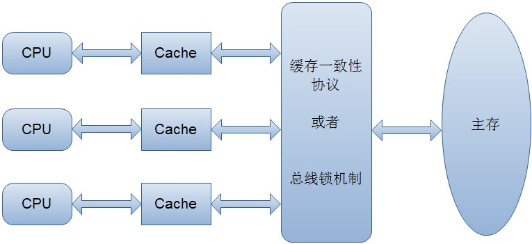

---

那么就可能发生一种情况：当将低16位数值写入之后，突然被中断，而此时又有一个线程去读取i的
值，那么读取到的就是错误的数据。
2.可见性
  可见性是指当多个线程访问同一个变量时，一个线程修改了这个变量的值，其他线程能够立即看得
到修改的值。
  举个简单的例子，看下面这段代码：
  假若执行线程1的是CPU1，执行线程2的是CPU2。由上面的分析可知，当线程1执行 i =10这句时，会
先把i的初始值加载到CPU1的高速缓存中，然后赋值为10，那么在CPU1的高速缓存当中i的值变为10
了，却没有立即写入到主存当中。
  此时线程2执行 j = i，它会先去主存读取i的值并加载到CPU2的缓存当中，注意此时内存当中i的值还
是0，那么就会使得j的值为0，而不是10.
  这就是可见性问题，线程1对变量i修改了之后，线程2没有立即看到线程1修改的值。
3.有序性
  有序性：即程序执行的顺序按照代码的先后顺序执行。举个简单的例子，看下面这段代码：
  上面代码定义了一个int型变量，定义了一个boolean类型变量，然后分别对两个变量进行赋值操作。
从代码顺序上看，语句1是在语句2前面的，那么JVM在真正执行这段代码的时候会保证语句1一定会在语
句2前面执行吗？不一定，为什么呢？这里可能会发生指令重排序（Instruction Reorder）。
  下面解释一下什么是指令重排序，一般来说，处理器为了提高程序运行效率，可能会对输入代码进
行优化，它不保证程序中各个语句的执行先后顺序同代码中的顺序一致，但是它会保证程序最终执行结
果和代码顺序执行的结果是一致的。
  比如上面的代码中，语句1和语句2谁先执行对最终的程序结果并没有影响，那么就有可能在执行过
程中，语句2先执行而语句1后执行。
  但是要注意，虽然处理器会对指令进行重排序，但是它会保证程序最终结果会和代码顺序执行结果
相同，那么它靠什么保证的呢？再看下面一个例子：
  这段代码有4个语句，那么可能的一个执行顺序是：
//线程1执行的代码
int i = 0;i = 10;
//线程2执行的代码
j = i;
int i = 0;       
boolean flag = false;
i = 1;        //语句1 
flag = true;     //语句2
int a = 10;  //语句1
int r = 2;  //语句2
a = a + 3;  //语句3
r = a*a;   //语句4

---

那么可不可能是这个执行顺序呢： 语句2  语句1  语句4  语句3
  不可能，因为处理器在进行重排序时是会考虑指令之间的数据依赖性，如果一个指令Instruction 2
必须用到Instruction 1的结果，那么处理器会保证Instruction 1会在Instruction 2之前执行。
  虽然重排序不会影响单个线程内程序执行的结果，但是多线程呢？下面看一个例子：
  上面代码中，由于语句1和语句2没有数据依赖性，因此可能会被重排序。假如发生了重排序，在线程
1执行过程中先执行语句2，而此是线程2会以为初始化工作已经完成，那么就会跳出while循环，去执行
doSomethingwithconfig(context)方法，而此时context并没有被初始化，就会导致程序出错。
  从上面可以看出，指令重排序不会影响单个线程的执行，但是会影响到线程并发执行的正确性。
  也就是说，要想并发程序正确地执行，必须要保证原子性、可见性以及有序性。只要有一个没有被
保证，就有可能会导致程序运行不正确。
三.Java内存模型
 
  在前面谈到了一些关于内存模型以及并发编程中可能会出现的一些问题。下面我们来看一下Java内
存模型，研究一下Java内存模型为我们提供了哪些保证以及在java中提供了哪些方法和机制来让我们在
进行多线程编程时能够保证程序执行的正确性。
  在Java虚拟机规范中试图定义一种Java内存模型（Java Memory Model，JMM）来屏蔽各个硬件平
台和操作系统的内存访问差异，以实现让Java程序在各种平台下都能达到一致的内存访问效果。那么
Java内存模型规定了哪些东西呢，它定义了程序中变量的访问规则，往大一点说是定义了程序执行的次
序。注意，为了获得较好的执行性能，Java内存模型并没有限制执行引擎使用处理器的寄存器或者高速
缓存来提升指令执行速度，也没有限制编译器对指令进行重排序。也就是说，在java内存模型中，也会
存在缓存一致性问题和指令重排序的问题。
  Java内存模型规定所有的变量都是存在主存当中（类似于前面说的物理内存），每个线程都有自己
的工作内存（类似于前面的高速缓存）。线程对变量的所有操作都必须在工作内存中进行，而不能直接
对主存进行操作。并且每个线程不能访问其他线程的工作内存。
  举个简单的例子：在java中，执行下面这个语句：
  执行线程必须先在自己的工作线程中对变量i所在的缓存行进行赋值操作，然后再写入主存当中。而不
是直接将数值10写入主存当中。
  那么Java语言 本身对 原子性、可见性以及有序性提供了哪些保证呢？
1.原子性
  在Java中，对基本数据类型的变量的读取和赋值操作是原子性操作，即这些操作是不可被中断的，
要么执行，要么不执行。
//线程1:
context = loadContext();  //语句1
inited = true;       //语句2 
//线程2:
while(!inited ){ 
    sleep()
}
doSomethingwithconfig(context);
i = 10;

---

上面一句话虽然看起来简单，但是理解起来并不是那么容易。看下面一个例子i：
  请分析以下哪些操作是原子性操作：
  咋一看，有些朋友可能会说上面的4个语句中的操作都是原子性操作。其实只有语句1是原子性操作，
其他三个语句都不是原子性操作。
  语句1是直接将数值10赋值给x，也就是说线程执行这个语句的会直接将数值10写入到工作内存中。
  语句2实际上包含2个操作，它先要去读取x的值，再将x的值写入工作内存，虽然读取x的值以及 将x
的值写入工作内存 这2个操作都是原子性操作，但是合起来就不是原子性操作了。
  同样的，x++和 x = x+1包括3个操作：读取x的值，进行加1操作，写入新的值。
  所以上面4个语句只有语句1的操作具备原子性。
  也就是说，只有简单的读取、赋值（而且必须是将数字赋值给某个变量，变量之间的相互赋值不是
原子操作）才是原子操作。
  不过这里有一点需要注意：在32位平台下，对64位数据的读取和赋值是需要通过两个操作来完成
的，不能保证其原子性。但是好像在最新的JDK中，JVM已经保证对64位数据的读取和赋值也是原子性操
作了。
  从上面可以看出，Java内存模型只保证了基本读取和赋值是原子性操作，如果要实现更大范围操作
的原子性，可以通过synchronized和Lock来实现。由于synchronized和Lock能够保证任一时刻只有一
个线程执行该代码块，那么自然就不存在原子性问题了，从而保证了原子性。
2.可见性
  对于可见性，Java提供了volatile关键字来保证可见性。
  当一个共享变量被volatile修饰时，它会保证修改的值会立即被更新到主存，当有其他线程需要读取
时，它会去内存中读取新值。
  而普通的共享变量不能保证可见性，因为普通共享变量被修改之后，什么时候被写入主存是不确定
的，当其他线程去读取时，此时内存中可能还是原来的旧值，因此无法保证可见性。
  另外，通过synchronized和Lock也能够保证可见性，synchronized和Lock能保证同一时刻只有一
个线程获取锁然后执行同步代码，并且在释放锁之前会将对变量的修改刷新到主存当中。因此可以保证
可见性。
3.有序性
  在Java内存模型中，允许编译器和处理器对指令进行重排序，但是重排序过程不会影响到单线程程
序的执行，却会影响到多线程并发执行的正确性。
  在Java里面，可以通过volatile关键字来保证一定的“有序性”（具体原理在下一节讲述）。另外可以
通过synchronized和Lock来保证有序性，很显然，synchronized和Lock保证每个时刻是有一个线程执
行同步代码，相当于是让线程顺序执行同步代码，自然就保证了有序性。
  另外，Java内存模型具备一些先天的“有序性”，即不需要通过任何手段就能够得到保证的有序性，这
个通常也称为 happens-before 原则。如果两个操作的执行次序无法从happens-before原则推导出来，
那么它们就不能保证它们的有序性，虚拟机可以随意地对它们进行重排序。
  下面就来具体介绍下happens-before原则（先行发生原则）：
x = 10;     //语句1
y = x;     //语句2
x++;      //语句3
x = x + 1;   //语句4

---

程序次序规则：一个线程内，按照代码顺序，书写在前面的操作先行发生于书写在后面的操作
锁定规则：一个unLock操作先行发生于后面对同一个锁额lock操作
volatile变量规则：对一个变量的写操作先行发生于后面对这个变量的读操作
传递规则：如果操作A先行发生于操作B，而操作B又先行发生于操作C，则可以得出操作A先行发生
于操作C
线程启动规则：Thread对象的start()方法先行发生于此线程的每个一个动作
线程中断规则：对线程interrupt()方法的调用先行发生于被中断线程的代码检测到中断事件的发生
线程终结规则：线程中所有的操作都先行发生于线程的终止检测，我们可以通过Thread.join()方法
结束、Thread.isAlive()的返回值手段检测到线程已经终止执行
对象终结规则：一个对象的初始化完成先行发生于他的finalize()方法的开始
  这8条原则摘自《深入理解Java虚拟机》。
  这8条规则中，前4条规则是比较重要的，后4条规则都是显而易见的。
  下面我们来解释一下前4条规则：
  对于程序次序规则来说，我的理解就是一段程序代码的执行在单个线程中看起来是有序的。注意，
虽然这条规则中提到“书写在前面的操作先行发生于书写在后面的操作”，这个应该是程序看起来执行的
顺序是按照代码顺序执行的，因为虚拟机可能会对程序代码进行指令重排序。虽然进行重排序，但是最
终执行的结果是与程序顺序执行的结果一致的，它只会对不存在数据依赖性的指令进行重排序。因此，
在单个线程中，程序执行看起来是有序执行的，这一点要注意理解。事实上，这个规则是用来保证程序
在单线程中执行结果的正确性，但无法保证程序在多线程中执行的正确性。
  第二条规则也比较容易理解，也就是说无论在单线程中还是多线程中，同一个锁如果出于被锁定的
状态，那么必须先对锁进行了释放操作，后面才能继续进行lock操作。
  第三条规则是一条比较重要的规则，也是后文将要重点讲述的内容。直观地解释就是，如果一个线
程先去写一个变量，然后一个线程去进行读取，那么写入操作肯定会先行发生于读操作。
  第四条规则实际上就是体现happens-before原则具备传递性。
四.深入剖析volatile关键字
 
  在前面讲述了很多东西，其实都是为讲述volatile关键字作铺垫，那么接下来我们就进入主题。
1.volatile关键字的两层语义
  一旦一个共享变量（类的成员变量、类的静态成员变量）被volatile修饰之后，那么就具备了两层语
义：
  1）保证了不同线程对这个变量进行操作时的可见性，即一个线程修改了某个变量的值，这新值对其
他线程来说是立即可见的。
  2）禁止进行指令重排序。
  先看一段代码，假如线程1先执行，线程2后执行：
//线程1
boolean stop = false;
while(!stop){  
    doSomething();
} 
//线程2
stop = true;

---

这段代码是很典型的一段代码，很多人在中断线程时可能都会采用这种标记办法。但是事实上，这段
代码会完全运行正确么？即一定会将线程中断么？不一定，也许在大多数时候，这个代码能够把线程中
断，但是也有可能会导致无法中断线程（虽然这个可能性很小，但是只要一旦发生这种情况就会造成死
循环了）。
  下面解释一下这段代码为何有可能导致无法中断线程。在前面已经解释过，每个线程在运行过程中
都有自己的工作内存，那么线程1在运行的时候，会将stop变量的值拷贝一份放在自己的工作内存当
中。
  那么当线程2更改了stop变量的值之后，但是还没来得及写入主存当中，线程2转去做其他事情了，
那么线程1由于不知道线程2对stop变量的更改，因此还会一直循环下去。
  但是用volatile修饰之后就变得不一样了：
  第一：使用volatile关键字会强制将修改的值立即写入主存；
  第二：使用volatile关键字的话，当线程2进行修改时，会导致线程1的工作内存中缓存变量stop的缓
存行无效（反映到硬件层的话，就是CPU的L1或者L2缓存中对应的缓存行无效）；
  第三：由于线程1的工作内存中缓存变量stop的缓存行无效，所以线程1再次读取变量stop的值时会
去主存读取。
  那么在线程2修改stop值时（当然这里包括2个操作，修改线程2工作内存中的值，然后将修改后的
值写入内存），会使得线程1的工作内存中缓存变量stop的缓存行无效，然后线程1读取时，发现自己的
缓存行无效，它会等待缓存行对应的主存地址被更新之后，然后去对应的主存读取最新的值。
  那么线程1读取到的就是最新的正确的值。
2.volatile保证原子性吗？
  从上面知道volatile关键字保证了操作的可见性，但是volatile能保证对变量的操作是原子性吗？
  下面看一个例子：
  大家想一下这段程序的输出结果是多少？也许有些朋友认为是10000。但是事实上运行它会发现每次
运行结果都不一致，都是一个小于10000的数字。
public class Test {  
public volatile int inc = 0;     
public void increase() {    
    inc++;  
}     
public static void main(String[] args) {    
    final Test test = new Test();    
    for(int i=0;i<10;i++){      
        new Thread(){        
            public void run() {          
                for(int j=0;j<1000;j++)            
                    test.increase();        
            };      
        }.start();    
    }         
    while(Thread.activeCount()>1) //保证前面的线程都执行完      
        Thread.yield();    
    System.out.println(test.inc);  
    }
}

---

可能有的朋友就会有疑问，不对啊，上面是对变量inc进行自增操作，由于volatile保证了可见性，
那么在每个线程中对inc自增完之后，在其他线程中都能看到修改后的值啊，所以有10个线程分别进行了
1000次操作，那么最终inc的值应该是1000*10=10000。
  这里面就有一个误区了，volatile关键字能保证可见性没有错，但是上面的程序错在没能保证原子
性。可见性只能保证每次读取的是最新的值，但是volatile没办法保证对变量的操作的原子性。
  在前面已经提到过，自增操作是不具备原子性的，它包括读取变量的原始值、进行加1操作、写入工
作内存。那么就是说自增操作的三个子操作可能会分割开执行，就有可能导致下面这种情况出现：
  假如某个时刻变量inc的值为10，
  线程1对变量进行自增操作，线程1先读取了变量inc的原始值，然后线程1被阻塞了；
  然后线程2对变量进行自增操作，线程2也去读取变量inc的原始值，由于线程1只是对变量inc进行读
取操作，而没有对变量进行修改操作，所以不会导致线程2的工作内存中缓存变量inc的缓存行无效，所
以线程2会直接去主存读取inc的值，发现inc的值时10，然后进行加1操作，并把11写入工作内存，最后
写入主存。
  然后线程1接着进行加1操作，由于已经读取了inc的值，注意此时在线程1的工作内存中inc的值仍然
为10，所以线程1对inc进行加1操作后inc的值为11，然后将11写入工作内存，最后写入主存。
  那么两个线程分别进行了一次自增操作后，inc只增加了1。
  解释到这里，可能有朋友会有疑问，不对啊，前面不是保证一个变量在修改volatile变量时，会让缓
存行无效吗？然后其他线程去读就会读到新的值，对，这个没错。这个就是上面的happens-before规则
中的volatile变量规则，但是要注意，线程1对变量进行读取操作之后，被阻塞了的话，并没有对inc值进
行修改。然后虽然volatile能保证线程2对变量inc的值读取是从内存中读取的，但是线程1没有进行修
改，所以线程2根本就不会看到修改的值。
  根源就在这里，自增操作不是原子性操作，而且volatile也无法保证对变量的任何操作都是原子性
的。
  把上面的代码改成以下任何一种都可以达到效果：
  采用synchronized：
 View Code
  采用Lock：
 View Code
  采用AtomicInteger：
 View Code
  在java 1.5的java.util.concurrent.atomic包下提供了一些原子操作类，即对基本数据类型的 自增
（加1操作），自减（减1操作）、以及加法操作（加一个数），减法操作（减一个数）进行了封装，保
证这些操作是原子性操作。atomic是利用CAS来实现原子性操作的（Compare And Swap），CAS实际
上是利用处理器提供的CMPXCHG指令实现的，而处理器执行CMPXCHG指令是一个原子性操作。
3.volatile能保证有序性吗？
  在前面提到volatile关键字能禁止指令重排序，所以volatile能在一定程度上保证有序性。
  volatile关键字禁止指令重排序有两层意思：
  1）当程序执行到volatile变量的读操作或者写操作时，在其前面的操作的更改肯定全部已经进行，
且结果已经对后面的操作可见；在其后面的操作肯定还没有进行；

---

2）在进行指令优化时，不能将在对volatile变量访问的语句放在其后面执行，也不能把volatile变量
后面的语句放到其前面执行。
  可能上面说的比较绕，举个简单的例子：
  由于flag变量为volatile变量，那么在进行指令重排序的过程的时候，不会将语句3放到语句1、语句2
前面，也不会讲语句3放到语句4、语句5后面。但是要注意语句1和语句2的顺序、语句4和语句5的顺序
是不作任何保证的。
  并且volatile关键字能保证，执行到语句3时，语句1和语句2必定是执行完毕了的，且语句1和语句2
的执行结果对语句3、语句4、语句5是可见的。
  那么我们回到前面举的一个例子：
  前面举这个例子的时候，提到有可能语句2会在语句1之前执行，那么久可能导致context还没被初始
化，而线程2中就使用未初始化的context去进行操作，导致程序出错。
  这里如果用volatile关键字对inited变量进行修饰，就不会出现这种问题了，因为当执行到语句2时，
必定能保证context已经初始化完毕。
4.volatile的原理和实现机制
  前面讲述了源于volatile关键字的一些使用，下面我们来探讨一下volatile到底如何保证可见性和禁
止指令重排序的。
  下面这段话摘自《深入理解Java虚拟机》：
  “观察加入volatile关键字和没有加入volatile关键字时所生成的汇编代码发现，加入volatile关键字
时，会多出一个lock前缀指令”
  lock前缀指令实际上相当于一个内存屏障（也成内存栅栏），内存屏障会提供3个功能：
  1）它确保指令重排序时不会把其后面的指令排到内存屏障之前的位置，也不会把前面的指令排到内
存屏障的后面；即在执行到内存屏障这句指令时，在它前面的操作已经全部完成；
  2）它会强制将对缓存的修改操作立即写入主存；
  3）如果是写操作，它会导致其他CPU中对应的缓存行无效。
//x、y为非volatile变量
//flag为volatile变量 
x = 2;    //语句1
y = 0;    //语句2
flag = true; //语句3
x = 4;     //语句4
y = -1;    //语句5
//线程1:
context = loadContext();  //语句1
inited = true;       //语句2 
//线程2:
while(!inited ){ 
    sleep()
}
doSomethingwithconfig(context);

---

五.使用volatile关键字的场景
 
  synchronized关键字是防止多个线程同时执行一段代码，那么就会很影响程序执行效率，而volatile
关键字在某些情况下性能要优于synchronized，但是要注意volatile关键字是无法替代synchronized关
键字的，因为volatile关键字无法保证操作的原子性。通常来说，使用volatile必须具备以下2个条件：
  1）对变量的写操作不依赖于当前值
  2）该变量没有包含在具有其他变量的不变式中
  实际上，这些条件表明，可以被写入 volatile 变量的这些有效值独立于任何程序的状态，包括变量
的当前状态。
  事实上，我的理解就是上面的2个条件需要保证操作是原子性操作，才能保证使用volatile关键字的
程序在并发时能够正确执行。
  下面列举几个Java中使用volatile的几个场景。
1.状态标记量
 
 
2.double check
volatile boolean flag = false; 
while(!flag){  
    doSomething();
} 
public void setFlag() {  
    flag = true;
}
volatile boolean inited = false;
//线程1:
context = loadContext(); 
inited = true;       
//线程2:
while(!inited ){
    sleep()
}
doSomethingwithconfig(context);
class Singleton{  
private volatile static Singleton instance = null;     
private Singleton() {       
}    
    public static Singleton getInstance() {    
        if(instance==null) {     
            synchronized (Singleton.class) {  
                if(instance==null) 
                    instance = new Singleton();

---

线程的几种状态
 
线程在一定条件下，状态会发生变化。线程一共有以下几种状态：
1. 新建状态(New)：新创建了一个线程对象。
2. 就绪状态(Runnable)：线程对象创建后，其他线程调用了该对象的start()方法。该状态的线程位于
“可运行线程池”中，变得可运行，只等待获取CPU的使用权。即在就绪状态的进程除CPU之外，其
它的运行所需资源都已全部获得。
3. 运行状态(Running)：就绪状态的线程获取了CPU，执行程序代码。
4. 阻塞状态(Blocked)：阻塞状态是线程因为某种原因放弃CPU使用权，暂时停止运行。直到线程进入
就绪状态，才有机会转到运行状态。
阻塞的情况分三种：
1. 等待阻塞：运行的线程执行wait()方法，该线程会释放占用的所有资源，JVM会把该线程放入
“等待池”中。进入这个状态后，是不能自动唤醒的，必须依靠其他线程调用notify()或
notifyAll()方法才能被唤醒，
2. 同步阻塞：运行的线程在获取对象的同步锁时，若该同步锁被别的线程占用，则JVM会把该线
程放入“锁池”中。
3. 其他阻塞：运行的线程执行sleep()或join()方法，或者发出了I/O请求时，JVM会把该线程置为
阻塞状态。当sleep()状态超时、join()等待线程终止或者超时、或者I/O处理完毕时，线程重新
转入就绪状态。
5. 死亡状态(Dead)：线程执行完了或者因异常退出了run()方法，该线程结束生命周期。
 
 
常用的线程池模式以及不同线程池的使用场景
 
 
java线程池与五种常用线程池策略使用与解析
 
 
一.线程池
 
关于为什么要使用线程池久不赘述了，首先看一下java中作为线程池Executor底层实现类的
ThredPoolExecutor的构造函数
            }
        }  
        return instance; 
    }
}

---

其中各个参数含义如下：
*corePoolSize*- 池中所保存的线程数，包括空闲线程。需要注意的是在初创建线程池时线程不会立即
启动，直到有任务提交才开始启动线程并逐渐时线程数目达到corePoolSize。若想一开始就创建所有核
心线程需调用prestartAllCoreThreads方法。
*maximumPoolSize*-池中允许的最大线程数。需要注意的是当核心线程满且阻塞队列也满时才会判断
当前线程数是否小于最大线程数，并决定是否创建新线程。
*keepAliveTime* - 当线程数大于核心时，多于的空闲线程最多存活时间
*unit* - keepAliveTime 参数的时间单位。
*workQueue* - 当线程数目超过核心线程数时用于保存任务的队列。主要有3种类型的BlockingQueue
可供选择：无界队列，有界队列和同步移交。将在下文中详细阐述。从参数中可以看到，此队列仅保存
实现Runnable接口的任务。
threadFactory - 执行程序创建新线程时使用的工厂。
handler - 阻塞队列已满且线程数达到最大值时所采取的饱和策略。java默认提供了4种饱和策略的实现
方式：中止、抛弃、抛弃最旧的、调用者运行。将在下文中详细阐述。
二.可选择的阻塞队列BlockingQueue详解
 
首先看一下新任务进入时线程池的执行策略：
如果运行的线程少于corePoolSize，则 Executor始终首选添加新的线程，而不进行排队。（如果当前运
行的线程小于corePoolSize，则任务根本不会存入queue中，而是直接运行）
如果运行的线程大于等于 corePoolSize，则 Executor始终首选将请求加入队列，而不添加新的线程。
如果无法将请求加入队列，则创建新的线程，除非创建此线程超出 maximumPoolSize，在这种情况
下，任务将被拒绝。
主要有3种类型的BlockingQueue：
2.1 无界队列
 
队列大小无限制，常用的为无界的LinkedBlockingQueue，使用该队列做为阻塞队列时要尤其当心，当
任务耗时较长时可能会导致大量新任务在队列中堆积最终导致OOM。最近工作中就遇到因为采用
LinkedBlockingQueue作为阻塞队列，部分任务耗时80s＋且不停有新任务进来，导致cpu和内存飙升服
务器挂掉。
2.2 有界队列
 
常用的有两类，一类是遵循FIFO原则的队列如ArrayBlockingQueue与有界的LinkedBlockingQueue，
另一类是优先级队列如PriorityBlockingQueue。PriorityBlockingQueue中的优先级由任务的
Comparator决定。
使用有界队列时队列大小需和线程池大小互相配合，线程池较小有界队列较大时可减少内存消耗，降低
cpu使用率和上下文切换，但是可能会限制系统吞吐量。
public ThreadPoolExecutor(int corePoolSize,
                              int maximumPoolSize,
                              long keepAliveTime,
                              TimeUnit unit,
                              BlockingQueue<Runnable> workQueue,
                              ThreadFactory threadFactory,
                              RejectedExecutionHandler handler) {
       ...
    }

---

2.3 同步移交
 
如果不希望任务在队列中等待而是希望将任务直接移交给工作线程，可使用SynchronousQueue作为等
待队列。SynchronousQueue不是一个真正的队列，而是一种线程之间移交的机制。要将一个元素放入
SynchronousQueue中，必须有另一个线程正在等待接收这个元素。只有在使用无界线程池或者有饱和
策略时才建议使用该队列。
2.4 几种BlockingQueue的具体实现原理
 
关于上述几种BlockingQueue的具体实现原理与分析将在下篇博文中详细阐述。
三.可选择的饱和策略RejectedExecutionHandler详解
 
JDK主要提供了4种饱和策略供选择。4种策略都做为静态内部类在ThreadPoolExcutor中进行实现。
3.1 AbortPolicy中止策略
 
该策略是默认饱和策略。
使用该策略时在饱和时会抛出RejectedExecutionException（继承自RuntimeException），调用者可捕
获该异常自行处理。
3.2 DiscardPolicy抛弃策略
 
如代码所示，不做任何处理直接抛弃任务
3.3 DiscardOldestPolicy抛弃旧任务策略
 
如代码，先将阻塞队列中的头元素出队抛弃，再尝试提交任务。如果此时阻塞队列使用
PriorityBlockingQueue优先级队列，将会导致优先级最高的任务被抛弃，因此不建议将该种策略配合优
先级队列使用。
3.4 CallerRunsPolicy调用者运行
 
  public void rejectedExecution(Runnable r, ThreadPoolExecutor e) {
            throw new RejectedExecutionException("Task " + r.toString() +
                                                 " rejected from " +
                                                 e.toString());
        }
  public void rejectedExecution(Runnable r, ThreadPoolExecutor e) {
        }
    public void rejectedExecution(Runnable r, ThreadPoolExecutor e) {
            if (!e.isShutdown()) {
                e.getQueue().poll();
                e.execute(r);
            }
        }
   public void rejectedExecution(Runnable r, ThreadPoolExecutor e) {
            if (!e.isShutdown()) {
                r.run();
            }
        }

---

既不抛弃任务也不抛出异常，直接运行任务的run方法，换言之将任务回退给调用者来直接运行。使用
该策略时线程池饱和后将由调用线程池的主线程自己来执行任务，因此在执行任务的这段时间里主线程
无法再提交新任务，从而使线程池中工作线程有时间将正在处理的任务处理完成。
四.java提供的四种常用线程池解析
 
在JDK帮助文档中，有如此一段话：
强烈建议程序员使用较为方便的Executors工厂方法Executors.newCachedThreadPool()（无界线
程池，可以进行自动线程回收）、Executors.newFixedThreadPool(int)（固定大小线程池）
Executors.newSingleThreadExecutor()（单个后台线程）它们均为大多数使用场景预定义了设
置。
详细介绍一下上述四种线程池。
4.1 newCachedThreadPool
 
在newCachedThreadPool中如果线程池长度超过处理需要，可灵活回收空闲线程，若无可回收，则新
建线程。
初看该构造函数时我有这样的疑惑：核心线程池为0，那按照前面所讲的线程池策略新任务来临时无法进
入核心线程池，只能进入 SynchronousQueue中进行等待，而SynchronousQueue的大小为1，那岂不
是第一个任务到达时只能等待在队列中，直到第二个任务到达发现无法进入队列才能创建第一个线程？
这个问题的答案在上面讲SynchronousQueue时其实已经给出了，要将一个元素放入
SynchronousQueue中，必须有另一个线程正在等待接收这个元素。因此即便SynchronousQueue一开
始为空且大小为1，第一个任务也无法放入其中，因为没有线程在等待从SynchronousQueue中取走元
素。因此第一个任务到达时便会创建一个新线程执行该任务。
这里引申出一个小技巧：有时我们可能希望线程池在没有任务的情况下销毁所有的线程，既设置线程池
核心大小为0，但又不想使用SynchronousQueue而是想使用有界的等待队列。显然，不进行任何特殊
设置的话这样的用法会发生奇怪的行为：直到等待队列被填满才会有新线程被创建，任务才开始执行。
这并不是我们希望看到的，此时可通过allowCoreThreadTimeOut使等待队列中的元素出队被调用执
行，详细原理和使用将会在后续博客中阐述。
4.2 newFixedThreadPool 创建一个定长线程池，可控制线程最大并发数，超出的线程会在队列中等
待。
 
看代码一目了然了，使用固定大小的线程池并使用无限大的队列
4.3 newScheduledThreadPool 创建一个定长线程池，支持定时及周期性任务执行。
 
     public static ExecutorService newCachedThreadPool() {
        return new ThreadPoolExecutor(0, Integer.MAX_VALUE,
                                      60L, TimeUnit.SECONDS,
                                      new SynchronousQueue<Runnable>());
    }
  public static ExecutorService newFixedThreadPool(int nThreads) {
        return new ThreadPoolExecutor(nThreads, nThreads,
                                      0L, TimeUnit.MILLISECONDS,
                                      new LinkedBlockingQueue<Runnable>());
    }
   public static ScheduledExecutorService newScheduledThreadPool(int 
corePoolSize) {
        return new ScheduledThreadPoolExecutor(corePoolSize);
    }

---

在来看看ScheduledThreadPoolExecutor（）的构造函数
ScheduledThreadPoolExecutor的父类即ThreadPoolExecutor，因此这里各参数含义和上面一样。值
得关心的是DelayedWorkQueue这个阻塞对列，在上面没有介绍，它作为静态内部类就在
ScheduledThreadPoolExecutor中进行了实现。具体分析讲会在后续博客中给出，在这里只进行简单说
明：DelayedWorkQueue是一个无界队列，它能按一定的顺序对工作队列中的元素进行排列。因此这里
设置的最大线程数 Integer.MAX_VALUE没有任何意义。关于ScheduledThreadPoolExecutor的具体使
用将会在后续quartz的周期性任务实现原理中进行进一步分析。
4.4 newSingleThreadExecutor 创建一个单线程化的线程池，它只会用唯一的工作线程来执行任务，
保证所有任务按照指定顺序(FIFO, LIFO, 优先级)执行。
 
首先new了一个线程数目为1的ScheduledThreadPoolExecutor，再把该对象传入
DelegatedScheduledExecutorService中，看看DelegatedScheduledExecutorService的实现代码：
在看看它的父类
其实就是使用装饰模式增强了ScheduledExecutorService（1）的功能，不仅确保只有一个线程顺序执
行任务，也保证线程意外终止后会重新创建一个线程继续执行任务。具体实现原理会在后续博客中讲
解。
4.5 newWorkStealingPool创建一个拥有多个任务队列（以便减少连接数）的线程池。
 
这是jdk1.8中新增加的一种线程池实现，先看一下它的无参实现
返回的ForkJoinPool从jdk1.7开始引进，个人感觉类似于mapreduce的思想。这个线程池较为特殊，将
在后续博客中给出详细的使用说明和原理。
 
 
  public ScheduledThreadPoolExecutor(int corePoolSize) {
        super(corePoolSize, Integer.MAX_VALUE, 0, NANOSECONDS,
              new DelayedWorkQueue());
    }
   public static ScheduledExecutorService newSingleThreadScheduledExecutor() {
        return new DelegatedScheduledExecutorService
            (new ScheduledThreadPoolExecutor(1));
    }
 DelegatedScheduledExecutorService(ScheduledExecutorService executor) {
            super(executor);
            e = executor;
        }
 DelegatedExecutorService(ExecutorService executor) { e = executor; }
    public static ExecutorService newWorkStealingPool() {
        return new ForkJoinPool
            (Runtime.getRuntime().availableProcessors(),
             ForkJoinPool.defaultForkJoinWorkerThreadFactory,
             null, true);
    }

---

线程间通信，wait和notify
 
 
wait和notify的理解与使用
 
 
1.对于wait()和notify()的理解
对于wait()和notify()的理解，还是要从jdk官方文档中开始，在Object类方法中有：
void notify()
Wakes up a single thread that is waiting on this object’s monitor.
译：唤醒在此对象监视器上等待的单个线程
void notifyAll()
Wakes up all threads that are waiting on this object’s monitor.
译：唤醒在此对象监视器上等待的所有线程
void wait( )
Causes the current thread to wait until another thread invokes the notify() method or the 
notifyAll( ) method for this object.
译：导致当前的线程等待，直到其他线程调用此对象的notify( ) 方法或 notifyAll( ) 方法
void wait(long timeout)
Causes the current thread to wait until either another thread invokes the notify( ) method or 
the notifyAll( ) method for this object, or a specified amount of time has elapsed.
译：导致当前的线程等待，直到其他线程调用此对象的notify() 方法或 notifyAll() 方法，或者指定
的时间过完。
void wait(long timeout, int nanos)
Causes the current thread to wait until another thread invokes the notify( ) method or the 
notifyAll( ) method for this object, or some other thread interrupts the current thread, or a 
certain amount of real time has elapsed.
译：导致当前的线程等待，直到其他线程调用此对象的notify( ) 方法或 notifyAll( ) 方法，或者其他
线程打断了当前线程，或者指定的时间过完。
上面是官方文档的简介，下面我们根据官方文档总结一下：
wait( )，notify( )，notifyAll( )都不属于Thread类，而是属于Object基础类，也就是每个对象都有
wait( )，notify( )，notifyAll( ) 的功能，因为每个对象都有锁，锁是每个对象的基础，当然操作锁的
方法也是最基础了。
当需要调用以上的方法的时候，一定要对竞争资源进行加锁，如果不加锁的话，则会报 
IllegalMonitorStateException 异常
当想要调用wait( )进行线程等待时，必须要取得这个锁对象的控制权（对象监视器），一般是放到
synchronized(obj)代码中。
在while循环里而不是if语句下使用wait，这样，会在线程暂停恢复后都检查wait的条件，并在条件
实际上并未改变的情况下处理唤醒通知
调用obj.wait( )释放了obj的锁，否则其他线程也无法获得obj的锁，也就无法在synchronized(obj){ 
obj.notify() } 代码段内唤醒A。
notify( )方法只会通知等待队列中的第一个相关线程（不会通知优先级比较高的线程）
notifyAll( )通知所有等待该竞争资源的线程（也不会按照线程的优先级来执行）
假设有三个线程执行了obj.wait( )，那么obj.notifyAll( )则能全部唤醒tread1，thread2，
thread3，但是要继续执行obj.wait（）的下一条语句，必须获得obj锁，因此，tread1，

---

thread2，thread3只有一个有机会获得锁继续执行，例如tread1，其余的需要等待thread1释放
obj锁之后才能继续执行。
当调用obj.notify/notifyAll后，调用线程依旧持有obj锁，因此，thread1，thread2，thread3虽被
唤醒，但是仍无法获得obj锁。直到调用线程退出synchronized块，释放obj锁后，thread1，
thread2，thread3中的一个才有机会获得锁继续执行。
2.wait和notify简单使用示例
public class WaitNotifyTest {
    // 在多线程间共享的对象上使用wait
    private String[] shareObj = { "true" };
    public static void main(String[] args) {
        WaitNotifyTest test = new WaitNotifyTest();
        ThreadWait threadWait1 = test.new ThreadWait("wait thread1");
        threadWait1.setPriority(2);
        ThreadWait threadWait2 = test.new ThreadWait("wait thread2");
        threadWait2.setPriority(3);
        ThreadWait threadWait3 = test.new ThreadWait("wait thread3");
        threadWait3.setPriority(4);
        ThreadNotify threadNotify = test.new ThreadNotify("notify thread");
        threadNotify.start();
        threadWait1.start();
        threadWait2.start();
        threadWait3.start();
    }
    class ThreadWait extends Thread {
        public ThreadWait(String name){
            super(name);
        }
        public void run() {
            synchronized (shareObj) {
                while ("true".equals(shareObj[0])) {
                    System.out.println("线程"+ this.getName() + "开始等待");
                    long startTime = System.currentTimeMillis();
                    try {
                        shareObj.wait();
                    } catch (InterruptedException e) {
                        e.printStackTrace();
                    }
                    long endTime = System.currentTimeMillis();
                    System.out.println("线程" + this.getName() 
                            + "等待时间为：" + (endTime - startTime));
                }
            }
            System.out.println("线程" + getName() + "等待结束");
        }
    }
    class ThreadNotify extends Thread {

---

运行结果：
 
 
java线程池主线程等待子线程执行完成
 
 
Java如何等待子线程执行结束
 
今天讨论一个入门级的话题, 不然没东西更新对不起空间和域名~~
工作总往往会遇到异步去执行某段逻辑, 然后先处理其他事情, 处理完后再把那段逻辑的处理结果进行汇
总的产景, 这时候就需要使用线程了.
一个线程启动之后, 是异步的去执行需要执行的内容的, 不会影响主线程的流程,  往往需要让主线程指定
后, 等待子线程的完成. 这里有几种方式.
站在 主线程的角度, 我们可以分为主动式和被动式.
        public ThreadNotify(String name){
            super(name);
        }
        public void run() {
            try {
                // 给等待线程等待时间
                sleep(3000);
            } catch (InterruptedException e) {
                e.printStackTrace();
            }
            synchronized (shareObj) {
                System.out.println("线程" + this.getName() + "开始准备通知");
                shareObj[0] = "false";
                shareObj.notifyAll();
                System.out.println("线程" + this.getName() + "通知结束");
            }
            System.out.println("线程" + this.getName() + "运行结束");
        }
    }
}
线程wait thread1开始等待
线程wait thread3开始等待
线程wait thread2开始等待
线程notify thread开始准备通知
线程notify thread通知结束
线程notify thread运行结束
线程wait thread2等待时间为：2998
线程wait thread2等待结束
线程wait thread3等待时间为：2998
线程wait thread3等待结束
线程wait thread1等待时间为：3000
线程wait thread1等待结束

---

主动式指主线主动去检测某个标志位, 判断子线程是否已经完成. 被动式指主线程被动的等待子线程的结
束, 很明显, 比较符合人们的胃口. 就是你事情做完了, 你告诉我, 我汇总一下, 哈哈.
那么主线程如何等待子线程工作完成呢. 很简单, Thread 类给我们提供了join 系列的方法, 这些方法的目
的就是等待当前线程的die. 举个例子.
public  class  Threads {
   }
   }
**public**  **static**  **void**  main (String[]  args ) {
  SubThread **thread**  =  **new**  SubThread () ;
 thread . start () ;
 //主线程处理其他工作,让子线程异步去执行.
  *mainThreadOtherWork* () ;
  System . *out* . println ( “now waiting sub thread done.” ) ;
 //主线程其他工作完毕,等待子线程的结束, 调用join系列的方法即可(可以设置超时时间)
  **try**  {
   thread . join () ;
 }  **catch**  **(** InterruptedException **e) {**
   e . printStackTrace () ;
 }
 System . *out* . println ( “now all done.” ) ;
**private**  **static**  **void**  mainThreadOtherWork () {
 System . *out* . println ( “main thread work start” ) ;
  **try**  {
    Thread . *sleep* ( 3000L ) ;
 }  **catch**  **(** InterruptedException **e) {**
   e . printStackTrace () ;
 }
  System . *out* . println ( “main thread work done.” ) ;
**public**  **static**  **class**  SubThread  **extends**  Thread**{**

---

}
}
本程序的数据有可能是如下:
1. main thread work start
2. sub thread start working.
3. main thread work done.
4. now waiting sub thread done.
5. sub thread stop working.
6. now all done.
忽略标号, 当然输出也有可能是1和2调换位置了. 这个我们是无法控制的. 我们看下线程的join操作, 究竟
干了什么.
**
**
   public  final  void  join()  throws  InterruptedException {
   join(0) ;
  }
这里是调用了
  @Override
  **public**  **void**  run () {
    working () ;
 }
  **private**  **void**  working () {
    System . *out* . println ( “sub thread start working.” ) ;
    busy () ;
    System . *out* . println ( “sub thread stop working.” ) ;
 }
  **private**  **void**  busy () {
    **try**  {
       *sleep* ( 5000L ) ;
   }  **catch**  **(** InterruptedException **e) {**
      e . printStackTrace () ;
   }
 }

---

public final synchronized void join( long millis) 
方法, 参数为0, 表示没有超时时间, 等到线程结束为止. join(millis)方法里面有这么一段代码:
说明, 当线程处于活跃状态的时候, 会一直等待, 直到这里的isAlive方法返回false, 才会结束.isAlive方法是
一个本地方法, 他的作用是判断线程是否已经执行结束. 注释是这么写的: 
Tests if this thread is alive. A thread is alive if it has been started and has not yet died.
可见, join系列方法可以帮助我们等待一个子线程的结束.
那么要问, 有没有另外一种方法可以等待子线程结束? 当然有的, 我们可以使用并发包下面的Future模式.
Future是一个任务执行的结果, 他是一个将来时, 即一个任务执行, 立即异步返回一个Future对象, 等到任
务结束的时候, 会把值返回给这个future对象里面. 我们可以使用ExecutorService接口来提交一个线程.
public  class  Threads {
   
 
 
 
 
 
//    thread.start();
//    try {
 **while** (isAlive()) {
 wait(0) ;
 }
**static**  ExecutorService  *executorService*  =  Executors . 
*newFixedThreadPool* ( 1 ) ;
@SuppressWarnings ( “rawtypes” )
**public**  **static**  **void**  main (String[]  args )  **throws**  
InterruptedException ,  ExecutionException {
 SubThread thread  =  **new**  SubThread () ;
  Future  future  =  *executorService* . submit (thread) ;
  *mainThreadOtherWork* () ;
 System . *out* . println ( “now waiting sub thread done.” ) ;
 future . get () ;

---

//      thread.join();
//    } catch (InterruptedException e) {
//      e.printStackTrace();
//    }
   }
   }
 System . *out* . println ( “now all done.” ) ;
  *executorService* . shutdown () ;
**private**  **static**  **void**  mainThreadOtherWork () {
 System . *out* . println ( “main thread work start” ) ;
  **try**  {
   Thread . *sleep* ( 3000L ) ;
 }  **catch**  (InterruptedException e) {
   e . printStackTrace () ;
 }
 System . *out* . println ( “main thread work done.” ) ;
**public**  **static**  **class**  SubThread  **extends**  Thread{
  @Override
  **public**  **void**  run () {
    working () ;
 }
  **private**  **void**  working () {
   System . *out* . println ( “sub thread start working.” ) ;
    busy () ;
   System . *out* . println ( “sub thread stop working.” ) ;
 }
  **private**  **void**  busy () {
    **try**  {
       *sleep* ( 5000L ) ;

---

}
   
}
这 里, ThreadPoolExecutor 是实现了 ExecutorService的方法, sumbit的过程就是把一个Runnable接口
对象包装成一个 Callable接口对象, 然后放到 workQueue里等待调度执行. 当然, 执行的启动也是调用了
thread的start来做到的, 只不过这里被包装掉了. 另外, 这里的thread是会被重复利用的, 所以这里要退出
主线程, 需要执行以下shutdown方法以示退出使用线程池. 扯远了. 
这 种方法是得益于Callable接口和Future模式, 调用future接口的get方法, 会同步等待该future执行结束, 
然后获取到结果. Callbale接口的接口方法是 V call(); 是可以有返回结果的, 而Runnable的 void run(), 是
没有返回结果的. 所以, 这里即使被包装成Callbale接口, future.get返回的结果也是null的.如果需要得到
返回结果, 建议使用Callable接口.
通过队列来控制线程的进度, 是很好的一个理念. 我们完全可以自己搞个队列, 自己控制. 这样也可以实现. 
不信看代码:
*public class* Threads {
//  static ExecutorService executorService = Executors.newFixedThreadPool(1);
   static final BlockingQueue < Integer > queue = new ArrayBlockingQueue < Integer > ( 1 ) ;
   public static void main (String[] args ) throws InterruptedException , ExecutionException {
//    Future future = executorService.submit(thread);
//    future.get();
//    try {
//      thread.join();
//    } catch (InterruptedException e) {
//      e.printStackTrace();
   }  **catch**  (InterruptedException e) {
      e . printStackTrace () ;
   }
 }
 SubThread thread = **new** SubThread ( *queue* ) ;
 thread . start () ;
  *mainThreadOtherWork* () ;
 System . *out* . println ( “now waiting sub thread done.” ) ;
  *queue* . take () ;

---

//    }
//    executorService.shutdown();
   }
   private static void mainThreadOtherWork () {
   }
   public static class SubThread extends Thread{
     
     
 System . *out* . println ( “now all done.” ) ;
 System . *out* . println ( “main thread work start” ) ;
  **try** {
   Thread . *sleep* ( 3000L ) ;
 } **catch** (InterruptedException e) {
   e . printStackTrace () ;
 }
 System . *out* . println ( “main thread work done.” ) ;
  **private** BlockingQueue < Integer > queue ;
  /**
  \* **@param** queue
  */
  **public** SubThread ( BlockingQueue < Integer > queue ) {
    **this** . queue = queue ;
 }
  @Override
  **public void** run () {
    **try** {
    working () ;
   } **finally** {

---

}
   
}
这 里是得益于我们用了一个阻塞队列, 他的put操作和take操作都会阻塞(同步), 在满足条件的情况下.当
我们调用take()方法是, 由于子线程还没结束, 队列是空的, 所以这里的take操作会阻塞, 直到子线程结束的
时候, 往队列里面put了个元素, 表明自己结束了. 这时候主线程的take()就会返回他拿到的数据. 当然, 他
拿到什么我们是不必去关心的.
以上几种情况都是针对子线程只有1个的时候. 当子线程有多个的时候, 情况就不妙了.
第一种方法, 你要调用很多个线程的join, 特别是当你的线程不是for循环创建的, 而是一个一个创建的时
候.
      **try** {
         queue . put ( 1 ) ;
      } **catch** (InterruptedException e) {
        e . printStackTrace () ;
      }
   }
 }
  **private void** working () {
   System . *out* . println ( “sub thread start working.” ) ;
    busy () ;
   System . *out* . println ( “sub thread stop working.” ) ;
 }
  **private void** busy () {
    **try** {
      *sleep* ( 5000L ) ;
   } **catch** (InterruptedException e) {
      e . printStackTrace () ;
   }
 }

---

第二种方法, 要调用很多的future的get方法, 同第一种方法.
第三种方法, 比较方便一些, 只需要每个线程都在queue里面 put一个元素就好了.但是, 第三种方法, 这个
队列里的对象, 对我们是毫无用处, 我们为了使用队列, 而要不明不白浪费一些内存, 那有没有更好的办法
呢?
有的, concurrency包里面提供了好多有用的东东, 其中, CountDownLanch就是我们要用的.
CountDownLanch 是一个倒数计数器, 给一个初始值(>=0), 然后没countDown一次就会减1, 这很符合等
待多个子线程结束的产景: 一个线程结束的时候, countDown一次, 直到所有都countDown了 , 那么所有
子线程就都结束了.
先看看CountDownLanch有哪些方法:
await: 会阻塞等待计数器减少到0位置. 带参数的await是多了等待时间.
countDown: 将当前的技术减1
getCount(): 返回当前的计数
显而易见, 我们只需要在子线程执行之前, 赋予初始化countDownLanch, 并赋予线程数量为初始值.
每个线程执行完毕的时候, 就countDown一下.主线程只需要调用await方法, 可以等待所有子线程执行结
束, 看代码:
public class Threads {
//  static ExecutorService executorService = Executors.newFixedThreadPool(1);
   static final BlockingQueue < Integer > queue = new ArrayBlockingQueue < Integer > ( 1 ) ;
   public static void main (String[] args ) throws InterruptedException , ExecutionException {
//    Future future = executorService.submit(thread);
//    future.get();
//    queue.take();
  **int** threads = 5 ;
 CountDownLatch countDownLatch = **new** CountDownLatch (threads) ;
  **for** ( **int** i = 0 ; i < threads ; i ++ ){
   SubThread thread = **new** SubThread ( 2000 * (i + 1 ) , countDownLatch) ;
   thread . start () ;
 }
  *mainThreadOtherWork* () ;
 System . *out* . println ( “now waiting sub thread done.” ) ;

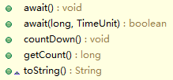

---

//    try {
//      thread.join();
//    } catch (InterruptedException e) {
//      e.printStackTrace();
//    }
//    executorService.shutdown();
   }
   private static void mainThreadOtherWork () {
   }
   public static class SubThread extends Thread{
     
//    private BlockingQueue queue;
     
//    public SubThread(BlockingQueue queue) {
//      this.queue = queue;
 countDownLatch . await () ;
 System . *out* . println ( “now all done.” ) ;
 System . *out* . println ( “main thread work start” ) ;
  **try** {
   Thread . *sleep* ( 3000L ) ;
 } **catch** (InterruptedException e) {
   e . printStackTrace () ;
 }
 System . *out* . println ( “main thread work done.” ) ;
  **private** CountDownLatch countDownLatch ;
  **private** **long** work ;
  /**
  \* **@param** queue
  */

---

//      this.work = 5000L;
//    }
     
//      this.queue = queue;
//         try {
//           queue.put(1);
//         } catch (InterruptedException e) {
//           e.printStackTrace();
//         }
       
  **public** SubThread ( **long** work , CountDownLatch countDownLatch ) {
    **this** . countDownLatch = countDownLatch ;
    **this** . work = work ;
 }
  @Override
  **public** **void** run () {
    **try** {
    working () ;
   } **finally** {
      countDownLatch . countDown () ;
   }
 }
  **private** **void** working () {
   System . *out* . println ( getName () + ” sub thread start working.” ) ;
    busy () ;
   System . *out* . println ( getName () + ” sub thread stop working.” ) ;
 }
  **private** **void** busy () {
    **try** {

---

}
}
此种方法也适用于使用 ExecutorService summit 的任务的执行.
另外还有一个并发包的类CyclicBarrier, 这个是(子)线程之间的互相等待的利器. 栅栏, 就是把大家都在一
个地方堵住, 就像水闸, 等大家都完成了之前的操作, 在一起继续下面的操作. 不过就不再本篇的讨论访问
内了.
 
 
进程和线程的区别
 
进程：
是具有一定独立功能的程序、它是系统进行资源分配和调度的一个独立单位，重点在系统调度和单独的
单位，也就是说进程是可以独立运行的一段程序(比如正在运行的某个java程序)。
线程：
他是比进程更小的能独立运行的基本单位，线程自己基本上不拥有系统资源(一个线程只能属于一个进
程，而一个进程可以有多个线程)。
什么叫线程安全？举例说明
 
java中的线程安全是什么：
就是线程同步的意思，就是当一个程序对一个线程安全的方法或者语句进行访问的时候，其他的不能再
对他进行操作了，必须等到这次访问结束以后才能对这个线程安全的方法进行访问
什么叫线程安全：
如果你的代码所在的进程中有多个线程在同时运行，而这些线程可能会同时运行这段代码。如果每次运
行结果和单线程运行的结果是一样的，而且其他的变量的值也和预期的是一样的，
 就是线程安全的。
或者说:一个类或者程序所提供的接口对于线程来说是原子操作或者多个线程之间的切换不会导致该接口
的执行结果存在二义性,也就是说我们不用考虑同步的问题。
线程安全问题都是由全局变量及静态变量引起的。若每个线程中对全局变量、静态变量只有读操作，而
无写操作，一般来说，这个全局变量是线程安全的；若有多个线程同时执行写操作，一般都需要考虑线
程同步，否则就可能影响线程安全。
存在竞争的线程不安全，不存在竞争的线程就是安全的
      *sleep* ( work ) ;
   } **catch** (InterruptedException e) {
      e . printStackTrace () ;
   }
 }

---

并发、同步的接口或方法
 
Java并发编程的类、接口和方法
 
 
1：线程池
  与每次需要时都创建线程相比，线程池可以降低创建线程的开销，这也是因为线程池在线程执行结束后
进行的是回收操作，而不是真正的
 销毁线程。
2：ReentrantLock
  ReentrantLock提供了tryLock方法，tryLock调用的时候，如果锁被其他线程持有，那么tryLock会立即
返回，返回结果为false，如果锁没有被
其他线程持有，那么当前调用线程会持有锁，并且tryLock返回的结果是true,
 lock.lock();
 try {
   //do something 
 } finally {
   lock.unlock();
  }
3：volatile
   保证了同一个变量在多线程中的可见性，所以它更多是用于修饰作为开关状态的变量，因为volatile保
证了只有一份主存中的数据。
4：Atomics
   }
 AtomicInteger内部通过JNI的方式使用了硬件支持的CAS指令。
5：CountDownLatch
public class Count {
  private AtomicInteger counter = new AtomicInteger();
  public int increase() {
    return counter.incrementAndGet();
  }
 public int decrease() {
    return counter.decrementAndGet();
 }

---

它是java.util.concurrent包中的一个类，它主要提供的机制是当多个(具体数量等于初始化CountDown
时的count参数的值)线程都到达了预期状态
或完成预期工作时触发事件，其他线程可以等待这个事件来出发自己后续的工作，等待的线程可以是多
个，即CountDownLatch是可以唤醒多个等待
的线程的，到达自己预期状态的线程会调用CountDownLatch的countDown方法，而等待的线程会调用
CountDownLatch的await方法
6：CyclicBarrier
  循环屏障，CyclicBarrier可以协同多个线程，让多个线程在这个屏障前等待，直到所有线程都到达了这
个屏障时，再一起继续执行后面的动作。
  CyclicBarrier和CountDownLatch都是用于多个线程间的协调的，二者的一个很大的差别是，
CountDownLatch是在多个线程都进行了latch.countDown
后才会触发事件，唤醒await在latch上的线程，而执行countDown的线程，执行完countDown后，会继
续自己线程的工作；
  CyclicBarrier是一个栅栏，用于同步所有调用await方法的线程，并且等所有线程都到了await方法，这
些线程才一起返回继续各自的工作，因为使用CyclicBarrier的线程都会阻塞在await方法上，所以在线程
池中使用CyclicBarrier时要特别小心，如果线程池的线程 数过少，那么就会发生死锁了,
CyclicBarrier可以循环使用，CountDownLatch不能循环使用。
7：Semaphore
  是用于管理信号量的，构造的时候传入可供管理的信号量的数值，信号量对量管理的信号就像令牌，构
造时传入个数，总数就是控制并发的数量。
  semaphore.acquire();
  try {
  } finally () {
  }
8：Exchanger
  Exchanger，从名字上讲就是交换，它用于在两个线程之间进行数据交换，线程会阻塞在Exchanger的
exchange方法上，直到另一个线程也到了
同一个Exchanger的exchange方法时，二者进行交换，然后两个线程会继续执行自身相关的代码。
 
9：Future和FutureTask
  Future future = getDataFromRemote2();
  //do something
  HashMap data = (HashMap)future.get();
 
//调用远程通信的方法
semaphore.release();

---

private Future getDateFromRemote2() {
   return threadPool.submit(new Callable() {
   });
 }
思路：调用函数后马上返回，然后继续向下执行，急需要数据时再来用，或者说再来等待这个数据，具
体实现方式有两种，一个是用Future，另一个
使用回调。
 
 
HashMap 是否线程安全，为何不安全。
ConcurrentHashMap，线程安全，为何安全。底层实现
是怎么样的。
 
 
深入浅出ConcurrentHashMap1.8
 
 
前言
 
HashMap是我们平时开发过程中用的比较多的集合，但它是非线程安全的，在涉及到多线程并发的情
况，进行get操作有可能会引起死循环，导致CPU利用率接近100%。
 
解决方案有Hashtable和Collections.synchronizedMap(hashMap)，不过这两个方案基本上是对读写进
行加锁操作，一个线程在读写元素，其余线程必须等待，性能可想而知。
所以，Doug Lea给我们带来了并发安全的ConcurrentHashMap，它的实现是依赖于 Java 内存模型，所
以我们在了解 ConcurrentHashMap 的之前必须了解一些底层的知识：
1. java内存模型
  public HashMap call() {
      return getDataFromRemote();
  }
final HashMap<String, String> map = new HashMap<String, String>(2);
for (int i = 0; i < 10000; i++) {
    new Thread(new Runnable() {
        @Override
        public void run() {
            map.put(UUID.randomUUID().toString(), "");
        }
    }).start();
}

---

2. java中的Unsafe
3. java中的CAS
4. 深入浅出java同步器
5. 深入浅出ReentrantLock
本文源码是JDK8的版本，与之前的版本有较大差异。
JDK1.7分析
 
ConcurrentHashMap采用 分段锁的机制，实现并发的更新操作，底层采用数组+链表的存储结构。
其包含两个核心静态内部类 Segment和HashEntry。
1. Segment继承ReentrantLock用来充当锁的角色，每个 Segment 对象守护每个散列映射表的若干
个桶。
2. HashEntry 用来封装映射表的键 / 值对；
3. 每个桶是由若干个 HashEntry 对象链接起来的链表。
一个 ConcurrentHashMap 实例中包含由若干个 Segment 对象组成的数组，下面我们通过一个图来演
示一下 ConcurrentHashMap 的结构：
JDK1.8分析
 
1.8的实现已经抛弃了Segment分段锁机制，利用CAS+Synchronized来保证并发更新的安全，底层采用
数组+链表+红黑树的存储结构。

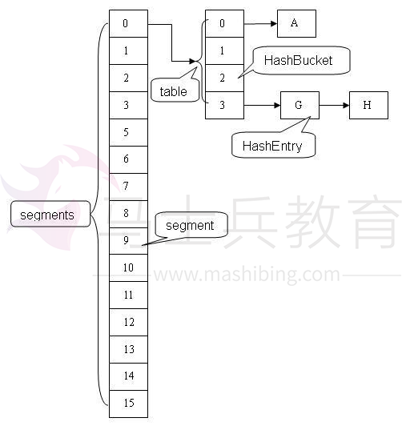

---

重要概念
 
在开始之前，有些重要的概念需要介绍一下：
1. table：默认为null，初始化发生在第一次插入操作，默认大小为16的数组，用来存储Node节点数
据，扩容时大小总是2的幂次方。
2. nextTable：默认为null，扩容时新生成的数组，其大小为原数组的两倍。
sizeCtl ：默认为0，用来控制table的初始化和扩容操作，具体应用在后续会体现出来。
-1 代表table正在初始化
-N 表示有N-1个线程正在进行扩容操作
其余情况：
1、如果table未初始化，表示table需要初始化的大小。
2、如果table初始化完成，表示table的容量，默认是table大小的0.75倍，居然用这个公式算
0.75（n - (n >>> 2)）。
Node：保存key，value及key的hash值的数据结构。
 
其中value和next都用volatile修饰，保证并发的可见性。
ForwardingNode：一个特殊的Node节点，hash值为-1，其中存储nextTable的引用。
 
class Node<K,V> implements Map.Entry<K,V> {
    final int hash;
    final K key;
    volatile V val;
    volatile Node<K,V> next;
    ... 省略部分代码
}
final class ForwardingNode<K,V> extends Node<K,V> {
    final Node<K,V>[] nextTable;
    ForwardingNode(Node<K,V>[] tab) {
        super(MOVED, null, null, null);
        this.nextTable = tab;
    }
}

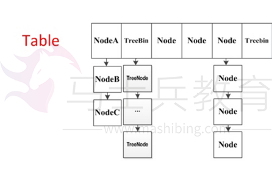

---

只有table发生扩容的时候，ForwardingNode才会发挥作用，作为一个占位符放在table中表示当前节点
为null或则已经被移动。
实例初始化
 
实例化ConcurrentHashMap时带参数时，会根据参数调整table的大小，假设参数为100，最终会调整
成256，确保table的大小总是2的幂次方，算法如下：
 
注意，ConcurrentHashMap在构造函数中只会初始化sizeCtl值，并不会直接初始化table，而是延缓到
第一次put操作。
table初始化
 
前面已经提到过，table初始化操作会延缓到第一次put行为。但是put是可以并发执行的，Doug Lea是
如何实现table只初始化一次的？让我们来看看源码的实现。
 
ConcurrentHashMap<String, String> hashMap = new ConcurrentHashMap<>(100);
private static final int tableSizeFor(int c) {
    int n = c - 1;
    n |= n >>> 1;
    n |= n >>> 2;
    n |= n >>> 4;
    n |= n >>> 8;
    n |= n >>> 16;
    return (n < 0) ? 1 : (n >= MAXIMUM_CAPACITY) ? MAXIMUM_CAPACITY : n + 1;
}
private final Node<K,V>[] initTable() {
    Node<K,V>[] tab; int sc;
    while ((tab = table) == null || tab.length == 0) {
//如果一个线程发现sizeCtl<0，意味着另外的线程执行CAS操作成功，当前线程只需要让出cpu时间片
        if ((sc = sizeCtl) < 0) 
            Thread.yield(); // lost initialization race; just spin
        else if (U.compareAndSwapInt(this, SIZECTL, sc, -1)) {
            try {
                if ((tab = table) == null || tab.length == 0) {
                    int n = (sc > 0) ? sc : DEFAULT_CAPACITY;
                    @SuppressWarnings("unchecked")
                    Node<K,V>[] nt = (Node<K,V>[])new Node<?,?>[n];
                    table = tab = nt;
                    sc = n - (n >>> 2);
                }
            } finally {
                sizeCtl = sc;
            }
            break;
        }
    }
    return tab;
}

---

sizeCtl默认为0，如果ConcurrentHashMap实例化时有传参数，sizeCtl会是一个2的幂次方的值。所以
执行第一次put操作的线程会执行Unsafe.compareAndSwapInt方法修改sizeCtl为-1，有且只有一个线
程能够修改成功，其它线程通过Thread.yield()让出CPU时间片等待table初始化完成。
put操作
假设table已经初始化完成，put操作采用CAS+synchronized实现并发插入或更新操作，具体实现如下。
 
1. hash算法
 
1. table中定位索引位置，n是table的大小
 
1. 获取table中对应索引的元素f。
Doug Lea采用Unsafe.getObjectVolatile来获取，也许有人质疑，直接table[index]不可以么，为
什么要这么复杂？
在java内存模型中，我们已经知道每个线程都有一个工作内存，里面存储着table的副本，虽然
table是volatile修饰的，但不能保证线程每次都拿到table中的最新元素，
Unsafe.getObjectVolatile可以直接获取指定内存的数据，保证了每次拿到数据都是最新的。
2. 如果f为null，说明table中这个位置第一次插入元素，利用Unsafe.compareAndSwapObject方法
插入Node节点。
如果CAS成功，说明Node节点已经插入，随后addCount(1L, binCount)方法会检查当前容量是否
需要进行扩容。
如果CAS失败，说明有其它线程提前插入了节点，自旋重新尝试在这个位置插入节点。
final V putVal(K key, V value, boolean onlyIfAbsent) {
    if (key == null || value == null) throw new NullPointerException();
    int hash = spread(key.hashCode());
    int binCount = 0;
    for (Node<K,V>[] tab = table;;) {
        Node<K,V> f; int n, i, fh;
        if (tab == null || (n = tab.length) == 0)
            tab = initTable();
        else if ((f = tabAt(tab, i = (n - 1) & hash)) == null) {
            if (casTabAt(tab, i, null, new Node<K,V>(hash, key, value, null)))
                break;                   // no lock when adding to empty bin
        }
        else if ((fh = f.hash) == MOVED)
            tab = helpTransfer(tab, f);
        ...省略部分代码
    }
    addCount(1L, binCount);
    return null;
}
static final int spread(int h) {return (h ^ (h >>> 16)) & HASH_BITS;}
int index = (n - 1) & hash

---

1. 如果f的hash值为-1，说明当前f是ForwardingNode节点，意味有其它线程正在扩容，则一起进行
扩容操作。
2. 其余情况把新的Node节点按链表或红黑树的方式插入到合适的位置，这个过程采用同步内置锁实
现并发，代码如下:
 
在节点f上进行同步，节点插入之前，再次利用tabAt(tab, i) == f判断，防止被其它线程修改。
1. 如果f.hash >= 0，说明f是链表结构的头结点，遍历链表，如果找到对应的node节点，则修改
value，否则在链表尾部加入节点。
2. 如果f是TreeBin类型节点，说明f是红黑树根节点，则在树结构上遍历元素，更新或增加节点。
3. 如果链表中节点数binCount >= TREEIFY_THRESHOLD(默认是8)，则把链表转化为红黑树结构。
table扩容
 
当table容量不足的时候，即table的元素数量达到容量阈值sizeCtl，需要对table进行扩容。
整个扩容分为两部分：
1. 构建一个nextTable，大小为table的两倍。
2. 把table的数据复制到nextTable中。
synchronized (f) {
    if (tabAt(tab, i) == f) {
        if (fh >= 0) {
            binCount = 1;
            for (Node<K,V> e = f;; ++binCount) {
                K ek;
                if (e.hash == hash &&
                    ((ek = e.key) == key ||
                     (ek != null && key.equals(ek)))) {
                    oldVal = e.val;
                    if (!onlyIfAbsent)
                        e.val = value;
                    break;
                }
                Node<K,V> pred = e;
                if ((e = e.next) == null) {
                    pred.next = new Node<K,V>(hash, key,
                                              value, null);
                    break;
                }
            }
        }
        else if (f instanceof TreeBin) {
            Node<K,V> p;
            binCount = 2;
            if ((p = ((TreeBin<K,V>)f).putTreeVal(hash, key,
                                           value)) != null) {
                oldVal = p.val;
                if (!onlyIfAbsent)
                    p.val = value;
            }
        }
    }
}

---

这两个过程在单线程下实现很简单，但是ConcurrentHashMap是支持并发插入的，扩容操作自然也会
有并发的出现，这种情况下，第二步可以支持节点的并发复制，这样性能自然提升不少，但实现的复杂
度也上升了一个台阶。
先看第一步，构建nextTable，毫无疑问，这个过程只能只有单个线程进行nextTable的初始化，具体实
现如下：
 
通过Unsafe.compareAndSwapInt修改sizeCtl值，保证只有一个线程能够初始化nextTable，扩容后的
数组长度为原来的两倍，但是容量是原来的1.5。
节点从table移动到nextTable，大体思想是遍历、复制的过程。
1. 首先根据运算得到需要遍历的次数i，然后利用tabAt方法获得i位置的元素f，初始化一个
forwardNode实例fwd。
2. 如果f == null，则在table中的i位置放入fwd，这个过程是采用Unsafe.compareAndSwapObjectf
方法实现的，很巧妙的实现了节点的并发移动。
3. 如果f是链表的头节点，就构造一个反序链表，把他们分别放在nextTable的i和i+n的位置上，移动
完成，采用Unsafe.putObjectVolatile方法给table原位置赋值fwd。
4. 如果f是TreeBin节点，也做一个反序处理，并判断是否需要untreeify，把处理的结果分别放在
nextTable的i和i+n的位置上，移动完成，同样采用Unsafe.putObjectVolatile方法给table原位置赋
值fwd。
遍历过所有的节点以后就完成了复制工作，把table指向nextTable，并更新sizeCtl为新数组大小的0.75
倍 ，扩容完成。
红黑树构造
 
注意：如果链表结构中元素超过TREEIFY_THRESHOLD阈值，默认为8个，则把链表转化为红黑树，提高
遍历查询效率。
 
private final void addCount(long x, int check) {
    ... 省略部分代码
    if (check >= 0) {
        Node<K,V>[] tab, nt; int n, sc;
        while (s >= (long)(sc = sizeCtl) && (tab = table) != null &&
               (n = tab.length) < MAXIMUM_CAPACITY) {
            int rs = resizeStamp(n);
            if (sc < 0) {
                if ((sc >>> RESIZE_STAMP_SHIFT) != rs || sc == rs + 1 ||
                    sc == rs + MAX_RESIZERS || (nt = nextTable) == null ||
                    transferIndex <= 0)
                    break;
                if (U.compareAndSwapInt(this, SIZECTL, sc, sc + 1))
                    transfer(tab, nt);
            }
            else if (U.compareAndSwapInt(this, SIZECTL, sc,
                                         (rs << RESIZE_STAMP_SHIFT) + 2))
                transfer(tab, null);
            s = sumCount();
        }
    }
}

---

接下来我们看看如何构造树结构，代码如下：
 
可以看出，生成树节点的代码块是同步的，进入同步代码块之后，再次验证table中index位置元素是否
被修改过。
1、根据table中index位置Node链表，重新生成一个hd为头结点的TreeNode链表。
2、根据hd头结点，生成TreeBin树结构，并把树结构的root节点写到table的index位置的内存中，具体
实现如下：
 
if (binCount != 0) {
    if (binCount >= TREEIFY_THRESHOLD)
        treeifyBin(tab, i);
    if (oldVal != null)
        return oldVal;
    break;
}
private final void treeifyBin(Node<K,V>[] tab, int index) {
    Node<K,V> b; int n, sc;
    if (tab != null) {
        if ((n = tab.length) < MIN_TREEIFY_CAPACITY)
            tryPresize(n << 1);
        else if ((b = tabAt(tab, index)) != null && b.hash >= 0) {
            synchronized (b) {
                if (tabAt(tab, index) == b) {
                    TreeNode<K,V> hd = null, tl = null;
                    for (Node<K,V> e = b; e != null; e = e.next) {
                        TreeNode<K,V> p =
                            new TreeNode<K,V>(e.hash, e.key, e.val,
                                              null, null);
                        if ((p.prev = tl) == null)
                            hd = p;
                        else
                            tl.next = p;
                        tl = p;
                    }
                    setTabAt(tab, index, new TreeBin<K,V>(hd));
                }
            }
        }
    }
}
TreeBin(TreeNode<K,V> b) {
    super(TREEBIN, null, null, null);
    this.first = b;
    TreeNode<K,V> r = null;
    for (TreeNode<K,V> x = b, next; x != null; x = next) {
        next = (TreeNode<K,V>)x.next;
        x.left = x.right = null;
        if (r == null) {
            x.parent = null;
            x.red = false;

---

主要根据Node节点的hash值大小构建二叉树。这个红黑树的构造过程实在有点复杂，感兴趣的同学可
以看看源码。
get操作
 
get操作和put操作相比，显得简单了许多。
 
            r = x;
        }
        else {
            K k = x.key;
            int h = x.hash;
            Class<?> kc = null;
            for (TreeNode<K,V> p = r;;) {
                int dir, ph;
                K pk = p.key;
                if ((ph = p.hash) > h)
                    dir = -1;
                else if (ph < h)
                    dir = 1;
                else if ((kc == null &&
                          (kc = comparableClassFor(k)) == null) ||
                         (dir = compareComparables(kc, k, pk)) == 0)
                    dir = tieBreakOrder(k, pk);
                    TreeNode<K,V> xp = p;
                if ((p = (dir <= 0) ? p.left : p.right) == null) {
                    x.parent = xp;
                    if (dir <= 0)
                        xp.left = x;
                    else
                        xp.right = x;
                    r = balanceInsertion(r, x);
                    break;
                }
            }
        }
    }
    this.root = r;
    assert checkInvariants(root);
}
public V get(Object key) {
    Node<K,V>[] tab; Node<K,V> e, p; int n, eh; K ek;
    int h = spread(key.hashCode());
    if ((tab = table) != null && (n = tab.length) > 0 &&
        (e = tabAt(tab, (n - 1) & h)) != null) {
        if ((eh = e.hash) == h) {
            if ((ek = e.key) == key || (ek != null && key.equals(ek)))
                return e.val;
        }
        else if (eh < 0)
            return (p = e.find(h, key)) != null ? p.val : null;
        while ((e = e.next) != null) {
            if (e.hash == h &&
                ((ek = e.key) == key || (ek != null && key.equals(ek))))
                return e.val;

---

1. 判断table是否为空，如果为空，直接返回null。
2. 计算key的hash值，并获取指定table中指定位置的Node节点，通过遍历链表或则树结构找到对应
的节点，返回value值。
总结
 
ConcurrentHashMap 是一个并发散列映射表的实现，它允许完全并发的读取，并且支持给定数量的并
发更新。相比于 HashTable 和同步包装器包装的 HashMap，使用一个全局的锁来同步不同线程间的并
发访问，同一时间点，只能有一个线程持有锁，也就是说在同一时间点，只能有一个线程能访问容器，
这虽然保证多线程间的安全并发访问，但同时也导致对容器的访问变成串行化的了。
1.6中采用ReentrantLock 分段锁的方式，使多个线程在不同的segment上进行写操作不会发现阻塞行
为;1.8中直接采用了内置锁synchronized，难道是因为1.8的虚拟机对内置锁已经优化的足够快了？
 
 
谈谈ConcurrentHashMap1.7和1.8的不同实现
 
 
ConcurrentHashMap
 
在多线程环境下，使用HashMap 进行put 操作时存在丢失数据的情况，为了避免这种bug的隐患，强烈
建议使用ConcurrentHashMap 代替HashMap ，为了对更深入的了解，本文将对JDK1.7和1.8的不同实现
进行分析。
JDK1.7
 
数据结构
 
jdk1.7中采用Segment  + HashEntry 的方式进行实现，结构如下：
        }
    }
    return null;
}

---

ConcurrentHashMap 初始化时，计算出Segment 数组的大小ssize 和每个Segment 中HashEntry 数
组的大小cap ，并初始化Segment 数组的第一个元素；其中ssize 大小为2的幂次方，默认为16，cap
大小也是2的幂次方，最小值为2，最终结果根据根据初始化容量initialCapacity 进行计算，计算过
程如下：
 
其中Segment 在实现上继承了ReentrantLock ，这样就自带了锁的功能。
put实现
 
当执行put 方法插入数据时，根据key的hash值，在Segment 数组中找到相应的位置，如果相应位置的
Segment 还未初始化，则通过CAS进行赋值，接着执行Segment 对象的put 方法通过加锁机制插入数
据，实现如下：
场景：线程A和线程B同时执行相同Segment 对象的put 方法
1、线程A执行tryLock() 方法成功获取锁，则把HashEntry 对象插入到相应的位置；
2、线程B获取锁失败，则执行scanAndLockForPut() 方法，在scanAndLockForPut 方法中，会通过
重复执行tryLock() 方法尝试获取锁，在多处理器环境下，重复次数为64，单处理器重复次数为1，当
执行tryLock() 方法的次数超过上限时，则执行lock() 方法挂起线程B；
3、当线程A执行完插入操作时，会通过unlock() 方法释放锁，接着唤醒线程B继续执行；
size实现
 
因为ConcurrentHashMap 是可以并发插入数据的，所以在准确计算元素时存在一定的难度，一般的思
路是统计每个Segment 对象中的元素个数，然后进行累加，但是这种方式计算出来的结果并不一样的准
确的，因为在计算后面几个Segment 的元素个数时，已经计算过的Segment 同时可能有数据的插入或则
删除，在1.7的实现中，采用了如下方式：
 
if (c * ssize < initialCapacity)
    ++c;
int cap = MIN_SEGMENT_TABLE_CAPACITY;
while (cap < c)
    cap <<= 1;
try {
    for (;;) {
        if (retries++ == RETRIES_BEFORE_LOCK) {
            for (int j = 0; j < segments.length; ++j)
                ensureSegment(j).lock(); // force creation
        }
        sum = 0L;
        size = 0;
        overflow = false;
        for (int j = 0; j < segments.length; ++j) {
            Segment<K,V> seg = segmentAt(segments, j);
            if (seg != null) {
                sum += seg.modCount;
                int c = seg.count;
                if (c < 0 || (size += c) < 0)
                    overflow = true;
            }
        }

---

先采用不加锁的方式，连续计算元素的个数，最多计算3次：
1、如果前后两次计算结果相同，则说明计算出来的元素个数是准确的；
2、如果前后两次计算结果都不同，则给每个Segment 进行加锁，再计算一次元素的个数；
JDK1.8
 
数据结构
 
1.8中放弃了Segment 臃肿的设计，取而代之的是采用Node  + CAS  + Synchronized 来保证并发安全进
行实现，结构如下：
只有在执行第一次put 方法时才会调用initTable() 初始化Node 数组，实现如下：
 
        if (sum == last)
            break;
        last = sum;
    }
} finally {
    if (retries > RETRIES_BEFORE_LOCK) {
        for (int j = 0; j < segments.length; ++j)
            segmentAt(segments, j).unlock();
    }
}
private final Node<K,V>[] initTable() {
    Node<K,V>[] tab; int sc;
    while ((tab = table) == null || tab.length == 0) {
        if ((sc = sizeCtl) < 0)
            Thread.yield(); // lost initialization race; just spin
        else if (U.compareAndSwapInt(this, SIZECTL, sc, -1)) {
            try {
                if ((tab = table) == null || tab.length == 0) {
                    int n = (sc > 0) ? sc : DEFAULT_CAPACITY;
                    @SuppressWarnings("unchecked")
                    Node<K,V>[] nt = (Node<K,V>[])new Node<?,?>[n];
                    table = tab = nt;
                    sc = n - (n >>> 2);
                }
            } finally {
                sizeCtl = sc;
            }
            break;
        }
    }

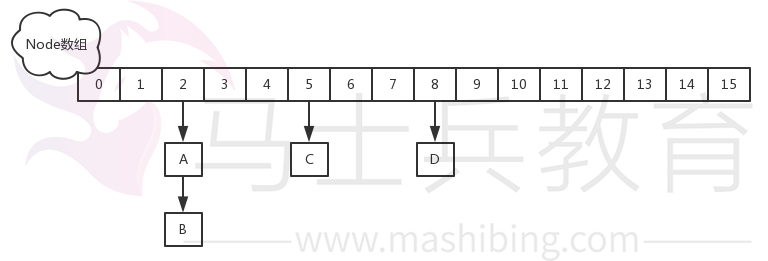

---

put实现
 
当执行put 方法插入数据时，根据key的hash值，在Node 数组中找到相应的位置，实现如下：
1、如果相应位置的Node 还未初始化，则通过CAS插入相应的数据；
 
2、如果相应位置的Node 不为空，且当前该节点不处于移动状态，则对该节点加synchronized 锁，如
果该节点的hash 不小于0，则遍历链表更新节点或插入新节点；
 
3、如果该节点是TreeBin 类型的节点，说明是红黑树结构，则通过putTreeVal 方法往红黑树中插入
节点；
 
    return tab;
}
else if ((f = tabAt(tab, i = (n - 1) & hash)) == null) {
    if (casTabAt(tab, i, null, new Node<K,V>(hash, key, value, null)))
        break;                   // no lock when adding to empty bin
}
if (fh >= 0) {
    binCount = 1;
    for (Node<K,V> e = f;; ++binCount) {
        K ek;
        if (e.hash == hash &&
            ((ek = e.key) == key ||
             (ek != null && key.equals(ek)))) {
            oldVal = e.val;
            if (!onlyIfAbsent)
                e.val = value;
            break;
        }
        Node<K,V> pred = e;
        if ((e = e.next) == null) {
            pred.next = new Node<K,V>(hash, key, value, null);
            break;
        }
    }
}
else if (f instanceof TreeBin) {
    Node<K,V> p;
    binCount = 2;
    if ((p = ((TreeBin<K,V>)f).putTreeVal(hash, key, value)) != null) {
        oldVal = p.val;
        if (!onlyIfAbsent)
            p.val = value;
    }
}

---

4、如果binCount 不为0，说明put 操作对数据产生了影响，如果当前链表的个数达到8个，则通过
treeifyBin 方法转化为红黑树，如果oldVal 不为空，说明是一次更新操作，没有对元素个数产生影
响，则直接返回旧值；
 
5、如果插入的是一个新节点，则执行addCount() 方法尝试更新元素个数baseCount ；
size实现
 
1.8中使用一个volatile 类型的变量baseCount 记录元素的个数，当插入新数据或则删除数据时，会通
过addCount() 方法更新baseCount ，实现如下：
 
1、初始化时counterCells 为空，在并发量很高时，如果存在两个线程同时执行CAS 修改baseCount
值，则失败的线程会继续执行方法体中的逻辑，使用CounterCell 记录元素个数的变化；
2、如果CounterCell 数组counterCells 为空，调用fullAddCount() 方法进行初始化，并插入对应
的记录数，通过CAS 设置cellsBusy字段，只有设置成功的线程才能初始化CounterCell 数组，实现如
下：
 
if (binCount != 0) {
    if (binCount >= TREEIFY_THRESHOLD)
        treeifyBin(tab, i);
    if (oldVal != null)
        return oldVal;
    break;
}   
if ((as = counterCells) != null ||
    !U.compareAndSwapLong(this, BASECOUNT, b = baseCount, s = b + x)) {
    CounterCell a; long v; int m;
    boolean uncontended = true;
    if (as == null || (m = as.length - 1) < 0 ||
        (a = as[ThreadLocalRandom.getProbe() & m]) == null ||
        !(uncontended =
          U.compareAndSwapLong(a, CELLVALUE, v = a.value, v + x))) {
        fullAddCount(x, uncontended);
        return;
    }
    if (check <= 1)
        return;
    s = sumCount();
}
else if (cellsBusy == 0 && counterCells == as &&
         U.compareAndSwapInt(this, CELLSBUSY, 0, 1)) {
    boolean init = false;
    try {                           // Initialize table
        if (counterCells == as) {
            CounterCell[] rs = new CounterCell[2];
            rs[h & 1] = new CounterCell(x);
            counterCells = rs;

---

3、如果通过CAS 设置cellsBusy字段失败的话，则继续尝试通过CAS 修改baseCount 字段，如果修改
baseCount 字段成功的话，就退出循环，否则继续循环插入CounterCell 对象；
 
所以在1.8中的size 实现比1.7简单多，因为元素个数保存baseCount 中，部分元素的变化个数保存在
CounterCell 数组中，实现如下：
 
通过累加baseCount 和CounterCell 数组中的数量，即可得到元素的总个数；
 
 
ConcurrentHashMap的红黑树实现分析
 
 
            init = true;
        }
    } finally {
        cellsBusy = 0;
    }
    if (init)
        break;
}
else if (U.compareAndSwapLong(this, BASECOUNT, v = baseCount, v + x))
    break; 
public int size() {
    long n = sumCount();
    return ((n < 0L) ? 0 :
            (n > (long)Integer.MAX_VALUE) ? Integer.MAX_VALUE :
            (int)n);
}
final long sumCount() {
    CounterCell[] as = counterCells; CounterCell a;
    long sum = baseCount;
    if (as != null) {
        for (int i = 0; i < as.length; ++i) {
            if ((a = as[i]) != null)
                sum += a.value;
        }
    }
    return sum;
}

---

红黑树
 
红黑树是一种特殊的二叉树，主要用它存储有序的数据，提供高效的数据检索，时间复杂度为O(lgn)，
每个节点都有一个标识位表示颜色，红色或黑色，有如下5种特性：
1、每个节点要么红色，要么是黑色；
2、根节点一定是黑色的；
3、每个空叶子节点必须是黑色的；
4、如果一个节点是红色的，那么它的子节点必须是黑色的；
5、从一个节点到该节点的子孙节点的所有路径包含相同个数的黑色节点；
结构示意图
只要满足以上5个特性的二叉树都是红黑树，当有新的节点加入时，有可能会破坏其中一些特性，需要通
过左旋或右旋操作调整树结构，重新着色，使之重新满足所有特性。
ConcurrentHashMap红黑树实现
 
在1.8的实现中，当一个链表中的元素达到8个时，会调用treeifyBin() 方法把链表结构转化成红黑树
结构，实现如下：
 
/**
 * Replaces all linked nodes in bin at given index unless table is
 * too small, in which case resizes instead.
 */
private final void treeifyBin(Node<K,V>[] tab, int index) {
    Node<K,V> b; int n, sc;
    if (tab != null) {
        if ((n = tab.length) < MIN_TREEIFY_CAPACITY)
            tryPresize(n << 1);
        else if ((b = tabAt(tab, index)) != null && b.hash >= 0) {
            synchronized (b) {
                if (tabAt(tab, index) == b) {
                    TreeNode<K,V> hd = null, tl = null;
                    for (Node<K,V> e = b; e != null; e = e.next) {
                        TreeNode<K,V> p =
                            new TreeNode<K,V>(e.hash, e.key, e.val,
                                              null, null);
                        if ((p.prev = tl) == null)

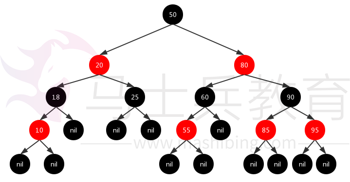

---

从上述实现可以看出：并非一开始就创建红黑树结构，如果当前Node 数组长度小于阈值
MIN_TREEIFY_CAPACITY ，默认为64，先通过扩大数组容量为原来的两倍以缓解单个链表元素过大的性
能问题。
红黑树构造过程
 
下面对红黑树的构造过程进行分析：
1、通过遍历Node 链表，生成对应的TreeNode 链表，其中TreeNode 在实现上继承了Node 类；
 
假设TreeNode 链表如下，其中节点中的数值代表hash 值：
2、根据TreeNode 链表初始化TreeBin 类对象，TreeBin 在实现上同样继承了Node 类，所以初始化完
成的TreeBin 类对象可以保持在Node 数组中；
 
                            hd = p;
                        else
                            tl.next = p;
                        tl = p;
                    }
                    setTabAt(tab, index, new TreeBin<K,V>(hd));
                }
            }
        }
    }
}
class TreeNode<K,V> extends Node<K,V> {
    TreeNode<K,V> parent;  // red-black tree links
    TreeNode<K,V> left;
    TreeNode<K,V> right;
    TreeNode<K,V> prev;    
    // needed to unlink next upon deletion
    boolean red;
}

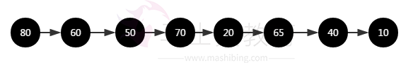

---

3、遍历TreeNode 链表生成红黑树，一开始二叉树的根节点root 为空，则设置链表中的第一个节点80
为root ，并设置其red 属性为false ，因为在红黑树的特性1中，明确规定根节点必须是黑色的；
 
二叉树结构：
4、加入节点60，如果root 不为空，则通过比较节点hash 值的大小将新节点插入到指定位置，实现如
下：
 
class TreeBin<K,V> extends Node<K,V> {
    TreeNode<K,V> root;
    volatile TreeNode<K,V> first;
    volatile Thread waiter;
    volatile int lockState;
    // values for lockState
    // set while holding write lock
    static final int WRITER = 1;
    // set when waiting for write lock
    static final int WAITER = 2; 
    // increment value for setting read lock
    static final int READER = 4; 
}
for (TreeNode<K,V> x = b, next; x != null; x = next) {
    next = (TreeNode<K,V>)x.next;
    x.left = x.right = null;
    if (r == null) {
        x.parent = null;
        x.red = false;
        r = x;
    }
    ...
K k = x.key;
int h = x.hash;
Class<?> kc = null;
for (TreeNode<K,V> p = r;;) {
    int dir, ph;
    K pk = p.key;
    if ((ph = p.hash) > h)
        dir = -1;
    else if (ph < h)
        dir = 1;
    else if ((kc == null &&
              (kc = comparableClassFor(k)) == null) ||
             (dir = compareComparables(kc, k, pk)) == 0)
        dir = tieBreakOrder(k, pk);

---

其中x 代表即将插入到红黑树的节点，p 指向红黑树中当前遍历到的节点，从根节点开始递归遍历，x
的插入过程如下：
1)、如果x 的hash 值小于p 的hash 值，则判断p 的左节点是否为空，如果不为空，则把p 指向其左节
点，并继续和p 进行比较，如果p 的左节点为空，则把x 指向的节点插入到该位置；
2)、如果x 的hash 值大于p 的hash 值，则判断p 的右节点是否为空，如果不为空，则把p 指向其右节
点，并继续和p 进行比较，如果p 的右节点为空，则把x 指向的节点插入到该位置；
3)、如果x 的hash 值和p 的hash 值相等，怎么办？
解决：首先判断节点中的key 对象的类是否实现了Comparable 接口，如果实现Comparable 接口，则
调用compareTo 方法比较两者key 的大小，但是如果key 对象没有实现Comparable 接口，或则
compareTo 方法返回了0，则继续调用tieBreakOrder 方法计算dir 值，tieBreakOrder 方法实现如
下：
 
最终比较key 对象的默认hashCode() 方法的返回值，因为System.identityHashCode(a) 调用的是对
象a 默认的hashCode() ；
插入节点60之后的二叉树：
        TreeNode<K,V> xp = p;
    if ((p = (dir <= 0) ? p.left : p.right) == null) {
        x.parent = xp;
        if (dir <= 0)
            xp.left = x;
        else
            xp.right = x;
        r = balanceInsertion(r, x);
        break;
    }
}
static int tieBreakOrder(Object a, Object b) {
    int d;
    if (a == null || b == null ||
        (d = a.getClass().getName().
         compareTo(b.getClass().getName())) == 0)
        d = (System.identityHashCode(a) <= System.identityHashCode(b) ?
             -1 : 1);
    return d;
}

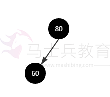

---

5、当有新节点加入时，可能会破坏红黑树的特性，需要执行balanceInsertion() 方法调整二叉树，
使之重新满足特性，方法中的变量xp 指向x 的父节点，xpp 指向xp 父节点，xppl 和xppr 分别指向
xpp 的左右子节点，balanceInsertion() 方法首先会把新加入的节点设置成红色。
①、加入节点60之后，此时xp 指向节点80，其父节点为空，直接返回。
 
调整之后的二叉树：
②、加入节点50，二叉树如下：
继续执行balanceInsertion() 方法调整二叉树，此时节点50的父节点60是左儿子，走如下逻辑：
 
if ((xp = x.parent) == null) {
    x.red = false;
    return x;
}
else if (!xp.red || (xpp = xp.parent) == null)
    return root;
if (xp == (xppl = xpp.left)) {
    if ((xppr = xpp.right) != null && xppr.red) {
        xppr.red = false;
        xp.red = false;
        xpp.red = true;
        x = xpp;
    }

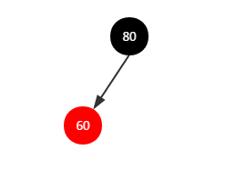

---

根据上述逻辑，把节点60设置成黑色，把节点80设置成红色，并对节点80执行右旋操作，右旋实现如
下：
 
右旋之后的红黑树如下：
③、加入节点70，二叉树如下：
    else {
        if (x == xp.right) {
            root = rotateLeft(root, x = xp);
            xpp = (xp = x.parent) == null ? null : xp.parent;
        }
        if (xp != null) {
            xp.red = false;
            if (xpp != null) {
                xpp.red = true;
                root = rotateRight(root, xpp);
            }
        }
    }
}
static <K,V> TreeNode<K,V> rotateRight(TreeNode<K,V> root,
                                       TreeNode<K,V> p) {
    TreeNode<K,V> l, pp, lr;
    if (p != null && (l = p.left) != null) {
        if ((lr = p.left = l.right) != null)
            lr.parent = p;
        if ((pp = l.parent = p.parent) == null)
            (root = l).red = false;
        else if (pp.right == p)
            pp.right = l;
        else
            pp.left = l;
        l.right = p;
        p.parent = l;
    }
    return root;
}

---

继续执行balanceInsertion() 方法调整二叉树，此时父节点80是个右儿子，节点70是左儿子，且叔节
点50不为空，且是红色的，则执行如下逻辑：
 
此时二叉树如下：
此时x 指向xpp ，即节点60，继续循环处理x ，设置其颜色为黑色，最终二叉树如下：
if (xppl != null && xppl.red) {
    xppl.red = false;
    xp.red = false;
    xpp.red = true;
    x = xpp;
}

---

④、加入节点20，二叉树变化如下：
因为节点20的父节点50是一个黑色的节点，不需要进行调整；
⑤、加入节点65，二叉树变化如下：

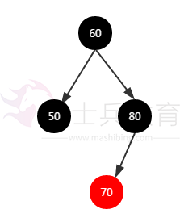

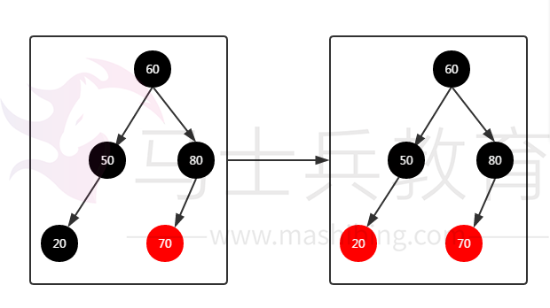

---

对节点80进行右旋操作。
⑥、加入节点40，二叉树变化如下：
1、对节点20执行左旋操作；
2、对节点50执行右旋操作；
最后加入节点10，二叉树变化如下：
重新对节点进行着色，到此为止，红黑树已经构造完成；

---

深入分析ConcurrentHashMap1.8的扩容实现
 
 
ConcurrentHashMap相关的文章写了不少，有个遗留问题一直没有分析，也被好多人请教过，被搁置
在一旁，即如何在并发的情况下实现数组的扩容。
什么情况会触发扩容
 
当往hashMap中成功插入一个key/value节点时，有可能触发扩容动作：
1、如果新增节点之后，所在链表的元素个数达到了阈值 8，则会调用treeifyBin 方法把链表转换成红
黑树，不过在结构转换之前，会对数组长度进行判断，实现如下：
如果数组长度n小于阈值MIN_TREEIFY_CAPACITY ，默认是64，则会调用tryPresize 方法把数组长度
扩大到原来的两倍，并触发transfer 方法，重新调整节点的位置。

---

2、新增节点之后，会调用addCount 方法记录元素个数，并检查是否需要进行扩容，当数组元素个数达
到阈值时，会触发transfer 方法，重新调整节点的位置。
transfer实现
 
transfer 方法实现了在并发的情况下，高效的从原始组数往新数组中移动元素，假设扩容之前节点的
分布如下，这里区分蓝色节点和红色节点，是为了后续更好的分析：

---

在上图中，第14个槽位插入新节点之后，链表元素个数已经达到了8，且数组长度为16，优先通过扩容
来缓解链表过长的问题，实现如下：
1、根据当前数组长度n，新建一个两倍长度的数组nextTable ；
2、初始化ForwardingNode 节点，其中保存了新数组nextTable 的引用，在处理完每个槽位的节点之
后当做占位节点，表示该槽位已经处理过了；
3、通过for 自循环处理每个槽位中的链表元素，默认advace 为真，通过CAS设置transferIndex 属
性值，并初始化i 和bound 值，i 指当前处理的槽位序号，bound 指需要处理的槽位边界，先处理槽位
15的节点；

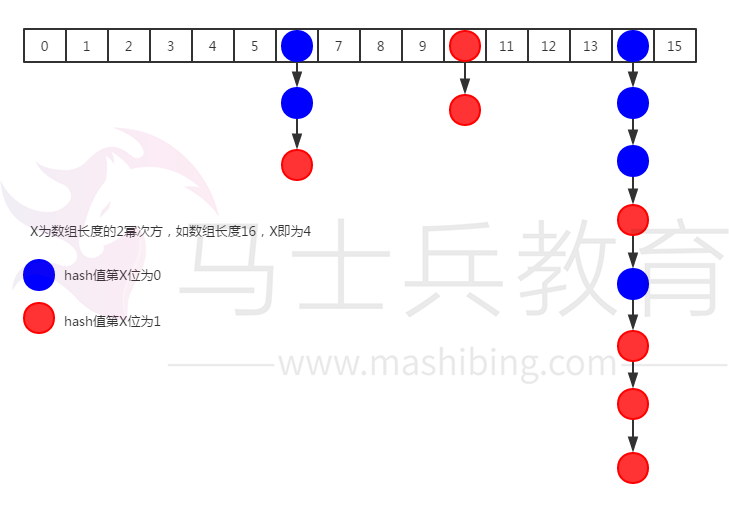

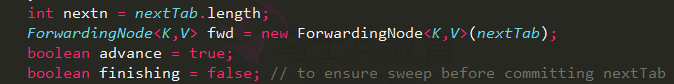

---

4、在当前假设条件下，槽位15中没有节点，则通过CAS插入在第二步中初始化的ForwardingNode 节
点，用于告诉其它线程该槽位已经处理过了；
5、如果槽位15已经被线程A处理了，那么线程B处理到这个节点时，取到该节点的hash值应该为
MOVED ，值为-1 ，则直接跳过，继续处理下一个槽位14的节点；
6、处理槽位14的节点，是一个链表结构，先定义两个变量节点ln 和hn ，按我的理解应该是lowNode
和highNode ，分别保存hash值的第X位为0和1的节点，具体实现如下：

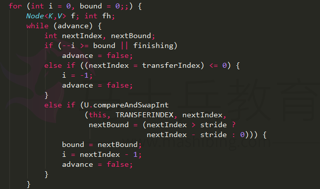

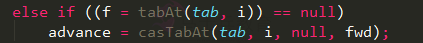

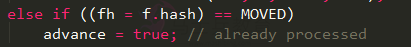

---

使用fn&n 可以快速把链表中的元素区分成两类，A类是hash值的第X位为0，B类是hash值的第X位为
1，并通过lastRun 记录最后需要处理的节点，A类和B类节点可以分散到新数组的槽位14和30中，在原
数组的槽位14中，蓝色节点第X为0，红色节点第X为1，把链表拉平显示如下：
 
1、通过遍历链表，记录runBit 和lastRun ，分别为1和节点6，所以设置hn 为节点6，ln 为null；
2、重新遍历链表，以lastRun 节点为终止条件，根据第X位的值分别构造ln链表和hn链表：
ln链：和原来链表相比，顺序已经不一样了
 
hn链：

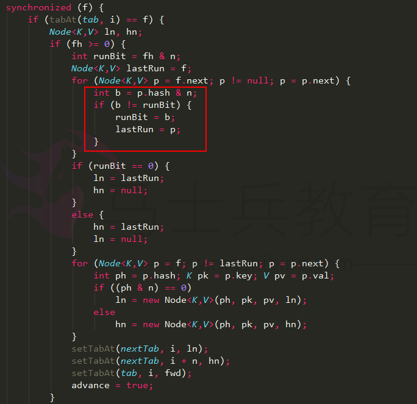

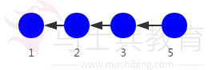

---

通过CAS把ln链表设置到新数组的i位置，hn链表设置到i+n的位置；
7、如果该槽位是红黑树结构，则构造树节点lo 和hi ，遍历红黑树中的节点，同样根据hash&n 算法，
把节点分为两类，分别插入到lo 和hi 为头的链表中，根据lo 和hi 链表中的元素个数分别生成ln 和
hn 节点，其中ln 节点的生成逻辑如下：
（1）如果lo 链表的元素个数小于等于UNTREEIFY_THRESHOLD ，默认为6，则通过untreeify 方法把
树节点链表转化成普通节点链表；
（2）否则判断hi 链表中的元素个数是否等于0：如果等于0，表示lo 链表中包含了所有原始节点，则
设置原始红黑树给ln ，否则根据lo 链表重新构造红黑树。
最后，同样的通过CAS把ln 设置到新数组的i 位置，hn 设置到i+n 位置。

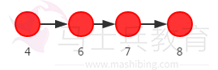

---

老生常谈，HashMap的死循环
 
 
问题
 
最近的几次面试中，我都问了是否了解HashMap在并发使用时可能发生死循环，导致cpu100%，结果
让我很意外，都表示不知道有这样的问题，让我意外的是面试者的工作年限都不短。
由于HashMap并非是线程安全的，所以在高并发的情况下必然会出现问题，这是一个普遍的问题，虽然
网上分析的文章很多，还是觉得有必须写一篇文章，让关注我公众号的同学能够意识到这个问题，并了
解这个死循环是如何产生的。
如果是在单线程下使用HashMap，自然是没有问题的，如果后期由于代码优化，这段逻辑引入了多线程
并发执行，在一个未知的时间点，会发现CPU占用100%，居高不下，通过查看堆栈，你会惊讶的发现，
线程都Hang在hashMap的get()方法上，服务重启之后，问题消失，过段时间可能又复现了。
这是为什么？
原因分析
 
在了解来龙去脉之前，我们先看看HashMap的数据结构。
在内部，HashMap使用一个Entry数组保存key、value数据，当一对key、value被加入时，会通过一个
hash算法得到数组的下标index，算法很简单，根据key的hash值，对数组的大小取模 hash & (length-
1)，并把结果插入数组该位置，如果该位置上已经有元素了，就说明存在hash冲突，这样会在index位
置生成链表。
如果存在hash冲突，最惨的情况，就是所有元素都定位到同一个位置，形成一个长长的链表，这样get
一个值时，最坏情况需要遍历所有节点，性能变成了O(n)，所以元素的hash值算法和HashMap的初始
化大小很重要。
当插入一个新的节点时，如果不存在相同的key，则会判断当前内部元素是否已经达到阈值（默认是数组
大小的0.75），如果已经达到阈值，会对数组进行扩容，也会对链表中的元素进行rehash。
实现
 
HashMap的put方法实现：
1、判断key是否已经存在
 
public V put(K key, V value) {
    if (key == null)
        return putForNullKey(value);
    int hash = hash(key);
    int i = indexFor(hash, table.length);
    // 如果key已经存在，则替换value，并返回旧值
    for (Entry<K,V> e = table[i]; e != null; e = e.next) {
        Object k;
        if (e.hash == hash && ((k = e.key) == key || key.equals(k))) {
            V oldValue = e.value;
            e.value = value;
            e.recordAccess(this);
            return oldValue;
        }
    }

---

2、检查容量是否达到阈值threshold
 
如果元素个数已经达到阈值，则扩容，并把原来的元素移动过去。
3、扩容实现
 
这里会新建一个更大的数组，并通过transfer方法，移动元素。
 
    modCount++;
    // key不存在，则插入新的元素
    addEntry(hash, key, value, i);
    return null;
}
void addEntry(int hash, K key, V value, int bucketIndex) {
    if ((size >= threshold) && (null != table[bucketIndex])) {
        resize(2 * table.length);
        hash = (null != key) ? hash(key) : 0;
        bucketIndex = indexFor(hash, table.length);
    }
    createEntry(hash, key, value, bucketIndex);
}
void resize(int newCapacity) {
    Entry[] oldTable = table;
    int oldCapacity = oldTable.length;
    ...
    Entry[] newTable = new Entry[newCapacity];
    ...
    transfer(newTable, rehash);
    table = newTable;
    threshold = (int)Math.min(newCapacity * loadFactor, MAXIMUM_CAPACITY + 1);
}
void transfer(Entry[] newTable, boolean rehash) {
    int newCapacity = newTable.length;
    for (Entry<K,V> e : table) {
        while(null != e) {
            Entry<K,V> next = e.next;
            if (rehash) {
                e.hash = null == e.key ? 0 : hash(e.key);
            }
            int i = indexFor(e.hash, newCapacity);
            e.next = newTable[i];
            newTable[i] = e;
            e = next;
        }
    }
}

---

移动的逻辑也很清晰，遍历原来table中每个位置的链表，并对每个元素进行重新hash，在新的
newTable找到归宿，并插入。
案例分析
 
假设HashMap初始化大小为4，插入个3节点，不巧的是，这3个节点都hash到同一个位置，如果按照默
认的负载因子的话，插入第3个节点就会扩容，为了验证效果，假设负载因子是1.
 
以上是节点移动的相关逻辑。
插入第4个节点时，发生rehash，假设现在有两个线程同时进行，线程1和线程2，两个线程都会新建新
的数组。
void transfer(Entry[] newTable, boolean rehash) {
    int newCapacity = newTable.length;
    for (Entry<K,V> e : table) {
        while(null != e) {
            Entry<K,V> next = e.next;
            if (rehash) {
                e.hash = null == e.key ? 0 : hash(e.key);
            }
            int i = indexFor(e.hash, newCapacity);
            e.next = newTable[i];
            newTable[i] = e;
            e = next;
        }
    }
}

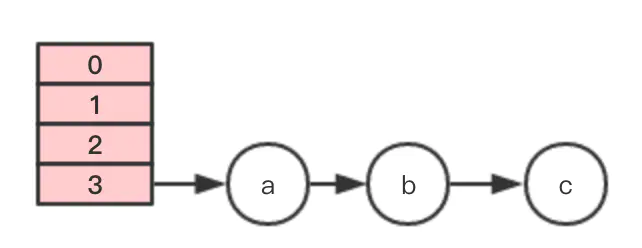

---

假设 线程2 在执行到Entry<K,V> next = e.next; 之后，cpu时间片用完了，这时变量e指向节点a，
变量next指向节点b。
线程1继续执行，很不巧，a、b、c节点rehash之后又是在同一个位置7，开始移动节点
第一步，移动节点a
第二步，移动节点b

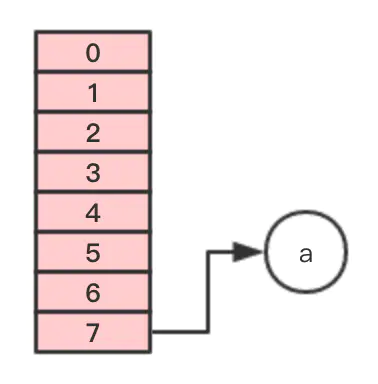

---

注意，这里的顺序是反过来的，继续移动节点c
这个时候 线程1 的时间片用完，内部的table还没有设置成新的newTable， 线程2 开始执行，这时内部
的引用关系如下：

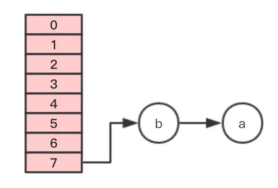

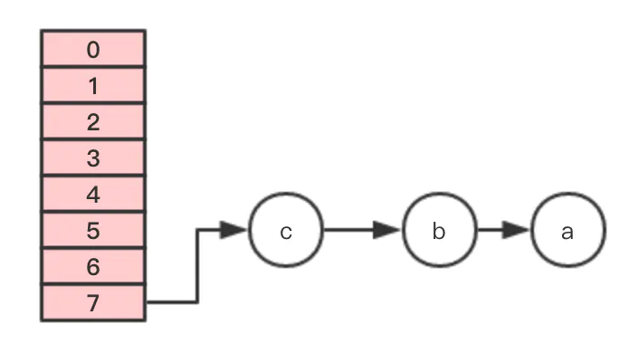

---

这时，在 线程2 中，变量e指向节点a，变量next指向节点b，开始执行循环体的剩余逻辑。
 
执行之后的引用关系如下图
Entry<K,V> next = e.next;
int i = indexFor(e.hash, newCapacity);
e.next = newTable[i];
newTable[i] = e;
e = next;

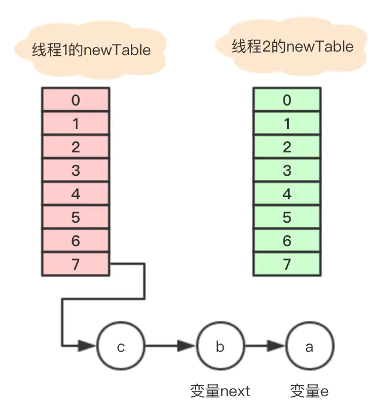

---

执行后，变量e指向节点b，因为e不是null，则继续执行循环体，执行后的引用关系

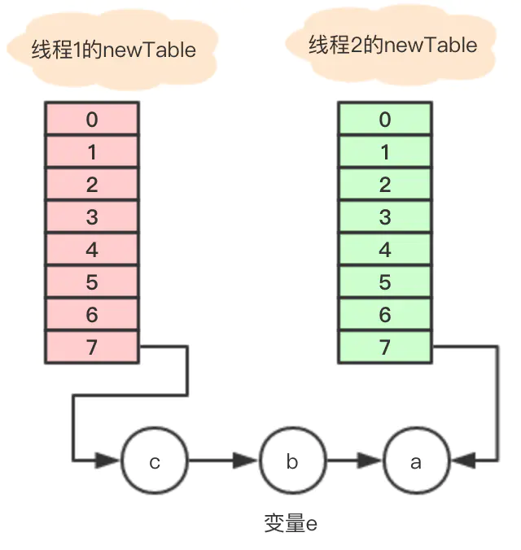

---

变量e又重新指回节点a，只能继续执行循环体，这里仔细分析下：
1、执行完Entry<K,V> next = e.next; ，目前节点a没有next，所以变量next指向null；
2、e.next = newTable[i];  其中 newTable[i] 指向节点b，那就是把a的next指向了节点b，这样a和b
就相互引用了，形成了一个环；
3、newTable[i] = e  把节点a放到了数组i位置；
4、e = next;  把变量e赋值为null，因为第一步中变量next就是指向null；
所以最终的引用关系是这样的：

---

节点a和b互相引用，形成了一个环，当在数组该位置get寻找对应的key时，就发生了死循环。
另外，如果线程2把newTable设置成到内部的table，节点c的数据就丢了，看来还有数据遗失的问题。
总结
 
所以在并发的情况，发生扩容时，可能会产生循环链表，在执行get的时候，会触发死循环，引起CPU的
100%问题，所以一定要避免在并发环境下使用HashMap。
曾经有人把这个问题报给了Sun，不过Sun不认为这是一个bug，因为在HashMap本来就不支持多线程
使用，要并发就用ConcurrentHashmap。
 
 
 
volatile的理解

---

volatile特性
 
内存可见性：通俗来说就是，线程A对一个volatile变量的修改，对于其它线程来说是可见的，即线程每
次获取volatile变量的值都是最新的。
volatile的使用场景
 
通过关键字sychronize可以防止多个线程进入同一段代码，在某些特定场景中，volatile相当于一个轻量
级的sychronize，因为不会引起线程的上下文切换，但是使用volatile必须满足两个条件：
 1、对变量的写操作不依赖当前值，如多线程下执行a++，是无法通过volatile保证结果准确性的；
 2、该变量没有包含在具有其它变量的不变式中，这句话有点拗口，看代码比较直观。
 
上述代码中，上下界初始化分别为0和10，假设线程A和B在某一时刻同时执行了setLower(8)和
setUpper(5)，且都通过了不变式的检查，设置了一个无效范围（8, 5），所以在这种场景下，需要通过
sychronize保证方法setLower和setUpper在每一时刻只有一个线程能够执行。
下面是我们在项目中经常会用到volatile关键字的两个场景：
1、状态标记量
 在高并发的场景中，通过一个boolean类型的变量isopen，控制代码是否走促销逻辑，该如何实现？
 
public class NumberRange {
    private volatile int lower = 0;
     private volatile int upper = 10;
    public int getLower() { return lower; }
    public int getUpper() { return upper; }
    public void setLower(int value) { 
        if (value > upper) 
            throw new IllegalArgumentException(...);
        lower = value;
    }
    public void setUpper(int value) { 
        if (value < lower) 
            throw new IllegalArgumentException(...);
        upper = value;
    }
}

---

场景细节无需过分纠结，这里只是举个例子说明volatile的使用方法，用户的请求线程执行run方法，如
果需要开启促销活动，可以通过后台设置，具体实现可以发送一个请求，调用setIsopen方法并设置
isopen为true，由于isopen是volatile修饰的，所以一经修改，其他线程都可以拿到isopen的最新值，
用户请求就可以执行促销逻辑了。
2、double check
 单例模式的一种实现方式，但很多人会忽略volatile关键字，因为没有该关键字，程序也可以很好的运
行，只不过代码的稳定性总不是100%，说不定在未来的某个时刻，隐藏的bug就出来了。
 
不过在众多单例模式的实现中，我比较推荐懒加载的优雅写法Initialization on Demand 
Holder（IODH）。
 
当然，如果不需要懒加载的话，直接初始化的效果更好。
public class ServerHandler {
    private volatile isopen;
    public void run() {
        if (isopen) {
           //促销逻辑
        } else {
          //正常逻辑
        }
    }
    public void setIsopen(boolean isopen) {
        this.isopen = isopen
    }
}
class Singleton {
    private volatile static Singleton instance;
    public static Singleton getInstance() {
        if (instance == null) {
            syschronized(Singleton.class) {
                if (instance == null) {
                    instance = new Singleton();
                }
            }
        }
        return instance;
    } 
}
public class Singleton {  
    static class SingletonHolder {  
        static Singleton instance = new Singleton();  
    }  
      
    public static Singleton getInstance(){  
        return SingletonHolder.instance;  
    }  
}

---

如何保证内存可见性？
 
在java虚拟机的内存模型中，有主内存和工作内存的概念，每个线程对应一个工作内存，并共享主内存
的数据，下面看看操作普通变量和volatile变量有什么不同：
1、对于普通变量：读操作会优先读取工作内存的数据，如果工作内存中不存在，则从主内存中拷贝一份
数据到工作内存中；写操作只会修改工作内存的副本数据，这种情况下，其它线程就无法读取变量的最
新值。
2、对于volatile变量，读操作时JMM会把工作内存中对应的值设为无效，要求线程从主内存中读取数
据；写操作时JMM会把工作内存中对应的数据刷新到主内存中，这种情况下，其它线程就可以读取变量
的最新值。
volatile变量的内存可见性是基于内存屏障(Memory Barrier)实现的，什么是内存屏障？内存屏障，又称
内存栅栏，是一个CPU指令。在程序运行时，为了提高执行性能，编译器和处理器会对指令进行重排
序，JMM为了保证在不同的编译器和CPU上有相同的结果，通过插入特定类型的内存屏障来禁止特定类
型的编译器重排序和处理器重排序，插入一条内存屏障会告诉编译器和CPU：不管什么指令都不能和这
条Memory Barrier指令重排序。
这段文字显得有点苍白无力，不如来段简明的代码：
 
1、如果变量instance没有volatile修饰，语句1、2、3可以随意的进行重排序执行，即指令执行过程可能
是3214或1324。
 2、如果是volatile修饰的变量instance，会在语句3的前后各插入一个内存屏障。
通过观察volatile变量和普通变量所生成的汇编代码可以发现，操作volatile变量会多出一个lock前缀指
令：
 
class Singleton {
    private volatile static Singleton instance;
    private int a;
    private int b;
    private int b;
    public static Singleton getInstance() {
        if (instance == null) {
            syschronized(Singleton.class) {
                if (instance == null) {
                    a = 1;  // 1
                     b = 2;  // 2
                    instance = new Singleton();  // 3
                    c = a + b;  // 4
                }
            }
        }
        return instance;
    } 
}

---

虚拟机线
程 （VM
thread）
这个线程等待 JVM 到达安全点操作出现。这些操作必须要在独立的线程里执行，因
为当堆修改无法进行时，线程都需要 JVM 位于安全点。这些操作的类型有：stop-
the- world 垃圾回收、线程栈 dump、线程暂停、线程偏向锁（biased locking）
解除。
周期性任
务线程
这线程负责定时器事件（也就是中断），用来调度周期性操作的执行。
GC 线程
这些线程支持 JVM 中不同的垃圾回收活动。
编译器线
程
这些线程在运行时将字节码动态编译成本地平台相关的机器码。
信号分发
线程
这个线程接收发送到 JVM 的信号并调用适当的 JVM 方法处理。
这个lock前缀指令相当于上述的内存屏障，提供了以下保证：
 1、将当前CPU缓存行的数据写回到主内存；
 2、这个写回内存的操作会导致在其它CPU里缓存了该内存地址的数据无效。
CPU为了提高处理性能，并不直接和内存进行通信，而是将内存的数据读取到内部缓存（L1，L2）再进
行操作，但操作完并不能确定何时写回到内存，如果对volatile变量进行写操作，当CPU执行到Lock前缀
指令时，会将这个变量所在缓存行的数据写回到内存，不过还是存在一个问题，就算内存的数据是最新
的，其它CPU缓存的还是旧值，所以为了保证各个CPU的缓存一致性，每个CPU通过嗅探在总线上传播
的数据来检查自己缓存的数据有效性，当发现自己缓存行对应的内存地址的数据被修改，就会将该缓存
行设置成无效状态，当CPU读取该变量时，发现所在的缓存行被设置为无效，就会重新从内存中读取数
据到缓存中。
 
线程
 
这里所说的线程指程序执行过程中的一个线程实体。JVM 允许一个应用并发执行多个线程。 Hotspot 
JVM 中的 Java 线程与原生操作系统线程有直接的映射关系。当线程本地存储、缓冲区分配、同步对象、
栈、程序计数器等准备好以后，就会创建一个操作系统原生线程。
Java 线程结束，原生线程随之被回收。操作系统负责调度所有线程，并把它们分配到任何可用的 CPU 
上。当原生线程初始化完毕，就会调用 Java 线程的 run() 方法。当线程结束时，会释放原生线程和 Java 
线程的所有资源。 
Hotspot JVM 后台运行的系统线程主要有下面几个：
 
 
 
JAVA 多线程并发
 
Java代码：
instance = new Singleton();
汇编代码：
0x01a3de1d: movb $0x0,0x1104800(%esi);
0x01a3de24: **lock** addl $0x0,(%esp);

---

JAVA 线程实现/创建方式
 
继承 Thread 类 
Thread 类本质上是实现了 Runnable 接口的一个实例，代表一个线程的实例。启动线程的唯一方法就是
通过 Thread 类的 start()实例方法。start()方法是一个 native 方法，它将启动一个新线程,并执行run()方
法
实现 Runnable 接口。 
如果自己的类已经 extends 另一个类，就无法直接 extends Thread，此时，可以实现一个 Runnable 
接口。
public class MyThread extends Thread {
     public void run() {
     System.out.println("MyThread.run()");
     }
}
MyThread myThread1 = new MyThread();
myThread1.start(); 
public class MyThread extends OtherClass implements Runnable {     
public void run() {   
       System.out.println("MyThread.run()");   
      }   
} 
//启动 MyThread，需要首先实例化一个 Thread，并传入自己的 MyThread 实例：
MyThread myThread = new MyThread();
Thread thread = new Thread(myThread);
thread.start();
//事实上，当传入一个 Runnable target 参数给 Thread 后，Thread 的 run()方法就会调用
target.run()
public void run() {
     if (target != null) {
     target.run();
     }
}

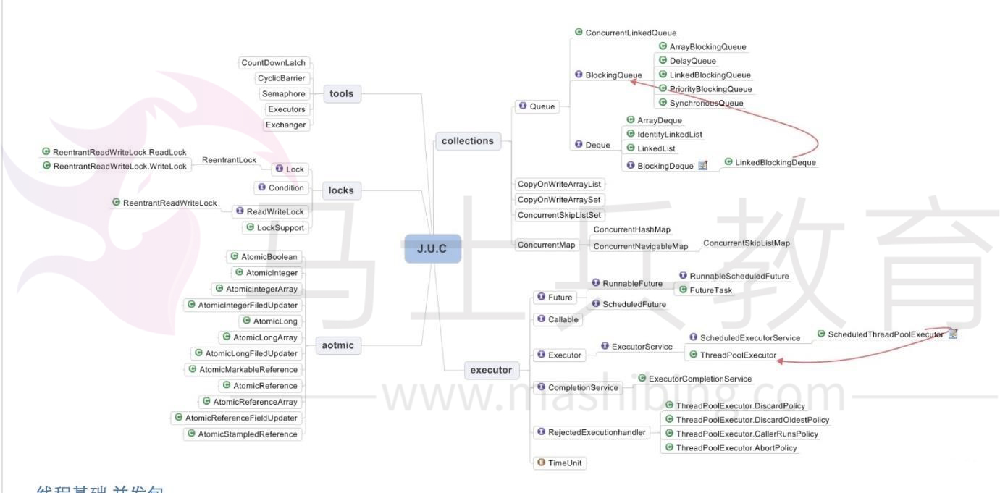

---

ExecutorService、Callable、Future 有返回值线程 
有返回值的任务必须实现 Callable 接口，类似的，无返回值的任务必须 Runnable 接口。执行 Callable 
任务后，可以获取一个 Future 的对象，在该对象上调用 get 就可以获取到 Callable 任务返回的 Object 
了，再结合线程池接口 ExecutorService 就可以实现传说中有返回结果的多线程了。
基于线程池的方式 
线程和数据库连接这些资源都是非常宝贵的资源。那么每次需要的时候创建，不需要的时候销毁，是非
常浪费资源的。那么我们就可以使用缓存的策略，也就是使用线程池。
4种线程池
 
 Java 里面线程池的顶级接口是 Executor，但是严格意义上讲 Executor 并不是一个线程池，而只是一
个执行线程的工具。真正的线程池接口是 ExecutorService。 
//创建一个线程池
ExecutorService pool = Executors.newFixedThreadPool(taskSize);
// 创建多个有返回值的任务
List<Future> list = new ArrayList<Future>();
for (int i = 0; i < taskSize; i++) {
Callable c = new MyCallable(i + " ");
// 执行任务并获取 Future 对象
Future f = pool.submit(c);
list.add(f);
}
// 关闭线程池
pool.shutdown();
// 获取所有并发任务的运行结果
for (Future f : list) {
// 从 Future 对象上获取任务的返回值，并输出到控制台
System.out.println("res：" + f.get().toString());
} 
 // 创建线程池 
        ExecutorService threadPool = Executors.newFixedThreadPool(10);       
        while(true) { 
            threadPool.execute(new Runnable() { // 提交多个线程任务，并执行 
                @Override             
                public void run() { 
                    System.out.println(Thread.currentThread().getName() + " is 
running ..");                  
                    try { 
                        Thread.sleep(3000); 
                    } catch (InterruptedException e) {                         
e.printStackTrace(); 
                    } 
                } 
            }); 
        } 
}

---

newCachedThreadPool
创建一个可根据需要创建新线程的线程池，但是在以前构造的线程可用时将重用它们。对于执行很多短
期异步任务的程序而言，这些线程池通常可提高程序性能。调用 execute 将重用以前构造的线程（如果
线程可用）。如果现有线程没有可用的，则创建一个新线程并添加到池中。终止并从缓存中移除那些已
有 60 秒钟未被使用的线程。因此，长时间保持空闲的线程池不会使用任何资源。
newFixedThreadPool
创建一个可重用固定线程数的线程池，以共享的无界队列方式来运行这些线程。在任意点，在大多数 
nThreads 线程会处于处理任务的活动状态。如果在所有线程处于活动状态时提交附加任务，则在有可
用线程之前，附加任务将在队列中等待。如果在关闭前的执行期间由于失败而导致任何线程终止，那么
一个新线程将代替它执行后续的任务（如果需要）。在某个线程被显式地关闭之前，池中的线程将一直
存在。
newScheduledThreadPool
创建一个线程池，它可安排在给定延迟后运行命令或者定期地执行。

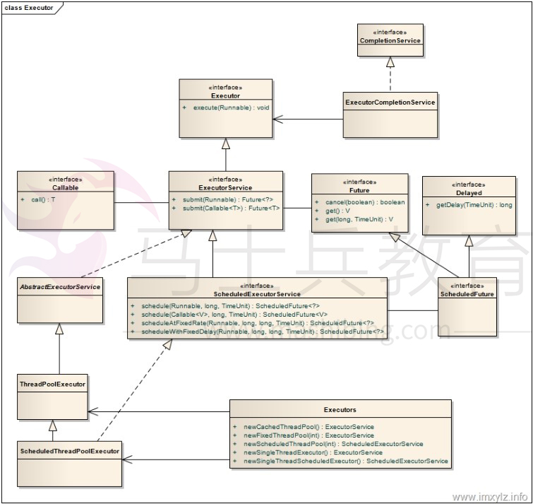

---

newSingleThreadExecutor
Executors.newSingleThreadExecutor()返回一个线程池（这个线程池只有一个线程）,这个线程池可以
在线程死后（或发生异常时）重新启动一个线程来替代原来的线程继续执行下去！
线程生命周期(状态)
 
当线程被创建并启动以后，它既不是一启动就进入了执行状态，也不是一直处于执行状态。在线程的生
命周期中，它要经过新建(New)、就绪（Runnable）、运行（Running）、阻塞(Blocked)和死亡
(Dead)5 种状态。尤其是当线程启动以后，它不可能一直"霸占"着 CPU 独自运行，所以 CPU 需要在多
条线程之间切换，于是线程状态也会多次在运行、阻塞之间切换
 新建状态（NEW）
当程序使用 new 关键字创建了一个线程之后，该线程就处于新建状态，此时仅由 JVM 为其分配内存，
并初始化其成员变量的值
就绪状态（RUNNABLE）：
当线程对象调用了 start()方法之后，该线程处于就绪状态。Java 虚拟机会为其创建方法调用栈和程序计
数器，等待调度运行。
阻塞状态（BLOCKED）：
阻塞状态是指线程因为某种原因放弃了 cpu 使用权，也即让出了 cpu timeslice，暂时停止运行。直到线
程进入可运行(runnable)状态，才有机会再次获得 cpu timeslice 转到运行(running)状
态。阻塞的情况分三种：
等待阻塞（o.wait->等待对列）：
运行(running)的线程执行 o.wait()方法，JVM 会把该线程放入等待队列(waitting queue)中。
同步阻塞(lock->锁池)
运行(running)的线程在获取对象的同步锁时，若该同步锁被别的线程占用，则 JVM 会把该线程放入锁池
(lock pool)中。 
其他阻塞(sleep/join)
运行(running)的线程执行 Thread.sleep(long ms)或 t.join()方法，或者发出了 I/O 请求时，JVM 会把该
线程置为阻塞状态。当 sleep()状态超时、join()等待线程终止或者超时、或者 I/O处理完毕时，线程重新
转入可运行(runnable)状态。
线程死亡（DEAD）
线程会以下面三种方式结束，结束后就是死亡状态。
\ScheduledExecutorService scheduledThreadPool= 
Executors.newScheduledThreadPool(3);
scheduledThreadPool.schedule(newRunnable(){
@Override
public void run() { System.out.println("延迟三秒"); }
}, 3, TimeUnit.SECONDS);
scheduledThreadPool.scheduleAtFixedRate(newRunnable(){
@Override
public void run() {
System.out.println("延迟 1 秒后每三秒执行一次");
}
},1,3,TimeUnit.SECONDS);

---

正常结束
1. run()或 call()方法执行完成，线程正常结束。
异常结束
2. 线程抛出一个未捕获的 Exception 或 Error。 
调用stop
3. 直接调用该线程的 stop()方法来结束该线程—该方法通常容易导致死锁，不推荐使用。
终止线程 4 种方式
 
正常运行结束
程序运行结束，线程自动结束。 
使用退出标志退出线程
一般 run()方法执行完，线程就会正常结束，然而，常常有些线程是伺服线程。它们需要长时间的
运行，只有在外部某些条件满足的情况下，才能关闭这些线程。使用一个变量来控制循环，例如：
最直接的方法就是设一个 boolean 类型的标志，并通过设置这个标志为 true 或 false 来控制 while循环
是否退出，代码示例：
定义了一个退出标志 exit，当 exit 为 true 时，while 循环退出，exit 的默认值为 false.在定义 exit时，
使用了一个 Java 关键字 volatile，这个关键字的目的是使 exit 同步，也就是说在同一时刻只能由一个线
程来修改 exit 的值。
Interrupt 方法结束线程
使用 interrupt()方法来中断线程有两种情况：
1. 线程处于阻塞状态：如使用了 sleep,同步锁的 wait,socket 中的 receiver,accept 等方法时，会使线
程处于阻塞状态。当调用线程的 interrupt()方法时，会抛出 InterruptException 异常。阻塞中的那
个方法抛出这个异常，通过代码捕获该异常，然后 break 跳出循环状态，从而让我们有机会结束这
个线程的执行。通常很多人认为只要调用 interrupt 方法线程就会结束，实际上是错的， 一定要先
捕获 InterruptedException 异常之后通过 break 来跳出循环，才能正常结束 run 方法。
public class ThreadSafe extends Thread {
public volatile boolean exit = false;
public void run() { while (!exit){
//do something
}
}
}

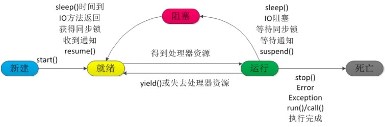

---

2. 线程未处于阻塞状态：使用 isInterrupted()判断线程的中断标志来退出循环。当使用interrupt()方
法时，中断标志就会置 true，和使用自定义的标志来控制循环是一样的道理。
stop 方法终止线程（线程不安全）
程序中可以直接使用 thread.stop()来强行终止线程，但是 stop 方法是很危险的，就象突然关闭计算机
电源，而不是按正常程序关机一样，可能会产生不可预料的结果，不安全主要是：thread.stop()调用之
后，创建子线程的线程就会抛出 ThreadDeatherror 的错误，并且会释放子线程所持有的所有锁。一般
任何进行加锁的代码块，都是为了保护数据的一致性，如果在调用thread.stop()后导致了该线程所持有
的所有锁的突然释放(不可控制)，那么被保护数据就有可能呈现不一致性，其他线程在使用这些被破坏的
数据时，有可能导致一些很奇怪的应用程序错误。因此，并不推荐使用 stop 方法来终止线程。
leep 与 wait 区别
 
1. 对于 sleep()方法，我们首先要知道该方法是属于 Thread 类中的。而 wait()方法，则是属于 Object 
类中的。
2. sleep()方法导致了程序暂停执行指定的时间，让出 cpu 该其他线程，但是他的监控状态依然保持
者，当指定的时间到了又会自动恢复运行状态。 
3. 在调用 sleep()方法的过程中，线程不会释放对象锁。
4. 而当调用 wait()方法的时候，线程会放弃对象锁，进入等待此对象的等待锁定池，只有针对此对象
调用 notify()方法后本线程才进入对象锁定池准备获取对象锁进入运行状态。
start 与 run 区别
 
 
1. start（）方法来启动线程，真正实现了多线程运行。这时无需等待 run 方法体代码执行完毕，可
以直接继续执行下面的代码。
2. 通过调用 Thread 类的 start()方法来启动一个线程， 这时此线程是处于就绪状态， 并没有运行。
3. 方法 run()称为线程体，它包含了要执行的这个线程的内容，线程就进入了运行状态，开始运行 
run 函数当中的代码。 Run 方法运行结束， 此线程终止。然后 CPU 再调度其它线程。
JAVA 后台线程
 
1. 定义：守护线程--也称“服务线程”，他是后台线程，它有一个特性，即为用户线程 提供 公共服务，
在没有用户线程可服务时会自动离开。 
2. 优先级：守护线程的优先级比较低，用于为系统中的其它对象和线程提供服务。 
3. 设置：通过 setDaemon(true)来设置线程为“守护线程”；将一个用户线程设置为守护线程的方式是
在 线程对象创建 之前 用线程对象的 setDaemon 方法。 
4. 在 Daemon 线程中产生的新线程也是 Daemon 的。 
5. 线程则是 JVM 级别的，以 Tomcat 为例，如果你在 Web 应用中启动一个线程，这个线程的生命周
期并不会和 Web 应用程序保持同步。也就是说，即使你停止了 Web 应用，这个线程依旧是活跃
public class ThreadSafe extends Thread {
public void run() {
while (!isInterrupted()){ //非阻塞过程中通过判断中断标志来退出
try{
Thread.sleep(5*1000);//阻塞过程捕获中断异常来退出
}catch(InterruptedException e){
e.printStackTrace();
break;//捕获到异常之后，执行 break 跳出循环
}
}
}
}

---

的。 
6. example: 垃圾回收线程就是一个经典的守护线程，当我们的程序中不再有任何运行的Thread, 程
序就不会再产生垃圾，垃圾回收器也就无事可做，所以当垃圾回收线程是 JVM 上仅剩的线程时，垃
圾回收线程会自动离开。它始终在低级别的状态中运行，用于实时监控和管理系统中的可回收资
源。 
7. 生命周期：守护进程（Daemon）是运行在后台的一种特殊进程。它独立于控制终端并且周期性地
执行某种任务或等待处理某些发生的事件。也就是说守护线程不依赖于终端，但是依赖于系统，与
系统“同生共死”。当 JVM 中所有的线程都是守护线程的时候，JVM 就可以退出了；如果还有一个或
以上的非守护线程则 JVM 不会退出。
JAVA 锁
 
乐观锁
 
乐观锁是一种乐观思想，即认为读多写少，遇到并发写的可能性低，每次去拿数据的时候都认为别人不
会修改，所以不会上锁，但是在更新的时候会判断一下在此期间别人有没有去更新这个数据，采取在写
时先读出当前版本号，然后加锁操作（比较跟上一次的版本号，如果一样则更新），如果失败则要重复
读-比较-写的操作。 
java 中的乐观锁基本都是通过 CAS 操作实现的，CAS 是一种更新的原子操作，比较当前值跟传入值是否
一样，一样则更新，否则失败。 
悲观锁
 
悲观锁是就是悲观思想，即认为写多，遇到并发写的可能性高，每次去拿数据的时候都认为别人会修
改，所以每次在读写数据的时候都会上锁，这样别人想读写这个数据就会block直到拿到锁。 java中的悲
观锁就是Synchronized,AQS框架下的锁则是先尝试cas乐观锁去获取锁，获取不到，才会转换为悲观
锁，如 RetreenLock。 
自旋锁
 
自旋锁原理非常简单，如果持有锁的线程能在很短时间内释放锁资源，那么那些等待竞争锁的线程就不
需要做内核态和用户态之间的切换进入阻塞挂起状态，它们只需要等一等（自旋），等持有锁的线程释
放锁后即可立即获取锁，这样就避免用户线程和内核的切换的消耗。 
线程自旋是需要消耗 cup 的，说白了就是让 cup 在做无用功，如果一直获取不到锁，那线程也不能一直
占用 cup 自旋做无用功，所以需要设定一个自旋等待的最大时间。
如果持有锁的线程执行的时间超过自旋等待的最大时间扔没有释放锁，就会导致其它争用锁的线程在最
大等待时间内还是获取不到锁，这时争用线程会停止自旋进入阻塞状态。
自旋锁的优缺点 
自旋锁尽可能的减少线程的阻塞，这对于锁的竞争不激烈，且占用锁时间非常短的代码块来说性能能大
幅度的提升，因为自旋的消耗会小于线程阻塞挂起再唤醒的操作的消耗，这些操作会导致线程发生两次
上下文切换！
但是如果锁的竞争激烈，或者持有锁的线程需要长时间占用锁执行同步块，这时候就不适合使用自旋锁
了，因为自旋锁在获取锁前一直都是占用 cpu 做无用功，占着 XX 不 XX，同时有大量线程在竞争一个
锁，会导致获取锁的时间很长，线程自旋的消耗大于线程阻塞挂起操作的消耗，其它需要 cup 的线程又
不能获取到 cpu，造成 cpu 的浪费。所以这种情况下我们要关闭自旋锁； 
自旋锁时间阈值（1.6引入了适应性自旋锁） 
自旋锁的目的是为了占着 CPU 的资源不释放，等到获取到锁立即进行处理。但是如何去选择自旋的执行
时间呢？如果自旋执行时间太长，会有大量的线程处于自旋状态占用 CPU 资源，进而会影响整体系统的
性能。因此自旋的周期选的额外重要！

---

JVM 对于自旋周期的选择，jdk1.5 这个限度是一定的写死的，在 1.6 引入了适应性自旋锁，适应性自旋
锁意味着自旋的时间不在是固定的了，而是由前一次在同一个锁上的自旋时间以及锁的拥有者的状态来
决定，基本认为一个线程上下文切换的时间是最佳的一个时间，同时 JVM 还针对当前 CPU 的负荷情况
做了较多的优化，如果平均负载小于 CPUs 则一直自旋，如果有超过(CPUs/2) 个线程正在自旋，则后来
线程直接阻塞，如果正在自旋的线程发现 Owner 发生了变化则延迟自旋时间（自旋计数）或进入阻
塞，如果 CPU 处于节电模式则停止自旋，自旋时间的最坏情况是 CPU 的存储延迟（CPU A 存储了一个
数据，到 CPU B 得知这个数据直接的时间差），自旋时会适当放弃线程优先级之间的差异。 
自旋锁的开启 
JDK1.6 中-XX:+UseSpinning 开启； 
-XX:PreBlockSpin=10 为自旋次数； 
JDK1.7 后，去掉此参数，由 jvm 控制； 
Synchronized 同步锁
 
synchronized 它可以把任意一个非 NULL 的对象当作锁。他属于独占式的悲观锁，同时属于可重入锁。 
Synchronized 作用范围 
1. 作用于方法时，锁住的是对象的实例(this)； 
2. 当作用于静态方法时，锁住的是Class实例，又因为Class的相关数据存储在永久带PermGen
（jdk1.8 则是 metaspace），永久带是全局共享的，因此静态方法锁相当于类的一个全局锁，会锁所有
调用该方法的线程； 
3. synchronized 作用于一个对象实例时，锁住的是所有以该对象为锁的代码块。它有多个队列，
当多个线程一起访问某个对象监视器的时候，对象监视器会将这些线程存储在不同的容器中。 
Synchronized 核心组件 
1)   Wait Set：哪些调用 wait 方法被阻塞的线程被放置在这里； 
2)   Contention List：竞争队列，所有请求锁的线程首先被放在这个竞争队列中； 
3)   Entry List：Contention List 中那些有资格成为候选资源的线程被移动到 Entry List 中； 
4)   OnDeck：任意时刻，最多只有一个线程正在竞争锁资源，该线程被成为 OnDeck； 
5)   Owner：当前已经获取到所资源的线程被称为 Owner； 
6)   !Owner：当前释放锁的线程。
Synchronized 实现

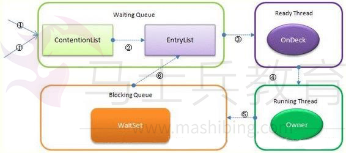

---

1. JVM 每次从队列的尾部取出一个数据用于锁竞争候选者（OnDeck），但是并发情况下，
ContentionList 会被大量的并发线程进行 CAS 访问，为了降低对尾部元素的竞争，JVM 会将一部
分线程移动到 EntryList 中作为候选竞争线程。 
2. Owner 线程会在 unlock 时，将 ContentionList 中的部分线程迁移到 EntryList 中，并指定
EntryList 中的某个线程为 OnDeck 线程（一般是最先进去的那个线程）。 
3. Owner 线程并不直接把锁传递给 OnDeck 线程，而是把锁竞争的权利交给 OnDeck，OnDeck需要
重新竞争锁。这样虽然牺牲了一些公平性，但是能极大的提升系统的吞吐量，在JVM 中，也把这种
选择行为称之为“竞争切换”。 
4. OnDeck 线程获取到锁资源后会变为 Owner 线程，而没有得到锁资源的仍然停留在 EntryList 中。
如果Owner线程被wait方法阻塞，则转移到WaitSet队列中，直到某个时刻通过notify 或者 
notifyAll 唤醒，会重新进去 EntryList 中。 
5. 处于 ContentionList、EntryList、WaitSet 中的线程都处于阻塞状态，该阻塞是由操作系统来完成
的（Linux 内核下采用pthread_mutex_lock 内核函数实现的）。 
6. Synchronized 是非公平锁。 Synchronized 在线程进入 ContentionList 时，等待的线程会先尝试
自旋获取锁，如果获取不到就进入 ContentionList，这明显对于已经进入队列的线程是不公平的，
还有一个不公平的事情就是自旋获取锁的线程还可能直接抢占 OnDeck 线程的锁资源。
7. 每个对象都有个 monitor 对象，加锁就是在竞争 monitor 对象，代码块加锁是在前后分别加上 
monitorenter 和 monitorexit 指令来实现的，方法加锁是通过一个标记位来判断的
8. synchronized 是一个重量级操作，需要调用操作系统相关接口，性能是低效的，有可能给线程加
锁消耗的时间比有用操作消耗的时间更多。 
9. Java1.6，synchronized进行了很多的优化，有适应自旋、锁消除、锁粗化、轻量级锁及偏向锁
等，效率有了本质上的提高。在之后推出的 Java1.7 与 1.8 中，均对该关键字的实现机理做了优
化。引入了偏向锁和轻量级锁。都是在对象头中有标记位，不需要经过操作系统加锁。 
10. 锁可以从偏向锁升级到轻量级锁，再升级到重量级锁。这种升级过程叫做锁膨胀； 
11. JDK 1.6 中默认是开启偏向锁和轻量级锁，可以通过-XX:-UseBiasedLocking 来禁用偏向锁。 
 
 
java 中的锁 -- 偏向锁、轻量级锁、自旋锁、重量级锁
 
 
之前做过一个测试，详情见这篇文章《多线程 +1操作的几种实现方式，及效率对比》，当时对这个测试
结果很疑惑，反复执行过多次，发现结果是一样的:
1. 单线程下synchronized效率最高（当时感觉它的效率应该是最差才对）；
2. AtomicInteger效率最不稳定，不同并发情况下表现不一样：短时间低并发下，效率比
synchronized高，有时甚至比LongAdder还高出一点，但是高并发下，性能还不如
synchronized，不同情况下性能表现很不稳定；
3. LongAdder性能稳定，在各种并发情况下表现都不错，整体表现最好,短时间的低并发下比
AtomicInteger性能差一点，长时间高并发下性能最高（可以让AtomicInteger下台了）；
这篇文章我们就去揭秘，为什么会是这个测试结果！
理解锁的基础知识
 
如果想要透彻的理解java锁的来龙去脉，需要先了解以下基础知识。
基础知识之一：锁的类型
 
锁从宏观上分类，分为悲观锁与乐观锁。
####### 乐观锁

---

状态
标志位
存储内容
未锁定
01
对象哈希码、对象分代年龄
轻量级锁定
00
指向锁记录的指针
膨胀(重量级锁定)
10
执行重量级锁定的指针
GC标记
11
空(不需要记录信息)
可偏向
01
偏向线程ID、偏向时间戳、对象分代年龄
乐观锁是一种乐观思想，即认为读多写少，遇到并发写的可能性低，每次去拿数据的时候都认为别人不
会修改，所以不会上锁，但是在更新的时候会判断一下在此期间别人有没有去更新这个数据，采取在写
时先读出当前版本号，然后加锁操作（比较跟上一次的版本号，如果一样则更新），如果失败则要重复
读-比较-写的操作。
java中的乐观锁基本都是通过CAS操作实现的，CAS是一种更新的原子操作，比较当前值跟传入值是否一
样，一样则更新，否则失败。
####### 悲观锁
悲观锁是就是悲观思想，即认为写多，遇到并发写的可能性高，每次去拿数据的时候都认为别人会修
改，所以每次在读写数据的时候都会上锁，这样别人想读写这个数据就会block直到拿到锁。java中的悲
观锁就是Synchronized,AQS框架下的锁则是先尝试cas乐观锁去获取锁，获取不到，才会转换为悲观
锁，如RetreenLock。
基础知识之二：java线程阻塞的代价
 
java的线程是映射到操作系统原生线程之上的，如果要阻塞或唤醒一个线程就需要操作系统介入，需要
在户态与核心态之间切换，这种切换会消耗大量的系统资源，因为用户态与内核态都有各自专用的内存
空间，专用的寄存器等，用户态切换至内核态需要传递给许多变量、参数给内核，内核也需要保护好用
户态在切换时的一些寄存器值、变量等，以便内核态调用结束后切换回用户态继续工作。
1. 如果线程状态切换是一个高频操作时，这将会消耗很多CPU处理时间；
2. 如果对于那些需要同步的简单的代码块，获取锁挂起操作消耗的时间比用户代码执行的时间还要
长，这种同步策略显然非常糟糕的。
synchronized会导致争用不到锁的线程进入阻塞状态，所以说它是java语言中一个重量级的同步操纵，
被称为重量级锁，为了缓解上述性能问题，JVM从1.5开始，引入了轻量锁与偏向锁，默认启用了自旋
锁，他们都属于乐观锁。
明确java线程切换的代价，是理解java中各种锁的优缺点的基础之一。
基础知识之三：markword
 
在介绍java锁之前，先说下什么是markword，markword是java对象数据结构中的一部分，要详细了解
java对象的结构可以点击这里,这里只做markword的详细介绍，因为对象的markword和java各种类型
的锁密切相关；
markword数据的长度在32位和64位的虚拟机（未开启压缩指针）中分别为32bit和64bit，它的最后
2bit是锁状态标志位，用来标记当前对象的状态，对象的所处的状态，决定了markword存储的内容，
如下表所示:
32位虚拟机在不同状态下markword结构如下图所示：

---

了解了markword结构，有助于后面了解java锁的加锁解锁过程；
小结
 
前面提到了java的4种锁，他们分别是重量级锁、自旋锁、轻量级锁和偏向锁，
不同的锁有不同特点，每种锁只有在其特定的场景下，才会有出色的表现，java中没有哪种锁能够在所
有情况下都能有出色的效率，引入这么多锁的原因就是为了应对不同的情况；
前面讲到了重量级锁是悲观锁的一种，自旋锁、轻量级锁与偏向锁属于乐观锁，所以现在你就能够大致
理解了他们的适用范围，但是具体如何使用这几种锁呢，就要看后面的具体分析他们的特性；
java中的锁
 
自旋锁
 
自旋锁原理非常简单，如果持有锁的线程能在很短时间内释放锁资源，那么那些等待竞争锁的线程就不
需要做内核态和用户态之间的切换进入阻塞挂起状态，它们只需要等一等（自旋），等持有锁的线程释
放锁后即可立即获取锁，这样就避免用户线程和内核的切换的消耗。
但是线程自旋是需要消耗cup的，说白了就是让cup在做无用功，如果一直获取不到锁，那线程也不能一
直占用cup自旋做无用功，所以需要设定一个自旋等待的最大时间。
如果持有锁的线程执行的时间超过自旋等待的最大时间扔没有释放锁，就会导致其它争用锁的线程在最
大等待时间内还是获取不到锁，这时争用线程会停止自旋进入阻塞状态。
####### 自旋锁的优缺点
自旋锁尽可能的减少线程的阻塞，这对于锁的竞争不激烈，且占用锁时间非常短的代码块来说性能能大
幅度的提升，因为自旋的消耗会小于线程阻塞挂起再唤醒的操作的消耗，这些操作会导致线程发生两次
上下文切换！
但是如果锁的竞争激烈，或者持有锁的线程需要长时间占用锁执行同步块，这时候就不适合使用自旋锁
了，因为自旋锁在获取锁前一直都是占用cpu做无用功，占着XX不XX，同时有大量线程在竞争一个锁，
会导致获取锁的时间很长，线程自旋的消耗大于线程阻塞挂起操作的消耗，其它需要cup的线程又不能
获取到cpu，造成cpu的浪费。所以这种情况下我们要关闭自旋锁；
####### 自旋锁时间阈值
自旋锁的目的是为了占着CPU的资源不释放，等到获取到锁立即进行处理。但是如何去选择自旋的执行
时间呢？如果自旋执行时间太长，会有大量的线程处于自旋状态占用CPU资源，进而会影响整体系统的
性能。因此自旋的周期选的额外重要！
JVM对于自旋周期的选择，jdk1.5这个限度是一定的写死的，在1.6引入了适应性自旋锁，适应性自旋锁
意味着自旋的时间不在是固定的了，而是由前一次在同一个锁上的自旋时间以及锁的拥有者的状态来决
定，基本认为一个线程上下文切换的时间是最佳的一个时间，同时JVM还针对当前CPU的负荷情况做了
较多的优化
1. 如果平均负载小于CPUs则一直自旋

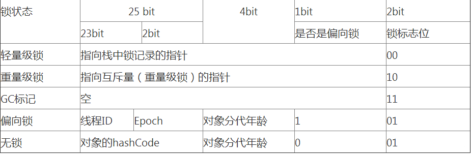

---

2. 如果有超过(CPUs/2)个线程正在自旋，则后来线程直接阻塞
3. 如果正在自旋的线程发现Owner发生了变化则延迟自旋时间（自旋计数）或进入阻塞
4. 如果CPU处于节电模式则停止自旋
5. 自旋时间的最坏情况是CPU的存储延迟（CPU A存储了一个数据，到CPU B得知这个数据直接的时
间差）
6. 自旋时会适当放弃线程优先级之间的差异
####### 自旋锁的开启
JDK1.6中-XX:+UseSpinning开启；
-XX:PreBlockSpin=10 为自旋次数；
JDK1.7后，去掉此参数，由jvm控制；
重量级锁Synchronized
 
####### Synchronized的作用
在JDK1.5之前都是使用synchronized关键字保证同步的，Synchronized的作用相信大家都已经非常熟悉
了；
它可以把任意一个非NULL的对象当作锁。
1. 作用于方法时，锁住的是对象的实例(this)；
2. 当作用于静态方法时，锁住的是Class实例，又因为Class的相关数据存储在永久带
PermGen（jdk1.8则是metaspace），永久带是全局共享的，因此静态方法锁相当于类的一个全局
锁，会锁所有调用该方法的线程；
3. synchronized作用于一个对象实例时，锁住的是所有以该对象为锁的代码块。
####### Synchronized的实现
 
它有多个队列，当多个线程一起访问某个对象监视器的时候，对象监视器会将这些线程存储在不同的容
器中。
1. Contention List：竞争队列，所有请求锁的线程首先被放在这个竞争队列中；
2. Entry List：Contention List中那些有资格成为候选资源的线程被移动到Entry List中；
3. Wait Set：哪些调用wait方法被阻塞的线程被放置在这里；
4. OnDeck：任意时刻，最多只有一个线程正在竞争锁资源，该线程被成为OnDeck；
5. Owner：当前已经获取到所资源的线程被称为Owner；
6. !Owner：当前释放锁的线程。
JVM每次从队列的尾部取出一个数据用于锁竞争候选者（OnDeck），但是并发情况下，ContentionList
会被大量的并发线程进行CAS访问，为了降低对尾部元素的竞争，JVM会将一部分线程移动到EntryList中
作为候选竞争线程。Owner线程会在unlock时，将ContentionList中的部分线程迁移到EntryList中，并
指定EntryList中的某个线程为OnDeck线程（一般是最先进去的那个线程）。Owner线程并不直接把锁
传递给OnDeck线程，而是把锁竞争的权利交给OnDeck，OnDeck需要重新竞争锁。这样虽然牺牲了一
些公平性，但是能极大的提升系统的吞吐量，在JVM中，也把这种选择行为称之为“竞争切换”。
OnDeck线程获取到锁资源后会变为Owner线程，而没有得到锁资源的仍然停留在EntryList中。如果
Owner线程被wait方法阻塞，则转移到WaitSet队列中，直到某个时刻通过notify或者notifyAll唤醒，会
重新进去EntryList中。
处于ContentionList、EntryList、WaitSet中的线程都处于阻塞状态，该阻塞是由操作系统来完成的
（Linux内核下采用pthread_mutex_lock内核函数实现的）。
Synchronized是非公平锁。 Synchronized在线程进入ContentionList时，等待的线程会先尝试自旋获
取锁，如果获取不到就进入ContentionList，这明显对于已经进入队列的线程是不公平的，还有一个不
公平的事情就是自旋获取锁的线程还可能直接抢占OnDeck线程的锁资源。

---

偏向锁
 
Java偏向锁(Biased Locking)是Java6引入的一项多线程优化。
偏向锁，顾名思义，它会偏向于第一个访问锁的线程，如果在运行过程中，同步锁只有一个线程访问，
不存在多线程争用的情况，则线程是不需要触发同步的，这种情况下，就会给线程加一个偏向锁。
如果在运行过程中，遇到了其他线程抢占锁，则持有偏向锁的线程会被挂起，JVM会消除它身上的偏向
锁，将锁恢复到标准的轻量级锁。
它通过消除资源无竞争情况下的同步原语，进一步提高了程序的运行性能。
####### 偏向锁的实现
######## 偏向锁获取过程：
1. 访问Mark Word中偏向锁的标识是否设置成1，锁标志位是否为01，确认为可偏向状态。
2. 如果为可偏向状态，则测试线程ID是否指向当前线程，如果是，进入步骤5，否则进入步骤3。
3. 如果线程ID并未指向当前线程，则通过CAS操作竞争锁。如果竞争成功，则将Mark Word中线程ID
设置为当前线程ID，然后执行5；如果竞争失败，执行4。
4. 如果CAS获取偏向锁失败，则表示有竞争。当到达全局安全点（safepoint）时获得偏向锁的线程被
挂起，偏向锁升级为轻量级锁，然后被阻塞在安全点的线程继续往下执行同步代码。（撤销偏向锁
的时候会导致stop the word）
5. 执行同步代码。
注意：第四步中到达安全点safepoint会导致stop the word，时间很短。
######## 偏向锁的释放：
偏向锁的撤销在上述第四步骤中有提到。偏向锁只有遇到其他线程尝试竞争偏向锁时，持有偏向锁的线
程才会释放锁，线程不会主动去释放偏向锁。偏向锁的撤销，需要等待全局安全点（在这个时间点上没
有字节码正在执行），它会首先暂停拥有偏向锁的线程，判断锁对象是否处于被锁定状态，撤销偏向锁
后恢复到未锁定（标志位为“01”）或轻量级锁（标志位为“00”）的状态。
####### 偏向锁的适用场景
始终只有一个线程在执行同步块，在它没有执行完释放锁之前，没有其它线程去执行同步块，在锁无竞
争的情况下使用，一旦有了竞争就升级为轻量级锁，升级为轻量级锁的时候需要撤销偏向锁，撤销偏向
锁的时候会导致stop the word操作；
在有锁的竞争时，偏向锁会多做很多额外操作，尤其是撤销偏向所的时候会导致进入安全点，安全点会
导致stw，导致性能下降，这种情况下应当禁用；
######## 查看停顿–安全点停顿日志
要查看安全点停顿，可以打开安全点日志，通过设置JVM参数 -XX:+PrintGCApplicationStoppedTime 会
打出系统停止的时间，添加-XX:+PrintSafepointStatistics -XX:PrintSafepointStatisticsCount=1 这两个
参数会打印出详细信息，可以查看到使用偏向锁导致的停顿，时间非常短暂，但是争用严重的情况下，
停顿次数也会非常多；
注意：安全点日志不能一直打开：
1. 安全点日志默认输出到stdout，一是stdout日志的整洁性，二是stdout所重定向的文件如果不
在/dev/shm，可能被锁。
2. 对于一些很短的停顿，比如取消偏向锁，打印的消耗比停顿本身还大。
3. 安全点日志是在安全点内打印的，本身加大了安全点的停顿时间。
所以安全日志应该只在问题排查时打开。
如果在生产系统上要打开，再再增加下面四个参数：
-XX:+UnlockDiagnosticVMOptions -XX: -DisplayVMOutput -XX:+LogVMOutput -
XX:LogFile=/dev/shm/vm.log

---

打开Diagnostic（只是开放了更多的flag可选，不会主动激活某个flag），关掉输出VM日志到stdout，
输出到独立文件,/dev/shm目录（内存文件系统）。
此日志分三部分：
第一部分是时间戳，VM Operation的类型
第二部分是线程概况，被中括号括起来
total: 安全点里的总线程数
initially_running: 安全点开始时正在运行状态的线程数
wait_to_block: 在VM Operation开始前需要等待其暂停的线程数
第三部分是到达安全点时的各个阶段以及执行操作所花的时间，其中最重要的是vmop
spin: 等待线程响应safepoint号召的时间；
block: 暂停所有线程所用的时间；
sync: 等于 spin+block，这是从开始到进入安全点所耗的时间，可用于判断进入安全点耗时；
cleanup: 清理所用时间；
vmop: 真正执行VM Operation的时间。
可见，那些很多但又很短的安全点，全都是RevokeBias， 高并发的应用会禁用掉偏向锁。
####### jvm开启/关闭偏向锁
开启偏向锁：-XX:+UseBiasedLocking -XX:BiasedLockingStartupDelay=0
关闭偏向锁：-XX:-UseBiasedLocking
轻量级锁
 
轻量级锁是由偏向所升级来的，偏向锁运行在一个线程进入同步块的情况下，当第二个线程加入锁争用
的时候，偏向锁就会升级为轻量级锁；
轻量级锁的加锁过程：
1. 在代码进入同步块的时候，如果同步对象锁状态为无锁状态（锁标志位为“01”状态，是否为偏向锁
为“0”），虚拟机首先将在当前线程的栈帧中建立一个名为锁记录（Lock Record）的空间，用于存
储锁对象目前的Mark Word的拷贝，官方称之为 Displaced Mark Word。这时候线程堆栈与对象
头的状态如图：
2. 拷贝对象头中的Mark Word复制到锁记录中；

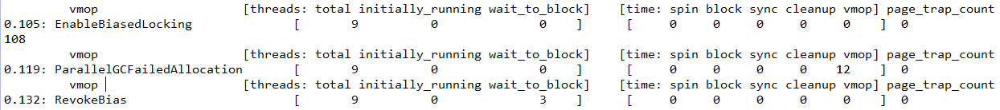

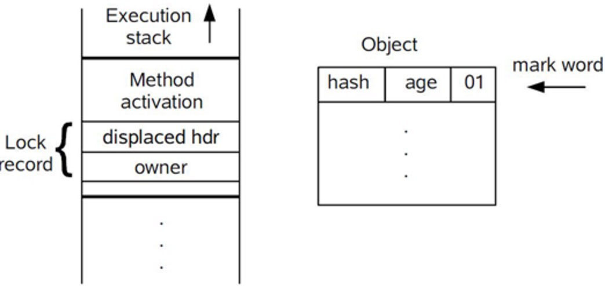

---

3. 拷贝成功后，虚拟机将使用CAS操作尝试将对象的Mark Word更新为指向Lock Record的指针，并
将Lock record里的owner指针指向object mark word。如果更新成功，则执行步骤4，否则执行步
骤5。
4. 如果这个更新动作成功了，那么这个线程就拥有了该对象的锁，并且对象Mark Word的锁标志位设
置为“00”，即表示此对象处于轻量级锁定状态，这时候线程堆栈与对象头的状态如图所示。
5. 如果这个更新操作失败了，虚拟机首先会检查对象的Mark Word是否指向当前线程的栈帧，如果是
就说明当前线程已经拥有了这个对象的锁，那就可以直接进入同步块继续执行。否则说明多个线程
竞争锁，轻量级锁就要膨胀为重量级锁，锁标志的状态值变为“10”，Mark Word中存储的就是指向
重量级锁（互斥量）的指针，后面等待锁的线程也要进入阻塞状态。 而当前线程便尝试使用自旋来
获取锁，自旋就是为了不让线程阻塞，而采用循环去获取锁的过程。
####### 轻量级锁的释放
释放锁线程视角：由轻量锁切换到重量锁，是发生在轻量锁释放锁的期间，之前在获取锁的时候它拷贝
了锁对象头的markword，在释放锁的时候如果它发现在它持有锁的期间有其他线程来尝试获取锁了，
并且该线程对markword做了修改，两者比对发现不一致，则切换到重量锁。
因为重量级锁被修改了，所有display mark word和原来的markword不一样了。
怎么补救，就是进入mutex前，compare一下obj的markword状态。确认该markword是否被其他线程
持有。
此时如果线程已经释放了markword，那么通过CAS后就可以直接进入线程，无需进入mutex，就这个作
用。
尝试获取锁线程视角：如果线程尝试获取锁的时候，轻量锁正被其他线程占有，那么它就会修改
markword，修改重量级锁，表示该进入重量锁了。
还有一个注意点：等待轻量锁的线程不会阻塞，它会一直自旋等待锁，并如上所说修改markword。
这就是自旋锁，尝试获取锁的线程，在没有获得锁的时候，不被挂起，而转而去执行一个空循环，即自
旋。在若干个自旋后，如果还没有获得锁，则才被挂起，获得锁，则执行代码。

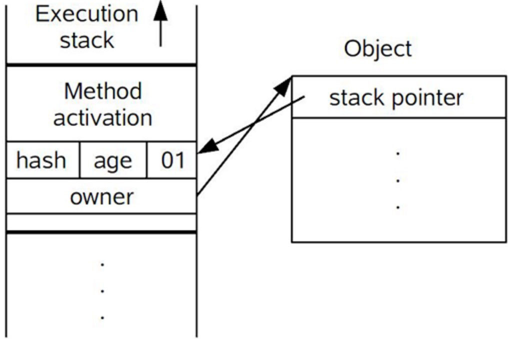

---

总结
 
synchronized的执行过程：
1. 检测Mark Word里面是不是当前线程的ID，如果是，表示当前线程处于偏向锁
2. 如果不是，则使用CAS将当前线程的ID替换Mard Word，如果成功则表示当前线程获得偏向锁，置
偏向标志位1
3. 如果失败，则说明发生竞争，撤销偏向锁，进而升级为轻量级锁。
4. 当前线程使用CAS将对象头的Mark Word替换为锁记录指针，如果成功，当前线程获得锁
5. 如果失败，表示其他线程竞争锁，当前线程便尝试使用自旋来获取锁。
6. 如果自旋成功则依然处于轻量级状态。
7. 如果自旋失败，则升级为重量级锁。
上面几种锁都是JVM自己内部实现，当我们执行synchronized同步块的时候jvm会根据启用的锁和当前
线程的争用情况，决定如何执行同步操作；
在所有的锁都启用的情况下线程进入临界区时会先去获取偏向锁，如果已经存在偏向锁了，则会尝试获
取轻量级锁，启用自旋锁，如果自旋也没有获取到锁，则使用重量级锁，没有获取到锁的线程阻塞挂
起，直到持有锁的线程执行完同步块唤醒他们；
偏向锁是在无锁争用的情况下使用的，也就是同步开在当前线程没有执行完之前，没有其它线程会执行
该同步块，一旦有了第二个线程的争用，偏向锁就会升级为轻量级锁，如果轻量级锁自旋到达阈值后，
没有获取到锁，就会升级为重量级锁；
如果线程争用激烈，那么应该禁用偏向锁。
锁优化
 
以上介绍的锁不是我们代码中能够控制的，但是借鉴上面的思想，我们可以优化我们自己线程的加锁操
作；
减少锁的时间
 
不需要同步执行的代码，能不放在同步快里面执行就不要放在同步快内，可以让锁尽快释放；
减少锁的粒度
 
它的思想是将物理上的一个锁，拆成逻辑上的多个锁，增加并行度，从而降低锁竞争。它的思想也是用
空间来换时间；
java中很多数据结构都是采用这种方法提高并发操作的效率：

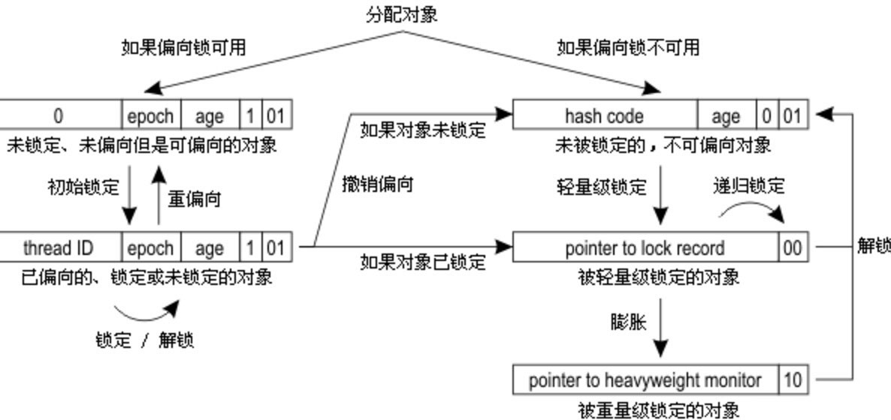

---

ConcurrentHashMap
 
java中的ConcurrentHashMap在jdk1.8之前的版本，使用一个Segment 数组
Segment继承自ReenTrantLock，所以每个Segment就是个可重入锁，每个Segment 有一个
HashEntry< K,V >数组用来存放数据，put操作时，先确定往哪个Segment放数据，只需要锁定这个
Segment，执行put，其它的Segment不会被锁定；所以数组中有多少个Segment就允许同一时刻多少
个线程存放数据，这样增加了并发能力。
LongAdder
 
LongAdder 实现思路也类似ConcurrentHashMap，LongAdder有一个根据当前并发状况动态改变的
Cell数组，Cell对象里面有一个long类型的value用来存储值;
开始没有并发争用的时候或者是cells数组正在初始化的时候，会使用cas来将值累加到成员变量的base
上，在并发争用的情况下，LongAdder会初始化cells数组，在Cell数组中选定一个Cell加锁，数组有多少
个cell，就允许同时有多少线程进行修改，最后将数组中每个Cell中的value相加，在加上base的值，就
是最终的值；cell数组还能根据当前线程争用情况进行扩容，初始长度为2，每次扩容会增长一倍，直到
扩容到大于等于cpu数量就不再扩容，这也就是为什么LongAdder比cas和AtomicInteger效率要高的原
因，后面两者都是volatile+cas实现的，他们的竞争维度是1，LongAdder的竞争维度为“Cell个数+1”为
什么要+1？因为它还有一个base，如果竞争不到锁还会尝试将数值加到base上；
LinkedBlockingQueue
 
LinkedBlockingQueue也体现了这样的思想，在队列头入队，在队列尾出队，入队和出队使用不同的
锁，相对于LinkedBlockingArray只有一个锁效率要高；
拆锁的粒度不能无限拆，最多可以将一个锁拆为当前cup数量个锁即可；
锁粗化
 
大部分情况下我们是要让锁的粒度最小化，锁的粗化则是要增大锁的粒度;
在以下场景下需要粗化锁的粒度：
假如有一个循环，循环内的操作需要加锁，我们应该把锁放到循环外面，否则每次进出循环，都进出一
次临界区，效率是非常差的；
使用读写锁
 
ReentrantReadWriteLock 是一个读写锁，读操作加读锁，可以并发读，写操作使用写锁，只能单线程
写；
读写分离
 
CopyOnWriteArrayList 、CopyOnWriteArraySet
CopyOnWrite容器即写时复制的容器。通俗的理解是当我们往一个容器添加元素的时候，不直接往当前
容器添加，而是先将当前容器进行Copy，复制出一个新的容器，然后新的容器里添加元素，添加完元素
之后，再将原容器的引用指向新的容器。这样做的好处是我们可以对CopyOnWrite容器进行并发的读，
而不需要加锁，因为当前容器不会添加任何元素。所以CopyOnWrite容器也是一种读写分离的思想，读
和写不同的容器。
 CopyOnWrite并发容器用于读多写少的并发场景，因为，读的时候没有锁，但是对其进行更改的时候
是会加锁的，否则会导致多个线程同时复制出多个副本，各自修改各自的；
Segment< K,V >[] segments1

---

使用cas
 
如果需要同步的操作执行速度非常快，并且线程竞争并不激烈，这时候使用cas效率会更高，因为加锁会
导致线程的上下文切换，如果上下文切换的耗时比同步操作本身更耗时，且线程对资源的竞争不激烈，
使用volatiled+cas操作会是非常高效的选择；
消除缓存行的伪共享
 
除了我们在代码中使用的同步锁和jvm自己内置的同步锁外，还有一种隐藏的锁就是缓存行，它也被称
为性能杀手。
在多核cup的处理器中，每个cup都有自己独占的一级缓存、二级缓存，甚至还有一个共享的三级缓存，
为了提高性能，cpu读写数据是以缓存行为最小单元读写的；32位的cpu缓存行为32字节，64位cup的缓
存行为64字节，这就导致了一些问题。
例如，多个不需要同步的变量因为存储在连续的32字节或64字节里面，当需要其中的一个变量时，就将
它们作为一个缓存行一起加载到某个cup-1私有的缓存中（虽然只需要一个变量，但是cpu读取会以缓存
行为最小单位，将其相邻的变量一起读入），被读入cpu缓存的变量相当于是对主内存变量的一个拷
贝，也相当于变相的将在同一个缓存行中的几个变量加了一把锁，这个缓存行中任何一个变量发生了变
化，当cup-2需要读取这个缓存行时，就需要先将cup-1中被改变了的整个缓存行更新回主存（即使其它
变量没有更改），然后cup-2才能够读取，而cup-2可能需要更改这个缓存行的变量与cpu-1已经更改的
缓存行中的变量是不一样的，所以这相当于给几个毫不相关的变量加了一把同步锁；
为了防止伪共享，不同jdk版本实现方式是不一样的：
1. 在jdk1.7之前会 将需要独占缓存行的变量前后添加一组long类型的变量，依靠这些无意义的数组的
填充做到一个变量自己独占一个缓存行；
2. 在jdk1.7因为jvm会将这些没有用到的变量优化掉，所以采用继承一个声明了好多long变量的类的
方式来实现；
3. 在jdk1.8中通过添加sun.misc.Contended注解来解决这个问题，若要使该注解有效必须在jvm中添
加以下参数：
-XX:-RestrictContended
sun.misc.Contended注解会在变量前面添加128字节的padding将当前变量与其他变量进行隔离；
关于什么是缓存行，jdk是如何避免缓存行的，网上有非常多的解释，在这里就不再深入讲解了；
 
 
 
 
 
ReentrantLock
 
 ReentantLock 继承接口 Lock 并实现了接口中定义的方法，他是一种可重入锁，除了能完成 
synchronized 所能完成的所有工作外，还提供了诸如可响应中断锁、可轮询锁请求、定时锁等避免多线
程死锁的方法。 
Lock接口的主要方法 
1. void lock(): 执行此方法时, 如果锁处于空闲状态, 当前线程将获取到锁. 相反, 如果锁已经被其他线程
持有, 将禁用当前线程, 直到当前线程获取到锁. 
2. boolean tryLock()：如果锁可用, 则获取锁, 并立即返回 true, 否则返回 false. 该方法和 lock()的区
别在于, tryLock()只是"试图"获取锁, 如果锁不可用, 不会导致当前线程被禁用, 当前线程仍然继续往
下执行代码. 而 lock()方法则是一定要获取到锁, 如果锁不可用, 就一直等待, 在未获得锁之前,当前线
程并不继续向下执行.

---

3. void unlock()：执行此方法时, 当前线程将释放持有的锁. 锁只能由持有者释放, 如果线程并不持有
锁, 却执行该方法, 可能导致异常的发生.
4. Condition newCondition()：条件对象，获取等待通知组件。该组件和当前的锁绑定，
当前线程只有获取了锁，才能调用该组件的 await()方法，而调用后，当前线程将缩放锁。
5. getHoldCount() ：查询当前线程保持此锁的次数，也就是执行此线程执行lock方法的次数。 
6. getQueueLength（）：返回正等待获取此锁的线程估计数，比如启动 10 个线程，1 个线程获得
锁，此时返回的是 9 
7. getWaitQueueLength：（Condition condition）返回等待与此锁相关的给定条件的线程估计数。
比如 10 个线程，用同一个 condition 对象，并且此时这 10 个线程都执行了 condition 对象的 
await 方法，那么此时执行此方法返回 10 
8. hasWaiters(Condition condition)：查询是否有线程等待与此锁有关的给定条件
(condition)，对于指定 contidion 对象，有多少线程执行了 condition.await 方法 
9. hasQueuedThread(Thread thread)：查询给定线程是否等待获取此锁 
10. hasQueuedThreads()：是否有线程等待此锁
11. isFair()：该锁是否公平锁
12. isHeldByCurrentThread()： 当前线程是否保持锁锁定，线程的执行 lock 方法的前后分别是 false 
和 true 
13. isLock()：此锁是否有任意线程占用
14. lockInterruptibly（）：如果当前线程未被中断，获取锁
15. tryLock（）：尝试获得锁，仅在调用时锁未被线程占用，获得锁
16. tryLock(long timeout TimeUnit unit)：如果锁在给定等待时间内没有被另一个线程保持，则获取
该锁。 
非公平锁 
JVM 按随机、就近原则分配锁的机制则称为不公平锁，ReentrantLock 在构造函数中提供了是否公平锁
的初始化方式，默认为非公平锁。非公平锁实际执行的效率要远远超出公平锁，除非程序有特殊需要，
否则最常用非公平锁的分配机制。
公平锁 
公平锁指的是锁的分配机制是公平的，通常先对锁提出获取请求的线程会先被分配到锁，
ReentrantLock 在构造函数中提供了是否公平锁的初始化方式来定义公平锁。 
ReentrantLock 与synchronized
 
1. ReentrantLock 通过方法 lock()与 unlock()来进行加锁与解锁操作，与 synchronized 会被 JVM 自
动解锁机制不同，ReentrantLock 加锁后需要手动进行解锁。为了避免程序出现异常而无法正常解
锁的情况，使用 ReentrantLock 必须在 finally 控制块中进行解锁操作。
2. ReentrantLock 相比 synchronized 的优势是可中断、公平锁、多个锁。这种情况下需要使用 
ReentrantLock。 
ReentrantLock 实现
 public class MyService {             private Lock lock = new ReentrantLock(); 
    //Lock lock=new ReentrantLock(true);//公平锁 
            //Lock lock=new ReentrantLock(false);//非公平锁            private 
Condition condition=lock.newCondition();//创建 Condition     public void 
testMethod() { 
             try { 
               lock.lock();//lock 加锁 
     //1：wait 方法等待： 
            //System.out.println("开始 wait");             condition.await();

---

Condition 类和Object 类锁方法区别区别
 
1. Condition 类的 awiat 方法和 Object 类的 wait 方法等效 
2. Condition 类的 signal 方法和 Object 类的 notify 方法等效 
3. Condition 类的 signalAll 方法和 Object 类的 notifyAll 方法等效 
4. ReentrantLock 类可以唤醒指定条件的线程，而 object 的唤醒是随机的 
tryLock和lock和lockInterruptibly 的区别
 
1. tryLock 能获得锁就返回 true，不能就立即返回 false，tryLock(long timeout,TimeUnit unit)，可
以增加时间限制，如果超过该时间段还没获得锁，返回 false 
2. lock 能获得锁就返回 true，不能的话一直等待获得锁 
3. lock 和 lockInterruptibly，如果两个线程分别执行这两个方法，但此时中断这两个线程， lock 不
会抛出异常，而 lockInterruptibly 会抛出异常。 
Semaphore 信号量
 
 Semaphore 是一种基于计数的信号量。它可以设定一个阈值，基于此，多个线程竞争获取许可信号，
做完自己的申请后归还，超过阈值后，线程申请许可信号将会被阻塞。Semaphore 可以用来构建一些
对象池，资源池之类的，比如数据库连接池实现互斥锁（计数器为1） 
我们也可以创建计数为 1 的 Semaphore，将其作为一种类似互斥锁的机制，这也叫二元信号量，表示
两种互斥状态。 
代码实现它的用法如下：
//通过创建 Condition 对象来使线程 wait，必须先执行 lock.lock 方法获得锁 
    //:2：signal 方法唤醒 
    condition.signal();//condition 对象的 signal 方法可以唤醒 wait 线程 
            for (int i = 0; i < 5; i++) { 
 System.out.println("ThreadName=" + Thread.currentThread().getName()+ (" " + (i + 
1))); 
            } 
        } catch (InterruptedException e) { 
             e.printStackTrace(); 
        }         
        finally 
        {         
        lock.unlock(); 
        } 
    } 
} 
    // 创建一个计数阈值为 5 的信号量对象 
        // 只能 5 个线程同时访问 
        Semaphore semp = new Semaphore(5); 
        try {   // 申请许可             semp.acquire(); 
            try { 
                // 业务逻辑 
            } catch (Exception e) { 
            } finally { 
                // 释放许可 
                semp.release(); 
            } 
        } catch (InterruptedException e) { 
        }

---

Semaphore 与ReentrantLock 
Semaphore 基本能完成 ReentrantLock 的所有工作，使用方法也与之类似，通过 acquire()与 release()
方法来获得和释放临界资源。经实测，Semaphone.acquire()方法默认为可响应中断锁，与 
ReentrantLock.lockInterruptibly()作用效果一致，也就是说在等待临界资源的过程中可以被
Thread.interrupt()方法中断。
此外，Semaphore 也实现了可轮询的锁请求与定时锁的功能，除了方法名 tryAcquire 与 tryLock 不
同，其使用方法与ReentrantLock几乎一致。Semaphore也提供了公平与非公平锁的机制，也可在构造
函数中进行设定。
Semaphore的锁释放操作也由手动进行，因此与ReentrantLock 一样，为避免线程因抛出异常而无法正
常释放锁的情况发生，释放锁的操作也必须在 finally 代码块中完成。 
AtomicInteger
 
首先说明，此处 AtomicInteger，一个提供原子操作的 Integer 的类，常见的还有AtomicBoolean、
AtomicInteger、AtomicLong、AtomicReference 等，他们的实现原理相同，区别在与运算对象类型的
不同。令人兴奋地，还可以通过 AtomicReference将一个对象的所有操作转化成原子操作。 
我们知道，在多线程程序中，诸如++i 或 i++等运算不具有原子性，是不安全的线程操作之一。通常我们
会使用 synchronized 将该操作变成一个原子操作，但 JVM 为此类操作特意提供了一些同步类，使得使
用更方便，且使程序运行效率变得更高。通过相关资料显示，通常AtomicInteger 的性能是 
ReentantLock 的好几倍。 
可重入锁（递归锁）
 
这里面讲的是广义上的可重入锁，而不是单指JAVA 下的ReentrantLock。可重入锁，也叫做递归锁，指
的是同一线程 外层函数获得锁之后 ，内层递归函数仍然有获取该锁的代码，但不受影响。在 JAVA 环境
下 ReentrantLock 和 synchronized 都是 可重入锁。 
公平锁与非公平锁
 
公平锁（Fair） 
加锁前检查是否有排队等待的线程，优先排队等待的线程，先来先得 
非公平锁（Nonfair） 
加锁时不考虑排队等待问题，直接尝试获取锁，获取不到自动到队尾等待 
1. 非公平锁性能比公平锁高 5~10 倍，因为公平锁需要在多核的情况下维护一个队列 
2. Java 中的 synchronized 是非公平锁，ReentrantLock 默认的 lock()方法采用的是非公平锁。 
ReadWriteLock 读写锁
 
为了提高性能，Java 提供了读写锁，在读的地方使用读锁，在写的地方使用写锁，灵活控制，如果没有
写锁的情况下，读是无阻塞的,在一定程度上提高了程序的执行效率。读写锁分为读锁和写锁，多个读锁
不互斥，读锁与写锁互斥，这是由 jvm 自己控制的，你只要上好相应的锁即可。 
读锁 
如果你的代码只读数据，可以很多人同时读，但不能同时写，那就上读锁 
写锁 
如果你的代码修改数据，只能有一个人在写，且不能同时读取，那就上写锁。总之，读的时候上读锁，
写的时候上写锁！

---

Java 中 读 写 锁 有 个 接 口 java.util.concurrent.locks.ReadWriteLock ， 也 有 具 体 的 实 现
ReentrantReadWriteLock。 
共享锁和独占锁 java
 
并发包提供的加锁模式分为独占锁和共享锁。
独占锁 
独占锁模式下，每次只能有一个线程能持有锁，ReentrantLock 就是以独占方式实现的互斥锁。独占锁
是一种悲观保守的加锁策略，它避免了读/读冲突，如果某个只读线程获取锁，则其他读线程都只能等
待，这种情况下就限制了不必要的并发性，因为读操作并不会影响数据的一致性。
共享锁 
共享锁则允许多个线程同时获取锁，并发访问 共享资源，如：ReadWriteLock。共享锁则是一种乐观
锁，它放宽了加锁策略，允许多个执行读操作的线程同时访问共享资源。
1. AQS 的内部类 Node 定义了两个常量 SHARED 和 EXCLUSIVE，他们分别标识 AQS 队列中等待线
程的锁获取模式。 
2. java 的并发包中提供了 ReadWriteLock，读-写锁。它允许一个资源可以被多个读操作访问，或者
被一个 写操作访问，但两者不能同时进行。 
重量级锁（Mutex Lock）
 
Synchronized 是通过对象内部的一个叫做监视器锁（monitor）来实现的。但是监视器锁本质又是依赖
于底层的操作系统的 Mutex Lock 来实现的。而操作系统实现线程之间的切换这就需要从用户态转换到
核心态，这个成本非常高，状态之间的转换需要相对比较长的时间，这就是为什么 Synchronized 效率
低的原因。因此，这种依赖于操作系统 Mutex Lock 所实现的锁我们称之为
“重量级锁”。JDK 中对 Synchronized 做的种种优化，其核心都是为了减少这种重量级锁的使用。
JDK1.6 以后，为了减少获得锁和释放锁所带来的性能消耗，提高性能，引入了“轻量级锁”和
“偏向锁”。 
轻量级锁
 
锁的状态总共有四种：无锁状态、偏向锁、轻量级锁和重量级锁。 
锁升级 
随着锁的竞争，锁可以从偏向锁升级到轻量级锁，再升级的重量级锁（但是锁的升级是单向的，也就是
说只能从低到高升级，不会出现锁的降级）。
“轻量级”是相对于使用操作系统互斥量来实现的传统锁而言的。但是，首先需要强调一点的是，轻量级
锁并不是用来代替重量级锁的，它的本意是在没有多线程竞争的前提下，减少传统的重量级锁使用产生
的性能消耗。在解释轻量级锁的执行过程之前，先明白一点，轻量级锁所适应的场景是线程交替执行同
步块的情况，如果存在同一时间访问同一锁的情况，就会导致轻量级锁膨胀为重量级锁。 
偏向锁
 
Hotspot 的作者经过以往的研究发现大多数情况下锁不仅不存在多线程竞争，而且总是由同一线程多次
获得。偏向锁的目的是在某个线程获得锁之后，消除这个线程锁重入（CAS）的开销，看起来让这个线
程得到了偏护。引入偏向锁是为了在无多线程竞争的情况下尽量减少不必要的轻量级锁执行路径，因为
轻量级锁的获取及释放依赖多次 CAS 原子指令，而偏向锁只需要在置换 ThreadID的时候依赖一次 CAS 
原子指令（由于一旦出现多线程竞争的情况就必须撤销偏向锁，所以偏向锁的撤销操作的性能损耗必须

---

小于节省下来的 CAS 原子指令的性能消耗）。上面说过，轻量级锁是为了在线程交替执行同步块时提高
性能，而偏向锁则是在只有一个线程执行同步块时进一步提高性能。 
分段锁
 
分段锁也并非一种实际的锁，而是一种思想 ConcurrentHashMap 是学习分段锁的最好实践
锁优化
 
减少锁持有时间 
只用在有线程安全要求的程序上加锁 
减小锁粒度 
将大对象（这个对象可能会被很多线程访问），拆成小对象，大大增加并行度，降低锁竞争。
降低了锁的竞争，偏向锁，轻量级锁成功率才会提高。最最典型的减小锁粒度的案例就是
ConcurrentHashMap。 
锁分离 
最常见的锁分离就是读写锁 ReadWriteLock，根据功能进行分离成读锁和写锁，这样读读不互斥，读写
互斥，写写互斥，即保证了线程安全，又提高了性能，具体也请查看[高并发 Java 五] 
JDK 并发包 1。读写分离思想可以延伸，只要操作互不影响，锁就可以分离。比如
LinkedBlockingQueue 从头部取出，从尾部放数据
锁粗化 
通常情况下，为了保证多线程间的有效并发，会要求每个线程持有锁的时间尽量短，即在使用完公共资
源后，应该立即释放锁。但是，凡事都有一个度，如果对同一个锁不停的进行请求、同步和释放，其本
身也会消耗系统宝贵的资源，反而不利于性能的优化 。 
锁消除 
锁消除是在编译器级别的事情。在即时编译器时，如果发现不可能被共享的对象，则可以消除这些对象
的锁操作，多数是因为程序员编码不规范引起。
线程基本方法
 
线程相关的基本方法有 wait，notify，notifyAll，sleep，join，yield 等。

---

线程等待（wait） 
调用该方法的线程进入 WAITING 状态，只有等待另外线程的通知或被中断才会返回，需要注意的是调
用 wait()方法后，会释放对象的锁。因此，wait 方法一般用在同步方法或同步代码块中。
线程睡眠（sleep） 
sleep 导致当前线程休眠，与 wait 方法不同的是 sleep 不会释放当前占有的锁,sleep(long)会导致线程进
入 TIMED-WATING 状态，而 wait()方法会导致当前线程进入 WATING 状态 
线程让步（yield） 
yield 会使当前线程让出 CPU 执行时间片，与其他线程一起重新竞争 CPU 时间片。一般情况下，优先级
高的线程有更大的可能性成功竞争得到 CPU 时间片，但这又不是绝对的，有的操作系统对线程优先级并
不敏感。 
线程中断（interrupt） 
中断一个线程，其本意是给这个线程一个通知信号，会影响这个线程内部的一个中断标识位。这个线程
本身并不会因此而改变状态(如阻塞，终止等)。 
1. 调用 interrupt()方法并不会中断一个正在运行的线程。也就是说处于 Running 状态的线程并不会
因为被中断而被终止，仅仅改变了内部维护的中断标识位而已。 
2. 若调用 sleep()而使线程处于 TIMED-WATING 状态，这时调用 interrupt()方法，会抛出
InterruptedException,从而使线程提前结束 TIMED-WATING 状态。 
3. 许多声明抛出InterruptedException 的方法(如 Thread.sleep(long mills 方法))，抛出异
常前，都会清除中断标识位，所以抛出异常后，调用 isInterrupted()方法将会返回 false。 
4. 中断状态是线程固有的一个标识位，可以通过此标识位安全的终止线程。比如,你想终止一个线程
thread的时候，可以调用thread.interrupt()方法，在线程的run方法内部可以根据 
thread.isInterrupted()的值来优雅的终止线程。 
Join 等待其他线程终止

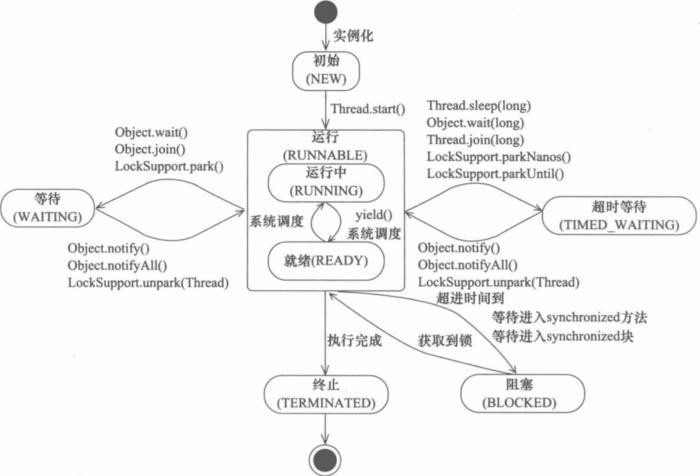

---

join() 方法，等待其他线程终止，在当前线程中调用一个线程的 join() 方法，则当前线程转为阻塞状态，
回到另一个线程结束，当前线程再由阻塞状态变为就绪状态，等待 cpu 的宠幸。 
 为什么要用 join()方法？ 
很多情况下，主线程生成并启动了子线程，需要用到子线程返回的结果，也就是需要主线程需要在子线
程结束后再结束，这时候就要用到 join() 方法。 
线程唤醒（notify） 
Object 类中的 notify() 方法，唤醒在此对象监视器上等待的单个线程，如果所有线程都在此对象上等
待，则会选择唤醒其中一个线程，选择是任意的，并在对实现做出决定时发生，线程通过调用其中一个 
wait() 方法，在对象的监视器上等待，直到当前的线程放弃此对象上的锁定，才能继续执行被唤醒的线
程，被唤醒的线程将以常规方式与在该对象上主动同步的其他所有线程进行竞争。类似的方法还有 
notifyAll() ，唤醒再次监视器上等待的所有线程。 
其他方法： 
1. sleep()：强迫一个线程睡眠Ｎ毫秒。 
2. isAlive()： 判断一个线程是否存活。 
3. join()： 等待线程终止。 
4. activeCount()： 程序中活跃的线程数。 
5. enumerate()： 枚举程序中的线程。 
6. currentThread()： 得到当前线程。 
7. isDaemon()： 一个线程是否为守护线程。 
8. setDaemon()： 设置一个线程为守护线程。(用户线程和守护线程的区别在于，是否等待主线程依
赖于主线程结束而结束) 
9. setName()： 为线程设置一个名称。 
10. wait()： 强迫一个线程等待。 
11. notify()： 通知一个线程继续运行。 
12. setPriority()： 设置一个线程的优先级。 
13. getPriority():：获得一个线程的优先级。
线程上下文切换
 
巧妙地利用了时间片轮转的方式, CPU 给每个任务都服务一定的时间，然后把当前任务的状态保存下
来，在加载下一任务的状态后，继续服务下一任务，任务的状态保存及再加载, 这段过程就叫做上下文切
换。时间片轮转的方式使多个任务在同一颗 CPU 上执行变成了可能。 
System.out.println(Thread.currentThread().getName() + "线程运行开始!"); 
    Thread6 thread1 = new Thread6();     thread1.setName("线程 B");      
thread1.join(); 
System.out.println("这时 thread1 执行完毕之后才能执行主线程");

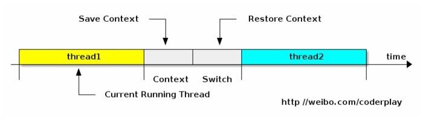

---

进程 
（有时候也称做任务）是指一个程序运行的实例。在 Linux 系统中，线程就是能并行运行并且与他们的
父进程（创建他们的进程）共享同一地址空间（一段内存区域）和其他资源的轻量级的进程。
上下文 
是指某一时间点 CPU 寄存器和程序计数器的内容。 
寄存器 
是 CPU 内部的数量较少但是速度很快的内存（与之对应的是 CPU 外部相对较慢的 RAM 主内存）。寄
存器通过对常用值（通常是运算的中间值）的快速访问来提高计算机程序运行的速度。 
程序计数器 
是一个专用的寄存器，用于表明指令序列中 CPU 正在执行的位置，存的值为正在执行的指令的位置或者
下一个将要被执行的指令的位置，具体依赖于特定的系统。 
PCB-“切换桢” 
 上下文切换可以认为是内核（操作系统的核心）在 CPU 上对于进程（包括线程）进行切换，上下文切
换过程中的信息是保存在进程控制块（PCB, process control block）中的。PCB 还经常被称作“切换桢”
（switchframe）。信息会一直保存到 CPU 的内存中，直到他们被再次使用。 
上下文切换的活动： 
1. 挂起一个进程，将这个进程在 CPU 中的状态（上下文）存储于内存中的某处。 
2. 在内存中检索下一个进程的上下文并将其在 CPU 的寄存器中恢复。 
3. 跳转到程序计数器所指向的位置（即跳转到进程被中断时的代码行），以恢复该进程在程序中。
引起线程上下文切换的原因 
1. 当前执行任务的时间片用完之后，系统 CPU 正常调度下一个任务； 
2. 当前执行任务碰到 IO 阻塞，调度器将此任务挂起，继续下一任务； 
3. 多个任务抢占锁资源，当前任务没有抢到锁资源，被调度器挂起，继续下一任务；
4. 用户代码挂起当前任务，让出 CPU 时间； 
5. 硬件中断；
同步锁与死锁
 
同步锁 
当多个线程同时访问同一个数据时，很容易出现问题。为了避免这种情况出现，我们要保证线程同步互
斥，就是指并发执行的多个线程，在同一时间内只允许一个线程访问共享数据。 Java 中可以使用 
synchronized 关键字来取得一个对象的同步锁。
死锁 
何为死锁，就是多个线程同时被阻塞，它们中的一个或者全部都在等待某个资源被释放。 
线程池原理
 
线程池做的工作主要是控制运行的线程的数量，处理过程中将任务放入队列，然后在线程创建后启动这
些任务，如果线程数量超过了最大数量超出数量的线程排队等候，等其它线程执行完毕，再从队列中取
出任务来执行。他的主要特点为：线程复用；控制最大并发数；管理线程。 
** 线程复用

---

每一个 Thread 的类都有一个 start 方法。 当调用 start 启动线程时 Java 虚拟机会调用该类的 run 方
法。 那么该类的 run() 方法中就是调用了 Runnable 对象的 run() 方法。 我们可以继承重写 Thread 
类，在其 start 方法中添加不断循环调用传递过来的 Runnable 对象。 这就是线程池的实现原理。循环
方法中不断获取 Runnable 是用 Queue 实现的，在获取下一个 Runnable 之前可以是阻塞的。 
线程池的组成一般的线程池主要分为以下 4 个组成部分： 
1. 线程池管理器：用于创建并管理线程池
2. 工作线程：线程池中的线程
3. 任务接口：每个任务必须实现的接口，用于工作线程调度其运行
4. 任务队列：用于存放待处理的任务，提供一种缓冲机制
Java 中的线程池是通过 Executor 框架实现的，该框架中用到了 Executor，Executors，
ExecutorService，ThreadPoolExecutor ，Callable 和 Future、FutureTask 这几个类。 
ThreadPoolExecutor 的构造方法如下：
public ThreadPoolExecutor(int corePoolSize,int maximumPoolSize, long keepAliveTime, TimeUnit 
unit, BlockingQueue workQueue) {    this(corePoolSize, maximumPoolSize, keepAliveTime, unit, 
workQueue,    Executors.defaultThreadFactory(), defaultHandler); 
} 
 
1. corePoolSize：指定了线程池中的线程数量。
2. maximumPoolSize：指定了线程池中的最大线程数量。
3. keepAliveTime：当前线程池数量超过 corePoolSize 时，多余的空闲线程的存活时间，即多次时间
内会被销毁。 
4. unit：keepAliveTime 的单位。 
5. workQueue：任务队列，被提交但尚未被执行的任务。
6. threadFactory：线程工厂，用于创建线程，一般用默认的即可。
7. handler：拒绝策略，当任务太多来不及处理，如何拒绝任务。
拒绝策略 
线程池中的线程已经用完了，无法继续为新任务服务，同时，等待队列也已经排满了，再也塞不下新任
务了。这时候我们就需要拒绝策略机制合理的处理这个问题。 
JDK 内置的拒绝策略如下： 
1. AbortPolicy ： 直接抛出异常，阻止系统正常运行。

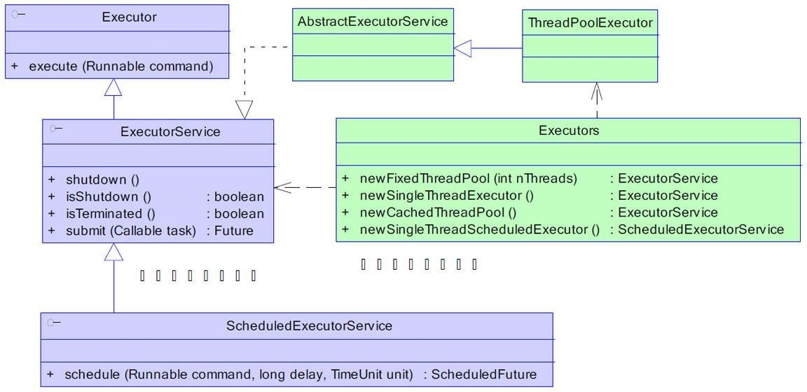

---

2. CallerRunsPolicy ： 只要线程池未关闭，该策略直接在调用者线程中，运行当前被丢弃的任务。显
然这样做不会真的丢弃任务，但是，任务提交线程的性能极有可能会急剧下降。 
3. DiscardOldestPolicy ： 丢弃最老的一个请求，也就是即将被执行的一个任务，并尝试再次提交当
前任务。 
4. DiscardPolicy ： 该策略默默地丢弃无法处理的任务，不予任何处理。如果允许任务丢失，这是最
好的一种方案。 
以上内置拒绝策略均实现了 RejectedExecutionHandler 接口，若以上策略仍无法满足实际需要，完全
可以自己扩展 RejectedExecutionHandler 接口。 
Java 线程池工作过程
1. 线程池刚创建时，里面没有一个线程。任务队列是作为参数传进来的。不过，就算队列里面有任
务，线程池也不会马上执行它们。
2. 当调用 execute() 方法添加一个任务时，线程池会做如下判断： 
a)   如果正在运行的线程数量小于 corePoolSize，那么马上创建线程运行这个任务； 
b)   如果正在运行的线程数量大于或等于 corePoolSize，那么将这个任务放入队列； 
c)   如果这时候队列满了，而且正在运行的线程数量小于 maximumPoolSize，那么还是要创建非
核心线程立刻运行这个任务； 
d)   如果队列满了，而且正在运行的线程数量大于或等于 maximumPoolSize，那么线程池会抛出
异常 RejectExecutionException。 
3. 当一个线程完成任务时，它会从队列中取下一个任务来执行。
4. 当一个线程无事可做，超过一定的时间（keepAliveTime）时，线程池会判断，如果当前运行的线
程数大于 corePoolSize，那么这个线程就被停掉。所以线程池的所有任务完成后，它最终会收缩到 
corePoolSize 的大小。 
JAVA 阻塞队列原理
 
阻塞队列，关键字是阻塞，先理解阻塞的含义，在阻塞队列中，线程阻塞有这样的两种情况： 
1. 当队列中没有数据的情况下，消费者端的所有线程都会被自动阻塞（挂起），直到有数据放入队
列。
2. 当队列中填满数据的情况下，生产者端的所有线程都会被自动阻塞（挂起），直到队列中有空的位
置，线程被自动唤醒。

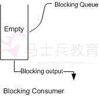

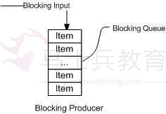

---

阻塞队列的主要方法 
 抛出异常：抛出一个异常；
 特殊值：返回一个特殊值（null 或 false,视情况而定） 
 则塞：在成功操作之前，一直阻塞线程
 超时：放弃前只在最大的时间内阻塞
插入操作： 
1：public abstract boolean add(E paramE)：将指定元素插入此队列中（如果立即可行
且不会违反容量限制），成功时返回 true，如果当前没有可用的空间，则抛出 IllegalStateException。
如果该元素是 NULL，则会抛出 NullPointerException 异常。 
2：public abstract boolean offer(E paramE)：将指定元素插入此队列中（如果立即可行且不会违反容
量限制），成功时返回 true，如果当前没有可用的空间，则返回 false。 
3：public abstract void put(E paramE) throws InterruptedException： 将指定元素插入此队列中，将
等待可用的空间（如果有必要）
public void put(E paramE) throws InterruptedException {     checkNotNull(paramE); 
  } 
4：offer(E o, long timeout, TimeUnit unit)：可以设定等待的时间，如果在指定的时间内，还不能往队
列中加入 BlockingQueue，则返回失败。 获取数据操作： 
1：poll(time):取走 BlockingQueue 里排在首位的对象,若不能立即取出,则可以等 time 参数规定的时间,
取不到时返回 null; 
2：poll(long timeout, TimeUnit unit)：从 BlockingQueue 取出一个队首的对象，如果在
指定时间内，队列一旦有数据可取，则立即返回队列中的数据。否则直到时间超时还没有数据可取，返
回失败。 
ReentrantLock localReentrantLock = this.lock;     
localReentrantLock.lockInterruptibly();     try { 
  while (this.count == this.items.length) 
     this.notFull.await();//如果队列满了，则线程阻塞等待       enqueue(paramE); 
  localReentrantLock.unlock(); 
} finally {       localReentrantLock.unlock(); 
}

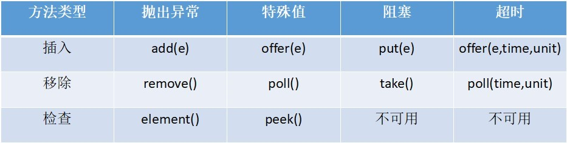

---

3：take():取走 BlockingQueue 里排在首位的对象,若 BlockingQueue 为空,阻断进入等待状态直到 
BlockingQueue 有新的数据被加入。 
4.drainTo():一次性从 BlockingQueue 获取所有可用的数据对象（还可以指定获取数据的个数），通过
该方法，可以提升获取数据效率；不需要多次分批加锁或释放锁。 
Java 中的阻塞队列
 
1. ArrayBlockingQueue ：由数组结构组成的有界阻塞队列。
2. LinkedBlockingQueue ：由链表结构组成的有界阻塞队列。
3. PriorityBlockingQueue ：支持优先级排序的无界阻塞队列。
4. DelayQueue：使用优先级队列实现的无界阻塞队列。
5. SynchronousQueue：不存储元素的阻塞队列。
6. LinkedTransferQueue：由链表结构组成的无界阻塞队列。
7. LinkedBlockingDeque：由链表结构组成的双向阻塞队列
ArrayBlockingQueue*（公平、非公平）**
用数组实现的有界阻塞队列。此队列按照先进先出（FIFO）的原则对元素进行排序。默认情况下不保证
访问者公平的访问队列，所谓公平访问队列是指阻塞的所有生产者线程或消费者线程，当队列可用时，
可以按照阻塞的先后顺序访问队列，即先阻塞的生产者线程，可以先往队列里插入元素，先阻塞的消费
者线程，可以先从队列里获取元素。通常情况下为了保证公平性会降低吞吐量。我们可以使用以下代码
创建一个公平的阻塞队列： 
ArrayBlockingQueue fairQueue = new ArrayBlockingQueue(1000,true); 
LinkedBlockingQueue*（两个独立锁提高并发）** 
基于链表的阻塞队列，同ArrayListBlockingQueue类似，此队列按照先进先出（FIFO）的原则对元素进
行排序。而 LinkedBlockingQueue 之所以能够高效的处理并发数据，还因为其对于生产者端和消费者
端分别采用了独立的锁来控制数据同步，这也意味着在高并发的情况下生产者和消费者可以并行地操作
队列中的数据，以此来提高整个队列的并发性能。
LinkedBlockingQueue 会默认一个类似无限大小的容量（Integer.MAX_VALUE）。 
PriorityBlockingQueue*（*compareTo 排序实现优先*）**
是一个支持优先级的无界队列。默认情况下元素采取自然顺序升序排列。可以自定义实现 compareTo()
方法来指定元素进行排序规则，或者初始化 PriorityBlockingQueue 时，指定构造参数 Comparator 来
对元素进行排序。需要注意的是不能保证同优先级元素的顺序。
DelayQueue*（缓存失效、定时任务 ）** 
是一个支持延时获取元素的无界阻塞队列。队列使用PriorityQueue来实现。队列中的元素必须实现 
Delayed 接口，在创建元素时可以指定多久才能从队列中获取当前元素。只有在延迟期满时才能从队列
中提取元素。我们可以将 DelayQueue 运用在以下应用场景： 
1. 缓存系统的设计：可以用 DelayQueue 保存缓存元素的有效期，使用一个线程循环查询

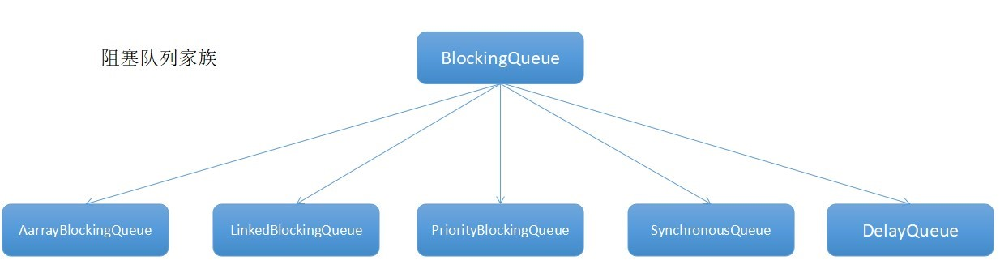

---

DelayQueue，一旦能从 DelayQueue 中获取元素时，表示缓存有效期到了。 
2. 定时任务调度：使用 DelayQueue 保存当天将会执行的任务和执行时间，一旦从
DelayQueue 中获取到任务就开始执行，从比如 TimerQueue 就是使用 DelayQueue 实现的。 
SynchronousQueue*（不存储数据、可用于传递数据）** 
是一个不存储元素的阻塞队列。每一个 put 操作必须等待一个 take 操作，否则不能继续添加元素。
SynchronousQueue 可以看成是一个传球手，负责把生产者线程处理的数据直接传递给消费者线程。队
列本身并不存储任何元素，非常适合于传递性场景,比如在一个线程中使用的数据，传递给另 外 一 个 线 
程 使 用 ， SynchronousQueue 的 吞 吐 量 高 于 LinkedBlockingQueue 和
ArrayBlockingQueue。 
LinkedTransferQueue 
是 一 个 由 链 表 结 构 组 成 的 无 界 阻 塞 TransferQueue 队 列 。 相 对 于 其 他 阻 塞 队 列 ，
LinkedTransferQueue 多了 tryTransfer 和 transfer 方法。 
1. transfer 方法：如果当前有消费者正在等待接收元素（消费者使用 take()方法或带时间限制的 
poll()方法时），transfer 方法可以把生产者传入的元素立刻 transfer（传输）给消费者。如果没有
消费者在等待接收元素，transfer 方法会将元素存放在队列的 tail 节点，并等到该元素被消费者消
费了才返回。 
2. tryTransfer 方法。则是用来试探下生产者传入的元素是否能直接传给消费者。如果没有消费者等
待接收元素，则返回 false。和 transfer 方法的区别是 tryTransfer 方法无论消费者是否接收，方
法立即返回。而 transfer 方法是必须等到消费者消费了才返回。
对于带有时间限制的 tryTransfer(E e, long timeout, TimeUnit unit)方法，则是试图把生产者传入的元
素直接传给消费者，但是如果没有消费者消费该元素则等待指定的时间再返回，如果超时还没消费元
素，则返回 false，如果在超时时间内消费了元素，则返回 true。 
LinkedBlockingDeque 
是一个由链表结构组成的双向阻塞队列。所谓双向队列指的你可以从队列的两端插入和移出元素。
双端队列因为多了一个操作队列的入口，在多线程同时入队时，也就减少了一半的竞争。相比其他的阻
塞队列，LinkedBlockingDeque 多了 addFirst，addLast，offerFirst，offerLast， peekFirst，
peekLast 等方法，以 First 单词结尾的方法，表示插入，获取（peek）或移除双端队列的第一个元素。
以 Last 单词结尾的方法，表示插入，获取或移除双端队列的最后一个元素。另外插入方法 add 等同于 
addLast，移除方法 remove 等效于 removeFirst。但是 take 方法却等同于 takeFirst，不知道是不是 
Jdk 的 bug，使用时还是用带有 First 和 Last 后缀的方法更清楚。 
在初始化 LinkedBlockingDeque 时可以设置容量防止其过渡膨胀。另外双向阻塞队列可以运用在
“工作窃取”模式中。 
CyclicBarrier、CountDownLatch、Semaphore 的用法 
CountDownLatch*（线程计数器 ）** 
CountDownLatch类位于java.util.concurrent包下，利用它可以实现类似计数器的功能。比如有一个任
务 A，它要等待其他 4 个任务执行完毕之后才能执行，此时就可以利用 CountDownLatch 来实现这种功
能了。 
    final CountDownLatch latch = new CountDownLatch(2);           new Thread()
{public void run() { 
System.out.println("子线程"+Thread.currentThread().getName()+"正在执行");

---

CyclicBarrier*（回环栅栏-等待至 barrier 状态再全部同时执行）** 
字面意思回环栅栏，通过它可以实现让一组线程等待至某个状态之后再全部同时执行。叫做回环是因为
当所有等待线程都被释放以后，CyclicBarrier 可以被重用。我们暂且把这个状态就叫做 barrier，当调用 
await()方法之后，线程就处于 barrier 了。 
CyclicBarrier 中最重要的方法就是 await 方法，它有 2 个重载版本： 
1. public int await()：用来挂起当前线程，直至所有线程都到达 barrier 状态再同时执行后续任务；
2. public int await(long timeout, TimeUnit unit)：让这些线程等待至一定的时间，如果还有线程没
有到达 barrier 状态就直接让到达 barrier 的线程执行后续任务。 
具体使用如下，另外 CyclicBarrier 是可以重用的。 
Semaphore*（信号量-控制同时访问的线程个数）** 
                     Thread.sleep(3000); 
                     System.out.println("子线
程"+Thread.currentThread().getName()+"执行完毕"); 
                     latch.countDown(); 
};}.start(); 
          new Thread(){ public void run() { 
System.out.println("子线程"+Thread.currentThread().getName()+"正在执行"); 
                     Thread.sleep(3000); 
                     System.out.println("子线
程"+Thread.currentThread().getName()+"执行完毕"); 
                     latch.countDown(); 
 };}.start();   
            System.out.println("等待 2 个子线程执行完毕..."); 
            latch.await(); 
            System.out.println("2 个子线程已经执行完毕"); 
            System.out.println("继续执行主线程"); 
           } 
        public static void main(String[] args) {         int N = 4; 
        CyclicBarrier barrier  = new CyclicBarrier(N);         for(int 
i=0;i<N;i++)             new Writer(barrier).start(); 
    } 
    static class Writer extends Thread{         private CyclicBarrier 
cyclicBarrier;         public Writer(CyclicBarrier cyclicBarrier) {             
this.cyclicBarrier = cyclicBarrier; 
        } 
        @Override         public void run() {             try { 
                Thread.sleep(5000);      //以睡眠来模拟线程需要预定写入数据操作 
System.out.println("线程"+Thread.currentThread().getName()+"写入数据完毕，等待其他线程
写入完毕"); 
                cyclicBarrier.await(); 
            } catch (InterruptedException e) {                 
e.printStackTrace(); 
            }catch(BrokenBarrierException e){                 
e.printStackTrace(); 
            } 
     System.out.println("所有线程写入完毕，继续处理其他任务，比如数据操作"); 
        } 
    }

---

Semaphore 翻译成字面意思为 信号量，Semaphore 可以控制同时访问的线程个数，通过 acquire() 获
取一个许可，如果没有就等待，而 release() 释放一个许可。
Semaphore 类中比较重要的几个方法：
1. public void acquire(): 用来获取一个许可，若无许可能够获得，则会一直等待，直到获得许可。 
2. public void acquire(int permits):获取 permits 个许可 
3. public void release() { } :释放许可。注意，在释放许可之前，必须先获获得许可。 
4. public void release(int permits) { }:释放 permits 个许可 
上面 4 个方法都会被阻塞，如果想立即得到执行结果，可以使用下面几个方法
1. public boolean tryAcquire():尝试获取一个许可，若获取成功，则立即返回 true，若获取失败，则
立即返回 false 
2. public boolean tryAcquire(long timeout, TimeUnit unit):尝试获取一个许可，若在指定的时间内
获取成功，则立即返回 true，否则则立即返回 false 
3. public boolean tryAcquire(int permits):尝试获取 permits 个许可，若获取成功，则立即返回 
true，若获取失败，则立即返回 false 
4. public boolean tryAcquire(int permits, long timeout, TimeUnit unit): 尝试获取 permits 个许
可，若在指定的时间内获取成功，则立即返回 true，否则则立即返回 false 
5. 还可以通过 availablePermits()方法得到可用的许可数目。 
例子：若一个工厂有5 台机器，但是有8个工人，一台机器同时只能被一个工人使用，只有使用完了，其
他工人才能继续使用。那么我们就可以通过 Semaphore 来实现： 
CountDownLatch  和 CyclicBarrier 都能够实现线程之间的等待，只不过它们侧重点不  同；
CountDownLatch 一般用于某个线程 A 等待若干个其他线程执行完任务之后，它才
执行；而 CyclicBarrier 一般用于一组线程互相等待至某个状态，然后这一组线程再同时执行；另外，
CountDownLatch 是不能够重用的，而 CyclicBarrier 是可以重用的。 
volatile 关键字的作用（变量可见性、禁止重排序）
 
    int N = 8;            //工人数 
        Semaphore semaphore = new Semaphore(5); //机器数目         for(int 
i=0;i<N;i++)             new Worker(i,semaphore).start(); 
    } 
    static class Worker extends Thread{         private int num;         private 
Semaphore semaphore;         public Worker(int num,Semaphore semaphore){         
    this.num = num;             this.semaphore = semaphore; 
        } 
  
        @Override         public void run() {             try { 
                semaphore.acquire(); 
                System.out.println("工人"+this.num+"占用一个机器在生产..."); 
                Thread.sleep(2000); 
                System.out.println("工人"+this.num+"释放出机器");                 
semaphore.release();                        } catch (InterruptedException e) {   
              e.printStackTrace(); 
            } 
        } 
  Semaphore 其实和锁有点类似，它一般用于控制对某组资源的访问权限。

---

Java 语言提供了一种稍弱的同步机制，即 volatile 变量，用来确保将变量的更新操作通知到其他线程。
volatile 变量具备两种特性，volatile 变量不会被缓存在寄存器或者对其他处理器不可见的地方，因此在
读取 volatile 类型的变量时总会返回最新写入的值。 
变量可见性其一是保证该变量对所有线程可见，这里的可见性指的是当一个线程修改了变量的值，那么
新的值对于其他线程是可以立即获取的。 
禁止重排序
 volatile 禁止了指令重排。 
比sychronized 更轻量级的同步锁 
在访问 volatile 变量时不会执行加锁操作，因此也就不会使执行线程阻塞，因此 volatile 变量是一
种比 sychronized 关键字更轻量级的同步机制。volatile 适合这种场景：一个变量被多个线程共享，线
程直接给这个变量赋值。 
当对非 volatile 变量进行读写的时候，每个线程先从内存拷贝变量到 CPU 缓存中。如果计算机有多个 
CPU，每个线程可能在不同的 CPU 上被处理，这意味着每个线程可以拷贝到不同的 CPU cache 中。而
声明变量是 volatile 的，JVM 保证了每次读变量都从内存中读，跳过 CPU cache 这一步。 
适用场景值得说明的是对 volatile 变量的单次读/写操作可以保证原子性的，如 long 和 double 类型变
量，但是并不能保证 i++这种操作的原子性，因为本质上 i++是读、写两次操作。在某些场景下可以代替 
Synchronized。但是,volatile 的不能完全取代 Synchronized 的位置，只有在一些特殊的场景下，才能
适用 volatile。总的来说，必须同时满足下面两个条件才能保证在并发环境的线程安全： 
（1）   对变量的写操作不依赖于当前值（比如 i++），或者说是单纯的变量赋值（boolean flag = 
true）。
（2）   该变量没有包含在具有其他变量的不变式中，也就是说，不同的 volatile 变量之间，不能互相依
赖。只有在状态真正独立于程序内其他内容时才能使用 volatile。 
如何在两个线程之间共享数据

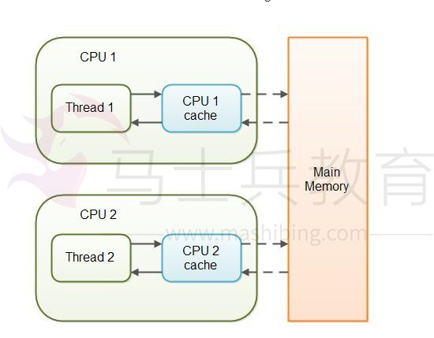

---

Java 里面进行多线程通信的主要方式就是共享内存的方式，共享内存主要的关注点有两个：可见性和有
序性原子性。Java 内存模型（JMM）解决了可见性和有序性的问题，而锁解决了原子性的问题，理想情
况下我们希望做到“同步”和“互斥”。有以下常规实现方法： 
将数据抽象成一个类，并将数据的操作作为这个类的方法 
1. 将数据抽象成一个类，并将对这个数据的操作作为这个类的方法，这么设计可以和容易做到同步，
只要在方法上加”synchronized“ 
Runnable 对象作为一个类的内部类 
2. 将 Runnable 对象作为一个类的内部类，共享数据作为这个类的成员变量，每个线程对共享数据的
操作方法也封装在外部类，以便实现对数据的各个操作的同步和互斥，作为内部类的各个 
Runnable 对象调用外部类的这些方法。 
public class MyData { 
     private int j=0; public  synchronized void add(){ 
         j++; 
System.out.println("线程"+Thread.currentThread().getName()+"j 为："+j); 
} 
public  synchronized void dec(){ 
         j--; 
      System.out.println("线程"+Thread.currentThread().getName()+"j 为："+j); 
     } 
     public int getData(){          return j; 
     } 
} 
public class AddRunnable implements Runnable{ 
    MyData data;     public AddRunnable(MyData data){         this.data= data; 
    }  
    public void run() {             data.add(); 
     } 
 } 
public class DecRunnable implements Runnable { 
    MyData data;     public DecRunnable(MyData data){         this.data = data; 
    } 
    public void run() {             data.dec(); 
    } 
} 
 public static void main(String[] args) { 
        MyData data = new MyData(); 
        Runnable add = new AddRunnable(data);         Runnable dec = new 
DecRunnable(data);         for(int i=0;i<2;i++){             new 
Thread(add).start();             new Thread(dec).start(); 
        } 
public class MyData { 
     private int j=0;      public  synchronized void add(){          j++; 
     System.out.println("线程"+Thread.currentThread().getName()+"j 为："+j); 
     } 
     public  synchronized void dec(){          j--; 
      System.out.println("线程"+Thread.currentThread().getName()+"j 为："+j); 
     } 
     public int getData(){ 
         return j; 
     }

---

ThreadLocal 作用（线程本地存储） 
ThreadLocal，很多地方叫做线程本地变量，也有些地方叫做线程本地存储，ThreadLocal 的作用是提
供线程内的局部变量，这种变量在线程的生命周期内起作用，减少同一个线程内多个函数或者组件之间
一些公共变量的传递的复杂度。 
ThreadLocalMap（线程的一个属性）
 
1. 每个线程中都有一个自己的 ThreadLocalMap 类对象，可以将线程自己的对象保持到其中，各管各
的，线程可以正确的访问到自己的对象。 
2. 将一个共用的 ThreadLocal 静态实例作为 key，将不同对象的引用保存到不同线程的
ThreadLocalMap 中，然后在线程执行的各处通过这个静态 ThreadLocal 实例的 get()方法取得自己线程
保存的那个对象，避免了将这个对象作为参数传递的麻烦。 
3. ThreadLocalMap 其实就是线程里面的一个属性，它在 Thread 类中定义 
ThreadLocal.ThreadLocalMap threadLocals = null; 
最常见的 ThreadLocal 使用场景为 用来解决 数据库连接、Session 管理等。 
} 
public class TestThread { 
    public static void main(String[] args) {         final MyData data = new 
MyData();         for(int i=0;i<2;i++){             new Thread(new Runnable(){   
             public void run() {                     data.add(); 
                 } 
             }).start(); 
            new Thread(new Runnable(){                  public void run() {       
              data.dec();  
                 } 
             }).start(); 
        } 
    } 
}

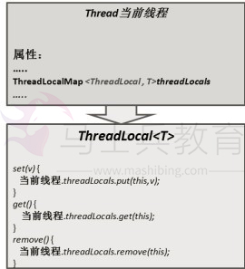

---

synchronized 和 ReentrantLock 的区别
 
两者的共同点：
1. 都是用来协调多线程对共享对象、变量的访问
2. 都是可重入锁，同一线程可以多次获得同一个锁
3. 都保证了可见性和互斥性
两者的不同点：
1. ReentrantLock 显示的获得、释放锁，synchronized 隐式获得释放锁 
2. ReentrantLock 可响应中断、可轮回，synchronized 是不可以响应中断的，为处理锁的不可用性
提供了更高的灵活性 
3. ReentrantLock 是 API 级别的，synchronized 是 JVM 级别的 
4. ReentrantLock 可以实现公平锁
5. ReentrantLock 通过 Condition 可以绑定多个条件 
6. 底层实现不一样， synchronized 是同步阻塞，使用的是悲观并发策略，lock 是同步非阻塞，采用
的是乐观并发策略 
7. Lock 是一个接口，而 synchronized 是 Java 中的关键字，synchronized 是内置的语言实现。 
8. synchronized 在发生异常时，会自动释放线程占有的锁，因此不会导致死锁现象发生；而 Lock 在
发生异常时，如果没有主动通过 unLock()去释放锁，则很可能造成死锁现象，因此使用 Lock 时需
要在 finally 块中释放锁。 
9. Lock 可以让等待锁的线程响应中断，而 synchronized 却不行，使用 synchronized 时，等待的线
程会一直等待下去，不能够响应中断。 
10. 通过 Lock 可以知道有没有成功获取锁，而 synchronized 却无法办到。
11. Lock 可以提高多个线程进行读操作的效率，既就是实现读写锁等。
ConcurrentHashMap 并发
 
 减小锁粒度 
减小锁粒度是指缩小锁定对象的范围，从而减小锁冲突的可能性，从而提高系统的并发能力。减小锁粒
度是一种削弱多线程锁竞争的有效手段，这种技术典型的应用是 ConcurrentHashMap(高性能的 
HashMap)类的实现。对于 HashMap 而言，最重要的两个方法是 get 与 set 方法，如果我们对整个 
HashMap 加锁，可以得到线程安全的对象，但是加锁粒度太大。Segment 的大小也被称为 
ConcurrentHashMap 的并发度。 
ConcurrentHashMap 分段锁 
ConcurrentHashMap，它内部细分了若干个小的 HashMap，称之为段(Segment)。默认情况下一个 
ConcurrentHashMap 被进一步细分为 16 个段，既就是锁的并发度。 
private static final ThreadLocal threadSession = new ThreadLocal();  
public static Session getSession() throws InfrastructureException {      
Session s = (Session) threadSession.get();     
try {        
if (s == null) {          
s = getSessionFactory().openSession();               threadSession.set(s);   
        }   
    } catch (HibernateException ex) {     
    throw new InfrastructureException(ex);   
    }   
    return s;   
}

---

如果需要在 ConcurrentHashMap 中添加一个新的表项，并不是将整个 HashMap 加锁，而是首先根据
hashcode得到该表项应该存放在哪个段中，然后对该段加锁，并完成put操作。在多线程环境中，如果
多个线程同时进行put操作，只要被加入的表项不存放在同一个段中，则线程间可以做到真正的并行。 
ConcurrentHashMap 是由Segment 数组结构和HashEntry 数组结构组成 
ConcurrentHashMap 是由 Segment 数组结构和 HashEntry 数组结构组成。Segment 是一种可重入锁 
ReentrantLock，在 ConcurrentHashMap 里扮演锁的角色，HashEntry 则用于存储键值对数据。一个 
ConcurrentHashMap 里包含一个 Segment 数组，Segment 的结构和 HashMap 类似，是一种数组和
链表结构， 一个 Segment 里包含一个 HashEntry 数组，每个 HashEntry 是一个链表结构的元素， 每
个 Segment 守护一个 HashEntry 数组里的元素,当对 HashEntry 数组的数据进行修改时，必须首先获得
它对应的 Segment 锁。 
Java 中用到的线程调度
 
抢占式调度： 
抢占式调度指的是每条线程执行的时间、线程的切换都由系统控制，系统控制指的是在系统某种运行机
制下，可能每条线程都分同样的执行时间片，也可能是某些线程执行的时间片较长，甚至某些线程得不
到执行的时间片。在这种机制下，一个线程的堵塞不会导致整个进程堵塞。
协同式调度： 
协同式调度指某一线程执行完后主动通知系统切换到另一线程上执行，这种模式就像接力赛一样，一个
人跑完自己的路程就把接力棒交接给下一个人，下个人继续往下跑。线程的执行时间由线程本身控制，
线程切换可以预知，不存在多线程同步问题，但它有一个致命弱点：如果一个线程编写有问题，运行到
一半就一直堵塞，那么可能导致整个系统崩溃。

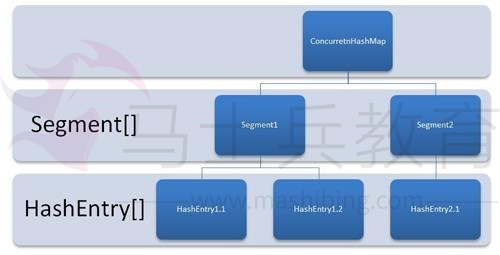

---

JVM 的线程调度实现（抢占式调度）
java 使用的线程调使用抢占式调度，Java 中线程会按优先级分配 CPU 时间片运行，且优先级越高越优
先执行，但优先级高并不代表能独自占用执行时间片，可能是优先级高得到越多的执行时间片，反之，
优先级低的分到的执行时间少但不会分配不到执行时间。
线程让出 cpu 的情况： 
1. 当前运行线程主动放弃 CPU，JVM 暂时放弃 CPU 操作（基于时间片轮转调度的 JVM 操作系统不会
让线程永久放弃 CPU，或者说放弃本次时间片的执行权），例如调用 yield()方法。 
2. 当前运行线程因为某些原因进入阻塞状态，例如阻塞在 I/O 上。 
3. 当前运行线程结束，即运行完 run()方法里面的任务。 
进程调度算法
 
优先调度算法 
1. 先来先服务调度算法（FCFS）
当在作业调度中采用该算法时，每次调度都是从后备作业队列中选择一个或多个最先进入该队列的
作业，将它们调入内存，为它们分配资源、创建进程，然后放入就绪队列。在进程调度中采用 
FCFS 算法时，则每次调度是从就绪队列中选择一个最先进入该队列的进程，为之分配处理机，使
之投入运行。该进程一直运行到完成或发生某事件而阻塞后才放弃处理机，特点是：算法比较简
单，可以实现基本上的公平。 2.   短作业(进程)优先调度算法 
 短作业优先(SJF)的调度算法是从后备队列中选择一个或若干个估计运行时间最短的作业，将它们调入内
存运行。而短进程优先(SPF)调度算法则是从就绪队列中选出一个估计运行时间最短的进程，将处理机分
配给它，使它立即执行并一直执行到完成，或发生某事件而被阻塞放弃处理机时再重新调度。该算法未
照顾紧迫型作业。
高优先权优先调度算法 
当用于进程调度时，该算法是把处理机分配给就绪队列中优先权最高的进程。 
为了照顾紧迫型作业，使之在进入系统后便获得优先处理，引入了最高优先权优先(FPF)调度算法。当把该算
法用于作业调度时，系统将从后备队列中选择若干个优先权最高的作业装入内存。

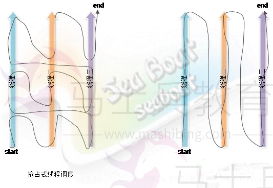

---

1. 非抢占式优先权算法
 在这种方式下，系统一旦把处理机分配给就绪队列中优先权最高的进程后，该进程便一直执行下去，直
至完成；或因发生某事件使该进程放弃处理机时。这种调度算法主要用于批处理系统中；也可用于某些
对实时性要求不严的实时系统中。
2. 抢占式优先权调度算法
在这种方式下，系统同样是把处理机分配给优先权最高的进程，使之执行。但在其执行期间，只要又出
现了另一个其优先权更高的进程，进程调度程序就立即停止当前进程(原优先权最高的进程) 的执行，重
新将处理机分配给新到的优先权最高的进程。显然，这种抢占式的优先权调度算法能更好地满足紧迫作
业的要求，故而常用于要求比较严格的实时系统中，以及对性能要求较高的批处理和分时系统中。
2. 高响应比优先调度算法 
在批处理系统中，短作业优先算法是一种比较好的算法，其主要的不足之处是长作业的运行得不到
保证。如果我们能为每个作业引入前面所述的动态优先权，并使作业的优先级随着等待时间的增加
而以速率a 提高，则长作业在等待一定的时间后，必然有机会分配到处理机。该优先权的变化规律
可描述为： 
(2)  当要求服务的时间相同时，作业的优先权决定于其等待时间，等待时间愈长，其优先权愈高，因而
它实现的是先来先服务。
(3)  对于长作业，作业的优先级可以随等待时间的增加而提高，当其等待时间足够长时，其优先级便可
升到很高，从而也可获得处理机。简言之，该算法既照顾了短作业，又考虑了作业到达的先后次序，不
会使长作业长期得不到服务。因此，该算法实现了一种较好的折衷。当然，在利用该算法时，每要进行
调度之前，都须先做响应比的计算，这会增加系统开销。
基于时间片的轮转调度算法 
\1.   时间片轮转法
在早期的时间片轮转法中，系统将所有的就绪进程按先来先服务的原则排成一个队列，每次调度时，把 
CPU 分配给队首进程，并令其执行一个时间片。时间片的大小从几 ms 到几百 ms。当执行的时间片用
完时，由一个计时器发出时钟中断请求，调度程序便据此信号来停止该进程的执行，并将它送往就绪队
列的末尾；然后，再把处理机分配给就绪队列中新的队首进程，同时也让它执行一个时间片。这样就可
以保证就绪队列中的所有进程在一给定的时间内均能获得一时间片的处理机执行时间。 
2. 多级反馈队列调度算法
(1)  应设置多个就绪队列，并为各个队列赋予不同的优先级。第一个队列的优先级最高，第二个队列次
之，其余各队列的优先权逐个降低。该算法赋予各个队列中进程执行时间片的大小也各不相同，在优先
权愈高的队列中，为每个进程所规定的执行时间片就愈小。例如，第二个队列的时间片要比第一个队列
的时间片长一倍，……，第 i+1 个队列的时间片要比第 i 个队列的时间片长一倍。 
(2)  当一个新进程进入内存后，首先将它放入第一队列的末尾，按 FCFS 原则排队等待调度。当轮到该进
程执行时，如它能在该时间片内完成，便可准备撤离系统；如果它在一个时间片结束时尚未完成，调度
程序便将该进程转入第二队列的末尾，再同样地按 FCFS 原则等待调度执行；如果它在第二队列中运行
一个时间片后仍未完成，再依次将它放入第三队列，……，如此下去，当一个长作业(进程)从第一队列依
次降到第 n 队列后，在第 n 队列便采取按时间片轮转的方式运行。

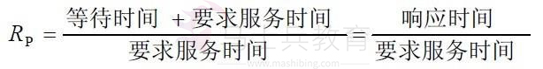

---

(3)  仅当第一队列空闲时，调度程序才调度第二队列中的进程运行；仅当第 1～(i-1)队列均空时，才会调
度第 i 队列中的进程运行。如果处理机正在第 i 队列中为某进程服务时，又有新进程进入优先权较高的队
列(第 1～(i-1)中的任何一个队列)，则此时新进程将抢占正在运行进程的处理机，即由调度程序把正在运
行的进程放回到第 i 队列的末尾，把处理机分配给新到的高优先权进程。
 在多级反馈队列调度算法中，如果规定第一个队列的时间片略大于多数人机交互所需之处理时间时，便
能够较好的满足各种类型用户的需要。
什么是 CAS（比较并交换-乐观锁机制-锁自旋）
 
概念及特性 
CAS（Compare And Swap/Set）比较并交换，CAS 算法的过程是这样：它包含 3 个参数 CAS(V,E,N)。
V 表示要更新的变量(内存值)，E 表示预期值(旧的)，N 表示新值。当且仅当 V 值等于 E 值时，才会将 V 
的值设为 N，如果 V 值和 E 值不同，则说明已经有其他线程做了更新，则当前线程什么都不做。最后，
CAS 返回当前 V 的真实值。 
CAS 操作是抱着乐观的态度进行的(乐观锁)，它总是认为自己可以成功完成操作。当多个线程同时使用 
CAS 操作一个变量时，只有一个会胜出，并成功更新，其余均会失败。失败的线程不会被挂起，仅是被
告知失败，并且允许再次尝试，当然也允许失败的线程放弃操作。基于这样的原理，
CAS 操作即使没有锁，也可以发现其他线程对当前线程的干扰，并进行恰当的处理。 
原子包 java.util.concurrent.atomic（锁自旋） 
JDK1.5 的原子包：java.util.concurrent.atomic 这个包里面提供了一组原子类。其基本的特性就是在多
线程环境下，当有多个线程同时执行这些类的实例包含的方法时，具有排他性，即当某个线程进入方
法，执行其中的指令时，不会被其他线程打断，而别的线程就像自旋锁一样，一直等
到该方法执行完成，才由 JVM 从等待队列中选择一个另一个线程进入，这只是一种逻辑上的理解。
相对于对于 synchronized 这种阻塞算法，CAS 是非阻塞算法的一种常见实现。由于一般 CPU 切换时间
比 CPU 指令集操作更加长， 所以 J.U.C 在性能上有了很大的提升。如下代码： 
getAndIncrement 采用了 CAS 操作，每次从内存中读取数据然后将此数据和+1 后的结果进行 CAS 操
作，如果成功就返回结果，否则重试直到成功为止。而 compareAndSet 利用 JNI 来完成CPU 指令的操
作。 
public class AtomicInteger extends Number implements java.io.Serializable {   
        private volatile int value;  
        public final int get() {           
        return value;   
     }   
     public final int getAndIncrement() {   
        for (;;) {  
        //CAS 自旋，一直尝试，直达成功 
           int current = get();           
           int next = current + 1;          
           if (compareAndSet(current, next))                   return current;  
 
        }   
    }   
    public final boolean compareAndSet(int expect, int update) {         
    return unsafe.compareAndSwapInt(this, valueOffset, expect, update);   
    }   
}

---

ABA 问题
CAS 会导致“ABA 问题”。CAS 算法实现一个重要前提需要取出内存中某时刻的数据，而在下时刻比较并
替换，那么在这个时间差类会导致数据的变化。 
比如说一个线程 one 从内存位置 V 中取出 A，这时候另一个线程 two 也从内存中取出 A，并且 two 进
行了一些操作变成了 B，然后 two 又将 V 位置的数据变成 A，这时候线程 one 进行 CAS 操作发现内存
中仍然是 A，然后 one 操作成功。尽管线程 one 的 CAS 操作成功，但是不代表这个过程就是没有问题
的。 
部分乐观锁的实现是通过版本号（version）的方式来解决 ABA 问题，乐观锁每次在执行数据的修改操
作时，都会带上一个版本号，一旦版本号和数据的版本号一致就可以执行修改操作并对版本号执行+1 操
作，否则就执行失败。因为每次操作的版本号都会随之增加，所以不会出现 ABA 问题，因为版本号只会
增加不会减少。
什么是 AQS（抽象的队列同步器）
 
AbstractQueuedSynchronizer 类如其名，抽象的队列式的同步器，AQS 定义了一套多线程访问共享资
源的同步器框架，许多同步类实现都依赖于它，如常用的
ReentrantLock/Semaphore/CountDownLatch。

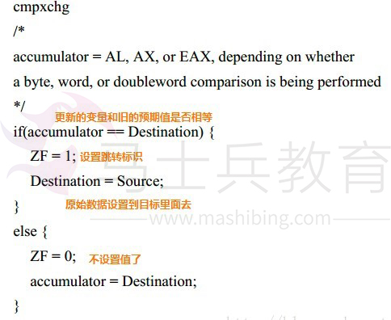

---

它维护了一个 volatile int state（代表共享资源）和一个 FIFO 线程等待队列（多线程争用资源被阻塞时
会进入此队列）。这里 volatile 是核心关键词，具体 volatile 的语义，在此不述。state 的访问方式有三
种: 
getState() setState() 
compareAndSetState() 
AQS 定义两种资源共享方式 
Exclusive独占资源-ReentrantLock 
Exclusive（独占，只有一个线程能执行，如 ReentrantLock） 
Share共享资源-Semaphore/CountDownLatch 
Share（共享，多个线程可同时执行，如 Semaphore/CountDownLatch）。
AQS只是一个框架，具体资源的获取/释放方式交由自定义同步器去实现，AQS这里只定义了一个接口，
具体资源的获取交由自定义同步器去实现了（通过state的get/set/CAS)之所以没有定义成 abstract，是
因为独占模式下只用实现 tryAcquire-tryRelease，而共享模式下只用实现 tryAcquireShared-
tryReleaseShared。如果都定义成abstract，那么每个模式也要去实现另一模式下的接口。不同的自定
义同步器争用共享资源的方式也不同。自定义同步器在实现时只需要实现共享资源 state 的获取与释放
方式即可，至于具体线程等待队列的维护（如获取资源失败入队/ 唤醒出队等），AQS 已经在顶层实现
好了。自定义同步器实现时主要实现以下几种方法： 
1． isHeldExclusively()：该线程是否正在独占资源。只有用到 condition 才需要去实现它。 
2． tryAcquire(int)：独占方式。尝试获取资源，成功则返回 true，失败则返回 false。 
3． tryRelease(int)：独占方式。尝试释放资源，成功则返回 true，失败则返回 false。 
4． tryAcquireShared(int)：共享方式。尝试获取资源。负数表示失败；0 表示成功，但没有剩余可用资
源；正数表示成功，且有剩余资源。 
5． tryReleaseShared(int)：共享方式。尝试释放资源，如果释放后允许唤醒后续等待结点返回 true，
否则返回 false。 
同步器的实现是ABS核心（state资源状态计数） 
同步器的实现是 ABS 核心，以 ReentrantLock 为例，state 初始化为 0，表示未锁定状态。A 线程 
lock()时，会调用 tryAcquire()独占该锁并将 state+1。此后，其他线程再 tryAcquire()时就会失败，直到
A线程unlock()到state=0（即释放锁）为止，其它线程才有机会获取该锁。当然，释放锁之前，A 线程
自己是可以重复获取此锁的（state 会累加），这就是可重入的概念。但要注意，获取多少次就要释放多
么次，这样才能保证 state 是能回到零态的。

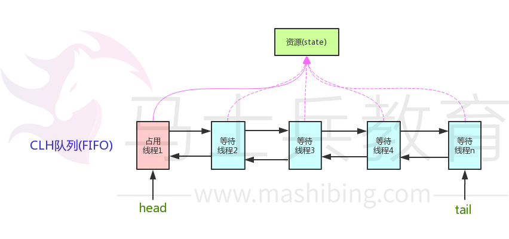

---

以 CountDownLatch 以例，任务分为 N 个子线程去执行，state 也初始化为 N（注意 N 要与线程个数
一致）。这 N 个子线程是并行执行的，每个子线程执行完后 countDown()一次，state 会 CAS 减1。等
到所有子线程都执行完后(即state=0)，会 unpark()主调用线程，然后主调用线程就会从 await()函数返
回，继续后余动作。 
ReentrantReadWriteLock 实现独占和共享两种方式 
 一般来说，自定义同步器要么是独占方法，要么是共享方式，他们也只需实现 tryAcquiretryRelease、
tryAcquireShared-tryReleaseShared 中的一种即可。但 AQS 也支持自定义同步器同时实现独占和共享
两种方式，如 ReentrantReadWriteLock。 
 
 
 
NIO是什么？适用于何种场景？
 
（New IO）为所有的原始类型（boolean类型除外）提供缓存支持的数据容器，使用它可以提 供非阻塞
式的高伸缩性网络。
特性：I/O多路复用 + 非阻塞式I/O
NIO适用场景 
服务器需要支持超大量的长时间连接。比如10000个连接以上，并且每个客户端并不会频繁地发 送太多
数据。例如总公司的一个中心服务器需要收集全国便利店各个收银机的交易信息，只需要 少量线程按需
处理维护的大量长期连接。 
Jetty、Mina、Netty、ZooKeeper等都是基于NIO方式实现。
 
NIO技术概览
 
NIO（Non-blocking I/O，在Java领域，也称为New I/O），是一种同步非阻塞的I/O模型，也是I/O多路
复用的基础，已经被越来越多地应用到大型应用服务器，成为解决高并发与大量连接、I/O处理问题的有
效方式。
IO模型的分类
 
按照《Unix网络编程》的划分，I/O模型可以分为：阻塞I/O模型、非阻塞I/O模型、I/O复用模型、信号
驱动式I/O模型和异步I/O模型，按照POSIX标准来划分只分为两类：同步I/O和异步I/O。
如何区分呢？首先一个I/O操作其实分成了两个步骤：发起IO请求和实际的IO操作。同步I/O和异步I/O的
区别就在于第二个步骤是否阻塞，如果实际的I/O读写阻塞请求进程，那么就是同步I/O，因此阻塞I/O、
非阻塞I/O、I/O复用、信号驱动I/O都是同步I/O，如果不阻塞，而是操作系统帮你做完I/O操作再将结果
返回给你，那么就是异步I/O。
阻塞I/O和非阻塞I/O的区别在于第一步，发起I/O请求是否会被阻塞，如果阻塞直到完成那么就是传统的
阻塞I/O，如果不阻塞，那么就是非阻塞I/O。
 
阻塞I/O模型 ：在linux中，默认情况下所有的socket都是blocking，一个典型的读操作流程大概是
这样：

---

非阻塞I/O模型：linux下，可以通过设置socket使其变为non-blocking。当对一个non-blocking 
socket执行读操作时，流程是这个样子：
I/O复用模型：我们可以调用select 或poll ，阻塞在这两个系统调用中的某一个之上，而不是真
正的IO系统调用上：

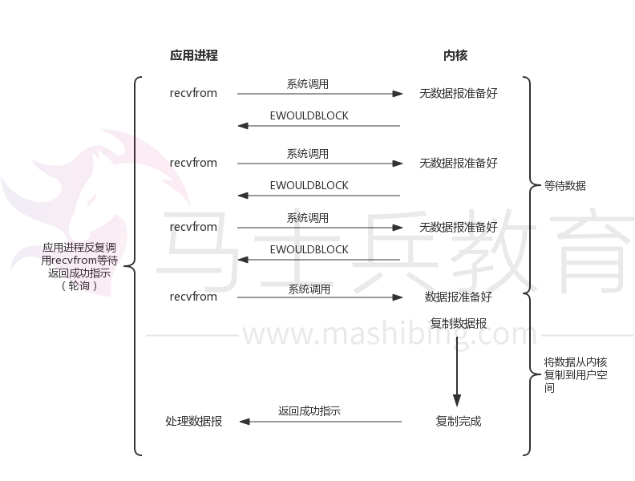

---

信号驱动式I/O模型：我们可以用信号，让内核在描述符就绪时发送SIGIO信号通知我们：
异步I/O模型：用户进程发起read操作之后，立刻就可以开始去做其它的事。而另一方面，从内核
的角度，当它受到一个asynchronousread之后，首先它会立刻返回，所以不会对用户进程产生任
何block。然后，内核会等待数据准备完成，然后将数据拷贝到用户内存，当这一切都完成之后，
内核会给用户进程发送一个signal，告诉它read操作完成了：

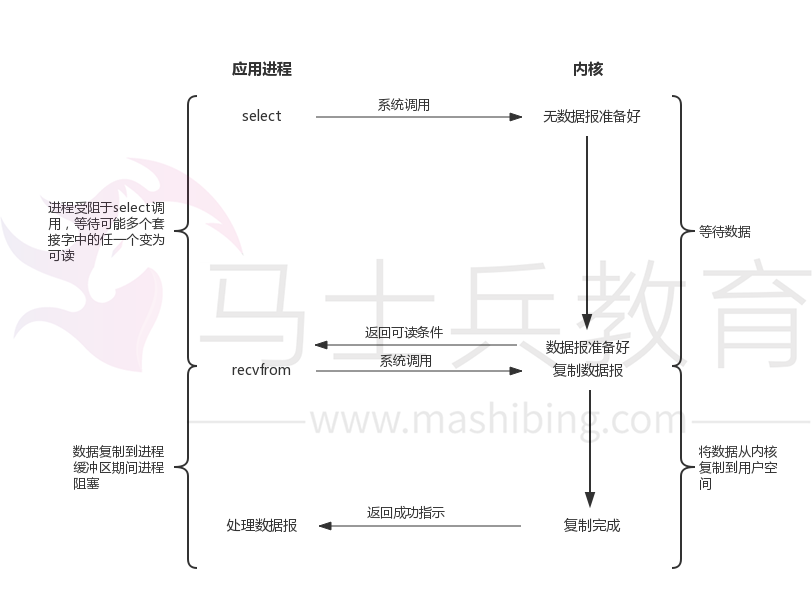

---

以上参考自：《UNIX网络编程》
从前面 I/O 模型的分类中，我们可以看出 AIO 的动机。阻塞模型需要在 I/O 操作开始时阻塞应用程序。
这意味着不可能同时重叠进行处理和 I/O 操作。非阻塞模型允许处理和 I/O 操作重叠进行，但是这需要
应用程序来检查 I/O 操作的状态。对于异步I/O ，它允许处理和 I/O 操作重叠进行，包括 I/O 操作完成的
通知。除了需要阻塞之外，select 函数所提供的功能（异步阻塞 I/O）与 AIO 类似。不过，它是对通知
事件进行阻塞，而不是对 I/O 调用进行阻塞。
参考下知乎上的回答：
同步与异步：同步和异步关注的是消息通信机制 (synchronous communication/ 
asynchronous communication)。所谓同步，就是在发出一个调用时，在没有得到结果之
前，该调用就不返回。但是一旦调用返回，就得到返回值了。换句话说，就是由调用者主动
等待这个调用的结果；
阻塞与非阻塞：阻塞和非阻塞关注的是程序在等待调用结果（消息，返回值）时的状态。阻
塞调用是指调用结果返回之前，当前线程会被挂起。调用线程只有在得到结果之后才会返
回；而非阻塞调用指在不能立刻得到结果之前，该调用不会阻塞当前线程。
两种IO多路复用方案：Reactor和Proactor
 
一般地，I/O多路复用机制都依赖于一个事件多路分离器(Event Demultiplexer)。分离器对象可将来自
事件源的I/O事件分离出来，并分发到对应的read/write事件处理器(Event Handler)。开发人员预先注
册需要处理的事件及其事件处理器（或回调函数）；事件分离器负责将请求事件传递给事件处理器。
两个与事件分离器有关的模式是Reactor和Proactor。Reactor模式采用同步I/O，而Proactor采用异步
I/O。在Reactor中，事件分离器负责等待文件描述符或socket为读写操作准备就绪，然后将就绪事件传
递给对应的处理器，最后由处理器负责完成实际的读写工作。
而在Proactor模式中，处理器或者兼任处理器的事件分离器，只负责发起异步读写操作。I/O操作本身由
操作系统来完成。传递给操作系统的参数需要包括用户定义的数据缓冲区地址和数据大小，操作系统才
能从中得到写出操作所需数据，或写入从socket读到的数据。事件分离器捕获I/O操作完成事件，然后将
事件传递给对应处理器。比如，在windows上，处理器发起一个异步I/O操作，再由事件分离器等待

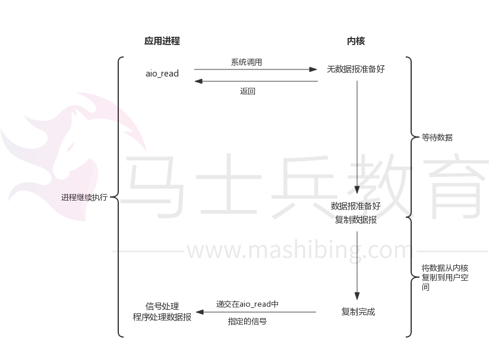

---

IOCompletion事件。典型的异步模式实现，都建立在操作系统支持异步API的基础之上，我们将这种实
现称为“系统级”异步或“真”异步，因为应用程序完全依赖操作系统执行真正的I/O工作。
举个例子，将有助于理解Reactor与Proactor二者的差异，以读操作为例（写操作类似）。
在Reactor中实现读：
注册读就绪事件和相应的事件处理器；
事件分离器等待事件；
事件到来，激活分离器，分离器调用事件对应的处理器；
事件处理器完成实际的读操作，处理读到的数据，注册新的事件，然后返还控制权。
在Proactor中实现读：
处理器发起异步读操作（注意：操作系统必须支持异步I/O）。在这种情况下，处理器无视I/O就绪
事件，它关注的是完成事件；
事件分离器等待操作完成事件;
在分离器等待过程中，操作系统利用并行的内核线程执行实际的读操作，并将结果数据存入用户自
定义缓冲区，最后通知事件分离器读操作完成；
事件分离器呼唤处理器；
事件处理器处理用户自定义缓冲区中的数据，然后启动一个新的异步操作，并将控制权返回事件分
离器。
可以看出，两个模式的相同点，都是对某个I/O事件的事件通知（即告诉某个模块，这个I/O操作可以进
行或已经完成）。在结构上，两者的相同点和不同点如下：
相同点：demultiplexor负责提交I/O操作（异步）、查询设备是否可操作（同步），然后当条件满
足时，就回调handler；
不同点：异步情况下（Proactor），当回调handler时，表示I/O操作已经完成；同步情况下
（Reactor），回调handler时，表示I/O设备可以进行某个操作（can read or can write）。
传统BIO模型
 
BIO是同步阻塞式IO，通常在while循环中服务端会调用accept方法等待接收客户端的连接请求，一旦接
收到一个连接请求，就可以建立通信套接字在这个通信套接字上进行读写操作，此时不能再接收其他客
户端连接请求，只能等待同当前连接的客户端的操作执行完成。
如果BIO要能够同时处理多个客户端请求，就必须使用多线程，即每次accept阻塞等待来自客户端请
求，一旦受到连接请求就建立通信套接字同时开启一个新的线程来处理这个套接字的数据读写请求，然
后立刻又继续accept等待其他客户端连接请求，即为每一个客户端连接请求都创建一个线程来单独处
理。
我们看下传统的BIO方式下的编程模型大致如下：
public class BIODemo {

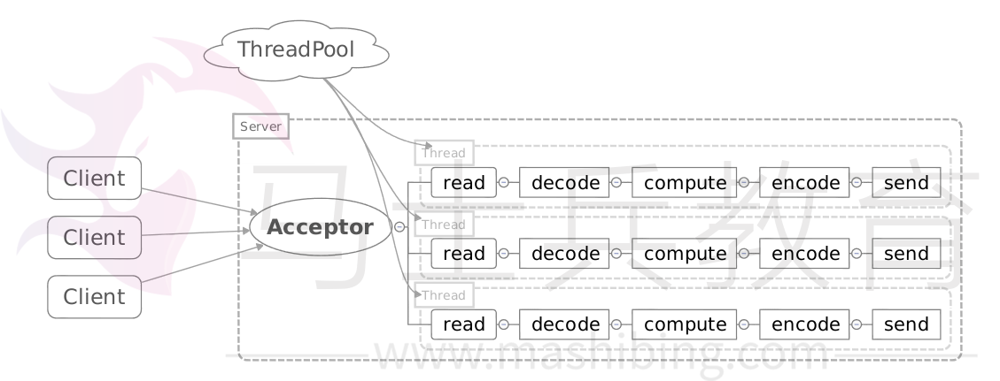

---

这里之所以使用多线程，是因为socket.accept()、inputStream.read()、outputStream.write()都是同步
阻塞的，当一个连接在处理I/O的时候，系统是阻塞的，如果是单线程的话在阻塞的期间不能接受任何请
求。所以，使用多线程，就可以让CPU去处理更多的事情。其实这也是所有使用多线程的本质：
利用多核。
    public static void main(String[] args) throws IOException {
        ExecutorService executor = Executors.newFixedThreadPool(128);
        ServerSocket serverSocket = new ServerSocket();
        serverSocket.bind(new InetSocketAddress(1234));
        // 循环等待新连接
        while (true) {
            Socket socket = serverSocket.accept();
            // 为新的连接创建线程执行任务
            executor.submit(new ConnectionTask(socket));
        }
    }
}
class ConnectionTask extends Thread {
    private Socket socket;
    public ConnectionTask(Socket socket) {
        this.socket = socket;
    }
    public void run() {
        while (true) {
            InputStream inputStream = null;
            OutputStream outputStream = null;
            try {
                inputStream = socket.getInputStream();
                
                // read from socket...
                
                inputStream.read();
                
                outputStream = socket.getOutputStream();
                // write to socket...
                outputStream.write();
            } catch (IOException e) {
                e.printStackTrace();
            } finally {
                // 关闭资源...
            }
        }
    }
}

---

当I/O阻塞系统，但CPU空闲的时候，可以利用多线程使用CPU资源。
使用线程池能够让线程的创建和回收成本相对较低。在活动连接数不是特别高（小于单机1000）的情况
下，这种模型是比较不错的，可以让每一个连接专注于自己的I/O并且编程模型简单，也不用过多考虑系
统的过载、限流等问题。线程池可以缓冲一些过多的连接或请求。
但这个模型最本质的问题在于，严重依赖于线程。但线程是很”贵”的资源，主要表现在：
1. 线程的创建和销毁成本很高，在Linux这样的操作系统中，线程本质上就是一个进程。创建和销毁
都是重量级的系统函数；
2. 线程本身占用较大内存，像Java的线程栈，一般至少分配512K～1M的空间，如果系统中的线程数
过千，恐怕整个JVM的内存都会被吃掉一半；
3. 线程的切换成本是很高的。操作系统发生线程切换的时候，需要保留线程的上下文，然后执行系统
调用。如果线程数过高，可能执行线程切换的时间甚至会大于线程执行的时间，这时候带来的表现
往往是系统load偏高、CPU sy使用率特别高（超过20%以上)，导致系统几乎陷入不可用的状态；
4. 容易造成锯齿状的系统负载。因为系统负载是用活动线程数或CPU核心数，一旦线程数量高但外部
网络环境不是很稳定，就很容易造成大量请求的结果同时返回，激活大量阻塞线程从而使系统负载
压力过大。
所以，当面对十万甚至百万级连接的时候，传统的BIO模型是无能为力的。随着移动端应用的兴起和各
种网络游戏的盛行，百万级长连接日趋普遍，此时，必然需要一种更高效的I/O处理模型。
NIO的实现原理
 
NIO本身是基于事件驱动思想来完成的，其主要想解决的是BIO的大并发问题，即在使用同步I/O的网络
应用中，如果要同时处理多个客户端请求，或是在客户端要同时和多个服务器进行通讯，就必须使用多
线程来处理。也就是说，将每一个客户端请求分配给一个线程来单独处理。这样做虽然可以达到我们的
要求，但同时又会带来另外一个问题。由于每创建一个线程，就要为这个线程分配一定的内存空间（也
叫工作存储器），而且操作系统本身也对线程的总数有一定的限制。如果客户端的请求过多，服务端程
序可能会因为不堪重负而拒绝客户端的请求，甚至服务器可能会因此而瘫痪。
NIO基于Reactor，当socket有流可读或可写入socket时，操作系统会相应的通知应用程序进行处理，应
用再将流读取到缓冲区或写入操作系统。
也就是说，这个时候，已经不是一个连接就要对应一个处理线程了，而是有效的请求，对应一个线程，
当连接没有数据时，是没有工作线程来处理的。
下面看下代码的实现：
NIO服务端代码（新建连接）：
NIO服务端代码（监听）：
//获取一个ServerSocket通道
ServerSocketChannel serverChannel = ServerSocketChannel.open();
serverChannel.configureBlocking(false);
serverChannel.socket().bind(new InetSocketAddress(port));
//获取通道管理器
selector = Selector.open();
//将通道管理器与通道绑定，并为该通道注册SelectionKey.OP_ACCEPT事件，
serverChannel.register(selector, SelectionKey.OP_ACCEPT);
while(true){
    //当有注册的事件到达时，方法返回，否则阻塞。
   selector.select();
   for(SelectionKey key : selector.selectedKeys()){
       if(key.isAcceptable()){

---

NIO模型示例如下：
Acceptor注册Selector，监听accept事件；
当客户端连接后，触发accept事件；
服务器构建对应的Channel，并在其上注册Selector，监听读写事件；
当发生读写事件后，进行相应的读写处理。
Reactor模型
 
有关Reactor模型结构，可以参考Doug Lea在 Scalable IO in Java中的介绍。这里简单介绍一下Reactor
模式的典型实现：
Reactor单线程模型
 
这是最简单的单Reactor单线程模型。Reactor线程负责多路分离套接字、accept新连接，并分派请求到
处理器链中。该模型适用于处理器链中业务处理组件能快速完成的场景。不过，这种单线程模型不能充
分利用多核资源，所以实际使用的不多。
这个模型和上面的NIO流程很类似，只是将消息相关处理独立到了Handler中去了。
代码实现如下：
           ServerSocketChannel server =
                (ServerSocketChannel)key.channel();
           SocketChannel channel = server.accept();
           channel.write(ByteBuffer.wrap(
            new String("send message to client").getBytes()));
           //在与客户端连接成功后，为客户端通道注册SelectionKey.OP_READ事件。
           channel.register(selector, SelectionKey.OP_READ);
       }else if(key.isReadable()){//有可读数据事件
           SocketChannel channel = (SocketChannel)key.channel();
           ByteBuffer buffer = ByteBuffer.allocate(10);
           int read = channel.read(buffer);
           byte[] data = buffer.array();
           String message = new String(data);
           System.out.println("receive message from client, size:"
               + buffer.position() + " msg: " + message);
       }
   }
}

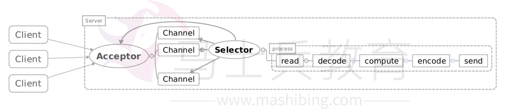

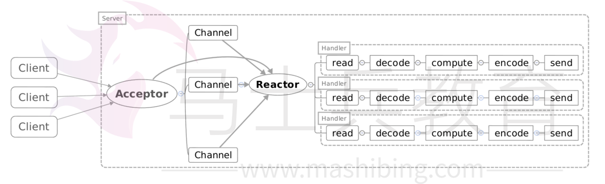

---

public class Reactor implements Runnable {
    final Selector selector;
    final ServerSocketChannel serverSocketChannel;
    public static void main(String[] args) throws IOException {
        new Thread(new Reactor(1234)).start();
    }
    public Reactor(int port) throws IOException {
        selector = Selector.open();
        serverSocketChannel = ServerSocketChannel.open();
        serverSocketChannel.socket().bind(new InetSocketAddress(port));
        serverSocketChannel.configureBlocking(false);
        SelectionKey key = serverSocketChannel.register(selector, 
SelectionKey.OP_ACCEPT);
        key.attach(new Acceptor());
    }
    @Override
    public void run() {
        while (!Thread.interrupted()) {
            try {
                selector.select();
                Set<SelectionKey> selectionKeys = selector.selectedKeys();
                for (SelectionKey selectionKey : selectionKeys) {
                    dispatch(selectionKey);
                }
                selectionKeys.clear();
            } catch (IOException e) {
                e.printStackTrace();
            }
        }
    }
    private void dispatch(SelectionKey selectionKey) {
        Runnable run = (Runnable) selectionKey.attachment();
        if (run != null) {
            run.run();
        }
    }
    class Acceptor implements Runnable {
        @Override
        public void run() {
            try {
                SocketChannel channel = serverSocketChannel.accept();
                if (channel != null) {
                    new Handler(selector, channel);
                }
            } catch (IOException e) {
                e.printStackTrace();
            }

---

}
    }
}
class Handler implements Runnable {
    private final static int DEFAULT_SIZE = 1024;
    private final SocketChannel socketChannel;
    private final SelectionKey seletionKey;
    private static final int READING = 0;
    private static final int SENDING = 1;
    private int state = READING;
    ByteBuffer inputBuffer = ByteBuffer.allocate(DEFAULT_SIZE);
    ByteBuffer outputBuffer = ByteBuffer.allocate(DEFAULT_SIZE);
    public Handler(Selector selector, SocketChannel channel) throws IOException 
{
        this.socketChannel = channel;
        socketChannel.configureBlocking(false);
        this.seletionKey = socketChannel.register(selector, 0);
        seletionKey.attach(this);
        seletionKey.interestOps(SelectionKey.OP_READ);
        selector.wakeup();
    }
    @Override
    public void run() {
        if (state == READING) {
            read();
        } else if (state == SENDING) {
            write();
        }
    }
    class Sender implements Runnable {
        @Override
        public void run() {
            try {
                socketChannel.write(outputBuffer);
            } catch (IOException e) {
                e.printStackTrace();
            }
            if (outIsComplete()) {
                seletionKey.cancel();
            }
        }

---

虽然上面说到NIO一个线程就可以支持所有的IO处理。但是瓶颈也是显而易见的。我们看一个客户端的
情况，如果这个客户端多次进行请求，如果在Handler中的处理速度较慢，那么后续的客户端请求都会
被积压，导致响应变慢！所以引入了Reactor多线程模型。
    }
    private void write() {
        try {
            socketChannel.write(outputBuffer);
        } catch (IOException e) {
            e.printStackTrace();
        }
        while (outIsComplete()) {
            seletionKey.cancel();
        }
    }
    private void read() {
        try {
            socketChannel.read(inputBuffer);
            if (inputIsComplete()) {
                process();
                System.out.println("接收到来自客户端（" + 
socketChannel.socket().getInetAddress().getHostAddress()
                        + "）的消息：" + new String(inputBuffer.array()));
                seletionKey.attach(new Sender());
                seletionKey.interestOps(SelectionKey.OP_WRITE);
                seletionKey.selector().wakeup();
            }
        } catch (IOException e) {
            e.printStackTrace();
        }
    }
    public boolean inputIsComplete() {
        return true;
    }
    public boolean outIsComplete() {
        return true;
    }
    public void process() {
        // do something...
    }
}

---

Reactor多线程模型
 
相比上一种模型，该模型在处理器链部分采用了多线程（线程池）：
Reactor多线程模型就是将Handler中的IO操作和非IO操作分开，操作IO的线程称为IO线程，非IO操作的
线程称为工作线程。这样的话，客户端的请求会直接被丢到线程池中，客户端发送请求就不会堵塞。
可以将Handler做如下修改：
class Handler implements Runnable {
    private final static int DEFAULT_SIZE = 1024;
    private final SocketChannel socketChannel;
    private final SelectionKey seletionKey;
    private static final int READING = 0;
    private static final int SENDING = 1;
    private int state = READING;
    ByteBuffer inputBuffer = ByteBuffer.allocate(DEFAULT_SIZE);
    ByteBuffer outputBuffer = ByteBuffer.allocate(DEFAULT_SIZE);
    
    private Selector selector;
    private static ExecutorService executorService = 
Executors.newFixedThreadPool(Runtime.getRuntime()
            .availableProcessors());
    private static final int PROCESSING = 3;
    public Handler(Selector selector, SocketChannel channel) throws IOException 
{
        this.selector = selector;
        this.socketChannel = channel;
        socketChannel.configureBlocking(false);
        this.seletionKey = socketChannel.register(selector, 0);
        seletionKey.attach(this);
        seletionKey.interestOps(SelectionKey.OP_READ);
        selector.wakeup();
    }
    @Override
    public void run() {
        if (state == READING) {

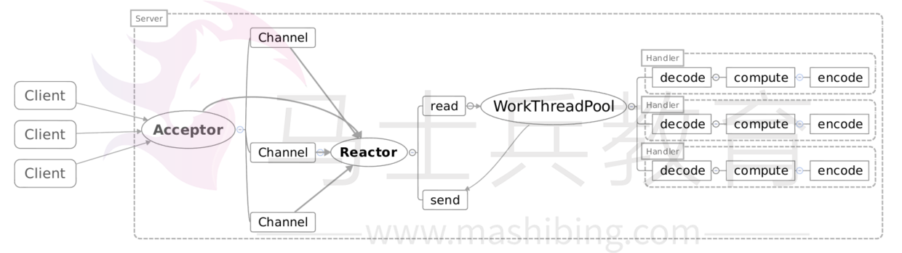

---

read();
        } else if (state == SENDING) {
            write();
        }
    }
    class Sender implements Runnable {
        @Override
        public void run() {
            try {
                socketChannel.write(outputBuffer);
            } catch (IOException e) {
                e.printStackTrace();
            }
            if (outIsComplete()) {
                seletionKey.cancel();
            }
        }
    }
    private void write() {
        try {
            socketChannel.write(outputBuffer);
        } catch (IOException e) {
            e.printStackTrace();
        }
        if (outIsComplete()) {
            seletionKey.cancel();
        }
    }
    private void read() {
        try {
            socketChannel.read(inputBuffer);
            if (inputIsComplete()) {
                process();
                executorService.execute(new Processer());
            }
        } catch (IOException e) {
            e.printStackTrace();
        }
    }
    public boolean inputIsComplete() {
        return true;
    }
    public boolean outIsComplete() {
        return true;
    }

---

但是当用户进一步增加的时候，Reactor会出现瓶颈！因为Reactor既要处理IO操作请求，又要响应连接
请求。为了分担Reactor的负担，所以引入了主从Reactor模型。
主从Reactor多线程模型
 
主从Reactor多线程模型是将Reactor分成两部分，mainReactor负责监听server socket，accept新连
接，并将建立的socket分派给subReactor。subReactor负责多路分离已连接的socket，读写网络数据，
对业务处理功能，其扔给worker线程池完成。通常，subReactor个数上可与CPU个数等同：
这时可以把Reactor做如下修改：
    public void process() {
    }
    synchronized void processAndHandOff() {
        process();
        state = SENDING; // or rebind attachment
        seletionKey.interestOps(SelectionKey.OP_WRITE);
        selector.wakeup();
    }
    class Processer implements Runnable {
        public void run() {
            processAndHandOff();
        }
    }
}
public class Reactor {
    final ServerSocketChannel serverSocketChannel;
    Selector[] selectors; // also create threads
    AtomicInteger next = new AtomicInteger(0);
    ExecutorService sunReactors = 
Executors.newFixedThreadPool(Runtime.getRuntime().availableProcessors());
    public static void main(String[] args) throws IOException {
        new Reactor(1234);
    }
    public Reactor(int port) throws IOException {
        serverSocketChannel = ServerSocketChannel.open();
        serverSocketChannel.socket().bind(new InetSocketAddress(port));
        serverSocketChannel.configureBlocking(false);
        selectors = new Selector[4];
        for (int i = 0; i < 4; i++) {

---

可见，主Reactor用于响应连接请求，从Reactor用于处理IO操作请求。
            Selector selector = Selector.open();
            selectors[i] = selector;
            SelectionKey key = serverSocketChannel.register(selector, 
SelectionKey.OP_ACCEPT);
            key.attach(new Acceptor());
            new Thread(() -> {
                while (!Thread.interrupted()) {
                    try {
                        selector.select();
                        Set<SelectionKey> selectionKeys = 
selector.selectedKeys();
                        for (SelectionKey selectionKey : selectionKeys) {
                            dispatch(selectionKey);
                        }
                        selectionKeys.clear();
                    } catch (IOException e) {
                        e.printStackTrace();
                    }
                }
            }).start();
        }
    }
    private void dispatch(SelectionKey selectionKey) {
        Runnable run = (Runnable) selectionKey.attachment();
        if (run != null) {
            run.run();
        }
    }
    class Acceptor implements Runnable {
        @Override
        public void run() {
            try {
                SocketChannel connection = serverSocketChannel.accept();
                if (connection != null)
                    sunReactors.execute(new 
Handler(selectors[next.getAndIncrement() % selectors.length], connection));
            } catch (IOException e) {
                e.printStackTrace();
            }
        }
    }
}

---

AIO
 
与NIO不同，当进行读写操作时，只须直接调用API的read或write方法即可。这两种方法均为异步的，
对于读操作而言，当有流可读取时，操作系统会将可读的流传入read方法的缓冲区，并通知应用程序；
对于写操作而言，当操作系统将write方法传递的流写入完毕时，操作系统主动通知应用程序。
即可以理解为，read/write方法都是异步的，完成后会主动调用回调函数。
在JDK1.7中，这部分内容被称作NIO.2，主要在java.nio.channels包下增加了下面四个异步通道：
AsynchronousSocketChannel
AsynchronousServerSocketChannel
AsynchronousFileChannel
AsynchronousDatagramChannel
我们看一下AsynchronousSocketChannel中的几个方法：
其中的read/write方法，有的会返回一个Future 对象，有的需要传入一个CompletionHandler 对象，
该对象的作用是当执行完读取/写入操作后，直接该对象当中的方法进行回调。
public abstract class AsynchronousSocketChannel
    implements AsynchronousByteChannel, NetworkChannel
{
    public abstract Future<Integer> read(ByteBuffer dst);
    
    public abstract <A> void read(ByteBuffer[] dsts,
                                  int offset,
                                  int length,
                                  long timeout,
                                  TimeUnit unit,
                                  A attachment,
                                  CompletionHandler<Long,? super A> handler);
    public abstract <A> void write(ByteBuffer src,
                                   long timeout,
                                   TimeUnit unit,
                                   A attachment,
                                   CompletionHandler<Integer,? super A> 
handler);
    public final <A> void write(ByteBuffer src,
                                A attachment,
                                CompletionHandler<Integer,? super A> handler)
    {
        write(src, 0L, TimeUnit.MILLISECONDS, attachment, handler);
    }
    public abstract Future<Integer> write(ByteBuffer src);
    public abstract <A> void write(ByteBuffer[] srcs,
                                   int offset,
                                   int length,
                                   long timeout,
                                   TimeUnit unit,
                                   A attachment,
                                   CompletionHandler<Long,? super A> handler);
}

---

对于AsynchronousSocketChannel 而言，在windows和linux上的实现类是不一样的。
在windows上，AIO的实现是通过IOCP来完成的，实现类是：
实现的接口是：
而在linux上，实现类是：
实现的接口是：
AIO是一种接口标准，各家操作系统可以实现也可以不实现。在不同操作系统上在高并发情况下最好都
采用操作系统推荐的方式。Linux上还没有真正实现网络方式的AIO。
select和epoll的区别
 
当需要读两个以上的I/O的时候，如果使用阻塞式的I/O，那么可能长时间的阻塞在一个描述符上面，另
外的描述符虽然有数据但是不能读出来，这样实时性不能满足要求，大概的解决方案有以下几种：
1. 使用多进程或者多线程，但是这种方法会造成程序的复杂，而且对与进程与线程的创建维护也需要
很多的开销（Apache服务器是用的子进程的方式，优点可以隔离用户）；
2. 用一个进程，但是使用非阻塞的I/O读取数据，当一个I/O不可读的时候立刻返回，检查下一个是否
可读，这种形式的循环为轮询（polling），这种方法比较浪费CPU时间，因为大多数时间是不可
读，但是仍花费时间不断反复执行read系统调用；
3. 异步I/O，当一个描述符准备好的时候用一个信号告诉进程，但是由于信号个数有限，多个描述符
时不适用；
4. 一种较好的方式为I/O多路复用，先构造一张有关描述符的列表（epoll中为队列），然后调用一个
函数，直到这些描述符中的一个准备好时才返回，返回时告诉进程哪些I/O就绪。select和epoll这
两个机制都是多路I/O机制的解决方案，select为POSIX标准中的，而epoll为Linux所特有的。
它们的区别主要有三点：
1. select的句柄数目受限，在linux/posix_types.h头文件有这样的声明：#define __FD_SETSIZE 
1024 表示select最多同时监听1024个fd。而epoll没有，它的限制是最大的打开文件句柄数目；
2. epoll的最大好处是不会随着FD的数目增长而降低效率，在selec中采用轮询处理，其中的数据结构
类似一个数组的数据结构，而epoll是维护一个队列，直接看队列是不是空就可以了。epoll只会对”
活跃”的socket进行操作—这是因为在内核实现中epoll是根据每个fd上面的callback函数实现的。那
么，只有”活跃”的socket才会主动的去调用 callback函数（把这个句柄加入队列），其他idle状态
句柄则不会，在这点上，epoll实现了一个”伪”AIO。但是如果绝大部分的I/O都是“活跃的”，每个I/O
端口使用率很高的话，epoll效率不一定比select高（可能是要维护队列复杂）；
3. 使用mmap加速内核与用户空间的消息传递。无论是select,poll还是epoll都需要内核把FD消息通知
给用户空间，如何避免不必要的内存拷贝就很重要，在这点上，epoll是通过内核于用户空间
mmap同一块内存实现的。
WindowsAsynchronousSocketChannelImpl
Iocp.OverlappedChannel
UnixAsynchronousSocketChannelImpl
Port.PollableChannel

---

NIO与epoll
 
上文说到了select与epoll的区别，再总结一下Java NIO与select和epoll：
Linux2.6之后支持epoll
windows支持select而不支持epoll
不同系统下nio的实现是不一样的，包括Sunos linux 和windows
select的复杂度为O(N)
select有最大fd限制，默认为1024
修改sys/select.h可以改变select的fd数量限制
epoll的事件模型，无fd数量限制，复杂度O(1),不需要遍历fd
以下代码基于Java 8。
下面看下在NIO中Selector的open方法：
这里使用了SelectorProvider去创建一个Selector，看下provider方法的实现：
看下sun.nio.ch.DefaultSelectorProvider.create() 方法，该方法在不同的操作系统中的代码是
不同的，在windows中的实现如下：
在Mac OS中的实现如下：
在linux中的实现如下：
public static Selector open() throws IOException {
    return SelectorProvider.provider().openSelector();
}
public static SelectorProvider provider() {
    synchronized (lock) {
        if (provider != null)
            return provider;
        return AccessController.doPrivileged(
            new PrivilegedAction<SelectorProvider>() {
                public SelectorProvider run() {
                        if (loadProviderFromProperty())
                            return provider;
                        if (loadProviderAsService())
                            return provider;
                        provider = sun.nio.ch.DefaultSelectorProvider.create();
                        return provider;
                    }
                });
    }
}
public static SelectorProvider create() {
    return new WindowsSelectorProvider();
}
public static SelectorProvider create() {
    return new KQueueSelectorProvider();
}

---

我们看到create方法中是通过区分操作系统来返回不同的Provider的。其中SunOs就是Solaris返回的是
DevPollSelectorProvider，对于Linux，返回的Provder是EPollSelectorProvider，其余操作系统，返回
的是PollSelectorProvider。
Zero Copy
 
许多web应用都会向用户提供大量的静态内容，这意味着有很多数据从硬盘读出之后，会原封不动的通
过socket传输给用户。
这种操作看起来可能不会怎么消耗CPU，但是实际上它是低效的：
1. kernel把从disk读数据；
2. 将数据传输给application；
3. application再次把同样的内容再传回给处于kernel级的socket。
这种场景下，application实际上只是作为一种低效的中间介质，用来把磁盘文件的数据传给socket。
数据每次传输都会经过user和kernel空间都会被copy，这会消耗cpu，并且占用RAM的带宽。
传统的数据传输方式
 
像这种从文件读取数据然后将数据通过网络传输给其他的程序的方式其核心操作就是如下两个调用：
其上操作看上去只有两个简单的调用，但是其内部过程却要经历四次用户态和内核态的切换以及四次的
数据复制操作：
public static SelectorProvider create() {
    String str = (String)AccessController.doPrivileged(new 
GetPropertyAction("os.name"));
    
    if (str.equals("SunOS"))
        return createProvider("sun.nio.ch.DevPollSelectorProvider");
    if (str.equals("Linux"))
        return createProvider("sun.nio.ch.EPollSelectorProvider");
    return new PollSelectorProvider();
}
File.read(fileDesc,buf,len);
Socket.send(socket,buf,len);

---

上图展示了数据从文件到socket的内部流程。
下面看下用户态和内核态的切换过程：
 
步骤如下：
1. read()的调用引起了从用户态到内核态的切换（看图二），内部是通过sys_read()（或者类似的方
法）发起对文件数据的读取。数据的第一次复制是通过DMA（直接内存访问）将磁盘上的数据复制
到内核空间的缓冲区中；
2. 数据从内核空间的缓冲区复制到用户空间的缓冲区后，read()方法也就返回了。此时内核态又切换
回用户态，现在数据也已经复制到了用户地址空间的缓存中；
3. socket的send()方法的调用又会引起用户态到内核的切换，第三次数据复制又将数据从用户空间缓
冲区复制到了内核空间的缓冲区，这次数据被放在了不同于之前的内核缓冲区中，这个缓冲区与数
据将要被传输到的socket关联；
4. send()系统调用返回后，就产生了第四次用户态和内核态的切换。随着DMA单独异步的将数据从内
核态的缓冲区中传输到协议引擎发送到网络上，有了第四次数据复制。

---

Zero Copy的数据传输方式
 
java.nio.channels.FileChannel 中定义了两个方法：transferTo( )和 transferFrom( )。
transferTo( )和 transferFrom( )方法允许将一个通道交叉连接到另一个通道，而不需要通过一个中间缓
冲区来传递数据。只有 FileChannel 类有这两个方法，因此 channel-to-channel 传输中通道之一必须
是 FileChannel。您不能在 socket 通道之间直接传输数据，不过 socket 通道实现 
WritableByteChannel  和 ReadableByteChannel  接口，因此文件的内容可以用 transferTo( )  方
法传输给一个 socket 通道，或者也可以用 transferFrom( )方法将数据从一个 socket 通道直接读取到一
个文件中。
下面根据transferTo()  方法来说明。
根据上文可知，transferTo()  方法可以把bytes直接从调用它的channel传输到另一个
WritableByteChannel，中间不经过应用程序。
下面看下该方法的定义：
下图展示了通过transferTo实现数据传输的路径：
下图展示了内核态、用户态的切换情况：
使用transferTo()方式所经历的步骤：
1. transferTo调用会引起DMA将文件内容复制到读缓冲区(内核空间的缓冲区)，然后数据从这个缓冲
区复制到另一个与socket输出相关的内核缓冲区中；
public abstract long transferTo(long position, long count,
                                    WritableByteChannel target)
        throws IOException;

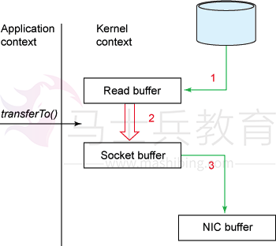

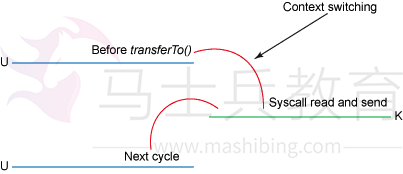

---

2. 第三次数据复制就是DMA把socket关联的缓冲区中的数据复制到协议引擎上发送到网络上。
这次改善，我们是通过将内核、用户态切换的次数从四次减少到两次，将数据的复制次数从四次减少到
三次(只有一次用到cpu资源)。但这并没有达到我们零复制的目标。如果底层网络适配器支持收集操作的
话，我们可以进一步减少内核对数据的复制次数。在内核为2.4或者以上版本的linux系统上，socket缓
冲区描述符将被用来满足这个需求。这个方式不仅减少了内核用户态间的切换，而且也省去了那次需要
cpu参与的复制过程。从用户角度来看依旧是调用transferTo()方法，但是其本质发生了变化：
1. 调用transferTo方法后数据被DMA从文件复制到了内核的一个缓冲区中；
2. 数据不再被复制到socket关联的缓冲区中了，仅仅是将一个描述符（包含了数据的位置和长度等信
息）追加到socket关联的缓冲区中。DMA直接将内核中的缓冲区中的数据传输给协议引擎，消除了
仅剩的一次需要cpu周期的数据复制。
NIO存在的问题
 
使用NIO != 高性能，当连接数<1000，并发程度不高或者局域网环境下NIO并没有显著的性能优势。
NIO并没有完全屏蔽平台差异，它仍然是基于各个操作系统的I/O系统实现的，差异仍然存在。使用NIO
做网络编程构建事件驱动模型并不容易，陷阱重重。
推荐大家使用成熟的NIO框架，如Netty，MINA等。解决了很多NIO的陷阱，并屏蔽了操作系统的差
异，有较好的性能和编程模型。
总结
 
最后总结一下NIO有哪些优势：
事件驱动模型
避免多线程
单线程处理多任务
非阻塞I/O，I/O读写不再阻塞
基于block的传输，通常比基于流的传输更高效
更高级的IO函数，Zero Copy
I/O多路复用大大提高了Java网络应用的可伸缩性和实用性

