# 2.630道

Mysql（连老师）
数据库基础知识
为什么要使用数据库
数据保存在内存
数据保存在文件
数据保存在数据库
什么是SQL？
什么是MySQL?
数据库三大范式是什么
mysql有关权限的表都有哪几个
MySQL的binlog有有几种录入格式？分别有什么区别？
数据类型
mysql有哪些数据类型
引擎
MySQL存储引擎MyISAM与InnoDB区别
MyISAM索引与InnoDB索引的区别？
InnoDB引擎的4大特性
存储引擎选择
索引
什么是索引？
索引有哪些优缺点？
索引使用场景（重点）
索引有哪几种类型？
索引的数据结构（b树，hash）
索引的基本原理
索引算法有哪些？
索引设计的原则？
创建索引的原则（重中之重）
创建索引时需要注意什么？
使用索引查询一定能提高查询的性能吗？为什么
百万级别或以上的数据如何删除
前缀索引
什么是最左前缀原则？什么是最左匹配原则
B树和B+树的区别
使用B树的好处
使用B+树的好处
Hash索引和B+树所有有什么区别或者说优劣呢?
数据库为什么使用B+树而不是B树
B+树在满足聚簇索引和覆盖索引的时候不需要回表查询数据
什么是聚簇索引？何时使用聚簇索引与非聚簇索引
非聚簇索引一定会回表查询吗？
联合索引是什么？为什么需要注意联合索引中的顺序？
事务
什么是数据库事务？
事物的四大特性(ACID)介绍一下?
什么是脏读？幻读？不可重复读？
什么是事务的隔离级别？MySQL的默认隔离级别是什么？
锁
对MySQL的锁了解吗
隔离级别与锁的关系
按照锁的粒度分数据库锁有哪些？锁机制与InnoDB锁算法
从锁的类别上分MySQL都有哪些锁呢？
像上面那样子进行锁定岂不是有点阻碍并发效率了
MySQL中InnoDB引擎的行锁是怎么实现的？
InnoDB存储引擎的锁的算法有三种

---

什么是死锁？怎么解决？
数据库的乐观锁和悲观锁是什么？怎么实现的？
视图
为什么要使用视图？什么是视图？
视图有哪些特点？
视图的使用场景有哪些？
视图的优点
视图的缺点
什么是游标？
存储过程与函数
什么是存储过程？有哪些优缺点？
触发器
什么是触发器？触发器的使用场景有哪些？
MySQL中都有哪些触发器？
常用SQL语句
SQL语句主要分为哪几类
超键、候选键、主键、外键分别是什么？
SQL约束有哪几种？
六种关联查询
什么是子查询
子查询的三种情况
mysql中in和exists区别
varchar与char的区别
varchar(50)中50的涵义
int(20)中20的涵义
mysql为什么这么设计
mysql中int(10)和char(10)以及varchar(10)的区别
FLOAT和DOUBLE的区别是什么？
drop、delete与truncate的区别
三者都表示删除，但是三者有一些差别：
UNION与UNIONALL的区别？
SQL优化
如何定位及优化SQL语句的性能问题？
创建的索引有没有被使用到?或者说怎么才可以知道这条语句运行很慢的原因？
SQL的生命周期？
大表数据查询，怎么优化
超大分页怎么处理？
mysql分页
慢查询日志
关心过业务系统里面的sql耗时吗？统计过慢查询吗？对慢查询都怎么优化过？
慢查询都怎么优化过？
为什么要尽量设定一个主键？
主键使用自增ID还是UUID？
字段为什么要求定义为not null？
如果要存储用户的密码散列，应该使用什么字段进行存储？
优化查询过程中的数据访问
优化长难的查询语句
优化特定类型的查询语句
优化关联查询
优化子查询
优化LIMIT分页
优化UNION查询
优化WHERE子句
数据库优化
为什么要优化
数据库结构优化
MySQL数据库cpu飙升到500%的话他怎么处理？
大表怎么优化？某个表有近千万数据，

---

CRUD比较慢，如何优化？分库分表了是怎么
做的？分表分库了有什么问题？有用到中间
件么？他们的原理知道么？
垂直分表
适用场景
缺点
水平分表：
适用场景
MySQL的复制原理以及流程
读写分离有哪些解决方案？
备份计划，mysqldump以及xtranbackup的实现原理
数据表损坏的修复方式有哪些？
MySQL记录binlog的方式主要包括三种模式？每种模式的优缺点是什么？ 
MySQL锁，悲观锁、乐观锁、排它锁、共享锁、表级锁、行级锁； 
MySQL InnoDB中，乐观锁、悲观锁、共享锁、排它锁、行锁、表锁、死锁概念的理解
乐观锁
悲观锁
共享锁
排它锁
行锁
表锁
死锁
分布式事务的原理2阶段提交，同步异步阻塞非阻塞； 
数据库事务隔离级别，MySQL默认的隔离级别 
Spring如何实现事务
spring事务管理(详解和实例)
1 初步理解
2 核心接口
2.1 事务管理器
2.2 基本事务属性的定义
2.3 事务状态
3 编程式事务
3.1 编程式和声明式事务的区别
3.2 如何实现编程式事务？
4 声明式事务
4.1 配置方式
4.2 一个声明式事务的实例
Spring事务管理及几种简单的实现
JDBC如何实现事务 
嵌套事务实现 
Spring事务管理--(二)嵌套事物详解
一、前言
二、spring嵌套事物
1、展示项目代码--简单测springboot项目
2、外部起事物，内部起事物，内外都无Try Catch
3、外部起事物，内部起事物，外部有Try Catch
4、外部起事物，内部起事物，内部有Try Catch
5、外部起事物，内部起事物，内外有Try Catch
三、嵌套事物总结
四、正确的嵌套事物实例
分布式事务实现； 
分布式事务与解决方案
前言
产生原因
数据库分库分表：
应用SOA化：
应用场景
支付、转账：

---

在线下单：
电商场景：流量充值业务
数据库事务
事务类型：
隔离级别及引发现象：（略谈）
Spring事务传播行为：（略谈）
事务种类：
如何保证强一致性
本地事务（mysql 之 InnoDB）：
分布式事务：
实现分布式事务解决方案
基于XA协议的两阶段提交（2PC）
补偿事务（TCC）
本地消息表（MQ 异步确保）
MQ 事务消息
Sagas 事务模型
其他补偿方式
总结
SQL的整个解析、执行过程原理、SQL行转列； 
mysql行转列、列转行
行转列
列转行
红黑树的实现原理和应用场景；
MySql的存储引擎的不同
MySQL存储引擎之Myisam和Innodb总结性梳理
Mysql优化系列--Innodb引擎下mysql自身配置优化
Mysql怎么分表，以及分表后如果想按条件分页查询怎么办(如果不是按分表字段来查询的话，几乎效率低下，
无解)
mysql 数据库 分表后 怎么进行分页查询？Mysql分库分表方案?
mysql大数据量使用limit分页，随着页码的增大，查询效率越低下。
测试实验
1.  直接用limit start, count分页语句， 也是我程序中用的方法：
2.  对limit分页问题的性能优化方法
MySQL分表自增ID解决方案
理解分布式id生成算法SnowFlake
概述
Talk is cheap, show you the code
代码理解
负数的二进制表示
用位运算计算n个bit能表示的最大数值
用mask防止溢出
用位运算汇总结果
观察
扩展
MySql的主从实时备份同步的配置，以及原理(从库读主库的binlog)，读写分离
Mysql主从同步的实现原理
MySQL索引背后的数据结构及算法原理
摘要
数据结构及算法基础
索引的本质
B-Tree和B+Tree
B-Tree
B+Tree
带有顺序访问指针的B+Tree
为什么使用B-Tree（B+Tree）
主存存取原理
磁盘存取原理
局部性原理与磁盘预读

---

B-/+Tree索引的性能分析
MySQL索引实现
MyISAM索引实现
InnoDB索引实现
索引使用策略及优化
示例数据库
最左前缀原理与相关优化
情况一：全列匹配。
情况二：最左前缀匹配。
情况三：查询条件用到了索引中列的精确匹配，但是中间某个条件未提供。
情况四：查询条件没有指定索引第一列。
情况五：匹配某列的前缀字符串。
情况六：范围查询。
情况七：查询条件中含有函数或表达式。
索引选择性与前缀索引
InnoDB的主键选择与插入优化
后记
mysql的锁--行锁，表锁，乐观锁，悲观锁
Mysql中的MVCC
1. Innodb的事务相关概念
2. 行的更新过程
1. 初始数据行
2.事务1更改该行的各字段的值
3.事务2修改该行的值
4. 事务提交
5. Insert Undo log
3. 事务级别
4. MVCC
5.总结
mysql索引原理之聚簇索引
学习笔记_mysql索引原理之B+/-Tree
关系型和非关系型数据库区别
我的Mysql死锁排查过程（案例分析）
死锁起因
分析
阅读死锁日志
死锁形成流程图
拓展
总结
MySql优化
MySQL 对于千万级的大表要怎么优化？
产生死锁的必要条件
操作系统：死锁的产生、条件、和解锁
产生死锁的原因主要是：
产生死锁的四个必要条件：
死锁的解除与预防
死锁排除的方法
Spring（连老师）
Spring 原理 
Spring 特点 
Spring 核心组件 
Spring 常用模块 
Spring 主要包 
Spring 常用注解 
Spring 第三方结合 
Spring IOC 原理 
Spring APO 原理 
Spring MVC 原理

---

Spring AOP的实现原理和场景；     
一、场景   
二、实现技术    
Spring bean的作用域和生命周期；
作用域
生命周期
Spring 5比Spring4做了哪些改进；  
Spring 4.x新特性 
Spring 5.x新特性 
Spring4新特性——泛型限定式依赖注入
Spring4新特性——核心容器的其他改进
Spring4新特性——Web开发的增强
Spring4新特性——集成Bean Validation 1.1(JSR-349)到SpringMVC
1、集成Bean Validation 1.1到SpringMVC
2、分组验证及分组顺序
3、消息中使用EL表达式
4、方法参数/返回值验证
5、自定义验证规则
6、类级别验证器
7、通过脚本验证
8、cross-parameter，跨参数验证
9、混合类级别验证器和跨参数验证器
10、组合验证注解 
11、本地化 
Spring4新特性——Groovy Bean定义DSL
一、对比
二、Groovy Bean定义
三、Groovy Bean定义 DSL语法
Spring4新特性——更好的Java泛型操作API
Spring4新特性——JSR310日期时间API的支持
Spring4新特性——注解、脚本、任务、MVC等其他特性改进
一、注解方面的改进
二、脚本的支持 
三、Future增强
四、MvcUriComponentsBuilder
五、Socket支持
如何自定义一个Spring Boot Starter？ 
本章内容概览
版本信息
官方资料
设定实战目标
学习spring cloud的starter
如何建立对spring-cloud-netflix-eureka-client模块的依赖
为什么应用能自动注册到Eureka sever
实战的设计
自定义spring boot starter三部曲之二：实战开发
本章内容概述
创建工程customizestarter
创建模块customizeapi
创建模块addservice
创建模块minusservice
创建模块customizeservicestarter
构建工程customizestarter
创建工程customizestartertestdemo
构建工程customizestartertestdemo
验证支持负数的减法服务
验证不支持负数的减法服务
自定义spring boot starter三部曲之三：源码分析spring.factories加载过程

---

版本情况
初步分析
spring容器如何处理配置类
spring boot配置类的加载情况
Spring IOC是什么？优点是什么？ 
Spring IOC原理解读 面试必读
一、什么是Ioc/DI？
二、 Spring IOC体系结构？
三、IoC容器的初始化？
四、IOC容器的依赖注入
五、IoC容器的高级特性
SpringMVC
动态代理 
反射 
AOP原理 
Spring事务；  
springMVC的原理
Spring MVC工作原理 及注解说明
SpringMVC框架介绍
SpringMVC原理图
SpringMVC接口解释
SpringMVC运行原理
spring中beanFactory和ApplicationContext的联系和区别
Spring系列之beanFactory与ApplicationContext
spring注入的几种方式（循环注入）
Spring循环依赖的三种方式
第一种：构造器参数循环依赖
第二种：setter方式单例，默认方式
第三种：setter方式原型，prototype
springIOC
Spring IOC原理解读 面试必读
一、什么是Ioc/DI？
二、 Spring IOC体系结构？
三、IoC容器的初始化？
四、IOC容器的依赖注入
五、IoC容器的高级特性
spring AOP的原理
Spring AOP 实现原理与 CGLIB 应用
AOP 的存在价值
图 1.多个地方包含相同代码的软件
图 2 通过方法调用实现系统功能
使用 AspectJ 的编译时增强进行 AOP
清单 1.Hello.java
清单 2.TxAspect.java
清单 3.LogAspect.java
清单 4.Hello.class
使用 Spring AOP
清单 5.Chinese.java
清单 6.AfterReturningAdviceTest.java
清单 7.AfterReturningAdviceTest.java
清单 8.bean.xml
清单 9.BeanTest.java
清单 10.Person.java
清单 11.BeanTest.java
Spring AOP 原理剖析
图 3.AOP 代理的方法与目标对象的方法
使用 CGLIB 生成代理类
清单 12.AroundAdvice.java

---

清单 13.ChineseProxyFactory.java
清单 14.Main.java
结束语
spring AOP 两种代理方式
Spring 如何保证 Controller 并发的安全？
springMVC一个Controller处理所有用户请求的并发问题
Spring并发访问的线程安全性问题 
spring中用到哪些设计模式？
Spring IOC 的理解，其初始化过程？
Spring的事务管理
1 初步理解
2 核心接口
2.1 事务管理器
2.1.1 JDBC事务
2.1.2 Hibernate事务
2.1.3 Java持久化API事务（JPA）
2.1.4 Java原生API事务
2.2 基本事务属性的定义
2.2.1 传播行为
2.2.2 隔离级别
2.2.3 只读
2.2.4 事务超时
2.2.5 回滚规则
2.3 事务状态
3 编程式事务
3.1 编程式和声明式事务的区别
3.2 如何实现编程式事务？
3.2.1 使用TransactionTemplate
3.2.2 使用PlatformTransactionManager
4 声明式事务
4.1 配置方式
4.2 一个声明式事务的实例
SpringMVC概述
什么是Spring MVC？简单介绍下你对Spring MVC的理解？ 
Spring MVC的优点 
Spring MVC的主要组件？ 
什么是DispatcherServlet 
什么是Spring MVC框架的控制器？ 
Spring MVC的控制器是不是单例模式,如果是,有什么问题,怎么解决？ 
工作原理
请描述Spring MVC的工作流程？描述一下  DispatcherServlet 的工作流程？ 
MVC框架
MVC是什么？MVC设计模式的好处有哪些 
常用注解
注解原理是什么 
Spring MVC常用的注解有哪些？ 
SpingMvc中的控制器的注解一般用哪个,有没有别的注解可以替代？
@Controller注解的作用
@RequestMapping注解的作用
@ResponseBody注解的作用
@PathVariable和@RequestParam的区别
其他
Spring MVC与Struts2区别
Spring MVC怎么样设定重定向和转发的？
Spring MVC怎么和AJAX相互调用的？
如何解决POST请求中文乱码问题，GET的又如何处理呢？
Spring MVC的异常处理？
如果在拦截请求中，我想拦截get方式提交的方法,怎么配置

---

怎样在方法里面得到Request,或者Session？
如果想在拦截的方法里面得到从前台传入的参数,怎么得到？
如果前台有很多个参数传入,并且这些参数都是一个对象的,那么怎么样快速得到这个对象？
Spring MVC中函数的返回值是什么？
Spring MVC用什么对象从后台向前台传递数据的？
怎么样把ModelMap里面的数据放入Session里面？
Spring MVC里面拦截器是怎么写的
介绍一下 WebApplicationContext
Spring概述
1. 什么是spring? 
2. Spring框架的设计目标，设计理念，和核心是什么 
3. Spring的优缺点是什么？ 
4. Spring有哪些应用场景 
5. Spring由哪些模块组成？ 
6. Spring 框架中都用到了哪些设计模式？ 
7. 详细讲解一下核心容器（spring context应用上下文) 模 块 
8. Spring框架中有哪些不同类型的事件 
9. Spring 应用程序有哪些不同组件？ 
10. 使用 Spring 有哪些方式？ 
Spring控制反转(IOC)
什么是Spring IOC 容器？
控制反转(IoC)有什么作用
IOC的优点是什么？
Spring IoC 的实现机制
Spring 的 IoC支持哪些功能
BeanFactory 和 ApplicationContext有什么区别？
Spring 如何设计容器的，BeanFactory和 ApplicationContext的关系详解
ApplicationContext通常的实现是什么？
什么是Spring的依赖注入？
依赖注入的基本原则
依赖注入有什么优势
有哪些不同类型的依赖注入实现方式？
构造器依赖注入和 Setter方法注入的区别
Spring Beans（19）什么是Spring beans？
一个 Spring Bean 定义 包含什么？
如何创建一个如何给Spring 容器提供配置元数据？Spring有几种配置方式
Spring配置文件包含了哪些信息
Spring基于xml注入bean的几种方式
你怎样定义类的作用域？
解释Spring支持的几种bean的作用域
Spring框架中的单例bean是线程安全的吗？
Spring如何处理线程并发问题？
哪些是重要的bean生命周期方法？ 你能重载它们吗？
什么是Spring的内部bean？什么是Spring inner beans？
在 Spring中如何注入一个java集合？
什么是bean装配？
什么是bean的自动装配？
解释不同方式的自动装配，spring 自动装配 bean 有哪些方式？
使用@Autowired注解自动装配的过程是怎样的？
自动装配有哪些局限性？
你可以在Spring中注入一个null 和一个空字符串吗？
Spring注解
什么是基于Java的Spring注解配置? 给一些注解的例子
怎样开启注解装配？
@Component, @Controller, @Repository, @Service 有何区别？
@Required 注解有什么作用
@Autowired 注解有什么作用
@Autowired和@Resource之间的区别

---

@Qualifier 注解有什么作用
@RequestMapping 注解有什么用？
Spring数据访问
解释对象/关系映射集成模块
在Spring框架中如何更有效地使用JDBC？
解释JDBC抽象和DAO模块
spring DAO 有什么用？
spring JDBC API 中存在哪些类？
JdbcTemplate是什么
使用Spring通过什么方式访问Hibernate？使用 Spring 访问 Hibernate 的方法有哪些？
如何通扩展 Hib过HibernateDaoSupport将Spring和Hibernate 结合起来？
Spring支持的事务管理类型， spring 事务实现方式有哪些？
Spring事务的实现方式和实现原理
说一下Spring的事务传播行为
说一下 spring 的事务隔离？
Spring框架的事务管理有哪些优点？
你更倾向用那种事务管理类型？
Spring面向切面编程(AOP)什么是AOP
Spring AOP and AspectJ AOP 有什么区别？AOP 有哪些实现方式？
JDK动态代理和CGLIB动态代理的区别
InvocationHandler 的 invoke(Object proxy,Method method,Object[] args)：
如何理解 Spring 中的代理？
解释一下Spring AOP里面的几个名词
Spring在运行时通知对象
连接点的支持，而且它不支持构造器连接点。方法之外的连接点拦截功能，我们在Spring AOP 中，关注点
和横切关注的区别是什么？在 spring aop 中 concern 和 cross-cutting concern 的不同之处
Spring通知有哪些类型？
什么是切面 Aspect？
解释基于XML Schema方式的切面实现
有几种不同类型的自动代理？
SpringMVC面试题
什么是 SpringMvc？ 
Spring MVC 的优点：答： 
SpringMVC 工作原理？答： 
SpringMVC 流程？答：  
SpringMvc 的控制器是不是单例模式,如果是,有什么问题,怎么解决？
如果你也用过 struts2.简单介绍下 springMVC 和 struts2 的区别有哪些? 
SpingMvc 中的控制器的注解一般用那个,有没有别的注解可以替代？
@RequestMapping 注解用在类上面有什么作用？ 
怎么样把某个请求映射到特定的方法上面？
如果在拦截请求中,我想拦截 get 方式提交的方法,怎么配置？ 
怎么样在方法里面得到 Request,或者 Session？ 
我想在拦截的方法里面得到从前台传入的参数,怎么得到？
如果前台有很多个参数传入,并且这些参数都是一个对象的,那么怎么样快速得到这个对象？ 
SpringMvc 中函数的返回值是什么？
SpringMVC 怎么样设定重定向和转发的？
SpringMvc 用什么对象从后台向前台传递数据的？ 
SpringMvc 中有个类把视图和数据都合并的一起的,叫什么？
怎么样把 ModelMap 里面的数据放入 Session 里面？ 
SpringMvc 怎么和 AJAX 相互调用的？答： 
讲下 SpringMvc 的执行流程 
Spring Boot（连老师）
Spring Boot概述
什么是 Spring Boot？
Spring Boot 有哪些优点？
Spring Boot 的核心注解是哪个？它主要由哪几个注解组成的？
配置
什么是 JavaConfig？

---

Spring Boot 自动配置原理是什么？
你如何理解 Spring Boot 配置加载顺序？
4）命令行参数； 什么是 YAML？
YAML 配置的优势在哪里 ?
Spring Boot 是否可以使用 XML 配置 ?
什么是 Spring Profiles？
如何在自定义端口上运行 Spring Boot 应用程序？
安全
如何实现 Spring Boot 应用程序的安全性？
比较一下 Spring Security 和 Shiro 各自的优缺点 ?
Spring Boot 中如何解决跨域问题 ?
什么是 CSRF 攻击？
监视器
Spring Boot 中的监视器是什么？
我们如何监视所有 Spring Boot 微服务？
整合第三方项目
什么是 WebSockets？
什么是 Spring Batch？
什么是 FreeMarker 模板？
如何集成 Spring Boot 和 ActiveMQ？
什么是 Apache Kafka？
什么是 Swagger？你用 Spring Boot 实现了它吗？
其他
如何重新加载 Spring Boot 上的更改，而无需重新启动服务器？Spring Boot项目如何热部署？
您使用了哪些 starter maven 依赖项？
运行 Spring Boot 有哪几种方式？
Spring Boot 需要独立的容器运行吗？
开启 Spring Boot 特性有哪几种方式？
如何使用 Spring Boot 实现异常处理？
如何使用 Spring Boot 实现分页和排序？
Spring Boot 中如何实现定时任务 ?
Spring Boot 原理 
Spring Boot比Spring做了哪些改进？  
Spring boot 热加载
Spring Boot设置有效时间和自动刷新缓存，时间支持在配置文件中配置
Spring Boot缓存实战 Redis 设置有效时间和自动刷新缓存，时间支持在配置文件中配置
问题描述
解决思路
CacheManager说明
Cache说明
请求步骤
代码分析
hibernate和ibatis的区别
Ibatis与Hibernate的区别
一、 hibernate与ibatis之间的比较：
二、hibernate与ibatis两者的对比：
三、iBatis与Hibernate区别？
四、选择Hibernate还是iBATIS都有它的道理：
讲讲mybatis的连接池。
Mybatis数据源与连接池
一、MyBatis数据源DataSource分类
二、数据源DataSource的创建过程
三、 DataSource什么时候创建Connection对象 
四、不使用连接池的UnpooledDataSource
五、为什么要使用连接池？
六、使用了连接池的PooledDataSource
七、JNDI类型的数据源DataSource
经典面试题

---

问题一 
问题二 
问题三 
问题四 
问题五 
问题六 
问题七 
问题八 
问题九 
问题十 
问题十一 
问题十二 
问题十三 
问题十四 
问题十五 
问题十六 
问题十七 
问题十八 
问题十九 
问题二十 
问题二十一 
问题二十二 
Spring Cloud（一明老师，晁老师）
Spring Cloud熔断机制介绍； 
Spring Cloud对比下Dubbo，什么场景下该使用Spring Cloud？ 
CAP原理和BASE理论
CAP原则(CAP定理)、BASE理论
一、CAP原则
一致性与可用性的决择编辑
取舍策略
BASE理论
基本可用
最终一致性
小结：
与NoSQL的关系编辑
CAP的是什么关系
为什么会是这样
选择权衡
延伸
分布式系统的典型应用
分布式事务、分布式锁
常用的分布式事务解决方案介绍有多少种？
一、一致性理论
二、一致性模型
三、分布式事务解决方案
四、选择建议
分布式锁的几种实现方式
1. 使用Redis实现分布式锁
* WATCH, MULTI, EXEC, DISCARD事务机制实现分布式锁
* SETNX实现分布式锁
* 锁的释放
2. 使用Memcached实现分布式锁
3. 使用ZooKeeper实现分布式锁
获取锁
释放锁
获取锁
释放锁
Spring Cloud面试题

---

什么是 Spring Cloud？ 
使用 Spring Cloud 有什么优势？ 
服务注册和发现是什么意思？Spring Cloud 如何实现？ 
负载平衡的意义什么？ 
什么是 Hystrix？它如何实现容错？
什么是Hystrix 断路器？我们需要它吗？  
什么是 Netflix Feign？它的优点是什么？ 
什么是 Spring Cloud Bus？我们需要它吗？
为什么需要学习Spring Cloud
什么是Spring Cloud
设计目标与优缺点
优缺点
Spring Cloud发展前景
整体架构
主要项目
Spring Cloud Config
Spring Cloud Netflix
Spring Cloud Bus
Spring Cloud Sleuth
Spring Cloud Stream
Spring Cloud Task
Spring Cloud OpenFeign
Spring Cloud的版本关系
Spring Cloud和SpringBoot版本对应关系
Spring Cloud和各子项目版本对应关系
SpringBoot和SpringCloud的区别？
使用 Spring Boot 开发分布式微服务时，我们面临以下问题
服务注册和发现是什么意思？Spring Cloud 如何实现？
负载平衡的意义什么？
什么是 Hystrix？它如何实现容错？
什么是 Hystrix 断路器？我们需要它吗？
什么是 Netflix Feign？它的优点是什么？
什么是 Spring Cloud Bus？我们需要它吗？
Spring Cloud断路器的作用
什么是Spring Cloud Config?
什么是Spring Cloud Gateway?
一. 分布式模型
1. 节点
异常
副本
3. 衡量分布式系统的指标
 
 
Mysql（连老师）
 
 
数据库基础知识

---

为什么要使用数据库
 
数据保存在内存
 
优点：存取速度快
缺点：数据不能永久保存
数据保存在文件
 
优点：数据永久保存
缺点：1）速度比内存操作慢，频繁的IO操作。
数据保存在数据库
 
1）数据永久保存
2）使用SQL语句，查询方便效率高。
3）管理数据方便
什么是SQL？
 
结构化查询语言(StructuredQueryLanguage)简称SQL，是一种数据库查询语言。
作用：用于存取数据、查询、更新和管理关系数据库系统。
什么是MySQL?
 
MySQL是一个关系型数据库管理系统，由瑞典MySQLAB公司开发，属于Oracle旗下产品。MySQL是最
流行的关系型数据库管理系统之一，在WEB应用方面，MySQL是最好的
RDBMS(RelationalDatabaseManagementSystem，关系数据库管理系统)应用软件之一。在Java企业级
开发中非常常用，因为MySQL是开源免费的，并且方便扩展。
数据库三大范式是什么
 
第一范式：每个列都不可以再拆分。
第二范式：在第一范式的基础上，非主键列完全依赖于主键，而不能是依赖于主键的一部分。
第三范式：在第二范式的基础上，非主键列只依赖于主键，不依赖于其他非主键。
在设计数据库结构的时候，要尽量遵守三范式，如果不遵守，必须有足够的理由。比如性能。事实上我
们经常会为了性能而妥协数据库的设计。
mysql有关权限的表都有哪几个
 
MySQL服务器通过权限表来控制用户对数据库的访问，权限表存放在mysql数据库里，由
mysql_install_db脚本初始化。这些权限表分别user，db，table_priv，columns_priv和host。下面分
别介绍一下这些表的结构和内容：
user权限表：记录允许连接到服务器的用户帐号信息，里面的权限是全局级的。
db权限表：记录各个帐号在各个数据库上的操作权限。
table_priv权限表：记录数据表级的操作权限。
        2）查询数据不方便

---

columns_priv权限表：记录数据列级的操作权限。
host权限表：配合db权限表对给定主机上数据库级操作权限作更细致的控制。这个权限表不受GRANT和
REVOKE语句的影响。
MySQL的binlog有有几种录入格式？分别有什么区别？
 
有三种格式，statement，row和mixed。
statement模式下，每一条会修改数据的sql都会记录在binlog中。不需要记录每一行的变化，减少
了binlog日志量，节约了IO，提高性能。由于sql的执行是有上下文的，因此在保存的时候需要保存
相关的信息，同时还有一些使用了函数之类的语句无法被记录复制。
row级别下，不记录sql语句上下文相关信息，仅保存哪条记录被修改。记录单元为每一行的改动，
基本是可以全部记下来但是由于很多操作，会导致大量行的改动(比如altertable)，因此这种模式的
文件保存的信息太多，日志量太大。
mixed，一种折中的方案，普通操作使用statement记录，当无法使用statement的时候使用row。
此外，新版的MySQL中对row级别也做了一些优化，当表结构发生变化的时候，会记录语句而不是逐行
记录。
数据类型
 
mysql有哪些数据类型

---

分类
类型名称
说明
整数类型
tinyInt
很小的整数(8位
二进制)
smallint
小的整数(16位二进制)
 
mediumint
中等大小的整数(24位二进制)
 
int(integer)
普通大小的整数(32位二进制)
 
小数类型
float
单精度浮点数
double
双精度浮点数
 
decimal(m,d)
压缩严格的定点数
 
日期类型
year
YYYY1901~2155
time
HH:MM:SS-838:59:59~838:59:59
 
date
YYYYMM-DD1000-01-01~9999-12-3
 
datetime
YYYYMM-DDHH:MM:SS1000-01-0100:00:00~9999-12-
3123:59:59
 
timestamp
YYYYMM-DDHH:MM:SS1970010100:00:01UTC~2038-
01-1903:14:07UTC
 
文本、二进制
类型
CHAR(M)
M为0~65535之
间的整数
VARCHAR(M)
M为0~65535之间的整数
 
TINYBLOB
允许长度0~255字节
 
BLOB
允许长度0~65535字节
 
MEDIUMBLOB
允许长度0~167772150字节
 
LONGBLOB
允许长度0~4294967295字节
 
TINYTEXT
允许长度0~255字节
 
TEXT
允许长度0~65535字节
 
MEDIUMTEXT
允许长度0~167772150字节
 
LONGTEXT
允许长度0~4294967295字节
 
VARBINARY(M)
允许长度0~M个字节的变长字节字符串
 
BINARY(M)
允许长度0~M个字节的定长字节字符串
 
整数类型，包括TINYINT、SMALLINT、MEDIUMINT、INT、BIGINT，分别表示1字节、2字节、3字
节、4字节、8字节整数。任何整数类型都可以加上UNSIGNED属性，表示数据是无符号的，即非负整
数。

---

长度：整数类型可以被指定长度，例如：INT(11)表示长度为11的INT类型。长度在大多数场景是没有意
义的，它不会限制值的合法范围，只会影响显示字符的个数，而且需要和UNSIGNEDZEROFILL属性配合
使用才有意义。
例子，假定类型设定为INT(5)，属性为UNSIGNEDZEROFILL，如果用户插入的数据为12的话，那么数据
库实际存储数据为00012。
实数类型，包括FLOAT、DOUBLE、DECIMAL。DECIMAL可以用于存储比BIGINT还大的整型，能存储
精确的小数。而FLOAT和DOUBLE是有取值范围的，并支持使用标准的浮点进行近似计算。
计算时FLOAT和DOUBLE相比DECIMAL效率更高一些，DECIMAL你可以理解成是用字符串进行处理。
字符串类型，包括VARCHAR、CHAR、TEXT、BLOBVARCHAR用于存储可变长字符串，它比定长类型更
节省空间。
VARCHAR使用额外1或2个字节存储字符串长度。列长度小于255字节时，使用1字节表示，否则使用2字
节表示。
VARCHAR存储的内容超出设置的长度时，内容会被截断。
CHAR是定长的，根据定义的字符串长度分配足够的空间。
CHAR会根据需要使用空格进行填充方便比较。
CHAR适合存储很短的字符串，或者所有值都接近同一个长度。
CHAR存储的内容超出设置的长度时，内容同样会被截断。
使用策略：
对于经常变更的数据来说，CHAR比VARCHAR更好，因为CHAR不容易产生碎片。
对于非常短的列，CHAR比VARCHAR在存储空间上更有效率。
使用时要注意只分配需要的空间，更长的列排序时会消耗更多内存。尽量避免使用TEXT/BLOB类型，查
询时会使用临时表，导致严重的性能开销。
枚举类型（ENUM），把不重复的数据存储为一个预定义的集合。有时可以使用ENUM代替常用的字符
串类型。ENUM存储非常紧凑，会把列表值压缩到一个或两个字节。ENUM在内部存储时，其实存的是
整数。尽量避免使用数字作为ENUM枚举的常量，因为容易混乱。排序是按照内部存储的整数
日期和时间类型，尽量使用timestamp，空间效率高于datetime，用整数保存时间戳通常不方便处理。
如果需要存储微妙，可以使用bigint存储。
看到这里，这道真题是不是就比较容易回答了。
引擎
 
MySQL存储引擎MyISAM与InnoDB区别
 
存储引擎Storageengine：MySQL中的数据、索引以及其他对象是如何存储的，是一套文件系统的实
现。
常用的存储引擎有以下：
Innodb引擎：Innodb引擎提供了对数据库ACID事务的支持。并且还提供了行级锁和外键的约束。它的
设计的目标就是处理大数据容量的数据库系统。
MyIASM引擎(原本Mysql的默认引擎)：不提供事务的支持，也不支持行级锁和外键。
MEMORY引擎：所有的数据都在内存中，数据的处理速度快，但是安全性不高。
MyISAM与InnoDB区别

---

MyISAM
Innodb
 
存储结构
每张表被存放在三个文件：frm-
表格定义、MYD(MYData)-数据
文件、MYI(MYIndex)-索引文件
所有的表都保存在同一个数据文件中
（也可能是多个文件，或者是独立的表
空间文件），InnoDB表的大小只受限
于操作系统文件的大小，一般为2GB
存储空间
MyISAM可被压缩，存储空间较
小
InnoDB的表需要更多的内存和存储，
它会在主内存中建立其专用的缓冲池用
于高速缓冲数据和索引
可移植性、备份
及恢复
由于MyISAM的数据是以文件的
形式存储，所以在跨平台的数据
转移中会很方便。在备份和恢复
时可单独针对某个表进行操作
免费的方案可以是拷贝数据文件、备份
binlog，或者用mysqldump，在数据
量达到几十G的时候就相对痛苦了
文件格式
数据和索引是分别存储的，数
据.MYD，索引.MYI
数据和索引是集中存储的，.ibd
记录存储顺序
按记录插入顺序保存
按主键大小有序插入
外键
不支持
支持
事务
不支持
支持
锁支持（锁是避
免资源争用的一
个机制，MySQL
锁对用户几乎是
透明的）
表级锁定
行级锁定、表级锁定，锁定力度小并发
能力高
SELECT
MyISAM更优
 
INSERT、
UPDATE、
DELETE
InnoDB更优
 
selectcount(*)
myisam更快，因为myisam内
部维护了一个计数器，可以直接
调取。
 
索引的实现方式
B+树索引，myisam是堆表
B+树索引，Innodb是索引组织表
哈希索引
不支持
支持
全文索引
支持
不支持
MyISAM索引与InnoDB索引的区别？
 
InnoDB索引是聚簇索引，MyISAM索引是非聚簇索引。
InnoDB的主键索引的叶子节点存储着行数据，因此主键索引非常高效。
MyISAM索引的叶子节点存储的是行数据地址，需要再寻址一次才能得到数据。
InnoDB非主键索引的叶子节点存储的是主键和其他带索引的列数据，因此查询时做到覆盖索引会
非常高效。

---

InnoDB引擎的4大特性
 
插入缓冲（insertbuffer)
二次写(doublewrite)
自适应哈希索引(ahi)
预读(readahead)
存储引擎选择
 
如果没有特别的需求，使用默认的Innodb即可。
MyISAM：以读写插入为主的应用程序，比如博客系统、新闻门户网站。
Innodb：更新（删除）操作频率也高，或者要保证数据的完整性；并发量高，
支持事务和外键。比如OA自动化办公系统。
索引
 
什么是索引？
 
索引是一种特殊的文件(InnoDB数据表上的索引是表空间的一个组成部分)，它
们包含着对数据表里所有记录的引用指针。
索引是一种数据结构。数据库索引，是数据库管理系统中一个排序的数据结构，以协助快速查询、更新
数据库表中数据。索引的实现通常使用B树及其变种
B+树。
更通俗的说，索引就相当于目录。为了方便查找书中的内容，通过对内容建立索引形成目录。索引是一
个文件，它是要占据物理空间的。
索引有哪些优缺点？
 
索引使用场景（重点）
 
上图中，根据id查询记录，因为id字段仅建立了主键索引，因此此SQL执行可选
的索引只有主键索引，如果有多个，最终会选一个较优的作为检索的依据。
1--增加一个没有建立索引的字段
2altertableinnodb1addsexchar(1);
3--按sex检索时可选的索引为null
4EXPLAINSELECT*frominnodb1wheresex='男';

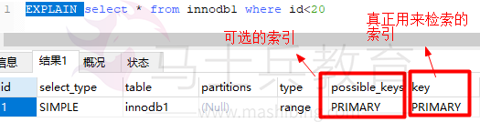

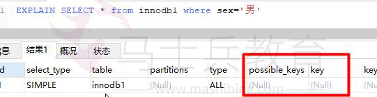

---

可以尝试在一个字段未建立索引时，根据该字段查询的效率，然后对该字段建立索引
（altertable表名addindex(字段名)），同样的SQL执行的效率，你会发现查询效率
会有明显的提升（数据量越大越明显）。
orderby
当我们使用orderby将查询结果按照某个字段排序时，如果该字段没有建立索
引，那么执行计划会将查询出的所有数据使用外部排序（将数据从硬盘分批读取到内存使用内部排序，
最后合并排序结果），这个操作是很影响性能的，因为需要将查询涉及到的所有数据从磁盘中读到内存
（如果单条数据过大或者数据量过多都会降低效率），更无论读到内存之后的排序了。
但是如果我们对该字段建立索引altertable表名addindex(字段名)，那么由于索引本身是有序的，因此直
接按照索引的顺序和映射关系逐条取出数据即可。而且如果分页的，那么只用取出索引表某个范围内的
索引对应的数据，而不用像上述那取出所有数据进行排序再返回某个范围内的数据。（从磁盘取数据是
最影响性能的）
join
对join语句匹配关系（on）涉及的字段建立索引能够提高效率
索引覆盖
如果要查询的字段都建立过索引，那么引擎会直接在索引表中查询而不会访问原始数据（否则只要有一
个字段没有建立索引就会做全表扫描），这叫索引覆盖。
因此我们需要尽可能的在select后只写必要的查询字段，以增加索引覆盖的几
率。
这里值得注意的是不要想着为每个字段建立索引，因为优先使用索引的优势就在于其体积小。
索引有哪几种类型？
 
主键索引:数据列不允许重复，不允许为NULL，
一个表只能有一个主键。
唯一索引:数据列不允许重复，允许为NULL值，
一个表允许多个列创建唯一索引。
可以通过ALTERTABLEtable_nameADDUNIQUE(column);
创建唯一索引
可以通过ALTERTABLEtable_nameADDUNIQUE(column1,column2);
创建唯一组合索引
普通索引:基本的索引类型，没有唯一性的限制，允许为NULL值。
可以通过ALTERTABLEtable_nameADDINDEXindex_name(column);
创建普通索引
可以通过ALTERTABLEtable_nameADDINDEXindex_name(column1,column2,column3);
创建组合索引
全文索引：是目前搜索引擎使用的一种关键技术。
可以通过ALTERTABLEtable_nameADDFULLTEXT(column);
创建全文索引
索引的数据结构（b树，hash）
 
索引的数据结构和具体存储引擎的实现有关，在MySQL中使用较多的索引有
Hash索引，B+树索引等，而我们经常使用的InnoDB存储引擎的默认索引实现为：B+树索引。对于哈希
索引来说，底层的数据结构就是哈希表，因此在绝大多数需求为单条记录查询的时候，可以选择哈希索
引，查询性能快；其余大部分场景，建议选择BTree索引。
1）B树索引mysql通过存储引擎取数据，基本上90%的人用的就是InnoDB了，按照实现方式分，
InnoDB的索引类型目前只有两种：BTREE（B树）索引和HASH索引。B树索引是Mysql数据库中使用频
繁的索引类型，基本所有存储引擎都支持

---

BTree索引。通常我们说的索引不出意外指的就是（B树）索引（实际是用B+树实现的，因为在查看表索
引时，mysql一律打印BTREE，所以简称为B树索引）
查询方式：
主键索引区:PI(关联保存的时数据的地址)按主键查询,
普通索引区:si(关联的id的地址,然后再到达上面的地址)。所以按主键查询,速度快
B+tree性质：
1.）n棵子tree的节点包含n个关键字，不用来保存数据而是保存数据的索引。
2.）所有的叶子结点中包含了全部关键字的信息，及指向含这些关键字记录的指针，且叶子结点本身依
关键字的大小自小而大顺序链接。
3.）所有的非终端结点可以看成是索引部分，结点中仅含其子树中的大（或小）关键字。
4.）B+树中，数据对象的插入和删除仅在叶节点上进行。
5.）B+树有2个头指针，一个是树的根节点，一个是小关键码的叶节点。2）哈希索引简要说下，类似于
数据结构中简单实现的HASH表（散列表）一样，当我们在
mysql中用哈希索引时，主要就是通过Hash算法（常见的Hash算法有直接定址法、平方取中法、折叠
法、除数取余法、随机数法），将数据库字段数据转换成定长的Hash值，与这条数据的行指针一并存入
Hash表的对应位置；如果发生
Hash碰撞（两个不同关键字的Hash值相同），则在对应Hash键下以链表形式存储。当然这只是简略模
拟图。

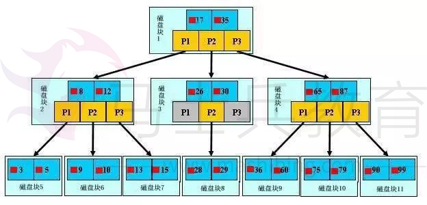

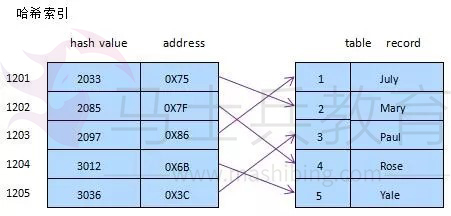

---

索引的基本原理
 
索引用来快速地寻找那些具有特定值的记录。如果没有索引，一般来说执行查询时遍历整张表。
索引的原理很简单，就是把无序的数据变成有序的查询
1. 把创建了索引的列的内容进行排序
2. 对排序结果生成倒排表
3. 在倒排表内容上拼上数据地址链
4. 在查询的时候，先拿到倒排表内容，再取出数据地址链，从而拿到具体数据
索引算法有哪些？
 
索引算法有BTree算法和Hash算法
BTree算法
BTree是常用的mysql数据库索引算法，也是mysql默认的算法。因为它不仅可以被用在=,>,>=,<,<=和
between这些比较操作符上，而且还可以用于like操作符，只要它的查询条件是一个不以通配符开头的
常量，例如：
Hash算法
HashHash索引只能用于对等比较，例如=,<=>（相当于=）操作符。由于是一次定位数据，不像BTree索
引需要从根节点到枝节点，后才能访问到页节点这样多次IO访问，所以检索效率远高于BTree索引。
索引设计的原则？
 
1.适合索引的列是出现在where子句中的列，或者连接子句中指定的列
2.基数较小的类，索引效果较差，没有必要在此列建立索引
3.使用短索引，如果对长字符串列进行索引，应该指定一个前缀长度，这样能够节省大量索引空间
4.不要过度索引。索引需要额外的磁盘空间，并降低写操作的性能。在修改表内容的时候，索引会进行
更新甚至重构，索引列越多，这个时间就会越长。所以只保持需要的索引有利于查询即可。
创建索引的原则（重中之重）
 
索引虽好，但也不是无限制的使用，好符合一下几个原则
1）左前缀匹配原则，组合索引非常重要的原则，mysql会一直向右匹配直到遇到范围查询(>、<、
between、like)就停止匹配，比如a=1andb=2andc>3andd=4如果建立(a,b,c,d)顺序的索引，d是用不到
索引的，如果建立
(a,b,d,c)的索引则都可以用到，a,b,d的顺序可以任意调整。
2）较频繁作为查询条件的字段才去创建索引
3）更新频繁字段不适合创建索引
4）若是不能有效区分数据的列不适合做索引列(如性别，男女未知，多也就三种，区分度实在太低)
5）尽量的扩展索引，不要新建索引。比如表中已经有a的索引，现在要加(a,b)的索引，那么只需要修改
原来的索引即可。
1   --只要它的查询条件是一个不以通配符开头的常量
2   select*fromuserwherenamelike'jack%';
3   --如果一通配符开头，或者没有使用常量，则不会使用索引，例如：
4   select*fromuserwherenamelike'%jack';

---

6）定义有外键的数据列一定要建立索引。
7）对于那些查询中很少涉及的列，重复值比较多的列不要建立索引。8）对于定义为text、image和bit
的数据类型的列不要建立索引。创建索引的三种方式，删除索引
第一种方式：在执行CREATETABLE时创建索引
第二种方式：使用ALTERTABLE命令去增加索引
1ALTERTABLEtable_nameADDINDEXindex_name(column_list);
ALTERTABLE用来创建普通索引、UNIQUE索引或PRIMARYKEY索引。
其中table_name是要增加索引的表名，column_list指出对哪些列进行索引，多列时各列之间用逗号分
隔。
索引名index_name可自己命名，缺省时，MySQL将根据第一个索引列赋一个名称。另外，
ALTERTABLE允许在单个语句中更改多个表，因此可以在同时创建多个索引。
第三种方式：使用CREATEINDEX命令创建
1CREATEINDEXindex_nameONtable_name(column_list);
CREATEINDEX可对表增加普通索引或UNIQUE索引。（但是，不能创建PRIMARYKEY索引）
删除索引
根据索引名删除普通索引、唯一索引、全文索引：altertable表名dropKEY索引名
删除主键索引：altertable表名dropprimarykey（因为主键只有一个）。这里值得注意的是，如果主键
自增长，那么不能直接执行此操作（自增长依赖于主键索引）：
需要取消自增长再行删除：
1   CREATETABLEuser_index2(
2   idINTauto_incrementPRIMARYKEY,
3   first_nameVARCHAR(16),
4   last_nameVARCHAR(16),
5   id_cardVARCHAR(18),
6   informationtext,
7   KEYname(first_name,last_name),
8   FULLTEXTKEY(information),
9   UNIQUEKEY(id_card));
1   altertableuser_indexdropKEYname;
2   altertableuser_indexdropKEYid_card;
3   altertableuser_indexdropKEYinformation;

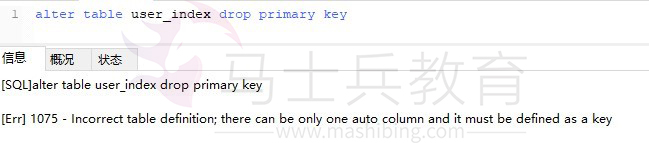

---

但通常不会删除主键，因为设计主键一定与业务逻辑无关。
创建索引时需要注意什么？
 
非空字段：应该指定列为NOTNULL，除非你想存储NULL。在mysql中，含有空值的列很难进行查
询优化，因为它们使得索引、索引的统计信息以及比较运算更加复杂。你应该用0、一个特殊的值
或者一个空串代替空值；
取值离散大的字段：（变量各个取值之间的差异程度）的列放到联合索引的前面，可以通过count()
函数查看字段的差异值，返回值越大说明字段的唯一值越多字段的离散程度高；
索引字段越小越好：数据库的数据存储以页为单位一页存储的数据越多一次IO操作获取的数据越大
效率越高。
使用索引查询一定能提高查询的性能吗？为什么
 
通常，通过索引查询数据比全表扫描要快。但是我们也必须注意到它的代价。
索引需要空间来存储，也需要定期维护，每当有记录在表中增减或索引列被修改时，索引本身也会被修
改。这意味着每条记录的INSERT，DELETE，UPDATE将为此多付出4，5次的磁盘I/O。因为索引需要额
外的存储空间和处理，那些不必要的索引反而会使查询反应时间变慢。使用索引查询不一定能提高查询
性能，索引范围查询(INDEXRANGESCAN)适用于两种情况:
基于一个范围的检索，一般查询返回结果集小于表中记录数的30%
基于非唯一性索引的检索
百万级别或以上的数据如何删除
 
关于索引：由于索引需要额外的维护成本，因为索引文件是单独存在的文件,所以当我们对数据的增加,修
改,删除,都会产生额外的对索引文件的操作,这些操作需要消耗额外的IO,会降低增/改/删的执行效率。所
以，在我们删除数据库百万级别数据的时候，查询MySQL官方手册得知删除数据的速度和创建的索引数
量是成正比的。
1. 所以我们想要删除百万数据的时候可以先删除索引（此时大概耗时三分多钟）
2. 然后删除其中无用数据（此过程需要不到两分钟）
3. 删除完成后重新创建索引(此时数据较少了)创建索引也非常快，约十分
钟左右。
4. 与之前的直接删除绝对是要快速很多，更别说万一删除中断,一切删除会回滚。那更是坑了。
前缀索引
 
语法：index(field(10))，使用字段值的前10个字符建立索引，默认是使用字段的全部内容建立索引。
前提：前缀的标识度高。比如密码就适合建立前缀索引，因为密码几乎各不相
同。
实操的难度：在于前缀截取的长度。
我们可以利用selectcount(*)/count(distinctleft(password,prefixLen));，通过从调整prefixLen的值（从
1自增）查看不同前缀长度的一个平均匹配度，接近1时就可以了（表示一个密码的前prefixLen个字符几
乎能确定唯一一条记录）
1   altertableuser_index
2   --重新定义字段
3   MODIFYidint,
4   dropPRIMARYKEY

---

什么是最左前缀原则？什么是最左匹配原则
 
顾名思义，就是最左优先，在创建多列索引时，要根据业务需求，where子句中
使用最频繁的一列放在最左边。
最左前缀匹配原则，非常重要的原则，mysql会一直向右匹配直到遇到范围查询(>、<、between、like)
就停止匹配，比如a=1andb=2andc>3andd=4如果建立(a,b,c,d)顺序的索引，d是用不到索引的，如果建
立(a,b,d,c)的索引则都可以用到，a,b,d的顺序可以任意调整。
=和in可以乱序，比如a=1andb=2andc=3建立(a,b,c)索引可以任意顺序，mysql的查询优化器会帮你优化
成索引可以识别的形式
B树和B+树的区别
 
在B树中，你可以将键和值存放在内部节点和叶子节点；但在B+树
中，内部节点都是键，没有值，叶子节点同时存放键和值。
B+树的叶子节点有一条链相连，而B树的叶子节点各自独立。
使用B树的好处
 
B树可以在内部节点同时存储键和值，因此，把频繁访问的数据放在靠近根节点的地方将会大大提高热
点数据的查询效率。这种特性使得B树在特定数据重复多次查询的场景中更加高效。
使用B+树的好处
 
由于B+树的内部节点只存放键，不存放值，因此，一次读取，可以在内存页中获取更多的键，有利于更
快地缩小查找范围。B+树的叶节点由一条链相连，因此，当需要进行一次全数据遍历的时候，B+树只需
要使用O(logN)时间找到最小的一个节点，然后通过链进行O(N)的顺序遍历即可。而B树则需要对树的每
一层进行遍历，这会需要更多的内存置换次数，因此也就需要花费更多的时间
Hash索引和B+树所有有什么区别或者说优劣呢?
 
首先要知道Hash索引和B+树索引的底层实现原理：
hash索引底层就是hash表，进行查找时，调用一次hash函数就可以获取到相应
的键值，之后进行回表查询获得实际数据。B+树底层实现是多路平衡查找树。
对于每一次的查询都是从根节点出发，查找到叶子节点方可以获得所查键值，然
后根据查询判断是否需要回表查询数据。
么可以看出他们有以下的不同：

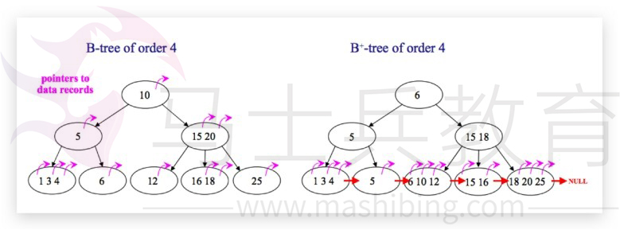

---

hash索引进行等值查询更快(一般情况下)，但是却无法进行范围查询。
 
因为在hash索引中经过hash函数建立索引之后，索引的顺序与原顺序无法保持一致，不能支持范围查
询。而B+树的的所有节点皆遵循(左节点小于父节点，右节点大于父节点，多叉树也类似)，天然支持范
围。
hash索引不支持使用索引进行排序，原理同上。
hash索引不支持模糊查询以及多列索引的最左前缀匹配。原理也是因为hash函
数的不可预测。AAAA和AAAAB的索引没有相关性。
hash索引任何时候都避免不了回表查询数据，而B+树在符合某些条件(聚簇索
引，覆盖索引等)的时候可以只通过索引完成查询。
hash索引虽然在等值查询上较快，但是不稳定。性能不可预测，当某个键值存在大量重复的时候，发生
hash碰撞，此时效率可能极差。而B+树的查询效率比较稳定，对于所有的查询都是从根节点到叶子节
点，且树的高度较低。
因此，在大多数情况下，直接选择B+树索引可以获得稳定且较好的查询速度。
而不需要使用hash索引。
数据库为什么使用B+树而不是B树
 
B树只适合随机检索，而B+树同时支持随机检索和顺序检索；
B+树空间利用率更高，可减少I/O次数，磁盘读写代价更低。一般来说，索引本
身也很大，不可能全部存储在内存中，因此索引往往以索引文件的形式存储的磁盘上。这样的话，索引
查找过程中就要产生磁盘I/O消耗。B+树的内部结点并没有指向关键字具体信息的指针，只是作为索引
使用，其内部结点比B树小，盘块能容纳的结
点中关键字数量更多，一次性读入内存中可以查找的关键字也就越多，相对的，IO读
写次数也就降低了。而IO读写次数是影响索引检索效率的最大因素；
B+树的查询效率更加稳定。B树搜索有可能会在非叶子结点结束，越靠近根节点的记录查找时间越短，
只要找到关键字即可确定记录的存在，其性能等价于在关键字全集内做一次二分查找。而在B+树中，顺
序检索比较明显，随机检索时，任何关键字的查找都必须走一条从根节点到叶节点的路，所有关键字的
查找路径长度相同，导致每一个关键字的查询效率相当。
B-树在提高了磁盘IO性能的同时并没有解决元素遍历的效率低下的问题。B+树的叶子节点使用指针顺序
连接在一起，只要遍历叶子节点就可以实现整棵树的遍历。而且在数据库中基于范围的查询是非常频繁
的，而B树不支持这样的操作。
增删文件（节点）时，效率更高。因为B+树的叶子节点包含所有关键字，并以
有序的链表结构存储，这样可很好提高增删效率。
B+树在满足聚簇索引和覆盖索引的时候不需要回表查询数据
 
在B+树的索引中，叶子节点可能存储了当前的key值，也可能存储了当前的key值以及整行的数据，这就
是聚簇索引和非聚簇索引。在InnoDB中，只有主键索引是聚簇索引，如果没有主键，则挑选一个唯一键
建立聚簇索引。如果没有唯一键，则隐式的生成一个键来建立聚簇索引。
当查询使用聚簇索引时，在对应的叶子节点，可以获取到整行数据，因此不用再
次进行回表查询。

---

什么是聚簇索引？何时使用聚簇索引与非聚簇索引
 
聚簇索引：将数据存储与索引放到了一块，找到索引也就找到了数据
非聚簇索引：将数据存储于索引分开结构，索引结构的叶子节点指向了数据的对应行，myisam通过
key_buffer把索引先缓存到内存中，当需要访问数据时（通过索引访问数据），在内存中直接搜索索
引，然后通过索引找到磁盘相应数据，这也就是为什么索引不在key buffer命中时，速度慢的原因
澄清一个概念：innodb中，在聚簇索引之上创建的索引称之为辅助索引，辅助索引访问数据总是需要二
次查找，非聚簇索引都是辅助索引，像复合索引、前缀索引、唯一索引，辅助索引叶子节点存储的不再
是行的物理位置，而是主键值
何时使用聚簇索引与非聚簇索引
非聚簇索引一定会回表查询吗？
 
不一定，这涉及到查询语句所要求的字段是否全部命中了索引，如果全部命中了
索引，那么就不必再进行回表查询
举个简单的例子，假设我们在员工表的年龄上建立了索引，那么当进行select age from employee 
where age < 20的查询时，在索引的叶子节点上，已经包含了age信息，不会再次进行回表查询。
联合索引是什么？为什么需要注意联合索引中的顺序？
 
MySQL可以使用多个字段同时建立一个索引，叫做联合索引。在联合索引中，如果想要命中索引，需要
按照建立索引时的字段顺序挨个使用，否则无法命中索引。
具体原因为:
MySQL使用索引时需要索引有序，假设现在建立了"name，age，school"的联合索引，那么索引的排序
为: 先按照name排序，如果name相同，则按照age排序，如果age的值也相等，则按照school进行排
序。
当进行查询时，此时索引仅仅按照name严格有序，因此必须首先使用name字段进行等值查询，之后对
于匹配到的列而言，其按照age字段严格有序，此时可以使用age字段用做索引查找，以此类推。因此在
建立联合索引的时候应该注意索引列的顺序，一般情况下，将查询需求频繁或者字段选择性高的列放在
前面。此外可以根据特例的查询或者表结构进行单独的调整。
事务

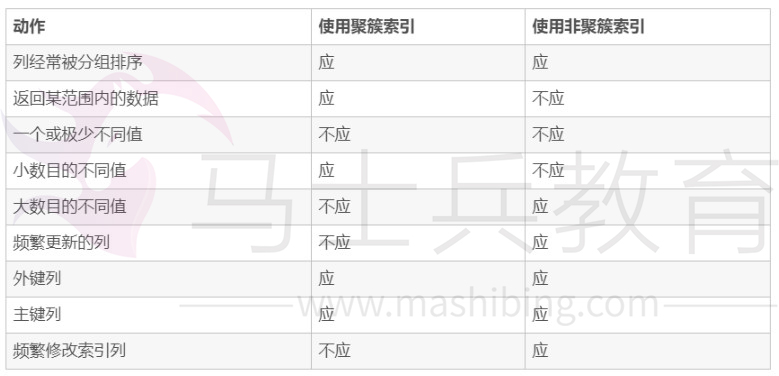

---

什么是数据库事务？
 
事务是一个不可分割的数据库操作序列，也是数据库并发控制的基本单位，其执行的结果必须使数据库
从一种一致性状态变到另一种一致性状态。事务是逻辑上的一组操作，要么都执行，要么都不执行。
事务最经典也经常被拿出来说例子就是转账了。
假如小明要给小红转账1000元，这个转账会涉及到两个关键操作就是：将小明的余额减少1000元，将小
红的余额增加1000元。万一在这两个操作之间突然出现错误比如银行系统崩溃，导致小明余额减少而小
红的余额没有增加，这样就不对了。事务就是保证这两个关键操作要么都成功，要么都要失败。
事物的四大特性(ACID)介绍一下?
 
关系性数据库需要遵循ACID规则，具体内容如下：
原子性： 事务是最小的执行单位，不允许分割。事务的原子性确保动作
要么全部完成，要么完全不起作用；
2. 一致性： 执行事务前后，数据保持一致，多个事务对同一个数据读取的
结果是相同的；
3. 隔离性： 并发访问数据库时，一个用户的事务不被其他事务所干扰，各
并发事务之间数据库是独立的；
4. 持久性： 一个事务被提交之后。它对数据库中数据的改变是持久的，即使数据库发生故障也不应该
对其有任何影响。
什么是脏读？幻读？不可重复读？
 
脏读(Drity Read)：某个事务已更新一份数据，另一个事务在此时读取了同一份数据，由于某些原因，前
一个RollBack了操作，则后一个事务所读取的数据就会是不正确的。
不可重复读(Non-repeatable read):在一个事务的两次查询之中数据不一致，这
可能是两次查询过程中间插入了一个事务更新的原有的数据。

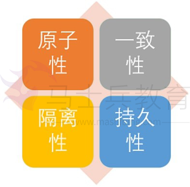

---

隔离级别
脏读
不可重复 读
幻影读
READ- UNCOM MITTED
√
√
√
READ- COMMIT TED
×
√
√
REPEATA BLE- READ
×
×
√
SERIALIZ ABLE
×
×
×
幻读(Phantom Read):在一个事务的两次查询中数据笔数不一致，例如有一个事务查询了几列(Row)数
据，而另一个事务却在此时插入了新的几列数据，先前的事务在接下来的查询中，就会发现有几列数据
是它先前所没有的。
什么是事务的隔离级别？MySQL的默认隔离级别是什么？
 
为了达到事务的四大特性，数据库定义了4种不同的事务隔离级别，由低到高依次为Read 
uncommitted、Read committed、Repeatable read、Serializable，这四个级别可以逐个解决脏读、
不可重复读、幻读这几类问题。
SQL 标准定义了四个隔离级别：
READ-UNCOMMITTED(读取未提交)： 最低的隔离级别，允许读取尚未提交的数据变更，可能会导
致脏读、幻读或不可重复读。
READ-COMMITTED(读取已提交)： 允许读取并发事务已经提交的数据，可以阻止脏读，但是幻读
或不可重复读仍有可能发生。
REPEATABLE-READ(可重复读)： 对同一字段的多次读取结果都是一致的，除非数据是被本身事务
自己所修改，可以阻止脏读和不可重复读，但幻读仍有可能发生。
SERIALIZABLE(可串行化)： 最高的隔离级别，完全服从ACID的隔离级别。所有的事务依次逐个执
行，这样事务之间就完全不可能产生干扰，也就是说，该级别可以防止脏读、不可重复读以及幻
读。
这里需要注意的是：Mysql 默认采用的 REPEATABLE_READ隔离级别 Oracle默认采用的 
READ_COMMITTED隔离级别
事务隔离机制的实现基于锁机制和并发调度。其中并发调度使用的是MVVC（多版本并发控制），通过
保存修改的旧版本信息来支持并发一致性读和回滚等特性。
因为隔离级别越低，事务请求的锁越少，所以大部分数据库系统的隔离级别都是READ-COMMITTED(读
取提交内容):，但是你要知道的是InnoDB 存储引擎默认使用 REPEATABLE-READ（可重读）并不会有
任何性能损失。
InnoDB 存储引擎在 分布式事务 的情况下一般会用到SERIALIZABLE(可串行化)隔离级别。
锁
 
对MySQL的锁了解吗
 
当数据库有并发事务的时候，可能会产生数据的不一致，这时候需要一些机制来
 
保证访问的次序，锁机制就是这样的一个机制。
 
就像酒店的房间，如果大家随意进出，就会出现多人抢夺同一个房间的情况，而在房间上装上锁，申请
到钥匙的人才可以入住并且将房间锁起来，其他人只有等他使用完毕才可以再次使用。

---

隔离级别与锁的关系
 
在Read Uncommitted级别下，读取数据不需要加共享锁，这样就不会跟被修
改的数据上的排他锁冲突
在Read Committed级别下，读操作需要加共享锁，但是在语句执行完以后释放共享锁；
在Repeatable Read级别下，读操作需要加共享锁，但是在事务提交之前并不释放共享锁，也就是必须
等待事务执行完毕以后才释放共享锁。 
SERIALIZABLE 是限制性最强的隔离级别，因为该级别锁定整个范围的键，并一直持有锁，直到事务完
成。
按照锁的粒度分数据库锁有哪些？锁机制与InnoDB锁算法
 
在关系型数据库中，可以按照锁的粒度把数据库锁分为行级锁(INNODB引擎)、表级锁(MYISAM引擎)和
页级锁(BDB引擎 )。
MyISAM和InnoDB存储引擎使用的锁：
MyISAM采用表级锁(table-level locking)。
InnoDB支持行级锁(row-level locking)和表级锁，默认为行级锁
行级锁，表级锁和页级锁对比
行级锁 行级锁是Mysql中锁定粒度最细的一种锁，表示只针对当前操作的行进行加锁。行级锁能大大减
少数据库操作的冲突。其加锁粒度最小，但加锁的开销也最大。行级锁分为共享锁 和 排他锁。
特点：开销大，加锁慢；会出现死锁；锁定粒度最小，发生锁冲突的概率最低，
并发度也最高。
表级锁 表级锁是MySQL中锁定粒度最大的一种锁，表示对当前操作的整张表加锁，它实现简单，资源消
耗较少，被大部分MySQL引擎支持。最常使用的MYISAM与INNODB都支持表级锁定。表级锁定分为表
共享读锁（共享锁）与表独占写锁（排他锁）。
特点：开销小，加锁快；不会出现死锁；锁定粒度大，发出锁冲突的概率最高，
并发度最低。
页级锁 页级锁是MySQL中锁定粒度介于行级锁和表级锁中间的一种锁。表级锁速度快，但冲突多，行级
冲突少，但速度慢。所以取了折衷的页级，一次锁定相邻的一组记录。
特点：开销和加锁时间界于表锁和行锁之间；会出现死锁；锁定粒度界于表锁和
行锁之间，并发度一般
从锁的类别上分MySQL都有哪些锁呢？
 
像上面那样子进行锁定岂不是有点阻碍并发效率了
 
从锁的类别上来讲，有共享锁和排他锁。
共享锁: 又叫做读锁。 当用户要进行数据的读取时，对数据加上共享锁。共享锁可以同时加上多个。
排他锁: 又叫做写锁。 当用户要进行数据的写入时，对数据加上排他锁。排他锁只可以加一个，他和其
他的排他锁，共享锁都相斥。
用上面的例子来说就是用户的行为有两种，一种是来看房，多个用户一起看房是可以接受的。 一种是真
正的入住一晚，在这期间，无论是想入住的还是想看房的都不可以。

---

锁的粒度取决于具体的存储引擎，InnoDB实现了行级锁，页级锁，表级锁。
他们的加锁开销从大到小，并发能力也是从大到小。
MySQL中InnoDB引擎的行锁是怎么实现的？
 
答：InnoDB是基于索引来完成行锁
例: select * from tab_with_index where id = 1 for update;
for update 可以根据条件来完成行锁锁定，并且 id 是有索引键的列，如果 id不是索引键那么InnoDB将
完成表锁，并发将无从谈起
InnoDB存储引擎的锁的算法有三种
 
Record lock：单个行记录上的锁
Gap lock：间隙锁，锁定一个范围，不包括记录本身
Next-key lock：record+gap 锁定一个范围，包含记录本身
相关知识点：
1. innodb对于行的查询使用next-key lock 
2. Next-locking keying为了解决Phantom Problem幻读问题
3. 当查询的索引含有唯一属性时，将next-key lock降级为record key
4. Gap锁设计的目的是为了阻止多个事务将记录插入到同一范围内，而这会导致幻读问题的产生
5. 有两种方式显式关闭gap锁：（除了外键约束和唯一性检查外，其余情况仅使用record lock） A. 
将事务隔离级别设置为RC B. 将参数innodb_locks_unsafe_for_binlog设置为1
什么是死锁？怎么解决？
 
死锁是指两个或多个事务在同一资源上相互占用，并请求锁定对方的资源，从而导致恶性循环的现象。
常见的解决死锁的方法
1、如果不同程序会并发存取多个表，尽量约定以相同的顺序访问表，可以大大降低死锁机会。
2、在同一个事务中，尽可能做到一次锁定所需要的所有资源，减少死锁产生概率；
3、对于非常容易产生死锁的业务部分，可以尝试使用升级锁定颗粒度，通过表级锁定来减少死锁产生的
概率；
如果业务处理不好可以用分布式事务锁或者使用乐观锁
数据库的乐观锁和悲观锁是什么？怎么实现的？
 
数据库管理系统（DBMS）中的并发控制的任务是确保在多个事务同时存取数据库中同一数据时不破坏
事务的隔离性和统一性以及数据库的统一性。乐观并发控制（乐观锁）和悲观并发控制（悲观锁）是并
发控制主要采用的技术手段。
悲观锁：假定会发生并发冲突，屏蔽一切可能违反数据完整性的操作。在查询完数据的时候就把事务锁
起来，直到提交事务。实现方式：使用数据库中的锁机制乐观锁：假设不会发生并发冲突，只在提交操
作时检查是否违反数据完整性。在修改数据的时候把事务锁起来，通过version的方式来进行锁定。实现
方式：乐一般会使用版本号机制或CAS算法实现。
两种锁的使用场景从上面对两种锁的介绍，我们知道两种锁各有优缺点，不可认为一种好于另一种，像
乐观锁适用于写比较少的情况下（多读场景），即冲突真的很少发生的时候，这样可以省去了锁的开
销，加大了系统的整个吞吐量。
但如果是多写的情况，一般会经常产生冲突，这就会导致上层应用会不断的进行

---

retry，这样反倒是降低了性能，所以一般多写的场景下用悲观锁就比较合适。
视图
 
为什么要使用视图？什么是视图？
 
为了提高复杂SQL语句的复用性和表操作的安全性，MySQL数据库管理系统提供了视图特性。所谓视
图，本质上是一种虚拟表，在物理上是不存在的，其内容与真实的表相似，包含一系列带有名称的列和
行数据。但是，视图并不在数据库中以储存的数据值形式存在。行和列数据来自定义视图的查询所引用
基本表，并且在具体引用视图时动态生成。
视图使开发者只关心感兴趣的某些特定数据和所负责的特定任务，只能看到视图中所定义的数据，而不
是视图所引用表中的数据，从而提高了数据库中数据的安全性
视图有哪些特点？
 
视图的特点如下:
视图的列可以来自不同的表，是表的抽象和在逻辑意义上建立的新关系。
视图是由基本表(实表)产生的表(虚表)。
视图的建立和删除不影响基本表。
对视图内容的更新(添加，删除和修改)直接影响基本表。
当视图来自多个基本表时，不允许添加和删除数据。视图的操作包括创建视图，查看视图，删除视
图和修改视图。
视图的使用场景有哪些？
 
视图根本用途：简化sql查询，提高开发效率。如果说还有另外一个用途那就是兼容老的表结构。
下面是视图的常见使用场景：重用SQL语句；
简化复杂的SQL操作。在编写查询后，可以方便的重用它而不必知道它的基本查询细节；使用表的
组成部分而不是整个表；
保护数据。可以给用户授予表的特定部分的访问权限而不是整个表的访问权限；
更改数据格式和表示。视图可返回与底层表的表示和格式不同的数据
视图的优点
 
1. 查询简单化。视图能简化用户的操作
2. 数据安全性。视图使用户能以多种角度看待同一数据，能够对机密数据提供安全保护
逻辑数据独立性。视图对重构数据库提供了一定程度的逻辑独立性
视图的缺点
 
1. 性能。数据库必须把视图的查询转化成对基本表的查询，如果这个视图是由一个复杂的多表查询所
定义，那么，即使是视图的一个简单查询，数据库也把它变成一个复杂的结合体，需要花费一定的
时间。
2. 修改限制。当用户试图修改视图的某些行时，数据库必须把它转化为对基本表的某些行的修改。事
实上，当从视图中插入或者删除时，情况也是这样。对于简单视图来说，这是很方便的，但是，对
于比较复杂的视图，可能是不可修改的这些视图有如下特征：
1. 有UNIQUE等集合操作符的视图。
2.有GROUP BY子句的视图。
3.有诸如AVG\SUM\MAX等聚合函数的视图。

---

4.使用DISTINCT关键字的视图。
5.连接表的视图（其中有些例外）
什么是游标？
 
游标是系统为用户开设的一个数据缓冲区，存放SQL语句的执行结果，每个游标区都有一个名字。用户
可以通过游标逐一获取记录并赋给主变量，交由主语言进一步处理
存储过程与函数
 
什么是存储过程？有哪些优缺点？
 
存储过程是一个预编译的SQL语句，优点是允许模块化的设计，就是说只需要创建一次，以后在该程序
中就可以调用多次。如果某次操作需要执行多次SQL，使用存储过程比单纯SQL语句执行要快。
优点
1）     存储过程是预编译过的，执行效率高。
2）     存储过程的代码直接存放于数据库中，通过存储过程名直接调用，减少网络通讯。
3）     安全性高，执行存储过程需要有一定权限的用户。
4）     存储过程可以重复使用，减少数据库开发人员的工作量。
缺点
1）     调试麻烦，但是用 PL/SQL Developer 调试很方便！弥补这个缺点。
2）     移植问题，数据库端代码当然是与数据库相关的。但是如果是做工程型项目，基本不存在移植问
题。
3）     重新编译问题，因为后端代码是运行前编译的，如果带有引用关系的对象发生改变时，受影响的
存储过程、包将需要重新编译（不过也可以设置成运行时刻自动编译）。
4）     如果在一个程序系统中大量的使用存储过程，到程序交付使用的时候随着用户需求的增加会导致
数据结构的变化，接着就是系统的相关问题了，   后如果用
户想维护该系统可以说是很难很难、而且代价是空前的，维护起来更麻烦。
触发器
 
什么是触发器？触发器的使用场景有哪些？
 
触发器是用户定义在关系表上的一类由事件驱动的特殊的存储过程。触发器是指一段代码，当触发某个
事件时，自动执行这些代码。
使用场景
可以通过数据库中的相关表实现级联更改。
实时监控某张表中的某个字段的更改而需要做出相应的处理。
例如可以生成某些业务的编号。
注意不要滥用，否则会造成数据库及应用程序的维护困难。
大家需要牢记以上基础知识点，重点是理解数据类型CHAR和VARCHAR的差异，表存储引擎
InnoDB和MyISAM的区别。

---

MySQL中都有哪些触发器？
 
Before Insert
After Insert
Before Update
After Update
Before Delete 
After Delete
常用SQL语句
 
SQL语句主要分为哪几类
 
数据定义语言DDL（Data Ddefinition Language）CREATE，DROP，ALTER 主要为以上操作 即对逻辑
结构等有操作的，其中包括表结构，视图和索引。
数据查询语言DQL（Data Query Language）SELECT
这个较为好理解 即查询操作，以select关键字。各种简单查询，连接查询等 都属于DQL。
数据操纵语言DML（Data Manipulation Language）INSERT，UPDATE，
DELETE
主要为以上操作 即对数据进行操作的，对应上面所说的查询操作 DQL与DML共同构建了多数初级程序
员常用的增删改查操作。而查询是较为特殊的一种 被划分到DQL中。
数据控制功能DCL（Data Control Language）GRANT，REVOKE，
COMMIT，ROLLBACK
主要为以上操作 即对数据库安全性完整性等有操作的，可以简单的理解为权限控制等
超键、候选键、主键、外键分别是什么？
 
 超键：在关系中能唯一标识元组的属性集称为关系模式的超键。一个属性可以为作为一个超键，多个属
性组合在一起也可以作为一个超键。超键包含候选键和主键。
主键：数据库表中对储存数据对象予以唯一和完整标识的数据列或属性的组合。
一个数据列只能有一个主键，且主键的取值不能缺失，即不能为空值（Null）。
SQL约束有哪几种？
 
SQL 约束有哪几种？
NOT NULL: 用于控制字段的内容一定不能为空（NULL）。
UNIQUE: 控件字段内容不能重复，一个表允许有多个 Unique 约束。
PRIMARY KEY: 也是用于控件字段内容不能重复，但它在一个表只允许出现一个。
 FOREIGN KEY: 用于预防破坏表之间连接的动作，也能防止非法数据插入外键列，因为它必须是它指向
的那个表中的值之一。
         候选键：是  小超键，即没有冗余元素的超键。
        外键：在一个表中存在的另一个表的主键称此表的外键。

---

六种关联查询
 
交叉连接（CROSS JOIN）
内连接（INNER JOIN）
外连接（LEFT JOIN/RIGHT JOIN）
联合查询（UNION与UNION ALL）
全连接（FULL JOIN）
交叉连接（CROSS JOIN）
SELECT * FROM A,B(,C)或者SELECT * FROM A CROSS JOIN B (CROSS JOIN C)#没有任何关联条件，结
果是笛卡尔积，结果集会很大，没有意义，很少使用内连接（INNER 
JOIN）SELECT * FROM A,B WHERE A.id=B.id或者SELECT * FROM A INNER JOIN B 
ON A.id=B.id多表中同时符合某种条件的数据记录的集合，INNER JOIN可以缩写为JOIN
            
内连接分为三类
等值连接：ON A.id=B.id 不等值连接：ON A.id > B.id
自连接：SELECT * FROM A T1 INNER JOIN A T2 ON T1.id=T2.pid
外连接（LEFT JOIN/RIGHT JOIN） 
左外连接：LEFT OUTER JOIN, 以左表为主，先查询出左表，按照ON后的关联
条件匹配右表，没有匹配到的用NULL填充，可以简写成LEFT JOIN 
右外连接：RIGHT OUTER JOIN, 以右表为主，先查询出右表，按照ON后的关
联条件匹配左表，没有匹配到的用NULL填充，可以简写成RIGHT JOIN
联合查询（UNION与UNION ALL）
SELECT * FROM A UNION SELECT * FROM B UNION ...
1
就是把多个结果集集中在一起，UNION前的结果为基准，需要注意的是联合查
询的列数要相等，相同的记录行会合并如果使用UNION ALL，不会合并重复的记录行效率 UNION 高于 
UNION ALL
全连接（FULL JOIN）
MySQL不支持全连接
可以使用LEFT JOIN 和UNION和RIGHT JOIN联合使用
SELECT * FROM A LEFT JOIN B ON A.id=B.id UNION SELECT * FROM A RIGHT JOIN B ON A.id=B.id
表连接面试题有2张表，1张R、1张S，R表有ABC三列，S表有CD两列，表中各有三条记录。
        CHECK: 用于控制字段的值范围。
        1

---

A
B
C
a1
b1
c1
a2
b2
c2
a3
b3
c3
C
D
c1
d1
c2
d2
c4
d3
A
B
C
C
D
a1
b1
c1
c1
d1
a2
b2
c2
c1
d1
a3
b3
c3
c1
d1
a1
b1
c1
c2
d2
a2
b2
c2
c2
d2
a3
b3
c3
c2
d2
a1
b1
c1
c4
d3
a2
b2
c2
c4
d3
a3
b3
c3
c4
d3
A
B
C
C
D
a1
b1
c1
c1
d1
a2
b2
c2
c2
d2
R表
S表
1. 交叉连接(笛卡尔积):
select r.,s. from r,s
1. 内连接结果：
select r.,s. from r inner join s on r.c=s.c
1. 左连接结果：
select r.,s. from r left join s on r.c=s.c

---

A
B
C
C
D
a1
b1
c1
c1
d1
a2
b2
c2
c2
d2
a3
b3
c3
 
 
A
B
C
C
D
a1
b1
c1
c1
d1
a2
b2
c2
c2
d2
c4
d3
 
 
 
A
B
C
C
D
a1
b1
c1
c1
d1
a2
b2
c2
c2
d2
a3
b3
c3
 
 
c4
d3
 
 
 
1. 右连接结果：
select r.,s. from r right join s on r.c=s.c
1. 全表连接的结果（MySql不支持，Oracle支持）：
select r.,s. from r full join s on r.c=s.c
什么是子查询
 
1. 条件：一条SQL语句的查询结果做为另一条查询语句的条件或查询结果 
2. 嵌套：多条SQL语句嵌套使用，内部的SQL查询语句称为子查询。
子查询的三种情况
 
1. 子查询是单行单列的情况：结果集是一个值，父查询使用：=、 <、 > 等运算符
2. 子查询是多行单列的情况：结果集类似于一个数组，父查询使用：in 运算符
3. 子查询是多行多列的情况：结果集类似于一张虚拟表，不能用于where 条件，用于select子句中做
为子表
1   -- 查询工资最高的员工是谁？
2   select * from employee where salary=(select max(salary) from employee);
1   -- 查询工资最高的员工是谁？
2   select * from employee where salary=(select max(salary) from employee);

---

mysql中in和exists区别
 
mysql中的in语句是把外表和内表作hash 连接，而exists语句是对外表作loop
循环，每次loop循环再对内表进行查询。一直大家都认为exists比in语句的效率要高，这种说法其实是不
准确的。这个是要区分环境的。
1. 如果查询的两个表大小相当，那么用in和exists差别不大。
2. 如果两个表中一个较小，一个是大表，则子查询表大的用exists，子查询表小的用in。
3. not in 和not exists：如果查询语句使用了not in，那么内外表都进行全表扫描，没有用到索引；而
not extsts的子查询依然能用到表上的索引。所以无论那个表大，用not exists都比not in要快。
varchar与char的区别
 
char的特点
char表示定长字符串，长度是固定的；如果插入数据的长度小于char的固定长度时，则用空格填充；
因为长度固定，所以存取速度要比varchar快很多，甚至能快50%，但正因为其长度固定，所以会占据多
余的空间，是空间换时间的做法； 
   对于char来说，   多能存放的字符个数为255，和编码无关 varchar的特点
varchar表示可变长字符串，长度是可变的；
插入的数据是多长，就按照多长来存储；
varchar在存取方面与char相反，它存取慢，因为长度不固定，但正因如此，不占据多余的空间，是时间
换空间的做法；
 对于varchar来说， 多能存放的字符个数为65532 总之，结合性能角度（char更快）和节省磁盘空间角
度（varchar更小），具体情况还需具体来设计数据库才是妥当的做法。
varchar(50)中50的涵义
 
多存放50个字符，varchar(50)和(200)存储hello所占空间一样，但后者在排
序时会消耗更多内存，因为order by col采用fixed_length计算col长度
(memory引擎也一样)。在早期 MySQL 版本中， 50 代表字节数，现在代表字符数。
int(20)中20的涵义
 
是指显示字符的长度。20表示 大显示宽度为20，但仍占4字节存储，存储范围不变；
不影响内部存储，只是影响带 zerofill 定义的 int 时，前面补多少个 0，易于报表展示
1   -- 1) 查询出2011年以后入职的员工信息
2   -- 2) 查询所有的部门信息，与上面的虚拟表中的信息比对，找出所有部门ID相等的员工。
3   select * from dept d, (select * from employee where join_date >'2011-1-
1') e where e.dept_id = d.id;
4   -- 使用表连接：
5   select d.*, e.* from dept d inner join employee e on d.id = e.dept_id whe re 
e.join_date >'2011-1-1'

---

Delete
Truncate
Drop
 
类型
属于DML
属于DDL
属于DDL
回滚
可回滚
不可回滚
不可回滚
删除内
容
表结构还在，删除表的全
部或者一部分数据行
表结构还在，删除
表中的所有数据
从数据库中删除表，所有的数据
行，索引和权限也会被删除
删除速
度
删除速度慢，需要逐行删
除
删除速度快
删除速度快
mysql为什么这么设计
 
对大多数应用没有意义，只是规定一些工具用来显示字符的个数；int(1)和 int(20)存储和计算均一样；
mysql中int(10)和char(10)以及varchar(10)的区别
 
int(10)的10表示显示的数据的长度，不是存储数据的大小； chart(10)和varchar(10)的10表示存储
数据的大小，即表示存储多少个字符。
int(10) 10位的数据长度 9999999999，占32个字节，int型4位 char(10) 10位固定字符串，不足补空格   
多10个字符
varchar(10) 10位可变字符串，不足补空格  多10个字符
char(10)表示存储定长的10个字符，不足10个就用空格补齐，占用更多的存储空间
varchar(10)表示存储10个变长的字符，存储多少个就是多少个，空格也按一个字符存储，这一点
是和char(10)的空格不同的，char(10)的空格表示占位不算一个字符
FLOAT和DOUBLE的区别是什么？
 
FLOAT类型数据可以存储至多8位十进制数，并在内存中占4字节。
DOUBLE类型数据可以存储至多18位十进制数，并在内存中占8字节。
drop、delete与truncate的区别
 
三者都表示删除，但是三者有一些差别：
 
因此，在不再需要一张表的时候，用drop；在想删除部分数据行时候，用 delete；在保留表而删除所有
数据的时候用truncate。
UNION与UNIONALL的区别？
 
如果使用UNION ALL，不会合并重复的记录行 
效率 UNION 高于 UNION ALL
SQL优化
 
如何定位及优化SQL语句的性能问题？

---

id
select_ty pe
descripti on
1
SIMPLE
不包含任何子查询 或union等查询
2
PRIMARY
包含子查询 外层查询就显示为 PRIMARY
3
SUBQUER Y
在select或 where字句中包含的查询
4
DERIVED
from字句中包含的查询
5
UNION
出现在 union后的查询语句中
6
UNION RESULT
从UNION 中获取结果集，例如上文的
 
 
第三个例子
创建的索引有没有被使用到?或者说怎么才可以知道这条语句运行很
慢的原因？
 
对于低性能的SQL语句的定位， 重要也是 有效的方法就是使用执行计划， MySQL提供了explain命令来
查看语句的执行计划。 我们知道，不管是哪种数据库，或者是哪种数据库引擎，在对一条SQL语句进行
执行的过程中都会做很多相关的优化，对于查询语句，最重要的优化方式就是使用索引。 而执行计划，
就是显示数据库引擎对于SQL语句的执行的详细情况，其中包含了是否使用索引，使用什么索引，使用
的索引的相关信息等。
执行计划包含的信息 id 有一组数字组成。表示一个查询中各个子查询的执行顺序;
id相同执行顺序由上至下。
id不同，id值越大优先级越高，越先被执行。
id为null时表示一个结果集，不需要使用它查询，常出现在包含union等查询语句中。
select_type 每个子查询的查询类型，一些常见的查询类型。
table 查询的数据表，当从衍生表中查数据时会显示 x 表示对应的执行计划id 
partitions 表分区、表创建的时候可以指定通过那个列进行表分区。 举个例子：
type(非常重要，可以看到有没有走索引) 访问类型
1   create table tmp (
2   id int unsigned not null AUTO_INCREMENT,
3   name varchar(255),
4   PRIMARY KEY(id))
5   engine=innodb partition by key(id) partitions 5;

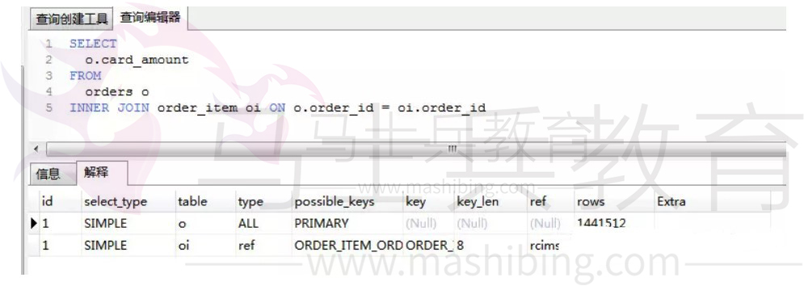

---

ALL 扫描全表数据 index 遍历索引 range 索引范围查找 index_subquery 在子查询中使用 ref 
unique_subquery 在子查询中使用 eq_ref ref_or_null 对Null进行索引的优化的 ref fulltext 使用全文索
引
ref 使用非唯一索引查找数据 eq_ref 在join查询中使用PRIMARY KEYorUNIQUE NOT NULL索引关联。
possible_keys 可能使用的索引，注意不一定会使用。查询涉及到的字段上若存在索引，则该索引将被
列出来。当该列为 NULL时就要考虑当前的SQL是否需要优化了。
key 显示MySQL在查询中实际使用的索引，若没有使用索引，显示为NULL。 TIPS:查询中若使用了覆盖
索引(覆盖索引：索引的数据覆盖了需要查询的所有数据)，则该索引仅出现在key列表中
key_length 索引长度
ref 表示上述表的连接匹配条件，即哪些列或常量被用于查找索引列上的值 rows 返回估算的结果集数
目，并不是一个准确的值。
extra 的信息非常丰富，常见的有：
1. Using index 使用覆盖索引
2. Using where 使用了用where子句来过滤结果集
3. Using filesort 使用文件排序，使用非索引列进行排序时出现，非常消耗性能，尽量优化。
4. Using temporary 使用了临时表 sql优化的目标可以参考阿里开发手册
【推荐】SQL性能优化的目标：至少要达到 range 级别，要求是ref级别，如果可以是
consts 好。 说明： 1） consts 单表中  多只有一个匹配行（主键或者唯一索引），在优化阶段即可读取
到数据。 2） ref 指的是使用普通的索引（normal index）。 3） range 对索引进行范围检索。 反例：
explain表的结果，type=index，索引物理文件全扫描，速度非常慢，这个index级别比较range还低，
与全表扫描是小巫见大巫。
SQL的生命周期？
 
1. 应用服务器与数据库服务器建立一个连接
2. 数据库进程拿到请求sql
3. 解析并生成执行计划，执行
4. 读取数据到内存并进行逻辑处理
5. 通过步骤一的连接，发送结果到客户端
6. 关掉连接，释放资源

---

大表数据查询，怎么优化
 
1. 优化shema、sql语句+索引；
2. 第二加缓存，memcached, redis；
3. 主从复制，读写分离；
4. 垂直拆分，根据你模块的耦合度，将一个大的系统分为多个小的系统，也就是分布式系统；
5. 水平切分，针对数据量大的表，这一步 麻烦， 能考验技术水平，要选择一个合理的sharding key, 
为了有好的查询效率，表结构也要改动，
做一定的冗余，应用也要改，sql中尽量带sharding key，将数据定位到限定的表上去查，而不是扫描全
部的表；

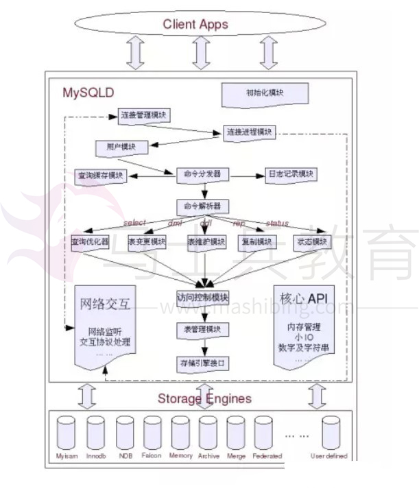

---

超大分页怎么处理？
 
超大的分页一般从两个方向上来解决.
数据库层面,这也是我们主要集中关注的(虽然收效没那么大),类似于select * from table where age 
> 20 limit 1000000,10这种查询其实也是有可以优化的余地的. 这条语句需要load1000000数据然
后基本上全部丢弃,只取10条当然比较慢. 当时我们可以修改为select * from table where id in 
(select id from table where age > 20 limit 1000000,10).这样虽然也load了一百万的数据,但是由
于索引覆盖,要查询的所有字段都在索引中,所以速度会很快. 同时如果ID连续的好,我们还可以select 
* from table where id > 1000000 limit 10,效率也是不错的,优化的可能性有许多种, 但是核心思想
都一样,就是减少load的数据.
从需求的角度减少这种请求…主要是不做类似的需求(直接跳转到几百万页之后的具体某一页.只允
许逐页查看或者按照给定的路线走,这样可预测,可缓存)以及防止ID泄漏且连续被人恶意攻击.
解决超大分页,其实主要是靠缓存,可预测性的提前查到内容,缓存至redis等k-V数据库中,直接返回即可.
在阿里巴巴《Java开发手册》中,对超大分页的解决办法是类似于上面提到的第一种.
【推荐】利用延迟关联或者子查询优化超多分页场景。 说明：MySQL并不是跳过offset
行，而是取offset+N行，然后返回放弃前offset行，返回N行，那当offset特别大的时候，效率就非常的
低下，要么控制返回的总页数，要么对超过特定阈值的页数进行SQL改写。 正例：先快速定位需要获取
的id段，然后再关联：
SELECT a.* FROM 表1 a,(select id from 表1 where 条件 LIMIT 100000,20) b w here 
a.id=b.id
mysql分页
 
LIMIT 子句可以被用于强制 SELECT 语句返回指定的记录数。LIMIT 接受一个或两个数字参数。参数必须
是一个整数常量。如果给定两个参数，第一个参数指定第一个返回记录行的偏移量，第二个参数指定返
回记录行的  大数目。初始记录行的偏移量是 0(而不是 1)
mysql> SELECT * FROM table LIMIT 5,10; // 检索记录行 6-15 
为了检索从某一个偏移量到记录集的结束所有的记录行，可以指定第二个参数为 
-1：
mysql> SELECT * FROM table LIMIT 95,-1; // 检索记录行 96-last. 
如果只给定一个参数，它表示返回 大的记录行数目： mysql> SELECT * FROM table LIMIT 5; //检索前 
5 个记录行 
换句话说，LIMIT n 等价于 LIMIT 0,n。
        1
        1
        1

---

慢查询日志
 
用于记录执行时间超过某个临界值的SQL日志，用于快速定位慢查询，为我们的优化做参考。
开启慢查询日志
配置项：slow_query_log 可以使用show variables like ‘slov_query_log’查看是否开启，如果状态值为
OFF，可以使用set GLOBAL slow_query_log = on来开启，它会在datadir下产生一个xxx-slow.log的文
件。
设置临界时间
配置项：long_query_time 查看：show VARIABLES like 'long_query_time'，单位秒设置：set 
long_query_time=0.5
实操时应该从长时间设置到短的时间，即将 慢的SQL优化掉
查看日志，一旦SQL超过了我们设置的临界时间就会被记录到xxx-slow.log中
关心过业务系统里面的sql耗时吗？统计过慢查询吗？对慢查询都怎
么优化过？
 
慢查询都怎么优化过？
 
在业务系统中，除了使用主键进行的查询，其他的我都会在测试库上测试其耗时，慢查询的统计主要由
运维在做，会定期将业务中的慢查询反馈给我们。慢查询的优化首先要搞明白慢的原因是什么？ 是查询
条件没有命中索引？是 load了不需要的数据列？还是数据量太大？所以优化也是针对这三个方向来的，
 首先分析语句，看看是否load了额外的数据，可能是查询了多余的行并且抛弃掉了，可能是加载了许多
结果中并不需要的列，对语句进行分析以及重写。
 分析语句的执行计划，然后获得其使用索引的情况，之后修改语句或者修改索引，使得语句可以尽可能
的命中索引。
为什么要尽量设定一个主键？
 
主键是数据库确保数据行在整张表唯一性的保障，即使业务上本张表没有主键，也建议添加一个自增长
的ID列作为主键。设定了主键之后，在后续的删改查的时候可能更加快速以及确保操作数据范围安全。
主键使用自增ID还是UUID？
 
推荐使用自增ID，不要使用UUID。
因为在InnoDB存储引擎中，主键索引是作为聚簇索引存在的，也就是说，主键索引的B+树叶子节点上
存储了主键索引以及全部的数据(按照顺序)，如果主键索引是自增ID，那么只需要不断向后排列即可，如
果是UUID，由于到来的ID与原来的大小不确定，会造成非常多的数据插入，数据移动，然后导致产生很
多的内存碎片，进而造成插入性能的下降。
总之，在数据量大一些的情况下，用自增主键性能会好一些。
关于主键是聚簇索引，如果没有主键，InnoDB会选择一个唯一键来作为聚簇索引，如果没有唯一键，会
生成一个隐式的主键。
      如果对语句的优化已经无法进行，可以考虑表中的数据量是否太大，如果是的话可以进行横向或者纵向
的分表。

---

字段为什么要求定义为not null？
 
null值会占用更多的字节，且会在程序中造成很多与预期不符的情况。
如果要存储用户的密码散列，应该使用什么字段进行存储？
 
密码散列，盐，用户身份证号等固定长度的字符串应该使用char而不是varchar 来存储，这样可以节省
空间且提高检索效率。
优化查询过程中的数据访问
 
访问数据太多导致查询性能下降确定应用程序是否在检索大量超过需要的数据，可能是太多行或列确认
MySQL服务器是否在分析大量不必要的数据行避免犯如下SQL语句错误
查询不需要的数据。解决办法：使用limit解决
多表关联返回全部列。解决办法：指定列名
总是返回全部列。解决办法：避免使用SELECT * 重复查询相同的数据。解决办法：可以缓存数据，下次
直接读取缓存是否在扫描额外的记录。解决办法：
使用explain进行分析，如果发现查询需要扫描大量的数据，但只返回少数的行，可以通过如下技巧去优
化：
 使用索引覆盖扫描，把所有的列都放到索引中，这样存储引擎不需要回表获取对应行就可以返回结果。
改变数据库和表的结构，修改数据表范式
重写SQL语句，让优化器可以以更优的方式执行查询。
优化长难的查询语句
 
一个复杂查询还是多个简单查询
MySQL内部每秒能扫描内存中上百万行数据，相比之下，响应数据给客户端就要慢得多
使用尽可能小的查询是好的，但是有时将一个大的查询分解为多个小的查询是很有必要的。
切分查询将一个大的查询分为多个小的相同的查询
一次性删除1000万的数据要比一次删除1万，暂停一会的方案更加损耗服务器开销。
分解关联查询，让缓存的效率更高。
执行单个查询可以减少锁的竞争。
在应用层做关联更容易对数据库进行拆分。
查询效率会有大幅提升。
较少冗余记录的查询
优化特定类型的查询语句
 
 count()会忽略所有的列，直接统计所有列数，不要使用count(列名) MyISAM中，没有任何where条件的
count()非常快。
当有where条件时，MyISAM的count统计不一定比其它引擎快。
可以使用explain查询近似值，用近似值替代count(*) 增加汇总表使用缓存

---

优化关联查询
 
确定ON或者USING子句中是否有索引。
确保GROUP BY和ORDER BY只有一个表中的列，这样MySQL才有可能使用索引
优化子查询
 
用关联查询替代
优化GROUP BY和DISTINCT
这两种查询据可以使用索引来优化，是  有效的优化方法关联查询中，使用标识列分组的效率更高
如果不需要ORDER BY，进行GROUP BY时加ORDER BY NULL，MySQL不会再进行文件排序。
 WITH ROLLUP超级聚合，可以挪到应用程序处理
优化LIMIT分页
 
LIMIT偏移量大的时候，查询效率较低
可以记录上次查询的   大ID，下次查询时直接根据该ID来查询
优化UNION查询
 
UNION ALL的效率高于UNION
优化WHERE子句
 
解题方法对于此类考题，先说明如何定位低效SQL语句，然后根据SQL语句可能低效的原因做排查，先
从索引着手，如果索引没有问题，考虑以上几个方面，数据访问的问题，长难查询句的问题还是一些特
定类型优化的问题，逐一回答。
SQL语句优化的一些方法？
 1.对查询进行优化，应尽量避免全表扫描，首先应考虑在 where 及 order by 涉及的列上建立索引。
 2.应尽量避免在 where 子句中对字段进行 null 值判断，否则将导致引擎放弃使用索引而进行全表扫
描，如：
1 select id from t where num is null -- 可以在num上设置默认值0，确保表中num列没有null值，
然后这样查询：select id from t where num=0
 3.应尽量避免在 where 子句中使用!=或<>操作符，否则引擎将放弃使用索引而进行全表扫描。
 4.应尽量避免在 where 子句中使用or 来连接条件，否则将导致引擎放弃使用索引而进行全表扫描，
如：
1 select id from t where num=10 or num=20 -- 可以这样查询：select id from t where 
num=10 union all select id from t where num=20
1 select id from t where num in(1,2,3) -- 对于连续的数值，能用 between 就不要用 in 了：
select id from t where num between 1 and 3
 6.下面的查询也将导致全表扫描：select id from t where name like ‘% 李%’若要提高效率，可以考虑全
文检索。
        5.in 和 not in 也要慎用，否则会导致全表扫描，如：

---

7.如果在 where 子句中使用参数，也会导致全表扫描。因为SQL只有在运行时才会解析局部变量，但优
化程序不能将访问计划的选择推迟到运行时；它必须在编译时进行选择。然 而，如果在编译时建立访问
计划，变量的值还是未知的，因而无法作为索引选择的输入项。如下面语句将进行全表扫描：
1 select id from t where num=@num --可以改为强制查询使用索引：select id from t with 
(index(索引名)) where num=@num
 8.应尽量避免在 where 子句中对字段进行表达式操作，这将导致引擎放弃使用索引而进行全表扫描。
如：
1 select id from t where num/2=100 -- 应改为:select id from t where num=100*2
 9.应尽量避免在where子句中对字段进行函数操作，这将导致引擎放弃使用索引而进行全表扫描。如：
1 select id from t where substring(name,1,3)=’abc’ -- name以abc开头的id应改为: select 
id from t where name like ‘abc%’
 10.不要在 where 子句中的“=”左边进行函数、算术运算或其他表达式运算，否则系统将可能无法正确使
用索引。
数据库优化
 
为什么要优化
 
系统的吞吐量瓶颈往往出现在数据库的访问速度上随着应用程序的运行，数据库的中的数据会越来越
多，处理时间会相应变慢数据是存放在磁盘上的，读写速度无法和内存相比优化原则：减少系统瓶颈，
减少资源占用，增加系统的反应速度。
数据库结构优化
 
一个好的数据库设计方案对于数据库的性能往往会起到事半功倍的效果。
需要考虑数据冗余、查询和更新的速度、字段的数据类型是否合理等多方面的内容。
将字段很多的表分解成多个表对于字段较多的表，如果有些字段的使用频率很低，可以将这些字段分离
出来形成新表。
因为当一个表的数据量很大时，会由于使用频率低的字段的存在而变慢。
增加中间表对于需要经常联合查询的表，可以建立中间表以提高查询效率。
通过建立中间表，将需要通过联合查询的数据插入到中间表中，然后将原来的联合查询改为对中间表的
查询。
增加冗余字段设计数据表时应尽量遵循范式理论的规约，尽可能的减少冗余字段，让数据库设计看起来
精致、优雅。但是，合理的加入冗余字段可以提高查询速度。
表的规范化程度越高，表和表之间的关系越多，需要连接查询的情况也就越多，性能也就越差。
注意：
冗余字段的值在一个表中修改了，就要想办法在其他表中更新，否则就会导致数据不一致的问题
MySQL数据库cpu飙升到500%的话他怎么处理？
 
当 cpu 飙升到 500%时，先用操作系统命令 top 命令观察是不是 mysqld 占用导致的，如果不是，找出
占用高的进程，并进行相关处理。
如果是 mysqld 造成的， show processlist，看看里面跑的 session 情况，是不是有消耗资源的 sql 在
运行。找出消耗高的 sql，看看执行计划是否准确， index 是否缺失，或者实在是数据量太大造成。

---

一般来说，肯定要 kill 掉这些线程(同时观察 cpu 使用率是否下降)，等进行相应的调整(比如说加索引、
改 sql、改内存参数)之后，再重新跑这些 SQL。
也有可能是每个 sql 消耗资源并不多，但是突然之间，有大量的 session 连进来导致 cpu 飙升，这种情
况就需要跟应用一起来分析为何连接数会激增，再做出相应的调整,比如说限制连接数等
大表怎么优化？某个表有近千万数据，
 
CRUD比较慢，如何优化？分库分表了是怎么
 
做的？分表分库了有什么问题？有用到中间
 
件么？他们的原理知道么？
 
当MySQL单表记录数过大时，数据库的CRUD性能会明显下降，一些常见的优化措施如下：
1. 限定数据的范围： 务必禁止不带任何限制数据范围条件的查询语句。比如：我们当用户在查询订单
历史的时候，我们可以控制在一个月的范围内。；
2. 读/写分离： 经典的数据库拆分方案，主库负责写，从库负责读；
3. 缓存： 使用MySQL的缓存，另外对重量级、更新少的数据可以考虑使用应用级别的缓存；
有就是通过分库分表的方式进行优化，主要有垂直分表和水平分表
1. 垂直分区：
根据数据库里面数据表的相关性进行拆分。 例如，用户表中既有用户的登录信息又有用户的基本信息，
可以将用户表拆分成两个单独的表，甚至放到单独的库做分库。
简单来说垂直拆分是指数据表列的拆分，把一张列比较多的表拆分为多张表。 如下图所示，这样来说大
家应该就更容易理解了。
垂直拆分的优点： 可以使得行数据变小，在查询时减少读取的Block数，减少
I/O次数。此外，垂直分区可以简化表的结构，易于维护。
垂直拆分的缺点： 主键会出现冗余，需要管理冗余列，并会引起Join操作，可
以通过在应用层进行Join来解决。此外，垂直分区会让事务变得更加复杂；
垂直分表
 
把主键和一些列放在一个表，然后把主键和另外的列放在另一个表中

---

适用场景
 
1、    如果一个表中某些列常用，另外一些列不常用
2、    可以使数据行变小，一个数据页能存储更多数据，查询时减少I/O次数
缺点
 
 有些分表的策略基于应用层的逻辑算法，一旦逻辑算法改变，整个分表逻辑都会改变，扩展性较差 对于
应用层来说，逻辑算法增加开发成本管理冗余列，查询所有数据需要join操作
2. 水平分区：
保持数据表结构不变，通过某种策略存储数据分片。这样每一片数据分散到不同的表或者库中，达到了
分布式的目的。 水平拆分可以支撑非常大的数据量。
水平拆分是指数据表行的拆分，表的行数超过200万行时，就会变慢，这时可以把一张的表的数据拆成
多张表来存放。举个例子：我们可以将用户信息表拆分成多个用户信息表，这样就可以避免单一表数据
量过大对性能造成影响。

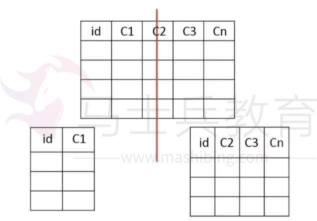

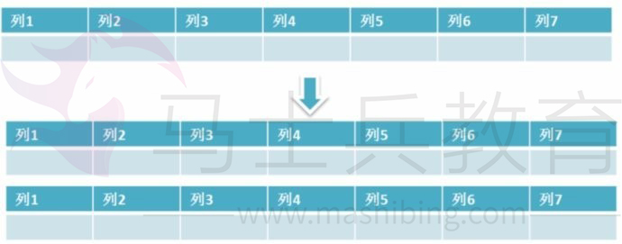

---

水品拆分可以支持非常大的数据量。需要注意的一点是:分表仅仅是解决了单一表数据过大的问题，但由
于表的数据还是在同一台机器上，其实对于提升
MySQL并发能力没有什么意义，所以 水平拆分最好分库 。
水平拆分能够 支持非常大的数据量存储，应用端改造也少，但 分片事务难以解决 ，跨界点Join性能较
差，逻辑复杂。
《Java工程师修炼之道》的作者推荐 尽量不要对数据进行分片，因为拆分会带来逻辑、部署、运维的各
种复杂度 ，一般的数据表在优化得当的情况下支撑千万以下的数据量是没有太大问题的。如果实在要分
片，尽量选择客户端分片架构，这样可以减少一次和中间件的网络I/O。
水平分表：
 
表很大，分割后可以降低在查询时需要读的数据和索引的页数，同时也降低了索引的层数，提高查询次
数
适用场景
 
 1、表中的数据本身就有独立性，例如表中分表记录各个地区的数据或者不同时期的数据，特别是有些
数据常用，有些不常用。
水平切分的缺点
 1、给应用增加复杂度，通常查询时需要多个表名，查询所有数据都需UNION操作
 2、在许多数据库应用中，这种复杂度会超过它带来的优点，查询时会增加读一个索引层的磁盘次数
下面补充一下数据库分片的两种常见方案：
 客户端代理：分片逻辑在应用端，封装在jar包中，通过修改或者封装JDBC层来实现。 当当网的 
Sharding-
JDBC 、阿里的TDDL是两种比较常用的实现。
 中间件代理：在应用和数据中间加了一个代理层。分片逻辑统一维护在中间件服务中。 我们现在谈的 
Mycat 
、360的Atlas、网易的DDB等等都是这种架构的实现。
分库分表后面临的问题
                2、需要把数据存放在多个介质上。

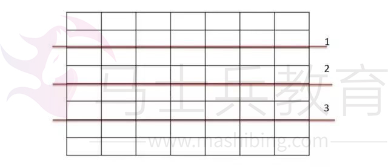

---

事务支持 分库分表后，就成了分布式事务了。如果依赖数据库本身的分布式事务管理功能去执行事务，
将付出高昂的性能代价； 如果由应用程序去协助控制，形成程序逻辑上的事务，又会造成编程方面的负
担。
只要是进行切分，跨节点Join的问题是不可避免的。但是良好的设计和切分却可以减少此类情况的发
生。解决这一问题的普遍做法是分两次查询实现。在第一次查询的结果集中找出关联数据的id,根据这些
id发起第二次请求得到关联数据。 分库分表方案产品
 跨节点的count,order by,group by以及聚合函数问题 这些是一类问题，因为它们都需要基于全部数据
集合进行计算。多数的代理都不会自动处理合并工作。解决方案：与解决跨节点join问题的类似，分别
在各个节点上得到结果后在应用程序端进行合并。和join不同的是每个结点的查询可以并行执行，因此
很多时候它的速度要比单一大表快很多。但如果结果集很大，对应用程序内存的消耗是一个问题。
 数据迁移，容量规划，扩容等问题 来自淘宝综合业务平台团队，它利用对2的倍数取余具有向前兼容的
特性（如对4取余得1的数对2取余也是 1）来分配数据，避免了行级别的数据迁移，但是依然需要进行表
级别的迁移，同时对扩容规模和分表数量都有限制。总得来说，这些方案都不是
十分的理想，多多少少都存在一些缺点，这也从一个侧面反映出了
Sharding扩容的难度。
ID问题
一旦数据库被切分到多个物理结点上，我们将不能再依赖数据库自身的主键生成机制。一方面，某个分
区数据库自生成的ID无法保证在全局上是唯一的；另一方面，应用程序在插入数据之前需要先获得ID,以
便进行
SQL路由. 一些常见的主键生成策略
UUID 使用UUID作主键是   简单的方案，但是缺点也是非常明显的。由于
UUID非常的长，除占用大量存储空间外， 主要的问题是在索引上，在建立索引和基于索引进行查询时
都存在性能问题。 Twitter的分布式自增ID算法
Snowflake 在分布式系统中，需要生成全局UID的场合还是比较多的，twitter 的snowflake解决了这种
需求，实现也还是很简单的，除去配置信息，核心代码就是毫秒级时间41位 机器ID 10位 毫秒内序列12
位。
 跨分片的排序分页般来讲，分页时需要按照指定字段进行排序。当排序字段就是分片字段的时候，我们
通过分片规则可以比较容易定位到指定的分片，而当排序字段非分片字段的时候，情况就会变得比较复
杂了。为了  终结果的准确性，我们需要在不同的分片节点中将数据进行排序并返回，并将不同分片返回
的结果集进行汇总和再次排序，  后再返回给用户。如下图所示：
       跨库join

---

MySQL的复制原理以及流程
 
主从复制：将主数据库中的DDL和DML操作通过二进制日志（BINLOG）传输到从数据库上，然后将这
些日志重新执行（重做）；从而使得从数据库的数据与主数据库保持一致。
主从复制的作用
1. 主数据库出现问题，可以切换到从数据库。
2. 可以进行数据库层面的读写分离。
3. 可以在从数据库上进行日常备份。
MySQL主从复制解决的问题
数据分布：随意开始或停止复制，并在不同地理位置分布数据备份负载均衡：降低单个服务器的压
力高可用和故障切换：帮助应用程序避免单点失败升级测试：可以用更高版本的MySQL作为从库
MySQL主从复制工作原理
在主库上把数据更高记录到二进制日志从库将主库的日志复制到自己的中继日志
从库读取中继日志的事件，将其重放到从库数据中基本原理流程，3个线程以及之间的关联
主：binlog线程——记录下所有改变了数据库数据的语句，放进master上的 binlog中；从：io线程——
在使用start slave 之后，负责从master上拉取 binlog 内容，放进自己的relay log中；
从：sql执行线程——执行relay log中的语句；

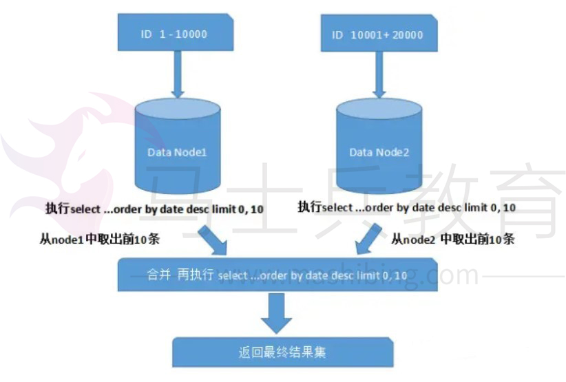

---

Binary log：主数据库的二进制日志
Relay log：从服务器的中继日志
第一步：master在每个事务更新数据完成之前，将该操作记录串行地写入到 binlog文件中。
第二步：salve开启一个I/O Thread，该线程在master打开一个普通连接，主要工作是binlog dump 
process。如果读取的进度已经跟上了master，就进入睡眠状态并等待master产生新的事件。I/O线程 
终的目的是将这些事件写入到中继日志中。
第三步：SQL Thread会读取中继日志，并顺序执行该日志中的SQL事件，从而与主数据库中的数据保持
一致。
读写分离有哪些解决方案？
 
读写分离是依赖于主从复制，而主从复制又是为读写分离服务的。因为主从复制要求slave不能写只能读
（如果对slave执行写操作，那么show slave status将会呈现Slave_SQL_Running=NO，此时你需要按
照前面提到的手动同步一下slave）。
方案一
使用mysql-proxy代理
优点：直接实现读写分离和负载均衡，不用修改代码，master和slave用一样的帐号，mysql官方不建议
实际生产中使用缺点：降低性能， 不支持事务方案二
使用AbstractRoutingDataSource+aop+annotation在dao层决定数据源。如果采用了mybatis， 可以
将读写分离放在ORM层，比如mybatis可以通过
mybatis plugin拦截sql语句，所有的insert/update/delete都访问master库，所有的select 都访问salve
库，这样对于dao层都是透明。 plugin实现时可以通过注解或者分析语句是读写方法来选定主从库。不
过这样依然有一个问题， 也就是不支持事务， 所以我们还需要重写一下
DataSourceTransactionManager， 将read-only的事务扔进读库， 其余的有读有写的扔进写库。
方案三

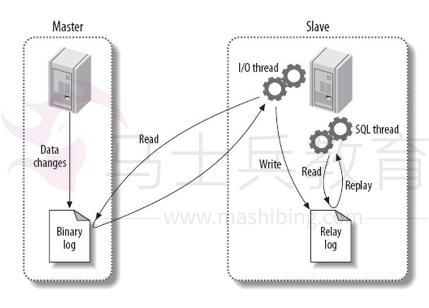

---

使用AbstractRoutingDataSource+aop+annotation在service层决定数据源，可以支持事务. 缺点：类
内部方法通过this.xx()方式相互调用时，aop不会进行拦截，需进行特殊处理
备份计划，mysqldump以及xtranbackup的实现原理
 
(1)备份计划视库的大小来定，一般来说 100G 内的库，可以考虑使用 mysqldump 来做，因为 
mysqldump更加轻巧灵活，备份时间选在业务低峰期，可以每天进行都进行全量备份(mysqldump 备
份出来的文件比较小，压缩之后更小)。
100G 以上的库，可以考虑用 xtranbackup 来做，备份速度明显要比 
mysqldump 要快。一般是选择一周一个全备，其余每天进行增量备份，备份时间为业务低峰期。
(2)备份恢复时间
物理备份恢复快，逻辑备份恢复慢
这里跟机器，尤其是硬盘的速率有关系，以下列举几个仅供参考
20G的2分钟（mysqldump）
80G的30分钟(mysqldump)
111G的30分钟（mysqldump)
288G的3小时（xtra)
3T的4小时（xtra)
逻辑导入时间一般是备份时间的5倍以上
(3)备份恢复失败如何处理首先在恢复之前就应该做足准备工作，避免恢复的时候出错。比如说备份之后
的有效性检查、权限检查、空间检查等。如果万一报错，再根据报错的提示来进行相应的调整。
(4)mysqldump和xtrabackup实现原理 mysqldump mysqldump 属于逻辑备份。加入–single-
transaction 选项可以进行一致性备份。后台进程会先设置 session 的事务隔离级别为 RR(SET SESSION 
TRANSACTION ISOLATION LEVELREPEATABLE READ)，之后显式开启一个
事务(START TRANSACTION /*!40100 WITH CONSISTENTSNAPSHOT */)，这样就保证了该事务里读到
的数据都是事务事务时候的快照。之后再把表的数据读取出来。如果加上–master-data=1 的话，在刚开
始的时候还会加一个数据库的读锁(FLUSH TABLES WITH READ LOCK),等开启事务后，再记录下数据库
此时 binlog 的位置(showmaster status)，马上解锁，再读取表的数据。等所有的数据都已经导完，就
可以结束事务
Xtrabackup:
xtrabackup 属于物理备份，直接拷贝表空间文件，同时不断扫描产生的 redo 日志并保存下来。  后完
成 innodb 的备份后，会做一个 flush engine logs 的
操作(老版本在有 bug，在5.6 上不做此操作会丢数据)，确保所有的 redo log 都已经落盘(涉及到事务的
两阶段提交
概念，因为 xtrabackup 并不拷贝 binlog，所以必须保证所有的 redo log 都落盘，否则可能会丢 后一组
提交事务的数据)。这个时间点就是 innodb 完成备份的时间点，数据文件虽然不是一致性的，但是有这
段时间的 redo 就可以让数据文件达到一致性(恢复的时候做的事
情)。然后还需要 flush tables with read lock，把 myisam 等其他引擎的表给备份出来，备份完后解
锁。这样就做到了完美的热备。

---

数据表损坏的修复方式有哪些？
 
使用 myisamchk 来修复，具体步骤：
1）   修复前将mysql服务停止。
2）   打开命令行方式，然后进入到mysql的/bin目录。
3）   执行myisamchk –recover 数据库所在路径/*.MYI使用repair table 或者 OPTIMIZE table命令来修
复，REPAIR TABLE 
table_name 修复表 OPTIMIZE TABLE table_name 优化表 REPAIR TABLE 用于修复被破坏的表。 
OPTIMIZE TABLE 用于回收闲置的数据库空间，当表上的数据行被删除时，所占据的磁盘空间并没有立
即被回收，使用了OPTIMIZE 
TABLE命令后这些空间将被回收，并且对磁盘上的数据行进行重排（注意：是磁盘上，而非数据库）
 
 
MySQL记录binlog的方式主要包括三种模式？每种模式的
优缺点是什么？
 
mysql复制主要有三种方式：基于SQL语句的复制(statement-based replication, SBR)，基于行 的复制
(row-based replication, RBR)，混合模式复制(mixed-based replication, MBR)。对应 的，binlog的格
式也有三种：STATEMENT，ROW，MIXED。 
① STATEMENT模式（SBR） 每一条会修改数据的sql语句会记录到binlog中。优点是并不需要记录每一
条sql语句和每一行的 数据变化，减少了binlog日志量，节约IO，提高性能。缺点是在某些情况下会导致
master-slave 中的数据不一致( 如sleep()函数， last_insert_id()，以及user-defined functions(udf)等会
出现 问题) 
② ROW模式（RBR） 不记录每条sql语句的上下文信息，仅需记录哪条数据被修改了，修改成什么样
了。而且不会出 现某些特定情况下的存储过程、或function、或trigger的调用和触发无法被正确复制的
问题。缺 点是会产生大量的日志，尤其是alter table的时候会让日志暴涨。 
③ MIXED模式（MBR） 以上两种模式的混合使用，一般的复制使用STATEMENT模式保存binlog，对于
STATEMENT 模式无法复制的操作使用ROW模式保存binlog，MySQL会根据执行的SQL语句选择日志保
存方 式。 
MySQL锁，悲观锁、乐观锁、排它锁、共享锁、表级锁、
行级锁；
 
乐观锁 
用数据版本（Version）记录机制实现，这是乐观锁最常用的一种实现方式。何谓数据版本？即 为数据
增加一个版本标识，一般是通过为数据库表增加一个数字类型的 “version” 字段来实 现。当读取数据
时，将version字段的值一同读出，数据每更新一次，对此version值加1。当我 们提交更新的时候，判
断数据库表对应记录的当前版本信息与第一次取出来的version值进行比 对，如果数据库表当前版本号
与第一次取出来的version值相等，则予以更新，否则认为是过期 数据。 
悲观锁 
在进行每次操作时都要通过获取锁才能进行对相同数据的操作，这点跟java中synchronized很 相似，共
享锁（读锁）和排它锁（写锁）是悲观锁的不同的实现 
共享锁（读锁）

---

共享锁又叫做读锁，所有的事务只能对其进行读操作不能写操作，加上共享锁后在事务结束之前 其他事
务只能再加共享锁，除此之外其他任何类型的锁都不能再加了。 
排它锁（写锁） 
若某个事物对某一行加上了排他锁，只能这个事务对其进行读写，在此事务结束之前，其他事务 不能对
其进行加任何锁，其他进程可以读取,不能进行写操作，需等待其释放。 
表级锁 
innodb 的行锁是在有索引的情况下,没有索引的表是锁定全表的 
行级锁 
行锁又分共享锁和排他锁,由字面意思理解，就是给某一行加上锁，也就是一条记录加上锁。 注意：行级
锁都是基于索引的，如果一条SQL语句用不到索引是不会使用行级锁的，会使用表级 锁。
 
 
 
MySQL InnoDB中，乐观锁、悲观锁、共享锁、排它锁、行锁、表
锁、死锁概念的理解
 
 
MySQL/InnoDB的加锁，一直是一个面试中常问的话题。例如，数据库如果有高并发请求，如何保证数
据完整性？产生死锁问题如何排查并解决？我在工作过程中，也会经常用到，乐观锁，排它锁，等。于
是今天就对这几个概念进行学习，屡屡思路，记录一下。
注：MySQL是一个支持插件式存储引擎的数据库系统。本文下面的所有介绍，都是基于InnoDB存储引
擎，其他引擎的表现，会有较大的区别。
存储引擎查看
MySQL给开发者提供了查询存储引擎的功能，我这里使用的是MySQL5.6.4，可以使用：
乐观锁
 
用数据版本（Version）记录机制实现，这是乐观锁最常用的一种实现方式。何谓数据版本？即为数据增
加一个版本标识，一般是通过为数据库表增加一个数字类型的 “version” 字段来实现。当读取数据时，
将version字段的值一同读出，数据每更新一次，对此version值加1。当我们提交更新的时候，判断数据
库表对应记录的当前版本信息与第一次取出来的version值进行比对，如果数据库表当前版本号与第一次
取出来的version值相等，则予以更新，否则认为是过期数据。
举例
1、数据库表设计
三个字段，分别是id,value、version
2、每次更新表中的value字段时，为了防止发生冲突，需要这样操作
SHOW ENGINES
select id,value,version from TABLE where id=#{id}

---

悲观锁
 
与乐观锁相对应的就是悲观锁了。悲观锁就是在操作数据时，认为此操作会出现数据冲突，所以在进行
每次操作时都要通过获取锁才能进行对相同数据的操作，这点跟java中的synchronized很相似，所以悲
观锁需要耗费较多的时间。另外与乐观锁相对应的，悲观锁是由数据库自己实现了的，要用的时候，我
们直接调用数据库的相关语句就可以了。
说到这里，由悲观锁涉及到的另外两个锁概念就出来了，它们就是共享锁与排它锁。共享锁和排它锁是
悲观锁的不同的实现，它俩都属于悲观锁的范畴。
使用，排它锁 举例
要使用悲观锁，我们必须关闭mysql数据库的自动提交属性，因为MySQL默认使用autocommit模式，
也就是说，当你执行一个更新操作后，MySQL会立刻将结果进行提交。
我们可以使用命令设置MySQL为非autocommit模式：
共享锁
 
共享锁又称读锁 read lock，是读取操作创建的锁。其他用户可以并发读取数据，但任何事务都不能对
数据进行修改（获取数据上的排他锁），直到已释放所有共享锁。
如果事务T对数据A加上共享锁后，则其他事务只能对A再加共享锁，不能加排他锁。获得共享锁的事务
只能读数据，不能修改数据
打开第一个查询窗口
update TABLE
set value=2,version=version+1
where id=#{id} and version=#{version};
set autocommit=0;
# 设置完autocommit后，我们就可以执行我们的正常业务了。具体如下：
# 1. 开始事务
begin;/begin work;/start transaction; (三者选一就可以)
# 2. 查询表信息
select status from TABLE where id=1 for update;
# 3. 插入一条数据
insert into TABLE (id,value) values (2,2);
# 4. 修改数据为
update TABLE set value=2 where id=1;
# 5. 提交事务
commit;/commit work;

---

然后在另一个查询窗口中，对id为1的数据进行更新
此时，操作界面进入了卡顿状态，过了超时间，提示错误信息
如果在超时前，执行 commit ，此更新语句就会成功。
加上共享锁后，也提示错误信息
在查询语句后面增加 LOCK IN SHARE MODE ，Mysql会对查询结果中的每行都加共享锁，当没有其他线
程对查询结果集中的任何一行使用排他锁时，可以成功申请共享锁，否则会被阻塞。其他线程也可以读
取使用了共享锁的表，而且这些线程读取的是同一个版本的数据。
加上共享锁后，对于update,insert,delete 语句会自动加排它锁。
排它锁
 
排他锁 exclusive lock（也叫writer lock）又称写锁。
排它锁是悲观锁的一种实现，在上面悲观锁也介绍过。
若事务 1 对数据对象A加上X锁，事务 1 可以读A也可以修改A，其他事务不能再对A加任何锁，直到事物 
1 释放A上的锁。这保证了其他事务在事物 1 释放A上的锁之前不能再读取和修改A。排它锁会阻塞所有
的排它锁和共享锁
读取为什么要加读锁呢：防止数据在被读取的时候被别的线程加上写锁，
使用方式：在需要执行的语句后面加上for update 就可以了
行锁
 
行锁又分共享锁和排他锁,由字面意思理解，就是给某一行加上锁，也就是一条记录加上锁。
注意：行级锁都是基于索引的，如果一条SQL语句用不到索引是不会使用行级锁的，会使用表级锁。
共享锁：
名词解释：共享锁又叫做读锁，所有的事务只能对其进行读操作不能写操作，加上共享锁后在事务结束
之前其他事务只能再加共享锁，除此之外其他任何类型的锁都不能再加了。
begin;/begin work;/start transaction;  (三者选一就可以)
SELECT * from TABLE where id = 1  lock in share mode;
update  TABLE set name="www.souyunku.com" where id =1;
[SQL]update  test_one set name="www.souyunku.com" where id =1;
[Err] 1205 - Lock wait timeout exceeded; try restarting transaction
update  test_one set name="www.souyunku.com" where id =1 lock in share mode;
[SQL]update  test_one set name="www.souyunku.com" where id =1 lock in share 
mode;
[Err] 1064 - You have an error in your SQL syntax; check the manual that 
corresponds to your MySQL server version for the right syntax to use near 'lock 
in share mode' at line 1
SELECT * from TABLE where id = "1"  lock in share mode;  结果集的数据都会加共享锁

---

排他锁：
名词解释：若某个事物对某一行加上了排他锁，只能这个事务对其进行读写，在此事务结束之前，其他
事务不能对其进行加任何锁，其他进程可以读取,不能进行写操作，需等待其释放。
可以参考之前演示的共享锁,排它锁语句
由于对于表中,id字段为主键，就也相当于索引。执行加锁时，会将id这个索引为1的记录加上锁，那么这
个锁就是行锁。
表锁
 
如何加表锁
innodb 的行锁是在有索引的情况下,没有索引的表是锁定全表的.
Innodb中的行锁与表锁
前面提到过，在Innodb引擎中既支持行锁也支持表锁，那么什么时候会锁住整张表，什么时候或只锁住
一行呢？
只有通过索引条件检索数据，InnoDB才使用行级锁，否则，InnoDB将使用表锁！
在实际应用中，要特别注意InnoDB行锁的这一特性，不然的话，可能导致大量的锁冲突，从而影响并发
性能。
行级锁都是基于索引的，如果一条SQL语句用不到索引是不会使用行级锁的，会使用表级锁。行级锁的
缺点是：由于需要请求大量的锁资源，所以速度慢，内存消耗大。
死锁
 
死锁（Deadlock） 
所谓死锁：是指两个或两个以上的进程在执行过程中，因争夺资源而造成的一种互相等待的现象，若无
外力作用，它们都将无法推进下去。此时称系统处于死锁状态或系统产生了死锁，这些永远在互相等待
的进程称为死锁进程。由于资源占用是互斥的，当某个进程提出申请资源后，使得有关进程在无外力协
助下，永远分配不到必需的资源而无法继续运行，这就产生了一种特殊现象死锁。
解除正在死锁的状态有两种方法：
第一种：
1.查询是否锁表
2.查询进程（如果您有SUPER权限，您可以看到所有线程。否则，您只能看到您自己的线程）
3.杀死进程id（就是上面命令的id列）
第二种：
1：查看当前的事务
select status from TABLE where id=1 for update;
show OPEN TABLES where In_use > 0;
show processlist
kill id

---

隔离级别
脏读
不可重复读
幻读
读未提交(Read uncommitted)
√
√
√
读已提交(Read committed)
×
√
√
可重复读(Repeatable read)
×
×
√
可串行化(Serializable)
×
×
×
2：查看当前锁定的事务
3：查看当前等锁的事务
杀死进程
如果系统资源充足，进程的资源请求都能够得到满足，死锁出现的可能性就很低，否则就会因争夺有限
的资源而陷入死锁。其次，进程运行推进顺序与速度不同，也可能产生死锁。
产生死锁的四个必要条件：
（1） 互斥条件：一个资源每次只能被一个进程使用。
（2） 请求与保持条件：一个进程因请求资源而阻塞时，对已获得的资源保持不放。
（3） 不剥夺条件:进程已获得的资源，在末使用完之前，不能强行剥夺。
（4） 循环等待条件:若干进程之间形成一种头尾相接的循环等待资源关系。
虽然不能完全避免死锁，但可以使死锁的数量减至最少。将死锁减至最少可以增加事务的吞吐量并减少
系统开销，因为只有很少的事务回滚，而回滚会取消事务执行的所有工作。由于死锁时回滚而由应用程
序重新提交。
下列方法有助于最大限度地降低死锁：
（1）按同一顺序访问对象。
（2）避免事务中的用户交互。
（3）保持事务简短并在一个批处理中。
（4）使用低隔离级别。
（5）使用绑定连接。
 
 
分布式事务的原理2阶段提交，同步异步阻塞非阻塞；
 
数据库事务隔离级别，MySQL默认的隔离级别
 
Mysql默认隔离级别：Repeatable Read
SELECT * FROM INFORMATION_SCHEMA.INNODB_TRX;
SELECT * FROM INFORMATION_SCHEMA.INNODB_LOCKS;
SELECT * FROM INFORMATION_SCHEMA.INNODB_LOCK_WAITS; 
kill 线程ID

---

Spring如何实现事务
 
Spring 事物四种实现方式： 
基于编程式事务管理实现 
基于TransactionProxyFactoryBean的声明式事务管理 
基于AspectJ的XML声明式事务管理 
基于注解的声明式事务管理
 
 
spring事务管理(详解和实例)
 
1 初步理解
 
理解事务之前，先讲一个你日常生活中最常干的事：取钱。
比如你去ATM机取1000块钱，大体有两个步骤：首先输入密码金额，银行卡扣掉1000元钱；然后ATM
出1000元钱。这两个步骤必须是要么都执行要么都不执行。如果银行卡扣除了1000块但是ATM出钱失
败的话，你将会损失1000元；如果银行卡扣钱失败但是ATM却出了1000块，那么银行将损失1000元。
所以，如果一个步骤成功另一个步骤失败对双方都不是好事，如果不管哪一个步骤失败了以后，整个取
钱过程都能回滚，也就是完全取消所有操作的话，这对双方都是极好的。
事务就是用来解决类似问题的。事务是一系列的动作，它们综合在一起才是一个完整的工作单元，这些
动作必须全部完成，如果有一个失败的话，那么事务就会回滚到最开始的状态，仿佛什么都没发生过一
样。
在企业级应用程序开发中，事务管理必不可少的技术，用来确保数据的完整性和一致性。
事务有四个特性：ACID
原子性（Atomicity）：事务是一个原子操作，由一系列动作组成。事务的原子性确保动作要
么全部完成，要么完全不起作用。
一致性（Consistency）：一旦事务完成（不管成功还是失败），系统必须确保它所建模的业
务处于一致的状态，而不会是部分完成部分失败。在现实中的数据不应该被破坏。
隔离性（Isolation）：可能有许多事务会同时处理相同的数据，因此每个事务都应该与其他
事务隔离开来，防止数据损坏。
持久性（Durability）：一旦事务完成，无论发生什么系统错误，它的结果都不应该受到影
响，这样就能从任何系统崩溃中恢复过来。通常情况下，事务的结果被写到持久化存储器
中。

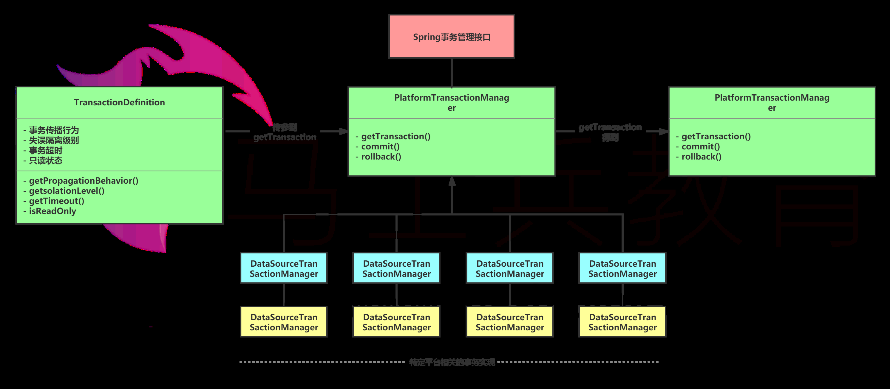

---

2 核心接口
 
Spring事务管理的实现有许多细节，如果对整个接口框架有个大体了解会非常有利于我们理解事务，下
面通过讲解Spring的事务接口来了解Spring实现事务的具体策略。
Spring事务管理涉及的接口的联系如下：
2.1 事务管理器
 
Spring并不直接管理事务，而是提供了多种事务管理器，他们将事务管理的职责委托给Hibernate或者
JTA等持久化机制所提供的相关平台框架的事务来实现。
Spring事务管理器的接口是org.springframework.transaction.PlatformTransactionManager，通过这
个接口，Spring为各个平台如JDBC、Hibernate等都提供了对应的事务管理器，但是具体的实现就是各
个平台自己的事情了。此接口的内容如下：
从这里可知具体的具体的事务管理机制对Spring来说是透明的，它并不关心那些，那些是对应各个平台
需要关心的，所以Spring事务管理的一个优点就是为不同的事务API提供一致的编程模型，如JTA、
JDBC、Hibernate、JPA。下面分别介绍各个平台框架实现事务管理的机制。
2.1.1 JDBC事务
如果应用程序中直接使用JDBC来进行持久化，DataSourceTransactionManager会为你处理事务边界。
为了使用DataSourceTransactionManager，你需要使用如下的XML将其装配到应用程序的上下文定义
中：
Public interface PlatformTransactionManager()...{  
    // 由TransactionDefinition得到TransactionStatus对象
    TransactionStatus getTransaction(TransactionDefinition definition) throws 
TransactionException; 
    // 提交
    Void commit(TransactionStatus status) throws TransactionException;  
    // 回滚
    Void rollback(TransactionStatus status) throws TransactionException;  
    } 
    <bean id="transactionManager" 
class="org.springframework.jdbc.datasource.DataSourceTransactionManager">
        <property name="dataSource" ref="dataSource" />
    </bean>

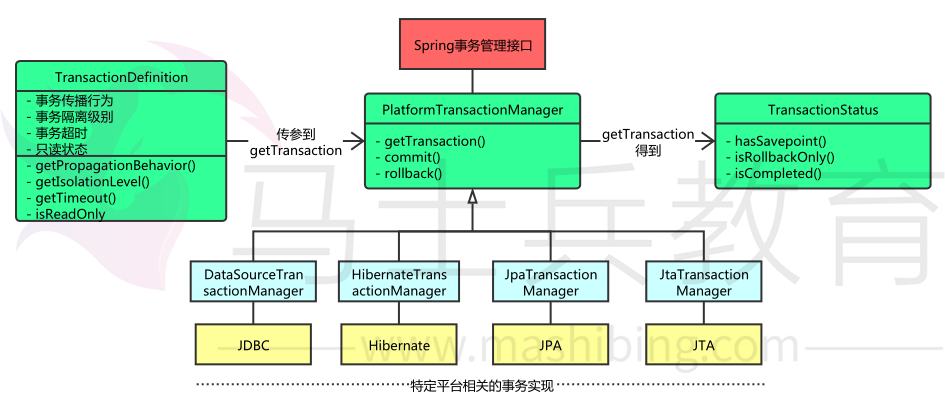

---

实际上，DataSourceTransactionManager是通过调用java.sql.Connection来管理事务，而后者是通过
DataSource获取到的。通过调用连接的commit()方法来提交事务，同样，事务失败则通过调用
rollback()方法进行回滚。
2.1.2 Hibernate事务
如果应用程序的持久化是通过Hibernate实习的，那么你需要使用HibernateTransactionManager。对
于Hibernate3，需要在Spring上下文定义中添加如下的<bean> 声明：
sessionFactory属性需要装配一个Hibernate的session工厂，HibernateTransactionManager的实现细
节是它将事务管理的职责委托给org.hibernate.Transaction对象，而后者是从Hibernate Session中获取
到的。当事务成功完成时，HibernateTransactionManager将会调用Transaction对象的commit()方
法，反之，将会调用rollback()方法。
2.1.3 Java持久化API事务（JPA）
Hibernate多年来一直是事实上的Java持久化标准，但是现在Java持久化API作为真正的Java持久化标准
进入大家的视野。如果你计划使用JPA的话，那你需要使用Spring的JpaTransactionManager来处理事
务。你需要在Spring中这样配置JpaTransactionManager：
JpaTransactionManager只需要装配一个JPA实体管理工厂（javax.persistence.EntityManagerFactory
接口的任意实现）。JpaTransactionManager将与由工厂所产生的JPA EntityManager合作来构建事务。
2.1.4 Java原生API事务
如果你没有使用以上所述的事务管理，或者是跨越了多个事务管理源（比如两个或者是多个不同的数据
源），你就需要使用JtaTransactionManager：
JtaTransactionManager将事务管理的责任委托给javax.transaction.UserTransaction和
javax.transaction.TransactionManager对象，其中事务成功完成通过UserTransaction.commit()方法
提交，事务失败通过UserTransaction.rollback()方法回滚。
2.2 基本事务属性的定义
 
上面讲到的事务管理器接口PlatformTransactionManager通过getTransaction(TransactionDefinition 
definition)方法来得到事务，这个方法里面的参数是TransactionDefinition类，这个类就定义了一些基
本的事务属性。
那么什么是事务属性呢？事务属性可以理解成事务的一些基本配置，描述了事务策略如何应用到方法
上。事务属性包含了5个方面，如图所示：
    <bean id="transactionManager" 
class="org.springframework.orm.hibernate3.HibernateTransactionManager">
        <property name="sessionFactory" ref="sessionFactory" />
    </bean>
    <bean id="transactionManager" 
class="org.springframework.orm.jpa.JpaTransactionManager">
        <property name="sessionFactory" ref="sessionFactory" />
    </bean>
    <bean id="transactionManager" 
class="org.springframework.transaction.jta.JtaTransactionManager">
        <property name="transactionManagerName" value="java:/TransactionManager" 
/>
    </bean>

---

而TransactionDefinition接口内容如下：
我们可以发现TransactionDefinition正好用来定义事务属性，下面详细介绍一下各个事务属性。
2.2.1 传播行为
事务的第一个方面是传播行为（propagation behavior）。当事务方法被另一个事务方法调用时，必须
指定事务应该如何传播。例如：方法可能继续在现有事务中运行，也可能开启一个新事务，并在自己的
事务中运行。Spring定义了七种传播行为：
public interface TransactionDefinition {
    int getPropagationBehavior(); // 返回事务的传播行为
    int getIsolationLevel(); // 返回事务的隔离级别，事务管理器根据它来控制另外一个事务可以
看到本事务内的哪些数据
    int getTimeout();  // 返回事务必须在多少秒内完成
    boolean isReadOnly(); // 事务是否只读，事务管理器能够根据这个返回值进行优化，确保事务是
只读的
}

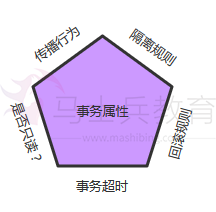

---

传播行为
含义
PROPAGATION_REQUIRED
表示当前方法必须运行在事务中。如果当前事务存在，方
法将会在该事务中运行。否则，会启动一个新的事务
PROPAGATION_SUPPORTS
表示当前方法不需要事务上下文，但是如果存在当前事务
的话，那么该方法会在这个事务中运行
PROPAGATION_MANDATORY
表示该方法必须在事务中运行，如果当前事务不存在，则
会抛出一个异常
PROPAGATION_REQUIRED_NEW
表示当前方法必须运行在它自己的事务中。一个新的事务
将被启动。如果存在当前事务，在该方法执行期间，当前
事务会被挂起。如果使用JTATransactionManager的话，
则需要访问TransactionManager
PROPAGATION_NOT_SUPPORTED
表示该方法不应该运行在事务中。如果存在当前事务，在
该方法运行期间，当前事务将被挂起。如果使用
JTATransactionManager的话，则需要访问
TransactionManager
PROPAGATION_NEVER
表示当前方法不应该运行在事务上下文中。如果当前正有
一个事务在运行，则会抛出异常
PROPAGATION_NESTED
表示如果当前已经存在一个事务，那么该方法将会在嵌套
事务中运行。嵌套的事务可以独立于当前事务进行单独地
提交或回滚。如果当前事务不存在，那么其行为与
PROPAGATION_REQUIRED一样。注意各厂商对这种传播
行为的支持是有所差异的。可以参考资源管理器的文档来
确认它们是否支持嵌套事务
（1）PROPAGATION_REQUIRED 如果存在一个事务，则支持当前事务。如果没有事务则开启一个新的
事务。
使用spring声明式事务，spring使用AOP来支持声明式事务，会根据事务属性，自动在方法调用之前决
定是否开启一个事务，并在方法执行之后决定事务提交或回滚事务。
单独调用methodB方法：
相当于
//事务属性 PROPAGATION_REQUIRED
methodA{
    ……
    methodB();
    ……
}123456
//事务属性 PROPAGATION_REQUIRED
methodB{
   ……
}
main{ 
    metodB(); 
}

---

Spring保证在methodB方法中所有的调用都获得到一个相同的连接。在调用methodB时，没有一个存
在的事务，所以获得一个新的连接，开启了一个新的事务。
单独调用MethodA时，在MethodA内又会调用MethodB.
执行效果相当于：
调用MethodA时，环境中没有事务，所以开启一个新的事务.当在MethodA中调用MethodB时，环境中
已经有了一个事务，所以methodB就加入当前事务。
（2）PROPAGATION_SUPPORTS 如果存在一个事务，支持当前事务。如果没有事务，则非事务的执
行。但是对于事务同步的事务管理器，PROPAGATION_SUPPORTS与不使用事务有少许不同。
Main{ 
    Connection con=null; 
    try{ 
        con = getConnection(); 
        con.setAutoCommit(false); 
        //方法调用
        methodB(); 
        //提交事务
        con.commit(); 
    } Catch(RuntimeException ex) { 
        //回滚事务
        con.rollback();   
    } finally { 
        //释放资源
        closeCon(); 
    } 
} 
main{ 
    Connection con = null; 
    try{ 
        con = getConnection(); 
        methodA(); 
        con.commit(); 
    } catch(RuntimeException ex) { 
        con.rollback(); 
    } finally {    
        closeCon(); 
    }  
} 
//事务属性 PROPAGATION_REQUIRED
methodA(){
  methodB();
}
//事务属性 PROPAGATION_SUPPORTS
methodB(){
  ……
}

---

单纯的调用methodB时，methodB方法是非事务的执行的。当调用methdA时,methodB则加入了
methodA的事务中,事务地执行。
（3）PROPAGATION_MANDATORY 如果已经存在一个事务，支持当前事务。如果没有一个活动的事
务，则抛出异常。
当单独调用methodB时，因为当前没有一个活动的事务，则会抛出异常throw new 
IllegalTransactionStateException(“Transaction propagation ‘mandatory’ but no existing transaction 
found”);当调用methodA时，methodB则加入到methodA的事务中，事务地执行。
（4）PROPAGATION_REQUIRES_NEW 总是开启一个新的事务。如果一个事务已经存在，则将这个存在
的事务挂起。
调用A方法：
相当于
//事务属性 PROPAGATION_REQUIRED
methodA(){
    methodB();
}
//事务属性 PROPAGATION_MANDATORY
    methodB(){
    ……
}
//事务属性 PROPAGATION_REQUIRED
methodA(){
    doSomeThingA();
    methodB();
    doSomeThingB();
}
//事务属性 PROPAGATION_REQUIRES_NEW
methodB(){
    ……
}
main(){
    methodA();
}
main(){
    TransactionManager tm = null;
    try{
        //获得一个JTA事务管理器
        tm = getTransactionManager();
        tm.begin();//开启一个新的事务
        Transaction ts1 = tm.getTransaction();
        doSomeThing();
        tm.suspend();//挂起当前事务
        try{
            tm.begin();//重新开启第二个事务
            Transaction ts2 = tm.getTransaction();

---

在这里，我把ts1称为外层事务，ts2称为内层事务。从上面的代码可以看出，ts2与ts1是两个独立的事
务，互不相干。Ts2是否成功并不依赖于 ts1。如果methodA方法在调用methodB方法后的
doSomeThingB方法失败了，而methodB方法所做的结果依然被提交。而除了 methodB之外的其它代
码导致的结果却被回滚了。使用PROPAGATION_REQUIRES_NEW,需要使用 JtaTransactionManager作
为事务管理器。
（5）PROPAGATION_NOT_SUPPORTED 总是非事务地执行，并挂起任何存在的事务。使用
PROPAGATION_NOT_SUPPORTED,也需要使用JtaTransactionManager作为事务管理器。（代码示例
同上，可同理推出）
（6）PROPAGATION_NEVER 总是非事务地执行，如果存在一个活动事务，则抛出异常。
（7）PROPAGATION_NESTED如果一个活动的事务存在，则运行在一个嵌套的事务中. 如果没有活动事
务, 则按TransactionDefinition.PROPAGATION_REQUIRED 属性执行。这是一个嵌套事务,使用JDBC 3.0
驱动时,仅仅支持DataSourceTransactionManager作为事务管理器。需要JDBC 驱动的
java.sql.Savepoint类。有一些JTA的事务管理器实现可能也提供了同样的功能。使用
PROPAGATION_NESTED，还需要把PlatformTransactionManager的nestedTransactionAllowed属性
设为true;而 nestedTransactionAllowed属性值默认为false。
如果单独调用methodB方法，则按REQUIRED属性执行。如果调用methodA方法，相当于下面的效果：
            methodB();
            ts2.commit();//提交第二个事务
        } Catch(RunTimeException ex) {
            ts2.rollback();//回滚第二个事务
        } finally {
            //释放资源
        }
        //methodB执行完后，恢复第一个事务
        tm.resume(ts1);
        doSomeThingB();
        ts1.commit();//提交第一个事务
    } catch(RunTimeException ex) {
        ts1.rollback();//回滚第一个事务
    } finally {
        //释放资源
    }
}
//事务属性 PROPAGATION_REQUIRED
methodA(){
    doSomeThingA();
    methodB();
    doSomeThingB();
}
//事务属性 PROPAGATION_NESTED
methodB(){
    ……
}
main(){
    Connection con = null;
    Savepoint savepoint = null;
    try{
        con = getConnection();

---

当methodB方法调用之前，调用setSavepoint方法，保存当前的状态到savepoint。如果methodB方法
调用失败，则恢复到之前保存的状态。但是需要注意的是，这时的事务并没有进行提交，如果后续的代
码(doSomeThingB()方法)调用失败，则回滚包括methodB方法的所有操作。
嵌套事务一个非常重要的概念就是内层事务依赖于外层事务。外层事务失败时，会回滚内层事务所做的
动作。而内层事务操作失败并不会引起外层事务的回滚。
PROPAGATION_NESTED 与PROPAGATION_REQUIRES_NEW的区别:它们非常类似,都像一个嵌套事
务，如果不存在一个活动的事务，都会开启一个新的事务。使用 PROPAGATION_REQUIRES_NEW时，
内层事务与外层事务就像两个独立的事务一样，一旦内层事务进行了提交后，外层事务不能对其进行回
滚。两个事务互不影响。两个事务不是一个真正的嵌套事务。同时它需要JTA事务管理器的支持。
使用PROPAGATION_NESTED时，外层事务的回滚可以引起内层事务的回滚。而内层事务的异常并不会
导致外层事务的回滚，它是一个真正的嵌套事务。DataSourceTransactionManager使用savepoint支持
PROPAGATION_NESTED时，需要JDBC 3.0以上驱动及1.4以上的JDK版本支持。其它的JTA 
TrasactionManager实现可能有不同的支持方式。
PROPAGATION_REQUIRES_NEW 启动一个新的, 不依赖于环境的 “内部” 事务. 这个事务将被完全 
commited 或 rolled back 而不依赖于外部事务, 它拥有自己的隔离范围, 自己的锁, 等等. 当内部事务开
始执行时, 外部事务将被挂起, 内务事务结束时, 外部事务将继续执行。
另一方面, PROPAGATION_NESTED 开始一个 “嵌套的” 事务, 它是已经存在事务的一个真正的子事务. 潜
套事务开始执行时, 它将取得一个 savepoint. 如果这个嵌套事务失败, 我们将回滚到此 savepoint. 潜套
事务是外部事务的一部分, 只有外部事务结束后它才会被提交。
由此可见, PROPAGATION_REQUIRES_NEW 和 PROPAGATION_NESTED 的最大区别在于, 
PROPAGATION_REQUIRES_NEW 完全是一个新的事务, 而 PROPAGATION_NESTED 则是外部事务的子
事务, 如果外部事务 commit, 嵌套事务也会被 commit, 这个规则同样适用于 roll back.
PROPAGATION_REQUIRED应该是我们首先的事务传播行为。它能够满足我们大多数的事务需求。
2.2.2 隔离级别
事务的第二个维度就是隔离级别（isolation level）。隔离级别定义了一个事务可能受其他并发事务影响
的程度。
（1）并发事务引起的问题
在典型的应用程序中，多个事务并发运行，经常会操作相同的数据来完成各自的任务。并发虽然是必须
的，但可能会导致一下的问题。
        con.setAutoCommit(false);
        doSomeThingA();
        savepoint = con2.setSavepoint();
        try{
            methodB();
        } catch(RuntimeException ex) {
            con.rollback(savepoint);
        } finally {
            //释放资源
        }
        doSomeThingB();
        con.commit();
    } catch(RuntimeException ex) {
        con.rollback();
    } finally {
        //释放资源
    }
}

---

脏读（Dirty reads）——脏读发生在一个事务读取了另一个事务改写但尚未提交的数据时。
如果改写在稍后被回滚了，那么第一个事务获取的数据就是无效的。
不可重复读（Nonrepeatable read）——不可重复读发生在一个事务执行相同的查询两次或
两次以上，但是每次都得到不同的数据时。这通常是因为另一个并发事务在两次查询期间进
行了更新。
幻读（Phantom read）——幻读与不可重复读类似。它发生在一个事务（T1）读取了几行
数据，接着另一个并发事务（T2）插入了一些数据时。在随后的查询中，第一个事务（T1）
就会发现多了一些原本不存在的记录。
不可重复读与幻读的区别
不可重复读的重点是修改:
同样的条件, 你读取过的数据, 再次读取出来发现值不一样了
例如：在事务1中，Mary 读取了自己的工资为1000,操作并没有完成
在事务2中，这时财务人员修改了Mary的工资为2000,并提交了事务.
在事务1中，Mary 再次读取自己的工资时，工资变为了2000
在一个事务中前后两次读取的结果并不一致，导致了不可重复读。
幻读的重点在于新增或者删除：
同样的条件, 第1次和第2次读出来的记录数不一样
例如：目前工资为1000的员工有10人。事务1,读取所有工资为1000的员工。
共读取10条记录
这时另一个事务向employee表插入了一条员工记录，工资也为1000
事务1再次读取所有工资为1000的员工
共读取到了11条记录，这就产生了幻像读。
    con1 = getConnection();  
    select salary from employee empId ="Mary";  
    con2 = getConnection();  
    update employee set salary = 2000;  
    con2.commit();  
    //con1  
    select salary from employee empId ="Mary"; 
    con1 = getConnection();  
    Select * from employee where salary =1000; 
    con2 = getConnection();  
    Insert into employee(empId,salary) values("Lili",1000);  
    con2.commit(); 
    //con1  
    select * from employee where salary =1000;

---

隔离级别
含义
ISOLATION_DEFAULT
使用后端数据库默认的隔离级别
ISOLATION_READ_UNCOMMITTED
最低的隔离级别，允许读取尚未提交的数据变更，可能会
导致脏读、幻读或不可重复读
ISOLATION_READ_COMMITTED
允许读取并发事务已经提交的数据，可以阻止脏读，但是
幻读或不可重复读仍有可能发生
ISOLATION_REPEATABLE_READ
对同一字段的多次读取结果都是一致的，除非数据是被本
身事务自己所修改，可以阻止脏读和不可重复读，但幻读
仍有可能发生
ISOLATION_SERIALIZABLE
最高的隔离级别，完全服从ACID的隔离级别，确保阻止脏
读、不可重复读以及幻读，也是最慢的事务隔离级别，因
为它通常是通过完全锁定事务相关的数据库表来实现的
从总的结果来看, 似乎不可重复读和幻读都表现为两次读取的结果不一致。但如果你从控制的角度来看, 
两者的区别就比较大。
对于前者, 只需要锁住满足条件的记录。
对于后者, 要锁住满足条件及其相近的记录。
（2）隔离级别
2.2.3 只读
事务的第三个特性是它是否为只读事务。如果事务只对后端的数据库进行该操作，数据库可以利用事务
的只读特性来进行一些特定的优化。通过将事务设置为只读，你就可以给数据库一个机会，让它应用它
认为合适的优化措施。
2.2.4 事务超时
为了使应用程序很好地运行，事务不能运行太长的时间。因为事务可能涉及对后端数据库的锁定，所以
长时间的事务会不必要的占用数据库资源。事务超时就是事务的一个定时器，在特定时间内事务如果没
有执行完毕，那么就会自动回滚，而不是一直等待其结束。
2.2.5 回滚规则
事务五边形的最后一个方面是一组规则，这些规则定义了哪些异常会导致事务回滚而哪些不会。默认情
况下，事务只有遇到运行期异常时才会回滚，而在遇到检查型异常时不会回滚（这一行为与EJB的回滚行
为是一致的）
但是你可以声明事务在遇到特定的检查型异常时像遇到运行期异常那样回滚。同样，你还可以声明事务
遇到特定的异常不回滚，即使这些异常是运行期异常。
2.3 事务状态
 
上面讲到的调用PlatformTransactionManager接口的getTransaction()的方法得到的是
TransactionStatus接口的一个实现，这个接口的内容如下：
public interface TransactionStatus{
    boolean isNewTransaction(); // 是否是新的事物
    boolean hasSavepoint(); // 是否有恢复点
    void setRollbackOnly();  // 设置为只回滚
    boolean isRollbackOnly(); // 是否为只回滚
    boolean isCompleted; // 是否已完成
}

---

可以发现这个接口描述的是一些处理事务提供简单的控制事务执行和查询事务状态的方法，在回滚或提
交的时候需要应用对应的事务状态。
3 编程式事务
 
3.1 编程式和声明式事务的区别
 
Spring提供了对编程式事务和声明式事务的支持，编程式事务允许用户在代码中精确定义事务的边界，
而声明式事务（基于AOP）有助于用户将操作与事务规则进行解耦。
简单地说，编程式事务侵入到了业务代码里面，但是提供了更加详细的事务管理；而声明式事务由于基
于AOP，所以既能起到事务管理的作用，又可以不影响业务代码的具体实现。
3.2 如何实现编程式事务？
 
Spring提供两种方式的编程式事务管理，分别是：使用TransactionTemplate和直接使用
PlatformTransactionManager。
3.2.1 使用TransactionTemplate
采用TransactionTemplate和采用其他Spring模板，如JdbcTempalte和HibernateTemplate是一样的方
法。它使用回调方法，把应用程序从处理取得和释放资源中解脱出来。如同其他模板，
TransactionTemplate是线程安全的。代码片段：
使用TransactionCallback()可以返回一个值。如果使用TransactionCallbackWithoutResult则没有返回
值。
3.2.2 使用PlatformTransactionManager
示例代码如下：
    TransactionTemplate tt = new TransactionTemplate(); // 新建一个
TransactionTemplate
    Object result = tt.execute(
        new TransactionCallback(){  
            public Object doTransaction(TransactionStatus status){  
                updateOperation();  
                return resultOfUpdateOperation();  
            }  
    }); // 执行execute方法进行事务管理

---

4 声明式事务
 
4.1 配置方式
 
根据代理机制的不同，总结了五种Spring事务的配置方式，配置文件如下：
（1）每个Bean都有一个代理
    DataSourceTransactionManager dataSourceTransactionManager = new 
DataSourceTransactionManager(); //定义一个某个框架平台的TransactionManager，如JDBC、
Hibernate
    
dataSourceTransactionManager.setDataSource(this.getJdbcTemplate().getDataSource(
)); // 设置数据源
    DefaultTransactionDefinition transDef = new DefaultTransactionDefinition(); 
// 定义事务属性
    
transDef.setPropagationBehavior(DefaultTransactionDefinition.PROPAGATION_REQUIRE
D); // 设置传播行为属性
    TransactionStatus status = 
dataSourceTransactionManager.getTransaction(transDef); // 获得事务状态
    try {
        // 数据库操作
        dataSourceTransactionManager.commit(status);// 提交
    } catch (Exception e) {
        dataSourceTransactionManager.rollback(status);// 回滚
    }
<?xml version="1.0" encoding="UTF-8"?>
<beans xmlns="http://www.springframework.org/schema/beans"
    xmlns:xsi="http://www.w3.org/2001/XMLSchema-instance"
    xmlns:context="http://www.springframework.org/schema/context"
    xmlns:aop="http://www.springframework.org/schema/aop"
    xsi:schemaLocation="http://www.springframework.org/schema/beans
           http://www.springframework.org/schema/beans/spring-beans-2.5.xsd
           http://www.springframework.org/schema/context
           http://www.springframework.org/schema/context/spring-context-2.5.xsd
           http://www.springframework.org/schema/aop 
http://www.springframework.org/schema/aop/spring-aop-2.5.xsd">
    <bean id="sessionFactory" 
            class="org.springframework.orm.hibernate3.LocalSessionFactoryBean"> 
        <property name="configLocation" value="classpath:hibernate.cfg.xml" /> 
        <property name="configurationClass" 
value="org.hibernate.cfg.AnnotationConfiguration" />
    </bean> 
    <!-- 定义事务管理器（声明式的事务） --> 
    <bean id="transactionManager"
        class="org.springframework.orm.hibernate3.HibernateTransactionManager">
        <property name="sessionFactory" ref="sessionFactory" />
    </bean>
    <!-- 配置DAO -->
    <bean id="userDaoTarget" class="com.bluesky.spring.dao.UserDaoImpl">
        <property name="sessionFactory" ref="sessionFactory" />
    </bean>

---

（2）所有Bean共享一个代理基类
    <bean id="userDao" 
        
class="org.springframework.transaction.interceptor.TransactionProxyFactoryBean">
 
           <!-- 配置事务管理器 --> 
           <property name="transactionManager" ref="transactionManager" />    
        <property name="target" ref="userDaoTarget" /> 
         <property name="proxyInterfaces" 
value="com.bluesky.spring.dao.GeneratorDao" />
        <!-- 配置事务属性 --> 
        <property name="transactionAttributes"> 
            <props> 
                <prop key="*">PROPAGATION_REQUIRED</prop>
            </props> 
        </property> 
    </bean> 
</beans>
<?xml version="1.0" encoding="UTF-8"?>
<beans xmlns="http://www.springframework.org/schema/beans"
    xmlns:xsi="http://www.w3.org/2001/XMLSchema-instance"
    xmlns:context="http://www.springframework.org/schema/context"
    xmlns:aop="http://www.springframework.org/schema/aop"
    xsi:schemaLocation="http://www.springframework.org/schema/beans
           http://www.springframework.org/schema/beans/spring-beans-2.5.xsd
           http://www.springframework.org/schema/context
           http://www.springframework.org/schema/context/spring-context-2.5.xsd
           http://www.springframework.org/schema/aop 
http://www.springframework.org/schema/aop/spring-aop-2.5.xsd">
    <bean id="sessionFactory" 
            class="org.springframework.orm.hibernate3.LocalSessionFactoryBean"> 
        <property name="configLocation" value="classpath:hibernate.cfg.xml" /> 
        <property name="configurationClass" 
value="org.hibernate.cfg.AnnotationConfiguration" />
    </bean> 
    <!-- 定义事务管理器（声明式的事务） --> 
    <bean id="transactionManager"
        class="org.springframework.orm.hibernate3.HibernateTransactionManager">
        <property name="sessionFactory" ref="sessionFactory" />
    </bean>
    <bean id="transactionBase" 
            
class="org.springframework.transaction.interceptor.TransactionProxyFactoryBean" 
            lazy-init="true" abstract="true"> 
        <!-- 配置事务管理器 --> 
        <property name="transactionManager" ref="transactionManager" /> 
        <!-- 配置事务属性 --> 
        <property name="transactionAttributes"> 
            <props> 
                <prop key="*">PROPAGATION_REQUIRED</prop> 
            </props>

---

（3）使用拦截器
        </property> 
    </bean>   
    <!-- 配置DAO -->
    <bean id="userDaoTarget" class="com.bluesky.spring.dao.UserDaoImpl">
        <property name="sessionFactory" ref="sessionFactory" />
    </bean>
    <bean id="userDao" parent="transactionBase" > 
        <property name="target" ref="userDaoTarget" />  
    </bean>
</beans>
<?xml version="1.0" encoding="UTF-8"?>
<beans xmlns="http://www.springframework.org/schema/beans"
    xmlns:xsi="http://www.w3.org/2001/XMLSchema-instance"
    xmlns:context="http://www.springframework.org/schema/context"
    xmlns:aop="http://www.springframework.org/schema/aop"
    xsi:schemaLocation="http://www.springframework.org/schema/beans
           http://www.springframework.org/schema/beans/spring-beans-2.5.xsd
           http://www.springframework.org/schema/context
           http://www.springframework.org/schema/context/spring-context-2.5.xsd
           http://www.springframework.org/schema/aop 
http://www.springframework.org/schema/aop/spring-aop-2.5.xsd">
    <bean id="sessionFactory" 
            class="org.springframework.orm.hibernate3.LocalSessionFactoryBean"> 
        <property name="configLocation" value="classpath:hibernate.cfg.xml" /> 
        <property name="configurationClass" 
value="org.hibernate.cfg.AnnotationConfiguration" />
    </bean> 
    <!-- 定义事务管理器（声明式的事务） --> 
    <bean id="transactionManager"
        class="org.springframework.orm.hibernate3.HibernateTransactionManager">
        <property name="sessionFactory" ref="sessionFactory" />
    </bean> 
    <bean id="transactionInterceptor" 
        
class="org.springframework.transaction.interceptor.TransactionInterceptor"> 
        <property name="transactionManager" ref="transactionManager" /> 
        <!-- 配置事务属性 --> 
        <property name="transactionAttributes"> 
            <props> 
                <prop key="*">PROPAGATION_REQUIRED</prop> 
            </props> 
        </property> 
    </bean>
    <bean 
class="org.springframework.aop.framework.autoproxy.BeanNameAutoProxyCreator"> 
        <property name="beanNames"> 
            <list> 
                <value>*Dao</value>

---

（4）使用tx标签配置的拦截器
            </list> 
        </property> 
        <property name="interceptorNames"> 
            <list> 
                <value>transactionInterceptor</value> 
            </list> 
        </property> 
    </bean> 
    <!-- 配置DAO -->
    <bean id="userDao" class="com.bluesky.spring.dao.UserDaoImpl">
        <property name="sessionFactory" ref="sessionFactory" />
    </bean>
</beans>
<?xml version="1.0" encoding="UTF-8"?>
<beans xmlns="http://www.springframework.org/schema/beans"
    xmlns:xsi="http://www.w3.org/2001/XMLSchema-instance"
    xmlns:context="http://www.springframework.org/schema/context"
    xmlns:aop="http://www.springframework.org/schema/aop"
    xmlns:tx="http://www.springframework.org/schema/tx"
    xsi:schemaLocation="http://www.springframework.org/schema/beans
           http://www.springframework.org/schema/beans/spring-beans-2.5.xsd
           http://www.springframework.org/schema/context
           http://www.springframework.org/schema/context/spring-context-2.5.xsd
           http://www.springframework.org/schema/aop 
http://www.springframework.org/schema/aop/spring-aop-2.5.xsd
           http://www.springframework.org/schema/tx 
http://www.springframework.org/schema/tx/spring-tx-2.5.xsd">
    <context:annotation-config />
    <context:component-scan base-package="com.bluesky" />
    <bean id="sessionFactory" 
            class="org.springframework.orm.hibernate3.LocalSessionFactoryBean"> 
        <property name="configLocation" value="classpath:hibernate.cfg.xml" /> 
        <property name="configurationClass" 
value="org.hibernate.cfg.AnnotationConfiguration" />
    </bean> 
    <!-- 定义事务管理器（声明式的事务） --> 
    <bean id="transactionManager"
        class="org.springframework.orm.hibernate3.HibernateTransactionManager">
        <property name="sessionFactory" ref="sessionFactory" />
    </bean>
    <tx:advice id="txAdvice" transaction-manager="transactionManager">
        <tx:attributes>
            <tx:method name="*" propagation="REQUIRED" />
        </tx:attributes>
    </tx:advice>
    <aop:config>
        <aop:pointcut id="interceptorPointCuts"
            expression="execution(* com.bluesky.spring.dao.*.*(..))" />

---

（5）全注解
此时在DAO上需加上@Transactional注解，如下：
        <aop:advisor advice-ref="txAdvice"
            pointcut-ref="interceptorPointCuts" />       
    </aop:config>     
</beans>
<?xml version="1.0" encoding="UTF-8"?>
<beans xmlns="http://www.springframework.org/schema/beans"
    xmlns:xsi="http://www.w3.org/2001/XMLSchema-instance"
    xmlns:context="http://www.springframework.org/schema/context"
    xmlns:aop="http://www.springframework.org/schema/aop"
    xmlns:tx="http://www.springframework.org/schema/tx"
    xsi:schemaLocation="http://www.springframework.org/schema/beans
           http://www.springframework.org/schema/beans/spring-beans-2.5.xsd
           http://www.springframework.org/schema/context
           http://www.springframework.org/schema/context/spring-context-2.5.xsd
           http://www.springframework.org/schema/aop 
http://www.springframework.org/schema/aop/spring-aop-2.5.xsd
           http://www.springframework.org/schema/tx 
http://www.springframework.org/schema/tx/spring-tx-2.5.xsd">
    <context:annotation-config />
    <context:component-scan base-package="com.bluesky" />
    <tx:annotation-driven transaction-manager="transactionManager"/>
    <bean id="sessionFactory" 
            class="org.springframework.orm.hibernate3.LocalSessionFactoryBean"> 
        <property name="configLocation" value="classpath:hibernate.cfg.xml" /> 
        <property name="configurationClass" 
value="org.hibernate.cfg.AnnotationConfiguration" />
    </bean> 
    <!-- 定义事务管理器（声明式的事务） --> 
    <bean id="transactionManager"
        class="org.springframework.orm.hibernate3.HibernateTransactionManager">
        <property name="sessionFactory" ref="sessionFactory" />
    </bean>
</beans>
package com.bluesky.spring.dao;
import java.util.List;
import org.hibernate.SessionFactory;
import org.springframework.beans.factory.annotation.Autowired;
import org.springframework.orm.hibernate3.support.HibernateDaoSupport;
import org.springframework.stereotype.Component;
import com.bluesky.spring.domain.User;
@Transactional

---

4.2 一个声明式事务的实例
 
首先是数据库表
book(isbn, book_name, price)
account(username, balance)
book_stock(isbn, stock)
然后是XML配置
使用的类
BookShopDao
@Component("userDao")
public class UserDaoImpl extends HibernateDaoSupport implements UserDao {
    public List<User> listUsers() {
        return this.getSession().createQuery("from User").list();
    }  
}
<beans xmlns="http://www.springframework.org/schema/beans"
xmlns:xsi="http://www.w3.org/2001/XMLSchema-instance"
xmlns:context="http://www.springframework.org/schema/context"
xmlns:aop="http://www.springframework.org/schema/aop"
xmlns:tx="http://www.springframework.org/schema/tx"
xsi:schemaLocation="http://www.springframework.org/schema/beans
http://www.springframework.org/schema/beans/spring-beans-3.0.xsd
http://www.springframework.org/schema/context
http://www.springframework.org/schema/context/spring-context-3.0.xsd
http://www.springframework.org/schema/aop 
http://www.springframework.org/schema/aop/spring-aop-2.5.xsd
http://www.springframework.org/schema/tx 
http://www.springframework.org/schema/tx/spring-tx-2.5.xsd">
    <import resource="applicationContext-db.xml" />
    <context:component-scan
        base-package="com.springinaction.transaction">
    </context:component-scan>
    <tx:annotation-driven transaction-manager="txManager"/>
    <bean id="transactionManager" 
class="org.springframework.jdbc.datasource.DataSourceTransactionManager">
        <property name="dataSource" ref="dataSource" />
    </bean>
</beans>

---

BookShopDaoImpl
package com.springinaction.transaction;
public interface BookShopDao {
    // 根据书号获取书的单价
    public int findBookPriceByIsbn(String isbn);
    // 更新书的库存，使书号对应的库存-1
    public void updateBookStock(String isbn);
    // 更新用户的账户余额：account的balance-price
    public void updateUserAccount(String username, int price);
}
package com.springinaction.transaction;
import org.springframework.beans.factory.annotation.Autowired;
import org.springframework.jdbc.core.JdbcTemplate;
import org.springframework.stereotype.Repository;
@Repository("bookShopDao")
public class BookShopDaoImpl implements BookShopDao {
    @Autowired
    private JdbcTemplate JdbcTemplate;
    @Override
    public int findBookPriceByIsbn(String isbn) {
        String sql = "SELECT price FROM book WHERE isbn = ?";
        return JdbcTemplate.queryForObject(sql, Integer.class, isbn);
    }
    @Override
    public void updateBookStock(String isbn) {
        //检查书的库存是否足够，若不够，则抛出异常
        String sql2 = "SELECT stock FROM book_stock WHERE isbn = ?";
        int stock = JdbcTemplate.queryForObject(sql2, Integer.class, isbn);
        if (stock == 0) {
            throw new BookStockException("库存不足！");
        }
        String sql = "UPDATE book_stock SET stock = stock - 1 WHERE isbn = ?";
        JdbcTemplate.update(sql, isbn);
    }
    @Override
    public void updateUserAccount(String username, int price) {
        //检查余额是否不足，若不足，则抛出异常
        String sql2 = "SELECT balance FROM account WHERE username = ?";
        int balance = JdbcTemplate.queryForObject(sql2, Integer.class, 
username);
        if (balance < price) {
            throw new UserAccountException("余额不足！");
        }       
        String sql = "UPDATE account SET balance = balance - ? WHERE username = 
?";
        JdbcTemplate.update(sql, price, username);

---

BookShopService
BookShopServiceImpl
    }
}
package com.springinaction.transaction;
public interface BookShopService {
     public void purchase(String username, String isbn);
}
package com.springinaction.transaction;
import org.springframework.beans.factory.annotation.Autowired;
import org.springframework.stereotype.Service;
import org.springframework.transaction.annotation.Isolation;
import org.springframework.transaction.annotation.Propagation;
import org.springframework.transaction.annotation.Transactional;
@Service("bookShopService")
public class BookShopServiceImpl implements BookShopService {
    @Autowired
    private BookShopDao bookShopDao;
    /**
     * 1.添加事务注解
     * 使用propagation 指定事务的传播行为，即当前的事务方法被另外一个事务方法调用时如何使用事
务。
     * 默认取值为REQUIRED，即使用调用方法的事务
     * REQUIRES_NEW：使用自己的事务，调用的事务方法的事务被挂起。
     *
     * 2.使用isolation 指定事务的隔离级别，最常用的取值为READ_COMMITTED
     * 3.默认情况下 Spring 的声明式事务对所有的运行时异常进行回滚，也可以通过对应的属性进行设
置。通常情况下，默认值即可。
     * 4.使用readOnly 指定事务是否为只读。 表示这个事务只读取数据但不更新数据，这样可以帮助数
据库引擎优化事务。若真的是一个只读取数据库值得方法，应设置readOnly=true
     * 5.使用timeOut 指定强制回滚之前事务可以占用的时间。
     */
    @Transactional(propagation=Propagation.REQUIRES_NEW,
            isolation=Isolation.READ_COMMITTED,
            noRollbackFor={UserAccountException.class},
            readOnly=true, timeout=3)
    @Override
    public void purchase(String username, String isbn) {
        //1.获取书的单价
        int price = bookShopDao.findBookPriceByIsbn(isbn);
        //2.更新书的库存
        bookShopDao.updateBookStock(isbn);
        //3.更新用户余额
        bookShopDao.updateUserAccount(username, price);
    }
}

---

Cashier
CashierImpl：CashierImpl.checkout和bookShopService.purchase联合测试了事务的传播行为
BookStockException
package com.springinaction.transaction;
import java.util.List;
public interface Cashier {
    public void checkout(String username, List<String>isbns);
}
package com.springinaction.transaction;
import java.util.List;
import org.springframework.beans.factory.annotation.Autowired;
import org.springframework.stereotype.Service;
import org.springframework.transaction.annotation.Transactional;
@Service("cashier")
public class CashierImpl implements Cashier {
    @Autowired
    private BookShopService bookShopService;
    @Transactional
    @Override
    public void checkout(String username, List<String> isbns) {
        for(String isbn : isbns) {
            bookShopService.purchase(username, isbn);
        }
    }
}
package com.springinaction.transaction;
public class BookStockException extends RuntimeException {
    private static final long serialVersionUID = 1L;
    public BookStockException() {
        super();
        // TODO Auto-generated constructor stub
    }
    public BookStockException(String arg0, Throwable arg1, boolean arg2,
            boolean arg3) {
        super(arg0, arg1, arg2, arg3);
        // TODO Auto-generated constructor stub
    }
    public BookStockException(String arg0, Throwable arg1) {
        super(arg0, arg1);
        // TODO Auto-generated constructor stub
    }
    public BookStockException(String arg0) {

---

UserAccountException
测试类
        super(arg0);
        // TODO Auto-generated constructor stub
    }
    public BookStockException(Throwable arg0) {
        super(arg0);
        // TODO Auto-generated constructor stub
    }
}
package com.springinaction.transaction;
public class UserAccountException extends RuntimeException {
    private static final long serialVersionUID = 1L;
    public UserAccountException() {
        super();
        // TODO Auto-generated constructor stub
    }
    public UserAccountException(String arg0, Throwable arg1, boolean arg2,
            boolean arg3) {
        super(arg0, arg1, arg2, arg3);
        // TODO Auto-generated constructor stub
    }
    public UserAccountException(String arg0, Throwable arg1) {
        super(arg0, arg1);
        // TODO Auto-generated constructor stub
    }
    public UserAccountException(String arg0) {
        super(arg0);
        // TODO Auto-generated constructor stub
    }
    public UserAccountException(Throwable arg0) {
        super(arg0);
        // TODO Auto-generated constructor stub
    }
}
package com.springinaction.transaction;
import java.util.Arrays;
import org.junit.Test;
import org.springframework.context.ApplicationContext;
import org.springframework.context.support.ClassPathXmlApplicationContext;
public class SpringTransitionTest {

---

Spring事务管理及几种简单的实现
 
 
事务是逻辑上的一组操作，这组操作要么全部成功，要么全部失败，最为典型的就是银行转账的案例：
A要向B转账，现在A，B各自账户中有1000元，A要给B转200元，那么这个转账就必须保证是一个事
务，防止中途因为各种原因导致A账户资金减少而B账户资金未添加，或者B账户资金添加而A账户资金未
减少，这样不是用户有损失就是银行有损失，为了保证转账前后的一致性就必须保证转账操作是一个事
务。
事务具有的ACID特性
首先，这篇文章先提及一些Spring中事务有关的API，然后分别实现编程式事务管理和声明式事务管理，
其中声明式事务管理分别使用基于TransactionProxyFactoryBean 的方式、基于AspectJ的XML方式、
基于注解方式进行实现。
首先，我们简单看一下Spring事务管理需要提及的接口，Spring事务管理高层抽象主要包括3个接口
    private ApplicationContext ctx = null;
    private BookShopDao bookShopDao = null;
    private BookShopService bookShopService = null;
    private Cashier cashier = null;
    {
        ctx = new ClassPathXmlApplicationContext("config/transaction.xml");
        bookShopDao = ctx.getBean(BookShopDao.class);
        bookShopService = ctx.getBean(BookShopService.class);
        cashier = ctx.getBean(Cashier.class);
    }
    @Test
    public void testBookShopDaoFindPriceByIsbn() {
        System.out.println(bookShopDao.findBookPriceByIsbn("1001"));
    }
    @Test
    public void testBookShopDaoUpdateBookStock(){
        bookShopDao.updateBookStock("1001");
    }
    @Test
    public void testBookShopDaoUpdateUserAccount(){
        bookShopDao.updateUserAccount("AA", 100);
    }
    @Test
    public void testBookShopService(){
        bookShopService.purchase("AA", "1001");
    }
    @Test
    public void testTransactionPropagation(){
        cashier.checkout("AA", Arrays.asList("1001", "1002"));
    }
}

---

Field(属性)
Description(描述)
ISOLATION_DEFAULT
使用底层数据存储的默认隔离级别
ISOLATION_READ_COMMITTED
表示防止脏读;可能会发生不可重复的读取和幻像读取
ISOLATION_READ_UNCOMMITTED
表示可能会发生脏读，不可重复的读取和幻像读取
ISOLATION_REPEATABLE_READ
表示禁止脏读和不可重复读;可以发生幻影读取
ISOLATION_SERIALIZABLE
表示可以防止脏读，不可重复的读取和幻像读取
PROPAGATION_MANDATORY
支持当前交易;如果不存在当前事务，则抛出异常
PROPAGATION_NESTED
如果当前事务存在，则在嵌套事务中执行，其行为类似于
PROPAGATION_REQUIRED
PROPAGATION_NEVER
不支持当前交易;如果当前事务存在，则抛出异常
PROPAGATION_NOT_SUPPORTED
不支持当前交易;而是总是非事务地执行
PROPAGATION_REQUIRED
支持当前交易;如果不存在，创建一个新的
PROPAGATION_REQUIRES_NEW
创建一个新的事务，挂起当前事务（如果存在）
PROPAGATION_SUPPORTS
支持当前交易;如果不存在，则执行非事务性的
TIMEOUT_DEFAULT
使用底层事务系统的默认超时，如果不支持超时，则为
none
PlatformTransactionManager  :事务管理器(用来管理事务，包含事务的提交，回滚)
TransactionDefinition  :事务定义信息(隔离，传播，超时，只读)
TransactionStatus  :事务具体运行状态
Spring根据事务定义信息(TransactionDefinition)由平台事务管理器(PlatformTransactionManager)真
正进行事务的管理，在进行事务管理的过程中，事务会产生运行状态，状态保存在TransactionStatus中
PlatformTransactionManager:
Spring为不同的持久化框架提供了不同的PlatformTransactionManager如:
在使用Spring JDBC或iBatis进行持久化数据时，采用DataSourceTransactionManager
在使用Hibernate进行持久化数据时使用HibernateTransactionManager
TransactionDefinition:
TransactionDefinition 接口中定义了一组常量，包括事务的隔离级别，事务的传播行为，超时信
息，其中还定义了一些方法，可获得事务的隔离级别，超时信息，是否只读。
传播行为主要解决业务层方法之间的相互调用产生的事务应该如何传递的问题。
TransactionDefinition 中定义的属性常量如下：
TransationStatus:
在该接口中提供了一些方法:

---

Method
Description
flush()
将基础会话刷新到数据存储（如果适用）：例如，所有受影响的
Hibernate / JPA会话
hasSavepoint()
返回此事务是否内部携带保存点，也就是基于保存点创建为嵌套事务
isCompleted()
返回此事务是否完成，即是否已经提交或回滚
isNewTransaction()
返回当前交易是否是新的（否则首先参与现有交易，或者潜在地不会在实
际交易中运行）
isRollbackOnly()
返回事务是否已被标记为仅回滚（由应用程序或由事务基础结构）
setRollbackOnly()
设置事务回滚
 
id
name
money
1
1
aaa
1000
2
2
bbb
1000
3
3
ccc
1000
....
....
....
....
了解了上述接口，接下来我们通过转账案例来实现Spring的事务管理：
数据库中account表如下：
 
1.编程式事务管理实现：
AccountDao.java:
AccountDaoImp.java
package com.spring.demo1;
/**
 * Created by zhuxinquan on 17-4-27.
 */
public interface AccountDao {
    public void outMoney(String out, Double money);
    public void inMoney(String in, Double money);
}
package com.spring.demo1;
import org.springframework.jdbc.core.support.JdbcDaoSupport;
/**
 * Created by zhuxinquan on 17-4-27.
 */
public class AccountDaoImp extends JdbcDaoSupport implements AccountDao {

---

AccountService.java
AccountServiceImp.java
    public void outMoney(String out, Double money) {
        String sql = "update account set money = money - ? where name = ?";
        this.getJdbcTemplate().update(sql, money, out);
    }
    public void inMoney(String in, Double money) {
        String sql = "update account set money = money + ? where name = ?";
        this.getJdbcTemplate().update(sql, money, in);
    }
}
package com.spring.demo1;
/**
 * Created by zhuxinquan on 17-4-27.
 */
public interface AccountService {
    public void transfer(String out, String in, Double money);
}
package com.spring.demo1;
import org.springframework.transaction.TransactionStatus;
import org.springframework.transaction.support.TransactionCallbackWithoutResult;
import org.springframework.transaction.support.TransactionTemplate;
/**
 * Created by zhuxinquan on 17-4-27.
 */
public class AccountServiceImp implements AccountService{
    private AccountDao accountDao;
    //    注入事务管理的模板
    private TransactionTemplate transactionTemplate;
    public void setTransactionTemplate(TransactionTemplate transactionTemplate) 
{
        this.transactionTemplate = transactionTemplate;
    }
    public void setAccountDao(AccountDao accountDao) {
        this.accountDao = accountDao;
    }
    public void transfer(final String out, final String in, final Double money) 
{
        transactionTemplate.execute(new TransactionCallbackWithoutResult() {
            @Override
            protected void doInTransactionWithoutResult(TransactionStatus 
transactionStatus) {
                accountDao.outMoney(out, money);

---

创建Spring配置文件applicationContext.xml:
                //此处除0模拟转账发生异常
                int i = 1 / 0;
                accountDao.inMoney(in, money);
            }
        });
    }
}package com.spring.demo1;
import org.springframework.transaction.TransactionStatus;
import org.springframework.transaction.support.TransactionCallbackWithoutResult;
import org.springframework.transaction.support.TransactionTemplate;
/**
 * Created by zhuxinquan on 17-4-27.
 */
public class AccountServiceImp implements AccountService{
    private AccountDao accountDao;
    //    注入事务管理的模板
    private TransactionTemplate transactionTemplate;
    public void setTransactionTemplate(TransactionTemplate transactionTemplate) 
{
        this.transactionTemplate = transactionTemplate;
    }
    public void setAccountDao(AccountDao accountDao) {
        this.accountDao = accountDao;
    }
    public void transfer(final String out, final String in, final Double money) 
{
        transactionTemplate.execute(new TransactionCallbackWithoutResult() {
            @Override
            protected void doInTransactionWithoutResult(TransactionStatus 
transactionStatus) {
                accountDao.outMoney(out, money);
                int i = 1 / 0;
                accountDao.inMoney(in, money);
            }
        });
    }
}
<?xml version="1.0" encoding="UTF-8"?>
<beans xmlns="http://www.springframework.org/schema/beans"
       xmlns:xsi="http://www.w3.org/2001/XMLSchema-instance"
       xmlns:context="http://www.springframework.org/schema/context"
       xsi:schemaLocation="http://www.springframework.org/schema/beans 
http://www.springframework.org/schema/beans/spring-beans.xsd 
http://www.springframework.org/schema/context 
http://www.springframework.org/schema/context/spring-context.xsd">
    <context:property-placeholder location="classpath:jdbc.properties"/>

---

编写测试类如下：
SpringDemoTest1.java
    <!--配置c3p0连接池-->
    <bean id="dataSource" class="com.mchange.v2.c3p0.ComboPooledDataSource">
        <property name="driverClass" value="${jdbc.Driver}"/>
        <property name="jdbcUrl" value="${jdbc.URL}"/>
        <property name="user" value="${jdbc.USERNAME}"/>
        <property name="password" value="${jdbc.PASSWD}"/>
    </bean>
    <!--配置业务层类-->
    <bean id="accountService" class="com.spring.demo1.AccountServiceImp">
        <property name="accountDao" ref="accountDao"/>
        <property name="transactionTemplate" ref="transactionTemplate"/>
    </bean>
    <!--配置Dao的类-->
    <bean id="accountDao" class="com.spring.demo1.AccountDaoImp">
        <property name="dataSource" ref="dataSource"/>
    </bean>
    <!--配置事务管理器-->
    <bean id="transactionManager" 
class="org.springframework.jdbc.datasource.DataSourceTransactionManager">
        <property name="dataSource" ref="dataSource"/>
    </bean>
    <!--配置事务管理模板,Spring为了简化事务管理的代码而提供的类-->
    <bean id="transactionTemplate" 
class="org.springframework.transaction.support.TransactionTemplate">
        <property name="transactionManager" ref="transactionManager"/>
    </bean>
</beans>
import com.spring.demo1.AccountService;
import org.junit.Test;
import org.junit.runner.RunWith;
import org.springframework.context.annotation.Configuration;
import org.springframework.test.context.ContextConfiguration;
import org.springframework.test.context.junit4.SpringJUnit4ClassRunner;
import javax.annotation.Resource;
/**
 * Created by zhuxinquan on 17-4-27.
 * Spring编程式事务管理
 */
@RunWith(SpringJUnit4ClassRunner.class)
@ContextConfiguration("classpath:applicationContext.xml")
public class SpringDemoTest1 {
    @Resource(name = "accountService")
    private AccountService accountService;

---

2.基于TransactionProxyFactoryBean的声明式事务管理
Dao与Service代码与1中相同，applicationContext2.xml如下：
    @Test
    public void demo1(){
        accountService.transfer("aaa", "bbb", 200d);
    }
}
<?xml version="1.0" encoding="UTF-8"?>
<beans xmlns="http://www.springframework.org/schema/beans"
       xmlns:xsi="http://www.w3.org/2001/XMLSchema-instance"
       xmlns:context="http://www.springframework.org/schema/context"
       xsi:schemaLocation="http://www.springframework.org/schema/beans 
http://www.springframework.org/schema/beans/spring-beans.xsd 
http://www.springframework.org/schema/context 
http://www.springframework.org/schema/context/spring-context.xsd">
    <context:property-placeholder location="classpath:jdbc.properties"/>
    <!--配置c3p0连接池-->
    <bean id="dataSource" class="com.mchange.v2.c3p0.ComboPooledDataSource">
        <property name="driverClass" value="${jdbc.Driver}"/>
        <property name="jdbcUrl" value="${jdbc.URL}"/>
        <property name="user" value="${jdbc.USERNAME}"/>
        <property name="password" value="${jdbc.PASSWD}"/>
    </bean>
    <!--配置业务层类-->
    <bean id="accountService" class="com.spring.demo2.AccountServiceImp">
        <property name="accountDao" ref="accountDao"/>
    </bean>
    <!--配置Dao的类-->
    <bean id="accountDao" class="com.spring.demo2.AccountDaoImp">
        <property name="dataSource" ref="dataSource"/>
    </bean>
    <!--配置事务管理器-->
    <bean id="transactionManager" 
class="org.springframework.jdbc.datasource.DataSourceTransactionManager">
        <property name="dataSource" ref="dataSource"/>
    </bean>
    <!--配置业务层代理-->
    <bean id="accountServiceProxy" 
class="org.springframework.transaction.interceptor.TransactionProxyFactoryBean">
        <!--配置目标对象-->
        <property name="target" ref="accountService"/>
        <!--注入事务管理器-->
        <property name="transactionManager" ref="transactionManager"/>
        <!--注入事务的属性-->
        <property name="transactionAttributes">
            <props>
                <!--

---

此时注入时需要选择代理类，因为在代理类中进行增强操作，测试代码如下：
SpringDemoTest2.java
3.基于AspectJ的XML声明式事务管理
在这种方式下Dao和Service的代码也没有改变，applicationContext3.xml如下：
applicationContext3.xml
                prop格式
                    * PROPAGATION   :事务的传播行为
                    * ISOLATION     :事务的隔离级别
                    * readOnly      :只读(不可以进行修改，插入，删除的操作)
                    * -Exception    :发生哪些异常回滚事务
                    * +Exception    :发生哪些异常不回滚事务
                -->
                <prop key="transfer">PROPAGATION_REQUIRED</prop>
                <!--<prop key="transfer">PROPAGATION_REQUIRED,readOnly</prop>-->
                <!--<prop key="transfer">PROPAGATION_REQUIRED, 
+java.lang.ArithmeticException</prop>-->
            </props>
        </property>
    </bean>
</beans>
import com.spring.demo2.AccountService;
import org.junit.Test;
import org.junit.runner.RunWith;
import org.springframework.test.context.ContextConfiguration;
import org.springframework.test.context.junit4.SpringJUnit4ClassRunner;
import javax.annotation.Resource;
/**
 * Created by zhuxinquan on 17-4-27.
 * Spring声明式事务管理:基于TransactionProxyFactoryBean的方式
 */
@RunWith(SpringJUnit4ClassRunner.class)
@ContextConfiguration("classpath:applicationContext2.xml")
public class SpringDemoTest2 {
    /*
    此时需要注入代理类：因为代理类进行增强操作
     */
//    @Resource(name = "accountService")
    @Resource(name = "accountServiceProxy")
    private AccountService accountService;
    @Test
    public void demo1(){
        accountService.transfer("aaa", "bbb", 200d);
    }
}

---

<?xml version="1.0" encoding="UTF-8"?>
<beans xmlns="http://www.springframework.org/schema/beans"
       xmlns:xsi="http://www.w3.org/2001/XMLSchema-instance"
       xmlns:context="http://www.springframework.org/schema/context"
       xmlns:aop="http://www.springframework.org/schema/aop"
       xmlns:tx="http://www.springframework.org/schema/tx"
       xmlns:task="http://www.springframework.org/schema/task"
       xsi:schemaLocation="http://www.springframework.org/schema/beans
       http://www.springframework.org/schema/beans/spring-beans-3.1.xsd
       http://www.springframework.org/schema/context
       http://www.springframework.org/schema/context/spring-context-3.1.xsd
       http://www.springframework.org/schema/aop
       http://www.springframework.org/schema/aop/spring-aop-3.1.xsd
       http://www.springframework.org/schema/tx
       http://www.springframework.org/schema/tx/spring-tx-3.1.xsd
       http://www.springframework.org/schema/task
       http://www.springframework.org/schema/task/spring-task-3.1.xsd">
    <context:property-placeholder location="classpath:jdbc.properties"/>
    <!--配置c3p0连接池-->
    <bean id="dataSource" class="com.mchange.v2.c3p0.ComboPooledDataSource">
        <property name="driverClass" value="${jdbc.Driver}"/>
        <property name="jdbcUrl" value="${jdbc.URL}"/>
        <property name="user" value="${jdbc.USERNAME}"/>
        <property name="password" value="${jdbc.PASSWD}"/>
    </bean>
    <!--配置业务层类-->
    <bean id="accountService" class="com.spring.demo3.AccountServiceImp">
        <property name="accountDao" ref="accountDao"/>
    </bean>
    <!--配置Dao的类-->
    <bean id="accountDao" class="com.spring.demo3.AccountDaoImp">
        <property name="dataSource" ref="dataSource"/>
    </bean>
    <!--配置事务管理器-->
    <bean id="transactionManager" 
class="org.springframework.jdbc.datasource.DataSourceTransactionManager">
        <property name="dataSource" ref="dataSource"/>
    </bean>
    <!--配置事务的通知：(事务的增强)-->
    <tx:advice id="txAdvice" transaction-manager="transactionManager">
        <tx:attributes>
            <!--
                propagation     :事务传播行为
                isolation       :事务的隔离级别
                read-only       :只读
                rollback-for    :发生哪些异常回滚
                no-rollback-for :发生哪些异常不回滚
                timeout         :过期信息
            -->
            <tx:method name="transfer" propagation="REQUIRED"/>
        </tx:attributes>
    </tx:advice>

---

测试类与1中相同，增强是动态织入的，所以此时注入的还是accountService。
4.基于注解的声明式事务管理
基于注解的方式需要在业务层上添加一个@Transactional的注解。
如下：
AccountServiceImp.java
此时需要在Spring配置文件中开启注解事务，打开事务驱动
applicationContext4.xml
    <!--配置切面-->
    <aop:config>
        <!--配置切入点-->
        <aop:pointcut id="pointcut1" expression="execution(* 
com.spring.demo3.AccountService+.*(..))"/>
        <!--配置切面-->
        <aop:advisor advice-ref="txAdvice" pointcut-ref="pointcut1"/>
    </aop:config>
</beans>
package com.spring.demo4;
import org.springframework.transaction.annotation.Propagation;
import org.springframework.transaction.annotation.Transactional;
/**
 * Created by zhuxinquan on 17-4-27.
 * propagation  :事务的传播行为
 * isolation    :事务的隔离级别
 * readOnly     :只读
 * rollbackFor  :发生哪些异常回滚
 */
@Transactional(propagation = Propagation.REQUIRED)
public class AccountServiceImp implements AccountService {
    private AccountDao accountDao;
    public void setAccountDao(AccountDao accountDao) {
        this.accountDao = accountDao;
    }
    public void transfer(String out, String in, Double money) {
        accountDao.outMoney(out, money);
        int i = 1 / 0;
        accountDao.inMoney(in, money);
    }
}
<?xml version="1.0" encoding="UTF-8"?>
<beans xmlns="http://www.springframework.org/schema/beans"
       xmlns:xsi="http://www.w3.org/2001/XMLSchema-instance"
       xmlns:context="http://www.springframework.org/schema/context"
       xmlns:aop="http://www.springframework.org/schema/aop"

---

测试类与1中相同
 
 
JDBC如何实现事务
 
在JDBC中处理事务，都是通过Connection完成的。 
同一事务中所有的操作，都在使用同一个Connection对象。 
①JDBC中的事务 
Connection的三个方法与事务有关：
       xmlns:tx="http://www.springframework.org/schema/tx"
       xmlns:task="http://www.springframework.org/schema/task"
       xsi:schemaLocation="http://www.springframework.org/schema/beans
       http://www.springframework.org/schema/beans/spring-beans-3.1.xsd
       http://www.springframework.org/schema/context
       http://www.springframework.org/schema/context/spring-context-3.1.xsd
       http://www.springframework.org/schema/aop
       http://www.springframework.org/schema/aop/spring-aop-3.1.xsd
       http://www.springframework.org/schema/tx
       http://www.springframework.org/schema/tx/spring-tx-3.1.xsd
       http://www.springframework.org/schema/task
       http://www.springframework.org/schema/task/spring-task-3.1.xsd">
    <context:property-placeholder location="classpath:jdbc.properties"/>
    <!--配置c3p0连接池-->
    <bean id="dataSource" class="com.mchange.v2.c3p0.ComboPooledDataSource">
        <property name="driverClass" value="${jdbc.Driver}"/>
        <property name="jdbcUrl" value="${jdbc.URL}"/>
        <property name="user" value="${jdbc.USERNAME}"/>
        <property name="password" value="${jdbc.PASSWD}"/>
    </bean>
    <!--配置业务层类-->
    <bean id="accountService" class="com.spring.demo4.AccountServiceImp">
        <property name="accountDao" ref="accountDao"/>
    </bean>
    <!--配置Dao的类-->
    <bean id="accountDao" class="com.spring.demo4.AccountDaoImp">
        <property name="dataSource" ref="dataSource"/>
    </bean>
    <!--配置事务管理器-->
    <bean id="transactionManager" 
class="org.springframework.jdbc.datasource.DataSourceTransactionManager">
        <property name="dataSource" ref="dataSource"/>
    </bean>
    <!--开启注解事务  打开事务驱动-->
    <tx:annotation-driven transaction-manager="transactionManager"/>
</beans>

---

setAutoCommit（boolean）:设置是否为自动提交事务，如果true（默认值为true）表示自动提 
交，也就是每条执行的SQL语句都是一个单独的事务，如果设置为false，那么相当于开启了事务
了； con.setAutoCommit(false) 表示开启事务。 
commit（）：提交结束事务。 
rollback（）：回滚结束事务。 
嵌套事务实现
 
spring 事务嵌套:外层事务TraB,内层事务TraA、TraC 
示例代码 
try{ 
    con.setAutoCommit(false);//开启事务 
    ...... 
    con.commit();//try的最后提交事务 
} catch（） { 
    con.rollback();//回滚事务 
} 
场景1： 
TraA、TraC @Transactional（默认REQUIRED） 
TraB: 
    traA.update(order1); (traA.update throw new RuntimeException();)        
traC.update(order2); 
结果:内外层事务全部回滚;
场景2： 
TraA、TraC @Transactional（默认REQUIRED） 
TraB: 
    traA.update(order1); (traA.update throw new RuntimeException();try catch 
traC.update) 
traC.update(order2); 
结果:内外层事务全部不回滚，traA中try catch后的事务提交; 
场景3： 
TraA、TraC @Transactional（默认REQUIRED） 
TraB: try{(traA.update throw new RuntimeException(); 
        在外层TraB try catch TraA) 
            traA.update(order1); 
            }catch(){} 
        traC.update(order2); 
结果:内外层事务全部回滚,内层的异常抛出到外层捕获也会回滚; 
场景4： 
TraA @Transactional(propagation=Propagation.REQUIRES_NEW)、TraC 
@Transactional（默认REQUIRED） 
TraB: 
    traA.update(order1); (traA.update throw new RuntimeException();) 
    traC.update(order2); 
结果:内层事务回滚,外层事务继续提交;

---

Spring事务管理--(二)嵌套事物详解
 
一、前言
 
二、spring嵌套事物
 
1、展示项目代码--简单测springboot项目
 
整体项目就这么简单，为了方便。这里就只有biz层与service层，主要作为两层嵌套，大家只要看看大概
就ok。后面会给出git项目地址，下载下来看一看就明白，力求最简单。
下面我们分情况介绍异常。
Controller 调用层（没有使用它作为外层，因为controller作为外层要在servlet-mvc.xml 配置就ok。但
是我觉得比较麻烦，一般也不推荐）
场景5： 
TraA @Transactional(propagation=Propagation.REQUIRES_NEW)、TraC 
@Transactional（默认REQUIRED） 
    TraB: 
        traA.update(order1); (traA.update throw new RuntimeException();try catch 
traC.update) 
        traC.update(order2); 
结果:内外层事务全部不回滚，traA中try catch后的事务提交,达到与场景2的同样效果; 
 场景6： 
 TraA @Transactional(propagation=Propagation.REQUIRES_NEW)、TraC 
@Transactional（默认REQUIRED） 
     TraB: 
        try{ (traA.update throw new RuntimeException();在 外层TraB try catch TraA) 
            traA.update(order1); } 
        catch traC.update(order2); 
 结果:内层事务回滚,外层事务不回滚;
最近开发程序的时候，出现数据库自增id跳数字情况，无奈之下dba遍查操作日志，没有delete记录。才开始
慢慢来查询事物问题。多久以来欠下的账，今天该还给spring事物。 
<pre name="code" class="html">package com.ycy.app;
import org.springframework.beans.factory.annotation.Autowired;
import org.springframework.boot.SpringApplication;
import org.springframework.boot.autoconfigure.EnableAutoConfiguration;
import org.springframework.boot.autoconfigure.SpringBootApplication;
import org.springframework.boot.autoconfigure.jdbc.DataSourceAutoConfiguration;
import org.springframework.context.annotation.ImportResource;
import org.springframework.web.bind.annotation.RequestMapping;
import org.springframework.web.bind.annotation.RestController;
/**
 * Created by ycy on 16/7/19.
 */
@RestController
@SpringBootApplication

---

Biz层（外层）
 
Service层  （内层）
@EnableAutoConfiguration(exclude = {DataSourceAutoConfiguration.class})
@ImportResource({"classpath:/applicationContext.xml"})
public class Application {
  @Autowired
  private TestBiz testBiz;
  @RequestMapping("/")
  String home() throws Exception {
    System.out.println("controller 正常执行");
    testBiz.insetTes();
    
    return " 正常返回Hello World!";
  }
  
  public static void main(String[] args) throws Exception {
    SpringApplication.run(Application.class, args);
  }
}
<pre name="code" class="html">package com.ycy.app;
import com.ycy.service.TestService;
import org.springframework.beans.factory.annotation.Autowired;
import org.springframework.stereotype.Component;
import org.springframework.transaction.annotation.Transactional;
/**
 * Created by ycy on 16/7/20.
 */
@Component
public class TestBiz {
  @Autowired
  private TestService testService;
  @Transactional
  public void insetTes() {
    for (int j = 0; j < 8; j++) {
      testService.testInsert(j, j + "姓名");
    }
    System.out.println("biz层 正常执行");
  }
}
<pre name="code" class="html"><pre name="code" class="html"><pre name="code" 
class="html">package com.ycy.service.impl;
import com.ycy.center.dao.entity.YcyTable;
import com.ycy.center.dao.mapper.YcyTableMapper;

---

2、外部起事物，内部起事物，内外都无Try Catch
 
外部异常：
代码展示，修改外层Biz层代码如下
 
打印执行结果：0-3service正常执行                   数据库结果：全部数据回滚
 
外部异常总结: 内外都无try Catch的时候，外部异常，全部回滚。
import org.springframework.beans.factory.annotation.Autowired;
import org.springframework.stereotype.Service;
import org.springframework.transaction.annotation.Transactional;
/**
 * Created by ycy on 16/7/19.
 */
@Service
public class TestServiceImpl implements com.ycy.service.TestService {
    @Autowired
   private YcyTableMapper ycyTableMapper;
    @Transactional
    public void  testInsert(int num,String name) {
    
            YcyTable ycyTable=new YcyTable();
            ycyTable.setName(name);
            ycyTable.setNum(num);
            ycyTableMapper.insert(ycyTable);
        System.out.println(num+"service正常执行");
    }
}
<pre name="code" class="html"><pre name="code" class="html">@Component
public class TestBiz {
  @Autowired
  private TestService testService;
  @Transactional
  public void insetTes() {
    for (int j = 0; j < 8; j++) {
      testService.testInsert(j, j + "姓名");
      if (j == 3) {
        int i = 1 / 0;// 此处会产生异常
      }
    }
    System.out.println("biz层 正常执行");
  }
}

---

内部异常：
代码展示，修改service层代码
打印执行结果：0-3service正常执行                   数据库结果：全部数据回滚
 
内部异常总结： 内外都无try Catch的时候，内部异常，全部回滚。
 
3、外部起事物，内部起事物，外部有Try Catch
 
外部异常：
代码展示，修改biz层代码
 
package com.ycy.service.impl;
import com.ycy.center.dao.entity.YcyTable;
import com.ycy.center.dao.mapper.YcyTableMapper;
import org.springframework.beans.factory.annotation.Autowired;
import org.springframework.stereotype.Service;
import org.springframework.transaction.annotation.Transactional;
/**
 * Created by ycy on 16/7/19.
 */
@Service
public class TestServiceImpl implements com.ycy.service.TestService {
  @Autowired
  private YcyTableMapper ycyTableMapper;
  @Transactional
  public void testInsert(int num, String name) {
    YcyTable ycyTable = new YcyTable();
    ycyTable.setName(name);
    ycyTable.setNum(num);
    ycyTableMapper.insert(ycyTable);
    if (num == 3) {
      int i = 1 / 0;// 此处会产生异常
    }
    System.out.println(num + "service正常执行");
  }
}
@Component
public class TestBiz {
  @Autowired
  private TestService testService;
  @Transactional
  public void insetTes() {
    try {

---

打印结果：0-3执行正常数据库结果：4条数据
 
外部异常总结：外部有try Catch时候，外部异常，不能回滚（事物错误）
内部异常：
代码展示，修改service层代码：
 
打印结果：0-2打印正常   数据库结果：无数据，全部数据回滚
内部异常总结：外部有try Catch时候，内部异常，全部回滚
4、外部起事物，内部起事物，内部有Try Catch
 
外部异常:
代码展示，修改biz层：
      for (int j = 0; j < 8; j++) {
        testService.testInsert(j, j + "姓名");
                            
        if (j == 3) {
          int i = 1 / 0;// 此处会产生异常
        }
      }
    } catch (Exception ex) {
      System.out.println("异常日志处理");
    }
    System.out.println("biz层 正常执行");
  }
}
@Service
public class TestServiceImpl implements com.ycy.service.TestService {
  @Autowired
  private YcyTableMapper ycyTableMapper;
  @Transactional
  public void testInsert(int num, String name) {
    YcyTable ycyTable = new YcyTable();
    ycyTable.setName(name);
    ycyTable.setNum(num);
    ycyTableMapper.insert(ycyTable);
    if (num == 3) {
      int i = 1 / 0;// 此处会产生异常
    }
    System.out.println(num + "service正常执行");
  }
}
@Component
public class TestBiz {
  @Autowired
  private TestService testService;

---

打印结果：0-3service打印正常   数据库结果：无数据，全部数据回滚
外部异常总结： 内部有try Catch，外部异常，全部回滚
内部异常：
修改service层代码：
 
打印结果：0-0service打印正常   数据库结果：没有回滚
 
内部异常总结： 内部有try Catch，内部异常，全部不回滚(事物失败);
5、外部起事物，内部起事物，内外有Try Catch
 
外部异常：
代码展示，修改biz层：
  @Transactional
  public void insetTes() {
    for (int j = 0; j < 8; j++) {
      testService.testInsert(j, j + "姓名");
      if (j == 3) {
        int i = 1 / 0;// 此处会产生异常
      }
    }
    System.out.println("biz层 正常执行");
  }
}
@Service
public class TestServiceImpl implements com.ycy.service.TestService {
  @Autowired
  private YcyTableMapper ycyTableMapper;
  @Transactional
  public void testInsert(int num, String name) {
    try {
      YcyTable ycyTable = new YcyTable();
      ycyTable.setName(name);
      ycyTable.setNum(num);
      ycyTableMapper.insert(ycyTable);
      if (num == 3) {
        int i = 1 / 0;// 此处会产生异常
      }
    } catch (Exception ex) {
      System.out.println(num + "service异常日志");
    }
    System.out.println(num + "service正常执行");
  }
}
@Component

---

打印结果：0-3service打印正常   数据库结果：插入三条数据，没有回滚
 
外部异常总结： 内外都有try Catch，外部异常，事物执行一半（事物失败）
内部异常：
代码展示,修改service 层代码
打印结果：0-7service打印正常，3异常日子好   数据库结果：插入全部，没有回滚
 
内部事物总结： 内外都有try Catch，内部异常，事物全部不会滚（事物失败）
public class TestBiz {
  @Autowired
  private TestService testService;
  @Transactional
  public void insetTes() {
    try {
      for (int j = 0; j < 8; j++) {
        testService.testInsert(j, j + "姓名");
        if (j == 3) {
          int i = 1 / 0;// 此处会产生异常
        }
      }
    } catch (Exception ex) {
      System.out.println("biz层异常日志处理");
    }
    System.out.println("biz层 正常执行");
  }
}
@Service
public class TestServiceImpl implements com.ycy.service.TestService {
  @Autowired
  private YcyTableMapper ycyTableMapper;
  @Transactional
  public void testInsert(int num, String name) {
    try {
      YcyTable ycyTable = new YcyTable();
      ycyTable.setName(name);
      ycyTable.setNum(num);
      ycyTableMapper.insert(ycyTable);
      if (num == 3) {
        int i = 1 / 0;// 此处会产生异常
      }
    } catch (Exception ex) {
      System.out.println(num + "service异常日志处理");
    }
    System.out.println(num + "service正常执行");
  }
}

---

三、嵌套事物总结
 
事物成功总结
1、内外都无try Catch的时候，外部异常，全部回滚。
2、内外都无try Catch的时候，内部异常，全部回滚。
3、外部有try Catch时候，内部异常，全部回滚
4、内部有try Catch，外部异常，全部回滚
5、友情提示：外层方法中调取其他接口，或者另外开启线程的操作，一定放到最后！！！(因为调取接
口不能回滚，一定要最后来处理)
总结：由于上面的异常被捕获导致，很多事务回滚失败。如果一定要将捕获，请捕获后又抛出 
RuntimeException（默认为异常捕获RuntimeException） 。
四、正确的嵌套事物实例
 
controller层
package com.ycy.app;
import org.springframework.beans.factory.annotation.Autowired;
import org.springframework.boot.SpringApplication;
import org.springframework.boot.autoconfigure.EnableAutoConfiguration;
import org.springframework.boot.autoconfigure.SpringBootApplication;
import org.springframework.boot.autoconfigure.jdbc.DataSourceAutoConfiguration;
import org.springframework.context.annotation.ImportResource;
import org.springframework.web.bind.annotation.RequestMapping;
import org.springframework.web.bind.annotation.RestController;
/**
 * Created by ycy on 16/7/19.
 */
@RestController
@SpringBootApplication
@EnableAutoConfiguration(exclude = {DataSourceAutoConfiguration.class})
@ImportResource({"classpath:/applicationContext.xml"})
public class Application {
  @Autowired
  private TestBiz testBiz;
 
  @RequestMapping("/")
  String home()  {
    System.out.println("controller 正常执行");
    try {
      testBiz.insetTes();
    } catch (Exception e) {
      System.out.println("controller 异常日志执行");
    }
    return " 正常返回Hello World!";
  }

---

外层biz层：
 
内层service层
 
  public static void main(String[] args) throws Exception {
    SpringApplication.run(Application.class, args);
  }
}
package com.ycy.app;
import org.springframework.beans.factory.annotation.Autowired;
import org.springframework.stereotype.Component;
import org.springframework.transaction.annotation.Transactional;
import com.ycy.service.TestService;
 
/**
 * Created by ycy on 16/7/20.
 */
@Component
public class TestBiz {
  @Autowired
  private TestService testService;
  
  @Transactional
  public void insetTes() throws Exception {
    try {
      for (int j = 0; j < 8; j++) {
        testService.testInsert(j, j + "姓名");
        if (j == 3) {
          int i = 1 / 0;// 此处会产生异常
        }
      }
    } catch (Exception ex) {
      System.out.println("biz层异常日志处理");
      throw new RuntimeException(ex);
    }
    
    System.out.println("biz层 正常执行");
  }
}
package com.ycy.service.impl;
import com.ycy.center.dao.entity.YcyTable;
import com.ycy.center.dao.mapper.YcyTableMapper;
import org.springframework.beans.factory.annotation.Autowired;
import org.springframework.stereotype.Service;
import org.springframework.transaction.annotation.Transactional;

---

分布式事务实现；
 
1）基于XA协议的两阶段提交（2PC） XA 规范主要 定义了 ( 全局 ) 事务管理器 ( Transaction Manager ) 
和 ( 局部 ) 资源管理器 (  Resource Manager ) 之间的接口。
2）两阶段提交 事务的提交分为两个阶段： 预提交阶段(Pre-Commit Phase)   决策后阶段（Post-
Decision Phase）
3）补偿事务（TCC） 针对每个操作，都要注册一个与其对应的确认和补偿（撤销）操作。它分为三个
阶段
Try 阶段主要是对业务系统做检测及资源预留 Confirm 阶段主要是对业务系统做确认提交，Try 阶段执
行成功并开始执行 Confirm 阶段时， 默认Confirm 阶段是不会出错的。即：只要 Try 成功，Confirm 
一定成功。 Cancel 阶段主要是在业务执行错误，需要回滚的状态下执行的业务取消，预留资源释放
4）本地消息表（MQ 异步确保） 其基本的设计思想是将远程分布式事务拆分成一系列的本地事务。
5）MQ 事务消息 有一些第三方的 MQ 是支持事务消息的，比如 RocketMQ，他们支持事务消息的方式
也是类似 于采用的二阶段提交，但是市面上一些主流的 MQ 都是不支持事务消息的，比如 RabbitMQ 
和  Kafka 都不支持。
6）Sagas 事务模型 该模型其核心思想就是拆分分布式系统中的长事务为多个短事务，或者叫多个本地
事务，然后由  Sagas 工作流引擎负责协调，如果整个流程正常结束，那么就算是业务成功完成，如果在
这过程 中实现失败，那么Sagas工作流引擎就会以相反的顺序调用补偿操作，重新进行业务回滚。
/**
 * Created by ycy on 16/7/19.
 */
@Service
public class TestServiceImpl implements com.ycy.service.TestService {
  @Autowired
  private YcyTableMapper ycyTableMapper;
  @Transactional
  public void testInsert(int num, String name) throws Exception {
    try {
      YcyTable ycyTable = new YcyTable();
      ycyTable.setName(name);
      ycyTable.setNum(num);
      ycyTableMapper.insert(ycyTable);
      if (num== 3) {
        int i = 1 / 0;// 此处会产生异常
      }
    } catch (Exception ex) {
      System.out.println(num + "service异常日志处理");
        throw new RuntimeException(ex);
    }
    System.out.println(num + "service正常执行");
  }
}

---

7）其他补偿方式 加入详细日志记录的，一旦系统内部引发类似致命异常，会有邮件通知。同时，后台
会有定时任 务扫描和分析此类日志，检查出这种特殊的情况，会尝试通过程序来补偿并邮件通知相关人
员。 在某些特殊的情况下，还会有 "人工补偿" 的，这也是最后一道屏障。
 
分布式事务与解决方案
 
前言
 
 分布式事务就是指事务的参与者、支持事务的服务器、资源服务器以及事务管理器分别位于不同的分布
式系统的不同节点之上。简单的说，就是一次大的操作由不同的小操作组成，这些小的操作分布在不同
的服务器上，且属于不同的应用，分布式事务需要保证这些小操作要么全部成功，要么全部失败。本质
上来说，分布式事务就是为了保证不同数据库的数据一致性。
 
产生原因
 
数据库分库分表：
 
 当数据库单表一年产生的数据超过1000W，那么就要考虑分库分表（具体分库分表的原理在此不做解
释），简单的说就是原来的一个数据库变成了多个数据库。这时候，如果一个操作既访问01库，又访问
02库，而且要保证数据的一致性，那么就要用到分布式事务。
应用SOA化：
 
 所谓的SOA化，就是业务的服务化。比如原来单机支撑了整个电商网站，现在对整个网站进行拆解，分
离出了订单中心、用户中心、库存中心。对于订单中心，有专门的数据库存储订单信息，用户中心也有
专门的数据库存储用户信息，库存中心也会有专门的数据库存储库存信息。这时候如果要同时对订单和
库存进行操作，那么就会涉及到订单数据库和库存数据库，为了保证数据一致性，就需要用到分布式事
务。
 分布式事务是企业集成中的一个技术难点，也是每一个分布式系统架构中都会涉及到的一个东西，特别
是在微服务架构中，几乎可以说是无法避免。
 
应用场景
 
支付、转账：
 
 最经典的场景就是支付了，一笔支付，是对买家账户进行扣款，同时对卖家账户进行加钱，这些操作必
须在一个事务里执行，要么全部成功，要么全部失败。而对于买家账户属于买家中心，对应的是买家数
据库，而卖家账户属于卖家中心，对应的是卖家数据库，对不同数据库的操作必然需要引入分布式事
务。
在线下单：
 
 买家在电商平台下单，往往会涉及到两个动作，一个是扣库存，第二个是更新订单状态，库存和订单一
般属于不同的数据库，需要使用分布式事务保证数据一致性。
电商场景：流量充值业务
 
 中国移动-流量充值能力中心，核心业务流程为：
 1、用户进入流量充值商品购买页面，选择流量商品；
 2、购买流量充值商品，有库存限制则判断库存，生成流量购买订单；

---

隔离级别
脏读
非重复读
幻读
未提交读
Y
Y
Y
提交读
N
Y
Y
可重复读
N
N
Y
序列化
N
N
N
 3、选择对应的支付方式（和包、银联、支付宝、微信）进行支付操作；
 4、支付成功后，近实时流量到账即可使用流量商品；
 此业务流程看似不是很复杂对吧，不涉及到类似电商业务的实物购买，但是我认为其中的区别并不是很
大，只是缺少电商中的物流发货流程，其他流程几乎是一样的，也有库存以及优惠折扣等业务存在。
 
数据库事务
 
 事务是由一组SQL语句组成的逻辑处理单元，事务具有以下4个属性，通常简称为事务的ACID属性：
 原子性（Atomicity）：事务是一个原子操作单元，其对数据的修改，要么全都执行，要么全都不执
行。
 一致性（Consistent）：在事务开始和完成时，数据都必须保持一致状态。这意味着所有相关的数据规
则都必须应用于事务的修改，以保持数据的完整性；事务结束时，所有的内部数据结构（如B树索引或
双向链表）也都必须是正确的。
 隔离性（Isoation）：数据库系统提供一定的隔离机制，保证事务在不受外部并发操作影响的“独立”环
境执行。这意味着事务处理过程中的中间状态对外部是不可见的，反之亦然。
 持久性（Durabe）：事务完成之后，它对于数据的修改是永久性的，即使出现系统故障也能够保持。
事务类型：
 
 JDBC事务：即为上面说的数据库事务中的本地事务，通过connection对象控制管理。
 JTA事务：JTA指Java事务API(JavaTransaction API)，是Java EE数据库事务规范， JTA只提供了事务管理
接口，由应用程序服务器厂商（如WebSphere Application Server）提供实现，JTA事务比JDBC更强
大，支持分布式事务。
隔离级别及引发现象：（略谈）
 
Spring事务传播行为：（略谈）
 
PROPAGATION_REQUIRED：支持当前事务，如当前没有事务，则新建一个。
PROPAGATION_SUPPORTS：支持当前事务，如当前没有事务，则已非事务性执行（源码中提示有个注
意点，看不太明白，留待后面考究）。
PROPAGATION_MANDATORY：支持当前事务，如当前没有事务，则抛出异常（强制一定要在一个已经
存在的事务中执行，业务方法不可独自发起自己的事务）。
PROPAGATION_REQUIRES_NEW：始终新建一个事务，如当前原来有事务，则把原事务挂起。
PROPAGATION_NOT_SUPPORTED：不支持当前事务，始终已非事务性方式执行，如当前事务存在，
挂起该事务。
PROPAGATION_NEVER：不支持当前事务；如果当前事务存在，则引发异常。

---

PROPAGATION_NESTED：如果当前事务存在，则在嵌套事务中执行，如果当前没有事务，则执行与 
PROPAGATION_REQUIRED 类似的操作（注意：当应用到JDBC时，只适用JDBC 3.0以上驱动）。
事务种类：
 
 本地事务：普通事务，独立一个数据库，能保证在该数据库上操作的ACID。
 分布式事务：涉及两个或多个数据库源的事务，即跨越多台同类或异类数据库的事务（由每台数据库的
本地事务组成的），分布式事务旨在保证这些本地事务的所有操作的ACID，使事务可以跨越多台数据
库。
 
如何保证强一致性
 
本地事务（mysql 之 InnoDB）：
 
 InnoDB支持事务，同Oracle类似，事务提交需要写redo、undo。采用日志先行的策略，将数据的变更
在内存中完成，并且将事务记录成redo，顺序的写入redo日志中，即表示该事务已经完成，就可以返回
给客户已提交的信息。但是实际上被更改的数据还在内存中，并没有刷新到磁盘，即还没有落地，当达
到一定的条件，会触发checkpoint，将内存中的数据（page）合并写入到磁盘，这样就减少了离散写、
IOPS，提高性能。
 在这个过程中，如果服务器宕机了，内存中的数据丢失，当重启后，会通过redo日志进行recovery重
做。确保不会丢失数据。因此只要redo能够实时的写入到磁盘，InnoDB就不会丢数据。
分布式事务：
 
 多个数据库中的某个数据库在提交事务的时候突然断电，那么它是怎么样恢复的呢？ 这也是分布式系统
复杂的地方，因为分布式的网络环境很复杂，这种“断电”故障要比单机多很多，所以我们在做分布式系
统的时候，最先考虑的就是这种情况。这些异常可能有 机器宕机、网络异常、消息丢失、消息乱序、数
据错误、不可靠的TCP、存储数据丢失、其他异常等等...
 对分布式系统有过研究的读者， 听说过 "CAP定律"、"Base理论" 等，这里不对这些概念做过多的解
释，有兴趣的读者可以查看相关参考资料 。
 在分布式系统中，同时满足 "CAP定律" 中的 "一致性"、"可用性" 和 "分区容错性" 三者是不可能的， 根
据不同的业务场景使用不同的方法实现最终一致性，可以根据业务的特性做部分取舍，在业务过程中可
以容忍一定时间内的数据不一致。
 
实现分布式事务解决方案
 
基于XA协议的两阶段提交（2PC）
 
 XA 是由 X/Open 组织提出的分布式事务的规范。
 XA 规范主要 定义了 ( 全局 ) 事务管理器 ( Transaction Manager ) 和 ( 局部 ) 资源管理器 ( Resource 
Manager ) 之间的接口。 XA 接口是双向的系统接口，在事务管理器（Transaction Manager）以及一个
或多个资源管理器（Resource Manager）之间形成通信桥梁。 XA 之所以需要引入事务管理器是因为，
在分布式系统中，从理论上讲（参考Fischer等的论文），两台机器理论上无 法达到一致的状态，需要引
入一个单点进行协调。 事务管理器控制着全局事务，管理事务生命周期，并协调资源。资源管理器负责
控制和管理实际资源（如数据库或 JMS队列）。下图说明了事务管理器、资源管理器，与应用程序之间
的关系：

---

在 JavaEE 平台下，WebLogic、Webshare 等主流商用的应用服务器提供了 JTA 的实现和支持。而在 
Tomcat 下是没有实现的（Tomcat 不能算是 JavaEE 应用服务器，比较轻量），这就需要借助第三方的
框架 Jotm、Automikos 等来实现，两者均支持 Spring 事务整合。
 在分布式事务的控制中采用了两阶段提交协议（Two- Phase Commit Protocol）。即事务的提交分为
两个阶段：
  预提交阶段(Pre-Commit Phase)  决策后阶段（Post-Decision Phase）
 为了支持两阶段提交，一个分布式更新事务中涉及到的服务器必须能够相互通信。一般来说一个服务器
会被指定为"控制"或"提交"服务器并监控来自其它服务器的信息。
 在一个分布式事务中，必须有一个场地的Server作为协调者(coordinator)，它能向 其它场地的Server发
出请求，并对它们的回答作出响应，由它来控制一个分布式事务的提交或撤消。该分布式事务中涉及到
的其它场地的Server称为参 与者（Participant）。

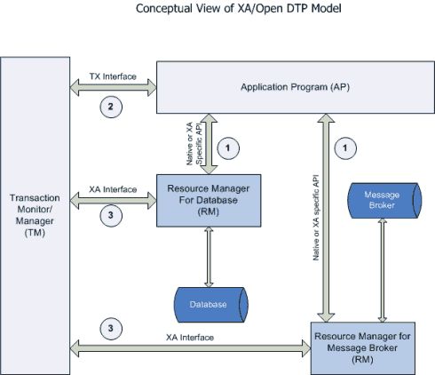

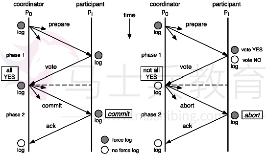

---

事务两阶段提交的过程如下：  
● 两阶段提交在应用程序向协调者发出一个提交命令时被启动。这时提交进入第一阶段，即预提交阶
段。在这一阶段中：
(1) 协调者准备局部（即在本地）提交并在日志中写入"预提交"日志项，并包含有该事务的所有参与者的
名字。
(2) 协调者询问参与者能否提交该事务。一个参与者可能由于多种原因不能提交。例如，该Server提供的
约束条件（Constraints）的延迟检查不符合 限制条件时，不能提交；参与者本身的Server进程或硬件发
生故障，不能提交；或者协调者访问不到某参与者（网络故障），这时协调者都认为是收到了一个 否定
的回答。
(3) 如果参与者能够提交，则在其本身的日志中写入"准备提交"日志项，该日志项立即写入硬盘，然后给
协调者发回，已准备好提交"的回答。
(4) 协调者等待所有参与者的回答，如果有参与者发回否定的回答，则协调者撤消该事务并给所有参与者
发出一个"撤消该事务"的消息，结束该分布式事务，撤消该事务的所有影响。
● 如果所有的参与者都送回"已准备好提交"的消息，则该事务的提交进入第二阶段，即决策后提交阶
段。在这一阶段中：  
(1) 协调者在日志中写入"提交"日志项，并立即写入硬盘。  
(2) 协调者向参与者发出"提交该事务"的命令。各参与者接到该命令后，在各自的日志中写入"提交"日志
项，并立即写入硬盘。然后送回"已提交"的消息，释放该事务占用的资源。  
(3) 当所有的参与者都送回"已提交"的消息后，协调者在日志中写入"事务提交完成"日志项，释放协调者
占用的资源 。这样，完成了该分布式事务的提交。
优点： 尽量保证了数据的强一致，适合对数据强一致要求很高的关键领域。
缺点： 实现复杂，牺牲了可用性，对性能影响较大，涉及多次节点间的网络通信，通信时间太长，不适
合高并发高性能场景。

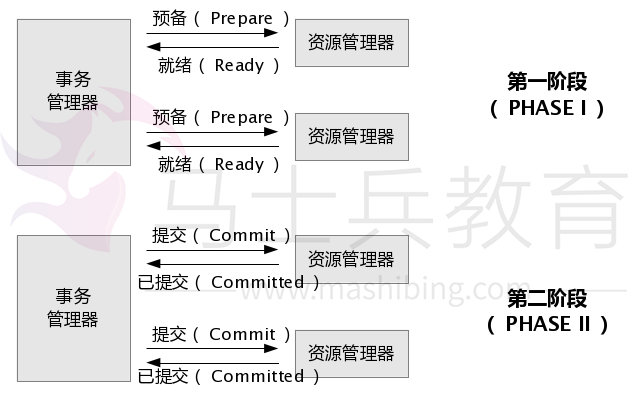

---

补偿事务（TCC）
 
 TCC 其实就是采用的补偿机制，其核心思想是：针对每个操作，都要注册一个与其对应的确认和补偿
（撤销）操作。它分为三个阶段：
Try 阶段主要是对业务系统做检测及资源预留
Confirm 阶段主要是对业务系统做确认提交，Try 阶段执行成功并开始执行 Confirm 阶段时，默认
Confirm 阶段是不会出错的。即：只要 Try 成功，Confirm 一定成功。
Cancel 阶段主要是在业务执行错误，需要回滚的状态下执行的业务取消，预留资源释放。
举个例子，假入 Bob 要向 Smith 转账，思路大概是：我们有一个本地方法，里面依次调用
1、首先在 Try 阶段，要先调用远程接口把 Smith 和 Bob 的钱给冻结起来。
2、在 Confirm 阶段，执行远程调用的转账的操作，转账成功进行解冻。
3、如果第2步执行成功，那么转账成功，如果第二步执行失败，则调用远程冻结接口对应的解冻方法 
(Cancel)。
优点： 跟 2PC 比起来，实现以及流程相对简单了一些，但数据的一致性比 2PC 也要差一些。
缺点： 缺点还是比较明显的，在2,3步中都有可能失败。TCC 属于应用层的一种补偿方式，所以需要程
序员在实现的时候多写很多补偿的代码，在一些场景中，一些业务流程可能用 TCC 不太好定义及处理。
本地消息表（MQ 异步确保）
 
 这种实现方式的思路，其实是源于ebay，后来通过支付宝等公司的布道，在业内广泛使用。其基本的设
计思想是将远程分布式事务拆分成一系列的本地事务。如果不考虑性能及设计优雅，借助关系型数据库
中的表即可实现。
基本思路就是：
 消息生产方，需要额外建一个消息表，并记录消息发送状态。消息表和业务数据要在一个事务里提交，
也就是说他们要在一个数据库里面。然后消息会经过 MQ 发送到消息的消费方。如果消息发送失败，会
进行重试发送。
 消息消费方，需要处理这个消息，并完成自己的业务逻辑。此时如果本地事务处理成功，表明已经处理
成功了，如果处理失败，那么就会重试执行。如果是业务上面的失败，可以给生产方发送一个业务补偿
消息，通知生产方进行回滚等操作。
 生产方和消费方定时扫描本地消息表，把还没处理完成的消息或者失败的消息再发送一遍。如果有靠谱
的自动对账补账逻辑（防止消息会被重复投递，增加消息应用状态表（message_apply），通俗来说就
是个账本，用于记录消息的消费情况，每次来一个消息， 在真正执行之前，先去消息应用状态表中查询
一遍，如果找到说明是重复消息，丢弃即可，如果没找到才执行，同时插入到消息应用状态表（同一事

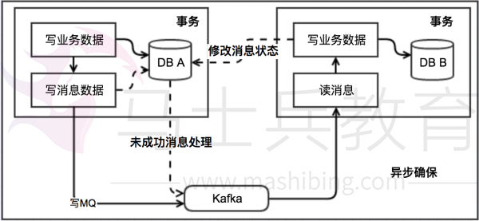

---

务）），这种方案还是非常实用的。
 这种方案遵循 BASE 理论，采用的是最终一致性，比较适合实际业务场景的，即不会出现像 2PC 那样复
杂的实现(当调用链很长的时候，2PC 的可用性是非常低的)，也不会像 TCC 那样可能出现确认或者回滚
不了的情况。
优点： 一种非常经典的实现，避免了分布式事务，实现了最终一致性。
缺点： 消息表会耦合到业务系统中，如果没有封装好的解决方案，会有很多杂活需要处理，而且，关系
型数据库的吞吐量和性能方面存在瓶颈，频繁的读写消息会给数据库造成压力。
MQ 事务消息
 
 有一些第三方的 MQ 是支持事务消息的，比如 RocketMQ，他们支持事务消息的方式也是类似于采用的
二阶段提交，但是市面上一些主流的 MQ 都是不支持事务消息的，比如 RabbitMQ 和 Kafka 都不支持。
 以阿里的 RocketMQ 中间件为例，其思路大致为：
 第一阶段 Prepared 消息，会拿到消息的地址。 第二阶段执行本地事务，第三阶段通过第一阶段拿到的
地址去访问消息，并修改状态。
 也就是说在业务方法内要想消息队列提交两次请求，一次发送消息和一次确认消息。如果确认消息发送
失败了 RocketMQ 会定期扫描消息集群中的事务消息，这时候发现了 Prepared 消息，它会向消息发送
者确认，所以生产方需要实现一个 check 接口，RocketMQ 会根据发送端设置的策略来决定是回滚还是
继续发送确认消息。
 这样就保证了消息发送与本地事务同时成功或同时失败，具体原理如下：
 1、A系统向消息中间件发送一条预备消息
2、消息中间件保存预备消息并返回成功
3、A执行本地事务
4、A发送提交消息给消息中间件
通过以上4 步完成了一个消息事务。对于以上的4个步骤，每个步骤都可能产生错误，下面一一分析：
 步骤一出错，则整个事务失败，不会执行A的本地操作

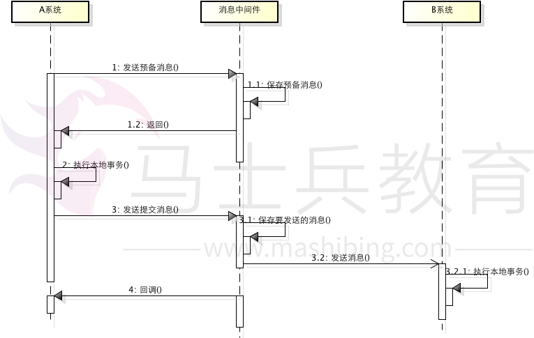

---

步骤二出错，则整个事务失败，不会执行A的本地操作
 步骤三出错，这时候需要回滚预备消息，怎么回滚？答案是A系统实现一个消息中间件的回调接口，消
息中间件会去不断执行回调接口，检查A事务执行是否执行成功，如果失败则回滚预备消息
 步骤四出错，这时候A的本地事务是成功的，那么消息中间件要回滚A吗？答案是不需要，其实通过回调
接口，消息中间件能够检查到A执行成功了，这时候其实不需要A发提交消息了，消息中间件可以自己对
消息进行提交，从而完成整个消息事务
 基于消息中间件的两阶段提交往往用在高并发场景下，将一个分布式事务拆成一个消息事务（A系统的
本地操作+发消息）+B系统的本地操作，其中B系统的操作由消息驱动，只要消息事务成功，那么A操作
一定成功，消息也一定发出来了，这时候B会收到消息去执行本地操作，如果本地操作失败，消息会重
投，直到B操作成功，这样就变相地实现了A与B的分布式事务。
优点： 实现了最终一致性，不需要依赖本地数据库事务。
缺点： 实现难度大，主流MQ不支持，没有.NET客户端，RocketMQ事务消息部分代码也未开源。
Sagas 事务模型
 
 Saga事务模型又叫做长时间运行的事务（Long-running-transaction）, 它是由普林斯顿大学的
H.Garcia-Molina等人提出，它描述的是另外一种在没有两阶段提交的的情况下解决分布式系统中复杂的
业务事务问题。
 我们这里说的是一种基于 Sagas 机制的工作流事务模型，这个模型的相关理论目前来说还是比较新的，
以至于百度上几乎没有什么相关资料。
 该模型其核心思想就是拆分分布式系统中的长事务为多个短事务，或者叫多个本地事务，然后由 Sagas 
工作流引擎负责协调，如果整个流程正常结束，那么就算是业务成功完成，如果在这过程中实现失败，
那么Sagas工作流引擎就会以相反的顺序调用补偿操作，重新进行业务回滚。
 比如我们一次关于购买旅游套餐业务操作涉及到三个操作，他们分别是预定车辆，预定宾馆，预定机
票，他们分别属于三个不同的远程接口。可能从我们程序的角度来说他们不属于一个事务，但是从业务
角度来说是属于同一个事务的。
 他们的执行顺序如上图所示，所以当发生失败时，会依次进行取消的补偿操作。
 因为长事务被拆分了很多个业务流，所以 Sagas 事务模型最重要的一个部件就是工作流或者你也可以叫
流程管理器（Process Manager），工作流引擎和Process Manager虽然不是同一个东西，但是在这
里，他们的职责是相同的。
 优缺点这里我们就不说了，因为这个理论比较新，目前市面上还没有什么解决方案，即使是 Java 领
域，也没有搜索的太多有用的信息。

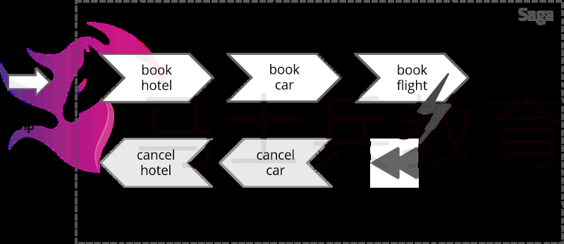

---

其他补偿方式
 
 做过支付宝交易接口的同学都知道，我们一般会在支付宝的回调页面和接口里，解密参数，然后调用系
统中更新交易状态相关的服务，将订单更新为付款成功。同时，只有当我们回调页面中输出了success字
样或者标识业务处理成功相应状态码时，支付宝才会停止回调请求。否则，支付宝会每间隔一段时间
后，再向客户方发起回调请求，直到输出成功标识为止。
 其实这就是一个很典型的补偿例子，跟一些 MQ 重试补偿机制很类似。
 一般成熟的系统中，对于级别较高的服务和接口，整体的可用性通常都会很高。如果有些业务由于瞬时
的网络故障或调用超时等问题，那么这种重试机制其实是非常有效的。
 当然，考虑个比较极端的场景，假如系统自身有bug或者程序逻辑有问题，那么重试1W次那也是无济于
事的。那岂不是就发生了“明明已经付款，却显示未付款不发货”类似的悲剧？
 其实为了交易系统更可靠，我们一般会在类似交易这种高级别的服务代码中，加入详细日志记录的，一
旦系统内部引发类似致命异常，会有邮件通知。同时，后台会有定时任务扫描和分析此类日志，检查出
这种特殊的情况，会尝试通过程序来补偿并邮件通知相关人员。
 在某些特殊的情况下，还会有 "人工补偿" 的，这也是最后一道屏障。
总结
 
 分布式事务，本质上是对多个数据库的事务进行统一控制，按照控制力度可以分为：不控制、部分控制
和完全控制。
 具体用哪种方式，最终还是取决于业务场景。作为技术人员，一定不能忘了技术是为业务服务的，不要
为了技术而技术，针对不同业务进行技术选型也是一种很重要的能力！
 
 
 
SQL的整个解析、执行过程原理、SQL行转列；
 
整体架构

---

SQL解析
行转列、列转行
 
 
mysql行转列、列转行
 
语句不难，不做多余解释了，看语句时，从内往外一句一句剖析
行转列
 
有如图所示的表，现在希望查询的结果将行转成列

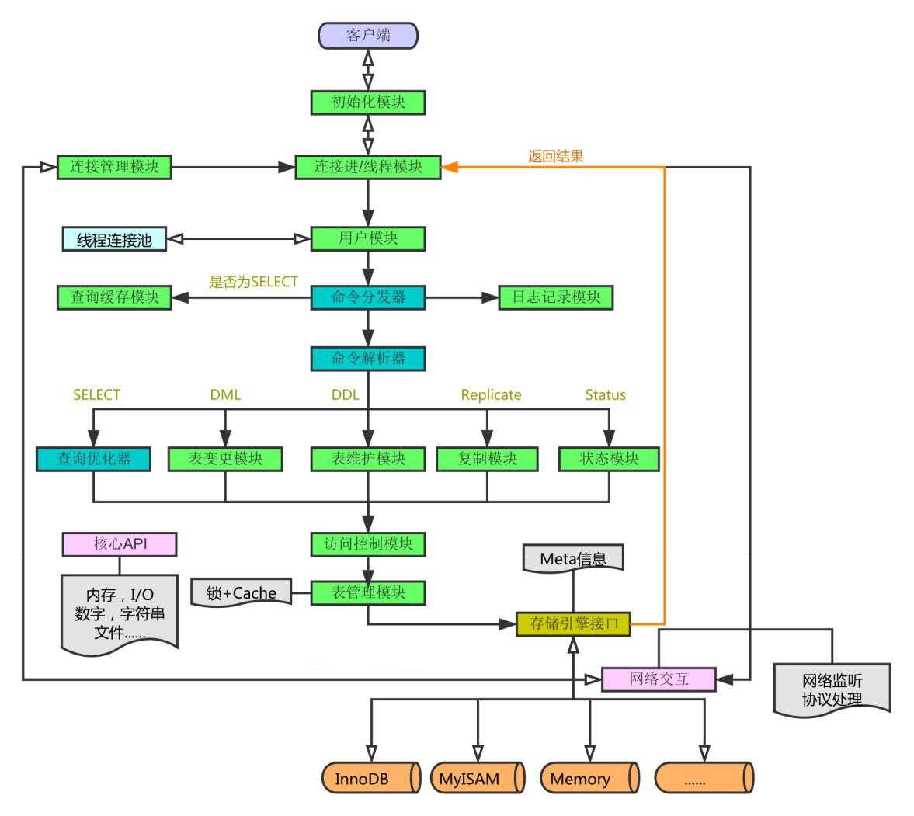

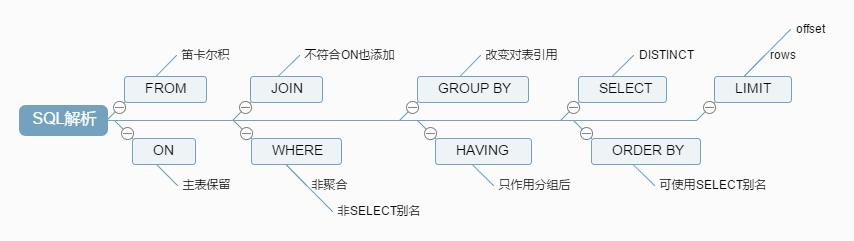

---

建表语句如下：
CREATE TABLE `TEST_TB_GRADE` (
  `ID` int(10) NOT NULL AUTO_INCREMENT,
  `USER_NAME` varchar(20) DEFAULT NULL,
  `COURSE` varchar(20) DEFAULT NULL,
  `SCORE` float DEFAULT '0',
  PRIMARY KEY (`ID`)
) ENGINE=InnoDB AUTO_INCREMENT=1 DEFAULT CHARSET=utf8;1234567
insert into TEST_TB_GRADE(USER_NAME, COURSE, SCORE)  values
("张三", "数学", 34),
("张三", "语文", 58),
("张三", "英语", 58),
("李四", "数学", 45),
("李四", "语文", 87),
("李四", "英语", 45),
("王五", "数学", 76),
("王五", "语文", 34),
("王五", "英语", 89);12345678910
查询语句：
此处用之所以用MAX是为了将无数据的点设为0，防止出现NULL
SELECT user_name ,
    MAX(CASE course WHEN '数学' THEN score ELSE 0 END ) 数学,
    MAX(CASE course WHEN '语文' THEN score ELSE 0 END ) 语文,
    MAX(CASE course WHEN '英语' THEN score ELSE 0 END ) 英语
FROM test_tb_grade
GROUP BY USER_NAME;123456
结果展示：

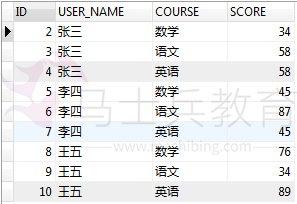

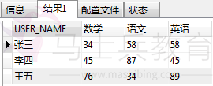

---

列转行
 
查询语句：
结果展示：
 
 
 
 
红黑树的实现原理和应用场景；
 
有如图所示的表，现在希望查询的结果将列成行
建表语句如下：
CREATE TABLE `TEST_TB_GRADE2` (
  `ID` int(10) NOT NULL AUTO_INCREMENT,
  `USER_NAME` varchar(20) DEFAULT NULL,
  `CN_SCORE` float DEFAULT NULL,
  `MATH_SCORE` float DEFAULT NULL,
  `EN_SCORE` float DEFAULT '0',
  PRIMARY KEY (`ID`)
) ENGINE=InnoDB AUTO_INCREMENT=1 DEFAULT CHARSET=utf8;12345678
insert into TEST_TB_GRADE2(USER_NAME, CN_SCORE, MATH_SCORE, EN_SCORE) values
("张三", 34, 58, 58),
("李四", 45, 87, 45),
("王五", 76, 34, 89);1234
select user_name, '语文' COURSE , CN_SCORE as SCORE from test_tb_grade2
union select user_name, '数学' COURSE, MATH_SCORE as SCORE from test_tb_grade2
union select user_name, '英语' COURSE, EN_SCORE as SCORE from test_tb_grade2
order by user_name,COURSE;1234

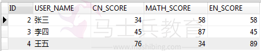

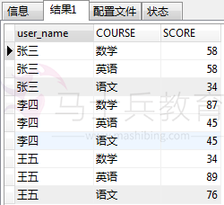

---

红黑树(一棵自平衡的排序二叉树)五大特性： 
1）每个结点要么是红的，要么是黑的。  
2）根结点是黑的。  
3）每个叶结点，即空结点是黑的。  
4）如果一个结点是红的，那么它的俩个儿子都是黑的。  
5）对每个结点，从该结点到其子孙结点的所有路径上包含相同数目的黑结点。
场景
1）广泛用于C++的STL中,map和set都是用红黑树实现的. 
2）著名的linux进程调度Completely Fair Scheduler,用红黑树管理进程控制块,进程的虚拟内存 区域都
存储在一颗红黑树上,每个虚拟地址区域都对应红黑树的一个节点,左指针指向相邻的地址 虚拟存储区域,
右指针指向相邻的高地址虚拟地址空间. 
3）IO多路复用epoll的实现采用红黑树组织管理sockfd，以支持快速的增删改查. 
4）ngnix中,用红黑树管理timer,因为红黑树是有序的,可以很快的得到距离当前最小的定时器. 
5）java中的TreeSet,TreeMap 
 
 
MySql的存储引擎的不同
 
MySQL存储引擎之Myisam和Innodb总结性梳理
 
 
MyISAM是MySQL的默认数据库引擎（5.5版之前），由早期的ISAM（Indexed Sequential Access 
Method：有索引的顺序访问方法）所改良。虽然性能极佳，但却有一个缺点：不支持事务处理
（transaction）。不过，在这几年的发展下，MySQL也导入了InnoDB（另一种数据库引擎），以强化
参考完整性与并发违规处理机制，后来就逐渐取代MyISAM。

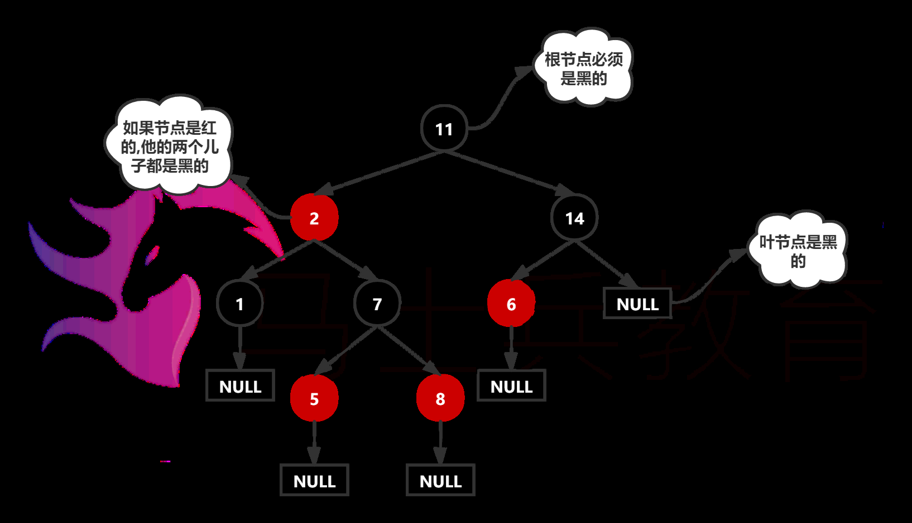

---

InnoDB，是MySQL的数据库引擎之一，为MySQL AB发布binary的标准之一。InnoDB由Innobase Oy
公司所开发，2006年五月时由甲骨文公司并购。与传统的ISAM与MyISAM相比，InnoDB的最大特色就
是支持了ACID兼容的事务（Transaction）功能，类似于PostgreSQL。目前InnoDB采用双轨制授权，
一是GPL授权，另一是专有软件授权。
MyISAM和InnoDB两者之间有着明显区别，简单梳理如下:
1) 事务支持
MyISAM不支持事务，而InnoDB支持。InnoDB的AUTOCOMMIT默认是打开的，即每条SQL语句会默认
被封装成一个事务，自动提交，这样会影响速度，所以最好是把多条SQL语句显示放在begin和commit
之间，组成一个事务去提交。
MyISAM是非事务安全型的，而InnoDB是事务安全型的，默认开启自动提交，宜合并事务，一同提交，
减小数据库多次提交导致的开销，大大提高性能。
2) 存储结构
MyISAM：每个MyISAM在磁盘上存储成三个文件。第一个文件的名字以表的名字开始，扩展名指出文件
类型。.frm文件存储表定义。数据文件的扩展名为.MYD (MYData)。索引文件的扩展名是.MYI 
(MYIndex)。
InnoDB：所有的表都保存在同一个数据文件中（也可能是多个文件，或者是独立的表空间文件），
InnoDB表的大小只受限于操作系统文件的大小，一般为2GB。
3) 存储空间
MyISAM：可被压缩，存储空间较小。支持三种不同的存储格式：静态表(默认，但是注意数据末尾不能
有空格，会被去掉)、动态表、压缩表。
InnoDB：需要更多的内存和存储，它会在主内存中建立其专用的缓冲池用于高速缓冲数据和索引。
4) 可移植性、备份及恢复
MyISAM：数据是以文件的形式存储，所以在跨平台的数据转移中会很方便。在备份和恢复时可单独针
对某个表进行操作。
InnoDB：免费的方案可以是拷贝数据文件、备份 binlog，或者用 mysqldump，在数据量达到几十G的
时候就相对痛苦了。
5) 事务支持
MyISAM：强调的是性能，每次查询具有原子性,其执行数度比InnoDB类型更快，但是不提供事务支持。
InnoDB：提供事务支持事务，外部键等高级数据库功能。 具有事务(commit)、回滚(rollback)和崩溃修
复能力(crash recovery capabilities)的事务安全(transaction-safe (ACID compliant))型表。
6) AUTO_INCREMENT
MyISAM：可以和其他字段一起建立联合索引。引擎的自动增长列必须是索引，如果是组合索引，自动
增长可以不是第一列，他可以根据前面几列进行排序后递增。
InnoDB：InnoDB中必须包含只有该字段的索引。引擎的自动增长列必须是索引，如果是组合索引也必
须是组合索引的第一列。
7) 表锁差异
MyISAM：只支持表级锁，用户在操作myisam表时，select，update，delete，insert语句都会给表自
动加锁，如果加锁以后的表满足insert并发的情况下，可以在表的尾部插入新的数据。
InnoDB：支持事务和行级锁，是innodb的最大特色。行锁大幅度提高了多用户并发操作的新能。但是
InnoDB的行锁，只是在WHERE的主键是有效的，非主键的WHERE都会锁全表的。
MyISAM锁的粒度是表级，而InnoDB支持行级锁定。简单来说就是, InnoDB支持数据行锁定，而
MyISAM不支持行锁定，只支持锁定整个表。即MyISAM同一个表上的读锁和写锁是互斥的，MyISAM并
发读写时如果等待队列中既有读请求又有写请求，默认写请求的优先级高，即使读请求先到，所以
MyISAM不适合于有大量查询和修改并存的情况，那样查询进程会长时间阻塞。因为MyISAM是锁表，所
以某项读操作比较耗时会使其他写进程饿死。

---

8) 全文索引
MyISAM：支持(FULLTEXT类型的)全文索引
InnoDB：不支持(FULLTEXT类型的)全文索引，但是innodb可以使用sphinx插件支持全文索引，并且效
果更好。
全文索引是指对char、varchar和text中的每个词（停用词除外）建立倒排序索引。MyISAM的全文索引
其实没啥用，因为它不支持中文分词，必须由使用者分词后加入空格再写到数据表里，而且少于4个汉字
的词会和停用词一样被忽略掉。
另外，MyIsam索引和数据分离，InnoDB在一起，MyIsam天生非聚簇索引，最多有一个unique的性
质，InnoDB的数据文件本身就是主键索引文件，这样的索引被称为“聚簇索引”
9) 表主键
MyISAM：允许没有任何索引和主键的表存在，索引都是保存行的地址。
InnoDB：如果没有设定主键或者非空唯一索引，就会自动生成一个6字节的主键(用户不可见)，数据是
主索引的一部分，附加索引保存的是主索引的值。InnoDB的主键范围更大，最大是MyISAM的2倍。
10) 表的具体行数
MyISAM：保存有表的总行数，如果select count() from table;会直接取出出该值。
InnoDB：没有保存表的总行数(只能遍历)，如果使用select count() from table；就会遍历整个表，消耗
相当大，但是在加了wehre条件后，myisam和innodb处理的方式都一样。
11) CURD操作
MyISAM：如果执行大量的SELECT，MyISAM是更好的选择。
InnoDB：如果你的数据执行大量的INSERT或UPDATE，出于性能方面的考虑，应该使用InnoDB表。
DELETE 从性能上InnoDB更优，但DELETE FROM table时，InnoDB不会重新建立表，而是一行一行的
删除，在innodb上如果要清空保存有大量数据的表，最好使用truncate table这个命令。
12) 外键
MyISAM：不支持
InnoDB：支持
13) 查询效率
没有where的count()使用MyISAM要比InnoDB快得多。因为MyISAM内置了一个计数器，count()时它直接
从计数器中读，而InnoDB必须扫描全表。所以在InnoDB上执行count()时一般要伴随where，且where中
要包含主键以外的索引列。为什么这里特别强调“主键以外”？因为InnoDB中primary index是和raw data
存放在一起的，而secondary index则是单独存放，然后有个指针指向primary key。所以只是count()的话
使用secondary index扫描更快，而primary key则主要在扫描索引同时要返回raw data时的作用较大。
MyISAM相对简单，所以在效率上要优于InnoDB，小型应用可以考虑使用MyISAM。
通过上述的分析，基本上可以考虑使用InnoDB来替代MyISAM引擎了，原因是InnoDB自身很多良好的
特点，比如事务支持、存储 过程、视图、行级锁定等等，在并发很多的情况下，相信InnoDB的表现肯
定要比MyISAM强很多。另外，任何一种表都不是万能的，只用恰当的针对业务类型来选择合适的表类
型，才能最大的发挥MySQL的性能优势。如果不是很复杂的Web应用，非关键应用，还是可以继续考虑
MyISAM的，这个具体情况可以自己斟酌。
MyISAM和InnoDB两者的应用场景：
1) MyISAM管理非事务表。它提供高速存储和检索，以及全文搜索能力。如果应用中需要执行大量的
SELECT查询，那么MyISAM是更好的选择。
2) InnoDB用于事务处理应用程序，具有众多特性，包括ACID事务支持。如果应用中需要执行大量的
INSERT或UPDATE操作，则应该使用InnoDB，这样可以提高多用户并发操作的性能。
但是实际场景中，针对具体问题需要具体分析，一般而言可以遵循以下几个问题：
- 数据库是否有外键？
- 是否需要事务支持？
- 是否需要全文索引？
- 数据库经常使用什么样的查询模式？在写多读少的应用中还是Innodb插入性能更稳定，在并发情况下

---

也能基本，如果是对读取速度要求比较快的应用还是选MyISAM。
- 数据库的数据有多大？ 大尺寸倾向于innodb，因为事务日志，故障恢复。
 
 
 
 
Mysql优化系列--Innodb引擎下mysql自身配置优化
 
 
1.简单介绍
InnoDB给MySQL提供了具有提交，回滚和崩溃恢复能力的事务安全（ACID兼容）存储引擎。InnoDB锁
定在行级并且也在SELECT语句提供一个Oracle风格一致的非锁定读。这些特色增加了多用户部署和性
能。没有在InnoDB中扩大锁定的需要，因为在InnoDB中行级锁定适合非常小的空间。InnoDB也支持
FOREIGN KEY强制。在SQL查询中，你可以自由地将InnoDB类型的表与其它MySQL的表的类型混合起
来，甚至在同一个查询中也可以混合。
2.之所以选用innodb作为存储引擎的考虑
目前来说，InnoDB是为Mysql处理巨大数据量时的最大性能设计。它的CPU效率可能是任何其它基于磁
盘的关系数据库引擎所不能匹敌的。在数据量大的网站或是应用中Innodb是倍受青睐的。
另一方面，在数据库的复制操作中Innodb也是能保证master和slave数据一致有一定的作用。
3.下面是对线上mysql5.6版本的数据库的配置进行的优化分析记录：
1）内存利用方面：
innodb_buffer_pool_size
这个是Innodb最重要的参数，和MyISAM的key_buffer_size有相似之处，但也是有差别的。
这个参数主要缓存innodb表的索引，数据，插入数据时的缓冲。
该参数分配内存的原则：
这个参数默认分配只有8M，可以说是非常小的一个值。
如果是一个专用DB服务器，那么他可以占到内存的70%-80%。
这个参数不能动态更改，所以分配需多考虑。分配过大，会使Swap占用过多，致使Mysql的查询特慢。
如果你的数据比较小，那么可分配是你的数据大小+10%左右做为这个参数的值。
例如：数据大小为50M,那么给这个值分配innodb_buffer_pool_size＝64M
设置方法，在my.cnf文件里：
innodb_buffer_pool_size=4G
----------------------------------------------------------------------------------------------------------
注意：
在Mysql5.7版本之前，调整innodb_buffer_pool_size大小必须在my.cnf配置里修改，然后重启mysql进
程才可以生效。
如今到了Mysql5.7版本，就可以直接动态调整这个参数，方便了很多。
尤其是在服务器内存增加之后，运维人员不能粗心大意，要记得调大Innodb_Buffer_Pool_size这个参
数。
数据库配置后，要注意检查Innodb_Buffer_Pool_size这个参数的设置是否合理
需要注意的地方：
在调整innodb_buffer_pool_size 期间，用户的请求将会阻塞，直到调整完毕，所以请勿在白天调整，
在凌晨3-4点低峰期调整。
调整时，内部把数据页移动到一个新的位置，单位是块。如果想增加移动的速度，需要调整
innodb_buffer_pool_chunk_size参数的大小，默认是128M。

---

Mysql5.7中动态调整这个参数的操作记录（例如由128M增大为384M）：
134217728/1024*1024=128M
mysql> SELECT @@innodb_buffer_pool_size;
+---------------------------+
| @@innodb_buffer_pool_size |
+---------------------------+
| 134217728 |
+---------------------------+
1 row in set (0.00 sec)
mysql> SELECT @@innodb_buffer_pool_chunk_size;
+---------------------------------+
| @@innodb_buffer_pool_chunk_size |
+---------------------------------+
| 134217728 |
+---------------------------------+
1 row in set (0.00 sec)
mysql> SET GLOBAL innodb_buffer_pool_size=402653184;
Query OK, 0 rows affected (0.01 sec)
mysql> SELECT @@innodb_buffer_pool_size;
+---------------------------+
| @@innodb_buffer_pool_size |
+---------------------------+
| 402653184 |
+---------------------------+
1 row in set (0.00 sec)
innodb_buffer_pool_chunk_size的大小，计算公式是
innodb_buffer_pool_size/innodb_buffer_pool_instances
比如现在初始化innodb_buffer_pool_size为2G，innodb_buffer_pool_instances实例为4，
innodb_buffer_pool_chunk_size设置为1G，那么会自动把innodb_buffer_pool_chunk_size 1G调整为
512M.
例：
./mysqld --innodb_buffer_pool_size=2147483648 --innodb_buffer_pool_instances=4
--innodb_buffer_pool_chunk_size=1073741824;
mysql> SELECT @@innodb_buffer_pool_size;
+---------------------------+
| @@innodb_buffer_pool_size |
+---------------------------+

---

| 2147483648 |
+---------------------------+
1 row in set (0.00 sec)
mysql> SELECT @@innodb_buffer_pool_instances;
+--------------------------------+
| @@innodb_buffer_pool_instances |
+--------------------------------+
| 4 |
+--------------------------------+
1 row in set (0.00 sec)
# Chunk size was set to 1GB (1073741824 bytes) on startup but was
# truncated to innodb_buffer_pool_size / innodb_buffer_pool_instances
mysql> SELECT @@innodb_buffer_pool_chunk_size;
+---------------------------------+
| @@innodb_buffer_pool_chunk_size |
+---------------------------------+
| 536870912 |
+---------------------------------+
1 row in set (0.00 sec)
监控Buffer Pool调整进程
mysql> SHOW STATUS WHERE Variable_name='InnoDB_buffer_pool_resize_status';
+----------------------------------+----------------------------------+
| Variable_name | Value |
+----------------------------------+----------------------------------+
| Innodb_buffer_pool_resize_status | Resizing also other hash tables. |
+----------------------------------+----------------------------------+
1 row in set (0.00 sec)
查看错误日志：
（增大）
[Note] InnoDB: Resizing buffer pool from 134217728 to 4294967296. (unit=134217728)
[Note] InnoDB: disabled adaptive hash index.
[Note] InnoDB: buffer pool 0 : 31 chunks (253952 blocks) was added.
[Note] InnoDB: buffer pool 0 : hash tables were resized.
[Note] InnoDB: Resized hash tables at lock_sys, adaptive hash index, dictionary.
[Note] InnoDB: completed to resize buffer pool from 134217728 to 4294967296.

---

[Note] InnoDB: re-enabled adaptive hash index.
（减少）
[Note] InnoDB: Resizing buffer pool from 4294967296 to 134217728. (unit=134217728)
[Note] InnoDB: disabled adaptive hash index.
[Note] InnoDB: buffer pool 0 : start to withdraw the last 253952 blocks.
[Note] InnoDB: buffer pool 0 : withdrew 253952 blocks from free list. tried to relocate 0 pages. 
(253952/253952)
[Note] InnoDB: buffer pool 0 : withdrawn target 253952 blocks.
[Note] InnoDB: buffer pool 0 : 31 chunks (253952 blocks) was freed.
[Note] InnoDB: buffer pool 0 : hash tables were resized.
[Note] InnoDB: Resized hash tables at lock_sys, adaptive hash index, dictionary.
[Note] InnoDB: completed to resize buffer pool from 4294967296 to 134217728.
[Note] InnoDB: re-enabled adaptive hash index.
----------------------------------------------------------------------------------------------------------
innodb_additional_mem_pool_size
用来存放Innodb的内部目录，这个值不用分配太大，系统可以自动调。通常设置16Ｍ够用了，如果表比
较多，可以适当的增大。
设置方法，在my.cnf文件里：
innodb_additional_mem_pool_size = 16M
2）关于日志方面：
innodb_log_file_size
作用：指定在一个日志组中，每个log的大小。
结合innodb_buffer_pool_size设置其大小，25%-100%。避免不需要的刷新。
注意：这个值分配的大小和数据库的写入速度，事务大小，异常重启后的恢复有很大的关系。一般取
256M可以兼顾性能和recovery的速度。
分配原则：几个日值成员大小加起来差不多和你的innodb_buffer_pool_size相等。上限为每个日值上限
大小为4G.一般控制在几个Log文件相加大小在2G以内为佳。具体情况还需要看你的事务大小，数据大小
为依据。
说明：这个值分配的大小和数据库的写入速度，事务大小，异常重启后的恢复有很大的关系。
设置方法：在my.cnf文件里：
innodb_log_file_size = 256M
innodb_log_files_in_group
作用：指定你有几个日值组。
分配原则： 一般我们可以用2-3个日值组。默认为两个。
设置方法：在my.cnf文件里：
innodb_log_files_in_group=3
innodb_log_buffer_size：
作用：事务在内存中的缓冲，也就是日志缓冲区的大小， 默认设置即可，具有大量事务的可以考虑设置
为16M。
如果这个值增长过快，可以适当的增加innodb_log_buffer_size
另外如果你需要处理大理的TEXT，或是BLOB字段，可以考虑增加这个参数的值。
设置方法：在my.cnf文件里：
innodb_log_buffer_size=3M

---

innodb_flush_logs_at_trx_commit
作用：控制事务的提交方式,也就是控制log的刷新到磁盘的方式。
分配原则：这个参数只有3个值（0，1，2）.默认为1，性能更高的可以设置为0或是2，这样可以适当的
减少磁盘IO（但会丢失一秒钟的事务。），游戏库的MySQL建议设置为0。主库请不要更改了。
其中：
0：log buffer中的数据将以每秒一次的频率写入到log file中，且同时会进行文件系统到磁盘的同步操
作，但是每个事务的commit并不会触发任何log buffer 到log file的刷新或者文件系统到磁盘的刷新操
作；
1：（默认为1）在每次事务提交的时候将logbuffer 中的数据都会写入到log file，同时也会触发文件系
统到磁盘的同步；
2：事务提交会触发log buffer 到log file的刷新，但并不会触发磁盘文件系统到磁盘的同步。此外，每秒
会有一次文件系统到磁盘同步操作。
说明：
这个参数的设置对Ｉｎｎｏｄｂ的性能有很大的影响，所以在这里给多说明一下。
当这个值为1时：innodb 的事务LOG在每次提交后写入日值文件，并对日值做刷新到磁盘。这个可以做
到不丢任何一个事务。
当这个值为2时：在每个提交，日志缓冲被写到文件，但不对日志文件做到磁盘操作的刷新,在对日志文
件的刷新在值为2的情况也每秒发生一次。但需要注意的是，由于进程调用方面的问题，并不能保证每秒
１００％的发生。从而在性能上是最快的。但操作系统崩溃或掉电才会删除最后一秒的事务。
当这个值为0时：日志缓冲每秒一次地被写到日志文件，并且对日志文件做到磁盘操作的刷新，但是在一
个事务提交不做任何操作。mysqld进程的崩溃会删除崩溃前最后一秒的事务。
从以上分析，当这个值不为１时，可以取得较好的性能，但遇到异常会有损失，所以需要根据自已的情
况去衡量。
设置方法：在my.cnf文件里：
innodb_flush_logs_at_trx_commit=1
3）文件IO分配，空间占用方面
innodb_file_per_table
作用：使每个Innodb的表，有自已独立的表空间。如删除文件后可以回收那部分空间。默认是关闭的，
建议打开（innodb_file_per_table=1）
分配原则：只有使用不使用。但DB还需要有一个公共的表空间。
设置方法：在my.cnf文件里：
innodb_file_per_table=1
innodb_file_io_threads
作用：文件读写IO数，这个参数只在Windows上起作用。在Linux上只会等于4，默认即可！
设置方法：在my.cnf文件里：
innodb_file_io_threads=4
innodb_open_files
作用：限制Innodb能打开的表的数据。
分配原则：这个值默认是300。如果库里的表特别多的情况，可以适当增大为1000。innodb_open_files
的大小对InnoDB效率的影响比较小。但是在InnoDBcrash的情况下，innodb_open_files设置过小会影
响recovery的效率。所以用InnoDB的时候还是把innodb_open_files放大一些比较合适。
设置方法：在my.cnf文件里：
innodb_open_files=800
innodb_data_file_path
指定表数据和索引存储的空间，可以是一个或者多个文件。最后一个数据文件必须是自动扩充的，也只
有最后一个文件允许自动扩充。这样，当空间用完后，自动扩充数据文件就会自动增长（以8MB为单
位）以容纳额外的数据。
例如： innodb_data_file_path=/disk1/ibdata1:900M;/disk2/ibdata2:50M:autoextend 两个数据文件
放在不同的磁盘上。数据首先放在ibdata1 中，当达到900M以后，数据就放在ibdata2中。
设置方法，在my.cnf文件里：

---

innodb_data_file_path 
=ibdata1:1G;ibdata2:1G;ibdata3:1G;ibdata4:1G;ibdata5:1G;ibdata6:1G:autoextend
innodb_data_home_dir
放置表空间数据的目录，默认在mysql的数据目录，设置到和MySQL安装文件不同的分区可以提高性
能。
设置方法，在my.cnf文件里：（比如mysql的数据目录是/data/mysql/data，这里可以设置到不通的分
区/home/mysql下）
innodb_data_home_dir = /home/mysql
4）其它相关参数（适当的增加table_cache）
这里说明一个比较重要的参数：
innodb_flush_method
作用：Innodb和系统打交道的一个IO模型
分配原则：
Windows不用设置。
linux可以选择：O_DIRECT
直接写入磁盘，禁止系统Cache了
设置方法：在my.cnf文件里：
innodb_flush_method=O_DIRECT
innodb_max_dirty_pages_pct
作用：在buffer pool缓冲中，允许Innodb的脏页的百分比，值在范围1-100,默认为90，建议保持默认。
这个参数的另一个用处：当Innodb的内存分配过大，致使Swap占用严重时，可以适当的减小调整这个
值，使达到Swap空间释放出来。建义：这个值最大在90%，最小在15%。太大，缓存中每次更新需要致
换数据页太多，太小，放的数据页太小，更新操作太慢。
设置方法：在my.cnf文件里：
innodb_max_dirty_pages_pct＝90
动态更改需要有管理员权限：
set global innodb_max_dirty_pages_pct=50;
innodb_thread_concurrency
同时在Innodb内核中处理的线程数量。建议默认值。
设置方法，在my.cnf文件里：
innodb_thread_concurrency = 16
5）公共参数调优
skip-external-locking
MyISAM存储引擎也同样会使用这个参数，MySQL4.0之后，这个值默认是开启的。
作用是避免MySQL的外部锁定(老版本的MySQL此参数叫做skip-locking)，减少出错几率增强稳定性。建
议默认值。
设置方法，在my.cnf文件里：
skip-external-locking
skip-name-resolve
禁止MySQL对外部连接进行DNS解析（默认是关闭此项设置的，即默认解析DNS），使用这一选项可以
消除MySQL进行DNS解析的时间。
但需要注意，如果开启该选项，则所有远程主机连接授权都要使用IP地址方式，否则MySQL将无法正常
处理连接请求！如果需要，可以设置此项。
设置方法，在my.cnf文件里：（我这线上mysql数据库中打开了这一设置）
skip-name-resolve

---

max_connections
设置最大连接（用户）数，每个连接MySQL的用户均算作一个连接，max_connections的默认值为
100。此值需要根据具体的连接数峰值设定。
设置方法，在my.cnf文件里：
max_connections = 3000
query_cache_size
查询缓存大小，如果表的改动非常频繁，或者每次查询都不同，查询缓存的结果会减慢系统性能。可以
设置为0。
设置方法，在my.cnf文件里：
query_cache_size = 512M
sort_buffer_size
connection级的参数，排序缓存大小。一般设置为2-4MB即可。
设置方法，在my.cnf文件里：
sort_buffer_size = 1024M
read_buffer_size
connection级的参数。一般设置为2-4MB即可。
设置方法，在my.cnf文件里：
read_buffer_size = 1024M
max_allowed_packet
网络包的大小，为避免出现较大的网络包错误，建议设置为16M
设置方法，在my.cnf文件里：
max_allowed_packet = 16M
table_open_cache
当某一连接访问一个表时，MySQL会检查当前已缓存表的数量。如果该表已经在缓存中打开，则会直接
访问缓存中的表，以加快查询速度；如果该表未被缓存，则会将当前的表添加进缓存并进行查询。
通过检查峰值时间的状态值Open_tables和Opened_tables，可以决定是否需要增加table_open_cache
的值。
如果发现open_tables等于table_open_cache，并且opened_tables在不断增长，那么就需要增加
table_open_cache的值;设置为512即可满足需求。
设置方法，在my.cnf文件里：
table_open_cache = 512
myisam_sort_buffer_size
实际上这个myisam_sort_buffer_size参数意义不大，这是个字面上蒙人的参数，它用于ALTER TABLE, 
OPTIMIZE TABLE, REPAIR TABLE 等命令时需要的内存。默认值即可。
设置方法，在my.cnf文件里：
myisam_sort_buffer_size = 8M
thread_cache_size
线程缓存，如果一个客户端断开连接，这个线程就会被放到thread_cache_size中（缓冲池未满），
SHOW STATUS LIKE 'threads%';如果 Threads_created 不断增大，那么当前值设置要改大，改到 
Threads_connected 值左右。（通常情况下，这个值改善性能不大），默认8即可
设置方法，在my.cnf文件里：
thread_cache_size = 8
innodb_thread_concurrency
线程并发数，建议设置为CPU内核数*2
设置方法，在my.cnf文件里：
innodb_thread_concurrency = 8

---

key_buffer_size
仅作用于 MyISAM存储引擎，用来设置用于缓存 MyISAM存储引擎中索引文件的内存区域大小。如果我
们有足够的内存，这个缓存区域最好是能够存放下我们所有的 MyISAM 引擎表的所有索引，以尽可能提
高性能。不要设置超过可用内存的30%。即使不用MyISAM表，也要设置该值8-64M，用于临时表。
设置方法，在my.cnf文件里：
key_buffer_size = 8M
－－－－－－－－－－－影响InnoDB性能的一些重要参数－－－－－－－－－－－－－－
1）InnoDB_buffer_pool_size
这个参数定义InnoDB存储引擎的表数据和索引数据的最大内存缓冲区,InnoDB_buffer_pool_size参数同
时提供为数据块和索引块做缓存.这个值设置的越高,访问表中数据需要的磁盘IO就越少.
2）InnoDB_flush_log_at_trx_commit
这个参数控制缓冲区的数据写入到日志文件以及日志文件数据刷新到磁盘的操作时机.在正式环境中建议
设置成1。
设置0时日志缓冲每秒一次被写到日志文件,并且对日志文件做向磁盘刷新的操作,但是在一个事物提交不
做任何操作.
设置1时在每个事物提交时,日志缓冲被写到日志文件,并且对日志文件做向磁盘刷新的操作
设置2时在每个事物提交时,日志缓冲被写到日志文件,但不对日志文件做向磁盘刷新的操作,对日志文件每
秒向磁盘做一次刷新操作.
3）InnoDB_additional_mem_pool_size
这个参数是InnoDB用来存储数据库结构和其他内部数据结构的内存池.应用程序的表越多,则需要从这里
分配越多的内存,如果用光这个池,则会从OS层分配.
4）InnoDB_lock_wait_timeout
这个参数自动检测行锁导致的死锁并进行相应处理,但是对于表锁导致的死锁不能自动检测默认值为50
秒.
5）InnoDB_support_xa
这个参数设置MySQL是否支持分布式事务
6）InnoDB_log_buffer_size
这个参数日志缓冲大小
7）InnoDB_log_file_size
这个参数是一个日志组中每个日志文件的大小,此参数在高写入负载尤其是大数据集的情况下很重要.这个
值越大则性能相对越高,但好似副作用是一旦系统崩溃恢复的时间会加长.
8）Innodb_io_capacity
这个参数刷新脏页数量和合并插入数量，改善磁盘IO处理能力
9）Innodb_use_native_aio
异步I/O在一定程度上提高系统的并发能力，在Linux系统上，可以通过将MySQL的服务器此参数的值设
定为ON设定InnoDB可以使用Linux的异步I/O子系统.
10）Innodb_read_io_threads
这个参数可调整的读请求的后台线程数
11）Innodb_write_io_threads
这个参数可调整的写请求的后台线程数
12）InnoDB_buffer_pool_instances
这个参数能较好的运行于多核处理器，支持使用 此参数对服务器变量建立多个缓冲池实例，每个缓冲池
实例分别自我管理空闲列表、列表刷写、LRU以及其它跟缓冲池相关的数据结构，并通过各自的互斥锁
进行保护

---

13）InnoDB_purge_threads
MySQL5.5以前碎片回收操作是主线程的一部分，这经定期调度的方式运行，但会阻塞数据库的其他操
作.到5.5以后，可以将这个线程独立出来 ；这个能让碎片回收得更及时而且不影响其他线程的操作
14）Innodb_flush_method
这个参数控制着innodb数据文件及redo log的打开、刷写模式，对于这个参数，文档上是这样描述的：
有三个值：fdatasync(默认)，O_DSYNC，O_DIRECT
默认是fdatasync，调用fsync()去刷数据文件与redo log的buffer
为O_DSYNC时，innodb会使用O_SYNC方式打开和刷写redo log,使用fsync()刷写数据文件
为O_DIRECT时，innodb使用O_DIRECT打开数据文件，使用fsync()刷写数据文件跟redo log
总结一下三者写数据方式：
fdatasync模式：写数据时，write这一步并不需要真正写到磁盘才算完成（可能写入到操作系统buffer
中就会返回完成），真正完成是flush操作，buffer交给操作系统去flush,并且文件的元数据信息也都需
要更新到磁盘。
O_DSYNC模式：写日志操作是在write这步完成，而数据文件的写入是在flush这步通过fsync完成
O_DIRECT模式：数据文件的写入操作是直接从mysql innodb buffer到磁盘的，并不用通过操作系统的
缓冲，而真正的完成也是在flush这步,日志还是要经过OS缓冲
使用下面命令就可以查看到上面参数的设置：
mysql> show variables like "%innodb%";
---------------------------------------------------------------------------------------------------------------------------------------------
--
下面是线上mysql（innodb）的my.cnf配置参考：
[client]
port = 3306
socket = /usr/local/mysql/var/mysql.sock
[mysqld]
port = 3306
socket = /usr/local/mysql/var/mysql.sock
basedir = /usr/local/mysql/
datadir = /data/mysql/data
pid-file = /data/mysql/data/mysql.pid
user = mysql
bind-address = 0.0.0.0
server-id = 1
sync_binlog=1
log_bin = mysql-bin
skip-name-resolve
back_log = 600
max_connections = 3000
max_connect_errors = 3000
table_open_cache = 512
max_allowed_packet = 16M
binlog_cache_size = 16M
max_heap_table_size = 16M
tmp_table_size = 256M
read_buffer_size = 1024M
read_rnd_buffer_size = 1024M
sort_buffer_size = 1024M
join_buffer_size = 1024M

---

key_buffer_size = 8192M
thread_cache_size = 8
query_cache_size = 512M
query_cache_limit = 1024M
ft_min_word_len = 4
binlog_format = mixed
expire_logs_days = 30
log_error = /data/mysql/data/mysql-error.log
slow_query_log = 1
long_query_time = 1
slow_query_log_file = /data/mysql/data/mysql-slow.log
performance_schema = 0
explicit_defaults_for_timestamp
skip-external-locking
 
default_storage_engine = InnoDB
innodb_file_per_table = 1
innodb_open_files = 500
innodb_buffer_pool_size = 1024M
innodb_write_io_threads = 1000
innodb_read_io_threads = 1000
innodb_thread_concurrency = 8
innodb_purge_threads = 1
innodb_flush_log_at_trx_commit = 2
innodb_log_buffer_size = 4M
innodb_log_file_size = 32M
innodb_log_files_in_group = 3
innodb_max_dirty_pages_pct = 90
innodb_lock_wait_timeout = 120
bulk_insert_buffer_size = 8M
myisam_sort_buffer_size = 8M
myisam_max_sort_file_size = 10G
myisam_repair_threads = 1
interactive_timeout = 28800
wait_timeout = 28800
[mysqldump]
quick
max_allowed_packet = 16M
[myisamchk]
key_buffer_size = 8M
sort_buffer_size = 8M
read_buffer = 4M
write_buffer = 4M
sql_mode=NO_ENGINE_SUBSTITUTION,STRICT_TRANS_TABLES
port = 3306

---

--------------------------------------------------------------------------------------------------------------------------------------
下面分享一个mysql5.6下my.cnf的优化配置，能使mysql性能大大提升：
# For advice on how to change settings please see
# http://dev.mysql.com/doc/refman/5.6/en/server-configuration-defaults.html
# * DO NOT EDIT THIS FILE. It's a template which will be copied to the
# * default location during install, and will be replaced if you
# *** upgrade to a newer version of MySQL.
[mysqld]
# Remove leading # and set to the amount of RAM for the most important data
# cache in MySQL. Start at 70% of total RAM for dedicated server, else 10%.
# innodb_buffer_pool_size = 128M
# Remove leading # to turn on a very important data integrity option: logging
# changes to the binary log between backups.
# log_bin
# These are commonly set, remove the # and set as required.
# basedir = .....
# datadir = .....
# port = .....
# server_id = .....
# socket = .....
# Remove leading # to set options mainly useful for reporting servers.
# The server defaults are faster for transactions and fast SELECTs.
# Adjust sizes as needed, experiment to find the optimal values.
##################################################
#innodb
user=mysql
innodb_buffer_pool_size=6G
innodb_log_file_size=4G
innodb_log_buffer_size = 8M
innodb_flush_log_at_trx_commit=2
innodb_file_per_table=1
innodb_file_io_threads=4
innodb_flush_method=O_DIRECT
innodb_io_capacity=2000
innodb_io_capacity_max=6000
innodb_lru_scan_depth=2000
innodb_thread_concurrency = 0
innodb_additional_mem_pool_size=16M
innodb_autoinc_lock_mode = 2
##################################################
# Binary log/replication
log-bin
sync_binlog=1
sync_relay_log=1
relay-log-info-repository=TABLE
master-info-repository=TABLE
expire_logs_days=7
binlog_format=ROW
transaction-isolation=READ-COMMITTED
#################################################
#cache

---

tmp_table_size=512M
character-set-server=utf8
collation-server=utf8_general_ci
skip-external-locking
back_log=1024
key_buffer_size=1024M
thread_stack=256k
read_buffer_size=8M
thread_cache_size=64
query_cache_size=128M
max_heap_table_size=256M
query_cache_type=1
binlog_cache_size = 2M
table_open_cache=128
thread_cache=1024
thread_concurrency=8
wait_timeout=30
join_buffer_size = 1024M
sort_buffer_size = 8M
read_rnd_buffer_size = 8M
#################################################
#connect
max-connect-errors=100000
max-connections=1000
#################################################
explicit_defaults_for_timestamp=true
sql_mode=NO_ENGINE_SUBSTITUTION,STRICT_TRANS_TABLES
##################################################
参数解释：
# Binary log/replication(这里主要是复制功能，也就是主从,提前配置好，后面讲主从配置)
#二进制日志
log-bin
#为了在最大程序上保证复制的InnoDB事务持久性和一致性
sync_binlog=1
sync_relay_log=1
#启用此两项,可用于实现在崩溃时保证二进制及从服务器安全的功能
relay-log-info-repository=TABLE
master-info-repository=TABLE
#设置清除日志时间
expire_logs_days=7
#行复制
binlog_format=ROW
#mysql数据库事务隔离级别有四种(READ UNCOMMITTED,READ COMMITTED,REPEATABLE 
READ,SERIALIZABLE)
transaction-isolation=READ-COMMITTED
#cache
#内部内存临时表的最大值
tmp_table_size=512M
character-set-server=utf8
collation-server=utf8_general_ci

---

#即跳过外部锁定
skip-external-locking
#MySQL能暂存的连接数量(根据实际设置)
back_log=1024
#指定索引缓冲区的大小,只对MyISAM表起作用,这里写上也没有关系
key_buffer_size=1024M
#这条指令限定用于每个数据库线程的栈大小
thread_stack=256k
#当一个查询不断地扫描某一个表,MySQL会为它分配一段内存缓冲区
read_buffer_size=8M
#线程缓存
thread_cache_size=64
#查询缓存大小
query_cache_size=128M
#内部内存临时表的最大值,每个线程都要分配
max_heap_table_size=256M
#将查询结果放入查询缓存中
query_cache_type=1
#代表在事务过程中容纳二进制日志SQL语句的缓存大小
binlog_cache_size = 2M
#同样是缓存表大小
table_open_cache=128
#缓存线程
thread_cache=1024
#推荐设置为服务器 CPU核数的2倍
thread_concurrency=8
wait_timeout=30
#表和表联接的缓冲区的大小
join_buffer_size = 1024M
#是一个connection级参数,在每个connection第一次需要使用这个buffer的时候,一次性分配设置的内存
sort_buffer_size=8M
#随机读取数据缓冲区使用内存
read_rnd_buffer_size = 8M
#connect
#是一个MySQL中与安全有关的计数器值,它负责阻止过多尝试失败的客户端以防止暴力破解密码
max-connect-errors=100000
#连接数
max-connections=1000
#开启查询缓存
explicit_defaults_for_timestamp=true
#mysql服务器能够工作在不同的模式下,并能针对不同的客户端以不同的方式应用这些模式
sql_mode=NO_ENGINE_SUBSTITUTION,STRICT_TRANS_TABLES
下面列出了对性能优化影响较大的主要变量，主要分为连接请求的变量和缓冲区变量。
1.连接请求的变量：
1) max_connections
MySQL的最大连接数，增加该值增加mysqld 要求的文件描述符的数量。如果服务器的并发连接请求量
比较大，建议调高此值，以增加并行连接数量，当然这建立在机器能支撑的情况下，因为如果连接数越
多， 介于MySQL会为每个连接提供连接缓冲区，就会开销越多的内存，所以要适当调整该值，不能盲目
提高设值。
数值过小会经常出现ERROR 1040: Too many connections错误，可以过’conn%’通配符查看当前状态的
连接数量，以定夺该值的大小。

---

show variables like ‘max_connections’ 最大连接数
show status like ‘max_used_connections’响应的连接数
如下：
mysql> show variables like ‘max_connections‘;
+———————–+——-+
| Variable_name | Value |
+———————–+——-+
| max_connections | 256  |
+———————–+——-+
mysql> show status like ‘max%connections‘;
+———————–+——-+
| Variable_name  | Value |
+—————————-+——-+
| max_used_connections | 256|
+—————————-+——-+
max_used_connections / max_connections * 100% （理想值≈ 85%）
如果max_used_connections跟max_connections相同 那么就是max_connections设置过低或者超过服
务器负载上限了，低于10%则设置过大。
2) back_log
MySQL能暂存的连接数量。当主要MySQL线程在一个很短时间内得到非常多的连接请求，这就起作用。
如果MySQL的连接数据达到 max_connections时，新来的请求将会被存在堆栈中，以等待某一连接释放
资源，该堆栈的数量即back_log，如果等待连接的数量超过 back_log，将不被授予连接资源。
back_log值指出在MySQL暂时停止回答新请求之前的短时间内有多少个请求可以被存在堆栈中。只有如
果期望在一个短时间内有很多连接，你需要增加它，换句话说，这值对到来的TCP/IP连接的侦听队列的
大小。
当观察你主机进程列表（mysql> show full processlist），发现大量264084 | unauthenticated user | 
xxx.xxx.xxx.xxx | NULL | Connect | NULL | login | NULL 的待连接进程时，就要加大back_log 的值
了。
默认数值是50，可调优为128，对系统设置范围为小于512的整数。
3) interactive_timeout
一个交互连接在被服务器在关闭前等待行动的秒数。一个交互的客户被定义为对mysql_real_connect()
使用CLIENT_INTERACTIVE 选项的客户。
默认数值是28800，可调优为7200。
\2. 缓冲区变量
全局缓冲：
4) key_buffer_size
key_buffer_size指定索引缓冲区的大小，它决定索引处理的速度，尤其是索引读的速度。通过检查状态
值 Key_read_requests和Key_reads，可以知道key_buffer_size设置是否合理。比例key_reads / 
key_read_requests应该尽可能的低，至少是1:100，1:1000更好（上述状态值可以使用SHOW STATUS 
LIKE ‘key_read%’获得）。
key_buffer_size只对MyISAM表起作用。即使你不使用MyISAM表，但是内部的临时磁盘表是MyISAM
表，也要使用该值。可以使用检查状态值created_tmp_disk_tables得知详情。
举例如下：
mysql> show variables like ‘key_buffer_size‘;
+——————-+————+
| Variable_name | Value |
+———————+————+
| key_buffer_size | 536870912 |
+———— ———-+————+
key_buffer_size为512MB，我们再看一下key_buffer_size的使用情况：
mysql> show global status like ‘key_read%‘;
+————————+————-+

---

| Variable_name  | Value |
+————————+————-+
| Key_read_requests| 27813678764 |
| Key_reads   | 6798830 |
+————————+————-+
一共有27813678764个索引读取请求，有6798830个请求在内存中没有找到直接从硬盘读取索引，计算
索引未命中缓存的概率：
key_cache_miss_rate ＝Key_reads / Key_read_requests * 100%，设置在1/1000左右较好
默认配置数值是8388600(8M)，主机有4GB内存，可以调优值为268435456(256MB)。
5) query_cache_size
使用查询缓冲，MySQL将查询结果存放在缓冲区中，今后对于同样的SELECT语句（区分大小写），将直
接从缓冲区中读取结果。
通过检查状态值Qcache_*，可以知道query_cache_size设置是否合理（上述状态值可以使用SHOW 
STATUS LIKE ‘Qcache%’获得）。如果Qcache_lowmem_prunes的值非常大，则表明经常出现缓冲不够
的情况，如果Qcache_hits的值也 非常大，则表明查询缓冲使用非常频繁，此时需要增加缓冲大小；如
果Qcache_hits的值不大，则表明你的查询重复率很低，这种情况下使用查询缓冲反 而会影响效率，那
么可以考虑不用查询缓冲。此外，在SELECT语句中加入SQL_NO_CACHE可以明确表示不使用查询缓
冲。
与查询缓冲有关的参数还有query_cache_type、query_cache_limit、query_cache_min_res_unit。
query_cache_type指定是否使用查询缓冲，可以设置为0、1、2，该变量是SESSION级的变量。
query_cache_limit指定单个查询能够使用的缓冲区大小，缺省为1M。
query_cache_min_res_unit是在4.1版本以后引入的，它指定分配缓冲区空间的最小单位，缺省为4K。
检查状态值 Qcache_free_blocks，如果该值非常大，则表明缓冲区中碎片很多，这就表明查询结果都比
较小，此时需要减小 query_cache_min_res_unit。
举例如下：
mysql> show global status like ‘qcache%‘;
+——————————-+—————–+
| Variable_name | Value  |
+——————————-+—————–+
| Qcache_free_blocks  | 22756  |
| Qcache_free_memory  | 76764704 |
| Qcache_hits      | 213028692 |
| Qcache_inserts     | 208894227 |
| Qcache_lowmem_prunes | 4010916 |
| Qcache_not_cached | 13385031 |
| Qcache_queries_in_cache | 43560 |
| Qcache_total_blocks | 111212  |
+——————————-+—————–+
mysql> show variables like ‘query_cache%‘;
+————————————–+————–+
| Variable_name      | Value  |
+————————————–+———–+
| query_cache_limit      | 2097152 |
| query_cache_min_res_unit  | 4096   |
| query_cache_size      | 203423744 |
| query_cache_type      | ON  |
| query_cache_wlock_invalidate | OFF  |
+————————————–+—————+
查询缓存碎片率= Qcache_free_blocks / Qcache_total_blocks * 100%
如果查询缓存碎片率超过20%，可以用FLUSH QUERY CACHE整理缓存碎片，或者试试减小
query_cache_min_res_unit，如果你的查询都是小数据量的话。

---

查询缓存利用率= (query_cache_size – Qcache_free_memory) / query_cache_size * 100%
查询缓存利用率在25%以下的话说明query_cache_size设置的过大，可适当减小；查询缓存利用率在
80％以上而且Qcache_lowmem_prunes > 50的话说明query_cache_size可能有点小，要不就是碎片太
多。
查询缓存命中率= (Qcache_hits – Qcache_inserts) / Qcache_hits * 100%
示例服务器查询缓存碎片率＝20.46％，查询缓存利用率＝62.26％，查询缓存命中率＝1.94％，命中率
很差，可能写操作比较频繁吧，而且可能有些碎片。
每个连接的缓冲
6) record_buffer_size
每个进行一个顺序扫描的线程为其扫描的每张表分配这个大小的一个缓冲区。如果你做很多顺序扫描，
你可能想要增加该值。
默认数值是131072(128K)，可改为16773120 (16M)
7) read_rnd_buffer_size
随机读缓冲区大小。当按任意顺序读取行时(例如，按照排序顺序)，将分配一个随机读缓存区。进行排序
查询时，MySQL会首先扫描一遍该缓冲，以避 免磁盘搜索，提高查询速度，如果需要排序大量数据，可
适当调高该值。但MySQL会为每个客户连接发放该缓冲空间，所以应尽量适当设置该值，以避免内存开 
销过大。
一般可设置为16M
8) sort_buffer_size
每个需要进行排序的线程分配该大小的一个缓冲区。增加这值加速ORDER BY或GROUP BY操作。
默认数值是2097144(2M)，可改为16777208 (16M)。
9) join_buffer_size
联合查询操作所能使用的缓冲区大小
record_buffer_size，read_rnd_buffer_size，sort_buffer_size，join_buffer_size为每个线程独占，也
就是说，如果有100个线程连接，则占用为16M*100
10) table_cache
表高速缓存的大小。每当MySQL访问一个表时，如果在表缓冲区中还有空间，该表就被打开并放入其
中，这样可以更快地访问表内容。通过检查峰值时间的状态值Open_tables和Opened_tables，可以决
定是否需要增加table_cache的值。如 果你发现open_tables等于table_cache，并且opened_tables在
不断增长，那么你就需要增加table_cache的值了 （上述状态值可以使用SHOW STATUS LIKE 
‘Open%tables’获得）。注意，不能盲目地把table_cache设置成很大的值。如果设置得太高，可能会造
成文件描述符不足，从而造成性能 不稳定或者连接失败。
1G内存机器，推荐值是128－256。内存在4GB左右的服务器该参数可设置为256M或384M。
11) max_heap_table_size
用户可以创建的内存表(memory table)的大小。这个值用来计算内存表的最大行数值。这个变量支持动
态改变，即set @max_heap_table_size=#
这个变量和tmp_table_size一起限制了内部内存表的大小。如果某个内部heap（堆积）表大小超过
tmp_table_size，MySQL可以根据需要自动将内存中的heap表改为基于硬盘的MyISAM表。
12) tmp_table_size
通过设置tmp_table_size选项来增加一张临时表的大小，例如做高级GROUP BY操作生成的临时表。如
果调高该值，MySQL同时将增加heap表的大小，可达到提高联接查询速度的效果，建议尽量优化查询，
要确保查询过程中生成的临时表在内存中，避免临时表过大导致生成基于硬盘的MyISAM表。
mysql> show global status like ‘created_tmp%‘;
+——————————–+———+
| Variable_name   | Value |
+———————————-+———+
| Created_tmp_disk_tables | 21197 |
| Created_tmp_files   | 58  |
| Created_tmp_tables  | 1771587 |
+——————————–+———–+
每次创建临时表，Created_tmp_tables增加，如果临时表大小超过tmp_table_size，则是在磁盘上创建
临时 表，Created_tmp_disk_tables也增加,Created_tmp_files表示MySQL服务创建的临时文件文件

---

数，比较理想的配 置是：
Created_tmp_disk_tables / Created_tmp_tables * 100% <= 25%比如上面的服务器
Created_tmp_disk_tables / Created_tmp_tables * 100% ＝1.20%，应该相当好了
默认为16M，可调到64-256最佳，线程独占，太大可能内存不够I/O堵塞
13) thread_cache_size
可以复用的保存在中的线程的数量。如果有，新的线程从缓存中取得，当断开连接的时候如果有空间，
客户的线置在缓存中。如果有很多新的线程，为了提高性能可以这个变量值。
通过比较 Connections和Threads_created状态的变量，可以看到这个变量的作用。
默认值为110，可调优为80。
14) thread_concurrency
推荐设置为服务器 CPU核数的2倍，例如双核的CPU, 那么thread_concurrency的应该为4；2个双核的
cpu, thread_concurrency的值应为8。默认为8
15) wait_timeout
指定一个请求的最大连接时间，对于4GB左右内存的服务器可以设置为5-10。
\3. 配置InnoDB的几个变量
innodb_buffer_pool_size
对于InnoDB表来说，innodb_buffer_pool_size的作用就相当于key_buffer_size对于MyISAM表的作用
一样。InnoDB使用该参数指定大小的内存来缓冲数据和索引。对于单独的MySQL数据库服务器，最大
可以把该值设置成物理内存的80%。
根据MySQL手册，对于2G内存的机器，推荐值是1G（50%）。
innodb_flush_log_at_trx_commit
主要控制了innodb将log buffer中的数据写入日志文件并flush磁盘的时间点，取值分别为0、1、2三
个。0，表示当事务提交时，不做日志写入操作，而是每秒钟将log buffer中的数据写入日志文件并flush
磁盘一次；1，则在每秒钟或是每次事物的提交都会引起日志文件写入、flush磁盘的操作，确保了事务
的 ACID；设置为2，每次事务提交引起写入日志文件的动作，但每秒钟完成一次flush磁盘操作。
实际测试发现，该值对插入数据的速度影响非常大，设置为2时插入10000条记录只需要2秒，设置为0时
只需要1秒，而设置为1时则需要229秒。因此，MySQL手册也建议尽量将插入操作合并成一个事务，这
样可以大幅提高速度。
根据MySQL手册，在允许丢失最近部分事务的危险的前提下，可以把该值设为0或2。
innodb_log_buffer_size
log缓存大小，一般为1-8M，默认为1M，对于较大的事务，可以增大缓存大小。
可设置为4M或8M。
innodb_additional_mem_pool_size
该参数指定InnoDB用来存储数据字典和其他内部数据结构的内存池大小。缺省值是1M。通常不用太
大，只要够用就行，应该与表结构的复杂度有关系。如果不够用，MySQL会在错误日志中写入一条警告
信息。
根据MySQL手册，对于2G内存的机器，推荐值是20M，可适当增加。
innodb_thread_concurrency=8
推荐设置为 2*(NumCPUs+NumDisks)，默认一般为8
MySQL 5.6相比于前代GA版本性能提升显著，但默认缓存设置对于小型站点并不合理。通过修改my.ini
文件中的performance_schema_max_table_instances参数，能够有效降低内存占用。
以下是5.6默认的设置
performance_schema_max_table_instances 12500
table_definition_cache 1400
table_open_cache 2000
可以调成，或者在小点都可以。
performance_schema_max_table_instances=600
table_definition_cache=400
table_open_cache=256

---

performance_schema_max_table_instances
The maximum number of instrumented table objects 检测的表对象的最大数目。
table_definition_cache
The number of table definitions (from .frm files) that can be stored in the definition cache. If you 
use a large number of tables, you can create a large table definition cache to speed up opening of 
tables. The table definition cache takes less space and does not use file descriptors, unlike the 
normal table cache. The minimum and default values are both 400.
缓存frm文件
table_open_cache
The number of open tables for all threads. Increasing this value increases the number of file 
descriptors that mysqld requires.
table_open_cache 指的是缓存数据文件的描述符(Linux/Unix)相关信息
这个很重要啊，之前mount个单独的文件，数据库一直不成功，原来是这个在作怪啊。
chcon -R -t mysqld_db_t /home/myusqldata
mysql> show variables;
一、慢查询
mysql> show variables like '%slow%';
+------------------+-------+
| Variable_name | Value |
+------------------+-------+
| log_slow_queries | ON |
| slow_launch_time | 2 |
+------------------+-------+
mysql> show global status like '%slow%';
+---------------------+-------+
| Variable_name | Value |
+---------------------+-------+
| Slow_launch_threads | 0 |
| Slow_queries | 4148 |
+---------------------+-------+
配置中打开了记录慢查询，执行时间超过2秒的即为慢查询，系统显示有4148个慢查询，你可以分析慢
查询日志，找出有问题的SQL语句，慢查询时间不宜设置过长，否则意义不大，最好在5秒以内，如果你
需要微秒级别的慢查询，可以考虑给MySQL打补丁，记得找对应的版本。
打开慢查询日志可能会对系统性能有一点点影响，如果你的MySQL是主－从结构，可以考虑打开其中一
台从服务器的慢查询日志，这样既可以监控慢查询，对系统性能影响又小。
二、连接数
经常会遇见”MySQL: ERROR 1040: Too manyconnections”的情况，一种是访问量确实很高，MySQL服
务器抗不住，这个时候就要考虑增加从服务器分散读压力，另外一种情况是MySQL配置文件中
max_connections值过小：
mysql> show variables like 'max_connections';
+-----------------+-------+
| Variable_name | Value |
+-----------------+-------+
| max_connections | 256 |
+-----------------+-------+
这台MySQL服务器最大连接数是256，然后查询一下服务器响应的最大连接数：
mysql> show global status like 'Max_used_connections';
+----------------------+-------+
| Variable_name | Value |
+----------------------+-------+

---

| Max_used_connections | 245 |
+----------------------+-------+
MySQL服务器过去的最大连接数是245，没有达到服务器连接数上限256，应该没有出现1040错误，比
较理想的设置是：
Max_used_connections / max_connections * 100% ≈ 85%
最大连接数占上限连接数的85％左右，如果发现比例在10%以下，MySQL服务器连接数上限设置的过高
了。
三、Key_buffer_size
key_buffer_size是对MyISAM表性能影响最大的一个参数，下面一台以MyISAM为主要存储引擎服务器
的配置：
mysql> show variables like 'key_buffer_size';
+-----------------+------------+
| Variable_name | Value |
+-----------------+------------+
| key_buffer_size | 536870912 |
+-----------------+------------+
分配了512MB内存给key_buffer_size，我们再看一下key_buffer_size的使用情况：
mysql> show global status like 'key_read%';
+------------------------+-------------+
| Variable_name | Value |
+------------------------+-------------+
| Key_read_requests | 27813678764 |
| Key_reads | 6798830 |
+------------------------+-------------+
一共有27813678764个索引读取请求，有6798830个请求在内存中没有找到直接从硬盘读取索引，计算
索引未命中缓存的概率：
key_cache_miss_rate ＝ Key_reads / Key_read_requests * 100%
比 如上面的数据，key_cache_miss_rate为0.0244%，4000个索引读取请求才有一个直接读硬盘，已经
很BT 了，key_cache_miss_rate在0.1%以下都很好（每1000个请求有一个直接读硬盘），如果
key_cache_miss_rate在 0.01%以下的话，key_buffer_size分配的过多，可以适当减少。
MySQL服务器还提供了key_blocks_*参数：
mysql> show global status like 'key_blocks_u%';
+------------------------+-------------+
| Variable_name | Value |
+------------------------+-------------+
| Key_blocks_unused | 0 |
| Key_blocks_used | 413543 |
+------------------------+-------------+
Key_blocks_unused 表示未使用的缓存簇(blocks)数，Key_blocks_used表示曾经用到的最大的blocks
数，比如这台服务器，所有的缓存都用到了，要么 增加key_buffer_size，要么就是过渡索引了，把缓存
占满了。比较理想的设置：
Key_blocks_used / (Key_blocks_unused + Key_blocks_used) * 100% ≈ 80%
四、临时表
mysql> show global status like 'created_tmp%';
+-------------------------+---------+
| Variable_name | Value |
+-------------------------+---------+
| Created_tmp_disk_tables | 21197 |
| Created_tmp_files | 58 |
| Created_tmp_tables | 1771587 |
+-------------------------+---------+
每次创建临时表，Created_tmp_tables增加，如果是在磁盘上创建临时表，Created_tmp_disk_tables

---

也增加,Created_tmp_files表示MySQL服务创建的临时文件文件数，比较理想的配置是：
Created_tmp_disk_tables / Created_tmp_tables * 100% <= 25%
比如上面的服务器Created_tmp_disk_tables / Created_tmp_tables * 100% ＝ 1.20%，应该相当好
了。我们再看一下MySQL服务器对临时表的配置：
mysql> show variables where Variable_name in ('tmp_table_size', 'max_heap_table_size');
+---------------------+-----------+
| Variable_name | Value |
+---------------------+-----------+
| max_heap_table_size | 268435456 |
| tmp_table_size | 536870912 |
+---------------------+-----------+
只有256MB以下的临时表才能全部放内存，超过的就会用到硬盘临时表。
五、Open Table情况
mysql> show global status like 'open%tables%';
+---------------+-------+
| Variable_name | Value |
+---------------+-------+
| Open_tables | 919 |
| Opened_tables | 1951 |
+---------------+-------+
Open_tables 表示打开表的数量，Opened_tables表示打开过的表数量，如果Opened_tables数量过
大，说明配置中 table_cache(5.1.3之后这个值叫做table_open_cache)值可能太小，我们查询一下服务
器table_cache值：
mysql> show variables like 'table_cache';
+---------------+-------+
| Variable_name | Value |
+---------------+-------+
| table_cache | 2048 |
+---------------+-------+
比较合适的值为：
Open_tables / Opened_tables * 100% >= 85%
Open_tables / table_cache * 100% <= 95%
六、进程使用情况
mysql> show global status like 'Thread%';
+-------------------+-------+
| Variable_name | Value |
+-------------------+-------+
| Threads_cached | 46 |
| Threads_connected | 2 |
| Threads_created | 570 |
| Threads_running | 1 |
+-------------------+-------+
如 果我们在MySQL服务器配置文件中设置了thread_cache_size，当客户端断开之后，服务器处理此客
户的线程将会缓存起来以响应下一个客户 而不是销毁（前提是缓存数未达上限）。Threads_created表
示创建过的线程数，如果发现Threads_created值过大的话，表明 MySQL服务器一直在创建线程，这也
是比较耗资源，可以适当增加配置文件中thread_cache_size值，查询服务器 thread_cache_size配置：
mysql> show variables like 'thread_cache_size';
+-------------------+-------+
| Variable_name | Value |
+-------------------+-------+
| thread_cache_size | 64 |

---

+-------------------+-------+
示例中的服务器还是挺健康的。
七、查询缓存(query cache)
mysql> show global status like 'qcache%';
+-------------------------+-----------+
| Variable_name | Value |
+-------------------------+-----------+
| Qcache_free_blocks | 22756 |
| Qcache_free_memory | 76764704 |
| Qcache_hits | 213028692 |
| Qcache_inserts | 208894227 |
| Qcache_lowmem_prunes | 4010916 |
| Qcache_not_cached | 13385031 |
| Qcache_queries_in_cache | 43560 |
| Qcache_total_blocks | 111212 |
+-------------------------+-----------+
MySQL查询缓存变量解释：
Qcache_free_blocks：缓存中相邻内存块的个数。数目大说明可能有碎片。FLUSH QUERY CACHE会对
缓存中的碎片进行整理，从而得到一个空闲块。
Qcache_free_memory：缓存中的空闲内存。
Qcache_hits：每次查询在缓存中命中时就增大
Qcache_inserts：每次插入一个查询时就增大。命中次数除以插入次数就是不中比率。
Qcache_lowmem_prunes： 缓存出现内存不足并且必须要进行清理以便为更多查询提供空间的次数。
这个数字最好长时间来看；如果这个数字在不断增长，就表示可能碎片非常严重，或者内存 很少。（上
面的 free_blocks和free_memory可以告诉您属于哪种情况）
Qcache_not_cached：不适合进行缓存的查询的数量，通常是由于这些查询不是 SELECT 语句或者用了
now()之类的函数。
Qcache_queries_in_cache：当前缓存的查询（和响应）的数量。
Qcache_total_blocks：缓存中块的数量。
我们再查询一下服务器关于query_cache的配置：
mysql> show variables like 'query_cache%';
+------------------------------+-----------+
| Variable_name | Value |
+------------------------------+-----------+
| query_cache_limit | 2097152 |
| query_cache_min_res_unit | 4096 |
| query_cache_size | 203423744 |
| query_cache_type | ON |
| query_cache_wlock_invalidate | OFF |
+------------------------------+-----------+
各字段的解释：
query_cache_limit：超过此大小的查询将不缓存
query_cache_min_res_unit：缓存块的最小大小
query_cache_size：查询缓存大小
query_cache_type：缓存类型，决定缓存什么样的查询，示例中表示不缓存 select sql_no_cache 查询
query_cache_wlock_invalidate：当有其他客户端正在对MyISAM表进行写操作时，如果查询在query 
cache中，是否返回cache结果还是等写操作完成再读表获取结果。
query_cache_min_res_unit的配置是一柄”双刃剑”，默认是4KB，设置值大对大数据查询有好处，但如
果你的查询都是小数据查询，就容易造成内存碎片和浪费。
查询缓存碎片率 = Qcache_free_blocks / Qcache_total_blocks * 100%
如果查询缓存碎片率超过20%，可以用FLUSH QUERY CACHE整理缓存碎片，或者试试减小
query_cache_min_res_unit，如果你的查询都是小数据量的话。

---

查询缓存利用率 = (query_cache_size - Qcache_free_memory) / query_cache_size * 100%
查询缓存利用率在25%以下的话说明query_cache_size设置的过大，可适当减小；查询缓存利用率在
80％以上而且Qcache_lowmem_prunes > 50的话说明query_cache_size可能有点小，要不就是碎片太
多。
查询缓存命中率 = (Qcache_hits - Qcache_inserts) / Qcache_hits * 100%
示例服务器 查询缓存碎片率 ＝ 20.46％，查询缓存利用率 ＝ 62.26％，查询缓存命中率 ＝ 1.94％，命
中率很差，可能写操作比较频繁吧，而且可能有些碎片。
八、排序使用情况
mysql> show global status like 'sort%';
+-------------------+------------+
| Variable_name | Value |
+-------------------+------------+
| Sort_merge_passes | 29 |
| Sort_range | 37432840 |
| Sort_rows | 9178691532 |
| Sort_scan | 1860569 |
+-------------------+------------+
Sort_merge_passes 包括两步。MySQL 首先会尝试在内存中做排序，使用的内存大小由系统变量
Sort_buffer_size 决定，如果它的大小不够把所有的记录都读到内存中，MySQL 就会把每次在内存中排
序的结果存到临时文件中，等MySQL 找到所有记录之后，再把临时文件中的记录做一次排序。这再次排
序就会增加 Sort_merge_passes。实际上，MySQL会用另一个临时文件来存再次排序的结果，所以通常
会看到 Sort_merge_passes增加的数值是建临时文件数的两倍。因为用到了临时文件，所以速度可能会
比较慢，增加 Sort_buffer_size 会减少Sort_merge_passes 和 创建临时文件的次数。但盲目的增加 
Sort_buffer_size 并不一定能提高速度，
另外，增加read_rnd_buffer_size(3.2.3是record_rnd_buffer_size)的值对排序的操作也有一点的好处，
九、文件打开数(open_files)
mysql> show global status like 'open_files';
+---------------+-------+
| Variable_name | Value |
+---------------+-------+
| Open_files | 1410 |
+---------------+-------+
mysql> show variables like 'open_files_limit';
+------------------+-------+
| Variable_name | Value |
+------------------+-------+
| open_files_limit | 4590 |
+------------------+-------+
比较合适的设置：Open_files / open_files_limit * 100% <= 75％
十、表锁情况
mysql> show global status like 'table_locks%';
+-----------------------+-----------+
| Variable_name | Value |
+-----------------------+-----------+
| Table_locks_immediate | 490206328 |
| Table_locks_waited | 2084912 |
+-----------------------+-----------+
Table_locks_immediate 表示立即释放表锁数，Table_locks_waited表示需要等待的表锁数，如果
Table_locks_immediate / Table_locks_waited >5000，最好采用InnoDB引擎，因为InnoDB是行锁而
MyISAM是表锁，对于高并发写入的应用InnoDB效果会好些。示例中的服务 器Table_locks_immediate 
/ Table_locks_waited ＝ 235，MyISAM就足够了。

---

十一、表扫描情况
mysql> show global status like 'handler_read%';
+-----------------------+-------------+
| Variable_name | Value |
+-----------------------+-------------+
| Handler_read_first | 5803750 |
| Handler_read_key | 6049319850 |
| Handler_read_next | 94440908210 |
| Handler_read_prev | 34822001724 |
| Handler_read_rnd | 405482605 |
| Handler_read_rnd_next | 18912877839 |
+-----------------------+-------------+
各字段解释参见,调出服务器完成的查询请求次数：
mysql> show global status like 'com_select';
+---------------+-----------+
| Variable_name | Value |
+---------------+-----------+
| Com_select | 222693559 |
+---------------+-----------+
计算表扫描率：
表扫描率 ＝ Handler_read_rnd_next / Com_select
如果表扫描率超过4000，说明进行了太多表扫描，很有可能索引没有建好，增加read_buffer_size值会
有一些好处，但最好不要超过8MB。
要查看死锁，你要show engine innodb status\G;
在MySQL5.6版本，在my.cnf配置文件里，加入
innodb_print_all_deadlocks = 1
就可以把死锁信息打印到错误日志里
 
 
Mysql怎么分表，以及分表后如果想按条件分页查询怎么办
(如果不是按分表字段来查询的话，几乎效率低下，无解)
 
如果按时间排序查询，使用limit n （不要使用limit m, n 页数多了之后效率低）然后记录最后一条的时
间，下次从最后一条的时间开始查询
 
 
 
mysql 数据库 分表后 怎么进行分页查询？Mysql分库分表方案?
 
 
1.如果只是为了分页，可以考虑这种分表，就是表的id是范围性的，且id是连续的，比如第一张表id是1
到10万，第二张是10万到20万，这样分页应该没什么问题。
 
2.如果是其他的分表方式，建议用sphinx先建索引，然后查询分页，我们公司现在就是这样干的

---

Mysql分库分表方案
1.为什么要分表：
当一张表的数据达到几千万时，你查询一次所花的时间会变多，如果有联合查询的话，我想有可能会死
在那儿了。分表的目的就在于此，减小数据库的负担，缩短查询时间。
mysql中有一种机制是表锁定和行锁定，是为了保证数据的完整性。表锁定表示你们都不能对这张表进
行操作，必须等我对表操作完才行。行锁定也一样，别的sql必须等我对这条数据操作完了，才能对这条
数据进行操作。
2. mysql proxy：amoeba
做mysql集群,利用amoeba。
从上层的java程序来讲，不需要知道主服务器和从服务器的来源，即主从数据库服务器对于上层来讲是
透明的。可以通过amoeba来配置。
 3.大数据量并且访问频繁的表，将其分为若干个表
比如对于某网站平台的数据库表-公司表，数据量很大，这种能预估出来的大数据量表，我们就事先分出
个N个表，这个N是多少，根据实际情况而定。
   某网站现在的数据量至多是5000万条，可以设计每张表容纳的数据量是500万条，也就是拆分成10张
表，
那么如何判断某张表的数据是否容量已满呢？可以在程序段对于要新增数据的表，在插入前先做统计表
记录数量的操作，当<500万条数据，就直接插入，当已经到达阀值，可以在程序段新创建数据库表（或
者已经事先创建好），再执行插入操作。
4. 利用merge存储引擎来实现分表
如果要把已有的大数据量表分开比较痛苦，最痛苦的事就是改代码，因为程序里面的sql语句已经写好
了。用merge存储引擎来实现分表, 这种方法比较适合.
举例子：

---

------------------- ----------华丽的分割线--------------------------------------
 数据库架构
1、简单的MySQL主从复制:
MySQL的主从复制解决了数据库的读写分离，并很好的提升了读的性能，其图如下：

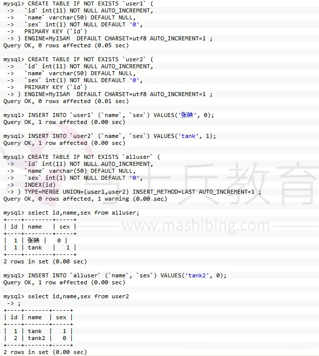

---

其主从复制的过程如下图所示：
但是，主从复制也带来其他一系列性能瓶颈问题：
1. 写入无法扩展
2. 写入无法缓存

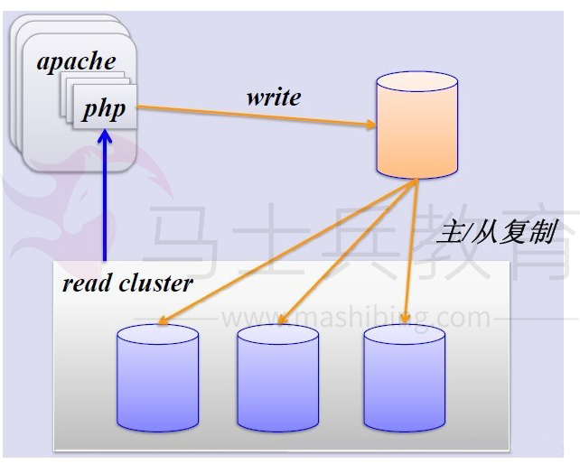

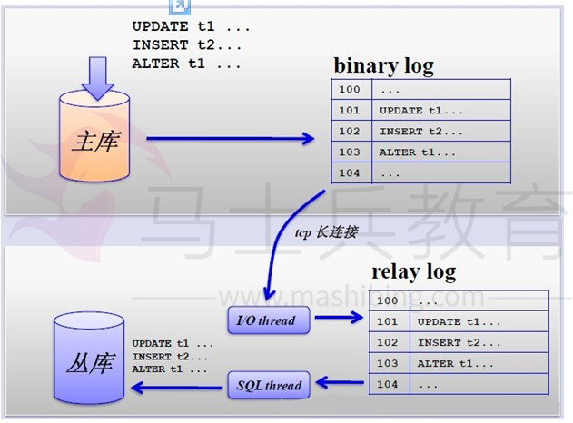

---

3. 复制延时
4. 锁表率上升
5. 表变大，缓存率下降
那问题产生总得解决的，这就产生下面的优化方案，一起来看看。
2、MySQL垂直分区
  如果把业务切割得足够独立，那把不同业务的数据放到不同的数据库服务器将是一个不错的方案，而且
万一其中一个业务崩溃了也不会影响其他业务的正常进行，并且也起到了负载分流的作用，大大提升了
数据库的吞吐能力。经过垂直分区后的数据库架构图如下：
然而，尽管业务之间已经足够独立了，但是有些业务之间或多或少总会有点联系，如用户，基本上都会
和每个业务相关联，况且这种分区方式，也不能解决单张表数据量暴涨的问题，因此为何不试试水平分
割呢？
3、MySQL水平分片（Sharding）
这是一个非常好的思路，将用户按一定规则（按id哈希）分组，并把该组用户的数据存储到一个数据库
分片中，即一个sharding，这样随着用户数量的增加，只要简单地配置一台服务器即可，原理图如下：

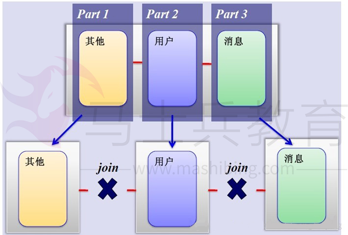

---

如何来确定某个用户所在的shard呢，可以建一张用户和shard对应的数据表，每次请求先从这张表找用
户的shard id，再从对应shard中查询相关数据，如下图所示：

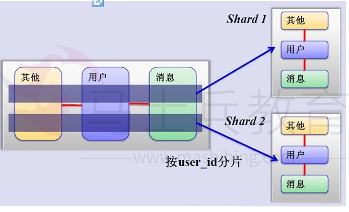

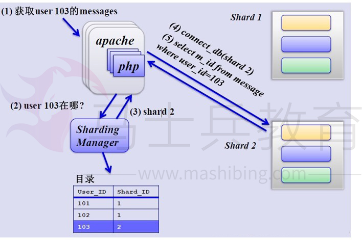

---

mysql大数据量使用limit分页，随着页码的增大，查询效率越低下。 
 
测试实验
 
1. 直接用limit start, count分页语句， 也是我程序中用的方法：
 
select * from product limit start, count
当起始页较小时，查询没有性能问题，我们分别看下从10， 100， 1000， 10000开始分页的执行时间
（每页取20条）， 如下：
select * from product limit 10, 20  0.016秒
select * from product limit 100, 20  0.016秒
select * from product limit 1000, 20  0.047秒
select * from product limit 10000, 20  0.094秒
我们已经看出随着起始记录的增加，时间也随着增大， 这说明分页语句limit跟起始页码是有很大关系
的，那么我们把起始记录改为40w看下（也就是记录的一般左右）                   select * from product 
limit 400000, 20  3.229秒
再看我们取最后一页记录的时间
select * from product limit 866613, 20  37.44秒
难怪搜索引擎抓取我们页面的时候经常会报超时，像这种分页最大的页码页显然这种时
间是无法忍受的。
从中我们也能总结出两件事情：
1）limit语句的查询时间与起始记录的位置成正比
2）mysql的limit语句是很方便，但是对记录很多的表并不适合直接使用。
2. 对limit分页问题的性能优化方法
 
利用表的覆盖索引来加速分页查询
我们都知道，利用了索引查询的语句中如果只包含了那个索引列（覆盖索引），那么这种情况会查询很
快。
因为利用索引查找有优化算法，且数据就在查询索引上面，不用再去找相关的数据地址了，这样节省了
很多时间。另外Mysql中也有相关的索引缓存，在并发高的时候利用缓存就效果更好了。
在我们的例子中，我们知道id字段是主键，自然就包含了默认的主键索引。现在让我们看看利用覆盖索
引的查询效果如何：
这次我们之间查询最后一页的数据（利用覆盖索引，只包含id列），如下：
select id from product limit 866613, 20 0.2秒
相对于查询了所有列的37.44秒，提升了大概100多倍的速度
那么如果我们也要查询所有列，有两种方法，一种是id>=的形式，另一种就是利用join，看下实际情
况：
SELECT * FROM product WHERE ID > =(select id from product limit 866613, 1) limit 20
查询时间为0.2秒，简直是一个质的飞跃啊，哈哈
另一种写法
SELECT * FROM product a JOIN (select id from product limit 866613, 20) b ON a.ID = b.id
查询时间也很短，赞！
其实两者用的都是一个原理嘛，所以效果也差不多

---

MySQL分表自增ID解决方案
 
 
当我们对MySQL进行分表操作后，将不能依赖MySQL的自动增量来产生唯一ID了，因为数据已经分散到
多个表中。
应尽量避免使用自增IP来做为主键，为数据库分表操作带来极大的不便。
在postgreSQL、oracle、db2数据库中有一个特殊的特性---sequence。 任何时候数据库可以根据当前
表中的记录数大小和步长来获取到该表下一条记录数。然而，MySQL是没有这种序列对象的。
可以通过下面的方法来实现sequence特性产生唯一ID：
1. 通过MySQL表生成ID
在《关于MySQL分表操作的研究》提到了一种方法：
对于插入也就是insert操作，首先就是获取唯一的id了，就需要一个表来专门创建id，插入一条记录，并
获取最后插入的ID。代码如下：
 
也就是说，当我们需要插入数据的时候，必须由这个表来产生id值，我的php代码的方法如下：
 
这种方法效果很好，但是在高并发情况下，MySQL的AUTO_INCREMENT将导致整个数据库慢。如果存
在自增字段，MySQL会维护一个自增锁，innodb会在内存里保存一个计数器来记录auto_increment
值，当插入一个新行数据时，就会用一个表锁来锁住这个计数器，直到插入结束。如果是一行一行的插
入是没有问题的，但是在高并发情况下，那就悲催了，表锁会引起SQL阻塞，极大的影响性能，还可能
会达到max_connections值。
innodb_autoinc_lock_mode：可以设定3个值：0、1、2
0：traditonal （每次都会产生表锁）
1：consecutive （默认,可预判行数时使用新方式，不可时使用表锁，对于simple insert会获得批量的
锁，保证连续插入）
2：interleaved （不会锁表，来一个处理一个，并发最高）
对于myisam表引擎是traditional，每次都会进行表锁的。
2. 通过redis生成ID
CREATE TABLE `ttlsa_com`.`create_id` ( 
`id` BIGINT( 20 ) NOT NULL AUTO_INCREMENT PRIMARY KEY
) ENGINE = MYISAM
<?php 
function get_AI_ID() {  
    $sql = "insert into create_id (id) values('')";  
    $this->db->query($sql); 
    return $this->db->insertID(); 
}
?>
function get_next_autoincrement_waitlock($timeout = 60){
    $count = $timeout > 0 ? $timeout : 60; 
    while($r->get("serial:lock")){  
        $count++;   
        sleep(1);

---

3. 队列方式
使用队列服务，如redis、memcacheq等等，将一定量的ID预分配在一个队列里，每次插入操作，先从
队列中获取一个ID，若插入失败的话，将该ID再次添加到队列中，同时监控队列数量，当小于阀值时，
自动向队列中添加元素。
这种方式可以有规划的对ID进行分配，还会带来经济效应，比如ＱＱ号码，各种靓号，明码标价。如网
站的userid, 允许uid登陆，推出各种靓号，明码标价，对于普通的ID打乱后再随机分配。
        if($count >10)
            return false;
    } 
    return true;
} 
function get_next_autoincrement($timeout = 60){ 
    // first check if we are locked...  
    if (get_next_autoincrement_waitlock($timeout) == false)     
            return 0; $id = $r->incr("serial"); 
    if ( $id > 1 )  
        return $id; 
    // if ID == 1, we assume we do not have "serial" key... 
    // first we need to get lock.
    if ($r->setnx("serial:lock"), 1){   
        $r->expire("serial:lock", 60  5);   
        // get max(id) from database.   
        $id = select_db_query("select max(id) from user_posts");    
        // or alternatively:    
        // select id from user_posts order by id desc limit 1   
        // increase it  
        $id++; 
        // update Redis key 
        $r->set("serial", $id); 
        // release the lock 
        $r->del("serial:lock"); 
        return $id; 
    } 
    // can not get lock.
    return 0;
}
$r = new Redis();
$r->connect("127.0.0.1", "6379"); 
$id = get_next_autoincrement();
if ($id){  
    $sql = "insert into 
user_posts(id,user,message)values($id,'$user','$message')"  
    $data = exec_db_query($sql);
}
<?php 
class common { 
    private $r; 
    
    function construct() { 
        $this->__construct();

---

监控队列数量，并自动补充队列和取到id但并没有使用，相关代码没有贴出来。
 
 
 
理解分布式id生成算法SnowFlake
 
 
分布式id生成算法的有很多种，Twitter的SnowFlake就是其中经典的一种。
概述
 
SnowFlake算法生成id的结果是一个64bit大小的整数，它的结构如下图：
    }  
    public function __construct(){      
        $this->r=new Redis();
        $this->r->connect('127.0.0.1', 6379); 
    }  
    function set_queue_id($ids){  
        if(is_array($ids) && isset($ids)){  
            foreach ($ids as $id){          
                $this->r->LPUSH('next_autoincrement',$id);      
            } 
        } 
    }  
    function get_next_autoincrement(){  
        return $this->r->LPOP('next_autoincrement'); 
    }
}
$createid=array();
while(count($createid)<20){  
    $num=rand(1000,4000); 
    if(!in_array($num,$createid))  
        $createid[]=$num;
} 
$id=new common();
$id->set_queue_id($createid);
var_dump($id->get_next_autoincrement());

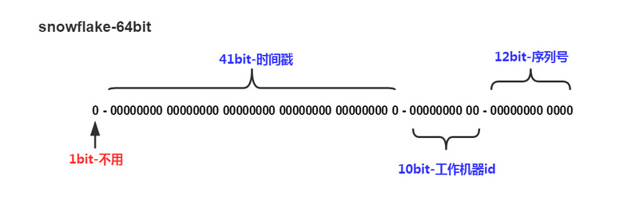

---

1位，不用。二进制中最高位为1的都是负数，但是我们生成的id一般都使用整数，所以这个最高
位固定是0
41位，用来记录时间戳（毫秒）。
41位可以表示2^{41}-1241−1个数字，
如果只用来表示正整数（计算机中正数包含0），可以表示的数值范围是：0 至 
2^{41}-1241−1，减1是因为可表示的数值范围是从0开始算的，而不是1。
也就是说41位可以表示2^{41}-1241−1个毫秒的值，转化成单位年则是(2^{41}-1) / (1000 * 
60 * 60 * 24 * 365) = 69(241−1)/(1000∗60∗60∗24∗365)=69年
10位，用来记录工作机器id。
可以部署在2^{10} = 1024210=1024个节点，包括5位datacenterId 和5位workerId
5位（bit）可以表示的最大正整数是2^{5}-1 = 3125−1=31，即可以用0、1、2、3、....31这
32个数字，来表示不同的datecenterId或workerId
12位，序列号，用来记录同毫秒内产生的不同id。
12位（bit）可以表示的最大正整数是2^{12}-1 = 4095212−1=4095，即可以用0、1、2、
3、....4094这4095个数字，来表示同一机器同一时间截（毫秒)内产生的4095个ID序号
由于在Java中64bit的整数是long类型，所以在Java中SnowFlake算法生成的id就是long来存储的。
SnowFlake可以保证：
所有生成的id按时间趋势递增
整个分布式系统内不会产生重复id（因为有datacenterId和workerId来做区分）
Talk is cheap, show you the code
 
以下是Twitter官方原版的，用Scala写的，（当成Java看即可）：
/** Copyright 2010-2012 Twitter, Inc.*/
package com.twitter.service.snowflake
import com.twitter.ostrich.stats.Stats
import com.twitter.service.snowflake.gen._
import java.util.Random
import com.twitter.logging.Logger
/**
 * An object that generates IDs.
 * This is broken into a separate class in case
 * we ever want to support multiple worker threads
 * per process
 */
class IdWorker(
    val workerId: Long, 
    val datacenterId: Long, 
    private val reporter: Reporter, 
    var sequence: Long = 0L) extends Snowflake.Iface {
    
  private[this] def genCounter(agent: String) = {
    Stats.incr("ids_generated")
    Stats.incr("ids_generated_%s".format(agent))
  }
  private[this] val exceptionCounter = Stats.getCounter("exceptions")
  private[this] val log = Logger.get
  private[this] val rand = new Random

---

val twepoch = 1288834974657L
  private[this] val workerIdBits = 5L
  private[this] val datacenterIdBits = 5L
  private[this] val maxWorkerId = -1L ^ (-1L << workerIdBits)
  private[this] val maxDatacenterId = -1L ^ (-1L << datacenterIdBits)
  private[this] val sequenceBits = 12L
  private[this] val workerIdShift = sequenceBits
  private[this] val datacenterIdShift = sequenceBits + workerIdBits
  private[this] val timestampLeftShift = sequenceBits + workerIdBits + 
datacenterIdBits
  private[this] val sequenceMask = -1L ^ (-1L << sequenceBits)
  private[this] var lastTimestamp = -1L
  // sanity check for workerId
  if (workerId > maxWorkerId || workerId < 0) {
    exceptionCounter.incr(1)
    throw new IllegalArgumentException("worker Id can't be greater than %d or 
less than 0".format(maxWorkerId))
  }
  if (datacenterId > maxDatacenterId || datacenterId < 0) {
    exceptionCounter.incr(1)
    throw new IllegalArgumentException("datacenter Id can't be greater than %d or 
less than 0".format(maxDatacenterId))
  }
  log.info("worker starting. timestamp left shift %d, datacenter id bits %d, 
worker id bits %d, sequence bits %d, workerid %d",
    timestampLeftShift, datacenterIdBits, workerIdBits, sequenceBits, workerId)
  def get_id(useragent: String): Long = {
    if (!validUseragent(useragent)) {
      exceptionCounter.incr(1)
      throw new InvalidUserAgentError
    }
    val id = nextId()
    genCounter(useragent)
    reporter.report(new AuditLogEntry(id, useragent, rand.nextLong))
    id
  }
  def get_worker_id(): Long = workerId
  def get_datacenter_id(): Long = datacenterId
  def get_timestamp() = System.currentTimeMillis
  protected[snowflake] def nextId(): Long = synchronized {
    var timestamp = timeGen()
    if (timestamp < lastTimestamp) {
      exceptionCounter.incr(1)
      log.error("clock is moving backwards.  Rejecting requests until %d.", 
lastTimestamp);

---

Scala是一门可以编译成字节码的语言，简单理解是在Java语法基础上加上了很多语法糖，例如不用每条
语句后写分号，可以使用动态类型等等。抱着试一试的心态，我把Scala版的代码“翻译”成Java版本的，
对scala代码改动的地方如下：
      throw new InvalidSystemClock("Clock moved backwards.  Refusing to generate 
id for %d milliseconds".format(
        lastTimestamp - timestamp))
    }
    if (lastTimestamp == timestamp) {
      sequence = (sequence + 1) & sequenceMask
      if (sequence == 0) {
        timestamp = tilNextMillis(lastTimestamp)
      }
    } else {
      sequence = 0
    }
    lastTimestamp = timestamp
    ((timestamp - twepoch) << timestampLeftShift) |
      (datacenterId << datacenterIdShift) |
      (workerId << workerIdShift) | 
      sequence
  }
  protected def tilNextMillis(lastTimestamp: Long): Long = {
    var timestamp = timeGen()
    while (timestamp <= lastTimestamp) {
      timestamp = timeGen()
    }
    timestamp
  }
  protected def timeGen(): Long = System.currentTimeMillis()
  val AgentParser = """([a-zA-Z][a-zA-Z\-0-9]*)""".r
  def validUseragent(useragent: String): Boolean = useragent match {
    case AgentParser(_) => true
    case _ => false
  }
}
/** Copyright 2010-2012 Twitter, Inc.*/
package com.twitter.service.snowflake
import com.twitter.ostrich.stats.Stats 
import com.twitter.service.snowflake.gen._
import java.util.Random
import com.twitter.logging.Logger
/**
 * An object that generates IDs.
 * This is broken into a separate class in case
 * we ever want to support multiple worker threads
 * per process
 */

---

class IdWorker(                                        // |
    val workerId: Long,                                // |
    val datacenterId: Long,                            // |<--这部分改成Java的构造函
数形式
    private val reporter: Reporter,//日志相关，删       // |
    var sequence: Long = 0L)                           // |
       extends Snowflake.Iface { //接口找不到，删       // |     
    
  private[this] def genCounter(agent: String) = {                     // |
    Stats.incr("ids_generated")                                       // |
    Stats.incr("ids_generated_%s".format(agent))                      // |<--错
误、日志处理相关，删
  }                                                                   // | 
  private[this] val exceptionCounter = Stats.getCounter("exceptions") // |
  private[this] val log = Logger.get                                  // |
  private[this] val rand = new Random                                 // | 
  val twepoch = 1288834974657L
  private[this] val workerIdBits = 5L
  private[this] val datacenterIdBits = 5L
  private[this] val maxWorkerId = -1L ^ (-1L << workerIdBits)
  private[this] val maxDatacenterId = -1L ^ (-1L << datacenterIdBits)
  private[this] val sequenceBits = 12L
  private[this] val workerIdShift = sequenceBits
  private[this] val datacenterIdShift = sequenceBits + workerIdBits
  private[this] val timestampLeftShift = sequenceBits + workerIdBits + 
datacenterIdBits
  private[this] val sequenceMask = -1L ^ (-1L << sequenceBits)
  private[this] var lastTimestamp = -1L
  //-----------------------------------------------------------------------------
-----------------------------------------------//
  // sanity check for workerId                                                   
                                               //
  if (workerId > maxWorkerId || workerId < 0) {                                   
                                              //
    exceptionCounter.incr(1) //<--错误处理相关，删                                 
                                              //
    throw new IllegalArgumentException("worker Id can't be greater than %d or 
less than 0".format(maxWorkerId))                 //这
    // |-->改成：throw new IllegalArgumentException                               
                                               //部
    //            (String.format("worker Id can't be greater than %d or less than 
0",maxWorkerId))                              //分
  }                                                                               
                                              //放
                                                                                 
                                               //到
  if (datacenterId > maxDatacenterId || datacenterId < 0) {                       
                                              //构
    exceptionCounter.incr(1) //<--错误处理相关，删                                 
                                              //造
    throw new IllegalArgumentException("datacenter Id can't be greater than %d or 
less than 0".format(maxDatacenterId))         //函

---

// |-->改成：throw new IllegalArgumentException                               
                                              //数
    //             (String.format("datacenter Id can't be greater than %d or less 
than 0",maxDatacenterId))                     //中
  }                                                                               
                                              //
                                                                                 
                                               //
  log.info("worker starting. timestamp left shift %d, datacenter id bits %d, 
worker id bits %d, sequence bits %d, workerid %d", //  
    timestampLeftShift, datacenterIdBits, workerIdBits, sequenceBits, workerId)   
                                              //   
  // |-->改成：System.out.printf("worker...%d...",timestampLeftShift,...);         
                                             //
  //-----------------------------------------------------------------------------
-----------------------------------------------//
  //-------------------------------------------------------------------//  
  //这个函数删除错误处理相关的代码后，剩下一行代码：val id = nextId()      //
  //所以我们直接调用nextId()函数可以了，所以在“翻译”时可以删除这个函数      //
  def get_id(useragent: String): Long = {                              // 
    if (!validUseragent(useragent)) {                                  //
      exceptionCounter.incr(1)                                         //
      throw new InvalidUserAgentError                                  //删
    }                                                                  //除
                                                                       // 
    val id = nextId()                                                  // 
    genCounter(useragent)                                              //
                                                                       //
    reporter.report(new AuditLogEntry(id, useragent, rand.nextLong))   //
    id                                                                 //
  }                                                                    // 
  //-------------------------------------------------------------------//
  def get_worker_id(): Long = workerId           // |
  def get_datacenter_id(): Long = datacenterId   // |<--改成Java函数
  def get_timestamp() = System.currentTimeMillis // |
  protected[snowflake] def nextId(): Long = synchronized { // 改成Java函数
    var timestamp = timeGen()
    if (timestamp < lastTimestamp) {
      exceptionCounter.incr(1) // 错误处理相关，删
      log.error("clock is moving backwards.  Rejecting requests until %d.", 
lastTimestamp); // 改成System.err.printf(...)
      throw new InvalidSystemClock("Clock moved backwards.  Refusing to generate 
id for %d milliseconds".format(
        lastTimestamp - timestamp)) // 改成RumTimeException
    }
    if (lastTimestamp == timestamp) {
      sequence = (sequence + 1) & sequenceMask
      if (sequence == 0) {
        timestamp = tilNextMillis(lastTimestamp)
      }
    } else {
      sequence = 0
    }

---

改出来的Java版：
    lastTimestamp = timestamp
    ((timestamp - twepoch) << timestampLeftShift) | // |<--加上关键字return
      (datacenterId << datacenterIdShift) |         // |
      (workerId << workerIdShift) |                 // |
      sequence                                      // |
  }
  protected def tilNextMillis(lastTimestamp: Long): Long = { // 改成Java函数
    var timestamp = timeGen()
    while (timestamp <= lastTimestamp) {
      timestamp = timeGen()
    }
    timestamp // 加上关键字return
  }
  protected def timeGen(): Long = System.currentTimeMillis() // 改成Java函数
  val AgentParser = """([a-zA-Z][a-zA-Z\-0-9]*)""".r                  // |
                                                                      // | 
  def validUseragent(useragent: String): Boolean = useragent match {  // |<--日志
相关，删
    case AgentParser(_) => true                                       // |
    case _ => false                                                   // |   
  }                                                                   // | 
}
public class IdWorker{
    private long workerId;
    private long datacenterId;
    private long sequence;
    public IdWorker(long workerId, long datacenterId, long sequence){
        // sanity check for workerId
        if (workerId > maxWorkerId || workerId < 0) {
            throw new IllegalArgumentException(String.format("worker Id can't be 
greater than %d or less than 0",maxWorkerId));
        }
        if (datacenterId > maxDatacenterId || datacenterId < 0) {
            throw new IllegalArgumentException(String.format("datacenter Id can't 
be greater than %d or less than 0",maxDatacenterId));
        }
        System.out.printf("worker starting. timestamp left shift %d, datacenter 
id bits %d, worker id bits %d, sequence bits %d, workerid %d",
                timestampLeftShift, datacenterIdBits, workerIdBits, sequenceBits, 
workerId);
        this.workerId = workerId;
        this.datacenterId = datacenterId;
        this.sequence = sequence;
    }
    private long twepoch = 1288834974657L;

---

private long workerIdBits = 5L;
    private long datacenterIdBits = 5L;
    private long maxWorkerId = -1L ^ (-1L << workerIdBits);
    private long maxDatacenterId = -1L ^ (-1L << datacenterIdBits);
    private long sequenceBits = 12L;
    private long workerIdShift = sequenceBits;
    private long datacenterIdShift = sequenceBits + workerIdBits;
    private long timestampLeftShift = sequenceBits + workerIdBits + 
datacenterIdBits;
    private long sequenceMask = -1L ^ (-1L << sequenceBits);
    private long lastTimestamp = -1L;
    public long getWorkerId(){
        return workerId;
    }
    public long getDatacenterId(){
        return datacenterId;
    }
    public long getTimestamp(){
        return System.currentTimeMillis();
    }
    public synchronized long nextId() {
        long timestamp = timeGen();
        if (timestamp < lastTimestamp) {
            System.err.printf("clock is moving backwards.  Rejecting requests 
until %d.", lastTimestamp);
            throw new RuntimeException(String.format("Clock moved backwards.  
Refusing to generate id for %d milliseconds",
                    lastTimestamp - timestamp));
        }
        if (lastTimestamp == timestamp) {
            sequence = (sequence + 1) & sequenceMask;
            if (sequence == 0) {
                timestamp = tilNextMillis(lastTimestamp);
            }
        } else {
            sequence = 0;
        }
        lastTimestamp = timestamp;
        return ((timestamp - twepoch) << timestampLeftShift) |
                (datacenterId << datacenterIdShift) |
                (workerId << workerIdShift) |
                sequence;
    }
    private long tilNextMillis(long lastTimestamp) {
        long timestamp = timeGen();
        while (timestamp <= lastTimestamp) {
            timestamp = timeGen();
        }

---

代码理解
 
上面的代码中，有部分位运算的代码，如：
为了能更好理解，我对相关知识研究了一下。
负数的二进制表示
 
在计算机中，负数的二进制是用补码来表示的。
假设我是用Java中的int类型来存储数字的，
int类型的大小是32个二进制位（bit），即4个字节（byte）。（1 byte = 8 bit）
那么十进制数字3 在二进制中的表示应该是这样的：
那数字-3 在二进制中应该如何表示？
我们可以反过来想想，因为-3+3=0，
在二进制运算中把-3的二进制看成未知数x来求解，
求解算式的二进制表示如下：
反推x的值，3的二进制加上什么值才使结果变成00000000 00000000 00000000 00000000 ？：
        return timestamp;
    }
    private long timeGen(){
        return System.currentTimeMillis();
    }
    //---------------测试---------------
    public static void main(String[] args) {
        IdWorker worker = new IdWorker(1,1,1);
        for (int i = 0; i < 30; i++) {
            System.out.println(worker.nextId());
        }
    }
}
sequence = (sequence + 1) & sequenceMask;
private long maxWorkerId = -1L ^ (-1L << workerIdBits);
return ((timestamp - twepoch) << timestampLeftShift) |
        (datacenterId << datacenterIdShift) |
        (workerId << workerIdShift) |
        sequence;
00000000 00000000 00000000 00000011
// 3的二进制表示，就是原码
   00000000 00000000 00000000 00000011 //3，原码
+  xxxxxxxx xxxxxxxx xxxxxxxx xxxxxxxx //-3，补码
-----------------------------------------------
   00000000 00000000 00000000 00000000

---

反推的思路是3的二进制数从最低位开始逐位加1，使溢出的1不断向高位溢出，直到溢出到第33位。然
后由于int类型最多只能保存32个二进制位，所以最高位的1溢出了，剩下的32位就成了（十进制的）
0。
补码的意义就是可以拿补码和原码（3的二进制）相加，最终加出一个“溢出的0”
以上是理解的过程，实际中记住公式就很容易算出来：
补码 = 反码 + 1
补码 = （原码 - 1）再取反码
因此-1 的二进制应该这样算：
用位运算计算n个bit能表示的最大数值
 
比如这样一行代码：
上面代码换成这样看方便一点：
long maxWorkerId = -1L ^ (-1L << 5L)
咋一看真的看不准哪个部分先计算，于是查了一下Java运算符的优先级表:
所以上面那行代码中，运行顺序是：
   00000000 00000000 00000000 00000011 //3，原码                         
+  11111111 11111111 11111111 11111101 //-3，补码
-----------------------------------------------
 1 00000000 00000000 00000000 00000000
00000000 00000000 00000000 00000001 //原码：1的二进制
11111111 11111111 11111111 11111110 //取反码：1的二进制的反码
11111111 11111111 11111111 11111111 //加1：-1的二进制表示（补码）
    private long workerIdBits = 5L;
    private long maxWorkerId = -1L ^ (-1L << workerIdBits);

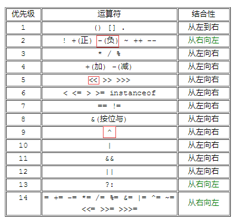

---

-1 左移 5，得结果a
-1 异或 a
long maxWorkerId = -1L ^ (-1L << 5L) 的二进制运算过程如下：
-1 左移 5，得结果a ：
-1 异或 a ：
最终结果是31，二进制00000000 00000000 00000000 00011111 转十进制可以这么算：
2^4 + 2^3 + 2^2 + 2^1 + 2^0 = 16 + 8 + 4 + 2 + 1 =3124+23+22+21+20=16+8+4+2+1=31
那既然现在知道算出来long maxWorkerId = -1L ^ (-1L << 5L) 中的maxWorkerId = 31 ，有什么
含义？为什么要用左移5来算？如果你看过概述部分，请找到这段内容看看：
5位（bit）可以表示的最大正整数是2^{5}-1 = 3125−1=31，即可以用0、1、2、3、....31这32个
数字，来表示不同的datecenterId或workerId
用mask防止溢出
 
有一段有趣的代码：
分别用不同的值测试一下，你就知道它怎么有趣了：
        11111111 11111111 11111111 11111111 //-1的二进制表示（补码）
  11111 11111111 11111111 11111111 11100000 //高位溢出的不要，低位补0
        11111111 11111111 11111111 11100000 //结果a
        11111111 11111111 11111111 11111111 //-1的二进制表示（补码）
    ^   11111111 11111111 11111111 11100000 //两个操作数的位中，相同则为0，不同则为1
---------------------------------------------------------------------------
        00000000 00000000 00000000 00011111 //最终结果31
-1L ^ (-1L << 5L)`结果是`31`，2^{5}-125−1的结果也是`31`，所以在代码中，`-1L ^ (-1L << 
5L)`的写法是`利用位运算计算出5位能表示的最大正整数是多少
sequence = (sequence + 1) & sequenceMask;
        long seqMask = -1L ^ (-1L << 12L); //计算12位能耐存储的最大正整数，相当于：
2^12-1 = 4095
        System.out.println("seqMask: "+seqMask);
        System.out.println(1L & seqMask);
        System.out.println(2L & seqMask);
        System.out.println(3L & seqMask);
        System.out.println(4L & seqMask);
        System.out.println(4095L & seqMask);
        System.out.println(4096L & seqMask);
        System.out.println(4097L & seqMask);
        System.out.println(4098L & seqMask);
        
        /**
        seqMask: 4095
        1
        2

---

这段代码通过位与运算保证计算的结果范围始终是 0-4095 ！
用位运算汇总结果
 
还有另外一段诡异的代码：
为了弄清楚这段代码，
首先 需要计算一下相关的值：
其次 写个测试，把参数都写死，并运行打印信息，方便后面来核对计算结果：
        3
        4
        4095
        0
        1
        2
        */
return ((timestamp - twepoch) << timestampLeftShift) |
        (datacenterId << datacenterIdShift) |
        (workerId << workerIdShift) |
        sequence;
    private long twepoch = 1288834974657L; //起始时间戳，用于用当前时间戳减去这个时间
戳，算出偏移量
    private long workerIdBits = 5L; //workerId占用的位数：5
    private long datacenterIdBits = 5L; //datacenterId占用的位数：5
    private long maxWorkerId = -1L ^ (-1L << workerIdBits);  // workerId可以使用的
最大数值：31
    private long maxDatacenterId = -1L ^ (-1L << datacenterIdBits); // 
datacenterId可以使用的最大数值：31
    private long sequenceBits = 12L;//序列号占用的位数：12
    private long workerIdShift = sequenceBits; // 12
    private long datacenterIdShift = sequenceBits + workerIdBits; // 12+5 = 17
    private long timestampLeftShift = sequenceBits + workerIdBits + 
datacenterIdBits; // 12+5+5 = 22
    private long sequenceMask = -1L ^ (-1L << sequenceBits);//4095
    private long lastTimestamp = -1L;
    //---------------测试---------------
    public static void main(String[] args) {
        long timestamp = 1505914988849L;
        long twepoch = 1288834974657L;
        long datacenterId = 17L;
        long workerId = 25L;
        long sequence = 0L;
        System.out.printf("\ntimestamp: %d \n",timestamp);
        System.out.printf("twepoch: %d \n",twepoch);
        System.out.printf("datacenterId: %d \n",datacenterId);
        System.out.printf("workerId: %d \n",workerId);

---

代入位移的值得之后，就是这样：
对于尚未知道的值，我们可以先看看概述 中对SnowFlake结构的解释，再代入在合法范围的值
(windows系统可以用计算器方便计算这些值的二进制)，来了解计算的过程。
当然，由于我的测试代码已经把这些值写死了，那直接用这些值来手工验证计算结果即可：
        System.out.printf("sequence: %d \n",sequence);
        System.out.println();
        System.out.printf("(timestamp - twepoch): %d \n",(timestamp - twepoch));
        System.out.printf("((timestamp - twepoch) << 22L): %d \n",((timestamp - 
twepoch) << 22L));
        System.out.printf("(datacenterId << 17L): %d \n" ,(datacenterId << 
17L));
        System.out.printf("(workerId << 12L): %d \n",(workerId << 12L));
        System.out.printf("sequence: %d \n",sequence);
        long result = ((timestamp - twepoch) << 22L) |
                (datacenterId << 17L) |
                (workerId << 12L) |
                sequence;
        System.out.println(result);
    }
    /** 打印信息：
        timestamp: 1505914988849 
        twepoch: 1288834974657 
        datacenterId: 17 
        workerId: 25 
        sequence: 0 
        
        (timestamp - twepoch): 217080014192 
        ((timestamp - twepoch) << 22L): 910499571845562368 
        (datacenterId << 17L): 2228224 
        (workerId << 12L): 102400 
        sequence: 0 
        910499571847892992
    */
return ((timestamp - 1288834974657) << 22) |
        (datacenterId << 17) |
        (workerId << 12) |
        sequence;

---

现在知道了每个部分左移后的值(la,lb,lc)，代码可以简化成下面这样去理解：
        long timestamp = 1505914988849L;
        long twepoch = 1288834974657L;
        long datacenterId = 17L;
        long workerId = 25L;
        long sequence = 0L;
设：timestamp  = 1505914988849，twepoch = 1288834974657
1505914988849 - 1288834974657 = 217080014192 (timestamp相对于起始时间的毫秒偏移量)，其
(a)二进制左移22位计算过程如下：                                
                        |<--这里开始左右22位                             
00000000 00000000 000000|00 00110010 10001010 11111010 00100101 01110000 // a = 
217080014192
00001100 10100010 10111110 10001001 01011100 00|000000 00000000 00000000 // a左移
22位后的值(la)
                                               |<--这里后面的位补0
设：datacenterId  = 17，其（b）二进制左移17位计算过程如下：
                   |<--这里开始左移17位    
00000000 00000000 0|0000000  00000000 00000000 00000000 00000000 00010001 // b = 
17
0000000 0 00000000 00000000 00000000 00000000 0010001|0 00000000 00000000 // b左移
17位后的值(lb)
                                                    |<--这里后面的位补0
设：workerId  = 25，其（c）二进制左移12位计算过程如下：
             |<--这里开始左移12位    
 00000000 0000|0000 00000000 00000000 00000000 00000000 00000000 00011001 // c = 
25
00000000 00000000 00000000 00000000 00000000 00000001 1001|0000 00000000 // c左移
12位后的值(lc)                                                                 
                                                          |<--这里后面的位补0
设：sequence = 0，其二进制如下：
00000000 00000000 00000000 00000000 00000000 00000000 0000 0000 00000000 // 
sequence = 0

---

上面的管道符号| 在Java中也是一个位运算符。其含义是：
x的第n位和y的第n位 只要有一个是1，则结果的第n位也为1，否则为0 ，因此，我们对四个数的位或运算如
下：
结果计算过程：
1) 从至左列出1出现的下标（从0开始算）：
2) 各个下标作为2的幂数来计算，并相加：
$ 2^{59}+2^{58}+2^{55}+2^{53}+2^{49}+2^{47}+2^{45}+2^{44}+2^{43}+
2^{42}+2^{41}+2^{39}+2^{35}+2^{32}+2^{30}+2^{28}+2^{27}+2^{26}+
2^{21}+2^{17}+2^{16}+2^{15}+2^{2} $
return ((timestamp - 1288834974657) << 22) |
        (datacenterId << 17) |
        (workerId << 12) |
        sequence;
-----------------------------
           |
           |简化
          \|/
-----------------------------
return (la) |
        (lb) |
        (lc) |
        sequence;
 1  |                    41                        |  5  |   5  |     12      
    
   0|0001100 10100010 10111110 10001001 01011100 00|00000|0 0000|0000 00000000 
//la
   0|000000 0 00000000 00000000 00000000 00000000 00|10001|0 0000|0000 00000000 
//lb
   0|0000000 00000000 00000000 00000000 00000000 00|00000|1 1001|0000 00000000 
//lc
or 0|0000000 00000000 00000000 00000000 00000000 00|00000|0 0000| 0000 00000000 
//sequence
---------------------------------------------------------------------------------
---------
   0|0001100 10100010 10111110 10001001 01011100 00|10001|1 1001| 0000 00000000 //
结果：910499571847892992
0000  1   1   00  1   0  1  000  1   0  1  0  1  1  1  1  1  0 1   000 1 00 1  0 
1  0   1  1  1  0000 1   000  1  1  1  00  1   0000 0000 0000
      59  58      55     53      49     47    45 44 43 42 41   39      35   32   
30     28 27 26      21       17 16 15     12
    2^59}  : 576460752303423488
    2^58}  : 288230376151711744   
    2^55}  :  36028797018963968    
    2^53}  :   9007199254740992     
    2^49}  :    562949953421312      
    2^47}  :    140737488355328
    2^45}  :     35184372088832
    2^44}  :     17592186044416

---

计算截图：
跟测试程序打印出来的结果一样，手工验证完毕！
观察
 
    2^43}  :      8796093022208
    2^42}  :      4398046511104
    2^41}  :      2199023255552
    2^39}  :       549755813888
    2^35}  :        34359738368
    2^32}  :         4294967296
    2^30}  :         1073741824
    2^28}  :          268435456
    2^27}  :          134217728
    2^26}  :           67108864
    2^21}  :            2097152
    2^17}  :             131072
    2^16}  :              65536
    2^15}  :              32768
+   2^12}  :               4096
---------------------------------------- 
             910499571847892992

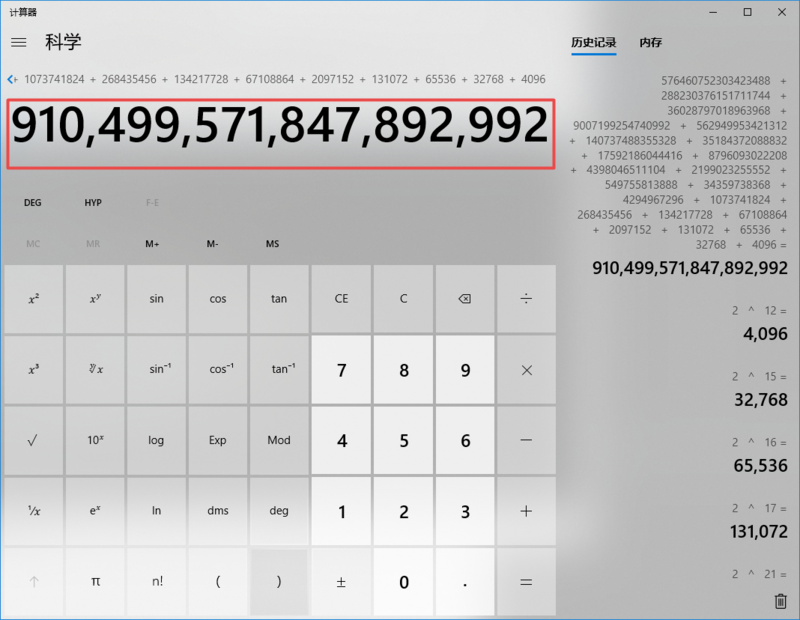

---

上面的64位我按1、41、5、5、12的位数截开了，方便观察。
纵向观察发现:
在41位那一段，除了la一行有值，其它行（lb、lc、sequence）都是0，（我爸其它）
在左起第一个5位那一段，除了lb一行有值，其它行都是0
在左起第二个5位那一段，除了lc一行有值，其它行都是0
按照这规律，如果sequence是0以外的其它值，12位那段也会有值的，其它行都是0
横向观察发现:
在la行，由于左移了5+5+12位，5、5、12这三段都补0了，所以la行除了41那段外，其它肯
定都是0
同理，lb、lc、sequnece行也以此类推
正因为左移的操作，使四个不同的值移到了SnowFlake理论上相应的位置，然后四行做位或
运算（只要有1结果就是1），就把4段的二进制数合并成一个二进制数。
结论：
所以，在这段代码中
左移运算是为了将数值移动到对应的段(41、5、5，12那段因为本来就在最右，因此不用左移)。
然后对每个左移后的值(la、lb、lc、sequence)做位或运算，是为了把各个短的数据合并起来，合并成一
个二进制数。
最后转换成10进制，就是最终生成的id
扩展
 
在理解了这个算法之后，其实还有一些扩展的事情可以做：
1. 根据自己业务修改每个位段存储的信息。算法是通用的，可以根据自己需求适当调整每段的大小以
及存储的信息。
2. 解密id，由于id的每段都保存了特定的信息，所以拿到一个id，应该可以尝试反推出原始的每个段
的信息。反推出的信息可以帮助我们分析。比如作为订单，可以知道该订单的生成日期，负责处理
的数据中心等等。
 
 1  |                    41                        |  5  |   5  |     12      
    
   0|0001100 10100010 10111110 10001001 01011100 00|     |      |              
//la
   0|                                              |10001|      |              
//lb
   0|                                              |     |1 1001|              
//lc
or 0|                                              |     |      | 0000 00000000 
//sequence
---------------------------------------------------------------------------------
---------
   0|0001100 10100010 10111110 10001001 01011100 00|10001|1 1001| 0000 00000000 //
结果：910499571847892992
return ((timestamp - 1288834974657) << 22) |
        (datacenterId << 17) |
        (workerId << 12) |
        sequence;

---

MySql的主从实时备份同步的配置，以及原理(从库读主库
的binlog)，读写分离
 
Mysql主从同步的实现原理
 
 
**1、什么是mysql主从同步？
**
当master(主)库的数据发生变化的时候，变化会实时的同步到slave(从)库。
2、主从同步有什么好处？
水平扩展数据库的负载能力。
容错，高可用。Failover(失败切换)/High Availability
数据备份。
3、主从同步的原理是什么？
首先我们来了解master-slave的体系结构。
如下图：
不管是delete、update、insert，还是创建函数、存储过程，所有的操作都在master上。当master有操
作的时候,slave会快速的接收到这些操作，从而做同步。
但是，这个机制是怎么实现的呢？
在master机器上，主从同步事件会被写到特殊的log文件中(binary-log);在slave机器上，slave读取主从
同步事件，并根据读取的事件变化，在slave库上做相应的更改。
如此，就实现了主从同步了！
下面我们来详细的了解。
**3.1主从同步事件有哪些
**
上面说到：
在master机器上，主从同步事件会被写到特殊的log文件中(binary-log);
主从同步事件有3种形式:statement、row、mixed。
1. statement：会将对数据库操作的sql语句写入到binlog中。
2. row：会将每一条数据的变化写入到binlog中。
3. mixed：statement与row的混合。Mysql决定什么时候写statement格式的，什么时候写row格式
的binlog。

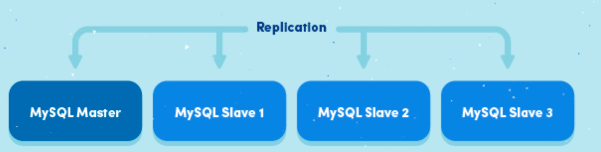

---

3.2在master机器上的操作
当master上的数据发生改变的时候，该事件(insert、update、delete)变化会按照顺序写入到binlog
中。
binlog dump线程
当slave连接到master的时候，master机器会为slave开启binlog dump线程。当master 的 binlog发生
变化的时候，binlog dump线程会通知slave，并将相应的binlog内容发送给slave。
3.3在slave机器上的操作
当主从同步开启的时候，slave上会创建2个线程。
I/O线程。该线程连接到master机器，master机器上的binlog dump线程会将binlog的内容发送给
该I/O线程。该I/O线程接收到binlog内容后，再将内容写入到本地的relay log。
SQL线程。该线程读取I/O线程写入的relay log。并且根据relay log的内容对slave数据库做相应的
操作。
3.4如何在master、slave上查看上述的线程？
使用SHOW PROCESSLIST命令可以查看。
如图，在master机器上查看binlog dump线程。
如图，在slave机器上查看I/O、SQL线程。

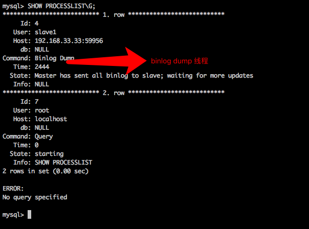

---

4、讲了这么多，一图以蔽之

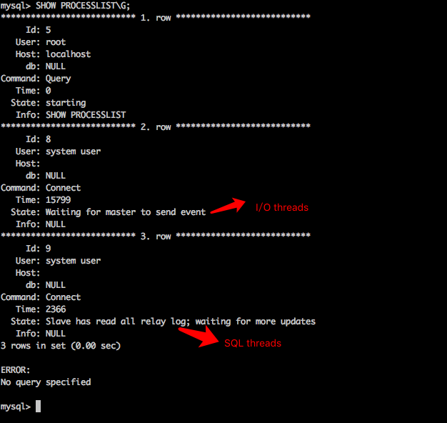

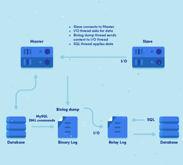

---

MySQL索引背后的数据结构及算法原理
 
 
摘要
 
本文以MySQL数据库为研究对象，讨论与数据库索引相关的一些话题。特别需要说明的是，MySQL支持
诸多存储引擎，而各种存储引擎对索引的支持也各不相同，因此MySQL数据库支持多种索引类型，如
BTree索引，哈希索引，全文索引等等。为了避免混乱，本文将只关注于BTree索引，因为这是平常使用
MySQL时主要打交道的索引，至于哈希索引和全文索引本文暂不讨论。
文章主要内容分为三个部分。
第一部分主要从数据结构及算法理论层面讨论MySQL数据库索引的数理基础。
第二部分结合MySQL数据库中MyISAM和InnoDB数据存储引擎中索引的架构实现讨论聚集索引、非聚集
索引及覆盖索引等话题。
第三部分根据上面的理论基础，讨论MySQL中高性能使用索引的策略。
数据结构及算法基础
 
索引的本质
 
MySQL官方对索引的定义为：索引（Index）是帮助MySQL高效获取数据的数据结构。提取句子主干，
就可以得到索引的本质：索引是数据结构。
我们知道，数据库查询是数据库的最主要功能之一。我们都希望查询数据的速度能尽可能的快，因此数
据库系统的设计者会从查询算法的角度进行优化。最基本的查询算法当然是[顺序查找]（linear 
search），这种复杂度为O(n)的算法在数据量很大时显然是糟糕的，好在计算机科学的发展提供了很多
更优秀的查找算法，例如[二分查找]（binary search）、[二叉树查找]（binary tree search）等。如果
稍微分析一下会发现，每种查找算法都只能应用于特定的数据结构之上，例如二分查找要求被检索数据
有序，而二叉树查找只能应用于二叉查找树上，但是数据本身的组织结构不可能完全满足各种数据结构
（例如，理论上不可能同时将两列都按顺序进行组织），所以，在数据之外，数据库系统还维护着满足
特定查找算法的数据结构，这些数据结构以某种方式引用（指向）数据，这样就可以在这些数据结构上
实现高级查找算法。这种数据结构，就是索引。
看一个例子：

---

图1
图1展示了一种可能的索引方式。左边是数据表，一共有两列七条记录，最左边的是数据记录的物理地址
（注意逻辑上相邻的记录在磁盘上也并不是一定物理相邻的）。为了加快Col2的查找，可以维护一个右
边所示的二叉查找树，每个节点分别包含索引键值和一个指向对应数据记录物理地址的指针，这样就可
以运用二叉查找在O(log2n)O(log2n)的复杂度内获取到相应数据。
虽然这是一个货真价实的索引，但是实际的数据库系统几乎没有使用二叉查找树或其进化品种红黑树
（red-black tree）实现的，原因会在下文介绍。
B-Tree和B+Tree
 
目前大部分数据库系统及文件系统都采用B-Tree或其变种B+Tree作为索引结构，在本文的下一节会结合
存储器原理及计算机存取原理讨论为什么B-Tree和B+Tree在被如此广泛用于索引，这一节先单纯从数据
结构角度描述它们。
B-Tree
 
为了描述B-Tree，首先定义一条数据记录为一个二元组[key, data]，key为记录的键值，对于不同数据记
录，key是互不相同的；data为数据记录除key外的数据。那么B-Tree是满足下列条件的数据结构：
d为大于1的一个正整数，称为B-Tree的度。
h为一个正整数，称为B-Tree的高度。
每个非叶子节点由n-1个key和n个指针组成，其中d<=n<=2d。
每个叶子节点最少包含一个key和两个指针，最多包含2d-1个key和2d个指针，叶节点的指针均为null 。
所有叶节点具有相同的深度，等于树高h。
key和指针互相间隔，节点两端是指针。
一个节点中的key从左到右非递减排列。
所有节点组成树结构。
每个指针要么为null，要么指向另外一个节点。
如果某个指针在节点node最左边且不为null，则其指向节点的所有key小于v(key1)v(key1)，其中
v(key1)v(key1)为node的第一个key的值。
如果某个指针在节点node最右边且不为null，则其指向节点的所有key大于v(keym)v(keym)，其中
v(keym)v(keym)为node的最后一个key的值。

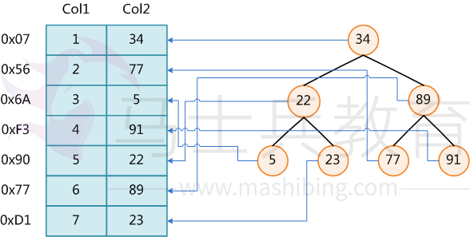

---

如果某个指针在节点node的左右相邻key分别是keyikeyi和keyi+1keyi+1且不为null，则其指向节点的所
有key小于v(keyi+1)v(keyi+1)且大于v(keyi)v(keyi)。
图2是一个d=2的B-Tree示意图。
图2
由于B-Tree的特性，在B-Tree中按key检索数据的算法非常直观：首先从根节点进行二分查找，如果找
到则返回对应节点的data，否则对相应区间的指针指向的节点递归进行查找，直到找到节点或找到null
指针，前者查找成功，后者查找失败。B-Tree上查找算法的伪代码如下：
关于B-Tree有一系列有趣的性质，例如一个度为d的B-Tree，设其索引N个key，则其树高h的上限为
logd((N+1)/2)logd((N+1)/2)，检索一个key，其查找节点个数的渐进复杂度为O(logdN)O(logdN)。从这
点可以看出，B-Tree是一个非常有效率的索引数据结构。
 
另外，由于插入删除新的数据记录会破坏B-Tree的性质，因此在插入删除时，需要对树进行一个分裂、
合并、转移等操作以保持B-Tree性质，本文不打算完整讨论B-Tree这些内容，因为已经有许多资料详细
说明了B-Tree的数学性质及插入删除算法，有兴趣的朋友可以在本文末的参考文献一栏找到相应的资料
进行阅读。
B+Tree
 
B-Tree有许多变种，其中最常见的是B+Tree，例如MySQL就普遍使用B+Tree实现其索引结构。
与B-Tree相比，B+Tree有以下不同点：
每个节点的指针上限为2d而不是2d+1。
内节点不存储data，只存储key；叶子节点不存储指针。
图3是一个简单的B+Tree示意。
图3
BTree_Search(node, key) {    if(node == null) return null;    foreach(node.key)   
{        if(node.key[i] == key) return node.data[i];            if(node.key[i] > 
key) return BTree_Search(point[i]->node);    }    return BTree_Search(point[i+1]-
>node);}data = BTree_Search(root, my_key);

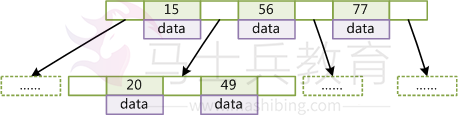

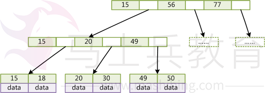

---

由于并不是所有节点都具有相同的域，因此B+Tree中叶节点和内节点一般大小不同。这点与B-Tree不
同，虽然B-Tree中不同节点存放的key和指针可能数量不一致，但是每个节点的域和上限是一致的，所
以在实现中B-Tree往往对每个节点申请同等大小的空间。
一般来说，B+Tree比B-Tree更适合实现外存储索引结构，具体原因与外存储器原理及计算机存取原理有
关，将在下面讨论。
带有顺序访问指针的B+Tree
 
一般在数据库系统或文件系统中使用的B+Tree结构都在经典B+Tree的基础上进行了优化，增加了顺序访
问指针。
图4
如图4所示，在B+Tree的每个叶子节点增加一个指向相邻叶子节点的指针，就形成了带有顺序访问指针
的B+Tree。做这个优化的目的是为了提高区间访问的性能，例如图4中如果要查询key为从18到49的所
有数据记录，当找到18后，只需顺着节点和指针顺序遍历就可以一次性访问到所有数据节点，极大提到
了区间查询效率。
这一节对B-Tree和B+Tree进行了一个简单的介绍，下一节结合存储器存取原理介绍为什么目前B+Tree
是数据库系统实现索引的首选数据结构。
为什么使用B-Tree（B+Tree）
 
上文说过，红黑树等数据结构也可以用来实现索引，但是文件系统及数据库系统普遍采用B-/+Tree作为
索引结构，这一节将结合计算机组成原理相关知识讨论B-/+Tree作为索引的理论基础。
一般来说，索引本身也很大，不可能全部存储在内存中，因此索引往往以索引文件的形式存储的磁盘
上。这样的话，索引查找过程中就要产生磁盘I/O消耗，相对于内存存取，I/O存取的消耗要高几个数量
级，所以评价一个数据结构作为索引的优劣最重要的指标就是在查找过程中磁盘I/O操作次数的渐进复杂
度。换句话说，索引的结构组织要尽量减少查找过程中磁盘I/O的存取次数。下面先介绍内存和磁盘存取
原理，然后再结合这些原理分析B-/+Tree作为索引的效率。
主存存取原理
 
目前计算机使用的主存基本都是随机读写存储器（RAM），现代RAM的结构和存取原理比较复杂，这里
本文抛却具体差别，抽象出一个十分简单的存取模型来说明RAM的工作原理。

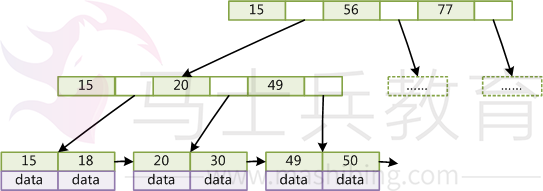

---

图5
从抽象角度看，主存是一系列的存储单元组成的矩阵，每个存储单元存储固定大小的数据。每个存储单
元有唯一的地址，现代主存的编址规则比较复杂，这里将其简化成一个二维地址：通过一个行地址和一
个列地址可以唯一定位到一个存储单元。图5展示了一个4 x 4的主存模型。
主存的存取过程如下：
当系统需要读取主存时，则将地址信号放到地址总线上传给主存，主存读到地址信号后，解析信号并定
位到指定存储单元，然后将此存储单元数据放到数据总线上，供其它部件读取。
写主存的过程类似，系统将要写入单元地址和数据分别放在地址总线和数据总线上，主存读取两个总线
的内容，做相应的写操作。
这里可以看出，主存存取的时间仅与存取次数呈线性关系，因为不存在机械操作，两次存取的数据的“距
离”不会对时间有任何影响，例如，先取A0再取A1和先取A0再取D3的时间消耗是一样的。
磁盘存取原理
 
上文说过，索引一般以文件形式存储在磁盘上，索引检索需要磁盘I/O操作。与主存不同，磁盘I/O存在
机械运动耗费，因此磁盘I/O的时间消耗是巨大的。
图6是磁盘的整体结构示意图。
图6
一个磁盘由大小相同且同轴的圆形盘片组成，磁盘可以转动（各个磁盘必须同步转动）。在磁盘的一侧
有磁头支架，磁头支架固定了一组磁头，每个磁头负责存取一个磁盘的内容。磁头不能转动，但是可以
沿磁盘半径方向运动（实际是斜切向运动），每个磁头同一时刻也必须是同轴的，即从正上方向下看，
所有磁头任何时候都是重叠的（不过目前已经有多磁头独立技术，可不受此限制）。
图7是磁盘结构的示意图。

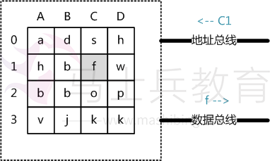

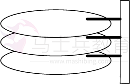

---

图7
盘片被划分成一系列同心环，圆心是盘片中心，每个同心环叫做一个磁道，所有半径相同的磁道组成一
个柱面。磁道被沿半径线划分成一个个小的段，每个段叫做一个扇区，每个扇区是磁盘的最小存储单
元。为了简单起见，我们下面假设磁盘只有一个盘片和一个磁头。
当需要从磁盘读取数据时，系统会将数据逻辑地址传给磁盘，磁盘的控制电路按照寻址逻辑将逻辑地址
翻译成物理地址，即确定要读的数据在哪个磁道，哪个扇区。为了读取这个扇区的数据，需要将磁头放
到这个扇区上方，为了实现这一点，磁头需要移动对准相应磁道，这个过程叫做寻道，所耗费时间叫做
寻道时间，然后磁盘旋转将目标扇区旋转到磁头下，这个过程耗费的时间叫做旋转时间。
局部性原理与磁盘预读
 
由于存储介质的特性，磁盘本身存取就比主存慢很多，再加上机械运动耗费，磁盘的存取速度往往是主
存的几百分分之一，因此为了提高效率，要尽量减少磁盘I/O。为了达到这个目的，磁盘往往不是严格按
需读取，而是每次都会预读，即使只需要一个字节，磁盘也会从这个位置开始，顺序向后读取一定长度
的数据放入内存。这样做的理论依据是计算机科学中著名的局部性原理：
当一个数据被用到时，其附近的数据也通常会马上被使用。
程序运行期间所需要的数据通常比较集中。
由于磁盘顺序读取的效率很高（不需要寻道时间，只需很少的旋转时间），因此对于具有局部性的程序
来说，预读可以提高I/O效率。
预读的长度一般为页（page）的整倍数。页是计算机管理存储器的逻辑块，硬件及操作系统往往将主存
和磁盘存储区分割为连续的大小相等的块，每个存储块称为一页（在许多操作系统中，页得大小通常为
4k），主存和磁盘以页为单位交换数据。当程序要读取的数据不在主存中时，会触发一个缺页异常，此
时系统会向磁盘发出读盘信号，磁盘会找到数据的起始位置并向后连续读取一页或几页载入内存中，然
后异常返回，程序继续运行。
B-/+Tree索引的性能分析
 
到这里终于可以分析B-/+Tree索引的性能了。
上文说过一般使用磁盘I/O次数评价索引结构的优劣。先从B-Tree分析，根据B-Tree的定义，可知检索一
次最多需要访问h个节点。数据库系统的设计者巧妙利用了磁盘预读原理，将一个节点的大小设为等于一
个页，这样每个节点只需要一次I/O就可以完全载入。为了达到这个目的，在实际实现B-Tree还需要使用
如下技巧：
每次新建节点时，直接申请一个页的空间，这样就保证一个节点物理上也存储在一个页里，加之计算机
存储分配都是按页对齐的，就实现了一个node只需一次I/O。

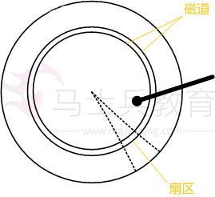

---

B-Tree中一次检索最多需要h-1次I/O（根节点常驻内存），渐进复杂度为
O(h)=O(logdN)O(h)=O(logdN)。一般实际应用中，出度d是非常大的数字，通常超过100，因此h非常小
（通常不超过3）。
综上所述，用B-Tree作为索引结构效率是非常高的。
而红黑树这种结构，h明显要深的多。由于逻辑上很近的节点（父子）物理上可能很远，无法利用局部
性，所以红黑树的I/O渐进复杂度也为O(h)，效率明显比B-Tree差很多。
上文还说过，B+Tree更适合外存索引，原因和内节点出度d有关。从上面分析可以看到，d越大索引的性
能越好，而出度的上限取决于节点内key和data的大小：
dmax=floor(pagesize/(keysize+datasize+pointsize))dmax=floor(pagesize/(keysize+datasize+pointsi
ze))
floor表示向下取整。由于B+Tree内节点去掉了data域，因此可以拥有更大的出度，拥有更好的性能。
这一章从理论角度讨论了与索引相关的数据结构与算法问题，下一章将讨论B+Tree是如何具体实现为
MySQL中索引，同时将结合MyISAM和InnDB存储引擎介绍非聚集索引和聚集索引两种不同的索引实现
形式。
MySQL索引实现
 
在MySQL中，索引属于存储引擎级别的概念，不同存储引擎对索引的实现方式是不同的，本文主要讨论
MyISAM和InnoDB两个存储引擎的索引实现方式。
MyISAM索引实现
 
MyISAM引擎使用B+Tree作为索引结构，叶节点的data域存放的是数据记录的地址。下图是MyISAM索
引的原理图：
图8

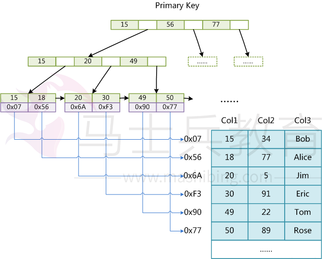

---

这里设表一共有三列，假设我们以Col1为主键，则图8是一个MyISAM表的主索引（Primary key）示
意。可以看出MyISAM的索引文件仅仅保存数据记录的地址。在MyISAM中，主索引和辅助索引
（Secondary key）在结构上没有任何区别，只是主索引要求key是唯一的，而辅助索引的key可以重
复。如果我们在Col2上建立一个辅助索引，则此索引的结构如下图所示：
图9
同样也是一颗B+Tree，data域保存数据记录的地址。因此，MyISAM中索引检索的算法为首先按照
B+Tree搜索算法搜索索引，如果指定的Key存在，则取出其data域的值，然后以data域的值为地址，读
取相应数据记录。
MyISAM的索引方式也叫做“非聚集”的，之所以这么称呼是为了与InnoDB的聚集索引区分。
InnoDB索引实现
 
虽然InnoDB也使用B+Tree作为索引结构，但具体实现方式却与MyISAM截然不同。
第一个重大区别是InnoDB的数据文件本身就是索引文件。从上文知道，MyISAM索引文件和数据文件是
分离的，索引文件仅保存数据记录的地址。而在InnoDB中，表数据文件本身就是按B+Tree组织的一个
索引结构，这棵树的叶节点data域保存了完整的数据记录。这个索引的key是数据表的主键，因此
InnoDB表数据文件本身就是主索引。

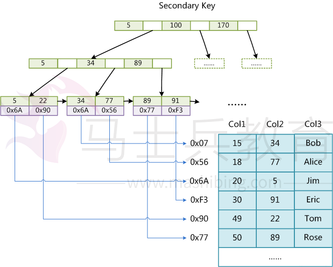

---

图10
图10是InnoDB主索引（同时也是数据文件）的示意图，可以看到叶节点包含了完整的数据记录。这种
索引叫做聚集索引。因为InnoDB的数据文件本身要按主键聚集，所以InnoDB要求表必须有主键
（MyISAM可以没有），如果没有显式指定，则MySQL系统会自动选择一个可以唯一标识数据记录的列
作为主键，如果不存在这种列，则MySQL自动为InnoDB表生成一个隐含字段作为主键，这个字段长度
为6个字节，类型为长整形。
第二个与MyISAM索引的不同是InnoDB的辅助索引data域存储相应记录主键的值而不是地址。换句话
说，InnoDB的所有辅助索引都引用主键作为data域。例如，图11为定义在Col3上的一个辅助索引：
图11
这里以英文字符的ASCII码作为比较准则。聚集索引这种实现方式使得按主键的搜索十分高效，但是辅助
索引搜索需要检索两遍索引：首先检索辅助索引获得主键，然后用主键到主索引中检索获得记录。
了解不同存储引擎的索引实现方式对于正确使用和优化索引都非常有帮助，例如知道了InnoDB的索引实
现后，就很容易明白为什么不建议使用过长的字段作为主键，因为所有辅助索引都引用主索引，过长的
主索引会令辅助索引变得过大。再例如，用非单调的字段作为主键在InnoDB中不是个好主意，因为
InnoDB数据文件本身是一颗B+Tree，非单调的主键会造成在插入新记录时数据文件为了维持B+Tree的
特性而频繁的分裂调整，十分低效，而使用自增字段作为主键则是一个很好的选择。
下一章将具体讨论这些与索引有关的优化策略。
索引使用策略及优化
 
MySQL的优化主要分为结构优化（Scheme optimization）和查询优化（Query optimization）。本章
讨论的高性能索引策略主要属于结构优化范畴。本章的内容完全基于上文的理论基础，实际上一旦理解
了索引背后的机制，那么选择高性能的策略就变成了纯粹的推理，并且可以理解这些策略背后的逻辑。

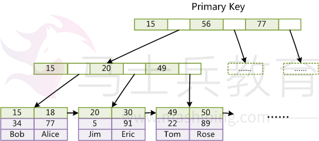

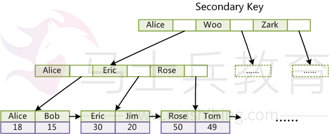

---

示例数据库
 
为了讨论索引策略，需要一个数据量不算小的数据库作为示例。本文选用MySQL官方文档中提供的示例
数据库之一：employees。这个数据库关系复杂度适中，且数据量较大。下图是这个数据库的E-R关系图
（引用自MySQL官方手册）：
图12
MySQL官方文档中关于此数据库的页面为http://dev.mysql.com/doc/employee/en/employee.html。
里面详细介绍了此数据库，并提供了下载地址和导入方法，如果有兴趣导入此数据库到自己的MySQL可
以参考文中内容。
最左前缀原理与相关优化
 
高效使用索引的首要条件是知道什么样的查询会使用到索引，这个问题和B+Tree中的“最左前缀原理”有
关，下面通过例子说明最左前缀原理。
这里先说一下联合索引的概念。在上文中，我们都是假设索引只引用了单个的列，实际上，MySQL中的
索引可以以一定顺序引用多个列，这种索引叫做联合索引，一般的，一个联合索引是一个有序元组<a1, 
a2, …, an>，其中各个元素均为数据表的一列，实际上要严格定义索引需要用到关系代数，但是这里我
不想讨论太多关系代数的话题，因为那样会显得很枯燥，所以这里就不再做严格定义。另外，单列索引
可以看成联合索引元素数为1的特例。
以employees.titles表为例，下面先查看其上都有哪些索引：

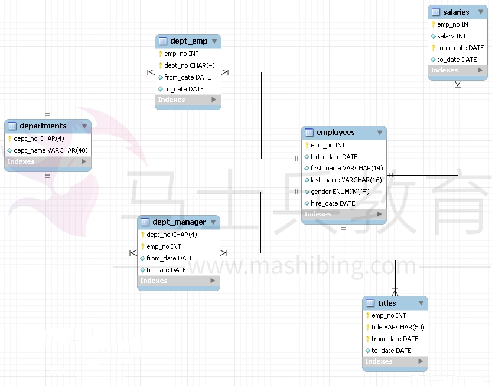

---

从结果中可以到titles表的主索引为<emp_no, title, from_date>，还有一个辅助索引<emp_no>。为了
避免多个索引使事情变复杂（MySQL的SQL优化器在多索引时行为比较复杂），这里我们将辅助索引
drop掉：
这样就可以专心分析索引PRIMARY的行为了。
情况一：全列匹配。
 
很明显，当按照索引中所有列进行精确匹配（这里精确匹配指“=”或“IN”匹配）时，索引可以被用到。这
里有一点需要注意，理论上索引对顺序是敏感的，但是由于MySQL的查询优化器会自动调整where子句
的条件顺序以使用适合的索引，例如我们将where中的条件顺序颠倒：
效果是一样的。
SHOW INDEX FROM employees.titles;+--------+------------+----------+--------------
+-------------+-----------+-------------+------+------------+| Table  | 
Non_unique | Key_name | Seq_in_index | Column_name | Collation | Cardinality | 
Null | Index_type |+--------+------------+----------+--------------+-------------
+-----------+-------------+------+------------+| titles |          0 | PRIMARY  | 
           1 | emp_no      | A         |        NULL |      | BTREE      || 
titles |          0 | PRIMARY  |            2 | title       | A         |        
NULL |      | BTREE      || titles |          0 | PRIMARY  |            3 | 
from_date   | A         |      443308 |      | BTREE      || titles |          1 
| emp_no   |            1 | emp_no      | A         |      443308 |      | BTREE 
     |+--------+------------+----------+--------------+-------------+-----------
+-------------+------+------------+
ALTER TABLE employees.titles DROP INDEX emp_no;
EXPLAIN SELECT * FROM employees.titles WHERE emp_no='10001' AND title='Senior 
Engineer' AND from_date='1986-06-26';+----+-------------+--------+-------+-------
--------+---------+---------+-------------------+------+-------+| id | 
select_type | table  | type  | possible_keys | key     | key_len | ref           
    | rows | Extra |+----+-------------+--------+-------+---------------+--------
-+---------+-------------------+------+-------+|  1 | SIMPLE      | titles | 
const | PRIMARY       | PRIMARY | 59      | const,const,const |    1 |       |+--
--+-------------+--------+-------+---------------+---------+---------+-----------
--------+------+-------+
EXPLAIN SELECT * FROM employees.titles WHERE from_date='1986-06-26' AND 
emp_no='10001' AND title='Senior Engineer';+----+-------------+--------+-------+-
--------------+---------+---------+-------------------+------+-------+| id | 
select_type | table  | type  | possible_keys | key     | key_len | ref           
    | rows | Extra |+----+-------------+--------+-------+---------------+--------
-+---------+-------------------+------+-------+|  1 | SIMPLE      | titles | 
const | PRIMARY       | PRIMARY | 59      | const,const,const |    1 |       |+--
--+-------------+--------+-------+---------------+---------+---------+-----------
--------+------+-------+

---

情况二：最左前缀匹配。
 
当查询条件精确匹配索引的左边连续一个或几个列时，如<emp_no>或<emp_no, title>，所以可以被用
到，但是只能用到一部分，即条件所组成的最左前缀。上面的查询从分析结果看用到了PRIMARY索引，
但是key_len为4，说明只用到了索引的第一列前缀。
情况三：查询条件用到了索引中列的精确匹配，但是中间某个条件未提供。
 
此时索引使用情况和情况二相同，因为title未提供，所以查询只用到了索引的第一列，而后面的
from_date虽然也在索引中，但是由于title不存在而无法和左前缀连接，因此需要对结果进行扫描过滤
from_date（这里由于emp_no唯一，所以不存在扫描）。如果想让from_date也使用索引而不是where
过滤，可以增加一个辅助索引<emp_no, from_date>，此时上面的查询会使用这个索引。除此之外，还
可以使用一种称之为“隔离列”的优化方法，将emp_no与from_date之间的“坑”填上。
首先我们看下title一共有几种不同的值：
只有7种。在这种成为“坑”的列值比较少的情况下，可以考虑用“IN”来填补这个“坑”从而形成最左前缀：
这次key_len为59，说明索引被用全了，但是从type和rows看出IN实际上执行了一个range查询，这里
检查了7个key。看下两种查询的性能比较：
EXPLAIN SELECT * FROM employees.titles WHERE emp_no='10001';+----+-------------+-
-------+------+---------------+---------+---------+-------+------+-------+| id | 
select_type | table  | type | possible_keys | key     | key_len | ref   | rows | 
Extra |+----+-------------+--------+------+---------------+---------+---------+--
-----+------+-------+|  1 | SIMPLE      | titles | ref  | PRIMARY       | PRIMARY 
| 4       | const |    1 |       |+----+-------------+--------+------+-----------
----+---------+---------+-------+------+-------+
EXPLAIN SELECT * FROM employees.titles WHERE emp_no='10001' AND from_date='1986-
06-26';+----+-------------+--------+------+---------------+---------+---------+--
-----+------+-------------+| id | select_type | table  | type | possible_keys | 
key     | key_len | ref   | rows | Extra       |+----+-------------+--------+----
--+---------------+---------+---------+-------+------+-------------+|  1 | SIMPLE 
     | titles | ref  | PRIMARY       | PRIMARY | 4       | const |    1 | Using 
where |+----+-------------+--------+------+---------------+---------+---------+--
-----+------+-------------+
SELECT DISTINCT(title) FROM employees.titles;+--------------------+| title       
       |+--------------------+| Senior Engineer    || Staff              || 
Engineer           || Senior Staff       || Assistant Engineer || Technique 
Leader   || Manager            |+--------------------+
EXPLAIN SELECT * FROM employees.titlesWHERE emp_no='10001'AND title IN ('Senior 
Engineer', 'Staff', 'Engineer', 'Senior Staff', 'Assistant Engineer', 'Technique 
Leader', 'Manager')AND from_date='1986-06-26';+----+-------------+--------+------
-+---------------+---------+---------+------+------+-------------+| id | 
select_type | table  | type  | possible_keys | key     | key_len | ref  | rows | 
Extra       |+----+-------------+--------+-------+---------------+---------+-----
----+------+------+-------------+|  1 | SIMPLE      | titles | range | PRIMARY   
    | PRIMARY | 59      | NULL |    7 | Using where |+----+-------------+--------
+-------+---------------+---------+---------+------+------+-------------+

---

“填坑”后性能提升了一点。如果经过emp_no筛选后余下很多数据，则后者性能优势会更加明显。当然，
如果title的值很多，用填坑就不合适了，必须建立辅助索引。
情况四：查询条件没有指定索引第一列。
 
由于不是最左前缀，索引这样的查询显然用不到索引。
情况五：匹配某列的前缀字符串。
 
此时可以用到索引，但是如果通配符不是只出现在末尾，则无法使用索引。（原文表述有误，如果通配
符%不出现在开头，则可以用到索引，但根据具体情况不同可能只会用其中一个前缀）
情况六：范围查询。
 
范围列可以用到索引（必须是最左前缀），但是范围列后面的列无法用到索引。同时，索引最多用于一
个范围列，因此如果查询条件中有两个范围列则无法全用到索引。
SHOW PROFILES;+----------+------------+------------------------------------------
-------------------------------------+| Query_ID | Duration   | Query             
                                                            |+----------+--------
----+----------------------------------------------------------------------------
---+|       10 | 0.00058000 | SELECT * FROM employees.titles WHERE emp_no='10001' 
AND from_date='1986-06-26'||       11 | 0.00052500 | SELECT * FROM 
employees.titles WHERE emp_no='10001' AND title IN ...          |+----------+----
--------+------------------------------------------------------------------------
-------+
EXPLAIN SELECT * FROM employees.titles WHERE from_date='1986-06-26';+----+-------
------+--------+------+---------------+------+---------+------+--------+---------
----+| id | select_type | table  | type | possible_keys | key  | key_len | ref  | 
rows   | Extra       |+----+-------------+--------+------+---------------+------
+---------+------+--------+-------------+|  1 | SIMPLE      | titles | ALL  | 
NULL          | NULL | NULL    | NULL | 443308 | Using where |+----+-------------
+--------+------+---------------+------+---------+------+--------+-------------+
EXPLAIN SELECT * FROM employees.titles WHERE emp_no='10001' AND title LIKE 
'Senior%';+----+-------------+--------+-------+---------------+---------+--------
-+------+------+-------------+| id | select_type | table  | type  | possible_keys 
| key     | key_len | ref  | rows | Extra       |+----+-------------+--------+---
----+---------------+---------+---------+------+------+-------------+|  1 | 
SIMPLE      | titles | range | PRIMARY       | PRIMARY | 56      | NULL |    1 | 
Using where |+----+-------------+--------+-------+---------------+---------+-----
----+------+------+-------------+
EXPLAIN SELECT * FROM employees.titles WHERE emp_no < '10010' and title='Senior 
Engineer';+----+-------------+--------+-------+---------------+---------+--------
-+------+------+-------------+| id | select_type | table  | type  | possible_keys 
| key     | key_len | ref  | rows | Extra       |+----+-------------+--------+---
----+---------------+---------+---------+------+------+-------------+|  1 | 
SIMPLE      | titles | range | PRIMARY       | PRIMARY | 4       | NULL |   16 | 
Using where |+----+-------------+--------+-------+---------------+---------+-----
----+------+------+-------------+

---

可以看到索引对第二个范围索引无能为力。这里特别要说明MySQL一个有意思的地方，那就是仅用
explain可能无法区分范围索引和多值匹配，因为在type中这两者都显示为range。同时，用了
“between”并不意味着就是范围查询，例如下面的查询：
看起来是用了两个范围查询，但作用于emp_no上的“BETWEEN”实际上相当于“IN”，也就是说emp_no实
际是多值精确匹配。可以看到这个查询用到了索引全部三个列。因此在MySQL中要谨慎地区分多值匹配
和范围匹配，否则会对MySQL的行为产生困惑。
情况七：查询条件中含有函数或表达式。
 
很不幸，如果查询条件中含有函数或表达式，则MySQL不会为这列使用索引（虽然某些在数学意义上可
以使用）。例如：
虽然这个查询和情况五中功能相同，但是由于使用了函数left，则无法为title列应用索引，而情况五中用
LIKE则可以。再如：
 
EXPLAIN SELECT * FROM employees.titlesWHERE emp_no < '10010'AND title='Senior 
Engineer'AND from_date BETWEEN '1986-01-01' AND '1986-12-31';+----+-------------
+--------+-------+---------------+---------+---------+------+------+-------------
+| id | select_type | table  | type  | possible_keys | key     | key_len | ref  | 
rows | Extra       |+----+-------------+--------+-------+---------------+--------
-+---------+------+------+-------------+|  1 | SIMPLE      | titles | range | 
PRIMARY       | PRIMARY | 4       | NULL |   16 | Using where |+----+------------
-+--------+-------+---------------+---------+---------+------+------+------------
-+
EXPLAIN SELECT * FROM employees.titlesWHERE emp_no BETWEEN '10001' AND '10010'AND 
title='Senior Engineer'AND from_date BETWEEN '1986-01-01' AND '1986-12-31';+----
+-------------+--------+-------+---------------+---------+---------+------+------
+-------------+| id | select_type | table  | type  | possible_keys | key     | 
key_len | ref  | rows | Extra       |+----+-------------+--------+-------+-------
--------+---------+---------+------+------+-------------+|  1 | SIMPLE      | 
titles | range | PRIMARY       | PRIMARY | 59      | NULL |   16 | Using where 
|+----+-------------+--------+-------+---------------+---------+---------+------
+------+-------------+
EXPLAIN SELECT * FROM employees.titles WHERE emp_no='10001' AND left(title, 
6)='Senior';+----+-------------+--------+------+---------------+---------+-------
--+-------+------+-------------+| id | select_type | table  | type | 
possible_keys | key     | key_len | ref   | rows | Extra       |+----+-----------
--+--------+------+---------------+---------+---------+-------+------+-----------
--+|  1 | SIMPLE      | titles | ref  | PRIMARY       | PRIMARY | 4       | const 
|    1 | Using where |+----+-------------+--------+------+---------------+-------
--+---------+-------+------+-------------+
EXPLAIN SELECT * FROM employees.titles WHERE emp_no - 1='10000';+----+-----------
--+--------+------+---------------+------+---------+------+--------+-------------
+| id | select_type | table  | type | possible_keys | key  | key_len | ref  | 
rows   | Extra       |+----+-------------+--------+------+---------------+------
+---------+------+--------+-------------+|  1 | SIMPLE      | titles | ALL  | 
NULL          | NULL | NULL    | NULL | 443308 | Using where |+----+-------------
+--------+------+---------------+------+---------+------+--------+-------------+

---

显然这个查询等价于查询emp_no为10001的函数，但是由于查询条件是一个表达式，MySQL无法为其
使用索引。看来MySQL还没有智能到自动优化常量表达式的程度，因此在写查询语句时尽量避免表达式
出现在查询中，而是先手工私下代数运算，转换为无表达式的查询语句。
索引选择性与前缀索引
 
既然索引可以加快查询速度，那么是不是只要是查询语句需要，就建上索引？答案是否定的。因为索引
虽然加快了查询速度，但索引也是有代价的：索引文件本身要消耗存储空间，同时索引会加重插入、删
除和修改记录时的负担，另外，MySQL在运行时也要消耗资源维护索引，因此索引并不是越多越好。一
般两种情况下不建议建索引。
第一种情况是表记录比较少，例如一两千条甚至只有几百条记录的表，没必要建索引，让查询做全表扫
描就好了。至于多少条记录才算多，这个个人有个人的看法，我个人的经验是以2000作为分界线，记录
数不超过 2000可以考虑不建索引，超过2000条可以酌情考虑索引。
另一种不建议建索引的情况是索引的选择性较低。所谓索引的选择性（Selectivity），是指不重复的索引
值（也叫基数，Cardinality）与表记录数（#T）的比值：
Index Selectivity = Cardinality / #T
显然选择性的取值范围为(0, 1]，选择性越高的索引价值越大，这是由B+Tree的性质决定的。例如，上文
用到的employees.titles表，如果title字段经常被单独查询，是否需要建索引，我们看一下它的选择性：
title的选择性不足0.0001（精确值为0.00001579），所以实在没有什么必要为其单独建索引。
有一种与索引选择性有关的索引优化策略叫做前缀索引，就是用列的前缀代替整个列作为索引key，当前
缀长度合适时，可以做到既使得前缀索引的选择性接近全列索引，同时因为索引key变短而减少了索引文
件的大小和维护开销。下面以employees.employees表为例介绍前缀索引的选择和使用。
从图12可以看到employees表只有一个索引<emp_no>，那么如果我们想按名字搜索一个人，就只能全
表扫描了：
如果频繁按名字搜索员工，这样显然效率很低，因此我们可以考虑建索引。有两种选择，建
<first_name>或<first_name, last_name>，看下两个索引的选择性：
<first_name>显然选择性太低，<first_name, last_name>选择性很好，但是first_name和last_name加
起来长度为30，有没有兼顾长度和选择性的办法？可以考虑用first_name和last_name的前几个字符建
立索引，例如<first_name, left(last_name, 3)>，看看其选择性：
SELECT count(DISTINCT(title))/count(*) AS Selectivity FROM employees.titles;+----
---------+| Selectivity |+-------------+|      0.0000 |+-------------+
EXPLAIN SELECT * FROM employees.employees WHERE first_name='Eric' AND 
last_name='Anido';+----+-------------+-----------+------+---------------+------+-
--------+------+--------+-------------+| id | select_type | table     | type | 
possible_keys | key  | key_len | ref  | rows   | Extra       |+----+-------------
+-----------+------+---------------+------+---------+------+--------+------------
-+|  1 | SIMPLE      | employees | ALL  | NULL          | NULL | NULL    | NULL | 
300024 | Using where |+----+-------------+-----------+------+---------------+----
--+---------+------+--------+-------------+
SELECT count(DISTINCT(first_name))/count(*) AS Selectivity FROM 
employees.employees;+-------------+| Selectivity |+-------------+|      0.0042 
|+-------------+SELECT count(DISTINCT(concat(first_name, last_name)))/count(*) AS 
Selectivity FROM employees.employees;+-------------+| Selectivity |+-------------
+|      0.9313 |+-------------+

---

选择性还不错，但离0.9313还是有点距离，那么把last_name前缀加到4：
这时选择性已经很理想了，而这个索引的长度只有18，比<first_name, last_name>短了接近一半，我们
把这个前缀索引 建上：
此时再执行一遍按名字查询，比较分析一下与建索引前的结果：
性能的提升是显著的，查询速度提高了120多倍。
前缀索引兼顾索引大小和查询速度，但是其缺点是不能用于ORDER BY和GROUP BY操作，也不能用于
Covering index（即当索引本身包含查询所需全部数据时，不再访问数据文件本身）。
InnoDB的主键选择与插入优化
 
在使用InnoDB存储引擎时，如果没有特别的需要，请永远使用一个与业务无关的自增字段作为主键。
经常看到有帖子或博客讨论主键选择问题，有人建议使用业务无关的自增主键，有人觉得没有必要，完
全可以使用如学号或身份证号这种唯一字段作为主键。不论支持哪种论点，大多数论据都是业务层面
的。如果从数据库索引优化角度看，使用InnoDB引擎而不使用自增主键绝对是一个糟糕的主意。
上文讨论过InnoDB的索引实现，InnoDB使用聚集索引，数据记录本身被存于主索引（一颗B+Tree）的
叶子节点上。这就要求同一个叶子节点内（大小为一个内存页或磁盘页）的各条数据记录按主键顺序存
放，因此每当有一条新的记录插入时，MySQL会根据其主键将其插入适当的节点和位置，如果页面达到
装载因子（InnoDB默认为15/16），则开辟一个新的页（节点）。
如果表使用自增主键，那么每次插入新的记录，记录就会顺序添加到当前索引节点的后续位置，当一页
写满，就会自动开辟一个新的页。如下图所示：
SELECT count(DISTINCT(concat(first_name, left(last_name, 3))))/count(*) AS 
Selectivity FROM employees.employees;+-------------+| Selectivity |+-------------
+|      0.7879 |+-------------+
SELECT count(DISTINCT(concat(first_name, left(last_name, 4))))/count(*) AS 
Selectivity FROM employees.employees;+-------------+| Selectivity |+-------------
+|      0.9007 |+-------------+
ALTER TABLE employees.employeesADD INDEX `first_name_last_name4` (first_name, 
last_name(4));
SHOW PROFILES;+----------+------------+------------------------------------------
---------------------------------------+| Query_ID | Duration   | Query           
                                                                |+----------+----
--------+------------------------------------------------------------------------
---------+|       87 | 0.11941700 | SELECT * FROM employees.employees WHERE 
first_name='Eric' AND last_name='Anido' ||       90 | 0.00092400 | SELECT * FROM 
employees.employees WHERE first_name='Eric' AND last_name='Anido' |+----------+--
----------+----------------------------------------------------------------------
-----------+

---

图13
这样就会形成一个紧凑的索引结构，近似顺序填满。由于每次插入时也不需要移动已有数据，因此效率
很高，也不会增加很多开销在维护索引上。
如果使用非自增主键（如果身份证号或学号等），由于每次插入主键的值近似于随机，因此每次新纪录
都要被插到现有索引页得中间某个位置：
图14
此时MySQL不得不为了将新记录插到合适位置而移动数据，甚至目标页面可能已经被回写到磁盘上而从
缓存中清掉，此时又要从磁盘上读回来，这增加了很多开销，同时频繁的移动、分页操作造成了大量的
碎片，得到了不够紧凑的索引结构，后续不得不通过OPTIMIZE TABLE来重建表并优化填充页面。
因此，只要可以，请尽量在InnoDB上采用自增字段做主键。
后记
 
其实数据库索引调优是一项技术活，不能仅仅靠理论，因为实际情况千变万化，而且MySQL本身存在很
复杂的机制，如查询优化策略和各种引擎的实现差异等都会使情况变得更加复杂。但同时这些理论是索
引调优的基础，只有在明白理论的基础上，才能对调优策略进行合理推断并了解其背后的机制，然后结
合实践中不断的实验和摸索，从而真正达到高效使用MySQL索引的目的。
另外，MySQL索引及其优化涵盖范围非常广，本文只是涉及到其中一部分。如与排序（ORDER BY）相
关的索引优化及覆盖索引（Covering index）的话题本文并未涉及，同时除B-Tree索引外MySQL还根据
不同引擎支持的哈希索引、全文索引等等本文也并未涉及。如果有机会，希望再对本文未涉及的部分进
行补充吧。
 
 
 
 
mysql的锁--行锁，表锁，乐观锁，悲观锁

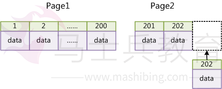

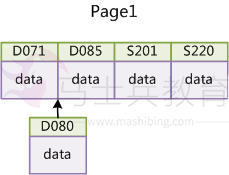

---

一 引言--为什么mysql提供了锁
  最近看到了mysql有行锁和表锁两个概念，越想越疑惑。为什么mysql要提供锁机制，而且这种机制
不是一个摆设，还有很多人在用。在现代数据库里几乎有事务机制，acid的机制应该能解决并发调度的
问题了，为什么还要主动加锁呢？
  后来看到一篇，“防止更新丢失，并不能单靠数据库事务控制器来解决，需要应用程序对要更新的数
据加必要的锁来解决”。瞬间，世界观都崩塌了。非常不敢相信，于是自己写了代码检验一下。
  数据库表是这样的。用count字段来做100次累加。
  为了保证实验的科学性，先确认了数据库是InnoDB的，这样才有事务机制；也确认了隔离性级别
定义一个任务，读count值--程序count++--写数据库
 
public class LostUpdate implements Runnable{
    private CountDownLatch countDown;
    public LostUpdate(CountDownLatch countDown){
        this.countDown = countDown;
    }
    
    @Override
    public void run() {
        Connection conn=null;
        try {
            Class.forName("com.mysql.jdbc.Driver");
            conn = DriverManager.getConnection("jdbc:mysql://localhost:3306/test?
useUnicode=true&characterEncoding=UTF-8",
                    "root", "123");
        } catch (Exception e) {
            e.printStackTrace();
            return;
        }
        
        try {
            conn.setAutoCommit(false);
            //不加锁的情况
            PreparedStatement ps =conn.prepareStatement("select * from LostUpdate 
where id =1");
            //加锁的情况
            //PreparedStatement ps =conn.prepareStatement("select * from 
LostUpdate where id =1 for update");
            ResultSet rs=ps.executeQuery();
            int count = 0;
            while(rs.next()){
                count= rs.getInt("count");

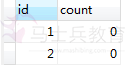

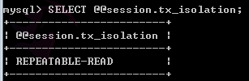

---

主线程下创建子线程，模拟多线程环境
 
 
运行结果是：
            }
            
            count++;
            ps =conn.prepareStatement("update LostUpdate set count=? where id 
=1");
            ps.setInt(1, count);
            ps.executeUpdate();
            
            conn.commit();
        } catch (Exception e) {
            try {
                conn.rollback();
            } catch (SQLException e1) {
                e1.printStackTrace();
            }
            e.printStackTrace();
        }
        //表示一次任务完成
        countDown.countDown();
    }
}
public class TestLock {    
    public static void main(String[] args) throws InterruptedException {
        //创建线程池，里面有10个线程，共执行100次+1操作
        final int THREAD_COUNT=10;
        final int RUN_TIME=100;
        
        ExecutorService threadPool=Executors.newFixedThreadPool(THREAD_COUNT);
        //用CountDownLatch保证主线程等待所有任务完成
        CountDownLatch count=new CountDownLatch(RUN_TIME);
        
        for(int i=0;i<RUN_TIME;i++)
            threadPool.execute(new LostUpdate(count));
        
        threadPool.shutdown();
        count.await();
        //提示所有任务执行完
        System.out.println("finish");
    }
}

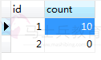

---

大概解释一下程序，就是创建了一个线程池，里面10个线程，执行100次任务。每个任务就是 读
count值--程序count++--写数据库，经典的银行存款（丢失修改）问题。事实胜于雄辩，结论就是上面
的橙色字，解决丢失修改不能靠事务，要加必要的锁，所以数据库提供的锁不是个摆设。
 
二 数据库事务机制
  为了找到问题的根源，为了拯救我崩溃的世界观，我又去回顾了数据库事务的知识。
  数据库的acid属性
原性性（Actomicity）：事务是一个原子操作单元，其对数据的修改，要么全都执行，要么全都不
执行。
一致性（Consistent）：在事务开始和完成时，数据都必须保持一致状态。这意味着所有相关的数
据规则都必须应用于事务的修改，以操持完整性；事务结束时，所有的内部数据结构（如B树索引
或双向链表）也都必须是正确的。
隔离性（Isolation）：数据库系统提供一定的隔离机制，保证事务在不受外部并发操作影响的“独
立”环境执行。这意味着事务处理过程中的中间状态对外部是不可见的，反之亦然。
持久性（Durable）：事务完成之后，它对于数据的修改是永久性的，即使出现系统故障也能够保
持。
  说好的一致性呢，童话里都是骗人的！！  
  事务并发调度的问题
1. 脏读（dirty read）：A事务读取B事务尚未提交的更改数据，并在这个数据基础上操作。如果B事
务回滚，那么A事务读到的数据根本不是合法的，称为脏读。在oracle中，由于有version控制，不
会出现脏读。
2. 不可重复读（unrepeatable read）：A事务读取了B事务已经提交的更改（或删除）数据。比如A
事务第一次读取数据，然后B事务更改该数据并提交，A事务再次读取数据，两次读取的数据不一
样。
3. 幻读（phantom read）：A事务读取了B事务已经提交的新增数据。注意和不可重复读的区别，这
里是新增，不可重复读是更改（或删除）。这两种情况对策是不一样的，对于不可重复读，只需要
采取行级锁防止该记录数据被更改或删除，然而对于幻读必须加表级锁，防止在这个表中新增一条
数据。
4. 第一类丢失更新：A事务撤销时，把已提交的B事务的数据覆盖掉。
5. 第二类丢失更新：A事务提交时，把已提交的B事务的数据覆盖掉。
  三级封锁协议
1. 一级封锁协议：事务T中如果对数据R有写操作，必须在这个事务中对R的第一次读操作前对它加X
锁，直到事务结束才释放。事务结束包括正常结束（COMMIT）和非正常结束（ROLLBACK）。
2. 二级封锁协议：一级封锁协议加上事务T在读取数据R之前必须先对其加S锁，读完后方可释放S锁。 
3. 三级封锁协议 ：一级封锁协议加上事务T在读取数据R之前必须先对其加S锁，直到事务结束才释
放。
  可见，三级锁操作一个比一个厉害（满足高级锁则一定满足低级锁）。但有个非常致命的地方，一
级锁协议就要在第一次读加x锁，直到事务结束。几乎就要在整个事务加写锁了，效率非常低。三级封锁
协议只是一个理论上的东西，实际数据库常用另一套方法来解决事务并发问题。
  隔离性级别
  mysql用意向锁（另一种机制）来解决事务并发问题，为了区别封锁协议，弄了一个新概念隔离性
级别：包括Read Uncommitted、Read Committed、Repeatable Read、Serializable。mysql 一般默
认Repeatable Read。

---

终于发现自己为什么会误会事务能解决丢失修改了。至于为什么隔离性级别不解决丢失修改，我猜
是有更好的解决方案吧。
  总结一下，repeatable read能解决脏读和不可重复读，但不嗯呢该解决丢失修改。
  
三 mysql的行锁和表锁
  说了那么久，终于入正题了，先来说说什么是行锁和表锁。
表级锁：每次操作锁住整张表。开销小，加锁快；不会出现死锁；锁定粒度大，发生锁冲突的概率
最高，并发度最低；
行级锁：每次操作锁住一行数据。开销大，加锁慢；会出现死锁；锁定粒度最小，发生锁冲突的概
率最低，并发度也最高；
页面锁：开销和加锁时间界于表锁和行锁之间；会出现死锁；锁定粒度界于表锁和行锁之间，并发
度一般。没弄懂，有空再看。？

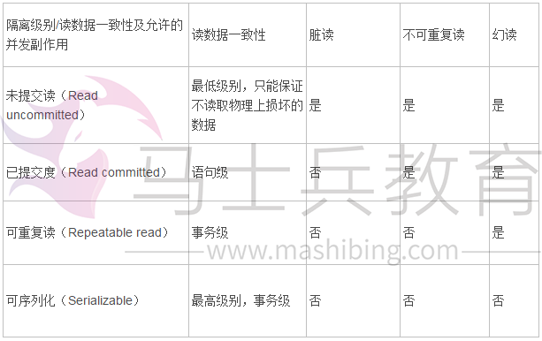

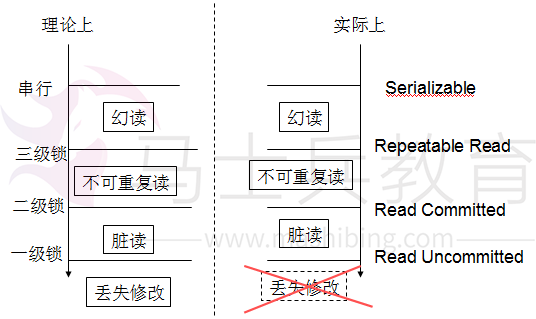

---

1 MyISAM的锁
  稍微提一下MyISAM，只说和InnoDB不同的。
  a. MyISAM只有表锁，锁又分为读锁和写锁。 
  b. 没有事务，不用考虑并发问题，世界和平~
  c. 由于锁的粒度太大，所以当该表写并发量较高时，要等待的查询就会很多了。
2 InnoDB的行锁和表锁
  没有特定的语法。mysql的行锁是通过索引体现的。
  如果where条件中只用到索引项，则加的是行锁；否则加的是表锁。比如说主键索引，唯一索引和
聚簇索引等。如果sql的where是全表扫描的，想加行锁也爱莫能助。
  行锁和表锁对我们编程有什么影响，要在where中尽量只用索引项，否则就会触发表锁。另一个可
能是，我们发疯了地想优化查询，但where子句中就是有非索引项，于是我们自己写连接？
  行锁和表锁各适合怎么样的应用，待求证？。
3 读锁和写锁
  InnoDB用意向锁？实现隔离性级别，原理未名，贴张图：

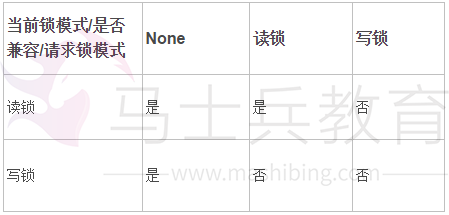

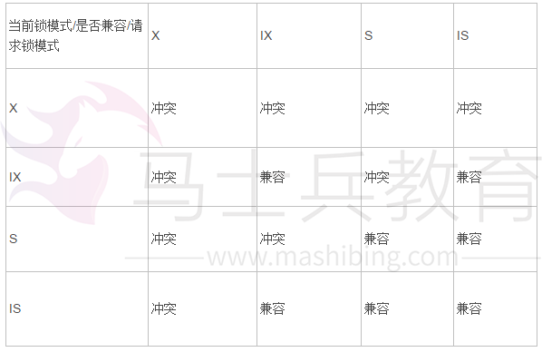

---

回想锁协议，对什么操作加什么锁是一个问题，加锁加到什么时候有是一个问题。锁协议里常常会
看到“加锁直到事务结束”的烦心字样。而在InnoDB中，select,insert,update,delete等语句执行时都会自
动加解锁。select的锁一般执行完就释放了，修改操作的X锁会持有到事务结束，效率高很多。至于详细
的加锁原理，见这里，搜“InnoDB存储引擎中不同SQL在不同隔离级别下锁比较”
  mysql也给用户提供了加锁的机会，只要在sql后加LOCK IN SHARE MODE 或FOR UPDATE
  共享锁（S）：SELECT * FROM table_name WHERE ... LOCK IN SHARE MODE
  排他锁（X）：SELECT * FROM table_name WHERE ... FOR UPDATE
  值得注意的是，自己加的锁没有释放锁的语句，所以锁会持有到事务结束。
  mysql 还提供了LOCK TABLES，UNLOCK TABLES，用于加表锁，怎么用还不太清楚？
4 考察加锁的情况
  加了读锁还是写锁，加了行锁还是表锁，说什么时候释放，可以从原理上分析。但刚开始时我不太
懂原理，于是又写了个程序。
 
public class ForUpdate1  implements Runnable{
    private CountDownLatch countDown;
    public ForUpdate1(CountDownLatch countDown){
        this.countDown = countDown;
    }
    @Override
    public void run() {
        Connection conn=null;
        try {
            Class.forName("com.mysql.jdbc.Driver");
            conn = DriverManager.getConnection("jdbc:mysql://localhost:3306/test?
useUnicode=true&characterEncoding=UTF-8",
                    "root", "123");
        } catch (Exception e) {
            e.printStackTrace();
            return;
        }
        
        try {
            conn.setAutoCommit(false);
            /*PreparedStatement ps =conn.prepareStatement("select * from 
LostUpdate where id =1 for update");
            ps.executeQuery();*/        
            PreparedStatement ps =conn.prepareStatement("update LostUpdate set 
count =1 where id =1");
            ps.executeUpdate();
            Thread.sleep(10000);
            
            conn.commit();
            System.out.println("test 1 finish");
            countDown.countDown();
        } catch (Exception e) {
            try {
                conn.rollback();
            } catch (SQLException e1) {
                e1.printStackTrace();
            }
            e.printStackTrace();

---

}    
    }
}
public class ForUpdate2  implements Runnable{
    private CountDownLatch countDown;
    public ForUpdate2(CountDownLatch countDown){
        this.countDown = countDown;
    }
    
    @Override
    public void run() {
        Connection conn=null;
        try {
            Class.forName("com.mysql.jdbc.Driver");
            conn = DriverManager.getConnection("jdbc:mysql://localhost:3306/test?
useUnicode=true&characterEncoding=UTF-8",
                    "root", "123");
        } catch (Exception e) {
            e.printStackTrace();
            return;
        }
        
        try {
            Thread.sleep(2000);
            conn.setAutoCommit(false);
            PreparedStatement ps =conn.prepareStatement("select * from LostUpdate 
where id =1 for update");
            ps.executeQuery();
            /*PreparedStatement ps =conn.prepareStatement("update LostUpdate set 
count =1 where id =1");
            ps.executeUpdate();*/        
            
            conn.commit();
            System.out.println("test 2 finish");
            countDown.countDown();
        } catch (Exception e) {
            try {
                conn.rollback();
            } catch (SQLException e1) {
                e1.printStackTrace();
            }
            e.printStackTrace();
        }    
    }
}
public class TestForUpdate {    
    public static void main(String[] args) throws InterruptedException {

---

只有两个线程，ForUpdate1先执行sql语句之后等10s，ForUpdate2先等待2s再执行sql语句。所以
如果ForUpdate1持有锁，而且ForUpdate2等待，输出就应该是test 1 finish->test 2 finish->finish；否
则就是test 2 finish->test 1 finish->finish。
  这个程序改一下能测试上面说的理论：
repeatable read能解决脏读和不可重复读
比如行锁真的只锁住一行
s，x，is和ix的关系
  判断加锁情况，mysql应该有工具，但没找到？
  可以通过检查InnoDB_row_lock状态变量来分析系统上的行锁的争夺情况：
  mysql> show status like 'innodb_row_lock%';
  如果发现锁争用比较严重，如InnoDB_row_lock_waits和InnoDB_row_lock_time_avg的值比较高，
还可以通过设置InnoDB Monitors来进一步观察发生锁冲突的表、数据行等，并分析锁争用的原因。不
明觉厉？，看这篇
  总结一下这一章，mysql提供了行锁和表锁，我们写语句时应该尽量启动行锁，以提高效率；另一
方面，也说了一下读锁和写锁的原理。好了武器（原理）我们都懂了，那就看怎么优化了。
 
四 解决丢失修改--乐观锁和悲观锁
        final int THREAD_COUNT=10;
        
        ExecutorService threadPool=Executors.newFixedThreadPool(THREAD_COUNT);
        CountDownLatch count=new CountDownLatch(2);
        
        threadPool.execute(new ForUpdate1(count));
        threadPool.execute(new ForUpdate2(count));
        
        threadPool.shutdown();
        count.await();
        System.out.println("finish");
    }
}

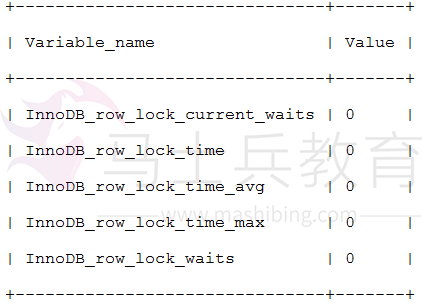

---

首先为什么要加锁，加锁就是为了解决丢失修改（也不知道这么说对不对）。如果一个事务中只有
一句sql，数据库是可以保证它是并发安全的。丢失修改的特征就是在一个事务中先读P数据，再写P数
据，注意是同一个数据（也不知道这么说对不对）。只是自己推理了一下，没有太强的理据。所谓丢失
修改，一般是A事务有两个操作，后一个操作依赖于前一个操作，之后后一个操作覆盖了B事务的写操
作，可以表示为这样。
 
  pro1可能是Read(P),Write(P),Read(Q),Write(Q),其中P=2Q，数据库中的冗余导致的关联关系是很常
见的。
1. pro1=Read(P)，就是我们结论中的情况；
2. pro1=Write(P)，pro1处会对P加IX锁？，IX锁会直至事务结束，不会丢失修改；
3. pro1=Read(Q)或Write(Q)，虽然语法上回发生这种情况，但既然数据时关联的，那在两个事务中
都应该同时操作P，Q。这样就规范到第一种情况。
  综上，如果一个事务先读后写同一份数据，就可能发生丢失修改，要做一些处理。可以用下面的乐
观锁和悲观锁解决。
  
  悲观锁和乐观锁的概念：
  悲观锁（Pessimistic Concurrency Control，PCC）：假定会发生并发冲突，屏蔽一切可能违反数
据完整性的操作。至于怎么加锁，加锁的范围也没讲。
  乐观锁（Optimistic Concurrency Control，OCC）：假设不会发生并发冲突，只在提交操作时检
查是否违反数据完整性。也没具体指定怎么检查。
  就是这么概念，什么都不说清楚。毕竟乐观锁和悲观锁也不仅仅能用在数据库中，也能用在线程
中。
  悲观的缺陷是不论是页锁还是行锁，加锁的时间可能会很长，这样可能会长时间的限制其他用户的
访问，也就是说悲观锁的并发访问性不好。
  乐观锁不能解决脏读，加锁的时间要比悲观锁短（只是在执行sql时加了基本的锁保证隔离性级
别），乐观锁可以用较大的锁粒度获得较好的并发访问性能。但是如果第二个用户恰好在第一个用户提
交更改之前读取了该对象，那么当他完成了自己的更改进行提交时，数据库就会发现该对象已经变化
了，这样，第二个用户不得不重新读取该对象并作出更改。
  可见，乐观锁更适合解决冲突概率极小的情况；而悲观锁则适合解决并发竞争激烈的情况，尽量用
行锁，缩小加锁粒度，以提高并发处理能力，即便加行锁的时间比加表锁的要长。
  
  悲观锁的例子
  并没有人说悲观锁要怎么加锁，加锁的范围如何。这里仅仅提供一种解决丢失修改的悲观锁例子。
  丢失修改我们用第一章讲到的累积100次的例子。综合前面讲到的结论，丢失修改的特征就是在一
个事务中先读P数据，再写P数据。而且一级锁协议能解决丢失修改，所以如果事务A 中写P，我们只要
在A中第一次读P前加X锁。做法在第一章程序中有：

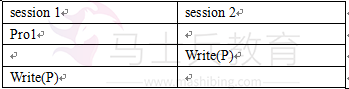

---

乐观锁的例子
  乐观锁也没有指定怎么检测并发冲突，下面是常见的两种做法：
1. 使用数据版本（Version）。在P数据上（通常每一行）加version字段(int)，A事务在读数据P 时同
时读出版本号，在修改数据前检测最新版本号是否等于先前取出的版本号，如果是，则修改，同时
把版本号+1；否则要么回滚，要么重新执行事务。另外，数据P的所有修改操作都要把版本号+1。
有一个非常重要的点，版本号是用来查看被读的变量有无变化，而不是针对被写的变量，作用是防
止被依赖的变量有修改。
2. 使用时间戳(TimeStamp)。做法类似于1中。
  下面写两个例子，背景还是一开始的累积100次的丢失修改问题，都是用version解决的。
  1 当发生冲突时回滚并抛异常
  任务类
 
//把
PreparedStatement ps =conn.prepareStatement("select * from LostUpdate where id 
=1");
//换成
PreparedStatement ps =conn.prepareStatement("select * from LostUpdate where id =1 
for update");
public class LostUpdateOccDiscard implements Runnable{
    private CountDownLatch countDown;
    public LostUpdateOccDiscard(CountDownLatch countDown){
        this.countDown = countDown;
    }
    
    @Override
    public void run() {
        Connection conn=null;
        try {
            Class.forName("com.mysql.jdbc.Driver");
            conn = DriverManager.getConnection("jdbc:mysql://localhost:3306/test?
useUnicode=true&characterEncoding=UTF-8",
                    "root", "123");
        } catch (Exception e) {
            e.printStackTrace();
            return;
        }
        
        try {
            conn.setAutoCommit(false);
            //读的时候一并读出version
            PreparedStatement ps =conn.prepareStatement("select * from LostUpdate 
where id =1");
            ResultSet rs=ps.executeQuery();
            int count = 0;
            int version = 0;
            while(rs.next()){
                count= rs.getInt("count");
                version= rs.getInt("version");

---

主线程，和前面差不多，创建10个线程，执行100个任务。
            }
            
            count++;
            
            //更新操作，用cas原子操作来更新
            ps =conn.prepareStatement("update LostUpdate set count=?, 
version=version+1 where id =1 and version=?");
            ps.setInt(1, count);
            ps.setInt(2, version);
            int result = ps.executeUpdate();
            
            //检查有无因冲突导致执行失败
            //成功，则commit，完成任务
            if(result>0) {    
                conn.commit();
            }
            //失败，回滚，抛异常提醒调用者出现冲突。
            else{
                conn.rollback();
                throw new Exception("更新count出现冲突");
            }            
        } catch (SQLException e) {
            try {
                conn.rollback();
            } catch (SQLException e1) {
                e1.printStackTrace();
            }
            e.printStackTrace();
        }
        catch (Exception e) {
            System.out.println(e.getMessage());
        }
        //表示一次任务完成
        countDown.countDown();
    }
}
public class TestLockOcc {    
    public static void main(String[] args) throws InterruptedException {
        //创建线程池，里面有10个线程，共执行100次+1操作
        final int THREAD_COUNT=10;
        final int RUN_TIME=100;
        
        ExecutorService threadPool=Executors.newFixedThreadPool(THREAD_COUNT);
        //用CountDownLatch保证主线程等待所有任务完成
        CountDownLatch count=new CountDownLatch(RUN_TIME);
        
        for(int i=0;i<RUN_TIME;i++)
            threadPool.execute(new LostUpdateOccDiscard(count));
        
        threadPool.shutdown();
        count.await();
        //提示所有任务执行完

---

输出结果：在console里出了一堆异常，看数据库，大概累积了10-12次
  不要怀疑，程序没有问题。
  a. 对着上面说的version方法的原理，程序也比较好懂。
  b. 更新时要用cas（compare and set）的原子操作，一步搞定。而不是先读一次version，比较完
再执行依据update。想想也知道后者在多线程有问题。
  至于为什么只累积了10-12次，原因是这个累加的并发量是10，就是有10个线程在争夺着修改权。九
死一生啊，1个线程commit了，就意味着9个线程要rollback抛异常。
  2 当发生冲突时重试，有时我们我们不希望程序里那么多异常
  任务类  
 
        System.out.println("finish");
    }
}
public class LostUpdateOcc implements Runnable{
    private CountDownLatch countDown;
    public LostUpdateOcc(CountDownLatch countDown){
        this.countDown = countDown;
    }
    
    @Override
    public void run() {
        Connection conn=null;
        try {
            Class.forName("com.mysql.jdbc.Driver");
            conn = DriverManager.getConnection("jdbc:mysql://localhost:3306/test?
useUnicode=true&characterEncoding=UTF-8",
                    "root", "123");
        } catch (Exception e) {
            e.printStackTrace();
            return;
        }
        
        try {            
            int try_times=100;
            int count;
            int version;    
            PreparedStatement ps;
            ResultSet rs;
            
            //把循环条件放在里面if里
            while(try_times>0){
                //开始事务
                try_times--;
                conn.setAutoCommit(false);
                
                //读操作
                ps=conn.prepareStatement("select * from LostUpdate where id 
=1");

---

主线程，和前面差不多，创建10个线程，执行100个任务。
                rs=ps.executeQuery();
                
                //判断事务执行的条件，首先是能执行，其次是需要执行
                if(rs.next()){
                    count= rs.getInt("count");
                    version= rs.getInt("version");
                    
                    count++;
                    
                    //更新操作，用cas原子操作来更新
                    ps =conn.prepareStatement("update LostUpdate set count=?, 
version=version+1 where id =1 and version=?");
                    ps.setInt(1, count);
                    ps.setInt(2, version);
                    int result = ps.executeUpdate();
                    
                    //每次执行完更新操作，检测一次冲突
                    //成功，则继续事务
                    //失败，回滚，睡100ms，避开竞争。结束这次循环，开启新事务。
                    if(result==0) {    
                        conn.rollback();
                        Thread.sleep(100);
                        continue;
                    }
                    
                    //事务一路顺风，没遇到冲突，事务提交，跳出while
                    conn.commit();
                    break;
                }
                //作为while条件不成立时的处理，比如该行数据被删除。
                else{
                    conn.rollback();
                    break;
                }                                                            
            }
            if(try_times<=0) throw new Exception("冲突重试的此时过多，事务失败");
            System.out.println(try_times);
        } catch (SQLException e) {
            try {
                conn.rollback();
            } catch (SQLException e1) {
                e1.printStackTrace();
            }
            e.printStackTrace();
        }catch (Exception e) {
            System.out.println(e.getMessage());
        }
        
        //表示一次任务完成
        countDown.countDown();
    }
}

---

任务类里就有比较多要注意的
  a.  为了不断的重试，用了一个while。因为while的终止条件一般要读了数据后才知道，所以while
只放了try_times，把结束条件放在了里面的if。
  b. 在while里的每一次循环就重新起一个事务。因为更新失败我们要回滚的。下一次要重起一个。
  c. 这里的事务执行条件，能执行且需要执行。比如id=1的记录被删掉了，那就不能执行了；需要执
行，比如程序为了把商品记录status由未上架改为已上架，但发现已经被改了，那就不需要执行。可想
而知，在多线程条件每次都要判断的。
  d. try_times这个东西还是设置一下。至于设多少，要看并发量。
  e. 每次更新，都要检测一次冲突
  f. 冲突了，要睡一阵子再重试，避开冲突。怎么设置这个值，我突然想起计网的拥塞控制，说笑的~
  顺手做了个小实验，还是执行100次，冲突睡眠100ms，
  
  总结一下：
  乐观锁更适合并发竞争少的情况，最好隔那么3-5分钟才有一次冲突。当并发量为10时就能明显感觉
乐观锁更慢；
  上面只是一读一写。考虑如果一个事务中有3个写，如果每次写都是九死一生，事务提交比小蝌蚪找
妈妈还难，这时就更要考虑是不是要用乐观锁了。
  但是，当分布式数据库规模大到一定程度后，又另说了。基于悲观锁的分布式锁在集群大到一定程
度后（从几百台扩展到几千台时），性能开销就打得无法接受。所以目前的趋势是大规模的分布式数据
库更倾向于用乐观锁来达成external consistency。
  
public class TestLockOcc {    
    public static void main(String[] args) throws InterruptedException {
        //创建线程池，里面有10个线程，共执行100次+1操作
        final int THREAD_COUNT=10;
        final int RUN_TIME=100;
        
        ExecutorService threadPool=Executors.newFixedThreadPool(THREAD_COUNT);
        //用CountDownLatch保证主线程等待所有任务完成
        CountDownLatch count=new CountDownLatch(RUN_TIME);
        
        for(int i=0;i<RUN_TIME;i++)
            threadPool.execute(new LostUpdateOcc(count));
        
        threadPool.shutdown();
        count.await();
        //提示所有任务执行完
        System.out.println("finish");
    }
}

---

Mysql中的MVCC
 
 
 Mysql到底是怎么实现MVCC的？这个问题无数人都在问，但google中并无答案，本文尝试从Mysql源
码中寻找答案。
 在Mysql中MVCC是在Innodb存储引擎中得到支持的，Innodb为每行记录都实现了三个隐藏字段：
 
6字节的事务ID（DB_TRX_ID  ）
7字节的回滚指针（DB_ROLL_PTR）
隐藏的ID
6字节的事物ID用来标识该行所述的事务，7字节的回滚指针需要了解下Innodb的事务模型。
1. Innodb的事务相关概念
 
为了支持事务，Innbodb引入了下面几个概念：
redo log
redo log就是保存执行的SQL语句到一个指定的Log文件，当Mysql执行recovery时重新执行redo 
log记录的SQL操作即可。当客户端执行每条SQL（更新语句）时，redo log会被首先写入log 
buffer；当客户端执行COMMIT命令时，log buffer中的内容会被视情况刷新到磁盘。redo log在磁
盘上作为一个独立的文件存在，即Innodb的log文件。
undo log
与redo log相反，undo log是为回滚而用，具体内容就是copy事务前的数据库内容（行）到undo 
buffer，在适合的时间把undo buffer中的内容刷新到磁盘。undo buffer与redo buffer一样，也
是环形缓冲，但当缓冲满的时候，undo buffer中的内容会也会被刷新到磁盘；与redo log不同的
是，磁盘上不存在单独的undo log文件，所有的undo log均存放在主ibd数据文件中（表空间），
即使客户端设置了每表一个数据文件也是如此。
rollback segment
回滚段这个概念来自Oracle的事物模型，在Innodb中，undo log被划分为多个段，具体某行的
undo log就保存在某个段中，称为回滚段。可以认为undo log和回滚段是同一意思。
锁
Innodb提供了基于行的锁，如果行的数量非常大，则在高并发下锁的数量也可能会比较大，据
Innodb文档说，Innodb对锁进行了空间有效优化，即使并发量高也不会导致内存耗尽。
对行的锁有分两种：排他锁、共享锁。共享锁针对对，排他锁针对写，完全等同读写锁的概念。如
果某个事务在更新某行（排他锁），则其他事物无论是读还是写本行都必须等待；如果某个事物读
某行（共享锁），则其他读的事物无需等待，而写事物则需等待。通过共享锁，保证了多读之间的
无等待性，但是锁的应用又依赖Mysql的事务隔离级别。
隔离级别
隔离级别用来限制事务直接的交互程度，目前有几个工业标准：
- READ_UNCOMMITTED：脏读
- READ_COMMITTED：读提交
- REPEATABLE_READ：重复读
- SERIALIZABLE：串行化
Innodb对四种类型都支持，脏读和串行化应用场景不多，读提交、重复读用的比较广泛，后面会
介绍其实现方式。

---

2. 行的更新过程
 
下面演示下事务对某行记录的更新过程：
1. 初始数据行
 
F1～F6是某行列的名字，1～6是其对应的数据。后面三个隐含字段分别对应该行的事务号和回滚指针，
假如这条数据是刚INSERT的，可以认为ID为1，其他两个字段为空。
2.事务1更改该行的各字段的值
 
当事务1更改该行的值时，会进行如下操作：
用排他锁锁定该行
记录redo log
把该行修改前的值Copy到undo log，即上图中下面的行
修改当前行的值，填写事务编号，使回滚指针指向undo log中的修改前的行
3.事务2修改该行的值
 
与事务1相同，此时undo log，中有有两行记录，并且通过回滚指针连在一起。

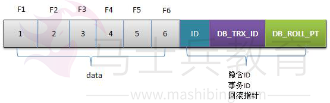

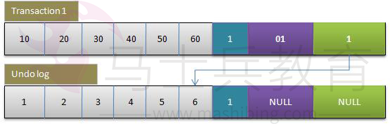

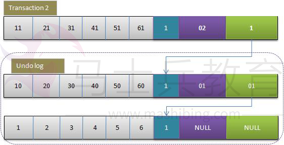

---

因此，如果undo log一直不删除，则会通过当前记录的回滚指针回溯到该行创建时的初始内容，所幸的
时在Innodb中存在purge线程，它会查询那些比现在最老的活动事务还早的undo log，并删除它们，从
而保证undo log文件不至于无限增长。
4. 事务提交
 
当事务正常提交时Innbod只需要更改事务状态为COMMIT即可，不需做其他额外的工作，而Rollback则
稍微复杂点，需要根据当前回滚指针从undo log中找出事务修改前的版本，并恢复。如果事务影响的行
非常多，回滚则可能会变的效率不高，根据经验值没事务行数在1000～10000之间，Innodb效率还是非
常高的。很显然，Innodb是一个COMMIT效率比Rollback高的存储引擎。据说，Postgress的实现恰好
与此相反。
5. Insert Undo log
 
上述过程确切地说是描述了UPDATE的事务过程，其实undo log分insert和update undo log，因为
insert时，原始的数据并不存在，所以回滚时把insert undo log丢弃即可，而update undo log则必须遵
守上述过程。
3. 事务级别
 
众所周知地是更新（update、insert、delete）是一个事务过程，在Innodb中，查询也是一个事务，只
读事务。当读写事务并发访问同一行数据时，能读到什么样的内容则依赖事务级别：
READ_UNCOMMITTED
读未提交时，读事务直接读取主记录，无论更新事务是否完成
READ_COMMITTED
读提交时，读事务每次都读取undo log中最近的版本，因此两次对同一字段的读可能读到不同的数
据（幻读），但能保证每次都读到最新的数据。
REPEATABLE_READ
每次都读取指定的版本，这样保证不会产生幻读，但可能读不到最新的数据
SERIALIZABLE
锁表，读写相互阻塞，使用较少
读事务一般有SELECT语句触发，在Innodb中保证其非阻塞，但带FOR UPDATE的SELECT除外，带FOR 
UPDATE的SELECT会对行加排他锁，等待更新事务完成后读取其最新内容。就整个Innodb的设计目标来
说，就是提供高效的、非阻塞的查询操作。
4. MVCC
 
上述更新前建立undo log，根据各种策略读取时非阻塞就是MVCC，undo log中的行就是MVCC中的多
版本，这个可能与我们所理解的MVCC有较大的出入，一般我们认为MVCC有下面几个特点：
每行数据都存在一个版本，每次数据更新时都更新该版本
修改时Copy出当前版本随意修改，个事务之间无干扰
保存时比较版本号，如果成功（commit），则覆盖原记录；失败则放弃copy（rollback）
就是每行都有版本号，保存时根据版本号决定是否成功，听起来含有乐观锁的味道。。。，而Innodb的
实现方式是：
事务以排他锁的形式修改原始数据
把修改前的数据存放于undo log，通过回滚指针与主数据关联
修改成功（commit）啥都不做，失败则恢复undo log中的数据（rollback）
二者最本质的区别是，当修改数据时是否要排他锁定，如果锁定了还算不算是MVCC？

---

Innodb的实现真算不上MVCC，因为并没有实现核心的多版本共存，undo log中的内容只是串行化的结
果，记录了多个事务的过程，不属于多版本共存。但理想的MVCC是难以实现的，当事务仅修改一行记
录使用理想的MVCC模式是没有问题的，可以通过比较版本号进行回滚；但当事务影响到多行数据时，
理想的MVCC据无能为力了。
比如，如果Transaciton1执行理想的MVCC，修改Row1成功，而修改Row2失败，此时需要回滚Row1，
但因为Row1没有被锁定，其数据可能又被Transaction2所修改，如果此时回滚Row1的内容，则会破坏
Transaction2的修改结果，导致Transaction2违反ACID。
理想MVCC难以实现的根本原因在于企图通过乐观锁代替二段提交。修改两行数据，但为了保证其一致
性，与修改两个分布式系统中的数据并无区别，而二提交是目前这种场景保证一致性的唯一手段。二段
提交的本质是锁定，乐观锁的本质是消除锁定，二者矛盾，故理想的MVCC难以真正在实际中被应用，
Innodb只是借了MVCC这个名字，提供了读的非阻塞而已。
5.总结
 
也不是说MVCC就无处可用，对一些一致性要求不高的场景和对单一数据的操作的场景还是可以发挥作
用的，比如多个事务同时更改用户在线数，如果某个事务更新失败则重新计算后重试，直至成功。这样
使用MVCC会极大地提高并发数，并消除线程锁。
 
 
 
 
 
mysql索引原理之聚簇索引
 
 
索引分为聚簇索引和非聚簇索引。
以一本英文课本为例，要找第8课，直接翻书，若先翻到第5课，则往后翻，再翻到第10课，则又往前
翻。这本书本身就是一个索引，即“聚簇索引”。
如果要找"fire”这个单词，会翻到书后面的附录，这个附录是按字母排序的，找到F字母那一块，再找
到"fire”，对应的会是它在第几课。这个附录，为“非聚簇索引”。
由此可见，聚簇索引，索引的顺序就是数据存放的顺序，所以，很容易理解，一张数据表只能有一个聚
簇索引。
聚簇索引要比非聚簇索引查询效率高很多，特别是范围查询的时候。所以，至于聚簇索引到底应该为主
键，还是其他字段，这个可以再讨论。
1、MYSQL的索引
mysql中，不同的存储引擎对索引的实现方式不同，大致说下MyISAM和InnoDB两种存储引擎。
MyISAM的B+Tree的叶子节点上的data，并不是数据本身，而是数据存放的地址。主索引和辅助索引没
啥区别，只是主索引中的key一定得是唯一的。这里的索引都是非聚簇索引。
MyISAM还采用压缩机制存储索引，比如，第一个索引为“her”，第二个索引为“here”，那么第二个索引
会被存储为“3,e”，这样的缺点是同一个节点中的索引只能采用顺序查找。

---

InnoDB的数据文件本身就是索引文件，B+Tree的叶子节点上的data就是数据本身，key为主键，这是聚
簇索引。非聚簇索引，叶子节点上的data是主键(所以聚簇索引的key，不能过长)。为什么存放的主键，
而不是记录所在地址呢，理由相当简单，因为记录所在地址并不能保证一定不会变，但主键可以保证。
至于为什么主键通常建议使用自增id呢？
2、聚簇索引
聚簇索引的数据的物理存放顺序与索引顺序是一致的，即：只要索引是相邻的，那么对应的数据一定也
是相邻地存放在磁盘上的。如果主键不是自增id，那么可以想象，它会干些什么，不断地调整数据的物
理地址、分页，当然也有其他一些措施来减少这些操作，但却无法彻底避免。但，如果是自增的，那就
简单了，它只需要一页一页地写，索引结构相对紧凑，磁盘碎片少，效率也高。
聚簇索引不但在检索上可以大大滴提高效率，在数据读取上也一样。比如：需要查询f~t的所有单词。
一个使用MyISAM的主索引，一个使用InnoDB的聚簇索引。两种索引的B+Tree检索时间一样，但读取时
却有了差异。
因为MyISAM的主索引并非聚簇索引，那么他的数据的物理地址必然是凌乱的，拿到这些物理地址，按
照合适的算法进行I/O读取，于是开始不停的寻道不停的旋转。聚簇索引则只需一次I/O。
不过，如果涉及到大数据量的排序、全表扫描、count之类的操作的话，还是MyISAM占优势些，因为索
引所占空间小，这些操作是需要在内存中完成的。
鉴于聚簇索引的范围查询效率，很多人认为使用主键作为聚簇索引太多浪费，毕竟几乎不会使用主键进
行范围查询。但若再考虑到聚簇索引的存储，就不好定论了。
 
 
 
 
学习笔记_mysql索引原理之B+/-Tree
 
索引，是为了更快的查询数据，查询算法有很多，对应的数据结构也不少，数据库常用的索引数据结构
一般为B+Tree。
1、B-Tree
关于B-Tree的官方定义个人觉得比较难懂，通俗一点就是举个例子。假如：一本英文字典，单词+详细
解释组成了一条记录，现在需要索引单词，那么以单词为key，单词+详细解释为data，B-Tree就是以一
个二元组{key,data}来定义一条记录。如果一个节点有3条记录，那么会有对应的4个指针，用以指向下
一个节点。B-Tree是有序且平衡的，所有叶子节点在同一层，即不会出现某个分支层级多，某个分支层
级少的情况。

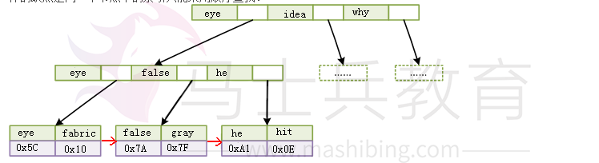

---

因为B-Tree是有序的，所以它的查找就简单了，先从根节点开始二分查找，找到则返回节点；否则沿着
区间指针查找下一个节点。比如，查询false这个单词。
2、B+Tree
与B-Tree不同的是，B+Tree每个节点只有key，没有data；而且叶子节点没有指针。也就是说B+Tree的
叶子节点和内节点的数据结构是不一样的。
一般数据库采用的是B+Tree，而且经过了一些优化，比如在叶子节点上增加了顺序访问指针，提高区间
查询效率。比如：查询首字母为f~t的所有单词。那么只需查到f开头的第一个单词fabric，然后沿着叶子
节点的开始遍历，直到找到最后一个以t开头的单词为止。
 
简单介绍了B-/+Tree，至于众多数据结构中，为何数据库索引选择BTree，而且选择B+Tree，下面从计
算机存储原理方面简单说说。
3、读内存和读磁盘
内存读取和磁盘读取的效率是相差很大的。
简单点说说内存读取，内存是由一系列的存储单元组成的，每个存储单元存储固定大小的数据，且有一
个唯一地址。
当需要读内存时，将地址信号放到地址总线上传给内存，内存解析信号并定位到存储单元，然后把该存
储单元上的数据放到数据总线上，回传。
写内存时，系统将要写入的数据和单元地址分别放到数据总线和地址总线上，内存读取两个总线的内
容，做相应的写操作。

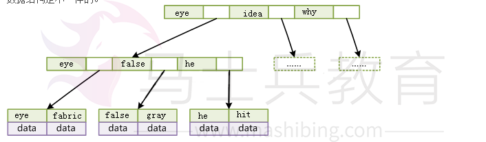

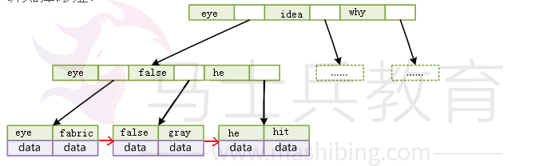

---

内存存取效率，跟次数有关，先读取A数据还是后读取A数据不会影响存取效率。而磁盘存取就不一样
了，磁盘I/O涉及机械操作。
磁盘是由大小相同且同轴的圆形盘片组成，磁盘可以转动(各个磁盘须同时转动)。磁盘的一侧有磁头支
架，磁头支架固定了一组磁头，每个磁头负责存取一个磁盘的内容。磁头不动，磁盘转动，但磁臂可以
前后动，用于读取不同磁道上的数据。磁道就是以盘片为中心划分出来的一系列同心环(如图标红那圈)。
磁道又划分为一个个小段，叫扇区，是磁盘的最小存储单元。
磁盘读取时，系统将数据逻辑地址传给磁盘，磁盘的控制电路会解析出物理地址，即哪个磁道哪个扇
区。于是磁头需要前后移动到对应的磁道，消耗的时间叫寻道时间，然后磁盘旋转将对应的扇区转到磁
头下，消耗的时间叫旋转时间。所以，适当的操作顺序和数据存放可以减少寻道时间和旋转时间。
为了尽量减少I/O操作，磁盘读取每次都会预读，大小通常为页的整数倍。即使只需要读取一个字节，磁
盘也会读取一页的数据(通常为4K)放入内存，内存与磁盘以页为单位交换数据。因为局部性原理认为，
通常一个数据被用到，其附近的数据也会立马被用到。
4、检索性能分析
B-Tree：如果一次检索需要访问4个节点，数据库系统设计者利用磁盘预读原理，把节点的大小设计为
一个页，那读取一个节点只需要一次I/O操作，完成这次检索操作，最多需要3次I/O(根节点常驻内存)。
数据记录越小，每个节点存放的数据就越多，树的高度也就越小，I/O操作就少了，检索效率也就上去
了。
B+Tree：内节点只存key，大大滴减少了内节点的大小，那么每个节点就可以存放更多的记录，树的更
矮了，I/O操作更少了。所以B+Tree拥有更好的性能。
5、其他索引方式
散列索引：通过HASH来定位的一种索引，这种索引用的较少，通过用于单值查询。InnoDB的自适应索
引就是HASH索引。
位图索引：字段值固定且少，比如性别、状态。在同时对多个这样的字段and/or查询时，效率极高，直
接按位与/或就可以得到结果了。所以，应用范围局限。
 
 
关系型和非关系型数据库区别
 
关系型数据库：是指采用了关系模型(二维表格模型)来组织数据的数据库。
非关系型数据库：以键值对存储，且结构不固定.

---

步
骤
事务1
事务2
1
 
begin
2
 
delete from test
where a = 2;
3
begin
 
4
delete from test where a = 2; （事务1卡住）
 
5
提示出现死锁：ERROR 1213 (40001): Deadlock found when
trying to get lock; try restarting transaction
insert into test (id,
a) values (10, 2);
我的Mysql死锁排查过程（案例分析）
 
 
以前接触到的数据库死锁，都是批量更新时加锁顺序不一致而导致的死锁，但是上周却遇到了一个很难
理解的死锁。借着这个机会又重新学习了一下mysql的死锁知识以及常见的死锁场景。在多方调研以及
和同事们的讨论下终于发现了这个死锁问题的成因，收获颇多。虽然是后端程序员，我们不需要像DBA
一样深入地去分析与锁相关的源码，但是如果我们能够掌握基本的死锁排查方法，对我们的日常开发还
是大有裨益的。
死锁起因
 
先介绍一下数据库和表情况，因为涉及到公司内部真是的数据，所以以下都做了模拟，不会影响具体的
分析。
我们采用的是5.5版本的mysql数据库，事务隔离级别是默认的RR（Repeatable-Read），采用innodb
引擎。假设存在test表：
表的结构很简单，一个主键id，另一个唯一索引a。表里的数据如下：
出现死锁的操作如下：
然后我们可以通过 SHOW ENGINE INNODB STATUS; 来查看死锁日志：
CREATE TABLE `test` (
  `id` int(11) unsigned NOT NULL AUTO_INCREMENT,
  `a` int(11) unsigned DEFAULT NULL,
  PRIMARY KEY (`id`),
  UNIQUE KEY `a` (`a`)
)
mysql> select * from test;
+----+------+
| id | a    |
+----+------+
|  1 |    1 |
|  2 |    2 |
|  4 |    4 |
+----+------+
3 rows in set (0.00 sec)

---

分析
 
阅读死锁日志
 
遇到死锁，第一步就是阅读死锁日志。死锁日志通常分为两部分，上半部分说明了事务1在等待什么锁：
------------------------
LATEST DETECTED DEADLOCK
------------------------
170219 13:31:31
*** (1) TRANSACTION:
TRANSACTION 2A8BD, ACTIVE 11 sec starting index read
mysql tables in use 1, locked 1
LOCK WAIT 2 lock struct(s), heap size 376, 1 row lock(s)
MySQL thread id 448218, OS thread handle 0x2abe5fb5d700, query id 18923238 
renjun.fangcloud.net 121.41.41.92 root updating
delete from test where a = 2
*** (1) WAITING FOR THIS LOCK TO BE GRANTED:
RECORD LOCKS space id 0 page no 923 n bits 80 index `a` of table 
`oauthdemo`.`test` trx id 2A8BD lock_mode X waiting
Record lock, heap no 3 PHYSICAL RECORD: n_fields 2; compact format; info bits 32
 0: len 4; hex 00000002; asc     ;;
 1: len 4; hex 00000002; asc     ;;
 
*** (2) TRANSACTION:
TRANSACTION 2A8BC, ACTIVE 18 sec inserting
mysql tables in use 1, locked 1
4 lock struct(s), heap size 1248, 3 row lock(s), undo log entries 2
MySQL thread id 448217, OS thread handle 0x2abe5fd65700, query id 18923239 
renjun.fangcloud.net 121.41.41.92 root update
insert into test (id,a) values (10,2)
*** (2) HOLDS THE LOCK(S):
RECORD LOCKS space id 0 page no 923 n bits 80 index `a` of table 
`oauthdemo`.`test` trx id 2A8BC lock_mode X locks rec but not gap
Record lock, heap no 3 PHYSICAL RECORD: n_fields 2; compact format; info bits 32
 0: len 4; hex 00000002; asc     ;;
 1: len 4; hex 00000002; asc     ;;
 
*** (2) WAITING FOR THIS LOCK TO BE GRANTED:
RECORD LOCKS space id 0 page no 923 n bits 80 index `a` of table 
`oauthdemo`.`test` trx id 2A8BC lock mode S waiting
Record lock, heap no 3 PHYSICAL RECORD: n_fields 2; compact format; info bits 32
 0: len 4; hex 00000002; asc     ;;
 1: len 4; hex 00000002; asc     ;;
 
*** WE ROLL BACK TRANSACTION (1)

---

从日志里我们可以看到事务1当前正在执行 delete from test where a = 2 ，该条语句正在申请索引a的X
锁，所以提示 lock_mode X waiting 。
然后日志的下半部分说明了事务2当前持有的锁以及等待的锁：
从日志的 HOLDS THE LOCKS(S) 块中我们可以看到事务2持有索引a的X锁，并且是记录锁（Record 
Lock）。该锁是通过事务2在步骤2执行的delete语句申请的。由于是RR隔离模式下的基于唯一索引的等
值查询（Where a = 2），所以会申请一个记录锁，而非next-key锁。
从日志的 WAITING FOR THIS LOCK TO BE GRANTED 块中我们可以看到事务2正在申请S锁，也就是共
享锁。该锁是 insert into test (id,a) values (10,2) 语句申请的。 insert语句在普通情况下是会申请排他
锁，也就是X锁，但是这里出现了S锁。这是因为a字段是一个唯一索引，所以insert语句会在插入前进行
一次duplicate key的检查，为了使这次检查成功，需要申请S锁防止其他事务对a字段进行修改。
那么为什么该S锁会失败呢？这是 对同一个字段的锁的申请是需要排队的 。S锁前面还有一个未申请成功
的X锁，所以S锁必须等待，所以形成了循环等待，死锁出现了。
通过阅读死锁日志，我们可以清楚地知道两个事务形成了怎样的循环等待，再加以分析，就可以逆向推
断出循环等待的成因，也就是死锁形成的原因。
170219 13:31:31
*** (1) TRANSACTION:
TRANSACTION 2A8BD, ACTIVE 11 sec starting index read
mysql tables in use 1, locked 1
LOCK WAIT 2 lock struct(s), heap size 376, 1 row lock(s)
MySQL thread id 448218, OS thread handle 0x2abe5fb5d700, query id 18923238 
renjun.fangcloud.net 121.41.41.92 root updating
delete from test where a = 2
*** (1) WAITING FOR THIS LOCK TO BE GRANTED:
RECORD LOCKS space id 0 page no 923 n bits 80 index `a` of table 
`oauthdemo`.`test` trx id 2A8BD lock_mode X waiting
Record lock, heap no 3 PHYSICAL RECORD: n_fields 2; compact format; info bits 32
 0: len 4; hex 00000002; asc     ;;
 1: len 4; hex 00000002; asc     ;;
*** (2) TRANSACTION:
TRANSACTION 2A8BC, ACTIVE 18 sec inserting
mysql tables in use 1, locked 1
4 lock struct(s), heap size 1248, 3 row lock(s), undo log entries 2
MySQL thread id 448217, OS thread handle 0x2abe5fd65700, query id 18923239 
renjun.fangcloud.net 121.41.41.92 root update
insert into test (id,a) values (10,2)
*** (2) HOLDS THE LOCK(S):
RECORD LOCKS space id 0 page no 923 n bits 80 index `a` of table 
`oauthdemo`.`test` trx id 2A8BC lock_mode X locks rec but not gap
Record lock, heap no 3 PHYSICAL RECORD: n_fields 2; compact format; info bits 32
 0: len 4; hex 00000002; asc     ;;
 1: len 4; hex 00000002; asc     ;;
 
*** (2) WAITING FOR THIS LOCK TO BE GRANTED:
RECORD LOCKS space id 0 page no 923 n bits 80 index `a` of table 
`oauthdemo`.`test` trx id 2A8BC lock mode S waiting
Record lock, heap no 3 PHYSICAL RECORD: n_fields 2; compact format; info bits 32
 0: len 4; hex 00000002; asc     ;;
 1: len 4; hex 00000002; asc     ;;

---

步
骤
事务1
事务2
1
 
begin
2
 
delete from test where a = 2; 执行成功，事务2占有a=2
下的X锁，类型为记录锁。
3
begin
 
4
delete from test where a =
2; 事务1希望申请a=2下的X
锁，但是由于事务2已经申请
了一把X锁，两把X锁互斥，所
以X锁申请进入锁请求队列。
 
5
出现死锁，事务1权重较小，
所以被选择回滚（成为牺牲
品）。
insert into test (id, a) values (10, 2); 由于a字段建立了唯
一索引，所以需要申请S锁以便检查duplicate key，由于
插入的a的值还是2，所以排在X锁后面。但是前面的X锁
的申请只有在事务2commit或者rollback之后才能成功，
此时形成了循环等待，死锁产生。
死锁形成流程图
 
为了让大家更好地理解死锁形成的原因，我们再通过表格的形式阐述死锁形成的流程：
拓展
 
在排查死锁的过程中，有个同事还发现了上述场景会产生另一种死锁，该场景无法通过手工复现，只有
高并发场景下才有可能复现。
该死锁对应的日志这里就不贴出了，与上一个死锁的核心差别是事务2等待的锁从S锁换成了X锁，也就
是 lock_mode X locks gap before rec insert intention waiting 。我们还是通过表格来详细说明该死锁
产生的流程：

---

步
骤
事务1
事务2
1
 
begin
2
 
delete from test where a = 2; 执行成功，事务
2占有a=2下的X锁，类型为记录锁。
3
begin
 
4
 
【insert第1阶段】insert into test (id, a) values
(10, 2); 事务2申请S锁进行duplicate key进行检
查。检查成功。
5
delete from test where a = 2; 事务1
希望申请a=2下的X锁，但是由于事务2
已经申请了一把X锁，两把X锁互斥，所
以X锁申请进入锁请求队列。
 
6
出现死锁，事务1权重较小，所以被选
择回滚（成为牺牲品）。
【insert第2阶段】insert into test (id, a) values
(10, 2); 事务2开始插入数据，S锁升级为X锁，类
型为insert intention。同理，X锁进入队列排
队，形成循环等待，死锁产生。
总结
 
排查死锁时，首先需要根据死锁日志分析循环等待的场景，然后根据当前各个事务执行的SQL分析出加
锁类型以及顺序，逆向推断出如何形成循环等待，这样就能找到死锁产生的原因了。
 
 
 
MySql优化
 
MySQL 对于千万级的大表要怎么优化？
 
 
很多人第一反应是各种切分；我给的顺序是:
第一优化你的sql和索引；
第二加缓存，memcached,redis；
第三以上都做了后，还是慢，就做主从复制或主主复制，读写分离，可以在应用层做，效率高，也可以
用三方工具，第三方工具推荐360的atlas,其它的要么效率不高，要么没人维护；
第四如果以上都做了还是慢，不要想着去做切分，mysql自带分区表，先试试这个，对你的应用是透明
的，无需更改代码,但是sql语句是需要针对分区表做优化的，sql条件中要带上分区条件的列，从而使查
询定位到少量的分区上，否则就会扫描全部分区，另外分区表还有一些坑，在这里就不多说了；
第五如果以上都做了，那就先做垂直拆分，其实就是根据你模块的耦合度，将一个大的系统分为多个小
的系统，也就是分布式系统；

---

第六才是水平切分，针对数据量大的表，这一步最麻烦，最能考验技术水平，要选择一个合理的
sharding key,为了有好的查询效率，表结构也要改动，做一定的冗余，应用也要改，sql中尽量带
sharding key，将数据定位到限定的表上去查，而不是扫描全部的表；
mysql数据库一般都是按照这个步骤去演化的，成本也是由低到高；
有人也许要说第一步优化sql和索引这还用说吗？的确，大家都知道，但是很多情况下，这一步做的并不
到位，甚至有的只做了根据sql去建索引，根本没对sql优化（中枪了没？），除了最简单的增删改查
外，想实现一个查询，可以写出很多种查询语句，不同的语句，根据你选择的引擎、表中数据的分布情
况、索引情况、数据库优化策略、查询中的锁策略等因素，最终查询的效率相差很大；优化要从整体去
考虑，有时你优化一条语句后，其它查询反而效率被降低了，所以要取一个平衡点；即使精通mysql的
话，除了纯技术面优化，还要根据业务面去优化sql语句，这样才能达到最优效果；你敢说你的sql和索
引已经是最优了吗?
再说一下不同引擎的优化，myisam读的效果好，写的效率差，这和它数据存储格式，索引的指针和锁
的策略有关的，它的数据是顺序存储的（innodb数据存储方式是聚簇索引），他的索引btree上的节点
是一个指向数据物理位置的指针，所以查找起来很快，（innodb索引节点存的则是数据的主键，所以需
要根据主键二次查找）；myisam锁是表锁，只有读读之间是并发的，写写之间和读写之间（读和插入
之间是可以并发的，去设置concurrent_insert参数，定期执行表优化操作，更新操作就没有办法了）是
串行的，所以写起来慢，并且默认的写优先级比读优先级高，高到写操作来了后，可以马上插入到读操
作前面去，如果批量写，会导致读请求饿死，所以要设置读写优先级或设置多少写操作后执行读操作的
策略;myisam不要使用查询时间太长的sql，如果策略使用不当，也会导致写饿死，所以尽量去拆分查询
效率低的sql,
innodb一般都是行锁，这个一般指的是sql用到索引的时候，行锁是加在索引上的，不是加在数据记录
上的，如果sql没有用到索引，仍然会锁定表,mysql的读写之间是可以并发的，普通的select是不需要锁
的，当查询的记录遇到锁时，用的是一致性的非锁定快照读，也就是根据数据库隔离级别策略，会去读
被锁定行的快照，其它更新或加锁读语句用的是当前读，读取原始行；因为普通读与写不冲突，所以
innodb不会出现读写饿死的情况，又因为在使用索引的时候用的是行锁，锁的粒度小，竞争相同锁的情
况就少，就增加了并发处理，所以并发读写的效率还是很优秀的，问题在于索引查询后的根据主键的二
次查找导致效率低；
ps:很奇怪，为什innodb的索引叶子节点存的是主键而不是像mysism一样存数据的物理地址指针吗？如
果存的是物理地址指针不就不需要二次查找了吗，这也是我开始的疑惑，根据mysism和innodb数据存
储方式的差异去想，你就会明白了，我就不费口舌了！
所以innodb为了避免二次查找可以使用索引覆盖技术，无法使用索引覆盖的，再延伸一下就是基于索引
覆盖实现延迟关联；不知道什么是索引覆盖的，建议你无论如何都要弄清楚它是怎么回事！
尽你所能去优化你的sql吧！说它成本低，却又是一项费时费力的活，需要在技术与业务都熟悉的情况
下，用心去优化才能做到最优，优化后的效果也是立竿见影的！
 
 
 
产生死锁的必要条件
 
操作系统：死锁的产生、条件、和解锁
 
 
deadlocks（死锁）

---

所谓死锁: 是指两个或两个以上的进程在执行过程中,因争夺资源而造成的一种互相等待的现象,若无外力
作用,它们都将无法推进下去.此时称系统处于死锁状态或系统产生了死锁,这些永远在互相等竺的进程称
为死锁进程.
  由于资源占用是互斥的，当某个进程提出申请资源后，使得有关进程在无外力协助下，永远分配不
到必需的资源而无法继续运行，这就产生了一种特殊现象死锁。
  一种情形，此时执行程序中两个或多个线程发生永久堵塞（等待），每个线程都在等待被其他线程
占用并堵塞了的资源。例如，如果线程A锁住了记录1并等待记录2，而线程B锁住了记录2并等待记录1，
这样两个线程就发生了死锁现象。
  计算机系统中,如果系统的资源分配策略不当，更常见的可能是程序员写的程序有错误等，则会导致
进程因竞争资源不当而产生死锁的现象。
产生死锁的原因主要是：
 
  （1） 因为系统资源不足。
  （2） 进程运行推进的顺序不合适。
  （3） 资源分配不当等。
  如果系统资源充足，进程的资源请求都能够得到满足，死锁出现的可能性就很低，否则
  就会因争夺有限的资源而陷入死锁。其次，进程运行推进顺序与速度不同，也可能产生死锁。
产生死锁的四个必要条件：
 
  （1） 互斥条件：一个资源每次只能被一个进程使用。
  （2） 请求与保持条件：一个进程因请求资源而阻塞时，对已获得的资源保持不放。
  （3） 不剥夺条件:进程已获得的资源，在末使用完之前，不能强行剥夺。
  （4） 循环等待条件:若干进程之间形成一种头尾相接的循环等待资源关系。
  这四个条件是死锁的必要条件，只要系统发生死锁，这些条件必然成立，而只要上述条件之
  一不满足，就不会发生死锁。
死锁的解除与预防
 
  理解了死锁的原因，尤其是产生死锁的四个必要条件，就可以最大可能地避免、预防和解除死锁。
所以，在系统设计、进程调度等方面注意如何不让这四个必要条件成立，如何确定资源的合理分配算
法，避免进程永久占据系统资源。此外，也要防止进程在处于等待状态的情况下占用资源,在系统运行过
程中，对进程发出的每一个系统能够满足的资源申请进行动态检查，并根据检查结果决定是否分配资
源，若分配后系统可能发生死锁，则不予分配，否则予以分配 。因此，对资源的分配要给予合理的规
划。
  一、有序资源分配法
  这种算法资源按某种规则系统中的所有资源统一编号（例如打印机为1、磁带机为2、磁盘为3、等
等），申请时必须以上升的次序。系统要求申请进程：
  1、对它所必须使用的而且属于同一类的所有资源，必须一次申请完；
  2、在申请不同类资源时，必须按各类设备的编号依次申请。例如：进程PA，使用资源的顺序是
R1，R2； 进程PB，使用资源的顺序是R2，R1；若采用动态分配有可能形成环路条件，造成死锁。
  采用有序资源分配法：R1的编号为1，R2的编号为2；
  PA：申请次序应是：R1，R2

---

PB：申请次序应是：R1，R2
  这样就破坏了环路条件，避免了死锁的发生
  二、银行算法
  避免死锁算法中最有代表性的算法是Dijkstra E.W 于1968年提出的银行家算法：
  该算法需要检查申请者对资源的最大需求量，如果系统现存的各类资源可以满足申请者的请求，就
满足申请者的请求。
  这样申请者就可很快完成其计算，然后释放它占用的资源，从而保证了系统中的所有进程都能完
成，所以可避免死锁的发生。
死锁排除的方法
 
  1、撤消陷于死锁的全部进程；
  2、逐个撤消陷于死锁的进程，直到死锁不存在；
  3、从陷于死锁的进程中逐个强迫放弃所占用的资源，直至死锁消失。
  4、从另外一些进程那
 
 
 
 
Spring（连老师）
 
 
 
Spring 原理
 
它是一个全面的、企业应用开发一站式的解决方案，贯穿表现层、业务层、持久层。但是 Spring 仍然可
以和其他的框架无缝整合。
Spring 特点
 
轻量级    
控制反转   
面向切面  
容器    
框架集合

---

Spring 核心组件
 
Spring 常用模块

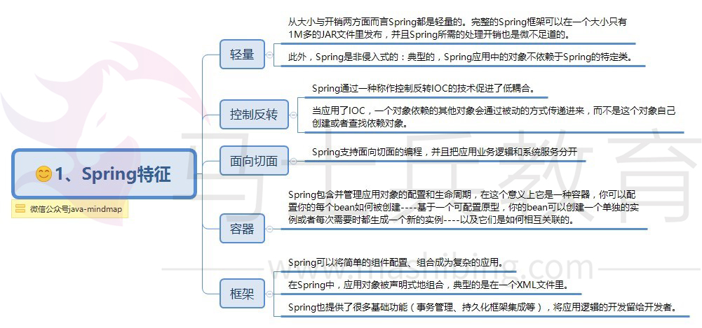

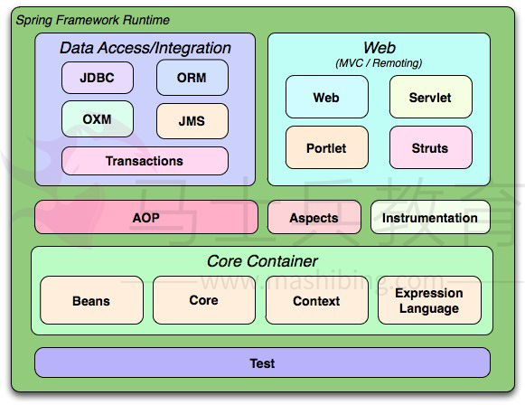

---

Spring 主要包

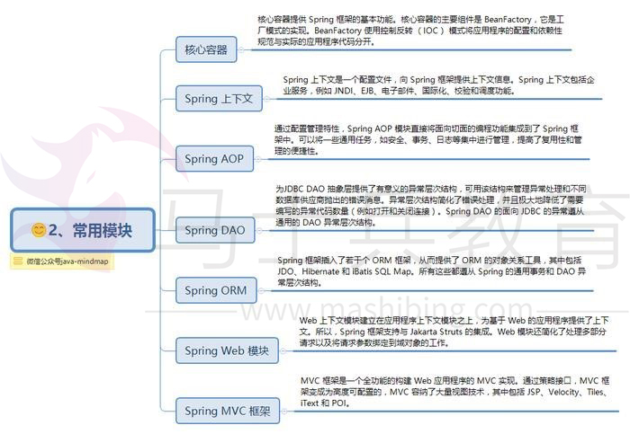

---

Spring 常用注解
 
bean 注入与装配的的方式有很多种，可以通过 xml，get set 方式，构造函数或者注解等。简单易用的
方式就是使用 Spring 的注解了，Spring 提供了大量的注解方式。

---

Spring 第三方结合
 
Spring IOC 原理
 
概念 
Spring 通过一个配置文件描述 Bean 及 Bean 之间的依赖关系，利用 Java 语言的反射功能实例化 Bean 
并建立 Bean 之间的依赖关系。 Spring 的 IoC 容器在完成这些底层工作的基础上，还提供了 Bean 实例
缓存、生命周期管理、 Bean 实例代理、事件发布、资源装载等高级服务。 
Spring容器高层视图

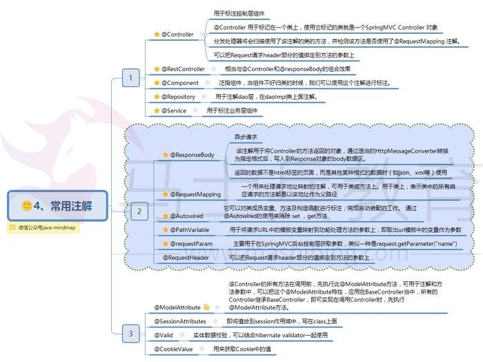

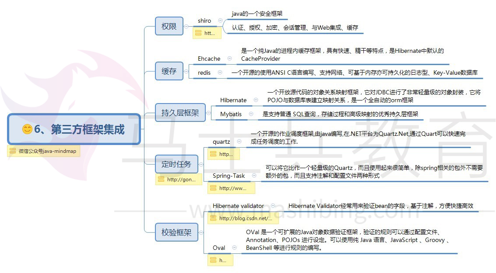

---

Spring 启动时读取应用程序提供的 Bean 配置信息，并在 Spring 容器中生成一份相应的 Bean 配置注册
表，然后根据这张注册表实例化 Bean，装配好 Bean 之间的依赖关系，为上层应用提供准备就绪的运行
环境。其中 Bean 缓存池为 HashMap 实现 
IOC 容器实现 
BeanFactory-框架基础设施 
BeanFactory 是 Spring 框架的基础设施，面向 Spring 本身；ApplicationContext 面向使用 Spring 框
架的开发者，几乎所有的应用场合我们都直接使用 ApplicationContext 而非底层的 BeanFactory。
1     BeanDefinitionRegistry注册表 
1. Spring 配置文件中每一个节点元素在 Spring 容器里都通过一个 BeanDefinition 对象表示，它描述
了 Bean 的配置信息。而 BeanDefinitionRegistry 接口提供了向容器手工注册 BeanDefinition 对
象的方法。 
2  BeanFactory 顶层接口 
2. 位于类结构树的顶端 ，它最主要的方法就是 getBean(String beanName)，该方法从容器中返回特
定名称的 Bean，BeanFactory 的功能通过其他的接口得到不断扩展：

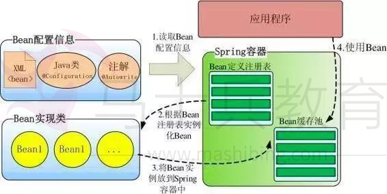

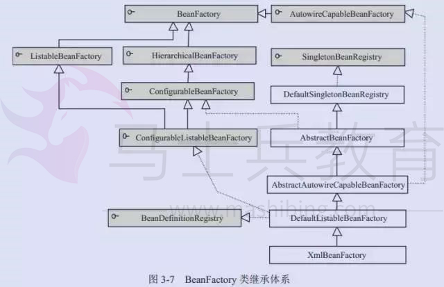

---

3     ListableBeanFactory 
3. 该接口定义了访问容器中 Bean 基本信息的若干方法，如查看 Bean 的个数、获取某一类型 Bean 
的配置名、查看容器中是否包括某一 Bean 等方法； 
4     HierarchicalBeanFactory父子级联 
4. 父子级联 IoC 容器的接口，子容器可以通过接口方法访问父容器； 通过 
HierarchicalBeanFactory 接口， Spring 的 IoC 容器可以建立父子层级关联的容器体系，子容器可以访
问父容器中的 Bean，但父容器不能访问子容器的 Bean。Spring 使用父子容器实现了很多功能，比如在 
Spring MVC 中，展现层 Bean 位于一个子容器中，而业务层和持久层的 Bean 位于父容器中。这样，展
现层 Bean 就可以引用业务层和持久层的 Bean，而业务层和持久层的 Bean 则看不到展现层的 Bean。 
5     ConfigurableBeanFactory 
5. 是一个重要的接口，增强了 IoC 容器的可定制性，它定义了设置类装载器、属性编辑器、容器初始
化后置处理器等方法；
6     AutowireCapableBeanFactory 自动装配 
6. 定义了将容器中的 Bean 按某种规则（如按名字匹配、按类型匹配等）进行自动装配的方法；
7    SingletonBeanRegistry运行期间注册单例Bean
7. 定义了允许在运行期间向容器注册单实例 Bean 的方法；对于单实例（ singleton）的 Bean 来
说，BeanFactory 会缓存 Bean 实例，所以第二次使用 getBean() 获取 Bean 时将直接从 IoC 容器
的缓存中获取 Bean 实例。Spring 在 DefaultSingletonBeanRegistry 类中提供了一个用于缓存单
实例 Bean 的缓存器，它是一个用 HashMap 实现的缓存器，单实例的 Bean 以 beanName 为键
保存在这个 HashMap 中。 
8 依赖日志框框 
8. 在初始化 BeanFactory 时，必须为其提供一种日志框架，比如使用 Log4J， 即在类路径下提供 
Log4J 配置文件，这样启动 Spring 容器才不会报错。 
ApplicationContext 面向开发应用 
ApplicationContext 由 BeanFactory 派 生 而 来 ， 提 供 了 更 多 面 向 实 际 应 用 的 功 能 。 
ApplicationContext 继承了 HierarchicalBeanFactory 和 ListableBeanFactory 接口，在此基础
上，还通过多个其他的接口扩展了 BeanFactory 的功能：

---

1. ClassPathXmlApplicationContext：默认从类路径加载配置文件
2. FileSystemXmlApplicationContext：默认从文件系统中装载配置文件
3. ApplicationEventPublisher：让容器拥有发布应用上下文事件的功能，包括容器启动事件、关闭事
件等。
4. MessageSource：为应用提供 i18n 国际化消息访问的功能； 
5. ResourcePatternResolver ： 所 有 ApplicationContext 实现类都实现了类似于 
PathMatchingResourcePatternResolver 的功能，可以通过带前缀的 Ant 风格的资源文件路径装
载 Spring 的配置文件。 
6. LifeCycle：该接口是 Spring 2.0 加入的，该接口提供了 start()和 stop()两个方法，主要用于控制异
步处理过程。在具体使用时，该接口同时被 ApplicationContext 实现及具体 Bean 实现， 
ApplicationContext 会将 start/stop 的信息传递给容器中所有实现了该接口的 Bean，以达到管理
和控制 JMX、任务调度等目的。 
7. ConfigurableApplicationContext 扩展于 ApplicationContext，它新增加了两个主要的方法： 
refresh()和 close()，让 ApplicationContext 具有启动、刷新和关闭应用上下文的能力。在应用上
下文关闭的情况下调用 refresh()即可启动应用上下文，在已经启动的状态下，调用 refresh()则清
除缓存并重新装载配置信息，而调用 close()则可关闭应用上下文。 
WebApplication 体系架构 
WebApplicationContext 是专门为 Web 应用准备的，它允许从相对于 Web 根目录的路径中装载配置文
件完成初始化工作。从 WebApplicationContext 中可以获得 ServletContext 的引用，整个 Web 应用上
下文对象将作为属性放置到 ServletContext 中，以便 Web 应用环境可以访问 Spring 应用上下文。

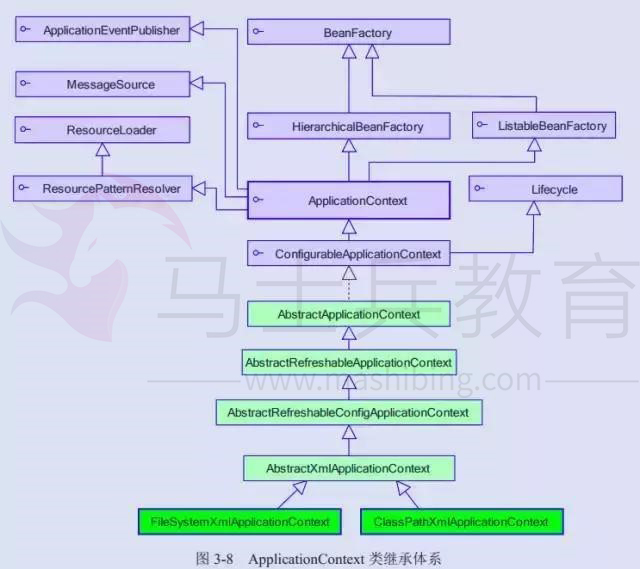

---

Spring Bean 作用域 
Spring 3 中为 Bean 定义了 5 中作用域，分别为 singleton（单例）、prototype（原型）、 request、
session 和 global session，5 种作用域说明如下： singleton：单例模式（多线程下不安全） 
1. singleton：单例模式，Spring IoC 容器中只会存在一个共享的 Bean 实例，无论有多少个 Bean 引
用它，始终指向同一对象。该模式在多线程下是不安全的。Singleton 作用域是 Spring 中的缺省作
用域，也可以显示的将 Bean 定义为 singleton 模式，配置为： 
prototype:原型模式每次使用时创建 
2. prototype:原型模式，每次通过 Spring 容器获取 prototype 定义的 bean 时，容器都将创建一个
新的 Bean 实例，每个 Bean 实例都有自己的属性和状态，而 singleton 全局只有一个对象。根据
经验，对有状态的bean使用prototype作用域，而对无状态的bean使用singleton 作用域。 
Request：一次request 一个实例 
3. request：在一次 Http 请求中，容器会返回该 Bean 的同一实例。而对不同的 Http 请求则会产生
新的 Bean，而且该 bean 仅在当前 Http Request 内有效,当前 Http 请求结束，该 bean 实例也将
会被销毁。 
 session
4. session：在一次 Http Session 中，容器会返回该 Bean 的同一实例。而对不同的 Session 请求则
会创建新的实例，该 bean 实例仅在当前 Session 内有效。同 Http 请求相同，每一次 session 请
求创建新的实例，而不同的实例之间不共享属性，且实例仅在自己的 session 请求内有效，请求结
束，则实例将被销毁。 
 global Session 
5. global Session：在一个全局的 Http Session 中，容器会返回该 Bean 的同一个实例，仅在使用 
portlet context 时有效。
Spring Bean 生命周期 
实例化 
1. 实例化一个 Bean，也就是我们常说的 new。 
IOC 依赖注入 
2. 按照 Spring 上下文对实例化的 Bean 进行配置，也就是 IOC 注入。 
setBeanName 实现 
3. 如果这个 Bean 已经实现了 BeanNameAware 接口，会调用它实现的 setBeanName(String) 方
法，此处传递的就是 Spring 配置文件中 Bean 的 id 值 
BeanFactoryAware 实现 
4. 如果这个 Bean 已经实现了 BeanFactoryAware 接口，会调用它实现的 setBeanFactory， 
setBeanFactory(BeanFactory)传递的是 Spring 工厂自身（可以用这个方式来获取其它 Bean，只
需在 Spring 配置文件中配置一个普通的 Bean 就可以）。

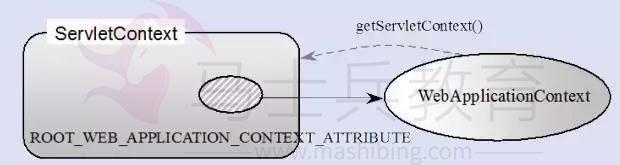

---

ApplicationContextAware 实现 
5. 如果这个 Bean 已经实现了 ApplicationContextAware 接口，会调用 
setApplicationContext(ApplicationContext)方法，传入 Spring 上下文（同样这个方式也可以实现
步骤 4 的内容，但比 4 更好，因为 ApplicationContext 是 BeanFactory 的子接口，有更多的实现
方法） 
postProcessBeforeInitialization接口实现-初始化预处理 
6. 如果这个 Bean 关联了 BeanPostProcessor 接口，将会调用
postProcessBeforeInitialization(Object obj, String s)方法，BeanPostProcessor 经常被用
作是 Bean 内容的更改，并且由于这个是在 Bean 初始化结束时调用那个的方法，也可以被应用于内存
或缓存技术。 
init-method 
7. 如果 Bean 在 Spring 配置文件中配置了 init-method 属性会自动调用其配置的初始化方法。 
postProcessAfterInitialization
8. 如果这个 Bean 关联了 BeanPostProcessor 接口，将会调用 
postProcessAfterInitialization(Object obj, String s)方法。 
注：以上工作完成以后就可以应用这个 Bean 了，那这个 Bean 是一个 Singleton 的，所以一般情况下
我们调用同一个 id 的 Bean 会是在内容地址相同的实例，当然在 Spring 配置文件中也可以配置非 
Singleton。 
Destroy 过期自动清理阶段 
9. 当 Bean 不再需要时，会经过清理阶段，如果 Bean 实现了 DisposableBean 这个接口，会调用那
个其实现的 destroy()方法； destroy-method 自配置清理 
10. 最后，如果这个 Bean 的 Spring 配置中配置了 destroy-method 属性，会自动调用其配置的销毁
方法。

---

11. bean 标签有两个重要的属性（init-method 和 destroy-method）。用它们你可以自己定制初始化
和注销方法。它们也有相应的注解（@PostConstruct 和@PreDestroy）。 
 
Spring 依赖注入四种方式 
构造器注入 
setter方法注入 
/*带参数，方便利用构造器进行注入*/   
    public CatDaoImpl(String message){           this. message = message;   
    }  
<bean id="CatDaoImpl" class="com.CatDaoImpl">   
<constructor-arg value=" message "></constructor-arg>   
</bean>

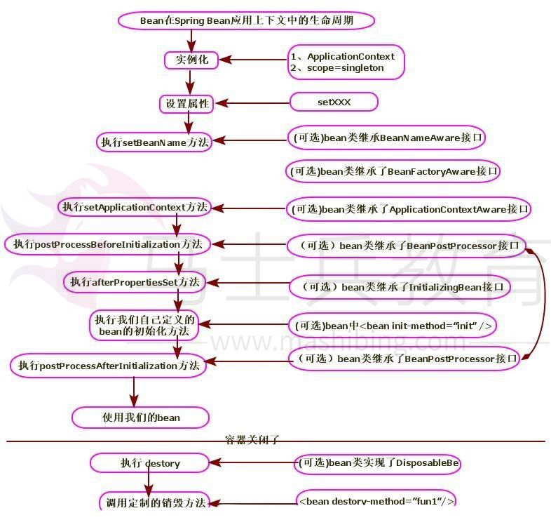

---

静态工厂注入 
静态工厂顾名思义，就是通过调用静态工厂的方法来获取自己需要的对象，为了让 spring 管理所有对
象，我们不能直接通过"工程类.静态方法()"来获取对象，而是依然通过 spring 注入的形式获取：
实例工厂 
实例工厂的意思是获取对象实例的方法不是静态的，所以你需要首先 new 工厂类，再调用普通的实例方
法：
 public class Id {   
 private int id;   
 public int getId() {   
 return id;  
 }    
 public void setId(int id) {  
 this.id = id;   
 }   
}  
 <bean id="id" class="com.id ">  <property name="id" value="123"></property>  
</bean>   
public class DaoFactory {   //静态工厂       public static final FactoryDao 
getStaticFactoryDaoImpl(){           return new StaticFacotryDaoImpl();   
    }   
}   
 public class SpringAction {             private FactoryDao staticFactoryDao;  //
注入对象   
    //注入对象的 set 方法   
    public void setStaticFactoryDao(FactoryDao staticFactoryDao) {           
this.staticFactoryDao = staticFactoryDao;   
    }   
}   
//factory-method="getStaticFactoryDaoImpl"指定调用哪个工厂方法 
    <bean name="springAction" class=" SpringAction" >   
        <!--使用静态工厂的方法注入对象,对应下面的配置文件-->   
        <property name="staticFactoryDao" ref="staticFactoryDao"></property>     
         </bean>   
    <!--此处获取对象的方式是从工厂类中获取静态方法-->   
<bean name="staticFactoryDao" class="DaoFactory"  factory-
method="getStaticFactoryDaoImpl"></bean>

---

5 种不同方式的自动装配 
Spring 装配包括手动装配和自动装配，手动装配是有基于 xml 装配、构造方法、setter 方法等自动装配
有五种自动装配的方式，可以用来指导 Spring 容器用自动装配方式来进行依赖注入。
1. no：默认的方式是不进行自动装配，通过显式设置 ref 属性来进行装配。 
2. byName：通过参数名 自动装配，Spring容器在配置文件中发现bean的autowire 属性被设置成 
byname，之后容器试图匹配、装配和该 bean 的属性具有相同名字的 bean。 
3. byType：通过参数类型自动装配，Spring 容器在配置文件中发现 bean 的 autowire 属性被设置成
byType，之后容器试图匹配、装配和该bean的属性具有相同类型的bean。如果有多个 bean 符合
条件，则抛出错误。 
4. constructor：这个方式类似于 byType， 但是要提供给构造器参数，如果没有确定的带参数的构造
器参数类型，将会抛出异常。 
5. autodetect：首先尝试使用constructor 来自动装配，如果无法工作，则使用byType方式。
Spring APO 原理
 
概念 
"横切"的技术，剖解开封装的对象内部，并将那些影响了多个类的公共行为封装到一个可重用模块，
并将其命名为"Aspect"，即切面。所谓"切面"，简单说就是那些与业务无关，却为业务模块所共同调用
的逻辑或责任封装起来，便于减少系统的重复代码，降低模块之间的耦合度，并有利于未来的可操作性
和可维护性。
使用"横切"技术，AOP 把软件系统分为两个部分：核心关注点和横切关注点。业务处理的主要流程是核
心关注点，与之关系不大的部分是横切关注点。横切关注点的一个特点是，他们经常发生在核心关注点
的多处，而各处基本相似，比如权限认证、日志、事物。AOP 的作用在于分离系统中的各种关注点，将
核心关注点和横切关注点分离开来。 
AOP 主要应用场景有： 
1. Authentication 权限
2. Caching 缓存
3. Context passing 内容传递 
4. Error handling 错误处理 
5. Lazy loading 懒加载 
6. Debugging 调试 
public class DaoFactory {   //实例工厂        public FactoryDao 
getFactoryDaoImpl(){           return new FactoryDaoImpl();   
    }   
}  
public class SpringAction {       private FactoryDao factoryDao;      //注入对象   
      public void setFactoryDao(FactoryDao factoryDao) {           
this.factoryDao = factoryDao;   
    }   
}   
    <bean name="springAction" class="SpringAction">   
        <!--使用实例工厂的方法注入对象,对应下面的配置文件-->   
        <property name="factoryDao" ref="factoryDao"></property>       </bean>  
 
     <!--此处获取对象的方式是从工厂类中获取实例方法-->   
<bean name="daoFactory" class="com.DaoFactory"></bean>   
<bean name="factoryDao" factory-bean="daoFactory"  factory-
method="getFactoryDaoImpl"></bean>

---

7. logging, tracing, profiling and monitoring 记录跟踪 优化 校准 
8. Performance optimization 性能优化 
9. Persistence 持久化 
10. Resource pooling 资源池 
11. Synchronization 同步
12. Transactions 事务
AOP 核心概念 
1、切面（aspect）：类是对物体特征的抽象，切面就是对横切关注点的抽象 
2、横切关注点：对哪些方法进行拦截，拦截后怎么处理，这些关注点称之为横切关注点。
3、连接点（joinpoint）：被拦截到的点，因为 Spring 只支持方法类型的连接点，所以在 Spring 中连
接点指的就是被拦截到的方法，实际上连接点还可以是字段或者构造器。
4、切入点（pointcut）：对连接点进行拦截的定义 
5、通知（advice）：所谓通知指的就是指拦截到连接点之后要执行的代码，通知分为前置、后置、异
常、最终、环绕通知五类。 
6、目标对象：代理的目标对象
7、织入（weave）：将切面应用到目标对象并导致代理对象创建的过程 8、引入（introduction）：在
不修改代码的前提下，引入可以在运行期为类动态地添加一些方法或字段。 
彻底征服 Spring AOP 之 理论篇
AOP 两种代理方式

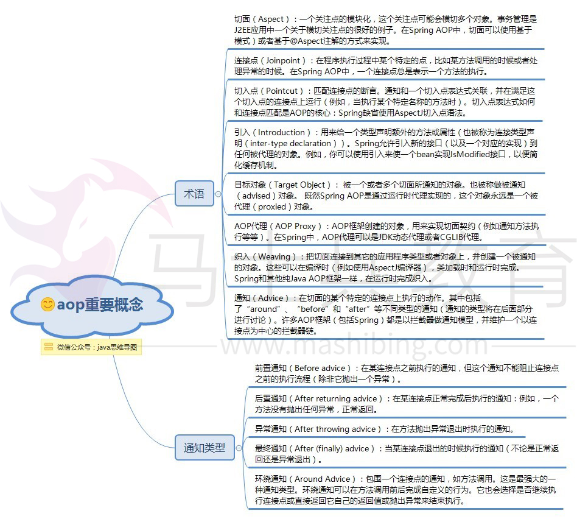

---

Spring 提供了两种方式来生成代理对象: JDKProxy 和 Cglib，具体使用哪种方式生成由 
AopProxyFactory 根据 AdvisedSupport 对象的配置来决定。默认的策略是如果目标类是接口，则使用 
JDK 动态代理技术，否则使用 Cglib 来生成代理。 
JDK动态接口代理 
1. JDK 动态代理主要涉及到 java.lang.reflect 包中的两个类：Proxy 和 InvocationHandler。
InvocationHandler是一个接口，通过实现该接口定义横切逻辑，并通过反射机制调用目标类的代码，动
态将横切逻辑和业务逻辑编制在一起。Proxy 利用 InvocationHandler 动态创建一个符合某一接口的实
例，生成目标类的代理对象。 
CGLib 动态代理 
2. ：CGLib 全称为 Code Generation Library，是一个强大的高性能，高质量的代码生成类库，可以
在运行期扩展 Java 类与实现 Java 接口，CGLib 封装了 asm，可以再运行期动态生成新的 class。
和 JDK 动态代理相比较：JDK 创建代理有一个限制，就是只能为接口创建代理实例，而对于没有通
过接口定义业务方法的类，则可以通过 CGLib 创建动态代理。 
实现原理 
@Aspect public class TransactionDemo { 
       @Pointcut(value="execution(* com.yangxin.core.service.*.*.*(..))")     
public void point(){ 
      } 
     @Before(value="point()")     public void before(){ 
        System.out.println("transaction begin"); 
    } 
       @AfterReturning(value = "point()")     public void after(){ 
        System.out.println("transaction commit"); 
    } 
        @Around("point()") 
    public void around(ProceedingJoinPoint joinPoint) throws Throwable{         
System.out.println("transaction begin");         joinPoint.proceed(); 
        System.out.println("transaction commit"); 
    } 
}

---

Spring MVC 原理
 
Spring 的模型-视图-控制器（MVC）框架是围绕一个 DispatcherServlet 来设计的，这个 Servlet 会把请
求分发给各个处理器，并支持可配置的处理器映射、视图渲染、本地化、时区与主题渲染等，甚至还能
支持文件上传。
MVC 流程 
Http 请求到DispatcherServlet 
(1) 客户端请求提交到 DispatcherServlet。 
HandlerMapping 寻找处理器 
(2) 由 DispatcherServlet 控制器查询一个或多个 HandlerMapping，找到处理请求的
Controller。

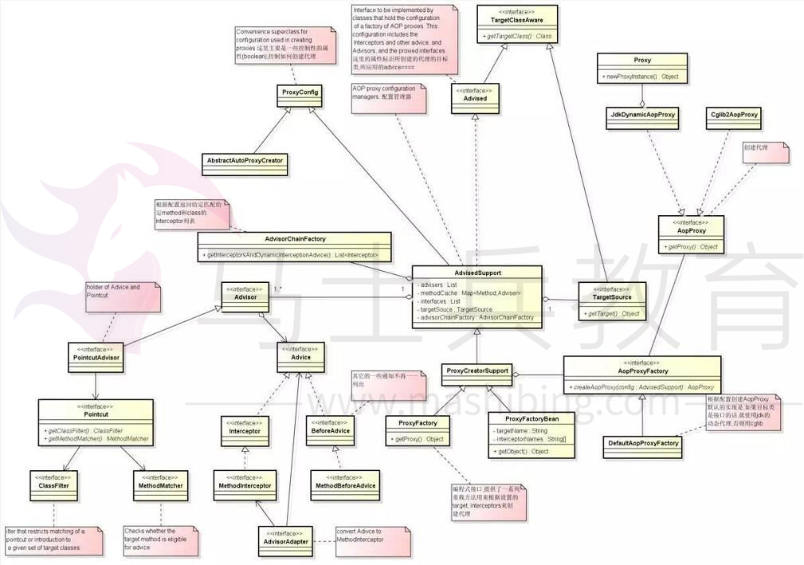

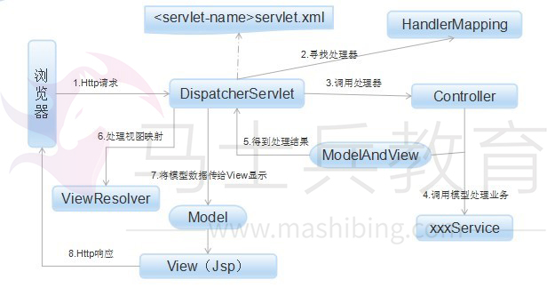

---

调用处理器Controller
(3) DispatcherServlet 将请求提交到 Controller。 
Controller 调用业务逻辑处理后，返回ModelAndView 
(4)(5)调用业务处理和返回结果：Controller 调用业务逻辑处理后，返回 ModelAndView。 
DispatcherServlet 查询ModelAndView 
(6)(7)处理视图映射并返回模型： DispatcherServlet 查询一个或多个 ViewResoler 视图解析器，找到 
ModelAndView 指定的视图。 
ModelAndView 反馈浏览器HTTP 
(8) Http 响应：视图负责将结果显示到客户端。
MVC 常用注解 
 
Spring AOP的实现原理和场景；
 
AOP（Aspect Orient Programming），作为面向对象编程的一种补充，广泛应用于处理一 些具有横切
性质的系统级服务。
一、场景
 
事务管理、安全检查、权限控制、数据校验、缓存、对象池管理等
二、实现技术
 
AOP（这里的AOP指的是面向切面编程思想，而不是Spring AOP）主要的的实现技术主要有 Spring 
AOP和AspectJ。
1）AspectJ的底层技术。    AspectJ的底层技术是静态代理，即用一种AspectJ支持的特定语言编写切
面，通过一个命令来 编译，生成一个新的代理类，该代理类增强了业务类，这是在编译时增强，相对于
下面说的运行 时增强，编译时增强的性能更好。

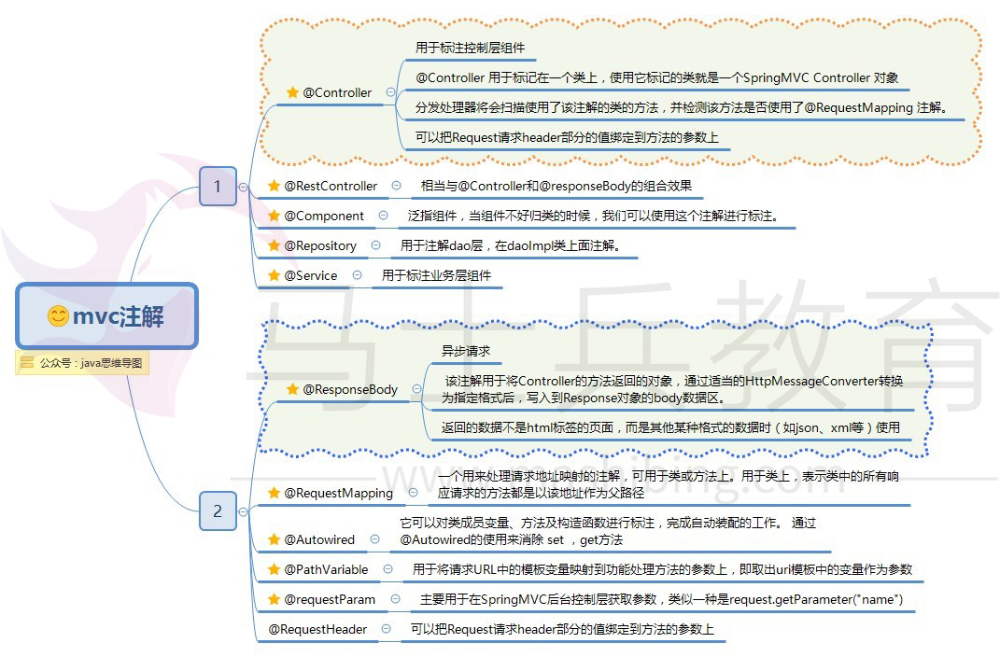

---

2）Spring AOP    Spring AOP采用的是动态代理，在运行期间对业务方法进行增强，所以不会生成新
类，对于 动态代理技术，Spring AOP提供了对JDK动态代理的支持以及CGLib的支持。     
JDK动态代理只能为接口创建动态代理实例，而不能对类创建动态代理。需要获得被目标类的 接口信息
（应用Java的反射技术），生成一个实现了代理接口的动态代理类（字节码），再通过 反射机制获得动
态代理类的构造函数，利用构造函数生成动态代理类的实例对象，在调用具体方 法前调用
invokeHandler方法来处理。     
CGLib动态代理需要依赖asm包，把被代理对象类的class文件加载进来，修改其字节码生成 子类。     但
是Spring AOP基于注解配置的情况下，需要依赖于AspectJ包的标准注解。 
Spring bean的作用域和生命周期；
 
作用域
 
生命周期
 
 
Spring 5比Spring4做了哪些改进；
 
官网说明

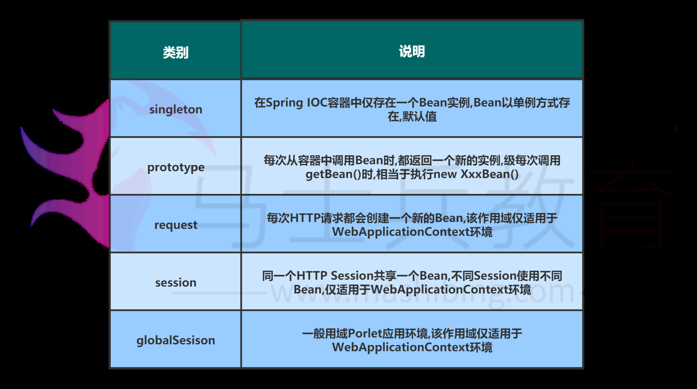

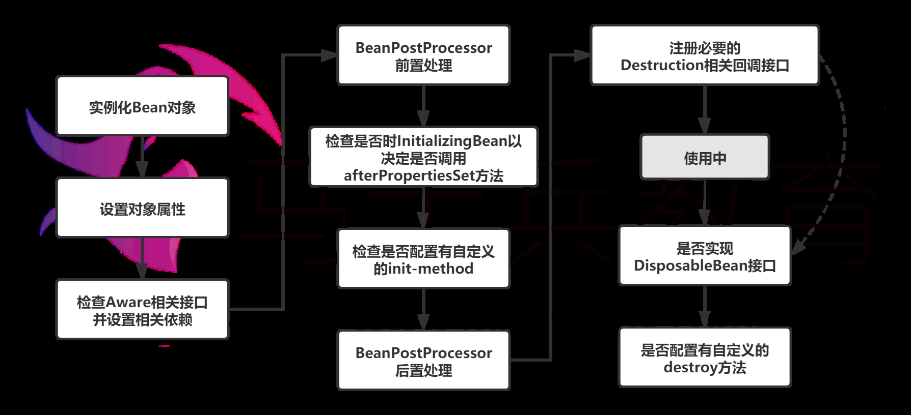

---

Spring 4.x新特性
 
1. 泛型限定式依赖注入 
2. 核心容器的改进 
3. web开发增强 
4. 集成Bean Validation 1.1（JSR-349）到SpringMVC 
5. Groovy Bean定义DSL 
6. 更好的Java泛型操作API 
7. JSR310日期API的支持 
8. 注解、脚本、任务、MVC等其他特性改进
Spring 5.x新特性
 
1. JDK8的增强 
2. 核心容器的改进
3. 新的SpringWebFlux模块 
4. 测试方面的改进 
 
Spring FrameWork 5.0新的功能
 
JDK 8+和Java EE7+以上版本
 
整个框架的代码基于java8
通过使用泛型等特性提高可读性
对java8提高直接的代码支撑
运行时兼容JDK9
Java EE 7API需要Spring相关的模块支持
运行时兼容Java EE8 API
取消的包,类和方法
包 beans.factory.access
包 dbc.support.nativejdbc
从spring-aspects 模块移除了包mock.staicmock,不在提
AnnotationDrivenStaticEntityMockingControl支持
许多不建议使用的类和方法在代码库中删除
 
核心特性
 
JDK8的增强：
 
访问Resuouce时提供getFile或和isFile防御式抽象
有效的方法参数访问基于java 8反射增强
在Spring核心接口中增加了声明default方法的支持一贯使用JDK7 Charset和StandardCharsets的
增强
兼容JDK9
Spring 5.0框架自带了通用的日志封装
持续实例化via构造函数(修改了异常处理)

---

Spring 5.0框架自带了通用的日志封装
spring-jcl替代了通用的日志，仍然支持可重写
自动检测log4j 2.x, SLF4J, JUL（java.util.Logging）而不是其他的支持
访问Resuouce时提供getFile或和isFile防御式抽象
基于NIO的readableChannel也提供了这个新特性
 
核心容器
 
支持候选组件索引(也可以支持环境变量扫描)
支持@Nullable注解
函数式风格GenericApplicationContext/AnnotationConfigApplicationContext
基本支持bean API注册
在接口层面使用CGLIB动态代理的时候，提供事物，缓存，异步注解检测
XML配置作用域流式
Spring WebMVC
全部的Servlet 3.1 签名支持在Spring-provied Filter实现
在Spring MVC Controller方法里支持Servlet4.0 PushBuilder参数
多个不可变对象的数据绑定(Kotlin/Lombok/@ConstructorPorties)
支持jackson2.9
支持JSON绑定API
支持protobuf3
支持Reactor3.1 Flux和Mono
 
SpringWebFlux
 
新的spring-webflux模块，一个基于reactive的spring-webmvc，完全的异步非阻塞，旨在使用
enent-loop执行模型和传统的线程池模型。
Reactive说明在spring-core比如编码和解码
spring-core相关的基础设施，比如Encode 和Decoder可以用来编码和解码数据流；DataBuffer 可
以使用java ByteBuffer或者Netty ByteBuf;ReactiveAdapterRegistry可以对相关的库提供传输层支
持。
在spring-web包里包含HttpMessageReade和HttpMessageWrite
 
测试方面的改进
 
完成了对JUnit 5’s Juptier编程和拓展模块在Spring TestContext框架
SpringExtension:是JUnit多个可拓展API的一个实现，提供了对现存Spring TestContext 
Framework的支持，使用@ExtendWith(SpringExtension.class)注解引用。
@SpringJunitConfig:一个复合注解
@ExtendWith(SpringExtension.class) 来源于Junit Jupit
@ContextConfiguration 来源于Srping TestContext框架
@DisabledIf 如果提供的该属性值为true的表达或占位符，信号：注解的测试类或测试方法被禁用
在Spring TestContext框架中支持并行测试
具体细节查看Test 章节 通过SpringRunner在Sring TestContext框架中支持TestNG, Junit5,新的执
行之前和之后测试回调。

---

在testexecutionlistener API和testcontextmanager新beforetestexecution()和
aftertestexecution()回调。MockHttpServletRequest新增了getContentAsByteArray()和
getContentAsString()方法来访问请求体
如果字符编码被设置为mock请求，在print()和log()方法中可以打印Spring MVC Test的
redirectedUrl()和forwardedUrl()方法支持带变量表达式URL模板。
XMLUnit 升级到了2.3版本。
 
 
Spring4新特性——泛型限定式依赖注入
 
Spring 4.0已经发布RELEASE版本，不仅支持Java8，而且向下兼容到JavaSE6/JavaEE6，并移出了相关废
弃类，新添加如Java8的支持、Groovy式Bean定义DSL、对核心容器进行增强、对Web框架的增强、
Websocket模块的实现、测试的增强等。其中两个我一直想要的增强就是：支持泛型依赖注入、对cglib
类代理不再要求必须有空参构造器了。
1、相关代码：
1.1、实体
 
 1.2、Repository
 
 对于Repository，我们一般是这样实现的：首先写一个模板父类，把通用的crud等代码放在
BaseRepository；然后子类继承后，只需要添加额外的实现。
 
1.3、Service
public class User implements Serializable {
    private Long id;
    private String name;
}
public class Organization implements Serializable {
    private Long id;
    private String name;
}
public abstract class BaseRepository<M extends Serializable> {
    public void save(M m) {
        System.out.println("=====repository save:" + m);
    }
}
@Repository
public class UserRepository extends BaseRepository<User> {
}
@Repository
public class OrganizationRepository extends BaseRepository<Organization> {
}

---

1.3.1、以前Service写法
 
可以看到，以前必须再写一个setter方法，然后指定注入的具体类型，然后进行注入；
 
1.3.2、泛型Service的写法
 
 
 大家可以看到，现在的写法非常简洁。支持泛型式依赖注入。
public abstract class BaseService<M extends Serializable> {
    private BaseRepository<M> repository;
    public void setRepository(BaseRepository<M> repository) {
        this.repository = repository;
    }
    public void save(M m) {
        repository.save(m);
    }
}
@Service
public class UserService extends BaseService<User> {
    @Autowired
    public void setUserRepository(UserRepository userRepository) {
        setRepository(userRepository);
    }
}
@Service
public class OrganizationService extends BaseService<Organization> {
    @Autowired
    public void setOrganizationRepository(OrganizationRepository 
organizationRepository) {
        setRepository(organizationRepository);
    }
}
public abstract class BaseService<M extends Serializable> {
    @Autowired
    protected BaseRepository<M> repository;
    public void save(M m) {
        repository.save(m);
    }
}
@Service
public class UserService extends BaseService<User> {
}
@Service
public class OrganizationService extends BaseService<Organization> {
}

---

这个也是我之前非常想要的一个功能，这样对于那些基本的CRUD式代码，可以简化更多的代码。
  
如果大家用过Spring data jpa的话，以后注入的话也可以使用泛型限定式依赖注入 ：
 
 对于泛型依赖注入，最好使用setter注入，这样万一子类想变，比较容易切换。如果有多个实现时，子
类可以使用@Qualifier指定使用哪一个。
 
Spring4新特性——核心容器的其他改进
 
 
1、Map依赖注入：
这样会注入：key是bean名字；value就是所有实现了BaseService的Bean，假设使用上一篇的例子，则
会得到：
{organizationService=com.sishuok.spring4.service.OrganizationService@617029, 
userService=com.sishuok.spring4.service.UserService@10ac73b}
 
2、List/数组注入：
 这样会注入所有实现了BaseService的Bean；但是顺序是不确定的，如果我们想要按照某个顺序获取；
在Spring4中可以使用@Order或实现Ordered接口来实现，如：
这种方式在一些需要多态的场景下是非常有用的。
 
3、@Lazy可以延迟依赖注入：
@Autowired
private Repository<User> userRepository;
@Autowired
private Map<String, BaseService> map;
@Autowired
private List<BaseService> list;
@Order(value = 1)
@Service
public class UserService extends BaseService<User> {
}
@Lazy
@Service
public class UserService extends BaseService<User> {
}

---

我们可以把@Lazy放在@Autowired之上，即依赖注入也是延迟的；当我们调用userService时才会注
入。即延迟依赖注入到使用时。同样适用于@Bean。
 
4、@Conditional
@Conditional类似于@Profile（一般用于如我们有开发环境、测试环境、正式机环境，为了方便切换不同的环
境可以使用@Profile指定各个环境的配置，然后通过某个配置来开启某一个环境，方便切换），但是
@Conditional的优点是允许自己定义规则。可以指定在如@Component、@Bean、@Configuration等
注解的类上，以绝对Bean是否创建等。首先来看看使用@Profile的用例，假设我们有个用户模块：
我们在写测试用例时，可以指定我们使用哪个Profile：
 这种方式非常简单。如果想自定义如@Profile之类的注解等，那么@Conditional就派上用场了；假设我
们系统中有好多本地/远程接口，那么我们定义两个注解@Local和@Remote注解要比使用@Profile方便
的多；如：
 
    @Lazy
    @Autowired
    private UserService userService;
public abstract class UserService extends BaseService<User> {
}
@Profile("local")
@Service
public class LocalUserService extends UserService {
}
@Profile("remote")
@Service
public class RemoteUserService extends UserService {
}
@ActiveProfiles("remote")
@RunWith(SpringJUnit4ClassRunner.class)
@ContextConfiguration(locations =  "classpath:spring-config.xml")
public class ServiceTest {
    @Autowired
    private UserService userService;
}

---

然后我们使用这两个注解分别注解我们的Service：
 
@Retention(RetentionPolicy.RUNTIME)
@Target({ElementType.TYPE, ElementType.METHOD})
@Conditional(CustomCondition.class)
public @interface Local {
}
@Retention(RetentionPolicy.RUNTIME)
@Target({ElementType.TYPE, ElementType.METHOD})
@Conditional(CustomCondition.class)
public @interface Remote {
}
public class CustomCondition implements Condition {
    @Override
    public boolean matches(ConditionContext context, AnnotatedTypeMetadata 
metadata) {
        boolean isLocalBean = 
metadata.isAnnotated("com.sishuok.spring4.annotation.Local");
        boolean isRemoteBean = 
metadata.isAnnotated("com.sishuok.spring4.annotation.Remote");
        //如果bean没有注解@Local或@Remote，返回true，表示创建Bean
        if(!isLocalBean && !isRemoteBean) {
            return true;
        }
        boolean isLocalProfile = 
context.getEnvironment().acceptsProfiles("local");
        //如果profile=local 且 bean注解了@Local，则返回true 表示创建bean；
        if(isLocalProfile) {
            return isLocalBean;
        }
        //否则默认返回注解了@Remote或没有注解@Remote的Bean
        return isRemoteBean;
    }
}
@Local
@Service
public class LocalUserService extends UserService {
}

---

首先在@Local和@Remote注解上使用@Conditional(CustomCondition.class)指定条件，然后使用
@Local和@Remote注解我们的Service，这样当加载Service时，会先执行条件然后判断是否加载为
Bean。@Profile就是这样实现的，其Condition是：
org.springframework.context.annotation.ProfileCondition。可以去看下源码，很简单。
 
5、基于CGLIB的类代理不再要求类必须有空参构造器了：
这是一个很好的特性，使用构造器注入有很多好处，比如可以只在创建Bean时注入依赖，然后就不变
了，如果使用setter注入，是允许别人改的。当然我们可以使用spring的字段级别注入。如果大家使用
过如Shiro，我们可能要对Controller加代理。如果是类级别代理，此时要求Controller必须有空参构造
器，有时候挺烦人的。spring如何实现的呢？其内联了objenesis类库，通过它来实现，可以去其官网看
看介绍。这样就支持如下方式的构造器注入了：
 
Spring4新特性——Web开发的增强
 
 
从Spring4开始，Spring以Servlet3为进行开发，如果用Spring MVC 测试框架的话需要指定Servlet3兼
容的jar包（因为其Mock的对象都是基于Servlet3的）。另外为了方便Rest开发，通过新的
@RestController指定在控制器上，这样就不需要在每个@RequestMapping方法上加 @ResponseBody
了。而且添加了一个``AsyncRestTemplate  ，支持REST客户端的异步无阻塞支持。
@Remote
@Service
public class RemoteUserService extends UserService {
}
@Controller
public class UserController {
    private UserService userService;
    @Autowired
    public UserController(UserService userService) {
        this.userService = userService;
    }
}
@RestController
public class UserController {
    private UserService userService;
    @Autowired
    public UserController(UserService userService) {
        this.userService = userService;
    }
    @RequestMapping("/test")
      public User view() {
        User user = new User();
        user.setId(1L);
        user.setName("haha");
        return user;
    }
    @RequestMapping("/test2")

---

其实现就是在@@RestController中加入@ResponseBody：
这样当你开发Rest服务器端的时候，spring-mvc配置文件需要的代码极少，可能就仅需如下一行：
 
2、mvc:annotation-driven配置变化
统一风格；将 enableMatrixVariables改为enable-matrix-variables属性；将
ignoreDefaultModelOnRedirect改为ignore-default-model-on-redirect。
 
3、提供AsyncRestTemplate用于客户端非阻塞异步支持。
3.1、服务器端
对于服务器端的springmvc开发
非常简单，服务器端暂停10秒再返回结果（但是服务器也是非阻塞的）。具体参考我github上的代码。
    public String view2() {
        return "{\"id\" : 1}";
    }
}
@org.springframework.stereotype.Controller
@org.springframework.web.bind.annotation.ResponseBody
public @interface RestController {
}
    <context:component-scan base-package="com.sishuok.spring4"/>
    <mvc:annotation-driven/>
@RestController
public class UserController {
    private UserService userService;
    @Autowired
    public UserController(UserService userService) {
        this.userService = userService;
    }
    @RequestMapping("/api")
      public Callable<User> api() {
        System.out.println("=====hello");
        return new Callable<User>() {
            @Override
            public User call() throws Exception {
                Thread.sleep(10L * 1000); //暂停两秒
                User user = new User();
                user.setId(1L);
                user.setName("haha");
                return user;
            }
        };
    }
}

---

3.2、客户端
 此处使用Future来完成非阻塞，这样的话我们也需要给它一个回调接口来拿结果； Future和Callable是
一对，一个消费结果，一个产生结果。调用完模板后会立即返回，不会阻塞；有结果时会调用其回调。
AsyncRestTemplate默认使用SimpleClientHttpRequestFactory，即通过java.net.HttpURLConnection
实现；另外我们也可以使用apache的http components；使用template.setAsyncRequestFactory(new 
HttpComponentsAsyncClientHttpRequestFactory());设置即可。
另外在开发时尽量不要自己注册如：
尽量使用
它设计的已经足够好，使用子元素可以配置我们需要的配置。
 
且不要使用老版本的：
    public static void main(String[] args) {
        AsyncRestTemplate template = new AsyncRestTemplate();
        //调用完后立即返回（没有阻塞）
        ListenableFuture<ResponseEntity<User>> future = 
template.getForEntity("http://localhost:9080/spring4/api", User.class);
        //设置异步回调
        future.addCallback(new ListenableFutureCallback<ResponseEntity<User>>() 
{
            @Override
            public void onSuccess(ResponseEntity<User> result) {
                System.out.println("======client get result : " + 
result.getBody());
            }
            @Override
            public void onFailure(Throwable t) {
                System.out.println("======client failure : " + t);
            }
        });
        System.out.println("==no wait");
    }
<bean 
class="org.springframework.web.servlet.mvc.method.annotation.RequestMappingHandl
erMapping"/>
<bean 
class="org.springframework.web.servlet.mvc.method.annotation.RequestMappingHandl
erAdapter">
<mvc:annotation-driven/>

---

否则可能得到如下异常：
写道
Circular view path [login]: would dispatch back to the current handler URL [/spring4/login] again. 
Check your ViewResolver setup! (Hint: This may be the result of an unspecified view, due to 
default view name generation.)
 
Spring4新特性——集成Bean Validation 1.1(JSR-349)到
SpringMVC
 
 
Bean Validation 1.1当前实现是Hibernate validator 5，且spring4才支持。接下来我们从以下几个方法
讲解Bean Validation 1.1，当然不一定是新特性：
1. 集成Bean Validation 1.1到SpringMVC
2. 分组验证、分组顺序及级联验证
3. 消息中使用EL表达式
4. 方法参数/返回值验证
5. 自定义验证规则
6. 类级别验证器
7. 脚本验证器
8. cross-parameter，跨参数验证
9. 混合类级别验证器和跨参数验证器
10. 组合多个验证注解
11. 本地化
因为大多数时候验证都配合web框架使用，而且很多朋友都咨询过如分组/跨参数验证，所以本文介绍下
这些，且是和SpringMVC框架集成的例子，其他使用方式（比如集成到JPA中）可以参考其官方文档：
规范：http://beanvalidation.org/1.1/spec/
hibernate validator文档：http://hibernate.org/validator/ 
 
1、集成Bean Validation 1.1到SpringMVC
 
1.1、项目搭建
首先添加hibernate validator 5依赖：
<bean 
class="org.springframework.web.servlet.mvc.annotation.DefaultAnnotationHandlerMa
pping"/>
<bean 
class="org.springframework.web.servlet.mvc.annotation.AnnotationMethodHandlerAda
pter">
        <dependency>
            <groupId>org.hibernate</groupId>
            <artifactId>hibernate-validator</artifactId>
            <version>5.0.2.Final</version>
        </dependency>

---

如果想在消息中使用EL表达式，请确保EL表达式版本是 2.2或以上，如使用Tomcat6，请到Tomcat7中
拷贝相应的EL jar包到Tomcat6中。
请确保您使用的Web容器有相应版本的el jar包。
对于其他POM依赖请下载附件中的项目参考。
 
1.2、Spring MVC配置文件（spring-mvc.xml）：
此处主要把bean validation的消息查找委托给spring的messageSource。
 
1.3、实体验证注解：
        <dependency>
            <groupId>javax.el</groupId>
            <artifactId>javax.el-api</artifactId>
            <version>2.2.4</version>
            <scope>provided</scope>
        </dependency>
    <!-- 指定自己定义的validator -->
    <mvc:annotation-driven validator="validator"/>
    <!-- 以下 validator  ConversionService 在使用 mvc:annotation-driven 会 自动注册-
->
    <bean id="validator" 
class="org.springframework.validation.beanvalidation.LocalValidatorFactoryBean">
        <property name="providerClass" 
value="org.hibernate.validator.HibernateValidator"/>
        <!-- 如果不加默认到 使用classpath下的 ValidationMessages.properties -->
        <property name="validationMessageSource" ref="messageSource"/>
    </bean>
    <!-- 国际化的消息资源文件（本系统中主要用于显示/错误消息定制） -->
    <bean id="messageSource" 
class="org.springframework.context.support.ReloadableResourceBundleMessageSource
">
        <property name="basenames">
            <list>
                <!-- 在web环境中一定要定位到classpath 否则默认到当前web应用下找  -->
                <value>classpath:messages</value>
                
<value>classpath:org/hibernate/validator/ValidationMessages</value>
            </list>
        </property>
        <property name="useCodeAsDefaultMessage" value="false"/>
        <property name="defaultEncoding" value="UTF-8"/>
        <property name="cacheSeconds" value="60"/>
    </bean>

---

对于验证规则可以参考官方文档，或者《第七章 注解式控制器的数据验证、类型转换及格式化》。
 
1.4、错误消息文件messages.properties：
 
1.5、控制器
 
1.6、错误页面：
public class User implements Serializable {
    @NotNull(message = "{user.id.null}")
    private Long id;
    @NotEmpty(message = "{user.name.null}")
    @Length(min = 5, max = 20, message = "{user.name.length.illegal}")
    @Pattern(regexp = "[a-zA-Z]{5,20}", message = "{user.name.illegal}")
    private String name;
    @NotNull(message = "{user.password.null}")
    private String password;
}
user.id.null=用户编号不能为空
user.name.null=用户名不能为空
user.name.length.illegal=用户名长度必须在5到20之间
user.name.illegal=用户名必须是字母
user.password.null=密码不能为空
@Controller
public class UserController {
    @RequestMapping("/save")
    public String save(@Valid User user, BindingResult result) {
        if(result.hasErrors()) {
            return "error";
        }
        return "success";
    }
}
<spring:hasBindErrors name="user">
    <c:if test="${errors.fieldErrorCount > 0}">
        字段错误： 
        <c:forEach items="${errors.fieldErrors}" var="error">
            <spring:message var="message" code="${error.code}" 
arguments="${error.arguments}" text="${error.defaultMessage}"/>
            ${error.field}------${message} 
        </c:forEach>
    </c:if>
    <c:if test="${errors.globalErrorCount > 0}">

---

大家以后可以根据这个做通用的错误消息显示规则。比如我前端页面使用validationEngine显示错误消
息，那么我可以定义一个tag来通用化错误消息的显示：showFieldError.tag。 
 
1.7、测试
输入如：http://localhost:9080/spring4/save?name=123 ， 我们得到如下错误：
 
基本的集成就完成了。
 
如上测试有几个小问题：
1、错误消息顺序，大家可以看到name的错误消息顺序不是按照书写顺序的，即不确定；
2、我想显示如：用户名【zhangsan】必须在5到20之间；其中我们想动态显示：用户名、min，max；
而不是写死了；
3、我想在修改的时候只验证用户名，其他的不验证怎么办。
接下来我们挨着试试吧。
 
2、分组验证及分组顺序
 
如果我们想在新增的情况验证id和name，而修改的情况验证name和password，怎么办？ 那么就需要
分组了。
首先定义分组接口：
分组接口就是两个普通的接口，用于标识，类似于java.io.Serializable。
        全局错误： 
        <c:forEach items="${errors.globalErrors}" var="error">
            <spring:message var="message" code="${error.code}" 
arguments="${error.arguments}" text="${error.defaultMessage}"/>
            <c:if test="${not empty message}">
                ${message} 
            </c:if>
        </c:forEach>
    </c:if>
</spring:hasBindErrors>
name------用户名必须是字母
name------用户名长度必须在5到20之间
password------密码不能为空
id------用户编号不能为空
public interface First {
}
public interface Second {
}

---

接着我们使用分组接口标识实体：
 
验证时使用如：
即通过@Validate注解标识要验证的分组；如果要验证两个的话，可以这样@Validated({First.class, 
Second.class})。
 
接下来我们来看看通过分组来指定顺序；还记得之前的错误消息吗？ user.name会显示两个错误消息，
而且顺序不确定；如果我们先验证一个消息；如果不通过再验证另一个怎么办？可以通过
@GroupSequence指定分组验证顺序：
 
public class User implements Serializable {
    @NotNull(message = "{user.id.null}", groups = {First.class})
    private Long id;
    @Length(min = 5, max = 20, message = "{user.name.length.illegal}", groups = 
{Second.class})
    @Pattern(regexp = "[a-zA-Z]{5,20}", message = "{user.name.illegal}", groups = 
{Second.class})
    private String name;
    @NotNull(message = "{user.password.null}", groups = {First.class, 
Second.class})
    private String password;
}
    @RequestMapping("/save")
    public String save(@Validated({Second.class}) User user, BindingResult 
result) {
        if(result.hasErrors()) {
            return "error";
        }
        return "success";
    }
@GroupSequence({First.class, Second.class, User.class})
public class User implements Serializable {
    private Long id;
    @Length(min = 5, max = 20, message = "{user.name.length.illegal}", groups = 
{First.class})
    @Pattern(regexp = "[a-zA-Z]{5,20}", message = "{user.name.illegal}", groups = 
{Second.class})
    private String name;
    
    private String password;
}

---

通过@GroupSequence指定验证顺序：先验证First分组，如果有错误立即返回而不会验证Second分
组，接着如果First分组验证通过了，那么才去验证Second分组，最后指定User.class表示那些没有分组
的在最后。这样我们就可以实现按顺序验证分组了。
 
另一个比较常见的就是级联验证：
如：
 1、级联验证只要在相应的字段上加@Valid即可，会进行级联验证；@ConvertGroup的作用是当验证o
的分组是First时，那么验证o的分组是Second，即分组验证的转换。
 
3、消息中使用EL表达式
 
假设我们需要显示如：用户名[NAME]长度必须在[MIN]到[MAX]之间，此处大家可以看到，我们不想把
一些数据写死，如NAME、MIN、MAX；此时我们可以使用EL表达式。
 
如：
错误消息：
 
其中我们可以使用{验证注解的属性}得到这些值；如{min}得到@Length中的min值；其他的也是类似
的。
 
到此，我们还是无法得到出错的那个输入值，如name=zhangsan。此时就需要EL表达式的支持，首先
确定引入EL jar包且版本正确。然后使用如：
使用如EL表达式：${validatedValue}得到输入的值，如zhangsan。当然我们还可以使用如${min > 1 ? 
'大于1' : '小于等于1'}，及在EL表达式中也能拿到如@Length的min等数据。
 
另外我们还可以拿到一个java.util.Formatter类型的formatter变量进行格式化：
public class User {
    @Valid 
    @ConvertGroup(from=First.class, to=Second.class)
    private Organization o;
}
@Length(min = 5, max = 20, message = "{user.name.length.illegal}", groups = 
{First.class})
user.name.length.illegal=用户名长度必须在{min}到{max}之间
user.name.length.illegal=用户名[${validatedValue}]长度必须在5到20之间

---

4、方法参数/返回值验证
 
这个可以参考《Spring3.1 对Bean Validation规范的新支持(方法级别验证)》，概念是类似的，具体可以
参考Bean Validation 文档。
 
5、自定义验证规则
 
有时候默认的规则可能还不够，有时候还需要自定义规则，比如屏蔽关键词验证是非常常见的一个功
能，比如在发帖时帖子中不允许出现admin等关键词。
 
1、定义验证注解
${formatter.format("%04d", min)}
package com.sishuok.spring4.validator;
import javax.validation.Constraint;
import javax.validation.Payload;
import java.lang.annotation.Documented;
import java.lang.annotation.Retention;
import java.lang.annotation.Target;
import static java.lang.annotation.ElementType.*;
import static java.lang.annotation.RetentionPolicy.*;
/**
 * 
User: Zhang Kaitao
 * 
Date: 13-12-15
 * 
Version: 1.0
 */
@Target({ FIELD, METHOD, PARAMETER, ANNOTATION_TYPE })
@Retention(RUNTIME)
//指定验证器
@Constraint(validatedBy = ForbiddenValidator.class)
@Documented
public @interface Forbidden {
    //默认错误消息
    String message() default "{forbidden.word}";
    //分组
    Class<?>[] groups() default { };
    //负载
    Class<? extends Payload>[] payload() default { };
    //指定多个时使用
    @Target({ FIELD, METHOD, PARAMETER, ANNOTATION_TYPE })
    @Retention(RUNTIME)
    @Documented
    @interface List {
        Forbidden[] value();
    }

---

2、 定义验证器
 验证器中可以使用spring的依赖注入，如注入：@Autowired private ApplicationContext ctx; 
 
3、使用
}
package com.sishuok.spring4.validator;
import 
org.hibernate.validator.internal.engine.constraintvalidation.ConstraintValidator
ContextImpl;
import org.springframework.beans.factory.annotation.Autowired;
import org.springframework.context.ApplicationContext;
import org.springframework.util.StringUtils;
import javax.validation.ConstraintValidator;
import javax.validation.ConstraintValidatorContext;
import java.io.Serializable;
/**
 * 
User: Zhang Kaitao
 * 
Date: 13-12-15
 * 
Version: 1.0
 */
public class ForbiddenValidator implements ConstraintValidator<Forbidden, String> 
{
    private String[] forbiddenWords = {"admin"};
    @Override
    public void initialize(Forbidden constraintAnnotation) {
        //初始化，得到注解数据
    }
    @Override
    public boolean isValid(String value, ConstraintValidatorContext context) {
        if(StringUtils.isEmpty(value)) {
            return true;
        }
        for(String word : forbiddenWords) {
            if(value.contains(word)) {
                return false;//验证失败
            }
        }
        return true;
    }
}

---

4、当我们在提交name中含有admin的时候会输出错误消息：
 
问题来了，哪个词是非法的呢？bean validation 和 hibernate validator都没有提供相应的api提供这个
数据，怎么办呢？通过跟踪代码，发现一种不是特别好的方法：我们可以覆盖
org.hibernate.validator.internal.metadata.descriptor.ConstraintDescriptorImpl实现（即复制一份代
码放到我们的src中），然后覆盖buildAnnotationParameterMap方法；
 即允许这个数据可以修改；然后在ForbiddenValidator中：
通过
((ConstraintValidatorContextImpl)context).getConstraintDescriptor().getAttributes().put("word", 
word);添加自己的属性；放到attributes中的数据可以通过${} 获取。然后消息就可以变成：
这种方式不是很友好，但是可以解决我们的问题。
 
典型的如密码、确认密码的场景，非常常用；如果没有这个功能我们需要自己写代码来完成；而且经常
重复自己。接下来看看bean validation 1.1如何实现的。
 
public class User implements Serializable {
    @Forbidden()
    private String name;
}
forbidden.word=您输入的数据中有非法关键词
    private Map<String, Object> buildAnnotationParameterMap(Annotation 
annotation) {
        ……
        //将Collections.unmodifiableMap( parameters );替换为如下语句
        return parameters;
    }
        for(String word : forbiddenWords) {
            if(value.contains(word)) {
                
((ConstraintValidatorContextImpl)context).getConstraintDescriptor().getAttribute
s().put("word", word);
                return false;//验证失败
            }
        }
forbidden.word=您输入的数据中有非法关键词【{word}】

---

6、类级别验证器
 
6.1、定义验证注解
6.2、 定义验证器
package com.sishuok.spring4.validator;
import javax.validation.Constraint;
import javax.validation.Payload;
import javax.validation.constraints.NotNull;
import java.lang.annotation.Documented;
import java.lang.annotation.Retention;
import java.lang.annotation.Target;
import static java.lang.annotation.ElementType.*;
import static java.lang.annotation.RetentionPolicy.*;
/**
 * 
User: Zhang Kaitao
 * 
Date: 13-12-15
 * 
Version: 1.0
 */
@Target({ TYPE, ANNOTATION_TYPE})
@Retention(RUNTIME)
//指定验证器
@Constraint(validatedBy = CheckPasswordValidator.class)
@Documented
public @interface CheckPassword {
    //默认错误消息
    String message() default "";
    //分组
    Class<?>[] groups() default { };
    //负载
    Class<? extends Payload>[] payload() default { };
    //指定多个时使用
    @Target({ FIELD, METHOD, PARAMETER, ANNOTATION_TYPE })
    @Retention(RUNTIME)
    @Documented
    @interface List {
        CheckPassword[] value();
    }
}
package com.sishuok.spring4.validator;
import com.sishuok.spring4.entity.User;
import org.springframework.util.StringUtils;
import javax.validation.ConstraintValidator;
import javax.validation.ConstraintValidatorContext;
/**
 * 
User: Zhang Kaitao

---

其中我们通过disableDefaultConstraintViolation禁用默认的约束；然后通过
buildConstraintViolationWithTemplate(消息模板)/addPropertyNode(所属属
性)/addConstraintViolation定义我们自己的约束。
 
6.3、使用
 * 
Date: 13-12-15
 * 
Version: 1.0
 */
public class CheckPasswordValidator implements ConstraintValidator<CheckPassword, 
User> {
    @Override
    public void initialize(CheckPassword constraintAnnotation) {
    }
    @Override
    public boolean isValid(User user, ConstraintValidatorContext context) {
        if(user == null) {
            return true;
        }
        //没有填密码
        if(!StringUtils.hasText(user.getPassword())) {
            context.disableDefaultConstraintViolation();
            context.buildConstraintViolationWithTemplate("{password.null}")
                    .addPropertyNode("password")
                    .addConstraintViolation();
            return false;
        }
        if(!StringUtils.hasText(user.getConfirmation())) {
            context.disableDefaultConstraintViolation();
            context.buildConstraintViolationWithTemplate("
{password.confirmation.null}")
                    .addPropertyNode("confirmation")
                    .addConstraintViolation();
            return false;
        }
        //两次密码不一样
        if (!user.getPassword().trim().equals(user.getConfirmation().trim())) {
            context.disableDefaultConstraintViolation();
            context.buildConstraintViolationWithTemplate("
{password.confirmation.error}")
                    .addPropertyNode("confirmation")
                    .addConstraintViolation();
            return false;
        }
        return true;
    }
}

---

放到类头上即可。
 
7、通过脚本验证
 
 
 
通过脚本验证是非常简单而且强大的，lang指定脚本语言（请参考javax.script.ScriptEngineManager 
JSR-223），alias是在脚本验证中User对象的名字，但是大家会发现一个问题：错误消息怎么显示呢？ 
在springmvc 中会添加到全局错误消息中，这肯定不是我们想要的，我们改造下吧。
 
7.1、定义验证注解
@CheckPassword()
public class User implements Serializable {
}
@ScriptAssert(script = "_this.password==_this.confirmation", lang = "javascript", 
alias = "_this", message = "{password.confirmation.error}")
public class User implements Serializable {
}
package com.sishuok.spring4.validator;
import 
org.hibernate.validator.internal.constraintvalidators.ScriptAssertValidator;
import java.lang.annotation.Documented;
import java.lang.annotation.Retention;
import java.lang.annotation.Target;
import javax.validation.Constraint;
import javax.validation.Payload;
import static java.lang.annotation.ElementType.TYPE;
import static java.lang.annotation.RetentionPolicy.RUNTIME;
@Target({ TYPE })
@Retention(RUNTIME)
@Constraint(validatedBy = {PropertyScriptAssertValidator.class})
@Documented
public @interface PropertyScriptAssert {
    String message() default "
{org.hibernate.validator.constraints.ScriptAssert.message}";
    Class<?>[] groups() default { };
    Class<? extends Payload>[] payload() default { };
    String lang();
    String script();

---

和ScriptAssert没什么区别，只是多了个property用来指定出错后给实体的哪个属性。
 
7.2、验证器
    String alias() default "_this";
    String property();
    @Target({ TYPE })
    @Retention(RUNTIME)
    @Documented
    public @interface List {
        PropertyScriptAssert[] value();
    }
}
package com.sishuok.spring4.validator;
import javax.script.ScriptException;
import javax.validation.ConstraintDeclarationException;
import javax.validation.ConstraintValidator;
import javax.validation.ConstraintValidatorContext;
import com.sishuok.spring4.validator.PropertyScriptAssert;
import org.hibernate.validator.constraints.ScriptAssert;
import org.hibernate.validator.internal.util.Contracts;
import org.hibernate.validator.internal.util.logging.Log;
import org.hibernate.validator.internal.util.logging.LoggerFactory;
import org.hibernate.validator.internal.util.scriptengine.ScriptEvaluator;
import 
org.hibernate.validator.internal.util.scriptengine.ScriptEvaluatorFactory;
import static org.hibernate.validator.internal.util.logging.Messages.MESSAGES;
public class PropertyScriptAssertValidator implements 
ConstraintValidator<PropertyScriptAssert, Object> {
    private static final Log log = LoggerFactory.make();
    private String script;
    private String languageName;
    private String alias;
    private String property;
    private String message;
    public void initialize(PropertyScriptAssert constraintAnnotation) {
        validateParameters( constraintAnnotation );
        this.script = constraintAnnotation.script();
        this.languageName = constraintAnnotation.lang();
        this.alias = constraintAnnotation.alias();
        this.property = constraintAnnotation.property();
        this.message = constraintAnnotation.message();
    }

---

public boolean isValid(Object value, ConstraintValidatorContext 
constraintValidatorContext) {
        Object evaluationResult;
        ScriptEvaluator scriptEvaluator;
        try {
            ScriptEvaluatorFactory evaluatorFactory = 
ScriptEvaluatorFactory.getInstance();
            scriptEvaluator = evaluatorFactory.getScriptEvaluatorByLanguageName( 
languageName );
        }
        catch ( ScriptException e ) {
            throw new ConstraintDeclarationException( e );
        }
        try {
            evaluationResult = scriptEvaluator.evaluate( script, value, alias );
        }
        catch ( ScriptException e ) {
            throw log.getErrorDuringScriptExecutionException( script, e );
        }
        if ( evaluationResult == null ) {
            throw log.getScriptMustReturnTrueOrFalseException( script );
        }
        if ( !( evaluationResult instanceof Boolean ) ) {
            throw log.getScriptMustReturnTrueOrFalseException(
                    script,
                    evaluationResult,
                    evaluationResult.getClass().getCanonicalName()
            );
        }
        if(Boolean.FALSE.equals(evaluationResult)) {
            constraintValidatorContext.disableDefaultConstraintViolation();
            constraintValidatorContext
                    .buildConstraintViolationWithTemplate(message)
                    .addPropertyNode(property)
                    .addConstraintViolation();
        }
        return Boolean.TRUE.equals( evaluationResult );
    }
    private void validateParameters(PropertyScriptAssert constraintAnnotation) {
        Contracts.assertNotEmpty( constraintAnnotation.script(), 
MESSAGES.parameterMustNotBeEmpty( "script" ) );
        Contracts.assertNotEmpty( constraintAnnotation.lang(), 
MESSAGES.parameterMustNotBeEmpty( "lang" ) );
        Contracts.assertNotEmpty( constraintAnnotation.alias(), 
MESSAGES.parameterMustNotBeEmpty( "alias" ) );
        Contracts.assertNotEmpty( constraintAnnotation.property(), 
MESSAGES.parameterMustNotBeEmpty( "property" ) );
        Contracts.assertNotEmpty( constraintAnnotation.message(), 
MESSAGES.parameterMustNotBeEmpty( "message" ) );
    }
}

---

和之前的类级别验证器类似，就不多解释了，其他代码全部拷贝自
org.hibernate.validator.internal.constraintvalidators.ScriptAssertValidator。
 
7.3、使用
和之前的区别就是多了个property，用来指定出错时给哪个字段。 这个相对之前的类级别验证器更通用
一点。
 
8、cross-parameter，跨参数验证
 
直接看示例；
 
8.1、首先注册MethodValidationPostProcessor，起作用请参考《Spring3.1 对Bean Validation规范的
新支持(方法级别验证)》 
 
8.2、Service 
通过@Validated注解UserService表示该类中有需要进行方法参数/返回值验证；  @CrossParameter注
解方法表示要进行跨参数验证；即验证password和confirmation是否相等。
 
8.3、验证注解 
@PropertyScriptAssert(property = "confirmation", script = 
"_this.password==_this.confirmation", lang = "javascript", alias = "_this", 
message = "{password.confirmation.error}")
    <bean 
class="org.springframework.validation.beanvalidation.MethodValidationPostProcess
or">
        <property name="validator" ref="validator"/>
    </bean>
@Validated
@Service
public class UserService {
    @CrossParameter
    public void changePassword(String password, String confirmation) {
    }
}
package com.sishuok.spring4.validator;
//省略import

---

8.4、验证器 
其中@SupportedValidationTarget(ValidationTarget.PARAMETERS)表示验证参数； value将是参数列
表。 
 
8.5、使用
@Constraint(validatedBy = CrossParameterValidator.class)
@Target({ METHOD, CONSTRUCTOR, ANNOTATION_TYPE })
@Retention(RUNTIME)
@Documented
public @interface CrossParameter {
    String message() default "{password.confirmation.error}";
    Class<?>[] groups() default { };
    Class<? extends Payload>[] payload() default { };
}
package com.sishuok.spring4.validator;
//省略import
@SupportedValidationTarget(ValidationTarget.PARAMETERS)
public class CrossParameterValidator implements 
ConstraintValidator<CrossParameter, Object[]> {
    @Override
    public void initialize(CrossParameter constraintAnnotation) {
    }
    @Override
    public boolean isValid(Object[] value, ConstraintValidatorContext context) {
        if(value == null || value.length != 2) {
            throw new IllegalArgumentException("must have two args");
        }
        if(value[0] == null || value[1] == null) {
            return true;
        }
        if(value[0].equals(value[1])) {
            return true;
        }
        return false;
    }
}

---

调用userService.changePassword方法，如果验证失败将抛出ConstraintViolationException异常，然
后得到ConstraintViolation，调用getMessage即可得到错误消息；然后到前台显示即可。
 
从以上来看，不如之前的使用方便，需要自己对错误消息进行处理。 下一节我们也写个脚本方式的跨参
数验证器。
 
9、混合类级别验证器和跨参数验证器
 
9.1、验证注解
 
此处我们通过@Constraint指定了两个验证器，一个类级别的，一个跨参数的。validationAppliesTo指
定为ConstraintTarget.IMPLICIT，表示隐式自动判断。
 
9.2、验证器
    @RequestMapping("/changePassword")
    public String changePassword(
            @RequestParam("password") String password,
            @RequestParam("confirmation") String confirmation, Model model) {
        try {
            userService.changePassword(password, confirmation);
        } catch (ConstraintViolationException e) {
            for(ConstraintViolation violation : e.getConstraintViolations()) {
                System.out.println(violation.getMessage());
            }
        }
        return "success";
    }
package com.sishuok.spring4.validator;
//省略import
@Constraint(validatedBy = {
        CrossParameterScriptAssertClassValidator.class,
        CrossParameterScriptAssertParameterValidator.class
})
@Target({ TYPE, FIELD, PARAMETER, METHOD, CONSTRUCTOR, ANNOTATION_TYPE })
@Retention(RUNTIME)
@Documented
public @interface CrossParameterScriptAssert {
    String message() default "error";
    Class<?>[] groups() default { };
    Class<? extends Payload>[] payload() default { };
    String script();
    String lang();
    String alias() default "_this";
    String property() default "";
    ConstraintTarget validationAppliesTo() default ConstraintTarget.IMPLICIT;
}

---

请下载源码查看
 
9.3、使用
9.3.1、类级别使用
指定property即可，其他和之前的一样。
9.3.2、跨参数验证
通过args[0]==args[1] 来判断是否相等。
 
这样，我们的验证注解就自动适应两种验证规则了。 
 
10、组合验证注解
 
有时候，可能有好几个注解需要一起使用，此时就可以使用组合验证注解
这样我们验证时只需要：
简洁多了。 
 
@CrossParameterScriptAssert(property = "confirmation", script = 
"_this.password==_this.confirmation", lang = "javascript", alias = "_this", 
message = "{password.confirmation.error}")
    @CrossParameterScriptAssert(script = "args[0] == args[1]", lang = 
"javascript", alias = "args", message = "{password.confirmation.error}")
    public void changePassword(String password, String confirmation) {
    }
@Target({ FIELD})
@Retention(RUNTIME)
@Documented
@NotNull(message = "{user.name.null}")
@Length(min = 5, max = 20, message = "{user.name.length.illegal}")
@Pattern(regexp = "[a-zA-Z]{5,20}", message = "{user.name.length.illegal}")
@Constraint(validatedBy = { })
public @interface Composition {
    String message() default "";
    Class<?>[] groups() default { };
    Class<? extends Payload>[] payload() default { };
}
    @Composition()
    private String name;

---

11、本地化
 
即根据不同的语言选择不同的错误消息显示。
1、本地化解析器
此处使用cookie存储本地化信息，当然也可以选择其他的，如Session存储。
 
2、设置本地化信息的拦截器
即请求参数中通过language设置语言。
 
3、消息文件
 
4、 浏览器输入
http://localhost:9080/spring4/changePassword?password=1&confirmation=2&language=en_US
 
到此，我们已经完成大部分Bean Validation的功能实验了。对于如XML配置、编程式验证API的使用等
对于我们使用SpringMVC这种web环境用处不大，所以就不多介绍了，有兴趣可以自己下载官方文档学
习。
 
 
 
    <bean id="localeResolver" 
class="org.springframework.web.servlet.i18n.CookieLocaleResolver">
        <property name="cookieName" value="locale"/>
        <property name="cookieMaxAge" value="-1"/>
        <property name="defaultLocale" value="zh_CN"/>
    </bean>
    <mvc:interceptors>
        <bean 
class="org.springframework.web.servlet.i18n.LocaleChangeInterceptor">
            <property name="paramName" value="language"/>
        </bean>
    </mvc:interceptors>

---

Spring4新特性——Groovy Bean定义DSL
 
 
Spring4支持使用Groovy DSL来进行Bean定义配置，其类似于XML，不过因为是Groovy DSL，可以实
现任何复杂的语法配置，但是对于配置，我们需要那么复杂吗？本着学习的态度试用了下其Groovy DSL
定义Bean，其主要缺点：
1、DSL语法规则不足，需要其后续维护；
2、编辑器的代码补全需要跟进，否则没有代码补全，写这个很痛苦；
3、出错提示不友好，排错难；
4、当前对于一些配置还是需要XML的支持，所以还不是100%的纯Groovy DSL；
5、目前对整个Spring生态支持还是不够的，比如Web，需要观望。
其优点就是其本质是Groovy脚本，所以可以做非常复杂的配置，如果以上问题能够解决，其也是一个不
错的选择。在Groovy中的话使用这种配置感觉不会有什么问题，但是在纯Java开发环境下也是有它，给
我的感觉是这个功能其目的是去推广它的groovy。比较怀疑它的动机。
一、对比
 
对于我来说，没有哪个好/坏，只有适用不适用；开发方便不方便。接下来我们来看一下各种类型的配置
吧：
XML风格配置
 
注解风格配置 
    <context:component-scan base-package="com.sishuok.spring4"/>
    <bean 
class="org.springframework.validation.beanvalidation.MethodValidationPostProcess
or">
        <property name="validator" ref="validator"/>
    </bean>
    <mvc:annotation-driven validator="validator"/>
    <bean id="validator" 
class="org.springframework.validation.beanvalidation.LocalValidatorFactoryBean">
        <property name="providerClass" 
value="org.hibernate.validator.HibernateValidator"/>
        <property name="validationMessageSource" ref="messageSource"/>
    </bean>

---

Groovy DSL风格配置
因为Spring4 webmvc没有提供用于Web环境的Groovy DSL实现的WebApplicationContext，所以为了
在web环境使用，单独写了一个WebGenricGroovyApplicationContext，可以到源码中查找。
 
 
可以看到，它们之前差别不是特别大；
 
对于注解风格的配置，如果在Servlet3容器中使用的话，可以借助WebApplicationInitializer实现无配
置：
@Configuration
@EnableWebMvc
@ComponentScan(basePackages = "com.sishuok.spring4")
public class MvcConfiguration extends WebMvcConfigurationSupport {
    @Override
    protected Validator getValidator() {
        LocalValidatorFactoryBean localValidatorFactoryBean =
                new LocalValidatorFactoryBean();
        localValidatorFactoryBean.setProviderClass(HibernateValidator.class);
        localValidatorFactoryBean.setValidationMessageSource(messageSource());
        return localValidatorFactoryBean;
    }
}
import org.hibernate.validator.HibernateValidator
import org.springframework.context.support.ReloadableResourceBundleMessageSource
import org.springframework.validation.beanvalidation.LocalValidatorFactoryBean
beans {
    xmlns context: "http://www.springframework.org/schema/context"
    xmlns mvc: "http://www.springframework.org/schema/mvc"
    context.'component-scan'('base-package': "com,sishuok.spring4")
    mvc.'annotation-driven'('validator': "validator")
    validator(LocalValidatorFactoryBean) {
        providerClass = HibernateValidator.class
        validationMessageSource = ref("messageSource")
    }
}
public class AppInitializer implements WebApplicationInitializer {
    @Override
    public void onStartup(javax.servlet.ServletContext sc) throws 
ServletException {
//        AnnotationConfigWebApplicationContext rootContext = new 
AnnotationConfigWebApplicationContext();

---

到底好还是不好，需要根据自己项目大小等一些因素来衡量。
 
对于Groovy风格配置，如果语法足够丰富、Spring内部支持完善，且编辑器支持也非常好的话，也是不
错的选择。
 
 
二、Groovy Bean定义
 
接下来我们来看下groovy DSL的具体使用吧：
1、安装环境
我使用的groovy版本是2.2.1
 
2、相关组件类
此处使用Spring Framework官网的hello world
//        rootContext.register(AppConfig.class);
//        sc.addListener(new ContextLoaderListener(rootContext));
        //2、springmvc上下文
        AnnotationConfigWebApplicationContext springMvcContext = new 
AnnotationConfigWebApplicationContext();
        springMvcContext.register(MvcConfiguration.class);
        //3、DispatcherServlet
        DispatcherServlet dispatcherServlet = new 
DispatcherServlet(springMvcContext);
        ServletRegistration.Dynamic dynamic = sc.addServlet("dispatcherServlet", 
dispatcherServlet);
        dynamic.setLoadOnStartup(1);
        dynamic.addMapping("/");
        //4、CharacterEncodingFilter
        FilterRegistration filterRegistration =
                sc.addFilter("characterEncodingFilter", 
CharacterEncodingFilter.class);
        
filterRegistration.addMappingForUrlPatterns(EnumSet.of(DispatcherType.REQUEST), 
false, "/*");
    }
}
        <dependency>
            <groupId>org.codehaus.groovy</groupId>
            <artifactId>groovy-all</artifactId>
            <version>${groovy.version}</version>
        </dependency>

---

3、Groovy Bean定义配置文件
从此处可以看到 如果仅仅是简单的Bean定义，确实比XML简洁。
 
 
4、测试
如果不测试环境可以这样测试：
使用GenericGroovyApplicationContext加载groovy配置文件。 
 
 
如果想集成到Spring Test中，可以这样：
import com.sishuok.spring4.xml.MessageServiceImpl
import com.sishuok.spring4.xml.MessagePrinter
beans {
    messageService(MessageServiceImpl) {//名字(类型) 
        message = "hello"  //注入的属性
    }
    messagePrinter(MessagePrinter, messageService) //名字（类型，构造器参数列表）
}
public class XmlGroovyBeanDefinitionTest1 {
    @Test
    public void test() {
        ApplicationContext ctx = new 
GenericGroovyApplicationContext("classpath:spring-config-xml.groovy");
        MessagePrinter messagePrinter = (MessagePrinter) 
ctx.getBean("messagePrinter");
        messagePrinter.printMessage();
    }
}
@RunWith(SpringJUnit4ClassRunner.class)
@ContextConfiguration(locations = "classpath:spring-config-xml.groovy", loader = 
GenericGroovyContextLoader.class)
public class XmlGroovyBeanDefinitionTest2 {
    @Autowired
    private MessagePrinter messagePrinter;
    @Test
    public void test() {
        messagePrinter.printMessage();
    }
}

---

此处需要定义我们自己的bean loader，即从groovy配置文件加载：
使用GroovyBeanDefinitionReader来加载groovy配置文件。 
 
到此基本的使用就结束了，还算是比较简洁，但是我们已经注意到了，在纯Java环境做测试还是比较麻
烦的。 比如没有给我们写好相关的测试支撑类。
 
再看一下我们使用注解方式呢：
 
 
 
 
Groovy配置文件：
public class GenericGroovyContextLoader extends AbstractGenericContextLoader {
    @Override
    protected String getResourceSuffix() {
        throw new UnsupportedOperationException(
                "GenericGroovyContextLoader does not support the 
getResourceSuffix() method");
    }
    @Override
    protected BeanDefinitionReader 
createBeanDefinitionReader(GenericApplicationContext context) {
        return new GroovyBeanDefinitionReader(context);
    }
}
@Component
public class MessageServiceImpl implements MessageService {
    @Autowired
    @Qualifier("message")
    private String message;
    ……
}
@Component
public class MessagePrinter {
    private MessageService messageService;
    @Autowired
    public MessagePrinter(MessageService messageService) {
        this.messageService = messageService;
    }
……
}

---

在该配置文件中支持导入xml命名空间， 其中context.'component-scan'部分等价于XML中的：
 从这里可以看出，其还没能完全从XML风格配置中走出来，不是纯Groovy DSL。 
 
测试方式和之前的一样
 
三、Groovy Bean定义 DSL语法
 
到目前为止，基本的helloworld就搞定了；接下来看看Groovy DSL都支持哪些配置吧：
创建Bean
 
构造器
静态工厂方法
或者 
beans {
    xmlns context: "http://www.springframework.org/schema/context"    //导入命名空
间
    context.'component-scan'('base-package': "com.sishuok.spring4") {
        'exclude-filter'('type': "aspectj", 'expression': 
"com.sishuok.spring4.xml.*")
    }
    message(String, "hello") {}
}
    <context:component-scan base-package="com.sishuok.spring4">
        <context:exclude-filter type="aspectj" 
expression="com.sishuok.spring4.xml.*"/>
    </context:component-scan>            
    validator(LocalValidatorFactoryBean) { //名字（类型）
        providerClass = HibernateValidator.class  //属性=值
        validationMessageSource = ref("messageSource") //属性 = 引用，当然也支持如 
validationMessageSource=messageSource 但是这种方式缺点是messageSource必须在validator
之前声明
    } 
def bean = factory(StaticFactory) {
    prop = 1
}
bean.factoryMethod = "getInstance"

---

实例工厂方法 
或者
 
依赖注入
 
属性注入
 
构造器注入 
 
静态工厂注入/实例工厂注入，请参考创建bean部分
 
 
匿名内部Bean
 
bean(StaticFactory) { bean ->
    bean.factoryMethod = "getInstance"
    prop = 1
}
beanFactory(Factory)
bean(beanFactory : "newInstance", "args") {
    prop = 1
}
beanFactory(Factory)
bean("bean"){bean ->
    bean.factoryBean="beanFactory"
    bean.factoryMethod="newInstance"
    prop = 1
}
    beanName(BeanClass) { //名字（类型）
        str = "123" // 常量直接注入
        bean = ref("bean") //属性 = 引用 ref("bean", true) 这样的话是引用父容器的
        beans = [bean1, bean2] //数组/集合
        props = [key1:"value1", key2:"value2"] // Properties / Map
    }
bean(Bean, "args1", "args2")

---

单例/非单例/作用域
 
 
 
其中bean可以理解为xml中的 标签，即bean定义。 
 
 
父子Bean
 
 
outer(OuterBean) {
   prop = 1
   inner =  { InnerBean bean ->  //匿名内部Bean
                          prop =2
            }
}
outer(OuterBean) {
   prop = 1
   inner =  { bean ->  //匿名内部Bean 通过实例工厂方法创建
                          bean.factoryBean = "innerBean"
                          bean.factoryMethod = "create"
                          prop = 2
            }
}
singletonBean(Bean1) { bean ->
    bean.singleton = true
}
nonSingletonBean(Bean1) { bean ->
    bean.singleton = false
}
prototypeBean(Bean1) { bean ->
    bean.scope = "prototype"
}
parent(Bean1){ bean -> 
    bean.'abstract' = true //抽象的
    prop = 123
}
child { bean ->
    bean.parent = parent //指定父bean
}

---

命名空间
 
 
以上是AOP的，可以自己推到其他相关的配置； 
 
以上是component-scan，之前介绍过了。 
 等价于 
 
等价于XML： 
    xmlns aop:"http://www.springframework.org/schema/aop"
    myAspect(MyAspect)
    aop {
        config("proxy-target-class":true) {
            aspect( id:"test",ref:"myAspect" ) {
                before method:"before", pointcut: "execution(void 
com.sishuok.spring4..*.*(..))"
            }
        }
    }
    xmlns context: "http://www.springframework.org/schema/context"   
    context.'component-scan'('base-package': "com.sishuok.spring4") {
        'exclude-filter'('type': "aspectj", 'expression': 
"com.sishuok.spring4.xml.*")
    }
xmlns aop:"http://www.springframework.org/schema/aop"
scopedList(ArrayList) { bean ->
    bean.scope = "haha"
    aop.'scoped-proxy'()  
}
    <bean id="scopedList" class="java.util.ArrayList" scope="haha">
        <aop:scoped-proxy/>
    </bean>
    xmlns util:"http://www.springframework.org/schema/util"
    util.list(id : 'list') {
        value 1
        value 2
    }

---

等价于 
引入其他配置文件
当然也能引入XML的。 
 
再来看看groovy bean定义的另一个好处：
我们可以直接在groovy bean定义文件中声明类，然后使用
 
 
 另一种Spring很早就支持的方式是引入外部groovy文件，如：
    <util:list id="list">
        <value>1</value>
        <value>2</value>
    </util:list>
    xmlns util:"http://www.springframework.org/schema/util"
    util.map(id : 'map') {
        entry(key : 1, value :1)
        entry('key-ref' : "messageService", 'value-ref' : "messageService")
    }
    <util:map id="map">
        <entry key="1" value="1"/>
        <entry key-ref="messageService" value-ref="messageService"/>
    </util:map>
importBeans "classpath:org/springframework/context/groovy/test.xml"
@Controller
def class GroovyController {
    @RequestMapping("/groovy")
    @ResponseBody
    public String hello() {
        return "hello";
    }
}
beans {
    groovyController(GroovyController)
}

---

使用其lang命名空间引入外部脚本文件。
 
 
到此，Groovy Bean定义DSL就介绍完了，其没有什么特别之处，只是换了种写法而已，我认为目前试
试即可，还不能用到真实环境。
 
 
 
Spring4新特性——更好的Java泛型操作API
 
 
随着泛型用的越来越多，获取泛型实际类型信息的需求也会出现，如果用原生API，需要很多步操作才能
获取到泛型，比如：
 
Spring提供的ResolvableType API，提供了更加简单易用的泛型操作支持，如：
对于获取更复杂的泛型操作ResolvableType更加简单。
 
假设我们的API是：
如上泛型类非常简单。 
 
xmlns lang: "http://www.springframework.org/schema/lang"
lang.'groovy'(id: 'groovyController2', 'script-source': 
'classpath:com/sishuok/spring4/controller/GroovyController2.groovy')
ParameterizedType parameterizedType = 
    (ParameterizedType) ABService.class.getGenericInterfaces()[0];
Type genericType = parameterizedType.getActualTypeArguments()[1];
ResolvableType resolvableType1 = ResolvableType.forClass(ABService.class);
resolvableType1.as(Service.class).getGeneric(1).resolve()
public interface Service<N, M> {
}
@org.springframework.stereotype.Service
public class ABService implements Service<A, B> {
}
@org.springframework.stereotype.Service
public class CDService implements Service<C, D> {
}

---

1、得到类型的泛型信息
 
 
通过如上API，可以得到类型的ResolvableType，如果类型被Spring AOP进行了CGLIB代理，请使用
ClassUtils.getUserClass(ABService.class)得到原始类型。
 
可以通过如下得到泛型参数的第1个位置（从0开始）的类型信息
因为我们泛型信息放在 Service<A, B> 上，所以需要resolvableType1.getInterfaces()[0]得到；
 
通过getGeneric（泛型参数索引）得到某个位置的泛型；
resolve()把实际泛型参数解析出来
 
2、得到字段级别的泛型信息
假设我们的字段如下：
 
通过如下API可以得到字段级别的ResolvableType
 
然后通过如下API得到Service<C, D>的第0个位置上的泛型实参类型，即C
 
ResolvableType resolvableType1 = ResolvableType.forClass(ABService.class);
resolvableType1.getInterfaces()[0].getGeneric(1).resolve()
   @Autowired
    private Service<A, B> abService;
    @Autowired
    private Service<C, D> cdService;
    private List<List<String>> list;
    private Map<String, Map<String, Integer>> map;
    private List<String>[] array;
ResolvableType resolvableType2 =
                
ResolvableType.forField(ReflectionUtils.findField(GenricInjectTest.class, 
"cdService"));
resolvableType2.getGeneric(0).resolve()

---

比如 List<List> list;是一种嵌套的泛型用例，我们可以通过如下操作获取String类型：
 
更简单的写法
 
比如Map<String, Map<String, Integer>> map;我们想得到Integer，可以使用：
更简单的写法 
 
3、得到方法返回值的泛型信息
假设我们的方法如下：
 
得到Map中的List中的String泛型实参：
 
4、得到构造器参数的泛型信息
假设我们的构造器如下：
ResolvableType resolvableType3 =
                
ResolvableType.forField(ReflectionUtils.findField(GenricInjectTest.class, 
"list"));
resolvableType3.getGeneric(0).getGeneric(0).resolve();
resolvableType3.getGeneric(0, 0).resolve(); //List<List<String>> 即String 
ResolvableType resolvableType4 =
                
ResolvableType.forField(ReflectionUtils.findField(GenricInjectTest.class, 
"map"));
resolvableType4.getGeneric(1).getGeneric(1).resolve();
resolvableType4.getGeneric(1, 1).resolve()
private HashMap<String, List<String>> method() {
    return null;
}
ResolvableType resolvableType5 =
                
ResolvableType.forMethodReturnType(ReflectionUtils.findMethod(GenricInjectTest.c
lass, "method"));
resolvableType5.getGeneric(1, 0).resolve();

---

我们可以通过如下方式得到第1个参数（ Map<String, Map<String, Integer>>）中的Integer：
 
5、得到数组组件类型的泛型信息
如对于private List[] array; 可以通过如下方式获取List的泛型实参String：
 
6、自定义泛型类型
ResolvableType.forClassWithGenerics(List.class, String.class)相当于创建一个List类型；
ResolvableType.forArrayComponent(resolvableType8);：相当于创建一个List[]数组；
resolvableType9.getComponentType().getGeneric(0).resolve()：得到相应的泛型信息；
 
7、泛型等价比较：
 
 
 
如下创建一个List[]数组，与之前的List[]数组比较，将返回false。
public Const(List<List<String>> list, Map<String, Map<String, Integer>> map) {
}
ResolvableType resolvableType6 =
                
ResolvableType.forConstructorParameter(ClassUtils.getConstructorIfAvailable(Cons
t.class, List.class, Map.class), 1);
resolvableType6.getGeneric(1, 0).resolve();
ResolvableType resolvableType7 =
                
ResolvableType.forField(ReflectionUtils.findField(GenricInjectTest.class, 
"array"));
resolvableType7.isArray();//判断是否是数组
resolvableType7.getComponentType().getGeneric(0).resolve();
ResolvableType resolvableType8 = ResolvableType.forClassWithGenerics(List.class, 
String.class);
        ResolvableType resolvableType9 = 
ResolvableType.forArrayComponent(resolvableType8);
resolvableType9.getComponentType().getGeneric(0).resolve();
resolvableType7.isAssignableFrom(resolvableType9)

---

从如上操作可以看出其泛型操作功能十分完善，尤其在嵌套的泛型信息获取上相当简洁。目前整个
Spring4环境都使用这个API来操作泛型信息。
 
如之前说的泛型注入：Spring4新特性——泛型限定式依赖注入，通过在依赖注入时使用如下类实现：
GenericTypeAwareAutowireCandidateResolver
QualifierAnnotationAutowireCandidateResolver
ContextAnnotationAutowireCandidateResolver
 
还有如Spring的核心BeanWrapperImpl，以及整个Spring/SpringWevMVC的泛型操作都是替换为这个
API了：GenericCollectionTypeResolver和GenericTypeResolver都直接委托给ResolvableType这个
API。
 
所以大家以后对泛型操作可以全部使用这个API了，非常好用。
 
 
Spring4新特性——JSR310日期时间API的支持
 
 
JSR310 日期与时间规范主要API如下：
Clock
时钟，类似于钟表的概念，提供了如系统时钟、固定时钟、特定时区的时钟
ResolvableType resolvableType10 = ResolvableType.forClassWithGenerics(List.class, 
Integer.class);
ResolvableType resolvableType11= 
ResolvableType.forArrayComponent(resolvableType10);
resolvableType11.getComponentType().getGeneric(0).resolve();
resolvableType7.isAssignableFrom(resolvableType11);
        //时钟提供给我们用于访问某个特定 时区的 瞬时时间、日期 和 时间的。
        Clock c1 = Clock.systemUTC(); //系统默认UTC时钟（当前瞬时时间 
System.currentTimeMillis()）
        System.out.println(c1.millis()); //每次调用将返回当前瞬时时间（UTC）
        Clock c2 = Clock.systemDefaultZone(); //系统默认时区时钟（当前瞬时时间）
        Clock c31 = Clock.system(ZoneId.of("Europe/Paris")); //巴黎时区
        System.out.println(c31.millis()); //每次调用将返回当前瞬时时间（UTC）
        Clock c32 = Clock.system(ZoneId.of("Asia/Shanghai"));//上海时区
        System.out.println(c32.millis());//每次调用将返回当前瞬时时间（UTC）
        Clock c4 = Clock.fixed(Instant.now(), ZoneId.of("Asia/Shanghai"));//固定上
海时区时钟

---

Instant
瞬时时间，等价于以前的System.currentTimeMillis()
 
LocalDateTime、LocalDate、LocalTime 
提供了对java.util.Date的替代，另外还提供了新的DateTimeFormatter用于对格式化/解析的支持
        System.out.println(c4.millis());
        Thread.sleep(1000);
        System.out.println(c4.millis()); //不变 即时钟时钟在那一个点不动
        Clock c5 = Clock.offset(c1, Duration.ofSeconds(2)); //相对于系统默认时钟两秒
的时钟
        System.out.println(c1.millis());
        System.out.println(c5.millis());
        //瞬时时间 相当于以前的System.currentTimeMillis()
        Instant instant1 = Instant.now();
        System.out.println(instant1.getEpochSecond());//精确到秒 得到相对于1970-01-
01 00:00:00 UTC的一个时间
        System.out.println(instant1.toEpochMilli()); //精确到毫秒
        Clock clock1 = Clock.systemUTC(); //获取系统UTC默认时钟
        Instant instant2 = Instant.now(clock1);//得到时钟的瞬时时间
        System.out.println(instant2.toEpochMilli());
        Clock clock2 = Clock.fixed(instant1, ZoneId.systemDefault()); //固定瞬时时
间时钟
        Instant instant3 = Instant.now(clock2);//得到时钟的瞬时时间
        System.out.println(instant3.toEpochMilli());//equals instant1
        //使用默认时区时钟瞬时时间创建 Clock.systemDefaultZone() -->即相对于 
ZoneId.systemDefault()默认时区
        LocalDateTime now = LocalDateTime.now();
        System.out.println(now);
        //自定义时区
        LocalDateTime now2= LocalDateTime.now(ZoneId.of("Europe/Paris"));
        System.out.println(now2);//会以相应的时区显示日期
        //自定义时钟
        Clock clock = Clock.system(ZoneId.of("Asia/Dhaka"));
        LocalDateTime now3= LocalDateTime.now(clock);
        System.out.println(now3);//会以相应的时区显示日期
        //不需要写什么相对时间 如java.util.Date 年是相对于1900 月是从0开始
        //2013-12-31 23:59
        LocalDateTime d1 = LocalDateTime.of(2013, 12, 31, 23, 59);
        //年月日 时分秒 纳秒
        LocalDateTime d2 = LocalDateTime.of(2013, 12, 31, 23, 59,59, 11);

---

ZonedDateTime
带有时区的date-time 存储纳秒、时区和时差（避免与本地date-time歧义）；API和LocalDateTime类
似，只是多了时差(如2013-12-20T10:35:50.711+08:00[Asia/Shanghai])  
        //使用瞬时时间 + 时区
        Instant instant = Instant.now();
        LocalDateTime d3 = LocalDateTime.ofInstant(Instant.now(), 
ZoneId.systemDefault());
        System.out.println(d3);
        //解析String--->LocalDateTime
        LocalDateTime d4 = LocalDateTime.parse("2013-12-31T23:59");
        System.out.println(d4);
        LocalDateTime d5 = LocalDateTime.parse("2013-12-31T23:59:59.999");//999毫
秒 等价于999000000纳秒
        System.out.println(d5);
        //使用DateTimeFormatter API 解析 和 格式化
        DateTimeFormatter formatter = DateTimeFormatter.ofPattern("yyyy/MM/dd 
HH:mm:ss");
        LocalDateTime d6 = LocalDateTime.parse("2013/12/31 23:59:59", 
formatter);
        System.out.println(formatter.format(d6));
        //时间获取
        System.out.println(d6.getYear());
        System.out.println(d6.getMonth());
        System.out.println(d6.getDayOfYear());
        System.out.println(d6.getDayOfMonth());
        System.out.println(d6.getDayOfWeek());
        System.out.println(d6.getHour());
        System.out.println(d6.getMinute());
        System.out.println(d6.getSecond());
        System.out.println(d6.getNano());
        //时间增减
        LocalDateTime d7 = d6.minusDays(1);
        LocalDateTime d8 = d7.plus(1, IsoFields.QUARTER_YEARS);
        //LocalDate 即年月日 无时分秒
        //LocalTime即时分秒 无年月日
        //API和LocalDateTime类似就不演示了

---

Duration
表示两个瞬时时间的时间段 
 
 
 
Chronology
用于对年历系统的支持，是java.util.Calendar的替代者
 
其他
如果提供了年、年月、月日、周期的API支持
        //即带有时区的date-time 存储纳秒、时区和时差（避免与本地date-time歧义）。
        //API和LocalDateTime类似，只是多了时差(如2013-12-
20T10:35:50.711+08:00[Asia/Shanghai])
        ZonedDateTime now = ZonedDateTime.now();
        System.out.println(now);
        ZonedDateTime now2= ZonedDateTime.now(ZoneId.of("Europe/Paris"));
        System.out.println(now2);
        //其他的用法也是类似的 就不介绍了
        ZonedDateTime z1 = ZonedDateTime.parse("2013-12-
31T23:59:59Z[Europe/Paris]");
        System.out.println(z1);
        //表示两个瞬时时间的时间段
        Duration d1 = 
Duration.between(Instant.ofEpochMilli(System.currentTimeMillis() - 12323123), 
Instant.now());
        //得到相应的时差
        System.out.println(d1.toDays());
        System.out.println(d1.toHours());
        System.out.println(d1.toMinutes());
        System.out.println(d1.toMillis());
        System.out.println(d1.toNanos());
        //1天时差 类似的还有如ofHours()
        Duration d2 = Duration.ofDays(1);
        System.out.println(d2.toDays());
        //提供对java.util.Calendar的替换，提供对年历系统的支持
        Chronology c  = HijrahChronology.INSTANCE;
        ChronoLocalDateTime d = c.localDateTime(LocalDateTime.now());
        System.out.println(d);

---

我们只需要在实体/Bean上使用DateTimeFormat注解：
比如我们在springmvc中：
当前端页面请求：
localhost:9080/spring4/test?dateTime=2013-11-11 11:11:11&date=2013-11-11&time=12:12:12
会自动进行类型转换。
 
另外spring4也提供了对TimeZone的支持；比如在springmvc中注册了LocaleContextResolver相应实现
的话（如CookieLocaleResolver），我们就可以使用如下两种方式得到相应的TimeZone：
RequestContextUtils.getTimeZone(request)
LocaleContextHolder.getTimeZone()
 
不过目前的缺点是不能像Local那样自动的根据当前请求得到相应的TimeZone，如果需要这种功能需要
覆盖相应的如CookieLocaleResolver中的如下方法来得到：
        Year year = Year.now();
        YearMonth yearMonth = YearMonth.now();
        MonthDay monthDay = MonthDay.now();
        System.out.println(year);//年
        System.out.println(yearMonth); //年-月
        System.out.println(monthDay); // 月-日
        //周期，如表示10天前  3年5个月钱
        Period period1 = Period.ofDays(10);
        System.out.println(period1);
        Period period2 = Period.of(3, 5, 0);
        System.out.println(period2);
    @DateTimeFormat(pattern = "yyyy-MM-dd HH:mm:ss")
    private LocalDateTime dateTime;
    @DateTimeFormat(pattern = "yyyy-MM-dd")
    private LocalDate date;
    @DateTimeFormat(pattern = "HH:mm:ss")
    private LocalTime time;
    @RequestMapping("/test")
    public String test(@ModelAttribute("entity") Entity entity) {
        return "test";
    }
    protected TimeZone determineDefaultTimeZone(HttpServletRequest request) {
        return getDefaultTimeZone();
    }

---

另外还提供了DateTimeContextHolder，其用于线程绑定DateTimeContext；而DateTimeContext提供
了如：Chronology、ZoneId、DateTimeFormatter等上下文数据，如果需要这种上下文信息的话，可
以使用这个API进行绑定。比如在进行日期格式化时，就会去查找相应的DateTimeFormatter，因此如
果想自定义相应的格式化格式，那么使用DateTimeContextHolder绑定即可。 
spring4只是简单的对jsr310提供了相应的支持，没有太多的增强。
 
 
 
 
Spring4新特性——注解、脚本、任务、MVC等其他特性改进
 
一、注解方面的改进
 
spring4对注解API和ApplicationContext获取注解Bean做了一点改进。
获取注解的注解，如@Service是被@Compent注解的注解，可以通过如下方式获取@Componet注解实
例：
 
获取重复注解：
比如在使用hibernate validation时，我们想在一个方法上加相同的注解多个，需要使用如下方式：
可以通过如下方式获取@Length：
 
当然，如果你使用Java8，那么本身就支持重复注解，比如spring的任务调度注解，
Annotation service = AnnotationUtils.findAnnotation(ABService.class, 
org.springframework.stereotype.Service.class);
Annotation component = AnnotationUtils.getAnnotation(service, 
org.springframework.stereotype.Component.class);
@Length.List(
        value = {
                @Length(min = 1, max = 2, groups = A.class),
                @Length(min = 3, max = 4, groups = B.class)
        }
)
public void test() {
Method method = ClassUtils.getMethod(AnnotationUtilsTest.class, "test");
Set<Length> set = AnnotationUtils.getRepeatableAnnotation(method, 
Length.List.class, Length.class);

---

这样的话，我们可以直接同时注解相同的多个注解：
但是获取的时候还是需要使用如下方式：
 
ApplicationContext和BeanFactory提供了直接通过注解获取Bean的方法：
这样可以实现一些特殊功能。
 
另外和提供了一个AnnotatedElementUtils用于简化java.lang.reflect.AnnotatedElement的操作，具体
请参考其javadoc。  
 
@Target({ElementType.METHOD, ElementType.ANNOTATION_TYPE})
@Retention(RetentionPolicy.RUNTIME)
@Documented
@Repeatable(Schedules.class)
public @interface Scheduled { 
@Target({ElementType.METHOD, ElementType.ANNOTATION_TYPE})
@Retention(RetentionPolicy.RUNTIME)
@Documented
public @interface Schedules {
    Scheduled[] value();
}
@Scheduled(cron = "123")
@Scheduled(cron = "234")
public void test   
AnnotationUtils.getRepeatableAnnotation(ClassUtils.getMethod(TimeTest.class, 
"test"), Schedules.class, Scheduled.class)
    @Test
    public void test() {
        AnnotationConfigApplicationContext ctx = new 
AnnotationConfigApplicationContext();
        ctx.register(GenericConfig.class);
        ctx.refresh();
        Map<String, Object> beans = 
ctx.getBeansWithAnnotation(org.springframework.stereotype.Service.class);
        System.out.println(beans);
    }

---

二、脚本的支持
 
spring4也提供了类似于javax.script的简单封装，用于支持一些脚本语言，核心接口是：
 
比如我们使用groovy脚本的话，可以这样：
没什么很特别的地方。另外还提供了BeanShell（BshScriptEvaluator）和
javax.script（StandardScriptEvaluator）的简单封装。
 
三、Future增强
 
提供了一个ListenableFuture，其是jdk的Future的封装，用来支持回调（成功/失败），其借鉴了
com.google.common.util.concurrent.ListenableFuture。
public interface ScriptEvaluator {
    Object evaluate(ScriptSource script) throws ScriptCompilationException;
    Object evaluate(ScriptSource script, Map<String, Object> arguments) throws 
ScriptCompilationException;
}
    @Test
    public void test() throws ExecutionException, InterruptedException {
        ScriptEvaluator scriptEvaluator = new GroovyScriptEvaluator();
        //ResourceScriptSource 外部的
        ScriptSource source = new StaticScriptSource("i+j");
        Map<String, Object> args = new HashMap<>();
        args.put("i", 1);
        args.put("j", 2);
        System.out.println(scriptEvaluator.evaluate(source, args));
    }
    @Test
    public void test() throws Exception {
        ListenableFutureTask<String> task = new ListenableFutureTask<String>(new 
Callable() {
            @Override
            public Object call() throws Exception {
                Thread.sleep(10 * 1000L);
                System.out.println("=======task execute");
                return "hello";
            }
        });
        task.addCallback(new ListenableFutureCallback<String>() {
            @Override
            public void onSuccess(String result) {
                System.out.println("===success callback 1");
            }
            @Override
            public void onFailure(Throwable t) {
            }

---

可以通过addCallback添加一些回调，当执行成功/失败时会自动调用。
 
四、MvcUriComponentsBuilder
 
MvcUriComponentsBuilder类似于ServletUriComponentsBuilder，但是可以直接从控制器获取URI信
息，如下所示：
假设我们的控制器是：
注：如果在真实mvc环境，存在两个@RequestMapping("/{id}")是错误的。当前只是为了测试。
 
我们可以通过如下方式得到
        });
        task.addCallback(new ListenableFutureCallback<String>() {
            @Override
            public void onSuccess(String result) {
                System.out.println("===success callback 2");
            }
            @Override
            public void onFailure(Throwable t) {
            }
        });
        ExecutorService executorService = Executors.newSingleThreadExecutor();
        executorService.submit(task);
        String result = task.get();
        System.out.println(result);
    }
@Controller
@RequestMapping("/user")
public class UserController {
    @RequestMapping("/{id}")
    public String view(@PathVariable("id") Long id) {
        return "view";
    }
    @RequestMapping("/{id}")
    public A getUser(@PathVariable("id") Long id) {
        return new A();
    }
}
    //需要静态导入 import static 
org.springframework.web.servlet.mvc.method.annotation.MvcUriComponentsBuilder.*;
    @Test
    public void test() {
        MockHttpServletRequest req = new MockHttpServletRequest();

---

注意：当前MvcUriComponentsBuilder实现有问题，只有JDK环境支持，大家可以复制一份，然后修
改：
method.getParameterCount() （Java 8才支持）
到
method.getParameterTypes().length
 
五、Socket支持
 
提供了获取Socket TCP/UDP可用端口的工具，如
SocketUtils.findAvailableTcpPort()
SocketUtils.findAvailableTcpPort(min, max) 
SocketUtils.findAvailableUdpPort()
非常简单，就不用特别说明了。
 
 
如何自定义一个Spring Boot Starter？
 
从本章开始，一起实战一个自定义的spring boot starter，整个系列共三篇文章，内容如下：
 
1. 准备：了解基本概念、规划实战内容；
2. 实战：开发自定义starter，并在demo工程中使用它；
3. 深入：从spring和spring boot源码层面分析starter的原理；
        RequestContextHolder.setRequestAttributes(new 
ServletRequestAttributes(req));
        //MvcUriComponentsBuilder类似于ServletUriComponentsBuilder，但是直接从控制器
获取
        //类级别的
        System.out.println(
                fromController(UserController.class).build().toString()
        );
        //方法级别的
        System.out.println(
                fromMethodName(UserController.class, "view", 
1L).build().toString()
        );
        //通过Mock方法调用得到
        System.out.println(
                fromMethodCall(on(UserController.class).getUser(2L)).build()
        );
    }
}

---

本章内容概览
 
 
1. 查看官方资料；
2. 设定实战目标；
3. 学习spring cloud的starter，作为实战参考；
4. 实战内容的具体设计；
 
版本信息
 
 
本次实战的版本信息：
 
1. java：1.8.0_144
2. spring boot：1.5.16.RELEASE
3. spring cloud：Edgware.RELEASE
 
官方资料
 
 
为了有个初始印象，我们从spring官方文档看起吧：
 
1. 官网：https://spring.io/docs/reference，点击下图红框位置：

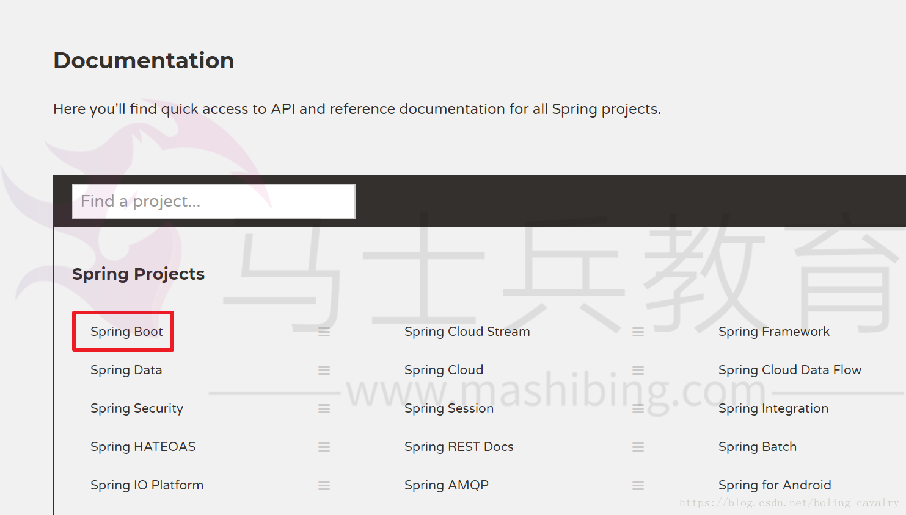

---

2. 在弹出的列表中选择1.5.16版本的reference，如下图红框：
3. 在打开的文档目录中很容易找到starter的章节，地址是：https://docs.spring.io/spring-boot/doc
s/1.5.16.RELEASE/reference/htmlsingle/#using-boot-starter，内容如下图：
 
我的理解：
 第一. 在应用中可以用starter将依赖库问题变得简单，如果你想依赖Spring和JPA，只需在应用中依赖
spring-boot-starter-data-jpa即可；
 第二. 常用库的官方starter，其artifactId的格式类似"spring-boot-starter-*"， 对于非官方的starter，
建议将业务名称放在"spring-boot-starter"前面，例如"acme-spring-boot-starter"；
 第三. 已列举常用的官方starter，可用来参考；

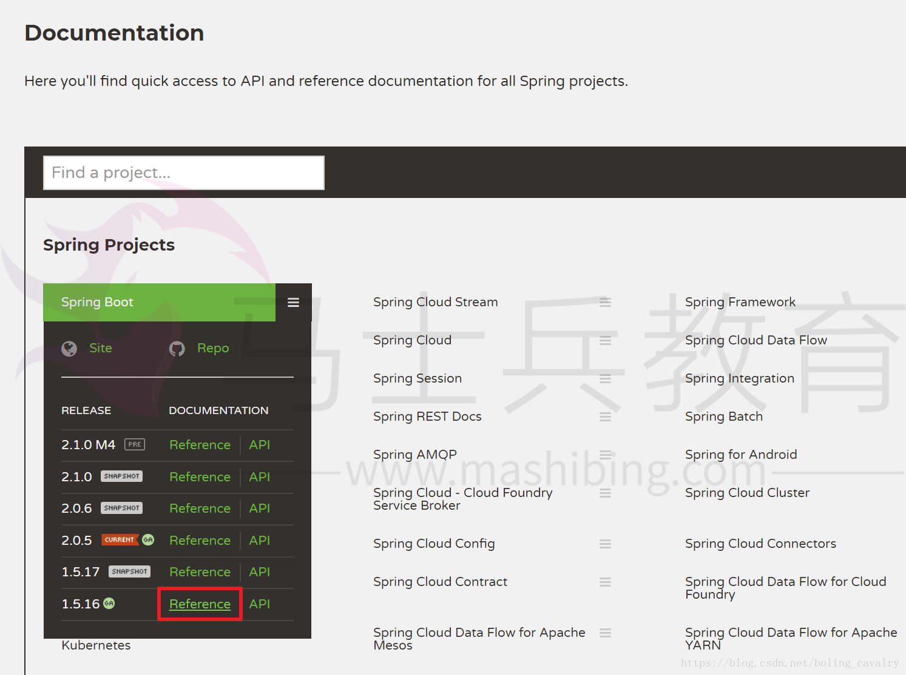

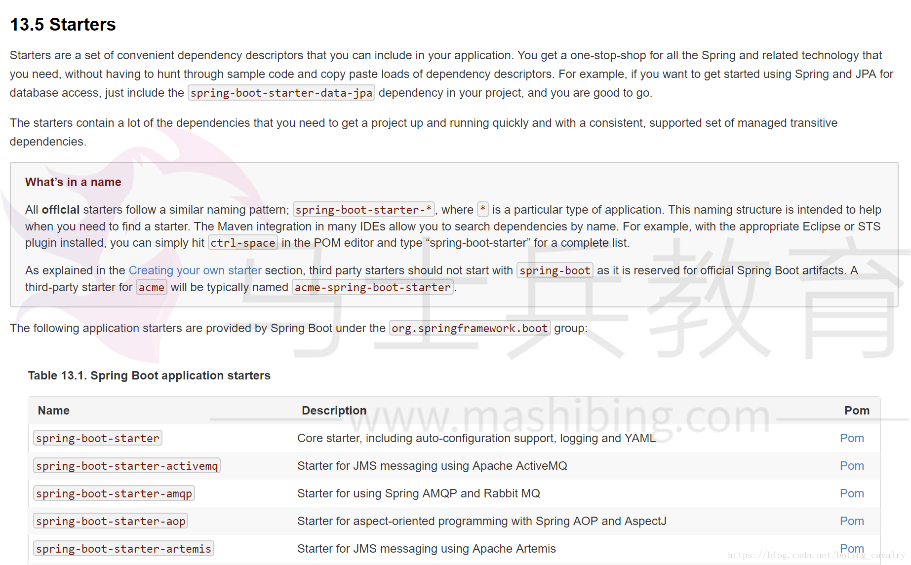

---

设定实战目标
 
 
本次实战的目标如下：
 
1. A应用提供加法计算的服务；
2. B应用提供减法计算的服务；
3. C应用要使用加法计算和减法计算的服务，并且减法服务可以通过配置来实现是否支持负数；
 
学习spring cloud的starter
 
 
目标已定下，但是先不急着编码，我们去看下spring cloud的设计，用来作为借鉴参考；
 
回顾一下我们使用Spring cloud的时候，如果要把一个应用作为Eureka client注册到Eureka server，只
需在应用的pom.xml中添加如下依赖：
 
 
注册到Eureka server的工作，是由CloudEurekaClient类完成的，该类属于模块spring-cloud-netflix-
eureka-client，因此我们要弄清楚以下两点：
 
1. 为什么不需要应用的pom.xml中依赖spring-cloud-netflix-eureka-client？
2. 为什么应用能自动注册到Eureka sever？
 
如何建立对spring-cloud-netflix-eureka-client模块的依赖
 
 
打开spring-cloud-starter-netflix-eureka-client模块的pom.xml文件就一目了然了，如下图，原来在这
个pom.xml文件中已经依赖了spring-cloud-netflix-eureka-client模块，因此，我们的应用只需依赖
spring-cloud-starter-netflix-eureka-client模块，就能间接依赖到spring-cloud-netflix-eureka-client模
块：
<dependency>
    <groupId>org.springframework.cloud</groupId>
    <artifactId>spring-cloud-starter-netflix-eureka-client</artifactId>
</dependency>

---

再看看上图中其他的依赖，可以发现的确如官方文档所说，starter处理了复杂的依赖关系，我们只需要
依赖starter即可，官方文档中还有一段话需要注意，如下图：

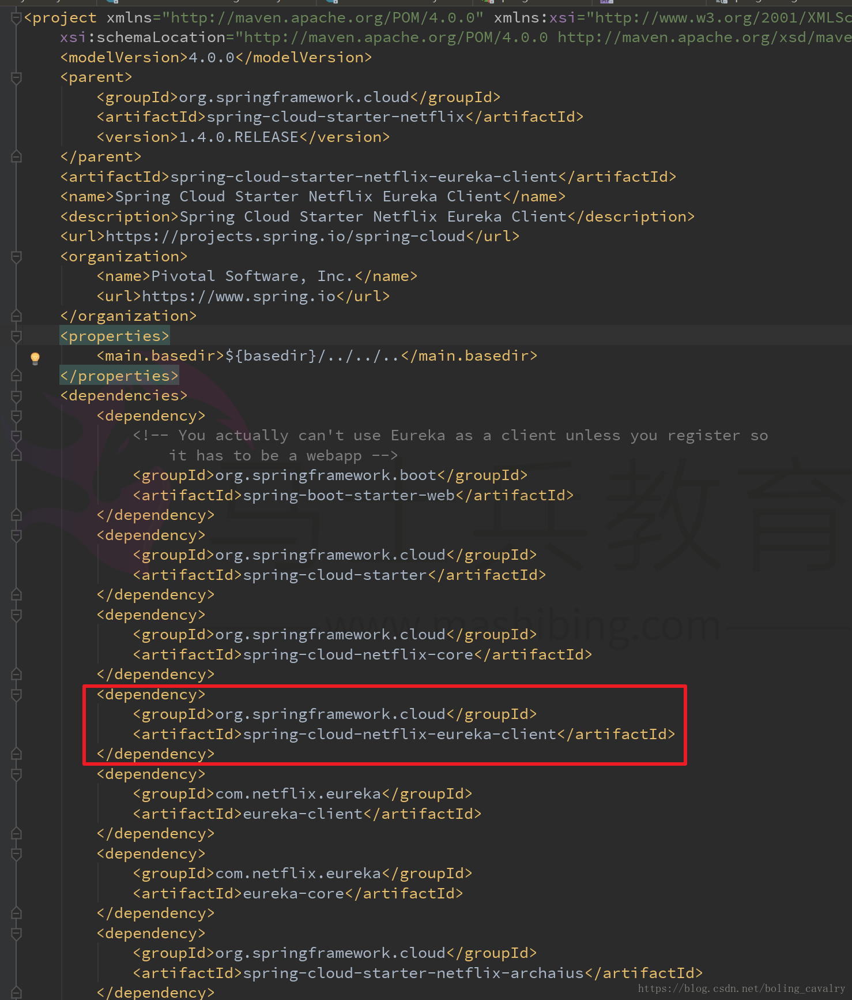

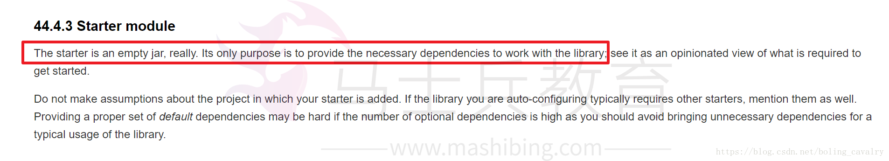

---

上图红框中说明starter是个空的jar，其作用就是用来提供必要的模块依赖的，来看看spring-cloud-
starter-netflix-eureka-client模块是否遵守此规则，如下图，只有配置文件，没有任何class：
 
为什么应用能自动注册到Eureka sever
 
 
作为Eureka client的应用，在启动后就自动注册到Eureka server了，作为应用开发者的我们除了在
pom.xml中依赖spring-cloud-starter-netflix-eureka-client模块，没有做其他设置，这是如何实现的
呢？
 
1. 注册到Eureka server的工作，是CloudEurekaClient类在其父类的构造方法中完成的，搜索源码发
现此类的在EurekaClientAutoConfiguration中被注册到spring容器，如下图红框所示：
 
所以，现在问题就变成了如何让EurekaClientAutoConfiguration类被实例化?
 
1. 在spring-cloud-netflix-eureka-client模块的spring.factories文件中，找到了
EurekaClientAutoConfiguration：

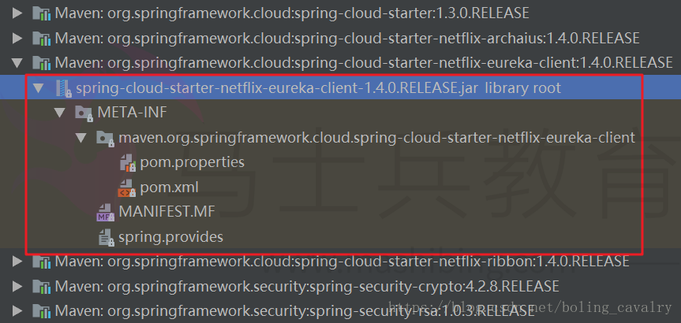

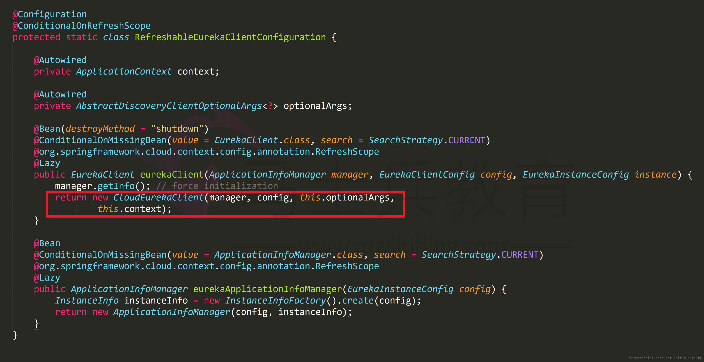

---

模块名称
作用
备注
customizeapi
包含
了接口
和异常
的定义
实现和调用服务时用到的接口和异常都在此工程中
addservice
提供加
法服务
普通的maven工程，里面加法接口的实现类
minusservice
提供减
法服务
普通的maven工程，里面有两个减法接口的实现类，一
个支持负数，另一个不支持
customizeservicestarter
自定义
starter
模块
pom.xml中依赖了customizeapi、addservice、
minusservice，自身有个Configuration类，通过@Bean
注解向spring容器注册AddService和MinusService的实
例
 
这是个spring boot的扩展配置，在此文件中配置的bean都会被实例化，然后注册到spring容器，具体的
细节，我们会在第三章结合spring boot源码详细分析，本章只要知道用法即可；
 
此处小结Eureka client自动注册到Eureka server的过程：
 第一、spring-cloud-netflix-eureka-client模块的spring.factories文件中配置了
EurekaClientAutoConfiguration，因此EurekaClientAutoConfiguration会被实例化并注册到Spring容
器中；
 第二、EurekaClientAutoConfiguration中配置了CloudEurekaClient，因此CloudEurekaClient会实例
化，在构造方法中执行了注册；
 
实战的设计
 
 
参考了spring cloud的starter设计后，接下来的实战被设计成两个maven工程：customizestarter和
customizestartertestdemo；
 
1. 工程customizestarter里面包含了四个模块，每个模块功能如下所示：

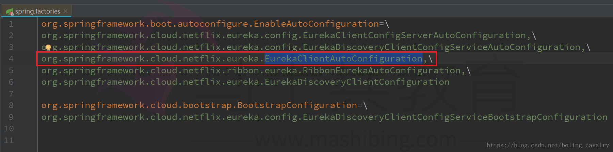

---

1. 工程customizestartertestdemo在pom.xml中依赖了上述的customizeservicestarter模块，提供
的web服务会用到addservice和minusservice的服务，并且在应用启动时设置环境变量来选择使用
的减法服务是否支持负数；
 
至此，准备工作已经完成了，对基本原理和开发设计都已经清楚，接下来的章节我们来一起开发上述五
个工程；
 
 
自定义spring boot starter三部曲之二：实战开发
 
 
本文是《自定义spring boot starter三部曲》的第二篇，上一篇中我们通过学习spring cloud的starter，
对spring boot的starter有了初步了解，也设计好了实战内容，今天就来一起实现；
本章内容概述
 
1. 创建工程customizestarter；
2. 创建模块customizeapi；
3. 创建模块addservice；
4. 创建模块minusservice；
5. 创建模块customizeservicestarter；
6. 构建工程customizestarter，并安装到本地maven仓库；
7. 创建工程customizestartertestdemo；
8. 构建工程customizestartertestdemo，得到jar包；
9. 启动customizestartertestdemo工程的jar包，并带上一个启动参数，验证支持负数的减法服务；
10. 启动customizestartertestdemo工程的jar包，验证不支持服务的减法服务；
 
创建工程customizestarter
 
1. 创建一个名为customizestarter的maven工程，以spring-boot-starter-parent作为父工程，同时自
身又是后续几个模块的父工程，pom.xml内容如下：
<?xml version="1.0" encoding="UTF-8"?>
<project xmlns="http://maven.apache.org/POM/4.0.0"
         xmlns:xsi="http://www.w3.org/2001/XMLSchema-instance"
         xsi:schemaLocation="http://maven.apache.org/POM/4.0.0 
http://maven.apache.org/xsd/maven-4.0.0.xsd">
    <modelVersion>4.0.0</modelVersion>
    <groupId>com.bolingcavalry</groupId>
    <artifactId>customizestarter</artifactId>
    <packaging>pom</packaging>
    <version>0.0.1-SNAPSHOT</version>
    <properties>
        <project.build.sourceEncoding>UTF-8</project.build.sourceEncoding>
    </properties>
    <parent>
        <groupId>org.springframework.boot</groupId>
        <artifactId>spring-boot-starter-parent</artifactId>

---

创建模块customizeapi
 
1. 在工程customizestarter下创建模块customizeapi，这是个java工程，里面是加法和减法服务的接
口，和一个业务异常的定义；
2. customizeapi的pom.xml内容如下，很简单，只有基本定义：
1. 异常定义类：
1. 加法服务的接口类AddService：
        <version>1.5.9.RELEASE</version>
        <relativePath/>
    </parent>
    <modules>
        <!--加法服务-->
        <module>addservice</module>
        <!--减法服务-->
        <module>minusservice</module>
        <!--接口和异常定义-->
        <module>customizeapi</module>
        <!--启动器-->
        <module>customizeservicestarter</module>
    </modules>
</project>
<?xml version="1.0" encoding="UTF-8"?>
<project xmlns="http://maven.apache.org/POM/4.0.0"
         xmlns:xsi="http://www.w3.org/2001/XMLSchema-instance"
         xsi:schemaLocation="http://maven.apache.org/POM/4.0.0 
http://maven.apache.org/xsd/maven-4.0.0.xsd">
    <parent>
        <artifactId>customizestarter</artifactId>
        <groupId>com.bolingcavalry</groupId>
        <version>0.0.1-SNAPSHOT</version>
        <relativePath>../</relativePath>
    </parent>
    <modelVersion>4.0.0</modelVersion>
    <artifactId>customizeapi</artifactId>
</project>
package com.bolingcavalry.api.exception;
/**
 * @author wilzhao
 * @description 执行减法服务时抛出的异常
 * @email zq2599@gmail.com
 * @time 2018/10/13 14:20
 */
public class MinusException extends Exception{
    public MinusException(String message) {
        super(message);
    }
}

---

1. 减法服务定义类，注意减法API声明了异常抛出，因为如果已经配置了不支持负数的减法服务，那
么被减数如果小于减数就抛出异常：
创建模块addservice
 
1. 在工程customizestarter下创建模块addservice，这是个java工程，里面包含了加法相服务的实
现，pom.xml内容如下，注意由于要实现加法接口，因此需要依赖模块customizeapi：
package com.bolingcavalry.api.service;
/**
 * @author wilzhao
 * @description 加法服务对应的接口
 * @email zq2599@gmail.com
 * @time 2018/10/13 10:07
 */
public interface AddService {
    /**
     * 普通加法
     * @param a
     * @param b
     * @return
     */
    int add(int a, int b);
}
package com.bolingcavalry.api.service;
import com.bolingcavalry.api.exception.MinusException;
/**
 * @author wilzhao
 * @description 减法服务
 * @email zq2599@gmail.com
 * @time 2018/10/13 12:07
 */
public interface MinusService {
    /**
     * 普通减法
     * @param minuend 减数
     * @param subtraction 被减数
     * @return 差
     */
    int minus(int minuend, int subtraction) throws MinusException;
}
<?xml version="1.0" encoding="UTF-8"?>
<project xmlns="http://maven.apache.org/POM/4.0.0"
         xmlns:xsi="http://www.w3.org/2001/XMLSchema-instance"
         xsi:schemaLocation="http://maven.apache.org/POM/4.0.0 
http://maven.apache.org/xsd/maven-4.0.0.xsd">
    <parent>
        <artifactId>customizestarter</artifactId>
        <groupId>com.bolingcavalry</groupId>
        <version>0.0.1-SNAPSHOT</version>
        <relativePath>../</relativePath>

---

1. 加法接口的实现类AddServiceImpl很简单，如下：
创建模块minusservice
 
1. 在工程customizestarter下创建模块minusservice，这是个java工程，里面包含了减法相服务的实
现，pom.xml内容如下，注意由于要实现减法接口，因此需要依赖模块customizeapi：
    </parent>
    <artifactId>addservice</artifactId>
    <modelVersion>4.0.0</modelVersion>
    <dependencies>
        <dependency>
            <groupId>com.bolingcavalry</groupId>
            <artifactId>customizeapi</artifactId>
            <version>${project.version}</version>
        </dependency>
    </dependencies>
</project>
package com.bolingcavalry.addservice.service.impl;
import com.bolingcavalry.api.service.AddService;
/**
 * @author wilzhao
 * @description 加法服务的实现
 * @email zq2599@gmail.com
 * @time 2018/10/13 10:59
 */
public class AddServiceImpl implements AddService {
    public int add(int a, int b) {
        return a + b;
    }
}
<?xml version="1.0" encoding="UTF-8"?>
<project xmlns="http://maven.apache.org/POM/4.0.0"
         xmlns:xsi="http://www.w3.org/2001/XMLSchema-instance"
         xsi:schemaLocation="http://maven.apache.org/POM/4.0.0 
http://maven.apache.org/xsd/maven-4.0.0.xsd">
    <parent>
        <artifactId>customizestarter</artifactId>
        <groupId>com.bolingcavalry</groupId>
        <version>0.0.1-SNAPSHOT</version>
        <relativePath>../</relativePath>
    </parent>
    <modelVersion>4.0.0</modelVersion>
    <artifactId>minusservice</artifactId>
    <dependencies>
        <dependency>
            <groupId>com.bolingcavalry</groupId>
            <artifactId>customizeapi</artifactId>
            <version>${project.version}</version>
        </dependency>
    </dependencies>

---

1. 一共有两个减法接口的实现类，第一个不支持负数结果，如果被减数小于减数就抛出异常
MinusException：
1. 第二个减法接口的实现类支持负数返回：
</project>
package com.bolingcavalry.minusservice.service.impl;
import com.bolingcavalry.api.exception.MinusException;
import com.bolingcavalry.api.service.MinusService;
/**
 * @author wilzhao
 * @description 减法服务的实现，不支持负数
 * @email zq2599@gmail.com
 * @time 2018/10/13 14:24
 */
public class MinusServiceNotSupportNegativeImpl implements MinusService {
    /**
     * 减法运算，不支持负数结果，如果被减数小于减数，就跑出MinusException
     * @param minuend 被减数
     * @param subtraction 减数
     * @return
     * @throws MinusException
     */
    public int minus(int minuend, int subtraction) throws MinusException {
        if(subtraction>minuend){
            throw new MinusException("not support negative!");
        }
        return minuend-subtraction;
    }
}
package com.bolingcavalry.minusservice.service.impl;
import com.bolingcavalry.api.exception.MinusException;
import com.bolingcavalry.api.service.MinusService;
/**
 * @author wilzhao
 * @description 支持负数结果的减法服务
 * @email zq2599@gmail.com
 * @time 2018/10/13 14:30
 */
public class MinusServiceSupportNegativeImpl implements MinusService {
    /**
     * 减法实现，支持负数
     * @param minuend 减数
     * @param subtraction 被减数
     * @return
     * @throws MinusException
     */

---

创建模块customizeservicestarter
 
1. 在工程customizestarter下创建模块customizeservicestarter，这是个java工程，里面需要依赖
spring boot配置相关的库，由于要在配置中实例化加法和减法服务的实现，因此customizeapi、
addservice、minusservice这些模块都要在pom.xml中声明依赖，如下：
1. 创建配置类CustomizeConfiguration，注意getSupportMinusService和
getNotSupportMinusService这两个方法上的注解配置，如果环境变量
com.bolingcavalry.supportnegative存在并且等于true，那么getSupportMinusService方法就返
回了MinusService接口的实例，如果当前环境没有MinusService接口的实例，就由
getNotSupportMinusService方法就返回一个，并且有会在控制台打印创建了哪种实现：
    public int minus(int minuend, int subtraction) throws MinusException {
        return minuend - subtraction;
    }
}
<?xml version="1.0" encoding="UTF-8"?>
<project xmlns="http://maven.apache.org/POM/4.0.0"
         xmlns:xsi="http://www.w3.org/2001/XMLSchema-instance"
         xsi:schemaLocation="http://maven.apache.org/POM/4.0.0 
http://maven.apache.org/xsd/maven-4.0.0.xsd">
    <parent>
        <artifactId>customizestarter</artifactId>
        <groupId>com.bolingcavalry</groupId>
        <version>0.0.1-SNAPSHOT</version>
        <relativePath>../</relativePath>
    </parent>
    <artifactId>customizeservicestarter</artifactId>
    <modelVersion>4.0.0</modelVersion>
    
    <dependencies>
        <dependency>
            <groupId>org.springframework.boot</groupId>
            <artifactId>spring-boot-autoconfigure</artifactId>
            <!--仅编译时才需要-->
            <scope>provided</scope>
        </dependency>
        <dependency>
            <groupId>com.bolingcavalry</groupId>
            <artifactId>customizeapi</artifactId>
            <version>${project.version}</version>
        </dependency>
        <dependency>
            <groupId>com.bolingcavalry</groupId>
            <artifactId>addservice</artifactId>
            <version>${project.version}</version>
        </dependency>
        <dependency>
            <groupId>com.bolingcavalry</groupId>
            <artifactId>minusservice</artifactId>
            <version>${project.version}</version>
        </dependency>
    </dependencies>
</project>

---

package com.bolingcavalry.customizeservicestarter;
import com.bolingcavalry.addservice.service.impl.AddServiceImpl;
import com.bolingcavalry.api.service.AddService;
import com.bolingcavalry.api.service.MinusService;
import 
com.bolingcavalry.minusservice.service.impl.MinusServiceNotSupportNegativeImpl;
import 
com.bolingcavalry.minusservice.service.impl.MinusServiceSupportNegativeImpl;
import org.springframework.beans.factory.annotation.Qualifier;
import 
org.springframework.boot.autoconfigure.condition.ConditionalOnMissingBean;
import org.springframework.boot.autoconfigure.condition.ConditionalOnProperty;
import org.springframework.context.annotation.Bean;
import org.springframework.context.annotation.Configuration;
/**
 * @author wilzhao
 * @description 一句话介绍
 * @email zq2599@gmail.com
 * @time 2018/10/13 14:36
 */
@Configuration
public class CustomizeConfiguration {
    @Bean
    public AddService getAddService(){
        System.out.println("create addService");
        return new AddServiceImpl();
    }
    /**
     * 如果配置了com.bolingcavalry.supportnegative=true，
     * 就实例化MinusServiceSupportNegativeImpl
     * @return
     */
    @Bean
    @ConditionalOnProperty(prefix="com.bolingcavalry",name = "supportnegative", 
havingValue = "true")
    public MinusService getSupportMinusService(){
        System.out.println("create minusService support minus");
        return new MinusServiceSupportNegativeImpl();
    }
    /**
     * 如果没有配置com.bolingcavalry.supportnegative=true，
     * 就不会实例化MinusServiceSupportNegativeImpl，
     * 这里的条件是如果没有MinusService类型的bean，就在此实例化一个
     * @return
     */
    @Bean
    @ConditionalOnMissingBean(MinusService.class)
    public MinusService getNotSupportMinusService(){
        System.out.println("create minusService not support minus");
        return new MinusServiceNotSupportNegativeImpl();
    }
}

---

1. 在src\main\resources目录下创建一个目录META-INF，里面创建一个文件spring.factories，内容
是如下，表示如果当前应用支持spring boot的自动配置，就会被spring boot框架实例化并注册到
spring容器内：
构建工程customizestarter
 
1. 到这里customizestarter工程的编码就结束了，在工程内pom.xml所在目录（也就是
customizestarter内的第一层目录），执行以下命令可以编译构建并安装到本地maven仓库：
1. 如果编译构建和安装都成功了，可以看到类似如下输出：
现在starter已经准备好了，我们做一个spring boot的web应用来验证一下；
创建工程customizestartertestdemo
 
1. 工程customizestartertestdemo是个简单的spring boot应用，pom.xml如下，可见并无特别之
处，只是多了customizeservicestarter的依赖：
org.springframework.boot.autoconfigure.EnableAutoConfiguration=com.bolingcavalry
.customizeservicestarter.CustomizeConfiguration
mvn clean install -Dmaven.test.skip=true -U
[INFO] Installing 
C:\temp\201810\07\customizestarter\customizeservicestarter\pom.xml to 
C:\Users\12167\.m2\repositor
y\com\bolingcavalry\customizeservicestarter\0.0.1-
SNAPSHOT\customizeservicestarter-0.0.1-SNAPSHOT.pom
[INFO] ------------------------------------------------------------------------
[INFO] Reactor Summary:
[INFO]
[INFO] customizestarter ................................... SUCCESS [  0.748 s]
[INFO] customizeapi ....................................... SUCCESS [  3.266 s]
[INFO] addservice ......................................... SUCCESS [  0.427 s]
[INFO] minusservice ....................................... SUCCESS [  0.344 s]
[INFO] customizeservicestarter ............................ SUCCESS [  0.495 s]
[INFO] ------------------------------------------------------------------------
[INFO] BUILD SUCCESS
[INFO] ------------------------------------------------------------------------
[INFO] Total time: 5.954 s
[INFO] Finished at: 2018-10-14T00:17:46+08:00
[INFO] Final Memory: 29M/221M
[INFO] ------------------------------------------------------------------------
<?xml version="1.0" encoding="UTF-8"?>
<project xmlns="http://maven.apache.org/POM/4.0.0" 
xmlns:xsi="http://www.w3.org/2001/XMLSchema-instance"
         xsi:schemaLocation="http://maven.apache.org/POM/4.0.0 
http://maven.apache.org/xsd/maven-4.0.0.xsd">
    <modelVersion>4.0.0</modelVersion>
    <groupId>com.bolingcavalry</groupId>
    <artifactId>customizestartertestdemo</artifactId>
    <version>0.0.1-SNAPSHOT</version>
    <packaging>jar</packaging>

---

1. 开发一个Controller类，用于调用AddService和MinusService对应的服务：
    <name>customizestartertestdemo</name>
    <description>Demo project for Spring Boot</description>
    <parent>
        <groupId>org.springframework.boot</groupId>
        <artifactId>spring-boot-starter-parent</artifactId>
        <version>1.5.9.RELEASE</version>
        <relativePath/> <!-- lookup parent from repository -->
    </parent>
    <properties>
        <project.build.sourceEncoding>UTF-8</project.build.sourceEncoding>
        <project.reporting.outputEncoding>UTF-
8</project.reporting.outputEncoding>
        <java.version>1.8</java.version>
    </properties>
    <dependencies>
        <dependency>
            <groupId>org.springframework.boot</groupId>
            <artifactId>spring-boot-starter-web</artifactId>
        </dependency>
        <dependency>
            <groupId>org.springframework.boot</groupId>
            <artifactId>spring-boot-starter-test</artifactId>
            <scope>test</scope>
        </dependency>
        <dependency>
            <groupId>com.bolingcavalry</groupId>
            <artifactId>customizeservicestarter</artifactId>
            <version>0.0.1-SNAPSHOT</version>
        </dependency>
    </dependencies>
    <build>
        <plugins>
            <plugin>
                <groupId>org.springframework.boot</groupId>
                <artifactId>spring-boot-maven-plugin</artifactId>
            </plugin>
        </plugins>
    </build>
</project>
package com.bolingcavalry.customizestartertestdemo.controller;
import com.bolingcavalry.api.exception.MinusException;
import com.bolingcavalry.api.service.AddService;
import com.bolingcavalry.api.service.MinusService;
import org.springframework.beans.factory.annotation.Autowired;
import org.springframework.web.bind.annotation.*;

---

1. 启动类如下:
构建工程customizestartertestdemo
 
1. 在customizestartertestdemo工程的pom.xml所在目录下执行以下命令即可构建成功：
1. 命令执行成功后，即可在target目录下见到customizestartertestdemo-0.0.1-SNAPSHOT.jar文
件，如下图：
/**
 * @author wilzhao
 * @description 调用加法和减法服务的测试类
 * @email zq2599@gmail.com
 * @time 2018/10/13 16:00
 */
@RestController
public class CalculateController {
    @Autowired
    private AddService addService;
    @Autowired
    private MinusService minusService;
    @RequestMapping(value = "/add/{added}/{add}", method = RequestMethod.GET)
    public String add(@PathVariable("added") int added, @PathVariable("add") int 
add){
        return added + " 加 " + add + " 等于 : " + addService.add(added, add);
    }
    @RequestMapping(value = "/minus/{minuend}/{subtraction}", method = 
RequestMethod.GET)
    public String minus(@PathVariable("minuend") int minuend, 
@PathVariable("subtraction") int subtraction) throws MinusException {
        return minuend + " 减 " + subtraction + " 等于 : " + 
minusService.minus(minuend, subtraction);
    }
}
package com.bolingcavalry.customizestartertestdemo;
import org.springframework.boot.SpringApplication;
import org.springframework.boot.autoconfigure.SpringBootApplication;
@SpringBootApplication
public class CustomizestartertestdemoApplication {
    public static void main(String[] args) {
        SpringApplication.run(CustomizestartertestdemoApplication.class, args);
    }
}
mvn clean package -Dmaven.test.skip=true

---

现在编码和构建已经全部完成，我们可以来验证了；
验证支持负数的减法服务
 
1. 在customizeapi模块的CustomizeConfiguration类中，有如下方法和注解：
从上述代码可见，只要环境变量"com.bolingcavalry.supportnegative"等于true，注册到spring容器的
就是MinusServiceSupportNegativeImpl类的实例；
1. customizestartertestdemo-0.0.1-SNAPSHOT.jar文件所在目录下，执行以下命令启动应用：
1. 在控制台中可以看见create minusService support minus，表示注册到spring容器的是
MinusServiceSupportNegativeImpl类的实例，如下所示：
@Bean
    @ConditionalOnProperty(prefix="com.bolingcavalry",name = "supportnegative", 
havingValue = "true")
    public MinusService getSupportMinusService(){
        System.out.println("create minusService support minus");
        return new MinusServiceSupportNegativeImpl();
    }
java -Dcom.bolingcavalry.supportnegative=true -jar customizestartertestdemo-
0.0.1-SNAPSHOT.jar
2018-10-14 12:04:54.233  INFO 16588 --- [ost-startStop-1] 
o.s.b.w.servlet.FilterRegistrationBean   : Mapping filter: 'requestContextFilter'
 to: [/*]
create addService
create minusService support minus
2018-10-14 12:04:54.845  INFO 16588 --- [           main] 
s.w.s.m.m.a.RequestMappingHandlerAdapter : Looking for @ControllerAdvice: 
org.springframework.boot.context.embedded.AnnotationConfigEmbeddedWebApplication
Context@443b7951: startup date [Sun Oct 14 12:04:50 CST 2018]; root of context 
hierarchy

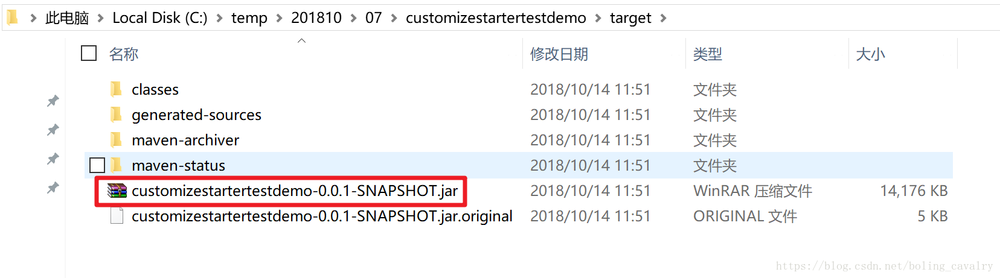

---

1. 在浏览器访问http://localhost:8080/minus/1/2，可见返回计算结果为负数：
验证不支持负数的减法服务
 
1. 前面已经分析过，CustomizeConfiguration类的getNotSupportMinusService方法执行的条件是
环境变量"com.bolingcavalry.supportnegative"等于true，如果没有这个环境变量，
getNotSupportMinusService方法就不会执行，spring容器中就没有MinusService接口的实例；
2. CustomizeConfiguration类中，有如下方法和注解：
从上述代码可见，spring容器中如果没有MinusService接口的实例，getNotSupportMinusService方法
就会被执行，在spring容器中注册MinusServiceNotSupportNegativeImpl实例；
因此接下来的我们启动的应用如果没有环境变量"com.bolingcavalry.supportnegative"，就可以使用到
不支持负数的减法服务了；
\2. 停掉之前启动的应用，然后执行以下命令启动应用：
1. 在控制台中可以看见create minusService not support minus，表示注册到spring容器的是
MinusServiceNotSupportNegativeImpl类的实例，如下所示：
1. 在浏览器访问http://localhost:8080/minus/1/2，由于MinusServiceNotSupportNegativeImpl实
例不支持负数减法，会直接抛出异常，如下图：
    @Bean
    @ConditionalOnMissingBean(MinusService.class)
    public MinusService getNotSupportMinusService(){
        System.out.println("create minusService not support minus");
        return new MinusServiceNotSupportNegativeImpl();
    }
java -jar customizestartertestdemo-0.0.1-SNAPSHOT.jar
2018-10-14 12:15:05.994  INFO 16608 --- [ost-startStop-1] 
o.s.b.w.servlet.FilterRegistrationBean   : Mapping filter: 'requestContextFilter'
 to: [/*]
create addService
create minusService not support minus
2018-10-14 12:15:06.592  INFO 16608 --- [           main] 
s.w.s.m.m.a.RequestMappingHandlerAdapter : Looking for @ControllerAdvice: 
org.springframework.boot.context.embedded.AnnotationConfigEmbeddedWebApplication
Context@443b7951: startup date [Sun Oct 14 12:15:02 CST 2018]; root of context 
hierarchy

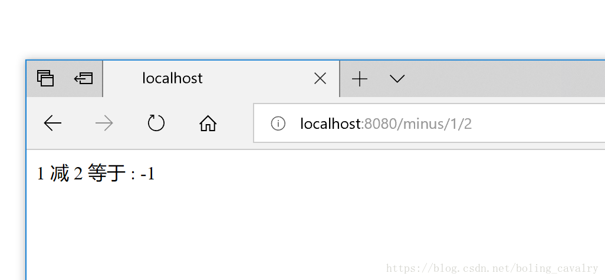

---

至此，自定义spring boot starter的编码实战就完成了，希望本篇可以给您用来作参考，助您做出自己
所需的starter；
下一篇我们一起去看看spring boot的源码，对这个高效的扩展功能做更深入的了解；
 
 
自定义spring boot starter三部曲之三：源码分析spring.factories加载过程
 
 
版本情况
 
本文中涉及到的库的版本：
1. Spring boot ：1.5.9.RELEASE；
2. JDK ：1.8.0_144
初步分析
 
先回顾customizeservicestarter模块中spring.factories文件的内容：
从上述内容可以确定今天源码学习目标：
1. spring容器如何处理配置类；
2. spring boot配置类的加载情况；
3. spring.factories中的EnableAutoConfiguration配置何时被加载？
4. spring.factories中的EnableAutoConfiguration配置被加载后做了什么处理；
spring容器如何处理配置类
 
1. ConfigurationClassPostProcessor类的职责是处理配置类；
2. ConfigurationClassPostProcessor是BeanDefinitionRegistryPostProcessor接口的实现类，它的
postProcessBeanDefinitionRegistry方法在容器初始化阶段会被调用；
3. postProcessBeanDefinitionRegistry方法又调用processConfigBeanDefinitions方法处理具体业
务；
org.springframework.boot.autoconfigure.EnableAutoConfiguration=com.bolingcavalry
.customizeservicestarter.CustomizeConfiguration

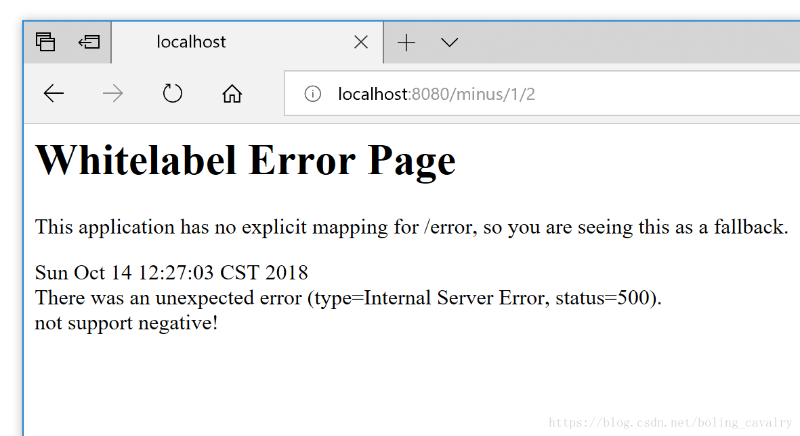

---

4. processConfigBeanDefinitions方法中通过ConfigurationClassParser类来处理Configuration注
解，如下图：
5. 如上图红框所示，所有被Configuration注解修饰过的类，都会被parser.parse(candidates)处理，
即ConfigurationClassParser类的parse方法；
6. parse方法中调用processDeferredImportSelectors方法做处理：找到Configuration类中的
Import注解，对于Import注解的值，如果实现了ImportSelector接口，就调用其selectImports方
法，将返回的名称实例化：
小结一下spring容器配置类的逻辑：
1. 找出配置类；
2. 找出配置类中的Import注解；
private void processDeferredImportSelectors() {
        //这里就是Configuration注解中的Import注解的值，
        //例如EnableAutoConfiguration注解的源码中，Import注解的值是
EnableAutoConfigurationImportSelector.class
        List<DeferredImportSelectorHolder> deferredImports = 
this.deferredImportSelectors;
        this.deferredImportSelectors = null;
        Collections.sort(deferredImports, DEFERRED_IMPORT_COMPARATOR);
        for (DeferredImportSelectorHolder deferredImport : deferredImports) {
            ConfigurationClass configClass = 
deferredImport.getConfigurationClass();
            try {
                //以EnableAutoConfiguration注解为例，其Import注解的值为
EnableAutoConfigurationImportSelector.class，
                //那么此处就是在调用EnableAutoConfigurationImportSelector的
selectImports方法，返回了一个字符串数组
                String[] imports = 
deferredImport.getImportSelector().selectImports(configClass.getMetadata());
                //字符串数组中的每个字符串都代表一个类，此处做实例化
                processImports(configClass, asSourceClass(configClass), 
asSourceClasses(imports), false);
            }
            catch (BeanDefinitionStoreException ex) {
                throw ex;
            }
            catch (Throwable ex) {
                throw new BeanDefinitionStoreException(
                        "Failed to process import candidates for configuration 
class [" +
                        configClass.getMetadata().getClassName() + "]", ex);
            }
        }
    }

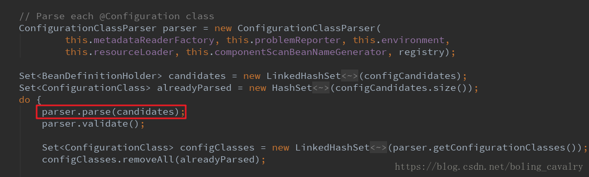

---

3. Import注解的值是class，如果该class实现了ImportSelector接口，就调用其selectImports方法，
将返回的名称实例化；
有了上面的结论就可以结合Spring boot的源码来分析加载了哪些数据了；
spring boot配置类的加载情况
 
1. 我们的应用使用了SpringBootApplication注解，看此注解的源码，使用了
EnableAutoConfiguration注解：
2. EnableAutoConfiguration注解中，通过Import注解引入了
EnableAutoConfigurationImportSelector.class：
3. 看EnableAutoConfigurationImportSelector的源码：
@Target(ElementType.TYPE)
@Retention(RetentionPolicy.RUNTIME)
@Documented
@Inherited
@SpringBootConfiguration
@EnableAutoConfiguration
@ComponentScan(excludeFilters = {
        @Filter(type = FilterType.CUSTOM, classes = TypeExcludeFilter.class),
        @Filter(type = FilterType.CUSTOM, classes = 
AutoConfigurationExcludeFilter.class) })
public @interface SpringBootApplication {
    ......
@Target(ElementType.TYPE)
@Retention(RetentionPolicy.RUNTIME)
@Documented
@Inherited
@AutoConfigurationPackage
@Import(EnableAutoConfigurationImportSelector.class)
public @interface EnableAutoConfiguration {
    ......
/**
 * {@link DeferredImportSelector} to handle {@link EnableAutoConfiguration
 * auto-configuration}. This class can also be subclassed if a custom variant of
 * {@link EnableAutoConfiguration @EnableAutoConfiguration}. is needed.
 *
 * @deprecated as of 1.5 in favor of {@link AutoConfigurationImportSelector}
 * @author Phillip Webb
 * @author Andy Wilkinson
 * @author Stephane Nicoll
 * @author Madhura Bhave
 * @since 1.3.0
 * @see EnableAutoConfiguration
 */
@Deprecated
public class EnableAutoConfigurationImportSelector
        extends AutoConfigurationImportSelector {
    @Override
    protected boolean isEnabled(AnnotationMetadata metadata) {

---

上述源码有三处重点需要关注：
第一，EnableAutoConfigurationImportSelector是AutoConfigurationImportSelector的子类；
第二，EnableAutoConfigurationImportSelector已经被废弃了，不推荐使用；
第三，文档中已经写明废弃原因：从1.5版本开始，其特性由父类AutoConfigurationImportSelector实
现；
4. 查看AutoConfigurationImportSelector的源码，重点关注selectImports方法，该方法的返回值表
明了哪些类会被实例化：
5. 通过上述代码可以发现，getCandidateConfigurations方法的调用是个关键，它返回的字符串都是
即将被实例化的类名，来看此方法源码：
        if (getClass().equals(EnableAutoConfigurationImportSelector.class)) {
            return getEnvironment().getProperty(
                    EnableAutoConfiguration.ENABLED_OVERRIDE_PROPERTY, 
Boolean.class,
                    true);
        }
        return true;
    }
}
@Override
    public String[] selectImports(AnnotationMetadata annotationMetadata) {
        if (!isEnabled(annotationMetadata)) {
            return NO_IMPORTS;
        }
        try {
            //将所有spring-autoconfigure-metadata.properties文件中的键值对保存在
autoConfigurationMetadata中
            AutoConfigurationMetadata autoConfigurationMetadata = 
AutoConfigurationMetadataLoader
                    .loadMetadata(this.beanClassLoader);
            AnnotationAttributes attributes = getAttributes(annotationMetadata);
            //取得所有配置类的名称
            List<String> configurations = 
getCandidateConfigurations(annotationMetadata,
                    attributes);
            configurations = removeDuplicates(configurations);
            configurations = sort(configurations, autoConfigurationMetadata);
            Set<String> exclusions = getExclusions(annotationMetadata, 
attributes);
            checkExcludedClasses(configurations, exclusions);
            configurations.removeAll(exclusions);
            configurations = filter(configurations, autoConfigurationMetadata);
            fireAutoConfigurationImportEvents(configurations, exclusions);
            return configurations.toArray(new String[configurations.size()]);
        }
        catch (IOException ex) {
            throw new IllegalStateException(ex);
        }
    }

---

6. getCandidateConfigurations方法中，调用了静态方法
SpringFactoriesLoader.loadFactoryNames，上面提到的
SpringFactoriesLoader.loadFactoryNames方法是关键，看看官方文档对此静态方法的描述，如
下图红框所示，该方法会在spring.factories文件中寻找指定接口对应的实现类的全名（包名+实现
类）：
7. 在getCandidateConfigurations方法中，调用SpringFactoriesLoader.loadFactoryNames的时候
传入的指定类型是getSpringFactoriesLoaderFactoryClass方法的返回值：
现在可以梳理一下了：
1. spring boot应用启动时使用了EnableAutoConfiguration注解；
2. EnableAutoConfiguration注解通过import注解将EnableAutoConfigurationImportSelector类实
例化，并且将其selectImports方法返回的类名实例化后注册到spring容器；
3. EnableAutoConfigurationImportSelector的selectImports方法返回的类名，来自spring.factories
文件内的配置信息，这些配置信息的key等于EnableAutoConfiguration；
现在真相大白了：只要我们在spring.factories文件内配置了EnableAutoConfiguration，那么对于的类
就会被实例化后注册到spring容器；
至此，《自定义spring boot starter三部曲》系列就完结了，希望实战加源码分析的三篇文章，能帮助
您理解和实现自定义starter这种简单快捷的扩展方式；
 
 
 
protected List<String> getCandidateConfigurations(AnnotationMetadata metadata,
            AnnotationAttributes attributes) {
        List<String> configurations = SpringFactoriesLoader.loadFactoryNames(
                getSpringFactoriesLoaderFactoryClass(), getBeanClassLoader());
        Assert.notEmpty(configurations,
                "No auto configuration classes found in META-
INF/spring.factories. If you "
                        + "are using a custom packaging, make sure that file is 
correct.");
        return configurations;
    }
protected Class<?> getSpringFactoriesLoaderFactoryClass() {
        return EnableAutoConfiguration.class;
    }

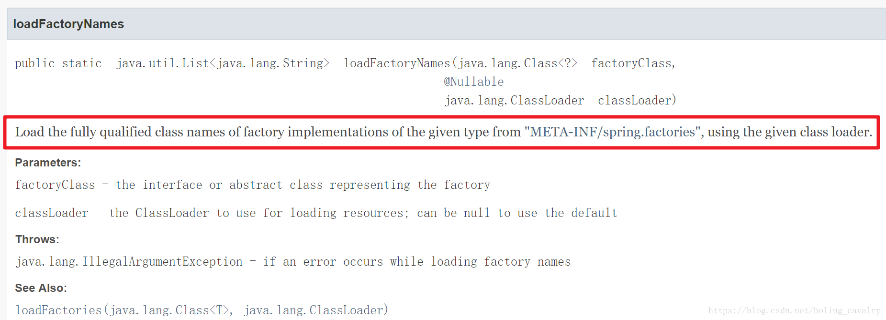

---

Spring IOC是什么？优点是什么？
 
IoC文英全称Inversion of Control，即控制反转，我么可以这么理解IoC容器：“把某些业务对 象的的控
制权交给一个平台或者框架来同一管理，这个同一管理的平台可以称为IoC容器。”
ioc的思想最核心的地方在于，资源不由使用资源的双方管理，而由不使用资源的第三方管理， 这可以带
来很多好处： 
1）资源集中管理，实现资源的可配置和易管理 
2）降低了使用资源双方的依赖程度，也就是我们说的耦合度 
 
 
 
 
 
Spring IOC原理解读 面试必读
 
 
 
一、什么是Ioc/DI？
 
  IoC 容器：最主要是完成了完成对象的创建和依赖的管理注入等等。
先从我们自己设计这样一个视角来考虑：
所谓控制反转，就是把原先我们代码里面需要实现的对象创建、依赖的代码，反转给容器来帮忙实现。
那么必然的我们需要创建一个容器，同时需要一种描述来让容器知道需要创建的对象与对象的关系。这
个描述最具体表现就是我们可配置的文件。
对象和对象关系怎么表示？
可以用 xml ， properties 文件等语义化配置文件表示。
描述对象关系的文件存放在哪里？
可能是 classpath ， filesystem ，或者是 URL 网络资源， servletContext 等。
回到正题，有了配置文件，还需要对配置文件解析。
不同的配置文件对对象的描述不一样，如标准的，自定义声明式的，如何统一？ 在内部需要有一个统一
的关于对象的定义，所有外部的描述都必须转化成统一的描述定义。
如何对不同的配置文件进行解析？需要对不同的配置文件语法，采用不同的解析器
 
二、 Spring IOC体系结构？
 
(1) BeanFactory
 Spring Bean的创建是典型的工厂模式，这一系列的Bean工厂，也即IOC容器为开发者管理对象间的依赖关
系提供了很多便利和基础服务，在Spring中有许多的IOC容器的实现供用户选择和使用，其相互关系如下：

---

其中BeanFactory作为最顶层的一个接口类，它定义了IOC容器的基本功能规范，BeanFactory 有三个子
类：ListableBeanFactory、HierarchicalBeanFactory 和AutowireCapableBeanFactory。但是从上图
中我们可以发现最终的默认实现类是 DefaultListableBeanFactory，他实现了所有的接口。那为何要定
义这么多层次的接口呢？查阅这些接口的源码和说明发现，每个接口都有他使用的场合，它主要是为了
区分在 Spring 内部在操作过程中对象的传递和转化过程中，对对象的数据访问所做的限制。例如 
ListableBeanFactory 接口表示这些 Bean 是可列表的，而 HierarchicalBeanFactory 表示的是这些 
Bean 是有继承关系的，也就是每个Bean 有可能有父 Bean。AutowireCapableBeanFactory 接口定义 
Bean 的自动装配规则。这四个接口共同定义了 Bean 的集合、Bean 之间的关系、以及 Bean 行为.
最基本的IOC容器接口BeanFactory
  
 
1 public interface BeanFactory {    
2      
3      //对FactoryBean的转义定义，因为如果使用bean的名字检索FactoryBean得到的对象是工厂生
成的对象，    
4      //如果需要得到工厂本身，需要转义           
5      String FACTORY_BEAN_PREFIX = "&"; 
6         
7      //根据bean的名字，获取在IOC容器中得到bean实例    
8      Object getBean(String name) throws BeansException;    
9    
10     //根据bean的名字和Class类型来得到bean实例，增加了类型安全验证机制。    
11      Object getBean(String name, Class requiredType) throws BeansException;   
 
12     
13     //提供对bean的检索，看看是否在IOC容器有这个名字的bean    
14      boolean containsBean(String name);    
15     
16     //根据bean名字得到bean实例，并同时判断这个bean是不是单例    
17     boolean isSingleton(String name) throws NoSuchBeanDefinitionException;   
 
18     
19     //得到bean实例的Class类型    
20     Class getType(String name) throws NoSuchBeanDefinitionException;    
21     
22     //得到bean的别名，如果根据别名检索，那么其原名也会被检索出来

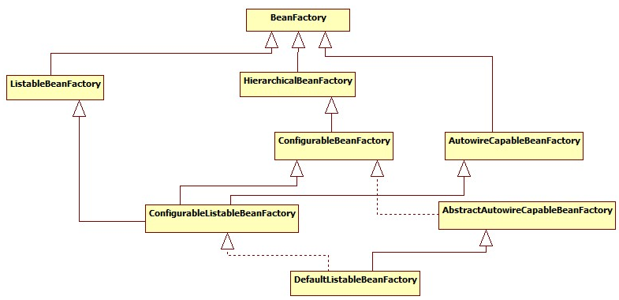

---

在BeanFactory里只对IOC容器的基本行为作了定义，根本不关心你的bean是如何定义怎样加载的。正
如我们只关心工厂里得到什么的产品对象，至于工厂是怎么生产这些对象的，这个基本的接口不关心。
从ApplicationContext接口的实现，我们看出其特点：
(2) BeanDefinition
 
Bean 的解析过程非常复杂，功能被分的很细，因为这里需要被扩展的地方很多，必须保证有足够的灵
活性，以应对可能的变化。Bean 的解析主要就是对 Spring 配置文件的解析。这个解析过程主要通过下
图中的类完成：
23    String[] getAliases(String name);    
24     
 }
  而要知道工厂是如何产生对象的，我们需要看具体的IOC容器实现，spring提供了许多IOC容器的实现。比
如XmlBeanFactory，ClasspathXmlApplicationContext等。其中XmlBeanFactory就是针对最基本
的ioc容器的实现，这个IOC容器可以读取XML文件定义的BeanDefinition（XML文件中对bean的描述）,如
果说XmlBeanFactory是容器中的屌丝，ApplicationContext应该算容器中的高帅富.
  ApplicationContext是Spring提供的一个高级的IoC容器，它除了能够提供IoC容器的基本功能外，还
为用户提供了以下的附加服务。
 1. 支持信息源，可以实现国际化。（实现MessageSource接口）
 2. 访问资源。(实现ResourcePatternResolver接口，这个后面要讲)
 3. 支持应用事件。(实现ApplicationEventPublisher接口)
 SpringIOC容器管理了我们定义的各种Bean对象及其相互的关系，Bean对象在Spring实现中是以
BeanDefinition来描述的，其继承体系如下：

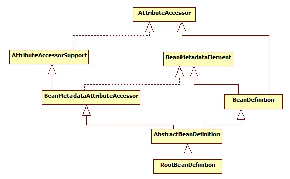

---

三、IoC容器的初始化？
 
 
ApplicationContext允许上下文嵌套，通过保持父上下文可以维持一个上下文体系。对于bean的查找可
以在这个上下文体系中发生，首先检查当前上下文，其次是父上下文，逐级向上，这样为不同的Spring
应用提供了一个共享的bean定义环境。
下面我们分别简单地演示一下两种ioc容器的创建过程
1、XmlBeanFactory(屌丝IOC)的整个流程
通过XmlBeanFactory的源码，我们可以发现:
IoC容器的初始化包括BeanDefinition的Resource定位、载入和注册这三个基本的过程。我们以
ApplicationContext为例讲解，ApplicationContext系列容器也许是我们最熟悉的，因为web项目中使
用的XmlWebApplicationContext就属于这个继承体系，还有ClasspathXmlApplicationContext等，
其继承体系如下图所示：
 public class XmlBeanFactory extends DefaultListableBeanFactory{
     private final XmlBeanDefinitionReader reader;

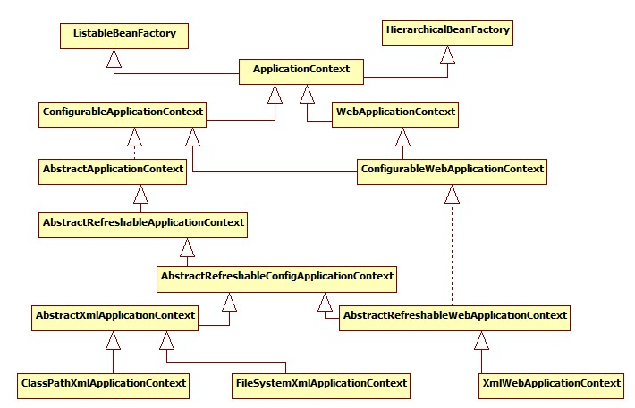

---

通过前面的源码，this.reader = new XmlBeanDefinitionReader(this); 中其中this 传的是factory对象
2、FileSystemXmlApplicationContext 的IOC容器流程
1、高富帅IOC解剖
1  ApplicationContext =new FileSystemXmlApplicationContext(xmlPath);
先看其构造函数：
  调用构造函数：
实际调用
 
     public XmlBeanFactory(Resource resource)throws BeansException{
         this(resource, null);
     }
     
     public XmlBeanFactory(Resource resource, BeanFactory parentBeanFactory)
          throws BeansException{
         super(parentBeanFactory);
         this.reader = new XmlBeanDefinitionReader(this);
         this.reader.loadBeanDefinitions(resource);
    }
 }
//根据Xml配置文件创建Resource资源对象，该对象中包含了BeanDefinition的信息
 ClassPathResource resource =new ClassPathResource("application-context.xml");
//创建DefaultListableBeanFactory
 DefaultListableBeanFactory factory =new DefaultListableBeanFactory();
//创建XmlBeanDefinitionReader读取器，用于载入BeanDefinition。之所以需要BeanFactory作为
参数，是因为会将读取的信息回调配置给factory
 XmlBeanDefinitionReader reader =new XmlBeanDefinitionReader(factory);
//XmlBeanDefinitionReader执行载入BeanDefinition的方法，最后会完成Bean的载入和注册。完成
后Bean就成功的放置到IOC容器当中，以后我们就可以从中取得Bean来使用
 reader.loadBeanDefinitions(resource);
/**
* Create a new FileSystemXmlApplicationContext, loading the definitions
* from the given XML files and automatically refreshing the context.
* @param configLocations array of file paths
* @throws BeansException if context creation failed
 */public FileSystemXmlApplicationContext(String... configLocations) throws 
BeansException {
        this(configLocations, true, null);
    }

---

2、设置资源加载器和资源定位
通过分析FileSystemXmlApplicationContext的源代码可以知道，在创建
FileSystemXmlApplicationContext容器时，构造方法做以下两项重要工作：
首先，调用父类容器的构造方法(super(parent)方法)为容器设置好Bean资源加载器。
然后，再调用父类AbstractRefreshableConfigApplicationContext的
setConfigLocations(configLocations)方法设置Bean定义资源文件的定位路径。
通过追踪FileSystemXmlApplicationContext的继承体系，发现其父类的父类
AbstractApplicationContext中初始化IoC容器所做的主要源码如下：
AbstractApplicationContext构造方法中调用PathMatchingResourcePatternResolver的构造方法创建
Spring资源加载器：
public FileSystemXmlApplicationContext(String[] configLocations, boolean refresh, 
ApplicationContext parent)  
            throws BeansException {    
        super(parent);  
        setConfigLocations(configLocations);  
        if (refresh) {  
            refresh();  
        }  
    } 
public abstract class AbstractApplicationContext extends DefaultResourceLoader  
        implements ConfigurableApplicationContext, DisposableBean {  
    //静态初始化块，在整个容器创建过程中只执行一次  
    static {  
        //为了避免应用程序在Weblogic8.1关闭时出现类加载异常加载问题，加载IoC容  
       //器关闭事件(ContextClosedEvent)类  
        ContextClosedEvent.class.getName();  
    }  
    //FileSystemXmlApplicationContext调用父类构造方法调用的就是该方法  
    public AbstractApplicationContext(ApplicationContext parent) {  
        this.parent = parent;  
        this.resourcePatternResolver = getResourcePatternResolver();  
    }  
    //获取一个Spring Source的加载器用于读入Spring Bean定义资源文件  
    protected ResourcePatternResolver getResourcePatternResolver() {  
        // AbstractApplicationContext继承DefaultResourceLoader，也是一个S  
        //Spring资源加载器，其getResource(String location)方法用于载入资源  
        return new PathMatchingResourcePatternResolver(this);  
    }   
……  
} 
public PathMatchingResourcePatternResolver(ResourceLoader resourceLoader) {  
        Assert.notNull(resourceLoader, "ResourceLoader must not be null");  
        //设置Spring的资源加载器  
        this.resourceLoader = resourceLoader;  
}

---

在设置容器的资源加载器之后，接下来FileSystemXmlApplicationContet执行setConfigLocations方法
通过调用其父类AbstractRefreshableConfigApplicationContext的方法进行对Bean定义资源文件的定
位，该方法的源码如下：
 
 
通过这两个方法的源码我们可以看出，我们既可以使用一个字符串来配置多个Spring Bean定义资源文
件，也可以使用字符串数组，即下面两种方式都是可以的：
a.  ClasspathResource res = new ClasspathResource(“a.xml,b.xml,……”);
多个资源文件路径之间可以是用” ,; /t/n”等分隔。
b.  ClasspathResource res = new ClasspathResource(newString[]{“a.xml”,”b.xml”,……});
至此，Spring IoC容器在初始化时将配置的Bean定义资源文件定位为Spring封装的Resource。
 
3、AbstractApplicationContext的refresh函数载入Bean定义过程：
 
Spring IoC容器对Bean定义资源的载入是从refresh()函数开始的，refresh()是一个模板方法，refresh()
方法的作用是：在创建IoC容器前，如果已经有容器存在，则需要把已有的容器销毁和关闭，以保证在
refresh之后使用的是新建立起来的IoC容器。refresh的作用类似于对IoC容器的重启，在新建立好的容
器中对容器进行初始化，对Bean定义资源进行载入
FileSystemXmlApplicationContext通过调用其父类AbstractApplicationContext的refresh()函数启动整
个IoC容器对Bean定义的载入过程：
 
 
    //处理单个资源文件路径为一个字符串的情况  
    public void setConfigLocation(String location) {  
       //String CONFIG_LOCATION_DELIMITERS = ",; /t/n";  
       //即多个资源文件路径之间用” ,; /t/n”分隔，解析成数组形式  
        setConfigLocations(StringUtils.tokenizeToStringArray(location, 
CONFIG_LOCATION_DELIMITERS));  
    }  
    //解析Bean定义资源文件的路径，处理多个资源文件字符串数组  
     public void setConfigLocations(String[] locations) {  
        if (locations != null) {  
            Assert.noNullElements(locations, "Config locations must not be 
null");  
            this.configLocations = new String[locations.length];  
            for (int i = 0; i < locations.length; i++) {  
                // resolvePath为同一个类中将字符串解析为路径的方法  
                this.configLocations[i] = resolvePath(locations[i]).trim();  
            }  
        }  
        else {  
            this.configLocations = null;  
        }  www
    }

---

refresh()方法主要为IoC容器Bean的生命周期管理提供条件，Spring IoC容器载入Bean定义资源文件从
其子类容器的refreshBeanFactory()方法启动，所以整个refresh()中“ConfigurableListableBeanFactory 
beanFactory =obtainFreshBeanFactory();”这句以后代码的都是注册容器的信息源和生命周期事件，载
入过程就是从这句代码启动。
 
 refresh()方法的作用是：在创建IoC容器前，如果已经有容器存在，则需要把已有的容器销毁和关闭，
以保证在refresh之后使用的是新建立起来的IoC容器。refresh的作用类似于对IoC容器的重启，在新建
立好的容器中对容器进行初始化，对Bean定义资源进行载入
 
1      public void refresh() throws BeansException, IllegalStateException {  
2        synchronized (this.startupShutdownMonitor) {  
3            //调用容器准备刷新的方法，获取容器的当时时间，同时给容器设置同步标识  
4            prepareRefresh();  
5            //告诉子类启动refreshBeanFactory()方法，Bean定义资源文件的载入从  
6           //子类的refreshBeanFactory()方法启动  
7            ConfigurableListableBeanFactory beanFactory = 
obtainFreshBeanFactory();  
8            //为BeanFactory配置容器特性，例如类加载器、事件处理器等  
9            prepareBeanFactory(beanFactory);  
10            try {  
11                //为容器的某些子类指定特殊的BeanPost事件处理器  
12                postProcessBeanFactory(beanFactory);  
13                //调用所有注册的BeanFactoryPostProcessor的Bean  
14                invokeBeanFactoryPostProcessors(beanFactory);  
15                //为BeanFactory注册BeanPost事件处理器.  
16                //BeanPostProcessor是Bean后置处理器，用于监听容器触发的事件  
17                registerBeanPostProcessors(beanFactory);  
18                //初始化信息源，和国际化相关.  
19                initMessageSource();  
20                //初始化容器事件传播器.  
21                initApplicationEventMulticaster();  
22                //调用子类的某些特殊Bean初始化方法  
23                onRefresh();  
24                //为事件传播器注册事件监听器.  
25                registerListeners();  
26                //初始化所有剩余的单态Bean.  
27                finishBeanFactoryInitialization(beanFactory);  
28                //初始化容器的生命周期事件处理器，并发布容器的生命周期事件  
29                finishRefresh();  
30            }  
31            catch (BeansException ex) {  
32                //销毁以创建的单态Bean  
33                destroyBeans();  
34                //取消refresh操作，重置容器的同步标识.  
35                cancelRefresh(ex);  
36                throw ex;  
37            }  
38        }  
39    }

---

AbstractApplicationContext的obtainFreshBeanFactory()方法调用子类容器的refreshBeanFactory()方
法，启动容器载入Bean定义资源文件的过程，代码如下：
 
 
  
AbstractApplicationContext子类的refreshBeanFactory()方法：
 
  AbstractApplicationContext类中只抽象定义了refreshBeanFactory()方法，容器真正调用的是其子类
AbstractRefreshableApplicationContext实现的  refreshBeanFactory()方法，方法的源码如下：
  
 
 
    protected ConfigurableListableBeanFactory obtainFreshBeanFactory() {  
        //这里使用了委派设计模式，父类定义了抽象的refreshBeanFactory()方法，具体实现调用子
类容器的refreshBeanFactory()方法
         refreshBeanFactory();  
        ConfigurableListableBeanFactory beanFactory = getBeanFactory();  
        if (logger.isDebugEnabled()) {  
            logger.debug("Bean factory for " + getDisplayName() + ": " + 
beanFactory);  
        }  
        return beanFactory;  
    } 
1    protected final void refreshBeanFactory() throws BeansException {  
2        if (hasBeanFactory()) {//如果已经有容器，销毁容器中的bean，关闭容器  
3            destroyBeans();  
4            closeBeanFactory();  
5        }  
6        try {  
7             //创建IoC容器  
8             DefaultListableBeanFactory beanFactory = createBeanFactory();  
9             beanFactory.setSerializationId(getId());  
10            //对IoC容器进行定制化，如设置启动参数，开启注解的自动装配等  
11            customizeBeanFactory(beanFactory);  
12            //调用载入Bean定义的方法，主要这里又使用了一个委派模式，在当前类中只定义了抽象
的loadBeanDefinitions方法，具体的实现调用子类容器  
13            loadBeanDefinitions(beanFactory);  
14            synchronized (this.beanFactoryMonitor) {  
15                this.beanFactory = beanFactory;  
16            }  
17        }  
18        catch (IOException ex) {  
19            throw new ApplicationContextException("I/O error parsing bean 
definition source for " + getDisplayName(), ex);  
20        }  
21    }

---

在这个方法中，先判断BeanFactory是否存在，如果存在则先销毁beans并关闭beanFactory，接着创建
DefaultListableBeanFactory，并调用loadBeanDefinitions(beanFactory)装载bean
  
定义。
  
 
  
5、AbstractRefreshableApplicationContext子类的loadBeanDefinitions方法：
  
 
  
AbstractRefreshableApplicationContext中只定义了抽象的loadBeanDefinitions方法，容器真正调用
的是其子类AbstractXmlApplicationContext对该方法的实现，AbstractXmlApplicationContext的主要
源码如下：
  
loadBeanDefinitions方法同样是抽象方法，是由其子类实现的，也即在
AbstractXmlApplicationContext中。
  
 
1  public abstract class AbstractXmlApplicationContext extends 
AbstractRefreshableConfigApplicationContext {  
2     ……  
3     //实现父类抽象的载入Bean定义方法  
4     @Override  
5     protected void loadBeanDefinitions(DefaultListableBeanFactory beanFactory) 
throws BeansException, IOException {  
6         //创建XmlBeanDefinitionReader，即创建Bean读取器，并通过回调设置到容器中去，容  
器使用该读取器读取Bean定义资源  
7         XmlBeanDefinitionReader beanDefinitionReader = new 
XmlBeanDefinitionReader(beanFactory);  
8         //为Bean读取器设置Spring资源加载器，AbstractXmlApplicationContext的  
9         //祖先父类AbstractApplicationContext继承DefaultResourceLoader，因此，容器本
身也是一个资源加载器  
10        beanDefinitionReader.setResourceLoader(this);  
11        //为Bean读取器设置SAX xml解析器

---

Xml Bean读取器(XmlBeanDefinitionReader)调用其父类AbstractBeanDefinitionReader的 
reader.loadBeanDefinitions方法读取Bean定义资源。
  
由于我们使用FileSystemXmlApplicationContext作为例子分析，因此getConfigResources的返回值为
null，因此程序执行reader.loadBeanDefinitions(configLocations)分支。
  
 
  
12        beanDefinitionReader.setEntityResolver(new 
ResourceEntityResolver(this));  
13        //当Bean读取器读取Bean定义的Xml资源文件时，启用Xml的校验机制  
14        initBeanDefinitionReader(beanDefinitionReader);  
15        //Bean读取器真正实现加载的方法  
16        loadBeanDefinitions(beanDefinitionReader);  
17    }  
18    //Xml Bean读取器加载Bean定义资源  
19    protected void loadBeanDefinitions(XmlBeanDefinitionReader reader) throws 
BeansException, IOException {  
20        //获取Bean定义资源的定位  
21        Resource[] configResources = getConfigResources();  
22        if (configResources != null) {  
23            //Xml Bean读取器调用其父类AbstractBeanDefinitionReader读取定位  
24            //的Bean定义资源  
25            reader.loadBeanDefinitions(configResources);  
26        }  
27        //如果子类中获取的Bean定义资源定位为空，则获取FileSystemXmlApplicationContext
构造方法中setConfigLocations方法设置的资源  
28        String[] configLocations = getConfigLocations();  
29        if (configLocations != null) {  
30            //Xml Bean读取器调用其父类AbstractBeanDefinitionReader读取定位  
31            //的Bean定义资源  
32            reader.loadBeanDefinitions(configLocations);  
33        }  
34    }  
35    //这里又使用了一个委托模式，调用子类的获取Bean定义资源定位的方法  
36    //该方法在ClassPathXmlApplicationContext中进行实现，对于我们  
37    //举例分析源码的FileSystemXmlApplicationContext没有使用该方法  
38    protected Resource[] getConfigResources() {  
39        return null;  
40    }   ……  
41}

---

6、AbstractBeanDefinitionReader读取Bean定义资源：
  
 
  
AbstractBeanDefinitionReader的loadBeanDefinitions方法源码如下：
  
 可以到org.springframework.beans.factory.support看一下BeanDefinitionReader的结构
  
  
在其抽象父类AbstractBeanDefinitionReader中定义了载入过程
  
 
1    //重载方法，调用下面的loadBeanDefinitions(String, Set<Resource>);方法  
2    public int loadBeanDefinitions(String location) throws 
BeanDefinitionStoreException {  
3        return loadBeanDefinitions(location, null);  
4    }  
5    public int loadBeanDefinitions(String location, Set<Resource> 
actualResources) throws BeanDefinitionStoreException {  
6        //获取在IoC容器初始化过程中设置的资源加载器  
7        ResourceLoader resourceLoader = getResourceLoader();  
8        if (resourceLoader == null) {  
9            throw new BeanDefinitionStoreException(  
10                    "Cannot import bean definitions from location [" + location 
+ "]: no ResourceLoader available");  
11        }  
12        if (resourceLoader instanceof ResourcePatternResolver) {  
13            try {  
14                //将指定位置的Bean定义资源文件解析为Spring IoC容器封装的资源  
15                //加载多个指定位置的Bean定义资源文件  
16                Resource[] resources = ((ResourcePatternResolver) 
resourceLoader).getResources(location);  
17                //委派调用其子类XmlBeanDefinitionReader的方法，实现加载功能  
18                int loadCount = loadBeanDefinitions(resources);  
19                if (actualResources != null) {  
20                    for (Resource resource : resources) {  
21                        actualResources.add(resource);  
22                    }  
23                }  
24                if (logger.isDebugEnabled()) {  
25                    logger.debug("Loaded " + loadCount + " bean definitions 
from location pattern [" + location + "]");  
26                }  
27                return loadCount;  
28            }

---

loadBeanDefinitions(Resource...resources)方法和上面分析的3个方法类似，同样也是调用
XmlBeanDefinitionReader的loadBeanDefinitions方法。
  
从对AbstractBeanDefinitionReader的loadBeanDefinitions方法源码分析可以看出该方法做了以下两件
事：
  
首先，调用资源加载器的获取资源方法resourceLoader.getResource(location)，获取到要加载的资
源。
  
其次，真正执行加载功能是其子类XmlBeanDefinitionReader的loadBeanDefinitions方法。
29            catch (IOException ex) {  
30                throw new BeanDefinitionStoreException(  
31                        "Could not resolve bean definition resource pattern [" 
+ location + "]", ex);  
32            }  
33        }  
34        else {  
35            //将指定位置的Bean定义资源文件解析为Spring IoC容器封装的资源  
36            //加载单个指定位置的Bean定义资源文件  
37            Resource resource = resourceLoader.getResource(location);  
38            //委派调用其子类XmlBeanDefinitionReader的方法，实现加载功能  
39            int loadCount = loadBeanDefinitions(resource);  
40            if (actualResources != null) {  
41                actualResources.add(resource);  
42            }  
43            if (logger.isDebugEnabled()) {  
44                logger.debug("Loaded " + loadCount + " bean definitions from 
location [" + location + "]");  
45            }  
46            return loadCount;  
47        }  
48    }  
49    //重载方法，调用loadBeanDefinitions(String);  
50    public int loadBeanDefinitions(String... locations) throws 
BeanDefinitionStoreException {  
51        Assert.notNull(locations, "Location array must not be null");  
52        int counter = 0;  
53        for (String location : locations) {  
54            counter += loadBeanDefinitions(location);  
55        }  
56        return counter;  
    }

---

看到第8、16行，结合上面的ResourceLoader与ApplicationContext的继承关系图，可以知道此时调用
的是DefaultResourceLoader中的getSource()方法定位Resource，因为
FileSystemXmlApplicationContext本身就是DefaultResourceLoader的实现类，所以此时又回到了
FileSystemXmlApplicationContext中来。
 
7、资源加载器获取要读入的资源：
 
XmlBeanDefinitionReader通过调用其父类DefaultResourceLoader的getResource方法获取要加载的
资源，其源码如下
  
 
1    //获取Resource的具体实现方法  
2    public Resource getResource(String location) {  
3        Assert.notNull(location, "Location must not be null");  
4        //如果是类路径的方式，那需要使用ClassPathResource 来得到bean 文件的资源对象  
5        if (location.startsWith(CLASSPATH_URL_PREFIX)) {

---

FileSystemXmlApplicationContext容器提供了getResourceByPath方法的实现，就是为了处理既不是
classpath标识，又不是URL标识的Resource定位这种情况。
  
 
 
  
这样代码就回到了 FileSystemXmlApplicationContext 中来，他提供了FileSystemResource 来完成从
文件系统得到配置文件的资源定义。
这样，就可以从文件系统路径上对IOC 配置文件进行加载 - 当然我们可以按照这个逻辑从任何地方加
载，在Spring 中我们看到它提供 的各种资源抽象，比如ClassPathResource, 
URLResource,FileSystemResource 等来供我们使用。上面我们看到的是定位Resource 的一个过程，而
这只是加载过程的一部分.
   
 
8、XmlBeanDefinitionReader加载Bean定义资源：
   
   Bean定义的Resource得到了
   继续回到XmlBeanDefinitionReader的loadBeanDefinitions(Resource …)方法看到代表bean文件的资
源定义以后的载入过程。
6            return new 
ClassPathResource(location.substring(CLASSPATH_URL_PREFIX.length()), 
getClassLoader());  
7        }  
8         try {  
9              // 如果是URL 方式，使用UrlResource 作为bean 文件的资源对象  
10             URL url = new URL(location);  
11             return new UrlResource(url);  
12            }  
13            catch (MalformedURLException ex) { 
14            } 
15            //如果既不是classpath标识，又不是URL标识的Resource定位，则调用  
16            //容器本身的getResourceByPath方法获取Resource  
17            return getResourceByPath(location);  
18            
19    }
protected Resource getResourceByPath(String path) {    
   if (path != null && path.startsWith("/")) {    
        path = path.substring(1);    
    }  
    //这里使用文件系统资源对象来定义bean 文件
    return new FileSystemResource(path);  
}

---

通过源码分析，载入Bean定义资源文件的最后一步是将Bean定义资源转换为Document对象，该过程
由documentLoader实现
  
1    //XmlBeanDefinitionReader加载资源的入口方法  
2    public int loadBeanDefinitions(Resource resource) throws 
BeanDefinitionStoreException {  
3        //将读入的XML资源进行特殊编码处理  
4        return loadBeanDefinitions(new EncodedResource(resource));  
5    } 
     //这里是载入XML形式Bean定义资源文件方法
6    public int loadBeanDefinitions(EncodedResource encodedResource) throws 
BeanDefinitionStoreException {    
7    .......    
8    try {    
9         //将资源文件转为InputStream的IO流 
10        InputStream inputStream = 
encodedResource.getResource().getInputStream();    
11        try {    
12           //从InputStream中得到XML的解析源    
13            InputSource inputSource = new InputSource(inputStream);    
14            if (encodedResource.getEncoding() != null) {    
15                inputSource.setEncoding(encodedResource.getEncoding());    
16            }    
17            //这里是具体的读取过程    
18            return doLoadBeanDefinitions(inputSource, 
encodedResource.getResource());    
19        }    
20        finally {    
21            //关闭从Resource中得到的IO流    
22            inputStream.close();    
23        }    
24    }    
25       .........    
26}    
27    //从特定XML文件中实际载入Bean定义资源的方法 
28    protected int doLoadBeanDefinitions(InputSource inputSource, Resource 
resource)    
29        throws BeanDefinitionStoreException {    
30    try {    
31        int validationMode = getValidationModeForResource(resource);    
32        //将XML文件转换为DOM对象，解析过程由documentLoader实现    
33        Document doc = this.documentLoader.loadDocument(    
34                inputSource, this.entityResolver, this.errorHandler, 
validationMode, this.namespaceAware);    
35        //这里是启动对Bean定义解析的详细过程，该解析过程会用到Spring的Bean配置规则
36        return registerBeanDefinitions(doc, resource);    
37      }    
38      .......    
     }

---

9、DocumentLoader将Bean定义资源转换为Document对象：
 
DocumentLoader将Bean定义资源转换成Document对象的源码如下：
 
1    //使用标准的JAXP将载入的Bean定义资源转换成document对象  
2    public Document loadDocument(InputSource inputSource, EntityResolver 
entityResolver,  
3            ErrorHandler errorHandler, int validationMode, boolean 
namespaceAware) throws Exception {  
4        //创建文件解析器工厂  
5        DocumentBuilderFactory factory = 
createDocumentBuilderFactory(validationMode, namespaceAware);  
6        if (logger.isDebugEnabled()) {  
7            logger.debug("Using JAXP provider [" + factory.getClass().getName() 
+ "]");  
8        }  
9        //创建文档解析器  
10        DocumentBuilder builder = createDocumentBuilder(factory, 
entityResolver, errorHandler);  
11        //解析Spring的Bean定义资源  
12        return builder.parse(inputSource);  
13    }  
14    protected DocumentBuilderFactory createDocumentBuilderFactory(int 
validationMode, boolean namespaceAware)  
15            throws ParserConfigurationException {  
16        //创建文档解析工厂  
17        DocumentBuilderFactory factory = DocumentBuilderFactory.newInstance(); 
 
18        factory.setNamespaceAware(namespaceAware);  
19        //设置解析XML的校验  
20        if (validationMode != XmlValidationModeDetector.VALIDATION_NONE) {  
21            factory.setValidating(true);  
22            if (validationMode == XmlValidationModeDetector.VALIDATION_XSD) { 
 
23                factory.setNamespaceAware(true);  
24                try {  
25                    factory.setAttribute(SCHEMA_LANGUAGE_ATTRIBUTE, 
XSD_SCHEMA_LANGUAGE);  
26                }  
27                catch (IllegalArgumentException ex) {  
28                    ParserConfigurationException pcex = new 
ParserConfigurationException(  
29                            "Unable to validate using XSD: Your JAXP provider 
[" + factory +  
30                            "] does not support XML Schema. Are you running on 
Java 1.4 with Apache Crimson? " +  
31                            "Upgrade to Apache Xerces (or Java 1.5) for full 
XSD support.");  
32                    pcex.initCause(ex);  
33                    throw pcex;  
34                }  
35            }  
36        }  
37        return factory;

---

该解析过程调用JavaEE标准的JAXP标准进行处理。
至此Spring IoC容器根据定位的Bean定义资源文件，将其加载读入并转换成为Document对象过程完
成。
 
接下来我们要继续分析Spring IoC容器将载入的Bean定义资源文件转换为Document对象之后，是如何
将其解析为Spring IoC管理的Bean对象并将其注册到容器中的。
 
10、XmlBeanDefinitionReader解析载入的Bean定义资源文件：
 
 XmlBeanDefinitionReader类中的doLoadBeanDefinitions方法是从特定XML文件中实际载入Bean定义
资源的方法，该方法在载入Bean定义资源之后将其转换为Document对象，接下来调用
registerBeanDefinitions启动Spring IoC容器对Bean定义的解析过程，registerBeanDefinitions方法源
码如下：
  
 
 
  
Bean定义资源的载入解析分为以下两个过程：
首先，通过调用XML解析器将Bean定义资源文件转换得到Document对象，但是这些Document对象并
没有按照Spring的Bean规则进行解析。这一步是载入的过程
38    } 
1    //按照Spring的Bean语义要求将Bean定义资源解析并转换为容器内部数据结构  
2    public int registerBeanDefinitions(Document doc, Resource resource) throws 
BeanDefinitionStoreException {  
3        //得到BeanDefinitionDocumentReader来对xml格式的BeanDefinition解析  
4        BeanDefinitionDocumentReader documentReader = 
createBeanDefinitionDocumentReader();  
5        //获得容器中注册的Bean数量  
6        int countBefore = getRegistry().getBeanDefinitionCount();  
7        //解析过程入口，这里使用了委派模式，BeanDefinitionDocumentReader只是个接口，//具
体的解析实现过程有实现类DefaultBeanDefinitionDocumentReader完成  
8        documentReader.registerBeanDefinitions(doc, 
createReaderContext(resource));  
9        //统计解析的Bean数量  
10        return getRegistry().getBeanDefinitionCount() - countBefore;  
11    }  
12    //创建BeanDefinitionDocumentReader对象，解析Document对象  
13    protected BeanDefinitionDocumentReader createBeanDefinitionDocumentReader() 
{  
14        return 
BeanDefinitionDocumentReader.class.cast(BeanUtils.instantiateClass(this.document
ReaderClass));  
      }

---

其次，在完成通用的XML解析之后，按照Spring的Bean规则对Document对象进行解析。
按照Spring的Bean规则对Document对象解析的过程是在接口BeanDefinitionDocumentReader的实现
类DefaultBeanDefinitionDocumentReader中实现的。
 
11、DefaultBeanDefinitionDocumentReader对Bean定义的Document对象解析：
 
BeanDefinitionDocumentReader接口通过registerBeanDefinitions方法调用其实现类
DefaultBeanDefinitionDocumentReader对Document对象进行解析，解析的代码如下：
 
1     //根据Spring DTD对Bean的定义规则解析Bean定义Document对象  
2     public void registerBeanDefinitions(Document doc, XmlReaderContext 
readerContext) {  
3         //获得XML描述符  
4         this.readerContext = readerContext;  
5         logger.debug("Loading bean definitions");  
6         //获得Document的根元素  
7         Element root = doc.getDocumentElement();  
8         //具体的解析过程由BeanDefinitionParserDelegate实现，  
9         //BeanDefinitionParserDelegate中定义了Spring Bean定义XML文件的各种元素  
10        BeanDefinitionParserDelegate delegate = createHelper(readerContext, 
root);  
11        //在解析Bean定义之前，进行自定义的解析，增强解析过程的可扩展性  
12        preProcessXml(root);  
13        //从Document的根元素开始进行Bean定义的Document对象  
14        parseBeanDefinitions(root, delegate);  
15        //在解析Bean定义之后，进行自定义的解析，增加解析过程的可扩展性  
16        postProcessXml(root);  
17    }  
18    //创建BeanDefinitionParserDelegate，用于完成真正的解析过程  
19    protected BeanDefinitionParserDelegate createHelper(XmlReaderContext 
readerContext, Element root) {  
20        BeanDefinitionParserDelegate delegate = new 
BeanDefinitionParserDelegate(readerContext);  
21        //BeanDefinitionParserDelegate初始化Document根元素  
22        delegate.initDefaults(root);  
23        return delegate;  
24    }  
25    //使用Spring的Bean规则从Document的根元素开始进行Bean定义的Document对象  
26    protected void parseBeanDefinitions(Element root, 
BeanDefinitionParserDelegate delegate) {  
27        //Bean定义的Document对象使用了Spring默认的XML命名空间  
28        if (delegate.isDefaultNamespace(root)) {  
29            //获取Bean定义的Document对象根元素的所有子节点  
30            NodeList nl = root.getChildNodes();  
31            for (int i = 0; i < nl.getLength(); i++) {  
32                Node node = nl.item(i);  
33                //获得Document节点是XML元素节点  
34                if (node instanceof Element) {  
35                    Element ele = (Element) node;  
36                //Bean定义的Document的元素节点使用的是Spring默认的XML命名空间  
37                    if (delegate.isDefaultNamespace(ele)) {  
38                        //使用Spring的Bean规则解析元素节点

---

39                        parseDefaultElement(ele, delegate);  
40                    }  
41                    else {  
42                        //没有使用Spring默认的XML命名空间，则使用用户自定义的解//析规则
解析元素节点  
43                        delegate.parseCustomElement(ele);  
44                    }  
45                }  
46            }  
47        }  
48        else {  
49            //Document的根节点没有使用Spring默认的命名空间，则使用用户自定义的  
50            //解析规则解析Document根节点  
51            delegate.parseCustomElement(root);  
52        }  
53    }  
54    //使用Spring的Bean规则解析Document元素节点  
55    private void parseDefaultElement(Element ele, BeanDefinitionParserDelegate 
delegate) {  
56        //如果元素节点是<Import>导入元素，进行导入解析  
57        if (delegate.nodeNameEquals(ele, IMPORT_ELEMENT)) {  
58            importBeanDefinitionResource(ele);  
59        }  
60        //如果元素节点是<Alias>别名元素，进行别名解析  
61        else if (delegate.nodeNameEquals(ele, ALIAS_ELEMENT)) {  
62            processAliasRegistration(ele);  
63        }  
64        //元素节点既不是导入元素，也不是别名元素，即普通的<Bean>元素，  
65        //按照Spring的Bean规则解析元素  
66        else if (delegate.nodeNameEquals(ele, BEAN_ELEMENT)) {  
67            processBeanDefinition(ele, delegate);  
68        }  
69    }  
70    //解析<Import>导入元素，从给定的导入路径加载Bean定义资源到Spring IoC容器中  
71    protected void importBeanDefinitionResource(Element ele) {  
72        //获取给定的导入元素的location属性  
73        String location = ele.getAttribute(RESOURCE_ATTRIBUTE);  
74        //如果导入元素的location属性值为空，则没有导入任何资源，直接返回  
75        if (!StringUtils.hasText(location)) {  
76            getReaderContext().error("Resource location must not be empty", 
ele);  
77            return;  
78        }  
79        //使用系统变量值解析location属性值  
80        location = SystemPropertyUtils.resolvePlaceholders(location);  
81        Set<Resource> actualResources = new LinkedHashSet<Resource>(4);  
82        //标识给定的导入元素的location是否是绝对路径  
83        boolean absoluteLocation = false;  
84        try {  
85            absoluteLocation = ResourcePatternUtils.isUrl(location) || 
ResourceUtils.toURI(location).isAbsolute();  
86        }  
87        catch (URISyntaxException ex) {  
88            //给定的导入元素的location不是绝对路径  
89        }  
90        //给定的导入元素的location是绝对路径  
91        if (absoluteLocation) {  
92            try {

---

93                //使用资源读入器加载给定路径的Bean定义资源  
94                int importCount = 
getReaderContext().getReader().loadBeanDefinitions(location, actualResources);  
95                if (logger.isDebugEnabled()) {  
96                    logger.debug("Imported " + importCount + " bean definitions 
from URL location [" + location + "]");  
97                }  
98            }  
99            catch (BeanDefinitionStoreException ex) {  
100                getReaderContext().error(  
101                        "Failed to import bean definitions from URL location 
[" + location + "]", ele, ex);  
102            }  
103        }  
104        else {  
105            //给定的导入元素的location是相对路径  
106            try {  
107                int importCount;  
108                //将给定导入元素的location封装为相对路径资源  
109                Resource relativeResource = 
getReaderContext().getResource().createRelative(location);  
110                //封装的相对路径资源存在  
111                if (relativeResource.exists()) {  
112                    //使用资源读入器加载Bean定义资源  
113                    importCount = 
getReaderContext().getReader().loadBeanDefinitions(relativeResource);  
114                    actualResources.add(relativeResource);  
115                }  
116                //封装的相对路径资源不存在  
117                else {  
118                    //获取Spring IoC容器资源读入器的基本路径  
119                    String baseLocation = 
getReaderContext().getResource().getURL().toString();  
120                    //根据Spring IoC容器资源读入器的基本路径加载给定导入  
121                    //路径的资源  
122                    importCount = 
getReaderContext().getReader().loadBeanDefinitions(  
123                            StringUtils.applyRelativePath(baseLocation, 
location), actualResources);  
124                }  
125                if (logger.isDebugEnabled()) {  
126                    logger.debug("Imported " + importCount + " bean 
definitions from relative location [" + location + "]");  
127                }  
128            }  
129            catch (IOException ex) {  
130                getReaderContext().error("Failed to resolve current resource 
location", ele, ex);  
131            }  
132            catch (BeanDefinitionStoreException ex) {  
133                getReaderContext().error("Failed to import bean definitions 
from relative location [" + location + "]",  
134                        ele, ex);  
135            }  
136        }  
137        Resource[] actResArray = actualResources.toArray(new 
Resource[actualResources.size()]);  
138        //在解析完<Import>元素之后，发送容器导入其他资源处理完成事件

---

139        getReaderContext().fireImportProcessed(location, actResArray, 
extractSource(ele));  
140    }  
141    //解析<Alias>别名元素，为Bean向Spring IoC容器注册别名  
142    protected void processAliasRegistration(Element ele) {  
143        //获取<Alias>别名元素中name的属性值  
144        String name = ele.getAttribute(NAME_ATTRIBUTE);  
145        //获取<Alias>别名元素中alias的属性值  
146        String alias = ele.getAttribute(ALIAS_ATTRIBUTE);  
147        boolean valid = true;  
148        //<alias>别名元素的name属性值为空  
149        if (!StringUtils.hasText(name)) {  
150            getReaderContext().error("Name must not be empty", ele);  
151            valid = false;  
152        }  
153        //<alias>别名元素的alias属性值为空  
154        if (!StringUtils.hasText(alias)) {  
155            getReaderContext().error("Alias must not be empty", ele);  
156            valid = false;  
157        }  
158        if (valid) {  
159            try {  
160                //向容器的资源读入器注册别名  
161                getReaderContext().getRegistry().registerAlias(name, alias); 
 
162            }  
163            catch (Exception ex) {  
164                getReaderContext().error("Failed to register alias '" + alias 
+  
165                        "' for bean with name '" + name + "'", ele, ex);  
166            }  
167            //在解析完<Alias>元素之后，发送容器别名处理完成事件  
168            getReaderContext().fireAliasRegistered(name, alias, 
extractSource(ele));  
169        }  
170    }  
171    //解析Bean定义资源Document对象的普通元素  
172    protected void processBeanDefinition(Element ele, 
BeanDefinitionParserDelegate delegate) {  
173        // BeanDefinitionHolder是对BeanDefinition的封装，即Bean定义的封装类  
174        //对Document对象中<Bean>元素的解析由BeanDefinitionParserDelegate实现  
BeanDefinitionHolder bdHolder = delegate.parseBeanDefinitionElement(ele);  
175        if (bdHolder != null) {  
176            bdHolder = delegate.decorateBeanDefinitionIfRequired(ele, 
bdHolder);  
177            try {  
178               //向Spring IoC容器注册解析得到的Bean定义，这是Bean定义向IoC容器注册的入
口                              
BeanDefinitionReaderUtils.registerBeanDefinition(bdHolder, 
getReaderContext().getRegistry());  
179            }  
180            catch (BeanDefinitionStoreException ex) {  
181                getReaderContext().error("Failed to register bean definition 
with name '" +  
182                        bdHolder.getBeanName() + "'", ele, ex);  
183            }  
184            //在完成向Spring IoC容器注册解析得到的Bean定义之后，发送注册事件

---

通过上述Spring IoC容器对载入的Bean定义Document解析可以看出，我们使用Spring时，在Spring配
置文件中可以使用元素来导入IoC容器所需要的其他资源，Spring IoC容器在解析时会首先将指定导入的
资源加载进容器中。使用别名时，Spring IoC容器首先将别名元素所定义的别名注册到容器中。
  
对于既不是元素，又不是元素的元素，即Spring配置文件中普通的元素的解析由
BeanDefinitionParserDelegate类的parseBeanDefinitionElement方法来实现。
  
12、BeanDefinitionParserDelegate解析Bean定义资源文件中的元素：
  
Bean定义资源文件中的和元素解析在DefaultBeanDefinitionDocumentReader中已经完成，对Bean定
义资源文件中使用最多的元素交由BeanDefinitionParserDelegate来解析，其解析实现的源码如下：
 
185            getReaderContext().fireComponentRegistered(new 
BeanComponentDefinition(bdHolder));  
186        }  
187    } 
1    //解析<Bean>元素的入口  
2    public BeanDefinitionHolder parseBeanDefinitionElement(Element ele) {  
3        return parseBeanDefinitionElement(ele, null);  
4    }  
5    //解析Bean定义资源文件中的<Bean>元素，这个方法中主要处理<Bean>元素的id，name  
6    //和别名属性  
7    public BeanDefinitionHolder parseBeanDefinitionElement(Element ele, 
BeanDefinition containingBean) {  
8        //获取<Bean>元素中的id属性值  
9        String id = ele.getAttribute(ID_ATTRIBUTE);  
10        //获取<Bean>元素中的name属性值  
11        String nameAttr = ele.getAttribute(NAME_ATTRIBUTE);  
12        ////获取<Bean>元素中的alias属性值  
13        List<String> aliases = new ArrayList<String>();  
14        //将<Bean>元素中的所有name属性值存放到别名中  
15        if (StringUtils.hasLength(nameAttr)) {  
16            String[] nameArr = StringUtils.tokenizeToStringArray(nameAttr, 
BEAN_NAME_DELIMITERS);  
17            aliases.addAll(Arrays.asList(nameArr));  
18        }  
19        String beanName = id;  
20        //如果<Bean>元素中没有配置id属性时，将别名中的第一个值赋值给beanName  
21        if (!StringUtils.hasText(beanName) && !aliases.isEmpty()) {  
22            beanName = aliases.remove(0);  
23            if (logger.isDebugEnabled()) {  
24                logger.debug("No XML 'id' specified - using '" + beanName +  
25                        "' as bean name and " + aliases + " as aliases");  
26            }  
27        }  
28        //检查<Bean>元素所配置的id或者name的唯一性，containingBean标识<Bean>  
29        //元素中是否包含子<Bean>元素  
30        if (containingBean == null) {

---

31            //检查<Bean>元素所配置的id、name或者别名是否重复  
32            checkNameUniqueness(beanName, aliases, ele);  
33        }  
34        //详细对<Bean>元素中配置的Bean定义进行解析的地方  
35        AbstractBeanDefinition beanDefinition = parseBeanDefinitionElement(ele, 
beanName, containingBean);  
36        if (beanDefinition != null) {  
37            if (!StringUtils.hasText(beanName)) {  
38                try {  
39                    if (containingBean != null) {  
40                        //如果<Bean>元素中没有配置id、别名或者name，且没有包含
子//<Bean>元素，为解析的Bean生成一个唯一beanName并注册  
41                        beanName = BeanDefinitionReaderUtils.generateBeanName( 
 
42                                beanDefinition, 
this.readerContext.getRegistry(), true);  
43                    }  
44                    else {  
45                        //如果<Bean>元素中没有配置id、别名或者name，且包含了
子//<Bean>元素，为解析的Bean使用别名向IoC容器注册  
46                        beanName = 
this.readerContext.generateBeanName(beanDefinition);  
47                        //为解析的Bean使用别名注册时，为了向后兼容                   
                 //Spring1.2/2.0，给别名添加类名后缀  
48                        String beanClassName = 
beanDefinition.getBeanClassName();  
49                        if (beanClassName != null &&  
50                                beanName.startsWith(beanClassName) && 
beanName.length() > beanClassName.length() &&  
51                                
!this.readerContext.getRegistry().isBeanNameInUse(beanClassName)) {  
52                            aliases.add(beanClassName);  
53                        }  
54                    }  
55                    if (logger.isDebugEnabled()) {  
56                        logger.debug("Neither XML 'id' nor 'name' specified - " 
+  
57                                "using generated bean name [" + beanName + 
"]");  
58                    }  
59                }  
60                catch (Exception ex) {  
61                    error(ex.getMessage(), ele);  
62                    return null;  
63                }  
64            }  
65            String[] aliasesArray = StringUtils.toStringArray(aliases);  
66            return new BeanDefinitionHolder(beanDefinition, beanName, 
aliasesArray);  
67        }  
68        //当解析出错时，返回null  
69        return null;  
70    }  
71    //详细对<Bean>元素中配置的Bean定义其他属性进行解析，由于上面的方法中已经对//Bean的id、
name和别名等属性进行了处理，该方法中主要处理除这三个以外的其他属性数据  
72    public AbstractBeanDefinition parseBeanDefinitionElement(  
73            Element ele, String beanName, BeanDefinition containingBean) {  
74        //记录解析的<Bean>

---

75        this.parseState.push(new BeanEntry(beanName));  
76        //这里只读取<Bean>元素中配置的class名字，然后载入到BeanDefinition中去  
77        //只是记录配置的class名字，不做实例化，对象的实例化在依赖注入时完成  
78        String className = null;  
79        if (ele.hasAttribute(CLASS_ATTRIBUTE)) {  
80            className = ele.getAttribute(CLASS_ATTRIBUTE).trim();  
81        }  
82        try {  
83            String parent = null;  
84            //如果<Bean>元素中配置了parent属性，则获取parent属性的值  
85            if (ele.hasAttribute(PARENT_ATTRIBUTE)) {  
86                parent = ele.getAttribute(PARENT_ATTRIBUTE);  
87            }  
88            //根据<Bean>元素配置的class名称和parent属性值创建BeanDefinition  
89            //为载入Bean定义信息做准备  
90            AbstractBeanDefinition bd = createBeanDefinition(className, 
parent);  
91            //对当前的<Bean>元素中配置的一些属性进行解析和设置，如配置的单态(singleton)
属性等  
92            parseBeanDefinitionAttributes(ele, beanName, containingBean, bd); 
 
93            //为<Bean>元素解析的Bean设置description信息 
bd.setDescription(DomUtils.getChildElementValueByTagName(ele, 
DESCRIPTION_ELEMENT));  
94            //对<Bean>元素的meta(元信息)属性解析  
95            parseMetaElements(ele, bd);  
96            //对<Bean>元素的lookup-method属性解析  
97            parseLookupOverrideSubElements(ele, bd.getMethodOverrides());  
98            //对<Bean>元素的replaced-method属性解析  
99            parseReplacedMethodSubElements(ele, bd.getMethodOverrides());  
100            //解析<Bean>元素的构造方法设置  
101            parseConstructorArgElements(ele, bd);  
102            //解析<Bean>元素的<property>设置  
103            parsePropertyElements(ele, bd);  
104            //解析<Bean>元素的qualifier属性  
105            parseQualifierElements(ele, bd);  
106            //为当前解析的Bean设置所需的资源和依赖对象  
107            bd.setResource(this.readerContext.getResource());  
108            bd.setSource(extractSource(ele));  
109            return bd;  
110        }  
111        catch (ClassNotFoundException ex) {  
112            error("Bean class [" + className + "] not found", ele, ex);  
113        }  
114        catch (NoClassDefFoundError err) {  
115            error("Class that bean class [" + className + "] depends on not 
found", ele, err);  
116        }  
117        catch (Throwable ex) {  
118            error("Unexpected failure during bean definition parsing", ele, 
ex);  
119        }  
120        finally {  
121            this.parseState.pop();  
122        }  
123        //解析<Bean>元素出错时，返回null  
124        return null;  
125    }

---

只要使用过Spring，对Spring配置文件比较熟悉的人，通过对上述源码的分析，就会明白我们在Spring
配置文件中元素的中配置的属性就是通过该方法解析和设置到Bean中去的。
  
注意：在解析元素过程中没有创建和实例化Bean对象，只是创建了Bean对象的定义类
BeanDefinition，将元素中的配置信息设置到BeanDefinition中作为记录，当依赖注入时才使用这些记
录信息创建和实例化具体的Bean对象。
  
上面方法中一些对一些配置如元信息(meta)、qualifier等的解析，我们在Spring中配置时使用的也不
多，我们在使用Spring的元素时，配置最多的是属性，因此我们下面继续分析源码，了解Bean的属性在
解析时是如何设置的。
  
 
  
13、BeanDefinitionParserDelegate解析元素：
  
 
  
BeanDefinitionParserDelegate在解析调用parsePropertyElements方法解析元素中的属性子元素，解
析源码如下：
  
 
1    //解析<Bean>元素中的<property>子元素  
2    public void parsePropertyElements(Element beanEle, BeanDefinition bd) {  
3        //获取<Bean>元素中所有的子元素  
4        NodeList nl = beanEle.getChildNodes();  
5        for (int i = 0; i < nl.getLength(); i++) {  
6            Node node = nl.item(i);  
7            //如果子元素是<property>子元素，则调用解析<property>子元素方法解析  
8            if (isCandidateElement(node) && nodeNameEquals(node, 
PROPERTY_ELEMENT)) {  
9                parsePropertyElement((Element) node, bd);  
10            }  
11        }  
12    }  
13    //解析<property>元素  
14    public void parsePropertyElement(Element ele, BeanDefinition bd) {  
15        //获取<property>元素的名字   
16        String propertyName = ele.getAttribute(NAME_ATTRIBUTE);  
17        if (!StringUtils.hasLength(propertyName)) {  
18            error("Tag 'property' must have a 'name' attribute", ele);  
19            return;

---

20        }  
21        this.parseState.push(new PropertyEntry(propertyName));  
22        try {  
23            //如果一个Bean中已经有同名的property存在，则不进行解析，直接返回。  
24            //即如果在同一个Bean中配置同名的property，则只有第一个起作用  
25            if (bd.getPropertyValues().contains(propertyName)) {  
26                error("Multiple 'property' definitions for property '" + 
propertyName + "'", ele);  
27                return;  
28            }  
29            //解析获取property的值  
30            Object val = parsePropertyValue(ele, bd, propertyName);  
31            //根据property的名字和值创建property实例  
32            PropertyValue pv = new PropertyValue(propertyName, val);  
33            //解析<property>元素中的属性  
34            parseMetaElements(ele, pv);  
35            pv.setSource(extractSource(ele));  
36            bd.getPropertyValues().addPropertyValue(pv);  
37        }  
38        finally {  
39            this.parseState.pop();  
40        }  
41    }  
42    //解析获取property值  
43    public Object parsePropertyValue(Element ele, BeanDefinition bd, String 
propertyName) {  
44        String elementName = (propertyName != null) ?  
45                        "<property> element for property '" + propertyName + 
"'" :  
46                        "<constructor-arg> element";  
47        //获取<property>的所有子元素，只能是其中一种类型:ref,value,list等  
48        NodeList nl = ele.getChildNodes();  
49        Element subElement = null;  
50        for (int i = 0; i < nl.getLength(); i++) {  
51            Node node = nl.item(i);  
52            //子元素不是description和meta属性  
53            if (node instanceof Element && !nodeNameEquals(node, 
DESCRIPTION_ELEMENT) &&  
54                    !nodeNameEquals(node, META_ELEMENT)) {  
55                if (subElement != null) {  
56                    error(elementName + " must not contain more than one sub-
element", ele);  
57                }  
58                else {//当前<property>元素包含有子元素  
59                    subElement = (Element) node;  
60                }  
61            }  
62        }  
63        //判断property的属性值是ref还是value，不允许既是ref又是value  
64        boolean hasRefAttribute = ele.hasAttribute(REF_ATTRIBUTE);  
65        boolean hasValueAttribute = ele.hasAttribute(VALUE_ATTRIBUTE);  
66        if ((hasRefAttribute && hasValueAttribute) ||  
67                ((hasRefAttribute || hasValueAttribute) && subElement != null)) 
{  
68            error(elementName +  
69                    " is only allowed to contain either 'ref' attribute OR 
'value' attribute OR sub-element", ele);  
70        }

---

通过对上述源码的分析，我们可以了解在Spring配置文件中，元素中元素的相关配置是如何处理的：
  
a. ref被封装为指向依赖对象一个引用。
  
b.value配置都会封装成一个字符串类型的对象。
  
c.ref和value都通过“解析的数据类型属性值.setSource(extractSource(ele));”方法将属性值/引用与所引
用的属性关联起来。
  
在方法的最后对于元素的子元素通过parsePropertySubElement 方法解析，我们继续分析该方法的源
码，了解其解析过程。
  
71        //如果属性是ref，创建一个ref的数据对象RuntimeBeanReference，这个对象  
72        //封装了ref信息  
73        if (hasRefAttribute) {  
74            String refName = ele.getAttribute(REF_ATTRIBUTE);  
75            if (!StringUtils.hasText(refName)) {  
76                error(elementName + " contains empty 'ref' attribute", ele);  
77            }  
78            //一个指向运行时所依赖对象的引用  
79            RuntimeBeanReference ref = new RuntimeBeanReference(refName);  
80            //设置这个ref的数据对象是被当前的property对象所引用  
81            ref.setSource(extractSource(ele));  
82            return ref;  
83        }  
84         //如果属性是value，创建一个value的数据对象TypedStringValue，这个对象  
85        //封装了value信息  
86        else if (hasValueAttribute) {  
87            //一个持有String类型值的对象  
88            TypedStringValue valueHolder = new 
TypedStringValue(ele.getAttribute(VALUE_ATTRIBUTE));  
89            //设置这个value数据对象是被当前的property对象所引用  
90            valueHolder.setSource(extractSource(ele));  
91            return valueHolder;  
92        }  
93        //如果当前<property>元素还有子元素  
94        else if (subElement != null) {  
95            //解析<property>的子元素  
96            return parsePropertySubElement(subElement, bd);  
97        }  
98        else {  
99            //propery属性中既不是ref，也不是value属性，解析出错返回null        
error(elementName + " must specify a ref or value", ele);  
100            return null;  
101        }  
    }

---

14、解析元素的子元素：
  
在BeanDefinitionParserDelegate类中的parsePropertySubElement方法对中的子元素解析，源码如
下：
  
 
1    //解析<property>元素中ref,value或者集合等子元素  
2    public Object parsePropertySubElement(Element ele, BeanDefinition bd, String 
defaultValueType) {  
3        //如果<property>没有使用Spring默认的命名空间，则使用用户自定义的规则解析//内嵌元素 
 
4        if (!isDefaultNamespace(ele)) {  
5            return parseNestedCustomElement(ele, bd);  
6        }  
7        //如果子元素是bean，则使用解析<Bean>元素的方法解析  
8        else if (nodeNameEquals(ele, BEAN_ELEMENT)) {  
9            BeanDefinitionHolder nestedBd = parseBeanDefinitionElement(ele, bd); 
 
10            if (nestedBd != null) {  
11                nestedBd = decorateBeanDefinitionIfRequired(ele, nestedBd, bd); 
 
12            }  
13            return nestedBd;  
14        }  
15        //如果子元素是ref，ref中只能有以下3个属性：bean、local、parent  
16        else if (nodeNameEquals(ele, REF_ELEMENT)) {  
17            //获取<property>元素中的bean属性值，引用其他解析的Bean的名称  
18            //可以不再同一个Spring配置文件中，具体请参考Spring对ref的配置规则  
19            String refName = ele.getAttribute(BEAN_REF_ATTRIBUTE);  
20            boolean toParent = false;  
21            if (!StringUtils.hasLength(refName)) {  
22                 //获取<property>元素中的local属性值，引用同一个Xml文件中配置  
23                 //的Bean的id，local和ref不同，local只能引用同一个配置文件中的Bean  
24                refName = ele.getAttribute(LOCAL_REF_ATTRIBUTE);  
25                if (!StringUtils.hasLength(refName)) {  
26                    //获取<property>元素中parent属性值，引用父级容器中的Bean  
27                    refName = ele.getAttribute(PARENT_REF_ATTRIBUTE);  
28                    toParent = true;  
29                    if (!StringUtils.hasLength(refName)) {  
30                        error("'bean', 'local' or 'parent' is required for 
<ref> element", ele);  
31                        return null;  
32                    }  
33                }  
34            }  
35            //没有配置ref的目标属性值  
36            if (!StringUtils.hasText(refName)) {  
37                error("<ref> element contains empty target attribute", ele);  
38                return null;  
39            }  
40            //创建ref类型数据，指向被引用的对象  
41            RuntimeBeanReference ref = new RuntimeBeanReference(refName, 
toParent);

---

通过上述源码分析，我们明白了在Spring配置文件中，对元素中配置的Array、List、Set、Map、Prop
等各种集合子元素的都通过上述方法解析，生成对应的数据对象，比如ManagedList、
ManagedArray、ManagedSet等，这些Managed类是Spring对象BeanDefiniton的数据封装，对集合
数据类型的具体解析有各自的解析方法实现，解析方法的命名非常规范，一目了然，我们对集合元素的
解析方法进行源码分析，了解其实现过程。
 
15、解析子元素：
42            //设置引用类型值是被当前子元素所引用  
43            ref.setSource(extractSource(ele));  
44            return ref;  
45        }  
46        //如果子元素是<idref>，使用解析ref元素的方法解析  
47        else if (nodeNameEquals(ele, IDREF_ELEMENT)) {  
48            return parseIdRefElement(ele);  
49        }  
50        //如果子元素是<value>，使用解析value元素的方法解析  
51        else if (nodeNameEquals(ele, VALUE_ELEMENT)) {  
52            return parseValueElement(ele, defaultValueType);  
53        }  
54        //如果子元素是null，为<property>设置一个封装null值的字符串数据  
55        else if (nodeNameEquals(ele, NULL_ELEMENT)) {  
56            TypedStringValue nullHolder = new TypedStringValue(null);  
57            nullHolder.setSource(extractSource(ele));  
58            return nullHolder;  
59        }  
60        //如果子元素是<array>，使用解析array集合子元素的方法解析  
61        else if (nodeNameEquals(ele, ARRAY_ELEMENT)) {  
62            return parseArrayElement(ele, bd);  
63        }  
64        //如果子元素是<list>，使用解析list集合子元素的方法解析  
65        else if (nodeNameEquals(ele, LIST_ELEMENT)) {  
66            return parseListElement(ele, bd);  
67        }  
68        //如果子元素是<set>，使用解析set集合子元素的方法解析  
69        else if (nodeNameEquals(ele, SET_ELEMENT)) {  
70            return parseSetElement(ele, bd);  
71        }  
72        //如果子元素是<map>，使用解析map集合子元素的方法解析  
73        else if (nodeNameEquals(ele, MAP_ELEMENT)) {  
74            return parseMapElement(ele, bd);  
75        }  
76        //如果子元素是<props>，使用解析props集合子元素的方法解析  
77        else if (nodeNameEquals(ele, PROPS_ELEMENT)) {  
78            return parsePropsElement(ele);  
79        }  
80        //既不是ref，又不是value，也不是集合，则子元素配置错误，返回null  
81        else {  
82            error("Unknown property sub-element: [" + ele.getNodeName() + "]", 
ele);  
83            return null;  
84        }  
    }

---

在BeanDefinitionParserDelegate类中的parseListElement方法就是具体实现解析元素中的集合子元
素，源码如下：
  
 
 
 
 
经过对Spring Bean定义资源文件转换的Document对象中的元素层层解析，Spring IoC现在已经将XML
形式定义的Bean定义资源文件转换为Spring IoC所识别的数据结构——BeanDefinition，它是Bean定义
资源文件中配置的POJO对象在Spring IoC容器中的映射，我们可以通过AbstractBeanDefinition为入
口，荣IoC容器进行索引、查询和操作。
通过Spring IoC容器对Bean定义资源的解析后，IoC容器大致完成了管理Bean对象的准备工作，即初始
化过程，但是最为重要的依赖注入还没有发生，现在在IoC容器中BeanDefinition存储的只是一些静态信
息，接下来需要向容器注册Bean定义信息才能全部完成IoC容器的初始化过程
 
1    //解析<list>集合子元素  
2    public List parseListElement(Element collectionEle, BeanDefinition bd) {  
3        //获取<list>元素中的value-type属性，即获取集合元素的数据类型  
4        String defaultElementType = 
collectionEle.getAttribute(VALUE_TYPE_ATTRIBUTE);  
5        //获取<list>集合元素中的所有子节点  
6        NodeList nl = collectionEle.getChildNodes();  
7        //Spring中将List封装为ManagedList  
8        ManagedList<Object> target = new ManagedList<Object>(nl.getLength());  
9        target.setSource(extractSource(collectionEle));  
10        //设置集合目标数据类型  
11        target.setElementTypeName(defaultElementType);  
12        target.setMergeEnabled(parseMergeAttribute(collectionEle));  
13        //具体的<list>元素解析  
14        parseCollectionElements(nl, target, bd, defaultElementType);  
15        return target;  
16    }   
17    //具体解析<list>集合元素，<array>、<list>和<set>都使用该方法解析  
18    protected void parseCollectionElements(  
19            NodeList elementNodes, Collection<Object> target, BeanDefinition 
bd, String defaultElementType) {  
20        //遍历集合所有节点  
21        for (int i = 0; i < elementNodes.getLength(); i++) {  
22            Node node = elementNodes.item(i);  
23            //节点不是description节点  
24            if (node instanceof Element && !nodeNameEquals(node, 
DESCRIPTION_ELEMENT)) {  
25                //将解析的元素加入集合中，递归调用下一个子元素  
26                target.add(parsePropertySubElement((Element) node, bd, 
defaultElementType));  
27            }  
28        }  
    }

---

16、解析过后的BeanDefinition在IoC容器中的注册：
 
让我们继续跟踪程序的执行顺序，接下来会到我们第3步中分析
DefaultBeanDefinitionDocumentReader对Bean定义转换的Document对象解析的流程中，在其
parseDefaultElement方法中完成对Document对象的解析后得到封装BeanDefinition的
BeanDefinitionHold对象，然后调用BeanDefinitionReaderUtils的registerBeanDefinition方法向IoC容
器注册解析的Bean，BeanDefinitionReaderUtils的注册的源码如下：
  
 
 
  
当调用BeanDefinitionReaderUtils向IoC容器注册解析的BeanDefinition时，真正完成注册功能的是
DefaultListableBeanFactory。
 
17、DefaultListableBeanFactory向IoC容器注册解析后的BeanDefinition：
 
DefaultListableBeanFactory中使用一个HashMap的集合对象存放IoC容器中注册解析的
BeanDefinition，向IoC容器注册的主要源码如下：
 
//将解析的BeanDefinitionHold注册到容器中 
public static void registerBeanDefinition(BeanDefinitionHolder definitionHolder, 
BeanDefinitionRegistry registry)  
    throws BeanDefinitionStoreException {  
        //获取解析的BeanDefinition的名称
         String beanName = definitionHolder.getBeanName();  
        //向IoC容器注册BeanDefinition 
        registry.registerBeanDefinition(beanName, 
definitionHolder.getBeanDefinition());  
        //如果解析的BeanDefinition有别名，向容器为其注册别名  
         String[] aliases = definitionHolder.getAliases();  
        if (aliases != null) {  
            for (String aliase : aliases) {  
                registry.registerAlias(beanName, aliase);  
            }  
        }  
}

---

1    //存储注册的俄BeanDefinition  
2    private final Map<String, BeanDefinition> beanDefinitionMap = new 
ConcurrentHashMap<String, BeanDefinition>();  
3    //向IoC容器注册解析的BeanDefiniton  
4    public void registerBeanDefinition(String beanName, BeanDefinition 
beanDefinition)  
5            throws BeanDefinitionStoreException {  
6        Assert.hasText(beanName, "Bean name must not be empty");  
7        Assert.notNull(beanDefinition, "BeanDefinition must not be null");  
8        //校验解析的BeanDefiniton  
9        if (beanDefinition instanceof AbstractBeanDefinition) {  
10            try {  
11                ((AbstractBeanDefinition) beanDefinition).validate();  
12            }  
13            catch (BeanDefinitionValidationException ex) {  
14                throw new 
BeanDefinitionStoreException(beanDefinition.getResourceDescription(), beanName, 
 
15                        "Validation of bean definition failed", ex);  
16            }  
17        }  
18        //注册的过程中需要线程同步，以保证数据的一致性  
19        synchronized (this.beanDefinitionMap) {  
20            Object oldBeanDefinition = this.beanDefinitionMap.get(beanName);  
21            //检查是否有同名的BeanDefinition已经在IoC容器中注册，如果已经注册，  
22            //并且不允许覆盖已注册的Bean，则抛出注册失败异常  
23            if (oldBeanDefinition != null) {  
24                if (!this.allowBeanDefinitionOverriding) {  
25                    throw new 
BeanDefinitionStoreException(beanDefinition.getResourceDescription(), beanName, 
 
26                            "Cannot register bean definition [" + 
beanDefinition + "] for bean '" + beanName +  
27                            "': There is already [" + oldBeanDefinition + "] 
bound.");  
28                }  
29                else {//如果允许覆盖，则同名的Bean，后注册的覆盖先注册的  
30                    if (this.logger.isInfoEnabled()) {  
31                        this.logger.info("Overriding bean definition for bean 
'" + beanName +  
32                                "': replacing [" + oldBeanDefinition + "] with 
[" + beanDefinition + "]");  
33                    }  
34                }  
35            }  
36            //IoC容器中没有已经注册同名的Bean，按正常注册流程注册  
37            else {  
38                this.beanDefinitionNames.add(beanName);  
39                this.frozenBeanDefinitionNames = null;  
40            }  
41            this.beanDefinitionMap.put(beanName, beanDefinition);  
42            //重置所有已经注册过的BeanDefinition的缓存  
43            resetBeanDefinition(beanName);  
44        }  
    }

---

至此，Bean定义资源文件中配置的Bean被解析过后，已经注册到IoC容器中，被容器管理起来，真正完
成了IoC容器初始化所做的全部工作。现 在IoC容器中已经建立了整个Bean的配置信息，这些
BeanDefinition信息已经可以使用，并且可以被检索，IoC容器的作用就是对这些注册的Bean定义信息
进行处理和维护。这些的注册的Bean定义信息是IoC容器控制反转的基础，正是有了这些注册的数据，
容器才可以进行依赖注入。
 
总结：
   现在通过上面的代码，总结一下IOC容器初始化的基本步骤：
u 初始化的入口在容器实现中的 refresh()调用来完成
u 对 bean 定义载入 IOC 容器使用的方法是 loadBeanDefinition,其中的大致过程如下：通过 
ResourceLoader 来完成资源文件位置的定位，DefaultResourceLoader 是默认的实现，同时上下文本
身就给出了 ResourceLoader 的实现，可以从类路径，文件系统, URL 等方式来定为资源位置。如果是 
XmlBeanFactory作为 IOC 容器，那么需要为它指定 bean 定义的资源，也就是说 bean 定义文件时通过
抽象成 Resource 来被 IOC 容器处理的，容器通过 BeanDefinitionReader来完成定义信息的解析和 
Bean 信息的注册,往往使用的是XmlBeanDefinitionReader 来解析 bean 的 xml 定义文件 - 实际的处理
过程是委托给 BeanDefinitionParserDelegate 来完成的，从而得到 bean 的定义信息，这些信息在 
Spring 中使用 BeanDefinition 对象来表示 - 这个名字可以让我们想到
loadBeanDefinition,RegisterBeanDefinition 这些相关的方法 - 他们都是为处理 BeanDefinitin 服务
的， 容器解析得到 BeanDefinitionIoC 以后，需要把它在 IOC 容器中注册，这由 IOC 实现 
BeanDefinitionRegistry 接口来实现。注册过程就是在 IOC 容器内部维护的一个HashMap 来保存得到
的 BeanDefinition 的过程。这个 HashMap 是 IoC 容器持有 bean 信息的场所，以后对 bean 的操作都
是围绕这个HashMap 来实现的.
u 然后我们就可以通过 BeanFactory 和 ApplicationContext 来享受到 Spring IOC 的服务了,在使用 IOC 
容器的时候，我们注意到除了少量粘合代码，绝大多数以正确 IoC 风格编写的应用程序代码完全不用关
心如何到达工厂，因为容器将把这些对象与容器管理的其他对象钩在一起。基本的策略是把工厂放到已
知的地方，最好是放在对预期使用的上下文有意义的地方，以及代码将实际需要访问工厂的地方。 
Spring 本身提供了对声明式载入 web 应用程序用法的应用程序上下文,并将其存储在ServletContext 中
的框架实现。具体可以参见以后的文章 
在使用 Spring IOC 容器的时候我们还需要区别两个概念:
   
 
 
 
Beanfactory 和 Factory bean，其中 BeanFactory 指的是 IOC 容器的编程抽象，比如 
ApplicationContext， XmlBeanFactory 等，这些都是 IOC 容器的具体表现，需要使用什么样的容器
由客户决定,但 Spring 为我们提供了丰富的选择。 FactoryBean 只是一个可以在 IOC而容器中被管理的
一个 bean,是对各种处理过程和资源使用的抽象,Factory bean 在需要时产生另一个对象，而不返回 
FactoryBean本身,我们可以把它看成是一个抽象工厂，对它的调用返回的是工厂生产的产品。所有的 
Factory bean 都实现特殊的org.springframework.beans.factory.FactoryBean 接口，当使用容
器中 factory bean 的时候，该容器不会返回 factory bean 本身,而是返回其生成的对象。Spring 包
括了大部分的通用资源和服务访问抽象的 Factory bean 的实现，其中包括:对 JNDI 查询的处理，对代理
对象的处理，对事务性代理的处理，对 RMI 代理的处理等，这些我们都可以看成是具体的工厂,看成是
SPRING 为我们建立好的工厂。也就是说 Spring 通过使用抽象工厂模式为我们准备了一系列工厂来生产一
些特定的对象,免除我们手工重复的工作，我们要使用时只需要在 IOC 容器里配置好就能很方便的使用了

---

四、IOC容器的依赖注入
 
1、依赖注入发生的时间
当Spring IoC容器完成了Bean定义资源的定位、载入和解析注册以后，IoC容器中已经管理类Bean定义
的相关数据，但是此时IoC容器还没有对所管理的Bean进行依赖注入，依赖注入在以下两种情况发生：
(1).用户第一次通过getBean方法向IoC容索要Bean时，IoC容器触发依赖注入。
(2).当用户在Bean定义资源中为元素配置了lazy-init属性，即让容器在解析注册Bean定义时进行预实例
化，触发依赖注入。
BeanFactory接口定义了Spring IoC容器的基本功能规范，是Spring IoC容器所应遵守的最底层和最基本
的编程规范。BeanFactory接口中定义了几个getBean方法，就是用户向IoC容器索取管理的Bean的方
法，我们通过分析其子类的具体实现，理解Spring IoC容器在用户索取Bean时如何完成依赖注入。
 
在BeanFactory中我们看到getBean（String…）函数，它的具体实现在AbstractBeanFactory中
 
2、AbstractBeanFactory通过getBean向IoC容器获取被管理的Bean：
 
AbstractBeanFactory的getBean相关方法的源码如下：
  
 
1    //获取IoC容器中指定名称的Bean  
2    public Object getBean(String name) throws BeansException {  
3        //doGetBean才是真正向IoC容器获取被管理Bean的过程  
4        return doGetBean(name, null, null, false);  
5    }  
6    //获取IoC容器中指定名称和类型的Bean  
7    public <T> T getBean(String name, Class<T> requiredType) throws 
BeansException {

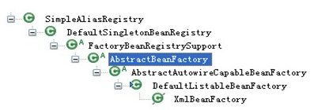

---

8        //doGetBean才是真正向IoC容器获取被管理Bean的过程  
9        return doGetBean(name, requiredType, null, false);  
10    }  
11    //获取IoC容器中指定名称和参数的Bean  
12    public Object getBean(String name, Object... args) throws BeansException { 
 
13        //doGetBean才是真正向IoC容器获取被管理Bean的过程  
14        return doGetBean(name, null, args, false);  
15    }  
16    //获取IoC容器中指定名称、类型和参数的Bean  
17    public <T> T getBean(String name, Class<T> requiredType, Object... args) 
throws BeansException {  
18    //doGetBean才是真正向IoC容器获取被管理Bean的过程  
19        return doGetBean(name, requiredType, args, false);  
20    }  
21    //真正实现向IoC容器获取Bean的功能，也是触发依赖注入功能的地方  
22    @SuppressWarnings("unchecked")  
23    protected <T> T doGetBean(  
24            final String name, final Class<T> requiredType, final Object[] 
args, boolean typeCheckOnly)  
25            throws BeansException {  
26        //根据指定的名称获取被管理Bean的名称，剥离指定名称中对容器的相关依赖  
27        //如果指定的是别名，将别名转换为规范的Bean名称  
28        final String beanName = transformedBeanName(name);  
29        Object bean;  
30        //先从缓存中取是否已经有被创建过的单态类型的Bean，对于单态模式的Bean整  
31        //个IoC容器中只创建一次，不需要重复创建  
32        Object sharedInstance = getSingleton(beanName);  
33        //IoC容器创建单态模式Bean实例对象  
34        if (sharedInstance != null && args == null) {  
35            if (logger.isDebugEnabled()) {  
36                //如果指定名称的Bean在容器中已有单态模式的Bean被创建，直接返回  
37                //已经创建的Bean  
38                if (isSingletonCurrentlyInCreation(beanName)) {  
39                    logger.debug("Returning eagerly cached instance of 
singleton bean '" + beanName +  
40                            "' that is not fully initialized yet - a 
consequence of a circular reference");  
41                }  
42                else {  
43                    logger.debug("Returning cached instance of singleton bean 
'" + beanName + "'");  
44                }  
45            }  
46            //获取给定Bean的实例对象，主要是完成FactoryBean的相关处理  
47            //注意：BeanFactory是管理容器中Bean的工厂，而FactoryBean是  
48            //创建创建对象的工厂Bean，两者之间有区别  
49            bean = getObjectForBeanInstance(sharedInstance, name, beanName, 
null);  
50        }  
51        else {//缓存没有正在创建的单态模式Bean  
52            //缓存中已经有已经创建的原型模式Bean，但是由于循环引用的问题导致实  
53            //例化对象失败  
54            if (isPrototypeCurrentlyInCreation(beanName)) {  
55                throw new BeanCurrentlyInCreationException(beanName);  
56            }  
57            //对IoC容器中是否存在指定名称的BeanDefinition进行检查，首先检查是否  
58            //能在当前的BeanFactory中获取的所需要的Bean，如果不能则委托当前容器

---

59            //的父级容器去查找，如果还是找不到则沿着容器的继承体系向父级容器查找  
60            BeanFactory parentBeanFactory = getParentBeanFactory();  
61            //当前容器的父级容器存在，且当前容器中不存在指定名称的Bean  
62            if (parentBeanFactory != null && !containsBeanDefinition(beanName)) 
{  
63                //解析指定Bean名称的原始名称  
64                String nameToLookup = originalBeanName(name);  
65                if (args != null) {  
66                    //委派父级容器根据指定名称和显式的参数查找  
67                    return (T) parentBeanFactory.getBean(nameToLookup, args); 
 
68                }  
69                else {  
70                    //委派父级容器根据指定名称和类型查找  
71                    return parentBeanFactory.getBean(nameToLookup, 
requiredType);  
72                }  
73            }  
74            //创建的Bean是否需要进行类型验证，一般不需要  
75            if (!typeCheckOnly) {  
76                //向容器标记指定的Bean已经被创建  
77                markBeanAsCreated(beanName);  
78            }  
79             //根据指定Bean名称获取其父级的Bean定义，主要解决Bean继承时子类  
80            //合并父类公共属性问题  
81            final RootBeanDefinition mbd = 
getMergedLocalBeanDefinition(beanName);  
82            checkMergedBeanDefinition(mbd, beanName, args);  
83            //获取当前Bean所有依赖Bean的名称  
84            String[] dependsOn = mbd.getDependsOn();  
85            //如果当前Bean有依赖Bean  
86            if (dependsOn != null) {  
87                for (String dependsOnBean : dependsOn) {  
88                    //递归调用getBean方法，获取当前Bean的依赖Bean  
89                    getBean(dependsOnBean);  
90                    //把被依赖Bean注册给当前依赖的Bean  
91                    registerDependentBean(dependsOnBean, beanName);  
92                }  
93            }  
94            //创建单态模式Bean的实例对象  
95            if (mbd.isSingleton()) {  
96            //这里使用了一个匿名内部类，创建Bean实例对象，并且注册给所依赖的对象  
97                sharedInstance = getSingleton(beanName, new ObjectFactory() { 
 
98                    public Object getObject() throws BeansException {  
99                        try {  
100                            //创建一个指定Bean实例对象，如果有父级继承，则合并子//类和
父类的定义  
101                            return createBean(beanName, mbd, args);  
102                        }  
103                        catch (BeansException ex) {  
104                            //显式地从容器单态模式Bean缓存中清除实例对象  
105                            destroySingleton(beanName);  
106                            throw ex;  
107                        }  
108                    }  
109                });  
110                //获取给定Bean的实例对象

---

111                bean = getObjectForBeanInstance(sharedInstance, name, 
beanName, mbd);  
112            }  
113            //IoC容器创建原型模式Bean实例对象  
114            else if (mbd.isPrototype()) {  
115                //原型模式(Prototype)是每次都会创建一个新的对象  
116                Object prototypeInstance = null;  
117                try {  
118                    //回调beforePrototypeCreation方法，默认的功能是注册当前创//建的
原型对象  
119                    beforePrototypeCreation(beanName);  
120                    //创建指定Bean对象实例  
121                    prototypeInstance = createBean(beanName, mbd, args);  
122                }  
123                finally {  
124                    //回调afterPrototypeCreation方法，默认的功能告诉IoC容器指//定
Bean的原型对象不再创建了  
125                    afterPrototypeCreation(beanName);  
126                }  
127                //获取给定Bean的实例对象  
128                bean = getObjectForBeanInstance(prototypeInstance, name, 
beanName, mbd);  
129            }  
130            //要创建的Bean既不是单态模式，也不是原型模式，则根据Bean定义资源中  
131            //配置的生命周期范围，选择实例化Bean的合适方法，这种在Web应用程序中  
132            //比较常用，如：request、session、application等生命周期  
133            else {  
134                String scopeName = mbd.getScope();  
135                final Scope scope = this.scopes.get(scopeName);  
136                //Bean定义资源中没有配置生命周期范围，则Bean定义不合法  
137                if (scope == null) {  
138                    throw new IllegalStateException("No Scope registered for 
scope '" + scopeName + "'");  
139                }  
140                try {  
141                    //这里又使用了一个匿名内部类，获取一个指定生命周期范围的实例  
142                    Object scopedInstance = scope.get(beanName, new 
ObjectFactory() {  
143                        public Object getObject() throws BeansException {  
144                            beforePrototypeCreation(beanName);  
145                            try {  
146                                return createBean(beanName, mbd, args);  
147                            }  
148                            finally {  
149                                afterPrototypeCreation(beanName);  
150                            }  
151                        }  
152                    });  
153                    //获取给定Bean的实例对象  
154                    bean = getObjectForBeanInstance(scopedInstance, name, 
beanName, mbd);  
155                }  
156                catch (IllegalStateException ex) {  
157                    throw new BeanCreationException(beanName,  
158                            "Scope '" + scopeName + "' is not active for the 
current thread; " +  
159                            "consider defining a scoped proxy for this bean if 
you intend to refer to it from a singleton",

---

通过上面对向IoC容器获取Bean方法的分析，我们可以看到在Spring中，如果Bean定义的单态模式
(Singleton)，则容器在创建之前先从缓存中查找，以确保整个容器中只存在一个实例对象。如果Bean定
义的是原型模式(Prototype)，则容器每次都会创建一个新的实例对象。除此之外，Bean定义还可以扩展
为指定其生命周期范围。
上面的源码只是定义了根据Bean定义的模式，采取的不同创建Bean实例对象的策略，具体的Bean实例
对象的创建过程由实现了ObejctFactory接口的匿名内部类的createBean方法完成，ObejctFactory使用
委派模式，具体的Bean实例创建过程交由其实现类AbstractAutowireCapableBeanFactory完成，我们
继续分析AbstractAutowireCapableBeanFactory的createBean方法的源码，理解其创建Bean实例的具
体实现过程。
 
3、AbstractAutowireCapableBeanFactory创建Bean实例对象：
AbstractAutowireCapableBeanFactory类实现了ObejctFactory接口，创建容器指定的Bean实例对象，
同时还对创建的Bean实例对象进行初始化处理。其创建Bean实例对象的方法源码如下：
  
 
160                            ex);  
161                }  
162            }  
163        }  
164        //对创建的Bean实例对象进行类型检查  
165        if (requiredType != null && bean != null && 
!requiredType.isAssignableFrom(bean.getClass())) {  
166            throw new BeanNotOfRequiredTypeException(name, requiredType, 
bean.getClass());  
167        }  
168        return (T) bean;  
169    } 
1    //创建Bean实例对象  
2    protected Object createBean(final String beanName, final RootBeanDefinition 
mbd, final Object[] args)  
3            throws BeanCreationException {  
4        if (logger.isDebugEnabled()) {  
5            logger.debug("Creating instance of bean '" + beanName + "'");  
6        }  
7        //判断需要创建的Bean是否可以实例化，即是否可以通过当前的类加载器加载  
8        resolveBeanClass(mbd, beanName);  
9        //校验和准备Bean中的方法覆盖  
10        try {  
11            mbd.prepareMethodOverrides();  
12        }  
13        catch (BeanDefinitionValidationException ex) {  
14            throw new 
BeanDefinitionStoreException(mbd.getResourceDescription(),  
15                    beanName, "Validation of method overrides failed", ex);  
16        }  
17        try {  
18            //如果Bean配置了初始化前和初始化后的处理器，则试图返回一个需要创建//Bean的代理
对象

---

19            Object bean = resolveBeforeInstantiation(beanName, mbd);  
20            if (bean != null) {  
21                return bean;  
22            }  
23        }  
24        catch (Throwable ex) {  
25            throw new BeanCreationException(mbd.getResourceDescription(), 
beanName,  
26                    "BeanPostProcessor before instantiation of bean failed", 
ex);  
27        }  
28        //创建Bean的入口  
29        Object beanInstance = doCreateBean(beanName, mbd, args);  
30        if (logger.isDebugEnabled()) {  
31            logger.debug("Finished creating instance of bean '" + beanName + 
"'");  
32        }  
33        return beanInstance;  
34    }  
35    //真正创建Bean的方法  
36    protected Object doCreateBean(final String beanName, final 
RootBeanDefinition mbd, final Object[] args) {  
37        //封装被创建的Bean对象  
38        BeanWrapper instanceWrapper = null;  
39        if (mbd.isSingleton()){//单态模式的Bean，先从容器中缓存中获取同名Bean  
40            instanceWrapper = this.factoryBeanInstanceCache.remove(beanName); 
 
41        }  
42        if (instanceWrapper == null) {  
43            //创建实例对象  
44            instanceWrapper = createBeanInstance(beanName, mbd, args);  
45        }  
46        final Object bean = (instanceWrapper != null ? 
instanceWrapper.getWrappedInstance() : null);  
47        //获取实例化对象的类型  
48        Class beanType = (instanceWrapper != null ? 
instanceWrapper.getWrappedClass() : null);  
49        //调用PostProcessor后置处理器  
50        synchronized (mbd.postProcessingLock) {  
51            if (!mbd.postProcessed) {  
52                applyMergedBeanDefinitionPostProcessors(mbd, beanType, 
beanName);  
53                mbd.postProcessed = true;  
54            }  
55        }  
56        // Eagerly cache singletons to be able to resolve circular references 
 
57        //向容器中缓存单态模式的Bean对象，以防循环引用  
58        boolean earlySingletonExposure = (mbd.isSingleton() && 
this.allowCircularReferences &&  
59                isSingletonCurrentlyInCreation(beanName));  
60        if (earlySingletonExposure) {  
61            if (logger.isDebugEnabled()) {  
62                logger.debug("Eagerly caching bean '" + beanName +  
63                        "' to allow for resolving potential circular 
references");  
64            }  
65            //这里是一个匿名内部类，为了防止循环引用，尽早持有对象的引用

---

66            addSingletonFactory(beanName, new ObjectFactory() {  
67                public Object getObject() throws BeansException {  
68                    return getEarlyBeanReference(beanName, mbd, bean);  
69                }  
70            });  
71        }  
72        //Bean对象的初始化，依赖注入在此触发  
73        //这个exposedObject在初始化完成之后返回作为依赖注入完成后的Bean  
74        Object exposedObject = bean;  
75        try {  
76            //将Bean实例对象封装，并且Bean定义中配置的属性值赋值给实例对象  
77            populateBean(beanName, mbd, instanceWrapper);  
78            if (exposedObject != null) {  
79                //初始化Bean对象  
80                exposedObject = initializeBean(beanName, exposedObject, mbd); 
 
81            }  
82        }  
83        catch (Throwable ex) {  
84            if (ex instanceof BeanCreationException && 
beanName.equals(((BeanCreationException) ex).getBeanName())) {  
85                throw (BeanCreationException) ex;  
86            }  
87            else {  
88                throw new BeanCreationException(mbd.getResourceDescription(), 
beanName, "Initialization of bean failed", ex);  
89            }  
90        }  
91        if (earlySingletonExposure) {  
92            //获取指定名称的已注册的单态模式Bean对象  
93            Object earlySingletonReference = getSingleton(beanName, false);  
94            if (earlySingletonReference != null) {  
95                //根据名称获取的以注册的Bean和正在实例化的Bean是同一个  
96                if (exposedObject == bean) {  
97                    //当前实例化的Bean初始化完成  
98                    exposedObject = earlySingletonReference;  
99                }  
100                //当前Bean依赖其他Bean，并且当发生循环引用时不允许新创建实例对象  
101                else if (!this.allowRawInjectionDespiteWrapping && 
hasDependentBean(beanName)) {  
102                    String[] dependentBeans = getDependentBeans(beanName);  
103                    Set<String> actualDependentBeans = new 
LinkedHashSet<String>(dependentBeans.length);  
104                    //获取当前Bean所依赖的其他Bean  
105                    for (String dependentBean : dependentBeans) {  
106                        //对依赖Bean进行类型检查  
107                        if 
(!removeSingletonIfCreatedForTypeCheckOnly(dependentBean)) {  
108                            actualDependentBeans.add(dependentBean);  
109                        }  
110                    }  
111                    if (!actualDependentBeans.isEmpty()) {  
112                        throw new BeanCurrentlyInCreationException(beanName, 
 
113                                "Bean with name '" + beanName + "' has been 
injected into other beans [" +  
114                                
StringUtils.collectionToCommaDelimitedString(actualDependentBeans) +

---

通过对方法源码的分析，我们看到具体的依赖注入实现在以下两个方法中：
(1).createBeanInstance：生成Bean所包含的java对象实例。
(2).populateBean ：对Bean属性的依赖注入进行处理。
 
下面继续分析这两个方法的代码实现。
4、createBeanInstance方法创建Bean的java实例对象：
在createBeanInstance方法中，根据指定的初始化策略，使用静态工厂、工厂方法或者容器的自动装配
特性生成java实例对象，创建对象的源码如下：
  
 
115                                "] in its raw version as part of a circular 
reference, but has eventually been " +  
116                                "wrapped. This means that said other beans do 
not use the final version of the " +  
117                                "bean. This is often the result of over-eager 
type matching - consider using " +  
118                                "'getBeanNamesOfType' with the 
'allowEagerInit' flag turned off, for example.");  
119                    }  
120                }  
121            }  
122        }  
123        //注册完成依赖注入的Bean  
124        try {  
125            registerDisposableBeanIfNecessary(beanName, bean, mbd);  
126        }  
127        catch (BeanDefinitionValidationException ex) {  
128            throw new BeanCreationException(mbd.getResourceDescription(), 
beanName, "Invalid destruction signature", ex);  
129        }  
130        return exposedObject;  
    } 
1    //创建Bean的实例对象  
2    protected BeanWrapper createBeanInstance(String beanName, RootBeanDefinition 
mbd, Object[] args) {  
3        //检查确认Bean是可实例化的  
4        Class beanClass = resolveBeanClass(mbd, beanName);  
5        //使用工厂方法对Bean进行实例化  
6        if (beanClass != null && !Modifier.isPublic(beanClass.getModifiers()) && 
!mbd.isNonPublicAccessAllowed()) {  
7            throw new BeanCreationException(mbd.getResourceDescription(), 
beanName,  
8                    "Bean class isn't public, and non-public access not allowed: 
" + beanClass.getName());

---

9        }  
10        if (mbd.getFactoryMethodName() != null)  {  
11            //调用工厂方法实例化  
12            return instantiateUsingFactoryMethod(beanName, mbd, args);  
13        }  
14        //使用容器的自动装配方法进行实例化  
15        boolean resolved = false;  
16        boolean autowireNecessary = false;  
17        if (args == null) {  
18            synchronized (mbd.constructorArgumentLock) {  
19                if (mbd.resolvedConstructorOrFactoryMethod != null) {  
20                    resolved = true;  
21                    autowireNecessary = mbd.constructorArgumentsResolved;  
22                }  
23            }  
24        }  
25        if (resolved) {  
26            if (autowireNecessary) {  
27                //配置了自动装配属性，使用容器的自动装配实例化  
28                //容器的自动装配是根据参数类型匹配Bean的构造方法  
29                return autowireConstructor(beanName, mbd, null, null);  
30            }  
31            else {  
32                //使用默认的无参构造方法实例化  
33                return instantiateBean(beanName, mbd);  
34            }  
35        }  
36        //使用Bean的构造方法进行实例化  
37        Constructor[] ctors = 
determineConstructorsFromBeanPostProcessors(beanClass, beanName);  
38        if (ctors != null ||  
39                mbd.getResolvedAutowireMode() == 
RootBeanDefinition.AUTOWIRE_CONSTRUCTOR ||  
40                mbd.hasConstructorArgumentValues() || 
!ObjectUtils.isEmpty(args))  {  
41            //使用容器的自动装配特性，调用匹配的构造方法实例化  
42            return autowireConstructor(beanName, mbd, ctors, args);  
43        }  
44        //使用默认的无参构造方法实例化  
45        return instantiateBean(beanName, mbd);  
46    }   
47    //使用默认的无参构造方法实例化Bean对象  
48    protected BeanWrapper instantiateBean(final String beanName, final 
RootBeanDefinition mbd) {  
49        try {  
50            Object beanInstance;  
51            final BeanFactory parent = this;  
52            //获取系统的安全管理接口，JDK标准的安全管理API  
53            if (System.getSecurityManager() != null) {  
54                //这里是一个匿名内置类，根据实例化策略创建实例对象  
55                beanInstance = AccessController.doPrivileged(new 
PrivilegedAction<Object>() {  
56                    public Object run() {  
57                        return getInstantiationStrategy().instantiate(mbd, 
beanName, parent);  
58                    }  
59                }, getAccessControlContext());  
60            }

---

经过对上面的代码分析，我们可以看出，对使用工厂方法和自动装配特性的Bean的实例化相当比较清
楚，调用相应的工厂方法或者参数匹配的构造方法即可完成实例化对象的工作，但是对于我们最常使用
的默认无参构造方法就需要使用相应的初始化策略(JDK的反射机制或者CGLIB)来进行初始化了，在方法
getInstantiationStrategy().instantiate中就具体实现类使用初始策略实例化对象。
 
5、SimpleInstantiationStrategy类使用默认的无参构造方法创建Bean实例化对象：
在使用默认的无参构造方法创建Bean的实例化对象时，方法getInstantiationStrategy().instantiate调用
了SimpleInstantiationStrategy类中的实例化Bean的方法，其源码如下：
  
 
61            else {  
62                //将实例化的对象封装起来  
63                beanInstance = getInstantiationStrategy().instantiate(mbd, 
beanName, parent);  
64            }  
65            BeanWrapper bw = new BeanWrapperImpl(beanInstance);  
66            initBeanWrapper(bw);  
67            return bw;  
68        }  
69        catch (Throwable ex) {  
70            throw new BeanCreationException(mbd.getResourceDescription(), 
beanName, "Instantiation of bean failed", ex);  
71        }  
72    }
1    //使用初始化策略实例化Bean对象  
2    public Object instantiate(RootBeanDefinition beanDefinition, String 
beanName, BeanFactory owner) {  
3        //如果Bean定义中没有方法覆盖，则就不需要CGLIB父类类的方法  
4        if (beanDefinition.getMethodOverrides().isEmpty()) {  
5            Constructor<?> constructorToUse;  
6            synchronized (beanDefinition.constructorArgumentLock) {  
7                //获取对象的构造方法或工厂方法  
8                constructorToUse = (Constructor<?>) 
beanDefinition.resolvedConstructorOrFactoryMethod;  
9                //如果没有构造方法且没有工厂方法  
10                if (constructorToUse == null) {  
11                    //使用JDK的反射机制，判断要实例化的Bean是否是接口  
12                    final Class clazz = beanDefinition.getBeanClass();  
13                    if (clazz.isInterface()) {  
14                        throw new BeanInstantiationException(clazz, "Specified 
class is an interface");  
15                    }  
16                    try {  
17                        if (System.getSecurityManager() != null) {  
18                        //这里是一个匿名内置类，使用反射机制获取Bean的构造方法

---

通过上面的代码分析，我们看到了如果Bean有方法被覆盖了，则使用JDK的反射机制进行实例化，否
则，使用CGLIB进行实例化。
instantiateWithMethodInjection方法调用SimpleInstantiationStrategy的子类
CglibSubclassingInstantiationStrategy使用CGLIB来进行初始化，其源码如下：
  
 
19                            constructorToUse = 
AccessController.doPrivileged(new PrivilegedExceptionAction<Constructor>() {  
20                                public Constructor run() throws Exception {  
21                                    return 
clazz.getDeclaredConstructor((Class[]) null);  
22                                }  
23                            });  
24                        }  
25                        else {  
26                            constructorToUse =  
clazz.getDeclaredConstructor((Class[]) null);  
27                        }  
28                        beanDefinition.resolvedConstructorOrFactoryMethod = 
constructorToUse;  
29                    }  
30                    catch (Exception ex) {  
31                        throw new BeanInstantiationException(clazz, "No default 
constructor found", ex);  
32                    }  
33                }  
34            }  
35            //使用BeanUtils实例化，通过反射机制调用”构造方法.newInstance(arg)”来进行实
例化  
36            return BeanUtils.instantiateClass(constructorToUse);  
37        }  
38        else {  
39            //使用CGLIB来实例化对象  
40            return instantiateWithMethodInjection(beanDefinition, beanName, 
owner);  
41        }  
    } 
1    //使用CGLIB进行Bean对象实例化  
2    public Object instantiate(Constructor ctor, Object[] args) {  
3            //CGLIB中的类  
4            Enhancer enhancer = new Enhancer();  
5            //将Bean本身作为其基类  
6            enhancer.setSuperclass(this.beanDefinition.getBeanClass());  
7            enhancer.setCallbackFilter(new CallbackFilterImpl());  
8            enhancer.setCallbacks(new Callback[] {  
9                    NoOp.INSTANCE,  
10                    new LookupOverrideMethodInterceptor(),  
11                    new ReplaceOverrideMethodInterceptor()

---

CGLIB是一个常用的字节码生成器的类库，它提供了一系列API实现java字节码的生成和转换功能。我们
在学习JDK的动态代理时都知道，JDK的动态代理只能针对接口，如果一个类没有实现任何接口，要对其
进行动态代理只能使用CGLIB。
 
6、populateBean方法对Bean属性的依赖注入：
在第3步的分析中我们已经了解到Bean的依赖注入分为以下两个过程：
(1).createBeanInstance：生成Bean所包含的java对象实例。
(2).populateBean ：对Bean属性的依赖注入进行处理。
第4、5步中我们已经分析了容器初始化生成Bean所包含的Java实例对象的过程，现在我们继续分析生成
对象后，Spring IoC容器是如何将Bean的属性依赖关系注入Bean实例对象中并设置好的，属性依赖注入
的代码如下：
  
 
12            });  
13            //使用CGLIB的create方法生成实例对象  
14            return (ctor == null) ?   
15                    enhancer.create() :   
16                    enhancer.create(ctor.getParameterTypes(), args);  
17        } 
1    //将Bean属性设置到生成的实例对象上  
2    protected void populateBean(String beanName, AbstractBeanDefinition mbd, 
BeanWrapper bw) {  
3        //获取容器在解析Bean定义资源时为BeanDefiniton中设置的属性值  
4        PropertyValues pvs = mbd.getPropertyValues();  
5        //实例对象为null  
6        if (bw == null) {  
7            //属性值不为空  
8            if (!pvs.isEmpty()) {  
9                throw new BeanCreationException(  
10                        mbd.getResourceDescription(), beanName, "Cannot apply 
property values to null instance");  
11            }  
12            else {  
13                //实例对象为null，属性值也为空，不需要设置属性值，直接返回  
14                return;  
15            }  
16        }  
17        //在设置属性之前调用Bean的PostProcessor后置处理器  
18        boolean continueWithPropertyPopulation = true;  
19        if (!mbd.isSynthetic() && hasInstantiationAwareBeanPostProcessors()) { 
 
20            for (BeanPostProcessor bp : getBeanPostProcessors()) {  
21                if (bp instanceof InstantiationAwareBeanPostProcessor) {

---

22                    InstantiationAwareBeanPostProcessor ibp = 
(InstantiationAwareBeanPostProcessor) bp;  
23                    if 
(!ibp.postProcessAfterInstantiation(bw.getWrappedInstance(), beanName)) {  
24                        continueWithPropertyPopulation = false;  
25                        break;  
26                    }  
27                }  
28            }  
29        }  
30        if (!continueWithPropertyPopulation) {  
31            return;  
32        }  
33        //依赖注入开始，首先处理autowire自动装配的注入  
34        if (mbd.getResolvedAutowireMode() == 
RootBeanDefinition.AUTOWIRE_BY_NAME ||  
35                mbd.getResolvedAutowireMode() == 
RootBeanDefinition.AUTOWIRE_BY_TYPE) {  
36            MutablePropertyValues newPvs = new MutablePropertyValues(pvs);  
37            //对autowire自动装配的处理，根据Bean名称自动装配注入  
38            if (mbd.getResolvedAutowireMode() == 
RootBeanDefinition.AUTOWIRE_BY_NAME) {  
39                autowireByName(beanName, mbd, bw, newPvs);  
40            }  
41            //根据Bean类型自动装配注入  
42            if (mbd.getResolvedAutowireMode() == 
RootBeanDefinition.AUTOWIRE_BY_TYPE) {  
43                autowireByType(beanName, mbd, bw, newPvs);  
44            }  
45            pvs = newPvs;  
46        }  
47        //检查容器是否持有用于处理单态模式Bean关闭时的后置处理器  
48        boolean hasInstAwareBpps = hasInstantiationAwareBeanPostProcessors(); 
 
49        //Bean实例对象没有依赖，即没有继承基类  
50        boolean needsDepCheck = (mbd.getDependencyCheck() != 
RootBeanDefinition.DEPENDENCY_CHECK_NONE);  
51        if (hasInstAwareBpps || needsDepCheck) {  
52            //从实例对象中提取属性描述符  
53            PropertyDescriptor[] filteredPds = 
filterPropertyDescriptorsForDependencyCheck(bw);  
54            if (hasInstAwareBpps) {  
55                for (BeanPostProcessor bp : getBeanPostProcessors()) {  
56                    if (bp instanceof InstantiationAwareBeanPostProcessor) {  
57                        InstantiationAwareBeanPostProcessor ibp = 
(InstantiationAwareBeanPostProcessor) bp;  
58                        //使用BeanPostProcessor处理器处理属性值  
59                        pvs = ibp.postProcessPropertyValues(pvs, filteredPds, 
bw.getWrappedInstance(), beanName);  
60                        if (pvs == null) {  
61                            return;  
62                        }  
63                    }  
64                }  
65            }  
66            if (needsDepCheck) {  
67                //为要设置的属性进行依赖检查  
68                checkDependencies(beanName, mbd, filteredPds, pvs);

---

69            }  
70        }  
71        //对属性进行注入  
72        applyPropertyValues(beanName, mbd, bw, pvs);  
73    }  
74    //解析并注入依赖属性的过程  
75    protected void applyPropertyValues(String beanName, BeanDefinition mbd, 
BeanWrapper bw, PropertyValues pvs) {  
76        if (pvs == null || pvs.isEmpty()) {  
77            return;  
78        }  
79        //封装属性值  
80        MutablePropertyValues mpvs = null;  
81        List<PropertyValue> original;  
82        if (System.getSecurityManager()!= null) {  
83            if (bw instanceof BeanWrapperImpl) {  
84                //设置安全上下文，JDK安全机制  
85                ((BeanWrapperImpl) 
bw).setSecurityContext(getAccessControlContext());  
86            }  
87        }  
88        if (pvs instanceof MutablePropertyValues) {  
89            mpvs = (MutablePropertyValues) pvs;  
90            //属性值已经转换  
91            if (mpvs.isConverted()) {  
92                try {  
93                    //为实例化对象设置属性值  
94                    bw.setPropertyValues(mpvs);  
95                    return;  
96                }  
97                catch (BeansException ex) {  
98                    throw new BeanCreationException(  
99                            mbd.getResourceDescription(), beanName, "Error 
setting property values", ex);  
100                }  
101            }  
102            //获取属性值对象的原始类型值  
103            original = mpvs.getPropertyValueList();  
104        }  
105        else {  
106            original = Arrays.asList(pvs.getPropertyValues());  
107        }  
108        //获取用户自定义的类型转换  
109        TypeConverter converter = getCustomTypeConverter();  
110        if (converter == null) {  
111            converter = bw;  
112        }  
113        //创建一个Bean定义属性值解析器，将Bean定义中的属性值解析为Bean实例对象  
114        //的实际值  
115        BeanDefinitionValueResolver valueResolver = new 
BeanDefinitionValueResolver(this, beanName, mbd, converter);  
116        //为属性的解析值创建一个拷贝，将拷贝的数据注入到实例对象中  
117        List<PropertyValue> deepCopy = new ArrayList<PropertyValue>
(original.size());  
118        boolean resolveNecessary = false;  
119        for (PropertyValue pv : original) {  
120            //属性值不需要转换  
121            if (pv.isConverted()) {

---

122                deepCopy.add(pv);  
123            }  
124            //属性值需要转换  
125            else {  
126                String propertyName = pv.getName();  
127                //原始的属性值，即转换之前的属性值  
128                Object originalValue = pv.getValue();  
129                //转换属性值，例如将引用转换为IoC容器中实例化对象引用  
130                Object resolvedValue = 
valueResolver.resolveValueIfNecessary(pv, originalValue);  
131                //转换之后的属性值  
132                Object convertedValue = resolvedValue;  
133                //属性值是否可以转换  
134                boolean convertible = bw.isWritableProperty(propertyName) && 
 
135                        
!PropertyAccessorUtils.isNestedOrIndexedProperty(propertyName);  
136                if (convertible) {  
137                    //使用用户自定义的类型转换器转换属性值  
138                    convertedValue = convertForProperty(resolvedValue, 
propertyName, bw, converter);  
139                }  
140                //存储转换后的属性值，避免每次属性注入时的转换工作  
141                if (resolvedValue == originalValue) {  
142                    if (convertible) {  
143                        //设置属性转换之后的值  
144                        pv.setConvertedValue(convertedValue);  
145                    }  
146                    deepCopy.add(pv);  
147                }  
148                //属性是可转换的，且属性原始值是字符串类型，且属性的原始类型值不是  
149                //动态生成的字符串，且属性的原始值不是集合或者数组类型  
150                else if (convertible && originalValue instanceof 
TypedStringValue &&  
151                        !((TypedStringValue) originalValue).isDynamic() &&  
152                        !(convertedValue instanceof Collection || 
ObjectUtils.isArray(convertedValue))) {  
153                    pv.setConvertedValue(convertedValue);  
154                    deepCopy.add(pv);  
155                }  
156                else {  
157                    resolveNecessary = true;  
158                    //重新封装属性的值  
159                    deepCopy.add(new PropertyValue(pv, convertedValue));  
160                }  
161            }  
162        }  
163        if (mpvs != null && !resolveNecessary) {  
164            //标记属性值已经转换过  
165            mpvs.setConverted();  
166        }  
167        //进行属性依赖注入  
168        try {  
169            bw.setPropertyValues(new MutablePropertyValues(deepCopy));  
170        }  
171        catch (BeansException ex) {  
172            throw new BeanCreationException(

---

分析上述代码，我们可以看出，对属性的注入过程分以下两种情况：
(1).属性值类型不需要转换时，不需要解析属性值，直接准备进行依赖注入。
(2).属性值需要进行类型转换时，如对其他对象的引用等，首先需要解析属性值，然后对解析后的属性值
进行依赖注入。
对属性值的解析是在BeanDefinitionValueResolver类中的resolveValueIfNecessary方法中进行的，对
属性值的依赖注入是通过bw.setPropertyValues方法实现的，在分析属性值的依赖注入之前，我们先分
析一下对属性值的解析过程。
 
7、BeanDefinitionValueResolver解析属性值：
 
当容器在对属性进行依赖注入时，如果发现属性值需要进行类型转换，如属性值是容器中另一个Bean实
例对象的引用，则容器首先需要根据属性值解析出所引用的对象，然后才能将该引用对象注入到目标实
例对象的属性上去，对属性进行解析的由resolveValueIfNecessary方法实现，其源码如下：
  
 
173                    mbd.getResourceDescription(), beanName, "Error setting 
property values", ex);  
174        }  
    }  
1    //解析属性值，对注入类型进行转换  
2    public Object resolveValueIfNecessary(Object argName, Object value) {  
3        //对引用类型的属性进行解析  
4        if (value instanceof RuntimeBeanReference) {  
5            RuntimeBeanReference ref = (RuntimeBeanReference) value;  
6            //调用引用类型属性的解析方法  
7            return resolveReference(argName, ref);  
8        }  
9        //对属性值是引用容器中另一个Bean名称的解析  
10        else if (value instanceof RuntimeBeanNameReference) {  
11            String refName = ((RuntimeBeanNameReference) value).getBeanName(); 
 
12            refName = String.valueOf(evaluate(refName));  
13            //从容器中获取指定名称的Bean  
14            if (!this.beanFactory.containsBean(refName)) {  
15                throw new BeanDefinitionStoreException(  
16                        "Invalid bean name '" + refName + "' in bean reference 
for " + argName);  
17            }  
18            return refName;  
19        }  
20        //对Bean类型属性的解析，主要是Bean中的内部类  
21        else if (value instanceof BeanDefinitionHolder) {  
22            BeanDefinitionHolder bdHolder = (BeanDefinitionHolder) value;  
23            return resolveInnerBean(argName, bdHolder.getBeanName(), 
bdHolder.getBeanDefinition());

---

24        }  
25        else if (value instanceof BeanDefinition) {  
26            BeanDefinition bd = (BeanDefinition) value;  
27            return resolveInnerBean(argName, "(inner bean)", bd);  
28        }  
29        //对集合数组类型的属性解析  
30        else if (value instanceof ManagedArray) {  
31            ManagedArray array = (ManagedArray) value;  
32            //获取数组的类型  
33            Class elementType = array.resolvedElementType;  
34            if (elementType == null) {  
35                //获取数组元素的类型  
36                String elementTypeName = array.getElementTypeName();  
37                if (StringUtils.hasText(elementTypeName)) {  
38                    try {  
39                        //使用反射机制创建指定类型的对象  
40                        elementType = ClassUtils.forName(elementTypeName, 
this.beanFactory.getBeanClassLoader());  
41                        array.resolvedElementType = elementType;  
42                    }  
43                    catch (Throwable ex) {  
44                        throw new BeanCreationException(  
45                                this.beanDefinition.getResourceDescription(), 
this.beanName,  
46                                "Error resolving array type for " + argName, 
ex);  
47                    }  
48                }  
49                //没有获取到数组的类型，也没有获取到数组元素的类型，则直接设置数  
50                //组的类型为Object  
51                else {  
52                    elementType = Object.class;  
53                }  
54            }  
55            //创建指定类型的数组  
56            return resolveManagedArray(argName, (List<?>) value, elementType); 
 
57        }  
58        //解析list类型的属性值  
59        else if (value instanceof ManagedList) {  
60            return resolveManagedList(argName, (List<?>) value);  
61        }  
62        //解析set类型的属性值  
63        else if (value instanceof ManagedSet) {  
64            return resolveManagedSet(argName, (Set<?>) value);  
65        }  
66        //解析map类型的属性值  
67        else if (value instanceof ManagedMap) {  
68            return resolveManagedMap(argName, (Map<?, ?>) value);  
69        }  
70        //解析props类型的属性值，props其实就是key和value均为字符串的map  
71        else if (value instanceof ManagedProperties) {  
72            Properties original = (Properties) value;  
73            //创建一个拷贝，用于作为解析后的返回值  
74            Properties copy = new Properties();  
75            for (Map.Entry propEntry : original.entrySet()) {  
76                Object propKey = propEntry.getKey();  
77                Object propValue = propEntry.getValue();

---

78                if (propKey instanceof TypedStringValue) {  
79                    propKey = evaluate((TypedStringValue) propKey);  
80                }  
81                if (propValue instanceof TypedStringValue) {  
82                    propValue = evaluate((TypedStringValue) propValue);  
83                }  
84                copy.put(propKey, propValue);  
85            }  
86            return copy;  
87        }  
88        //解析字符串类型的属性值  
89        else if (value instanceof TypedStringValue) {  
90            TypedStringValue typedStringValue = (TypedStringValue) value;  
91            Object valueObject = evaluate(typedStringValue);  
92            try {  
93                //获取属性的目标类型  
94                Class<?> resolvedTargetType = 
resolveTargetType(typedStringValue);  
95                if (resolvedTargetType != null) {  
96                    //对目标类型的属性进行解析，递归调用  
97                    return this.typeConverter.convertIfNecessary(valueObject, 
resolvedTargetType);  
98                }  
99                //没有获取到属性的目标对象，则按Object类型返回  
100                else {  
101                    return valueObject;  
102                }  
103            }  
104            catch (Throwable ex) {  
105                throw new BeanCreationException(  
106                        this.beanDefinition.getResourceDescription(), 
this.beanName,  
107                        "Error converting typed String value for " + argName, 
ex);  
108            }  
109        }  
110        else {  
111            return evaluate(value);  
112        }  
113    }  
114    //解析引用类型的属性值  
115    private Object resolveReference(Object argName, RuntimeBeanReference ref) 
{  
116        try {  
117            //获取引用的Bean名称  
118            String refName = ref.getBeanName();  
119            refName = String.valueOf(evaluate(refName));  
120            //如果引用的对象在父类容器中，则从父类容器中获取指定的引用对象  
121            if (ref.isToParent()) {  
122                if (this.beanFactory.getParentBeanFactory() == null) {  
123                    throw new BeanCreationException(  
124                            this.beanDefinition.getResourceDescription(), 
this.beanName,  
125                            "Can't resolve reference to bean '" + refName +  
126                            "' in parent factory: no parent factory 
available");  
127                }

---

128                return 
this.beanFactory.getParentBeanFactory().getBean(refName);  
129            }  
130            //从当前的容器中获取指定的引用Bean对象，如果指定的Bean没有被实例化  
131            //则会递归触发引用Bean的初始化和依赖注入  
132            else {  
133                Object bean = this.beanFactory.getBean(refName);  
134                //将当前实例化对象的依赖引用对象  
135                this.beanFactory.registerDependentBean(refName, 
this.beanName);  
136                return bean;  
137            }  
138        }  
139        catch (BeansException ex) {  
140            throw new BeanCreationException(  
141                    this.beanDefinition.getResourceDescription(), 
this.beanName,  
142                    "Cannot resolve reference to bean '" + ref.getBeanName() + 
"' while setting " + argName, ex);  
143        }  
144    }   
145    //解析array类型的属性  
146    private Object resolveManagedArray(Object argName, List<?> ml, Class 
elementType) {  
147        //创建一个指定类型的数组，用于存放和返回解析后的数组  
148        Object resolved = Array.newInstance(elementType, ml.size());  
149        for (int i = 0; i < ml.size(); i++) {  
150        //递归解析array的每一个元素，并将解析后的值设置到resolved数组中，索引为i  
151            Array.set(resolved, i,  
152                resolveValueIfNecessary(new KeyedArgName(argName, i), 
ml.get(i)));  
153        }  
154        return resolved;  
155    }  
156    //解析list类型的属性  
157    private List resolveManagedList(Object argName, List<?> ml) {  
158        List<Object> resolved = new ArrayList<Object>(ml.size());  
159        for (int i = 0; i < ml.size(); i++) {  
160            //递归解析list的每一个元素  
161            resolved.add(  
162                resolveValueIfNecessary(new KeyedArgName(argName, i), 
ml.get(i)));  
163        }  
164        return resolved;  
165    }  
166    //解析set类型的属性  
167    private Set resolveManagedSet(Object argName, Set<?> ms) {  
168        Set<Object> resolved = new LinkedHashSet<Object>(ms.size());  
169        int i = 0;  
170        //递归解析set的每一个元素  
171        for (Object m : ms) {  
172            resolved.add(resolveValueIfNecessary(new KeyedArgName(argName, i), 
m));  
173            i++;  
174        }  
175        return resolved;  
176    }  
177    //解析map类型的属性

---

通过上面的代码分析，我们明白了Spring是如何将引用类型，内部类以及集合类型等属性进行解析的，
属性值解析完成后就可以进行依赖注入了，依赖注入的过程就是Bean对象实例设置到它所依赖的Bean
对象属性上去，在第7步中我们已经说过，依赖注入是通过bw.setPropertyValues方法实现的，该方法
也使用了委托模式，在BeanWrapper接口中至少定义了方法声明，依赖注入的具体实现交由其实现类
BeanWrapperImpl来完成，下面我们就分析依BeanWrapperImpl中赖注入相关的源码。
 
8、BeanWrapperImpl对Bean属性的依赖注入：
 
BeanWrapperImpl类主要是对容器中完成初始化的Bean实例对象进行属性的依赖注入，即把Bean对象
设置到它所依赖的另一个Bean的属性中去，依赖注入的相关源码如下：
  
 
178    private Map resolveManagedMap(Object argName, Map<?, ?> mm) {  
179        Map<Object, Object> resolved = new LinkedHashMap<Object, Object>
(mm.size());  
180        //递归解析map中每一个元素的key和value  
181        for (Map.Entry entry : mm.entrySet()) {  
182            Object resolvedKey = resolveValueIfNecessary(argName, 
entry.getKey());  
183            Object resolvedValue = resolveValueIfNecessary(  
184                    new KeyedArgName(argName, entry.getKey()), 
entry.getValue());  
185            resolved.put(resolvedKey, resolvedValue);  
186        }  
187        return resolved;  
188    } 
1    //实现属性依赖注入功能  
2    private void setPropertyValue(PropertyTokenHolder tokens, PropertyValue pv) 
throws BeansException {  
3        //PropertyTokenHolder主要保存属性的名称、路径，以及集合的size等信息  
4        String propertyName = tokens.canonicalName;  
5        String actualName = tokens.actualName;  
6        //keys是用来保存集合类型属性的size  
7        if (tokens.keys != null) {  
8            //将属性信息拷贝  
9            PropertyTokenHolder getterTokens = new PropertyTokenHolder();  
10            getterTokens.canonicalName = tokens.canonicalName;  
11            getterTokens.actualName = tokens.actualName;  
12            getterTokens.keys = new String[tokens.keys.length - 1];

---

13            System.arraycopy(tokens.keys, 0, getterTokens.keys, 0, 
tokens.keys.length - 1);  
14            Object propValue;  
15            try {  
16                //获取属性值，该方法内部使用JDK的内省( Introspector)机制，调用属性//的
getter(readerMethod)方法，获取属性的值  
17                propValue = getPropertyValue(getterTokens);  
18            }  
19            catch (NotReadablePropertyException ex) {  
20                throw new NotWritablePropertyException(getRootClass(), 
this.nestedPath + propertyName,  
21                        "Cannot access indexed value in property referenced " + 
 
22                        "in indexed property path '" + propertyName + "'", ex); 
 
23            }  
24            //获取集合类型属性的长度  
25            String key = tokens.keys[tokens.keys.length - 1];  
26            if (propValue == null) {  
27                throw new NullValueInNestedPathException(getRootClass(), 
this.nestedPath + propertyName,  
28                        "Cannot access indexed value in property referenced " + 
 
29                        "in indexed property path '" + propertyName + "': 
returned null");  
30            }  
31            //注入array类型的属性值  
32            else if (propValue.getClass().isArray()) {  
33                //获取属性的描述符  
34                PropertyDescriptor pd = 
getCachedIntrospectionResults().getPropertyDescriptor(actualName);  
35                //获取数组的类型  
36                Class requiredType = propValue.getClass().getComponentType(); 
 
37                //获取数组的长度  
38                int arrayIndex = Integer.parseInt(key);  
39                Object oldValue = null;  
40                try {  
41                    //获取数组以前初始化的值  
42                    if (isExtractOldValueForEditor()) {  
43                        oldValue = Array.get(propValue, arrayIndex);  
44                    }  
45                    //将属性的值赋值给数组中的元素  
46                    Object convertedValue = convertIfNecessary(propertyName, 
oldValue, pv.getValue(), requiredType,  
47                            new PropertyTypeDescriptor(pd, new 
MethodParameter(pd.getReadMethod(), -1), requiredType));  
48                    Array.set(propValue, arrayIndex, convertedValue);  
49                }  
50                catch (IndexOutOfBoundsException ex) {  
51                    throw new InvalidPropertyException(getRootClass(), 
this.nestedPath + propertyName,  
52                            "Invalid array index in property path '" + 
propertyName + "'", ex);  
53                }  
54            }  
55            //注入list类型的属性值  
56            else if (propValue instanceof List) {

---

57                PropertyDescriptor pd = 
getCachedIntrospectionResults().getPropertyDescriptor(actualName);  
58                //获取list集合的类型  
59                Class requiredType = 
GenericCollectionTypeResolver.getCollectionReturnType(  
60                        pd.getReadMethod(), tokens.keys.length);  
61                List list = (List) propValue;  
62                //获取list集合的size  
63                int index = Integer.parseInt(key);  
64                Object oldValue = null;  
65                if (isExtractOldValueForEditor() && index < list.size()) {  
66                    oldValue = list.get(index);  
67                }  
68                //获取list解析后的属性值  
69                Object convertedValue = convertIfNecessary(propertyName, 
oldValue, pv.getValue(), requiredType,  
70                        new PropertyTypeDescriptor(pd, new 
MethodParameter(pd.getReadMethod(), -1), requiredType));  
71                if (index < list.size()) {  
72                    //为list属性赋值  
73                    list.set(index, convertedValue);  
74                }  
75                //如果list的长度大于属性值的长度，则多余的元素赋值为null  
76                else if (index >= list.size()) {  
77                    for (int i = list.size(); i < index; i++) {  
78                        try {  
79                            list.add(null);  
80                        }  
81                        catch (NullPointerException ex) {  
82                            throw new InvalidPropertyException(getRootClass(), 
this.nestedPath + propertyName,  
83                                    "Cannot set element with index " + index + 
" in List of size " +  
84                                    list.size() + ", accessed using property 
path '" + propertyName +  
85                                    "': List does not support filling up gaps 
with null elements");  
86                        }  
87                    }  
88                    list.add(convertedValue);  
89                }  
90            }  
91            //注入map类型的属性值  
92            else if (propValue instanceof Map) {  
93                PropertyDescriptor pd = 
getCachedIntrospectionResults().getPropertyDescriptor(actualName);  
94                //获取map集合key的类型  
95                Class mapKeyType = 
GenericCollectionTypeResolver.getMapKeyReturnType(  
96                        pd.getReadMethod(), tokens.keys.length);  
97                //获取map集合value的类型  
98                Class mapValueType = 
GenericCollectionTypeResolver.getMapValueReturnType(  
99                        pd.getReadMethod(), tokens.keys.length);  
100                Map map = (Map) propValue;  
101                //解析map类型属性key值  
102                Object convertedMapKey = convertIfNecessary(null, null, key, 
mapKeyType,

---

103                        new PropertyTypeDescriptor(pd, new 
MethodParameter(pd.getReadMethod(), -1), mapKeyType));  
104                Object oldValue = null;  
105                if (isExtractOldValueForEditor()) {  
106                    oldValue = map.get(convertedMapKey);  
107                }  
108                //解析map类型属性value值  
109                Object convertedMapValue = convertIfNecessary(  
110                        propertyName, oldValue, pv.getValue(), mapValueType, 
 
111                        new TypeDescriptor(new 
MethodParameter(pd.getReadMethod(), -1, tokens.keys.length + 1)));  
112                //将解析后的key和value值赋值给map集合属性  
113                map.put(convertedMapKey, convertedMapValue);  
114            }  
115            else {  
116                throw new InvalidPropertyException(getRootClass(), 
this.nestedPath + propertyName,  
117                        "Property referenced in indexed property path '" + 
propertyName +  
118                        "' is neither an array nor a List nor a Map; returned 
value was [" + pv.getValue() + "]");  
119            }  
120        }  
121        //对非集合类型的属性注入  
122        else {  
123            PropertyDescriptor pd = pv.resolvedDescriptor;  
124            if (pd == null || 
!pd.getWriteMethod().getDeclaringClass().isInstance(this.object)) {  
125                pd = 
getCachedIntrospectionResults().getPropertyDescriptor(actualName);  
126                //无法获取到属性名或者属性没有提供setter(写方法)方法  
127                if (pd == null || pd.getWriteMethod() == null) {  
128                    //如果属性值是可选的，即不是必须的，则忽略该属性值  
129                    if (pv.isOptional()) {  
130                        logger.debug("Ignoring optional value for property '" 
+ actualName +  
131                                "' - property not found on bean class [" + 
getRootClass().getName() + "]");  
132                        return;  
133                    }  
134                    //如果属性值是必须的，则抛出无法给属性赋值，因为每天提供setter方法异
常  
135                    else {  
136                        PropertyMatches matches = 
PropertyMatches.forProperty(propertyName, getRootClass());  
137                        throw new NotWritablePropertyException(  
138                                getRootClass(), this.nestedPath + 
propertyName,  
139                                matches.buildErrorMessage(), 
matches.getPossibleMatches());  
140                    }  
141                }  
142                pv.getOriginalPropertyValue().resolvedDescriptor = pd;  
143            }  
144            Object oldValue = null;  
145            try {  
146                Object originalValue = pv.getValue();

---

147                Object valueToApply = originalValue;  
148                if (!Boolean.FALSE.equals(pv.conversionNecessary)) {  
149                    if (pv.isConverted()) {  
150                        valueToApply = pv.getConvertedValue();  
151                    }  
152                    else {  
153                        if (isExtractOldValueForEditor() && pd.getReadMethod() 
!= null) {  
154                            //获取属性的getter方法(读方法)，JDK内省机制  
155                            final Method readMethod = pd.getReadMethod();  
156                            //如果属性的getter方法不是public访问控制权限的，即访问控
制权限比较严格，  
157                            //则使用JDK的反射机制强行访问非public的方法(暴力读取属性
值)  
158                            if 
(!Modifier.isPublic(readMethod.getDeclaringClass().getModifiers()) &&  
159                                    !readMethod.isAccessible()) {  
160                                if (System.getSecurityManager()!= null) {  
161                                    //匿名内部类，根据权限修改属性的读取控制限制  
162                                    AccessController.doPrivileged(new 
PrivilegedAction<Object>() {  
163                                        public Object run() {  
164                                            readMethod.setAccessible(true);  
165                                            return null;  
166                                        }  
167                                    });  
168                                }  
169                                else {  
170                                    readMethod.setAccessible(true);  
171                                }  
172                            }  
173                            try {  
174                                //属性没有提供getter方法时，调用潜在的读取属性值//的
方法，获取属性值  
175                                if (System.getSecurityManager() != null) {  
176                                    oldValue = 
AccessController.doPrivileged(new PrivilegedExceptionAction<Object>() {  
177                                        public Object run() throws Exception { 
 
178                                            return readMethod.invoke(object); 
 
179                                        }  
180                                    }, acc);  
181                                }  
182                                else {  
183                                    oldValue = readMethod.invoke(object);  
184                                }  
185                            }  
186                            catch (Exception ex) {  
187                                if (ex instanceof PrivilegedActionException) { 
 
188                                    ex = ((PrivilegedActionException) 
ex).getException();  
189                                }  
190                                if (logger.isDebugEnabled()) {  
191                                    logger.debug("Could not read previous 
value of property '" +

---

192                                            this.nestedPath + propertyName + 
"'", ex);  
193                                }  
194                            }  
195                        }  
196                        //设置属性的注入值  
197                        valueToApply = convertForProperty(propertyName, 
oldValue, originalValue, pd);  
198                    }  
199                    pv.getOriginalPropertyValue().conversionNecessary = 
(valueToApply != originalValue);  
200                }  
201                //根据JDK的内省机制，获取属性的setter(写方法)方法  
202                final Method writeMethod = (pd instanceof 
GenericTypeAwarePropertyDescriptor ?  
203                        ((GenericTypeAwarePropertyDescriptor) 
pd).getWriteMethodForActualAccess() :  
204                        pd.getWriteMethod());  
205                //如果属性的setter方法是非public，即访问控制权限比较严格，则使用JDK的反
射机制，  
206                //强行设置setter方法可访问(暴力为属性赋值)  
207                if 
(!Modifier.isPublic(writeMethod.getDeclaringClass().getModifiers()) && 
!writeMethod.isAccessible()) {  
208                    //如果使用了JDK的安全机制，则需要权限验证  
209                    if (System.getSecurityManager()!= null) {  
210                        AccessController.doPrivileged(new 
PrivilegedAction<Object>() {  
211                            public Object run() {  
212                                writeMethod.setAccessible(true);  
213                                return null;  
214                            }  
215                        });  
216                    }  
217                    else {  
218                        writeMethod.setAccessible(true);  
219                    }  
220                }  
221                final Object value = valueToApply;  
222                if (System.getSecurityManager() != null) {  
223                    try {  
224                        //将属性值设置到属性上去  
225                        AccessController.doPrivileged(new 
PrivilegedExceptionAction<Object>() {  
226                            public Object run() throws Exception {  
227                                writeMethod.invoke(object, value);  
228                                return null;  
229                            }  
230                        }, acc);  
231                    }  
232                    catch (PrivilegedActionException ex) {  
233                        throw ex.getException();  
234                    }  
235                }  
236                else {  
237                    writeMethod.invoke(this.object, value);  
238                }  
239            }

---

通过对上面注入依赖代码的分析，我们已经明白了Spring IoC容器是如何将属性的值注入到Bean实例对
象中去的：
(1).对于集合类型的属性，将其属性值解析为目标类型的集合后直接赋值给属性。
(2).对于非集合类型的属性，大量使用了JDK的反射和内省机制，通过属性的getter方法(reader method)
获取指定属性注入以前的值，同时调用属性的setter方法(writer method)为属性设置注入后的值。看到
这里相信很多人都明白了Spring的setter注入原理。
至此Spring IoC容器对Bean定义资源文件的定位，载入、解析和依赖注入已经全部分析完毕，现在
Spring IoC容器中管理了一系列靠依赖关系联系起来的Bean，程序不需要应用自己手动创建所需的对
象，Spring IoC容器会在我们使用的时候自动为我们创建，并且为我们注入好相关的依赖，这就是
Spring核心功能的控制反转和依赖注入的相关功能。
五、IoC容器的高级特性
 
1、介绍
   通过前面4篇文章对Spring IoC容器的源码分析，我们已经基本上了解了Spring IoC容器对Bean定义资
源的定位、读入和解析过程，同时也清楚了当用户通过getBean方法向IoC容器获取被管理的Bean时，
IoC容器对Bean进行的初始化和依赖注入过程，这些是Spring IoC容器的基本功能特性。Spring IoC容器
还有一些高级特性，如使用lazy-init属性对Bean预初始化、FactoryBean产生或者修饰Bean对象的生
成、IoC容器初始化Bean过程中使用BeanPostProcessor后置处理器对Bean声明周期事件管理和IoC容
器的autowiring自动装配功能等。
240            catch (TypeMismatchException ex) {  
241                throw ex;  
242            }  
243            catch (InvocationTargetException ex) {  
244                PropertyChangeEvent propertyChangeEvent =  
245                        new PropertyChangeEvent(this.rootObject, 
this.nestedPath + propertyName, oldValue, pv.getValue());  
246                if (ex.getTargetException() instanceof ClassCastException) { 
 
247                    throw new TypeMismatchException(propertyChangeEvent, 
pd.getPropertyType(), ex.getTargetException());  
248                }  
249                else {  
250                    throw new MethodInvocationException(propertyChangeEvent, 
ex.getTargetException());  
251                }  
252            }  
253            catch (Exception ex) {  
254                PropertyChangeEvent pce =  
255                        new PropertyChangeEvent(this.rootObject, 
this.nestedPath + propertyName, oldValue, pv.getValue());  
256                throw new MethodInvocationException(pce, ex);  
257            }  
258        }  
    }

---

2、Spring IoC容器的lazy-init属性实现预实例化：
   通过前面我们对IoC容器的实现和工作原理分析，我们知道IoC容器的初始化过程就是对Bean定义资源
的定位、载入和注册，此时容器对Bean的依赖注入并没有发生，依赖注入主要是在应用程序第一次向容
器索取Bean时，通过getBean方法的调用完成。
当Bean定义资源的元素中配置了lazy-init属性时，容器将会在初始化的时候对所配置的Bean进行预实例
化，Bean的依赖注入在容器初始化的时候就已经完成。这样，当应用程序第一次向容器索取被管理的
Bean时，就不用再初始化和对Bean进行依赖注入了，直接从容器中获取已经完成依赖注入的现成
Bean，可以提高应用第一次向容器获取Bean的性能。
下面我们通过代码分析容器预实例化的实现过程：
(1).refresh()
先从IoC容器的初始会过程开始，通过前面文章分析，我们知道IoC容器读入已经定位的Bean定义资源是
从refresh方法开始的，我们首先从AbstractApplicationContext类的refresh方法入手分析，源码如下：
 
1    //容器初始化的过程，读入Bean定义资源，并解析注册  
2    public void refresh() throws BeansException, IllegalStateException {  
3        synchronized (this.startupShutdownMonitor) {  
4             //调用容器准备刷新的方法，获取容器的当时时间，同时给容器设置同步标识  
5             prepareRefresh();  
6             //告诉子类启动refreshBeanFactory()方法，Bean定义资源文件的载入从  
7             //子类的refreshBeanFactory()方法启动  
8             ConfigurableListableBeanFactory beanFactory = 
obtainFreshBeanFactory();  
9             //为BeanFactory配置容器特性，例如类加载器、事件处理器等  
10            prepareBeanFactory(beanFactory);  
11            try {  
12                //为容器的某些子类指定特殊的BeanPost事件处理器  
13                postProcessBeanFactory(beanFactory);  
14                //调用所有注册的BeanFactoryPostProcessor的Bean  
15                invokeBeanFactoryPostProcessors(beanFactory);  
16                //为BeanFactory注册BeanPost事件处理器.  
17                //BeanPostProcessor是Bean后置处理器，用于监听容器触发的事件  
18                registerBeanPostProcessors(beanFactory);  
19                //初始化信息源，和国际化相关.  
20                initMessageSource();  
21                //初始化容器事件传播器.  
22                initApplicationEventMulticaster();  
23                //调用子类的某些特殊Bean初始化方法  
24                onRefresh();  
25                //为事件传播器注册事件监听器.  
26                registerListeners();  
27                //这里是对容器lazy-init属性进行处理的入口方法  
28                finishBeanFactoryInitialization(beanFactory);  
29                //初始化容器的生命周期事件处理器，并发布容器的生命周期事件  
30                finishRefresh();  
31            }  
32            catch (BeansException ex) {  
33                //销毁以创建的单态Bean  
34                destroyBeans();  
35                //取消refresh操作，重置容器的同步标识.  
36                cancelRefresh(ex);  
37                throw ex;

---

在refresh方法中ConfigurableListableBeanFactorybeanFactory = obtainFreshBeanFactory();启动了
Bean定义资源的载入、注册过程，而finishBeanFactoryInitialization方法是对注册后的Bean定义中的
预实例化(lazy-init=false，Spring默认就是预实例化，即为true)的Bean进行处理的地方。
  
(2).finishBeanFactoryInitialization处理预实例化Bean：
  
当Bean定义资源被载入IoC容器之后，容器将Bean定义资源解析为容器内部的数据结构BeanDefinition
注册到容器中，AbstractApplicationContext类中的finishBeanFactoryInitialization方法对配置了预实
例化属性的Bean进行预初始化过程，源码如下：
 
 
  
38            }  
39        }  
    } 
1    //对配置了lazy-init属性的Bean进行预实例化处理  
2    protected void 
finishBeanFactoryInitialization(ConfigurableListableBeanFactory beanFactory) {  
3        //这是Spring3以后新加的代码，为容器指定一个转换服务(ConversionService)  
4        //在对某些Bean属性进行转换时使用  
5        if (beanFactory.containsBean(CONVERSION_SERVICE_BEAN_NAME) &&  
6                beanFactory.isTypeMatch(CONVERSION_SERVICE_BEAN_NAME, 
ConversionService.class)) {  
7            beanFactory.setConversionService(  
8                    beanFactory.getBean(CONVERSION_SERVICE_BEAN_NAME, 
ConversionService.class));  
9        }  
10        //为了类型匹配，停止使用临时的类加载器  
11        beanFactory.setTempClassLoader(null);  
12        //缓存容器中所有注册的BeanDefinition元数据，以防被修改  
13        beanFactory.freezeConfiguration();  
14        //对配置了lazy-init属性的单态模式Bean进行预实例化处理  
15        beanFactory.preInstantiateSingletons();  
    }

---

ConfigurableListableBeanFactory是一个接口，其preInstantiateSingletons方法由其子类
DefaultListableBeanFactory提供。 
(3)、DefaultListableBeanFactory对配置lazy-init属性单态Bean的预实例化：
  
 
1//对配置lazy-init属性单态Bean的预实例化  
2public void preInstantiateSingletons() throws BeansException {  
3        if (this.logger.isInfoEnabled()) {  
4            this.logger.info("Pre-instantiating singletons in " + this);  
5        }  
6        //在对配置lazy-init属性单态Bean的预实例化过程中，必须多线程同步，以确保数据一致性  
7        synchronized (this.beanDefinitionMap) {  
8            for (String beanName : this.beanDefinitionNames) {  
9                //获取指定名称的Bean定义  
10                RootBeanDefinition bd = getMergedLocalBeanDefinition(beanName); 
 
11                //Bean不是抽象的，是单态模式的，且lazy-init属性配置为false  
12                if (!bd.isAbstract() && bd.isSingleton() && !bd.isLazyInit()) { 
 
13                    //如果指定名称的bean是创建容器的Bean  
14                    if (isFactoryBean(beanName)) {  
15                    //FACTORY_BEAN_PREFIX=”&”，当Bean名称前面加”&”符号  
16                   //时，获取的是产生容器对象本身，而不是容器产生的Bean.  
17                   //调用getBean方法，触发容器对Bean实例化和依赖注入过程  
18                        final FactoryBean factory = (FactoryBean) 
getBean(FACTORY_BEAN_PREFIX + beanName);  
19                        //标识是否需要预实例化  
20                        boolean isEagerInit;  
21                        if (System.getSecurityManager() != null && factory 
instanceof SmartFactoryBean) {  
22                            //一个匿名内部类  
23                            isEagerInit = AccessController.doPrivileged(new 
PrivilegedAction<Boolean>() {  
24                                public Boolean run() {  
25                                    return ((SmartFactoryBean) 
factory).isEagerInit();  
26                                }  
27                            }, getAccessControlContext());  
28                        }  
29                        else {  
30                            isEagerInit = factory instanceof SmartFactoryBean 
&& ((SmartFactoryBean) factory).isEagerInit();   
31                        }  
32                        if (isEagerInit) {  
33                           //调用getBean方法，触发容器对Bean实例化和依赖注入过程  
34                            getBean(beanName);  
35                        }  
36                    }  
37                    else {  
38                         //调用getBean方法，触发容器对Bean实例化和依赖注入过程  
39                        getBean(beanName);  
40                    }  
41                }  
42            }

---

通过对lazy-init处理源码的分析，我们可以看出，如果设置了lazy-init属性，则容器在完成Bean定义的注
册之后，会通过getBean方法，触发对指定Bean的初始化和依赖注入过程，这样当应用第一次向容器索
取所需的Bean时，容器不再需要对Bean进行初始化和依赖注入，直接从已经完成实例化和依赖注入的
Bean中取一个线程的Bean，这样就提高了第一次获取Bean的性能。
3、FactoryBean的实现：
BeanFactory：Bean工厂，是一个工厂(Factory)，我们Spring IoC容器的最顶层接口就是这个
BeanFactory，它的作用是管理Bean，即实例化、定位、配置应用程序中的对象及建立这些对象间的依
赖。
FactoryBean：工厂Bean，是一个Bean，作用是产生其他bean实例。通常情况下，这种bean没有什么
特别的要求，仅需要提供一个工厂方法，该方法用来返回其他bean实例。通常情况下，bean无须自己
实现工厂模式，Spring容器担任工厂角色；但少数情况下，容器中的bean本身就是工厂，其作用是产生
其它bean实例。
当用户使用容器本身时，可以使用转义字符”&”来得到FactoryBean本身，以区别通过FactoryBean产生
的实例对象和FactoryBean对象本身。在BeanFactory中通过如下代码定义了该转义字符：
StringFACTORY_BEAN_PREFIX = "&";
如果myJndiObject是一个FactoryBean，则使用&myJndiObject得到的是myJndiObject对象，而不是
myJndiObject产生出来的对象。
(1).FactoryBean的源码如下：
 
 
  
(2). AbstractBeanFactory的getBean方法调用FactoryBean：
在前面我们分析Spring Ioc容器实例化Bean并进行依赖注入过程的源码时，提到在getBean方法触发容
器实例化Bean的时候会调用AbstractBeanFactory的doGetBean方法来进行实例化的过程，源码如下：
43        }  
    } 
在Spring中，有两个很容易混淆的类：BeanFactory和FactoryBean。
//工厂Bean，用于产生其他对象  
public interface FactoryBean<T> {  
   //获取容器管理的对象实例  
    T getObject() throws Exception;  
    //获取Bean工厂创建的对象的类型  
    Class<?> getObjectType();  
    //Bean工厂创建的对象是否是单态模式，如果是单态模式，则整个容器中只有一个实例  
   //对象，每次请求都返回同一个实例对象  
    boolean isSingleton();  
}

---

1      //真正实现向IoC容器获取Bean的功能，也是触发依赖注入功能的地方    
2      @SuppressWarnings("unchecked")    
3      protected <T> T doGetBean(    
4              final String name, final Class<T> requiredType, final Object[] 
args, boolean typeCheckOnly)    
5              throws BeansException {    
6          //根据指定的名称获取被管理Bean的名称，剥离指定名称中对容器的相关依赖    
7          //如果指定的是别名，将别名转换为规范的Bean名称    
8          final String beanName = transformedBeanName(name);    
9          Object bean;    
10        //先从缓存中取是否已经有被创建过的单态类型的Bean，对于单态模式的Bean整    
11            //个IoC容器中只创建一次，不需要重复创建    
12          Object sharedInstance = getSingleton(beanName);    
13          //IoC容器创建单态模式Bean实例对象    
14          if (sharedInstance != null && args == null) {    
15              if (logger.isDebugEnabled()) {    
16              //如果指定名称的Bean在容器中已有单态模式的Bean被创建，直接返回    
17                    //已经创建的Bean    
18                  if (isSingletonCurrentlyInCreation(beanName)) {    
19                      logger.debug("Returning eagerly cached instance of 
singleton bean '" + beanName +    
20                              "' that is not fully initialized yet - a 
consequence of a circular reference");    
21                  }    
22                  else {    
23                      logger.debug("Returning cached instance of singleton bean 
'" + beanName + "'");    
24                  }    
25              }    
26              //获取给定Bean的实例对象，主要是完成FactoryBean的相关处理   
27              bean = getObjectForBeanInstance(sharedInstance, name, beanName, 
null);    
28          }    
29         ……  
30     }  
31    //获取给定Bean的实例对象，主要是完成FactoryBean的相关处理 
32    protected Object getObjectForBeanInstance(  
33            Object beanInstance, String name, String beanName, 
RootBeanDefinition mbd) {  
34        //容器已经得到了Bean实例对象，这个实例对象可能是一个普通的Bean，也可能是  
35        //一个工厂Bean，如果是一个工厂Bean，则使用它创建一个Bean实例对象，如果  
36        //调用本身就想获得一个容器的引用，则指定返回这个工厂Bean实例对象  
37        //如果指定的名称是容器的解引用(dereference，即是对象本身而非内存地址)，  
38        //且Bean实例也不是创建Bean实例对象的工厂Bean  
39        if (BeanFactoryUtils.isFactoryDereference(name) && !(beanInstance 
instanceof FactoryBean)) {  
40            throw new BeanIsNotAFactoryException(transformedBeanName(name), 
beanInstance.getClass());  
41        }  
42        //如果Bean实例不是工厂Bean，或者指定名称是容器的解引用，调用者向获取对  
43        //容器的引用，则直接返回当前的Bean实例  
44        if (!(beanInstance instanceof FactoryBean) || 
BeanFactoryUtils.isFactoryDereference(name)) {  
45            return beanInstance;  
46        }

---

在上面获取给定Bean的实例对象的getObjectForBeanInstance方法中，会调用
FactoryBeanRegistrySupport类的getObjectFromFactoryBean方法，该方法实现了Bean工厂生产
Bean实例对象。
  
Dereference(解引用)：一个在C/C++中应用比较多的术语，在C++中，”*”是解引用符号，而”&”是引用符
号，解引用是指变量指向的是所引用对象的本身数据，而不是引用对象的内存地址。
  
(3)、AbstractBeanFactory生产Bean实例对象：
  
AbstractBeanFactory类中生产Bean实例对象的主要源码如下：
 
47    //处理指定名称不是容器的解引用，或者根据名称获取的Bean实例对象是一个工厂Bean  
48    //使用工厂Bean创建一个Bean的实例对象  
49        Object object = null;  
50        if (mbd == null) {  
51            //从Bean工厂缓存中获取给定名称的Bean实例对象  
52            object = getCachedObjectForFactoryBean(beanName);  
53        }  
54        //让Bean工厂生产给定名称的Bean对象实例  
55        if (object == null) {  
56            FactoryBean factory = (FactoryBean) beanInstance;  
57            //如果从Bean工厂生产的Bean是单态模式的，则缓存  
58            if (mbd == null && containsBeanDefinition(beanName)) {  
59                //从容器中获取指定名称的Bean定义，如果继承基类，则合并基类相关属性  
60                mbd = getMergedLocalBeanDefinition(beanName);  
61            }  
62            //如果从容器得到Bean定义信息，并且Bean定义信息不是虚构的，则让工厂  
63            //Bean生产Bean实例对象  
64            boolean synthetic = (mbd != null && mbd.isSynthetic());  
65            //调用FactoryBeanRegistrySupport类的getObjectFromFactoryBean  
66            //方法，实现工厂Bean生产Bean对象实例的过程  
67            object = getObjectFromFactoryBean(factory, beanName, !synthetic); 
 
68        }  
69        return object;  
    } 
71    //Bean工厂生产Bean实例对象  
72    protected Object getObjectFromFactoryBean(FactoryBean factory, String 
beanName, boolean shouldPostProcess) {  
73        //Bean工厂是单态模式，并且Bean工厂缓存中存在指定名称的Bean实例对象  
74        if (factory.isSingleton() && containsSingleton(beanName)) {

---

75            //多线程同步，以防止数据不一致  
76            synchronized (getSingletonMutex()) {  
77                //直接从Bean工厂缓存中获取指定名称的Bean实例对象  
78                Object object = this.factoryBeanObjectCache.get(beanName);  
79                //Bean工厂缓存中没有指定名称的实例对象，则生产该实例对象  
80                if (object == null) {  
81                    //调用Bean工厂的getObject方法生产指定Bean的实例对象  
82                    object = doGetObjectFromFactoryBean(factory, beanName, 
shouldPostProcess);  
83                    //将生产的实例对象添加到Bean工厂缓存中  
84                    this.factoryBeanObjectCache.put(beanName, (object != null ? 
object : NULL_OBJECT));  
85                }  
86                return (object != NULL_OBJECT ? object : null);  
87            }  
88        }  
89        //调用Bean工厂的getObject方法生产指定Bean的实例对象  
90        else {  
91            return doGetObjectFromFactoryBean(factory, beanName, 
shouldPostProcess);  
92        }  
93    }  
94    //调用Bean工厂的getObject方法生产指定Bean的实例对象  
95    private Object doGetObjectFromFactoryBean(  
96            final FactoryBean factory, final String beanName, final boolean 
shouldPostProcess)  
97            throws BeanCreationException {  
98        Object object;  
99        try {  
100            if (System.getSecurityManager() != null) {  
101                AccessControlContext acc = getAccessControlContext();  
102                try {  
103                    //实现PrivilegedExceptionAction接口的匿名内置类  
104                    //根据JVM检查权限，然后决定BeanFactory创建实例对象  
105                    object = AccessController.doPrivileged(new 
PrivilegedExceptionAction<Object>() {  
106                        public Object run() throws Exception {  
107                                //调用BeanFactory接口实现类的创建对象方法  
108                                return factory.getObject();  
109                            }  
110                        }, acc);  
111                }  
112                catch (PrivilegedActionException pae) {  
113                    throw pae.getException();  
114                }  
115            }  
116            else {  
117                //调用BeanFactory接口实现类的创建对象方法  
118                object = factory.getObject();  
119            }  
120        }  
121        catch (FactoryBeanNotInitializedException ex) {  
122            throw new BeanCurrentlyInCreationException(beanName, 
ex.toString());  
123        }  
124        catch (Throwable ex) {  
125            throw new BeanCreationException(beanName, "FactoryBean threw 
exception on object creation", ex);

---

从上面的源码分析中，我们可以看出，BeanFactory接口调用其实现类的getObject方法来实现创建
Bean实例对象的功能。
(4).工厂Bean的实现类getObject方法创建Bean实例对象：
FactoryBean的实现类有非常多，比如：Proxy、RMI、JNDI、ServletContextFactoryBean等等，
FactoryBean接口为Spring容器提供了一个很好的封装机制，具体的getObject有不同的实现类根据不同
的实现策略来具体提供，我们分析一个最简单的AnnotationTestFactoryBean的实现源码：
 
 
126        }  
127        //创建出来的实例对象为null，或者因为单态对象正在创建而返回null  
128        if (object == null && isSingletonCurrentlyInCreation(beanName)) {  
129            throw new BeanCurrentlyInCreationException(  
130                    beanName, "FactoryBean which is currently in creation 
returned null from getObject");  
131        }  
132        //为创建出来的Bean实例对象添加BeanPostProcessor后置处理器  
133        if (object != null && shouldPostProcess) {  
134            try {  
135                object = postProcessObjectFromFactoryBean(object, beanName); 
 
136            }  
137            catch (Throwable ex) {  
138                throw new BeanCreationException(beanName, "Post-processing of 
the FactoryBean's object failed", ex);  
139            }  
140        }  
141        return object;  
    } 
143    public class AnnotationTestBeanFactory implements 
FactoryBean<IJmxTestBean> {  
144        private final FactoryCreatedAnnotationTestBean instance = new 
FactoryCreatedAnnotationTestBean();  
145        public AnnotationTestBeanFactory() {  
146            this.instance.setName("FACTORY");  
147        }  
148        //AnnotationTestBeanFactory产生Bean实例对象的实现  
149        public IJmxTestBean getObject() throws Exception {  
150            return this.instance;  
151        }  
152        public Class<? extends IJmxTestBean> getObjectType() {  
153            return FactoryCreatedAnnotationTestBean.class;  
154        }  
155        public boolean isSingleton() {  
156            return true;  
157        }  
     }

---

其他的Proxy，RMI，JNDI等等，都是根据相应的策略提供getObject的实现。这里不做一一分析，这已
经不是Spring的核心功能，有需要的时候再去深入研究。
4.BeanPostProcessor后置处理器的实现：
BeanPostProcessor后置处理器是Spring IoC容器经常使用到的一个特性，这个Bean后置处理器是一个
监听器，可以监听容器触发的Bean声明周期事件。后置处理器向容器注册以后，容器中管理的Bean就
具备了接收IoC容器事件回调的能力。
BeanPostProcessor的使用非常简单，只需要提供一个实现接口BeanPostProcessor的实现类，然后在
Bean的配置文件中设置即可。
(1).BeanPostProcessor的源码如下：
 
 
  
这两个回调的入口都是和容器管理的Bean的生命周期事件紧密相关，可以为用户提供在Spring IoC容器
初始化Bean过程中自定义的处理操作。
(2).AbstractAutowireCapableBeanFactory类对容器生成的Bean添加后置处理器：
BeanPostProcessor后置处理器的调用发生在Spring IoC容器完成对Bean实例对象的创建和属性的依赖
注入完成之后，在对Spring依赖注入的源码分析过程中我们知道，当应用程序第一次调用getBean方法
(lazy-init预实例化除外)向Spring IoC容器索取指定Bean时触发Spring IoC容器创建Bean实例对象并进行
依赖注入的过程，其中真正实现创建Bean对象并进行依赖注入的方法是
AbstractAutowireCapableBeanFactory类的doCreateBean方法，主要源码如下：
 
1    package org.springframework.beans.factory.config;  
2    import org.springframework.beans.BeansException;  
3    public interface BeanPostProcessor {  
4        //为在Bean的初始化前提供回调入口  
5        Object postProcessBeforeInitialization(Object bean, String beanName) 
throws BeansException;  
6        //为在Bean的初始化之后提供回调入口  
7        Object postProcessAfterInitialization(Object bean, String beanName) 
throws BeansException;  
     }  
1    //真正创建Bean的方法  
2    protected Object doCreateBean(final String beanName, final 
RootBeanDefinition mbd, final Object[] args) {  
3        //创建Bean实例对象  
4        ……  
5        try {  
6            //对Bean属性进行依赖注入  
7            populateBean(beanName, mbd, instanceWrapper);  
8            if (exposedObject != null) {  
9                //在对Bean实例对象生成和依赖注入完成以后，开始对Bean实例对象  
10               //进行初始化 ，为Bean实例对象应用BeanPostProcessor后置处理器  
11               exposedObject = initializeBean(beanName, exposedObject, mbd);  
12            }  
13        }  
14        catch (Throwable ex) {

---

从上面的代码中我们知道，为Bean实例对象添加BeanPostProcessor后置处理器的入口的是
initializeBean方法。
  
(3).initializeBean方法为容器产生的Bean实例对象添加BeanPostProcessor后置处理器：
  
同样在AbstractAutowireCapableBeanFactory类中，initializeBean方法实现为容器创建的Bean实例对
象添加BeanPostProcessor后置处理器，源码如下：
 
15            if (ex instanceof BeanCreationException && 
beanName.equals(((BeanCreationException) ex).getBeanName())) {  
16                throw (BeanCreationException) ex;  
17            }  
18        ……  
19        //为应用返回所需要的实例对象  
20        return exposedObject;  
    } 
1    //初始容器创建的Bean实例对象，为其添加BeanPostProcessor后置处理器  
2    protected Object initializeBean(final String beanName, final Object bean, 
RootBeanDefinition mbd) {  
3        //JDK的安全机制验证权限  
4        if (System.getSecurityManager() != null) {  
5            //实现PrivilegedAction接口的匿名内部类  
6            AccessController.doPrivileged(new PrivilegedAction<Object>() {  
7                public Object run() {  
8                    invokeAwareMethods(beanName, bean);  
9                    return null;  
10                }  
11            }, getAccessControlContext());  
12        }  
13        else {  
14            //为Bean实例对象包装相关属性，如名称，类加载器，所属容器等信息  
15            invokeAwareMethods(beanName, bean);  
16        }  
17        Object wrappedBean = bean;  
18        //对BeanPostProcessor后置处理器的postProcessBeforeInitialization  
19        //回调方法的调用，为Bean实例初始化前做一些处理  
20        if (mbd == null || !mbd.isSynthetic()) {  
21            wrappedBean = 
applyBeanPostProcessorsBeforeInitialization(wrappedBean, beanName);  
22        }  
23        //调用Bean实例对象初始化的方法，这个初始化方法是在Spring Bean定义配置  
24        //文件中通过init-method属性指定的  
25        try {  
26            invokeInitMethods(beanName, wrappedBean, mbd);  
27        }  
28        catch (Throwable ex) {

---

BeanPostProcessor是一个接口，其初始化前的操作方法和初始化后的操作方法均委托其实现子类来实
现，在Spring中，BeanPostProcessor的实现子类非常的多，分别完成不同的操作，如：AOP面向切面
编程的注册通知适配器、Bean对象的数据校验、Bean继承属性/方法的合并等等，我们以最简单的AOP
切面织入来简单了解其主要的功能。
29            throw new BeanCreationException(  
30                    (mbd != null ? mbd.getResourceDescription() : null),  
31                    beanName, "Invocation of init method failed", ex);  
32        }  
33        //对BeanPostProcessor后置处理器的postProcessAfterInitialization  
34        //回调方法的调用，为Bean实例初始化之后做一些处理  
35        if (mbd == null || !mbd.isSynthetic()) {  
36            wrappedBean = 
applyBeanPostProcessorsAfterInitialization(wrappedBean, beanName);  
37        }  
38        return wrappedBean;  
39    }  
40    //调用BeanPostProcessor后置处理器实例对象初始化之前的处理方法  
41    public Object applyBeanPostProcessorsBeforeInitialization(Object 
existingBean, String beanName)  
42            throws BeansException {  
43        Object result = existingBean;  
44        //遍历容器为所创建的Bean添加的所有BeanPostProcessor后置处理器  
45        for (BeanPostProcessor beanProcessor : getBeanPostProcessors()) {  
46            //调用Bean实例所有的后置处理中的初始化前处理方法，为Bean实例对象在  
47            //初始化之前做一些自定义的处理操作  
48            result = beanProcessor.postProcessBeforeInitialization(result, 
beanName);  
49            if (result == null) {  
50                return result;  
51            }  
52        }  
53        return result;  
54    }  
55    //调用BeanPostProcessor后置处理器实例对象初始化之后的处理方法  
56    public Object applyBeanPostProcessorsAfterInitialization(Object 
existingBean, String beanName)  
57            throws BeansException {  
58        Object result = existingBean;  
59        //遍历容器为所创建的Bean添加的所有BeanPostProcessor后置处理器  
60        for (BeanPostProcessor beanProcessor : getBeanPostProcessors()) {  
61            //调用Bean实例所有的后置处理中的初始化后处理方法，为Bean实例对象在  
62            //初始化之后做一些自定义的处理操作  
63            result = beanProcessor.postProcessAfterInitialization(result, 
beanName);  
64            if (result == null) {  
65                return result;  
66            }  
67        }  
68        return result;  
    }

---

(4).AdvisorAdapterRegistrationManager在Bean对象初始化后注册通知适配器：
  
AdvisorAdapterRegistrationManager是BeanPostProcessor的一个实现类，其主要的作用为容器中管
理的Bean注册一个面向切面编程的通知适配器，以便在Spring容器为所管理的Bean进行面向切面编程
时提供方便，其源码如下：
 
 
  
  
其他的BeanPostProcessor接口实现类的也类似，都是对Bean对象使用到的一些特性进行处理，或者向
IoC容器中注册，为创建的Bean实例对象做一些自定义的功能增加，这些操作是容器初始化Bean时自动
触发的，不需要认为的干预。
  
5.Spring IoC容器autowiring实现原理：
  
Spring IoC容器提供了两种管理Bean依赖关系的方式：
  
a.   显式管理：通过BeanDefinition的属性值和构造方法实现Bean依赖关系管理。
1 //为容器中管理的Bean注册一个面向切面编程的通知适配器  
2 public class AdvisorAdapterRegistrationManager implements BeanPostProcessor { 
 
3    //容器中负责管理切面通知适配器注册的对象  
4    private AdvisorAdapterRegistry advisorAdapterRegistry = 
GlobalAdvisorAdapterRegistry.getInstance();  
5    public void setAdvisorAdapterRegistry(AdvisorAdapterRegistry 
advisorAdapterRegistry) {  
6        this.advisorAdapterRegistry = advisorAdapterRegistry;  
7    }  
8    //BeanPostProcessor在Bean对象初始化前的操作  
9    public Object postProcessBeforeInitialization(Object bean, String beanName) 
throws BeansException {  
10        //没有做任何操作，直接返回容器创建的Bean对象  
11        return bean;  
12    }  
13    //BeanPostProcessor在Bean对象初始化后的操作  
14    public Object postProcessAfterInitialization(Object bean, String beanName) 
throws BeansException {  
15        if (bean instanceof AdvisorAdapter){  
16            //如果容器创建的Bean实例对象是一个切面通知适配器，则向容器的注册              
this.advisorAdapterRegistry.registerAdvisorAdapter((AdvisorAdapter) bean);  
17        }  
18        return bean;  
19    }  
}

---

b． autowiring：Spring IoC容器的依赖自动装配功能，不需要对Bean属性的依赖关系做显式的声明，
只需要在配置好autowiring属性，IoC容器会自动使用反射查找属性的类型和名称，然后基于属性的类型
或者名称来自动匹配容器中管理的Bean，从而自动地完成依赖注入。
  
通过对autowiring自动装配特性的理解，我们知道容器对Bean的自动装配发生在容器对Bean依赖注入
的过程中。在前面对Spring IoC容器的依赖注入过程源码分析中，我们已经知道了容器对Bean实例对象
的属性注入的处理发生在AbstractAutoWireCapableBeanFactory类中的populateBean方法中，我们通
过程序流程分析autowiring的实现原理：
  
(1). AbstractAutoWireCapableBeanFactory对Bean实例进行属性依赖注入：
  
应用第一次通过getBean方法(配置了lazy-init预实例化属性的除外)向IoC容器索取Bean时，容器创建
Bean实例对象，并且对Bean实例对象进行属性依赖注入，AbstractAutoWireCapableBeanFactory的
populateBean方法就是实现Bean属性依赖注入的功能，其主要源码如下：
 
 
  
  
(2).Spring IoC容器根据Bean名称或者类型进行autowiring自动依赖注入：
 
1    protected void populateBean(String beanName, AbstractBeanDefinition mbd, 
BeanWrapper bw) {  
2        //获取Bean定义的属性值，并对属性值进行处理  
3        PropertyValues pvs = mbd.getPropertyValues();  
4        ……  
5        //对依赖注入处理，首先处理autowiring自动装配的依赖注入  
6        if (mbd.getResolvedAutowireMode() == RootBeanDefinition.AUTOWIRE_BY_NAME 
||  
7                mbd.getResolvedAutowireMode() == 
RootBeanDefinition.AUTOWIRE_BY_TYPE) {  
8            MutablePropertyValues newPvs = new MutablePropertyValues(pvs);  
9            //根据Bean名称进行autowiring自动装配处理  
10            if (mbd.getResolvedAutowireMode() == 
RootBeanDefinition.AUTOWIRE_BY_NAME) {  
11                autowireByName(beanName, mbd, bw, newPvs);  
12            }  
13            //根据Bean类型进行autowiring自动装配处理  
14            if (mbd.getResolvedAutowireMode() == 
RootBeanDefinition.AUTOWIRE_BY_TYPE) {  
15                autowireByType(beanName, mbd, bw, newPvs);  
16            }  
17        }  
18        //对非autowiring的属性进行依赖注入处理  
19         ……  
    }

---

1    //根据名称对属性进行自动依赖注入  
2    protected void autowireByName(  
3            String beanName, AbstractBeanDefinition mbd, BeanWrapper bw, 
MutablePropertyValues pvs) {  
4         //对Bean对象中非简单属性(不是简单继承的对象，如8中原始类型，字符串，URL等//都是简
单属性)进行处理  
5        String[] propertyNames = unsatisfiedNonSimpleProperties(mbd, bw);  
6        for (String propertyName : propertyNames) {  
7            //如果Spring IoC容器中包含指定名称的Bean  
8            if (containsBean(propertyName)) {  
9                 //调用getBean方法向IoC容器索取指定名称的Bean实例，迭代触发属性的//初始化
和依赖注入  
10                Object bean = getBean(propertyName);  
11                //为指定名称的属性赋予属性值  
12                pvs.add(propertyName, bean);  
13                //指定名称属性注册依赖Bean名称，进行属性依赖注入  
14                registerDependentBean(propertyName, beanName);  
15                if (logger.isDebugEnabled()) {  
16                    logger.debug("Added autowiring by name from bean name '" + 
beanName +  
17                            "' via property '" + propertyName + "' to bean 
named '" + propertyName + "'");  
18                }  
19            }  
20            else {  
21                if (logger.isTraceEnabled()) {  
22                    logger.trace("Not autowiring property '" + propertyName + 
"' of bean '" + beanName +  
23                            "' by name: no matching bean found");  
24                }  
25            }  
26        }  
27    }  
28    //根据类型对属性进行自动依赖注入  
29    protected void autowireByType(  
30            String beanName, AbstractBeanDefinition mbd, BeanWrapper bw, 
MutablePropertyValues pvs) {  
31        //获取用户定义的类型转换器  
32        TypeConverter converter = getCustomTypeConverter();  
33        if (converter == null) {  
34            converter = bw;  
35        }  
36        //存放解析的要注入的属性  
37        Set<String> autowiredBeanNames = new LinkedHashSet<String>(4);  
38          //对Bean对象中非简单属性(不是简单继承的对象，如8中原始类型，字符  
39         //URL等都是简单属性)进行处理  
40        String[] propertyNames = unsatisfiedNonSimpleProperties(mbd, bw);  
41        for (String propertyName : propertyNames) {  
42            try {  
43                //获取指定属性名称的属性描述器  
44                PropertyDescriptor pd = bw.getPropertyDescriptor(propertyName); 
 
45                //不对Object类型的属性进行autowiring自动依赖注入  
46                if (!Object.class.equals(pd.getPropertyType())) {  
47                    //获取属性的setter方法  
48                    MethodParameter methodParam = 
BeanUtils.getWriteMethodParameter(pd);

---

通过上面的源码分析，我们可以看出来通过属性名进行自动依赖注入的相对比通过属性类型进行自动依
赖注入要稍微简单一些，但是真正实现属性注入的是DefaultSingletonBeanRegistry类的
registerDependentBean方法。
(3).DefaultSingletonBeanRegistry的registerDependentBean方法对属性注入：
 
49                    //检查指定类型是否可以被转换为目标对象的类型  
50                    boolean eager = 
!PriorityOrdered.class.isAssignableFrom(bw.getWrappedClass());  
51                    //创建一个要被注入的依赖描述  
52                    DependencyDescriptor desc = new 
AutowireByTypeDependencyDescriptor(methodParam, eager);  
53                    //根据容器的Bean定义解析依赖关系，返回所有要被注入的Bean对象  
54                    Object autowiredArgument = resolveDependency(desc, 
beanName, autowiredBeanNames, converter);  
55                    if (autowiredArgument != null) {  
56                        //为属性赋值所引用的对象  
57                        pvs.add(propertyName, autowiredArgument);  
58                    }  
59                    for (String autowiredBeanName : autowiredBeanNames) {  
60                        //指定名称属性注册依赖Bean名称，进行属性依赖注入  
61                        registerDependentBean(autowiredBeanName, beanName);  
62                        if (logger.isDebugEnabled()) {  
63                            logger.debug("Autowiring by type from bean name '" 
+ beanName + "' via property '" +  
64                                    propertyName + "' to bean named '" + 
autowiredBeanName + "'");  
65                        }  
66                    }  
67                    //释放已自动注入的属性  
68                    autowiredBeanNames.clear();  
69                }  
70            }  
71            catch (BeansException ex) {  
72                throw new 
UnsatisfiedDependencyException(mbd.getResourceDescription(), beanName, 
propertyName, ex);  
73            }  
74        }  
    } 
1    //为指定的Bean注入依赖的Bean  
2    public void registerDependentBean(String beanName, String dependentBeanName) 
{  
3        //处理Bean名称，将别名转换为规范的Bean名称  
4        String canonicalName = canonicalName(beanName);  
5        //多线程同步，保证容器内数据的一致性  
6        //先从容器中：bean名称-->全部依赖Bean名称集合找查找给定名称Bean的依赖Bean  
7        synchronized (this.dependentBeanMap) {  
8            //获取给定名称Bean的所有依赖Bean名称  
9            Set<String> dependentBeans = 
this.dependentBeanMap.get(canonicalName);

---

通过对autowiring的源码分析，我们可以看出，autowiring的实现过程：
  
a.  对Bean的属性迭代调用getBean方法，完成依赖Bean的初始化和依赖注入。
b.  将依赖Bean的属性引用设置到被依赖的Bean属性上。
c.   将依赖Bean的名称和被依赖Bean的名称存储在IoC容器的集合中。
 
Spring IoC容器的autowiring属性自动依赖注入是一个很方便的特性，可以简化开发时的配置，但是凡
是都有两面性，自动属性依赖注入也有不足，首先，Bean的依赖关系在配置文件中无法很清楚地看出
来，对于维护造成一定困难。其次，由于自动依赖注入是Spring容器自动执行的，容器是不会智能判断
的，如果配置不当，将会带来无法预料的后果，所以自动依赖注入特性在使用时还是综合考虑。
 
 
 
SpringMVC
 
10            if (dependentBeans == null) {  
11                //为Bean设置依赖Bean信息  
12                dependentBeans = new LinkedHashSet<String>(8);  
13                this.dependentBeanMap.put(canonicalName, dependentBeans);  
14            }  
15            //向容器中：bean名称-->全部依赖Bean名称集合添加Bean的依赖信息  
16            //即，将Bean所依赖的Bean添加到容器的集合中  
17            dependentBeans.add(dependentBeanName);  
18        }  
19          //从容器中：bean名称-->指定名称Bean的依赖Bean集合找查找给定名称  
20         //Bean的依赖Bean  
21        synchronized (this.dependenciesForBeanMap) {  
22            Set<String> dependenciesForBean = 
this.dependenciesForBeanMap.get(dependentBeanName);  
23            if (dependenciesForBean == null) {  
24                dependenciesForBean = new LinkedHashSet<String>(8);  
25                this.dependenciesForBeanMap.put(dependentBeanName, 
dependenciesForBean);  
26            }  
27            //向容器中：bean名称-->指定Bean的依赖Bean名称集合添加Bean的依赖信息  
28            //即，将Bean所依赖的Bean添加到容器的集合中  
29            dependenciesForBean.add(canonicalName);  
30        }  
    }

---

脏读
不可重复读
幻读
Read uncommitted
√
√
√
Read committed
×
√
√
Repeatable read
×
×
√
Serializable
×
×
×
动态代理
 
反射
 
AOP原理
 
Spring事务；
 
一、spring事务 
什么是事务: 事务逻辑上的一组操作,组成这组操作的各个逻辑单元,要么一起成功,要么一起失败.
二、事务特性（4种）:  
原子性 （atomicity）:强调事务的不可分割.  
一致性 （consistency）:事务的执行的前后数据的完整性保持一致.  
隔离性 （isolation）:一个事务执行的过程中,不应该受到其他事务的干扰  
持久性（durability） :事务一旦结束,数据就持久到数据库
如果不考虑隔离性引发安全性问题:  
脏读 :一个事务读到了另一个事务的未提交的数据 
不可重复读 :一个事务读到了另一个事务已经提交的 update 的数据导致多次查询结果不一致.  
虚幻读 :一个事务读到了另一个事务已经提交的 insert 的数据导致多次查询结果不一致.
三、解决读问题: 设置事务隔离级别（5种）  
DEFAULT 这是一个PlatfromTransactionManager默认的隔离级别，使用数据库默认的事务隔 离级别.  
                                        √ : 可能出现                × : 不会出现

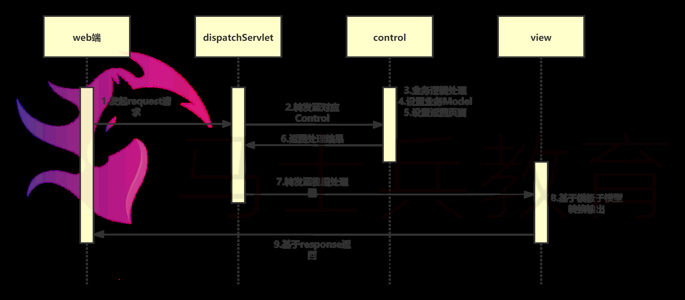

---

未提交读（read uncommited） :脏读，不可重复读，虚读都有可能发生  
已提交读 （read commited）:避免脏读。但是不可重复读和虚读有可能发生 
可重复读 （repeatable read） :避免脏读和不可重复读.但是虚读有可能发生.  
串行化的 （serializable） :避免以上所有读问题.  
Mysql 默认:可重复读  
Oracle 默认:读已提交
四、事务的传播行为  
PROPAGION_XXX :事务的传播行为  
保证同一个事务中  
PROPAGATION_REQUIRED 支持当前事务，如果不存在 就新建一个(默认)  
PROPAGATION_SUPPORTS 支持当前事务，如果不存在，就不使用事务  
PROPAGATION_MANDATORY 支持当前事务，如果不存在，抛出异常  
保证没有在同一个事务中  
PROPAGATION_REQUIRES_NEW 如果有事务存在，挂起当前事务，创建一个新的事务  
PROPAGATION_NOT_SUPPORTED 以非事务方式运行，如果有事务存在，挂起当前事务  
PROPAGATION_NEVER 以非事务方式运行，如果有事务存在，抛出异常  
PROPAGATION_NESTED 如果当前事务存在，则嵌套事务执行
 
 
springMVC的原理
 
Spring MVC工作原理 及注解说明
 
 
SpringMVC框架介绍
 
  1) spring MVC属于SpringFrameWork的后续产品，已经融合在Spring Web Flow里面。
Spring 框架提供了构建 Web 应用程序的全功能 MVC 模块。使用 Spring 可插入的 MVC 架构，可
以选择是使用内置的 Spring Web 框架还是 Struts 这样的 Web 框架。通过策略接口，Spring 框架
是高度可配置的，而且包含多种视图技术，例如 JavaServer Pages（JSP）技术、Velocity、
Tiles、iText 和 POI。Spring MVC 框架并不知道使用的视图，所以不会强迫您只使用 JSP 技术。
  2) Spring的MVC框架主要由DispatcherServlet、处理器映射、处理器(控制器)、视图解析器、视图组
成。
Spring MVC 分离了控制器、模型对象、分派器以及处理程序对象的角色，这种分离让它们更容易进行定制。

---

SpringMVC原理图
 
 
SpringMVC接口解释
 
DispatcherServlet接口：
Spring提供的前端控制器，所有的请求都有经过它来统一分发。在DispatcherServlet将请求分发
给Spring Controller之前，需要借助于Spring提供的HandlerMapping定位到具体的Controller。
HandlerMapping接口：
能够完成客户请求到Controller映射。
Controller接口：
需要为并发用户处理上述请求，因此实现Controller接口时，必须保证线程安全并且可重用。
Controller将处理用户请求，这和Struts Action扮演的角色是一致的。一旦Controller处理完用户
请求，则返回ModelAndView对象给DispatcherServlet前端控制器，ModelAndView中包含了模
型（Model）和视图（View）。
从宏观角度考虑，DispatcherServlet是整个Web应用的控制器；从微观考虑，Controller是单个
Http请求处理过程中的控制器，而ModelAndView是Http请求过程中返回的模型（Model）和视
图（View）。
ViewResolver接口：
 
Spring提供的视图解析器（ViewResolver）在Web应用中查找View对象，从而将相应结果渲染给客户。
SpringMVC运行原理
 
1. 客户端请求提交到DispatcherServlet
2. 由DispatcherServlet控制器查询一个或多个HandlerMapping，找到处理请求的Controller
3. DispatcherServlet将请求提交到Controller
4. Controller调用业务逻辑处理后，返回ModelAndView

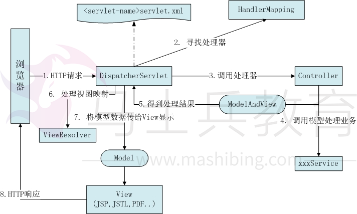

---

5. DispatcherServlet查询一个或多个ViewResoler视图解析器，找到ModelAndView指定的视
图
6. 视图负责将结果显示到客户端
DispatcherServlet是整个Spring MVC的核心。它负责接收HTTP请求组织协调Spring MVC的各个组成部
分。其主要工作有以下三项：
 
 
 
 
 
<mvc:annotation-driven /> 说明:
 
是一种简写形式，可以让初学者快速成应用默认的配置方案，会默认注册 
DefaultAnnotationHandleMapping以及AnnotionMethodHandleAdapter 这两个 Bean, 这两个 Bean 
，前者对应类级别， 后者对应到方法级别；
 
上在面的 DefaultAnnotationHandlerMapping和AnnotationMethodHandlerAdapter 是 Spring 为 
@Controller 分发请求所必需的。
 
annotation-driven 扫描指定包中类上的注解，常用的注解有:
 
复制代码
@Controller 声明Action组件
@Service 声明Service组件 @Service("myMovieLister")
@Repository 声明Dao组件
@Component 泛指组件, 当不好归类时.
@RequestMapping("/menu") 请求映射
@Resource 用于注入，( j2ee提供的 ) 默认按名称装配，@Resource(name="beanName")
@Autowired 用于注入，(srping提供的) 默认按类型装配
@Transactional( rollbackFor={Exception.class}) 事务管理
@ResponseBody
@Scope("prototype") 设定bean的作用域
 
1. 截获符合特定格式的URL请求。
2. 初始化DispatcherServlet上下文对应的WebApplicationContext，并将其与业务层、持久化层的
WebApplicationContext建立关联。
3. 初始化Spring MVC的各个组成组件，并装配到DispatcherServlet中。

---

spring中beanFactory和ApplicationContext的联系和区
别
 
Spring系列之beanFactory与ApplicationContext
 
 
一、BeanFactory
BeanFactory 是 Spring 的“心脏”。它就是 Spring IoC 容器的真面目。Spring 使用 BeanFactory 来实例
化、配置和管理 Bean。
BeanFactory：是IOC容器的核心接口， 它定义了IOC的基本功能，我们看到它主要定义了getBean方
法。getBean方法是IOC容器获取bean对象和引发依赖注入的起点。方法的功能是返回特定的名称的
Bean。
BeanFactory 是初始化 Bean 和调用它们生命周期方法的“吃苦耐劳者”。注意，BeanFactory 只能管理
单例（Singleton）Bean 的生命周期。它不能管理原型(prototype,非单例)Bean 的生命周期。这是因为
原型 Bean 实例被创建之后便被传给了客户端,容器失去了对它们的引用。
BeanFactory有着庞大的继承、实现体系，有众多的子接口、实现类。来看一下BeanFactory的基本类体
系结构（接口为主）：
这是我画的BeanFactory基本的类体系结构，这里没有包括强大的ApplicationContext体系。
具体：
  1、BeanFactory作为一个主接口不继承任何接口，暂且称为一级接口。
  2、有3个子接口继承了它，进行功能上的增强。这3个子接口称为二级接口。
  3、ConfigurableBeanFactory可以被称为三级接口，对二级接口HierarchicalBeanFactory进行了
再次增强，它还继承了另一个外来的接口SingletonBeanRegistry
  4、ConfigurableListableBeanFactory是一个更强大的接口，继承了上述的所有接口，无所不包，
称为四级接口。
  （这4级接口是BeanFactory的基本接口体系。继续，下面是继承关系的2个抽象类和2个实现类：）
  5、AbstractBeanFactory作为一个抽象类，实现了三级接口ConfigurableBeanFactory大部分功
能。

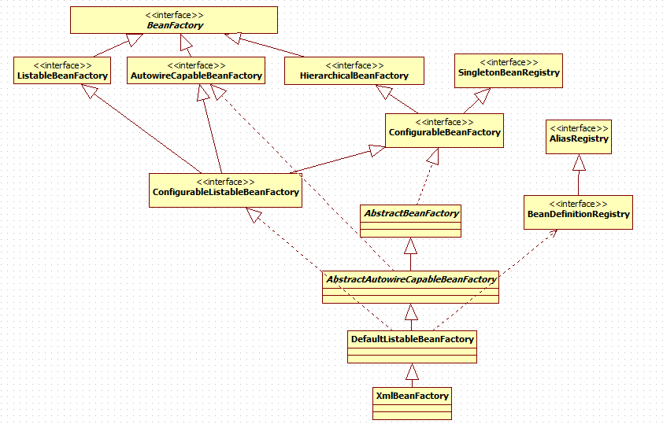

---

6、AbstractAutowireCapableBeanFactory同样是抽象类，继承自AbstractBeanFactory，并额外
实现了二级接口AutowireCapableBeanFactory
  7、DefaultListableBeanFactory继承自AbstractAutowireCapableBeanFactory，实现了最强大的
四级接口ConfigurableListableBeanFactory，并实现了一个外来接口BeanDefinitionRegistry，它并非
抽象类。
  8、最后是最强大的XmlBeanFactory，继承自DefaultListableBeanFactory，重写了一些功能，使
自己更强大。
总结：
  BeanFactory的类体系结构看似繁杂混乱，实际上由上而下井井有条，非常容易理解。
再来看一下BeanFactory的源码：
 
 
package org.springframework.beans.factory;
public interface BeanFactory {
    /**
     * 用来引用一个实例，或把它和工厂产生的Bean区分开，就是说，如果一个FactoryBean的名字为
a，那么，&a会得到那个Factory
     */
    String FACTORY_BEAN_PREFIX = "&";
    /*
     * 四个不同形式的getBean方法，获取实例
     */
    Object getBean(String name) throws BeansException;
    <T> T getBean(String name, Class<T> requiredType) throws BeansException;
    <T> T getBean(Class<T> requiredType) throws BeansException;
    Object getBean(String name, Object... args) throws BeansException;
    boolean containsBean(String name); // 是否存在
    boolean isSingleton(String name) throws NoSuchBeanDefinitionException;// 是否
为单实例
    boolean isPrototype(String name) throws NoSuchBeanDefinitionException;// 是否
为原型（多实例）
    boolean isTypeMatch(String name, Class<?> targetType)
            throws NoSuchBeanDefinitionException;// 名称、类型是否匹配
    Class<?> getType(String name) throws NoSuchBeanDefinitionException; // 获取类
型
    String[] getAliases(String name);// 根据实例的名字获取实例的别名
}

---

具体：
  1、4个获取实例的方法。getBean的重载方法。
  2、4个判断的方法。判断是否存在，是否为单例、原型，名称类型是否匹配。
  3、1个获取类型的方法、一个获取别名的方法。根据名称获取类型、根据名称获取别名。一目了
然！
总结：
  这10个方法，很明显，这是一个典型的工厂模式的工厂接口。
BeanFactory最常见的实现类为XmlBeanFactory，可以从classpath或文件系统等获取资源。
XmlBeanFactory可以加载xml的配置文件。假设我们有一个Car类：
 
（1）File file = new File("fileSystemConfig.xml");
Resource resource = new FileSystemResource(file);
BeanFactory beanFactory = new XmlBeanFactory(resource);
（2）
Resource resource = new ClassPathResource("classpath.xml"); 
BeanFactory beanFactory = new XmlBeanFactory(resource);
package spring.ioc.demo1;
public class Car {
    private String brand;
    private String color;
    private int maxSpeed;
    public String getBrand() {
        return brand;
    }
    public void setBrand(String brand) {
        this.brand = brand;
    }
    public String getColor() {
        return color;
    }
    public void setColor(String color) {
        this.color = color;
    }
    public int getMaxSpeed() {
        return maxSpeed;
    }
    public void setMaxSpeed(int maxSpeed) {
        this.maxSpeed = maxSpeed;
    }
    
    public String toString(){

---

我们通过在applicationContext.xml中配置：
通过XmlBeanFactory实现启动Spring IoC容器：
 
 
1. XmlBeanFactory通过Resource装载Spring配置信息冰启动IoC容器，然后就可以通过
factory.getBean从IoC容器中获取Bean了。
2. 通过BeanFactory启动IoC容器时，并不会初始化配置文件中定义的Bean，初始化动作发生在第一
个调用时。
3. 对于单实例（singleton）的Bean来说，BeanFactory会缓存Bean实例，所以第二次使用getBean
时直接从IoC容器缓存中获取Bean。
        return "the car is:"+ getBrand() + ", color is:" +getColor() +", maxspeed 
is:"+getMaxSpeed();
    }
    public Car() {
    }
    public Car(String brand, String color, int maxSpeed) {
        this.brand = brand;
        this.color = color;
        this.maxSpeed = maxSpeed;
    }
    public void introduce() {
        System.out.println("brand:" + brand + ";color:" + color + ";maxSpeed:"
                + maxSpeed);
    }
}
<bean id="car1" class="spring.ioc.demo1.Car"
        p:brand="spring注入-红旗001" 
        p:color="spring注入-紫色" 
        p:maxSpeed="520" />
public static void main(String[] args) {
     ResourcePatternResolver resolver = new 
PathMatchingResourcePatternResolver();
      Resource res = resolver.getResource("classpath:applicationContext.xml");
      BeanFactory factory = new XmlBeanFactory(res);     
    //ApplicationContext factory=new 
ClassPathXmlApplicationContext("applicationContext.xml"); 
            
       Car car = factory.getBean("car1",Car.class);
       System.out.println("car对象已经初始化完成");
       System.out.println(car.getMaxSpeed());
}

---

二、ApplicationContext
如果说BeanFactory是Spring的心脏，那么ApplicationContext就是完整的躯体了，ApplicationContext
由BeanFactory派生而来，提供了更多面向实际应用的功能。在BeanFactory中，很多功能需要以编程的
方式实现，而在ApplicationContext中则可以通过配置实现。
BeanFactorty接口提供了配置框架及基本功能，但是无法支持spring的aop功能和web应用。而
ApplicationContext接口作为BeanFactory的派生，因而提供BeanFactory所有的功能。而且
ApplicationContext还在功能上做了扩展，相较于BeanFactorty，ApplicationContext还提供了以下的
功能： 
（1）MessageSource, 提供国际化的消息访问 
（2）资源访问，如URL和文件 
（3）事件传播特性，即支持aop特性
（4）载入多个（有继承关系）上下文 ，使得每一个上下文都专注于一个特定的层次，比如应用的web
层 
ApplicationContext：是IOC容器另一个重要接口， 它继承了BeanFactory的基本功能， 同时也继承了
容器的高级功能，如：MessageSource（国际化资源接口）、ResourceLoader（资源加载接口）、
ApplicationEventPublisher（应用事件发布接口）等。
三、二者区别
1.BeanFactroy采用的是延迟加载形式来注入Bean的，即只有在使用到某个Bean时(调用getBean())，才
对该Bean进行加载实例化，这样，我们就不能发现一些存在的Spring的配置问题。而
ApplicationContext则相反，它是在容器启动时，一次性创建了所有的Bean。这样，在容器启动时，我
们就可以发现Spring中存在的配置错误。 相对于基本的BeanFactory，ApplicationContext 唯一的不足
是占用内存空间。当应用程序配置Bean较多时，程序启动较慢。
BeanFacotry延迟加载,如果Bean的某一个属性没有注入，BeanFacotry加载后，直至第一次使用调用
getBean方法才会抛出异常；而ApplicationContext则在初始化自身是检验，这样有利于检查所依赖属
性是否注入；所以通常情况下我们选择使用 ApplicationContext。
应用上下文则会在上下文启动后预载入所有的单实例Bean。通过预载入单实例bean ,确保当你需要的时
候，你就不用等待，因为它们已经创建好了。
2.BeanFactory和ApplicationContext都支持BeanPostProcessor、BeanFactoryPostProcessor的使
用，但两者之间的区别是：BeanFactory需要手动注册，而ApplicationContext则是自动注册。
（Applicationcontext比 beanFactory 加入了一些更好使用的功能。而且 beanFactory 的许多功能需要
通过编程实现而 Applicationcontext 可以通过配置实现。比如后处理 bean ， Applicationcontext 直接
配置在配置文件即可而 beanFactory 这要在代码中显示的写出来才可以被容器识别。 ）
3.beanFactory主要是面对与 spring 框架的基础设施，面对 spring 自己。而 Applicationcontex 主要面
对与 spring 使用的开发者。基本都会使用 Applicationcontex 并非 beanFactory 。
四、总结
作用：
\1. BeanFactory负责读取bean配置文档，管理bean的加载，实例化，维护bean之间的依赖关系，负责
bean的声明周期。
\2. ApplicationContext除了提供上述BeanFactory所能提供的功能之外，还提供了更完整的框架功能：
a. 国际化支持
b. 资源访问：Resource rs = ctx. getResource(“classpath:config.properties”), 
“file:c:/config.properties”
c. 事件传递：通过实现ApplicationContextAware接口
\3. 常用的获取ApplicationContext

---

FileSystemXmlApplicationContext：从文件系统或者url指定的xml配置文件创建，参数为配置文件名或
文件名数组，有相对路径与绝对路径。
ClassPathXmlApplicationContext：从classpath的xml配置文件创建，可以从jar包中读取配置文件。
ClassPathXmlApplicationContext 编译路径总有三种方式：
XmlWebApplicationContext：从web应用的根目录读取配置文件，需要先在web.xml中配置，可以配置
监听器或者servlet来实现
或
这两种方式都默认配置文件为web-inf/applicationContext.xml，也可使用context-param指定配置文件
 
 
spring注入的几种方式（循环注入）
 
ApplicationContext factory=new 
FileSystemXmlApplicationContext("src/applicationContext.xml");
ApplicationContext factory=new 
FileSystemXmlApplicationContext("E:/Workspaces/MyEclipse 
8.5/Hello/src/applicationContext.xml");
ApplicationContext factory = new 
ClassPathXmlApplicationContext("classpath:applicationContext.xml");
ApplicationContext factory = new 
ClassPathXmlApplicationContext("applicationContext.xml"); 
ApplicationContext factory = new 
ClassPathXmlApplicationContext("file:E:/Workspaces/MyEclipse 
8.5/Hello/src/applicationContext.xml");
<listener>
<listener-class>org.springframework.web.context.ContextLoaderListener</listener-
class>
</listener>
<servlet>
<servlet-name>context</servlet-name>
<servlet-class>org.springframework.web.context.ContextLoaderServlet</servlet-
class>
<load-on-startup>1</load-on-startup>
</servlet>
<context-param>
<param-name>contextConfigLocation</param-name>
<param-value>/WEB-INF/myApplicationContext.xml</param-value>
</context-param>

---

Spring循环依赖的三种方式
 
 
  引言：循环依赖就是N个类中循环嵌套引用，如果在日常开发中我们用new 对象的方式发生这种循环
依赖的话程序会在运行时一直循环调用，直至内存溢出报错。下面说一下Spring是如果解决循环依赖
的。
 
第一种：构造器参数循环依赖
 
Spring容器会将每一个正在创建的Bean 标识符放在一个“当前创建Bean池”中，Bean标识符在创建过程
中将一直保持
在这个池中，因此如果在创建Bean过程中发现自己已经在“当前创建Bean池”里时将抛出
BeanCurrentlyInCreationException异常表示循环依赖；而对于创建完毕的Bean将从“当前创建Bean池”
中清除掉。
 
首先我们先初始化三个Bean。
 
public class StudentA {
    private StudentB studentB ;
    public void setStudentB(StudentB studentB) {
        this.studentB = studentB;
    }
    public StudentA() {
    }
    public StudentA(StudentB studentB) {
        this.studentB = studentB;
    }
}
public class StudentB {
    private StudentC studentC ;
    public void setStudentC(StudentC studentC) {
        this.studentC = studentC;
    }
    public StudentB() {
    }
    public StudentB(StudentC studentC) {
        this.studentC = studentC;
    }
}
public class StudentC {
    private StudentA studentA ;
    public void setStudentA(StudentA studentA) {
        this.studentA = studentA;
    }
 
    public StudentC() {
    }

---

OK，上面是很基本的3个类，，StudentA有参构造是StudentB。StudentB的有参构造是StudentC，
StudentC的有参构造是StudentA ，这样就产生了一个循环依赖的情况，
 
我们都把这三个Bean交给Spring管理，并用有参构造实例化
 
下面是测试类：
执行结果报错信息为：
 
如果大家理解开头那句话的话，这个报错应该不惊讶，Spring容器先创建单例StudentA，StudentA依赖
StudentB，然后将A放在“当前创建Bean池”中，此时创建StudentB,StudentB依赖StudentC ,然后将B放
在“当前创建Bean池”中,此时创建StudentC，StudentC又依赖StudentA， 但是，此时Student已经在池
中，所以会报错，，因为在池中的Bean都是未初始化完的，所以会依赖错误 ，（初始化完的Bean会从
池中移除）
 
第二种：setter方式单例，默认方式
 
 
如果要说setter方式注入的话，我们最好先看一张Spring中Bean实例化的图
    public StudentC(StudentA studentA) {
        this.studentA = studentA;
    }
}
 <bean id="a" class="com.zfx.student.StudentA">
        <constructor-arg index="0" ref="b"></constructor-arg>
    </bean>
    <bean id="b" class="com.zfx.student.StudentB">
        <constructor-arg index="0" ref="c"></constructor-arg>
    </bean>
    <bean id="c" class="com.zfx.student.StudentC">
        <constructor-arg index="0" ref="a"></constructor-arg>
    </bean> 
public class Test {
    public static void main(String[] args) {
        ApplicationContext context = new 
ClassPathXmlApplicationContext("com/zfx/student/applicationContext.xml");
        //System.out.println(context.getBean("a", StudentA.class));
    }
}
Caused by: org.springframework.beans.factory.BeanCurrentlyInCreationException: 
    Error creating bean with name 'a': Requested bean is currently in creation: 
Is there an unresolvable circular reference?

---

如图中前两步骤得知：*Spring是先将Bean对象实例化之后再设置对象属性的*
*
*
修改配置文件为set方式注入
下面是测试类：
打印结果为：
为什么用set方式就不报错了呢 ？
  我们结合上面那张图看，Spring先是用构造实例化Bean对象 ，此时Spring会将这个实例化结束的对
象放到一个Map中，并且Spring提供了获取这个未设置属性的实例化对象引用的方法。  结合我们的实
例来看，，当Spring实例化了StudentA、StudentB、StudentC后，紧接着会去设置对象的属性，此
时StudentA依赖StudentB，就会去Map中取出存在里面的单例StudentB对象，以此类推，不会出来
循环的问题喽、
    <!--scope="singleton"(默认就是单例方式)  -->
    <bean id="a" class="com.zfx.student.StudentA" scope="singleton">
        <property name="studentB" ref="b"></property>
    </bean>
    <bean id="b" class="com.zfx.student.StudentB" scope="singleton">
        <property name="studentC" ref="c"></property>
    </bean>
    <bean id="c" class="com.zfx.student.StudentC" scope="singleton">
        <property name="studentA" ref="a"></property>
    </bean>
public class Test {
    public static void main(String[] args) {
        ApplicationContext context = new 
ClassPathXmlApplicationContext("com/zfx/student/applicationContext.xml");
        System.out.println(context.getBean("a", StudentA.class));
    }
}
com.zfx.student.StudentA@1fbfd6

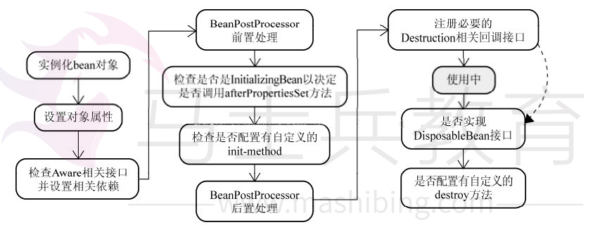

---

**
**
下面是Spring源码中的实现方法，。以下的源码在Spring的Bean包中的
*DefaultSingletonBeanRegistry*.java类中
 
第三种：setter方式原型，prototype
 
修改配置文件为：
/** Cache of singleton objects: bean name --> bean instance（缓存单例实例化对象的Map
集合） */
    private final Map<String, Object> singletonObjects = new 
ConcurrentHashMap<String, Object>(64);
    
    /** Cache of singleton factories: bean name --> ObjectFactory（单例的工厂Bean缓
存集合） */
    private final Map<String, ObjectFactory> singletonFactories = new 
HashMap<String, ObjectFactory>(16);
    
    /** Cache of early singleton objects: bean name --> bean instance（早期的单身对
象缓存集合） */
    private final Map<String, Object> earlySingletonObjects = new 
HashMap<String, Object>(16);
    
    /** Set of registered singletons, containing the bean names in registration 
order（单例的实例化对象名称集合） */
    private final Set<String> registeredSingletons = new LinkedHashSet<String>
(64);
    /**
     * 添加单例实例
     * 解决循环引用的问题
     * Add the given singleton factory for building the specified singleton
     * if necessary.
     * 
To be called for eager registration of singletons, e.g. to be able to
     * resolve circular references.
     * @param beanName the name of the bean
     * @param singletonFactory the factory for the singleton object
     */
    protected void addSingletonFactory(String beanName, ObjectFactory 
singletonFactory) {
        Assert.notNull(singletonFactory, "Singleton factory must not be null");
        synchronized (this.singletonObjects) {
            if (!this.singletonObjects.containsKey(beanName)) {
                this.singletonFactories.put(beanName, singletonFactory);
                this.earlySingletonObjects.remove(beanName);
                this.registeredSingletons.add(beanName);
            }
        }
    }

---

scope="prototype" 意思是 每次请求都会创建一个实例对象。两者的区别是：有状态的bean都使用
Prototype作用域，无状态的一般都使用singleton单例作用域。
测试用例：
打印结果：
为什么原型模式就报错了呢 ？
对于“prototype”作用域Bean，Spring容器无法完成依赖注入，因为“prototype”作用域的Bean，
Spring容器不进行缓存，因此无法提前暴露一个创建中的Bean。
 
 
springIOC
 
Spring IOC原理解读 面试必读
 
 
一、什么是Ioc/DI？
 
  IoC 容器：最主要是完成了完成对象的创建和依赖的管理注入等等。
先从我们自己设计这样一个视角来考虑：
所谓控制反转，就是把原先我们代码里面需要实现的对象创建、依赖的代码，反转给容器来帮忙实现。
那么必然的我们需要创建一个容器，同时需要一种描述来让容器知道需要创建的对象与对象的关系。这
个描述最具体表现就是我们可配置的文件。
对象和对象关系怎么表示？
<bean id="a" class="com.zfx.student.StudentA" scope="prototype">
        <property name="studentB" ref="b"></property>
    </bean>
    <bean id="b" class="com.zfx.student.StudentB" scope="prototype">
        <property name="studentC" ref="c"></property>
    </bean>
    <bean id="c" class="com.zfx.student.StudentC" scope="prototype">
        <property name="studentA" ref="a"></property>
    </bean>
public class Test {
    public static void main(String[] args) {
        ApplicationContext context = new 
ClassPathXmlApplicationContext("com/zfx/student/applicationContext.xml");
        //此时必须要获取Spring管理的实例，因为现在scope="prototype" 只有请求获取的时候才会
实例化对象
        System.out.println(context.getBean("a", StudentA.class));
    }
}
Caused by: org.springframework.beans.factory.BeanCurrentlyInCreationException: 
    Error creating bean with name 'a': Requested bean is currently in creation: 
Is there an unresolvable circular reference?

---

可以用 xml ， properties 文件等语义化配置文件表示。
描述对象关系的文件存放在哪里？
可能是 classpath ， filesystem ，或者是 URL 网络资源， servletContext 等。
回到正题，有了配置文件，还需要对配置文件解析。
不同的配置文件对对象的描述不一样，如标准的，自定义声明式的，如何统一？ 在内部需要有一个统一
的关于对象的定义，所有外部的描述都必须转化成统一的描述定义。
如何对不同的配置文件进行解析？需要对不同的配置文件语法，采用不同的解析器
 
二、 Spring IOC体系结构？
 
(1) BeanFactory
 
其中BeanFactory作为最顶层的一个接口类，它定义了IOC容器的基本功能规范，BeanFactory 有三个子
类：ListableBeanFactory、HierarchicalBeanFactory 和AutowireCapableBeanFactory。但是从上图
中我们可以发现最终的默认实现类是 DefaultListableBeanFactory，他实现了所有的接口。那为何要定
义这么多层次的接口呢？查阅这些接口的源码和说明发现，每个接口都有他使用的场合，它主要是为了
区分在 Spring 内部在操作过程中对象的传递和转化过程中，对对象的数据访问所做的限制。例如 
ListableBeanFactory 接口表示这些 Bean 是可列表的，而 HierarchicalBeanFactory 表示的是这些 
Bean 是有继承关系的，也就是每个Bean 有可能有父 Bean。AutowireCapableBeanFactory 接口定义 
Bean 的自动装配规则。这四个接口共同定义了 Bean 的集合、Bean 之间的关系、以及 Bean 行为.
最基本的IOC容器接口BeanFactory
  
 
 Spring Bean的创建是典型的工厂模式，这一系列的Bean工厂，也即IOC容器为开发者管理对象间的依赖关
系提供了很多便利和基础服务，在Spring中有许多的IOC容器的实现供用户选择和使用，其相互关系如下：
1 public interface BeanFactory {    
2      
3      //对FactoryBean的转义定义，因为如果使用bean的名字检索FactoryBean得到的对象是工厂生
成的对象，

---

在BeanFactory里只对IOC容器的基本行为作了定义，根本不关心你的bean是如何定义怎样加载的。正
如我们只关心工厂里得到什么的产品对象，至于工厂是怎么生产这些对象的，这个基本的接口不关心。
从ApplicationContext接口的实现，我们看出其特点：
(2) BeanDefinition
4      //如果需要得到工厂本身，需要转义           
5      String FACTORY_BEAN_PREFIX = "&"; 
6         
7      //根据bean的名字，获取在IOC容器中得到bean实例    
8      Object getBean(String name) throws BeansException;    
9    
10     //根据bean的名字和Class类型来得到bean实例，增加了类型安全验证机制。    
11      Object getBean(String name, Class requiredType) throws BeansException;   
 
12     
13     //提供对bean的检索，看看是否在IOC容器有这个名字的bean    
14      boolean containsBean(String name);    
15     
16     //根据bean名字得到bean实例，并同时判断这个bean是不是单例    
17     boolean isSingleton(String name) throws NoSuchBeanDefinitionException;   
 
18     
19     //得到bean实例的Class类型    
20     Class getType(String name) throws NoSuchBeanDefinitionException;    
21     
22     //得到bean的别名，如果根据别名检索，那么其原名也会被检索出来    
23    String[] getAliases(String name);    
24     
 }
  而要知道工厂是如何产生对象的，我们需要看具体的IOC容器实现，spring提供了许多IOC容器的实现。比
如XmlBeanFactory，ClasspathXmlApplicationContext等。其中XmlBeanFactory就是针对最基本
的ioc容器的实现，这个IOC容器可以读取XML文件定义的BeanDefinition（XML文件中对bean的描述）,如
果说XmlBeanFactory是容器中的屌丝，ApplicationContext应该算容器中的高帅富.
  ApplicationContext是Spring提供的一个高级的IoC容器，它除了能够提供IoC容器的基本功能外，还
为用户提供了以下的附加服务。
 1. 支持信息源，可以实现国际化。（实现MessageSource接口）
 2. 访问资源。(实现ResourcePatternResolver接口，这个后面要讲)
 3. 支持应用事件。(实现ApplicationEventPublisher接口)
 SpringIOC容器管理了我们定义的各种Bean对象及其相互的关系，Bean对象在Spring实现中是以
BeanDefinition来描述的，其继承体系如下：

---

Bean 的解析过程非常复杂，功能被分的很细，因为这里需要被扩展的地方很多，必须保证有足够的灵
活性，以应对可能的变化。Bean 的解析主要就是对 Spring 配置文件的解析。这个解析过程主要通过下
图中的类完成：
三、IoC容器的初始化？
 
IoC容器的初始化包括BeanDefinition的Resource定位、载入和注册这三个基本的过程。我们以
ApplicationContext为例讲解，ApplicationContext系列容器也许是我们最熟悉的，因为web项目中使
用的XmlWebApplicationContext就属于这个继承体系，还有ClasspathXmlApplicationContext等，
其继承体系如下图所示：

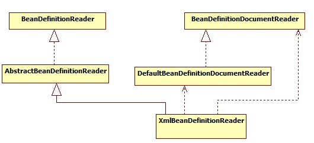

---

ApplicationContext允许上下文嵌套，通过保持父上下文可以维持一个上下文体系。对于bean的查找可
以在这个上下文体系中发生，首先检查当前上下文，其次是父上下文，逐级向上，这样为不同的Spring
应用提供了一个共享的bean定义环境。
下面我们分别简单地演示一下两种ioc容器的创建过程
1、XmlBeanFactory(屌丝IOC)的整个流程
通过XmlBeanFactory的源码，我们可以发现:
 
 public class XmlBeanFactory extends DefaultListableBeanFactory{
     private final XmlBeanDefinitionReader reader; 
 
     public XmlBeanFactory(Resource resource)throws BeansException{
         this(resource, null);
     }
     
     public XmlBeanFactory(Resource resource, BeanFactory parentBeanFactory)
          throws BeansException{
         super(parentBeanFactory);
         this.reader = new XmlBeanDefinitionReader(this);
         this.reader.loadBeanDefinitions(resource);
    }
 }

---

通过前面的源码，this.reader = new XmlBeanDefinitionReader(this); 中其中this 传的是factory对象
 
2、FileSystemXmlApplicationContext 的IOC容器流程
1、高富帅IOC解剖
 
1  ApplicationContext =new FileSystemXmlApplicationContext(xmlPath);
先看其构造函数：
  调用构造函数：
 
实际调用
2、设置资源加载器和资源定位
通过分析FileSystemXmlApplicationContext的源代码可以知道，在创建
FileSystemXmlApplicationContext容器时，构造方法做以下两项重要工作：
首先，调用父类容器的构造方法(super(parent)方法)为容器设置好Bean资源加载器。
//根据Xml配置文件创建Resource资源对象，该对象中包含了BeanDefinition的信息
 ClassPathResource resource =new ClassPathResource("application-context.xml");
//创建DefaultListableBeanFactory
 DefaultListableBeanFactory factory =new DefaultListableBeanFactory();
//创建XmlBeanDefinitionReader读取器，用于载入BeanDefinition。之所以需要BeanFactory作为
参数，是因为会将读取的信息回调配置给factory
 XmlBeanDefinitionReader reader =new XmlBeanDefinitionReader(factory);
//XmlBeanDefinitionReader执行载入BeanDefinition的方法，最后会完成Bean的载入和注册。完成
后Bean就成功的放置到IOC容器当中，以后我们就可以从中取得Bean来使用
 reader.loadBeanDefinitions(resource);
/**
* Create a new FileSystemXmlApplicationContext, loading the definitions
* from the given XML files and automatically refreshing the context.
* @param configLocations array of file paths
* @throws BeansException if context creation failed
 */public FileSystemXmlApplicationContext(String... configLocations) throws 
BeansException {
        this(configLocations, true, null);
    }
public FileSystemXmlApplicationContext(String[] configLocations, boolean refresh, 
ApplicationContext parent)  
            throws BeansException {    
        super(parent);  
        setConfigLocations(configLocations);  
        if (refresh) {  
            refresh();  
        }  
    }

---

然后，再调用父类AbstractRefreshableConfigApplicationContext的
setConfigLocations(configLocations)方法设置Bean定义资源文件的定位路径。
通过追踪FileSystemXmlApplicationContext的继承体系，发现其父类的父类
AbstractApplicationContext中初始化IoC容器所做的主要源码如下：
 
 
AbstractApplicationContext构造方法中调用PathMatchingResourcePatternResolver的构造方法创建
Spring资源加载器：
在设置容器的资源加载器之后，接下来FileSystemXmlApplicationContet执行setConfigLocations方法
通过调用其父类AbstractRefreshableConfigApplicationContext的方法进行对Bean定义资源文件的定
位，该方法的源码如下：
 
public abstract class AbstractApplicationContext extends DefaultResourceLoader  
        implements ConfigurableApplicationContext, DisposableBean {  
    //静态初始化块，在整个容器创建过程中只执行一次  
    static {  
        //为了避免应用程序在Weblogic8.1关闭时出现类加载异常加载问题，加载IoC容  
       //器关闭事件(ContextClosedEvent)类  
        ContextClosedEvent.class.getName();  
    }  
    //FileSystemXmlApplicationContext调用父类构造方法调用的就是该方法  
    public AbstractApplicationContext(ApplicationContext parent) {  
        this.parent = parent;  
        this.resourcePatternResolver = getResourcePatternResolver();  
    }  
    //获取一个Spring Source的加载器用于读入Spring Bean定义资源文件  
    protected ResourcePatternResolver getResourcePatternResolver() {  
        // AbstractApplicationContext继承DefaultResourceLoader，也是一个S  
        //Spring资源加载器，其getResource(String location)方法用于载入资源  
        return new PathMatchingResourcePatternResolver(this);  
    }   
……  
} 
public PathMatchingResourcePatternResolver(ResourceLoader resourceLoader) {  
        Assert.notNull(resourceLoader, "ResourceLoader must not be null");  
        //设置Spring的资源加载器  
        this.resourceLoader = resourceLoader;  
} 
    //处理单个资源文件路径为一个字符串的情况  
    public void setConfigLocation(String location) {  
       //String CONFIG_LOCATION_DELIMITERS = ",; /t/n";  
       //即多个资源文件路径之间用” ,; /t/n”分隔，解析成数组形式  
        setConfigLocations(StringUtils.tokenizeToStringArray(location, 
CONFIG_LOCATION_DELIMITERS));  
    }  
    //解析Bean定义资源文件的路径，处理多个资源文件字符串数组  
     public void setConfigLocations(String[] locations) {  
        if (locations != null) {

---

通过这两个方法的源码我们可以看出，我们既可以使用一个字符串来配置多个Spring Bean定义资源文
件，也可以使用字符串数组，即下面两种方式都是可以的：
a.  ClasspathResource res = new ClasspathResource(“a.xml,b.xml,……”);
多个资源文件路径之间可以是用” ,; /t/n”等分隔。
b.  ClasspathResource res = new ClasspathResource(newString[]{“a.xml”,”b.xml”,……});
至此，Spring IoC容器在初始化时将配置的Bean定义资源文件定位为Spring封装的Resource。
 
3、AbstractApplicationContext的refresh函数载入Bean定义过程：
 
Spring IoC容器对Bean定义资源的载入是从refresh()函数开始的，refresh()是一个模板方法，refresh()
方法的作用是：在创建IoC容器前，如果已经有容器存在，则需要把已有的容器销毁和关闭，以保证在
refresh之后使用的是新建立起来的IoC容器。refresh的作用类似于对IoC容器的重启，在新建立好的容
器中对容器进行初始化，对Bean定义资源进行载入
FileSystemXmlApplicationContext通过调用其父类AbstractApplicationContext的refresh()函数启动整
个IoC容器对Bean定义的载入过程：
            Assert.noNullElements(locations, "Config locations must not be 
null");  
            this.configLocations = new String[locations.length];  
            for (int i = 0; i < locations.length; i++) {  
                // resolvePath为同一个类中将字符串解析为路径的方法  
                this.configLocations[i] = resolvePath(locations[i]).trim();  
            }  
        }  
        else {  
            this.configLocations = null;  
        }  www
    } 
1      public void refresh() throws BeansException, IllegalStateException {  
2        synchronized (this.startupShutdownMonitor) {  
3            //调用容器准备刷新的方法，获取容器的当时时间，同时给容器设置同步标识  
4            prepareRefresh();  
5            //告诉子类启动refreshBeanFactory()方法，Bean定义资源文件的载入从  
6           //子类的refreshBeanFactory()方法启动  
7            ConfigurableListableBeanFactory beanFactory = 
obtainFreshBeanFactory();  
8            //为BeanFactory配置容器特性，例如类加载器、事件处理器等  
9            prepareBeanFactory(beanFactory);  
10            try {  
11                //为容器的某些子类指定特殊的BeanPost事件处理器  
12                postProcessBeanFactory(beanFactory);  
13                //调用所有注册的BeanFactoryPostProcessor的Bean  
14                invokeBeanFactoryPostProcessors(beanFactory);  
15                //为BeanFactory注册BeanPost事件处理器.  
16                //BeanPostProcessor是Bean后置处理器，用于监听容器触发的事件  
17                registerBeanPostProcessors(beanFactory);  
18                //初始化信息源，和国际化相关.  
19                initMessageSource();

---

refresh()方法主要为IoC容器Bean的生命周期管理提供条件，Spring IoC容器载入Bean定义资源文件从
其子类容器的refreshBeanFactory()方法启动，所以整个refresh()中“ConfigurableListableBeanFactory 
beanFactory =obtainFreshBeanFactory();”这句以后代码的都是注册容器的信息源和生命周期事件，载
入过程就是从这句代码启动。
 
 refresh()方法的作用是：在创建IoC容器前，如果已经有容器存在，则需要把已有的容器销毁和关闭，
以保证在refresh之后使用的是新建立起来的IoC容器。refresh的作用类似于对IoC容器的重启，在新建
立好的容器中对容器进行初始化，对Bean定义资源进行载入
 
AbstractApplicationContext的obtainFreshBeanFactory()方法调用子类容器的refreshBeanFactory()方
法，启动容器载入Bean定义资源文件的过程，代码如下：
 
  
AbstractApplicationContext子类的refreshBeanFactory()方法：
20                //初始化容器事件传播器.  
21                initApplicationEventMulticaster();  
22                //调用子类的某些特殊Bean初始化方法  
23                onRefresh();  
24                //为事件传播器注册事件监听器.  
25                registerListeners();  
26                //初始化所有剩余的单态Bean.  
27                finishBeanFactoryInitialization(beanFactory);  
28                //初始化容器的生命周期事件处理器，并发布容器的生命周期事件  
29                finishRefresh();  
30            }  
31            catch (BeansException ex) {  
32                //销毁以创建的单态Bean  
33                destroyBeans();  
34                //取消refresh操作，重置容器的同步标识.  
35                cancelRefresh(ex);  
36                throw ex;  
37            }  
38        }  
39    }
    protected ConfigurableListableBeanFactory obtainFreshBeanFactory() {  
        //这里使用了委派设计模式，父类定义了抽象的refreshBeanFactory()方法，具体实现调用子
类容器的refreshBeanFactory()方法
         refreshBeanFactory();  
        ConfigurableListableBeanFactory beanFactory = getBeanFactory();  
        if (logger.isDebugEnabled()) {  
            logger.debug("Bean factory for " + getDisplayName() + ": " + 
beanFactory);  
        }  
        return beanFactory;  
    }

---

AbstractApplicationContext类中只抽象定义了refreshBeanFactory()方法，容器真正调用的是其子类
AbstractRefreshableApplicationContext实现的  refreshBeanFactory()方法，方法的源码如下：
在这个方法中，先判断BeanFactory是否存在，如果存在则先销毁beans并关闭beanFactory，接着创建
DefaultListableBeanFactory，并调用loadBeanDefinitions(beanFactory)装载bean定义。
  
 
  
5、AbstractRefreshableApplicationContext子类的loadBeanDefinitions方法：
AbstractRefreshableApplicationContext中只定义了抽象的loadBeanDefinitions方法，容器真正调用
的是其子类AbstractXmlApplicationContext对该方法的实现，AbstractXmlApplicationContext的主要
源码如下：
 
loadBeanDefinitions方法同样是抽象方法，是由其子类实现的，也即在
AbstractXmlApplicationContext中。
1    protected final void refreshBeanFactory() throws BeansException {  
2        if (hasBeanFactory()) {//如果已经有容器，销毁容器中的bean，关闭容器  
3            destroyBeans();  
4            closeBeanFactory();  
5        }  
6        try {  
7             //创建IoC容器  
8             DefaultListableBeanFactory beanFactory = createBeanFactory();  
9             beanFactory.setSerializationId(getId());  
10            //对IoC容器进行定制化，如设置启动参数，开启注解的自动装配等  
11            customizeBeanFactory(beanFactory);  
12            //调用载入Bean定义的方法，主要这里又使用了一个委派模式，在当前类中只定义了抽象
的loadBeanDefinitions方法，具体的实现调用子类容器  
13            loadBeanDefinitions(beanFactory);  
14            synchronized (this.beanFactoryMonitor) {  
15                this.beanFactory = beanFactory;  
16            }  
17        }  
18        catch (IOException ex) {  
19            throw new ApplicationContextException("I/O error parsing bean 
definition source for " + getDisplayName(), ex);  
20        }  
21    }
1  public abstract class AbstractXmlApplicationContext extends 
AbstractRefreshableConfigApplicationContext {  
2     ……  
3     //实现父类抽象的载入Bean定义方法  
4     @Override  
5     protected void loadBeanDefinitions(DefaultListableBeanFactory beanFactory) 
throws BeansException, IOException {  
6         //创建XmlBeanDefinitionReader，即创建Bean读取器，并通过回调设置到容器中去，容  
器使用该读取器读取Bean定义资源  
7         XmlBeanDefinitionReader beanDefinitionReader = new 
XmlBeanDefinitionReader(beanFactory);

---

ml Bean读取器(XmlBeanDefinitionReader)调用其父类AbstractBeanDefinitionReader的 
reader.loadBeanDefinitions方法读取Bean定义资源
由于我们使用FileSystemXmlApplicationContext作为例子分析，因此getConfigResources的返回值为
null，因此程序执行reader.loadBeanDefinitions(configLocations)分支。
  
6、AbstractBeanDefinitionReader读取Bean定义资源：
AbstractBeanDefinitionReader的loadBeanDefinitions方法源码如下：
 可以到org.springframework.beans.factory.support看一下BeanDefinitionReader的结构
  
  
8         //为Bean读取器设置Spring资源加载器，AbstractXmlApplicationContext的  
9         //祖先父类AbstractApplicationContext继承DefaultResourceLoader，因此，容器本
身也是一个资源加载器  
10        beanDefinitionReader.setResourceLoader(this);  
11        //为Bean读取器设置SAX xml解析器  
12        beanDefinitionReader.setEntityResolver(new 
ResourceEntityResolver(this));  
13        //当Bean读取器读取Bean定义的Xml资源文件时，启用Xml的校验机制  
14        initBeanDefinitionReader(beanDefinitionReader);  
15        //Bean读取器真正实现加载的方法  
16        loadBeanDefinitions(beanDefinitionReader);  
17    }  
18    //Xml Bean读取器加载Bean定义资源  
19    protected void loadBeanDefinitions(XmlBeanDefinitionReader reader) throws 
BeansException, IOException {  
20        //获取Bean定义资源的定位  
21        Resource[] configResources = getConfigResources();  
22        if (configResources != null) {  
23            //Xml Bean读取器调用其父类AbstractBeanDefinitionReader读取定位  
24            //的Bean定义资源  
25            reader.loadBeanDefinitions(configResources);  
26        }  
27        //如果子类中获取的Bean定义资源定位为空，则获取FileSystemXmlApplicationContext
构造方法中setConfigLocations方法设置的资源  
28        String[] configLocations = getConfigLocations();  
29        if (configLocations != null) {  
30            //Xml Bean读取器调用其父类AbstractBeanDefinitionReader读取定位  
31            //的Bean定义资源  
32            reader.loadBeanDefinitions(configLocations);  
33        }  
34    }  
35    //这里又使用了一个委托模式，调用子类的获取Bean定义资源定位的方法  
36    //该方法在ClassPathXmlApplicationContext中进行实现，对于我们  
37    //举例分析源码的FileSystemXmlApplicationContext没有使用该方法  
38    protected Resource[] getConfigResources() {  
39        return null;  
40    }   ……  
41}

---

在其抽象父类AbstractBeanDefinitionReader中定义了载入过程
1    //重载方法，调用下面的loadBeanDefinitions(String, Set<Resource>);方法  
2    public int loadBeanDefinitions(String location) throws 
BeanDefinitionStoreException {  
3        return loadBeanDefinitions(location, null);  
4    }  
5    public int loadBeanDefinitions(String location, Set<Resource> 
actualResources) throws BeanDefinitionStoreException {  
6        //获取在IoC容器初始化过程中设置的资源加载器  
7        ResourceLoader resourceLoader = getResourceLoader();  
8        if (resourceLoader == null) {  
9            throw new BeanDefinitionStoreException(  
10                    "Cannot import bean definitions from location [" + location 
+ "]: no ResourceLoader available");  
11        }  
12        if (resourceLoader instanceof ResourcePatternResolver) {  
13            try {  
14                //将指定位置的Bean定义资源文件解析为Spring IoC容器封装的资源  
15                //加载多个指定位置的Bean定义资源文件  
16                Resource[] resources = ((ResourcePatternResolver) 
resourceLoader).getResources(location);  
17                //委派调用其子类XmlBeanDefinitionReader的方法，实现加载功能  
18                int loadCount = loadBeanDefinitions(resources);  
19                if (actualResources != null) {  
20                    for (Resource resource : resources) {  
21                        actualResources.add(resource);  
22                    }  
23                }  
24                if (logger.isDebugEnabled()) {  
25                    logger.debug("Loaded " + loadCount + " bean definitions 
from location pattern [" + location + "]");  
26                }  
27                return loadCount;  
28            }  
29            catch (IOException ex) {  
30                throw new BeanDefinitionStoreException(  
31                        "Could not resolve bean definition resource pattern [" 
+ location + "]", ex);  
32            }  
33        }  
34        else {  
35            //将指定位置的Bean定义资源文件解析为Spring IoC容器封装的资源  
36            //加载单个指定位置的Bean定义资源文件  
37            Resource resource = resourceLoader.getResource(location);  
38            //委派调用其子类XmlBeanDefinitionReader的方法，实现加载功能  
39            int loadCount = loadBeanDefinitions(resource);  
40            if (actualResources != null) {  
41                actualResources.add(resource);  
42            }  
43            if (logger.isDebugEnabled()) {  
44                logger.debug("Loaded " + loadCount + " bean definitions from 
location [" + location + "]");  
45            }  
46            return loadCount;  
47        }  
48    }

---

loadBeanDefinitions(Resource...resources)方法和上面分析的3个方法类似，同样也是调用
XmlBeanDefinitionReader的loadBeanDefinitions方法。
从对AbstractBeanDefinitionReader的loadBeanDefinitions方法源码分析可以看出该方法做了以下两件
事：
首先，调用资源加载器的获取资源方法resourceLoader.getResource(location)，获取到要加载的资
源。
  
其次，真正执行加载功能是其子类XmlBeanDefinitionReader的loadBeanDefinitions方法。
 
49    //重载方法，调用loadBeanDefinitions(String);  
50    public int loadBeanDefinitions(String... locations) throws 
BeanDefinitionStoreException {  
51        Assert.notNull(locations, "Location array must not be null");  
52        int counter = 0;  
53        for (String location : locations) {  
54            counter += loadBeanDefinitions(location);  
55        }  
56        return counter;  
    }

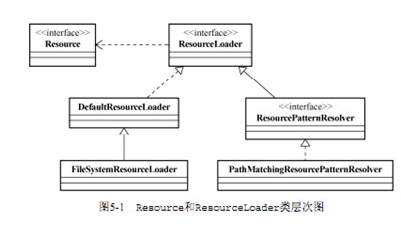

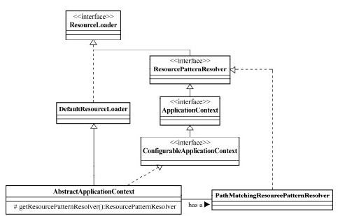

---

看到第8、16行，结合上面的ResourceLoader与ApplicationContext的继承关系图，可以知道此时调用
的是DefaultResourceLoader中的getSource()方法定位Resource，因为
FileSystemXmlApplicationContext本身就是DefaultResourceLoader的实现类，所以此时又回到了
FileSystemXmlApplicationContext中来。
7、资源加载器获取要读入的资源：
 
XmlBeanDefinitionReader通过调用其父类DefaultResourceLoader的getResource方法获取要加载的
资源，其源码如下
 
  
FileSystemXmlApplicationContext容器提供了getResourceByPath方法的实现，就是为了处理既不是
classpath标识，又不是URL标识的Resource定位这种情况。
这样代码就回到了 FileSystemXmlApplicationContext 中来，他提供了FileSystemResource 来完成从
文件系统得到配置文件的资源定义。
1    //获取Resource的具体实现方法  
2    public Resource getResource(String location) {  
3        Assert.notNull(location, "Location must not be null");  
4        //如果是类路径的方式，那需要使用ClassPathResource 来得到bean 文件的资源对象  
5        if (location.startsWith(CLASSPATH_URL_PREFIX)) {  
6            return new 
ClassPathResource(location.substring(CLASSPATH_URL_PREFIX.length()), 
getClassLoader());  
7        }  
8         try {  
9              // 如果是URL 方式，使用UrlResource 作为bean 文件的资源对象  
10             URL url = new URL(location);  
11             return new UrlResource(url);  
12            }  
13            catch (MalformedURLException ex) { 
14            } 
15            //如果既不是classpath标识，又不是URL标识的Resource定位，则调用  
16            //容器本身的getResourceByPath方法获取Resource  
17            return getResourceByPath(location);  
18            
19    }
protected Resource getResourceByPath(String path) {    
   if (path != null && path.startsWith("/")) {    
        path = path.substring(1);    
    }  
    //这里使用文件系统资源对象来定义bean 文件
    return new FileSystemResource(path);  
}

---

这样，就可以从文件系统路径上对IOC 配置文件进行加载 - 当然我们可以按照这个逻辑从任何地方加
载，在Spring 中我们看到它提供 的各种资源抽象，比如ClassPathResource, 
URLResource,FileSystemResource 等来供我们使用。上面我们看到的是定位Resource 的一个过程，而
这只是加载过程的一部分.
   
 
 
8、XmlBeanDefinitionReader加载Bean定义资源：
   Bean定义的Resource得到了
   继续回到XmlBeanDefinitionReader的loadBeanDefinitions(Resource …)方法看到代表bean文件的资
源定义以后的载入过程。
1    //XmlBeanDefinitionReader加载资源的入口方法  
2    public int loadBeanDefinitions(Resource resource) throws 
BeanDefinitionStoreException {  
3        //将读入的XML资源进行特殊编码处理  
4        return loadBeanDefinitions(new EncodedResource(resource));  
5    } 
     //这里是载入XML形式Bean定义资源文件方法
6    public int loadBeanDefinitions(EncodedResource encodedResource) throws 
BeanDefinitionStoreException {    
7    .......    
8    try {    
9         //将资源文件转为InputStream的IO流 
10        InputStream inputStream = 
encodedResource.getResource().getInputStream();    
11        try {    
12           //从InputStream中得到XML的解析源    
13            InputSource inputSource = new InputSource(inputStream);    
14            if (encodedResource.getEncoding() != null) {    
15                inputSource.setEncoding(encodedResource.getEncoding());    
16            }    
17            //这里是具体的读取过程    
18            return doLoadBeanDefinitions(inputSource, 
encodedResource.getResource());    
19        }    
20        finally {    
21            //关闭从Resource中得到的IO流    
22            inputStream.close();    
23        }    
24    }    
25       .........    
26}    
27    //从特定XML文件中实际载入Bean定义资源的方法 
28    protected int doLoadBeanDefinitions(InputSource inputSource, Resource 
resource)    
29        throws BeanDefinitionStoreException {    
30    try {    
31        int validationMode = getValidationModeForResource(resource);    
32        //将XML文件转换为DOM对象，解析过程由documentLoader实现    
33        Document doc = this.documentLoader.loadDocument(    
34                inputSource, this.entityResolver, this.errorHandler, 
validationMode, this.namespaceAware);

---

通过源码分析，载入Bean定义资源文件的最后一步是将Bean定义资源转换为Document对象，该过程
由documentLoader实现
  
  
  
9、DocumentLoader将Bean定义资源转换为Document对象：
 
DocumentLoader将Bean定义资源转换成Document对象的源码如下：
35        //这里是启动对Bean定义解析的详细过程，该解析过程会用到Spring的Bean配置规则
36        return registerBeanDefinitions(doc, resource);    
37      }    
38      .......    
     } 
1    //使用标准的JAXP将载入的Bean定义资源转换成document对象  
2    public Document loadDocument(InputSource inputSource, EntityResolver 
entityResolver,  
3            ErrorHandler errorHandler, int validationMode, boolean 
namespaceAware) throws Exception {  
4        //创建文件解析器工厂  
5        DocumentBuilderFactory factory = 
createDocumentBuilderFactory(validationMode, namespaceAware);  
6        if (logger.isDebugEnabled()) {  
7            logger.debug("Using JAXP provider [" + factory.getClass().getName() 
+ "]");  
8        }  
9        //创建文档解析器  
10        DocumentBuilder builder = createDocumentBuilder(factory, 
entityResolver, errorHandler);  
11        //解析Spring的Bean定义资源  
12        return builder.parse(inputSource);  
13    }  
14    protected DocumentBuilderFactory createDocumentBuilderFactory(int 
validationMode, boolean namespaceAware)  
15            throws ParserConfigurationException {  
16        //创建文档解析工厂  
17        DocumentBuilderFactory factory = DocumentBuilderFactory.newInstance(); 
 
18        factory.setNamespaceAware(namespaceAware);  
19        //设置解析XML的校验  
20        if (validationMode != XmlValidationModeDetector.VALIDATION_NONE) {  
21            factory.setValidating(true);  
22            if (validationMode == XmlValidationModeDetector.VALIDATION_XSD) { 
 
23                factory.setNamespaceAware(true);  
24                try {  
25                    factory.setAttribute(SCHEMA_LANGUAGE_ATTRIBUTE, 
XSD_SCHEMA_LANGUAGE);  
26                }  
27                catch (IllegalArgumentException ex) {

---

该解析过程调用JavaEE标准的JAXP标准进行处理。
至此Spring IoC容器根据定位的Bean定义资源文件，将其加载读入并转换成为Document对象过程完
成。
 
 
接下来我们要继续分析Spring IoC容器将载入的Bean定义资源文件转换为Document对象之后，是如何
将其解析为Spring IoC管理的Bean对象并将其注册到容器中的。
 
10、XmlBeanDefinitionReader解析载入的Bean定义资源文件：
 
 XmlBeanDefinitionReader类中的doLoadBeanDefinitions方法是从特定XML文件中实际载入Bean定义
资源的方法，该方法在载入Bean定义资源之后将其转换为Document对象，接下来调用
registerBeanDefinitions启动Spring IoC容器对Bean定义的解析过程，registerBeanDefinitions方法源
码如下：
  
 
28                    ParserConfigurationException pcex = new 
ParserConfigurationException(  
29                            "Unable to validate using XSD: Your JAXP provider 
[" + factory +  
30                            "] does not support XML Schema. Are you running on 
Java 1.4 with Apache Crimson? " +  
31                            "Upgrade to Apache Xerces (or Java 1.5) for full 
XSD support.");  
32                    pcex.initCause(ex);  
33                    throw pcex;  
34                }  
35            }  
36        }  
37        return factory;  
38    } 
1    //按照Spring的Bean语义要求将Bean定义资源解析并转换为容器内部数据结构  
2    public int registerBeanDefinitions(Document doc, Resource resource) throws 
BeanDefinitionStoreException {  
3        //得到BeanDefinitionDocumentReader来对xml格式的BeanDefinition解析  
4        BeanDefinitionDocumentReader documentReader = 
createBeanDefinitionDocumentReader();  
5        //获得容器中注册的Bean数量  
6        int countBefore = getRegistry().getBeanDefinitionCount();  
7        //解析过程入口，这里使用了委派模式，BeanDefinitionDocumentReader只是个接口，//具
体的解析实现过程有实现类DefaultBeanDefinitionDocumentReader完成  
8        documentReader.registerBeanDefinitions(doc, 
createReaderContext(resource));  
9        //统计解析的Bean数量  
10        return getRegistry().getBeanDefinitionCount() - countBefore;  
11    }  
12    //创建BeanDefinitionDocumentReader对象，解析Document对象

---

Bean定义资源的载入解析分为以下两个过程：
首先，通过调用XML解析器将Bean定义资源文件转换得到Document对象，但是这些Document对象并
没有按照Spring的Bean规则进行解析。这一步是载入的过程
其次，在完成通用的XML解析之后，按照Spring的Bean规则对Document对象进行解析。
按照Spring的Bean规则对Document对象解析的过程是在接口BeanDefinitionDocumentReader的实现
类DefaultBeanDefinitionDocumentReader中实现的。
 
11、DefaultBeanDefinitionDocumentReader对Bean定义的Document对象解析：
 
BeanDefinitionDocumentReader接口通过registerBeanDefinitions方法调用其实现类
DefaultBeanDefinitionDocumentReader对Document对象进行解析，解析的代码如下：
  
  
  
  
 
13    protected BeanDefinitionDocumentReader createBeanDefinitionDocumentReader() 
{  
14        return 
BeanDefinitionDocumentReader.class.cast(BeanUtils.instantiateClass(this.document
ReaderClass));  
      } 
1     //根据Spring DTD对Bean的定义规则解析Bean定义Document对象  
2     public void registerBeanDefinitions(Document doc, XmlReaderContext 
readerContext) {  
3         //获得XML描述符  
4         this.readerContext = readerContext;  
5         logger.debug("Loading bean definitions");  
6         //获得Document的根元素  
7         Element root = doc.getDocumentElement();  
8         //具体的解析过程由BeanDefinitionParserDelegate实现，  
9         //BeanDefinitionParserDelegate中定义了Spring Bean定义XML文件的各种元素  
10        BeanDefinitionParserDelegate delegate = createHelper(readerContext, 
root);  
11        //在解析Bean定义之前，进行自定义的解析，增强解析过程的可扩展性  
12        preProcessXml(root);  
13        //从Document的根元素开始进行Bean定义的Document对象  
14        parseBeanDefinitions(root, delegate);  
15        //在解析Bean定义之后，进行自定义的解析，增加解析过程的可扩展性  
16        postProcessXml(root);  
17    }  
18    //创建BeanDefinitionParserDelegate，用于完成真正的解析过程

---

19    protected BeanDefinitionParserDelegate createHelper(XmlReaderContext 
readerContext, Element root) {  
20        BeanDefinitionParserDelegate delegate = new 
BeanDefinitionParserDelegate(readerContext);  
21        //BeanDefinitionParserDelegate初始化Document根元素  
22        delegate.initDefaults(root);  
23        return delegate;  
24    }  
25    //使用Spring的Bean规则从Document的根元素开始进行Bean定义的Document对象  
26    protected void parseBeanDefinitions(Element root, 
BeanDefinitionParserDelegate delegate) {  
27        //Bean定义的Document对象使用了Spring默认的XML命名空间  
28        if (delegate.isDefaultNamespace(root)) {  
29            //获取Bean定义的Document对象根元素的所有子节点  
30            NodeList nl = root.getChildNodes();  
31            for (int i = 0; i < nl.getLength(); i++) {  
32                Node node = nl.item(i);  
33                //获得Document节点是XML元素节点  
34                if (node instanceof Element) {  
35                    Element ele = (Element) node;  
36                //Bean定义的Document的元素节点使用的是Spring默认的XML命名空间  
37                    if (delegate.isDefaultNamespace(ele)) {  
38                        //使用Spring的Bean规则解析元素节点  
39                        parseDefaultElement(ele, delegate);  
40                    }  
41                    else {  
42                        //没有使用Spring默认的XML命名空间，则使用用户自定义的解//析规则
解析元素节点  
43                        delegate.parseCustomElement(ele);  
44                    }  
45                }  
46            }  
47        }  
48        else {  
49            //Document的根节点没有使用Spring默认的命名空间，则使用用户自定义的  
50            //解析规则解析Document根节点  
51            delegate.parseCustomElement(root);  
52        }  
53    }  
54    //使用Spring的Bean规则解析Document元素节点  
55    private void parseDefaultElement(Element ele, BeanDefinitionParserDelegate 
delegate) {  
56        //如果元素节点是<Import>导入元素，进行导入解析  
57        if (delegate.nodeNameEquals(ele, IMPORT_ELEMENT)) {  
58            importBeanDefinitionResource(ele);  
59        }  
60        //如果元素节点是<Alias>别名元素，进行别名解析  
61        else if (delegate.nodeNameEquals(ele, ALIAS_ELEMENT)) {  
62            processAliasRegistration(ele);  
63        }  
64        //元素节点既不是导入元素，也不是别名元素，即普通的<Bean>元素，  
65        //按照Spring的Bean规则解析元素  
66        else if (delegate.nodeNameEquals(ele, BEAN_ELEMENT)) {  
67            processBeanDefinition(ele, delegate);  
68        }  
69    }  
70    //解析<Import>导入元素，从给定的导入路径加载Bean定义资源到Spring IoC容器中  
71    protected void importBeanDefinitionResource(Element ele) {

---

72        //获取给定的导入元素的location属性  
73        String location = ele.getAttribute(RESOURCE_ATTRIBUTE);  
74        //如果导入元素的location属性值为空，则没有导入任何资源，直接返回  
75        if (!StringUtils.hasText(location)) {  
76            getReaderContext().error("Resource location must not be empty", 
ele);  
77            return;  
78        }  
79        //使用系统变量值解析location属性值  
80        location = SystemPropertyUtils.resolvePlaceholders(location);  
81        Set<Resource> actualResources = new LinkedHashSet<Resource>(4);  
82        //标识给定的导入元素的location是否是绝对路径  
83        boolean absoluteLocation = false;  
84        try {  
85            absoluteLocation = ResourcePatternUtils.isUrl(location) || 
ResourceUtils.toURI(location).isAbsolute();  
86        }  
87        catch (URISyntaxException ex) {  
88            //给定的导入元素的location不是绝对路径  
89        }  
90        //给定的导入元素的location是绝对路径  
91        if (absoluteLocation) {  
92            try {  
93                //使用资源读入器加载给定路径的Bean定义资源  
94                int importCount = 
getReaderContext().getReader().loadBeanDefinitions(location, actualResources);  
95                if (logger.isDebugEnabled()) {  
96                    logger.debug("Imported " + importCount + " bean definitions 
from URL location [" + location + "]");  
97                }  
98            }  
99            catch (BeanDefinitionStoreException ex) {  
100                getReaderContext().error(  
101                        "Failed to import bean definitions from URL location 
[" + location + "]", ele, ex);  
102            }  
103        }  
104        else {  
105            //给定的导入元素的location是相对路径  
106            try {  
107                int importCount;  
108                //将给定导入元素的location封装为相对路径资源  
109                Resource relativeResource = 
getReaderContext().getResource().createRelative(location);  
110                //封装的相对路径资源存在  
111                if (relativeResource.exists()) {  
112                    //使用资源读入器加载Bean定义资源  
113                    importCount = 
getReaderContext().getReader().loadBeanDefinitions(relativeResource);  
114                    actualResources.add(relativeResource);  
115                }  
116                //封装的相对路径资源不存在  
117                else {  
118                    //获取Spring IoC容器资源读入器的基本路径  
119                    String baseLocation = 
getReaderContext().getResource().getURL().toString();  
120                    //根据Spring IoC容器资源读入器的基本路径加载给定导入  
121                    //路径的资源

---

122                    importCount = 
getReaderContext().getReader().loadBeanDefinitions(  
123                            StringUtils.applyRelativePath(baseLocation, 
location), actualResources);  
124                }  
125                if (logger.isDebugEnabled()) {  
126                    logger.debug("Imported " + importCount + " bean 
definitions from relative location [" + location + "]");  
127                }  
128            }  
129            catch (IOException ex) {  
130                getReaderContext().error("Failed to resolve current resource 
location", ele, ex);  
131            }  
132            catch (BeanDefinitionStoreException ex) {  
133                getReaderContext().error("Failed to import bean definitions 
from relative location [" + location + "]",  
134                        ele, ex);  
135            }  
136        }  
137        Resource[] actResArray = actualResources.toArray(new 
Resource[actualResources.size()]);  
138        //在解析完<Import>元素之后，发送容器导入其他资源处理完成事件  
139        getReaderContext().fireImportProcessed(location, actResArray, 
extractSource(ele));  
140    }  
141    //解析<Alias>别名元素，为Bean向Spring IoC容器注册别名  
142    protected void processAliasRegistration(Element ele) {  
143        //获取<Alias>别名元素中name的属性值  
144        String name = ele.getAttribute(NAME_ATTRIBUTE);  
145        //获取<Alias>别名元素中alias的属性值  
146        String alias = ele.getAttribute(ALIAS_ATTRIBUTE);  
147        boolean valid = true;  
148        //<alias>别名元素的name属性值为空  
149        if (!StringUtils.hasText(name)) {  
150            getReaderContext().error("Name must not be empty", ele);  
151            valid = false;  
152        }  
153        //<alias>别名元素的alias属性值为空  
154        if (!StringUtils.hasText(alias)) {  
155            getReaderContext().error("Alias must not be empty", ele);  
156            valid = false;  
157        }  
158        if (valid) {  
159            try {  
160                //向容器的资源读入器注册别名  
161                getReaderContext().getRegistry().registerAlias(name, alias); 
 
162            }  
163            catch (Exception ex) {  
164                getReaderContext().error("Failed to register alias '" + alias 
+  
165                        "' for bean with name '" + name + "'", ele, ex);  
166            }  
167            //在解析完<Alias>元素之后，发送容器别名处理完成事件  
168            getReaderContext().fireAliasRegistered(name, alias, 
extractSource(ele));  
169        }

---

通过上述Spring IoC容器对载入的Bean定义Document解析可以看出，我们使用Spring时，在Spring配
置文件中可以使用元素来导入IoC容器所需要的其他资源，Spring IoC容器在解析时会首先将指定导入的
资源加载进容器中。使用别名时，Spring IoC容器首先将别名元素所定义的别名注册到容器中。
对于既不是元素，又不是元素的元素，即Spring配置文件中普通的元素的解析由
BeanDefinitionParserDelegate类的parseBeanDefinitionElement方法来实现。
  
 
12、BeanDefinitionParserDelegate解析Bean定义资源文件中的元素：
  
Bean定义资源文件中的和元素解析在DefaultBeanDefinitionDocumentReader中已经完成，对Bean定
义资源文件中使用最多的元素交由BeanDefinitionParserDelegate来解析，其解析实现的源码如下：
170    }  
171    //解析Bean定义资源Document对象的普通元素  
172    protected void processBeanDefinition(Element ele, 
BeanDefinitionParserDelegate delegate) {  
173        // BeanDefinitionHolder是对BeanDefinition的封装，即Bean定义的封装类  
174        //对Document对象中<Bean>元素的解析由BeanDefinitionParserDelegate实现  
BeanDefinitionHolder bdHolder = delegate.parseBeanDefinitionElement(ele);  
175        if (bdHolder != null) {  
176            bdHolder = delegate.decorateBeanDefinitionIfRequired(ele, 
bdHolder);  
177            try {  
178               //向Spring IoC容器注册解析得到的Bean定义，这是Bean定义向IoC容器注册的入
口                              
BeanDefinitionReaderUtils.registerBeanDefinition(bdHolder, 
getReaderContext().getRegistry());  
179            }  
180            catch (BeanDefinitionStoreException ex) {  
181                getReaderContext().error("Failed to register bean definition 
with name '" +  
182                        bdHolder.getBeanName() + "'", ele, ex);  
183            }  
184            //在完成向Spring IoC容器注册解析得到的Bean定义之后，发送注册事件  
185            getReaderContext().fireComponentRegistered(new 
BeanComponentDefinition(bdHolder));  
186        }  
187    } 
1    //解析<Bean>元素的入口  
2    public BeanDefinitionHolder parseBeanDefinitionElement(Element ele) {  
3        return parseBeanDefinitionElement(ele, null);  
4    }  
5    //解析Bean定义资源文件中的<Bean>元素，这个方法中主要处理<Bean>元素的id，name  
6    //和别名属性  
7    public BeanDefinitionHolder parseBeanDefinitionElement(Element ele, 
BeanDefinition containingBean) {  
8        //获取<Bean>元素中的id属性值  
9        String id = ele.getAttribute(ID_ATTRIBUTE);  
10        //获取<Bean>元素中的name属性值  
11        String nameAttr = ele.getAttribute(NAME_ATTRIBUTE);

---

12        ////获取<Bean>元素中的alias属性值  
13        List<String> aliases = new ArrayList<String>();  
14        //将<Bean>元素中的所有name属性值存放到别名中  
15        if (StringUtils.hasLength(nameAttr)) {  
16            String[] nameArr = StringUtils.tokenizeToStringArray(nameAttr, 
BEAN_NAME_DELIMITERS);  
17            aliases.addAll(Arrays.asList(nameArr));  
18        }  
19        String beanName = id;  
20        //如果<Bean>元素中没有配置id属性时，将别名中的第一个值赋值给beanName  
21        if (!StringUtils.hasText(beanName) && !aliases.isEmpty()) {  
22            beanName = aliases.remove(0);  
23            if (logger.isDebugEnabled()) {  
24                logger.debug("No XML 'id' specified - using '" + beanName +  
25                        "' as bean name and " + aliases + " as aliases");  
26            }  
27        }  
28        //检查<Bean>元素所配置的id或者name的唯一性，containingBean标识<Bean>  
29        //元素中是否包含子<Bean>元素  
30        if (containingBean == null) {  
31            //检查<Bean>元素所配置的id、name或者别名是否重复  
32            checkNameUniqueness(beanName, aliases, ele);  
33        }  
34        //详细对<Bean>元素中配置的Bean定义进行解析的地方  
35        AbstractBeanDefinition beanDefinition = parseBeanDefinitionElement(ele, 
beanName, containingBean);  
36        if (beanDefinition != null) {  
37            if (!StringUtils.hasText(beanName)) {  
38                try {  
39                    if (containingBean != null) {  
40                        //如果<Bean>元素中没有配置id、别名或者name，且没有包含
子//<Bean>元素，为解析的Bean生成一个唯一beanName并注册  
41                        beanName = BeanDefinitionReaderUtils.generateBeanName( 
 
42                                beanDefinition, 
this.readerContext.getRegistry(), true);  
43                    }  
44                    else {  
45                        //如果<Bean>元素中没有配置id、别名或者name，且包含了
子//<Bean>元素，为解析的Bean使用别名向IoC容器注册  
46                        beanName = 
this.readerContext.generateBeanName(beanDefinition);  
47                        //为解析的Bean使用别名注册时，为了向后兼容                   
                 //Spring1.2/2.0，给别名添加类名后缀  
48                        String beanClassName = 
beanDefinition.getBeanClassName();  
49                        if (beanClassName != null &&  
50                                beanName.startsWith(beanClassName) && 
beanName.length() > beanClassName.length() &&  
51                                
!this.readerContext.getRegistry().isBeanNameInUse(beanClassName)) {  
52                            aliases.add(beanClassName);  
53                        }  
54                    }  
55                    if (logger.isDebugEnabled()) {  
56                        logger.debug("Neither XML 'id' nor 'name' specified - " 
+

---

57                                "using generated bean name [" + beanName + 
"]");  
58                    }  
59                }  
60                catch (Exception ex) {  
61                    error(ex.getMessage(), ele);  
62                    return null;  
63                }  
64            }  
65            String[] aliasesArray = StringUtils.toStringArray(aliases);  
66            return new BeanDefinitionHolder(beanDefinition, beanName, 
aliasesArray);  
67        }  
68        //当解析出错时，返回null  
69        return null;  
70    }  
71    //详细对<Bean>元素中配置的Bean定义其他属性进行解析，由于上面的方法中已经对//Bean的id、
name和别名等属性进行了处理，该方法中主要处理除这三个以外的其他属性数据  
72    public AbstractBeanDefinition parseBeanDefinitionElement(  
73            Element ele, String beanName, BeanDefinition containingBean) {  
74        //记录解析的<Bean>  
75        this.parseState.push(new BeanEntry(beanName));  
76        //这里只读取<Bean>元素中配置的class名字，然后载入到BeanDefinition中去  
77        //只是记录配置的class名字，不做实例化，对象的实例化在依赖注入时完成  
78        String className = null;  
79        if (ele.hasAttribute(CLASS_ATTRIBUTE)) {  
80            className = ele.getAttribute(CLASS_ATTRIBUTE).trim();  
81        }  
82        try {  
83            String parent = null;  
84            //如果<Bean>元素中配置了parent属性，则获取parent属性的值  
85            if (ele.hasAttribute(PARENT_ATTRIBUTE)) {  
86                parent = ele.getAttribute(PARENT_ATTRIBUTE);  
87            }  
88            //根据<Bean>元素配置的class名称和parent属性值创建BeanDefinition  
89            //为载入Bean定义信息做准备  
90            AbstractBeanDefinition bd = createBeanDefinition(className, 
parent);  
91            //对当前的<Bean>元素中配置的一些属性进行解析和设置，如配置的单态(singleton)
属性等  
92            parseBeanDefinitionAttributes(ele, beanName, containingBean, bd); 
 
93            //为<Bean>元素解析的Bean设置description信息 
bd.setDescription(DomUtils.getChildElementValueByTagName(ele, 
DESCRIPTION_ELEMENT));  
94            //对<Bean>元素的meta(元信息)属性解析  
95            parseMetaElements(ele, bd);  
96            //对<Bean>元素的lookup-method属性解析  
97            parseLookupOverrideSubElements(ele, bd.getMethodOverrides());  
98            //对<Bean>元素的replaced-method属性解析  
99            parseReplacedMethodSubElements(ele, bd.getMethodOverrides());  
100            //解析<Bean>元素的构造方法设置  
101            parseConstructorArgElements(ele, bd);  
102            //解析<Bean>元素的<property>设置  
103            parsePropertyElements(ele, bd);  
104            //解析<Bean>元素的qualifier属性  
105            parseQualifierElements(ele, bd);  
106            //为当前解析的Bean设置所需的资源和依赖对象

---

只要使用过Spring，对Spring配置文件比较熟悉的人，通过对上述源码的分析，就会明白我们在Spring
配置文件中元素的中配置的属性就是通过该方法解析和设置到Bean中去的。
注意：在解析元素过程中没有创建和实例化Bean对象，只是创建了Bean对象的定义类
BeanDefinition，将元素中的配置信息设置到BeanDefinition中作为记录，当依赖注入时才使用这些记
录信息创建和实例化具体的Bean对象
上面方法中一些对一些配置如元信息(meta)、qualifier等的解析，我们在Spring中配置时使用的也不
多，我们在使用Spring的元素时，配置最多的是属性，因此我们下面继续分析源码，了解Bean的属性在
解析时是如何设置的。
  
  
13、BeanDefinitionParserDelegate解析元素：
DefinitionParserDelegate在解析调用parsePropertyElements方法解析元素中的属性子元素，解析源
码如下：
107            bd.setResource(this.readerContext.getResource());  
108            bd.setSource(extractSource(ele));  
109            return bd;  
110        }  
111        catch (ClassNotFoundException ex) {  
112            error("Bean class [" + className + "] not found", ele, ex);  
113        }  
114        catch (NoClassDefFoundError err) {  
115            error("Class that bean class [" + className + "] depends on not 
found", ele, err);  
116        }  
117        catch (Throwable ex) {  
118            error("Unexpected failure during bean definition parsing", ele, 
ex);  
119        }  
120        finally {  
121            this.parseState.pop();  
122        }  
123        //解析<Bean>元素出错时，返回null  
124        return null;  
125    } 
1    //解析<Bean>元素中的<property>子元素  
2    public void parsePropertyElements(Element beanEle, BeanDefinition bd) {  
3        //获取<Bean>元素中所有的子元素  
4        NodeList nl = beanEle.getChildNodes();  
5        for (int i = 0; i < nl.getLength(); i++) {  
6            Node node = nl.item(i);  
7            //如果子元素是<property>子元素，则调用解析<property>子元素方法解析  
8            if (isCandidateElement(node) && nodeNameEquals(node, 
PROPERTY_ELEMENT)) {  
9                parsePropertyElement((Element) node, bd);  
10            }  
11        }  
12    }  
13    //解析<property>元素

---

14    public void parsePropertyElement(Element ele, BeanDefinition bd) {  
15        //获取<property>元素的名字   
16        String propertyName = ele.getAttribute(NAME_ATTRIBUTE);  
17        if (!StringUtils.hasLength(propertyName)) {  
18            error("Tag 'property' must have a 'name' attribute", ele);  
19            return;  
20        }  
21        this.parseState.push(new PropertyEntry(propertyName));  
22        try {  
23            //如果一个Bean中已经有同名的property存在，则不进行解析，直接返回。  
24            //即如果在同一个Bean中配置同名的property，则只有第一个起作用  
25            if (bd.getPropertyValues().contains(propertyName)) {  
26                error("Multiple 'property' definitions for property '" + 
propertyName + "'", ele);  
27                return;  
28            }  
29            //解析获取property的值  
30            Object val = parsePropertyValue(ele, bd, propertyName);  
31            //根据property的名字和值创建property实例  
32            PropertyValue pv = new PropertyValue(propertyName, val);  
33            //解析<property>元素中的属性  
34            parseMetaElements(ele, pv);  
35            pv.setSource(extractSource(ele));  
36            bd.getPropertyValues().addPropertyValue(pv);  
37        }  
38        finally {  
39            this.parseState.pop();  
40        }  
41    }  
42    //解析获取property值  
43    public Object parsePropertyValue(Element ele, BeanDefinition bd, String 
propertyName) {  
44        String elementName = (propertyName != null) ?  
45                        "<property> element for property '" + propertyName + 
"'" :  
46                        "<constructor-arg> element";  
47        //获取<property>的所有子元素，只能是其中一种类型:ref,value,list等  
48        NodeList nl = ele.getChildNodes();  
49        Element subElement = null;  
50        for (int i = 0; i < nl.getLength(); i++) {  
51            Node node = nl.item(i);  
52            //子元素不是description和meta属性  
53            if (node instanceof Element && !nodeNameEquals(node, 
DESCRIPTION_ELEMENT) &&  
54                    !nodeNameEquals(node, META_ELEMENT)) {  
55                if (subElement != null) {  
56                    error(elementName + " must not contain more than one sub-
element", ele);  
57                }  
58                else {//当前<property>元素包含有子元素  
59                    subElement = (Element) node;  
60                }  
61            }  
62        }  
63        //判断property的属性值是ref还是value，不允许既是ref又是value  
64        boolean hasRefAttribute = ele.hasAttribute(REF_ATTRIBUTE);  
65        boolean hasValueAttribute = ele.hasAttribute(VALUE_ATTRIBUTE);  
66        if ((hasRefAttribute && hasValueAttribute) ||

---

通过对上述源码的分析，我们可以了解在Spring配置文件中，元素中元素的相关配置是如何处理的：
a. ref被封装为指向依赖对象一个引用。
b.value配置都会封装成一个字符串类型的对象。
c.ref和value都通过“解析的数据类型属性值.setSource(extractSource(ele));”方法将属性值/引用与所引
用的属性关联起来。
在方法的最后对于元素的子元素通过parsePropertySubElement 方法解析，我们继续分析该方法的源
码，了解其解析过程。
  
 
  
67                ((hasRefAttribute || hasValueAttribute) && subElement != null)) 
{  
68            error(elementName +  
69                    " is only allowed to contain either 'ref' attribute OR 
'value' attribute OR sub-element", ele);  
70        }  
71        //如果属性是ref，创建一个ref的数据对象RuntimeBeanReference，这个对象  
72        //封装了ref信息  
73        if (hasRefAttribute) {  
74            String refName = ele.getAttribute(REF_ATTRIBUTE);  
75            if (!StringUtils.hasText(refName)) {  
76                error(elementName + " contains empty 'ref' attribute", ele);  
77            }  
78            //一个指向运行时所依赖对象的引用  
79            RuntimeBeanReference ref = new RuntimeBeanReference(refName);  
80            //设置这个ref的数据对象是被当前的property对象所引用  
81            ref.setSource(extractSource(ele));  
82            return ref;  
83        }  
84         //如果属性是value，创建一个value的数据对象TypedStringValue，这个对象  
85        //封装了value信息  
86        else if (hasValueAttribute) {  
87            //一个持有String类型值的对象  
88            TypedStringValue valueHolder = new 
TypedStringValue(ele.getAttribute(VALUE_ATTRIBUTE));  
89            //设置这个value数据对象是被当前的property对象所引用  
90            valueHolder.setSource(extractSource(ele));  
91            return valueHolder;  
92        }  
93        //如果当前<property>元素还有子元素  
94        else if (subElement != null) {  
95            //解析<property>的子元素  
96            return parsePropertySubElement(subElement, bd);  
97        }  
98        else {  
99            //propery属性中既不是ref，也不是value属性，解析出错返回null        
error(elementName + " must specify a ref or value", ele);  
100            return null;  
101        }  
    }

---

14、解析元素的子元素：
在BeanDefinitionParserDelegate类中的parsePropertySubElement方法对中的子元素解析，源码如
下：
1    //解析<property>元素中ref,value或者集合等子元素  
2    public Object parsePropertySubElement(Element ele, BeanDefinition bd, String 
defaultValueType) {  
3        //如果<property>没有使用Spring默认的命名空间，则使用用户自定义的规则解析//内嵌元素 
 
4        if (!isDefaultNamespace(ele)) {  
5            return parseNestedCustomElement(ele, bd);  
6        }  
7        //如果子元素是bean，则使用解析<Bean>元素的方法解析  
8        else if (nodeNameEquals(ele, BEAN_ELEMENT)) {  
9            BeanDefinitionHolder nestedBd = parseBeanDefinitionElement(ele, bd); 
 
10            if (nestedBd != null) {  
11                nestedBd = decorateBeanDefinitionIfRequired(ele, nestedBd, bd); 
 
12            }  
13            return nestedBd;  
14        }  
15        //如果子元素是ref，ref中只能有以下3个属性：bean、local、parent  
16        else if (nodeNameEquals(ele, REF_ELEMENT)) {  
17            //获取<property>元素中的bean属性值，引用其他解析的Bean的名称  
18            //可以不再同一个Spring配置文件中，具体请参考Spring对ref的配置规则  
19            String refName = ele.getAttribute(BEAN_REF_ATTRIBUTE);  
20            boolean toParent = false;  
21            if (!StringUtils.hasLength(refName)) {  
22                 //获取<property>元素中的local属性值，引用同一个Xml文件中配置  
23                 //的Bean的id，local和ref不同，local只能引用同一个配置文件中的Bean  
24                refName = ele.getAttribute(LOCAL_REF_ATTRIBUTE);  
25                if (!StringUtils.hasLength(refName)) {  
26                    //获取<property>元素中parent属性值，引用父级容器中的Bean  
27                    refName = ele.getAttribute(PARENT_REF_ATTRIBUTE);  
28                    toParent = true;  
29                    if (!StringUtils.hasLength(refName)) {  
30                        error("'bean', 'local' or 'parent' is required for 
<ref> element", ele);  
31                        return null;  
32                    }  
33                }  
34            }  
35            //没有配置ref的目标属性值  
36            if (!StringUtils.hasText(refName)) {  
37                error("<ref> element contains empty target attribute", ele);  
38                return null;  
39            }  
40            //创建ref类型数据，指向被引用的对象  
41            RuntimeBeanReference ref = new RuntimeBeanReference(refName, 
toParent);  
42            //设置引用类型值是被当前子元素所引用  
43            ref.setSource(extractSource(ele));  
44            return ref;  
45        }  
46        //如果子元素是<idref>，使用解析ref元素的方法解析

---

通过上述源码分析，我们明白了在Spring配置文件中，对元素中配置的Array、List、Set、Map、Prop
等各种集合子元素的都通过上述方法解析，生成对应的数据对象，比如ManagedList、
ManagedArray、ManagedSet等，这些Managed类是Spring对象BeanDefiniton的数据封装，对集合
数据类型的具体解析有各自的解析方法实现，解析方法的命名非常规范，一目了然，我们对集合元素的
解析方法进行源码分析，了解其实现过程。
 
15、解析子元素：
 
在BeanDefinitionParserDelegate类中的parseListElement方法就是具体实现解析元素中的集合子元
素，源码如下：
47        else if (nodeNameEquals(ele, IDREF_ELEMENT)) {  
48            return parseIdRefElement(ele);  
49        }  
50        //如果子元素是<value>，使用解析value元素的方法解析  
51        else if (nodeNameEquals(ele, VALUE_ELEMENT)) {  
52            return parseValueElement(ele, defaultValueType);  
53        }  
54        //如果子元素是null，为<property>设置一个封装null值的字符串数据  
55        else if (nodeNameEquals(ele, NULL_ELEMENT)) {  
56            TypedStringValue nullHolder = new TypedStringValue(null);  
57            nullHolder.setSource(extractSource(ele));  
58            return nullHolder;  
59        }  
60        //如果子元素是<array>，使用解析array集合子元素的方法解析  
61        else if (nodeNameEquals(ele, ARRAY_ELEMENT)) {  
62            return parseArrayElement(ele, bd);  
63        }  
64        //如果子元素是<list>，使用解析list集合子元素的方法解析  
65        else if (nodeNameEquals(ele, LIST_ELEMENT)) {  
66            return parseListElement(ele, bd);  
67        }  
68        //如果子元素是<set>，使用解析set集合子元素的方法解析  
69        else if (nodeNameEquals(ele, SET_ELEMENT)) {  
70            return parseSetElement(ele, bd);  
71        }  
72        //如果子元素是<map>，使用解析map集合子元素的方法解析  
73        else if (nodeNameEquals(ele, MAP_ELEMENT)) {  
74            return parseMapElement(ele, bd);  
75        }  
76        //如果子元素是<props>，使用解析props集合子元素的方法解析  
77        else if (nodeNameEquals(ele, PROPS_ELEMENT)) {  
78            return parsePropsElement(ele);  
79        }  
80        //既不是ref，又不是value，也不是集合，则子元素配置错误，返回null  
81        else {  
82            error("Unknown property sub-element: [" + ele.getNodeName() + "]", 
ele);  
83            return null;  
84        }  
    }

---

经过对Spring Bean定义资源文件转换的Document对象中的元素层层解析，Spring IoC现在已经将XML
形式定义的Bean定义资源文件转换为Spring IoC所识别的数据结构——BeanDefinition，它是Bean定义
资源文件中配置的POJO对象在Spring IoC容器中的映射，我们可以通过AbstractBeanDefinition为入
口，荣IoC容器进行索引、查询和操作。
通过Spring IoC容器对Bean定义资源的解析后，IoC容器大致完成了管理Bean对象的准备工作，即初始
化过程，但是最为重要的依赖注入还没有发生，现在在IoC容器中BeanDefinition存储的只是一些静态信
息，接下来需要向容器注册Bean定义信息才能全部完成IoC容器的初始化过程
 
16、解析过后的BeanDefinition在IoC容器中的注册：
让我们继续跟踪程序的执行顺序，接下来会到我们第3步中分析
DefaultBeanDefinitionDocumentReader对Bean定义转换的Document对象解析的流程中，在其
parseDefaultElement方法中完成对Document对象的解析后得到封装BeanDefinition的
BeanDefinitionHold对象，然后调用BeanDefinitionReaderUtils的registerBeanDefinition方法向IoC容
器注册解析的Bean，BeanDefinitionReaderUtils的注册的源码如下：
1    //解析<list>集合子元素  
2    public List parseListElement(Element collectionEle, BeanDefinition bd) {  
3        //获取<list>元素中的value-type属性，即获取集合元素的数据类型  
4        String defaultElementType = 
collectionEle.getAttribute(VALUE_TYPE_ATTRIBUTE);  
5        //获取<list>集合元素中的所有子节点  
6        NodeList nl = collectionEle.getChildNodes();  
7        //Spring中将List封装为ManagedList  
8        ManagedList<Object> target = new ManagedList<Object>(nl.getLength());  
9        target.setSource(extractSource(collectionEle));  
10        //设置集合目标数据类型  
11        target.setElementTypeName(defaultElementType);  
12        target.setMergeEnabled(parseMergeAttribute(collectionEle));  
13        //具体的<list>元素解析  
14        parseCollectionElements(nl, target, bd, defaultElementType);  
15        return target;  
16    }   
17    //具体解析<list>集合元素，<array>、<list>和<set>都使用该方法解析  
18    protected void parseCollectionElements(  
19            NodeList elementNodes, Collection<Object> target, BeanDefinition 
bd, String defaultElementType) {  
20        //遍历集合所有节点  
21        for (int i = 0; i < elementNodes.getLength(); i++) {  
22            Node node = elementNodes.item(i);  
23            //节点不是description节点  
24            if (node instanceof Element && !nodeNameEquals(node, 
DESCRIPTION_ELEMENT)) {  
25                //将解析的元素加入集合中，递归调用下一个子元素  
26                target.add(parsePropertySubElement((Element) node, bd, 
defaultElementType));  
27            }  
28        }  
    } 
//将解析的BeanDefinitionHold注册到容器中 
public static void registerBeanDefinition(BeanDefinitionHolder definitionHolder, 
BeanDefinitionRegistry registry)

---

当调用BeanDefinitionReaderUtils向IoC容器注册解析的BeanDefinition时，真正完成注册功能的是
DefaultListableBeanFactory。
 
17、DefaultListableBeanFactory向IoC容器注册解析后的BeanDefinition：
 
DefaultListableBeanFactory中使用一个HashMap的集合对象存放IoC容器中注册解析的
BeanDefinition，向IoC容器注册的主要源码如下：
 
    throws BeanDefinitionStoreException {  
        //获取解析的BeanDefinition的名称
         String beanName = definitionHolder.getBeanName();  
        //向IoC容器注册BeanDefinition 
        registry.registerBeanDefinition(beanName, 
definitionHolder.getBeanDefinition());  
        //如果解析的BeanDefinition有别名，向容器为其注册别名  
         String[] aliases = definitionHolder.getAliases();  
        if (aliases != null) {  
            for (String aliase : aliases) {  
                registry.registerAlias(beanName, aliase);  
            }  
        }  
}
1    //存储注册的俄BeanDefinition  
2    private final Map<String, BeanDefinition> beanDefinitionMap = new 
ConcurrentHashMap<String, BeanDefinition>();  
3    //向IoC容器注册解析的BeanDefiniton  
4    public void registerBeanDefinition(String beanName, BeanDefinition 
beanDefinition)  
5            throws BeanDefinitionStoreException {  
6        Assert.hasText(beanName, "Bean name must not be empty");  
7        Assert.notNull(beanDefinition, "BeanDefinition must not be null");  
8        //校验解析的BeanDefiniton  
9        if (beanDefinition instanceof AbstractBeanDefinition) {  
10            try {  
11                ((AbstractBeanDefinition) beanDefinition).validate();  
12            }  
13            catch (BeanDefinitionValidationException ex) {  
14                throw new 
BeanDefinitionStoreException(beanDefinition.getResourceDescription(), beanName,

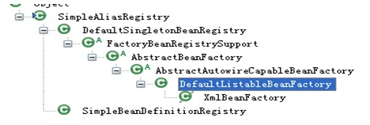

---

至此，Bean定义资源文件中配置的Bean被解析过后，已经注册到IoC容器中，被容器管理起来，真正完
成了IoC容器初始化所做的全部工作。现 在IoC容器中已经建立了整个Bean的配置信息，这些
BeanDefinition信息已经可以使用，并且可以被检索，IoC容器的作用就是对这些注册的Bean定义信息
进行处理和维护。这些的注册的Bean定义信息是IoC容器控制反转的基础，正是有了这些注册的数据，
容器才可以进行依赖注入。
 
总结：
   现在通过上面的代码，总结一下IOC容器初始化的基本步骤：
u 初始化的入口在容器实现中的 refresh()调用来完成
15                        "Validation of bean definition failed", ex);  
16            }  
17        }  
18        //注册的过程中需要线程同步，以保证数据的一致性  
19        synchronized (this.beanDefinitionMap) {  
20            Object oldBeanDefinition = this.beanDefinitionMap.get(beanName);  
21            //检查是否有同名的BeanDefinition已经在IoC容器中注册，如果已经注册，  
22            //并且不允许覆盖已注册的Bean，则抛出注册失败异常  
23            if (oldBeanDefinition != null) {  
24                if (!this.allowBeanDefinitionOverriding) {  
25                    throw new 
BeanDefinitionStoreException(beanDefinition.getResourceDescription(), beanName, 
 
26                            "Cannot register bean definition [" + 
beanDefinition + "] for bean '" + beanName +  
27                            "': There is already [" + oldBeanDefinition + "] 
bound.");  
28                }  
29                else {//如果允许覆盖，则同名的Bean，后注册的覆盖先注册的  
30                    if (this.logger.isInfoEnabled()) {  
31                        this.logger.info("Overriding bean definition for bean 
'" + beanName +  
32                                "': replacing [" + oldBeanDefinition + "] with 
[" + beanDefinition + "]");  
33                    }  
34                }  
35            }  
36            //IoC容器中没有已经注册同名的Bean，按正常注册流程注册  
37            else {  
38                this.beanDefinitionNames.add(beanName);  
39                this.frozenBeanDefinitionNames = null;  
40            }  
41            this.beanDefinitionMap.put(beanName, beanDefinition);  
42            //重置所有已经注册过的BeanDefinition的缓存  
43            resetBeanDefinition(beanName);  
44        }  
    }

---

u 对 bean 定义载入 IOC 容器使用的方法是 loadBeanDefinition,其中的大致过程如下：通过 
ResourceLoader 来完成资源文件位置的定位，DefaultResourceLoader 是默认的实现，同时上下文本
身就给出了 ResourceLoader 的实现，可以从类路径，文件系统, URL 等方式来定为资源位置。如果是 
XmlBeanFactory作为 IOC 容器，那么需要为它指定 bean 定义的资源，也就是说 bean 定义文件时通过
抽象成 Resource 来被 IOC 容器处理的，容器通过 BeanDefinitionReader来完成定义信息的解析和 
Bean 信息的注册,往往使用的是XmlBeanDefinitionReader 来解析 bean 的 xml 定义文件 - 实际的处理
过程是委托给 BeanDefinitionParserDelegate 来完成的，从而得到 bean 的定义信息，这些信息在 
Spring 中使用 BeanDefinition 对象来表示 - 这个名字可以让我们想到
loadBeanDefinition,RegisterBeanDefinition 这些相关的方法 - 他们都是为处理 BeanDefinitin 服务
的， 容器解析得到 BeanDefinitionIoC 以后，需要把它在 IOC 容器中注册，这由 IOC 实现 
BeanDefinitionRegistry 接口来实现。注册过程就是在 IOC 容器内部维护的一个HashMap 来保存得到
的 BeanDefinition 的过程。这个 HashMap 是 IoC 容器持有 bean 信息的场所，以后对 bean 的操作都
是围绕这个HashMap 来实现的.
u 然后我们就可以通过 BeanFactory 和 ApplicationContext 来享受到 Spring IOC 的服务了,在使用 IOC 
容器的时候，我们注意到除了少量粘合代码，绝大多数以正确 IoC 风格编写的应用程序代码完全不用关
心如何到达工厂，因为容器将把这些对象与容器管理的其他对象钩在一起。基本的策略是把工厂放到已
知的地方，最好是放在对预期使用的上下文有意义的地方，以及代码将实际需要访问工厂的地方。 
Spring 本身提供了对声明式载入 web 应用程序用法的应用程序上下文,并将其存储在ServletContext 中
的框架实现。具体可以参见以后的文章 
在使用 Spring IOC 容器的时候我们还需要区别两个概念:
   
 
 
 
 
 
 
 
 
 
 
Beanfactory 和 Factory bean，其中 BeanFactory 指的是 IOC 容器的编程抽象，比如 
ApplicationContext， XmlBeanFactory 等，这些都是 IOC 容器的具体表现，需要使用什么样的容器
由客户决定,但 Spring 为我们提供了丰富的选择。 FactoryBean 只是一个可以在 IOC而容器中被管理的
一个 bean,是对各种处理过程和资源使用的抽象,Factory bean 在需要时产生另一个对象，而不返回 
FactoryBean本身,我们可以把它看成是一个抽象工厂，对它的调用返回的是工厂生产的产品。所有的 
Factory bean 都实现特殊的org.springframework.beans.factory.FactoryBean 接口，当使用容
器中 factory bean 的时候，该容器不会返回 factory bean 本身,而是返回其生成的对象。Spring 包
括了大部分的通用资源和服务访问抽象的 Factory bean 的实现，其中包括:对 JNDI 查询的处理，对代理
对象的处理，对事务性代理的处理，对 RMI 代理的处理等，这些我们都可以看成是具体的工厂,看成是
SPRING 为我们建立好的工厂。也就是说 Spring 通过使用抽象工厂模式为我们准备了一系列工厂来生产一
些特定的对象,免除我们手工重复的工作，我们要使用时只需要在 IOC 容器里配置好就能很方便的使用了

---

四、IOC容器的依赖注入
 
1、依赖注入发生的时间
当Spring IoC容器完成了Bean定义资源的定位、载入和解析注册以后，IoC容器中已经管理类Bean定义
的相关数据，但是此时IoC容器还没有对所管理的Bean进行依赖注入，依赖注入在以下两种情况发生：
(1).用户第一次通过getBean方法向IoC容索要Bean时，IoC容器触发依赖注入。
(2).当用户在Bean定义资源中为元素配置了lazy-init属性，即让容器在解析注册Bean定义时进行预实例
化，触发依赖注入。
BeanFactory接口定义了Spring IoC容器的基本功能规范，是Spring IoC容器所应遵守的最底层和最基本
的编程规范。BeanFactory接口中定义了几个getBean方法，就是用户向IoC容器索取管理的Bean的方
法，我们通过分析其子类的具体实现，理解Spring IoC容器在用户索取Bean时如何完成依赖注入。
 
在BeanFactory中我们看到getBean（String…）函数，它的具体实现在AbstractBeanFactory中
 
2、AbstractBeanFactory通过getBean向IoC容器获取被管理的Bean：
 
AbstractBeanFactory的getBean相关方法的源码如下：
  
 
1    //获取IoC容器中指定名称的Bean  
2    public Object getBean(String name) throws BeansException {  
3        //doGetBean才是真正向IoC容器获取被管理Bean的过程  
4        return doGetBean(name, null, null, false);  
5    }  
6    //获取IoC容器中指定名称和类型的Bean  
7    public <T> T getBean(String name, Class<T> requiredType) throws 
BeansException {  
8        //doGetBean才是真正向IoC容器获取被管理Bean的过程  
9        return doGetBean(name, requiredType, null, false);  
10    }  
11    //获取IoC容器中指定名称和参数的Bean  
12    public Object getBean(String name, Object... args) throws BeansException { 
 
13        //doGetBean才是真正向IoC容器获取被管理Bean的过程  
14        return doGetBean(name, null, args, false);  
15    }  
16    //获取IoC容器中指定名称、类型和参数的Bean  
17    public <T> T getBean(String name, Class<T> requiredType, Object... args) 
throws BeansException {

---

18    //doGetBean才是真正向IoC容器获取被管理Bean的过程  
19        return doGetBean(name, requiredType, args, false);  
20    }  
21    //真正实现向IoC容器获取Bean的功能，也是触发依赖注入功能的地方  
22    @SuppressWarnings("unchecked")  
23    protected <T> T doGetBean(  
24            final String name, final Class<T> requiredType, final Object[] 
args, boolean typeCheckOnly)  
25            throws BeansException {  
26        //根据指定的名称获取被管理Bean的名称，剥离指定名称中对容器的相关依赖  
27        //如果指定的是别名，将别名转换为规范的Bean名称  
28        final String beanName = transformedBeanName(name);  
29        Object bean;  
30        //先从缓存中取是否已经有被创建过的单态类型的Bean，对于单态模式的Bean整  
31        //个IoC容器中只创建一次，不需要重复创建  
32        Object sharedInstance = getSingleton(beanName);  
33        //IoC容器创建单态模式Bean实例对象  
34        if (sharedInstance != null && args == null) {  
35            if (logger.isDebugEnabled()) {  
36                //如果指定名称的Bean在容器中已有单态模式的Bean被创建，直接返回  
37                //已经创建的Bean  
38                if (isSingletonCurrentlyInCreation(beanName)) {  
39                    logger.debug("Returning eagerly cached instance of 
singleton bean '" + beanName +  
40                            "' that is not fully initialized yet - a 
consequence of a circular reference");  
41                }  
42                else {  
43                    logger.debug("Returning cached instance of singleton bean 
'" + beanName + "'");  
44                }  
45            }  
46            //获取给定Bean的实例对象，主要是完成FactoryBean的相关处理  
47            //注意：BeanFactory是管理容器中Bean的工厂，而FactoryBean是  
48            //创建创建对象的工厂Bean，两者之间有区别  
49            bean = getObjectForBeanInstance(sharedInstance, name, beanName, 
null);  
50        }  
51        else {//缓存没有正在创建的单态模式Bean  
52            //缓存中已经有已经创建的原型模式Bean，但是由于循环引用的问题导致实  
53            //例化对象失败  
54            if (isPrototypeCurrentlyInCreation(beanName)) {  
55                throw new BeanCurrentlyInCreationException(beanName);  
56            }  
57            //对IoC容器中是否存在指定名称的BeanDefinition进行检查，首先检查是否  
58            //能在当前的BeanFactory中获取的所需要的Bean，如果不能则委托当前容器  
59            //的父级容器去查找，如果还是找不到则沿着容器的继承体系向父级容器查找  
60            BeanFactory parentBeanFactory = getParentBeanFactory();  
61            //当前容器的父级容器存在，且当前容器中不存在指定名称的Bean  
62            if (parentBeanFactory != null && !containsBeanDefinition(beanName)) 
{  
63                //解析指定Bean名称的原始名称  
64                String nameToLookup = originalBeanName(name);  
65                if (args != null) {  
66                    //委派父级容器根据指定名称和显式的参数查找  
67                    return (T) parentBeanFactory.getBean(nameToLookup, args); 
 
68                }

---

69                else {  
70                    //委派父级容器根据指定名称和类型查找  
71                    return parentBeanFactory.getBean(nameToLookup, 
requiredType);  
72                }  
73            }  
74            //创建的Bean是否需要进行类型验证，一般不需要  
75            if (!typeCheckOnly) {  
76                //向容器标记指定的Bean已经被创建  
77                markBeanAsCreated(beanName);  
78            }  
79             //根据指定Bean名称获取其父级的Bean定义，主要解决Bean继承时子类  
80            //合并父类公共属性问题  
81            final RootBeanDefinition mbd = 
getMergedLocalBeanDefinition(beanName);  
82            checkMergedBeanDefinition(mbd, beanName, args);  
83            //获取当前Bean所有依赖Bean的名称  
84            String[] dependsOn = mbd.getDependsOn();  
85            //如果当前Bean有依赖Bean  
86            if (dependsOn != null) {  
87                for (String dependsOnBean : dependsOn) {  
88                    //递归调用getBean方法，获取当前Bean的依赖Bean  
89                    getBean(dependsOnBean);  
90                    //把被依赖Bean注册给当前依赖的Bean  
91                    registerDependentBean(dependsOnBean, beanName);  
92                }  
93            }  
94            //创建单态模式Bean的实例对象  
95            if (mbd.isSingleton()) {  
96            //这里使用了一个匿名内部类，创建Bean实例对象，并且注册给所依赖的对象  
97                sharedInstance = getSingleton(beanName, new ObjectFactory() { 
 
98                    public Object getObject() throws BeansException {  
99                        try {  
100                            //创建一个指定Bean实例对象，如果有父级继承，则合并子//类和
父类的定义  
101                            return createBean(beanName, mbd, args);  
102                        }  
103                        catch (BeansException ex) {  
104                            //显式地从容器单态模式Bean缓存中清除实例对象  
105                            destroySingleton(beanName);  
106                            throw ex;  
107                        }  
108                    }  
109                });  
110                //获取给定Bean的实例对象  
111                bean = getObjectForBeanInstance(sharedInstance, name, 
beanName, mbd);  
112            }  
113            //IoC容器创建原型模式Bean实例对象  
114            else if (mbd.isPrototype()) {  
115                //原型模式(Prototype)是每次都会创建一个新的对象  
116                Object prototypeInstance = null;  
117                try {  
118                    //回调beforePrototypeCreation方法，默认的功能是注册当前创//建的
原型对象  
119                    beforePrototypeCreation(beanName);  
120                    //创建指定Bean对象实例

---

121                    prototypeInstance = createBean(beanName, mbd, args);  
122                }  
123                finally {  
124                    //回调afterPrototypeCreation方法，默认的功能告诉IoC容器指//定
Bean的原型对象不再创建了  
125                    afterPrototypeCreation(beanName);  
126                }  
127                //获取给定Bean的实例对象  
128                bean = getObjectForBeanInstance(prototypeInstance, name, 
beanName, mbd);  
129            }  
130            //要创建的Bean既不是单态模式，也不是原型模式，则根据Bean定义资源中  
131            //配置的生命周期范围，选择实例化Bean的合适方法，这种在Web应用程序中  
132            //比较常用，如：request、session、application等生命周期  
133            else {  
134                String scopeName = mbd.getScope();  
135                final Scope scope = this.scopes.get(scopeName);  
136                //Bean定义资源中没有配置生命周期范围，则Bean定义不合法  
137                if (scope == null) {  
138                    throw new IllegalStateException("No Scope registered for 
scope '" + scopeName + "'");  
139                }  
140                try {  
141                    //这里又使用了一个匿名内部类，获取一个指定生命周期范围的实例  
142                    Object scopedInstance = scope.get(beanName, new 
ObjectFactory() {  
143                        public Object getObject() throws BeansException {  
144                            beforePrototypeCreation(beanName);  
145                            try {  
146                                return createBean(beanName, mbd, args);  
147                            }  
148                            finally {  
149                                afterPrototypeCreation(beanName);  
150                            }  
151                        }  
152                    });  
153                    //获取给定Bean的实例对象  
154                    bean = getObjectForBeanInstance(scopedInstance, name, 
beanName, mbd);  
155                }  
156                catch (IllegalStateException ex) {  
157                    throw new BeanCreationException(beanName,  
158                            "Scope '" + scopeName + "' is not active for the 
current thread; " +  
159                            "consider defining a scoped proxy for this bean if 
you intend to refer to it from a singleton",  
160                            ex);  
161                }  
162            }  
163        }  
164        //对创建的Bean实例对象进行类型检查  
165        if (requiredType != null && bean != null && 
!requiredType.isAssignableFrom(bean.getClass())) {  
166            throw new BeanNotOfRequiredTypeException(name, requiredType, 
bean.getClass());  
167        }  
168        return (T) bean;  
169    }

---

通过上面对向IoC容器获取Bean方法的分析，我们可以看到在Spring中，如果Bean定义的单态模式
(Singleton)，则容器在创建之前先从缓存中查找，以确保整个容器中只存在一个实例对象。如果Bean定
义的是原型模式(Prototype)，则容器每次都会创建一个新的实例对象。除此之外，Bean定义还可以扩展
为指定其生命周期范围。
上面的源码只是定义了根据Bean定义的模式，采取的不同创建Bean实例对象的策略，具体的Bean实例
对象的创建过程由实现了ObejctFactory接口的匿名内部类的createBean方法完成，ObejctFactory使用
委派模式，具体的Bean实例创建过程交由其实现类AbstractAutowireCapableBeanFactory完成，我们
继续分析AbstractAutowireCapableBeanFactory的createBean方法的源码，理解其创建Bean实例的具
体实现过程。
 
3、AbstractAutowireCapableBeanFactory创建Bean实例对象：
AbstractAutowireCapableBeanFactory类实现了ObejctFactory接口，创建容器指定的Bean实例对象，
同时还对创建的Bean实例对象进行初始化处理。其创建Bean实例对象的方法源码如下：
  
 
1    //创建Bean实例对象  
2    protected Object createBean(final String beanName, final RootBeanDefinition 
mbd, final Object[] args)  
3            throws BeanCreationException {  
4        if (logger.isDebugEnabled()) {  
5            logger.debug("Creating instance of bean '" + beanName + "'");  
6        }  
7        //判断需要创建的Bean是否可以实例化，即是否可以通过当前的类加载器加载  
8        resolveBeanClass(mbd, beanName);  
9        //校验和准备Bean中的方法覆盖  
10        try {  
11            mbd.prepareMethodOverrides();  
12        }  
13        catch (BeanDefinitionValidationException ex) {  
14            throw new 
BeanDefinitionStoreException(mbd.getResourceDescription(),  
15                    beanName, "Validation of method overrides failed", ex);  
16        }  
17        try {  
18            //如果Bean配置了初始化前和初始化后的处理器，则试图返回一个需要创建//Bean的代理
对象  
19            Object bean = resolveBeforeInstantiation(beanName, mbd);  
20            if (bean != null) {

---

21                return bean;  
22            }  
23        }  
24        catch (Throwable ex) {  
25            throw new BeanCreationException(mbd.getResourceDescription(), 
beanName,  
26                    "BeanPostProcessor before instantiation of bean failed", 
ex);  
27        }  
28        //创建Bean的入口  
29        Object beanInstance = doCreateBean(beanName, mbd, args);  
30        if (logger.isDebugEnabled()) {  
31            logger.debug("Finished creating instance of bean '" + beanName + 
"'");  
32        }  
33        return beanInstance;  
34    }  
35    //真正创建Bean的方法  
36    protected Object doCreateBean(final String beanName, final 
RootBeanDefinition mbd, final Object[] args) {  
37        //封装被创建的Bean对象  
38        BeanWrapper instanceWrapper = null;  
39        if (mbd.isSingleton()){//单态模式的Bean，先从容器中缓存中获取同名Bean  
40            instanceWrapper = this.factoryBeanInstanceCache.remove(beanName); 
 
41        }  
42        if (instanceWrapper == null) {  
43            //创建实例对象  
44            instanceWrapper = createBeanInstance(beanName, mbd, args);  
45        }  
46        final Object bean = (instanceWrapper != null ? 
instanceWrapper.getWrappedInstance() : null);  
47        //获取实例化对象的类型  
48        Class beanType = (instanceWrapper != null ? 
instanceWrapper.getWrappedClass() : null);  
49        //调用PostProcessor后置处理器  
50        synchronized (mbd.postProcessingLock) {  
51            if (!mbd.postProcessed) {  
52                applyMergedBeanDefinitionPostProcessors(mbd, beanType, 
beanName);  
53                mbd.postProcessed = true;  
54            }  
55        }  
56        // Eagerly cache singletons to be able to resolve circular references 
 
57        //向容器中缓存单态模式的Bean对象，以防循环引用  
58        boolean earlySingletonExposure = (mbd.isSingleton() && 
this.allowCircularReferences &&  
59                isSingletonCurrentlyInCreation(beanName));  
60        if (earlySingletonExposure) {  
61            if (logger.isDebugEnabled()) {  
62                logger.debug("Eagerly caching bean '" + beanName +  
63                        "' to allow for resolving potential circular 
references");  
64            }  
65            //这里是一个匿名内部类，为了防止循环引用，尽早持有对象的引用  
66            addSingletonFactory(beanName, new ObjectFactory() {  
67                public Object getObject() throws BeansException {

---

68                    return getEarlyBeanReference(beanName, mbd, bean);  
69                }  
70            });  
71        }  
72        //Bean对象的初始化，依赖注入在此触发  
73        //这个exposedObject在初始化完成之后返回作为依赖注入完成后的Bean  
74        Object exposedObject = bean;  
75        try {  
76            //将Bean实例对象封装，并且Bean定义中配置的属性值赋值给实例对象  
77            populateBean(beanName, mbd, instanceWrapper);  
78            if (exposedObject != null) {  
79                //初始化Bean对象  
80                exposedObject = initializeBean(beanName, exposedObject, mbd); 
 
81            }  
82        }  
83        catch (Throwable ex) {  
84            if (ex instanceof BeanCreationException && 
beanName.equals(((BeanCreationException) ex).getBeanName())) {  
85                throw (BeanCreationException) ex;  
86            }  
87            else {  
88                throw new BeanCreationException(mbd.getResourceDescription(), 
beanName, "Initialization of bean failed", ex);  
89            }  
90        }  
91        if (earlySingletonExposure) {  
92            //获取指定名称的已注册的单态模式Bean对象  
93            Object earlySingletonReference = getSingleton(beanName, false);  
94            if (earlySingletonReference != null) {  
95                //根据名称获取的以注册的Bean和正在实例化的Bean是同一个  
96                if (exposedObject == bean) {  
97                    //当前实例化的Bean初始化完成  
98                    exposedObject = earlySingletonReference;  
99                }  
100                //当前Bean依赖其他Bean，并且当发生循环引用时不允许新创建实例对象  
101                else if (!this.allowRawInjectionDespiteWrapping && 
hasDependentBean(beanName)) {  
102                    String[] dependentBeans = getDependentBeans(beanName);  
103                    Set<String> actualDependentBeans = new 
LinkedHashSet<String>(dependentBeans.length);  
104                    //获取当前Bean所依赖的其他Bean  
105                    for (String dependentBean : dependentBeans) {  
106                        //对依赖Bean进行类型检查  
107                        if 
(!removeSingletonIfCreatedForTypeCheckOnly(dependentBean)) {  
108                            actualDependentBeans.add(dependentBean);  
109                        }  
110                    }  
111                    if (!actualDependentBeans.isEmpty()) {  
112                        throw new BeanCurrentlyInCreationException(beanName, 
 
113                                "Bean with name '" + beanName + "' has been 
injected into other beans [" +  
114                                
StringUtils.collectionToCommaDelimitedString(actualDependentBeans) +  
115                                "] in its raw version as part of a circular 
reference, but has eventually been " +

---

通过对方法源码的分析，我们看到具体的依赖注入实现在以下两个方法中：
(1).createBeanInstance：生成Bean所包含的java对象实例。
(2).populateBean ：对Bean属性的依赖注入进行处理。
 
下面继续分析这两个方法的代码实现。
4、createBeanInstance方法创建Bean的java实例对象：
在createBeanInstance方法中，根据指定的初始化策略，使用静态工厂、工厂方法或者容器的自动装配
特性生成java实例对象，创建对象的源码如下：
  
 
116                                "wrapped. This means that said other beans do 
not use the final version of the " +  
117                                "bean. This is often the result of over-eager 
type matching - consider using " +  
118                                "'getBeanNamesOfType' with the 
'allowEagerInit' flag turned off, for example.");  
119                    }  
120                }  
121            }  
122        }  
123        //注册完成依赖注入的Bean  
124        try {  
125            registerDisposableBeanIfNecessary(beanName, bean, mbd);  
126        }  
127        catch (BeanDefinitionValidationException ex) {  
128            throw new BeanCreationException(mbd.getResourceDescription(), 
beanName, "Invalid destruction signature", ex);  
129        }  
130        return exposedObject;  
    } 
1    //创建Bean的实例对象  
2    protected BeanWrapper createBeanInstance(String beanName, RootBeanDefinition 
mbd, Object[] args) {  
3        //检查确认Bean是可实例化的  
4        Class beanClass = resolveBeanClass(mbd, beanName);  
5        //使用工厂方法对Bean进行实例化  
6        if (beanClass != null && !Modifier.isPublic(beanClass.getModifiers()) && 
!mbd.isNonPublicAccessAllowed()) {  
7            throw new BeanCreationException(mbd.getResourceDescription(), 
beanName,  
8                    "Bean class isn't public, and non-public access not allowed: 
" + beanClass.getName());  
9        }  
10        if (mbd.getFactoryMethodName() != null)  {

---

11            //调用工厂方法实例化  
12            return instantiateUsingFactoryMethod(beanName, mbd, args);  
13        }  
14        //使用容器的自动装配方法进行实例化  
15        boolean resolved = false;  
16        boolean autowireNecessary = false;  
17        if (args == null) {  
18            synchronized (mbd.constructorArgumentLock) {  
19                if (mbd.resolvedConstructorOrFactoryMethod != null) {  
20                    resolved = true;  
21                    autowireNecessary = mbd.constructorArgumentsResolved;  
22                }  
23            }  
24        }  
25        if (resolved) {  
26            if (autowireNecessary) {  
27                //配置了自动装配属性，使用容器的自动装配实例化  
28                //容器的自动装配是根据参数类型匹配Bean的构造方法  
29                return autowireConstructor(beanName, mbd, null, null);  
30            }  
31            else {  
32                //使用默认的无参构造方法实例化  
33                return instantiateBean(beanName, mbd);  
34            }  
35        }  
36        //使用Bean的构造方法进行实例化  
37        Constructor[] ctors = 
determineConstructorsFromBeanPostProcessors(beanClass, beanName);  
38        if (ctors != null ||  
39                mbd.getResolvedAutowireMode() == 
RootBeanDefinition.AUTOWIRE_CONSTRUCTOR ||  
40                mbd.hasConstructorArgumentValues() || 
!ObjectUtils.isEmpty(args))  {  
41            //使用容器的自动装配特性，调用匹配的构造方法实例化  
42            return autowireConstructor(beanName, mbd, ctors, args);  
43        }  
44        //使用默认的无参构造方法实例化  
45        return instantiateBean(beanName, mbd);  
46    }   
47    //使用默认的无参构造方法实例化Bean对象  
48    protected BeanWrapper instantiateBean(final String beanName, final 
RootBeanDefinition mbd) {  
49        try {  
50            Object beanInstance;  
51            final BeanFactory parent = this;  
52            //获取系统的安全管理接口，JDK标准的安全管理API  
53            if (System.getSecurityManager() != null) {  
54                //这里是一个匿名内置类，根据实例化策略创建实例对象  
55                beanInstance = AccessController.doPrivileged(new 
PrivilegedAction<Object>() {  
56                    public Object run() {  
57                        return getInstantiationStrategy().instantiate(mbd, 
beanName, parent);  
58                    }  
59                }, getAccessControlContext());  
60            }  
61            else {  
62                //将实例化的对象封装起来

---

经过对上面的代码分析，我们可以看出，对使用工厂方法和自动装配特性的Bean的实例化相当比较清
楚，调用相应的工厂方法或者参数匹配的构造方法即可完成实例化对象的工作，但是对于我们最常使用
的默认无参构造方法就需要使用相应的初始化策略(JDK的反射机制或者CGLIB)来进行初始化了，在方法
getInstantiationStrategy().instantiate中就具体实现类使用初始策略实例化对象。
 
5、SimpleInstantiationStrategy类使用默认的无参构造方法创建Bean实例化对象：
在使用默认的无参构造方法创建Bean的实例化对象时，方法getInstantiationStrategy().instantiate调用
了SimpleInstantiationStrategy类中的实例化Bean的方法，其源码如下：
  
 
63                beanInstance = getInstantiationStrategy().instantiate(mbd, 
beanName, parent);  
64            }  
65            BeanWrapper bw = new BeanWrapperImpl(beanInstance);  
66            initBeanWrapper(bw);  
67            return bw;  
68        }  
69        catch (Throwable ex) {  
70            throw new BeanCreationException(mbd.getResourceDescription(), 
beanName, "Instantiation of bean failed", ex);  
71        }  
72    }
1    //使用初始化策略实例化Bean对象  
2    public Object instantiate(RootBeanDefinition beanDefinition, String 
beanName, BeanFactory owner) {  
3        //如果Bean定义中没有方法覆盖，则就不需要CGLIB父类类的方法  
4        if (beanDefinition.getMethodOverrides().isEmpty()) {  
5            Constructor<?> constructorToUse;  
6            synchronized (beanDefinition.constructorArgumentLock) {  
7                //获取对象的构造方法或工厂方法  
8                constructorToUse = (Constructor<?>) 
beanDefinition.resolvedConstructorOrFactoryMethod;  
9                //如果没有构造方法且没有工厂方法  
10                if (constructorToUse == null) {  
11                    //使用JDK的反射机制，判断要实例化的Bean是否是接口  
12                    final Class clazz = beanDefinition.getBeanClass();  
13                    if (clazz.isInterface()) {  
14                        throw new BeanInstantiationException(clazz, "Specified 
class is an interface");  
15                    }  
16                    try {  
17                        if (System.getSecurityManager() != null) {  
18                        //这里是一个匿名内置类，使用反射机制获取Bean的构造方法  
19                            constructorToUse = 
AccessController.doPrivileged(new PrivilegedExceptionAction<Constructor>() {  
20                                public Constructor run() throws Exception {

---

通过上面的代码分析，我们看到了如果Bean有方法被覆盖了，则使用JDK的反射机制进行实例化，否
则，使用CGLIB进行实例化。
instantiateWithMethodInjection方法调用SimpleInstantiationStrategy的子类
CglibSubclassingInstantiationStrategy使用CGLIB来进行初始化，其源码如下：
  
 
21                                    return 
clazz.getDeclaredConstructor((Class[]) null);  
22                                }  
23                            });  
24                        }  
25                        else {  
26                            constructorToUse =  
clazz.getDeclaredConstructor((Class[]) null);  
27                        }  
28                        beanDefinition.resolvedConstructorOrFactoryMethod = 
constructorToUse;  
29                    }  
30                    catch (Exception ex) {  
31                        throw new BeanInstantiationException(clazz, "No default 
constructor found", ex);  
32                    }  
33                }  
34            }  
35            //使用BeanUtils实例化，通过反射机制调用”构造方法.newInstance(arg)”来进行实
例化  
36            return BeanUtils.instantiateClass(constructorToUse);  
37        }  
38        else {  
39            //使用CGLIB来实例化对象  
40            return instantiateWithMethodInjection(beanDefinition, beanName, 
owner);  
41        }  
    } 
1    //使用CGLIB进行Bean对象实例化  
2    public Object instantiate(Constructor ctor, Object[] args) {  
3            //CGLIB中的类  
4            Enhancer enhancer = new Enhancer();  
5            //将Bean本身作为其基类  
6            enhancer.setSuperclass(this.beanDefinition.getBeanClass());  
7            enhancer.setCallbackFilter(new CallbackFilterImpl());  
8            enhancer.setCallbacks(new Callback[] {  
9                    NoOp.INSTANCE,  
10                    new LookupOverrideMethodInterceptor(),  
11                    new ReplaceOverrideMethodInterceptor()  
12            });  
13            //使用CGLIB的create方法生成实例对象  
14            return (ctor == null) ?

---

CGLIB是一个常用的字节码生成器的类库，它提供了一系列API实现java字节码的生成和转换功能。我们
在学习JDK的动态代理时都知道，JDK的动态代理只能针对接口，如果一个类没有实现任何接口，要对其
进行动态代理只能使用CGLIB。
 
6、populateBean方法对Bean属性的依赖注入：
在第3步的分析中我们已经了解到Bean的依赖注入分为以下两个过程：
(1).createBeanInstance：生成Bean所包含的java对象实例。
(2).populateBean ：对Bean属性的依赖注入进行处理。
第4、5步中我们已经分析了容器初始化生成Bean所包含的Java实例对象的过程，现在我们继续分析生成
对象后，Spring IoC容器是如何将Bean的属性依赖关系注入Bean实例对象中并设置好的，属性依赖注入
的代码如下：
  
 
15                    enhancer.create() :   
16                    enhancer.create(ctor.getParameterTypes(), args);  
17        } 
1    //将Bean属性设置到生成的实例对象上  
2    protected void populateBean(String beanName, AbstractBeanDefinition mbd, 
BeanWrapper bw) {  
3        //获取容器在解析Bean定义资源时为BeanDefiniton中设置的属性值  
4        PropertyValues pvs = mbd.getPropertyValues();  
5        //实例对象为null  
6        if (bw == null) {  
7            //属性值不为空  
8            if (!pvs.isEmpty()) {  
9                throw new BeanCreationException(  
10                        mbd.getResourceDescription(), beanName, "Cannot apply 
property values to null instance");  
11            }  
12            else {  
13                //实例对象为null，属性值也为空，不需要设置属性值，直接返回  
14                return;  
15            }  
16        }  
17        //在设置属性之前调用Bean的PostProcessor后置处理器  
18        boolean continueWithPropertyPopulation = true;  
19        if (!mbd.isSynthetic() && hasInstantiationAwareBeanPostProcessors()) { 
 
20            for (BeanPostProcessor bp : getBeanPostProcessors()) {  
21                if (bp instanceof InstantiationAwareBeanPostProcessor) {  
22                    InstantiationAwareBeanPostProcessor ibp = 
(InstantiationAwareBeanPostProcessor) bp;  
23                    if 
(!ibp.postProcessAfterInstantiation(bw.getWrappedInstance(), beanName)) {

---

24                        continueWithPropertyPopulation = false;  
25                        break;  
26                    }  
27                }  
28            }  
29        }  
30        if (!continueWithPropertyPopulation) {  
31            return;  
32        }  
33        //依赖注入开始，首先处理autowire自动装配的注入  
34        if (mbd.getResolvedAutowireMode() == 
RootBeanDefinition.AUTOWIRE_BY_NAME ||  
35                mbd.getResolvedAutowireMode() == 
RootBeanDefinition.AUTOWIRE_BY_TYPE) {  
36            MutablePropertyValues newPvs = new MutablePropertyValues(pvs);  
37            //对autowire自动装配的处理，根据Bean名称自动装配注入  
38            if (mbd.getResolvedAutowireMode() == 
RootBeanDefinition.AUTOWIRE_BY_NAME) {  
39                autowireByName(beanName, mbd, bw, newPvs);  
40            }  
41            //根据Bean类型自动装配注入  
42            if (mbd.getResolvedAutowireMode() == 
RootBeanDefinition.AUTOWIRE_BY_TYPE) {  
43                autowireByType(beanName, mbd, bw, newPvs);  
44            }  
45            pvs = newPvs;  
46        }  
47        //检查容器是否持有用于处理单态模式Bean关闭时的后置处理器  
48        boolean hasInstAwareBpps = hasInstantiationAwareBeanPostProcessors(); 
 
49        //Bean实例对象没有依赖，即没有继承基类  
50        boolean needsDepCheck = (mbd.getDependencyCheck() != 
RootBeanDefinition.DEPENDENCY_CHECK_NONE);  
51        if (hasInstAwareBpps || needsDepCheck) {  
52            //从实例对象中提取属性描述符  
53            PropertyDescriptor[] filteredPds = 
filterPropertyDescriptorsForDependencyCheck(bw);  
54            if (hasInstAwareBpps) {  
55                for (BeanPostProcessor bp : getBeanPostProcessors()) {  
56                    if (bp instanceof InstantiationAwareBeanPostProcessor) {  
57                        InstantiationAwareBeanPostProcessor ibp = 
(InstantiationAwareBeanPostProcessor) bp;  
58                        //使用BeanPostProcessor处理器处理属性值  
59                        pvs = ibp.postProcessPropertyValues(pvs, filteredPds, 
bw.getWrappedInstance(), beanName);  
60                        if (pvs == null) {  
61                            return;  
62                        }  
63                    }  
64                }  
65            }  
66            if (needsDepCheck) {  
67                //为要设置的属性进行依赖检查  
68                checkDependencies(beanName, mbd, filteredPds, pvs);  
69            }  
70        }  
71        //对属性进行注入  
72        applyPropertyValues(beanName, mbd, bw, pvs);

---

73    }  
74    //解析并注入依赖属性的过程  
75    protected void applyPropertyValues(String beanName, BeanDefinition mbd, 
BeanWrapper bw, PropertyValues pvs) {  
76        if (pvs == null || pvs.isEmpty()) {  
77            return;  
78        }  
79        //封装属性值  
80        MutablePropertyValues mpvs = null;  
81        List<PropertyValue> original;  
82        if (System.getSecurityManager()!= null) {  
83            if (bw instanceof BeanWrapperImpl) {  
84                //设置安全上下文，JDK安全机制  
85                ((BeanWrapperImpl) 
bw).setSecurityContext(getAccessControlContext());  
86            }  
87        }  
88        if (pvs instanceof MutablePropertyValues) {  
89            mpvs = (MutablePropertyValues) pvs;  
90            //属性值已经转换  
91            if (mpvs.isConverted()) {  
92                try {  
93                    //为实例化对象设置属性值  
94                    bw.setPropertyValues(mpvs);  
95                    return;  
96                }  
97                catch (BeansException ex) {  
98                    throw new BeanCreationException(  
99                            mbd.getResourceDescription(), beanName, "Error 
setting property values", ex);  
100                }  
101            }  
102            //获取属性值对象的原始类型值  
103            original = mpvs.getPropertyValueList();  
104        }  
105        else {  
106            original = Arrays.asList(pvs.getPropertyValues());  
107        }  
108        //获取用户自定义的类型转换  
109        TypeConverter converter = getCustomTypeConverter();  
110        if (converter == null) {  
111            converter = bw;  
112        }  
113        //创建一个Bean定义属性值解析器，将Bean定义中的属性值解析为Bean实例对象  
114        //的实际值  
115        BeanDefinitionValueResolver valueResolver = new 
BeanDefinitionValueResolver(this, beanName, mbd, converter);  
116        //为属性的解析值创建一个拷贝，将拷贝的数据注入到实例对象中  
117        List<PropertyValue> deepCopy = new ArrayList<PropertyValue>
(original.size());  
118        boolean resolveNecessary = false;  
119        for (PropertyValue pv : original) {  
120            //属性值不需要转换  
121            if (pv.isConverted()) {  
122                deepCopy.add(pv);  
123            }  
124            //属性值需要转换  
125            else {

---

126                String propertyName = pv.getName();  
127                //原始的属性值，即转换之前的属性值  
128                Object originalValue = pv.getValue();  
129                //转换属性值，例如将引用转换为IoC容器中实例化对象引用  
130                Object resolvedValue = 
valueResolver.resolveValueIfNecessary(pv, originalValue);  
131                //转换之后的属性值  
132                Object convertedValue = resolvedValue;  
133                //属性值是否可以转换  
134                boolean convertible = bw.isWritableProperty(propertyName) && 
 
135                        
!PropertyAccessorUtils.isNestedOrIndexedProperty(propertyName);  
136                if (convertible) {  
137                    //使用用户自定义的类型转换器转换属性值  
138                    convertedValue = convertForProperty(resolvedValue, 
propertyName, bw, converter);  
139                }  
140                //存储转换后的属性值，避免每次属性注入时的转换工作  
141                if (resolvedValue == originalValue) {  
142                    if (convertible) {  
143                        //设置属性转换之后的值  
144                        pv.setConvertedValue(convertedValue);  
145                    }  
146                    deepCopy.add(pv);  
147                }  
148                //属性是可转换的，且属性原始值是字符串类型，且属性的原始类型值不是  
149                //动态生成的字符串，且属性的原始值不是集合或者数组类型  
150                else if (convertible && originalValue instanceof 
TypedStringValue &&  
151                        !((TypedStringValue) originalValue).isDynamic() &&  
152                        !(convertedValue instanceof Collection || 
ObjectUtils.isArray(convertedValue))) {  
153                    pv.setConvertedValue(convertedValue);  
154                    deepCopy.add(pv);  
155                }  
156                else {  
157                    resolveNecessary = true;  
158                    //重新封装属性的值  
159                    deepCopy.add(new PropertyValue(pv, convertedValue));  
160                }  
161            }  
162        }  
163        if (mpvs != null && !resolveNecessary) {  
164            //标记属性值已经转换过  
165            mpvs.setConverted();  
166        }  
167        //进行属性依赖注入  
168        try {  
169            bw.setPropertyValues(new MutablePropertyValues(deepCopy));  
170        }  
171        catch (BeansException ex) {  
172            throw new BeanCreationException(  
173                    mbd.getResourceDescription(), beanName, "Error setting 
property values", ex);  
174        }  
    }

---

分析上述代码，我们可以看出，对属性的注入过程分以下两种情况：
(1).属性值类型不需要转换时，不需要解析属性值，直接准备进行依赖注入。
(2).属性值需要进行类型转换时，如对其他对象的引用等，首先需要解析属性值，然后对解析后的属性值
进行依赖注入。
对属性值的解析是在BeanDefinitionValueResolver类中的resolveValueIfNecessary方法中进行的，对
属性值的依赖注入是通过bw.setPropertyValues方法实现的，在分析属性值的依赖注入之前，我们先分
析一下对属性值的解析过程。
 
7、BeanDefinitionValueResolver解析属性值：
 
当容器在对属性进行依赖注入时，如果发现属性值需要进行类型转换，如属性值是容器中另一个Bean实
例对象的引用，则容器首先需要根据属性值解析出所引用的对象，然后才能将该引用对象注入到目标实
例对象的属性上去，对属性进行解析的由resolveValueIfNecessary方法实现，其源码如下：
  
 
1    //解析属性值，对注入类型进行转换  
2    public Object resolveValueIfNecessary(Object argName, Object value) {  
3        //对引用类型的属性进行解析  
4        if (value instanceof RuntimeBeanReference) {  
5            RuntimeBeanReference ref = (RuntimeBeanReference) value;  
6            //调用引用类型属性的解析方法  
7            return resolveReference(argName, ref);  
8        }  
9        //对属性值是引用容器中另一个Bean名称的解析  
10        else if (value instanceof RuntimeBeanNameReference) {  
11            String refName = ((RuntimeBeanNameReference) value).getBeanName(); 
 
12            refName = String.valueOf(evaluate(refName));  
13            //从容器中获取指定名称的Bean  
14            if (!this.beanFactory.containsBean(refName)) {  
15                throw new BeanDefinitionStoreException(  
16                        "Invalid bean name '" + refName + "' in bean reference 
for " + argName);  
17            }  
18            return refName;  
19        }  
20        //对Bean类型属性的解析，主要是Bean中的内部类  
21        else if (value instanceof BeanDefinitionHolder) {  
22            BeanDefinitionHolder bdHolder = (BeanDefinitionHolder) value;  
23            return resolveInnerBean(argName, bdHolder.getBeanName(), 
bdHolder.getBeanDefinition());  
24        }  
25        else if (value instanceof BeanDefinition) {  
26            BeanDefinition bd = (BeanDefinition) value;  
27            return resolveInnerBean(argName, "(inner bean)", bd);  
28        }

---

29        //对集合数组类型的属性解析  
30        else if (value instanceof ManagedArray) {  
31            ManagedArray array = (ManagedArray) value;  
32            //获取数组的类型  
33            Class elementType = array.resolvedElementType;  
34            if (elementType == null) {  
35                //获取数组元素的类型  
36                String elementTypeName = array.getElementTypeName();  
37                if (StringUtils.hasText(elementTypeName)) {  
38                    try {  
39                        //使用反射机制创建指定类型的对象  
40                        elementType = ClassUtils.forName(elementTypeName, 
this.beanFactory.getBeanClassLoader());  
41                        array.resolvedElementType = elementType;  
42                    }  
43                    catch (Throwable ex) {  
44                        throw new BeanCreationException(  
45                                this.beanDefinition.getResourceDescription(), 
this.beanName,  
46                                "Error resolving array type for " + argName, 
ex);  
47                    }  
48                }  
49                //没有获取到数组的类型，也没有获取到数组元素的类型，则直接设置数  
50                //组的类型为Object  
51                else {  
52                    elementType = Object.class;  
53                }  
54            }  
55            //创建指定类型的数组  
56            return resolveManagedArray(argName, (List<?>) value, elementType); 
 
57        }  
58        //解析list类型的属性值  
59        else if (value instanceof ManagedList) {  
60            return resolveManagedList(argName, (List<?>) value);  
61        }  
62        //解析set类型的属性值  
63        else if (value instanceof ManagedSet) {  
64            return resolveManagedSet(argName, (Set<?>) value);  
65        }  
66        //解析map类型的属性值  
67        else if (value instanceof ManagedMap) {  
68            return resolveManagedMap(argName, (Map<?, ?>) value);  
69        }  
70        //解析props类型的属性值，props其实就是key和value均为字符串的map  
71        else if (value instanceof ManagedProperties) {  
72            Properties original = (Properties) value;  
73            //创建一个拷贝，用于作为解析后的返回值  
74            Properties copy = new Properties();  
75            for (Map.Entry propEntry : original.entrySet()) {  
76                Object propKey = propEntry.getKey();  
77                Object propValue = propEntry.getValue();  
78                if (propKey instanceof TypedStringValue) {  
79                    propKey = evaluate((TypedStringValue) propKey);  
80                }  
81                if (propValue instanceof TypedStringValue) {  
82                    propValue = evaluate((TypedStringValue) propValue);

---

83                }  
84                copy.put(propKey, propValue);  
85            }  
86            return copy;  
87        }  
88        //解析字符串类型的属性值  
89        else if (value instanceof TypedStringValue) {  
90            TypedStringValue typedStringValue = (TypedStringValue) value;  
91            Object valueObject = evaluate(typedStringValue);  
92            try {  
93                //获取属性的目标类型  
94                Class<?> resolvedTargetType = 
resolveTargetType(typedStringValue);  
95                if (resolvedTargetType != null) {  
96                    //对目标类型的属性进行解析，递归调用  
97                    return this.typeConverter.convertIfNecessary(valueObject, 
resolvedTargetType);  
98                }  
99                //没有获取到属性的目标对象，则按Object类型返回  
100                else {  
101                    return valueObject;  
102                }  
103            }  
104            catch (Throwable ex) {  
105                throw new BeanCreationException(  
106                        this.beanDefinition.getResourceDescription(), 
this.beanName,  
107                        "Error converting typed String value for " + argName, 
ex);  
108            }  
109        }  
110        else {  
111            return evaluate(value);  
112        }  
113    }  
114    //解析引用类型的属性值  
115    private Object resolveReference(Object argName, RuntimeBeanReference ref) 
{  
116        try {  
117            //获取引用的Bean名称  
118            String refName = ref.getBeanName();  
119            refName = String.valueOf(evaluate(refName));  
120            //如果引用的对象在父类容器中，则从父类容器中获取指定的引用对象  
121            if (ref.isToParent()) {  
122                if (this.beanFactory.getParentBeanFactory() == null) {  
123                    throw new BeanCreationException(  
124                            this.beanDefinition.getResourceDescription(), 
this.beanName,  
125                            "Can't resolve reference to bean '" + refName +  
126                            "' in parent factory: no parent factory 
available");  
127                }  
128                return 
this.beanFactory.getParentBeanFactory().getBean(refName);  
129            }  
130            //从当前的容器中获取指定的引用Bean对象，如果指定的Bean没有被实例化  
131            //则会递归触发引用Bean的初始化和依赖注入  
132            else {

---

133                Object bean = this.beanFactory.getBean(refName);  
134                //将当前实例化对象的依赖引用对象  
135                this.beanFactory.registerDependentBean(refName, 
this.beanName);  
136                return bean;  
137            }  
138        }  
139        catch (BeansException ex) {  
140            throw new BeanCreationException(  
141                    this.beanDefinition.getResourceDescription(), 
this.beanName,  
142                    "Cannot resolve reference to bean '" + ref.getBeanName() + 
"' while setting " + argName, ex);  
143        }  
144    }   
145    //解析array类型的属性  
146    private Object resolveManagedArray(Object argName, List<?> ml, Class 
elementType) {  
147        //创建一个指定类型的数组，用于存放和返回解析后的数组  
148        Object resolved = Array.newInstance(elementType, ml.size());  
149        for (int i = 0; i < ml.size(); i++) {  
150        //递归解析array的每一个元素，并将解析后的值设置到resolved数组中，索引为i  
151            Array.set(resolved, i,  
152                resolveValueIfNecessary(new KeyedArgName(argName, i), 
ml.get(i)));  
153        }  
154        return resolved;  
155    }  
156    //解析list类型的属性  
157    private List resolveManagedList(Object argName, List<?> ml) {  
158        List<Object> resolved = new ArrayList<Object>(ml.size());  
159        for (int i = 0; i < ml.size(); i++) {  
160            //递归解析list的每一个元素  
161            resolved.add(  
162                resolveValueIfNecessary(new KeyedArgName(argName, i), 
ml.get(i)));  
163        }  
164        return resolved;  
165    }  
166    //解析set类型的属性  
167    private Set resolveManagedSet(Object argName, Set<?> ms) {  
168        Set<Object> resolved = new LinkedHashSet<Object>(ms.size());  
169        int i = 0;  
170        //递归解析set的每一个元素  
171        for (Object m : ms) {  
172            resolved.add(resolveValueIfNecessary(new KeyedArgName(argName, i), 
m));  
173            i++;  
174        }  
175        return resolved;  
176    }  
177    //解析map类型的属性  
178    private Map resolveManagedMap(Object argName, Map<?, ?> mm) {  
179        Map<Object, Object> resolved = new LinkedHashMap<Object, Object>
(mm.size());  
180        //递归解析map中每一个元素的key和value  
181        for (Map.Entry entry : mm.entrySet()) {

---

通过上面的代码分析，我们明白了Spring是如何将引用类型，内部类以及集合类型等属性进行解析的，
属性值解析完成后就可以进行依赖注入了，依赖注入的过程就是Bean对象实例设置到它所依赖的Bean
对象属性上去，在第7步中我们已经说过，依赖注入是通过bw.setPropertyValues方法实现的，该方法
也使用了委托模式，在BeanWrapper接口中至少定义了方法声明，依赖注入的具体实现交由其实现类
BeanWrapperImpl来完成，下面我们就分析依BeanWrapperImpl中赖注入相关的源码。
 
8、BeanWrapperImpl对Bean属性的依赖注入：
 
BeanWrapperImpl类主要是对容器中完成初始化的Bean实例对象进行属性的依赖注入，即把Bean对象
设置到它所依赖的另一个Bean的属性中去，依赖注入的相关源码如下：
  
 
182            Object resolvedKey = resolveValueIfNecessary(argName, 
entry.getKey());  
183            Object resolvedValue = resolveValueIfNecessary(  
184                    new KeyedArgName(argName, entry.getKey()), 
entry.getValue());  
185            resolved.put(resolvedKey, resolvedValue);  
186        }  
187        return resolved;  
188    } 
1    //实现属性依赖注入功能  
2    private void setPropertyValue(PropertyTokenHolder tokens, PropertyValue pv) 
throws BeansException {  
3        //PropertyTokenHolder主要保存属性的名称、路径，以及集合的size等信息  
4        String propertyName = tokens.canonicalName;  
5        String actualName = tokens.actualName;  
6        //keys是用来保存集合类型属性的size  
7        if (tokens.keys != null) {  
8            //将属性信息拷贝  
9            PropertyTokenHolder getterTokens = new PropertyTokenHolder();  
10            getterTokens.canonicalName = tokens.canonicalName;  
11            getterTokens.actualName = tokens.actualName;  
12            getterTokens.keys = new String[tokens.keys.length - 1];  
13            System.arraycopy(tokens.keys, 0, getterTokens.keys, 0, 
tokens.keys.length - 1);  
14            Object propValue;  
15            try {  
16                //获取属性值，该方法内部使用JDK的内省( Introspector)机制，调用属性//的
getter(readerMethod)方法，获取属性的值

---

17                propValue = getPropertyValue(getterTokens);  
18            }  
19            catch (NotReadablePropertyException ex) {  
20                throw new NotWritablePropertyException(getRootClass(), 
this.nestedPath + propertyName,  
21                        "Cannot access indexed value in property referenced " + 
 
22                        "in indexed property path '" + propertyName + "'", ex); 
 
23            }  
24            //获取集合类型属性的长度  
25            String key = tokens.keys[tokens.keys.length - 1];  
26            if (propValue == null) {  
27                throw new NullValueInNestedPathException(getRootClass(), 
this.nestedPath + propertyName,  
28                        "Cannot access indexed value in property referenced " + 
 
29                        "in indexed property path '" + propertyName + "': 
returned null");  
30            }  
31            //注入array类型的属性值  
32            else if (propValue.getClass().isArray()) {  
33                //获取属性的描述符  
34                PropertyDescriptor pd = 
getCachedIntrospectionResults().getPropertyDescriptor(actualName);  
35                //获取数组的类型  
36                Class requiredType = propValue.getClass().getComponentType(); 
 
37                //获取数组的长度  
38                int arrayIndex = Integer.parseInt(key);  
39                Object oldValue = null;  
40                try {  
41                    //获取数组以前初始化的值  
42                    if (isExtractOldValueForEditor()) {  
43                        oldValue = Array.get(propValue, arrayIndex);  
44                    }  
45                    //将属性的值赋值给数组中的元素  
46                    Object convertedValue = convertIfNecessary(propertyName, 
oldValue, pv.getValue(), requiredType,  
47                            new PropertyTypeDescriptor(pd, new 
MethodParameter(pd.getReadMethod(), -1), requiredType));  
48                    Array.set(propValue, arrayIndex, convertedValue);  
49                }  
50                catch (IndexOutOfBoundsException ex) {  
51                    throw new InvalidPropertyException(getRootClass(), 
this.nestedPath + propertyName,  
52                            "Invalid array index in property path '" + 
propertyName + "'", ex);  
53                }  
54            }  
55            //注入list类型的属性值  
56            else if (propValue instanceof List) {  
57                PropertyDescriptor pd = 
getCachedIntrospectionResults().getPropertyDescriptor(actualName);  
58                //获取list集合的类型  
59                Class requiredType = 
GenericCollectionTypeResolver.getCollectionReturnType(  
60                        pd.getReadMethod(), tokens.keys.length);

---

61                List list = (List) propValue;  
62                //获取list集合的size  
63                int index = Integer.parseInt(key);  
64                Object oldValue = null;  
65                if (isExtractOldValueForEditor() && index < list.size()) {  
66                    oldValue = list.get(index);  
67                }  
68                //获取list解析后的属性值  
69                Object convertedValue = convertIfNecessary(propertyName, 
oldValue, pv.getValue(), requiredType,  
70                        new PropertyTypeDescriptor(pd, new 
MethodParameter(pd.getReadMethod(), -1), requiredType));  
71                if (index < list.size()) {  
72                    //为list属性赋值  
73                    list.set(index, convertedValue);  
74                }  
75                //如果list的长度大于属性值的长度，则多余的元素赋值为null  
76                else if (index >= list.size()) {  
77                    for (int i = list.size(); i < index; i++) {  
78                        try {  
79                            list.add(null);  
80                        }  
81                        catch (NullPointerException ex) {  
82                            throw new InvalidPropertyException(getRootClass(), 
this.nestedPath + propertyName,  
83                                    "Cannot set element with index " + index + 
" in List of size " +  
84                                    list.size() + ", accessed using property 
path '" + propertyName +  
85                                    "': List does not support filling up gaps 
with null elements");  
86                        }  
87                    }  
88                    list.add(convertedValue);  
89                }  
90            }  
91            //注入map类型的属性值  
92            else if (propValue instanceof Map) {  
93                PropertyDescriptor pd = 
getCachedIntrospectionResults().getPropertyDescriptor(actualName);  
94                //获取map集合key的类型  
95                Class mapKeyType = 
GenericCollectionTypeResolver.getMapKeyReturnType(  
96                        pd.getReadMethod(), tokens.keys.length);  
97                //获取map集合value的类型  
98                Class mapValueType = 
GenericCollectionTypeResolver.getMapValueReturnType(  
99                        pd.getReadMethod(), tokens.keys.length);  
100                Map map = (Map) propValue;  
101                //解析map类型属性key值  
102                Object convertedMapKey = convertIfNecessary(null, null, key, 
mapKeyType,  
103                        new PropertyTypeDescriptor(pd, new 
MethodParameter(pd.getReadMethod(), -1), mapKeyType));  
104                Object oldValue = null;  
105                if (isExtractOldValueForEditor()) {  
106                    oldValue = map.get(convertedMapKey);  
107                }

---

108                //解析map类型属性value值  
109                Object convertedMapValue = convertIfNecessary(  
110                        propertyName, oldValue, pv.getValue(), mapValueType, 
 
111                        new TypeDescriptor(new 
MethodParameter(pd.getReadMethod(), -1, tokens.keys.length + 1)));  
112                //将解析后的key和value值赋值给map集合属性  
113                map.put(convertedMapKey, convertedMapValue);  
114            }  
115            else {  
116                throw new InvalidPropertyException(getRootClass(), 
this.nestedPath + propertyName,  
117                        "Property referenced in indexed property path '" + 
propertyName +  
118                        "' is neither an array nor a List nor a Map; returned 
value was [" + pv.getValue() + "]");  
119            }  
120        }  
121        //对非集合类型的属性注入  
122        else {  
123            PropertyDescriptor pd = pv.resolvedDescriptor;  
124            if (pd == null || 
!pd.getWriteMethod().getDeclaringClass().isInstance(this.object)) {  
125                pd = 
getCachedIntrospectionResults().getPropertyDescriptor(actualName);  
126                //无法获取到属性名或者属性没有提供setter(写方法)方法  
127                if (pd == null || pd.getWriteMethod() == null) {  
128                    //如果属性值是可选的，即不是必须的，则忽略该属性值  
129                    if (pv.isOptional()) {  
130                        logger.debug("Ignoring optional value for property '" 
+ actualName +  
131                                "' - property not found on bean class [" + 
getRootClass().getName() + "]");  
132                        return;  
133                    }  
134                    //如果属性值是必须的，则抛出无法给属性赋值，因为每天提供setter方法异
常  
135                    else {  
136                        PropertyMatches matches = 
PropertyMatches.forProperty(propertyName, getRootClass());  
137                        throw new NotWritablePropertyException(  
138                                getRootClass(), this.nestedPath + 
propertyName,  
139                                matches.buildErrorMessage(), 
matches.getPossibleMatches());  
140                    }  
141                }  
142                pv.getOriginalPropertyValue().resolvedDescriptor = pd;  
143            }  
144            Object oldValue = null;  
145            try {  
146                Object originalValue = pv.getValue();  
147                Object valueToApply = originalValue;  
148                if (!Boolean.FALSE.equals(pv.conversionNecessary)) {  
149                    if (pv.isConverted()) {  
150                        valueToApply = pv.getConvertedValue();  
151                    }  
152                    else {

---

153                        if (isExtractOldValueForEditor() && pd.getReadMethod() 
!= null) {  
154                            //获取属性的getter方法(读方法)，JDK内省机制  
155                            final Method readMethod = pd.getReadMethod();  
156                            //如果属性的getter方法不是public访问控制权限的，即访问控
制权限比较严格，  
157                            //则使用JDK的反射机制强行访问非public的方法(暴力读取属性
值)  
158                            if 
(!Modifier.isPublic(readMethod.getDeclaringClass().getModifiers()) &&  
159                                    !readMethod.isAccessible()) {  
160                                if (System.getSecurityManager()!= null) {  
161                                    //匿名内部类，根据权限修改属性的读取控制限制  
162                                    AccessController.doPrivileged(new 
PrivilegedAction<Object>() {  
163                                        public Object run() {  
164                                            readMethod.setAccessible(true);  
165                                            return null;  
166                                        }  
167                                    });  
168                                }  
169                                else {  
170                                    readMethod.setAccessible(true);  
171                                }  
172                            }  
173                            try {  
174                                //属性没有提供getter方法时，调用潜在的读取属性值//的
方法，获取属性值  
175                                if (System.getSecurityManager() != null) {  
176                                    oldValue = 
AccessController.doPrivileged(new PrivilegedExceptionAction<Object>() {  
177                                        public Object run() throws Exception { 
 
178                                            return readMethod.invoke(object); 
 
179                                        }  
180                                    }, acc);  
181                                }  
182                                else {  
183                                    oldValue = readMethod.invoke(object);  
184                                }  
185                            }  
186                            catch (Exception ex) {  
187                                if (ex instanceof PrivilegedActionException) { 
 
188                                    ex = ((PrivilegedActionException) 
ex).getException();  
189                                }  
190                                if (logger.isDebugEnabled()) {  
191                                    logger.debug("Could not read previous 
value of property '" +  
192                                            this.nestedPath + propertyName + 
"'", ex);  
193                                }  
194                            }  
195                        }  
196                        //设置属性的注入值

---

197                        valueToApply = convertForProperty(propertyName, 
oldValue, originalValue, pd);  
198                    }  
199                    pv.getOriginalPropertyValue().conversionNecessary = 
(valueToApply != originalValue);  
200                }  
201                //根据JDK的内省机制，获取属性的setter(写方法)方法  
202                final Method writeMethod = (pd instanceof 
GenericTypeAwarePropertyDescriptor ?  
203                        ((GenericTypeAwarePropertyDescriptor) 
pd).getWriteMethodForActualAccess() :  
204                        pd.getWriteMethod());  
205                //如果属性的setter方法是非public，即访问控制权限比较严格，则使用JDK的反
射机制，  
206                //强行设置setter方法可访问(暴力为属性赋值)  
207                if 
(!Modifier.isPublic(writeMethod.getDeclaringClass().getModifiers()) && 
!writeMethod.isAccessible()) {  
208                    //如果使用了JDK的安全机制，则需要权限验证  
209                    if (System.getSecurityManager()!= null) {  
210                        AccessController.doPrivileged(new 
PrivilegedAction<Object>() {  
211                            public Object run() {  
212                                writeMethod.setAccessible(true);  
213                                return null;  
214                            }  
215                        });  
216                    }  
217                    else {  
218                        writeMethod.setAccessible(true);  
219                    }  
220                }  
221                final Object value = valueToApply;  
222                if (System.getSecurityManager() != null) {  
223                    try {  
224                        //将属性值设置到属性上去  
225                        AccessController.doPrivileged(new 
PrivilegedExceptionAction<Object>() {  
226                            public Object run() throws Exception {  
227                                writeMethod.invoke(object, value);  
228                                return null;  
229                            }  
230                        }, acc);  
231                    }  
232                    catch (PrivilegedActionException ex) {  
233                        throw ex.getException();  
234                    }  
235                }  
236                else {  
237                    writeMethod.invoke(this.object, value);  
238                }  
239            }  
240            catch (TypeMismatchException ex) {  
241                throw ex;  
242            }  
243            catch (InvocationTargetException ex) {  
244                PropertyChangeEvent propertyChangeEvent =

---

通过对上面注入依赖代码的分析，我们已经明白了Spring IoC容器是如何将属性的值注入到Bean实例对
象中去的：
(1).对于集合类型的属性，将其属性值解析为目标类型的集合后直接赋值给属性。
(2).对于非集合类型的属性，大量使用了JDK的反射和内省机制，通过属性的getter方法(reader method)
获取指定属性注入以前的值，同时调用属性的setter方法(writer method)为属性设置注入后的值。看到
这里相信很多人都明白了Spring的setter注入原理。
至此Spring IoC容器对Bean定义资源文件的定位，载入、解析和依赖注入已经全部分析完毕，现在
Spring IoC容器中管理了一系列靠依赖关系联系起来的Bean，程序不需要应用自己手动创建所需的对
象，Spring IoC容器会在我们使用的时候自动为我们创建，并且为我们注入好相关的依赖，这就是
Spring核心功能的控制反转和依赖注入的相关功能。
五、IoC容器的高级特性
 
1、介绍
   通过前面4篇文章对Spring IoC容器的源码分析，我们已经基本上了解了Spring IoC容器对Bean定义资
源的定位、读入和解析过程，同时也清楚了当用户通过getBean方法向IoC容器获取被管理的Bean时，
IoC容器对Bean进行的初始化和依赖注入过程，这些是Spring IoC容器的基本功能特性。Spring IoC容器
还有一些高级特性，如使用lazy-init属性对Bean预初始化、FactoryBean产生或者修饰Bean对象的生
成、IoC容器初始化Bean过程中使用BeanPostProcessor后置处理器对Bean声明周期事件管理和IoC容
器的autowiring自动装配功能等。
2、Spring IoC容器的lazy-init属性实现预实例化：
   通过前面我们对IoC容器的实现和工作原理分析，我们知道IoC容器的初始化过程就是对Bean定义资源
的定位、载入和注册，此时容器对Bean的依赖注入并没有发生，依赖注入主要是在应用程序第一次向容
器索取Bean时，通过getBean方法的调用完成。
245                        new PropertyChangeEvent(this.rootObject, 
this.nestedPath + propertyName, oldValue, pv.getValue());  
246                if (ex.getTargetException() instanceof ClassCastException) { 
 
247                    throw new TypeMismatchException(propertyChangeEvent, 
pd.getPropertyType(), ex.getTargetException());  
248                }  
249                else {  
250                    throw new MethodInvocationException(propertyChangeEvent, 
ex.getTargetException());  
251                }  
252            }  
253            catch (Exception ex) {  
254                PropertyChangeEvent pce =  
255                        new PropertyChangeEvent(this.rootObject, 
this.nestedPath + propertyName, oldValue, pv.getValue());  
256                throw new MethodInvocationException(pce, ex);  
257            }  
258        }  
    }

---

当Bean定义资源的元素中配置了lazy-init属性时，容器将会在初始化的时候对所配置的Bean进行预实例
化，Bean的依赖注入在容器初始化的时候就已经完成。这样，当应用程序第一次向容器索取被管理的
Bean时，就不用再初始化和对Bean进行依赖注入了，直接从容器中获取已经完成依赖注入的现成
Bean，可以提高应用第一次向容器获取Bean的性能。
下面我们通过代码分析容器预实例化的实现过程：
(1).refresh()
先从IoC容器的初始会过程开始，通过前面文章分析，我们知道IoC容器读入已经定位的Bean定义资源是
从refresh方法开始的，我们首先从AbstractApplicationContext类的refresh方法入手分析，源码如下：
 
 
1    //容器初始化的过程，读入Bean定义资源，并解析注册  
2    public void refresh() throws BeansException, IllegalStateException {  
3        synchronized (this.startupShutdownMonitor) {  
4             //调用容器准备刷新的方法，获取容器的当时时间，同时给容器设置同步标识  
5             prepareRefresh();  
6             //告诉子类启动refreshBeanFactory()方法，Bean定义资源文件的载入从  
7             //子类的refreshBeanFactory()方法启动  
8             ConfigurableListableBeanFactory beanFactory = 
obtainFreshBeanFactory();  
9             //为BeanFactory配置容器特性，例如类加载器、事件处理器等  
10            prepareBeanFactory(beanFactory);  
11            try {  
12                //为容器的某些子类指定特殊的BeanPost事件处理器  
13                postProcessBeanFactory(beanFactory);  
14                //调用所有注册的BeanFactoryPostProcessor的Bean  
15                invokeBeanFactoryPostProcessors(beanFactory);  
16                //为BeanFactory注册BeanPost事件处理器.  
17                //BeanPostProcessor是Bean后置处理器，用于监听容器触发的事件  
18                registerBeanPostProcessors(beanFactory);  
19                //初始化信息源，和国际化相关.  
20                initMessageSource();  
21                //初始化容器事件传播器.  
22                initApplicationEventMulticaster();  
23                //调用子类的某些特殊Bean初始化方法  
24                onRefresh();  
25                //为事件传播器注册事件监听器.  
26                registerListeners();  
27                //这里是对容器lazy-init属性进行处理的入口方法  
28                finishBeanFactoryInitialization(beanFactory);  
29                //初始化容器的生命周期事件处理器，并发布容器的生命周期事件  
30                finishRefresh();  
31            }  
32            catch (BeansException ex) {  
33                //销毁以创建的单态Bean  
34                destroyBeans();  
35                //取消refresh操作，重置容器的同步标识.  
36                cancelRefresh(ex);  
37                throw ex;  
38            }  
39        }  
    }

---

在refresh方法中ConfigurableListableBeanFactorybeanFactory = obtainFreshBeanFactory();启动了
Bean定义资源的载入、注册过程，而finishBeanFactoryInitialization方法是对注册后的Bean定义中的
预实例化(lazy-init=false，Spring默认就是预实例化，即为true)的Bean进行处理的地方。
  
(2).finishBeanFactoryInitialization处理预实例化Bean：
  
当Bean定义资源被载入IoC容器之后，容器将Bean定义资源解析为容器内部的数据结构BeanDefinition
注册到容器中，AbstractApplicationContext类中的finishBeanFactoryInitialization方法对配置了预实
例化属性的Bean进行预初始化过程，源码如下：
 
 
  
ConfigurableListableBeanFactory是一个接口，其preInstantiateSingletons方法由其子类
DefaultListableBeanFactory提供。 
(3)、DefaultListableBeanFactory对配置lazy-init属性单态Bean的预实例化：
  
1    //对配置了lazy-init属性的Bean进行预实例化处理  
2    protected void 
finishBeanFactoryInitialization(ConfigurableListableBeanFactory beanFactory) {  
3        //这是Spring3以后新加的代码，为容器指定一个转换服务(ConversionService)  
4        //在对某些Bean属性进行转换时使用  
5        if (beanFactory.containsBean(CONVERSION_SERVICE_BEAN_NAME) &&  
6                beanFactory.isTypeMatch(CONVERSION_SERVICE_BEAN_NAME, 
ConversionService.class)) {  
7            beanFactory.setConversionService(  
8                    beanFactory.getBean(CONVERSION_SERVICE_BEAN_NAME, 
ConversionService.class));  
9        }  
10        //为了类型匹配，停止使用临时的类加载器  
11        beanFactory.setTempClassLoader(null);  
12        //缓存容器中所有注册的BeanDefinition元数据，以防被修改  
13        beanFactory.freezeConfiguration();  
14        //对配置了lazy-init属性的单态模式Bean进行预实例化处理  
15        beanFactory.preInstantiateSingletons();  
    }

---

1//对配置lazy-init属性单态Bean的预实例化  
2public void preInstantiateSingletons() throws BeansException {  
3        if (this.logger.isInfoEnabled()) {  
4            this.logger.info("Pre-instantiating singletons in " + this);  
5        }  
6        //在对配置lazy-init属性单态Bean的预实例化过程中，必须多线程同步，以确保数据一致性  
7        synchronized (this.beanDefinitionMap) {  
8            for (String beanName : this.beanDefinitionNames) {  
9                //获取指定名称的Bean定义  
10                RootBeanDefinition bd = getMergedLocalBeanDefinition(beanName); 
 
11                //Bean不是抽象的，是单态模式的，且lazy-init属性配置为false  
12                if (!bd.isAbstract() && bd.isSingleton() && !bd.isLazyInit()) { 
 
13                    //如果指定名称的bean是创建容器的Bean  
14                    if (isFactoryBean(beanName)) {  
15                    //FACTORY_BEAN_PREFIX=”&”，当Bean名称前面加”&”符号  
16                   //时，获取的是产生容器对象本身，而不是容器产生的Bean.  
17                   //调用getBean方法，触发容器对Bean实例化和依赖注入过程  
18                        final FactoryBean factory = (FactoryBean) 
getBean(FACTORY_BEAN_PREFIX + beanName);  
19                        //标识是否需要预实例化  
20                        boolean isEagerInit;  
21                        if (System.getSecurityManager() != null && factory 
instanceof SmartFactoryBean) {  
22                            //一个匿名内部类  
23                            isEagerInit = AccessController.doPrivileged(new 
PrivilegedAction<Boolean>() {  
24                                public Boolean run() {  
25                                    return ((SmartFactoryBean) 
factory).isEagerInit();  
26                                }  
27                            }, getAccessControlContext());  
28                        }  
29                        else {  
30                            isEagerInit = factory instanceof SmartFactoryBean 
&& ((SmartFactoryBean) factory).isEagerInit();   
31                        }  
32                        if (isEagerInit) {  
33                           //调用getBean方法，触发容器对Bean实例化和依赖注入过程  
34                            getBean(beanName);  
35                        }  
36                    }  
37                    else {  
38                         //调用getBean方法，触发容器对Bean实例化和依赖注入过程  
39                        getBean(beanName);  
40                    }  
41                }  
42            }  
43        }  
    }

---

通过对lazy-init处理源码的分析，我们可以看出，如果设置了lazy-init属性，则容器在完成Bean定义的注
册之后，会通过getBean方法，触发对指定Bean的初始化和依赖注入过程，这样当应用第一次向容器索
取所需的Bean时，容器不再需要对Bean进行初始化和依赖注入，直接从已经完成实例化和依赖注入的
Bean中取一个线程的Bean，这样就提高了第一次获取Bean的性能。
3、FactoryBean的实现：
BeanFactory：Bean工厂，是一个工厂(Factory)，我们Spring IoC容器的最顶层接口就是这个
BeanFactory，它的作用是管理Bean，即实例化、定位、配置应用程序中的对象及建立这些对象间的依
赖。
FactoryBean：工厂Bean，是一个Bean，作用是产生其他bean实例。通常情况下，这种bean没有什么
特别的要求，仅需要提供一个工厂方法，该方法用来返回其他bean实例。通常情况下，bean无须自己
实现工厂模式，Spring容器担任工厂角色；但少数情况下，容器中的bean本身就是工厂，其作用是产生
其它bean实例。
当用户使用容器本身时，可以使用转义字符”&”来得到FactoryBean本身，以区别通过FactoryBean产生
的实例对象和FactoryBean对象本身。在BeanFactory中通过如下代码定义了该转义字符：
StringFACTORY_BEAN_PREFIX = "&";
如果myJndiObject是一个FactoryBean，则使用&myJndiObject得到的是myJndiObject对象，而不是
myJndiObject产生出来的对象。
(1).FactoryBean的源码如下：
 
 
  
(2). AbstractBeanFactory的getBean方法调用FactoryBean：
在前面我们分析Spring Ioc容器实例化Bean并进行依赖注入过程的源码时，提到在getBean方法触发容
器实例化Bean的时候会调用AbstractBeanFactory的doGetBean方法来进行实例化的过程，源码如下：
 
在Spring中，有两个很容易混淆的类：BeanFactory和FactoryBean。
//工厂Bean，用于产生其他对象  
public interface FactoryBean<T> {  
   //获取容器管理的对象实例  
    T getObject() throws Exception;  
    //获取Bean工厂创建的对象的类型  
    Class<?> getObjectType();  
    //Bean工厂创建的对象是否是单态模式，如果是单态模式，则整个容器中只有一个实例  
   //对象，每次请求都返回同一个实例对象  
    boolean isSingleton();  
} 
1      //真正实现向IoC容器获取Bean的功能，也是触发依赖注入功能的地方    
2      @SuppressWarnings("unchecked")    
3      protected <T> T doGetBean(    
4              final String name, final Class<T> requiredType, final Object[] 
args, boolean typeCheckOnly)    
5              throws BeansException {

---

6          //根据指定的名称获取被管理Bean的名称，剥离指定名称中对容器的相关依赖    
7          //如果指定的是别名，将别名转换为规范的Bean名称    
8          final String beanName = transformedBeanName(name);    
9          Object bean;    
10        //先从缓存中取是否已经有被创建过的单态类型的Bean，对于单态模式的Bean整    
11            //个IoC容器中只创建一次，不需要重复创建    
12          Object sharedInstance = getSingleton(beanName);    
13          //IoC容器创建单态模式Bean实例对象    
14          if (sharedInstance != null && args == null) {    
15              if (logger.isDebugEnabled()) {    
16              //如果指定名称的Bean在容器中已有单态模式的Bean被创建，直接返回    
17                    //已经创建的Bean    
18                  if (isSingletonCurrentlyInCreation(beanName)) {    
19                      logger.debug("Returning eagerly cached instance of 
singleton bean '" + beanName +    
20                              "' that is not fully initialized yet - a 
consequence of a circular reference");    
21                  }    
22                  else {    
23                      logger.debug("Returning cached instance of singleton bean 
'" + beanName + "'");    
24                  }    
25              }    
26              //获取给定Bean的实例对象，主要是完成FactoryBean的相关处理   
27              bean = getObjectForBeanInstance(sharedInstance, name, beanName, 
null);    
28          }    
29         ……  
30     }  
31    //获取给定Bean的实例对象，主要是完成FactoryBean的相关处理 
32    protected Object getObjectForBeanInstance(  
33            Object beanInstance, String name, String beanName, 
RootBeanDefinition mbd) {  
34        //容器已经得到了Bean实例对象，这个实例对象可能是一个普通的Bean，也可能是  
35        //一个工厂Bean，如果是一个工厂Bean，则使用它创建一个Bean实例对象，如果  
36        //调用本身就想获得一个容器的引用，则指定返回这个工厂Bean实例对象  
37        //如果指定的名称是容器的解引用(dereference，即是对象本身而非内存地址)，  
38        //且Bean实例也不是创建Bean实例对象的工厂Bean  
39        if (BeanFactoryUtils.isFactoryDereference(name) && !(beanInstance 
instanceof FactoryBean)) {  
40            throw new BeanIsNotAFactoryException(transformedBeanName(name), 
beanInstance.getClass());  
41        }  
42        //如果Bean实例不是工厂Bean，或者指定名称是容器的解引用，调用者向获取对  
43        //容器的引用，则直接返回当前的Bean实例  
44        if (!(beanInstance instanceof FactoryBean) || 
BeanFactoryUtils.isFactoryDereference(name)) {  
45            return beanInstance;  
46        }  
47    //处理指定名称不是容器的解引用，或者根据名称获取的Bean实例对象是一个工厂Bean  
48    //使用工厂Bean创建一个Bean的实例对象  
49        Object object = null;  
50        if (mbd == null) {  
51            //从Bean工厂缓存中获取给定名称的Bean实例对象  
52            object = getCachedObjectForFactoryBean(beanName);  
53        }  
54        //让Bean工厂生产给定名称的Bean对象实例  
55        if (object == null) {

---

在上面获取给定Bean的实例对象的getObjectForBeanInstance方法中，会调用
FactoryBeanRegistrySupport类的getObjectFromFactoryBean方法，该方法实现了Bean工厂生产
Bean实例对象。
  
Dereference(解引用)：一个在C/C++中应用比较多的术语，在C++中，”*”是解引用符号，而”&”是引用符
号，解引用是指变量指向的是所引用对象的本身数据，而不是引用对象的内存地址。
  
(3)、AbstractBeanFactory生产Bean实例对象：
  
AbstractBeanFactory类中生产Bean实例对象的主要源码如下：
 
56            FactoryBean factory = (FactoryBean) beanInstance;  
57            //如果从Bean工厂生产的Bean是单态模式的，则缓存  
58            if (mbd == null && containsBeanDefinition(beanName)) {  
59                //从容器中获取指定名称的Bean定义，如果继承基类，则合并基类相关属性  
60                mbd = getMergedLocalBeanDefinition(beanName);  
61            }  
62            //如果从容器得到Bean定义信息，并且Bean定义信息不是虚构的，则让工厂  
63            //Bean生产Bean实例对象  
64            boolean synthetic = (mbd != null && mbd.isSynthetic());  
65            //调用FactoryBeanRegistrySupport类的getObjectFromFactoryBean  
66            //方法，实现工厂Bean生产Bean对象实例的过程  
67            object = getObjectFromFactoryBean(factory, beanName, !synthetic); 
 
68        }  
69        return object;  
    } 
71    //Bean工厂生产Bean实例对象  
72    protected Object getObjectFromFactoryBean(FactoryBean factory, String 
beanName, boolean shouldPostProcess) {  
73        //Bean工厂是单态模式，并且Bean工厂缓存中存在指定名称的Bean实例对象  
74        if (factory.isSingleton() && containsSingleton(beanName)) {  
75            //多线程同步，以防止数据不一致  
76            synchronized (getSingletonMutex()) {  
77                //直接从Bean工厂缓存中获取指定名称的Bean实例对象  
78                Object object = this.factoryBeanObjectCache.get(beanName);  
79                //Bean工厂缓存中没有指定名称的实例对象，则生产该实例对象  
80                if (object == null) {  
81                    //调用Bean工厂的getObject方法生产指定Bean的实例对象  
82                    object = doGetObjectFromFactoryBean(factory, beanName, 
shouldPostProcess);

---

83                    //将生产的实例对象添加到Bean工厂缓存中  
84                    this.factoryBeanObjectCache.put(beanName, (object != null ? 
object : NULL_OBJECT));  
85                }  
86                return (object != NULL_OBJECT ? object : null);  
87            }  
88        }  
89        //调用Bean工厂的getObject方法生产指定Bean的实例对象  
90        else {  
91            return doGetObjectFromFactoryBean(factory, beanName, 
shouldPostProcess);  
92        }  
93    }  
94    //调用Bean工厂的getObject方法生产指定Bean的实例对象  
95    private Object doGetObjectFromFactoryBean(  
96            final FactoryBean factory, final String beanName, final boolean 
shouldPostProcess)  
97            throws BeanCreationException {  
98        Object object;  
99        try {  
100            if (System.getSecurityManager() != null) {  
101                AccessControlContext acc = getAccessControlContext();  
102                try {  
103                    //实现PrivilegedExceptionAction接口的匿名内置类  
104                    //根据JVM检查权限，然后决定BeanFactory创建实例对象  
105                    object = AccessController.doPrivileged(new 
PrivilegedExceptionAction<Object>() {  
106                        public Object run() throws Exception {  
107                                //调用BeanFactory接口实现类的创建对象方法  
108                                return factory.getObject();  
109                            }  
110                        }, acc);  
111                }  
112                catch (PrivilegedActionException pae) {  
113                    throw pae.getException();  
114                }  
115            }  
116            else {  
117                //调用BeanFactory接口实现类的创建对象方法  
118                object = factory.getObject();  
119            }  
120        }  
121        catch (FactoryBeanNotInitializedException ex) {  
122            throw new BeanCurrentlyInCreationException(beanName, 
ex.toString());  
123        }  
124        catch (Throwable ex) {  
125            throw new BeanCreationException(beanName, "FactoryBean threw 
exception on object creation", ex);  
126        }  
127        //创建出来的实例对象为null，或者因为单态对象正在创建而返回null  
128        if (object == null && isSingletonCurrentlyInCreation(beanName)) {  
129            throw new BeanCurrentlyInCreationException(  
130                    beanName, "FactoryBean which is currently in creation 
returned null from getObject");  
131        }  
132        //为创建出来的Bean实例对象添加BeanPostProcessor后置处理器  
133        if (object != null && shouldPostProcess) {

---

从上面的源码分析中，我们可以看出，BeanFactory接口调用其实现类的getObject方法来实现创建
Bean实例对象的功能。
(4).工厂Bean的实现类getObject方法创建Bean实例对象：
FactoryBean的实现类有非常多，比如：Proxy、RMI、JNDI、ServletContextFactoryBean等等，
FactoryBean接口为Spring容器提供了一个很好的封装机制，具体的getObject有不同的实现类根据不同
的实现策略来具体提供，我们分析一个最简单的AnnotationTestFactoryBean的实现源码：
 
 
其他的Proxy，RMI，JNDI等等，都是根据相应的策略提供getObject的实现。这里不做一一分析，这已
经不是Spring的核心功能，有需要的时候再去深入研究。
4.BeanPostProcessor后置处理器的实现：
BeanPostProcessor后置处理器是Spring IoC容器经常使用到的一个特性，这个Bean后置处理器是一个
监听器，可以监听容器触发的Bean声明周期事件。后置处理器向容器注册以后，容器中管理的Bean就
具备了接收IoC容器事件回调的能力。
BeanPostProcessor的使用非常简单，只需要提供一个实现接口BeanPostProcessor的实现类，然后在
Bean的配置文件中设置即可。
134            try {  
135                object = postProcessObjectFromFactoryBean(object, beanName); 
 
136            }  
137            catch (Throwable ex) {  
138                throw new BeanCreationException(beanName, "Post-processing of 
the FactoryBean's object failed", ex);  
139            }  
140        }  
141        return object;  
    } 
143    public class AnnotationTestBeanFactory implements 
FactoryBean<IJmxTestBean> {  
144        private final FactoryCreatedAnnotationTestBean instance = new 
FactoryCreatedAnnotationTestBean();  
145        public AnnotationTestBeanFactory() {  
146            this.instance.setName("FACTORY");  
147        }  
148        //AnnotationTestBeanFactory产生Bean实例对象的实现  
149        public IJmxTestBean getObject() throws Exception {  
150            return this.instance;  
151        }  
152        public Class<? extends IJmxTestBean> getObjectType() {  
153            return FactoryCreatedAnnotationTestBean.class;  
154        }  
155        public boolean isSingleton() {  
156            return true;  
157        }  
     }

---

(1).BeanPostProcessor的源码如下：
 
 
  
这两个回调的入口都是和容器管理的Bean的生命周期事件紧密相关，可以为用户提供在Spring IoC容器
初始化Bean过程中自定义的处理操作。
(2).AbstractAutowireCapableBeanFactory类对容器生成的Bean添加后置处理器：
BeanPostProcessor后置处理器的调用发生在Spring IoC容器完成对Bean实例对象的创建和属性的依赖
注入完成之后，在对Spring依赖注入的源码分析过程中我们知道，当应用程序第一次调用getBean方法
(lazy-init预实例化除外)向Spring IoC容器索取指定Bean时触发Spring IoC容器创建Bean实例对象并进行
依赖注入的过程，其中真正实现创建Bean对象并进行依赖注入的方法是
AbstractAutowireCapableBeanFactory类的doCreateBean方法，主要源码如下：
 
 
1    package org.springframework.beans.factory.config;  
2    import org.springframework.beans.BeansException;  
3    public interface BeanPostProcessor {  
4        //为在Bean的初始化前提供回调入口  
5        Object postProcessBeforeInitialization(Object bean, String beanName) 
throws BeansException;  
6        //为在Bean的初始化之后提供回调入口  
7        Object postProcessAfterInitialization(Object bean, String beanName) 
throws BeansException;  
     }  
1    //真正创建Bean的方法  
2    protected Object doCreateBean(final String beanName, final 
RootBeanDefinition mbd, final Object[] args) {  
3        //创建Bean实例对象  
4        ……  
5        try {  
6            //对Bean属性进行依赖注入  
7            populateBean(beanName, mbd, instanceWrapper);  
8            if (exposedObject != null) {  
9                //在对Bean实例对象生成和依赖注入完成以后，开始对Bean实例对象  
10               //进行初始化 ，为Bean实例对象应用BeanPostProcessor后置处理器  
11               exposedObject = initializeBean(beanName, exposedObject, mbd);  
12            }  
13        }  
14        catch (Throwable ex) {  
15            if (ex instanceof BeanCreationException && 
beanName.equals(((BeanCreationException) ex).getBeanName())) {  
16                throw (BeanCreationException) ex;  
17            }  
18        ……  
19        //为应用返回所需要的实例对象  
20        return exposedObject;  
    }

---

从上面的代码中我们知道，为Bean实例对象添加BeanPostProcessor后置处理器的入口的是
initializeBean方法。
  
(3).initializeBean方法为容器产生的Bean实例对象添加BeanPostProcessor后置处理器：
  
同样在AbstractAutowireCapableBeanFactory类中，initializeBean方法实现为容器创建的Bean实例对
象添加BeanPostProcessor后置处理器，源码如下：
 
1    //初始容器创建的Bean实例对象，为其添加BeanPostProcessor后置处理器  
2    protected Object initializeBean(final String beanName, final Object bean, 
RootBeanDefinition mbd) {  
3        //JDK的安全机制验证权限  
4        if (System.getSecurityManager() != null) {  
5            //实现PrivilegedAction接口的匿名内部类  
6            AccessController.doPrivileged(new PrivilegedAction<Object>() {  
7                public Object run() {  
8                    invokeAwareMethods(beanName, bean);  
9                    return null;  
10                }  
11            }, getAccessControlContext());  
12        }  
13        else {  
14            //为Bean实例对象包装相关属性，如名称，类加载器，所属容器等信息  
15            invokeAwareMethods(beanName, bean);  
16        }  
17        Object wrappedBean = bean;  
18        //对BeanPostProcessor后置处理器的postProcessBeforeInitialization  
19        //回调方法的调用，为Bean实例初始化前做一些处理  
20        if (mbd == null || !mbd.isSynthetic()) {  
21            wrappedBean = 
applyBeanPostProcessorsBeforeInitialization(wrappedBean, beanName);  
22        }  
23        //调用Bean实例对象初始化的方法，这个初始化方法是在Spring Bean定义配置  
24        //文件中通过init-method属性指定的  
25        try {  
26            invokeInitMethods(beanName, wrappedBean, mbd);  
27        }  
28        catch (Throwable ex) {  
29            throw new BeanCreationException(  
30                    (mbd != null ? mbd.getResourceDescription() : null),  
31                    beanName, "Invocation of init method failed", ex);  
32        }  
33        //对BeanPostProcessor后置处理器的postProcessAfterInitialization  
34        //回调方法的调用，为Bean实例初始化之后做一些处理  
35        if (mbd == null || !mbd.isSynthetic()) {  
36            wrappedBean = 
applyBeanPostProcessorsAfterInitialization(wrappedBean, beanName);  
37        }  
38        return wrappedBean;

---

BeanPostProcessor是一个接口，其初始化前的操作方法和初始化后的操作方法均委托其实现子类来实
现，在Spring中，BeanPostProcessor的实现子类非常的多，分别完成不同的操作，如：AOP面向切面
编程的注册通知适配器、Bean对象的数据校验、Bean继承属性/方法的合并等等，我们以最简单的AOP
切面织入来简单了解其主要的功能。
  
(4).AdvisorAdapterRegistrationManager在Bean对象初始化后注册通知适配器：
  
AdvisorAdapterRegistrationManager是BeanPostProcessor的一个实现类，其主要的作用为容器中管
理的Bean注册一个面向切面编程的通知适配器，以便在Spring容器为所管理的Bean进行面向切面编程
时提供方便，其源码如下：
 
39    }  
40    //调用BeanPostProcessor后置处理器实例对象初始化之前的处理方法  
41    public Object applyBeanPostProcessorsBeforeInitialization(Object 
existingBean, String beanName)  
42            throws BeansException {  
43        Object result = existingBean;  
44        //遍历容器为所创建的Bean添加的所有BeanPostProcessor后置处理器  
45        for (BeanPostProcessor beanProcessor : getBeanPostProcessors()) {  
46            //调用Bean实例所有的后置处理中的初始化前处理方法，为Bean实例对象在  
47            //初始化之前做一些自定义的处理操作  
48            result = beanProcessor.postProcessBeforeInitialization(result, 
beanName);  
49            if (result == null) {  
50                return result;  
51            }  
52        }  
53        return result;  
54    }  
55    //调用BeanPostProcessor后置处理器实例对象初始化之后的处理方法  
56    public Object applyBeanPostProcessorsAfterInitialization(Object 
existingBean, String beanName)  
57            throws BeansException {  
58        Object result = existingBean;  
59        //遍历容器为所创建的Bean添加的所有BeanPostProcessor后置处理器  
60        for (BeanPostProcessor beanProcessor : getBeanPostProcessors()) {  
61            //调用Bean实例所有的后置处理中的初始化后处理方法，为Bean实例对象在  
62            //初始化之后做一些自定义的处理操作  
63            result = beanProcessor.postProcessAfterInitialization(result, 
beanName);  
64            if (result == null) {  
65                return result;  
66            }  
67        }  
68        return result;  
    }

---

其他的BeanPostProcessor接口实现类的也类似，都是对Bean对象使用到的一些特性进行处理，或者向
IoC容器中注册，为创建的Bean实例对象做一些自定义的功能增加，这些操作是容器初始化Bean时自动
触发的，不需要认为的干预。
  
5.Spring IoC容器autowiring实现原理：
  
Spring IoC容器提供了两种管理Bean依赖关系的方式：
  
a.   显式管理：通过BeanDefinition的属性值和构造方法实现Bean依赖关系管理。
  
b． autowiring：Spring IoC容器的依赖自动装配功能，不需要对Bean属性的依赖关系做显式的声明，
只需要在配置好autowiring属性，IoC容器会自动使用反射查找属性的类型和名称，然后基于属性的类型
或者名称来自动匹配容器中管理的Bean，从而自动地完成依赖注入。
  
通过对autowiring自动装配特性的理解，我们知道容器对Bean的自动装配发生在容器对Bean依赖注入
的过程中。在前面对Spring IoC容器的依赖注入过程源码分析中，我们已经知道了容器对Bean实例对象
的属性注入的处理发生在AbstractAutoWireCapableBeanFactory类中的populateBean方法中，我们通
过程序流程分析autowiring的实现原理：
1 //为容器中管理的Bean注册一个面向切面编程的通知适配器  
2 public class AdvisorAdapterRegistrationManager implements BeanPostProcessor { 
 
3    //容器中负责管理切面通知适配器注册的对象  
4    private AdvisorAdapterRegistry advisorAdapterRegistry = 
GlobalAdvisorAdapterRegistry.getInstance();  
5    public void setAdvisorAdapterRegistry(AdvisorAdapterRegistry 
advisorAdapterRegistry) {  
6        this.advisorAdapterRegistry = advisorAdapterRegistry;  
7    }  
8    //BeanPostProcessor在Bean对象初始化前的操作  
9    public Object postProcessBeforeInitialization(Object bean, String beanName) 
throws BeansException {  
10        //没有做任何操作，直接返回容器创建的Bean对象  
11        return bean;  
12    }  
13    //BeanPostProcessor在Bean对象初始化后的操作  
14    public Object postProcessAfterInitialization(Object bean, String beanName) 
throws BeansException {  
15        if (bean instanceof AdvisorAdapter){  
16            //如果容器创建的Bean实例对象是一个切面通知适配器，则向容器的注册              
this.advisorAdapterRegistry.registerAdvisorAdapter((AdvisorAdapter) bean);  
17        }  
18        return bean;  
19    }  
}

---

(1). AbstractAutoWireCapableBeanFactory对Bean实例进行属性依赖注入：
  
应用第一次通过getBean方法(配置了lazy-init预实例化属性的除外)向IoC容器索取Bean时，容器创建
Bean实例对象，并且对Bean实例对象进行属性依赖注入，AbstractAutoWireCapableBeanFactory的
populateBean方法就是实现Bean属性依赖注入的功能，其主要源码如下：
 
 
  
  
(2).Spring IoC容器根据Bean名称或者类型进行autowiring自动依赖注入：
 
1    protected void populateBean(String beanName, AbstractBeanDefinition mbd, 
BeanWrapper bw) {  
2        //获取Bean定义的属性值，并对属性值进行处理  
3        PropertyValues pvs = mbd.getPropertyValues();  
4        ……  
5        //对依赖注入处理，首先处理autowiring自动装配的依赖注入  
6        if (mbd.getResolvedAutowireMode() == RootBeanDefinition.AUTOWIRE_BY_NAME 
||  
7                mbd.getResolvedAutowireMode() == 
RootBeanDefinition.AUTOWIRE_BY_TYPE) {  
8            MutablePropertyValues newPvs = new MutablePropertyValues(pvs);  
9            //根据Bean名称进行autowiring自动装配处理  
10            if (mbd.getResolvedAutowireMode() == 
RootBeanDefinition.AUTOWIRE_BY_NAME) {  
11                autowireByName(beanName, mbd, bw, newPvs);  
12            }  
13            //根据Bean类型进行autowiring自动装配处理  
14            if (mbd.getResolvedAutowireMode() == 
RootBeanDefinition.AUTOWIRE_BY_TYPE) {  
15                autowireByType(beanName, mbd, bw, newPvs);  
16            }  
17        }  
18        //对非autowiring的属性进行依赖注入处理  
19         ……  
    } 
1    //根据名称对属性进行自动依赖注入  
2    protected void autowireByName(  
3            String beanName, AbstractBeanDefinition mbd, BeanWrapper bw, 
MutablePropertyValues pvs) {  
4         //对Bean对象中非简单属性(不是简单继承的对象，如8中原始类型，字符串，URL等//都是简
单属性)进行处理  
5        String[] propertyNames = unsatisfiedNonSimpleProperties(mbd, bw);  
6        for (String propertyName : propertyNames) {  
7            //如果Spring IoC容器中包含指定名称的Bean  
8            if (containsBean(propertyName)) {

---

9                 //调用getBean方法向IoC容器索取指定名称的Bean实例，迭代触发属性的//初始化
和依赖注入  
10                Object bean = getBean(propertyName);  
11                //为指定名称的属性赋予属性值  
12                pvs.add(propertyName, bean);  
13                //指定名称属性注册依赖Bean名称，进行属性依赖注入  
14                registerDependentBean(propertyName, beanName);  
15                if (logger.isDebugEnabled()) {  
16                    logger.debug("Added autowiring by name from bean name '" + 
beanName +  
17                            "' via property '" + propertyName + "' to bean 
named '" + propertyName + "'");  
18                }  
19            }  
20            else {  
21                if (logger.isTraceEnabled()) {  
22                    logger.trace("Not autowiring property '" + propertyName + 
"' of bean '" + beanName +  
23                            "' by name: no matching bean found");  
24                }  
25            }  
26        }  
27    }  
28    //根据类型对属性进行自动依赖注入  
29    protected void autowireByType(  
30            String beanName, AbstractBeanDefinition mbd, BeanWrapper bw, 
MutablePropertyValues pvs) {  
31        //获取用户定义的类型转换器  
32        TypeConverter converter = getCustomTypeConverter();  
33        if (converter == null) {  
34            converter = bw;  
35        }  
36        //存放解析的要注入的属性  
37        Set<String> autowiredBeanNames = new LinkedHashSet<String>(4);  
38          //对Bean对象中非简单属性(不是简单继承的对象，如8中原始类型，字符  
39         //URL等都是简单属性)进行处理  
40        String[] propertyNames = unsatisfiedNonSimpleProperties(mbd, bw);  
41        for (String propertyName : propertyNames) {  
42            try {  
43                //获取指定属性名称的属性描述器  
44                PropertyDescriptor pd = bw.getPropertyDescriptor(propertyName); 
 
45                //不对Object类型的属性进行autowiring自动依赖注入  
46                if (!Object.class.equals(pd.getPropertyType())) {  
47                    //获取属性的setter方法  
48                    MethodParameter methodParam = 
BeanUtils.getWriteMethodParameter(pd);  
49                    //检查指定类型是否可以被转换为目标对象的类型  
50                    boolean eager = 
!PriorityOrdered.class.isAssignableFrom(bw.getWrappedClass());  
51                    //创建一个要被注入的依赖描述  
52                    DependencyDescriptor desc = new 
AutowireByTypeDependencyDescriptor(methodParam, eager);  
53                    //根据容器的Bean定义解析依赖关系，返回所有要被注入的Bean对象  
54                    Object autowiredArgument = resolveDependency(desc, 
beanName, autowiredBeanNames, converter);  
55                    if (autowiredArgument != null) {  
56                        //为属性赋值所引用的对象

---

通过上面的源码分析，我们可以看出来通过属性名进行自动依赖注入的相对比通过属性类型进行自动依
赖注入要稍微简单一些，但是真正实现属性注入的是DefaultSingletonBeanRegistry类的
registerDependentBean方法。
(3).DefaultSingletonBeanRegistry的registerDependentBean方法对属性注入：
 
57                        pvs.add(propertyName, autowiredArgument);  
58                    }  
59                    for (String autowiredBeanName : autowiredBeanNames) {  
60                        //指定名称属性注册依赖Bean名称，进行属性依赖注入  
61                        registerDependentBean(autowiredBeanName, beanName);  
62                        if (logger.isDebugEnabled()) {  
63                            logger.debug("Autowiring by type from bean name '" 
+ beanName + "' via property '" +  
64                                    propertyName + "' to bean named '" + 
autowiredBeanName + "'");  
65                        }  
66                    }  
67                    //释放已自动注入的属性  
68                    autowiredBeanNames.clear();  
69                }  
70            }  
71            catch (BeansException ex) {  
72                throw new 
UnsatisfiedDependencyException(mbd.getResourceDescription(), beanName, 
propertyName, ex);  
73            }  
74        }  
    } 
1    //为指定的Bean注入依赖的Bean  
2    public void registerDependentBean(String beanName, String dependentBeanName) 
{  
3        //处理Bean名称，将别名转换为规范的Bean名称  
4        String canonicalName = canonicalName(beanName);  
5        //多线程同步，保证容器内数据的一致性  
6        //先从容器中：bean名称-->全部依赖Bean名称集合找查找给定名称Bean的依赖Bean  
7        synchronized (this.dependentBeanMap) {  
8            //获取给定名称Bean的所有依赖Bean名称  
9            Set<String> dependentBeans = 
this.dependentBeanMap.get(canonicalName);  
10            if (dependentBeans == null) {  
11                //为Bean设置依赖Bean信息  
12                dependentBeans = new LinkedHashSet<String>(8);  
13                this.dependentBeanMap.put(canonicalName, dependentBeans);  
14            }  
15            //向容器中：bean名称-->全部依赖Bean名称集合添加Bean的依赖信息  
16            //即，将Bean所依赖的Bean添加到容器的集合中  
17            dependentBeans.add(dependentBeanName);  
18        }  
19          //从容器中：bean名称-->指定名称Bean的依赖Bean集合找查找给定名称  
20         //Bean的依赖Bean

---

通过对autowiring的源码分析，我们可以看出，autowiring的实现过程：
  
a.  对Bean的属性迭代调用getBean方法，完成依赖Bean的初始化和依赖注入。
  
b.  将依赖Bean的属性引用设置到被依赖的Bean属性上。
  
c.   将依赖Bean的名称和被依赖Bean的名称存储在IoC容器的集合中。
  
Spring IoC容器的autowiring属性自动依赖注入是一个很方便的特性，可以简化开发时的配置，但是凡
是都有两面性，自动属性依赖注入也有不足，首先，Bean的依赖关系在配置文件中无法很清楚地看出
来，对于维护造成一定困难。其次，由于自动依赖注入是Spring容器自动执行的，容器是不会智能判断
的，如果配置不当，将会带来无法预料的后果，所以自动依赖注入特性在使用时还是综合考虑。
 
 
 
spring AOP的原理
 
Spring AOP 实现原理与 CGLIB 应用
 
 
AOP（Aspect Orient Programming），作为面向对象编程的一种补充，广泛应用于处理一些具有横切
性质的系统级服务，如事务管理、安全检查、缓存、对象池管理等。AOP 实现的关键就在于 AOP 框架
自动创建的 AOP 代理，AOP 代理则可分为静态代理和动态代理两大类，其中静态代理是指使用 AOP 框
架提供的命令进行编译，从而在编译阶段就可生成 AOP 代理类，因此也称为编译时增强；而动态代理则
在运行时借助于 JDK 动态代理、CGLIB 等在内存中”临时”生成 AOP 动态代理类，因此也被称为运行时增
强。
21        synchronized (this.dependenciesForBeanMap) {  
22            Set<String> dependenciesForBean = 
this.dependenciesForBeanMap.get(dependentBeanName);  
23            if (dependenciesForBean == null) {  
24                dependenciesForBean = new LinkedHashSet<String>(8);  
25                this.dependenciesForBeanMap.put(dependentBeanName, 
dependenciesForBean);  
26            }  
27            //向容器中：bean名称-->指定Bean的依赖Bean名称集合添加Bean的依赖信息  
28            //即，将Bean所依赖的Bean添加到容器的集合中  
29            dependenciesForBean.add(canonicalName);  
30        }  
    }

---

AOP 的存在价值
 
在传统 OOP 编程里以对象为核心，整个软件系统由系列相互依赖的对象所组成，而这些对象将被抽象
成一个一个的类，并允许使用类继承来管理类与类之间一般到特殊的关系。随着软件规模的增大，应用
的逐渐升级，慢慢出现了一些 OOP 很难解决的问题。
我们可以通过分析、抽象出一系列具有一定属性与行为的对象，并通过这些对象之间的协作来形成一个
完整的软件功能。由于对象可以继承，因此我们可以把具有相同功能或相同特性的属性抽象到一个层次
分明的类结构体系中。随着软件规范的不断扩大，专业化分工越来越系列，以及 OOP 应用实践的不断
增多，随之也暴露出了一些 OOP 无法很好解决的问题。
现在假设系统中有 3 段完全相似的代码，这些代码通常会采用”复制”、”粘贴”方式来完成，通过这种”复
制”、”粘贴”方式开发出来的软件如图 1 所示。
图 1.多个地方包含相同代码的软件
 
看到如图 1 所示的示意图，可能有的读者已经发现了这种做法的不足之处：如果有一天，图 1 中的深色
代码段需要修改，那是不是要打开 3 个地方的代码进行修改？如果不是 3 个地方包含这段代码，而是 
100 个地方，甚至是 1000 个地方包含这段代码段，那会是什么后果？
为了解决这个问题，我们通常会采用将如图 1 所示的深色代码部分定义成一个方法，然后在 3 个代码段
中分别调用该方法即可。在这种方式下，软件系统的结构如图 2 所示。
图 2 通过方法调用实现系统功能

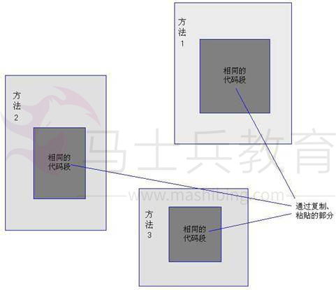

---

对于如图 2 所示的软件系统，如果需要修改深色部分的代码，只要修改一个地方即可，不管整个系统中
有多少地方调用了该方法，程序无须修改这些地方，只需修改被调用的方法即可——通过这种方式，大
大降低了软件后期维护的复杂度。
对于如图 2 所示的方法 1、方法 2、方法 3 依然需要显式调用深色方法，这样做能够解决大部分应用场
景。但对于一些更特殊的情况：应用需要方法 1、方法 2、方法 3 彻底与深色方法分离——方法 1、方法 
2、方法 3 无须直接调用深色方法，那如何解决？
因为软件系统需求变更是很频繁的事情，系统前期设计方法 1、方法 2、方法 3 时只实现了核心业务功
能，过了一段时间，我们需要为方法 1、方法 2、方法 3 都增加事务控制；又过了一段时间，客户提出
方法 1、方法 2、方法 3 需要进行用户合法性验证，只有合法的用户才能执行这些方法；又过了一段时
间，客户又提出方法 1、方法 2、方法 3 应该增加日志记录；又过了一段时间，客户又提出……面对这样
的情况，我们怎么办？通常有两种做法：
根据需求说明书，直接拒绝客户要求。
拥抱需求，满足客户的需求。
第一种做法显然不好，客户是上帝，我们应该尽量满足客户的需求。通常会采用第二种做法，那如何解
决呢？是不是每次先定义一个新方法，然后修改方法 1、方法 2、方法 3，增加调用新方法？这样做的工
作量也不小啊！我们希望有一种特殊的方法：我们只要定义该方法，无须在方法 1、方法 2、方法 3 中
显式调用它，系统会”自动”执行该特殊方法。
上面想法听起来很神奇，甚至有一些不切实际，但其实是完全可以实现的，实现这个需求的技术就是 
AOP。AOP 专门用于处理系统中分布于各个模块（不同方法）中的交叉关注点的问题，在 Java EE 应用
中，常常通过 AOP 来处理一些具有横切性质的系统级服务，如事务管理、安全检查、缓存、对象池管理
等，AOP 已经成为一种非常常用的解决方案。
使用 AspectJ 的编译时增强进行 AOP
 
AspectJ 是一个基于 Java 语言的 AOP 框架，提供了强大的 AOP 功能，其他很多 AOP 框架都借鉴或采
纳其中的一些思想。

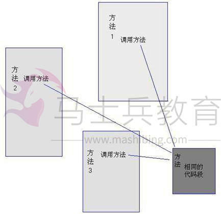

---

AspectJ 是 Java 语言的一个 AOP 实现，其主要包括两个部分：第一个部分定义了如何表达、定义 AOP 
编程中的语法规范，通过这套语言规范，我们可以方便地用 AOP 来解决 Java 语言中存在的交叉关注点
问题；另一个部分是工具部分，包括编译器、调试工具等。
AspectJ 是最早、功能比较强大的 AOP 实现之一，对整套 AOP 机制都有较好的实现，很多其他语言的 
AOP 实现，也借鉴或采纳了 AspectJ 中很多设计。在 Java 领域，AspectJ 中的很多语法结构基本上已成
为 AOP 领域的标准。
下载、安装 AspectJ 比较简单，读者登录 AspectJ 官网，即可下载到一个可执行的 JAR 包，使用 java -
jar aspectj-1.x.x.jar 命令、多次单击”Next”按钮即可成功安装 AspectJ。
成功安装了 AspectJ 之后，将会在 E:\Java\AOP\aspectj1.6 路径下（AspectJ 的安装路径）看到如下文件
结构：
bin：该路径下存放了 aj、aj5、ajc、ajdoc、ajbrowser 等命令，其中 ajc 命令最常用，它的作用
类似于 javac，用于对普通 Java 类进行编译时增强。
docs：该路径下存放了 AspectJ 的使用说明、参考手册、API 文档等文档。
lib：该路径下的 4 个 JAR 文件是 AspectJ 的核心类库。
相关授权文件。
一些文档、AspectJ 入门书籍，一谈到使用 AspectJ，就认为必须使用 Eclipse 工具，似乎离开了该工具
就无法使用 AspectJ 了。
虽然 AspectJ 是 Eclipse 基金组织的开源项目，而且提供了 Eclipse 的 AJDT 插件（AspectJ 
Development Tools）来开发 AspectJ 应用，但 AspectJ 绝对无须依赖于 Eclipse 工具。
实际上，AspectJ 的用法非常简单，就像我们使用 JDK 编译、运行 Java 程序一样。下面通过一个简单的
程序来示范 AspectJ 的用法，并分析 AspectJ 如何在编译时进行增强。
首先编写一个简单的 Java 类，这个 Java 类用于模拟一个业务组件。
清单 1.Hello.java
 
显示更多
上面 Hello 类模拟了一个业务逻辑组件，编译、运行该 Java 程序，这个结果是没有任何悬念的，程序将
在控制台打印”Hello AspectJ”字符串。
假设现在客户需要在执行 sayHello() 方法之前启动事务，当该方法执行结束时关闭事务，在传统编程模
式下，我们必须手动修改 sayHello() 方法——如果改为使用 AspectJ，则可以无须修改上面的 sayHello() 
方法。
下面我们定义一个特殊的 Java 类。
public class Hello
 {
 // 定义一个简单方法，模拟应用中的业务逻辑方法
 public void sayHello(){System.out.println("Hello AspectJ!");}
 // 主方法，程序的入口
 public static void main(String[] args)
 {
 Hello h = new Hello();
 h.sayHello();
 }
 }

---

清单 2.TxAspect.java
 
显示更多
可能读者已经发现了，上面类文件中不是使用 class、interface、enum 在定义 Java 类，而是使用了 
aspect ——难道 Java 语言又新增了关键字？没有！上面的 TxAspect 根本不是一个 Java 类，所以 
aspect 也不是 Java 支持的关键字，它只是 AspectJ 才能识别的关键字。
上面粗体字代码也不是方法，它只是指定当程序执行 Hello 对象的 sayHello() 方法时，系统将改为执行
粗体字代码的花括号代码块，其中 proceed() 代表回调原来的 sayHello() 方法。
正如前面提到的，Java 无法识别 TxAspect.java 文件的内容，所以我们要使用 ajc.exe 命令来编译上面
的 Java 程序。为了能在命令行使用 ajc.exe 命令，需要把 AspectJ 安装目录下的 bin 路径（比如 
E:\Java\AOP\aspectj1.6\bin 目录）添加到系统的 PATH 环境变量中。接下来执行如下命令进行编译：
ajc -d . Hello.java TxAspect.java
我们可以把 ajc.exe 理解成 javac.exe 命令，都用于编译 Java 程序，区别是 ajc.exe 命令可识别 AspectJ 
的语法；从这个意义上看，我们可以将 ajc.exe 当成一个增强版的 javac.exe 命令。
运行该 Hello 类依然无须任何改变，因为 Hello 类位于 lee 包下。程序使用如下命令运行 Hello 类：
java lee.Hello
运行该程序，将看到一个令人惊喜的结果：
开始事务 …
Hello AspectJ!
事务结束 …
从上面运行结果来看，我们完全可以不对 Hello.java 类进行任何修改，同时又可以满足客户的需求：上
面程序只是在控制台打印”开始事务 …”、”结束事务 …”来模拟了事务操作，实际上我们可用实际的事务操
作代码来代替这两行简单的语句，这就可以满足客户需求了。
如果客户再次提出新需求，需要在 sayHello() 方法后增加记录日志的功能，那也很简单，我们再定义一
个 LogAspect，程序如下：
清单 3.LogAspect.java
 
public aspect TxAspect
 {
 // 指定执行 Hello.sayHello() 方法时执行下面代码块
 void around():call(void Hello.sayHello()){System.out.println("开始事务 
...");proceed();System.out.println("事务结束 ...");}
 }
public aspect LogAspect
 {
 // 定义一个 PointCut，其名为 logPointcut
 // 该 PointCut 对应于指定 Hello 对象的 sayHello 方法
     pointcut logPointcut()
 :execution(void Hello.sayHello());
 // 在 logPointcut 之后执行下面代码块
     after():logPointcut()
     {
 System.out.println("记录日志 ...");
     }
 }

---

显示更多
上面程序的粗体字代码定义了一个 Pointcut：logPointcut – 等同于执行 Hello 对象的 sayHello() 方法，
并指定在 logPointcut 之后执行简单的代码块，也就是说，在 sayHello() 方法之后执行指定代码块。使
用如下命令来编译上面的 Java 程序：
ajc -d . *.java
再次运行 Hello 类，将看到如下运行结果：
开始事务 …
Hello AspectJ!
记录日志 …
事务结束 …
从上面运行结果来看，通过使用 AspectJ 提供的 AOP 支持，我们可以为 sayHello() 方法不断增加新功
能。
为什么在对 Hello 类没有任何修改的前提下，而 Hello 类能不断地、动态增加新功能呢？这看上去并不
符合 Java 基本语法规则啊。实际上我们可以使用 Java 的反编译工具来反编译前面程序生成的 
Hello.class 文件，发现 Hello.class 文件的代码如下：
清单 4.Hello.class
 
显示更多
package lee;
 import java.io.PrintStream;
 import org.aspectj.runtime.internal.AroundClosure;
 public class Hello
 {
  public void sayHello()
  {
    try
    {
      System.out.println("Hello AspectJ!"); } catch (Throwable localThrowable) {
      LogAspect.aspectOf().ajc$after$lee_LogAspect$1$9fd5dd97(); throw 
localThrowable; }
      LogAspect.aspectOf().ajc$after$lee_LogAspect$1$9fd5dd97();
  }
  ...
  private static final void sayHello_aroundBody1$advice(Hello target,
             TxAspect ajc$aspectInstance, AroundClosure ajc$aroundClosure)
  {
    System.out.println("开始事务 ...");
    AroundClosure localAroundClosure = ajc$aroundClosure; 
sayHello_aroundBody0(target);
    System.out.println("事务结束 ...");
  }
 }

---

不难发现这个 Hello.class 文件不是由原来的 Hello.java 文件编译得到的，该 Hello.class 里新增了很多
内容——这表明 AspectJ 在编译时”自动”编译得到了一个新类，这个新类增强了原有的 Hello.java 类的
功能，因此 AspectJ 通常被称为编译时增强的 AOP 框架。
提示：与 AspectJ 相对的还有另外一种 AOP 框架，它们不需要在编译时对目标类进行增强，而是运行时
生成目标类的代理类，该代理类要么与目标类实现相同的接口，要么是目标类的子类——总之，代理类
的实例可作为目标类的实例来使用。一般来说，编译时增强的 AOP 框架在性能上更有优势——因为运行
时动态增强的 AOP 框架需要每次运行时都进行动态增强。
实际上，AspectJ 允许同时为多个方法添加新功能，只要我们定义 Pointcut 时指定匹配更多的方法即
可。如下片段：
显示更多
上面程序中的 xxxPointcut 将可以匹配所有以 H 开头的类中、所有以 say 开头的方法，但该方法返回的
必须是 void；如果不想匹配任意的返回值类型，则可将代码改为如下形式：
pointcut xxxPointcut()
:execution( H.say*());
关于如何定义 AspectJ 中的 Aspect、Pointcut 等，读者可以参考 AspectJ 安装路径下的 doc 目录里的 
quick5.pdf 文件。
使用 Spring AOP
 
与 AspectJ 相同的是，Spring AOP 同样需要对目标类进行增强，也就是生成新的 AOP 代理类；与 
AspectJ 不同的是，Spring AOP 无需使用任何特殊命令对 Java 源代码进行编译，它采用运行时动态地、
在内存中临时生成”代理类”的方式来生成 AOP 代理。
Spring 允许使用 AspectJ Annotation 用于定义方面（Aspect）、切入点（Pointcut）和增强处理
（Advice），Spring 框架则可识别并根据这些 Annotation 来生成 AOP 代理。Spring 只是使用了和 
AspectJ 5 一样的注解，但并没有使用 AspectJ 的编译器或者织入器（ Weaver ），底层依然使用的是 
Spring AOP，依然是在运行时动态生成 AOP 代理，并不依赖于 AspectJ 的编译器或者织入器。
简单地说，Spring 依然采用运行时生成动态代理的方式来增强目标对象，所以它不需要增加额外的编
译，也不需要 AspectJ 的织入器支持；而 AspectJ 在采用编译时增强，所以 AspectJ 需要使用自己的编
译器来编译 Java 文件，还需要织入器。
为了启用 Spring 对 @AspectJ 方面配置的支持，并保证 Spring 容器中的目标 Bean 被一个或多个方面
自动增强，必须在 Spring 配置文件中配置如下片段：
pointcut xxxPointcut()
     :execution(void H*.say*());
<?xml version="1.0" encoding="GBK"?>
 <beans xmlns="http://www.springframework.org/schema/beans"
 xmlns:xsi="http://www.w3.org/2001/XMLSchema-instance"
 xmlns:aop="http://www.springframework.org/schema/aop"
 xsi:schemaLocation="http://www.springframework.org/schema/beans
 http://www.springframework.org/schema/beans/spring-beans-3.0.xsd
 http://www.springframework.org/schema/aop
 http://www.springframework.org/schema/aop/spring-aop-3.0.xsd">
 <!-- 启动 @AspectJ 支持 -->
 <aop:aspectj-autoproxy/>
 </beans>

---

显示更多
当然，如果我们希望完全启动 Spring 的”零配置”功能，则还需要启用 Spring 的”零配置”支持，让 
Spring 自动搜索指定路径下 Bean 类。
所谓自动增强，指的是 Spring 会判断一个或多个方面是否需要对指定 Bean 进行增强，并据此自动生成
相应的代理，从而使得增强处理在合适的时候被调用。
如果不打算使用 Spring 的 XML Schema 配置方式，则应该在 Spring 配置文件中增加如下片段来启用 
@AspectJ 支持。
显示更多
上面配置文件中的 AnnotationAwareAspectJAutoProxyCreator 是一个 Bean 后处理器
（BeanPostProcessor），该 Bean 后处理器将会为容器中 Bean 生成 AOP 代理，
当启动了 @AspectJ 支持后，只要我们在 Spring 容器中配置一个带 @Aspect 注释的 Bean，Spring 将
会自动识别该 Bean，并将该 Bean 作为方面 Bean 处理。
在 Spring 容器中配置方面 Bean（即带 @Aspect 注释的 Bean），与配置普通 Bean 没有任何区别，一
样使用 元素进行配置，一样支持使用依赖注入来配置属性值；如果我们启动了 Spring 的”零配置”特性，
一样可以让 Spring 自动搜索，并装载指定路径下的方面 Bean。
使用 @Aspect 标注一个 Java 类，该 Java 类将会作为方面 Bean，如下面代码片段所示：
显示更多
方面类（用 @Aspect 修饰的类）和其他类一样可以有方法、属性定义，还可能包括切入点、增强处理定
义。
当我们使用 @Aspect 来修饰一个 Java 类之后，Spring 将不会把该 Bean 当成组件 Bean 处理，因此负
责自动增强的后处理 Bean 将会略过该 Bean，不会对该 Bean 进行任何增强处理。
开发时无须担心使用 @Aspect 定义的方面类被增强处理，当 Spring 容器检测到某个 Bean 类使用了 
@Aspect 标注之后，Spring 容器不会对该 Bean 类进行增强。
下面将会考虑采用 Spring AOP 来改写前面介绍的例子：
下面例子使用一个简单的 Chinese 类来模拟业务逻辑组件：
清单 5.Chinese.java
 
<!-- 启动 @AspectJ 支持 -->
 <bean class="org.springframework.aop.aspectj.annotation.
     AnnotationAwareAspectJAutoProxyCreator"/>
// 使用 @Aspect 定义一个方面类
 @Aspect
 public class LogAspect
 {
 // 定义该类的其他内容
 ...
 }
@Component
 public class Chinese
 {
 // 实现 Person 接口的 sayHello() 方法
     public String sayHello(String name)

---

显示更多
提供了上面 Chinese 类之后，接下来假设同样需要为上面 Chinese 类的每个方法增加事务控制、日志记
录，此时可以考虑使用 Around、AfterReturning 两种增强处理。
先看 AfterReturning 增强处理代码。
清单 6.AfterReturningAdviceTest.java
 
显示更多
上面 Aspect 类使用了 @Aspect 修饰，这样 Spring 会将它当成一个方面 Bean 进行处理。其中程序中粗
体字代码指定将会在调用 org.crazyit.app.service.impl 包下的所有类的所有方法之后织入 log(Object 
rvt) 方法。
再看 Around 增强处理代码：
清单 7.AfterReturningAdviceTest.java
 
     {
    System.out.println("-- 正在执行 sayHello 方法 --");
 // 返回简单的字符串
         return name + " Hello , Spring AOP";
     }
 // 定义一个 eat() 方法
     public void eat(String food)
     {
    System.out.println("我正在吃 :"+ food);
     }
 }
// 定义一个方面
 @Aspect
 public class AfterReturningAdviceTest
 {
 // 匹配 org.crazyit.app.service.impl 包下所有类的、
 // 所有方法的执行作为切入点
 @AfterReturning(returning="rvt",
 pointcut="execution(* org.crazyit.app.service.impl.*.*(..))")
 public void log(Object rvt)
 {
 System.out.println("获取目标方法返回值 :" + rvt);
 System.out.println("模拟记录日志功能 ...");
 }
 }
// 定义一个方面
 @Aspect
 public class AroundAdviceTest
 {
 // 匹配 org.crazyit.app.service.impl 包下所有类的、
 // 所有方法的执行作为切入点
 @Around("execution(* org.crazyit.app.service.impl.*.*(..))")
 public Object processTx(ProceedingJoinPoint jp)
 throws java.lang.Throwable
 {
 System.out.println("执行目标方法之前，模拟开始事务 ...");
 // 执行目标方法，并保存目标方法执行后的返回值

---

显示更多
与前面的 AfterReturning 增强处理类似的，此处同样使用了 @Aspect 来修饰前面 Bean，其中粗体字代
码指定在调用 org.crazyit.app.service.impl 包下的所有类的所有方法的”前后（Around）” 织入 
processTx(ProceedingJoinPoint jp) 方法
需要指出的是，虽然此处只介绍了 Spring AOP 的 AfterReturning、Around 两种增强处理，但实际上 
Spring 还支持 Before、After、AfterThrowing 等增强处理，关于 Spring AOP 编程更多、更细致的编
程细节，可以参考《轻量级 Java EE 企业应用实战》一书。
本示例采用了 Spring 的零配置来开启 Spring AOP，因此上面 Chinese 类使用了 @Component 修饰，
而方面 Bean 则使用了 @Aspect 修饰，方面 Bean 中的 Advice 则分别使用了 @AfterReturning、
@Around 修饰。接下来只要为 Spring 提供如下配置文件即可：
清单 8.bean.xml
 
显示更多
接下来按传统方式来获取 Spring 容器中 chinese Bean、并调用该 Bean 的两个方法，程序代码如下：
清单 9.BeanTest.java
 
 Object rvt = jp.proceed(new String[]{"被改变的参数"});
 System.out.println("执行目标方法之后，模拟结束事务 ...");
 return rvt + " 新增的内容";
 }
 }
<?xml version="1.0" encoding="GBK"?>
 <beans xmlns="http://www.springframework.org/schema/beans"
 xmlns:xsi="http://www.w3.org/2001/XMLSchema-instance"
 xmlns:context="http://www.springframework.org/schema/context"
 xmlns:aop="http://www.springframework.org/schema/aop"
 xsi:schemaLocation="http://www.springframework.org/schema/beans
 http://www.springframework.org/schema/beans/spring-beans-3.0.xsd
 http://www.springframework.org/schema/context
 http://www.springframework.org/schema/context/spring-context-3.0.xsd
 http://www.springframework.org/schema/aop
 http://www.springframework.org/schema/aop/spring-aop-3.0.xsd">
 <!-- 指定自动搜索 Bean 组件、自动搜索方面类 -->
 <context:component-scan base-package="org.crazyit.app.service
 ,org.crazyit.app.advice">
 <context:include-filter type="annotation"
 expression="org.aspectj.lang.annotation.Aspect"/>
 </context:component-scan>
 <!-- 启动 @AspectJ 支持 -->
 <aop:aspectj-autoproxy/>
 </beans>

---

显示更多
从上面开发过程可以看出，对于 Spring AOP 而言，开发者提供的业务组件、方面 Bean 并没有任何特
别的地方。只是方面 Bean 需要使用 @Aspect 修饰即可。程序不需要使用特别的编译器、织入器进行处
理。
运行上面程序，将可以看到如下执行结果：
执行目标方法之前，模拟开始事务 …
— 正在执行 sayHello 方法 —
执行目标方法之后，模拟结束事务 …
获取目标方法返回值 : 被改变的参数 Hello , Spring AOP 新增的内容
模拟记录日志功能 …
被改变的参数 Hello , Spring AOP 新增的内容
执行目标方法之前，模拟开始事务 …
我正在吃 : 被改变的参数
执行目标方法之后，模拟结束事务 …
获取目标方法返回值 :null 新增的内容
模拟记录日志功能 …
虽然程序是在调用 Chinese 对象的 sayHello、eat 两个方法，但从上面运行结果不难看出：实际执行的
绝对不是 Chinese 对象的方法，而是 AOP 代理的方法。也就是说，Spring AOP 同样为 Chinese 类生成
了 AOP 代理类。这一点可通过在程序中增加如下代码看出：
System.out.println(p.getClass());
上面代码可以输出 p 变量所引用对象的实现类，再次执行程序将可以看到上面代码产生 class 
org.crazyit.app.service.impl.Chinese$$EnhancerByCGLIB$$290441d2 的输出，这才是 p 变量所引用
的对象的实现类，这个类也就是 Spring AOP 动态生成的 AOP 代理类。从 AOP 代理类的类名可以看
出，AOP 代理类是由 CGLIB 来生成的。
如果将上面程序程序稍作修改：只要让上面业务逻辑类 Chinese 类实现一个任意接口——这种做法更符
合 Spring 所倡导的”面向接口编程”的原则。假设程序为 Chinese 类提供如下 Person 接口，并让 
Chinese 类实现该接口：
public class BeanTest
 {
 public static void main(String[] args)
 {
 // 创建 Spring 容器
 ApplicationContext ctx = new
 ClassPathXmlApplicationContext("bean.xml");
 Chinese p = ctx.getBean("chinese" ,Chinese.class);
 System.out.println(p.sayHello("张三"));
 p.eat("西瓜");
 }
 }

---

清单 10.Person.java
 
显示更多
接下来让 BeanTest 类面向 Person 接口、而不是 Chinese 类编程。即将 BeanTest 类改为如下形式：
清单 11.BeanTest.java
 
显示更多
原来的程序是将面向 Chinese 类编程，现在将该程序改为面向 Person 接口编程，再次运行该程序，程
序运行结果没有发生改变。只是 System.out.println(p.getClass()); 将会输出 class $Proxy7，这说明此
时的 AOP 代理并不是由 CGLIB 生成的，而是由 JDK 动态代理生成的。
Spring AOP 框架对 AOP 代理类的处理原则是：如果目标对象的实现类实现了接口，Spring AOP 将会采
用 JDK 动态代理来生成 AOP 代理类；如果目标对象的实现类没有实现接口，Spring AOP 将会采用 
CGLIB 来生成 AOP 代理类——不过这个选择过程对开发者完全透明、开发者也无需关心。
Spring AOP 会动态选择使用 JDK 动态代理、CGLIB 来生成 AOP 代理，如果目标类实现了接口，Spring 
AOP 则无需 CGLIB 的支持，直接使用 JDK 提供的 Proxy 和 InvocationHandler 来生成 AOP 代理即可。
关于如何 Proxy 和 InvocationHandler 来生成动态代理不在本文介绍范围之内，如果读者对 Proxy 和 
InvocationHandler 的用法感兴趣则可自行参考 Java API 文档或《疯狂 Java 讲义》。
Spring AOP 原理剖析
 
通过前面介绍可以知道：AOP 代理其实是由 AOP 框架动态生成的一个对象，该对象可作为目标对象使
用。AOP 代理包含了目标对象的全部方法，但 AOP 代理中的方法与目标对象的方法存在差异：AOP 方
法在特定切入点添加了增强处理，并回调了目标对象的方法。
AOP 代理所包含的方法与目标对象的方法示意图如图 3 所示。
图 3.AOP 代理的方法与目标对象的方法
 
public interface Person
 {
 String sayHello(String name);
 void eat(String food);
 }
public class BeanTest
 {
 public static void main(String[] args)
 {
 // 创建 Spring 容器
 ApplicationContext ctx = new
 ClassPathXmlApplicationContext("bean.xml");
 Person p = ctx.getBean("chinese" ,Person.class);
 System.out.println(p.sayHello("张三"));
 p.eat("西瓜");
 System.out.println(p.getClass());
 }
 }

---

Spring 的 AOP 代理由 Spring 的 IoC 容器负责生成、管理，其依赖关系也由 IoC 容器负责管理。因此，
AOP 代理可以直接使用容器中的其他 Bean 实例作为目标，这种关系可由 IoC 容器的依赖注入提供。
纵观 AOP 编程，其中需要程序员参与的只有 3 个部分：
定义普通业务组件。
定义切入点，一个切入点可能横切多个业务组件。
定义增强处理，增强处理就是在 AOP 框架为普通业务组件织入的处理动作。
上面 3 个部分的第一个部分是最平常不过的事情，无须额外说明。那么进行 AOP 编程的关键就是定义
切入点和定义增强处理。一旦定义了合适的切入点和增强处理，AOP 框架将会自动生成 AOP 代理，而 
AOP 代理的方法大致有如下公式：
代理对象的方法 = 增强处理 + 被代理对象的方法
在上面这个业务定义中，不难发现 Spring AOP 的实现原理其实很简单：AOP 框架负责动态地生成 AOP 
代理类，这个代理类的方法则由 Advice 和回调目标对象的方法所组成。
对于前面提到的图 2 所示的软件调用结构：当方法 1、方法 2、方法 3……都需要去调用某个具有”横切”
性质的方法时，传统的做法是程序员去手动修改方法 1、方法 2、方法 3……、通过代码来调用这个具有”
横切”性质的方法，但这种做法的可扩展性不好，因为每次都要改代码。
于是 AOP 框架出现了，AOP 框架则可以”动态的”生成一个新的代理类，而这个代理类所包含的方法 1、
方法 2、方法 3……也增加了调用这个具有”横切”性质的方法——但这种调用由 AOP 框架自动生成的代理
类来负责，因此具有了极好的扩展性。程序员无需手动修改方法 1、方法 2、方法 3 的代码，程序员只
要定义切入点即可—— AOP 框架所生成的 AOP 代理类中包含了新的方法 1、访法 2、方法 3，而 AOP 
框架会根据切入点来决定是否要在方法 1、方法 2、方法 3 中回调具有”横切”性质的方法。
简而言之：AOP 原理的奥妙就在于动态地生成了代理类，这个代理类实现了图 2 的调用——这种调用无
需程序员修改代码。接下来介绍的 CGLIB 就是一个代理生成库，下面介绍如何使用 CGLIB 来生成代理
类。
使用 CGLIB 生成代理类
 
CGLIB（Code Generation Library），简单来说，就是一个代码生成类库。它可以在运行时候动态是生
成某个类的子类。
此处使用前面定义的 Chinese 类，现在改为直接使用 CGLIB 来生成代理，这个代理类同样可以实现 
Spring AOP 代理所达到的效果。
下面先为 CGLIB 提供一个拦截器实现类：

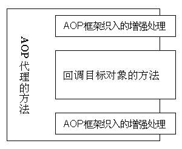

---

清单 12.AroundAdvice.java
 
显示更多
上面这个 AroundAdvice.java 的作用就像前面介绍的 Around Advice，它可以在调用目标方法之前、调
用目标方法之后织入增强处理。
接下来程序提供一个 ChineseProxyFactory 类，这个 ChineseProxyFactory 类会通过 CGLIB 来为 
Chinese 生成代理类：
清单 13.ChineseProxyFactory.java
 
显示更多
上面粗体字代码就是使用 CGLIB 的 Enhancer 生成代理对象的关键代码，此时的 Enhancer 将以 
Chinese 类作为目标类，以 AroundAdvice 对象作为”Advice”，程序将会生成一个 Chinese 的子类，这
个子类就是 CGLIB 生成代理类，它可作为 Chinese 对象使用，但它增强了 Chinese 类的方法。
测试 Chinese 代理类的主程序如下：
清单 14.Main.java
 
public class AroundAdvice implements MethodInterceptor
 {
 public Object intercept(Object target, Method method
 , Object[] args, MethodProxy proxy)
 throws java.lang.Throwable
 {
 System.out.println("执行目标方法之前，模拟开始事务 ...");
 // 执行目标方法，并保存目标方法执行后的返回值
 Object rvt = proxy.invokeSuper(target, new String[]{"被改变的参数"});
 System.out.println("执行目标方法之后，模拟结束事务 ...");
 return rvt + " 新增的内容";
 }
 }
public class ChineseProxyFactory
 {
 public static Chinese getAuthInstance()
 {
 Enhancer en = new Enhancer();
 // 设置要代理的目标类
 en.setSuperclass(Chinese.class);
 // 设置要代理的拦截器
 en.setCallback(new AroundAdvice());
 // 生成代理类的实例
 return (Chinese)en.create();
 }
 }

---

显示更多
运行上面主程序，看到如下输出结果：
执行目标方法之前，模拟开始事务 …
— 正在执行 sayHello 方法 —
执行目标方法之后，模拟结束事务 …
被改变的参数 Hello , CGLIB 新增的内容
执行目标方法之前，模拟开始事务 …
我正在吃 : 被改变的参数
执行目标方法之后，模拟结束事务 …
class lee.Chinese$$EnhancerByCGLIB$$4bd097d9
从上面输出结果来看，CGLIB 生成的代理完全可以作为 Chinese 对象来使用，而且 CGLIB 代理对象的 
sayHello()、eat() 两个方法已经增加了事务控制（只是模拟），这个 CGLIB 代理其实就是 Spring AOP 
所生成的 AOP 代理。
通过程序最后的输出，不难发现这个代理对象的实现类是 
lee.Chinese$$EnhancerByCGLIB$$4bd097d9，这就是 CGLIB 所生成的代理类，这个代理类的格式与
前面 Spring AOP 所生成的代理类的格式完全相同。
这就是 Spring AOP 的根本所在：Spring AOP 就是通过 CGLIB 来动态地生成代理对象，这个代理对象
就是所谓的 AOP 代理，而 AOP 代理的方法则通过在目标对象的切入点动态地织入增强处理，从而完成
了对目标方法的增强。
结束语
 
AOP 广泛应用于处理一些具有横切性质的系统级服务，AOP 的出现是对 OOP 的良好补充，它使得开发
者能用更优雅的方式处理具有横切性质的服务。不管是那种 AOP 实现，不论是 AspectJ、还是 Spring 
AOP，它们都需要动态地生成一个 AOP 代理类，区别只是生成 AOP 代理类的时机不同：AspectJ 采用
编译时生成 AOP 代理类，因此具有更好的性能，但需要使用特定的编译器进行处理；而 Spring AOP 则
采用运行时生成 AOP 代理类，因此无需使用特定编译器进行处理。由于 Spring AOP 需要在每次运行时
生成 AOP 代理，因此性能略差一些。
 
 
 
 
 
public class Main
 {
 public static void main(String[] args)
 {
 Chinese chin = ChineseProxyFactory.getAuthInstance();
 System.out.println(chin.sayHello("孙悟空"));
 chin.eat("西瓜");
 System.out.println(chin.getClass());
 }
 }

---

JDK Proxy
Cglib Proxy
只能代理接口
以继承的方式完成代理，不能代理被final修饰的类
 
JDK Proxy
Cglib Proxy
生成代理类时间
1'060.766
960.527
方法调用时间
0.008
0.003
来源
JDK原生代码
第三方库，更新频率较低
spring AOP 两种代理方式
 
回答为什么要用什么方法这种问题的时候，通常首先要回答两个问题，第一个就是，我要做什么事情，
第二个就是，不同方法的优劣是什么。
首先，我要做什么事情。
这里的回答比较简单，就是代理Java类/接口。那么，两者在完成这件事情上，有什么差别呢
实际上，大部分的Java类都会以接口-实现的方式来完成，因此，在这个方面上，JDK Proxy实际上是比
Cglib Proxy要更胜一筹的。因为如果一个类被final修饰，则Cglib Proxy无法进行代理。
其次，两种方法的优劣又在什么地方呢？
我们可以参考一下来自bytebuddy的数据，这个是在代理一个实现了具有18个方法的接口的类，时间单
位为ns。
不难看出，其实Cglib代理的性能是要远远好于JDK代理的。
其实从原理也能理解，直接通过类的方法调用，肯定要比通过反射调用的时间更短。但是从来源来看的
话，一个是JDK原生代码，而另一个则是第三方的开源库。JDK原生代码无疑使用的人会更多范围也更
广，会更佳稳定，而且还有可能在未来的JDK版本中不断优化性能。
而Cglib更新频率相对来说比较低了，一方面是因为这个代码库已经渐趋稳定，另一方面也表明后续这个
库可能相对来说不会有大动作的优化维护。
对比完之后，再来回看这个问题，为什么要使用两种方式呢？
在功能上讲，实际上Cglib代理并不如JDK代理（如果大家都按接口-实现的方式来设计类）。但是从效率
上将，Cglib远胜JDK代理啊！所以，为了提高效率，同时又保有在未来，当JDK代理的性能也能够同样好
的时候，使用更佳稳定靠谱的JDK代码，这种可能，于是采取了这种设计。
 
 
 
 
Spring 如何保证 Controller 并发的安全？

---

springMVC一个Controller处理所有用户请求的并发问题
 
 
有状态和无状态的对象基本概念： 
有状态对象(Stateful Bean)，就是有实例变量的对象 ，可以保存数据，是非线程安全的。一般是
prototype scope。
无状态对象(Stateless Bean)，就是没有实例变量的对象，不能保存数据，是不变类，是线程安全的。一
般是singleton scope。
如Struts2中的Action，假如内部有实例变量User，当调用新增用户方法时，user是用来保存数据，那么
此action是有状态对象。多个线程同时访问此action时 会造成user变量的不一致。所以action的scope
要设计成prototype，或者，User类放到threadLocal里来保持多个线程不会造成User变量的乱串（此种
场景没必要放到threadLocal内）。
而Service内部一般只有dao实例变量 如userDao, 因为userDao是无状态的对象（内部无实例变量且不
能保存数据），所以service也是无状态的对象。
*public  class* XxxAction{
   // 由于多线程环境下，user是引用对象，是非线程安全的 
  *public* User user;
  ......
}
*public  class* XxxService {  
  // 虽然有billDao属性，但billDao是没有状态信息的，是Stateless Bean.  
  BillDao billDao;  
  ......
}
对于那些会以多线程运行的单例类
局部变量不会受多线程影响，
成员变量会受到多线程影响。
多个线程调用同一个对象的同一个方法： 
如果方法里无局部变量，那么不受任何影响；
如果方法里有局部变量，只有读操作，不受影响；存在写操作，考虑多线程影响值；
例如Web应用中的Servlet，每个方法中对局部变量的操作都是在线程自己独立的内存区域内完成的，所
以是线程安全的。 
对于成员变量的操作，可以使用ThreadLocal来保证线程安全。 
 
springMVC中，一般Controller、service、DAO层的scope均是singleton；
每个请求都是单独的线程,即使同时访问同一个Controller对象，因为并没有修改Controller对象，相当
于针对Controller对象而言，只是读操作，没有写操作，不需要做同步处理。
 
Service层、Dao层用默认singleton就行，虽然Service类也有dao这样的属性，但dao这些类都是没有状
态信息的，也就是 相当于不变(immutable)类，所以不影响。

---

Struts2中的Action因为会有User、BizEntity这样的实例对象，是有状态信息 的，在多线程环境下是不
安全的，所以Struts2默认的实现是Prototype模式。在Spring中，Struts2的Action中scope 要配成
prototype作用域。
 
 
Spring并发访问的线程安全性问题
 
由于Spring MVC默认是Singleton的，所以会产生一个潜在的安全隐患。根本核心是instance变量保持
状态的问题。这意味着每个request过来，系统都会用原有的instance去处理，这样导致了两个结果：
一是我们不用每次创建Controller，
二是减少了对象创建和垃圾收集的时间；
由于只有一个Controller的instance，当多个线程同时调用它的时候，它里面的instance变量就不是线程
安全的了，会发生窜数据的问题。
当然大多数情况下，我们根本不需要考虑线程安全的问题，比如dao,service等，除非在bean中声明了实
例变量。因此，我们在使用spring mvc 的contrller时，应避免在controller中定义实例变量。 
如：
 
在这里有声明一个变量company，这里就存在并发线程安全的问题。
如果控制器是使用单例形式，且controller中有一个私有的变量a,所有请求到同一个controller时，使用
的a变量是共用的，即若是某个请求中修改了这个变量a，则，在别的请求中能够读到这个修改的内
容。。
有几种解决方法：
1、在控制器中不使用实例变量
2、将控制器的作用域从单例改为原型，即在spring配置文件Controller中声明 scope="prototype"，每
次都创建新的controller
3、在Controller中使用ThreadLocal变量
这几种做法有好有坏，第一种，需要开发人员拥有较高的编程水平与思想意识，在编码过程中力求避免
出现这种BUG，而第二种则是容器自动的对每个请求产生一个实例，由JVM进行垃圾回收，因此做到了
线程安全。
使用第一种方式的好处是实例对象只有一个，所有的请求都调用该实例对象，速度和性能上要优于第二
种，不好的地方，就是需要程序员自己去控制实例变量的状态保持问题。第二种由于每次请求都创建一
个实例，所以会消耗较多的内存空间。
所以在使用spring开发web 时要注意，默认Controller、Dao、Service都是单例的
 
 
 
publicclassControllerextendsAbstractCommandController{
......
protectedModelAndView handle(HttpServletRequest request,HttpServletResponse 
response,
Object command,BindException errors)throwsException{
company =................;
}
protectedCompany company;
}

---

spring中用到哪些设计模式？
 
 
1.工厂模式，这个很明显，在各种BeanFactory以及ApplicationContext创建中都用到了；
2.模版模式，这个也很明显，在各种BeanFactory以及ApplicationContext实现中也都用到了；
3.代理模式，在Aop实现中用到了JDK的动态代理；
4.单例模式，这个比如在创建bean的时候。
5.Tomcat中有很多场景都使用到了外观模式，因为Tomcat中有很多不同的组件，每个组件需要相互通
信，但又不能将自己内部数据过多地暴露给其他组件。用外观模式隔离数据是个很好的方法。
6.策略模式在Java中的应用，这个太明显了，因为Comparator这个接口简直就是为策略模式而生的。
Comparable和Comparator的区别一文中，详细讲了Comparator的使用。比方说Collections里面有一
个sort方法，因为集合里面的元素有可能是复合对象，复合对象并不像基本数据类型，可以根据大小排
序，复合对象怎么排序呢？基于这个问题考虑，Java要求如果定义的复合对象要有排序的功能，就自行
实现Comparable接口或Comparator接口.
7.原型模式：使用原型模式创建对象比直接new一个对象在性能上好得多，因为Object类的clone()方法
是一个native方法，它直接操作内存中的二进制流，特别是复制大对象时，性能的差别非常明显。
8.迭代器模式：Iterable接口和Iterator接口 这两个都是迭代相关的接口，可以这么认为，实现了
Iterable接口，则表示某个对象是可被迭代的；Iterator接口相当于是一个迭代器，实现了Iterator接
口，等于具体定义了这个可被迭代的对象时如何进行迭代的
 
 
Spring IOC 的理解，其初始化过程？
 
 
IoC容器是什么？
IoC文英全称Inversion of Control，即控制反转，我么可以这么理解IoC容器：
  “把某些业务对象的的控制权交给一个平台或者框架来同一管理，这个同一管理的平台可以称为IoC
容器。”
我们刚开始学习spring的时候会经常看到的类似下面的这代码：
上面代码中，在创建ApplicationContext实例对象过程中会创建一个spring容器，该容器会读取配置文
件"cjj/models/beans.xml",并统一管理由该文件中定义好的所有bean实例对象，如果要获取某个bean
实例，使用getBean方法就行了。例如我们只需要将Person提前配置在beans.xml文件中（可以理解为
注入），之后我们可以不需使用new Person()的方式创建实例，而是通过容器来获取Person实例，这就
相当于将Person的控制权交由spring容器了，差不多这就是控制反转的概念。
那在创建IoC容器时经历了哪些呢？为此，先来了解下Spring中IoC容器分类，继而根据一个具体的容器
来讲解IoC容器初始化的过程。
Spring中有两个主要的容器系列：
1. 实现BeanFactory接口的简单容器；
2. 实现ApplicationContext接口的高级容器。
ApplicationContext appContext = new 
ClassPathXmlApplicationContext("cjj/models/beans.xml");
Person p = (Person)appContext.getBean("person");

---

ApplicationContext比较复杂，它不但继承了BeanFactory的大部分属性，还继承其它可扩展接口，扩
展的了许多高级的属性，其接口定义如下：
 
 
在BeanFactory子类中有一个DefaultListableBeanFactory类，它包含了基本Spirng IoC容器所具有的
重要功能，开发时不论是使用BeanFactory系列还是ApplicationContext系列来创建容器基本都会使用
到DefaultListableBeanFactory类，可以这么说，在spring中实际上把它当成默认的IoC容器来使用。下
文在源码实例分析时你将会看到这个类。
（注：文章有点长，需要细心阅读，不同版本的spring中源码可能不同，但逻辑几乎是一样的，如果可
以建议还是看源码 ^_^）
 
回到本文正题上来，关于Spirng IoC容器的初始化过程在《Spirng技术内幕：深入解析Spring架构与设
计原理》一书中有明确的指出，IoC容器的初始化过程可以分为三步：
1. Resource定位（Bean的定义文件定位）
2. 将Resource定位好的资源载入到BeanDefinition
3. 将BeanDefiniton注册到容器中
 
第一步 Resource定位
Resource是Sping中用于封装I/O操作的接口。正如前面所见，在创建spring容器时，通常要访问XML配
置文件，除此之外还可以通过访问文件类型、二进制流等方式访问资源，还有当需要网络上的资源时可
以通过访问URL，Spring把这些文件统称为Resource，Resource的体系结构如下:
常用的resource资源类型如下：
  FileSystemResource：以文件的绝对路径方式进行访问资源，效果类似于Java中的File;
  ClassPathResourcee：以类路径的方式访问资源，效果类似于
this.getClass().getResource("/").getPath();
public interface ApplicationContext extends EnvironmentCapable, 
                  ListableBeanFactory,    //继承于
BeanFactory                  HierarchicalBeanFactory,//继承于
BeanFactory
                  MessageSource,            
//                  
ApplicationEventPublisher,//                  ResourcePatternResolver 
  //继承ResourceLoader，用于获取resource对象

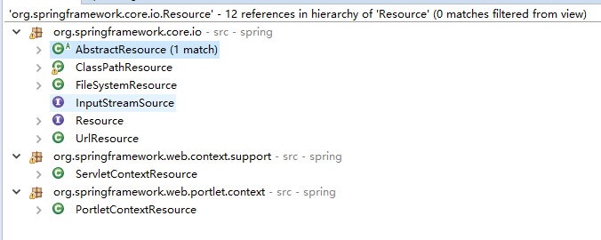

---

ServletContextResource：web应用根目录的方式访问资源，效果类似于
request.getServletContext().getRealPath("");
  UrlResource：访问网络资源的实现类。例如file: http: ftp:等前缀的资源对象;
  ByteArrayResource: 访问字节数组资源的实现类。
那如何获取上图中对应的各种Resource对象呢？
Spring提供了ResourceLoader接口用于实现不同的Resource加载策略，该接口的实例对象中可以获取
一个resource对象，也就是说将不同Resource实例的创建交给ResourceLoader的实现类来处理。
ResourceLoader接口中只定义了两个方法：
注：ApplicationContext的所有实现类都实现RecourceLoader接口，因此可以直接调用
getResource（参数）获取Resoure对象。不同的ApplicatonContext实现类使用getResource方法取得
的资源类型不同，例如：FileSystemXmlApplicationContext.getResource获取的就是
FileSystemResource实例；ClassPathXmlApplicationContext.gerResource获取的就是
ClassPathResource实例；XmlWebApplicationContext.getResource获取的就是
ServletContextResource实例，另外像不需要通过xml直接使用注解@Configuation方式加载资源的
AnnotationConfigApplicationContext等等。
在资源定位过程完成以后，就为资源文件中的bean的载入创造了I/O操作的条件，如何读取资源中的数
据将会在下一步介绍的BeanDefinition的载入过程中描述。
 
*第二步 通过返回的*resource对象，进行BeanDefinition的载入
1.什么是BeanDefinition? BeanDefinition与Resource的联系呢？
  官方文档中对BeanDefinition的解释如下：
  A BeanDefinition describes a bean instance, which has property values, constructor argument 
values, and further information supplied by concrete implementations.
它们之间的联系从官方文档描述的一句话：Load bean definitions from the specified resource中可见
一斑。
 
 
  总之，BeanDefinition相当于一个数据结构，这个数据结构的生成过程是根据定位的resource资源
对象中的bean而来的，这些bean在Spirng IoC容器内部表示成了的BeanDefintion这样的数据结构，
IoC容器对bean的管理和依赖注入的实现都是通过操作BeanDefinition来进行的。
2.如何将BeanDefinition载入到容器？
  在Spring中配置文件主要格式是XML，对于用来读取XML型资源文件来进行初始化的IoC 容器而
言，该类容器会使用到AbstractXmlApplicationContext类，该类定义了一个名为
loadBeanDefinitions(DefaultListableBeanFactory beanFactory) 的方法用于获取BeanDefinition：
Resource getResource(String location); //通过提供的资源location参数获取Resource实例
ClassLoader getClassLoader(); // 获取ClassLoader,通过ClassLoader可将资源载入JVM
  /**
     * Load bean definitions from the specified resource.
     * @param resource the resource descriptor
     * @return the number of bean definitions found
     * @throws BeanDefinitionStoreException in case of loading or parsing errors
     */
    int loadBeanDefinitions(Resource resource) throws 
BeanDefinitionStoreException;

---

此方法在具体执行过程中首先会new一个与容器对应的BeanDefinitionReader型实例对象，然后将生成
的BeanDefintionReader实例作为参数传入loadBeanDefintions(XmlBeanDefinitionReader)，继续往
下执行载入BeanDefintion的过程。例如AbstractXmlApplicationContext有两个实现类：
FileSystemXmlApplicationContext、ClassPathXmlApplicationContext，这些容器在调用此方法时会
创建一个XmlBeanDefinitionReader类对象专门用来载入所有的BeanDefinition。
下面以XmlBeanDefinitionReader对象载入BeanDefinition为例，使用源码说明载入BeanDefinition的
过程：
 
 
通过上面代码将用户定义的资源以及容器本身需要的资源全部加载到reader中，
reader.loadBeanDefinitions方法的源码如下：
 
// 该方法属于AbstractXmlApplicationContect类
protected void loadBeanDefinitions(DefaultListableBeanFactory beanFactory) throws 
BeansException, IOException {
    XmlBeanDefinitionReader beanDefinitionReader = new 
XmlBeanDefinitionReader(beanFactory);
    beanDefinitionReader.setEnvironment(this.getEnvironment());
    beanDefinitionReader.setResourceLoader(this);
    beanDefinitionReader.setEntityResolver(new ResourceEntityResolver(this));
    this.initBeanDefinitionReader(beanDefinitionReader);
    // 用于获取BeanDefinition
    this.loadBeanDefinitions(beanDefinitionReader);
}
// 该方法属于AbstractXmlApplicationContect类protected void 
loadBeanDefinitions(XmlBeanDefinitionReader reader) throws BeansException, 
IOException {
        Resource[] configResources = getConfigResources();//获取所有定位到的
resource资源位置（用户定义）
        if (configResources != null) {
            reader.loadBeanDefinitions(configResources);//载入resources
        }
        String[] configLocations = getConfigLocations();//获取所有本地配置文件的位置
（容器自身）
        if (configLocations != null) {
            reader.loadBeanDefinitions(configLocations);//载入resources
        }
}

---

BeanDefinitionReader接口定义了 int loadBeanDefinitions（Resource resource）方法：
XmlBeanDefinitionReader 类实现了BeanDefinitionReader接口中的loadBeanDefinitions(Resource)
方法，其继承关系如上图所示。XmlBeanDefinitionReader类中几主要对加载的所有resource开始进行
处理，大致过程是，先将resource包装为EncodeResource类型，然后处理，为生成BeanDefinition对
象做准备，其主要几个方法的源码如下：
 
// 该方法属于AbstractBeanDefinitionReader类, 父接口BeanDefinitionReader
@Override
public int loadBeanDefinitions(Resource... resources) throws 
BeanDefinitionStoreException {
    Assert.notNull(resources, "Resource array must not be null");
    int counter = 0;
    for (Resource resource : resources) {
        // 将所有资源全部加载，交给AbstractBeanDefinitionReader的实现子类处理这些
resource
        counter += loadBeanDefinitions(resource);
    }
    return counter;
}
int loadBeanDefinitions(Resource resource) throws BeanDefinitionStoreException;
int loadBeanDefinitions(Resource... resources) throws 
BeanDefinitionStoreException;
    public int loadBeanDefinitions(Resource resource) throws 
BeanDefinitionStoreException {
        // 包装resource为EncodeResource类型
        return loadBeanDefinitions(new EncodedResource(resource)); 
    }
    // 加载包装后的EncodeResource资源
    public int loadBeanDefinitions(EncodedResource encodedResource) throws 
BeanDefinitionStoreException {
        Assert.notNull(encodedResource, "EncodedResource must not be null");
        if (logger.isInfoEnabled()) {
            logger.info("Loading XML bean definitions from " + 
encodedResource.getResource());
        }

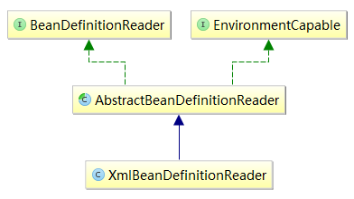

---

DefaultDocumentLoader大致了解即可，感兴趣可继续深究，其源码如下：（看完收起，便于阅读下
文）
 View Code
上面代码分析到了registerBeanDefinitions(doc, resource)这一步，也就是准备将Document中的Bean
按照Spring bean语义进行解析并转化为BeanDefinition类型，这个方法的具体过程如下：
        try {
            // 通过resource对象得到XML文件内容输入流，并为IO的InputSource做准备
            InputStream inputStream = 
encodedResource.getResource().getInputStream();
            try {
                // Create a new input source with a byte stream.
                InputSource inputSource = new InputSource(inputStream);
                if (encodedResource.getEncoding() != null) {
                    inputSource.setEncoding(encodedResource.getEncoding());
                }
                // 开始准备 load bean definitions from the specified XML file
                return doLoadBeanDefinitions(inputSource, 
encodedResource.getResource());
            }
            finally {
                inputStream.close();
            }
        }
        catch (IOException ex) {
            throw new BeanDefinitionStoreException(
                    "IOException parsing XML document from " + 
encodedResource.getResource(), ex);
        }
    }
    protected int doLoadBeanDefinitions(InputSource inputSource, Resource 
resource)
            throws BeanDefinitionStoreException {
        try {
            // 获取指定资源的验证模式
            int validationMode = getValidationModeForResource(resource);
            // 从资源对象中加载DocumentL对象，大致过程为：将resource资源文件的内容读入到
document中
            // DocumentLoader在容器读取XML文件过程中有着举足轻重的作用！
            // XmlBeanDefinitionReader实例化时会创建一个DefaultDocumentLoader型的私有
属性,继而调用loadDocument方法
            // inputSource--要加载的文档的输入源
            Document doc = this.documentLoader.loadDocument(
                    inputSource, this.entityResolver, this.errorHandler, 
validationMode, this.namespaceAware);
            
            // 将document文件的bean封装成BeanDefinition，并注册到容器
            return registerBeanDefinitions(doc, resource);
        }
        catch ...(略)
    }

---

通过 XmlBeanDefinitionReader 类中的私有属性 documentReaderClass 可以获得一个 
DefaultBeanDefinitionDocumentReader 实例对象： 
DefaultBeanDefinitionDocumentReader实现了BeanDefinitionDocumentReader接口，它的
registerBeanDefinitions方法定义如下：
 
/**
 * 属于XmlBeanDefinitionReader类
 * Register the bean definitions contained in the given DOM document.
 * @param doc the DOM document
 * @param resource
 * @return the number of bean definitions found
 * @throws BeanDefinitionStoreException
 */
public int registerBeanDefinitions(Document doc, Resource resource) throws 
BeanDefinitionStoreException {
    // 获取到DefaultBeanDefinitionDocumentReader实例
    BeanDefinitionDocumentReader documentReader = 
createBeanDefinitionDocumentReader();
    // 获取容器中bean的数量
    int countBefore = getRegistry().getBeanDefinitionCount();
    documentReader.registerBeanDefinitions(doc, createReaderContext(resource));
    return getRegistry().getBeanDefinitionCount() - countBefore;
}
private Class<?> documentReaderClass = 
DefaultBeanDefinitionDocumentReader.class;
protected BeanDefinitionDocumentReader createBeanDefinitionDocumentReader() {
   return 
BeanDefinitionDocumentReader.class.cast(BeanUtils.instantiateClass(this.document
ReaderClass));
}
// DefaultBeanDefinitionDocumentReader implements BeanDefinitionDocumentReader
public void registerBeanDefinitions(Document doc, XmlReaderContext readerContext) 
{
    this.readerContext = readerContext;
    logger.debug("Loading bean definitions");
    // 获取doc的root节点，通过该节点能够访问所有的子节点
    Element root = doc.getDocumentElement();
    // 处理beanDefinition的过程委托给BeanDefinitionParserDelegate实例对象来完成
    BeanDefinitionParserDelegate delegate = createHelper(readerContext, root);
    // Default implementation is empty.
    // Subclasses can override this method to convert custom elements into 
standard Spring bean definitions
    preProcessXml(root);
    // 核心方法，代理
    parseBeanDefinitions(root, delegate);

---

上面出现的BeanDefinitionParserDelegate类非常非常重要（需要了解代理技术，如JDK动态代理、
cglib动态代理等）。Spirng BeanDefinition的解析就是在这个代理类下完成的，此类包含了各种对符合
Spring Bean语义规则的处理，比如、、等的检测。
parseBeanDefinitions(root, delegate)方法如下：
 
    postProcessXml(root);
}
   protected void parseBeanDefinitions(Element root, BeanDefinitionParserDelegate 
delegate) {
        if (delegate.isDefaultNamespace(root)) {
            NodeList nl = root.getChildNodes();
            // 遍历所有节点，做对应解析工作
            // 如遍历到<import>标签节点就调用importBeanDefinitionResource(ele)方法对应
处理
            // 遍历到<bean>标签就调用processBeanDefinition(ele,delegate)方法对应处理
            for (int i = 0; i < nl.getLength(); i++) {
                Node node = nl.item(i);
                if (node instanceof Element) {
                    Element ele = (Element) node;
                    if (delegate.isDefaultNamespace(ele)) {
                        parseDefaultElement(ele, delegate);
                    }
                    else {
                        //对应用户自定义节点处理方法
                        delegate.parseCustomElement(ele); 
                    }
                }
            }
        }
        else {
            delegate.parseCustomElement(root);
        }
    }
    private void parseDefaultElement(Element ele, BeanDefinitionParserDelegate 
delegate) {
        // 解析<import>标签
        if (delegate.nodeNameEquals(ele, IMPORT_ELEMENT)) {
            importBeanDefinitionResource(ele);
        }
        // 解析<alias>标签
        else if (delegate.nodeNameEquals(ele, ALIAS_ELEMENT)) {
            processAliasRegistration(ele);
        }
        // 解析<bean>标签,最常用，过程最复杂
        else if (delegate.nodeNameEquals(ele, BEAN_ELEMENT)) {
            processBeanDefinition(ele, delegate);
        }
        // 解析<beans>标签
        else if (delegate.nodeNameEquals(ele, NESTED_BEANS_ELEMENT)) {
            // recurse
            doRegisterBeanDefinitions(ele);

---

这里针对常用的标签中的方法做简单介绍，其他标签的加载方式类似：
 
 
parseBeanDefinitionElement(Element ele)方法会调用parseBeanDefinitionElement(ele, null)方法，
并将值返回BeanDefinitionHolder类对象，这个方法将会对给定的标签进行解析，如果在解析标签的
过程中出现错误则返回null。
需要强调一下的是parseBeanDefinitionElement(ele, null)方法中产生了一个抽象类型的BeanDefinition
实例，这也是我们首次看到直接定义BeanDefinition的地方，这个方法里面会将标签中的内容解析到
BeanDefinition中，之后再对BeanDefinition进行包装，将它与beanName,Alias等封装到
BeanDefinitionHolder 对象中，该部分源码如下：
 
        }
    }
    /**
     * Process the given bean element, parsing the bean definition
     * and registering it with the registry.
     */
    protected void processBeanDefinition(Element ele, 
BeanDefinitionParserDelegate delegate) {
        // 该对象持有beanDefinition的name和alias，可以使用该对象完成beanDefinition向容
器的注册
        BeanDefinitionHolder bdHolder = 
delegate.parseBeanDefinitionElement(ele);
        if (bdHolder != null) {
            bdHolder = delegate.decorateBeanDefinitionIfRequired(ele, bdHolder);
            try {
                // 注册最终被修饰的bean实例，下文注册beanDefinition到容器会讲解该方法
                BeanDefinitionReaderUtils.registerBeanDefinition(bdHolder, 
getReaderContext().getRegistry());
            }
            catch (BeanDefinitionStoreException ex) {
                getReaderContext().error("Failed to register bean definition with 
name '" +
                        bdHolder.getBeanName() + "'", ele, ex);
            }
            // Send registration event.
            getReaderContext().fireComponentRegistered(new 
BeanComponentDefinition(bdHolder));
        }
    }
    public BeanDefinitionHolder parseBeanDefinitionElement(Element ele) {
        return parseBeanDefinitionElement(ele, null);
    }
    public BeanDefinitionHolder parseBeanDefinitionElement(Element ele, 
BeanDefinition containingBean) {
        String id = ele.getAttribute(ID_ATTRIBUTE);

---

第三步，将BeanDefiniton注册到容器中
  最终Bean配置会被解析成BeanDefinition并与beanName,Alias一同封装到BeanDefinitionHolder
类中， 之后beanFactory.registerBeanDefinition(beanName, bdHolder.getBeanDefinition())，注册
到DefaultListableBeanFactory.beanDefinitionMap中。之后客户端如果要获取Bean对象，Spring容
器会根据注册的BeanDefinition信息进行实例化。
 BeanDefinitionReaderUtils类：
 
 
        String nameAttr = ele.getAttribute(NAME_ATTRIBUTE);
            ...(略)
        String beanName = id;
           ...（略）
        // 从上面按过程走来，首次看到直接定义BeanDefinition ！！！
        // 该方法会对<bean>节点以及其所有子节点如<property>、<List>、<Set>等做出解析，具
体过程本文不做分析（太多太长）
        AbstractBeanDefinition beanDefinition = parseBeanDefinitionElement(ele, 
beanName, containingBean);
        if (beanDefinition != null) {
            if (!StringUtils.hasText(beanName)) {
                ...(略)
            }
            String[] aliasesArray = StringUtils.toStringArray(aliases);
            return new BeanDefinitionHolder(beanDefinition, beanName, 
aliasesArray);
        }
        return null;
    }
public static void registerBeanDefinition(
            BeanDefinitionHolder bdHolder, BeanDefinitionRegistry beanFactory) 
throws BeansException {
        // Register bean definition under primary name.
        String beanName = bdHolder.getBeanName();     // 注册beanDefinition!!!
        beanFactory.registerBeanDefinition(beanName, 
bdHolder.getBeanDefinition());
        // 如果有别名的话也注册进去，Register aliases for bean name, if any.
        String[] aliases = bdHolder.getAliases();
        if (aliases != null) {
            for (int i = 0; i < aliases.length; i++) {
                beanFactory.registerAlias(beanName, aliases[i]);
            }
        }
    }

---

DefaultListableBeanFactory实现了上面调用BeanDefinitionRegistry接口的 
registerBeanDefinition( beanName, bdHolder.getBeanDefinition())方法，这一部分的主要逻辑是向
DefaultListableBeanFactory对象的beanDefinitionMap中存放beanDefinition，当初始化容器进行
bean初始化时，在bean的生命周期分析里必然会在这个beanDefinitionMap中获取beanDefition实
例，有机会成文分析一下bean的生命周期，到时可以分析一下如何使用这个beanDefinitionMap。
registerBeanDefinition( beanName, bdHolder.getBeanDefinition() )方法具体方法如下：
 
    /** Map of bean definition objects, keyed by bean name */
    private final Map<String, BeanDefinition> beanDefinitionMap = new 
ConcurrentHashMap<String, BeanDefinition>(256);
public void registerBeanDefinition(String beanName, BeanDefinition 
beanDefinition)
            throws BeanDefinitionStoreException {
        Assert.hasText(beanName, "Bean name must not be empty");
        Assert.notNull(beanDefinition, "Bean definition must not be null");
        if (beanDefinition instanceof AbstractBeanDefinition) {
            try {
                ((AbstractBeanDefinition) beanDefinition).validate();
            }
            catch (BeanDefinitionValidationException ex) {
                throw new 
BeanDefinitionStoreException(beanDefinition.getResourceDescription(), beanName,
                        "Validation of bean definition failed", ex);
            }
        }
         // beanDefinitionMap是个ConcurrentHashMap类型数据，用于存放
beanDefinition,它的key值是beanName
        Object oldBeanDefinition = this.beanDefinitionMap.get(beanName);
        if (oldBeanDefinition != null) {
            if (!this.allowBeanDefinitionOverriding) {
                throw new 
BeanDefinitionStoreException(beanDefinition.getResourceDescription(), beanName,
                        "Cannot register bean definition [" + beanDefinition + "] 
for bean '" + beanName +
                        "': there's already [" + oldBeanDefinition + "] bound");
            }
            else {
                if (logger.isInfoEnabled()) {
                    logger.info("Overriding bean definition for bean '" + 
beanName +
                            "': replacing [" + oldBeanDefinition + "] with [" + 
beanDefinition + "]");
                }
            }
        }
        else {
            this.beanDefinitionNames.add(beanName);  
        }     // 将获取到的BeanDefinition放入Map中，容器操作使用bean时通过这个
HashMap找到具体的BeanDefinition

---

Spring的事务管理
 
 
1 初步理解
 
理解事务之前，先讲一个你日常生活中最常干的事：取钱。
比如你去ATM机取1000块钱，大体有两个步骤：首先输入密码金额，银行卡扣掉1000元钱；然后ATM
出1000元钱。这两个步骤必须是要么都执行要么都不执行。如果银行卡扣除了1000块但是ATM出钱失
败的话，你将会损失1000元；如果银行卡扣钱失败但是ATM却出了1000块，那么银行将损失1000元。
所以，如果一个步骤成功另一个步骤失败对双方都不是好事，如果不管哪一个步骤失败了以后，整个取
钱过程都能回滚，也就是完全取消所有操作的话，这对双方都是极好的。
事务就是用来解决类似问题的。事务是一系列的动作，它们综合在一起才是一个完整的工作单元，这些
动作必须全部完成，如果有一个失败的话，那么事务就会回滚到最开始的状态，仿佛什么都没发生过一
样。
在企业级应用程序开发中，事务管理必不可少的技术，用来确保数据的完整性和一致性。
事务有四个特性：ACID
原子性（Atomicity）：事务是一个原子操作，由一系列动作组成。事务的原子性确保动作要
么全部完成，要么完全不起作用。
一致性（Consistency）：一旦事务完成（不管成功还是失败），系统必须确保它所建模的业
务处于一致的状态，而不会是部分完成部分失败。在现实中的数据不应该被破坏。
隔离性（Isolation）：可能有许多事务会同时处理相同的数据，因此每个事务都应该与其他
事务隔离开来，防止数据损坏。
持久性（Durability）：一旦事务完成，无论发生什么系统错误，它的结果都不应该受到影
响，这样就能从任何系统崩溃中恢复过来。通常情况下，事务的结果被写到持久化存储器
中。
2 核心接口
 
Spring事务管理的实现有许多细节，如果对整个接口框架有个大体了解会非常有利于我们理解事务，下
面通过讲解Spring的事务接口来了解Spring实现事务的具体策略。
Spring事务管理涉及的接口的联系如下：
        this.beanDefinitionMap.put(beanName, beanDefinition);        // Remove 
corresponding bean from singleton cache, if any.
        // Shouldn't usually be necessary, rather just meant for overriding
        // a context's default beans (e.g. the default StaticMessageSource
        // in a StaticApplicationContext).
        removeSingleton(beanName);
    }

---

2.1 事务管理器
 
Spring并不直接管理事务，而是提供了多种事务管理器，他们将事务管理的职责委托给Hibernate或者
JTA等持久化机制所提供的相关平台框架的事务来实现。
Spring事务管理器的接口是org.springframework.transaction.PlatformTransactionManager，通过这
个接口，Spring为各个平台如JDBC、Hibernate等都提供了对应的事务管理器，但是具体的实现就是各
个平台自己的事情了。此接口的内容如下：
从这里可知具体的具体的事务管理机制对Spring来说是透明的，它并不关心那些，那些是对应各个平台
需要关心的，所以Spring事务管理的一个优点就是为不同的事务API提供一致的编程模型，如JTA、
JDBC、Hibernate、JPA。下面分别介绍各个平台框架实现事务管理的机制。
2.1.1 JDBC事务
 
如果应用程序中直接使用JDBC来进行持久化，DataSourceTransactionManager会为你处理事务边界。
为了使用DataSourceTransactionManager，你需要使用如下的XML将其装配到应用程序的上下文定义
中：
实际上，DataSourceTransactionManager是通过调用java.sql.Connection来管理事务，而后者是通过
DataSource获取到的。通过调用连接的commit()方法来提交事务，同样，事务失败则通过调用
rollback()方法进行回滚。
Public interface PlatformTransactionManager()...{  
    // 由TransactionDefinition得到TransactionStatus对象
    TransactionStatus getTransaction(TransactionDefinition definition) throws 
TransactionException; 
    // 提交
    Void commit(TransactionStatus status) throws TransactionException;  
    // 回滚
    Void rollback(TransactionStatus status) throws TransactionException;  
    } 
    <bean id="transactionManager" 
class="org.springframework.jdbc.datasource.DataSourceTransactionManager">
        <property name="dataSource" ref="dataSource" />
    </bean>

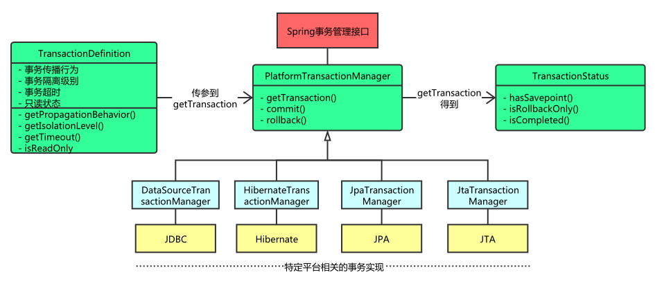

---

2.1.2 Hibernate事务
 
如果应用程序的持久化是通过Hibernate实习的，那么你需要使用HibernateTransactionManager。对
于Hibernate3，需要在Spring上下文定义中添加如下的<bean> 声明：
sessionFactory属性需要装配一个Hibernate的session工厂，HibernateTransactionManager的实现细
节是它将事务管理的职责委托给org.hibernate.Transaction对象，而后者是从Hibernate Session中获取
到的。当事务成功完成时，HibernateTransactionManager将会调用Transaction对象的commit()方
法，反之，将会调用rollback()方法。
2.1.3 Java持久化API事务（JPA）
 
Hibernate多年来一直是事实上的Java持久化标准，但是现在Java持久化API作为真正的Java持久化标准
进入大家的视野。如果你计划使用JPA的话，那你需要使用Spring的JpaTransactionManager来处理事
务。你需要在Spring中这样配置JpaTransactionManager：
JpaTransactionManager只需要装配一个JPA实体管理工厂（javax.persistence.EntityManagerFactory
接口的任意实现）。JpaTransactionManager将与由工厂所产生的JPA EntityManager合作来构建事务。
2.1.4 Java原生API事务
 
如果你没有使用以上所述的事务管理，或者是跨越了多个事务管理源（比如两个或者是多个不同的数据
源），你就需要使用JtaTransactionManager：
JtaTransactionManager将事务管理的责任委托给javax.transaction.UserTransaction和
javax.transaction.TransactionManager对象，其中事务成功完成通过UserTransaction.commit()方法
提交，事务失败通过UserTransaction.rollback()方法回滚。
2.2 基本事务属性的定义
 
上面讲到的事务管理器接口PlatformTransactionManager通过getTransaction(TransactionDefinition 
definition)方法来得到事务，这个方法里面的参数是TransactionDefinition类，这个类就定义了一些基
本的事务属性。
那么什么是事务属性呢？事务属性可以理解成事务的一些基本配置，描述了事务策略如何应用到方法
上。事务属性包含了5个方面，如图所示：
    <bean id="transactionManager" 
class="org.springframework.orm.hibernate3.HibernateTransactionManager">
        <property name="sessionFactory" ref="sessionFactory" />
    </bean>
    <bean id="transactionManager" 
class="org.springframework.orm.jpa.JpaTransactionManager">
        <property name="sessionFactory" ref="sessionFactory" />
    </bean>
    <bean id="transactionManager" 
class="org.springframework.transaction.jta.JtaTransactionManager">
        <property name="transactionManagerName" value="java:/TransactionManager" 
/>
    </bean>

---

而TransactionDefinition接口内容如下：
我们可以发现TransactionDefinition正好用来定义事务属性，下面详细介绍一下各个事务属性。
2.2.1 传播行为
 
事务的第一个方面是传播行为（propagation behavior）。当事务方法被另一个事务方法调用时，必须
指定事务应该如何传播。例如：方法可能继续在现有事务中运行，也可能开启一个新事务，并在自己的
事务中运行。Spring定义了七种传播行为：
public interface TransactionDefinition {
    int getPropagationBehavior(); // 返回事务的传播行为
    int getIsolationLevel(); // 返回事务的隔离级别，事务管理器根据它来控制另外一个事务可以
看到本事务内的哪些数据
    int getTimeout();  // 返回事务必须在多少秒内完成
    boolean isReadOnly(); // 事务是否只读，事务管理器能够根据这个返回值进行优化，确保事务是
只读的
}

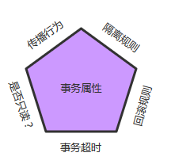

---

传播行为
含义
PROPAGATION_REQUIRED
表示当前方法必须运行在事务中。如果当前事务存在，方
法将会在该事务中运行。否则，会启动一个新的事务
PROPAGATION_SUPPORTS
表示当前方法不需要事务上下文，但是如果存在当前事务
的话，那么该方法会在这个事务中运行
PROPAGATION_MANDATORY
表示该方法必须在事务中运行，如果当前事务不存在，则
会抛出一个异常
PROPAGATION_REQUIRED_NEW
表示当前方法必须运行在它自己的事务中。一个新的事务
将被启动。如果存在当前事务，在该方法执行期间，当前
事务会被挂起。如果使用JTATransactionManager的话，
则需要访问TransactionManager
PROPAGATION_NOT_SUPPORTED
表示该方法不应该运行在事务中。如果存在当前事务，在
该方法运行期间，当前事务将被挂起。如果使用
JTATransactionManager的话，则需要访问
TransactionManager
PROPAGATION_NEVER
表示当前方法不应该运行在事务上下文中。如果当前正有
一个事务在运行，则会抛出异常
PROPAGATION_NESTED
表示如果当前已经存在一个事务，那么该方法将会在嵌套
事务中运行。嵌套的事务可以独立于当前事务进行单独地
提交或回滚。如果当前事务不存在，那么其行为与
PROPAGATION_REQUIRED一样。注意各厂商对这种传播
行为的支持是有所差异的。可以参考资源管理器的文档来
确认它们是否支持嵌套事务
*注：以下具体讲解传播行为的内容参考自Spring事务机制详解
（1）PROPAGATION_REQUIRED 如果存在一个事务，则支持当前事务。如果没有事务则开启一个新的
事务。
使用spring声明式事务，spring使用AOP来支持声明式事务，会根据事务属性，自动在方法调用之前决
定是否开启一个事务，并在方法执行之后决定事务提交或回滚事务。
单独调用methodB方法：
//事务属性 PROPAGATION_REQUIRED
methodA{
    ……
    methodB();
    ……
}
//事务属性 PROPAGATION_REQUIRED
methodB{
   ……
}
main{ 
    metodB(); 
}

---

相当于
Spring保证在methodB方法中所有的调用都获得到一个相同的连接。在调用methodB时，没有一个存
在的事务，所以获得一个新的连接，开启了一个新的事务。
单独调用MethodA时，在MethodA内又会调用MethodB.
执行效果相当于：
调用MethodA时，环境中没有事务，所以开启一个新的事务.当在MethodA中调用MethodB时，环境中
已经有了一个事务，所以methodB就加入当前事务。
（2）PROPAGATION_SUPPORTS 如果存在一个事务，支持当前事务。如果没有事务，则非事务的执
行。但是对于事务同步的事务管理器，PROPAGATION_SUPPORTS与不使用事务有少许不同。
Main{ 
    Connection con=null; 
    try{ 
        con = getConnection(); 
        con.setAutoCommit(false); 
        //方法调用
        methodB(); 
        //提交事务
        con.commit(); 
    } Catch(RuntimeException ex) { 
        //回滚事务
        con.rollback();   
    } finally { 
        //释放资源
        closeCon(); 
    } 
} 
main{ 
    Connection con = null; 
    try{ 
        con = getConnection(); 
        methodA(); 
        con.commit(); 
    } catch(RuntimeException ex) { 
        con.rollback(); 
    } finally {    
        closeCon(); 
    }  
} 
//事务属性 PROPAGATION_REQUIRED
methodA(){
  methodB();
}
//事务属性 PROPAGATION_SUPPORTS
methodB(){
  ……
}

---

单纯的调用methodB时，methodB方法是非事务的执行的。当调用methdA时,methodB则加入了
methodA的事务中,事务地执行。
（3）PROPAGATION_MANDATORY 如果已经存在一个事务，支持当前事务。如果没有一个活动的事
务，则抛出异常。
当单独调用methodB时，因为当前没有一个活动的事务，则会抛出异常throw new 
IllegalTransactionStateException(“Transaction propagation ‘mandatory’ but no existing transaction 
found”);当调用methodA时，methodB则加入到methodA的事务中，事务地执行。
（4）PROPAGATION_REQUIRES_NEW 总是开启一个新的事务。如果一个事务已经存在，则将这个存在
的事务挂起。
调用A方法：
相当于
//事务属性 PROPAGATION_REQUIRED
methodA(){
    methodB();
}
//事务属性 PROPAGATION_MANDATORY
    methodB(){
    ……
}
//事务属性 PROPAGATION_REQUIRED
methodA(){
    doSomeThingA();
    methodB();
    doSomeThingB();
}
//事务属性 PROPAGATION_REQUIRES_NEW
methodB(){
    ……
}
main(){
    methodA();
}
main(){
    TransactionManager tm = null;
    try{
        //获得一个JTA事务管理器
        tm = getTransactionManager();
        tm.begin();//开启一个新的事务
        Transaction ts1 = tm.getTransaction();
        doSomeThing();
        tm.suspend();//挂起当前事务
        try{
            tm.begin();//重新开启第二个事务
            Transaction ts2 = tm.getTransaction();

---

在这里，我把ts1称为外层事务，ts2称为内层事务。从上面的代码可以看出，ts2与ts1是两个独立的事
务，互不相干。Ts2是否成功并不依赖于 ts1。如果methodA方法在调用methodB方法后的
doSomeThingB方法失败了，而methodB方法所做的结果依然被提交。而除了 methodB之外的其它代
码导致的结果却被回滚了。使用PROPAGATION_REQUIRES_NEW,需要使用 JtaTransactionManager作
为事务管理器。
（5）PROPAGATION_NOT_SUPPORTED 总是非事务地执行，并挂起任何存在的事务。使用
PROPAGATION_NOT_SUPPORTED,也需要使用JtaTransactionManager作为事务管理器。（代码示例
同上，可同理推出）
（6）PROPAGATION_NEVER 总是非事务地执行，如果存在一个活动事务，则抛出异常。
（7）PROPAGATION_NESTED如果一个活动的事务存在，则运行在一个嵌套的事务中. 如果没有活动事
务, 则按TransactionDefinition.PROPAGATION_REQUIRED 属性执行。这是一个嵌套事务,使用JDBC 3.0
驱动时,仅仅支持DataSourceTransactionManager作为事务管理器。需要JDBC 驱动的
java.sql.Savepoint类。有一些JTA的事务管理器实现可能也提供了同样的功能。使用
PROPAGATION_NESTED，还需要把PlatformTransactionManager的nestedTransactionAllowed属性
设为true;而 nestedTransactionAllowed属性值默认为false。
如果单独调用methodB方法，则按REQUIRED属性执行。如果调用methodA方法，相当于下面的效果：
            methodB();
            ts2.commit();//提交第二个事务
        } Catch(RunTimeException ex) {
            ts2.rollback();//回滚第二个事务
        } finally {
            //释放资源
        }
        //methodB执行完后，恢复第一个事务
        tm.resume(ts1);
        doSomeThingB();
        ts1.commit();//提交第一个事务
    } catch(RunTimeException ex) {
        ts1.rollback();//回滚第一个事务
    } finally {
        //释放资源
    }
}
//事务属性 PROPAGATION_REQUIRED
methodA(){
    doSomeThingA();
    methodB();
    doSomeThingB();
}
//事务属性 PROPAGATION_NESTED
methodB(){
    ……
}
main(){
    Connection con = null;
    Savepoint savepoint = null;
    try{
        con = getConnection();

---

当methodB方法调用之前，调用setSavepoint方法，保存当前的状态到savepoint。如果methodB方法
调用失败，则恢复到之前保存的状态。但是需要注意的是，这时的事务并没有进行提交，如果后续的代
码(doSomeThingB()方法)调用失败，则回滚包括methodB方法的所有操作。
嵌套事务一个非常重要的概念就是内层事务依赖于外层事务。外层事务失败时，会回滚内层事务所做的
动作。而内层事务操作失败并不会引起外层事务的回滚。
PROPAGATION_NESTED 与PROPAGATION_REQUIRES_NEW的区别:它们非常类似,都像一个嵌套事
务，如果不存在一个活动的事务，都会开启一个新的事务。使用 PROPAGATION_REQUIRES_NEW时，
内层事务与外层事务就像两个独立的事务一样，一旦内层事务进行了提交后，外层事务不能对其进行回
滚。两个事务互不影响。两个事务不是一个真正的嵌套事务。同时它需要JTA事务管理器的支持。
使用PROPAGATION_NESTED时，外层事务的回滚可以引起内层事务的回滚。而内层事务的异常并不会
导致外层事务的回滚，它是一个真正的嵌套事务。DataSourceTransactionManager使用savepoint支持
PROPAGATION_NESTED时，需要JDBC 3.0以上驱动及1.4以上的JDK版本支持。其它的JTA 
TrasactionManager实现可能有不同的支持方式。
PROPAGATION_REQUIRES_NEW 启动一个新的, 不依赖于环境的 “内部” 事务. 这个事务将被完全 
commited 或 rolled back 而不依赖于外部事务, 它拥有自己的隔离范围, 自己的锁, 等等. 当内部事务开
始执行时, 外部事务将被挂起, 内务事务结束时, 外部事务将继续执行。
另一方面, PROPAGATION_NESTED 开始一个 “嵌套的” 事务, 它是已经存在事务的一个真正的子事务. 潜
套事务开始执行时, 它将取得一个 savepoint. 如果这个嵌套事务失败, 我们将回滚到此 savepoint. 潜套
事务是外部事务的一部分, 只有外部事务结束后它才会被提交。
由此可见, PROPAGATION_REQUIRES_NEW 和 PROPAGATION_NESTED 的最大区别在于, 
PROPAGATION_REQUIRES_NEW 完全是一个新的事务, 而 PROPAGATION_NESTED 则是外部事务的子
事务, 如果外部事务 commit, 嵌套事务也会被 commit, 这个规则同样适用于 roll back.
PROPAGATION_REQUIRED应该是我们首先的事务传播行为。它能够满足我们大多数的事务需求。
2.2.2 隔离级别
 
事务的第二个维度就是隔离级别（isolation level）。隔离级别定义了一个事务可能受其他并发事务影响
的程度。
（1）并发事务引起的问题
在典型的应用程序中，多个事务并发运行，经常会操作相同的数据来完成各自的任务。并发虽然是必须
的，但可能会导致一下的问题。
        con.setAutoCommit(false);
        doSomeThingA();
        savepoint = con2.setSavepoint();
        try{
            methodB();
        } catch(RuntimeException ex) {
            con.rollback(savepoint);
        } finally {
            //释放资源
        }
        doSomeThingB();
        con.commit();
    } catch(RuntimeException ex) {
        con.rollback();
    } finally {
        //释放资源
    }
}

---

脏读（Dirty reads）——脏读发生在一个事务读取了另一个事务改写但尚未提交的数据时。
如果改写在稍后被回滚了，那么第一个事务获取的数据就是无效的。
不可重复读（Nonrepeatable read）——不可重复读发生在一个事务执行相同的查询两次或
两次以上，但是每次都得到不同的数据时。这通常是因为另一个并发事务在两次查询期间进
行了更新。
幻读（Phantom read）——幻读与不可重复读类似。它发生在一个事务（T1）读取了几行
数据，接着另一个并发事务（T2）插入了一些数据时。在随后的查询中，第一个事务（T1）
就会发现多了一些原本不存在的记录。
不可重复读与幻读的区别
不可重复读的重点是修改:
同样的条件, 你读取过的数据, 再次读取出来发现值不一样了
例如：在事务1中，Mary 读取了自己的工资为1000,操作并没有完成
在事务2中，这时财务人员修改了Mary的工资为2000,并提交了事务.
在事务1中，Mary 再次读取自己的工资时，工资变为了2000
在一个事务中前后两次读取的结果并不一致，导致了不可重复读。
幻读的重点在于新增或者删除：
同样的条件, 第1次和第2次读出来的记录数不一样
例如：目前工资为1000的员工有10人。事务1,读取所有工资为1000的员工。
共读取10条记录
这时另一个事务向employee表插入了一条员工记录，工资也为1000
事务1再次读取所有工资为1000的员工
共读取到了11条记录，这就产生了幻像读。
    con1 = getConnection();  
    select salary from employee empId ="Mary";  
    con2 = getConnection();  
    update employee set salary = 2000;  
    con2.commit();  
    //con1  
    select salary from employee empId ="Mary"; 
    con1 = getConnection();  
    Select * from employee where salary =1000; 
    con2 = getConnection();  
    Insert into employee(empId,salary) values("Lili",1000);  
    con2.commit();  
    //con1  
    select * from employee where salary =1000;

---

隔离级别
含义
ISOLATION_DEFAULT
使用后端数据库默认的隔离级别
ISOLATION_READ_UNCOMMITTED
最低的隔离级别，允许读取尚未提交的数据变更，可能会
导致脏读、幻读或不可重复读
ISOLATION_READ_COMMITTED
允许读取并发事务已经提交的数据，可以阻止脏读，但是
幻读或不可重复读仍有可能发生
ISOLATION_REPEATABLE_READ
对同一字段的多次读取结果都是一致的，除非数据是被本
身事务自己所修改，可以阻止脏读和不可重复读，但幻读
仍有可能发生
ISOLATION_SERIALIZABLE
最高的隔离级别，完全服从ACID的隔离级别，确保阻止脏
读、不可重复读以及幻读，也是最慢的事务隔离级别，因
为它通常是通过完全锁定事务相关的数据库表来实现的
从总的结果来看, 似乎不可重复读和幻读都表现为两次读取的结果不一致。但如果你从控制的角度来看, 
两者的区别就比较大。
对于前者, 只需要锁住满足条件的记录。
对于后者, 要锁住满足条件及其相近的记录。
（2）隔离级别
2.2.3 只读
 
事务的第三个特性是它是否为只读事务。如果事务只对后端的数据库进行该操作，数据库可以利用事务
的只读特性来进行一些特定的优化。通过将事务设置为只读，你就可以给数据库一个机会，让它应用它
认为合适的优化措施。
2.2.4 事务超时
 
为了使应用程序很好地运行，事务不能运行太长的时间。因为事务可能涉及对后端数据库的锁定，所以
长时间的事务会不必要的占用数据库资源。事务超时就是事务的一个定时器，在特定时间内事务如果没
有执行完毕，那么就会自动回滚，而不是一直等待其结束。
2.2.5 回滚规则
 
事务五边形的最后一个方面是一组规则，这些规则定义了哪些异常会导致事务回滚而哪些不会。默认情
况下，事务只有遇到运行期异常时才会回滚，而在遇到检查型异常时不会回滚（这一行为与EJB的回滚行
为是一致的）
但是你可以声明事务在遇到特定的检查型异常时像遇到运行期异常那样回滚。同样，你还可以声明事务
遇到特定的异常不回滚，即使这些异常是运行期异常。
2.3 事务状态
 
上面讲到的调用PlatformTransactionManager接口的getTransaction()的方法得到的是
TransactionStatus接口的一个实现，这个接口的内容如下：
public interface TransactionStatus{
    boolean isNewTransaction(); // 是否是新的事物
    boolean hasSavepoint(); // 是否有恢复点
    void setRollbackOnly();  // 设置为只回滚
    boolean isRollbackOnly(); // 是否为只回滚
    boolean isCompleted; // 是否已完成
}

---

可以发现这个接口描述的是一些处理事务提供简单的控制事务执行和查询事务状态的方法，在回滚或提
交的时候需要应用对应的事务状态。
3 编程式事务
 
3.1 编程式和声明式事务的区别
 
Spring提供了对编程式事务和声明式事务的支持，编程式事务允许用户在代码中精确定义事务的边界，
而声明式事务（基于AOP）有助于用户将操作与事务规则进行解耦。
简单地说，编程式事务侵入到了业务代码里面，但是提供了更加详细的事务管理；而声明式事务由于基
于AOP，所以既能起到事务管理的作用，又可以不影响业务代码的具体实现。
3.2 如何实现编程式事务？
 
Spring提供两种方式的编程式事务管理，分别是：使用TransactionTemplate和直接使用
PlatformTransactionManager。
3.2.1 使用TransactionTemplate
 
采用TransactionTemplate和采用其他Spring模板，如JdbcTempalte和HibernateTemplate是一样的方
法。它使用回调方法，把应用程序从处理取得和释放资源中解脱出来。如同其他模板，
TransactionTemplate是线程安全的。代码片段：
使用TransactionCallback()可以返回一个值。如果使用TransactionCallbackWithoutResult则没有返回
值。
3.2.2 使用PlatformTransactionManager
 
示例代码如下：
    TransactionTemplate tt = new TransactionTemplate(); // 新建一个
TransactionTemplate
    Object result = tt.execute(
        new TransactionCallback(){  
            public Object doTransaction(TransactionStatus status){  
                updateOperation();  
                return resultOfUpdateOperation();  
            }  
    }); // 执行execute方法进行事务管理

---

4 声明式事务
 
4.1 配置方式
 
*注：以下配置代码参考自Spring事务配置的五种方式
根据代理机制的不同，总结了五种Spring事务的配置方式，配置文件如下：
（1）每个Bean都有一个代理
    DataSourceTransactionManager dataSourceTransactionManager = new 
DataSourceTransactionManager(); //定义一个某个框架平台的TransactionManager，如JDBC、
Hibernate
    
dataSourceTransactionManager.setDataSource(this.getJdbcTemplate().getDataSource(
)); // 设置数据源
    DefaultTransactionDefinition transDef = new DefaultTransactionDefinition(); 
// 定义事务属性
    
transDef.setPropagationBehavior(DefaultTransactionDefinition.PROPAGATION_REQUIRE
D); // 设置传播行为属性
    TransactionStatus status = 
dataSourceTransactionManager.getTransaction(transDef); // 获得事务状态
    try {
        // 数据库操作
        dataSourceTransactionManager.commit(status);// 提交
    } catch (Exception e) {
        dataSourceTransactionManager.rollback(status);// 回滚
    }
<?xml version="1.0" encoding="UTF-8"?>
<beans xmlns="http://www.springframework.org/schema/beans"
    xmlns:xsi="http://www.w3.org/2001/XMLSchema-instance"
    xmlns:context="http://www.springframework.org/schema/context"
    xmlns:aop="http://www.springframework.org/schema/aop"
    xsi:schemaLocation="http://www.springframework.org/schema/beans
           http://www.springframework.org/schema/beans/spring-beans-2.5.xsd
           http://www.springframework.org/schema/context
           http://www.springframework.org/schema/context/spring-context-2.5.xsd
           http://www.springframework.org/schema/aop 
http://www.springframework.org/schema/aop/spring-aop-2.5.xsd">
    <bean id="sessionFactory" 
            class="org.springframework.orm.hibernate3.LocalSessionFactoryBean"> 
        <property name="configLocation" value="classpath:hibernate.cfg.xml" /> 
        <property name="configurationClass" 
value="org.hibernate.cfg.AnnotationConfiguration" />
    </bean> 
    <!-- 定义事务管理器（声明式的事务） --> 
    <bean id="transactionManager"
        class="org.springframework.orm.hibernate3.HibernateTransactionManager">
        <property name="sessionFactory" ref="sessionFactory" />
    </bean>
    <!-- 配置DAO -->
    <bean id="userDaoTarget" class="com.bluesky.spring.dao.UserDaoImpl">

---

（2）所有Bean共享一个代理基类
        <property name="sessionFactory" ref="sessionFactory" />
    </bean>
    <bean id="userDao" 
        
class="org.springframework.transaction.interceptor.TransactionProxyFactoryBean">
 
           <!-- 配置事务管理器 --> 
           <property name="transactionManager" ref="transactionManager" />    
        <property name="target" ref="userDaoTarget" /> 
         <property name="proxyInterfaces" 
value="com.bluesky.spring.dao.GeneratorDao" />
        <!-- 配置事务属性 --> 
        <property name="transactionAttributes"> 
            <props> 
                <prop key="*">PROPAGATION_REQUIRED</prop>
            </props> 
        </property> 
    </bean> 
</beans>
<?xml version="1.0" encoding="UTF-8"?>
<beans xmlns="http://www.springframework.org/schema/beans"
    xmlns:xsi="http://www.w3.org/2001/XMLSchema-instance"
    xmlns:context="http://www.springframework.org/schema/context"
    xmlns:aop="http://www.springframework.org/schema/aop"
    xsi:schemaLocation="http://www.springframework.org/schema/beans
           http://www.springframework.org/schema/beans/spring-beans-2.5.xsd
           http://www.springframework.org/schema/context
           http://www.springframework.org/schema/context/spring-context-2.5.xsd
           http://www.springframework.org/schema/aop 
http://www.springframework.org/schema/aop/spring-aop-2.5.xsd">
    <bean id="sessionFactory" 
            class="org.springframework.orm.hibernate3.LocalSessionFactoryBean"> 
        <property name="configLocation" value="classpath:hibernate.cfg.xml" /> 
        <property name="configurationClass" 
value="org.hibernate.cfg.AnnotationConfiguration" />
    </bean> 
    <!-- 定义事务管理器（声明式的事务） --> 
    <bean id="transactionManager"
        class="org.springframework.orm.hibernate3.HibernateTransactionManager">
        <property name="sessionFactory" ref="sessionFactory" />
    </bean>
    <bean id="transactionBase" 
            
class="org.springframework.transaction.interceptor.TransactionProxyFactoryBean" 
            lazy-init="true" abstract="true"> 
        <!-- 配置事务管理器 --> 
        <property name="transactionManager" ref="transactionManager" /> 
        <!-- 配置事务属性 --> 
        <property name="transactionAttributes"> 
            <props>

---

（3）使用拦截器
                <prop key="*">PROPAGATION_REQUIRED</prop> 
            </props> 
        </property> 
    </bean>   
    <!-- 配置DAO -->
    <bean id="userDaoTarget" class="com.bluesky.spring.dao.UserDaoImpl">
        <property name="sessionFactory" ref="sessionFactory" />
    </bean>
    <bean id="userDao" parent="transactionBase" > 
        <property name="target" ref="userDaoTarget" />  
    </bean>
</beans>
<?xml version="1.0" encoding="UTF-8"?>
<beans xmlns="http://www.springframework.org/schema/beans"
    xmlns:xsi="http://www.w3.org/2001/XMLSchema-instance"
    xmlns:context="http://www.springframework.org/schema/context"
    xmlns:aop="http://www.springframework.org/schema/aop"
    xsi:schemaLocation="http://www.springframework.org/schema/beans
           http://www.springframework.org/schema/beans/spring-beans-2.5.xsd
           http://www.springframework.org/schema/context
           http://www.springframework.org/schema/context/spring-context-2.5.xsd
           http://www.springframework.org/schema/aop 
http://www.springframework.org/schema/aop/spring-aop-2.5.xsd">
    <bean id="sessionFactory" 
            class="org.springframework.orm.hibernate3.LocalSessionFactoryBean"> 
        <property name="configLocation" value="classpath:hibernate.cfg.xml" /> 
        <property name="configurationClass" 
value="org.hibernate.cfg.AnnotationConfiguration" />
    </bean> 
    <!-- 定义事务管理器（声明式的事务） --> 
    <bean id="transactionManager"
        class="org.springframework.orm.hibernate3.HibernateTransactionManager">
        <property name="sessionFactory" ref="sessionFactory" />
    </bean> 
    <bean id="transactionInterceptor" 
        
class="org.springframework.transaction.interceptor.TransactionInterceptor"> 
        <property name="transactionManager" ref="transactionManager" /> 
        <!-- 配置事务属性 --> 
        <property name="transactionAttributes"> 
            <props> 
                <prop key="*">PROPAGATION_REQUIRED</prop> 
            </props> 
        </property> 
    </bean>
    <bean 
class="org.springframework.aop.framework.autoproxy.BeanNameAutoProxyCreator"> 
        <property name="beanNames">

---

（4）使用tx标签配置的拦截器
            <list> 
                <value>*Dao</value>
            </list> 
        </property> 
        <property name="interceptorNames"> 
            <list> 
                <value>transactionInterceptor</value> 
            </list> 
        </property> 
    </bean> 
    <!-- 配置DAO -->
    <bean id="userDao" class="com.bluesky.spring.dao.UserDaoImpl">
        <property name="sessionFactory" ref="sessionFactory" />
    </bean>
</beans>
<?xml version="1.0" encoding="UTF-8"?>
<beans xmlns="http://www.springframework.org/schema/beans"
    xmlns:xsi="http://www.w3.org/2001/XMLSchema-instance"
    xmlns:context="http://www.springframework.org/schema/context"
    xmlns:aop="http://www.springframework.org/schema/aop"
    xmlns:tx="http://www.springframework.org/schema/tx"
    xsi:schemaLocation="http://www.springframework.org/schema/beans
           http://www.springframework.org/schema/beans/spring-beans-2.5.xsd
           http://www.springframework.org/schema/context
           http://www.springframework.org/schema/context/spring-context-2.5.xsd
           http://www.springframework.org/schema/aop 
http://www.springframework.org/schema/aop/spring-aop-2.5.xsd
           http://www.springframework.org/schema/tx 
http://www.springframework.org/schema/tx/spring-tx-2.5.xsd">
    <context:annotation-config />
    <context:component-scan base-package="com.bluesky" />
    <bean id="sessionFactory" 
            class="org.springframework.orm.hibernate3.LocalSessionFactoryBean"> 
        <property name="configLocation" value="classpath:hibernate.cfg.xml" /> 
        <property name="configurationClass" 
value="org.hibernate.cfg.AnnotationConfiguration" />
    </bean> 
    <!-- 定义事务管理器（声明式的事务） --> 
    <bean id="transactionManager"
        class="org.springframework.orm.hibernate3.HibernateTransactionManager">
        <property name="sessionFactory" ref="sessionFactory" />
    </bean>
    <tx:advice id="txAdvice" transaction-manager="transactionManager">
        <tx:attributes>
            <tx:method name="*" propagation="REQUIRED" />
        </tx:attributes>
    </tx:advice>
    <aop:config>

---

（5）全注解
此时在DAO上需加上@Transactional注解，如下：
        <aop:pointcut id="interceptorPointCuts"
            expression="execution(* com.bluesky.spring.dao.*.*(..))" />
        <aop:advisor advice-ref="txAdvice"
            pointcut-ref="interceptorPointCuts" />       
    </aop:config>     
</beans>
<?xml version="1.0" encoding="UTF-8"?>
<beans xmlns="http://www.springframework.org/schema/beans"
    xmlns:xsi="http://www.w3.org/2001/XMLSchema-instance"
    xmlns:context="http://www.springframework.org/schema/context"
    xmlns:aop="http://www.springframework.org/schema/aop"
    xmlns:tx="http://www.springframework.org/schema/tx"
    xsi:schemaLocation="http://www.springframework.org/schema/beans
           http://www.springframework.org/schema/beans/spring-beans-2.5.xsd
           http://www.springframework.org/schema/context
           http://www.springframework.org/schema/context/spring-context-2.5.xsd
           http://www.springframework.org/schema/aop 
http://www.springframework.org/schema/aop/spring-aop-2.5.xsd
           http://www.springframework.org/schema/tx 
http://www.springframework.org/schema/tx/spring-tx-2.5.xsd">
    <context:annotation-config />
    <context:component-scan base-package="com.bluesky" />
    <tx:annotation-driven transaction-manager="transactionManager"/>
    <bean id="sessionFactory" 
            class="org.springframework.orm.hibernate3.LocalSessionFactoryBean"> 
        <property name="configLocation" value="classpath:hibernate.cfg.xml" /> 
        <property name="configurationClass" 
value="org.hibernate.cfg.AnnotationConfiguration" />
    </bean> 
    <!-- 定义事务管理器（声明式的事务） --> 
    <bean id="transactionManager"
        class="org.springframework.orm.hibernate3.HibernateTransactionManager">
        <property name="sessionFactory" ref="sessionFactory" />
    </bean>
</beans>
package com.bluesky.spring.dao;
import java.util.List;
import org.hibernate.SessionFactory;
import org.springframework.beans.factory.annotation.Autowired;
import org.springframework.orm.hibernate3.support.HibernateDaoSupport;
import org.springframework.stereotype.Component;
import com.bluesky.spring.domain.User;

---

4.2 一个声明式事务的实例
 
*注：该实例参考自Spring中的事务管理实例详解
首先是数据库表
book(isbn, book_name, price)
account(username, balance)
book_stock(isbn, stock)
然后是XML配置
使用的类
BookShopDao
@Transactional
@Component("userDao")
public class UserDaoImpl extends HibernateDaoSupport implements UserDao {
    public List<User> listUsers() {
        return this.getSession().createQuery("from User").list();
    }  
}
<beans xmlns="http://www.springframework.org/schema/beans"
xmlns:xsi="http://www.w3.org/2001/XMLSchema-instance"
xmlns:context="http://www.springframework.org/schema/context"
xmlns:aop="http://www.springframework.org/schema/aop"
xmlns:tx="http://www.springframework.org/schema/tx"
xsi:schemaLocation="http://www.springframework.org/schema/beans
http://www.springframework.org/schema/beans/spring-beans-3.0.xsd
http://www.springframework.org/schema/context
http://www.springframework.org/schema/context/spring-context-3.0.xsd
http://www.springframework.org/schema/aop 
http://www.springframework.org/schema/aop/spring-aop-2.5.xsd
http://www.springframework.org/schema/tx 
http://www.springframework.org/schema/tx/spring-tx-2.5.xsd">
    <import resource="applicationContext-db.xml" />
    <context:component-scan
        base-package="com.springinaction.transaction">
    </context:component-scan>
    <tx:annotation-driven transaction-manager="txManager"/>
    <bean id="transactionManager" 
class="org.springframework.jdbc.datasource.DataSourceTransactionManager">
        <property name="dataSource" ref="dataSource" />
    </bean>
</beans>

---

BookShopDaoImpl
package com.springinaction.transaction;
public interface BookShopDao {
    // 根据书号获取书的单价
    public int findBookPriceByIsbn(String isbn);
    // 更新书的库存，使书号对应的库存-1
    public void updateBookStock(String isbn);
    // 更新用户的账户余额：account的balance-price
    public void updateUserAccount(String username, int price);
}
package com.springinaction.transaction;
import org.springframework.beans.factory.annotation.Autowired;
import org.springframework.jdbc.core.JdbcTemplate;
import org.springframework.stereotype.Repository;
@Repository("bookShopDao")
public class BookShopDaoImpl implements BookShopDao {
    @Autowired
    private JdbcTemplate JdbcTemplate;
    @Override
    public int findBookPriceByIsbn(String isbn) {
        String sql = "SELECT price FROM book WHERE isbn = ?";
        return JdbcTemplate.queryForObject(sql, Integer.class, isbn);
    }
    @Override
    public void updateBookStock(String isbn) {
        //检查书的库存是否足够，若不够，则抛出异常
        String sql2 = "SELECT stock FROM book_stock WHERE isbn = ?";
        int stock = JdbcTemplate.queryForObject(sql2, Integer.class, isbn);
        if (stock == 0) {
            throw new BookStockException("库存不足！");
        }
        String sql = "UPDATE book_stock SET stock = stock - 1 WHERE isbn = ?";
        JdbcTemplate.update(sql, isbn);
    }
    @Override
    public void updateUserAccount(String username, int price) {
        //检查余额是否不足，若不足，则抛出异常
        String sql2 = "SELECT balance FROM account WHERE username = ?";
        int balance = JdbcTemplate.queryForObject(sql2, Integer.class, 
username);
        if (balance < price) {
            throw new UserAccountException("余额不足！");
        }       
        String sql = "UPDATE account SET balance = balance - ? WHERE username = 
?";
        JdbcTemplate.update(sql, price, username);

---

BookShopService
BookShopServiceImpl
    }
}
package com.springinaction.transaction;
public interface BookShopService {
     public void purchase(String username, String isbn);
}
package com.springinaction.transaction;
import org.springframework.beans.factory.annotation.Autowired;
import org.springframework.stereotype.Service;
import org.springframework.transaction.annotation.Isolation;
import org.springframework.transaction.annotation.Propagation;
import org.springframework.transaction.annotation.Transactional;
@Service("bookShopService")
public class BookShopServiceImpl implements BookShopService {
    @Autowired
    private BookShopDao bookShopDao;
    /**
     * 1.添加事务注解
     * 使用propagation 指定事务的传播行为，即当前的事务方法被另外一个事务方法调用时如何使用事
务。
     * 默认取值为REQUIRED，即使用调用方法的事务
     * REQUIRES_NEW：使用自己的事务，调用的事务方法的事务被挂起。
     *
     * 2.使用isolation 指定事务的隔离级别，最常用的取值为READ_COMMITTED
     * 3.默认情况下 Spring 的声明式事务对所有的运行时异常进行回滚，也可以通过对应的属性进行设
置。通常情况下，默认值即可。
     * 4.使用readOnly 指定事务是否为只读。 表示这个事务只读取数据但不更新数据，这样可以帮助数
据库引擎优化事务。若真的是一个只读取数据库值得方法，应设置readOnly=true
     * 5.使用timeOut 指定强制回滚之前事务可以占用的时间。
     */
    @Transactional(propagation=Propagation.REQUIRES_NEW,
            isolation=Isolation.READ_COMMITTED,
            noRollbackFor={UserAccountException.class},
            readOnly=true, timeout=3)
    @Override
    public void purchase(String username, String isbn) {
        //1.获取书的单价
        int price = bookShopDao.findBookPriceByIsbn(isbn);
        //2.更新书的库存
        bookShopDao.updateBookStock(isbn);
        //3.更新用户余额
        bookShopDao.updateUserAccount(username, price);
    }
}

---

Cashier
CashierImpl：CashierImpl.checkout和bookShopService.purchase联合测试了事务的传播行为
BookStockException
package com.springinaction.transaction;
import java.util.List;
public interface Cashier {
    public void checkout(String username, List<String>isbns);
}
package com.springinaction.transaction;
import java.util.List;
import org.springframework.beans.factory.annotation.Autowired;
import org.springframework.stereotype.Service;
import org.springframework.transaction.annotation.Transactional;
@Service("cashier")
public class CashierImpl implements Cashier {
    @Autowired
    private BookShopService bookShopService;
    @Transactional
    @Override
    public void checkout(String username, List<String> isbns) {
        for(String isbn : isbns) {
            bookShopService.purchase(username, isbn);
        }
    }
}
package com.springinaction.transaction;
public class BookStockException extends RuntimeException {
    private static final long serialVersionUID = 1L;
    public BookStockException() {
        super();
        // TODO Auto-generated constructor stub
    }
    public BookStockException(String arg0, Throwable arg1, boolean arg2,
            boolean arg3) {
        super(arg0, arg1, arg2, arg3);
        // TODO Auto-generated constructor stub
    }
    public BookStockException(String arg0, Throwable arg1) {
        super(arg0, arg1);
        // TODO Auto-generated constructor stub
    }
    public BookStockException(String arg0) {

---

UserAccountException
测试类
        super(arg0);
        // TODO Auto-generated constructor stub
    }
    public BookStockException(Throwable arg0) {
        super(arg0);
        // TODO Auto-generated constructor stub
    }
}
package com.springinaction.transaction;
public class UserAccountException extends RuntimeException {
    private static final long serialVersionUID = 1L;
    public UserAccountException() {
        super();
        // TODO Auto-generated constructor stub
    }
    public UserAccountException(String arg0, Throwable arg1, boolean arg2,
            boolean arg3) {
        super(arg0, arg1, arg2, arg3);
        // TODO Auto-generated constructor stub
    }
    public UserAccountException(String arg0, Throwable arg1) {
        super(arg0, arg1);
        // TODO Auto-generated constructor stub
    }
    public UserAccountException(String arg0) {
        super(arg0);
        // TODO Auto-generated constructor stub
    }
    public UserAccountException(Throwable arg0) {
        super(arg0);
        // TODO Auto-generated constructor stub
    }
}
package com.springinaction.transaction;
import java.util.Arrays;
import org.junit.Test;
import org.springframework.context.ApplicationContext;
import org.springframework.context.support.ClassPathXmlApplicationContext;
public class SpringTransitionTest {

---

SpringMVC概述
 
什么是Spring MVC？简单介绍下你对Spring MVC的理解？
 
Spring MVC是一个基于Java的实现了MVC设计模式的请求驱动类型的轻量级 Web框架，通过把模型-视
图-控制器分离，将web层进行职责解耦，把复杂的 web应用分成逻辑清晰的几部分，简化开发，减少出
错，方便组内开发人员之间 的配合。 
Spring MVC的优点
 
（1）可以支持各种视图技术,而不仅仅局限于JSP； 
（2）与Spring框架集成（如IoC容器、AOP等）； 
（3）清晰的角色分配：前端控制器(dispatcherServlet) , 请求到处理器映射 （handlerMapping), 处理
器适配器（HandlerAdapter), 视图解析器 （ViewResolver）。 
    private ApplicationContext ctx = null;
    private BookShopDao bookShopDao = null;
    private BookShopService bookShopService = null;
    private Cashier cashier = null;
    {
        ctx = new ClassPathXmlApplicationContext("config/transaction.xml");
        bookShopDao = ctx.getBean(BookShopDao.class);
        bookShopService = ctx.getBean(BookShopService.class);
        cashier = ctx.getBean(Cashier.class);
    }
    @Test
    public void testBookShopDaoFindPriceByIsbn() {
        System.out.println(bookShopDao.findBookPriceByIsbn("1001"));
    }
    @Test
    public void testBookShopDaoUpdateBookStock(){
        bookShopDao.updateBookStock("1001");
    }
    @Test
    public void testBookShopDaoUpdateUserAccount(){
        bookShopDao.updateUserAccount("AA", 100);
    }
    @Test
    public void testBookShopService(){
        bookShopService.purchase("AA", "1001");
    }
    @Test
    public void testTransactionPropagation(){
        cashier.checkout("AA", Arrays.asList("1001", "1002"));
    }
}

---

（4） 支持各种请求资源的映射策略。 ### 核心组件
Spring MVC的主要组件？
 
（1）前端控制器 DispatcherServlet（不需要程序员开发） 
作用：接收请求、响应结果，相当于转发器，有了DispatcherServlet 就减少了 其它组件之间的耦合
度。 
（2）处理器映射器HandlerMapping（不需要程序员开发） 
作用：根据请求的URL来查找Handler 
（3）处理器适配器HandlerAdapter
注意：在编写Handler的时候要按照HandlerAdapter要求的规则去编写，这样适配器HandlerAdapter
才可以正确的去执行Handler。 
（4）处理器Handler（需要程序员开发） 
（5）视图解析器 ViewResolver（不需要程序员开发） 
作用：进行视图的解析，根据视图逻辑名解析成真正的视图（view） 
（6）视图View（需要程序员开发jsp） 
View是一个接口， 它的实现类支持不同的视图类型（jsp，freemarker，pdf等 等） 
什么是DispatcherServlet
 
Spring的MVC框架是围绕DispatcherServlet来设计的，它用来处理所有的 HTTP请求和响应。
什么是Spring MVC框架的控制器？
 
控制器提供一个访问应用程序的行为，此行为通常通过服务接口实现。控制器解 析用户输入并将其转换
为一个由视图呈现给用户的模型。Spring用一个非常抽 象的方式实现了一个控制层，允许用户创建多种
用途的控制器。 
Spring MVC的控制器是不是单例模式,如果是,有什么问题,怎么解决？
 
答：是单例模式,所以在多线程访问的时候有线程安全问题,不要用同步,会影响性 能的,解决方案是在控制
器里面不能写字段。 
工作原理
 
请描述Spring MVC的工作流程？描述一下 DispatcherServlet 的工作流程？
 
（1）用户发送请求至前端控制器DispatcherServlet； 
（2） DispatcherServlet收到请求后，调用HandlerMapping处理器映射器， 请求获取Handle； 
（3）处理器映射器根据请求url找到具体的处理器，生成处理器对象及处理器拦 截器(如果有则生成)一
并返回给DispatcherServlet； 
（4）DispatcherServlet 调用 HandlerAdapter处理器适配器；
（5）HandlerAdapter 经过适配调用 具体处理器(Handler，也叫后端控制 器)； 
（6）Handler执行完成返回ModelAndView； 
（7）HandlerAdapter将Handler执行结果ModelAndView返回给 DispatcherServlet； 
（8）DispatcherServlet将ModelAndView传给ViewResolver视图解析器进行 解析；
（9）ViewResolver解析后返回具体View； 
（10）DispatcherServlet对View进行渲染视图（即将模型数据填充至视图中）

---

（11）DispatcherServlet响应用户。
MVC框架
 
MVC是什么？MVC设计模式的好处有哪些
 
mvc是一种设计模式（设计模式就是日常开发中编写代码的一种好的方法和经验 的总结）。模型
（model）-视图（view）-控制器（controller），三层架构的 设计模式。用于实现前端页面的展现与后
端业务数据处理的分离。 
mvc设计模式的好处 
1.分层设计，实现了业务系统各个组件之间的解耦，有利于业务系统的可扩展 性，可维护性。 
2.有利于系统的并行开发，提升开发效率。 
常用注解
 
注解原理是什么
 
注解本质是一个继承了Annotation的特殊接口，其具体实现类是Java运行时生 成的动态代理类。我们通
过反射获取注解时，返回的是Java运行时生成的动态代 理对象。通过代理对象调用自定义注解的方法，
会终调用 AnnotationInvocationHandler的invoke方法。该方法会从memberValues这 个Map中索引出
对应的值。而memberValues的来源是Java常量池。 
Spring MVC常用的注解有哪些？
 
@RequestMapping：用于处理请求 url 映射的注解，可用于类或方法上。用 于类上，则表示类中的所
有响应请求的方法都是以该地址作为父路径。 
@RequestBody：注解实现接收http请求的json数据，将json转换为java对 象。 
@ResponseBody：注解实现将conreoller方法返回对象转化为json对象响应给 客户。
SpingMvc中的控制器的注解一般用哪个,有没有别的注解可以替代？
 
答：一般用@Controller注解,也可以使用@RestController,@RestController 注解相当于
@ResponseBody ＋ @Controller,表示是表现层,除此之外，一般不用别的注解代替。
@Controller注解的作用
 
在Spring MVC 中，控制器Controller 负责处理由DispatcherServlet 分发的请求，它把用户请求的数据
经过业务处理层处理之后封装成一个Model ，然后再把该Model 返回给对应的View 进行展示。在
Spring MVC 中提供了一个非常简
便的定义Controller 的方法，你无需继承特定的类或实现特定的接口，只需使

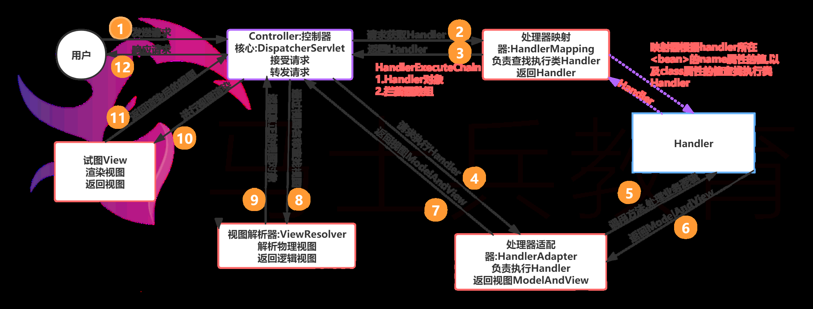

---

用@Controller 标记一个类是Controller ，然后使用@RequestMapping 和 @RequestParam 等一些注
解用以定义URL 请求和Controller 方法之间的映射，这样的Controller 就能被外界访问到。此外
Controller 不会直接依赖于
HttpServletRequest 和HttpServletResponse 等HttpServlet 对象，它们可以通过Controller 的方法参
数灵活的获取到。
@Controller 用于标记在一个类上，使用它标记的类就是一个Spring MVC 
Controller 对象。分发处理器将会扫描使用了该注解的类的方法，并检测该方
法是否使用了@RequestMapping 注解。@Controller 只是定义了一个控制器类，而使用
@RequestMapping 注解的方法才是真正处理请求的处理器。单单使用@Controller 标记在一个类上还
不能真正意义上的说它就是Spring MVC 的一个控制器类，因为这个时候Spring 还不认识它。那么要如
何做Spring 才能认识它呢？这个时候就需要我们把这个控制器类交给Spring 来管理。有两种方式：
在Spring MVC 的配置文件中定义MyController 的bean 对象。
在Spring MVC 的配置文件中告诉Spring 该到哪里去找标记为@Controller 的Controller 控制器。
@RequestMapping注解的作用
 
RequestMapping是一个用来处理请求地址映射的注解，可用于类或方法上。
用于类上，表示类中的所有响应请求的方法都是以该地址作为父路径。
RequestMapping注解有六个属性，下面我们把她分成三类进行说明（下面有相应示例）。
value， method
value： 指定请求的实际地址，指定的地址可以是URI Template 模式（后面将会说明）；
method： 指定请求的method类型， GET、POST、PUT、DELETE等； consumes，produces
consumes： 指定处理请求的提交内容类型（Content-Type），例如 application/json, text/html;
produces: 指定返回的内容类型，仅当request请求头中的(Accept)类型中包含该指定类型才返回； 
params，headers
params： 指定request中必须包含某些参数值是，才让该方法处理。
headers： 指定request中必须包含某些指定的header值，才能让该方法处理请求。
@ResponseBody注解的作用
 
作用： 该注解用于将Controller的方法返回的对象，通过适当的
HttpMessageConverter转换为指定格式后，写入到Response对象的body数据区。
使用时机：返回的数据不是html标签的页面，而是其他某种格式的数据时（如json、xml等）使用；
@PathVariable和@RequestParam的区别
 
请求路径上有个id的变量值，可以通过@PathVariable来获取 
@RequestMapping(value = “/page/{id}”, method = 
RequestMethod.GET)
@RequestParam用来获得静态的URL请求入参 spring注解时action里用到。

---

其他
 
Spring MVC与Struts2区别
 
相同点都是基于mvc的表现层框架，都用于web项目的开发。
不同点
1.前端控制器不一样。Spring MVC的前端控制器是servlet：
DispatcherServlet。struts2的前端控制器是filter：
StrutsPreparedAndExcutorFilter。
2.请求参数的接收方式不一样。Spring MVC是使用方法的形参接收请求的参数，基于方法的开发，线程
安全，可以设计为单例或者多例的开发，推荐使用单例模式的开发（执行效率更高），默认就是单例开
发模式。struts2是通过类的成员变量接收请求的参数，是基于类的开发，线程不安全，只能设计为多例
的开发。
3.Struts采用值栈存储请求和响应的数据，通过OGNL存取数据，Spring MVC 通过参数解析器是将
request请求内容解析，并给方法形参赋值，将数据和视图封装成ModelAndView对象，   后又将
ModelAndView中的模型数据通过 reques域传输到页面。Jsp视图解析器默认使用jstl。
4.与spring整合不一样。Spring MVC是spring框架的一部分，不需要整合。在企业项目中，Spring MVC
使用更多一些。
Spring MVC怎么样设定重定向和转发的？
 
（1）  转发：在返回值前面加"forward:"，譬如"forward:user.do?name=method4"
（2）  重定向：在返回值前面加"redirect:"，譬如"redirect:http://www.baidu.com"
Spring MVC怎么和AJAX相互调用的？
 
通过Jackson框架就可以把Java里面的对象直接转化成Js可以识别的Json对象。
具体步骤如下 ：
（1）  加入Jackson.jar
（2）  在配置文件中配置json的映射
（3）  在接受Ajax方法里面可以直接返回Object,List等,但方法前面要加上@ResponseBody注解。
如何解决POST请求中文乱码问题，GET的又如何处理呢？
 
（1）  解决post请求乱码问题：
在web.xml中配置一个CharacterEncodingFilter过滤器，设置成utf-8；
1 <filter>
2 <filter-name>CharacterEncodingFilter</filter-name>
3 <filter-class>org.springframework.web.filter.CharacterEncodingFilter</fi
lter-class>
4
5 <init-param>
6 <param-name>encoding</param-name>
7 <param-value>utf-8</param-value>
8 </init-param>
9 </filter>
10

---

（2）get请求中文参数出现乱码解决方法有两个： 
①修改tomcat配置文件添加编码与工程编码一致，如下：
②另外一种方法对参数进行重新编码：
String userName = new 
String(request.getParamter(“userName”).getBytes(“ISO8859-
1”),“utf-8”)
ISO8859-1是tomcat默认编码，需要将tomcat编码后的内容按utf-8编码。
Spring MVC的异常处理？
 
答：可以将异常抛给Spring框架，由Spring框架来处理；我们只需要配置简单的异常处理器，在异常处
理器中添视图页面即可。
如果在拦截请求中，我想拦截get方式提交的方法,怎么配置
 
答：可以在@RequestMapping注解里面加上 method=RequestMethod.GET。
怎样在方法里面得到Request,或者Session？
 
答：直接在方法的形参中声明request,Spring MVC就自动把request对象传入。
如果想在拦截的方法里面得到从前台传入的参数,怎么得到？
 
答：直接在形参里面声明这个参数就可以,但必须名字和传过来的参数一样。
如果前台有很多个参数传入,并且这些参数都是一个对象的,那么怎么样快速得到这个对象？
 
答：直接在方法中声明这个对象,Spring MVC就自动会把属性赋值到这个对象里面。
Spring MVC中函数的返回值是什么？
 
答：返回值可以有很多类型,有String, ModelAndView。ModelAndView类把视图和数据都合并的一起
的，但一般用String比较好。
Spring MVC用什么对象从后台向前台传递数据的？
 
答：通过ModelMap对象,可以在这个对象里面调用put方法,把对象加到里面,前台就可以通过el表达式拿
到。
怎么样把ModelMap里面的数据放入Session里面？
 
答：可以在类上面加上@SessionAttributes注解,里面包含的字符串就是要放入session里面的key。
11 <filter-mapping>
12 <filter-name>CharacterEncodingFilter</filter-name>
13 <url-pattern>/*</url-pattern>
14 </filter-mapping>
1 <ConnectorURIEncoding="utf-8" connectionTimeout="20000" port="8080" proto
col="HTTP/1.1" redirectPort="8443"/>

---

Spring MVC里面拦截器是怎么写的
 
有两种写法,一种是实现HandlerInterceptor接口，另外一种是继承适配器类，接着在接口方法当中，实
现处理逻辑；然后在Spring MVC的配置文件中配置拦截器即可：
介绍一下 WebApplicationContext
 
WebApplicationContext 继承了ApplicationContext 并增加了一些WEB应用必备的特有功能，它不同于
一般的ApplicationContext ，因为它能处理主题，并找到被关联的servlet。
 
Spring概述
 
1. 什么是spring?
 
Spring是一个轻量级Java开发框架，最早由Rod Johnson创建，目的是为了解 决企业级应用开发的业务
逻辑层和其他各层的耦合问题。它是一个分层的 JavaSE/JavaEE full-stack（一站式）轻量级开源框架，
为开发Java应用程序提 供全面的基础架构支持。Spring负责基础架构，因此Java开发者可以专注于应 用
程序的开发。 Spring最根本的使命是解决企业级应用开发的复杂性，即简化Java开发。
Spring可以做很多事情，它为企业级开发提供给了丰富的功能，但是这些功能 的底层都依赖于它的两个
核心特性，也就是依赖注入（dependency  injection，DI）和面向切面编程（aspect-oriented 
programming， AOP）。
 为了降低Java开发的复杂性，Spring采取了以下4种关键策略 
基于POJO的轻量级和最小侵入性编程； 
通过依赖注入和面向接口实现松耦合； 
基于切面和惯例进行声明式编程； 
通过切面和模板减少样板式代码。 
2. Spring框架的设计目标，设计理念，和核心是什么
 
Spring设计目标：Spring为开发者提供一个一站式轻量级应用开发平台； 
Spring设计理念：在JavaEE开发中，支持POJO和JavaBean开发方式，使应用 面向接口开发，充分支持
OO（面向对象）设计方法；Spring通过IoC容器实现 对象耦合关系的管理，并实现依赖反转，将对象之
间的依赖关系交给IoC容器， 实现解耦； 
Spring框架的核心：IoC容器和AOP模块。通过IoC容器管理POJO对象以及他 们之间的耦合关系；通过
AOP以动态非侵入的方式增强服务。 IoC让相互协作的组件保持松散的耦合，而AOP编程允许你把遍布
于应用各层的 功能分离出来形成可重用的功能组件。 
1 <!-- 配置Spring MVC的拦截器 -->
2 <mvc:interceptors>
3 <!-- 配置一个拦截器的Bean就可以了 默认是对所有请求都拦截 -->
4 <bean id="myInterceptor" class="com.zwp.action.MyHandlerInterceptor"></b
ean>
5 <!-- 只针对部分请求拦截 -->
6 <mvc:interceptor>
7 <mvc:mapping path="/modelMap.do" />
8 <bean class="com.zwp.action.MyHandlerInterceptorAdapter" />
9 </mvc:interceptor>
10 </mvc:interceptors>

---

3. Spring的优缺点是什么？
 
优点 
方便解耦，简化开发 
Spring就是一个大工厂，可以将所有对象的创建和依赖关系的维护，交给 Spring管理。 
AOP编程的支持 
Spring提供面向切面编程，可以方便的实现对程序进行权限拦截、运行监控等 功能。 
声明式事务的支持 
只需要通过配置就可以完成对事务的管理，而无需手动编程。 
方便程序的测试
Spring对Junit4支持，可以通过注解方便的测试Spring程序。 
方便集成各种优秀框架 
Spring不排斥各种优秀的开源框架，其内部提供了对各种优秀框架的直接支持 （如：Struts、
Hibernate、MyBatis等）。 
降低JavaEE API的使用难度 
Spring对JavaEE开发中非常难用的一些API（JDBC、JavaMail、远程调用 等），都提供了封装，使
这些API应用难度大大降低。 
缺点 
Spring明明一个很轻量级的框架，却给人感觉大而全 
Spring依赖反射，反射影响性能 
使用门槛升高，入门Spring需要较长时间 
4. Spring有哪些应用场景
 
应用场景：JavaEE企业应用开发，包括SSH、SSM等 
Spring价值：
Spring是非侵入式的框架，目标是使应用程序代码对框架依赖最小化； 
Spring提供一个一致的编程模型，使应用直接使用POJO开发，与运行环境隔离 开来； 
Spring推动应用设计风格向面向对象和面向接口开发转变，提高了代码的重用性 和可测试性； 
5. Spring由哪些模块组成？
 
Spring 总共大约有 20 个模块， 由 1300 多个不同的文件构成。 而这些组件被 分别整合在核心容器
（Core Container） 、 AOP（Aspect Oriented Programming） 和设备支持（Instrmentation） 
、数据访问与集成（Data Access/Integeration） 、  Web、 消息（Messaging） 、 Test等 6 个模
块中。 以下是 Spring 5 的模块结构图：

---

spring core：提供了框架的基本组成部分，包括控制反转（Inversion of  Control，IOC）和依赖
注入（Dependency Injection，DI）功能。 
spring beans：提供了BeanFactory，是工厂模式的一个经典实现，Spring将管 理对象称为
Bean。 
spring context：构建于 core 封装包基础上的 context 封装包，提供了一种框 架式的对象访问方
法。 
spring jdbc：提供了一个JDBC的抽象层，消除了烦琐的JDBC编码和数据库厂 商特有的错误代码解
析， 用于简化JDBC。 
spring aop：提供了面向切面的编程实现，让你可以自定义拦截器、切点等。 
spring Web：提供了针对 Web 开发的集成特性，例如文件上传，利用 servlet  listeners 进行 ioc 
容器初始化和针对 Web 的 ApplicationContext。 
spring test：主要为测试提供支持的，支持使用JUnit或TestNG对Spring组件进 行单元测试和集成
测试。 
6. Spring 框架中都用到了哪些设计模式？
 
1. 工厂模式：BeanFactory就是简单工厂模式的体现，用来创建对象的实 例； 
2. 单例模式：Bean默认为单例模式。
3. 代理模式：Spring的AOP功能用到了JDK的动态代理和CGLIB字节码生 成技术； 
4. 模板方法：用来解决代码重复的问题。比如. RestTemplate,  JmsTemplate, JpaTemplate。 
5. 观察者模式：定义对象键一种一对多的依赖关系，当一个对象的状态发 生改变时，所有依赖于它的
对象都会得到通知被制动更新，如Spring中 listener的实现–ApplicationListener。 
7. 详细讲解一下核心容器（spring context应用上下文) 模 块
 
这是基本的Spring模块，提供spring 框架的基础功能，BeanFactory 是 任何以 spring为基础的应用的
核心。Spring 框架建立在此模块之上，它使Spring成为 一个容器。 
Bean 工厂是工厂模式的一个实现，提供了控制反转功能，用来把应用的配置和 依赖从真正的应用代码
中分离。最常用的就是 org.springframework.beans.factory.xml.XmlBeanFactory ，它根据XML文件 
中的定义加载beans。该容器从XML 文件读取配置元数据并用它去创建一个完全配置的系统或应用。

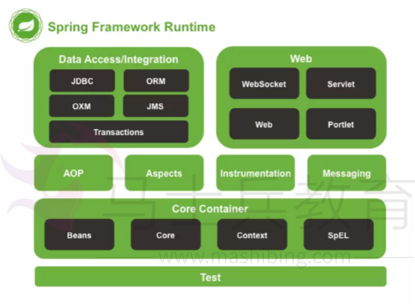

---

8. Spring框架中有哪些不同类型的事件
 
Spring 提供了以下5种标准的事件： 
1. 上下文更新事件（ContextRefreshedEvent）：在调用 ConfigurableApplicationContext 接口中
的refresh()方法时被触发。 
2. 上下文开始事件（ContextStartedEvent）：当容器调用 ConfigurableApplicationContext的
Start()方法开始/重新开始容器时触 发该事件。
3. 上下文停止事件（ContextStoppedEvent）：当容器调用 ConfigurableApplicationContext的
Stop()方法停止容器时触发该事件。 
4. 上下文关闭事件（ContextClosedEvent）：当ApplicationContext被 关闭时触发该事件。容器被
关闭时，其管理的所有单例Bean都被销毁。
5. 请求处理事件（RequestHandledEvent）：在Web应用中，当一个 http请求（request）结束触发
该事件。如果一个bean实现了 ApplicationListener接口，当一个ApplicationEvent 被发布以后，
bean 会自动被通知。 
9. Spring 应用程序有哪些不同组件？
 
Spring 应用一般有以下组件： 
接口 - 定义功能。 
Bean 类 - 它包含属性，setter 和 getter 方法，函数等。 
Bean 配置文件 - 包含类的信息以及如何配置它们。 
Spring 面向切面编程（AOP） - 提供面向切面编程的功能。 
用户程序 - 它使用接口。 
10. 使用 Spring 有哪些方式？
 
使用 Spring 有以下方式： 
作为一个成熟的 Spring Web 应用程序。 
作为第三方 Web 框架，使用 Spring Frameworks 中间层。 
作为企业级 Java Bean，它可以包装现有的 POJO（Plain Old Java  Objects）。 
用于远程使用。 
Spring控制反转(IOC)
 
什么是Spring IOC 容器？
 
控制反转即IoC (Inversion of Control)，它把传统上由程序代码直接操控的对
象的调用权交给容器，通过容器来实现对象组件的装配和管理。所谓的“控制反
转”概念就是对组件对象控制权的转移，从程序代码本身转移到了外部容器。
Spring IOC 负责创建对象，管理对象（通过依赖注入（DI），装配对象，配置对象，并且管理这些对象
的整个生命周期。
控制反转(IoC)有什么作用
 
管理对象的创建和依赖关系的维护。对象的创建并不是一件简单的事，在对象关系比较复杂时，如
果依赖关系需要程序猿来维护的话，那是相当头疼的
解耦，由容器去维护具体的对象 
托管了类的产生过程，比如我们需要在类的产生过程中做一些处理，最直接的例子就是代理，如果
有容器程序可以把这部分处理交给容器，应用程序则无需去关心类是如何完成代理的

---

IOC的优点是什么？
 
IOC 或 依赖注入把应用的代码量降到最低。
它使应用容易测试，单元测试不再需要单例和JNDI查找机制。
最小的代价和最小的侵入性使松散耦合得以实现。
IOC容器支持加载服务时的饿汉式初始化和懒加载。
Spring IoC 的实现机制
 
Spring 中的 IoC 的实现原理就是工厂模式加反射机制。
示例：
Spring 的 IoC支持哪些功能
 
Spring 的 IoC 设计支持以下功能：依赖注入依赖检查自动装配支持集合指定初始化方法和销毁方法
支持回调某些方法（但是需要实现 Spring 接口，略有侵入）
其中，最重要的就是依赖注入，从 XML 的配置上说，即 ref 标签。对应 Spring 
1 interface Fruit {
2 public abstract void eat();
3 }
4
5 class Apple implements Fruit {
6 public void eat(){
7 System.out.println("Apple");
8 }
9 }
10
11 class Orange implements Fruit {
12 public void eat(){
13 System.out.println("Orange");
14 }
15 }
16
17 class Factory {
18 public static Fruit getInstance(String ClassName) {
19 Fruit f=null;
20 try {
21 f=(Fruit)Class.forName(ClassName).newInstance();
22 } catch (Exception e) {
23 e.printStackTrace();
24 }
25 return f;
26 }
27 }
28
29 class Client {
30 public static void main(String[] a) {
31 Fruit f=Factory.getInstance("io.github.dunwu.spring.Apple");
32 if(f!=null){
33 f.eat();
34 }
35 }
36 }

---

RuntimeBeanReference 对象。
对于 IoC 来说，最重要的就是容器。容器管理着 Bean 的生命周期，控制着 Bean 的依赖注入。
BeanFactory 和 ApplicationContext有什么区别？
 
BeanFactory和ApplicationContext是Spring的两大核心接口，都可以当做 Spring的容器。其中
ApplicationContext是BeanFactory的子接口。
依赖关系
BeanFactory：是Spring里面最底层的接口，包含了各种Bean的定义，读取 bean配置文档，管理bean
的加载、实例化，控制bean的生命周期，维护bean 之间的依赖关系。
ApplicationContext接口作为BeanFactory的派生，除了提供BeanFactory所具
有的功能外，还提供了更完整的框架功能：
继承MessageSource，因此支持国际化。统一的资源文件访问方式。
提供在监听器中注册bean的事件。
同时加载多个配置文件。
载入多个（有继承关系）上下文 ，使得每一个上下文都专注于一个特定的层次，比如应用的web
层。
加载方式
BeanFactroy采用的是延迟加载形式来注入Bean的，即只有在使用到某个Bean 时(调用getBean())，才
对该Bean进行加载实例化。这样，我们就不能发现一些存在的Spring的配置问题。如果Bean的某一个
属性没有注入，BeanFacotry加载后，直至第一次使用调用getBean方法才会抛出异常。
ApplicationContext，它是在容器启动时，一次性创建了所有的Bean。这样，在容器启动时，我们就可
以发现Spring中存在的配置错误，这样有利于检查所
依赖属性是否注入。 ApplicationContext启动后预载入所有的单实例Bean，通过预载入单实例bean ,确
保当你需要的时候，你就不用等待，因为它们已经创建好了。
相对于基本的BeanFactory，ApplicationContext 唯一的不足是占用内存空间。当应用程序配置Bean较
多时，程序启动较慢。
创建方式
BeanFactory通常以编程的方式被创建，ApplicationContext还能以声明的方式创建，如使用
ContextLoader。
注册方式
BeanFactory和ApplicationContext都支持BeanPostProcessor、
BeanFactoryPostProcessor的使用，但两者之间的区别是：BeanFactory需要手动注册，而
ApplicationContext则是自动注册。
Spring 如何设计容器的，BeanFactory和 ApplicationContext的
关系详解
 
Spring 作者 Rod Johnson 设计了两个接口用以表示容器。
BeanFactory
ApplicationContext
BeanFactory 简单粗暴，可以理解为就是个 HashMap，Key 是 BeanName，

---

Value 是 Bean 实例。通常只提供注册（put），获取（get）这两个功能。我们可以称之为 “低级容
器”。
ApplicationContext 可以称之为 “高级容器”。因为他比 BeanFactory 多了更多的功能。他继承了多个接
口。因此具备了更多的功能。例如资源的获取，支持多种消息（例如 JSP tag 的支持），对 
BeanFactory 多了工具级别的支持等待。所以你看他的名字，已经不是 BeanFactory 之类的工厂了，而
是 “应用上下文”， 代表着整个大容器的所有功能。该接口定义了一个 refresh 方法，此方法是所有阅读 
Spring 源码的人的最熟悉的方法，用于刷新整个容器，即重新加载/刷新所有的 bean。
当然，除了这两个大接口，还有其他的辅助接口，这里就不介绍他们了。
BeanFactory和ApplicationContext的关系
为了更直观的展示 “低级容器” 和 “高级容器” 的关系，这里通过常用的 
ClassPathXmlApplicationContext 类来展示整个容器的层级 UML 关系。
有点复杂？ 先不要慌，我来解释一下。
最上面的是 BeanFactory，下面的 3 个绿色的，都是功能扩展接口，这里就不展开讲。
看下面的隶属 ApplicationContext 粉红色的 “高级容器”，依赖着 “低级容器”，这里说的是依赖，不是继
承哦。他依赖着 “低级容器” 的 getBean 功
能。而高级容器有更多的功能：支持不同的信息源头，可以访问文件资源，支持应用事件（Observer 模
式）。
通常用户看到的就是 “高级容器”。 但 BeanFactory 也非常够用啦！左边灰色区域的是 “低级容器”， 只
负载加载 Bean，获取 Bean。容器其他的高级功能是没有的。例如上图画的 refresh 刷新 Bean 工厂所
有配置，生命周期事件回调等。
小结
说了这么多，不知道你有没有理解Spring IoC？ 这里小结一下：IoC 在 Spring 里，只需要低级容器就可
以实现，2 个步骤：
1. 加载配置文件，解析成 BeanDefinition 放在 Map 里。
2. 调用 getBean 的时候，从 BeanDefinition 所属的 Map 里，拿出 
Class 对象进行实例化，同时，如果有依赖关系，将递归调用 getBean 方法 —— 完成依赖注入。

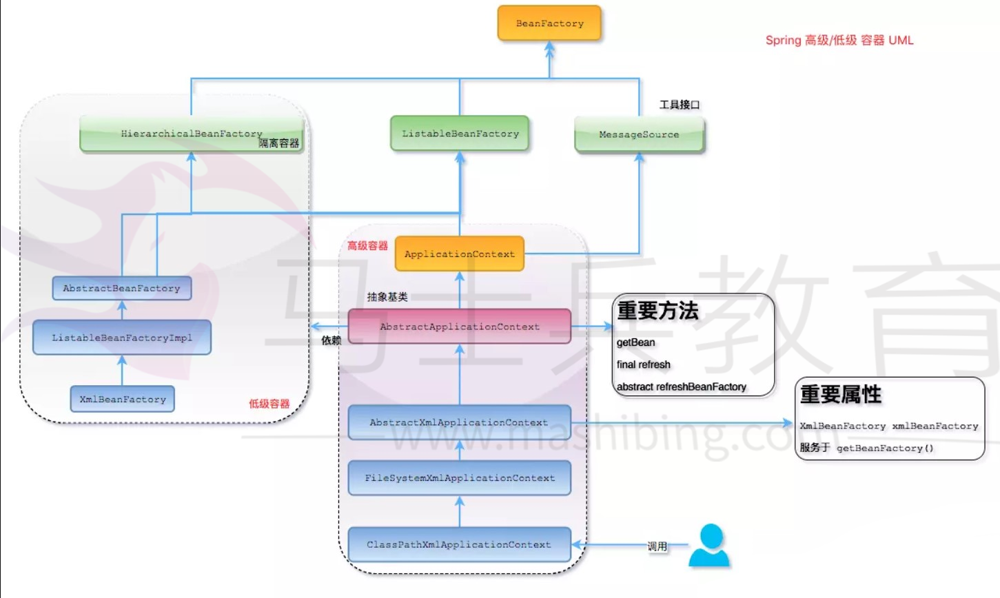

---

上面就是 Spring 低级容器（BeanFactory）的 IoC。
至于高级容器 ApplicationContext，他包含了低级容器的功能，当他执行 refresh 模板方法的时候，将
刷新整个容器的 Bean。同时其作为高级容器，包含了太多的功能。一句话，他不仅仅是 IoC。他支持不
同信息源头，支持 
BeanFactory 工具类，支持层级容器，支持访问文件资源，支持事件发布通知，支持接口回调等等。
ApplicationContext通常的实现是什么？
 
FileSystemXmlApplicationContext ：此容器从一个XML文件中加载beans 的定义，XML Bean 配置文
件的全路径名必须提供给它的构造函数。
ClassPathXmlApplicationContext：此容器也从一个XML文件中加载beans 的定义，这里，你需要正确
设置classpath因为这个容器将在classpath里找 bean配置。
WebXmlApplicationContext：此容器加载一个XML文件，此文件定义了一个WEB应用的所有bean。
什么是Spring的依赖注入？
 
控制反转IoC是一个很大的概念，可以用不同的方式来实现。其主要实现方式有两种：依赖注入和依赖查
找依赖注入：相对于IoC而言，依赖注入(DI)更加准确地描述了IoC的设计理念。所谓依赖注入
（Dependency Injection），即组件之间的依赖关系由容器在应用系统运行期来决定，也就是由容器动
态地将某种依赖关系的目标对象实例注入到应用系统中的各个关联的组件之中。组件不做定位查询，只
提供普通的Java方法让容器去决定依赖关系。
依赖注入的基本原则
 
依赖注入的基本原则是：应用组件不应该负责查找资源或者其他依赖的协作对象。配置对象的工作应该
由IoC容器负责，“查找资源”的逻辑应该从应用组件的代码中抽取出来，交给IoC容器负责。容器全权负
责组件的装配，它会把符合依赖关系的对象通过属性（JavaBean中的setter）或者是构造器传递给需要
的对象。
依赖注入有什么优势
 
依赖注入之所以更流行是因为它是一种更可取的方式：让容器全权负责依赖查询，受管组件只需要暴露
JavaBean的setter方法或者带参数的构造器或者接
口，使容器可以在初始化时组装对象的依赖关系。其与依赖查找方式相比，主要优势为：
查找定位操作与应用代码完全无关。
不依赖于容器的API，可以很容易地在任何容器以外使用应用对象。
不需要特殊的接口，绝大多数对象可以做到完全不必依赖容器。
有哪些不同类型的依赖注入实现方式？
 
依赖注入是时下最流行的IoC实现方式，依赖注入分为接口注入（Interface Injection），Setter方法注
入（Setter Injection）和构造器注入（Constructor 
Injection）三种方式。其中接口注入由于在灵活性和易用性比较差，现在从Spring4开始已被废弃。
构造器依赖注入：构造器依赖注入通过容器触发一个类的构造器来实现的，该类有一系列参数，每个参
数代表一个对其他类的依赖。
Setter方法注入：Setter方法注入是容器通过调用无参构造器或无参static工厂 方法实例化bean之后，
调用该bean的setter方法，即实现了基于setter的依赖注入。

---

构造函数注入
setter注 入
没有部分注入
有部分注入
不会覆盖 setter 属 性
会覆盖 setter 属 性
任意修改都会创建一个新实例
任意修改不会创建一个新实例
适用于设置很多属性
适用于设置少量属性
构造器依赖注入和 Setter方法注入的区别
 
两种依赖方式都可以使用，构造器注入和Setter方法注入。最好的解决方案是用构造器参数实现强制依
赖，setter方法实现可选依赖。
Spring Beans（19）什么是Spring beans？
 
Spring beans 是那些形成Spring应用的主干的java对象。它们被Spring IOC容器初始化，装配，和管
理。这些beans通过容器中配置的元数据创建。比如，以XML文件中 的形式定义。
一个 Spring Bean 定义 包含什么？
 
一个Spring Bean 的定义包含容器必知的所有配置元数据，包括bean，它的生命周期详情及它的依赖。
如何创建一个如何给Spring 容器提供配置元数据？Spring有几种配置方式
 
这里有三种重要的方法给Spring 容器提供配置元数据。
XML配置文件。
基于注解的配置。
基于java的配置。
Spring配置文件包含了哪些信息
 
Spring配置文件是个XML 文件，这个文件包含了类信息，描述了如何配置它们，以及如何相互调用。
Spring基于xml注入bean的几种方式
 
1. Set方法注入；
2. 构造器注入：①通过index设置参数的位置；②通过type设置参数类型；
3. 静态工厂注入；
4. 实例工厂；
你怎样定义类的作用域？
 
当定义一个 在Spring里，我们还能给这个bean声明一个作用域。它可以通过 bean 定义中的scope属性
来定义。如，当Spring要在需要的时候每次生产一个新的bean实例，bean的scope属性被指定为
prototype。另一方面，一个bean 每次使用的时候必须返回同一个实例，这个bean的scope 属性 必须
设为 singleton。
解释Spring支持的几种bean的作用域
 
Spring框架支持以下五种bean的作用域：
singleton : bean在每个Spring ioc 容器中只有一个实例。
prototype：一个bean的定义可以有多个实例。

---

request：每次http请求都会创建一个bean，该作用域仅在基于web的SpringApplicationContext
情形下有效。
session：在一个HTTP Session中，一个bean定义对应一个实例。该作用域仅在基于web的Spring 
ApplicationContext情形下有效。
global-session：在一个全局的HTTP Session中，一个bean定义对应一个
实例。该作用域仅在基于web的Spring ApplicationContext情形下有效。
注意： 缺省的Spring bean 的作用域是Singleton。使用 prototype 作用域需要慎重的思考，因为频繁创
建和销毁 bean 会带来很大的性能开销。
Spring框架中的单例bean是线程安全的吗？
 
不是，Spring框架中的单例bean不是线程安全的。
spring 中的 bean 默认是单例模式，spring 框架并没有对单例 bean 进行多线程的封装处理。
实际上大部分时候 spring bean 无状态的（比如 dao 类），所有某种程度上来说 bean 也是安全的，但
如果 bean 有状态的话（比如 view model 对象），那就要开发者自己去保证线程安全了，最简单的就
是改变 bean 的作用域，
把“singleton”变更为“prototype”，这样请求 bean 相当于 new Bean() 了，所以就可以保证线程安全
了。
有状态就是有数据存储功能。
无状态就是不会保存数据。
Spring如何处理线程并发问题？
 
在一般情况下，只有无状态的Bean才可以在多线程环境下共享，在Spring中，绝大部分Bean都可以声
明为singleton作用域，因为Spring对一些Bean中非线程安全状态采用ThreadLocal进行处理，解决线程
安全问题。
ThreadLocal和线程同步机制都是为了解决多线程中相同变量的访问冲突问题。同步机制采用了“时间换
空间”的方式，仅提供一份变量，不同的线程在访问前
需要获取锁，没获得锁的线程则需要排队。而ThreadLocal采用了“空间换时间”的方式。
ThreadLocal会为每一个线程提供一个独立的变量副本，从而隔离了多个线程对数据的访问冲突。因为
每一个线程都拥有自己的变量副本，从而也就没有必要对该变量进行同步了。ThreadLocal提供了线程
安全的共享对象，在编写多线程代码时，可以把不安全的变量封装进ThreadLocal。解释Spring框架中
bean的生命周期
在传统的Java应用中，bean的生命周期很简单。使用Java关键字new进行bean 实例化，然后该bean就
可以使用了。一旦该bean不再被使用，则由Java自动进行垃圾回收。相比之下，Spring容器中的bean的
生命周期就显得相对复杂多了。正确理解Spring bean的生命周期非常重要，因为你或许要利用Spring提
供的扩展点来自定义bean的创建过程。下图展示了bean装载到Spring应用上下文中的一个典型的生命
周期过程。

---

bean在Spring容器中从创建到销毁经历了若干阶段，每一阶段都可以针对 Spring如何管理bean进行个
性化定制。
正如你所见，在bean准备就绪之前，bean工厂执行了若干启动步骤。
我们对上图进行详细描述：
Spring对bean进行实例化；
Spring将值和bean的引用注入到bean对应的属性中；
如果bean实现了BeanNameAware接口，Spring将bean的ID传递给setBeanName()方法；
如果bean实现了BeanFactoryAware接口，Spring将调用setBeanFactory()方
法，将BeanFactory容器实例传入；
如果bean实现了ApplicationContextAware接口，Spring将调用 setApplicationContext()方法，将bean
所在的应用上下文的引用传入进来；
如果bean实现了BeanPostProcessor接口，Spring将调用它们的post-
ProcessBeforeInitialization()方法；
如果bean实现了InitializingBean接口，Spring将调用它们的afterPropertiesSet()方法。类似地，如果
bean使用initmethod声明了初始化方法，
该方法也会被调用；
如果bean实现了BeanPostProcessor接口，Spring将调用它们的post-
ProcessAfterInitialization()方法；此时，bean已经准备就绪，可以被应用程序使用了，它们将一直驻留
在应用上下文中，直到该应用上下文被销毁；
如果bean实现了DisposableBean接口，Spring将调用它的destroy()接口方
法。同样，如果bean使用destroy-method声明了销毁方法，该方法也会被调用。
现在你已经了解了如何创建和加载一个Spring容器。但是一个空的容器并没有太大的价值，在你把东西
放进去之前，它里面什么都没有。为了从Spring的
DI(依赖注入)中受益，我们必须将应用对象装配进Spring容器中。

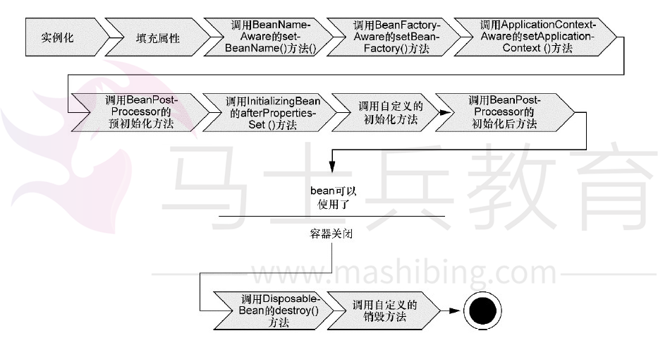

---

哪些是重要的bean生命周期方法？ 你能重载它们吗？
 
有两个重要的bean 生命周期方法，第一个是setup ， 它是在容器加载bean的
时候被调用。第二个方法是 teardown 它是在容器卸载类的时候被调用。
bean 标签有两个重要的属性（init-method和destroy-method）。用它们你可以自己定制初始化和注销
方法。它们也有相应的注解（@PostConstruct和@PreDestroy）。
什么是Spring的内部bean？什么是Spring inner beans？
 
在Spring框架中，当一个bean仅被用作另一个bean的属性时，它能被声明为一个内部bean。内部bean
可以用setter注入“属性”和构造方法注入“构造参数”的方式来实现，内部bean通常是匿名的，它们的
Scope一般是prototype。
在 Spring中如何注入一个java集合？
 
Spring提供以下几种集合的配置元素：类型用于注入一列值，允许有相同的值。
类型用于注入一组值，不允许有相同的值。
类型用于注入一组键值对，键和值都只能为String类型。
什么是bean装配？
 
装配，或bean 装配是指在Spring 容器中把bean组装到一起，前提是容器需要知道bean的依赖关系，如
何通过依赖注入来把它们装配到一起。
什么是bean的自动装配？
 
在Spring框架中，在配置文件中设定bean的依赖关系是一个很好的机制，
Spring 容器能够自动装配相互合作的bean，这意味着容器不需要和配置，能通
过Bean工厂自动处理bean之间的协作。这意味着 Spring可以通过向Bean 
Factory中注入的方式自动搞定bean之间的依赖关系。自动装配可以设置在每个bean上，也可以设定在
特定的bean上。
解释不同方式的自动装配，spring 自动装配 bean 有哪些方式？
 
在spring中，对象无需自己查找或创建与其关联的其他对象，由容器负责把需要相互协作的对象引用赋
予各个对象，使用autowire来配置自动装载模式。
在Spring框架xml配置中共有5种自动装配：
no：默认的方式是不进行自动装配的，通过手工设置ref属性来进行装配bean。
byName：通过bean的名称进行自动装配，如果一个bean的 property 与另一bean 的name 相
同，就进行自动装配。
byType：通过参数的数据类型进行自动装配。
constructor：利用构造函数进行装配，并且构造函数的参数通过 byType进行装配。
autodetect：自动探测，如果有构造方法，通过 construct的方式自动装配，否则使用 byType的方
式自动装配。

---

使用@Autowired注解自动装配的过程是怎样的？
 
使用@Autowired注解来自动装配指定的bean。在使用@Autowired注解之前需要在Spring配置文件进
行配置，。
在启动spring IoC时，容器自动装载了一个
AutowiredAnnotationBeanPostProcessor后置处理器，当容器扫描到@Autowied、@Resource或
@Inject时，就会在IoC容器自动查找需要的 bean，并装配给该对象的属性。在使用@Autowired时，首
先在容器中查询对应类型的bean：  
如果查询结果刚好为一个，就将该bean装配给@Autowired指定的数据；
如果查询的结果不止一个，那么@Autowired会根据名称来查找；
如果上述查找的结果为空，那么会抛出异常。解决方法时，使用required=false。
自动装配有哪些局限性？
 
自动装配的局限性是：重写：你仍需用 和 配置来定义依赖，意味着总要重写自动装配。
基本数据类型：你不能自动装配简单的属性，如基本数据类型，String字符串，和类。
模糊特性：自动装配不如显式装配精确，如果有可能，建议使用显式装配。
你可以在Spring中注入一个null 和一个空字符串吗？
 
可以
Spring注解
 
什么是基于Java的Spring注解配置? 给一些注解的例子
 
基于Java的配置，允许你在少量的Java注解的帮助下，进行你的大部分Spring 配置而非通过XML文件。
以@Configuration 注解为例，它用来标记类可以当做一个bean的定义，被
Spring IOC容器使用。
另一个例子是@Bean注解，它表示此方法将要返回一个对象，作为一个bean注册进Spring应用上下文。
怎样开启注解装配？
 
注解装配在默认情况下是不开启的，为了使用注解装配，我们必须在Spring配置文件中配置 元素。
@Component, @Controller, @Repository, @Service 有何区别？ 
@Component：这将 java 类标记为 bean。它是任何 Spring 管理组件的通用构造型。spring 的组件扫
描机制现在可以将其拾取并将其拉入应用程序环境中。
@Controller：这将一个类标记为 Spring Web MVC 控制器。标有它的 Bean 会自动导入到 IoC 容器
中。
1   @Configuration
2   public class StudentConfig {
3   @Bean
4   public StudentBean myStudent() {
5   return new StudentBean();
6   }
7   }

---

@Service：此注解是组件注解的特化。它不会对 @Component 注解提供任何其他行为。您可以在服务
层类中使用 @Service 而不是 @Component，因为它以更好的方式指定了意图。
@Repository：这个注解是具有类似用途和功能的 @Component 注解的特化。它为 DAO 提供了额外的
好处。它将 DAO 导入 IoC 容器，并使未经检查的异常有资格转换为 Spring DataAccessException。
@Required 注解有什么作用
 
这个注解表明bean的属性必须在配置的时候设置，通过一个bean定义的显式的属性值或通过自动装
配，若@Required注解的bean属性未被设置，容器将抛出
BeanInitializationException。示例：
@Autowired 注解有什么作用
 
@Autowired默认是按照类型装配注入的，默认情况下它要求依赖对象必须存在（可以设置它required
属性为false）。@Autowired 注解提供了更细粒度的控制，包括在何处以及如何完成自动装配。它的用
法和@Required一样，修饰 setter方法、构造器、属性或者具有任意名称和/或多个参数的PN方法。
@Autowired和@Resource之间的区别
 
@Autowired可用于：构造函数、成员变量、Setter方法
@Autowired和@Resource之间的区别
@Autowired默认是按照类型装配注入的，默认情况下它要求依赖对象必须存在（可以设置它required
属性为false）。
@Resource默认是按照名称来装配注入的，只有当找不到与名称匹配的bean才会按照类型来装配注入。 
1   public class Employee {
2   private String name;
3   @Required
4   public void setName(String name){
5   this.name=name;
6   }
7   public string getName(){
8   return name;
9   }
10  }
1   public class Employee {
2   private String name;
3   @Autowired
4   public void setName(String name) {
5   this.name=name;
6   }
7   public string getName(){
8   return name;
9   }
10  }

---

@Qualifier 注解有什么作用
 
当您创建多个相同类型的 bean 并希望仅使用属性装配其中一个 bean 时，您可以使用@Qualifier 注解
和 @Autowired 通过指定应该装配哪个确切的 bean 来消除歧义。
@RequestMapping 注解有什么用？
 
@RequestMapping 注解用于将特定 HTTP 请求方法映射到将处理相应请求的控制器中的特定类/方法。
此注释可应用于两个级别：
类级别：映射请求的 URL 
方法级别：映射 URL 以及 HTTP 请求方法
Spring数据访问
 
解释对象/关系映射集成模块
 
Spring 通过提供ORM模块，支持我们在直接JDBC之上使用一个对象/关系映射映射(ORM)工具，Spring 
支持集成主流的ORM框架，如Hiberate，JDO和 iBATIS，JPA，TopLink，JDO，OJB 。Spring的事务管
理同样支持以上所有ORM框架及JDBC。
在Spring框架中如何更有效地使用JDBC？
 
使用Spring JDBC 框架，资源管理和错误处理的代价都会被减轻。所以开发者
只需写statements 和 queries从数据存取数据，JDBC也可以在Spring框架提供的模板类的帮助下更有效
地被使用，这个模板叫JdbcTemplate
解释JDBC抽象和DAO模块
 
通过使用JDBC抽象和DAO模块，保证数据库代码的简洁，并能避免数据库资源错误关闭导致的问题，它
在各种不同的数据库的错误信息之上，提供了一个统一的异常访问层。它还利用Spring的AOP 模块给
Spring应用中的对象提供事务管理服务。
spring DAO 有什么用？
 
Spring DAO（数据访问对象） 使得 JDBC，Hibernate 或 JDO 这样的数据访
问技术更容易以一种统一的方式工作。这使得用户容易在持久性技术之间切换。
它还允许您在编写代码时，无需考虑捕获每种技术不同的异常。
spring JDBC API 中存在哪些类？
 
JdbcTemplate
SimpleJdbcTemplate
NamedParameterJdbcTemplate
SimpleJdbcInsert
SimpleJdbcCall

---

JdbcTemplate是什么
 
JdbcTemplate 类提供了很多便利的方法解决诸如把数据库数据转变成基本数据类型或对象，执行写好的
或可调用的数据库操作语句，提供自定义的数据错误处理。
使用Spring通过什么方式访问Hibernate？使用 Spring 访问
Hibernate 的方法有哪些？
 
在Spring中有两种方式访问Hibernate：
使用 Hibernate 模板和回调进行控制反转
ernateDAOSupport 并应用 AOP 拦截器节点
如何通扩展 Hib过HibernateDaoSupport将Spring和Hibernate 结
合起来？
 
用Spring的 SessionFactory 调用 LocalSessionFactory。集成过程分三步：
配置the Hibernate SessionFactory
继承HibernateDaoSupport实现一个DAO
在AOP支持的事务中装配
Spring支持的事务管理类型， spring 事务实现方式有哪些？
 
Spring支持两种类型的事务管理：编程式事务管理：这意味你通过编程的方式管理事务，给你带来极大
的灵活性，但是难维护。
声明式事务管理：这意味着你可以将业务代码和事务管理分离，你只需用注解和XML配置来管理事务。
Spring事务的实现方式和实现原理
 
Spring事务的本质其实就是数据库对事务的支持，没有数据库的事务支持，
spring是无法提供事务功能的。真正的数据库层的事务提交和回滚是通过 binlog或者redo log实现的。
说一下Spring的事务传播行为
 
spring事务的传播行为说的是，当多个事务同时存在的时候，spring如何处理这些事务的行为。
① PROPAGATION_REQUIRED：如果当前没有事务，就创建一个新事务，如果当前存在事务，就加入该
事务，该设置是最常用的设置。
② PROPAGATION_SUPPORTS：支持当前事务，如果当前存在事务，就加入该事务，如果当前不存在
事务，就以非事务执行。
③ PROPAGATION_MANDATORY：支持当前事务，如果当前存在事务，就加入该事务，如果当前不存
在事务，就抛出异常。
④ PROPAGATION_REQUIRES_NEW：创建新事务，无论当前存不存在事务，都创建新事务。
⑤ PROPAGATION_NOT_SUPPORTED：以非事务方式执行操作，如果当前存在事务，就把当前事务挂
起。
⑥ PROPAGATION_NEVER：以非事务方式执行，如果当前存在事务，则抛出异常。
⑦ PROPAGATION_NESTED：如果当前存在事务，则在嵌套事务内执行。如果当前没有事务，则按
REQUIRED属性执行。

---

说一下 spring 的事务隔离？
 
spring 有五大隔离级别，默认值为 ISOLATION_DEFAULT（使用数据库的设置），其他四个隔离级别和
数据库的隔离级别一致：
1. ISOLATION_DEFAULT：用底层数据库的设置隔离级别，数据库设置的是什么我就用什么；
2. ISOLATION_READ_UNCOMMITTED：未提交读，最低隔离级别、事务未提交前，就可被其他事务
读取（会出现幻读、脏读、不可重复读）； 3. ISOLATION_READ_COMMITTED：提交读，一个事
务提交后才能被其他事务读取到（会造成幻读、不可重复读），SQL server 的默认级别；
3. ISOLATION_REPEATABLE_READ：可重复读，保证多次读取同一个数据时，其值都和事务开始时
候的内容是一致，禁止读取到别的事务未提交的数据（会造成幻读），MySQL 的默认级别；
4. ISOLATION_SERIALIZABLE：序列化，代价最高最可靠的隔离级别，该隔离级别能防止脏读、不可
重复读、幻读。
脏读 ：表示一个事务能够读取另一个事务中还未提交的数据。比如，某个事务尝试插入记录 A，此时该
事务还未提交，然后另一个事务尝试读取到了记录 A。
不可重复读 ：是指在一个事务内，多次读同一数据。
幻读 ：指同一个事务内多次查询返回的结果集不一样。比如同一个事务 A 第一次查询时候有 n 条记录，
但是第二次同等条件下查询却有 n+1 条记录，这就好像产生了幻觉。发生幻读的原因也是另外一个事务
新增或者删除或者修改了第一个事务结果集里面的数据，同一个记录的数据内容被修改了，所有数据行
的记录就变多或者变少了。
Spring框架的事务管理有哪些优点？
 
为不同的事务API 如 JTA，JDBC，Hibernate，JPA 和JDO，提供一个不变的编程模式。
为编程式事务管理提供了一套简单的API而不是一些复杂的事务API 支持声明式事务管理。
和Spring各种数据访问抽象层很好得集成。
你更倾向用那种事务管理类型？
 
大多数Spring框架的用户选择声明式事务管理，因为它对应用代码的影响最小，因此更符合一个无侵入
的轻量级容器的思想。声明式事务管理要优于编程式事务管理，虽然比编程式事务管理（这种方式允许
你通过代码控制事务）少了一点灵活性。唯一不足地方是，最细粒度只能作用到方法级别，无法做到像
编程式事务那样可以作用到代码块级别。
Spring面向切面编程(AOP)什么是AOP
 
OOP(Object-Oriented Programming)面向对象编程，允许开发者定义纵向的关系，但并适用于定义横
向的关系，导致了大量代码的重复，而不利于各个模块的重用。
AOP(Aspect-Oriented Programming)，一般称为面向切面编程，作为面向对象的一种补充，用于将那
些与业务无关，但却对多个对象产生影响的公共行为和逻辑，抽取并封装为一个可重用的模块，这个模
块被命名为“切面”（Aspect），减少系统中的重复代码，降低了模块间的耦合度，同时提高了系统的可
维护性。可用于权限认证、日志、事务处理等。
Spring AOP and AspectJ AOP 有什么区别？AOP 有哪些实现方
式？
 
AOP实现的关键在于 代理模式，AOP代理主要分为静态代理和动态代理。静态代理的代表为AspectJ；
动态代理则以Spring AOP为代表。
（1）  AspectJ是静态代理的增强，所谓静态代理，就是AOP框架会在编译阶段生成AOP代理类，因此也
称为编译时增强，他会在编译阶段将AspectJ(切面)织入到Java字节码中，运行的时候就是增强之后的
AOP对象。

---

（2）  Spring AOP使用的动态代理，所谓的动态代理就是说AOP框架不会去修改字节码，而是每次运行
时在内存中临时为方法生成一个AOP对象，这个AOP
对象包含了目标对象的全部方法，并且在特定的切点做了增强处理，并回调原对象的方法。
JDK动态代理和CGLIB动态代理的区别
 
Spring AOP中的动态代理主要有两种方式，JDK动态代理和CGLIB动态代理：
JDK动态代理只提供接口的代理，不支持类的代理。核心InvocationHandler接口和Proxy类，
InvocationHandler 通过invoke()方法反射来调用目标类中的代码，动态地将横切逻辑和业务编织
在一起；接着，Proxy利用 InvocationHandler动态创建一个符合某一接口的的实例, 生成目标类的
代理对象。
如果代理类没有实现 InvocationHandler 接口，那么Spring AOP会选择使用CGLIB来动态代理目标
类。CGLIB（Code Generation Library），是一个代码生成的类库，可以在运行时动态的生成指定
类的一个子类对象，并覆盖其中特定方法并添加增强代码，从而实现AOP。CGLIB是通过继承的方
式做的动态代理，因此如果某个类被标记为final，那么它是无法使用CGLIB做动态代理的。
静态代理与动态代理区别在于生成AOP代理对象的时机不同，相对来说AspectJ 的静态代理方式具有更
好的性能，但是AspectJ需要特定的编译器进行处理，而
Spring AOP则无需特定的编译器处理。
InvocationHandler 的 invoke(Object proxy,Method method,Object[]
args)：
 
proxy是最终生成的代理实例; method 是被代理目标实例的某个具体方法; args 是被代理目标实例某个
方法的具体入参, 在方法反射调用时使用。
如何理解 Spring 中的代理？
 
将 Advice 应用于目标对象后创建的对象称为代理。在客户端对象的情况下，目标对象和代理对象是相同
的。
Advice + Target Object = Proxy
解释一下Spring AOP里面的几个名词
 
（1）  切面（Aspect）：切面是通知和切点的结合。通知和切点共同定义了切面的全部内容。 在Spring 
AOP中，切面可以使用通用类（基于模式的风格） 或者在普通类中以 @AspectJ 注解来实现。
（2）  连接点（Join point）：指方法，在Spring AOP中，一个连接点 总是 代表一个方法的执行。 应用
可能有数以千计的时机应用通知。这些时机被称为连接点。连接点是在应用执行过程中能够插入切面的
一个点。这个点可以是调用方法时、抛出异常时、甚至修改一个字段时。切面代码可以利用这些点插入
到应用的正常流程之中，并添加新的行为。
（3）  通知（Advice）：在AOP术语中，切面的工作被称为通知。
（4）  切入点（Pointcut）：切点的定义会匹配通知所要织入的一个或多个连接点。我们通常使用明确
的类和方法名称，或是利用正则表达式定义所匹配的类和方法名称来指定这些切点。
（5）  引入（Introduction）：引入允许我们向现有类添加新方法或属性。
（6）  目标对象（Target Object）： 被一个或者多个切面（aspect）所通知
（advise）的对象。它通常是一个代理对象。也有人把它叫做 被通知
（adviced） 对象。 既然Spring AOP是通过运行时代理实现的，这个对象永远是一个 被代理
（proxied） 对象。

---

（7）  织入（Weaving）：织入是把切面应用到目标对象并创建新的代理对象的过程。在目标对象的生
命周期里有多少个点可以进行织入：
编译期：切面在目标类编译时被织入。AspectJ的织入编译器是以这种方式织入切面的。
类加载期：切面在目标类加载到JVM时被织入。需要特殊的类加载器，它可以在目标类被引入应用
之前增强该目标类的字节码。AspectJ5的加载时织入就支持以这种方式织入切面。
运行期：切面在应用运行的某个时刻被织入。一般情况下，在织入切面时，AOP 容器会为目标对象
动态地创建一个代理对象。SpringAOP就是以这种方式织入切面。
Spring在运行时通知对象
 
通过在代理类中包裹切面，Spring在运行期把切面织入到Spring管理的bean
中。代理封装了目标类，并拦截被通知方法的调用，再把调用转发给真正的目标 bean。当代理拦截到方
法调用时，在调用目标bean方法之前，会执行切面逻辑。
直到应用需要被代理的bean时，Spring才创建代理对象。如果使用的是
ApplicationContext的话，在ApplicationContext从BeanFactory中加载所有 bean的时候，Spring才会
创建被代理的对象。因为Spring运行时才创建代理对象，所以我们不需要特殊的编译器来织入
SpringAOP的切面。
Spring只支持方法级别的连接点
因为Spring基于动态代理，所以Spring只支持方法连接点。Spring缺少对字段可以利用Aspect来补充。
连接点的支持，而且它不支持构造器连接点。方法之外的连接点拦截
功能，我们在Spring AOP 中，关注点和横切关注的区别是什么？在
spring aop 中 concern 和 cross-cutting concern 的不同之处
 
关注点（concern）是应用中一个模块的行为，一个关注点可能会被定义成一个我们想实现的一个功
能。
横切关注点（cross-cutting concern）是一个关注点，此关注点是整个应用都会使用的功能，并影响整
个应用，比如日志，安全和数据传输，几乎应用的每个模块都需要的功能。因此这些都属于横切关注
点。
Spring通知有哪些类型？
 
在AOP术语中，切面的工作被称为通知，实际上是程序执行时要通过
SpringAOP框架触发的代码段。
Spring切面可以应用5种类型的通知：
1. 前置通知（Before）：在目标方法被调用之前调用通知功能；
2. 后置通知（After）：在目标方法完成之后调用通知，此时不会关心方法的输出是什么；
3. 返回通知（After-returning ）：在目标方法成功执行之后调用通知；
4. 异常通知（After-throwing）：在目标方法抛出异常后调用通知；
5. 环绕通知（Around）：通知包裹了被通知的方法，在被通知的方法调用之前和调用之后执行自定
义的行为。
同一个aspect，不同advice的执行顺序：
①没有异常情况下的执行顺序：
around before advice before advice target method 执行 around after advice after advice
afterReturning

---

②有异常情况下的执行顺序： around before advice before advice target method 执行 around after 
advice after advice
afterThrowing:异常发生 java.lang.RuntimeException: 异常发生
什么是切面 Aspect？
 
aspect 由 pointcount 和 advice 组成，切面是通知和切点的结合。 它既包含了横切逻辑的定义, 也包括
了连接点的定义. Spring AOP 就是负责实施切面的框架, 它将切面所定义的横切逻辑编织到切面所指定的
连接点中.
AOP 的工作重心在于如何将增强编织目标对象的连接点上, 这里包含两个工作:
如何通过 pointcut 和 advice 定位到特定的 joinpoint 上
如何在 advice 中编写切面代码.
可以简单地认为, 使用 @Aspect 注解的类就是切面.
解释基于XML Schema方式的切面实现
 
在这种情况下，切面由常规类以及基于XML的配置实现。解释基于注解的切面实现
在这种情况下(基于@AspectJ的实现)，涉及到的切面声明的风格与带有java5标注的普通java类一致。
有几种不同类型的自动代理？
 
BeanNameAutoProxyCreator
DefaultAdvisorAutoProxyCreator
Metadata autoproxying

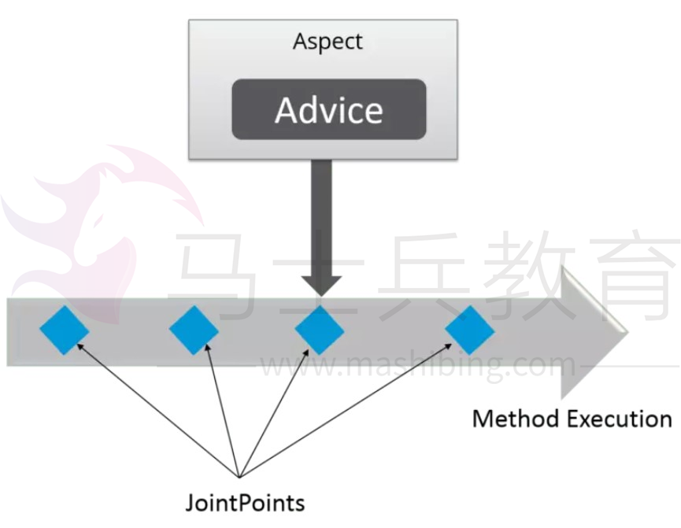

---

SpringMVC面试题
 
 
什么是 SpringMvc？
 
答：SpringMvc 是 spring 的一个模块，基于 MVC 的一个框架，无需中间整合层来整合。 
Spring MVC 的优点：答：
 
1）它是基于组件技术的.全部的应用对象,无论控制器和视图,还是业务对象之类的都是 java 组件.并且和 
Spring 提供的其他基础结构紧密集成.  
2）不依赖于 Servlet API(目标虽是如此,但是在实现的时候确实是依赖于 Servlet 的)  
3）可以任意使用各种视图技术,而不仅仅局限于 JSP  
4）支持各种请求资源的映射策略  
5）它应是易于扩展的 
 
SpringMVC 工作原理？答：
 
1）客户端发送请求到 DispatcherServlet 
2）DispatcherServlet 查询 handlerMapping 找到处理请求的 Controller  
3）Controller 调用业务逻辑后，返回 ModelAndView 
4）DispatcherServlet 查询 ModelAndView，找到指定视图  
5）视图将结果返回到客户端 
SpringMVC 流程？答：
 
 1）  用户发送请求至前端控制器 DispatcherServlet。  
 2）  DispatcherServlet 收到请求调用 HandlerMapping 处理器映射器。 
 3）  处理器映射器找到具体的处理器(可以根据 xml 配置、注解进行查找)，生成处理器对象及处理器拦
截器(如果有则生成)一并返回给 DispatcherServlet。   
4）  DispatcherServlet 调用 HandlerAdapter 处理器适配器。
5）  HandlerAdapter 经过适配调用具体的处理器(Controller，也叫后端控制器)。   
6）  Controller 执行完成返回 ModelAndView。   
7）  HandlerAdapter 将 controller 执行结果 ModelAndView 返回给 DispatcherServlet。   
8）  DispatcherServlet 将 ModelAndView 传给 ViewReslover 视图解析器。   
9）  ViewReslover 解析后返回具体 View。   
10）DispatcherServlet 根据 View 进行渲染视图（即将模型数据填充至视图中）。   
11）DispatcherServlet 响应用户。

---

SpringMvc 的控制器是不是单例模式,如果是,有什么问题,怎么解决？ 
答：是单例模式,所以在多线程访问的时候有线程安全问题,不要用同步,会影响性能的,解决方案是在控制
器里面不能写字段。 
如果你也用过 struts2.简单介绍下 springMVC 和 struts2 的区别有
哪些?
 
答：  
1）springmvc 的入口是一个 servlet 即前端控制器，而 struts2 入口是一个 filter 过虑器。 
2）springmvc 是基于方法开发(一个 url 对应一个方法)，请求参数传递到方法的形参，可以设计为单例
或多例(建议单例)，struts2 是基于类开发，传递参数是通过类的属性，只能设计为多例。 
3）Struts 采用值栈存储请求和响应的数据，通过 OGNL 存取数据，springmvc 通过参数解析器是将 
request 请求内容解析，并给方法形参赋值，将数据和视图封装成 ModelAndView 对象，最后又将 
ModelAndView 中的模型数据通过 reques 域传输到页面。Jsp 视图解析器默认使用 jstl。 
 
SpingMvc 中的控制器的注解一般用那个,有没有别的注解可以替代？ 
答：一般用@Conntroller 注解,表示是表现层,不能用用别的注解代替。 
@RequestMapping 注解用在类上面有什么作用？
 
答：是一个用来处理请求地址映射的注解，可用于类或方法上。用于类上，表示类中的所有响应请求的
方法都是以该地址作为父路径。 
怎么样把某个请求映射到特定的方法上面？
 
答：直接在方法上面加上注解@RequestMapping,并且在这个注解里面写上要拦截的路径 
如果在拦截请求中,我想拦截 get 方式提交的方法,怎么配置？
 
答：可以在@RequestMapping 注解里面加上 method=RequestMethod.GET
怎么样在方法里面得到 Request,或者 Session？
 
答：直接在方法的形参中声明 request,SpringMvc 就自动把 request 对象传入 
我想在拦截的方法里面得到从前台传入的参数,怎么得到？
 
答：直接在形参里面声明这个参数就可以,但必须名字和传过来的参数一样 
如果前台有很多个参数传入,并且这些参数都是一个对象的,那么怎么
样快速得到这个对象？
 
答：直接在方法中声明这个对象,SpringMvc 就自动会把属性赋值到这个对象里面。

---

SpringMvc 中函数的返回值是什么？
 
答：返回值可以有很多类型,有 String, ModelAndView,当一般用 String 比较好。 
SpringMVC 怎么样设定重定向和转发的？
 
答：在返回值前面加"forward:"就可以让结果转发,譬如"forward:user.do?name=method4" 在返回值前
面加"redirect:"就可以让返回值重定向,譬如"redirect:http://www.baidu.com"
SpringMvc 用什么对象从后台向前台传递数据的？
 
答：通过 ModelMap 对象,可以在这个对象里面用 put 方法,把对象加到里面,前台就可以通过 el 表达式
拿到。 
SpringMvc 中有个类把视图和数据都合并的一起的,叫什么？
 
答：叫 ModelAndView。 
怎么样把 ModelMap 里面的数据放入 Session 里面？
 
答：可以在类上面加上@SessionAttributes 注解,里面包含的字符串就是要放入 session 里面的 key 
SpringMvc 怎么和 AJAX 相互调用的？答：
 
 通过 Jackson 框架就可以把 Java 里面的对象直接转化成 Js 可以识别的 Json 对象。  
  具体步骤如下 ：  
1）加入 Jackson.jar  
2）在配置文件中配置 json 的映射   
3）在接受 Ajax 方法里面可以直接返回 Object,List 等,但方法前面要加上@ResponseBody 注解 
21、当一个方法向 AJAX 返回特殊对象,譬如 Object,List 等,需要做什么处理？答：要加上
@ResponseBody 注解 22、SpringMvc 里面拦截器是怎么写的 
答：有两种写法,一种是实现接口,另外一种是继承适配器类,然后在 SpringMvc 的配置文件中配置拦截器
即可：  
 
<!-- 配置 SpringMvc 的拦截器 --> 
<mvc:interceptors>    
   <!-- 配置一个拦截器的 Bean 就可以了 默认是对所有请求都拦截 -->    
   <bean id="myInterceptor" class="com.et.action.MyHandlerInterceptor"></bean>   
   
   <!-- 只针对部分请求拦截 -->      
   <mvc:interceptor>       
     <mvc:mapping path="/modelMap.do" />        
     <bean class="com.et.action.MyHandlerInterceptorAdapter" />

---

讲下 SpringMvc 的执行流程
 
答：系统启动的时候根据配置文件创建 spring 的容器, 首先是发送 http 请求到核心控制器
disPatherServlet，spring 容器通过映射器去寻找业务控制器，使用适配器找到相应的业务类，在进业
务类时进行数据封装，在封装前可能会涉及到类型转换，执行完业务类后使用
ModelAndView 进行视图转发，数据放在 model 中，用 map 传递数据进行页面显示。
 
 
 
 
 
Spring Boot（连老师）
 
 
 
 
Spring Boot概述
 
什么是 Spring Boot？
 
Spring Boot 是 Spring 开源组织下的子项目，是 Spring 组件一站式解决方案，主要是简化了使用 
Spring 的难度，简省了繁重的配置，提供了各种启动器，开发者能快速上手。
Spring Boot 有哪些优点？
 
Spring Boot 主要有如下优点：
1. 容易上手，提升开发效率，为 Spring 开发提供一个更快、更广泛的入门体验。
2. 开箱即用，远离繁琐的配置。
3. 提供了一系列大型项目通用的非业务性功能，例如：内嵌服务器、安全管理、运行数据监控、运行
状况检查和外部化配置等。
4. 没有代码生成，也不需要XML配置。
5. 避免大量的 Maven 导入和各种版本冲突。
Spring Boot 的核心注解是哪个？它主要由哪几个注解组成的？
 
启动类上面的注解是@SpringBootApplication，它也是 Spring Boot 的核心注解，主要组合包含了以下 
3 个注解：
@SpringBootConfiguration：组合了 @Configuration 注解，实现配置文件的功能。
   </mvc:interceptor>
</mvc:interceptors>

---

@EnableAutoConfiguration：打开自动配置的功能，也可以关闭某个自动配置的选项，如关闭数据源
自动配置功能： @SpringBootApplication(exclude 
= { DataSourceAutoConfiguration.class })。
@ComponentScan：Spring组件扫描。
配置
 
什么是 JavaConfig？
 
Spring JavaConfig 是 Spring 社区的产品，它提供了配置 Spring IoC 容器的纯Java 方法。因此它有助于
避免使用 XML 配置。使用 JavaConfig 的优点在于：
（1）  面向对象的配置。由于配置被定义为 JavaConfig 中的类，因此用户可以
充分利用 Java 中的面向对象功能。一个配置类可以继承另一个，重写它的
@Bean 方法等。
（2）  减少或消除 XML 配置。基于依赖注入原则的外化配置的好处已被证明。
但是，许多开发人员不希望在 XML 和 Java 之间来回切换。JavaConfig 为开发人员提供了一种纯 Java 方
法来配置与 XML 配置概念相似的 Spring 容器。从
技术角度来讲，只使用 JavaConfig 配置类来配置容器是可行的，但实际上很多人认为将JavaConfig 与 
XML 混合匹配是理想的。（3）类型安全和重构友好。JavaConfig 提供了一种类型安全的方法来配置 
Spring容器。由于 Java 5.0 对泛型的支持，现在可以按类型而不是按名称检索 bean，不需要任何强制
转换或基于字符串的查找。
Spring Boot 自动配置原理是什么？
 
注解 @EnableAutoConfiguration, @Configuration, @ConditionalOnClass 就是自动配置的核心，
@EnableAutoConfiguration 给容器导入META-INF/spring.factories 里定义的自动配置类。
筛选有效的自动配置类。
每一个自动配置类结合对应的 xxxProperties.java 读取配置文件进行自动配置功能
你如何理解 Spring Boot 配置加载顺序？
 
在 Spring Boot 里面，可以使用以下几种方式来加载配置。
1）     properties文件；
2）     YAML文件；
3）     系统环境变量；
等等……
4）命令行参数； 什么是 YAML？
 
YAML 是一种人类可读的数据序列化语言。它通常用于配置文件。与属性文件相比，如果我们想要在配
置文件中添加复杂的属性，YAML 文件就更加结构化，而且更少混淆。可以看出 YAML 具有分层配置数
据。

---

YAML 配置的优势在哪里 ?
 
YAML 现在可以算是非常流行的一种配置文件格式了，无论是前端还是后端，都可以见到 YAML 配置。
那么 YAML 配置和传统的 properties 配置相比到底有哪些优势呢？
1. 配置有序，在一些特殊的场景下，配置有序很关键
2. 支持数组，数组中的元素可以是基本数据类型也可以是对象
3. 简洁
相比 properties 配置文件，YAML 还有一个缺点，就是不支持 @PropertySource 注解导入自定义的 
YAML 配置。
Spring Boot 是否可以使用 XML 配置 ?
 
Spring Boot 推荐使用 Java 配置而非 XML 配置，但是 Spring Boot 中也可以使用 XML 配置，通过 
@ImportResource 注解可以引入一个 XML 配置。 spring boot 核心配置文件是什么？
bootstrap.properties 和 application.properties 有何区别 ?
单纯做 Spring Boot 开发，可能不太容易遇到 bootstrap.properties 配置文
件，但是在结合 Spring Cloud 时，这个配置就会经常遇到了，特别是在需要加载一些远程配置文件的时
侯。
spring boot 核心的两个配置文件：
 bootstrap (. yml 或者 . properties)：boostrap 由父 ApplicationContext 加载的，比 applicaton 优先
加载，配置在应用程序上下文的引导阶段生效。一般来说我们在 Spring Cloud Config 或者 Nacos 中会
用到它。且 boostrap 里面的属性不
能被覆盖；
 application (. yml 或者 . properties)： 由ApplicatonContext 加载，用于 spring boot 项目的自动化配
置。
什么是 Spring Profiles？
 
Spring Profiles 允许用户根据配置文件（dev，test，prod 等）来注册 bean。因此，当应用程序在开发
中运行时，只有某些 bean 可以加载，而在
PRODUCTION中，某些其他 bean 可以加载。假设我们的要求是 Swagger 文档仅适用于 QA 环境，并
且禁用所有其他文档。这可以使用配置文件来完成。Spring Boot 使得使用配置文件非常简单。
如何在自定义端口上运行 Spring Boot 应用程序？
 
为了在自定义端口上运行 Spring Boot 应用程序，您可以在
application.properties 中指定端口。server.port = 8090
安全
 
如何实现 Spring Boot 应用程序的安全性？
 
为了实现 Spring Boot 的安全性，我们使用 spring-boot-starter-security 依赖项，并且必须添加安全配
置。它只需要很少的代码。配置类将必须扩展
WebSecurityConfigurerAdapter 并覆盖其方法。

---

比较一下 Spring Security 和 Shiro 各自的优缺点 ?
 
由于 Spring Boot 官方提供了大量的非常方便的开箱即用的 Starter ，包括 
Spring Security 的 Starter ，使得在 Spring Boot 中使用 Spring Security 变得更加容易，甚至只需要添
加一个依赖就可以保护所有的接口，所以，如果是 
Spring Boot 项目，一般选择 Spring Security 。当然这只是一个建议的组合，单纯从技术上来说，无论
怎么组合，都是没有问题的。Shiro 和 Spring 
Security 相比，主要有如下一些特点：
1. Spring Security 是一个重量级的安全管理框架；Shiro 则是一个轻量级
的安全管理框架
2. Spring Security 概念复杂，配置繁琐；Shiro 概念简单、配置简单
3. Spring Security 功能强大；Shiro 功能简单
Spring Boot 中如何解决跨域问题 ?
 
跨域可以在前端通过 JSONP 来解决，但是 JSONP 只可以发送 GET 请求，无法发送其他类型的请求，在 
RESTful 风格的应用中，就显得非常鸡肋，因此我们推荐在后端通过 （CORS，Cross-origin resource 
sharing） 来解决跨域问题。这种解决方案并非 Spring Boot 特有的，在传统的 SSM 框架中，就可以通
过 CORS 来解决跨域问题，只不过之前我们是在 XML 文件中配置 CORS ，现在可以通过实现
WebMvcConfigurer接口然后重写addCorsMappings方法解决跨域问题。
项目中前后端分离部署，所以需要解决跨域的问题。
我们使用cookie存放用户登录的信息，在spring拦截器进行权限控制，当权限不符合时，直接返回给用
户固定的json结果。
当用户登录以后，正常使用；当用户退出登录状态时或者token过期时，由于拦截器和跨域的顺序有问
题，出现了跨域的现象。
我们知道一个http请求，先走filter，到达servlet后才进行拦截器的处理，如果我们把cors放在filter里，
就可以优先于权限拦截器执行。
1  @Configuration
2  public class CorsConfig implements WebMvcConfigurer { 3
4   @Override
5   public void addCorsMappings(CorsRegistry registry) {
6   registry.addMapping("/**")
7   .allowedOrigins("*")
8   .allowCredentials(true)
9   .allowedMethods("GET", "POST", "PUT", "DELETE", "OPTIONS")
10   .maxAge(3600);
11   } 
12
13  }
1  @Configuration
2  public class CorsConfig { 3
4   @Bean
5   public CorsFilter corsFilter() {
6   CorsConfiguration corsConfiguration = new CorsConfiguration();
7   corsConfiguration.addAllowedOrigin("*");
8   corsConfiguration.addAllowedHeader("*");

---

什么是 CSRF 攻击？
 
CSRF 代表跨站请求伪造。这是一种攻击，迫使 终用户在当前通过身份验证的 Web 应用程序上执行不需
要的操作。CSRF 攻击专门针对状态改变请求，而不是数据窃取，因为攻击者无法查看对伪造请求的响
应。
监视器
 
Spring Boot 中的监视器是什么？
 
Spring boot actuator 是 spring 启动框架中的重要功能之一。Spring boot 监视器可帮助您访问生产环
境中正在运行的应用程序的当前状态。有几个指标必须在生产环境中进行检查和监控。即使一些外部应
用程序可能正在使用这些服务来向相关人员触发警报消息。监视器模块公开了一组可直接作为 HTTP 
URL 访问 的REST 端点来检查状态。
如何在 Spring Boot 中禁用 Actuator 端点安全性？
默认情况下，所有敏感的 HTTP 端点都是安全的，只有具有 ACTUATOR 角色
的用户才能访问它们。安全性是使用标准的 HttpServletRequest.isUserInRole 方法实施的。 我们可以
使用来禁用安全性。只有在执行机构端点在防火墙后访问时，才建议禁用安全性。
我们如何监视所有 Spring Boot 微服务？
 
Spring Boot 提供监视器端点以监控各个微服务的度量。这些端点对于获取有关应用程序的信息（如它
们是否已启动）以及它们的组件（如数据库等）是否正常运行很有帮助。但是，使用监视器的一个主要
缺点或困难是，我们必须单独打开应用程序的知识点以了解其状态或健康状况。想象一下涉及 50 个应
用程序的微服务，管理员将不得不击中所有 50 个应用程序的执行终端。为了帮助我们处理这种情况，
我们将使用位于的开源项目。 它建立在 Spring Boot Actuator 之上，它提供了一个 Web UI，使我们能
够可视化多个应用程序的度量。
整合第三方项目
 
什么是 WebSockets？
 
WebSocket 是一种计算机通信协议，通过单个 TCP 连接提供全双工通信信道。
1、     WebSocket 是双向的 -使用 WebSocket 客户端或服务器可以发起消息发送。
2、     WebSocket 是全双工的 -客户端和服务器通信是相互独立的。
3、     单个 TCP 连接 -初始连接使用 HTTP，然后将此连接升级到基于套接字的连接。然后这个单一连接
用于所有未来的通信
4、     Light -与 http 相比，WebSocket 消息数据交换要轻得多。
9   corsConfiguration.addAllowedMethod("*");
10   corsConfiguration.setAllowCredentials(true);
11   UrlBasedCorsConfigurationSource urlBasedCorsConfigurationSource = new U 
rlBasedCorsConfigurationSource();
12   urlBasedCorsConfigurationSource.registerCorsConfiguration("/**", corsCo 
nfiguration);
13   return new CorsFilter(urlBasedCorsConfigurationSource);
14   } 
15
16  }

---

什么是 Spring Data ?
Spring Data 是 Spring 的一个子项目。用于简化数据库访问，支持NoSQL 和 关系数据存储。其主要目
标是使数据库的访问变得方便快捷。Spring Data 具有如下特点：
SpringData 项目支持 NoSQL 存储：
1. MongoDB （文档数据库）
2. Neo4j（图形数据库）
3. Redis（键/值存储）
4. Hbase（列族数据库）
SpringData 项目所支持的关系数据存储技术：
1. JDBC
2. JPA
Spring Data Jpa 致力于减少数据访问层 (DAO) 的开发量. 开发者唯一要做的，就是声明持久层的接口，
其他都交给 Spring Data JPA 来帮你完成！Spring Data JPA 通过规范方法的名字，根据符合规范的名字
来确定方法需要实现什么样的逻辑。
什么是 Spring Batch？
 
Spring Boot Batch 提供可重用的函数，这些函数在处理大量记录时非常重要，包括日志/跟踪，事务管
理，作业处理统计信息，作业重新启动，跳过和资源管理。它还提供了更先进的技术服务和功能，通过
优化和分区技术，可以实现极高批量和高性能批处理作业。简单以及复杂的大批量批处理作业可以高度
可扩展的方式利用框架处理重要大量的信息。
什么是 FreeMarker 模板？
 
FreeMarker 是一个基于 Java 的模板引擎，  初专注于使用 MVC 软件架构进行动态网页生成。使用 
Freemarker 的主要优点是表示层和业务层的完全分离。程序员可以处理应用程序代码，而设计人员可
以处理 html 页面设计。 后使用 freemarker 可以将这些结合起来，给出  终的输出页面。
如何集成 Spring Boot 和 ActiveMQ？
 
对于集成 Spring Boot 和 ActiveMQ，我们使用依赖关系。 它只需要很少的配置，并且不需要样板代
码。
什么是 Apache Kafka？
 
Apache Kafka 是一个分布式发布 - 订阅消息系统。它是一个可扩展的，容错的发布 - 订阅消息系统，它
使我们能够构建分布式应用程序。这是一个 Apache 顶级项目。Kafka 适合离线和在线消息消费。
什么是 Swagger？你用 Spring Boot 实现了它吗？
 
Swagger 广泛用于可视化 API，使用 Swagger UI 为前端开发人员提供在线沙箱。Swagger 是用于生成 
RESTful Web 服务的可视化表示的工具，规范和完整框架实现。它使文档能够以与服务器相同的速度更
新。当通过 Swagger 正确定义时，消费者可以使用 少量的实现逻辑来理解远程服务并与其进行交互。
因此，Swagger消除了调用服务时的猜测。
前后端分离，如何维护接口文档 ?
前后端分离开发日益流行，大部分情况下，我们都是通过 Spring Boot 做前后端分离开发，前后端分离
一定会有接口文档，不然会前后端会深深陷入到扯皮中。一个比较笨的方法就是使用 word 或者 md 来
维护接口文档，但是效率太低，接口一变，所有人手上的文档都得变。在 Spring Boot 中，这个问题常
见

---

的解决方案是 Swagger ，使用 Swagger 我们可以快速生成一个接口文档网
站，接口一旦发生变化，文档就会自动更新，所有开发工程师访问这一个在线网站就可以获取到 新的接
口文档，非常方便。
其他
 
如何重新加载 Spring Boot 上的更改，而无需重新启动服务器？
Spring Boot项目如何热部署？
 
这可以使用 DEV 工具来实现。通过这种依赖关系，您可以节省任何更改，嵌入式tomcat 将重新启动。
Spring Boot 有一个开发工具（DevTools）模块，它有助于提高开发人员的生产力。Java 开发人员面临
的一个主要挑战是将文件更改自动部署到服务器并自动重启服务器。开发人员可以重新加载 Spring 
Boot 上的更改，而无需重新启动服务器。这将消除每次手动部署更改的需要。
Spring Boot 在发布它的第一个版本时没有这个功能。这是开发人员 需要的功能。DevTools 模块完全满
足开发人员的需求。该模块将在生产环境中被禁用。
它还提供 H2 数据库控制台以更好地测试应用程序。
您使用了哪些 starter maven 依赖项？
 
使用了下面的一些依赖项
spring-boot-starter-activemq
spring-boot-starter-security
这有助于增加更少的依赖关系，并减少版本的冲突。
Spring Boot 中的 starter 到底是什么 ?
首先，这个 Starter 并非什么新的技术点，基本上还是基于 Spring 已有功能来实现的。首先它提供了一
个自动化配置类，一般命名为 XXXAutoConfiguration 
，在这个配置类中通过条件注解来决定一个配置是否生效（条件注解就是 
Spring 中原本就有的），然后它还会提供一系列的默认配置，也允许开发者根据实际情况自定义相关配
置，然后通过类型安全的属性注入将这些配置属性注入进来，新注入的属性会代替掉默认属性。正因为
如此，很多第三方框架，我们只需要引入依赖就可以直接使用了。当然，开发者也可以自定义 Starter 
spring-boot-starter-parent 有什么用 ?
我们都知道，新创建一个 Spring Boot 项目，默认都是有 parent 的，这个 
parent 就是 spring-boot-starter-parent ，spring-boot-starter-parent 主要有如下作用：
1. 定义了 Java 编译版本为 1.8 。
2. 使用 UTF-8 格式编码。
3. 继承自 spring-boot-dependencies，这个里边定义了依赖的版本，也正是因为继承了这个依赖，
所以我们在写依赖时才不需要写版本号。
4. 执行打包操作的配置。
5. 自动化的资源过滤。
6. 自动化的插件配置。
1 <dependency>
2   <groupId>org.springframework.boot</groupId>
3   <artifactId>spring-boot-devtools</artifactId>
4  </dependency>

---

7. 针对 application.properties 和 application.yml 的资源过滤，包括通过 profile 定义的不同环境的
配置文件，例如 applicationdev.properties 和 application-dev.yml。
Spring Boot 打成的 jar 和普通的 jar 有什么区别 ?
Spring Boot 项目  终打包成的 jar 是可执行 jar ，这种 jar 可以直接通过 java jar xxx.jar 命令来运行，
这种 jar 不可以作为普通的 jar 被其他项目依赖，即使依赖了也无法使用其中的类。
Spring Boot 的 jar 无法被其他项目依赖，主要还是他和普通 jar 的结构不同。普通的 jar 包，解压后直
接就是包名，包里就是我们的代码，而 Spring Boot 
打包成的可执行 jar 解压后，在 \BOOT-INF\classes 目录下才是我们的代码，因此无法被直接引用。如
果非要引用，可以在 pom.xml 文件中增加配置，将 Spring Boot 项目打包成两个 jar ，一个可执行，一
个可引用。
运行 Spring Boot 有哪几种方式？
 
1）     打包用命令或者放到容器中运行
2）     用 Maven/ Gradle 插件运行
3）直接执行 main 方法运行
Spring Boot 需要独立的容器运行吗？
 
开启 Spring Boot 特性有哪几种方式？
 
1）     继承spring-boot-starter-parent项目
2）     导入spring-boot-dependencies项目依赖
如何使用 Spring Boot 实现异常处理？
 
Spring 提供了一种使用 ControllerAdvice 处理异常的非常有用的方法。 我们通过实现一个 
ControlerAdvice 类，来处理控制器类抛出的所有异常。
如何使用 Spring Boot 实现分页和排序？
 
使用 Spring Boot 实现分页非常简单。使用 Spring Data-JPA 可以实现将可分页的传递给存储库方法。
微服务中如何实现 session 共享 ?
在微服务中，一个完整的项目被拆分成多个不相同的独立的服务，各个服务独立部署在不同的服务器
上，各自的 session 被从物理空间上隔离开了，但是经
常，我们需要在不同微服务之间共享 session ，常见的方案就是 Spring 
Session + Redis 来实现 session 共享。将所有微服务的 session 统一保存在 Redis 上，当各个微服务对 
session 有相关的读写操作时，都去操作 Redis 上的 session 。这样就实现了 session 共享，Spring 
Session 基于 Spring 中的代理过滤器实现，使得 session 的同步操作对开发人员而言是透明的，非常简
便。
Spring Boot 中如何实现定时任务 ?
 
定时任务也是一个常见的需求，Spring Boot 中对于定时任务的支持主要还是来自 Spring 框架。
在 Spring Boot 中使用定时任务主要有两种不同的方式，一个就是使用 Spring 中的 @Scheduled 注
解，另一个则是使用第三方框架 Quartz。
使用 Spring 中的 @Scheduled 的方式主要通过 @Scheduled 注解来实现。

---

使用 Quartz ，则按照 Quartz 的方式，定义 Job 和 Trigger 即可。
 
 
 
Spring Boot 原理
 
Spring Boot 是由 Pivotal 团队提供的全新框架，其设计目的是用来简化新 Spring 应用的初始搭建以及
开发过程。该框架使用了特定的方式来进行配置，从而使开发人员不再需要定义样板化的配置。通过这
种方式，Spring Boot 致力于在蓬勃发展的快速应用开发领域(rapid application development)成为领导
者。其特点如下： 
1. 创建独立的 Spring 应用程序 
2. 嵌入的 Tomcat，无需部署 WAR 文件 
3. 简化 Maven 配置 
4. 自动配置 Spring 
5. 提供生产就绪型功能，如指标，健康检查和外部配置 
6. 绝对没有代码生成和对 XML 没有要求配置 [1] 
 
 
Spring Boot比Spring做了哪些改进？
 
1）Spring Boot可以建立独立的Spring应用程序； 
2）内嵌了如Tomcat，Jetty和Undertow这样的容器，也就是说可以直接跑起来，用不着再做 部署工作
了；
3）无需再像Spring那样搞一堆繁琐的xml文件的配置； 
4）可以自动配置Spring。SpringBoot将原有的XML配置改为Java配置，将bean注入改为使 用注解注入
的方式(@Autowire)，并将多个xml、properties配置浓缩在一个appliaction.yml 配置文件中。 
5）提供了一些现有的功能，如量度工具，表单数据验证以及一些外部配置这样的一些第三方功 能； 
6）整合常用依赖（开发库，例如spring-webmvc、jackson-json、validation-api和tomcat 等），提供
的POM可以简化Maven的配置。当我们引入核心依赖时，SpringBoot会自引入其 他依赖。 
 
 
 
 
Spring boot 热加载

---

在实际的开发中避免不了自己测试的时候修修改改，甚至有些源代码的修改是需要重启项目的，这个时
候热加载就帮了大忙了，其会自动将修改的代码应用到部署的项目中去，而不用自己再次的去手动重
启，大大的提高了我们开发的效率，实现了代码随时改效果立马生效的效果，好了废话不多说了，下面
来介绍怎解嵌入热加载的实现。
在pom文件中添加依赖（optional-->true表示覆盖父级项目中的引用）：
 
  org.springframework.boot </ groupId> 
  spring-boot-devtools </ artifactId> 
  true </ optional> 
 </ dependency>
就是这么简单，这样就可以了，当然了，有些时候我们再修改一些文件时是并不希望其触发重启的，例
如一些静态资源等，此时我们可以设置一些排序路径来将其排除出去，在此之前先来介绍一下触发重启
的条件吧：当DevTools监视类路径资源时，触发重新启动的唯一方法是更新类路径。导致类路径更新的
方式取决于您正在使用的IDE。在Eclipse中，保存修改的文件将导致类路径被更新并触发重新启动。在
IntelliJ IDEA中，构建project（Build -> Make Project）将具有相同的效果。
如果要自定义一些排除项，您可以使用该spring.devtools.restart.exclude属性。例如，仅排除 /static
和/public你设置如下：
 spring.devtools.restart.exclude=static/,public/
 当您对不在类路径中的文件进行更改时，可能需要重新启动或重新加载应用程序。为此，请使用该 
spring.devtools.restart.additional-paths属性配置其他路径来监视更改。
如果您不想使用重新启动功能，可以使用该spring.devtools.restart.enabled属性禁用它 。在大多数情
况下，您可以将其设置为 application.properties（仍将初始化重新启动类加载器，但不会监视文件更
改）。
 例如，如果您需要完全禁用重新启动支持，因为它不适用于特定库，则需要System在调用之前设置属
性 SpringApplication.run(…)。例如：
 public static void main(String[] args) {
   System.setProperty("spring.devtools.restart.enabled", "false");
   SpringApplication.run(MyApp.class, args);
 }
我不知道大家都使用的是什么IDE，我现在用的是IntelliJ IDEA，而这个工具有各特点就是编辑文件后其
会立刻自动保存，并不需要手动的Ctrl+s来操作，造成的结果就是每当我修改一个触发启动的文件的时
候其就会自动进行热加载，而我们并不想这样频繁的去热加载的话，可以进行一些特殊的设计实现仅在
特定的时间去触发热加载：我们可以使用“触发文件”，这是一个特殊文件，当您要实际触发重新启动检
查时，必须修改它。更改文件只会触发检查，只有在Devtools检测到它必须执行某些操作时才会重新启
动。触发文件可以手动更新，也可以通过IDE插件更新。要使用触发器文件使用该
spring.devtools.restart.trigger-file属性。
 
 
 
Spring Boot设置有效时间和自动刷新缓存，时间支持在配
置文件中配置

---

Spring Boot缓存实战 Redis 设置有效时间和自动刷新缓存，时间支
持在配置文件中配置
 
 
问题描述
 
Spring Cache提供的@Cacheable注解不支持配置过期时间，还有缓存的自动刷新。
我们可以通过配置CacheManneg来配置默认的过期时间和针对每个缓存容器（value）单独配置过期时
间，但是总是感觉不太灵活。下面是一个示例:
我们想在注解上直接配置过期时间和自动刷新时间，就像这样：
value属性上用#号隔开，第一个是原始的缓存容器名称，第二个是缓存的有效时间，第三个是缓存的自
动刷新时间，单位都是秒。
缓存的有效时间和自动刷新时间支持SpEl表达式，支持在配置文件中配置，如：
解决思路
 
查看源码你会发现缓存最顶级的接口就是CacheManager和Cache接口。
@Bean
public CacheManager cacheManager(RedisTemplate redisTemplate) {
    RedisCacheManager cacheManager= new RedisCacheManager(redisTemplate);
    cacheManager.setDefaultExpiration(60);
    Map<String,Long> expiresMap=new HashMap<>();
    expiresMap.put("Product",5L);
    cacheManager.setExpires(expiresMap);
    return cacheManager;
}
@Cacheable(value = "people#120#90", key = "#person.id")
public Person findOne(Person person) {
    Person p = personRepository.findOne(person.getId());
    System.out.println("为id、key为:" + p.getId() + "数据做了缓存");
    return p;
}
@Cacheable(value = 
"people#${select.cache.timeout:1800}#${select.cache.refresh:600}", key = 
"#person.id", sync = true)//3
public Person findOne(Person person) {
    Person p = personRepository.findOne(person.getId());
    System.out.println("为id、key为:" + p.getId() + "数据做了缓存");
    return p;
}

---

CacheManager说明
 
CacheManager功能其实很简单就是管理cache，接口只有两个方法，根据容器名称获取一个Cache。还
有就是返回所有的缓存名称。
Cache说明
 
Cache接口主要是操作缓存的。get根据缓存key从缓存服务器获取缓存中的值，put根据缓存key将数据
放到缓存服务器，evict根据key删除缓存中的数据。
请求步骤
 
1. 请求进来，在方法上面扫描@Cacheable注解，那么会触发
org.springframework.cache.interceptor.CacheInterceptor缓存的拦截器。
2. 然后会调用CacheManager的getCache方法，获取Cache，如果没有（第一次访问）就新建一
Cache并返回。
3. 根据获取到的Cache去调用get方法获取缓存中的值。RedisCache这里有个bug，源码是先判断key
是否存在，再去缓存获取值，在高并发下有bug。
代码分析
 
在最上面我们说了Spring Cache可以通过配置CacheManager来配置过期时间。那么这个过期时间是在
哪里用的呢？设置默认的时间setDefaultExpiration，根据特定名称设置有效时间setExpires，获取一个
缓存名称（value属性）的有效时间computeExpiration，真正使用有效时间是在createCache方法里
面，而这个方法是在父类的getCache方法调用。通过RedisCacheManager源码我们看到：
public interface CacheManager {
 
    /**
     * 根据名称获取一个Cache（在实现类里面是如果有这个Cache就返回，没有就新建一个Cache放到
Map容器中）
     * @param name the cache identifier (must not be {@code null})
     * @return the associated cache, or {@code null} if none found
     */
    Cache getCache(String name);
 
    /**
     * 返回一个缓存名称的集合
     * @return the names of all caches known by the cache manager
     */
    Collection<String> getCacheNames();
 
}
public interface Cache {
 
    ValueWrapper get(Object key);
 
    void put(Object key, Object value);
 
    void evict(Object key);
 
    ...
}

---

AbstractCacheManager父类源码：
// 设置默认的时间
public void setDefaultExpiration(long defaultExpireTime) {
    this.defaultExpiration = defaultExpireTime;
}
 
// 根据特定名称设置有效时间
public void setExpires(Map<String, Long> expires) {
    this.expires = (expires != null ? new ConcurrentHashMap<String, Long>
(expires) : null);
}
// 获取一个key的有效时间
protected long computeExpiration(String name) {
    Long expiration = null;
    if (expires != null) {
        expiration = expires.get(name);
    }
    return (expiration != null ? expiration.longValue() : defaultExpiration);
}
 
@SuppressWarnings("unchecked")
protected RedisCache createCache(String cacheName) {
    // 调用了上面的方法获取缓存名称的有效时间
    long expiration = computeExpiration(cacheName);
    // 创建了Cache对象，并使用了这个有效时间
    return new RedisCache(cacheName, (usePrefix ? cachePrefix.prefix(cacheName) 
: null), redisOperations, expiration,
            cacheNullValues);
}
 
// 重写父类的getMissingCache。去创建Cache
@Override
protected Cache getMissingCache(String name) {
    return this.dynamic ? createCache(name) : null;
}
// 根据名称获取Cache如果没有调用getMissingCache方法，生成新的Cache，并将其放到Map容器中去。
@Override
public Cache getCache(String name) {
    Cache cache = this.cacheMap.get(name);
    if (cache != null) {
        return cache;
    }
    else {
        // Fully synchronize now for missing cache creation...
        synchronized (this.cacheMap) {
            cache = this.cacheMap.get(name);
            if (cache == null) {
                // 如果没找到Cache调用该方法，这个方法默认返回值NULL由子类自己实现。上面的
就是子类自己实现的方法
                cache = getMissingCache(name);
                if (cache != null) {
                    cache = decorateCache(cache);
                    this.cacheMap.put(name, cache);
                    updateCacheNames(name);
                }

---

由此这个有效时间的设置关键就是在getCache方法上，这里的name参数就是我们注解上的value属性。
所以在这里解析这个特定格式的名称我就可以拿到配置的过期时间和刷新时间。getMissingCache方法
里面在新建缓存的时候将这个过期时间设置进去，生成的Cache对象操作缓存的时候就会带上我们的配
置的过期时间，然后过期就生效了。解析SpEL表达式获取配置文件中的时间也在也一步完成。
CustomizedRedisCacheManager源码：
            }
            return cache;
        }
    }
}
package com.xiaolyuh.redis.cache;
 
import com.xiaolyuh.redis.cache.helper.SpringContextHolder;
import com.xiaolyuh.redis.utils.ReflectionUtils;
import org.apache.commons.lang3.StringUtils;
import org.slf4j.Logger;
import org.slf4j.LoggerFactory;
import org.springframework.beans.factory.annotation.Autowired;
import org.springframework.beans.factory.support.DefaultListableBeanFactory;
import org.springframework.cache.Cache;
import org.springframework.data.redis.cache.RedisCacheManager;
import org.springframework.data.redis.core.RedisOperations;
 
import java.util.Collection;
import java.util.concurrent.ConcurrentHashMap;
 
/**
 * 自定义的redis缓存管理器
 * 支持方法上配置过期时间
 * 支持热加载缓存：缓存即将过期时主动刷新缓存
 *
 * @author yuhao.wang
 */
public class CustomizedRedisCacheManager extends RedisCacheManager {
 
    private static final Logger logger = 
LoggerFactory.getLogger(CustomizedRedisCacheManager.class);
 
    /**
     * 父类cacheMap字段
     */
    private static final String SUPER_FIELD_CACHEMAP = "cacheMap";
 
    /**
     * 父类dynamic字段
     */
    private static final String SUPER_FIELD_DYNAMIC = "dynamic";
    /**
     * 父类cacheNullValues字段
     */
    private static final String SUPER_FIELD_CACHENULLVALUES = "cacheNullValues";
    /**
     * 父类updateCacheNames方法

---

*/
   private static final String SUPER_METHOD_UPDATECACHENAMES = 
"updateCacheNames";
 
    /**
     * 缓存参数的分隔符
     * 数组元素0=缓存的名称
     * 数组元素1=缓存过期时间TTL
     * 数组元素2=缓存在多少秒开始主动失效来强制刷新
     */
    private static final String SEPARATOR = "#";
    /**
     * SpEL标示符
     */
    private static final String MARK = "$";
 
    RedisCacheManager redisCacheManager = null;
 
    @Autowired
    DefaultListableBeanFactory beanFactory;
 
    public CustomizedRedisCacheManager(RedisOperations redisOperations) {
        super(redisOperations);
    }
 
    public CustomizedRedisCacheManager(RedisOperations redisOperations, 
Collection<String> cacheNames) {
        super(redisOperations, cacheNames);
    }
 
    public RedisCacheManager getInstance() {
        if (redisCacheManager == null) {
            redisCacheManager = 
SpringContextHolder.getBean(RedisCacheManager.class);
        }
        return redisCacheManager;
    }
 
    @Override
    public Cache getCache(String name) {
        String[] cacheParams = name.split(SEPARATOR);
        String cacheName = cacheParams[0];
 
        if (StringUtils.isBlank(cacheName)) {
            return null;
        }
 
        // 有效时间，初始化获取默认的有效时间
        Long expirationSecondTime = getExpirationSecondTime(cacheName, 
cacheParams);
        // 自动刷新时间，默认是0
        Long preloadSecondTime = getExpirationSecondTime(cacheParams);
 
        // 通过反射获取父类存放缓存的容器对象
        Object object = ReflectionUtils.getFieldValue(getInstance(), 
SUPER_FIELD_CACHEMAP);
        if (object != null && object instanceof ConcurrentHashMap) {

---

ConcurrentHashMap<String, Cache> cacheMap = 
(ConcurrentHashMap<String, Cache>) object;
            // 生成Cache对象，并将其保存到父类的Cache容器中
            return getCache(cacheName, expirationSecondTime, preloadSecondTime, 
cacheMap);
        } else {
            return super.getCache(cacheName);
        }
 
    }
 
    /**
     * 获取过期时间
     *
     * @return
     */
    private long getExpirationSecondTime(String cacheName, String[] cacheParams) 
{
        // 有效时间，初始化获取默认的有效时间
        Long expirationSecondTime = this.computeExpiration(cacheName);
 
        // 设置key有效时间
        if (cacheParams.length > 1) {
            String expirationStr = cacheParams[1];
            if (!StringUtils.isEmpty(expirationStr)) {
                // 支持配置过期时间使用EL表达式读取配置文件时间
                if (expirationStr.contains(MARK)) {
                    expirationStr = 
beanFactory.resolveEmbeddedValue(expirationStr);
                }
                expirationSecondTime = Long.parseLong(expirationStr);
            }
        }
 
        return expirationSecondTime;
    }
 
    /**
     * 获取自动刷新时间
     *
     * @return
     */
    private long getExpirationSecondTime(String[] cacheParams) {
        // 自动刷新时间，默认是0
        Long preloadSecondTime = 0L;
        // 设置自动刷新时间
        if (cacheParams.length > 2) {
            String preloadStr = cacheParams[2];
            if (!StringUtils.isEmpty(preloadStr)) {
                // 支持配置刷新时间使用EL表达式读取配置文件时间
                if (preloadStr.contains(MARK)) {
                    preloadStr = beanFactory.resolveEmbeddedValue(preloadStr);
                }
                preloadSecondTime = Long.parseLong(preloadStr);
            }
        }
        return preloadSecondTime;
    }

---

/**
     * 重写父类的getCache方法，真假了三个参数
     *
     * @param cacheName            缓存名称
     * @param expirationSecondTime 过期时间
     * @param preloadSecondTime    自动刷新时间
     * @param cacheMap             通过反射获取的父类的cacheMap对象
     * @return Cache
     */
    public Cache getCache(String cacheName, long expirationSecondTime, long 
preloadSecondTime, ConcurrentHashMap<String, Cache> cacheMap) {
        Cache cache = cacheMap.get(cacheName);
        if (cache != null) {
            return cache;
        } else {
            // Fully synchronize now for missing cache creation...
            synchronized (cacheMap) {
                cache = cacheMap.get(cacheName);
                if (cache == null) {
                    // 调用我们自己的getMissingCache方法创建自己的cache
                    cache = getMissingCache(cacheName, expirationSecondTime, 
preloadSecondTime);
                    if (cache != null) {
                        cache = decorateCache(cache);
                        cacheMap.put(cacheName, cache);
                      // 反射去执行父类的updateCacheNames(cacheName)方法
                        Class<?>[] parameterTypes = {String.class};
                        Object[] parameters = {cacheName};
                        ReflectionUtils.invokeMethod(getInstance(), 
SUPER_METHOD_UPDATECACHENAMES, parameterTypes, parameters);
                    }
                }
                return cache;
            }
        }
    }
 
    /**
     * 创建缓存
     *
     * @param cacheName            缓存名称
     * @param expirationSecondTime 过期时间
     * @param preloadSecondTime    制动刷新时间
     * @return
     */
    public CustomizedRedisCache getMissingCache(String cacheName, long 
expirationSecondTime, long preloadSecondTime) {
 
        logger.info("缓存 cacheName：{}，过期时间:{}, 自动刷新时间:{}", cacheName, 
expirationSecondTime, preloadSecondTime);
        Boolean dynamic = (Boolean) ReflectionUtils.getFieldValue(getInstance(), 
SUPER_FIELD_DYNAMIC);
        Boolean cacheNullValues = (Boolean) 
ReflectionUtils.getFieldValue(getInstance(), SUPER_FIELD_CACHENULLVALUES);

---

那自动刷新时间呢？
在RedisCache的属性里面没有刷新时间，所以我们继承该类重写我们自己的Cache的时候要多加一个属
性preloadSecondTime来存储这个刷新时间。并在getMissingCache方法创建Cache对象的时候指定该
值。
CustomizedRedisCache部分源码：
那么这个自动刷新时间有了，怎么来让他自动刷新呢？
在调用Cache的get方法的时候我们都会去缓存服务查询缓存，这个时候我们在多查一个缓存的有效时
间，和我们配置的自动刷新时间对比，如果缓存的有效时间小于这个自动刷新时间我们就去刷新缓存
（这里注意一点在高并发下我们最好只放一个请求去刷新数据，尽量减少数据的压力，所以在这个位置
加一个分布式锁）。所以我们重写这个get方法。
CustomizedRedisCache部分源码：
        return dynamic ? new CustomizedRedisCache(cacheName, (this.isUsePrefix() 
? this.getCachePrefix().prefix(cacheName) : null),
                this.getRedisOperations(), expirationSecondTime, 
preloadSecondTime, cacheNullValues) : null;
    }
}
/**
 * 缓存主动在失效前强制刷新缓存的时间
 * 单位：秒
 */
private long preloadSecondTime = 0;
 
// 重写后的构造方法
public CustomizedRedisCache(String name, byte[] prefix, RedisOperations<? 
extends Object, ? extends Object> redisOperations, long expiration, long 
preloadSecondTime) {
    super(name, prefix, redisOperations, expiration);
    this.redisOperations = redisOperations;
    // 指定自动刷新时间
    this.preloadSecondTime = preloadSecondTime;
    this.prefix = prefix;
}
 
// 重写后的构造方法
public CustomizedRedisCache(String name, byte[] prefix, RedisOperations<? 
extends Object, ? extends Object> redisOperations, long expiration, long 
preloadSecondTime, boolean allowNullValues) {
    super(name, prefix, redisOperations, expiration, allowNullValues);
    this.redisOperations = redisOperations;
    // 指定自动刷新时间
    this.preloadSecondTime = preloadSecondTime;
    this.prefix = prefix;
}
/**
 * 重写get方法，获取到缓存后再次取缓存剩余的时间，如果时间小余我们配置的刷新时间就手动刷新缓存。
 * 为了不影响get的性能，启用后台线程去完成缓存的刷。
 * 并且只放一个线程去刷新数据。
 *

---

* @param key
 * @return
 */
@Override
public ValueWrapper get(final Object key) {
    RedisCacheKey cacheKey = getRedisCacheKey(key);
    String cacheKeyStr = new String(cacheKey.getKeyBytes());
    // 调用重写后的get方法
    ValueWrapper valueWrapper = this.get(cacheKey);
 
    if (null != valueWrapper) {
        // 刷新缓存数据
        refreshCache(key, cacheKeyStr);
    }
    return valueWrapper;
}
 
/**
 * 重写父类的get函数。
 * 父类的get方法，是先使用exists判断key是否存在，不存在返回null，存在再到redis缓存中去取值。
这样会导致并发问题，
 * 假如有一个请求调用了exists函数判断key存在，但是在下一时刻这个缓存过期了，或者被删掉了。
 * 这时候再去缓存中获取值的时候返回的就是null了。
 * 可以先获取缓存的值，再去判断key是否存在。
 *
 * @param cacheKey
 * @return
 */
@Override
public RedisCacheElement get(final RedisCacheKey cacheKey) {
 
    Assert.notNull(cacheKey, "CacheKey must not be null!");
 
    // 根据key获取缓存值
    RedisCacheElement redisCacheElement = new RedisCacheElement(cacheKey, 
fromStoreValue(lookup(cacheKey)));
    // 判断key是否存在
    Boolean exists = (Boolean) redisOperations.execute(new 
RedisCallback<Boolean>() {
 
        @Override
        public Boolean doInRedis(RedisConnection connection) throws 
DataAccessException {
            return connection.exists(cacheKey.getKeyBytes());
        }
    });
 
    if (!exists.booleanValue()) {
        return null;
    }
 
    return redisCacheElement;
}
 
/**
 * 刷新缓存数据
 */
private void refreshCache(Object key, String cacheKeyStr) {

---

那么自动刷新肯定要掉用方法访问数据库，获取值后去刷新缓存。这时我们又怎么能去调用方法呢？
我们利用java的反射机制。所以我们要用一个容器来存放缓存方法的方法信息，包括对象，方法名称，
参数等等。我们创建了CachedInvocation类来存放这些信息，再将这个类的对象维护到容器中。
CachedInvocation源码：
    Long ttl = this.redisOperations.getExpire(cacheKeyStr);
    if (null != ttl && ttl <= CustomizedRedisCache.this.preloadSecondTime) {
        // 尽量少的去开启线程，因为线程池是有限的
        ThreadTaskHelper.run(new Runnable() {
            @Override
            public void run() {
                // 加一个分布式锁，只放一个请求去刷新缓存
                RedisLock redisLock = new RedisLock((RedisTemplate) 
redisOperations, cacheKeyStr + "_lock");
                try {
                    if (redisLock.lock()) {
                        // 获取锁之后再判断一下过期时间，看是否需要加载数据
                        Long ttl = 
CustomizedRedisCache.this.redisOperations.getExpire(cacheKeyStr);
                        if (null != ttl && ttl <= 
CustomizedRedisCache.this.preloadSecondTime) {
                            // 通过获取代理方法信息重新加载缓存数据
                           
 CustomizedRedisCache.this.getCacheSupport().refreshCacheByKey(CustomizedRedisCa
che.super.getName(), key.toString());
                        }
                    }
                } catch (Exception e) {
                    logger.info(e.getMessage(), e);
                } finally {
                    redisLock.unlock();
                }
            }
        });
    }
}
public final class CachedInvocation {
    private Object key;
    private final Object targetBean;
    private final Method targetMethod;
    private Object[] arguments;
    public CachedInvocation(Object key, Object targetBean, Method targetMethod, 
Object[] arguments) {
        this.key = key;
        this.targetBean = targetBean;
        this.targetMethod = targetMethod;
        if (arguments != null && arguments.length != 0) {
            this.arguments = Arrays.copyOf(arguments, arguments.length);
        }
    }

---

维护缓存方法信息的容器和刷新缓存的类CacheSupportImpl 关键代码：
    public Object[] getArguments() {
        return arguments;
    }
 
    public Object getTargetBean() {
        return targetBean;
    }
 
    public Method getTargetMethod() {
        return targetMethod;
    }
 
    public Object getKey() {
        return key;
    }
 
    /**
     * 必须重写equals和hashCode方法，否则放到set集合里没法去重
     * @param o
     * @return
     */
    @Override
    public boolean equals(Object o) {
        if (this == o) {
            return true;
        }
        if (o == null || getClass() != o.getClass()) {
            return false;
        }
        CachedInvocation that = (CachedInvocation) o;
 
        return key.equals(that.key);
    }
 
    @Override
    public int hashCode() {
        return key.hashCode();
    }
}
private final String SEPARATOR = "#";
 
/**
 * 记录缓存执行方法信息的容器。
 * 如果有很多无用的缓存数据的话，有可能会照成内存溢出。
 */
private Map<String, Set<CachedInvocation>> cacheToInvocationsMap = new 
ConcurrentHashMap<>();
 
@Autowired
private CacheManager cacheManager;
 
// 刷新缓存
private void refreshCache(CachedInvocation invocation, String cacheName) {

---

boolean invocationSuccess;
    Object computed = null;
    try {
        // 通过代理调用方法，并记录返回值
        computed = invoke(invocation);
        invocationSuccess = true;
    } catch (Exception ex) {
        invocationSuccess = false;
    }
    if (invocationSuccess) {
        if (!CollectionUtils.isEmpty(cacheToInvocationsMap.get(cacheName))) {
            // 通过cacheManager获取操作缓存的cache对象
            Cache cache = cacheManager.getCache(cacheName);
            // 通过Cache对象更新缓存
            cache.put(invocation.getKey(), computed);
        }
    }
}
 
private Object invoke(CachedInvocation invocation)
        throws ClassNotFoundException, NoSuchMethodException, 
InvocationTargetException, IllegalAccessException {
 
    final MethodInvoker invoker = new MethodInvoker();
    invoker.setTargetObject(invocation.getTargetBean());
    invoker.setArguments(invocation.getArguments());
    invoker.setTargetMethod(invocation.getTargetMethod().getName());
    invoker.prepare();
    return invoker.invoke();
}
// 注册缓存方法的执行类信息
@Override
public void registerInvocation(Object targetBean, Method targetMethod, Object[] 
arguments,
        Set<String> annotatedCacheNames, String cacheKey) {
 
    // 获取注解上真实的value值
    Collection<String> cacheNames = generateValue(annotatedCacheNames);
 
    // 获取注解上的key属性值
    Class<?> targetClass = getTargetClass(targetBean);
    Collection<? extends Cache> caches = getCache(cacheNames);
    Object key = generateKey(caches, cacheKey, targetMethod, arguments, 
targetBean, targetClass,
            CacheOperationExpressionEvaluator.NO_RESULT);
 
    // 新建一个代理对象（记录了缓存注解的方法类信息）
    final CachedInvocation invocation = new CachedInvocation(key, targetBean, 
targetMethod, arguments);
    for (final String cacheName : cacheNames) {
        if (!cacheToInvocationsMap.containsKey(cacheName)) {
            cacheToInvocationsMap.put(cacheName, new CopyOnWriteArraySet<>());
        }
        cacheToInvocationsMap.get(cacheName).add(invocation);
    }

---

现在刷新缓存和注册缓存执行方法的信息都有了，我们怎么来把这个执行方法信息注册到容器里面呢？
这里还少了触发点。
所以我们还需要一个切面，当执行@Cacheable注解获取缓存信息的时候我们还需要注册执行方法的信
息，所以我们写了一个切面：
}
@Override
public void refreshCache(String cacheName) {
    this.refreshCacheByKey(cacheName, null);
}
 
 
// 刷新特定key缓存
@Override
public void refreshCacheByKey(String cacheName, String cacheKey) {
    // 如果根据缓存名称没有找到代理信息类的set集合就不执行刷新操作。
    // 只有等缓存有效时间过了，再走到切面哪里然后把代理方法信息注册到这里来。
    if (!CollectionUtils.isEmpty(cacheToInvocationsMap.get(cacheName))) {
        for (final CachedInvocation invocation : 
cacheToInvocationsMap.get(cacheName)) {
            if (!StringUtils.isBlank(cacheKey) && 
invocation.getKey().toString().equals(cacheKey)) {
                logger.info("缓存：{}-{}，重新加载数据", cacheName, 
cacheKey.getBytes());
                refreshCache(invocation, cacheName);
            }
        }
    }
}
 
/**
 * 缓存拦截，用于注册方法信息
 * @author yuhao.wang
 */
@Aspect
@Component
public class CachingAnnotationsAspect {
 
    private static final Logger logger = 
LoggerFactory.getLogger(CachingAnnotationsAspect.class);
 
    @Autowired
    private InvocationRegistry cacheRefreshSupport;
 
    private <T extends Annotation> List<T> getMethodAnnotations(AnnotatedElement 
ae, Class<T> annotationType) {
        List<T> anns = new ArrayList<T>(2);
        // look for raw annotation
        T ann = ae.getAnnotation(annotationType);
        if (ann != null) {
            anns.add(ann);
        }
        // look for meta-annotations
        for (Annotation metaAnn : ae.getAnnotations()) {

---

注意：一个缓存名称（@Cacheable的value属性），也只能配置一个过期时间，如果配置多个以第一
次配置的为准。
            ann = metaAnn.annotationType().getAnnotation(annotationType);
            if (ann != null) {
                anns.add(ann);
            }
        }
        return (anns.isEmpty() ? null : anns);
    }
 
    private Method getSpecificmethod(ProceedingJoinPoint pjp) {
        MethodSignature methodSignature = (MethodSignature) pjp.getSignature();
        Method method = methodSignature.getMethod();
        // The method may be on an interface, but we need attributes from the
        // target class. If the target class is null, the method will be
        // unchanged.
        Class<?> targetClass = 
AopProxyUtils.ultimateTargetClass(pjp.getTarget());
        if (targetClass == null && pjp.getTarget() != null) {
            targetClass = pjp.getTarget().getClass();
        }
        Method specificMethod = ClassUtils.getMostSpecificMethod(method, 
targetClass);
        // If we are dealing with method with generic parameters, find the
        // original method.
        specificMethod = BridgeMethodResolver.findBridgedMethod(specificMethod);
        return specificMethod;
    }
 
    @Pointcut("@annotation(org.springframework.cache.annotation.Cacheable)")
    public void pointcut() {
    }
 
    @Around("pointcut()")
    public Object registerInvocation(ProceedingJoinPoint joinPoint) throws 
Throwable {
 
        Method method = this.getSpecificmethod(joinPoint);
 
        List<Cacheable> annotations = this.getMethodAnnotations(method, 
Cacheable.class);
 
        Set<String> cacheSet = new HashSet<String>();
        String cacheKey = null;
        for (Cacheable cacheables : annotations) {
            cacheSet.addAll(Arrays.asList(cacheables.value()));
            cacheKey = cacheables.key();
        }
        cacheRefreshSupport.registerInvocation(joinPoint.getTarget(), method, 
joinPoint.getArgs(), cacheSet, cacheKey);
        return joinPoint.proceed();
 
    }
}

---

至此我们就把完整的设置过期时间和刷新缓存都实现了，当然还可能存在一定问题，希望大家多多指
教。
使用这种方式有个不好的地方，我们破坏了Spring Cache的结构，导致我们切换Cache的方式的时候要
改代码，有很大的依赖性。
下一篇我将对 redisCacheManager.setExpires()方法进行扩展来实现过期时间和自动刷新，进而不会去
破坏Spring Cache的原有结构，切换缓存就不会有问题了。
 
 
 
 
 
hibernate和ibatis的区别
 
Ibatis与Hibernate的区别
 
 
一、 hibernate与ibatis之间的比较：
 
   hibernate 是当前最流行的o/r mapping框架，它出身于sf.NET，现在已经成为jboss的一部分了。
   ibatis 是另外一种优秀的o/r mapping框架，目前属于apache的一个子项目了。 
相对hibernate“o/r”而言，ibatis是一种“sql mapping”的orm实现。 
hibernate对数据库结构提供了较为完整的封装，hibernate的o/r mapping实现了pojo 和数据库表之间
的映射，以及sql 的自动生成和执行。程序员往往只需定义好了pojo 到数据库表的映射关系，即可通过
hibernate 提供的方法完成持久层操作。程序员甚至不需要对sql 的熟练掌握， hibernate/ojb 会根据制
定的存储逻辑，自动生成对应的sql 并调用jdbc 接口加以执行。 
而ibatis 的着力点，则在于pojo 与sql之间的映射关系。也就是说，ibatis并不会为程序员在运行期自动
生成sql 执行。具体的sql 需要程序员编写，然后通过映射配置文件，将sql所需的参数，以及返回的结果
字段映射到指定pojo。 
使用ibatis 提供的orm机制，对业务逻辑实现人员而言，面对的是纯粹的Java对象。
这一层与通过hibernate 实现orm 而言基本一致，而对于具体的数据操作，hibernate会自动生成sql 语
句，而ibatis 则要求开发者编写具体的sql 语句。相对hibernate而言，ibatis 以sql开发的工作量和数据
库移植性上的让步，为系统设计提供了更大的自由空间。 
二、hibernate与ibatis两者的对比：
 
   1．ibatis非常简单易学，hibernate相对较复杂，门槛较高。 
   2．二者都是比较优秀的开源产品 
   3．当系统属于二次开发,无法对数据库结构做到控制和修改,那ibatis的灵活性将比hibernate更适合 
   4．系统数据处理量巨大，性能要求极为苛刻，这往往意味着我们必须通过经过高度优化的sql语句
（或存储过程）才能达到系统性能设计指标。在这种情况下ibatis会有更好的可控性和表现。 
   5．ibatis需要手写sql语句，也可以生成一部分，hibernate则基本上可以自动生成，偶尔会写一些
hql。同样的需求,ibatis的工作量比hibernate要大很多。类似的，如果涉及到数据库字段的修改，
hibernate修改的地方很少，而ibatis要把那些sql mapping的地方一一修改。 
   6．以数据库字段一一对应映射得到的po和hibernte这种对象化映射得到的po是截然不同的，本质区
别在于这种po是扁平化的，不像hibernate映射的po是可以表达立体的对象继承，聚合等等关系的，这
将会直接影响到你的整个软件系统的设计思路。 
  7．hibernate现在已经是主流o/r mapping框架，从文档的丰富性，产品的完善性，版本的开发速度都
要强于ibatis

---

三、iBatis与Hibernate区别？
 
 
 1． iBatis 需要手写sql语句，也可以生成一部分，Hibernate则基本上可以自动生成，偶尔会写一些
Hql。同样的需求,iBATIS的工作量比 Hibernate要大很多。类似的，如果涉及到数据库字段的修改，
Hibernate修改的地方很少，而iBATIS要把那些sql mapping的地方一一修改。
 2. iBatis 可以进行细粒度的优化
比如说我有一个表，这个表有几个或者几十个字段，我需要更新其中的一个字段，iBatis 很简单，执行
一个sql UPDATE TABLE_A SET column_1=#column_1# WHERE id=#id# 但是用 Hibernate 的话就比
较麻烦了,缺省的情况下 hibernate 会更新所有字段。 当然我记得 hibernate 有一个选项可以控制只保存
修改过的字段，但是我不太确定这个功能的负面效果。
例如：我需要列出一个表的部分内容，用 iBatis 的时候，这里面的好处是可以少从数据库读很多数据，
节省流量SELECT ID, NAME FROM TABLE_WITH_A_LOT_OF_COLUMN WHERE …一般情况下Hibernate 
会把所有的字段都选出来。比如说有一个上面表有8个字段，其中有一两个比较大的字段，
varchar(255)/text。上面的场景中我为什么要把他们 也选出来呢？用hibernate 的话，你又不能把这两
个不需要的字段设置为lazy load，因为还有很多地方需要一次把整个 domain object 加载出来。这个时
候就能显现出ibatis 的好处了。如果我需要更新一条记录（一个对象），如果使用 hibernate，需要现把
对象 select 出来，然后再做 update。这对数据库来说就是两条sql。而iBatis只需要一条update的sql就
可以了。减少一次与数据库的交互，对于性能的提升是非常重 要。
 3. 开发方面：
开发效率上，我觉得两者应该差不多。可维护性方面，我觉得 iBatis 更好一些。因为 iBatis 的 sql 都保
存到单独的文件中。而 Hibernate 在有些情况下可能会在 java 代码中保sql/hql。相对Hibernate“O/R”
而言，iBATIS 是一种“Sql Mapping”的ORM实现。 而iBATIS 的着力点，则在于POJO 与SQL之间的映射
关系。也就是说，iBATIS并不会为程序员在运行期自动生成SQL 执行。具体的SQL 需要程序员编写，然
后通过映射配置文件，将SQL所需的参数，以及返回的结果字段映射到指定POJO。使用iBATIS 提供的
ORM机制，对业务逻辑实现人员而言，面对的是纯粹的Java对象，这一层与通过Hibernate 实现ORM 
而言基本一致，而对于具体的数据操作，Hibernate会自动生成SQL 语句，而iBATIS 则要求开发者编写
具体的SQL 语句。相对Hibernate而言，iBATIS 以SQL开发的工作量和数据库移植性上的让步，为系统
设计提供了更大的自由空间。
 4. 运行效率：在不考虑 cache 的情况下，iBatis 应该会比hibernate 快一些或者很多。
四、选择Hibernate还是iBATIS都有它的道理：
 
（1）、Hibernate功能强大，数据库无关性好，O/R映射能力强，如果你对Hibernate相当精通，而且
对Hibernate进行了适当的封装，那么你的项目整个持久层代码会相当简单，需要写的代码很少，开发
速度很快，非常爽。
Hibernate的缺点就是学习门槛不低，要精通门槛更高，而且怎么设计O/R映射，在性能和对象模型之间
如何权衡取得平衡，以及怎样用好Hibernate方面需要你的经验和能力都很强才行。
（2）、iBATiS入门简单，即学即用，提供了数据库查询的自动对象绑定功能，而且延续了很好的SQL使
用经验，对于没有那么高的对象模型要求的项目来说，相当完美。
iBATIS的缺点就是框架还是比较简陋，功能尚有缺失，虽然简化了数据绑定代码，但是整个底层数据库
查询实际还是要自己写的，工作量也比较大，而且不太容易适应快速数据库修改。
建议：如果你的团队没有Hibernate高手，那么请用iBATIS。要把Hibernate用好，并不容易；否则你应
该选择Hibernate，这样的话你的开发速度和代码简洁性都非常棒。
 
 
讲讲mybatis的连接池。

---

Mybatis数据源与连接池
 
 
 对于ORM框架而言，数据源的组织是一个非常重要的一部分，这直接影响到框架的性能问题。本文将通
过对MyBatis框架的数据源结构进行详尽的分析，并且深入解析MyBatis的连接池。
  本文首先会讲述MyBatis的数据源的分类，然后会介绍数据源是如何加载和使用的。紧接着将分类介绍
UNPOOLED、POOLED和JNDI类型的数据源组织；期间我们会重点讲解POOLED类型的数据源和其实现
的连接池原理。
 
一、MyBatis数据源DataSource分类
 
MyBatis数据源实现是在以下四个包中：
MyBatis把数据源DataSource分为三种：
ž UNPOOLED   不使用连接池的数据源
ž POOLED   使用连接池的数据源
ž JNDI      使用JNDI实现的数据源
即：
相应地，MyBatis内部分别定义了实现了java.sql.DataSource接口的UnpooledDataSource，
PooledDataSource类来表示UNPOOLED、POOLED类型的数据源。 
org.apache.ibatis.datasource
org.apache.ibatis.datasource.jndi
org.apache.ibatis.datasource.pooled
org.apache.ibatis.datasource.unpooled

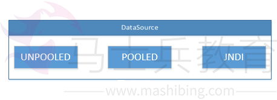

---

对于JNDI类型的数据源DataSource，则是通过JNDI上下文中取值。
二、数据源DataSource的创建过程
 
MyBatis*数据源**DataSource**对象的创建发生在**MyBatis**初始化的过程中。*下面让我们
一步步地了解MyBatis是如何创建数据源DataSource的。
在mybatis的XML配置文件中，使用元素来配置数据源：
 
1. MyBatis在初始化时，解析此文件，根据的type属性来创建相应类型的的数据源
DataSource，即：
type=”POOLED” ：MyBatis会创建PooledDataSource实例
type=”UNPOOLED” ：MyBatis会创建UnpooledDataSource实例
type=”JNDI”   ：MyBatis会从JNDI服务上查找DataSource实例，然后返回使用
 
2. 顺便说一下，MyBatis是通过工厂模式来创建数据源DataSource对象的，MyBatis定义了抽
象的工厂接口:org.apache.ibatis.datasource.DataSourceFactory,通过其getDataSource()
方法返回数据源DataSource：
定义如下：
上述三种不同类型的type，则有对应的以下dataSource工厂：
POOLED     PooledDataSourceFactory
UNPOOLED   UnpooledDataSourceFactory
JNDI      JndiDataSourceFactory
public interface DataSourceFactory {
 void setProperties(Properties props);
 //生产DataSource
 DataSource getDataSource();
}

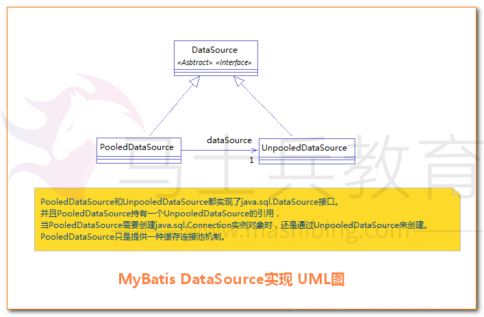

---

其类图如下所示：
3. MyBatis创建了DataSource实例后，会将其放到Configuration对象内的Environment对象
中， 供以后使用。
三、 DataSource什么时候创建Connection对象
 
当我们需要创建SqlSession对象并需要执行SQL语句时，这时候MyBatis才会去调用dataSource对
象来创建java.sql.Connection对象。也就是说，java.sql.Connection对象的创建一直延迟到执行
SQL语句的时候。
比如，我们有如下方法执行一个简单的SQL语句：
 
前4句都不会导致java.sql.Connection对象的创建，只有当第5句sqlSession.selectList("SELECT * 
FROM STUDENTS")，才会触发MyBatis在底层执行下面这个方法来创建java.sql.Connection对
象：
 
 
 
而对于DataSource的UNPOOLED的类型的实现-UnpooledDataSource是怎样实现
getConnection()方法的呢？请看下一节。
四、不使用连接池的UnpooledDataSource
 
当 的type属性被配置成了”UNPOOLED”，MyBatis首先会实例化一个
UnpooledDataSourceFactory工厂实例，然后通过.getDataSource()方法返回一个
UnpooledDataSource实例对象引用，我们假定为dataSource。
使用UnpooledDataSource的getConnection(),每调用一次就会产生一个新的Connection实例对
象。
UnPooledDataSource的getConnection()方法实现如下：
String resource = "mybatis-config.xml";
InputStream inputStream = Resources.getResourceAsStream(resource);
SqlSessionFactory sqlSessionFactory = new 
SqlSessionFactoryBuilder().build(inputStream);
SqlSession sqlSession = sqlSessionFactory.openSession();
sqlSession.selectList("SELECT * FROM STUDENTS");
protected void openConnection() throws SQLException {
if (log.isDebugEnabled()) {
log.debug("Opening JDBC Connection");
}
connection = dataSource.getConnection();
if (level != null) {
connection.setTransactionIsolation(level.getLevel());
}
setDesiredAutoCommit(autoCommmit);
}

---

如上代码所示，UnpooledDataSource会做以下事情：
1. 初始化驱动：  判断driver驱动是否已经加载到内存中，如果还没有加载，则会动态地加载
driver类，并实例化一个Driver对象，使用DriverManager.registerDriver()方法将其注册到
内存中，以供后续使用。
2. 创建Connection对象：  使用DriverManager.getConnection()方法创建连接。
3. 配置Connection对象：  设置是否自动提交autoCommit和隔离级别isolationLevel。
4. 返回Connection对象。
 
/*
UnpooledDataSource的getConnection()实现
*/
public Connection getConnection() throws SQLException
{
return doGetConnection(username, password);
}
private Connection doGetConnection(String username, String password) throws 
SQLException
{
//封装username和password成properties
Properties props = new Properties();
if (driverProperties != null)
{
props.putAll(driverProperties);
}
if (username != null)
{
props.setProperty("user", username);
}
if (password != null)
{
props.setProperty("password", password);
}
return doGetConnection(props);
}
/*
 *  获取数据连接
 */
private Connection doGetConnection(Properties properties) throws 
SQLException
{
    //1.初始化驱动
    initializeDriver();
    //2.从DriverManager中获取连接，获取新的Connection对象
    Connection connection = DriverManager.getConnection(url, properties);
    //3.配置connection属性
    configureConnection(connection);
    return connection;
}

---

上述的序列图如下所示：
 
 
总结：从上述的代码中可以看到，*我们每调用一次**getConnection()**方法，都会通过
**DriverManager.getConnection()**返回新的**java.sql.Connection**实例。*
五、为什么要使用连接池？
 
1. 创建一个java.sql.Connection实例对象的代价
首先让我们来看一下创建一个java.sql.Connection对象的资源消耗。我们通过连接Oracle数据
库，创建创建Connection对象，来看创建一个Connection对象、执行SQL语句各消耗多长时间。
代码如下：
 
上述程序在我笔记本上的执行结果为：
public static void main(String[] args) throws Exception
{
String sql = "select * from hr.employees where employee_id < ? and 
employee_id >= ?";
PreparedStatement st = null;
ResultSet rs = null;
long beforeTimeOffset = -1L; //创建Connection对象前时间
long afterTimeOffset = -1L; //创建Connection对象后时间
long executeTimeOffset = -1L; //创建Connection对象后时间
Connection con = null;
Class.forName("oracle.jdbc.driver.OracleDriver");
beforeTimeOffset = new Date().getTime();
System.out.println("before:\t" + beforeTimeOffset);
con = DriverManager.getConnection("jdbc:oracle:thin:@127.0.0.1:1521:xe", 
"louluan", "123456");
afterTimeOffset = new Date().getTime();
System.out.println("after:\t\t" + afterTimeOffset);
System.out.println("Create Costs:\t\t" + (afterTimeOffset - 
beforeTimeOffset) + " ms");
st = con.prepareStatement(sql);
//设置参数
st.setInt(1, 101);
st.setInt(2, 0);
//查询，得出结果集
rs = st.executeQuery();
executeTimeOffset = new Date().getTime();
System.out.println("Exec Costs:\t\t" + (executeTimeOffset - afterTimeOffset) 
+ " ms");
}

---

从此结果可以清楚地看出，创建一个Connection对象，用了250 毫秒；而执行SQL的时间用了170
毫秒。
创建一个Connection对象用了250毫秒！这个时间对计算机来说可以说是一个非常奢侈的！
这仅仅是一个Connection对象就有这么大的代价，设想一下另外一种情况：如果我们在Web应用
程序中，为用户的每一个请求就操作一次数据库，当有10000个在线用户并发操作的话，对计算机
而言，仅仅创建Connection对象不包括做业务的时间就要损耗10000×250ms= 250 0000 ms = 
2500 s = 41.6667 min,竟然要*41*分钟！！！如果对高用户群体使用这样的系统，简直就是开玩
笑！
2. 问题分析：
 
创建一个java.sql.Connection对象的代价是如此巨大，是因为创建一个Connection对象的过程，
在底层就相当于和数据库建立的通信连接，在建立通信连接的过程，消耗了这么多的时间，而往往
我们建立连接后（即创建Connection对象后），就执行一个简单的SQL语句，然后就要抛弃掉，
这是一个非常大的资源浪费！
 
3.解决方案:
对于需要频繁地跟数据库交互的应用程序，可以在创建了Connection对象，并操作完数据库后，
可以不释放掉资源，而是将它放到内存中，当下次需要操作数据库时，可以直接从内存中取出
Connection对象，不需要再创建了，这样就极大地节省了创建Connection对象的资源消耗。由于
内存也是有限和宝贵的，这又对我们对内存中的Connection对象怎么有效地维护提出了很高的要
求。我们将在内存中存放Connection对象的容器称之为 连接池（Connection Pool）。下面让我
们来看一下MyBatis的线程池是怎样实现的。
六、使用了连接池的PooledDataSource
 
同样地，我们也是使用PooledDataSource的getConnection()方法来返回Connection对象。现在
让我们看一下它的基本原理：
PooledDataSource将java.sql.Connection对象包裹成PooledConnection对象放到了PoolState类
型的容器中维护。 MyBatis将连接池中的PooledConnection分为两种状态： 空闲状态（idle）和
活动状态(active)，这两种状态的PooledConnection对象分别被存储到PoolState容器内的
idleConnections和activeConnections两个List集合中：
idleConnections:空闲(idle)状态PooledConnection对象被放置到此集合中，表示当前闲置的没
有被使用的PooledConnection集合，调用PooledDataSource的getConnection()方法时，会优先
从此集合中取PooledConnection对象。当用完一个java.sql.Connection对象时，MyBatis会将其
包裹成PooledConnection对象放到此集合中。
activeConnections:活动(active)状态的PooledConnection对象被放置到名为activeConnections
的ArrayList中，表示当前正在被使用的PooledConnection集合，调用PooledDataSource的
getConnection()方法时，会优先从idleConnections集合中取PooledConnection对象,如果没有，
则看此集合是否已满，如果未满，PooledDataSource会创建出一个PooledConnection，添加到

---

此集合中，并返回。
 
PoolState连接池的大致结构如下所示：
 
6.1 获取java.sql.Connection对象的过程
 
下面让我们看一下PooledDataSource 的getConnection()方法获取Connection对象的实现：
 
 
上述的popConnection()方法，会从连接池中返回一个可用的PooledConnection对象，然后再调
用getProxyConnection()方法最终返回Conection对象。（至于为什么会有getProxyConnection(),
请关注下一节）
 
现在让我们看一下popConnection()方法到底做了什么：
1. 先看是否有空闲(idle)状态下的PooledConnection对象，如果有，就直接返回一个可用的
PooledConnection对象；否则进行第2步。
2. 查看活动状态的PooledConnection池activeConnections是否已满；如果没有满，则创建一
个新的PooledConnection对象，然后放到activeConnections池中，然后返回此
PooledConnection对象；否则进行第三步；
3. 看最先进入activeConnections池中的PooledConnection对象是否已经过期：如果已经过
期，从activeConnections池中移除此对象，然后创建一个新的PooledConnection对象，添
加到activeConnections中，然后将此对象返回；否则进行第4步。
public Connection getConnection() throws SQLException {
return popConnection(dataSource.getUsername(), 
dataSource.getPassword()).getProxyConnection();
}
public Connection getConnection(String username, String password) throws 
SQLException {
return popConnection(username, password).getProxyConnection();
}

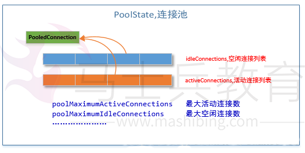

---

4. 线程等待，循环2步
/*
 * 传递一个用户名和密码，从连接池中返回可用的PooledConnection
 */
private PooledConnection popConnection(String username, String password) 
throws SQLException
{
    boolean countedWait = false;
    PooledConnection conn = null;
    long t = System.currentTimeMillis();
    int localBadConnectionCount = 0;
 
    while (conn == null)
    {
        synchronized (state)
        {
            if (state.idleConnections.size() > 0)
            {
                // 连接池中有空闲连接，取出第一个
                conn = state.idleConnections.remove(0);
                if (log.isDebugEnabled())
                {
                    log.debug("Checked out connection " + 
conn.getRealHashCode() + " from pool.");
                }
            }
            else
            {
                // 连接池中没有空闲连接，则取当前正在使用的连接数小于最大限定值，
                if (state.activeConnections.size() < 
poolMaximumActiveConnections)
                {
                    // 创建一个新的connection对象
                    conn = new PooledConnection(dataSource.getConnection(), 
this);
                    @SuppressWarnings("unused")
                    //used in logging, if enabled
                    Connection realConn = conn.getRealConnection();
                    if (log.isDebugEnabled())
                    {
                        log.debug("Created connection " + 
conn.getRealHashCode() + ".");
                    }
                }
                else
                {
                    // Cannot create new connection 当活动连接池已满，不能创建
时，取出活动连接池的第一个，即最先进入连接池的PooledConnection对象
                    // 计算它的校验时间，如果校验时间大于连接池规定的最大校验时间，则认
为它已经过期了，利用这个PoolConnection内部的realConnection重新生成一个
PooledConnection
                    //
                    PooledConnection oldestActiveConnection = 
state.activeConnections.get(0);
                    long longestCheckoutTime = 
oldestActiveConnection.getCheckoutTime();

---

if (longestCheckoutTime > poolMaximumCheckoutTime)
                    {
                        // Can claim overdue connection
                        state.claimedOverdueConnectionCount++;
                        state.accumulatedCheckoutTimeOfOverdueConnections += 
longestCheckoutTime;
                        state.accumulatedCheckoutTime += 
longestCheckoutTime;
                       
 state.activeConnections.remove(oldestActiveConnection);
                        if 
(!oldestActiveConnection.getRealConnection().getAutoCommit())
                        {
                           
 oldestActiveConnection.getRealConnection().rollback();
                        }
                        conn = new 
PooledConnection(oldestActiveConnection.getRealConnection(), this);
                        oldestActiveConnection.invalidate();
                        if (log.isDebugEnabled())
                        {
                            log.debug("Claimed overdue connection " + 
conn.getRealHashCode() + ".");
                        }
                    }
                    else
                    {
 
                        //如果不能释放，则必须等待有
                        // Must wait
                        try
                        {
                            if (!countedWait)
                            {
                                state.hadToWaitCount++;
                                countedWait = true;
                            }
                            if (log.isDebugEnabled())
                            {
                                log.debug("Waiting as long as " + 
poolTimeToWait + " milliseconds for connection.");
                            }
                            long wt = System.currentTimeMillis();
                            state.wait(poolTimeToWait);
                            state.accumulatedWaitTime += 
System.currentTimeMillis() - wt;
                        }
                        catch (InterruptedException e)
                        {
                            break;
                        }
                    }
                }
            }
 
            //如果获取PooledConnection成功，则更新其信息
 
            if (conn != null)

---

{
                if (conn.isValid())
                {
                    if (!conn.getRealConnection().getAutoCommit())
                    {
                        conn.getRealConnection().rollback();
                    }
                   
 conn.setConnectionTypeCode(assembleConnectionTypeCode(dataSource.getUrl(), 
username, password));
                    conn.setCheckoutTimestamp(System.currentTimeMillis());
                    conn.setLastUsedTimestamp(System.currentTimeMillis());
                    state.activeConnections.add(conn);
                    state.requestCount++;
                    state.accumulatedRequestTime += 
System.currentTimeMillis() - t;
                }
                else
                {
                    if (log.isDebugEnabled())
                    {
                        log.debug("A bad connection (" + 
conn.getRealHashCode() + ") was returned from the pool, getting another 
connection.");
                    }
                    state.badConnectionCount++;
                    localBadConnectionCount++;
                    conn = null;
                    if (localBadConnectionCount > 
(poolMaximumIdleConnections + 3))
                    {
                        if (log.isDebugEnabled())
                        {
                            log.debug("PooledDataSource: Could not get a 
good connection to the database.");
                        }
                        throw new SQLException("PooledDataSource: Could not 
get a good connection to the database.");
                    }
                }
            }
        }
 
    }
 
    if (conn == null)
    {
        if (log.isDebugEnabled())
        {
            log.debug("PooledDataSource: Unknown severe error condition.  
The connection pool returned a null connection.");
        }
        throw new SQLException("PooledDataSource: Unknown severe error 
condition.  The connection pool returned a null connection.");
    }
 
    return conn;
}

---

对应的处理流程图如下所示：
 
如上所示,对于PooledDataSource的getConnection()方法内，先是调用类PooledDataSource的
popConnection()方法返回了一个PooledConnection对象，然后调用了PooledConnection的
getProxyConnection()来返回Connection对象。
 
6.2java.sql.Connection对象的回收
 
 
调用过close()方法的Connection对象所持有的资源会被全部释放掉，Connection对象也就不能
再使用。
那么，如果我们使用了连接池，我们在用完了Connection对象时，需要将它放在连接池中，该怎
样做呢？
**当我们的程序中使用完Connection对象时，如果不使用数据库连接池，我们一般会调用 
connection.close()方法，关闭connection连接，释放资源。如下所示：**
private void test() throws ClassNotFoundException, SQLException
{
    String sql = "select * from hr.employees where employee_id < ? and 
employee_id >= ?";
    PreparedStatement st = null;
    ResultSet rs = null;
 
    Connection con = null;
    Class.forName("oracle.jdbc.driver.OracleDriver");
    try
    {
        con = 
DriverManager.getConnection("jdbc:oracle:thin:@127.0.0.1:1521:xe", 
"louluan", "123456");
        st = con.prepareStatement(sql);
        //设置参数
        st.setInt(1, 101);
        st.setInt(2, 0);
        //查询，得出结果集
        rs = st.executeQuery();
        //取数据，省略
        //关闭，释放资源
        con.close();
    }
    catch (SQLException e)
    {
        con.close();
        e.printStackTrace();
    }
}

---

可能大家第一个在脑海里闪现出来的想法就是：我在应该调用con.close()方法的时候，不调用
close()f方法，将其换成将Connection对象放到连接池容器中的代码！
好，我们将上述的想法实现，首先定义一个简易连接池Pool，然后将上面的代码改写：
 
package com.foo.jdbc;
 
import java.sql.Connection;
import java.sql.DriverManager;
import java.sql.SQLException;
import java.util.Vector;
 
/**
 * 
 * 一个线程安全的简易连接池实现，此连接池是单例的
 *  putConnection()将Connection添加到连接池中
 *  getConnection()返回一个Connection对象
 */
public class Pool {
 
    private static Vector<Connection> pool = new Vector<Connection>();
    
    private static int MAX_CONNECTION =100;
    
    private static String DRIVER="oracle.jdbc.driver.OracleDriver";
    private static String URL = "jdbc:oracle:thin:@127.0.0.1:1521:xe";
    private static String USERNAME = "louluan";
    private static String PASSWROD = "123456";
    
    static {
        try {
            Class.forName(DRIVER);
        } catch (ClassNotFoundException e) {
            e.printStackTrace();
        }
    }
    
    /**
     * 将一个Connection对象放置到连接池中 
     */
    public static  void putConnection(Connection connection){
        
        synchronized(pool)
        {
            if(pool.size()<MAX_CONNECTION)
            {
                pool.add(connection);       
            }
        }
    }
    
    
    /**
     * 返回一个Connection对象，如果连接池内有元素，则pop出第一个元素；
     * 如果连接池Pool中没有元素，则创建一个connection对象，然后添加到pool中
     * @return Connection

---

*/
    public static Connection getConnection(){
        Connection connection = null;
        synchronized(pool)
        {
            if(pool.size()>0)
            {
                connection = pool.get(0);
                pool.remove(0);
            }
            else
            {
                connection = createConnection();
                pool.add(connection);
            }
        }
        return connection;
    }
    
    /**
     * 创建一个新的Connection对象
     */
    private static Connection createConnection()
    {
        Connection connection = null;
        try {
            connection = DriverManager.getConnection(URL, 
USERNAME,PASSWROD);
        } catch (SQLException e) {
            e.printStackTrace();
        }
        return connection;
    }
    
}
package com.foo.jdbc;
import java.sql.Connection;
import java.sql.DriverManager;
import java.sql.PreparedStatement;
import java.sql.ResultSet;
import java.sql.SQLException;
import java.util.Vector;
 
public class PoolTest
{
 
    private void test() throws ClassNotFoundException, SQLException
    {
        String sql = "select * from hr.employees where employee_id < ? and 
employee_id >= ?";
        PreparedStatement st = null;
        ResultSet rs = null;
        Connection con = null;
        Class.forName("oracle.jdbc.driver.OracleDriver");
        try
        {

---

上述的代码就是将我们使用过的Connection对象放到Pool连接池中，我们需要Connection对象的
话，只需要使用Pool.getConnection()方法从里面取即可。
是的,上述的代码完全可以实现此能力，不过有一个很不优雅的实现：就是我们需要手动地将
Connection对象放到Pool连接池中，这是一个很傻的实现方式。这也和一般使用Connection对
象的方式不一样：一般使用Connection的方式是使用完后，然后调用.close()方法释放资源。
为了和一般的使用Conneciton对象的方式保持一致，我们希望当Connection使用完后，调
用.close()方法，而实际上Connection资源并没有被释放，而实际上被添加到了连接池中。这样可
以做到吗？答案是可以。上述的要求从另外一个角度来描述就是：能否提供一种机制，让我们知道
Connection对象调用了什么方法，从而根据不同的方法自定义相应的处理机制。恰好代理机制就
可以完成上述要求.
 
怎样实现Connection对象调用了close()方法，而实际是将其添加到连接池中
这是要使用代理模式，为真正的Connection对象创建一个代理对象，代理对象所有的方法都是调
用相应的真正Connection对象的方法实现。当代理对象执行close()方法时，要特殊处理，不调用
真正Connection对象的close()方法，而是将Connection对象添加到连接池中。
 
MyBatis的PooledDataSource的PoolState内部维护的对象是PooledConnection类型的对象，而
PooledConnection则是对真正的数据库连接java.sql.Connection实例对象的包裹器。
PooledConnection对象内持有一个真正的数据库连接java.sql.Connection实例对象和一个
java.sql.Connection的代理：
其部分定义如下：
            con = 
DriverManager.getConnection("jdbc:oracle:thin:@127.0.0.1:1521:xe", 
"louluan", "123456");
            st = con.prepareStatement(sql);
            //设置参数
            st.setInt(1, 101);
            st.setInt(2, 0);
            //查询，得出结果集
            rs = st.executeQuery();
            //取数据，省略
            //将不再使用的Connection对象放到连接池中，供以后使用
            Pool.putConnection(con);
        }
        catch (SQLException e)
        {
            e.printStackTrace();
        }
    }
}

---

PooledConenction
 实现了
 InvocationHandler
 接口，并且，
 proxyConnection
 对象也是根据这个它来生成的代理对象：
 
实际上，我们调用PooledDataSource的getConnection()方法返回的就是这个proxyConnection对
象。
当我们调用此proxyConnection对象上的任何方法时，都会调用PooledConnection对象内
invoke()方法。
让我们看一下PooledConnection类中的invoke()方法定义：
 
class PooledConnection implements InvocationHandler {
  
  //......
  //所创建它的datasource引用
  private PooledDataSource dataSource;
  //真正的Connection对象
  private Connection realConnection;
  //代理自己的代理Connection
  private Connection proxyConnection;
  
  //......
}
public PooledConnection(Connection connection, PooledDataSource dataSource) 
{
    this.hashCode = connection.hashCode();
    this.realConnection = connection;
    this.dataSource = dataSource;
    this.createdTimestamp = System.currentTimeMillis();
    this.lastUsedTimestamp = System.currentTimeMillis();
    this.valid = true;
    this.proxyConnection = (Connection) 
Proxy.newProxyInstance(Connection.class.getClassLoader(), IFACES, this);
  }
public Object invoke(Object proxy, Method method, Object[] args) throws 
Throwable {
    String methodName = method.getName();
    //当调用关闭的时候，回收此Connection到PooledDataSource中
    if (CLOSE.hashCode() == methodName.hashCode() && 
CLOSE.equals(methodName)) {
      dataSource.pushConnection(this);
      return null;
    } else {

---

从上述代码可以看到，当我们使用了pooledDataSource.getConnection()返回的Connection对象
的close()方法时，不会调用真正Connection的close()方法，而是将此Connection对象放到连接池
中。
七、JNDI类型的数据源DataSource
 
对于JNDI类型的数据源DataSource的获取就比较简单，MyBatis定义了一个
JndiDataSourceFactory工厂来创建通过JNDI形式生成的DataSource。
下面让我们看一下JndiDataSourceFactory的关键代码：
 
 
 
 
经典面试题
 
 
问题一
 
什么是 Spring Boot？ 
 多年来，随着新功能的增加，spring 变得越来越复杂。只需访问 https://spring.io/projects
      try {
        if (!Object.class.equals(method.getDeclaringClass())) {
          checkConnection();
        }
        return method.invoke(realConnection, args);
      } catch (Throwable t) {
        throw ExceptionUtil.unwrapThrowable(t);
      }
    }
  }
if (properties.containsKey(INITIAL_CONTEXT)
&& properties.containsKey(DATA_SOURCE))
{
//从JNDI上下文中找到DataSource并返回
Context ctx = (Context) 
initCtx.lookup(properties.getProperty(INITIAL_CONTEXT));
dataSource = (DataSource) ctx.lookup(properties.getProperty(DATA_SOURCE));
}
else if (properties.containsKey(DATA_SOURCE))
{
// //从JNDI上下文中找到DataSource并返回
dataSource = (DataSource) 
initCtx.lookup(properties.getProperty(DATA_SOURCE));
}

---

页面，我们就会看到可以在我们的应用程序中使用的所有 Spring 项目的不同功能。如果必须启动一个新
的 Spring 项目，我们必须添加构建路径或添加 Maven 依赖关系，配置应用程序服务器，添加 spring 配
置。因此，开始一个新的 spring 项目需要很多努力，因为我们现在必须从头开始做所有事情。 
 Spring   Boot 是解决这个问题的方法。Spring     Boot 已经建立在现有 spring 框架之上。使用 spring 
启动，我们避免了之前我们必须做的所有样板代码和配置。因此，Spring  Boot 可以帮助我们以最少的
工作量，更加健壮地使用现有的 Spring 功能。 
 
问题二
 
 Spring Boot 有哪些优点？ 
 Spring Boot 的优点有： 
 减少开发，测试时间和努力。 
使用 JavaConfig 有助于避免使用 XML。 
避免大量的 Maven 导入和各种版本冲突。 
提供意见发展方法。 
通过提供默认值快速开始开发。 
没有单独的 Web 服务器需要。这意味着你不再需要启动 Tomcat，Glassfish 或其他任何东西。 
需要更少的配置 因为没有 web.xml 文件。只需添加用@ Configuration 注释的类，然后添加用@Bean 
注释的方法，Spring 将自动加载对象并像以前一样对其进行管理。您甚至可以将
@Autowired 添加到 bean 方法中，以使 Spring 自动装入需要的依赖关系中。 
基于环境的配置 使用这些属性，您可以将您正在使用的环境传递到应用程序：Dspring.profiles.active = 
{enviornment}。在加载主应用程序属性文件后，Spring 将在
（application{environment} .properties）中加载后续的应用程序属性文件。 
 
问题三
 
 什么是 JavaConfig？ 
 Spring JavaConfig 是 Spring 社区的产品，它提供了配置 Spring IoC 容器的纯 Java 方法。因此有助于
避免使用 XML 配置。使用 JavaConfig 的优点在于： 
 面向对象的配置。由于配置被定义为 JavaConfig 中的类，因此用户可以充分利用 Java 中的面向对象功
能。一个配置类可以继承另一个，重写它的@Bean 方法等。 
减少或消除 XML 配置。基于依赖注入原则的外化配置的好处已被证明。但是，许多开发人员不希望在 
XML 和 Java 之间来回切换。JavaConfig 为开发人员提供了一种纯 Java 方法来配置与 XML 配置概念相
似的 Spring 容器。从技术角度来讲，只使用 JavaConfig 配置类来配置容器是可行的，但实际上很多人
认为将 JavaConfig 与 XML 混合匹配是理想的。 
类型安全和重构友好。JavaConfig 提供了一种类型安全的方法来配置 Spring 容器。由于
Java     5.0 对泛型的支持，现在可以按类型而不是按名称检索 bean，不需要任何强制转换或基于字符串
的查找。

---

问题四
 
 如何重新加载 Spring Boot 上的更改，而无需重新启动服务器？ 
 这可以使用 DEV 工具来实现。通过这种依赖关系，您可以节省任何更改，嵌入式 tomcat
将重新启动。Spring Boot 有一个开发工具（DevTools）模块，它有助于提高开发人员的生产力。Java 
开发人员面临的一个主要挑战是将文件更改自动部署到服务器并自动重启服务器。开发人员可以重新加
载 Spring Boot 上的更改，而无需重新启动服务器。这将消除每次手动部署更改的需要。Spring Boot 
在发布它的第一个版本时没有这个功能。这是开发人员最需要的功能。DevTools 模块完全满足开发人员
的需求。该模块将在生产环境中被禁用。
它还提供 H2 数据库控制台以更好地测试应用程序。 
 org.springframework.boot spring-boot-devtools true 
 
问题五
 
 Spring Boot 中的监视器是什么？ 
 Spring boot actuator 是 spring 启动框架中的重要功能之一。Spring boot 监视器可帮助您访问生产环
境中正在运行的应用程序的当前状态。有几个指标必须在生产环境中进行检查和监控。即使一些外部应
用程序可能正在使用这些服务来向相关人员触发警报消息。监视器模块公开了一组可直接作为 HTTP 
URL 访问的 REST 端点来检查状态。 
 
问题六
 
 如何在 Spring Boot 中禁用 Actuator 端点安全性？ 
 默认情况下，所有敏感的 HTTP 端点都是安全的，只有具有 ACTUATOR 角色的用户才能访
问它们。安全性是使用标准的 HttpServletRequest.isUserInRole 方法实施的。 我们可以使用 
 management.security.enabled = false 
来禁用安全性。只有在执行机构端点在防火墙后访问时，才建议禁用安全性。 
 
问题七
 
 如何在自定义端口上运行 Spring Boot 应用程序？ 
 为了在自定义端口上运行 Spring     Boot 应用程序，您可以在 application.properties 中指定端口。 
 server.port = 8090 
 
问题八
 
 什么是 YAML？ 
 YAML 是一种人类可读的数据序列化语言。它通常用于配置文件。 
 与属性文件相比，如果我们想要在配置文件中添加复杂的属性，YAML 文件就更加结构化，而且更少混
淆。可以看出 YAML 具有分层配置数据。

---

问题九
 
 如何实现 Spring Boot 应用程序的安全性？ 
 为了实现 Spring Boot 的安全性，我们使用 spring-boot-starter-security 依赖项，并且必须添加安全配
置。它只需要很少的代码。配置类将必须扩展 WebSecurityConfigurerAdapter 并覆盖其方法。 
 
问题十
 
如何集成 Spring Boot 和 ActiveMQ？ 
对于集成 Spring Boot 和 ActiveMQ，我们使用 
 spring-boot-starter-activemq 依赖关系。 它只需要很少的配置，并且不需要样板代码。 
 
问题十一
 
 如何使用 Spring Boot 实现分页和排序？ 
 使用 Spring Boot 实现分页非常简单。使用 Spring Data-JPA 可以实现将可分页的 
 org.springframework.data.domain.Pageable 传递给存储库方法。 
 
问题十二
 
 什么是 Swagger？你用 Spring Boot 实现了它吗？ 
 Swagger 广泛用于可视化 API，使用 Swagger UI 为前端开发人员提供在线沙箱。Swagger 是用于生成 
RESTful     Web 服务的可视化表示的工具，规范和完整框架实现。它使文档能够以与服务器相同的速度
更新。当通过 Swagger 正确定义时，消费者可以使用最少量的实现逻
辑来理解远程服务并与其进行交互。因此，Swagger 消除了调用服务时的猜测。 
 
问题十三
 
 什么是 Spring Profiles？ 
 Spring   Profiles 允许用户根据配置文件（dev，test，prod 等）来注册 bean。因此，当应用程序在开
发中运行时，只有某些 bean 可以加载，而在 PRODUCTION 中，某些其他 bean 可以加载。假设我们
的要求是 Swagger 文档仅适用于 QA 环境，并且禁用所有其他文档。这可以使用配置文件来完成。
Spring Boot 使得使用配置文件非常简单。 
 
问题十四
 
什么是 Spring Batch？ 
 Spring Boot Batch 提供可重用的函数，这些函数在处理大量记录时非常重要，包括日志/跟踪，事务管
理，作业处理统计信息，作业重新启动，跳过和资源管理。它还提供了更先进的技术服务和功能，通过
优化和分区技术，可以实现极高批量和高性能批处理作业。简单

---

以及复杂的大批量批处理作业可以高度可扩展的方式利用框架处理重要大量的信息。 
 
问题十五
 
 什么是 FreeMarker 模板？ 
 FreeMarker 是一个基于 Java 的模板引擎，最初专注于使用 MVC 软件架构进行动态网页生成。使用 
Freemarker 的主要优点是表示层和业务层的完全分离。程序员可以处理应用程序代码，而设计人员可
以处理 html 页面设计。最后使用 freemarker 可以将这些结合起来，给出最终的输出页面。 
 
问题十六
 
 如何使用 Spring Boot 实现异常处理？ 
Spring 提供了一种使用 ControllerAdvice 处理异常的非常有用的方法。 我们通过实现一个
ControlerAdvice 类，来处理控制器类抛出的所有异常。 
 
问题十七
 
 您使用了哪些 starter maven 依赖项？ 
 使用了下面的一些依赖项 
 spring-boot-starter-activemq spring-boot-starter-security
spring-boot-starter-web 
这有助于增加更少的依赖关系，并减少版本的冲突。 
 
问题十八
 
 什么是 CSRF 攻击？ 
 CSRF 代表跨站请求伪造。这是一种攻击，迫使最终用户在当前通过身份验证的 Web 应用程序上执行不
需要的操作。CSRF 攻击专门针对状态改变请求，而不是数据窃取，因为攻击者无法查看对伪造请求的响
应。 
 
问题十九
 
 什么是 WebSockets？ 
 WebSocket 是一种计算机通信协议，通过单个 TCP 连接提供全双工通信信道。 
WebSocket 是双向的 -使用 WebSocket 客户端或服务器可以发起消息发送。 
WebSocket 是全双工的 -客户端和服务器通信是相互独立的。 
单个 TCP 连接 -初始连接使用 HTTP，然后将此连接升级到基于套接字的连接。然后这个单一连接用于所
有未来的通信 
Light -与 http 相比，WebSocket 消息数据交换要轻得多。

---

问题二十
 
 什么是 AOP？ 
在软件开发过程中，跨越应用程序多个点的功能称为交叉问题。这些交叉问题与应用程序的主要业务逻
辑不同。因此，将这些横切关注与业务逻辑分开是面向方面编程（AOP）的地方。 
 
问题二十一
 
什么是 Apache Kafka？ 
Apache Kafka 是一个分布式发布 - 订阅消息系统。它是一个可扩展的，容错的发布 - 订阅消息系统，它
使我们能够构建分布式应用程序。这是一个 Apache 顶级项目。Kafka 适合离线和在线消息消费。 
 
问题二十二
 
我们如何监视所有 Spring Boot 微服务？ 
Spring Boot 提供监视器端点以监控各个微服务的度量。这些端点对于获取有关应用程序的信息（如它
们是否已启动）以及它们的组件（如数据库等）是否正常运行很有帮助。但是，使用监视器的一个主要
缺点或困难是，我们必须单独打开应用程序的知识点以了解其状态或健康状况。想象一下涉及 50 个应
用程序的微服务，管理员将不得不击中所有 50 个应用程序的执行终端。
 
 
 
 
Spring Cloud（一明老师，晁老师）
 
 
 
 
Spring Cloud熔断机制介绍；
 
在Spring Cloud框架里，熔断机制通过Hystrix实现。Hystrix会监控微服务间调用的状况，当失 败的调
用到一定阈值，缺省是5秒内20次调用失败，就会启动熔断机制。熔断机制的注解是 
@HystrixCommand，Hystrix会找有这个注解的方法，并将这类方法关联到和熔断器连在一起 的代理
上。当前，@HystrixCommand仅当类的注解为@Service或@Component时才会发挥 作用。 
Spring Cloud对比下Dubbo，什么场景下该使用Spring
Cloud？
 
两者所解决的问题域不一样：Dubbo的定位始终是一款RPC框架，而Spring Cloud的目的是微 服务架构
下的一站式解决方案。 
Spring Cloud抛弃了Dubbo的RPC通信，采用的是基于HTTP的REST方式。

---

核心要素
Dubbo
Spring Cloud
服务注册中心
Zookeeper、
Redis
Spring Cloud Netflix Eureka
服务调用方式
RPC
REST API
服务网关
无
Spring Cloud
断路器
不完善
Spring Cloud Netiflix Hystrix
分布式配置
无
Spring Cloud Config
分布式追踪系
统
无
Spring Cloud Sleuth
消息总线
无
Spring Cloud Bus
数据流
无
Spring Cloud Stream 基于Redis,Kafka实现的消息微服
务
批量任务
无
Spring Cloud Task
严格来说，这两种方式各有优劣。虽然在一定程度上来说，后者牺牲了服务调用的性能，但也避 免了上
面提到的原生RPC带来的问题。而且REST相比RPC更为灵活，服务提供方和调用方的依赖 只依靠一纸契
约，不存在代码级别的强依赖，这在强调快速演化的微服务环境下，显得更为合 适。
 
 
 
CAP原理和BASE理论
 
CAP原则(CAP定理)、BASE理论
 
 
一、CAP原则

---

CAP原则又称CAP定理，指的是在一个分布式系统中， Consistency（一致性）、 Availability（可
用性）、Partition tolerance（分区容错性），三者不可得兼。
  CAP原则是NOSQL数据库的基石。
分布式系统的CAP理论：理论首先把分布式系统中的三个特性进行了如下归纳：
一致性（C）：在分布式系统中的所有数据备份，在同一时刻是否同样的值。（等同于所有节点访
问同一份最新的数据副本）
可用性（A）：在集群中一部分节点故障后，集群整体是否还能响应客户端的读写请求。（对数据
更新具备高可用性）
分区容忍性（P）：以实际效果而言，分区相当于对通信的时限要求。系统如果不能在时限内达成
数据一致性，就意味着发生了分区的情况，必须就当前操作在C和A之间做出选择。
一致性与可用性的决择编辑
 
CAP理论就是说在分布式存储系统中，最多只能实现上面的两点。而由于当前的网络硬件肯定会出现延
迟丢包等问题，所以分区容忍性是我们必须需要实现的。所以我们只能在一致性和可用性之间进行权
衡，没有NoSQL系统能同时保证这三点。
对于web2.0网站来说，关系数据库的很多主要特性却往往无用武之地
1. 数据库事务一致性需求 
很多web实时系统并不要求严格的数据库事务，对读一致性的要求很低，有些场合对写一致性要求
并不高。允许实现最终一致性。
2. 数据库的写实时性和读实时性需求
对关系数据库来说，插入一条数据之后立刻查询，是肯定可以读出来这条数据的，但是对于很多
web应用来说，并不要求这么高的实时性，比方说发一条消息之 后，过几秒乃至十几秒之后，我的
订阅者才看到这条动态是完全可以接受的。
3. 对复杂的SQL查询，特别是多表关联查询的需求 
任何大数据量的web系统，都非常忌讳多个大表的关联查询，以及复杂的数据分析类型的报表查
询，特别是SNS类型的网站，从需求以及产品设计角 度，就避免了这种情况的产生。往往更多的只
是单表的主键查询，以及单表的简单条件分页查询，SQL的功能被极大的弱化了。

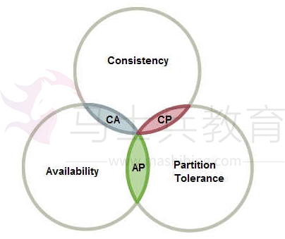

---

取舍策略
 
CAP三个特性只能满足其中两个，那么取舍的策略就共有三种：
CA without P：如果不要求P（不允许分区），则C（强一致性）和A（可用性）是可以保证的。但放弃
P的同时也就意味着放弃了系统的扩展性，也就是分布式节点受限，没办法部署子节点，这是违背分布式
系统设计的初衷的。传统的关系型数据库RDBMS：Oracle、MySQL就是CA。
CP without A：如果不要求A（可用），相当于每个请求都需要在服务器之间保持强一致，而P（分
区）会导致同步时间无限延长(也就是等待数据同步完才能正常访问服务)，一旦发生网络故障或者消息丢
失等情况，就要牺牲用户的体验，等待所有数据全部一致了之后再让用户访问系统。设计成CP的系统其
实不少，最典型的就是分布式数据库，如Redis、HBase等。对于这些分布式数据库来说，数据的一致性
是最基本的要求，因为如果连这个标准都达不到，那么直接采用关系型数据库就好，没必要再浪费资源
来部署分布式数据库。
 AP wihtout C：要高可用并允许分区，则需放弃一致性。一旦分区发生，节点之间可能会失去联系，
为了高可用，每个节点只能用本地数据提供服务，而这样会导致全局数据的不一致性。典型的应用就如
某米的抢购手机场景，可能前几秒你浏览商品的时候页面提示是有库存的，当你选择完商品准备下单的
时候，系统提示你下单失败，商品已售完。这其实就是先在 A（可用性）方面保证系统可以正常的服
务，然后在数据的一致性方面做了些牺牲，虽然多少会影响一些用户体验，但也不至于造成用户购物流
程的严重阻塞。
 
BASE理论
 
BASE是Basically Available（基本可用）、Soft state（软状态）和Eventually consistent（最终一致
性）三个短语的简写，BASE是对CAP中一致性和可用性权衡的结果，其来源于对大规模互联网系统分布
式实践的结论，是基于CAP定理逐步演化而来的，其核心思想是即使无法做到强一致性（Strong 
consistency），但每个应用都可以根据自身的业务特点，采用适当的方式来使系统达到最终一致性
（Eventual consistency）。接下来我们着重对BASE中的三要素进行详细讲解。
基本可用
 
基本可用是指分布式系统在出现不可预知故障的时候，允许损失部分可用性——但请注意，这绝不等价
于系统不可用，以下两个就是“基本可用”的典型例子。
响应时间上的损失：正常情况下，一个在线搜索引擎需要0.5秒内返回给用户相应的查询结果，但
由于出现异常（比如系统部分机房发生断电或断网故障），查询结果的响应时间增加到了1~2秒。

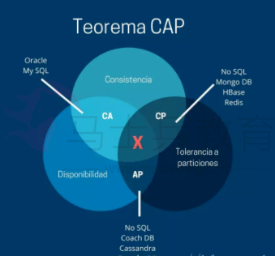

---

功能上的损失：正常情况下，在一个电子商务网站上进行购物，消费者几乎能够顺利地完成每一笔
订单，但是在一些节日大促购物高峰的时候，由于消费者的购物行为激增，为了保护购物系统的稳
定性，部分消费者可能会被引导到一个降级页面。
弱状态也称为软状态，和硬状态相对，是指允许系统中的数据存在中间状态，并认为该中间状态的存在
不会影响系统的整体可用性，即允许系统在不同节点的数据副本之间进行数据听不的过程存在延时。
最终一致性
 
最终一致性强调的是系统中所有的数据副本，在经过一段时间的同步后，最终能够达到一个一致的状
态。因此，最终一致性的本质是需要系统保证最终数据能够达到一致，而不需要实时保证系统数据的强
一致性
亚马逊首席技术官Werner Vogels在于2008年发表的一篇文章中对最终一致性进行了非常详细的介绍。
他认为最终一致性时一种特殊的弱一致性：系统能够保证在没有其他新的更新操作的情况下，数据最终
一定能够达到一致的状态，因此所有客户端对系统的数据访问都能够胡渠道最新的值。同时，在没有发
生故障的前提下，数据达到一致状态的时间延迟，取决于网络延迟，系统负载和数据复制方案设计等因
素。
在实际工程实践中，最终一致性存在以下五类主要变种。
因果一致性：
读己之所写：
会话一致性：
单调读一致性：
单调写一致性：
以上就是最终一致性的五类常见的变种，在时间系统实践中，可以将其中的若干个变种互相结合起来，
以构建一个具有最终一致性的分布式系统。事实上，可以将其中的若干个变种相互结合起来，以构建一
个具有最终一致性特性的分布式系统。事实上，最终一致性并不是只有那些大型分布式系统才设计的特
性，许多现代的关系型数据库都采用了最终一致性模型。在现代关系型数据库中，大多都会采用同步和
异步方式来实现主备数据复制技术。在同步方式中，数据的复制国耻鞥通常是更新事务的一部分，因此
在事务完成后，主备数据库的数据就会达到一致。而在异步方式中，备库的更新往往存在延时，这取决
于事务日志在主备数据库之间传输的时间长短，如果传输时间过长或者甚至在日志传输过程中出现异常
因果一致性是指，如果进程A在更新完某个数据项后通知了进程B，那么进程B之后对该数据项的访问都应该能
够获取到进程A更新后的最新值，并且如果进程B要对该数据项进行更新操作的话，务必基于进程A更新后的最
新值，即不能发生丢失更新情况。与此同时，与进程A无因果关系的进程C的数据访问则没有这样的限制。
读己之所写是指，进程A更新一个数据项之后，它自己总是能够访问到更新过的最新值，而不会看到旧值。也就
是说，对于单个数据获取者而言，其读取到的数据一定不会比自己上次写入的值旧。因此，读己之所写也可以
看作是一种特殊的因果一致性。
会话一致性将对系统数据的访问过程框定在了一个会话当中：系统能保证在同一个有效的会话中实现“读己之所
写”的一致性，也就是说，执行更新操作之后，客户端能够在同一个会话中始终读取到该数据项的最新值。
单调读一致性是指如果一个进程从系统中读取出一个数据项的某个值后，那么系统对于该进程后续的任何数据
访问都不应该返回更旧的值。
 单调写一致性是指，一个系统需要能够保证来自同一个进程的写操作被顺序地执行。

---

导致无法及时将事务应用到备库上，那么狠显然，从备库中读取的的数据将是旧的，因此就出现了不一
致的情况。当然，无论是采用多次重试还是认为数据订正，关系型数据库还是能搞保证最终数据达到一
致——这就是系统提供最终一致性保证的经典案例。
总的来说，BASE理论面向的是大型高可用可扩展的分布式系统，和传统事务的ACID特性使相反的，它
完全不同于ACID的强一致性模型，而是提出通过牺牲强一致性来获得可用性，并允许数据在一段时间内
是不一致的，但最终达到一致状态。但同时，在实际的分布式场景中，不同业务单元和组件对数据一致
性的要求是不同的，因此在具体的分布式系统架构设计过程中，ACID特性与BASE理论往往又会结合在
一起使用。
小结：
 
计算机系统从集中式向分布式的变革随着包括分布式网络、分布式事务和分布式数据一致性等在内的一
系列问题与挑战，同时也催生了一大批诸如ACID、CAP和BASE等经典理论的快速发展。
与NoSQL的关系编辑
 
传统的关系型数据库在功能支持上通常很宽泛，从简单的键值查询，到复杂的多表联合查询再到事务机
制的支持。而与之不同的是，NoSQL系统通常注重性能和扩展性，而非事务机制（事务就是强一致性的
体现）[2] 。
  传统的SQL数据库的事务通常都是支持ACID的强事务机制。A代表原子性，即在事务中执行多个操
作是原子性的，要么事务中的操作全部执行，要么一个都不执行;C代表一致性，即保证进行事务的过程
中整个数据加的状态是一致的，不会出现数据花掉的情况;I代表隔离性，即两个事务不会相互影响，覆盖
彼此数据等;D表示持久化，即事务一量完成，那么数据应该是被写到安全的，持久化存储的设备上（比
如磁盘）。
  NoSQL系统仅提供对行级别的原子性保证，也就是说同时对同一个Key下的数据进行的两个操作，
在实际执行的时候是会串行的执行，保证了每一个Key-Value对不会被破坏。
CAP的是什么关系
 
It states, that though its desirable to have Consistency, High-Availability and Partition-tolerance in 
every system, unfortunately no system can achieve all three at the same time.
在分布式系统的设计中，没有一种设计可以同时满足一致性，可用性，分区容错性 3个特性
注意：不要将弱一致性，最终一致性放到CAP理论里混为一谈（混淆概念的坑真多）
弱一致性，最终一致性 你可以认为和CAP的C一点关系也没有，因为CAP的C是更新操作完成后，任何节
点看到的数据完全一致, 弱一致性。最终一致性本身和CAP的C一致性是违背的，所以你可以看到那些谎
称自己系统同时具备CAP 3个特性是多么的可笑，可能国内更多的场景是：一个开放人员一旦走上讲台
演讲，就立马转变为了营销人员，连最基本的理念也不要了。
这里有一篇标题很大的文章 cap-twelve-years-later-how-the-rules-have-changed ，实际上本文的
changed更多的是在思考方式上，而本身CAP理论是没有changed的
为什么会是这样
 
我们来看一个简单的问题, 一个DB服务  搭建在两个机房（北京,广州)，两个DB实例同时提供写入和读取

---

1. 假设DB的更新操作是同时写北京和广州的DB都成功才返回成功
在没有出现网络故障的时候，满足CA原则，C 即我的任何一个写入，更新操作成功并返回客户端完
成后,分布式的所有节点在同一时间的数据完全一致， A 即我的读写操作都能够成功，但是当出现
网络故障时，我不能同时保证CA，即P条件无法满足
2. 假设DB的更新操作是只写本地机房成功就返回，通过binlog/oplog回放方式同步至侧边机房
这种操作保证了在出现网络故障时,双边机房都是可以提供服务的，且读写操作都能成功，意味着他
满足了AP ，但是它不满足C，因为更新操作返回成功后，双边机房的DB看到的数据会存在短暂不
一致，且在网络故障时，不一致的时间差会很大（仅能保证最终一致性）
3. 假设DB的更新操作是同时写北京和广州的DB都成功才返回成功且网络故障时提供降级服务
降级服务，如停止写入，只提供读取功能，这样能保证数据是一致的，且网络故障时能提供服务，
满足CP原则，但是他无法满足可用性原则
选择权衡
 
通过上面的例子，我们得知，我们永远无法同时得到CAP这3个特性，那么我们怎么来权衡选择呢？
选择的关键点取决于业务场景
对于大多数互联网应用来说（如网易门户），因为机器数量庞大，部署节点分散，网络故障是常态，可
用性是必须需要保证的，所以只有设置一致性来保证服务的AP，通常常见的高可用服务吹嘘5个9 6个9
服务SLA稳定性就本都是放弃C选择AP
对于需要确保强一致性的场景，如银行，通常会权衡CA和CP模型，CA模型网络故障时完全不可用，CP
模型具备部分可用性，实际的选择需要通过业务场景来权衡（并不是所有情况CP都好于CA，只能查看信
息不能更新信息有时候从产品层面还不如直接拒绝服务）
延伸
 
BASE(Basically Available, Soft State, Eventual Consistency 基本可用、软状态、最终一致性) 对CAP AP
理论的延伸, Redis等众多系统构建与这个理论之上
ACID 传统数据库常用的设计理念, ACID和BASE代表了两种截然相反的设计哲学，分处一致性-可用性分
布图谱的两极。
分布式系统的典型应用
 
分布式系统是一个非常广泛的概念，它最终要落实到解决实际问题上，不同的问题有不同的方法和架
构。所有的开源软件都是以某个应用场景出现，而纯粹以“分布式”概念进行划分的比较少见。
但如果以算法划分，到能分出几类：
1.以Leader选举为主的一类算法，比如paxos、viewstamp，就是现在zookeeper、Chuby等工具的主
体
2.以分布式事务为主的一类主要是二段提交，这些分布式数据库管理器及数据库都支持

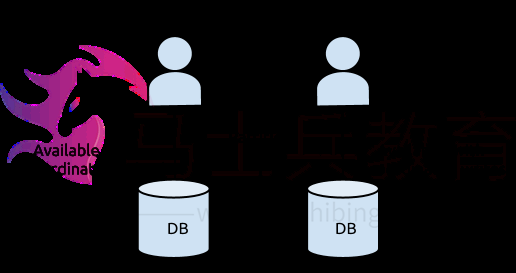

---

3.以若一致性为主的，主要代表是Cassandra的W、R、N可调节的一致性
4.以租赁机制为主的，主要是一些分布式锁的概念，目前还没有看到纯粹“分布式”锁的实现
5.以失败探测为主的，主要是Gossip和phi失败探测算法，当然也包括简单的心跳
6.以弱一致性、因果一致性、顺序一致性为主的，开源尚不多，但大都应用在Linkedin、Twitter、
Facebook等公司内部
7当然以异步解耦为主的，还有各类Queue
 
 
 
分布式事务、分布式锁
 
 
常用的分布式事务解决方案介绍有多少种？
 
 
关于分布式事务，工程领域主要讨论的是强一致性和最终一致性的解决方案。典型方案包括：
1. 两阶段提交（2PC, Two-phase Commit）方案
2. eBay 事件队列方案
3. TCC 补偿模式
4. 缓存数据最终一致性
一、一致性理论
 
分布式事务的目的是保障分库数据一致性，而跨库事务会遇到各种不可控制的问题，如个别节点永久性
宕机，像单机事务一样的ACID是无法奢望的。另外，业界著名的CAP理论也告诉我们，对分布式系统，
需要将数据一致性和系统可用性、分区容忍性放在天平上一起考虑。
两阶段提交协议（简称2PC）是实现分布式事务较为经典的方案，但2PC 的可扩展性很差，在分布式架
构下应用代价较大，eBay 架构师Dan Pritchett 提出了BASE 理论，用于解决大规模分布式系统下的数据
一致性问题。BASE 理论告诉我们：可以通过放弃系统在每个时刻的强一致性来换取系统的可扩展性。
1、CAP理论
在分布式系统中，一致性（Consistency）、可用性（Availability）和分区容忍性（Partition 
Tolerance）3 个要素最多只能同时满足两个，不可兼得。其中，分区容忍性又是不可或缺的。

---

一致性：分布式环境下多个节点的数据是否强一致。
可用性：分布式服务能一直保证可用状态。当用户发出一个请求后，服务能在有限时间内返回结
果。
分区容忍性：特指对网络分区的容忍性。
举例：Cassandra、Dynamo 等，默认优先选择AP，弱化C；HBase、MongoDB 等，默认优先选择
CP，弱化A。
2、BASE 理论
核心思想：
基本可用（Basically
Available）：指分布式系统在出现故障时，允许损失部分的可用性来保证核心可用。
软状态（Soft
State）：指允许分布式系统存在中间状态，该中间状态不会影响到系统的整体可用性。
最终一致性（Eventual
Consistency）：指分布式系统中的所有副本数据经过一定时间后，最终能够达到一致的状态。
二、一致性模型
 
数据的一致性模型可以分成以下 3 类：
1. 强一致性：数据更新成功后，任意时刻所有副本中的数据都是一致的，一般采用同步的方式实现。
2. 弱一致性：数据更新成功后，系统不承诺立即可以读到最新写入的值，也不承诺具体多久之后可以
读到。
3. 最终一致性：弱一致性的一种形式，数据更新成功后，系统不承诺立即可以返回最新写入的值，但
是保证最终会返回上一次更新操作的值。
分布式系统数据的强一致性、弱一致性和最终一致性可以通过Quorum NRW算法分析。
三、分布式事务解决方案
 
1、2PC方案——强一致性

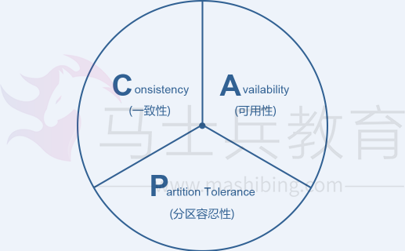

---

2PC的核心原理是通过提交分阶段和记日志的方式，记录下事务提交所处的阶段状态，在组件宕机重启
后，可通过日志恢复事务提交的阶段状态，并在这个状态节点重试，如Coordinator重启后，通过日志
可以确定提交处于Prepare还是PrepareAll状态，若是前者，说明有节点可能没有Prepare成功，或所有
节点Prepare成功但还没有下发Commit，状态恢复后给所有节点下发RollBack；若是PrepareAll状态，
需要给所有节点下发Commit，数据库节点需要保证Commit幂等。
2PC方案的问题：
1. 同步阻塞。
2. 数据不一致。
3. 单点问题。
升级的3PC方案旨在解决这些问题，主要有两个改进：
1. 增加超时机制。
2. 两阶段之间插入准备阶段。
但三阶段提交也存在一些缺陷，要彻底从协议层面避免数据不一致，可以采用Paxos或者Raft 算法。
2、eBay 事件队列方案——最终一致性
eBay 的架构师Dan Pritchett，曾在一篇解释BASE 原理的论文《Base：An Acid Alternative》中提到一
个eBay 分布式系统一致性问题的解决方案。它的核心思想是将需要分布式处理的任务通过消息或者日志
的方式来异步执行，消息或日志可以存到本地文件、数据库或消息队列，再通过业务规则进行失败重
试，它要求各服务的接口是幂等的。
描述的场景为，有用户表user 和交易表transaction，用户表存储用户信息、总销售额和总购买额，交易
表存储每一笔交易的流水号、买家信息、卖家信息和交易金额。如果产生了一笔交易，需要在交易表增
加记录，同时还要修改用户表的金额。

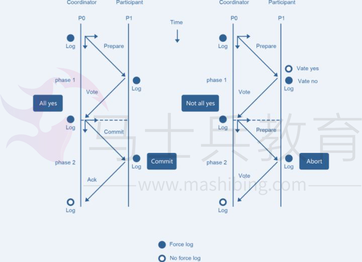

---

论文中提出的解决方法是将更新交易表记录和用户表更新消息放在一个本地事务来完成，为了避免重复
消费用户表更新消息带来的问题，增加一个操作记录表updates_applied来记录已经完成的交易相关的
信息。
 
这个方案的核心在于第二阶段的重试和幂等执行。失败后重试，这是一种补偿机制，它是能保证系统最
终一致的关键流程。
3、TCC （Try-Confirm-Cancel）补偿模式——最终一致性
某业务模型如图，由服务 A、服务B、服务C、服务D 共同组成的一个微服务架构系统。服务A 需要依次
调用服务B、服务C 和服务D 共同完成一个操作。当服务A 调用服务D 失败时，若要保证整个系统数据的
一致性，就要对服务B 和服务C 的invoke 操作进行回滚，执行反向的revert 操作。回滚成功后，整个微
服务系统是数据一致的。

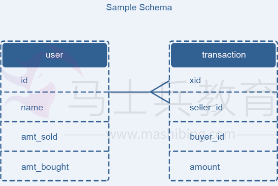

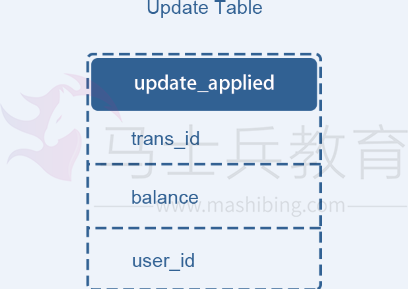

---

实现关键要素：
1. 服务调用链必须被记录下来。
2. 每个服务提供者都需要提供一组业务逻辑相反的操作，互为补偿，同时回滚操作要保证幂等。
3. 必须按失败原因执行不同的回滚策略。
4、缓存数据最终一致性
在我们的业务系统中，缓存（Redis 或者Memcached）通常被用在数据库前面，作为数据读取的缓冲，
使得I/O 操作不至于直接落在数据库上。以商品详情页为例，假如卖家修改了商品信息，并写回到数据
库，但是这时候用户从商品详情页看到的信息还是从缓存中拿到的过时数据，这就出现了缓存系统和数
据库系统中的数据不一致的现象。
要解决该场景下缓存和数据库数据不一致的问题我们有以下两种解决方案：
1. 为缓存数据设置过期时间。当缓存中数据过期后，业务系统会从数据库中获取数据，并将新值放入
缓存。这个过期时间就是系统可以达到最终一致的容忍时间。
2. 更新数据库数据后同时清除缓存数据。数据库数据更新后，同步删除缓存中数据，使得下次对商品
详情的获取直接从数据库中获取，并同步到缓存。
四、选择建议
 
在面临数据一致性问题的时候，首先要从业务需求的角度出发，确定我们对于3 种一致性模型的接受程
度，再通过具体场景来决定解决方案。
从应用角度看，分布式事务的现实场景常常无法规避，在有能力给出其他解决方案前，2PC也是一个不
错的选择。
对购物转账等电商和金融业务，中间件层的2PC最大问题在于业务不可见，一旦出现不可抗力或意想不
到的一致性破坏，如数据节点永久性宕机，业务难以根据2PC的日志进行补偿。金融场景下，数据一致
性是命根，业务需要对数据有百分之百的掌控力，建议使用TCC这类分布式事务模型，或基于消息队列
的柔性事务框架，这两种方案都在业务层实现，业务开发者具有足够掌控力，可以结合SOA框架来架
构，包括Dubbo、Spring Cloud等（题主的标签写了Dubbo）。

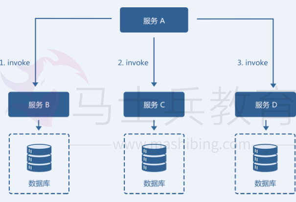

---

分布式锁的几种实现方式
 
 
分布式锁是控制分布式系统之间同步访问共享资源的一种方式。
 其典型的使用场景为：
 不同系统或者是同一系统的不同主机之间共享了一个或一组资源，那么访问这些资源的时候，需要通过
一定的互斥手段来防止彼此的干扰，以保证一致性。
1. 使用Redis实现分布式锁
 
* WATCH, MULTI, EXEC, DISCARD事务机制实现分布式锁
 
Redis支持基本的事务操作
 
以上被MULTI和EXEC包裹的redis命令，保证所有事务内的命令将会串行顺序执行，保证不会在事务的执
行过程中被其他客户端打断。
 而WATCH命令能够监视某个键，当事务执行时，如果被监视的键被其他客户端修改了值，事务运行失
败，返回相应错误（被事务运行客户端在事务内修改了值，不会造成事务运行失败）。
运用Redis事务所支持的以上特性，可以实现一个分布式锁功能。Python代码如下：
 
通过WATCH命令监视某个键，当该键未被其他客户端修改值时，事务成功执行。当事务运行过程中，发
现该值被其他客户端更新了值，任务失败，进行重试。
MULTI
some redis command
EXEC
# -*- coding: utf-8 -*-
def acqure_lock_with_watch(conn, lockname, acquire_timeout=10):
    pipe = conn.pipeline()
    end = time.time() + acquire_timeout
    lockname = 'lock:' + lockname
    while time.time() < end:
        try:
            pipe.watch(lockname)
            pipe.multi()  # 开启事务
            # 事务具体内容，对lockname的值进行更新
            pipe.execute()
            return True
        except redis.exceptions.WatchError:
            # 事务运行期间，有其他客户端改变了lockname的值，抛出异常，进行重试操作
            pass
    return False

---

* SETNX实现分布式锁
 
SETNX：当指定键不存在时，向Redis中添加一个键值对。Redis客户端保证对统一键名称，多个客户端
同时设置其值时，只有一个客户端能够设置成功的原子性。
 
以上，利用SETNX的原子特性，和Redis的键过期特性，实现了自动过期释放的分布式锁。
* 锁的释放
 
 
锁释放的过程，首先检查客户端是否仍然持有该锁，如果持有，则在事务中删除键值对，释放锁的所有
权。
# -*- coding: utf-8 -*-
def acquire_lock_with_timeout(
        conn, lockname, acquire_timeout=10, lock_timeout=10):
    identifire = str(uuid.uuid4())
    lockname = 'lock:' + lockname
    lock_timeout = int(math.ceil(lock_timeout))
    end = time.time() + acquire_timeout
    while time.time() < end:
        if conn.setnx(lockname, identifire):  # 以锁名称为键，uuid的值为值，redis服务
器setnx保证了只能有一个客户端成功设置键的原子性
            conn.expire(lockname, lock_timeout)  # 设置键的过期时间，过期自动剔除，释放
锁
            return identifire
        elif not conn.ttl(lockname):  # 当锁未被设置过期时间时，重新设置其过期时间
            conn.expire(lockname, lock_timeout)
        time.sleep(0.001)
    return False
# -*- coding: utf-8 -*-
def release_lock(conn, lockname, identifire):
    pipe = conn.pipeline(True)
    lockname = 'lock:' + lockname
    while True:
        try:
            pipe.watch(lockname)  # 监视锁的键，在锁释放过程中改变了键的值时得到相应通知
            if pipe.get(lockname) == identifire:  # 检查客户端是否仍然持有该锁
                pipe.multi()
                pipe.delete(lockname)  # 删除键，释放锁
                pipe.execute()
                return True
            pipe.unwatch()
            break
        except redis.exceptions.WatchError:
            pass  # 释放锁期间，有其他客户端改变了键值对，锁释放失败，进行循环
    return False

---

2. 使用Memcached实现分布式锁
 
Memcached的add命令，当指定的key不存在时，进行添加，且保证了执行的原子性。利用该特性，可
以实现一个分布式锁实现。
 
释放锁时，删除指定key的键即可。
3. 使用ZooKeeper实现分布式锁
 
相较于使用redis和memcached实现的锁，zk利用其高级特性，能够实现更复杂的锁特性。
排它锁
 
排它锁，又称写锁或独占锁。如果事务T1对对象O1加了排它锁，那么整个加锁期间，只允许事务T1对
O1进行读取和更新操作，其他任何事务都不能对该数据对象进行任务读写操作，直到T1释放了排它锁。
 以上介绍的使用redis和memcached实现的分布式锁都属于排它锁。
获取锁
 
ZooKeeper实现分布式锁利用了其临时子节点的如下特性：
 在/exclusive_lock节点下创建临时子节点/exclusive_lock/lock，zk会保证在所有的客户端中，最终只有
一个客户端能够创建成功，即可以认为该客户端获得了锁。同时，虽有没有获取到所得客户端需要
到/exclusive_lock节点上注册一个子节点变更的Watcher监听，以便实时监听到lock节点的变更情况。
释放锁
 
因为在获取锁时，创建的是一个临时节点/exclusive_lock/lock，因此在如下情况，都有可能释放锁：
获取锁的机器发生宕机，临时节点被zk移除
正常执行业务逻辑后，客户端主动删除临时节点
无论什么情况下，lock节点被移除，zk都会通知所有在/exclusive_lock节点上注册了子节点变更的
Watcher监听的客户端。这些客户端在收到通知后，重新发起分布式锁的获取流程。
共享锁
 
共享锁又称读锁。如果事务T1对数据对象O1加上了共享锁，那么当前事务只能对O1进行读取操作，其
他事务也只能对这个数据对象加上共享锁，直到该数据对象上的所有共享锁都被释放。
 而更新操作只能在当前没有任何事务进行读写操作的情况下进行。
def acquire_lock_with__memcached_timeout(
        conn, lockname, acquire_timeout=10, lock_timeout=10):
    identifire = str(uuid.uuid4())
    lockname = 'lock:' + lockname
    lock_timeout = int(math.ceil(lock_timeout))
    end = time.time() + acquire_timeout
    while time.time() < end:
        # 过期时间保证了客户端崩溃时仍能在超过过期世家后正常释放锁
        # 以锁名称为键，uuid的值为值，memcached服务器add保证了只能有一个客户端成功设置键的原
子性
        if conn.add(lockname, identifire, lock_timeout):
            return identifire
        time.sleep(0.001)
    return False

---

获取锁
 
当需要获取共享锁是，所有客户端到/shared_lock节点下面创建一个临时顺序节
点，/shared_lock/[hostname]-请求类型（W | R）-序号，该节点代编了一个共享锁。
 如果是读请求，则创建/shared_lock/192.168.0.1-R-000000000001；
 如果是写请求，则创建/shared_lock/192.168.0.1-W-000000000001；
判断读写顺序
1. 在创建完监听后，获取/shared_lock节点下的所有子节点，对该节点注册子节点变更的Watcher监
听
2. 确定自己的节点序号在所有子节点的顺序
3. 对于读请求：
如果没有比自己序号小的子节点，或是所有比自己序号小的子节点都是读请求，那么表明自己已经
成功获取到了共享锁，执行读取逻辑。
如果比自己序号小的子节点中有写请求，那么进入等待。
1. 对于写请求：
如果自己不是序号最小的子节点，那么进入等待。
1. 收到Watcher通知后，重复步骤1-4
释放锁
 
释放锁，删除对应的数据节点即可。
 
 
Spring Cloud面试题
 
 
什么是 Spring Cloud？
 
Spring cloud 流应用程序启动器是基于 Spring Boot 的 Spring 集成应用程序，提供与外部系统的集成。
Spring cloud Task，一个生命周期短暂的微服务框架，用于快速构建执行有限数据处理的应用程序。 
 
 
使用 Spring Cloud 有什么优势？
 
使用 Spring Boot 开发分布式微服务时，我们面临以下问题 
•    与分布式系统相关的复杂性-这种开销包括网络问题，延迟开销，带宽问题，安全问题。 
•    服务发现-服务发现工具管理群集中的流程和服务如何查找和互相交谈。它涉及一个服务目录，在该
目录中注册服务，然后能够查找并连接到该目录中的服务。 
•    冗余-分布式系统中的冗余问题。 
•    负载平衡 --负载平衡改善跨多个计算资源的工作负荷，诸如计算机，计算机集群，网络链路，中央处
理单元，或磁盘驱动器的分布。 
•    性能-问题 由于各种运营开销导致的性能问题。

---

•    部署复杂性-Devops 技能的要求。 
 
服务注册和发现是什么意思？Spring Cloud 如何实现？
 
当我们开始一个项目时，我们通常在属性文件中进行所有的配置。随着越来越多的服务开发和部署，添
加和修改这些属性变得更加复杂。有些服务可能会下降，而某些位置可能会发生变化。手动更改属性可
能会产生问题。 Eureka 服务注册和发现可以在这种情况下提供帮助。由于所有服务都在 Eureka 服务器
上注册并通过调用 Eureka 服务器完成查找，因此无需处理服务地点的任何更改和处理。 
 
负载平衡的意义什么？
 
在计算中，负载平衡可以改善跨计算机，计算机集群，网络链接，中央处理单元或磁盘驱动器等多种计
算资源的工作负载分布。负载平衡旨在优化资源使用，最大化吞吐量，最小化响应时间并避免任何单一
资源的过载。使用多个组件进行负载平衡而不是单个组件可能会通过冗余来提高可靠性和可用性。负载
平衡通常涉及专用软件或硬件，例如多层交换机或域名系统服务器进程。 
 
什么是 Hystrix？它如何实现容错？
 
Hystrix 是一个延迟和容错库，旨在隔离远程系统，服务和第三方库的访问点，当出现故障是不可避免的
故障时，停止级联故障并在复杂的分布式系统中实现弹性。 
通常对于使用微服务架构开发的系统，涉及到许多微服务。这些微服务彼此协作。  
思考以下微服务 
假设如果上图中的微服务 9 失败了，那么使用传统方法我们将传播一个异常。但这仍然会导致整个系统
崩溃。 
随着微服务数量的增加，这个问题变得更加复杂。微服务的数量可以高达 1000.这是 hystrix 出现的地方
我们将使用 Hystrix 在这种情况下的 Fallback 方法功能。我们有两个服务 employee-consumer 使用由 
employee-consumer 公开的服务。  
简化图如下所示

---

现在假设由于某种原因，employee-producer 公开的服务会抛出异常。我们在这种情况下使用 Hystrix
定义了一个回退方法。这种后备方法应该具有与公开服务相同的返回类型。如果暴露服务中出现异常，
则回退方法将返回一些值。 
什么是Hystrix 断路器？我们需要它吗？
 
由于某些原因，employee-consumer 公开服务会引发异常。在这种情况下使用 Hystrix 我们定义了一
个回退方法。如果在公开服务中发生异常，则回退方法返回一些默认值。 
如果 firstPage method() 中的异常继续发生，则 Hystrix 电路将中断，并且员工使用者将一起跳过
firtsPage 方法，并直接调用回退方法。 断路器的目的是给第一页方法或第一页方法可能调用的其他方法
留出时间，并导致异常恢复。可能发生的情况是，在负载较小的情况下，导致异常的问题有更好的恢复
机会 。

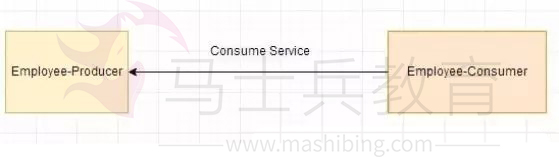

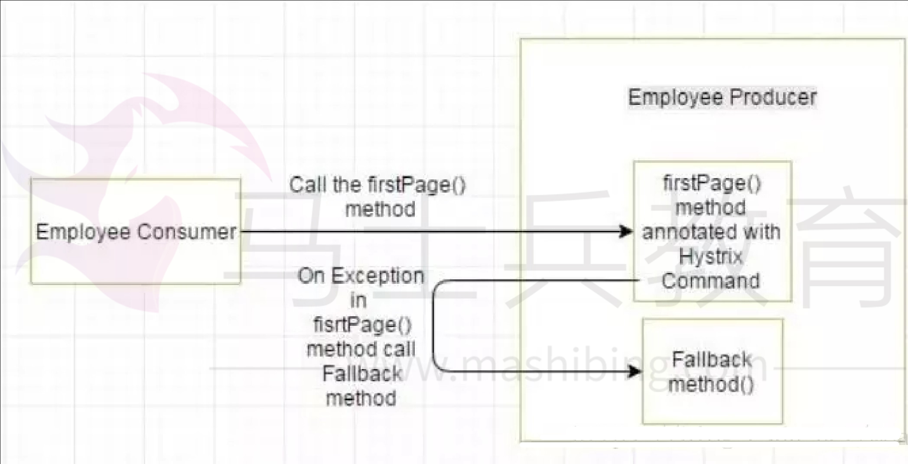

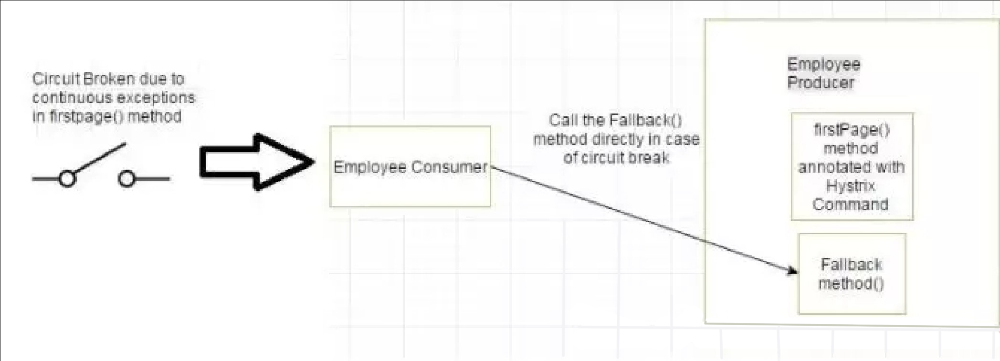

---

什么是 Netflix Feign？它的优点是什么？
 
Feign 是受到 Retrofit，JAXRS-2.0 和 WebSocket 启发的 java 客户端联编程序。Feign 的第一个目标是
将约束分母的复杂性统一到 http apis，而不考虑其稳定性。在 employee-consumer 的例子中，我们使
用了 employee-producer 使用 REST 模板公开的 REST 服务。
但是我们必须编写大量代码才能执行以下步骤
·   使用功能区进行负载平衡。 
·   获取服务实例，然后获取基本 URL。 
·   利用 REST 模板来使用服务。 前面的代码如下
 
之前的代码，有像 NullPointer 这样的例外的机会，并不是最优的。我们将看到如何使用 Netflix Feign
使呼叫变得更加轻松和清洁。如果 Netflix Ribbon 依赖关系也在类路径中，那么 Feign 默认也会负责负
载平衡。
 
什么是 Spring Cloud Bus？我们需要它吗？
 
 考虑以下情况：我们有多个应用程序使用 Spring Cloud Config 读取属性，而 Spring Cloud Config 从
GIT 读取这些属性。 
下面的例子中多个员工生产者模块从 Employee Config Module 获取 Eureka 注册的财产。
1.  @Controller
2.  public class ConsumerControllerClient { 3.
4.  @Autowired
5.  private LoadBalancerClient loadBalancer; 6.
7.  public void getEmployee() throws RestClientException, IOException { 
8.
9.  ServiceInstance serviceInstance=loadBalancer.choose("employee-producer"); 
10.
11.System.out.println(serviceInstance.getUri()); 
12.
13.String baseUrl=serviceInstance.getUri().toString(); 
14.
15.baseUrl=baseUrl+"/employee"; 
16.
17.RestTemplate restTemplate = new RestTemplate(); 
18. ResponseEntity<String> response=null; 
19. try{ 
20. response=restTemplate.exchange(baseUrl, 
21. HttpMethod.GET, getHeaders(),String.class); 
22. }catch (Exception ex) 
23. {
24. System.out.println(ex);
25. }
26. System.out.println(response.getBody());
27. }

---

如果假设 GIT 中的 Eureka 注册属性更改为指向另一台 Eureka 服务器，会发生什么情况。在这种情况
下，我们将不得不重新启动服务以获取更新的属性。 
还有另一种使用执行器端点/刷新的方式。但是我们将不得不为每个模块单独调用这个 url。例如，如果
Employee Producer1 部署在端口 8080 上，则调用 http：// localhost：8080 / refresh。同样对于 
Employee Producer2 http：// localhost：8081 / refresh 等等。这又很麻烦。这就是 Spring Cloud 
Bus 发挥作用的地方。

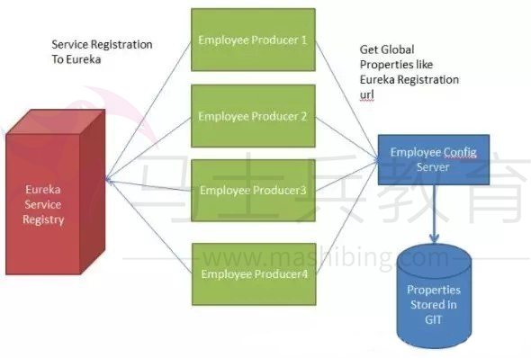

---

Spring Cloud Bus 提供了跨多个实例刷新配置的功能。因此，在上面的示例中，如果我们刷新
Employee Producer1，则会自动刷新所有其他必需的模块。如果我们有多个微服务启动并运行，这特
别有用。这是通过将所有微服务连接到单个消息代理来实现的。无论何时刷新实例，此事件都会订阅到
侦听此代理的所有微服务，并且它们也会刷新。可以通过使用端点/总线/刷新来实现对任何单个实例的
刷新。
 
 
为什么需要学习Spring Cloud
 
不论是商业应用还是用户应用，在业务初期都很简单，我们通常会把它实现为单体结构的应用。但是，
随着业务逐渐发展，产品思想会变得越来越复杂，单体结构的应用也会越来越复杂。这就会给应用带来
如下的几个问题：
 代码结构混乱：业务复杂，导致代码量很大，管理会越来越困难。同时，这也会给业务的快速迭代带来
巨大挑战；
 开发效率变低：开发人员同时开发一套代码，很难避免代码冲突。开发过程会伴随着不断解决冲突的过
程，这会严重的影响开发效率；
 排查解决问题成本高：线上业务发现 bug，修复 bug 的过程可能很简单。但是，由于只有一套代码，需
要重新编译、打包、上线，成本很高。
由于单体结构的应用随着系统复杂度的增高，会暴露出各种各样的问题。近些年来，微服务架构逐渐取
代了单体架构，且这种趋势将会越来越流行。Spring 
Cloud是目前最常用的微服务开发框架，已经在企业级开发中大量的应用。
什么是Spring Cloud
 
Spring Cloud是一系列框架的有序集合。它利用Spring Boot的开发便利性巧妙地简化了分布式系统基础
设施的开发，如服务发现注册、配置中心、智能路由、消息总线、负载均衡、断路器、数据监控等，都
可以用Spring Boot的开发风格做到一键启动和部署。Spring Cloud并没有重复制造轮子，它只是将各家
公司开发的比较成熟、经得起实际考验的服务框架组合起来，通过Spring Boot风格进行再封装屏蔽掉了
复杂的配置和实现原理，最终给开发者留出了一套简单易懂、易部署和易维护的分布式系统开发工具
包。
设计目标与优缺点
 
设计目标
协调各个微服务，简化分布式系统开发。
优缺点
 
微服务的框架那么多比如：dubbo、Kubernetes，为什么就要使用Spring 
Cloud的呢？
优点：
产出于Spring大家族，Spring在企业级开发框架中无人能敌，来头很大，可以保证后续的更新、完
善
组件丰富，功能齐全。Spring Cloud 为微服务架构提供了非常完整的支持。例如、配置管理、服务
发现、断路器、微服务网关等；

---

Spring Cloud 社区活跃度很高，教程很丰富，遇到问题很容易找到解决方案服务拆分粒度更细，耦
合度比较低，有利于资源重复利用，有利于提高开发效率可以更精准的制定优化服务方案，提高系
统的可维护性减轻团队的成本，可以并行开发，不用关注其他人怎么开发，先关注自己的开发微服
务可以是跨平台的，可以用任何一种语言开发适于互联网时代，产品迭代周期更短
缺点：
微服务过多，治理成本高，不利于维护系统
分布式系统开发的成本高（容错，分布式事务等）对团队挑战大总的来说优点大过于缺点，目前看
来Spring Cloud是一套非常完善的分布式框架，目前很多企业开始用微服务、Spring Cloud的优势
是显而易见的。因此对于想研究微服务架构的同学来说，学习Spring Cloud是一个不错的选择。
Spring Cloud发展前景
 
Spring Cloud对于中小型互联网公司来说是一种福音，因为这类公司往往没有实力或者没有足够的资金
投入去开发自己的分布式系统基础设施，使用Spring 
Cloud一站式解决方案能在从容应对业务发展的同时大大减少开发成本。同时，随着近几年微服务架构
和Docker容器概念的火爆，也会让Spring Cloud在未来越来越“云”化的软件开发风格中立有一席之地，
尤其是在五花八门的分布式解决方案中提供了标准化的、全站式的技术方案，意义可能会堪比当年
Servlet规范的诞生，有效推进服务端软件系统技术水平的进步。
整体架构
 
主要项目
 
Spring Cloud的子项目，大致可分成两类，一类是对现有成熟框架"Spring 
Boot化"的封装和抽象，也是数量最多的项目；第二类是开发了一部分分布式系统的基础设施的实现，如
Spring Cloud Stream扮演的就是kafka, ActiveMQ这样的角色。
Spring Cloud Config
 
集中配置管理工具，分布式系统中统一的外部配置管理，默认使用Git来存储配置，可以支持客户端配置
的刷新及加密、解密操作。

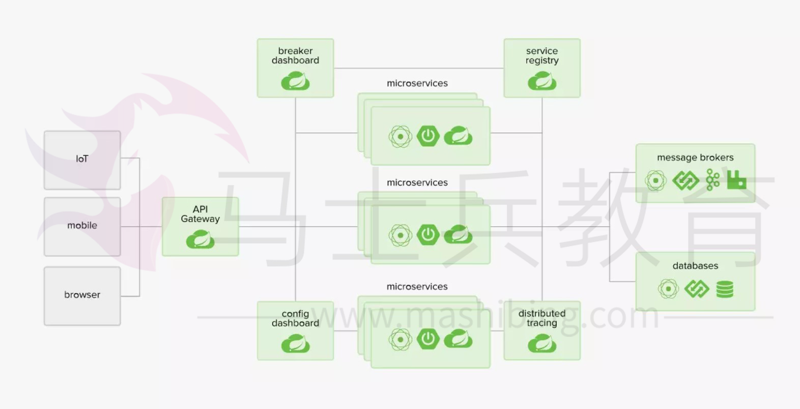

---

Spring Cloud Netflix
 
Netflix OSS 开源组件集成，包括Eureka、Hystrix、Ribbon、Feign、Zuul等核心组件。
Eureka：服务治理组件，包括服务端的注册中心和客户端的服务发现机制；
Ribbon：负载均衡的服务调用组件，具有多种负载均衡调用策略；
Hystrix：服务容错组件，实现了断路器模式，为依赖服务的出错和延迟提供了容错能力；
Feign：基于Ribbon和Hystrix的声明式服务调用组件；
Zuul：API网关组件，对请求提供路由及过滤功能。
Spring Cloud Bus
 
用于传播集群状态变化的消息总线，使用轻量级消息代理链接分布式系统中的节点，可以用来动态刷新
集群中的服务配置。
Spring Cloud Consul
基于Hashicorp Consul的服务治理组件。
Spring Cloud Security
安全工具包，对Zuul代理中的负载均衡OAuth2客户端及登录认证进行支持。
Spring Cloud Sleuth
 
Spring Cloud应用程序的分布式请求链路跟踪，支持使用Zipkin、HTrace和基于日志（例如ELK）的跟
踪。
Spring Cloud Stream
 
轻量级事件驱动微服务框架，可以使用简单的声明式模型来发送及接收消息，主要实现为Apache Kafka
及RabbitMQ。
Spring Cloud Task
 
用于快速构建短暂、有限数据处理任务的微服务框架，用于向应用中添加功能性和非功能性的特性。
Spring Cloud Zookeeper
基于Apache Zookeeper的服务治理组件。
Spring Cloud Gateway
API网关组件，对请求提供路由及过滤功能。
Spring Cloud OpenFeign
 
基于Ribbon和Hystrix的声明式服务调用组件，可以动态创建基于Spring MVC 注解的接口实现用于服务
调用，在Spring Cloud 2.0中已经取代Feign成为了一等公民。
Spring Cloud的版本关系
 
Spring Cloud是一个由许多子项目组成的综合项目，各子项目有不同的发布节奏。 为了管理Spring 
Cloud与各子项目的版本依赖关系，发布了一个清单，其中包括了某个Spring Cloud版本对应的子项目
版本。 为了避免Spring Cloud版本号与子项目版本号混淆，Spring Cloud版本采用了名称而非版本号的
命名，

---

Spring Cloud Version
SpringBo ot Version
Hoxton
2.2.x
Greenwic h
2.1.x
Finchley
2.0.x
Edgware
1.5.x
Dalston
1.5.x
More Actions Compon ent
Edgware. SR6
Greenwic h.SR2
spring- cloud- bus
1.3.4.RELE ASE
2.1.2.RELE ASE
spring- cloud- commons
1.3.6.RELE ASE
2.1.2.RELE ASE
spring- cloud- config
1.4.7.RELE ASE
2.1.3.RELE ASE
spring- cloud- netflix
1.4.7.RELE ASE
2.1.2.RELE ASE
spring- cloud- security
1.2.4.RELE ASE
2.1.3.RELE ASE
spring- cloud- consul
1.3.6.RELE ASE
2.1.2.RELE ASE
spring- cloud- sleuth
1.3.6.RELE ASE
2.1.1.RELE ASE
spring- cloud- stream
Ditmars.S R5
Fishtown. SR3
spring- cloud- zookeepe r
1.2.3.RELE ASE
2.1.2.RELE ASE
spring- boot
1.5.21.REL EASE
2.1.5.RELE ASE
spring- cloud- task
1.2.4.RELE ASE
2.1.2.RELE ASE
spring- cloud- gateway
1.0.3.RELE ASE
2.1.2.RELE ASE
spring- cloud- openfeig n
暂无
2.1.2.RELE ASE
这些版本的名字采用了伦敦地铁站的名字，根据字母表的顺序来对应版本时间顺序，例如Angel是第一个
版本，Brixton是第二个版本。 当Spring Cloud的发布
内容积累到临界点或者一个重大BUG被解决后，会发布一个"service 
releases"版本，简称SRX版本，比如Greenwich.SR2就是Spring Cloud发布的 Greenwich版本的第2个
SRX版本。目前Spring Cloud的最新版本是Hoxton。
Spring Cloud和SpringBoot版本对应关系
 
Spring Cloud和各子项目版本对应关系
 
注意：Hoxton版本是基于SpringBoot 2.2.x版本构建的，不适用于1.5.x版本。随着2019年8月
SpringBoot 1.5.x版本停止维护，Edgware版本也将停止维护。
SpringBoot和SpringCloud的区别？
 
SpringBoot专注于快速方便的开发单个个体微服务。

---

SpringCloud是关注全局的微服务协调整理治理框架，它将SpringBoot开发的一个个单体微服务整合并
管理起来，为各个微服务之间提供，配置管理、服务发现、断路器、路由、微代理、事件总线、全局
锁、决策竞选、分布式会话等等集成服务
SpringBoot可以离开SpringCloud独立使用开发项目， 但是SpringCloud离不开SpringBoot ，属于依赖
的关系
SpringBoot专注于快速、方便的开发单个微服务个体，SpringCloud关注全局的服务治理框架。
使用 Spring Boot 开发分布式微服务时，我们面临以下问题
 
（1）  与分布式系统相关的复杂性-这种开销包括网络问题，延迟开销，带宽问题，安全问题。
（2）  服务发现-服务发现工具管理群集中的流程和服务如何查找和互相交谈。它涉及一个服务目录，在
该目录中注册服务，然后能够查找并连接到该目录中的服务。
（3）  冗余-分布式系统中的冗余问题。
（4）  负载平衡 --负载平衡改善跨多个计算资源的工作负荷，诸如计算机，计算机集群，网络链路，中
央处理单元，或磁盘驱动器的分布。
（5）  性能-问题 由于各种运营开销导致的性能问题。
（6）部署复杂性-Devops 技能的要求。
服务注册和发现是什么意思？Spring Cloud 如何实现？
 
当我们开始一个项目时，我们通常在属性文件中进行所有的配置。随着越来越多的服务开发和部署，添
加和修改这些属性变得更加复杂。有些服务可能会下降，而某些位置可能会发生变化。手动更改属性可
能会产生问题。 Eureka 服务注册和发现可以在这种情况下提供帮助。由于所有服务都在 Eureka 服务器
上注册并通过调用 Eureka 服务器完成查找，因此无需处理服务地点的任何更改和处理。
Spring Cloud 和dubbo区别?
（1）服务调用方式 dubbo是RPC springcloud Rest Api （2）注册中心,dubbo 是zookeeper 
springcloud是eureka，也可以是 zookeeper
（3）服务网关,dubbo本身没有实现，只能通过其他第三方技术整合， springcloud有Zuul路由网关，
作为路由服务器，进行消费者的请求分
发,springcloud支持断路器，与git完美集成配置文件支持版本控制，事物总线实现配置文件的更新与服
务自动装配等等一系列的微服务架构要素。
负载平衡的意义什么？
 
在计算中，负载平衡可以改善跨计算机，计算机集群，网络链接，中央处理单元或磁盘驱动器等多种计
算资源的工作负载分布。负载平衡旨在优化资源使用，最大化吞吐量，最小化响应时间并避免任何单一
资源的过载。使用多个组件进行负载平衡而不是单个组件可能会通过冗余来提高可靠性和可用性。负载
平衡通常涉及专用软件或硬件，例如多层交换机或域名系统服务器进程。
什么是 Hystrix？它如何实现容错？
 
Hystrix 是一个延迟和容错库，旨在隔离远程系统，服务和第三方库的访问点，当出现故障是不可避免的
故障时，停止级联故障并在复杂的分布式系统中实现弹性。
通常对于使用微服务架构开发的系统，涉及到许多微服务。这些微服务彼此协作。
思考以下微服务

---

假设如果上图中的微服务 9 失败了，那么使用传统方法我们将传播一个异常。
但这仍然会导致整个系统崩溃。
随着微服务数量的增加，这个问题变得更加复杂。微服务的数量可以高达 1000.
这是 hystrix 出现的地方 我们将使用 Hystrix 在这种情况下的 Fallback 方法功
能。我们有两个服务 employee-consumer 使用由 employee-consumer 公开的服务。
简化图如下所示
现在假设由于某种原因，employee-producer 公开的服务会抛出异常。我们在这种情况下使用 Hystrix 
定义了一个回退方法。这种后备方法应该具有与公开服
务相同的返回类型。如果暴露服务中出现异常，则回退方法将返回一些值。
什么是 Hystrix 断路器？我们需要它吗？
 
由于某些原因，employee-consumer 公开服务会引发异常。在这种情况下使用Hystrix 我们定义了一个
回退方法。如果在公开服务中发生异常，则回退方法返回一些默认值。

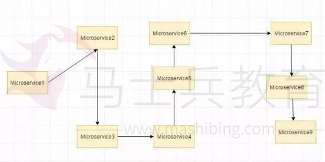

---

如果 firstPage method() 中的异常继续发生，则 Hystrix 电路将中断，并且员
工使用者将一起跳过 firtsPage 方法，并直接调用回退方法。 断路器的目的是给第一页方法或第一页方
法可能调用的其他方法留出时间，并导致异常恢复。可能发生的情况是，在负载较小的情况下，导致异
常的问题有更好的恢复机会 。
什么是 Netflix Feign？它的优点是什么？
 
Feign 是受到 Retrofit，JAXRS-2.0 和 WebSocket 启发的 java 客户端联编程序。
Feign 的第一个目标是将约束分母的复杂性统一到 http apis，而不考虑其稳定性。
在 employee-consumer 的例子中，我们使用了 employee-producer 使用 REST模板公开的 REST 服
务。
但是我们必须编写大量代码才能执行以下步骤（1）使用功能区进行负载平衡。
（2）  获取服务实例，然后获取基本 URL。
（3）  利用 REST 模板来使用服务。 前面的代码如下
1  @Controller
2  public class ConsumerControllerClient {
3  @Autowired
4  private LoadBalancerClient loadBalancer;
5  public void getEmployee() throws RestClientException, IOException {
6   ServiceInstance serviceInstance=loadBalancer.choose("employee- producer");
7   System.out.println(serviceInstance.getUri());
8   String baseUrl=serviceInstance.getUri().toString();
9   baseUrl=baseUrl+"/employee";
10   RestTemplate restTemplate = new RestTemplate();
11   ResponseEntity<String> response=null;
12   try{
13   response=restTemplate.exchange(baseUrl,
14   HttpMethod.GET, getHeaders(),String.class);
15   }
16   catch (Exception ex)
17   {
18   System.out.println(ex);
19   }
20   System.out.println(response.getBody());
21  }

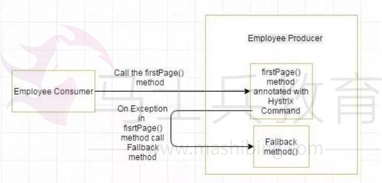

---

之前的代码，有像 NullPointer 这样的例外的机会，并不是最优的。我们将看到如何使用 Netflix Feign 
使呼叫变得更加轻松和清洁。如果 Netflix Ribbon 依赖关系也在类路径中，那么 Feign 默认也会负责负
载平衡。
什么是 Spring Cloud Bus？我们需要它吗？
 
考虑以下情况：我们有多个应用程序使用 Spring Cloud Config 读取属性，而
Spring Cloud Config 从 GIT 读取这些属性。
下面的例子中多个员工生产者模块从 Employee Config Module 获取 Eureka 注册的财产。
如果假设 GIT 中的 Eureka 注册属性更改(img)为指向另一台 Eureka 服务器，会发生什么情况。在这种
情况下，我们将不得不重新启动服务以获取更新的属性。还有另一种使用执行器端点/刷新的方式。但是
我们将不得不为每个模块单独调
用这个 url。例如，如果 Employee Producer1 部署在端口 8080 上，则调用 http：// localhost：8080 
/ refresh。同样对于 Employee Producer2 
http：//localhost：8081 / refresh 等等。这又很麻烦。这就是 Spring Cloud Bus 发挥作用的地方。

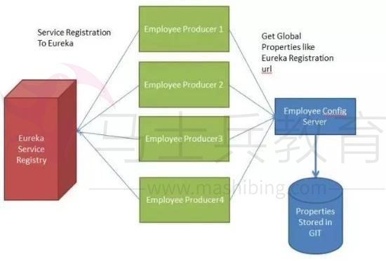

---

Spring Cloud Bus 提供了跨多个实例刷新配置的功能。因此，在上面的示例中，如果我们刷新 
Employee Producer1，则会自动刷新所有其他必需的模
块。如果我们有多个微服务启动并运行，这特别有用。这是通过将所有微服务连接到单个消息代理来实
现的。无论何时刷新实例，此事件都会订阅到侦听此代理的所有微服务，并且它们也会刷新。可以通过
使用端点/总线/刷新来实现对任何单个实例的刷新。
Spring Cloud断路器的作用
 
当一个服务调用另一个服务由于网络原因或自身原因出现问题，调用者就会等待被调用者的响应 当更多
的服务请求到这些资源导致更多的请求等待，发生连锁效应（雪崩效应）断路器有完全打开状态:一段时
间内 达到一定的次数无法调用 并且多次监测没有恢复的迹象 断路器完全打开 那么下次请求就不会请求
到该服务半开:短时间内 有恢复迹象 断路器会将部分请求发给该服务，正常调用时 断路器关闭
关闭：当服务一直处于正常状态 能正常调用
什么是Spring Cloud Config?
 
在分布式系统中，由于服务数量巨多，为了方便服务配置文件统一管理，实时更新，所以需要分布式配
置中心组件。在Spring Cloud中，有分布式配置中心组件spring cloud config ，它支持配置服务放在配
置服务的内存中（即本地），也支持放在远程Git仓库中。在spring cloud config 组件中，分两个角色，
一是 config server，二是config client。
使用：
（1）  添加pom依赖
（2）  配置文件添加相关配置
（3）  启动类添加注解@EnableConfigServer

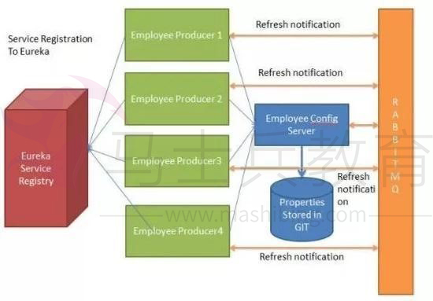

---

什么是Spring Cloud Gateway?
 
Spring Cloud Gateway是Spring Cloud官方推出的第二代网关框架，取代Zuul 网关。网关作为流量的，
在微服务系统中有着非常作用，网关常见的功能有路由转发、权限校验、限流控制等作用。
使用了一个RouteLocatorBuilder的bean去创建路由，除了创建路由
RouteLocatorBuilder可以让你添加各种predicates和filters，predicates断言的意思，顾名思义就是根
据具体的请求的规则，由具体的route去处理，filters 是各种过滤器，用来对请求做各种判断和修改。
 
一. 分布式模型
 
1. 节点
 
在具体的工程项目中，一个节点往往是一个操作系统上的进程。在本文的模型中，认 为节点是一个完整
的、不可分的整体，如果某个程序进程实际上由若干相对独立部分 构成，则在模型中可以将一个进程划
分为多个节点。
异常
 
机器宕机：机器宕机是最常见的异常之一。在大型集群中每日宕机发生的概 率为千分之一左右，在实践
中，一台宕机的机器恢复的时间通常认为是24 小 时，一般需要人工介入重启机器。 
网络异常：消息丢失，两片节点之间彼此完全无法通信，即出现了“网络分 化”；消息乱序，有一定的概
率不是按照发送时的顺序依次到达目的节点，考 虑使用序列号等机制处理网络消息的乱序问题，使得无
效的、过期的网络消息 不影响系统的正确性；数据错误；不可靠的TCP，TCP 协议为应用层提供了可 靠
的、面向连接的传输服务，但在分布式系统的协议设计中不能认为所有网络 通信都基于TCP 协议则通信
就是可靠的。TCP协议只能保证同一个TCP 链接内 的网络消息不乱序，TCP 链接之间的网络消息顺序则
无法保证。 
分布式三态：如果某个节点向另一个节点发起RPC(Remote procedure call) 调用，即某个节点A 向另一
个节点B 发送一个消息，节点B 根据收到的消息内 容完成某些操作，并将操作的结果通过另一个消息返
回给节点A，那么这个RPC  执行的结果有三种状态：“成功”、“失败”、“超时（未知）”，称之为分 布式系
统的三态。 
存储数据丢失：对于有状态节点来说，数据丢失意味着状态丢失，通常只能从 其他节点读取、恢复存储
的状态。 
异常处理原则：被大量工程实践所检验过的异常处理黄金原则是：任何在设 计阶段考虑到的异常情况一
定会在系统实际运行中发生，但在系统实际运行遇 到的异常却很有可能在设计时未能考虑，所以，除非
需求指标允许，在系统设 计时不能放过任何异常情况。
副本
 
副本（replica/copy）指在分布式系统中为数据或服务提供的冗余。对于数据副本指 在不同的节点上持
久化同一份数据，当出现某一个节点的存储的数据丢失时，可以从 副本上读到数据。数据副本是分布式
系统解决数据丢失异常的唯一手段。另一类副本 是服务副本，指数个节点提供某种相同的服务，这种服
务一般并不依赖于节点的本地 存储，其所需数据一般来自其他节点。
副本协议是贯穿整个分布式系统的理论核心。
副本一致性
分布式系统通过副本控制协议，使得从系统外部读取系统内部各个副本的数据在一定 的约束条件下相
同，称之为副本一致性(consistency)。副本一致性是针对分布式系统 而言的，不是针对某一个副本而
言。

---

1. 强一致性(strong consistency)：任何时刻任何用户或节点都可以读到最近 一次成功更新的副本数
据。强一致性是程度最高的一致性要求，也是实践中最 难以实现的一致性。 
2. 单调一致性(monotonic consistency)：任何时刻，任何用户一旦读到某个 数据在某次更新后的
值，这个用户不会再读到比这个值更旧的值。单调一致性 是弱于强一致性却非常实用的一种一致性
级别。因为通常来说，用户只关心从 己方视角观察到的一致性，而不会关注其他用户的一致性情
况。 
3. 会话一致性(session consistency)：任何用户在某一次会话内一旦读到某 个数据在某次更新后的
值，这个用户在这次会话过程中不会再读到比这个值更 旧的值。会话一致性通过引入会话的概念，
在单调一致性的基础上进一步放松 约束，会话一致性只保证单个用户单次会话内数据的单调修改，
对于不同用户 间的一致性和同一用户不同会话间的一致性没有保障。实践中有许多机制正好 对应
会话的概念，例如php 中的session 概念。 
4. 最终一致性(eventual consistency)：最终一致性要求一旦更新成功，各个 副本上的数据最终将达 
到完全一致的状态，但达到完全一致状态所需要的时间 不能保障。对于最终一致性系统而言，一个
用户只要始终读取某一个副本的数
据，则可以实现类似单调一致性的效果，但一旦用户更换读取的副本，则无法 保障任何一致性。 
5. 弱一致性(week consistency)：一旦某个更新成功，用户无法在一个确定 时间内读到这次更新的
值，且即使在某个副本上读到了新的值，也不能保证在 其他副本上可以读到新的值。弱一致性系统
一般很难在实际中使用，使用弱一 致性系统需要应用方做更多的工作从而使得系统可用。
3. 衡量分布式系统的指标
 
性能：系统的吞吐能力，指系统在某一时间可以处理的数据总量，通常可以 用系统每秒处理的总的数据
量来衡量；系统的响应延迟，指系统完成某一功能 需要使用的时间；系统的并发能力，指系统可以同时
完成某一功能的能力，通 常也用QPS(query per second)来衡量。上述三个性能指标往往会相互制约， 
追求高吞吐的系统，往往很难做到低延迟；系统平均响应时间较长时，也很难 提高QPS。 
可用性：系统的可用性(availability)指系统在面对各种异常时可以正确提供 服务的能力。系统的可用性
可以用系统停服务的时间与正常服务的时间的比例 来衡量，也可以用某功能的失败次数与成功次数的比
例来衡量。可用性是分布 式的重要指标，衡量了系统的鲁棒性，是系统容错能力的体现。 
可扩展性：系统的可扩展性(scalability)指分布式系统通过扩展集群机器规模 提高系统性能（吞吐、延
迟、并发）、存储容量、计算能力的特性。好的分布 式系统总在追求“线性扩展性”，也就是使得系统的
某一指标可以随着集群中 的机器数量线性增长。 
一致性：分布式系统为了提高可用性，总是不可避免的使用副本的机制，从 而引发副本一致性的问题。
越是强的一致的性模型，对于用户使用来说使用起 来越简单。