# advanced-java

在 GitHub / Gitee 编辑
消息队列面试场景
面试官：你好。
候选人：你好。
（面试官在你的简历上面看到了，呦，有个亮点，你在项目里用过 MQ  ，比如说你用过 
ActiveMQ  ）
面试官：你在系统里用过消息队列吗？（面试官在随和的语气中展开了面试）
候选人：用过的（此时感觉没啥）
面试官：那你说一下你们在项目里是怎么用消息队列的？
候选人：巴拉巴拉，“我们啥啥系统发送个啥啥消息到队列，别的系统来消费啥啥的。比如我
们有个订单系统，订单系统每次下一个新的订单的时候，就会发送一条消息到 ActiveMQ  里
面去，后台有个库存系统负责获取消息然后更新库存。”
（部分同学在这里会进入一个误区，就是你仅仅就是知道以及回答你们是怎么用这个消息队列
的，用这个消息队列来干了个什么事情？）
面试官：那你们为什么使用消息队列啊？你的订单系统不发送消息到 MQ  ，直接订单系统调
用库存系统一个接口，咔嚓一下，直接就调用成功，库存不也就更新了。
候选人：额。。。（楞了一下，为什么？我没怎么仔细想过啊，老大让用就用了），硬着头皮
胡言乱语了几句。
（面试官此时听你楞了一下，然后听你胡言乱语了几句，开始心里觉得有点儿那什么了，怀疑
你之前就压根儿没思考过这问题）
面试官：那你说说用消息队列都有什么优点和缺点？
（面试官此时心里想的是，你的 MQ  在项目里为啥要用，你没怎么考虑过，那我稍微简单点
儿，我问问你消息队列你之前有没有考虑过如果用的话，优点和缺点分别是啥？）
候选人：这个。。。（确实平时没怎么考虑过这个问题啊。。。胡言乱语了）
（面试官此时心里已经更觉得你这哥儿们不行，平时都没什么思考）
面试官： Kafka  、 ActiveMQ  、 RabbitMQ  、 RocketMQ  都有什么区别？

---

（面试官问你这个问题，就是说，绕过比较虚的话题，直接看看你对各种 MQ  中间件是否了
解，是否做过功课，是否做过调研）
候选人：我们就用过 ActiveMQ  ，所以别的没用过。。。区别，也不太清楚。。。
（面试官此时更是觉得你这哥儿们平时就是瞎用，根本就没什么思考，觉得不行）
面试官：那你们是如何保证消息队列的高可用啊？
候选人：这个。。。我平时就是简单走 API 调用一下，不太清楚消息队列怎么部署的。。。
面试官：如何保证消息不被重复消费啊？如何保证消费的时候是幂等的啊？
候选人：啥？（ MQ  不就是写入&消费就可以了，哪来这么多问题）
面试官：如何保证消息的可靠性传输啊？要是消息丢失了怎么办啊？
候选人：我们没怎么丢过消息啊。。。
面试官：那如何保证消息的顺序性？
候选人：顺序性？什么意思？我为什么要保证消息的顺序性？它不是本来就有顺序吗？
面试官：如何解决消息队列的延时以及过期失效问题？消息队列满了以后该怎么处理？有几百
万消息持续积压几小时，说说怎么解决？
候选人：不是，我这平时没遇到过这些问题啊，就是简单用用，知道 MQ  的一些功能。
面试官：如果让你写一个消息队列，该如何进行架构设计啊？说一下你的思路。
候选人：。。。。。我还是走吧。。。。
这其实是面试官的一种面试风格，就是说面试官的问题不是发散的，而是从一个小点慢慢铺
开。比如说面试官可能会跟你聊聊高并发话题，就这个话题里面跟你聊聊缓存、 MQ  等等东
西，由浅入深，一步步深挖。
其实上面是一个非常典型的关于消息队列的技术考察过程，好的面试官一定是从你做过的某一
个点切入，然后层层展开深入考察，一个接一个问，直到把这个技术点刨根问底，问到最底
层。
面试题
为什么使用消息队列？

---

消息队列有什么优点和缺点？
Kafka、ActiveMQ、RabbitMQ、RocketMQ 都有什么区别，以及适合哪些场景？
面试官心理分析
其实面试官主要是想看看：
第一，你知不知道你们系统里为什么要用消息队列这个东西？
不少候选人，说自己项目里用了 Redis、MQ，但是其实他并不知道自己为什么要用这个东西。
其实说白了，就是为了用而用，或者是别人设计的架构，他从头到尾都没思考过。
没有对自己的架构问过为什么的人，一定是平时没有思考的人，面试官对这类候选人印象通常
很不好。因为面试官担心你进了团队之后只会木头木脑的干呆活儿，不会自己思考。
第二，你既然用了消息队列这个东西，你知不知道用了有什么好处&坏处？
你要是没考虑过这个，那你盲目弄个 MQ 进系统里，后面出了问题你是不是就自己溜了给公司
留坑？你要是没考虑过引入一个技术可能存在的弊端和风险，面试官把这类候选人招进来了，
基本可能就是挖坑型选手。就怕你干 1 年挖一堆坑，自己跳槽了，给公司留下无穷后患。
第三，既然你用了 MQ，可能是某一种 MQ，那么你当时做没做过调研？
你别傻乎乎的自己拍脑袋看个人喜好就瞎用了一个 MQ，比如 Kafka，甚至都从没调研过业界流
行的 MQ 到底有哪几种。每一个 MQ 的优点和缺点是什么。每一个 MQ 没有绝对的好坏，但是
就是看用在哪个场景可以扬长避短，利用其优势，规避其劣势。
如果是一个不考虑技术选型的候选人招进了团队，leader 交给他一个任务，去设计个什么系
统，他在里面用一些技术，可能都没考虑过选型，最后选的技术可能并不一定合适，一样是留
坑。
面试题剖析
为什么使用消息队列
其实就是问问你消息队列都有哪些使用场景，然后你项目里具体是什么场景，说说你在这个场
景里用消息队列是什么？
面试官问你这个问题，期望的一个回答是说，你们公司有个什么业务场景，这个业务场景有
个什么技术挑战，如果不用 MQ 可能会很麻烦，但是你现在用了 MQ 之后带给了你很多的好
处。

---

先说一下消息队列常见的使用场景吧，其实场景有很多，但是比较核心的有 3 个：解耦、异
步、削峰。
解耦
看这么个场景。A 系统发送数据到 BCD 三个系统，通过接口调用发送。如果 E 系统也要这个数
据呢？那如果 C 系统现在不需要了呢？A 系统负责人几乎崩溃......
在这个场景中，A 系统跟其它各种乱七八糟的系统严重耦合，A 系统产生一条比较关键的数
据，很多系统都需要 A 系统将这个数据发送过来。A 系统要时时刻刻考虑 BCDE 四个系统如果
挂了该咋办？要不要重发，要不要把消息存起来？头发都白了啊！
如果使用 MQ，A 系统产生一条数据，发送到 MQ 里面去，哪个系统需要数据自己去 MQ 里面消
费。如果新系统需要数据，直接从 MQ 里消费即可；如果某个系统不需要这条数据了，就取消
对 MQ 消息的消费即可。这样下来，A 系统压根儿不需要去考虑要给谁发送数据，不需要维护
这个代码，也不需要考虑人家是否调用成功、失败超时等情况。

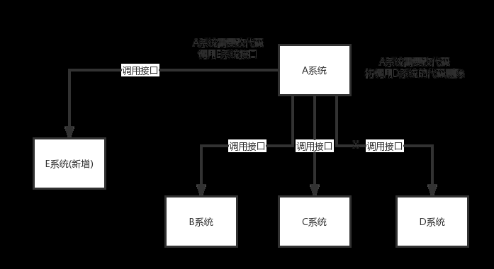

---

总结：通过一个 MQ，Pub/Sub 发布订阅消息这么一个模型，A 系统就跟其它系统彻底解耦了。
面试技巧：你需要去考虑一下你负责的系统中是否有类似的场景，就是一个系统或者一个模
块，调用了多个系统或者模块，互相之间的调用很复杂，维护起来很麻烦。但是其实这个调用
是不需要直接同步调用接口的，如果用 MQ 给它异步化解耦，也是可以的，你就需要去考虑在
你的项目里，是不是可以运用这个 MQ 去进行系统的解耦。在简历中体现出来这块东西，用
MQ 作解耦。
异步
再来看一个场景，A 系统接收一个请求，需要在自己本地写库，还需要在 BCD 三个系统写库，
自己本地写库要 3ms，BCD 三个系统分别写库要 300ms、450ms、200ms。最终请求总延时是 3
+ 300 + 450 + 200 = 953ms，接近 1s，用户感觉搞个什么东西，慢死了慢死了。用户通过浏览器
发起请求，等待个 1s，这几乎是不可接受的。

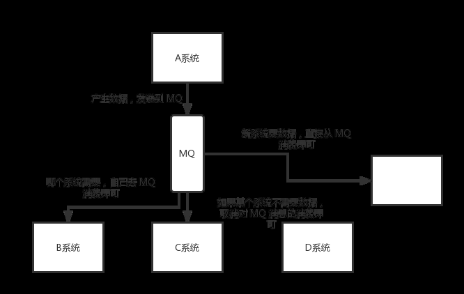

---

一般互联网类的企业，对于用户直接的操作，一般要求是每个请求都必须在 200 ms 以内完成，
对用户几乎是无感知的。
如果使用 MQ，那么 A 系统连续发送 3 条消息到 MQ 队列中，假如耗时 5ms，A 系统从接受一
个请求到返回响应给用户，总时长是 3 + 5 = 8ms，对于用户而言，其实感觉上就是点个按钮，
8ms 以后就直接返回了，爽！网站做得真好，真快！

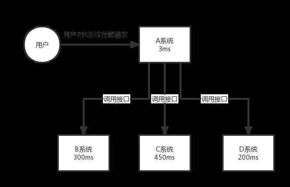

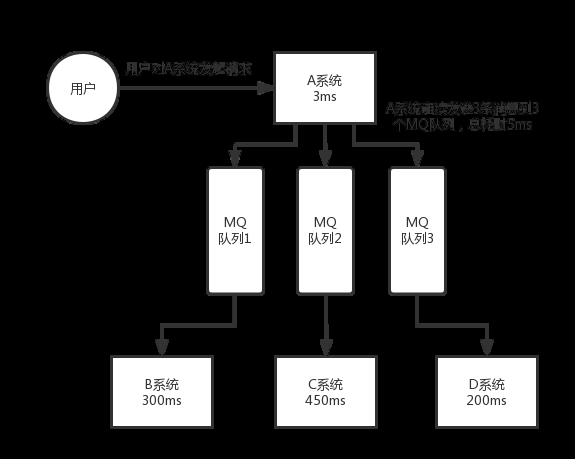

---

削峰
每天 0:00 到 12:00，A 系统风平浪静，每秒并发请求数量就 50 个。结果每次一到 12:00 ~ 13:00
，每秒并发请求数量突然会暴增到 5k+ 条。但是系统是直接基于 MySQL 的，大量的请求涌入
MySQL，每秒钟对 MySQL 执行约 5k 条 SQL。
一般的 MySQL，扛到每秒 2k 个请求就差不多了，如果每秒请求到 5k 的话，可能就直接把
MySQL 给打死了，导致系统崩溃，用户也就没法再使用系统了。
但是高峰期一过，到了下午的时候，就成了低峰期，可能也就 1w 的用户同时在网站上操作，
每秒中的请求数量可能也就 50 个请求，对整个系统几乎没有任何的压力。
如果使用 MQ，每秒 5k 个请求写入 MQ，A 系统每秒钟最多处理 2k 个请求，因为 MySQL 每秒钟
最多处理 2k 个。A 系统从 MQ 中慢慢拉取请求，每秒钟就拉取 2k 个请求，不要超过自己每秒
能处理的最大请求数量就 ok，这样下来，哪怕是高峰期的时候，A 系统也绝对不会挂掉。而
MQ 每秒钟 5k 个请求进来，就 2k 个请求出去，结果就导致在中午高峰期（1 个小时），可能有
几十万甚至几百万的请求积压在 MQ 中。

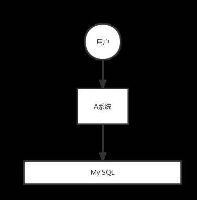

---

这个短暂的高峰期积压是 ok 的，因为高峰期过了之后，每秒钟就 50 个请求进 MQ，但是 A 系
统依然会按照每秒 2k 个请求的速度在处理。所以说，只要高峰期一过，A 系统就会快速将积压
的消息给解决掉。
消息队列有什么优缺点
优点上面已经说了，就是在特殊场景下有其对应的好处，解耦、异步、削峰。
缺点有以下几个：
系统可用性降低
系统引入的外部依赖越多，越容易挂掉。本来你就是 A 系统调用 BCD 三个系统的接口就好了，
ABCD 四个系统还好好的，没啥问题，你偏加个 MQ 进来，万一 MQ 挂了咋整？MQ 一挂，整套
系统崩溃，你不就完了？如何保证消息队列的高可用，可以点击这里查看。
系统复杂度提高
硬生生加个 MQ 进来，你怎么保证消息没有重复消费？怎么处理消息丢失的情况？怎么保证
消息传递的顺序性？头大头大，问题一大堆，痛苦不已。
一致性问题
A 系统处理完了直接返回成功了，人都以为你这个请求就成功了；但是问题是，要是 BCD 三个
系统那里，BD 两个系统写库成功了，结果 C 系统写库失败了，咋整？你这数据就不一致了。

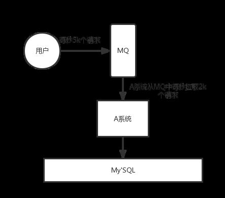

---

所以消息队列实际是一种非常复杂的架构，你引入它有很多好处，但是也得针对它带来的坏处
做各种额外的技术方案和架构来规避掉，做好之后，你会发现，妈呀，系统复杂度提升了一个
数量级，也许是复杂了 10 倍。但是关键时刻，用，还是得用的。
Kafka、ActiveMQ、RabbitMQ、RocketMQ 有什么优缺点？
特性
ActiveMQ
RabbitMQ
RocketMQ
Kafka
单机
吞吐
量
万级，比
RocketMQ、
Kafka 低一
个数量级
同
ActiveMQ
10 万级，支撑高吞
吐
10 万级，高吞吐，一般配
合大数据类的系统来进行
实时数据计算、日志采集
等场景
topic
数量
对吞
吐量
的影
响
topic 可以达到几百/
几千的级别，吞吐量
会有较小幅度的下
降，这是 RocketMQ
的一大优势，在同等
机器下，可以支撑大
量的 topic
topic 从几十到几百个时
候，吞吐量会大幅度下
降，在同等机器下，Kafka
尽量保证 topic 数量不要过
多，如果要支撑大规模的
topic，需要增加更多的机
器资源
时效
性
ms 级
微秒级，
这是
RabbitMQ
的一大特
点，延迟
最低
ms 级
延迟在 ms 级以内
可用
性
高，基于主
从架构实现
高可用
同
ActiveMQ
非常高，分布式架构
非常高，分布式，一个数
据多个副本，少数机器宕
机，不会丢失数据，不会
导致不可用
消息
可靠
性
有较低的概
率丢失数据
基本不丢
经过参数优化配置，
可以做到 0 丢失
同 RocketMQ
功能
支持
MQ 领域的
功能极其完
备
基于
erlang 开
发，并发
能力很
强，性能
极好，延
时很低
MQ 功能较为完善，
还是分布式的，扩展
性好
功能较为简单，主要支持
简单的 MQ 功能，在大数
据领域的实时计算以及日
志采集被大规模使用
综上，各种对比之后，有如下建议：
一般的业务系统要引入 MQ，最早大家都用 ActiveMQ，但是现在确实大家用的不多了，没经过
大规模吞吐量场景的验证，社区也不是很活跃，所以大家还是算了吧，我个人不推荐用这个
了；

---

后来大家开始用 RabbitMQ，但是确实 erlang 语言阻止了大量的 Java 工程师去深入研究和掌控
它，对公司而言，几乎处于不可控的状态，但是确实人家是开源的，比较稳定的支持，活跃度
也高；
不过现在确实越来越多的公司会去用 RocketMQ，确实很不错，毕竟是阿里出品，但社区可能有
突然黄掉的风险（目前 RocketMQ 已捐给 Apache，但 GitHub 上的活跃度其实不算高）对自己
公司技术实力有绝对自信的，推荐用 RocketMQ，否则回去老老实实用 RabbitMQ 吧，人家有活
跃的开源社区，绝对不会黄。
所以中小型公司，技术实力较为一般，技术挑战不是特别高，用 RabbitMQ 是不错的选择；大
型公司，基础架构研发实力较强，用 RocketMQ 是很好的选择。
如果是大数据领域的实时计算、日志采集等场景，用 Kafka 是业内标准的，绝对没问题，社区
活跃度很高，绝对不会黄，何况几乎是全世界这个领域的事实性规范。
面试题
如何保证消息队列的高可用？
面试官心理分析
如果有人问到你 MQ 的知识，高可用是必问的。上一讲提到，MQ 会导致系统可用性降低。
所以只要你用了 MQ，接下来问的一些要点肯定就是围绕着 MQ 的那些缺点怎么来解决了。
要是你傻乎乎的就干用了一个 MQ，各种问题从来没考虑过，那你就杯具了，面试官对你的感
觉就是，只会简单使用一些技术，没任何思考，马上对你的印象就不太好了。这样的同学招进
来要是做个 20k 薪资以内的普通小弟还凑合，要是做薪资 20k+ 的高工，那就惨了，让你设计个
系统，里面肯定一堆坑，出了事故公司受损失，团队一起背锅。
面试题剖析
这个问题这么问是很好的，因为不能问你 Kafka 的高可用性怎么保证？ActiveMQ 的高可用性怎
么保证？一个面试官要是这么问就显得很没水平，人家可能用的就是 RabbitMQ，没用过
Kafka，你上来问人家 Kafka 干什么？这不是摆明了刁难人么。
所以有水平的面试官，问的是 MQ 的高可用性怎么保证？这样就是你用过哪个 MQ，你就说说
你对那个 MQ 的高可用性的理解。
RabbitMQ 的高可用性

---

RabbitMQ 是比较有代表性的，因为是基于主从（非分布式）做高可用性的，我们就以
RabbitMQ 为例子讲解第一种 MQ 的高可用性怎么实现。
RabbitMQ 有三种模式：单机模式、普通集群模式、镜像集群模式。
单机模式
单机模式，就是 Demo 级别的，一般就是你本地启动了玩玩儿的😄，没人生产用单机模式。
普通集群模式（无高可用性）
普通集群模式，意思就是在多台机器上启动多个 RabbitMQ 实例，每个机器启动一个。你创建
的 queue，只会放在一个 RabbitMQ 实例上，但是每个实例都同步 queue 的元数据（元数据
可以认为是 queue 的一些配置信息，通过元数据，可以找到 queue 所在实例）。你消费的时
候，实际上如果连接到了另外一个实例，那么那个实例会从 queue 所在实例上拉取数据过来。
这种方式确实很麻烦，也不怎么好，没做到所谓的分布式，就是个普通集群。因为这导致你
要么消费者每次随机连接一个实例然后拉取数据，要么固定连接那个 queue 所在实例消费数
据，前者有数据拉取的开销，后者导致单实例性能瓶颈。
而且如果那个放 queue 的实例宕机了，会导致接下来其他实例就无法从那个实例拉取，如果你
开启了消息持久化，让 RabbitMQ 落地存储消息的话，消息不一定会丢，得等这个实例恢复
了，然后才可以继续从这个 queue 拉取数据。
所以这个事儿就比较尴尬了，这就没有什么所谓的高可用性，这方案主要是提高吞吐量
的，就是说让集群中多个节点来服务某个 queue 的读写操作。

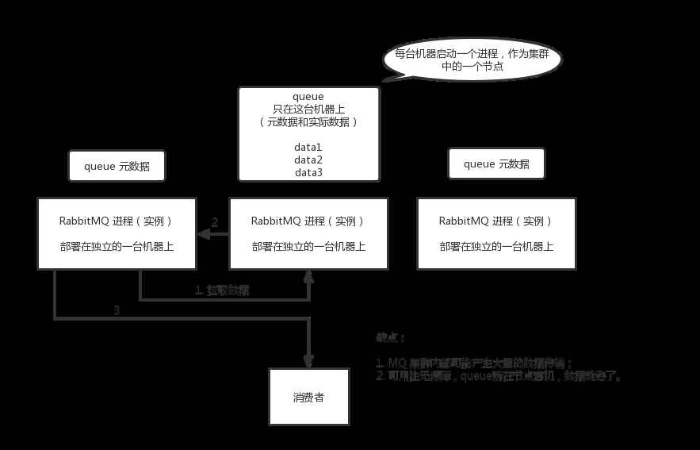

---

镜像集群模式（高可用性）
这种模式，才是所谓的 RabbitMQ 的高可用模式。跟普通集群模式不一样的是，在镜像集群模
式下，你创建的 queue，无论元数据还是 queue 里的消息都会存在于多个实例上，就是说，
每个 RabbitMQ 节点都有这个 queue 的一个完整镜像，包含 queue 的全部数据的意思。然后每
次你写消息到 queue 的时候，都会自动把消息同步到多个实例的 queue 上。
那么如何开启这个镜像集群模式呢？其实很简单，RabbitMQ 有很好的管理控制台，就是在后
台新增一个策略，这个策略是镜像集群模式的策略，指定的时候是可以要求数据同步到所有
节点的，也可以要求同步到指定数量的节点，再次创建 queue 的时候，应用这个策略，就会自
动将数据同步到其他的节点上去了。
这样的话，好处在于，你任何一个机器宕机了，没事儿，其它机器（节点）还包含了这个
queue 的完整数据，别的 consumer 都可以到其它节点上去消费数据。坏处在于，第一，这个
性能开销也太大了吧，消息需要同步到所有机器上，导致网络带宽压力和消耗很重！第二，这
么玩儿，不是分布式的，就没有扩展性可言了，如果某个 queue 负载很重，你加机器，新增
的机器也包含了这个 queue 的所有数据，并没有办法线性扩展你的 queue。你想，如果这个
queue 的数据量很大，大到这个机器上的容量无法容纳了，此时该怎么办呢？
Kafka 的高可用性

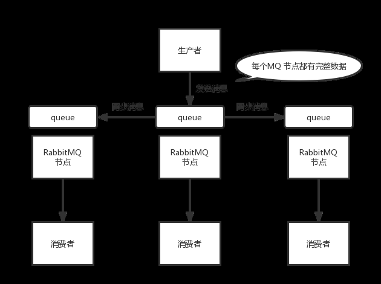

---

Kafka 一个最基本的架构认识：由多个 broker 组成，每个 broker 是一个节点；你创建一个
topic，这个 topic 可以划分为多个 partition，每个 partition 可以存在于不同的 broker 上，每个
partition 就放一部分数据。
这就是天然的分布式消息队列，就是说一个 topic 的数据，是分散放在多个机器上的，每个
机器就放一部分数据。
实际上 RabbitMQ 之类的，并不是分布式消息队列，它就是传统的消息队列，只不过提供了一
些集群、HA(High Availability, 高可用性) 的机制而已，因为无论怎么玩儿，RabbitMQ 一个
queue 的数据都是放在一个节点里的，镜像集群下，也是每个节点都放这个 queue 的完整数
据。
Kafka 0.8 以前，是没有 HA 机制的，就是任何一个 broker 宕机了，那个 broker 上的 partition 就
废了，没法写也没法读，没有什么高可用性可言。
比如说，我们假设创建了一个 topic，指定其 partition 数量是 3 个，分别在三台机器上。但
是，如果第二台机器宕机了，会导致这个 topic 的 1/3 的数据就丢了，因此这个是做不到高可用
的。
Kafka 0.8 以后，提供了 HA 机制，就是 replica（复制品） 副本机制。每个 partition 的数据都会
同步到其它机器上，形成自己的多个 replica 副本。所有 replica 会选举一个 leader 出来，那么
生产和消费都跟这个 leader 打交道，然后其他 replica 就是 follower。写的时候，leader 会负责
把数据同步到所有 follower 上去，读的时候就直接读 leader 上的数据即可。只能读写 leader？
很简单，要是你可以随意读写每个 follower，那么就要 care 数据一致性的问题，系统复杂
度太高，很容易出问题。Kafka 会均匀地将一个 partition 的所有 replica 分布在不同的机器上，
这样才可以提高容错性。

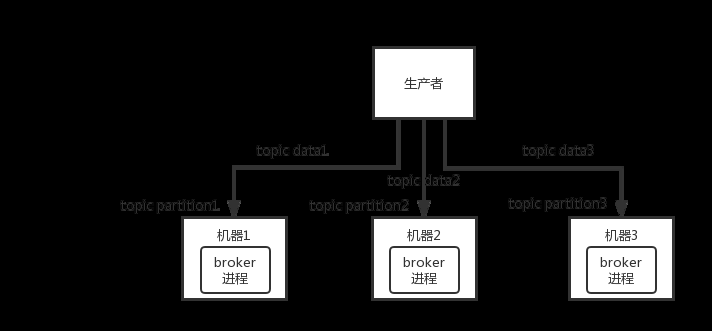

---

这么搞，就有所谓的高可用性了，因为如果某个 broker 宕机了，没事儿，那个 broker上面的
partition 在其他机器上都有副本的。如果这个宕机的 broker 上面有某个 partition 的 leader，那
么此时会从 follower 中重新选举一个新的 leader 出来，大家继续读写那个新的 leader 即可。这
就有所谓的高可用性了。
写数据的时候，生产者就写 leader，然后 leader 将数据落地写本地磁盘，接着其他 follower 自
己主动从 leader 来 pull 数据。一旦所有 follower 同步好数据了，就会发送 ack 给 leader，
leader 收到所有 follower 的 ack 之后，就会返回写成功的消息给生产者。（当然，这只是其中
一种模式，还可以适当调整这个行为）
消费的时候，只会从 leader 去读，但是只有当一个消息已经被所有 follower 都同步成功返回
ack 的时候，这个消息才会被消费者读到。
看到这里，相信你大致明白了 Kafka 是如何保证高可用机制的了，对吧？不至于一无所知，现
场还能给面试官画画图。要是遇上面试官确实是 Kafka 高手，深挖了问，那你只能说不好意
思，太深入的你没研究过。
面试题
如何保证消息不被重复消费？或者说，如何保证消息消费的幂等性？

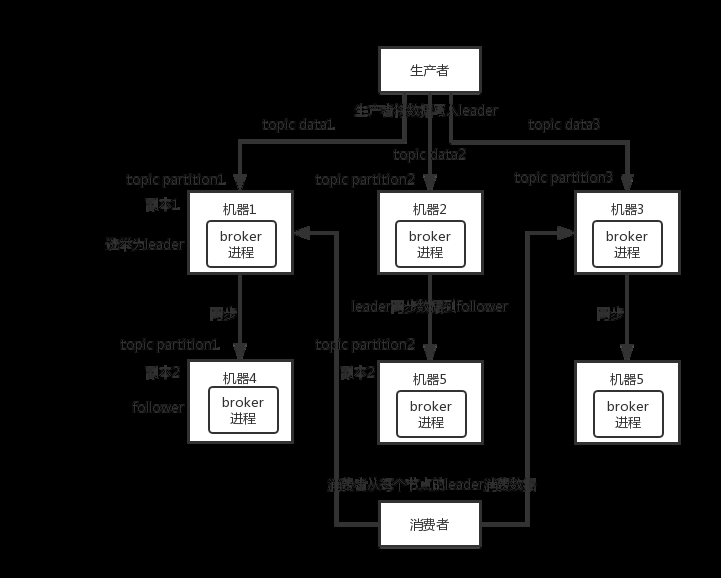

---

面试官心理分析
其实这是很常见的一个问题，这俩问题基本可以连起来问。既然是消费消息，那肯定要考虑会
不会重复消费？能不能避免重复消费？或者重复消费了也别造成系统异常可以吗？这个是 MQ
领域的基本问题，其实本质上还是问你使用消息队列如何保证幂等性，这个是你架构里要考
虑的一个问题。
面试题剖析
回答这个问题，首先你别听到重复消息这个事儿，就一无所知吧，你先大概说一说可能会有
哪些重复消费的问题。
首先，比如 RabbitMQ、RocketMQ、Kafka，都有可能会出现消息重复消费的问题，正常。因为
这问题通常不是 MQ 自己保证的，是由我们开发来保证的。挑一个 Kafka 来举个例子，说说怎
么重复消费吧。
Kafka 实际上有个 owset 的概念，就是每个消息写进去，都有一个 owset，代表消息的序号，然
后 consumer 消费了数据之后，每隔一段时间（定时定期），会把自己消费过的消息的 owset
提交一下，表示“我已经消费过了，下次我要是重启啥的，你就让我继续从上次消费到的 owset
来继续消费吧”。
但是凡事总有意外，比如我们之前生产经常遇到的，就是你有时候重启系统，看你怎么重启
了，如果碰到点着急的，直接 kill 进程了，再重启。这会导致 consumer 有些消息处理了，但是
没来得及提交 owset，尴尬了。重启之后，少数消息会再次消费一次。
举个栗子。
有这么个场景。数据 1/2/3 依次进入 kafka，kafka 会给这三条数据每条分配一个 owset，代表这
条数据的序号，我们就假设分配的 owset 依次是 152/153/154。消费者从 kafka 去消费的时候，
也是按照这个顺序去消费。假如当消费者消费了 offset=153  的这条数据，刚准备去提交
owset 到 zookeeper，此时消费者进程被重启了。那么此时消费过的数据 1/2 的 owset 并没有提
交，kafka 也就不知道你已经消费了 offset=153  这条数据。那么重启之后，消费者会找
kafka 说，嘿，哥儿们，你给我接着把上次我消费到的那个地方后面的数据继续给我传递过
来。由于之前的 owset 没有提交成功，那么数据 1/2 会再次传过来，如果此时消费者没有去重
的话，那么就会导致重复消费。

---

如果消费者干的事儿是拿一条数据就往数据库里写一条，会导致说，你可能就把数据 1/2 在数
据库里插入了 2 次，那么数据就错啦。
其实重复消费不可怕，可怕的是你没考虑到重复消费之后，怎么保证幂等性。
举个例子吧。假设你有个系统，消费一条消息就往数据库里插入一条数据，要是你一个消息重
复两次，你不就插入了两条，这数据不就错了？但是你要是消费到第二次的时候，自己判断一
下是否已经消费过了，若是就直接扔了，这样不就保留了一条数据，从而保证了数据的正确
性。
一条数据重复出现两次，数据库里就只有一条数据，这就保证了系统的幂等性。
幂等性，通俗点说，就一个数据，或者一个请求，给你重复来多次，你得确保对应的数据是不
会改变的，不能出错。
所以第二个问题来了，怎么保证消息队列消费的幂等性？
其实还是得结合业务来思考，我这里给几个思路：
比如你拿个数据要写库，你先根据主键查一下，如果这数据都有了，你就别插入了，
update 一下好吧。
比如你是写 Redis，那没问题了，反正每次都是 set，天然幂等性。
比如你不是上面两个场景，那做的稍微复杂一点，你需要让生产者发送每条数据的时候，
里面加一个全局唯一的 id，类似订单 id 之类的东西，然后你这里消费到了之后，先根据这

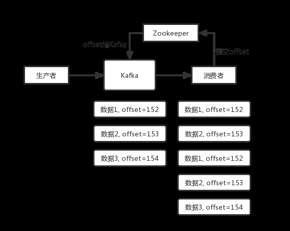

---

个 id 去比如 Redis 里查一下，之前消费过吗？如果没有消费过，你就处理，然后这个 id 写
Redis。如果消费过了，那你就别处理了，保证别重复处理相同的消息即可。
比如基于数据库的唯一键来保证重复数据不会重复插入多条。因为有唯一键约束了，重复
数据插入只会报错，不会导致数据库中出现脏数据。
当然，如何保证 MQ 的消费是幂等性的，需要结合具体的业务来看。
面试题
如何保证消息的可靠性传输？或者说，如何处理消息丢失的问题？
面试官心理分析
这个是肯定的，用 MQ 有个基本原则，就是数据不能多一条，也不能少一条，不能多，就是
前面说的重复消费和幂等性问题。不能少，就是说这数据别搞丢了。那这个问题你必须得考
虑一下。
如果说你这个是用 MQ 来传递非常核心的消息，比如说计费、扣费的一些消息，那必须确保这
个 MQ 传递过程中绝对不会把计费消息给弄丢。
面试题剖析
数据的丢失问题，可能出现在生产者、MQ、消费者中，咱们从 RabbitMQ 和 Kafka 分别来分析
一下吧。

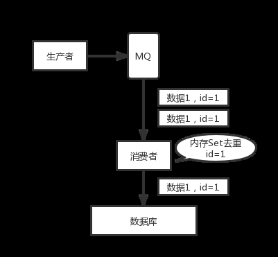

---

RabbitMQ
生产者弄丢了数据
生产者将数据发送到 RabbitMQ 的时候，可能数据就在半路给搞丢了，因为网络问题啥的，都
有可能。
此时可以选择用 RabbitMQ 提供的事务功能，就是生产者发送数据之前开启 RabbitMQ 事务 
channel.txSelect  ，然后发送消息，如果消息没有成功被 RabbitMQ 接收到，那么生产者会
收到异常报错，此时就可以回滚事务 channel.txRollback  ，然后重试发送消息；如果收到
了消息，那么可以提交事务 channel.txCommit  。
但是问题是，RabbitMQ 事务机制（同步）一搞，基本上吞吐量会下来，因为太耗性能。
 
channel txSelect 
  
    
 
 
 e   
    channel txRollback 
 
    
 
 
 
channel txCommit
// 开启事务
.
try {
// 这里发送消息
} catch (Exception
) {
.
// 这里再次重发这条消息
}
// 提交事务
.
java

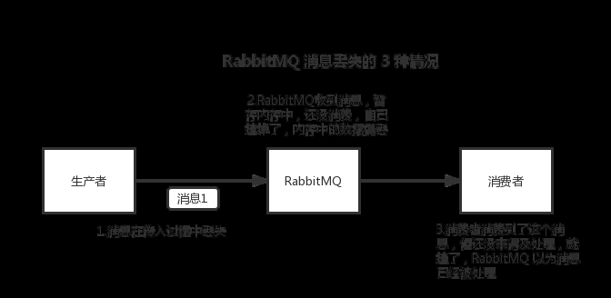

---

所以一般来说，如果你要确保说写 RabbitMQ 的消息别丢，可以开启 confirm  模式，在生产
者那里设置开启 confirm  模式之后，你每次写的消息都会分配一个唯一的 id，然后如果写入
了 RabbitMQ 中，RabbitMQ 会给你回传一个 ack  消息，告诉你说这个消息 ok 了。如果
RabbitMQ 没能处理这个消息，会回调你的一个 nack  接口，告诉你这个消息接收失败，你可
以重试。而且你可以结合这个机制自己在内存里维护每个消息 id 的状态，如果超过一定时间还
没接收到这个消息的回调，那么你可以重发。
事务机制和 confirm  机制最大的不同在于，事务机制是同步的，你提交一个事务之后会阻
塞在那儿，但是 confirm  机制是异步的，你发送个消息之后就可以发送下一个消息，然后那
个消息 RabbitMQ 接收了之后会异步回调你的一个接口通知你这个消息接收到了。
所以一般在生产者这块避免数据丢失，都是用 confirm  机制的。
RabbitMQ 弄丢了数据
就是 RabbitMQ 自己弄丢了数据，这个你必须开启 RabbitMQ 的持久化，就是消息写入之后会
持久化到磁盘，哪怕是 RabbitMQ 自己挂了，恢复之后会自动读取之前存储的数据，一般数
据不会丢。除非极其罕见的是，RabbitMQ 还没持久化，自己就挂了，可能导致少量数据丢
失，但是这个概率较小。
设置持久化有两个步骤：
创建 queue 的时候将其设置为持久化
这样就可以保证 RabbitMQ 持久化 queue 的元数据，但是它是不会持久化 queue 里的数据的。
第二个是发送消息的时候将消息的 deliveryMode  设置为 2
就是将消息设置为持久化的，此时 RabbitMQ 就会将消息持久化到磁盘上去。
必须要同时设置这两个持久化才行，RabbitMQ 哪怕是挂了，再次重启，也会从磁盘上重启恢复
queue，恢复这个 queue 里的数据。
注意，哪怕是你给 RabbitMQ 开启了持久化机制，也有一种可能，就是这个消息写到了
RabbitMQ 中，但是还没来得及持久化到磁盘上，结果不巧，此时 RabbitMQ 挂了，就会导致内
存里的一点点数据丢失。
所以，持久化可以跟生产者那边的 confirm  机制配合起来，只有消息被持久化到磁盘之后，
才会通知生产者 ack  了，所以哪怕是在持久化到磁盘之前，RabbitMQ 挂了，数据丢了，生产
者收不到 ack  ，你也是可以自己重发的。
消费端弄丢了数据

---

RabbitMQ 如果丢失了数据，主要是因为你消费的时候，刚消费到，还没处理，结果进程挂
了，比如重启了，那么就尴尬了，RabbitMQ 认为你都消费了，这数据就丢了。
这个时候得用 RabbitMQ 提供的 ack  机制，简单来说，就是你必须关闭 RabbitMQ 的自动 
ack  ，可以通过一个 api 来调用就行，然后每次你自己代码里确保处理完的时候，再在程序
里 ack  一把。这样的话，如果你还没处理完，不就没有 ack  了？那 RabbitMQ 就认为你还
没处理完，这个时候 RabbitMQ 会把这个消费分配给别的 consumer 去处理，消息是不会丢的。
Kafka
消费端弄丢了数据
唯一可能导致消费者弄丢数据的情况，就是说，你消费到了这个消息，然后消费者那边自动提
交了 owset，让 Kafka 以为你已经消费好了这个消息，但其实你才刚准备处理这个消息，你还
没处理，你自己就挂了，此时这条消息就丢咯。
这不是跟 RabbitMQ 差不多吗，大家都知道 Kafka 会自动提交 owset，那么只要关闭自动提交
owset，在处理完之后自己手动提交 owset，就可以保证数据不会丢。但是此时确实还是可能会
有重复消费，比如你刚处理完，还没提交 owset，结果自己挂了，此时肯定会重复消费一次，
自己保证幂等性就好了。
生产环境碰到的一个问题，就是说我们的 Kafka 消费者消费到了数据之后是写到一个内存的
queue 里先缓冲一下，结果有的时候，你刚把消息写入内存 queue，然后消费者会自动提交
owset。然后此时我们重启了系统，就会导致内存 queue 里还没来得及处理的数据就丢失了。
Kafka 弄丢了数据
这块比较常见的一个场景，就是 Kafka 某个 broker 宕机，然后重新选举 partition 的 leader。大
家想想，要是此时其他的 follower 刚好还有些数据没有同步，结果此时 leader 挂了，然后选举

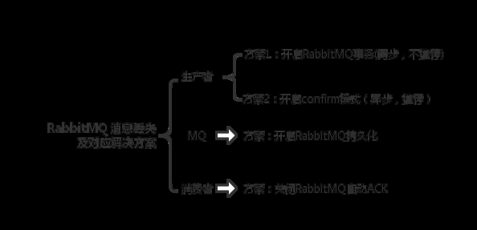

---

某个 follower 成 leader 之后，不就少了一些数据？这就丢了一些数据啊。
生产环境也遇到过，我们也是，之前 Kafka 的 leader 机器宕机了，将 follower 切换为 leader 之
后，就会发现说这个数据就丢了。
所以此时一般是要求起码设置如下 4 个参数：
给 topic 设置 replication.factor  参数：这个值必须大于 1，要求每个 partition 必须有
至少 2 个副本。
在 Kafka 服务端设置 min.insync.replicas  参数：这个值必须大于 1，这个是要求一个
leader 至少感知到有至少一个 follower 还跟自己保持联系，没掉队，这样才能确保 leader
挂了还有一个 follower 吧。
在 producer 端设置 acks=all  ：这个是要求每条数据，必须是写入所有 replica 之后，才
能认为是写成功了。
在 producer 端设置 retries=MAX  （很大很大很大的一个值，无限次重试的意思）：这个
是要求一旦写入失败，就无限重试，卡在这里了。
我们生产环境就是按照上述要求配置的，这样配置之后，至少在 Kafka broker 端就可以保证在
leader 所在 broker 发生故障，进行 leader 切换时，数据不会丢失。
生产者会不会弄丢数据？
如果按照上述的思路设置了 acks=all  ，一定不会丢，要求是，你的 leader 接收到消息，所
有的 follower 都同步到了消息之后，才认为本次写成功了。如果没满足这个条件，生产者会自
动不断的重试，重试无限次。
面试题
如何保证消息的顺序性？
面试官心理分析
其实这个也是用 MQ 的时候必问的话题，第一看看你了不了解顺序这个事儿？第二看看你有没
有办法保证消息是有顺序的？这是生产系统中常见的问题。
面试题剖析
我举个例子，我们以前做过一个 mysql binlog  同步的系统，压力还是非常大的，日同步数据
要达到上亿，就是说数据从一个 mysql 库原封不动地同步到另一个 mysql 库里面去（mysql ->

---

mysql）。常见的一点在于说比如大数据 team，就需要同步一个 mysql 库过来，对公司的业务
系统的数据做各种复杂的操作。
你在 mysql 里增删改一条数据，对应出来了增删改 3 条 binlog  日志，接着这三条 binlog
发送到 MQ 里面，再消费出来依次执行，起码得保证人家是按照顺序来的吧？不然本来是：增
加、修改、删除；你愣是换了顺序给执行成删除、修改、增加，不全错了么。
本来这个数据同步过来，应该最后这个数据被删除了；结果你搞错了这个顺序，最后这个数据
保留下来了，数据同步就出错了。
先看看顺序会错乱的俩场景：
RabbitMQ：一个 queue，多个 consumer。比如，生产者向 RabbitMQ 里发送了三条数据，
顺序依次是 data1/data2/data3，压入的是 RabbitMQ 的一个内存队列。有三个消费者分别从
MQ 中消费这三条数据中的一条，结果消费者2先执行完操作，把 data2 存入数据库，然后
是 data1/data3。这不明显乱了。
Kafka：比如说我们建了一个 topic，有三个 partition。生产者在写的时候，其实可以指定一
个 key，比如说我们指定了某个订单 id 作为 key，那么这个订单相关的数据，一定会被分发
到同一个 partition 中去，而且这个 partition 中的数据一定是有顺序的。
消费者从 partition 中取出来数据的时候，也一定是有顺序的。到这里，顺序还是 ok 的，没
有错乱。接着，我们在消费者里可能会搞多个线程来并发处理消息。因为如果消费者是单

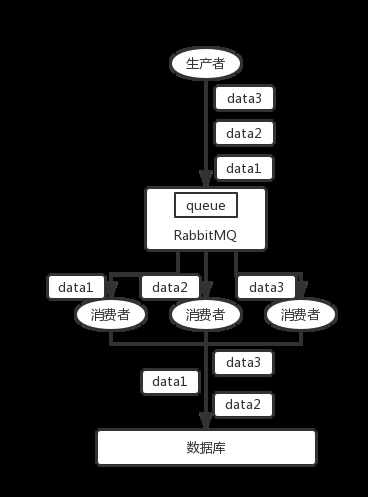

---

线程消费处理，而处理比较耗时的话，比如处理一条消息耗时几十 ms，那么 1 秒钟只能处
理几十条消息，这吞吐量太低了。而多个线程并发跑的话，顺序可能就乱掉了。
解决方案
RabbitMQ
拆分多个 queue，每个 queue 一个 consumer，就是多一些 queue 而已，确实是麻烦点；或者
就一个 queue 但是对应一个 consumer，然后这个 consumer 内部用内存队列做排队，然后分发
给底层不同的 worker 来处理。

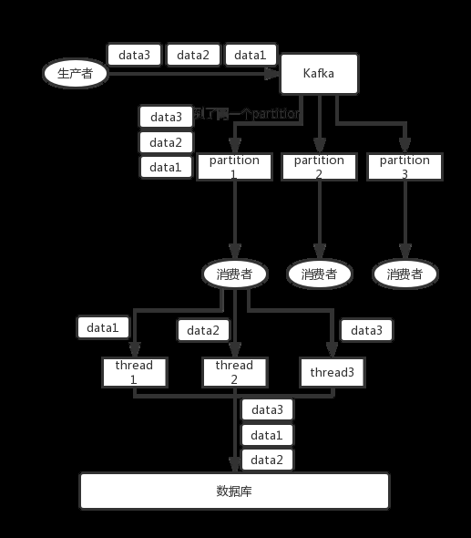

---

Kafka
一个 topic，一个 partition，一个 consumer，内部单线程消费，单线程吞吐量太低，一般不
会用这个。
写 N 个内存 queue，具有相同 key 的数据都到同一个内存 queue；然后对于 N 个线程，每
个线程分别消费一个内存 queue 即可，这样就能保证顺序性。

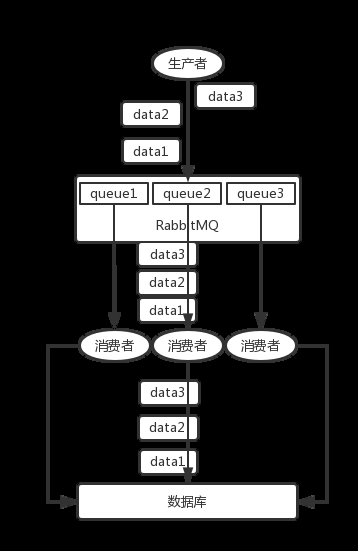

---

面试题
如何解决消息队列的延时以及过期失效问题？消息队列满了以后该怎么处理？有几百万消息持
续积压几小时，说说怎么解决？
面试官心理分析
你看这问法，其实本质针对的场景，都是说，可能你的消费端出了问题，不消费了；或者消费
的速度极其慢。接着就坑爹了，可能你的消息队列集群的磁盘都快写满了，都没人消费，这个
时候怎么办？或者是这整个就积压了几个小时，你这个时候怎么办？或者是你积压的时间太长
了，导致比如 RabbitMQ 设置了消息过期时间后就没了怎么办？

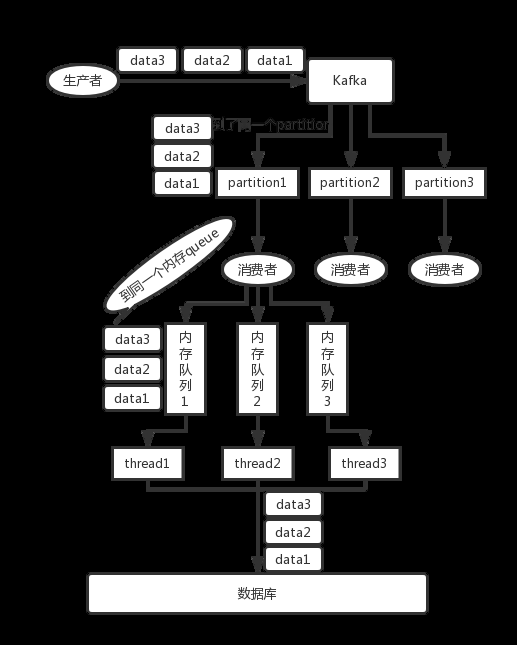

---

所以就这事儿，其实线上挺常见的，一般不出，一出就是大 case。一般常见于，举个例子，消
费端每次消费之后要写 mysql，结果 mysql 挂了，消费端 hang 那儿了，不动了；或者是消费端
出了个什么岔子，导致消费速度极其慢。
面试题剖析
关于这个事儿，我们一个一个来梳理吧，先假设一个场景，我们现在消费端出故障了，然后大
量消息在 mq 里积压，现在出事故了，慌了。
大量消息在 mq 里积压了几个小时了还没解决
几千万条数据在 MQ 里积压了七八个小时，从下午 4 点多，积压到了晚上 11 点多。这个是我们
真实遇到过的一个场景，确实是线上故障了，这个时候要不然就是修复 consumer 的问题，让
它恢复消费速度，然后傻傻的等待几个小时消费完毕。这个肯定不能在面试的时候说吧。
一个消费者一秒是 1000 条，一秒 3 个消费者是 3000 条，一分钟就是 18 万条。所以如果你积压
了几百万到上千万的数据，即使消费者恢复了，也需要大概 1 小时的时间才能恢复过来。
一般这个时候，只能临时紧急扩容了，具体操作步骤和思路如下：
先修复 consumer 的问题，确保其恢复消费速度，然后将现有 consumer 都停掉。
新建一个 topic，partition 是原来的 10 倍，临时建立好原先 10 倍的 queue 数量。
然后写一个临时的分发数据的 consumer 程序，这个程序部署上去消费积压的数据，消费之
后不做耗时的处理，直接均匀轮询写入临时建立好的 10 倍数量的 queue。
接着临时征用 10 倍的机器来部署 consumer，每一批 consumer 消费一个临时 queue 的数
据。这种做法相当于是临时将 queue 资源和 consumer 资源扩大 10 倍，以正常的 10 倍速度
来消费数据。
等快速消费完积压数据之后，得恢复原先部署的架构，重新用原先的 consumer 机器来消
费消息。
mq 中的消息过期失效了
假设你用的是 RabbitMQ，RabbtiMQ 是可以设置过期时间的，也就是 TTL。如果消息在 queue
中积压超过一定的时间就会被 RabbitMQ 给清理掉，这个数据就没了。那这就是第二个坑了。
这就不是说数据会大量积压在 mq 里，而是大量的数据会直接搞丢。
这个情况下，就不是说要增加 consumer 消费积压的消息，因为实际上没啥积压，而是丢了大
量的消息。我们可以采取一个方案，就是批量重导，这个我们之前线上也有类似的场景干过。
就是大量积压的时候，我们当时就直接丢弃数据了，然后等过了高峰期以后，比如大家一起喝
咖啡熬夜到晚上12点以后，用户都睡觉了。这个时候我们就开始写程序，将丢失的那批数据，

---

写个临时程序，一点一点的查出来，然后重新灌入 mq 里面去，把白天丢的数据给他补回来。
也只能是这样了。
假设 1 万个订单积压在 mq 里面，没有处理，其中 1000 个订单都丢了，你只能手动写程序把那
1000 个订单给查出来，手动发到 mq 里去再补一次。
mq 都快写满了
如果消息积压在 mq 里，你很长时间都没有处理掉，此时导致 mq 都快写满了，咋办？这个还
有别的办法吗？没有，谁让你第一个方案执行的太慢了，你临时写程序，接入数据来消费，消
费一个丢弃一个，都不要了，快速消费掉所有的消息。然后走第二个方案，到了晚上再补数
据吧。
面试题
如果让你写一个消息队列，该如何进行架构设计？说一下你的思路。
面试官心理分析
其实聊到这个问题，一般面试官要考察两块：
你有没有对某一个消息队列做过较为深入的原理的了解，或者从整体了解把握住一个消息
队列的架构原理。
看看你的设计能力，给你一个常见的系统，就是消息队列系统，看看你能不能从全局把握
一下整体架构设计，给出一些关键点出来。
说实话，问类似问题的时候，大部分人基本都会蒙，因为平时从来没有思考过类似的问题，大
多数人就是平时埋头用，从来不去思考背后的一些东西。类似的问题，比如，如果让你来
设计一个 Spring 框架你会怎么做？如果让你来设计一个 Dubbo 框架你会怎么做？如果让你来
设计一个 MyBatis 框架你会怎么做？
面试题剖析
其实回答这类问题，说白了，不求你看过那技术的源码，起码你要大概知道那个技术的基本原
理、核心组成部分、基本架构构成，然后参照一些开源的技术把一个系统设计出来的思路说一
下就好。
比如说这个消息队列系统，我们从以下几个角度来考虑一下：

---

首先这个 mq 得支持可伸缩性吧，就是需要的时候快速扩容，就可以增加吞吐量和容量，那
怎么搞？设计个分布式的系统呗，参照一下 kafka 的设计理念，broker -> topic ->
partition，每个 partition 放一个机器，就存一部分数据。如果现在资源不够了，简单啊，给
topic 增加 partition，然后做数据迁移，增加机器，不就可以存放更多数据，提供更高的吞
吐量了？
其次你得考虑一下这个 mq 的数据要不要落地磁盘吧？那肯定要了，落磁盘才能保证别进程
挂了数据就丢了。那落磁盘的时候怎么落啊？顺序写，这样就没有磁盘随机读写的寻址开
销，磁盘顺序读写的性能是很高的，这就是 kafka 的思路。
其次你考虑一下你的 mq 的可用性啊？这个事儿，具体参考之前可用性那个环节讲解的
kafka 的高可用保障机制。多副本 -> leader & follower -> broker 挂了重新选举 leader 即可对
外服务。
能不能支持数据 0 丢失啊？可以的，参考我们之前说的那个 kafka 数据零丢失方案。
mq 肯定是很复杂的，面试官问你这个问题，其实是个开放题，他就是看看你有没有从架构角
度整体构思和设计的思维以及能力。确实这个问题可以刷掉一大批人，因为大部分人平时不思
考这些东西。
Lucene 和 ES 的前世今生
Lucene 是最先进、功能最强大的搜索库。如果直接基于 Lucene 开发，非常复杂，即便写一些
简单的功能，也要写大量的 Java 代码，需要深入理解原理。
ElasticSearch 基于 Lucene，隐藏了 lucene 的复杂性，提供了简单易用的 RESTful api / Java api
接口（另外还有其他语言的 api 接口）。
分布式的文档存储引擎
分布式的搜索引擎和分析引擎
分布式，支持 PB 级数据
ES 的核心概念
Near Realtime
近实时，有两层意思：
从写入数据到数据可以被搜索到有一个小延迟（大概是 1s）
基于 ES 执行搜索和分析可以达到秒级

---

Cluster 集群
集群包含多个节点，每个节点属于哪个集群都是通过一个配置来决定的，对于中小型应用来
说，刚开始一个集群就一个节点很正常。
Node 节点
Node 是集群中的一个节点，节点也有一个名称，默认是随机分配的。默认节点会去加入一个名
称为 elasticsearch  的集群。如果直接启动一堆节点，那么它们会自动组成一个
elasticsearch 集群，当然一个节点也可以组成 elasticsearch 集群。
Document & field
文档是 ES 中最小的数据单元，一个 document 可以是一条客户数据、一条商品分类数据、一条
订单数据，通常用 json 数据结构来表示。每个 index 下的 type，都可以存储多条 document。
一个 document 里面有多个 field，每个 field 就是一个数据字段。
Index
索引包含了一堆有相似结构的文档数据，比如商品索引。一个索引包含很多 document，一个
索引就代表了一类相似或者相同的 ducument。
Type
类型，每个索引里可以有一个或者多个 type，type 是 index 的一个逻辑分类，比如商品 index
下有多个 type：日化商品 type、电器商品 type、生鲜商品 type。每个 type 下的 document 的
field 可能不太一样。
shard
 
    
 
 
    
 
 
    
 
 
    
 
 
    
 
{
"product_id": "1",
"product_name": "iPhone X",
"product_desc": "苹果手机",
"category_id": "2",
"category_name": "电子产品"
}
json

---

单台机器无法存储大量数据，ES 可以将一个索引中的数据切分为多个 shard，分布在多台服务
器上存储。有了 shard 就可以横向扩展，存储更多数据，让搜索和分析等操作分布到多台服务
器上去执行，提升吞吐量和性能。每个 shard 都是一个 lucene index。
replica
任何一个服务器随时可能故障或宕机，此时 shard 可能就会丢失，因此可以为每个 shard 创建
多个 replica 副本。replica 可以在 shard 故障时提供备用服务，保证数据不丢失，多个 replica
还可以提升搜索操作的吞吐量和性能。primary shard（建立索引时一次设置，不能修改，默认
5 个），replica shard（随时修改数量，默认 1 个），默认每个索引 10 个 shard，5 个 primary
shard，5个 replica shard，最小的高可用配置，是 2 台服务器。
这么说吧，shard 分为 primary shard 和 replica shard。而 primary shard 一般简称为 shard，而
replica shard 一般简称为 replica。
ES 核心概念 vs. DB 核心概念
ES
DB
index
数据库
type
数据表
document
一行数据

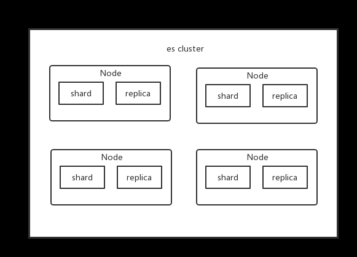

---

以上是一个简单的类比。
面试题
ES 的分布式架构原理能说一下么（ES 是如何实现分布式的啊）？
面试官心理分析
在搜索这块，lucene 是最流行的搜索库。几年前业内一般都问，你了解 lucene 吗？你知道倒排
索引的原理吗？现在早已经 out 了，因为现在很多项目都是直接用基于 lucene 的分布式搜索引
擎—— ElasticSearch，简称为 ES。
而现在分布式搜索基本已经成为大部分互联网行业的 Java 系统的标配，其中尤为流行的就是
ES，前几年 ES 没火的时候，大家一般用 solr。但是这两年基本大部分企业和项目都开始转向
ES 了。
所以互联网面试，肯定会跟你聊聊分布式搜索引擎，也就一定会聊聊 ES，如果你确实不知道，
那你真的就 out 了。
如果面试官问你第一个问题，确实一般都会问你 ES 的分布式架构设计能介绍一下么？就看看
你对分布式搜索引擎架构的一个基本理解。
面试题剖析
ElasticSearch 设计的理念就是分布式搜索引擎，底层其实还是基于 lucene 的。核心思想就是在
多台机器上启动多个 ES 进程实例，组成了一个 ES 集群。
ES 中存储数据的基本单位是索引，比如说你现在要在 ES 中存储一些订单数据，你就应该在
ES 中创建一个索引 order_idx  ，所有的订单数据就都写到这个索引里面去，一个索引差不多
就是相当于是 mysql 里的一张表。
这样吧，为了做个更直白的介绍，我在这里做个类比。但是切记，不要划等号，类比只是为了
便于理解。
index 相当于 mysql 里的一张表。而 type 没法跟 mysql 里去对比，一个 index 里可以有多个
type，每个 type 的字段都是差不多的，但是有一些略微的差别。假设有一个 index，是订单
index，里面专门是放订单数据的。就好比说你在 mysql 中建表，有些订单是实物商品的订单，
index -> type -> mapping -> document -> field。

---

比如一件衣服、一双鞋子；有些订单是虚拟商品的订单，比如游戏点卡，话费充值。就两种订
单大部分字段是一样的，但是少部分字段可能有略微的一些差别。
所以就会在订单 index 里，建两个 type，一个是实物商品订单 type，一个是虚拟商品订单
type，这两个 type 大部分字段是一样的，少部分字段是不一样的。
很多情况下，一个 index 里可能就一个 type，但是确实如果说是一个 index 里有多个 type 的情
况（注意， mapping types  这个概念在 ElasticSearch 7. X 已被完全移除，详细说明可以参考
官方文档），你可以认为 index 是一个类别的表，具体的每个 type 代表了 mysql 中的一个表。
每个 type 有一个 mapping，如果你认为一个 type 是具体的一个表，index 就代表多个 type 同
属于的一个类型，而 mapping 就是这个 type 的表结构定义，你在 mysql 中创建一个表，肯定
是要定义表结构的，里面有哪些字段，每个字段是什么类型。实际上你往 index 里的一个 type
里面写的一条数据，叫做一条 document，一条 document 就代表了 mysql 中某个表里的一行，
每个 document 有多个 field，每个 field 就代表了这个 document 中的一个字段的值。
你搞一个索引，这个索引可以拆分成多个 shard  ，每个 shard 存储部分数据。拆分多个 shard
是有好处的，一是支持横向扩展，比如你数据量是 3T，3 个 shard，每个 shard 就 1T 的数据，
若现在数据量增加到 4T，怎么扩展，很简单，重新建一个有 4 个 shard 的索引，将数据导进
去；二是提高性能，数据分布在多个 shard，即多台服务器上，所有的操作，都会在多台机器
上并行分布式执行，提高了吞吐量和性能。
接着就是这个 shard 的数据实际是有多个备份，就是说每个 shard 都有一个 primary shard
，负责写入数据，但是还有几个 replica shard  。 primary shard  写入数据之后，会将数
据同步到其他几个 replica shard  上去。

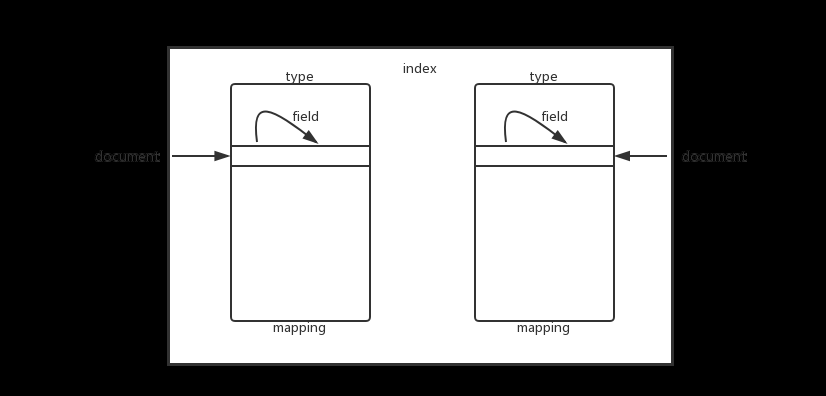

---

通过这个 replica 的方案，每个 shard 的数据都有多个备份，如果某个机器宕机了，没关系啊，
还有别的数据副本在别的机器上呢。高可用了吧。
ES 集群多个节点，会自动选举一个节点为 master 节点，这个 master 节点其实就是干一些管理
的工作的，比如维护索引元数据、负责切换 primary shard 和 replica shard 身份等。要是
master 节点宕机了，那么会重新选举一个节点为 master 节点。
如果是非 master节点宕机了，那么会由 master 节点，让那个宕机节点上的 primary shard 的身
份转移到其他机器上的 replica shard。接着你要是修复了那个宕机机器，重启了之后，master
节点会控制将缺失的 replica shard 分配过去，同步后续修改的数据之类的，让集群恢复正常。
说得更简单一点，就是说如果某个非 master 节点宕机了。那么此节点上的 primary shard 不就
没了。那好，master 会让 primary shard 对应的 replica shard（在其他机器上）切换为 primary
shard。如果宕机的机器修复了，修复后的节点也不再是 primary shard，而是 replica shard。
其实上述就是 ElasticSearch 作为分布式搜索引擎最基本的一个架构设计。
面试题
ES 写入数据的工作原理是什么啊？ES 查询数据的工作原理是什么啊？底层的 Lucene 介绍一下
呗？倒排索引了解吗？
面试官心理分析
问这个，其实面试官就是要看看你了解不了解 es 的一些基本原理，因为用 es 无非就是写入数
据，搜索数据。你要是不明白你发起一个写入和搜索请求的时候，es 在干什么，那你真的

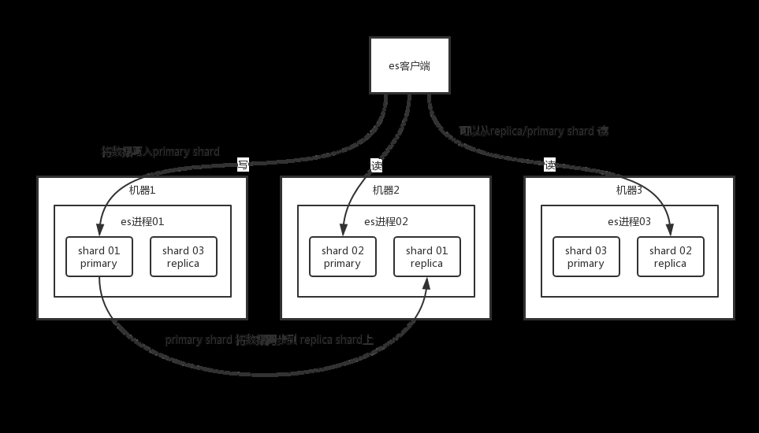

---

是......
对 es 基本就是个黑盒，你还能干啥？你唯一能干的就是用 es 的 api 读写数据了。要是出点什
么问题，你啥都不知道，那还能指望你什么呢？
面试题剖析
es 写数据过程
客户端选择一个 node 发送请求过去，这个 node 就是 coordinating node  （协调节
点）。
coordinating node  对 document 进行路由，将请求转发给对应的 node（有 primary
shard）。
实际的 node 上的 primary shard  处理请求，然后将数据同步到 replica node  。
coordinating node  如果发现 primary node  和所有 replica node  都搞定之后，就
返回响应结果给客户端。
es 读数据过程
可以通过 doc id  来查询，会根据 doc id  进行 hash，判断出来当时把 doc id  分配到了
哪个 shard 上面去，从那个 shard 去查询。
客户端发送请求到任意一个 node，成为 coordinate node  。
coordinate node  对 doc id  进行哈希路由，将请求转发到对应的 node，此时会使用 
round-robin  随机轮询算法，在 primary shard  以及其所有 replica 中随机选择一个，
让读请求负载均衡。

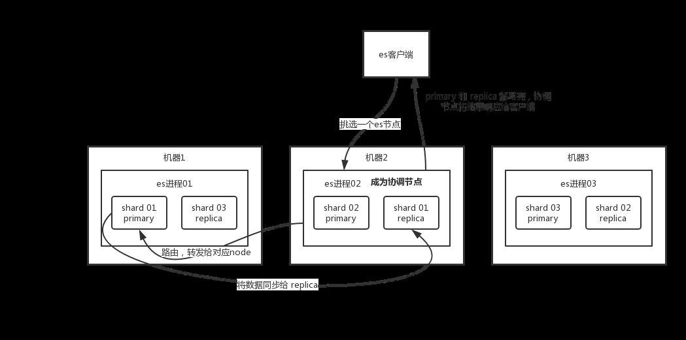

---

接收请求的 node 返回 document 给 coordinate node  。
coordinate node  返回 document 给客户端。
es 搜索数据过程
es 最强大的是做全文检索，就是比如你有三条数据：
你根据 java  关键词来搜索，将包含 java  的 document  给搜索出来。es 就会给你返回：
java真好玩儿啊，java好难学啊。
客户端发送请求到一个 coordinate node  。
协调节点将搜索请求转发到所有的 shard 对应的 primary shard  或 replica shard  ，
都可以。
query phase：每个 shard 将自己的搜索结果（其实就是一些 doc id  ）返回给协调节点，
由协调节点进行数据的合并、排序、分页等操作，产出最终结果。
fetch phase：接着由协调节点根据 doc id  去各个节点上拉取实际的 document  数据，
最终返回给客户端。
写请求是写入 primary shard，然后同步给所有的 replica shard；读请求可以从 primary
shard 或 replica shard 读取，采用的是随机轮询算法。
写数据底层原理
java真好玩儿啊 
java好难学啊 
j2ee特别牛

---

先写入内存 buwer，在 buwer 里的时候数据是搜索不到的；同时将数据写入 translog 日志文
件。
如果 buwer 快满了，或者到一定时间，就会将内存 buwer 数据 refresh  到一个新的 segment 
file  中，但是此时数据不是直接进入 segment file  磁盘文件，而是先进入 os cache  。
这个过程就是 refresh  。
每隔 1 秒钟，es 将 buwer 中的数据写入一个新的 segment file  ，每秒钟会产生一个新的磁
盘文件 segment file  ，这个 segment file  中就存储最近 1 秒内 buwer 中写入的数据。
但是如果 buwer 里面此时没有数据，那当然不会执行 refresh 操作，如果 buwer 里面有数据，默
认 1 秒钟执行一次 refresh 操作，刷入一个新的 segment file 中。
操作系统里面，磁盘文件其实都有一个东西，叫做 os cache  ，即操作系统缓存，就是说数
据写入磁盘文件之前，会先进入 os cache  ，先进入操作系统级别的一个内存缓存中去。只
要 buffer  中的数据被 refresh 操作刷入 os cache  中，这个数据就可以被搜索到了。
为什么叫 es 是准实时的？ NRT  ，全称 near real-time  。默认是每隔 1 秒 refresh 一次
的，所以 es 是准实时的，因为写入的数据 1 秒之后才能被看到。可以通过 es 的 restful 
api  或者 java api  ，手动执行一次 refresh 操作，就是手动将 buwer 中的数据刷入 os 
cache  中，让数据立马就可以被搜索到。只要数据被输入 os cache  中，buwer 就会被清空
了，因为不需要保留 buwer 了，数据在 translog 里面已经持久化到磁盘去一份了。
重复上面的步骤，新的数据不断进入 buwer 和 translog，不断将 buffer  数据写入一个又一个
新的 segment file  中去，每次 refresh  完 buwer 清空，translog 保留。随着这个过程推

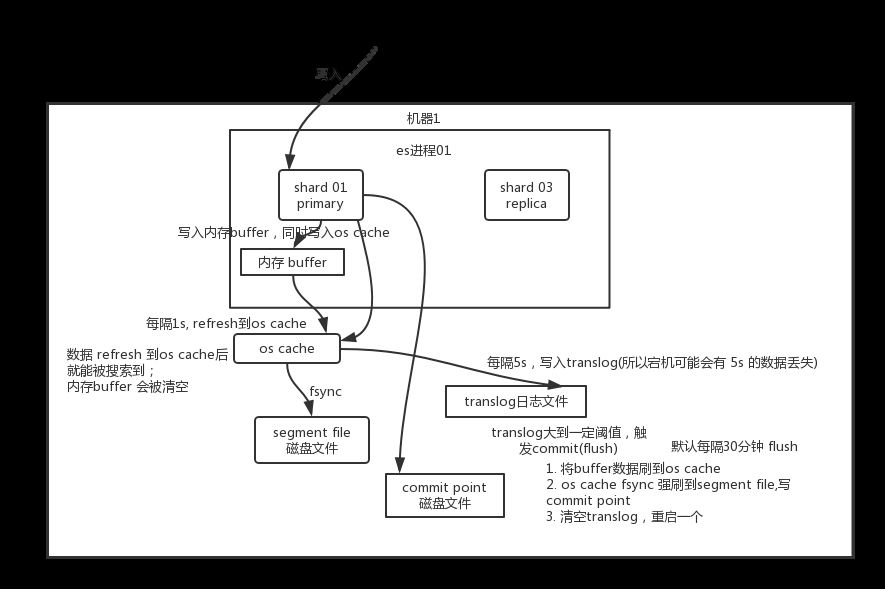

---

进，translog 会变得越来越大。当 translog 达到一定长度的时候，就会触发 commit  操作。
commit 操作发生第一步，就是将 buwer 中现有数据 refresh  到 os cache  中去，清空
buwer。然后，将一个 commit point  写入磁盘文件，里面标识着这个 commit point  对应
的所有 segment file  ，同时强行将 os cache  中目前所有的数据都 fsync  到磁盘文件中
去。最后清空 现有 translog 日志文件，重启一个 translog，此时 commit 操作完成。
这个 commit 操作叫做 flush  。默认 30 分钟自动执行一次 flush  ，但如果 translog 过大，
也会触发 flush  。flush 操作就对应着 commit 的全过程，我们可以通过 es api，手动执行
flush 操作，手动将 os cache 中的数据 fsync 强刷到磁盘上去。
translog 日志文件的作用是什么？你执行 commit 操作之前，数据要么是停留在 buwer 中，要么
是停留在 os cache 中，无论是 buwer 还是 os cache 都是内存，一旦这台机器死了，内存中的数
据就全丢了。所以需要将数据对应的操作写入一个专门的日志文件 translog  中，一旦此时
机器宕机，再次重启的时候，es 会自动读取 translog 日志文件中的数据，恢复到内存 buwer 和
os cache 中去。
translog 其实也是先写入 os cache 的，默认每隔 5 秒刷一次到磁盘中去，所以默认情况下，可
能有 5 秒的数据会仅仅停留在 buwer 或者 translog 文件的 os cache 中，如果此时机器挂了，会
丢失 5 秒钟的数据。但是这样性能比较好，最多丢 5 秒的数据。也可以将 translog 设置成每次
写操作必须是直接 fsync  到磁盘，但是性能会差很多。
实际上你在这里，如果面试官没有问你 es 丢数据的问题，你可以在这里给面试官炫一把，你
说，其实 es 第一是准实时的，数据写入 1 秒后可以搜索到；可能会丢失数据的。有 5 秒的数
据，停留在 buwer、translog os cache、segment file os cache 中，而不在磁盘上，此时如果宕
机，会导致 5 秒的数据丢失。
总结一下，数据先写入内存 buwer，然后每隔 1s，将数据 refresh 到 os cache，到了 os cache
数据就能被搜索到（所以我们才说 es 从写入到能被搜索到，中间有 1s 的延迟）。每隔 5s，将
数据写入 translog 文件（这样如果机器宕机，内存数据全没，最多会有 5s 的数据丢失），
translog 大到一定程度，或者默认每隔 30mins，会触发 commit 操作，将缓冲区的数据都 flush
到 segment file 磁盘文件中。
数据写入 segment file 之后，同时就建立好了倒排索引。
删除/更新数据底层原理
如果是删除操作，commit 的时候会生成一个 .del  文件，里面将某个 doc 标识为 deleted
状态，那么搜索的时候根据 .del  文件就知道这个 doc 是否被删除了。
如果是更新操作，就是将原来的 doc 标识为 deleted  状态，然后新写入一条数据。

---

buwer 每 refresh 一次，就会产生一个 segment file  ，所以默认情况下是 1 秒钟一个 
segment file  ，这样下来 segment file  会越来越多，此时会定期执行 merge。每次
merge 的时候，会将多个 segment file  合并成一个，同时这里会将标识为 deleted  的 doc
给物理删除掉，然后将新的 segment file  写入磁盘，这里会写一个 commit point  ，标
识所有新的 segment file  ，然后打开 segment file  供搜索使用，同时删除旧的 
segment file  。
底层 lucene
简单来说，lucene 就是一个 jar 包，里面包含了封装好的各种建立倒排索引的算法代码。我们
用 Java 开发的时候，引入 lucene jar，然后基于 lucene 的 api 去开发就可以了。
通过 lucene，我们可以将已有的数据建立索引，lucene 会在本地磁盘上面，给我们组织索引的
数据结构。
倒排索引
在搜索引擎中，每个文档都有一个对应的文档 ID，文档内容被表示为一系列关键词的集合。例
如，文档 1 经过分词，提取了 20 个关键词，每个关键词都会记录它在文档中出现的次数和出现
位置。
那么，倒排索引就是关键词到文档 ID 的映射，每个关键词都对应着一系列的文件，这些文件
中都出现了关键词。
举个栗子。
有以下文档：
DocId
Doc
1
谷歌地图之父跳槽 Facebook
2
谷歌地图之父加盟 Facebook
3
谷歌地图创始人拉斯离开谷歌加盟 Facebook
4
谷歌地图之父跳槽 Facebook 与 Wave 项目取消有关
5
谷歌地图之父拉斯加盟社交网站 Facebook
对文档进行分词之后，得到以下倒排索引。
WordId
Word
DocIds
1
谷歌
1, 2, 3, 4, 5
2
地图
1, 2, 3, 4, 5

---

3
之父
1, 2, 4, 5
4
跳槽
1, 4
5
Facebook
1, 2, 3, 4, 5
6
加盟
2, 3, 5
7
创始人
3
8
拉斯
3, 5
9
离开
3
10
与
4
..
..
..
另外，实用的倒排索引还可以记录更多的信息，比如文档频率信息，表示在文档集合中有多少
个文档包含某个单词。
那么，有了倒排索引，搜索引擎可以很方便地响应用户的查询。比如用户输入查询 Facebook
，搜索系统查找倒排索引，从中读出包含这个单词的文档，这些文档就是提供给用户的搜索结
果。
要注意倒排索引的两个重要细节：
倒排索引中的所有词项对应一个或多个文档；
倒排索引中的词项根据字典顺序升序排列
上面只是一个简单的栗子，并没有严格按照字典顺序升序排列。
面试题
ES 在数据量很大的情况下（数十亿级别）如何提高查询效率啊？
面试官心理分析
这个问题是肯定要问的，说白了，就是看你有没有实际干过 es，因为啥？其实 es 性能并没有
你想象中那么好的。很多时候数据量大了，特别是有几亿条数据的时候，可能你会懵逼的发
现，跑个搜索怎么一下 5~10s  ，坑爹了。第一次搜索的时候，是 5~10s  ，后面反而就快
了，可能就几百毫秒。
你就很懵，每个用户第一次访问都会比较慢，比较卡么？所以你要是没玩儿过 es，或者就是自
己玩玩儿 demo，被问到这个问题容易懵逼，显示出你对 es 确实玩儿的不怎么样？

---

面试题剖析
说实话，es 性能优化是没有什么银弹的，啥意思呢？就是不要期待着随手调一个参数，就可
以万能的应对所有的性能慢的场景。也许有的场景是你换个参数，或者调整一下语法，就可
以搞定，但是绝对不是所有场景都可以这样。
性能优化的杀手锏——filesystem cache
你往 es 里写的数据，实际上都写到磁盘文件里去了，查询的时候，操作系统会将磁盘文件里
的数据自动缓存到 filesystem cache  里面去。
es 的搜索引擎严重依赖于底层的 filesystem cache  ，你如果给 filesystem cache  更多
的内存，尽量让内存可以容纳所有的 idx segment file  索引数据文件，那么你搜索的时候
就基本都是走内存的，性能会非常高。
性能差距究竟可以有多大？我们之前很多的测试和压测，如果走磁盘一般肯定上秒，搜索性能
绝对是秒级别的，1秒、5秒、10秒。但如果是走 filesystem cache  ，是走纯内存的，那么
一般来说性能比走磁盘要高一个数量级，基本上就是毫秒级的，从几毫秒到几百毫秒不等。

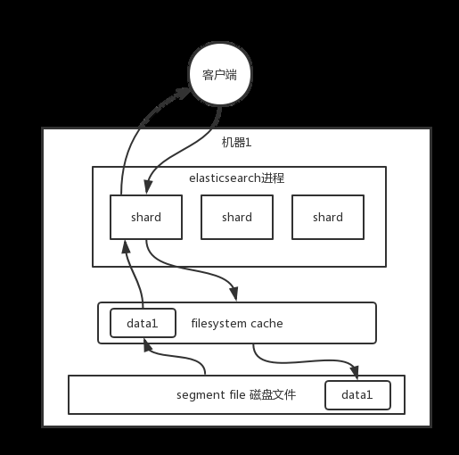

---

这里有个真实的案例。某个公司 es 节点有 3 台机器，每台机器看起来内存很多，64G，总内存
就是 64 * 3 = 192G  。每台机器给 es jvm heap 是 32G  ，那么剩下来留给 filesystem 
cache  的就是每台机器才 32G  ，总共集群里给 filesystem cache  的就是 32 * 3 = 96G
内存。而此时，整个磁盘上索引数据文件，在 3 台机器上一共占用了 1T  的磁盘容量，es 数
据量是 1T  ，那么每台机器的数据量是 300G  。这样性能好吗？ filesystem cache  的内
存才 100G，十分之一的数据可以放内存，其他的都在磁盘，然后你执行搜索操作，大部分操作
都是走磁盘，性能肯定差。
归根结底，你要让 es 性能要好，最佳的情况下，就是你的机器的内存，至少可以容纳你的总数
据量的一半。
根据我们自己的生产环境实践经验，最佳的情况下，是仅仅在 es 中就存少量的数据，就是你要
用来搜索的那些索引，如果内存留给 filesystem cache  的是 100G，那么你就将索引数据
控制在 100G  以内，这样的话，你的数据几乎全部走内存来搜索，性能非常之高，一般可以在
1 秒以内。
比如说你现在有一行数据。 id,name,age ....  30 个字段。但是你现在搜索，只需要根据 
id,name,age  三个字段来搜索。如果你傻乎乎往 es 里写入一行数据所有的字段，就会导致说 
90%  的数据是不用来搜索的，结果硬是占据了 es 机器上的 filesystem cache  的空间，单
条数据的数据量越大，就会导致 filesystem cahce  能缓存的数据就越少。其实，仅仅写入
es 中要用来检索的少数几个字段就可以了，比如说就写入 es id,name,age  三个字段，然后
你可以把其他的字段数据存在 mysql/hbase 里，我们一般是建议用 es + hbase  这么一个架
构。
hbase 的特点是适用于海量数据的在线存储，就是对 hbase 可以写入海量数据，但是不要做
复杂的搜索，做很简单的一些根据 id 或者范围进行查询的这么一个操作就可以了。从 es 中根
据 name 和 age 去搜索，拿到的结果可能就 20 个 doc id  ，然后根据 doc id  到 hbase 里去
查询每个 doc id  对应的完整的数据，给查出来，再返回给前端。
写入 es 的数据最好小于等于，或者是略微大于 es 的 filesystem cache 的内存容量。然后你从 es
检索可能就花费 20ms，然后再根据 es 返回的 id 去 hbase 里查询，查 20 条数据，可能也就耗
费个 30ms，可能你原来那么玩儿，1T 数据都放 es，会每次查询都是 5~10s，现在可能性能就
会很高，每次查询就是 50ms。
数据预热
假如说，哪怕是你就按照上述的方案去做了，es 集群中每个机器写入的数据量还是超过了 
filesystem cache  一倍，比如说你写入一台机器 60G 数据，结果 filesystem cache  就
30G，还是有 30G 数据留在了磁盘上。
其实可以做数据预热。

---

举个例子，拿微博来说，你可以把一些大V，平时看的人很多的数据，你自己提前后台搞个系
统，每隔一会儿，自己的后台系统去搜索一下热数据，刷到 filesystem cache  里去，后面
用户实际上来看这个热数据的时候，他们就是直接从内存里搜索了，很快。
或者是电商，你可以将平时查看最多的一些商品，比如说 iphone 8，热数据提前后台搞个程
序，每隔 1 分钟自己主动访问一次，刷到 filesystem cache  里去。
对于那些你觉得比较热的、经常会有人访问的数据，最好做一个专门的缓存预热子系统，就
是对热数据每隔一段时间，就提前访问一下，让数据进入 filesystem cache  里面去。这样
下次别人访问的时候，性能一定会好很多。
冷热分离
es 可以做类似于 mysql 的水平拆分，就是说将大量的访问很少、频率很低的数据，单独写一个
索引，然后将访问很频繁的热数据单独写一个索引。最好是将冷数据写入一个索引中，然后
热数据写入另外一个索引中，这样可以确保热数据在被预热之后，尽量都让他们留在 
filesystem os cache  里，别让冷数据给冲刷掉。
你看，假设你有 6 台机器，2 个索引，一个放冷数据，一个放热数据，每个索引 3 个 shard。3
台机器放热数据 index，另外 3 台机器放冷数据 index。然后这样的话，你大量的时间是在访问
热数据 index，热数据可能就占总数据量的 10%，此时数据量很少，几乎全都保留在 
filesystem cache  里面了，就可以确保热数据的访问性能是很高的。但是对于冷数据而言，
是在别的 index 里的，跟热数据 index 不在相同的机器上，大家互相之间都没什么联系了。如
果有人访问冷数据，可能大量数据是在磁盘上的，此时性能差点，就 10% 的人去访问冷数据，
90% 的人在访问热数据，也无所谓了。
document 模型设计
对于 MySQL，我们经常有一些复杂的关联查询。在 es 里该怎么玩儿，es 里面的复杂的关联查
询尽量别用，一旦用了性能一般都不太好。
最好是先在 Java 系统里就完成关联，将关联好的数据直接写入 es 中。搜索的时候，就不需要
利用 es 的搜索语法来完成 join 之类的关联搜索了。
document 模型设计是非常重要的，很多操作，不要在搜索的时候才想去执行各种复杂的乱七
八糟的操作。es 能支持的操作就那么多，不要考虑用 es 做一些它不好操作的事情。如果真的
有那种操作，尽量在 document 模型设计的时候，写入的时候就完成。另外对于一些太复杂的
操作，比如 join/nested/parent-child 搜索都要尽量避免，性能都很差的。
分页性能优化

---

es 的分页是较坑的，为啥呢？举个例子吧，假如你每页是 10 条数据，你现在要查询第 100
页，实际上是会把每个 shard 上存储的前 1000 条数据都查到一个协调节点上，如果你有个 5 个
shard，那么就有 5000 条数据，接着协调节点对这 5000 条数据进行一些合并、处理，再获取到
最终第 100 页的 10 条数据。
分布式的，你要查第 100 页的 10 条数据，不可能说从 5 个 shard，每个 shard 就查 2 条数据，
最后到协调节点合并成 10 条数据吧？你必须得从每个 shard 都查 1000 条数据过来，然后根据
你的需求进行排序、筛选等等操作，最后再次分页，拿到里面第 100 页的数据。你翻页的时
候，翻的越深，每个 shard 返回的数据就越多，而且协调节点处理的时间越长，非常坑爹。所
以用 es 做分页的时候，你会发现越翻到后面，就越是慢。
我们之前也是遇到过这个问题，用 es 作分页，前几页就几十毫秒，翻到 10 页或者几十页的时
候，基本上就要 5~10 秒才能查出来一页数据了。
有什么解决方案吗？
不允许深度分页（默认深度分页性能很差）
跟产品经理说，你系统不允许翻那么深的页，默认翻的越深，性能就越差。
类似于 app 里的推荐商品不断下拉出来一页一页的
类似于微博中，下拉刷微博，刷出来一页一页的，你可以用 scroll api  ，关于如何使用，
自行上网搜索。
scroll 会一次性给你生成所有数据的一个快照，然后每次滑动向后翻页就是通过游标 
scroll_id  移动，获取下一页下一页这样子，性能会比上面说的那种分页性能要高很多很
多，基本上都是毫秒级的。
但是，唯一的一点就是，这个适合于那种类似微博下拉翻页的，不能随意跳到任何一页的场
景。也就是说，你不能先进入第 10 页，然后去第 120 页，然后又回到第 58 页，不能随意乱跳
页。所以现在很多产品，都是不允许你随意翻页的，app，也有一些网站，做的就是你只能往
下拉，一页一页的翻。
初始化时必须指定 scroll  参数，告诉 es 要保存此次搜索的上下文多长时间。你需要确保用
户不会持续不断翻页翻几个小时，否则可能因为超时而失败。
除了用 scroll api  ，你也可以用 search_after  来做， search_after  的思想是使用前
一页的结果来帮助检索下一页的数据，显然，这种方式也不允许你随意翻页，你只能一页页往
后翻。初始化时，需要使用一个唯一值的字段作为 sort 字段。
面试题

---

ES 生产集群的部署架构是什么？每个索引的数据量大概有多少？每个索引大概有多少个分片？
面试官心理分析
这个问题，包括后面的 redis 什么的，谈到 es、redis、mysql 分库分表等等技术，面试必问！
就是你生产环境咋部署的？说白了，这个问题没啥技术含量，就是看你有没有在真正的生产环
境里干过这事儿！
有些同学可能是没在生产环境中干过的，没实际去拿线上机器部署过 es 集群，也没实际玩儿
过，也没往 es 集群里面导入过几千万甚至是几亿的数据量，可能你就不太清楚这里面的一些生
产项目中的细节。
如果你是自己就玩儿过 demo，没碰过真实的 es 集群，那你可能此时会懵。别懵，你一定要云
淡风轻的回答出来这个问题，表示你确实干过这事儿。
面试题剖析
其实这个问题没啥，如果你确实干过 es，那你肯定了解你们生产 es 集群的实际情况，部署了
几台机器？有多少个索引？每个索引有多大数据量？每个索引给了多少个分片？你肯定知道！
但是如果你确实没干过，也别虚，我给你说一个基本的版本，你到时候就简单说一下就好了。
es 生产集群我们部署了 5 台机器，每台机器是 6 核 64G 的，集群总内存是 320G。
我们 es 集群的日增量数据大概是 2000 万条，每天日增量数据大概是 500MB，每月增量数
据大概是 6 亿，15G。目前系统已经运行了几个月，现在 es 集群里数据总量大概是 100G 左
右。
目前线上有 5 个索引（这个结合你们自己业务来，看看自己有哪些数据可以放 es 的），每
个索引的数据量大概是 20G，所以这个数据量之内，我们每个索引分配的是 8 个 shard，比
默认的 5 个 shard 多了 3 个 shard。
大概就这么说一下就行了。
面试题
项目中缓存是如何使用的？为什么要用缓存？缓存使用不当会造成什么后果？
面试官心理分析
这个问题，互联网公司必问，要是一个人连缓存都不太清楚，那确实比较尴尬。

---

只要问到缓存，上来第一个问题，肯定是先问问你项目哪里用了缓存？为啥要用？不用行不
行？如果用了以后可能会有什么不良的后果？
这就是看看你对缓存这个东西背后有没有思考，如果你就是傻乎乎的瞎用，没法给面试官一个
合理的解答，那面试官对你印象肯定不太好，觉得你平时思考太少，就知道干活儿。
面试题剖析
项目中缓存是如何使用的？
这个，需要结合自己项目的业务来。
为什么要用缓存？
用缓存，主要有两个用途：高性能、高并发。
高性能
假设这么个场景，你有个操作，一个请求过来，吭哧吭哧你各种乱七八糟操作 mysql，半天查
出来一个结果，耗时 600ms。但是这个结果可能接下来几个小时都不会变了，或者变了也可以
不用立即反馈给用户。那么此时咋办？
缓存啊，折腾 600ms 查出来的结果，扔缓存里，一个 key 对应一个 value，下次再有人查，别
走 mysql 折腾 600ms 了，直接从缓存里，通过一个 key 查出来一个 value，2ms 搞定。性能提
升 300 倍。
就是说对于一些需要复杂操作耗时查出来的结果，且确定后面不怎么变化，但是有很多读请
求，那么直接将查询出来的结果放在缓存中，后面直接读缓存就好。
高并发
mysql 这么重的数据库，压根儿设计不是让你玩儿高并发的，虽然也可以玩儿，但是天然支持
不好。mysql 单机支撑到 2000QPS  也开始容易报警了。
所以要是你有个系统，高峰期一秒钟过来的请求有 1万，那一个 mysql 单机绝对会死掉。你这
个时候就只能上缓存，把很多数据放缓存，别放 mysql。缓存功能简单，说白了就是 key-
value  式操作，单机支撑的并发量轻松一秒几万十几万，支撑高并发 so easy。单机承载并发
量是 mysql 单机的几十倍。
缓存是走内存的，内存天然就支撑高并发。

---

用了缓存之后会有什么不良后果？
常见的缓存问题有以下几个：
缓存与数据库双写不一致
缓存雪崩、缓存穿透、缓存击穿
缓存并发竞争
点击超链接，可直接查看缓存相关问题及解决方案。
面试题
Redis 和 Memcached 有什么区别？Redis 的线程模型是什么？为什么 Redis 单线程却能支撑高并
发？
面试官心理分析
这个是问 Redis 的时候，最基本的问题吧，Redis 最基本的一个内部原理和特点，就是 Redis 实
际上是个单线程工作模型，你要是这个都不知道，那后面玩儿 Redis 的时候，出了问题岂不是
什么都不知道？
还有可能面试官会问问你 Redis 和 Memcached 的区别，但是 Memcached 是早些年各大互联网
公司常用的缓存方案，但是现在近几年基本都是 Redis，没什么公司用 Memcached 了。
面试题剖析
Redis 和 Memcached 有啥区别？
Redis 支持复杂的数据结构
Redis 相比 Memcached 来说，拥有更多的数据结构，能支持更丰富的数据操作。如果需要缓
存能够支持更复杂的结构和操作， Redis 会是不错的选择。
Redis 原生支持集群模式
在 Redis3.x 版本中，便能支持 cluster 模式，而 Memcached 没有原生的集群模式，需要依靠客
户端来实现往集群中分片写入数据。

---

性能对比
由于 Redis 只使用单核，而 Memcached 可以使用多核，所以平均每一个核上 Redis 在存储小数
据时比 Memcached 性能更高。而在 100k 以上的数据中，Memcached 性能要高于 Redis。虽然
Redis 最近也在存储大数据的性能上进行优化，但是比起 Memcached，还是稍有逊色。
Redis 的线程模型
Redis 内部使用文件事件处理器 file event handler  ，这个文件事件处理器是单线程的，所
以 Redis 才叫做单线程的模型。它采用 IO 多路复用机制同时监听多个 socket，将产生事件的
socket 压入内存队列中，事件分派器根据 socket 上的事件类型来选择对应的事件处理器进行处
理。
文件事件处理器的结构包含 4 个部分：
多个 socket
IO 多路复用程序
文件事件分派器
事件处理器（连接应答处理器、命令请求处理器、命令回复处理器）
多个 socket 可能会并发产生不同的操作，每个操作对应不同的文件事件，但是 IO 多路复用程
序会监听多个 socket，会将产生事件的 socket 放入队列中排队，事件分派器每次从队列中取出
一个 socket，根据 socket 的事件类型交给对应的事件处理器进行处理。
来看客户端与 Redis 的一次通信过程：
要明白，通信是通过 socket 来完成的，不懂的同学可以先去看一看 socket 网络编程。

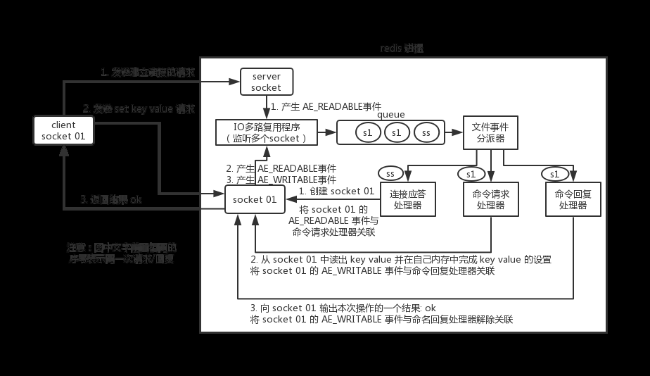

---

首先，Redis 服务端进程初始化的时候，会将 server socket 的 AE_READABLE  事件与连接应答
处理器关联。
客户端 socket01 向 Redis 进程的 server socket 请求建立连接，此时 server socket 会产生一个 
AE_READABLE  事件，IO 多路复用程序监听到 server socket 产生的事件后，将该 socket 压入队
列中。文件事件分派器从队列中获取 socket，交给连接应答处理器。连接应答处理器会创建一
个能与客户端通信的 socket01，并将该 socket01 的 AE_READABLE  事件与命令请求处理器关
联。
假设此时客户端发送了一个 set key value  请求，此时 Redis 中的 socket01 会产生 
AE_READABLE  事件，IO 多路复用程序将 socket01 压入队列，此时事件分派器从队列中获取到
socket01 产生的 AE_READABLE  事件，由于前面 socket01 的 AE_READABLE  事件已经与命令请
求处理器关联，因此事件分派器将事件交给命令请求处理器来处理。命令请求处理器读取
socket01 的 key value  并在自己内存中完成 key value  的设置。操作完成后，它会将
socket01 的 AE_WRITABLE  事件与命令回复处理器关联。
如果此时客户端准备好接收返回结果了，那么 Redis 中的 socket01 会产生一个 AE_WRITABLE
事件，同样压入队列中，事件分派器找到相关联的命令回复处理器，由命令回复处理器对
socket01 输入本次操作的一个结果，比如 ok  ，之后解除 socket01 的 AE_WRITABLE  事件与
命令回复处理器的关联。
这样便完成了一次通信。关于 Redis 的一次通信过程，推荐读者阅读《Redis 设计与实现——黄
健宏》进行系统学习。
为啥 Redis 单线程模型也能效率这么高？
纯内存操作。
核心是基于非阻塞的 IO 多路复用机制。
C 语言实现，一般来说，C 语言实现的程序“距离”操作系统更近，执行速度相对会更快。
单线程反而避免了多线程的频繁上下文切换问题，预防了多线程可能产生的竞争问题。
Redis 6.0 开始引入多线程
注意！ Redis 6.0 之后的版本抛弃了单线程模型这一设计，原本使用单线程运行的 Redis 也开
始选择性地使用多线程模型。
前面还在强调 Redis 单线程模型的高效性，现在为什么又要引入多线程？这其实说明 Redis 在
有些方面，单线程已经不具有优势了。因为读写网络的 Read/Write 系统调用在 Redis 执行期间
占用了大部分 CPU 时间，如果把网络读写做成多线程的方式对性能会有很大提升。
Redis 的多线程部分只是用来处理网络数据的读写和协议解析，执行命令仍然是单线程。
之所以这么设计是不想 Redis 因为多线程而变得复杂，需要去控制 key、lua、事务、

---

LPUSH/LPOP 等等的并发问题。
总结
Redis 选择使用单线程模型处理客户端的请求主要还是因为 CPU 不是 Redis 服务器的瓶颈，所
以使用多线程模型带来的性能提升并不能抵消它带来的开发成本和维护成本，系统的性能瓶颈
也主要在网络 I/O 操作上；而 Redis 引入多线程操作也是出于性能上的考虑，对于一些大键值
对的删除操作，通过多线程非阻塞地释放内存空间也能减少对 Redis 主线程阻塞的时间，提高
执行的效率。
面试题
Redis 都有哪些数据类型？分别在哪些场景下使用比较合适？
面试官心理分析
除非是面试官感觉看你简历，是工作 3 年以内的比较初级的同学，可能对技术没有很深入的研
究，面试官才会问这类问题。否则，在宝贵的面试时间里，面试官实在不想多问。
其实问这个问题，主要有两个原因：
看看你到底有没有全面的了解 Redis 有哪些功能，一般怎么来用，啥场景用什么，就怕你别
就会最简单的 KV 操作；
看看你在实际项目里都怎么玩儿过 Redis。
要是你回答的不好，没说出几种数据类型，也没说什么场景，你完了，面试官对你印象肯定不
好，觉得你平时就是做个简单的 set 和 get。
面试题剖析
Redis 主要有以下几种数据类型：
Strings
Hashes
Lists
Sets
Sorted Sets
Redis 除了这 5 种数据类型之外，还有 Bitmaps、HyperLogLogs、Streams 等。

---

Strings
这是最简单的类型，就是普通的 set 和 get，做简单的 KV 缓存。
Hashes
这个是类似 map 的一种结构，这个一般就是可以将结构化的数据，比如一个对象（前提是这
个对象没嵌套其他的对象）给缓存在 Redis 里，然后每次读写缓存的时候，可以就操作 hash
里的某个字段。
Lists
Lists 是有序列表，这个可以玩儿出很多花样。
比如可以通过 list 存储一些列表型的数据结构，类似粉丝列表、文章的评论列表之类的东西。
比如可以通过 lrange 命令，读取某个闭区间内的元素，可以基于 list 实现分页查询，这个是很
棒的一个功能，基于 Redis 实现简单的高性能分页，可以做类似微博那种下拉不断分页的东
西，性能高，就一页一页走。
 college szu
set
bash
hset person name bingo 
hset person age 
 
hset person 
  
hget person name
20
id 1
bash
person =  
    
 
 
    
 
 
    
 
{
"name": "bingo",
"age": 20,
"id": 1
}
json
 
lrange mylist  -1
# 0开始位置，-1结束位置，结束位置为-1时，表示列表的最后一个位置，即查看所有。
0
bash

---

比如可以搞个简单的消息队列，从 list 头怼进去，从 list 尾巴那里弄出来。
Sets
Sets 是无序集合，自动去重。
直接基于 set 将系统里需要去重的数据扔进去，自动就给去重了，如果你需要对一些数据进行
快速的全局去重，你当然也可以基于 jvm 内存里的 HashSet 进行去重，但是如果你的某个系统
部署在多台机器上呢？得基于 Redis 进行全局的 set 去重。
可以基于 set 玩儿交集、并集、差集的操作，比如交集吧，可以把两个人的粉丝列表整一个交
集，看看俩人的共同好友是谁？对吧。
把两个大 V 的粉丝都放在两个 set 中，对两个 set 做交集。
lpush mylist  
lpush mylist  
lpush mylist    
 
 
rpop mylist
1
2
3 4 5
# 1
bash
 
sadd mySet  
 
 
smembers mySet 
 
 
sismember mySet  
 
 
srem mySet  
srem mySet   
 
 
scard mySet 
 
#-------操作一个set-------
# 添加元素
1
# 查看全部元素
# 判断是否包含某个值
3
# 删除某个/些元素
1
2 4
# 查看元素个数
bash

---

Sorted Sets
Sorted Sets 是排序的 set，去重但可以排序，写进去的时候给一个分数，自动根据分数排序。
面试题
Redis 的过期策略都有哪些？内存淘汰机制都有哪些？手写一下 LRU 代码实现？
面试官心理分析
 
spop mySet 
 
 
smove yourSet mySet  
 
 
sinter yourSet mySet 
 
 
sunion yourSet mySet 
 
 yourSet mySet
# 随机删除一个元素
#-------操作多个set-------
# 将一个set的元素移动到另外一个set
2
# 求两set的交集
# 求两set的并集
# 求在yourSet中而不在mySet中的元素
sdiff
zadd board 
 zhangsan 
zadd board 
 lisi 
zadd board 
 wangwu 
zadd board 
 zhaoliu 
 
 
zrevrange board   
 
 
zrank board zhaoliu
85
72
96
63
# 获取排名前三的用户（默认是升序，所以需要 rev 改为降序）
0 3
# 获取某用户的排名
bash

---

如果你连这个问题都不知道，上来就懵了，回答不出来，那线上你写代码的时候，想当然的认
为写进 Redis 的数据就一定会存在，后面导致系统各种 bug，谁来负责？
常见的有两个问题：
往 Redis 写入的数据怎么没了？
可能有同学会遇到，在生产环境的 Redis 经常会丢掉一些数据，写进去了，过一会儿可能就没
了。我的天，同学，你问这个问题就说明 Redis 你就没用对啊。Redis 是缓存，你给当存储了是
吧？
啥叫缓存？用内存当缓存。内存是无限的吗，内存是很宝贵而且是有限的，磁盘是廉价而且是
大量的。可能一台机器就几十个 G 的内存，但是可以有几个 T 的硬盘空间。Redis 主要是基于
内存来进行高性能、高并发的读写操作的。
那既然内存是有限的，比如 Redis 就只能用 10G，你要是往里面写了 20G 的数据，会咋办？当
然会干掉 10G 的数据，然后就保留 10G 的数据了。那干掉哪些数据？保留哪些数据？当然是干
掉不常用的数据，保留常用的数据了。
数据明明过期了，怎么还占用着内存？
这是由 Redis 的过期策略来决定。
面试题剖析
Redis 过期策略
Redis 过期策略是：定期删除+惰性删除。
所谓定期删除，指的是 Redis 默认是每隔 100ms 就随机抽取一些设置了过期时间的 key，检查
其是否过期，如果过期就删除。
假设 Redis 里放了 10w 个 key，都设置了过期时间，你每隔几百毫秒，就检查 10w 个 key，那
Redis 基本上就死了，cpu 负载会很高的，消耗在你的检查过期 key 上了。注意，这里可不是每
隔 100ms 就遍历所有的设置过期时间的 key，那样就是一场性能上的灾难。实际上 Redis 是每
隔 100ms 随机抽取一些 key 来检查和删除的。
但是问题是，定期删除可能会导致很多过期 key 到了时间并没有被删除掉，那咋整呢？所以就
是惰性删除了。这就是说，在你获取某个 key 的时候，Redis 会检查一下 ，这个 key 如果设置
了过期时间那么是否过期了？如果过期了此时就会删除，不会给你返回任何东西。
获取 key 的时候，如果此时 key 已经过期，就删除，不会返回任何东西。

---

但是实际上这还是有问题的，如果定期删除漏掉了很多过期 key，然后你也没及时去查，也就
没走惰性删除，此时会怎么样？如果大量过期 key 堆积在内存里，导致 Redis 内存块耗尽了，
咋整？
答案是：走内存淘汰机制。
内存淘汰机制
Redis 内存淘汰机制有以下几个：
noeviction: 当内存不足以容纳新写入数据时，新写入操作会报错，这个一般没人用吧，实
在是太恶心了。
allkeys-lru：当内存不足以容纳新写入数据时，在键空间中，移除最近最少使用的 key（这
个是最常用的）。
allkeys-random：当内存不足以容纳新写入数据时，在键空间中，随机移除某个 key，这个
一般没人用吧，为啥要随机，肯定是把最近最少使用的 key 给干掉啊。
volatile-lru：当内存不足以容纳新写入数据时，在设置了过期时间的键空间中，移除最近
最少使用的 key（这个一般不太合适）。
volatile-random：当内存不足以容纳新写入数据时，在设置了过期时间的键空间中，随机
移除某个 key。
volatile-ttl：当内存不足以容纳新写入数据时，在设置了过期时间的键空间中，有更早过
期时间的 key 优先移除。
手写一个 LRU 算法
你可以现场手写最原始的 LRU 算法，那个代码量太大了，似乎不太现实。
不求自己纯手工从底层开始打造出自己的 LRU，但是起码要知道如何利用已有的 JDK 数据结构
实现一个 Java 版的 LRU。
 
 
 
  
    
 
 
 CACHE_SIZE  
 
    
 
    
 
 cacheSize   
        
        
 
cacheSize  
  
 
 
 
class LRUCache
 
<K, V> extends LinkedHashMap
 
<K, V> {
private final int
;
/** 
     * 传递进来最多能缓存多少数据 
     * 
     * @param cacheSize 缓存大小 
     */
public LRUCache(int
) {
// true 表示让 linkedHashMap 按照访问顺序来进行排序，最近访问的放在头部，最
super((int) Math.ceil(
/ 0.75) + 1, 0.75f, true);
java

---

面试题
如何保证 redis 的高并发和高可用？redis 的主从复制原理能介绍一下么？redis 的哨兵原理能介
绍一下么？
面试官心理分析
其实问这个问题，主要是考考你，redis 单机能承载多高并发？如果单机扛不住如何扩容扛更多
的并发？redis 会不会挂？既然 redis 会挂那怎么保证 redis 是高可用的？
其实针对的都是项目中你肯定要考虑的一些问题，如果你没考虑过，那确实你对生产系统中的
问题思考太少。
面试题剖析
如果你用 redis 缓存技术的话，肯定要考虑如何用 redis 来加多台机器，保证 redis 是高并发
的，还有就是如何让 redis 保证自己不是挂掉以后就直接死掉了，即 redis 高可用。
由于此节内容较多，因此，会分为两个小节进行讲解。
redis 主从架构
redis 基于哨兵实现高可用
redis 实现高并发主要依靠主从架构，一主多从，一般来说，很多项目其实就足够了，单主用
来写入数据，单机几万 QPS，多从用来查询数据，多个从实例可以提供每秒 10w 的 QPS。
        CACHE_SIZE  cacheSize  
     
 
    
 
    
 
    
 
 
 eldest   
        
 
        
 
  CACHE_SIZE  
    
=
;
}
/** 
     * 钩子方法，通过put新增键值对的时候，若该方法返回true 
     * 便移除该map中最老的键和值 
     */
@Override
protected boolean removeEldestEntry(Map.Entry
 
<K, V>
) {
// 当 map中的数据量大于指定的缓存个数的时候，就自动删除最老的数据。
return size() >
;
}
}

---

如果想要在实现高并发的同时，容纳大量的数据，那么就需要 redis 集群，使用 redis 集群之
后，可以提供每秒几十万的读写并发。
redis 高可用，如果是做主从架构部署，那么加上哨兵就可以了，就可以实现，任何一个实例宕
机，可以进行主备切换。
Redis 主从架构
单机的 Redis，能够承载的 QPS 大概就在上万到几万不等。对于缓存来说，一般都是用来支撑
读高并发的。因此架构做成主从(master-slave)架构，一主多从，主负责写，并且将数据复制到
其它的 slave 节点，从节点负责读。所有的读请求全部走从节点。这样也可以很轻松实现水平
扩容，支撑读高并发。
Redis replication -> 主从架构 -> 读写分离 -> 水平扩容支撑读高并发
Redis replication 的核心机制
Redis 采用异步方式复制数据到 slave 节点，不过 Redis2.8 开始，slave node 会周期性地确
认自己每次复制的数据量；
一个 master node 是可以配置多个 slave node 的；
slave node 也可以连接其他的 slave node；
slave node 做复制的时候，不会 block master node 的正常工作；
slave node 在做复制的时候，也不会 block 对自己的查询操作，它会用旧的数据集来提供服
务；但是复制完成的时候，需要删除旧数据集，加载新数据集，这个时候就会暂停对外服
务了；
slave node 主要用来进行横向扩容，做读写分离，扩容的 slave node 可以提高读的吞吐量。

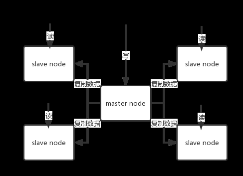

---

注意，如果采用了主从架构，那么建议必须开启 master node 的持久化，不建议用 slave node
作为 master node 的数据热备，因为那样的话，如果你关掉 master 的持久化，可能在 master
宕机重启的时候数据是空的，然后可能一经过复制， slave node 的数据也丢了。
另外，master 的各种备份方案，也需要做。万一本地的所有文件丢失了，从备份中挑选一份
rdb 去恢复 master，这样才能确保启动的时候，是有数据的，即使采用了后续讲解的高可用
机制，slave node 可以自动接管 master node，但也可能 sentinel 还没检测到 master failure，
master node 就自动重启了，还是可能导致上面所有的 slave node 数据被清空。
Redis 主从复制的核心原理
当启动一个 slave node 的时候，它会发送一个 PSYNC  命令给 master node。
如果这是 slave node 初次连接到 master node，那么会触发一次 full resynchronization  全
量复制。此时 master 会启动一个后台线程，开始生成一份 RDB  快照文件，同时还会将从客户
端 client 新收到的所有写命令缓存在内存中。 RDB  文件生成完毕后， master 会将这个 RDB
发送给 slave，slave 会先写入本地磁盘，然后再从本地磁盘加载到内存中，接着 master 会将
内存中缓存的写命令发送到 slave，slave 也会同步这些数据。slave node 如果跟 master node 有
网络故障，断开了连接，会自动重连，连接之后 master node 仅会复制给 slave 部分缺少的数
据。
主从复制的断点续传
从 Redis2.8 开始，就支持主从复制的断点续传，如果主从复制过程中，网络连接断掉了，那么
可以接着上次复制的地方，继续复制下去，而不是从头开始复制一份。
master node 会在内存中维护一个 backlog，master 和 slave 都会保存一个 replica owset 还有一
个 master run id，owset 就是保存在 backlog 中的。如果 master 和 slave 网络连接断掉了，slave
会让 master 从上次 replica owset 开始继续复制，如果没有找到对应的 owset，那么就会执行一
次 resynchronization  。

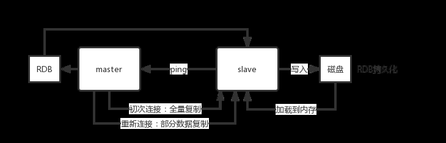

---

如果根据 host+ip 定位 master node，是不靠谱的，如果 master node 重启或者数据出现
了变化，那么 slave node 应该根据不同的 run id 区分。
无磁盘化复制
master 在内存中直接创建 RDB  ，然后发送给 slave，不会在自己本地落地磁盘了。只需要在配
置文件中开启 repl-diskless-sync yes  即可。
过期 key 处理
slave 不会过期 key，只会等待 master 过期 key。如果 master 过期了一个 key，或者通过 LRU 淘
汰了一个 key，那么会模拟一条 del 命令发送给 slave。
复制的完整流程
slave node 启动时，会在自己本地保存 master node 的信息，包括 master node 的 host  和 
ip  ，但是复制流程没开始。
slave node 内部有个定时任务，每秒检查是否有新的 master node 要连接和复制，如果发现，
就跟 master node 建立 socket 网络连接。然后 slave node 发送 ping  命令给 master node。如
果 master 设置了 requirepass，那么 slave node 必须发送 masterauth 的口令过去进行认证。
master node 第一次执行全量复制，将所有数据发给 slave node。而在后续，master node 持续
将写命令，异步复制给 slave node。
repl-diskless-sync 
 
 
 
repl-diskless-sync-delay 
yes
# 等待 5s 后再开始复制，因为要等更多 slave 重新连接过来
5
bash

---

全量复制
master 执行 bgsave ，在本地生成一份 rdb 快照文件。
master node 将 rdb 快照文件发送给 slave node，如果 rdb 复制时间超过 60秒（repl-
timeout），那么 slave node 就会认为复制失败，可以适当调大这个参数(对于千兆网卡的机
器，一般每秒传输 100MB，6G 文件，很可能超过 60s)
master node 在生成 rdb 时，会将所有新的写命令缓存在内存中，在 slave node 保存了 rdb
之后，再将新的写命令复制给 slave node。
如果在复制期间，内存缓冲区持续消耗超过 64MB，或者一次性超过 256MB，那么停止复
制，复制失败。
slave node 接收到 rdb 之后，清空自己的旧数据，然后重新加载 rdb 到自己的内存中，同时
基于旧的数据版本对外提供服务。
如果 slave node 开启了 AOF，那么会立即执行 BGREWRITEAOF，重写 AOF。
增量复制
如果全量复制过程中，master-slave 网络连接断掉，那么 slave 重新连接 master 时，会触发
增量复制。
master 直接从自己的 backlog 中获取部分丢失的数据，发送给 slave node，默认 backlog 就
是 1MB。
master 就是根据 slave 发送的 psync 中的 owset 来从 backlog 中获取数据的。
client-output-buffer-limit slave 256MB 64MB 60
bash

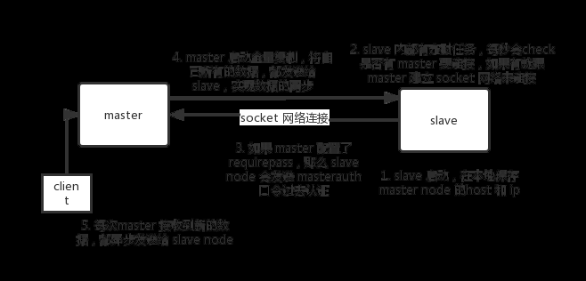

---

heartbeat
主从节点互相都会发送 heartbeat 信息。
master 默认每隔 10秒 发送一次 heartbeat，slave node 每隔 1秒 发送一个 heartbeat。
异步复制
master 每次接收到写命令之后，先在内部写入数据，然后异步发送给 slave node。
Redis 如何才能做到高可用
如果系统在 365 天内，有 99.99% 的时间，都是可以哗哗对外提供服务的，那么就说系统是高
可用的。
一个 slave 挂掉了，是不会影响可用性的，还有其它的 slave 在提供相同数据下的相同的对外的
查询服务。
但是，如果 master node 死掉了，会怎么样？没法写数据了，写缓存的时候，全部失效了。
slave node 还有什么用呢，没有 master 给它们复制数据了，系统相当于不可用了。
Redis 的高可用架构，叫做 failover  故障转移，也可以叫做主备切换。
master node 在故障时，自动检测，并且将某个 slave node 自动切换为 master node 的过程，叫
做主备切换。这个过程，实现了 Redis 的主从架构下的高可用。
后面会详细说明 Redis 基于哨兵的高可用性。
面试题
Redis 的持久化有哪几种方式？不同的持久化机制都有什么优缺点？持久化机制具体底层是如
何实现的？
面试官心理分析
Redis 如果仅仅只是将数据缓存在内存里面，如果 Redis 宕机了再重启，内存里的数据就全部都
弄丢了啊。你必须得用 Redis 的持久化机制，将数据写入内存的同时，异步的慢慢的将数据写
入磁盘文件里，进行持久化。

---

如果 Redis 宕机重启，自动从磁盘上加载之前持久化的一些数据就可以了，也许会丢失少许数
据，但是至少不会将所有数据都弄丢。
这个其实一样，针对的都是 Redis 的生产环境可能遇到的一些问题，就是 Redis 要是挂了再重
启，内存里的数据不就全丢了？能不能重启的时候把数据给恢复了？
面试题剖析
持久化主要是做灾难恢复、数据恢复，也可以归类到高可用的一个环节中去，比如你 Redis 整
个挂了，然后 Redis 就不可用了，你要做的事情就是让 Redis 变得可用，尽快变得可用。
重启 Redis，尽快让它对外提供服务，如果没做数据备份，这时候 Redis 启动了，也不可用啊，
数据都没了。
很可能说，大量的请求过来，缓存全部无法命中，在 Redis 里根本找不到数据，这个时候就死
定了，出现缓存雪崩问题。所有请求没有在 Redis 命中，就会去 mysql 数据库这种数据源头中
去找，一下子 mysql 承接高并发，然后就挂了...
如果你把 Redis 持久化做好，备份和恢复方案做到企业级的程度，那么即使你的 Redis 故障
了，也可以通过备份数据，快速恢复，一旦恢复立即对外提供服务。
Redis 持久化的两种方式
RDB：RDB 持久化机制，是对 Redis 中的数据执行周期性的持久化。
AOF：AOF 机制对每条写入命令作为日志，以 append-only  的模式写入一个日志文件中，
在 Redis 重启的时候，可以通过回放 AOF 日志中的写入指令来重新构建整个数据集。
通过 RDB 或 AOF，都可以将 Redis 内存中的数据给持久化到磁盘上面来，然后可以将这些数据
备份到别的地方去，比如说阿里云等云服务。
如果 Redis 挂了，服务器上的内存和磁盘上的数据都丢了，可以从云服务上拷贝回来之前的数
据，放到指定的目录中，然后重新启动 Redis，Redis 就会自动根据持久化数据文件中的数据，
去恢复内存中的数据，继续对外提供服务。
如果同时使用 RDB 和 AOF 两种持久化机制，那么在 Redis 重启的时候，会使用 AOF 来重新构建
数据，因为 AOF 中的数据更加完整。
RDB 优缺点
RDB 会生成多个数据文件，每个数据文件都代表了某一个时刻中 Redis 的数据，这种多个数
据文件的方式，非常适合做冷备，可以将这种完整的数据文件发送到一些远程的安全存储

---

上去，比如说 Amazon 的 S3 云服务上去，在国内可以是阿里云的 ODPS 分布式存储上，以
预定好的备份策略来定期备份 Redis 中的数据。
RDB 对 Redis 对外提供的读写服务，影响非常小，可以让 Redis 保持高性能，因为 Redis 主
进程只需要 fork 一个子进程，让子进程执行磁盘 IO 操作来进行 RDB 持久化即可。
相对于 AOF 持久化机制来说，直接基于 RDB 数据文件来重启和恢复 Redis 进程，更加快
速。
如果想要在 Redis 故障时，尽可能少的丢失数据，那么 RDB 没有 AOF 好。一般来说，RDB
数据快照文件，都是每隔 5 分钟，或者更长时间生成一次，这个时候就得接受一旦 Redis 进
程宕机，那么会丢失最近 5 分钟的数据。
RDB 每次在 fork 子进程来执行 RDB 快照数据文件生成的时候，如果数据文件特别大，可能
会导致对客户端提供的服务暂停数毫秒，或者甚至数秒。
AOF 优缺点
AOF 可以更好的保护数据不丢失，一般 AOF 会每隔 1 秒，通过一个后台线程执行一次 
fsync  操作，最多丢失 1 秒钟的数据。
AOF 日志文件以 append-only  模式写入，所以没有任何磁盘寻址的开销，写入性能非常
高，而且文件不容易破损，即使文件尾部破损，也很容易修复。
AOF 日志文件即使过大的时候，出现后台重写操作，也不会影响客户端的读写。因为在 
rewrite  log 的时候，会对其中的指令进行压缩，创建出一份需要恢复数据的最小日志出
来。在创建新日志文件的时候，老的日志文件还是照常写入。当新的 merge 后的日志文件
ready 的时候，再交换新老日志文件即可。
AOF 日志文件的命令通过可读较强的方式进行记录，这个特性非常适合做灾难性的误删除
的紧急恢复。比如某人不小心用 flushall  命令清空了所有数据，只要这个时候后台 
rewrite  还没有发生，那么就可以立即拷贝 AOF 文件，将最后一条 flushall  命令给删
了，然后再将该 AOF  文件放回去，就可以通过恢复机制，自动恢复所有数据。
对于同一份数据来说，AOF 日志文件通常比 RDB 数据快照文件更大。
AOF 开启后，支持的写 QPS 会比 RDB 支持的写 QPS 低，因为 AOF 一般会配置成每秒 
fsync  一次日志文件，当然，每秒一次 fsync  ，性能也还是很高的。（如果实时写入，
那么 QPS 会大降，Redis 性能会大大降低）
以前 AOF 发生过 bug，就是通过 AOF 记录的日志，进行数据恢复的时候，没有恢复一模一
样的数据出来。所以说，类似 AOF 这种较为复杂的基于命令日志 / merge / 回放的方式，比
基于 RDB 每次持久化一份完整的数据快照文件的方式，更加脆弱一些，容易有 bug。不过
AOF 就是为了避免 rewrite 过程导致的 bug，因此每次 rewrite 并不是基于旧的指令日志进行
merge 的，而是基于当时内存中的数据进行指令的重新构建，这样健壮性会好很多。
RDB 和 AOF 到底该如何选择

---

不要仅仅使用 RDB，因为那样会导致你丢失很多数据；
也不要仅仅使用 AOF，因为那样有两个问题：第一，你通过 AOF 做冷备，没有 RDB 做冷备
来的恢复速度更快；第二，RDB 每次简单粗暴生成数据快照，更加健壮，可以避免 AOF 这
种复杂的备份和恢复机制的 bug；
Redis 支持同时开启开启两种持久化方式，我们可以综合使用 AOF 和 RDB 两种持久化机
制，用 AOF 来保证数据不丢失，作为数据恢复的第一选择; 用 RDB 来做不同程度的冷备，
在 AOF 文件都丢失或损坏不可用的时候，还可以使用 RDB 来进行快速的数据恢复。
Redis 哨兵集群实现高可用
哨兵的介绍
sentinel，中文名是哨兵。哨兵是 Redis 集群架构中非常重要的一个组件，主要有以下功能：
集群监控：负责监控 Redis master 和 slave 进程是否正常工作。
消息通知：如果某个 Redis 实例有故障，那么哨兵负责发送消息作为报警通知给管理员。
故障转移：如果 master node 挂掉了，会自动转移到 slave node 上。
配置中心：如果故障转移发生了，通知 client 客户端新的 master 地址。
哨兵用于实现 Redis 集群的高可用，本身也是分布式的，作为一个哨兵集群去运行，互相协同
工作。
故障转移时，判断一个 master node 是否宕机了，需要大部分的哨兵都同意才行，涉及到了
分布式选举的问题。
即使部分哨兵节点挂掉了，哨兵集群还是能正常工作的，因为如果一个作为高可用机制重
要组成部分的故障转移系统本身是单点的，那就很坑爹了。
哨兵的核心知识
哨兵至少需要 3 个实例，来保证自己的健壮性。
哨兵 + Redis 主从的部署架构，是不保证数据零丢失的，只能保证 Redis 集群的高可用性。
对于哨兵 + Redis 主从这种复杂的部署架构，尽量在测试环境和生产环境，都进行充足的测
试和演练。
哨兵集群必须部署 2 个以上节点，如果哨兵集群仅仅部署了 2 个哨兵实例，quorum = 1。
+----+         +----+ 
| M1 |---------| R1 | 
| S1 |         | S2 | 
+----+         +----+

---

配置 quorum=1  ，如果 master 宕机， s1 和 s2 中只要有 1 个哨兵认为 master 宕机了，就可以
进行切换，同时 s1 和 s2 会选举出一个哨兵来执行故障转移。但是同时这个时候，需要
majority，也就是大多数哨兵都是运行的。
如果此时仅仅是 M1 进程宕机了，哨兵 s1 正常运行，那么故障转移是 OK 的。但是如果是整个
M1 和 S1 运行的机器宕机了，那么哨兵只有 1 个，此时就没有 majority 来允许执行故障转移，
虽然另外一台机器上还有一个 R1，但是故障转移不会执行。
经典的 3 节点哨兵集群是这样的：
配置 quorum=2  ，如果 M1 所在机器宕机了，那么三个哨兵还剩下 2 个，S2 和 S3 可以一致认
为 master 宕机了，然后选举出一个来执行故障转移，同时 3 个哨兵的 majority 是 2，所以还剩
下的 2 个哨兵运行着，就可以允许执行故障转移。
Redis 哨兵主备切换的数据丢失问题
导致数据丢失的两种情况
主备切换的过程，可能会导致数据丢失：
2 个哨兵，majority=2 
3 个哨兵，majority=2 
4 个哨兵，majority=2 
5 个哨兵，majority=3 
...
       +----+ 
       | M1 | 
       | S1 | 
       +----+ 
          | 
+----+    |    +----+ 
| R2 |----+----| R3 | 
| S2 |         | S3 | 
+----+         +----+

---

异步复制导致的数据丢失
因为 master->slave 的复制是异步的，所以可能有部分数据还没复制到 slave，master 就宕机
了，此时这部分数据就丢失了。
脑裂导致的数据丢失
脑裂，也就是说，某个 master 所在机器突然脱离了正常的网络，跟其他 slave 机器不能连
接，但是实际上 master 还运行着。此时哨兵可能就会认为 master 宕机了，然后开启选举，将
其他 slave 切换成了 master。这个时候，集群里就会有两个 master ，也就是所谓的脑裂。
此时虽然某个 slave 被切换成了 master，但是可能 client 还没来得及切换到新的 master，还继
续向旧 master 写数据。因此旧 master 再次恢复的时候，会被作为一个 slave 挂到新的 master
上去，自己的数据会清空，重新从新的 master 复制数据。而新的 master 并没有后来 client 写
入的数据，因此，这部分数据也就丢失了。

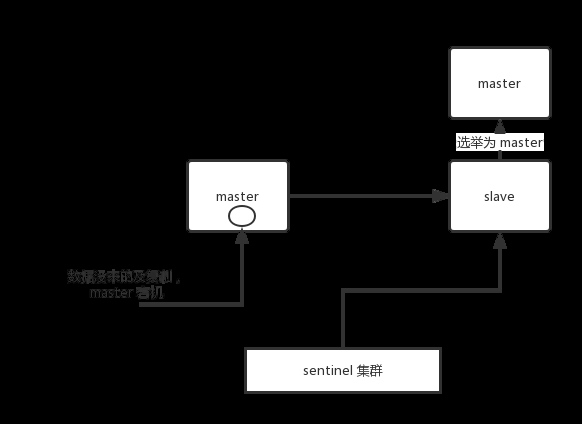

---

数据丢失问题的解决方案
进行如下配置：
表示，要求至少有 1 个 slave，数据复制和同步的延迟不能超过 10 秒。
如果说一旦所有的 slave，数据复制和同步的延迟都超过了 10 秒钟，那么这个时候，master 就
不会再接收任何请求了。
减少异步复制数据的丢失
有了 min-slaves-max-lag  这个配置，就可以确保说，一旦 slave 复制数据和 ack 延时太长，
就认为可能 master 宕机后损失的数据太多了，那么就拒绝写请求，这样可以把 master 宕机时
由于部分数据未同步到 slave 导致的数据丢失降低的可控范围内。
减少脑裂的数据丢失
min-slaves-to-write  
min-slaves-max-lag 
1
10
bash

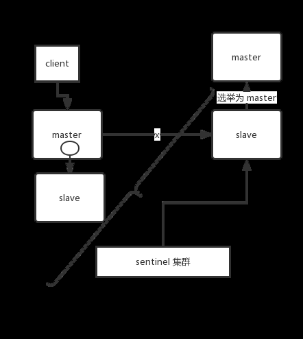

---

如果一个 master 出现了脑裂，跟其他 slave 丢了连接，那么上面两个配置可以确保说，如果不
能继续给指定数量的 slave 发送数据，而且 slave 超过 10 秒没有给自己 ack 消息，那么就直接
拒绝客户端的写请求。因此在脑裂场景下，最多就丢失 10 秒的数据。
sdown 和 odown 转换机制
sdown 是主观宕机，就一个哨兵如果自己觉得一个 master 宕机了，那么就是主观宕机
odown 是客观宕机，如果 quorum 数量的哨兵都觉得一个 master 宕机了，那么就是客观宕
机
sdown 达成的条件很简单，如果一个哨兵 ping 一个 master，超过了 is-master-down-after-
milliseconds  指定的毫秒数之后，就主观认为 master 宕机了；如果一个哨兵在指定时间内，
收到了 quorum 数量的其它哨兵也认为那个 master 是 sdown 的，那么就认为是 odown 了。
哨兵集群的自动发现机制
哨兵互相之间的发现，是通过 Redis 的 pub/sub  系统实现的，每个哨兵都会往 
__sentinel__:hello  这个 channel 里发送一个消息，这时候所有其他哨兵都可以消费到这个
消息，并感知到其他的哨兵的存在。
每隔两秒钟，每个哨兵都会往自己监控的某个 master+slaves 对应的 __sentinel__:hello
channel 里发送一个消息，内容是自己的 host、ip 和 runid 还有对这个 master 的监控配置。
每个哨兵也会去监听自己监控的每个 master+slaves 对应的 __sentinel__:hello  channel，
然后去感知到同样在监听这个 master+slaves 的其他哨兵的存在。
每个哨兵还会跟其他哨兵交换对 master  的监控配置，互相进行监控配置的同步。
slave 配置的自动纠正
哨兵会负责自动纠正 slave 的一些配置，比如 slave 如果要成为潜在的 master 候选人，哨兵会
确保 slave 复制现有 master 的数据；如果 slave 连接到了一个错误的 master 上，比如故障转移
之后，那么哨兵会确保它们连接到正确的 master 上。
slave->master 选举算法
如果一个 master 被认为 odown 了，而且 majority 数量的哨兵都允许主备切换，那么某个哨兵
就会执行主备切换操作，此时首先要选举一个 slave 来，会考虑 slave 的一些信息：

---

跟 master 断开连接的时长
slave 优先级
复制 owset
run id
如果一个 slave 跟 master 断开连接的时间已经超过了 down-after-milliseconds  的 10 倍，
外加 master 宕机的时长，那么 slave 就被认为不适合选举为 master。
接下来会对 slave 进行排序：
按照 slave 优先级进行排序，slave priority 越低，优先级就越高。
如果 slave priority 相同，那么看 replica owset，哪个 slave 复制了越多的数据，owset 越靠
后，优先级就越高。
如果上面两个条件都相同，那么选择一个 run id 比较小的那个 slave。
quorum 和 majority
每次一个哨兵要做主备切换，首先需要 quorum 数量的哨兵认为 odown，然后选举出一个哨兵
来做切换，这个哨兵还需要得到 majority 哨兵的授权，才能正式执行切换。
如果 quorum < majority，比如 5 个哨兵，majority 就是 3，quorum 设置为 2，那么就 3 个哨兵
授权就可以执行切换。
但是如果 quorum >= majority，那么必须 quorum 数量的哨兵都授权，比如 5 个哨兵，quorum
是 5，那么必须 5 个哨兵都同意授权，才能执行切换。
configuration epoch
哨兵会对一套 Redis master+slaves 进行监控，有相应的监控的配置。
执行切换的那个哨兵，会从要切换到的新 master（salve->master）那里得到一个 configuration
epoch，这就是一个 version 号，每次切换的 version 号都必须是唯一的。
如果第一个选举出的哨兵切换失败了，那么其他哨兵，会等待 failover-timeout 时间，然后接替
继续执行切换，此时会重新获取一个新的 configuration epoch，作为新的 version 号。
configuration 传播
(down-after-milliseconds * 10) + milliseconds_since_master_is_in_SDOWN_sta

---

哨兵完成切换之后，会在自己本地更新生成最新的 master 配置，然后同步给其他的哨兵，就是
通过之前说的 pub/sub  消息机制。
这里之前的 version 号就很重要了，因为各种消息都是通过一个 channel 去发布和监听的，所以
一个哨兵完成一次新的切换之后，新的 master 配置是跟着新的 version 号的。其他的哨兵都是
根据版本号的大小来更新自己的 master 配置的。
面试题
Redis 集群模式的工作原理能说一下么？在集群模式下，Redis 的 key 是如何寻址的？分布式寻
址都有哪些算法？了解一致性 hash 算法吗？
面试官心理分析
在前几年，Redis 如果要搞几个节点，每个节点存储一部分的数据，得借助一些中间件来实
现，比如说有 codis  ，或者 twemproxy  ，都有。有一些 Redis 中间件，你读写 Redis 中间
件，Redis 中间件负责将你的数据分布式存储在多台机器上的 Redis 实例中。
这两年，Redis 不断在发展，Redis 也不断有新的版本，现在的 Redis 集群模式，可以做到在多
台机器上，部署多个 Redis 实例，每个实例存储一部分的数据，同时每个 Redis 主实例可以挂
Redis 从实例，自动确保说，如果 Redis 主实例挂了，会自动切换到 Redis 从实例上来。
现在 Redis 的新版本，大家都是用 Redis cluster 的，也就是 Redis 原生支持的 Redis 集群模式，
那么面试官肯定会就 Redis cluster 对你来个几连炮。要是你没用过 Redis cluster，正常，以前很
多人用 codis 之类的客户端来支持集群，但是起码你得研究一下 Redis cluster 吧。
如果你的数据量很少，主要是承载高并发高性能的场景，比如你的缓存一般就几个 G，单机就
足够了，可以使用 replication，一个 master 多个 slaves，要几个 slave 跟你要求的读吞吐量有
关，然后自己搭建一个 sentinel 集群去保证 Redis 主从架构的高可用性。
Redis cluster，主要是针对海量数据+高并发+高可用的场景。Redis cluster 支撑 N 个 Redis
master node，每个 master node 都可以挂载多个 slave node。这样整个 Redis 就可以横向扩容
了。如果你要支撑更大数据量的缓存，那就横向扩容更多的 master 节点，每个 master 节点就
能存放更多的数据了。
面试题剖析
Redis cluster 介绍

---

自动将数据进行分片，每个 master 上放一部分数据
提供内置的高可用支持，部分 master 不可用时，还是可以继续工作的
在 Redis cluster 架构下，每个 Redis 要放开两个端口号，比如一个是 6379，另外一个就是 加1w
的端口号，比如 16379。
16379 端口号是用来进行节点间通信的，也就是 cluster bus 的东西，cluster bus 的通信，用来
进行故障检测、配置更新、故障转移授权。cluster bus 用了另外一种二进制的协议， gossip
协议，用于节点间进行高效的数据交换，占用更少的网络带宽和处理时间。
节点间的内部通信机制
基本通信原理
集群元数据的维护有两种方式：集中式、Gossip 协议。Redis cluster 节点间采用 gossip 协议进
行通信。
集中式是将集群元数据（节点信息、故障等等）几种存储在某个节点上。集中式元数据集中存
储的一个典型代表，就是大数据领域的 storm  。它是分布式的大数据实时计算引擎，是集中
式的元数据存储的结构，底层基于 zookeeper（分布式协调的中间件）对所有元数据进行存储
维护。
Redis 维护集群元数据采用另一个方式， gossip  协议，所有节点都持有一份元数据，不同的
节点如果出现了元数据的变更，就不断将元数据发送给其它的节点，让其它节点也进行元数据
的变更。

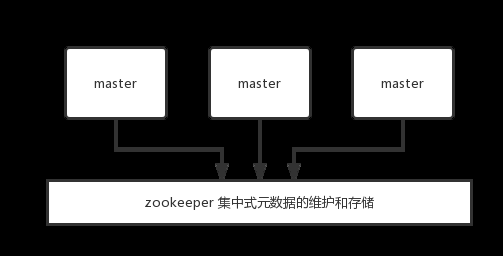

---

集中式的好处在于，元数据的读取和更新，时效性非常好，一旦元数据出现了变更，就立即更
新到集中式的存储中，其它节点读取的时候就可以感知到；不好在于，所有的元数据的更新压
力全部集中在一个地方，可能会导致元数据的存储有压力。
gossip 好处在于，元数据的更新比较分散，不是集中在一个地方，更新请求会陆陆续续打到所
有节点上去更新，降低了压力；不好在于，元数据的更新有延时，可能导致集群中的一些操作
会有一些滞后。
10000 端口：每个节点都有一个专门用于节点间通信的端口，就是自己提供服务的端口号
+10000，比如 7001，那么用于节点间通信的就是 17001 端口。每个节点每隔一段时间都会
往另外几个节点发送 ping  消息，同时其它几个节点接收到 ping  之后返回 pong  。
交换的信息：信息包括故障信息，节点的增加和删除，hash slot 信息等等。
gossip 协议
gossip 协议包含多种消息，包含 ping  , pong  , meet  , fail  等等。
meet：某个节点发送 meet 给新加入的节点，让新节点加入集群中，然后新节点就会开始与
其它节点进行通信。
其实内部就是发送了一个 gossip meet 消息给新加入的节点，通知那个节点去加入我们的集
群。
Redis-trib.rb add-node
bash

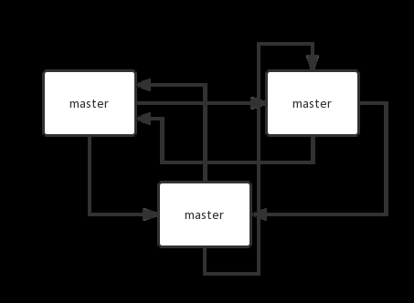

---

ping：每个节点都会频繁给其它节点发送 ping，其中包含自己的状态还有自己维护的集群
元数据，互相通过 ping 交换元数据。
pong：返回 ping 和 meeet，包含自己的状态和其它信息，也用于信息广播和更新。
fail：某个节点判断另一个节点 fail 之后，就发送 fail 给其它节点，通知其它节点说，某个节
点宕机啦。
ping 消息深入
ping 时要携带一些元数据，如果很频繁，可能会加重网络负担。
每个节点每秒会执行 10 次 ping，每次会选择 5 个最久没有通信的其它节点。当然如果发现某
个节点通信延时达到了 cluster_node_timeout / 2  ，那么立即发送 ping，避免数据交换延
时过长，落后的时间太长了。比如说，两个节点之间都 10 分钟没有交换数据了，那么整个集群
处于严重的元数据不一致的情况，就会有问题。所以 cluster_node_timeout  可以调节，如
果调得比较大，那么会降低 ping 的频率。
每次 ping，会带上自己节点的信息，还有就是带上 1/10 其它节点的信息，发送出去，进行交
换。至少包含 3  个其它节点的信息，最多包含 总节点数减 2  个其它节点的信息。
分布式寻址算法
hash 算法（大量缓存重建）
一致性 hash 算法（自动缓存迁移）+ 虚拟节点（自动负载均衡）
Redis cluster 的 hash slot 算法
hash 算法
来了一个 key，首先计算 hash 值，然后对节点数取模。然后打在不同的 master 节点上。一旦
某一个 master 节点宕机，所有请求过来，都会基于最新的剩余 master 节点数去取模，尝试去
取数据。这会导致大部分的请求过来，全部无法拿到有效的缓存，导致大量的流量涌入数据
库。

---

一致性 hash 算法
一致性 hash 算法将整个 hash 值空间组织成一个虚拟的圆环，整个空间按顺时针方向组织，下
一步将各个 master 节点（使用服务器的 ip 或主机名）进行 hash。这样就能确定每个节点在其
哈希环上的位置。
来了一个 key，首先计算 hash 值，并确定此数据在环上的位置，从此位置沿环顺时针“行走”，
遇到的第一个 master 节点就是 key 所在位置。
在一致性哈希算法中，如果一个节点挂了，受影响的数据仅仅是此节点到环空间前一个节点
（沿着逆时针方向行走遇到的第一个节点）之间的数据，其它不受影响。增加一个节点也同
理。
燃鹅，一致性哈希算法在节点太少时，容易因为节点分布不均匀而造成缓存热点的问题。为了
解决这种热点问题，一致性 hash 算法引入了虚拟节点机制，即对每一个节点计算多个 hash，
每个计算结果位置都放置一个虚拟节点。这样就实现了数据的均匀分布，负载均衡。

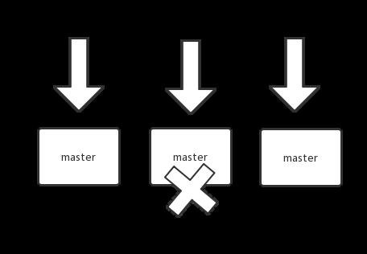

---

Redis cluster 的 hash slot 算法
Redis cluster 有固定的 16384  个 hash slot，对每个 key  计算 CRC16  值，然后对 16384
取模，可以获取 key 对应的 hash slot。
Redis cluster 中每个 master 都会持有部分 slot，比如有 3 个 master，那么可能每个 master 持有
5000 多个 hash slot。hash slot 让 node 的增加和移除很简单，增加一个 master，就将其他
master 的 hash slot 移动部分过去，减少一个 master，就将它的 hash slot 移动到其他 master 上
去。移动 hash slot 的成本是非常低的。客户端的 api，可以对指定的数据，让他们走同一个
hash slot，通过 hash tag  来实现。
任何一台机器宕机，另外两个节点，不影响的。因为 key 找的是 hash slot，不是机器。

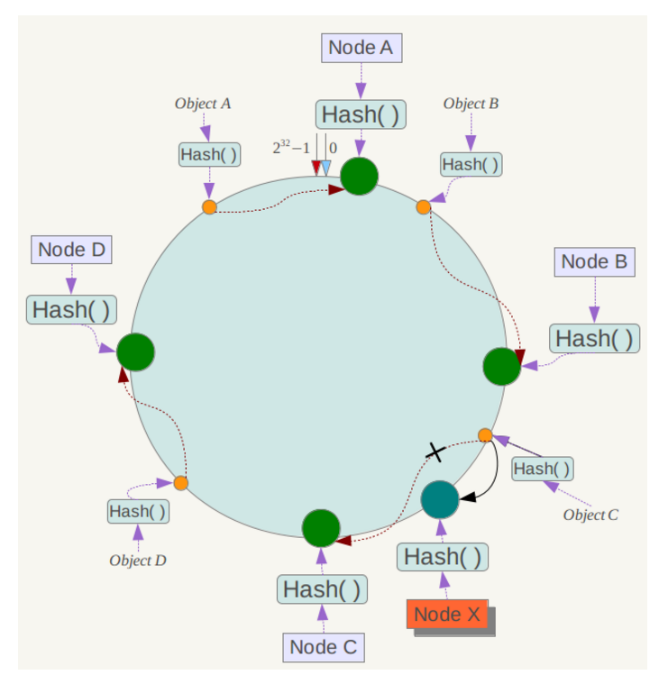

---

Redis cluster 的高可用与主备切换原理
Redis cluster 的高可用的原理，几乎跟哨兵是类似的。
判断节点宕机
如果一个节点认为另外一个节点宕机，那么就是 pfail  ，主观宕机。如果多个节点都认为另
外一个节点宕机了，那么就是 fail  ，客观宕机，跟哨兵的原理几乎一样，sdown，odown。
在 cluster-node-timeout  内，某个节点一直没有返回 pong  ，那么就被认为 pfail  。
如果一个节点认为某个节点 pfail  了，那么会在 gossip ping  消息中， ping  给其他节
点，如果超过半数的节点都认为 pfail  了，那么就会变成 fail  。
从节点过滤
对宕机的 master node，从其所有的 slave node 中，选择一个切换成 master node。
检查每个 slave node 与 master node 断开连接的时间，如果超过了 cluster-node-timeout * 
cluster-slave-validity-factor  ，那么就没有资格切换成 master  。
从节点选举
每个从节点，都根据自己对 master 复制数据的 owset，来设置一个选举时间，owset 越大（复
制数据越多）的从节点，选举时间越靠前，优先进行选举。
所有的 master node 开始 slave 选举投票，给要进行选举的 slave 进行投票，如果大部分 master
node （N/2 + 1） 都投票给了某个从节点，那么选举通过，那个从节点可以切换成 master。
从节点执行主备切换，从节点切换为主节点。
与哨兵比较

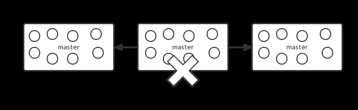

---

整个流程跟哨兵相比，非常类似，所以说，Redis cluster 功能强大，直接集成了 replication 和
sentinel 的功能。
面试题
了解什么是 Redis 的雪崩、穿透和击穿？Redis 崩溃之后会怎么样？系统该如何应对这种情况？
如何处理 Redis 的穿透？
面试官心理分析
其实这是问到缓存必问的，因为缓存雪崩和穿透，是缓存最大的两个问题，要么不出现，一旦
出现就是致命性的问题，所以面试官一定会问你。
面试题剖析
缓存雪崩
对于系统 A，假设每天高峰期每秒 5000 个请求，本来缓存在高峰期可以扛住每秒 4000 个请
求，但是缓存机器意外发生了全盘宕机。缓存挂了，此时 1 秒 5000 个请求全部落数据库，数据
库必然扛不住，它会报一下警，然后就挂了。此时，如果没有采用什么特别的方案来处理这个
故障，DBA 很着急，重启数据库，但是数据库立马又被新的流量给打死了。
这就是缓存雪崩。

---

大约在 3 年前，国内比较知名的一个互联网公司，曾因为缓存事故，导致雪崩，后台系统全部
崩溃，事故从当天下午持续到晚上凌晨 3~4 点，公司损失了几千万。
缓存雪崩的事前事中事后的解决方案如下：
事前：Redis 高可用，主从+哨兵，Redis cluster，避免全盘崩溃。
事中：本地 ehcache 缓存 + hystrix 限流&降级，避免 MySQL 被打死。
事后：Redis 持久化，一旦重启，自动从磁盘上加载数据，快速恢复缓存数据。

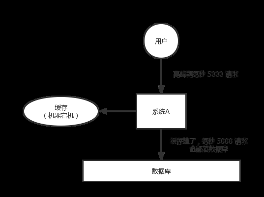

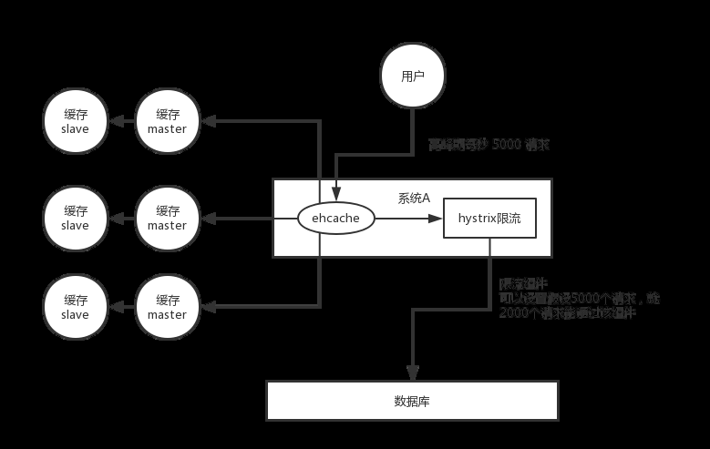

---

用户发送一个请求，系统 A 收到请求后，先查本地 ehcache 缓存，如果没查到再查 Redis。如
果 ehcache 和 Redis 都没有，再查数据库，将数据库中的结果，写入 ehcache 和 Redis 中。
限流组件，可以设置每秒的请求，有多少能通过组件，剩余的未通过的请求，怎么办？走降
级！可以返回一些默认的值，或者友情提示，或者空值。
好处：
数据库绝对不会死，限流组件确保了每秒只有多少个请求能通过。
只要数据库不死，就是说，对用户来说，2/5 的请求都是可以被处理的。
只要有 2/5 的请求可以被处理，就意味着你的系统没死，对用户来说，可能就是点击几次刷
不出来页面，但是多点几次，就可以刷出来了。
缓存穿透
对于系统A，假设一秒 5000 个请求，结果其中 4000 个请求是黑客发出的恶意攻击。
黑客发出的那 4000 个攻击，缓存中查不到，每次你去数据库里查，也查不到。
举个栗子。数据库 id 是从 1 开始的，结果黑客发过来的请求 id 全部都是负数。这样的话，缓
存中不会有，请求每次都“视缓存于无物”，直接查询数据库。这种恶意攻击场景的缓存穿透就
会直接把数据库给打死。
解决方式很简单，每次系统 A 从数据库中只要没查到，就写一个空值到缓存里去，比如 set 
-999 UNKNOWN  。然后设置一个过期时间，这样的话，下次有相同的 key 来访问的时候，在缓

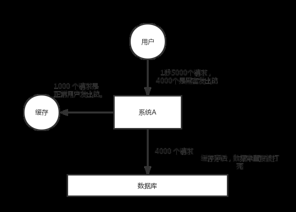

---

存失效之前，都可以直接从缓存中取数据。
缓存击穿
缓存击穿，就是说某个 key 非常热点，访问非常频繁，处于集中式高并发访问的情况，当这个
key 在失效的瞬间，大量的请求就击穿了缓存，直接请求数据库，就像是在一道屏障上凿开了
一个洞。
不同场景下的解决方式可如下：
若缓存的数据是基本不会发生更新的，则可尝试将该热点数据设置为永不过期。
若缓存的数据更新不频繁，且缓存刷新的整个流程耗时较少的情况下，则可以采用基于
Redis、zookeeper 等分布式中间件的分布式互斥锁，或者本地互斥锁以保证仅少量的请求能
请求数据库并重新构建缓存，其余线程则在锁释放后能访问到新缓存。
若缓存的数据更新频繁或者在缓存刷新的流程耗时较长的情况下，可以利用定时线程在缓
存过期前主动地重新构建缓存或者延后缓存的过期时间，以保证所有的请求能一直访问到
对应的缓存。
面试题
如何保证缓存与数据库的双写一致性？
面试官心理分析
你只要用缓存，就可能会涉及到缓存与数据库双存储双写，你只要是双写，就一定会有数据一
致性的问题，那么你如何解决一致性问题？
面试题剖析
一般来说，如果允许缓存可以稍微的跟数据库偶尔有不一致的情况，也就是说如果你的系统不
是严格要求 “缓存+数据库” 必须保持一致性的话，最好不要做这个方案，即：读请求和写请
求串行化，串到一个内存队列里去。
串行化可以保证一定不会出现不一致的情况，但是它也会导致系统的吞吐量大幅度降低，用比
正常情况下多几倍的机器去支撑线上的一个请求。
Cache Aside Pattern
最经典的缓存+数据库读写的模式，就是 Cache Aside Pattern。

---

读的时候，先读缓存，缓存没有的话，就读数据库，然后取出数据后放入缓存，同时返回
响应。
更新的时候，先更新数据库，然后再删除缓存。
为什么是删除缓存，而不是更新缓存？
原因很简单，很多时候，在复杂点的缓存场景，缓存不单单是数据库中直接取出来的值。
比如可能更新了某个表的一个字段，然后其对应的缓存，是需要查询另外两个表的数据并进行
运算，才能计算出缓存最新的值的。
另外更新缓存的代价有时候是很高的。是不是说，每次修改数据库的时候，都一定要将其对应
的缓存更新一份？也许有的场景是这样，但是对于比较复杂的缓存数据计算的场景，就不是
这样了。如果你频繁修改一个缓存涉及的多个表，缓存也频繁更新。但是问题在于，这个缓存
到底会不会被频繁访问到？
举个栗子，一个缓存涉及的表的字段，在 1 分钟内就修改了 20 次，或者是 100 次，那么缓存更
新 20 次、100 次；但是这个缓存在 1 分钟内只被读取了 1 次，有大量的冷数据。实际上，如
果你只是删除缓存的话，那么在 1 分钟内，这个缓存不过就重新计算一次而已，开销大幅度降
低。用到缓存才去算缓存。
其实删除缓存，而不是更新缓存，就是一个 lazy 计算的思想，不要每次都重新做复杂的计算，
不管它会不会用到，而是让它到需要被使用的时候再重新计算。像 mybatis，hibernate，都有
懒加载思想。查询一个部门，部门带了一个员工的 list，没有必要说每次查询部门，都把里面的
1000 个员工的数据也同时查出来啊。80% 的情况，查这个部门，就只是要访问这个部门的信息
就可以了。先查部门，同时要访问里面的员工，那么这个时候只有在你要访问里面的员工的时
候，才会去数据库里面查询 1000 个员工。
最初级的缓存不一致问题及解决方案
问题：先更新数据库，再删除缓存。如果删除缓存失败了，那么会导致数据库中是新数据，缓
存中是旧数据，数据就出现了不一致。

---

解决思路：先删除缓存，再更新数据库。如果数据库更新失败了，那么数据库中是旧数据，缓
存中是空的，那么数据不会不一致。因为读的时候缓存没有，所以去读了数据库中的旧数据，
然后更新到缓存中。
比较复杂的数据不一致问题分析
数据发生了变更，先删除了缓存，然后要去修改数据库，此时还没修改。一个请求过来，去读
缓存，发现缓存空了，去查询数据库，查到了修改前的旧数据，放到了缓存中。随后数据变
更的程序完成了数据库的修改。完了，数据库和缓存中的数据不一样了...
为什么上亿流量高并发场景下，缓存会出现这个问题？
只有在对一个数据在并发的进行读写的时候，才可能会出现这种问题。其实如果说你的并发量
很低的话，特别是读并发很低，每天访问量就 1 万次，那么很少的情况下，会出现刚才描述的
那种不一致的场景。但是问题是，如果每天的是上亿的流量，每秒并发读是几万，每秒只要有
数据更新的请求，就可能会出现上述的数据库+缓存不一致的情况。
解决方案如下：
更新数据的时候，根据数据的唯一标识，将操作路由之后，发送到一个 jvm 内部队列中。读取
数据的时候，如果发现数据不在缓存中，那么将重新执行“读取数据+更新缓存”的操作，根据唯
一标识路由之后，也发送到同一个 jvm 内部队列中。
一个队列对应一个工作线程，每个工作线程串行拿到对应的操作，然后一条一条的执行。这样
的话，一个数据变更的操作，先删除缓存，然后再去更新数据库，但是还没完成更新。此时如
果一个读请求过来，没有读到缓存，那么可以先将缓存更新的请求发送到队列中，此时会在队
列中积压，然后同步等待缓存更新完成。

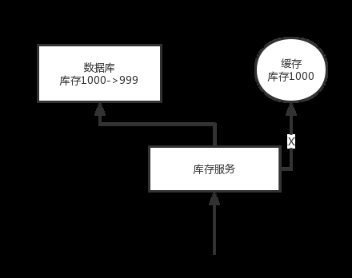

---

这里有一个优化点，一个队列中，其实多个更新缓存请求串在一起是没意义的，因此可以做
过滤，如果发现队列中已经有一个更新缓存的请求了，那么就不用再放个更新请求操作进去
了，直接等待前面的更新操作请求完成即可。
待那个队列对应的工作线程完成了上一个操作的数据库的修改之后，才会去执行下一个操作，
也就是缓存更新的操作，此时会从数据库中读取最新的值，然后写入缓存中。
如果请求还在等待时间范围内，不断轮询发现可以取到值了，那么就直接返回；如果请求等待
的时间超过一定时长，那么这一次直接从数据库中读取当前的旧值。
高并发的场景下，该解决方案要注意的问题：
读请求长时阻塞
由于读请求进行了非常轻度的异步化，所以一定要注意读超时的问题，每个读请求必须在超时
时间范围内返回。
该解决方案，最大的风险点在于说，可能数据更新很频繁，导致队列中积压了大量更新操作
在里面，然后读请求会发生大量的超时，最后导致大量的请求直接走数据库。务必通过一些
模拟真实的测试，看看更新数据的频率是怎样的。
另外一点，因为一个队列中，可能会积压针对多个数据项的更新操作，因此需要根据自己的业
务情况进行测试，可能需要部署多个服务，每个服务分摊一些数据的更新操作。如果一个内存
队列里居然会挤压 100 个商品的库存修改操作，每个库存修改操作要耗费 10ms 去完成，那么
最后一个商品的读请求，可能等待 10 * 100 = 1000ms = 1s 后，才能得到数据，这个时候就导致
读请求的长时阻塞。
一定要做根据实际业务系统的运行情况，去进行一些压力测试，和模拟线上环境，去看看最繁
忙的时候，内存队列可能会挤压多少更新操作，可能会导致最后一个更新操作对应的读请求，
会 hang 多少时间，如果读请求在 200ms 返回，如果你计算过后，哪怕是最繁忙的时候，积压
10 个更新操作，最多等待 200ms，那还可以的。
如果一个内存队列中可能积压的更新操作特别多，那么你就要加机器，让每个机器上部署
的服务实例处理更少的数据，那么每个内存队列中积压的更新操作就会越少。
其实根据之前的项目经验，一般来说，数据的写频率是很低的，因此实际上正常来说，在队列
中积压的更新操作应该是很少的。像这种针对读高并发、读缓存架构的项目，一般来说写请求
是非常少的，每秒的 QPS 能到几百就不错了。
我们来实际粗略测算一下。
如果一秒有 500 的写操作，如果分成 5 个时间片，每 200ms 就 100 个写操作，放到 20 个内存
队列中，每个内存队列，可能就积压 5 个写操作。每个写操作性能测试后，一般是在 20ms 左
右就完成，那么针对每个内存队列的数据的读请求，也就最多 hang 一会儿，200ms 以内肯定
能返回了。

---

经过刚才简单的测算，我们知道，单机支撑的写 QPS 在几百是没问题的，如果写 QPS 扩大了
10 倍，那么就扩容机器，扩容 10 倍的机器，每个机器 20 个队列。
读请求并发量过高
这里还必须做好压力测试，确保恰巧碰上上述情况的时候，还有一个风险，就是突然间大量读
请求会在几十毫秒的延时 hang 在服务上，看服务能不能扛的住，需要多少机器才能扛住最大
的极限情况的峰值。
但是因为并不是所有的数据都在同一时间更新，缓存也不会同一时间失效，所以每次可能也就
是少数数据的缓存失效了，然后那些数据对应的读请求过来，并发量应该也不会特别大。
多服务实例部署的请求路由
可能这个服务部署了多个实例，那么必须保证说，执行数据更新操作，以及执行缓存更新操作
的请求，都通过 Nginx 服务器路由到相同的服务实例上。
比如说，对同一个商品的读写请求，全部路由到同一台机器上。可以自己去做服务间的按照某
个请求参数的 hash 路由，也可以用 Nginx 的 hash 路由功能等等。
热点商品的路由问题，导致请求的倾斜
万一某个商品的读写请求特别高，全部打到相同的机器的相同的队列里面去了，可能会造成某
台机器的压力过大。就是说，因为只有在商品数据更新的时候才会清空缓存，然后才会导致读
写并发，所以其实要根据业务系统去看，如果更新频率不是太高的话，这个问题的影响并不是
特别大，但是的确可能某些机器的负载会高一些。
关于这道面试题的详细讨论，见 #54。
面试题
Redis 的并发竞争问题是什么？如何解决这个问题？了解 Redis 事务的 CAS 方案吗？
面试官心理分析
这个也是线上非常常见的一个问题，就是多客户端同时并发写一个 key，可能本来应该先到的
数据后到了，导致数据版本错了；或者是多客户端同时获取一个 key，修改值之后再写回去，
只要顺序错了，数据就错了。
而且 Redis 自己就有天然解决这个问题的 CAS 类的乐观锁方案。

---

面试题剖析
某个时刻，多个系统实例都去更新某个 key。可以基于 zookeeper 实现分布式锁。每个系统通
过 zookeeper 获取分布式锁，确保同一时间，只能有一个系统实例在操作某个 key，别人都不
允许读和写。
你要写入缓存的数据，都是从 mysql 里查出来的，都得写入 mysql 中，写入 mysql 中的时候必
须保存一个时间戳，从 mysql 查出来的时候，时间戳也查出来。
每次要写之前，先判断一下当前这个 value 的时间戳是否比缓存里的 value 的时间戳要新。如
果是的话，那么可以写，否则，就不能用旧的数据覆盖新的数据。
面试题
生产环境中的 Redis 是怎么部署的？
面试官心理分析
看看你了解不了解你们公司的 Redis 生产集群的部署架构，如果你不了解，那么确实你就很失
职了，你的 Redis 是主从架构？集群架构？用了哪种集群方案？有没有做高可用保证？有没有

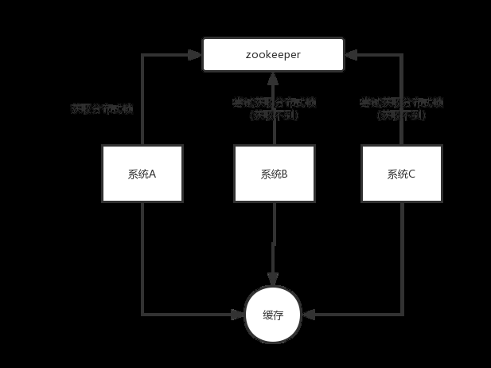

---

开启持久化机制确保可以进行数据恢复？线上 Redis 给几个 G 的内存？设置了哪些参数？压测
后你们 Redis 集群承载多少 QPS？
兄弟，这些你必须是门儿清的，否则你确实是没好好思考过。
面试题剖析
Redis cluster，10 台机器，5 台机器部署了 Redis 主实例，另外 5 台机器部署了 Redis 的从实
例，每个主实例挂了一个从实例，5 个节点对外提供读写服务，每个节点的读写高峰 QPS 可能
可以达到每秒 5 万，5 台机器最多是 25 万读写请求每秒。
机器是什么配置？32G 内存+ 8 核 CPU + 1T 磁盘，但是分配给 Redis 进程的是 10g 内存，一般线
上生产环境，Redis 的内存尽量不要超过 10g，超过 10g 可能会有问题。
5 台机器对外提供读写，一共有 50g 内存。
因为每个主实例都挂了一个从实例，所以是高可用的，任何一个主实例宕机，都会自动故障迁
移，Redis 从实例会自动变成主实例继续提供读写服务。
你往内存里写的是什么数据？每条数据的大小是多少？商品数据，每条数据是 10kb。100 条数
据是 1mb，10 万条数据是 1g。常驻内存的是 200 万条商品数据，占用内存是 20g，仅仅不到总
内存的 50%。目前高峰期每秒就是 3500 左右的请求量。
其实大型的公司，会有基础架构的 team 负责缓存集群的运维。
面试题
为什么要分库分表（设计高并发系统的时候，数据库层面该如何设计）？用过哪些分库分表中
间件？不同的分库分表中间件都有什么优点和缺点？你们具体是如何对数据库如何进行垂直拆
分或水平拆分的？
面试官心理分析
其实这块肯定是扯到高并发了，因为分库分表一定是为了支撑高并发、数据量大两个问题
的。而且现在说实话，尤其是互联网类的公司面试，基本上都会来这么一下，分库分表如此普
遍的技术问题，不问实在是不行，而如果你不知道那也实在是说不过去！
面试题剖析

---

为什么要分库分表？（设计高并发系统的时候，数据库层
面该如何设计？）
说白了，分库分表是两回事儿，大家可别搞混了，可能是光分库不分表，也可能是光分表不分
库，都有可能。
我先给大家抛出来一个场景。
假如我们现在是一个小创业公司（或者是一个 BAT 公司刚兴起的一个新部门），现在注册用户
就 20 万，每天活跃用户就 1 万，每天单表数据量就 1000，然后高峰期每秒钟并发请求最多就
10 个。我的天，就这种系统，随便找一个有几年工作经验的，然后带几个刚培训出来的，随便
干干都可以。
结果没想到我们运气居然这么好，碰上个 CEO 带着我们走上了康庄大道，业务发展迅猛，过了
几个月，注册用户数达到了 2000 万！每天活跃用户数 100 万！每天单表数据量 10 万条！高峰
期每秒最大请求达到 1000！同时公司还顺带着融资了两轮，进账了几个亿人民币啊！公司估值
达到了惊人的几亿美金！这是小独角兽的节奏！
好吧，没事，现在大家感觉压力已经有点大了，为啥呢？因为每天多 10 万条数据，一个月就多
300 万条数据，现在咱们单表已经几百万数据了，马上就破千万了。但是勉强还能撑着。高峰
期请求现在是 1000，咱们线上部署了几台机器，负载均衡搞了一下，数据库撑 1000QPS 也还凑
合。但是大家现在开始感觉有点担心了，接下来咋整呢......
再接下来几个月，我的天，CEO 太牛逼了，公司用户数已经达到 1 亿，公司继续融资几十亿人
民币啊！公司估值达到了惊人的几十亿美金，成为了国内今年最牛逼的明星创业公司！天，我
们太幸运了。
但是我们同时也是不幸的，因为此时每天活跃用户数上千万，每天单表新增数据多达 50 万，目
前一个表总数据量都已经达到了两三千万了！扛不住啊！数据库磁盘容量不断消耗掉！高峰期
并发达到惊人的 5000~8000  ！别开玩笑了，哥。我跟你保证，你的系统支撑不到现在，已经
挂掉了！
好吧，所以你看到这里差不多就理解分库分表是怎么回事儿了，实际上这是跟着你的公司业务
发展走的，你公司业务发展越好，用户就越多，数据量越大，请求量越大，那你单个数据库一
定扛不住。
分表
比如你单表都几千万数据了，你确定你能扛住么？绝对不行，单表数据量太大，会极大影响你
的 sql 执行的性能，到了后面你的 sql 可能就跑的很慢了。一般来说，就以我的经验来看，单
表到几百万的时候，性能就会相对差一些了，你就得分表了。
分表是啥意思？就是把一个表的数据放到多个表中，然后查询的时候你就查一个表。比如按照
用户 id 来分表，将一个用户的数据就放在一个表中。然后操作的时候你对一个用户就操作那个

---

表就好了。这样可以控制每个表的数据量在可控的范围内，比如每个表就固定在 200 万以内。
分库
分库是啥意思？就是你一个库一般我们经验而言，最多支撑到并发 2000，一定要扩容了，而且
一个健康的单库并发值你最好保持在每秒 1000 左右，不要太大。那么你可以将一个库的数据拆
分到多个库中，访问的时候就访问一个库好了。
这就是所谓的分库分表，为啥要分库分表？你明白了吧。
#
分库分表前
分库分表后
并发支撑
情况
MySQL 单机部署，扛不住
高并发
MySQL从单机到多机，能承受的并发增加了
多倍
磁盘使用
情况
MySQL 单机磁盘容量几乎
撑满
拆分为多个库，数据库服务器磁盘使用率大
大降低
SQL 执行性
能
单表数据量太大，SQL 越跑
越慢
单表数据量减少，SQL 执行效率明显提升
用过哪些分库分表中间件？不同的分库分表中间件都有什
么优点和缺点？
这个其实就是看看你了解哪些分库分表的中间件，各个中间件的优缺点是啥？然后你用过哪些
分库分表的中间件。
比较常见的包括：
Cobar
TDDL
Atlas
Sharding-jdbc
Mycat
Cobar
阿里 b2b 团队开发和开源的，属于 proxy 层方案，就是介于应用服务器和数据库服务器之间。
应用程序通过 JDBC 驱动访问 Cobar 集群，Cobar 根据 SQL 和分库规则对 SQL 做分解，然后分
发到 MySQL 集群不同的数据库实例上执行。早些年还可以用，但是最近几年都没更新了，基本
没啥人用，差不多算是被抛弃的状态吧。而且不支持读写分离、存储过程、跨库 join 和分页等
操作。
TDDL

---

淘宝团队开发的，属于 client 层方案。支持基本的 crud 语法和读写分离，但不支持 join、多表
查询等语法。目前使用的也不多，因为还依赖淘宝的 diamond 配置管理系统。
Atlas
360 开源的，属于 proxy 层方案，以前是有一些公司在用的，但是确实有一个很大的问题就是
社区最新的维护都在 5 年前了。所以，现在用的公司基本也很少了。
Sharding-jdbc
当当开源的，属于 client 层方案，是 ShardingSphere  的 client 层方案， ShardingSphere
还提供 proxy 层的方案 Sharding-Proxy。确实之前用的还比较多一些，因为 SQL 语法支持也比
较多，没有太多限制，而且截至 2019.4，已经推出到了 4.0.0-RC1  版本，支持分库分表、读
写分离、分布式 id 生成、柔性事务（最大努力送达型事务、TCC 事务）。而且确实之前使用的
公司会比较多一些（这个在官网有登记使用的公司，可以看到从 2017 年一直到现在，是有不少
公司在用的），目前社区也还一直在开发和维护，还算是比较活跃，个人认为算是一个现在也
可以选择的方案。
Mycat
基于 Cobar 改造的，属于 proxy 层方案，支持的功能非常完善，而且目前应该是非常火的而且
不断流行的数据库中间件，社区很活跃，也有一些公司开始在用了。但是确实相比于 Sharding
jdbc 来说，年轻一些，经历的锤炼少一些。
总结
综上，现在其实建议考量的，就是 Sharding-jdbc 和 Mycat，这两个都可以去考虑使用。
Sharding-jdbc 这种 client 层方案的优点在于不用部署，运维成本低，不需要代理层的二次
转发请求，性能很高，但是如果遇到升级啥的需要各个系统都重新升级版本再发布，各个系
统都需要耦合 Sharding-jdbc 的依赖；
Mycat 这种 proxy 层方案的缺点在于需要部署，自己运维一套中间件，运维成本高，但是好处
在于对于各个项目是透明的，如果遇到升级之类的都是自己中间件那里搞就行了。
通常来说，这两个方案其实都可以选用，但是我个人建议中小型公司选用 Sharding-jdbc，client
层方案轻便，而且维护成本低，不需要额外增派人手，而且中小型公司系统复杂度会低一些，
项目也没那么多；但是中大型公司最好还是选用 Mycat 这类 proxy 层方案，因为可能大公司系
统和项目非常多，团队很大，人员充足，那么最好是专门弄个人来研究和维护 Mycat，然后大
量项目直接透明使用即可。

---

你们具体是如何对数据库如何进行垂直拆分或水平拆分
的？
水平拆分的意思，就是把一个表的数据给弄到多个库的多个表里去，但是每个库的表结构都一
样，只不过每个库表放的数据是不同的，所有库表的数据加起来就是全部数据。水平拆分的意
义，就是将数据均匀放更多的库里，然后用多个库来扛更高的并发，还有就是用多个库的存储
容量来进行扩容。
垂直拆分的意思，就是把一个有很多字段的表给拆分成多个表，或者是多个库上去。每个
库表的结构都不一样，每个库表都包含部分字段。一般来说，会将较少的访问频率很高的字
段放到一个表里去，然后将较多的访问频率很低的字段放到另外一个表里去。因为数据库
是有缓存的，你访问频率高的行字段越少，就可以在缓存里缓存更多的行，性能就越好。这个
一般在表层面做的较多一些。
这个其实挺常见的，不一定我说，大家很多同学可能自己都做过，把一个大表拆开，订单表、
订单支付表、订单商品表。

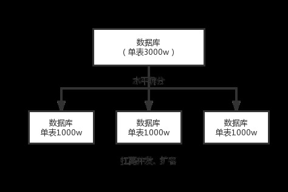

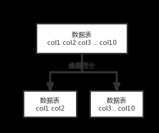

---

还有表层面的拆分，就是分表，将一个表变成 N 个表，就是让每个表的数据量控制在一定范
围内，保证 SQL 的性能。否则单表数据量越大，SQL 性能就越差。一般是 200 万行左右，不要
太多，但是也得看具体你怎么操作，也可能是 500 万，或者是 100 万。你的SQL越复杂，就最
好让单表行数越少。
好了，无论分库还是分表，上面说的那些数据库中间件都是可以支持的。就是基本上那些中间
件可以做到你分库分表之后，中间件可以根据你指定的某个字段值，比如说 userid，自动路
由到对应的库上去，然后再自动路由到对应的表里去。
你就得考虑一下，你的项目里该如何分库分表？一般来说，垂直拆分，你可以在表层面来做，
对一些字段特别多的表做一下拆分；水平拆分，你可以说是并发承载不了，或者是数据量太
大，容量承载不了，你给拆了，按什么字段来拆，你自己想好；分表，你考虑一下，你如果哪
怕是拆到每个库里去，并发和容量都 ok 了，但是每个库的表还是太大了，那么你就分表，将
这个表分开，保证每个表的数据量并不是很大。
而且这儿还有两种分库分表的方式：
一种是按照 range 来分，就是每个库一段连续的数据，这个一般是按比如时间范围来的，
但是这种一般较少用，因为很容易产生热点问题，大量的流量都打在最新的数据上了。
或者是按照某个字段 hash 一下均匀分散，这个较为常用。
range 来分，好处在于说，扩容的时候很简单，因为你只要预备好，给每个月都准备一个库就
可以了，到了一个新的月份的时候，自然而然，就会写新的库了；缺点，但是大部分的请求，
都是访问最新的数据。实际生产用 range，要看场景。
hash 分发，好处在于说，可以平均分配每个库的数据量和请求压力；坏处在于说扩容起来比较
麻烦，会有一个数据迁移的过程，之前的数据需要重新计算 hash 值重新分配到不同的库或表。
面试题
现在有一个未分库分表的系统，未来要分库分表，如何设计才可以让系统从未分库分表动态切
换到分库分表上？
面试官心理分析
你看看，你现在已经明白为啥要分库分表了，你也知道常用的分库分表中间件了，你也设计好
你们如何分库分表的方案了（水平拆分、垂直拆分、分表），那问题来了，你接下来该怎么把
你那个单库单表的系统给迁移到分库分表上去？
所以这都是一环扣一环的，就是看你有没有全流程经历过这个过程。

---

面试题剖析
这个其实从 low 到高大上有好几种方案，我们都玩儿过，我都给你说一下。
停机迁移方案
我先给你说一个最 low 的方案，就是很简单，大家伙儿凌晨 12 点开始运维，网站或者 app 挂
个公告，说 0 点到早上 6 点进行运维，无法访问。
接着到 0 点停机，系统停掉，没有流量写入了，此时老的单库单表数据库静止了。然后你之前
得写好一个导数的一次性工具，此时直接跑起来，然后将单库单表的数据哗哗哗读出来，写
到分库分表里面去。
导数完了之后，就 ok 了，修改系统的数据库连接配置啥的，包括可能代码和 SQL 也许有修
改，那你就用最新的代码，然后直接启动连到新的分库分表上去。
验证一下，ok了，完美，大家伸个懒腰，看看看凌晨 4 点钟的北京夜景，打个滴滴回家吧。
但是这个方案比较 low，谁都能干，我们来看看高大上一点的方案。
双写迁移方案

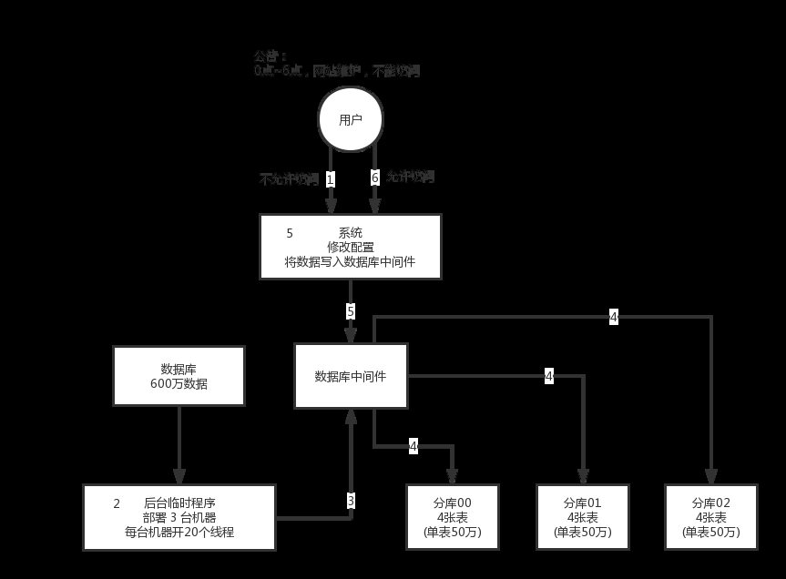

---

这个是我们常用的一种迁移方案，比较靠谱一些，不用停机，不用看北京凌晨 4 点的风景。
简单来说，就是在线上系统里面，之前所有写库的地方，增删改操作，除了对老库增删改，
都加上对新库的增删改，这就是所谓的双写，同时写俩库，老库和新库。
然后系统部署之后，新库数据差太远，用之前说的导数工具，跑起来读老库数据写新库，写的
时候要根据 gmt_modified 这类字段判断这条数据最后修改的时间，除非是读出来的数据在新库
里没有，或者是比新库的数据新才会写。简单来说，就是不允许用老数据覆盖新数据。
导完一轮之后，有可能数据还是存在不一致，那么就程序自动做一轮校验，比对新老库每个表
的每条数据，接着如果有不一样的，就针对那些不一样的，从老库读数据再次写。反复循环，
直到两个库每个表的数据都完全一致为止。
接着当数据完全一致了，就 ok 了，基于仅仅使用分库分表的最新代码，重新部署一次，不就
仅仅基于分库分表在操作了么，还没有几个小时的停机时间，很稳。所以现在基本玩儿数据迁
移之类的，都是这么干的。
面试题
如何设计可以动态扩容缩容的分库分表方案？

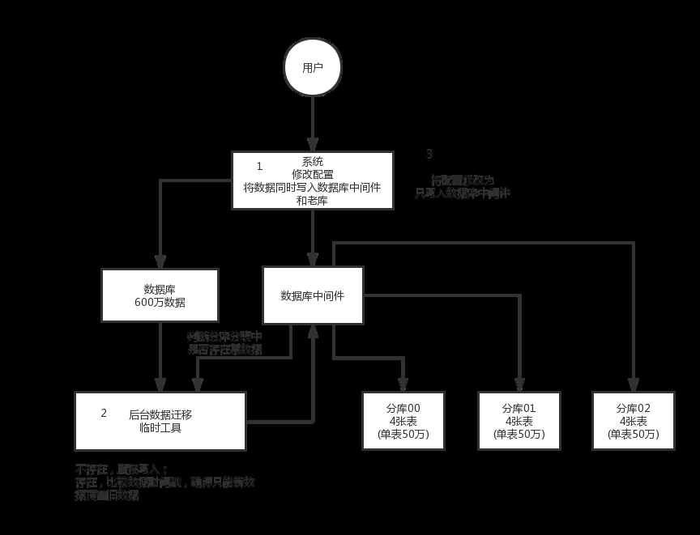

---

面试官心理分析
对于分库分表来说，主要是面对以下问题：
选择一个数据库中间件，调研、学习、测试；
设计你的分库分表的一个方案，你要分成多少个库，每个库分成多少个表，比如 3 个库，
每个库 4 个表；
基于选择好的数据库中间件，以及在测试环境建立好的分库分表的环境，然后测试一下能
否正常进行分库分表的读写；
完成单库单表到分库分表的迁移，双写方案；
线上系统开始基于分库分表对外提供服务；
扩容了，扩容成 6 个库，每个库需要 12 个表，你怎么来增加更多库和表呢？
这个是你必须面对的一个事儿，就是你已经弄好分库分表方案了，然后一堆库和表都建好了，
基于分库分表中间件的代码开发啥的都好了，测试都 ok 了，数据能均匀分布到各个库和各个
表里去，而且接着你还通过双写的方案咔嚓一下上了系统，已经直接基于分库分表方案在搞
了。
那么现在问题来了，你现在这些库和表又支撑不住了，要继续扩容咋办？这个可能就是说你的
每个库的容量又快满了，或者是你的表数据量又太大了，也可能是你每个库的写并发太高了，
你得继续扩容。
这都是玩儿分库分表线上必须经历的事儿。
面试题剖析
停机扩容（不推荐）
这个方案就跟停机迁移一样，步骤几乎一致，唯一的一点就是那个导数的工具，是把现有库表
的数据抽出来慢慢倒入到新的库和表里去。但是最好别这么玩儿，有点不太靠谱，因为既然分
库分表就说明数据量实在是太大了，可能多达几亿条，甚至几十亿，你这么玩儿，可能会出问
题。
从单库单表迁移到分库分表的时候，数据量并不是很大，单表最大也就两三千万。那么你写个
工具，多弄几台机器并行跑，1小时数据就导完了。这没有问题。
如果 3 个库 + 12 个表，跑了一段时间了，数据量都 1~2 亿了。光是导 2 亿数据，都要导个几个
小时，6 点，刚刚导完数据，还要搞后续的修改配置，重启系统，测试验证，10 点才可以搞
完。所以不能这么搞。
优化后的方案

---

一开始上来就是 32 个库，每个库 32 个表，那么总共是 1024 张表。
我可以告诉各位同学，这个分法，第一，基本上国内的互联网肯定都是够用了，第二，无论是
并发支撑还是数据量支撑都没问题。
每个库正常承载的写入并发量是 1000，那么 32 个库就可以承载 32 * 1000 = 32000 的写并发，
如果每个库承载 1500 的写并发，32 * 1500 = 48000 的写并发，接近 5 万每秒的写入并发，前面
再加一个MQ，削峰，每秒写入 MQ 8 万条数据，每秒消费 5 万条数据。
有些除非是国内排名非常靠前的这些公司，他们的最核心的系统的数据库，可能会出现几百台
数据库的这么一个规模，128 个库，256 个库，512 个库。
1024 张表，假设每个表放 500 万数据，在 MySQL 里可以放 50 亿条数据。
每秒 5 万的写并发，总共 50 亿条数据，对于国内大部分的互联网公司来说，其实一般来说都够
了。
谈分库分表的扩容，第一次分库分表，就一次性给他分个够，32 个库，1024 张表，可能对
大部分的中小型互联网公司来说，已经可以支撑好几年了。
一个实践是利用 32 * 32  来分库分表，即分为 32 个库，每个库里一个表分为 32 张表。一共
就是 1024 张表。根据某个 id 先根据 32 取模路由到库，再根据 32 取模路由到库里的表。
orderId
id % 32 (库)
id / 32 % 32 (表)
259
3
8
1189
5
5
352
0
11
4593
17
15
刚开始的时候，这个库可能就是逻辑库，建在一个数据库上的，就是一个 MySQL 服务器可能建
了 n 个库，比如 32 个库。后面如果要拆分，就是不断在库和 MySQL 服务器之间做迁移就可以
了。然后系统配合改一下配置即可。
比如说最多可以扩展到 32 个数据库服务器，每个数据库服务器是一个库。如果还是不够？最多
可以扩展到 1024 个数据库服务器，每个数据库服务器上面一个库一个表。因为最多是 1024 个
表。
这么搞，是不用自己写代码做数据迁移的，都交给 DBA 来搞好了，但是 DBA 确实是需要做一些
库表迁移的工作，但是总比你自己写代码，然后抽数据导数据来的效率高得多吧。
哪怕是要减少库的数量，也很简单，其实说白了就是按倍数缩容就可以了，然后修改一下路由
规则。
这里对步骤做一个总结：

---

1. 设定好几台数据库服务器，每台服务器上几个库，每个库多少个表，推荐是 32 库 * 32 表，
对于大部分公司来说，可能几年都够了。
2. 路由的规则，orderId 模 32 = 库，orderId / 32 模 32 = 表
3. 扩容的时候，申请增加更多的数据库服务器，装好 MySQL，呈倍数扩容，4 台服务器，扩到
8 台服务器，再到 16 台服务器。
4. 由 DBA 负责将原先数据库服务器的库，迁移到新的数据库服务器上去，库迁移是有一些便
捷的工具的。
5. 我们这边就是修改一下配置，调整迁移的库所在数据库服务器的地址。
6. 重新发布系统，上线，原先的路由规则变都不用变，直接可以基于 n 倍的数据库服务器的
资源，继续进行线上系统的提供服务。
面试题
分库分表之后，id 主键如何处理？
面试官心理分析
其实这是分库分表之后你必然要面对的一个问题，就是 id 咋生成？因为要是分成多个表之后，
每个表都是从 1 开始累加，那肯定不对啊，需要一个全局唯一的 id 来支持。所以这都是你实
际生产环境中必须考虑的问题。
面试题剖析
基于数据库的实现方案
数据库自增 id
这个就是说你的系统里每次得到一个 id，都是往一个库的一个表里插入一条没什么业务含义的
数据，然后获取一个数据库自增的一个 id。拿到这个 id 之后再往对应的分库分表里去写入。
这个方案的好处就是方便简单，谁都会用；缺点就是单库生成自增 id，要是高并发的话，就
会有瓶颈的；如果你硬是要改进一下，那么就专门开一个服务出来，这个服务每次就拿到当前
id 最大值，然后自己递增几个 id，一次性返回一批 id，然后再把当前最大 id 值修改成递增几个
id 之后的一个值；但是无论如何都是基于单个数据库。
适合的场景：你分库分表就俩原因，要不就是单库并发太高，要不就是单库数据量太大；除非
是你并发不高，但是数据量太大导致的分库分表扩容，你可以用这个方案，因为可能每秒最
高并发最多就几百，那么就走单独的一个库和表生成自增主键即可。

---

设置数据库 sequence 或者表自增字段步长
可以通过设置数据库 sequence 或者表的自增字段步长来进行水平伸缩。
比如说，现在有 8 个服务节点，每个服务节点使用一个 sequence 功能来产生 ID，每个
sequence 的起始 ID 不同，并且依次递增，步长都是 8。
适合的场景：在用户防止产生的 ID 重复时，这种方案实现起来比较简单，也能达到性能目
标。但是服务节点固定，步长也固定，将来如果还要增加服务节点，就不好搞了。
UUID
好处就是本地生成，不要基于数据库来了；不好之处就是，UUID 太长了、占用空间大，作为
主键性能太差了；更重要的是，UUID 不具有有序性，会导致 B+ 树索引在写的时候有过多的随
机写操作（连续的 ID 可以产生部分顺序写），还有，由于在写的时候不能产生有顺序的
append 操作，而需要进行 insert 操作，将会读取整个 B+ 树节点到内存，在插入这条记录后会
将整个节点写回磁盘，这种操作在记录占用空间比较大的情况下，性能下降明显。
适合的场景：如果你是要随机生成个什么文件名、编号之类的，你可以用 UUID，但是作为主键
是不能用 UUID 的。
UUID
 
 
 sfsdf23423rr234sfdaf
.randomUUID().toString().replace("-", "") ->
java

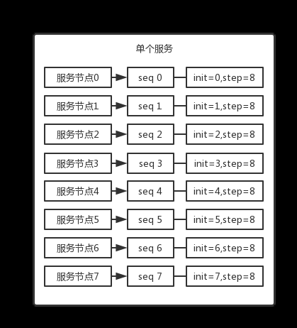

---

获取系统当前时间
这个就是获取当前时间即可，但是问题是，并发很高的时候，比如一秒并发几千，会有重复
的情况，这个是肯定不合适的。基本就不用考虑了。
适合的场景：一般如果用这个方案，是将当前时间跟很多其他的业务字段拼接起来，作为一个
id，如果业务上你觉得可以接受，那么也是可以的。你可以将别的业务字段值跟当前时间拼接
起来，组成一个全局唯一的编号。
snowflake 算法
snowflake 算法是 twitter 开源的分布式 id 生成算法，采用 Scala 语言实现，是把一个 64 位的
long 型的 id，1 个 bit 是不用的，用其中的 41 bits 作为毫秒数，用 10 bits 作为工作机器 id，12
bits 作为序列号。
1 bit：不用，为啥呢？因为二进制里第一个 bit 为如果是 1，那么都是负数，但是我们生成
的 id 都是正数，所以第一个 bit 统一都是 0。
41 bits：表示的是时间戳，单位是毫秒。41 bits 可以表示的数字多达 2^41 - 1  ，也就是
可以标识 2^41 - 1  个毫秒值，换算成年就是表示69年的时间。
10 bits：记录工作机器 id，代表的是这个服务最多可以部署在 2^10 台机器上，也就是 1024
台机器。但是 10 bits 里 5 个 bits 代表机房 id，5 个 bits 代表机器 id。意思就是最多代表 
2^5  个机房（32 个机房），每个机房里可以代表 2^5  个机器（32台机器）。
12 bits：这个是用来记录同一个毫秒内产生的不同 id，12 bits 可以代表的最大正整数是 
2^12 - 1 = 4096  ，也就是说可以用这个 12 bits 代表的数字来区分同一个毫秒内的
4096 个不同的 id。
0 | 0001100 10100010 10111110 10001001 01011100 00 | 10001 | 1 1001 | 0000 
 
 
  
 
    
 
 workerId  
    
 
 datacenterId  
    
 
 sequence  
 
    
 
 workerId  
 datacenterId  
 sequence   
        
 
        
public class IdWorker {
private long
;
private long
;
private long
;
public IdWorker(long
, long
, long
) {
// sanity check for workerId
// 这儿不就检查了一下，要求就是你传递进来的机房id和机器id不能超过32，不能小于
java

---

workerId  maxWorkerId 
 workerId  
  
            
 
 
 
                    
         
        
 datacenterId  maxDatacenterId 
 datacenterId  
  
            
 
 
 
                    
         
        
out
 
                
                timestampLeftShift  datacenterIdBits  workerIdBits  sequen
 
        
workerId  workerId  
        
datacenterId  datacenterId  
        
sequence  sequence  
     
 
    
 
 twepoch  
 
 
    
 
 workerIdBits  
 
    
 
 datacenterIdBits  
 
 
    
    
 
 maxWorkerId  
  
 
 workerIdBits
 
 
    
 
    
 
 maxDatacenterId  
  
 
 datacenterIdBits
 
    
 
 sequenceBits  
 
 
    
 
 workerIdShift  sequenceBits  
    
 
 datacenterIdShift  sequenceBits  workerIdBits  
    
 
 timestampLeftShift  sequenceBits  workerIdBits  datace
    
 
 sequenceMask  
  
 
 sequenceBits
 
 
    
 
 lastTimestamp  
 
 
    
 
 
  
        
 workerId  
     
 
    
 
 
  
        
 datacenterId  
     
 
if (
>
||
< 0) {
throw new IllegalArgumentException(
String.format("worker Id can't be greater than %d or l
}
if (
>
||
< 0) {
throw new IllegalArgumentException(
String.format("datacenter Id can't be greater than %d 
}
System.
.printf(
"worker starting. timestamp left shift %d, datacenter id b
,
,
,
this.
=
;
this.
=
;
this.
=
;
}
private long
= 1288834974657L;
private long
= 5L;
private long
= 5L;
// 这个是二进制运算，就是 5 bit最多只能有31个数字，也就是说机器id最多只能是32以内
private long
= -1L ^ (-1L <<
);
// 这个是一个意思，就是 5 bit最多只能有31个数字，机房id最多只能是32以内
private long
= -1L ^ (-1L <<
);
private long
= 12L;
private long
=
;
private long
=
+
;
private long
=
+
+
private long
= -1L ^ (-1L <<
);
private long
= -1L;
public long getWorkerId() {
return
;
}
public long getDatacenterId() {
return
;
}

---

timestamp  
 
 
        
 timestamp  lastTimestamp   
            
err
            
 
 
 
                    
         
 
        
 lastTimestamp 
 timestamp   
            
 
            
            sequence  sequence  
  sequenceMask  
            
 sequence 
 
  
                timestamp  
lastTimestamp
 
             
         
  
            sequence  
 
         
 
        
 
        lastTimestamp  timestamp  
 
        
 
        
 
        
 
        
 
        
 
timestamp  twepoch  
 timestampLeftShift   datacenter
                 workerId 
 workerIdShift   sequence  
     
 
    
 
 
 lastTimestamp   
        
 timestamp  
 
        
 timestamp 
 lastTimestamp   
            timestamp  
 
         
        
 timestamp  
     
 
public long getTimestamp() {
return System.currentTimeMillis();
}
public synchronized long nextId() {
// 这儿就是获取当前时间戳，单位是毫秒
long
= timeGen();
if (
<
) {
System.
.printf("clock is moving backwards.  Rejecting reque
throw new RuntimeException(String.format(
"Clock moved backwards.  Refusing to generate id for %
}
if (
==
) {
// 这个意思是说一个毫秒内最多只能有4096个数字
// 无论你传递多少进来，这个位运算保证始终就是在4096这个范围内，避免你自己
= (
+ 1) &
;
if (
== 0) {
= tilNextMillis(
);
}
} else {
= 0;
}
// 这儿记录一下最近一次生成id的时间戳，单位是毫秒
=
;
// 这儿就是将时间戳左移，放到 41 bit那儿；
// 将机房 id左移放到 5 bit那儿；
// 将机器id左移放到5 bit那儿；将序号放最后12 bit；
// 最后拼接起来成一个 64 bit的二进制数字，转换成 10 进制就是个 long 型
return ((
-
) <<
) | (
| (
<<
) |
;
}
private long tilNextMillis(long
) {
long
= timeGen();
while (
<=
) {
= timeGen();
}
return
;
}

---

怎么说呢，大概这个意思吧，就是说 41 bit 是当前毫秒单位的一个时间戳，就这意思；然后 5
bit 是你传递进来的一个机房 id（但是最大只能是 32 以内），另外 5 bit 是你传递进来的机器
id（但是最大只能是 32 以内），剩下的那个 12 bit序列号，就是如果跟你上次生成 id 的时间还
在一个毫秒内，那么会把顺序给你累加，最多在 4096 个序号以内。
所以你自己利用这个工具类，自己搞一个服务，然后对每个机房的每个机器都初始化这么一个
东西，刚开始这个机房的这个机器的序号就是 0。然后每次接收到一个请求，说这个机房的这
个机器要生成一个 id，你就找到对应的 Worker 生成。
利用这个 snowflake 算法，你可以开发自己公司的服务，甚至对于机房 id 和机器 id，反正给你
预留了 5 bit + 5 bit，你换成别的有业务含义的东西也可以的。
这个 snowflake 算法相对来说还是比较靠谱的，所以你要真是搞分布式 id 生成，如果是高并发
啥的，那么用这个应该性能比较好，一般每秒几万并发的场景，也足够你用了。
面试题
你们有没有做 MySQL 读写分离？如何实现 MySQL 的读写分离？MySQL 主从复制原理的是啥？
如何解决 MySQL 主从同步的延时问题？
面试官心理分析
高并发这个阶段，肯定是需要做读写分离的，啥意思？因为实际上大部分的互联网公司，一些
网站，或者是 app，其实都是读多写少。所以针对这个情况，就是写一个主库，但是主库挂多
个从库，然后从多个从库来读，那不就可以支撑更高的读并发压力了吗？
    
 
 
  
        
 
 
     
 
    
 
    
 
 
 
 args   
        
 worker  
 
 
 
 
        
 
 i  
 i  
 i
  
            
out
worker
 
         
     
 
private long timeGen() {
return System.currentTimeMillis();
}
// ---------------测试---------------
public static void main(String[]
) {
IdWorker
= new IdWorker(1, 1, 1);
for (int
= 0;
< 30;
++) {
System.
.println(
.nextId());
}
}
}

---

面试题剖析
如何实现 MySQL 的读写分离？
其实很简单，就是基于主从复制架构，简单来说，就搞一个主库，挂多个从库，然后我们就单
单只是写主库，然后主库会自动把数据给同步到从库上去。
MySQL 主从复制原理的是啥？
主库将变更写入 binlog 日志，然后从库连接到主库之后，从库有一个 IO 线程，将主库的 binlog
日志拷贝到自己本地，写入一个 relay 中继日志中。接着从库中有一个 SQL 线程会从中继日志
读取 binlog，然后执行 binlog 日志中的内容，也就是在自己本地再次执行一遍 SQL，这样就可
以保证自己跟主库的数据是一样的。
这里有一个非常重要的一点，就是从库同步主库数据的过程是串行化的，也就是说主库上并行
的操作，在从库上会串行执行。所以这就是一个非常重要的点了，由于从库从主库拷贝日志以
及串行执行 SQL 的特点，在高并发场景下，从库的数据一定会比主库慢一些，是有延时的。所
以经常出现，刚写入主库的数据可能是读不到的，要过几十毫秒，甚至几百毫秒才能读取到。
而且这里还有另外一个问题，就是如果主库突然宕机，然后恰好数据还没同步到从库，那么有
些数据可能在从库上是没有的，有些数据可能就丢失了。
所以 MySQL 实际上在这一块有两个机制，一个是半同步复制，用来解决主库数据丢失问题；
一个是并行复制，用来解决主从同步延时问题。

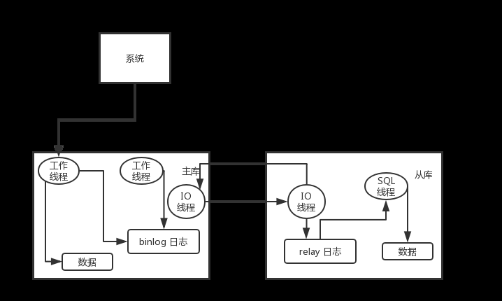

---

这个所谓半同步复制，也叫 semi-sync  复制，指的就是主库写入 binlog 日志之后，就会将
强制此时立即将数据同步到从库，从库将日志写入自己本地的 relay log 之后，接着会返回一个
ack 给主库，主库接收到至少一个从库的 ack 之后才会认为写操作完成了。
所谓并行复制，指的是从库开启多个线程，并行读取 relay log 中不同库的日志，然后并行重
放不同库的日志，这是库级别的并行。
MySQL 主从同步延时问题（精华）
以前线上确实处理过因为主从同步延时问题而导致的线上的 bug，属于小型的生产事故。
是这个么场景。有个同学是这样写代码逻辑的。先插入一条数据，再把它查出来，然后更新这
条数据。在生产环境高峰期，写并发达到了 2000/s，这个时候，主从复制延时大概是在小几十
毫秒。线上会发现，每天总有那么一些数据，我们期望更新一些重要的数据状态，但在高峰期
时候却没更新。用户跟客服反馈，而客服就会反馈给我们。
我们通过 MySQL 命令：
查看 Seconds_Behind_Master  ，可以看到从库复制主库的数据落后了几 ms。
一般来说，如果主从延迟较为严重，有以下解决方案：
分库，将一个主库拆分为多个主库，每个主库的写并发就减少了几倍，此时主从延迟可以
忽略不计。
打开 MySQL 支持的并行复制，多个库并行复制。如果说某个库的写入并发就是特别高，单
库写并发达到了 2000/s，并行复制还是没意义。
重写代码，写代码的同学，要慎重，插入数据时立马查询可能查不到。
如果确实是存在必须先插入，立马要求就查询到，然后立马就要反过来执行一些操作，对
这个查询设置直连主库。不推荐这种方法，你要是这么搞，读写分离的意义就丧失了。
面试题
如何设计一个高并发系统？
面试官心理分析
show status
sql

---

说实话，如果面试官问你这个题目，那么你必须要使出全身吃奶劲了。为啥？因为你没看到现
在很多公司招聘的 JD 里都是说啥，有高并发就经验者优先。
如果你确实有真才实学，在互联网公司里干过高并发系统，那你确实拿 ower 基本如探囊取物，
没啥问题。面试官也绝对不会这样来问你，否则他就是蠢。
假设你在某知名电商公司干过高并发系统，用户上亿，一天流量几十亿，高峰期并发量上万，
甚至是十万。那么人家一定会仔细盘问你的系统架构，你们系统啥架构？怎么部署的？部署了
多少台机器？缓存咋用的？MQ 咋用的？数据库咋用的？就是深挖你到底是如何扛住高并发
的。
因为真正干过高并发的人一定知道，脱离了业务的系统架构都是在纸上谈兵，真正在复杂业务
场景而且还高并发的时候，那系统架构一定不是那么简单的，用个 redis，用 mq 就能搞定？当
然不是，真实的系统架构搭配上业务之后，会比这种简单的所谓“高并发架构”要复杂很多倍。
如果有面试官问你个问题说，如何设计一个高并发系统？那么不好意思，一定是因为你实际
上没干过高并发系统。面试官看你简历就没啥出彩的，感觉就不咋地，所以就会问问你，如
何设计一个高并发系统？其实说白了本质就是看看你有没有自己研究过，有没有一定的知识积
累。
最好的当然是招聘个真正干过高并发的哥儿们咯，但是这种哥儿们人数稀缺，不好招。所以可
能次一点的就是招一个自己研究过的哥儿们，总比招一个啥也不会的哥儿们好吧！
所以这个时候你必须得做一把个人秀了，秀出你所有关于高并发的知识！
面试题剖析
其实所谓的高并发，如果你要理解这个问题呢，其实就得从高并发的根源出发，为啥会有高并
发？为啥高并发就很牛逼？
我说的浅显一点，很简单，就是因为刚开始系统都是连接数据库的，但是要知道数据库支撑到
每秒并发两三千的时候，基本就快完了。所以才有说，很多公司，刚开始干的时候，技术比较
low，结果业务发展太快，有的时候系统扛不住压力就挂了。
当然会挂了，凭什么不挂？你数据库如果瞬间承载每秒 5000/8000，甚至上万的并发，一定会
宕机，因为比如 mysql 就压根儿扛不住这么高的并发量。
所以为啥高并发牛逼？就是因为现在用互联网的人越来越多，很多 app、网站、系统承载的都
是高并发请求，可能高峰期每秒并发量几千，很正常的。如果是什么双十一之类的，每秒并发
几万几十万都有可能。
那么如此之高的并发量，加上原本就如此之复杂的业务，咋玩儿？真正厉害的，一定是在复杂
业务系统里玩儿过高并发架构的人，但是你没有，那么我给你说一下你该怎么回答这个问题：

---

可以分为以下 6 点：
系统拆分
缓存
MQ
分库分表
读写分离
ElasticSearch
系统拆分
将一个系统拆分为多个子系统，用 dubbo 来搞。然后每个系统连一个数据库，这样本来就一个
库，现在多个数据库，不也可以扛高并发么。
缓存
缓存，必须得用缓存。大部分的高并发场景，都是读多写少，那你完全可以在数据库和缓存里
都写一份，然后读的时候大量走缓存不就得了。毕竟人家 redis 轻轻松松单机几万的并发。所
以你可以考虑考虑你的项目里，那些承载主要请求的读场景，怎么用缓存来抗高并发。

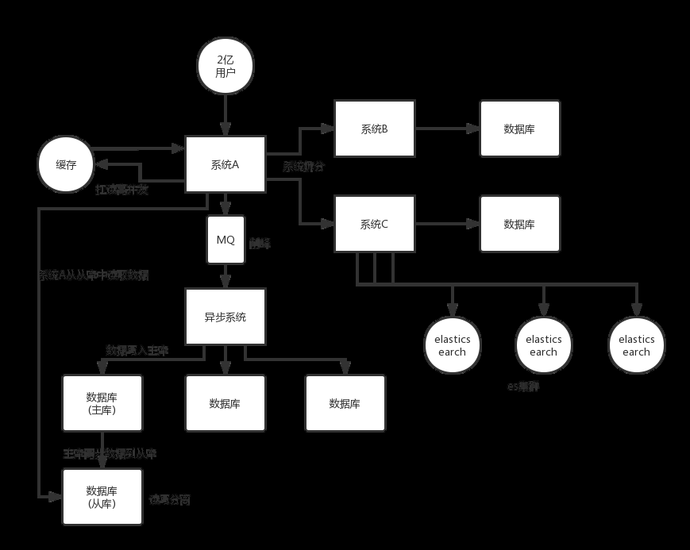

---

MQ
MQ，必须得用 MQ。可能你还是会出现高并发写的场景，比如说一个业务操作里要频繁搞数据
库几十次，增删改增删改，疯了。那高并发绝对搞挂你的系统，你要是用 redis 来承载写那肯
定不行，人家是缓存，数据随时就被 LRU 了，数据格式还无比简单，没有事务支持。所以该用
mysql 还得用 mysql 啊。那你咋办？用 MQ 吧，大量的写请求灌入 MQ 里，排队慢慢玩儿，后
边系统消费后慢慢写，控制在 mysql 承载范围之内。所以你得考虑考虑你的项目里，那些承
载复杂写业务逻辑的场景里，如何用 MQ 来异步写，提升并发性。MQ 单机抗几万并发也是 ok
的，这个之前还特意说过。
分库分表
分库分表，可能到了最后数据库层面还是免不了抗高并发的要求，好吧，那么就将一个数据库
拆分为多个库，多个库来扛更高的并发；然后将一个表拆分为多个表，每个表的数据量保持少
一点，提高 sql 跑的性能。
读写分离
读写分离，这个就是说大部分时候数据库可能也是读多写少，没必要所有请求都集中在一个库
上吧，可以搞个主从架构，主库写入，从库读取，搞一个读写分离。读流量太多的时候，还
可以加更多的从库。
ElasticSearch
Elasticsearch，简称 es。es 是分布式的，可以随便扩容，分布式天然就可以支撑高并发，因为
动不动就可以扩容加机器来扛更高的并发。那么一些比较简单的查询、统计类的操作，可以考
虑用 es 来承载，还有一些全文搜索类的操作，也可以考虑用 es 来承载。
上面的 6 点，基本就是高并发系统肯定要干的一些事儿，大家可以仔细结合之前讲过的知识考
虑一下，到时候你可以系统的把这块阐述一下，然后每个部分要注意哪些问题，之前都讲过
了，你都可以阐述阐述，表明你对这块是有点积累的。
说句实话，毕竟你真正厉害的一点，不是在于弄明白一些技术，或者大概知道一个高并发系统
应该长什么样？其实实际上在真正的复杂的业务系统里，做高并发要远远比上面提到的点要复
杂几十倍到上百倍。你需要考虑：哪些需要分库分表，哪些不需要分库分表，单库单表跟分库
分表如何 join，哪些数据要放到缓存里去，放哪些数据才可以扛住高并发的请求，你需要完成
对一个复杂业务系统的分析之后，然后逐步逐步的加入高并发的系统架构的改造，这个过程是
无比复杂的，一旦做过一次，并且做好了，你在这个市场上就会非常的吃香。
其实大部分公司，真正看重的，不是说你掌握高并发相关的一些基本的架构知识，架构中的一
些技术，RocketMQ、Kafka、Redis、Elasticsearch，高并发这一块，你了解了，也只能是次一等

---

的人才。对一个有几十万行代码的复杂的分布式系统，一步一步架构、设计以及实践过高并发
架构的人，这个经验是难能可贵的。
分布式系统面试连环炮
有一些同学，之前呢主要是做传统行业，或者外包项目，一直是在那种小的公司，技术一直都
搞的比较简单。他们有共同的一个问题，就是都没怎么搞过分布式系统，现在互联网公司，一
般都是做分布式的系统，大家都不是做底层的分布式系统、分布式存储系统 Hadoop HDFS、分
布式计算系统 Hadoop MapReduce / Spark、分布式流式计算系统 Storm。
分布式业务系统，就是把原来用 Java 开发的一个大块系统，给拆分成多个子系统，多个子系
统之间互相调用，形成一个大系统的整体。假设原来你做了一个 OA 系统，里面包含了权限模
块、员工模块、请假模块、财务模块，一个工程，里面包含了一堆模块，模块与模块之间会互
相去调用，1 台机器部署。现在如果你把这个系统给拆开，权限系统、员工系统、请假系统、
财务系统 4 个系统，4 个工程，分别在 4 台机器上部署。一个请求过来，完成这个请求，这个
员工系统，调用权限系统，调用请假系统，调用财务系统，4 个系统分别完成了一部分的事
情，最后 4 个系统都干完了以后，才认为是这个请求已经完成了。
近几年开始兴起和流行 Spring Cloud，刚流行，还没开始普及，目前普及的是 Dubbo，
因此这里也主要讲 Dubbo。
面试官可能会问你以下问题。
为什么要进行系统拆分？

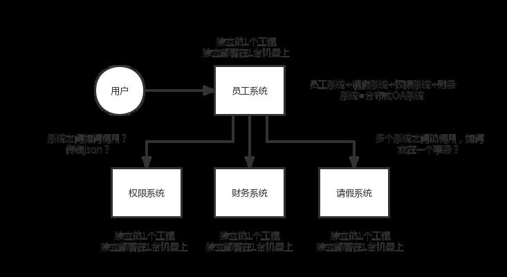

---

为什么要进行系统拆分？如何进行系统拆分？拆分后不用 Dubbo 可以吗？Dubbo 和 thrix
有什么区别呢？
分布式服务框架
说一下的 Dubbo 的工作原理？注册中心挂了可以继续通信吗？
Dubbo 支持哪些序列化协议？说一下 Hessian 的数据结构？PB 知道吗？为什么 PB 的效率是
最高的？
Dubbo 负载均衡策略和高可用策略都有哪些？动态代理策略呢？
Dubbo 的 SPI 思想是什么？
如何基于 Dubbo 进行服务治理、服务降级、失败重试以及超时重试？
分布式服务接口的幂等性如何设计（比如不能重复扣款）？
分布式服务接口请求的顺序性如何保证？
如何自己设计一个类似 Dubbo 的 RPC 框架？
分布式锁
使用 Redis 如何设计分布式锁？使用 zk 来设计分布式锁可以吗？这两种分布式锁的实现方
式哪种效率比较高？
分布式事务
分布式事务了解吗？你们如何解决分布式事务问题的？TCC 如果出现网络连不通怎么办？
XA 的一致性如何保证？
分布式会话
集群部署时的分布式 Session 如何实现？
面试题
为什么要进行系统拆分？如何进行系统拆分？拆分后不用 dubbo 可以吗？
面试官心理分析
从这个问题开始就进行分布式系统环节了，现在出去面试分布式都成标配了，没有哪个公司不
问问你分布式的事儿。你要是不会分布式的东西，简直这简历没法看，没人会让你去面试。

---

其实为啥会这样呢？这就是因为整个大行业技术发展的原因。
早些年，印象中在 2010 年初的时候，整个 IT 行业，很少有人谈分布式，更不用说微服务，虽
然很多 BAT 等大型公司，因为系统的复杂性，很早就是分布式架构，大量的服务，只不过微服
务大多基于自己搞的一套框架来实现而已。
但是确实，那个年代，大家很重视 ssh2，很多中小型公司几乎大部分都是玩儿 struts2、
spring、hibernate，稍晚一些，才进入了 spring mvc、spring、mybatis 的组合。那个时候整个
行业的技术水平就是那样，当年 oracle 很火，oracle 管理员很吃香，oracle 性能优化啥的都是
IT 男的大杀招啊。连大数据都没人提，当年 OCP、OCM 等认证培训机构，火的不行。
但是确实随着时代的发展，慢慢的，很多公司开始接受分布式系统架构了，这里面尤为对行业
有至关重要影响的，是阿里的 dubbo，某种程度上而言，阿里在这里推动了行业技术的前
进。
正是因为有阿里的 dubbo，很多中小型公司才可以基于 dubbo，来把系统拆分成很多的服务，
每个人负责一个服务，大家的代码都没有冲突，服务可以自治，自己选用什么技术都可以，每
次发布如果就改动一个服务那就上线一个服务好了，不用所有人一起联调，每次发布都是几十
万行代码，甚至几百万行代码了。
直到今日，很高兴看到分布式系统都成行业面试标配了，任何一个普通的程序员都该掌握这个
东西，其实这是行业的进步，也是所有 IT 码农的技术进步。所以既然分布式都成标配了，那么
面试官当然会问了，因为很多公司现在都是分布式、微服务的架构，那面试官当然得考察考察
你了。
面试题剖析
为什么要将系统进行拆分？
网上查查，答案极度零散和复杂，很琐碎，原因一大坨。但是我这里给大家直观的感受：
要是不拆分，一个大系统几十万行代码，20 个人维护一份代码，简直是悲剧啊。代码经常改着
改着就冲突了，各种代码冲突和合并要处理，非常耗费时间；经常我改动了我的代码，你调用
了我的，导致你的代码也得重新测试，麻烦的要死；然后每次发布都是几十万行代码的系统一
起发布，大家得一起提心吊胆准备上线，几十万行代码的上线，可能每次上线都要做很多的检
查，很多异常问题的处理，简直是又麻烦又痛苦；而且如果我现在打算把技术升级到最新的
spring 版本，还不行，因为这可能导致你的代码报错，我不敢随意乱改技术。
假设一个系统是 20 万行代码，其中 A 在里面改了 1000 行代码，但是此时发布的时候是这个 20
万行代码的大系统一块儿发布。就意味着 20 万上代码在线上就可能出现各种变化，20 个人，
每个人都要紧张地等在电脑面前，上线之后，检查日志，看自己负责的那一块儿有没有什么问
题。

---

A 就检查了自己负责的 1 万行代码对应的功能，确保 ok 就闪人了；结果不巧的是，A 上线的时
候不小心修改了线上机器的某个配置，导致另外 B 和 C 负责的 2 万行代码对应的一些功能，出
错了。
几十个人负责维护一个几十万行代码的单块应用，每次上线，准备几个礼拜，上线 -> 部署 ->
检查自己负责的功能。
拆分了以后，整个世界清爽了，几十万行代码的系统，拆分成 20 个服务，平均每个服务就
1~2 万行代码，每个服务部署到单独的机器上。20 个工程，20 个 git 代码仓库，20 个开发人
员，每个人维护自己的那个服务就可以了，是自己独立的代码，跟别人没关系。再也没有代码
冲突了，爽。每次就测试我自己的代码就可以了，爽。每次就发布我自己的一个小服务就可以
了，爽。技术上想怎么升级就怎么升级，保持接口不变就可以了，真爽。
所以简单来说，一句话总结，如果是那种代码量多达几十万行的中大型项目，团队里有几十个
人，那么如果不拆分系统，开发效率极其低下，问题很多。但是拆分系统之后，每个人就负
责自己的一小部分就好了，可以随便玩儿随便弄。分布式系统拆分之后，可以大幅度提升复杂
系统大型团队的开发效率。
但是同时，也要提醒的一点是，系统拆分成分布式系统之后，大量的分布式系统面临的问题也
是接踵而来，所以后面的问题都是在围绕分布式系统带来的复杂技术挑战在说。
如何进行系统拆分？
这个问题说大可以很大，可以扯到领域驱动模型设计上去，说小了也很小，我不太想给大家太
过于学术的说法，因为你也不可能背这个答案，过去了直接说吧。还是说的简单一点，大家自
己到时候知道怎么回答就行了。
系统拆分为分布式系统，拆成多个服务，拆成微服务的架构，是需要拆很多轮的。并不是说上
来一个架构师一次就给拆好了，而以后都不用拆。
第一轮；团队继续扩大，拆好的某个服务，刚开始是 1 个人维护 1 万行代码，后来业务系统越
来越复杂，这个服务是 10 万行代码，5 个人；第二轮，1个服务 -> 5个服务，每个服务 2 万行
代码，每人负责一个服务。
如果是多人维护一个服务，最理想的情况下，几十个人，1 个人负责 1 个或 2~3 个服务；某个
服务工作量变大了，代码量越来越多，某个同学，负责一个服务，代码量变成了 10 万行了，他
自己不堪重负，他现在一个人拆开，5 个服务，1 个人顶着，负责 5 个人，接着招人，2 个人，
给那个同学带着，3 个人负责 5 个服务，其中 2 个人每个人负责 2 个服务，1 个人负责 1 个服
务。
个人建议，一个服务的代码不要太多，1 万行左右，两三万撑死了吧。
大部分的系统，是要进行多轮拆分的，第一次拆分，可能就是将以前的多个模块该拆分开来
了，比如说将电商系统拆分成订单系统、商品系统、采购系统、仓储系统、用户系统，等等

---

吧。
但是后面可能每个系统又变得越来越复杂了，比如说采购系统里面又分成了供应商管理系统、
采购单管理系统，订单系统又拆分成了购物车系统、价格系统、订单管理系统。
扯深了实在很深，所以这里先给大家举个例子，你自己感受一下，核心意思就是根据情况，
先拆分一轮，后面如果系统更复杂了，可以继续分拆。你根据自己负责系统的例子，来考
虑一下就好了。
拆分后不用 dubbo 可以吗？
当然可以了，大不了最次，就是各个系统之间，直接基于 spring mvc，就纯 http 接口互相通信
呗，还能咋样。但是这个肯定是有问题的，因为 http 接口通信维护起来成本很高，你要考虑超
时重试、负载均衡等等各种乱七八糟的问题，比如说你的订单系统调用商品系统，商品系统部
署了 5 台机器，你怎么把请求均匀地甩给那 5 台机器？这不就是负载均衡？你要是都自己搞那
是可以的，但是确实很痛苦。
所以 dubbo 说白了，是一种 rpc 框架，就是说本地就是进行接口调用，但是 dubbo 会代理这个
调用请求，跟远程机器网络通信，给你处理掉负载均衡、服务实例上下线自动感知、超时重试
等等乱七八糟的问题。那你就不用自己做了，用 dubbo 就可以了。
面试题
说一下的 dubbo 的工作原理？注册中心挂了可以继续通信吗？说说一次 rpc 请求的流程？
面试官心理分析
MQ、ES、Redis、Dubbo，上来先问你一些思考性的问题、原理，比如 kafka 高可用架构原
理、es 分布式架构原理、redis 线程模型原理、Dubbo 工作原理；之后就是生产环境里可能会
碰到的一些问题，因为每种技术引入之后生产环境都可能会碰到一些问题；再来点综合的，就
是系统设计，比如让你设计一个 MQ、设计一个搜索引擎、设计一个缓存、设计一个 rpc 框架等
等。
那既然开始聊分布式系统了，自然重点先聊聊 dubbo 了，毕竟 dubbo 是目前事实上大部分公司
的分布式系统的 rpc 框架标准，基于 dubbo 也可以构建一整套的微服务架构。但是需要自己大
量开发。
当然去年开始 spring cloud 非常火，现在大量的公司开始转向 spring cloud 了，spring cloud 人
家毕竟是微服务架构的全家桶式的这么一个东西。但是因为很多公司还在用 dubbo，所以
dubbo 肯定会是目前面试的重点，何况人家 dubbo 现在重启开源社区维护了，捐献给了
apache，未来应该也还是有一定市场和地位的。

---

既然聊 dubbo，那肯定是先从 dubbo 原理开始聊了，你先说说 dubbo 支撑 rpc 分布式调用的架
构啥的，然后说说一次 rpc 请求 dubbo 是怎么给你完成的，对吧。
面试题剖析
dubbo 工作原理
第一层：service 层，接口层，给服务提供者和消费者来实现的
第二层：config 层，配置层，主要是对 dubbo 进行各种配置的
第三层：proxy 层，服务代理层，无论是 consumer 还是 provider，dubbo 都会给你生成代
理，代理之间进行网络通信
第四层：registry 层，服务注册层，负责服务的注册与发现
第五层：cluster 层，集群层，封装多个服务提供者的路由以及负载均衡，将多个实例组合
成一个服务
第六层：monitor 层，监控层，对 rpc 接口的调用次数和调用时间进行监控
第七层：protocal 层，远程调用层，封装 rpc 调用
第八层：exchange 层，信息交换层，封装请求响应模式，同步转异步
第九层：transport 层，网络传输层，抽象 mina 和 netty 为统一接口
第十层：serialize 层，数据序列化层
工作流程
第一步：provider 向注册中心去注册
第二步：consumer 从注册中心订阅服务，注册中心会通知 consumer 注册好的服务
第三步：consumer 调用 provider
第四步：consumer 和 provider 都异步通知监控中心

---

注册中心挂了可以继续通信吗？
可以，因为刚开始初始化的时候，消费者会将提供者的地址等信息拉取到本地缓存，所以注册
中心挂了可以继续通信。
面试题
dubbo 支持哪些通信协议？支持哪些序列化协议？说一下 Hessian 的数据结构？PB 知道吗？为
什么 PB 的效率是最高的？
面试官心理分析
上一个问题，说说 dubbo 的基本工作原理，那是你必须知道的，至少要知道 dubbo 分成哪些
层，然后平时怎么发起 rpc 请求的，注册、发现、调用，这些是基本的。
接着就可以针对底层进行深入的问问了，比如第一步就可以先问问序列化协议这块，就是平时
RPC 的时候怎么走的？

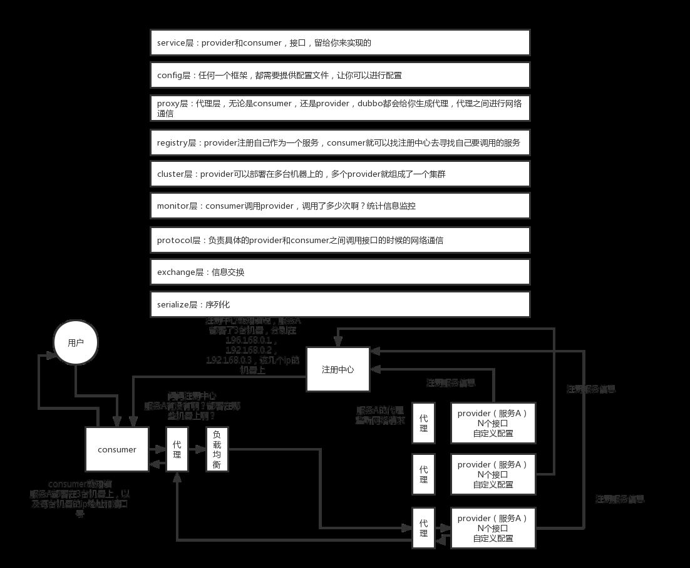

---

面试题剖析
序列化，就是把数据结构或者是一些对象，转换为二进制串的过程，而反序列化是将在序列化
过程中所生成的二进制串转换成数据结构或者对象的过程。
dubbo 支持不同的通信协议
dubbo 协议
默认就是走 dubbo 协议，单一长连接，进行的是 NIO 异步通信，基于 hessian 作为序列化协
议。使用的场景是：传输数据量小（每次请求在 100kb 以内），但是并发量很高。
为了要支持高并发场景，一般是服务提供者就几台机器，但是服务消费者有上百台，可能每天
调用量达到上亿次！此时用长连接是最合适的，就是跟每个服务消费者维持一个长连接就可
以，可能总共就 100 个连接。然后后面直接基于长连接 NIO 异步通信，可以支撑高并发请求。
长连接，通俗点说，就是建立连接过后可以持续发送请求，无须再建立连接。

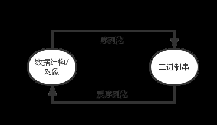

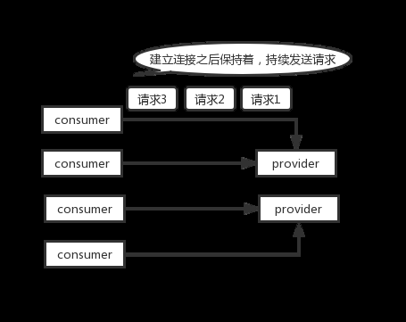

---

而短连接，每次要发送请求之前，需要先重新建立一次连接。
rmi 协议
走 Java 二进制序列化，多个短连接，适合消费者和提供者数量差不多的情况，适用于文件的传
输，一般较少用。
hessian 协议
走 hessian 序列化协议，多个短连接，适用于提供者数量比消费者数量还多的情况，适用于文
件的传输，一般较少用。
http 协议
走表单序列化。
webservice
走 SOAP 文本序列化。
dubbo 支持的序列化协议
dubbo 支持 hession、Java 二进制序列化、json、SOAP 文本序列化多种序列化协议。但是
hessian 是其默认的序列化协议。
说一下 Hessian 的数据结构
Hessian 的对象序列化机制有 8 种原始类型：

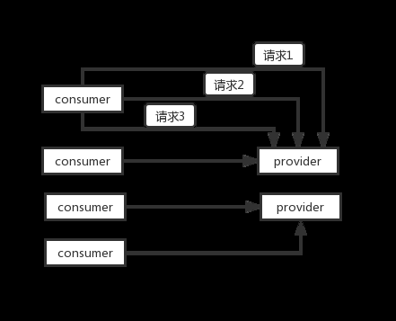

---

原始二进制数据
boolean
64-bit date（64 位毫秒值的日期）
64-bit double
32-bit int
64-bit long
null
UTF-8 编码的 string
另外还包括 3 种递归类型：
list for lists and arrays
map for maps and dictionaries
object for objects
还有一种特殊的类型：
ref：用来表示对共享对象的引用。
为什么 PB 的效率是最高的？
其实 PB 之所以性能如此好，主要得益于两个：第一，它使用 proto 编译器，自动进行序列化
和反序列化，速度非常快，应该比 XML  和 JSON  快上了 20~100  倍；第二，它的数据压缩
效果好，就是说它序列化后的数据量体积小。因为体积小，传输起来带宽和速度上会有优化。
面试题
dubbo 负载均衡策略和集群容错策略都有哪些？动态代理策略呢？
面试官心理分析
继续深问吧，这些都是用 dubbo 必须知道的一些东西，你得知道基本原理，知道序列化是什么
协议，还得知道具体用 dubbo 的时候，如何负载均衡，如何高可用，如何动态代理。
说白了，就是看你对 dubbo 熟悉不熟悉：
dubbo 工作原理：服务注册、注册中心、消费者、代理通信、负载均衡；
网络通信、序列化：dubbo 协议、长连接、NIO、hessian 序列化协议；
负载均衡策略、集群容错策略、动态代理策略：dubbo 跑起来的时候一些功能是如何运转
的？怎么做负载均衡？怎么做集群容错？怎么生成动态代理？
dubbo SPI 机制：你了解不了解 dubbo 的 SPI 机制？如何基于 SPI 机制对 dubbo 进行扩展？

---

面试题剖析
dubbo 负载均衡策略
RandomLoadBalance
默认情况下，dubbo 是 RandomLoadBalance ，即随机调用实现负载均衡，可以对 provider 不
同实例设置不同的权重，会按照权重来负载均衡，权重越大分配流量越高，一般就用这个默认
的就可以了。
RoundRobinLoadBalance
这个的话默认就是均匀地将流量打到各个机器上去，但是如果各个机器的性能不一样，容易导
致性能差的机器负载过高。所以此时需要调整权重，让性能差的机器承载权重小一些，流量少
一些。
举个栗子。
跟运维同学申请机器，有的时候，我们运气好，正好公司资源比较充足，刚刚有一批热气腾
腾、刚刚做好的虚拟机新鲜出炉，配置都比较高：8 核 + 16G 机器，申请到 2 台。过了一段时
间，我们感觉 2 台机器有点不太够，我就去找运维同学说，“哥儿们，你能不能再给我一台机
器”，但是这时只剩下一台 4 核 + 8G 的机器。我要还是得要。
这个时候，可以给两台 8 核 16G 的机器设置权重 4，给剩余 1 台 4 核 8G 的机器设置权重 2。
LeastActiveLoadBalance
这个就是自动感知一下，如果某个机器性能越差，那么接收的请求越少，越不活跃，此时就会
给不活跃的性能差的机器更少的请求。
ConsistentHashLoadBalance
一致性 Hash 算法，相同参数的请求一定分发到一个 provider 上去，provider 挂掉的时候，会基
于虚拟节点均匀分配剩余的流量，抖动不会太大。如果你需要的不是随机负载均衡，是要一
类请求都到一个节点，那就走这个一致性 Hash 策略。
关于 dubbo 负载均衡策略更加详细的描述，可以查看官网 http://dubbo.apache.org/zh-
cn/docs/source_code_guide/loadbalance.html 。
dubbo 集群容错策略

---

Failover Cluster 模式
失败自动切换，自动重试其他机器，默认就是这个，常见于读操作。（失败重试其它机器）
可以通过以下几种方式配置重试次数：
或者
或者
Failfast Cluster 模式
一次调用失败就立即失败，常见于非幂等性的写操作，比如新增一条记录（调用失败就立即失
败）
Failsafe Cluster 模式
出现异常时忽略掉，常用于不重要的接口调用，比如记录日志。
配置示例如下：
或者
 
 
service
<dubbo:
retries
2
=" " />
xml
 
 
reference
<dubbo:
retries
2
=" " />
xml
 
    
reference
<dubbo:
>
 
 
 
method
<dubbo:
name
findFoo
="
" retries
2
=" " />
reference
</dubbo:
>
xml
 
 
service
<dubbo:
cluster
failsafe
="
" />
xml
 
 
reference
<dubbo:
cluster
failsafe
="
" />
xml

---

Failback Cluster 模式
失败了后台自动记录请求，然后定时重发，比较适合于写消息队列这种。
Forking Cluster 模式
并行调用多个 provider，只要一个成功就立即返回。常用于实时性要求比较高的读操作，但是
会浪费更多的服务资源，可通过 forks="2"  来设置最大并行数。
Broadcast Cluster 模式
逐个调用所有的 provider。任何一个 provider 出错则报错（从 2.1.0  版本开始支持）。通常
用于通知所有提供者更新缓存或日志等本地资源信息。
关于 dubbo 集群容错策略更加详细的描述，可以查看官网 http://dubbo.apache.org/zh-
cn/docs/source_code_guide/cluster.html 。
dubbo 动态代理策略
默认使用 javassist 动态字节码生成，创建代理类。但是可以通过 spi 扩展机制配置自己的动态
代理策略。
面试题
dubbo 的 spi 思想是什么？
面试官心理分析
继续深入问呗，前面一些基础性的东西问完了，确定你应该都 ok，了解 dubbo 的一些基本东
西，那么问个稍微难一点点的问题，就是 spi，先问问你 spi 是啥？然后问问你 dubbo 的 spi 是
怎么实现的？
其实就是看看你对 dubbo 的掌握如何。
面试题剖析

---

spi 是啥？
spi，简单来说，就是 service provider interface  ，说白了是什么意思呢，比如你有个接
口，现在这个接口有 3 个实现类，那么在系统运行的时候对这个接口到底选择哪个实现类呢？
这就需要 spi 了，需要根据指定的配置或者是默认的配置，去找到对应的实现类加载进来，
然后用这个实现类的实例对象。
举个栗子。
你有一个接口 A。A1/A2/A3 分别是接口A的不同实现。你通过配置 接口 A = 实现 A2  ，那么
在系统实际运行的时候，会加载你的配置，用实现 A2 实例化一个对象来提供服务。
spi 机制一般用在哪儿？插件扩展的场景，比如说你开发了一个给别人使用的开源框架，如果
你想让别人自己写个插件，插到你的开源框架里面，从而扩展某个功能，这个时候 spi 思想就
用上了。
Java spi 思想的体现
spi 经典的思想体现，大家平时都在用，比如说 jdbc。
Java 定义了一套 jdbc 的接口，但是 Java 并没有提供 jdbc 的实现类。
但是实际上项目跑的时候，要使用 jdbc 接口的哪些实现类呢？一般来说，我们要根据自己使
用的数据库，比如 mysql，你就将 mysql-jdbc-connector.jar  引入进来；oracle，你就将 
oracle-jdbc-connector.jar  引入进来。
在系统跑的时候，碰到你使用 jdbc 的接口，他会在底层使用你引入的那个 jar 中提供的实现
类。
dubbo 的 spi 思想
dubbo 也用了 spi 思想，不过没有用 jdk 的 spi 机制，是自己实现的一套 spi 机制。
Protocol 接口，在系统运行的时候，，dubbo 会判断一下应该选用这个 Protocol 接口的哪个实
现类来实例化对象来使用。
它会去找一个你配置的 Protocol，将你配置的 Protocol 实现类，加载到 jvm 中来，然后实例化
对象，就用你的那个 Protocol 实现类就可以了。
 protocol  
Protocol
= ExtensionLoader.getExtensionLoader(Protocol.class).getA
java

---

上面那行代码就是 dubbo 里大量使用的，就是对很多组件，都是保留一个接口和多个实现，然
后在系统运行的时候动态根据配置去找到对应的实现类。如果你没配置，那就走默认的实现好
了，没问题。
在 dubbo 自己的 jar 里，在 /META_INF/dubbo/internal/com.alibaba.dubbo.rpc.Protocol
文件中：
所以说，这就看到了 dubbo 的 spi 机制默认是怎么玩儿的了，其实就是 Protocol 接口， 
@SPI("dubbo")  说的是，通过 SPI 机制来提供实现类，实现类是通过 dubbo 作为默认 key 去
配置文件里找到的，配置文件名称与接口全限定名一样的，通过 dubbo 作为 key 可以找到默认
的实现类就是 com.alibaba.dubbo.rpc.protocol.dubbo.DubboProtocol  。
如果想要动态替换掉默认的实现类，需要使用 @Adaptive  接口，Protocol 接口中，有两个方
法加了 @Adaptive  注解，就是说那俩接口会被代理实现。
啥意思呢？
比如这个 Protocol 接口搞了俩 @Adaptive  注解标注了方法，在运行的时候会针对 Protocol 生
成代理类，这个代理类的那俩方法里面会有代理代码，代理代码会在运行的时候动态根据 url
中的 protocol 来获取那个 key，默认是 dubbo，你也可以自己指定，你如果指定了别的 key，那
么就会获取别的实现类的实例了。
   
 
 
    
 
    
 
   
 
    
   
    
 
 
 invoker  
 
   
 
    
   
    
 
 
 type  
 url  
 
   
 
    
 
   
 
  
@SPI("dubbo")
public interface Protocol {
int getDefaultPort();
@Adaptive
<T> Exporter<T> export(Invoker<T>
) throws RpcException;
@Adaptive
<T> Invoker<T> refer(Class<T>
, URL
) throws RpcException;
void destroy();
}
java
dubbo=com.alibaba.dubbo.rpc.protocol.dubbo.DubboProtocol 
http=com.alibaba.dubbo.rpc.protocol.http.HttpProtocol 
hessian=com.alibaba.dubbo.rpc.protocol.hessian.HessianProtocol
xml

---

如何自己扩展 dubbo 中的组件
下面来说说怎么来自己扩展 dubbo 中的组件。
自己写个工程，要是那种可以打成 jar 包的，里面的 src/main/resources  目录下，搞一个 
META-INF/services  ，里面放个文件叫： com.alibaba.dubbo.rpc.Protocol  ，文件里搞
一个 my=com.bingo.MyProtocol  。自己把 jar 弄到 nexus 私服里去。
然后自己搞一个 dubbo provider  工程，在这个工程里面依赖你自己搞的那个 jar，然后在
spring 配置文件里给个配置：
provider 启动的时候，就会加载到我们 jar 包里的 my=com.bingo.MyProtocol  这行配置里，
接着会根据你的配置使用你定义好的 MyProtocol 了，这个就是简单说明一下，你通过上述方
式，可以替换掉大量的 dubbo 内部的组件，就是扔个你自己的 jar 包，然后配置一下即可。
dubbo 里面提供了大量的类似上面的扩展点，就是说，你如果要扩展一个东西，只要自己写个
jar，让你的 consumer 或者是 provider 工程，依赖你的那个 jar，在你的 jar 里指定目录下配置
好接口名称对应的文件，里面通过 key=实现类 。
然后对于对应的组件，类似 <dubbo:protocol>  用你的那个 key 对应的实现类来实现某个接
口，你可以自己去扩展 dubbo 的各种功能，提供你自己的实现。
面试题
如何基于 dubbo 进行服务治理、服务降级、失败重试以及超时重试？
 
 
 
protocol
<dubbo:
name ”my”
=
port ”20000”
=
/>
xml

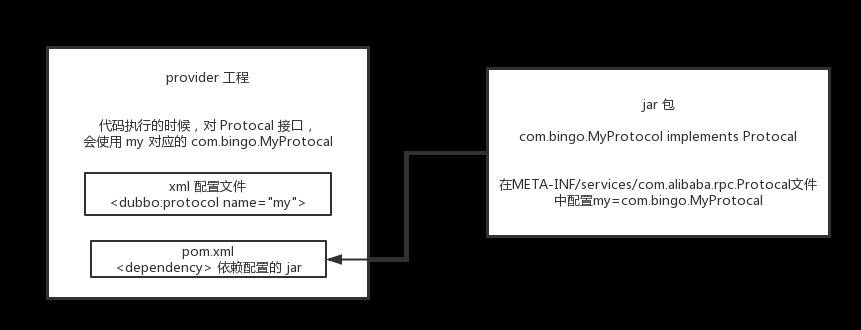

---

面试官心理分析
服务治理，这个问题如果问你，其实就是看看你有没有服务治理的思想，因为这个是做过复杂
微服务的人肯定会遇到的一个问题。
服务降级，这个是涉及到复杂分布式系统中必备的一个话题，因为分布式系统互相来回调用，
任何一个系统故障了，你不降级，直接就全盘崩溃？那就太坑爹了吧。
失败重试，分布式系统中网络请求如此频繁，要是因为网络问题不小心失败了一次，是不是要
重试？
超时重试，跟上面一样，如果不小心网络慢一点，超时了，如何重试？
面试题剖析
服务治理
1. 调用链路自动生成
一个大型的分布式系统，或者说是用现在流行的微服务架构来说吧，分布式系统由大量的服
务组成。那么这些服务之间互相是如何调用的？调用链路是啥？说实话，几乎到后面没人搞的
清楚了，因为服务实在太多了，可能几百个甚至几千个服务。
那就需要基于 dubbo 做的分布式系统中，对各个服务之间的调用自动记录下来，然后自动将各
个服务之间的依赖关系和调用链路生成出来，做成一张图，显示出来，大家才可以看到对
吧。

---

2. 服务访问压力以及时长统计
需要自动统计各个接口和服务之间的调用次数以及访问延时，而且要分成两个级别。
一个级别是接口粒度，就是每个服务的每个接口每天被调用多少次，TP50/TP90/TP99，三
个档次的请求延时分别是多少；
第二个级别是从源头入口开始，一个完整的请求链路经过几十个服务之后，完成一次请
求，每天全链路走多少次，全链路请求延时的 TP50/TP90/TP99，分别是多少。
这些东西都搞定了之后，后面才可以来看当前系统的压力主要在哪里，如何来扩容和优化啊。
3. 其它
服务分层（避免循环依赖）
调用链路失败监控和报警
服务鉴权
每个服务的可用性的监控（接口调用成功率？几个 9？99.99%，99.9%，99%）
服务降级
比如说服务 A 调用服务 B，结果服务 B 挂掉了，服务 A 重试几次调用服务 B，还是不行，那么
直接降级，走一个备用的逻辑，给用户返回响应。

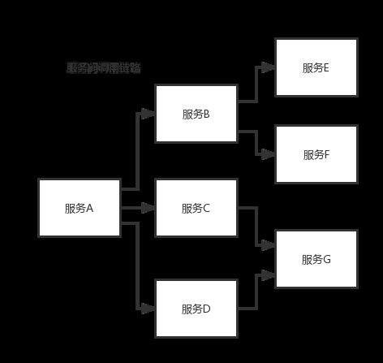

---

举个栗子，我们有接口 HelloService  。 HelloServiceImpl  有该接口的具体实现。
 
 
  
   
 
 
 
 
 
 
 
  
    
 
 
  
        
out
 
    
public interface HelloService {
void sayHello();
}
public class HelloServiceImpl implements HelloService {
public void sayHello() {
System.
.println("hello world......");
}
}
java
 
    
 
    
 
    
 
    
    
 
 
 
 
    
 
 
    
 
 
    
    
 
 
<?xml version="1.0" encoding="UTF-8"?>
 
 
    
 
    
beans
<
xmlns
http://www.springframework.org/schema/beans
="
"
xsi
xmlns:
http://www.w3.org/2001/XMLSchema-instance
="
"
dubbo
xmlns:
htt
="
schemaLocation
xsi:
http://www.springframework.org/schema/beans        
="
 
 
application
<dubbo:
name
dubbo-provider
="
" />
 
 
registry
<dubbo:
address
zookeeper://127.0.0.1:2181
="
" />
 
 
 
protocol
<dubbo:
name
dubbo
="
" port
20880
="
" />
 
 
service
<dubbo:
interface
com.zhss.service.HelloService
="
" ref
helloServ
="
 
 
 
bean
<
id
helloServiceImpl
="
" class
com.zhss.service.HelloServiceImpl
="
"
beans
</
>
<?xml version="1.0" encoding="UTF-8"?>
 
 
    
 
    
 
    
beans
<
xmlns
http://www.springframework.org/schema/beans
="
"
xsi
xmlns:
http://www.w3.org/2001/XMLSchema-instance
="
"
dubbo
xmlns:
http://code.alibabatech.com/schema/dubbo
="
"
schemaLocation
xsi:
http://www.springframework.org/schema/beans        
="
 
  
application
<dubbo:
name
dubbo-consumer
="
"
/>
 
 
registry
<dubbo:
address
zookeeper://127.0.0.1:2181
="
" />
 
 
reference
<dubbo:
id
fooService
="
" interface
com.test.service.FooServic
="
reference
</dubbo:
>
beans
</
>
xml

---

我们调用接口失败的时候，可以通过 mock  统一返回 null。
mock 的值也可以修改为 true，然后再跟接口同一个路径下实现一个 Mock 类，命名规则是 “接
口名称+ Mock  ” 后缀。然后在 Mock 类里实现自己的降级逻辑。
失败重试和超时重试
所谓失败重试，就是 consumer 调用 provider 要是失败了，比如抛异常了，此时应该是可以重
试的，或者调用超时了也可以重试。配置如下：
举个栗子。
某个服务的接口，要耗费 5s，你这边不能干等着，你这边配置了 timeout 之后，我等待 2s，还
没返回，我直接就撤了，不能干等你。
可以结合你们公司具体的场景来说说你是怎么设置这些参数的：
timeout  ：一般设置为 200ms  ，我们认为不能超过 200ms  还没返回。
retries  ：设置 retries，一般是在读请求的时候，比如你要查询个数据，你可以设置个
retries，如果第一次没读到，报错，重试指定的次数，尝试再次读取。
面试题
分布式服务接口的幂等性如何设计（比如不能重复扣款）？
面试官心理分析
从这个问题开始，面试官就已经进入了实际的生产问题的面试了。
 
 
 
 
  
    
 
 
  
        
 
    
public class HelloServiceMock implements HelloService {
public void sayHello() {
// 降级逻辑
}
}
java
 
 
 
 
 
reference
<dubbo:
id
xxxx
="
" interface
xx
="
" check
true
="
" async
false
="
" retrie
xml

---

一个分布式系统中的某个接口，该如何保证幂等性？这个事儿其实是你做分布式系统的时候必
须要考虑的一个生产环境的技术问题。啥意思呢？
你看，假如你有个服务提供一些接口供外部调用，这个服务部署在了 5 台机器上，接着有个接
口就是付款接口。然后人家用户在前端上操作的时候，不知道为啥，总之就是一个订单不小心
发起了两次支付请求，然后这俩请求分散在了这个服务部署的不同的机器上，好了，结果一
个订单扣款扣两次。
或者是订单系统调用支付系统进行支付，结果不小心因为网络超时了，然后订单系统走了前面
我们看到的那个重试机制，咔嚓给你重试了一把，好，支付系统收到一个支付请求两次，而且
因为负载均衡算法落在了不同的机器上，尴尬了。。。
所以你肯定得知道这事儿，否则你做出来的分布式系统恐怕容易埋坑。
面试题剖析
这个不是技术问题，这个没有通用的一个方法，这个应该结合业务来保证幂等性。
所谓幂等性，就是说一个接口，多次发起同一个请求，你这个接口得保证结果是准确的，比如
不能多扣款、不能多插入一条数据、不能将统计值多加了 1。这就是幂等性。
其实保证幂等性主要是三点：
对于每个请求必须有一个唯一的标识，举个栗子：订单支付请求，肯定得包含订单 id，一
个订单 id 最多支付一次，对吧。
每次处理完请求之后，必须有一个记录标识这个请求处理过了。常见的方案是在 mysql 中
记录个状态啥的，比如支付之前记录一条这个订单的支付流水。
每次接收请求需要进行判断，判断之前是否处理过。比如说，如果有一个订单已经支付
了，就已经有了一条支付流水，那么如果重复发送这个请求，则此时先插入支付流水，
orderId 已经存在了，唯一键约束生效，报错插入不进去的。然后你就不用再扣款了。
实际运作过程中，你要结合自己的业务来，比如说利用 Redis，用 orderId 作为唯一键。只有成
功插入这个支付流水，才可以执行实际的支付扣款。
要求是支付一个订单，必须插入一条支付流水，order_id 建一个唯一键 unique key  。你在支
付一个订单之前，先插入一条支付流水，order_id 就已经进去了。你就可以写一个标识到 Redis
里面去， set order_id payed  ，下一次重复请求过来了，先查 Redis 的 order_id 对应的
value，如果是 payed  就说明已经支付过了，你就别重复支付了。
面试题
分布式服务接口请求的顺序性如何保证？

---

面试官心理分析
其实分布式系统接口的调用顺序，也是个问题，一般来说是不用保证顺序的。但是有时候可能
确实是需要严格的顺序保证。给大家举个例子，你服务 A 调用服务 B，先插入再删除。好，结
果俩请求过去了，落在不同机器上，可能插入请求因为某些原因执行慢了一些，导致删除请求
先执行了，此时因为没数据所以啥效果也没有；结果这个时候插入请求过来了，好，数据插入
进去了，那就尴尬了。
本来应该是 “先插入 -> 再删除”，这条数据应该没了，结果现在 “先删除 -> 再插入”，数据还存
在，最后你死都想不明白是怎么回事。
所以这都是分布式系统一些很常见的问题。
面试题剖析
首先，一般来说，个人建议是，你们从业务逻辑上设计的这个系统最好是不需要这种顺序性的
保证，因为一旦引入顺序性保障，比如使用分布式锁，会导致系统复杂度上升，而且会带来
效率低下，热点数据压力过大等问题。
下面我给个我们用过的方案吧，简单来说，首先你得用 Dubbo 的一致性 hash 负载均衡策略，
将比如某一个订单 id 对应的请求都给分发到某个机器上去，接着就是在那个机器上，因为可能
还是多线程并发执行的，你可能得立即将某个订单 id 对应的请求扔一个内存队列里去，强制
排队，这样来确保他们的顺序性。

---

但是这样引发的后续问题就很多，比如说要是某个订单对应的请求特别多，造成某台机器成热
点怎么办？解决这些问题又要开启后续一连串的复杂技术方案...... 曾经这类问题弄的我们头疼
不已，所以，还是建议什么呢？
最好是比如说刚才那种，一个订单的插入和删除操作，能不能合并成一个操作，就是一个删
除，或者是其它什么，避免这种问题的产生。
面试题
如何自己设计一个类似 Dubbo 的 RPC 框架？
面试官心理分析

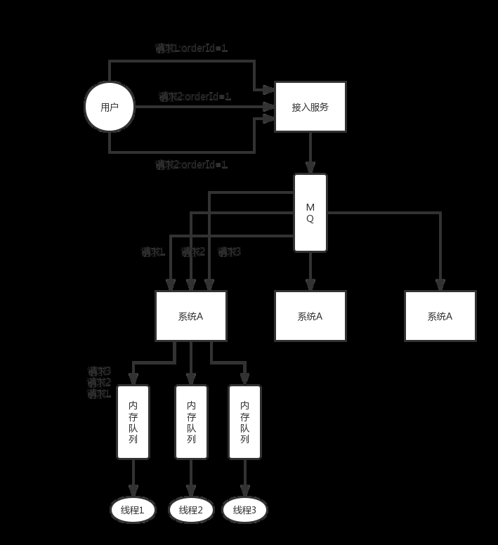

---

说实话，就这问题，其实就跟问你如何自己设计一个 MQ 一样的道理，就考两个：
你有没有对某个 rpc 框架原理有非常深入的理解。
你能不能从整体上来思考一下，如何设计一个 rpc 框架，考考你的系统设计能力。
面试题剖析
其实问到你这问题，你起码不能认怂，因为是知识的扫盲，那我不可能给你深入讲解什么
kafka 源码剖析，dubbo 源码剖析，何况我就算讲了，你要真的消化理解和吸收，起码个把月
以后了。
所以我给大家一个建议，遇到这类问题，起码从你了解的类似框架的原理入手，自己说说参照
dubbo 的原理，你来设计一下，举个例子，dubbo 不是有那么多分层么？而且每个分层是干啥
的，你大概是不是知道？那就按照这个思路大致说一下吧，起码你不能懵逼，要比那些上来就
懵，啥也说不出来的人要好一些。
举个栗子，我给大家说个最简单的回答思路：
上来你的服务就得去注册中心注册吧，你是不是得有个注册中心，保留各个服务的信息，
可以用 zookeeper 来做，对吧。
然后你的消费者需要去注册中心拿对应的服务信息吧，对吧，而且每个服务可能会存在于
多台机器上。
接着你就该发起一次请求了，咋发起？当然是基于动态代理了，你面向接口获取到一个动
态代理，这个动态代理就是接口在本地的一个代理，然后这个代理会找到服务对应的机器
地址。
然后找哪个机器发送请求？那肯定得有个负载均衡算法了，比如最简单的可以随机轮询是
不是。
接着找到一台机器，就可以跟它发送请求了，第一个问题咋发送？你可以说用 netty 了，
nio 方式；第二个问题发送啥格式数据？你可以说用 hessian 序列化协议了，或者是别的，
对吧。然后请求过去了。
服务器那边一样的，需要针对你自己的服务生成一个动态代理，监听某个网络端口了，然
后代理你本地的服务代码。接收到请求的时候，就调用对应的服务代码，对吧。
这就是一个最最基本的 rpc 框架的思路，先不说你有多牛逼的技术功底，哪怕这个最简单的思
路你先给出来行不行？
分布式系统 CAP 定理 P 代表什么含义
作者之前在看 CAP 定理时抱有很大的疑惑，CAP 定理的定义是指在分布式系统中三者只能满足
其二，也就是存在分布式 CA 系统的。作者在网络上查阅了很多关于 CAP 文章，虽然这些文章
对于 P 的解释五花八门，但总结下来这些观点大多都是指 P 是不可缺少的，也就是说在分布式

---

系统只能是 AP 或者 CP，这种理论与我之前所认识的理论（存在分布式 CA 系统）是冲突的，
所以才有了疑惑。
这个定理起源于加州大学柏克莱分校（University of California, Berkeley）的计算机科学
家埃里克·布鲁尔在 2000 年的分布式计算原理研讨会（PODC）上提出的一个猜想。 在
2002 年，麻省理工学院（MIT）的赛斯·吉尔伯特和南希·林奇发表了布鲁尔猜想的证
明，使之成为一个定理。
什么是 CAP 定理（CAP theorem）
在理论计算机科学中，CAP 定理（CAP theorem），又被称作布鲁尔定理（Brewer's
theorem），它指出对于一个分布式计算系统来说，不可能同时满足以下三点：
一致性（Consistency） （等同于所有节点访问同一份最新的数据副本）
可用性（Availability）（每次请求都能获取到非错的响应——但是不保证获取的数据为最新
数据）
分区容错性（Partition tolerance）（以实际效果而言，分区相当于对通信的时限要求。系统
如果不能在时限内达成数据一致性，就意味着发生了分区的情况，必须就当前操作在 C 和 A
之间做出选择。）
分区容错性（Partition tolerance）
理解 CAP 理论的最简单方式是想象两个节点分处分区两侧。允许至少一个节点更新状态会导致
数据不一致，即丧失了 C 性质。如果为了保证数据一致性，将分区一侧的节点设置为不可用，
那么又丧失了 A 性质。除非两个节点可以互相通信，才能既保证 C 又保证 A，这又会导致丧失
P 性质。
P 指的是分区容错性，分区现象产生后需要容错，容错是指在 A 与 C 之间选择。如果分布
式系统没有分区现象（没有出现不一致不可用情况） 本身就没有分区 ，既然没有分区则就
更没有分区容错性 P。
无论我设计的系统是 AP 还是 CP 系统如果没有出现不一致不可用。 则该系统就处于 CA 状
态
P 的体现前提是得有分区情况存在
文章来源：维基百科 CAP 定理
面试题
zookeeper 都有哪些使用场景？

---

面试官心理分析
现在聊的 topic 是分布式系统，面试官跟你聊完了 dubbo 相关的一些问题之后，已经确认你对
分布式服务框架/RPC框架基本都有一些认知了。那么他可能开始要跟你聊分布式相关的其它问
题了。
分布式锁这个东西，很常用的，你做 Java 系统开发，分布式系统，可能会有一些场景会用到。
最常用的分布式锁就是基于 zookeeper 来实现的。
其实说实话，问这个问题，一般就是看看你是否了解 zookeeper，因为 zookeeper 是分布式系统
中很常见的一个基础系统。而且问的话常问的就是说 zookeeper 的使用场景是什么？看你知道
不知道一些基本的使用场景。但是其实 zookeeper 挖深了自然是可以问的很深很深的。
面试题剖析
大致来说，zookeeper 的使用场景如下，我就举几个简单的，大家能说几个就好了：
分布式协调
分布式锁
元数据/配置信息管理
HA高可用性
分布式协调
这个其实是 zookeeper 很经典的一个用法，简单来说，就好比，你 A 系统发送个请求到 mq，
然后 B 系统消息消费之后处理了。那 A 系统如何知道 B 系统的处理结果？用 zookeeper 就可以
实现分布式系统之间的协调工作。A 系统发送请求之后可以在 zookeeper 上对某个节点的值注
册个监听器，一旦 B 系统处理完了就修改 zookeeper 那个节点的值，A 系统立马就可以收到通
知，完美解决。

---

分布式锁
举个栗子。对某一个数据连续发出两个修改操作，两台机器同时收到了请求，但是只能一台机
器先执行完另外一个机器再执行。那么此时就可以使用 zookeeper 分布式锁，一个机器接收到
了请求之后先获取 zookeeper 上的一把分布式锁，就是可以去创建一个 znode，接着执行操
作；然后另外一个机器也尝试去创建那个 znode，结果发现自己创建不了，因为被别人创建
了，那只能等着，等第一个机器执行完了自己再执行。
元数据/配置信息管理
zookeeper 可以用作很多系统的配置信息的管理，比如 kafka、storm 等等很多分布式系统都会
选用 zookeeper 来做一些元数据、配置信息的管理，包括 dubbo 注册中心不也支持 zookeeper
么？

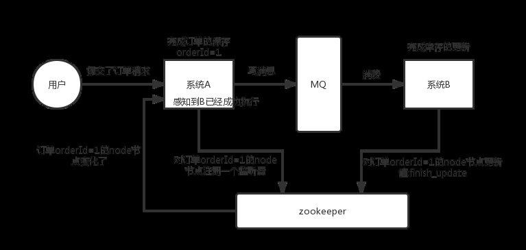

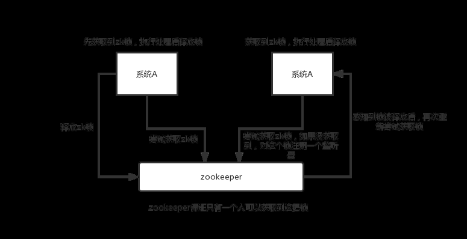

---

HA高可用性
这个应该是很常见的，比如 hadoop、hdfs、yarn 等很多大数据系统，都选择基于 zookeeper 来
开发 HA 高可用机制，就是一个重要进程一般会做主备两个，主进程挂了立马通过 zookeeper
感知到切换到备用进程。
面试题

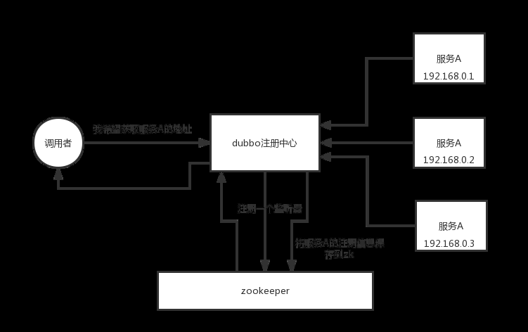

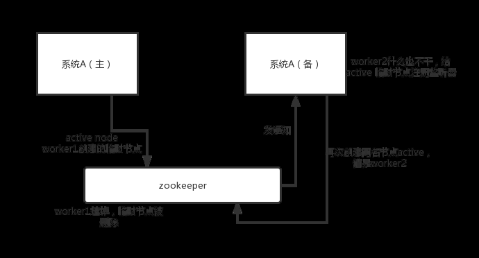

---

一般实现分布式锁都有哪些方式？使用 Redis 如何设计分布式锁？使用 zk 来设计分布式锁可以
吗？这两种分布式锁的实现方式哪种效率比较高？
面试官心理分析
其实一般问问题，都是这么问的，先问问你 zk，然后其实是要过渡到 zk 相关的一些问题里
去，比如分布式锁。因为在分布式系统开发中，分布式锁的使用场景还是很常见的。
面试题剖析
Redis 分布式锁
官方叫做 RedLock  算法，是 Redis 官方支持的分布式锁算法。
这个分布式锁有 3 个重要的考量点：
互斥（只能有一个客户端获取锁）
不能死锁
容错（只要大部分 Redis 节点创建了这把锁就可以）
Redis 最普通的分布式锁
第一个最普通的实现方式，就是在 Redis 里使用 SET key value [EX seconds] [PX 
milliseconds] NX  创建一个 key，这样就算加锁。其中：
NX ：表示只有 key  不存在的时候才会设置成功，如果此时 redis 中存在这个 key ，那
么设置失败，返回 nil 。
EX seconds ：设置 key  的过期时间，精确到秒级。意思是 seconds  秒后锁自动释
放，别人创建的时候如果发现已经有了就不能加锁了。
PX milliseconds ：同样是设置 key  的过期时间，精确到毫秒级。
比如执行以下命令：
释放锁就是删除 key ，但是一般可以用 lua  脚本删除，判断 value 一样才删除：
SET resource_name my_random_value PX 30000 NX
r

---

为啥要用 random_value  随机值呢？因为如果某个客户端获取到了锁，但是阻塞了很长时间
才执行完，比如说超过了 30s，此时可能已经自动释放锁了，此时可能别的客户端已经获取到
了这个锁，要是你这个时候直接删除 key 的话会有问题，所以得用随机值加上面的 lua  脚本
来释放锁。
但是这样是肯定不行的。因为如果是普通的 Redis 单实例，那就是单点故障。或者是 Redis 普
通主从，那 Redis 主从异步复制，如果主节点挂了（key 就没有了），key 还没同步到从节点，
此时从节点切换为主节点，别人就可以 set key，从而拿到锁。
RedLock 算法
这个场景是假设有一个 Redis cluster，有 5 个 Redis master 实例。然后执行如下步骤获取一把
锁：
1. 获取当前时间戳，单位是毫秒；
2. 跟上面类似，轮流尝试在每个 master 节点上创建锁，过期时间较短，一般就几十毫秒；
3. 尝试在大多数节点上建立一个锁，比如 5 个节点就要求是 3 个节点 n / 2 + 1  ；
4. 客户端计算建立好锁的时间，如果建立锁的时间小于超时时间，就算建立成功了；
5. 要是锁建立失败了，那么就依次之前建立过的锁删除；
6. 只要别人建立了一把分布式锁，你就得不断轮询去尝试获取锁。
-- 删除锁的时候，找到 key 对应的 value，跟自己传过去的 value 做比较，如果是一样的才删
if redis.call("get",KEYS[1]) == ARGV[1] then 
    return redis.call("del",KEYS[1]) 
else 
    return 0 
end
lua

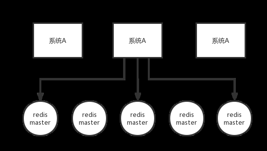

---

Redis 官方给出了以上两种基于 Redis 实现分布式锁的方法，详细说明可以查看：
https://redis.io/topics/distlock 。
zk 分布式锁
zk 分布式锁，其实可以做的比较简单，就是某个节点尝试创建临时 znode，此时创建成功了就
获取了这个锁；这个时候别的客户端来创建锁会失败，只能注册个监听器监听这个锁。释放锁
就是删除这个 znode，一旦释放掉就会通知客户端，然后有一个等待着的客户端就可以再次重
新加锁。
 
 
  
 
    
 
 
 connectedSemaphore  
 
 
    
 
 zookeeper  
    
 
 latch  
 
    
 
  
        
  
            
zookeeper  
 
            
  
                connectedSemaphore
 
             
 
 e   
                e
 
             
 
            
out
 
         
 
 e   
            e
 
         
     
 
    
 
    
 
 
 productId   
        
 path  
  productId  
/** 
 * ZooKeeperSession 
 */
public class ZooKeeperSession {
private static CountDownLatch
= new CountDownLatch(
private ZooKeeper
;
private CountDownLatch
;
public ZooKeeperSession() {
try {
this.
= new ZooKeeper("192.168.31.187:2181,192.168.31
try {
.await();
} catch (InterruptedException
) {
.printStackTrace();
}
System.
.println("ZooKeeper session established......");
} catch (Exception
) {
.printStackTrace();
}
}
/** 
     * 获取分布式锁 
     *  
     * @param productId 
     */
public Boolean acquireDistributedLock(Long
) {
String
= "/product-lock-" +
;
java

---

zookeeper
path  
 
OPEN_ACL_UNSAFE  
            
 
 
         
 
 e   
            
 
  
                
  
                    
 
                    
 stat  zk
path  
 
 
                    
 stat 
 
  
                        
latch  
 
 
                        
latch
waitTime  
MILLISECONDS
 
                        
latch  
 
                     
                    zookeeper
path  
 
OPEN_ACL_UNSA
                    
 
 
                 
 
 ee   
                    
 
                 
             
 
         
        
 
 
     
 
    
 
    
 
 
 productId   
        
 path  
  productId  
        
  
            zookeeper
path  
 
            
out
  produc
         
 
 e   
            e
 
         
     
 
    
 
try {
.create(
, "".getBytes(), Ids.
, Cre
return true;
} catch (Exception
) {
while (true) {
try {
// 相当于是给node注册一个监听器，去看看这个监听器是否存在
Stat
=
.exists(
, true);
if (
!= null) {
this.
= new CountDownLatch(1);
this.
.await(
, TimeUnit.
);
this.
= null;
}
.create(
, "".getBytes(), Ids.
return true;
} catch (Exception
) {
continue;
}
}
}
return true;
}
/** 
     * 释放掉一个分布式锁 
     *  
     * @param productId 
     */
public void releaseDistributedLock(Long
) {
String
= "/product-lock-" +
;
try {
.delete(
, -1);
System.
.println("release the lock for product[id=" +
} catch (Exception
) {
.printStackTrace();
}
}
/** 
     * 建立 zk session 的 watcher 
     */

---

event   
            
out
  event
 
            
 
 
 event
  
                connectedSemaphore
 
             
 
            
 
latch 
 
  
                
latch
 
             
         
 
     
 
    
 
    
 
 
 
  
 
        
 
 
 instance  
 
        
  
            instance  
 
 
         
 
        
 
 
 
  
            
 instance  
         
 
     
 
    
 
    
 
 
 
  
        
 
 
     
 
    
private class ZooKeeperWatcher implements Watcher {
public void process(WatchedEvent
) {
System.
.println("Receive watched event: " +
.getState(
if (KeeperState.SyncConnected ==
.getState()) {
.countDown();
}
if (this.
!= null) {
this.
.countDown();
}
}
}
/** 
     * 封装单例的静态内部类 
     */
private static class Singleton {
private static ZooKeeperSession
;
static {
= new ZooKeeperSession();
}
public static ZooKeeperSession getInstance() {
return
;
}
}
/** 
     * 获取单例 
     *  
     * @return 
     */
public static ZooKeeperSession getInstance() {
return Singleton.getInstance();
}
/** 
     * 初始化单例的便捷方法

---

也可以采用另一种方式，创建临时顺序节点：
如果有一把锁，被多个人给竞争，此时多个人会排队，第一个拿到锁的人会执行，然后释放
锁；后面的每个人都会去监听排在自己前面的那个人创建的 node 上，一旦某个人释放了锁，
排在自己后面的人就会被 ZooKeeper 给通知，一旦被通知了之后，就 ok 了，自己就获取到了
锁，就可以执行代码了。
 
    
 
 
 
  
        
 
     
 
     */
public static void init() {
getInstance();
}
}
 
 
 
 
  
 
    
 
 zk  
    
 
 locksRoot  
 
    
 
 productId  
    
 
 waitNode  
    
 
 lockNode  
    
 
 latch  
    
 
 connectedLatch  
 
 
    
 
 sessionTimeout  
 
 
    
 
 productId   
        
productId  productId  
        
  
            
 address  
            zk  
 
address  sessionTimeout  
 
            connectedLatch
 
         
 
 e   
            
 
 
e
 
         
 
 e   
            
 
 
e
 
         
 
 e   
            
 
 
e
 
         
     
 
    
 
 
 event   
        
 event
 
 
  
public class ZooKeeperDistributedLock implements Watcher {
private ZooKeeper
;
private String
= "/locks";
private String
;
private String
;
private String
;
private CountDownLatch
;
private CountDownLatch
= new CountDownLatch(1);
private int
= 30000;
public ZooKeeperDistributedLock(String
) {
this.
=
;
try {
String
= "192.168.31.187:2181,192.168.31.19:2181,192.1
= new ZooKeeper(
,
, this);
.await();
} catch (IOException
) {
throw new LockException( );
} catch (KeeperException
) {
throw new LockException( );
} catch (InterruptedException
) {
throw new LockException( );
}
}
public void process(WatchedEvent
) {
if (
.getState() == KeeperState.SyncConnected) {
java

---

connectedLatch
 
            
 
         
 
        
 
latch 
 
  
            
latch
 
         
     
 
    
 
 
  
        
  
            
 
  
                
 
             
  
                
waitNode  sessionTimeout
 
             
         
 
 e   
            
 
 
e
 
         
 
 e   
            
 
 
e
 
         
     
 
    
 
 
  
        
  
             
 
            
 
            
 
            
 
            lockNode  zk
locksRoot  
  productId  
 
 
 
            
 
             
 
            
 locks  zk
locksRoot  
 
            
locks
 
 
            
lockNode
locksRoot
 locks
 
                
 
                
 
 
             
 
            
 
      
 previousLockIndex  
 
            
 i  
 i  locks
 i
  
.countDown();
return;
}
if (this.
!= null) {
this.
.countDown();
}
}
public void acquireDistributedLock() {
try {
if (this.tryLock()) {
return;
} else {
waitForLock(
,
);
}
} catch (KeeperException
) {
throw new LockException( );
} catch (InterruptedException
) {
throw new LockException( );
}
}
public boolean tryLock() {
try {
// 传入进去的locksRoot + “/” + productId
// 假设productId代表了一个商品id，比如说1
// locksRoot = locks
// /locks/10000000000，/locks/10000000001，/locks/10000000002
=
.create(
+ "/" +
, new byte[0],
// 看看刚创建的节点是不是最小的节点
// locks：10000000000，10000000001，10000000002
List<String>
=
.getChildren(
, false);
Collections.sort(
);
if(
.equals(
+"/"+
.get(0))){
//如果是最小的节点,则表示取得锁
return true;
}
//如果不是最小的节点，找到比自己小1的节点
int
= -1;
for(int
= 0;
<
.size();
++) {

---

lockNode
locksRoot  “ ”  locks
i
  
                     previousLockIndex  i  
 
            
 
         
        
 
       
waitNode  locks
previousLockIndex
 
         
 
 e   
            
 
 
e
 
         
 
 e   
            
 
 
e
 
         
        
 
 
     
 
    
 
 
 waitNode  
 waitTime  
 
        
 stat  zk
locksRoot  
  waitNode  
 
        
 stat 
 
  
            
latch  
 
 
            
latch
waitTime  
MILLISECONDS
 
            
latch  
 
         
        
 
 
     
 
    
 
 
  
        
  
            
 
            
 
            
out
  lockNode
 
            zk
lockNode  
 
            lockNode  
 
            zk
 
         
 
 e   
            e
 
         
 
 e   
            e
 
         
     
 
    
 
 
 
 
  
        
 
 
 
 serialVersionUID  
 
 
        
 
 e   
if(
.equals(
+
/
+
.get( ))) {
=
- 1;
break;
}
}
this.
=
.get(
);
} catch (KeeperException
) {
throw new LockException( );
} catch (InterruptedException
) {
throw new LockException( );
}
return false;
}
private boolean waitForLock(String
, long
) throws Int
Stat
=
.exists(
+ "/" +
, true);
if (
!= null) {
this.
= new CountDownLatch(1);
this.
.await(
, TimeUnit.
);
this.
= null;
}
return true;
}
public void unlock() {
try {
// 删除/locks/10000000000节点
// 删除/locks/10000000001节点
System.
.println("unlock " +
);
.delete(
, -1);
= null;
.close();
} catch (InterruptedException
) {
.printStackTrace();
} catch (KeeperException
) {
.printStackTrace();
}
}
public class LockException extends RuntimeException {
private static final long
= 1L;
public LockException(String
) {

---

redis 分布式锁和 zk 分布式锁的对比
redis 分布式锁，其实需要自己不断去尝试获取锁，比较消耗性能。
zk 分布式锁，获取不到锁，注册个监听器即可，不需要不断主动尝试获取锁，性能开销较
小。
另外一点就是，如果是 Redis 获取锁的那个客户端 出现 bug 挂了，那么只能等待超时时间之后
才能释放锁；而 zk 的话，因为创建的是临时 znode，只要客户端挂了，znode 就没了，此时就
自动释放锁。
Redis 分布式锁大家没发现好麻烦吗？遍历上锁，计算时间等等......zk 的分布式锁语义清晰实现
简单。
所以先不分析太多的东西，就说这两点，我个人实践认为 zk 的分布式锁比 Redis 的分布式锁牢
靠、而且模型简单易用。
面试题
分布式事务了解吗？你们是如何解决分布式事务问题的？
面试官心理分析
只要聊到你做了分布式系统，必问分布式事务，你对分布式事务一无所知的话，确实会很坑，
你起码得知道有哪些方案，一般怎么来做，每个方案的优缺点是什么。
现在面试，分布式系统成了标配，而分布式系统带来的分布式事务也成了标配了。因为你做系
统肯定要用事务吧，如果是分布式系统，肯定要用分布式事务吧。先不说你搞过没有，起码你
得明白有哪几种方案，每种方案可能有啥坑？比如 TCC 方案的网络问题、XA 方案的一致性问
题。
            
e
 
         
 
        
 
 e   
            
e
 
         
    
super( );
}
public LockException(Exception
) {
super( );
}
}
}

---

面试题剖析
分布式事务的实现主要有以下 6 种方案：
XA 方案
TCC 方案
SAGA 方案
本地消息表
可靠消息最终一致性方案
最大努力通知方案
两阶段提交方案/XA 方案
所谓的 XA 方案，即：两阶段提交，有一个事务管理器的概念，负责协调多个数据库（资源管
理器）的事务，事务管理器先问问各个数据库你准备好了吗？如果每个数据库都回复 ok，那么
就正式提交事务，在各个数据库上执行操作；如果任何其中一个数据库回答不 ok，那么就回滚
事务。
这种分布式事务方案，比较适合单块应用里，跨多个库的分布式事务，而且因为严重依赖于数
据库层面来搞定复杂的事务，效率很低，绝对不适合高并发的场景。如果要玩儿，那么基于 
Spring + JTA  就可以搞定，自己随便搜个 demo 看看就知道了。
这个方案，我们很少用，一般来说某个系统内部如果出现跨多个库的这么一个操作，是不合
规的。我可以给大家介绍一下， 现在微服务，一个大的系统分成几十个甚至几百个服务。一般
来说，我们的规定和规范，是要求每个服务只能操作自己对应的一个数据库。
如果你要操作别的服务对应的库，不允许直连别的服务的库，违反微服务架构的规范，你随便
交叉胡乱访问，几百个服务的话，全体乱套，这样的一套服务是没法管理的，没法治理的，可
能会出现数据被别人改错，自己的库被别人写挂等情况。
如果你要操作别人的服务的库，你必须是通过调用别的服务的接口来实现，绝对不允许交叉
访问别人的数据库。

---

TCC 方案
TCC 的全称是： Try  、 Confirm  、 Cancel  。
Try 阶段：这个阶段说的是对各个服务的资源做检测以及对资源进行锁定或者预留。
Confirm 阶段：这个阶段说的是在各个服务中执行实际的操作。
Cancel 阶段：如果任何一个服务的业务方法执行出错，那么这里就需要进行补偿，就是执
行已经执行成功的业务逻辑的回滚操作。（把那些执行成功的回滚）
这种方案说实话几乎很少人使用，我们用的也比较少，但是也有使用的场景。因为这个事务回
滚实际上是严重依赖于你自己写代码来回滚和补偿了，会造成补偿代码巨大，非常之恶心。
比如说我们，一般来说跟钱相关的，跟钱打交道的，支付、交易相关的场景，我们会用 TCC，
严格保证分布式事务要么全部成功，要么全部自动回滚，严格保证资金的正确性，保证在资金
上不会出现问题。
而且最好是你的各个业务执行的时间都比较短。
但是说实话，一般尽量别这么搞，自己手写回滚逻辑，或者是补偿逻辑，实在太恶心了，那个
业务代码是很难维护的。

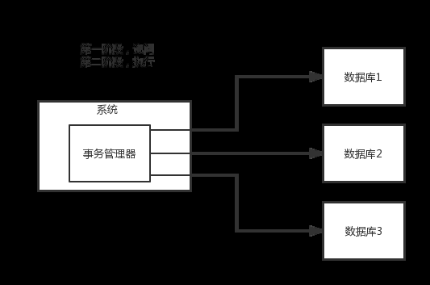

---

Saga 方案
金融核心等业务可能会选择 TCC 方案，以追求强一致性和更高的并发量，而对于更多的金融核
心以上的业务系统 往往会选择补偿事务，补偿事务处理在 30 多年前就提出了 Saga 理论，随着
微服务的发展，近些年才逐步受到大家的关注。目前业界比较公认的是采用 Saga 作为长事务
的解决方案。
基本原理
业务流程中每个参与者都提交本地事务，若某一个参与者失败，则补偿前面已经成功的参与
者。下图左侧是正常的事务流程，当执行到 T3 时发生了错误，则开始执行右边的事务补偿流
程，反向执行 T3、T2、T1 的补偿服务 C3、C2、C1，将 T3、T2、T1 已经修改的数据补偿掉。

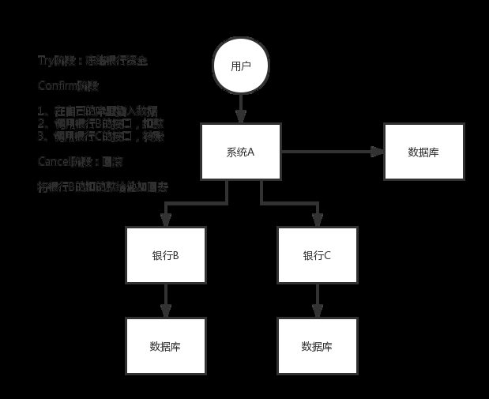

---

使用场景
对于一致性要求高、短流程、并发高 的场景，如：金融核心系统，会优先考虑 TCC 方案。而在
另外一些场景下，我们并不需要这么强的一致性，只需要保证最终一致性即可。
比如 很多金融核心以上的业务（渠道层、产品层、系统集成层），这些系统的特点是最终一致
即可、流程多、流程长、还可能要调用其它公司的服务。这种情况如果选择 TCC 方案开发的
话，一来成本高，二来无法要求其它公司的服务也遵循 TCC 模式。同时流程长，事务边界太
长，加锁时间长，也会影响并发性能。
所以 Saga 模式的适用场景是：
业务流程长、业务流程多；
参与者包含其它公司或遗留系统服务，无法提供 TCC 模式要求的三个接口。
优势
一阶段提交本地事务，无锁，高性能；
参与者可异步执行，高吞吐；
补偿服务易于实现，因为一个更新操作的反向操作是比较容易理解的。
缺点

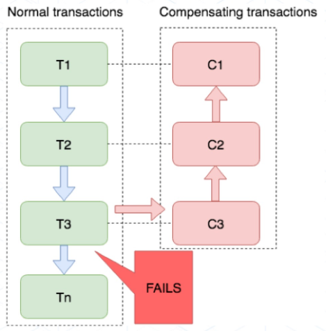

---

不保证事务的隔离性。
本地消息表
本地消息表其实是国外的 ebay 搞出来的这么一套思想。
这个大概意思是这样的：
1. A 系统在自己本地一个事务里操作同时，插入一条数据到消息表；
2. 接着 A 系统将这个消息发送到 MQ 中去；
3. B 系统接收到消息之后，在一个事务里，往自己本地消息表里插入一条数据，同时执行其他
的业务操作，如果这个消息已经被处理过了，那么此时这个事务会回滚，这样保证不会重
复处理消息；
4. B 系统执行成功之后，就会更新自己本地消息表的状态以及 A 系统消息表的状态；
5. 如果 B 系统处理失败了，那么就不会更新消息表状态，那么此时 A 系统会定时扫描自己的
消息表，如果有未处理的消息，会再次发送到 MQ 中去，让 B 再次处理；
6. 这个方案保证了最终一致性，哪怕 B 事务失败了，但是 A 会不断重发消息，直到 B 那边成
功为止。
这个方案说实话最大的问题就在于严重依赖于数据库的消息表来管理事务啥的，如果是高并
发场景咋办呢？咋扩展呢？所以一般确实很少用。
可靠消息最终一致性方案
这个的意思，就是干脆不要用本地的消息表了，直接基于 MQ 来实现事务。比如阿里的
RocketMQ 就支持消息事务。
大概的意思就是：

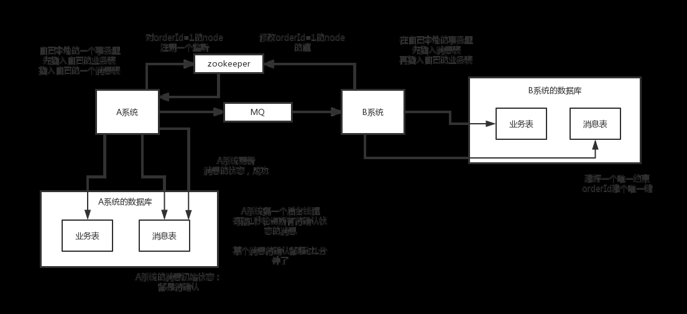

---

1. A 系统先发送一个 prepared 消息到 mq，如果这个 prepared 消息发送失败那么就直接取消
操作别执行了；
2. 如果这个消息发送成功过了，那么接着执行本地事务，如果成功就告诉 mq 发送确认消息，
如果失败就告诉 mq 回滚消息；
3. 如果发送了确认消息，那么此时 B 系统会接收到确认消息，然后执行本地的事务；
4. mq 会自动定时轮询所有 prepared 消息回调你的接口，问你，这个消息是不是本地事务处
理失败了，所有没发送确认的消息，是继续重试还是回滚？一般来说这里你就可以查下数
据库看之前本地事务是否执行，如果回滚了，那么这里也回滚吧。这个就是避免可能本地
事务执行成功了，而确认消息却发送失败了。
5. 这个方案里，要是系统 B 的事务失败了咋办？重试咯，自动不断重试直到成功，如果实在
是不行，要么就是针对重要的资金类业务进行回滚，比如 B 系统本地回滚后，想办法通知
系统 A 也回滚；或者是发送报警由人工来手工回滚和补偿。
6. 这个还是比较合适的，目前国内互联网公司大都是这么玩儿的，要不你就用 RocketMQ 支持
的，要不你就自己基于类似 ActiveMQ？RabbitMQ？自己封装一套类似的逻辑出来，总之思
路就是这样子的。
最大努力通知方案
这个方案的大致意思就是：
1. 系统 A 本地事务执行完之后，发送个消息到 MQ；
2. 这里会有个专门消费 MQ 的最大努力通知服务，这个服务会消费 MQ 然后写入数据库中记
录下来，或者是放入个内存队列也可以，接着调用系统 B 的接口；
3. 要是系统 B 执行成功就 ok 了；要是系统 B 执行失败了，那么最大努力通知服务就定时尝试
重新调用系统 B，反复 N 次，最后还是不行就放弃。
你们公司是如何处理分布式事务的？

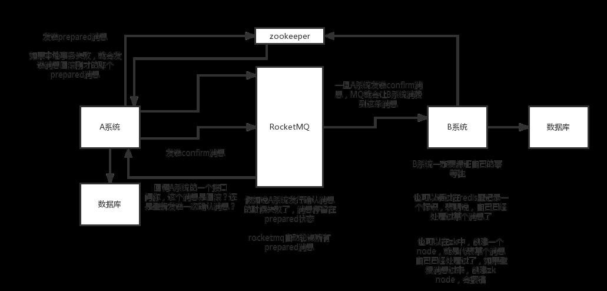

---

如果你真的被问到，可以这么说，我们某某特别严格的场景，用的是 TCC 来保证强一致性；然
后其他的一些场景基于阿里的 RocketMQ 来实现分布式事务。
你找一个严格资金要求绝对不能错的场景，你可以说你是用的 TCC 方案；如果是一般的分布式
事务场景，订单插入之后要调用库存服务更新库存，库存数据没有资金那么的敏感，可以用可
靠消息最终一致性方案。
友情提示一下，RocketMQ 3.2.6 之前的版本，是可以按照上面的思路来的，但是之后接口做了
一些改变，我这里不再赘述了。
当然如果你愿意，你可以参考可靠消息最终一致性方案来自己实现一套分布式事务，比如基于
RocketMQ 来玩儿。
面试题
集群部署时的分布式 Session 如何实现？
面试官心理分析
面试官问了你一堆 Dubbo 是怎么玩儿的，你会玩儿 Dubbo 就可以把单块系统弄成分布式系
统，然后分布式之后接踵而来的就是一堆问题，最大的问题就是分布式事务、接口幂等性、
分布式锁，还有最后一个就是分布式 Session。
当然了，分布式系统中的问题何止这么一点，非常之多，复杂度很高，这里只是说一下常见的
几个问题，也是面试的时候常问的几个。
面试题剖析
Session 是啥？浏览器有个 Cookie，在一段时间内这个 Cookie 都存在，然后每次发请求过来都
带上一个特殊的 jsessionid cookie  ，就根据这个东西，在服务端可以维护一个对应的
Session 域，里面可以放点数据。
一般的话只要你没关掉浏览器，Cookie 还在，那么对应的那个 Session 就在，但是如果 Cookie
没了，Session 也就没了。常见于什么购物车之类的东西，还有登录状态保存之类的。
这个不多说了，懂 Java 的都该知道这个。
单块系统的时候这么玩儿 Session 没问题，但是你要是分布式系统呢，那么多的服务，Session
状态在哪儿维护啊？
其实方法很多，但是常见常用的是以下几种：

---

完全不用 Session
使用 JWT Token 储存用户身份，然后再从数据库或者 cache 中获取其他的信息。这样无论请求
分配到哪个服务器都无所谓。
Tomcat + Redis
这个其实还挺方便的，就是使用 Session 的代码，跟以前一样，还是基于 Tomcat 原生的
Session 支持即可，然后就是用一个叫做 Tomcat  RedisSessionManager  的东西，让所有我
们部署的 Tomcat 都将 Session 数据存储到 Redis 即可。
在 Tomcat 的配置文件中配置：
然后指定 Redis 的 host 和 port 就 ok 了。
还可以用上面这种方式基于 Redis 哨兵支持的 Redis 高可用集群来保存 Session 数据，都是 ok
的。
Spring Session + Redis
上面所说的第二种方式会与 Tomcat 容器重耦合，如果我要将 Web 容器迁移成 Jetty，难道还要
重新把 Jetty 都配置一遍？
 
 
Valve
<
className
com.orangefunction.tomcat.redissessions.RedisSessionHand
="
 
         
 
         
 
         
 
         
Manager
<
className
com.orangefunction.tomcat.redissessions.RedisSessionMa
="
host
{redis.host}
="
"
port
{redis.port}
="
"
database
{redis.dbnum}
="
"
maxInactiveInterval
60
="
"/>
xml
 
Valve
<
className
com.orangefunction.tomcat.redissessions.RedisSessionHand
="
 
     
 
     
     
Manager
<
className
com.orangefunction.tomcat.redissessions.RedisSessionMa
="
sentinelMaster
mymaster
="
"
sentinels
<sentinel1-ip>:26379,<sentinel2-ip>:26379,<sentinel3-ip>:2
="
maxInactiveInterval
60
="
"/>
xml

---

因为上面那种 Tomcat + Redis 的方式好用，但是会严重依赖于 Web 容器，不好将代码移植到
其他 Web 容器上去，尤其是你要是换了技术栈咋整？比如换成了 Spring Cloud 或者是 Spring
Boot 之类的呢？
所以现在比较好的还是基于 Java 一站式解决方案，也就是 Spring。人家 Spring 基本上承包了
大部分我们需要使用的框架，Spirng Cloud 做微服务，Spring Boot 做脚手架，所以用 Spring
Session 是一个很好的选择。
在 pom.xml 中配置：
在 Spring 配置文件中配置：
 
  
org.springframework.session
 
  
spring-session-data-redis
 
  
1.2.1.RELEASE
 
  
redis.clients
 
  
jedis
 
  
2.8.1
dependency
<
>
groupId
<
>
groupId
</
>
artifactId
<
>
artifactId
</
>
version
<
>
version
</
>
dependency
</
>
dependency
<
>
groupId
<
>
groupId
</
>
artifactId
<
>
artifactId
</
>
version
<
>
version
</
>
dependency
</
>
xml
    
 
 
 
    
 
    
 
 
    
 
    
 
    
 
    
 
    
 
 
 
     
bean
<
id
redisHttpSessionConfiguration
="
"
class
org.springframework.session.data.redis.config.annotation.web.h
="
 
 
property
<
name
maxInactiveIntervalInSeconds
="
" value
600
="
"/>
bean
</
>
 
 
bean
<
id
jedisPoolConfig
="
" class
redis.clients.jedis.JedisPoolConfig
="
">
 
 
 
property
<
name
maxTotal
="
" value
100
="
" />
 
 
 
property
<
name
maxIdle
="
" value
10
="
" />
bean
</
>
 
 
      
bean
<
id
jedisConnectionFactory
="
"
class
org.springframework.data.redis.connection.jedis.JedisConnecti
="
 
 
property
<
name
hostName
="
" value
${redis_hostname}
="
"/>
 
 
property
<
name
port
="
" value
${redis_port}
="
"/>
 
 
 
property
<
name
password
="
" value
${redis_pwd}
="
" />
 
 
property
<
name
timeout
="
" value
3000
="
"/>
 
 
property
<
name
usePool
="
" value
true
="
"/>
xml

---

在 web.xml 中配置：
示例代码：
上面的代码就是 ok 的，给 Spring Session 配置基于 Redis 来存储 Session 数据，然后配置了一
个 Spring Session 的过滤器，这样的话，Session 相关操作都会交给 Spring Session 来管了。接
着在代码中，就用原生的 Session 操作，就是直接基于 Spring Session 从 Redis 中获取数据了。
实现分布式的会话有很多种方式，我说的只不过是比较常见的几种方式，Tomcat + Redis 早期
比较常用，但是会重耦合到 Tomcat 中；近些年，通过 Spring Session 来实现。
    
 
 
property
<
name
poolConfig
="
" ref
jedisPoolConfig
="
"/>
bean
</
>
 
    
springSessionRepositoryFilter
 
    
org.springframework.web.filter.DelegatingFilterProxy
 
    
springSessionRepositoryFilter
 
    
/*
filter
<
>
filter-name
<
>
filter-name
</
>
filter-class
<
>
fi
</
filter
</
>
filter-mapping
<
>
filter-name
<
>
filter-name
</
>
url-pattern
<
>
url-pattern
</
>
filter-mapping
</
>
xml
 
 
  
 
    
 
    
 
 
 request  
 usernam
        request
  
 
        
 
 
     
 
    
 
    
 
 
 request  
 model
 
        
 name  request
 
        
 name  
    
@RestController
@RequestMapping("/test")
public class TestController {
@RequestMapping("/putIntoSession")
public String putIntoSession(HttpServletRequest
, String
.getSession().setAttribute("name",
"leo");
return "ok";
}
@RequestMapping("/getFromSession")
public String getFromSession(HttpServletRequest
, Model
){
String
=
.getSession().getAttribute("name");
return
;
}
}
java

---

用 Hystrix 构建高可用服务架构
参考 Hystrix Home。
Hystrix 是什么？
在分布式系统中，每个服务都可能会调用很多其他服务，被调用的那些服务就是依赖服务，有
的时候某些依赖服务出现故障也是很正常的。
Hystrix 可以让我们在分布式系统中对服务间的调用进行控制，加入一些调用延迟或者依赖故
障的容错机制。
Hystrix 通过将依赖服务进行资源隔离，进而阻止某个依赖服务出现故障时在整个系统所有的依
赖服务调用中进行蔓延；同时 Hystrix 还提供故障时的 fallback 降级机制。
总而言之，Hystrix 通过这些方法帮助我们提升分布式系统的可用性和稳定性。
Hystrix 的历史
Hystrix 是高可用性保障的一个框架。Netflix（可以认为是国外的优酷或者爱奇艺之类的视频网
站）的 API 团队从 2011 年开始做一些提升系统可用性和稳定性的工作，Hystrix 就是从那时候
开始发展出来的。
在 2012 年的时候，Hystrix 就变得比较成熟和稳定了，Netflix 中，除了 API 团队以外，很多其他
的团队都开始使用 Hystrix。
时至今日，Netflix 中每天都有数十亿次的服务间调用，通过 Hystrix 框架在进行，而 Hystrix 也
帮助 Netflix 网站提升了整体的可用性和稳定性。
2018 年 11 月，Hystrix 在其 Github 主页宣布，不再开放新功能，推荐开发者使用其他仍然
活跃的开源项目。维护模式的转变绝不意味着 Hystrix 不再有价值。相反，Hystrix 激发了很多
伟大的想法和项目，我们高可用的这一块知识还是会针对 Hystrix 进行讲解。
Hystrix 的设计原则
对依赖服务调用时出现的调用延迟和调用失败进行控制和容错保护。
在复杂的分布式系统中，阻止某一个依赖服务的故障在整个系统中蔓延。比如某一个服务
故障了，导致其它服务也跟着故障。
提供 fail-fast （快速失败）和快速恢复的支持。
提供 fallback 优雅降级的支持。
支持近实时的监控、报警以及运维操作。

---

举个栗子。
有这样一个分布式系统，服务 A 依赖于服务 B，服务 B 依赖于服务 C/D/E。在这样一个成熟的
系统内，比如说最多可能只有 100 个线程资源。正常情况下，40 个线程并发调用服务 C，各 30
个线程并发调用 D/E。
调用服务 C，只需要 20ms，现在因为服务 C 故障了，比如延迟，或者挂了，此时线程会 hang
住 2s 左右。40 个线程全部被卡住，由于请求不断涌入，其它的线程也用来调用服务 C，同样也
会被卡住。这样导致服务 B 的线程资源被耗尽，无法接收新的请求，甚至可能因为大量线程不
断的运转，导致自己宕机。这种影响势必会蔓延至服务 A，导致服务 A 也跟着挂掉。
Hystrix 可以对其进行资源隔离，比如限制服务 B 只有 40 个线程调用服务 C。当此 40 个线程被
hang 住时，其它 60 个线程依然能正常调用工作。从而确保整个系统不会被拖垮。
Hystrix 更加细节的设计原则
阻止任何一个依赖服务耗尽所有的资源，比如 tomcat 中的所有线程资源。
避免请求排队和积压，采用限流和 fail fast  来控制故障。
提供 fallback 降级机制来应对故障。
使用资源隔离技术，比如 bulkhead （舱壁隔离技术）、swimlane （泳道技术）、
circuit breaker （断路技术）来限制任何一个依赖服务的故障的影响。
通过近实时的统计/监控/报警功能，来提高故障发现的速度。
通过近实时的属性和配置热修改功能，来提高故障处理和恢复的速度。
保护依赖服务调用的所有故障情况，而不仅仅只是网络故障情况。

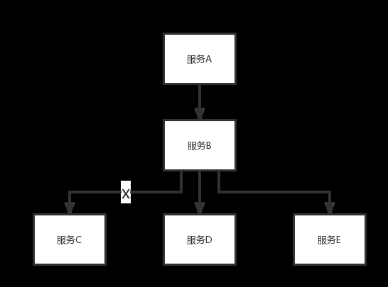

---

电商网站的商品详情页系统架构
小型电商网站的商品详情页系统架构
小型电商网站的页面展示采用页面全量静态化的思想。数据库中存放了所有的商品信息，页面
静态化系统，将数据填充进静态模板中，形成静态化页面，推入 Nginx 服务器。用户浏览网站
页面时，取用一个已经静态化好的 html 页面，直接返回回去，不涉及任何的业务逻辑处理。
下面是页面模板的简单 Demo 。
这样做，好处在于，用户每次浏览一个页面，不需要进行任何的跟数据库的交互逻辑，也不需
要执行任何的代码，直接返回一个 html 页面就可以了，速度和性能非常高。
 
    
 
        商品名称：#{productName}
 
        商品价格：#{productPrice}
 
        商品描述：#{productDesc} 
    
html
<
>
body
<
>
br
<
>
br
<
>
body
</
>
html
</
>
html

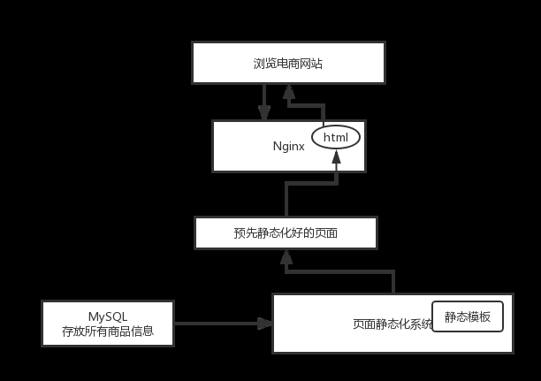

---

对于小网站，页面很少，很实用，非常简单，Java 中可以使用 velocity、freemarker、
thymeleaf 等等，然后做个 cms 页面内容管理系统，模板变更的时候，点击按钮或者系统自动
化重新进行全量渲染。
坏处在于，仅仅适用于一些小型的网站，比如页面的规模在几十到几万不等。对于一些大型的
电商网站，亿级数量的页面，你说你每次页面模板修改了，都需要将这么多页面全量静态化，
靠谱吗？每次渲染花个好几天时间，那你整个网站就废掉了。
大型电商网站的商品详情页系统架构
大型电商网站商品详情页的系统设计中，当商品数据发生变更时，会将变更消息压入 MQ 消息
队列中。缓存服务从消息队列中消费这条消息时，感知到有数据发生变更，便通过调用数据服
务接口，获取变更后的数据，然后将整合好的数据推送至 redis 中。Nginx 本地缓存的数据是有
一定的时间期限的，比如说 10 分钟，当数据过期之后，它就会从 redis 获取到最新的缓存数
据，并且缓存到自己本地。
用户浏览网页时，动态将 Nginx 本地数据渲染到本地 html 模板并返回给用户。

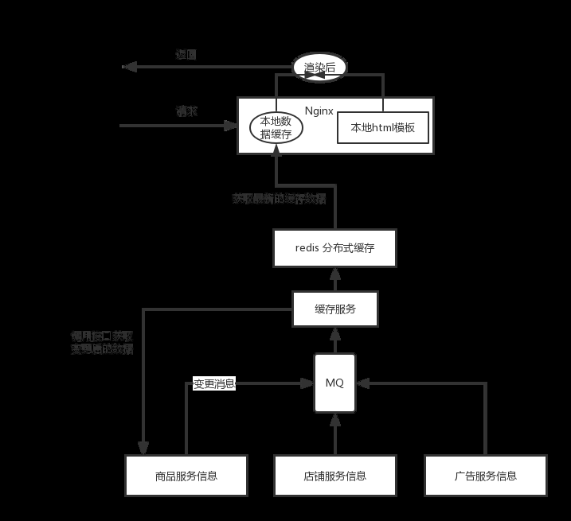

---

虽然没有直接返回 html 页面那么快，但是因为数据在本地缓存，所以也很快，其实耗费的也就
是动态渲染一个 html 页面的性能。如果 html 模板发生了变更，不需要将所有的页面重新静态
化，也不需要发送请求，没有网络请求的开销，直接将数据渲染进最新的 html 页面模板后响应
即可。
在这种架构下，我们需要保证系统的高可用性。
如果系统访问量很高，Nginx 本地缓存过期失效了，redis 中的缓存也被 LRU 算法给清理掉了，
那么会有较高的访问量，从缓存服务调用商品服务。但如果此时商品服务的接口发生故障，调
用出现了延时，缓存服务全部的线程都被这个调用商品服务接口给耗尽了，每个线程去调用商
品服务接口的时候，都会卡住很长时间，后面大量的请求过来都会卡在那儿，此时缓存服务没
有足够的线程去调用其它一些服务的接口，从而导致整个大量的商品详情页无法正常显示。
这其实就是一个商品接口服务故障导致缓存服务资源耗尽的现象。
基于 Hystrix 线程池技术实现资源隔离
上一讲提到，如果从 Nginx 开始，缓存都失效了，Nginx 会直接通过缓存服务调用商品服务获
取最新商品数据（我们基于电商项目做个讨论），有可能出现调用延时而把缓存服务资源耗尽
的情况。这里，我们就来说说，怎么通过 Hystrix 线程池技术实现资源隔离。
资源隔离，就是说，你如果要把对某一个依赖服务的所有调用请求，全部隔离在同一份资源池
内，不会去用其它资源了，这就叫资源隔离。哪怕对这个依赖服务，比如说商品服务，现在同
时发起的调用量已经到了 1000，但是分配给商品服务线程池内就 10 个线程，最多就只会用这
10 个线程去执行。不会因为对商品服务调用的延迟，将 Tomcat 内部所有的线程资源全部耗
尽。
Hystrix 进行资源隔离，其实是提供了一个抽象，叫做 Command。这也是 Hystrix 最最基本的资
源隔离技术。
利用 HystrixCommand 获取单条数据
我们通过将调用商品服务的操作封装在 HystrixCommand 中，限定一个 key，比如下面的 
GetProductInfoCommandGroup ，在这里我们可以简单认为这是一个线程池，每次调用商品服
务，就只会用该线程池中的资源，不会再去用其它线程资源了。
 
 
 
 
  
 
    
 
 productId  
 
    
 
 productId   
public class GetProductInfoCommand extends HystrixCommand<ProductInfo> {
private Long
;
public GetProductInfoCommand(Long
) {
java

---

我们在缓存服务接口中，根据 productId 创建 Command 并执行，获取到商品数据。
上面执行的是 execute() 方法，其实是同步的。也可以对 command 调用 queue() 方法，它仅仅
是将 command 放入线程池的一个等待队列，就立即返回，拿到一个 Future 对象，后面可以继
续做其它一些事情，然后过一段时间对 Future 调用 get() 方法获取数据。这是异步的。
利用 HystrixObservableCommand 批量获取数据
只要是获取商品数据，全部都绑定到同一个线程池里面去，我们通过
HystrixObservableCommand 的一个线程去执行，而在这个线程里面，批量把多个 productId 的
productInfo 拉回来。
        
        
productId  productId  
     
 
    
 
    
 
 
  
        
 url  
  p
        
 
        
 response  
url
 
        
 
response  
 
    
super(HystrixCommandGroupKey.Factory.asKey("GetProductInfoCommandG
this.
=
;
}
@Override
protected ProductInfo run() {
String
= "http://localhost:8081/getProductInfo?productId=" +
// 调用商品服务接口
String
= HttpClientUtils.sendGetRequest(
);
return JSONObject.parseObject(
, ProductInfo.class);
}
}
 
 
 productId   
    
 getProductInfoCommand  
 
 
    
 
    
 productInfo  getProductInfoCommand
 
    
out
productInfo
 
    
 
@RequestMapping("/getProductInfo")
@ResponseBody
public String getProductInfo(Long
) {
HystrixCommand<ProductInfo>
= new GetProductInfoC
// 通过command执行，获取最新商品数据
ProductInfo
=
.execute();
System.
.println(
);
return "success";
}
java
 
 
 
 
 
    
 
 productIds  
public class GetProductInfosCommand extends HystrixObservableCommand<Produ
private String[]
;
java

---

在缓存服务接口中，根据传来的 id 列表，比如是以 ,  分隔的 id 串，通过上面的
HystrixObservableCommand，执行 Hystrix 的一些 API 方法，获取到所有商品数据。
 
    
 
 productIds   
        
 
        
        
productIds  productIds  
     
 
    
 
    
 
 
  
        
 
 
            
 
 productId  productIds   
                
 
                
 url  
                
 response  
url
 
                
 productInfo  
response  
                subscriber
productInfo
 
             
            subscriber
 
 
        
 
    
public GetProductInfosCommand(String[]
) {
// 还是绑定在同一个线程池
super(HystrixCommandGroupKey.Factory.asKey("GetProductInfoGroup"))
this.
=
;
}
@Override
protected Observable<ProductInfo> construct() {
return Observable.unsafeCreate((Observable.OnSubscribe<ProductInfo
for (String
:
) {
// 批量获取商品数据
String
= "http://localhost:8081/getProductInfo?product
String
= HttpClientUtils.sendGetRequest(
);
ProductInfo
= JSONObject.parseObject(
,
.onNext(
);
}
.onCompleted();
}).subscribeOn(Schedulers.io());
}
}
 
 
 productIds   
    
 productIdArray  productIds
 
    
 getProductInfosCommand  
 
    
 observable  getProductInfosCommand
 
 
    observable
 
  
        
 
        
 
 
  
            
out
 
         
 
        
 
        
 
 
 e   
            e
 
         
public String getProductInfos(String
) {
String[]
=
.split(",");
HystrixObservableCommand<ProductInfo>
= new Get
Observable<ProductInfo>
=
.observe();
.subscribe(new Observer<ProductInfo>() {
@Override
public void onCompleted() {
System.
.println("获取完了所有的商品数据");
}
@Override
public void onError(Throwable
) {
.printStackTrace();
}
java

---

我们回过头来，看看 Hystrix 线程池技术是如何实现资源隔离的。
从 Nginx 开始，缓存都失效了，那么 Nginx 通过缓存服务去调用商品服务。缓存服务默认的线
程大小是 10 个，最多就只有 10 个线程去调用商品服务的接口。即使商品服务接口故障了，最
多就只有 10 个线程会 hang 死在调用商品服务接口的路上，缓存服务的 Tomcat 内其它的线程
还是可以用来调用其它的服务，干其它的事情。
基于 Hystrix 信号量机制实现资源隔离
 
        
 
        
 
        
 
 
 productInfo   
            
out
productInfo
 
         
    
 
    
 
/** 
         * 获取完一条数据，就回调一次这个方法 
         * @param productInfo 
         */
@Override
public void onNext(ProductInfo
) {
System.
.println(
);
}
});
return "success";
}

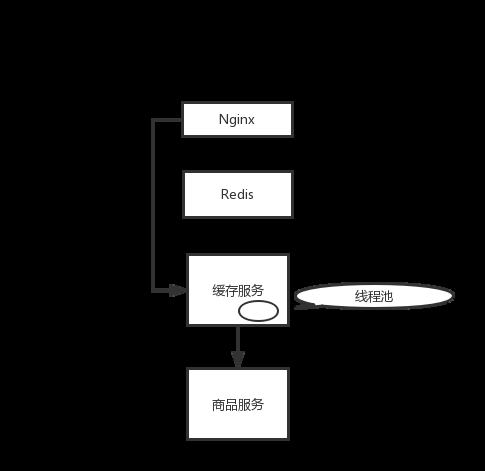

---

Hystrix 里面核心的一项功能，其实就是所谓的资源隔离，要解决的最最核心的问题，就是将多
个依赖服务的调用分别隔离到各自的资源池内。避免说对某一个依赖服务的调用，因为依赖服
务的接口调用的延迟或者失败，导致服务所有的线程资源全部耗费在这个服务的接口调用上。
一旦说某个服务的线程资源全部耗尽的话，就可能导致服务崩溃，甚至说这种故障会不断蔓
延。
Hystrix 实现资源隔离，主要有两种技术：
线程池
信号量
默认情况下，Hystrix 使用线程池模式。
前面已经说过线程池技术了，这一小节就来说说信号量机制实现资源隔离，以及这两种技术的
区别与具体应用场景。
信号量机制
信号量的资源隔离只是起到一个开关的作用，比如，服务 A 的信号量大小为 10，那么就是说它
同时只允许有 10 个 tomcat 线程来访问服务 A，其它的请求都会被拒绝，从而达到资源隔离和
限流保护的作用。
线程池与信号量区别
线程池隔离技术，并不是说去控制类似 tomcat 这种 web 容器的线程。更加严格的意义上来
说，Hystrix 的线程池隔离技术，控制的是 tomcat 线程的执行。Hystrix 线程池满后，会确保
说，tomcat 的线程不会因为依赖服务的接口调用延迟或故障而被 hang 住，tomcat 其它的线程
不会卡死，可以快速返回，然后支撑其它的事情。

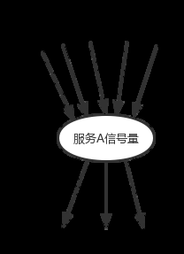

---

线程池隔离技术，是用 Hystrix 自己的线程去执行调用；而信号量隔离技术，是直接让 tomcat
线程去调用依赖服务。信号量隔离，只是一道关卡，信号量有多少，就允许多少个 tomcat 线程
通过它，然后去执行。
适用场景：
线程池技术，适合绝大多数场景，比如说我们对依赖服务的网络请求的调用和访问、需要
对调用的 timeout 进行控制（捕捉 timeout 超时异常）。
信号量技术，适合说你的访问不是对外部依赖的访问，而是对内部的一些比较复杂的业务
逻辑的访问，并且系统内部的代码，其实不涉及任何的网络请求，那么只要做信号量的普
通限流就可以了，因为不需要去捕获 timeout 类似的问题。
信号量简单 Demo
业务背景里，比较适合信号量的是什么场景呢？
比如说，我们一般来说，缓存服务，可能会将一些量特别少、访问又特别频繁的数据，放在自
己的纯内存中。
举个栗子。一般我们在获取到商品数据之后，都要去获取商品是属于哪个地理位置、省、市、
卖家等，可能在自己的纯内存中，比如就一个 Map 去获取。对于这种直接访问本地内存的逻
辑，比较适合用信号量做一下简单的隔离。
优点在于，不用自己管理线程池啦，不用 care timeout 超时啦，也不需要进行线程的上下文切
换啦。信号量做隔离的话，性能相对来说会高一些。
假如这是本地缓存，我们可以通过 cityId，拿到 cityName。
 
 
  
    
 
 
 cityMap  
 
 
public class LocationCache {
private static Map
 
<Long, String>
= new HashMap<>();
java

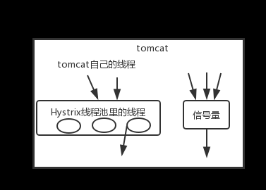

---

写一个 GetCityNameCommand，策略设置为信号量。run() 方法中获取本地缓存。我们目的就
是对获取本地缓存的代码进行资源隔离。
在接口层，通过创建 GetCityNameCommand，传入 cityId，执行 execute() 方法，那么获取本地
cityName 缓存的代码将会进行信号量的资源隔离。
 
    
  
        cityMap
 
 
     
 
    
 
    
 
 
 
 cityId   
        
 cityMap
cityId
 
    
static {
.put(1L, "北京");
}
/** 
     * 通过cityId 获取 cityName 
     * 
     * @param cityId 城市id 
     * @return 城市名 
     */
public static String getCityName(Long
) {
return
.get(
);
}
}
 
 
 
 
  
 
    
 
 cityId  
 
    
 
 cityId   
        
 
        
                
                        
 
        
cityId  cityId  
     
 
    
 
    
 
 
  
        
 
        
 
cityId
 
    
public class GetCityNameCommand extends HystrixCommand<String> {
private Long
;
public GetCityNameCommand(Long
) {
// 设置信号量隔离策略
super(Setter.withGroupKey(HystrixCommandGroupKey.Factory.asKey("Ge
.andCommandPropertiesDefaults(HystrixCommandProperties.Set
.withExecutionIsolationStrategy(HystrixCommandProp
this.
=
;
}
@Override
protected String run() {
// 需要进行信号量隔离的代码
return LocationCache.getCityName(
);
}
}
java

---

Hystrix 隔离策略细粒度控制
Hystrix 实现资源隔离，有两种策略：
线程池隔离
信号量隔离
对资源隔离这一块东西，其实可以做一定细粒度的一些控制。
execution.isolation.strategy
指定了 HystrixCommand.run() 的资源隔离策略：THREAD  or SEMAPHORE ，一种基于线程池，
一种基于信号量。
 
 
 productId   
    
 getProductInfoCommand  
 
 
    
 
    
 productInfo  getProductInfoCommand
 
 
    
 cityId  productInfo
 
 
    
 getCityNameCommand  
 
cityId
    
 
    
 cityName  getCityNameCommand
 
 
    productInfo
cityName
 
 
    
out
productInfo
 
    
 
@RequestMapping("/getProductInfo")
@ResponseBody
public String getProductInfo(Long
) {
HystrixCommand<ProductInfo>
= new GetProductInfoC
// 通过command执行，获取最新商品数据
ProductInfo
=
.execute();
Long
=
.getCityId();
GetCityNameCommand
= new GetCityNameCommand(
)
// 获取本地内存(cityName)的代码会被信号量进行资源隔离
String
=
.execute();
.setCityName(
);
System.
.println(
);
return "success";
}
java
 
// to use thread isolation
HystrixCommandProperties.Setter().withExecutionIsolationStrategy(Execution
// to use semaphore isolation
HystrixCommandProperties.Setter().withExecutionIsolationStrategy(Execution
java

---

线程池机制，每个 command 运行在一个线程中，限流是通过线程池的大小来控制的；信号量
机制，command 是运行在调用线程中（也就是 Tomcat 的线程池），通过信号量的容量来进行
限流。
如何在线程池和信号量之间做选择？
默认的策略就是线程池。
线程池其实最大的好处就是对于网络访问请求，如果有超时的话，可以避免调用线程阻塞住。
而使用信号量的场景，通常是针对超大并发量的场景下，每个服务实例每秒都几百的 QPS ，
那么此时你用线程池的话，线程一般不会太多，可能撑不住那么高的并发，如果要撑住，可能
要耗费大量的线程资源，那么就是用信号量，来进行限流保护。一般用信号量常见于那种基于
纯内存的一些业务逻辑服务，而不涉及到任何网络访问请求。
command key & command group
我们使用线程池隔离，要怎么对依赖服务、依赖服务接口、线程池三者做划分呢？
每一个 command，都可以设置一个自己的名称 command key，同时可以设置一个自己的组
command group。
command group 是一个非常重要的概念，默认情况下，就是通过 command group 来定义一个
线程池的，而且还会通过 command group 来聚合一些监控和报警信息。同一个 command
group 中的请求，都会进入同一个线程池中。
command thread pool
ThreadPoolKey 代表了一个 HystrixThreadPool，用来进行统一监控、统计、缓存。默认的
ThreadPoolKey 就是 command group 的名称。每个 command 都会跟它的 ThreadPoolKey 对应
的 ThreadPool 绑定在一起。
 
 
 
 cachedSetter  
                                                 
 
 
 name   
    
cachedSetter
 
    
name  name
private static final Setter
= Setter.withGroupKey(HystrixComm
.andCommandKey(HystrixComm
public CommandHelloWorld(String
) {
super(
);
this.
=
;
}
java

---

如果不想直接用 command group，也可以手动设置 ThreadPool 的名称。
command key & command group & command thread pool
command key ，代表了一类 command，一般来说，代表了下游依赖服务的某个接口。
command group ，代表了某一个下游依赖服务，这是很合理的，一个依赖服务可能会暴露出来
多个接口，每个接口就是一个 command key。command group 在逻辑上对一堆 command key
的调用次数、成功次数、timeout 次数、失败次数等进行统计，可以看到某一个服务整体的一
些访问情况。一般来说，推荐根据一个服务区划分出一个线程池，command key 默认都是
属于同一个线程池的。
比如说有一个服务 A，你估算出来服务 A 每秒所有接口加起来的整体 QPS  在 100 左右，你有
一个服务 B 去调用服务 A。你的服务 B 部署了 10 个实例，每个实例上，用 command group 去
对应下游服务 A。给一个线程池，量大概是 10 就可以了，这样服务 B 对服务 A 整体的访问 QPS
就大概是每秒 100 了。
但是，如果说 command group 对应了一个服务，而这个服务暴露出来的几个接口，访问量很不
一样，差异非常之大。你可能就希望在这个服务对应 command group 的内部，包含对应多个接
口的 command key，做一些细粒度的资源隔离。就是说，希望对同一个服务的不同接口，使
用不同的线程池。
逻辑上来说，多个 command key 属于一个command group，在做统计的时候，会放在一起统
计。每个 command key 有自己的线程池，每个接口有自己的线程池，去做资源隔离和限流。
 
 
 
 cachedSetter  
                                                 
                                                 
 
 
 name   
    
cachedSetter
 
    
name  name
private static final Setter
= Setter.withGroupKey(HystrixComm
.andCommandKey(HystrixComm
.andThreadPoolKey(HystrixT
public CommandHelloWorld(String
) {
super(
);
this.
=
;
}
java
command key -> command group 
 
command key -> 自己的 thread pool key

---

说白点，就是说如果你的 command key 要用自己的线程池，可以定义自己的 thread pool key，
就 ok 了。
coreSize
设置线程池的大小，默认是 10。一般来说，用这个默认的 10 个线程大小就够了。
queueSizeRejectionThreshold
如果说线程池中的 10 个线程都在工作中，没有空闲的线程来做其它的事情，此时再有请求过
来，会先进入队列积压。如果说队列积压满了，再有请求过来，就直接 reject，拒绝请求，执
行 fallback 降级的逻辑，快速返回。
控制 queue 满了之后 reject 的 threshold，因为 maxQueueSize 不允许热修改，因此提供这个参
数可以热修改，控制队列的最大大小。
execution.isolation.semaphore.maxConcurrentRequests
 value
HystrixThreadPoolProperties.Setter().withCoreSize(int
);
java
 v
HystrixThreadPoolProperties.Setter().withQueueSizeRejectionThreshold(int
java

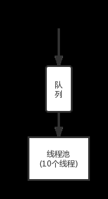

---

设置使用 SEMAPHORE 隔离策略的时候允许访问的最大并发量，超过这个最大并发量，请求直
接被 reject。
这个并发量的设置，跟线程池大小的设置，应该是类似的，但是基于信号量的话，性能会好很
多，而且 Hystrix 框架本身的开销会小很多。
默认值是 10，尽量设置的小一些，因为一旦设置的太大，而且有延时发生，可能瞬间导致
tomcat 本身的线程资源被占满。
深入 Hystrix 执行时内部原理
前面我们了解了 Hystrix 最基本的支持高可用的技术：资源隔离 + 限流。
创建 command；
执行这个 command；
配置这个 command 对应的 group 和线程池。
这里，我们要讲一下，你开始执行这个 command，调用了这个 command 的 execute() 方法之
后，Hystrix 底层的执行流程和步骤以及原理是什么。
在讲解这个流程的过程中，我会带出来 Hystrix 其他的一些核心以及重要的功能。
这里是整个 8 大步骤的流程图，我会对每个步骤进行细致的讲解。学习的过程中，对照着这个
流程图，相信思路会比较清晰。
HystrixCommandProperties.Setter().withExecutionIsolationSemaphoreMaxConcur
java

---

步骤一：创建 command

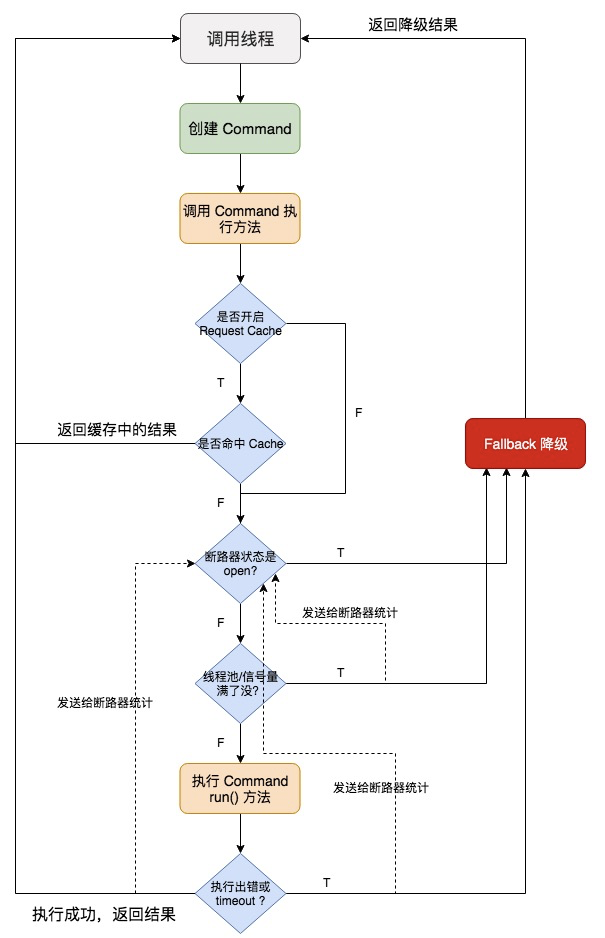

---

一个 HystrixCommand 或 HystrixObservableCommand 对象，代表了对某个依赖服务发起的一次
请求或者调用。创建的时候，可以在构造函数中传入任何需要的参数。
HystrixCommand 主要用于仅仅会返回一个结果的调用。
HystrixObservableCommand 主要用于可能会返回多条结果的调用。
步骤二：调用 command 执行方法
执行 command，就可以发起一次对依赖服务的调用。
要执行 command，可以在 4 个方法中选择其中的一个：execute()、queue()、observe()、
toObservable()。
其中 execute() 和 queue() 方法仅仅对 HystrixCommand 适用。
execute()：调用后直接 block 住，属于同步调用，直到依赖服务返回单条结果，或者抛出异
常。
queue()：返回一个 Future，属于异步调用，后面可以通过 Future 获取单条结果。
observe()：订阅一个 Observable 对象，Observable 代表的是依赖服务返回的结果，获取到
一个那个代表结果的 Observable 对象的拷贝对象。
toObservable()：返回一个 Observable 对象，如果我们订阅这个对象，就会执行 command
并且获取返回结果。
execute() 实际上会调用 queue().get() 方法，可以看一下 Hystrix 源码。
 hystrixCommand  
 
arg1  arg2
 
 
 hystrixObservableCommand  
 
// 创建 HystrixCommand
HystrixCommand
= new HystrixCommand(
,
);
// 创建 HystrixObservableCommand
HystrixObservableCommand
= new HystrixObservableC
java
             value     hystrixCommand
     fValue    hystrixCommand
 oValue    hystrixObservableCommand
 toOValue  hystrixObservableCommand
K
=
.execute();
Future<K>
=
.queue();
Observable<K>
=
.observe();
Observable<K>
=
.toObservable();
java
  
  
    
  
public R execute() {
try {
java

---

而在 queue() 方法中，会调用 toObservable().toBlocking().toFuture()。
也就是说，先通过 toObservable() 获得 Future 对象，然后调用 Future 的 get() 方法。那么，其
实无论是哪种方式执行 command，最终都是依赖于 toObservable() 去执行的。
步骤三：检查是否开启缓存（不太常用）
从这一步开始，就进入到 Hystrix 底层运行原理啦，看一下 Hystrix 一些更高级的功能和特性。
如果这个 command 开启了请求缓存 Request Cache，而且这个调用的结果在缓存中存在，那么
直接从缓存中返回结果。否则，继续往后的步骤。
步骤四：检查是否开启了断路器
检查这个 command 对应的依赖服务是否开启了断路器。如果断路器被打开了，那么 Hystrix 就
不会执行这个 command，而是直接去执行 fallback 降级机制，返回降级结果。
步骤五：检查线程池/队列/信号量是否已满
如果这个 command 线程池和队列已满，或者 semaphore 信号量已满，那么也不会执行
command，而是直接去调用 fallback 降级机制，同时发送 reject 信息给断路器统计。
步骤六：执行 command
调用 HystrixObservableCommand 对象的 construct() 方法，或者 HystrixCommand 的 run() 方法
来实际执行这个 command。
HystrixCommand.run() 返回单条结果，或者抛出异常。
        
 
 
     
 
 e   
        
 
e
 
    
return queue().get();
} catch (Exception
) {
throw Exceptions.sneakyThrow(decomposeException( ));
}
}
 
 delegate  
final Future<R>
= toObservable().toBlocking().toFuture();
java

---

HystrixObservableCommand.construct() 返回一个 Observable 对象，可以获取多条结果。
如果是采用线程池方式，并且 HystrixCommand.run() 或者
HystrixObservableCommand.construct() 的执行时间超过了 timeout 时长的话，那么 command
所在的线程会抛出一个 TimeoutException，这时会执行 fallback 降级机制，不会去管 run() 或
construct() 返回的值了。另一种情况，如果 command 执行出错抛出了其它异常，那么也会走
fallback 降级。这两种情况下，Hystrix 都会发送异常事件给断路器统计。
注意，我们是不可能终止掉一个调用严重延迟的依赖服务的线程的，只能说给你抛出来一个
TimeoutException。
 productInfo  getProductInfoCommand
// 通过command执行，获取最新一条商品数据
ProductInfo
=
.execute();
java
 observable  getProductInfosCommand
 
 
 
observable
 
  
    
 
    
 
 
  
        
out
 
     
 
    
 
    
 
 
 e   
        e
 
     
 
    
 
    
 
    
 
 
 productInfo   
        
out
productInfo
 
    
Observable<ProductInfo>
=
.observe();
// 订阅获取多条结果
.subscribe(new Observer<ProductInfo>() {
@Override
public void onCompleted() {
System.
.println("获取完了所有的商品数据");
}
@Override
public void onError(Throwable
) {
.printStackTrace();
}
/** 
     * 获取完一条数据，就回调一次这个方法 
     *  
     * @param productInfo 商品信息 
     */
@Override
public void onNext(ProductInfo
) {
System.
.println(
);
}
});
java

---

如果没有 timeout，也正常执行的话，那么调用线程就会拿到一些调用依赖服务获取到的结
果，然后 Hystrix 也会做一些 logging 记录和 metric 度量统计。
步骤七：断路健康检查
Hystrix 会把每一个依赖服务的调用成功、失败、Reject、Timeout 等事件发送给 circuit breaker
断路器。断路器就会对这些事件的次数进行统计，根据异常事件发生的比例来决定是否要进行
断路（熔断）。如果打开了断路器，那么在接下来一段时间内，会直接断路，返回降级结果。
如果在之后，断路器尝试执行 command，调用没有出错，返回了正常结果，那么 Hystrix 就会
把断路器关闭。
步骤八：调用 fallback 降级机制
在以下几种情况中，Hystrix 会调用 fallback 降级机制。
断路器处于打开状态；
线程池/队列/semaphore满了；
command 执行超时；
run() 或者 construct() 抛出异常。
一般在降级机制中，都建议给出一些默认的返回值，比如静态的一些代码逻辑，或者从内存中
的缓存中提取一些数据，在这里尽量不要再进行网络请求了。
在降级中，如果一定要进行网络调用的话，也应该将那个调用放在一个 HystrixCommand 中进
行隔离。
HystrixCommand 中，实现 getFallback() 方法，可以提供降级机制。
HystrixObservableCommand 中，实现 resumeWithFallback() 方法，返回一个 Observable 对
象，可以提供降级结果。
如果没有实现 fallback，或者 fallback 抛出了异常，Hystrix 会返回一个 Observable，但是不会返
回任何数据。
不同的 command 执行方式，其 fallback 为空或者异常时的返回结果不同。
对于 execute()，直接抛出异常。
对于 queue()，返回一个 Future，调用 get() 时抛出异常。
对于 observe()，返回一个 Observable 对象，但是调用 subscribe() 方法订阅它时，立即抛出
调用者的 onError() 方法。
对于 toObservable()，返回一个 Observable 对象，但是调用 subscribe() 方法订阅它时，立即
抛出调用者的 onError() 方法。

---

不同的执行方式
execute()，获取一个 Future.get()，然后拿到单个结果。
queue()，返回一个 Future。
observe()，立即订阅 Observable，然后启动 8 大执行步骤，返回一个拷贝的 Observable，
订阅时立即回调给你结果。
toObservable()，返回一个原始的 Observable，必须手动订阅才会去执行 8 大步骤。
基于 request cache 请求缓存技术优化批量商品数
据查询接口
Hystrix command 执行时 8 大步骤第三步，就是检查 Request cache 是否有缓存。
首先，有一个概念，叫做 Request Context 请求上下文，一般来说，在一个 web 应用中，如果
我们用到了 Hystrix，我们会在一个 filter 里面，对每一个请求都施加一个请求上下文。就是
说，每一次请求，就是一次请求上下文。然后在这次请求上下文中，我们会去执行 N 多代码，
调用 N 多依赖服务，有的依赖服务可能还会调用好几次。
在一次请求上下文中，如果有多个 command，参数都是一样的，调用的接口也是一样的，而结
果可以认为也是一样的。那么这个时候，我们可以让第一个 command 执行返回的结果缓存在
内存中，然后这个请求上下文后续的其它对这个依赖的调用全部从内存中取出缓存结果就可以
了。
这样的话，好处在于不用在一次请求上下文中反复多次执行一样的 command，避免重复执行
网络请求，提升整个请求的性能。
举个栗子。比如说我们在一次请求上下文中，请求获取 productId 为 1 的数据，第一次缓存中
没有，那么会从商品服务中获取数据，返回最新数据结果，同时将数据缓存在内存中。后续同
一次请求上下文中，如果还有获取 productId 为 1 的数据的请求，直接从缓存中取就好了。

---

HystrixCommand 和 HystrixObservableCommand 都可以指定一个缓存 key，然后 Hystrix 会自动
进行缓存，接着在同一个 request context 内，再次访问的话，就会直接取用缓存。
下面，我们结合一个具体的业务场景，来看一下如何使用 request cache 请求缓存技术。当
然，以下代码只作为一个基本的 Demo 而已。
现在，假设我们要做一个批量查询商品数据的接口，在这个里面，我们是用 HystrixCommand
一次性批量查询多个商品 id 的数据。但是这里有个问题，如果说 Nginx 在本地缓存失效了，重
新获取一批缓存，传递过来的 productIds 都没有进行去重，比如 productIds=1,1,1,2,2 ，那
么可能说，商品 id 出现了重复，如果按照我们之前的业务逻辑，可能就会重复对 productId=1
的商品查询三次，productId=2 的商品查询两次。
我们对批量查询商品数据的接口，可以用 request cache 做一个优化，就是说一次请求，就是一
次 request context，对相同的商品查询只执行一次，其余重复的都走 request cache。
实现 Hystrix 请求上下文过滤器并注册
定义 HystrixRequestContextFilter 类，实现 Filter 接口。
 
 
 
 
  
 
    
 
    
 
 
 filterConfig  
 
  
 
/** 
 * Hystrix 请求上下文过滤器 
 */
public class HystrixRequestContextFilter implements Filter {
@Override
public void init(FilterConfig
) throws ServletException {
java

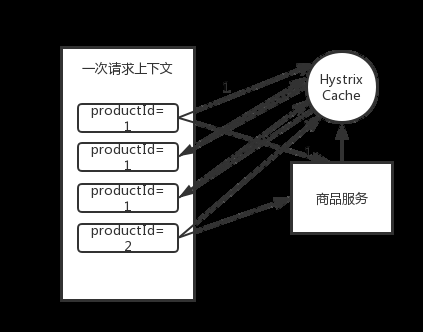

---

然后将该 filter 对象注册到 SpringBoot Application 中。
command 重写 getCacheKey() 方法
     
 
    
 
    
 
 
 servletRequest  
 se
        
 context  
        
  
            filterChain
servletRequest  servletResponse
 
         
 
  
 e   
            e
 
         
  
            context
 
         
     
 
    
 
    
 
 
  
 
    
}
@Override
public void doFilter(ServletRequest
, ServletResponse
HystrixRequestContext
= HystrixRequestContext.initializeCo
try {
.doFilter(
,
);
} catch (IOException | ServletException
) {
.printStackTrace();
} finally {
.shutdown();
}
}
@Override
public void destroy() {
}
}
 
 
  
 
    
 
 
 
 args   
        
 args
 
     
 
    
 
    
 
 
  
        
 filterRegistrationBean  
 
        filterRegistrationBean
 
        
 filterRegistrationBean  
    
@SpringBootApplication
public class EshopApplication {
public static void main(String[]
) {
SpringApplication.run(EshopApplication.class,
);
}
@Bean
public FilterRegistrationBean filterRegistrationBean() {
FilterRegistrationBean
= new FilterRegistra
.addUrlPatterns("/*");
return
;
}
}
java

---

在 GetProductInfoCommand 中，重写 getCacheKey() 方法，这样的话，每一次请求的结果，都
会放在 Hystrix 请求上下文中。下一次同一个 productId 的数据请求，直接取缓存，无须再调用
run() 方法。
 
 
 
 
  
 
    
 
 productId  
 
    
 
 
 
 KEY  
 
    
 
 productId   
        
                
KEY
 
        
productId  productId  
     
 
    
 
    
 
 
  
        
 url  
  p
        
 response  
url
 
        
out
  productId
 
        
 
response  
 
     
 
    
 
    
 
    
 
 
  
        
 
  productId  
     
 
    
 
    
 
 
 
 productId   
        
KEY  
                
public class GetProductInfoCommand extends HystrixCommand<ProductInfo> {
private Long
;
private static final HystrixCommandKey
= HystrixCommandKey.Factory
public GetProductInfoCommand(Long
) {
super(Setter.withGroupKey(HystrixCommandGroupKey.Factory.asKey("Pr
.andCommandKey(
));
this.
=
;
}
@Override
protected ProductInfo run() {
String
= "http://localhost:8081/getProductInfo?productId=" +
String
= HttpClientUtils.sendGetRequest(
);
System.
.println("调用接口查询商品数据，productId=" +
);
return JSONObject.parseObject(
, ProductInfo.class);
}
/** 
     * 每次请求的结果，都会放在Hystrix绑定的请求上下文上 
     * 
     * @return cacheKey 缓存key 
     */
@Override
public String getCacheKey() {
return "product_info_" +
;
}
/** 
     * 将某个商品id的缓存清空 
     * 
     * @param productId 商品id 
     */
public static void flushCache(Long
) {
HystrixRequestCache.getInstance(
,
HystrixConcurrencyStrategyDefault.getInstance()).clear("pr
java

---

这里写了一个 flushCache() 方法，用于我们开发手动删除缓存。
controller 调用 command 查询商品信息
在一次 web 请求上下文中，传入商品 id 列表，查询多条商品数据信息。对于每个 productId，
都创建一个 command。
如果 id 列表没有去重，那么重复的 id，第二次查询的时候就会直接走缓存。
发起请求
调用接口，查询多个商品的信息。
    }
}
 
 
  
 
    
 
    
 
    
 
    
 
 
 productIds   
        
 
 productId  productIds
  
            
 
            
 getProductInfoCommand  
 
            
 productInfo  getProductInfoCommand
 
            
out
  getProductInfoComm
         
 
        
 
 
    
@Controller
public class CacheController {
/** 
     * 一次性批量查询多条商品数据的请求 
     * 
     * @param productIds 以,分隔的商品id列表 
     * @return 响应状态 
     */
@RequestMapping("/getProductInfos")
@ResponseBody
public String getProductInfos(String
) {
for (String
:
.split(",")) {
// 对每个productId，都创建一个command
GetProductInfoCommand
= new GetProductIn
ProductInfo
=
.execute();
System.
.println("是否是从缓存中取的结果：" +
}
return "success";
}
}
java

---

在控制台，我们可以看到以下结果。
第一次查询 productId=1 的数据，会调用接口进行查询，不是从缓存中取结果。而随后再出现
查询 productId=1 的请求，就直接取缓存了，这样的话，效率明显高很多。
删除缓存
我们写一个 UpdateProductInfoCommand，在更新商品信息之后，手动调用之前写的
flushCache()，手动将缓存删除。
http://localhost:8080/getProductInfos?productIds=1,1,1,2,2,5
调用接口查询商品数据，productId=1 
是否是从缓存中取的结果：false 
是否是从缓存中取的结果：true 
是否是从缓存中取的结果：true 
调用接口查询商品数据，productId=2 
是否是从缓存中取的结果：false 
是否是从缓存中取的结果：true 
调用接口查询商品数据，productId=5 
是否是从缓存中取的结果：false
 
 
 
 
  
 
    
 
 productId  
 
    
 
 productId   
        
        
productId  productId  
     
 
    
 
    
 
 
 
 
  
        
 
        
 
 
        
 
        
productId
 
public class UpdateProductInfoCommand extends HystrixCommand<Boolean> {
private Long
;
public UpdateProductInfoCommand(Long
) {
super(HystrixCommandGroupKey.Factory.asKey("UpdateProductInfoGroup
this.
=
;
}
@Override
protected Boolean run() throws Exception {
// 这里执行一次商品信息的更新
// ...
// 然后清空缓存
GetProductInfoCommand.flushCache(
);
java

---

这样，以后查询该商品的请求，第一次就会走接口调用去查询最新的商品信息。
基于本地缓存的 fallback 降级机制
Hystrix 出现以下四种情况，都会去调用 fallback 降级机制：
断路器处于打开的状态。
资源池已满（线程池+队列 / 信号量）。
Hystrix 调用各种接口，或者访问外部依赖，比如 MySQL、Redis、Zookeeper、Kafka 等等，
出现了任何异常的情况。
访问外部依赖的时候，访问时间过长，报了 TimeoutException 异常。
两种最经典的降级机制
纯内存数据
在降级逻辑中，你可以在内存中维护一个 ehcache，作为一个纯内存的基于 LRU 自动清理
的缓存，让数据放在缓存内。如果说外部依赖有异常，fallback 这里直接尝试从 ehcache 中
获取数据。
默认值
fallback 降级逻辑中，也可以直接返回一个默认值。
在 HystrixCommand ，降级逻辑的书写，是通过实现 getFallback() 接口；而在 
HystrixObservableCommand  中，则是实现 resumeWithFallback() 方法。
现在，我们用一个简单的栗子，来演示 fallback 降级是怎么做的。
比如，有这么个场景。我们现在有个包含 brandId 的商品数据，假设正常的逻辑是这样：拿到
一个商品数据，根据 brandId 去调用品牌服务的接口，获取品牌的最新名称 brandName。
假如说，品牌服务接口挂掉了，那么我们可以尝试从本地内存中，获取一份稍过期的数据，先
凑合着用。
步骤一：本地缓存获取数据
本地获取品牌名称的代码大致如下。
        
 
 
    
return true;
}
}

---

步骤二：实现 GetBrandNameCommand
在 GetBrandNameCommand 中，run() 方法的正常逻辑是去调用品牌服务的接口获取到品牌名
称，如果调用失败，报错了，那么就会去调用 fallback 降级机制。
这里，我们直接模拟接口调用报错，给它抛出个异常。
而在 getFallback() 方法中，就是我们的降级逻辑，我们直接从本地的缓存中，获取到品牌名
称的数据。
 
 
 
 
  
 
    
 
 
 brandMap  
 
 
 
    
  
        brandMap
 
 
     
 
    
 
    
 
 
 
 brandId   
        
 brandMap
brandId
 
    
/** 
 * 品牌名称本地缓存 
 * 
 */
public class BrandCache {
private static Map
 
<Long, String>
= new HashMap<>();
static {
.put(1L, "Nike");
}
/** 
     * brandId 获取 brandName 
     * 
     * @param brandId 品牌id 
     * @return 品牌名 
     */
public static String getBrandName(Long
) {
return
.get(
);
}
java
 
 
 
 
 
 
  
 
/** 
 * 获取品牌名称的command 
 * 
 */
public class GetBrandNameCommand extends HystrixCommand<String> {
java

---

FallbackIsolationSemaphoreMaxConcurrentRequests  用于设置 fallback 最大允许的并发请
求量，默认值是 10，是通过 semaphore 信号量的机制去限流的。如果超出了这个最大值，那么
直接 reject。
步骤三：CacheController 调用接口
在 CacheController 中，我们通过 productInfo 获取 brandId，然后创建 GetBrandNameCommand
并执行，去尝试获取 brandName。这里执行会报错，因为我们在 run() 方法中直接抛出异常，
Hystrix 就会去调用 getFallback() 方法走降级逻辑。
    
 
 brandId  
 
    
 
 brandId   
        
                
                
                        
 
                        
        
brandId  brandId  
     
 
    
 
    
 
 
 
 
  
        
 
        
 
 
        
 
        
 
 
 
     
 
    
 
    
 
 
  
        
 
brandId
 
    
private Long
;
public GetBrandNameCommand(Long
) {
super(Setter.withGroupKey(HystrixCommandGroupKey.Factory.asKey("Br
.andCommandKey(HystrixCommandKey.Factory.asKey("GetBrandNam
.andCommandPropertiesDefaults(HystrixCommandProperties.Set
// 设置降级机制最大并发请求数
.withFallbackIsolationSemaphoreMaxConcurrentReques
this.
=
;
}
@Override
protected String run() throws Exception {
// 这里正常的逻辑应该是去调用一个品牌服务的接口获取名称
// 如果调用失败，报错了，那么就会去调用fallback降级机制
// 这里我们直接模拟调用报错，抛出异常
throw new Exception();
}
@Override
protected String getFallback() {
return BrandCache.getBrandName(
);
}
}
 
 
  
 
    
 
    
 
@Controller
public class CacheController {
@RequestMapping("/getProductInfo")
@ResponseBody
java

---

关于降级逻辑的演示，基本上就结束了。
深入 Hystrix 断路器执行原理
状态机
Hystrix 断路器有三种状态，分别是关闭（Closed）、打开（Open）与半开（Half-Open），三种
状态转化关系如下：
    
 
 
 productId   
        
 getProductInfoCommand  
 
 
        
 productInfo  getProductInfoCommand
 
        
 brandId  productInfo
 
 
        
 getBrandNameCommand  
 
 
        
 
        
 brandName  getBrandNameCommand
 
        productInfo
brandName
 
 
        
out
productInfo
 
        
 
 
    
public String getProductInfo(Long
) {
HystrixCommand<ProductInfo>
= new GetProduct
ProductInfo
=
.execute();
Long
=
.getBrandId();
HystrixCommand<String>
= new GetBrandNameComma
// 执行会抛异常报错，然后走降级
String
=
.execute();
.setBrandName(
);
System.
.println(
);
return "success";
}
}

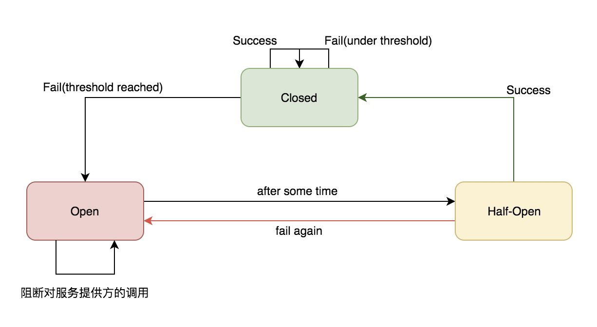

---

1. Closed  断路器关闭：调用下游的请求正常通过
2. Open  断路器打开：阻断对下游服务的调用，直接走 Fallback 逻辑
3. Half-Open  断路器处于半开状态：SleepWindowInMilliseconds
Enabled
控制断路器是否工作，包括跟踪依赖服务调用的健康状况，以及对异常情况过多时是否允许触
发断路。默认值 true 。
circuitBreaker.requestVolumeThreshold
表示在一次统计的时间滑动窗口中（这个参数也很重要，下面有说到），至少经过多少个
请求，才可能触发断路，默认值 20。经过 Hystrix 断路器的流量只有在超过了一定阈值后，
才有可能触发断路。比如说，要求在 10s 内经过断路器的流量必须达到 20 个，而实际经过断
路器的请求有 19 个，即使这 19 个请求全都失败，也不会去判断要不要断路。
circuitBreaker.errorThresholdPercentage
表示异常比例达到多少，才会触发断路，默认值是 50(%)。
circuitBreaker.sleepWindowInMilliseconds
 
    
HystrixCommandProperties.Setter()
.withCircuitBreakerEnabled(boolean)
java
 
    
HystrixCommandProperties.Setter()
.withCircuitBreakerRequestVolumeThreshold(int)
java
 
    
HystrixCommandProperties.Setter()
.withCircuitBreakerErrorThresholdPercentage(int)
java
 
    
HystrixCommandProperties.Setter()
.withCircuitBreakerSleepWindowInMilliseconds(int)
java

---

断路器状态由 Close 转换到 Open，在之后 SleepWindowInMilliseconds  时间内，所有经过
该断路器的请求会被断路，不调用后端服务，直接走 Fallback 降级机制，默认值 5000(ms)。
而在该参数时间过后，断路器会变为 Half-Open  半开闭状态，尝试让一条请求经过断路器，
看能不能正常调用。如果调用成功了，那么就自动恢复，断路器转为 Close 状态。
ForceOpen
如果设置为 true 的话，直接强迫打开断路器，相当于是手动断路了，手动降级，默认值是 
false 。
ForceClosed
如果设置为 true，直接强迫关闭断路器，相当于手动停止断路了，手动升级，默认值是 
false 。
Metrics 统计器
与 Hystrix 断路器紧密协作的，还有另一个重要组件 —— 统计器（Metrics）。统计器中最重要
的参数要数滑动窗口（metrics.rollingStats.timeInMilliseconds）以及桶
（metrics.rollingStats.numBuckets）了，这里引用一段博文来解释滑动窗口（默认值是 10000
ms）：
一位乘客坐在正在行驶的列车的靠窗座位上，列车行驶的公路两侧种着一排挺拔的白
杨树，随着列车的前进，路边的白杨树迅速从窗口滑过。我们用每棵树来代表一个请
求，用列车的行驶代表时间的流逝，那么，列车上的这个窗口就是一个典型的滑动窗
口，这个乘客能通过窗口看到的白杨树就是 Hystrix 要统计的数据。
 
    
HystrixCommandProperties.Setter()
.withCircuitBreakerForceOpen(boolean)
java
 
    
HystrixCommandProperties.Setter()
.withCircuitBreakerForceClosed(boolean)
java

---

Hystrix 并不是只要有一条请求经过就去统计，而是将整个滑动窗口均分为 numBuckets 份，时
间每经过一份就去统计一次。在经过一个时间窗口后，才会判断断路器状态要不要开启，
请看下面的例子。
实例 Demo
HystrixCommand 配置参数
在 GetProductInfoCommand 中配置 Setter 断路器相关参数。
滑动窗口中，最少 20 个请求，才可能触发断路。
异常比例达到 40% 时，才触发断路。
断路后 3000ms 内，所有请求都被 reject，直接走 fallback 降级，不会调用 run() 方法。
3000ms 过后，变为 half-open 状态。
run() 方法中，我们判断一下 productId 是否为 -1，是的话，直接抛出异常。这么写，我们之后
测试的时候就可以传入 productId=-1，模拟服务执行异常了。
在降级逻辑中，我们直接给它返回降级商品就好了。
 
 
 
 
  
 
    
 
 productId  
 
    
 
 
 
 KEY  
 
    
 
 productId   
        
                
KEY  
                
                        
 
                        
 
                        
 
                        
 
                        
 
                        
 
                        
                        
        
productId  productId  
     
 
public class GetProductInfoCommand extends HystrixCommand<ProductInfo> {
private Long
;
private static final HystrixCommandKey
= HystrixCommandKey.Factory
public GetProductInfoCommand(Long
) {
super(Setter.withGroupKey(HystrixCommandGroupKey.Factory.asKey("Pr
.andCommandKey(
)
.andCommandPropertiesDefaults(HystrixCommandProperties.Set
// 是否允许断路器工作
.withCircuitBreakerEnabled(true)
// 滑动窗口中，最少有多少个请求，才可能触发断路
.withCircuitBreakerRequestVolumeThreshold(20)
// 异常比例达到多少，才触发断路，默认50%
.withCircuitBreakerErrorThresholdPercentage(40)
// 断路后多少时间内直接reject请求，之后进入half-open状态
.withCircuitBreakerSleepWindowInMilliseconds(3000)
this.
=
;
}
java

---

断路测试类
我们在测试类中，前 30 次请求，传入 productId=-1，然后休眠 3s，之后 70 次请求，传入
productId=1。
    
 
    
 
 
 
 
  
        
out
  productId
 
 
        
 productId 
 
  
            
 
 
 
         
 
        
 url  
  p
        
 response  
url
 
        
 
response  
 
     
 
    
 
    
 
 
  
        
 productInfo  
 
 
        productInfo
 
        
 productInfo  
    
@Override
protected ProductInfo run() throws Exception {
System.
.println("调用接口查询商品数据，productId=" +
);
if (
== -1L) {
throw new Exception();
}
String
= "http://localhost:8081/getProductInfo?productId=" +
String
= HttpClientUtils.sendGetRequest(
);
return JSONObject.parseObject(
, ProductInfo.class);
}
@Override
protected ProductInfo getFallback() {
ProductInfo
= new ProductInfo();
.setName("降级商品");
return
;
}
}
 
 
  
 
    
 
    
 
 
  
        
 baseURL  
 
        
 
 i  
 i  
 
i   
            
 
            
baseURL  
 
         
 
        
 
        
out
 
@SpringBootTest
@RunWith(SpringRunner.class)
public class CircuitBreakerTest {
@Test
public void testCircuitBreaker() {
String
= "http://localhost:8080/getProductInfo?productId="
for (int
= 0;
< 30; ++ ) {
// 传入-1，会抛出异常，然后走降级逻辑
HttpClientUtils.sendGetRequest(
+ "-1");
}
TimeUtils.sleep(3);
System.
.println("After sleeping...");
java

---

测试结果
测试结果，我们可以明显看出系统断路与恢复的整个过程。
前 30 次请求，我们传入的 productId 为 -1，所以服务执行过程中会抛出异常。我们设置了最少
20 次请求通过断路器并且异常比例超出 40% 就触发断路。因此执行了 21 次接口调用，每次都
抛异常并且走降级，21 次过后，断路器就被打开了。
之后的 9 次请求，都不会执行 run() 方法，也就不会打印以下信息。
而是直接走降级逻辑，调用 getFallback() 执行。
 
        
 
 i  
 i  
 
i   
            
 
            
baseURL  
 
         
    
for (int
= 31;
< 100; ++ ) {
// 传入1，走服务正常调用
HttpClientUtils.sendGetRequest(
+ "1");
}
}
}
调用接口查询商品数据，productId
id null  name 降级商品 price null  pictureList null  specificat
 
 
 
id null  name 降级商品 price null  pictureList null  specificat
 
 
 
 
调用接口查询商品数据，productId
id
 name iphone7手机 price
 pictureList a jpg b jpg  
=-1
ProductInfo(
=
,
=
,
=
,
=
,
// ...
// 这里重复打印了 20 次上面的结果
ProductInfo(
=
,
=
,
=
,
=
,
// ...
// 这里重复打印了 8 次上面的结果
// 休眠 3s 后
=1
ProductInfo(
=1,
=
,
=5599.0,
= .
, .
,
// ...
// 这里重复打印了 69 次上面的结果
c
调用接口查询商品数据，productId=-1
c

---

休眠了 3s 后，我们在之后的 70 次请求中，都传入 productId 为 1。由于我们前面设置了
3000ms 过后断路器变为 half-open  状态。因此 Hystrix 会尝试执行请求，发现成功了，那么
断路器关闭，之后的所有请求也都能正常调用了。
参考内容
1. Hystrix issue 1459
2. Hystrix Metrics
深入 Hystrix 线程池隔离与接口限流
前面讲了 Hystrix 的 request cache 请求缓存、fallback 优雅降级、circuit breaker 断路器快速熔
断，这一讲，我们来详细说说 Hystrix 的线程池隔离与接口限流。

---

Hystrix 通过判断线程池或者信号量是否已满，超出容量的请求，直接 Reject 走降级，从而达到
限流的作用。
限流是限制对后端的服务的访问量，比如说你对 MySQL、Redis、Zookeeper 以及其它各种后端
中间件的资源的访问的限制，其实是为了避免过大的流量直接打死后端的服务。
线程池隔离技术的设计
Hystrix 采用了 Bulkhead Partition 舱壁隔离技术，来将外部依赖进行资源隔离，进而避免任何外
部依赖的故障导致本服务崩溃。
舱壁隔离，是说将船体内部空间区隔划分成若干个隔舱，一旦某几个隔舱发生破损进水，水流
不会在其间相互流动，如此一来船舶在受损时，依然能具有足够的浮力和稳定性，进而减低立

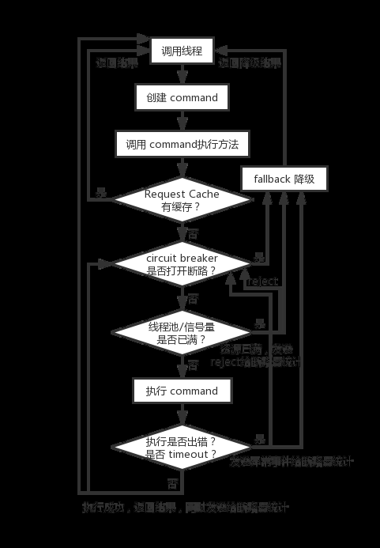

---

即沉船的危险。
Hystrix 对每个外部依赖用一个单独的线程池，这样的话，如果对那个外部依赖调用延迟很严
重，最多就是耗尽那个依赖自己的线程池而已，不会影响其他的依赖调用。
Hystrix 应用线程池机制的场景
每个服务都会调用几十个后端依赖服务，那些后端依赖服务通常是由很多不同的团队开发
的。
每个后端依赖服务都会提供它自己的 client 调用库，比如说用 thrix 的话，就会提供对应的
thrix 依赖。
client 调用库随时会变更。
client 调用库随时可能会增加新的网络请求的逻辑。
client 调用库可能会包含诸如自动重试、数据解析、内存中缓存等逻辑。
client 调用库一般都对调用者来说是个黑盒，包括实现细节、网络访问、默认配置等等。
在真实的生产环境中，经常会出现调用者，突然间惊讶的发现，client 调用库发生了某些变
化。
即使 client 调用库没有改变，依赖服务本身可能有会发生逻辑上的变化。
有些依赖的 client 调用库可能还会拉取其他的依赖库，而且可能那些依赖库配置的不正确。
大多数网络请求都是同步调用的。
调用失败和延迟，也有可能会发生在 client 调用库本身的代码中，不一定就是发生在网络请
求中。
简单来说，就是你必须默认 client 调用库很不靠谱，而且随时可能发生各种变化，所以就要用
强制隔离的方式来确保任何服务的故障不会影响当前服务。
线程池机制的优点
任何一个依赖服务都可以被隔离在自己的线程池内，即使自己的线程池资源填满了，也不
会影响任何其他的服务调用。
服务可以随时引入一个新的依赖服务，因为即使这个新的依赖服务有问题，也不会影响其
他任何服务的调用。
当一个故障的依赖服务重新变好的时候，可以通过清理掉线程池，瞬间恢复该服务的调
用，而如果是 tomcat 线程池被占满，再恢复就很麻烦。

---

如果一个 client 调用库配置有问题，线程池的健康状况随时会报告，比如成功/失败/拒绝/超
时的次数统计，然后可以近实时热修改依赖服务的调用配置，而不用停机。
基于线程池的异步本质，可以在同步的调用之上，构建一层异步调用层。
简单来说，最大的好处，就是资源隔离，确保说任何一个依赖服务故障，不会拖垮当前的这个
服务。
线程池机制的缺点
线程池机制最大的缺点就是增加了 CPU 的开销。
除了 tomcat 本身的调用线程之外，还有 Hystrix 自己管理的线程池。
每个 command 的执行都依托一个独立的线程，会进行排队，调度，还有上下文切换。
Hystrix 官方自己做了一个多线程异步带来的额外开销统计，通过对比多线程异步调用+同步
调用得出，Netflix API 每天通过 Hystrix 执行 10 亿次调用，每个服务实例有 40 个以上的线
程池，每个线程池有 10 个左右的线程。）最后发现说，用 Hystrix 的额外开销，就是给请求
带来了 3ms 左右的延时，最多延时在 10ms 以内，相比于可用性和稳定性的提升，这是可
以接受的。
我们可以用 Hystrix semaphore 技术来实现对某个依赖服务的并发访问量的限制，而不是通过线
程池/队列的大小来限制流量。
semaphore 技术可以用来限流和削峰，但是不能用来对调用延迟的服务进行 timeout 和隔离。
execution.isolation.strategy  设置为 SEMAPHORE ，那么 Hystrix 就会用 semaphore 机制
来替代线程池机制，来对依赖服务的访问进行限流。如果通过 semaphore 调用的时候，底层的
网络调用延迟很严重，那么是无法 timeout 的，只能一直 block 住。一旦请求数量超过了
semaphore 限定的数量之后，就会立即开启限流。
接口限流 Demo
假设一个线程池大小为 8，等待队列的大小为 10。timeout 时长我们设置长一些，20s。
在 command 内部，写死代码，做一个 sleep，比如 sleep 3s。
withCoreSize：设置线程池大小。
withMaxQueueSize：设置等待队列大小。
withQueueSizeRejectionThreshold：这个与 withMaxQueueSize 配合使用，等待队列的大小，
取得是这两个参数的较小值。
如果只设置了线程池大小，另外两个 queue 相关参数没有设置的话，等待队列是处于关闭的状
态。

---

productId  
 
    
 
 
 
 KEY  
 
    
 
 productId   
        
                
KEY  
                
 
                
                        
 
                        
 
                        
 
                        
 
                        
 
                
                        
 
                        
 
                        
 
                        
 
                        
 
                        
 
                        
 
                        
        
productId  productId  
     
 
    
 
    
 
 
 
 
  
        
out
  productId
 
 
        
 productId 
 
  
            
 
 
 
         
 
        
 
        
 productId 
 
  
            
 
         
 
        
 url  
  p
public class GetProductInfoCommand extends HystrixCommand<ProductInfo> {
private Long
;
private static final HystrixCommandKey
= HystrixCommandKey.Factory
public GetProductInfoCommand(Long
) {
super(Setter.withGroupKey(HystrixCommandGroupKey.Factory.asKey("Pr
.andCommandKey(
)
// 线程池相关配置信息
.andThreadPoolPropertiesDefaults(HystrixThreadPoolProperti
// 设置线程池大小为8
.withCoreSize(8)
// 设置等待队列大小为10
.withMaxQueueSize(10)
.withQueueSizeRejectionThreshold(12))
.andCommandPropertiesDefaults(HystrixCommandProperties.Set
.withCircuitBreakerEnabled(true)
.withCircuitBreakerRequestVolumeThreshold(20)
.withCircuitBreakerErrorThresholdPercentage(40)
.withCircuitBreakerSleepWindowInMilliseconds(3000)
// 设置超时时间
.withExecutionTimeoutInMilliseconds(20000)
// 设置fallback最大请求并发数
.withFallbackIsolationSemaphoreMaxConcurrentReques
this.
=
;
}
@Override
protected ProductInfo run() throws Exception {
System.
.println("调用接口查询商品数据，productId=" +
);
if (
== -1L) {
throw new Exception();
}
// 请求过来，会在这里hang住3秒钟
if (
== -2L) {
TimeUtils.sleep(3);
}
String
= "http://localhost:8081/getProductInfo?productId=" +
java

---

我们模拟 25 个请求。前 8 个请求，调用接口时会直接被 hang 住 3s，那么后面的 10 个请求会
先进入等待队列中等待前面的请求执行完毕。最后的 7 个请求过来，会直接被 reject，调用
fallback 降级逻辑。
从执行结果中，我们可以明显看出一共打印出了 7 个降级商品。这也就是请求数超过线程池+队
列的数量而直接被 reject 的结果。
        
 response  
url
 
        
out
response
 
        
 
response  
 
     
 
    
 
    
 
 
  
        
 productInfo  
 
 
        productInfo
 
        
 productInfo  
    
String
= HttpClientUtils.sendGetRequest(
);
System.
.println(
);
return JSONObject.parseObject(
, ProductInfo.class);
}
@Override
protected ProductInfo getFallback() {
ProductInfo
= new ProductInfo();
.setName("降级商品");
return
;
}
}
 
 
  
 
    
 
    
 
 
  
        
 
 i  
 i  
 
i   
            
 
 
 
         
        
 
        
 
    
@SpringBootTest
@RunWith(SpringRunner.class)
public class RejectTest {
@Test
public void testReject() {
for (int
= 0;
< 25; ++ ) {
new Thread(() -> HttpClientUtils.sendGetRequest("http://localh
}
// 防止主线程提前结束执行
TimeUtils.sleep(50);
}
}
java
id null  name 降级商品 price null  pictureList null  specificat
id null  name 降级商品 price null  pictureList null  specificat
id null  name 降级商品 price null  pictureList null  specificat
id null  name 降级商品 price null  pictureList null  specificat
id null  name 降级商品 price null  pictureList null  specificat
id null  name 降级商品 price null  pictureList null  specificat
ProductInfo(
=
,
=
,
=
,
=
,
ProductInfo(
=
,
=
,
=
,
=
,
ProductInfo(
=
,
=
,
=
,
=
,
ProductInfo(
=
,
=
,
=
,
=
,
ProductInfo(
=
,
=
,
=
,
=
,
ProductInfo(
=
,
=
,
=
,
=
,
c

---

基于 timeout 机制为服务接口调用超时提供安全保
护
一般来说，在调用依赖服务的接口的时候，比较常见的一个问题就是超时。超时是在一个复杂
的分布式系统中，导致系统不稳定，或者系统抖动。出现大量超时，线程资源会被 hang 死，
从而导致吞吐量大幅度下降，甚至服务崩溃。
你去调用各种各样的依赖服务，特别是在大公司，你甚至都不认识开发一个服务的人，你都不
知道那个人的技术水平怎么样，对那个人根本不了解。
Peter Steiner 说过，"On the Internet, nobody knows you're a dog"，也就是说在互联网的另外
一头，你都不知道甚至坐着一条狗。
像特别复杂的分布式系统，特别是在大公司里，多个团队、大型协作，你可能都不知道服务是
谁的，很可能说开发服务的那个哥儿们甚至是一个实习生。依赖服务的接口性能可能很不稳
定，有时候 2ms，有时候 200ms，甚至 2s，都有可能。
调用接口查询商品数据，productId
 
调用接口查询商品数据，productId
 
调用接口查询商品数据，productId
 
调用接口查询商品数据，productId
 
调用接口查询商品数据，productId
 
调用接口查询商品数据，productId
 
调用接口查询商品数据，productId
 
调用接口查询商品数据，productId
id null  name 降级商品 price null  pictureList null  specificat
 
 
 
 
 
 
=-2
=-2
=-2
=-2
=-2
=-2
=-2
=-2
ProductInfo(
=
,
=
,
=
,
=
,
{"id": -2, "name": "iphone7手机", "price": 5599, "pictureList":"a.jpg,b.jpg
// 后面都是一些正常的商品信息，就不贴出来了
//...

---

如果你不对各种依赖服务接口的调用做超时控制，来给你的服务提供安全保护措施，那么很可
能你的服务就被各种垃圾的依赖服务的性能给拖死了。大量的接口调用很慢，大量的线程被卡
死。如果你做了资源的隔离，那么也就是线程池的线程被卡死，但其实我们可以做超时控制，
没必要让它们全卡死。
TimeoutMilliseconds
在 Hystrix 中，我们可以手动设置 timeout 时长，如果一个 command 运行时间超过了设定的时
长，那么就被认为是 timeout，然后 Hystrix command 标识为 timeout，同时执行 fallback 降级
逻辑。
TimeoutMilliseconds  默认值是 1000，也就是 1000ms。
TimeoutEnabled
这个参数用于控制是否要打开 timeout 机制，默认值是 true。
实例 Demo
我们在 command 中，将超时时间设置为 500ms，然后在 run() 方法中，设置休眠时间 1s，这样
一个请求过来，直接休眠 1s，结果就会因为超时而执行降级逻辑。
 
    
HystrixCommandProperties.Setter()
..withExecutionTimeoutInMilliseconds(int)
java
 
    
HystrixCommandProperties.Setter()
.withExecutionTimeoutEnabled(boolean)
java
 
 
 
 
  
 
    
 
 productId  
 
    
 
 
 
 KEY  
 
    
 
 productId   
        
public class GetProductInfoCommand extends HystrixCommand<ProductInfo> {
private Long
;
private static final HystrixCommandKey
= HystrixCommandKey.Factory
public GetProductInfoCommand(Long
) {
super(Setter.withGroupKey(HystrixCommandGroupKey.Factory.asKey("Pr
java

---

在测试类中，我们直接发起请求。
                
KEY  
                
                        
 
                        
 
                        
 
                
                        
 
                        
 
                        
 
                        
 
                        
 
                        
 
                        
 
                        
 
                        
        
productId  productId  
     
 
    
 
    
 
 
 
 
  
        
out
  productId
 
 
        
 
        
 
 
        
 url  
  p
        
 response  
url
 
        
out
response
 
        
 
response  
 
     
 
    
 
    
 
 
  
        
 productInfo  
 
 
        productInfo
 
        
 productInfo  
    
.andCommandKey(
)
.andThreadPoolPropertiesDefaults(HystrixThreadPoolProperti
.withCoreSize(8)
.withMaxQueueSize(10)
.withQueueSizeRejectionThreshold(8))
.andCommandPropertiesDefaults(HystrixCommandProperties.Set
.withCircuitBreakerEnabled(true)
.withCircuitBreakerRequestVolumeThreshold(20)
.withCircuitBreakerErrorThresholdPercentage(40)
.withCircuitBreakerSleepWindowInMilliseconds(3000)
// 设置是否打开超时，默认是true
.withExecutionTimeoutEnabled(true)
// 设置超时时间，默认1000(ms)
.withExecutionTimeoutInMilliseconds(500)
.withFallbackIsolationSemaphoreMaxConcurrentReques
this.
=
;
}
@Override
protected ProductInfo run() throws Exception {
System.
.println("调用接口查询商品数据，productId=" +
);
// 休眠1s
TimeUtils.sleep(1);
String
= "http://localhost:8081/getProductInfo?productId=" +
String
= HttpClientUtils.sendGetRequest(
);
System.
.println(
);
return JSONObject.parseObject(
, ProductInfo.class);
}
@Override
protected ProductInfo getFallback() {
ProductInfo
= new ProductInfo();
.setName("降级商品");
return
;
}
}

---

结果中可以看到，打印出了降级商品相关信息。
如何限流？在工作中是怎么做的？说一下具
体的实现？
Author: HuiFer
Description: 该文简单介绍限流相关技术以及实现
什么是限流
限流可以认为服务降级的一种，限流就是限制系统的输入和输出流量已达到保护系统
的目的。一般来说系统的吞吐量是可以被测算的，为了保证系统的稳定运行，一旦达
到的需要限制的阈值，就需要限制流量并采取一些措施以完成限制流量的目的。比
如：延迟处理，拒绝处理，或者部分拒绝处理等等。
限流方法
计数器
实现方式
 
 
  
 
    
 
    
 
 
  
        
    
@SpringBootTest
@RunWith(SpringRunner.class)
public class TimeoutTest {
@Test
public void testTimeout() {
HttpClientUtils.sendGetRequest("http://localhost:8080/getProductIn
}
}
java
id null  name 降级商品 price null  pictureList null  specificat
 
 
 
 
 
 
ProductInfo(
=
,
=
,
=
,
=
,
{"id": 1, "name": "iphone7手机", "price": 5599, "pictureList":"a.jpg,b.jpg"
c

---

控制单位时间内的请求数量
劣势
假设在 00:01 时发生一个请求,在 00:01-00:58 之间不在发送请求,在 00:59 时发送剩下的所
有请求 n-1  (n为限流请求数量),在下一分钟的 00:01 发送n个请求,这样在2秒钟内请求
 
 
 
 
 
  
    
 
    
 
 
 limit  
 
    
 
    
 
 
 timeout  
 
    
 
    
 
 time  
    
 
    
 
 reqCount  
 
 
 
    
 
 
  
        
 now  
 
        
 now  time  timeout   
            
 
            reqCount
 
            
 reqCount
 
 limit  
         
  
            
 
            time  now  
            reqCount  
 
 
            
 
 
         
    
import java util concurrent atomic
.
.
.
.AtomicInteger;
public class Counter {
/** 
     * 最大访问数量 
     */
private final int
= 10;
/** 
     * 访问时间差 
     */
private final long
= 1000;
/** 
     * 请求时间 
     */
private long
;
/** 
     * 当前计数器 
     */
private AtomicInteger
= new AtomicInteger(0);
public boolean limit() {
long
= System.currentTimeMillis();
if (
<
+
) {
// 单位时间内
.addAndGet(1);
return
.get() <=
;
} else {
// 超出单位时间
=
;
= new AtomicInteger(0);
return true;
}
}
}
java

---

到达了 2n - 1  个.
设每分钟请求数量为60个,每秒可以处理1个请求,用户在 00:59 发送 60 个请求,在
01:00 发送 60 个请求 此时2秒钟有120个请求(每秒60个请求),远远大于了每秒钟处理
数量的阈值
滑动窗口
实现方式
滑动窗口是对计数器方式的改进, 增加一个时间粒度的度量单位
把一分钟分成若干等分(6份,每份10秒), 在每一份上设置独立计数器,在 00:00-00:09 之间
发生请求计数器累加1.当等分数量越大限流统计就越详细
 
 
 
 
 
 
 
 
 
 
 
  
    
 
 queue  
 
 
    
 
    
 
 seconds  
 
    
 
    
 
 max  
 
    
 
 max  
 seconds   
        
seconds  seconds  
        
max  max  
 
        
 
        
 
 
  
package com example demo1 service
.
.
.
;
import java util
.
.Iterator;
import java util
.
.Random;
import java util concurrent
.
.
.ConcurrentLinkedQueue;
import java util stream
.
.
.IntStream;
public class TimeWindow {
private ConcurrentLinkedQueue<Long>
= new ConcurrentLinkedQueue<
/** 
     * 间隔秒数 
     */
private int
;
/** 
     * 最大限流 
     */
private int
;
public TimeWindow(int
, int
) {
this.
=
;
this.
=
;
/** 
         * 永续线程执行清理queue 任务 
         */
new Thread(() -> {
java

---

seconds  
  
 
                 
 
 e   
                    e
 
                 
                
 
             
        
 
 
     
 
    
 
 
 
 args  
 
  
 
        
 
 timeWindow  
 
 
 
 
        
 
        
 
i  
  
            
 
 
  
 
                
 
  
 
                    
  
                        
 
  
 
                     
 
 e   
                        e
 
                     
                    timeWindow
 
                 
 
            
 
 
        
 
 
     
 
    
 
    
 
 
  
 
        
 start  
 
        
  
while (true) {
try {
// 等待 间隔秒数-1 执行清理操作
Thread.sleep((
- 1) * 1000L);
} catch (InterruptedException
) {
.printStackTrace();
}
clean();
}
}).start();
}
public static void main(String[]
) throws Exception {
final TimeWindow
= new TimeWindow(10, 1);
// 测试3个线程
IntStream.range(0, 3).forEach(( ) -> {
new Thread(() -> {
while (true) {
try {
Thread.sleep(new Random().nextInt(20) * 100);
} catch (InterruptedException
) {
.printStackTrace();
}
.take();
}
}).start();
});
}
/** 
     * 获取令牌，并且添加时间 
     */
public void take() {
long
= System.currentTimeMillis();
try {

---

size  
 
            
 size  max   
                
err
 
 
             
            
 queue   
                
 
  max   
                    
err
 
                    
err
  queue
  
                 
                
queue
 
             
            
out
  queue
  
  
 
         
 
     
 
    
 
 
  
        
 it  queue
 
        
 ms  
  seconds  
 
        
 count  
 
        
 it
  
            
 t  it
 
            
 t  ms   
                
 
                count
 
             
         
 
        
 count  
     
 
    
 
    
 
 
  
        
 c  
  seconds  
 
 
        
 tl  
 
        
 
tl  queue
 
 
 
 tl  c   
            
out
 
            queue
 
int
= sizeOfValid();
if (
>
) {
System.
.println("超限");
}
synchronized (
) {
if (sizeOfValid() >
) {
System.
.println("超限");
System.
.println("queue中有 " +
.size() + " 最大数
}
this.
.offer(System.currentTimeMillis());
}
System.
.println("queue中有 " +
.size() + " 最大数量 " +
}
}
public int sizeOfValid() {
Iterator<Long>
=
.iterator();
Long
= System.currentTimeMillis() -
* 1000;
int
= 0;
while (
.hasNext()) {
long
=
.next();
if (
>
) {
// 在当前的统计时间范围内
++;
}
}
return
;
}
/** 
     * 清理过期的时间 
     */
public void clean() {
Long
= System.currentTimeMillis() -
* 1000;
Long
= null;
while ((
=
.peek()) != null &&
<
) {
System.
.println("清理数据");
.poll();

---

Leaky Bucket 漏桶
实现方式
规定固定容量的桶, 有水进入, 有水流出. 对于流进的水我们无法估计进来的数量、速度, 对
于流出的水我们可以控制速度.
         
     
 
}
}
}
 
 
  
    
 
    
 
 time  
    
 
    
 
 total  
    
 
    
 
 rate  
    
 
    
 
 nowSize  
 
    
 
 
  
        
 now  
 
        nowSize  
 nowSize  now  time   rate
 
        time  now  
        
 
nowSize  
  total   
            nowSize
 
            
 
 
         
  
            
 
 
         
public class LeakBucket {
/** 
     * 时间 
     */
private long
;
/** 
     * 总量 
     */
private Double
;
/** 
     * 水流出去的速度 
     */
private Double
;
/** 
     * 当前总量 
     */
private Double
;
public boolean limit() {
long
= System.currentTimeMillis();
= Math.max(0, (
- (
-
) *
));
=
;
if ((
+ 1) <
) {
++;
return true;
} else {
return false;
}
java

---

Token Bucket 令牌桶
实现方式
规定固定容量的桶, token 以固定速度往桶内填充, 当桶满时 token 不会被继续放入, 每过来
一个请求把 token 从桶中移除, 如果桶中没有 token 不能请求
 
    }
}
 
 
  
    
 
    
 
 time  
    
 
    
 
 total  
    
 
    
 
 rate  
    
 
    
 
 nowSize  
 
    
 
 
  
        
 now  
 
        nowSize  
total  nowSize  now  time   rate
 
        time  now  
        
 nowSize  
  
            
 
            
 
 
         
  
            
 
            nowSize 
 
 
            
 
 
public class TokenBucket {
/** 
     * 时间 
     */
private long
;
/** 
     * 总量 
     */
private Double
;
/** 
     * token 放入速度 
     */
private Double
;
/** 
     * 当前总量 
     */
private Double
;
public boolean limit() {
long
= System.currentTimeMillis();
= Math.min(
,
+ (
-
) *
);
=
;
if (
< 1) {
// 桶里没有token
return false;
} else {
// 存在token
-= 1;
return true;
java

---

工作中的使用
spring cloud gateway
spring cloud gateway 默认使用redis进行限流, 笔者一般只是修改修改参数属于拿来即用. 并
没有去从头实现上述那些算法.
         
     
 
}
}
}
 
    
org.springframework.cloud
 
    
spring-cloud-starter-gateway
 
    
org.springframework.boot
 
    
spring-boot-starter-data-redis-reactive
dependency
<
>
groupId
<
>
groupId
</
>
artifactId
<
>
artifactId
</
>
dependency
</
>
dependency
<
>
groupId
<
>
groupId
</
>
artifactId
<
>
artifactId
</
>
dependency
</
>
xml
spring: 
  cloud: 
    gateway: 
      routes: 
 
      - id: requestratelimiter_route 
 
        uri: lb://pigx-upms 
        order: 10000 
        predicates: 
 
        - Path=/admin/** 
 
        filters: 
 
        - name: RequestRateLimiter 
yaml

---

sentinel
通过配置来控制每个url的流量
 
          args: 
            redis-rate-limiter.replenishRate: 1  # 令牌桶的容积 
            redis-rate-limiter.burstCapacity: 3  # 流速 每秒 
            key-resolver: "#{@remoteAddrKeyResolver}" #SPEL表达式去的对应的be
 
        - StripPrefix=1 
 
  
    
 exchange 
 
exchange
@Bean
KeyResolver remoteAddrKeyResolver() {
return
-> Mono.just(
.getRequest().getRemoteAddress().
}
java
 
    
com.alibaba.cloud
 
    
spring-cloud-starter-alibaba-sentinel
dependency
<
>
groupId
<
>
groupId
</
>
artifactId
<
>
artifactId
</
>
dependency
</
>
xml
spring: 
  cloud: 
    nacos: 
      discovery: 
        server-addr: localhost:8848 
    sentinel: 
      transport: 
        dashboard: localhost:8080 
        port: 8720 
      datasource: 
        ds: 
          nacos: 
            server-addr: localhost:8848 
            dataId: spring-cloud-sentinel-nacos 
            groupId: DEFAULT_GROUP 
yaml

---

配置内容在nacos上进行编辑
resource：资源名，即限流规则的作用对象。
limitApp：流控针对的调用来源，若为 default 则不区分调用来源。
grade：限流阈值类型，QPS 或线程数模式，0代表根据并发数量来限流，1代表根据QPS来
进行流量控制。
count：限流阈值
strategy：判断的根据是资源自身，还是根据其它关联资源 (refResource)，还是根据链路入
口
controlBehavior：流控效果（直接拒绝 / 排队等待 / 慢启动模式）
clusterMode：是否为集群模式
总结
sentinel和spring cloud gateway两个框架都是很好的限流框架, 但是在我使用中还没有将
spring-cloud-alibaba接入到项目中进行使用, 所以我会选择spring cloud gateway, 当接入
完整的或者接入Nacos项目使用setinel会有更加好的体验.
如何做技术选型？Sentinel 还是 Hystrix？
Sentinel 是阿里中间件团队研发的面向分布式服务架构的轻量级高可用流量控制组件，于 2018
年 7 月正式开源。Sentinel 主要以流量为切入点，从流量控制、熔断降级、系统负载保护等多
个维度来帮助用户提升服务的稳定性。大家可能会问：Sentinel 和之前经常用到的熔断降级库
            rule-type: flow 
            namespace: xxxxxxxx
 
     
        
 
 
        
 
 
        
 
 
        
 
 
        
 
 
        
 
 
        
 
 
    
[
{
"resource": "/hello",
"limitApp": "default",
"grade": 1,
"count": 1,
"strategy": 0,
"controlBehavior": 0,
"clusterMode": false
}
]
json

---

Netflix Hystrix 有什么异同呢？本文将从资源模型和执行模型、隔离设计、熔断降级、实时指标
统计设计等角度将 Sentinel 和 Hystrix 进行对比，希望在面临技术选型的时候，对各位开发者能
有所帮助。
Sentinel 项目地址：https://github.com/alibaba/Sentinel
总体说明
先来看一下 Hystrix 的官方介绍：
Hystrix is a library that helps you control the interactions between these distributed
services by adding latency tolerance and fault tolerance logic. Hystrix does this by isolating
points of access between the services, stopping cascading failures across them, and
providing fallback options, all of which improve your system’s overall resiliency.
可以看到 Hystrix 的关注点在于以隔离和熔断为主的容错机制，超时或被熔断的调用将会快速失
败，并可以提供 fallback 机制。
而 Sentinel 的侧重点在于：
多样化的流量控制
熔断降级
系统负载保护
实时监控和控制台
两者解决的问题还是有比较大的不同的，下面我们来具体对比一下。
共同特性
1. 资源模型和执行模型上的对比
Hystrix 的资源模型设计上采用了命令模式，将对外部资源的调用和 fallback 逻辑封装成一个命
令对象 HystrixCommand  或 HystrixObservableCommand ，其底层的执行是基于 RxJava 实
现的。每个 Command 创建时都要指定 commandKey  和 groupKey （用于区分资源）以及对
应的隔离策略（线程池隔离 or 信号量隔离）。线程池隔离模式下需要配置线程池对应的参数
（线程池名称、容量、排队超时等），然后 Command 就会在指定的线程池按照指定的容错策
略执行；信号量隔离模式下需要配置最大并发数，执行 Command 时 Hystrix 就会限制其并发调
用。

---

注：关于 Hystrix 的详细介绍及代码演示，可以参考本项目高可用架构-Hystrix 部分的详细说
明。
Sentinel 的设计则更为简单。相比 Hystrix Command 强依赖隔离规则，Sentinel 的资源定义与规
则配置的耦合度更低。Hystrix 的 Command 强依赖于隔离规则配置的原因是隔离规则会直接影
响 Command 的执行。在执行的时候 Hystrix 会解析 Command 的隔离规则来创建 RxJava
Scheduler 并在其上调度执行，若是线程池模式则 Scheduler 底层的线程池为配置的线程池，若
是信号量模式则简单包装成当前线程执行的 Scheduler。
而 Sentinel 则不一样，开发的时候只需要考虑这个方法/代码是否需要保护，置于用什么来保
护，可以任何时候动态实时的区修改。
从 0.1.1  版本开始，Sentinel 还支持基于注解的资源定义方式，可以通过注解参数指定异常
处理函数和 fallback 函数。Sentinel 提供多样化的规则配置方式。除了直接通过 loadRules
API 将规则注册到内存态之外，用户还可以注册各种外部数据源来提供动态的规则。用户可以
根据系统当前的实时情况去动态地变更规则配置，数据源会将变更推送至 Sentinel 并即时生
效。
2. 隔离设计上的对比
隔离是 Hystrix 的核心功能之一。Hystrix 提供两种隔离策略：线程池隔离 Bulkhead Pattern
和信号量隔离，其中最推荐也是最常用的是线程池隔离。Hystrix 的线程池隔离针对不同的资源
分别创建不同的线程池，不同服务调用都发生在不同的线程池中，在线程池排队、超时等阻塞
情况时可以快速失败，并可以提供 fallback 机制。线程池隔离的好处是隔离度比较高，可以针
对某个资源的线程池去进行处理而不影响其它资源，但是代价就是线程上下文切换的 overhead
比较大，特别是对低延时的调用有比较大的影响。
但是，实际情况下，线程池隔离并没有带来非常多的好处。最直接的影响，就是会让机器资源
碎片化。考虑这样一个常见的场景，在 Tomcat 之类的 Servlet 容器使用 Hystrix，本身 Tomcat
自身的线程数目就非常多了（可能到几十或一百多），如果加上 Hystrix 为各个资源创建的线程
池，总共线程数目会非常多（几百个线程），这样上下文切换会有非常大的损耗。另外，线程
池模式比较彻底的隔离性使得 Hystrix 可以针对不同资源线程池的排队、超时情况分别进行处
理，但这其实是超时熔断和流量控制要解决的问题，如果组件具备了超时熔断和流量控制的能
力，线程池隔离就显得没有那么必要了。
Hystrix 的信号量隔离限制对某个资源调用的并发数。这样的隔离非常轻量级，仅限制对某个资
源调用的并发数，而不是显式地去创建线程池，所以 overhead 比较小，但是效果不错。但缺点
是无法对慢调用自动进行降级，只能等待客户端自己超时，因此仍然可能会出现级联阻塞的情
况。
Sentinel 可以通过并发线程数模式的流量控制来提供信号量隔离的功能。并且结合基于响应时
间的熔断降级模式，可以在不稳定资源的平均响应时间比较高的时候自动降级，防止过多的慢
调用占满并发数，影响整个系统。

---

3. 熔断降级的对比
Sentinel 和 Hystrix 的熔断降级功能本质上都是基于熔断器模式 Circuit Breaker Pattern 。
Sentinel 与 Hystrix 都支持基于失败比率（异常比率）的熔断降级，在调用达到一定量级并且失
败比率达到设定的阈值时自动进行熔断，此时所有对该资源的调用都会被 block，直到过了指
定的时间窗口后才启发性地恢复。上面提到过，Sentinel 还支持基于平均响应时间的熔断降
级，可以在服务响应时间持续飙高的时候自动熔断，拒绝掉更多的请求，直到一段时间后才恢
复。这样可以防止调用非常慢造成级联阻塞的情况。
4. 实时指标统计实现的对比
Hystrix 和 Sentinel 的实时指标数据统计实现都是基于滑动窗口的。Hystrix 1.5 之前的版本是通
过环形数组实现的滑动窗口，通过锁配合 CAS 的操作对每个桶的统计信息进行更新。Hystrix
1.5 开始对实时指标统计的实现进行了重构，将指标统计数据结构抽象成了响应式流（reactive
stream）的形式，方便消费者去利用指标信息。同时底层改造成了基于 RxJava 的事件驱动模
式，在服务调用成功/失败/超时的时候发布相应的事件，通过一系列的变换和聚合最终得到实
时的指标统计数据流，可以被熔断器或 Dashboard 消费。
Sentinel 目前抽象出了 Metric 指标统计接口，底层可以有不同的实现，目前默认的实现是基于
LeapArray 的滑动窗口，后续根据需要可能会引入 reactive stream 等实现。
Sentinel 特性
除了之前提到的两者的共同特性之外，Sentinel 还提供以下的特色功能：
1. 轻量级、高性能
Sentinel 作为一个功能完备的高可用流量管控组件，其核心 sentinel-core 没有任何多余依赖，
打包后只有不到 200KB，非常轻量级。开发者可以放心地引入 sentinel-core 而不需担心依赖问
题。同时，Sentinel 提供了多种扩展点，用户可以很方便地根据需求去进行扩展，并且无缝地
切合到 Sentinel 中。
引入 Sentinel 带来的性能损耗非常小。只有在业务单机量级超过 25W QPS 的时候才会有一些显
著的影响（5% - 10% 左右），单机 QPS 不太大的时候损耗几乎可以忽略不计。
2. 流量控制
Sentinel 可以针对不同的调用关系，以不同的运行指标（如 QPS、并发调用数、系统负载等）
为基准，对资源调用进行流量控制，将随机的请求调整成合适的形状。

---

Sentinel 支持多样化的流量整形策略，在 QPS 过高的时候可以自动将流量调整成合适的形状。
常用的有：
直接拒绝模式：即超出的请求直接拒绝。
慢启动预热模式：当流量激增的时候，控制流量通过的速率，让通过的流量缓慢增加，在
一定时间内逐渐增加到阈值上限，给冷系统一个预热的时间，避免冷系统被压垮。 
匀速器模式：利用 Leaky Bucket 算法实现的匀速模式，严格控制了请求通过的时间间隔，
同时堆积的请求将会排队，超过超时时长的请求直接被拒绝。Sentinel 还支持基于调用关系
的限流，包括基于调用方限流、基于调用链入口限流、关联流量限流等，依托于 Sentinel
强大的调用链路统计信息，可以提供精准的不同维度的限流。 
目前 Sentinel 对异步调用链路的支持还不是很好，后续版本会着重改善支持异步调用。

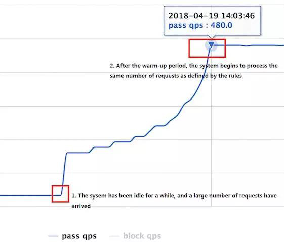

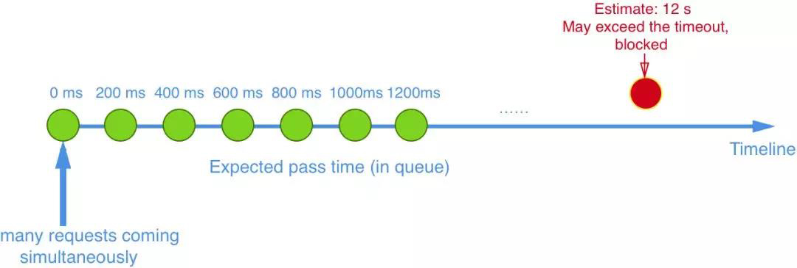

---

3. 系统负载保护
Sentinel 对系统的维度提供保护，负载保护算法借鉴了 TCP BBR 的思想。当系统负载较高的时
候，如果仍持续让请求进入，可能会导致系统崩溃，无法响应。在集群环境下，网络负载均衡
会把本应这台机器承载的流量转发到其它的机器上去。如果这个时候其它的机器也处在一个边
缘状态的时候，这个增加的流量就会导致这台机器也崩溃，最后导致整个集群不可用。针对这
个情况，Sentinel 提供了对应的保护机制，让系统的入口流量和系统的负载达到一个平衡，保
证系统在能力范围之内处理最多的请求。
4. 实时监控和控制面板
Sentinel 提供 HTTP API 用于获取实时的监控信息，如调用链路统计信息、簇点信息、规则信息
等。如果用户正在使用 Spring Boot/Spring Cloud 并使用了Sentinel Spring Cloud Starter，还可
以方便地通过其暴露的 Actuator Endpoint 来获取运行时的一些信息，如动态规则等。未来
Sentinel 还会支持标准化的指标监控 API，可以方便地整合各种监控系统和可视化系统，如
Prometheus、Grafana 等。
Sentinel 控制台（Dashboard）提供了机器发现、配置规则、查看实时监控、查看调用链路信息
等功能，使得用户可以非常方便地去查看监控和进行配置。

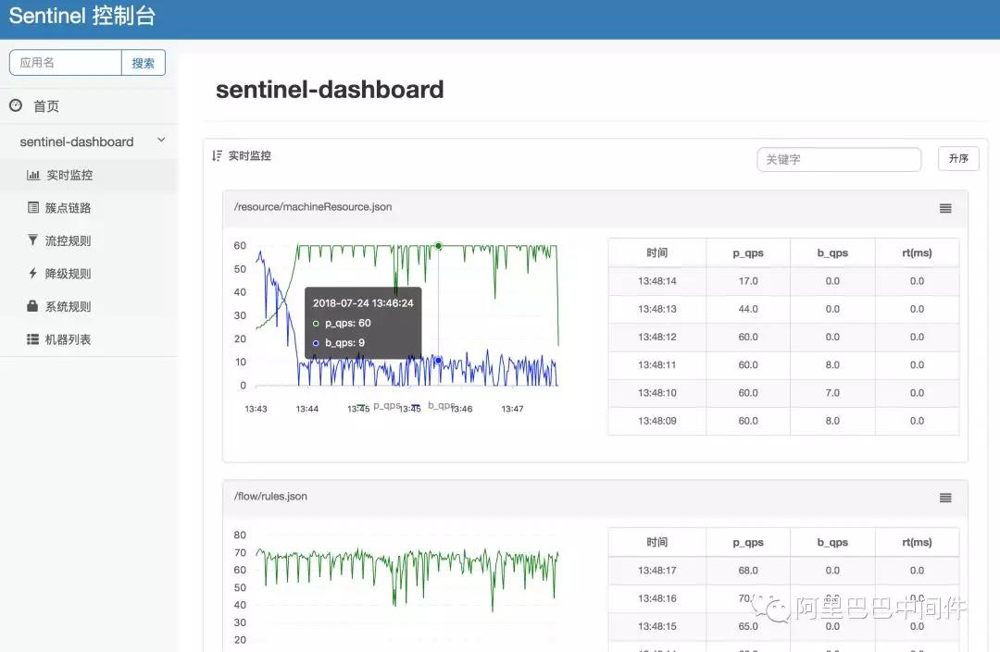

---

5. 生态
Sentinel 目前已经针对 Servlet、Dubbo、Spring Boot/Spring Cloud、gRPC 等进行了适配，用户
只需引入相应依赖并进行简单配置即可非常方便地享受 Sentinel 的高可用流量防护能力。未来
Sentinel 还会对更多常用框架进行适配，并且会为 Service Mesh 提供集群流量防护的能力。
总结
#
Sentinel
Hystrix
隔离策略
信号量隔离
线程池隔离/信号量隔离
熔断降级策
略
基于响应时间或失败比率
基于失败比率
实时指标实
现
滑动窗口
滑动窗口（基于
RxJava）
规则配置
支持多种数据源
支持多种数据源
扩展性
多个扩展点
插件的形式
基于注解的
支持
支持
支持
限流
基于 QPS，支持基于调用关系的限流
不支持
流量整形
支持慢启动、匀速器模式
不支持
系统负载保
护
支持
不支持
控制台
开箱即用，可配置规则、查看秒级监控、机
器发现等
不完善
常见框架的
适配
Servlet、Spring Cloud、Dubbo、gRPC
Servlet、Spring Cloud
Netflix
微服务
翻译自 Martin Fowler 网站 Microservices 一文。文章篇幅较长，阅读需要一点耐心。
本人水平有限，若有不妥之处，还请各位帮忙指正，谢谢。
过去几年中出现了“微服务架构”这一术语，它描述了将软件应用程序设计为若干个可独立部署
的服务套件的特定方法。尽管这种架构风格尚未有精确的定义，但围绕业务能力、自动部署、
端点智能以及语言和数据的分散控制等组织来说，它们还是存在着某些共同特征。
“微服务”——在拥挤的软件架构街道上又一个新名词。虽然我们的自然倾向是对它轻蔑一瞥，但
这一术语描述了一种越来越具有吸引力的软件系统风格。在过去几年中，我们已经看到许多项
目使用了这种风格，到目前为止其结果都是正向的，以至于它变成了我们 ThoughtWorks 许多

---

同事构建企业应用程序的默认风格。然而遗憾的是，并没有太多信息可以概述微服务的风格以
及如何实现。
简而言之，微服务架构风格[1]是一种将单个应用程序开发为一套小型服务的方法，每个小型服
务都在自己的进程中运行，并以轻量级机制（通常是 HTTP 资源 API）进行通信。这些服务围绕
业务功能构建，可通过全自动部署机制来独立部署。这些服务共用一个最小型的集中式管理，
它们可以使用不同的编程语言编写，并使用不同的数据存储技术。
在开始解释微服务风格之前，将它与单体（monolithic）风格进行比较是有用的：单体应用程
序被构建为单一单元。企业应用程序通常由三个部分构成：客户端用户界面（由用户机器上的
浏览器中运行的 HTML 页面和 Javascript 组成）、数据库（由许多表组成，通常是在关系型数
据库中管理）系统、服务器端应用程序。服务器端应用程序处理 HTTP 请求，执行一些逻辑处
理，从数据库检索和更新数据，选择数据并填充到要发送到浏览器的 HTML 视图中。这个服务
器端应用程序是一个整体——一个逻辑可执行文件[2]。对系统的任何更改都涉及构建和部署新
版本的服务器端应用程序。
这种单体服务器是构建这种系统的自然方式。处理一个请求的所有逻辑都在一个进程中运行，
允许你使用语言的基本功能将应用程序划分为类、函数和命名空间。需要注意的是，你可以在
开发人员的笔记本电脑上运行和测试应用程序，并使用部署管道确保对程序做出的改动被适当
测试并部署到生产环境中。你可以通过在负载均衡器后面运行许多实例来水平扩展整体块。
单体应用程序可以取得成功，但越来越多的人对它们感到不满——尤其是在将更多应用程序部
署到云的时候。变更周期被捆绑在一起——即使只是对应用程序的一小部分进行了更改，也需
要重建和部署整个单体应用。随着时间的推移，通常很难保持良好的模块化结构，也更难以保
持应该只影响该模块中的一个模块的更改。对系统进行扩展时，不得不扩展整个应用系统，而
不能仅扩展该系统中需要更多资源的那些部分。

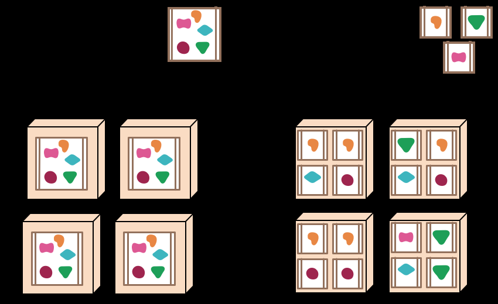

---

这些不满催生了微服务架构风格：将应用程序构建为服务套件。除了服务可独立部署、独立扩
展的事实之外，每个服务还提供了一个牢固的模块边界，甚至允许以不同的编程语言编写不同
的服务。他们也可以由不同的团队管理。
我们并不认为微服务风格是新颖的或创新的，其根源至少可以追溯到 Unix 的设计原则。但我们
认为没有足够多的人考虑微服务架构，如果使用它，许多软件的开发会变得更好。
微服务架构的特征
虽然不能说微服务架构风格有正式的定义，但我们可以尝试描述一下我们认为的在符合这个标
签的架构中，它们所具有的一些共同特征。与概述共同特征的任何定义一样，并非所有微服务
架构都具有所有特征，但我们确实期望大多数微服务架构都具有大多数特征。虽然我们的作者
一直是这个相当宽松的社区的活跃成员，但我们的本意还是尝试描述我们两人在自己和自己所
了解的团队的工作中所看到的情况。特别要说明的是，我们没有制定一些相关的定义。
通过服务进行组件化
只要我们参与软件行业，就一直希望通过将组件集成在一起来构建系统，就像我们在物理世界
中看到的事物的构建方式一样。在过去的几十年中，我们已经看到了大多数语言平台的公共软
件库都取得了极大的进展。
在谈论组件时，就会碰到一个有关定义的难题，即什么是组件？我们的定义是，组件是可独立
更换和升级的软件单元。
微服务架构也会使用软件库，但组件化软件的主要方式是拆分为多个服务。我们把库定义为链
接到程序并使用内存函数调用来调用的组件，而服务是一种进程外组件，通过 Web 服务请求或
远程过程调用等机制进行通信。（这与许多面向对象程序中的服务对象的概念是不同的[3]。）
将服务作为组件（而不是库）的一个主要原因是服务可以独立部署。如果你有一个应用程序[4]
是由单一进程里的多个库组成，任何一个组件的更改都会导致整个应用程序的重新部署。但如
果应用程序可拆分为多个服务，那么单个服务的变更只需要重新部署该服务即可。当然这也不
是绝对的，一些服务接口的修改可能会导致多个服务之间的协同修改，但一个好的微服务架构
的目的是通过内聚服务边界和服务协议的演进机制来最小化这些协同修改。
将服务用作组件的另一个结果是更明确的组件接口。大多数语言没有一个良好的机制来定义显
式发布的接口。通常，它只是文档和规则来阻止客户端破坏组件的封装，这会导致组件之间过
于紧耦合。通过使用显式远程调用机制，服务可以更轻松地避免这种情况。
像这样使用服务确实存在一些不好的地方。远程调用比进程内调用更昂贵，远程 API 需要设计
成较粗的粒度，这通常更难以使用。如果你需要更改组件之间的职责分配，那么当你跨越进程
边界时，这种组件行为的改动会更加难以实现。

---

近似地，我们可以把一个个服务映射为一个个运行时进程，但这仅仅是一个近似而已。一个服
务可能包括多个始终一起开发和部署的进程，比如一个应用系统的进程和仅由该服务使用的数
据库。
围绕业务能力进行组织
在将大型应用程序拆分为多个部分时，管理层往往侧重于技术层面，从而导致 UI 团队、服务器
端逻辑团队、数据库团队的划分。当团队按照这些方式分开时，即便是简单的更改也可能导致
跨团队项目的时间和预算批准。一个聪明的团队将围绕这个进行优化，“两害相权取其轻”——只
需将逻辑强制应用到他们可以访问的任何应用程序中。换句话说，逻辑无处不在。这是康威定
律[5]的一个例子。
任何设计系统（广义上的）的组织都会产生一种设计，其结构是组织通信结构的副
本。
—— 梅尔文•康威，1967年
微服务采用不同的划分方式，它是围绕业务功能将系统拆分为多个服务 。这些服务为该业务领
域采用广泛的软件实现，包括用户界面、持久化存储和任何外部协作。因此，团队是跨职能
的，包括开发所需的全部技能：用户体验、数据库和项目管理。

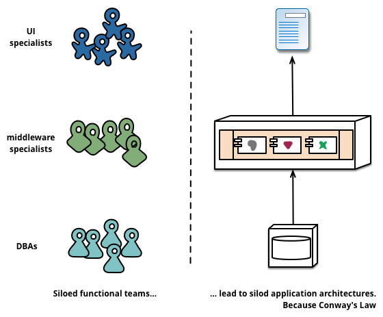

---

以这种方式组建的一家公司是 www.comparethemarket.com。跨职能团队负责构建和运营每个
产品，每个产品拆分为多个独立的服务，彼此通过消息总线来通信。
大型单体应用程序也可以围绕业务功能进行模块化，尽管这不是常见的情况。当然，我们会敦
促构建单体应用系统的大型团队根据业务线来将自己分解为若干小团队。我们在这里看到的主
要问题是，它们往往围绕太多的上下文进行组织。如果单体跨越了模块边界，对团队的个体成
员来说，很难将它们装入短期的记忆中。此外，我们看到模块化生产线需要大量的规则来执
行。服务组件所要求的更加明确的分离，使得它更容易保持团队边界清晰。
是产品不是项目
我们看到的大多数应用程序开发工作都使用这样一个项目模式：目标是交付一些软件，然后就
完工了。一旦完成后，软件将移交给维护组织，然后构建它的项目团队也随之解散了。
微服务支持者倾向于避免这种模式，而是认为团队应该负责产品的整个生命周期。对此一个共
同的启示是亚马逊的 “you build, you run it” 的概念，开发团队对生产中的软件负全部责任。这
使开发者经常接触他们的软件在生产环境如何工作，并增加与他们的用户联系，因为他们必须
承担至少部分的支持工作。
产品心态与业务能力的联系紧密相连。要持续关注软件如何帮助用户提升业务能力，而不是把
软件看成是将要完成的一组功能。
没有理由说为什么这种方法不能用在单一应用程序上，但较小的服务粒度，使得它更容易在服
务开发者和用户之间建立个人关系。
智能端点和哑管

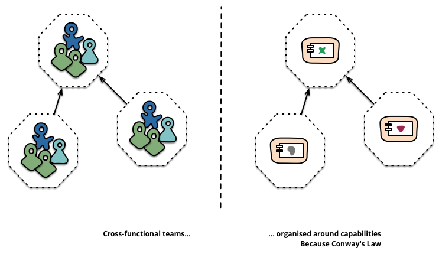

---

在不同进程之间建立通信时，我们已经看到许多产品和方法，都强调将大量的智能特性放入通
信机制本身。一个很好的例子是企业服务总线（ESB），其中 ESB 产品通常包括用于消息路
由、编排、转换和应用业务规则的复杂工具。
微服务社区倾向于采用另一种方法：智能端点和哑管。基于微服务构建的应用程序的目标是尽
可能的解耦和尽可能的内聚——他们拥有自己的领域逻辑，他们的行为更像经典 UNIX 理念中的
过滤器——接收请求，应用适当的逻辑并产生响应。使用简单的 REST 风格的协议来编排它们，
而不是使用像 WS-Choreography 或者 BPEL 或者通过中心工具编制(orchestration)等复杂的协
议。
最常用的两种协议是带有资源 API 的 HTTP 请求-响应和轻量级消息传递[8]。对第一种协议最好
的表述是
本身就是 web，而不是隐藏在 web 的后面。
——Ian Robinson
微服务团队使用的规则和协议，正是构建万维网的规则和协议(在更大程度上是 UNIX 的)。从开
发者和运营人员的角度讲，通常使用的资源可以很容易的缓存。
第二种常用方法是在轻量级消息总线上传递消息。选择的基础设施是典型的哑的(哑在这里只充
当消息路由器)——像 RabbitMQ 或 ZeroMQ 这样简单的实现仅仅提供一个可靠的异步交换结构
——在服务里，智能特性仍旧存在于那些生产和消费诸多消息的各个端点中，即存在于各个服
务中。
单体应用中，组件都在同一进程内执行，它们之间通过方法调用或函数调用通信。把单体变成
微服务最大的问题在于通信模式的改变。一种幼稚的转换是从内存方法调用转变成 RPC，这导
致频繁通信且性能不好。相反，你需要用粗粒度通信代替细粒度通信。
去中心化的治理
集中治理的一个后果是单一技术平台的标准化发展趋势。经验表明，这种方法正在收缩 ——不
是每个问题都是钉子，不是每个问题都是锤子。我们更喜欢使用正确的工具来完成工作，而单
体应用程序在一定程度上可以利用语言的优势，这是不常见的。
把单体的组件分裂成服务，在构建这些服务时可以有自己的选择。你想使用 Node.js 开发一个
简单的报告页面？去吧。用 C++ 实现一个特别粗糙的近乎实时的组件？好极了。你想换用一个
更适合组件读操作数据的不同风格的数据库？我们有技术来重建它。
当然，仅仅因为你可以做些什么，而不意味着你应该这样做——但用这种方式划分系统意味着
你可以选择。
团队在构建微服务时也更喜欢用不同的方法来达标。他们更喜欢生产有用的工具这种想法，而
不是写在纸上的标准，这样其他开发者可以用这些工具解决他们所面临的相似的问题。有时，

---

这些工具通常在实施中收获并与更广泛的群体共享，但不完全使用一个内部开源模型。现在 git
和 github 已经成为事实上的版本控制系统的选择，在内部开放源代码的实践也正变得越来越常
见。
Netflix 是遵循这一理念的一个很好的例子。尤其是，以库的形式分享有用的且经过市场检验的
代码，这激励其他开发者用类似的方式解决相似的问题，同时还为采用不同方法敞开了大门。
共享库倾向于聚焦在数据存储、进程间通信和我们接下来要深入讨论的基础设施自动化的共性
问题。
对于微服务社区来说，开销特别缺乏吸引力。这并不是说社区不重视服务合约。恰恰相反，因
为他们有更多的合约。只是他们正在寻找不同的方式来管理这些合约。像 Tolerant Reader 和
Consumer-Driven Contracts 这样的模式通常被用于微服务。这些援助服务合约在独立进化。执
行消费者驱动的合约作为构建的一部分，增加了信心并对服务是否在运作提供了更快的反馈。
事实上，我们知道澳大利亚的一个团队用消费者驱动的合约这种模式来驱动新业务的构建。他
们使用简单的工具定义服务的合约。这已变成自动构建的一部分，即使新服务的代码还没写。
服务仅在满足合约的时候才被创建出来 - 这是在构建新软件时避免 "YAGNI"[9] 困境的一个优雅
的方法。围绕这些成长起来的技术和工具，通过减少服务间的临时耦合，限制了中心合约管理
的需要。
也许去中心化治理的最高境界就是亚马逊广为流传的 build it/run it 理念。团队要对他们构建的
软件的各方面负责，包括 7*24 小时的运营。这一级别的责任下放绝对是不规范的，但我们看到
越来越多的公司让开发团队负起更多责任。Netflix 是采用这一理念的另一家公司[11]。每天凌
晨 3 点被传呼机叫醒无疑是一个强有力的激励，使你在写代码时关注质量。这是关于尽可能远
离传统的集中治理模式的一些想法。
分散数据管理
数据管理的去中心化有许多不同的呈现方式。在最抽象的层面上，这意味着使系统间存在差异
的世界概念模型。在整合一个大型企业时，客户的销售视图将不同于支持视图，这是一个常见
的问题。客户的销售视图中的一些事情可能不会出现在支持视图中。它们确实可能有不同的属
性和(更坏的)共同属性，这些共同属性在语义上有微妙的不同。
这个问题常见于应用程序之间，但也可能发生在应用程序内部，尤其当应用程序被划分成分离
的组件时。一个有用的思维方式是有界上下文(Bounded Context)内的领域驱动设计(Domain-
Driven Design, DDD)理念。DDD 把一个复杂域划分成多个有界的上下文，并且映射出它们之间
的关系。这个过程对单体架构和微服务架构都是有用的，但在服务和上下文边界间有天然的相
关性，边界有助于澄清和加强分离，就像业务能力部分描述的那样。
和概念模型的去中心化决策一样，微服务也去中心化数据存储决策。虽然单体应用程序更喜欢
单一的逻辑数据库做持久化存储，但企业往往倾向于一系列应用程序共用一个单一的数据库
——这些决定是供应商授权许可的商业模式驱动的。微服务更倾向于让每个服务管理自己的数
据库，或者同一数据库技术的不同实例，或完全不同的数据库系统 - 这就是所谓的混合持久化
(Polyglot Persistence)。你可以在单体应用程序中使用混合持久化，但它更常出现在为服务里。

---

对跨微服务的数据来说，去中心化责任对管理升级有影响。处理更新的常用方法是在更新多个
资源时使用事务来保证一致性。这个方法通常用在单体中。
像这样使用事务有助于一致性，但会产生显著地临时耦合，这在横跨多个服务时是有问题的。
分布式事务是出了名的难以实现，因此微服务架构强调服务间的无事务协作，对一致性可能
只是最后一致性和通过补偿操作处理问题有明确的认知。
对很多开发团队来说，选择用这样的方式管理不一致性是一个新的挑战，但这通常与业务实践
相匹配。通常业务处理一定程度的不一致，以快速响应需求，同时有某些类型的逆转过程来处
理错误。这种权衡是值得的，只要修复错误的代价小于更大一致性下损失业务的代价。
基建自动化
基础设施自动化技术在过去几年中发生了巨大变化——特别是云和 AWS 的发展降低了构建、部
署和运行微服务的操作复杂性。
许多使用微服务构建的产品或系统都是由具有丰富的持续交付和持续集成经验的团队构建的。
以这种方式构建软件的团队广泛使用基础设施自动化技术。如下面显示的构建管道所示。

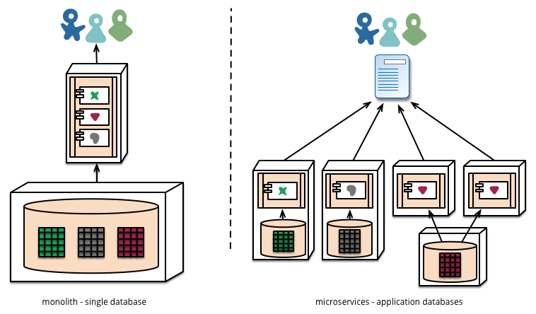

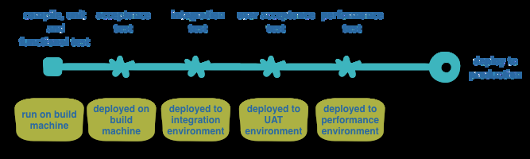

---

由于这并不是一篇关于持续交付的文章，我们在这里只关注持续交付的几个关键特性。我们希
望有尽可能多的信心确保我们的软件正常运行，因此我们进行了大量的自动化测试。想让软件
达到“晋级”(Promotion)状态从而“推上”流水线，就意味着要在每一个新的环境中，对软件进行
自动化部署。
一个单体应用程序可以非常愉快地通过这些环境构建、测试和推动。事实证明，一旦你为单体
投入了自动化整体生产，那么部署更多的应用程序似乎不再那么可怕了。请记住，持续交付的
目标之一就是让“部署”工作变得“枯燥”，所以无论是一个还是三个应用程序，只要部署工作依
旧很“枯燥”，那么就没什么可担心的了[12]。
我们看到团队大量的基础设施自动化的另一个领域是在管理生产环境中的微服务。与我们上面
的断言（只要部署很无聊）相比，单体和微服务之间没有太大的区别，但是每个部署的运行环
境可能会截然不同。
设计时为故障做好准备
使用服务作为组件的结果是，需要设计应用程序以便它们能够容忍服务的失败。如果服务提供
者商不可用，任何服务呼叫都可能失败，客户必须尽可能优雅地对此做出响应。与单体设计相
比，这是一个缺点，因为它这会引入额外的复杂性来处理它。结果是微服务团队不断反思服务
失败是如何影响用户体验的。Netflix 的 Simian Army 能够引发服务甚至数据中心的故障在工作
日发生故障，从而来测试应用程序的弹性和监控能力。
生产中的这种自动化测试足以让大多数运维团队兴奋得浑身颤栗，就像在一周的长假即将到来
前一样。这并不是说单体架构风格不能构建先进的监控系统——只是根据我们的经验，这在单
体系统中并不常见罢了。
由于服务可能随时发生故障，因此能够快速检测故障并在可能的情况下自动恢复服务就显得至
关重要。微服务应用程序非常重视应用程序的实时监控，比如检查架构元素（数据库每秒获得
多少请求）和业务相关度量（例如每分钟收到多少订单）。语义监控可以提供出现问题的早期
预警系统，从而触发开发团队跟进和调查。

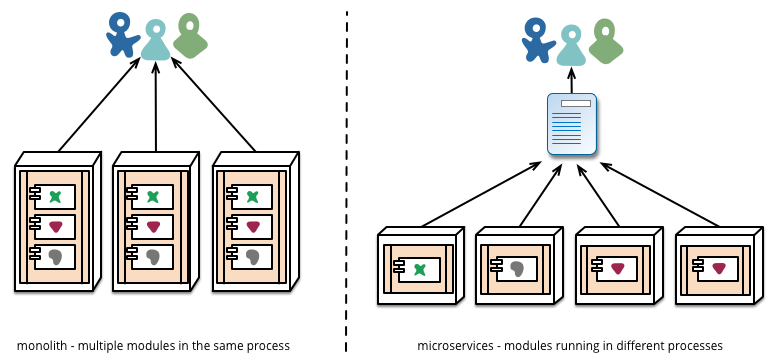

---

这对于微服务架构来说尤为重要，因为微服务偏好编排和事件写作，这会导致一些紧急状况。
虽然许多权威人士对于偶然事件的价值持积极态度，但事实是，“突发行为”有时可能是一件坏
事。监控至关重要，它能够快速发现不良紧急行为并进行修复。
单体系统也可以像微服务一样实现透明的监控——事实上，它们也应该如此。不同之处在于你
必须能够知道在不同进程中运行的服务在何时断开了连接。对于同一过程中的库，这种透明性
用处并不大。
微服务团队希望看到针对每个服务的复杂监控和日志记录，例如显示“运行/宕机”状态的仪表盘
以及各种运维和业务相关的指标。有关断路器状态，当前吞吐量和延迟的详细信息也是我们在
工作中经常遇到的其他例子。
演化设计
微服务从业者通常有进化设计的背景，并把服务分解视为进一步的工具，使应用程序开发人员
能够控制应用程序中的更改，而不会降低变更速度。变更控制并不一定意味着变更的减少——
在正确的态度和工具的帮助下，你可以对软件进行频繁，快速且有良好控制的更改。
每当要试图将软件系统分解为组件时，你就会面临这样的决策，即如何进行拆分——我们决定
拆分应用程序的原则是什么？组件的关键属性具有独立替换和可升级性的特点[13]——这意味着
我们寻找这些点，想象如何在不影响其协作者的情况下重写组件。实际上，许多微服务组通过
明确地期望许多服务被废弃而不是长期演变来进一步考虑这一点。
Guardian 网站是设计和构建成单体应用程序的一个很好的例子，但是它也在微服务方向上不断
发展演化。原先的单体系统仍然是网站的核心，但他们更喜欢通过构建一些微服务 API 的方式
来添加新的功能。这种方法对于本质上是临时的功能尤其方便，例如处理体育赛事的专用页
面。网站的这一部分可以使用快速开发语言快速组合在一起，在赛事结束后立即删除。我们在
金融机构看到过类似的方法，为市场机会增加新服务，并在几个月甚至几周后丢弃。
这种强调可替换性的特点，是模块化设计一般性原则的一个特例，即通过变化模式来驱动模块
化的实现[14]。大家都愿意将那些同时发生变化的东西放在同一个模块，很少变化的系统模块
应该与目前正在经历大量变动的系统处于不同的服务中。如果你发现自己反复更改两项服务，
那就表明它们应该合并了。
将组件放入服务中可以为更细粒度的发布计划添加机会。对于单体来说，任何更改都需要完整
构建和部署整个应用程序。但是，使用微服务，你只需要重新部署你修改的服务。这可以简化
并加快发布过程。缺点是你必须担心一项服务的变化会打破其消费者。传统的集成方法是尝试
使用版本控制来解决这个问题，但微服务世界中的偏好是仅仅把使用版本控制作为最后的手
段。我们可以通过设计服务尽可能容忍服务提供者的变化来避免大量的版本控制。
微服务是未来吗？

---

我们写这篇文章的主要目的是解释微服务的主要思想和原则。通过花时间来做到这一点，我们
清楚地认为微服务架构风格是一个重要的想法——在研发企业系统时，值得对它进行认真考
虑。我们最近使用这种方式构建了几个系统，并且了解到其它团队也赞同这种风格。
我们了解到那些在某种程度上开创这种架构风格的先驱，包括亚马逊、Netflix、英国卫报、英
国政府数字化服务中心、realestate.com.au、Forward 和 comparethemarket.com。2013 年的技
术会议上充满了一些公司的例子，这些公司正在转向可以归类为微服务的公司，包括 Travis
CI。此外，有很多组织长期以来一直在做我们称之为微服务的东西，但没有使用过这个名字。
（通常这被标记为 SOA——尽管如我们所说，SOA 有许多相互矛盾的形式。[15]）
然而，尽管有这些积极的经验，但并不是说我们确信微服务是软件架构的未来发展方向。虽然
到目前为止我们的经验与整体应用相比是积极的，但我们意识到没有足够的时间让我们做出充
分完整的判断。
通常，架构决策所产生的真正效果，只有在该决策做出若干年后才能真正显现。我们已经看到
由带着强烈的模块化愿望的优秀团队所做的一些项目，最终却构建出一个单体架构，并在几年
之内不断腐化。许多人认为，如果使用微服务就不大可能出现这种腐化，因为服务的边界是明
确的，而且难以随意搞乱。然而，对于那些开发时间足够长的各种系统，除非我们已经见识得
足够多，否则我们无法真正评价微服务架构是如何成熟的。
有人觉得微服务或许很难成熟起来，这当然是有原因的。在组件化上所做的任何工作的成功与
否，取决于软件与组件的匹配程度。准确地搞清楚某个组件的边界的位置应该出现在哪里，是
一项困难的工作。进化设计承认难以对边界进行正确定位，所以它将工作的重点放到了易于对
边界进行重构之上。但是当各个组件成为各个进行远程通信的服务后，比起在单一进程内进行
各个软件库之间的调用，此时的重构就变得更加困难。跨越服务边界的代码移动就变得困难起
来。接口的任何变化，都需要在其各个参与者之间进行协调。向后兼容的层次也需要被添加进
来。测试也会变得更加复杂。
另一个问题是，如果这些组件不能干净利落地组合成一个系统，那么所做的一切工作，仅仅是
将组件内的复杂性转移到组件之间的连接之上。这样做的后果，不仅仅是将复杂性搬了家，它
还将复杂性转移到那些不再明确且难以控制的边界之上。当在观察一个小型且简单的组件内部
时，人们很容易觉得事情已经变得更好了，然而他们却忽视了服务之间杂乱的连接。
最后，还有一个团队技能的因素。新技术往往会被技术更加过硬的团队所采用。对于技术更加
过硬的团队而更有效的一项技术，不一定适用于一个技术略逊一筹的团队。我们已经看到大量
这样的案例，那些技术略逊一筹的团队构建出了杂乱的单体架构。当这种杂乱发生到微服务身
上时，会出现什么情况？这需要花时间来观察。一个糟糕的团队，总会构建一个糟糕的系统
——在这种情况下，很难讲微服务究竟是减少了杂乱，还是让事情变得更糟。
我们听到的一个合理的论点是，你不应该从微服务架构开始，而是从整体开始，保持模块化，
并在整体出现问题时将其拆分为微服务。（这个建议并不理想，因为好的进程内接口通常不是
一个好的服务接口。）

---

所以我们谨慎乐观地写下这个。到目前为止，我们已经看到了足够多的微服务风格，觉得它可
能是一条值得走的路。我们无法确定最终会在哪里结束，但软件开发的挑战之一是你只能根据
你当前必须拥有的不完善信息做出决策。
脚注
1: The term "microservice" was discussed at a workshop of soxware architects near Venice in May,
2011 to describe what the participants saw as a common architectural style that many of them
had been recently exploring. In May 2012, the same group decided on "microservices" as the most
appropriate name. James presented some of these ideas as a case study in March 2012 at 33rd
Degree in Krakow in Microservices - Java, the Unix Way as did Fred George about the same time.
Adrian Cockcrox at Netflix, describing this approach as "fine grained SOA" was pioneering the
style at web scale as were many of the others mentioned in this article - Joe Walnes, Dan North,
Evan Botcher and Graham Tackley.
2: The term monolith has been in use by the Unix community for some time. It appears in The Art
of Unix Programming to describe systems that get too big.
3: Many object-oriented designers, including ourselves, use the term service object in the Domain-
Driven Design sense for an object that carries out a significant process that isn't tied to an entity.
This is a diwerent concept to how we're using "service" in this article. Sadly the term service has
both meanings and we have to live with the polyseme.
4: We consider an application to be a social construction that binds together a code base, group
of functionality, and body of funding.
5: The original paper can be found on Melvyn Conway's website here.
6: We can't resist mentioning Jim Webber's statement that ESB stands for "Egregious Spaghetti
Box".
7: Netflix makes the link explicit - until recently referring to their architectural style as fine-grained
SOA.
8: At extremes of scale, organisations oxen move to binary protocols - protobufs for example.
Systems using these still exhibit the characteristic of smart endpoints, dumb pipes - and trade ow
transparency for scale. Most web properties and certainly the vast majority of enterprises don't
need to make this tradeow - transparency can be a big win.
9: "YAGNI" or "You Aren't Going To Need It" is an XP principle and exhortation to not add features
until you know you need them.

---

10: It's a little disengenuous of us to claim that monoliths are single language - in order to build
systems on todays web, you probably need to know JavaScript and XHTML, CSS, your server side
language of choice, SQL and an ORM dialect. Hardly single language, but you know what we
mean.
11: Adrian Cockcrox specifically mentions "developer self-service" and "Developers run what they
wrote"(sic) in this excellent presentation delivered at Flowcon in November, 2013.
12: We are being a little disengenuous here. Obviously deploying more services, in more complex
topologies is more diwicult than deploying a single monolith. Fortunately, patterns reduce this
complexity - investment in tooling is still a must though.
13: In fact, Dan North refers to this style as Replaceable Component Architecture rather than
microservices. Since this seems to talk to a subset of the characteristics we prefer the latter.
14: Kent Beck highlights this as one his design principles in Implementation Patterns.
15: And SOA is hardly the root of this history. I remember people saying "we've been doing this for
years" when the SOA term appeared at the beginning of the century. One argument was that this
style sees its roots as the way COBOL programs communicated via data files in the earliest days of
enterprise computing. In another direction, one could argue that microservices are the same thing
as the Erlang programming model, but applied to an enterprise application context.
迁移到微服务综述
迁移单体式应用到微服务架构意味着一系列现代化过程，有点像这几代开发者一直在做的事
情，实时上，当迁移时，我们可以重用一些想法。
一个策略是：不要大规模（big bang）重写代码（只有当你承担重建一套全新基于微服务的应
用时候可以采用重写这种方法）。重写代码听起来很不错，但实际上充满了风险最终可能会失
败，就如 Martin Fowler 所说：
“the only thing a Big Bang rewrite guarantees is a Big Bang!”
相反，应该采取逐步迁移单体式应用的策略，通过逐步生成微服务新应用，与旧的单体式应用
集成，随着时间推移，单体式应用在整个架构中比例逐渐下降直到消失或者成为微服务架构一
部分。这个策略有点像在高速路上限速到 70 迈对车做维护，尽管有挑战，但是比起重写的风险
小很多。
Martin Fowler 将这种现代化策略成为绞杀（Strangler）应用，名字来源于雨林中的绞杀藤
（strangler vine），也叫绞杀榕 (strangler fig)。绞杀藤为了爬到森林顶端都要缠绕着大树生
长，一段时间后，树死了，留下树形藤。这种应用也使用同一种模式，围绕着传统应用开发了
新型微服务应用，传统应用会渐渐退出舞台。

---

我们来看看其他可行策略。
策略 1——停止挖掘
Law of Holes 是说当自己进洞就应该停止挖掘。对于单体式应用不可管理时这是最佳建议。换
句话说，应该停止让单体式应用继续变大，也就是说当开发新功能时不应该为旧单体应用添加
新代码，最佳方法应该是将新功能开发成独立微服务。如下图所示：
除了新服务和传统应用，还有两个模块，其一是请求路由器，负责处理入口（http）请求，有
点像之前提到的 API 网关。路由器将新功能请求发送给新开发的服务，而将传统请求还发给单
体式应用。
另外一个是胶水代码（glue code），将微服务和单体应用集成起来，微服务很少能独立存在，
经常会访问单体应用的数据。胶水代码，可能在单体应用或者为服务或者二者兼而有之，负责
数据整合。微服务通过胶水代码从单体应用中读写数据。 
微服务有三种方式访问单体应用数据：
换气单体应用提供的远程 API
直接访问单体应用数据库
自己维护一份从单体应用中同步的数据

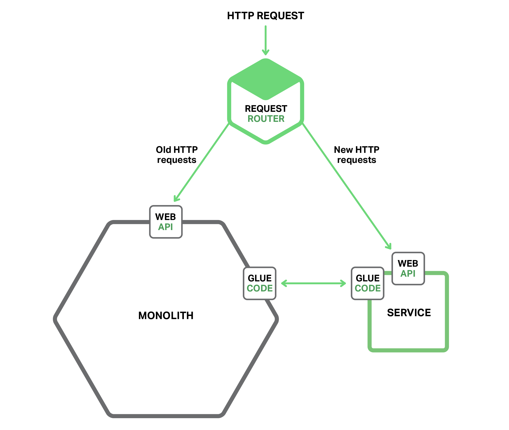

---

胶水代码也被称为容灾层（anti-corruption layer），这是因为胶水代码保护微服务全新域模型
免受传统单体应用域模型污染。胶水代码在这两种模型间提供翻译功能。术语 anti-corruption
layer 第一次出现在 Eric Evans 撰写的必读书 Domain Driven Design，随后就被提炼为一篇白皮
书。开发容灾层可能有点不是很重要，但却是避免单体式泥潭的必要部分。
将新功能以轻量级微服务方式实现由很多优点，例如可以阻止单体应用变的更加无法管理。微
服务本身可以开发、部署和独立扩展。采用微服务架构会给开发者带来不同的切身感受。
然而，这方法并不解决任何单体式本身问题，为了解决单体式本身问题必须深入单体应用 做出
改变。我们来看看这么做的策略。
策略 2——将前端和后端分离
减小单体式应用复杂度的策略是讲表现层和业务逻辑、数据访问层分开。典型的企业应用至少
有三个不同元素构成：
1. 表现层——处理 HTTP 请求，要么响应一个 RESTAPI 请求，要么是提供一个基于 HTML 的图
形接口。对于一个复杂用户接口应用，表现层经常是代码重要的部分。
2. 业务逻辑层——完成业务逻辑的应用核心。
3. 数据访问层——访问基础元素，例如数据库和消息代理。
在表现层与业务数据访问层之间有清晰的隔离。业务层有由若干方面组成的粗粒度（coarse-
grained）的 API，内部包含了业务逻辑元素。API 是可以将单体业务分割成两个更小应用的天然
边界，其中一个应用是表现层，另外一个是业务和数据访问逻辑。分割后，表现逻辑应用远程
调用业务逻辑应用，下图表示迁移前后架构不同：

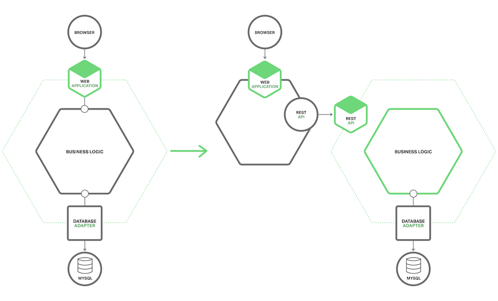

---

单体应用这么分割有两个好处，其一使得应用两部分开发、部署和扩展各自独立，特别地，允
许表现层开发者在用户界面上快速选择，进行 A/B 测试；其二，使得一些远程 API 可以被微服
务调用。
然而，这种策略只是部分的解决方案。很可能应用的两部分之一或者全部都是不可管理的，因
此需要使用第三种策略来消除剩余的单体架构。
策略 3——抽出服务
第三种迁移策略就是从单体应用中抽取出某些模块成为独立微服务。每当抽取一个模块变成微
服务，单体应用就变简单一些；一旦转换足够多的模块，单体应用本身已经不成为问题了，要
么消失了，要么简单到成为一个服务。
排序那个模块应该被转成微服务
一个巨大的复杂单体应用由成十上百个模块构成，每个都是被抽取对象。决定第一个被抽取模
块一般都是挑战，一般最好是从最容易抽取的模块开始，这会让开发者积累足够经验，这些经
验可以为后续模块化工作带来巨大好处。
转换模块成为微服务一般很耗费时间，一般可以根据获益程度来排序，一般从经常变化模块开
始会获益最大。一旦转换一个模块为微服务，就可以将其开发部署成独立模块，从而加速开发
进程。
将资源消耗大户先抽取出来也是排序标准之一。例如，将内存数据库抽取出来成为一个微服务
会非常有用，可以将其部署在大内存主机上。同样的，将对计算资源很敏感的算法应用抽取出
来也是非常有益的，这种服务可以被部署在有很多 CPU 的主机上。通过将资源消耗模块转换成
微服务，可以使得应用易于扩展。
查找现有粗粒度边界来决定哪个模块应该被抽取，也是很有益的，这使得移植工作更容易和简
单。例如，只与其他应用异步同步消息的模块就是一个明显边界，可以很简单容易地将其转换
为微服务。
如何抽取模块
抽取模块第一步就是定义好模块和单体应用之间粗粒度接口，由于单体应用需要微服务的数
据，反之亦然，因此更像是一个双向 API。因为必须在负责依赖关系和细粒度接口模式之间做
好平衡，因此开发这种 API 很有挑战性，尤其对使用域模型模式的业务逻辑层来说更具有挑
战，因此经常需要改变代码来解决依赖性问题，如图所示：
一旦完成粗粒度接口，也就将此模块转换成独立微服务。为了实现，必须写代码使得单体应用
和微服务之间通过使用进程间通信（IPC）机制的 API 来交换信息。如图所示迁移前后对比：

---

此例中，正在使用 Y 模块的 Z 模块是备选抽取模块，其元素正在被 X 模块使用，迁移第一步就
是定义一套粗粒度 APIs，第一个接口应该是被 X 模块使用的内部接口，用于激活 Z 模块；第二
个接口是被 Z 模块使用的外部接口，用于激活 Y 模块。
迁移第二步就是将模块转换成独立服务。内部和外部接口都使用基于 IPC 机制的代码，一般都
会将 Z 模块整合成一个微服务基础框架，来出来割接过程中的问题，例如服务发现。

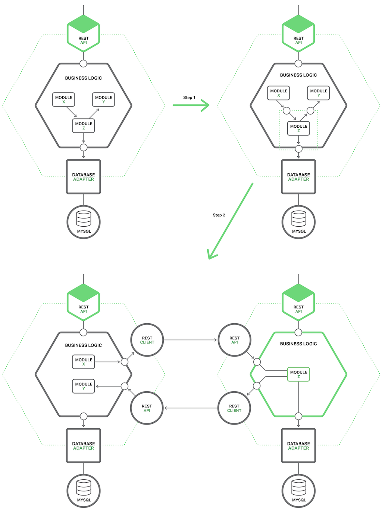

---

抽取完模块，也就可以开发、部署和扩展另外一个服务，此服务独立于单体应用和其它服务。
可以从头写代码实现服务；这种情况下，将服务和单体应用整合的 API 代码成为容灾层，在两
种域模型之间进行翻译工作。每抽取一个服务，就朝着微服务方向前进一步。随着时间推移，
单体应用将会越来越简单，用户就可以增加更多独立的微服务。 将现有应用迁移成微服务架构
的现代化应用，不应该通过从头重写代码方式实现，相反，应该通过逐步迁移的方式。有三种
策略可以考虑：将新功能以微服务方式实现；将表现层与业务数据访问层分离；将现存模块抽
取变成微服务。随着时间推移，微服务数量会增加，开发团队的弹性和效率将会大大增加。
1.1 微服务和分布式数据管理问题
单体式应用一般都会有一个关系型数据库，由此带来的好处是应用可以使用 ACID
transactions，可以带来一些重要的操作特性：
1. 原子性 – 任何改变都是原子性的
2. 一致性 – 数据库状态一直是一致性的
3. 隔离性 – 即使交易并发执行，看起来也是串行的
4. Durable – 一旦交易提交了就不可回滚
鉴于以上特性，应用可以简化为：开始一个交易，改变（插入，删除，更新）很多行，然后提
交这些交易。
使用关系型数据库带来另外一个优势在于提供 SQL（功能强大，可声明的，表转化的查询语
言）支持。用户可以非常容易通过查询将多个表的数据组合起来，RDBMS 查询调度器决定最佳
实现方式，用户不需要担心例如如何访问数据库等底层问题。另外，因为所有应用的数据都在
一个数据库中，很容易去查询。
然而，对于微服务架构来说，数据访问变得非常复杂，这是因为数据都是微服务私有的，唯一
可访问的方式就是通过 API。这种打包数据访问方式使得微服务之间松耦合，并且彼此之间独
立。如果多个服务访问同一个数据，schema 会更新访问时间，并在所有服务之间进行协调。
更甚于，不同的微服务经常使用不同的数据库。应用会产生各种不同数据，关系型数据库并不
一定是最佳选择。某些场景，某个 NoSQL 数据库可能提供更方便的数据模型，提供更加的性能
和可扩展性。例如，某个产生和查询字符串的应用采用例如 Elasticsearch 的字符搜索引擎。同
样的，某个产生社交图片数据的应用可以采用图片数据库，例如，Neo4j ；因此，基于微服务
的应用一般都使用 SQL 和 NoSQL 结合的数据库，也就是被称为 polyglot persistence 的方法。
分区的，polyglot-persistent 架构用于存储数据有许多优势，包括松耦合服务和更佳性能和可扩
展性。然而，随之而来的则是分布式数据管理带来的挑战。
第一个挑战在于如何完成一笔交易的同时保持多个服务之间数据一致性。之所以会有这个问
题，我们以一个在线 B2B 商店为例，客户服务维护包括客户的各种信息，例如 credit lines 。订
单服务管理订单，需要验证某个新订单与客户的信用限制没有冲突。在单一式应用中，订单服
务只需要使用 ACID 交易就可以检查可用信用和创建订单。

---

相反的，微服务架构下，订单和客户表分别是相对应服务的私有表，如下图所示：
订单服务不能直接访问客户表，只能通过客户服务发布的 API 来访问。订单服务也可以使用
distributed transactions, 也就是周知的两阶段提交 (2PC)。然而，2PC 在现在应用中不是可选
性。根据 CAP 理论，必须在可用性（availability）和 ACID 一致性（consistency）之间做出选
择，availability 一般是更好的选择。但是，许多现代科技，例如许多 NoSQL 数据库，并不支持
2PC。在服务和数据库之间维护数据一致性是非常根本的需求，因此我们需要找其他的方案。
第二个挑战是如何完成从多个服务中搜索数据。例如，设想应用需要显示客户和他的订单。如
果订单服务提供 API 来接受用户订单信息，那么用户可以使用类应用型的 join 操作接收数据。
应用从用户服务接受用户信息，从订单服务接受此用户订单。假设，订单服务只支持通过私有
键（key）来查询订单（也许是在使用只支持基于主键接受的 NoSQL 数据库），此时，没有合
适的方法来接收所需数据。
1.2 事件驱动架构
对许多应用来说，这个解决方案就是使用事件驱动架构（event-driven architecture）。在这种
架构中，当某件重要事情发生时，微服务会发布一个事件，例如更新一个业务实体。当订阅这
些事件的微服务接收此事件时，就可以更新自己的业务实体，也可能会引发更多的时间发布。
可以使用事件来实现跨多服务的业务交易。交易一般由一系列步骤构成，每一步骤都由一个更
新业务实体的微服务和发布激活下一步骤的事件构成。下图展现如何使用事件驱动方法，在创
建订单时检查信用可用度，微服务通过消息代理（Messsage Broker）来交换事件。
1. 订单服务创建一个带有 NEW 状态的 Order （订单），发布了一个 “Order Created Event（创
建订单）” 的事件。

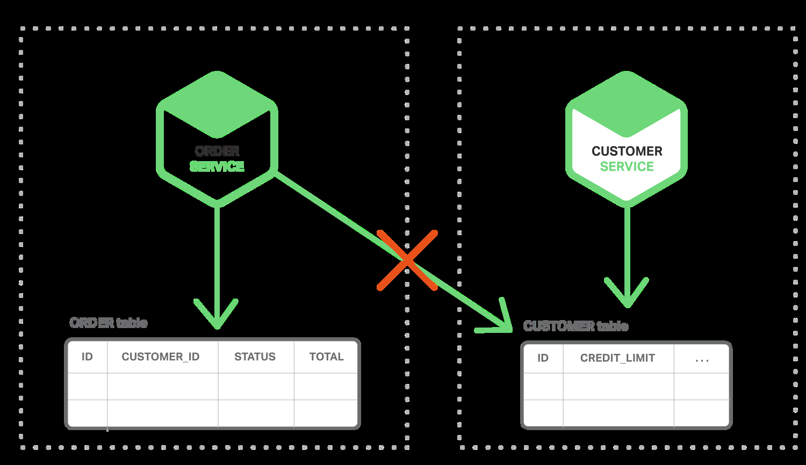

---

2. 客户服务消费 Order Created Event 事件，为此订单预留信用，发布 “Credit Reserved
Event（信用预留）” 事件。
3. 订单服务消费 Credit Reserved Event ，改变订单的状态为 OPEN。

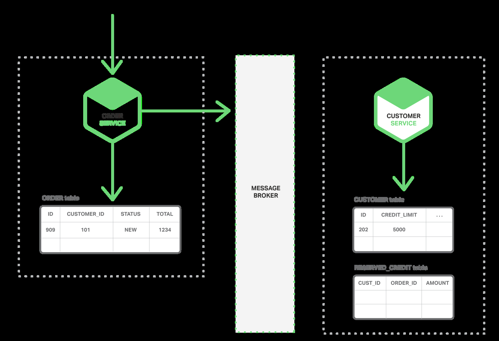

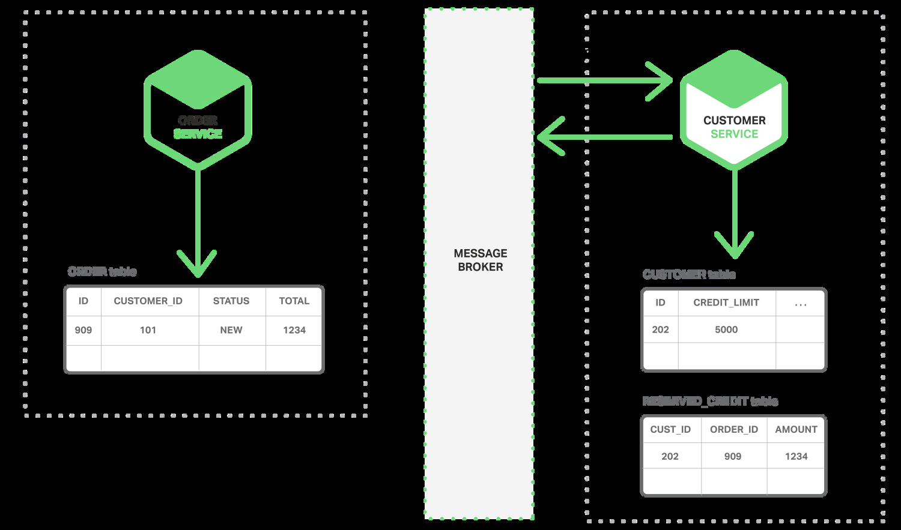

---

更复杂的场景可以引入更多步骤，例如在检查用户信用的同时预留库存等。
考虑到（a）每个服务原子性更新数据库和发布事件，然后，（b）消息代理确保事件传递至少
一次，然后可以跨多个服务完成业务交易（此交易不是 ACID 交易）。这种模式提供弱确定性，
例如最终一致性 eventual consistency。这种交易类型被称作 BASE model。
亦可以使用事件来维护不同微服务拥有数据预连接（pre-join）的实现视图。维护此视图的服务
订阅相关事件并且更新视图。例如，客户订单视图更新服务（维护客户订单视图）会订阅由客
户服务和订单服务发布的事件。

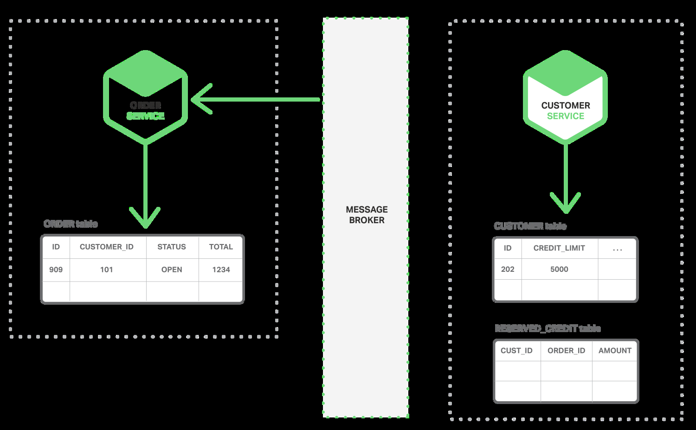

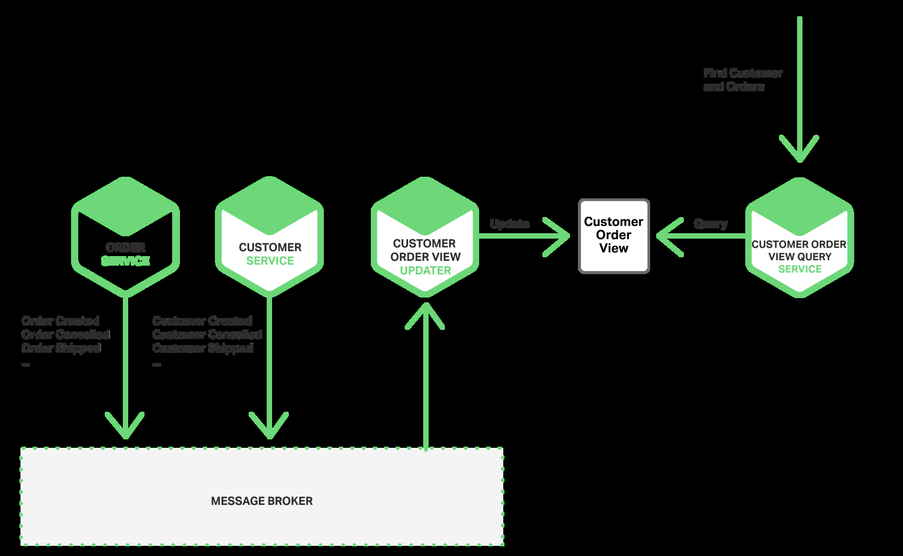

---

当客户订单视图更新服务收到客户或者订单事件，就会更新 客户订单视图数据集。可以使用文
档数据库（例如 MongoDB）来实现客户订单视图，为每个用户存储一个文档。客户订单视图查
询服务负责响应对客户以及最近订单（通过查询客户订单视图数据集）的查询。
事件驱动架构也是既有优点也有缺点，此架构可以使得交易跨多个服务且提供最终一致性，并
且可以使应用维护最终视图；而缺点在于编程模式比 ACID 交易模式更加复杂：为了从应用层级
失效中恢复，还需要完成补偿性交易，例如，如果信用检查不成功则必须取消订单；另外，应
用必须应对不一致的数据，这是因为临时（in-flight）交易造成的改变是可见的，另外当应用读
取未更新的最终视图时也会遇见数据不一致问题。另外一个缺点在于订阅者必须检测和忽略冗
余事件。
1.3 原子操作 Achieving Atomicity
事件驱动架构还会碰到数据库更新和发布事件原子性问题。例如，订单服务必须向 ORDER 表插
入一行，然后发布 Order Created event，这两个操作需要原子性。如果更新数据库后，服务瘫
了（crashes）造成事件未能发布，系统变成不一致状态。确保原子操作的标准方式是使用一个
分布式交易，其中包括数据库和消息代理。然而，基于以上描述的 CAP 理论，这却并不是我们
想要的。
1.3.1 使用本地交易发布事件
获得原子性的一个方法是对发布事件应用采用 multi-step process involving only local
transactions，技巧在于一个 EVENT 表，此表在存储业务实体数据库中起到消息列表功能。应用
发起一个（本地）数据库交易，更新业务实体状态，向 EVENT 表中插入一个事件，然后提交此
次交易。另外一个独立应用进程或者线程查询此 EVENT 表，向消息代理发布事件，然后使用本
地交易标志此事件为已发布，如下图所示：

---

订单服务向 ORDER 表插入一行，然后向 EVENT 表中插入 Order Created event，事件发布线程或
者进程查询 EVENT 表，请求未发布事件，发布他们，然后更新 EVENT 表标志此事件为已发布。
此方法也是优缺点都有。优点是可以确保事件发布不依赖于 2PC，应用发布业务层级事件而不
需要推断他们发生了什么；而缺点在于此方法由于开发人员必须牢记发布事件，因此有可能出
现错误。另外此方法对于某些使用 NoSQL 数据库的应用是个挑战，因为 NoSQL 本身交易和查
询能力有限。
此方法因为应用采用了本地交易更新状态和发布事件而不需要 2PC，现在再看看另外一种应用
简单更新状态获得原子性的方法。
1.3.2 挖掘数据库交易日志
另外一种不需要 2PC 而获得线程或者进程发布事件原子性的方式就是挖掘数据库交易或者提交
日志。应用更新数据库，在数据库交易日志中产生变化，交易日志挖掘进程或者线程读这些交
易日志，将日志发布给消息代理。如下图所见：

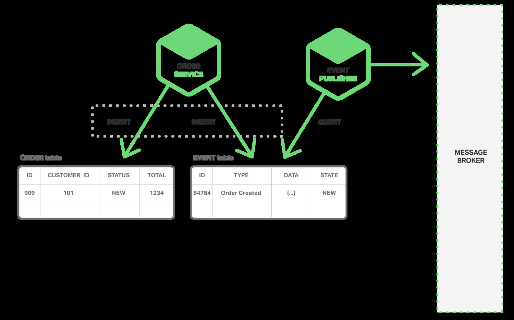

---

此方法的例子如 LinkedIn Databus 项目，Databus 挖掘 Oracle 交易日志，根据变化发布事件，
LinkedIn 使用 Databus 来保证系统内各记录之间的一致性。
另外的例子如：AWS 的 streams mechanism in AWS DynamoDB，是一个可管理的 NoSQL 数据
库，一个 DynamoDB 流是由过去 24 小时对数据库表基于时序的变化（创建，更新和删除操
作），应用可以从流中读取这些变化，然后以事件方式发布这些变化。
交易日志挖掘也是优缺点并存。优点是确保每次更新发布事件不依赖于 2PC。交易日志挖掘可
以通过将发布事件和应用业务逻辑分离开得到简化；而主要缺点在于交易日志对不同数据库有
不同格式，甚至不同数据库版本也有不同格式；而且很难从底层交易日志更新记录转换为高层
业务事件。
交易日志挖掘方法通过应用直接更新数据库而不需要 2PC 介入。下面我们再看一种完全不同的
方法：不需要更新只依赖事件的方法。
1.3.3 使用事件源
Event sourcing （事件源）通过使用根本不同的事件中心方式来获得不需 2PC 的原子性，保证
业务实体的一致性。 这种应用保存业务实体一系列状态改变事件，而不是存储实体现在的状
态。应用可以通过重放事件来重建实体现在状态。只要业务实体发生变化，新事件就会添加到
时间表中。因为保存事件是单一操作，因此肯定是原子性的。

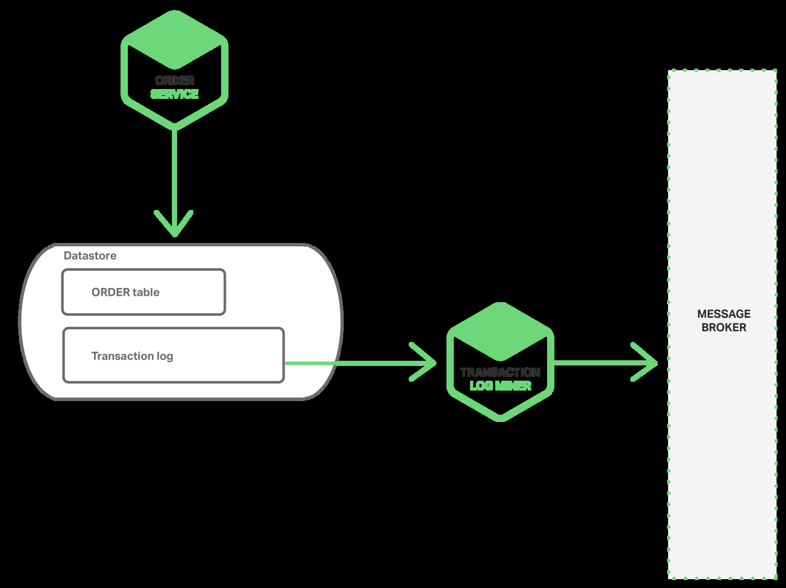

---

为了理解事件源工作方式，考虑事件实体作为一个例子。传统方式中，每个订单映射为 ORDER
表中一行，例如在 ORDER_LINE_ITEM 表中。但是对于事件源方式，订单服务以事件状态改变方
式存储一个订单：创建的，已批准的，已发货的，取消的；每个事件包括足够数据来重建订单
状态。
事件是长期保存在事件数据库中，提供 API 添加和获取实体事件。事件存储跟之前描述的消息
代理类似，提供 API 来订阅事件。事件存储将事件递送到所有感兴趣的订阅者，事件存储是事
件驱动微服务架构的基干。
事件源方法有很多优点：解决了事件驱动架构关键问题，使得只要有状态变化就可以可靠地发
布事件，也就解决了微服务架构中数据一致性问题。另外，因为是持久化事件而不是对象，也
就避免了 object relational impedance mismatch problem。
数据源方法提供了 100%可靠的业务实体变化监控日志，使得获取任何时点实体状态成为可
能。另外，事件源方法可以使得业务逻辑可以由事件交换的松耦合业务实体构成。这些优势使
得单体应用移植到微服务架构变的相对容易。
事件源方法也有不少缺点，因为采用不同或者不太熟悉的变成模式，使得重新学习不太容易；
事件存储只支持主键查询业务实体，必须使用 Command Query Responsibility Segregation
(CQRS) 来完成查询业务，因此，应用必须处理最终一致数据。
1.4 总结
在微服务架构中，每个微服务都有自己私有的数据集。不同微服务可能使用不同的 SQL 或者
NoSQL 数据库。尽管数据库架构有很强的优势，但是也面对数据分布式管理的挑战。第一个挑
战就是如何在多服务之间维护业务交易一致性；第二个挑战是如何从多服务环境中获取一致性
数据。
最佳解决办法是采用事件驱动架构。其中碰到的一个挑战是如何原子性的更新状态和发布事
件。有几种方法可以解决此问题，包括将数据库视为消息队列、交易日志挖掘和事件源。

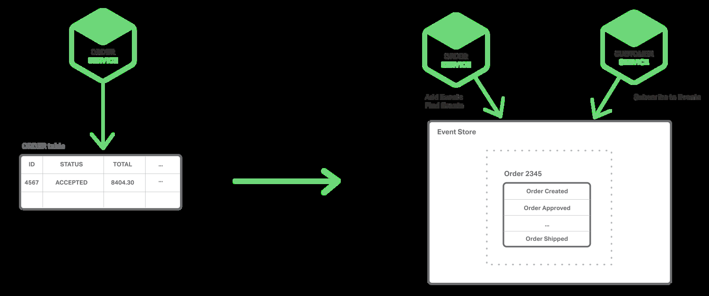

---

前言
部署一个单体式应用意味运行大型应用的多个副本，典型的提供若干个（N）服务器（物理或
者虚拟），运行若干个（M）个应用实例。部署单体式应用不会很直接，但是肯定比部署微服
务应用简单些。
一个微服务应用由上百个服务构成，服务可以采用不同语言和框架分别写就。每个服务都是一
个单一应用，可以有自己的部署、资源、扩展和监控需求。例如，可以根据服务需求运行若干
个服务实例，除此之外，每个实例必须有自己的 CPU，内存和 I/O 资源。尽管很复杂，但是更
挑战的是服务部署必须快速、可靠和性价比高。
有一些微服务部署的模式，先讨论一下每个主机多服务实例的模式。
单主机多服务实例模式
部署微服务的一种方法就是单主机多服务实例模式，使用这种模式，需要提供若干台物理或者
虚拟机，每台机器上运行多个服务实例。很多情况下，这是传统的应用部署方法。每个服务实
例运行一个或者多个主机的 well-known 端口，主机可以看做宠物。
下图展示的是这种架构：

---

这种模式有一些参数，一个参数代表每个服务实例由多少进程构成。例如，需要在 Apache
Tomcat Server 上部署一个 Java 服务实例作为 web 应用。一个 Node.js 服务实例可能有一个父
进程和若干个子进程构成。
另外一个参数定义同一进程组内有多少服务实例运行。例如，可以在同一个 Apache Tomcat
Server 上运行多个 Java web 应用，或者在同一个 OSGI 容器内运行多个 OSGI 捆绑实例。
单主机多服务实例模式也是优缺点并存。主要优点在于资源利用有效性。多服务实例共享服务
器和操作系统，如果进程组运行多个服务实例效率会更高，例如，多个 web 应用共享同一个
Apache Tomcat Server 和 JVM。
另一个优点在于部署服务实例很快。只需将服务拷贝到主机并启动它。如果服务用 Java 写的，
只需要拷贝 JAR 或者 WAR 文件即可。对于其它语言，例如 Node.js 或者 Ruby，需要拷贝源
码。也就是说网络负载很低。

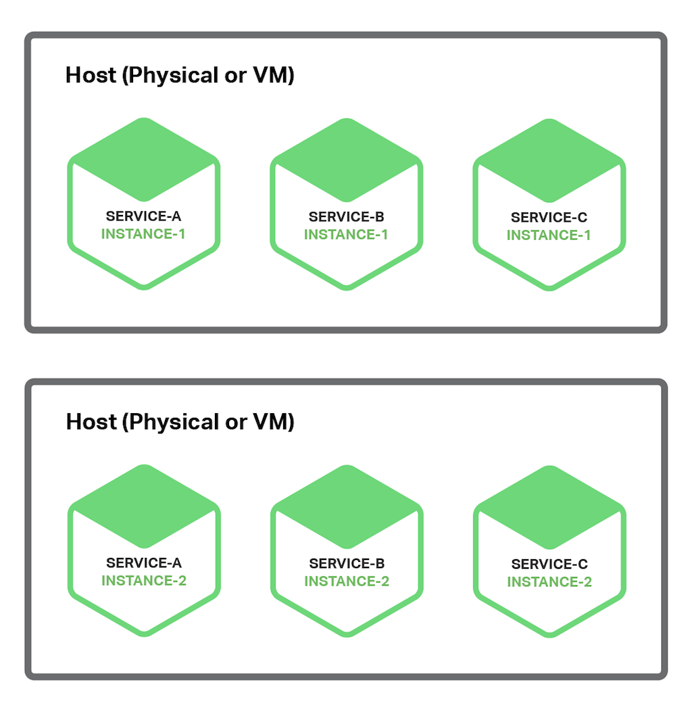

---

因为没有太多负载，启动服务很快。如果服务是自包含的进程，只需要启动就可以；否则，如
果是运行在容器进程组中的某个服务实例，则需要动态部署进容器中，或者重启容器。
除了上述优点外，单主机多服务实例也有缺陷。其中一个主要缺点是服务实例间很少或者没有
隔离，除非每个服务实例是独立进程。如果想精确监控每个服务实例资源使用，就不能限制每
个实例资源使用。因此有可能造成某个糟糕的服务实例占用了主机的所有内存或者 CPU。
同一进程内多服务实例没有隔离。所有实例有可能，例如，共享同一个 JVM heap。某个糟糕服
务实例很容易攻击同一进程中其它服务；更甚至于，有可能无法监控每个服务实例使用的资源
情况。
另一个严重问题在于运维团队必须知道如何部署的详细步骤。服务可以用不同语言和框架写
成，因此开发团队肯定有很多需要跟运维团队沟通事项。其中复杂性增加了部署过程中出错的
可能性。
可以看到，尽管熟悉，但是单主机多服务实例有很多严重缺陷。下面看看是否有其他部署微服
务方式能够避免这些问题。
单主机单服务实例模式
另外一种部署微服务方式是单主机单实例模式。当使用这种模式，每个主机上服务实例都是各
自独立的。有两种不同实现模式：单虚拟机单实例和单容器单实例。
单虚拟机单实例模式
但是用单虚拟机单实例模式，一般将服务打包成虚拟机映像（image），例如一个 Amazon EC2
AMI。每个服务实例是一个使用此映像启动的 VM（例如，EC2 实例）。下图展示了此架构：

---

Netfix 采用这种架构部署 video streaming service。Netfix 使用 Aminator 将每个服务打包成一个
EC2 AMI。每个运行服务实例就是一个 EC2 实例。
有很多工具可以用来搭建自己的 VMs。可以配置持续集成（CI）服务（例如，Jenkins）避免
Aminator 将服务打包成 EC2 AMI。packer.io 是自动虚机映像创建的另外一种选择。跟 Aminator
不同，它支持一系列虚拟化技术，例如 EC2，DigitalOcean，VirtualBox 和 VMware。 
Boxfuse 公司有一个创新方法创建虚机映像，克服了如下缺陷。Boxfuse 将 java 应用打包成最小
虚机映像，它们创建迅速，启动很快，因为对外暴露服务接口少而更加安全。
CloudNative 公司有一个用于创建 EC2 AMI 的 SaaS 应用，Bakery。用户微服务架构通过测试
后，可以配置自己的 CI 服务器激活 Bakery。Bakery 将服务打包成 AMI。使用如 Bakery 的 SaaS
应用意味着用户不需要浪费时间在设置自己的 AMI 创建架构。
每虚拟机服务实例模式有许多优势，主要的 VM 优势在于每个服务实例都是完全独立运行的，
都有各自独立的 CPU 和内存而不会被其它服务占用。
另外一个好处在于用户可以使用成熟云架构，例如 AWS 提供的，云服务都提供如负载均衡和扩
展性等有用功能。

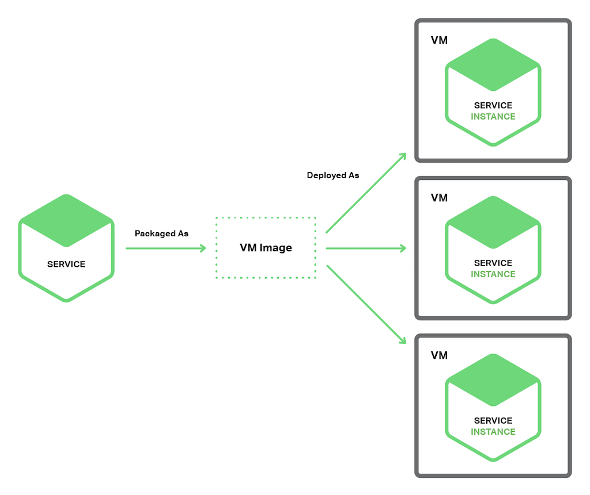

---

还有一个好处在于服务实施技术被自包含了。一旦服务被打包成 VM 就成为一个黑盒子。VM 的
管理 API 成为部署服务的 API，部署成为一个非常简单和可靠的事情。
单虚拟机单实例模式也有缺点。一个缺点就是资源利用效率不高。每个服务实例占用整个虚机
的资源，包括操作系统。而且，在一个典型的公有 IaaS 环境，虚机资源都是标准化的，有可能
未被充分利用。
而且，公有 IaaS 根据 VM 来收费，而不管虚机是否繁忙；例如 AWS 提供了自动扩展功能，但是
对随需应用缺乏快速响应，使得用户不得不多部署虚机，从而增加了部署费用。
另外一个缺点在于部署服务新版本比较慢。虚机镜像因为大小原因创建起来比较慢，同样原
因，虚机初始化也比较慢，操作系统启动也需要时间。但是这并不一直是这样，一些轻量级虚
机，例如使用 Boxfuse 创建的虚机，就比较快。
第三个缺点是对于运维团队，它们负责许多客制化工作。除非使用如 Boxfuse 之类的工具，可
以帮助减轻大量创建和管理虚机的工作；否则会占用大量时间从事与核心业务不太无关的工
作。
那么我们来看看另外一种仍然具有虚机特性，但是比较轻量的微服务部署方法。
单容器单服务实例模式
当使用这种模式时，每个服务实例都运行在各自容器中。容器是运行在操作系统层面的虚拟化
机制。一个容器包含若干运行在沙箱中的进程。从进程角度来看，他们有各自的命名空间和根
文件系统；可以限制容器的内存和 CPU 资源。某些容器还具有 I/O 限制，这类容器技术包括
Docker 和 Solaris Zones。
下图展示了这种模式：

---

使用这种模式需要将服务打包成容器映像。一个容器映像是一个运行包含服务所需库和应用的
文件系统 。某些容器映像由完整的 linux 根文件系统组成，其它则是轻量级的。例如，为了部
署 Java 服务，需要创建包含 Java 运行库的容器映像，也许还要包含 Apache Tomcat server，以
及编译过的 Java 应用。
一旦将服务打包成容器映像，就需要启动若干容器。一般在一个物理机或者虚拟机上运行多个
容器，可能需要集群管理系统，例如 k8s 或者 Marathon，来管理容器。集群管理系统将主机作
为资源池，根据每个容器对资源的需求，决定将容器调度到那个主机上。
单容器单服务实例模式也是优缺点都有。容器的优点跟虚机很相似，服务实例之间完全独立，
可以很容易监控每个容器消耗的资源。跟虚机相似，容器使用隔离技术部署服务。容器管理
API 也可以作为管理服务的 API。
然而，跟虚机不一样，容器是一个轻量级技术。容器映像创建起来很快，例如，在笔记本电脑
上，将 Spring Boot 应用打包成容器映像只需要 5 秒钟。因为不需要操作系统启动机制，容器启
动也很快。当容器启动时，后台服务就启动了。
使用容器也有一些缺点。尽管容器架构发展迅速，但是还是不如虚机架构成熟。而且由于容器
之间共享 host OS 内核因此并不像虚机那么安全。

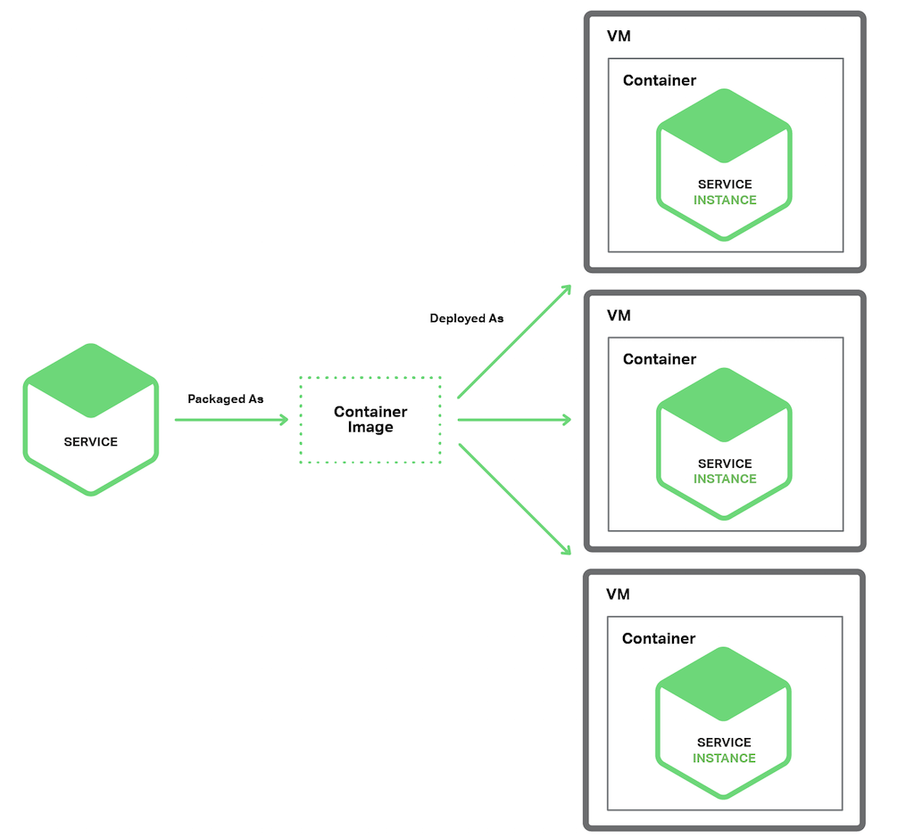

---

另外，容器技术将会对管理容器映像提出许多客制化需求，除非使用如 Google Container
Engine 或者 Amazon EC2 Container Service (ECS)，否则用户将同时需要管理容器架构以及虚机
架构。
第三，容器经常被部署在按照虚机收费的架构上，很显然，客户也会增加部署费用来应对负载
的增长。
有趣的是，容器和虚机之间的区别越来越模糊。如前所述，Boxfuse 虚机启动创建都很快，
Clear Container 技术面向创建轻量级虚机。unikernel 公司的技术也引起大家关注，Docker 最近
收购了 Unikernel 公司。
除了这些之外，server-less 部署技术，避免了前述容器和 VM 技术的缺陷，吸引了越来越多的注
意。下面我们来看看。
Serverless 部署
AWS Lambda 是 serverless 部署技术的例子，支持 Java，Node.js 和 Python 服务；需要将服务
打包成 ZIP 文件上载到 AWS Lambda 就可以部署。可以提供元数据，提供处理服务请求函数的
名字（一个事件）。AWS Lambda 自动运行处理请求足够多的微服务，然而只根据运行时间和
消耗内存量来计费。当然细节决定成败，AWS Lambda 也有限制。但是大家都不需要担心服务
器，虚拟机或者容器内的任何方面绝对吸引人。
Lambda 函数 是无状态服务。一般通过激活 AWS 服务处理请求。例如，当映像上载到 S3
bucket 激活 Lambda 函数后，就可以在 DynamoDB 映像表中插入一个条目，给 Kinesis 流发布
一条消息，触发映像处理动作。Lambda 函数也可以通过第三方 web 服务激活。
有四种方法激活 Lambda 函数：
直接方式，使用 web 服务请求
自动方式，回应例如 AWS S3，DynamoDB，Kinesis 或者 Simple Email Service 等产生的事件
自动方式，通过 AWS API 网关来处理应用客户端发出的 HTTP 请求 
定时方式，通过 cron 响应 --很像定时器方式
可以看出，AWS Lambda 是一种很方便部署微服务的方式。基于请求计费方式意味着用户只需
要承担处理自己业务那部分的负载；另外，因为不需要了解基础架构，用户只需要开发自己的
应用。
然而还是有不少限制。不需要用来部署长期服务，例如用来消费从第三方代理转发来的消息，
请求必须在 300 秒内完成，服务必须是无状态，因为理论上 AWS Lambda 会为每个请求生成一
个独立的实例；必须用某种支持的语言完成，服务必须启动很快，否则，会因为超时被停止。
部署微服务应用也是一种挑战。用各种语言和框架写成的服务成百上千。每种服务都是一种迷
你应用，有自己独特的部署、资源、扩充和监控需求。有若干种微服务部署模式，包括单虚机
单实例以及单容器单实例。另外可选模式还有 AWS Lambda，一种 serverless 方法。

---

什么是微服务？微服务之间是如何独立通讯
的？
Author: HuiFer
Description: 介绍微服务的定义以及服务间的通信。
什么是微服务
微服务架构是一个分布式系统, 按照业务进行划分成为不同的服务单元, 解决单体系统性能
等不足。
微服务是一种架构风格，一个大型软件应用由多个服务单元组成。系统中的服务单元可以
单独部署，各个服务单元之间是松耦合的。
微服务概念起源: Microservices
微服务之间是如何独立通讯的
同步
REST HTTP 协议
REST 请求在微服务中是最为常用的一种通讯方式, 它依赖于 HTTP\HTTPS 协议。RESTFUL 的特
点是：
1. 每一个 URI 代表 1 种资源
2. 客户端使用 GET、POST、PUT、DELETE 4 个表示操作方式的动词对服务端资源进行操作:
GET 用来获取资源, POST 用来新建资源（也可以用于更新资源）, PUT 用来更新资源,
DELETE 用来删除资源
3. 通过操作资源的表现形式来操作资源
4. 资源的表现形式是 XML 或者 HTML
5. 客户端与服务端之间的交互在请求之间是无状态的,从客户端到服务端的每个请求都必须包
含理解请求所必需的信息
举个例子，有一个服务方提供了如下接口：
@RestController
@RequestMapping("/communication")
java

---

另外一个服务需要去调用该接口，调用方只需要根据 API 文档发送请求即可获取返回结果。
通过这样的方式可以实现服务之间的通讯。
RPC TCP协议
RPC(Remote Procedure Call)远程过程调用，简单的理解是一个节点请求另一个节点提供的服
务。它的工作流程是这样的：
1. 执行客户端调用语句，传送参数 2. 调用本地系统发送网络消息 3. 消息传送到远程主机 4. 服
务器得到消息并取得参数 5. 根据调用请求以及参数执行远程过程（服务） 6. 执行过程完毕，将
结果返回服务器句柄 7. 服务器句柄返回结果，调用远程主机的系统网络服务发送结果 8. 消息传
回本地主机 9. 客户端句柄由本地主机的网络服务接收消息 10. 客户端接收到调用语句返回的结
果数据
举个例子。
首先需要一个服务端：
 
 
  
    
 
    
 
 
  
        
 
 
    
public class RestControllerDemo {
@GetMapping("/hello")
public String s() {
return "hello";
}
}
 
 
 
    
 
    
 restTemplate  
 
    
 
    
 
 
  
        
 forObject  restTemplate
        
 forObject  
    
@RestController
@RequestMapping("/demo")
public class RestDemo{
@Autowired
RestTemplate
;
@GetMapping("/hello2")
public String s2() {
String
=
.getForObject("http://localhost:9013
return
;
}
}
java

---

executor  
 
    
 
 
 
 serviceRegister 
 
    
 
    
 
 
 service  
 impl   
        serviceRegister
service
 impl
 
     
 
    
 
    
 
 
 port   
        
 socket  
 
        
  
            socket  
 
 
            socket
 
port
 
            
out
 
            
out
serviceRegister
 
            
 
  
                executor
 
socket
 
import java io
.
.IOException;
import java io
.
.ObjectInputStream;
import java io
.
.ObjectOutputStream;
import java lang reflect
.
.
.Method;
import java net
.
.InetSocketAddress;
import java net
.
.ServerSocket;
import java net
.
.Socket;
import java util concurrent
.
.
.ConcurrentHashMap;
import java util concurrent
.
.
.ExecutorService;
import java util concurrent
.
.
.Executors;
/** 
 * RPC 服务端用来注册远程方法的接口和实现类 
 */
public class RPCServer {
private static ExecutorService
= Executors.newFixedThreadPool
private static final ConcurrentHashMap
 
<String, Class>
/** 
     * 注册方法 
     * @param service 
     * @param impl 
     */
public void register(Class
, Class
) {
.put(
.getSimpleName(),
);
}
/** 
     * 启动方法 
     * @param port 
     */
public void start(int
) {
ServerSocket
= null;
try {
= new ServerSocket();
.bind(new InetSocketAddress(
));
System.
.println("服务启动");
System.
.println(
);
while (true) {
.execute(new Task(
.accept()));
java

---

e   
            e
 
         
  
            
 socket 
 
  
                
  
                    socket
 
                 
 
 e   
                    e
 
                 
             
         
     
 
    
 
 
 
 
 
  
        
 client  
 
 
        
 
 client   
            
client  client  
         
 
        
 
        
 
 
  
            
 input  
 
            
 output  
 
            
  
                input  
 
client
 
                
 
                
 serviceName  input
 
                
 methodName  input
 
                
 parameterTypes  
 input
                
 arguments  
 input
 
                
 serviceClass  serviceRegister
serviceName
 
                
 serviceClass 
 
  
                    
 
 
serviceName  
                 
                
 method  serviceClass
methodName  paramet
                
 result  method
serviceClass
 
 
                output  
 
client
 
                output
result
 
             
 
 e   
                e
 
 
}
} catch (Exception
) {
.printStackTrace();
} finally {
if (
!= null) {
try {
.close();
} catch (IOException
) {
.printStackTrace();
}
}
}
}
private static class Task implements Runnable {
Socket
= null;
public Task(Socket
) {
this.
=
;
}
@Override
public void run() {
ObjectInputStream
= null;
ObjectOutputStream
= null;
try {
= new ObjectInputStream(
.getInputStream());
// 按照顺序读取对方写过来的内容
String
=
.readUTF();
String
=
.readUTF();
Class<?>[]
= (Class<?>[])
.readObject(
Object[]
= (Object[])
.readObject();
Class
=
.get(
);
if (
== null) {
throw new ClassNotFoundException(
+ " 没有找
}
Method
=
.getMethod(
,
Object
=
.invoke(
.newInstance(),
= new ObjectOutputStream(
.getOutputStream());
.writeObject(
);
} catch (Exception
) {
.printStackTrace();

---

其次需要一个客户端：
             
  
                
  
                    
 
                    output
 
                    input
 
                    client
 
                 
 
 e   
                    e
 
                 
 
             
         
     
 
} finally {
try {
// 这里就不写 output!=null才关闭这个逻辑了
.close();
.close();
.close();
} catch (IOException
) {
.printStackTrace();
}
}
}
}
}
 
 
 
 
 
 
 
 
 
 
 
  
    
 
    
 
 
  
 
 service  
 
 
        
 
 
service
 
 
            
 
            
 
 
 proxy  
 method  
 arg
 
                
 socket  
 
                
 out  
 
import java io
.
.ObjectInputStream;
import java io
.
.ObjectOutputStream;
import java lang reflect
.
.
.InvocationHandler;
import java lang reflect
.
.
.Method;
import java lang reflect
.
.
.Proxy;
import java net
.
.InetSocketAddress;
import java net
.
.Socket;
/** 
 * RPC 客户端 
 */
public class RPCclient<T> {
/** 
     * 通过动态代理将参数发送过去到 RPCServer ,RPCserver 返回结果这个方法处理成为正
     */
public static <T> T getRemoteProxyObj(final Class<T>
, final In
return (T) Proxy.newProxyInstance(
.getClassLoader(), new Cl
@Override
public Object invoke(Object
, Method
, Object[]
Socket
= null;
ObjectOutputStream
= null;
java

---

再来一个测试的远程方法。
                
 input  
 
                
  
                    socket  
 
 
                    socket
addr
 
 
                    
 
                    out  
 
socket
                    out
service
 
                    out
method
 
                    out
method
 
                    out
args
 
 
                    input  
 
socket
                    
 input
 
                 
 
 e   
                    e
 
                 
  
                    out
 
                    input
 
                    socket
 
                 
                
 
 
             
        
 
 
     
 
ObjectInputStream
= null;
try {
= new Socket();
.connect(
);
// 将实体类,参数,发送给远程调用方
= new ObjectOutputStream(
.getOutputStream())
.writeUTF(
.getSimpleName());
.writeUTF(
.getName());
.writeObject(
.getParameterTypes());
.writeObject(
);
= new ObjectInputStream(
.getInputStream())
return
.readObject();
} catch (Exception
) {
.printStackTrace();
} finally {
.close();
.close();
.close();
}
return null;
}
});
}
}
 
 
  
    
 
 msg
 
 
 
 
 
 
  
    
 
    
 
 
 msg   
        
 
  msg  
    
public interface Tinterface {
String send(String
);
}
public class TinterfaceImpl implements Tinterface {
@Override
public String send(String
) {
return "send message " +
;
}
}
java

---

测试代码如下：
输出 send message rpc 测试用例 。
异步
消息中间件
常见的消息中间件有 Kafka、ActiveMQ、RabbitMQ、RocketMQ , 常见的协议有 AMQP、MQTTP、
STOMP、XMPP。这里不对消息队列进行拓展了，具体如何使用还是请移步官网。
微服务技术栈
Author: HuiFer
Description: 该文简单介绍微服务技术栈有哪些分别用来做什么。
 
 
 
 
 
 
 
 
 
 
  
    
 
 
 
 args   
        
 
 
  
            
 
            
 
 
  
                
 rpcServer  
 
 
                rpcServer
 
                rpcServer
 
             
        
 
        
 tinterface  
        
out
tinterface
 
 
    
import com huifer admin rpc
.
.
.
.Tinterface;
import com huifer admin rpc
.
.
.
.TinterfaceImpl;
import java net
.
.InetSocketAddress;
public class RunTest {
public static void main(String[]
) {
new Thread(new Runnable() {
@Override
public void run() {
RPCServer
= new RPCServer();
.register(Tinterface.class, TinterfaceImpl.class)
.start(10000);
}
}).start();
Tinterface
= RPCclient.getRemoteProxyObj(Tinterface.cla
System.
.println(
.send("rpc 测试用例"));
}
}
java

---

技术栈
微服务开发
作用：快速开发服务。
Spring
Spring MVC
Spring Boot
Spring 目前是 JavaWeb 开发人员必不可少的一个框架，SpringBoot 简化了 Spring 开发的配置
目前也是业内主流开发框架。
微服务注册发现
作用：发现服务，注册服务，集中管理服务。
Eureka
Eureka Server : 提供服务注册服务, 各个节点启动后，会在 Eureka Server 中进行注册。
Eureka Client : 简化与 Eureka Server 的交互操作。
Spring Cloud Netflix : GitHub，文档
Zookeeper
ZooKeeper is a centralized service for maintaining configuration information, naming,
providing distributed synchronization, and providing group services.
Zookeeper 是一个集中的服务, 用于维护配置信息、命名、提供分布式同步和提供组服务。
Zookeeper 和 Eureka 区别
Zookeeper 保证 CP，Eureka 保证 AP：
C：数据一致性；
A：服务可用性；
P：服务对网络分区故障的容错性，这三个特性在任何分布式系统中不能同时满足，最多同
时满足两个。

---

微服务配置管理
作用：统一管理一个或多个服务的配置信息, 集中管理。
Disconf
Distributed Configuration Management Platform(分布式配置管理平台) , 它是专注于各种分布式
系统配置管理 的通用组件/通用平台, 提供统一的配置管理服务, 是一套完整的基于 zookeeper 的
分布式配置统一解决方案。
SpringCloudConfig
Apollo
Apollo（阿波罗）是携程框架部门研发的分布式配置中心，能够集中化管理应用不同环境、不
同集群的配置，配置修改后能够实时推送到应用端，并且具备规范的权限、流程治理等特性，
用于微服务配置管理场景。
权限认证
作用：根据系统设置的安全规则或者安全策略, 用户可以访问而且只能访问自己被授权的资源，
不多不少。
Spring Security
Apache Shiro
Apache Shiro™ is a powerful and easy-to-use Java security framework that performs
authentication, authorization, cryptography, and session management. With Shiro’s easy-
to-understand API, you can quickly and easily secure any application – from the smallest
mobile applications to the largest web and enterprise applications.
批处理
作用: 批量处理同类型数据或事物
Spring Batch
定时任务

---

作用: 定时做什么。
Quartz
微服务调用 (协议)
通讯协议
Rest
通过 HTTP/HTTPS 发送 Rest 请求进行数据交互
RPC
Remote Procedure Call
它是一种通过网络从远程计算机程序上请求服务，而不需要了解底层网络技术的协议。RPC
不依赖于具体的网络传输协议，tcp、udp 等都可以。
gRPC
A high-performance, open-source universal RPC framework
所谓 RPC(remote procedure call 远程过程调用) 框架实际是提供了一套机制，使得应用程序之间
可以进行通信，而且也遵从 server/client 模型。使用的时候客户端调用 server 端提供的接口就
像是调用本地的函数一样。
RMI
Remote Method Invocation
纯 Java 调用
服务接口调用
作用：多个服务之间的通讯
Feign(HTTP)

---

Spring Cloud Netflix 的微服务都是以 HTTP 接口的形式暴露的，所以可以用 Apache 的
HttpClient 或 Spring 的 RestTemplate 去调用，而 Feign 是一个使用起来更加方便的 HTTP 客戶
端，使用起来就像是调用自身工程的方法，而感觉不到是调用远程方法。
服务熔断
作用: 当请求到达一定阈值时不让请求继续.
Hystrix
Hystrix is a latency and fault tolerance library designed to isolate points of access to remote
systems, services and 3rd party libraries, stop cascading failure and enable resilience in
complex distributed systems where failure is inevitable.
Sentinel
A lightweight powerful flow control component enabling reliability and monitoring for
microservices. (轻量级的流量控制、熔断降级 Java 库)
服务的负载均衡
作用：降低服务压力, 增加吞吐量
Ribbon
Spring Cloud Ribbon 是一个基于 HTTP 和 TCP 的客户端负载均衡工具, 它基于 Netflix
Ribbon 实现
Nginx
Nginx (engine x) 是一个高性能的 HTTP 和反向代理 web 服务器, 同时也提供了 IMAP/POP3/SMTP
服务
Nginx 与 Ribbon 区别
Nginx 属于服务端负载均衡，Ribbon 属于客户端负载均衡。Nginx 作用与 Tomcat，Ribbon 作用
与各个服务之间的调用 (RPC)。

---

消息队列
作用: 解耦业务, 异步化处理数据
Kafka
RabbitMQ
RocketMQ
activeMQ
日志采集 (elk)
作用: 收集各服务日志提供日志分析、用户画像等
Elasticsearch
Logstash
Kibana
API 网关
作用: 外部请求通过 API 网关进行拦截处理, 再转发到真正的服务
Zuul
Zuul is a gateway service that provides dynamic routing, monitoring, resiliency, security,
and more.
服务监控
作用: 以可视化或非可视化的形式展示出各个服务的运行情况 (CPU、内存、访问量等)
Zabbix

---

Nagios
Metrics
服务链路追踪
作用: 明确服务之间的调用关系
Zipkin
Brave
数据存储
作用: 存储数据
关系型数据库
MySql
Oracle
MsSQL
PostgreSql
非关系型数据库
Mongodb
Elasticsearch
缓存
作用: 存储数据
redis

---

分库分表
作用: 数据库分库分表方案.
ShardingSphere
Mycat
服务部署
作用: 将项目快速部署、上线、持续集成.
Docker
Jenkins
Kubernetes(K8s)
Mesos
微服务治理策略
Author: HuiFer
Description: 该文简单介绍微服务的治理策略以及应用技术
服务的注册和发现
解决问题: 集中管理服务
解决方法: eureka 、zookeeper
负载均衡
解决问题: 降低服务器硬件压力
解决方法: nginx 、 Ribbon

---

通讯
解决问题: 各个服务之间的沟通桥梁
解决方法 :
同步消息
1. rest
2. rpc
异步消息
1. MQ
配置管理
解决问题: 随着服务的增加配置也在增加, 如何管理各个服务的配置
解决方法: nacos 、 spring cloud config 、 Apollo
容错和服务降级
解决问题: 在微服务当中，一个请求经常会涉及到调用几个服务，如果其中某个服务
不可以，没有做服务容错的话，极有可能会造成一连串的服务不可用，这就是雪崩效
应.
解决方法: hystrix
服务依赖关系
解决问题: 多个服务之间来回依赖, 启动关系的不明确
解决方法:
1. 应用分层: 数据层, 业务层 数据层不需要依赖业务层, 业务层依赖数据, 规定上下依赖关系
避免循环圈

---

服务文档
解决问题: 降低沟通成本
解决方法: swagger 、 java doc
服务安全问题
解决问题: 敏感数据的安全性
解决方法: oauth 、 shiro 、 spring security
流量控制
解决问题: 避免一个服务上的流量过大拖垮整个服务体系
解决方法: Hystrix
自动化测试
解决问题: 提前预知异常, 确定服务是否可用
解决方法: junit
服务上线, 下线的流程
解决问题: 避免服务随意的上线下线
解决方法: 新服务上线需要经过管理人员审核. 服务下线需要告知各个调用方进行修改,
直到没有调用该服务才可以进行下线.
兼容性

---

解决问题: 服务开发持续进行如何做到兼容
解决方法: 通过版本号的形式进行管理, 修改完成进行回归测试
服务编排
解决问题: 解决服务依赖问题的一种方式
解决方法: docker & k8s
资源调度
解决问题: 每个服务的资源占用量不同, 如何分配
解决方法: JVM 隔离、classload 隔离 ; 硬件隔离
容量规划
解决问题: 随着时间增长, 调用逐步增加, 什么时候追加机器
解决方法: 统计每日调用量和响应时间, 根据机器情况设置阈值, 超过阈值就可以追加
机器
服务发现组件 Eureka 的几个主要调用过程
Author: mghio
Description: 该文主要讲述服务发现组件 Eureka 的几个主要调用过程
前言
现在流行的微服务体系结构正在改变我们构建应用程序的方式，从单一的单体服务转变为越来
越小的可单独部署的服务（称为 微服务 ），共同构成了我们的应用程序。当进行一个业务时
不可避免就会存在多个服务之间调用，假如一个服务 A 要访问在另一台服务器部署的服务 B，
那么前提是服务 A 要知道服务 B 所在机器的 IP 地址和服务对应的端口，最简单的方式就是让服
务 A 自己去维护一份服务 B 的配置（包含 IP 地址和端口等信息），但是这种方式有几个明显的

---

缺点：随着我们调用服务数量的增加，配置文件该如何维护；缺乏灵活性，如果服务 B 改变 IP
地址或者端口，服务 A 也要修改相应的文件配置；还有一个就是进行服务的动态扩容或缩小不
方便。 一个比较好的解决方案就是 服务发现（Service Discovery） 。它抽象出来了一个注
册中心，当一个新的服务上线时，它会将自己的 IP 和端口注册到注册中心去，会对注册的服务
进行定期的心跳检测，当发现服务状态异常时将其从注册中心剔除下线。服务 A 只要从注册中
心中获取服务 B 的信息即可，即使当服务 B 的 IP 或者端口变更了，服务 A 也无需修改，从一
定程度上解耦了服务。服务发现目前业界有很多开源的实现，比如 apache  的 zookeeper、 
Netflix  的 eureka、 hashicorp  的 consul、 CoreOS  的 etcd。
Eureka 是什么
Eureka  在 GitHub 上对其的定义为
Eureka is a REST (Representational State Transfer) based service that is primarily used in
the AWS cloud for locating services for the purpose of load balancing and failover of
middle-tier servers.
At Netflix, Eureka is used for the following purposes apart from playing a critical part in mid-tier
load balancing.
Eureka  是由 Netflix 公司开源，采用的是 Client / Server 模式进行设计，基于 http 协议和使用
Restful Api 开发的服务注册与发现组件，提供了完整的服务注册和服务发现，可以和 Spring 
Cloud  无缝集成。其中 Server 端扮演着服务注册中心的角色，主要是为 Client 端提供服务注册
和发现等功能，维护着 Client 端的服务注册信息，同时定期心跳检测已注册的服务当不可用时
将服务剔除下线，Client 端可以通过 Server 端获取自身所依赖服务的注册信息，从而完成服务
间的调用。遗憾的是从其官方的 github wiki 可以发现，2.0 版本已经不再开源。但是不影响我
们对其进行深入了解，毕竟服务注册、服务发现相对来说还是比较基础和通用的，其它开源实
现框架的思想也是想通的。
服务注册中心（Eureka Server）
我们在项目中引入 Eureka Server  的相关依赖，然后在启动类加上注解 
@EnableEurekaServer  ，就可以将其作为注册中心，启动服务后访问页面如下：

---

我们继续添加两个模块 service-provider  ， service-consumer  ，然后在启动类加上注解
@EnableEurekaClient  并指定注册中心地址为我们刚刚启动的 Eureka Server  ，再次访问
可以看到两个服务都已经注册进来了。
Demo  仓库地址：https://github.com/mghio/depth-in-springcloud
可以看到 Eureka  的使用非常简单，只需要添加几个注解和配置就实现了服务注册和服务发
现，接下来我们看看它是如何实现这些功能的。
服务注册（Register）
注册中心提供了服务注册接口，用于当有新的服务启动后进行调用来实现服务注册，或者心跳
检测到服务状态异常时，变更对应服务的状态。服务注册就是发送一个 POST  请求带上当前实
例信息到类 ApplicationResource  的 addInstance  方法进行服务注册。

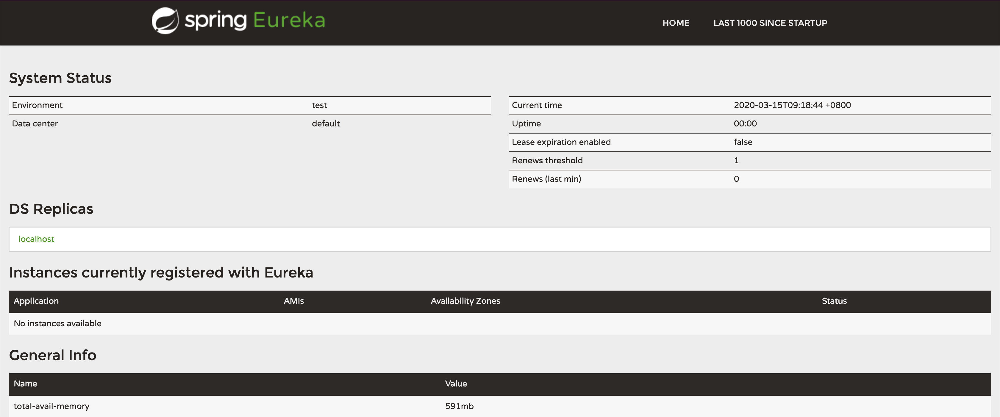

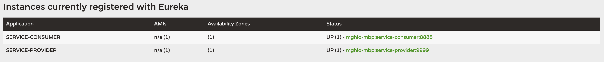

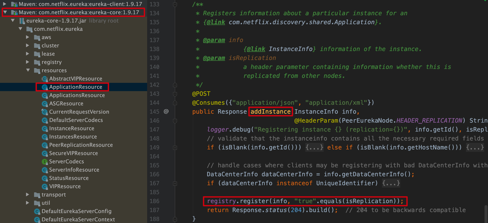

---

可以看到方法调用了类 PeerAwareInstanceRegistryImpl  的 register  方法，该方法主要
分为两步：
1. 调用父类 AbstractInstanceRegistry  的 register  方法把当前服务注册到注册中心
2. 调用 replicateToPeers  方法使用异步的方式向其它的 Eureka Server  节点同步服务注
册信息
服务注册信息保存在一个嵌套的 map  中，它的结构如下：
第一层 map  的 key  是应用名称（对应 Demo  里的 SERVICE-PROVIDER  ），第二层 map
的 key  是应用对应的实例名称（对应 Demo  里的 mghio-mbp:service-provider:9999
），一个应用可以有多个实例，主要调用流程如下图所示：
服务续约（Renew）
服务续约会由服务提供者（比如 Demo  中的 service-provider  ）定期调用，类似于心跳，
用来告知注册中心 Eureka Server  自己的状态，避免被 Eureka Server  认为服务时效将其
剔除下线。服务续约就是发送一个 PUT  请求带上当前实例信息到类 InstanceResource  的 
renewLease  方法进行服务续约操作。

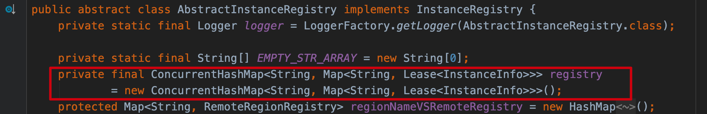

---

进入到 PeerAwareInstanceRegistryImpl  的 renew  方法可以看到，服务续约步骤大体上和
服务注册一致，先更新当前 Eureka Server  节点的状态，服务续约成功后再用异步的方式同
步状态到其它 Eureka Server  节上，主要调用流程如下图所示：
服务下线（Cancel）
当服务提供者（比如 Demo  中的 service-provider  ）停止服务时，会发送请求告知注册中
心 Eureka Server  进行服务剔除下线操作，防止服务消费者从注册中心调用到不存在的服
务。服务下线就是发送一个 DELETE  请求带上当前实例信息到类 InstanceResource  的 
cancelLease  方法进行服务剔除下线操作。

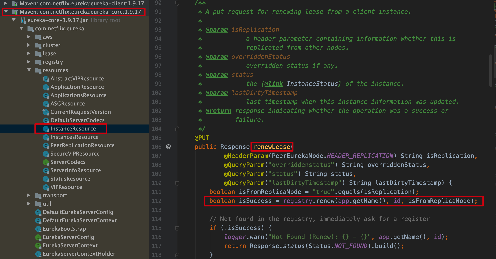

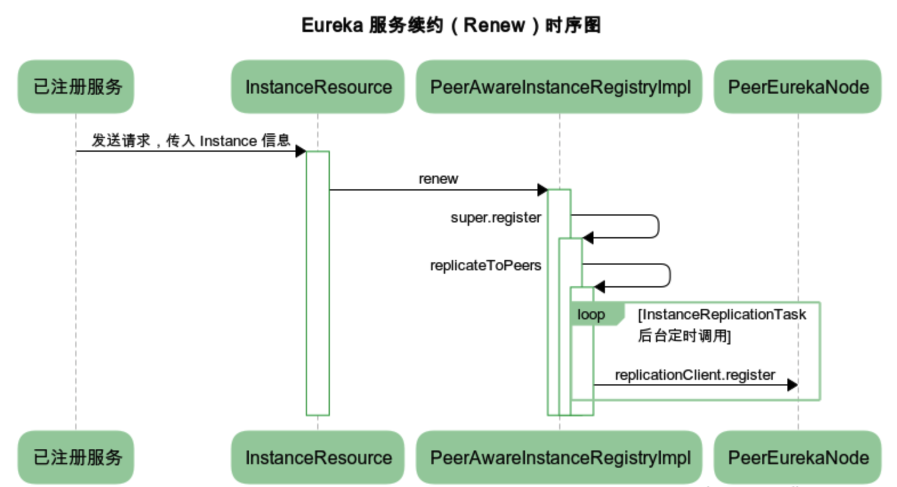

---

进入到 PeerAwareInstanceRegistryImpl  的 cancel  方法可以看到，服务续约步骤大体上
和服务注册一致，先在当前 Eureka Server  节点剔除下线该服务，服务下线成功后再用异步
的方式同步状态到其它 Eureka Server  节上，主要调用流程如下图所示：
服务剔除（Eviction）
服务剔除是注册中心 Eureka Server  在启动时就启动一个守护线程 evictionTimer  来定期
（默认为 60  秒）执行检测服务的，判断标准就是超过一定时间没有进行 Renew  的服务，默
认的失效时间是 90  秒，也就是说当一个已注册的服务在 90  秒内没有向注册中心 Eureka 
Server  进行服务续约（Renew），就会被从注册中心剔除下线。失效时间可以通过配置 
eureka.instance.leaseExpirationDurationInSeconds  进行修改，定期执行检测服务可以
通过配置 eureka.server.evictionIntervalTimerInMs  进行修改，主要调用流程如下图所
示：

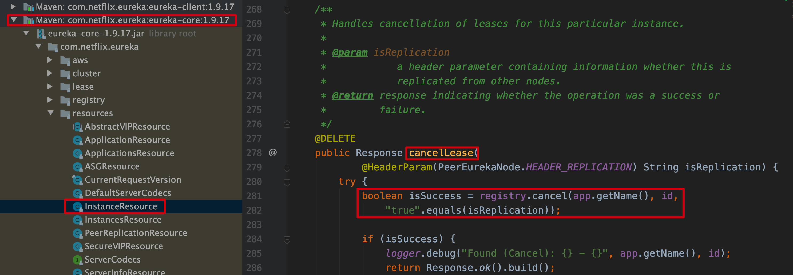

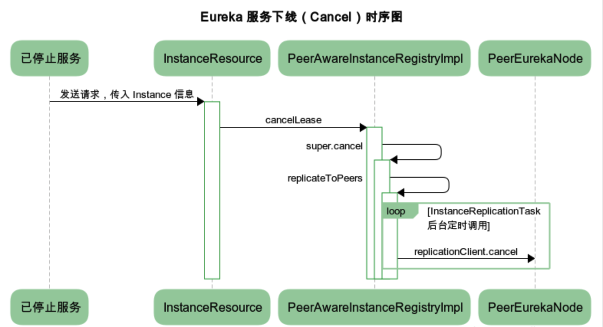

---

服务提供者（Service Provider）
对于服务提供方（比如 Demo  中的 service-provider  服务）来说，主要有三大类操作，分
别为 服务注册（Register） 、 服务续约（Renew） 、 服务下线（Cancel） ，接下来看看这
三个操作是如何实现的。
服务注册（Register）
一个服务要对外提供服务，首先要在注册中心 Eureka Server  进行服务相关信息注册，能进
行这一步的前提是你要配置 eureka.client.register-with-eureka=true  ，这个默认值为 
true  ，注册中心不需要把自己注册到注册中心去，把这个配置设为 false  ，这个调用比较
简单，主要调用流程如下图所示：

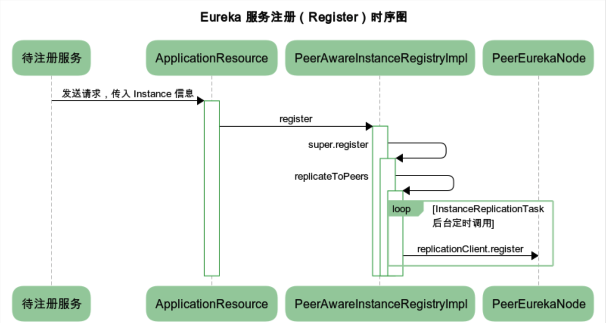

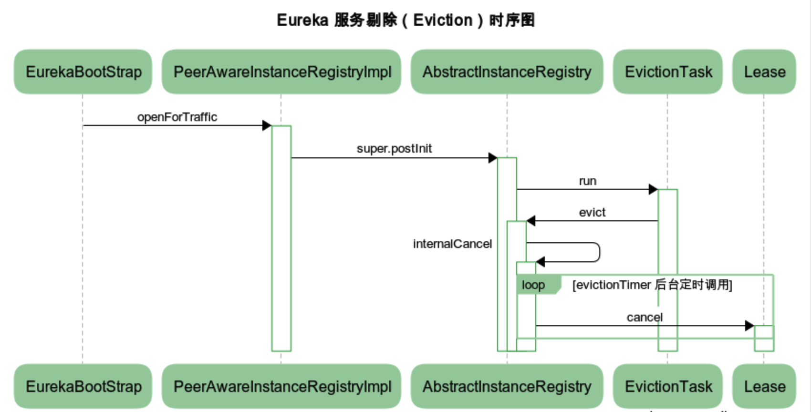

---

服务续约（Renew）
服务续约是由服务提供者方定期（默认为 30  秒）发起心跳的，主要是用来告知注册中心 
Eureka Server  自己状态是正常的还活着，可以通过配置 eureka.instance.lease-
renewal-interval-in-seconds  来修改，当然服务续约的前提是要配置 
eureka.client.register-with-eureka=true  ，将该服务注册到注册中心中去，主要调用流
程如下图所示：
服务下线（Cancel）
当服务提供者方服务停止时，要发送 DELETE  请求告知注册中心 Eureka Server  自己已经
下线，好让注册中心将自己剔除下线，防止服务消费方从注册中心获取到不可用的服务。这个
过程实现比较简单，在类 DiscoveryClient  的 shutdown  方法加上注解 @PreDestroy  ，
当服务停止时会自动触发服务剔除下线，执行服务下线逻辑，主要调用流程如下图所示：
服务消费者（Service Consumer）
这里的服务消费者如果不需要被其它服务调用的话，其实只会涉及到两个操作，分别是从注册
中心 获取服务列表（Fetch） 和 更新服务列表（Update） 。如果同时也需要注册到注册中心对
外提供服务的话，那么剩下的过程和上文提到的服务提供者是一致的，这里不再阐述，接下来
看看这两个操作是如何实现的。

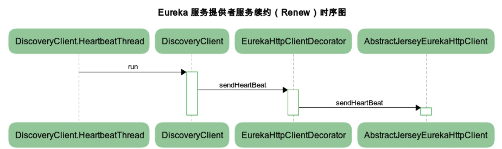

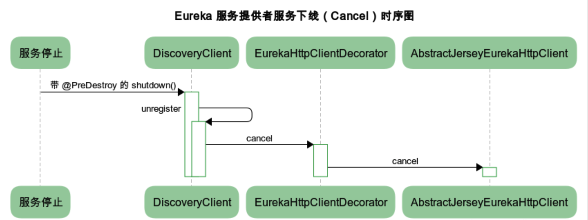

---

获取服务列表（Fetch）
服务消费者方启动之后首先肯定是要先从注册中心 Eureka Server  获取到可用的服务列表同
时本地也会缓存一份。这个获取服务列表的操作是在服务启动后 DiscoverClient  类实例化
的时候执行的。
可以看出，能发生这个获取服务列表的操作前提是要保证配置了 eureka.client.fetch-
registry=true  ，该配置的默认值为 true  ，主要调用流程如下图所示：
更新服务列表（Update）
由上面的 获取服务列表（Fetch） 操作过程可知，本地也会缓存一份，所以这里需要定期的去
到注册中心 Eureka Server  获取服务的最新配置，然后比较更新本地缓存，这个更新的间隔
时间可以通过配置 eureka.client.registry-fetch-interval-seconds  修改，默认为 30
秒，能进行这一步更新服务列表的前提是你要配置 eureka.client.register-with-
eureka=true  ，这个默认值为 true  。主要调用流程如下图所示：

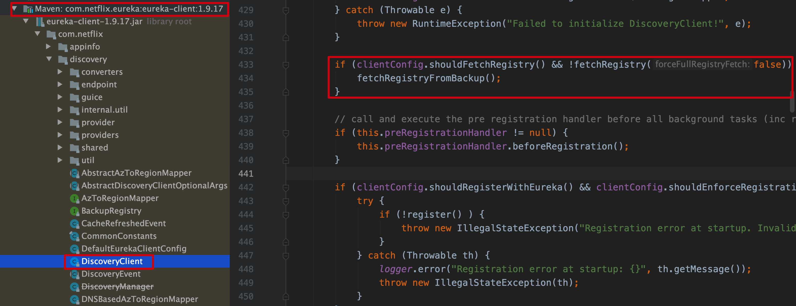

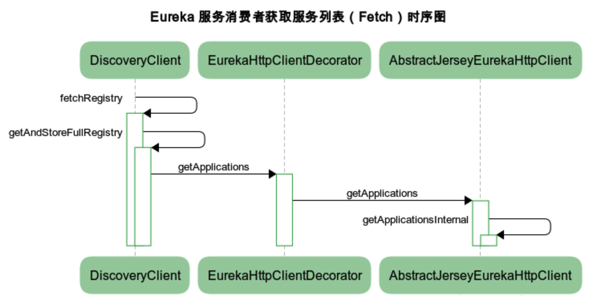

---

总结
工作中项目使用的是 Spring Cloud  技术栈，它有一套非常完善的开源代码来整合 Eureka
，使用起来非常方便。之前都是直接加注解和修改几个配置属性一气呵成的，没有深入了解过
源码实现，本文主要是阐述了服务注册、服务发现等相关过程和实现方式，对 Eureka  服务发
现组件有了更近一步的了解。
参考文章
Netflix Eureka
Service Discovery in a Microservices Architecture
如何从大量的 URL 中找出相同的 URL？
题目描述
给定 a、b 两个文件，各存放 50 亿个 URL，每个 URL 各占 64B，内存限制是 4G。请找出 a、b
两个文件共同的 URL。
解答思路
每个 URL 占 64B，那么 50 亿个 URL占用的空间大小约为 320GB。

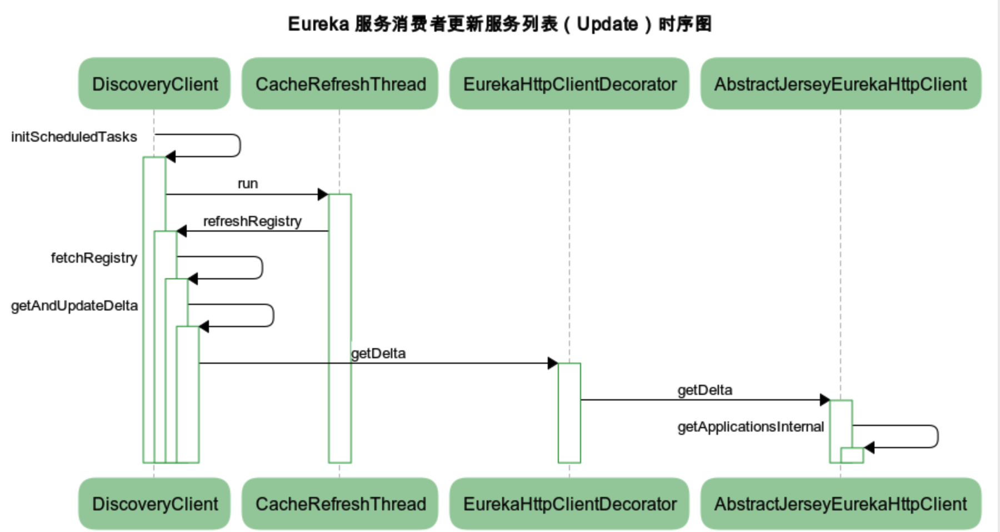

---

5, 000, 000, 000 * 64B ≈ 5GB * 64 = 320GB
由于内存大小只有 4G，因此，我们不可能一次性把所有 URL 加载到内存中处理。对于这种类
型的题目，一般采用分治策略，即：把一个文件中的 URL 按照某个特征划分为多个小文件，使
得每个小文件大小不超过 4G，这样就可以把这个小文件读到内存中进行处理了。
思路如下：
首先遍历文件 a，对遍历到的 URL 求 hash(URL) % 1000  ，根据计算结果把遍历到的 URL 存
储到 a0, a1, a2, ..., a999，这样每个大小约为 300MB。使用同样的方法遍历文件 b，把文件 b 中的
URL 分别存储到文件 b0, b1, b2, ..., b999 中。这样处理过后，所有可能相同的 URL 都在对应的小
文件中，即 a0 对应 b0, ..., a999 对应 b999，不对应的小文件不可能有相同的 URL。那么接下来，
我们只需要求出这 1000 对小文件中相同的 URL 就好了。
接着遍历 ai( i∈[0,999]  )，把 URL 存储到一个 HashSet 集合中。然后遍历 bi 中每个 URL，看
在 HashSet 集合中是否存在，若存在，说明这就是共同的 URL，可以把这个 URL 保存到一个单
独的文件中。
方法总结
1. 分而治之，进行哈希取余；
2. 对每个子文件进行 HashSet 统计。
如何从大量数据中找出高频词？
题目描述
有一个 1GB 大小的文件，文件里每一行是一个词，每个词的大小不超过 16B，内存大小限制是
1MB，要求返回频数最高的 100 个词(Top 100)。
解答思路
由于内存限制，我们依然无法直接将大文件的所有词一次读到内存中。因此，同样可以采用分
治策略，把一个大文件分解成多个小文件，保证每个文件的大小小于 1MB，进而直接将单个小
文件读取到内存中进行处理。
思路如下：

---

首先遍历大文件，对遍历到的每个词x，执行 hash(x) % 5000  ，将结果为 i 的词存放到文件
ai 中。遍历结束后，我们可以得到 5000 个小文件。每个小文件的大小为 200KB 左右。如果有
的小文件大小仍然超过 1MB，则采用同样的方式继续进行分解。
接着统计每个小文件中出现频数最高的 100 个词。最简单的方式是使用 HashMap 来实现。其中
key 为词，value 为该词出现的频率。具体方法是：对于遍历到的词 x，如果在 map 中不存在，
则执行 map.put(x, 1)  ；若存在，则执行 map.put(x, map.get(x)+1)  ，将该词频数加
1。
上面我们统计了每个小文件单词出现的频数。接下来，我们可以通过维护一个小顶堆来找出所
有词中出现频数最高的 100 个。具体方法是：依次遍历每个小文件，构建一个小顶堆，堆大小
为 100。如果遍历到的词的出现次数大于堆顶词的出现次数，则用新词替换堆顶的词，然后重
新调整为小顶堆，遍历结束后，小顶堆上的词就是出现频数最高的 100 个词。
方法总结
1. 分而治之，进行哈希取余；
2. 使用 HashMap 统计频数；
3. 求解最大的 TopN 个，用小顶堆；求解最小的 TopN 个，用大顶堆。
如何找出某一天访问百度网站最多的 IP？
题目描述
现有海量日志数据保存在一个超大文件中，该文件无法直接读入内存，要求从中提取某天访问
百度次数最多的那个 IP。
解答思路
这道题只关心某一天访问百度最多的 IP，因此，可以首先对文件进行一次遍历，把这一天访问
百度 IP 的相关信息记录到一个单独的大文件中。接下来采用的方法与上一题一样，大致就是先
对 IP 进行哈希映射，接着使用 HashMap 统计重复 IP 的次数，最后计算出重复次数最多的 IP。
注：这里只需要找出出现次数最多的 IP，可以不必使用堆，直接用一个变量 max 即
可。
方法总结
1. 分而治之，进行哈希取余；

---

2. 使用 HashMap 统计频数；
3. 求解最大的 TopN 个，用小顶堆；求解最小的 TopN 个，用大顶堆。
如何在大量的数据中找出不重复的整数？
题目描述
在 2.5 亿个整数中找出不重复的整数。注意：内存不足以容纳这 2.5 亿个整数。
解答思路
方法一：分治法
与前面的题目方法类似，先将 2.5 亿个数划分到多个小文件，用 HashSet/HashMap 找出每个小
文件中不重复的整数，再合并每个子结果，即为最终结果。
方法二：位图法
位图，就是用一个或多个 bit 来标记某个元素对应的值，而键就是该元素。采用位作为单位来
存储数据，可以大大节省存储空间。
位图通过使用位数组来表示某些元素是否存在。它可以用于快速查找，判重，排序等。不是很
清楚？我先举个小例子。
假设我们要对 [0,7]  中的 5 个元素 (6, 4, 2, 1, 5) 进行排序，可以采用位图法。0~7 范围总共有
8 个数，只需要 8bit，即 1 个字节。首先将每个位都置 0：
然后遍历 5 个元素，首先遇到 6，那么将下标为 6 的位的 0 置为 1；接着遇到 4，把下标为 4 的
位 的 0 置为 1：
依次遍历，结束后，位数组是这样的：
0 0 0 0 0 0 0 0
0 0 0 0 1 0 1 0

---

每个为 1 的位，它的下标都表示了一个数：
这样我们其实就已经实现了排序。
对于整数相关的算法的求解，位图法是一种非常实用的算法。假设 int 整数占用 4B，即
32bit，那么我们可以表示的整数的个数为 232。
那么对于这道题，我们用 2 个 bit 来表示各个数字的状态：
00 表示这个数字没出现过；
01 表示这个数字出现过一次（即为题目所找的不重复整数）；
10 表示这个数字出现了多次。
那么这 232 个整数，总共所需内存为 232*2b=1GB。因此，当可用内存超过 1GB 时，可以采用位
图法。假设内存满足位图法需求，进行下面的操作：
遍历 2.5 亿个整数，查看位图中对应的位，如果是 00，则变为 01，如果是 01 则变为 10，如果
是 10 则保持不变。遍历结束后，查看位图，把对应位是 01 的整数输出即可。
方法总结
判断数字是否重复的问题，位图法是一种非常高效的方法。
如何在大量的数据中判断一个数是否存在？
题目描述
给定 40 亿个不重复的没排过序的 unsigned int 型整数，然后再给定一个数，如何快速判断这个
数是否在这 40 亿个整数当中？
0 1 1 0 1 1 1 0
for i in range(8): 
    if bits[i] == 1: 
        print(i)

---

解答思路
方法一：分治法
依然可以用分治法解决，方法与前面类似，就不再次赘述了。
方法二：位图法
40 亿个不重复整数，我们用 40 亿个 bit 来表示，初始位均为 0，那么总共需要内存：4, 000,
000, 000b≈512M。
我们读取这 40 亿个整数，将对应的 bit 设置为 1。接着读取要查询的数，查看相应位是否为
1，如果为 1 表示存在，如果为 0 表示不存在。
方法总结
判断数字是否存在、判断数字是否重复的问题，位图法是一种非常高效的方法。
如何查询最热门的查询串？
题目描述
搜索引擎会通过日志文件把用户每次检索使用的所有查询串都记录下来，每个查询串的长度不
超过 255 字节。
假设目前有 1000w 个记录（这些查询串的重复度比较高，虽然总数是 1000w，但如果除去重复
后，则不超过 300w 个）。请统计最热门的 10 个查询串，要求使用的内存不能超过 1G。（一
个查询串的重复度越高，说明查询它的用户越多，也就越热门。）
解答思路
每个查询串最长为 255B，1000w 个串需要占用 约 2.55G 内存，因此，我们无法将所有字符串全
部读入到内存中处理。
方法一：分治法
分治法依然是一个非常实用的方法。

---

划分为多个小文件，保证单个小文件中的字符串能被直接加载到内存中处理，然后求出每个文
件中出现次数最多的 10 个字符串；最后通过一个小顶堆统计出所有文件中出现最多的 10 个字
符串。
方法可行，但不是最好，下面介绍其他方法。
方法二：HashMap 法
虽然字符串总数比较多，但去重后不超过 300w，因此，可以考虑把所有字符串及出现次数保存
在一个 HashMap 中，所占用的空间为 300w*(255+4)≈777M（其中，4表示整数占用的4个字
节）。由此可见，1G 的内存空间完全够用。
思路如下：
首先，遍历字符串，若不在 map 中，直接存入 map，value 记为 1；若在 map 中，则把对应的
value 加 1，这一步时间复杂度 O(N)  。
接着遍历 map，构建一个 10 个元素的小顶堆，若遍历到的字符串的出现次数大于堆顶字符串
的出现次数，则进行替换，并将堆调整为小顶堆。
遍历结束后，堆中 10 个字符串就是出现次数最多的字符串。这一步时间复杂度 O(Nlog10)
。
方法三：前缀树法
方法二使用了 HashMap 来统计次数，当这些字符串有大量相同前缀时，可以考虑使用前缀树来
统计字符串出现的次数，树的结点保存字符串出现次数，0 表示没有出现。
思路如下：
在遍历字符串时，在前缀树中查找，如果找到，则把结点中保存的字符串次数加 1，否则为这
个字符串构建新结点，构建完成后把叶子结点中字符串的出现次数置为 1。
最后依然使用小顶堆来对字符串的出现次数进行排序。
方法总结
前缀树经常被用来统计字符串的出现次数。它的另外一个大的用途是字符串查找，判断是否有
重复的字符串等。
如何统计不同电话号码的个数？

---

题目描述
已知某个文件内包含一些电话号码，每个号码为 8 位数字，统计不同号码的个数。
解答思路
这道题本质还是求解数据重复的问题，对于这类问题，一般首先考虑位图法。
对于本题，8 位电话号码可以表示的号码个数为 108 个，即 1 亿个。我们每个号码用一个 bit 来
表示，则总共需要 1 亿个 bit，内存占用约 100M。
思路如下：
申请一个位图数组，长度为 1 亿，初始化为 0。然后遍历所有电话号码，把号码对应的位图中
的位置置为 1。遍历完成后，如果 bit 为 1，则表示这个电话号码在文件中存在，否则不存在。
bit 值为 1 的数量即为 不同电话号码的个数。
方法总结
求解数据重复问题，记得考虑位图法。
如何从 5 亿个数中找出中位数？
题目描述
从 5 亿个数中找出中位数。数据排序后，位置在最中间的数就是中位数。当样本数为奇数时，
中位数为 第 (N+1)/2  个数；当样本数为偶数时，中位数为 第 N/2  个数与第 1+N/2  个数的
均值。
解答思路
如果这道题没有内存大小限制，则可以把所有数读到内存中排序后找出中位数。但是最好的排
序算法的时间复杂度都为 O(NlogN)  。这里使用其他方法。
方法一：双堆法
维护两个堆，一个大顶堆，一个小顶堆。大顶堆中最大的数小于等于小顶堆中最小的数；保证
这两个堆中的元素个数的差不超过 1。

---

若数据总数为偶数，当这两个堆建好之后，中位数就是这两个堆顶元素的平均值。当数据总
数为奇数时，根据两个堆的大小，中位数一定在数据多的堆的堆顶。
见 LeetCode No.295：https://leetcode.com/problems/find-median-from-data-stream/
 
  
 
    
 
 maxHeap  
    
 
 minHeap  
 
    
 
    
 
  
        maxHeap  
 
 
        minHeap  
 
 
     
 
    
 
 
 num   
        
 maxHeap
 
 maxHeap
  num   
            maxHeap
num
 
         
  
            minHeap
num
 
         
 
        
 size1  maxHeap
 
        
 size2  minHeap
 
        
 size1  size2  
  
            minHeap
maxHeap
 
         
 
 size2  size1  
  
            maxHeap
minHeap
 
         
     
 
    
 
 
  
        
 size1  maxHeap
 
        
 size2  minHeap
 
 
        
 size1 
 size2  
             maxHeap
  minHeap
  
   
             size1  size2  maxHeap
  minHeap
 
    
class MedianFinder {
private PriorityQueue<Integer>
;
private PriorityQueue<Integer>
;
/** initialize your data structure here. */
public MedianFinder() {
= new PriorityQueue<>(Comparator.reverseOrder());
= new PriorityQueue<>(Integer::compareTo);
}
public void addNum(int
) {
if (
.isEmpty() ||
.peek() >
) {
.offer(
);
} else {
.offer(
);
}
int
=
.size();
int
=
.size();
if (
-
> 1) {
.offer(
.poll());
} else if (
-
> 1) {
.offer(
.poll());
}
}
public double findMedian() {
int
=
.size();
int
=
.size();
return
==
? (
.peek() +
.peek()) * 1.0 / 2
: (
>
?
.peek() :
.peek());
}
}
java

---

以上这种方法，需要把所有数据都加载到内存中。当数据量很大时，就不能这样了，因此，这
种方法适用于数据量较小的情况。5 亿个数，每个数字占用 4B，总共需要 2G 内存。如果可用
内存不足 2G，就不能使用这种方法了，下面介绍另一种方法。
方法二：分治法
分治法的思想是把一个大的问题逐渐转换为规模较小的问题来求解。
对于这道题，顺序读取这 5 亿个数字，对于读取到的数字 num，如果它对应的二进制中最高位
为 1，则把这个数字写到 f1 中，否则写入 f0 中。通过这一步，可以把这 5 亿个数划分为两部
分，而且 f0 中的数都大于 f1 中的数（最高位是符号位）。
划分之后，可以非常容易地知道中位数是在 f0 还是 f1 中。假设 f1 中有 1 亿个数，那么中位数
一定在 f0 中，且是在 f0 中，从小到大排列的第 1.5 亿个数与它后面的一个数的平均值。
提示，5 亿数的中位数是第 2.5 亿与右边相邻一个数求平均值。若 f1 有一亿个数，那
么中位数就是 f0 中从第 1.5 亿个数开始的两个数求得的平均值。
对于 f0 可以用次高位的二进制继续将文件一分为二，如此划分下去，直到划分后的文件可以被
加载到内存中，把数据加载到内存中以后直接排序，找出中位数。
注意，当数据总数为偶数，如果划分后两个文件中的数据有相同个数，那么中位数就
是数据较小的文件中的最大值与数据较大的文件中的最小值的平均值。
方法总结
分治法，真香！
如何按照 query 的频度排序？
题目描述
有 10 个文件，每个文件大小为 1G，每个文件的每一行存放的都是用户的 query，每个文件的
query 都可能重复。要求按照 query 的频度排序。
解答思路
如果 query 的重复度比较大，可以考虑一次性把所有 query 读入内存中处理；如果 query 的重
复率不高，那么可用内存不足以容纳所有的 query，这时候就需要采用分治法或其他的方法来

---

解决。
方法一：HashMap 法
如果 query 重复率高，说明不同 query 总数比较小，可以考虑把所有的 query 都加载到内存中
的 HashMap 中。接着就可以按照 query 出现的次数进行排序。
方法二：分治法
分治法需要根据数据量大小以及可用内存的大小来确定问题划分的规模。对于这道题，可以顺
序遍历 10 个文件中的 query，通过 Hash 函数 hash(query) % 10  把这些 query 划分到 10 个
小文件中。之后对每个小文件使用 HashMap 统计 query 出现次数，根据次数排序并写入到零外
一个单独文件中。
接着对所有文件按照 query 的次数进行排序，这里可以使用归并排序（由于无法把所有 query
都读入内存，因此需要使用外排序）。
方法总结
内存若够，直接读入进行排序；
内存不够，先划分为小文件，小文件排好序后，整理使用外排序进行归并。
如何找出排名前 500 的数？
题目描述
有 20 个数组，每个数组有 500 个元素，并且有序排列。如何在这 20*500 个数中找出前 500 的
数？
解答思路
对于 TopK 问题，最常用的方法是使用堆排序。对本题而言，假设数组降序排列，可以采用以
下方法：
首先建立大顶堆，堆的大小为数组的个数，即为 20，把每个数组最大的值存到堆中。
接着删除堆顶元素，保存到另一个大小为 500 的数组中，然后向大顶堆插入删除的元素所在数
组的下一个元素。
重复上面的步骤，直到删除完第 500 个元素，也即找出了最大的前 500 个数。

---

为了在堆中取出一个数据后，能知道它是从哪个数组中取出的，从而可以从这个数组
中取下一个值，可以把数组的指针存放到堆中，对这个指针提供比较大小的方法。
 
 
 
 
 
 
 
 
 
 
 
  
    
 
    
 
 value  
 
    
 
    
 
 source  
 
    
 
    
 
 index  
 
    
 
 value  
 source  
 index   
        
value  value  
        
source  source  
        
index  index  
     
 
    
 
    
 
    
 
 
 o   
        
 
o
 
value
 
import lombok.Data;
import java util
.
.Arrays;
import java util
.
.PriorityQueue;
/** 
 * @author https://github.com/yanglbme 
 */
@Data
public class DataWithSource implements Comparable<DataWithSource> {
/** 
     * 数值 
     */
private int
;
/** 
     * 记录数值来源的数组 
     */
private int
;
/** 
     * 记录数值在数组中的索引 
     */
private int
;
public DataWithSource(int
, int
, int
) {
this.
=
;
this.
=
;
this.
=
;
}
/** 
     * 
     * 由于 PriorityQueue 使用小顶堆来实现，这里通过修改 
     * 两个整数的比较逻辑来让 PriorityQueue 变成大顶堆 
     */
@Override
public int compareTo(DataWithSource
) {
return Integer.compare( .getValue(), this.
);
java

---

data   
        
 rowSize  data length  
        
 columnSize  data
length  
 
        
 
        
 result  
 
columnSize
 
 
        
 maxHeap  
 
 
        
 
 i  
 i  rowSize  
i   
            
 
            
 d  
 
data i
 i  
 
            maxHeap
d
 
         
 
        
 num  
 
        
 num  columnSize   
            
 
            
 d  maxHeap
 
            result num
  d
 
            
 num 
 columnSize   
                
 
             
 
            d
data d
d
  
 
            d
d
  
 
            maxHeap
d
 
         
        
 result  
 
     
 
    
 
 
 
 args   
        
 data   
                
 
 
 
 
 
                
 
 
 
 
 
                
 
 
 
 
 
        
 
 
        
 top  
data
 
        
out
top
 
 
}
}
class Test {
public static int[] getTop(int[][]
) {
int
=
.
;
int
=
[0].
;
// 创建一个columnSize大小的数组，存放结果
int[]
= new int[
];
PriorityQueue<DataWithSource>
= new PriorityQueue<>();
for (int
= 0;
<
; ++ ) {
// 将每个数组的最大一个元素放入堆中
DataWithSource
= new DataWithSource(
[ ][0],
, 0);
.add( );
}
int
= 0;
while (
<
) {
// 删除堆顶元素
DataWithSource
=
.poll();
[
++] =
.getValue();
if (
>=
) {
break;
}
.setValue(
[ .getSource()][ .getIndex() + 1]);
.setIndex( .getIndex() + 1);
.add( );
}
return
;
}
public static void main(String[]
) {
int[][]
= {
{29, 17, 14, 2, 1},
{19, 17, 16, 15, 6},
{30, 25, 20, 14, 5},
};
int[]
= getTop(
);
System.
.println(Arrays.toString(
)); // [30, 29, 25, 20, 19]

---

方法总结
求 TopK，不妨考虑一下堆排序？
公众号
Doocs 技术社区旗下唯一公众号「Doocs开源社区」 ，欢迎扫码关注，专注分享技术领域相关
知识及业内最新资讯。当然，也可以加我个人微信（备注：GitHub），拉你进技术交流群。
关注「Doocs开源社区」公众号，回复 PDF，即可获取本项目离线 PDF 文档，学习更加方便！
公众平台 
个人微信 
Copyright © 2018-2020 Doocs. All rights reserved.
    }
}

