# 最新面试文档

什么是Dubbo？它有哪些核心功能？
普通人
Dubbo 是以高性能RPC 框架，它提供了分布式架构下的服务之间通信方案，使
得开发者可以不需要关心网络通信的细节。通过该框架可以使得远程服务调用方
式和本地服务调用方式一样简单。
高手
Dubbo 是一款高性能、轻量级的开源RPC 框架。由10 层模式构成，整个分层
依赖由上至下。
通过这张图我们也可以将Dubbo 理解为三层模式：
第一层的Business 业务逻辑层由我们自己来提供接口和实现还有一些配置信息。
第二层的RPC 调用的核心层负责封装和实现整个RPC 的调用过程、负载均衡、
集群容错、代理等核心功能。
Remoting 则是对网络传输协议和数据转换的封装。
跟着Mic学架构
学架构
ic学架构
跟着Mic学架构
跟着Mic学架构
跟着Mic
跟着Mic

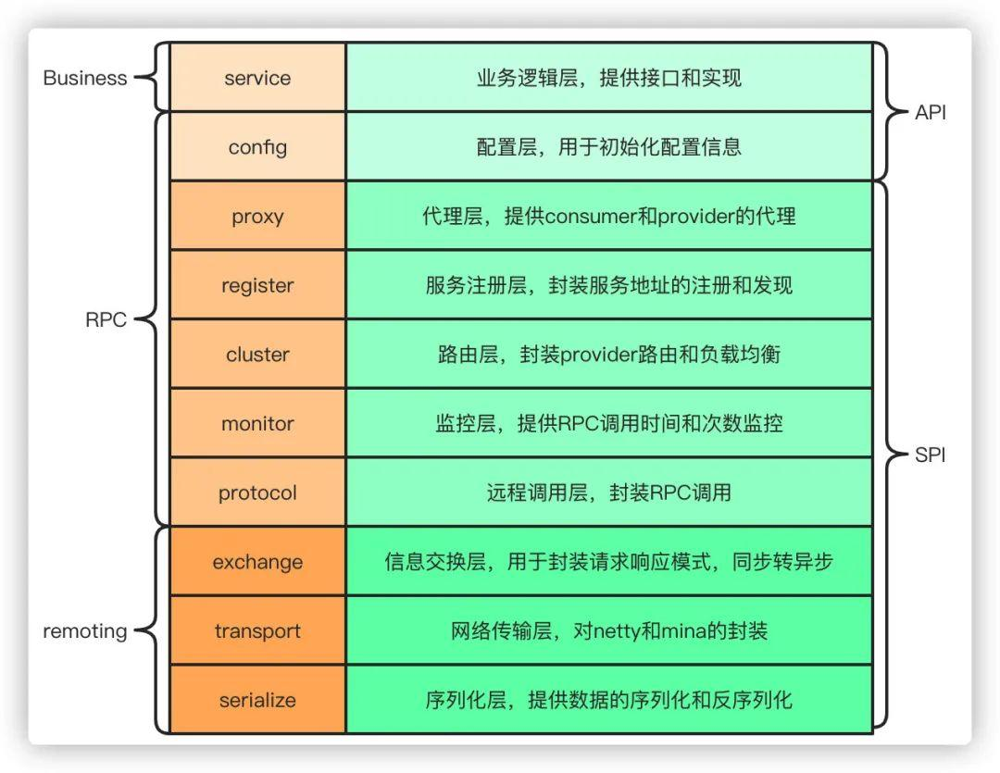

---

根据Dubbo 官方文档的介绍，Dubbo 提供了六大核心能力
面向接口代理的高性能RPC 调用。
智能容错和负载均衡。
服务自动注册和发现。
高度可扩展能力。
运行期流量调度。
可视化的服务治理与运维。
面试官：既然说到Dubbo 的功能，请详细说说Dubbo 负载均衡的几种策略
高手：Dubbo 有五种负载策略：
第一种是加权随机：假设我们有一组服务器servers = [A, B, C]，他们对应的权
重为weights = [5, 3, 2]，权重总和为10。现在把这些权重值平铺在一维坐标值
上，[0, 5) 区间属于服务器A，[5, 8) 区间属于服务器B，[8, 10) 区间属于服
务器C。接下来通过随机数生成器生成一个范围在[0, 10) 之间的随机数，然后
计算这个随机数会落到哪个区间上就可以了。
第二种是最小活跃数：每个服务提供者对应一个活跃数active，初始情况下，
所有服务提供者活跃数均为0。每收到一个请求，活跃数加1，完成请求后则将
活跃数减1。在服务运行一段时间后，性能好的服务提供者处理请求的速度更快，
因此活跃数下降的也越快，此时这样的服务提供者能够优先获取到新的服务请求。
第三种是一致性hash：通过hash 算法，把provider 的invoke 和随机节点生成
hash，并将这个hash 投射到[0, 2^32 - 1] 的圆环上，查询的时候根据key 进
行md5 然后进行hash，得到第一个节点的值大于等于当前hash 的invoker。
第四种是加权轮询：比如服务器A、B、C 权重比为5:2:1，那么在8 次请求中，
服务器A 将收到其中的5 次请求，服务器B 会收到其中的2 次请求，服务器C
则收到其中的1 次请求。
第五种是最短响应时间权重随机：计算目标服务的请求的响应时间，根据响应
时间最短的服务，配置更高的权重进行随机访问。
面试官：Dubbo 的工作原理是什么样的？
高手：
跟着Mic学架构
学架构
ic学架构
跟着Mic学架构
跟着Mic学架构
跟着Mic
跟着Mic

---

1.服务启动的时候，provider 和consumer 根据配置信息，连接到注册中心
register，分别向注册中心注册和订阅服务
2.register 根据服务订阅关系，返回provider 信息到consumer，同时consumer
会把provider 信息缓存到本地。如果信息有变更，consumer 会收到来自register
的推送
3.consumer 生成代理对象，同时根据负载均衡策略，选择一台provider，同时
定时向monitor 记录接口的调用次数和时间信息
4.拿到代理对象之后，consumer 通过代理对象发起接口调用
5.provider 收到请求后对数据进行反序列化，然后通过代理调用具体的接口实现
面试官：最后在说说Dubbo 与Spring Cloud 的区别吧！
Dubbo 是SOA 时代的产物，它的关注点主要在于服务的调用，流量分发、流
量监控和熔断。而Spring Cloud 诞生于微服务架构时代，考虑的是微服务治理
的方方面面，另外由于依托了Spirng、Spirng Boot 的优势之上，两个框架在
开始目标就不一致，Dubbo 定位服务治理、Spirng Cloud 是一个生态。
两者最大的区别是Dubbo 底层是使用Netty 这样的NIO 框架，是基于TCP
协议传输的，配合以Hession 序列化完成RPC 通信。而SpringCloud 是基
于Http 协议+Rest 接口调用远程过程的通信，相对来说，Http 请求会有更大
的报文，占的带宽也会更多。但是REST 相比RPC 更为灵活，服务提供方和调
用方的依赖只依靠一纸契约，不存在代码级别的强依赖。
以上就是我对Dubbo 的理解了！
跟着Mic学架构
学架构
ic学架构
跟着Mic学架构
跟着Mic学架构
跟着Mic
跟着Mic

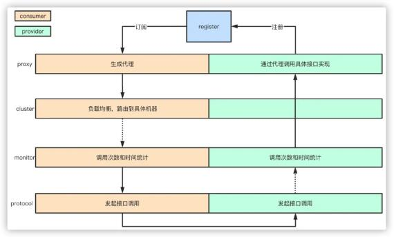

---

谈一谈你对MySQL 性能优化的理解。
大家好，我是MIC，一个工作了13 年的Java 程序员。
MySQL 作为一种免费开源的关系型数据库，深受着互联网公司的喜爱。
因此，它也成为了技术面试官最常问的问题之一。
今天，我们就通过普通人与高手的形式，带大家深入了解MySQL 的性能优化技
巧。
普通人
MySQL 的性能优化主要在于对SQL 执行的优化,因为慢的SQL 执行会带来不好
的用户体验,所以我们要关注SQL 的执行时间,比如有些没有创建索引的列我们
要创建索引.不合理的联表查询我们要简化或者规避.比如,在我以前的一个项目
中,我的SQL 没有索引执行,所以平均执行都需要很多的时间.后面我加上了索引
就好多了.
高手
MySQL 的性能优化我认为可以分为4 大部分
l 硬件和操作系统层面的优化
l 架构设计层面的优化
l MySQL 程序配置优化
l SQL 优化
硬件及操作系统层面优化
从硬件层面来说，影响Mysql 性能的因素有，CPU、可用内存大小、磁盘读写
速度、网络带宽
从操作系层面来说，应用文件句柄数、操作系统网络的配置都会影响到Mysql
性能。
这部分的优化一般由DBA 或者运维工程师去完成。
在硬件基础资源的优化中，我们重点应该关注服务本身承载的体量，然后提出合
理的指标要求，避免出现资源浪费！
架构设计层面的优化
MySQL 是一个磁盘IO 访问量非常频繁的关系型数据库
跟着Mic学架构
学架构
ic学架构
跟着Mic学架构
跟着Mic学架构
跟着Mic
跟着Mic

---

在高并发和高性能的场景中.MySQL 数据库必然会承受巨大的并发压力，而此时，
我们的优化方式可以分为几个部分。
1. 搭建Mysql 主从集群，单个Mysql 服务容易单点故障，一旦服务器宕机，将
会导致依赖Mysql 数据库的应用全部无法响应。主从集群或者主主集群可以保
证服务的高可用性。
2. 读写分离设计，在读多写少的场景中，通过读写分离的方案，可以避免读写
冲突导致的性能影响
3. 引入分库分表机制，通过分库可以降低单个服务器节点的IO 压力，通过分表
的方式可以降低单表数据量，从而提升sql 查询的效率。
4. 针对热点数据，可以引入更为高效的分布式数据库，比如Redis、MongoDB
等，他们可以很好的缓解Mysql 的访问压力，同时还能提升数据检索性能。
MySQL 程序配置优化
MySQL 是一个经过互联网大厂验证过的生产级别的成熟数据库，对于Mysql 数
据库本身的优化，一般是通过Mysql 中的配置文件my.cnf 来完成的，比如。
Mysql5.7 版本默认的最大连接数是151 个，这个值可以在my.cnf 中修改。
binlog 日志，默认是不开启
缓存池bufferpoll 的默认大小配置等。
由于这些配置一般都和用户安装的硬件环境以及使用场景有关系，因此这些配置
官方只会提供一个默认值，具体情况还得由使用者来修改。
关于配置项的修改，需要关注两个方面。
l 配置的作用域，分为会话级别和全局
l 是否支持热加载
因此，针对这两个点，我们需要注意的是：
l 全局参数的设定对于已经存在的会话无法生效
l 会话参数的设定随着会话的销毁而失效
l 全局类的统一配置建议配置在默认配置文件中，否则重启服务会导致配置失效
SQL 优化又能分为三步曲
l 第一、慢SQL 的定位和排查
我们可以通过慢查询日志和慢查询日志分析工具得到有问题的SQL 列表。
l 第二、执行计划分析
跟着Mic学架构
学架构
ic学架构
跟着Mic学架构
跟着Mic学架构
跟着Mic
跟着Mic

---

针对慢SQL，我们可以使用关键字explain 来查看当前sql 的执行计划.可以重点
关注type key rows filterd 等字段，从而定位该SQL 执行慢的根本原因。再有
的放矢的进行优化
l 第三、使用show profile 工具
Show Profile 是MySQL 提供的可以用来分析当前会话中，SQL 语句资源消耗情
况的工具，可用于SQL 调优的测量。在当前会话中.默认情况下处于show profile
是关闭状态，打开之后保存最近15 次的运行结果
针对运行慢的SQL，通过profile 工具进行详细分析.可以得到SQL 执行过程中
所有的资源开销情况.
如IO 开销,CPU 开销,内存开销等.
以上就是我对MySQL 性能优化的理解。
好的，看完高手的回答后，相信各位对MySQL 性能优化有了一定的理解了，最
后我在给各位总结一下常见的SQL 优化规则：
l SQL 的查询一定要基于索引来进行数据扫描
l 避免索引列上使用函数或者运算,这样会导致索引失效
l where 字句中like %号,尽量放置在右边
l 使用索引扫描,联合索引中的列从左往右,命中越多越好.
l 尽可能使用SQL 语句用到的索引完成排序,避免使用文件排序的方式
l 查询有效的列信息即可.少用* 代替列信息
l 永远用小结果集驱动大结果集。
Spring Bean 生命周期的执行流程
普通人
Spring Bean 的生命周期，可以分为单例、多实例。呃... 不对，这个是Spring Bean
的作用域。
生命周期，我想想....
我记得Bean 的生命周期会有加载、实例化、销毁这些阶段，其他的记得不是很
清晰。
高手
跟着Mic学架构
学架构
ic学架构
跟着Mic学架构
跟着Mic学架构
跟着Mic
跟着Mic

---

Spring 生命周期全过程大致分为五个阶段：创建前准备阶段、创建实例阶段、
依赖注入阶段、
容器缓存阶段和销毁实例阶段。
这张是Spring Bean 生命周期完整流程图，其中对每个阶段的具体操作做了详细
介绍：
跟着Mic学架构
学架构
ic学架构
跟着Mic学架构
跟着Mic学架构
跟着Mic
跟着Mic

---

跟着Mic学架构
学架构
ic学架构
跟着Mic学架构
跟着Mic学架构
跟着Mic
跟着Mic

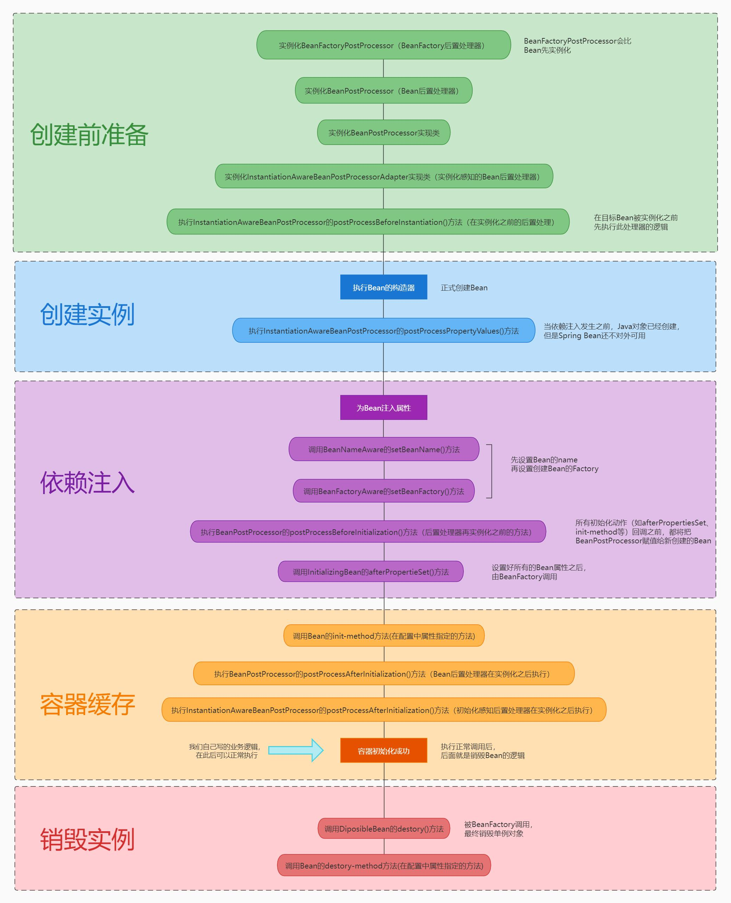

---

一、创建前准备阶段
这个阶段主要的作用是，Bean 在开始加载之前，需要从上下文和相关配置中解
析并查找Bean 有关的扩展实现，
比如像init-method-容器在初始化bean 时调用的方法、destory-method，容器在
销毁bean 时调用的方法。
以及，BeanFactoryPostProcessor 这类的bean 加载过程中的前置和后置处理。
这些类或者配置其实是Spring 提供给开发者，用来实现Bean 加载过程中的扩
展机制，在很多和Spring 集成的中间件中比较常见，比如Dubbo。
二、创建实例阶段
这个阶段主要是通过反射来创建Bean 的实例对象，并且扫描和解析Bean 声明
的一些属性。
三、依赖注入阶段
如果被实例化的Bean 存在依赖其他Bean 对象的情况，则需要对这些依赖bean
进行对象注入。比如常见的@Autowired、setter 注入等依赖注入的配置形式。
同时，在这个阶段会触发一些扩展的调用，比如常见的扩展类：
BeanPostProcessors（用来实现bean 初始化前后的扩展回调）、
InitializingBean（这个类有一个afterPropertiesSet()，这个在工作中也比较常见）、
BeanFactoryAware 等等。
四、容器缓存阶段
容器缓存阶段主要是把bean 保存到容器以及Spring 的缓存中，到了这个阶段，
Bean 就可以被开发者使用了。
这个阶段涉及到的操作，常见的有，init-method 这个属性配置的方法，会在这
个阶段调用。
以及像BeanPostProcessors
方法中的后置处理器方法如：
postProcessAfterInitialization，也会在这个阶段触发。
五、销毁实例阶段
当Spring 应用上下文关闭时，该上下文中的所有bean 都会被销毁。
如果存在Bean 实现了DisposableBean 接口，或者配置了destory-method 属性，
会在这个阶段被调用。
跟着Mic学架构
学架构
ic学架构
跟着Mic学架构
跟着Mic学架构
跟着Mic
跟着Mic

---

MIC：嗯，看完高手的回答后，相信大家对Spring Bean 的生命周期有了深刻的
印象了，需要文档中Spring Bean 生命周期的高清流程图，可以加微信：mic6769。
在附赠一张高清的时序图给大家！
Spring 是如何解决循环依赖问题的？
普通人
跟着Mic学架构
学架构
ic学架构
跟着Mic学架构
跟着Mic学架构
跟着Mic
跟着Mic

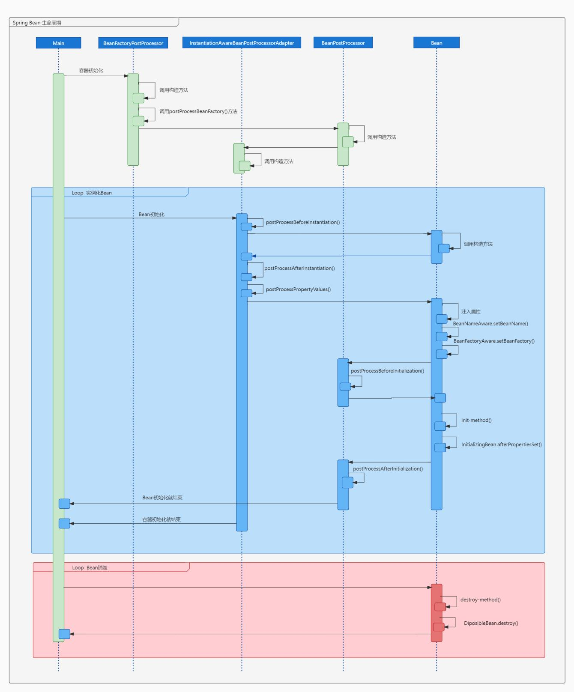

---

Spring 是利用缓存机制来解决循环依赖问题的
高手
我们都知道，如果在代码中，将两个或多个Bean 互相之间持有对方的引用就会
发生循环依赖。循环的依赖将会导致注入死循环。这是Spring 发生循环依赖的
原因。
循环依赖有三种形态：
第一种互相依赖：A 依赖B，B 又依赖A，它们之间形成了循环依赖。
第二种三者间依赖：A 依赖B，B 依赖C，C 又依赖A，形成了循环依赖。
第三种是自我依赖：A 依赖A 形成了循环依赖。
跟着Mic学架构
学架构
ic学架构
跟着Mic学架构
跟着Mic学架构
跟着Mic
跟着Mic

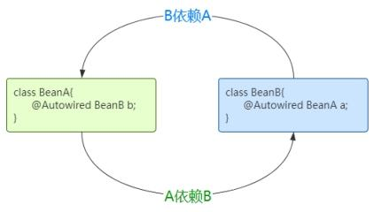

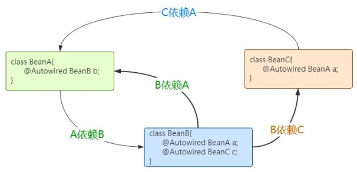

---

而Spring 中设计了三级缓存来解决循环依赖问题，当我们去调用getBean()方法
的时候，Spring 会先从一级缓存中去找到目标Bean，如果发现一级缓存中没有
便会去二级缓存中去找，而如果一、二级缓存中都没有找到，意味着该目标Bean
还没有实例化。于是，Spring 容器会实例化目标Bean（PS：刚初始化的Bean
称为早期Bean）。然后，将目标Bean 放入到二级缓存中，同时，加上标记是
否存在循环依赖。如果不存在循环依赖便会将目标Bean 存入到二级缓存，否则，
便会标记该Bean 存在循环依赖，然后将等待下一次轮询赋值，也就是解析
@Autowired 注解。等@Autowired 注解赋值完成后，会将目标Bean 存入到一
级缓存。
Spring 一级缓存中存放所有的成熟Bean，二级缓存中存放所有的早期Bean，
先取一级缓存，再去二级缓存。
跟着Mic学架构
学架构
ic学架构
跟着Mic学架构
跟着Mic学架构
跟着Mic
跟着Mic

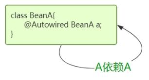

---

面试官：那么，前面有提到三级缓存，三级缓存的作用是什么？
高手：
三级缓存是用来存储代理Bean，当调用getBean()方法时，发现目标Bean 需要
通过代理工厂来创建，此时会将创建好的实例保存到三级缓存，最终也会将赋值
好的Bean 同步到一级缓存中。
面试官：Spring 中哪些情况下，不能解决循环依赖问题？
高手：有四种情况：
1.多例Bean 通过setter 注入的情况，不能解决循环依赖问题
2.构造器注入的Bean 的情况，不能解决循环依赖问题
3.单例的代理Bean 通过Setter 注入的情况，不能解决循环依赖问题
跟着Mic学架构
学架构
ic学架构
跟着Mic学架构
跟着Mic学架构
跟着Mic
跟着Mic

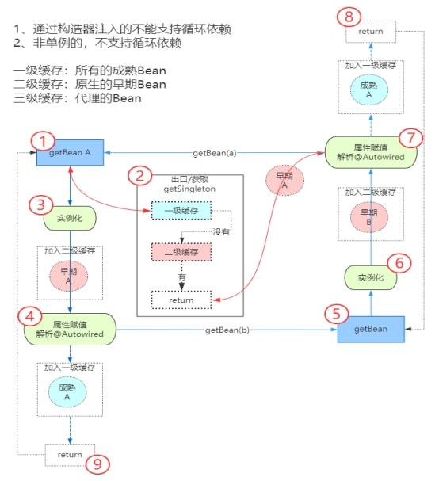

---

4.设置了@DependsOn 的Bean 的情况，不能解决循环依赖问题
Zookeeper 和Redis 哪种更好？
普通人
Redis 可以使用SetNX 这个指令来实现分布式锁，Zookeeper 可以基于同一级
节点的唯一性或者有序节点的特性来实现分布式锁。由于Redis 的读写性能要比
Zookeeper 更好，在高并发场景中，Zookeeper 实现分布式锁会存在性能瓶颈。
所以我认为Redis 比Zookeeper 更好。
高手
关于这个问题，我想从3 个方面来说：
为什么使用分布式锁？
使用分布式锁的目的，是为了保证同一时间只有一个JVM 进程可以对共享资源
进行操作。
根据锁的用途可以细分为以下两类：
允许多个客户端操作共享资源，我们称为共享锁
这种锁的一般是对共享资源具有幂等性操作的场景，主要是为了避免重复操作共
享资源频繁加锁带来的性能开销。
只允许一个客户端操作共享资源，我们成为排他锁
这种锁一般是用在对共享资源操作具有非幂等性操作的场景，也就是需要保证在
同一时刻只有一个进程或者线程能够访问这个共享资源。
目前实现分布式锁最常用的中间件是Redis 和Zookeeper
第一种，Redis 可以通过两种方式来实现
1. 利用Redis 提供的SET key value NX PX milliseconds 指令，这个指令是设置一个
key-value，如果key 已经存在，则返回0，否则返回1，我们基于这个返回值来
判断锁的占用情况从而实现分布式锁。
2. 基于Redission 客户端来实现分布式锁，Redisson 提供了分布式锁的封装方
法，我们只需要调用api 中的lock（）和unlock()方法。它帮我们封装锁实现的细
节和复杂度
l redisson 所有指令都通过lua 脚本执行并支持lua 脚本原子性执行
跟着Mic学架构
学架构
ic学架构
跟着Mic学架构
跟着Mic学架构
跟着Mic
跟着Mic

---

l redisson 中有一个watchdog 的概念，翻译过来就是看门狗，它会在你获取锁
之后，每隔10 秒帮你把key 的超时时间设为30s，就算一直持有锁也不会出现
key 过期了。“看门狗”的逻辑保证了没有死锁发生。
第二种，基于ZK 实现分布式锁的落地方案
Zookeeper 实现分布式锁的方法比较多，我们可以使用有序节点来实现，
1、来看这个图，每个线程或进程在Zookeeper 上的/lock 目录下创建一个临时有
序的节点表示去抢占锁，所有创建的节点会按照先后顺序生成一个带有序编号的
节点。
2、线程创建节点后，获取/lock 节点下的所有子节点，判断当前线程创建的节点
是否是所有的节点的序号最小的。
3、如果当前线程创建的节点是所有节点序号最小的节点，则认为获取锁成功。
4、如果当前线程创建的节点不是所有节点序号最小的节点，则对节点序号的前
一个节点添加一个事件监听，当前一个被监听的节点释放锁之后，触发回调通知，
从而再次去尝试抢占锁。
两种方案都有各自的优缺点
对于redis 的分布式锁而言，它有以下缺点：
它获取锁的方式简单粗暴，如果获取不到锁，会不断尝试获取锁，比较消耗性能。
Redis 是AP 模型，在集群模式中由于数据的一致性会导致锁出现问题，即便使
用Redlock 算法来实现，在某些复杂场景下，也无法保证其实现100%的可靠性。
不过在实际开发中使用Redis 实现分布式锁还是比较常见，而且大部分场情况下
不会遇到”极端复杂的场景“，更重要的是Redis 性能很高，在高并发场景中比较
合适。
对于zk 分布式锁而言:
zookeeper 天生设计定位就是分布式协调，强一致性。锁的模型健壮、简单易用、
适合做分布式锁。
如果获取不到锁，只需要添加一个监听器就可以了，不用一直轮询，性能消耗较
小。
如果要在两者之间做选择，就我个人而言的话，比较推崇ZK 实现的锁，因为对
于分布式锁而言，它应该符合CP 模型，但是Redis 是AP 模型，所以在这个点
上，Zookeeper 会更加合适。
关于“你对Spring Cloud 的理解”
看看普通人和高手是如何回答这个问题的？
跟着Mic学架构
学架构
ic学架构
跟着Mic学架构
跟着Mic学架构
跟着Mic
跟着Mic

---

普通人
Spring Cloud 是一套微服务解决方案
它包括配置中心、RPC 通信、服务注册、服务熔断等组件
高手
Spring Cloud 是一套分布式微服务的技术解决方案
它提供了快速构建分布式系统的常用的一些组件
比如说配置管理、服务的注册与发现、服务调用的负载均衡、资源隔离、熔断降
级等等
不过Spring Cloud 只是Spring 官方提供的一套微服务标准定义
而真正的实现目前有两套体系用的比较多
一个是Spring Cloud Netflix
一个是Spring Cloud Alibaba
Spring Cloud Netflix 是基于Netflix 这个公司的开源组件集成的一套微服务解决
方案，其中的组件有
1. Ribbon——负载均衡2. Hystrix——服务熔断
3.Zuul——网关4. Eureka——服务注册与发现5. Feign——服务调用
Spring Cloud Alibaba 是基于阿里巴巴开源组件集成的一套微服务解决方案，其
中包括
1. Dubbo——消息通讯2. Nacos——服务注册与发现
3.Seata——事务隔离4. Sentinel——熔断降级
有了Spring Cloud 这样的技术生态
使得我们在落地微服务架构时
不用去考虑第三方技术集成带来额外成本
只要通过配置组件来完成架构下的技术问题
从而可以让我们更加侧重性能方面
以上这些就是我对Spring Cloud 的个人理解！
好的，关于普通人与高手的回答
谁的回答较好，大家心中自有定论
跟着Mic学架构
学架构
ic学架构
跟着Mic学架构
跟着Mic学架构
跟着Mic
跟着Mic

---

那么还有哪些组件是在文章中没有提到？
可以在评论区补充留言！
关于你对Zookeeper 的理解
看看普通人和高手是如何回答这个问题的？
普通人
Zookeeper 是一种开放源码的分布式应用程序协调服务
是一个分布式的小文件存储系统
一般对开发者屏蔽分布式应用开发过过程种的底层细节
用来解决分布式集群中应用系统的一致性问题
高手
对于Zookeeper 的理解，我觉得可以从分布式系统中的三种典型应用场景说起：
第一种：集群管理
在多个节点组成的集群中，为了保证集群的HA 特性，每个节点都会冗余一份数
据副本。这种情况下需要保证客户端访问集群中的任意一个节点都是最新的数据。
第二种：分布式锁
如何保证跨进程的共享资源的并发安全性，对于分布式系统来说也是一个比较大
的挑战，而为了达到这样一个目的，必须要使用跨进程的锁也就是分布式锁来实
现。
第三种：Master 选举
在多个节点组成的集群中，为了降低集群数据同步的复杂度，一般会存在Master
和Slave 两种角色的节点，Master 负责事务和非事务请求处理，Slave 负责非事
务请求处理。但是在分布式系统中如何确定某个节点是Master 还是Slave，也
成了一个难度不小的挑战。
基于这三类常见场景的需求，所以产生了Zookeeper 这样一个中间件。
它是一个分布式开源协调组件，简单来说，就是类似于一个裁判员的角色，专门
负责协调和解决分布式系统中的各类问题。
比如，针对上述描述的问题，Zookeeper 都可以解决。
1. 集群管理
跟着Mic学架构
学架构
ic学架构
跟着Mic学架构
跟着Mic学架构
跟着Mic
跟着Mic

---

Zookeeper 提供了CP 的模型，来保证集群中的每个节点的数据一致性，当然
Zk 本身的集群并不是CP 模型，而是顺序一致性模型，如果要保证CP 特性，
需要调用sync 同步方法。
2. 分布式锁
Zookeeper 提供了多种不同的节点类型，如持久化节点、临时节点、有序节点、
容器节点等，其中对于分布式锁这个场景来说，Zookeeper 可以利用有序节点的
特性来实现。除此之外，还可以利用同一级节点的唯一性特性来实现分布式锁。
3. Master 选举
Zookeeper 可以利用持久化节点来存储和管理其他集群节点的信息，从而进行
Master 选举机制。或者还可以利用集群中的有序节点特性，来实现Master 选举。
目前主流的Kafka、Hbase、Hadoop 都是通过Zookeeper 来实现集群节点的主
从选举。
总的来说，Zookeeper 就是经典的分布式数据一致性解决方案，致力于为分布式
应用提供高性能、高可用，并且具有严格顺序访问控制能力的分布式协调服务。
它底层通过基于Paxos 算法演化而来的ZAB 协议实现。
以上就是我对于Zookeeper 的理解。
关于什么是JVM？
看看普通⼈和⾼⼿的回答。
普通人
JVM 就是Java 虚拟机，是⽤来运⾏我们平时所写的Java 代码的。优点是它会
⾃动进⾏内存管理和垃圾回收，缺点是⼀旦发⽣问题，要是不了解JVM 的运⾏
机制，就很难排查出问题所在。
高手
JVM 全称是Java 虚拟机，在聊什么是JVM 之前，我们不妨看⼀下这张图。
跟着Mic学架构
学架构
ic学架构
跟着Mic学架构
跟着Mic学架构
跟着Mic
跟着Mic

---

从这张图中可以看出JVM 所处的位置，同时也能看出它两个作用：
l 运⾏并管理Java 源码⽂件所⽣成的Class⽂件，
l 在不同的操作系统上安装不同的JVM，从⽽实现了跨平台的保证。
⼀般情况下，对于开发者⽽⾔，即使不熟悉JVM 的运⾏机制并不影响业务代码
的开发，因为在安装完JDK 或者JRE 之后，其中就已经内置了JVM，所以只需
要将Class⽂件交给JVM 运⾏即可。
但当程序运⾏的过程中出现了问题，⽽这个问题发生在JVM 层⾯的，那我们就
需要熟悉JVM 的运⾏机制，才能迅速排查并解决JVM 的性能问题。
我们先看下目前主流的JVM HotSpot 的架构图，通过这张架构图，我们可以看
出JVM 的大致流程是把一个class 文件通过类加载器加载进系统，然后放到不
同
的
区
域
，
通
过
编
译
器
编
译
。
第一个部分Class Files
跟着Mic学架构
学架构
ic学架构
跟着Mic学架构
跟着Mic学架构
跟着Mic
跟着Mic

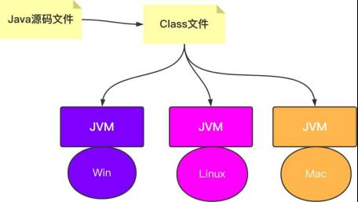

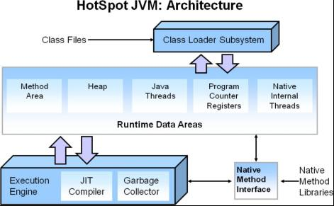

---

在Java 中，Class⽂件是由源码⽂件⽣成的，⾄于源码⽂件的内容，是每个Java
开发者在JavaSE 阶段的必备知识，这⾥就不再赘述了，我们可以关注⼀下Class
⽂件的格式，⽐如其中的常量池、成员变量、⽅法等，这样就能知道Java 源码
内容在Class⽂件中的表示⽅式
第二个部分Class Loader Subsystem 即类加载机制
Class⽂件加载到内存中，需要借助Java 中的类加载机制。类加载机制分为装
载、链接和初始化，其主要就是对类进⾏查找、验证以及分配相关的内存空间和
赋值
第三个部分Runtime Data Areas 也就是通常所说的运⾏时数据区
其解决的问题就是Class⽂件进入内存之后，该如何进⾏存储不同的数据以及数
据该如何进⾏扭转。比如：Method Area 通常会储存由Class⽂件常量池所对应
的运⾏时常量池、字段和⽅法的元数据信息、类的模板信息等；Heap 是存储各
种Java 中的对象实例；Java Threads 通过线程以栈的⽅式运⾏加载各个⽅法；
Native Internal Thread 可以理解为是加载运⾏native 类型的⽅法；PC Register
则是保存每个线程执⾏⽅法的实时地址。
这样通过运⾏时数据区的5 个部分就能很好地把数据存储和运⾏起来了
第四个部分Garbage Collector 也就是通常所说的垃圾回收
就是对运⾏时数据区中的数据进⾏管理和回收。回收机制可以基于不同的垃圾收
集器，⽐如Serial、Parallel、CMS、G1、ZGC 等，可以针对不同的业务场景选
择不同的收集器，只需要通过JVM 参数设置即可。如果我们打开hotspot 的源
码，可以发现这些收集器其实就是对于不同垃圾收集算法的实现，核⼼的算法有
3 个：标记-清除、标记-整理、复制
第五个部分是JIT Compiler 和Interpreter
通俗理解就是翻译器，Class 的字节码指令通过JIT Compiler 和Interpreter 翻译
成对应操作系统的CPU 指令，只不过可以选择解释执⾏或者编译执⾏，在
HotSpot JVM 默认采用的是这两种⽅式的混合。
跟着Mic学架构
学架构
ic学架构
跟着Mic学架构
跟着Mic学架构
跟着Mic
跟着Mic

---

第六就是JNI 的技术
如果我们想要找Java 中的某个native⽅法是如何通过C 或者C++实现的，那么
可以通过Native Method Interface 来进⾏查找，也就是所谓的JNI 技术。
通过官⽹上给出的HotSpot 架构图，我们就能够知道JVM 到底是如何运行的了，
当然在实际操作的过程中我们可以借助⼀些JVM 参数：
和⼀些常⻅的JDK 常⻅命令
跟着Mic学架构
学架构
ic学架构
跟着Mic学架构
跟着Mic学架构
跟着Mic
跟着Mic

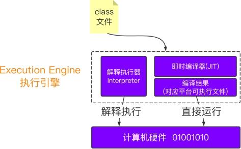

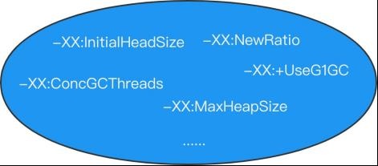

---

再结合JDK 常⻅⼯具以及第三⽅的⼀些⼯具
我们就可以优雅地分析JVM 出现的常⻅问题并对其进⾏调优。
以上就是我对JVM 的理解。
好的，看完高手的回答后，相信每位看完视频的小伙伴对JVM 有了更深刻的理
解了，本期普通人VS 高手系列的视频就到这里就结束了，喜欢的朋友一键三
连，加个关注，我是头发很多的程序员Mic，咱们下期见！
什么是负载均衡？
最近有小伙伴想让我聊一聊负载均衡方面的问题，我说，网上有这么多资料了，
怎么还需要我来分享，他说网上的很多资料不系统，难理解。因此就做了这个视
频。
关于负载均衡，我会从四个方面去说。
1. 负载均衡产生的背景
2. 负载均衡的实现技术
3. 负载均衡的作用范围
4. 负载均衡的常用算法
跟着Mic学架构
学架构
ic学架构
跟着Mic学架构
跟着Mic学架构
跟着Mic
跟着Mic

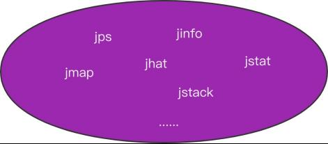

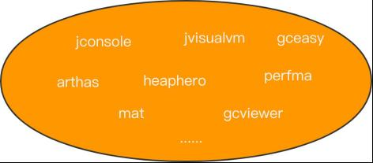

---

负载均衡的诞生背景
在互联网发展早期，由于用户量较少、业务需求也比较简单。对于软件应用，我
们只需要一台高配的服务器即可完成业务的支撑，这样的软件架构称为单体架构
随着用户量的增加，服务器的请流量也随之增加，在这个过程中单体架构会产生
两个问题。
1. 软件的性能逐步下降，访问延迟越来越高
2. 容易出现单点故障
为了解决这个问题，我们引入了集群化部署的架构，也就是把一个软件应用同时
部署在多个服务器上
架构的变化带来了两个问题：
1. 客户端请求如何均匀的分发到多台目标服务器上？
2. 如何检测目标服务器的健康状态，使得客户端请求不向已经宕机的服务器发
送请求。
为了解决这两个问题，引入了负载均衡的设计，简单来说，负载均衡机制的核心
目的是让客户端的请求合理均匀的分发到多台目标服务器，由于请求被多个节点
分发，使得服务端的性能得到有效的提升。
如何实现负载均衡呢？
常见的实现方案有三种！
●基于DNS 实现负载均衡
跟着Mic学架构
学架构
ic学架构
跟着Mic学架构
跟着Mic学架构
跟着Mic
跟着Mic

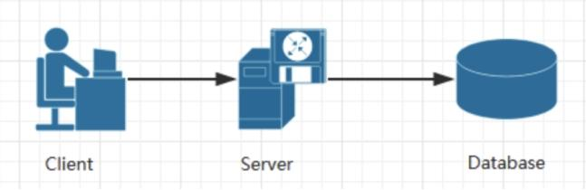

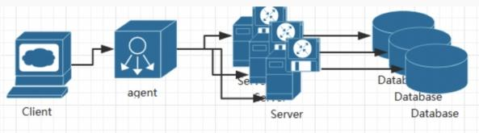

---

●基于硬件实现负载均衡
●基于软件实现负载均衡
先来说一下基于DNS 实现负载均衡的方式，它的实现方式比较简单，只需要在
DNS 服务器上针对某个域名做多个IP 映射即可。
它的工作原理是：当用户通过域名访问某个网站时，会先通过DNS 服务器进
行域名解析得到一个IP 地址，DNS 服务器可以随机分配一个IP 地址进行访问，
这样就可以实现目标服务集群的请求分发。
除此之外，DNS 还可以根据不同的地域分配就近机房的IP，比如长沙的小伙伴，
可能会得到在湖南范围内最近的一个机房的IP，在这个模式下可以实现「就近
原则」实现请求处理，缩短了通信距离从而提升网站访问效率。
DNS 实现负载均衡的优点是：配置简单，实现成本低，无需额外的开发和维护。
不过缺点也很明显：
由于DNS 多级缓存的特性，当我们修改DNS 配置之后，会因为缓存导致IP 变
更不及时，从而影响负载均衡的效果。
第二种，基于硬件实现负载均衡
硬件负载设备，我们可以简单把它理解成一个网络设备，类似于网络交换机，它
1. 它的性能很好，每秒能够处理百万级别的请求，
2. 支持多种负载均衡算法，我们可以非常灵活的配置不同的负载策略
3. 它还具备防火墙等安全功能。
4. 硬件负载是商业产品，有专门的售后来支持，所以企业不需要花精力去做维
护。
F5 是比较常见的硬件负载设备，由于硬件负载设备价格比较贵，一般应用在大
型银行、政府、电信等领域。
第三种，基于软件实现负载均衡
跟着Mic学架构
学架构
ic学架构
跟着Mic学架构
跟着Mic学架构
跟着Mic
跟着Mic

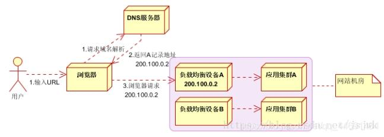

---

所谓软件负载，就是通过一些开源软件或者商业软件来完成负载均衡的功能。常
见的软件负载技术有：Nginx、LVS、HAProxy 等。
目前互联网企业绝大部分采用的都是软件负载，主要原因是：
1. 免费，企业不需要投入较高的成本。
2. 开源，不同企业对于负载均衡的要求有差异，所以可以基于开源软件上做二
次开发。
3. 灵活性较高
这三种方式，没有好坏之分，只有是否合适，因此大家可以根据实际情况选择。
负载均衡的作用范围
负载均衡是作用在网络通信上，来实现请求的分发。
而在网络架构中，基于OSI 模型，又分为7 层网络模型
也就是意味着我们可以在网络的某些分层上做请求分发处理，因此根据这样一个
特性，对于负载均衡的作用范围又可以分为：
1. 二层负载
2. 三层负载
跟着Mic学架构
学架构
ic学架构
跟着Mic学架构
跟着Mic学架构
跟着Mic
跟着Mic

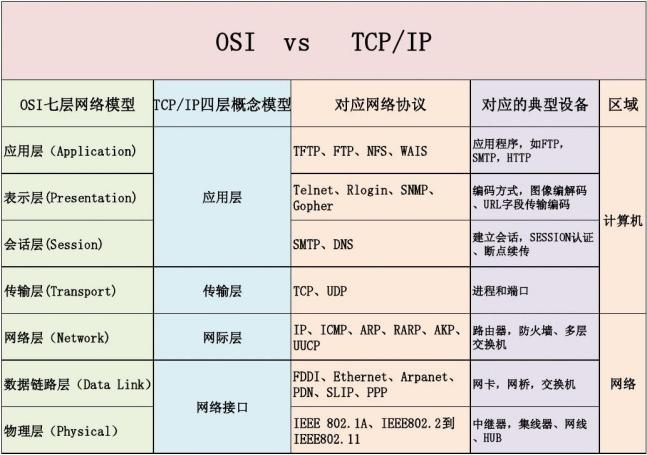

---

3. 四层负载
4. 七层负载
二层负载：基于Mac 地址来实现请求分发，一般采用虚拟Mac 的方式实现，服
务器收到请求后，通过动态分配后端服务的实际Mac 地址进行响应从而实现负
载均衡
三层负载：基于IP 层负载，一般通过虚拟IP 的方式实现，外部请求访问虚拟IP，
服务器收到请求后根据后端实际IP 地址进行转发。
四层负载：通过请求报文中的目标地址和端口进行负载，Nginx、F5、LVS 等
都可以实现四层负载。
七层负载：七层负载是基于应用层负载，也就是服务器端可以根据http 协议中
请求的报文信息来决定把请求分发到哪个目标服务器上，比如Cookie、消息体、
RequestHeader 等。
最后一个，就是负载均衡的常用算法
所谓负载均衡算法，就是决定当前客户端请求匹配到目标服务器集群中的具体哪
个节点。
常见的负载均衡算法有：
1. 轮训，也就是多个服务器按照顺序轮训返回，这样每个服务器都能获得相同
的请求次数
跟着Mic学架构
学架构
ic学架构
跟着Mic学架构
跟着Mic学架构
跟着Mic
跟着Mic

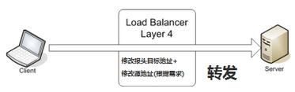

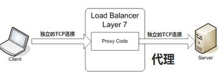

---

2. 随机，根据随机算法获得一个目标服务地址（就像古时候皇帝翻牌子），由
于该算法具备随机性，因此每个服务器获得的请求数量不一定均等。
3. 一致性hash，也就是对于具有相同hash 码的请求，永远发送到同一个节点
上。
4. 最小连接数，根据目标服务器的请求数量来决定请求分发的权重，也就是目
标服务集群中，请求更少的节点将会获得更多的请求。这是负载均衡中比较好的
策略，真正能够实现目标服务器的请求均衡。
以上就是关于负载均衡相关的内容，当然，负载均衡还有很多值得去挖掘的，比
如负载算法如何实现？网络分层模型的原理等。
对于网络模型这块，如果有想深度学习的同学，在下方留言”想看“，我会在后续
的内容中进行整理。
好的，本期的视频就到这里结束了，喜欢的朋友记得一键三连，加个关注，我是
头发很多的程序员Mic，咱们下期再见。
什么是死锁？
看一看普通人
和高手是如何回答这个问题的
普通人
线程A 占用对象锁1，线程B 占用对象锁2
线程A 需要继续获得对象锁2 才能继续执行，所以线程A 需要等待
跟着Mic学架构
学架构
ic学架构
跟着Mic学架构
跟着Mic学架构
跟着Mic
跟着Mic

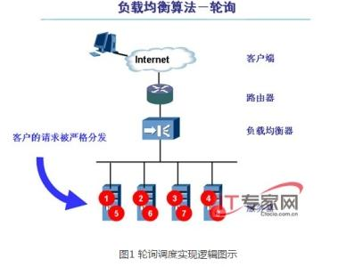

---

线程B 释放对象锁2 线程B 需要获得对象锁1，才能继续执行
同样也需要等待
线程A 释放对象锁2
由于这两个线程
都不释放自己已经占有的锁
导致两个线程处于
无限等待状态
这个就是死锁
高手
关于这个问题
我会从三个方面来回答
第一个是什么是死锁
所谓死锁
是一组互相竞争资源的线程
因互相等待
导致“永久”阻塞的现象
第二个是发生死锁的原因
发生死锁的原因有四个
第一个是互斥条件，共享资源X 和Y 只能被一个线程占用
第二个是指占有且等待，线程T1 已经取得共享资源X
在等待共享资源Y 的时候
不释放共享资源X
第三个是不可抢占
其他线程不能强行抢占
线程T1 占有的资源
第四个循环等待
线程T1 等待线程T2 占有的资源
线程T2 等待线程T1 占有的资源
跟着Mic学架构
学架构
ic学架构
跟着Mic学架构
跟着Mic学架构
跟着Mic
跟着Mic

---

这就是循环等待
第三个点是如何避免死锁呢？
既然发生死锁的原因是
需要同时满足这四个条件
我们只需要打破其中任意一个条件
即可避免死锁问题
而在这四个条件中
第一个互斥条件是无法被破坏的
因为锁本身就是通过
互斥来解决线程安全问题的
所以对于剩下三个
我们可以逐一进行分析
第一个是对于“占用且等待”这个条件
我们可以一次性申请所有的资源
这样就不存在等待了
第二个是对于“不可抢占”这个条件
占用部分资源的线程
进一步申请其他资源时
如果申请不到
可以主动释放它占有的资源
这样不可抢占这个条件就破坏掉了
第三个点
对于“循环等待”这个条件
可以靠按序申请资源来进行预防
所谓按序申请
是指资源是有线性顺序的
申请的时候可以先申请资源序号小的
再申请资源序号大的
这样线性化后自然就不存在循环等待了
跟着Mic学架构
学架构
ic学架构
跟着Mic学架构
跟着Mic学架构
跟着Mic
跟着Mic

---

怎么样
发现他们两个的区别了吗
什么是消息队列？
普通人
消息用队列的模式发送，
把要传输的数据放在队列中，
产生消息的叫做生产者，
从队列里取出消息的叫做消费者。
这些是我对消息队列的理解
高手
消息队列Message Queue，简称MQ。
是一种应用间的通信方式，主要由三个部分组成。
生产者：Producer
消息的产生者与调用端
主要负责消息所承载的业务信息的实例化
是一个队列的发起方
代理：Broker
主要的处理单元
负责消息的存储、投递、及各种队列附加功能的实现
是消息队列最核心的组成部分
消费者：Consumer
跟着Mic学架构
学架构
ic学架构
跟着Mic学架构
跟着Mic学架构
跟着Mic
跟着Mic

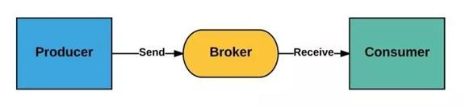

---

一个消息队列的终端
也是消息的调用端
具体是根据消息承载的信息，处理各种业务逻辑。消息队列的应用场景较多，
常用的可以分为三种：
异步处理
主要应用于对实时性要求不严格的场景，
比如：用户注册发送验证码、下单通知、发送优惠券等等。
服务方只需要把协商好的消息发送到消息队列，
剩下的由消费消息的服务去处理，
不用等待消费服务返回结果。
应用解耦
应用解耦可以看作是把相关但耦合度不高的系统联系起来。
比如订单系统与WMS、EHR 系统，有关联但不哪么紧密
，每个系统之间只需要把约定的消息发送到MQ，另外的系统去消费即可。
解决了各个系统可以采用不同的架构、语言来实现，从而大大增加了系统的灵活
性。
流量削峰
流量削峰一般应用在大流量入口且短时间内业务需求处理不完的服务中心，
为了权衡高可用，把大量的并行任务发送到MQ 中，
依据MQ 的存储及分发功能，平稳的处理后续的业务，
跟着Mic学架构
学架构
ic学架构
跟着Mic学架构
跟着Mic学架构
跟着Mic
跟着Mic

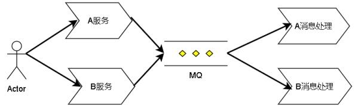

---

起到一个大流量缓冲的作用。
目前市面上常见的消息队列中间件主要有
ActiveMQ、RabbitMQ、Kafka、RocketMQ 这几种，
在架构技术选型的时候一般根据业务的需求选择合适的中间件：
比如中小型公司，低吞吐量的一般用ActiveMQ、RabbitMQ 较为合适，
大数据高吞吐量的大型公司一般选用Kafka 和RocketMQ。
以上就是我的MQ 的理解。
总结
好的，看完高手的回答后，相信每位看完视频的小伙伴对消息队列有了更深刻
的理解，当然本期视频还有很多内容未涉及到，比如中间件产品的介绍、消息
队列的实现原理等等，如果你还想听请在下方的评论区留言，我会逐步安排。
能说一下什么是受检异常和非受检异常
吗？
普通人
受检异常好像是需要主动捕获的异常非受检异常应该是不需要捕获的异常
高手
跟着Mic学架构
学架构
ic学架构
跟着Mic学架构
跟着Mic学架构
跟着Mic
跟着Mic

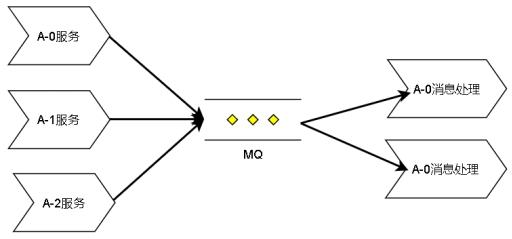

---

我觉得可以从三个方面回答这个问题
一、首先是异常的本质
受检异常和非受检异常，都是继承自Throwable 这个类中，分别是Error 和
Exception，Error 是程序报错，系统收到无法处理的错误消息，它和程序本身无
关。
Excetpion 是指程序运行时抛出需要处理的异常信息如果不主动捕获，则会被
jvm 处理。
二、然后是对受检异常和非受检异常的定义
前面说过受检异常和非受检异常均派生自Exception 这个类。
1. 受检异常的定义是程序在编译阶段必须要主动捕获的异常，遇到该异常有两
种处理方法
通过try/catch 捕获该异常或者通过throw 把异常抛出去
2. 非受检异常的定义是程序不需要主动捕获该异常，一般发生在程序运行期间，
比如NullPointException
三、最后我还可以说下他们优点和缺点
受检异常优点有两个：
第一，它可以响应一个明确的错误机制，这些错误在写代码的时候可以随时捕获
并且能很好的提高代码的健壮性。
第二，在一些连接操作中，它能很好的提醒我们关注异常信息，并做好预防工作。
不过受检异常的缺点是：抛出受检异常的时候需要上声明，而这个做法会直接破
坏方法签名导致版本不兼容。这个恶心特性导致我会经常使用
RuntimeException 包装。
非受检异常的好处是可以去掉一些不需要的异常处理代码，而不好之处是开发人
员可能忽略某些应该处理的异常，导致带来一些隐藏很深的Bug，比如流忘记关
闭？连接忘记释放等。
这些就是我对这个问题的回答！
对Spring Cloud 的理解
关于“你对Spring Cloud 的理解”
看看普通人和高手是如何回答这个问题的？
普通人
跟着Mic学架构
学架构
ic学架构
跟着Mic学架构
跟着Mic学架构
跟着Mic
跟着Mic

---

Spring Cloud 是一套微服务解决方案
它包括配置中心、RPC 通信、服务注册、服务熔断等组件
高手
Spring Cloud 是一套
分布式微服务的技术解决方案
它提供了快速构建分布式系统的
常用的一些组件
比如说配置管理、服务的注册与发现、
服务调用的负载均衡、资源隔离、熔断降级等等不过Spring Cloud 只是Spring
官方提供的
一套微服务标准定义
而真正的实现目前有两套体系用的比较多一个是Spring Cloud Netflix 一个是
Spring Cloud Alibaba Spring Cloud Netflix 是基于Netflix 这个公司的开源组件集
成的一套微服务解决方案，其中的组件有
1. Ribbon—— 负载均衡
2.
Hystrix——服务熔断
3.Zuul——网关4. Eureka——服务注册与发现5. Feign——服务调用Spring
Cloud Alibaba 是基于阿里巴巴开源组件集成的一套微服务解决方案，其中包括
1. Dubbo——消息通讯2. Nacos——服务注册与发现
3.Seata——事务隔离4. Sentinel——熔断降级有了Spring Cloud 这样的技术
生态
使得我们在落地微服务架构时
不用去考虑第三方技术集成带来额外成本
只要通过配置组件来完成架构下的技术问题
从而可以让我们更加侧重性能方面
以上这些就是我对Spring Cloud 的个人理解！
好的，关于普通人与高手的回答
谁的回答较好，大家心中自有定论
那么还有哪些组件是在视频中没有提到？
可以在评论区补充留言！
跟着Mic学架构
学架构
ic学架构
跟着Mic学架构
跟着Mic学架构
跟着Mic
跟着Mic

---

谈谈你对AQS 的理解
AQS 是AbstractQueuedSynchronizer 的简称，是并发编程中比较核心的组件。
在很多大厂的面试中，面试官对于并发编程的考核要求相对较高，简单来说，如
果你不懂并发编程，那么你很难通过大厂高薪岗位的面试。
Hello，大家好，我是Mic，一个工作了14 年的程序员，今天来和大家聊聊并发
编程中的AQS 组件。
我们来看一下，关于“谈谈你对AQS 的理解“，看看普通人和高手是如何回答的！
普通人
AQS 全称是AbstractQueuedSynchronizer，它是J.U.C 包中Lock 锁的底层实
现，可以用它来实现多线程的同步器！
高手
AQS 是多线程同步器，它是J.U.C 包中多个组件的底层实现，如Lock、
CountDownLatch、Semaphore 等都用到了AQS.
从本质上来说，AQS 提供了两种锁机制，分别是排它锁，和共享锁。
排它锁，就是存在多线程竞争同一共享资源时，同一时刻只允许一个线程访问该
共享资源，也就是多个线程中只能有一个线程获得锁资源，比如Lock 中的
ReentrantLock 重入锁实现就是用到了AQS 中的排它锁功能。
共享锁也称为读锁，就是在同一时刻允许多个线程同时获得锁资源，比如
CountDownLatch 和Semaphore 都是用到了AQS 中的共享锁功能。
结尾
好的，关于普通人和高手对于这个问题的回答，哪个更加好呢？你们如果有更好
的回答，可以在下方评论区留言。
跟着Mic学架构
学架构
ic学架构
跟着Mic学架构
跟着Mic学架构
跟着Mic
跟着Mic

---

另外，我整理了一张比较完整的并发编程知识体系的脑图，大家感兴趣的可以加
微信：mic6769 获取。
本期的普通人VS 高手面试系列就到这里结束了，喜欢的朋友记得一键三连，加
个关注，
我是Mic，一个工作了14 年的Java 程序员，咱们下期再见。
fail-safe 机制与fail-fast 机制分别有什
么作用
前段时间一个小伙伴去面试，遇到这样一个问题。
”fail-safe 机制与fail-fast 机制分别有什么作用“
他说他听到这个问题的时候，脑子里满脸问号。那么今天我们来看一下，关于这
个问题，普通人和高手应该如何回答吧。
普通人
额….嗯…
高手
fail-safe 和fail-fast，是多线程并发操作集合时的一种失败处理机制。
Fail-fast：表示快速失败，在集合遍历过程中，一旦发现容器中的数据被修改了，
会立刻抛出ConcurrentModificationException 异常，从而导致遍历失败，像这
种情况。
定义一个Map 集合，使用Iterator 迭代器进行数据遍历，在遍历过程中，对集
合数据做变更时，就会发生fail-fast。
java.util 包下的集合类都是快速失败机制的,常见的的使用fail-fast 方式遍历的容
器有HashMap 和ArrayList 等。
跟着Mic学架构
学架构
ic学架构
跟着Mic学架构
跟着Mic学架构
跟着Mic
跟着Mic

---

Fail-safe，表示失败安全，也就是在这种机制下，出现集合元素的修改，不会抛
出ConcurrentModificationException。
原因是采用安全失败机制的集合容器，在遍历时不是直接在集合内容上访问的，
而是先复制原有集合内容，
在拷贝的集合上进行遍历。由于迭代时是对原集合的拷贝进行遍历，所以在遍历
过程中对原集合所作的修改并不能被迭代器检测到
比如这种情况，定义了一个CopyOnWriteArrayList，在对这个集合遍历过程中，
对集合元素做修改后，不会抛出异常，但同时也不会打印出增加的元素。
java.util.concurrent 包下的容器都是安全失败的,可以在多线程下并发使用,并发
修改。
常见的的使用fail-safe 方式遍历的容器有ConcerrentHashMap 和
CopyOnWriteArrayList 等。
跟着Mic学架构
学架构
ic学架构
跟着Mic学架构
跟着Mic学架构
跟着Mic
跟着Mic

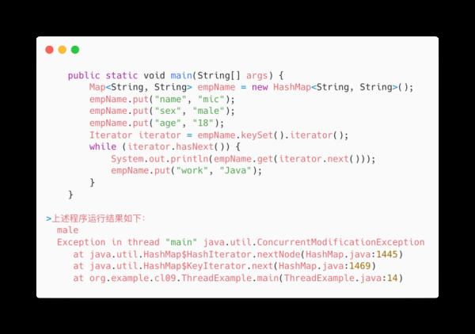

---

结尾
好的，fail-safe 和fail-fast 的作用，你理解了吗？
你们是否有更好的回答方式？欢迎在评论区给我留言！
本期的普通人VS 高手面试系列就到这里结束了，喜欢的朋友记得一键三连，加
个关注。
谈谈你对Seata 的理解
很多面试官都喜欢问一些“谈谈你对xxx 技术的理解”，
大家遇到这种问题时，是不是完全不知道从何说起，有同感小伙伴的call 1.
那么我们来看一下，普通人和高手是如何回答这个问题的？
普通人
Seata 是用来解决分布式事务问题的框架。是阿里开源的中间件。
跟着Mic学架构
学架构
ic学架构
跟着Mic学架构
跟着Mic学架构
跟着Mic
跟着Mic

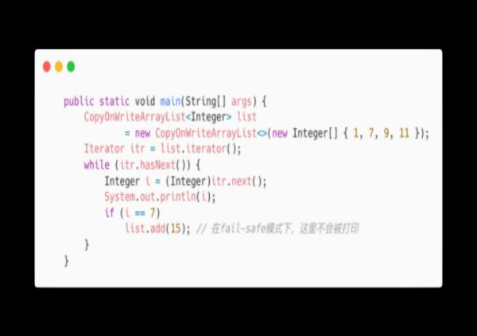

---

实际项目中我没有用过，我记得Seata 里面有几种事务模型，有一种AT 模式、
还有TCC 模式。
然后AT 是一种二阶段提交的事务，它是采用的最终一致性来实现数据的一致性。
高手
在微服务架构下，由于数据库和应用服务的拆分，导致原本一个事务单元中的多
个DML 操作，变成了跨进程或者跨数据库的多个事务单元的多个DML 操作，
而传统的数据库事务无法解决这类的问题，所以就引出了分布式事务的概念。
分布式事务本质上要解决的就是跨网络节点的多个事务的数据一致性问题，业内
常见的解决方法有两种
强一致性，就是所有的事务参与者要么全部成功，要么全部失败，全局事务协调
者需要知道每个事务参与者的执行状态，再根据状态来决定数据的提交或者回滚！
最终一致性，也叫弱一致性，也就是多个网络节点的数据允许出现不一致的情况，
但是在最终的某个时间点会达成数据一致。
基于CAP 定理我们可以知道，强一致性方案对于应用的性能和可用性会有影响，
所以对于数据一致性要求不高的场景，就会采用最终一致性算法。
在分布式事务的实现上，对于强一致性，我们可以通过基于XA 协议下的二阶段
提交来实现，对于弱一致性，可以基于TCC 事务模型、可靠性消息模型等方案
来实现。
市面上有很多针对这些理论模型实现的分布式事务框架，我们可以在应用中集成
这些框架来实现分布式事务。
而Seata 就是其中一种，它是阿里开源的分布式事务解决方案，提供了高性能
且简单易用的分布式事务服务。
Seata 中封装了四种分布式事务模式，分别是：
AT 模式，是一种基于本地事务+二阶段协议来实现的最终数据一致性方案，也是
Seata 默认的解决方案
跟着Mic学架构
学架构
ic学架构
跟着Mic学架构
跟着Mic学架构
跟着Mic
跟着Mic

---

TCC 模式，TCC 事务是Try、Confirm、Cancel 三个词语的缩写，简单理解就
是把一个完整的业务逻辑拆分成三个阶段，然后通过事务管理器在业务逻辑层面
根据每个分支事务的执行情况分别调用该业务的Confirm 或者Cacel 方法。
Saga 模式，Saga 模式是SEATA 提供的长事务解决方案，在Saga 模式中，业
务流程中每个参与者都提交本地事务，当出现某一个参与者失败则补偿前面已经
成功的参与者。
跟着Mic学架构
学架构
ic学架构
跟着Mic学架构
跟着Mic学架构
跟着Mic
跟着Mic

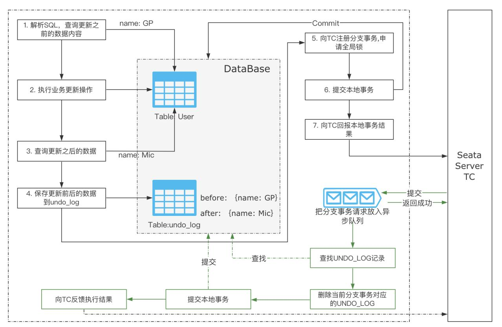

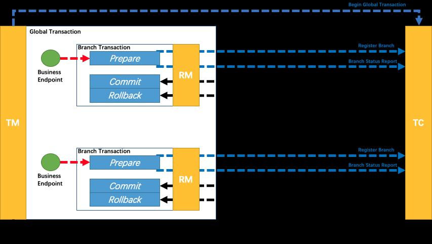

---

XA 模式，XA 可以认为是一种强一致性的事务解决方法，它利用事务资源（数
据库、消息服务等）对XA 协议的支持，以XA 协议的机制来管理分支事务的一
种事务模式。
跟着Mic学架构
学架构
ic学架构
跟着Mic学架构
跟着Mic学架构
跟着Mic
跟着Mic

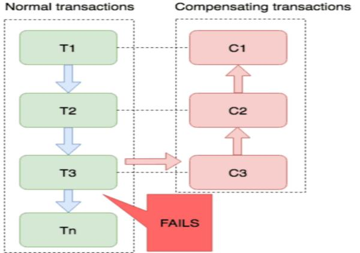

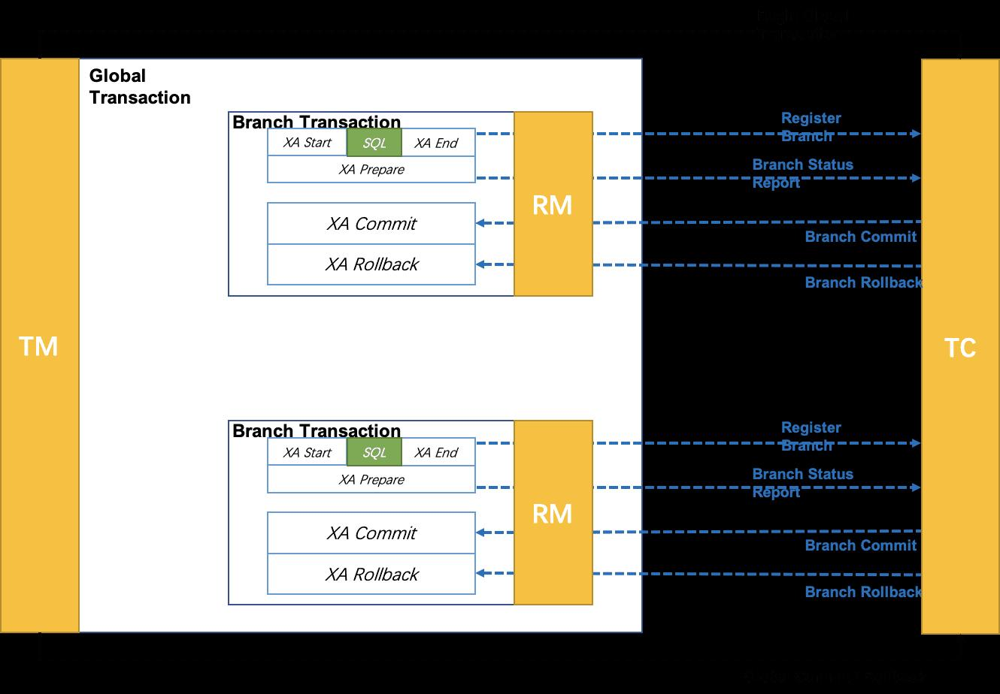

---

从这四种模型中不难看出，在不同的业务场景中，我们可以使用Seata 的不同
事务模型来解决不同业务场景中的分布式事务问题，因此我们可以认为Seata
是一个一站式的分布式事务解决方案。
结尾
屏幕前的小伙伴们，你是否通过高手的回答找到了这类问题的回答方式呢？
面试的时候遇到这种宽泛的问题时，先不用慌，首先自己要有一个回答的思路。
按照技术的话术，就是先给自己大脑中的知识建立一个索引，然后基于索引来定
位你的知识。
我对于这类问题，建立的索引一般有几个：
它是什么
它能解决什么问题
它有哪些特点和优势
它的核心原理，为什么能解决这类问题
大家对照这几个索引去回答今天的这个面试题，是不是就更清晰了？
好的，本期的普通人VS 高手面试系列就到这里结束了，喜欢的朋友记得一键三
连，加个关注，
我是Mic，一个工作了14 年的Java 程序员，咱们下期再见。
Spring Boot 的约定优于配置，你的理解
是什么？
对于Spring Boot 约定优于配置这个问题，看看普通人和高手是如何回答的？
普通人的回答
嗯，在Spring Boot 里面，通过约定优于配置这个思想，可以让我们少写很多的
配置，
然后就只需要关注业务代码的编写就行。嗯！
跟着Mic学架构
学架构
ic学架构
跟着Mic学架构
跟着Mic学架构
跟着Mic
跟着Mic

---

高手的回答
我从4 个点方面来回答。
首先，约定优于配置是一种软件设计的范式，它的核心思想是减少软件开发人员
对于配置项的维护，从而让开发人员更加聚焦在业务逻辑上。
Spring Boot 就是约定优于配置这一理念下的产物，它类似于Spring 框架下的一
个脚手架，通过Spring Boot，我们可以快速开发基于Spring 生态下的应用程序。
基于传统的Spring 框架开发web 应用，我们需要做很多和业务开发无关并且只
需要做一次的配置，比如
管理jar 包依赖
web.xml 维护
Dispatch-Servlet.xml 配置项维护
应用部署到Web 容器
第三方组件集成到Spring IOC 容器中的配置项维护
而在Spring Boot 中，我们不需要再去做这些繁琐的配置，Spring Boot 已经自
动帮我们完成了，这就是约定由于配置思想的体现。
Spring Boot 约定由于配置的体现有很多，比如
Spring Boot Starter 启动依赖，它能帮我们管理所有jar 包版本
如果当前应用依赖了spring mvc相关的jar，那么Spring Boot会自动内置Tomcat
容器来运行web 应用，我们不需要再去单独做应用部署。
Spring Boot 的自动装配机制的实现中，通过扫描约定路径下的spring.factories
文件来识别配置类，实现Bean 的自动装配。
默认加载的配置文件application.properties 等等。
总的来说，约定优于配置是一个比较常见的软件设计思想，它的核心本质都是为
了更高效以及更便捷的实现软件系统的开发和维护。
以上就是我对这个问题的理解。
结尾
跟着Mic学架构
学架构
ic学架构
跟着Mic学架构
跟着Mic学架构
跟着Mic
跟着Mic

---

好的，本期的普通人VS 高手面试系列就到这里结束了，对于这个问题，你知道
该怎么回答了吗？
另外，如果你有任何面试相关的疑问，欢迎评论区给我留言。
我是Mic，一个工作了14 年的Java 程序员，咱们下期再见。
滴滴二面：kafka 的零拷贝原理?
最近一个学员去滴滴面试，在第二面的时候遇到了这个问题：
”请你简单说一下Kafka 的零拷贝原理“
然后那个学员努力在大脑里检索了很久，没有回答上来。
那么今天，我们基于这个问题来看看，普通人和高手是如何回答的！
普通人的回答
零拷贝是一种减少数据拷贝的机制，能够有效提升数据的效率
高手的回答
在实际应用中，如果我们需要把磁盘中的某个文件内容发送到远程服务器上，
那么它必须要经过几个拷贝的过程，。
从磁盘中读取目标文件内容拷贝到内核缓冲区
CPU 控制器再把内核缓冲区的数据赋值到用户空间的缓冲区中
接着在应用程序中，调用write()方法，把用户空间缓冲区中的数据拷贝到内核下
的Socket Buffer 中。
最后，把在内核模式下的SocketBuffer 中的数据赋值到网卡缓冲区（NIC Buffer)
网卡缓冲区再把数据传输到目标服务器上。
跟着Mic学架构
学架构
ic学架构
跟着Mic学架构
跟着Mic学架构
跟着Mic
跟着Mic

---

在这个过程中我们可以发现，数据从磁盘到最终发送出去，要经历4 次拷贝，而
在这四次拷贝过程中，有两次拷贝是浪费的，分别是：
从内核空间赋值到用户空间
从用户空间再次复制到内核空间
除此之外，由于用户空间和内核空间的切换会带来CPU的上线文切换，对于CPU
性能也会造成性能影响。
而零拷贝，就是把这两次多于的拷贝省略掉，应用程序可以直接把磁盘中的数据
从内核中直接传输给Socket，而不需要再经过应用程序所在的用户空间，如下
图所示。
零拷贝通过DMA（Direct Memory Access）技术把文件内容复制到内核空间中
的Read Buffer，
接着把包含数据位置和长度信息的文件描述符加载到Socket Buffer 中，DMA 引
擎直接可以把数据从内核空间中传递给网卡设备。
在这个流程中，数据只经历了两次拷贝就发送到了网卡中，并且减少了2 次cpu
的上下文切换，对于效率有非常大的提高。
跟着Mic学架构
学架构
ic学架构
跟着Mic学架构
跟着Mic学架构
跟着Mic
跟着Mic

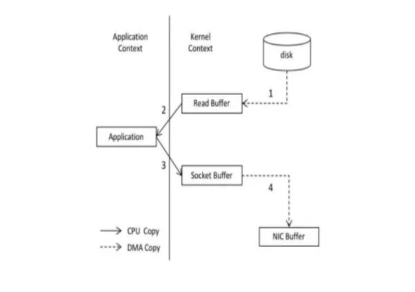

---

所以，所谓零拷贝，并不是完全没有数据赋值，只是相对于用户空间来说，不再
需要进行数据拷贝。对于前面说的整个流程来说，零拷贝只是减少了不必要的拷
贝次数而已。
在程序中如何实现零拷贝呢？
在Linux 中，零拷贝技术依赖于底层的sendfile()方法实现
在Java 中，FileChannal.transferTo()方法的底层实现就是sendfile()方法。
除此之外，还有一个mmap 的文件映射机制
它的原理是：将磁盘文件映射到内存,用户通过修改内存就能修改磁盘文件。使
用这种方式可以获取很大的I/O 提升，省去了用户空间到内核空间复制的开销。
以上就是我对于Kafka 中零拷贝原理的理解
结尾
好的，本期的普通人VS 高手面试系列就到这里结束了。
本次的面试题涉及到一些计算机底层的原理，基本上也是业务程序员的知识盲区。
跟着Mic学架构
学架构
ic学架构
跟着Mic学架构
跟着Mic学架构
跟着Mic
跟着Mic

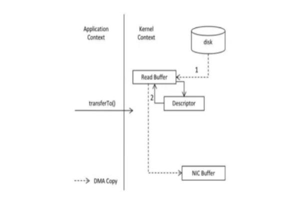

---

但我想提醒大家，做开发其实和建房子一样，要想楼层更高更稳，首先地基要打
牢固。
另外，如果你有任何面试相关的疑问，欢迎评论区给我留言。
我是Mic，一个工作了14 年的Java 程序员，咱们下期再见。
innoDB 如何解决幻读
前天有个去快手面试的小伙伴私信我，他遇到了这样一个问题：“InnoDB 如何解
决幻读”？
这个问题确实不是很好回答，在实际应用中，很多同学几乎都不关注数据库的事
务隔离性。
所有问题基本就是CRUD，一把梭~
那么今天，我们看一下关于“InnoDB 如何解决幻读”这个问题，普通人和高手的
回答！
普通人
嗯，我印象中，幻读是通过MVCC 机制来解决的，嗯....
MVCC 类似于一种乐观锁的机制，通过版本的方式来区分不同的并发事务，避
免幻读问题！
高手
我会从三个方面来回答：
1、Mysql 的事务隔离级别
Mysql 有四种事务隔离级别，这四种隔离级别代表当存在多个事务并发冲突时，
可能出现的脏读、不可重复读、幻读的问题。
其中InnoDB 在RR 的隔离级别下，解决了幻读的问题。
跟着Mic学架构
学架构
ic学架构
跟着Mic学架构
跟着Mic学架构
跟着Mic
跟着Mic

---

2、什么是幻读？
那么，什么是幻读呢？
幻读是指在同一个事务中，前后两次查询相同的范围时，得到的结果不一致
第一个事务里面我们执行了一个范围查询，这个时候满足条件的数据只有一条
第二个事务里面，它插入了一行数据，并且提交了
接着第一个事务再去查询的时候，得到的结果比第一查询的结果多出来了一条数
据。
跟着Mic学架构
学架构
ic学架构
跟着Mic学架构
跟着Mic学架构
跟着Mic
跟着Mic

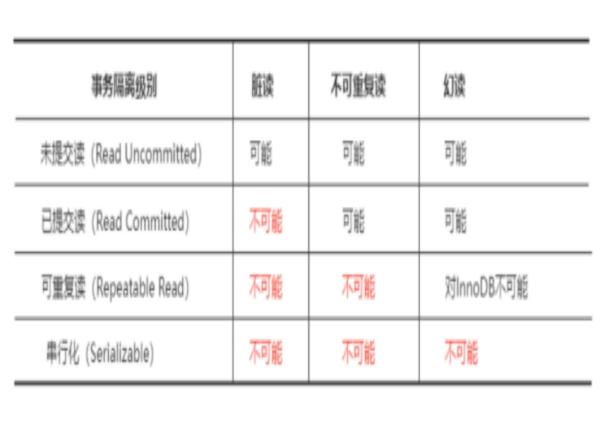

---

所以，幻读会带来数据一致性问题。
3、InnoDB 如何解决幻读的问题
InnoDB 引入了间隙锁和next-key Lock 机制来解决幻读问题，为了更清晰的说
明这两种锁，我举一个例子：
假设现在存在这样这样一个B+Tree 的索引结构，这个结构中有四个索引元素分
别是：1、4、7、10。
跟着Mic学架构
学架构
ic学架构
跟着Mic学架构
跟着Mic学架构
跟着Mic
跟着Mic

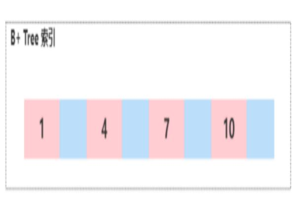

---

当我们通过主键索引查询一条记录，并且对这条记录通过for update 加锁
这个时候，会产生一个记录锁，也就是行锁，锁定id=1 这个索引。
跟着Mic学架构
学架构
ic学架构
跟着Mic学架构
跟着Mic学架构
跟着Mic
跟着Mic

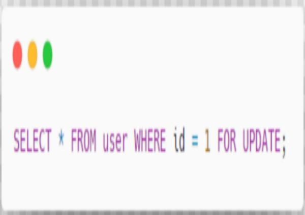

---

被锁定的记录在锁释放之前，其他事务无法对这条记录做任何操作。
前面我说过对幻读的定义：幻读是指在同一个事务中，前后两次查询相同的范围
时，得到的结果不一致！
注意，这里强调的是范围查询，
也就是说，InnoDB 引擎要解决幻读问题，必须要保证一个点，就是如果一个事
务通过这样一条语句进行锁定时。
跟着Mic学架构
学架构
ic学架构
跟着Mic学架构
跟着Mic学架构
跟着Mic
跟着Mic

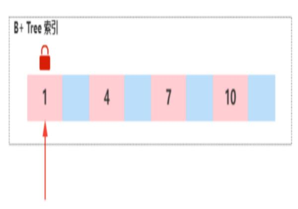

---

另外一个事务再执行这样一条insert 语句，需要被阻塞，直到前面获得锁的事务
释放。
跟着Mic学架构
学架构
ic学架构
跟着Mic学架构
跟着Mic学架构
跟着Mic
跟着Mic

---

所以，在InnoDB 中设计了一种间隙锁，它的主要功能是锁定一段范围内的索引
记录
当对查询范围id>4 and id<7 加锁的时候，会针对B+树中（4，7）这个开区间范
围的索引加间隙锁。
意味着在这种情况下，其他事务对这个区间的数据进行插入、更新、删除都会被
锁住。
跟着Mic学架构
学架构
ic学架构
跟着Mic学架构
跟着Mic学架构
跟着Mic
跟着Mic

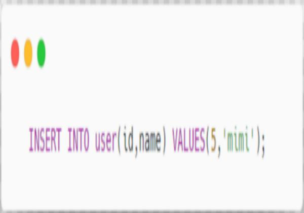

---

但是，还有另外一种情况，比如像这样
跟着Mic学架构
学架构
ic学架构
跟着Mic学架构
跟着Mic学架构
跟着Mic
跟着Mic

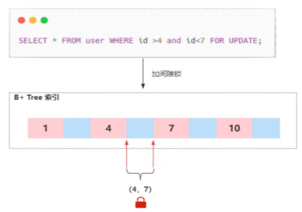

---

这条查询语句是针对id>4 这个条件加锁，那么它需要锁定多个索引区间，所以
在这种情况下InnoDB 引入了next-key Lock 机制。
next-key Lock 相当于间隙锁和记录锁的合集，记录锁锁定存在的记录行，间隙
锁锁住记录行之间的间隙，而next-key Lock 锁住的是两者之和。
每个数据行上的非唯一索引列上都会存在一把next-key lock，当某个事务持有该数
据行的next-key lock 时，会锁住一段左开右闭区间的数据。
因此，当通过id>4 这样一种范围查询加锁时，会加next-key Lock，锁定的区间
范围是：(4,7],(7,10],(10,+∞]
跟着Mic学架构
学架构
ic学架构
跟着Mic学架构
跟着Mic学架构
跟着Mic
跟着Mic

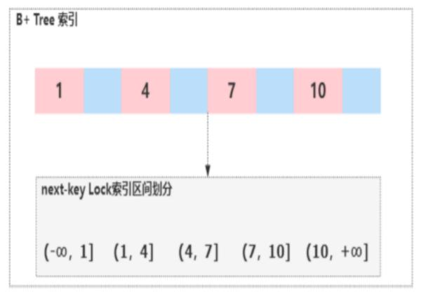

---

间隙锁和next-key Lock 的区别在于加锁的范围，间隙锁只锁定两个索引之间的
引用间隙，而next-key Lock 会锁定多个索引区间，它包含记录锁和间隙锁。
当我们使用了范围查询，不仅仅命中了Record 记录，还包含了Gap 间隙，在
这种情况下我们使用的就是临键锁，它是MySQL 里面默认的行锁算法。
4、总结
虽然InnoDB 中通过间隙锁的方式解决了幻读问题，但是加锁之后一定会影响到
并发性能，因此，如果对性能要求较高的业务场景中，可以把隔离级别设置成
RC，这个级别中不存在间隙锁。
以上就是我对于innoDB 如何解决幻读问题的理解！
结尾
好的，通过这个面试题可以发现，大厂面试对于基本功的考察还是比较严格的。
不过，不管是为了应付面试，还是为以后的职业规划做铺垫，技术能力的高低都
是你在这个行业的核心竞争力。
本期的普通人VS 高手面试系列的视频就到这里结束了，
我是Mic，一个工作了14 年的Java 程序员，咱们下期再见。
跟着Mic学架构
学架构
ic学架构
跟着Mic学架构
跟着Mic学架构
跟着Mic
跟着Mic

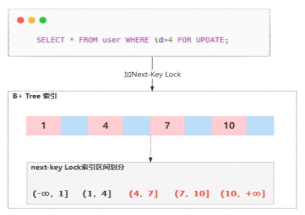

---

CPU 飙高系统反应慢怎么排查？
面试过程中，场景类的问题更容易检测出一个开发人员的基本能力。
这不，一个小伙伴去阿里面试，第一面就遇到了关于“CPU 飙高系统反应慢怎么
排查”的问题？
对于这个问题，我们来看看普通人和高手的回答！
普通人
嗯，CPU 飙高的原因可能是线程创建过多导致的
高手
好的，关于这个问题，我从四个方面来回答。
CPU 是整个电脑的核心计算资源，对于一个应用进程来说，CPU 的最小执行单
元是线程。
导致CPU 飙高的原因有几个方面
CPU 上下文切换过多，对于CPU 来说，同一时刻下每个CPU 核心只能运行一
个线程，如果有多个线程要执行，CPU 只能通过上下文切换的方式来执行不同
的线程。上下文切换需要做两个事情
保存运行线程的执行状态
让处于等待中的线程执行
这两个过程需要CPU 执行内核相关指令实现状态保存，如果较多的上下文切换
会占据大量CPU 资源，从而使得cpu 无法去执行用户进程中的指令，导致响应
速度下降。
在Java 中，文件IO、网络IO、锁等待、线程阻塞等操作都会造成线程阻塞从
而触发上下文切换
CPU 资源过度消耗，也就是在程序中创建了大量的线程，或者有线程一直占用
CPU 资源无法被释放，比如死循环！
CPU 利用率过高之后，导致应用中的线程无法获得CPU 的调度，从而影响程序
的执行效率！
跟着Mic学架构
学架构
ic学架构
跟着Mic学架构
跟着Mic学架构
跟着Mic
跟着Mic

---

既然是这两个问题导致的CPU 利用率较高，于是我们可以通过top 命令，找到
CPU 利用率较高的进程，在通过Shift+H 找到进程中CPU 消耗过高的线程，这
里有两种情况。
CPU 利用率过高的线程一直是同一个，说明程序中存在线程长期占用CPU 没有
释放的情况，这种情况直接通过jstack 获得线程的Dump 日志，定位到线程日
志后就可以找到问题的代码。
CPU 利用率过高的线程id 不断变化，说明线程创建过多，需要挑选几个线程id，
通过jstack 去线程dump 日志中排查。
最后有可能定位的结果是程序正常，只是在CPU 飙高的那一刻，用户访问量较
大，导致系统资源不够。
以上就是我对这个问题的理解！
结尾
从这个问题来看，面试官主要考察实操能力，以及解决问题的思路。
如果你没有实操过，但是你知道导致CPU 飙高这个现象的原因，并说出你的解
决思路，通过面试是没问题的。
好的，本期的普通人VS 高手面试系列的视频就到这里结束了，
如果你在面试的时候遇到了一些比较刁钻也奇葩的问题，欢迎在评论区给我留言，
我是Mic。
我是Mic，一个工作了14 年的Java 程序员，咱们下期再见。
lock 和synchronized 区别
今天来分享一道阿里一面的面试题，“lock 和synchronized 的区别”。
对于这个问题，看看普通人和高手的回答！
普通人
嗯，lock 是J.U.C 包里面提供的锁，synchronized 是Java 中的同步关键字。
他们都可以实现多线程对共享资源访问的线程安全性。
跟着Mic学架构
学架构
ic学架构
跟着Mic学架构
跟着Mic学架构
跟着Mic
跟着Mic

---

高手
下面我从3 个方面来回答
从功能角度来看，Lock 和Synchronized 都是Java 中用来解决线程安全问题的
工具。
从特性来看，
Synchronized 是Java 中的同步关键字，Lock 是J.U.C 包中提供的接口，这个
接口有很多实现类，其中就包括ReentrantLock 重入锁
Synchronized 可以通过两种方式来控制锁的粒度，
一种是把synchronized 关键字修饰在方法层面，
另一种是修饰在代码块上，并且我们可以通过Synchronized 加锁对象的声明周
期来控制锁的作用范围，比如锁对象是静态对象或者类对象，那么这个锁就是全
局锁。
如果锁对象是普通实例对象，那这个锁的范围取决于这个实例的声明周期。
跟着Mic学架构
学架构
ic学架构
跟着Mic学架构
跟着Mic学架构
跟着Mic
跟着Mic

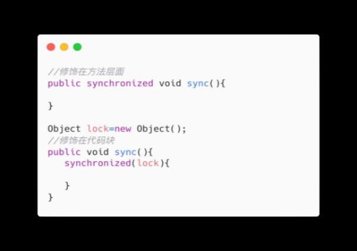

---

Lock 锁的粒度是通过它里面提供的lock()和unlock()方法决定的，包裹在这两个
方法之间的代码能够保证线程安全性。而锁的作用域取决于Lock 实例的生命周
期。
Lock 比Synchronized 的灵活性更高，Lock 可以自主决定什么时候加锁，什么
时候释放锁，只需要调用lock()和unlock()这两个方法就行，同时Lock 还提供了
非阻塞的竞争锁方法tryLock()方法，这个方法通过返回true/false 来告诉当前线
程是否已经有其他线程正在使用锁。
Synchronized 由于是关键字，所以它无法实现非阻塞竞争锁的方法，另外，
Synchronized 锁的释放是被动的，就是当Synchronized 同步代码块执行完以后
或者代码出现异常时才会释放。
Lock 提供了公平锁和非公平锁的机制，公平锁是指线程竞争锁资源时，如果已
经有其他线程正在排队等待锁释放，那么当前竞争锁资源的线程无法插队。而非
公平锁，就是不管是否有线程在排队等待锁，它都会尝试去竞争一次锁。
Synchronized 只提供了一种非公平锁的实现。
跟着Mic学架构
学架构
ic学架构
跟着Mic学架构
跟着Mic学架构
跟着Mic
跟着Mic

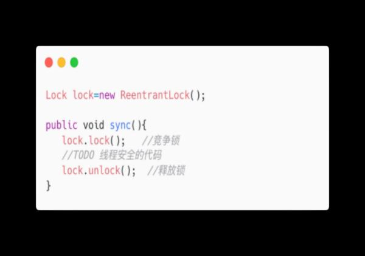

---

从性能方面来看，Synchronized 和Lock 在性能方面相差不大，在实现上会有一
些区别，Synchronized 引入了偏向锁、轻量级锁、重量级锁以及锁升级的方式
来优化加锁的性能，而Lock 中则用到了自旋锁的方式来实现性能优化。
以上就是我对于这个问题的理解。
结尾
这个问题主要是考察求职责对并发基础能力的掌握。
在实际应用中，线程以及线程安全性是非常重要和常见的功能，对于这部分内容
如果理解不够深刻，很容易造成生产级别的故障。
好的，本期的普通人VS 高手面试系列的视频就到这里结束了，喜欢的朋友记得
点赞收藏。
如果在面试过程中遇到了比较刁钻和奇葩的问题，欢迎评论区给我留言！
我是Mic，一个工作了14 年的Java 程序员，咱们下期再见。
线程池如何知道一个线程的任务已经执
行完成
一个小伙伴私信了一个小米的面试题，问题是：“线程池如何知道一个线程的任
务已经执行完成”？
说实话，这个问题确实很刁钻，毕竟像很多工作5 年多的小伙伴，连线程池都没
用过，怎么可能回答出来这个问题呢？
下面我们来看看普通人和高手遇到这个问题的回答思路。
普通人
嗯..
高手
好的，我会从两个方面来回答。
在线程池内部，当我们把一个任务丢给线程池去执行，线程池会调度工作线程来
执行这个任务的run 方法，run 方法正常结束，也就意味着任务完成了。
跟着Mic学架构
学架构
ic学架构
跟着Mic学架构
跟着Mic学架构
跟着Mic
跟着Mic

---

所以线程池中的工作线程是通过同步调用任务的run()方法并且等待run 方法返
回后，再去统计任务的完成数量。
如果想在线程池外部去获得线程池内部任务的执行状态，有几种方法可以实现。
线程池提供了一个isTerminated()方法，可以判断线程池的运行状态，我们可以循
环判断isTerminated()方法的返回结果来了解线程池的运行状态，一旦线程池的运
行状态是Terminated，意味着线程池中的所有任务都已经执行完了。想要通过这
个方法获取状态的前提是，程序中主动调用了线程池的shutdown()方法。在实际
业务中，一般不会主动去关闭线程池，因此这个方法在实用性和灵活性方面都不
是很好。
在线程池中，有一个submit()方法，它提供了一个Future 的返回值，我们通过
Future.get()方法来获得任务的执行结果，当线程池中的任务没执行完之前，
future.get()方法会一直阻塞，直到任务执行结束。因此，只要future.get()方法正常
返回，也就意味着传入到线程池中的任务已经执行完成了！
可以引入一个CountDownLatch 计数器，它可以通过初始化指定一个计数器进
行倒计时，其中有两个方法分别是await()阻塞线程，以及countDown()进行倒计
时，一旦倒计时归零，所以被阻塞在await()方法的线程都会被释放。
基于这样的原理，我们可以定义一个CountDownLatch 对象并且计数器为1，接
着在线程池代码块后面调用await()方法阻塞主线程，然后，当传入到线程池中的
任务执行完成后，调用countDown()方法表示任务执行结束。
最后，计数器归零0，唤醒阻塞在await()方法的线程。
跟着Mic学架构
学架构
ic学架构
跟着Mic学架构
跟着Mic学架构
跟着Mic
跟着Mic

---

基于这个问题，我简单总结一下，不管是线程池内部还是外部，要想知道线程是
否执行结束，我们必须要获取线程执行结束后的状态，而线程本身没有返回值，
所以只能通过阻塞-唤醒的方式来实现，future.get 和CountDownLatch 都是这样
一个原理。
结尾
大家可以站在面试官的角度来看高手的回答，
不难发现，高手对于技术基础的掌握程度，是非常深和全面的。这也是面试官考
察这类问题的目的。
因此，Mic 提醒大家，除了日常的CRUD 以外，抽出部分时间去做技术深度和
广度的学习是非常有必要的。
HashMap 是怎么解决哈希冲突的？
常用数据结构基本上是面试必问的问题，比如HashMap 、LinkList 、
ConcurrentHashMap 等。
关于HashMap，有个学员私信了我一个面试题说：“HashMap 是怎么解决哈希
冲突的？”
关于这个问题，我们来模拟一下普通人和高手对于这个问题的回答。
跟着Mic学架构
学架构
ic学架构
跟着Mic学架构
跟着Mic学架构
跟着Mic
跟着Mic

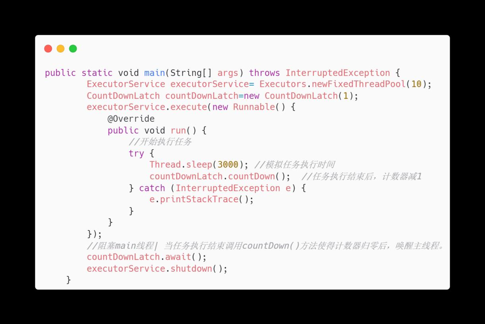

---

普通人
嗯....HashMap 我好久之前看过它的源码，我记得好像是通过链表来解决的！
高手
嗯，这个问题我从三个方面来回答。
要了解Hash 冲突，那首先我们要先了解Hash 算法和Hash 表。
Hash 算法，就是把任意长度的输入，通过散列算法，变成固定长度的输出，这
个输出结果是散列值。
Hash 表又叫做“散列表”，它是通过key 直接访问在内存存储位置的数据结构，
在具体实现上，我们通过hash 函数把key 映射到表中的某个位置，来获取这个
位置的数据，从而加快查找速度。
所谓hash 冲突，是由于哈希算法被计算的数据是无限的，而计算后的结果范围
有限，所以总会存在不同的数据经过计算后得到的值相同，这就是哈希冲突。
通常解决hash 冲突的方法有4 种。
跟着Mic学架构
学架构
ic学架构
跟着Mic学架构
跟着Mic学架构
跟着Mic
跟着Mic

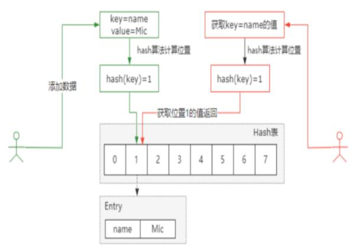

---

开放定址法，也称为线性探测法，就是从发生冲突的那个位置开始，按照一定的
次序从hash 表中找到一个空闲的位置，然后把发生冲突的元素存入到这个空闲
位置中。ThreadLocal 就用到了线性探测法来解决hash 冲突的。
向这样一种情况，在hash 表索引1 的位置存了一个key=name，当再次添加
key=hobby 时，hash 计算得到的索引也是1，这个就是hash 冲突。而开放定址
法，就是按顺序向前找到一个空闲的位置来存储冲突的key。
链式寻址法，这是一种非常常见的方法，简单理解就是把存在hash 冲突的key，
以单向链表的方式来存储，比如HashMap 就是采用链式寻址法来实现的。
向这样一种情况，存在冲突的key 直接以单向链表的方式进行存储。
跟着Mic学架构
学架构
ic学架构
跟着Mic学架构
跟着Mic学架构
跟着Mic
跟着Mic

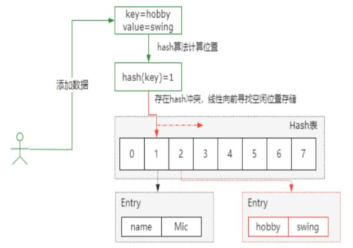

---

再hash 法，就是当通过某个hash 函数计算的key 存在冲突时，再用另外一个
hash 函数对这个key 做hash，一直运算直到不再产生冲突。这种方式会增加计
算时间，性能影响较大。
建立公共溢出区，就是把hash 表分为基本表和溢出表两个部分，凡事存在冲突
的元素，一律放入到溢出表中。
HashMap 在JDK1.8 版本中，通过链式寻址法+红黑树的方式来解决hash 冲突
问题，其中红黑树是为了优化Hash 表链表过长导致时间复杂度增加的问题。当
链表长度大于8 并且hash 表的容量大于64 的时候，再向链表中添加元素就会
触发转化。
以上就是我对这个问题的理解！
结尾
这道面试题主要考察Java 基础，面向的范围是工作1 到5 年甚至5 年以上。
因为集合类的对象在项目中使用频率较高，如果对集合理解不够深刻，容易在项
目中制造隐藏的BUG。
所以，再强调一下，面试的时候，基础是很重要的考核项！！
跟着Mic学架构
学架构
ic学架构
跟着Mic学架构
跟着Mic学架构
跟着Mic
跟着Mic

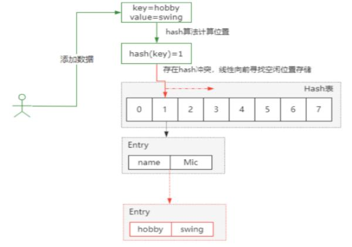

---

什么叫做阻塞队列的有界和无界
昨天一个3 年Java 经验的小伙伴私信我，他说现在面试怎么这么难啊！
我只是面试一个业务开发，他们竟然问我：什么叫阻塞队列的有界和无界。现在
面试也太卷了吧!
如果你也遇到过类似问题，那我们来看看普通人和高手的回答吧！
普通人
有界队列就是说队列中的元素个数是有限制的，而无界对接表示队列中的元素个
数没有限制！嗯！！！
高手
，阻塞队列，是一种特殊的队列，它在普通队列的基础上提供了两个附加功能
当队列为空的时候，获取队列中元素的消费者线程会被阻塞，同时唤醒生产者线
程。
当队列满了的时候，向队列中添加元素的生产者线程被阻塞，同时唤醒消费者线
程。
跟着Mic学架构
学架构
ic学架构
跟着Mic学架构
跟着Mic学架构
跟着Mic
跟着Mic

---

其中，阻塞队列中能够容纳的元素个数，通常情况下是有界的，比如我们实例化
一个ArrayBlockingList，可以在构造方法中传入一个整形的数字，表示这个基于
数组的阻塞队列中能够容纳的元素个数。这种就是有界队列。
而无界队列，就是没有设置固定大小的队列，不过它并不是像我们理解的那种元
素没有任何限制，而是它的元素存储量很大，像LinkedBlockingQueue，它的默
认队列长度是Integer.Max_Value，所以我们感知不到它的长度限制。
无界队列存在比较大的潜在风险，如果在并发量较大的情况下，线程池中可以几
乎无限制的添加任务，容易导致内存溢出的问题！
以上就是我对这个问题的理解!
结尾
阻塞队列在生产者消费者模型的场景中使用频率比较高，比较典型的就是在线程
池中，通过阻塞队列来实现线程任务的生产和消费功能。
基于阻塞队列实现的生产者消费者模型比较适合用在异步化性能提升的场景，以
及做并发流量缓冲类的场景中！
跟着Mic学架构
学架构
ic学架构
跟着Mic学架构
跟着Mic学架构
跟着Mic
跟着Mic

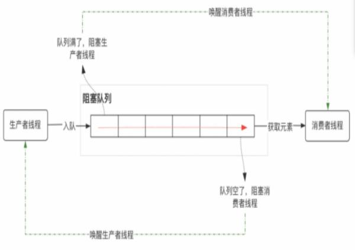

---

在很多开源中间件中都可以看到这种模型的使用，比如在Zookeeper 源码中就
大量用到了阻塞队列实现的生产者消费者模型。
OK，本期的普通人VS 高手面试系列的视频就到这里结束了，喜欢的朋友记得
点赞收藏。
我是Mic，一个工作了14 年的Java 程序员，咱们下期再见。
Dubbo 的服务请求失败怎么处理？
今天分享的面试题，几乎是90%以上的互联网公司都会问到的问题。
“Dubbo 的服务请求失败怎么处理”？
对于这个问题，我们来看一下普通人和高手的回答。
普通人
嗯…我记得，Dubbo 请求处理失败以后，好像是会重试。嗯！
高手
Dubbo 是一个RPC 框架，它为我们的应用提供了远程通信能力的封装，同时，
Dubbo 在RPC 通信的基础上，逐步在向一个生态在演进，它涵盖了服务注册、
动态路由、容错、服务降级、负载均衡等能力，基本上在微服务架构下面临的问
题，Dubbo 都可以解决。
而对于Dubbo 服务请求失败的场景，默认提供了重试的容错机制，也就是说，
如果基于Dubbo 进行服务间通信出现异常，服务消费者会对服务提供者集群中
其他的节点发起重试，确保这次请求成功，默认的额外重试次数是2 次。
除此之外，Dubbo 还提供了更多的容错策略，我们可以根据不同的业务场景来
进行选择。
快速失败策略，服务消费者只发起一次请求，如果请求失败，就直接把错误抛出
去。这种比较适合在非幂等性场景中使用
失败安全策略，如果出现服务通信异常，直接把这个异常吞掉不做任何处理
失败自动恢复策略，后台记录失败请求，然后通过定时任务来对这个失败的请求
进行重发。
并行调用多个服务策略，就是把这个消息广播给服务提供者集群，只要有任何一
个节点返回，就表示请求执行成功。
跟着Mic学架构
学架构
ic学架构
跟着Mic学架构
跟着Mic学架构
跟着Mic
跟着Mic

---

广播调用策略，逐个调用服务提供者集群，只要集群中任何一个节点出现异常，
就表示本次请求失败
要注意的是，默认基于重试策略的容错机制中，需要注意幂等性的处理，否则在
事务型的操作中，容易出现多次数据变更的问题。
以上就是我对这个问题的理解！
结尾
这类的问题，并不需要去花太多时间去背，如果你对于整个技术体系有一定的了
解，你就很容易想象到最基本的处理方式。
即便是你对Dubbo 不熟悉，也能回答一两种！
OK，本期的普通人VS 高手面试系列的视频就到这里结束了，喜欢的朋友记得
点赞收藏。
另外，我也陆续收到了很多小伙伴的面试题，我会在后续的内容中逐步更新给到
大家！
我是Mic，一个工作了14 年的Java 程序员，咱们下期再见。
ConcurrentHashMap 底层具体实现知
道吗？实现原理是什么？
之前分享过一期HashMap 的面试题，然后有个小伙伴私信我说，他遇到了一个
ConcurrentHashMap 的问题不知道怎么回答。
于是，就有了这一期的内容！！
我是Mic ，一个工作了14 年的Java 程序员，今天我来分享关
于”ConcurrentHashMap 底层实现原理“这个问题，
看看普通人和高手是如何回答的！
普通人
嗯..ConcurrentHashMap 是用数组和链表的方式来实现的，嗯…在JDK1.8 里面
还引入了红黑树。
然后链表和红黑树是解决hash 冲突的。嗯……
跟着Mic学架构
学架构
ic学架构
跟着Mic学架构
跟着Mic学架构
跟着Mic
跟着Mic

---

高手
这个问题我从这三个方面来回答：
ConcurrentHashMap 的整体架构
ConcurrentHashMap 的基本功能
ConcurrentHashMap 在性能方面的优化
ConcurrentHashMap 的整体架构
这个是ConcurrentHashMap 在JDK1.8 中的存储结构，它是由数组、单向链表、
红黑树组成。
当我们初始化一个ConcurrentHashMap 实例时，默认会初始化一个长度为16
的数组。由于ConcurrentHashMap 它的核心仍然是hash 表，所以必然会存在
hash 冲突问题。
ConcurrentHashMap 采用链式寻址法来解决hash 冲突。
当hash 冲突比较多的时候，会造成链表长度较长，这种情况会使得
ConcurrentHashMap 中数据元素的查询复杂度变成O(~n~)。因此在JDK1.8 中，
引入了红黑树的机制。
当数组长度大于64 并且链表长度大于等于8 的时候，单项链表就会转换为红黑
树。
另外，随着ConcurrentHashMap 的动态扩容，一旦链表长度小于8，红黑树会
退化成单向链表。
跟着Mic学架构
学架构
ic学架构
跟着Mic学架构
跟着Mic学架构
跟着Mic
跟着Mic

---

ConcurrentHashMap 的基本功能
ConcurrentHashMap 本质上是一个HashMap，因此功能和HashMap 一样，但
是ConcurrentHashMap 在HashMap 的基础上，提供了并发安全的实现。
并发安全的主要实现是通过对指定的Node 节点加锁，来保证数据更新的安全性。
跟着Mic学架构
学架构
ic学架构
跟着Mic学架构
跟着Mic学架构
跟着Mic
跟着Mic

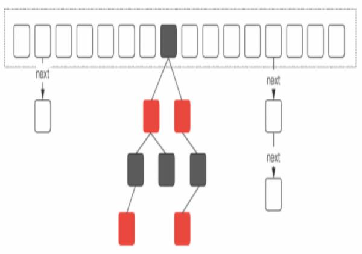

---

ConcurrentHashMap 在性能方面做的优化
如果在并发性能和数据安全性之间做好平衡，在很多地方都有类似的设计，比如
cpu 的三级缓存、mysql 的buffer_pool、Synchronized 的锁升级等等。
ConcurrentHashMap 也做了类似的优化，主要体现在以下几个方面：
在JDK1.8 中，ConcurrentHashMap 锁的粒度是数组中的某一个节点，而在
JDK1.7，锁定的是Segment，锁的范围要更大，因此性能上会更低。
引入红黑树，降低了数据查询的时间复杂度，红黑树的时间复杂度是O(~logn~)。
当数组长度不够时，ConcurrentHashMap 需要对数组进行扩容，在扩容的实现
上，ConcurrentHashMap 引入了多线程并发扩容的机制，简单来说就是多个线
程对原始数组进行分片后，每个线程负责一个分片的数据迁移，从而提升了扩容
过程中数据迁移的效率。
跟着Mic学架构
学架构
ic学架构
跟着Mic学架构
跟着Mic学架构
跟着Mic
跟着Mic

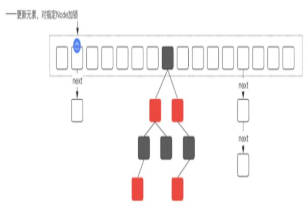

---

ConcurrentHashMap 中有一个size()方法来获取总的元素个数，而在多线程并
发场景中，在保证原子性的前提下来实现元素个数的累加，性能是非常低的。
ConcurrentHashMap 在这个方面的优化主要体现在两个点：
当线程竞争不激烈时，直接采用CAS 来实现元素个数的原子递增。
如果线程竞争激烈，使用一个数组来维护元素个数，如果要增加总的元素个数，
则直接从数组中随机选择一个，再通过CAS 实现原子递增。它的核心思想是引
入了数组来实现对并发更新的负载。
跟着Mic学架构
学架构
ic学架构
跟着Mic学架构
跟着Mic学架构
跟着Mic
跟着Mic

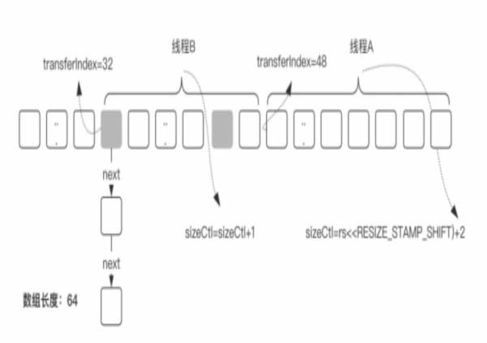

---

以上就是我对这个问题的理解！
结尾
从高手的回答中可以看到，ConcurrentHashMap 里面有很多设计思想值得学习
和借鉴。
比如锁粒度控制、分段锁的设计等，它们都可以应用在实际业务场景中。
很多时候大家会认为这种面试题毫无价值，当你有足够的积累之后，你会发现从
这些技术底层的设计思想中能够获得
很多设计思路。
b 树和b+树的理解
数据结构与算法问题，困扰了无数的小伙伴。
很多小伙伴对数据结构与算法的认知有一个误区，认为工作中没有用到，为什么
面试要问，问了能解决实际问题？
图灵奖获得者：Niklaus Wirth 说过：程序=数据结构+算法，也就说我们无时无
刻都在和数据结构打交道。
跟着Mic学架构
学架构
ic学架构
跟着Mic学架构
跟着Mic学架构
跟着Mic
跟着Mic

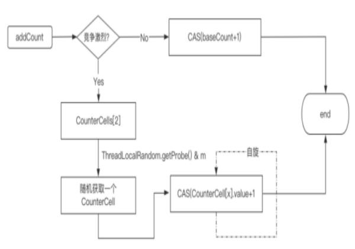

---

只是作为Java 开发，由于技术体系的成熟度较高，使得大部分人认为：程序应
该等于框架+SQL 呀？
今天我们就来分析一道数据结构的题目：”B 树和B+树“。
关于这个问题，我们来看看普通人和高手的回答！
普通人
嗯.我想想…嗯…Mysql 里面好像是用了B+树来做索引的！然后…
高手
为了更清晰的解答这个问题，我打算从三个方面来回答：
了解二叉树、AVL 树、B 树的概念
B 树和B+树的应用场景
B 树是一种多路平衡查找树，为了更形象的理解。
二叉树，每个节点支持两个分支的树结构，相比于单向链表，多了一个分支。
二叉查找树，在二叉树的基础上增加了一个规则，左子树的所有节点的值都小于
它的根节点，右子树的所有子节点都大于它的根节点。
跟着Mic学架构
学架构
ic学架构
跟着Mic学架构
跟着Mic学架构
跟着Mic
跟着Mic

---

，二叉查找树会出现斜树问题，导致时间复杂度增加，因此又引入了一种平衡二
叉树，它具有二叉查找树的所有特点，同时增加了一个规则：”它的左右两个子
树的高度差的绝对值不超过1“。平衡二叉树会采用左旋、右旋的方式来实现平
衡。
跟着Mic学架构
学架构
ic学架构
跟着Mic学架构
跟着Mic学架构
跟着Mic
跟着Mic

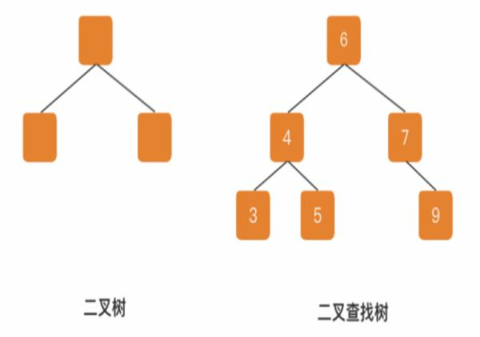

---

，而B 树是一种多路平衡查找树，它满足平衡二叉树的规则，但是它可以有多
个子树，子树的数量取决于关键字的数量，比如这个图中根节点有两个关键字3
和5，那么它能够拥有的子路数量=关键字数+1。
因此从这个特征来看，在存储同样数据量的情况下，平衡二叉树的高度要大于B
树。
跟着Mic学架构
学架构
ic学架构
跟着Mic学架构
跟着Mic学架构
跟着Mic
跟着Mic

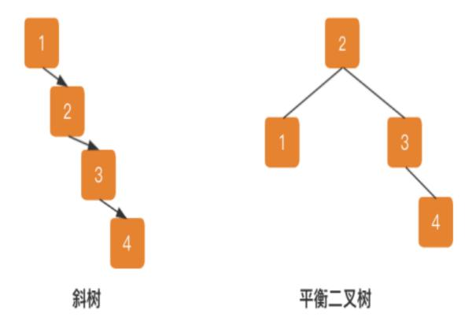

---

B+树，其实是在B 树的基础上做的增强，最大的区别有两个：
B 树的数据存储在每个节点上，而B+树中的数据是存储在叶子节点，并且通过
链表的方式把叶子节点中的数据进行连接。
B+树的子路数量等于关键字数
这个是B 树的存储结构，从B 树上可以看到每个节点会存储数据。
跟着Mic学架构
学架构
ic学架构
跟着Mic学架构
跟着Mic学架构
跟着Mic
跟着Mic

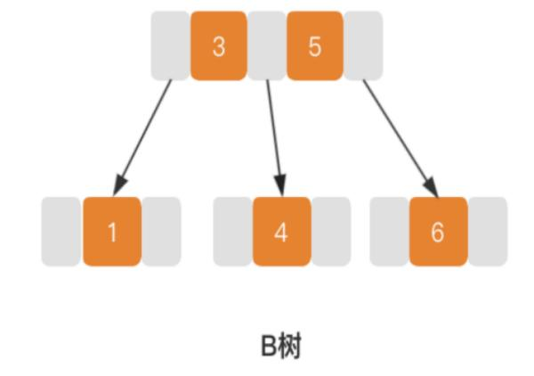

---

这个是B+树，B+树的所有数据是存储在叶子节点，并且叶子节点的数据是用双
向链表关联的。
B 树和B+树，一般都是应用在文件系统和数据库系统中，用来减少磁盘IO 带来
的性能损耗。
以Mysql 中的InnoDB 为例，当我们通过select 语句去查询一条数据时，InnoDB
需要从磁盘上去读取数据，这个过程会涉及到磁盘IO 以及磁盘的随机IO
我们知道磁盘IO 的性能是特别低的，特别是随机磁盘IO。
跟着Mic学架构
学架构
ic学架构
跟着Mic学架构
跟着Mic学架构
跟着Mic
跟着Mic

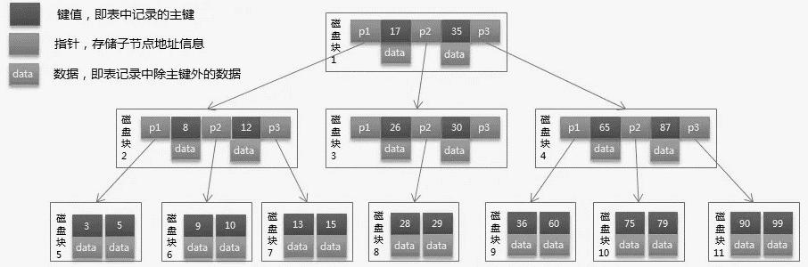

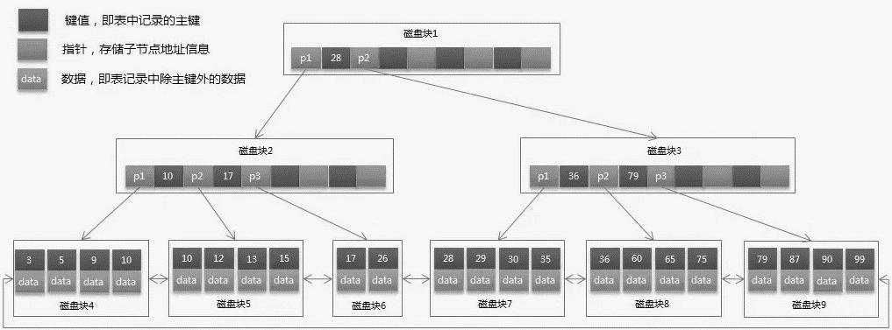

---

因为，磁盘IO 的工作原理是，首先系统会把数据逻辑地址传给磁盘，磁盘控制
电路按照寻址逻辑把逻辑地址翻译成物理地址，也就是确定要读取的数据在哪个
磁道，哪个扇区。
为了读取这个扇区的数据，需要把磁头放在这个扇区的上面，为了实现这一个点，
磁盘会不断旋转，把目标扇区旋转到磁头下面，使得磁头找到对应的磁道，这里
涉及到寻道事件以及旋转时间。
很明显，磁盘IO 这个过程的性能开销是非常大的，特别是查询的数据量比较多
的情况下。
所以在InnoDB 中，干脆对存储在磁盘块上的数据建立一个索引，然后把索引数
据以及索引列对应的磁盘地址，以B+树的方式来存储。
如图所示，当我们需要查询目标数据的时候，根据索引从B+树中查找目标数据
即可，由于B+树分路较多，所以只需要较少次数的磁盘IO 就能查找到。
跟着Mic学架构
学架构
ic学架构
跟着Mic学架构
跟着Mic学架构
跟着Mic
跟着Mic

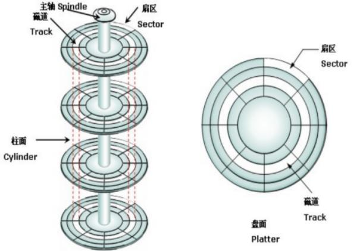

---

为什么用B 树或者B+树来做索引结构？原因是AVL 树的高度要比B 树的高度
要高，而高度就意味着磁盘IO 的数量。所以为了减少磁盘IO 的次数，文件系
统或者数据库才会采用B 树或者B+树。
以上就是我对B 树和B+树的理解！
结尾
数据结构在实际开发中非常常见，比如数组、链表、双向链表、红黑树、跳跃表、
B 树、B+树、队列等。
在我看来，数据结构是编程中最重要的基本功之一。
学了顺序表和链表，我们就能知道查询操作比较多的场景中应该用顺序表，修改
操作比较多的场景应该使用链表。
学了队列之后，就知道对于FIFO 的场景中，应该使用队列。
学了树的结构后，会发现原来查找类的场景，还可以更进一步提升查询性能。
基本功决定大家在技术这个岗位上能够走到的高度。
能谈一下CAS 机制吗？
一个小伙伴私信我，他说遇到了一个关于CAS 机制的问题，他以为面试官问的
是CAS 实现单点登录。
跟着Mic学架构
学架构
ic学架构
跟着Mic学架构
跟着Mic学架构
跟着Mic
跟着Mic

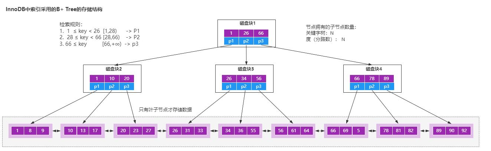

---

心想，这个问题我熟啊，然后就按照单点登录的思路去回答，结果面试官一直摇
头。
他来和我说，到了面试结束都没明想白自己回答这么好，怎么就没有当场给我发
offer 呢？
实际上，面试官问的是并发编程中的CAS 机制。
下面我们来看看普通人和高手对于CAS 机制的回答吧
普通人
CAS，是并发编程中用来实现原子性功能的一种操作，嗯，它类似于一种乐观锁
的机制，可以保证并发情况下对共享变量的值的更改的原子性。
嗯，像AtomicInteger 这个类中，就用到了CAS 机制。嗯…
高手
CAS 是Java 中Unsafe 类里面的方法，它的全称是CompareAndSwap，比较
并交换的意思。它的主要功能是能够保证在多线程环境下，对于共享变量的修改
的原子性。
我来举个例子，比如说有这样一个场景，有一个成员变量state，默认值是0，
定义了一个方法doSomething()，这个方法的逻辑是，判断state 是否为0，如果
为0，就修改成1。
这个逻辑看起来没有任何问题，但是在多线程环境下，会存在原子性的问题，因
为这里是一个典型的，Read-Write 的操作。
一般情况下，我们会在doSomething()这个方法上加同步锁来解决原子性问题。
跟着Mic学架构
学架构
ic学架构
跟着Mic学架构
跟着Mic学架构
跟着Mic
跟着Mic

---

但是，加同步锁，会带来性能上的损耗，所以，对于这类场景，我们就可以使用
CAS 机制来进行优化
这个是优化之后的代码
在doSomething()方法中，我们调用了unsafe 类中的compareAndSwapInt()方
法来达到同样的目的，这个方法有四个参数，
分别是：当前对象实例、成员变量state 在内存地址中的偏移量、预期值0、期
望更改之后的值1。
CAS 机制会比较state 内存地址偏移量对应的值和传入的预期值0 是否相等，如
果相等，就直接修改内存地址中state 的值为1.
否则，返回false，表示修改失败，而这个过程是原子的，不会存在线程安全问
题。
跟着Mic学架构
学架构
ic学架构
跟着Mic学架构
跟着Mic学架构
跟着Mic
跟着Mic

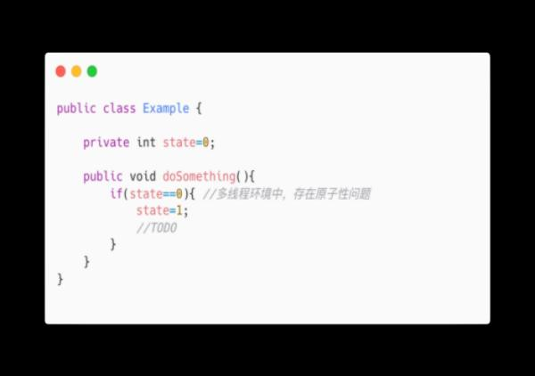

---

CompareAndSwap 是一个native 方法，实际上它最终还是会面临同样的问题，
就是先从内存地址中读取state 的值，然后去比较，最后再修改。
这个过程不管是在什么层面上实现，都会存在原子性问题。
所以呢，CompareAndSwap 的底层实现中，在多核CPU 环境下，会增加一个
Lock 指令对缓存或者总线加锁，从而保证比较并替换这两个指令的原子性。
CAS 主要用在并发场景中，比较典型的使用场景有两个。
第一个是J.U.C 里面Atomic 的原子实现，比如AtomicInteger，AtomicLong。
第二个是实现多线程对共享资源竞争的互斥性质，比如在AQS 、
ConcurrentHashMap、ConcurrentLinkedQueue 等都有用到。
以上就是我对这个问题的理解。
结尾
最近大家也发现了我的视频内容在高手回答部分的变化。
有些小伙伴说，你面试怎么还能带图来，明显作弊啊。
跟着Mic学架构
学架构
ic学架构
跟着Mic学架构
跟着Mic学架构
跟着Mic
跟着Mic

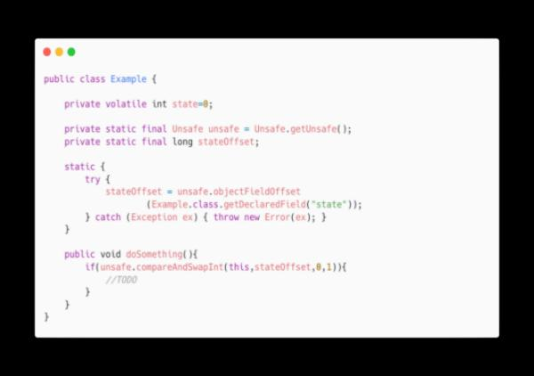

---

其实主要是最近很多的面试题都偏底层，而底层的内容涵盖的知识面比较广，大
家平时几乎没有接触过。
所以，如果我想要去把这些知识传递给大家，就得做很多的图形和内容结构的设
计，否则大家听完之后还是一脸懵逼。
好的，本期的普通人VS 高手面试系列的视频就到这里结束了，喜欢的朋友记得
点赞收藏。
我是Mic，一个工作了14 年的Java 程序员，咱们下期再见。
请说一下网络四元组
之前我一直在向大家征集一些刁钻的面试题，然后今天就收到了这样的一个问题。
“请你说一下网络四元组的理解”，他说他听到这个问题的时候，完全就懵了。
"这个是程序员应该懂的吗？你是让我去做啥？造火箭吗？"
好吧，关于这个问题，我们来看看普通人和高手的回答。
普通人
啥，刚刚你问了什么？四元组？四元组是什么东西？
嗯.....四元组是？
高手
四元组，简单理解就是在TCP 协议中，去确定一个客户端连接的组成要素，它
包括源IP 地址、目标IP 地址、源端口号、目标端口号。
正常情况下，我们对于网络通信的认识可能是这样。
服务端通过ServerSocket 建立一个对指定端口号的监听，比如8080。客户端通
过目标ip 和端口就可以和服务端建立一个连接，然后进行数据传输。
跟着Mic学架构
学架构
ic学架构
跟着Mic学架构
跟着Mic学架构
跟着Mic
跟着Mic

---

但是我们知道的是，一个Server 端可以接收多个客户端的连接，比如像这种情
况。
那，当多个客户端连接到服务端的时候，服务端需要去识别每一个连接。
跟着Mic学架构
学架构
ic学架构
跟着Mic学架构
跟着Mic学架构
跟着Mic
跟着Mic

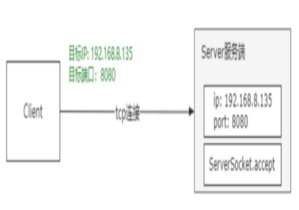

---

并且，TCP 是全双工协议，也就是说数据允许在连接的两个方向上同时传输，
因此这里的客户端，如果是反向通信，它又变成了服务端。
跟着Mic学架构
学架构
ic学架构
跟着Mic学架构
跟着Mic学架构
跟着Mic
跟着Mic

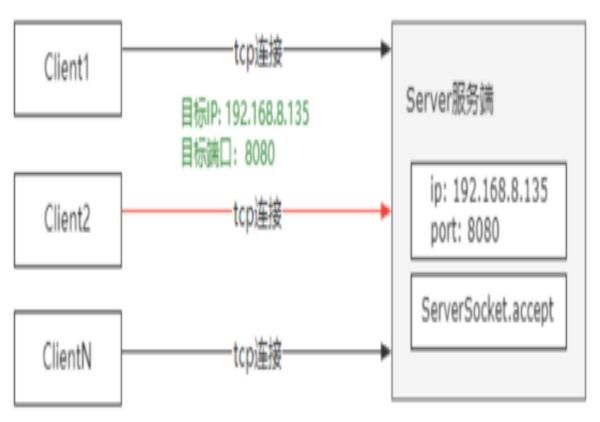

---

所以基于这两个原因，就引入了四元组的设计，也就是说，当一个客户端和服务
端建立一个TCP 连接的时候，通过源IP 地址、目标IP 地址、源端口号、目标
端口号来确定一个唯一的TCP 连接。因为服务器的IP 和端口是不变的，只要客
户端的IP 和端口彼此不同就OK 了。
比如像这种情况，同一个客户端主机上有三个连接连到Server 端，那么这个时
候源IP 相同，源端口号不同。此时建立的四元组就是（10.23.15.3，59461，
192.168.8.135，8080）
其中，源端口号是每次建立连接的时候系统自动分配的。
跟着Mic学架构
学架构
ic学架构
跟着Mic学架构
跟着Mic学架构
跟着Mic
跟着Mic

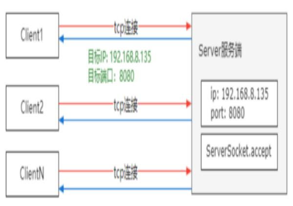

---

以上就是我对于四元组的理解。
结尾
网络部分的知识，可能大家作为一个CURD 工程师，觉得没必要去理解。
但是未来呢？至少国内没有条件允许大家做一辈子CRUD，所以建议大家要“终
局思维”来看待自己的职业规划。
什么是服务网格？
今天继续来分享一个有趣的面试题，“什么是服务网格”？
服务网格这个概念出来很久了，从2017 年被提出来，到2018 年正式爆发，很
多云厂商和互联网企业都在纷纷向服务网格靠拢。像蚂蚁集团、美团、百度、网
易等一线互联网公司，都有服务网格的落地应用。
在我看来呢，服务网格是微服务架构的更进一步升级，它的核心目的是实现网络
通信与业务逻辑的分离，使得开发人员更加专注在业务的实现上。
那么基于这个问题，我们来看看普通人和高手的回答。
跟着Mic学架构
学架构
ic学架构
跟着Mic学架构
跟着Mic学架构
跟着Mic
跟着Mic

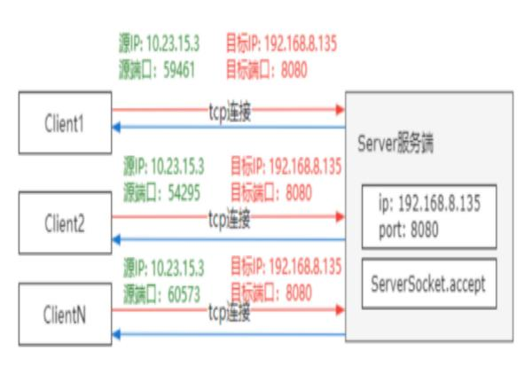

---

普通人
嗯？
内心戏：服务网格？服务网格是什么东西？
嗯，很抱歉，这个问题我不是很清楚。
高手
服务网格，也就是Service Mesh，它是专门用来处理服务通讯的基础设施层。
它的主要功能是处理服务之间的通信，并且负责实现请求的可靠性传递。
Service Mesh，我们通常把他称为第三代微服务架构，既然是第三代，那么意味
着他是在原来的微服务架构下做的升级。
为了更好的说明Service Mesh，那我就不得不说一下微服务架构部分的东西。
首先，当我们把一个电商系统以微服务化架构进行拆分后，会的到这样的一个架
构，其中包括Webserver、payment、inventory 等等。
跟着Mic学架构
学架构
ic学架构
跟着Mic学架构
跟着Mic学架构
跟着Mic
跟着Mic

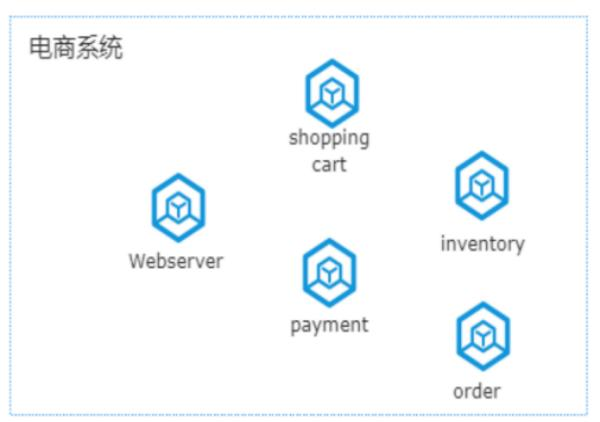

---

这些微服务应用，会被部署到Docker 容器、或者Kubernetes 集群。由于每个
服务的业务逻辑是独立的，比如payment 会实现支付的业务逻辑、order 实现订
单的处理、Webserver 实现客户端请求的响应等。
所以，服务之间必须要相互通信，才能实现功能的完整性。比如用户把一个商品
加入购物车，请求会进入到Webserver，然后转发到shopping cart 进行处理，
并存到数据库。
跟着Mic学架构
学架构
ic学架构
跟着Mic学架构
跟着Mic学架构
跟着Mic
跟着Mic

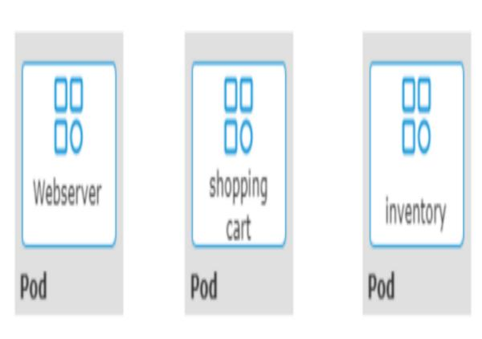

---

而在这个过程中，每个服务之间必须要知道对方的通信地址，并且当有新的节点
加入进来的时候，还需要对这些通信地址进行动态维护。所以，在第一代微服务
架构中，每个微服务除了要实现业务逻辑以外，还需要解决上下游寻址、通讯、
以及容错等问题。
于是，在第二代微服务架构下，引入了服务注册中心来实现服务之间的寻址，并
且服务之间的容错机制、负载均衡也逐步形成了独立的服务框架，比如主流的
Spring Cloud、或者Spring Cloud Alibaba。
跟着Mic学架构
学架构
ic学架构
跟着Mic学架构
跟着Mic学架构
跟着Mic
跟着Mic

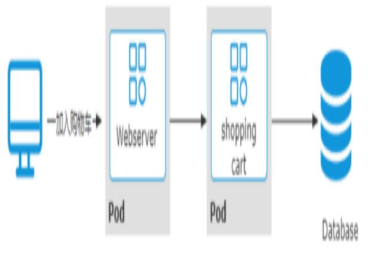

---

在第二代微服务架构中，负责业务开发的小伙伴不仅仅需要关注业务逻辑，还需
要花大量精力去处理微服务中的一些基础性配置工作，虽然Spring Cloud 已经
尽可能去完成了这些事情，但对于开发人员来说，学习Spring Cloud，以及针对
Spring Cloud 的配置和维护，仍然存在较大的挑战。另外呢，也增加了整个微服
务的复杂性。
实际上，在我看来，“微服务中所有的这些服务注册、容错、重试、安全等工作，
都是为了保证服务之间通信的可靠性”。
于是，就有了第三代微服务架构，Service Mesh。
原本模块化到微服务框架里的微服务基础能力，被进一步的从一个SDK 中演进
成了一个独立的代理进程-SideCar
SideCar 的主要职责就是负责各个微服务之间的通信，承载了原本第二代微服务
架构中的服务发现、调用容错、服务治理等功能。使得微服务基础能力和业务逻
辑迭代彻底解耦。
跟着Mic学架构
学架构
ic学架构
跟着Mic学架构
跟着Mic学架构
跟着Mic
跟着Mic

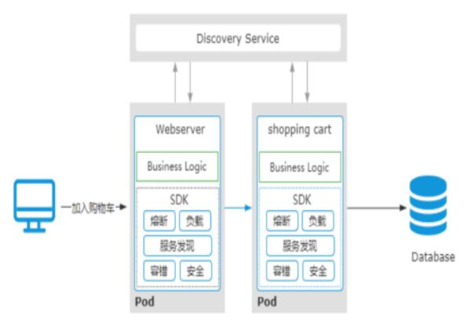

---

之所以我们称Service Mesh 为服务网格，是因为在大规模微服务架构中，每个
服务的通信都是由SideCar 来代理的，各个服务之间的通信拓扑图，看起来就
像一个网格形状。
Istio 是目前主流的Service Mesh 开源框架。
以上就是我对服务网格的理解。
结尾
Service Mesh 架构其实就是云原生时代的微服务架构，对于大部分企业来说，
仍然是处在第二代微服务架构下。
所以，很多小伙伴不一定能够知道。
不过，技术是在快速迭代的，有一句话叫“时代抛弃你的时候，连一句再见也不
会说”，就像有些人在外包公司干了10 多年
再出来面试，发现很多公司要求的技术栈，他都不会。所以，建议大家要时刻刷
新自己的能力，保持竞争优势！
Redis 和Mysql 如何保证数据一致性
跟着Mic学架构
学架构
ic学架构
跟着Mic学架构
跟着Mic学架构
跟着Mic
跟着Mic

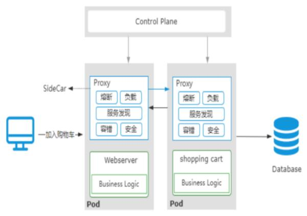

---

今天分享一道一线互联网公司高频面试题。
“Redis 和Mysql 如何保证数据一致性”。
这个问题难倒了不少工作5 年以上的程序员，难的不是问题本身，而是解决这个
问题的思维模式。
下面来看看普通人和高手对于这个问题的回答。
普通人
嗯....
Redis 和Mysql 的数据一致性保证是吧？我想想。
嗯，就是，Mysql 的数据发生变化以后，可以同步修改Redis 里面的数据。
高手
一般情况下，Redis 用来实现应用和数据库之间读操作的缓存层，主要目的是减
少数据库IO，还可以提升数据的IO 性能。
这是它的整体架构。
当应用程序需要去读取某个数据的时候，首先会先尝试去Redis 里面加载，如果
命中就直接返回。如果没有命中，就从数据库查询，查询到数据后再把这个数据
缓存到Redis 里面。
跟着Mic学架构
学架构
ic学架构
跟着Mic学架构
跟着Mic学架构
跟着Mic
跟着Mic

---

在这样一个架构中，会出现一个问题，就是一份数据，同时保存在数据库和Redis
里面，当数据发生变化的时候，需要同时更新Redis 和Mysql，由于更新是有先
后顺序的，并且它不像Mysql 中的多表事务操作，可以满足ACID 特性。所以就
会出现数据一致性问题。
跟着Mic学架构
学架构
ic学架构
跟着Mic学架构
跟着Mic学架构
跟着Mic
跟着Mic

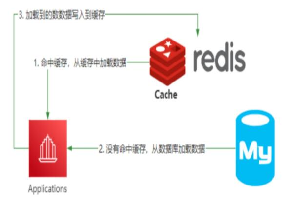

---

在这种情况下，能够选择的方法只有几种。
先更新数据库，再更新缓存
先删除缓存，再更新数据库
如果先更新数据库，再更新缓存，如果缓存更新失败，就会导致数据库和Redis
中的数据不一致。
跟着Mic学架构
学架构
ic学架构
跟着Mic学架构
跟着Mic学架构
跟着Mic
跟着Mic

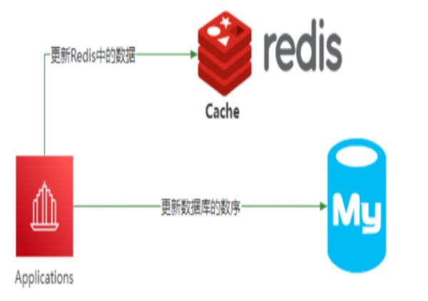

---

如果是先删除缓存，再更新数据库，理想情况是应用下次访问Redis 的时候，发
现Redis 里面的数据是空的，就从数据库加载保存到Redis 里面，那么数据是
一致的。但是在极端情况下，由于删除Redis 和更新数据库这两个操作并不是原
子的，所以这个过程如果有其他线程来访问，还是会存在数据不一致问题。
跟着Mic学架构
学架构
ic学架构
跟着Mic学架构
跟着Mic学架构
跟着Mic
跟着Mic

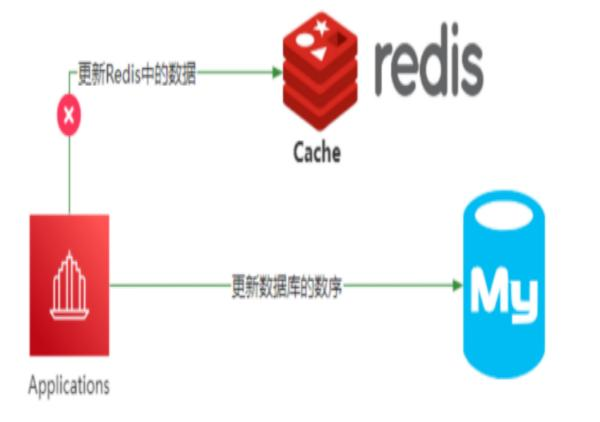

---

所以，如果需要在极端情况下仍然保证Redis 和Mysql 的数据一致性，就只能
采用最终一致性方案。
比如基于RocketMQ 的可靠性消息通信，来实现最终一致性。
跟着Mic学架构
学架构
ic学架构
跟着Mic学架构
跟着Mic学架构
跟着Mic
跟着Mic

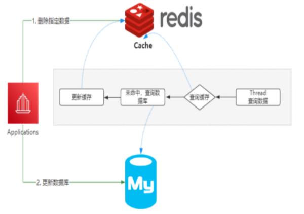

---

还可以直接通过Canal 组件，监控Mysql 中binlog 的日志，把更新后的数据同
步到Redis 里面。
跟着Mic学架构
学架构
ic学架构
跟着Mic学架构
跟着Mic学架构
跟着Mic
跟着Mic

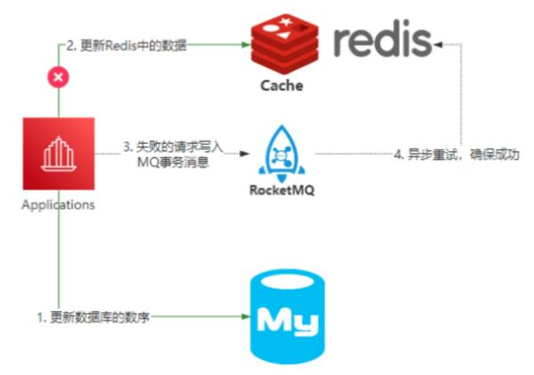

---

因为这里是基于最终一致性来实现的，如果业务场景不能接受数据的短期不一致
性，那就不能使用这个方案来做。
以上就是我对这个问题的理解。
结尾
在面试的时候，面试官喜欢问各种没有场景化的纯粹的技术问题，比如说：“你
这个最终一致性方案”还是会存在数据不一致的问题啊？那怎么解决？
先不用慌，技术是为业务服务的，所以不同的业务场景，对于技术的选择和方案
的设计都是不同的，所以这个时候，可以反问面试官，具体的业务场景是什么？
一定要知道的是，一个技术方案不可能cover 住所有的场景，明白了吗？
Spring Boot 中自动装配机制的原理
最近一个粉丝说，他面试了4 个公司，有三个公司问他：“Spring Boot 中自动装
配机制的原理”
他回答了，感觉没回答错误，但是怎么就没给offer 呢？
对于这个问题，看看普通人和高手该如何回答。
跟着Mic学架构
学架构
ic学架构
跟着Mic学架构
跟着Mic学架构
跟着Mic
跟着Mic

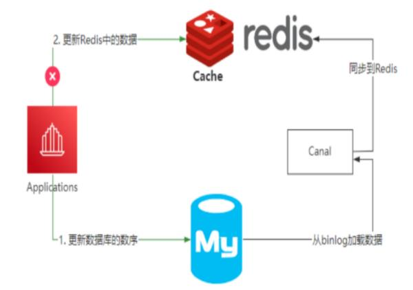

---

普通人
嗯…Spring Boot 里面的自动装配，就是@EnableAutoConfiguration 注解。
嗯…它可以实现Bean 的自动管理，不需要我们手动再去配置。
高手
自动装配，简单来说就是自动把第三方组件的Bean 装载到Spring IOC 器里面，
不需要开发人员再去写Bean 的装配配置。
在Spring Boot 应用里面，只需要在启动类加上@SpringBootApplication 注解就
可以实现自动装配。
@SpringBootApplication 是一个复合注解，真正实现自动装配的注解是
@EnableAutoConfiguration。
自动装配的实现主要依靠三个核心关键技术。
引入Starter 启动依赖组件的时候，这个组件里面必须要包含@Configuration 配
置类，在这个配置类里面通过@Bean 注解声明需要装配到IOC 容器的Bean 对
象。
这个配置类是放在第三方的jar 包里面，然后通过SpringBoot 中的约定优于配置
思想，把这个配置类的全路径放在classpath:/META-INF/spring.factories 文件中。
这样SpringBoot 就可以知道第三方jar 包里面的配置类的位置，这个步骤主要是
用到了Spring 里面的SpringFactoriesLoader 来完成的。
SpringBoot 拿到所第三方jar 包里面声明的配置类以后，再通过Spring 提供的
ImportSelector 接口，实现对这些配置类的动态加载。
在我看来，SpringBoot 是约定优于配置这一理念下的产物，所以在很多的地方，
都会看到这类的思想。它的出现，让开发人员更加聚焦在了业务代码的编写上，
而不需要去关心和业务无关的配置。
其实，自动装配的思想，在SpringFramework3.x 版本里面的@Enable 注解，就
有了实现的雏形。@Enable 注解是模块驱动的意思，我们只需要增加某个
@Enable 注解，就自动打开某个功能，而不需要针对这个功能去做Bean 的配
置，@Enable 底层也是帮我们去自动完成这个模块相关Bean 的注入。
以上，就是我对Spring Boot 自动装配机制的理解。
跟着Mic学架构
学架构
ic学架构
跟着Mic学架构
跟着Mic学架构
跟着Mic
跟着Mic

---

结尾
发现了吗？高手和普通人的回答，并不是回答的东西多和少。
而是让面试官看到你对于这个技术领域的理解深度和自己的见解，从而让面试官
在一大堆求职者中，对你产生清晰的印象。
死锁的发生原因和怎么避免
一个去阿里面试的小伙伴私信我说：今天被一个死锁的问题难到了。
平常我都特意看了死锁这块的内容，但是回答的时候就想不起来。
这里可能存在一个误区，认为技术是要靠记的。
大家可以想想，平时写代码的时候，这些代码是背下来的吗？
遇到一个需求的时候，能够立刻提供解决思路，这个也是记下来的吗？
所有的技术问题，都可以用一个问题来解决：“如果让你遇到这个问题，你会怎
么设计”？
当你大脑一篇空白时，说明你目前掌握的技术只能足够支撑你写CURD 的能力。
跟着Mic学架构
学架构
ic学架构
跟着Mic学架构
跟着Mic学架构
跟着Mic
跟着Mic

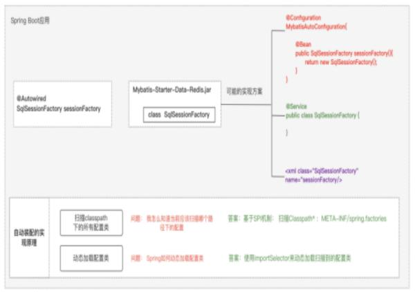

---

好了，下面来看看普通人和高手是如何回答这个问题的。
普通人
嗯....…
高手
死锁，简单来说就是两个或者两个以上的线程在执行的过程中，争夺同一个共享
资源造成的相互等待的现象。
如果没有外部干预，线程会一直阻塞无法往下执行，这些一直处于相互等待资源
的线程就称为死锁线程。
导致死锁的条件有四个，也就是这四个条件同时满足就会产生死锁。
互斥条件，共享资源X 和Y 只能被一个线程占用；
请求和保持条件，线程T1 已经取得共享资源X，在等待共享资源Y 的时候，不
释放共享资源X；
不可抢占条件，其他线程不能强行抢占线程T1 占有的资源；
跟着Mic学架构
学架构
ic学架构
跟着Mic学架构
跟着Mic学架构
跟着Mic
跟着Mic

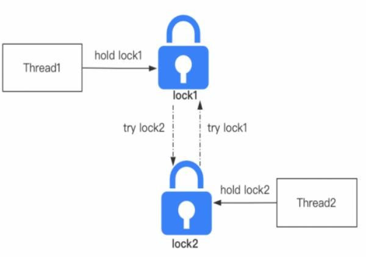

---

循环等待条件，线程T1 等待线程T2 占有的资源，线程T2 等待线程T1 占有的
资源，就是循环等待。
导致死锁之后，只能通过人工干预来解决，比如重启服务，或者杀掉某个线程。
所以，只能在写代码的时候，去规避可能出现的死锁问题。
按照死锁发生的四个条件，只需要破坏其中的任何一个，就可以解决，但是，互
斥条件是没办法破坏的，因为这是互斥锁的基本约束，其他三方条件都有办法来
破坏：
对于“请求和保持”这个条件，我们可以一次性申请所有的资源，这样就不存在等
待了。
对于“不可抢占”这个条件，占用部分资源的线程进一步申请其他资源时，如果申
请不到，可以主动释放它占有的资源，这样不可抢占这个条件就破坏掉了。
对于“循环等待”这个条件，可以靠按序申请资源来预防。所谓按序申请，是指资
源是有线性顺序的，申请的时候可以先申请资源序号小的，再申请资源序号大的，
这样线性化后自然就不存在循环了。
以上就是我对这个问题的理解。
结尾
发现了吗？当大家理解了死锁发生的条件，那么对于这些条件的破坏，
是可以通过自己的技术积累，来设计解决方法的。
所有的技术思想和技术架构，都是由人来设计的，为什么别人能够设计？
本质上，还是技术积累后的结果！越是底层的设计，对于知识面的要求就越多。
好的，本期的普通人VS 高手面试系列的视频就到这里结束了，喜欢的朋友记得
点赞收藏。
我是Mic，一个工作了14 年的Java 程序员，咱们下期再见。
请说一下你对分布式锁的理解，以及分布
式锁的实现
一个工作了7 年的Java 程序员，私信我关于分布式锁的问题。
一上来就两个灵魂拷问：
跟着Mic学架构
学架构
ic学架构
跟着Mic学架构
跟着Mic学架构
跟着Mic
跟着Mic

---

Redis 锁超时怎么办？
Redis 主从切换导致锁失效怎么办？
我说，别着急，这些都是小问题。
那么，关于“分布式锁的理解和实现”这个问题，我们看看普通人高手的回答。
普通人
嗯，分布式锁，就是可以用来实现锁的分布性，嗯…
就是可以解决跨进程的应用对于共享资源访问的冲突问题。
可以用Redis 来实现分布式锁。
高手
分布式锁，是一种跨进程的跨机器节点的互斥锁，它可以用来保证多机器节点对
于共享资源访问的排他性。
我觉得分布式锁和线程锁本质上是一样的，线程锁的生命周期是单进程多线程，
分布式锁的声明周期是多进程多机器节点。
跟着Mic学架构
学架构
ic学架构
跟着Mic学架构
跟着Mic学架构
跟着Mic
跟着Mic

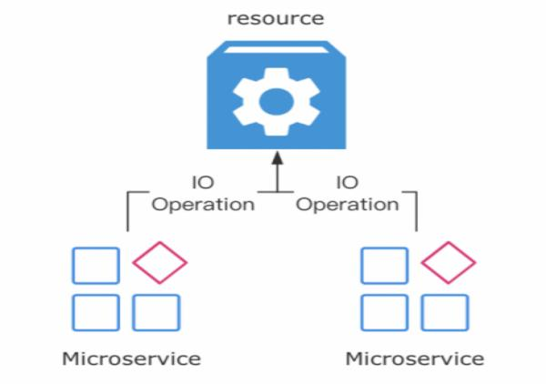

---

在本质上，他们都需要满足锁的几个重要特性：
排他性，也就是说，同一时刻只能有一个节点去访问共享资源。
可重入性，允许一个已经获得锁的进程，在没有释放锁之前再次重新获得锁。
锁的获取、释放的方法
锁的失效机制，避免死锁的问题
所以，我认为，只要能够满足这些特性的技术组件都能够实现分布式锁。
关系型数据库，可以使用唯一约束来实现锁的排他性，
如果要针对某个方法加锁，就可以创建一个表包含方法名称字段，
并且把方法名设置成唯一的约束。
那抢占锁的逻辑就是：往表里面插入一条数据，如果已经有其他的线程获得了某
个方法的锁，那这个时候插入数据会失败，从而保证了互斥性。
这种方式虽然简单啊，但是要实现比较完整的分布式锁，还需要考虑重入性、锁
失效机制、没抢占到锁的线程要实现阻塞等，就会比较麻烦。
Redis，它里面提供了SETNX 命令可以实现锁的排他性，当key 不存在就返回
1，存在就返回0。然后还可以用expire 命令设置锁的失效时间，从而避免死锁
问题。
当然有可能存在锁过期了，但是业务逻辑还没执行完的情况。所以这种情况，可
以写一个定时任务对指定的key 进行续期。
Redisson 这个开源组件，就提供了分布式锁的封装实现，并且也内置了一个
Watch Dog 机制来对key 做续期。
我认为Redis 里面这种分布式锁设计已经能够解决99%的问题了，当然如果在
Redis 搭建了高可用集群的情况下出现主从切换导致key 失效，这个问题也有可
能造成
多个线程抢占到同一个锁资源的情况，所以Redis 官方也提供了一个RedLock
的解决办法，但是实现会相对复杂一些。
在我看来，分布式锁应该是一个CP 模型，而Redis 是一个AP 模型，所以在集
群架构下由于数据的一致性问题导致极端情况下出现多个线程抢占到锁的情况
很难避免。
跟着Mic学架构
学架构
ic学架构
跟着Mic学架构
跟着Mic学架构
跟着Mic
跟着Mic

---

那么基于CP 模型又能实现分布式锁特性的组件，我认为可以选择Zookeeper
或者etcd，
在数据一致性方面，zookeeper 用到了zab 协议来保证数据的一致性，etcd 用
到了raft 算法来保证数据一致性。
在锁的互斥方面，zookeeper 可以基于有序节点再结合Watch 机制实现互斥和
唤醒，etcd 可以基于Prefix 机制和Watch 实现互斥和唤醒。
以上就是我对于分布式锁的理解！
面试点评
我认为，回答这个问题的核心本质，还是在技术底层深度理解的基础上的思考。
可以从高手的回答中明显感受到，对于排它锁底层逻辑的理解是很深刻的，同时
再技术的广度上也是有足够的积累。
所以在回答的时候，面试官可以去抓到求职者在回答这个问题的时候的技术关键
点和技术思维。
我认为，当具备体系化的技术能力的时候，是很容易应对各种面试官的各种刁难
的。
volatile 关键字有什么用？它的实现原理
是什么？
一个工作了6 年的Java 程序员，在阿里二面，被问到“volatile”关键字。
然后，就没有然后了…
同样，另外一个去美团面试的工作4 年的小伙伴，也被“volatile 关键字“。
然后，也没有然后了…
这个问题说实话，是有点偏底层，但也的确是并发编程里面比较重要的一个关键
字。
下面，我们来看看普通人和高手对于这个问题的回答吧。
普通人
嗯…volatile 可以保证可见性。
跟着Mic学架构
学架构
ic学架构
跟着Mic学架构
跟着Mic学架构
跟着Mic
跟着Mic

---

高手
volatile 关键字有两个作用。
可以保证在多线程环境下共享变量的可见性。
通过增加内存屏障防止多个指令之间的重排序。
我理解的可见性，是指当某一个线程对共享变量的修改，其他线程可以立刻看到
修改之后的值。
其实这个可见性问题，我认为本质上是由几个方面造成的。
CPU 层面的高速缓存，在CPU 里面设计了三级缓存去解决CPU 运算效率和内
存IO 效率问题，但是带来的就是缓存的一致性问题，而在多线程并行执行的情
况下，缓存一致性就会导致可见性问题。
所以，对于增加了volatile 关键字修饰的共享变量，JVM 虚拟机会自动增加一个
#Lock 汇编指令，这个指令会根据CPU 型号自动添加总线锁或/缓存锁
我简单说一下这两种锁，
跟着Mic学架构
学架构
ic学架构
跟着Mic学架构
跟着Mic学架构
跟着Mic
跟着Mic

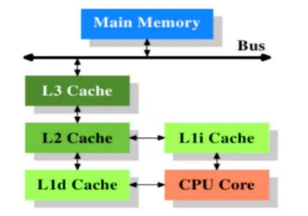

---

总线锁是锁定了CPU 的前端总线，从而导致在同一时刻只能有一个线程去和内
存通信，这样就避免了多线程并发造成的可见性。
缓存锁是对总线锁的优化，因为总线锁导致了CPU 的使用效率大幅度下降，所
以缓存锁只针对CPU 三级缓存中的目标数据加锁，缓存锁是使用MESI 缓存一
致性来实现的。
指令重排序，所谓重排序，就是指令的编写顺序和执行顺序不一致，在多线程环
境下导致可见性问题。指令重排序本质上是一种性能优化的手段，它来自于几个
方面。
CPU 层面，针对MESI 协议的更进一步优化去提升CPU 的利用率，引入了
StoreBuffer 机制，而这一种优化机制会导致CPU 的乱序执行。当然为了避免这
样的问题，CPU 提供了内存屏障指令，上层应用可以在合适的地方插入内存屏
障来避免CPU 指令重排序问题。
编译器的优化，编译器在编译的过程中，在不改变单线程语义和程序正确性的前
提下，对指令进行合理的重排序优化来提升性能。
所以，如果对共享变量增加了volatile 关键字，那么在编译器层面，就不会去触
发编译器优化，同时再JVM 里面，会插入内存屏障指令来避免重排序问题。
当然，除了volatile 以外，从JDK5 开始，JMM 就使用了一种Happens-Before
模型去描述多线程之间的内存可见性问题。
如果两个操作之间具备Happens-Before 关系，那么意味着这两个操作具备可见
性关系，不需要再额外去考虑增加volatile 关键字来提供可见性保障。
以上就是我对这个问题的理解。
面试点评
在我看来，并发编程是每个程序员必须要掌握好的领域，它里面涵盖的设计思想、
和并发问题的解决思路、以及作为一个并发工具，都是非常值得深度研究的。
我推荐大家去读一下《Java 并发编程深度解析与原理实战》这本书，对Java 并
发这块的内容描述得很清晰。
好的，本期的普通人VS 高手面试系列的视频就到这里结束了，喜欢的朋友记得
点赞和收藏。
另外，有任何技术上的问题，职业发展有关的问题，都可以私信我，我会在第一
时间回复。
我是Mic，一个工作了14 年的Java 程序员，咱们下期再见。
跟着Mic学架构
学架构
ic学架构
跟着Mic学架构
跟着Mic学架构
跟着Mic
跟着Mic

---

说说缓存雪崩和缓存穿透的理解，以及如
何避免？
听说10 个人去互联网公司面试，有9 个人会被问到缓存雪崩和缓存穿透的问题。
听说，这9 个人里面，至少有8 个人回答得不完整。
而这8 个人里面，全都是在网上找的各种面试资料去应付的，并没有真正理解。
当然，也很正常，只有大规模应用缓存的架构才会重点关注这两个问题。
那么如何真正理解这两个问题的底层逻辑，我们来看普通人和高手的回答。
普通人
高手
缓存雪崩，就是存储在缓存里面的大量数据，在同一个时刻全部过期，
原本缓存组件抗住的大部分流量全部请求到了数据库。
导致数据库压力增加造成数据库服务器崩溃的现象。
跟着Mic学架构
学架构
ic学架构
跟着Mic学架构
跟着Mic学架构
跟着Mic
跟着Mic

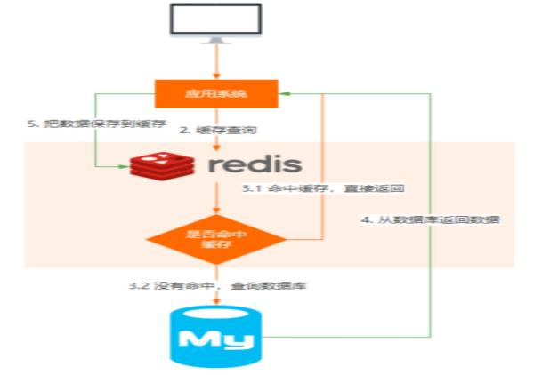

---

导致缓存雪崩的主要原因，我认为有两个：
缓存中间件宕机，当然可以对缓存中间件做高可用集群来避免。
缓存中大部分key 都设置了相同的过期时间，导致同一时刻这些key 都过期了。
对于这样的情况，可以在失效时间上增加一个1 到5 分钟的随机值。
缓存穿透问题，表示是短时间内有大量的不存在的key 请求到应用里面，而这些
不存在的key 在缓存里面又找不到，从而全部穿透到了数据库，造成数据库压力。
我认为这个场景的核心问题是针对缓存的一种攻击行为，因为在正常的业务里面，
即便是出现了这样的情况，由于缓存的不断预热，影响不会很大。
而攻击行为就需要具备时间是的持续性，而只有key 确实在数据库里面也不存在
的情况下，才能达到这个目的，所以，我认为有两个方法可以解决：
把无效的key 也保存到Redis 里面，并且设置一个特殊的值，比如“null”，这样
的话下次再来访问，就不会去查数据库了。
但是如果攻击者不断用随机的不存在的key 来访问，也还是会存在问题，所以可
以用布隆过滤器来实现，在系统启动的时候把目标数据全部缓存到布隆过滤器里
面，当攻击者用不存在的key 来请求的时候，先到布隆过滤器里面查询，如果不
存在，那意味着这个key 在数据库里面也不存在。
布隆过滤器还有一个好处，就是它采用了bitmap 来进行数据存储，占用的内存
空间很少。
跟着Mic学架构
学架构
ic学架构
跟着Mic学架构
跟着Mic学架构
跟着Mic
跟着Mic

---

不过，在我看来，您提出来的这个问题，有点过于放大了它带来的影响。
首先，在一个成熟的系统里面，对于比较重要的热点数据，必然会有一个专门缓
存系统来维护，同时它的过期时间的维护必然和其他业务的key 会有一定的差别。
而且非常重要的场景，我们还会设计多级缓存系统。
其次，即便是触发了缓存雪崩，数据库本身的容灾能力也并没有那么脆弱，数据
库的主从、双主、读写分离这些策略都能够很好的缓解并发流量。
最后，数据库本身也有最大连接数的限制，超过限制的请求会被拒绝，再结合熔
断机制，也能够很好的保护数据库系统，最多就是造成部分用户体验不好。
另外，在程序设计上，为了避免缓存未命中导致大量请求穿透到数据库的问题，
还可以在访问数据库这个环节加锁。虽然影响了性能，但是对系统是安全的。
跟着Mic学架构
学架构
ic学架构
跟着Mic学架构
跟着Mic学架构
跟着Mic
跟着Mic

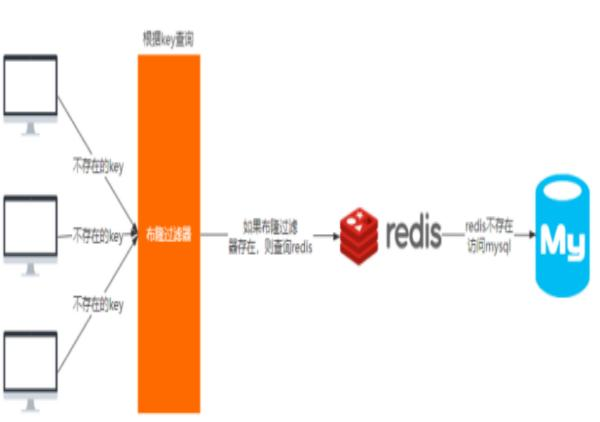

---

总而言之，我认为解决的办法很多，具体选择哪种方式，还是看具体的业务场景。
以上就是我对这个问题的理解。
面试点评
我发现现在很多面试，真的是为了面试而面试，要么就是在网上摘题，要么就是
不断的问一些无关痛痒的问题。
至于最终面试官怎么判断你是否合适，咱也不知道，估计就是有些小伙伴说的，
看长相，看眼缘！
我认为一个合格的面试官，他必须要具备非常深厚的技术功底。
好的，本期的普通人VS 高手面试系列的视频就到这里结束了，喜欢的朋友记得
点赞和收藏。
另外，有任何技术上的问题，职业发展有关的问题，都可以私信我，我会在第一
时间回复。
我是Mic，一个工作了14 年的Java 程序员，咱们下期再见。
跟着Mic学架构
学架构
ic学架构
跟着Mic学架构
跟着Mic学架构
跟着Mic
跟着Mic

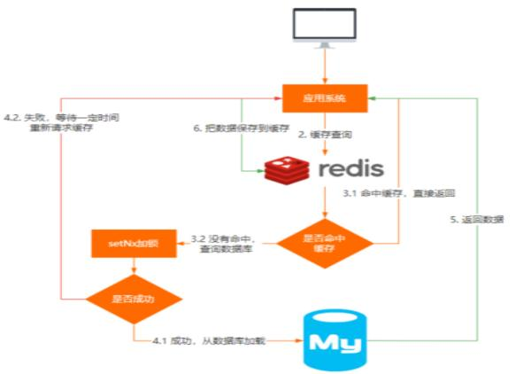

---

讲一下wait 和notify 这个为什么要在
synchronized 代码块中？
一个工作七年的小伙伴，竟然不知道”wait”和“notify”为什么要在Synchronized
代码块里面。
对于这个问题，我们来看看普通人和高手的回答。
普通人
高手
wait 和notify 用来实现多线程之间的协调，wait 表示让线程进入到阻塞状态，
notify 表示让阻塞的线程唤醒。
wait 和notify 必然是成对出现的，如果一个线程被wait()方法阻塞，那么必然需
要另外一个线程通过notify()方法来唤醒这个被阻塞的线程，从而实现多线程之
间的通信。
在多线程里面，要实现多个线程之间的通信，除了管道流以外，只能通过共享变
量的方法来实现，也就是线程t1 修改共享变量s，线程t2 获取修改后的共享变
量s，从而完成数据通信。
但是多线程本身具有并行执行的特性，也就是在同一时刻，多个线程可以同时执
行。在这种情况下，线程t2 在访问共享变量s 之前，必须要知道线程t1 已经修
改过了共享变量s，否则就需要等待。
同时，线程t1 修改过了共享变量S 之后，还需要通知在等待中的线程t2。
所以要在这种特性下要去实现线程之间的通信，就必须要有一个竞争条件控制线
程在什么条件下等待，什么条件下唤醒。
跟着Mic学架构
学架构
ic学架构
跟着Mic学架构
跟着Mic学架构
跟着Mic
跟着Mic

---

而Synchronized 同步关键字就可以实现这样一个互斥条件，也就是在通过共享
变量来实现多个线程通信的场景里面，参与通信的线程必须要竞争到这个共享变
量的锁资源，才有资格对共享变量做修改，修改完成后就释放锁，那么其他的线
程就可以再次来竞争同一个共享变量的锁来获取修改后的数据，从而完成线程之
前的通信。
所以这也是为什么wait/notify 需要放在Synchronized 同步代码块中的原因，有
了Synchronized 同步锁，就可以实现对多个通信线程之间的互斥，实现条件等
待和条件唤醒。
另外，为了避免wait/notify 的错误使用，jdk 强制要求把wait/notify 写在同步代
码块里面，否则会抛出IllegalMonitorStateException
最后，基于wait/notify 的特性，非常适合实现生产者消费者的模型，比如说用
wait/notify 来实现连接池就绪前的等待与就绪后的唤醒。
以上就是我对wait/notify 这个问题的理解。
面试点评
这个是一个典型的经典面试题。
跟着Mic学架构
学架构
ic学架构
跟着Mic学架构
跟着Mic学架构
跟着Mic
跟着Mic

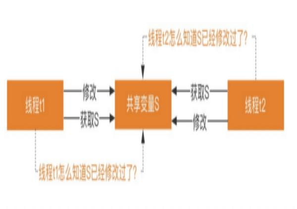

---

其实考察的就是Synchronized、wait/notify 的设计原理和实现原理。
由于wait/notify 在业务开发整几乎不怎么用到，所以大部分人回答不出来。
其实并发这块内容理论上来说所有程序员都应该要懂，不管是它的应用价值，还
是设计理念，非常值得学习和借鉴。
好的，本期的普通人VS 高手面试系列的视频就到这里结束了，喜欢的朋友记得
点赞和收藏。
另外，有任何技术上的问题，职业发展有关的问题，都可以私信我，我会在第一
时间回复。
我是Mic，一个工作了14 年的Java 程序员，咱们下期再见。
ThreadLocal 是什么？它的实现原理
呢？
一个工作了4 年的小伙伴，又私信了我一个并发编程里面的问题。
他说他要抓狂了，每天CRUD，也没用到过ThreadLocal 啊，怎么就不能问我
怎么写CRUD 呢？
我反问他，如果只问你项目和业务，那有些4 年的小伙伴他要求月薪30K，有些
只要求月薪15K，
那请问，凭什么每个月要多出15k 给你？我花30k 招两个15k 的，不能写CRUD
吗？
好吧，我们来看看ThreadLocal 这个问题，普通人和高手的回答。
普通人
高手
好的，这个问题我从三个方面来回答。
ThreadLocal 是一种线程隔离机制，它提供了多线程环境下对于共享变量访问的
安全性。
在多线程访问共享变量的场景中，一般的解决办法是对共享变量加锁，从而保证
在同一时刻只有一个线程能够对共享变量进行更新，并且基于Happens-Before
规则里面的监视器锁规则，又保证了数据修改后对其他线程的可见性。
跟着Mic学架构
学架构
ic学架构
跟着Mic学架构
跟着Mic学架构
跟着Mic
跟着Mic

---

但是加锁会带来性能的下降，所以ThreadLocal 用了一种空间换时间的设计思想，
也就是说在每个线程里面，都有一个容器来存储共享变量的副本，然后每个线程
只对自己的变量副本来做更新操作，这样既解决了线程安全问题，又避免了多线
程竞争加锁的开销。
ThreadLocal 的具体实现原理是，在Thread 类里面有一个成员变量
ThreadLocalMap，它专门来存储当前线程的共享变量副本，后续这个线程对于
共享变量的操作，都是从这个ThreadLocalMap 里面进行变更，不会影响全局共
享变量的值。
以上就是我对这个问题的理解。
面试点评
ThreadLocal 使用场景比较多，比如在数据库连接的隔离、对于客户端请求会话
的隔离等等。
在ThreadLocal 中，除了空间换时间的设计思想以外，还有一些比较好的设计思
想，比如线性探索解决hash 冲突，数据预清理机制、弱引用key 设计尽可能避
免内存泄漏等。
这些思想在解决某些类似的业务问题时，都是可以直接借鉴的。
跟着Mic学架构
学架构
ic学架构
跟着Mic学架构
跟着Mic学架构
跟着Mic
跟着Mic

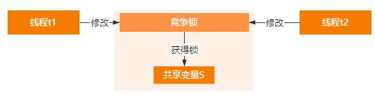

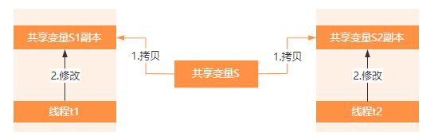

---

好的，本期的普通人VS 高手面试系列的视频就到这里结束了，喜欢的朋友记得
点赞和收藏。
另外，这些面试题我都整理成了笔记，大家有需要的可以私信获取。
我是Mic，一个工作了14 年的Java 程序员，咱们下期再见。
基于数组的阻塞队列
ArrayBlockingQueue 原理
今天来分享一道“饿了么”的高级工程师的面试题。
“基于数组的阻塞队列ArrayBlockingQueue”的实现原理。
关于这个问题，我们来看看普通人和高手的回答。
普通人
高手
阻塞队列（BlockingQueue）是在队列的基础上增加了两个附加操作，
在队列为空的时候，获取元素的线程会等待队列变为非空。
当队列满时，存储元素的线程会等待队列可用。
跟着Mic学架构
学架构
ic学架构
跟着Mic学架构
跟着Mic学架构
跟着Mic
跟着Mic

---

由于阻塞队列的特性，可以非常容易实现生产者消费者模型，也就是生产者只需
要关心数据的生产，消费者只需要关注数据的消费，所以如果队列满了，生产者
就等待，同样，队列空了，消费者也需要等待。
要实现这样的一个阻塞队列，需要用到两个关键的技术，队列元素的存储、以及
线程阻塞和唤醒。
而ArrayBlockingQueue 是基于数组结构的阻塞队列，也就是队列元素是存储在
一个数组结构里面，并且由于数组有长度限制，为了达到循环生产和循环消费的
目的，ArrayBlockingQueue 用到了循环数组。
而线程的阻塞和唤醒，用到了J.U.C 包里面的ReentrantLock 和Condition。
Condition 相当于wait/notify 在JUC 包里面的实现。
以上就是我对这个问题的理解。
面试点评
对于原理类的问题，有些小伙伴找不到切入点，不知道该怎么回答。
所谓的原理，通常说的是工作原理，比如对于ArrayBlockingQueue 这个问题。
跟着Mic学架构
学架构
ic学架构
跟着Mic学架构
跟着Mic学架构
跟着Mic
跟着Mic

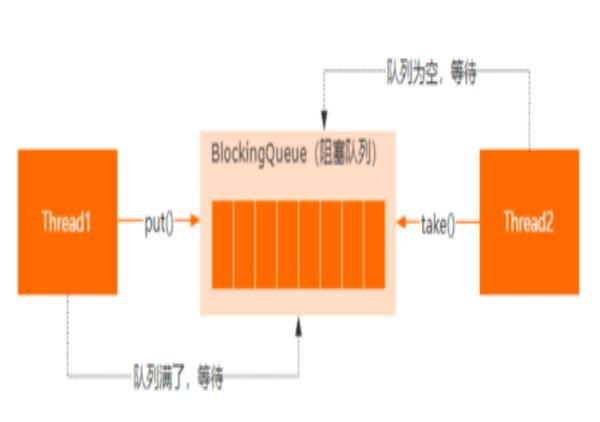

---

它的作用是在队列的基础上提供了阻塞添加和获取元素的能力，那么它的工作原
理就是指用了什么设计方法或者技术来实现这样的功能，我们只要把这个部分说
清楚就可以了。
好的，本期的普通人VS 高手面试系列的视频就到这里结束了，喜欢的朋友记得
点赞和收藏。
另外，这些面试题我都整理成了笔记，大家有需要的可以私信获取。
我是Mic，一个工作了14 年的Java 程序员，咱们下期再见。
什么是聚集索引和非聚集索引
一个去阿里面试并且第一面就挂了的粉丝私信我，被数据库里面几个问题难倒了，
他说面试官问了事务隔离级别、MVCC、聚集索引/非聚集索引、B 树、B+树这
些，没回答好。
大厂面试基本上是这样，由点到面去展开，如果你对这个技术理解不够全面，很
容易就会被看出来。
ok，关于“什么是聚集索引和非聚集索引”这个问题，看看普通人和高手的回答。
普通人
嗯，聚集索引就是通过主键来构建的索引结构。
而非聚集索引就是除了主键以外的其他索引。
高手
简单来说，聚集索引就是基于主键创建的索引，除了主键索引以外的其他索引，
称为非聚集索引，也叫做二级索引。
由于在InnoDB 引擎里面，一张表的数据对应的物理文件本身就是按照B+树来
组织的一种索引结构，而聚集索引就是按照每张表的主键来构建一颗B+树，然
后叶子节点里面存储了这个表的每一行数据记录。
所以基于InnoDB 这样的特性，聚集索引并不仅仅是一种索引类型，还代表着一
种数据的存储方式。
同时也意味着每个表里面必须要有一个主键，如果没有主键，InnoDB 会默认选
择或者添加一个隐藏列作为主键索引来存储这个表的数据行。一般情况是建议使
用自增id 作为主键，这样的话id 本身具有连续性使得对应的数据也会按照顺序
跟着Mic学架构
学架构
ic学架构
跟着Mic学架构
跟着Mic学架构
跟着Mic
跟着Mic

---

存储在磁盘上，写入性能和检索性能都很高。否则，如果使用uuid 这种随机id，
那么在频繁插入数据的时候，就会导致随机磁盘IO，从而导致性能较低。
需要注意的是，InnoDB 里面只能存在一个聚集索引，原因很简单，如果存在多
个聚集索引，那么意味着这个表里面的数据存在多个副本，造成磁盘空间的浪费，
以及数据维护的困难。
由于在InnoDB 里面，主键索引表示的是一种数据存储结构，所以如果是基于非
聚集索引来查询一条完整的记录，最终还是需要访问主键索引来检索。
面试点评
这个问题要回答好，还真不容易。涉及到Mysql 里面索引的实现原理。
但是如果回答好了，就能够很好的反馈求职者的技术功底，那通过面试就比较容
易了。
好的，本期的普通人VS 高手面试系列的视频就到这里结束了，喜欢的朋友记得
点赞和收藏。
另外，这些面试题我都整理成了笔记，大家有需要的可以私信获取。
我是Mic，一个工作了14 年的Java 程序员，咱们下期再见。
跟着Mic学架构
学架构
ic学架构
跟着Mic学架构
跟着Mic学架构
跟着Mic
跟着Mic

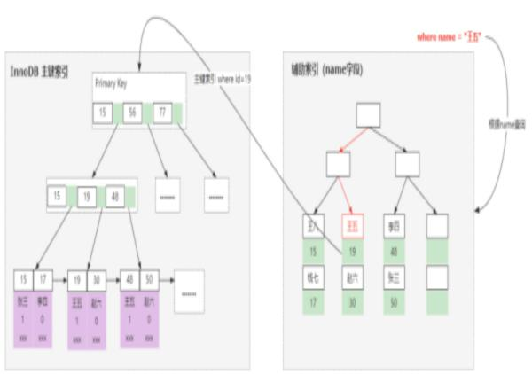

---

什么是双亲委派？
Hi，大家好。
今天我们来分享一道关于Java 类加载方面的面试题。在国内的一二线互联网公
司面试的时候，面试官通常是使用这方面的问题来暖场，但往往造成的是冷场~
比如，什么是双亲委派？什么是类加载？new String()生成了几个对象等等。
双亲委派的英文是parent delegation model，我认为从真正的实现逻辑来看，正
确的翻译应该是父委托模型。
不管它叫什么，我们先来看看遇到这个问题应该怎么回答。
普通人的回答
高手的回答
关于这个问题，需要从几个方面来回答。
首先，我简单说一下类的加载机制，就是我们自己写的java 源文件到最终运行，
必须要经过编译和类加载两个阶段。
编译的过程就是把.java 文件编译成.class 文件。
类加载的过程，就是把class 文件装载到JVM 内存中，装载完成以后就会得到
一个Class 对象，我们就可以使用new 关键字来实例化这个对象。
跟着Mic学架构
学架构
ic学架构
跟着Mic学架构
跟着Mic学架构
跟着Mic
跟着Mic

---

而类的加载过程，需要涉及到类加载器。
JVM 在运行的时候，会产生3 个类加载器，这三个类加载器组成了一个层级关系
每个类加载器分别去加载不同作用范围的jar 包，比如
Bootstrap ClassLoader ，主要是负责Java 核心类库的加载，也就
是%{JDK_HOME} lib 下的rt.jar、resources.jar 等
Extension ClassLoader，主要负责%{JDK_HOME} lib ext 目录下的jar 包和class
文件
Application ClassLoader，主要负责当前应用里面的classpath 下的所有jar 包
和类文件
除了系统自己提供的类加载器以外，还可以通过ClassLoader 类实现自定义加
载器，去满足一些特殊场景的需求。
跟着Mic学架构
学架构
ic学架构
跟着Mic学架构
跟着Mic学架构
跟着Mic
跟着Mic

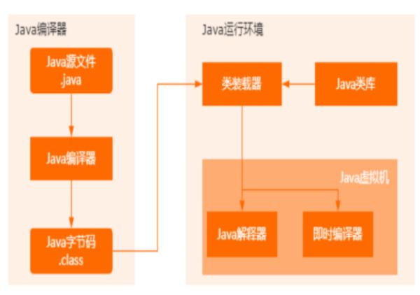

---

所谓的父委托模型，就是按照类加载器的层级关系，逐层进行委派。
比如当需要加载一个class 文件的时候，首先会把这个class 的查询和加载委派
给父加载器去执行，如果父加载器都无法加载，再尝试自己来加载这个class。
跟着Mic学架构
学架构
ic学架构
跟着Mic学架构
跟着Mic学架构
跟着Mic
跟着Mic

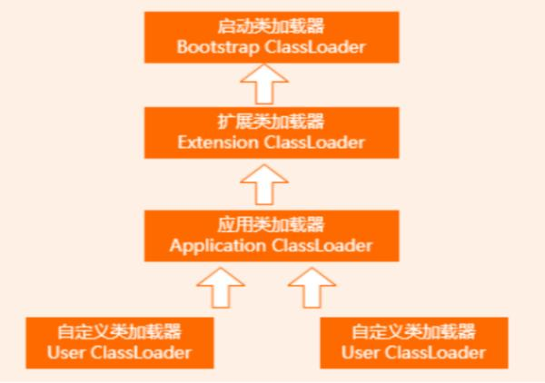

---

这样设计的好处，我认为有几个。
安全性，因为这种层级关系实际上代表的是一种优先级，也就是所有的类的加载，
优先给Bootstrap ClassLoader。那对于核心类库中的类，就没办法去破坏，比
如自己写一个java.lang.String，最终还是会交给启动类加载器。再加上每个类
加载器的作用范围，那么自己写的java.lang.String 就没办法去覆盖类库中类。
我认为这种层级关系的设计，可以避免重复加载导致程序混乱的问题，因为如果
父加载器已经加载过了，那么子类就没必要去加载了。
以上就是我对这个问题的理解。
面试点评
JVM 虚拟机一定面试必问的领域，因为我们自己写的程序运行在JVM 上，一旦
出现问题，你不理解，就无法排查。
就像一个修汽车的工人，他不知道汽车的工作原理，不懂发动机，那他是无法做
好这份工作的。
好的，本期的普通人VS 高手面试系列的视频就到这里结束了，喜欢的朋友记得
点赞和收藏。
跟着Mic学架构
学架构
ic学架构
跟着Mic学架构
跟着Mic学架构
跟着Mic
跟着Mic

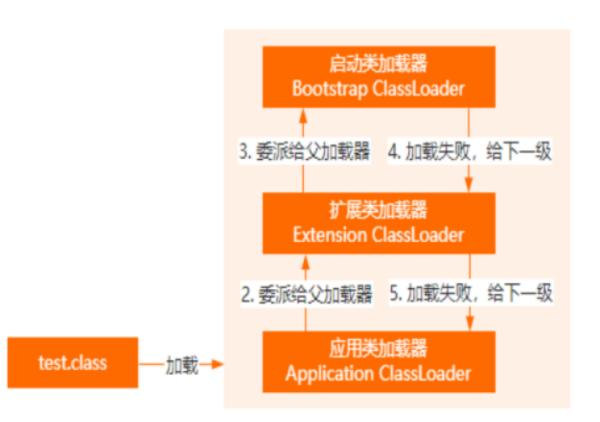

---

另外，这些面试题我都整理成了笔记，大家有需要的可以私信获取。
我是Mic，一个工作了14 年的Java 程序员，咱们下期再见。
怎么理解线程安全？
Hi，大家好，我是Mic
一个工作了4 年的小伙伴，遇到了一个非常抽象的面试题，说说你对线程安全性
的理解。
这类问题，对于临时刷面试题来面试的小伙伴，往往是致命的。
一个是不知道从何说起，也就是语言组织比较困难。
其次就是，如果对于线程安全性没有一定程度的理解，一般很难说出你的理解。
ok，我们来看看这个问题的回答。
普通人
高手
简单来说，在多个线程访问某个方法或者对象的时候，不管通过任何的方式调用
以及线程如何去交替执行。
在程序中不做任何同步干预操作的情况下，这个方法或者对象的执行/修改都能
按照预期的结果来反馈，那么这个类就是线程安全的。
实际上，线程安全问题的具体表现体现在三个方面，原子性、有序性、可见性。
原子性呢，是指当一个线程执行一系列程序指令操作的时候，它应该是不可中断
的，因为一旦出现中断，站在多线程的视角来看，这一系列的程序指令会出现前
后执行结果不一致的问题。
这个和数据库里面的原子性是一样的，简单来说就是一段程序只能由一个线程完
整的执行完成，而不能存在多个线程干扰。
CPU 的上下文切换，是导致原子性问题的核心，而JVM 里面提供了
Synchronized 关键字来解决原子性问题。
跟着Mic学架构
学架构
ic学架构
跟着Mic学架构
跟着Mic学架构
跟着Mic
跟着Mic

---

可见性，就是说在多线程环境下，由于读和写是发生在不同的线程里面，有可能
出现某个线程对共享变量的修改，对其他线程不是实时可见的。
导致可见性问题的原因有很多，比如CPU 的高速缓存、CPU 的指令重排序、编
译器的指令重排序。
有序性，指的是程序编写的指令顺序和最终CPU 运行的指令顺序可能出现不一
致的现象，这种现象也可以称为指令重排序，所以有序性也会导致可见性问题。
可见性和有序性可以通过JVM 里面提供了一个Volatile 关键字来解决。
在我看来，导致有序性、原子性、可见性问题的本质，是计算机工程师为了最大
化提升CPU 利用率导致的。比如为了提升CPU 利用率，设计了三级缓存、设
计了StoreBuffer、设计了缓存行这种预读机制、在操作系统里面，设计了线程
模型、在编译器里面，设计了编译器的深度优化机制。
一上就是我对这个问题的理解。
面试点评
从高手的回答中，可以很深刻的感受到，他对于计算机底层原理和线程安全性相
关的底层实现是理解得很透彻的。
跟着Mic学架构
学架构
ic学架构
跟着Mic学架构
跟着Mic学架构
跟着Mic
跟着Mic

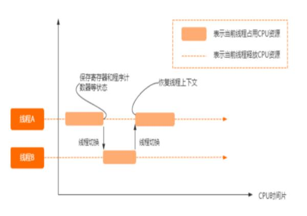

---

对我来说，这个人去写程序代码，不用担心他滥用线程导致一些不可预测的线程
安全性问题了，这就是这个面试题的价值。
好的，本期的普通人VS 高手面试系列的视频就到这里结束了，喜欢的朋友记得
点赞和收藏。
另外，这些面试题我都整理成了笔记，大家有需要的可以私信获取。
我是Mic，一个工作了14 年的Java 程序员，咱们下期再见。
请简述一下伪共享的概念以及如何避免
一个工作5 年的小伙伴，2 个星期时间，去应聘了10 多家公司，结果每次在技
术面试环节，被技术原理难倒了。
他现在很尴尬，简历投递出去就像石沉大海，基本没什么面试邀约。
技术能力的提升也不是一两天的事情，所以他现在特别焦虑。
于是，我从他遇到过的面试题里面抽出来一道，给大家分享一下。
“请简述一下伪共享的概念以及避免的方法”
对于这个问题，看看高手该怎么回答。
普通人
临场发挥
高手
对于这个问题，要从几个方面来回答。
首先，计算机工程师为了提高CPU 的利用率，平衡CPU 和内存之间的速度差
异，在CPU 里面设计了三级缓存。
CPU 在向内存发起IO 操作的时候，一次性会读取64 个字节的数据作为一个缓
存行，缓存到CPU 的高速缓存里面。
在Java 中一个long 类型是8 个字节，意味着一个缓存行可以存储8 个long 类
型的变量。
这个设计是基于空间局部性原理来实现的，也就是说，如果一个存储器的位置被
引用，那么将来它附近的位置也会被引用。
所以缓存行的设计对于CPU 来说，可以有效的减少和内存的交互次数，从而避
免了CPU 的IO 等待，以提升CPU 的利用率。
跟着Mic学架构
学架构
ic学架构
跟着Mic学架构
跟着Mic学架构
跟着Mic
跟着Mic

---

正是因为这种缓存行的设计，导致如果多个线程修改同一个缓存行里面的多个独
立变量的时候，基于缓存一致性协议，就会无意中影响了彼此的性能，这就是伪
共享的问题。
像这样一种情况，CPU0 上运行的线程想要更新变量X、CPU1 上的线程想要更
新变量Y，而X/Y/Z 都在同一个缓存行里面。
每个线程都需要去竞争缓存行的所有权对变量做更新，基于缓存一致性协议。
一旦运行在某个CPU 上的线程获得了所有权并执行了修改，就会导致其他CPU
中的缓存行失效。
这就是伪共享问题的原理。
因为伪共享会问题导致缓存锁的竞争，所以在并发场景中的程序执行效率一定会
收到较大的影响。
这个问题的解决办法有两个：
使用对齐填充，因为一个缓存行大小是64 个字节，如果读取的目标数据小于64
个字节，可以增加一些无意义的成员变量来填充。
在Java8 里面，提供了@Contented 注解，它也是通过缓存行填充来解决伪共享
问题的，被@Contented 注解声明的类或者字段，会被加载到独立的缓存行上。
已上就是我对这个问题的理解！
跟着Mic学架构
学架构
ic学架构
跟着Mic学架构
跟着Mic学架构
跟着Mic
跟着Mic

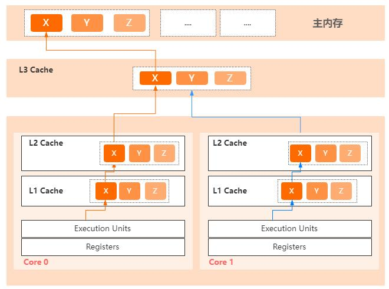

---

面试点评
在Netty 里面，有大量用到对齐填充的方式来避免伪共享问题。
所以这并不是一个所谓超纲的问题，在我看来，多线程也好、数据结构算法也好、
还是JVM，这个一个
合格的Java 程序员必须要掌握的基础。
我们习惯了在框架里面写代码，却忽略了各种成熟框架已经让Java 程序员变得
越来越普通。
好的，本期的普通人VS 高手面试系列的视频就到这里结束了。
有任何不懂的技术面试题，欢迎随时私信我
我是Mic，一个工作了14 年的Java 程序员，咱们下期再见。
为什么要使用Spring 框架？
一个工作了4 年的小伙伴，他说他从线下培训就开始接触Spring，到现在已经
快5 年时间了。
从来没有想过，为什么要使用Spring 框架。
结果在面试的时候，竟然遇到一个这样的问题。
大脑一时间短路了，来求助我，这类问题应该怎么去回答。
下面我们来看看普通人和高手的回答
普通人
高手
Spring 是一个轻量级应用框架，它提供了IoC 和AOP 这两个核心的功能。
它的核心目的是为了简化企业级应用程序的开发，使得开发者只需要关心业务需
求，不需要关心Bean 的管理，
以及通过切面增强功能减少代码的侵入性。
从Spring 本身的特性来看，我认为有几个关键点是我们选择Spring 框架的原因。
轻量：Spring 是轻量的，基本的版本大约2MB。
跟着Mic学架构
学架构
ic学架构
跟着Mic学架构
跟着Mic学架构
跟着Mic
跟着Mic

---

IOC/DI：Spring 通过IOC 容器实现了Bean 的生命周期的管理，以及通过DI 实
现依赖注入，从而实现了对象依赖的松耦合管理。
面向切面的编程(AOP)：Spring 支持面向切面的编程，从而把应用业务逻辑和系
统服务分开。
MVC 框架：Spring MVC 提供了功能更加强大且更加灵活的Web 框架支持
事务管理：Spring 通过AOP 实现了事务的统一管理，对应用开发中的事务处理
提供了非常灵活的支持
最后，Spring 从第一个版本发布到现在，它的生态已经非常庞大了。在业务开
发领域，Spring 生态几乎提供了
非常完善的支持，更重要的是社区的活跃度和技术的成熟度都非常高，以上就是
我对这个问题的理解。
面试点评
任何一个技术框架，一定是为了解决某些特定的问题，只是大家忽视了这个点。
为什么要用，再往高一点来说，其实就是技术选型，能回答这个问题，
跟着Mic学架构
学架构
ic学架构
跟着Mic学架构
跟着Mic学架构
跟着Mic
跟着Mic

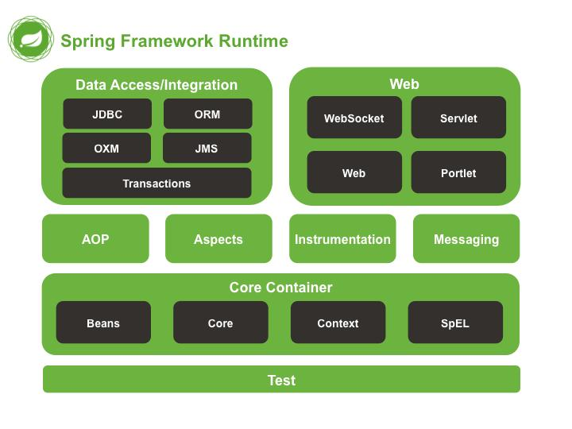

---

意味着面对业务场景或者技术问题的解决方案上，会有自己的见解和思考。
所以，我自己也喜欢在面试的时候问这一类的问题。
好的，本期的普通人VS 高手面试系列的视频就到这里结束了。
有任何不懂的技术面试题，欢迎随时私信我
我是Mic，一个工作了14 年的Java 程序员，咱们下期再见。
Spring 中事务的传播行为有哪些？
一个工作了2 年的粉丝，私信了一个比较简单的问题。
说：“Spring 中事务的传播行为有哪些？”
他说他能记得一些，但是在项目中基本上不需要配置，所以一下就忘记了。
结果导致面试被拒绝，有点遗憾！
ok，关于这个问题，看看普通人和高手的回答。
普通人
高手
对于这个问题，需要从几个方面去回答。
首选，所谓的事务传播行为，就是多个声明了事务的方法相互调用的时候，这个
事务应该如何传播。
比如说，methodA()调用methodB()，两个方法都显示的开启了事务。
跟着Mic学架构
学架构
ic学架构
跟着Mic学架构
跟着Mic学架构
跟着Mic
跟着Mic

---

那么methodB()是开启一个新事务，还是继续在methodA()这个事务中执行？就
取
决
于
事
务
的
传
播
行
为
。
在Spring 中，定义了7 种事务传播行为。
REQUIRED：默认的Spring 事物传播级别，如果当前存在事务，则加入这个事
务，如果不存在事务，就新建一个事务。
REQUIRE_NEW：不管是否存在事务，都会新开一个事务，新老事务相互独立。
外部事务抛出异常回滚不会影响内部事务的正常提交。
NESTED：如果当前存在事务，则嵌套在当前事务中执行。如果当前没有事务，
则新建一个事务，类似于REQUIRE_NEW。
SUPPORTS：表示支持当前事务，如果当前不存在事务，以非事务的方式执行。
NOT_SUPPORTED：表示以非事务的方式来运行，如果当前存在事务，则把当
前事务挂起。
MANDATORY：强制事务执行，若当前不存在事务，则抛出异常.
NEVER：以非事务的方式执行，如果当前存在事务，则抛出异常。
Spring 事务传播级别一般不需要定义，默认就是PROPAGATION_REQUIRED，
除非在嵌套事务的情况下需要重点了解。
跟着Mic学架构
学架构
ic学架构
跟着Mic学架构
跟着Mic学架构
跟着Mic
跟着Mic

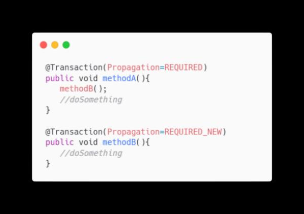

---

以上就是我对这个问题的理解！
面试点评
这个问题其实只需要理解事务传播行为的本质以及为什么需要考虑到事务传播
的问题。
就可以直接基于自身的技术积累来推演出答案，无非就是基于可能的策略进行穷
举，怎么也能推演出5 种吧。
好的，本期的普通人VS 高手面试系列的视频就到这里结束了。
有任何不懂的技术面试题，欢迎随时私信我
我是Mic，一个工作了14 年的Java 程序员，咱们下期再见。
Dubbo 是如何动态感知服务下线的？
什么情况？一个工作了5 年的Java 程序员，竟然无法回答出这个问题？
“Dubbo 是如何动态感知服务下线的”？
好吧，对于这个问题，看看普通人和高手的回答！
普通人
高手
好的，面试官，关于这个问题，我从几个方面来回答。
首先，Dubbo 默认采用Zookeeper 实现服务的注册与服务发现，简单来说啊，
就是多个Dubbo 服务之间的通信地址，是使用Zookeeper 来维护的。
在Zookeeper 上，会采用树形结构的方式来维护Dubbo 服务提供端的协议地
址，
Dubbo 服务消费端会从Zookeeper Server 上去查找目标服务的地址列表，从而
完成服务的注册和消费的功能。
跟着Mic学架构
学架构
ic学架构
跟着Mic学架构
跟着Mic学架构
跟着Mic
跟着Mic

---

Zookeeper 会通过心跳检测机制，来判断Dubbo 服务提供端的运行状态，来决
定是否应该把这个服务从地址列表剔除。
跟着Mic学架构
学架构
ic学架构
跟着Mic学架构
跟着Mic学架构
跟着Mic
跟着Mic

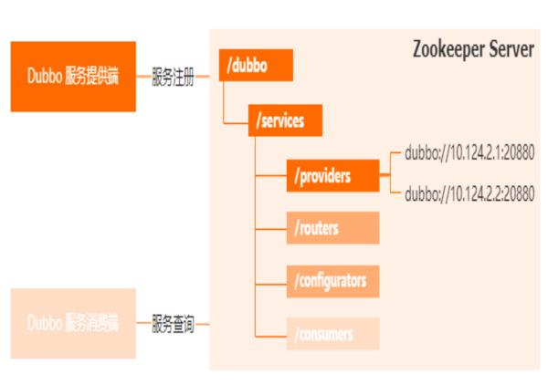

---

当Dubbo 服务提供方出现故障导致Zookeeper 剔除了这个服务的地址，
那么Dubbo 服务消费端需要感知到地址的变化，从而避免后续的请求发送到故
障节点，导致请求失败。
也就是说Dubbo 要提供服务下线的动态感知能力。
这个能力是通过Zookeeper 里面提供的Watch 机制来实现的，
简单来说呢，Dubbo 服务消费端会使用Zookeeper 里面的Watch 来针对
Zookeeper Server 端的/providers 节点注册监听，
一旦这个节点下的子节点发生变化，Zookeeper Server 就会发送一个事件通知
Dubbo Client 端.
跟着Mic学架构
学架构
ic学架构
跟着Mic学架构
跟着Mic学架构
跟着Mic
跟着Mic

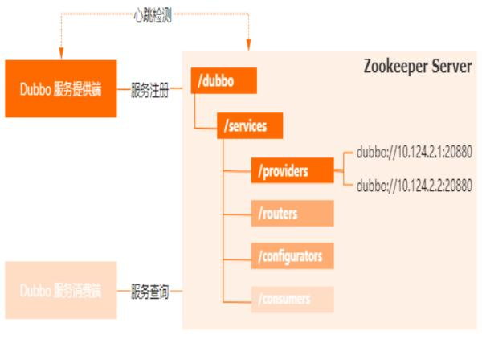

---

Dubbo Client 端收到事件以后，就会把本地缓存的这个服务地址删除，这样后续
就不会把请求发送到失败的节点上，完成服务下线感知。
以上就是我对这个问题的理解！
面试点评
Dubbo 是目前非常主流的开源RPC 框架，在很多的企业都有使用。
理解这个RPC 底层的工作原理很有必要，它能帮助开发者提高开发问题的解决
效率。
还是想多说一句，在Java 这个岗位上，如果想走得更远，一定要花苦功夫。
好的，本期的普通人VS 高手面试系列的视频就到这里结束了。
有任何不懂的技术面试题，欢迎随时私信我
我是Mic，一个工作了14 年的Java 程序员，咱们下期再见。
Spring 中Bean 的作用域有哪些？
一个工作3 年的小伙子，去面试被问到Spring 里面的问题。
跟着Mic学架构
学架构
ic学架构
跟着Mic学架构
跟着Mic学架构
跟着Mic
跟着Mic

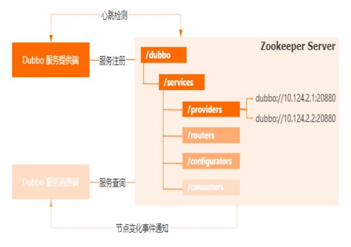

---

这个问题比较简单，但是他却没有回答上来。
虽然他可以通过搜索引擎找到答案，但是如果没有理解，下次面试还是不会！
这个面试题是：“Spring 中的Bean，作用域有哪些？”
对于这个问题，看看普通人和高手的回答。
普通人
高手
好的，这个问题可以从几个方面来回答。
首先呢，Spring 框架里面的IOC 容器，可以非常方便的去帮助我们管理应用里
面的Bean 对象实例。
我们只需要按照Spring 里面提供的xml 或者注解等方式去告诉IOC 容器，哪些
Bean 需要被IOC 容器管理就行了。
其次呢，既然是Bean 对象实例的管理，那意味着这些实例，是存在生命周期，
也就是所谓的作用域。
理论上来说，常规的生命周期只有两种：
singleton，也就是单例，意味着在整个Spring 容器中只会存在一个Bean 实例。
prototype，翻译成原型，意味着每次从IOC 容器去获取指定Bean 的时候，都
会返回一个新的实例对象。
但是在基于Spring 框架下的Web 应用里面，增加了一个会话纬度来控制Bean
的生命周期，主要有三个选择
request，针对每一次http 请求，都会创建一个新的Bean
session，以sesssion 会话为纬度，同一个session 共享同一个Bean 实例，不
同的session 产生不同的Bean 实例
globalSession，针对全局session 纬度，共享同一个Bean 实例
以上就是我对这个问题的理解。
面试点评
跟着Mic学架构
学架构
ic学架构
跟着Mic学架构
跟着Mic学架构
跟着Mic
跟着Mic

---

“技术框架的本质是去解决特定问题的，所以如果能够站在技术的角度去思考
Spring”
当遇到这种问题的时候，就可以像这个高手的回答一样，能够基于场景来推断出
答案。
就像我们现在写CRUD 代码，它已经变成了一种基本能力去让我们完成复杂业
务逻辑的开发。
好的，本期的普通人VS 高手面试系列的视频就到这里结束了。
有任何不懂的技术面试题，欢迎随时私信我
我是Mic，一个工作了14 年的Java 程序员，咱们下期再见。
Zookeeper 中的Watch 机制的原理？
一个工作了7 年的粉丝，遇到了一个Zookeeper 的问题。
因为接触过Zookeeper 这个技术，不知道该怎么回答。
我说一个工作了7 年的程序员，没有接触过主流技术，这不正常。
于是我问了他工资以后，我理解了！
好吧，关于“Zookeeper 中Watch 机制的实现原理”，看看普通人和高手的回答。
普通人
高手
好的，这个问题我打算从两个方面来回答。
Zookeeper 是一个分布式协调组件，为分布式架构下的多个应用组件提供了顺序
访问控制能力。
它的数据存储采用了类似于文件系统的树形结构，以节点的方式来管理存储在
Zookeeper 上的数据。
跟着Mic学架构
学架构
ic学架构
跟着Mic学架构
跟着Mic学架构
跟着Mic
跟着Mic

---

Zookeeper 提供了一个Watch 机制，可以让客户端感知到Zookeeper Server
上存储的数据变化，这样一种机制可以让Zookeeper 实现很多的场景，比如配
置中心、注册中心等。
跟着Mic学架构
学架构
ic学架构
跟着Mic学架构
跟着Mic学架构
跟着Mic
跟着Mic

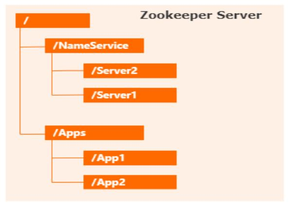

---

Watch 机制采用了Push 的方式来实现，也就是说客户端和Zookeeper Server
会建立一个长连接，一旦监听的指定节点发生了变化，就会通过这个长连接把变
化的事件推送给客户端。
Watch 的具体流程分为几个部分：
首先，是客户端通过指定命令比如exists、get，对特定路径增加watch
然后服务端收到请求以后，用HashMap 保存这个客户端会话以及对应关注的节
点路径，同时客户端也会使用HashMap
存储指定节点和事件回调函数的对应关系。
当服务端指定被watch 的节点发生变化后，就会找到这个节点对应的会话，把
变化的事件和节点信息发给这个客户端。
客户端收到请求以后，从ZkWatcherManager 里面对应的回调方法进行调用，
完成事件变更的通知。
跟着Mic学架构
学架构
ic学架构
跟着Mic学架构
跟着Mic学架构
跟着Mic
跟着Mic

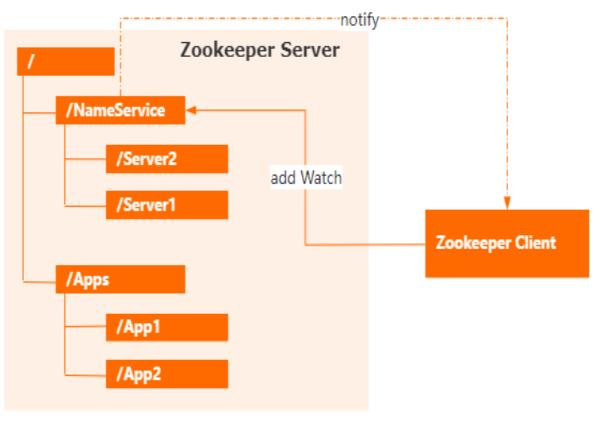

---

以上就是我对这个问题的理解！
面试点评
这个面试题呢，我认为考察的价值也很大，其实对于服务端的数据变更通知，
无非就是pull 和push 两种方案，而这道题里面涉及到的技术点就是push 的实
现。
在业务开发里面，也可能会涉及到类似的场景，比如消息通知，扫码登录等。
如果你了解这些思想，那在解决这类问题的时候，会变得更加从容。
好的，本期的普通人VS 高手面试系列的视频就到这里结束了。
我是Mic，一个工作了14 年的Java 程序员，咱们下期再见。
Spring 中有哪些方式可以把Bean 注入
到IOC 容器？
今天收到一个工作4 年的粉丝的面试题。
跟着Mic学架构
学架构
ic学架构
跟着Mic学架构
跟着Mic学架构
跟着Mic
跟着Mic

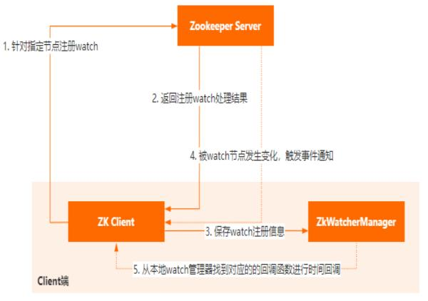

---

问题是：“Spring 中有哪些方式可以把Bean 注入到IOC 容器”。
他说这道题是所有面试题里面回答最好的，但是看面试官的表情，好像不太对。
我问他怎么回答的，他说：“接口注入”、“Setter 注入”、“构造器注入”。
为什么不对？来看看普通人和高手的回答。
普通人
高手
好的，把Bean 注入到IOC 容器里面的方式有7 种方式
使用xml 的方式来声明Bean 的定义，Spring 容器在启动的时候会加载并解析这
个xml，把bean 装载到IOC 容器中。
使用@CompontScan 注解来扫描声明了@Controller、@Service、@Repository、
@Component 注解的类。
使用@Configuration 注解声明配置类，并使用@Bean 注解实现Bean 的定义，
这种方式其实是xml 配置方式的一种演变，是Spring 迈入到无配置化时代的里
程碑。
使用@Import 注解，导入配置类或者普通的Bean
使用FactoryBean 工厂bean ，动态构建一个Bean 实例，Spring Cloud
OpenFeign 里面的动态代理实例就是使用FactoryBean 来实现的。
实现ImportBeanDefinitionRegistrar 接口，可以动态注入Bean 实例。这个在
Spring Boot 里面的启动注解有用到。
实现ImportSelector 接口，动态批量注入配置类或者Bean 对象，这个在Spring
Boot 里面的自动装配机制里面有用到。
以上就是我对这个问题的理解。
面试点评
工作了4 年，IOC 和DI 都没有搞清楚，作为面试官，想给你放水都放不了啊。
这道题目也很有意义，要想更加优雅的去解决一些实际业务问题，首先得有足够
多的工具积累。
跟着Mic学架构
学架构
ic学架构
跟着Mic学架构
跟着Mic学架构
跟着Mic
跟着Mic

---

你可曾想过，Bean 的注入竟然有这么多方式，而且还有些方式是没听过的呢？
好的，本期的普通人VS 高手面试系列的视频就到这里结束了。
我是Mic，一个工作了14 年的Java 程序员，咱们下期再见。
Redis 存在线程安全问题吗？为什么？
一个工作了5 年的粉丝私信我。
他说自己准备了半年时间，想如蚂蚁金服，结果第一面就挂了，非常难过。
问题是：“Redis 存在线程安全问题吗？”
关于这个问题，看看普通人和高手的回答。
普通人
高手
好的，关于这个问题，我从两个方面来回答。
第一个，从Redis 服务端层面。
Redis Server 本身是一个线程安全的K-V 数据库，也就是说在Redis Server 上
执行的指令，不需要任何同步机制，不会存在线程安全问题。
虽然Redis 6.0 里面，增加了多线程的模型，但是增加的多线程只是用来处理
网络IO 事件，对于指令的执行过程，仍然是由主线程来处理，所以不会存在多
个线程通知执行操作指令的情况。
跟着Mic学架构
学架构
ic学架构
跟着Mic学架构
跟着Mic学架构
跟着Mic
跟着Mic

---

为什么Redis 没有采用多线程来执行指令，我认为有几个方面的原因。
Redis Server 本身可能出现的性能瓶颈点无非就是网络IO、CPU、内存。但是
CPU 不是Redis 的瓶颈点，所以没必要使用多线程来执行指令。
如果采用多线程，意味着对于redis 的所有指令操作，都必须要考虑到线程安全
问题，也就是说需要加锁来解决，这种方式带来的性能影响反而更大。
第二个，从Redis 客户端层面。
虽然Redis Server 中的指令执行是原子的，但是如果有多个Redis 客户端同时
执行多个指令的时候，就无法保证原子性。
假设两个redis client 同时获取Redis Server 上的key1，同时进行修改和写入，
因为多线程环境下的原子性无法被保障，以及多进程情况下的共享资源访问的竞
争问题，使得数据的安全性无法得到保障。
跟着Mic学架构
学架构
ic学架构
跟着Mic学架构
跟着Mic学架构
跟着Mic
跟着Mic

---

当然，对于客户端层面的线程安全性问题，解决方法有很多，比如尽可能的使用
Redis 里面的原子指令，或者对多个客户端的资源访问加锁，或者通过Lua 脚本
来实现多个指令的操作等等。
以上就是我对这个问题的理解。
面试点评
关于线程安全性问题，是一个非常重要，非常重要的知识。
虽然我们在实际开发中很少去主动使用线程，但是在项目中线程无处不在，比如
Tomcat 就是用多线程来处理请求的
如果对线程安全不了解，那么很容已出现各种生产事故和莫名其妙的问题。
这也是为什么大厂一定会问多线程并发的原因。
好的，本期的普通人VS 高手面试系列的视频就到这里结束了。
我是Mic，一个工作了14 年的Java 程序员，咱们下期再见。
跟着Mic学架构
学架构
ic学架构
跟着Mic学架构
跟着Mic学架构
跟着Mic
跟着Mic

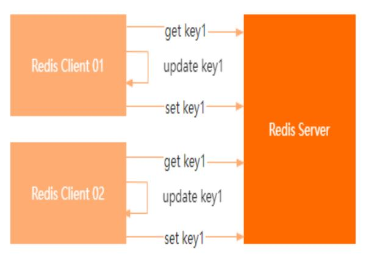

---

Spring 中BeanFactory 和
FactoryBean 的区别
一个工作了六年多的粉丝，胸有成竹的去京东面试。
然后被Spring 里面的一个问题卡住，唉，我和他说，6 年啦，Spring 都没搞明
白？
那怎么去让面试官给你通过呢？
这个问题是：Spring 中BeanFactory 和FactoryBean 的区别。
好吧，对于这个问题看看普通人和高手的回答。
普通人
高手
关于这个问题，我从几个方面来回答。
首先，Spring 里面的核心功能是IOC 容器，所谓IOC 容器呢，本质上就是一个
Bean 的容器或者是一个Bean 的工厂。
它能够根据xml 里面声明的Bean 配置进行bean 的加载和初始化，然后
BeanFactory 来生产我们需要的各种各样的Bean。
所以我对BeanFactory 的理解了有两个。
BeanFactory 是所有Spring Bean 容器的顶级接口，它为Spring 的容器定义了
一套规范，并提供像getBean 这样的方法从容器中获取指定的Bean 实例。
BeanFactory 在产生Bean 的同时，还提供了解决Bean 之间的依赖注入的能力，
也就是所谓的DI。
FactoryBean 是一个工厂Bean，它是一个接口，主要的功能是动态生成某一个
类型的Bean 的实例，也就是说，我们可以自定义一个Bean 并且加载到IOC 容
器里面。
它里面有一个重要的方法叫getObject()，这个方法里面就是用来实现动态构建
Bean 的过程。
Spring Cloud 里面的OpenFeign 组件，客户端的代理类，就是使用了
FactoryBean 来实现的。
跟着Mic学架构
学架构
ic学架构
跟着Mic学架构
跟着Mic学架构
跟着Mic
跟着Mic

---

以上就是我对这个问题的理解。
面试点评
这个问题，只要稍微看过Spring 框架的源码，怎么都能回答出来。
关键在于你是否愿意逼自己去学习一些工作中不常使用的技术来提升自己。
在我看来，薪资和能力是一种等价交换，在市场经济下，能力一般又想获得更高
薪资，很显然不可能！
好的，本期的普通人VS 高手面试系列的视频就到这里结束了。
我是Mic，一个工作了14 年的Java 程序员，咱们下期再见。
简述一下你对线程池的理解？
到底是什么面试题，
让一个工作了4 年的精神小伙，只是去参加了一场技术面试，
就被搞得精神萎靡。郁郁寡欢！
这一切的背后到底是道德的沦丧，还是人性的扭曲。
让我们一起揭秘一下这道面试题。
关于，“简述你对线程池的理解”，看看普通人和高手的回答。
普通人
高手
关于这个问题，我会从几个方面来回答。
首先，线程池本质上是一种池化技术，而池化技术是一种资源复用的思想，比较
常见的有连接池、内存池、对象池。
而线程池里面复用的是线程资源，它的核心设计目标，我认为有两个：
减少线程的频繁创建和销毁带来的性能开销，因为线程创建会涉及到CPU 上下
文切换、内存分配等工作。
线程池本身会有参数来控制线程创建的数量，这样就可以避免无休止的创建线程
带来的资源利用率过高的问题，
跟着Mic学架构
学架构
ic学架构
跟着Mic学架构
跟着Mic学架构
跟着Mic
跟着Mic

---

起到了资源保护的作用。
其次，我简单说一下线程池里面的线程复用技术。因为线程本身并不是一个受控
的技术，也就是说线程的生命周期时由任务运行的状态决定的，无法人为控制。
所以为了实现线程的复用，线程池里面用到了阻塞队列，简单来说就是线程池里
面的工作线程处于一直运行状态，它会从阻塞队列中去获取待执行的任务，一旦
队列空了，那这个工作线程就会被阻塞，直到下次有新的任务进来。
也就是说，工作线程是根据任务的情况实现阻塞和唤醒，从而达到线程复用的目
的。
最后，线程池里面的资源限制，是通过几个关键参数来控制的，分别是核心线程
数、最大线程数。
核心线程数表示默认长期存在的工作线程，而最大线程数是根据任务的情况动态
创建的线程，主要是提高阻塞队列中任务的
处
理
效
率
。
以上就是我对这个问题的理解！
面试点评
我当时在阅读线程池的源码的时候，被里面的各种设计思想惊艳到了。
跟着Mic学架构
学架构
ic学架构
跟着Mic学架构
跟着Mic学架构
跟着Mic
跟着Mic

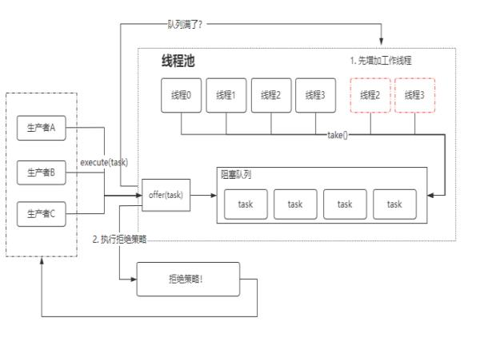

---

比如动态扩容和缩容的思想、线程的复用思想、以及线程回收的方法等等。
我发现越是简单的东西，反而越不简单。
好的，本期的普通人VS 高手面试系列的视频就到这里结束了
更多的面试资料和面试技巧，可以私信我获取。
我是Mic，一个工作了14 年的Java 程序员，咱们下期再见！
如何理解Spring Boot 中的Starter？
一个工作了3 年的Java 程序员，遇到一个Spring Boot 的问题。
他对这个问题有一些了解，但是回答得不是很好，希望参考我的高手回答。
这个问题是：“如何理解Spring Boot 中的Starter”。
对于这个问题，看看普通人和高手的回答。
普通人
高手
Starter 是Spring Boot 的四大核心功能特性之一，除此之外，Spring Boot 还有
自动装配、Actuator 监控等特性。
Spring Boot 里面的这些特性，都是为了让开发者在开发基于Spring 生态下的企
业级应用时，只需要关心业务逻辑，
减少对配置和外部环境的依赖。
其中，Starter 是启动依赖，它的主要作用有几个。
Starter 组件以功能为纬度，来维护对应的jar 包的版本依赖，
使得开发者可以不需要去关心这些版本冲突这种容易出错的细节。
Starter 组件会把对应功能的所有jar 包依赖全部导入进来，避免了开发者自己去
引入依赖带来的麻烦。
Starter 内部集成了自动装配的机制，也就说在程序中依赖对应的starter 组件以
后，
这个组件自动会集成到Spring 生态下，并且对于相关Bean 的管理，也是基于
自动装配机制来完成。
跟着Mic学架构
学架构
ic学架构
跟着Mic学架构
跟着Mic学架构
跟着Mic
跟着Mic

---

依赖Starter 组件后，这个组件对应的功能所需要维护的外部化配置，会自动集
成到Spring Boot 里面，
我们只需要在application.properties 文件里面进行维护就行了，比如Redis 这个
starter，只需要在application.properties
文件里面添加redis 的连接信息就可以直接使用了。
在我看来，Starter组件几乎完美的体现了Spring Boot里面约定优于配置的理念。
另外，Spring Boot 官方提供了很多的Starter 组件，比如Redis、JPA、MongoDB
等等。
但是官方并不一定维护了所有中间件的Starter，所以对于不存在的Starter，第
三方组件一般会自己去维护一个。
官方的starter 和第三方的starter 组件，最大的区别在于命名上。
官方维护的starter 的以spring-boot-starter 开头的前缀。
第三方维护的starter 是以spring-boot-starter 结尾的后缀
这也是一种约定优于配置的体现。
跟着Mic学架构
学架构
ic学架构
跟着Mic学架构
跟着Mic学架构
跟着Mic
跟着Mic

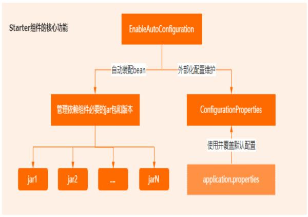

---

以上就是我对这个问题的理解。
面试点评
在技术的学习过程中，我认为“为什么是”比“是什么”要重要。
以这种方式来学习，带来的好处就是对技术理解会更加深刻。
这道题考察的就是“为什么是”，不难，关键在于自己的理解。
好的，本期的普通人VS 高手面试系列的视频就到这里结束了，
如果你喜欢这个视频，记得点赞和收藏。
如果想获得一对一的面试指导以及面试资料，可以私信我。
我是Mic，一个工作了14 年的Java 程序员，咱们下期再见！
IO 和NIO 有什么区别？
IO 问题一直是面试的重灾区之一
但又是非常重要而且面试必问的知识点
一个工作了7 年的粉丝私信我，他去面试了4 家互联网公司，
跟着Mic学架构
学架构
ic学架构
跟着Mic学架构
跟着Mic学架构
跟着Mic
跟着Mic

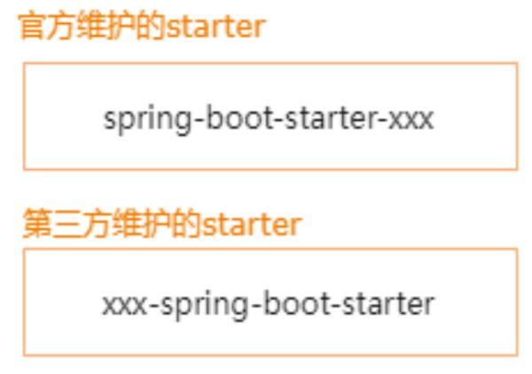

---

有三个公司问他网络IO 的问题，另外一个公司问了Netty，结果都没回答上来。
好吧，对于“IO 和NIO 的区别”，看看普通人和高手的回答。
普通人
高手
好的，关于这个问题，我会从下面几个方面来回答。
首先，I/O，指的是IO 流，它可以实现数据从磁盘中的读取以及写入。
实际上，除了磁盘以外，内存、网络都可以作为I/O 流的数据来源和目的地。
在Java 里面，提供了字符流和字节流两种方式来实现数据流的操作。
其次，当程序是面向网络进行数据的IO 操作的时候，Java 里面提供了Socket
的方式来实现。
通过这种方式可以实现数据的网络传输。
基于Socket 的IO 通信，它是属于阻塞式IO，也就是说，在连接以及IO 事件
未就绪的情况下，当前的连接会处于阻塞等待的状态。
跟着Mic学架构
学架构
ic学架构
跟着Mic学架构
跟着Mic学架构
跟着Mic
跟着Mic

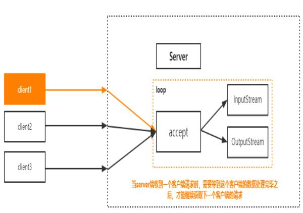

---

如果一旦某个连接处于阻塞状态，那么后续的连接都得等待。所以服务端能够处
理的连接数量非常有限。
NIO，是JDK1.4 里面新增的一种NEW IO 机制，相比于传统的IO，NIO 在效率
上做了很大的优化，并且新增了几个核心组件。
Channel、Buffer、Selectors。
另外，还提供了非阻塞的特性，所以，对于网络IO 来说，NIO 通常也称为
No-Block IO，非阻塞IO。
也就是说，通过NIO 进行网络数据传输的时候，如果连接未就绪或者IO 事件未
就绪的情况下，服务端不会阻塞当前连接，而是继续去轮询后续的连接来处理。
所以在NIO 里面，服务端能够并行处理的链接数量更多。
因此，总的来说，IO 和NIO 的区别，站在网络IO 的视角来说，前者是阻塞IO，
后者是非阻塞IO。
以上就是我对这个问题的理解。
面试点评
在互联网时代，网络IO 是最基础的技术。
跟着Mic学架构
学架构
ic学架构
跟着Mic学架构
跟着Mic学架构
跟着Mic
跟着Mic

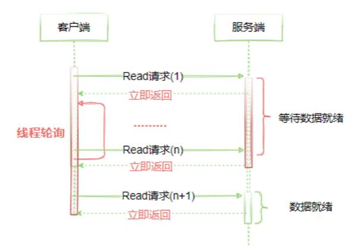

---

无论是微服务架构中的服务通信、还是应用系统和中间件之间的网络通信。
都在体现网络IO 的重要性。
好的，本期的普通人VS 高手面试系列的视频就到这里结束了，
如果你喜欢这个视频，记得点赞和收藏。
如果想获得一对一的面试指导以及面试资料，可以私信我。
我是Mic，一个工作了14 年的Java 程序员，咱们下期再见！
什么是幂等？如何解决幂等性问题？
一个在传统行业工作了7 年的粉丝私信我。
他最近去很多互联网公司面试，遇到的很多技术和概念都没听过。
其中就有一道题是：”什么是幂等、如何解决幂等性问题“？
他说，这个概念听都没听过，怎么可能回答出来。
好的，对于这个问题，看看普通人和高手的回答。
普通人
高手
好的。
所谓幂等，其实它是一个数学上的概念，在计算机编程领域中，幂等是指一个方
法被多次重复执行的时候产生的影响和第一次执行的影响相同。
之所以要考虑到幂等性问题，是因为在网络通信中，存在两种行为可能会导致接
口被重复执行。
用户的重复提交或者用户的恶意攻击，导致这个请求会被多次重复执行。
在分布式架构中，为了避免网络通信导致的数据丢失，在服务之间进行通信的时
候都会设计超时重试的机制，而这种机制有可能导致服务端接口被重复调用。
所以在程序设计中，对于数据变更类操作的接口，需要保证接口的幂等性。
而幂等性的核心思想，其实就是保证这个接口的执行结果只影响一次，后续即便
再次调用，也不能对数据产生影响，所以基于这样一个诉求，常见的解决方法有
很多。
跟着Mic学架构
学架构
ic学架构
跟着Mic学架构
跟着Mic学架构
跟着Mic
跟着Mic

---

使用数据库的唯一约束实现幂等，比如对于数据插入类的场景，比如创建订单，
因为订单号肯定是唯一的，所以如果是多次调用就会触发数据库的唯一约束异常，
从而避免一个请求创建多个订单的问题。
使用redis 里面提供的setNX 指令，比如对于MQ 消费的场景，为了避免MQ 重
复消费导致数据多次被修改的问题，可以在接受到MQ 的消息时，把这个消息
通过setNx 写入到redis 里面，一旦这个消息被消费过，就不会再次消费。
使用状态机来实现幂等，所谓的状态机是指一条数据的完整运行状态的转换流程，
比如订单状态，因为它的状态只会向前变更，所以多次修改同一条数据的时候，
一旦状态发生变更，那么对这条数据修改造成的影响只会发生一次。
当然，除了这些方法以外，还可以基于token 机制、去重表等方法来实现，但是
不管是什么方法，无非就是两种，
要么就是接口只允许调用一次，比如唯一约束、基于redis 的锁机制。
要么就是对数据的影响只会触发一次，比如幂等性、乐观锁
以上就是我对这个问题的理解。
面试点评
技术这个行业的发展是很快的，如果自己的技术能力和认知跟不上变化。
那基本上可以说是被时代淘汰了，所以保持持续学习是非常重要的。
好的，本期的普通人VS 高手面试系列的视频就到这里结束了
喜欢我的作品的小伙伴记得点赞和收藏。
如果你在面试的时候遇到一些不懂的问题，可以随时来私信我
我是Mic，一个工作了14 年的Java 程序员，咱们下期再见。
如何中断一个正在运行的线程？
一个去京东面试的工作了5 年的粉丝来找我说：
Mic 老师，你说并发编程很重要，果然我今天又挂在一道并发编程的面试题上了。
我问他问题是什么，他说：”如何中断一个正在运行中的线程？“。
我说这个问题很多工作2 年的人都知道~
好吧，对于这个问题，来看看普通人和高手的回答。
跟着Mic学架构
学架构
ic学架构
跟着Mic学架构
跟着Mic学架构
跟着Mic
跟着Mic

---

普通人
高手
关于这个问题，我从几个方面来回答。
首先，线程是系统级别的概念，在Java 里面实现的线程，最终的执行和调度
都是由操作系统来决定的，JVM 只是对操作系统层面的线程做了一层包装而已。
所以我们在Java 里面通过start 方法启动一个线程的时候，只是告诉操作系统这
个线程可以被执行，但是最终交给CPU 来执行是操作系统的调度算法来决定的。
因此，理论上来说，要在Java 层面去中断一个正在运行的线程，只能像类似于
Linux 里面的kill 命令结束进程的方式一样，强制终止。
所以，Java Thread 里面提供了一个stop 方法可以强行终止，但是这种方式是
不安全的，因为有可能线程的任务还没有，导致出现运行结果不正确的问题。
要想安全的中断一个正在运行的线程，只能在线程内部埋下一个钩子，外部程序
通过这个钩子来触发线程的中断命令。
因此，在Java Thread 里面提供了一个interrupt() 方法，这个方法配合
isInterrupted()方法使用，就可以实现安全的中断机制。
跟着Mic学架构
学架构
ic学架构
跟着Mic学架构
跟着Mic学架构
跟着Mic
跟着Mic

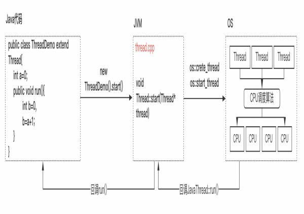

---

这种实现方法并不是强制中断，而是告诉正在运行的线程，你可以停止了，不过
是否要中断，取决于正在运行的线程，所以它能够保证线程运行结果的安全性。
以上就是我对这个问题的理解！
面试点评：
这个问题，很多工作了5 年以上的小伙伴都不一定清楚。
我想说的是，一味的专注在CRUD 这种自动化的重复性工作中除了前面3 年时
间会有很多的成长以外，后续的时间基本上就是在做重复的劳动。
和别人拉开差距恰恰是工作之外的8 个小时。
好的，本期的普通人VS 高手面试系列的视频就到这里结束了
如果觉得作品不错，记得点赞和关注。
我是Mic，一个工作了14 年的Java 程序员，咱们下期再见。
JVM 如何判断一个对象可以被回收
Hi，我是Mic。
跟着Mic学架构
学架构
ic学架构
跟着Mic学架构
跟着Mic学架构
跟着Mic
跟着Mic

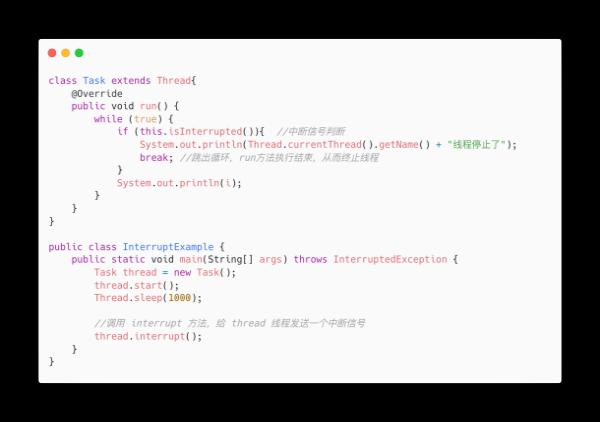

---

今天分享一道一线互联网公司必问的面试题。
”JVM 如何判断一个对象可以被回收“
关于这个问题，来看看普通人和高手的回答。
高手
好的，面试官。
在JVM 里面，要判断一个对象是否可以被回收，最重要的是判断这个对象是否
还在被使用，只有没被使用的对象才能回收。
引用计数器，也就是为每一个对象添加一个引用计数器，用来统计指向当前对
象的引用次数，
如果当前对象存在应用的更新，那么就对这个引用计数器进行增加，一旦这个引
用计数器变成0，就意味着它可以被回收了。
这种方法需要额外的空间来存储引用计数器，但是它的实现很简单，而且效率也
比较高。
跟着Mic学架构
学架构
ic学架构
跟着Mic学架构
跟着Mic学架构
跟着Mic
跟着Mic

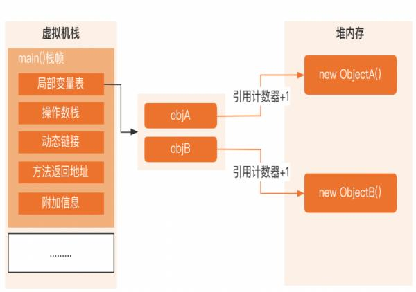

---

不过主流的JVM 都没有采用这种方式，因为引用计数器在处理一些复杂的循环
引用或者相互依赖的情况时，
可能会出现一些不再使用但是又无法回收的内存，造成内存泄露的问题。
可达性分析，它的主要思想是，首先确定一系列肯定不能回收的对象作为GC root，
比如虚拟机栈里面的引用对象、本地方法栈引用的对象等，然后以GC ROOT
作为起始节点，
从这些节点开始向下搜索，去寻找它的直接和间接引用的对象，当遍历完之后如
果发现有一些对象不可到达，
那么就认为这些对象已经没有用了，需要被回收。
在垃圾回收的时候，JVM 会首先找到所有的GC root，这个过程会暂停所有用户
线程，
也就是stop the world，然后再从GC Roots 这些根节点向下搜索，可达的对象
保留，不可达的就会回收掉。
可达性分析是目前主流JVM 使用的算法。
跟着Mic学架构
学架构
ic学架构
跟着Mic学架构
跟着Mic学架构
跟着Mic
跟着Mic

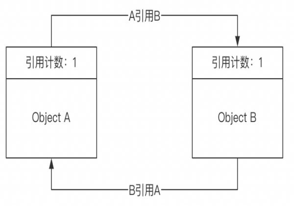

---

以上就是我对这个问题的理解。
面试点评
很多粉丝和我说，很多东西看完以后过一段时间就忘记了，问我是怎么记下来的。
我和他说，技术这些东西不需要记，你唯一能做的就是减少碎片化的学习，
多花一点时间在系统学习上，只有体系化的知识是不会忘记的。
可是，搭建体系化知识的过程要比碎片化的点状学习痛苦不止一万倍。
技术的沉淀是没有捷径的，只能花苦功夫去学习。
好的，本期的普通人VS 高手面试系列的视频就到这里结束了
喜欢我的作品的小伙伴记得点赞和收藏。
我是Mic，一个工作了14 年的Java 程序员，咱们下期再见。
说说你对Spring MVC 的理解
一个工作了7 年的粉丝，他说在面试之前，Spring 这块的内容准备得很充分。
跟着Mic学架构
学架构
ic学架构
跟着Mic学架构
跟着Mic学架构
跟着Mic
跟着Mic

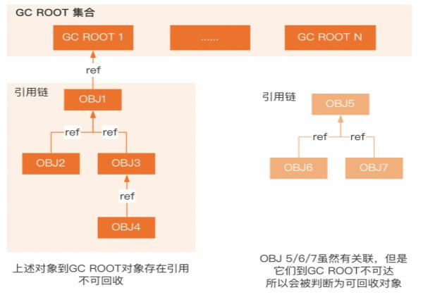

---

而且各种面试题也刷了，结果在面试的时候，面试官问：”说说你对Spring MVC
的理解“。
这个问题一下给他整不会了，就是那种突然不知道怎么组织语言，最后因为回答
比较混乱没通过面试。
ok，对于这个问题，我们来看看普通人和高手的回答。
普通人
高手
好的，关于这个问题，我会从几个方面来回答。
首先，Spring MVC 是是属于Spring Framework 生态里面的一个模块，它是在
Servlet 基础上构建并且使用MVC 模式设计的一个Web 框架，
主要的目的是简化传统Servlet+JSP 模式下的Web 开发方式。
其次，Spring MVC 的整体架构设计对Java Web 里面的MVC 架构模式做了增
强和扩展，主要有几个方面。
把传统MVC 框架里面的Controller 控制器做了拆分，分成了前端控制器
DispatcherServlet 和后端控制器Controller。
把Model 模型拆分成业务层Service 和数据访问层Repository。
在视图层，可以支持不同的视图，比如Freemark、velocity、JSP 等等。
所以，Spring MVC 天生就是为了MVC 模式而设计的，因此在开发MVC 应用的
时候会更加方便和灵活。
Spring MVC 的具体工作流程是，浏览器的请求首先会经过SpringMVC 里面的
核心控制器DispatcherServlet，它负责对请求进行分发到对应的Controller。
Controller 里面处理完业务逻辑之后，返回ModeAndView。
然后DispatcherServlet 寻找一个或者多个ViewResolver 视图解析器，找到
ModeAndView 指定的视图，并把数据显示到客户端。
跟着Mic学架构
学架构
ic学架构
跟着Mic学架构
跟着Mic学架构
跟着Mic
跟着Mic

---

以上就是我对Spring MVC 的理解。
面试点评
我培训过3W 多名Java 架构师，我发现他们对技术的理解只是停留在使用层面，
并没有深层次的思考这些技术框架的底层设计，导致他们在到了工作5 年以后。
想转架构的时候，缺少顶层设计能力和抽象思维。
好的，本期的普通人VS 高手面试系列的视频就到这里结束了
喜欢我的作品的小伙伴记得点赞和收藏。
我是Mic，一个工作了14 年的Java 程序员，咱们下期再见。
请说一下Mysql 索引的优点和缺点？
Hi，我是Mic
今天分享的这道面试题，让一个工作4 年的小伙子去大众点评拿了60W 年薪。
这道面试题是：”请你说一下Mysql 索引的优点和缺点“
关于这道题，看看普通人和高手的回答
跟着Mic学架构
学架构
ic学架构
跟着Mic学架构
跟着Mic学架构
跟着Mic
跟着Mic

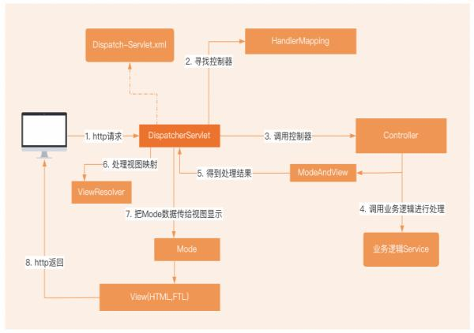

---

普通人
高手
索引，是一种能够帮助Mysql 高效从磁盘上检索数据的一种数据结构。
在Mysql 中的InnoDB 引擎中，采用了B+树的结构来实现索引和数据的存储
在我看来，Mysql 里面的索引的优点有很多
通过B+树的结构来存储数据，可以大大减少数据检索时的磁盘IO 次数，从而提
升数据查询的性能
B+树索引在进行范围查找的时候，只需要找到起始节点，然后基于叶子节点的
链表结构往下读取即可，查询效率较高。
通过唯一索引约束，可以保证数据表中每一行数据的唯一性
当然，索引的不合理使用，也会有带来很多的缺点。
数据的增加、修改、删除，需要涉及到索引的维护，当数据量较大的情况下，索
引的维护会带来较大的性能开销。
跟着Mic学架构
学架构
ic学架构
跟着Mic学架构
跟着Mic学架构
跟着Mic
跟着Mic

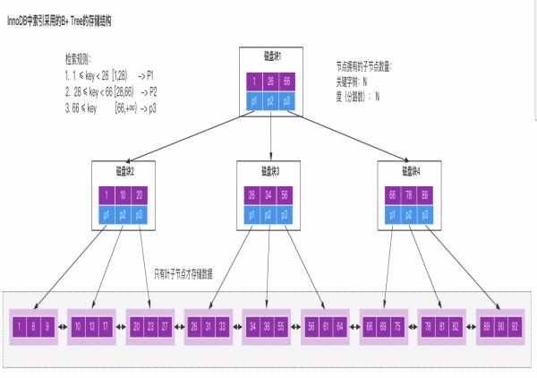

---

一个表中允许存在一个聚簇索引和多个非聚簇索引，但是索引数不能创建太多，
否则造成的索引维护成本过高。
创建索引的时候，需要考虑到索引字段值的分散性，如果字段的重复数据过多，
创建索引反而会带来性能降低。
在我看来，任何技术方案都会有两面性，大部分情况下，技术方案的选择更多的
是看中它的优势和当前问题的匹配度。
以上就是我对这个问题的理解。
面试点评
行业竞争加剧，再加上现在大环境不好，各个一二线大厂都在裁员。
带来的问题就是，人才筛选难度增加，找工作越来越难。
这道题目考察的是求职者对于Mysql 的理解程度，不算难，但能卡主很多人。
好的，本期的普通人VS 高手面试系列的视频就到这里结束了，
喜欢的朋友记得点赞和收藏。
有任何工作和学习上的问题，可以随时私信我。
我是Mic，一个工作了14 年的Java 程序员，咱们下期再见。
new String("abc")到底创建了几个对
象？
一个工作了6 年的粉丝和我说，
最近面试感觉越来越难的，基本上都会问技术底层原理，甚至有些还会问到操作
系统层面的知识。
我说，现在各个一线大厂有很多优秀的程序员毕业了，再加上市场大环境不好对
程序员的需求量也在减少。
如果技术底子不好，确实找工作会很困难。
今天分享的问题是：”new String(“abc”)到底创建了几个对象？
关于这个问题，看看普通人和高手的回答。
普通人
跟着Mic学架构
学架构
ic学架构
跟着Mic学架构
跟着Mic学架构
跟着Mic
跟着Mic

---

高手
好的，面试官。
首先，这个代码里面有一个new 关键字，这个关键字是在程序运行时，根据已
经加载的系统类String，在堆内存里面实例化的一个字符串对象。
然后，在这个String 的构造方法里面，传递了一个“abc”字符串，因为String 里
面的字符串成员变量是final 修饰的，所以它是一个字符串常量。
接下来，JVM 会拿字面量“abc”去字符串常量池里面试图去获取它对应的String
对象引用，如果拿不到，就会在堆内存里面创建一个”abc”的String 对象
并且把引用保存到字符串常量池里面。
后续如果再有字面量“abc”的定义，因为字符串常量池里面已经存在了字面量
“abc”的引用，所以只需要从常量池获取对应的引用就可以了，不需要再创建。
所以，对于这个问题，我认为的答案是
如果abc 这个字符串常量不存在，则创建两个对象，分别是abc 这个字符串常量，
以及new String 这个实例对象。
如果abc 这字符串常量存在，则只会创建一个对象
面试点评
从高手的回答中可以看到，必须要对JVM 里面的运行时内存划分以及对JVM 常
量池的理解足够深刻。
现在技术的面试也偏向于体系化的考察，不再是点状式的提问了。
好的，本期的普通人VS 高手面试系列的视频就到这里结束了，
喜欢的朋友记得点赞和收藏。
有任何工作和学习上的问题，可以随时私信我。
我是Mic，一个工作了14 年的Java 程序员，咱们下期再见。
常见的限流算法有哪些？
跟着Mic学架构
学架构
ic学架构
跟着Mic学架构
跟着Mic学架构
跟着Mic
跟着Mic

---

一个在传统行业工作了5 年的程序员。
去一个互联网公司面试，遇到了一个限流的问题。
因为之前完全没接触过分布式这块的项目，所以根本就回答不上来，向我来求助。
其中有一个问题是：”请你说一下常见的限流算法“。
对于这个问题，看看普通人和高手的回答。
普通人
高手
好的，关于这个问题，我会从几个方面来回答。
首先，限流算法是一种系统保护策略，主要是避免在流量高峰导致系统被压垮，
造成系统不可用的问题。
常见的限流算法有5 种。
计数器限流，一般用在单一维度的访问频率限制上，比如短信验证码每隔60s
只能发送一次，或者接口调用次数等
它的实现方法很简单，每调用一次就加1，处理结束以后减一。
跟着Mic学架构
学架构
ic学架构
跟着Mic学架构
跟着Mic学架构
跟着Mic
跟着Mic

---

滑动窗口限流，本质上也是一种计数器，只是通过以时间为维度的可滑动窗口
设计，来减少了临界值带来的并发超过阈值的问题。
每次进行数据统计的时候，只需要统计这个窗口内每个时间刻度的访问量就可以
了。
Spring Cloud 里面的熔断框架Hystrix，以及Spring Cloud Alibaba 里面的
Sentinel 都采用了滑动窗口来做数据统计。
跟着Mic学架构
学架构
ic学架构
跟着Mic学架构
跟着Mic学架构
跟着Mic
跟着Mic

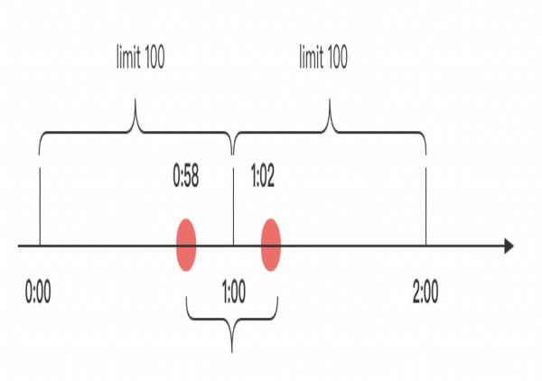

---

漏桶算法，它是一种恒定速率的限流算法，不管请求量是多少，服务端的处理效
率是恒定的。基于MQ 来实现的生产者消费者模型，其实算是一种漏桶限流算
法。
跟着Mic学架构
学架构
ic学架构
跟着Mic学架构
跟着Mic学架构
跟着Mic
跟着Mic

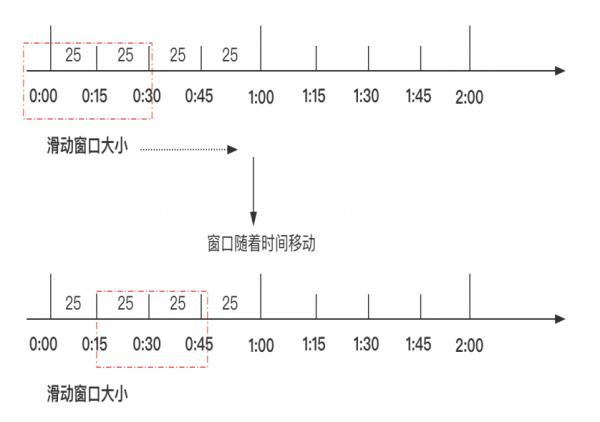

---

令牌桶算法，相对漏桶算法来说，它可以处理突发流量的问题。
它的核心思想是，令牌桶以恒定速率去生成令牌保存到令牌桶里面，桶的大小是
固定的，令牌桶满了以后就不再生成令牌。
每个客户端请求进来的时候，必须要从令牌桶获得一个令牌才能访问，否则排队
等待。
在流量低峰的时候，令牌桶会出现堆积，因此当出现瞬时高峰的时候，有足够多
的令牌可以获取，因此令牌桶能够允许瞬时流量的处理。
网关层面的限流、或者接口调用的限流，都可以使用令牌桶算法，像Google 的
Guava，和Redisson 的限流，都用到了令牌桶算法
在我看来，限流的本质是实现系统保护，最终选择什么样的算法，一方面取决于
统计的精准度，另一方面考虑限流维度和场景的需求。
以上就是我对这个问题的理解
面试点评
英国生物学家Charles Darwin(查尔斯.达尔文)说过。
跟着Mic学架构
学架构
ic学架构
跟着Mic学架构
跟着Mic学架构
跟着Mic
跟着Mic

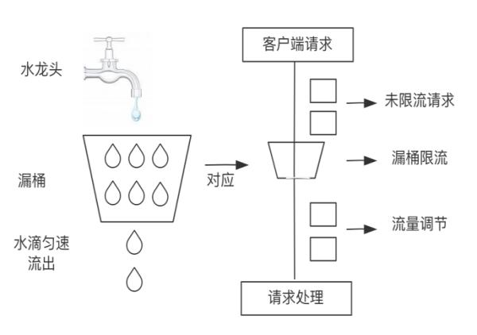

---

最终能够在社会上生存下来的人，不是强者，也不是智者，而是能够适应改变的
人。技术开发虽然是谋生手段，但是技术能力的高低决定了职业发展的高度。
好的，本期的普通人VS 高手面试系列的视频就到这里结束了，
喜欢的朋友记得点赞和收藏。
有任何工作和学习上的问题，可以随时私信我。
我是Mic，一个工作了14 年的Java 程序员，咱们下期再见。
什么是可重入，什么是可重入锁?它用来
解决什么问题?
一个工作了3 年的粉丝，去一个互联网公司面试，结果被面试官怼了。
面试官说：”这么简单的问题你都不知道？没法聊了，回去等通知吧“。
这个问题是：”什么是可重入锁，以及它的作用是什么？“
对于这个问题，来看看普通人和高手的回答吧
普通人
高手
好的。
可重入是多线程并发编程里面一个比较重要的概念，
简单来说，就是在运行的某个函数或者代码，因为抢占资源或者中断等原因导致
函数或者代码的运行中断，
等待中断程序执行结束后，重新进入到这个函数或者代码中运行，并且运行结果
不会受到影响，那么这个函数或者代码就是可重入的。
而可重入锁，简单来说就是一个线程如果抢占到了互斥锁资源，在锁释放之前再
去竞争同一把锁的时候，不需要等待，只需要记录重入次数。
在多线程并发编程里面，绝大部分锁都是可重入的，比如Synchronized、
ReentrantLock 等，但是也有不支持重入的锁，比如JDK8 里面提供的读写锁
StampedLock。
跟着Mic学架构
学架构
ic学架构
跟着Mic学架构
跟着Mic学架构
跟着Mic
跟着Mic

---

锁的可重入性，主要解决的问题是避免线程死锁的问题。
因为一个已经获得同步锁X 的线程，在释放锁X 之前再去竞争锁X 的时候，相
当于会出现自己要等待自己释放锁，这很显然是无法成立的。
以上就是我对这个问题的理解。
面试点评
关于这个问题，其实是考察求职者的基础知识。
互联网大厂对基础的考察会特别深，有必要的话还是需要在工作之外去多花一点
时间研究。
并且，对于3 年工作经验，考察这类问题也不算过分。
好的，本期的普通人VS 高手面试系列的视频就到这里结束了。
如果有任何面试问题、职业发展问题、学习问题，都可以私信我。
我是Mic，一个工作了14 年的Java 程序员，咱们下期再见。
请你简单说一下Mysql 的事务隔离级别
跟着Mic学架构
学架构
ic学架构
跟着Mic学架构
跟着Mic学架构
跟着Mic
跟着Mic

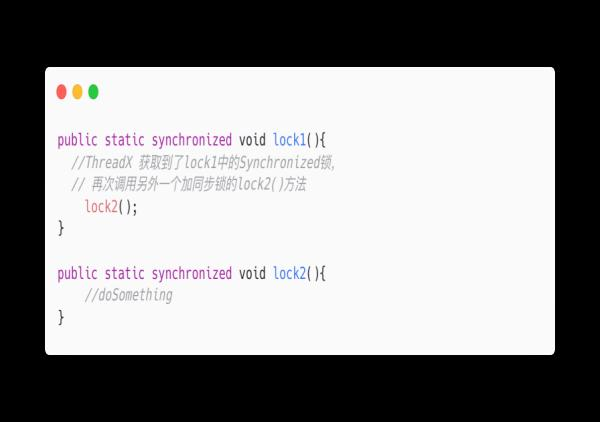

---

一个工作了6 年的粉丝，去阿里面试，在第一面的时候被问到”Mysql 的事务隔
离级别“。
他竟然没有回答上来，一直在私信向我诉苦。
我说，你只能怪年轻时候的你，那个时候不够努力导致现在的你技术水平不够。
好吧，关于这个问题，看看普通人和高手的回答。
普通人
高手
好的，关于这个问题，我会从几个方面来回答。
首先，事务隔离级别，是为了解决多个并行事务竞争导致的数据安全问题的一种
规范。
具体来说，多个事务竞争可能会产生三种不同的现象。
假设有两个事务T1/T2 同时在执行，T1 事务有可能会读取到T2 事务未提交的
数据，但是未提交的事务T2 可能会回滚，也就导致了T1 事务读取到最终不一
定存在的数据产生脏读的现象。
跟着Mic学架构
学架构
ic学架构
跟着Mic学架构
跟着Mic学架构
跟着Mic
跟着Mic

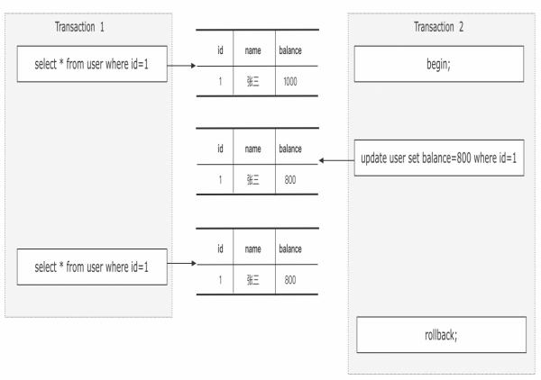

---

假设有两个事务T1/T2 同时执行，事务T1 在不同的时刻读取同一行数据的时
候结果可能不一样，从而导致不可重复读的问题。
，假设有两个事务T1/T2 同时执行，事务T1 执行范围查询或者范围修改的过
程中，事务T2 插入了一条属于事务T1 范围内的数据并且提交了，这时候在事
务T1 查询发现多出来了一条数据，或者在T1 事务发现这条数据没有被修改，
看起来像是产生了幻觉，这种现象称为幻读。
跟着Mic学架构
学架构
ic学架构
跟着Mic学架构
跟着Mic学架构
跟着Mic
跟着Mic

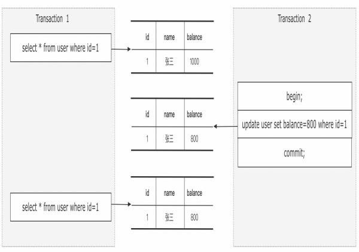

---

而这三种现象在实际应用中，可能有些场景不能接受某些现象的存在，所以在
SQL 标准中定义了四种隔离级别，分别是：
读未提交，在这种隔离级别下，可能会产生脏读、不可重复读、幻读。
读已提交（RC)，在这种隔离级别下，可能会产生不可重复读和幻读。
可重复读（RR），在这种隔离级别下，可能会产生幻读
串行化，在这种隔离级别下，多个并行事务串行化执行，不会产生安全性问题。
这四种隔离级别里面，只有串行化解决了全部的问题，但也意味着这种隔离级别
的性能是最低的。
在Mysql 里面，InnoDB 引擎默认的隔离级别是RR（可重复读），因为它需要
保证事务ACID 特性中的隔离性特征。
以上就是我对这个问题的理解。
面试点评
关于这个问题，很多用Mysql5 年甚至更长时间的程序员都不一定非常清楚的知
道。
跟着Mic学架构
学架构
ic学架构
跟着Mic学架构
跟着Mic学架构
跟着Mic
跟着Mic

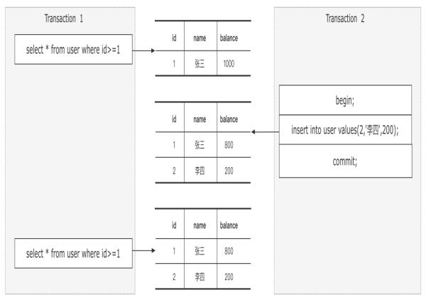

---

这其实是不正常的，因为虽然InnoDB 默认隔离级别能解决99%以上的问题，但
是有些公司的某些业务可能会修改隔离级别。
而如果你不知道，就很可能在程序中出现莫名其妙的问题。
好的，本期的普通人VS 高手面试系列的视频就到这里结束了。
如果有任何面试问题、职业发展问题、学习问题，都可以私信我。
我是Mic，一个工作了14 年的Java 程序员，咱们下期再见。
请说一下ReentrantLock 的实现原理？
一个工作了3 年的粉丝私信我，在面试的时候遇到了这样一个问题。
”请说一下ReentrantLock 的实现原理“，他当时根据自己的理解零零散散的说了
一些。
但是似乎没有说到关键点上，让我出一期视频说一下回答思路。
好吧，关于这个问题，我们来看看普通人和高手的回答。
普通人
高手
好的，面试官，关于这个问题，我会从这几个方面来回答。
什么是ReentrantLock
ReentrantLock 的特性
ReentrantLock 的实现原理
首先，ReentrantLock 是一种可重入的排它锁，主要用来解决多线程对共享资源
竞争的问题。
它的核心特性有几个：
它支持可重入，也就是获得锁的线程在释放锁之前再次去竞争同一把锁的时候，
不需要加锁就可以直接访问。
它支持公平和非公平特性
它提供了阻塞竞争锁和非阻塞竞争锁的两种方法，分别是lock()和tryLock()。
然后，ReentrantLock 的底层实现有几个非常关键的技术。
跟着Mic学架构
学架构
ic学架构
跟着Mic学架构
跟着Mic学架构
跟着Mic
跟着Mic

---

锁的竞争，ReentrantLock 是通过互斥变量，使用CAS 机制来实现的。
没有竞争到锁的线程，使用了AbstractQueuedSynchronizer 这样一个队列同步
器来存储，底层是通过双向链表来实现的。当锁被释放之后，会从AQS 队列里
面的头部唤醒下一个等待锁的线程。
公平和非公平的特性，主要是体现在竞争锁的时候，是否需要判断AQS 队列存
在等待中的线程。
最后，关于锁的重入特性，在AQS 里面有一个成员变量来保存当前获得锁的线
程，当同一个线程下次再来竞争锁的时候，就不会去走锁竞争的逻辑，而是直接
增加重入次数。
以上就是我对这个问题的理解。
面试点评
这道题很简单，但是要回答好，有两个关键点。
大家必须要理解ReentrantLock 的整个设计思想
表达一定要清晰有条理
还是那句话，虽然基础，但很重要。地基的深度决定了楼层的高度。
跟着Mic学架构
学架构
ic学架构
跟着Mic学架构
跟着Mic学架构
跟着Mic
跟着Mic

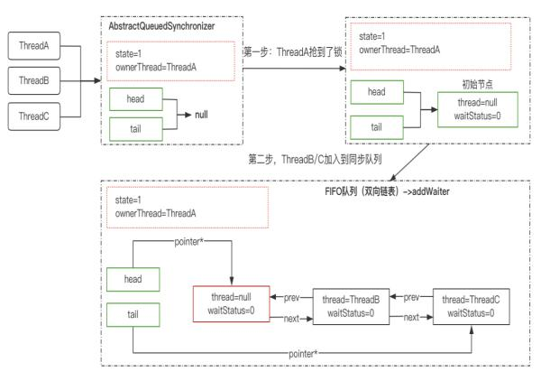

---

好的，本期的普通人VS 高手面试系列的视频就到这里结束了。
如果有任何面试问题、职业发展问题、学习问题，都可以私信我。
我是Mic，一个工作了14 年的Java 程序员，咱们下期再见。
Mybatis 中#{}和${}的区别是什么？
一个工作2 年的粉丝，被问到一个Mybatis 里面的基础问题。
他跑过来调戏我，说Mic 老师，你要是能把这个问题回答到一定高度，请我和一
个月奶茶。
这个问题是：”Mybatis 里面#{}和${}的区别是什么“
下面看看普通人和高手对这个问题的回答。
普通人
高手
好的，关于这个问题我从几个方面来回答。
首先，Mybatis 提供到的#号占位符和$号占位符，都是实现动态SQL 的一种方
式，通过这两种方式把参数传递到XML 之后，
在执行操作之前，Mybatis 会对这两种占位符进行动态解析。
#号占位符，等同于jdbc 里面的？号占位符。
它相当于向PreparedStatement 中的预处理语句中设置参数，
而PreparedStatement 中的sql 语句是预编译的，SQL 语句中使用了占位符，
规定了sql 语句的结构。
并且在设置参数的时候，如果有特殊字符，会自动进行转义。
所以#号占位符可以防止SQL 注入。
跟着Mic学架构
学架构
ic学架构
跟着Mic学架构
跟着Mic学架构
跟着Mic
跟着Mic

---

而使用$的方式传参，相当于直接把参数拼接到了原始的SQL 里面，Mybatis
不会对它进行特殊处理。
跟着Mic学架构
学架构
ic学架构
跟着Mic学架构
跟着Mic学架构
跟着Mic
跟着Mic

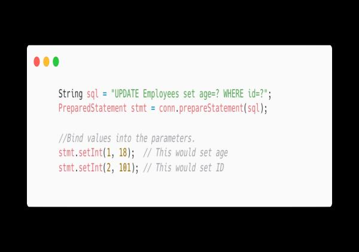

---

所以$和#最大的区别在于，前者是动态参数，后者是占位符，动态参数无法防
止SQL 注入的问题，所以在实际应用中，应该尽可能的使用#号占位符。
另外，$符号的动态传参，可以适合应用在一些动态SQL 场景中，比如动态传递
表名、动态设置排序字段等。
以上就是我对这个问题的理解。
面试点评
一些小的细节如果不注意，就有可能造成巨大的经济损失。
比如现如今还是会有一些网站出现SQL 注入导致信息泄露的问题。
好的，本期的普通人VS 高手面试系列的视频就到这里结束了。
如果有任何面试问题、职业发展问题、学习问题，都可以私信我。
我是Mic，一个工作了14 年的Java 程序员，咱们下期再见。
Mysql为什么使用B+Tree作为索引结构
一个工作8 年的粉丝私信了我一个问题。
跟着Mic学架构
学架构
ic学架构
跟着Mic学架构
跟着Mic学架构
跟着Mic
跟着Mic

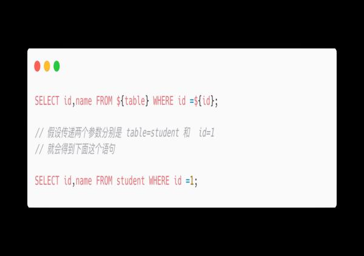

---

他说这个问题是去阿里面试的时候被问到的，自己查了很多资料也没搞明白，希
望我帮他解答。
问题是：“Mysql 为什么使用B+Tree 作为索引结构”
关于这个问题，看看普通人和高手的回答。
普通人
高手
关于这个问题，我从几个方面来回答。
首先，常规的数据库存储引擎，一般都是采用B 树或者B+树来实现索引的存储。
因为B 树是一种多路平衡树，用这种存储结构来存储大量数据，它的整个高度
会相比二叉树来说，会矮很多。
而对于数据库来说，所有的数据必然都是存储在磁盘上的，而磁盘IO 的效率实
际上是很低的，特别是在随机磁盘IO 的情况下效率更低。
所以树的高度能够决定磁盘IO 的次数，磁盘IO 次数越少，对于性能的提升就
越大，这也是为什么采用B 树作为索引存储结构的原因。
但是在Mysql 的InnoDB 存储引擎里面，它用了一种增强的B 树结构，也就是
B+树来作为索引和数据的存储结构。
相比较于B 树结构，B+树做了几个方面的优化。
B+树的所有数据都存储在叶子节点，非叶子节点只存储索引。
叶子节点中的数据使用双向链表的方式进行关联。
跟着Mic学架构
学架构
ic学架构
跟着Mic学架构
跟着Mic学架构
跟着Mic
跟着Mic

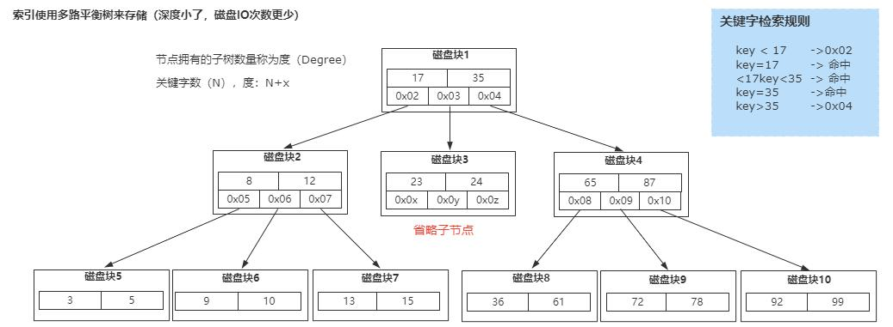

---

使用B+树来实现索引的原因，我认为有几个方面。
B+树非叶子节点不存储数据，所以每一层能够存储的索引数量会增加，意味着
B+树在层高相同的情况下存储的数据量要比B 树要多，使得磁盘IO 次数更少。
在Mysql 里面，范围查询是一个比较常用的操作，而B+树的所有存储在叶子节
点的数据使用了双向链表来关联，所以在查询的时候只需查两个节点进行遍历就
行，而B 树需要获取所有节点，所以B+树在范围查询上效率更高。
在数据检索方面，由于所有的数据都存储在叶子节点，所以B+树的IO 次数会更
加稳定一些。
因为叶子节点存储所有数据，所以B+树的全局扫描能力更强一些，因为它只需
要扫描叶子节点。但是B 树需要遍历整个树。
另外，基于B+树这样一种结构，如果采用自增的整型数据作为主键，还能更好
的避免增加数据的时候，带来叶子节点分裂导致的大量运算的问题。
总的来说，我认为技术方案的选型，更多的是去解决当前场景下的特定问题，并
不一定是说B+树就是最好的选择，就像MongoDB 里面采用B 树结构，本质上
来说，其实是关系型数据库和非关系型数据库的差异。
以上就是我对这个问题的理解。
面试点评
对于“为什么要选择xx 技术”的问题，其实很好回答。
只要你对这个技术本身的特性足够了解，那么自然就知道为什么要这么设计。
跟着Mic学架构
学架构
ic学架构
跟着Mic学架构
跟着Mic学架构
跟着Mic
跟着Mic

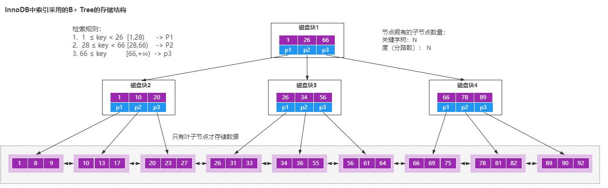

---

就像，我们在业务开发中，知道什么时候使用List，什么时候使用Map，道理是
一样的。
好的，本期的普通人VS 高手面试系列的视频就到这里结束了。
如果有任何面试问题、职业发展问题、学习问题，都可以私信我。
我是Mic，一个工作了14 年的Java 程序员，咱们下期再见。
数据库连接池有什么用？它有哪些关键
参数？
一个工作5 年的粉丝找到我，他说参加美团面试，遇到一个基础题没回答上来。
这个问题是：“数据库连接池有什么用？以及它有哪些关键参数”？
我说，这个问题都不知道，那你项目里面的连接池配置怎么设置的？你们猜他怎
么回答。懂得懂得啊。
好的，关于这个问题，我们来看看普通人和高手的回答。
普通人
高手
关于这个问题，我从这几个方面来回答。
首先，数据库连接池是一种池化技术，池化技术的核心思想是实现资源的复用，
避免资源重复创建销毁的开销。
而在数据库的应用场景里面，应用程序每次向数据库发起CRUD 操作的时候，
都需要创建连接
在数据库访问量较大的情况下，频繁的创建连接会带来较大的性能开销。
而连接池的核心思想，就是应用程序在启动的时候提前初始化一部分连接保存
到连接池里面，当应用需要使用连接的时候，直接从连接池获取一个已经建立好
的链接。
连接池的设计，避免了每次连接的建立和释放带来的开销。
跟着Mic学架构
学架构
ic学架构
跟着Mic学架构
跟着Mic学架构
跟着Mic
跟着Mic

---

连接池的参数有很多，不过关键参数就几个：
首先是，连接池初始化的时候会有几个关键参数：
初始化连接数，表示启动的时候初始多少个连接保存到连接池里面。
最大连接数，表示同时最多能支持多少连接，如果连接数不够，后续要获取连接
的线程会阻塞。
最大空闲连接数，表示没有请求的时候，连接池中要保留的最大空闲连接。
最小空闲连接，当连接数小于这个值的时候，连接池需要再创建连接来补充到这
个值。
然后，就是在使用连接的时候的关键参数：
最大等待时间，就是连接池里面的连接用完了以后，新的请求要等待的时间，超
过这个时间就会提示超时异常。
无效连接清除，清理连接池里面的无效连接，避免使用这个连接操作的时候出现
错误。
跟着Mic学架构
学架构
ic学架构
跟着Mic学架构
跟着Mic学架构
跟着Mic
跟着Mic

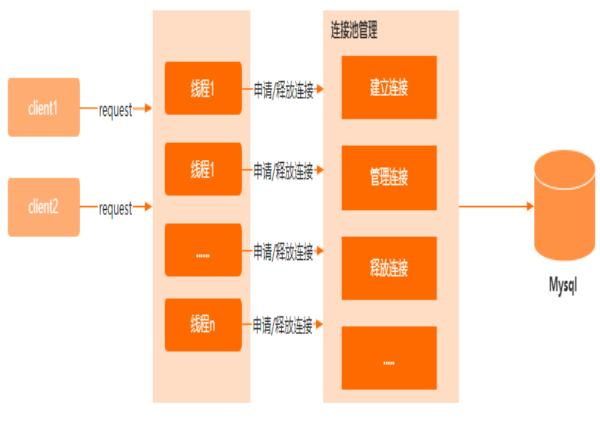

---

不同的连接池框架，除了核心的参数以外，还有很多业务型的参数，比如是否要
检测连接sql 的有效性、连接初始化SQL 等等，这些配置参数可以在使用的时
候去查询api 文档就可以知道。
以上就是我对这个问题的理解。
面试点评
这个问题更进一步去问，就会问到最大连接数、最小连接数应该如何设置？
连接池的实现原理啊等等。
所以建议各位粉丝还是要有一个系统化的学习。
好的，本期的普通人VS 高手面试系列的视频就到这里结束了。
如果有任何面试问题、职业发展问题、学习问题，都可以私信我。
我是Mic，一个工作了14 年的Java 程序员，咱们下期再见。
TCP 协议为什么要设计三次握手？
一个工作5 年的粉丝，最近去面试了很多公司，每次都被各种技术原理题问得语
无伦次。
由于找了快1 个月时间的工作，有点焦虑，来向我求助。
我能做的只是保证每天更新一个面试题，然后问他印象最深刻的一个面试题是什
么，他说。
“TCP 协议为什么要设计三次握手”。
这个问题的高手回答，我整理成了文档，大家可以在我主页加V 领取。
好的，关于这个问题，我们来看看普通人和高手的回答。
普通人
高手
关于这个问题，我会从下面3 个方面来回答。
TCP 协议，是一种可靠的，基于字节流的，面向连接的传输层协议。
跟着Mic学架构
学架构
ic学架构
跟着Mic学架构
跟着Mic学架构
跟着Mic
跟着Mic

---

可靠性体现在TCP 协议通信双方的数据传输是稳定的，即便是在网络不好的情
况下，TCP 都能够保证数据传输到目标端，而这个可靠性是基于数据包确认机
制来实现的。
TCP 通信双方的数据传输是通过字节流来实现传输的
面向连接，是说数据传输之前，必须要建立一个连接，然后基于这个连接进行数
据传输
因为TCP 是面向连接的协议，所以在进行数据通信之前，需要建立一个可靠的
连接，TCP 采用了三次握手的方式来实现连接的建立。
所谓的三次握手，就是通信双方一共需要发送三次请求，才能确保这个连接的建
立。
客户端向服务端发送连接请求并携带同步序列号SYN。
服务端收到请求后，发送SYN 和ACK，这里的SYN 表示服务端的同步序列号，
ACK 表示对前面收到请求的一个确认，表示告诉客户端，我收到了你的请求。
客户端收到服务端的请求后，再次发送ACK，这个ACK 是针对服务端连接的一
个确认，表示告诉服务端，我收到了你的请求。
跟着Mic学架构
学架构
ic学架构
跟着Mic学架构
跟着Mic学架构
跟着Mic
跟着Mic

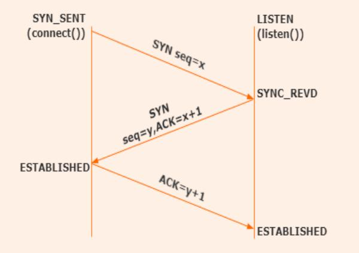

---

之所以TCP 要设计三次握手，我认为有三个方面的原因：
TCP 是可靠性通信协议，所以TCP 协议的通信双方都必须要维护一个序列号，
去标记已经发送出去的数据包，哪些是已经被对方签收的。而三次握手就是通信
双方相互告知序列号的起始值，为了确保这个序列号被收到，所以双方都需要有
一个确认的操作。
TCP 协议需要在一个不可靠的网络环境下实现可靠的数据传输，意味着通信双
方必须要通过某种手段来实现一个可靠的数据传输通道，而三次通信是建立这样
一个通道的最小值。当然还可以四次、五次，只是没必要浪费这个资源。
防止历史的重复连接初始化造成的混乱问题，比如说在网络比较差的情况下，客
户端连续多次发送建立连接的请求，假设只有两次握手，那么服务端只能选择接
受或者拒绝这个连接请求，但是服务端不知道这次请求是不是之前因为网络堵塞
而过期的请求，也就是说服务端不知道当前客户端的连接是有效还是无效。
以上就是我对这个问题的理解。
面试点评
网络通信这块内容还是比较重要的，面对一些线上网络故障排查的时候，
可以快速的去帮助我们定位问题，并找到解决办法。
好的，本期的普通人VS 高手面试系列的视频就到这里结束了
我是Mic，一个工作了14 年的Java 程序员，咱们下期再见！
请简单说一下你对受检异常和非受检异
常的理解
Hi，我是Mic
今天给大家分享一道阿里一面的面试题。
这道题目比较基础，但是确难倒了很多人。
关于”受检异常和非受检异常的理解“
我们来看看普通人和高手的回答。
另外，高手部分的回答已经整理成了文档，有需要的小伙伴可以主页加V 领取
普通人
跟着Mic学架构
学架构
ic学架构
跟着Mic学架构
跟着Mic学架构
跟着Mic
跟着Mic

---

高手
##
好的。
所谓的受检异常，表示在编译的时候强制检查的异常，这种异常需要显示的通过
try/catch 来捕捉，或者通过throws 抛出去，否则从程序无法通过编译。
而非受检异常，表示在编译器可以不需要强制检查的异常，这种异常不需要显示
去捕捉。
在Java 里面，所有的异常都是继承自java.lang.Throwable 类，Throwable 有
两个直接子类，Error 和Exception。
Error 用来表示程序底层或者硬件有关的错误，这种错误和程序本身无关，比如
常见的OOM 异常。这种异常和程序本身无关，所以不需要检查，属于非受检异
常。
Exception 表示程序中的异常，可能是由于程序不严谨导致的，比如
NullPointerException。
Exception 下面派生了RuntimeException 和其他异常，其中RuntimeException
运行时异常，也是属于非受检异常。
跟着Mic学架构
学架构
ic学架构
跟着Mic学架构
跟着Mic学架构
跟着Mic
跟着Mic

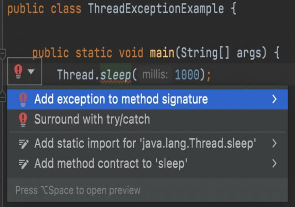

---

所以，除了Error 和RuntimeException 及派生类以外，其他异常都是属于受检
异常，比如IOException、SQLException。
之所以在Java 中要设计一些强制检查的异常，我认为主要原因是考虑到程序的
正确性、稳定性和可靠性。
比如数据库异常、文件读取异常，这些异常是程序无法提前预料到的，但是一旦
出现问题，就会造成资源被占用导致程序出现问题。
所以这些异常我们需要主动捕获，一旦出现问题，我们可以做出相应的处理，比
如关闭数据库连接、文件流的释放等。
以上就是我对这个问题的理解！
面试点评
这个问题并不难，但是在实际工作中，如何用好异常又显得很重要。
从高手的回答中可以明显看到他对异常的理解层次是比较深的，分别介绍了受检
和非受检异常，
以及在Java 中这两种异常是如何分类，最后说明了这两种异常的价值。
好的，本期的普通人VS 高手面试系列的视频就到这里结束了。
跟着Mic学架构
学架构
ic学架构
跟着Mic学架构
跟着Mic学架构
跟着Mic
跟着Mic

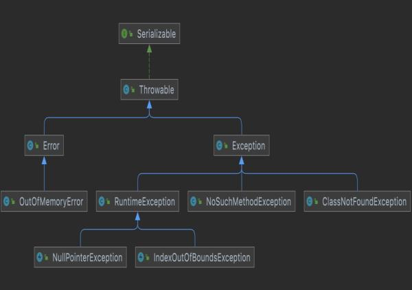

---

喜欢我的作品的小伙伴记得点赞和收藏加关注。
我是Mic，一个工作14 年的Java 程序员，咱们下期再见！
为什么引入偏向锁、轻量级锁，介绍下升
级流程
Hi，我是Mic
一个工作了7 年的粉丝来找我，他说最近被各种锁搞晕了。
比如，共享锁、排它锁、偏向锁、轻量级锁、自旋锁、重量级锁、
间隙锁、临键锁、意向锁、读写锁、乐观锁、悲观锁、表锁、行锁。
然后前两天去面试，被问到偏向锁、轻量级锁，结果没回答上来。
ok，关于Synchronized 锁升级的原理，看看普通人和高手的回答。
另外，高手的回答已经整理成了文档，有需要的小伙伴可以主页加V 领取
普通人
高手
好的，面试官。
Synchronized 在jdk1.6 版本之前，是通过重量级锁的方式来实现线程之间锁的
竞争。
之所以称它为重量级锁，是因为它的底层底层依赖操作系统的Mutex Lock 来实
现互斥功能。
Mutex 是系统方法，由于权限隔离的关系，应用程序调用系统方法时需要切换
到内核态来执行。
这里涉及到用户态向内核态的切换，这个切换会带来性能的损耗。
跟着Mic学架构
学架构
ic学架构
跟着Mic学架构
跟着Mic学架构
跟着Mic
跟着Mic

---

在jdk1.6 版本中，synchronized 增加了锁升级的机制，来平衡数据安全性和性
能。简单来说，就是线程去访问synchronized 同步代码块的时候，synchronized
根据
线程竞争情况，会先尝试在不加重量级锁的情况下去保证线程安全性。所以引入
了偏向锁和轻量级锁的机制。
偏向锁，就是直接把当前锁偏向于某个线程，简单来说就是通过CAS 修改偏向
锁标记，这种锁适合同一个线程多次去申请同一个锁资源并且没有其他线程竞争
的场景。
轻量级锁也可以称为自旋锁，基于自适应自旋的机制，通过多次自旋重试去竞争
锁。自旋锁优点在于它避免避免了用户态到内核态的切换带来的性能开销。
Synchronized 引入了锁升级的机制之后，如果有线程去竞争锁：
首先，synchronized 会尝试使用偏向锁的方式去竞争锁资源，如果能够竞争到
偏向锁，表示加锁成功直接返回。如果竞争锁失败，说明当前锁已经偏向了其他
线程。
需要将锁升级到轻量级锁，在轻量级锁状态下，竞争锁的线程根据自适应自旋次
数去尝试抢占锁资源，如果在轻量级锁状态下还是没有竞争到锁，
跟着Mic学架构
学架构
ic学架构
跟着Mic学架构
跟着Mic学架构
跟着Mic
跟着Mic

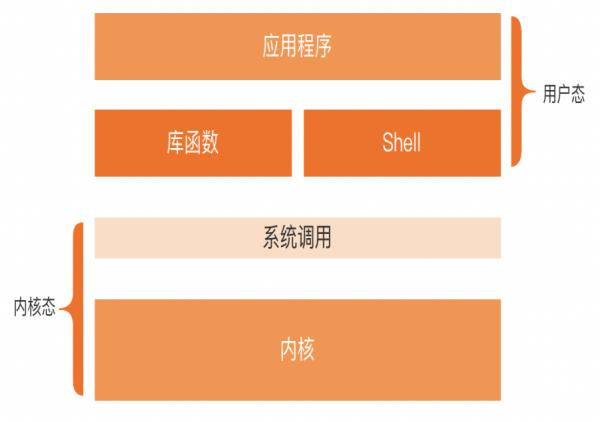

---

就只能升级到重量级锁，在重量级锁状态下，没有竞争到锁的线程就会被阻塞，
线程状态是Blocked。
处于锁等待状态的线程需要等待获得锁的线程来触发唤醒。
总的来说，Synchronized 的锁升级的设计思想，在我看来本质上是一种性能和
安全性的平衡，也就是如何在不加锁的情况下能够保证线程安全性。
这种思想在编程领域比较常见，比如Mysql 里面的MVCC 使用版本链的方式来
解决多个并行事务的竞争问题。
以上就是我对这个问题的理解。
面试点评
锁在程序中是非常常见的内容，我们几乎每天与锁打交道，比如Mysql 里面的
行锁、表锁。
因此它的重要性也不言而喻。
我们从高手的回答中可以明显的看到高手对Synchronized 的理解层次是非常高
的。
好的，本期的普通人VS 高手面试系列的视频就到这里结束了。
跟着Mic学架构
学架构
ic学架构
跟着Mic学架构
跟着Mic学架构
跟着Mic
跟着Mic

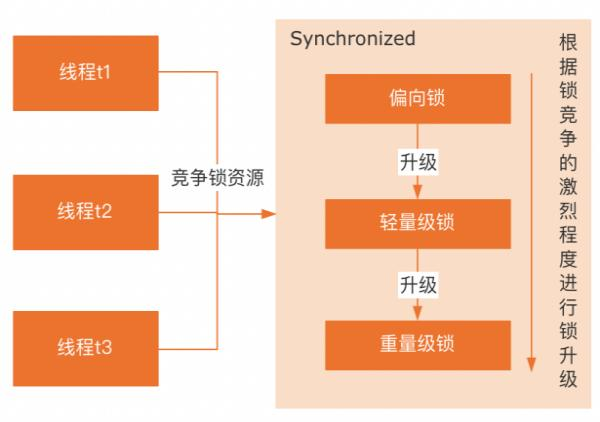

---

喜欢我的作品的小伙伴记得点赞和收藏加关注。
我是Mic，一个工作14 年的Java 程序员，咱们下期再见！
介绍下Spring IoC 的工作流程
Hi，我是Mic
一个工作了4 年的粉丝，在面试的时候遇到一个这样的问题。
“介绍一下Spring IOC 的工作流程”
他说回答得不是很好，希望我能帮他梳理一下。
这个问题高手部分的回答已经整理成了文档，可以在主页加V 领取。
关于这个问题，我们来看看普通人和高手的回答。
普通人
高手
好的，这个问题我会从几个方面来回答。
IOC 是什么
Bean 的声明方式
IOC 的工作流程
IOC 的全称是Inversion Of Control,也就是控制反转，它的核心思想是把对象的
管理权限交给容器。
应用程序如果需要使用到某个对象实例，直接从IOC 容器中去获取就行，这样
设计的好处是降低了程序里面对象与对象之间的耦合性。
使得程序的整个体系结构变得更加灵活。
跟着Mic学架构
学架构
ic学架构
跟着Mic学架构
跟着Mic学架构
跟着Mic
跟着Mic

---

跟着Mic学架构
学架构
ic学架构
跟着Mic学架构
跟着Mic学架构
跟着Mic
跟着Mic

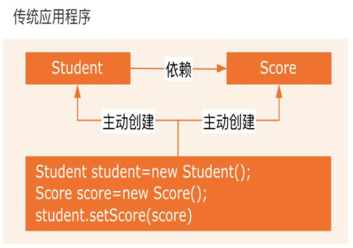

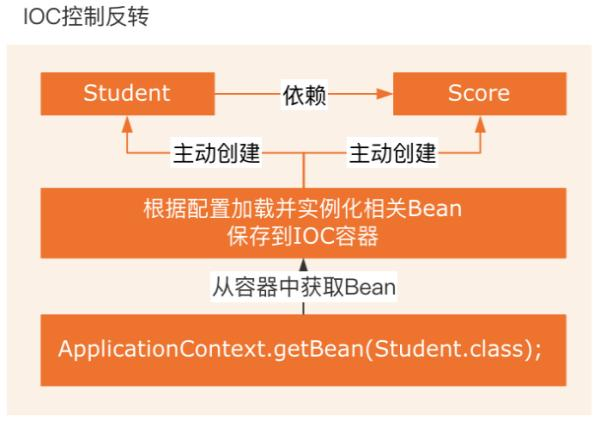

---

Spring 里面很多方式去定义Bean，比如XML 里面的<bean>标签、@Service、
@Component、@Repository、@Configuration 配置类中的@Bean 注解等等。
Spring 在启动的时候，会去解析这些Bean 然后保存到IOC 容器里面。
Spring IOC 的工作流程大致可以分为两个阶段。
第一个阶段，就是IOC 容器的初始化
这个阶段主要是根据程序中定义的XML 或者注解等Bean 的声明方式
通过解析和加载后生成BeanDefinition，然后把BeanDefinition 注册到IOC 容
器。
跟着Mic学架构
学架构
ic学架构
跟着Mic学架构
跟着Mic学架构
跟着Mic
跟着Mic

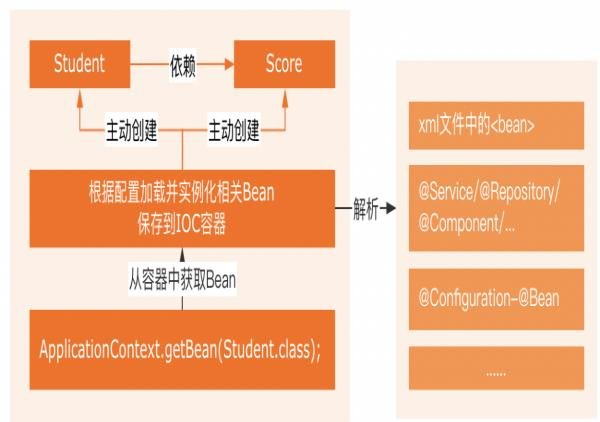

---

通过注解或者xml 声明的bean 都会解析得到一个BeanDefinition 实体，实体中
包含这个bean 中定义的基本属性。
最后把这个BeanDefinition 保存到一个Map 集合里面，从而完成了IOC 的初始
化。
IoC 容器的作用就是对这些注册的Bean 的定义信息进行处理和维护，它IoC 容
器控制反转的核心。
第二个阶段，完成Bean 初始化及依赖注入
然后进入到第二个阶段，这个阶段会做两个事情
通过反射针对没有设置lazy-init 属性的单例bean 进行初始化。
完成Bean 的依赖注入。
跟着Mic学架构
学架构
ic学架构
跟着Mic学架构
跟着Mic学架构
跟着Mic
跟着Mic

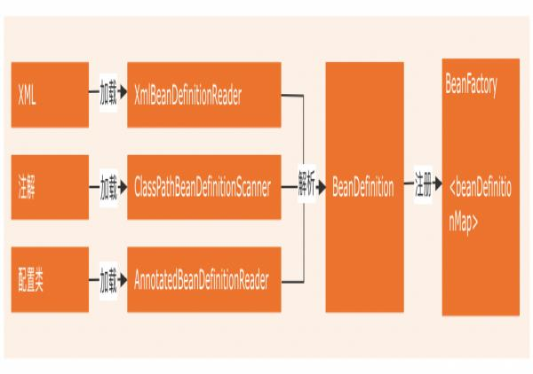

---

第三个阶段，Bean 的使用
通常我们会通过@Autowired 或者BeanFactory.getBean()从IOC容器中获取指
定的bean 实例。
另外，针对设置layy-init 属性以及非单例bean 的实例化，是在每次获取bean
对象的时候，调用bean 的初始化方法来完成实例化的，并且Spring IOC 容器
不会去管理这些Bean。
跟着Mic学架构
学架构
ic学架构
跟着Mic学架构
跟着Mic学架构
跟着Mic
跟着Mic

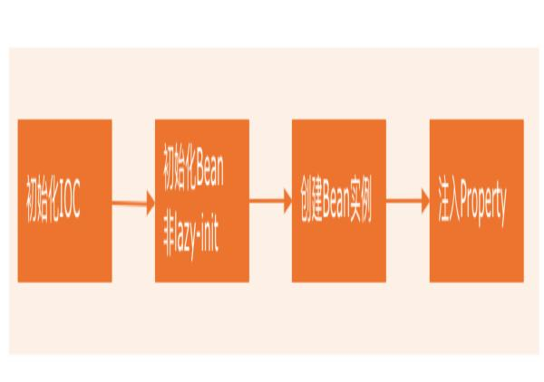

---

以上就是我对这个问题的理解。
面试点评
对于工作原理或者工作流程性的问题，大家一定要注意回答的结构和节奏。
否则面试官会觉得很混乱，无法理解，导致面试的效果大打折扣。
高手的回答逻辑非常清晰，大家可以参考。
好的，本期的普通人VS 高手面试系列就到这里结束了。
喜欢我的作品的小伙伴记得点赞和收藏加关注。
我是Mic，一个工作14 年的Java 程序员，咱们下期再见！
@Resource 和@Autowired 的区别
Hi，大家好，我是Mic。
一个工作2 年的粉丝，问我一个Spring 里面的问题。
跟着Mic学架构
学架构
ic学架构
跟着Mic学架构
跟着Mic学架构
跟着Mic
跟着Mic

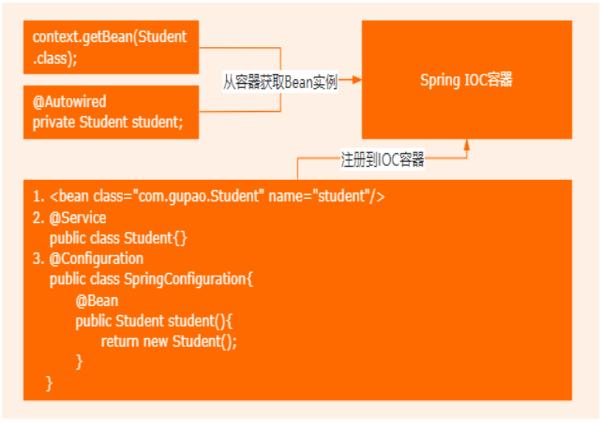

---

希望我能从不同的视角去分析，然后碾压面试官。
这个问题是：“@Resource 和@Autowired”的区别。
高手部分的回答我已经整理成了文档，需要的小伙伴可以在主页加V 领取。
下面看看普通人和高手的回答
普通人
高手
好的，面试官。
@Resource 和@Autowired 这两个注解的作用都是在Spring 生态里面去实现
Bean 的依赖注入。
下面我分别说一下@Autowired 和@Resource 这两个注解。
闪现[@Autowired 的作用详解] 几个字。
首先，@Autowired 是Spring 里面提供的一个注解，默认是根据类型来实现Bean
的依赖注入。
@Autowired 注解里面有一个required 属性默认值是true，表示强制要求bean
实例的注入，
在应用启动的时候，如果IOC 容器里面不存在对应类型的Bean，就会报错。
当然，如果不希望自动注入，可以把这个属性设置成false。
跟着Mic学架构
学架构
ic学架构
跟着Mic学架构
跟着Mic学架构
跟着Mic
跟着Mic

---

其次呢，如果在Spring IOC 容器里面存在多个相同类型的Bean 实例。由于
@Autowired 注解是根据类型来注入Bean 实例的
跟着Mic学架构
学架构
ic学架构
跟着Mic学架构
跟着Mic学架构
跟着Mic
跟着Mic

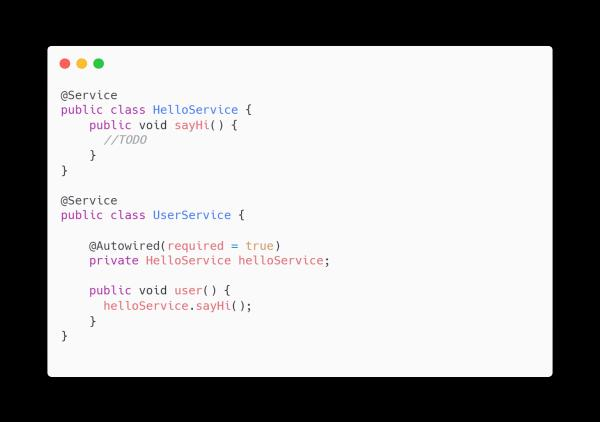

---

所以Spring 启动的时候，会提示一个错误，大概意思原本只能注入一个单实例
Bean，
但是在IOC 容器里面却发现有多个，导致注入失败。
跟着Mic学架构
学架构
ic学架构
跟着Mic学架构
跟着Mic学架构
跟着Mic
跟着Mic

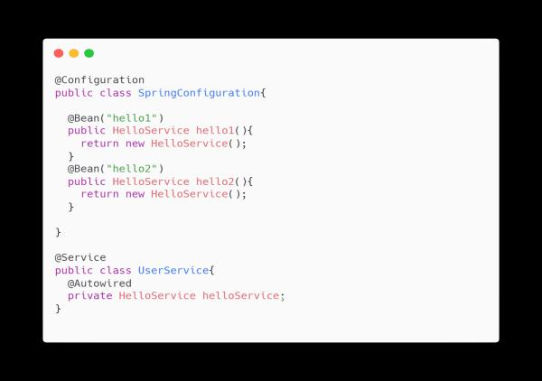

---

当然，针对这个问题，我们可以使用@Primary 或者@Qualifier 这两个注解来
解决。
@Primary 表示主要的bean，当存在多个相同类型的Bean 的时候，优先使用声
明了@Primary 的Bean。
@Qualifier 的作用类似于条件筛选，它可以根据Bean 的名字找到需要装配的目
标Bean。
跟着Mic学架构
学架构
ic学架构
跟着Mic学架构
跟着Mic学架构
跟着Mic
跟着Mic

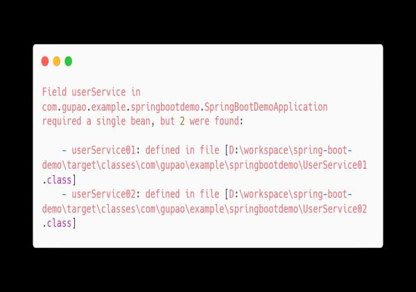

---

闪现[@Resource 的作用详解] 几个字。
接下来，我再解释一下@Resource 注解。
@Resource 是JDK 提供的注解，只是Spring 在实现上提供了这个注解的功能
支持。
它的使用方式和@Autowired 完全相同，最大的差异于@Resource 可以支持
ByName 和ByType 两种注入方式。
如果使用name，Spring就根据bean的名字进行依赖注入，如果使用type，Spring
就根据类型实现依赖注入。
如果两个属性都没配置，就先根据定义的属性名字去匹配，如果没匹配成功，再
根据类型匹配。两个都没匹配到，就报错。
跟着Mic学架构
学架构
ic学架构
跟着Mic学架构
跟着Mic学架构
跟着Mic
跟着Mic

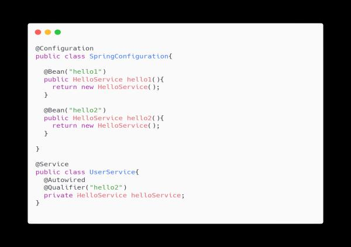

---

最后，我再总结一下。
@Autowired 是根据type 来匹配，@Resource 可以根据name 和type 来匹配，
默认是name 匹配。
@Autowired 是Spring 定义的注解，@Resource 是JSR 250 规范里面定义的注
解，而Spring 对JSR 250 规范提供了支持。
@Autowired 如果需要支持name 匹配，就需要配合@Primary 或者@Qualifier
来实现。
以上就是我对这个问题的理解。
面试总结
大家可以关注高手部分的回答，他的逻辑结构很清晰的。
他是非常直观的告诉面试官这两个注解的差异，同时又基于两个注解的特性解释
了更多的差异。
最后做了一个简短的总结。
大家在面试的时候可以参考类似的回答思路。
跟着Mic学架构
学架构
ic学架构
跟着Mic学架构
跟着Mic学架构
跟着Mic
跟着Mic

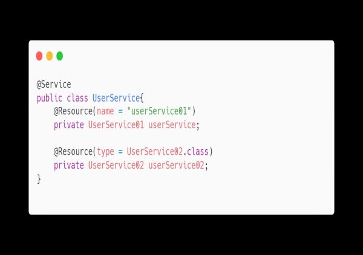

---

好的，本期的普通人VS 高手面试系列的视频就到这里结束了。
喜欢我的作品的小伙伴记得点赞和收藏加关注。
我是Mic，一个工作14 年的Java 程序员，咱们下期再见！
Spring 中，有两个id 相同的bean，
会报错吗，如果会报错，在哪个阶段报错
Hi，大家好，我是Mic
一个工作3 年的粉丝，早上6 点给我微信发语音，把我直接吓醒。
我以为什么天大的事情，结果一问才知道。
面试官问了他一个问题没答上来，问题是“Spring 里面，如果两个id 相同的bean
会报错吗？如果会，在哪个阶段报错？”
这个问题的高手部分的回答我已经整理成了文档，需要的小伙伴可以在主页加V
领取。
下面看看普通人和高手的回答！
普通人
高手
好的，关于这个问题，我从几个点来回答。
首先，在同一个XML 配置文件里面，不能存在id 相同的两个bean，否则spring
容器启动的时候会报错。
跟着Mic学架构
学架构
ic学架构
跟着Mic学架构
跟着Mic学架构
跟着Mic
跟着Mic

---

因为id 这个属性表示一个Bean 的唯一标志符号，所以Spring 在启动的时候会
去验证id 的唯一性，一旦发现重复就会报错，
这个错误发生Spring 对XML 文件进行解析转化为BeanDefinition 的阶段。
但是在两个不同的Spring 配置文件里面，可以存在id 相同的两个bean。IOC
容器在加载Bean 的时候，默认会多个相同id 的bean 进行覆盖。
在Spring3.x 版本以后，这个问题发生了变化
我们知道Spring3.x 里面提供@Configuration 注解去声明一个配置类，然后使用
@Bean 注解实现Bean 的声明，这种方式完全取代了XMl。
在这种情况下，如果我们在同一个配置类里面声明多个相同名字的bean，在
Spring IOC 容器中只会注册第一个声明的Bean 的实例。
后续重复名字的Bean 就不会再注册了。
像这样一段代码，在Spring IOC 容器里面，只会保存UserService01 这个实例，
后续相同名字的实例不会再加载。
跟着Mic学架构
学架构
ic学架构
跟着Mic学架构
跟着Mic学架构
跟着Mic
跟着Mic

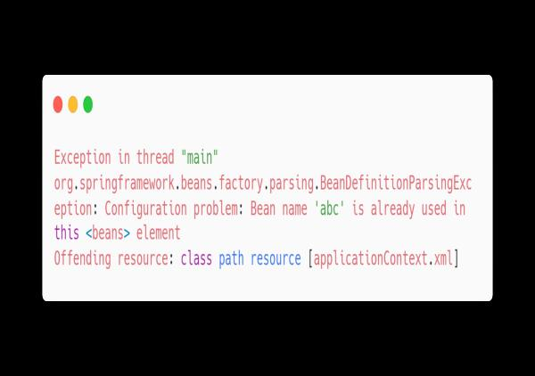

---

如果使用@Autowired 注解根据类型实现依赖注入，因为IOC 容器只有
UserService01 的实例，所以启动的时候会提示找不到UserService02 这个实例。
跟着Mic学架构
学架构
ic学架构
跟着Mic学架构
跟着Mic学架构
跟着Mic
跟着Mic

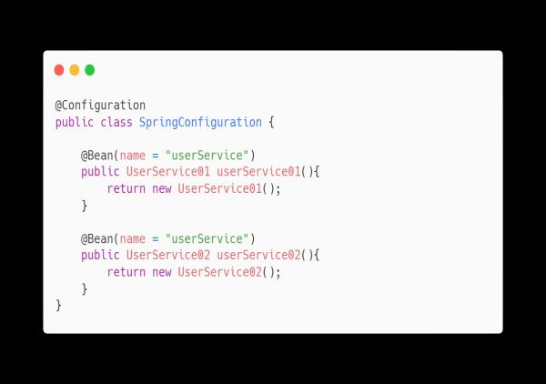

---

如果使用@Resource 注解根据名词实现依赖注入，在IOC 容器里面得到的实例
对象是UserService01，
于是Spring 把UserService01 这个实例赋值给UserService02，就会提示类型
不匹配错误。
跟着Mic学架构
学架构
ic学架构
跟着Mic学架构
跟着Mic学架构
跟着Mic
跟着Mic

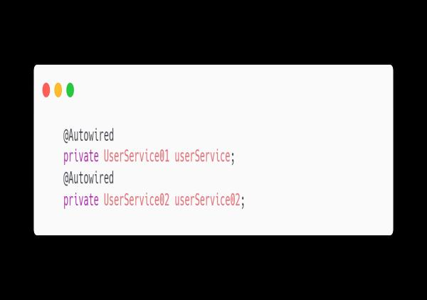

---

这个错误，是在Spring IOC 容器里面的Bean 初始化之后的依赖注入阶段发生
的。
以上就是我对这个问题的理解。
面试总结
你看，一个小小的面试题，竟然涉及到这么多知识点。
有些粉丝会问，这个我已经会用了，问这个问题的意义在哪里？
其实很多刚工作1~2 年的小伙伴，如果出现使用不当很容易出现各种异常。
而对Spring 有足够深入的理解，可以快速解决各种异常。
好的，本期的普通人VS 高手面试系列就到这里结束了。
喜欢我的作品的小伙伴记得点赞和收藏加关注。
我是Mic，一个工作14 年的Java 程序员，咱们下期再见！
Kafka 怎么避免重复消费
Hi，大家好，我是Mic
跟着Mic学架构
学架构
ic学架构
跟着Mic学架构
跟着Mic学架构
跟着Mic
跟着Mic

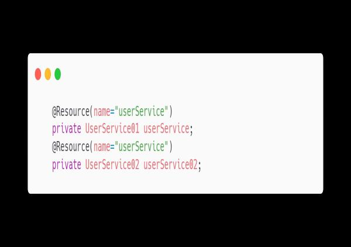

---

一个工作5 年的粉丝找到我。
他说：“Mic 老师，你要是能回答出这个问题，我就佩服你”
我当场就懵了，现在打赌都这么随意了吗？
我问他问题是什么，他说“Kafka 如何避免重复消费的问题！”
这个问题的高手部分的回答我已经整理成了文档，需要的小伙伴可以在主页加V
领取。
下面看看普通人和高手的回答！
普通人
高手
好的，关于这问题，我从几个方面来回答。
首先，Kafka Broker 上存储的消息，都有一个Offset 标记。
然后kafka 的消费者是通过offSet 标记来维护当前已经消费的数据，
每消费一批数据，Kafka Broker 就会更新OffSet 的值，避免重复消费。
跟着Mic学架构
学架构
ic学架构
跟着Mic学架构
跟着Mic学架构
跟着Mic
跟着Mic

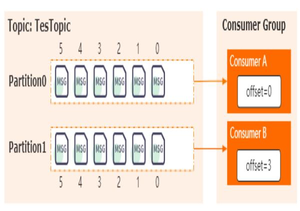

---

默认情况下，消息消费完以后，会自动提交Offset 的值，避免重复消费。
Kafka 消费端的自动提交逻辑有一个默认的5 秒间隔，也就是说在5 秒之后的下
一次向Broker 拉取消息的时候提交。
所以在Consumer 消费的过程中，应用程序被强制kill 掉或者宕机，可能会导致
Offset 没提交，从而产生重复提交的问题。
除此之外，还有另外一种情况也会出现重复消费。
在Kafka 里面有一个Partition Balance 机制，就是把多个Partition 均衡的分配
给多个消费者。
Consumer 端会从分配的Partition 里面去消费消息，如果Consumer 在默认的5
分钟内没办法处理完这一批消息。
就会触发Kafka 的Rebalance 机制，从而导致Offset 自动提交失败。
而在重新Rebalance 之后，Consumer 还是会从之前没提交的Offset 位置开始
消费，也会导致消息重复消费的问题。
基于这样的背景下，我认为解决重复消费消息问题的方法有几个。
提高消费端的处理性能避免触发Balance，比如可以用异步的方式来处理消息，
缩短单个消息消费的市场。或者还可以调整消息处理的超时时间。还可以减少一
次性从Broker 上拉取数据的条数。
跟着Mic学架构
学架构
ic学架构
跟着Mic学架构
跟着Mic学架构
跟着Mic
跟着Mic

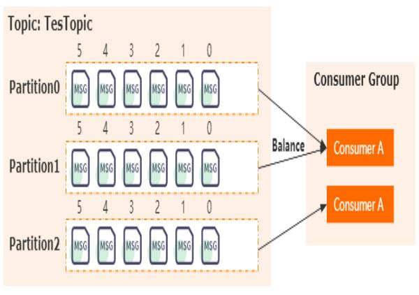

---

可以针对消息生成md5 然后保存到mysql 或者redis 里面，在处理消息之前先
去mysql 或者redis 里面判断是否已经消费过。这个方案其实就是利用幂等性的
思想。
以上就是我对这个问题的理解。
面试总结
重复消费这个问题很重要，如果没有考虑到就会出现线上的数据问题。
所以在面试的时候，这些问题也能够考察求职者的技术能力以及实践能力。
另外，关于幂等性的问题，我在前面的视频里面有讲，大家可以自己找一找。
什么是ISR，为什么需要引入ISR
Hi，大家好，我是Mic。
一个工作5 年的粉丝，在简历上写精通Kafka。
结果在面试的时候直接打脸。
面试官问他：“什么是ISR，为什么需要设计ISR”
然后他一脸懵逼的看着面试官。
下面看看普通人和高手的回答。
普通人
高手
好的，关于这个问题，我需要从几个方面来回答。
首先，发送到Kafka Broker 上的消息，最终是以Partition 的物理形态来存储到
磁盘上的。
而Kafka 为了保证Parititon 的可靠性，提供了Paritition 的副本机制，然后在这
些Partition 副本集里面。
存在Leader Partition 和Flollower Partition。
跟着Mic学架构
学架构
ic学架构
跟着Mic学架构
跟着Mic学架构
跟着Mic
跟着Mic

---

生产者发送过来的消息，会先存到Leader Partition 里面，然后再把消息复制到
Follower Partition，
这样设计的好处就是一旦Leader Partition 所在的节点挂了，可以重新从剩余的
Partition 副本里面选举出新的Leader。
然后消费者可以继续从新的Leader Partition 里面获取未消费的数据。
在Partition 多副本设计的方案里面，有两个很关键的需求。
1.副本数据的同步
2.新Leader 的选举
这两个需求都需要涉及到网络通信，Kafka 为了避免网络通信延迟带来的性能问
题，以及尽可能的保证新选举出来的Leader Partition 里面的数据是最新的，所
以设计了ISR 这样一个方案。
ISR 全称是in-sync replica，它是一个集合列表，里面保存的是和Leader Parition
节点数据最接近的Follower Partition 如果某个Follower Partition 里面的数据落
后Leader 太多，就会被剔除ISR 列表。
简单来说，ISR 列表里面的节点，同步的数据一定是最新的，所以后续的Leader
选举，只需要从ISR 列表里面筛选就行了。
所以，我认为引入ISR 这个方案的原因有两个
尽可能的保证数据同步的效率，因为同步效率不高的节点都会被踢出ISR 列表。
避免数据的丢失，因为ISR 里面的节点数据是和Leader 副本最接近的。
以上就是我对这个问题的理解。
跟着Mic学架构
学架构
ic学架构
跟着Mic学架构
跟着Mic学架构
跟着Mic
跟着Mic

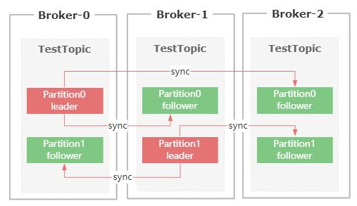

---

面试总结
在我看来，这个问题非常有研究价值。
一般来说，副本数据同步，无非就是同步阻塞、或者异步非阻塞。
但是这两种方案，要么带来性能问题，要么带来数据丢失问题，都不是特别合适。
而ISR，就非常完美解决了这个问题，在实际过程中，我们也可以借鉴类似的设
计思路。
RDB 和AOF 的实现原理、优缺点
Hi，大家好，我是Mic。
一个工作了5 年的粉丝私信我，最近面试碰到很多Redis 相关的问题。
其中一个面试官问他Redis 里面的持久化机制，没有回答得很好。
希望我帮他系统回答一下。
关于Redis 里面的RDB 和AOF 两种持久化机制的原理和优缺点这个问题。
下面看看普通人和高手的回答。
普通人
高手
好的，关于这个问题，我从几个点来回答。
首先，Redis 本身是一个基于Key-Value 结构的内存数据库，为了避免Redis 故
障导致数据丢失的问题，所以提供了RDB 和AOF 两种持久化机制。
RDB 是通过快照的方式来实现持久化的，也就是说会根据快照的触发条件，把
内存里面的数据快照写入到磁盘，
以二进制的压缩文件进行存储。
跟着Mic学架构
学架构
ic学架构
跟着Mic学架构
跟着Mic学架构
跟着Mic
跟着Mic

---

RDB 快照的触发方式有很多，比如执行bgsave 命令触发异步快照，执行save
命令触发同步快照，同步快照会阻塞客户端的执行指令。
根据redis.conf 文件里面的配置，自动触发bgsave 主从复制的时候触发AOF
持久化，它是一种近乎实时的方式，把Redis Server 执行的事务命令进行追加
存储。
简单来说，就是客户端执行一个数据变更的操作，Redis Server 就会把这个命令
追加到aof 缓冲区的末尾，然后再把缓冲区的数据写入到磁盘的AOF 文件里面，
至于最终什么时候真正持久化到磁盘，是根据刷盘的策略来决定的。
跟着Mic学架构
学架构
ic学架构
跟着Mic学架构
跟着Mic学架构
跟着Mic
跟着Mic

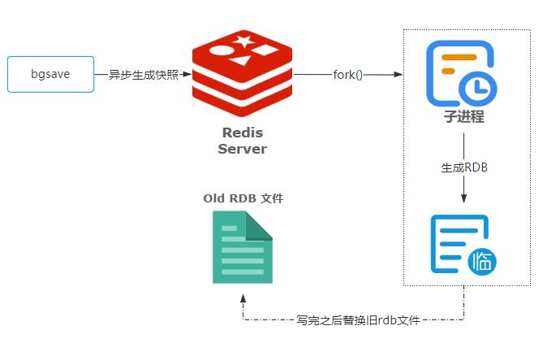

---

另外，因为AOF 这种指令追加的方式，会造成AOF 文件过大，带来明显的IO
性能问题，所以Redis 针对这种情况提供了AOF 重写机制，也就是说当AOF
文件的大小达到某个阈值的时候，就会把这个文件里面相同的指令进行压缩。
跟着Mic学架构
学架构
ic学架构
跟着Mic学架构
跟着Mic学架构
跟着Mic
跟着Mic

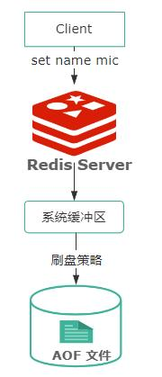

---

因此，基于对RDB 和AOF 的工作原理的理解，我认为RDB 和AOF 的优缺点
有两个。
RDB 是每隔一段时间触发持久化，因此数据安全性低，AOF 可以做到实时持久
化，数据安全性较高RDB 文件默认采用压缩的方式持久化，AOF 存储的是执行
指令，所以RDB 在数据恢复的时候性能比AOF 要好
在我看来，所谓优缺点，本质上其实是哪种方案更适合当前的应用场景而已。
以上就是我对这个问题的理解！
面试点评
这个问题的实际意义在于，求职者要知道在什么场景下选择什么样的持久化策略。
因此如果能够对AOF 和RDB 这两种持久化方式有比较深入的理解，
那自然也就能够在实际开发中合理的进行应用了。
喜欢我作品的小伙伴，记得点赞收藏加关注。
我是Mic，一个工作了4 年的Java 程序员，我们下期再见。
跟着Mic学架构
学架构
ic学架构
跟着Mic学架构
跟着Mic学架构
跟着Mic
跟着Mic

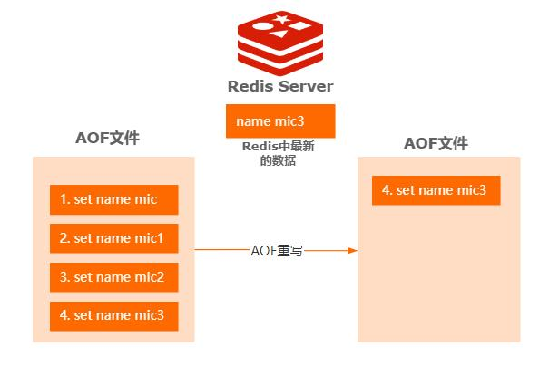

---

简单说一下你对序列化和反序列化的理
解
Hi，大家好，我是Mic
一个工作4 年的粉丝，投了很多简历
好不容易接到一个互联网公司的面试邀约。
在面试第一轮就被干掉了，原因是对主流互联网技术理解太浅了。
其中就有一个这样的问题：“简单说一下你对序列化和反序列化的理解”
下面看看普通人和高手的回答。
普通人
高手
好的，关于这个问题，我需要从几个方面来回答。
首先，我认为，之所以需要序列化，核心目的是为了解决网络通信之间的对象传
输问题。
也就是说，如何把当前JVM 进程里面的一个对象，跨网络传输到另外一个JVM
进程里面。
而序列化，就是把内存里面的对象转化为字节流，以便用来实现存储或者传输。
反序列化，就是根据从文件或者网络上获取到的对象的字节流，根据字节流里面
保存的对象描述信息和状态。
重新构建一个新的对象。
跟着Mic学架构
学架构
ic学架构
跟着Mic学架构
跟着Mic学架构
跟着Mic
跟着Mic

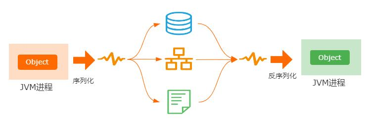

---

其次呢，序列化的前提是保证通信双方对于对象的可识别性，所以很多时候，我
们会把对象先转化为通用的解析格式，比如json、xml 等。然后再把他们转化为
数据流进行网络传输，从而实现跨平台和跨语言的可识别性。
最后，我再补充一下序列化选择。
市面上开源的序列化技术非常多，比如Json、Xml、Protobuf、Kyro、hessian
等等。
那在实际应用里面，哪种序列化最合适，我认为有几个关键因素。
序列化之后的数据大小，因为数据大小会影响传输性能
序列化的性能，序列化耗时较长会影响业务的性能
是否支持跨平台和跨语言
技术的成熟度，越成熟的方案使用的公司越多，也就越稳定。
以上就是我对这个问题的理解！
面试总结
序列化这个问题，面试问得也比较多
再深入一点，还会问到序列化的算法和原理。
在实际开发中，序列化技术的选择对于性能的影响也是比较大的。
因此互联网公司对这方面的考察会比较多一些。
什么是守护线程，它有什么特点
Hi，大家好，我是Mic
一个工作了3 年的粉丝，在面试的时候遇到一个线程相关问题。
想让我帮他解答一下。
问题是，“什么是守护线程，它有什么特点”
下面看看普通人和高手的回答。
普通人
跟着Mic学架构
学架构
ic学架构
跟着Mic学架构
跟着Mic学架构
跟着Mic
跟着Mic

---

高手
守护线程，它是一种专门为用户线程提供服务的线程，它的生命周期依赖于用户
线程。
只有JVM 中仍然还存在用户线程正在运行的情况下，守护线程才会有存在的意
义。
否则，一旦JVM 进程结束，那守护线程也会随之结束。
也就是说，守护线程不会阻止JVM 的退出。但是用户线程会！
守护线程和用户线程的创建方式是完全相同的，我们只需要调用用户线程里面的
setDaemon 方法并且设置成true，就表示这个线程是守护线程。
因为守护线程拥有自己结束自己生命的特性，所以它适合用在一些后台的通用服
务场景里面。
比如JVM 里面的垃圾回收线程，就是典型的使用场景。
这个场景的特殊之处在于，当JVM 进程技术的时候，内存回收线程存在的意义
也就不存在了。
所以不能因为正在进行垃圾回收导致JVM 进程无法技术的问题。
但是守护线程不能用在线程池或者一些IO 任务的场景里面，因为一旦JVM 退出
之后，守护线程也会直接退出。
就会可能导致任务没有执行完或者资源没有正确释放的问题。
以上就是我对这个问题的理解。
面试点评
这个问题，大部分工作年限比较长的同学也不一定能回答上来。
首先线程这个领域在业务开发中本身使用就比较少
而守护线程接触就更少了。
我始终认为，只有积累足够多的技术，才能更从容的应对未来长远的职业发展。
请谈谈AQS 是怎么回事儿？
Hi，大家好，我是Mic。
今年的市场环境是真的很难。很多工作一年的人，面试的难度相当于一个4 年经
验的人。
跟着Mic学架构
学架构
ic学架构
跟着Mic学架构
跟着Mic学架构
跟着Mic
跟着Mic

---

越是这样，我们越应该强大自己，才能在逆境中获得更多的机会。
今天一个一年经验的粉丝，被问到“AQS 的实现原理”，来找我求助。
下面看看普通人和高手对于这个问题的回答。
普通人
高手
好的，关于这个问题我需要从几个方面来回答。
AQS 它是J.U.C 这个包里面非常核心的一个抽象类，它为多线程访问共享资源
提供了一个队列同步器。
在J.U.C 这个包里面，很多组件都依赖AQS 实现线程的同步和唤醒，比如Lock、
Semaphore、CountDownLatch 等等。
AQS 内部由两个核心部分组成：
一个volatile 修饰的state 变量，作为一个竞态条件
用双向链表结构维护的FIFO 线程等待队列它的具体工作原理是，多个线程通过
对这个state 共享变量进行修改来实现竞态条件，竞争失败的线程加入到FIFO
跟着Mic学架构
学架构
ic学架构
跟着Mic学架构
跟着Mic学架构
跟着Mic
跟着Mic

---

队列并且阻塞，抢占到竞态资源的线程释放之后，后续的线程按照FIFO 顺序实
现有序唤醒。
AQS 里面提供了两种资源共享方式，一种是独占资源，同一个时刻只能有一个
线程获得竞态资源。比如ReentrantLock 就是使用这种方式实现排他锁。另一种
是共享资源，同一个时刻，多个线程可以同时获得竞态资源。CountDownLatch
或者Semaphore 就是使用共享资源的方式，实现同时唤醒多个线程。
以上就是我对这个问题的理解。
面试点评
在实际开发中，如果我们需要实现一些特殊的互斥场景，
直接使用ReentrantLock 又有点麻烦，那就可以自己去集成AQS，自定义多线
程竞争的实现逻辑。
这个问题主要考察求职责对Java 基础的理解。
说一说你对Spring Cloud 的理解
Hi，大家好，我是Mic
一个工作了7 年的Java 粉丝，竟然连这个问题都回答不出来。
难怪被裁员之后，每次面试都被技术问题卡脖子，导致一直找不到工作。
今天他遇到这样一个问题，希望我能给出一个回答建议。
“请你说一下你对Spring Cloud 的理解”。
跟着Mic学架构
学架构
ic学架构
跟着Mic学架构
跟着Mic学架构
跟着Mic
跟着Mic

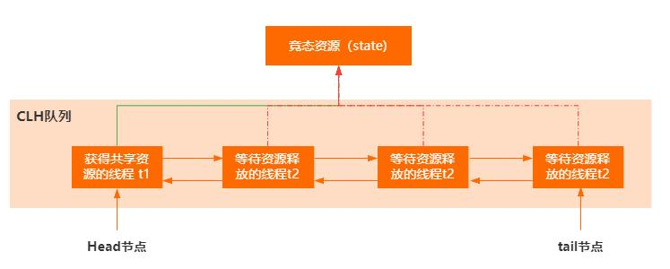

---

下面看看普通人和高手对这个问题的回答。
普通人
高手
好的。
Spring Cloud 是Spring 官方推出来的一套微服务解决方案。
准确来说，我认为Spring Cloud 其实是对微服务架构里面出现各种技术场景，
定义了一套标准规范。
然后在这套标准里面，Spring 集成了Netflix 公司的OSS 开源套件，比如
Zuul 实现应用网关、Eureka 实现服务注册与发现、Ribbon 实现负载均衡、
Hystrix 实现服务熔断我们可以使用Spring Cloud Netflix 这套组件，快速落地微
服务架构以及解决微服务治理等一系列问题。
但是随着Netflix OSS 相关技术组件的闭源和停止维护，所以Spring 官方也自研
了一些组件，比如Gateway 实现网关、LoadBalancer 实现负载均衡。
另外，Alibaba 里面的开源组件也实现了Spring Cloud 的标准，成为了Spring
Cloud 里面的另外一套微服务解决方案。
包括Dubbo 做rpc 通信、Nacos 实现服务注册与发现以及动态配置中心、Sentinel
实现服务限流和服务降级等等。
以上就是我对Spring Cloud 的理解，另外，我再补充一下，我认为Spring Cloud
生态的出现有两个很重要的意义。
在Spring Cloud 出现之前，为了解决微服务架构里面的各种技术问题，需要去
集成各种开源框架，因为标准和兼容性问题，所以在实践的时候很麻烦，而Spring
Cloud 统一了这样一个标准。
降低了微服务架构的开发难度，只需要在Spring Boot 的项目基础上通过starter
启动依赖集成相关组件就能轻松解决各种问题。
以上就是我对这个问题的理解。
面试点评
Spring Cloud 已经是普及度和应用非常高。
大家往往知道Spring Cloud 怎么用，但是为什么用，以及什么场景下用。
跟着Mic学架构
学架构
ic学架构
跟着Mic学架构
跟着Mic学架构
跟着Mic
跟着Mic

---

却不一定能明白，而这道题目其实就是考察工作4 年以上的求职责对技术的了解
程度。
什么是SPI，它有什么用？
Hi，大家好，我是Mic
一个工作了4 年的粉丝，私信了一个问题。
我看到问题的时候有点惊讶，很多主流框架都用到了这个机制
你竟然不知道？
看来你是凭实力那低薪！
这个问题是：“什么是SPI，它有什么用”
下面看看普通人和高手对这个问题的回答。
普通人
高手
好的
SPI 全称是Service Provider Interface ，它是JDK 内置的一种动态扩展点的实
现。
简单来说，就是我们可以定义一个标准的接口，然后第三方的库里面可以实现这
个接口。
那么，程序在运行的时候，会根据配置信息动态加载第三方实现的类，从而完成
功能的动态扩展机制。
跟着Mic学架构
学架构
ic学架构
跟着Mic学架构
跟着Mic学架构
跟着Mic
跟着Mic

---

在Java 里面，SPI 机制有一个非常典型的实现案例，就是数据库驱动
java.jdbc.Driver
JDK 里面定义了数据库驱动类Driver，它是一个接口，JDK 并没有提供实现。
具体的实现是由第三方数据库厂商来完成的。
在程序运行的时候，会根据我们声明的驱动类型，来动态加载对应的扩展实现，
从而完成数据库的连接。
除此之外，在很多开源框架里面都借鉴了Java SPI 的思想，提供了自己的SPI
框架，比如
Dubbo 定义了ExtensionLoader，实现功能的扩展。
Spring 提供了SpringFactoriesLoader，实现外部功能的集成。
以上就是我对这个问题的理解！
跟着Mic学架构
学架构
ic学架构
跟着Mic学架构
跟着Mic学架构
跟着Mic
跟着Mic

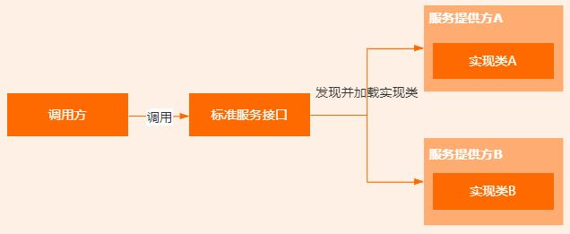

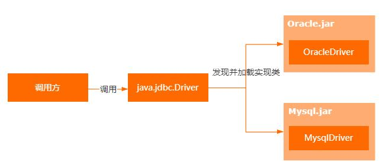

---

面试点评
SPI 的思想确实很有价值，
在实际业务开发中，可以利用这样的思想
在不修改核心代码的情况下，提供功能的增强和扩展。
请描述一下Redis 中AOF 重写的过程
Hi，大家好，我是Mic
一个工作了5 年的粉丝私信我。他说他在简历里面写精通Redis，
结果面试官一直围绕Redis 来问，后来越问越深，面试官后面回了一句话：“也
没有想象中那么深嘛”
今天给大家分享一道年薪50W 的面试题，“请描述一下Redis 里面AOF 的重写
过程”
下面看看普通人和高手对这个问题的回答
普通人
高手
AOF 是Redis 里面的一种数据持久化方式，它采用了指令追加的方式。
近乎实时的去实现数据指令的持久化，因为AOF，会把每个数据更改的操作指
令，追加存储到aof 文件里面。
所以很容易导致AOF 文件出现过大，造成IO 性能问题。
跟着Mic学架构
学架构
ic学架构
跟着Mic学架构
跟着Mic学架构
跟着Mic
跟着Mic

---

Redis 为了解决这个问题，设计了AOF 重写机制，也就是说把AOF 文件里面相
同的指令进行压缩，只保留最新的数据指令。
简单来说，如果aof 文件里面存储了某个key 的多次变更记录，但是实际上，最
终在做数据恢复的时候，只需要执行最新的指令操作就行了，历史的数据就没必
要存在这个文件里面占空间。
跟着Mic学架构
学架构
ic学架构
跟着Mic学架构
跟着Mic学架构
跟着Mic
跟着Mic

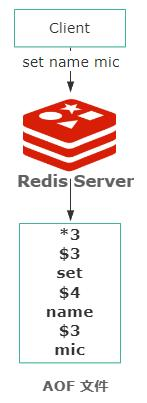

---

AOF 文件重写的具体过程分为几步：
首先，根据当前Redis 内存里面的数据，重新构建一个新的AOF 文件
然后，读取当前Redis 里面的数据，写入到新的AOF 文件里面
最后，重写完成以后，用新的AOF 文件覆盖现有的AOF 文件
另外，因为AOF 在重写的过程中需要读取当前内存里面所有的键值数据，再生
成对应的一条指令进行保存。
而这个过程是比较耗时的，对业务会产生影响。
所以Redis 把重写的过程放在一个后台子进程里面来完成，
这样一来，子进程在做重写的时候，主进程依然可以继续处理客户端请求。
最后，为了避免子进程在重写过程中，主进程的数据发生变化，
导致AOF 文件和Redis 内存中的数据不一致的问题，Redis 还做了一层优化。
就是子进程在重写的过程中，主进程的数据变更需要追加到AOF 重写缓冲区里
面。
等到AOF 文件重写完成以后，再把AOF 重写缓冲区里面的内容追加到新的AOF
文件里面。
以上就是我对这个问题的理解。
跟着Mic学架构
学架构
ic学架构
跟着Mic学架构
跟着Mic学架构
跟着Mic
跟着Mic

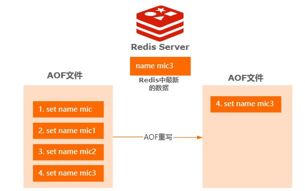

---

面试点评
这个问题背后涉及到的技术知识还是很有意思的。
在实现数据持久化和重写的过程中，如何避免对客户端产生影响，
还需要保证数据的一致性，从这些大神的解决思路中可以学到很多有价值的思想。
HashMap 是如何解决hash 冲突的？
Hi，大家好，我是Mic。
今天我们来分享一道工作一年左右的面试题。
最近很多粉丝在面试的时候都遇到了这个问题
问题是：“HashMap 是如何解决Hash 冲突的”？
很多人觉得这个问题很简单，但是我认为高手的回答会更好一点。
下面看看普通人和高手对这个问题的回答。
普通人
高手
好的，这个问题我需要从几个方面来回答。
首先，HashMap 底层采用了数组的结构来存储数据元素，数组的默认长度是16，
当我们通过put 方法添加数据的时候，HashMap 根据Key 的hash 值进行取模
运算。
最终保存到数组的指定位置。
但是这种设计会存在hash 冲突问题，也就是两个不同hash 值的key，最终取
模后会落到同一个数组下标。
所以HashMap 引入了链式寻址法来解决hash 冲突问题，对于存在冲突的key，
HashMap 把这些key 组成一个单向链表。
然后采用尾插法把这个key 保存到链表的尾部。
跟着Mic学架构
学架构
ic学架构
跟着Mic学架构
跟着Mic学架构
跟着Mic
跟着Mic

---

另外，为了避免链表过长的问题，当链表长度大于8 并且数组长度大于等于64
的时候，HashMap 会把链表转化为红黑树。
从而减少链表数据查询的时间复杂度问题，提升查询性能。
最后，我再补充一下，解决hash 冲突问题的方法有很多，比如
再hash 法，就是如果某个hash 函数产生了冲突，再用另外一个hash 进行计算，
比如布隆过滤器就采用了这种方法。
跟着Mic学架构
学架构
ic学架构
跟着Mic学架构
跟着Mic学架构
跟着Mic
跟着Mic

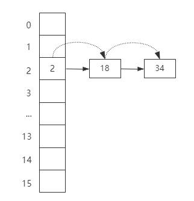

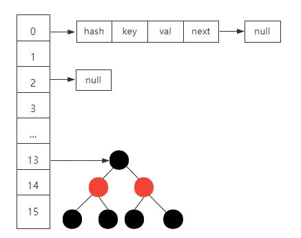

---

开放寻址法，就是直接从冲突的数组位置往下寻找一个空的数组下标进行数据存
储，这个在ThreadLocal 里面有使用到。
建立公共溢出区，也就是把存在冲突的key 统一放在一个公共溢出区里面。
以上就是我对这个问题的理解。
面试点评
hash 冲突这个问题，在业务开发的过程中比较少遇到。
但是从解决方法中，可以学到很多的技术设计思想
不管是为了面试还是为了长期的职业发展，我认为这个技术点都是有必要深度理
解的基础知识。
ReentrantLock 是如何实现锁公平和非
公平性的？
一个工作了3 年的程序员竟然连这个问题都回答不上？
Hi，大家好，我是Mic。
今天分享一道3 年经验，频率较高的面试题。
“ReentrantLock 是如何实现锁的公平和非公平性的”？
下面看看普通人和高手对这个问题的回答
普通人
高手
好的。
我先解释一下个公平和非公平的概念。
公平，指的是竞争锁资源的线程，严格按照请求顺序来分配锁。
非公平，表示竞争锁资源的线程，允许插队来抢占锁资源。
ReentrantLock 默认采用了非公平锁的策略来实现锁的竞争逻辑。
其次，ReentrantLock 内部使用了AQS 来实现锁资源的竞争，
跟着Mic学架构
学架构
ic学架构
跟着Mic学架构
跟着Mic学架构
跟着Mic
跟着Mic

---

没有竞争到锁资源的线程，会加入到AQS 的同步队列里面，这个队列是一个
FIFO 的双向链表。
在这样的一个背景下，公平锁的实现方式就是，线程在竞争锁资源的时候判断
AQS 同步队列里面有没有等待的线程。
如果有，就加入到队列的尾部等待。
而非公平锁的实现方式，就是不管队列里面有没有线程等待，它都会先去尝试抢
占锁资源，如果抢不到，再加入到AQS 同步队列等待。
ReentrantLock 和Synchronized 默认都是非公平锁的策略，之所以要这么设计，
我认为还是考虑到了性能这个方面的原因。
因为一个竞争锁的线程如果按照公平的策略去阻塞等待，同时AQS 再把等待队
列里面的线程唤醒，这里会涉及到内核态的切换，对性能的影响比较大。
如果是非公平策略，当前线程正好在上一个线程释放锁的临界点抢占到了锁，就
意味着这个线程不需要切换到内核态，虽然对原本应该要被唤醒的线程不公平，
但是提升了锁竞争的性能。
以上就是我对这个问题的理解。
面试点评
这个问题，主要考察求职者的基础知识。
别小看这些基础，在实际开发过程中，不管是对代码的稳定性
还是对性能的影响都是非常大的。
这也是大厂面试必然会问基础问题的原因之一。
Zookeeper 如何实现Leader 选举
Hi，大家好，我是Mic，一个工作了14 年的程序员和创业者。
跟着Mic学架构
学架构
ic学架构
跟着Mic学架构
跟着Mic学架构
跟着Mic
跟着Mic

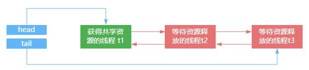

---

一个工作了7 年的粉丝，最近去面试遇到Zookeeper 里面的一个问题。
因为平时很少研究，所以面试的时候只能一个劲的说：不知道。
他觉得很尴尬，于是来问我，：“Zookeeper 是如何实现Leader 选举的”。
下面看看普通人和高手对这个问题的回答
普通人
高手
好的。
首先，Zookeeper 集群节点由三种角色组成，分别是
Leader，负责所有事务请求的处理，以及过半提交的投票发起和决策。
Follower，负责接收客户端的非事务请求，而事务请求会转发给Leader 节点来
处理，另外，Follower 节点还会参与Leader 选举的投票。
Observer，负责接收客户端的非事务请求，事务请求会转发给Leader 节点来处
理，另外Observer 节点不参与任何投票，只是为了扩展Zookeeper 集群来分担
读操作的压力。
其次，Zookeeper 集群是一种典型的中心化架构，也就是会有一个Leader 作为
决策节点，专门负责事务请求的处理和数据的同步。
这种架构的好处是可以减少集群架构里面数据同步的复杂度，集群管理会更加简
单和稳定。
但是，会带来Leader 选举的一个问题，也就是说，如果Leader 节点宕机了，
为了保证集群继续提供可靠的服务，
跟着Mic学架构
学架构
ic学架构
跟着Mic学架构
跟着Mic学架构
跟着Mic
跟着Mic

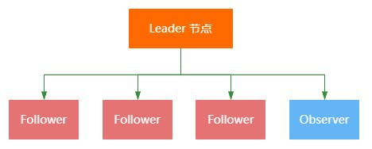

---

Zookeeper 需要从剩下的Follower 节点里面去选举一个新的节点作为Leader，
也就是所谓的Leader 选举！
[
具体的实现是，每一个节点都会向集群里面的其他节点发送一个票据Vote，这
个票据包括三个属性。
epoch，逻辑时钟，用来表示当前票据是否过期。
zxid，事务id，表示当前节点最新存储的数据的事务编号。
myid，服务器id，在myid 文件里面填写的数字。
每个节点都会选自己当Leader，所以第一次投票的时候携带的是当前节点的信
息。
接下来每个节点用收到的票据和自己节点的票据做比较，根据epoch、zxid、myid
的顺序逐一比较，以值最大的一方获胜。比较结束以后这个节点下次再投票的时
候，发送的投票请求就是获胜的Vote 信息。
跟着Mic学架构
学架构
ic学架构
跟着Mic学架构
跟着Mic学架构
跟着Mic
跟着Mic

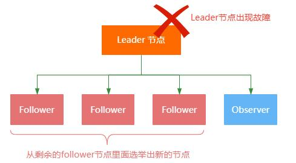

---

然后通过多轮投票以后，每个节点都会去统计当前达成一致的票据，以少数服从
多数的方式，最终获得票据最多的节点成为Leader。
以上就是我对这个问题的理解。
最后我再补充一下，选择epoch/zxid/myid 作为投票评判依据的原因，我是这么
理解的。
epoch ，因为网络通信延迟的可能性，有可能在新一轮的投票里面收到上一轮
投票的票据，这种数据应该丢弃，否则会影响投票的结果和效率。
zxid，zxid 越大，说明这个节点的数据越接近leader，所以用zxid 做判断条件
是为了避免数据丢失的问题。
myid，服务器id，这个是避免投票时间过长，直接用myid 最大值作为快速终
结投票的属性。
面试点评
Leader 选举是一个比较复杂的问题，它涉及到集群节点的数据一致性算法。
在很多中间件里面都有涉及到类似的问题，这个思想其实还是很有研究价值的。
除此之外，还有Paxos、raft、等一致性算法。
说一下你对CompletableFuture 的理解
跟着Mic学架构
学架构
ic学架构
跟着Mic学架构
跟着Mic学架构
跟着Mic
跟着Mic

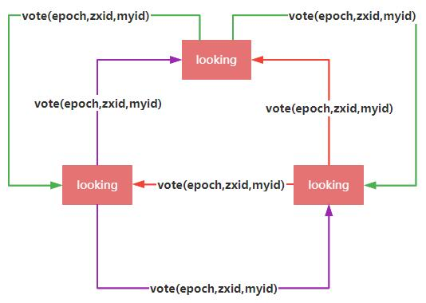

---

Hi，大家好，我是Mic，一个工作了14 年的程序员和创业者。
一个工作了4 年的粉丝，很兴奋的和我说，他拿到了字节跳动的offer
评级是2-1 ，相当于阿里的p6。
他说多亏了面试之前每天刷我的面试短视频。
这种正向反馈，让我觉得做这个事情很有价值。
好的，今天给大家分享一道并发编程的面试题。
“请你说一下你对CompletableFuture 的理解”。
下面看看普通人和高手对这个问题的回答。
普通人
高手
CompletableFuture 是JDK1.8 里面引入的一个基于事件驱动的异步回调类。
简单来说，就是当使用异步线程去执行一个任务的时候，我们希望在任务结束以
后触发一个后续的动作。
而CompletableFuture 就可以实现这个功能。
举个简单的例子，比如在一个批量支付的业务逻辑里面，涉及到查询订单、支付、
发送邮件通知这三个逻辑。
这三个逻辑是按照顺序同步去实现的，也就是先查询到订单以后，再针对这个订
单发起支付，支付成功以后再发送邮件通知。
而这种设计方式导致这个方法的执行性能比较慢。
跟着Mic学架构
学架构
ic学架构
跟着Mic学架构
跟着Mic学架构
跟着Mic
跟着Mic

---

所以，这里可以直接使用CompletableFuture，也就是说把查询订单的逻辑放在
一个异步线程池里面去处理。
然后基于CompletableFuture 的事件回调机制的特性，可以配置查询订单结束后
自动触发支付，支付结束后自动触发邮件通知。
从而极大的提升这个这个业务场景的处理性能！
CompletableFuture 提供了5 种不同的方式，把多个异步任务组成一个具有先后
关系的处理链，然后基于事件驱动任务链的执行。
第一种，thenCombine，把两个任务组合在一起，当两个任务都执行结束以后触
发事件回调。
跟着Mic学架构
学架构
ic学架构
跟着Mic学架构
跟着Mic学架构
跟着Mic
跟着Mic

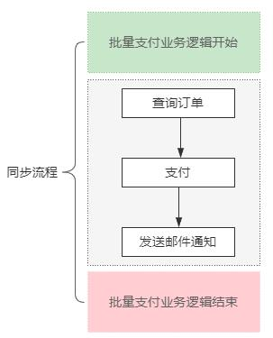

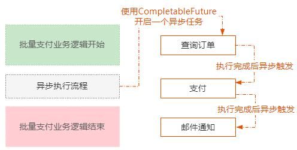

---

第二种，thenCompose，把两个任务组合在一起，这两个任务串行执行，也就
是第一个任务执行完以后自动触发执行第二个任务。
第三种，thenAccept，第一个任务执行结束后触发第二个任务，并且第一个任务
的执行结果作为第二个任务的参数，这个方法是纯粹接受上一个任务的结果，不
返回新的计算值。
第四种，thenApply，和thenAccept 一样，但是它有返回值。
跟着Mic学架构
学架构
ic学架构
跟着Mic学架构
跟着Mic学架构
跟着Mic
跟着Mic

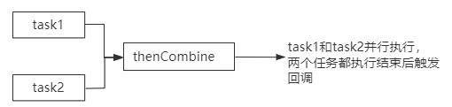

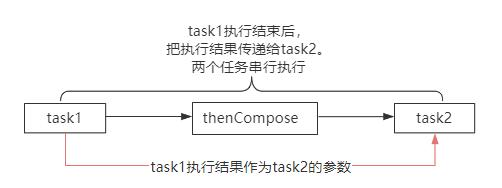

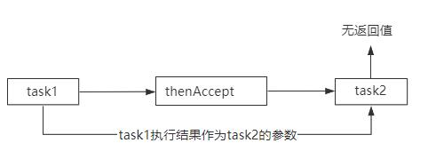

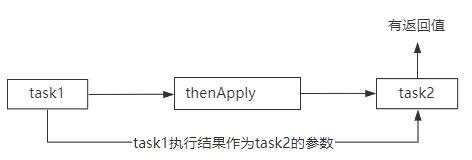

---

第五种，thenRun，就是第一个任务执行完成后触发执行一个实现了Runnable
接口的任务。
最后，我认为，CompletableFuture 弥补了原本Future 的不足，使得程序可以
在非阻塞的状态下完成异步的回调机制。
以上就是我对这个问题的理解。
面试点评
CompletableFuture 的使用场景还挺多的，特别是在一些RPC 通信框架底层。
所以作为一个能够提升程序性能的异步化组件，大家还是非常有必要去了解它的。
Spring 里面的事务和分布式事务的使
用如何区分，以及这两个事务之间有什么
关联？
Hi，大家好，我是Mic，一个工作了14 年的程序员和创业者。
昨天一个粉丝私信我一个问题。
他去面试的时候遇到一个这样的问题。
“Spring 里面的事务和分布式事务的使用如何区分，以及这两个事务之间有什么
关联”我没有想到，还有人回答不了这个问题。
所以，今天我们就来说一下这个面试题。
对于这个问题，来看看普通人和高手的回答。
普通人
跟着Mic学架构
学架构
ic学架构
跟着Mic学架构
跟着Mic学架构
跟着Mic
跟着Mic

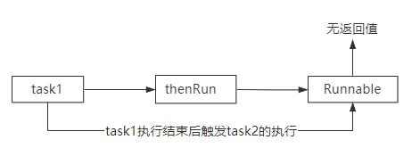

---

高手
首先，在Spring 里面并没有提供事务，它只是提供了对数据库事务管理的封装。
通过声明式的事务配置，使得开发人员可以从一些复杂的事务处理中得到解脱，
我们不再需要关心连接的获取、连接的关闭、事务提交、事务回滚这些操作。
更加聚焦在业务开发层面。
所以，Spring 里面的事务，本质上就是数据库层面的事务，这种事务的管理，
主要是针对单个数据库里面多个数据表操作的，去满足事务的ACID 特性。
分布式事务，是解决多个数据库的事务操作的数据一致性问题，传统的关系型数
据库不支持跨库事务的操作，所以需要引入分布式事务的解决方案。
而Spring 并没有提供分布式事务场景的支持，所以Spring 事务和分布式事务在
使用上并没有直接的关联性。
但是我们可以使用一些主流的事务解决框架，比如Seata，集成到Spring 生态
里面，去解决分布式事务的问题。
以上就是我对这个问题的理解！
面试点评
其实面试的时候不应该问这一类的问题，
因为Spring 的事务和分布式事务虽然在名字上类似，但是完全就是两个概念。
我估计这个问题，面试管考察的是一些刚毕业的小朋友吧。
Cookie 和Session 的区别
跟着Mic学架构
学架构
ic学架构
跟着Mic学架构
跟着Mic学架构
跟着Mic
跟着Mic

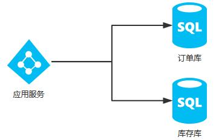

---

Hi，大家好，我是Mic，一个工作了14 年的程序员和创业者。
今天分享一道比较基础的面试题。
但是我可以保证很多人不一定回答得很好。
具体问题是：Cookie 和Session 的区别。
下面看看普通人和高手对这个问题的回答。
普通人
高手
好的，面试官。
我先解释一下Cookie，它是客户端浏览器用来保存服务端数据的一种机制。
当通过浏览器进行网页访问的时候，服务器可以把某一些状态数据以key-value
的方式写入到Cookie 里面存储到客户端浏览器。
然后客户端下一次再访问服务器的时候，就可以携带这些状态数据发送到服务器
端，服务端可以根据Cookie 里面携带的内容来识别使用者。
Session 表示一个会话，它是属于服务器端的容器对象，默认情况下，针对每一
个浏览器的请求。
Servlet 容器都会分配一个Session。
Session 本质上是一个ConcurrentHashMap，可以存储当前会话产生的一些状
态数据。
我们都知道，Http 协议本身是一个无状态协议，也就是服务器并不知道客户端发
送过来的多次请求是属于同一个用户。
所以Session 是用来弥补Http 无状态的不足，简单来说，服务器端可以利用
session 来存储客户端在同一个会话里面的多次请求记录。
基于服务端的session 存储机制，再结合客户端的Cookie 机制，就可以实现有
状态的Http 协议。
具体的工作原理是：
客户端第一次访问服务端的时候，服务端会针对这次请求创建一个会话，并生成
一个唯一的sessionId 来标注这个会话。
然后服务端把这个sessionid 写入到客户端浏览器的cookie 里面，用来实现客户
端状态的保存。
跟着Mic学架构
学架构
ic学架构
跟着Mic学架构
跟着Mic学架构
跟着Mic
跟着Mic

---

在后续的请求里面，每次都会携带sessionid，服务器端就可以根据这个sessionid
来识别当前的会话状态。
所以，总的来看，Cookie 是客户端的存储机制，Session 是服务端的存储机制。
这两者结合使用，来实现会话状态的存储，以上就是我对这个问题的理解！
面试点评
你看，Cookie 和Session，大家都不陌生。
但是在回答面试官这个问题的时候，如何组织语言去说明这两个机制
并且调理清晰的回答出来，还是有点难度的。
另外，关于Cookie 和Session 的机制，工作1 到3 年的人，还是有大部分不清
楚他们的工作原理的。
建议大家抽空去了解一下！
线程状态，BLOCKED 和WAITING 有什
么区别
Hi，大家好，我是Mic，一个工作了14 年的程序员和创业者。
一个在北京工作了3 年的粉丝，在一个公司待了3 年没有跳槽。
而且他在现在公司里面担任一个核心开发，自认为能力还不错，想出去找一份高
薪工作。
结果去面试的时候被一道简单的问题难住了，面试官问他：“线程状态BLOCKED
和WAITING 有什么区别”！
跟着Mic学架构
学架构
ic学架构
跟着Mic学架构
跟着Mic学架构
跟着Mic
跟着Mic

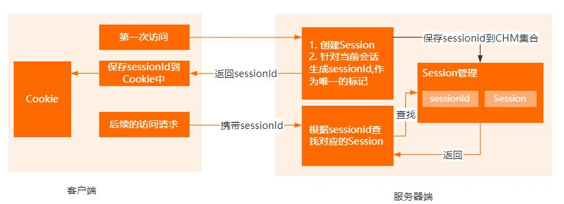

---

因为平时主要是做业务开发，所以线程这方面的研究很少，最后很遗憾没有通过
面试。
下面看看普通人和高手对这个问题的回答。
普通人
高手
好的，面试官。
BLOCKED 和WAITING 都是属于线程的阻塞等待状态。
BLOCKED 状态是指线程在等待监视器锁的时候的阻塞状态。
也就是在多个线程去竞争Synchronized 同步锁的时候，没有竞争到锁资源的线
程，会被阻塞等待，这个时候线程状态就是BLOCKED。
在线程的整个生命周期里面，只有Synchronized 同步锁等待才会存在这个状态。
跟着Mic学架构
学架构
ic学架构
跟着Mic学架构
跟着Mic学架构
跟着Mic
跟着Mic

---

WAITING 状态，表示线程的等待状态，在这种状态下，线程需要等待某个线程
的特定操作才会被唤醒。我们可以使用Object.wait() 、Object.join() 、
LockSupport.park()这些方法使得线程进入到WAITING 状态，在这个状态下，
必须要等待特定的方法来唤醒，
比如Object.notify 方法可以唤醒Object.wait()方法阻塞的线程
LockSupport.unpark()可以唤醒LockSupport.park()方法阻塞的线程。
所以，在我看来，BLOCKED 和WAITING 两个状态最大的区别有两个：
BLOCKED 是锁竞争失败后被被动触发的状态，WAITING 是人为的主动触发的
状态
跟着Mic学架构
学架构
ic学架构
跟着Mic学架构
跟着Mic学架构
跟着Mic
跟着Mic

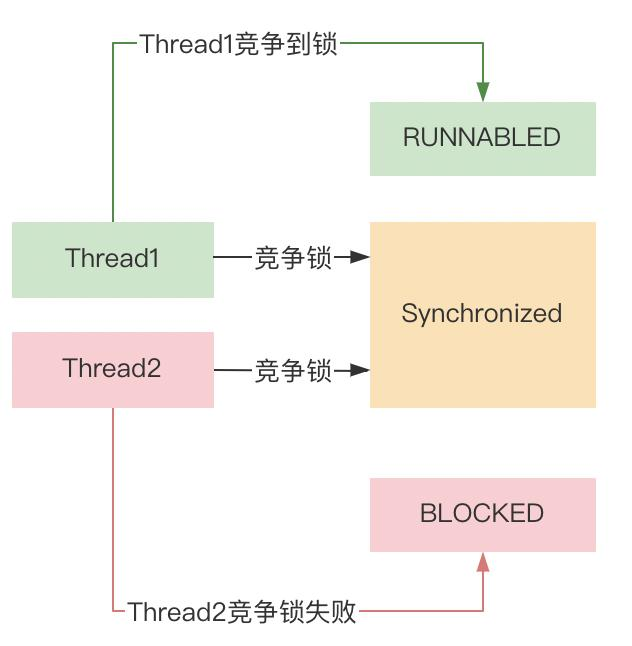

---

BLCKED 的唤醒时自动触发的，而WAITING 状态是必须要通过特定的方法来主
动唤醒
以上就是我对这个问题的理解。
面试点评
线程的生命周期以及在Java 里面有哪些方式导致线程声明周期的变化。
是非常重要的基础知识，因为在应用里面一定会用到线程，而一旦线程出现故障，
我们就需要根据线程的dump 日志去定位，而了解线程的运行状态就能快速去定
位具体的问题。
Kafka 如何保证消息消费的顺序性？
最近很多同学去面试，都被问到“MQ 如何保证消费顺序性”这样一个问题
很多人都没回到上来，特别是面试官在面试的时候，还会再补充一句：“还有没
有其他方案”。
然后求职者一脸懵逼，实在不知道该怎么回答。
Hi，大家好，我是Mic，一个工作了14 年的程序员和创业者。
今天我们来分析一道这样的面试题，“MQ 是如何保证消费顺序性”
下面看看普通人和高手对这个问题的回答。
普通人
高手
好的，这个问题我从两个方面来回答。
kafka 为什么会存在无序消费
kafka 如何保证有序消费
首先，在kafka 的架构里面，用到了Partition 分区机制来实现消息的物理存储，
在同一个topic 下面，可以维护多个partition 来实现消息的分片。
跟着Mic学架构
学架构
ic学架构
跟着Mic学架构
跟着Mic学架构
跟着Mic
跟着Mic

---

生产者在发送消息的时候，会根据消息的key 进行取模，来决定把当前消息存储
到哪个partition 里面。
并且消息是按照先后顺序有序存储到partition 里面的。
在这种情况下，假设有一个topic 存在三个partition，而消息正好被路由到三个
独立的partition 里面。
然后消费端有三个消费者通过balance 机制分别指派了对应消费分区。因为消费
者是完全独立的网络节点，所有可能会出现，消息的消费顺序不是按照发送顺序
来实现的，从而导致乱序的问题。
跟着Mic学架构
学架构
ic学架构
跟着Mic学架构
跟着Mic学架构
跟着Mic
跟着Mic

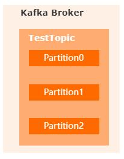

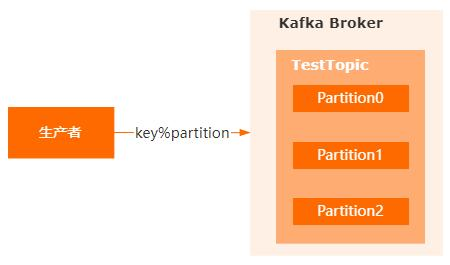

---

针对这个问题，一般的解决办法就是自定义消息分区路由的算法，然后把指定的
key 都发送到同一个Partition 里面。
接着指定一个消费者专门来消费某个分区的数据，这样就能保证消息的顺序消费
了。
另外，有些设计方案里面，在消费端会采用异步线程的方式来消费数据来提高消
息的处理效率，那这种情况下，因为每个线程的消息处理效率是不同的，所以即
便是采用单个分区的存储和消费也可能会出现无序问题，针对这个问题的解决办
法就是在消费者这边使用一个阻塞队列，把获取到的消息先保存到阻塞队列里面，
然后异步线程从阻塞队列里面去获取消息来消费。
以上就是我对这个问题的理解。
面试点评
关于这个问题，有些面试官还会这样问：如果我不想把消息路由到同一个分区，
但是还想实现消息的顺序消费，怎么办？
严格来说，kafka 只能保证同一个分区内的消息存储的有序性。
如果一定要去实现，也不是不行，只是代价太大了没必要。
跟着Mic学架构
学架构
ic学架构
跟着Mic学架构
跟着Mic学架构
跟着Mic
跟着Mic

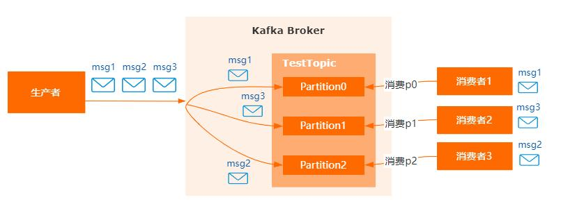

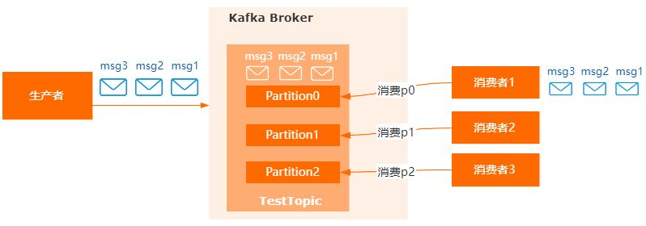

---

虽然没有标准答案，但是面试官要这么问，无非就是想考察你面对复杂问题的时
候是如何思考的，以及你的技术底蕴怎么样。
Mysql 事务的实现原理
Hi，大家好，我是Mic，一个工作了14 年的程序员和创业者。
今天分享的面试题很有意思，去大厂面试的时候，百分之90 的可能性会问到。
但是真正能够完整回答出来的同学缺很少。
最近一个工作了11 年的粉丝去面试，就被面试到这个问题。
问题是：Mysql 事务的底层实现原理。
下面看看普通人和高手对这个问题的回答
普通人
高手
好的，面试官
Mysql 里面的事务，满足ACID 特性，所以在我看来，Mysql 的事务实现原理，
就是InnoDB 是如何保证ACID 特性的。
首先，A 表示Atomic 原子性，也就是需要保证多个DML 操作是原子的，要么都
成功，要么都失败。
那么，失败就意味着要对原本执行成功的数据进行回滚，所以InnoDB 设计了一
个UNDO_LOG 表，在事务执行的过程中，把修改之前的数据快照保存到
UNDO_LOG 里面，一旦出现错误，就直接从UNDO_LOG 里面读取数据执行反
向操作就行了。
其次，C 表示一致性，表示数据的完整性约束没有被破坏，这个更多是依赖于业
务层面的保证，数据库本身也提供了一些，比如主键的唯一余数，字段长度和类
型的保证等等。
接着，I 表示事物的隔离性，也就是多个并行事务对同一个数据进行操作的时候，
如何避免多个事务的干扰导致数据混乱的问题。
而InnoDB 实现了SQL92 的标准，提供了四种隔离级别的实现。分别是：
RU（未提交读）
RC（已提交读）
RR（可重复读）
跟着Mic学架构
学架构
ic学架构
跟着Mic学架构
跟着Mic学架构
跟着Mic
跟着Mic

---

Serializable（串行化）
InnoDB 默认的隔离级别是RR（可重复读），然后使用了MVCC 机制解决了脏
读和不可重复读的问题，然后使用了行锁/表锁的方式解决了幻读的问题。
最后一个是D，表示持久性，也就是只要事务提交成功，那对于这个数据的结果
的影响一定是永久性的。
不能因为宕机或者其他原因导致数据变更失效。
理论上来说，事务提交之后直接把数据持久化到磁盘就行了，但是因为随机磁盘
IO 的效率确实很低，所以InnoDB 设计了Buffer Pool 缓冲区来优化，也就是数
据发生变更的时候先更新内存缓冲区，然后在合适的时机再持久化到磁盘。
那在持久化这个过程中，如果数据库宕机，就会导致数据丢失，也就无法满足持
久性了。
所以InnoDB 引入了Redo_LOG 文件，这个文件存储了数据被修改之后的值，
当我们通过事务对数据进行变更操作的时候，除了修改内存缓冲区里面的数据以
外，还会把本次修改的值追加到REDO_LOG 里面。
当提交事务的时候，直接把REDO_LOG 日志刷到磁盘上持久化，一旦数据库出
现宕机，在Mysql 重启在以后可以直接用REDO_LOG 里面保存的重写日志读
取出来，再执行一遍从而保证持久性。
因此，在我看来，事务的实现原理的核心本质就是如何满足ACID 的，在InnDB
里面用到了MVCC、行锁表锁、UNDO_LOG、REDO_LOG 等机制来保证。
以上就是我对这个问题的理解！
面试点评
InnDB 的事务实现原理，有很多可以借鉴的设计思想，
比如乐观锁、利用内存缓冲区的方式，以空间换时间的思想优化磁盘IO 的性能
等等
这些思想还挺重要的，比如在分布式事务框架Seata 的AT 模式的数据回滚，就
借鉴了
InnDB 里面UNDO_LOG 的设计思想。
String、StringBuffer、StringBuilder
区别
Hi，大家好，我是Mic，一个工作了14 年的程序员和创业者。
跟着Mic学架构
学架构
ic学架构
跟着Mic学架构
跟着Mic学架构
跟着Mic
跟着Mic

---

今天分享一个非常基础但是有点深度的面试题。
记得10 多年前我去找工作的时候，经常会碰到这个问题。
现在这一类的问题，考察的是应届生会比较多一点吧。
问题是：“String、StringBuffer、StringBuilder 的区别”
下面来看看普通人和高手对这个问题的回答
普通人
高手
嗯，好的，面试官。
关于String、StringBuffer、StringBuilder 的区别，我想从四个角度来说明。
第一个，可变性。
String 内部的value 值是final 修饰的，所以它是不可变类。所以每次修改String
的值，都会产生一个新的对象。
StringBuffer 和StringBuilder 是可变类，字符串的变更不会产生新的对象。
第二个，线程安全性。
String 是不可变类，所以它是线程安全的。
StringBuffer 是线程安全的，因为它每个操作方法都加了synchronized 同步关键
字。
StringBuilder 不是线程安全的，所以在多线程环境下对字符串进行操作，应该使
用StringBuffer，否则使用StringBuilder
第三个，性能方面。
String 的性能是最的低的，因为不可变意味着在做字符串拼接和修改的时候，需
要重新创建新的对象以及分配内存。
其次是StringBuffer 要比String 性能高，因为它的可变性使得字符串可以直接被
修改最后是StringBuilder，它比StringBuffer 的性能高，因为StringBuffer 加了
同步锁。
第四个，存储方面。
String 存储在字符串常量池里面
StringBuffer 和StringBuilder 存储在堆内存空间。
以上就是我对这个问题的理解！
跟着Mic学架构
学架构
ic学架构
跟着Mic学架构
跟着Mic学架构
跟着Mic
跟着Mic

---

最后再补充一下，StringBuilder 和StringBuffer 都是派生自AbstractStringBuilder
这个抽象类。
面试点评
这个问题其实还挺有意思的。
可能平时我们在使用字符串操作的时候并不会去关心性能以及线程安全性的影
响。
但是确实在Java 里面提供了不同的字符串操作，使得我们可以在不同的场景下
使用不同的字符串对象。
这些小细节在开发中或多或少还是会有一些影响。
说说你对一致性Hash 算法的理解
Hi，大家好，我是Mic，一个工作了14 年的程序员和创业者。
最近一个工作4 年的粉丝，去美团面试，被面试官问到一个一致性hash 算法的
问题
他没回答上来，然后跑过来找我希望我能帮他分析一下这个问题。
具体问题是：“说说你对一致性Hash 算法的理解”
下面看看普通人和高手的回答。
普通人
高手
一致性hash，是一种比较特殊的hash 算法，它的核心思想是解决在分布式环境
下，
hash 表中可能存在的动态扩容和缩容的问题。
一般情况下，我们会使用hash 表的方式以key-value 的方式来存储数据，但是
当数据量比较大的时候，我们就会把数据存储
到多个节点上，然后通过hash 取模的方法来决定当前key 存储到哪个节点上。
跟着Mic学架构
学架构
ic学架构
跟着Mic学架构
跟着Mic学架构
跟着Mic
跟着Mic

---

这种方式有一个非常明显的问题，就是当存储节点增加或者减少的时候，原本的
映射关系就会发生变化。
也就是需要对所有数据按照新的节点数量重新映射一遍，这个涉及到大量的数据
迁移和重新映射，迁移代价很大。
而一致性hash 就是用来优化这种动态变化场景的算法，它的具体工作原理也很
简单。
首先，一致性Hash 是通过一个Hash 环的数据结构来实现的，这个环的起点是
0，终点是2^32-1。
也就是这个环的数据分布范围是[0,2^32-1]。
跟着Mic学架构
学架构
ic学架构
跟着Mic学架构
跟着Mic学架构
跟着Mic
跟着Mic

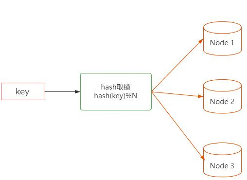

---

然后我们把存储节点的ip 地址作为key 进行hash 之后，会在Hash 环上确定一
个位置。
接下来，就是把需要存储的目标key 使用hash 算法计算后得到一个hash 值，
同样也会落到hash 环的某个位置上。
然后这个目标key 会按照顺时针的方向找到离自己最近的一个节点进行数据存
储。
跟着Mic学架构
学架构
ic学架构
跟着Mic学架构
跟着Mic学架构
跟着Mic
跟着Mic

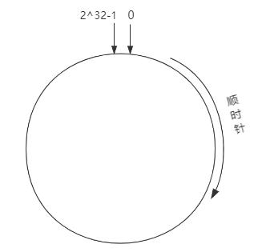

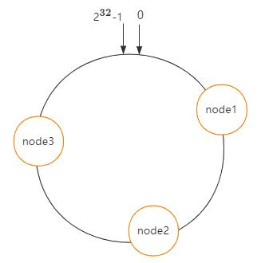

---

假设现在需要新增一个节点node4，那数据的映射关系的影响范围只限于node3
和node1，只有少部分的数据需要重新映射迁移就行了。
跟着Mic学架构
学架构
ic学架构
跟着Mic学架构
跟着Mic学架构
跟着Mic
跟着Mic

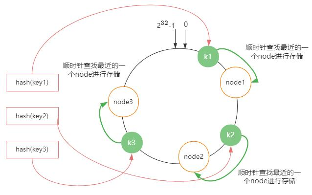

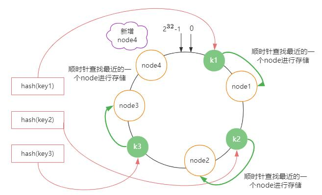

---

如果是已经存在的节点node1 因为故障下线了，只那只需要把原本分配在node1
上的数据重新分配到node2 上就行了。
同样对数据影响的范围非常小。
所以，在我看来，一致性hash 算法的好处是扩展性很强，在增加或者减少服务
器的时候，数据迁移范围比较小。
另外，在一致性Hash 算范里面，为了避免hash 倾斜导致数据分配不均匀的情
况，我们可以使用虚拟节点的方式来解决。
以上就是我对这个问题的理解。
面试点评
一致性Hash 算法在实际应用中还是比较常见的。
所以在面试的时候，会围绕这个方面设计一些技术面试题。
虽然很多开源框架都提供了一致性hash 算法的实现，但我建议大家可以读一读
源代码。
好的，本期的普通人VS 高手面试系列的视频就到这里结束了。
大家记得点赞收藏加关注
我是Mic，咱们下一期再见。
跟着Mic学架构
学架构
ic学架构
跟着Mic学架构
跟着Mic学架构
跟着Mic
跟着Mic

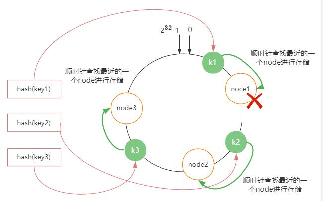

---

Thread 和Runnable 的区别
Hi，大家好，我是Mic，一个工作了14 年的程序员和创业者。
昨天一个工作1 年的粉丝出去面试。
遇到这样一个问题：thread 和runnable 的区别
其实这个问题很简单，但是如果能够按照高手的回答思路去说明，效果会更好
另外我花了1 个多星期的时间，把往期高手回答整理成了10W 字的文档，想获
取的小伙伴可以从我的个人煮叶简介加微领取
下面看看普通人和高手的回答
普通人
高手
好的，我认为Thread 和Runnable 接口的区别有四个。
Thread 是一个类，Runnable 是接口，因为在Java 语言里面的继承特性，接口
可以支持多继承，而类只能单一继承。
所以如果在已经存在继承关系的类里面要实现线程的话，只能实现Runnable 接
口。
Runnable 表示一个线程的顶级接口，Thread 类其实是实现了Runnable 这个接
口，我们在使用的时候都需要实现run 方法。
站在面向对象的思想来说，Runnable 相当于一个任务，而Thread 才是真正处
理的线程，所以我们只需要用Runnable 去定义一个具体的任务，然后交给
Thread 去处理就可以了，这样达到了松耦合的设计目的。
接口表示一种规范或者标准，而实现类表示对这个规范或者标准的实现，所以站
在线程的角度来说，Thread 才是真正意义上的线程实现。
Runnable 表示线程要执行的任务，因此在线程池里面，提交一个任务传递的类
型是Runnable。
总的来说，在我看来，Thread 只是实现了Runnable 接口并做了扩展，所以这
两者我认为没什么可比性。
以上就是我对这个问题的理解。
跟着Mic学架构
学架构
ic学架构
跟着Mic学架构
跟着Mic学架构
跟着Mic
跟着Mic

---

面试点评
在我看来，有些问题真的是为了面试而面试，可能这个问题本身毫无考察的价值。
但是不专业的面试官太多了，所以我们只能准备充分。
好的，本期的普通人VS 高手面试系列就到这里结束了。
大家记得点赞收藏加关注
我是Mic，咱们下一期再见。
Integer 使用不当导致生产的事故
Hi，大家好，我是Mic，一个工作了14 年的程序员和创业者。
昨天一个工作4 年的粉丝私信我，他说最近背了一个生产事故，想让我来给大家
分享一下避免采坑。
他是做理财这块业务的，他每天会收到一个基金公司的收益文件，然后他需要把
这个文件解析并且保存每个用户的收益数据到数据库。
在解析文件的时候，他需要对数据的条数做校验，于是用到了Integer 这个对象
并且使用==来判断。
测试环境都没问题，但是到了生产环境上出现用户收益没有到账的问题，造成了
大规模的投诉。
最后定位才发现是收益文件验证失败导致没有被解析入库。
所以这里就出现一个问题：“为什么两个Integer 的对象不能用==号来判断？为
什么测试环境没有把这问题测试出来”。
另外我花了1 个多星期的时间，把往期高手回答整理成了10W 字的文档，想获
取的小伙伴可以从我的个人煮叶简介加微领取
下面看看普通人和高手对这个问题的回答。
普通人
高手
Integer 是一个封装类型。它是对应一个int 类型的包装。
跟着Mic学架构
学架构
ic学架构
跟着Mic学架构
跟着Mic学架构
跟着Mic
跟着Mic

---

在Java 里面之所以要提供Integer 这种基本类型的封装类，是因为Java 是一个
面向对象的语言，而基本类型不具备对象的特征，所以在基本类型上做了一层对
象的包装并且提供了相关的属性和访问方法来完善基本类型的操作。
在Integer 这个封装类里面，除了基本的int 类型的操作之外，还引入了享元模
式的设计，对-128 到127 之间的数据做了一层缓存，也就是说，如果Integer
类型的目标值在-128 到127 之间，
就直接从缓存里面获取Integer 这个对象实例并返回，否则创建一个新的Integer
对象。
这么设计的好处是减少频繁创建Integer 对象带来的内存消耗从而提升性能。
因此在这样一个前提下，如果定义两个Integer 对象，并且这两个Integer 的取
值范围正好在-128 到127 之间。
如果直接用==号来判断，返回的结果必然是true，因为这两个Integer 指向的内
存地址是同一个。
否则，返回的结果是false。
之所以在测试环境上没有把这个问题暴露出来，是因为测试环境上验证的数据量
有限，使得取值的范围正好在Integer
的缓存区间，从而通过了测试。
但是在实际的应用里面，数据量远远超过IntegerCache 的取值范围，所以就导
致了校验失败的问题。
以上就是我对这个问题的理解。
跟着Mic学架构
学架构
ic学架构
跟着Mic学架构
跟着Mic学架构
跟着Mic
跟着Mic

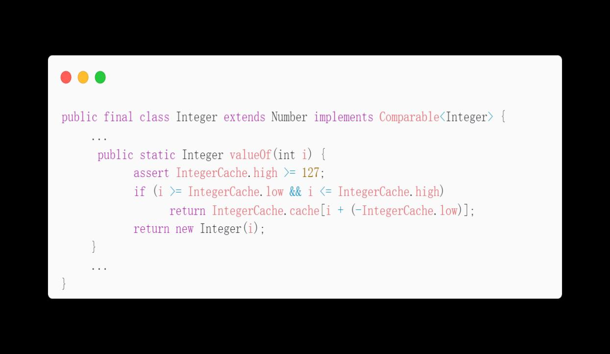

---

面试点评
你看，对Java 基础有一个非常深度的理解是很重要的。
一个小小的知识点，往往能够造成生产环境上较大规模的影响。
所以在一些大厂面试中，基础的考察比例会比较重。
另外一个层面，中间件和技术框架已经是一个成熟的产品，所以即便我们再怎么
乱玩，造成的影响也有限。
好的，本期的普通人VS 高手面试系列的视频就到这里结束了。
大家记得点赞收藏加关注
我是Mic，咱们下一期再见。
JVM 分代年龄为什么是15 次？可以25
次吗？
一个工作了7 年的粉丝去京东面试，遇到一个很有意思的问题。
这是一个关于JVM 底层相关的问题，如果平时没有去花时间是肯定回答不出来
的。
Hello，大家好，我是Mic，一个工作了14 年的程序员和创业者。
今天给大家分享的这道面试题是：“JVM 分代年龄为什么是15 次，可以是25 次
吗？”
另外我花了1 个多星期的时间，把往期高手回答整理成了10W 字的文档，想获
取的小伙伴可以从我的个人煮叶简介加微领取
下面看看普通人和高手对这个问题的回答。
普通人
高手
好的，这个问题我会从几个方面来回答。
首先，在JVM 的heap 内存里面，分为Eden Space、Survivor Space、Old
Generation。
跟着Mic学架构
学架构
ic学架构
跟着Mic学架构
跟着Mic学架构
跟着Mic
跟着Mic

---

当我们在Java 里面使用new 关键字创建一个对象的时候，JVM 会在Eden
Space 分配一块内存空间来存储这个对象。
当Eden Space 的内存空间不足的时候，会触发Young GC 进行对象回收。
那些因为存在引用关系而无法回收的对象，JVM 会把它们转移到Survivor Space。
Survivor Space 内部又分为From 区和To 区，刚从Eden 区转移过来的对象会
分配到From 区，每经历一次Young GC，这些没有办法被回收的对象就会在
From 区和To 区来回移动，每移动一次，这个对象的GC 年龄就加1。默认情况
下GC 年龄达到15 的时候，JVM 就会把这个对象移动到Old Generation。
其次呢，一个对象的GC 年龄，是存储在对象头里面的，一个Java 对象在JVM
内存中的布局由三个部分组成，分别是对象头、实例数据、对齐填充。而对象头
里
面
有
4
个
bit
位
来
存
储
GC
年
龄
。
跟着Mic学架构
学架构
ic学架构
跟着Mic学架构
跟着Mic学架构
跟着Mic
跟着Mic

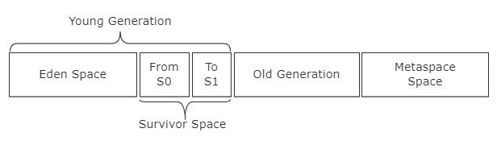

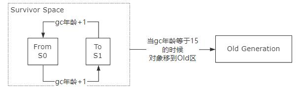

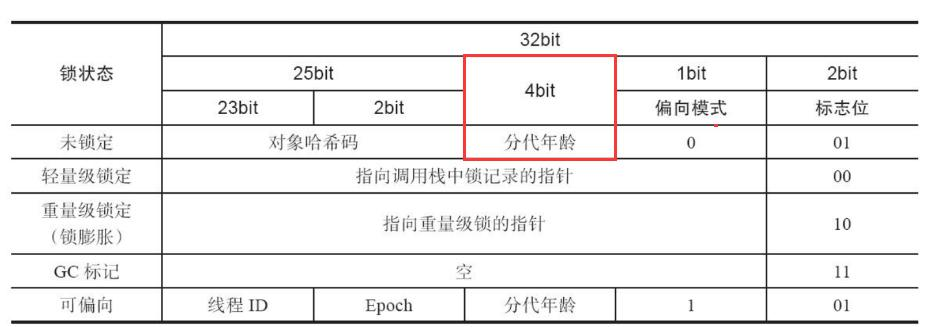

---

而4 个bit 位能够存储的最大数值是15，所以从这个角度来说，JVM 分代年龄
之所以设置成15 次是因为它最大能够存储的数值就是15。
虽然JVM 提供了参数来设置分代年龄的大小，但是这个大小不能超过15。
而从设计角度来看，当一个对象触发了最大值15 次gc，还没有办法被回收，就
只能移动到old generation 了。
另外，设计者还引入了动态对象年龄判断的方式来决定把对象转移到old
generation，也就是说不管这个对象的gc 年龄是否达到了15 次，只要满足动态
年龄判断的依据，也同样会转移到old generation。
以上就是我对这个问题的理解。
面试点评
这个问题被问到的频率还挺高的。
并且底层涉及到的知识点也非常多，比如对象头、jvm 垃圾回收机制、堆内存划
分等等。
所以建议大家在平时工作之外的时间，多花一点时间去研究这些底层原理。
好的，本期的普通人VS 高手面试系列就到这里结束了。
大家记得点赞收藏加关注
我是Mic，咱们下一期再见。
可以讲一下ArrayList 的自动扩容机制
吗？
一个工作了3 年的粉丝，最近在面试的时候遇到一个集合方面的问题。
这个问题其实很简单，可能大家没有去关注集合方面的底层实现原理。
导致在面试的时候容易栽跟头。
Hi，大家好，我是Mic，一个工作了14 年的程序员和创业者。
今天分享的这个面试题是：“ArrayList 的自动扩容机制的实现原理”
普通人
跟着Mic学架构
学架构
ic学架构
跟着Mic学架构
跟着Mic学架构
跟着Mic
跟着Mic

---

高手
ArrayList 是一个数组结构的存储容器，默认情况下，数组的长度是10.
当然我们也可以在构建ArrayList 对象的时候自己指定初始长度。
随着在程序里面不断的往ArrayList中添加数据，当添加的数据达到10个的时候，
ArrayList 就没有多余容量可以存储后续的数据。
这个时候ArrayList 会自动触发扩容。
扩容的具体流程很简单：
首先，创建一个新的数组，这个新数组的长度是原来数组长度的1.5 倍。
然后使用Arrays.copyOf 方法把老数组里面的数据拷贝到新的数组里面。
扩容完成后再把当前要添加的元素加入到新的数组里面，从而完成动态扩容的过
程。
以上就是我对这个我对这个问题的理解！
面试点评
作为一个业务程序员，虽然工作性质只是让大家在写CRUD。
不需要过多的关注技术底层的原理，但是在未来的职业晋升中，技术的理解程度
就显得很重要。
因为未来岗位所需要的能力和当前的能力是完全不一样的。
我是Mic，咱们下一期再见。
Eureka server 数据同步原理能说下吗
Hi，大家好，我是Mic，一个没有才华只能靠颜值混饭吃的Java 程序员。
昨天，一个工作了4 年的Java 程序员，去一个互联网公司面试，在面试的时候
面试官一个劲问他Spring Cloud Netflix 组件的底层原理，开始还能回答出来，
越到后面越懵逼，最后面试没过。
他有点不理解面试官怎么会问这么深，当他把简历发给我的时候，我看到简历上
写了精通Spring Cloud。
跟着Mic学架构
学架构
ic学架构
跟着Mic学架构
跟着Mic学架构
跟着Mic
跟着Mic

---

瞬间明白了原因。
Spring Cloud Netflix 里面的组件可以考察的方向太多了，比如今天分享的这道面
试题：
“Eureka server 数据同步原理”，相信80%的同学都回答不出来。
下面看看普通人和高手对这个问题的回答。
普通人
高手
Eureka 是一个服务注册中心，在Eureka 的设计里面，为了保证Eureka 的高可
用性，提供了集群的部署方式。
Eureka 的集群部署采用的是两两相互注册的方式来实现，也就是说每个Eureka
Server 节点都需要发现集群中的其他节点并建立连接，然后通过心跳的方式来
维持这个连接的状态。
Eureka Server 集群节点之间的数据同步方式非常简单粗暴，使用的是对等复制
的方式来实现数据同步。
也就是说，在Eureka Server 集群中，不存在所谓主从节点，任何一个节点都可
以接收或者写入数据。
一旦集群中的任意一个节点接收到了数据的变更，就直接同步到其他节点上。
跟着Mic学架构
学架构
ic学架构
跟着Mic学架构
跟着Mic学架构
跟着Mic
跟着Mic

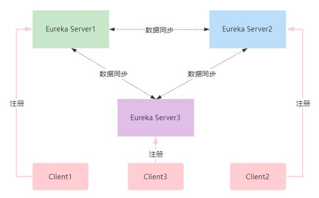

---

这种无中心化节点的数据同步，需要考虑到一个数据同步死循环的问题，也就是
需要区分Eureka Server 收到的数据是属于客户端传递来的数据还是集群中其
他节点发过来的同步数据。
Eureka 使用了一个时间戳的标记来实现类似于数据的版本号来解决这个问题。
另外，从Eureka 的数据同步方案来看，Eureka 集群采用的是AP 模型，也就是
只提供高可用保障，而不提供数据强一致性保障。
之所以采用AP，我认为注册中心它只是维护服务之间的通信地址，数据是否一
致对于服务之间的通信影响并不大。
而注册中心对Eureka 的高可用性要求会比较高，不能出现因为Eureka 的故障
导致服务之间无法通信的问题。
以上就是我对这个问题的理解。
面试点评
Eureka 虽然闭源了，但是在国内依然使用较为广泛。
当然有些公司逐步迁移到了Nacos 上面，但是Eureka 的整个框架设计上还是有
非常多值得我们学习的思想。
多级缓存设计、集群之间的数据同步方案、多区域隔离以及就近访问的设计等等。
一个技术框架，我们能够获得这些优秀理念，对未来的职业发展帮助是非常大
的。
我是Mic，咱们下期再见！
请说一下你对分布式和微服务的理解
很难想象，在分布式架构以及微服务架构普及了近10 年时间的现在，还有人不
清楚微服务架构和分布式架构。
这不，一个工作了3 年的粉丝，就遇到了这个方面的问题，希望我能出一个视频。
hi，大家好，我是Mic，一个没有才华只能靠颜值混饭吃的Java 程序员。
今天给大家分享的面试题是：“请你说一下你对分布式和微服务的理解”。
关于这个问题的回答以及以往的面试题，我整理成了10 多万字的文档，大家可
以在我的主页加V 领取。
下面看看普通人和高手对这个问题的回答。
跟着Mic学架构
学架构
ic学架构
跟着Mic学架构
跟着Mic学架构
跟着Mic
跟着Mic

---

普通人
高手
首先我先解释一下分布式系统。
简单来说，分布式是一组通过网络进行通信，并且为了完成共同的计算任务的计
算机节点组成的系统。
分布式系统的设计理念，其实是来自于小型机或者大型机的计算能力的瓶颈和成
本的增加。
在集中式系统里面，要想提升程序的运行性能，只能不断的升级CPU 以及增加
内存，但是硬件的提升本身也是有瓶颈的，所以当企业对于计算要求越来越高的
时候，集中式架构已经无法满足需求了。
在这样的背景下，就产生了分布式计算，也就是把一个计算任务分配给多个计
算机节点去运行。
但是对于用户或者客户端来说，感知不到背后的逻辑，就像访问单个计算机一样，
他看到的仍然是一个整体。
在分布式系统中，软件架构也需要作出相应的调整，需要把原本的单体应用进行
拆分，部署到多个计算机节点上，然后各个服务之间使用远程通信协议实现计算
结果的数据交互。
针对这种分布式部署的应用架构，我们称为SOA（面向服务）的架构。
其次，我再解释一下微服务架构。
跟着Mic学架构
学架构
ic学架构
跟着Mic学架构
跟着Mic学架构
跟着Mic
跟着Mic

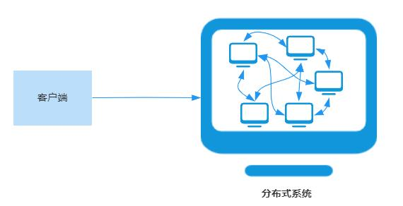

---

其实微服务架构本身就是一种分布式架构，它强调的是对部署在各个计算机上的
应用服务的粒度。
它的核心思想是，针对拆分的服务节点做更进一步的解耦。
也就是说，针对SOA 服务化架构下的单个业务服务，以更加细粒度的方式进一
步拆分。
每个拆分出来的微服务由独立的小团队负责，最好在3 人左右。
拆分的好处是使得程序的扩展性更强，开发迭代效率更高。
对于一些大型的互联网项目来说，微服务能够在不影响用户使用的情况下非常方
便的实现产品功能的创新和上线。
以上就是我对这个问题的理解。
面试点评
相信还有很多小伙伴没用过微服务，也没有接触过Spring Cloud。
现在的微服务架构，就像10 多年之前的SSH 架构，它是很多企业的基础应用
架构，
技术的发展是日新月异的，不要让自己停留在一个舒适区，否则以后找不到合适
的工作会焦虑。
我是Mic，咱们下期再见！
请你说一下你对滑动窗口算法的理解
hi，大家好，我是Mic，一个没有才华只能靠颜值混饭吃的Java 程序员。
跟着Mic学架构
学架构
ic学架构
跟着Mic学架构
跟着Mic学架构
跟着Mic
跟着Mic

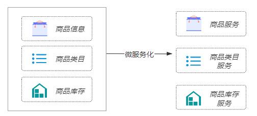

---

一个工作5 年的程序员，去滴滴面试，被问到了Sentinel 组件里面关于滑动窗
口算法的问题。
他很遗憾，平时写CRUD 比较多，技术底层的回答只能靠运气。
于是面试没有通过，错过了一个很好的机会。
关于：“请你说一下你对滑动窗口算法的理解” 这个问题。
我把高手的回答整理到了10W 字的面试文档中，大家可以在我的主页加V 领取。
下面看看普通人和高手的回答
普通人
高手
滑动窗口是一种比较常用的数据统计算法。
简单来说，就是在一个大的数组上，定义一个固定长度的滑动窗口，然后这个窗
口在数组上进行滑动。
在窗口滑动的过程中，左边会出一个元素，右边会进一个元素，最后，我们根
据当前窗口内记录的数据进行计算，从而达到数据统计的目的。
滑动窗口一般可以用来解决数组的统计问题，比如。
解决数组/字符串的子元素问题。
跟着Mic学架构
学架构
ic学架构
跟着Mic学架构
跟着Mic学架构
跟着Mic
跟着Mic

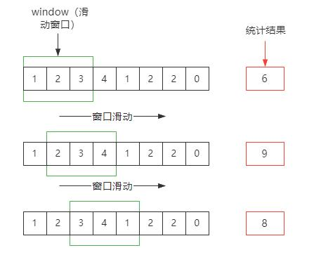

---

把嵌套的for 循环问题，转换为单循环问题，降低时间复杂度。
在Hystrix 中，用到了滑动窗口来实现熔断触发的数据统计。
另外在Sentinel 限流框架中，也使用了滑动窗口来实现限流的数据统计。
不过在这两个组件中使用的滑动窗口都做了一些调整，他们是通过时间线来驱动
窗口往前滑动的。
简单来说，以Hystrix 为例，它定义一个10 个长度的数组，每个数组表示一个1
秒的时间区间跨度，然后在每个区间中记录当前时间端内发生的所有请求的成功、
失败的次数。
Hystrix 只需要统计当前10 秒内对应的10 个窗口总的成功、失败次数。
最后根据配置的阈值决定是否要触发熔断功能。
面试点评
如果大家刷的算法比较多，对滑动窗口算法应该是不陌生的。
比如查找某一个字符串里面的包含某些字母的最小子字符串，就可以用到滑动窗
口算法。
除此之外，在Sentinel 里面也用到了滑动窗口来做数据统计。
算法的考察在大厂会比较多一些，大家平时可以抽空去刷一刷算法题。
我是Mic，咱们下期再见！
什么是深拷贝和浅拷贝？
hi，大家好，我是Mic，一个没有才华只能靠颜值混饭吃的Java 程序员。
一个工作了3 年的小伙子，委屈巴巴的跑过来私信我，说最近面试也太难了。
跟着Mic学架构
学架构
ic学架构
跟着Mic学架构
跟着Mic学架构
跟着Mic
跟着Mic

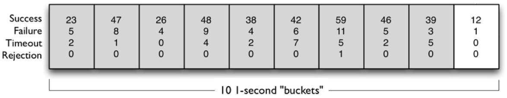

---

只是找个CRUD 的工作，竟然还问我深拷贝和浅拷贝，这个问题又不影响我写
CRUD，唉。
然后深情的望向天空，眼里充满了迷茫了焦虑。
关于：“什么是深拷贝和浅拷贝”这个问题下面看看普通人和高手对这个问题的回
答。
普通人
高手
深拷贝和浅拷贝是用来描述对象或者对象数组这种引用数据类型的复制场景的。
浅拷贝，就是只复制某个对象的指针，而不复制对象本身。
这种复制方式意味着两个引用指针指向被复制对象的同一块内存地址。
深拷贝，会完全创建一个一模一样的新对象，新对象和老对象不共享内存，也就
意味着对新对象的修改不会影响老对象的值。
在Java 里面，无论是深拷贝还是浅拷贝，都需要通过实现Cloneable 接口，并
实现clone()方法。
然后我们可以在clone()方法里面实现浅拷贝或者深拷贝的逻辑。
跟着Mic学架构
学架构
ic学架构
跟着Mic学架构
跟着Mic学架构
跟着Mic
跟着Mic

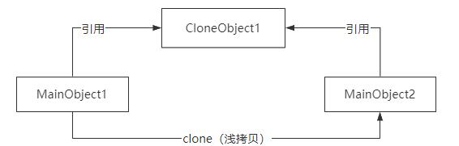

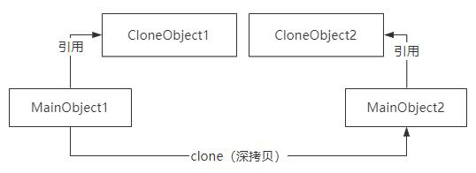

---

实现深拷贝的方法有很多，比如
通过序列化的方式实现，也就是把一个对象先序列化一遍，然后再反序列化回来，
就会得到一个完整的新对象。
在clone()方法里面重写克隆逻辑，也就是对克隆对象内部的引用变量再进行一次
克隆。
以上就是我对这个问题的理解。
面试点评
这个问题属于Java 基础范畴，它很重要。
如果不小心使用错了拷贝方法，就会导致多个线程同时操作一个对象造成数据安
全问题。
一般情况下这个问题是针对1~3 年左右的开发人员。
大家记得点赞收藏+关注
谈谈你对Spring IOC 和DI 的理解？
一个工作4 年的Java 程序员，Spring 都用了4 年了，竟然连Spring 里面这么
基础的问题都回答不好。
还以为像3~4 年前一样，随便准备一下就可以拿到一个薪资不错的Offer。
同学们，这种好日子已经过去了，对于Java 程序员来说，未来找工作一定会越
来越难。
hi，大家好，我是Mic，一个没有才华只能靠颜值混饭吃的Java 程序员。
今天分享的面试提示：谈谈你对Spring IOC 和DI 的理解。
下面看看普通人和高手的回答。
普通人
高手
首先，Spring IOC，全称控制反转（Inversion of Control）。
跟着Mic学架构
学架构
ic学架构
跟着Mic学架构
跟着Mic学架构
跟着Mic
跟着Mic

---

在传统的Java 程序开发中，我们只能通过new 关键字来创建对象，这种导致程
序中对象的依赖关系比较复杂，耦合度较高。
而IOC 的主要作用是实现了对象的管理，也就是我们把设计好的对象交给了IOC
容器控制，然后在需要用到目标对象的时候，直接从容器中去获取。
有了IOC 容器来管理Bean 以后，相当于把对象的创建和查找依赖对象的控制
权交给了容器，这种设计理念使得对象与对象之间是一种松耦合状态，极大提升
了程序的灵活性以及功能的复用性。
跟着Mic学架构
学架构
ic学架构
跟着Mic学架构
跟着Mic学架构
跟着Mic
跟着Mic

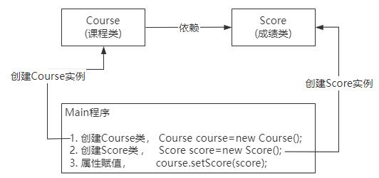

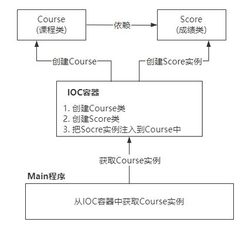

---

然后，DI 表示依赖注入，也就是对于IOC 容器中管理的Bean，如果Bean 之间
存在依赖关系，那么IOC 容器需要自动实现依赖对象的实例注入，通常有三种
方法来描述Bean 之间的依赖关系。
接口注入
setter 注入
构造器注入
另外，为了更加灵活的实现Bean 实例的依赖注入，Spring 还提供了@Resource
和@Autowired 这两个注解。
分别是根据bean 的id 和bean 的类型来实现依赖注入。
以上就是我对这个问题的理解！
面试点评
这个问题一般考察1~3 年左右的程序员。
基础的考察本身就是为了确保求职者对常用技术的理解程度。
避免在开发过程中写出一些莫名其妙的bug。
未来建议大家可以深度的去研究一下Spring 的源码，它的代码设计以及对面向
对象的使用达到了炉火纯青的地步。
有助于提升我们的编码能力。
大家记得点赞收藏+关注
wait 和sleep 是否会触发锁的释放以及
CPU 资源的释放？
通过最近这几个月的私信发现一个问题，很多工作了5~6 年的程序员，去面试
的时候但凡问到技术原理。
基本上都是回答不出来的，有些同学侥幸靠背面试题通过面试，但是这种无法掌
控自己选择权的感觉，
你不觉得很难受吗？
跟着Mic学架构
学架构
ic学架构
跟着Mic学架构
跟着Mic学架构
跟着Mic
跟着Mic

---

hi，大家好，我是Mic，一个没有才华只能靠颜值混饭吃的Java 程序员。
一个工作5 年的粉丝，去美团面试，遇到了这样一个问题。
“wait 和sleep 是否会触发锁的释放以及CPU 资源的释放？”
其实这个问题还比较简单，它的结论回答出来了，但是后面面试官又问了一个为
什么，他就懵了。
下面看看普通人和高手的回答
普通人
高手
好的，面试官。
Object.wait()方法，会释放锁资源以及CPU 资源。
Thread.sleep()方法，不会释放锁资源，但是会释放CPU 资源。
首先，wait()方法是让一个线程进入到阻塞状态，而这个方法必须要写在一个
Synchronized 同步代码块里面。
因为wait/notify 是基于共享内存来实现线程通信的工具，这个通信涉及到条件的
竞争，所以在调用这两个方法之前必须要竞争锁资源。
当线程调用wait 方法的时候，表示当前线程的工作处理完了，意味着让其他竞
争同一个共享资源的线程有机会去执行。
但前提是其他线程需要竞争到锁资源，所以wait 方法必须要释放锁，否则就会
导致死锁的问题。
然后，Thread.sleep()方法，只是让一个线程单纯进入睡眠状态，这个方法并没
有强制要求加synchronized 同步锁。
而且从它的功能和语义来说，也没有这个必要。
当然，如果是在一个Synchronized 同步代码块里面调用这个Thread.sleep，也
并不会触发锁的释放。
最后，凡是让线程进入阻塞状态的方法，操作系统都会重新调度实现CPU 时间
片切换，这样设计的目的是提升CPU 的利用率。
以上就是我对这个问题的理解。
面试点评
跟着Mic学架构
学架构
ic学架构
跟着Mic学架构
跟着Mic学架构
跟着Mic
跟着Mic

---

之前我用这个问题去面试过一些工作3~5 年的人，有大部分人回答不上来。
这让我有点意外，正常来说，并发编程是一个非常重要且基础的领域，
在程序开发中，也是比较常用的技术。还是建议大家去认真学一下。
大家记得点赞收藏+关注
我是Mic，咱们下期再见！
AQS 为什么要使用双向链表？
一个工作4 年的程序员，简历上写精通并发编程，并且阅读过AQS
（AbstractQueuedSynchronizer）
的源码，然后面试官只问了他一个问题，然后就垮了！
hi，大家好，我是Mic，一个没有才华只能靠颜值混饭吃的Java 程序员。
AQS 大家都不陌生，是J.U.C 包里面一个非常重要的线程同步器。
面试官提了这样一个问题：“AQS 为什么要采用双向链表结构”？
下面看看普通人和高手的回答。
普通人
高手
首先，双向链表的特点是它有两个指针，一个指针指向前置节点，一个指针指向
后继节点。
所以，双向链表可以支持常量O(1) 时间复杂度的情况下找到前驱结点，基于
这样的特点。
双向链表在插入和删除操作的时候，要比单向链表简单、高效。
因此，从双向链表的特性来看，我认为AQS 使用双向链表有三个方面的考虑。
第一个方面，没有竞争到锁的线程加入到阻塞队列，并且阻塞等待的前提是，当
前线程所在节点的前置节点是正常状态，这样设计是为了避免链表中存在异常线
程导致无法唤醒后续线程的问题。
跟着Mic学架构
学架构
ic学架构
跟着Mic学架构
跟着Mic学架构
跟着Mic
跟着Mic

---

所以线程阻塞之前需要判断前置节点的状态，如果没有指针指向前置节点，就需
要从head 节点开始遍历，性能非常低。
第二个方面，在Lock 接口里面有一个，lockInterruptibly()方法，这个方法表示
处于锁阻塞的线程允许被中断。
也就是说，没有竞争到锁的线程加入到同步队列等待以后，是允许外部线程通过
interrupt()方法触发唤醒并中断的。
这个时候，被中断的线程的状态会修改成CANCELLED。
被标记为CANCELLED 状态的线程，是不需要去竞争锁的，但是它仍然存在于
双向链表里面。
意味着在后续的锁竞争中，需要把这个节点从链表里面移除，否则会导致锁阻塞
的线程无法被正常唤醒。
在这种情况下，如果是单向链表，就需要从Head 节点开始往下逐个遍历，找到
并移除异常状态的节点。
同样效率也比较低，还会导致锁唤醒的操作和遍历操作之间的竞争。
跟着Mic学架构
学架构
ic学架构
跟着Mic学架构
跟着Mic学架构
跟着Mic
跟着Mic

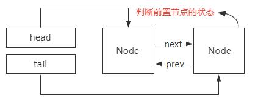

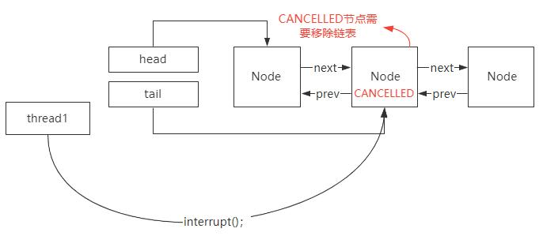

---

第三个方面，为了避免线程阻塞和唤醒的开销，所以刚加入到链表的线程，首先
会通过自旋的方式尝试去竞争锁。
但是实际上按照公平锁的设计，只有头节点的下一个节点才有必要去竞争锁，后
续的节点竞争锁的意义不大。
否则，就会造成羊群效应，也就是大量的线程在阻塞之前尝试去竞争锁带来比较
大的性能开销。
所以，为了避免这个问题，加入到链表中的节点在尝试竞争锁之前，需要判断前
置节点是不是头节点，如果不是头节点，就没必要再去触发锁竞争的动作。
所以这里会涉及到前置节点的查找，如果是单向链表，那么这个功能的实现会非
常复杂。
面试点评
关于这个问题，99%的人都回答不上来。
而且我简单翻了一些技术博客，基本上全都是错的。
对AQS 理解不深刻的情况下，乱回答，导致很多同学被误解。
理解一个技术为什么这么设计，关键在于它需要解决什么样的问题。
大家记得点赞、收藏加关注
我是Mic，咱们下期再见。
跟着Mic学架构
学架构
ic学架构
跟着Mic学架构
跟着Mic学架构
跟着Mic
跟着Mic

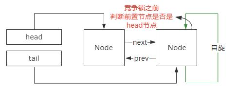

---

ConcurrentHashMap的size()方法是线
程安全的吗？为什么
hi，大家好，我是Mic，一个没有才华只能靠颜值混饭吃的Java 程序员。
一个工作了5 年的粉丝，最近去蚂蚁面试，在第一面的时候，本问到了几个Java
基础的问题。
其中有一个问题比较有意思
面试官问：“ConcurrentHashMap 的size()方法是线程安全的吗？为什么？”
下面看看普通人和高手对这个问题的回答。
普通人
高手
ConcurrentHashMap 的size()方法是非线程安全的。
也就是说，当有线程调用put 方法在添加元素的时候，其他线程在调用size()方
法获取的元素个数和实际存储元素个数是不一致的。
原因是size()方法是一个非同步方法，put()方法和size()方法并没有实现同步锁。
put()方法的实现逻辑是：在hash 表上添加或者修改某个元素，然后再对总的元
素个数进行累加。
其中，线程的安全性仅仅局限在hash 表数组粒度的锁同步，避免同一个节点出
现数据竞争带来线程安全问题。
数组元素个数的累加方式用到了两个方案：
当线程竞争不激烈的时候，直接用cas 的方式对一个long 类型的变量做原子递
增。
当线程竞争比较激烈的时候，使用一个CounterCell 数组，用分而治之的思想减
少多线程竞争，从而实现元素个数的原子累加。
跟着Mic学架构
学架构
ic学架构
跟着Mic学架构
跟着Mic学架构
跟着Mic
跟着Mic

---

size()方法的逻辑就是遍历CounterCell 数组中的每个value 值进行累加，再加
上baseCount，汇总得到一个结果。
所以很明显，size()方法得到的数据和真实数据必然是不一致的。
因此从size()方法本身来看，它的整个计算过程是线程安全的，因为这里用到了
CAS 的方式解决了并发更新问题。
但是站在ConcurrentHashMap 全局角度来看，put()方法和size()方法之间的数
据是不一致的，因此也就不是线程安全的。
之所以不像HashTable 那样，直接在方法级别加同步锁。在我看来有两个考虑
点。
直接在size()方法加锁，就会造成数据写入的并发冲突，对性能造成影响，当然
有些朋友会说可以加读写锁，但是同样会造成put 方法锁的范围扩大，性能影响
极大！
ConcurrentHashMap 并发集合中，对于size()数量的一致性需求并不大，并发
集合更多的是去保证数据存储的安全性。
面试点评
关于这个问题，网上很多文章写得都很片面。
导致大家在找资料学习的时候，很容易被这种不完整的理解误导。
而且，这个问题切入的角度还挺有意思的，有些同学可能没往这个方向思考过。
也导致无法很好的回答出来。
大家记得点赞、收藏加关注
我是Mic，咱们下期再见。
跟着Mic学架构
学架构
ic学架构
跟着Mic学架构
跟着Mic学架构
跟着Mic
跟着Mic

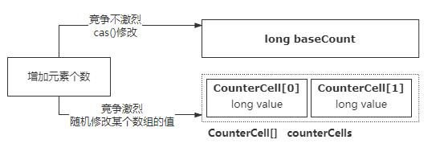

---

Redis 多线程模型怎么理解，那它会有线
程安全问题吗？
hi，大家好，我是Mic，一个没有才华只能靠颜值混饭吃的Java 程序员。
昨天，一个工作了7 年的粉丝私信我这样一个问题。
他说Redis6.0 已经支持多线程了，那是不是会存在线程安全问题，如果有线程
安全问题，它是怎么解决的。
这个问题说简单也简单，说难也挺难的，毕竟不仅仅只是涉及到多线程的问题，
还设计到NIO 里面的Reactor 模型问题。
关于：“Redis 多线程模型怎么理解，那它会有线程安全问题吗？”这个问题。
下面看看普通人和高手的回答
普通人
高手
好的，面试官，这个问题我需要从几个方面回答。
首先，Redis 在6.0 支持的多线程，并不是说指令操作的多线程，而是针对网络
IO 的多线程支持。
也就是Redis 的命令操作，仍然是线程安全的。
其次，Redis 本身的性能瓶颈，取决于三个纬度，网络、CPU、内存。
而真正影响内存的关键问题是像内存和网络。
而Redis6.0 的多线程，本质上解决网络IO 的处理效率问题。
在Redis6.0 之前。Redis Server 端处理接受到客户端请求的时候，Socket 连接
建立到指令的读取、解析、执行、写回都是由一个线程来处理，这种方式，在客
户端请求比较多的情况下，单个线程的网络处理效率太慢，导致客户端的请求处
理效率较低。
于是在Redis6.0 里面，针对网络IO 的处理方式改成了多线程，通过多线程并行
的方式提升了网络IO 的处理效率。
但是对于客户端指令的执行过程，还是使用单线程方式来执行。
跟着Mic学架构
学架构
ic学架构
跟着Mic学架构
跟着Mic学架构
跟着Mic
跟着Mic

---

最后，Redis6.0 里面多线程默认是关闭的，需要在redis.conf 文件里面修改
io-threads-do-reads 配置才能开启。
另外，之所以指令执行不使用多线程，我认为有两个方面的原因。
内存的IO 操作，本身不存在性能瓶颈，Redis 在数据结构上已经做了非常多的
优化。
如果指令的执行使用多线程，那Redis 为了解决线程安全问题，需要对数据操作
增加锁的同步，不仅仅增加了复杂度，还会影响性能，代价太大不合算。
面试点评
其实，在Redis6.0 之前，就已经有用到多线程了，比如数据持久化、集群数据
同步等。
只是可能这些机制离我们应用开发比较远，没有过多关注。
另外还要注意，Redis 本身虽然是线程安全的，但是应用程序对于Redis 的
Ready-modify -write 操作。
仍然是非线程安全的。
掌握这些基础，可以有效避免开发过程中写出一下自己都不懂的bug。
大家记得点赞、收藏加关注。
跟着Mic学架构
学架构
ic学架构
跟着Mic学架构
跟着Mic学架构
跟着Mic
跟着Mic

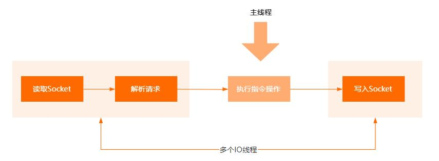

---

Nacos 配置更新的工作流程
Nacos 作为阿里的开源中间件，在加入到Spring Cloud 生态以后。
不管是作为配置中心还是注册中心，它的简单易用的特性，被广泛适用在各个互
联网公司里面。
然后大家会发现Nacos 相关的面试也越来越多了。
hi，大家好，我是Mic，一个没有才华只能靠颜值混饭吃的Java 程序员。
昨天，一个工作了8 年的粉丝，被面试官问到了这样一个问题：
“请你详细说一下Nacos 客户端是如何实现配置的动态更新的”。
下面看看普通人和高手的回答
普通人
高手
好的，面试官，这个问题我需要从几个方面来回答。
首先，Nacos 是采用长轮训的方式向Nacos Server 端发起配置更新查询的功能。
所谓长轮训就是客户端发起一次轮训请求到服务端，当服务端配置没有任何变更
的时候，这个连接一直打开。
直到服务端有配置或者连接超时后返回。
跟着Mic学架构
学架构
ic学架构
跟着Mic学架构
跟着Mic学架构
跟着Mic
跟着Mic

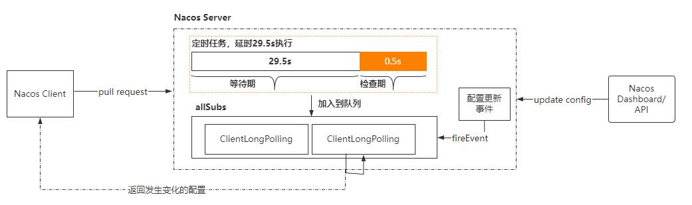

---

Nacos Client 端需要获取服务端变更的配置，前提是要有一个比较，也就是拿客
户端本地的配置信息和服务端的配置信息进行比较。
一旦发现和服务端的配置有差异，就表示服务端配置有更新，于是把更新的配置
拉到本地。
在这个过程中，有可能因为客户端配置比较多，导致比较的时间较长，使得配置
同步较慢的问题。
于是Nacos 针对这个场景，做了两个方面的优化。
减少网络通信的数据量，客户端把需要进行比较的配置进行分片，每一个分片大
小是3000，也就是说，每次最多拿3000 个配置去Nacos Server 端进行比较。
分阶段进行比较和更新；
第一阶段，客户端把这3000 个配置的key 以及对应的value 值的md5 拼接成
一个字符串，然后发送到Nacos Server 端进行判断，服务端会逐个比较这些配
置中md5 不同的key，把存在更新的key 返回给客户端。
第二阶段，客户端拿到这些变更的key，循环逐个去调用服务单获取这些key 的
value 值。
这两个优化，核心目的是减少网络通信数据包的大小，把一次大的数据包通信拆
分成了多次小的数据包通信。
虽然会增加网络通信次数，但是对整体的性能有较大的提升。
最后，再采用长连接这种方式，既减少了pull 轮询次数，又利用了长连接的优势，
很好的实现了配置的动态更新同步功能。
以上就是我对这个问题的理解。
面试点评
Nacos 里面有很多好的设计理念可以值得我们去研究和学习。
我们不一定未来会去做源码级别的开发，但是一定会参与架构方案的设计。
所以还是建议大家去花一些时间，下沉到技术的底层，从而提升自己的核心竞争
力。
大家记得点赞、收藏加关注。
跟着Mic学架构
学架构
ic学架构
跟着Mic学架构
跟着Mic学架构
跟着Mic
跟着Mic

---

什么是时间轮，请你说一下你对时间轮的
理解
hi，大家好，我是Mic，一个没有才华只能靠颜值混饭吃的Java 程序员。
一个工作了7 年的程序员，去字节面试，被问到时间轮的问题。
他面试回来和我说，这个问题超出了他的知识面，自己也在网上找了一些文章去
学习，但是理解不是很深刻。
想让我出一个关于时间轮问题的面试视频。
谁叫我这么善良呢？立刻就给这个粉丝安排了。
关于“什么是时间轮，请你说一下你对时间轮的理解”这个问题
下面看看普通人和高手的回答
普通人
高手
好的，面试官。
时间轮，简单理解就是一种用来存储一系列定时任务的环状数组，它的整个工作
原理和我们的钟表的表盘类似。
它由两个部分组成，一个是环状数组，另一个是遍历环状数组的指针。
首先，定义一个固定长度的环状数组，然后数组的每一个元素代表一个时间刻度，
假设是1s，那么如果是长度为8 的数组，就代表8 秒钟。
然后，有一个指针，这个指针按照顺时针无线循环这个数组，每隔最小时间单位
前进一个数组索引。
这个指针转一圈代表8 秒钟，转两圈表示16 秒，假设从0 点0 分0 秒开始，转
一圈以后就到了0 点0 分9 秒钟。
跟着Mic学架构
学架构
ic学架构
跟着Mic学架构
跟着Mic学架构
跟着Mic
跟着Mic

---

环状数组里面的每个元素都是用来存储定时任务的容器，当我们向时间轮里面添
加一个定时任务的时候，我们会根据定时任务的执行时间计算它所存储的数组下
标。
有可能在某个时间刻度上存在多个定时任务，那这个时候会采用双向链表的方式
来存储。
当指针指向某个数组的时候，就会把这个数组中存储的任务取出来，然后遍历这
个链表逐个运行里面的任务。
如果某个定时任务的执行时间大于环形数组所表示的长度，一般可以使用一个圈
数来表示该任务的延迟执行时间。
也就是说，如果是第16 秒要执行的任务，那意味着这个任务应该是在第二圈的
数组下标0 位置执行。
使用时间轮的方式来管理多个定时任务的好处有很多，我认为有两个核心原因：
减少定时任务添加和删除的时间复杂度，提升性能。
跟着Mic学架构
学架构
ic学架构
跟着Mic学架构
跟着Mic学架构
跟着Mic
跟着Mic

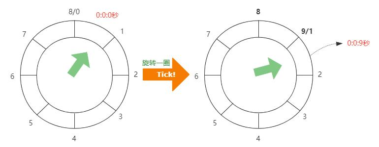

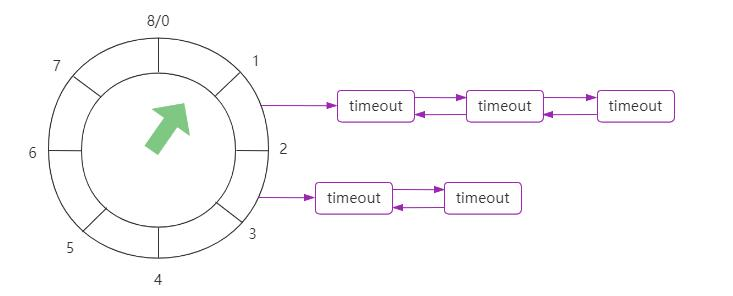

---

可保证每次执行定时器任务都是O（1）复杂度，在定时器任务密集的情况下，
性能优势非常明显。
当然，它也有缺点，对于执行时间非常严格的任务，时间轮不是很适合，因为时
间轮算法的精度取决于最小时间单元的粒度。假设以1s 为一个时间刻度，那小
于1s 的任务就无法被时间轮调度。
时间轮算法在很多地方都有用到，比如Dubbo、Netty、Kafka 等。
面试文档
时间轮算法是一个比较有意思的设计。
使用范围比较广，但是在实际应用中，大部分同学接触非常少。
我认为这种设计思想或者这种数据结构，在我们实际应用中的某些特定场景也是
可以借鉴和使用。
比如定时重试、衰减重试等。
大家记得点赞、收藏加关注。
RabbitMQ 的消息如何实现路由？
hi，大家好，我是Mic，一个没有才华只能靠颜值混饭吃的Java 程序员。今天
分享的这个面试题，没什么特别复杂和特殊的地方。
就是一个RabbitMQ 里面的普通面试题这个问题一般是去互联网公司里面去考
察3~5 年的求职者。
问题是：“RabbitMQ 的消息如何实现路由”？
下面看看普通人和高手的回答
普通人
高手
RabbitMQ 是一个基于AMQP 协议实现的分布式消息中间件。
跟着Mic学架构
学架构
ic学架构
跟着Mic学架构
跟着Mic学架构
跟着Mic
跟着Mic

---

AMQP 的具体工作机制是，生产者把消息发送到RabbitMQ Broker 上的
Exchange 交换机上。
Exchange 交换机把收到的消息根据路由规则发给绑定的队列（Queue）。
最后再把消息投递给订阅了这个队列的消费者，从而完成消息的异步通讯。
其中，Exchange 是一个消息交换机，它里面定义了消息路由的规则，也就是这
个消息路由到那个队列。
然后Queue 表示消息的载体，每个消息可以根据路由规则路由到一个或者多个
队列里面。
而关于消息的路由机制，核心的组件是Exchange。
它负责接收生产者的消息然后把消息路由到消息队列，而消息的路由规则由
ExchangeType 和Binding 决定。
Binding 表示建立Queue 和Exchange 之间的绑定关系，每一个绑定关系会存在
一个BindingKey。
通过这种方式相当于在Exchange 中建立了一个路由关系表。
跟着Mic学架构
学架构
ic学架构
跟着Mic学架构
跟着Mic学架构
跟着Mic
跟着Mic

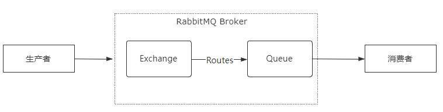

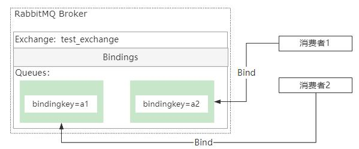

---

生产者发送消息的时候，需要声明一个routingKey（路由键），Exchange 拿到
routingKey 之后，根据RoutingKey 和路由表里面的BindingKey 进行匹配，而
匹配的规则是通过ExchangeType 来决定的。
在RabbitMQ 中，有三种类型的Exchange：direct ，fanout 和topic。
direct：完整匹配方式，也就是Routing key 和Binding Key 完全一致，相当于
点对点的发送。
fanout：广播机制，这种方式不会基于Routing key 来匹配，而是把消息广播给
绑定到当前Exchange 上的所有队列上。
topic：正则表达式匹配，根据Routing Key 使用正则表达式进行匹配，符合匹
配规则的Queue 都会收到这个消息
面试点评
RabbitMQ、Kafka、RocketMQ 是目前最主流的分布式消息中间件了。
有的同学可能对kafka 比较了解，有的同学可能对RabbitMQ 比较了解。
不过，在面试的时候，面试官一般会问你用过的技术组件。
通过面试过程中推演出你的学习能力以及对技术的掌握能力，这个方面如果还不
错的话，接触一个新的MQ 组件所消耗的学习成本会比较小。
大家记得点赞、收藏加关注
我是Mic，咱们下期再见。
跟着Mic学架构
学架构
ic学架构
跟着Mic学架构
跟着Mic学架构
跟着Mic
跟着Mic

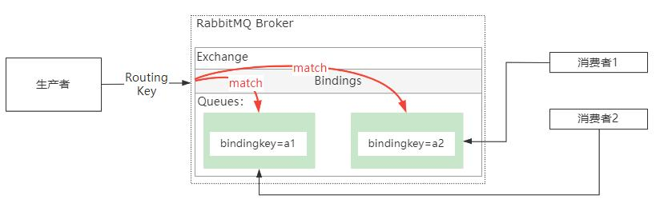

---

如何保证RabbitMQ 的消息可靠传输
最近一段时间，很多粉丝反馈，投递了很多简历出去，没什么面试机会。
而且即便有面试机会，面试也基本同步过。
确实，今年的面试难度特别高，所以大家可以趁这段时间好好积累一下，为金九
银十做好准备。
hi，大家好，我是Mic，一个没有才华只能靠颜值混饭吃的Java 程序员。
今天分享的问题是：如何保证RabbitMQ 的消息可靠传输？
这个问题高手部分的回答已经整理到了10W 字的面试文档里面，大家可以在我
的主页加V 领取
下面看看普通人和高手的回答
高手
好的，面试官，这个问题我从几个方面来说明。
首先，在RabbitMQ 的整个消息传递过程中，有三种情况会存在丢失。
生产者把消息发送到RabbitMQ Server 的过程中丢失
RabbitMQ Server 收到消息后在持久化之前宕机导致数据丢失
消费端收到消息还没来得及处理宕机，导致RabbitMQ Server 认为这个消息已
签收
所以，我认为只需要从这三个纬度去保证消息的可靠性传输就行了。
从生产者发送消息的角度来说，RabbitMQ 提供了一个Confirm（消息确认）机
制，生产者发送消息到Server 端以后，如果消息处理成功，Server 端会返回一
个ack 消息。
客户端可以根据消息的处理结果来决定是否要做消息的重新发送，从而确保消息
一定到达RabbitMQ Server 上。
从RabbitMQ Server 端来说，可以开启消息的持久化机制，也就是收到消息之
后持久化到磁盘里面。
设置消息的持久化有两个步骤。
创建Queue 的时候设置为持久化
发送消息的时候，把消息投递模式设置为持久化投递
跟着Mic学架构
学架构
ic学架构
跟着Mic学架构
跟着Mic学架构
跟着Mic
跟着Mic

---

不过虽然设置了持久化消息，但是有可能会出现，消息刷新到磁盘之前，
RabbitMQ Server 宕机导致消息丢失的问题。
所以为了确保万无一失，需要结合Confirm 消息确认机制一起使用。
从消费端的角度来说，我们可以把消息的自动确认机制修改成手动确认，也就是
说消费端只有手动调用消息确认方法才表示消息已经被签收。
这种方式可能会造成重复消费问题，所以这里需要考虑到幂等性的设计。
以上就是我对这个问题的理解！
面试点评
保证消息的可靠性问题，不管是kafka、rocketmq、rabbitmq。
解决方法都是差不多的，而且这些消息中间件一定会提供对应的解决办法。
这个问题只是考察求职者对于MQ 使用上的一些理解，考察不深，但是也是一
个比较常见的问题。
请说一下Netty 中Reactor 模式的理解
hi，大家好，我是Mic，一个没有才华只能靠颜值混饭吃的Java 程序员。
今天一个工作了6 年的粉丝，去美团面试的时候遇到一个比较有意思的问题。
应该大部分同学对这个领域都比较陌生，因为网络编程在实际开发中接触还是比
较少的。
这个问题是：“请说一下Netty 中Reactor 模式的理解”？
这个问题高手部分的回答已经整理到了10W 字的面试文档里面，大家可以在我
的主页加V 领取
下面看看普通人和高手的回答
高手
Reactor 其实是在NIO 多路复用的基础上提出的一个高性能IO 设计模式。
它的核心思想是把响应IO 事件和业务处理进行分离，通过一个或者多个线程来
处理IO 事件。
然后把就绪的事件分发给业务线程进行异步处理。
Reactor 模型有三个重要的组件：
跟着Mic学架构
学架构
ic学架构
跟着Mic学架构
跟着Mic学架构
跟着Mic
跟着Mic

---

Reactor ：把I/O 事件分发给对应的Handler
Acceptor ：处理客户端连接请求
Handlers ：执行非阻塞读/写，也就是针对收到的消息进行业务处理。
在Reactor 的这种设计中，有三种模型分别是
单线程Reactor 模型。
多线程Reactor 模型。
主从多Reactor 多线程模型。
单线程Reactor 模型，就是由同一个线程来负责处理IO 事件以及业务逻辑。
这种方式的缺点在于handler 的执行过程是串行，如果有任何一个handler 处理
线程阻塞，就会影响整个服务的吞吐量。
所以，就有了多线程Reactor 模型。
也就是把处理IO 就绪事件的线程和处理Handler 业务逻辑的线程进行分离，每
个Handler 由一个独立线程来处理，在这种设计下，即便是存在Handler 线程阻
塞问题，也不会对IO 线程造成影响。
跟着Mic学架构
学架构
ic学架构
跟着Mic学架构
跟着Mic学架构
跟着Mic
跟着Mic

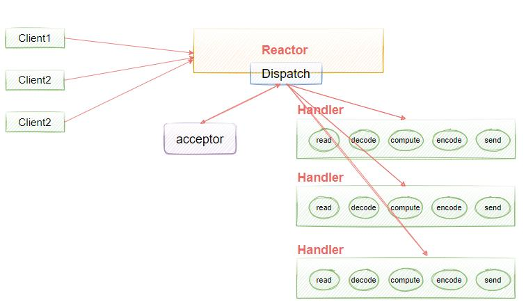

---

在多线程Reactor 模型下，所有的IO 操作都是由一个Reactor 来完成的，而且
Reactor 运行在单个线程里面。
对于并发较高的场景下，Reactor 就成为了性能瓶颈，所以在这个基础上做了更
进一步优化。
提出了多Reactor 多线程模型，这种模式也叫Master-Workers 模式。
它把原本单个Reactor 拆分成了Main Reactor 和多个SubReactor，Main
Reactor 负责接收客户端的链接，然后把接收到的连接请求随机分配到多个
subReactor 里面。
SubReactor 负责IO 事件的处理。
这种方式另外一个好处就是可以对subReactor 做灵活扩展，从而
适应不同的并发量，解决了单个Reactor 模式的性能瓶颈问题。
跟着Mic学架构
学架构
ic学架构
跟着Mic学架构
跟着Mic学架构
跟着Mic
跟着Mic

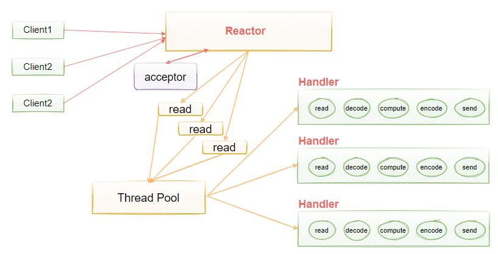

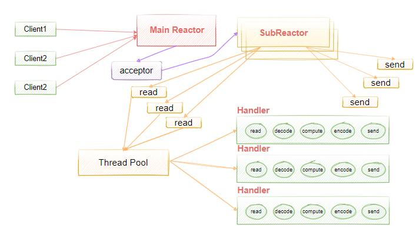

---

以上就是我对Reactor 模型的理解。
面试点评
Reactor 模型的设计比较常见，比如Spring 里面的Webflux 就用了这种设计。
并且像Master-Worker 模型，在Memcached 和Nginx 中都有用到。
所以我们其实可以去理解并学习这种设计思想，也许在某些业务场景中
可以帮助我们多提供一个解决思路。
HashMap 中的hash 方法为什么要右移
16 位异或？
hi，大家好，我是Mic，一个没有才华只能靠颜值混饭吃的Java 程序员。
今天一个工作5 年的程序员，去面试的时候遇到一个非常奇怪的问题。
“HashMap 中的hash 方法为什么要右移16 位异或”。
他听到这个问题的时候完全懵了，在他的认知里面完全就没有这方面的概念。
关于这个问题，我把高手的回答整理到了一个10W 字的面试文档里面。
大家可以在我的主页加V 领取。
普通人
高手
好的，面试官。
之所以要对hashCode 无符号右移16 位并且异或，核心目的是为了让hash 值
的散列度更高，尽可能减少hash 表的hash 冲突，从而提升数据查找的性能。
跟着Mic学架构
学架构
ic学架构
跟着Mic学架构
跟着Mic学架构
跟着Mic
跟着Mic

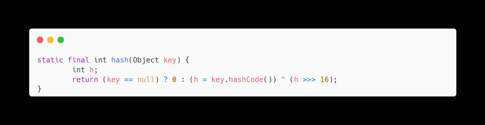

---

在HashMap 的put 方法里面，是通过Key 的hash 值与数组的长度取模计算得
到数组的位置。
而在绝大部分的情况下，n 的值一般都会小于2^16 次方，也就是65536。
所以也就意味着i 的值，始终是使用hash 值的低16 位与(n-1)进行取模运算，
这个是由与运算符&的特性决定的。
这样就会造成key 的散列度不高，导致大量的key 集中存储在固定的几个数组
位置，很显然会影响到数据查找性能。
因此，为了提升key 的hash 值的散列度，在hash 方法里面，做了位移运算。
首先使用key 的hashCode 无符号右移16 位，意味着把hashCode 的高位移动
到了低位。
然后再用hashCode 与右移之后的值进行异或运算，就相当于把高位和低位的特
征进行和组合。
从而降低了hash 冲突的概率。
以上就是我对这个问题的理解！
面试点评
这个问题，确实是有点偏。
绝大部分的人都不会去关注这个点。
跟着Mic学架构
学架构
ic学架构
跟着Mic学架构
跟着Mic学架构
跟着Mic
跟着Mic

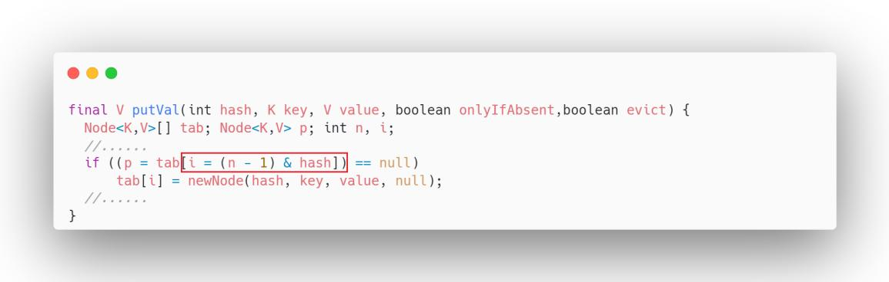

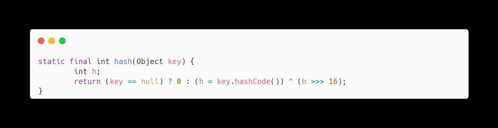

---

不过这个设计思想还是比较有意思，可以研究和学习一下。
有点时候，面试官问的问题会很偏，但是这种还是少数，我们遇到这类问题的时
候不要慌。
不知道也影响不大。
DCL 单例模式设计为什么需要volatile
修饰实例对象
hi，大家好，我是Mic，一个没有才华只能靠颜值混饭吃的Java 程序员。
今天给大家分享一道字节跳动的面试题。
“DCL 单例模式设计为什么需要volatile 修饰实例对象”
这也是一个比较常见的问题，涉及到多线程领域关于指令重排序的知识。
这个问题的高手回答，我整理到了一个10W 字的面试文档里面，
大家可以在我的主页加V 领取。
下面看看普通人和高手的回答。
普通人
高手
好的，面试官。
我所理解的DCL 问题，是在基于双重检查锁设计下的单例模式中，存在不完整
对象的问题。
而这个不完整对象的本质，是因为指令重排序导致的。
跟着Mic学架构
学架构
ic学架构
跟着Mic学架构
跟着Mic学架构
跟着Mic
跟着Mic

---

当我们使用instance=new DCLExample()构建一个实例对象的时候，因为new 这个
操作并不是原子的。
所以这段代码最终会被编译成3 条指令。
为对象分配内存空间
初始化对象
把实例对象赋值给instance 引用
由于这是三个指令并不是原子的。
按照重排序规则，在不影响单线程执行结果的情况下，两个不存在依赖关系的指
令允许重排序，也就是不一定会按照代码编写顺序来执行。
跟着Mic学架构
学架构
ic学架构
跟着Mic学架构
跟着Mic学架构
跟着Mic
跟着Mic

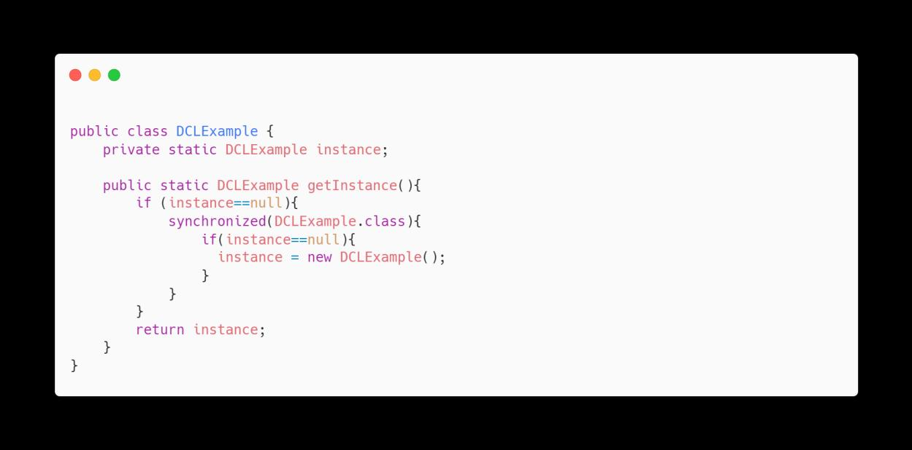

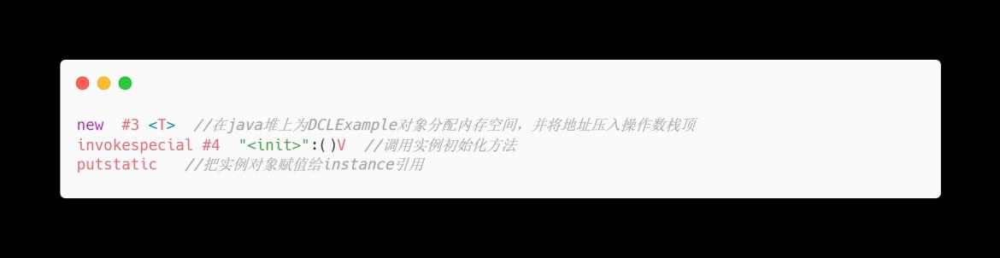

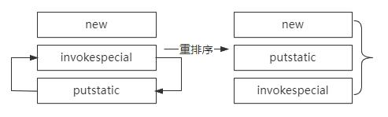

---

这样一来就会导致其他线程可能拿到一个不完整的对象，也就是这个instance
已经分配了引用实例，但是这个实例的初始化指令还没执行。
解决办法就是可以在instance 这个变量上增加一个volatile 关键字修饰，
volatile 底层使用了内存屏障机制来避免指令重排序。
以上就是我对这个问题的理解。
面试点评
这个问题以前的考察频率还挺高的。
主要还是对线程安全性层面的指令重排序，以及volatile 关键字的考察。
在Java 并发编程里面，volatile 很重要。
在AQS、ConcurrentHashMap 等涉及到并发相关的工具都有用到。
说一下你对行锁、临键锁、间隙锁的理解
一个工作了6 年的程序员，最近去阿里面试p6 这个岗位。
面试之前信心满满的和我说，这次一定要拿下35k 月薪的offer。
然后，在第一面的时候，被Mysql 里面的一个问题难住了。
hi，大家好，我是Mic，一个没有才华只能靠颜值混饭吃的Java 程序员。
今天给大家分享阿里的一道面试题，“说一下你对行锁、临键锁、间隙锁的理解”
这个问题的回答我整理到了10W 字的面试文档里面，大家可以在我的主页加V
领取。
下面看看普通人和高手的回答。
跟着Mic学架构
学架构
ic学架构
跟着Mic学架构
跟着Mic学架构
跟着Mic
跟着Mic

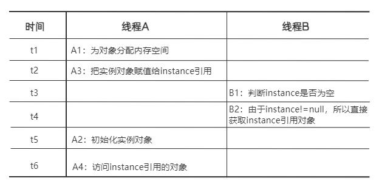

---

普通人
高手
好的，面试官。
行锁、临键锁、间隙锁，都是Mysql 里面InnoDB 引擎下解决事务隔离性的一系
列排他锁。
下面请允许我分别介绍一下这三种锁。
行锁，也称为记录锁。当我们针对主键或者唯一索引加锁的时候，Mysql 默认会
对查询的这一行数据加行锁，
避免其他事务对这一行数据进行修改。
间隙锁，顾名思义，就是锁定一个索引区间。
在普通索引或者唯一索引列上，由于索引是基于B+树的结构存储，所以默认会
存在一个索引区间。
而间隙锁，就是某个事物对索引列加锁的时候，默认锁定对应索引的左右开区间
范围。
跟着Mic学架构
学架构
ic学架构
跟着Mic学架构
跟着Mic学架构
跟着Mic
跟着Mic

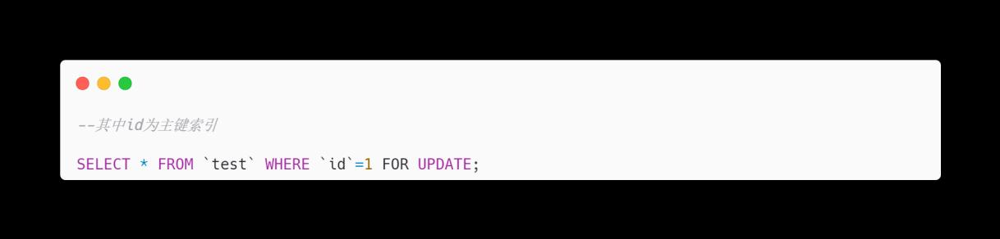

---

在基于索引列的范围查询，无论是否是唯一索引，都会自动触发间隙锁。
比如基于between 的范围查询，就会产生一个左右开区间的间隙锁。
最后一个是临键锁，它相当于行锁+间隙锁的组合，也就是它的锁定范围既包含
了索引记录，也包含了索引区间
它会锁定一个左开右闭区间的数据范围。
跟着Mic学架构
学架构
ic学架构
跟着Mic学架构
跟着Mic学架构
跟着Mic
跟着Mic

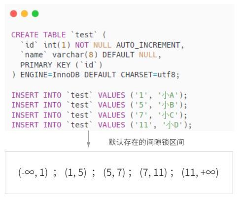

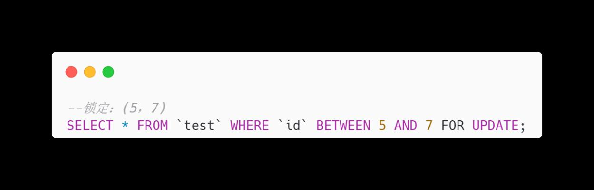

---

假设我们使用非唯一索引列进行查询的时候，默认会加一个临键锁，锁定一个左
开右闭区间的范围。
所以总的来说，行锁、临键锁、间隙锁只是表示锁定数据的范围，最终目的是为
了解决幻读的问题。
而临键锁相当于行锁+间隙锁，因此当我们使用非唯一索引进行精准匹配的时候，
会默认加临键锁，因为它需要锁定匹配的这一行数据，还需要锁定这一行数据对
应的左开右闭区间。
跟着Mic学架构
学架构
ic学架构
跟着Mic学架构
跟着Mic学架构
跟着Mic
跟着Mic

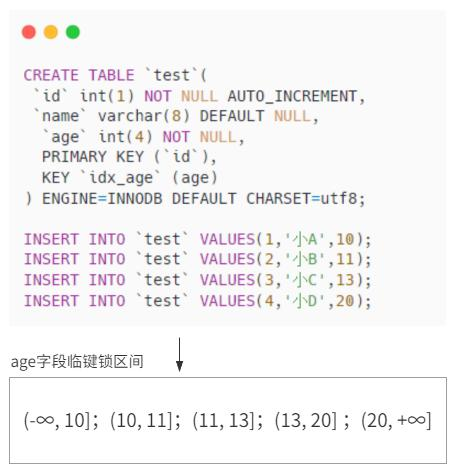

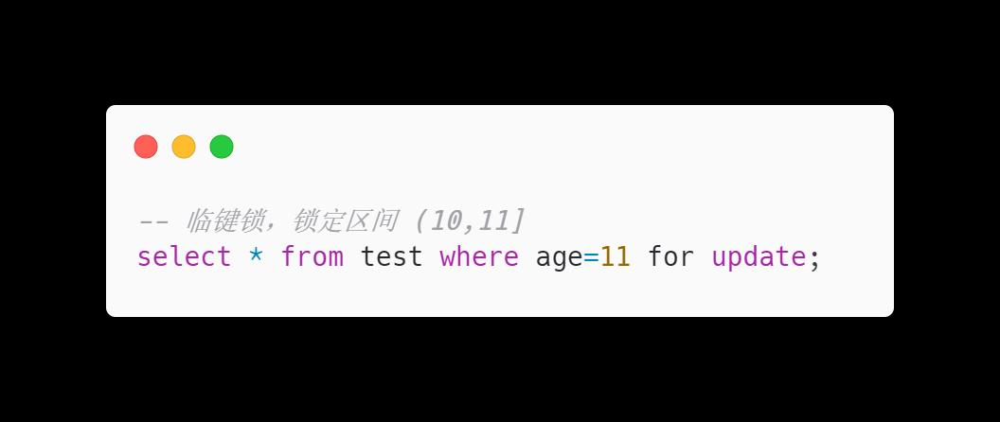

---

因此在实际应用中，尽可能使用唯一索引或者主键索引进行查询，避免大面积的
锁定造成性能影响。
以上就是我对这个问题的理解。
面试点评
关于数据库里面的事务隔离级别，以及解决隔离级别的底层原理。
在面试中也非常常见。
像Mysql 里面的很多种锁的类型，除了应对面试以外，我认为对实际应用开发
也有很好的指导意义。
也就是如何在保证数据安全性的同时平衡好性能。
生产环境服务器变慢，如何诊断处理？
“生产环境服务器变慢？如何诊断处理”
这是最近一些工作5 年以上的粉丝反馈给我的问题，他们去一线大厂面试，都被
问到了这一类的问题。
Hi，大家好，我是Mic，一个工作了14 年的Java 程序员。
今天给大家分享一下，面试过程中遇到这个问题，我们应该怎么回答。
这个问题高手部分的回答，我整理到了一个10W 字的文档里面，大家可以在我
的主页加V 领取。
先来看看普通人的回答。
高手
好的，面试官。
生产环境服务器处理效率变慢，我认为主要会涉及到三个纬度：
CPU 的利用率
跟着Mic学架构
学架构
ic学架构
跟着Mic学架构
跟着Mic学架构
跟着Mic
跟着Mic

---

磁盘IO 效率
内存
CPU 利用率过高或者CPU 利用率过低，都会影响程序的处理效率。
利用率过高，说明当前服务器要处理的指令比较多，当CPU 忙不过来的时候，
指令的运算效率自然就会下降。
反馈在用户上的感受就是程序响应变慢了。
针对这个问题，我们可以使用top 命令查询当前系统中占用CPU 过高的进程，
以及定位到这个进程中比较活跃的线程。
再通过jstack 命令打印当前虚拟机的线程快照，然后根据快照日志排查问题代码。
如果CPU 利用率过低，说明程序资源使用不够，可以增加线程数量提升程序性
能。
程序运算过程中，会直接或者间接涉及到一些磁盘IO 相关的操作，比如程序直
接读写磁盘，或者程序依赖的第三方组件涉及到磁盘的持久化存储，所以磁盘的
IO 效率也会对程序运行效率产生影响。
针对这个情况，可以使用iostat 命令查看，如果磁盘负载较高，可以针对性的进
行优化，比如借助缓存系统，减少磁盘IO 次数用顺序写替代随机写入，减少寻
址开销使用mmap 替代read/write，减少内存拷贝次数
另外，系统IO 的瓶颈可以通过CPU 和负载的非线性关系体现出来。当负载增
大时，系统吞吐量不能有效增大，CPU 不能线性增长，其中一种可能是IO 出现
阻塞。
最后，就是内存的瓶颈，内存作为一块临时存储数据的组件，所有CPU 运算的
指令都需要从内存中去读写。
内存的合理使用，可以减少应用和磁盘的直接IO 频率，以及减少网络IO 的频
率，极大提升IO 性能。
其次，作为Java 应用程序的运行平台JVM，对于内存的合理分配，能够避免频
繁的YGC 和FULL GC。
内存使用率比较高的时候，可以dump 出JVM 堆内存，然后借助MAT 工具
进行分析，查出大对象或者占用最多的对象，以及排查是否存在内存泄漏的问题。
如果dump 出的堆内存文件正常，此时可以考虑堆外内存被大量使用导致出现
问题，需要借助操作系统指令pmap 查出进程的内存分配情况。
如果CPU 和内存使用率都很正常，那就需要进一步开启GC 日志，分析用
户线程暂停的时间、各部分内存区域GC 次数和时间等指标，可以借助jstat 或
可视化工具GCeasy 等，如果问题出在GC 上面的话，考虑是否是内存不够、
根据垃圾对象的特点进行参数调优、使用更适合的垃圾收集器；
跟着Mic学架构
学架构
ic学架构
跟着Mic学架构
跟着Mic学架构
跟着Mic
跟着Mic

---

分析jstack 出来的各个线程状态。如果问题实在比较隐蔽，考虑是否可以开启
jmx，使用visualmv 等可视化工具远程监控与分析。
面试点评
这个问题涉及到的知识面比较多，站在面试者的角度来说。
如果没有实际解决过类似问题，可以说一下自己的思路
只要大体思路和方向是对的，那在遇到类似问题的时候，可以利用网络上的资料
HashMap 啥时候扩容，为什么扩容？
“HashMap 啥时候扩容，为什么扩容？”
这是一个针对1 到3 年左右Java 开发人员的面试题，
问题本身不是很难，但是对于这个阶段粉丝来说，由于不怎么关注
所以会难住一部分同学。
HI，大家好，我是Mic，一个工作了14 年的Java 程序员。
下面我们分析一下这个问题专业解答。
在任何语言中，我们希望在内存中临时存放一些数据，可以用一些官方封装好的
集合比如List、HashMap、Set 等等。作为数据存储的容器。
容器的大小
当我们创建一个集合对象的时候，实际上就是在内存中一次性申请一块内存空间。
跟着Mic学架构
学架构
ic学架构
跟着Mic学架构
跟着Mic学架构
跟着Mic
跟着Mic

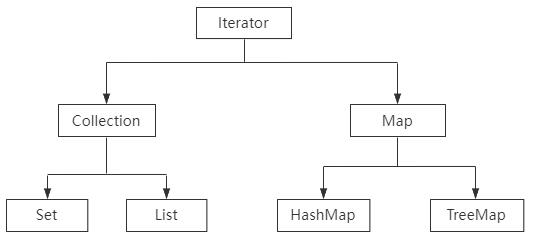

---

而这个内存空间大小是在创建集合对象的时候指定的。
比如List 的默认大小是10、HashMap 的默认大小是16。
在实际开发中，我们需要存储的数据量往往大于存储容器的大小。
针对这种情况，通常的做法就是扩容。
当集合的存储容量达到某个阈值的时候，集合就会进行动态扩容，从而更好的满
足更多数据的存储。
List 和HashMap，本质上都是一个数组结构，所以基本上只需要新建一个更长
的数组然后把原来数组中的数据拷贝到新数组就行了。
以HashMap 为例，它是什么时候触发扩容以及扩容的原理是什么呢？
当HashMap 中元素个数超过临界值时会自动触发扩容，这个临界值有一个计算
公式。
threashold=loadFactor*capacity。
loadFactor 的默认值是0.75，capacity 的默认值是16，也就是元素个数达到12
的时候触发扩容。
扩容后的大小是原来的2 倍。
由于动态扩容机制的存在，所以我们在实际应用中，需要注意在集合初始化的时
候明确指定集合的大小。
避免频繁扩容带来性能上的影响。
假设我们要向HashMap 中存储1024 个元素，如果按照默认值16，随着元素的
不断增加，会造成7 次扩容。而这7 次扩容需要重新创建Hash 表，并且进行数
据迁移，对性能影响非常大。
最后，可能有些面试官会继续问，为什么扩容因子是0.75？
扩容因子表示Hash 表中元素的填充程度，扩容因子的值越大，那么触发扩容的
元素个数更多，虽然空间利用率比较高，但是hash 冲突的概率会增加。
跟着Mic学架构
学架构
ic学架构
跟着Mic学架构
跟着Mic学架构
跟着Mic
跟着Mic

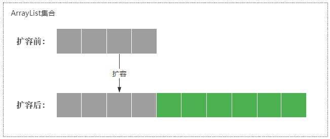

---

扩容因子的值越小，触发扩容的元素个数就越少，也意味着hash 冲突的概率减
少，但是对内存空间的浪费就比较多，而且还会增加扩容的频率。
因此，扩容因子的值的设置，本质上就是在冲突的概率以及空间利用率之间
的平衡。
0.75 这个值的来源，和统计学里面的泊松分布有关。
我们知道，HashMap 里面采用链式寻址法来解决hash 冲突问题，为了避免链
表过长带来时间复杂度的增加所以链表长度大于等于7 的时候，就会转化为红黑
树，提升检索效率。
当扩容因子在0.75 的时候，链表长度达到8 的可能性几乎为0，也就是比较好
的达到了空间成本和时间成本的平衡。
以上就是关于这个问题的完整理解。
在面试的时候，我们可以这么回答。
当HashMap 元素个数达到扩容阈值，默认是12 的时候，会触发扩容。
默认扩容的大小是原来数组长度的2 倍，HashMap 的最大容量是
Integer.MAX_VALUE，也就是2 的31 次方-1。
跟着Mic学架构
学架构
ic学架构
跟着Mic学架构
跟着Mic学架构
跟着Mic
跟着Mic

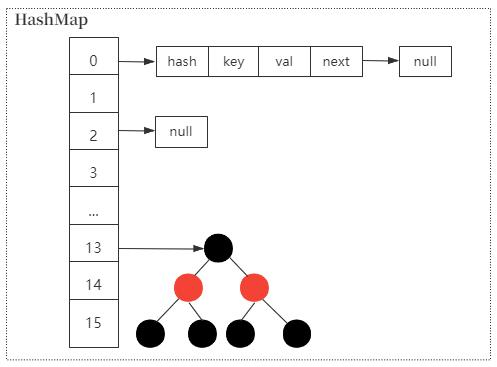

---

讲下线程池的线程回收
Hi，大家好，我是Mic，一个工作了14 年的Java 程序员。
最近很多小伙伴私信我，让我说一些线程池相关的问题。
线程池这个方向考察的点还挺多的，如果只是靠刷面试题
面试官很容易就能识别出来，我随便举几个。
线程池是如何实现线程的回收的
核心线程是否能够回收
当调用线程池的shutdown 方法，会发生什么？
面试一定是连环问，从而确定求职者对这个领域的理解程度。
关于线程池回收相关的问题，高手部分的回答我整理到了一个20W 字的面试文
档里面
大家可以在我的主页加V 领取。
下面看看普通人和高手的回答
高手
好的，面试官，这个问题我需要从3 个方面来回答。
首先，线程池里面分为核心线程和非核心线程。
核心线程是常驻在线程池里面的工作线程，它有两种方式初始化。
向线程池里面添加任务的时候，被动初始化
主动调用prestartAllCoreThreads 方法
当线程池里面的队列满了的情况下，为了增加线程池的任务处理能力。
线程池会增加非核心线程。
核心线程和非核心线程的数量，是在构造线程池的时候设置的，也可以动态进行
更改。
由于非核心线程是为了解决任务过多的时候临时增加的，所以当任务处理完成后，
工作线程处于空闲状态的时候，就需要回收。
跟着Mic学架构
学架构
ic学架构
跟着Mic学架构
跟着Mic学架构
跟着Mic
跟着Mic

---

因为所有工作线程都是从阻塞队列中去获取要执行的任务，所以只要在一定时间
内，阻塞队列没有任何可以处理的任务，那这个线程就可以结束了。
这个功能是通过阻塞队列里面的poll 方法来完成的。这个方法提供了超时时间和
超时时间单位这两个参数当超过指定时间没有获取到任务的时候，poll 方法返回
null，从而终止当前线程完成线程回收。
默认情况下，线程池只会回收非核心线程，如果希望核心线程也要回收，可以
设置allowCoreThreadTimeOut 这个属性为true，一般情况下我们不会去回收核
心线程。
因为线程池本身就是实现线程的复用，而且这些核心线程在没有任务要处理的时
候是处于阻塞状态并没有占用CPU 资源。
以上就是我对这个问题的理解。
面试点评
关于线程池，是每一个Java 程序员必须要深度掌握的内容。
它很重要，在我们的应用系统中，无处不在体现线程。
包括在应用开发中，也难免会用到线程池。
掌握好它能够写出更加健壮性和稳定性的程序。
索引什么时候失效？
“索引什么时候失效？”
面试过程中，突如其来的一个问题，是不是有点懵？
没关系，关注我，面试不迷路。
我是Mic，一个工作了14 年的Java 程序员。
索引失效涉及到的知识点非常多，所以我把这个问题的回答整理到了
一个20W 字的面试文档里面，大家可以在我的主页加V 领取。
下面看看普通人和高手的回答
跟着Mic学架构
学架构
ic学架构
跟着Mic学架构
跟着Mic学架构
跟着Mic
跟着Mic

---

高手
好的，面试官。
InnoDB 引擎里面有两种索引类型，一种是主键索引、一种是普通索引。
InnoDB 用了B+树的结构来存储索引数据。
当使用索引列进行数据查询的时候，最终会到主键索引树中查询对应的数据行进
行返回。
理论上来说，使用索引列查询，就能很好的提升查询效率，但是不规范的使用
会导致索引失效，从而无法发挥索引本身的价值。
导致索引失效的情况有很多：
在索引列上做运算，比如使用函数，Mysql 在生成执行计划的时候，它是根据统
计信息来判断是否要使用索引的。
而在索引列上加函数运算，导致Mysql 无法识别索引列，也就不会再走索引了。
不过从Mysql8 开始，增加了函数索引可以解决这个问题。
在一个由多列构成的组合索引中，需要按照最左匹配法则，也就是从索引的最左
列开始顺序检索，否则不会走索引。
在组合索引中，索引的存储结构是按照索引列的顺序来存储的，因此在sql 中也
需要按照这个顺序才能进行逐一匹配。
否则InnoDB 无法识别索引导致索引失效。
当索引列存在隐式转化的时候，比如索引列是字符串类型，但是在sql 查询中
没有使用引号。
那么Mysql 会自动进行类型转化，从而导致索引失效在索引列使用不等于号、
not 查询的时候，由于索引数据的检索效率非常低，因此Mysql 引擎会判断不走
索引。
使用like 通配符匹配后缀%xxx 的时候，由于这种方式不符合索引的最左匹配原则，
所以也不会走索引。
但是反过来，如果通配符匹配的是前缀xxx%，符合最左匹配，也会走索引。
跟着Mic学架构
学架构
ic学架构
跟着Mic学架构
跟着Mic学架构
跟着Mic
跟着Mic

---

使用or 连接查询的时候，or 语句前后没有同时使用索引，那么索引会失效。只
有or 左右查询字段都是索引列的时候，才会生效。
除了这些场景以外，对于多表连接查询的场景中，连接顺序也会影响索引的使用。
不过最终是否走索引，我们可以使用explain 命令来查看sql 的执行计划，然后
针对性的进行调优即可。
以上就是我对这个问题的理解。
面试点评
Mysql 里面很多问题都可以考察
毕竟它也是工作中使用非常频繁的组件，按道理来说，我们是有必要
去深度学习Mysql 的底层原理，毕竟数据的安全性、数据IO 性能
都会影响到系统的整体吞吐量。
怎么防止缓存击穿的问题？
“怎么防止缓存击穿？”
这是很多一二线大厂面试的时候考察频率较高的问题。
在并发量较高的系统中，缓存可以提升数据查询的性能，还能缓解后端存储系统
的并发压力。
可谓是屡试不爽的利器。
Hi，大家好，我是Mic，一个工作了14 年的Java 程序员。
我把这个问题的回答，整理到了一个20W 字的面试文档里面。大家可以在我的
主页加V 领取。
下面看看普通人和高手的回答。
跟着Mic学架构
学架构
ic学架构
跟着Mic学架构
跟着Mic学架构
跟着Mic
跟着Mic

---

高手
好的，面试官。
在实际应用中，我们会在程序和数据库之间增加一个缓存层。
一方面是为了提升数据检索效率，提升程序性能另一方面是为了缓解数据库的并
发压力。
缓存击穿，表示请求因为某些原因全部打到了数据库，缓存并没有起到流量缓冲
的作用。
我认为有2 种情况会导致缓存击穿。
在Redis 里面保存的热点key，在缓存过期的瞬间，有大量请求进来，导致请求
全部打在数据库上。
跟着Mic学架构
学架构
ic学架构
跟着Mic学架构
跟着Mic学架构
跟着Mic
跟着Mic

---

客户端恶意发起大量不存在的key 的请求，由于访问的key 对应的数据本身就
不存在，所以每次必然都会穿透到数据库，导致缓存成为了摆设。
总之，当Redis 承担了流量缓冲功能的时候，就需要考虑到Redis 失效导致并
发压力过大对后端存储设备造成冲击的问题。
因此，我认为可以通过几种方法来解决。
对于热点数据，我们可以不设置过期时间，或者在访问数据的时候对数据过期时
间进行续期。
对于访问量较高的缓存数据，我们可以设计多级缓存，尽量减少后端存储设备的
压力。
使用分布式锁，当发现缓存失效的时候，不是先从数据库加载，而是先获取分布
式锁，
获得分布式锁的线程从数据库查询数据后写回到缓存里面。
后续没有获得锁的线程就只需要等待和重试即可。
​
这个方案牺牲了一定的性能，但是确保护了数据库避免被压垮。
对于恶意攻击类的场景，可以使用布隆过滤器，应用启动的时候把存在的数据缓
存到布隆过滤器里面。
每一次请求进来的时候先访问布隆过滤器，如果不存在，则说明这个数据一定没
有在数据库里面，就没必要再去访问数据库了。
另外，我们在整个缓存架构设计中，除了尽可能避免缓存穿透的问题，还需要从
全局视角做整体考虑比如业务隔离、多级缓存、部署隔离、安全性考虑等。
以上就是我对这个问题的理解。
面试点评
在我看来，很多面试题，其实更多的是考察求职者的技术底蕴
以及思维边界，有些问题不一定会有答案，或者说
在面试的过程中不一定立刻能提出非常好的解决办法
我们只需要说大概的方向和思路即可。
跟着Mic学架构
学架构
ic学架构
跟着Mic学架构
跟着Mic学架构
跟着Mic
跟着Mic

---

强引用、软引用、弱引用、虚引用有什么
区别？
“强引用、软引用、弱引用、虚引用有什么区别？”
这个问题难倒了很多资深Java 工程师，不是因为这个问题本身有多难。
而是确实它是一个比较小众的知识点。
Hi，大家好，我是Mic，一个工作了14 年的Java 程序员。
今天给大家分享一下这道面试题的标准回答。
文字版本我整理到了一个15W 字的面试文档里面，大家可以在我的主页加V 领
取
下面看看普通人和高手的回答。
普通人
高手
好的，面试官。
不同的引用类型，主要体现的是对象不同的可达性状态和对垃圾收集的影响。
强引用，就是普通对象的引用，只要还有强引用指向一个对象，就能表示对象还
“活着”，垃圾收集器无法回收这一类对象。
只有在没有其他引用关系，或者超过了引用的作用域，再或者显示的把引用赋值
为null 的时候，垃圾回收器才能进行内存回收。
软引用，是一种相对强引用弱化一些的引用，可以让对象豁免一些垃圾收集，只
有当JVM 认为内存不足时，才会去试图回收软引用指向的对象。
软引用通常用来实现内存敏感的缓存，如果还有空闲内存，就可以暂时保留缓存，
当内存不足时清理掉，这样就保证了使用缓存的同时，不会耗尽内存。
弱引用，相对强引用而言，它允许在存在引用关联的情况下被垃圾回收的对象在
垃圾回收器线程扫描它所管辖的内存区域的过程中，一旦发现了只具有弱引用的
对象，不管当前内存空间足够与否，垃圾回收期都会回收该内存虚引用，它不会
跟着Mic学架构
学架构
ic学架构
跟着Mic学架构
跟着Mic学架构
跟着Mic
跟着Mic

---

决定对象的生命周期，它提供了一种确保对象被finalize 以后，去做某些事情的
机制。
当垃圾回收器准备回收一个对象时，如果发现它还有虚引用，就会在回收对象的
内存之前，把这个虚引用加入到与之关联的引用队列中。
程序可以通过判断引用队列中是否已经加入了虚引用，来了解被引用的对象是否
将要进行垃圾回收，然后我们就可以在引用的对象的内存回收之前采取必要的行
动。
以上就是我对这个问题的理解！
面试点评
这是一个好问题，它整体涉及到的知识点，如果要深度挖掘。
还可以往对象的可达性状态分析以及GC 的回收原理进行展开。
不过确实也是一个比较偏门的问题，更多会应用在一些类库或者框架里面。
有兴趣的小伙伴可以跟进一步去深度研究。
什么是IO 的多路复用机制？
“什么是IO 的多路复用机制？”
这是一道年薪50W 的面试题，很遗憾，99%的人都回答不出来。
Hi，大家好，我是Mic，一个工作了14 年的Java 程序员。
今天，给大家分享一道网络IO 的面试题。
这道题目的文字回答已经整理到了15W 字的面试文档里面，
大家可以在我的主页加V 领取
下面看看普通人和高手的回答。
普通人
高手
跟着Mic学架构
学架构
ic学架构
跟着Mic学架构
跟着Mic学架构
跟着Mic
跟着Mic

---

好的，面试官。
IO 多路复用机制，核心思想是让单个线程去监视多个连接，一旦某个连接就绪，
也就是触发了读/写事件。
就通知应用程序，去获取这个就绪的连接进行读写操作。
也就是在应用程序里面可以使用单个线程同时处理多个客户端连接，在对系统资
源消耗较少的情况下提升服务端的链接处理数量。
在IO 多路复用机制的实现原理中，客户端请求到服务端后，此时客户端在传输
数据过程中，为了避免Server 端在read 客户端数据过程中阻塞，服务端会把该
请求注册到Selector 复路器上，服务端此时不需要等待，只需要启动一个线程，
通过selector.select()阻塞轮询复路器上就绪的channel 即可，也就是说，如果
某个客户端连接数据传输完成，那么select()方法会返回就绪的channel，然后
执行相关的处理就可以了。
常见的IO 多路复用机制的实现方式有：select 、poll、epoll。
这些都是Linux 系统提供的IO 复用机制的实现，其中select 和poll 是基于轮询
的方式去获取就绪连接。
而epoll 是基于事件驱动的方式获取就绪连接。从性能的角度来看，基于事件驱
动的方式要优于轮询的方式。
以上就是我对这个问题的理解。
面试点评
IO 多路复用机制，是非常重要的网络通信基础。
在平时的业务开发中，使用比较少，但是在中间件里面作为基础通信模型，
是每个高级工程师必须要掌握的内容。
跟着Mic学架构
学架构
ic学架构
跟着Mic学架构
跟着Mic学架构
跟着Mic
跟着Mic

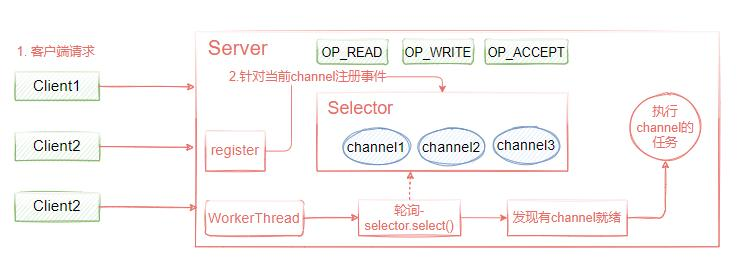

---

Java 有几种文件拷贝方式，哪一种效率
最高？
“Java 有几种文件拷贝方式，哪一种效率最高？”
屏幕前的你知道吗？
这个问题是京东一面的时候，针对4 年经验的同学的一个面试题。
Hi，大家好，我是Mic，一个工作了14 年的Java 程序员。
关于这个问题的回答，我把文字版本整理到了15W 字的面试文档里面。
大家可以在我的主页加V 领取。
下面看看普通人和高手的回答。
普通人
高手
好的，面试官。
第一种，使用java.io 包下的库，使用FileInputStream 读取，再使用
FileOutputStream 写出。
第二种，利用java.nio 包下的库，使用transferTo 或transfFrom 方法实现。
第三种，Java 标准类库本身已经提供了Files.copy 的实现。
对于Copy 的效率，这个其实与操作系统和配置等情况相关，在传统的文件IO
操作里面，我们都是调用操作系统提供的底层标准IO 系统调用函数read()、
write() ，由于内核指令的调用会使得当前用户线程切换到内核态，然后内核线
程负责把相应的文件数据读取到内核的IO 缓冲区，再把数据从内核IO 缓冲区
拷贝到进程的私有地址空间中去，这样便完成了一次IO 操作。
而NIO 里面提供的NIO transferTo 和transfFrom 方法，也就是常说的零拷贝实
现。
它能够利用现代操作系统底层机制，避免不必要拷贝和上下文切换，因此在性能
上表现比较好。
以上就是我对这个问题的理解。
总结
跟着Mic学架构
学架构
ic学架构
跟着Mic学架构
跟着Mic学架构
跟着Mic
跟着Mic

---

关于文件IO 方面的问题和内容还挺多的
这块属于Java 里面的基础知识，但是随着这个技术知识的延展，
会涉及到NIO、AIO、零拷贝、IO 多路复用机制等等。
对于求职者来说，这块内容的重要性也不言而喻。
聊聊你知道的设计模式
“聊聊你知道的设计模式！”
这个问题很简单，但是要让面试官认可你的回答，那还是得花点心思。
Hi，大家好，我是Mic，一个工作了14 年的Java 程序员。
今天给大家分享一下，当遇到这种比较泛类型的问题的时候，如何回答才能让面
试官满意。
我把文字版本整理到了15W 字的面试文档里面，大家可以在我的主页加V 领取
下面看看普通人和高手的回答。
普通人
高手
大致按照模式的应用目标分类，设计模式可以分为创建型模式、结构型模式和行
为型模式。
创建型模式，是对对象创建过程的各种问题和解决方案的总结，包括各种工厂模
式、单例模式、构建器模式、原型模式。
结构型模式，是针对软件设计结构的总结，关注于类、对象继承、组合方式的实
践经验。
常见的结构型模式，包括桥接模式、适配器模式、装饰者模式、代理模式、组合
模式、外观模式、享元模式等。
行为型模式，是从类或对象之间交互、职责划分等角度总结的模式。
比较常见的行为型模式有策略模式、解释器模式、命令模式、观察者模式、迭代
器模式、模板方法模式、访问者模式。
以上就是我对这个问题的理解。
跟着Mic学架构
学架构
ic学架构
跟着Mic学架构
跟着Mic学架构
跟着Mic
跟着Mic

---

面试点评
这个问题，主要考察求职者对设计模式的掌握程度。
在回答过程中，可以选择一些常用的设计模式适当举一些案例以及使用场景说明。
比如单例模式、装饰器模式、工厂模式、代理模式等。
更好的加深面试官对你的认可。
如果一个线程两次调用start()，会出现什
么问题？
“如果一个线程两次调用start()，会出现什么问题？”
如果这个问题出自阿里p6 岗位第一面的提问，你能回答出来吗？
Hi，大家好，我是Mic，一个工作了14 年的Java 程序员。
关于这个问题，涉及到线程的生命周期，我把完整的回答整理到了15W 字的面
试文档里面
大家可以在我的主页加V 领取。
下面来看看普通人和高手的回答。
普通人
高手
好的，面试官。
在Java 里面，一个线程只能调用一次start() 方法，第二次调用会抛出
IllegalThreadStateException。
一个线程本身是具备一个生命周期的。
在Java 里面，线程的生命周期包括6 种状态。
NEW，线程被创建还没有调用start 启动
跟着Mic学架构
学架构
ic学架构
跟着Mic学架构
跟着Mic学架构
跟着Mic
跟着Mic

---

RUNNABLE，在这个状态下的线程有可能是正在运行，也可能是在就绪队列里
面等待操作系统进行调度分配CPU 资源。
BLOCKED，线程处于锁等待状态。
WAITING，表示线程处于条件等待状态，当触发条件后唤醒，比如wait/notify。
TIMED_WAIT，和WAITING 状态相同，只是它多了一个超时条件触发。
TERMINATED，表示线程执行结束。
当我们第一次调用start()方法的时候，线程的状态可能处于终止或者非NEW 状
态下的其他状态。
再调用一次start()，相当于让这个正在运行的线程重新运行，不管从线程的安全
性角度，还是从线程本身的执行逻辑，都是不合理的。
因此为了避免这个问题，在线程运行的时候会先判断当前线程的运行状态。
以上就是我对这个问题的理解。
面试点评
这个问题非常简单。
在面试过程中一般是作为热身题目出现。
大家只需要回答出那个异常信息就行了。
深度理解线程，对我们的日常开发工作以及问题诊断工作，都非常有帮助。
Java 官方提供了哪几种线程池，分别有
什么特点？
“Java 官方提供了哪几种线程池，分别有什么特点？”
这是一道针对工作3 年左右的面试题，屏幕前的小伙伴，你能回答上来吗？
Hi，大家好，我是Mic，一个工作了14 年的Java 程序员
关于这个问题的标准回答，我整理到了一个15W 字的面试文档里面，大家可以
在我的主页加V 领取。
跟着Mic学架构
学架构
ic学架构
跟着Mic学架构
跟着Mic学架构
跟着Mic
跟着Mic

---

下面看看普通人和高手的回答。
普通人
高手
好的。
JDK 中幕刃提供了5 中不同线程池的创建方式，下面我分别说一下每一种线程
池以及它的特点。
newCachedThreadPool，是一种可以缓存的线程池，它可以用来处理大量短期
的突发流量。
它的特点有三个，最大线程数是Integer.MaxValue，线程存活时间是60 秒，阻
塞队列用的是SynchronousQueue，这是一种不存才任何元素的阻塞队列，也就
是每提交一个任务给到线程池，都会分配一个工作线程来处理，由于最大线程数
没有限制。
所以它可以处理大量的任务，另外每个工作线程又可以存活60s，使得这些工作
线程可以缓存起来应对更多任务的处理。
newFixedThreadPool，是一种固定线程数量的线程池。
它的特点是核心线程和最大线程数量都是一个固定的值
如果任务比较多工作线程处理不过来，就会加入到阻塞队列里面等待。
newSingleThreadExecutor，只有一个工作线程的线程池。
并且线程数量无法动态更改，因此可以保证所有的任务都按照FIFO 的方式顺序
执行。
newScheduledThreadPool，具有延迟执行功能的线程池
可以用它来实现定时调度
newWorkStealingPool，Java8 里面新加入的一个线程池
它内部会构建一个ForkJoinPool，利用工作窃取的算法并行处理请求。
这些线程都是通过工具类Executors 来构建的，线程池的最终实现类是
ThreadPoolExecutor。
以上就是我对这个问题的理解。
跟着Mic学架构
学架构
ic学架构
跟着Mic学架构
跟着Mic学架构
跟着Mic
跟着Mic

---

总结
这个问题考察大家对于线程池的基本认识。
平时使用得比较少的同学可以好好学习一下线程池的底层原理
然后再去理解JDK 官方提供的几个线程池的实现。
就可以随时回答出这个问题了。
请你说一下你对Happens-Before 的理
解。
“请你说一下你对Happens-Before 的理解”
屏幕前的你，听到这个问题的时候，知道怎么回答吗？
Hi，大家好，我是Mic，一个工作了14 年的Java 程序员。
并发编程是面试过程中重点考察的方向，能够考察的方向有很多
关于这个问题，我把高手回答整理到了15W 字的面试文档里面
大家可以在我的主页加V 领取
下面看看普通人和高手的回答。
普通人
高手
好的，这个问题我需要从几个方面来回答。
首先，Happens-Before 是一种可见性模型，也就是说，在多线程环境下。
原本因为指令重排序的存在会导致数据的可见性问题，也就是A 线程修改某个
共享变量
对B 线程不可见。
跟着Mic学架构
学架构
ic学架构
跟着Mic学架构
跟着Mic学架构
跟着Mic
跟着Mic

---

因此，JMM 通过Happens-Before 关系向开发人员提供跨越线程的内存可见性
保证。
如果一个操作的执行结果对另外一个操作可见，那么这两个操作之间必然存在
Happens-Before 管理。
其次，Happens-Before 关系只是描述结果的可见性，并不表示指令执行的先后
顺序，也就是说只要不对结果产生影响，仍然允许指令的重排序。
最后，在JMM 中存在很多的Happens-Before 规则。
程序顺序规则，一个线程中的每个操作，happens-before 这个线程中的任意后
续操作，可以简单认为是as-if-serial 也就是不管怎么重排序，单线程的程序的
执行结果不能改变传递性规则，也就是A Happens-Before B，B Happens-Before
C。
就可以推导出A Happens-Before C。
volatile 变量规则，对一个volatile 修饰的变量的写一定happens-before 于任意
后续对这个volatile 变量的读操作监视器锁规则，一个线程对于一个锁的释放锁
操作，一定happens-before 与后续线程对这个锁的加锁操作在这个场景中，如
果线程A 获得了锁并且把x 修改成了12，那么后续的线程获得锁之后得到的x
的值一定是12。
跟着Mic学架构
学架构
ic学架构
跟着Mic学架构
跟着Mic学架构
跟着Mic
跟着Mic

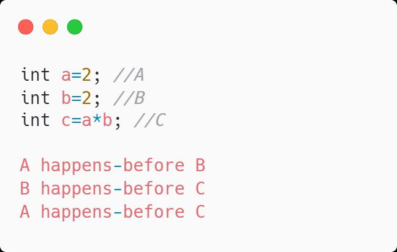

---

线程启动规则，如果线程A 执行操作ThreadB.start(), 那么线程A 的
ThreadB.start()之前的操作happens-before 线程B 中的任意操作。
在这样一个场景中，t1 线程启动之前对于x=10 的赋值操作，t1 线程启动以后读
取x 的值一定是10。
跟着Mic学架构
学架构
ic学架构
跟着Mic学架构
跟着Mic学架构
跟着Mic
跟着Mic

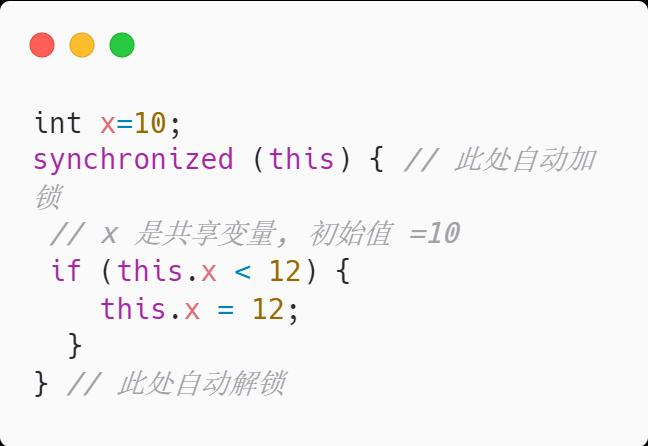

---

join 规则，如果线程A 执行操作ThreadB.join()并成功返回，那么线程B 中的任
意操作happens-before 于线程A 从ThreadB.join()操作成功的返回。
跟着Mic学架构
学架构
ic学架构
跟着Mic学架构
跟着Mic学架构
跟着Mic
跟着Mic

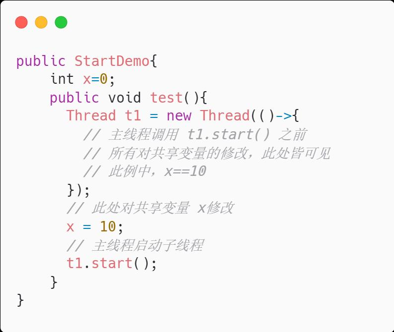

---

以上就是我对Happens-Before 的理解。
总结
Happens-Before 模型，在多线程开发中是必须要理解和掌握的规则。
它能够指引开发者在使用多线程开发的时候避免出现内存可见性问题
因此这道面试题其实也是考察求职者的基础能力
谈谈常用的分布式ID 设计方案
“谈谈常用的分布式ID 设计方案”!
一个工作了7 年的同学，被问到了这样一个问题。
问题并不难，但是在实际面试的时候，如果只是回答1，2，3
跟着Mic学架构
学架构
ic学架构
跟着Mic学架构
跟着Mic学架构
跟着Mic
跟着Mic

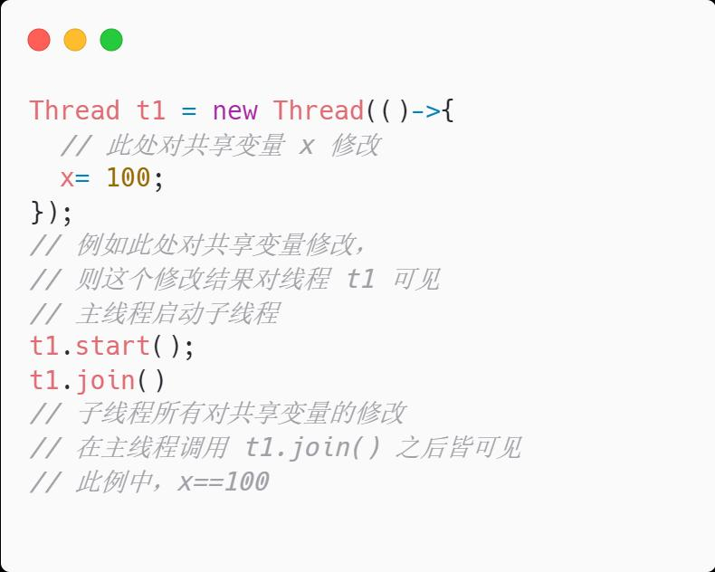

---

很难通过面试，因为作为一个高级程序员，还需要有自己的理解和思考。
Hi，大家好，我是Mic，一个工作了14 年的Java 程序员。
这个问题的高手回答，我整理到了15W 字的面试文档里面
大家可以在我的主页加V 领取。
下面看看普通人和高手的回答
普通人
高手
好的，这个问题我需要从几个方面来回答。
首先，分布式全局ID 的的解决方案有很多，比如：
使用Mysql 的全局表
使用Zookeeper 的有序节点
使用MongoDB 的objectid
redis 的自增id
UUID 等等
......
这些方案只是解决基础的id 唯一性问题，在实际生产环境中，需要构建一个全
局唯一id 还需要考虑更多的因素：
有序性，有序的ID 能够更好的确认数据的位置，以及B+数的存储结构中，范
围查询的效率更高，并且可以提升B+树数据维护的效率。
安全性，避免恶意爬去数据造成数据泄露
可用性，ID 生成系统的可用性要求非常高，一旦出现故障就会造成业务不可用
的问题
性能，全局id 生成系统需要满足整个公司的业务需求，涉及到亿级别的调用，
对性能要求较高
因此，在如果我们选择数据库的全局表，你没获取一次id 就需要更新数据库，
性能上限比较明显，而且基于数据库构建高扩展和高性能的解决方案难度很大。
跟着Mic学架构
学架构
ic学架构
跟着Mic学架构
跟着Mic学架构
跟着Mic
跟着Mic

---

所以，目前市面上主流的解决方案是基于Twitter 早期开源的Snowflake 雪花算
法。
它是由64 位长度组成的全局id 生成算法，通过对64 位进行区间划分来表述不
同含义实现唯一性。
它的好处是：
算法实现简单不存在太多外部依赖可以生成有意义的有序编号基于位运算，性能
也很好，Twitter 测试的峰值是10 万个每秒。
另外，美团公司开源了一个全局唯一id 生成系统leaf，它里面也用到了雪花算
法去构建全局唯一id
并且在高性能和高可用方面，做了很多的优化，为美团内部业务提供了每天上亿
次的调用。
以上就是我对这个问题的理解。
面试点评
很明显这是一个热点问题，并且在实际应用中也比较广泛。
建议各位粉丝在这个领域做一些更深层次的思考和研究，
从而去应对面试官更进一步的追问
记住，全局ID 本身的设计方案和实现细节是很重要的。
线程池是如何实现线程复用的？
“线程池是如何实现线程复用的？”
跟着Mic学架构
学架构
ic学架构
跟着Mic学架构
跟着Mic学架构
跟着Mic
跟着Mic

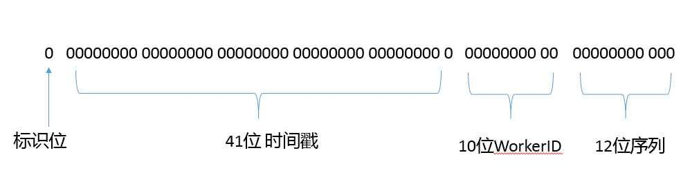

---

一个工作2 年的Java 程序员，在面试互联网公司的时候被这个问题难住了。
Hi，大家好，我是Mic，一个工作了14 年的Java 程序员。
多线程是非常重要的一个技术领域，在实际开发中使用比较多。
而线程池是属于线程的复用技术，因此对于这个问题，我把
高手的回答整理到了一个15W 字的面试文档里面，大家可以在我的主页加V 领
取。
下面看看普通人和高手的回答
普通人
高手
好的，面试官。
线程池里面采用了生产者消费者的模式，来实现线程复用。
生产者消费者模型，其实就是通过一个中间容器来解耦生产者和消费者的任务处
理过程。
生产者不断生产任务保存到容器，消费者不断从容器中消费任务。
在线程池里面，因为需要保证工作线程的重复使用，并且这些线程应该是有任务
的时候执行，没任务的时候等待并释放CPU 资源。
因此它使用了阻塞队列来实现这样一个需求。
提交任务到线程池里面的线程称为生产者线程，它不断往线程池里面传递任务。
这些任务会保存到线程池的阻塞队列里面。
然后线程池里面的工作线程不断从阻塞队列获取任务去执行。
跟着Mic学架构
学架构
ic学架构
跟着Mic学架构
跟着Mic学架构
跟着Mic
跟着Mic

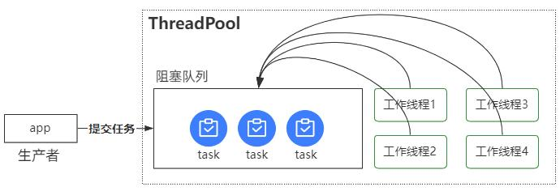

---

基于阻塞队列的特性，使得阻塞队列中如果没有任务的时候，这些工作线程就会
阻塞等待。
直到又有新的任务进来，这些工作线程再次被唤醒。
从而达到线程复用的目的，以上就是我对这个问题的理解！
面试点评
基于阻塞队列实现的生产者消费者模型，是一个非常经典的模型。
它可以对两个不同业务进行解耦，还可以解决生产者和消费者的处理速度不匹配
的问题。
建议大家可以去了解一下生产者消费者模型的底层实现
不管是基于wait/notify，还是基于condition.await/signal
可以说下阻塞队列被异步消费怎么保持
顺序吗？
你知道“阻塞队列被异步消费是如何保证消费顺序的吗？”
Hi，大家好，我是Mic，一个工作14 年的Java 程序员。
今天给大家分享的这道面试题，我把高手回答整理到了15W 字的面试文档里面
大家可以在我的主页加V 领取。
下面看看普通人和高手的回答
普通人
高手
好的，这个问题我需要从三个方面来回答。
首先，阻塞队列本身是符合FIFO 特性的队列，也就是存储进去的元素符合先进
先出的规则。
跟着Mic学架构
学架构
ic学架构
跟着Mic学架构
跟着Mic学架构
跟着Mic
跟着Mic

---

其次，在阻塞队列里面，使用了condition 条件等待来维护了两个等待队列，一
个是队列为空的时候存储被阻塞的消费者另一个是队列满了的时候存储被阻塞
的生产者并且存储在等待队列里面的线程，都符合FIFO 的特性。
最后，对于阻塞队列的消费过程，有两种情况。
第一种，就是阻塞队列里面已经包含了很多任务，这个时候启动多个消费者去消
费的时候，它的有序性保证是通过加锁来实现的，也就是每个消费者线程去阻塞
队列获取任务的时候必须要先获得排他锁。
第二种，如果有多个消费者线程因为阻塞队列中没有任务而阻塞，这个时候这些
线程是按照FIFO 的顺序存储到condition 条件等待队列中的。当阻塞队列中开
始有任务要处理的时候，这些被阻塞的消费者线程会严格按照FIFO 的顺序来唤
醒，从而保证了消费的顺序型。
以上就是我对这个问题的理解。
总结
这道题考察阻塞队列的实现原理
算是一个偏进阶类的面试题，只有对阻塞队列的底层实现原理
以及condition 条件等待的实现机制有一个深度的理解，才能回答好这个问题。
跟着Mic学架构
学架构
ic学架构
跟着Mic学架构
跟着Mic学架构
跟着Mic
跟着Mic

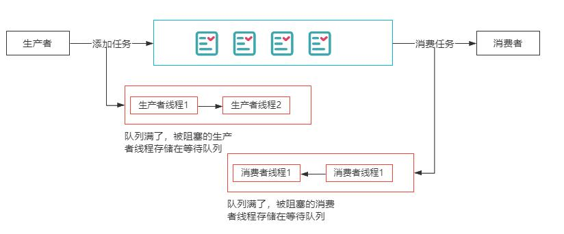

---

当任务数超过线程池的核心线程数时，如
何让它不进入队列，而是直接启用最大线
程数
你们知道，“当任务数超过线程池的核心线程数时，如何让它不进入队列，而是
直接启用最大线程数”吗？
HI，大家好，我是Mic，一个工作了14 年的Java 程序员。
刚刚这个问题是一个工作5 年的粉丝最近去某互联网公司面试遇到的。
关于这个问题，我把高手的回答整理到了一个15W 字的面试文档里面。
大家可以在我的主页加V 领取
下面看看普通人和高手的回答
普通人
高手
好的，面试官。
当我们提交一个任务到线程池的时候，它的工作原理分为四步。
第一步，预热核心线程
第二步，把任务添加到阻塞队列
第三步，如果添加到阻塞队列失败，则创建非核心线程增加处理效率
第四步，如果非核心线程数达到了阈值，就触发拒绝策略
所以，如果希望这个任务不进入队列，那么只需要去影响第二步的执行逻辑就行
了。
Java 中线程池提供的构造方法里面，有一个参数可以修改阻塞队列的类型。
其中，就有一个阻塞队列叫SynchronousQueue，这个队列不能存储任何元素。
它的特性是，每生产一个任务，就必须要指派一个消费者来处理，否则就会阻塞
生产者。
跟着Mic学架构
学架构
ic学架构
跟着Mic学架构
跟着Mic学架构
跟着Mic
跟着Mic

---

基于这个特性，只要把线程池的阻塞队列替换成SynchronousQueue。
就能够避免任务进入到阻塞队列，而是直接启动最大线程数去处理这个任务。
以上就是我对这个问题的理解。
面试点评
这个问题考察的角度其实挺有意思。
它能筛选掉很多靠背面试题去准备面试的同学。
但凡你了解过线程池的工作原理以及阅读过源码
你都能轻易的回答出来。
请描述Redis 的缓存淘汰策略
“请你描述一下Redis 的缓存淘汰策略”
手机屏幕前的你，如果你正好遇到这个问题，想好怎么回答了吗？
Hi，大家好，我是Mic
关于这个问题，我把高手的回答整理到了15W 字的面试文档里面
大家可以在我的主页加V 领取。
下面看看普通人和高手的回答。
普通人
跟着Mic学架构
学架构
ic学架构
跟着Mic学架构
跟着Mic学架构
跟着Mic
跟着Mic

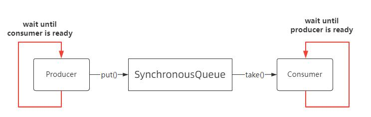

---

高手
好的，面试官。这个问题我需要从三个方面来回答。
第一个方面：
当Redis 使用的内存达到maxmemory 参数配置的阈值的时候，Redis 就会根据
配置的内存淘汰策略。
把访问频率不高的key 从内存中移除。
maxmemory 默认情况是当前服务器的最大内存。
第二个方面：
Redis 默认提供了8 种缓存淘汰策略，这8 种缓存淘汰策略总的来说，我认为可
以归类成五种
第一种，采用LRU 策略，就是把不经常使用的key 淘汰掉。
第二种，采用LFU 策略，它在LRU 算法上做了优化，增加了数据访问次数，从
而确保淘汰的是非热点key。
第三种，随机策略，也就是是随机删除一些key。
第四种，ttl 策略，从设置了过期时间的key 里面，挑选出过期时间最近的key
进行优先淘汰
第五种，当内存不够的时候，直接报错，这是默认的策略。
这些策略可以在redis.conf 文件中手动配置和修改，我们可以根据缓存的类型和
缓存使用的场景来选择合适的淘汰策略。
最后一个方面，我们在使用缓存的时候，建议是增加这些缓存的过期时间。
因为我们知道这些缓存大概的生命周期，从而更好的利用内存。
以上就是我对这个问题的理解。
总结
Redis 是一个内存数据库，而内存又是非常宝贵的资源。
如何用有限的服务器资源来支撑更多业务，就必须要考虑到缓存的淘汰算法
把一些不怎么使用缓存淘汰掉。
因此，我认为这个面试题的考察方向也很好，建议大家深度学习一下。
跟着Mic学架构
学架构
ic学架构
跟着Mic学架构
跟着Mic学架构
跟着Mic
跟着Mic

---

SimpleDateFormat 是线程安全的吗?
为什么？
“SimpleDateFormat 是线程安全的吗? 为什么？”
这是一个针对1~3 年的Java 开发经验的面试题
屏幕前的你能回答出来吗？
Hi，大家好，我是Mic，一个工作了14 年的Java 程序员
这个问题的高手回答我整理到了15W 字的面试文档里面
大家可以在我的主页加V 领取
下面看看普通人和高手的回答
普通人
高手
好的，面试官。
SimpleDateFormat 不是线程安全的，
SimpleDateFormat 类内部有一个Calendar 对象引用,
它用来储存和这个SimpleDateFormat 相关的日期信息。
当我们把SimpleDateFormat 作为多个线程的共享资源来使用的时候。
意味着多个线程会共享SimpleDateFormat 里面的Calendar 引用，
多个线程对于同一个Calendar 的操作，会出现数据脏读现象导致一些不可预料
的错误。
在实际应用中，我认为有4 种方法可以解决这个问题。
第一种，把SimpleDateFormat 定义成局部变量，每个线程调用的时候都创建一
个新的实例。
第二种，使用ThreadLocal 工具，把SimpleDateFormat 变成线程私有的
第三种，加同步锁，在同一时刻只允许一个线程操作SimpleDateFormat
跟着Mic学架构
学架构
ic学架构
跟着Mic学架构
跟着Mic学架构
跟着Mic
跟着Mic

---

第四种，在Java8 里面引入了一些线程安全的日期API，比如LocalDateTimer、
DateTimeFormatter 等。
以上就是我对这个问题的理解。
总结
线程安全是一个非常严重且隐秘的问题。
虽然现在很多框架都在刻意屏幕复杂性，但是多线程的问题总是绕不开的。
因此多线程是大厂最基本的考察内容。
Http 协议和RPC 协议有什么区别？
“Http 协议和RPC 协议有什么区别？”
最近很多人问我这个问题，他们都不知道怎么回答。
今天我们就来了解一下这个问题的高手回答。
另外，我把文字版本的内容整理到了一个15W 字的面试文档里了。
大家可以在我的主页加V 领取。
下面看看普通人和高手的回答
普通人
高手
这个问题我想从三个层面来回答。
从功能特性来说。
http 是一个属于应用层的超文本传输协议，是万维网数据通信的基础，主要服务
在网页端和服务端的数据传输上。
RPC 是一个远程过程调用协议，它的定位是实现不同计算机应用之间的数据通
信，屏蔽通信底层的复杂性，让开发者就像调用本地服务一样完成远程服务的调
用。
因此，这两个协议在定位层面就完全不同。
跟着Mic学架构
学架构
ic学架构
跟着Mic学架构
跟着Mic学架构
跟着Mic
跟着Mic

---

其次，从实现原理来说。
http 协议是一个已经实现并且成熟的应用层协议（如图），它定义了通信的报文
格式Request Body 和Request Header，以及Response Body 和Response
Header。
也就是说，符合这样一个协议特征的通信协议，才是http 协议。
RPC 只是一种协议的规范，它并没有具体实现，只有按照RPC 通信协议规范实
现的通信框架，也就是RPC 框架，才是协议的具体实现，比如Dubbo、gRPC
等。
因此，我们可以在实现RPC 框架的时候，自定义报文通信的协议规范、自定义
序列化方式、自定义网络通信协议的类型等等
因此，从这个层面来说，http 是成熟的应用协议，而RPC 只是定义了不同服务
之间的通信规范。
最后，应用层面来说。
http 协议和实现了RPC 协议的框架都能够实现跨网络节点的服务之间通信。
并且他们底层都是使用TCP 协议作为通信基础。
但是，由于RPC 只是一种标准协议，只要符合RPC 协议的框架都属于RPC 框
架。
因此，RPC 的网络通信层也可以使用HTTP 协议来实现，比如gRPC、OpenFeign
底层都采用了http 协议。
以上就是我对这个问题的理解。
跟着Mic学架构
学架构
ic学架构
跟着Mic学架构
跟着Mic学架构
跟着Mic
跟着Mic

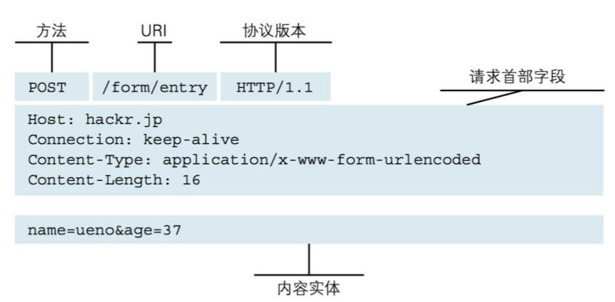

---

面试点评
这个问题考察频率还挺高的。
网上很多人对这两个协议的理解也是一知半解，说了半天没说明白。
其实只要理解这两个协议本身的特性和背景，就能很轻松的回答出来。
好的，本期视频就到这里了。
如果喜欢我的作品，记得点赞、收藏、加关注。
你的支持，是我持续创作的动力。
一个空Object 对象的占多大空间？
“一个空Object 对象的占多大空间？”
一个工作了5 年的Java 程序员直接被搞蒙了。
Hi，大家好，我是Mic，一个工作了14 年的Java 程序员。
我把这个问题的文字版本整理到了15W 字的面试文档里
大家可以在我的主页加V 领取。
下面看看普通人和高手的回答。
普通人
高手
在开启了压缩指针的情况下，Object 默认会占用12 个字节，但是为了避免伪共
享问题，JVM 会按照8 个字节的倍数进行填充，所以会填充4 个字节变成16 个
字节长度。
在关闭压缩指针的情况下，Object 默认会占用16 个字节，16 个字节正好是8
的整数倍，因此不需要填充。
在HotSpot 虚拟机里面，一个对象在堆内存里面的内存布局是使用OOP 结构来
表示的，它主要分为三个部分。
跟着Mic学架构
学架构
ic学架构
跟着Mic学架构
跟着Mic学架构
跟着Mic
跟着Mic

---

对象头，包括Markword、类元指针、数组长度其中Markword 用来存储对象运
行时的相关数据，比如hashCode、gc 分代年龄等。
在64 位操作系统中占8 个字节，32 位操作系统中占4 个字节类元指针指向当前
实例对象所属哪个类，开启指针压缩的情况下占4 个字节，未开启则占8 个字
节数组长度只有对象数组才会存在，占4 个字节实例数据，存储对象中的字段信
息对齐填充，Java 对象的大小需要按照8 个字节或者8 个字节的倍数对齐，避
免伪共享问题。
因此，一个空的对象，在开启压缩指针的情况下，占16 个字节其中Markword
占8 个字节、类元指针占4 个字节，对齐填充占4 个字节。
面试点评
这个问题不仅仅考察JVM 基础
跟着Mic学架构
学架构
ic学架构
跟着Mic学架构
跟着Mic学架构
跟着Mic
跟着Mic

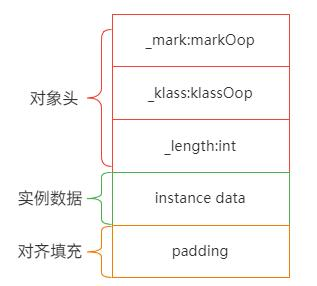

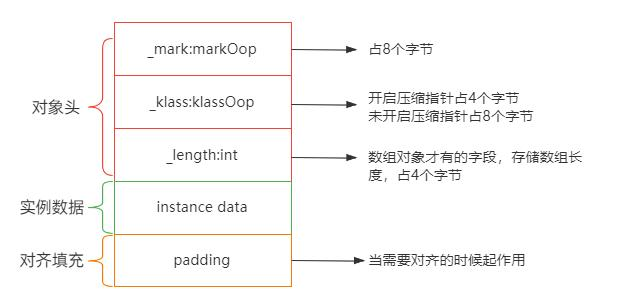

---

还考察求职者对于JVM 对于对象内存布局的理解程度。
对于内存布局这块的理解主要还是帮助我们更好的解决JVM 应用上的实际问题
好的，本期视频就到这里结束了。
喜欢的朋友记得点赞收藏加关注
什么是Java 虚拟机，为什么要使用？
“什么是Java 虚拟机，为什么要使用”。
最近一个1 年Java 开发经验的同学去面试阿里，遇到这个问题向我求助。
Hi，大家好，我是Mic，一个工作14 年的Java 程序员。
那么，这个问题，面试官希望考察什么呢？
问题解析
Java 虚拟机，是Java 应用程序运行的平台。
很多初学者，第一步基本上都是学习怎么写代码，并没有关注Java 代码所运行
的平台。
因此，虽然写了几年代码，但是对Java 本身的理解不够深刻，程序一旦出现问
题，很难排查和解决。
面试官考察这个问题的出发点，我认为有三个
了解求职者对于Java 语言的理解深度，这个方面有助于提升代码编写的质量
了解求职者对于JVM 基础的掌握程度，良好的基础有助于快速解决GC 问题、
内存问题等
考察求职者的潜质，一个对技术有热情的人，有助于更好的陪伴公司成长
所以，对于这个问题来说，我们只需要从JVM 关键特性Write Once、Run
Anywhere 这个角度去切入解释就行了。
下面我们来看看高手应该怎么回答。
跟着Mic学架构
学架构
ic学架构
跟着Mic学架构
跟着Mic学架构
跟着Mic
跟着Mic

---

高手
Java 虚拟机是Java 语言的运行环境。
之所以需要Java 虚拟机，主要是为Java 语言提供Write Once，Run Anywhere
能力。
实际上，一次编写，到处运行这个能力本身是不可能实现的。因为不同的操作系
统和硬件。
最终执行的指令会有较大的差异。
而Java 虚拟机就是解决这个问题的，它能根据不同的操作系统和硬件差异，生
成符合这个平台机器指令。
简单理解，它就相当于一个翻译工具，在window 下，翻译成window 可执行的
指令，在linux 下，翻译成linux 下可执行的指令。
除了这个因素以为，我认为自动回收垃圾这个功能也是原因之一，它让开发者省
去了垃圾回收这个工作。
减少了程序开发的复杂性。
总结
好了，今天的分享就到这里结束了
如果喜欢我的作品，记得点赞、收藏、关注
finally 块一定会执行吗？
“finally 块一定会执行吗？”
这是最近一个工作3 年的小伙伴去面试的时候遇到的问题。
屏幕前的你遇到这个问题会怎么回答呢？
大家好，我是Mic，一个工作了14 年的Java 程序员
对于这个问题，面试官想考察什么呢？
问题解析
跟着Mic学架构
学架构
ic学架构
跟着Mic学架构
跟着Mic学架构
跟着Mic
跟着Mic

---

这个问题，很明显是考察Java 基础。
finally 语句块在实际开发中使用得非常多，它是和try 语句块组合使用通常情况
下，不管有没有触发异常，finally 语句块中的代码是必然会执行的所以我们会把
资源的释放、或者业务日志的打印放在finally 语句块里面。
所以，当大家把这个理念当成是固定的公式以后，就很少会去思考finally 语句块
什么情况下不执行。
这也是难倒很多求职者的原因，所以我认为这个问题主要考察两个方面：
对finally 关键字的理解程度，其实就是考察Java 基础，良好的Java 基础能够
写出更加稳定和健壮性的代码是否具备对技术的探索精神，这样的人在技术的成
长速度上会比一般人更快
下面来看看高手怎么回答这个问题吧！
高手
finally 语句块在两种情况下不会执行：
程序没有进入到try 语句块因为异常导致程序终止，这个问题主要是开发人员在
编写代码的时候，异常捕获的范围不够。
在try 或者cache 语句块中，执行了System.exit(0)语句，导致JVM 直接退出
总结
好了，今天的分享就到这里结束了
如果喜欢我的作品，记得点赞、收藏、关注
并行和并发有什么区别？
“并行和并发有什么区别？”
关于这个问题，很多工作5 年以上的同学都回答不出来。
或者说，自己有一定的理解，但是不知道怎么表达
大家好，我是Mic，一个工作了14 年的Java 程序员。
跟着Mic学架构
学架构
ic学架构
跟着Mic学架构
跟着Mic学架构
跟着Mic
跟着Mic

---

关于这个问题，面试官想考察什么呢？
问题解析
并行和并发最早其实描述的是Java 并发编程里面的概念。
他们强调的是CPU 处理任务的能力。
简单来说，并发，就是同一个时刻，CPU 能够处理的任务数量，并且对于应用
程序来说，不会出现卡顿现象。
并行，就是同一个时刻，允许多个任务同时执行，在多核CPU 架构中，同时执
行的任务数量是由核心数决定的，比如在4 核4 线程的CPU 中，只能同时执行
4 个线程。
这两个概念看起来类似，但其实描述的纬度是不同的，并发描述的是程序处理能
力的视角并行描述的是CPU 处理任务方式的视角，一个是宏观层面，一个是微
观层面。
他们两个又是相辅相成的，CPU 并行执行任务的能力，又能提升程序的并发处
理性能。
所以多核CPU 的性能要比单核CPU 好。
当然，如果是单核CPU，也可以通过时间片切换的方式提升并发能力。
Erlang 之父Joe Armstrong 用了一张图片解释了并行和并发的区别。
并发就是两个队列交替使用一台咖啡机，并行是两个队列同时使用两台咖啡机。
跟着Mic学架构
学架构
ic学架构
跟着Mic学架构
跟着Mic学架构
跟着Mic
跟着Mic

---

所以，在我看来，这个面试题可以很好的考察求职者Java 并发编程的理解程度。
网上有很多的文章都在尝试解释这个概念，但是这些解释反而让这个问题越来越
复杂。
我认为只有对线程的底层原理有深度理解，才能很好的回答这个问题。
高手
并行和并发是Java 并发编程里面的概念。
并行，是指在多核CPU 架构下，同一时刻同时可以执行多个线程的能力。
在单核CPU 架构中，同一时刻只能运行一个线程。
在4 核4 线程的CPU 架构中，同一时刻可以运行4 个线程，那这4 个线程就是
并行执行的。
并发，是指在同一时刻CPU 能够处理的任务数量，也可以理解成CPU 的并发
能力。
在单核CPU 架构中，操作系统通过CPU 时间片机制提升CPU 的并发能力。
在多核CPU 架构中，基于任务的并行执行能力以及CPU 时间片切换的能力来
提升CPU 的并发能力。
跟着Mic学架构
学架构
ic学架构
跟着Mic学架构
跟着Mic学架构
跟着Mic
跟着Mic

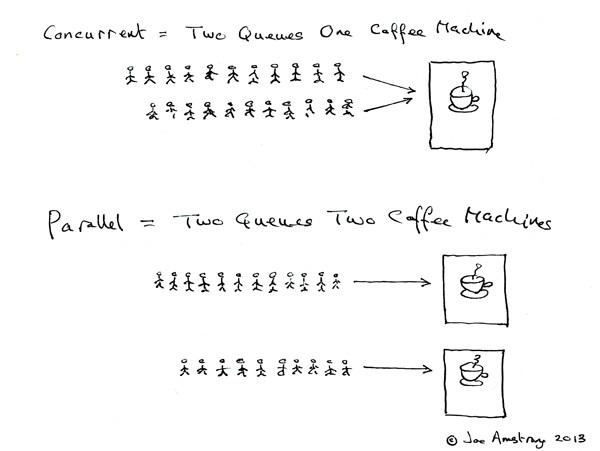

---

所以，总的来说，并发是一个宏观概念，它指的是CPU 能够承载的压力大小，
并行是一个微观概念，它描述CPU 同时执行多个任务的能力。
总结
好了，今天的分享就到这里结束了
如果喜欢我的作品，记得点赞、收藏、关注
JVM 为什么使用元空间替换了永久代？
“JVM 为什么使用元空间替换了永久代？”
这是一个工作6 年的同学去字节第一面遇到的问题，很遗憾，他没有回答出来
大家好，我是Mic，一个工作了14 年的Java 程序员。
关于这个问题，我们怎么回答？面试官到底关注什么呢？
面试解析
我们都知道Java8 以及以后的版本中，JVM 运行时数据区的结构都在慢慢调整
和优化。
但实际上这些变化，对于业务开发的小伙伴来说，没有任何影响。
因此我可以说，99%的人都回答不出这个问题。
但是互联网大厂的面试就是筛选那1%的优秀人才，因此通过这道题，既可以考
察求职者对JVM 原理的理解程度又能够考察求职者基本功的扎实程度还能实现
高级人才的筛选在Java7 里面，JVM 运行时数据区是这样的。
在Hotspot 虚拟机中，方法区的实现是在永久代里面，它里面主要存储运行时常
量池、Klass 类元信息等。
永久代属于JVM 运行时内存中的一块存储空间，我们可以通过-XX:PermSize
来设置永久代的大小。
当内存不够的时候，会触发垃圾回收。
跟着Mic学架构
学架构
ic学架构
跟着Mic学架构
跟着Mic学架构
跟着Mic
跟着Mic

---

在JDK1.8 里面，JVM 运行时数据区是这样的。
在Hotspot 虚拟机中，取消了永久代，由元空间来实现方法区的数据存储。
元空间不属于JVM 内存，而是直接使用本地内存，因此不需要考虑GC 问题。
默认情况下元空间是可以无限制的使用本地内存的，但是我们也可以使用JVM
参数来限制内存使用大小。
为什么要使用元空间来替换永久代，背后必然有它的道理，但是如果求职者能够
回答出来。
跟着Mic学架构
学架构
ic学架构
跟着Mic学架构
跟着Mic学架构
跟着Mic
跟着Mic

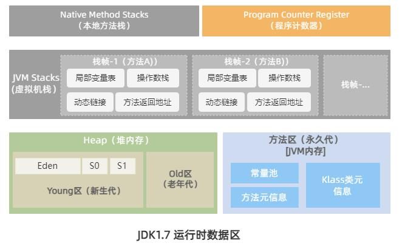

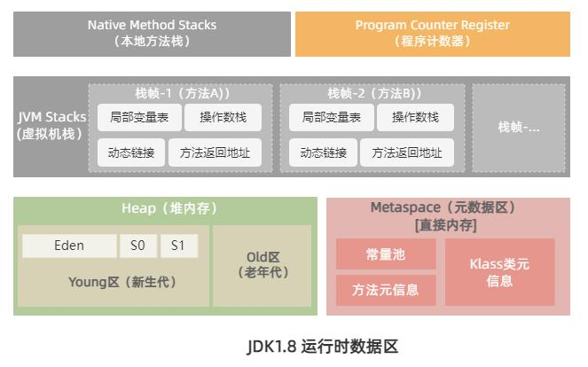

---

必然对于JVM 底层原理是有一定了解的。
我们来看看高手的回答。
高手
我认为有三个方面的原因：
在1.7 版本里面，永久代内存是有上限的，虽然我们可以通过参数来设置，但是
JVM 加载的class 总数、大小是很难确定的。
所以很容易出现OOM 问题。
但是元空间是存储在本地内存里面，内存上限比较大，可以很好的避免这个问题。
永久代的对象是通过FullGC 进行垃圾收集，也就是和老年代同时实现垃圾收集。
替换成元空间以后，简化了Full GC。可以在不进行暂停的情况下并发地释放类
数据，同时也提升了GC 的性能Oracle 要合并Hotspot 和JRockit 的代码，而
JRockit 没有永久代。
以上就是我对这个问题的理解。
总结
好了，今天的分享就到这里结束了
如果喜欢我的作品，记得点赞、收藏、关注！！！
如何解决TCC 中的悬挂问题
“如何解决TCC 中的悬挂问题”！
一个工作了4 年的Java 程序员，去京东面试，被问到这个问题。
大家好，我是Mic，一个工作了14 年的Java 程序员
这个问题面试官想考察什么方面的知识？我们又该怎么回答呢？
问题解析
跟着Mic学架构
学架构
ic学架构
跟着Mic学架构
跟着Mic学架构
跟着Mic
跟着Mic

---

TCC 是分布式事务问题里面的解决方案，一般在应聘互联网公司的时候问的比
较多。
实际上，在TCC 这个事务解决方案里面，除了悬挂问题以外，还有空回滚、幂
等性需要考虑。
但是我们在应用的时候都是采用一些成熟的框架，比如Seata，这些框架本身就
帮我们解决了。
导致大部分人不知道这个问题的意思。
所谓TCC，其实就是（Try-Confirm-Cancel），也就是把一个事务拆分成两个阶
段，类似于传统的XA 事务模型。
Try 这个阶段，是实现业务的检查，预留必要的业务资源。
Confirm，真正执行业务逻辑，只需要使用try 阶段预留的业务资源进行处理就
行。
Cancel，如果事务执行失败，就通过cancel 方法释放try 阶段预留的资源。
在TCC 事务模式下，我们通过一个事务协调器来管理多个事务，每个事务先执
行try 方法。
当所有事务参与者的try 方法执行成功，就执行confirm 方法完成真正逻辑的执
行，一旦任意一个事务参与者出现异常，就通过cancel 接口触发事务回滚，释
放Try 阶段占用的资源。
跟着Mic学架构
学架构
ic学架构
跟着Mic学架构
跟着Mic学架构
跟着Mic
跟着Mic

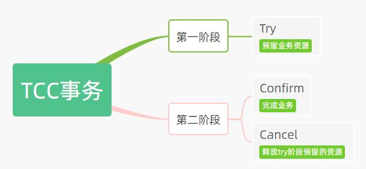

---

很显然，这是一个最终一致性的实现方案，因此当Try 执行成功，就必须确保
Confirm 执行成功。
当Try 执行失败，就必须确保Cancel 实现资源释放。
而面试题中提到悬挂问题，指的是TCC 执行Try 接口出现网络超时时候，使得
TCC 触发Cancel 接口回滚，但可能在回滚之后，这个超时的Try 接口才被真正
执行，也就导致Cancel 接口比Try 接口先执行。
从而造成Try 接口预留的资源一直无法释放，这种情况就是悬挂。
以上就是TCC 悬挂问题的背景，它确实是每个成熟的高级开发必须要了解的细
节。
因为有可能会造成比较严重的生产事故。
了解了背景之后，我们应该如何解决呢？下面来看看高手的回答。
高手
对于悬挂问题，我认为只需要保证Cancel 接口执行完以后，Try 接口不允许在
执行就可以了。
所以，我们可以在Try 接口里面，先判断Cancel 接口有没有执行过，如果已经
执行过，就不再执行。
是否执行过的这个判断，可以在事务控制表里面插入一条事务控制记录来标记这
个事务的回滚状态。
然后在Try 接口中只需要读取这个状态来判断就行了。
总结
跟着Mic学架构
学架构
ic学架构
跟着Mic学架构
跟着Mic学架构
跟着Mic
跟着Mic

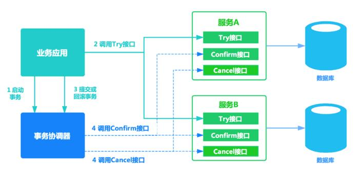

---

好了，今天的分享就到这里结束了
如果喜欢我的作品，记得点赞、收藏、关注
什么是令牌桶限流算法
当面试官问你，“什么是令牌桶限流算法”！
屏幕前的你，知道要怎么回答，才能获得面试官的青睐吗？
大家好，我是Mic，一个工作了14 年的Java 程序员。
关于这个问题，面试官想考察哪些纬度？我们又该怎么回答呢？
问题解析
限流策略，是在高并发流量下保护系统稳定性的一种策略。
所以这个问题，主要是互联网公司会去考察。
当然，在实际业务开发中，限流无处不在，比如线程池、连接池这些通过限制总
的并发数量避免资源过度使用。
Nginx 反向代理服务器上通过limit_conn 模块限制瞬时并发连接数在方法层面通
过Sentinel、RateLimiter 等工具限制接口的并发请求数量等等。
他们的核心目标，都是限制并发请求数量，避免系统被压垮导致不可用的问题。
在限流的整个体系里面，我认为有三个比较重要的纬度资源，也就是针对什么资
源进行限流，比如接口，或者连接等
阈值，流量峰值达到多少后限制后续流量的访问触发限流后的行为，比如熔断、
降级等
跟着Mic学架构
学架构
ic学架构
跟着Mic学架构
跟着Mic学架构
跟着Mic
跟着Mic

---

限流算法是整个限流实现的核心，不同限流算法，能够对流量的精准控制粒度，
以及是否能支持突发流量等情况进行控制常见的限流算法，滑动窗口、令牌桶、
漏桶等。
其中令牌桶是一种能够处理突发流量的限流算法，系统以恒定速率向令牌桶里面
添加令牌，然后每个请求都需要从令牌桶去获取令牌才能访问，如果获取不到，
就会触发限流。
所以，我认为这道题考察两个方面
对限流的整体认知
了解限流算法对于限流本身的重要性
跟着Mic学架构
学架构
ic学架构
跟着Mic学架构
跟着Mic学架构
跟着Mic
跟着Mic

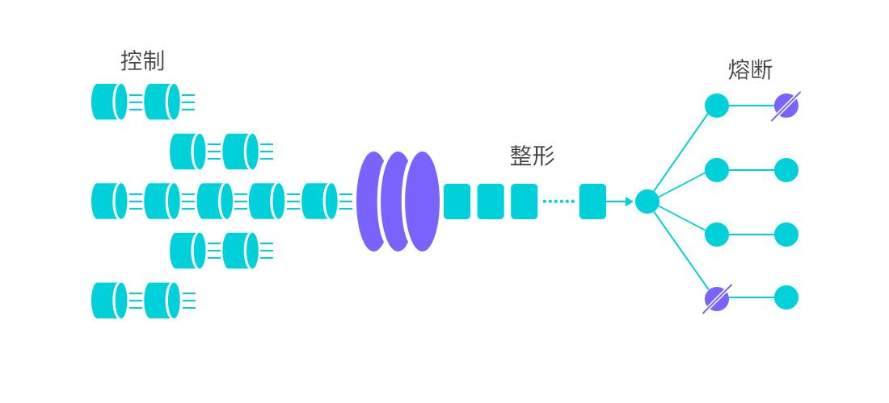

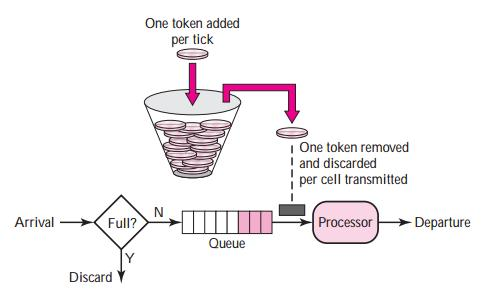

---

下面看看高手应该怎么回答。
高手
令牌桶是一种控制请求访问速率的算法。
它具体工作原理是：系统以一定速率生成令牌并放到令牌桶里面。
然后所有的客户端请求进入到系统后，先从令牌桶里面获取令牌，成功获取到令
牌表示可以正常访问。
如果取不到令牌，说明请求流量大于令牌生成速率，也就是并发数超过系统承载
的阈值，就会触发限流的动作。
在流量较低的情况下，令牌桶可以缓存一定数量的令牌，所以令牌桶可以处理瞬
时突发流量。
总结
好了，今天的分享就到这里结束了
如果喜欢我的作品，记得点赞、收藏、关注
Mysql 如何解决幻读问题
“Mysql 如何解决幻读问题”
一个工作了4 年小伙伴，去一个美团面试，遇到了这样一个问题。
大家好，我是Mic，一个工作了14 年的Java 程序员
关于这个问题，面试官想考察什么？我们应该如何回答呢？
问题解析
这个问题至少考察的是3 年以上开发经验的同学。
Mysql 底层去解决并发事务问题，至少是要有一定的技术积累才能真正理解。
跟着Mic学架构
学架构
ic学架构
跟着Mic学架构
跟着Mic学架构
跟着Mic
跟着Mic

---

而如果作为一个刚工作没多久的程序员，必须要知道数据库的事务隔离级别的问
题。
因为不同的隔离级别对于数据的安全性影响是不同的。
也就是存在脏读、幻读、不可重复读等问题。
所谓幻读，就是一个事务前后两次读取到的数据条数不一致。
在第一个事务里面执行一个范围查询，这个时候满足查询的数据只有一条。
接着第二个事务里面插入一条数据并且提交了，然后在第一个事务里面再次查询
的时候发现有两条数据满足条件。
在RR 事务隔离级别下，引入了MVCC 和LBCC 这两种方式来解决幻读问题。
MVCC 类似于一种乐观锁的设计，简单来说就是针对每个事务生成一个事务版
本，然后针对这个版本定义了访问规则
一个事务只能看到第一次查询之前已经提交的事务以及当前事务的修改。
一个事务不能看到当前事务第一次查询之后创建的事务，以及未提交的事务修改。
但是，如果在一个事务里面存在当前读的情况下，MVCC 还是会存在幻读问题，
因为当前读不是读快照，而是直接读内存。
所以针对这种情况，可以使用LBCC 也就是基于锁的机制来解决，也就是常说
的行锁、表锁、间隙锁等
基于对上述知识的理解，如果没有对Mysql 不同事务隔离级别的底层实现原理
有一个清晰认识的同学
在回答这个问题的时候，要么就是很生硬，要么就是无法扩展，就会显得有点像
是在背答案。
下面看看高手是怎么回答这个问题的吧。
跟着Mic学架构
学架构
ic学架构
跟着Mic学架构
跟着Mic学架构
跟着Mic
跟着Mic

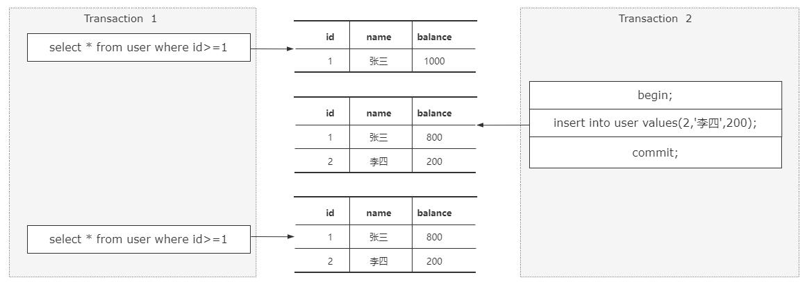

---

高手
在RR(也就是可重复读)的事务隔离级别下，InnoDB 采用了MVCC 机制来解决
幻读问题。
MVCC 就是一种乐观锁的机制，它通过对不同事务生成不同的快照版本，通过
UNDO 版本链进行管理并且在MVCC 里面，规定了高版本能够看到低版本的事
务变更，低版本看不到高版本的事务变更从而实现了不同事务之间的数据隔离，
解决了幻读的问题。
但是在当前读的情况下，是直接读取内存的数据，跳过了快照度，所以还是会出
现幻读问题。
我认为可以通过两个方式来解决。
第一种是尽量避免当前读的情况
第二种是引入LBCC 的方式
以上就是我对这个问题的理解。
总结
好了，今天的分享就到这里结束了
如果喜欢我的作品，记得点赞、收藏、关注
我是Mic，我们下期再见！
什么是链路追踪
关于面试题，“什么是链路追踪”？
我们应该怎么回答呢？
大家好，我是Mic，一个工作了14 年的Java 程序员
这个问题，面试官想考察什么呢？
问题解析
跟着Mic学架构
学架构
ic学架构
跟着Mic学架构
跟着Mic学架构
跟着Mic
跟着Mic

---

链路追踪是分布式架构下的一种监控方式。
对于一些规模较大的分布式系统，一个用户的请求，可能需要涉及到多个子系统
的流转。
而且随着业务的不断增长，服务之间的调用关系也会越来越复杂。
在这样一个背景下，我们一方面需要去了解整个请求链路的调用关系，去定位到
性能问题。
另一方面还需要从整体到局部展示各项系统指标，快速实现故障定位和回复。
所以产生了链路追踪的需求。
最早的链路监控系统是Google 的Dapper，在2010 年的时候Google 发布了一
篇论文介绍Dapper 的整体设计。
目前市面上所有的链路监控系统都是在它的理论模型下衍生出来的。
包括阿里的鹰眼、大众点评的cat、Twitter 的Zipkin 等等
有了全链路监控工具，解决以下几个方面的问题：
请求链路追踪，故障快速定位：可以通过调用链结合业务日志快速定位错误信息。
可视化：各个阶段耗时，进行性能分析。
依赖优化：各个调用环节的可用性、梳理服务依赖关系以及优化。
跟着Mic学架构
学架构
ic学架构
跟着Mic学架构
跟着Mic学架构
跟着Mic
跟着Mic

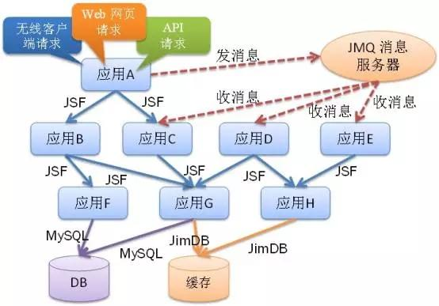

---

数据分析，优化链路：可以得到用户的行为路径，汇总分析应用在很多业务场景。
考察目标
考察这个问题的公司，一般都是有一定规模的中大型互联网企业。
因为一些小型企业本身的技术架构并不复杂，因此没必要去做链路追踪这方面的
设计，有点浪费资源。
而且这个问题考察的点一般不会太深入，除非是面对比较资深的求职者，可能还
会继续了解链路追踪的实现原理。
建议求职者根据自身情况简单明了把这个问题表述清楚即可。
下面我们来看看在面试过程中，高手应该怎么回答
高手
链路追踪是一种针对分布式架构下实现请求链路可视化监控的一种技术。
它的核心目的就是去了解分布式系统中的请求调用行为，从而从整体到局部详细
展示各项系统指标。
实现故障的快速定位，缩短故障排除的时间。
常用的链路追踪工具有Zipkin、Skywalking、Cat、Pinpoint。
不过，链路追踪只是分布式链路监控工具里面的核心之一，除此之外，还包括可
视化、服务依赖关系的梳理、数据分析等能力。
总结
好的，屏幕前的你，学废了吗？
如果你喜欢我的作品，记得点赞收藏加关注
谈谈你对Redis 的理解
“谈谈你对Redis 的理解”!
面试的时候遇到这类比较宽泛的问题，是不是很抓狂？
跟着Mic学架构
学架构
ic学架构
跟着Mic学架构
跟着Mic学架构
跟着Mic
跟着Mic

---

是不是不知道从何开始说起？
没关系，今天我用3 分钟教你怎么回答。
大家好，我是Mic，一个工作了14 年的Java 程序员。
这个问题面试官考察的目的是什么？希望得到什么样的回答？
考察目标
对于某某技术的理解这一类问题，它是一种比较宽泛的问题
在面试过程中，考察这类问题有两个很重要的目的：
在面试的过程中，面试官希望求职者能多说一些东西，从而更好的对你的整体情
况和能力有一个清晰的判断，因此这类问题，可以找到一些了解你的突破口。
这种问题其实没有标准答案，更多的是基于你对它的理解的一个总结
这反而能够更好的考察你的技术积累和逻辑表达能力。
所以，求职者在回答的过程中，需要尽可能逻辑清晰，简单明了的表述出来。
否则很难得到认可。
问题解析
关于Redis 是什么，想必大部分人都能脱口而出。
它是一个分布式缓存中间件？可这样回答有问题吗？当然有
准确来说，Redis 是一个基于内存实现的Key-Value 数据结构的Nosql 数据库。
注意，这里有三个关键点。
内存存储
key-value 结构
Nosql
所谓内存存储，是指所有数据是存储在内存里面，数据的IO 性能比较高。
当然，Redis 也提供了持久化策略来避免内存数据丢失的问题
key-value 结构表示数据的存储方式，除了redis 以外，还有像LevelDB、Scalaris
等。
跟着Mic学架构
学架构
ic学架构
跟着Mic学架构
跟着Mic学架构
跟着Mic
跟着Mic

---

而Nosql，它指的是一种非关系型数据库，相比于传统的关系型数据库而言。
更多的考虑到扩展性、性能、大数据量的存储等，弥补了关系型数据库的短板
像列式存储ClickHouse、Cassandra；文档存储MongoDB 图形存储Neo4J 等
都是属于Nosql 范畴。
高手
Redis 是一个基于Key-Value 存储结构的Nosql 开源内存数据库。
它提供了5 种常用的数据类型，String、Map、Set、ZSet、List。
针对不同的结构，可以解决不同场景的问题。
因此它可以覆盖应用开发中大部分的业务场景，比如top10 问题、好友关注列表、
热点话题等。
其次，由于Redis 是基于内存存储，并且在数据结构上做了大量的优化所以IO
性能比较好，在实际开发中，会把它作为应用与数据库之间的一个分布式缓存组
件。
并且它又是一个非关系型数据的存储，不存在表之间的关联查询问题，所以它可
以很好的提升应用程序的数据IO 效率。
最后，作为企业级开发来说，它又提供了主从复制+哨兵、以及集群方式实现高
可用在Redis 集群里面，通过hash 槽的方式实现了数据分片，进一步提升了性
能。
总结
好的，屏幕前的你，学废了吗？
如果你喜欢我的作品，记得点赞收藏加关注
谈谈你对Nosql 的理解
“谈谈你对Nosql 的理解”
如果你遇到这个问题的时候，找不到回答的思路
脑子里面一片混乱，然后回答的时候吞吞吐吐。
建议你看完。
跟着Mic学架构
学架构
ic学架构
跟着Mic学架构
跟着Mic学架构
跟着Mic
跟着Mic

---

大家好，我是Mic，一个工作了14 年的Java 程序员
关于这个问题，面试官想考察什么呢？
考察目标
很显然，这是一道没有标准答案的面试题。
所以面试官问这个问题，无非就是考察你的技术积累和总结能力。
因为只有对一个技术的理解足够深，才能够很好的表达出来。
就像我们总结自己逝去的青春，虽然没有华丽的辞藻，但是那些喜怒哀乐，我们
总是能够表达得那么深刻。
问题解析
Nosql 在现在并不是一个新词。
最早出现在1998 年，那个时候对于Nosql 的描述是一个轻量、开源不提供SQL
功能的关系数据库。
到了2009 年，重新对Nosql 做了定义，这时的Nosql 主要指非关系型、分布式、
不提供ACID 的数据库设计模式。
注意，它不是一个技术，而是一种设计理念。
随着MongoDB、Redis 这一类的技术被逐步广泛，大家对于Nosql 的理解才越
来越透彻。
本质上来说，Nosql 其实是为了弥补关系数据库在某些特定场景下性能较差的短
板。
在高并发流量下网站性能的提升扮演了非常重要的角色。
针对不同的业务数据类型，Nosql 也有不同的实现方式。
比如针对K-V 存储的Redis，针对文档存储的MongoDB、针对列式存储的
ClickHouse、针对图形存储的Neo4j，以及以时间为纬度的时序数据存储
InfluxDB 等。
因此，Nosql 既可以理解成Non-SQL，也可以理解成Not only SQL。
高手
NoSQL 可以理解成Not Only SQL 它其实是相对于传统的关系型数据库而言的
一种非关系型数据存储的统称。
跟着Mic学架构
学架构
ic学架构
跟着Mic学架构
跟着Mic学架构
跟着Mic
跟着Mic

---

在分布式高并发的架构下，传统的关系数据库存在短板，比如性能、扩展性、大
数据量的存储。
同时随着网站流量的增长，这些短板严重影响了网站性能造成业务的影响。
而NoSQL 强调的是非关系型、分布式、可扩展性、性能等特征的设计模式。
从语义上来看，它可以不需要通过标准化的SQL 语句来获取数据。
意味着不需要固定的二维表格模式以及元数据的存储，可以有效的避免SQL 以
及表关联查询的操作。
从而更好的实现水平扩展的特性。
同时，针对不同类型的数据，可以灵活的使用更加高效的存储形态，是的性能跟
进一步得到提升。
以上就是我的理解。
总结
好的，屏幕前的你，学废了吗？
如果你喜欢我的作品，记得点赞收藏加关注
我是Mic，咱们下期再见。
为什么加索引能提升查询效率
“为什么加索引能提升查询效率”!
我们都认为“加索引”提升查询效率是理所应当的
竟然还有理由？该怎么回答呢？
大家好，我是Mic，一个工作了14 年的Java 程序员
下面分析一下这个问题的考察点
考察目标
这是一道原理性的问题，
考察求职者对于Mysql 中索引的实现原理的理解程度。
一般情况下，考察3 年经验以上人会多一点。
跟着Mic学架构
学架构
ic学架构
跟着Mic学架构
跟着Mic学架构
跟着Mic
跟着Mic

---

毕竟Mysql 是应用开发的基础存储组件。
因此，对于这个问题的回答，建议是把索引的实现以及它的工作原理说清楚，这
样会更容易得到面试官的认可。
问题解析
想必大家都知道，Mysql 的采用了B+树作为索引的存储结构来提升数据检索的
效率。
其实如果大家要真正去理解并且搞懂索引，我建议大家从三个纬度来看。
第一个，为什么需要索引
第二个，索引是如何提升效率的
第三个，为什么采用B+树
第一个问题，为什么需要索引？
很简单，如果一本中华字典，没有前面的字典目录，你需要花多久才能找到某个
汉字？
同样的道理，如果没有索引，当我们查询数据的时候，需要从磁盘里面随机查找，
机械磁盘随机读取数据需要频繁寻找磁道以及从磁盘读取数据，这个过程非常耗
时。
第二个问题，索引是如何提升效率的？
跟着Mic学架构
学架构
ic学架构
跟着Mic学架构
跟着Mic学架构
跟着Mic
跟着Mic

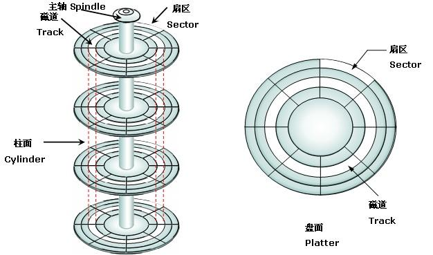

---

有了索引以后，相当于把索引列以及所属的磁盘块地址缓存到内存里面，在数据
查询的时候，直接找到目标数据列所属的磁盘地址，去读取对应磁盘块的数据就
行了，相当于减少了磁盘IO 的次数。
第三个问题，为什么要采用B+树原因有很多，如果单纯在在性能角度来考虑，
磁盘IO 次数越少越好。
那用什么样的数据结构来存储索引列能够达到这个目的呢？
很显然，多路平衡查找树就是一个很好的选择，也就是B 树或者B+树。
至于为什么采用B+树，我在前面的视频里面有专门说过，大家可以去找找看。
接下来看看高手该如何回答。
高手
准确来说，只有命中了索引列的查询，才能提升效率。
并且，即便是命中了索引，查询效率也不一定高，比如在性别字段上加索引。
因为数据的散列度不高，导致可能会遍历整颗B+树。
我认为，加索引能够提升查询效率的根本原因是：
InnoDB 采用了B+树这种多路平衡查找树来存储索引，使得在千万级数量的情况
下，树的高度可以控制在3 层以内。
而层高代表磁盘IO 的次数，因此基于索引查询减少了磁盘IO 次数。
以上就是我的理解
总结
好的，屏幕前的你，学废了吗？
如果你喜欢我的作品，记得点赞收藏加关注
跟着Mic学架构
学架构
ic学架构
跟着Mic学架构
跟着Mic学架构
跟着Mic
跟着Mic